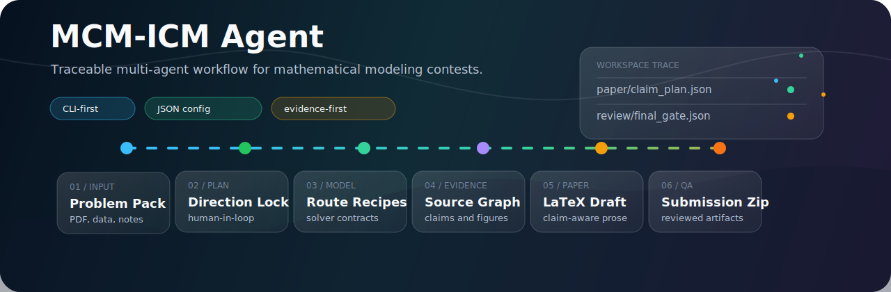

<p align="center">
  <a href="README.md"></a>
  <a href="README.zh-CN.md"></a>
</p>

<p align="center">
  
</p>

<div align="center">

# MCM-ICM Agent

**A traceable multi-agent research and paper-generation system for MCM / ICM mathematical modeling contests.**

Upload a contest problem package, configure model and data providers in one local JSON file, enrich the workflow with your own RAG knowledge base, and generate a reviewed LaTeX/PDF submission package with evidence, figures, citations, QA reports, and repair logs.

[Quick Start](#quick-start) · [How It Works](#how-it-works) · [Configuration](#configuration) · [RAG Knowledge Base](#rag-knowledge-base) · [GUI API](#local-gui-api) · [Workflow Guide](docs/WORKFLOW.md)


</div>

---

## What This Project Does

MCM-ICM Agent is built around the real flow of a mathematical modeling contest:

1. Configure LLM, search, document parsing, academic writing, and official-data providers.
2. Add your own excellent papers, contest rules, and method notes to an ignored local RAG folder.
3. Upload the current problem statement, attachments, templates, and optional user ideas.
4. Let the agent parse the problem, scout data feasibility, and propose a modeling direction.
5. Review or approve checkpoints while the workflow plans models, gathers sources, solves, validates, writes, and repairs.
6. Inspect the generated workspace: evidence, source registry, figures, claim plan, LaTeX files, review reports, and final submission package.
7. Resume from failed gates or targeted stages when data, modeling, writing, or typesetting needs revision.

The current project is a CLI-first reference implementation with a local FastAPI GUI backend foundation. It is not a hosted SaaS product and it does not yet include a polished production frontend. The important part that already exists is the traceable agent workflow: every meaningful decision becomes a workspace artifact that can be inspected, tested, resumed, and reviewed.

---

## Feature Overview

| Area | What is available now |
|---|---|
| Workflow runtime | Graph-aware stage executor with normal paths, repair routes, repeated-gate stopping, checkpoints, and resume support. |
| Workspace artifacts | Inputs, parsed documents, reports, data lineage, evidence, figures, paper files, review outputs, and final submission manifests. |
| Unified config | One ignored local JSON file, `mcm_agent_config.local.json`, for LLM selection, API keys, provider base URLs, RAG, and runtime limits. |
| Provider smoke tests | CLI and GUI API checks for LLM, Tavily, Brave, Exa, Firecrawl, MinerU, UShallPass, and official-data providers. |
| RAG knowledge base | Empty user-filled `knowledge_base/` folder; `.md`, `.txt`, and MinerU-parsed `.pdf` ingestion with provenance. |
| Official data APIs | World Bank, OECD, UNData, FRED, US Census, NOAA, NASA POWER, Open-Meteo, and OSM/Overpass provider pattern and smoke coverage. |
| Modeling routes | Recipe-backed selection for evaluation, optimization, forecasting, simulation, classification, clustering, queueing, network, and multi-objective tasks. |
| Solver modules | Deterministic contest-safe baseline solvers with route summaries, metrics, binding status, and evidence registration. |
| Claim-aware writing | `paper/claim_plan.json` drives abstract, introduction, assumptions, model, results, sensitivity, limitations, and conclusion sections. |
| Citations | Registered sources are mapped to BibTeX keys, citation candidates, references, and paper evidence binding reports. |
| Figures | Data plots plus artifact-derived concept diagrams with Mermaid source and deterministic SVG outputs. |
| LaTeX QA | Typesetting QA, conservative one-pass source repair, recompilation, and repair reports for safe table, graphic, and equation patterns. |
| Packaging | Final submission zip, AI use report, checklist, machine-readable manifest, and blocked-submission report when PDF/package prerequisites fail. |
| Local GUI API | FastAPI server for config editing, provider tests, workspace creation, uploads, status, artifact listing, artifact reading, and downloads. |

---

## Quick Start

Install the package in editable mode:

```bash
git clone https://github.com/jsyzlbw/MCM-ICM-Agent.git
cd MCM-ICM-Agent
python -m pip install -e ".[dev]"
cp mcm_agent_config.example.json mcm_agent_config.local.json
mcm-agent version
```

Run the deterministic bundled demo:

```bash
mcm-agent run-demo /tmp/mcm_agent_demo --auto-approve
mcm-agent inspect /tmp/mcm_agent_demo
mcm-agent status /tmp/mcm_agent_demo
```

The same demo can be launched through the helper script:

```bash
python scripts/run_demo_task.py --workspace .demo_workspace --clean
```

Run a real task package:

```bash
mcm-agent run /tmp/mcm_agent_task \
  --config-file mcm_agent_config.local.json \
  --problem-file /path/to/problem.pdf \
  --attachment /path/to/data.csv \
  --attachment /path/to/extra.xlsx \
  --user-idea-file /path/to/user_idea.md \
  --auto-approve
```

Use repeated `--attachment` flags for multiple files. Omit `--auto-approve` when you want generated checkpoints to remain pending for human review.

Resume from a stage or failed repair point:

```bash
mcm-agent resume /tmp/mcm_agent_task \
  --config-file mcm_agent_config.local.json \
  --problem-file /path/to/problem.pdf \
  --attachment /path/to/data.csv \
  --from-stage validation_gate \
  --until-stage final_gatekeeper \
  --auto-approve
```

Package a reviewed workspace:

```bash
mcm-agent package /tmp/mcm_agent_task
```

For the full operational reference, see [docs/WORKFLOW.md](docs/WORKFLOW.md).

---

## Configuration

Runtime configuration is centered on one local JSON file:

```bash
cp mcm_agent_config.example.json mcm_agent_config.local.json
```

Fill `mcm_agent_config.local.json` with the providers you want to use. This file is ignored by git, so real API keys stay local. The repository only commits `mcm_agent_config.example.json`.

Top-level config sections:

| Section | Purpose |
|---|---|
| `llm` | OpenAI-compatible API key, base URL, model name, and timeout. |
| `search` | Tavily, Firecrawl, Brave Search, and Exa API keys. |
| `official_data` | FRED, US Census, NOAA keys plus base URLs for public data providers. |
| `mineru` | Fake, local CLI, or REST document parsing mode. |
| `humanizer` | UShallPass-compatible humanization provider settings. |
| `rag` | Local knowledge-base folder and ingest extensions. |
| `runtime` | Default language, retries, HTTP timeout, and code timeout. |

Check the active provider selection:

```bash
mcm-agent provider-status --config-file mcm_agent_config.local.json
```

Run live connectivity checks without printing secrets:

```bash
mcm-agent provider-smoke \
  --config-file mcm_agent_config.local.json \
  --workspace .smoke
```

To include a MinerU document parse smoke test:

```bash
mcm-agent provider-smoke \
  --config-file mcm_agent_config.local.json \
  --workspace .smoke \
  --mineru-file /path/to/sample.pdf
```

`.env` loading remains available through `--env-file` for older setups. When both `--env-file` and `--config-file` are supplied, JSON config values win.

---

## RAG Knowledge Base

The committed repository includes an intentionally empty folder:

```text
knowledge_base/
└── .gitkeep
```

Everything else under `knowledge_base/` is ignored by git. Fill it locally with structured materials such as:

```text
knowledge_base/
├── contest_rules/
│   └── mcm_rules.pdf
├── methods/
│   ├── topsis_notes.md
│   └── network_flow_examples.txt
└── papers/
    └── 2024_problem_c/
        ├── problem.pdf
        ├── data/
        └── excellent_paper.pdf
```

During `methodology_rag`, `.md` and `.txt` files are chunked directly. `.pdf` files are parsed through the configured MinerU provider when available. Retrieved chunks are written to `rag/methodology_hits.json` with `source_type`, `relative_path`, `chunk_id`, `page_hint`, and `usage`.

Local RAG materials guide modeling choices, paper structure, assumptions, limitation writing, and review checklists. They are not automatically treated as verified external factual data; factual sources still need to enter the source registry and evidence flow.

---

## How It Works

The normal pass path is:

```text
intake
mineru_extraction
extraction_quality_gate
problem_understanding
data_feasibility_scout
user_discussion
methodology_rag
modeling_council
model_judge
modeling_quality_gate
search_data
source_verifier
data_eda
solver_coder
validation_gate
figure_planning
visualization
figure_quality_gate
claim_planning
paper_writer
paper_evidence_binding
typesetting
pre_submission_review
final_gatekeeper
submission_packager
```

The runtime is evidence-first:

| Artifact | Why it matters |
|---|---|
| `data/source_registry.json` | External sources registered with stable IDs and metadata. |
| `data/retrieval_log.jsonl` | Search and extraction actions. |
| `data/data_lineage.json` | External data facts and transformations. |
| `results/evidence_registry.json` | Model outputs and numerical evidence. |
| `figures/figure_registry.json` | Figure metadata, source scripts, and paper targets. |
| `paper/claim_plan.json` | Planned paper claims, priorities, support IDs, and unresolved reasons. |
| `review/paper_evidence_bindings.json` | Section-level and claim-level support checks. |
| `review/typesetting_quality.json` | LaTeX and layout QA findings. |
| `review/final_gate.json` | Final blocking findings and repair routes. |

If a gate fails, `mcm-agent inspect <workspace>` reports the failed gate, blocking findings, and repair stage. `mcm-agent resume` can then restart from the repair stage after you add data, update config, or revise inputs.

---

## Local GUI API

Start the local GUI API backend:

```bash
mcm-agent gui --host 127.0.0.1 --port 8787
```

Useful endpoints:

| Endpoint | Purpose |
|---|---|
| `GET /api/health` | Health check. |
| `GET /api/config` | Read masked runtime config. |
| `POST /api/config` | Save local runtime config. |
| `POST /api/config/test-provider` | Test one provider through the smoke-test layer. |
| `POST /api/workspaces` | Create a workspace under `.mcm_agent_workspaces`. |
| `GET /api/workspaces` | List local workspaces. |
| `POST /api/workspaces/{workspace_id}/files` | Upload problem, attachment, template, or chat files. |
| `GET /api/workspaces/{workspace_id}/status` | Read task state, failed gate, and recent stages. |
| `GET /api/workspaces/{workspace_id}/artifacts` | List generated artifacts. |
| `GET /api/workspaces/{workspace_id}/artifacts/content` | Read a text artifact. |
| `GET /api/workspaces/{workspace_id}/artifacts/download` | Download an artifact file. |

This API is the foundation for a future user-facing GUI. The current repository does not yet ship a production frontend.

---

## Project Layout

```text
MCM-ICM-Agent/
├── mcm_agent_config.example.json
├── knowledge_base/
├── examples/demo_mcm_task/
├── scripts/
│   ├── run_demo_task.py
│   └── smoke_providers.py
├── src/mcm_agent/
│   ├── agents/
│   ├── core/
│   ├── providers/
│   ├── server/
│   ├── solver_modules/
│   ├── templates/
│   └── workflows/
├── tests/
└── docs/
```

Read these documents next:

| Document | Use it for |
|---|---|
| [docs/WORKFLOW.md](docs/WORKFLOW.md) | Operational commands, workspace structure, stages, gates, and failure recovery. |
| [docs/PROJECT_STATUS.md](docs/PROJECT_STATUS.md) | Current implementation status and remaining gaps. |
| [docs/DESIGN.md](docs/DESIGN.md) | System design and long-form architecture. |
| [docs/AGENT_TOPOLOGY.md](docs/AGENT_TOPOLOGY.md) | Agent roles and topology. |
| [docs/IMPLEMENTATION_PLAN.md](docs/IMPLEMENTATION_PLAN.md) | Historical and next-step build plan. |

---

## Verification

Run focused checks:

```bash
python -m pytest tests/test_docs.py tests/test_server_config.py tests/test_server_workspace.py -q
```

Run the full suite:

```bash
python -m pytest -q
```

Run linting when `ruff` is installed:

```bash
ruff check src tests scripts
```

Live provider smoke tests are intentionally manual because they may call paid or rate-limited APIs.

---

## Current Maturity

MCM-ICM Agent is an active research prototype. It can run a traceable workflow, produce many contest-paper artifacts, and expose enough state for serious review. It should not be treated as an automatic contest-winning system.

Human judgment is still required for problem interpretation, modeling validity, data assumptions, numerical correctness, citation quality, paper style, final compliance, and all official submission decisions.
