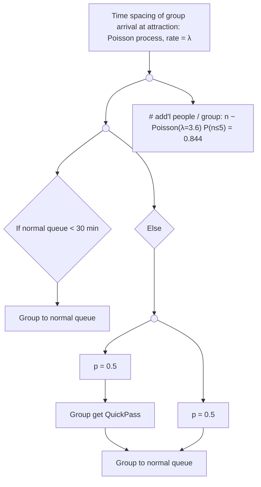
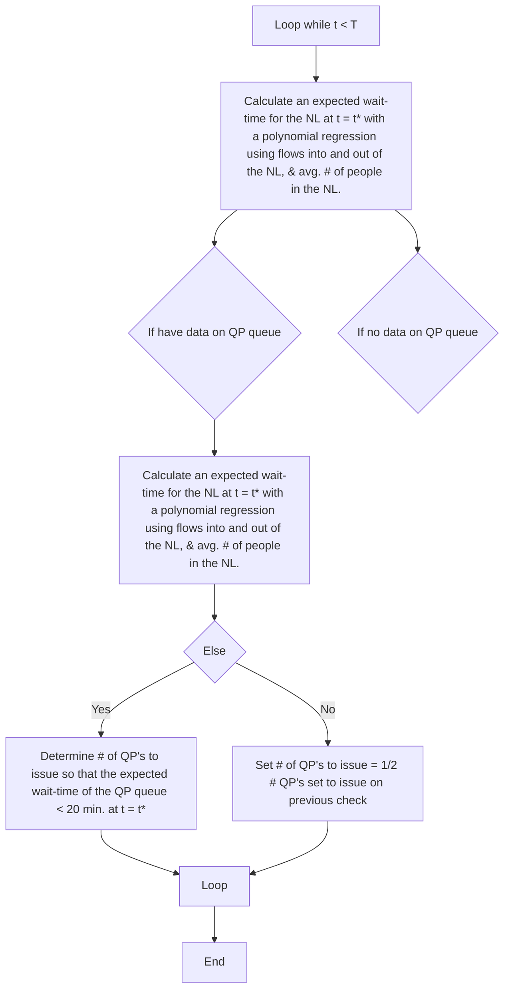
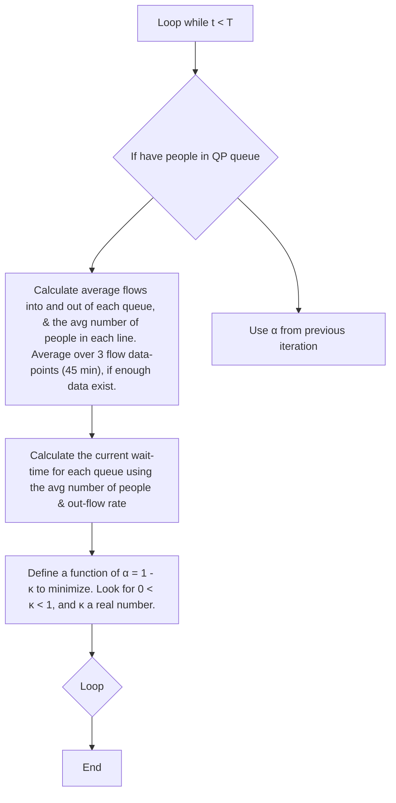

# Developing Improved Algorithms for QuickPass Systems

Moorea Brega

Alejandro Cantarero

Corry Lee

## Abstract

In order to propose alternate solutions for the control algorithms of the QuickPass system, we begin by modeling the arrivals at a “main attraction” of an amusement park. In a simple model, this is described by a Poisson process with constant rate. In a more advanced model, we model the variations of arrival rates throughout the day. The park be open for 10 hours each day, with a “peak arrival time” between 2.5 and 6 hours of the park opening. We also model the decision process for what each group does upon arriving at the attraction. Their choice is governed by a number of factors: their desire to ride this particular ride, the length of the normal queue, and how much later in the day their QuickPass would be issued for. We explore several models for determining how best to assign QuickPasses, as well as load the ride from the normal and QuickPass queues. In our most simple model, the customers in the QuickPass queue simply board the ride before anyone in the normal queue. This is problematic as it can bring the normal line to a halt. Our more advanced models avoid this problem by using a “boarding ratio”, α, to specify how many people from each line are loaded onto the ride. In one model, α is fixed at the beginning of the day and the system dynamically determines QuickPass return-times based on a minimization of queue lengths. This determines the maximum number of QuickPasses that can be issued for any time interval. Another model varies the parameter α based on the flow rates into and out of both the normal and QuickPass queues. We use polynomial regressions to predict the future behavior of the queues, and to determine a value of α that will minimize overall wait-times; this model assumes that the number of passes issued for each time interval is fixed throughout the day. To avoid setting parameters “by hand”, we combine these two algorithms and dynamically determine both α and the number of QuickPasses to issue throughout the day.

For all our models we can obtain reasonable behavior when the number of people arriving at the attraction does not greatly exceed its capacity. Depending upon the model employed, the hour-by-hour behavior differs qualitatively if one looks at the plots of flows into and out of the queues, number of QuickPasses issued, and overall wait-times. If we average the behavior of these models over a two-month period, we find that the total wait-times, number of people in each queue at the time the park closes, and the number of QuickPasses issued per day are consistent across all our models, within their statistical errors. From trial runs over individual days, it appears that these models may show larger differences when the ride is “slammed” with greater-than-capacity days.

Finally, we developed but did not implement a more sophisticated algorithm, which would allow groups three options: enter the normal queue, take a QuickPass for the regular QuickPass queue or “reserve” a more narrow time-window during which they could return to a third queue; this third queue would be given absolute priority over the other two.

Overall, our advanced models tend to be extremely robust to small perturbations in starting parameters, as well as to moderate variations in number of arrivals, and arrival-times of customers. In our ideal situations, we saw no statistically-significant differences between the four models, when averaged over a two-month time-period. In all our models, however, we avoid the problems attributed to the current QuickPass system, so long as the ride is not “slammed” with substantially more customers than it has the capacity to handle. In addition, unlike the “current implementation” of the QuickPass system in amusement parks, our system is set-up so that it cannot print shorter return-times than have previously been issued.

## Contents

## Executive Summary 2

1 Introduction 4

1.1 Disney’s “FastPass” system 4  
1.2 Objective 4

2 Simplifying Assumptions 4  
3 Queue Flows and Wait Times 5  
4 Basic Model 5  
5 Improvements Upon the Basic Model 7

5.1 An improved decision algorithm . . 7  
5.2 Arrival time at the attraction 8

6 QuickPass System With Dynamically-Calculated Number of Passes to Issue 9  
7 QuickPass System With Dynamically-Calculated Ride-Loading Ratio 1 1  
8 QuickPass System with Dynamically-Calculated Number of Passes to Issue and Ride-Loading Ratio 12  
9 QuickPass System with Three Tiered Queueing 13  
10 Results from the Basic Model 15

10.1 Results from the basic model 15  
10.2 Discussion of the basic model 17

11 Results from the Improved Model 1 9

11.1 Results using the basic model with the improved decision algorithm 19  
11.2 Results using the basic model with a variable inter-arrival rate depending upon time of day . . . . . . 19  
11.3 Results using variable inter-arrival rate and the improved decision algorithm . . 19

12 Results from Models with Dynamically Varying Parameters 22

12.1 Results from varying the boarding fraction, α . . 22  
12.2 Results from varying the number of QuickPasses issued 22  
12.3 Results from varying both α and the number of QuickPasses issued . . 29

13 Statistical Analysis of the Four QuickPass Models 29  
14 Strengths and Weaknesses of the Models 30  
15 Conclusion 30

# Executive Summary

The best part of amusement parks are the “main attraction” rides—the roller coasters that loop up and around, the vertical drops that make you feel like your stomach is sitting in your throat; the worst part of amusement parks is also these main attractions. The good rides tend to have such long lines that in order to ride them, you have to be willing to stand around for up to several hours for a few minutes of fun. Enter the QuickPass system. Here is a system designed to allow you to print a ticket with a return-time similar to the time you would spend standing in line. With this ticket in hand, you can go off and ride some of the other attractions, then return, queue up in a shorter line, and ride that great ride. The problem is: the current system has bugs. Customers have reported receiving a ticket for four hours in the future then, a short while later, seeing someone else receive one for only an hour later. Also, the QuickPass lines have been observed to have as long of a wait as the normal lines. Clearly this must change.

Unlike the “current implementation” of the QuickPass system in amusement parks, our system is set-up so that it cannot print shorter return-times than have previously been issued. The return time it assigns is based on the predicted wait-time in the normal queue, or the system time, whichever is greater. If the predicted wait is greater than the current setting of the system time, this is updated, and the machine begins printing return tickets for this later time. For example, if the last QuickPass ticket was printed for two hours from now (this is the “system time”), and you approach the QuickPass system several minutes later, it is possible that the normal line has gotten long enough that it would now take you 2.5 hours to get through this line to the ride. When you request a QuickPass, the system checks the wait-time for the normal line, sees that it is longer than the current system time, and then assigns you a pass with a return time 2.5 hours from now. It then resets its own system time to the time 2.5 hours from now, so that it cannot issue any return-times earlier than the one you received.

In order to keep the wait-times in both lines as small as possible, the QuickPass system can dynamically adjust the number of QuickPasses it hands out every fifteen minutes, so that your wait in the QuickPass queue will generally be no longer than 20 minutes (and often much shorter). Additionally, the system adjusts how many people should be let onto the ride from each line, depending upon the lengths of those lines and the number of people lining up at them. This is done to keep the wait-time of the normal line less than 2.5 hours and the wait-time of the QuickPass line less than 20 minutes, if at all possible.

Additionally, if more people arrive at the attraction than could possibly ride it during the day, the system will continue adjusting parameters every fifteen minutes so that as many people as possible can ride the ride. In the future, our QuickPass system will be able to notify the park manager if the lines are getting so long that they must be shut down for the day.

We have also developed a new model for the QuickPass system that would give customers three choices upon arriving at the ride. They could either line up in the normal line or take a QuickPass that will admit them into the QuickPass line; these options are the same as our current system. The third option would allow individuals or groups to make “reservations” for the ride. This option would be available from the same QuickPass system. The system would provide the group with options of possible return-times; these times could be further in the future than those for the regular QuickPass queue, so if the party had already made other plans, such as dinner reservations, taking the new QuickPass option would not conflict with those plans. There would be a limited number of these times available, and the group would be given only a 15 minute time-interval in which to return. The added bonus to this option is that the people who entered this third line would be given top priority in boarding the ride—so they would not even have to wait in the QuickPass line (that might be 20 minutes long). Although these people are given absolute priority over people in the other lines, the addition of the QuickPass “reservation system” will not affect the long-term behavior of the other lines. This is because the system will limit the number of reserved QuickPasses to a small number.

## 1 Introduction

In amusement parks, customers spend a great deal of time waiting in line—especially for the most popular rides. In order to reduce the amout of time spent in line, and hence increase overall enjoyment of the amusement park, the “QuickPass” system has been implemented in a variety of locations. The basic idea is that, rather than waiting in the normal queue for a ride, a customer can choose to use the QuickPass system; this system places the patron in a virtual queue, and assigns them a time window (of one hour), beginning at a time determined by a mathematical model. This model takes into account various factors, including the length of the normal queue, the number of people who have already obtained a QuickPass for the ride, and a percentage of the total ride capacity that the QuickPass is allowed to commandeer.

## 1.1 Disney’s “FastPass” system

Such a system (called “FastPass”) has been implemented by Disney Theme parks for their most popular rides [9, 2, 3]. The FastPass system works as follows. When a customer approaches a ride, they can see the projected wait-time in the normal queue, as well as the current FastPass interval that would be given out by the FastPass system. If the customer chooses to get a FastPass, the system prints a ticket, on which is printed the time interval during which the patron can return to the FastPass line; according to [3], wait times in the FastPass queue tend to range from 5–10 minutes. FastPasses are set to commandeer 40–90% of the given ride’s capacity, depending upon the demand for the ride, and increment the return time in 5 minute intervals after a certain number of people have been issued FastPasses [2]. Guests are allowed to get FastPasses every 45 minutes to 2 hours, depending upon how busy the park is. Once the FastPass time intervals cannot be incremented further (because of the park closing time), no more passes will be issued for the day; at popular attractions, FastPasses are often sold out before noon on busy days [2].

We base some of our system design on the FastPass system, creating a basic model that has similar parameters. We will use this model as a basis of comparison for our other, more advanced models.

## 1.2 Objective

The current QuickPass system does not appear to be working as smoothly as one would like. Return times have been observed to vary from being offered four hours in the future, and then, a short time later, one hour in the future. Additionally, QuickPass queues have been observed to be as long, or longer than the normal queues. We will address these issues and present improved models in this document.

In §2 we list the various simplifying assumptions we made in order to create this model. §4–9 describe the models that we use to simulate the arrival of people at our attraction, the queues, and the QuickPass system. In §10–12 we present plots for each model, which give the behavior of the queues, the flow of people onto the ride, and the salient features of the QuickPass system as a function of the time of day; these sections also present brief discussions of the indiviual models.

Finally, we include some statistical analysis of the models in §13, a discussion of various strengths and weaknesses of the different models in §14, and some concluding comments.

## 2 Simplifying Assumptions

In our models, we make a variety of assumptions.

• We know the number of people in the amusement park at all times (this can be done easily by using turnstiles to count the number of people entering and leaving the park).  
• We know the number of people in both the normal and the QuickPass lines at all times.  
• People often arrive in groups (of varying size). We assume that groups act together (eg. they all choose to wait in the normal line, or they all choose to obtain QuickPasses).  
• We assume that people who obtain QuickPasses always return during their allotted time and enter the QuickPass queue.

## 3 Queue Flows and Wait Times

The calculation of flow rates and wait times for the various queueing models discussed in this paper is extremely important to the overall behaviour and analysis of the models. These values are used both in analyzing how “successful” the models are in addition to acting as control parameters.

We begin by calculating flow rates both into and out of all queues in the system as people per minute. The flow rates for the queues are then determined as follows,

$$
f _ {i n} ^ {N L} = \frac {\sum_ {i = 1} ^ {L} N _ {a r r i v a l} ^ {N L} (t + i \Delta t)}{\Delta t _ {f l o w}} f _ {o u t} ^ {N L} = \frac {\sum_ {i = 1} ^ {L} N _ {e x i t} ^ {N L} (t + i \Delta t)}{\Delta t _ {f l o w}}
$$

$$
f _ {i n} ^ {Q P} = \frac {\sum_ {i = 1} ^ {L} N _ {a r r i v a l} ^ {Q P} (t + i \Delta t)}{\Delta t _ {f l o w}} f _ {o u t} ^ {Q P} = \frac {\sum_ {i = 1} ^ {L} N _ {e x i t} ^ {Q P} (t + i \Delta t)}{\Delta t _ {f l o w}}
$$

$N _ { a r r i v a l } ^ { N L } ( t )$ $N _ { a r r i v a l } ^ { Q P } ( t )$ N QParrival(t) is the number of people arriving in the QuickPass queue at time t, the $N _ { e x i t } ( t )$ represent the number of people leaving each queue at time $t , L$ is a fixed constant defining the size of the interval over which we wish to compute the flow, and $\Delta t _ { f l o w }$ is the total time over which the sum is computed, $L \Delta t - t$ . We note that when these values are actually computed for the various models, L can vary over the course of a single day and the spacing, $\Delta t ,$ is not necessarily uniform. This can make the actual computation of these flow values more complicated than illustrated in the above equations.

After calculating flow rates, we can use the out flow rates to approximate the waiting time in the two queues and for the entire ride. However, using flow rates can introduce problems as they have the potential to change value very suddenly. To counteract this phenomenon, we use a linear regression on the previous two flow values and the current flow value [8]. We then evaluate the regression line at the current time point. This helps prevent the wait times for the queues from having drastic changes as the flow rates fluctuate.

## 4 Basic Model

We begin with a basic model describing the important aspects of the “primary attraction,” which we have chosen to be a roller coaster. For our purposes, we are interested in:

1. Frequency of arrivals at the attraction.  
2. Number of people in each group which arrives at the attraction.  
3. Lengths of the normal and QuickPass queues at the time when the group arrives.  
4. How many groups choose to obtain a QuickPass.

5. What is the current state of the QuickPass system (eg. can it assign any more QuickPasses today, or is it “sold out”).

In Figure 1 we present a flow-chart describing the logic used in the basic model. We first simulate the number of groups arriving at the attraction using a Poisson process with rate λ. In this model, λ is a constant parameter throughout the simulated day; in §10, we will show the effects on ride operation for various values of λ.

In order to simulate the size of each group, we use a Poisson random variable with a mean of 3.6; the sampled value is then added to the minimum group size of one person (resulting in a mean group size of 4.6 people). This choice of rate gives us an 84.4% probability that groups arriving at the ride will have between 1 and 6 people. We chose a Poisson distribution because it is more heavily weighted towards low values than, say, a Normal distribution. This gives us a larger probability of having small groups (of 2–6 people) and a smaller probability of having extremely large groups; because most people in amusement parks are in probably in groups of less than six people, we feel this distribution is a good model of the physical situation. In Figure 2 we show a plot of the Poisson distribution we simulated for this model.

When each group arrives at the attraction, they have, in principle, two choices about what to do; they can either enter the normal queue or they can obtain a QuickPass. In practice, if the wait-time of the normal queue is less than 30 minutes, then we do not allow the group to obtain a QuickPass, they simply enter the normal queue. If the wait-time is greater than 30 minutes, they can choose either option. In this model, each group will choose to get a QuickPass 50% of the time (unless the QuickPass system is sold out, at which point the group has no choice but to enter the normal queue).


<details>
<summary>flowchart</summary>


</details>

Figure 1: A flowchart for the primary processes occuring in the basic model. This model simulates the arrival of groups as a Poisson process, and if the wait-time in the normal queue is greater than 30 minutes, groups either enter the normal queue or choose to obtain a QuickPass with a probability 0.5.


<details>
<summary>bar chart</summary>

| Value of R.V. | Number of Draws |
| ------------- | --------------- |
| 0             | 180             |
| 1             | 480             |
| 2             | 860             |
| 3             | 1060            |
| 4             | 960             |
| 5             | 680             |
| 6             | 440             |
| 7             | 210             |
| 8             | 100             |
| 9             | 30              |
| 10            | 10              |
| 11            | 5               |
| 12            | 2               |
| 13            | 1               |
| 14            | 0               |
| 15            | 0               |
| 16            | 0               |
| 17            | 0               |
| 18            | 0               |
| 19            | 0               |
| 20            | 0               |
</details>


<details>
<summary>bar chart</summary>

| Value of R.V. | Number of Draws |
| ------------- | --------------- |
| 0             | 950             |
| 5             | 1650            |
| 10            | 1350            |
| 15            | 1050            |
| 20            | 800             |
| 25            | 700             |
| 30            | 600             |
| 35            | 500             |
| 40            | 400             |
| 45            | 300             |
| 50            | 250             |
| 55            | 200             |
| 60            | 150             |
| 65            | 100             |
| 70            | 80              |
| 75            | 60              |
| 80            | 40              |
| 85            | 20              |
| 90            | 10              |
| 95            | 5               |
| 100           | 2               |
| 105           | 1               |
| 110           | 1               |
| 115           | 1               |
| 120           | 20              |
</details>

Figure 2: The left plot shows the sampled Poisson distribution used to simulate the number of additional people (beyond one person) in each group that arrives at the attraction. On the right is the exponential distribution used for inter-arrival spacing in the Poisson process modeling arrivals.

The QuickPass system, in this model, chooses a start time, $t _ { s t a r t }$ , for the pass based on a very simple criteria. We define the start time as

$$
t _ {s t a r t} = \max \left(t _ {N L}, t _ {s y s t}\right), \tag {1}
$$

where $t _ { N L }$ is the predicted wait-time in the normal line (based on the current number of people in both the normal and QuickPass lines, and the ride capacity), and $t _ { s y s t }$ is the internal time of the QuickPass system. The system time is determined by the following procedure.

1. When the QuickPass system first turns on, the system time (and the start time for the first QuickPass issued) are set to $t _ { C } + t _ { N L }$ , where $t _ { C }$ is the current clock time (say, one hour after the park opened).  
2. From this point on, each time someone arrives at the attraction we check:

(a) if our QuickPass system has reached the maximum number of QuickPasses issued for a given start time (say, 20 passes), we will increment the system time by a finite value (say, 5 minutes);  
(b) if $t _ { C } + t _ { N L } \le t _ { s y s t }$ then we issue a QuickPass with $t _ { s t a r t } = t _ { s y s t } ;$ otherwise  
(c) if $t _ { s y s t } < t _ { C } + t _ { N L }$ then we issue a QuickPass with $t _ { s t a r t } = t _ { C } + t _ { N L }$ , and update the system time such that $t _ { s y s t } = t _ { C } + t _ { N L }$ .

3. Once $t _ { s y s t } \geq T \mathrm { - } 1 . 2 5 \mathrm { h r }$ , where T is the length of time the park is open, we no longer issue any more QuickPasses.

This system for assigning QuickPass start times avoids the error in the QuickPass system currently implemented in the park, as described in the Introduction. This error was such that if the length of the normal line were to fluctuate drastically, a QuickPass could be assigned for a time, say, four hours away (based on the estimated length of the normal queue), and a short while later (if the normal queue emptied rapidly) could be assigned for a time one hour away. By resetting the system time to the time $t _ { C } + t _ { N L }$ if this number is greater than the current system time, we guarantee that subsequent QuickPasses always print a start time later than (or the same as) the previous passes. Note that the same start times will only be issued for sequential passes (where the normal line length has not increased enough to require a later $t _ { s y s t }$ and the counter on that individual start time has not reached its preset limit).

The QuickPass is issued to each customer with a time range from the specified $t _ { s t a r t }$ to that time plus one hour. We assume that all customers who have obtained a QuickPass return during their alloted time; their return is simulated using a uniform distribution over the hour for which the ticket is valid.

Once the current group has made its decision about whether to enter the normal queue or to obtain a QuickPass, we check to see if any of the attraction’s cars (or trains, etc.) have left since the last group arrived and update the number of people in each queue.

## 5 Improvements Upon the Basic Model

There are a number of limitations inherent in our basic model; in this section, we address several of these limitations. The improvements presented here are changes made to address the ride model, and the behavior of individual groups interacting with that model. We will address improvements upon the QuickPass system itself in §6.

## 5.1 An improved decision algorithm

In the most basic model, we included only a very rudimentary decision algorithm: if a group arrived at the attraction and the wait in the normal queue was longer than 30 minutes, they had a probability of 0.5 of choosing to obtain a QuickPass—regardless of other factors. We now include a decision algorithm that enables a group to make a choice of options based on three factors:

1. Their desire to ride the main attraction (d),

2. The length of the normal queue $( L _ { N L } )$ , and

3. The return-time for the QuickPass $( L _ { Q P } )$ .

For the improved decision algorithm, we define

$$
N \equiv L _ {N L} - \mu_ {N L}
$$

$$
Q \equiv 0. 3 L _ {Q P} - \mu_ {Q P}, (2)
$$

where

$$
\mu_ {N L} \equiv \min (f (d), L _ {N L})
$$

$$
\mu_ {Q P} \equiv \min (f (1 - d), L _ {Q P}), \tag {3}
$$

and d is the group’s desire to ride the attraction $( 0 \leq d \leq 1 )$ . The function $f ( d )$ translates the group’s desire to ride the attraction into the amount of time they are willing to wait in line for that attraction. The function $f ( 1 - d )$ is then used to determine how much later in the day the group would be willing to return for the QuickPass queue. Using $0 . 3 L _ { Q P }$ instead of just $L _ { Q P }$ takes into accout that people are more willing to wait in a “virtual” queue (where they can spend time riding other rides) than they are to physically wait in line.

We define the function f to be a quadratic passing through the points $( d , f ( d ) ) = ( 0 , 0 ) , ( 1 , T ) , ( - 1 , T )$ , where T is the length of time that the amusement park is open. Thus, a person with zero desire to ride the ride would be willing to wait in line for no time, and a desire level of 1 would indicate that the group was willing to wait in line all day for this particular ride. A more realistic example of a desire level of $d = 0 . 6$ would indicate that the group is willing to wait in the normal line for 3.6 hours; they would prefer to take the QuickPass option if the return time were less than 0.48 hours. For a desire-level of $d = 0 . 4$ the acceptable wait-times would be reversed in the example.

The group’s desire level is obtained by sampling a Normal distribution centered on $d = 0 . 5$ , with 99.2% of its area contained in the range [0, 1]. To compute this in our simulation, we use a standard normal distribution $Z \sim ( 0 , 1 )$ and convert that into our normal $X \sim ( \mu , \sigma ^ { 2 } )$ using the relation

$$
X = \sigma Z + \mu , \tag {4}
$$

where $\mu = 0 . 5 ,$ , and $\sigma = 0 . 1 9 3 8$ .

Using the above definitions, we compute N and Q from equation (2). The quantity with the minimum value then defines whether the group will queue up in the normal line, or opt for the QuickPass solution.

## 5.2 Arrival time at the attraction

Any amusement park goer would tell you that the best times to ride the big attractions are early in the morning and late in the evening, when there are fewer people in the park, and the queues are shortest. In the basic model, we simulated the inter-arrival time between groups as an expoenential random variable with rate λ, defined as a constant value set at the beginning of the simulated day. In a more realistic model, λ should vary in relation to the number of people in the amusement park—that is, people should arrive less frequently near the beginning and the end of the day. We now define the rate for the Poisson process as the piecewise continuous function:

$$
\text { rate } = \left\{ \begin{array}{c l} \left(\frac {\frac {1}{M} - \frac {1}{m}}{a}\right) t + \frac {1}{m _ {B}} & \text { for   } 0 \leq t <   a \\ \frac {1}{M} & \text { for   } a \leq t <   b \\ \left(\frac {\frac {1}{M} - \frac {1}{m _ {E}}}{b - T}\right) t - \left(\frac {\frac {1}{M} - \frac {1}{m _ {E}}}{b - T}\right) b + \frac {1}{M} & \text { for   } b \leq t <   T - c \\ \frac {1}{m _ {E}} & \text { for   } T - c \leq t <   T, \end{array} \right. \tag {5}
$$

where M is the expected number of groups we want per minute at the peak of the day, $m _ { B }$ is the expected number of groups per minute at the start of the day, $m _ { E }$ is the expected number at the end of the day, a is the beginning of the peak arrival time, b is the end of the peak arrival time, c is the time at which the arrival rate assumes a constant value of $1 / m _ { E } ,$ and T is the number of hours the park is open. In our standard simulation, we take: $M = 5$ , $m _ { B } = 1 . 5 , m _ { E } = 0 . 1 , a = 2 . 5$ hours, $b = 6$ hours, $c = 1$ hour and $T = 1 0$ hours.

## 6 QuickPass System With Dynamically-Calculated Number of Passes to Issue

In the simple model, the wait time for the QuickPass priority queue is kept low by placing all the QuickPass patrons on the ride before those in the normal queue. As a result, the normal queue may be allowed to build up to a wait time of several hours, which is often the case. A better system is to determine the percentage of the ride’s capacity that people in each queue are allowed to fill. In this model, we fix the parameter $\alpha ,$ defined to be the ratio of the number of people allowed to board the ride from the normal queue to the capacity of the ride. Thus, we have $0 < \alpha < 1$ , where the case $\alpha = 0$ reverts to the simple model of boarding all QuickPass Patrons before allowing anyone from the normal queue on the ride.

To ensure that the wait time of the normal line remains reasonable, we need the QuickPass machine to make an educated guess of how many tickets to give out for future time intervals. The logic behind this model is presented in the flow chart in Figure 3. The machine uses past and current information about the number of people flowing into and out of each queue to determine a projected wait time for the future. The number of tickets the machine issues for the time interval in question is determined by attempting to keep the wait time of the QuickPass queue below twenty minutes and the normal line wait time below two and half hours. If either of these wait times exceeds their maximum acceptable wait times, the machine decreases the number of tickets it will issue before advancing the return time window.

Every fifteen minutes the QuickPass machine calculates the average number of people entering and leaving each line during that time interval. Then, an estimate of the flow rates at fifteen minutes past the start of the QuickPass return time window, $t _ { f } = t _ { r } + 1 5 \mathrm { m i n }$ , is calculated using a polynomial regression through the last three available flow rates. Later we will vary the order of the polynomial to determine its effect on the flow predictions. The projected wait time is determined by estimating the number of people who will be in each line based on flow rates. To obtain a rough estimate of the number of people who will be in each queue at time $t _ { f } ,$ we assume that the flow rates between the current time and $t _ { f }$ is the average of the values determined using the polynomial regression and the current flow rates, $\begin{array} { r } { \hat { f } = \frac { 1 } { 2 } ( f _ { p } + f _ { c } ) } \end{array}$ . Then, an approximation to the number of people in the queue at time $t _ { f }$ is

$$
\begin{array}{l} N _ {f} \approx \bar {N} - \hat {f} _ {o u t} t _ {f} + \hat {f} _ {i n} t _ {f} \\ = \bar {N} - \frac {1}{2} (f _ {p, o u t} + f _ {c, o u t}) t _ {f} + \frac {1}{2} (f _ {p, i n} + f _ {c, i n}) t _ {f} \tag {6} \\ \end{array}
$$

where $\bar { N }$ is the average number of people currently in the queue of interest and the subscripts ‘out’ and ‘in’ refer to flow rates out of and into the queue, respectively. Notice that the number of people in each queue depends only on the current and projected flow rates for that queue and the average number of people currently in the queue. If equation (6) produces a negative number (indicating that our approximation of the flow rate is unrealistic), we approximate the number of people in each queue by using the current flow rates,

$$
N _ {f} = \bar {N} \frac {f _ {c , i n}}{f _ {c , o u t}}.
$$

The projected wait time for the normal line, $t _ { N L } .$ , is then given by the projected number of people in that queue, $N _ { f } ^ { N L }$ , over the estimated future outflow rate,

$$
t _ {N L} = \frac {N _ {f} ^ {N L}}{f _ {p , o u t} ^ {N L}}.
$$


<details>
<summary>flowchart</summary>


</details>

Figure 3: A flowchart of the salient features of the QuickPass system that attempts to regulate the queue lengths by dynamically varying the number of QuickPasses offered over any one time interval.

The wait time for the priority queue is computed in a similar manner. If the wait time for the normal queue and the priority queue are below their maximum acceptable wait times and the flow information for the QuickPass line is zero, the number of tickets issued is determined using

$$
n = 4 \cdot (1 - \alpha) \cdot f _ {o u t _ {N L}} \cdot \min (2 0 \text { minutes }, \frac {t _ {N L}}{3}). \tag {7}
$$

If the flow information for the priority queue is nonzero, we use

$$
n = 4 \cdot f _ {o u t _ {Q P}} \cdot \min (2 0 \text { minutes }, \frac {t _ {N L}}{3}). \tag {8}
$$

This calculation is computed every fifteen minutes or whenever all the tickets for the time interval have been issued.

## 7 QuickPass System With Dynamically-Calculated Ride-Loading Ratio

In the previous model, we fix the number of patrons from each queue who can enter the ride and change the number of passes the QuickPass system issues for each time interval. Here, we consider the opposite idea. In this model, the QuickPass system issues a fixed number of tickets for every time interval and the parameter α, which was defined as the number of people from the normal queue over the total capacity of the ride, is allowed to vary. Figure 4 shows the logic chart for this system.


<details>
<summary>flowchart</summary>


</details>

Figure 4: A flowchart of the salient features of the QuickPass system that attempts to regulate the queue lengths by dynamically varying the ratio of people who board the ride from each queue.

We begin the day with an arbitrarily chosen value of α between zero and one. Once the QuickPass queue forms, a new value of α is calculated by minimizing the dimensionless weighted sum of the wait times for each queue. First, the average wait time for each line is calculated by determining the average outflow rates for both lines and the average number of people in each queue during that time,

$$
t _ {w} = \frac {\bar {N}}{\bar {f} _ {o u t}}.
$$

Each waiting time in then normalized by the maximum acceptable waiting time, 20 minutes for the QuickPass queue and 2.5 hours for the normal queue, to create the following weighting factors,

$$
\beta = \frac {t _ {w} ^ {Q P}}{1 2 0 0}
$$

$$
\eta = \frac {t _ {w} ^ {N P}}{9 0 0 0} \tag {9}
$$

where the times are given in seconds. We then determine the values of the parameter α (where α = 1- κ) which minimizes the dimensionless wait time,

$$
\text { dimensionless   wait   time } = \left(\beta \frac {f _ {i n , Q P}}{1 4 4 \kappa^ {2}} + \eta \frac {f _ {i n , N L}}{1 4 4 (1 - \kappa) ^ {2}}\right). \tag {10}
$$

This corresponds to solving the cubic polynomial

$$
0 = (\mu + \gamma) \kappa^ {3} - 3 \gamma \kappa^ {2} + 3 \gamma \kappa - \gamma
$$

where

$$
\gamma = \beta \bar {N} _ {Q P} f _ {i n} ^ {Q P}
$$

$$
\mu = \eta \bar {N} _ {N L} f _ {i n} ^ {N L}
$$

for the real root between zero and one.

## 8 QuickPass System with Dynamically-Calculated Number of Passes to Issue and Ride-Loading Ratio

The two previous models attempt to optimize one parameter, either the boarding ratio α or the number of passes to issue for each time interval, assuming that the other parameter is constant. However, it might be more useful to have both parameters varying at the same time. Then, the system could try to determine the best values for the number of passes to issue in every time interval and the parameter α in order to keep both lines at a reasonable length

Recall that the model that varies the number of passes the machine issues depends on the parameter α. Indeed, this algorithm calculates how many tickets to issue assuming the α parameter to be constant for all time. The variable α model, on the other hand, requires an initial value of α which is only recomputed after patrons begin to arrive in the QuickPass queue. Because no one is in the QuickPass queue before the new value of α is determined, the initial choice is essentially arbitrary. However if we allow both models to optimize their parameters simultaneously, we need to ensure that the initial parameter value for α produces a reasonable number of QuickPass tickets for each time interval before the program attempts to determine a new value of α. For example, if the initial parameter value for α is too large (i.e. α ≈ 1), the algorithm to determine how many tickets to issue will indicate that the system should not issue any tickets at all. The variable α algorithm will then decide to continue using the current value of α because no one has arrived in the QuickPass queue and thus the parameter α is not actually being used to load the ride efficiently. This process repeats until the end of the day and our model never allows any patrons to obtain a QuickPass and enter the second queue. As a result, we expect this new model to be extremely sensitive to the initial value of the parameter α and we will not consider any parameter choices in the future which we believe beforehand will cause the QuickPass machine to remain off all day.

## 9 QuickPass System with Three Tiered Queueing

Finally, we consider one last improvement to the QuickPass system. This final improvement is capable of using any of the models we presented in the above sections, allowing this model the greatest flexibility of those presented so far. The basic idea is simple: Expand the QuickPass system to allow for a second priority queue. The second priority queue will be to the original QuickPass queue as the QuickPass queue is to the regular line. This new queue, the Priority I queue, will be shorter than the other QuickPass queue (Priority II), having a wait no longer than the arrival time between cars on the ride. However, unlike the Priority I queue, where the return time window is an hour long interval at some future time determined by the machine, the return window for the Priority I queue is much shorter, only fifteen minutes. Because of the reduced window size, this system allows patrons to choose (within certain guidelines) when they want to return. In addition, these return times can be booked for as soon as 45 minutes from the current time. For the Priority II queue, the return time is determined by the waiting time of the normal queue line and the machine’s own internal clock. In essence, this second line allows patrons to “make an appointment” to ride the attraction. Patrons who do not return in this new shorter time interval lose their place in line, similar to what would happen if one missed a doctor’s appointment. As a result, only patrons who are reasonably confident that they will return in their time window will take the Priority I ticket. In this model, we assume that everyone who takes a QuickPass ticket (for either line) will return during their designated time window.

The Priority I queue has a maximum of 600 tickets that it may issue throughout the day. This corresponds to issuing fifteen tickets for every fifteen minute interval throughout the day. However, because the QuickPass machine becomes operational only after the wait time for the regular queue has exceeded half an hour, some of the Priority I tickets may not be issued. After a group arrives at the queue, it determines whether it wants to go into the normal queue or take a QuickPass using the improved decision algorithm from §5.1. If the patron chooses to take a QuickPass, it must then decide between the Priority I and Priority II queues. This decision is based on the return time for the Priority II queue and the first available return time for the Priority I queue (this will depend on the group’s size, in addition to how many passes have been sold already for various time intervals).

Figure 5 shows the logic behind the decision algorithm determining whether a group takes a Priority I or II ticket and what time they choose should that group take the Priority I ticket. The decision algorithm for the choice of priority queues is relatively basic: If the return times for both queues are about the same, patrons take the Priority II ticket 70% of the time because it allows them more flexibility. The other cases are shown in detail in the flow chart. We note here that it is possible for this model to give first return times that are not in chronological order. For example, if a large group comes, its first available return time may be later than that for a smaller group that uses the machine only minutes later. This is a result of the fact that the machine will only give out fiften tickets for every fifteen minute interval. If the size of the group is larger than the number of tickets still available for a certain interval, that interval will not appear as an option to the group.

Once the group has decided to take a ticket for the Priority I queue, the return time they choose is determined using a $\chi ^ { 2 } ( 2 )$ distribution. This type of distribution will favor return times closer to the current time while still allowing for times later in the day. These later times could be interpreted as groups who have specifics plans for the near future whose duration can be easily controlled, such as wanting to eat lunch or play carnival games.

Now that we know how many people take the Priority I ticket and what times they choose to return, we need to determine how to place patrons from the three queues on the ride. Because we give out a limited number of Priority I tickets for each 15 minute time interval, we always seat everyone in the Priority I line first. The number of seats remaining on the car can then be divided between those in the normal queue and those in the Priority II queue. If we are using a fixed boarding parameter α, then we will put (α)· (remaining ride capacity) people from the normal line into the ride and $( 1 - \alpha )$ · ( remaining ride capacity ) people from the Priority II line. Notice that with this system we can still use the algorithm that adjusts α based on flow rates.

Unfortunately, this model has not been fully implemented and does not produce useable data. Thus, in comparing our models, we will only focus on the simple model, the model with varying α, the model with varying number of tickets issued, and the model where both α and the number of tickets issued for each time interval are allowed to vary.


<details>
<summary>flowchart</summary>

```mermaid
graph TD
  A["If want QuickPass"] --> B{If t_r (PI) < first available t_r (PI)}
  B --> C{Else}
  C --> D{If t_r (PI) > 2_x["first available t_r (PI)"]
  D --> E["p = 0.81"]
  E --> F["Take PI pass and choose return time (using a χ² (2) distribution) in range: (t_r (PI), t_r (PII))"]
  E --> G["p = 0.09"]
  G --> H["Take PI pass and choose return time in range: (t_r (PII), T)"]
  G --> I["p = 0.10"]
  I --> J["Take PII pass"]
  D --> K{Else}
  K --> L["p = 0.7"]
  K --> M["p = 0.3"]
  L --> N["Take PII pass"]
  M --> O["Take P I pass"]
  P["p = 0.9"] --> Q["Take PII pass"]
  P --> R["p = 0.1"]
```
</details>

Figure 5: Flow chart of the decision algorithm to determine whether a group that has decided to opt for a QuickPass should take a ticket for the Priority I or Priorty II queue.

## 10 Results from the Basic Model

In this section we show the behaviour of the basic model, as described in §4, under a variety of situations. The results in this section clearly demonstrate the reasons for the model improvements presented in §5; we will discuss results including these improvements in §11.

## 10.1 Results from the basic model

The primary parameter used to adjust the basic model is λ, the rate for the Poisson process that describes the arrival of groups. For example, $\lambda = 1 / 1 0$ specifies that the mean time between group arrivals is 10 seconds. By changing this parameter, we effectively change the popularity of the ride. The only parameter of the QuickPass model that can be adjusted for the basic QuickPass system relates to the number of QuickPasses that are issued before the system’s time clock $( t _ { s y s t } )$ advances. As expected, increasing this number allows a greater number of QuickPasses to be issued throughout the day. For example, with $\lambda ^ { - 1 } = 2 0$ , when 20 passes can be issued before incrementing the system time by 5 minutes, we issue approximately 1000 QuickPasses, when we can distribute 200 passes before incrementing, we issue about twice that many. This huge increase in possible number of passes issued does not result in an equal increase in the number of QuickPasses actually issued. Having only a finite number of people arriving during that 5-minute interval prevents this from occuring.

In Table 1 we present the daily totals for runs with various values of λ (various park occupancy rates); the QuickPass system has been set to issue a maximum of 20 QuickPass tickets before incrementing its internal time by 5 minutes. The maximum capacity of our ride is set to be 7200 people per day. As expected, when the total number of arrivals at the attraction is about 7200, the QuickPass system never activates. Recall that this model assumes that the inter-arrival rate is constant throughout the day, so in this case we never have a wait-time in the normal queue of longer than 30 minutes (which is required for the system to be activated). When the arrival-rate increases such that more people are arriving at the attraction than it has the capacity to handle, wait-times increase above the requisite 30 minutes, and the QuickPass system comes on-line. As can be seen in the cases with $\lambda ^ { - 1 } = 1 0$ and $\lambda ^ { - 1 } = \bar { 1 } 7$ , the basic model tends to issue the same number of QuickPasses, at which point the system is “sold out” and no more passes are issued. For $\lambda ^ { - 1 } = 1 0$ , passes are sold out earlier in the day than when $\lambda ^ { - 1 } = 1 7$ .

Table 1: Results of running the basic model with the parameter λ (the rate for the Poisson process describing the arrival of groups at the attraction). We give the total number of customers, the total number of customers who obtain a QuickPass $\left( \ ^ { 6 6 } \mathrm { Q P ^ { \prime \prime } } \right)$ , the total number of people who ride the attraction (“Riders”), those riders with a QuickPass, and those riders from the normal line (“NL Riders”). The total ride capacity is 7200 people throughout the 10 hours that the park is open; the QuickPass system is set to increment its internal clock by five minutes after every 20 passes are issued, or by the projected wait-time of the normal line.

<table><tr><td> $\lambda^{-1}$ </td><td>Customers</td><td>QP</td><td>Riders</td><td>QP Riders</td><td>NL Riders</td></tr><tr><td>10</td><td>16657</td><td>2335</td><td>7200</td><td>2335</td><td>4865</td></tr><tr><td>17</td><td>10047</td><td>2362</td><td>7200</td><td>2362</td><td>4838</td></tr><tr><td>21</td><td>7863</td><td>441</td><td>7157</td><td>441</td><td>6716</td></tr><tr><td>23</td><td>7371</td><td>0</td><td>7025</td><td>0</td><td>7025</td></tr></table>

In addition to the day-end totals, it is interesting to look at the behaviour of the queues (normal and QuickPass), the flow-rates in and out of these queues, estimated waiting times in the queues, start-times issued by the QuickPass system, and the ratio of people choosing the QuickPass queue over the normal queue, as a function of time. In Figures 6 and 7, we show distributions where $\lambda ^ { - 1 } = 2 0$ for the two cases of assigning a maximum of 20 and 200 passes before incrementing the system time.

The top plots show flow rates of people into (left) and out of (center) each queue; the top right plot shows a decision ratio for which queue the customers decide to enter. A decision ratio of one corresponds to 50% of the customers choosing each option; ratios larger than one indicate that more people are choosing to obtain a QuickPass rather than waiting in the normal queue. The leftmost plot on the bottom row indicates the start time issued on the QuickPasses during the time the system is operational. For our test cases, we have chosen that the park be open for 10 hours. Thus a return time of 5, issued at $t = 3$ (corresponding to 2:00pm, if the park opens at 11:00am) would correspond to waiting 2 to 3 hours (because QuickPasses specify a 1 hour interval in which you can return) in the “virtual queue” before entering the actual QuickPass line. The center plot on the bottom row indicates the predicted wait-time in the QuickPass queue, and the right plot indicates the predicted wait-time for the entire ride as a function of the time of day. This will be our standard plot-ordering scheme.


<details>
<summary>line chart</summary>

| Hour of Operation of the Park | In. Normal | In. Quick |
| ----------------------------- | ---------- | --------- |
| 0                             | 13         | 0         |
| 1                             | 17         | 0         |
| 2                             | 14         | 0         |
| 3                             | 16         | 0         |
| 4                             | 12         | 0         |
| 5                             | 10         | 2         |
| 6                             | 9          | 3         |
| 7                             | 6          | 4         |
| 8                             | 13         | 6         |
| 9                             | 14         | 5         |
| 10                            | 18         | 0         |
</details>


<details>
<summary>line chart</summary>

| Hour of Operation of the Park | Out, Normal | Out, Quick |
| ----------------------------- | ----------- | ---------- |
| 0                             | 1.0         | 0.0        |
| 1                             | 1.2         | 0.0        |
| 2                             | 1.3         | 0.0        |
| 3                             | 1.2         | 0.0        |
| 4                             | 1.3         | 0.0        |
| 5                             | 1.1         | 3.0        |
| 6                             | 0.9         | 4.0        |
| 7                             | 0.7         | 5.0        |
| 8                             | 0.8         | 6.0        |
| 9                             | 1.0         | 5.0        |
| 10                            | 1.3         | 0.0        |
</details>


<details>
<summary>scatter plot</summary>

| Hour of Operation of the Park | Choose QuickPass / Enter Normal Li |
| ----------------------------- | ---------------------------------- |
| 3.8                           | 1.7                                |
| 4.0                           | 1.7                                |
| 4.2                           | 1.7                                |
| 4.4                           | 1.7                                |
| 4.6                           | 1.7                                |
| 4.8                           | 1.7                                |
| 5.0                           | 1.7                                |
| 5.2                           | 1.7                                |
| 5.4                           | 1.7                                |
| 5.6                           | 1.7                                |
| 5.8                           | 1.7                                |
| 6.0                           | 1.7                                |
| 6.2                           | 1.7                                |
| 6.4                           | 1.7                                |
| 6.6                           | 1.7                                |
| 6.8                           | 1.7                                |
| 7.0                           | 1.7                                |
| 7.2                           | 1.7                                |
| 7.4                           | 1.7                                |
| 7.6                           | 1.7                                |
| 7.8                           | 1.7                                |
| 8.0                           | 1.7                                |
| 8.2                           | 1.7                                |
| 8.4                           | 1.7                                |
| 8.6                           | 1.7                                |
| 8.8                           | 1.7                                |
| 9.0                           | 1.7                                |
| 9.2                           | 1.7                                |
| 9.4                           | 1.7                                |
| 9.6                           | 1.7                                |
| 9.8                           | 1.7                                |
| 10.0                          | 1.7                                |
</details>


<details>
<summary>line chart</summary>

| Hour of Operation of the Park | Time (hours) |
| ----------------------------- | ------------ |
| 0                             | 0            |
| 1                             | 0            |
| 2                             | 0            |
| 3                             | 4            |
| 4                             | 5            |
| 5                             | 6            |
| 6                             | 7            |
| 7                             | 8            |
| 8                             | 9            |
| 9                             | 0            |
| 10                            | 0            |
</details>


<details>
<summary>bar chart</summary>

| Hour of Operation of the Park | Wait Time (minutes) |
| ----------------------------- | ------------------- |
| 0                             | 0.0                 |
| 1                             | 0.0                 |
| 2                             | 0.0                 |
| 3                             | 0.0                 |
| 4                             | 0.5                 |
| 5                             | 1.9                 |
| 6                             | 1.4                 |
| 7                             | 1.2                 |
| 8                             | 2.1                 |
| 9                             | 2.2                 |
| 10                            | 0.5                 |
</details>


<details>
<summary>line chart</summary>

| Hour of Operation of the Park | Wait Time (minutes) |
| ----------------------------- | ------------------- |
| 0                             | 0                   |
| 1                             | 5                   |
| 2                             | 15                  |
| 3                             | 25                  |
| 4                             | 30                  |
| 5                             | 32                  |
| 6                             | 35                  |
| 7                             | 45                  |
| 8                             | 65                  |
| 9                             | 90                  |
| 10                            | 115                 |
</details>

Figure 6: Results from running the basic model with $\lambda = 1 / 2 0$ and a maximum of 20 passes issued before the QuickPass system increments the start time by 5 minutes.


<details>
<summary>line chart</summary>

| Hour of Operation of the Park | In. Normal | In. Quick |
| ----------------------------- | ---------- | --------- |
| 0                             | 15         | 0         |
| 1                             | 14         | 0         |
| 2                             | 20         | 0         |
| 3                             | 12         | 0         |
| 4                             | 11         | 0         |
| 5                             | 10         | 0         |
| 6                             | 8          | 7         |
| 7                             | 6          | 5         |
| 8                             | 10         | 7         |
| 9                             | 14         | 8         |
| 10                            | 15         | 0         |
</details>


<details>
<summary>line chart</summary>

| Hour of Operation of the Park | Out, Normal | Out, Quick |
| ----------------------------- | ----------- | ---------- |
| 0                             | 1.0         | 0.0        |
| 1                             | 1.2         | 0.0        |
| 2                             | 1.3         | 0.0        |
| 3                             | 1.2         | 0.0        |
| 4                             | 1.1         | 0.0        |
| 5                             | 0.8         | 0.0        |
| 6                             | 0.6         | 0.0        |
| 7                             | 0.4         | 0.8        |
| 8                             | 0.5         | 0.6        |
| 9                             | 0.7         | 0.4        |
| 10                            | 1.2         | 0.0        |
</details>


<details>
<summary>scatter plot</summary>

| Hour of Operation of the Park | Choose QuickPass / Enter Normal Li |
| --- | --- |
| 3 | 1.4 |
| 4 | 0.9 |
| 4 | 0.8 |
| 4 | 0.7 |
| 4 | 0.8 |
| 4 | 1.7 |
| 5 | 2.8 |
| 5 | 1.4 |
| 5 | 1.1 |
| 5 | 1.0 |
| 5 | 1.7 |
| 5 | 1.7 |
| 5 | 1.7 |
| 5 | 1.7 |
| 5 | 1.7 |
| 5 | 1.7 |
| 5 | 1.7 |
| 5 | 1.7 |
| 5 | 1.7 |
| 5 | 1.7 |
| 5 | 1.7 |
| 5 | 1.7 |
| 5 | 1.7 |
| 5 | 1.7 |
| 5 | 1.7 |
| 5 | 1.7 |
| 5 | 1.7 |
| 5 | 1.7 |
| 5 | 1.7 |
</details>


<details>
<summary>line chart</summary>

| Hour of Operation of the Park | Time (hours) |
| ----------------------------- | ------------ |
| 0                             | 0            |
| 2                             | 2.5          |
| 4                             | 4.5          |
| 6                             | 6.5          |
| 8                             | 9            |
</details>


<details>
<summary>line chart</summary>

| Hour of Operation of the Park | Wait Time (minutes) |
| ----------------------------- | ------------------- |
| 0                             | 0.0                 |
| 1                             | 0.0                 |
| 2                             | 0.0                 |
| 3                             | 0.4                 |
| 4                             | 1.1                 |
| 5                             | 0.8                 |
| 6                             | 2.7                 |
| 7                             | 3.9                 |
| 8                             | 1.4                 |
| 9                             | 2.2                 |
| 10                            | 0.5                 |
</details>


<details>
<summary>line chart</summary>

| Hour of Operation of the Park | Wait Time (minutes) |
| ----------------------------- | ------------------- |
| 0                             | 0                   |
| 1                             | 10                  |
| 2                             | 30                  |
| 3                             | 25                  |
| 4                             | 30                  |
| 5                             | 35                  |
| 6                             | 40                  |
| 7                             | 50                  |
| 8                             | 60                  |
| 9                             | 80                  |
| 10                            | 100                 |
</details>

Figure 7: Results from running the basic model with $\lambda = 1 / 2 0$ and a maximum of 200 passes issued before the QuickPass system increments the start time by 5 minutes.

As we mentioned previously, the fact that λ remains constant throughout the day leads to a relatively constant flow rate into the normal line—except for when the QuickPass system is activated. While the system is active, 50% of the arriving groups will choose to obtain a QuickPass rather than stand in line; this decreases the flow rate into the normal line. The QuickPass line, on the other hand, only has people physically arriving once $\mathrm { ( a ) }$ the normal queue has grown long enough for the QuickPass system to activate, and (b) the start times for QuickPass tickets arrive.

For the $\lambda ^ { - 1 } = 2 0$ cases, the effect of the QuickPass system’s activation on the total wait-time for the ride is striking; the overall wait-time increases linearly from when the park opens up until the QuickPass system goes online, at which time the overall wait time plateaus; the wait-time begins to increase again once the QuickPass system is sold-out for the day. Note that the expected wait-time for the ride is calculated to be the sum, at each time interval, of the predicted wait in the physical QuickPass queue and the normal queue.

The system in the basic model for placing QuickPass customers on the ride (everyone from the QuickPass queue goes first) keeps the wait-time of the QuickPass queue very short (here, less than 4 minutes), as can be seen in the center plots in the bottom rows of Figures 6 and 7.

The wait-time in the normal queue can be easily calculated (by eye) from the plots of the overall wait-time for the ride, and the wait-time for the QuickPass queue. In the cases shown here, the wait-time for the QuickPass queue remains so short that the differences between the overall wait-time for the ride, and that for the normal queue are negligible. When we issue a larger number of QuickPasses, the difference between these wait-times will increase.

While the total number of arrivals at the ride was reasonably well-matched with the ride capacity for $\lambda ^ { - 1 } = 2 0$ (see Table 1), for $\lambda ^ { - 1 } = 1 0$ , the number of daily arrivals at the ride is about twice the ride’s capacity. We show plots of this case in Figures 8 and 9 for 20 and 200 QuickPasses issued before incrementing tsyst. $t _ { s y s t }$

For $\lambda ^ { - 1 } = 1 0$ , people begin entering the QuickPass queue only an hour after the park opens. Because the people in the QuickPass queues are always given priority on the ride in this model, the occupancy of this queue substantially slows down the flow rate out of the normal line (top center plots). We also note that the QuickPasses sell out three to five hours after the park opens (here, 5 hours is half-way through the day), depending upon how many passes are allowed to be issued.

Because the number of total arrivals remains approximately constant throughout the day (∼ 30 people / minute), the high priority given to the QuickPass riders substantially slows down the normal queue (even though when the QuickPass system is active the flow rate into the normal queue drops to ∼ 15 people/minute), increasing the average wait-time for people in the normal line, and leaving a large number of people in the normal line when the amusement park closes. This is clearly not an ideal system.

## 10.2 Discussion of the basic model

The results presented in §10.1 clearly evince one of the basic model’s undesirable features, which we chose to correct with the improvements of §5: our most basic model assumes that the inter-arrival times between groups is constant. In addition to being a poor model of the physical situation, Figures 6–9 indicate that this assumption clearly causes a problem—by the end of the day, wait-times in the normal queue ranged from over an hour to about 13 hours. The case where we ended up with a 13-hour wait by the time the ride shut down was an extreme example where we chose to flood the ride with twice its daily capacity of riders—so we would not expect the queue to empty out by the end of the day. If we allowed such cases in the future, we would have to develop a method for shutting down the queue once it became too long. Instead, we choose to only test our model with daily arrivals near the ride’s design capacity. Additionally, we will show in §11 that simply simulating a variable inter-arrival spacing, with peak arrivals near the middle of the day (as is more physically accurate for real amusement parks), can improve this problem.

Also in §5 we improved the decision-making algorithm that allows people to choose whether or not to get a QuickPass.


<details>
<summary>line chart</summary>

| Hour of Operation of the Park | In. Normal | In. Quick |
| ----------------------------- | ---------- | --------- |
| 0                             | 2.7        | 0.0       |
| 1                             | 1.3        | 0.0       |
| 2                             | 1.5        | 0.0       |
| 3                             | 1.3        | 0.0       |
| 4                             | 2.9        | 0.0       |
| 5                             | 2.4        | 0.0       |
| 6                             | 3.4        | 0.0       |
| 7                             | 2.9        | 0.0       |
| 8                             | 2.9        | 0.0       |
| 9                             | 2.9        | 0.0       |
| 10                            | 2.5        | 0.0       |
</details>


<details>
<summary>line chart</summary>

| Hour of Operation of the Park | Out, Normal | Out, Quick |
| ----------------------------- | ----------- | ---------- |
| 0                             | 1.2         | 0.0        |
| 1                             | 1.3         | 0.0        |
| 2                             | 0.8         | 5.0        |
| 3                             | 0.6         | 4.0        |
| 4                             | 0.9         | 5.0        |
| 5                             | 0.7         | 3.0        |
| 6                             | 0.9         | 5.0        |
| 7                             | 0.8         | 4.0        |
| 8                             | 0.6         | 5.0        |
| 9                             | 1.0         | 3.0        |
| 10                            | 1.3         | 0.0        |
</details>


<details>
<summary>scatter plot</summary>

| Hour of Operation of the Park | Choose QuickPass / Enter Normal Li |
| --- | --- |
| 0 | 2.8 |
| 0 | 1.4 |
| 0 | 1.4 |
| 0 | 1.7 |
| 0 | 1.1 |
| 0 | 0.9 |
| 0 | 0.6 |
| 0 | 0.4 |
| 0 | 0.8 |
| 0 | 1.1 |
| 0 | 1.7 |
| 0 | 2.2 |
| 0 | 2.8 |
| 1 | 2.8 |
| 1 | 1.7 |
| 1 | 1.1 |
| 1 | 0.9 |
| 1 | 0.6 |
| 1 | 0.4 |
| 1 | 0.8 |
| 1 | 1.1 |
| 1 | 1.7 |
| 1 | 2.2 |
| 1 | 2.8 |
| 2 | 2.8 |
| 2 | 1.7 |
| 2 | 1.1 |
| 2 | 0.9 |
| 2 | 0.6 |
| 2 | 0.4 |
| 2 | 0.8 |
| 2 | 1.1 |
| 2 | 1.7 |
| 2 | 2.2 |
| 2 | 2.8 |
| 3 | 2.8 |
| 3 | 1.7 |
| 3 | 1.1 |
| 3 | 0.9 |
| 3 | 0.6 |
| 3 | 0.4 |
| 3 | 0.8 |
| 3 | 1.1 |
| 3 | 1.7 |
| 3 | 2.2 |
| 3 | 2.8 |
| 4 | 2.8 |
| 4 | 1.7 |
| 4 | 1.1 |
| 4 | 0.9 |
| 4 | 0.6 |
| 4 | 0.4 |
| 4 | 0.8 |
| 4 | 1.1 |
| 4 | 1.7 |
| 4 | 2.2 |
| 4 | 2.8 |
| 5 | 2.8 |
| 5 | 1.7 |
| 5 | 1.1 |
| 5 | 0.9 |
| 5 | 0.6 |
| 5 | 0.4 |
| 5 | 0.8 |
| 5 | 1.1 |
| 5 | 1.7 |
| 5 | 2.2 |
| 5 | 2.8 |
| 6 | 2.8 |
| 6 | 1.7 |
| 6 | 1.1 |
| 6 | 0.9 |
| 6 | 0.6 |
| 6 | 0.4 |
| 6 | 0.8 |
| 6 | 1.1 |
| 6 | 1.7 |
| 6 | 2.2 |
| 6 | 2.8 |
| 7 | 2.8 |
| 7 | 1.7 |
| 7 | 1.1 |
| 7 | 0.9 |
| 7 | 0.6 |
| 7 | 0.4 |
| 7 | 0.8 |
| 7 | 1.1 |
| 7 | 1.7 |
| 7 | 2.2 |
| 7 | 2.8 |
| 8 | 2.8 |
| 8 | 1.7 |
| 8 | 1.1 |
| 8 | 0.9 |
| 8 | 0.6 |
| 8 | 0.4 |
| 8 | 0.8 |
| 8 | 1.1 |
| 8 | 1.7 |
| 8 | 2.2 |
| 8 | 2.8 |
| 9 | 2.8 |
| 9 | 1.7 |
| 9 | 1.1 |
| 9 | 0.9 |
| 9 | 0.6 |
| 9 | 0.4 |
| 9 | 0.8 |
| 9 | 1.1 |
| 9 | 1.7 |
| 9 | 2.2 |
</details>


<details>
<summary>line chart</summary>

| Hour of Operation of the Park | Time (hours) |
| ----------------------------- | ------------ |
| 0                             | 0            |
| 1                             | 1            |
| 2                             | 5            |
| 3                             | 9            |
| 4                             | 0            |
| 5                             | 0            |
| 6                             | 0            |
| 7                             | 0            |
| 8                             | 0            |
| 9                             | 0            |
| 10                            | 0            |
</details>


<details>
<summary>bar chart</summary>

| Hour of Operation of the Park | Wait Time (minutes) |
| ----------------------------- | ------------------- |
| 0                             | 0.0                 |
| 1                             | 0.5                 |
| 2                             | 2.2                 |
| 3                             | 1.3                 |
| 4                             | 2.5                 |
| 5                             | 3.3                 |
| 6                             | 1.5                 |
| 7                             | 1.8                 |
| 8                             | 2.8                 |
| 9                             | 1.2                 |
| 10                            | 1.1                 |
</details>


<details>
<summary>line chart</summary>

| Hour of Operation of the Park | Wait Time (minutes) |
| ----------------------------- | ------------------- |
| 0                             | 0                   |
| 1                             | 20                  |
| 2                             | 40                  |
| 3                             | 60                  |
| 4                             | 100                 |
| 5                             | 150                 |
| 6                             | 200                 |
| 7                             | 250                 |
| 8                             | 300                 |
| 9                             | 400                 |
| 10                            | 500                 |
</details>

Figure 8: Results from running the basic model with $\lambda = 1 / 1 0$ and a maximum of 20 passes issued before the QuickPass system increments the start time by 5 minutes.


<details>
<summary>line chart</summary>

| Hour of Operation of the Park | In. Normal | In. Quick |
| ----------------------------- | ---------- | --------- |
| 0                             | 2.8        | 0.0       |
| 1                             | 1.2        | 0.0       |
| 2                             | 1.5        | 1.0       |
| 3                             | 1.4        | 0.8       |
| 4                             | 1.3        | 1.1       |
| 5                             | 1.7        | 0.6       |
| 6                             | 2.9        | 0.9       |
| 7                             | 2.5        | 0.7       |
| 8                             | 2.8        | 0.6       |
| 9                             | 3.1        | 0.9       |
| 10                            | 2.7        | 0.0       |
</details>


<details>
<summary>line chart</summary>

| Hour of Operation of the Park | Out, Normal | Out, Quick |
| ----------------------------- | ----------- | ---------- |
| 0                             | 1.2         | 0.0        |
| 1                             | 1.3         | 0.0        |
| 2                             | 1.0         | 7.0        |
| 3                             | 4.5         | 8.0        |
| 4                             | 5.0         | 10.0       |
| 5                             | 5.0         | 6.0        |
| 6                             | 3.0         | 9.0        |
| 7                             | 6.0         | 7.0        |
| 8                             | 7.0         | 8.0        |
| 9                             | 3.0         | 8.5        |
| 10                            | 13.0        | 0.0        |
</details>


<details>
<summary>scatter plot</summary>

| Hour of Operation of the Park | Choose QuickPass / Enter Normal Li |
| --- | --- |
| 0 | 0.5 |
| 0 | 0.6 |
| 0 | 0.7 |
| 0 | 0.8 |
| 0 | 0.9 |
| 0 | 1.0 |
| 0 | 1.1 |
| 0 | 1.2 |
| 0 | 1.3 |
| 0 | 1.4 |
| 0 | 1.5 |
| 0 | 1.6 |
| 0 | 1.7 |
| 0 | 1.8 |
| 0 | 1.9 |
| 0 | 2.0 |
| 0 | 2.1 |
| 0 | 2.2 |
| 0 | 2.3 |
| 0 | 2.4 |
| 0 | 2.5 |
| 0 | 2.6 |
| 0 | 2.7 |
| 0 | 2.8 |
| 0 | 2.9 |
| 0 | 3.0 |
| 0 | 3.1 |
| 0 | 3.2 |
| 0 | 3.3 |
| 0 | 3.4 |
| 0 | 3.5 |
| 0 | 3.6 |
| 0 | 3.7 |
| 0 | 3.8 |
| 0 | 3.9 |
| 0 | 4.0 |
| 1 | 0.5 |
| 1 | 0.6 |
| 1 | 0.7 |
| 1 | 0.8 |
| 1 | 0.9 |
| 1 | 1.0 |
| 1 | 1.1 |
| 1 | 1.2 |
| 1 | 1.3 |
| 1 | 1.4 |
| 1 | 1.5 |
| 1 | 1.6 |
| 1 | 1.7 |
| 1 | 1.8 |
| 1 | 1.9 |
| 1 | 2.0 |
| 1 | 2.1 |
| 1 | 2.2 |
| 1 | 2.3 |
| 1 | 2.4 |
| 1 | 2.5 |
| 1 | 2.6 |
| 1 | 2.7 |
| 1 | 2.8 |
| 1 | 2.9 |
| 1 | 3.0 |
| 1 | 3.1 |
| 1 | 3.2 |
| 1 | 3.3 |
| 1 | 3.4 |
| 1 | 3.5 |
| 1 | 3.6 |
| 1 | 3.7 |
| 1 | 3.8 |
| 1 | 3.9 |
| 1 | 4.0 |
| 2 | 0.5 |
| 2 | 0.6 |
| 2 | 0.7 |
| 2 | 0.8 |
| 2 | 0.9 |
| 2 | 1.0 |
| 2 | 1.1 |
| 2 | 1.2 |
| 2 | 1.3 |
| 2 | 1.4 |
| 2 | 1.5 |
| 2 | 1.6 |
| 2 | 1.7 |
| 2 | 1.8 |
| 2 | 1.9 |
| 2 | 2.0 |
| 2 | 2.1 |
| 2 | 2.2 |
| 2 | 2.3 |
| 2 | 2.4 |
| 2 | 2.5 |
| 2 | 2.6 |
| 2 | 2.7 |
| 2 | 2.8 |
| 2 | 2.9 |
| 2 | 3.0 |
| 2 | 3.1 |
| 2 | 3.2 |
| 2 | 3.3 |
| 2 | 3.4 |
| 2 | 3.5 |
| 2 | 3.6 |
| 2 | 3.7 |
| 2 | 3.8 |
| 2 | 3.9 |
| ... | ... |
| ... | ... |
| ... | ... |
| ... | ... |
| ... | ... |
| ... | ... |
| ... | ... |
| ... | ... |
| ... | ... |
| ... | ... |
| ... | ... |
| ... | ... |
| ... | ... |
| ... | ... |
| ... | ... |
</details>


<details>
<summary>line chart</summary>

| Hour of Operation of the Park | Time (hours) |
| ----------------------------- | ------------ |
| 0                             | 0            |
| 1                             | 1            |
| 2                             | 3            |
| 3                             | 4            |
| 4                             | 6            |
| 5                             | 8            |
| 6                             | 9            |
| 7                             | 9            |
| 8                             | 9            |
| 9                             | 9            |
| 10                            | 9            |
</details>


<details>
<summary>bar chart</summary>

| Hour of Operation of the Park | Wait Time (minutes) |
| ----------------------------- | ------------------- |
| 0                             | 0.5                 |
| 1                             | 1.0                 |
| 2                             | 2.5                 |
| 3                             | 2.0                 |
| 4                             | 2.5                 |
| 5                             | 2.0                 |
| 6                             | 2.5                 |
| 7                             | 2.0                 |
| 8                             | 2.5                 |
| 9                             | 3.0                 |
| 10                            | 0.5                 |
</details>


<details>
<summary>line chart</summary>

| Hour of Operation of the Park | Wait Time (minutes) |
| ----------------------------- | ------------------- |
| 0                             | 0                   |
| 1                             | 50                  |
| 2                             | 100                 |
| 3                             | 150                 |
| 4                             | 200                 |
| 5                             | 250                 |
| 6                             | 350                 |
| 7                             | 450                 |
| 8                             | 550                 |
| 9                             | 650                 |
| 10                            | 750                 |
</details>

Figure 9: Results from running the basic model with $\lambda = 1 / 1 0$ and a maximum of 200 passes issued before the QuickPass system increments the start time by 5 minutes.

## 11 Results from the Improved Model

## 11.1 Results using the basic model with the improved decision algorithm

In improving our basic model, we first implemented a better algorithm to simulate the decision process for groups choosing whether to queue up in the normal line or obtain a QuickPass. The basic method just had them take a QuickPass 50% of the time when the normal queue had a predicted wait-time longer than 30 minutes. Now, their decision of which queue to enter is based on their desire to ride the attraction, the length of the normal queue, and how much later in the day they would return if they took a QuickPass.

We plot the results from two simulated days, one where the arrival rate $\lambda = 1 / 2 0$ and the other with $\lambda = 1 / 1 0 ;$ these plots correspond with Figures 7 and 9, respectively. In both cases, we allow a maximum of 200 QuickPasses to be issued for every 5-minute period. The behaviour for the two decision algorithms is similar when the number of arrivals corresponds reasonably closely with the ride capacity $( \lambda = 1 / 2 0 )$ —consider Figures 7 and 10.

When the arrivals push the system greatly over capacity, however, the new decision algorithm tends to “flood the queue”. The bottom center plot in Figure 11 gives the predicted wait-time for the QuickPass queue throughout the day; because the number of arrivals is so much greater than the ride capacity, the length of the normal queue starts getting so long that more and more people choose to take the QuickPass option. With the basic system for filling the ride, everyone in the QuickPass queue gets on the ride first, so when there is reasonably long wait-time in the QuickPass queue, the normal queue will come to a halt (except that it will keep growing longer when more people enter it). When this happens, the estimated wait-time in the normal queue increases, and even more people chose to obtain a QuickPass—until the QuickPasses are sold out. Note that even though many more people chose to obtain QuickPasses in this situation, the QuickPass queue still empties out nicely by the end of the day.

## 11.2 Results using the basic model with a variable inter-arrival rate depending upon time of day

Our next improvement was to make the inter-arrival rate for groups vary depending upon the time of day. For the tests in this section, we have reverted to the original “dummy” decision algorithm, where people choose the QuickPass 50% of the time when the normal line’s wait-time exceeds 30 minutes (we will show the results of both improvements in Sec. 11.3). The functional form that controls the variations in inter-arrival spacing is given in equation (5) in §5.2. We choose a standard set of parameters that result in a rush of arrivals at the peak, but that do not result in a total that is (substantially) greater than the ride’s capacity. We define the peak arrival time to be between $2 . 5 < t < 6$ hours after the park opens. In Figures 12 and 13 we display results using our standard set of parameters for the piecewise continuous function (also given in the figure captions); the figures show the results for issuing a maximum of 20 and 200 passes per 5 minutes.

The total number of customers arriving at the attraction is approximately equal in these two plots (∼ 7000); in Figure 12 (where we allow 20 passes / 5 min), however, we only issue ∼ 1500 QuickPasses, while in Figure 13 (where we allow 200 passes / 5 min) we issue ∼ 2500 passes. In both cases there is an evident drop in the flow rate of people into the normal queue (top left plots) during the time that the QuickPass system is operational (as shown in the bottom left plots), as expected. Because the customers with QuickPasses begin arriving during about the last half of the peak hours, loading people onto the ride from their queue substantially slows down the normal queue, resulting in the steepest positive slope in the expected wait time plots (bottom right) during the hours of about 4–6 (when there is still a large flow of customers arriving).

With the inter-arrival spacing dependent upon the time of day (and, hence, the overall occupancy of the park), we succeed in nearly emptying the normal queue by the time the ride closes for the day. Presumably, the line would simply be shut off at this point in a real amusement park, and the ride would be allowed to run for another 10–30 minutes while the remaining people emptied out of the queue.

## 11.3 Results using variable inter-arrival rate and the improved decision algorithm

We now show the results of using both of the improvements to the basic model, as described in Sec. 5. Figure 14 allows 20 QuickPasses per 5 min, while Figure 15 allows 200. For both cases we have approximately 7400 people arriving at the attraction; when we allow 20 passes per 5 min we issue around 1500 passes, for the second case we issue about 3000. The effect this has on the maximum expected wait-time for the ride can be seen in the bottom right plots; the peak wait-time in Figure 14 is about 3 hours, while in Figure 15 it is about 2 hours. Other features in the plots follow from the fact that we let more people take QuickPasses in Figure 15, hence increasing the wait-times in the QuickPass queue, and decreasing the flow-rate into the normal queue.


<details>
<summary>line chart</summary>

| Hour of Operation of the Park | In. Normal | In. Quick |
| ----------------------------- | ---------- | --------- |
| 0                             | 0          | 0         |
| 1                             | 8          | 0         |
| 2                             | 22         | 0         |
| 3                             | 12         | 0         |
| 4                             | 8          | 13        |
| 5                             | 10         | 15        |
| 6                             | 11         | 10        |
| 7                             | 3          | 8         |
| 8                             | 2          | 7         |
| 9                             | 1          | 6         |
| 10                            | 0          | 5         |
</details>


<details>
<summary>line chart</summary>

| Hour of Operation of the Park | Out, Normal | Out, Quick |
| ----------------------------- | ----------- | ---------- |
| 0                             | 0           | 0          |
| 1                             | 8           | 0          |
| 2                             | 13          | 0          |
| 3                             | 10          | 3          |
| 4                             | 2           | 12         |
| 5                             | 1           | 14         |
| 6                             | 2           | 10         |
| 7                             | 3           | 8          |
| 8                             | 4           | 7          |
| 9                             | 5           | 6          |
| 10                            | 6           | 5          |
</details>


<details>
<summary>scatter plot</summary>

| Hour of Operation of the Park | Choose QP / Enter Normal Line |
| ----------------------------- | ----------------------------- |
| 2                             | 1.0                           |
| 2                             | 1.2                           |
| 2                             | 1.5                           |
| 2                             | 1.8                           |
| 2                             | 2.0                           |
| 2                             | 2.5                           |
| 2                             | 3.0                           |
| 2                             | 3.5                           |
| 2                             | 4.0                           |
| 2                             | 4.5                           |
| 2                             | 5.0                           |
| 2                             | 5.5                           |
| 2                             | 6.0                           |
| 2                             | 6.5                           |
| 2                             | 7.0                           |
| 2                             | 7.5                           |
| 2                             | 8.0                           |
| 2                             | 8.5                           |
| 3                             | 1.0                           |
| 3                             | 1.2                           |
| 3                             | 1.5                           |
| 3                             | 1.8                           |
| 3                             | 2.0                           |
| 3                             | 2.5                           |
| 3                             | 3.0                           |
| 3                             | 3.5                           |
| 3                             | 4.0                           |
| 3                             | 4.5                           |
| 3                             | 5.0                           |
| 3                             | 5.5                           |
| 3                             | 6.0                           |
| 3                             | 6.5                           |
| 3                             | 7.0                           |
| 3                             | 7.5                           |
| 3                             | 8.0                           |
| 3                             | 8.5                           |
| 4                             | 1.0                           |
| 4                             | 1.2                           |
| 4                             | 1.5                           |
| 4                             | 1.8                           |
| 4                             | 2.0                           |
| 4                             | 2.5                           |
| 4                             | 3.0                           |
| 4                             | 3.5                           |
| 4                             | 4.0                           |
| 4                             | 4.5                           |
| 4                             | 5.0                           |
| 4                             | 5.5                           |
| 4                             | 6.0                           |
| 4                             | 6.5                           |
| 4                             | 7.0                           |
| 4                             | 7.5                           |
| 4                             | 8.0                           |
| 4                             | 8.5                           |
| 4                             | 9.0                           |
| 4                             | 9.5                           |
| 5                             | 1.0                           |
| 5                             | 1.2                           |
| 5                             | 1.5                           |
| 5                             | 1.8                           |
| 5                             | 2.0                           |
| 5                             | 2.5                           |
| 5                             | 3.0                           |
| 5                             | 3.5                           |
| 5                             | 4.0                           |
| 5                             | 4.5                           |
| 5                             | 5.0                           |
| 5                             | 5.5                           |
| 5                             | 6.0                           |
| 5                             | 6.5                           |
| 5                             | 7.0                           |
| 5                             | 7.5                           |
| 5                             | 8.0                           |
| 5                             | 8.5                           |
| 5                             | 9.0                           |
| 5                             | 9.5                           |
| 6                             | 1.0                           |
| 6                             | 1.2                           |
| 6                             | 1.5                           |
| 6                             | 1.8                           |
| 6                             | 2.0                           |
| 6                             | 2.5                           |
| 6                             | 3.0                           |
| 6                             | 3.5                           |
| 6                             | 4.0                           |
| 6                             | 4.5                           |
| 6                             | 5.0                           |
| 6                             | 5.5                           |
| 6                             | 6.0                           |
| 6                             | 6.5                           |
| 6                             | 7.0                           |
| 6                             | 7.5                           |
| 6                             | 8.0                           |
| 6                             | 8.5                           |
| 6                             | 9.0                           |
| 6                             | 9.5                           |
| Note: The actual values may vary due to the random nature of the data generation.
</details>


<details>
<summary>line chart</summary>

| Hour of Operation of the Park | Time (hours) |
| ----------------------------- | ------------ |
| 0                             | 0            |
| 2                             | 3            |
| 4                             | 5            |
| 6                             | 8            |
| 7                             | 9            |
| 8                             | 0            |
| 10                            | 0            |
</details>


<details>
<summary>line chart</summary>

| Hour of Operation of the Park | Wait Time (minutes) |
| ----------------------------- | ------------------- |
| 0                             | 0                   |
| 1                             | 0                   |
| 2                             | 0                   |
| 3                             | 1                   |
| 4                             | 3                   |
| 5                             | 5                   |
| 6                             | 4                   |
| 7                             | 6                   |
| 8                             | 16                  |
| 9                             | 9                   |
| 10                            | 3                   |
</details>


<details>
<summary>line chart</summary>

| Hour of Operation of the Park | Wait Time (minutes) |
| ----------------------------- | ------------------- |
| 0                             | 0                   |
| 1                             | 0                   |
| 2                             | 3                   |
| 3                             | 3                   |
| 4                             | 5                   |
| 5                             | 8                   |
| 6                             | 11                  |
| 7                             | 10                  |
| 8                             | 8                   |
| 9                             | 5                   |
| 10                            | 1                   |
</details>

Figure 10: Results from running the basic model with the improved decision algorithm, where $\lambda = 1 / 2 0$ and a maximum of 200 passes issued before the QuickPass system increments $t _ { s t a r t }$ by 5 minutes.  


<details>
<summary>line chart</summary>

| Hour of Operation of the Park | In. Normal | In. Quick |
| ----------------------------- | ---------- | --------- |
| 0                             | 0          | 0         |
| 1                             | 7          | 0         |
| 2                             | 18         | 0         |
| 3                             | 12         | 0         |
| 4                             | 5          | 16        |
| 5                             | 8          | 12        |
| 6                             | 10         | 10        |
| 7                             | 5          | 8         |
| 8                             | 3          | 7         |
| 9                             | 2          | 6         |
| 10                            | 1          | 5         |
</details>


<details>
<summary>line chart</summary>

| Hour of Operation of the Park | Out, Normal | Out, Quick |
| ----------------------------- | ----------- | ---------- |
| 0                             | 0           | 0          |
| 1                             | 7           | 0          |
| 2                             | 12          | 0          |
| 3                             | 12.5        | 0          |
| 4                             | 0           | 12         |
| 5                             | 0           | 12         |
| 6                             | 2           | 10         |
| 7                             | 3           | 8          |
| 8                             | 4           | 6          |
| 9                             | 5           | 5          |
| 10                            | 6           | 4          |
</details>


<details>
<summary>scatter plot</summary>

| Hour of Operation of the Park | Choose QP / Enter Normal Line |
| ---------------------------- | ----------------------------- |
| 2                            | 1                             |
| 3                            | 1                             |
| 4                            | 5                             |
| 5                            | 3                             |
| 6                            | 1                             |
| 7                            | 1                             |
| 8                            | 1                             |
| 9                            | 1                             |
| 10                           | 1                             |
</details>


<details>
<summary>line chart</summary>

| Hour of Operation of the Park | Time (hours) |
| ----------------------------- | ------------ |
| 0                             | 0            |
| 1                             | 0            |
| 2                             | 3            |
| 3                             | 4            |
| 4                             | 5            |
| 5                             | 6            |
| 6                             | 8            |
| 7                             | 9            |
| 8                             | 0            |
| 9                             | 0            |
| 10                            | 0            |
</details>


<details>
<summary>line chart</summary>

| Hour of Operation of the Park | Wait Time (minutes) |
| ----------------------------- | ------------------- |
| 0                             | 0                   |
| 1                             | 0                   |
| 2                             | 0                   |
| 3                             | 0                   |
| 4                             | 2                   |
| 5                             | 10                  |
| 6                             | 5                   |
| 7                             | 8                   |
| 8                             | 13                  |
| 9                             | 11                  |
| 10                            | 0                   |
</details>


<details>
<summary>line chart</summary>

| Hour of Operation of the Park | Wait Time (minutes) |
| ----------------------------- | ------------------- |
| 0                             | 0                   |
| 1                             | 0                   |
| 2                             | 1                   |
| 3                             | 3                   |
| 4                             | 5                   |
| 5                             | 10                  |
| 6                             | 14                  |
| 7                             | 12                  |
| 8                             | 10                  |
| 9                             | 8                   |
| 10                            | 3                   |
</details>

Figure 11: Results from running the basic model with the improved decision algorithm, where $\lambda = 1 / 1 0$ and a maximum of 200 passes issued before the QuickPass system increments $t _ { s t a r t }$ by 5 minutes.


<details>
<summary>line chart</summary>

| Hour of Operation of the Park | In, Normal | In, Quick |
| ----------------------------- | ---------- | --------- |
| 0                             | 0          | 0         |
| 1                             | 10         | 0         |
| 2                             | 16         | 0         |
| 3                             | 25         | 0         |
| 4                             | 18         | 5         |
| 5                             | 26         | 6         |
| 6                             | 22         | 3         |
| 7                             | 5          | 3         |
| 8                             | 3          | 3         |
| 9                             | 2          | 3         |
| 10                            | 1          | 3         |
</details>


<details>
<summary>line chart</summary>

| Hour of Operation of the Park | Out, Normal | Out, Quick |
| ----------------------------- | ----------- | ---------- |
| 0                             | 0           | 0          |
| 1                             | 8           | 0          |
| 2                             | 10          | 0          |
| 3                             | 12          | 0          |
| 4                             | 10          | 2          |
| 5                             | 9           | 6          |
| 6                             | 8           | 3          |
| 7                             | 8           | 3          |
| 8                             | 8           | 3          |
| 9                             | 8           | 3          |
| 10                            | 8           | 3          |
</details>


<details>
<summary>scatter plot</summary>

| Hour of Operation of the Park | Choose QP / Enter Normal Line |
| ----------------------------- | ----------------------------- |
| 3.0                           | 0.5                           |
| 3.0                           | 0.7                           |
| 3.0                           | 0.9                           |
| 3.0                           | 1.4                           |
| 3.0                           | 1.7                           |
| 3.0                           | 2.1                           |
| 3.0                           | 2.2                           |
| 3.0                           | 2.8                           |
| 4.0                           | 0.5                           |
| 4.0                           | 0.6                           |
| 4.0                           | 0.8                           |
| 4.0                           | 1.4                           |
| 4.0                           | 1.7                           |
| 4.0                           | 2.1                           |
| 4.0                           | 2.8                           |
| 4.5                           | 0.5                           |
| 4.5                           | 0.7                           |
| 4.5                           | 0.9                           |
| 4.5                           | 1.4                           |
| 4.5                           | 1.7                           |
| 4.5                           | 2.1                           |
| 4.5                           | 2.8                           |
| 5.0                           | 0.5                           |
| 5.0                           | 0.7                           |
| 5.0                           | 0.9                           |
| 5.0                           | 1.4                           |
| 5.0                           | 1.7                           |
| 5.0                           | 2.1                           |
| 5.0                           | 2.8                           |
| 5.5                           | 0.5                           |
| 5.5                           | 0.7                           |
| 5.5                           | 0.9                           |
| 5.5                           | 1.4                           |
| 5.5                           | 1.7                           |
| 5.5                           | 2.1                           |
| 5.5                           | 2.8                           |
| 6.0                           | 0.5                           |
| 6.0                           | 0.7                           |
| 6.0                           | 0.9                           |
| 6.0                           | 1.4                           |
| 6.0                           | 1.7                           |
| 6.0                           | 2.1                           |
| 6.0                           | 2.8                           |
| 6.5                           | 0.5                           |
| 6.5                           | 0.7                           |
| 6.5                           | 0.9                           |
| 6.5                           | 1.4                           |
| 6.5                           | 1.7                           |
| 6.5                           | 2.1                           |
| 6.5                           | 2.8                           |
| 7.0                           | 0.5                           |
| 7.0                           | 0.7                           |
| 7.0                           | 0.9                           |
| 7.0                           | 1.4                           |
| 7.0                           | 1.7                           |
| 7.0                           | 2.1                           |
| 7.0                           | 2.8                           |
| 7.5                           | 0.5                           |
| 7.5                           | 0.7                           |
| 7.5                           | 0.9                           |
| 7.5                           | 1.4                           |
| 7.5                           | 1.7                           |
| 7.5                           | 2.1                           |
| 7.5                           | 2.8                           |
| 8.0                           | 0.5                           |
| 8.0                           | 0.7                           |
| 8.0                           | 0.9                           |
| 8.0                           | 1.4                           |
| 8.0                           | 1.7                           |
| 8.0                           | 2.1                           |
| 8.0                           | 2.8                           |
| 8.5                           | 0.5                           |
| 8.5                           | 0.7                           |
| 8.5                           | 0.9                           |
| 8.5                           | 1.4                           |
| 8.5                           | 1.7                           |
| 8.5                           | 2.1                           |
| 8.5                           | 2.8                           |
| 9.0                           | 0.5                           |
| 9.0                           | 0.7                           |
| 9.0                           | 0.9                           |
| 9.0                           | 1.4                           |
| 9.0                           | 1.7                           |
| 9.0                           | 2.1                           |
| 9.0                           | 2.8                           |
| 9.5                           | 0.5                           |
| 9.5                           | 0.7                           |
| 9.5                           | 0.9                           |
| 9.5                           | 1.4                           |
| 9.5                           | 1.7                           |
| 9.5                           | 2.1                           |
| 9.5                           | 2.8                           |
| Note: The actual values may vary due to the random nature of the data generation.
</details>


<details>
<summary>line chart</summary>

| Hour of Operation of the Park | Time (hours) |
| ----------------------------- | ------------ |
| 0                             | 0            |
| 1                             | 0            |
| 2                             | 3            |
| 3                             | 5            |
| 4                             | 7            |
| 5                             | 9            |
| 6                             | 0            |
| 7                             | 0            |
| 8                             | 0            |
| 9                             | 0            |
| 10                            | 0            |
</details>


<details>
<summary>line chart</summary>

| Hour of Operation of the Park | Wait Time (minutes) |
| ----------------------------- | ------------------- |
| 0                             | 0                   |
| 1                             | 0                   |
| 2                             | 0                   |
| 3                             | 0                   |
| 4                             | 1.5                 |
| 5                             | 2.0                 |
| 6                             | 1.0                 |
| 7                             | 4.0                 |
| 8                             | 4.5                 |
| 9                             | 6.5                 |
| 10                            | 3.0                 |
</details>


<details>
<summary>line chart</summary>

| Hour of Operation of the Park | Wait Time (minutes) |
| ----------------------------- | ------------------- |
| 0                             | 0                   |
| 1                             | 5                   |
| 2                             | 10                  |
| 3                             | 30                  |
| 4                             | 45                  |
| 5                             | 70                  |
| 6                             | 140                 |
| 7                             | 120                 |
| 8                             | 90                  |
| 9                             | 60                  |
| 10                            | 10                  |
</details>

Figure 12: Results from running the basic model with inter-arrival spacing dependent upon the time of day; the parameters of the piecewise continuous function are: $M = 5 , m _ { B } = 1 . 5 .$ , and $m _ { E } = 0 . 1$ groups/minute. A maximum of 20 passes are issued before the QuickPass system increments $t _ { s t a r t }$ by 5 minutes.


<details>
<summary>line chart</summary>

| Hour of Operation of the Park | In, Normal | In, Quick |
| ----------------------------- | ---------- | --------- |
| 0                             | 0          | 0         |
| 1                             | 7          | 0         |
| 2                             | 22         | 0         |
| 3                             | 15         | 0         |
| 4                             | 14         | 8         |
| 5                             | 12         | 10        |
| 6                             | 15         | 9         |
| 7                             | 10         | 8         |
| 8                             | 1          | 7         |
| 9                             | 1          | 6         |
| 10                            | 1          | 5         |
</details>


<details>
<summary>line chart</summary>

| Hour of Operation of the Park | Out, Normal | Out, Quick |
| ----------------------------- | ----------- | ---------- |
| 0                             | 0           | 0          |
| 1                             | 7           | 0          |
| 2                             | 12          | 0          |
| 3                             | 13          | 0          |
| 4                             | 6           | 8          |
| 5                             | 4           | 11         |
| 6                             | 5           | 7          |
| 7                             | 6           | 7          |
| 8                             | 7           | 6          |
| 9                             | 8           | 5          |
| 10                            | 9           | 4          |
</details>


<details>
<summary>scatter plot</summary>

| Hour of Operation of the Park | Choose QP / Enter Normal Line |
| --- | --- |
| 2 | 0.3 |
| 2 | 0.4 |
| 2 | 0.5 |
| 2 | 0.6 |
| 2 | 0.7 |
| 2 | 0.8 |
| 2 | 0.9 |
| 2 | 1.0 |
| 2 | 1.1 |
| 2 | 1.2 |
| 2 | 1.3 |
| 2 | 1.4 |
| 2 | 1.5 |
| 2 | 1.6 |
| 2 | 1.7 |
| 2 | 1.8 |
| 2 | 1.9 |
| 2 | 2.0 |
| 2 | 2.1 |
| 3 | 0.3 |
| 3 | 0.4 |
| 3 | 0.5 |
| 3 | 0.6 |
| 3 | 0.7 |
| 3 | 0.8 |
| 3 | 0.9 |
| 3 | 1.0 |
| 3 | 1.1 |
| 3 | 1.2 |
| 3 | 1.3 |
| 3 | 1.4 |
| 3 | 1.5 |
| 3 | 1.6 |
| 3 | 1.7 |
| 3 | 1.8 |
| 3 | 1.9 |
| 3 | 2.0 |
| 3 | 2.1 |
| 3 | 2.2 |
| 3 | 2.3 |
| 3 | 2.4 |
| 3 | 2.5 |
| 3 | 2.6 |
| 3 | 2.7 |
| 3 | 2.8 |
| 4 | 0.3 |
| 4 | 0.4 |
| 4 | 0.5 |
| 4 | 0.6 |
| 4 | 0.7 |
| 4 | 0.8 |
| 4 | 0.9 |
| 4 | 1.0 |
| 4 | 1.1 |
| 4 | 1.2 |
| 4 | 1.3 |
| 4 | 1.4 |
| 4 | 1.5 |
| 4 | 1.6 |
| 4 | 1.7 |
| 4 | 1.8 |
| 4 | 1.9 |
| 4 | 2.0 |
| 4 | 2.1 |
| 4 | 2.2 |
| 4 | 2.3 |
| 4 | 2.4 |
| 4 | 2.5 |
| 4 | 2.6 |
| 4 | 2.7 |
| 4 | 2.8 |
| 4 | 2.9 |
| 5 | 0.3 |
| 5 | 0.4 |
| 5 | 0.5 |
| 5 | 0.6 |
| 5 | 0.7 |
| 5 | 0.8 |
| 5 | 0.9 |
| 5 | 1.0 |
| 5 | 1.1 |
| 5 | 1.2 |
| 5 | 1.3 |
| 5 | 1.4 |
| 5 | 1.5 |
| 5 | 1.6 |
| 5 | 1.7 |
| 5 | 1.8 |
| 5 | 1.9 |
| 5 | 2.0 |
| 5 | 2.1 |
| 5 | 2.2 |
| 5 | 2.3 |
| 5 | 2.4 |
| 5 | 2.5 |
| 5 | 2.6 |
| 5 | 2.7 |
| 5 | 2.8 |
| 5 | 2.9 |
| ... | ... |
| ... | ... |
| ... | ... |
| ... | ... |
| ... | ... |
| ... | ... |
| ... | ... |
| ... | ... |
| ... | ... |
| ... | ... |
| ... | ... |
| ... | ... |
| ... | ... |
| ... | ... |
| ... | ... |
</details>


<details>
<summary>line chart</summary>

| Hour of Operation of the Park | Time (hours) |
| ----------------------------- | ------------ |
| 0                             | 0            |
| 1                             | 0            |
| 2                             | 3            |
| 3                             | 4            |
| 4                             | 5            |
| 5                             | 6            |
| 6                             | 7            |
| 7                             | 8            |
| 8                             | 9            |
| 9                             | 0            |
| 10                            | 0            |
</details>


<details>
<summary>line chart</summary>

| Hour of Operation of the Park | Wait Time (minutes) |
| ----------------------------- | ------------------- |
| 0                             | 0                   |
| 1                             | 0                   |
| 2                             | 0                   |
| 3                             | 0                   |
| 4                             | 1                   |
| 5                             | 2                   |
| 6                             | 1                   |
| 7                             | 3                   |
| 8                             | 16                  |
| 9                             | 4                   |
| 10                            | 0                   |
</details>


<details>
<summary>line chart</summary>

| Hour of Operation of the Park | Wait Time (minutes) |
| ----------------------------- | ------------------- |
| 0                             | 0                   |
| 1                             | 5                   |
| 2                             | 15                  |
| 3                             | 30                  |
| 4                             | 45                  |
| 5                             | 70                  |
| 6                             | 120                 |
| 7                             | 100                 |
| 8                             | 80                  |
| 9                             | 40                  |
| 10                            | 0                   |
</details>

Figure 13: Results from running the basic model with inter-arrival spacing dependent upon the time of day; the parameters of the piecewise continuous function are: $M = 5 , m _ { B } = 1 . 5 ,$ , and $m _ { E } = 0 . 1$ groups/minute. A maximum of 200 passes are issued before the QuickPass system increments $t _ { s t a r t }$ by 5 minutes.

It is also interesting to note that we have so many people who enter the QuickPass queue that the normal queue ceases to have any out-flow for more than an hour. This behaviour will be reduced or eliminated with subsequent improvements of the QuickPass system, as described in §6, with results in §12.

## 12 Results from Models with Dynamically Varying Parameters

We now discuss various results from those models where we allow parameters pertaining to the QuickPass system to dynamically scale with time; the underlying model includes the arrival time and improved decision algorithm features discussed in §5). We begin with results from varying the boarding fraction, α. Then we describe results only varying the number of QuickPasses issued as a funciton of time. Finally we discuss the system behaviour with both paramaters allowed to scale dynamically.

For the figures in this section we plot: in and out-flows of both queues (top row, left and center), the decision ratio for which queue customers choose (top row, right), the absolute return-time issued by the QuickPass system (center row, left), the expected wait-time for the QuickPass queue and entire ride (center row, center and right), the expected wait-time for the normal queue (bottom row, left), and the parameter α or the maximum number of QuickPasses available (bottom row, center) for the models with only one of the two features; for the model with both features simultaneously activated, we display both plots.

## 12.1 Results from varying the boarding fraction, α

In our basic model, one major weakness was that anyone in the QuickPass queue had complete priority over those people in the normal line. As a result, if there were more than a handful of people in the QuickPass line at any one time and loading them onto the ride could effectively shut down the flow out of the normal queue. With the changes described in §7 we allow the boarding fraction α, defined as the number of people on each car from the normal queue divided by the total capacity of the ride, to adjust itself so as to minimize overall wait times. For our standard ride capacity of 24 people per car, $\alpha = 0 . 5$ corresponds to 12 people riding from the normal queue, while $\alpha = 0 . 7 5$ corresponds to 18 people from the normal queue boarding each car. In Figure 16 we show the behaviour for this model with our standard set of arrival-time parameters and a maximum of 20 passes issued before the QuickPass system increments $t _ { s t a r t }$ by 5 minutes; Figure 17 is the corresponding plot for issuing 200 passes before incrementing the system time.

Figures 16 and 17 illustrate somewhat different behaviour. Incrementing the system clock more rapidly in Figure 16 results in fewer QuickPasses being issued and hence, the QuickPass queue never gets long enough to have an out-flow of more than about half that of the normal queue—even though the algorithm prefers a higher outflow from the QuickPass queue. As a result, comparing the plots of the parameter α (bottom row, center column), they appear qualitatively similar, while the out-flows and queue wait-times are quite different between the two figures.

## 12.2 Results from varying the number of QuickPasses issued

In Figures 18–20 we plot the results for the model where the maximum number of QuickPasses available at any one time is allowed to float. This model is described in §6. The three plots all use the standard set of parameters, except that they each have a different value of the fixed parameter α. Respectively, Figures 18–20 use $\alpha = 0 . 2 5 , \ 0 . 5 0$ , and 0.75.

The most striking difference in Figures 18–20 is directly related to the value at which α is set; the out-flow rate (top row, center column) nicely reflects the boarding fraction α which lets more people on from the QuickPass queue in Figure 18 and from the normal queue in Figure 20. Looking at the total wait-time expected for the ride (center row, right), we can see the qualitative difference this makes throughout the day. When $\alpha = 0 . 2 5$ , the maximum wait-time is about 250 minutes, when $\alpha = 0 . 5 0$ it is about 350, and with $\alpha = 0 . 7 5$ it is about 400. Clearly we would want to optimize this parameter in our final model. Rather than iterating this model through different values of α, we choose to run this model in conjuction with the one that optimizes α to obtain the desired queue lengths. Results of this model are described in §12, below.


<details>
<summary>line chart</summary>

| Hour of Operation of the Park | In, Normal | In, Quick |
| ----------------------------- | ---------- | --------- |
| 0                             | 0          | 0         |
| 1                             | 8          | 0         |
| 2                             | 18         | 0         |
| 3                             | 12         | 0         |
| 4                             | 16         | 2         |
| 5                             | 25         | 5         |
| 6                             | 30         | 4         |
| 7                             | 10         | 4         |
| 8                             | 2          | 4         |
| 9                             | 1          | 3         |
| 10                            | 0          | 3         |
</details>


<details>
<summary>line chart</summary>

| Hour of Operation of the Park | Out, Normal | Out, Quick |
| ----------------------------- | ----------- | ---------- |
| 0                             | 0           | 0          |
| 1                             | 7           | 0          |
| 2                             | 13          | 0          |
| 3                             | 12          | 2          |
| 4                             | 8           | 6          |
| 5                             | 9           | 5          |
| 6                             | 8           | 4          |
| 7                             | 8           | 4          |
| 8                             | 8           | 4          |
| 9                             | 8           | 4          |
| 10                            | 8           | 4          |
</details>


<details>
<summary>scatter plot</summary>

| Hour of Operation of the Park | (Choose QP / Enter Normal Line) |
| ----------------------------- | --------------------------------- |
| 2                             | 0.5                               |
| 2                             | 0.7                               |
| 2                             | 0.9                               |
| 2                             | 1.1                               |
| 2                             | 1.3                               |
| 2                             | 1.5                               |
| 2                             | 1.7                               |
| 2                             | 1.9                               |
| 2                             | 2.1                               |
| 2                             | 2.3                               |
| 2                             | 2.5                               |
| 2                             | 2.7                               |
| 2                             | 2.9                               |
| 2                             | 3.1                               |
| 2                             | 3.3                               |
| 2                             | 3.5                               |
| 2                             | 3.7                               |
| 2                             | 3.9                               |
| 2                             | 4.1                               |
| 2                             | 4.3                               |
| 2                             | 4.5                               |
| 2                             | 4.7                               |
| 2                             | 4.9                               |
| 2                             | 5.1                               |
| 2                             | 5.3                               |
| 3                             | 0.6                               |
| 3                             | 0.8                               |
| 3                             | 1.0                               |
| 3                             | 1.2                               |
| 3                             | 1.4                               |
| 3                             | 1.6                               |
| 3                             | 1.8                               |
| 3                             | 2.0                               |
| 3                             | 2.2                               |
| 3                             | 2.4                               |
| 3                             | 2.6                               |
| 3                             | 2.8                               |
| 3                             | 3.0                               |
| 3                             | 3.2                               |
| 3                             | 3.4                               |
| 3                             | 3.6                               |
| 3                             | 3.8                               |
| 3                             | 4.0                               |
| 3                             | 4.2                               |
| 3                             | 4.4                               |
| 3                             | 4.6                               |
| 3                             | 4.8                               |
| 3                             | 5.0                               |
| 3                             | 5.2                               |
| 3                             | 5.4                               |
| 3                             | 5.6                               |
| 3                             | 5.8                               |
| 4                             | 0.7                               |
| 4                             | 0.9                               |
| 4                             | 1.1                               |
| 4                             | 1.3                               |
| 4                             | 1.5                               |
| 4                             | 1.7                               |
| 4                             | 1.9                               |
| 4                             | 2.1                               |
| 4                             | 2.3                               |
| 4                             | 2.5                               |
| 4                             | 2.7                               |
| 4                             | 2.9                               |
| 4                             | 3.1                               |
| 4                             | 3.3                               |
| 4                             | 3.5                               |
| 4                             | 3.7                               |
| 4                             | 3.9                               |
| 4                             | 4.1                               |
| 4                             | 4.3                               |
| 4                             | 4.5                               |
| 4                             | 4.7                               |
| 4                             | 4.9                               |
| 4                             | 5.1                               |
| 4                             | 5.3                               |
| 4                             | 5.5                               |
| 4                             | 5.7                               |
| 4                             | 5.9                               |
| Note: The actual values may vary due to the random nature of the data generation process. The provided values are just an example.
</details>


<details>
<summary>line chart</summary>

| Hour of Operation of the Park | Time (hours) |
| ----------------------------- | ------------ |
| 0                             | 0            |
| 1                             | 0            |
| 2                             | 3            |
| 3                             | 5            |
| 4                             | 7            |
| 5                             | 8.5          |
| 6                             | 0            |
| 7                             | 0            |
| 8                             | 0            |
| 9                             | 0            |
| 10                            | 0            |
</details>


<details>
<summary>line chart</summary>

| Hour of Operation of the Park | Wait Time (minutes) |
| ----------------------------- | ------------------- |
| 0                             | 0                   |
| 1                             | 0                   |
| 2                             | 0                   |
| 3                             | 0                   |
| 4                             | 1                   |
| 5                             | 2                   |
| 6                             | 1                   |
| 7                             | 3                   |
| 8                             | 8                   |
| 9                             | 5                   |
| 10                            | 0                   |
</details>


<details>
<summary>line chart</summary>

| Hour of Operation of the Park | Wait Time (minutes) |
| ----------------------------- | ------------------- |
| 0                             | 0                   |
| 1                             | 0                   |
| 2                             | 10                  |
| 3                             | 25                  |
| 4                             | 30                  |
| 5                             | 40                  |
| 6                             | 150                 |
| 7                             | 130                 |
| 8                             | 90                  |
| 9                             | 50                  |
| 10                            | 15                  |
</details>

Figure 14: Results from the basic model with the improved decision algorithm and inter-arrival spacing dependent upon the time of day; the parameters of the piecewise continuous function are: $M = 5 , m _ { B } = 1 . 5 .$ and $m _ { E } = 0 . 1$ groups/minute. A maximum of 20 passes are issued before the QuickPass system increments $t _ { s t a r t }$ by 5 minutes.


<details>
<summary>line chart</summary>

| Hour of Operation of the Park | In, Normal | In, Quick |
| ----------------------------- | ---------- | --------- |
| 0                             | 0          | 0         |
| 1                             | 8          | 0         |
| 2                             | 14         | 0         |
| 3                             | 27         | 0         |
| 4                             | 12         | 16        |
| 5                             | 18         | 12        |
| 6                             | 14         | 10        |
| 7                             | 2          | 9         |
| 8                             | 1          | 8         |
| 9                             | 0.5        | 7         |
| 10                            | 0.2        | 6         |
</details>


<details>
<summary>line chart</summary>

| Hour of Operation of the Park | Out, Normal | Out, Quick |
| ----------------------------- | ----------- | ---------- |
| 0                             | 0           | 0          |
| 1                             | 7           | 0          |
| 2                             | 12          | 0          |
| 3                             | 13          | 0          |
| 4                             | 12          | 11         |
| 5                             | 0           | 13         |
| 6                             | 0           | 11         |
| 7                             | 0           | 10         |
| 8                             | 0           | 9          |
| 9                             | 0           | 8          |
| 10                            | 7           | 5          |
</details>


<details>
<summary>scatter plot</summary>

| Hour of Operation of the Park | Choose QP / Enter Normal Line |
| ----------------------------- | ------------------------------ |
| 2                             | 0.5                            |
| 2                             | 1.0                            |
| 2                             | 1.5                            |
| 2                             | 2.0                            |
| 2                             | 2.5                            |
| 2                             | 3.0                            |
| 2                             | 3.5                            |
| 2                             | 4.0                            |
| 2                             | 4.5                            |
| 2                             | 5.0                            |
| 2                             | 5.5                            |
| 2                             | 6.0                            |
| 2                             | 6.5                            |
| 2                             | 7.0                            |
| 2                             | 7.5                            |
| 2                             | 8.0                            |
| 2                             | 8.5                            |
| 2                             | 9.0                            |
| 3                             | 0.5                            |
| 3                             | 1.0                            |
| 3                             | 1.5                            |
| 3                             | 2.0                            |
| 3                             | 2.5                            |
| 3                             | 3.0                            |
| 3                             | 3.5                            |
| 3                             | 4.0                            |
| 3                             | 4.5                            |
| 3                             | 5.0                            |
| 3                             | 5.5                            |
| 3                             | 6.0                            |
| 3                             | 6.5                            |
| 3                             | 7.0                            |
| 3                             | 7.5                            |
| 3                             | 8.0                            |
| 3                             | 8.5                            |
| 3                             | 9.0                            |
| 4                             | 0.5                            |
| 4                             | 1.0                            |
| 4                             | 1.5                            |
| 4                             | 2.0                            |
| 4                             | 2.5                            |
| 4                             | 3.0                            |
| 4                             | 3.5                            |
| 4                             | 4.0                            |
| 4                             | 4.5                            |
| 4                             | 5.0                            |
| 4                             | 5.5                            |
| 4                             | 6.0                            |
| 4                             | 6.5                            |
| 4                             | 7.0                            |
| 4                             | 7.5                            |
| 4                             | 8.0                            |
| 4                             | 8.5                            |
| 4                             | 9.0                            |
| 4                             | 9.5                            |
| 5                             | 0.5                            |
| 5                             | 1.0                            |
| 5                             | 1.5                            |
| 5                             | 2.0                            |
| 5                             | 2.5                            |
| 5                             | 3.0                            |
| 5                             | 3.5                            |
| 5                             | 4.0                            |
| 5                             | 4.5                            |
| 5                             | 5.0                            |
| 5                             | 5.5                            |
| 5                             | 6.0                            |
| 5                             | 6.5                            |
| 5                             | 7.0                            |
| 5                             | 7.5                            |
| 5                             | 8.0                            |
| 5                             | 8.5                            |
| 5                             | 9.0                            |
| 5                             | 9.5                            |
| 6                             | 0.5                            |
| 6                             | 1.0                            |
| 6                             | 1.5                            |
| 6                             | 2.0                            |
| 6                             | 2.5                            |
| 6                             | 3.0                            |
| 6                             | 3.5                            |
| 6                             | 4.0                            |
| 6                             | 4.5                            |
| 6                             | 5.0                            |
| 6                             | 5.5                            |
| 6                             | 6.0                            |
| 6                             | 6.5                            |
| 6                             | 7.0                            |
| 6                             | 7.5                            |
| 6                             | 8.0                            |
| 6                             | 8.5                            |
| 6                             | 9.0                            |
| 6                             | 9.5                            |
| Note: The actual values may vary due to the random nature of the data generation.
</details>


<details>
<summary>line chart</summary>

| Hour of Operation of the Park | Time (hours) |
| ----------------------------- | ------------ |
| 0                             | 0            |
| 1                             | 0            |
| 2                             | 3            |
| 3                             | 4            |
| 4                             | 5            |
| 5                             | 6            |
| 6                             | 8            |
| 7                             | 9            |
| 8                             | 0            |
| 9                             | 0            |
| 10                            | 0            |
</details>


<details>
<summary>line chart</summary>

| Hour of Operation of the Park | Wait Time (minutes) |
| ----------------------------- | ------------------- |
| 0                             | 0                   |
| 1                             | 0                   |
| 2                             | 0                   |
| 3                             | 0                   |
| 4                             | 3                   |
| 5                             | 10                  |
| 6                             | 6                   |
| 7                             | 2                   |
| 8                             | 13                  |
| 9                             | 5                   |
| 10                            | 0                   |
</details>


<details>
<summary>line chart</summary>

| Hour of Operation of the Park | Wait Time (minutes) |
| ----------------------------- | ------------------- |
| 0                             | 0                   |
| 1                             | 0                   |
| 2                             | 1                   |
| 3                             | 3                   |
| 4                             | 4                   |
| 5                             | 8                   |
| 6                             | 12                  |
| 7                             | 12                  |
| 8                             | 10                  |
| 9                             | 6                   |
| 10                            | 3                   |
</details>

Figure 15: Results from the basic model with the improved decision algorithm and inter-arrival spacing dependent upon the time of day; the parameters of the piecewise continuous function are: $M = 5 , m _ { B } = 1 . 5 ,$ and $m _ { E } = 0 . 1$ groups/minute. A maximum of 200 passes are issued before the QuickPass system increments $t _ { s t a r t }$ by 5 minutes.


<details>
<summary>line chart</summary>

| Hour of Operation of the Park | In, Normal | In, Quick |
| ----------------------------- | ---------- | --------- |
| 0                             | 0          | 0         |
| 1                             | 8          | 0         |
| 2                             | 15         | 0         |
| 3                             | 23         | 0         |
| 4                             | 10         | 5         |
| 5                             | 24         | 4         |
| 6                             | 21         | 5         |
| 7                             | 12         | 4         |
| 8                             | 6          | 4         |
| 9                             | 4          | 3         |
| 10                            | 3          | 3         |
</details>


<details>
<summary>line chart</summary>

| Hour of Operation of the Park | Out, Normal | Out, Quick |
| ----------------------------- | ----------- | ---------- |
| 0                             | 0           | 0          |
| 1                             | 8           | 0          |
| 2                             | 13          | 0          |
| 3                             | 12          | 5          |
| 4                             | 6           | 3          |
| 5                             | 11          | 5          |
| 6                             | 7           | 4          |
| 7                             | 9           | 4          |
| 8                             | 9           | 4          |
| 9                             | 9           | 3          |
| 10                            | 9           | 3          |
</details>


<details>
<summary>scatter plot</summary>

| Hour of Operation of the Park | Choose QuickPass / Enter Normal Li |
| ----------------------------- | ---------------------------------- |
| 2                             | 0.5                                |
| 2                             | 0.8                                |
| 2                             | 1.0                                |
| 2                             | 1.2                                |
| 2                             | 1.5                                |
| 2                             | 1.8                                |
| 2                             | 2.0                                |
| 2                             | 2.5                                |
| 2                             | 3.0                                |
| 2                             | 3.5                                |
| 2                             | 4.0                                |
| 2                             | 4.5                                |
| 2                             | 5.0                                |
| 3                             | 0.5                                |
| 3                             | 0.8                                |
| 3                             | 1.0                                |
| 3                             | 1.2                                |
| 3                             | 1.5                                |
| 3                             | 1.8                                |
| 3                             | 2.0                                |
| 3                             | 2.5                                |
| 3                             | 3.0                                |
| 3                             | 3.5                                |
| 3                             | 4.0                                |
| 3                             | 4.5                                |
| 3                             | 5.0                                |
| 4                             | 0.5                                |
| 4                             | 0.8                                |
| 4                             | 1.0                                |
| 4                             | 1.2                                |
| 4                             | 1.5                                |
| 4                             | 1.8                                |
| 4                             | 2.0                                |
| 4                             | 2.5                                |
| 4                             | 3.0                                |
| 4                             | 3.5                                |
| 4                             | 4.0                                |
| 4                             | 4.5                                |
| 4                             | 5.0                                |
| 5                             | 0.5                                |
| 5                             | 0.8                                |
| 5                             | 1.0                                |
| 5                             | 1.2                                |
| 5                             | 1.5                                |
| 5                             | 1.8                                |
| 5                             | 2.0                                |
| 5                             | 2.5                                |
| 5                             | 3.0                                |
| 5                             | 3.5                                |
| 5                             | 4.0                                |
| 5                             | 4.5                                |
| 5                             | 5.0                                |
| 6                             | 0.5                                |
| 6                             | 0.8                                |
| 6                             | 1.0                                |
| 6                             | 1.2                                |
| 6                             | 1.5                                |
| 6                             | 1.8                                |
| 6                             | 2.0                                |
| 6                             | 2.5                                |
| 6                             | 3.0                                |
| 6                             | 3.5                                |
| 6                             | 4.0                                |
| 6                             | 4.5                                |
| 6                             | 5.0                                |
| 7                             | 0.5                                |
| 7                             | 0.8                                |
| 7                             | 1.0                                |
| 7                             | 1.2                                |
| 7                             | 1.5                                |
| 7                             | 1.8                                |
| 7                             | 2.0                                |
| 7                             | 2.5                                |
| 7                             | 3.0                                |
| 7                             | 3.5                                |
| 7                             | 4.0                                |
| 7                             | 4.5                                |
| 7                             | 5.0                                |
| 8                             | 0.5                                |
| 8                             | 0.8                                |
| 8                             | 1.0                                |
| 8                             | 1.2                                |
| 8                             | 1.5                                |
| 8                             | 1.8                                |
| 8                             | 2.0                                |
| 8                             | 2.5                                |
| 8                             | 3.0                                |
| 8                             | 3.5                                |
| 8                             | 4.0                                |
| 8                             | 4.5                                |
| 8                             | 5.0                                |
| 9                             | 0.5                                |
| 9                             | 0.8                                |
| 9                             | 1.0                                |
| 9                             | 1.2                                |
| 9                             | 1.5                                |
| 9                             | 1.8                                |
| 9                             | 2.0                                |
| 9                             | 2.5                                |
| 9                             | 3.0                                |
| 9                             | 3.5                                |
| 9                             | 4.0                                |
| 9                             | 4.5                                |
| 9                             | 5.0                                |
|          |                                    |
</details>


<details>
<summary>line chart</summary>

| Hour of Operation of the Park | Time (hours) |
| ----------------------------- | ------------ |
| 0                             | 0            |
| 1                             | 0            |
| 2                             | 3            |
| 3                             | 6            |
| 4                             | 9            |
| 5                             | 0            |
| 6                             | 0            |
| 7                             | 0            |
| 8                             | 0            |
| 9                             | 0            |
| 10                            | 0            |
</details>


<details>
<summary>line chart</summary>

| Hour of Operation of the Park | Wait Time (minutes) |
| ----------------------------- | ------------------- |
| 0                             | 0                   |
| 1                             | 0                   |
| 2                             | 0                   |
| 3                             | 14                  |
| 4                             | 5                   |
| 5                             | 13                  |
| 6                             | 7                   |
| 7                             | 3                   |
| 8                             | 8                   |
| 9                             | 20                  |
| 10                            | 25                  |
</details>


<details>
<summary>line chart</summary>

| Hour of Operation of the Park | Wait Time (minutes) |
| ----------------------------- | ------------------- |
| 0                             | 0                   |
| 1                             | 5                   |
| 2                             | 10                  |
| 3                             | 20                  |
| 4                             | 50                  |
| 5                             | 100                 |
| 6                             | 270                 |
| 7                             | 230                 |
| 8                             | 180                 |
| 9                             | 150                 |
| 10                            | 100                 |
</details>


<details>
<summary>line chart</summary>

| Hour of Operation of the Park | Time (minutes) |
| ----------------------------- | -------------- |
| 0                             | 0              |
| 1                             | 0              |
| 2                             | 10             |
| 3                             | 20             |
| 4                             | 40             |
| 5                             | 80             |
| 6                             | 260            |
| 7                             | 220            |
| 8                             | 180            |
| 9                             | 120            |
| 10                            | 70             |
</details>


<details>
<summary>line chart</summary>

| Hour of Operation of the Park | # from Normal Line / Tot # per Cal |
| ----------------------------- | ---------------------------------- |
| 0                             | 1.0                                |
| 1                             | 1.0                                |
| 2                             | 1.0                                |
| 3                             | 0.9                                |
| 4                             | 0.7                                |
| 5                             | 0.8                                |
| 6                             | 0.85                               |
| 7                             | 0.75                               |
| 8                             | 0.65                               |
| 9                             | 0.5                                |
| 10                            | 0.4                                |
</details>

Figure 16: Results from dynamically varying α. A maximum of 20 passes are issued before the QuickPass system increments $t _ { s t a r t }$ by 5 minutes.


<details>
<summary>line chart</summary>

| Hour of Operation of the Park | In, Normal | In, Quick |
| ----------------------------- | ---------- | --------- |
| 0                             | 0          | 0         |
| 1                             | 6          | 0         |
| 2                             | 12         | 0         |
| 3                             | 26         | 0         |
| 4                             | 14         | 8         |
| 5                             | 21         | 10        |
| 6                             | 19         | 6         |
| 7                             | 10         | 4         |
| 8                             | 8          | 3         |
| 9                             | 6          | 3         |
| 10                            | 5          | 2         |
</details>


<details>
<summary>line chart</summary>

| Hour of Operation of the Park | Out, Normal | Out, Quick |
| ----------------------------- | ----------- | ---------- |
| 0                             | 0           | 0          |
| 1                             | 6           | 0          |
| 2                             | 12          | 0          |
| 3                             | 12          | 0          |
| 4                             | 8           | 4          |
| 5                             | 2           | 9          |
| 6                             | 8           | 3          |
| 7                             | 9           | 2          |
| 8                             | 9           | 3          |
| 9                             | 10          | 2          |
| 10                            | 9           | 2          |
</details>


<details>
<summary>scatter plot</summary>

| Hour of Operation of the Park | Choose QuickPass / Enter Normal Li |
| ----------------------------- | ---------------------------------- |
| 0                             | 0                                  |
| 1                             | 0.5                                |
| 2                             | 0.8                                |
| 3                             | 1.2                                |
| 4                             | 1.5                                |
| 5                             | 1.8                                |
| 6                             | 2.0                                |
| 7                             | 2.5                                |
| 8                             | 3.0                                |
| 9                             | 3.5                                |
| 10                            | 4.0                                |
| 11                            | 4.5                                |
| 12                            | 5.0                                |
| 13                            | 5.5                                |
| 14                            | 6.0                                |
| 15                            | 6.5                                |
| 16                            | 7.0                                |
| 17                            | 7.5                                |
| 18                            | 8.0                                |
| 19                            | 8.5                                |
| 20                            | 9.0                                |
| 21                            | 9.5                                |
| 22                            | 10.0                               |
| 23                            | 10.5                               |
| 24                            | 11.0                               |
| 25                            | 11.5                               |
| 26                            | 12.0                               |
| 27                            | 12.5                               |
| 28                            | 13.0                               |
| 29                            | 13.5                               |
| 30                            | 14.0                               |
| 31                            | 14.5                               |
| 32                            | 15.0                               |
| 33                            | 15.5                               |
| 34                            | 16.0                               |
| 35                            | 16.5                               |
| 36                            | 17.0                               |
| 37                            | 17.5                               |
| 38                            | 18.0                               |
| 39                            | 18.5                               |
| 40                            | 19.0                               |
| 41                            | 19.5                               |
| 42                            | 20.0                               |
| 43                            | 20.5                               |
| 44                            | 21.0                               |
| 45                            | 21.5                               |
| 46                            | 22.0                               |
| 47                            | 22.5                               |
| 48                            | 23.0                               |
| 49                            | 23.5                               |
| 50                            | 24.0                               |
| 51                            | 24.5                               |
| 52                            | 25.0                               |
| 53                            | 25.5                               |
| 54                            | 26.0                               |
| 55                            | 26.5                               |
| 56                            | 27.0                               |
| 57                            | 27.5                               |
| 58                            | 28.0                               |
| 59                            | 28.5                               |
| 60                            | 29.0                               |
| 61                            | 29.5                               |
| 62                            | 30.0                               |
| 63                            | 30.5                               |
| 64                            | 31.0                               |
| 65                            | 31.5                               |
| 66                            | 32.0                               |
| 67                            | 32.5                               |
| 68                            | 33.0                               |
| 69                            | 33.5                               |
| 70                            | 34.0                               |
| 71                            | 34.5                               |
| 72                            | 35.0                               |
| 73                            | 35.5                               |
| 74                            | 36.0                               |
| 75                            | 36.5                               |
| 76                            | 37.0                               |
| 77                            | 37.5                               |
| 78                            | 38.0                               |
| 79                            | 38.5                               |
| 80                            | 39.0                               |
| 81                            | 39.5                               |
| 82                            | 40.0                               |
| 83                            | 40.5                               |
| 84                            | 41.0                               |
| 85                            | 41.5                               |
| 86                            | 42.0                               |
| 87                            | 42.5                               |
| 88                            | 43.0                               |
| 89                            | 43.5                               |
| 90                            | 44.0                               |
| 91                            | 44.5                               |
| 92                            | 45.0                               |
| 93                            | 45.5                               |
| 94                            | 46.0                               |
| 95                            | 46.5                               |
| 96                            | 47.0                               |
| 97                            | 47.5                               |
| 98                            | 48.0                               |
| 99                            | 48.5                               |
| Note: The actual values may vary due to the random nature of the data generation.
</details>


<details>
<summary>line chart</summary>

| Hour of Operation of the Park | Time (hours) |
| ----------------------------- | ------------ |
| 0                             | 0            |
| 1                             | 0            |
| 2                             | 3            |
| 3                             | 4            |
| 4                             | 5            |
| 5                             | 8            |
| 6                             | 0            |
| 7                             | 0            |
| 8                             | 0            |
| 9                             | 0            |
| 10                            | 0            |
</details>


<details>
<summary>line chart</summary>

| Hour of Operation of the Park | Wait Time (minutes) |
| ----------------------------- | ------------------- |
| 0                             | 0                   |
| 1                             | 0                   |
| 2                             | 0                   |
| 3                             | 8                   |
| 4                             | 9                   |
| 5                             | 7                   |
| 6                             | 4                   |
| 7                             | 12                  |
| 8                             | 10                  |
| 9                             | 10                  |
| 10                            | 8                   |
</details>


<details>
<summary>line chart</summary>

| Hour of Operation of the Park | Wait Time (minutes) |
| ----------------------------- | ------------------- |
| 0                             | 0                   |
| 1                             | 0                   |
| 2                             | 0                   |
| 3                             | 0                   |
| 4                             | 50                  |
| 5                             | 500                 |
| 6                             | 700                 |
| 7                             | 200                 |
| 8                             | 150                 |
| 9                             | 100                 |
| 10                            | 50                  |
</details>


<details>
<summary>line chart</summary>

| Hour of Operation of the Park | Time (minutes) |
| ----------------------------- | -------------- |
| 0                             | 0              |
| 1                             | 0              |
| 2                             | 0              |
| 3                             | 0              |
| 4                             | 50             |
| 5                             | 200            |
| 6                             | 700            |
| 7                             | 300            |
| 8                             | 150            |
| 9                             | 50             |
| 10                            | 0              |
</details>


<details>
<summary>line chart</summary>

| Hour of Operation of the Park | # from Normal Line / Tot # per Cal |
| ----------------------------- | ---------------------------------- |
| 0                             | 1.0                                |
| 1                             | 1.0                                |
| 2                             | 1.0                                |
| 3                             | 1.0                                |
| 4                             | 0.7                                |
| 5                             | 0.6                                |
| 6                             | 0.8                                |
| 7                             | 0.8                                |
| 8                             | 0.7                                |
| 9                             | 0.6                                |
| 10                            | 0.5                                |
</details>

Figure 17: Results from dynamically varying α. A maximum of 200 passes are issued before the QuickPass system increments $t _ { s t a r t }$ by 5 minutes.


<details>
<summary>line chart</summary>

| Hour of Operation of the Park | In, Normal | In, Quick |
| ----------------------------- | ---------- | --------- |
| 0                             | 0          | 0         |
| 1                             | 8          | 0         |
| 2                             | 17         | 0         |
| 3                             | 25         | 0         |
| 4                             | 10         | 9         |
| 5                             | 22         | 5         |
| 6                             | 23         | 3         |
| 7                             | 8          | 4         |
| 8                             | 6          | 5         |
| 9                             | 5          | 3         |
| 10                            | 7          | 2         |
</details>


<details>
<summary>line chart</summary>

| Hour of Operation of the Park | Out, Normal | Out, Quick |
| ----------------------------- | ----------- | ---------- |
| 0                             | 0           | 0          |
| 1                             | 10          | 0          |
| 2                             | 13          | 0          |
| 3                             | 12          | 0          |
| 4                             | 4           | 8          |
| 5                             | 7           | 5          |
| 6                             | 8           | 3          |
| 7                             | 8           | 4          |
| 8                             | 8           | 4          |
| 9                             | 10          | 3          |
| 10                            | 8           | 2          |
</details>


<details>
<summary>scatter plot</summary>

| Hour of Operation of the Park | Choose QuickPass / Enter Normal Li |
| --- | --- |
| 2 | 0.2 |
| 2 | 0.3 |
| 2 | 0.4 |
| 2 | 0.5 |
| 2 | 0.6 |
| 2 | 0.7 |
| 2 | 0.8 |
| 2 | 0.9 |
| 2 | 1.0 |
| 2 | 1.1 |
| 2 | 1.2 |
| 2 | 1.3 |
| 2 | 1.4 |
| 2 | 1.5 |
| 2 | 1.6 |
| 2 | 1.7 |
| 2 | 1.8 |
| 2 | 1.9 |
| 2 | 2.0 |
| 2 | 2.1 |
| 2 | 2.2 |
| 2 | 2.3 |
| 2 | 2.4 |
| 2 | 2.5 |
| 2 | 2.6 |
| 2 | 2.7 |
| 2 | 2.8 |
| 2 | 2.9 |
| 2 | 3.0 |
| 2 | 3.1 |
| 2 | 3.2 |
| 2 | 3.3 |
| 2 | 3.4 |
| 2 | 3.5 |
| 2 | 3.6 |
| 2 | 3.7 |
| 2 | 3.8 |
| 2 | 3.9 |
| 2 | 4.0 |
| 3 | 0.1 |
| 3 | 0.2 |
| 3 | 0.3 |
| 3 | 0.4 |
| 3 | 0.5 |
| 3 | 0.6 |
| 3 | 0.7 |
| 3 | 0.8 |
| 3 | 0.9 |
| 3 | 1.0 |
| 3 | 1.1 |
| 3 | 1.2 |
| 3 | 1.3 |
| 3 | 1.4 |
| 3 | 1.5 |
| 3 | 1.6 |
| 3 | 1.7 |
| 3 | 1.8 |
| 3 | 1.9 |
| 3 | 2.0 |
| 3 | 2.1 |
| 3 | 2.2 |
| 3 | 2.3 |
| 3 | 2.4 |
| 3 | 2.5 |
| 3 | 2.6 |
| 3 | 2.7 |
| 3 | 2.8 |
| 3 | 2.9 |
| 3 | 3.0 |
| 3 | 3.1 |
| 3 | 3.2 |
| 3 | 3.3 |
| 3 | 3.4 |
| 3 | 3.5 |
| 3 | 3.6 |
| 3 | 3.7 |
| 3 | 3.8 |
| 3 | 3.9 |
| 3 | 4.0 |
| ... | ... |
| ... | ... |
| ... | ... |
| ... | ... |
| ... | ... |
| ... | ... |
| ... | ... |
| ... | ... |
| ... | ... |
| ... | ... |
| ... | ... |
| ... | ... |
| ... | ... |
| ... | ... |
| ... | ... |
</details>


<details>
<summary>line chart</summary>

| Hour of Operation of the Park | Time (hours) |
| ----------------------------- | ------------ |
| 0                             | 0            |
| 2                             | 3            |
| 4                             | 6            |
| 5                             | 8.5          |
| 6                             | 0            |
| 8                             | 0            |
| 10                            | 0            |
</details>


<details>
<summary>line chart</summary>

| Hour of Operation of the Park | Wait Time (minutes) |
| ----------------------------- | ------------------- |
| 0                             | 0                   |
| 1                             | 0                   |
| 2                             | 0                   |
| 3                             | 0                   |
| 4                             | 30                  |
| 5                             | 8                   |
| 6                             | 2                   |
| 7                             | 10                  |
| 8                             | 22                  |
| 9                             | 4                   |
| 10                            | 0                   |
</details>


<details>
<summary>line chart</summary>

| Hour of Operation of the Park | Wait Time (minutes) |
| ----------------------------- | ------------------- |
| 0                             | 0                   |
| 1                             | 0                   |
| 2                             | 0                   |
| 3                             | 2                   |
| 4                             | 5                   |
| 5                             | 15                  |
| 6                             | 22                  |
| 7                             | 18                  |
| 8                             | 13                  |
| 9                             | 8                   |
| 10                            | 0                   |
</details>


<details>
<summary>line chart</summary>

| Hour of Operation of the Park | Time (minutes) |
| ----------------------------- | -------------- |
| 0                             | 0              |
| 1                             | 0              |
| 2                             | 0              |
| 3                             | 2              |
| 4                             | 5              |
| 5                             | 15             |
| 6                             | 22             |
| 7                             | 18             |
| 8                             | 12             |
| 9                             | 8              |
| 10                            | 0              |
</details>


<details>
<summary>line chart</summary>

| Hour of Operation of the Park | # of Possible QuickPasses |
| ----------------------------- | -------------------------- |
| 0                             | 0                          |
| 1                             | 0                          |
| 2                             | 0                          |
| 3                             | 1000                       |
| 4                             | 500                        |
| 5                             | 200                        |
| 6                             | 50                         |
| 7                             | 0                          |
| 8                             | 0                          |
| 9                             | 0                          |
| 10                            | 0                          |
</details>

Figure 18: Results from dynamically varying the number of QuickPasses issued. The boarding fraction is fixed at $\alpha = 0 . 2 5 .$


<details>
<summary>line chart</summary>

| Hour of Operation of the Park | In, Normal | In, Quick |
| ----------------------------- | ---------- | --------- |
| 0                             | 0          | 0         |
| 1                             | 8          | 0         |
| 2                             | 12         | 0         |
| 3                             | 18         | 0         |
| 4                             | 10         | 12        |
| 5                             | 15         | 8         |
| 6                             | 29         | 6         |
| 7                             | 10         | 6         |
| 8                             | 6          | 5         |
| 9                             | 5          | 4         |
| 10                            | 5          | 3         |
</details>


<details>
<summary>line chart</summary>

| Hour of Operation of the Park | Out, Normal | Out, Quick |
| ----------------------------- | ----------- | ---------- |
| 0                             | 0           | 0          |
| 1                             | 7           | 0          |
| 2                             | 11          | 0          |
| 3                             | 13          | 0          |
| 4                             | 8           | 6          |
| 5                             | 6           | 6          |
| 6                             | 6           | 6          |
| 7                             | 6           | 6          |
| 8                             | 6           | 6          |
| 9                             | 7           | 4          |
| 10                            | 7           | 4          |
</details>


<details>
<summary>scatter plot</summary>

| Hour of Operation of the Park | Choose QuickPass / Enter Normal Li |
| --- | --- |
| 2 | 0.5 |
| 2 | 0.7 |
| 2 | 0.8 |
| 2 | 0.9 |
| 2 | 1.0 |
| 2 | 1.1 |
| 2 | 1.2 |
| 2 | 1.3 |
| 2 | 1.4 |
| 2 | 1.5 |
| 2 | 1.6 |
| 2 | 1.7 |
| 2 | 1.8 |
| 2 | 1.9 |
| 2 | 2.0 |
| 2 | 2.1 |
| 2 | 2.2 |
| 2 | 2.3 |
| 2 | 2.4 |
| 2 | 2.5 |
| 2 | 2.6 |
| 2 | 2.7 |
| 2 | 2.8 |
| 2 | 2.9 |
| 2 | 3.0 |
| 2 | 3.1 |
| 2 | 3.2 |
| 2 | 3.3 |
| 2 | 3.4 |
| 2 | 3.5 |
| 2 | 3.6 |
| 2 | 3.7 |
| 2 | 3.8 |
| 2 | 3.9 |
| 2 | 4.0 |
| 2 | 4.1 |
| 2 | 4.2 |
| 2 | 4.3 |
| 2 | 4.4 |
| 2 | 4.5 |
| 2 | 4.6 |
| 2 | 4.7 |
| 2 | 4.8 |
| 2 | 4.9 |
| 2 | 5.0 |
| 2 | 5.1 |
| 2 | 5.2 |
| 2 | 5.3 |
| 2 | 5.4 |
| 2 | 5.5 |
| 2 | 5.6 |
| 2 | 5.7 |
| 2 | 5.8 |
| 2 | 5.9 |
| 2 | 6.0 |
| 3 | 0.5 |
| 3 | 0.7 |
| 3 | 0.8 |
| 3 | 0.9 |
| 3 | 1.0 |
| 3 | 1.1 |
| 3 | 1.2 |
| 3 | 1.3 |
| 3 | 1.4 |
| 3 | 1.5 |
| 3 | 1.6 |
| 3 | 1.7 |
| 3 | 1.8 |
| 3 | 1.9 |
| 3 | 2.0 |
| 3 | 2.1 |
| 3 | 2.2 |
| 3 | 2.3 |
| 3 | 2.4 |
| 3 | 2.5 |
| 3 | 2.6 |
| 3 | 2.7 |
| 3 | 2.8 |
| 3 | 2.9 |
| 3 | 3.0 |
| 3 | 3.1 |
| 3 | 3.2 |
| 3 | 3.3 |
| 3 | 3.4 |
| 3 | 3.5 |
| 3 | 3.6 |
| 3 | 3.7 |
| 3 | 3.8 |
| 3 | 3.9 |
| 3 | 4.0 |
| 3 | 4.1 |
| 3 | 4.2 |
| 3 | 4.3 |
| 3 | 4.4 |
| 3 | 4.5 |
| 3 | 4.6 |
| 3 | 4.7 |
| 3 | 4.8 |
| 3 | 4.9 |
| 3 | 5.0 |
| ... | ... |
| ... | ... |
| ... | ... |
| ... | ... |
| ... | ... |
| ... | ... |
| ... | ... |
| ... | ... |
| ... | ... |
| ... | ... |
| ... | ... |
| ... | ... |
| ... | ... |
| ... | ... |
| ... | ... |
</details>


<details>
<summary>line chart</summary>

| Hour of Operation of the Park | Time (hours) |
| ----------------------------- | ------------ |
| 0                             | 0            |
| 2                             | 3            |
| 4                             | 6            |
| 5                             | 8.5          |
| 6                             | 0            |
| 8                             | 0            |
| 10                            | 0            |
</details>


<details>
<summary>line chart</summary>

| Hour of Operation of the Park | Wait Time (minutes) |
| ----------------------------- | ------------------- |
| 0                             | 0                   |
| 1                             | 0                   |
| 2                             | 0                   |
| 3                             | 0                   |
| 4                             | 10                  |
| 5                             | 40                  |
| 6                             | 65                  |
| 7                             | 68                  |
| 8                             | 60                  |
| 9                             | 30                  |
| 10                            | 0                   |
</details>


<details>
<summary>line chart</summary>

| Hour of Operation of the Park | Wait Time (minutes) |
| ----------------------------- | ------------------- |
| 0                             | 0                   |
| 1                             | 0                   |
| 2                             | 0                   |
| 3                             | 20                  |
| 4                             | 80                  |
| 5                             | 150                 |
| 6                             | 340                 |
| 7                             | 320                 |
| 8                             | 250                 |
| 9                             | 150                 |
| 10                            | 50                  |
</details>


<details>
<summary>line chart</summary>

| Hour of Operation of the Park | Time (minutes) |
| ----------------------------- | -------------- |
| 0                             | 0              |
| 1                             | 0              |
| 2                             | 1              |
| 3                             | 3              |
| 4                             | 6              |
| 5                             | 10             |
| 6                             | 28             |
| 7                             | 25             |
| 8                             | 20             |
| 9                             | 15             |
| 10                            | 5              |
</details>


<details>
<summary>line chart</summary>

| Hour of Operation of the Park | # of Possible QuickPasses |
| ----------------------------- | -------------------------- |
| 0                             | 0                          |
| 1                             | 0                          |
| 2                             | 650                        |
| 3                             | 700                        |
| 4                             | 300                        |
| 5                             | 100                        |
| 6                             | 50                         |
| 7                             | 20                         |
| 8                             | 10                         |
| 9                             | 5                          |
| 10                            | 0                          |
</details>

Figure 19: Results from dynamically varying the number of QuickPasses issued. The boarding fraction is fixed at $\alpha = 0 . 5$


<details>
<summary>line chart</summary>

| Hour of Operation of the Park | In, Normal | In, Quick |
| ----------------------------- | ---------- | --------- |
| 0                             | 0          | 0         |
| 1                             | 8          | 0         |
| 2                             | 12         | 0         |
| 3                             | 22         | 0         |
| 4                             | 12         | 5         |
| 5                             | 20         | 9         |
| 6                             | 28         | 8         |
| 7                             | 10         | 6         |
| 8                             | 6          | 4         |
| 9                             | 5          | 3         |
| 10                            | 4          | 2         |
</details>


<details>
<summary>line chart</summary>

| Hour of Operation of the Park | Out, Normal | Out, Quick |
| ----------------------------- | ----------- | ---------- |
| 0                             | 0           | 0          |
| 1                             | 9           | 0          |
| 2                             | 13          | 0          |
| 3                             | 8           | 3          |
| 4                             | 9           | 3          |
| 5                             | 9           | 3          |
| 6                             | 9           | 3          |
| 7                             | 9           | 3          |
| 8                             | 9           | 3          |
| 9                             | 8           | 6          |
| 10                            | 4           | 6          |
</details>


<details>
<summary>scatter plot</summary>

| Hour of Operation of the Park | Choose QuickPass / Enter Normal Li |
| --- | --- |
| 2 | 0.5 |
| 2 | 0.6 |
| 2 | 0.7 |
| 2 | 0.8 |
| 2 | 0.9 |
| 2 | 1.0 |
| 2 | 1.1 |
| 2 | 1.2 |
| 2 | 1.3 |
| 2 | 1.4 |
| 2 | 1.5 |
| 2 | 1.6 |
| 2 | 1.7 |
| 2 | 1.8 |
| 2 | 1.9 |
| 2 | 2.0 |
| 2 | 2.1 |
| 2 | 2.2 |
| 2 | 2.3 |
| 2 | 2.4 |
| 2 | 2.5 |
| 2 | 2.6 |
| 2 | 2.7 |
| 2 | 2.8 |
| 2 | 2.9 |
| 2 | 3.0 |
| 2 | 3.1 |
| 2 | 3.2 |
| 2 | 3.3 |
| 2 | 3.4 |
| 2 | 3.5 |
| 2 | 3.6 |
| 2 | 3.7 |
| 2 | 3.8 |
| 2 | 3.9 |
| 2 | 4.0 |
| 3 | 0.5 |
| 3 | 0.6 |
| 3 | 0.7 |
| 3 | 0.8 |
| 3 | 0.9 |
| 3 | 1.0 |
| 3 | 1.1 |
| 3 | 1.2 |
| 3 | 1.3 |
| 3 | 1.4 |
| 3 | 1.5 |
| 3 | 1.6 |
| 3 | 1.7 |
| 3 | 1.8 |
| 3 | 1.9 |
| 3 | 2.0 |
| 3 | 2.1 |
| 3 | 2.2 |
| 3 | 2.3 |
| 3 | 2.4 |
| 3 | 2.5 |
| 3 | 2.6 |
| 3 | 2.7 |
| 3 | 2.8 |
| 3 | 2.9 |
| 3 | 3.0 |
| 3 | 3.1 |
| 3 | 3.2 |
| 3 | 3.3 |
| 3 | 3.4 |
| 3 | 3.5 |
| 3 | 3.6 |
| 3 | 3.7 |
| 3 | 3.8 |
| 3 | 3.9 |
| 3 | 4.0 |
| ... | ... |
| ... | ... |
| ... | ... |
| ... | ... |
| ... | ... |
| ... | ... |
| ... | ... |
| ... | ... |
| ... | ... |
| ... | ... |
| ... | ... |
| ... | ... |
| ... | ... |
| ... | ... |
| ... | ... |
</details>


<details>
<summary>line chart</summary>

| Hour of Operation of the Park | Time (hours) |
| ----------------------------- | ------------ |
| 0                             | 0            |
| 1                             | 0            |
| 2                             | 3            |
| 3                             | 4            |
| 4                             | 6            |
| 5                             | 8            |
| 6                             | 0            |
| 7                             | 0            |
| 8                             | 0            |
| 9                             | 0            |
| 10                            | 0            |
</details>


<details>
<summary>line chart</summary>

| Hour of Operation of the Park | Wait Time (minutes) |
| ----------------------------- | ------------------- |
| 0                             | 0                   |
| 1                             | 0                   |
| 2                             | 0                   |
| 3                             | 0                   |
| 4                             | 30                  |
| 5                             | 100                 |
| 6                             | 230                 |
| 7                             | 220                 |
| 8                             | 210                 |
| 9                             | 100                 |
| 10                            | 25                  |
</details>


<details>
<summary>line chart</summary>

| Hour of Operation of the Park | Wait Time (minutes) |
| ----------------------------- | ------------------- |
| 0                             | 0                   |
| 1                             | 0                   |
| 2                             | 0                   |
| 3                             | 20                  |
| 4                             | 100                 |
| 5                             | 200                 |
| 6                             | 400                 |
| 7                             | 350                 |
| 8                             | 250                 |
| 9                             | 100                 |
| 10                            | 20                  |
</details>


<details>
<summary>line chart</summary>

| Hour of Operation of the Park | Time (minutes) |
| ----------------------------- | -------------- |
| 0                             | 0              |
| 1                             | 0              |
| 2                             | 1              |
| 3                             | 3              |
| 4                             | 4              |
| 5                             | 6              |
| 6                             | 16             |
| 7                             | 12             |
| 8                             | 7              |
| 9                             | 5              |
| 10                            | 0              |
</details>


<details>
<summary>line chart</summary>

| Hour of Operation of the Park | # of Possible QuickPasses |
| ----------------------------- | -------------------------- |
| 0                             | 0                          |
| 1                             | 0                          |
| 2                             | 300                        |
| 3                             | 280                        |
| 4                             | 50                         |
| 5                             | 10                         |
| 6                             | 0                          |
| 7                             | 0                          |
| 8                             | 0                          |
| 9                             | 0                          |
| 10                            | 0                          |
</details>

Figure 20: Results from dynamically varying the number of QuickPasses issued. The boarding fraction is fixed at $\alpha = 0 . 7 5 .$

## 12.3 Results from varying both α and the number of QuickPasses issued

In order to avoid iterating over different values of α or the number of QuickPasses to be issued before incrementing the system time, we allowed the two optimizations to run concurrently. This is described in Section 8. In Figure 21 we show the results of this with our standard set of parameters describing arrival-times throughout the day, and we begin the day with $\alpha = 0 . 5$ .


<details>
<summary>line chart</summary>

| Hour of Operation of the Park | In, Normal | In, Quick |
| ----------------------------- | ---------- | --------- |
| 0                             | 0          | 0         |
| 1                             | 10         | 0         |
| 2                             | 18         | 0         |
| 3                             | 26         | 0         |
| 4                             | 7          | 9         |
| 5                             | 15         | 6         |
| 6                             | 20         | 8         |
| 7                             | 12         | 6         |
| 8                             | 7          | 5         |
| 9                             | 5          | 4         |
| 10                            | 4          | 3         |
</details>


<details>
<summary>line chart</summary>

| Hour of Operation of the Park | Out, Normal | Out, Quick |
| ----------------------------- | ----------- | ---------- |
| 0                             | 0           | 0          |
| 1                             | 11          | 0          |
| 2                             | 13          | 0          |
| 3                             | 12          | 0          |
| 4                             | 8           | 7          |
| 5                             | 5           | 6          |
| 6                             | 6           | 6          |
| 7                             | 6           | 6          |
| 8                             | 6           | 6          |
| 9                             | 8           | 3          |
| 10                            | 8           | 3          |
</details>


<details>
<summary>scatter plot</summary>

| Hour of Operation of the Park | Choose QuickPass / Enter Normal Li |
| ---------------------------- | ---------------------------------- |
| 2                            | 0.5                                |
| 2                            | 1.0                                |
| 2                            | 1.5                                |
| 2                            | 2.0                                |
| 2                            | 2.5                                |
| 2                            | 3.0                                |
| 2                            | 3.5                                |
| 2                            | 4.0                                |
| 2                            | 4.5                                |
| 2                            | 5.0                                |
| 2                            | 5.5                                |
| 2                            | 6.0                                |
| 2                            | 6.5                                |
| 2                            | 7.0                                |
| 2                            | 7.5                                |
| 2                            | 8.0                                |
| 2                            | 8.5                                |
| 3                            | 0.5                                |
| 3                            | 1.0                                |
| 3                            | 1.5                                |
| 3                            | 2.0                                |
| 3                            | 2.5                                |
| 3                            | 3.0                                |
| 3                            | 3.5                                |
| 3                            | 4.0                                |
| 3                            | 4.5                                |
| 3                            | 5.0                                |
| 3                            | 5.5                                |
| 3                            | 6.0                                |
| 3                            | 6.5                                |
| 3                            | 7.0                                |
| 3                            | 7.5                                |
| 3                            | 8.0                                |
| 3                            | 8.5                                |
| 4                            | 0.5                                |
| 4                            | 1.0                                |
| 4                            | 1.5                                |
| 4                            | 2.0                                |
| 4                            | 2.5                                |
| 4                            | 3.0                                |
| 4                            | 3.5                                |
| 4                            | 4.0                                |
| 4                            | 4.5                                |
| 4                            | 5.0                                |
| 4                            | 5.5                                |
| 4                            | 6.0                                |
| 4                            | 6.5                                |
| 4                            | 7.0                                |
| 4                            | 7.5                                |
| 4                            | 8.0                                |
| 4                            | 8.5                                |
| 4                            | 9.0                                |
| 4                            | 9.5                                |
| 5                            | 0.5                                |
| 5                            | 1.0                                |
| 5                            | 1.5                                |
| 5                            | 2.0                                |
| 5                            | 2.5                                |
| 5                            | 3.0                                |
| 5                            | 3.5                                |
| 5                            | 4.0                                |
| 5                            | 4.5                                |
| 5                            | 5.0                                |
| 5                            | 5.5                                |
| 5                            | 6.0                                |
| 5                            | 6.5                                |
| 5                            | 7.0                                |
| 5                            | 7.5                                |
| 5                            | 8.0                                |
| 5                            | 8.5                                |
| 5                            | 9.0                                |
| 5                            | 9.5                                |
| Note: The actual values may vary due to the random nature of the data generation.
</details>


<details>
<summary>line chart</summary>

| Hour of Operation of the Park | Time (hours) |
| ----------------------------- | ------------ |
| 0                             | 0            |
| 1                             | 0            |
| 2                             | 3            |
| 3                             | 4            |
| 4                             | 5            |
| 5                             | 8            |
| 6                             | 0            |
| 7                             | 0            |
| 8                             | 0            |
| 9                             | 0            |
| 10                            | 0            |
</details>


<details>
<summary>line chart</summary>

| Hour of Operation of the Park | Wait Time (minutes) |
| ----------------------------- | ------------------- |
| 0                             | 0                   |
| 1                             | 0                   |
| 2                             | 0                   |
| 3                             | 45                  |
| 4                             | 30                  |
| 5                             | 20                  |
| 6                             | 70                  |
| 7                             | 60                  |
| 8                             | 30                  |
| 9                             | 5                   |
| 10                            | 0                   |
</details>


<details>
<summary>line chart</summary>

| Hour of Operation of the Park | Wait Time (minutes) |
| ----------------------------- | ------------------- |
| 0                             | 0                   |
| 1                             | 0                   |
| 2                             | 0                   |
| 3                             | 20                  |
| 4                             | 80                  |
| 5                             | 120                 |
| 6                             | 290                 |
| 7                             | 250                 |
| 8                             | 150                 |
| 9                             | 100                 |
| 10                            | 70                  |
</details>


<details>
<summary>line chart</summary>

| Hour of Operation of the Park | Time (minutes) |
| ----------------------------- | -------------- |
| 0                             | 0              |
| 1                             | 0              |
| 2                             | 0              |
| 3                             | 3              |
| 4                             | 5              |
| 5                             | 10             |
| 6                             | 23             |
| 7                             | 18             |
| 8                             | 15             |
| 9                             | 10             |
| 10                            | 7              |
</details>


<details>
<summary>line chart</summary>

| Hour of Operation of the Park | (# from Normal Line / Tot # per Cal) |
| ----------------------------- | ------------------------------------- |
| 0                             | 0.5                                   |
| 1                             | 0.5                                   |
| 2                             | 0.5                                   |
| 3                             | 0.8                                   |
| 4                             | 0.4                                   |
| 5                             | 0.5                                   |
| 6                             | 0.5                                   |
| 7                             | 0.45                                  |
| 8                             | 0.45                                  |
| 9                             | 0.5                                   |
| 10                            | 0.6                                   |
</details>


<details>
<summary>line chart</summary>

| Hour of Operation of the Park | # of Possible QuickPasses |
| ----------------------------- | ------------------------- |
| 0                             | 0                         |
| 1                             | 0                         |
| 2                             | 700                       |
| 3                             | 650                       |
| 4                             | 300                       |
| 5                             | 100                       |
| 6                             | 50                        |
| 7                             | 20                        |
| 8                             | 10                        |
| 9                             | 5                         |
| 10                            | 0                         |
</details>

Figure 21: Results from dynamically varying α and the number of QuickPasses issued before incrementing the system time. We set an initial value of $\alpha = 0 . 5$ .

## 13 Statistical Analysis of the Four QuickPass Models

In order to analyze the behaviour of the four algorithms implemented, we ran two-month trials for each QuickPass system. To summarize the overall performance of each QuickPass system during the trial period, we have computed the mean and standard deviation on each of the following pieces of information (computed daily unless otherwise noted); these data are summarized in Tables 2 and 3.

1. The percentage of people who took a QuickPass  
2. The maximum wait time for the ride (in minutes)

3. Number of people left in the normal queue when the lines are closed  
4. Number of people left in the priority queue when the lines are closed  
5. The total number of hours spent waiting in the normal queue  
6. The total number of hours spent waiting in the priority queue  
7. The average wait time for the normal queue (computed hourly)  
8. The average wait time for the priority queue (computed hourly)

Statistically, the average hourly wait-times are very similar for the four models—with our standard parameter set. We note that the variances on the wait-times tend to be larger (by as much as a factor of two) on the models that include a means of varying the number of QuickPasses issued. Additionally, these models tend to have a larger wait-time in the QuickPass queue (although the QuickPass wait-times are all consistent within their errors).

As with the average hourly wait-times, the parameters in Table 3 are all consistent within their statistical errors. However, we note that the models that vary the number of QuickPasses issued tend to result in somewhat fewer people remaining in the queues by the time the ride shuts down for the day; they also tend to issue fewer QuickPasses (although the standard deviation on this number is substantially larger than that for the basic model, and the model which only dynamically varies α. The total and maximum queue wait-times, are surprisingly consistent across the four models.

## 14 Strengths and Weaknesses of the Models

Perhaps the greatest strength of the models presented here is the fact that they are fairly robust to changes in parameters. This could be an advantage if the system were to be used in a real-life situation, where amusement park officials would have their own statistics concerning the arrival time of people to their most popular rides and how many people take a QuickPass ticket versus stand in line.

Another strength is the fact that the models allow two of the most important parameters, boarding ratio of people in the normal queue to the rides’ capacity and how many passes to issue in each time interval to vary throughout the day. This allows the system to determine for itself the best way to keep the waiting time of each queue below a preset acceptable level. The objective functions used to determine the optimal values for these parameters could also be easily changed to consider more factors. Another strength of the model is that the QuickPass system cannot move “backward” in time. That is, it will not print out a QuickPass for four hours in the future, and then a half hour later, print a ticket for one hour in the future, thereby upseting the patrons of the ride.

One of the biggest weaknesses of the various models is the fact that they all rely on flow data into and out of the various queues. Because flow data can vary rapidly, especially if the time period over which the flow is calculated is small, this leads to rapidly varying estimates for wait times in the two queues. The wait times for the two queues remained rapidly changing, even when using linear regression to better estimate the average flow into and out of the systems over time. In addition, because we used flows to determine wait time, our average wait time for each queue is only a rough approximation of the actual average. To obtain a better sense of the average, we would need to follow individuals through each queue and determine exactly how long each patron waited for the ride.

The model assumes that everyone who obtains a QuickPass will return during their alloted window. It also assumes that everyone in the line will choose to stay until they reach the ride. In reality, some patrons with QuickPass tickets will miss their window or decide not to return and some of those in the regular queue will get frustrated with the wait and decide to leave. Our system currently cannot handle this situations, though it could be modified to do so.

In addition, our model only looks at a single ride. In an actual amusement park, there may be several rides that have the QuickPass system and all the systems must interact to determine how many passes to give out for each ride in a single interval. A more complex model would have to take into consideration how people move between rides and how long they are willing to wait based on the lines of other rides in the park.

## 15 Conclusion

The best part of amusement parks are the “main attraction” rides—the roller costers that loop up and around, the vertical drops that make you feel like your stomach is sitting in your throat; the worst part of amusement parks is also these main attractions. The good rides tend to have such long lines that in order to ride them, you have to be willing to stand around for up to several hours for a few minutes of fun. Enter the QuickPass system. Here is a system designed to allow you to print a ticket with a return-time similar to the time you would spend standing in line. With this ticket in hand, you can go off and ride some of the other attractions, then return, queue up in a shorter line, and ride that great ride. The problem is: the current system has bugs. Customers have reported receiving a ticket for four hours in the future then, a short while later, seeing someone else receive one for only an hour later. Also, the QuickPass lines have been observed to have as long of a wait as the normal lines. Clearly this must change.

viatio

<table><tr><td rowspan="2">Model Queue</td><td colspan="10">Hour Since the Beginning of the Day</td></tr><tr><td>1</td><td>2</td><td>3</td><td>4</td><td>5</td><td>6</td><td>7</td><td>8</td><td>9</td><td>10</td></tr><tr><td colspan="11">Basic</td></tr><tr><td>Normal</td><td> $1 \pm 0$ </td><td> $4 \pm 2$ </td><td> $22 \pm 3$ </td><td> $32 \pm 2$ </td><td> $61 \pm 10$ </td><td> $161 \pm 24$ </td><td> $223 \pm 28$ </td><td> $175 \pm 30$ </td><td> $119 \pm 30$ </td><td> $56 \pm 25$ </td></tr><tr><td>QuickPass</td><td> $0.0 \pm 0.0$ </td><td> $0.0 \pm 0.0$ </td><td> $0.01 \pm 0.06$ </td><td> $1.3 \pm 0.5$ </td><td> $1.6 \pm 0.3$ </td><td> $1.4 \pm 0.2$ </td><td> $3.1 \pm 0.7$ </td><td> $7.9 \pm 2.9$ </td><td> $13.2 \pm 6.5$ </td><td> $8.6 \pm 6.6$ </td></tr><tr><td colspan="11">Vary # QP</td></tr><tr><td>Normal</td><td> $1 \pm 0$ </td><td> $4 \pm 2$ </td><td> $24 \pm 5$ </td><td> $68 \pm 19$ </td><td> $121 \pm 37$ </td><td> $189 \pm 36$ </td><td> $227 \pm 29$ </td><td> $170 \pm 30$ </td><td> $116 \pm 36$ </td><td> $47 \pm 26$ </td></tr><tr><td>QuickPass</td><td> $0.0 \pm 0.0$ </td><td> $0.0 \pm 0.0$ </td><td> $0.0 \pm 0.0$ </td><td> $1.5 \pm 3.5$ </td><td> $8.3 \pm 17.0$ </td><td> $15.7 \pm 32.6$ </td><td> $20.3 \pm 40.9$ </td><td> $15.7 \pm 32.6$ </td><td> $10.4 \pm 24.4$ </td><td> $3.6 \pm 10.9$ </td></tr><tr><td colspan="11">Vary α</td></tr><tr><td>Normal</td><td> $1 \pm 0$ </td><td> $4 \pm 2$ </td><td> $23 \pm 3$ </td><td> $32 \pm 2$ </td><td> $64 \pm 14$ </td><td> $171 \pm 30$ </td><td> $237 \pm 39$ </td><td> $178 \pm 38$ </td><td> $124 \pm 38$ </td><td> $57 \pm 28$ </td></tr><tr><td>QuickPass</td><td> $0.0 \pm 0.0$ </td><td> $0.0 \pm 0.0$ </td><td> $0.0 \pm 0.0$ </td><td> $1.4 \pm 0.5$ </td><td> $1.7 \pm 0.3$ </td><td> $1.5 \pm 0.2$ </td><td> $3.6 \pm 1.3$ </td><td> $7.9 \pm 3.1$ </td><td> $13.1 \pm 6.2$ </td><td> $7.7 \pm 5.8$ </td></tr><tr><td colspan="11">Vary # QP, α</td></tr><tr><td>Normal</td><td> $1 \pm 0$ </td><td> $4 \pm 1$ </td><td> $25 \pm 5$ </td><td> $62 \pm 25$ </td><td> $114 \pm 40$ </td><td> $189 \pm 36$ </td><td> $216 \pm 37$ </td><td> $172 \pm 38$ </td><td> $118 \pm 42$ </td><td> $50 \pm 29$ </td></tr><tr><td>QuickPass</td><td> $0.0 \pm 0.0$ </td><td> $0.0 \pm 0.0$ </td><td> $0.01 \pm 0.05$ </td><td> $5.6 \pm 8.3$ </td><td> $16.0 \pm 21.4$ </td><td> $15.1 \pm 21.7$ </td><td> $26.2 \pm 35.4$ </td><td> $32.1 \pm 61.2$ </td><td> $14.9 \pm 32.0$ </td><td> $4.3 \pm 20.7$ </td></tr></table>

Table 3: Statistics concerning the overall daily behaviour of the ride. The “# Left” columns give the number of people remaining in the specified queue (“NL” stands for the normal line, “QP” is the QuickPass queue). The “Max. Wait” is the maximum estimated wait-time for the entire ride at any point in the day (in minutes), the “Tot. Wait” columns give the total wait-times in each queue, integrated over the entire day. The “QuickPass %” gives the percentage of people throughout the day who chose to obtain a QuickPass. The total wait-times are given in hours; for each value we present the mean ± its standard deviation.

<table><tr><td>Model</td><td># Left NL</td><td># Left QP</td><td>Max. Wait</td><td>Tot. Wait NL</td><td>Tot. Wait QP</td><td>QuickPass %</td></tr><tr><td>Basic</td><td>262 ± 48</td><td>0± 0</td><td>258 ± 27</td><td>14 ± 2</td><td>1 ± 0</td><td>21.7 ± 0.7</td></tr><tr><td>Vary # QP</td><td>55 ± 90</td><td>1 ± 3</td><td>264 ± 47</td><td>16 ± 2</td><td>1 ± 3</td><td>7.8 ±12.7</td></tr><tr><td>Vary α</td><td>104 ± 142</td><td>2 ± 10</td><td>260 ± 44</td><td>15 ± 2</td><td>1 ± 0</td><td>21.7 ± 0.7</td></tr><tr><td>Vary # QP, α</td><td>55 ± 88</td><td>17 ± 49</td><td>272 ± 68</td><td>16 ± 3</td><td>2 ± 3</td><td>12.3 ±14.1</td></tr></table>

In order to propose alternate solutions for the control algorithms of the QuickPass system, we begin by modelling the arrivals at a “main attraction” (say, a roller coaster). In a simple model, this is described by a Poisson process with constant rate. Of course, few people go to an amusement park alone, so we model the distribution of group-size with a Poisson random variable, such that our mean group size is 4.6 people, and 84% of all groups contain 6 or fewer people. In a more advanced model, we use a piecewise linear function to approximate the variations of arrival rates throughout the day; for testing purposes, we choose to have our park be open for 10 hours each day, with a “peak arrival time” between 2.5 and 6 hours of the park opening. The arrival-rates are lower outside these peak hours.

We also model the decision process for what each group does upon arriving at the attraction. If the wait for the ride is less than 30 minutes, groups always enter the normal queue (because the QuickPass system is not active). For longer waits, we begin with groups chosing to obtain a QuickPass 50% of the time; in our final model, their choice is governed by a number of factors: their desire to ride this particular ride, the length of the normal queue, and how much later in the day their QuickPass would be issued for.

Unlike the “current implementation” of the QuickPass system in amusement parks, our system is set-up so that it cannot print shorter return-times than have previously been issued. The return time it assigns is based on the predicted wait-time in the normal queue, or the system time, whichever is greater. If the predicted wait is greater than the current setting of the system time, this is updated, and the machine begins printing return tickets for this later time.

We explore several models for determining how best to assign QuickPasses, as well as how best to load the ride from the normal and QuickPass queues. In our most simple model, the customers in the QuickPass queue simply board the ride before anyone in the normal queue. This is problematic when there are more than a handful of people in the QuickPass queue, as it can bring the normal line to a halt. Our more advanced models avoid this problem by using a “boarding ratio”, α, to specify how many people from each line are loaded onto the ride. In one model, α is fixed at the beginning of the day and the system is set to determine QuickPass return-times based on a minimization of queue lengths (where we set the optimal QuickPass queue length to less than 20 minutes, and the optimal normal queue length to less than 2.5 hours). This minimization determines the maximum number of QuickPasses than can be issued for any time interval. Another model dynamically varies the parameter α based upon the the flow rates into and out of both the normal and QuickPass queues. We use polynomial regressions to predict the future behaviour of the queues, and to determine a value of α that will minimize overall wait-times; this model requires that the number of passes to be issued before incrementing the system time be fixed at the start of the day. To avoid setting parameters “by hand”, we combine these two algorithms so as to dynamically determine both α and the number of

QuickPasses to issue throughout the day.

For all our models (once we include the more accurate models of arrival-times and decision between queuing up and taking a QuickPass) we can obtain reasonable behaviour when the number of people arriving at the attraction does not greatly exceed its capacity. Depending upon the model employed, the hour-by-hour behaviour differs qualitatively if one looks at the plots of flows into and out of the queues, number of QuickPasses issued, and overall wait-times. If we average the behaviour of these models over a two-month period, we find that the total wait-times, number of people in each queue at the time the park closes, and the number of QuickPasses issued per day are consistent across all our models within their statistical errors. We have only tested these conclusions for an ideal busy season where the total number of people arriving at the ride is approximately equal to the ride’s capacity. From the results of individual days, it appears that these models may show larger differences when the ride is “slammed” with greater-than-capacity days. Additionally, for those models that do not dynamically vary both α and the number of passes to issue, iterating over these parameters would likely produce an optimum for particular running conditions.

Finally, we developed but did not implement a more sophisticated algorithm, which would allow people not two but three options upon arriving at the attraction. Depending on queue lengths and QuickPass return-times, groups would have the option to enter the normal queue or take a QuickPass, as before, but they would also be given a third option to “reserve” a more narrow time-window during which they could return to a third queue; this third queue would be given absolute priority over the other two queues.

Overall, our advanced models tend to be extremely robust to small perturbations in starting parameters, as well as to moderate variations in number of arrivals, and arrival-times of customers. In our ideal situations, we saw no statistically-significant differences between the four models, when averaged over a two-month time-period. In all our models, however, we avoid the problems attruted to the current QuickPass system, so long as the ride is not “slammed” with substantially more customers than it has the capacity to handle; our model would still work in this case, as long as new arrivals were turned away after the queues became too long to empty out by the time the park closed.

## References

[1] Burden, R.L. and Faires, J.D., Numerical Analylsis, 7th edition, Brooks/Cole, Thomson Learning, Inc., United States, (2001)  
[2] Jayne, A.W., “How Much Time Does Disney’s Fast Pass Save?” (2003) http://members.aol.com/ajaynejr/fastsave.htm  
[3] R.Y.I. Enterprises, LLC, “Fastpass” (2004) http://allearsnet.com/tp/fastpass.htm  
[4] Ross, S.M., Introduction to Probability Models, 8th edition, Academic Press, New York, NY (2003).  
[5] Ross, S.M. A First Course in Probability, 6th edition, Prentice Hall, Upper Saddle River, NJ (2002).  
[6] Strang, G., Linear Algebra and its Applications, 3rd edition, Harcort College Publishers, Philidelphia, PA (1988).  
[7] Tijms, H.C., Stochastic Models: an Algorithmic Approach, John Wiley & Sons, New York, NY (1994).  
[8] Wackerly, D.D., Mendenhall, W., Scheaffer, R.L., Mathematical Statistics with Applications, $6 ^ { \mathrm { t h } }$ edition, Duxbury, Thomson Learning, United States (2002).  
[9] Werner Technologies, “Disney World Information—Fastpass Information” http://www.wdwinfo.com/wdwinfo/fastpass.htm  
[10] Yakowitz, S.J., Computational Probability & Simulation, Addison-Wesley Publishing Company, Inc., Reading, MA (1977).