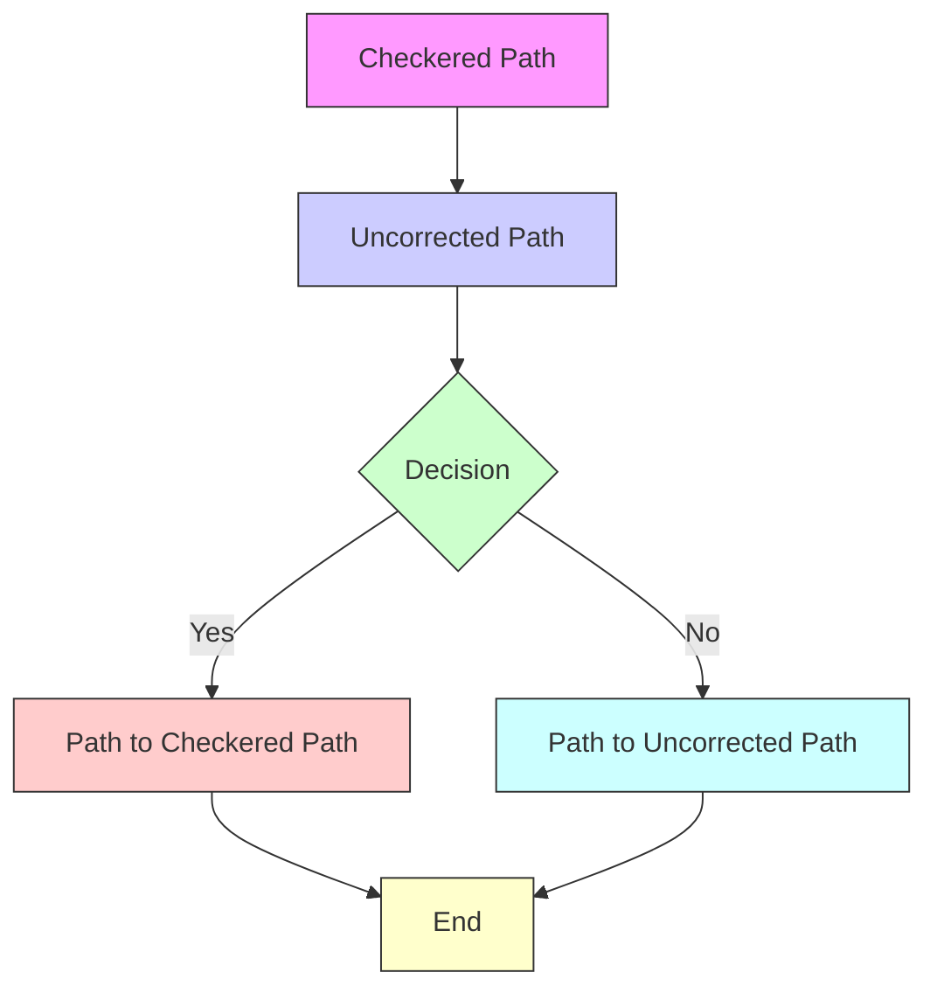
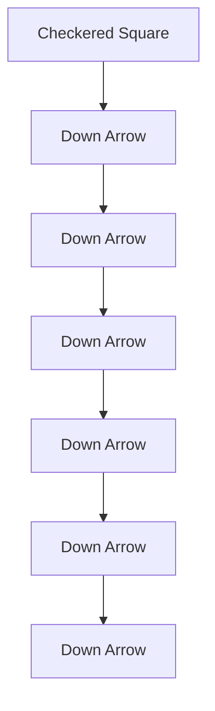

# The Booth Tolls for Thee

Duke University: Adam Chandler, Pradeep Baliga, Matthew Mian

Team 770

February 7, 2005

## Abstract

In this paper, we address the problems associated with heavy demands on toll plazas such as lines, backups, and traffic jams. We consider several models in hopes of minimizing the "cost to the system," which includes the time-value of time wasted by drivers as well as the cost of daily operations of the toll plaza.

One model yields a microscopic simulation of line formation in front of the toll booths when the service rate cannot match the demand. Using hourly demand data from a major New Jersey parkway, the simulation is limited in not taking bottlenecking effects into consideration. The results, however, when subjected to threshold analysis can serve to set upper bounds on the number of booths that could potentially be suggested by any other models.

After presenting this basic model, a more general, macroscopic framework for analyzing toll plaza design is introduced. In analyzing "total cost" and allowing bottlenecking, this model is more complete than the first, and it is able to make recommendations for booth number based on data obtained from the first model. This computation melds the macro- and micro- levels, a strategy that is helpful in looking at toll booth situations.

Finally, a model for traffic flow through a plaza is formulated in the world of "cellular automata." An interesting take on microscopic ideas, the cellular automata model can serve as an independent validation of our other models.

In fact, the models mostly agree that given L lanes, a number of booths around $\boldsymbol { B } = \left[ \left[ 1 . 6 5 L + 0 . 9 \right] \right]$ , where [[x ]] is the greatest integer less than x, will minimize the total human cost associated with the plaza.

2005FMCM/ICM#, MAA Prize

## Introduction

When Will Smith's name was called, announcing his receipt of the Best Male Performance award at a recent installment of the MTV Movie Awards, he bounded to the podium. Needling MTV for baiting him to attend their show, Smith snarkily quipped, "M.T.V.: My Time is Valuable." And of course, many other Americans would say the same for themselves, without Smith's irony. In an economy as driven by efficiency as America's, there certainly seems to be a predominant national mindset induced by the toil of the workweek. It's broader than just a desire to be busy or to accomplish; rather it extends to the notion of having control over one's own time, something we abhor to see wasted.

It is no stretch, either, to say that paying a toll to be able to travel to one's destination is largely viewed as an inconvenience. Americans have, for the most part, come to view having free, open roads as an inalienable right from our government. Toll roads are then aberrant and annoying.

But the vexing aspects of toll roads do not stop at the quarter or 35-cent fee, but rather include the time that drivers are forced to waste. Stopping at tolls retards the steady, quick flow of a highway, while not necessarily offering safety benefits like stopping at traffic lights (which are widely tolerated). What's worse is when heavy demand creates jams in the merging lanes exiting the booths or backs up traffic in delineated stripes of hot metal and hotter humanity entering the plaza. The time spent at a toll plaza is easily and often seen as time that could be more fruitfully spent. It is time when the drivers lose sovereignty over their personal whims and obligations.

Despite the anachronisms, imagining Sir Isaac Newton being stranded in a car at a toll plaza when the all-important apple decided to drop back at his home, or envisioning Albert Einstein sitting in a traffic jam without a pencil the moment that relativity dawned upon his own head serve to illustrate some (hyperbolic) motivation in trying to make the toll process as expedient as possible. It is certainly strange to think so, but Newton and Will Smith have something in common.

## Restatement of the Problem

Drivers have places to be and people to see, but for one reason or another, tolls must at times be collected from them. It is our goal in this paper to make the process more optimal for everyone involved, including the owners and operators of the booths, and of course the drivers. The only mechanism for optimization at our disposal is, presumably, adjustment of the number of booths present at a certain toll plaza, given the number of lanes entering and exiting it.

During peak hours, which occur typically when suburbanites make their way to and from work in larger cities, it is common for lines to form entering the tollbooths, as demand overtakes the fastest rates that the tolls can be collected. On the other side of the booths, too, as the (often) greater number of lanes coming out of the booths converge back down to the original number, bottlenecks and jams are wont to amass in response to the harried merging.

We seek to balance these effects, along with the cost associated to offer extra booths, in order to provide reasonable recommendations for how to minimize the waste of time and money in the toll-collecting process by adjusting the number of booths offered at a given toll plaza.

## Previous Work in Traffic Theory

Mark Twain famously remarked, in his disdain for arithmetic, that the answer to all mathematical problems is three. While insightful, the Twain model leaves some room for improvement in addressing the tollbooth conundrum at hand. A five-lane highway will need more than three tollbooths, but Twain wrote great novels.

There is a rather substantial literature on models for traffic flow, and most models fal into one of two categories: microscopic and macroscopic.

The microscopic models are the ones that can be said to "miss the forest for the trees." They examine the actions and decisions made by individual cars and drivers. Often these models are called car-following models since they use the spacing and speeds of cars to characterize the overall flow of traffic. Interesting models have emerged from examining cellular automata in a traffic sense (much more to come) and queuing theory.

Macroscopic models tend to view traffic flow in analogy to hydrodynamics and the flow of fluid streams: just as blood hurtles red blood cells through veins, vehicles pulse down streets toward their destinations. The "average" behavior is assessed, and commonly used variables include steady-state velocity, flux of cars per time, and density of traffic flow.

Some models bridge the gap, including the gas-kinetic model which allows for individual driving behaviors to enter into a macroscopic view of traffic, much like ideal gas theory can examine individual particles and collective gas [Tampere, et al. 2003].

The tollbooth problem is an interesting addition to the traffic literature because it involves no steady velocity, so macroscopic views may be tricky. On the other hand, specific bottlenecking events are quite complex, and microscopic ideas are certainly put to the test.

An M/M/s queue (vehicles arriving with gaps determined by an exponential random variable, to s tollbooths, and service at each tollbooth taking an exponential random variable amount of time [Gelenbe, 1987]) seemed appropriate at first. However, queuing assumptions did not satisfy our thirst for details about bottlenecking and about multiple lanes.

Drawing on ideas from old models, while still developing ideas more pertinent to the tollbooth problem, we were able to incorporate aspects of the situation from a smallscale into a larger-scale framework. It seems that neither micro- nor macro- will alone be adequate to capture the dynamics of a toll plaza, though our cellular automata simulation (for herky-jerky driving at lower speeds) produced some surprisingly good results (in terms of matching with other analyses).

## Properties of a Successful Model

A successful toll plaza configuration should achieve the following objectives:

Maximize efficiency of the toll plaza by reducing customer waiting time (due to bottlenecking, tollbooth lines, etc.)  
Suggest a reasonably implementable policy to toll plaza operators  
Be robust enough to efficiently handle the demands of a wide range of operating capacities  
As the number of highway lanes feeding the toll plaza is increased, the optimal number of tollbooths will not decrease.

## General Assumptions and Definitions

## Assumptions

There is only one type of driver in the system. In navigating toll plaza traffic, all drivers act according to the same set of rules. Although the individual decisions of any given driver are probabilistic, the associated probabilities are the same for all drivers.  
Bottlenecking downstream of the tollbooths does not hinder their operation. Vehicles which have already passed through a tollbooth may experience a slowing down due to the merging of traffic, but this effect is not extreme enough to block the tollbooth exits.  
The number of highway lanes does not exceed the number of tollbooths. An obvious solution to the posed problem may especially occur

to those sitting still at a traffic plaza: namely, set the number of tollbooths equal to zero. The assumption above instead ensures that the number of tollbooths must be strictly positive.

All tollbooths offer the same service and vehicles do not distinguish between them. We seek to improve toll plaza efficiency by optimizing the number of tollbooths – not the services they provide. While several types of tollbooth exist in practice, we have not been charged with distinguishing between them and suggesting their selective use. This is a problem of a different nature. Later, we return to this assumption and list ways in which our solution might change in response to multiple booth types.  
The amount of traffic on the highway is dictated by the number of lanes on the highway and not the number of tollbooths. Changing the number of tollbooths for a given number of lanes does not affect the ‘demand’ for the roadway.  
C The number of operating plaza booths remains constant throughout the day.

## Terms and Definitions

Take a “highway lane” to be a lane of roadway in the original highway before and after the toll plaza. Thus, the number of ‘lanes’ in a given toll plaza configuration depends not on the plaza itself but on the width of the roadway before and after the toll barrier.  
• Influx is the rate (in cars/min) of cars entering all booths of the plaza.  
Outflux is the rate (in cars/min) of cars exiting all booths of the plaza. It is a function of time.

## Optimization

Next, we seek a method of optimization that can be used to evaluate potential solutions to the problem. How do we decide that a given toll plaza configuration is optimal? One natural way to compare potential solutions is to compute the total time drivers spend waiting in the toll plaza. It seems logical to conclude that well-designed toll plazas will require less customer waiting time than their inefficient counterparts. Although this method might offer insight, we note some serious drawbacks. Namely, this waiting time minimization disregards the standpoint of the agency operating the toll plaza. In other words, minimizing the waiting time for customers may not present convenient policy options for toll plaza operators.

Suppose a model based on waiting time minimization suggests that forty tollbooths should be used in a plaza for a six lane stretch of highway. Should operators heed this advice? Certainly, the operators of the plaza will incur significant cost in building and maintaining such a facility. In crowded areas, it may not even be possible to construct a toll plaza of this size. Furthermore, tollbooths employ personnel to serve customers without exact change. Paying additional construction, maintenance, and labor costs may not be worth the added benefit of lowering customer wait time.

We seek a more balanced method of facility optimization. This method must consider not only the customers, but also the agency operating the toll plaza. To implement this scheme, we must somehow equate customer waiting time with toll plaza operating costs.

We elect to use cost as a yardstick of our solutions. Cost is a convenient medium due to its ubiquity in our culture and the relative ease of its translation into time. In considering the entire plaza system, we seek the facility configuration that wil generate the lowest net cost. This cost will be distributed among both parties in our system – the users and the operators.

In creating a cost optimization apparatus, we invoke the following terms and definitions:

The general cost, C [dollars], of a toll booth is the time-value of the delays incurred at a toll plaza for each individual (driver or passenger) AND the cost associated with daily operations of the booths at the plaza. The toll fees themselves and the upstart cost of building a new plaza are NOT part of this cost.  
α is the average time-value of a minute for a car occupant.  
γ is the average car occupancy.  
• N is the total number of (indistinct) tolls paid over the course of the day.  
L is the number of lanes entering and leaving a plaza. B is the number of booths in the plaza.  
• Q [dollars] is the average daily operating cost of a human-staffed tollbooth.

The underlying goal of this construct is to find a reasonable number of toolbooths, B that minimizes cost C, a function of B. We formulate this function C(B).

First, notice that the total waiting time per car will be $\mathbb { W } N ,$ and so the total cost incurred by waiting time will be WαNγ. General human time-value is cited as $\$ 6/$ hour or $\alpha = 1 0$ cents a minute [Boronico, 1998]. The amount that must be expended to operate a booth for a day would then be $\mathcal { Q } B .$ The average annual operation cost for a human-staffed tollbooth is $\$ 180,000$ , so we set $\mathcal { Q } \ : = \ :$ 180000/365.25 [Sullivan, et al. 1994].

Reasoning that W depends on B, we now see that

$$
C (B) = W \alpha N \gamma + Q B
$$

This is the function we'll want to minimize with respect to B (for a given L). Naturally, the knee-jerk reaction is to take its derivative and set it equal to zero, showing that the B we seek must necessarily satisfy

$$
W ^ {\prime} (B) = \frac {- Q}{\alpha N \gamma}.
$$

## Fourier Approximation of Toll Plaza Car Entry Rate

From a previous research paper’s traffic flow data [Boronico, 1998], we find the mean demand per minute (influx) of cars for a toll plaza on a given typical day. The reason the data peaks are very high at the 6am – 7am rush hour and are not as high during the 3pm – 4pm rush hour period is that the data is collected in the direction headed toward the metropolis. Thus, the main reason for traffic on a typical weekday, the workers during a business day, will be using the “toward big $\mathrm { c i t y } ^ { , \bullet }$ tollbooths in the morning, and these tollbooths will be far less frequented in the evening hours.

Table 1: Fourier Approximation of Influx Data

<table><tr><td>Start Time</td><td>End Time</td><td>Hour*</td><td>Influx (cars/min)</td><td>Fourier Approx of Influx**</td></tr><tr><td>12:00 AM</td><td>1:00 AM</td><td>0.5</td><td>15.44</td><td>15.16272478</td></tr><tr><td>1:00 AM</td><td>2:00 AM</td><td>1.5</td><td>15.32</td><td>15.42467822</td></tr><tr><td>2:00 AM</td><td>3:00 AM</td><td>2.5</td><td>15.16</td><td>15.18796896</td></tr><tr><td>3:00 AM</td><td>4:00 AM</td><td>3.5</td><td>19.9</td><td>19.81853474</td></tr><tr><td>4:00 AM</td><td>5:00 AM</td><td>4.5</td><td>47.09</td><td>47.22251986</td></tr><tr><td>5:00 AM</td><td>6:00 AM</td><td>5.5</td><td>89.95</td><td>89.61825869</td></tr><tr><td>6:00 AM</td><td>7:00 AM</td><td>6.5</td><td>105.9</td><td>106.4828683</td></tr><tr><td>7:00 AM</td><td>8:00 AM</td><td>7.5</td><td>85.52</td><td>84.72959878</td></tr><tr><td>8:00 AM</td><td>9:00 AM</td><td>8.5</td><td>54.68</td><td>55.57942216</td></tr><tr><td>9:00 AM</td><td>10:00 AM</td><td>9.5</td><td>43.11</td><td>42.42662327</td></tr><tr><td>10:00 AM</td><td>11:00 AM</td><td>10.5</td><td>40.16</td><td>40.49538486</td></tr><tr><td>11:00 AM</td><td>12:00 PM</td><td>11.5</td><td>40.85</td><td>40.83544106</td></tr><tr><td>12:00 PM</td><td>1:00 PM</td><td>12.5</td><td>41.72</td><td>41.63346483</td></tr><tr><td>1:00 PM</td><td>2:00 PM</td><td>13.5</td><td>44.54</td><td>44.44085865</td></tr><tr><td>2:00 PM</td><td>3:00 PM</td><td>14.5</td><td>48.88</td><td>49.29448007</td></tr><tr><td>3:00 PM</td><td>4:00 PM</td><td>15.5</td><td>53.2</td><td>52.55619485</td></tr><tr><td>4:00 PM</td><td>5:00 PM</td><td>16.5</td><td>51.61</td><td>52.21058951</td></tr><tr><td>5:00 PM</td><td>6:00 PM</td><td>17.5</td><td>48.38</td><td>48.16410937</td></tr><tr><td>6:00 PM</td><td>7:00 PM</td><td>18.5</td><td>39.72</td><td>39.50374966</td></tr><tr><td>7:00 PM</td><td>8:00 PM</td><td>19.5</td><td>30.51</td><td>31.11397219</td></tr><tr><td>8:00 PM</td><td>9:00 PM</td><td>20.5</td><td>29.48</td><td>28.86864636</td></tr><tr><td>9:00 PM</td><td>10:00 PM</td><td>21.5</td><td>26.82</td><td>27.196867</td></tr><tr><td>10:00 PM</td><td>11:00 PM</td><td>22.5</td><td>21.21</td><td>21.2608522</td></tr><tr><td>11:00 PM</td><td>12:00 AM</td><td>23.5</td><td>17.22</td><td>16.91795178</td></tr></table>

\* All “hour” values are averages of the start and end time, so as to accommodate the Fourier approximation.  
\*\*

where $\omega = \frac { 2 \pi } { 2 4 } = 0 . 2 5 1 3$ . This approximation fits the data points with an $\mathrm { R } ^ { 2 }$ value of 0.9997, and a further glimpse into the coefficients can be seen in the Appendix (I).

Before settling on a Fourier Series approximation with 8 terms, we first attempt a fit with a quartic polynomial. Though we are able to find a very close fit, there is an obvious downside. The quartic polynomial will not necessarily have the same value for t = 0 hours and t = 24 hours, even though this is obligatory for a cyclic model of daily traffic influx. Therefore, we choose a Fourier Series approximation, whose main upshot is its inherent periodicity, and whose period we can define as the length of a day. Also, it is worth noting that we use an approximation, rather than the data at hand, because we need an influx rate at every minute of the day, instead of just once an hour. In order to have a value at every minute, we need an estimation with more continuity.

## Model 1: Car-Tracking Without Bottlenecks

## Approach

We create the car-tracking model in order to place an upper bound on the optimal number of booths in a toll plaza configuration, given a particular number of lanes. The model looks at a typical day’s influx of vehicles into a toll plaza (data from [Boronico 1998] and Fourier Series approximation).

As vehicles approach the tollbooths within the toll plaza, they may or may not be held up by other vehicles being served. Each vehicle is looking to get through the toll plaza as quickly as possible, and the only factor that may cause Car A, which arrives earlier than Car B, to leave later than B is the random variable of service time at a tollbooth. In other words, cars do not make bad decisions concerning minimizing their wait times.

## Assumptions

Customers are served at a tollbooth at a rate defined by an exponential random variable (a common assumption in most queuing theory [Gelenbe, 1987]) with mean 12 seconds per vehicle (or 5 cars per minute).

Traffic influx occurs on a “per lane” basis, meaning that influx per lane is constant over all configurations with varying number of lanes.

Bottlenecking occurs more frequently when there are more tollbooths, given a particular number of lanes. This implies that omitting bottlenecking from our model will cause us to overestimate the optimal number of tollbooths for a given number of lanes, thus preserving our model as an upper bound for the optimal number of tollbooths.

There exists a time-saving threshold such that if the waiting time saved by adding another tollbooth is under this threshold, it is not worth the trouble and expense to add the tollbooth. We assume that if an additional tollbooth does not reduce the maximum waiting time over all cars by the same amount as the average time that it takes to serve a car at a tollbooth (12 seconds = 0.2 minutes), then it is an unnecessary addition.

An incoming car within the toll plaza will choose the tollbooth that will be soonest vacated, if all are currently occupied. If only one is vacant, the car will choose that tollbooth. If multiple tollbooths are vacant, the car will choose the one that was vacated the earliest. This last statement was created only to give the model a defined path, and it does not actually affect the waiting time in line.

Cars make rational decisions with the goal of minimizing their wait times.

## Expectations of the Model

An additional booth should not increase time spent waiting in line before the booths.

Each additional tollbooth experiences diminishing returns in terms of time saved, because each one is used at best as often as one of the already existing tollbooths.

## Development of Model

As in the other models, cars arrive at the toll plaza at a rate described by the Fourier Series approximation of the data collected from [Boronico, 1998]. Cars are considered inside the toll plaza (meaning that we begin to tabulate their waiting times) when they are either being served or waiting to be served.

Service time does not count as waiting time, so if a car enters the toll plaza and there is a vacant tollbooth, its waiting time is 0. If there are no vacant tollbooths at a particular moment, cars will form a queue to wait for tollbooths, and they will enter newly formed vacancies in the order in which they entered the toll plaza. Once a car has been served, it is considered to have exited its tollbooth and the toll plaza as a whole.

Bottlenecking has not been considered in this model, because we only wished for this model to serve as an upper bound for the number of tollbooths for a given number of lanes. Inspection of waiting time in line before the tollbooths sufficiently serves this purpose, and these waiting times will be placed under threshold analysis to determine when the marginal utility (in terms of time saved) of an additional tollbooth is negligible.

It should be noted that our car tracking model does not lend itself to cost optimization, because it is a very basic model that takes into account only how long each car waits in line for tollbooths. It does not factor in the agency controlling the tollbooths, or any costs incurred therein. The code for this model is included in Appendix II.

## Simulation and Results

We collected data from the program, for toll plazas with configurations of $I \in \{ 1 , 2 , 3 , 4 , 5 , 6 , 7 , 8 , 1 6 \}$ , and each B from L up to a point where additional booths no longer had ANY noticeable effect on waiting time, where  is the number of lanes and  is the number of tollbooths in the toll plaza configuration. For example, for $L = 1$ , we collect data for $1 \leq B \leq 5$ , because each additional tollbooth beyond 5 in a one lane configuration has an extremely small, if any, effect on waiting time. NOTE: This is not the same as our cutoff for negligible marginal utility from each added tollbooth. In fact, we clarify the cutoff for negligible marginal utility below, with the help of our work for the case of 6 lanes entering the toll plaza. We choose the 6-lane configuration in order to match those examined in the models to come.

Table 2: Waiting Time for Six Lane Simulation

<table><tr><td>Booths</td><td>Average Wait</td><td>Average Wait 2*</td><td>Maximum Wait</td><td>Marginal Utility</td></tr><tr><td>6</td><td>28.2683</td><td>43.0457</td><td>98.6196</td><td>N/A</td></tr><tr><td>7</td><td>12.1237</td><td>27.7573</td><td>55.1100</td><td>43.5096</td></tr><tr><td>8</td><td>5.9544</td><td>16.5089</td><td>31.6650</td><td>23.4450</td></tr><tr><td>9</td><td>2.4111</td><td>8.3740</td><td>15.8357</td><td>15.8293</td></tr><tr><td>10</td><td>0.2450</td><td>1.2188</td><td>2.7815</td><td>13.0542</td></tr><tr><td>11</td><td>0.0223</td><td>0.1666</td><td>0.7482</td><td>2.0333</td></tr><tr><td>12</td><td>0.0039</td><td>0.0653</td><td>0.3100</td><td>0.4382</td></tr><tr><td>13</td><td>0.0012</td><td>0.0410</td><td>0.2699</td><td>0.0401</td></tr></table>

\*Average Wait 2 refers to the average wait time per car that waits for longer than 0 seconds. This is more relevant, because as more booths appear, fewer cars spend any time waiting.  
\*\* All times are in minutes.  
\*\*\* These values were obtained by averaging from between 20 and 30 tests.

To get a more detailed look, we examine some data plots of the toll plaza configuration with 6 lanes and 10 tollbooths:


<details>
<summary>line chart</summary>

| Cars (by Index) | Waiting Time (mins) |
| --------------- | ------------------- |
| 0.0             | 0.0                 |
| 0.5             | 0.5                 |
| 1.0             | 3.5                 |
| 1.5             | 0.0                 |
| 2.0             | 0.0                 |
| 2.5             | 0.1                 |
| 3.0             | 0.0                 |
| 3.5             | 0.0                 |
</details>

Figure 1: Waiting time per car in six lane, ten tollbooth configuration, model # 1

In choosing an optimal number of booths by threshold analysis, we seek out the first additional booth that fails to reduce the maximum waiting time for a car by at least the length of the average tollbooth service time (0.2 minutes). The column denoted “Marginal Utility” shows the amount that each additional booth reduces maximum waiting time, and we simply notice that for $1 3 ^ { \mathrm { t h } }$ booth, this value is 0.0401 minutes. In short, based on our assumptions, it is unnecessary to build $\mathrm { ~ a ~ } 1 3 ^ { \mathrm { t h } }$ tollbooth for a toll plaza serving 6 lanes of traffic. Thus, we optimize at $L = 6  B = 1 2 .$ . In a similar manner, we optimize the toll plazas as follows:

Table 3: Optimized Number of Booths for Lanes

<table><tr><td>Lanes</td><td>Booths</td></tr><tr><td>1</td><td>4</td></tr><tr><td>2</td><td>5</td></tr><tr><td>3</td><td>7</td></tr><tr><td>4</td><td>8</td></tr><tr><td>5</td><td>10</td></tr><tr><td>6</td><td>12</td></tr><tr><td>7</td><td>13</td></tr><tr><td>8</td><td>16</td></tr><tr><td>16</td><td>29</td></tr></table>

Also, we wish to explore the situation in which there is one lane per booth:

Table 4: Waiting Times for Lanes with Booths

<table><tr><td>Lanes</td><td>Booths</td><td>Average Wait</td><td>Average Wait 2*</td><td>Maximum Wait</td></tr><tr><td>1</td><td>1</td><td>28.2400</td><td>37.6928</td><td>96.1541</td></tr><tr><td>2</td><td>2</td><td>31.6109</td><td>43.2415</td><td>103.7251</td></tr><tr><td>3</td><td>3</td><td>28.7137</td><td>40.8372</td><td>99.6343</td></tr><tr><td>4</td><td>4</td><td>30.8517</td><td>44.5677</td><td>102.4173</td></tr><tr><td>5</td><td>5</td><td>29.4785</td><td>44.3510</td><td>103.0286</td></tr><tr><td>6</td><td>6</td><td>28.2863</td><td>43.0457</td><td>98.6186</td></tr><tr><td>7</td><td>7</td><td>29.7364</td><td>45.7080</td><td>103.0432</td></tr><tr><td>8</td><td>8</td><td>27.7961</td><td>43.9531</td><td>96.2895</td></tr><tr><td>16</td><td>16</td><td>31.1367</td><td>48.9584</td><td>103.7946</td></tr></table>

\*Average Wait 2 refers to the average wait time per car that waits for longer than 0 seconds. \*\*These values were obtained by averaging from between 20 and 30 tests.

We find that with average wait times of around 30 minutes, average wait time of over 40 minutes per car that waits, and maximum wait times of around 100 minutes, the situation with one lane per booth is entirely undesirable.

## Discussion

We find that our model matches our general assumptions, and our assumptions for this model, and more importantly, that our results match our expectations. Namely, worth pointing out are the facts that the number of booths is increasing with respect to the number of lanes, that additional booths have diminishing returns on reduced waiting time (true for all L tested, and visible in the L = 6 chart), and that each additional booth does reduce waiting time in line.

The benefits of this rather simplistic model are speed and definite upper bounds. Because we know for a fact that bottlenecking will cause a configuration with fewer booths to be optimal, we know that the optimal number of booths can be no greater than those values presented in this model. Thus, this model’s greatest strength is that it serves to check the values of the other two models, which provide much more detailed and accurate simulations of the situation at hand.

The obvious weakness here is that we do ignore bottlenecking, but once again, this allows us to use our results to bound the results of the other two models. In short, the results of the next two models will show that this was in fact an appropriate model in terms of setting a boundary for our soon-to-be-realized answers. With respect to the specific situation in which there is one tollbooth per lane, the toll plaza performs quite terribly. This is mainly because the influx of cars occurs much more rapidly than the service in tollbooths, and such a situation may be addressed by allowing cars to leave tollbooth lines. This would add some practicality to the model, because while in general people may wait out a tollbooth line, they would be much more likely to leave if they knew that the wait could be up to 100 minutes.

## Model 2: A Macroscopic Model for Cost Minimization

## Motivation

Model 1 was an effective means of inputting and evaluating specific data sets. General trends could be inferred from the simulated motion of many individual cars at a toll plaza, especially regarding an upper bound on the number of tollbooths given a certain number of lanes. A theoretical framework for making those generalizations and conclusions, however, was missing. In this model we take a bird's eye view of the problem at hand to really address what we mean by the "optimization" of tollbooth processing. A decision-making apparatus is constructed that can be used with the results from Model 1 to refine our earlier observations.

## Approach

This model operates on a “higher” level than Model 1. It is less concerned with the details of individual vehicular motion and decision-making, but rather the general aggregate effect of the motions of the cars. The variables of this model will often be averages over a day's time.

For instance, there is no need for this model to decompose analytically the situation of two cars trying to merge into the same lane. Instead, it recognizes that beyond a certain threshold of outflux from the booths, some bottlenecking will occur. The determination of this threshold and its dependencies will be one of the problems addressed in the development of this model.

Also, the concept of the “cost” of a particular plaza configuration is utilized by this model. In minimizing this cost with respect to the number B of booths given a number L of lanes, we obtain a value for B that satisfies our concept of optimality.

Defining what this nebulous notion of “cost” should mean is the real dilemma to be addressed, but also the impetus for designing this particular model. We chose not to focus on the actual values of the tolls paid by the drivers nor the initial costs to plaza owners of renovating their plazas. Those are not the costs affecting long-term efficient design: the same people will likely be using the road despite any potential increase in tolls that might be instituted to absorb the costs of renovation. The more interesting cost to the drivers is a time-cost. As Will Smith's quote in the Introduction hinted, human time has value, and while Isaac Newton's may be worth more than others, we'll just assume a national average of \$6/hour. By calculating time wasted in waiting at toll plazas, we can get a handle on money lost from potential work unable to be completed.

The other cost to consider is that of actual daily operations of the plazas. We combine these “costs to the system” in this model and attempt to minimize their sum with respect to the number of booths. (See Optimization Section for mathematical treatment.)

## Assumptions, Variables, and Terms

We monitor traffic over the course of one day.  
$W$ [minutes] is the average waiting time per car in the toll plaza. W accounts for time spent in lines $( W _ { 1 } ) _ { : }$ , service time $( W _ { 2 } )$ , and bottlenecking (W3). (The numbering reflects the progression through the toll plaza.)  
$F _ { \mathrm { i } }$ is a function of time giving the influx of cars per minute to the plaza from one lane. $F _ { \mathrm { o } }$ gives the outflux from the booth in cars per minute (in practice, an average of at least 20 individual Fo curves since they vary probabilistically).  
r is the maximum potential service rate [cars per minute]. This is the rate each booth operates at when the influx is non-abating.  
There is an outflux barrier, K [cars per minute], above which bottlenecking takes place. It is taken to be linear in L and independent of $B ,$ and we call it the bottlenecking threshold.

## Development

To discover an appropriate value for $B ,$ we'll need to know more about W.

First note that $W _ { 1 }$ and $\mathcal { W } _ { 3 }$ both depend on B and that $W = \sum _ { i = 1 } ^ { 3 } W _ { i }$ . It is easily seen from the definitions that $W _ { 2 } = { \small \sum } _ { r }$ .

W1 represents the average amount of time each car spent waiting in lines before reaching the tollbooth. Thus, it begins to accumulate when the total influx of traffic exceeds the toll plaza's capacity to handle the traffic. LF (t) gives the total influx, and Br gives the maximal rate of service. When the difference between the former and the latter is positive (represented by areas enclosed by the curves in Figure $2 )$ , we’ll want to integrate over time to calculate how many cars were forced to wait in line.


<details>
<summary>line chart</summary>

| Time of Day | Demand (cars min⁻¹) |
| ----------- | ------------------- |
| 12:01 AM    | Low                 |
|            | High                |
|            | Mid                 |
|            | Low                 |
| 11:59 PM    | Low                 |
</details>

Figure 2: Enclosed area (above line, below curve) represents total number of cars in line at any time during the day.

Integrating again gives us the total amount of time waited by those cars (with 3600 being a scale factor for time units):

$$
3 6 0 0 \int_ {0} ^ {2 4} \int_ {0} ^ {t} \max (L F _ {i} (\tau) - B r, 0) d \tau d t
$$

The average over the total number of cars will be this expression divided by N. In summary,

$$
W _ {1} = \frac {3 6 0 0}{N} \int_ {0} ^ {2 4} \int_ {0} ^ {t} \max (L F _ {i} (\tau) - B r, 0) d \tau d t
$$

As it turns out, the technique to obtain W3 is quite analogous to that we used to find $W _ { 1 } .$ When comparing the bottlenecking situation to the line-up situation just considered, analogies can be drawn from influx to outflux and from Br to K. As one might expect, we calculate $\mathcal { W } _ { 3 }$ as follows:

$$
W _ {3} = \frac {3 6 0 0}{N} \int_ {0} ^ {2 4} \int_ {0} ^ {t} \max (F _ {o} (\tau , B) - K, 0) d \tau d t
$$

The problem remains of how to determine upon what variable(s) K depends. First, K is not directly dependent on B since bottlenecking should only be a result of general outflux from the booths into L lanes. K is instead indirectly dependent on the number of booths, because outflux, $\mathrm { F _ { o } } ,$ depends on $B ,$ and K in turn depends on outflux. K also can be considered a linear function in terms of $\mathrm { L } ,$ because L is directly proportional to influx, which, by the law of conservation of traffic, must equal outflux in the aggregate. Now, we have all the mathematical constructions in place in order to find the B that minimizes total general cost reasonably. Computationally, however, there is still a long road to hoe.

## Simulation and Results

As discussed, this macroscopic model will serve as a framework in which we can analyze the data obtained from Model 1 in a cost-minimization procedure. Using the same data for traffic entering the toll plaza as was used in Model 1, this new model will now be able to address the waiting time incurred by bottlenecking and eventually minimize total general cost to the system with the correct selection of B.

As a point of illustration, this particular discussion will detail the calculation of the recommended value of $B \ \mathrm { f o r } \ L = 6$ . The techniques used with other values of L were completely analogous.

Clearly, with $\mathcal { Q } , \alpha , \gamma ,$ and N all independent of $B ,$ the most challenging computational procedure will be to find $W$ as a function of $B ,$ specifically $W _ { 1 }$ and $W _ { 3 }$ as individual functions of B.

Given the influx function used in Model 1 (see Appendix I), we can use Mathematica to numerically integrate the expression for W1 with a given L and $r = 5$ cars per minute (as used in the other models). $( N ,$ of course, comes from an integration of the influx expression.) A specific value of B must also be used in the evaluation, so we do the calculation for a series of B values ranging from L to $L + 7 _ { : }$ , with $L + 7$ usually being above the upper bound from Model 1 (and step size: 0.25). A Mathematica quartic polynomial fit is then done on the resulting points $( B , \mathbb { W } 1 ( B ) )$ ). This procedure will give $\dot { W _ { I } }$ as a function of $B ,$ as desired.

The $L = 6$ example will perhaps be illustrative. We can easily integrate to find the value $N = 9 2 3 5 5 .$ . We compute $W _ { 1 }$ for values of B ranging from 6 to 13, in steps of 0.25 (for a better fitting curve). The plot of these points along with the best-fit quartic is given in Figure 3.


<details>
<summary>line chart</summary>

| B  | W1  |
|----|-----|
| 6  | 100 |
| 7  | 85  |
| 8  | 65  |
| 9  | 45  |
| 10 | 25  |
| 11 | 5   |
| 12 | 2   |
| 13 | 1   |
</details>

Figure 3: Plot of W1 for B ranging from 6 to 13 (actual points with quartic fit)

The recipe for $W _ { 3 } ( B )$ is somewhat less straight-forward since $F _ { \mathrm { o } } ( \hat { l } )$ is generated from a stochastic distribution, unlike the deterministic $\begin{array} { r l } { F _ { \mathrm { i } } ( t ) . } & { { } \mathrm { F _ { o } } ( t ) } \end{array}$ also depends on B, a significant complication. At least 20 trials of each case $( L , B )$ were run under the first model, and the averaged outcomes of their outflux functions become the function we used for outflux in this model’s simulation, henceforth referred to just as $F _ { \mathrm { o } } ( t , \boldsymbol { B } )$ .

Once $F _ { \mathrm { o } } ( \mathrm { t } , \ B )$ was determined for each salient value of $L ,$ we used surface-fitting software (Systat’s TableCurve3D) to generate an expression for outflux as a function of time AND the number of booths. We use this expression in the compound integral for $\psi _ { 3 } ,$ and used Mathematica to integrate numerically for the same values of B selected earlier (to determine the plot for $\bar { \mathcal { W } } _ { 1 } ( B ) )$ . As before, we generate a scatter plot of points $( B , W _ { 3 } ( B ) )$ and do a Mathematica quartic polynomial fit to the data. This is the function of B we seek.

It is important to note that correlation coefficient values (R2) for the surface fits all fall between 0.84 and 0.95, which are certainly acceptable values. All of the quartic fits have correlation coefficients very near 1.

Again, this process is best illustrated with the concrete $L = 6$ example. The data used for the surface fit (shown below in Figure $4 )$ is included in Appendix IV. As in determining $W _ { 1 } ( B ) _ { : }$ , the values of $\mathcal { W } _ { 3 }$ are shown for values of B from 6 to 13 (step size: 0.25), along with the fitted quartic (see below). Now we have $W _ { 3 } ( B )$ , and are ready to do the cost minimization. In general, dW/dB will be a cubic (as a result of the quartic fits), and so three solutions emerge. In all cases examined, only one is an appropriate value to minimize $C$ (when rounded). These values are summarized below in Table 5.

## Outflux (cars/min) -- 6 Lane

Rank 4 Eqn 317016996 z^(-1)=a+bx^(1.5)+cx^2+dx^2lnx+ex^(2.5)+fx^3+ge^(x/wx)+h/lny

r^2=0.89795631 DF Adj r^2=0.89349539 FitStdErr=3.5049628 Fstat=231.30704

a=-220.32191 b=-2.9096518 c=1.5952541 d=-0.63655404

e=0.23714718 f=-0.0079954663 g=220.43421 h=0.010602912


<details>
<summary>3d scatter plot with color gradient overlay</summary>

| Time | Booths | Outflux |
|------|--------|---------|
| 0    | 12     | 0       |
| 5    | 11     | 10      |
| 10   | 10     | 20      |
| 15   | 9      | 30      |
| 20   | 8      | 40      |
| 25   | 7      | 50      |
| 30   | 6      | 60      |
</details>

Figure 4: Surface fit for outflux function with respect to time (hrs) and number of booths for L = 6


<details>
<summary>line chart</summary>

| B  | W3  |
|----|-----|
| 6  | 92  |
| 7  | 94  |
| 8  | 96  |
| 9  | 98  |
| 10 | 100 |
| 11 | 102 |
| 12 | 104 |
| 13 | 106 |
</details>

Figure 5: Plot of W3 for B ranging from 6 to 13 (actual points with quartic fit)

Table 5: Model 2 Final Recommendations

<table><tr><td>Lanes</td><td>Booths</td></tr><tr><td>1</td><td>3</td></tr><tr><td>2</td><td>5</td></tr><tr><td>3</td><td>6</td></tr><tr><td>4</td><td>7</td></tr><tr><td>5</td><td>9</td></tr><tr><td>6</td><td>11</td></tr><tr><td>7</td><td>12</td></tr><tr><td>8</td><td>14</td></tr><tr><td>16</td><td>27</td></tr></table>

Mathematica’s numeric solver gives the B-value of the minimum in $C ( B )$ at $B = 1 0 . 8 4$ . Thus, this model recommends 11 booths for 6 lanes of traffic at a toll plaza.

## Discussion

This model really amounts to a theoretical way to calculate total waiting time for drivers based on general ideas of traffic flow. The values given above in the summary table are actually quite reasonable and satisfy many of the expectations we laid out characterizing a successful model of the tollbooth problem. The recommended Bvalues increase monotonically with $L ,$ as expected, and they also fit in under the “upper bounds” produced in Model 1, as hoped. Clear from the table above, too, is that a 1-booth per lane setup was never chosen as optimal. In other words, $\textrm { B } =$ L never seems to be a minimizing value for B in C(B) (for given L). This is because, as we can see from the graphs above of $W _ { 1 }$ and $\psi _ { 3 } ,$ while bottlenecking is zero, waiting time in line before the tollbooths is much higher, thus diminishing the effect of bottlenecking.

Given the model’s success, it may be disheartening to acknowledge its lack of robustness. The formulation of this model glosses over the fine details of traffic behavior, so any adjustments to fine-scale aspects of traffic, such as the addition of a potential E-ZPass lane (to be discussed later), would be impossible to implement in any specific manner. Perhaps the rate r of service could be adjusted higher for the given scenario, but changing lanes before the tollbooths in anticipation of such a lane would be difficult to capture with this model. Nevertheless, the model works quite well, it seems, for the given formulation of the problem.

## Model 3 – Cellular Automata: Life! (on the Road)

## Motivation

In approaching the problem of toll plaza optimization, we have heretofore considered traffic flow in a macroscopic sense. To avoid the complexity of accounting for individual cars, we have used continuous flow parameters averaged over the course of a day. Although this approach offers mathematical tractability, it may be overlooking important behavior. What effect does the discreteness of traffic have on the nature and solution of the problem?

At its heart, traffic movement is a discrete phenomenon. Any caffeinated weekday morning commuter would attest to this. Traffic lights, bottlenecks, and construction zones can turn a daily commute into a stop-and-go nightmare. Although steady-state traffic flow may be well-characterized by continuous equations, vehicles and tollbooths may not always lend themselves to such convenient description. Each vehicle is operated by a driver whose behavior and decisions may not necessarily be predictable. Drivers introduce the variable elements of reaction time, attentiveness, and following distance to traffic analysis models. Vehicles and tollbooths are rigid objects and occupy specific positions. While “collisions” of continuous fluid elements may be of little consequence, they can be devastating in a traffic analog.

Simply put, a continuous model of traffic may be neglecting the very factors that give rise to traffic congestion and jamming. The smoothness assumed in the continuous macroscopic approach could be inappropriate for a toll plaza. To address this possibility, we turn to cellular automata theory to develop a discrete, microscopic model. The results of this analysis have the potential either to confirm the results of our continuous approach or perhaps cause us to question the soundness of our initial assumptions.

## Approach

In the cellular automata model of toll plaza dynamics, each cell is designated as a vehicle, a vacancy, or a barrier to traffic flow. The model follows individual vehicles through the plaza and computes the time that each one spends waiting. By summing the time spent waiting by all vehicles in the plaza, we arrive at an indication of the plaza’s operating efficiency. Using measurements of waiting times, we may optimize the number of booths for any given number of lanes using either of the strategies discussed earlier.

In the cellular automata model, time, position, and vehicle identity are each discrete quantities. Position is specified as a cell or location in a matrix, while time is incremented using a convenient time step. Individual vehicles are created and followed through the plaza. This approach contrasts with that of the macroscopic models, which consider only the overall flow of traffic. By observing individual components of the traffic, the cellular automata model may help elucidate the mechanisms that give rise to congestion associated with tollbooths.

At its essence, the cellular automata model provides a means of creating vehicles, manipulating them through a virtual plaza, and quantifying the efficiency of the plaza configuration. Vehicles progress through the plaza as a function of time and the surrounding geometry. In any given time step, a vehicle may advance forward, change lanes, or sit still. Vehicles enter the plaza from a stretch of road containing a specific number of lanes. As a vehicle approaches the string of tollbooths, the road widens to accommodate the booths (given that there are more tollbooths than lanes). There is a specific delay associated with using a tollbooth. Once a vehicle leaves a booth, it must merge into a roadway containing the original number of lanes. During the course of a vehicle’s trip, it may encounter obstacles that temporarily prevent it from moving.

## Assumptions

In addition to the general assumptions about toll plazas and traffic flow listed at the beginning of this paper, the cellular automata model requires an additional set of specific assumptions (to be distinguished from governing dynamics rules):

The plaza consists of three types of cells: occupied cells, vacant cells, and ‘forbidden’ cells (which represent cells that vehicles are not permitted to occupy – i.e. the boundary of the plaza).  
Cells represent a physical space that may accommodate a standard vehicle and a comfortable buffer region on either side.  
All vehicles are the same size.

We will revisit and reevaluate each of these assumptions in the subsequent discussion section.

## Development of Model

In formulating a two-dimensional cellular automata model of toll plaza traffic dynamics, we give considerable attention to the feasibility of computational implementation. As analytical treatment of a two-dimensional automata model is prohibitively difficult, we seek only numerical solution to the task at hand. The following section discusses our formulation of a cellular automata model and presents a general description of the model’s implementation. For this model, coding and numerical analysis are done using MatLab software.

## A Virtual Toll Plaza

In devising a toll plaza, we accommodate the discrete nature of position in our model. To represent the merging or diverging of lanes, we use a simple stair-step approach like that shown in Figure 6.


<details>
<summary>text_image</summary>

Grid-based puzzle or pattern recognition diagram with checkered and striped sections, some marked with downward arrows
</details>

Figure 6: Schematic representation of simple plaza construction. For this case, the plaza contains two lanes and six booths. Solid (dark) cells represent positions that vehicles are not permitted to occupy, while checkered cells represent vehicles, and the striped cells represent tollbooths. The direction of motion is fixed (but arbitrary if the configuration is symmetric). White cells are vacant. Arrows indicate the direction of motion.

To implement this concept in MatLab, we create a large matrix representing the physical system. Occupied cells are labeled with ones while vacant cells are numbered with zeros. For easy visualization, ‘forbidden cells’ are marked with ‘-888.’ In some cases, occupied cells are flagged and assigned numbers other than one. This will be discussed in more detail later.

<table><tr><td>-888</td><td>-888</td><td>-888</td><td>0</td><td>0</td><td>-888</td><td>-888</td><td>-888</td></tr><tr><td>-888</td><td>-888</td><td>-888</td><td>1</td><td>0</td><td>-888</td><td>-888</td><td>-888</td></tr><tr><td>-888</td><td>-888</td><td>0</td><td>0</td><td>0</td><td>0</td><td>-888</td><td>-888</td></tr><tr><td>-888</td><td>-888</td><td>0</td><td>0</td><td>1</td><td>0</td><td>-888</td><td>-888</td></tr><tr><td>-888</td><td>0</td><td>1</td><td>0</td><td>0</td><td>0</td><td>0</td><td>-888</td></tr><tr><td>-888</td><td>0</td><td>0</td><td>1</td><td>0</td><td>0</td><td>0</td><td>-888</td></tr><tr><td>-888</td><td>0</td><td>0</td><td>0</td><td>0</td><td>0</td><td>0</td><td>-888</td></tr><tr><td>-888</td><td>-888</td><td>0</td><td>0</td><td>0</td><td>0</td><td>-888</td><td>-888</td></tr><tr><td>-888</td><td>-888</td><td>0</td><td>0</td><td>0</td><td>0</td><td>-888</td><td>-888</td></tr><tr><td>-888</td><td>-888</td><td>-888</td><td>0</td><td>1</td><td>-888</td><td>-888</td><td>-888</td></tr><tr><td>-888</td><td>-888</td><td>-888</td><td>1</td><td>0</td><td>-888</td><td>-888</td><td>-888</td></tr></table>

Figure 7: Visual representation of simple plaza from Figure 6 built in MatLab. Ones represent occupied cells, zeros represent vacant cells, and ‘-888’ denotes a forbidden

(inaccessible) cell. As a convention, cars in the model traveled from the top of the matrix to the bottom.

The plazas shown above are very simple and do not represent the actual cases simulated. Typically, a long corridor is added to the top and bottom of the system. In this way, vehicles can establish a regular, steady rate before arriving at the tollbooths and after departing from them. Additionally, the larger system minimizes the impact of the boundary conditions on the traffic dynamics near the tollbooths (for example, a line will not become long enough to reach the boundary and interfere with application of the boundary conditions).

To allow for additional flexibility, the steepness of the merging and diverging are left as variables and can be modified from trial to trial. One would expect (as will be shown later) that bottlenecking will be severe for steep merging gradients. If tollbooth lanes end rapidly, vehicles must immediately converge to the central lanes and bottlenecking effects will intensify.

A special case of the plaza configuration occurs when the following is true:

$$
\mathrm{mod} (B - L, 2) = 1
$$

where B is the number of tollbooths and L is the number of lanes in the original (and final) roadway. In short, this condition is satisfied when either B or L is even and the other is odd. When this occurs, it is no longer possible to create a symmetric plaza system. The number of stair-steps allocated for merging and diverging will be larger on one side than another. Figure 8 demonstrates such a case:


<details>
<summary>flowchart</summary>


</details>

Figure 8: Schematic representation of asymmetric plaza. This example contains four booth lanes but only three normal travel lanes. We resolve issue by using one fewer stair-step on the right side.

As we will show later, the asymmetry of this design is not significant from a practical standpoint. Our results do not appear to be odd-even dependent.

The problem of plaza construction was generalized and implemented using the function ‘create\_plaza.’ This MatLab function creates a plaza (no vehicles) of B tollbooth lanes and L normal travel lanes. For an explicit reproduction of this function, please consult Appendix III.

## Governing Dynamics

With the establishment of a plaza, we next turn to the dynamics within it. As cars move through the toll plaza, we require a governing set of rules to dictate their behavior. The rules are applied to each vehicle to determine which action will be taken during the current time step. For any given toll plaza configuration or geometry, each vehicle has a specific number of options, each with an associated probability.

Just as crucial as the set of rules, however, is the order in which the rules are implemented. A fuzziness on rule application may give rise to confusing or misleading results. There are a number of decisions to consider. For instance, which car gets to act first? How does a vehicle decide to switch lanes? When two vehicles want to occupy the same cell, which is given preference? Such matters could be critical. On the other hand, one must be careful that systematically following a certain rule order does not create some obscure or unintended phenomenon. To perform any kind of meaningful simulation, these issues must be balanced.

A working cellular automata model is presented below. For each time step, the following rules are applied in sequential order:

1. Starting at the front of the traffic and moving backward (with respect to the flow), vehicles are advanced to the cell directly in front of them with probability ${ \mathit { \Gamma } } _ { \beta } .$ If the next cell is not vacant, the vehicle does not advance and is flagged. Note: This probability is meant to simulate the stop-and-go nature of slowly moving traffic. One could think of $\dot { \boldsymbol { p } }$ as a measure of driver attentiveness. $\mathit { p } = 1$ corresponds to the case where drivers are perfectly attentive and move forward at every opportunity. $p = 0$ would represent the extreme case where drivers have fallen asleep and they fail to move forward at all.

2. Using an influx distribution function, the appropriate number of new vehicles is randomly assigned to lanes at the initial boundary (see next section).

3. Starting at the front of traffic and moving backward, those vehicles flagged in step 1 are given the opportunity to switch lanes. For each row of traffic, the priority order for switching is determined by a random permutation of the number of lanes. Switching is attempted with probability q. If switching is attempted, left and right merges are given equal probability to be attempted first. If a merge in one direction (i.e. left or right) is impossible (meaning that the adjacent cell is not vacant), then the other direction is attempted. If both adjacent cells are unavailable, the vehicle is not moved.

4. Total waiting time for the current time step is computed by determining the number of cells in the system containing a vehicle.

5. The number of vehicles advancing through the far boundary (end of the simulation space) are tabulated and added to the total output. This number is later used to confirm conservation of traffic.

Other notes about the algorithm:

In step 1, those vehicles in the tollbooth position are not necessarily advanced. Rather, the value of the cell is incremented and the vehicle is not moved. This has the effect of delaying a vehicle being serviced at a tollbooth. The cell for such a vehicle is incremented each time step until it has waited enough time steps to constitute a “service delay.” The vehicle is then released. The service delay is typically three to five time steps.  
Most simulations are performed over what amounts to a 24-hr period to reflect the cyclic nature of daily traffic. This choice is examined later and its results are compared to those of a shorter simulation with a higher traffic influx (simulating only rush hour).

A simplified flow chart representing the above algorithm is presented in Figure 9:


<details>
<summary>flowchart</summary>

```mermaid
graph TD
  A["Initialize"] --> B["for each time step"]
  B --> C["Move forward with probability p"]
  C -->|Able to move forward| D["Move Forward"]
  D --> E["Add new cars to initial boundary"]
  E --> F["Compute waiting time"]
  F --> G["Compute outflow at terminal boundary"]
  G --> H["Clear terminal boundary"]
  H --> I["Increment time step"]
  C -->|Can't move forward| J["Wait until all other vehicles have moved"]
  J --> K{Probability q/2}
  K -->|Yes| L["Left Available?"]
  K -->|No| M{Probability q/2}
  M -->|Yes| N["Right Available?"]
  M -->|No| O{Probability (1-q)}
  O --> P{Do not move}
  P --> Q["Move Right"]
  Q --> R{Left Available?}
  R -->|Yes| S["Move Left"]
  R -->|No| T["Left Available?"]
  S --> U["Move Right"]
  T --> V["Do not move"]
  U --> V
```
</details>

Figure 9: Flow-chart representation of the cellular automata algorithm

## Population Considerations

Recall that the daily (cyclic) influx distribution of cars, $F _ { i n } ( t ) ,$ was previously defined using a Fourier series (See Appendix I):

$$
F _ {i n} (t) = a _ {0} + \sum_ {n = 1} ^ {N} a _ {n} \cos (n \cdot \boldsymbol {\omega} \cdot t) + \sum_ {n = 1} ^ {N} b _ {n} \sin (n \cdot \boldsymbol {\omega} \cdot t)
$$

This method is still valid for the automata model, but the influx values must be scaled to reflect the effective influx over a much smaller time interval (a single time step). The modified influx function, $F _ { i n } { } ^ { \prime } ( \tau ) ,$ , is computed as follows:

$$
F _ {i n} ^ {\prime} (\tau) = \min \left[ \operatorname{round} \left(\frac {F _ {i n} (t)}{\eta}\right), L \right]
$$

where η is a constant factor required for the conversion from units of t to those of τ and L is the number of initial travel lanes. A ‘round( )’ function is employed to round the argument to the nearest integer (recall that the influx per time step in the automata model must be an integer number of vehicles not exceeding the number of available lanes).

When this computation is carried out, we obtain the following distributions:


<details>
<summary>line chart</summary>

| t | F_in(t) |
| --- | --- |
| 0 | 0.0 |
| 1 | 0.5 |
| 2 | 1.0 |
| 3 | 0.8 |
| 4 | 0.6 |
| 5 | 0.7 |
| 6 | 0.9 |
| 7 | 0.7 |
| 8 | 0.6 |
| 9 | 0.5 |
| 10 | 0.4 |
| 11 | 0.3 |
| 12 | 0.2 |
| 13 | 0.1 |
| 14 | 0.05 |
| 15 | 0.02 |
| 16 | 0.01 |
| 17 | 0.005 |
| 18 | 0.002 |
| 19 | 0.001 |
| 20 | 0.0005 |
</details>

t (hrs)


<details>
<summary>histogram</summary>

| Bin Range | Frequency |
| --------- | --------- |
| 0 - 10    | 1         |
| 10 - 20   | 3         |
| 20 - 30   | 5         |
| 30 - 40   | 7         |
| 40 - 50   | 9         |
| 50 - 60   | 8         |
| 60 - 70   | 6         |
| 70 - 80   | 4         |
| 80 - 90   | 2         |
| 90 - 100  | 1         |
</details>

t (time steps)  
Figure 10: Plots of continuous influx $( F _ { i n } ( t ) - \mathrm { l e f t } )$ and normalized cellular automata model influx $( { F _ { i n } } ^ { \prime } ( \tau ) - \mathrm { { r i g h t } } )$ .

## Boundary Conditions

To simulate the automata model, we must define boundary conditions for the plaza. Although plaza model is two-dimensional, the motion is essentially one-dimensional. The barriers on the sides of the plaza prevent the cars from occupying those cells. In a sense, thus, the boundary conditions for the sides of the plaza parallel to the roadway might be thought of as analogous to either Neumann or Dirichlet (with respect to the vehicles). That is, the vehicles may neither occupy the boundary nor traverse the boundary to leave or enter the system, respectively.

The boundary conditions for the boundaries perpendicular to the direction of traffic flow are defined differently. As visited in the previous section, there is a timedependent influx associated with the toll plaza. At the boundary where vehicles begin their trip through the plaza, new vehicles can be introduced at each time step. The number of cars introduced is given by the value of the influx function for the corresponding time step. Once the number of incoming vehicles is determined, the vehicles are distributed randomly among the available lanes. Thus, the number of incoming vehicles per time step can never exceed the number of highway lanes in the system.

At the system boundary where vehicles exit the plaza, the boundary condition acts to remove all vehicles that entered the boundary row of cells since the previous time step. In other words, the final row of cells acts as a perfect absorber – every vehicle that reaches it is immediately removed and the output count is incremented. Recall that the output count is used to confirm the conservation of traffic principle. By removing vehicles before a new time step begins, the boundary clears the way for the next row of vehicles to leave the system. This prevents a buildup of vehicles at the system’s departure zone.

## Computing Wait Time

Wait time is determined by looking through the entire matrix at each time step and noting the number of cells with positive values. Recall that the only cells containing positive values are those representing vehicles. Thus, by counting the number of vehicles in the plaza at any given time, we are also counting the amount of time spent by vehicles in the plaza (in units of time steps).

At time step i, total cumulative waiting time is computed as follows:

$$
\begin{array}{l} \forall x, \forall y \\ W _ {i} = W _ {i - 1} + 1 \big (p l a z a (x, y) > 0 \big) \\ \end{array}
$$

where $^ { \mathfrak { c } } 1 ( ) ^ { \mathfrak { , } }$ denotes an indicator function and ‘plaza’ denotes the matrix of cells.

## Simulation and Results

To determine the optimal number of tollbooths for a given number of highway lanes, the cellular automata simulation is run for relevant combinations of the two. Recall one of our general assumptions is that the number of tollbooths in any plaza is at least equal to the number of highway lanes that are feeding it. An optimal tollbooth number is selected for a given number of highway lanes when the system cost optimization method discussed earlier is applied.

Recall the cost optimization method defines total cost as follows:

$$
C _ {t o t a l} = \alpha \cdot \gamma \cdot N \cdot W (B, L) + B \cdot Q
$$

Using the cellular automata model, we compute waiting time as a function of both the number of lanes and the number of tollbooths. For a fixed L, we compare all values of C and choose the lowest one. The results of this method are presented in Table 6.

Table 6: Optimization for Cellular Automata Model

<table><tr><td></td><td colspan="2">Optimal # Booths</td></tr><tr><td>Highway Lanes</td><td>Typical Day</td><td>Rush Hour</td></tr><tr><td>1</td><td>2</td><td>2</td></tr><tr><td>2</td><td>4</td><td>4</td></tr><tr><td>3</td><td>5</td><td>6</td></tr><tr><td>4</td><td>7</td><td>7</td></tr><tr><td>5</td><td>8</td><td>9</td></tr><tr><td>6</td><td>10</td><td>11</td></tr><tr><td>7</td><td>12</td><td>13</td></tr><tr><td>8</td><td>14</td><td>15</td></tr><tr><td>16</td><td>27</td><td>29</td></tr></table>

As indicated in Table 6, there is fairly good agreement between the recommended number of booths for a typical day and for peak hours. However, we note that the optimal booth number for a typical day never exceeds that for rush hour. Rush hour seems to require slightly more booths than a typical day in order for the plaza to operate most efficiently.

Each value in Table 6 is representative of approximately 20 trials. Through these trials, we noted a remarkable stability in our model. Despite the stochastic nature of our algorithm, each number of lanes was almost always optimized to the same number of tollbooths. There were a handful of exceptions; they occurred exclusively for small numbers of highway lanes (< 3 lanes). Integer values are presented in Table 6 only because fractional tollbooths have no physical meaning.

## Example

As an example of one optimization using the cellular automata model, let us consider the instance of six highway lanes. For comparison, the analogous optimization is carried out previously in models 1 and 2.


<details>
<summary>line chart</summary>

| Number of Tollbooths | Mean Wait Time (time steps) |
| -------------------- | --------------------------- |
| 6                    | 9.8                         |
| 7                    | 8.1                         |
| 8                    | 7.8                         |
| 9                    | 7.7                         |
| 10                   | 7.3                         |
| 11                   | 8.5                         |
| 12                   | 8.9                         |
| 13                   | 10.8                        |
| 14                   | 11.0                        |
</details>

Figure 11: Minimization of mean waiting time for six lane roadway. Use of 10 tollbooths minimizes the mean wait for customers.

Figure 11 is created by running the simulation repeatedly for six lanes and varying the number of tollbooths. A choice of ten tollbooths provides the lowest mean wait time for vehicles. However, ten is not necessarily the optimal number of tollbooths for the system. To determine the optimal solution, we must refer to the cost optimization function developed previously.


<details>
<summary>line chart</summary>

| Number of Tollbooths | Total Daily System Cost ($) |
| -------------------- | --------------------------- |
| 6                    | 2.5e5                       |
| 7                    | 2.15e5                      |
| 8                    | 2.18e5                      |
| 9                    | 2.08e5                      |
| 10                   | 2.02e5                      |
| 11                   | 2.45e5                      |
| 12                   | 2.6e5                       |
| 13                   | 3.1e5                       |
| 14                   | 3.3e5                       |
</details>

Figure 12: Minimization of total daily system cost for six lane roadway. Use of 10 tollbooths minimizes both the mean wait for customers and the system cost.

As seen in Figure 12, ten tollbooths minimizes system cost as well as mean waiting time (Figure 11). Thus, ten tollbooths is the optimal number for a toll plaza with six incoming lanes (given our selection of parameters). Although the curves in Figures 11 and 12 look very similar, they are indeed more than scalar multiples. One notes that the differences between the two curves is most pronounced at the two ends.

## Discussion of Cellular Automata Traffic Model

## Evaluation of Assumptions

Let us now consider the assumptions made in the development of the cellular automata traffic model. In what way have these assumptions been either confirmed or discredited? Has there been an assumption which has proven to be particularly limiting?

We first assumed that the plaza contains only three types of cells – occupied, vacant, and forbidden. In fact, there are two other kinds of cells (flagged cells and incrementing booth cells). These arose as artifacts of the nature of the computer program and did not affect the dynamics of the system. Although treating the plaza in this simplified manner may have neglected some details, it was necessary to develop the framework for a cellular automata based simulation. The model could possibly be improved by adding detail (via additional cell types), but new features – unless dramatic – would probably not change the fundamental behavior of the system.

Our next assumption was that cells represent a physical space that may accommodate a standard vehicle and a comfortable buffer region on either side. Again, this was a simplifying assumption designed to accommodate the use of only three cell types. However, it is not a bad assumption if when we recall that vehicles are typically required to move slowly within toll plazas ( < 15 mph) and probably maintain reasonable buffer zones between adjacent vehicles. We have no clear way of evaluating whether this assumption limited our model in some important way, but we suspect not.  
Next, we assumed the presence of only one type of vehicle within the system. More specifically, we assumed that all vehicles are the same size. The use of larger vehicles that occupied multiple cells was not explored and represents one possible extension of this study. We doubt that larger vehicles interspersed in the plaza would dramatically affect traffic flow, but the possibility exists.

## Sensitivity Analysis

In this section, we briefly evaluate the sensitivity of our cellular automata model. Does perturbing the value of any of our model parameters have a notable effect on the resulting solution?

To answer this question, we make changes to three key variables in our system and observe the corresponding influence on the optimized number of tollbooths. Ideally, we would hope that the optimal number of tollbooth is unchanged for even modest variations in these parameters.

The parameters we choose to modify are p (probability of advancement), ‘delay’ (number of time steps required to serve a vehicle in a tollbooth), and $q$ (the probability that a flagged vehicle opts to attempt a turn). The results of this analysis are presented in Table 7. Since we have used six lanes as our standard test case, we continue with this choice here.

Table 7: Sensitivity Analysis for Cellular Automata Model (L = 6)

<table><tr><td>p</td><td>q</td><td>Delay</td><td>Optimal # Booths</td></tr><tr><td>0.9</td><td>0.95</td><td>4</td><td>10</td></tr><tr><td>0.8</td><td>0.95</td><td>4</td><td>10</td></tr><tr><td>1.0</td><td>0.95</td><td>4</td><td>10</td></tr><tr><td>0.9</td><td>0.90</td><td>4</td><td>10</td></tr><tr><td>0.9</td><td>1.00</td><td>4</td><td>10</td></tr><tr><td>0.9</td><td>0.95</td><td>5</td><td>11</td></tr><tr><td>0.9</td><td>0.95</td><td>3</td><td>10</td></tr></table>

As indicated in Table $^ { 7 , }$ our cellular automata model is relatively insensitive to both $\boldsymbol { \phi }$ and $q .$ Changes of ± 11% and ± 5.2% in $\boldsymbol { \phi }$ and ${ \mathit { q } } ,$ respectively, had no effect on the optimal number of tollbooths for a six lane highway. On the other hand, increasing the delay time by 25% shifted the optimal number of booths from 10 to 11 (10%). Decreasing the delay by 25% had no effect on the solution. Perhaps additional work could lead to an elucidation of the relation between delay and optimal booth number that could help stabilize the cellular automata model.

## Rush Hour Dynamics

An important test of our model was a simulation of rush hour only. Previously, we have considered traffic behavior over the course of individual days. By doing this, we may risk obscuring important behavior that occurs only during peak hours. With this in mind, we use the cellular automata model to simulate a three hour period in which the influx of traffic nearly saturated the lanes.

The results of the rush hour analysis seem to confirm the robustness of our model. Despite the extreme influx of vehicles, the optimal number of tollbooths never differed by more than one from our corresponding normal case values.

## Conservation of Traffic

With a computational model such as the one presented here, one must be careful that small logic errors or programming bugs do not give rise to unexpected phenomena. As one check of the cellular automata traffic algorithm, we call upon the principle of conservation of traffic. As its name implies, this rule dictates that no vehicles are gained or lost during the course of our simulation. Assuming all vehicles are allowed to traverse the plaza, we must count the same number of vehicles leaving the plaza as we permitted to enter the plaza. Indeed, for all 24-hour and rush hour simulations in this trial, it was confirmed that the corresponding input and output vehicle counts were equal. This confirmation lends credibility to our model.

## Comparison of Results from the Models

Again, we found the following results for optimal number of booths given 1, 2, 3, 4, 5, 6, 7, 8, or 16 lanes approaching a toll plaza:

Table 8: Comparison of final recommendations for three models

<table><tr><td>Lanes</td><td>Car-Tracking</td><td>Macroscopic</td><td>Automata</td></tr><tr><td>1</td><td>4</td><td>3</td><td>2</td></tr><tr><td>2</td><td>5</td><td>5</td><td>4</td></tr><tr><td>3</td><td>7</td><td>6</td><td>5</td></tr><tr><td>4</td><td>8</td><td>7</td><td>7</td></tr><tr><td>5</td><td>10</td><td>9</td><td>8</td></tr><tr><td>6</td><td>12</td><td>11</td><td>10</td></tr><tr><td>7</td><td>13</td><td>12</td><td>12</td></tr><tr><td>8</td><td>16</td><td>14</td><td>14</td></tr><tr><td>16</td><td>29</td><td>27</td><td>27</td></tr></table>

From descriptions of our models, we first know that the Basic Car-Tracking model serves as an upper bound for the optimal number of booths, due to its omission of bottlenecking. As we can see in the data above, each value of B under the Car-Tracking column is greater than or equal to its counterparts in the Macroscopic Model for Cost Minimization and Cellular Automata Model. In this respect, our consideration of the simple and somewhat uninteresting Car-Tracking model is complete.

The Macroscopic Model for Cost Minimization and the Cellular Automata Model provide us with very similar results for an optimal number of tollbooths, considering a given number of lanes entering a toll plaza. Despite the overwhelming differences in methodology and theory behind these two models, the number of times they coincide or differ by only one booth is astounding. It almost goes so far as to say that precision implies accuracy here.

We conjecture that the reason the Macroscopic Model recommends a greater number of tollbooths than the Cellular Automata Model due to consideration of bottlenecking. Whereas the Macroscopic Model takes bottlenecking into account, we use it merely to say that there is an arbitrary threshold above which bottlenecking occurs. While we use reasonable factors to create the threshold of outflux over which bottlenecking occurs, this value is likely to be an overestimate, thus underestimating the amount of bottlenecking. Since the Macroscopic Model undervalues bottlenecking, it will recommend a higher number of booths as optimal.

On the other hand, the Cellular Automata Model maintains the strictest observation of the complex process of bottlenecking. Since this model details the toll plaza geometry, especially the lane merging after the tollbooths, it has the makings of a very accurate merging demonstration. Furthermore, the Cellular Automata Model uses such microscopic detail to count exactly the amount of time spent waiting in line by each car. Due to its examination of each car and each period waited, we lean more toward the Cellular Automata Model for a more accurate representation of number of booths versus lanes than toward the Macroscopic Model for Cost Minimization.

Table 9: Comparison of Linear Fit Parameters for our Models

<table><tr><td>Model</td><td>Slope</td><td>Intercept</td><td> $R^2$ </td></tr><tr><td>Basic Car Tracking</td><td>1.699</td><td>1.738</td><td>0.997</td></tr><tr><td>Macroscopic</td><td>1.598</td><td>1.215</td><td>0.998</td></tr><tr><td>Cellular Automata</td><td>1.672</td><td>0.228</td><td>0.998</td></tr></table>

Table 9 shows linear fit parameters for all three models. Note that all three models are well described by a linear equation.

## One Tollbooth for Each Lane

## General Consideration

Now, we consider the implications of introducing no extra tollbooth lanes to the plaza. Each highway lane is leads to a single tollbooth. This scenario is represented for four lanes in Figure 12:


<details>
<summary>flowchart</summary>


</details>

Figure 12: Schematic representation of four lane case with 1:1 ratio of tollbooths to highway lanes.

In the case of a 1:1 ratio of tollbooths to lanes, we observe that the plaza does not fan out in the center. The toll plaza has no extra tollbooth lanes to relieve traffic congestion. What are the consequences of this scenario? Certainly, it would appear that traffic congestion would increase and a line would build up behind the tollbooths. In this case, one notes that the waiting time by customers comes exclusively from waiting in line. That is, once vehicles pass through the toll plazas, there is no waiting time associated with bottlenecking. There can be no bottlenecking because the lanes do not merge. Thus, we see that although one component of the customers’ waiting time is increased (waiting in line), another component is completely eliminated (bottlenecking).

The previous discussion focused on times in which the influx to the toll plaza was too great for the tollbooths to prevent formation of a line. What if vehicles enter less frequently? In this case, we note that line formation is not an issue (and bottlenecking remains a non-factor). Thus, it would seem that a 1:1 ratio of booths to lanes is ideal when the highway traffic is quite low.

What other factors may allow a simple 1:1 configuration to be more effective than its multi-boothed counterparts? Since bottlenecking is eliminated in the 1:1 case, any change that has the effect of reducing line length will tend to favor the 1:1 case over a case with bottlenecking.

Line length can be reduced in a number of ways:

Increase the rate at which tollbooths are able to service vehicles. If vehicles move through a tollbooth more quickly, it will take a greater influx of vehicles to generate a line.  
Increase driver attentiveness. Recall that in the cellular automata model, drivers are each assigned a probability p of moving forward during each time step. If p is increased, drivers will move forward with greater regularity and congestion is likely to be a factor near the lines.

Changing the above parameters in the opposite ways would have the effect of favoring the ‘current’ case ( > 1 tollbooth per incoming lane) over the basic 1:1 case.

## Quantitative Estimation

For the cellular automata model, an immediate reduction in cost often is realized upon adding only a single extra tollbooth to a 1:1 plaza configuration (by 1:1, we mean one tollbooth for each incoming lane). This cost reduction is typically continued until a local minimum is reached – the number of tollbooths corresponding to this minimum is frequently the optimal number of tollbooths (which we will designate B\*). As additional tollbooths are added to the plaza configuration, the cost function typically increases at approximately the same rate as it fell before reaching B\*. For cases such as this, we may write a simple expression for the number of tollbooths at which the cost function reaches a value comparable to that for the 1:1 configuration, which we designate Ψ:

$$
\Psi = 2 \cdot B ^ {*} - L
$$

where L is the number of lanes feeding the toll plaza. In this expression, Ψ represents the number of tollbooths at which the benefit of added tollbooths in terms of line length is balanced by the corresponding increase in bottlenecking. In other words, if the number of tollbooths exceeds Ψ, the cost of the system increases beyond what it would have been if no tollbooths had been added.

Certain data from the macroscopic model indicate that the effect of bottlenecking is never sufficient to counterbalance the initial cost reduction from adding tollbooths. Such an example is provided in Figure 13.


<details>
<summary>line chart</summary>

| x  | y   |
|----|-----|
| 6  | 195 |
| 7  | 170 |
| 8  | 140 |
| 9  | 120 |
| 10 | 100 |
| 11 | 50  |
| 12 | 60  |
| 13 | 55  |
</details>

Figure 13: Total wait time vs number tollbooths. Data from macroscopic model illustrate that bottlenecking is not sufficient to incur same cost as 1:1 configuration (Note L = 6).

Briefly, both of our bottlenecking models agree that the first few tollbooths added to a plaza with a 1:1 configuration will reduce waiting time and system costs. However, much of our data suggest that these initial gains achieved by reducing line length are not ever counterbalanced by the effect of bottlenecking. There exist some counterexamples in which Ψ may be estimated using the above method.

## Conclusion

We used three models – the Basic Car-Tracking Model Without Bottlenecks, the Macroscopic Model for Total Cost Minimization, and the Cellular Automata Model – in order to determine the optimal (per our definition) number B of tollbooths required in a toll plaza of L lanes.

In short, the Basic Car-Tracking Model uses a simple orderly lineup of cars approaching tollbooths and ignores bottlenecking after the tollbooths. While a quick model, it does omit bottlenecks, and provides us with a strong upper bound on B for any given L. Cost analysis on this model was not as effective as threshold analysis, and we determined an optimal B by recognizing when additional tollbooths did not decrease waiting time significantly.

The Macroscopic Model looks at the motion of traffic as a whole, rather than individual models. It tabulates waiting time in line before the tollbooths by considering times when traffic influx into the toll plaza is greater than tollbooth service time. It also finds bottlenecking time by assuming there exists a threshold of outflux, above which bottlenecks will occur, and notices when outflux is greater than said threshold. This is a much more accurate model than the Car-Tracking Model, and it provides us with reasonable solutions for B in terms of L.

The Cellular Automata Model looks at individual vehicles, and their “per lane length” motion on a toll plaza made up of cells. With a probabilistic model of how drivers advance and change lanes, this model far better details the waiting time in line and the bottlenecking after the tollbooths than the previous models. It was through this detail that we decide that this model is likely to be most accurate.

Thus we decide to recommend values closer to those provided by the automata model than the macroscopic one. In order to write B explicitly in terms of $L ,$ we invoke the linearity of the chart shown in the Comparison of Results. Also, in order to preserve integral values for B, we use the floor function and determine that $B { \stackrel { - } { = } } \left[ \left[ 1 . 6 5 L + 0 . 9 \right] \right]$ , where [[x ]] is the greatest integer less than x.

Table 10: Final Results and Recommendations

<table><tr><td>Lanes</td><td>Car-Tracking</td><td>Macroscopic</td><td>Automata</td><td>Recommendation</td></tr><tr><td>1</td><td>4</td><td>3</td><td>2</td><td>2</td></tr><tr><td>2</td><td>5</td><td>5</td><td>4</td><td>4</td></tr><tr><td>3</td><td>7</td><td>6</td><td>5</td><td>5</td></tr><tr><td>4</td><td>8</td><td>7</td><td>7</td><td>7</td></tr><tr><td>5</td><td>10</td><td>9</td><td>8</td><td>9</td></tr><tr><td>6</td><td>12</td><td>11</td><td>10</td><td>10</td></tr><tr><td>7</td><td>13</td><td>12</td><td>12</td><td>12</td></tr><tr><td>8</td><td>16</td><td>14</td><td>14</td><td>14</td></tr><tr><td>16</td><td>29</td><td>27</td><td>27</td><td>27</td></tr></table>

## Potential Extension and Further Consideration

Our models assume that each booth is identical to any other. In recent years, however, systems such as E-ZPass, which allow a driver to electronically pay a toll from an in-car device without ever slowing down to stop at a booth window, have been increasingly prevalent. If all E-ZPass booths also double as regular telleroperated booths, much of our models remain the same, except the average service rate might be increased. The same effects would be similar upon introduction of electronic coin collectors for those drivers with exact change. The trouble comes when all the booths are not the same and drivers may need to change lanes upon entering the plaza. This directed lane changing was not implemented in any of the models presented here, but could easily become a part of the automata model. Exclusive E-ZPass booths also would drastically reduce the operating cost for the booth, since an operator's salary would not need to be paid (from \$180,000 to \$16,000 annually) [Sullivan 1994].

## References

Boronico, Jess S., and Philip H. Siegel. “Capacity planning for toll roadways incorporating consumer wait time costs.” Transportation Research A (May 1998) 32 (4): 297-310.  
Daganzo, C.F., et al. 1997. “Causes and effects of phase transitions in highway traffic.” ITS Research Report UCB-ITS-RR-97-8 (December 1997).  
Gartner, Nathan, Carroll J. Messer, and Ajay K. Rathi. 1992. Traffic Flow Theory: A State of the Art Report. Revised monograph. Special Report 165. Oak Ridge, TN: Oak Ridge National Laboratory. http://www.tfhrc.gov/its/tft/tft.htm.  
Gelenbe, E., and G. Pujolle. 1987. Introduction to Queueing Networks. New York: John Wiley & Sons.  
Jost, Dominic, and Kai Nagel. 2003. “Traffic jam dynamics in traffic flow models.” Swiss Transport Research Conference. http://www.strc.ch/Paper/jost.pdf. Accessed 4 February 2005.  
Kuhne, Reinhart, and Panos Michalopoulos. 1992. “Continuum flow models.” Chapter 5 in Gartner et al. [1992].  
Schadschneider, A., and M. Schreckenberg. “Cellular automaton models and traffic flow.” Journal of Physics A: Mathematical and General (1993) 26: L679-L683.  
Sullivan, R. Lee. “Fast lane.” Forbes (4 July 1994) 154: 112-115.  
Tampere, Chris, Serge P. Hoogendoorn, and Bart van Arem. “Capacity funnel explained using the human-kinetic traffic flow model.” http://www.kuleuven.ac.be/traffic/dwn/res2.pdf. Accessed 4 February 2005.

Appendix I: Fourier Series

<table><tr><td>Hour</td><td>Influx (cars/min)</td><td>Fourier Approx of Influx</td><td>% Error</td></tr><tr><td>0.5</td><td>15.44</td><td>15.16272478</td><td>1.796</td></tr><tr><td>1.5</td><td>15.32</td><td>15.42467822</td><td>0.683</td></tr><tr><td>2.5</td><td>15.16</td><td>15.18796896</td><td>0.184</td></tr><tr><td>3.5</td><td>19.9</td><td>19.81853474</td><td>0.409</td></tr><tr><td>4.5</td><td>47.09</td><td>47.22251986</td><td>0.281</td></tr><tr><td>5.5</td><td>89.95</td><td>89.61825869</td><td>0.369</td></tr><tr><td>6.5</td><td>105.9</td><td>106.4828683</td><td>0.550</td></tr><tr><td>7.5</td><td>85.52</td><td>84.72959878</td><td>0.924</td></tr><tr><td>8.5</td><td>54.68</td><td>55.57942216</td><td>1.645</td></tr><tr><td>9.5</td><td>43.11</td><td>42.42662327</td><td>1.585</td></tr><tr><td>10.5</td><td>40.16</td><td>40.49538486</td><td>0.835</td></tr><tr><td>11.5</td><td>40.85</td><td>40.83544106</td><td>0.036</td></tr><tr><td>12.5</td><td>41.72</td><td>41.63346483</td><td>0.207</td></tr><tr><td>13.5</td><td>44.54</td><td>44.44085865</td><td>0.223</td></tr><tr><td>14.5</td><td>48.88</td><td>49.29448007</td><td>0.848</td></tr><tr><td>15.5</td><td>53.2</td><td>52.55619485</td><td>1.210</td></tr><tr><td>16.5</td><td>51.61</td><td>52.21058951</td><td>1.164</td></tr><tr><td>17.5</td><td>48.38</td><td>48.16410937</td><td>0.446</td></tr><tr><td>18.5</td><td>39.72</td><td>39.50374966</td><td>0.544</td></tr><tr><td>19.5</td><td>30.51</td><td>31.11397219</td><td>1.980</td></tr><tr><td>20.5</td><td>29.48</td><td>28.86864636</td><td>2.074</td></tr><tr><td>21.5</td><td>26.82</td><td>27.196867</td><td>1.405</td></tr><tr><td>22.5</td><td>21.21</td><td>21.2608522</td><td>0.240</td></tr><tr><td>23.5</td><td>17.22</td><td>16.91795178</td><td>1.754</td></tr></table>

The equation for the Fourier Series approximation of the data table above is as follows:

$$
\begin{array}{l} F (t) = 4 1. 6 8 - 1 6. 3 8 \cos (t \omega) + 1 2. 5 3 \sin (t \omega) - 1 8. 5 9 \cos (2 t \omega) + 0. 6 3 0 7 \sin (2 t \omega) + 3. 5 7 2 \cos (3 t \omega) - \dots \\ - 1 3. 6 7 \sin (3 t \omega) + 7. 8 7 6 \cos (4 t \omega) + 0. 4 3 7 8 \sin (4 t \omega) - 0. 5 0 4 8 \cos (5 t \omega) + 6. 9 3 \sin (5 t \omega) - 2. 9 7 \cos (6 t \omega) + \dots \\ + 0. 4 8 6 9 \sin (6 t \omega) + 0. 2 5 1 8 \cos (7 t \omega) - 1. 5 5 4 \sin (7 t \omega) + 0. 5 7 8 5 \cos (8 t \omega) - 0. 5 8 7 1 \sin (8 t \omega), \\ \end{array}
$$

and it has an R2 value of 0.9997, which represents an excellent fit to the data. We can also see that this is true because only one of our 24 percent error values is above 2%.

The following chart shows the values of the coefficients a0 through a8 and b1 through b8. In the latter two columns, we can see the lower and upper bounds for a 95% confidence level for the coefficients. The tightness of the bounds again shows how accurate this Fourier fit is.

<table><tr><td>Coefficient</td><td>Value</td><td>Lower Bound*</td><td>Upper Bound*</td></tr><tr><td> $a_0$ </td><td>41.68</td><td>41.59</td><td>41.76</td></tr><tr><td> $a_1$ </td><td>-16.38</td><td>-16.5</td><td>-16.26</td></tr><tr><td> $a_2$ </td><td>-18.59</td><td>-18.71</td><td>-18.47</td></tr><tr><td> $a_3$ </td><td>3.572</td><td>3.419</td><td>3.725</td></tr><tr><td> $a_4$ </td><td>7.876</td><td>7.758</td><td>7.995</td></tr><tr><td> $a_5$ </td><td>-0.5048</td><td>-0.6503</td><td>-0.3594</td></tr><tr><td> $a_6$ </td><td>-2.97</td><td>-3.088</td><td>-2.852</td></tr><tr><td> $a_7$ </td><td>0.2518</td><td>0.1312</td><td>0.3725</td></tr><tr><td> $a_8$ </td><td>0.5785</td><td>0.4601</td><td>0.6968</td></tr><tr><td> $b_1$ </td><td>12.53</td><td>12.41</td><td>12.55</td></tr><tr><td> $b_2$ </td><td>0.6307</td><td>0.4814</td><td>0.7799</td></tr><tr><td> $b_3$ </td><td>-13.67</td><td>-13.79</td><td>-13.55</td></tr><tr><td> $b_4$ </td><td>0.4378</td><td>0.2991</td><td>0.5765</td></tr><tr><td> $b_5$ </td><td>6.93</td><td>6.811</td><td>7.049</td></tr><tr><td> $b_6$ </td><td>0.4869</td><td>0.3613</td><td>0.6126</td></tr><tr><td> $b_7$ </td><td>-1.554</td><td>-1.673</td><td>-1.435</td></tr><tr><td> $b_8$ </td><td>-0.5871</td><td>-0.7069</td><td>-0.4674</td></tr><tr><td>ω</td><td>0.2513</td><td>0.2513</td><td>0.2514</td></tr></table>

## Appendix II: Basic Car-Tracking Model Code

t = 86400/5+1; %number of 5 second periods in a day

lanes = 6; %number of lanes, assume lanes <= booths

booths = 10; %number of booths... assume booths << cars

i = 61565 \* lanes/4; %number of cars... 61565 found through integration of the influx equation

inrate = 0;

outrate = 0;

S=0;

A=0;

L=0;

B=0;

Start=0;

N=0;

E=0;

last=0;

L2=0;

L3=0;

S(1:i) = 0; %service duration time for car i

A(1:i) = 0; %arrival time of car i

```matlab
L(1:i) = 0;    %leaving time of car i
B(1:i) = 0;    %tollbooth used by car i
Start(1:i) = 0;    %service start time for car i
last(booths) = 0; %last time at which a car left a particular booth
inrate(1:t) = 0;    %influx at time t
L2(1:t) = 0;    %number of cars leaving tollbooths at time t
L3(1:t) = 0;    %smoothed our version of L2
outrate(1:24) = 0; %rate of outflux
N(1:t) = 0;    %number of cars in line at time t

h = linspace(0,24,17281); %indexing vector for each 5 second time period
a0 = 41.68;
a = [-16.38, -18.59, 3.572, 7.876, -0.5048, -2.97, 0.2518, 0.5785];
b = [12.53, 0.6307, -13.67, 0.4378, 6.93, 0.4869, -1.554, -0.5871];
omega = 0.2513; %all Fourier Coefficients
inrate = a0 * ones(size(h));
for n = 1:8
    inrate = inrate + a(n).*cos(n.*h.*omega) + b(n).*sin(n.*h.*omega);
end
inrate = inrate * lanes / 4; %scaling lanes by appropriate amount
A(1) = 12/inrate(1); %arrival time of car 1 in terms of inrate
for j = 2:i
    k = floor(A(j-1));
    if k == 0
    k = 1;
    end
    A(j) = A(j-1) + 12/inrate(k);    %arrival time of car i in terms of inrate
end

mu = 2.4;    %mean service duration time in 5-second periods
S = exprnd(mu,1,i); %service time as an exponential random variable

for j = 1:i
    for k = 1:booths
    if (last(k) == min(last))
    B(j) = k;    %find booth that was/will be emptied soonest
    end
    end
    if A(j) > last(B(j))    % if there is an empty booth, then...
    Start(j) = A(j);    % start right away
    L(j) = Start(j) + S(j);
    last(B(j)) = L(j);
    else    %if not...
    Start(j) = last(B(j));    %start once the soonest one becomes available
    L(j) = Start(j) + S(j);
    last(B(j)) = L(j);
    end

end

for j = 1:i
```

```matlab
k = ceil(L(j));
if k > t
    k = t;
end
for m = ceil(A(j)):k
    N(m) = N(m) + 1; %counts the number of people in line
end
end

W = L - (A + S); %waiting time is line time - (arrival time + service time)

for k = 1:i
    if L(k) <= t
    L2(ceil(L(k))) = L2(ceil(L(k))) + 1; %creation of L2, outflux from tollbooths
    end
end
k = length(W);

for j = 1:i
    if W(j) == 0
    k = k-1;
    end
end

totalavgwait = sum(W)/i/12;
carsavgwait = sum(W)/k/12;
maxwait = max(W)/12;
```

## Appendix III: Cellular Automata Model Code

cellular.m  
```matlab
clear all;
W = 0;
for j = 0:7
    B = 6+j; %number booths
    L = 6; %number lanes in highway before and after plaza
    T = 1; % # hrs to simulate
    global plazalength;
    plazalength = 101;
    plaza = create_plaza(B,L);
    entry_vector = create_entry(T,L);
    waiting_time = 0;
    output = 0;
    for i = 1:T*1440
    plaza = move_forward(plaza); %move cars forward
```

```matlab
plaza = new_cars(B, L, plaza, entry_vector(1,i));    %allow new cars to enter
plaza = switch_lanes(plaza); %allow lane changes
waiting_time = waiting_time + compute_wait(plaza); %compute waiting time during timestep i
output = output + compute_output(plaza);
plaza = clear_boundary(plaza);
end
plaza;
W(j+1) = waiting_time;
end
```

move\_forward.m  
```matlab
function new = move_forward(old)
new = old; %create new plaza looking same as old
[L, W] = size(new); %get its dimensions
prob = .7;
delay = 3;
%%%DOWNSTREAM OF TOLL BOOTHS %%%
for i = (L-1):-1:((L - 1)/2 + 1)
    for j = 1:W
    if new(i,j) == 1
    if new(i+1, j) ~= 0
    new(i,j) = -2;
    end
    if new(i+1, j) == 0
    if prob >= rand
    new(i,j) = 0;
    new(i+1, j) = 1;
    end
    end
    end
    end
end

%%AT TOLL BOOTHS %%%
for i = (L-1)/2
    for j = 1:W
    if new(i,j) > 0
    if new(i,j) == delay
    new(i,j) = 0;
    new(i+1,j) = 1;
    end
    if new(i,j) ~= delay
    if new(i,j) ~= 0
    new(i,j) = new(i,j) + 1;
    end
    end
end
```

```matlab
end
end
%% UPSTREAM OF TOLL BOOTHS %% 
for i = (L-1):-1:1
    for j = 1:W
    if new(i,j) == 1
    if new(i+1, j) ~= 0
    new(i,j) = -2;
    end
    if new(i+1, j) == 0
    if prob >= rand
    new(i,j) = 0;
    new(i+1, j) = 1;
    end
    end
    end
    end
end
```

new\_cars.m  
```matlab
function new = new_cars(B, L, old, entry)
new = old;
if entry > 0
    if entry <= L
    x = randperm(L);
    y = ceil((B-L)/2 + 1);
    for i = 1:entry
    new(1, (y + x(i))) = 1;
    end
end
if entry > L
    y = ceil((B-L)/2 + 1);
    for i = 1:L
    new(1, (y + i)) = 1;
    end
end
end
```

compute\_wait.m  
```matlab
function time = compute_wait(plaza)
```

```matlab
[a,b] = size(plaza);
time = 0;
for i = 1:a
    for j = 1:b
    time = time + (plaza(i,j) > 0);
    end
end
```

create\_plaza.m  
```matlab
function plaza = create_plaza(B, L)

global plazalength;
topgap = 5;
bottomgap = 1;

plaza = zeros(plazalength,B+2);

if mod(B-L,2)==0
    for row = 1:plazalength
    plaza(row,1) = -888;
    plaza(row,2+B) = -888;
    end
    for col = 2:B/2 - L/2 + 1
    for row = 1:(plazalength-1)/2 - topgap * (col-1)
    plaza(row,col) = -888;
    plaza(row,B+3-col) = -888;
    end
    end
    for col = 2:B/2 - L/2 + 1
    for row = (plazalength+3)/2 + bottomgap*(col-1):plazalength
    plaza(row,col) = -888;
    plaza(row,B+3-col) = -888;
    end
    end
else

    for row = 1:plazalength
    plaza(row,1) = -888;
    plaza(row,3+B) = -888;
    end
    for col = 2:(B+1)/2 - L/2 + 1
    for row = 1:(plazalength-1)/2 - topgap * (col-1)
    plaza(row,col) = -888;
    plaza(row,B+4-col) = -888;
    end
end
```

```matlab
for col = 2:(B+1)/2 - L/2 + 1
    for row = (plazalength+3)/2 + bottomgap*(col-1):plazalength
    plaza(row,col) = -888;
    plaza(row,B+4-col) = -888;
    end
end
for row = 1:plazalength
    plaza(row,2+B) = -888;
end
end
```

switch\_lanes.m  
```matlab
function new = switch_lanes(old)
new = old;
prob = 0.8;
x = rand;
y = rand;
[L,W] = size(new);
for i = (L-1):-1:1
    for j = 2:(W-1)
    if new(i,j) == -2
    if x < prob %chance turn will be made
    if y > 0.5 %will attempt left
    if new(i, j-1) == 0
    new(i, j-1) = 1;
    new(i, j) = 0;
    elseif new(i, j+1) == 0
    new(i, j+1) = 1;
    new(i,j) = 0;
    elseif new(i,j) == -2
    new(i,j) = 1;
    end
    end
    if y <= 0.5 %will attempt right
    if new(i, j+1) == 0
    new(i,j+1) = 1;
    new(i,j) = 0;
    elseif new(i, j-1) == 0
    new(i, j-1) = 1;
    new(i,j) = 0;
    elseif new(i,j) == -2
    new(i,j) = 1;
    end
    end
end
if x >= prob
    new(i,j) = 1;
```

```txt
end
end
end
end
```

compute\_output.m  
```matlab
function count = compute_output(plaza)
count = 0;
[a, b] = size(plaza);
for j = 1:b
    count = count + (plaza(a, j) > 0);
end
```

clear\_boundary.m  
```matlab
function plaza = clear_boundary(input)
plaza = input;
[a,b] = size(plaza);
for i = 1:b
    if plaza(a,i) > 0
    plaza(a,i) = 0;
    end
end
```

create\_entry.m  
```matlab
function entry = create_entry(T,L)
k = linspace(0,T,34560);
a0 = 41.68;
entry = a0.*ones(size(k));
a = [-16.38, -18.59, 3.572, 7.876, -.5048, -2.97, 0.2518, 0.5785];
b = [12.53, 0.6307, -13.67, 0.4378, 6.93, 0.4869, -1.554, -0.5871];
omega = 0.2513;
for n = 1:8
    entry = entry + a(n).*cos(n.*k.*omega) + b(n).*sin(n.*k.*omega);
end
k = k.*1440;
entry = entry./24.*3;
entry = round(entry);
%%% FOR RUSH HOUR SIMULATION %%% 
% k = linspace(0,T,T.*60.*24);
% entry = zeros(size(k));
% entry(1:2:length(k)) = L;
```

## APPENDIX IV: Model 2 Outflux [cars/min] for $\mathbf { L } { = } 6$

<table><tr><td>Time</td><td>B=6</td><td>B=7</td><td>B=8</td><td>B=9</td><td>B=10</td><td>B=11</td><td>B=12</td><td>B=13</td></tr><tr><td>0</td><td>7.57</td><td>7.58</td><td>7.6</td><td>7.57</td><td>7.57</td><td>7.57</td><td>7.55</td><td>7.6</td></tr><tr><td>1</td><td>7.7</td><td>7.68</td><td>7.65</td><td>7.72</td><td>7.7</td><td>7.72</td><td>7.7</td><td>7.68</td></tr><tr><td>2</td><td>7.67</td><td>7.68</td><td>7.68</td><td>7.63</td><td>7.65</td><td>7.67</td><td>7.68</td><td>7.6</td></tr><tr><td>3</td><td>10.38</td><td>10.37</td><td>10.4</td><td>10.38</td><td>10.42</td><td>10.38</td><td>10.4</td><td>10.4</td></tr><tr><td>4</td><td>23.73</td><td>23.78</td><td>23.88</td><td>23.85</td><td>23.83</td><td>23.87</td><td>23.87</td><td>23.93</td></tr><tr><td>5</td><td>30.7</td><td>34.28</td><td>39.53</td><td>41.58</td><td>44.05</td><td>44.15</td><td>44.07</td><td>44.03</td></tr><tr><td>6</td><td>30.75</td><td>34.67</td><td>40.28</td><td>45.95</td><td>51.03</td><td>52.32</td><td>52.43</td><td>52.38</td></tr><tr><td>7</td><td>30</td><td>35.13</td><td>39.56</td><td>44.87</td><td>43.75</td><td>42.27</td><td>42.33</td><td>42.32</td></tr><tr><td>8</td><td>29.98</td><td>33.83</td><td>39.25</td><td>34.68</td><td>28.25</td><td>28.37</td><td>28.23</td><td>28.22</td></tr><tr><td>9</td><td>29.85</td><td>34.77</td><td>29.87</td><td>21.47</td><td>21.45</td><td>21.38</td><td>21.43</td><td>21.47</td></tr><tr><td>10</td><td>30.23</td><td>33.03</td><td>20.27</td><td>20.27</td><td>20.32</td><td>20.27</td><td>20.33</td><td>20.3</td></tr><tr><td>11</td><td>30.57</td><td>23.62</td><td>20.48</td><td>20.4</td><td>20.38</td><td>20.5</td><td>20.45</td><td>20.43</td></tr><tr><td>12</td><td>30.88</td><td>20.83</td><td>20.83</td><td>20.85</td><td>20.85</td><td>20.82</td><td>20.75</td><td>20.85</td></tr><tr><td>13</td><td>29.53</td><td>22.25</td><td>22.25</td><td>22.23</td><td>22.3</td><td>22.22</td><td>22.32</td><td>22.25</td></tr><tr><td>14</td><td>24.57</td><td>24.65</td><td>24.6</td><td>24.63</td><td>24.57</td><td>24.62</td><td>24.62</td><td>24.63</td></tr><tr><td>15</td><td>26.2</td><td>26.13</td><td>26.2</td><td>26.2</td><td>26.17</td><td>26.15</td><td>26.18</td><td>26.17</td></tr><tr><td>16</td><td>26.05</td><td>26.08</td><td>26.02</td><td>26.05</td><td>26.07</td><td>26.13</td><td>26.07</td><td>26.03</td></tr><tr><td>17</td><td>23.87</td><td>24.02</td><td>24.02</td><td>23.97</td><td>23.95</td><td>23.93</td><td>23.93</td><td>23.92</td></tr><tr><td>18</td><td>19.9</td><td>19.73</td><td>19.73</td><td>19.8</td><td>19.85</td><td>19.83</td><td>19.75</td><td>19.9</td></tr><tr><td>19</td><td>15.75</td><td>15.73</td><td>15.73</td><td>15.72</td><td>15.7</td><td>15.7</td><td>15.75</td><td>15.7</td></tr><tr><td>20</td><td>14.45</td><td>14.45</td><td>14.48</td><td>14.43</td><td>14.45</td><td>14.47</td><td>14.45</td><td>14.43</td></tr><tr><td>21</td><td>13.47</td><td>13.48</td><td>13.47</td><td>13.52</td><td>13.48</td><td>13.48</td><td>13.5</td><td>13.45</td></tr><tr><td>22</td><td>10.67</td><td>10.72</td><td>10.72</td><td>10.68</td><td>10.7</td><td>10.68</td><td>10.72</td><td>10.77</td></tr><tr><td>23</td><td>8.55</td><td>8.5</td><td>8.5</td><td>8.52</td><td>8.55</td><td>8.53</td><td>8.5</td><td>8.52</td></tr></table>