# A Simulation-Driven Approach For A Cost Efficient Airport Wheelchair Assistance Service

Team # 868

February 6, 2006

## 1 Introduction

Although roughly 0.6% of the US population is wheelchair-bound, the strain of travel is such that, according to some estimations, more than twice that amount relies on wheelchairs in airports [5]. Even those who have their own chairs still rely on airlines for assistance when making connections.

For airlines to provide this service effectively, they must find a way to skirt the boundary between doing too much and doing too little. Many factors are under the company’s control: the maintenance schedule for the wheelchairs, the amount of seasonal hiring to meet the holiday rush, etc. Ultimately, though, two issues have the greatest impact on the cost and effectiveness of their service: how many wheelchairs they should have, and how they should be deployed. These are the focus of this study.

If an airline has too few wheelchairs or employees to move them, they will not be able to reach all passengers with enough time to make it to their flights on time. If they delay the flight for these passengers, costs are incurred in terms of lost time. If a flight must leave without a passenger who needed to be escorted, the passenger must be reimbursed, and, if such an occurence is routine, the reputation of the company suffers.

On the other hand, if an airline has grossly over-estimated the demand for assistance, they will lose money spent on the wages of idle escorts and on superfluous wheelchairs. The cost of a wheelchair is greater than just the initial purchase price: they must be maintained, and because space is at a premium at an airport, the cost of storing them is also non-trivial.

In developing a method of deployment, tending to the extremes is equally ill-advised. If the escorts had to determine their own movements about the airport, the lack of coordination would result in areas of the airport going unattended. The fluctuation of requests could be so great, though, that a plan which gives each escort a territory could both over- and under-work escorts in different areas.

Air travel is non-uniform to such a degree that the proper number of escorts and wheelchairs is not only a question of the airport but of the volume of passengers, which can vary greatly.

In this study, we present an algorithm for the scheduling of the movement of escorts which is both simple in implementation and effective in maximizing the use of available time in each escort’s schedule. Then, given the implementation of this algorithm, we simulate the scheduling of requests in a given airport to find the number of wheelchair/escort pairs that minimizes cost.

## 2 Methods And Assumptions

To determine an optimal scheduling and deployment plan, we propose a stochastic simulation-driven optimization procedure. We partition the problem into three categories: pre-simulation processing, simulation rules and dynamics, and optimization. The pre-simulation phase generates the necessary inputs for the simulation phase, such as the airport layout and a master passenger request list containing the wheel chair assistance requests for a time period of one day. The simulation phase consists of a continuous, event-based model of passenger arrival/departure and wheelchair/escort movement. Finally, we minimize costs over the number of escorts.

## 2.1 Pre-Simulation

## 2.1.1 Airport Layout

Airports vary enough in geometry and layout to motivate optimization on a per-airport basis. The effect of airport geometry is not immediately apparent, so the simulation is customized for the layout of a specific airport. We represent an airport as a bidirectional graph, in which nodes indicate gates, entrance/exit points, or other places of similar interest. Edges between nodes indicate travel paths, usually through the main hallway of a concourse. For example, Figure 1 shows the graphical representation of terminals 2 and 3 of Chicago O’Hare International Airport, constructed with the aid of a satellite image [4].

Airports are designed such that passengers must travel through long corridors to reach their departure gate. As such, a typical concourse has gates located on either side of the main corridor. We assume that the time required to travel from any gate to any gate is nontrivial; that is, even if two gates are adjacent and on opposite sides of the main corridor, the travel time between the two gates is taken into account.

The graphical representation of the airport is encoded in an n × n adjacency matrix, A, with entry $A _ { i , j }$ denoting the travel time between location i and location j. We determine travel times by figuring the actual distance divided by a walking speed of 3 miles/hour. The shortest possible travel times (calculated using Dijkstra’s Algorithm [9]) from every location to every other location is referenced in matrix D, with entry $D _ { i j }$ denoting the shortest travel time between nodes i and j.

We assume that the escorts know the shortest path between any two gates, because they are familiar with the airport environment. In our simulations we do not consider the distance between the gate and the airplane.

## 2.1.2 Wheelchairs And Escorts

A wheelchair and its corresponding escort are treated as a single traveling entity. In reality, the airline may have additional wheelchairs on hand for the event of a malfunction, and the cost of the additional wheelchairs is incorporated into the maintenance and storage costs of the wheelchairs in operation. The wheelchair/escort pair will henceforth be referred to as the “escort”. The escort’s job is to travel to the arrival gate of the passenger and transfer the passenger to the departure gate. As described above, escorts require a constant amount of time to move from location to location. We alter the number of escorts needed to develop an optimal deployment plan.

An important assumption is that the number of escorts remains constant throughout the simulation period. In reality, escorts will rotate in shifts, but with a simulation period of one day, we assume that escorts presently starting their shifts immediately replace the escorts ending their shifts. Similarly, during the simulation period, we do not allow the real-time hiring or firing of workers, nor the real-time buying or breaking of wheelchairs. Instead, we represent the costs associated with these actions with a sunken cost term in the total cost function.

## 2.1.3 Passenger Request List

Given a terminal, we then proceed to create a flight schedule for one day at the airport. To do this, we look at the total number of passengers who pass through the airport in a day. We estimate the average load of a plane to be 125 passengers, which we use to estimate the number of flights arriving or departing at the terminal in one day. Observation of departing flight information at a busy airport [8] confirms the information in another source [7]: there is regular activity between 6 AM and 10 PM and relatively few flights at night. We therefore space our departures evenly between these times, and then perturb these values by a random shift of less than an hour, so that we are certain not to test our algorithm against just one schedule. Subsequently, these flights are assigned to specific gates. (See Figure 2)

Next, we create the requests for the day. We generate the number of requests based on the total passenger volume we are trying to mimic and the percentage of the population that requires wheelchair assistance while traveling. For different runs, this value was either 0.6% or 1.2% [5]. Each request is assigned an arriving flight and a departing flight with the assumption that no layover of less than half an hour should be attempted. We assume that a certain percentage of passengers have phoned the airline ahead of time, so their request time (time of request) is set to 0. For those that remain, we generate a random request time, varying from more than five hours to a half hour. This list is then sorted chronologically by request time, so that when the algorithm descends the list, it mimics the dispatcher’s receiving the requests at varying times throughout the day, including the wheelchair needs that occur with little notification (See Figure 3).

Different daily scenarios may be modeled by merely altering the generation of the request list. The request list in effect models the passenger traffic load throughout the simulation, as it will contain a greater concentration of requests during peak hours of operation. Furthermore, request frequency throughout the day can be increased to reflect operation during holiday travel seasons at hub airports, or yearly peak travel periods at airports located in popular vacation destinations.

## 2.2 Scheduling Plan

We assume that each airport has escorts who can communicate with a dispatcher via a walkie-talkie, and that the dispatcher has a schedule for each escort. For schedule for jobs in the future is mutable. When an escort has completed one task, he calls his dispatcher to find out his next. We assume the dispatcher knows how long it takes an escort to get between two points x and $y ,$ which we call $\delta _ { x y }$

A dispatcher receives requests at varying times throughout the day. Some requests may have been scheduled before the day begins, others may come only just before they must be executed. Each request contains four pieces of information: the time and location of the passenger’s arrival, $t _ { a }$ and $^ { a , }$ and the time and location of his departure, $t _ { d }$ and d. For the passenger to reach his destination in a timely fashion, whichever escort assists him must arrive at a location by some final time,

$$
t _ {f} = t _ {d} - \delta_ {a d}.
$$

The algorithm’s verion of “first come, first served” is that one task cannot replace another on a schedule if its final time is later. This keeps every schedule compact: if a switch is made, the only result is the new task starting sooner after the previous one (switching will be discussed shortly).

To determine on whose schedule the task should be put, the dispatcher first finds out if anyone can complete the task in the least optimal fashion. From those who can do that, he finds those who can complete the task in a more convenient fashion, until he determines the most optimal way in which someone can complete the task.

The least optimal way in which a request can be fulfilled is for the escort to bring the passenger to his destination late, yet within the window, $\delta _ { w } .$ , in which flight is delayed. To determine if escort e can do this, the dispatcher looks at what location, ${ \mathit { l } } _ { e } ,$ he will be at the completion of his last job before the final time of the request, and at what time that job will be completed, $t _ { e }$ . We must have

$$
t _ {e} + \delta_ {e a} <   t _ {f} + \delta_ {w}.
$$

If escort e meets this requirement, then he is in the group $O _ { 1 }$ .

The next most optimal way in which a request can be fulfilled is if an escort can bring the passenger to his destination on time, but must remove something from his schedule later. The condition for this one is the same as above, but without the delay term:

$$
t _ {e} + \delta_ {e a} <   t _ {f}.
$$

If escort e meets this requirement, then he is in the group $O _ { 2 }$ .

Because we want to do as little reshuffling of schedules as possible, the next most optimal situation is for an escort to be able to take on a request, yet still needing to push back the time of completion of his later tasks. The dispatcher checks to see if, assuming the request was added, the sequence of travel times and service times that would result has no late departures. If an escort meets this requirement, then he is in the group $O _ { 3 }$ .

Finally, the most ideal situation is when the dispatcher can assign a request to an escort without rescheduling his later tasks. If his next task is to start at time $t _ { s }$ at location s, then escort e must be able to complete the request with enough time to go from d to s by $t _ { s }$ ,

$$
t _ {e} + \delta_ {d s} <   t _ {s}.
$$

If an escort meets this requirement, then he is in the group $O _ { 4 }$ .

Once the dispatcher has determined the escorts that fall under each category, he determines the most optimal group that is not empty, and chooses one of them to schedule the request. This decision is made by giving the request to the escort whose previous task brings him closest to the arrival location of the passenger making the new request. If a new request bumps out one or more queued requests, they must be rescheduled before advancing to the next request on the list. If a request cannot be scheduled, it means that every escort will either be busy with another request, or will be too far away to arrive in time. In such a case, the passenger must be reimbursed for missing his flight, or scheduled for a later flight. We assume that such transactions are beyond the scope of the dispatcher’s duties, so the situation falls out of the algorithm. Continuing in this fashion, the dispatcher will read and assign requests until all requests are properly fulfilled.

In scheduling requests, the algorithm attempts to minimize the total time during which the escorts are stationary. As a simple example, the dispatcher assigns a request received at the beginning of the day to an escort. Before the the escort can execute that task, a new unpredicted request from a passenger with earlier departure time is received. To minimize idle time, the dispatch will assign the escort to meet the second passenger and proceed to the departure gate, as long as this task does not invalidate the completion of the first task.

## 2.2.1 Simulation Algorithm

We envision the problem at hand as a temporal “packing” problem – the dispatch must fit as many tasks onto the escorts’ schedules as possible.

General Framework for a Simulation  
Algorithm 2.1: MAINSIMULATION(D, R, $N_{E}$ )

create escort task array E

I = FINDINDEXUNFULFILLEDREQUEST(R)

while I > 0

do $\left\{\begin{aligned}O &= \text{MAKEOPTIMALITYMAT}(D, R_{I}, E) \\ \text{comment: Now execute request} \\ (R, E) &= \text{EXECUTEREQUEST}(D, R, E, I, O) \\ I &= \text{FINDINDEXUNFULFILLEDREQUEST}(R)\end{aligned}\right.$ totalmissed = SUM( $R_{missed flights}$ )

totaldelay = SUM(delaytime)

return (totalmissed, totaldelay)

Algorithm 2.1 handles the entire simulation. We input the shortest-travel-time matrix $D ,$ , list of requests $R ,$ and number of escorts $N _ { E }$ . Entry $E _ { j }$ of the task array is escort $j ^ { \prime } \mathrm { s }$ task schedule. The two main routines within the simulation are MakeOptimalityMat() and ExecuteRequest(). Together, they determine which escort is most suited to be assigned the request at hand, and how the current schedule of the escort will be changed to accomodate the new request. MakeOptimalityMat() makes a $N _ { E } \times 4$ matrix, with row $j$ representing the inclusion in or exclusion from the optimality groups of escort $e _ { j }$ . Each row is generated by OptimalityCheck().

Algorithm 2.2: OPTIMALITYCHECK( $D, R_{I}, e_{j}$ )

initialize $O_{j} = (0, 0, 0, 0)$ if Escort j is Group 1 Optimal (can fulfill $R_{I}$ with delay)

    then $O_{j,1} = 1$ if Escort j is Group 2 Optimal(can fulfill $R_{I}$ w/o delay)

    then $O_{j,2} = 1$ if Escort j is Group 3 Optimal(can fulfill $R_{I}$ w/o removing tasks)

    then $O_{j,3} = 1$ if Escort j is Group 4 Optimal(can fulfill $R_{I}$ w/o shifting tasks)

    then $O_{j,4} = 1$ return ( $O_{j}$ )

For each request, OptimalityCheck() assigns escorts into optimality groups. OptimalityCheck() creates an optimality matrix O, with entry $O _ { i , j }$ denoting whether escort i is group j-optimal. ExecuteRequest() uses this information to assign an escort.

<table><tr><td colspan="2">Algorithm 2.3: EXECUTEREQUEST(D, R, E, I, M)</td></tr><tr><td colspan="2">if column 4 of O contains a 1</td></tr><tr><td>then</td><td>Find escort with closest previous task e* 
Insert task into schedule of e* 
Mark request RI as fulfilled</td></tr><tr><td colspan="2">else if column 3 of O contains a 1</td></tr><tr><td>then</td><td>Find escort with closest previous task e* 
Determine insertion spot s for task 
Move jobs after s back farthest possible 
Insert task into schedule of e* 
Mark request RI as fulfilled 
Move jobs after s forward farthest possible</td></tr><tr><td colspan="2">else if column 2 of O contains a 1</td></tr><tr><td>then</td><td>Find escort with closest previous task e* 
Determine insertion spot s for task 
Move jobs after s back farthest possible 
Insert task into schedule of e* 
Mark request RI as fulfilled 
Remove overlapping tasks in schedule 
Mark corresponding requests as unfulfilled 
Move remaining jobs after s forward farthest possible</td></tr><tr><td colspan="2">else if column 1 of O contains a 1</td></tr><tr><td>then</td><td>Find escort with closest previous task e* 
Determine insertion spot s with minimum delay 
Move jobs after s back farthest possible 
Insert task into schedule of e* 
Mark request RI as fulfilled 
Remove overlapping tasks in schedule 
Mark corresponding requests as unfulfilled 
Move remaining jobs after s forward farthest possible 
Log delay of RI</td></tr><tr><td>else</td><td>Mark task as fulfilled 
Log RI as missed flight</td></tr><tr><td colspan="2">return (E, R)</td></tr></table>

As the groups descend in optimality, the dispatcher undertakes more and more actions in attempting to assign the request at hand.

## 2.3 Deployment Plan

We measure total cost per day in United States Dollars (USD). There are two cost categories: costs dependent upon the number of wheelchair/escort pairs, specifically, wheelchair maintenance/storage costs and escorts’ wages, and costs dependent upon the number of delayed flights and passengers who miss their flights. All wheelchair and escort costs are considered fixed throughout the duration of a simulation.

<table><tr><td></td><td>Cost (USD)</td></tr><tr><td>maintenance and storage</td><td>$130 /year/chair</td></tr><tr><td>escort worker wages</td><td>$10 /hour</td></tr><tr><td>delayed flights</td><td>$1018 /hour</td></tr><tr><td>missed flight (lost sales)</td><td>$500/missed flight</td></tr></table>

In our cost function, $N _ { E }$ is the number of escorts, R is the daily request list, D is the airport layout, X is the number of missed flights, and Y is total amount of time that flights that must be held at the gate due to a late passenger. The objective function is thus:

$$
[ X, Y ] = \text { MAINSIMULATION } (D, R, N _ {E})
$$

$$
C (X, Y) = \operatorname{Cost} _ {\text {fixed}} + \operatorname{Cost} _ {\text {miss}} X + \operatorname{Cost} _ {\text {delayed}} Y \tag {1}
$$

The average cost per hour of a flight held at the gate is assumed to be the average cost of a delayed flight in 1986 [6] and adjusted for inflation (\$1018) [3]. Cost of missing a flight is \$500, the price of ticket reimbursement and/or lodging if necessary. Our fixed costs include the maintenance costs of the wheel chairs and wages of escorts. We assume that on average wheelchairs cost \$130/year/chair [1] to maintain,store, and possibly replace, and that the escort wages are \$10/hour [2]. The $C o s t _ { f i x e d }$ term is thus given by

$$
C o s t _ {f i x e d} = \left(1 0 + \frac {1 3 0}{3 6 5 \times 2 4}\right) H N _ {E}
$$

where H is the simulation period in hours.

## 3 Results and Analysis

## 3.1 Test Protocol

Before delving into the results of test simulations, we must clarify certain protocols used in these tests.

• Each data point on every plot represents 10 trials  
• Errorbars are one unit standard deviation

• In request generation, half of all requests are known ahead of customer arrival (typical)

## 3.2 Optimizing Schedules

We demonstrate the effectiveness of adaptive scheduling, that is, the allowing of escorts to be placed in optimality groups 3, 2, and 1. We have simulated this in a small one concourse setting (due to project time constraints) with moderate traffic (15000 passengers/day) and remove the ability to place escorts in optimality groups 3, 2, and 1, in that order. In other words, the simplest algorithm is for a request to be missed if no escort is in $O _ { 4 }$ , the next simplest algorithm is for a request to be missed if no escort is in $O _ { 4 }$ or $O _ { 3 }$ , etc. See Figure 4. These simulations were carried out assuming that 1.2% of the passengers require wheelchair assistance.

Large gains arise from the ability to shift around existing tasks in an escort’s schedule, that is, the inclusion of group $O _ { 3 }$ . The effect is substantial – we save the costs of hiring about five or six employees, resulting in savings of about a thousand dollars a day, as shown by Figure 4. This simulation is for a small concourse – we hypothesize that cost savings would increase with passenger traffic and airport size. With savings spread over several airports, Epsilon Airlines may see total savings on the order of ten-thousand dollars a day, merely by adopting adaptive scheduling.

15000 passengers/day

<table><tr><td>Groups Used in Scheduling</td><td>Optimal # of Escorts</td><td>Optimal Daily Cost (USD) (average)</td></tr><tr><td>O4</td><td>12</td><td>$3234/day</td></tr><tr><td>O4,O3</td><td>7</td><td>$1933/day</td></tr><tr><td>O4,O3,O2</td><td>7</td><td>$1732/day</td></tr><tr><td>O4,O3,O2,O1</td><td>6</td><td>$1633/day</td></tr></table>

## 3.3 Performance/Sensitivity Across Number Of Concourses

We elected to use Chicago O’Hare terminals as test locations for examining performance in different-sized settings. We run simulations for one-, two- and four-concourse settings, corresponding to Figures 5, 6, and 7, respectively. Each set of simulations spans three levels of terminal traffic. These simulations were carried out assuming that 0.6% of the passengers require wheelchair assistance. From comparing costs vs. number of escorts we observe a logical increase in the optimal number of escorts roughly proportional to the increase in the number of concourses. Furthermore, as airport traffic increases, we generally see a rise in the number of escorts needed to maintain optimal cost. Figure 5 shows that in a single-concourse setting, increased traffic density barely increases the optimal number of escorts, whereas Figures 6 and 7 show substantial increases in escort demand within the two- and four-concourse settings. This is due to longer travel times between gates – individual escorts have a lesser impact on the concourses as a whole. We see that in the four-concourse setting with the highest traffic level (the busiest tested situation), the optimal number of escorts required is no more than sixteen.

We also track schedule density: the fraction of total time that the escorts spend escorting. Time spent moving around the airport between tasks does not contribute towards this fraction. For the two- and four-concourse settings, schedule density shifts rightward as traffic increases. More flights result in more requests. The single-concourse setting, however, does not reflect this shift. This may be because travel times are short enough such that requests are more evenly distributed amongst escorts, or that the range across which we vary passengers/day is not wide enough to see noticeable a differences.

1-Concourse Setting

<table><tr><td>Traffic Level</td><td>Optimal # of Escorts</td><td>Optimal Daily Cost (USD) (average)</td></tr><tr><td>8000 passengers/day</td><td>4</td><td>$991/day</td></tr><tr><td>12000 passengers/day</td><td>4</td><td>$961/day</td></tr><tr><td>17000 passengers/day</td><td>4</td><td>$961 /day</td></tr></table>

2-Concourse Setting

<table><tr><td>Traffic Level</td><td>Optimal # of Escorts</td><td>Optimal Daily Cost (USD) (average)</td></tr><tr><td>10000 passengers/day</td><td>3</td><td>$750/day</td></tr><tr><td>30000 passengers/day</td><td>5</td><td>$1479/day</td></tr><tr><td>50000 passengers/day</td><td>8</td><td>$2007 /day</td></tr></table>

4-Concourse Setting

<table><tr><td>Traffic Level</td><td>Optimal # of Escorts</td><td>Optimal Daily Cost (USD) (average)</td></tr><tr><td>35000 passengers/day</td><td>10</td><td>$2403/day</td></tr><tr><td>70000 passengers/day</td><td>13</td><td>$3278/day</td></tr><tr><td>90000 passengers/day</td><td>16</td><td>$3846 /day</td></tr></table>

## 3.4 Performance/Sensitivity Across Airports

Our algorithm has the flexibility to address any airport configuration, as we use satellite images of an airport to convert it to its node-edge representation. Given this flexibility, we attempt to address the question of how our algorithm behaves over different airport configurations. We saw from our analysis of Chicago O’Hare that operating costs differ with the number of concourses. With this in mind, we perform a comparison analysis on three aiports. Figure 9 shows the resulting plots and graphics.

We choose to examine two-concourse sections from New York’s LaGuardia (LGA), Chicago O’Hare (ORD), and Dallas/Fort Worth (DFW) airports, at two separate traffic levels. These simulations were carried out assuming that 1.2% of the passengers require wheelchair assistance. From initially looking at the satellite images, in Figure 8, we hypothesize that DFW would fare the worst, due to passengers having to walk from one side of the circular terminals to the other, a walk almost a mile in length, and that Chicago O’Hare will perform best, since it has a more compact layout, due to passengers being able to cross through the triangular intersection between concourses.

Figure 9, however, shows that algorithm performance is statistially equivalent over the 10 averaged trials for each data point – our algorithm performs equally well reguardless of airport configuration.

New York LaGuardia

<table><tr><td>Traffic Level</td><td>Optimal # of Escorts</td><td>Optimal Daily Cost (USD) (average)</td></tr><tr><td>10000 passengers/day</td><td>5</td><td>$1272/day</td></tr><tr><td>30000 passengers/day</td><td>10</td><td>$2403/day</td></tr></table>

Dallas/Fort-Worth

<table><tr><td>Traffic Level</td><td>Optimal # of Escorts</td><td>Optimal Daily Cost (USD) (average)</td></tr><tr><td>10000 passengers/day</td><td>5</td><td>$1242/day</td></tr><tr><td>30000 passengers/day</td><td>10</td><td>$2403/day</td></tr></table>

Chicago O’Hare Terminal 2

<table><tr><td>Traffic Level</td><td>Optimal # of Escorts</td><td>Optimal Daily Cost (USD) (average)</td></tr><tr><td>10000 passengers/day</td><td>5</td><td>$1204/day</td></tr><tr><td>30000 passengers/day</td><td>10</td><td>$2462/day</td></tr></table>

## 3.5 Predicting For An Aging Population

Facing an ever-aging population, it is certain that the demand on the airline for assistance will increase in the future. The question, though, is what does this entail? Should an increase by 10% in the number of requests per capita be treated the same as a 10% increase in the total volume of passengers? The answer from our simulations appears to be that it should be treated as more. The reason is that a 10% percent increase in the population would be accompanied by an appropriate increase in the number of scheduled flights per day; a 10% incease in the number of requests per capita would not. In other words, as the average passenger ages, the result is not only more total assistance requests, but more requests per plane. We ran two series of simulations for a two concourse airport: in one, we increased the total number of passengers (and thus the number of flights) from 33000 to 42000, for each one finding the number of escorts with the minimum average cost. Then we ran a similar series, but with a constant number of 30000 passengers and a request percentage that increased from 1.32% to 1.68%. In each series, the total number of requests was the same, but the results showed that the average minimum cost was greater when the percentage increased (Figure 10). Therefore, we suggest that the future increases in the availability of wheelchair assistance be greater than the seasonal increases and decreases that accompany changing passenger volume.

## 4 Conclusion And Final Thoughts

Every approach has its strengths and drawbacks. A weakness of our approach is that we do not specifically optimize towards minimizing damages. For example, a situation may arise in which an escort has five short tasks (in terms of the time it takes to travel from the arrival gate to departure gate) queued, when a lengthy request (the task will require a long travel time) is received. The dispatch may end up knocking off three or four of these tasks from the escort’s schedule in order to fulfill this one new task to allow the passenger to make his departure time, while the removed tasks may cause their respective passengers to miss their departure times. This is not ideal, as we have sacrificed many passengers for the sake of one. However, this situation is rare, as we want to try to minimize the chance of any passenger missing his/her flight. If this type of situation is encountered, then we have probably not optimized in terms of the number of escorts to use. Having more escorts is a solution to this problem.

Our method also demands a great deal from the airline, as we assume no delayed arrivals or departure delays due to other causes. The dispatcher also has the difficult task of managing all of the escorts’ schedules, but this will be feasible with the help of a computer running codes similar to those used in our simulations. The dispacher merely inputs the arrival location/time and departure location/time when a request is received and the schedules will be properly reorganized.

These weaknesses are outweighed by the demonstrated robustness and improvements made by imple menting our approach. We have shown in a variety of settings that not only does our algorithmic approach work, but it outperforms types of simpler algorithms (Figure 4) by very substantial margins. We have also made reasonable yet confident observations and predictions about airport traffic, without observing any impossible or overly improbable behavior. These demonstrated results imply a strong, perhaps even ideal approach, which we hope will please Epsilon Airlines.

## References

[1] Richard Alexander. Lifecare planning for the bk amputee: Future medical costs. http:// consumerlawpage.com/article/amputee.shtml, Feb 2006.  
[2] Avjobs.com. Aviation career salary ranges. http://www.avjobs.com/table/airsalry.asp, Feb 2006.  
[3] S. Morgan Friedman. Inflation calculator. www.westegg.com/inflation/, Feb 2006.  
[4] Google.com. Google maps. http://maps.google.com, Feb 2006.  
[5] Haseltine.com. Haseltine systems corporation. http://www.haseltine.com/data.html, Feb 2006.  
[6] Victor A. Ilenda Nathan L. Kleinman, Stacy D. Hill. Simulation optimization of air traffic delay cost. Proceedings of the 1998 Winter Simulation Conference, pages 1177–1181, 1998.  
[7] Richard De Neufville. Airport Systems Planning. The MIT Press, Cambridge, Massachusetts, 1976.  
[8] City of Atlanta. Atlanta international airport flight information. http://www.atlanta-airport.com, Feb 2006.  
[9] Yi Wang. Dijkstra algorithm consistent with cyclic paths. http://www.mathworks.com, Feb 2006.

natural_image

Aerial view of an airport terminal with multiple aircraft on the tarmac and surrounding runways (no visible text or signage)

```mermaid
graph TD
  A["Node 1"] --> B["Node 2"]
  B --> C["Node 3"]
  C --> D["Node 4"]
  D --> E["Node 5"]
  E --> F["Node 6"]
  F --> G["Node 7"]
  G --> H["Node 8"]
  H --> I["Node 9"]
  I --> J["Node 10"]
  J --> K["Node 11"]
  K --> L["Node 12"]
  L --> M["Node 13"]
  M --> N["Node 14"]
  N --> O["Node 15"]
  O --> P["Node 16"]
  P --> Q["Node 17"]
  Q --> R["Node 18"]
  R --> S["Node 19"]
  S --> T["Node 20"]
  T --> U["Node 21"]
  U --> V["Node 22"]
  V --> W["Node 23"]
  W --> X["Node 24"]
  X --> Y["Node 25"]
  Y --> Z["Node 26"]
  Z --> AA["Node 27"]
  AA --> AB["Node 28"]
  AB --> AC["Node 29"]
  AC --> AD["Node 30"]
```

flowchart

Figure 1: Approximating Airport Geometry With A Bidirectional Graph

bar chart

| Hour | Number of Flights |
| ---- | ----------------- |
| 6    | 10                |
| 7    | 25                |
| 8    | 25                |
| 9    | 28                |
| 10   | 25                |
| 11   | 28                |
| 12   | 23                |
| 13   | 24                |
| 14   | 25                |
| 15   | 24                |
| 16   | 26                |
| 17   | 25                |
| 18   | 25                |
| 19   | 25                |
| 20   | 27                |
| 21   | 21                |
| 22   | 14                |

Figure 2: Sample Flight Schedule

line chart

| Time | Request Number |
|------|----------------|
| 5    | 0              |
| 10   | 50             |
| 15   | 100            |
| 20   | 150            |
| 25   | 200            |

Figure 3: Sample Request List

line chart

| Number of Escorts | O1,O2,O3,O4 | O2,O3,O4 | O3,O4 | O4 |
| --- | --- | --- | --- | --- |
| ----------------- | ----------- | -------- | ----- | -- |
| 1 | 69000 | 65000 | 62000 | - |
| 2 | 48000 | 42000 | 37000 | - |
| 3 | 26000 | 24000 | 18000 | - |
| 4 | 9000 | 10000 | 5000 | - |
| 5 | 3000 | 3500 | 4000 | - |
| 6 | 2000 | 2500 | 3500 | - |
| 7 | 1500 | 2000 | 3000 | - |
| 8 | 1500 | 1800 | 2500 | - |
| 9 | 1500 | 1600 | 2200 | - |
| 10 | 1500 | 1500 | 2000 | - |
| 11 | 1500 | 1400 | 1800 | - |
| 12 | 1500 | 1300 | 1600 | - |
| 13 | 1500 | 1200 | 1500 | - |
| 14 | 1500 | 1100 | 1400 | - |
| 15 | 1500 | 1000 | 1300 | - |
| 16 | 1500 | 900 | 1200 | - |
| 17 | 1500 | 800 | 1100 | - |
| 18 | 1500 | 700 | 1000 | - |
| 19 | 1500 | 600 | 900 | - |
| 20 | 1500 | 500 | 800 | - |

Figure 4: Scheduling Method Comparison

line chart

| Number of Escorts | 8000 passengers/day | 12000 passengers/day | 17000 passengers/day |
| ----------------- | ------------------- | -------------------- | -------------------- |
| 1                 | 19000               | 19000                | -                    |
| 2                 | 6000                | 5500                 | -                    |
| 3                 | 1500                | 1500                 | -                    |
| 4                 | 1000                | 1000                 | -                    |
| 5                 | 1200                | -                    | -                    |
| 6                 | 1500                | -                    | -                    |
| 7                 | 1800                | -                    | -                    |
| 8                 | 2000                | -                    | -                    |
| 9                 | 2200                | -                    | -                    |
| 10                | 2500                | -                    | -                    |

natural_image

Illustration of a tree with branches and leaves, no text or symbols present

line chart

| Number of Escorts | 8000 passengers/day | 12000 passengers/day | 17000 passengers/day |
| ----------------- | ------------------- | -------------------- | -------------------- |
| 1                 | 0.53                | 0.54                 | 0.52                 |
| 2                 | 0.44                | 0.45                 | 0.43                 |
| 3                 | 0.33                | 0.34                 | 0.32                 |
| 4                 | 0.24                | 0.25                 | 0.23                 |
| 5                 | 0.20                | 0.21                 | 0.19                 |
| 6                 | 0.16                | 0.17                 | 0.15                 |
| 7                 | 0.14                | 0.15                 | 0.13                 |
| 8                 | 0.12                | 0.13                 | 0.11                 |
| 9                 | 0.11                | 0.12                 | 0.10                 |
| 10                | 0.10                | 0.11                 | 0.09                 |

natural_image

Abstract geometric line drawing with interconnected nodes and lines (no text or symbols)

Figure 5: Chicago O’Hare Terminal 3 West Concourse Only

line chart

| Number of Escorts | 10000 passengers/day | 30000 passengers/day | 50000 passengers/day |
| ----------------- | -------------------- | -------------------- | -------------------- |
| 1                 | 13000                | -                    | -                    |
| 2                 | 2500                 | -                    | -                    |
| 3                 | 500                  | -                    | -                    |
| 4                 | 1000                 | 8000                 | -                    |
| 5                 | 1200                 | 1500                 | -                    |
| 6                 | -                    | 1500                 | 18500                |
| 7                 | -                    | 1500                 | 3500                 |
| 8                 | 1800                 | 2000                 | -                    |
| 9                 | -                    | 2000                 | -                    |
| 10                | -                    | -                    | 2500                 |
| 11                | -                    | -                    | 2800                 |
| 12                | -                    | -                    | 3000                 |

natural_image

Aerial view of an airport terminal with aircraft flying and ground markings (no visible text or symbols)

line chart

| Number of Escorts | 10000 passengers/day | 30000 passengers/day | 50000 passengers/day |
| ----------------- | -------------------- | -------------------- | -------------------- |
| 1                 | 0.51                 | -                    | -                    |
| 2                 | 0.40                 | -                    | -                    |
| 3                 | 0.26                 | -                    | -                    |
| 4                 | 0.21                 | 0.55                 | -                    |
| 5                 | 0.17                 | 0.47                 | -                    |
| 6                 | 0.13                 | 0.40                 | 0.60                 |
| 7                 | 0.12                 | 0.35                 | 0.55                 |
| 8                 | 0.11                 | 0.30                 | 0.47                 |
| 9                 | -                    | 0.26                 | 0.42                 |
| 10                | -                    | -                    | 0.38                 |
| 11                | -                    | -                    | 0.34                 |
| 12                | -                    | -                    | 0.31                 |

natural_image

Abstract geometric line drawing composed of interconnected blue lines forming a Y-shape (no text or symbols)

Figure 6: Chicago O’Hare Terminal 2

line chart

| Number of Escorts | 35000 passengers/day | 70000 passengers/day | 90000 passengers/day |
| ----------------- | -------------------- | -------------------- | -------------------- |
| 5                 | 66000                | -                    | -                    |
| 6                 | 48000                | -                    | -                    |
| 7                 | 31000                | -                    | -                    |
| 8                 | 9000                 | -                    | -                    |
| 9                 | 5000                 | -                    | -                    |
| 10                | 2000                 | 28000                | -                    |
| 11                | 2000                 | 12000                | -                    |
| 12                | 2000                 | 4500                 | 4500                 |
| 13                | -                    | -                    | 2000                 |
| 14                | -                    | -                    | 1000                 |
| 15                | -                    | -                    | 500                  |
| 16                | -                    | -                    | -                    |
| 17                | -                    | -                    | -                    |

natural_image

Aerial view of an airport terminal with aircraft markings and surrounding land (no visible text or symbols)

line chart

| Number of Escorts | 35000 passengers/day | 70000 passengers/day | 90000 passengers/day |
| ----------------- | -------------------- | -------------------- | -------------------- |
| 5                 | 0.61                 | -                    | -                    |
| 6                 | 0.62                 | -                    | -                    |
| 7                 | 0.60                 | -                    | -                    |
| 8                 | 0.58                 | -                    | -                    |
| 9                 | 0.53                 | -                    | -                    |
| 10                | 0.47                 | 0.63                 | -                    |
| 11                | 0.44                 | 0.60                 | 0.66                 |
| 12                | 0.40                 | 0.55                 | 0.64                 |
| 13                | -                    | 0.52                 | 0.62                 |
| 14                | -                    | 0.48                 | 0.60                 |
| 15                | -                    | 0.44                 | 0.57                 |
| 16                | -                    | 0.42                 | 0.53                 |
| 17                | -                    | 0.39                 | 0.50                 |

```mermaid
graph TD
  A["Node"] --> B["Node"]
  B --> C["Node"]
  C --> D["Node"]
  D --> E["Node"]
  E --> F["Node"]
  F --> G["Node"]
  G --> H["Node"]
  H --> I["Node"]
  I --> J["Node"]
  J --> K["Node"]
  K --> L["Node"]
  L --> M["Node"]
  M --> N["Node"]
  N --> O["Node"]
  O --> P["Node"]
  P --> Q["Node"]
  Q --> R["Node"]
  R --> S["Node"]
  S --> T["Node"]
  T --> U["Node"]
  U --> V["Node"]
  V --> W["Node"]
  W --> X["Node"]
  X --> Y["Node"]
  Y --> Z["Node"]
```

flowchart

Figure 7: Chicago O’Hare Terminal 3 Full

natural_image

Aerial view of a large circular airport terminal with surrounding roads and parked aircraft (no visible text or symbols)

line chart

| x | y |
| --- | --- |
| 0 | 0 |
| 1 | 1 |
| 2 | 2 |
| 3 | 3 |
| 4 | 4 |
| 5 | 5 |
| 6 | 6 |
| 7 | 7 |
| 8 | 8 |
| 9 | 9 |
| 10 | 10 |
| 11 | 11 |
| 12 | 12 |
| 13 | 13 |
| 14 | 14 |
| 15 | 15 |
| 16 | 16 |
| 17 | 17 |
| 18 | 18 |
| 19 | 19 |
| 20 | 20 |
| 21 | 21 |
| 22 | 22 |
| 23 | 23 |
| 24 | 24 |
| 25 | 25 |
| 26 | 26 |
| 27 | 27 |
| 28 | 28 |
| 29 | 29 |
| 30 | 30 |
| 31 | 31 |
| 32 | 32 |
| 33 | 33 |
| 34 | 34 |
| 35 | 35 |
| 36 | 36 |
| 37 | 37 |
| 38 | 38 |
| 39 | 39 |
| 40 | 40 |
| 41 | 41 |
| 42 | 42 |
| 43 | 43 |
| 44 | 44 |
| 45 | 45 |
| 46 | 46 |
| 47 | 47 |
| 48 | 48 |
| 49 | 49 |
| 50 | 50 |
| 51 | 51 |
| 52 | 52 |
| 53 | 53 |
| 54 | 54 |
| 55 | 55 |
| 56 | 56 |
| 57 | 57 |
| 58 | 58 |
| 59 | 59 |
| 60 | 60 |
| 61 | 61 |
| 62 | 62 |
| 63 | 63 |
| 64 | 64 |
| 65 | 65 |
| 66 | 66 |
| 67 | 67 |
| 68 | 68 |
| 69 | 69 |
| 70 | 70 |
| 71 | 71 |
| 72 | 72 |
| 73 | 73 |
| 74 | 74 |
| 75 | 75 |
| 76 | 76 |
| 77 | 77 |
| 78 | 78 |
| 79 | 79 |
| 80 | 80 |
| 81 | 81 |
| 82 | 82 |
| 83 | 83 |
| 84 | 84 |
| 85 | 85 |
| 86 | 86 |
| 87 | 87 |
| 88 | 88 |
| 89 | 89 |
| 90 | 90 |
| 91 | 91 |
| 92 | 92 |
| 93 | 93 |
| 94 | 94 |
| 95 | 95 |
| 96 | 96 |
| 97 | 97 |
| 98 | 98 |
| 99 | 99 |

LGAclickedinverted.bmp  

natural_image

Aerial grayscale view of an airport terminal with multiple runways and parked airplanes (no visible text or symbols)

natural_image

Abstract geometric line drawing composed of interconnected nodes and lines, no text or symbols present

Figure 8: Airport Comparison: Satellite Images and Graphs  

line chart

| Number of Escorts | New York LGA | D/FW | Chicago ORD |
| ----------------- | ------------ | ---- | ----------- |
| 1                 | 39000        | -    | -           |
| 2                 | 18500        | -    | 21000       |
| 3                 | 6500         | 4000 | 8500        |
| 4                 | 1500         | 1500 | 1500        |
| 6                 | 1500         | 1500 | -           |
| 8                 | 1500         | 1500 | -           |

line chart

| Number of Escorts | New York LGA | D/FW | Chicago ORD |
| ----------------- | ------------ | ---- | ----------- |
| 5                 | -            | -    | 75000       |
| 6                 | -            | -    | 45000       |
| 7                 | -            | 15000 | 25000       |
| 8                 | 5000         | 5000 | 5000        |
| 9                 | 2000         | 2000 | 2000        |
| 10                | 2000         | 2000 | 2000        |
| 11                | 2000         | 2000 | 2000        |
| 12                | 2000         | 2000 | 2000        |
| 13                | 2000         | 2000 | 2000        |
| 14                | 2000         | 2000 | 2000        |
| 15                | 2000         | 2000 | 2000        |

Figure 9: Airport Comparison: Results

line chart

| Number of Requests | Constant Number of Flights | Proportionally Increasing Flights |
| ------------------ | -------------------------- | --------------------------------- |
| 396                | 2650                       | 2450                              |
| 432                | 2670                       | 2650                              |
| 468                | 2900                       | 2850                              |
| 504                | 3250                       | 2950                              |

Figure 10: Request Increase Comparison