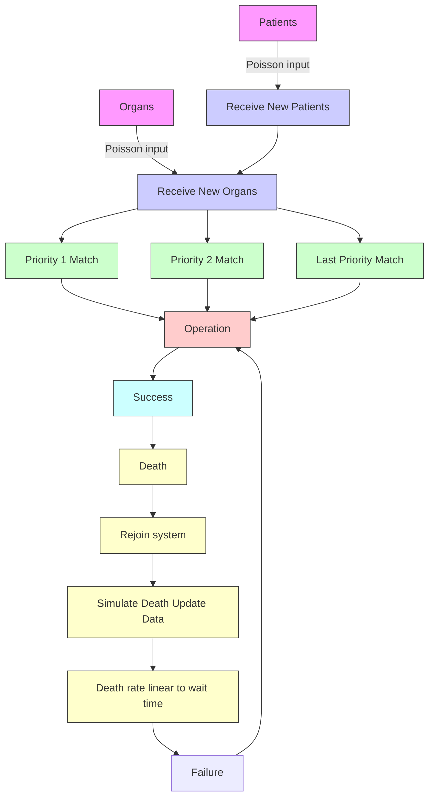

# Optimizing the Effectiveness of Organ Allocation

Team 2052

February 12, 2007

## Contents

1 Introduction 2  
2 Generic US Transplant Network 4

2.1 Overview 4

3 Simulation 5  
4 Results Based on the Basic Model 6

4.1 Summary of Assumptions 6

5 Other Countries' Transplantation Policies 7  
6 Utilizing Kidney Exchanges 8  
7 Patient Choices 8  
8 Ethical and Political Ramifications 15

8.1 Donor Decision 18

9 Conclusion 20  
10 Evaluation of Solutions 21

10.1 Strengths 21  
10.2 Weaknesses 21  
10.3 Future Considerations 22

11 Appendices 23

11.1 Appendix I: Letter to Congress 23  
11.2 Appendix II: Letter to the Director of the U.S. HRSA ..... 23

References 25

## 1 Introduction

Technological advances have made extending lives through transplantation of many solid organs possible: heart, kidneys, liver, lungs, pancreas, and intestine $[1]$ . Although Chinese legend claim that doctors have performed transplants as early as 500 BC, the first verifiable successful organ transplantation occurred in 1954 when Dr. Joseph E. Murray performed a kidney transplant between twin brothers in Boston $[2]$ . Since then, the number of transplants a year has steadily risen. However, the number of organ donors has not been able to keep up with the number of people on the wait list, causing an ever-increasing gap between the supply and demand of organs $[3]$ . (Figure 1)

line chart

| Year | Waitlist | Donors |
| ---- | -------- | ------ |
| 1995 | 41000    | 20000  |
| 1996 | 47000    | 20000  |
| 1997 | 53000    | 20500  |
| 1998 | 60000    | 21000  |
| 1999 | 65000    | 21500  |
| 2000 | 72000    | 22000  |
| 2001 | 77000    | 22500  |
| 2002 | 79000    | 23000  |
| 2003 | 82000    | 23500  |
| 2004 | 86000    | 25000  |

Figure 1: Number of transplants and cadaveric organ donors. Source: OPTN Annual Report 2005 [4]

With the shortage of organs, the United States found it necessary to establish a policy to ensure an equitable distribution of the available organs. Congress established the Organ Procurement and Transplantation Network (OPTN) in 1984 with the National Organ Transplant Act, creating a regionalized network for organ distribution [5]. In addition, the U.S. Department of Health and Human Services (HHS) implemented a Final Rule in 2000 as a preemptive measure so that states could not interfere with OPTN policies that require organ sharing across state lines [6]. The organ matching process involves many factors: compatibility of the organ, region, age, urgency of patient, and wait list time, with the allocation of the various organs weighing these factors differently [7]. Other countries use the same basic matching process, also with different emphasis on the given parameters [8], [9], [10], [11].

Kidney transplantation, in particular, encompasses the large majority of organ transplantation. In 2006, kidneys comprised 58.9 percent of all organs transplanted [12]. In determining compatibility in kidney transplants, doctors look at ABO blood type, Human Leukocyte Antigens (HLA), and Panel Reactive Antibody (PRA). The ABO blood type indicates the presence of two types of antigens, A and B, present in the patient's body [14]. Antigens are foreign molecules or substances that trigger an immune response [15]. People with blood type A have antigen A in their body, people with blood type B have antigen B, people with blood type AB have both, and people with blood type O have neither [14]. Therefore, a person with blood type AB can receive an organ from anyone, a person with blood type A or B can receive an organ from a person of blood type O or the same blood type, and a person with blood type O can only receive an organ! from someone with the same blood type. HLA indicates a person's tissue type, the main parts being the A, B, and DR antigens, each consisting of two alleles [16]. Matching of all six components of HLA results in improved survival of transplanted kidneys, but even mismatch of all six components can result in the patient surviving for many years after [4]. PRA is a blood test that measures the percent of the U.S. population that the blood reacts with. The anti-human antibodies in the blood are proteins that bind to a specific target on foreign molecules [17]. The blood can become more sensitive due to previous transplants, blood transfusions, or pregnancies. [16].

What makes kidney transplantation so prevalent is the fact that living donations are possible since the kidney is a paired organ. While cadaveric kidneys can be transplanted at the discretion of OPTN policies, the wishes of the donor become involved in the cases of live donor kidneys. Often, a live donor wishes for a relative or close friend to receive the kidney. Over 75 percent of the living donors in 2004 were related (i.e. parents, siblings, spouses) to the transplant recipients, not counting close friends [3]. However, some live donors willing to donate are unable to as a result of blood type and crossmatch incompatibility with their intended recipient, leaving over 30 percent of patients in need without a suitable kidney transplant [13]. One solution is kidney paired donation (KPD), which matches two incompatible donor-recipient pairs such that the donor of one pair is compatible with the recipient of the other in both cases, satisfy! ng both parties [18]. Another is list paired donation (LPD), where the recipient receives higher priority on the wait list if the donor of the donor-recipient pair donates to a compatible recipient on the wait list [19].

There are stark differences between the compatibility of kidneys, not only due to blood type, HLA, and PRA, but also due to whether the kidney comes from a live or deceased donor. The half-life of a deceased donor kidney is significantly shorter when compared to a live donor kidney $[19]$ . With the shortage of kidneys, a patient may feel that they have to accept whatever kidney they are offered or participate in LPD to have a chance of survival. This raises the ethical question of whether LPD should even be allowed. Also, even though a live donor kidney is favored over a deceased donor kidney, a potential donor may be hesitant to step forward due to many factors, such as potential risk to himself or

herself or misinformation [20].

In our paper, we take into account all these factors to model the various aspects of transplantation. We first focus on the United States network to produce a generic model of the interaction of the factors that impact the number of people on the wait list, the number of transplantations, and the length of wait time. To illustrate our model, we use data for the factors specific to kidney transplants, such as HLA compatibility, to provide numerical results from our model. With our framework, we examine the policy of Eurotransplant for ideas on improving the current system of the United States. We then look at the KPD and LPD as well as other exchange models to determine a procedure that results in the maximum number of exchanges, while still maintaining compatibility. We ultimately review our model to analyze the implications of patient and donor decisions as well as ethical and political issues.

## 2 Generic US Transplant Network

## 2.1 Overview

We model the generic US transplant network as a rooted tree. The root of the tree represents the entire network, and its immediate children represent the regions. Each node represents some kind of organization, whether an Organ Procurement Center, a state organization, or a interstate region. At each node, there is a patient wait list, containing all the patients represented in the region. Moreover, the wait list at a node is simply the concatenation of the wait list of the node's children.

To study such a network, we approximate its functioning as a discrete time process, in which each time round represents a day. At each time round, there are four phases. In phase I, patients are added to the leaf nodes of the system. We approximate the rate of wait list addition by a Poisson process. This is valid because we can reasonably assume that the arrivals are independent and identically distributed. Hence, suppose that this number of candidates added to the wait list at time t is $addition_{t}$ , then we model

$$
P r (a d d i t i o n _ {t + 1} - a d d i t i o n _ {t} = k) = \frac {e ^ {\gamma} (\gamma) ^ {k}}{k !}
$$

To find $\gamma$ , we assume that the rate of wait list arrival in a year is approximately constant, and so using the data for the number of organ applicants in a given year, we approximate $\gamma \approx \frac{numberofnewapplicants}{365.25}$ .

In phase II of each time step, we add cadaver organs to the leaf nodes of the tree. For our basic model, we will only consider cadaver organ donations. As with patients, we approximate this as a Poisson Process, and we approximate the exponential coefficient by using the average number of cadaver organs added in a given year.

In phase III, we allocate organs based on a certain set of bottom up priority rules. We define a "bottom up priority rule" as a recursive allocation process executed from bottom up in the tree, which requires any organ-patient match to meet some minimum priority standard. For example, for Kidney Allocation, the first priority rule is to allocate Kidneys to patients who match the blood type and HLA profile exactly. Within this restriction, OPTN dictates that Kidneys are to be allocated organs are allocated locally first, then regionally, then nationally. In our model, this corresponds to moving from the leaves up the tree. OPTN allocation rules for every organ can be rephrased in terms of a set of such rules. Matched organ-patient pairs undergo the transplantation operation, which has a certain success rate dependent on the quality of the match. (In later sections, we explore the success rate as also a function of the experience of the doctors at the center and the quality of the kidney.)

In phase IV, we simulate the dying off of patients on the waiting list. In order to simulate the positive correlation between time on the wait list and death rate, we treat the death rate k of each patient as a linear function $aT + b$ of the person's wait time T. Hence, calculating at time 0, a person's chance of survival at time T is $e^{-kT} = e^{-(aT + b)T}$ which implies that the person's chance of dying from time T to $T + 1$ is $e^{2aT + a + b}$ .

Under this mathematical model, our problem becomes finding a good tree structure and a good set of bottom up priority rules.

## 3 Simulation

To study this model, we run computer simulations and average the results over many simulations. In order to have data with which we can regress the parameters in our model, we choose to simulate the Kidney transplant network in particular. Our simulation works as follows: At every time round, in phase I, we generate a number according to the Poisson Distribution representing the number of new candidates. For each new patient added, we randomly generate the person's race and age by following specific race and age distributions, which we specify for each leaf node. Using the person's race, we generate the person's blood type and HLA makeup, according to known distributions. As well, we generate the patient's PRA based on probabilities published by the OPTN.

Similarly, in Phase II, we generate a list of donor organs according to known distributions of blood type, HLA makeup. Moreover, we store along with the organ object where it was generated. In this way, we can study the effect of having to move the organ before transplantation and lengthening its cold ischemia time, which would lower its quality.

In Phase III, we implement a set of recursive routines which traverse the tree from bottom up, strictly following the OPTN system for Kidneys. To model the success rate of an operation, we use the statistics published by the OPTN. Our main method of determining whether an operation is successful is the number of HLA mismatches. As well, the success is affected by the sensitivity of the person, which is measured by the person's HLA. We model this by increasing a linear term to the success rate that is based on the PRA. Moreover, we reduce the success rate by 5 percent if the organ is not procured from the same center as the patient, which would require travelling and would increase the cold ischemia time. We used 5 percent because this is the average effect of increasing about 10-20 hours of cold ischemia time on the success rate, according to OPTN data.

In Phase IV, we regress the coefficients $a$ and $b$ referred to in the previous section, and used this formula to calculate the probability of death.

To adjust the parameters for this model, we used the OPTN national data for the national active wait list for cadaver kidneys from 1995 to 2004 and feed in the number of donations for each year to our model. We graphed the data and the results are as shown.

## 4 Results Based on the Basic Model

In order to quantify the goodness of a network, we use a set of objective functions. The first and most obvious function is the number of successful transplants per year. We call this objective function 0. Objective function 1 is the number of successful transplants subtracted by the sum of the inverse of one added to the age for each successful transplanted patient. Objective function 2 is the sum of 100 subtracted by the ages of the successful transplanted patients. Objective function 3 is the number of "healthy" people cured plus $\alpha$ times the number of sick people. (for task 4) Finally, objective function 5 is the number of people cured subtracted by the a linear function depending on the max of 9 years and the maximum wait time in the queue.

To test the relationship between the tree size, we input a big node into our simulation, and then compared the results with the same data, except that the capacity for that node is divided into 20. The trade-off between having one big center and having several center is that in a big center, the doctors are more experienced (which we simulated in our model as decreasing the success rate of the operations of doctors who don't get a threshold amount of operations per year), but in small centers, the local-first rule takes into effect, and many of the successful matches are not penalized by the 5 percent cold-ischemia time penalty.

## 4.1 Summary of Assumptions

- Arrivals in the waiting queue, both of cadaver donors and needy patients, are independent and randomly distributed  
- The generic US transplant network can be simulated as a rooted tree  
- Death rate can be approximated as a linear function of time on the waiting list

flowchart

## 5 Other Countries' Transplantation Policies

We researched the policies of various other countries, such as China, Australia, and the United Kingdom. We saw little difference between the United States' policy and the policy of these countries. Although China uses organs from executed prisoners, we did not believe it was ethical to include in our own policy. We decided that the policies of Eurotransplant has the best groundwork. People analyze their policy each year, making tweaks to their point system. We noticed that the one year overview and the six year overview had slightly different emphasis on the various factors of kidney allocation.

The Eurotransplant policy includes some interesting ideas. It does not emphasize regions as much, with the maximum number of points for distance being 300. In contrast, the number of points received for zero HLA mismatch is 400. In the United States' system, we allocate our organs by region, first by searching the local region for a suitable match, then broadening to the larger region and the nation at large. The Eurotransplant policy also has greater emphasis on providing young children with a kidney match, giving children younger than 6 years an additional 1095 waiting time points. We implemented the Eurotransplant policy in our model to see if their policy could also benefit the United States.

Using our objective functions, we found that there was little difference between the Eurotransplant policy and that of the United States. The wait list size of the Eurotransplant policy was slightly higher than our own. However, we noticed that Eurotransplant did not implement a Final Rule that forced states to comply. The preemptive strike cast by OPTN was done with good reason. After searching through several states' statutes, we found that states, like Arizona, cast their own laws that go against the Final Rule. Such laws state that organs should be distributed within the state first, if at all possible, which ignores the region policy of OPTN. This results in a more inefficient system. We could learn from Europe in doing away with such blocks within regions.

## 6 Utilizing Kidney Exchanges

We reviewed the Literature in the field, and found that one promising approach for Kidney paired exchange is to run the maximal matching algorithm over the graph defined by the set of possible exchanges. In fact, this algorithm would give arguably the best matching since it contains the most possible number of pairs. However, one problem with this is that it takes away from the autonomy of the patients, because it requires them to wait for enough possible pairs to show up before performing the matching, and sometimes it may require for them to take a less than perfect matching.

Hence, we sought to improve this supposedly "optimal solution" by adding list-pair matching as well. We implemented list-pair matching and incorporated it into our model, in order to check what improvements it may have. Supposing that each person bring in on average $r$ number of possible donors, we graph the queuesize and our various objective functions with respect to this parameter $r$ .

According to each patient's phenotypes, we calculate the expected blood types of the person's parents and siblings, and make that the person's contribution to the "donor pool." In other words, the person brings to the transplant network an expected number $r$ of potential donors. We then make the patient perform list pair exchange with the top most person in the current queue who is compatible in blood type to the donor accompanying the new patient. According to our research, kidneys from live donors are always about 21 percent better than cadaver kidneys in terms of success rate. Thus, it is in the cadaver list person's best interest to undergo this exchange.

We found that list pair exchange on average drastically decrease the wait list, by sometimes as much as 3 times, and make the queue size stabilize instead of go off to infinity.

## 7 Patient Choices

What should a diseased patient do when presented with the opportunity to obtain a kidney? The "obvious" answer is to accept. But this decision is not necessarily as clear-cut as it may seem; for instance, if our patient is offered a poorly matched kidney now, but a well-matched kidney is likely to arrive in a reasonable time, he would be well-advised to wait. We consider modeling to examine the nature of this tradeoff.

line chart

| Time (Years) | Donation Rate 0.2 | Donation Rate 0.4 | Donation Rate 0.6 | Donation Rate 0.8 | Donation Rate 1.0 | Donation Rate 1.2 | Donation Rate 1.4 | Donation Rate 1.6 | Donation Rate 1.8 | Donation Rate 2.0 |
| ------------ | ----------------- | ----------------- | ----------------- | ----------------- | ----------------- | ----------------- | ----------------- | ----------------- | ----------------- | ----------------- |
| 1            | 580               | 570               | 560               | 550               | 540               | 530               | 520               | 510               | 500               | 490               |
| 2            | 160               | 155               | 150               | 145               | 140               | 135               | 130               | 125               | 120               | 115               |
| 3            | 150               | 145               | 140               | 135               | 130               | 125               | 120               | 115               | 110               | 105               |
| 4            | 145               | 140               | 135               | 130               | 125               | 120               | 115               | 110               | 105               | 100               |
| 5            | 140               | 135               | 130               | 125               | 120               | 115               | 110               | 105               | 100               | 95                |
| 6            | 135               | 130               | 125               | 120               | 115               | 110               | 105               | 100               | 95                | 90                |
| 7            | 130               | 125               | 120               | 115               | 110               | 105               | 100               | 95                | 90                | 85                |
| 8            | 125               | 120               | 115               | 110               | 105               | 100               | 95                | 90                | 85                | 80                |
| 9            | 120               | 115               | 110               | 105               | 100               | 95                | 90                | 85                | 80                | 75                |
| 10           | 115               | 110               | 105               | 100               | 95                | 90                | 85                | 80                | 75                | 70                |

Figure 2: Number of People Cured

line chart

| Time (Years) | Donation Rate 0.2 | Donation Rate 0.4 | Donation Rate 0.6 | Donation Rate 0.8 | Donation Rate 1.0 | Donation Rate 1.2 | Donation Rate 1.4 | Donation Rate 1.6 | Donation Rate 1.8 | Donation Rate 2.0 |
| ------------ | ----------------- | ----------------- | ----------------- | ----------------- | ----------------- | ----------------- | ----------------- | ----------------- | ----------------- | ----------------- |
| 1            | 580               | 550               | 500               | 470               | 430               | 390               | 350               | 320               | 290               | 260               |
| 2            | 170               | 160               | 150               | 140               | 130               | 120               | 110               | 100               | 90                | 80                |
| 3            | 160               | 150               | 140               | 130               | 120               | 110               | 100               | 90                | 80                | 70                |
| 4            | 150               | 140               | 130               | 120               | 110               | 100               | 90                | 80                | 70                | 60                |
| 5            | 140               | 130               | 120               | 110               | 100               | 90                | 80                | 70                | 60                | 50                |
| 6            | 130               | 120               | 110               | 100               | 90                | 80                | 70                | 60                | 50                | 40                |
| 7            | 120               | 110               | 100               | 90                | 80                | 70                | 60                | 50                | 40                | 30                |
| 8            | 110               | 100               | 90                | 80                | 70                | 60                | 50                | 40                | 30                | 20                |
| 9            | 100               | 90                | 80                | 70                | 60                | 50                | 40                | 30                | 20                | 10                |
| 10           | 90                | 80                | 70                | 60                | 50                | 40                | 30                | 20                | 10                | 5                 |

Figure 3: Objective Function 1

line chart

| Time (Years) | Donation Rate 0.2 | Donation Rate 0.4 | Donation Rate 0.6 | Donation Rate 0.8 | Donation Rate 1.0 | Donation Rate 1.2 | Donation Rate 1.4 | Donation Rate 1.6 | Donation Rate 1.8 | Donation Rate 2.0 |
| ------------ | ----------------- | ----------------- | ----------------- | ----------------- | ----------------- | ----------------- | ----------------- | ----------------- | ----------------- | ----------------- |
| 1            | 2.8               | 2.7               | 2.6               | 2.5               | 2.4               | 2.3               | 2.2               | 2.1               | 2.0               | 1.9               |
| 2            | 0.8               | 0.7               | 0.6               | 0.5               | 0.4               | 0.3               | 0.2               | 0.1               | 0.0               | -0.1              |
| 3            | 0.7               | 0.6               | 0.5               | 0.4               | 0.3               | 0.2               | 0.1               | 0.0               | -0.1              | -0.2              |
| 4            | 0.7               | 0.6               | 0.5               | 0.4               | 0.3               | 0.2               | 0.1               | 0.0               | -0.1              | -0.2              |
| 5            | 0.7               | 0.6               | 0.5               | 0.4               | 0.3               | 0.2               | 0.1               | 0.0               | -0.1              | -0.2              |
| 6            | 0.7               | 0.6               | 0.5               | 0.4               | 0.3               | 0.2               | 0.1               | 0.0               | -0.1              | -0.2              |
| 7            | 0.7               | 0.6               | 0.5               | 0.4               | 0.3               | 0.2               | 0.1               | 0.0               | -0.1              | -0.2              |
| 8            | 0.7               | 0.6               | 0.5               | 0.4               | 0.3               | 0.2               | 0.1               | 0.0               | -0.1              | -0.2              |
| 9            | 0.7               | 0.6               | 0.5               | 0.4               | 0.3               | 0.2               | 0.1               | 0.0               | -0.1              | -0.2              |
| 10           | 0.7               | 0.6               | 0.5               | 0.4               | 0.3               | 0.2               | 0.1               | 0.0               | -0.1              | -0.2              |

Figure 4: Objective Function 2

line chart

| Time (Years) | Donation Rate 0.2 | Donation Rate 0.4 | Donation Rate 0.6 | Donation Rate 0.8 | Donation Rate 1.0 | Donation Rate 1.2 | Donation Rate 1.4 | Donation Rate 1.6 | Donation Rate 1.8 | Donation Rate 2.0 |
| ------------ | ----------------- | ----------------- | ----------------- | ----------------- | ----------------- | ----------------- | ----------------- | ----------------- | ----------------- | ----------------- |
| 1            | 500               | 450               | 320               | 230               | 230               | 230               | 170               | 130               | 90                | 60                |
| 2            | 550               | 500               | 350               | 230               | 230               | 230               | 160               | 110               | 70                | 50                |
| 3            | 600               | 550               | 380               | 230               | 230               | 230               | 150               | 90                | 50                | 30                |
| 4            | 650               | 600               | 420               | 230               | 230               | 230               | 140               | 70                | 30                | 10                |
| 5            | 700               | 650               | 450               | 230               | 230               | 230               | 130               | 50                | 10                | 5                 |
| 6            | 750               | 700               | 480               | 230               | 230               | 230               | 120               | 30                | 5                 | 5                 |
| 7            | 800               | 750               | 520               | 230               | 230               | 230               | 110               | 15                | 5                 | 5                 |
| 8            | -                 | -                 | -                 | -                 | -                 | -                 | -                 | -                 | -                 | -                 |
| 9            | -                 | -                 | -                 | -                 | -                 | -                 | -                 | -                 | -                 | -                 |
| 10           | -                 | -                 | -                 | -                 | -                 | -                 | -                 | -                 | -                 | -                 |

Figure 5: Size of the Queue

line chart

| Time (Years) | Donation Rate 0.2 | Donation Rate 0.4 | Donation Rate 0.6 | Donation Rate 0.8 | Donation Rate 1.0 | Donation Rate 1.2 | Donation Rate 1.4 | Donation Rate 1.6 | Donation Rate 1.8 | Donation Rate 2.0 |
| ------------ | ----------------- | ----------------- | ----------------- | ----------------- | ----------------- | ----------------- | ----------------- | ----------------- | ----------------- | ----------------- |
| 1            | 35000             | 32000             | 30000             | 28000             | 26000             | 24000             | 22000             | 20000             | 18000             | 16000             |
| 2            | 10000             | 9000              | 8000              | 7000              | 6000              | 5000              | 4000              | 3000              | 2000              | 1500              |
| 3            | 5000              | 4500              | 4000              | 3500              | 3000              | 2500              | 2000              | 1500              | 1000              | 800               |
| 4            | 3000              | 2800              | 2500              | 2300              | 2000              | 1800              | 1500              | 1200              | 1000              | 800               |
| 5            | 2500              | 2300              | 2100              | 1900              | 1700              | 1500              | 1300              | 1100              | 900               | 750               |
| 6            | 2300              | 2150              | 2050              | 1850              | 1650              | 1450              | 1250              | 1150              | 950               | 735               |
| 7            | 2250              | 2125              | 2025              | 1825              | 1625              | 1425              | 1225              | 1125              | 975               | 733               |
| 8            | 2233              | 2113              | 2013              | 1813              | 1613              | 1413              | 1213              | 1113              | 977               | 731               |
| 9            | 2227              | 2106              | 2006              | 1806              | 1606              | 1406              | 1206              | 1106              | 979               | 729               |
| 10           | 2227              | 2106              | 2006              | 1806              | 1606              | 1406              | 1206              | 1106              | 979               | 729               |

Figure 6: Wait List

We assume that a patient who has received a kidney transplant may not receive a kidney transplant in the future. While this is not always true in general, it is reasonably true for the purposes of our model, since we posit a choice between accepting a “lesser” kidney today and a better kidney later. When a patient receives a second kidney transplant after the first organ’s failure, there is no reason to expect a better organ; in fact, since he cannot immediately return to the top of the cadaver kidney queue, and live donors are likely to be more reluctant after a previous failure, he (if anything) should expect less.

We now look to motivate a formal model of decision-making in these situations. We start with the most fundamental question: what is the objective? Although there are many plausible objectives for a patient seeking donation—say, minimizing cost, or maximizing quality of life—we keep the analysis simple by assuming that patients want to maximize their expected years of life. Admittedly, there is little hard evidence for the dominance of any one objective; there is not a large body of literature on the psychological mores of transplant patients, and we cannot offer any empirical study pinpointing lifetime maximization as the overriding consideration. We believe, however, that this is a very reasonable, "common sense" assumption to make—if any consideration is clearly critical for patients, it is extending life.

Proceeding with the model, we say that there is some current transplant available to the patient: we call this the immediate alternative and denote it by $A_{0}$ . The patient and her doctor have some estimate of how this transplant will affect chance of survival in the future; in fact, we assume that they have a survival function $s_{0}(0,t)$ that describes chance of being alive at time t after the transplant. This initially seems to be an extremely questionable assumption—how can we possibly expect patients to write down a function to describe their odds of survival? But critically, we are not assuming that patients can predict their actual likelihood of being alive at every point. We are only concerned about the best guess, which is the relevant input into a rational choice model. Indeed, even an extremely blurry guess will qualify as a survival function, considering that such functions are by definition probabilistic. We further assume that this survival function is continuous and has limit zero at infinity: in other words, the patient is neither strangely prone to die in some infinitesimal instant nor capable of living forever.

Now we say that the patient also has a set of possible future types of transplants, which we call future alternatives and write as $(\mathcal{A}_{1},\mathcal{A}_{2},\ldots,\mathcal{A}_{n})$ . Each future alternative $A_{i}$ also has a corresponding survival function $s_{i}(t_{0},t)$ , where $t_{0}$ is the starting time of transplant and t is the current time. We assume that there is a constant probability $p_{i}$ that alternative $A_{i}$ will become available at any time. While this is not completely true, we include it to make the problem manageable: more complicated derivations would have to incorporate outside factors whose complexity would overwhelm our current framework. Finally, if the patient decides to choose a future alternative and delay transplant, her survival is governed by a default survival function $s_{d}$ .

## Summary of Assumptions:

- The patient can choose either a transplant now, the immediate alternative $\mathcal{A}_c$ , or from a finite set of transplants $(\mathcal{A}_1, \mathcal{A}_2, \ldots, \mathcal{A}_n)$ in the hypothetical future, called the future alternatives.  
- All alternatives have a corresponding survival function $s(t_0, t)$ , which describes the chance of survival until time $t$ as a function of $t$ and transplant starting time $t_0$ . Survival functions have value 1 at time 0, are continuous, and have limit zero at infinity.  
- Each future alternative $A_{i}$ has a corresponding constant probability $p_{i}$ of becoming available at any given time. This immediately implies that the probability at time t of the alternative not yet having become available at all is $e^{-p_{i}t}$ .  
- A default survival function $s_d(t)$ defines chance of survival when there has not yet been a transplant. To maintain continuity, $s_d(t_0) =$  
- The patient can only have one transplant.  
- The patient attempts to maximize expected lifespan. In case of a precise tie in expected values, she chooses the option that provides a kidney more quickly.

That's a lot of formalism! And now that we have established the basic framework, we see that the space of possible survival functions—which form the basis for patient decision—is truly enormous. We might, for instance, have kidney transplants that improve short-term survival but invariably kill their recipients after 10 years, while other transplants offer poorer initial results but prove superior in the long-term. Such convoluted behavior would make a rational decision-making heuristic far more difficult to obtain. Thinking back to the motivation for our model, however, we see that only known information is relevant: if the patient—and his doctors—do not know that this behavior will occur, it is irrelevant in the determination of our decision. And as current literature on kidney transplants does not suggest anything resembling it, we want to find some assumption that excludes the possibility.

Essentially, this means that our survival functions must behave consistently. They cannot become wildly better or worse-performing relative to each other. We propose a formal definition to capture this concept.

Definition 7.1. A separable survival function $s_i(t_0, t)$ can be expressed as the product of two functions, one a function only of $t_0$ and another only a function of $t - t_0$ : $s_i(t_0, t) = a_i(t_0)b_i(t - t_0)$ . We stipulate that $b(0) = 1$ . In a separable set of survival functions, all functions are individually separable with the same function $a(t_0)$ .

Would it be reasonable to assume that for any patient, the set of survival functions is separable? It is not an entirely natural condition, and indeed there are some cases where it does not seem quite right-for instance, when some $t_0$ is high, so that higher values of $t$ approach extreme old age, where survival decreases rapidly and the patient is less likely to survive than the product of $a$ and $b$ predicts. But in this case, the absolute error is small anyway: $a(t_0)$ accounts for the probability of survival that stems from waiting for a kidney until time $t_0$ , and thus if $t_0$ is large, $a(t_0)b(t - t_0)$ is likely to be quite tiny as well.

Moreover, separability is intuitively reasonable for modeling the effects of a delayed kidney donation. As we just mentioned, for a separable survival function, $a(t_{0})$ measures the decrease in survival rate that results from waiting for an organ transplant. This should be consistent across all survival functions for a given patient; we express this notion in the concept of a separable set. Meanwhile, the factor $b(t - t_{0})$ accounts for the decrease in survival during the time $(t - t_{0})$ spent with the new kidney.

Consequently, although we acknowledge that most survival functions are not completely separable—and feel that observers should look into the behavior of non-separable functions—in this paper we assume the approximation that our survival functions are separable. This will lead us to an explicit heuristic for lifespan-maximizing decisions, which is the goal of this section.

Definition 7.2. If $\mathcal{A}_i$ and $\mathcal{A}_j$ are two future alternatives in a separable set, we assign them an order according to:

$$
\int_ {0} ^ {\infty} b _ {i} (t) d t \leq \int_ {0} ^ {i} n f t y b _ {j} (t) d t \longleftrightarrow \mathcal {A} _ {i} \leq \mathcal {A} _ {j} \tag {1}
$$

Now we turn to the derivation of an lifespan-maximizing strategy. We note that such a strategy, when presented with alternative $A_{i}$ at time $t_{0}$ , will either accept or wait for other alternatives. In fact:

Theorem 7.3. If all a patient's alternatives form a separable set, then his optimal strategy will either accept an alternative $\mathcal{A}_i$ at all times $t_0$ or decline it at all times $t_0$ . If he declines $\mathcal{A}_i$ , then he must decline all alternatives less than or equal to $\mathcal{A}_i$ , using the order relation defined above. Similarly, if he accepts $\mathcal{A}_j$ , then he must accept all alternatives greater than or equal to $\mathcal{A}_i$ .

Proof. The patient will accept the alternative or probabilistic bundle of alternatives that his survival functions indicate gives him the highest lifespan. For alternative $A_{i}$ , his expected lifespan beyond time $t_{0}$ is:

$$
\int_ {0} ^ {\infty} c _ {i} (t _ {0}, t) d t \tag {2}
$$

Say that a patient at time 0 declines this alternative in favor of some optimal set of future alternatives. Furthermore, say that this set includes some alternative $A_{k}$ such that $A_{k} \leq A_{i}$ . Then the expected lifespan from this set is:

$$
\left(\left(\sum_ {j} p _ {j}\right) + p _ {k}\right) \int_ {0} ^ {\infty} e ^ {- \left(\left(\sum_ {j} p _ {j}\right) + p _ {k}\right) t _ {0}} a \left(t _ {0}\right) \int_ {0} ^ {\infty} \frac {\left(\left(\sum_ {j} p _ {j} b _ {j} (t)\right) + p _ {k} b _ {k} (t)\right)}{\left(\left(\sum_ {j} p _ {j}\right) + p _ {k}\right)} d t d t _ {0} \tag {3}
$$

where j ranges over all alternatives $A_{j}$ in the optimal set except $A_{k}$ . This double integral does not mix integration variables, and it is therefore equal to a product of two integrals:

$$
((\sum_ {j} p _ {j}) + p _ {k}) \int_ {0} ^ {\infty} e ^ {- ((\sum_ {j} p _ {j}) + p _ {k}) t _ {0}} a (t _ {0}) d t _ {0}) (\int_ {0} ^ {\infty} \frac {((\sum_ {j} p _ {j} b _ {j} (t)) + p _ {k} b _ {k} (t))}{((\sum_ {j} p _ {j}) + p _ {k})} d t) \tag {4}
$$

Since $A_{k}$ is less than or equal to $A_{i}$ , and $A_{i}$ was declined in favor of the set of alternatives we are examining, the presence of the $b_{k}$ term in the weighted average under the right integrand lowers its value. The previous expression is thus less than:

$$
((\sum_ {j} p _ {j}) + p _ {k}) \int_ {0} ^ {\infty} e ^ {- ((\sum_ {j} p _ {j}) + p _ {k}) t _ {0}} a (t _ {0}) d t _ {0}) (\int_ {0} ^ {\infty} \frac {(\sum_ {j} p _ {j} b _ {j} (t)) + p _ {k} b _ {k} (t)}{(\sum_ {j} p _ {j})} d t) \tag {5}
$$

Using integration by parts on the left, we finally get:

$$
(1 + \int^ {\infty} e ^ {- ((\sum_ {j} p _ {j}) + p _ {k}) t _ {0}} a (t _ {0}) d t _ {0}) (\int_ {0} ^ {\infty} \frac {(\sum_ {j} p _ {j} b _ {j} (t)) + p _ {k} b _ {k} (t)}{(\sum_ {j} p _ {j})} d t) <   (1 + \int^ {\infty} e ^ {- (\sum_ {j} p _ {j}) t _ {0}} a (t _ {0}) d t _ {0}) (\int_ {0} ^ {\infty} \frac {\sum_ {j} p _ {j} b _ {j} (t)}{(\sum_ {j} p _ {j})} d t) \tag {6}
$$

The expression on the right of the inequality strictly bigger than our starting expression. But is also equal, as inverse integration by parts shows, to the expected lifespan for the same optimal set of alternatives, except without $A_{k}$ . This is a contradiction: by removing $A_{k}$ from our “optimal” set, we have found a bundle that has higher expected lifespan,

indicating that the original set was not truly optimal. Our assumption that $A_{k}$ was part of the optimal set is therefore false; in general, this means that when alternative $A_{i}$ is declined for an optimized set of future alternatives, no alternative less than or equal to $A_{i}$ can be in that set.

An analogous argument proves the opposite result: that when alternative $A_{i}$ is taken, all alternatives greater than or equal to $A_{i}$ must also be taken when possible.

The final part of our theorem, that the choice to accept or decline a given alternative is independent of the time of decision, now follows immediately. When we are dealing with separable survival functions, the only difference between the expected lifetimes of alternatives and optimal sets over some time interval from $t_{1}$ to $t_{2}$ is the constant ratio $\frac{a(t_{2})}{a(t_{1})}$ . This does not alter the direction of the inequality sign.

This theorem immediately implies a heuristic for finding the optimal strategy:

## Heuristic for Finding an Optimal Strategy over Separable Survival Functions:

1. Determine the set of possible alternatives and the separable survival functions accompanying each.  
2. Use the order relation given earlier to put the alternatives in order from $A_{1}$ to $A_{n}$ , with $A_{1}$ the “lowest” and $A_{n}$ the “highest”.  
3. Start with alternative $A_{n}$ .  
4. Label your the alternative you are currently examining $A_{k}$ . Determine whether the expected value for a set including all alternatives $A_{k-1}$ and greater is higher than the expected value for the set of alternatives at and above $A_{k}$ . Refer to the next two steps based on your finding.  
5. If yes, move down to $A_{k-1}$ and repeat the previous step, unless you are already at $A_{0}$ . In that case, it is optimal for you to take all alternatives given to you; in particular, you should take the immediate alternative.  
6. If no, your optimal strategy is to take all alternatives from $\mathcal{A}_k$ to $\mathcal{A}_n$ , but none smaller.

## 8 Ethical and Political Ramifications

There are many factors worthy of consideration in the assignment of organs. For instance, a patient may have a terminal illness that severely limits lifespan, regardless of any kidney transplant. Alternatively, she may be healthy at the present time, but at extreme risk for some fatal illness in the future. She may also have some sort of psychological problem that calls into question her ability to pursue immunosuppressant treatment. In all these cases, it is reasonable to question kidney assignment to a patient who is less likely—for whatever reason—to fully benefit from the transplant's impact on lifespan.

We incorporate these situations into our model by altering the objective function for a particular class of patients. There were no fundamental assumptions about the function of our model beyond the original points included in part 1. Instead, we simply alter the “returns” that determine how we measure success in the first place. This is a clean and efficient way to incorporate both practical (diseased people are not likely to benefit much from organ transplants) and moral (“save the kids!!!”) judgments into our model.

line chart

| Time (Years) | Objective Function 1 |
| ------------ | -------------------- |
| 0.1          | 50                   |
| 0.2          | 56                   |
| 0.3          | 59                   |
| 0.4          | 59                   |
| 0.5          | 57                   |
| 0.6          | 62                   |
| 0.7          | 56                   |
| 0.8          | 60                   |
| 0.9          | 63                   |
| 1.0          | 62                   |

Figure 7: Results of Policy of Subtracting One Point from the Objective Function of Those Above 60

Not every M.D. can perform a kidney transplant. In fact, transplant is an enormously complex medical procedure, demanding dedicated facilities and experienced doctors. This raises substantial questions about the location of transplant surgery. Should we always ship kidneys to large, well-established medical centers, which may be more consistent in performing the operation? Or, alternatively, should we make transplants mostly local, so that all facilities become more experienced and maintain proficiency?

We addressed some broader questions of organ allocation in the first section of this paper, but to reflect these concerns we add two new and important wrinkles to our model. First, we introduce a “doctor experience function,” which maps greater experience in transplant surgery to greater success and consistency in performing the procedure. Although it is

impossible to pinpoint a precise analytical relationship between the number of transplants performed and success in performing them, we use regression on an OPTN data set to identify a rough linear function, and examine the effect of several other functions as well.

Currently in the United States, fewer than half of cadavers with the potential to provide kidneys are used as donors. This is due to a system that relies heavily on family wishes: in most situations, doctors will defer to family members on the decision to donate organs, even when there is preexisting affirmation of desire to donate from the deceased individual (in the form of indication on a driver's license, a donor card, or inclusion in a donor registry).

One dramatic improvement, already implemented in some countries and now being considered in the US, is the idea of presumed consent. Under presumed consent, every individual (possibly with limited restrictions) is assumed to have given his consent for postmortem organ donation. If he is opposed to the prospect, he must “opt out” of the system. In many other countries, such a system has dramatically increased the pool of cadaveric kidneys available for transplant; in Austria, for instance, their availability is nearly equal to demand. While the result in the US would not be quite so favorable—the Austrian system “benefits” from a higher number of traumatic road deaths—it would undoubtedly hold strong benefits for patients on the wait list.

In the model of living kidney donation we have established, donors are limited to those individuals with a substantial relationship to the diseased person: spouses, siblings, parents, children, and close friends. Excluding the black market in commercial kidneys, this setup accurately reflects the situation in the United States today, and in an ideal world it would be enough to provide high-quality living organs to those in need. But while our list-pairing procedures does dramatically improve the usefulness of this system, its dependence on a limited pool of kidneys prevents full distribution. Moreover, as we acknowledged in our model, some “close relation” donors decide against donation, further narrowing the supply available for any matching schemes.

Researchers suggest several possible improvements. First, multiple studies identify financial disincentives as some of the main barriers to donation. Surprisingly, donors are sometimes liable for a portion of the medical costs of their procedure (and its consequences). Meanwhile, they often lose income, as they generally cannot work for some period of time during and after the transplant. And although exact figures on the number of potential donors dissuaded by these costs are difficult to obtain, sources suggest possible percentages as high as 30 percent.

What are the solutions? First, an authority–most likely the government–can provide for the full medical expenses of the operation, along with insurance for any future health consequences. While this is likely to relieve some of the cost pressure, we cannot be sure of its ability to substantially reduce the number of potential donors who decline to proceed. We support a pilot program to evaluate the plausibility of this approach.

Some observers have proposed an even more radical reform: legalizing trade in human organs and creating “kidney markets” to ensure supply. A worldwide black market already exists in live-donor kidneys, offering some insights into how a legal system might work. The verdict is unclear – researchers have been both surprised by the quality of black-market transplants \*insert citations\* and appalled by them \*insert citations\*. Arguably, however, concerns about quality and safety in an legal organ-trading system are misplaced, since there is little reason to believe that a regulated market—with transplants conducted by well-established centers—would be any worse than the general kidney transplant system.

More controversial is the ethical propriety of compensation from organs. By banning all “valuable considerations” in exchange for organs, the National Organ Transplant Act of 1984 expressed a widespread sense that any trade in organs is ethically appalling. Many commentators assert that it will inevitably lead to exploitation and coercion of the poor. At the same time, others claim that markets in organs are morally obligatory; they hold that if these markets are the only way to save lives, they must be implemented. Although we do not take a firm position on the ethics of this question, we recommend the implementation of studies to evaluate this area of concern.

## 8.1 Donor Decision

When considering donating a kidney, a potential donor takes into account many factors: the risk to himself or herself, the risk of future health issues, personal issues, and the chance of transplantation success. Especially when the recipient of the kidney has no relation to the donor, the risk to the donor is of greatest importance. After all, they are putting their lives at risk when they are not otherwise in any danger of dying themselves. Of course, steps are taken to ensure that the donor is healthy enough to undergo a successful operation. At many institutions, the criteria for exclusion of potential living kidney donors include kidney abnormalities, a history of urinary tract infection or malignancy, extremely young or old age, and obesity. In addition, the mortality rate around the time of the operation is only about 0.03 percent [21]. This indicates that the risk to a live donor has been kept to a minimum.

The next concern a potential donor might have is the chance of future health complications. There have been suggestions that the early changes that result from the removal of the kidney, increase in glomerular filtration rate and renal blood flow, may lead to insufficiency of kidney function later on, but a study of 232 patients that underwent the kidney transplant procedure, with a mean follow-up time of 23 years, demonstrated that if the remaining kidney was normal, survival was identical to that in the overall population [21]. In fact, another study suggests that kidney donors live longer than the age-matched general population, most likely due to the bias that occurs in the selection process [22]. Therefore, there is not a higher risk for development of kidney failure for the kidney transplant donors selected in the long run.

There may, however, be future psychological issues stemming from depression. According to donor reports from a follow-up conducted by the University of Minnesota, 4 percent were dissatisfied from their donation experience, with non-first degree relatives and donors whose recipient died within a year of transplant more likely to say that they regretted their decision to donate and would not donate again $[23]$ . To reduce this percentage, a more careful selection based on a rigorous psychosocial evaluation should be conducted. With this risk in mind, a potential donor would desire the likelihood of success for the recipient to be high as possible, so they can feel a sense of self-worth for saving someone, as opposed to a sense of guilt and helplessness in not being able to succeed. Nevertheless, donation is generally considered a positive act, and an overwhelming majority of the donors stated that they would donate again if given the chance $[24]$ .

Despite the positive evidence of a high probability of having a good experience while donating, there are many misconceptions of the the donation process that negatively affect a donor's decision to volunteer, as evidenced by the common myths of organ donation. For example, some potential donors believe that they would incur the costs for the operation, discouraging them from following through with donating [27]. This is simply not true. Also, a survey of 99 health insurance organizations found that kidney donation would not affect an insured person's coverage and a healthy donor would be offered health insurance, so money is not a problem [28]. However, money is lost from time away from work, and time away from home is also another significant contributor to the decision of a potential donor. Another personal issue that might deter potential donors is their attitude towards surgery in general, which may be affected by irrational fears or previous experiences. Such potential donors would be unable to psychologically cope with undergoing surgery, in spite of any knowledge of the high probabilities of success.

The relationship between the potential donor and the intended recipient is also a key factor. Close family members and the spouses of the recipients were three times more willing to participate in paired donation when compared with other potential donors $[26]$ . This is most likely because they form the group of potential donors that is most committed to obtaining a transplant for the intended recipient. There is also the opposite factor to consider that also encourages a potential donor to donate, altruism. Although it is hard to quantify, there appears to be a significant amount of altruistic donors. Most potential donors would not want to participate in non-directed donation, since it would not benefit their intended recipients, but 12 percent of potential donors were extremely willing to donate to someone they did not know $[26]$ . Since the risk/benefit ratio is much lower for living anonymous donors (LAD), there are concerns that such donors are psychologically unstable. However, studies conducted by the British Columbia Transplant Society indicate otherwise. About half of the potential LADs that contacted their center and completed extensive assessments that looked at psychopathology and personality disorder met their rigorous criteria to be considered appropriate donors $[25]$ .

Across the different donor-exchange programs, there is a correlation between the willingness of potential donors to participate and how likely they thought their intended recipient would receive a kidney. With kidney paired donation, the willingness to participate is 64 percent [26]. If the donor-recipient pair were compatible, the willingness of the donor to participate in a direct transplant is arguably closer to 100 percent. From this, we hypothesize that as the size n of an n-way kidney swap increases, the potential donor becomes less willing to participate. This is due to the increasing chance for error in one of the swaps and the increasing difficulty of coordinating such a swap. Potential donors would not wish to go through so much trouble without certainty of acquiring a kidney for their recipient, especially since they are giving up one of their own kidneys. For list-paired donation, the empirical data is inconclusive; in our model, we hypothesized that a random percentage of a predefined donor base would become actual organ donors. There is no solid evidence that our assumption was either particularly optimistic or pessimistic; we await further empirical results to make our conclusions.

There are essentially four basic models of systems that deal with incentives for live donors. The first is the market compensation model, which is based on a free market system in which the laws of supply and demand regulate the monetary price of donating a kidney. The second is the fixed compensation model, where all donors are payed a fixed value, regardless of the market value, for any trouble caused by the donation. The third is the expense reimbursement model, which only covers the expenses incurred by the donor, such as travel and childcare costs, that are related to the transplant process. The last is the no-compensation model, the current system used in the United States, which forces the altruistic donor to cover his or her own expenses $[30]$ . The market compensation model guarantees that the demand for kidneys will be met, as seen from Iran's organ market $[31]$ . But, it discourages altruistic donors, since they gain no benefit from this system. Also, the large demand for kidneys will most likely drive the price up, causing ethical concerns about kidneys being a commodity available only to the rich. To encourage more altruistic donors, we argue that the expense reiumbursement model is the best approach. This model allows altruistic donors to volunteer for the transplantation procedure without worrying about financial costs, and, unlike the fixed compensation model, prevents donors from making a profit from their donation. When there is an opportunity for profit, there is a risk of developing a market for organs, which many would argue is unethical. Still, as stated before, we believe that given the enormous potential for increase in the kidney donor pool, it is important to at least investigate the possible results from compensation and incentive-based systems.

## 9 Conclusion

We have reached several valuable conclusions about the nature of kidney allocation, and some of the possible policy solutions that can be implemented to make it more effective. Most importantly, we believe in the absolute necessity of implementing a list-paired exchange system. Its dramatic positive effect on outcomes for kidney patients in need of replacement organs is remarkable and cannot be ignored.

We have also found several other less striking—but still very valuable—results in the course of our simulation and literature review. First, we found while studying generic network design that it is important to have systems that recognize the basic importance of geography. High transportation time leads to deterioration of the organs being transferred; in poorly designed systems, this occurs even when there are plausible and equally valuable local routes for transmission. In addition, we recognize the importance of age and disease in deciding where kidneys should be allocated. When these factors are incorporated into our objective function, altering the point system for allocation decisions becomes of fundamental importance.

As a general matter, aside from the clear importance of implementing list-paired exchange, we have found that it is critical to develop systems for allocation that reasonably reflect the objectives of the transplant system. While this may sound like a tautology, it is in fact both substantive and critically important: without a well-verified and established relationship between what we include in our allocation decisions and our moral and ethical bases for judgment, we will always be dissatisfied.

## 10 Evaluation of Solutions

## 10.1 Strengths

Our main model's strength is its enormous flexibility. For instance, the distribution network can acquire many different structures, from a single nationally-run queue to a heavily localized and hierarchical system. Individuals, represented as objects in C++ code, are made to possess a full range of important attributes, including blood type, HLA type, PRA level, age, and disease. Including all these factors into a single, robust framework, our model enables realistic simulation of kidney allocation but remains receptive to almost any modification.

This allows us to make substantive conclusions about policy issues, even without extensive data sets. By varying parameters, allocation rules, and our program's objective function—all quite feasible within the structure—we can examine the guts of policymaking: the ethical principles underlying a policy, the implementation rules designed to fulfill them, and the sometimes nebulous numbers that govern the results.

Finally, our model is strong because of its discrete setup. While the prospect of a continuous, analytic representation of organ transplant is certainly alluring, such an effort is unlikely to capture the true range of difficulties associated with kidney allocation.

## 10.2 Weaknesses

Although we list the model's comprehensive, discrete simulation as a strength, it is (paradoxically) also the most notable weakness. Our results lack clear illustrative power; data manipulated through a computer program cannot achieve the same “aha” effect as an elegant theorem. Indeed, there is a fundamental tradeoff here between realism and elegance, and our model arguably veers toward overrealism.

Second, our model demands greater attention to numbers. While its general structure and methodology are valid, the specific figures embedded in its code are not airtight. For instance, the existing literature lacks consensus on the importance of HLA matching, possibly because developments in immunogenic drugs are changing the playing field too rapidly to measure. Our use of parameters derived from OPTN data cannot guarantee numerical accuracy.

Third, and perhaps most fundamentally, the bulk of our simulation-based analysis hinges on the “objective functions” we use to evaluate the results. This raises a basic question: what “good” should the kidney allocation system maximize? As mentioned earlier, we attempt to remedy this problem by including multiple objective functions where reasonable, emphasizing our favored choices but providing a basis for other systems of evaluation. Yet our model still barely explores the vast space of possibilities, and some observers would no doubt claim that it misses the correct function entirely.

## 10.3 Future Considerations

First, we would like to utilize the flexibility of the code in our model to simulate more complex kidney distribution networks. In this paper, we examine the results of some fundamental variations in structure: multiple queues versus a single queue, with a focus on the OPTN system for regional allocation. But while these contrasts are useful, they do not necessarily have clear-cut implications for the merits of more convoluted, byzantine arrangements—setups that have many layers of approval or routing. We suspect that such systems are in general less effective than simpler ones. Still, given the palpable political tendency to abandon simplification for messy compromise, we feel that rigorously validating this suspicion is important.

We also wish to tie our exploration of sensitive allocation questions—for instance, whether terminally ill patients should receive kidneys—to more specific scenarios. At the moment we have a general methodology that incorporates the lower expected lifespan into our objective function, then investigating several policies to find the most appropriate selection. This approach reveals the general response of the model to “disease,” and in theory—after some number-crunching—can be used by a policymaker to pass judgment in a specific case. But without any relevant examples incorporated into the paper itself, our model is not as illustrative as it could be. Given more time, we would like to address this.

## 11 Appendices

## 11.1 Appendix I: Letter to Congress

To Whom It May Concern,

We have undertaken an extensive examination of organ procurement and distribution networks, evaluating the results of differences in network structure on the overall success of the transplant system. In particular, we took a close look at the impact of two representative schemes for kidney allocatoin. First, we evaluated a simple model consisting of one nationally-based queue, where kidney allocation decisions are made without regard for individual region. Second, we looked at a more diffuse system with twenty regionally-based queues. We simulated the trade-off in effectiveness between the two systems by including a “distance penalty,” which cut success rates for organs that were transported between different regions. This was implemented to recognize the role that cold ischemia, which is necessary for long-distance transportation of organs, plays in hurting transplant outcomes.

Higher levels of this parameter hurt the single-queue system, which transports its kidneys a noticeably greater average distance. Indeed, we found that for essentially all values of the distance penalty parameter, the multiple-queue system was superior. This is because the regionalized system in our simulation, modeled directly on the American system, uses geography to allocate organs when there is a “tie”: when the organ has many similarly optimal potential destinations. This approach has no apparent downside, while minimizing inefficiency tied to unnecessary organ transportation. We recommend that you preserve the current regionally-based allocation system. Additionally, if you desire to allocate additional funds to improve the organ distribution system, we suggest that you support the streamlining of organ transportation.

We also compared the American OPTN organ allocation system to the analogous Eurotransplant system. Both use rubrics that assign “points” for various characteristics important to their matching goals. They differ, however, in their scheme of point assignment; while the contrasts are largely technical, they have real impacts on the overall welfare of transplant patients. Although the systems were relatively close in effectiveness overall, our simulations identified the American point system as slightly superior. Therefore, we recommend you preserve the main points underlying the OPTN point allocation scheme.

## 11.2 Appendix II: Letter to the Director of the U.S. HRSA

To Whom It May Concern,

We write having undertaken an extensive simulation-based review of the various political and ethical questions underlying decisions about organ allocation, and of policies for increasing live and cadaveric organ donation. First, we implemented a portion of code that represents the value of transplant center and doctor experience in improving donation

outcomes. When we input a sizable experience effect, which does not appear to exist from the empirical data at this point, we found that a centrally based allocation and treatment system became substantially more effective than a more diffuse, multiple-queue based model. Given the lack of evidence that there is actually such an “experience” effect—the main available data, which comes from the Organ Procurement and Transportation Network, does not appear to indicate one—we advise caution before changing the system to reflect this theoretical result.

We also examined the usefulness of including heavy weights for age and terminal illness in the kidney allocation system. In general, we concluded that such measures are both justified and effective. Although blood type, HLA match, and PRA are still the most fundamental factors to consider, we believe that the extreme difference in effectiveness of helping people of different ages and health status justifies substantial inclusion of those factors in the allocation process.

Finally, we examined literature and existing research as they relate to the possibility of changing our system of consent and compensation for donation. We recommend implementing a “presumed consent” system for cadaveric organs, which will automatically tally deceased individuals as donors unless they have specifically opted out of the system. We also recommend exploring, but not necessary implementing, the possibility of some sort of compensation for live kidney donation. While we are mindful of widespread ethical concerns about the practice, we believe that the extreme demand for kidneys should prompt us to consider all alternatives. Specifically, we suggest a pilot program of light to moderate compensation for live kidney donors, and a thorough review of the outcome and change in incentives for those involved.

## References

[1] Pacific Northwest Transplant Bank. (2007). Transplantation. Retrieved February 12, 2007 from http://www.pntb.org/transplnt.html  
[2] Woodford, P. (2004). Transplant Timeline. National Review of Medicine, 1(20), Retrieved February 12, 2007 from http://www.nationalreviewofmedicine.com/images/issue/2004/issue20\_oct30/Transplant\_timeline.pdf  
[3] Childress, J. F., & Liverman, C. T. (2006). Organ donation: Opportunities for action. Washington, DC: National Academies Press.  
[4] U.S. Organ Procurement and Transplantation Network and the Scientific Registry of Transplant Recipients. (2005). OPTN/SRTR annual report. Retrieved February 12, 2007 from http://www.optn.org/AR2005/default.htm  
[5] Conover, C. J., & Zeitler, E. P. National Organ Transplant Act. Retrieved February 12, 2007 from http://www.hpolicy.duke.edu/cyberexchange/Regulate/CHSR/HTMLs/F8-National%20Organ%20Transplant%20Act.htm  
[6] Organ Procurement and Transplantation Network. (1999). Final rule. Retrieved February 12, 2007 from http://www.optn.org/policiesAndBylaws/final\_rule.asp  
[7] Organ Procurement and Transplantation Network. (2006). Policies. Retrieved February 12, 2007 from http://www.optn.org/policiesAndBylaws/policies.asp  
[8] The Transplantation Society of Australia and New Zealand, Inc. (2002). Organ allocation protocols. Retrieved February 12, 2007 from http://www.racp.edu.au/tsanz/oapmain.htm  
[9] UK Transplant. (2007). Organ allocation Retrieved February 12, 2007 from http://www.uktransplant.org.uk/ukt/about\_transplants/organ\_allocation/organ\_allocation.jsp  
[10] Doxiadis, I. I. N., Smits, J. M. A., Persijn, G. G., Frei, U., & Claas, F. H. J. (2004). It takes six to boogie: Allocating cadaver kidneys in Eurotransplant. Transplantation, 77(4), 615-617.  
[11] De Meester, J., Persjin, G. G., Wujciak, T., Opelz, G., & Vanrenterghem, Y. (1998). The new Eurotransplant Kidney Allocation System: report one year after implementation. Transplantation, 66(9), 1154-1159.  
[12] Organ Procurement and Transplantation Network. (2007). Data. Retrieved February 12, 2007 from http://www.optn.org/data  
[13] Segev, D. L., Gentry, S. E., Warren, D. S., Reeb, B., & Montgomery, R. A. Kidney paired donation and optimizing the use of live donor organs. Journal of the American Medical Association, 293(15), 1883-1890.  
[14] UCL Institute of Child Health. (2007). Kidney transplant-section 1. Retrieved February 12, 2007 from http://www.ich.ucl.ac.uk/factsheets/families/F000284/index.html#groups  
[15] University of Southern California Department of Surgery. (1999). /emphKidney glossary. Retrieved February 12, 2007 from http://www.kidneytransplant.org/kidneyglossary.html  
[16] Duquesnoy, R. J. (2005). Histocompatibility testing in organ transplantation. Retrieved February 12, 2007 from http://tpis.upmc.edu/tpis/immuno/wwwHLAtyping.htm  
[17] University of Maryland Medical Center. (2004). Overview of the High PRA Rescue Protocol. Retrieved February 12, 2007 from http://www.umm.edu/transplant/kidney/highpra.html  
[18] Ross, L. F., Rubin, D. T. Siegler, M., Josephson, M. A., Thistlethwaite, J. R., & Woodle, S. Ethics of a paired-kidney-exchange program. New England Journal of Medicine, 336(24), 1752-1755.  
[19] Gentry, S. E., Segev, D. L., & Montgomery, R. A. (2005). A comparison of populations served by kidney paired donation and list paired donation. American Journal of Transplantation, 5(8), 1914-1921.  
[20] University of Maryland Medical Center. (2004). Living kidney donor frequently asked questions. Retrieved February 12, 2007 from http://www.umm.edu/transplant/kidney/qanda.html  
[21] Jones J., Payne W. D., & Matas A. J. (1993). The living donor: Risks, benefits, and related concerns. Transplant Reviews, 7(3), 115-128.  
[22] Ramcharan, T., & Matas, A. J. (2002). Long-term (20-37 years) follow-Up of living kidney donors. American Journal of Transplantation, 2(10), 959-964.  
[23] Johnson, E. M., Anderson, J. k., Jacobs, C., Suh, G., Humar, A., Suhr, B. D., et al. (1999). Long-term follow-up of living kidney donors: Quality of life after donation. Transplantation, 67(5), 717-721.  
[24] Blance, Y. (2005). Issues in living donor renal transplantation. Retrieved February 7, 2007 from http://www.cambridge-transplant.org.uk/research/nursing/livingdonorissues.htm  
[25] Henderson, A. J. Z., Landolt, M. A., McDonald, M. F., Barrable, W. M., Soos, J. G., Gourlay, W., et al. (2003) The living anonymous kidney donor: Lunatic or saint? American Journal of Transplantation, 3(2), 203-213.  
[26] Waterman, A. D., Schenk, E. A., Barrett, A. C., Waterman, B. M., Rodrigue, J. R., Woodle, E. S., et al. (2006). Incompatible kidney donor candidates' willingness to participate in donor-exchange and non-directed donation. American Journal of Transplantation, 6(7), 1631-1638.  
[27] United Network for Organ Sharing. (2007). Media information. Retrieved February 12, 2007 from http://www.unos.org/news/myths.asp  
[28] Spital, A., & Kokmen, T. (1996). Health insurance for kidney donors: How easy is it to obtain? Transplantation, 62(9), 1356-1358.  
[29] Gaston, R. S., Danovitch, G. M., Epstein, R. A., Kahn, J.P., Mathas, A. J., & Schnitzler, M. A. (2006). Limiting financial disincentives in live organ donation: A rational solution to the kidney shortage. American Journal of Transplantation, 6(11), 2548-2555.  
[30] Israni, A. K., Halpern, S. D., Zink, S., Sidhwani, S. A., & Caplan, A. (2005). Incentive models to increase living kidney donation: Encouraging without coercing. American Journal of Transplantation, 5(1), 15-20.  
[31] The President's Council on Bioethics. Organ transplant policies and policy reforms. (2006). Retrieved February 12, 2007 from http://www.bioethics.gov/background/crowepaper.htm