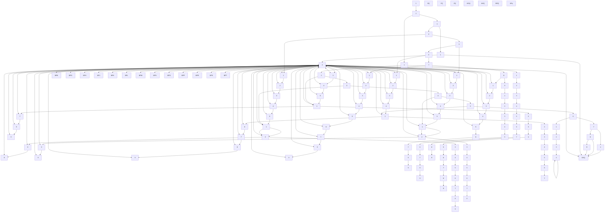
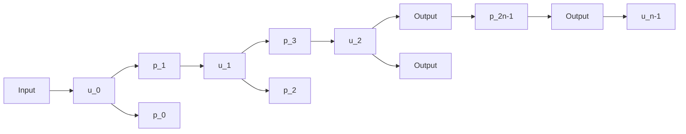
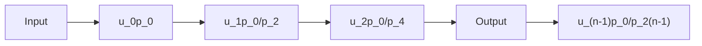

# Boarding at the Speed of Flight

Team 2053 February 12, 2007

## Executive Summary

After mathematically analyzing the aircraft boarding problem, our modeling group would like to present our conclusions, strategies, and recommendations to the airline industry.

We examined the mathematical effects of waiting in line to board, sending in different groupings of seat assignments, and the interaction between various components of the boarding process to determine the time required to board an aircraft. We developed a detailed simulation methodology to test our ideas and to quantify the differences between boarding strategies. Our simulation models all of the critical factors at play in a boarding scenario, and is easily modified to support different plane dimensions and interior configurations as well any assortment of passenger characteristics depending on average demographics and other statistics. We believe that further collaboration with your company and access to your internal business data would provide us with the capability to more accurately determine results and to tune our parameters specific to your airline.

Our analysis began by determining what factors impact boarding speed the most across all boarding algorithms. Our conclusions are presented in the list below along with strategies that can be implemented to mitigate their impact:

Passenger entry speed: The faster passengers enter the plane, the faster it boards. This means flight check-in procedure (ticket checking) should be optimized to ensure the correct number of gate agents are present. This is particularly important on large planes with multiple aisles or levels. Flight attendants should be stationed at critical junctions (such as entrances to aisles in a multi-aisle plane) to direct each passenger to the correct row and thereby maintain throughput.  
• Baggage stowage time: The faster passengers put their bags away and sit down, the faster the plane boards. The impact of storage time can be mitigated by changing or enforcing carry-on baggage limits and by having flight attendants assist passengers with particularly large bags that they cannot easily lift. Another possibility to consider is a redesign of the overhead bins to make them more easy to load.

For airlines interested in further decreasing average boarding time we have further analyzed the merits of different boarding algorithms. Through our simulations we have developed a generic classification of boarding methods:

Best No assigned seats  
Better Outside in boarding  
Mediocre Back to front

We understand that the proposition of no assigned seats may be problematic from a customer service perspective. If this is the case outside in boarding (window seats first, in towards the aisle) provides significant advantages over back to front, particularly when our previously mentioned optimizations are incorporated into the system. The exact numbers depend on the aircraft dimensions and other factors, but in general outside in boarding provides a 10-30% advantage over back to front. Similarly, foregoing assigned seats results in a 10-30% advantage over outside in. We know that for many routes, this magnitude of improvement could provide the margin necessary for an extra run in the course of a day, resulting in additional revenue. However, our analysis does not stop at determining mere speed increases; we also analyzed the reliability of each boarding method in order to determine the deviation between the longest and shortest possible delays for each boarding algorithm. In order to schedule an extra flight, you have to be sure the tightened timetable will always be met, not just most of the time. We found that the faster methods are also considerably more reliable: outside in has a time deviation range 50% smaller than back to front. For more specific numbers, examples on varying sizes of planes, and in general a more complete description of our work, please refer to our in-depth report, attached. With our insights and your business expertise, we can cooperate to benefit the customer, your business, and your shareholders.

## 1 Introduction

Short of a single minor detail the airplane boarding problem would be easily solved using a very simple algorithm. Given his performance in the summer “blockbuster” Snakes on a Plane we know Samuel L. Jackson is an optimal de-boarder of snakes from planes [1]. Assuming that he maintains equal effectiveness with people, simply invert his role and you have an optimal passenger boarding algorithm. We could then simply model people as snakes and play the film in reverse and determine the effective boarding time. The only potential challenge would be scaling our results from the Boeing 747 used in the movie to planes of varying sizes.

Ignoring the only detail that there is only one Samuel L. Jackson (maybe cloning could help here), the idea of an airplane boarding problem is still an ambiguous concept. After all, people want to board the plane quickly and the geometry of the plane is fixed. How much is there to modify that could potentially lead to any speedup in boarding time?

Upon first observation, it is not obvious the true multitude of factors that mesh to determine airplane boarding time. However, after a closer look the true number of degrees of freedom appear. Then the problem becomes one of determining which factors significantly contribute to the problem. The complexity required for this analysis is daunting and in many cases the problem would be relegated into the category of “not worth the time.”

However, like many problems orphaned into this category, it is often the market economy that comes to the rescue. The competitive nature of the marketplace continually redefines the differential that determines what is within the bounds of a marginal gain. For the airlines this marginal difference of even a few minutes per flight can represent millions of dollars in revenue over a fiscal year. Considering the number of airlines currently operating under bankruptcy protection with federal subsidies, this is no small matter. It is this demand for revenue that has thrust the airplane boarding problem into the forefront of modern industrial problem capable of being solved with mathematics. With this in mind we embark on our journey to tackle the airplane boarding problem with Samuel L. Jackson as our inspiration.

## 2 Problem Restatement

We start our journey by concretely stating what we wish to examine. We would like to finish by having an efficient method for boarding a commercial airplane that accommodates for unpredictable human behavior and a framework that allows us to compare and contrast between different procedures. In the process, we would like to gain a “deeper” understanding into the fundamental issues of airline boarding, both to understand the reasons why certain procedures behave differently, but also to make well-informed and theoretically-justified recommendations to our industry patrons.

We approached the problem by first mathematically analyzing different factors that contribute to delays in airplane boarding. Mathematical analysis of blocks which prohibit smooth flow was carried out using techniques from stochastic processes.

We also developed a computer simulation which modeled the airplane boarding process while accounting for different boarding methods and individual variation of passengers. We also used our simulation to learn an ideal boarding procedure, which we refer to as Parabola for the parabola-like zone assignments that it uses. We then pitted our boarding scheme against other standard boarding schemes to see how it fared.

## 3 Conventions

This section defines the basic terms used in this paper.

## 3.1 Terminology

Passenger: A passenger is an individual traveling on the plane who is not part of the crew.  
Boarding Scheme: A boarding scheme refers to an assignments of zones or groups according to which passengers board the plane. Depending on the modeling assumptions, it could be exactly deterministic or the general assignment before random mixings.  
Interference: An interference is an event in which a passenger cannot progress towards their seat because of another passenger blocking their way.

## 3.2 Variables

We will define the following variables here as they are used widely throughout our paper. Additional variables may be defined later, but will be confined to a particular section.

C refers to the number of columns in the plane which is also the number of seats in a row.  
R refers to the number of rows in the plane. For the most part we ignore or treat in a different manner distinctions between classes, for details see section 4.

B refers to the time it takes for a person to stow their baggage into the overhead bin. B is assumed to be constant for our preliminary mathematical analysis; it is allowed to change in the simulation. Refer to section 7.5 for more information about variation of B.  
v refers to the walking speed of the passengers. It is assumed to be constant throughout the model. See section 4 for an explanation.  
s refers to the time it takes for an already seated passenger to get up and get out to let another passenger pass. It is assumed to be constant for mathematical analysis but is allowed to vary in the simulation.  
λ refers to the rate at which people enter the plane through the main door. This value is assumed to be constant as any deviations in time between passengers is mitigated by walking down the jet-bridge to the plane.

## 4 Assumptions

We make the following assumptions about airplane boarding process in this paper.

Passengers with physical limitations, families with infants, and passengers extremely advanced in years board the plane before other passengers for their own safety and comfort. We assume that these passengers might need the plane to be relatively empty to successfully reach their seat, perhaps with the assistance of flight attendants. The time taken for this pre-boarding is assumed to be a constant overhead that airlines cannot avoid.  
First class passengers are boarded separately. The existence of a first class in our view means that they require first class treatment: a first class section where passengers have to fight through the proletarian masses is antithetical to the very idea of a “first” class. We can either assume a single-class plane, or model the first class separately (see section 11).  
All passengers boarding the plane during general boarding walk at approximately the same speed. Since we assume passengers of extremely limited mobility are already aboard the plane, this is plausible. Furthermore, the walking speed is limited more by the environment (aisle size, people in the way) than the person’s innate maximum physical capacity. Passengers board independently and walk independently, that is, we have no groups waiting for each other or slowing in line. For families we might assume that they are assigned seats next to each other, which satisfies their bonding and closeness desires.  
We confine our analysis to the interior of the plane. That is, we ignore terminal effects (anything outside the plane door)) beyond requiring that the gate agents can supply us with passengers at a certain (typically constant)

rate. If the plane cannot “process” them quickly enough, they queue in the jet-bridge without adverse effects. Additionally, the interior of our planes are generally assumed to be regular and symmetric with all rows equally-sized.

All planes fly at maximum capacity and all passengers are present at the time their respective zone is called, which they follow obediently. Empty seats would only speed up the process. Late passengers or disobedient passengers can be thought of as equivalent and at worst can be accounted for by adding a time overhead once they board the plane.  
We confine our recommendations and analysis to methods that do not overly alter the status quo. Change is bad, particularly for the airline industry in this already turmoil-laden time. We will analyze ticketless methods for comparison but seek to find the best boarding method for ticketed contexts, since this will be useful for the many airlines that refuse to abandon assigned seats. We further will only consider zone-based boarding calls, assuming that is too heavy-handed and logistically impossible to require passengers to line up in any verifiable order.

Additional assumptions are made to simplify analysis for individual sections. These assumptions will be discussed at the appropriate locations.

## 5 Motivation and Subproblems

With the large number of complexities involved in the airplane boarding process, we begin by analyzing the problem in small, idealized parts. We begin by examining an ideal, best case algorithm that simplifies many issues in its analysis. By looking at the simplifications necessary to make this analysis, we get a better idea of the underlying problems or key issues in the process. In the second and third sections we rigorously analyze facets of the boarding process to gain insights into the nature of the problem. Ultimately the knowledge we gain will motivate the set of boarding schemes best suited to solving the airplane boarding problem and the factors we will compare in our simulation model.

## 5.1 Best-Case Boarding Algorithm

Consider for a moment the case in which all possible variables involving passenger boarding could be controlled. Under these circumstances how would it be possible to schedule the boarding of the plane in an optimal manner? After consideration we determined that the best way of boarding a plane with these conditions would be to use a modified version of outside to inside method. Passenger are first ordered by the following set of criteria in descending order of priority:

Individual location in row: Window has highest priority, aisle has least

Side of plane: left side of plane has priority over right side  
Row number: Rows in back have priority over those in front

After ordering passengers in this manner the following algorithm could be applied to board the plane optimally: While the ideal boarding algorithm may

flowchart

Figure 1: This figure demonstrates the operation of the ideal airplane boarding algorithm. Each group of R people is represented by a number corresponding to the order that groups enter. Each group proceeds down the aisle until each person reaches their row (since people are in order they all reach their row simultaneously). They step into the first seat in their row and then begin storing their carry-on baggage. During this time the next group commences walking down the aisle (they won’t be getting married though). Notice the only time when a group might stall in the aisle is if B is larger than $2 { \frac { \mathrm { R } } { \mathrm { v } } }$ in which case every other group must wait in the aisle for B-2 R $\mathrm { B - } 2 \frac { \mathrm { R } } { v }$ seconds. This accounts for the additional term in the second part of equation (5.1).

seem an enticing solution to the passenger boarding problem it is far from practical as it is unreasonable to expect people to perfectly order themselves and follow strict commands on what actions to perform in the plane (unless of course you’re boarding a company of United State Marines). Instead we will utilize the the ideal boarding algorithm to place a lower bound on the minimum amount of time required to board an airplane of a given size and shape. The formula

for computing this time is:

$$
\text { Ideal   Boarding   Time } = \left\{ \begin{array}{l l} C \frac {R}{v} + B & B \leq 2 \frac {R}{v} \\ C \frac {R}{v} + B + (\frac {C}{2} - 1) (B - 2 R) & B \geq 2 \frac {R}{v} \end{array} \right. \tag {5.1}
$$

In addition to using the lower bound generated by the ideal boarding algorithm we will also utilize it to recognize several key insights into the problem of passenger boarding. The following are two key concepts to note about the operation of the algorithm:

The main aisle is kept continuously busy unless passengers have to wait for people in their row to finish placing their baggage up.  
Passengers are “pipelined” to minimize the blocking effect of placing any luggage in the overhead bins

In essence, these two properties of the algorithm are solutions that arise in response to two of the fundamental problems in the passenger boarding problem. These problems only manifest themselves whenever some order of randomness is introduced into the process; that is, when passengers are not perfectly ordered. The introduction of randomness also ultimately leads to the downfall of the ideal algorithm. The fact that randomness, that is, imperfect ordering, is an inherent property of the airline boarding problem (see section 4) forces us to consider the following when determining the best airline boarding algorithm:

Random Orderings: How out-of-order are people and how does this impact other dependencies in boarding?  
Flow Rates: How long does it take people to enter the plane and walk down the aisle without blocking the aisle?  
Baggage: How large is their baggage and how long does it take to place in the overhead bins?

An important observation to be made concerning the above conditions is that they all represent means of introducing dependencies into the system. Randomness prevents us from determining the occurrence or duration of these dependencies and therefore forces us to design boarding schemes capable of tolerating their effects. One potential solution would be to remove dependencies by forcing people to continue moving as far back in the plane and over in a row as long as they don’t get blocked. We will return to this “Random Greedy” approach later as it represents the intuitive motivation for our best airplane boarding scheme. However, before introducing any additional schemes, we will determine the exact mathematical impact of several different algorithm design parameters. By determining these effects, we can then use them to guide our choice of boarding schemes for testing.

## 5.2 Predicting Bottlenecks with Queuing Theory

One intuition for modeling the airplane boarding problem is to think of it as a stochastic process. A stochastic process is a collection of random variables that must take on a value at every state, where states are indexed by some parameter (in our case time) [2]. A simple example of using a stochastic process to model the airline boarding problem would be if we considered each entering passenger to be associated with a random variable that described their assigned seat. Although this may seem simplistic, it is conceivable to assign every potential parameter in the airplane boarding process a random variable that is associated with time. We determined that this level of detail was prohibitive based on the amount of computation that would be required even for just a few variables. Despite this, we can still use several tools associated with stochastic processes to learn about the plane boarding problem.

To analyze this stochastic process formulation, we use queuing theory. Queuing theory deals with analyzing the way that random variables in stochastic processes interact. Traditionally queuing theory is utilized for determining the average throughput of a system. While the airplane boarding problem does not possess a quantity directly corresponding to throughput, we will show that we can gain a better understanding of bottlenecks and their effects using this approach.

The first step in our analysis is to partition the airplane into a series of queues. We place a “processor” at each row. This processor corresponds to each passenger making a decision at this point either to keep walking or to stop and enter their row. Each processor has a queue that stores passengers. Queues have a size of 1 and will stop the processor feeding them if they are full. This would represent people backing up if someone stops in the aisle. A diagram for this layout can be seen in figure 2.

flowchart

Figure 2: A Queuing Theory Model of an Airplane

In the above diagram $u _ { k }$ represents the processing rate of the “processor”. We can choose this variable to directly correspond to the average walking speed of people. Each $p _ { k }$ represents some probability at which passengers are diverted into the their rows or continue walking in the aisle. In some cases people will take longer to get into their rows depending upon how long it takes for them to put their baggage up. The processor associated with that row will then take longer to process that job, causing the flow of people through the aisle to stall. One downfall of this particular model is that all passengers must leave the system and it doesn’t always accurately reflect that each row should only ever hold $C$ passengers. It was this fact that ultimately led us to drop the queuing theory model as our main model. However, we will see that we can gain some useful knowledge concerning bottlenecks in the aisle.

In order to convert the open system shown in figure 2 to a closed form system that can be solved by Queuing theory we use Jackson’s Theorem [6]. Jackson’s Theorem notes that an open system can be represented with a feedback loop if the rate of processing at each processor is augmented proportional to the rate of flow prior to that processor. Using this theorem we can redraw our airplane model as seen in figure $3 ^ { 1 }$ . This closed form now allows us to solve this queuing

flowchart

Figure 3: A Closed Form Queuing Model of an Airplane

model to determine the probability of having a given number of passengers at a specific node at a given time. We assume a solution of $\rho ( k _ { 0 } , k _ { 1 } , / l d o t s , k _ { n - 1 } )$ where $\rho$ is a function that computes the probability of having $k _ { i }$ people in the i position in the aisle. Conceptually this implies that we have an n dimensional state-space since the number of passengers at each node is potentially different. We can now write down some conditions that $\rho$ must satisfy and use these conditions to find an actual equation for $\rho .$

The first condition that we know $\rho$ must satis $\mathrm { f y }$ is that it must maintain flow of passengers into and out of a given state in state-space. This ensures that passengers are never “lost” in the system. This equation can be stated as

$$
\begin{array}{l} \left(\lambda + \sum_ {j = 0} ^ {n - 1} \mu_ {j}\right) \rho (k _ {0}, k _ {1}, \dots , k _ {n - 1}) = \\ \lambda \rho (k _ {0} - 1, k _ {1}, \dots , k _ {n - 1}) + \mu_ {n - 1} \rho (k _ {0}, \dots , k _ {n - 2}, k _ {n - 1} + 1) + \\ \sum_ {j = 0} ^ {n - 2} \mu_ {j} \rho (\dots , k _ {j} + 1, k _ {j + 1} - 1, \dots) \tag {5.2} \\ \end{array}
$$

We also need to define the boundary states of the state-space. These equations must ensure that no state can run into conditions where it has a negative number of passengers at a particular processor. These equations can then be defined as

$$
\begin{array}{l} (\mu_ {0} + \lambda) \rho (k _ {0}, 0, 0, \dots , 0) = \mu_ {1} \rho (k _ {0}, 1, 0, \dots , 0) + \\ \lambda \rho (k _ {0} - 1, 0, 0, \dots , 0) \quad k _ {0} > 0 (5.3) \\ (\mu_ {n - 1} + \lambda) \rho (0, 0, \dots , k _ {n - 1}) = \mu_ {n - 2} \rho (0, 0, \dots , 1, k _ {n - 1} - 1) + \\ \mu_ {n - 1} \rho (0, 0, \dots , k _ {n - 1} + 1) \quad k _ {n - 1} > 0 (5.4) \\ \lambda \rho (0, 0, \dots , 0) = \mu_ {0} \rho (1, 0, \dots , 0) (5.5) \\ \end{array}
$$

Lastly, we must have that all probabilities sum to 1, so we must have

$$
\sum_ {k _ {n - 1} \geq 0} \sum_ {k _ {n - 2} \geq 0} \dots \sum_ {k _ {0} \geq 0} \rho (k _ {0}, k _ {1}, \dots , k _ {n - 1}) = 1 \tag {5.6}
$$

We can then extend the solution presented in [2] from a two processor chain and see that that $\rho$ has the following form

$$
\rho (k _ {0}, k _ {1}, \dots , k _ {n - 1}) = \prod_ {j = 0} ^ {n - 1} (1 - \rho_ {j}) \rho_ {j} ^ {k _ {j}} \tag {5.7}
$$

Where each $\rho _ { j }$ takes the following form

$$
\rho_ {j} = \frac {\lambda}{\mu_ {j}} \tag {5.8}
$$

and $\mu _ { j }$ is the rate of processing for the $j$ processor which is seen in Figure 3. From [2] we know that the bottleneck of the system occurs at the processor with the largest value of $\rho _ { j }$ . We now consider a random ordering of people entering the plane. This implies that people turn off at any given row with probability $\textstyle { \frac { 1 } { n } }$ and continue walking with probability $\textstyle { \frac { n - 1 } { n } }$ . We can then conclude that the rate that they turn off at any row is proportional to $\textstyle { \frac { 1 } { n } }$ as well. We assume that in the original system $u _ { 0 } = u _ { 1 } = \ldots = u _ { n - 1 }$ and therefore all nodes in the closed system must have a rate of $\begin{array} { r } { \rho _ { j } ~ = ~ \frac { ( n - j ) \lambda } { u _ { j } } } \end{array}$ (n−j)λ for all j. This $j .$ implies that $\rho _ { 0 }$ is the largest in the system and is therefore the bottleneck of the system. If we recursively apply this for an airplane with $n - 1$ rows then we see that bottleneck will always be the first processor. We can then recognize three important properties of airline boarding:

The critical bottleneck for boarding people on the plane will always be the first row in the plane.  
• The criticality of the main bottleneck is linearly proportional to the number of rows in the plane.  
The farther back a row is in an airplane, the less it contributes to the bottlenecking effect.

Although the queuing model of an airplane is not the best model of an airplane, we will show that the above three principles are very important in determining an airplane boarding scheme. In the next section we will investigate the airplane boarding problem at a finer granularity by examining the effects of row and column collisions.

## 5.3 Effects of Row and Column Interferences

The boarding process gets more complicated when people board the plane out of order within their zone. Boarding out of order leads to row interference and column interferences which hold up traffic down the aisle. Here we use probabilistic estimation to assess zone configurations which are least affected by shuffling among passengers in a given zone. For the sake of simplicity we present this analysis for a plane in which each row has 6 seats, but it can be easily generalized to planes with longer or shorter rows. We develop some lemmas before we proceed to the actual analysis.

Row interferences occur when a passenger sitting in an aisle or middle seat has to get up to let the person from the window seat or the middle seat in. We will calculate the expected number of times a passenger will have to get up if the passengers sitting in a row of k seats board the plane out of order.

Lemma 1. The expected number of seating interferences in a row of k people $i s \ \frac { k ( k - 1 ) } { 4 }$

Proof: We refer to the seats in a row by $A _ { 1 } , A _ { 2 } , \ldots , A _ { k }$ with $A _ { 1 }$ representing the window seat while $A _ { k }$ representing the aisle seat. The k passengers sitting in these k seats can board the plane in k! different orders. The expected number of interferences is an average of the number of seating interferences over all permutations of $1 , 2 , \ldots , k .$ . This can also be represented as the sum over all i of the expected number of times the passenger in seat $A _ { i }$ has to get up. Let $\boldsymbol { x } _ { i j }$ be an indicator variable defined as follows.

(5.9)

$$
x _ {i j} = \left\{ \begin{array}{l l} 1 & \text {if passenger in seat A_{i} has to get up to let passenger from seat A_{j} pass} \\ 0 & \text {otherwise} \end{array} \right.
$$

Passenger in seat $A _ { i }$ would have to get up to let passenger from seat $A _ { j }$ pass only if $i > j$ and the passenger from seat i comes in before passenger from seat $j .$ Thus,

$$
\mathbb {E} (x _ {i j}) = \left\{ \begin{array}{l l} 1 / 2 & \text { if   } i > j \\ 0 & \text { otherwise } \end{array} \right. \tag {5.10}
$$

Then,

$$
\mathbb {E} (\text { passenger   i   has   to   get   up }) = \sum_ {j = 1} ^ {i} \mathbb {E} (x _ {i j}) = i / 2 \tag {5.11}
$$

So,

$$
\mathbb {E} (\text { row   interferences }) = \sum_ {i = 1} ^ {k} \mathbb {E} (\text { passenger   i   has   to   get   up }) = k (k - 1) / 4 \tag {5.12}
$$

Thus in particular the expected number of interferences for 3 seats in a row is $\textstyle { \frac { 3 } { 2 } }$ .

Our second lemma reasons about the chance of passengers getting held up in the aisles. A passenger often waits in the aisle in front of his seat to stow his hand luggage in the overhead bin. The passengers behind this passenger then have to wait till the passenger finishes stowing his baggage and proceeds to the seat. We use techniques from probability to reason about the number of holdups that might occur when people distributed over a number of rows board the plane in random order. We assume that a passenger can go to his row and stow his luggage as long as he is not blocked by some passenger stowing his luggage. The lemma finds the longest sequence of passengers that can be stowing their luggage at once. If the rows are numbered in increasing order from the back of the plane to the front, the problem can be reduced to finding a largest increasing subsequence of row assignments among the passengers, as these passengers then can proceed to their seat and stow their bag.

Lemma 2. The expected length of longest increasing subsequence in a permutation of $\{ 1 , 2 , \ldots , k \}$ is (asymptotically) of size $2 { \sqrt { k } } . \ [ 3 ]$

The proof of this lemma is quite involved and we will not discuss it here. The lemma tells us that if k passengers sitting in different rows board the plane at once, then $2 \sqrt { k }$ of them would be able to proceed to their seat and stow their luggage without encountering an interference. Now if we have m people spread over k rows, then it will take them $\lfloor m / ( 2 \sqrt { k } ) \rfloor B$ time to stow their luggage.

Now we use these lemmas to estimate the boarding time for a group of passengers to be seated in different configurations.

## Configuration 1: Dense Distribution over Rows

This configuration refers to the situation when the zone is composed of m passengers spread densely over k row. Dense distribution assumes that we have all 6 passengers from a given row in the same zone. The expected number of row interferences for this configuration is ${ \frac { 3 } { 2 } } \cdot 2 k$ . Then the boarding time for this zone is approximately:

$$
T = \left\lfloor \frac {m}{2 \sqrt {k}} \right\rfloor B + 3 k s \tag {5.13}
$$

where B represents the bag stowage time and s represents the time it takes for a passenger to get out of their seat to allow a fellow passenger to pass and sit down again. The time it takes for people to walk down the aisle can be ignored in this case as it is overshadowed by bag stowage and reseating.

## Configuration 2: Sparse Distribution over Rows

This configuration refers to a zone that is composed of m passengers sparsely distributed over k rows. Sparse distribution assumes at most two passengers from a given row mostly on different sides with respect to the aisle. Having a sparse distribution totally eliminates the effect of reseating time, but results in walking time becoming the critical factor in determining seating time. The walk time for this configuration is roughly kv where v is the time it takes to walk from one row to next. Thus total time for boarding this group will be,

$$
T = \lfloor \frac {m}{2 \sqrt {k}} \rfloor B + k v \tag {5.14}
$$

where B is bag stowage time.

In order to illustrate the effects of both of these configurations consider the following two examples. In the first example we have 6k passengers spread over k rows in the dense distribution configuration. In the second example, we again have 6k passengers but this time they are spread out over 6k rows in the sparse distribution configuration. The boarding time for the first configuration is $\lfloor 3 \sqrt { k } \rfloor B + 3 k s$ and for the second configuration is $\lfloor \sqrt { 6 k } / 2 \rfloor B + k v$ . Reseating takes longer than walking and the boarding time for first configuration is much larger than the boarding time for the second configuration. From this we can draw several important conclusions:

Boarding passengers in close spatial proximity results in a high rate of interferences that severely impedes boarding time  
Boarding passengers across several (even just a few) rows significantly reduces the rate of interferences and improves boarding time over row-by-row boarding  
A strong boarding scheme must include some form of sparse distribution boarding in order to be competitive

We’ve now seen some of the underlying components that make the airline boarding problem difficult. Having identified the characteristics of a strong boarding scheme we are now ready to investigate current boarding schemes, as well as a few of our own design to determine their effectiveness at attacking the airline boarding problem.

## 6 Assorted Boarding Schemes

The mathematical intuition presented in the last section shines light on different factors that must be considered while developing a boarding scheme. Here we take a look at the different boarding systems already in place.

Back to Front: Back to Front is the most widely used boarding scheme among airlines. Its users include Air Canada, Alaska, American, British Airways, Continental, Frontier, Midwest, Spirit, Virgin Atlantic to name a few [5]. In this scheme passengers are divided into zones and are boarded from the front door in a back to front order.

Outside In: This boarding scheme is used by Delta and United Airlines. Passengers are boarded windows first, followed by the middle seats with aisle seats boarding last.

Reverse Pyramid: This recently introduced system is currently used by US Airways on some of their routes. This scheme boards people in a V-like manner with rear middle and windows boarding first, followed by rear aisles and front aisle.

No assigned Seats: Ostensibly the fastest of all the boarding schemes, it is used by Southwest Airlines. Passengers are not assigned seats and are allowed to sit anywhere in the plane. This scheme has not been widely copied by other airlines as it does not lead to high customer satisfaction and is often likened to a cattle car.

For a visual comparison, we load these seating assignments into our simulation engine (for details, see section 7) in a hypothetical plane configuration and output them graphically (figure 4). The seats are colored according to the order in which they are filled, with red being earlier and green being later. The entry door is at the top of the grids with the bottom being the back row. We include an ordering named“Parabolas” that we will introduce in a later section, for now we leave it as an exercise to the reader to determine its theoretical origins.

## 7 Simulation Design and Details

In this section we introduce our simulation engine and its details. In earlier sections we analyzed subproblems and made simplifying assumptions to get a handle on the issues at hand. However, determining realistic numbers should include more information and take into account the many details that occur in an actual plane boarding situation. To model this we produced a comprehensive, flexible boarding simulator that we use as a vehicle to compare different boarding algorithms and the effect of various situations. Our simulation techniques were inspired by Stochastic Petri Nets, Finite Time Step simulations, and cellular automata[4].

heatmap

| Category       | Color Intensity |
| -------------- | --------------- |
| Back to Front  | Green           |
| Alt. Rows      | Orange          |
| Outside In     | Yellow          |
| Pyramid        | Green           |
| Parabolas      | Orange          |

Figure 4: Ticket Assignment Schemes

## 7.1 Process

Our simulation model runs through time in small intervals. At each interval it moves each participant in the simulation according to certain rules defined by the input parameters. Certain events take extra time and create blocks for other participants in the model. For example, a passenger putting their baggage in the overhead compartment might block the aisle for a certain amount of time.

## 7.2 Plane

The plane exists as a variably-sized rectangular grid of seats. There is a single aisle for passenger movement in the center of the columns and a single door for passenger entry at the beginning of the aisle. The space between rows (pitch in industry terms) and between columns is adjustable. See section 11 for strategies that extend this model in a simple manner to planes of varying, more complex configurations.

## 7.3 Behavior Modeling

Our simulated passengers can board in two different contexts: assigned and unassigned seats.

Assigned seats means that particular seat assignments are given to passengers before entering the plane in a one-to-one mapping. Passengers move to their seats as fast as their walking speed allows them, waiting as necessary for obstacles in front of them to clear. They make no mistakes in moving to their assigned seat, that is, they don’t overshoot it or go to an incorrect location.  
Unassigned seats means that each passenger is free to sit anywhere they like. Our passengers have an equal preference for each seat in the airplane.

Furthermore, they sit down as soon as possible: if the aisle is blocked, they will sit down in the current row to avoid waiting standing up. However, if there is no block then they will walk as far as possible before sitting. When they sit, they are generous and move all the way over to save future passengers time.

Passengers each have an associated delay time for moving into their row which corresponds to the time required to stow their carry-on in the overhead compartment, wait for already-seated passengers to move out of the way, move in themselves, and get settled and ready for flight. The seating delay required to sit in a row rises as more people sit in it, reflecting the decreasing amount of space in the overhead compartment and the accompanyingly longer time required to find adequate space for a bag (which increases faster with smaller baggage compartments or people with larger luggage).

When a person blocks the aisle loading their baggage and someone else comes up behind them, there is a certain pass percentage representing the chances that the blocked person can pass by them and proceed on their way to a seat farther along the plane. This (typically small) percentage reflects the chances that a person loading their bag might be able to stand in the space of an unoccupied aisle seat to load their bag, might be considerate and allow someone to pass, or might be unexpectedly skinny.

## 7.4 Parameters

The simulation is run with a passenger input rate based on the rate at which passengers enter the plane. This is affected by the gate check-in speed, that is, how fast passengers are processed in the terminal. Passengers have a constant walking speed which dictates how fast they can move when not blocked.

When seats are assigned, the passengers are typically called in groups where each group is some approximately contiguous segment of seats (for example, several adjacent rows or all the window seats in some segment). This group number is variable, and passengers within each group are randomly ordered. Groups themselves satisfy certain ticket assignment schemes, for example ordering groups back to front.

## 7.5 Parameter Estimation

For our simulation trials, we use the following default values and distributions. Estimated values were based on critical thinking and will be varied and analyzed in following sections to determine the relative impact of their estimations. Parameters dependent on the specific plane will be specified later.

Walking Speed = 140 cm/sec

This varies based (at least) on the age and gender distribution of the passengers. We used the FAA evacuation simulation requirements that call for a simulated plane’s population to be at least 40% female, at least 35% over age 50, and at least 15% both. Our average distribution is balanced male and female with 40% over age 50. We referenced the average comfortable walking speed based on age and gender from [8].

Affected by: Passenger demographics, aisle width and ceiling height, number and size of bags per person

Seating Delay $= U [ 1 0 , 2 0 ] + P _ { c } + P _ { r }$ sec

The seating delay is uniformly distributed and includes $P _ { c } .$ , the compartmentfilling penalty and $P _ { r }$ the row-out-of-order penalty.

Affected by: Other penalties, and row spacing, baggage size and number, compartment size and layout, passenger demographics

Compartment Penalty = 3.0p sec

The compartment penalty is proportional to $p ,$ the number of people already seated in your row.

Affected by: Size and layout of overhead compartment, baggage size and number

Pass Rate = 0.05

The default pass rate of 1 in 20 is an estimation.

Affected by: Aisle width, passenger demographics, baggage size and number

Row Out-of-Order Penalty = 15.0p sec

The row exchange penalty is proportional to how many people have to move to let you in your seat, p.

Affected by: Row spacing, passenger demographics, aisle width

Entry Delay = 5.0 sec

The number of seconds between passengers entering the plane, an estimation.

Affected $b y \colon$ Check-in procedure, flight attendant behavior, baggage size and number, out-of-plane characteristics

## 7.6 Summary

To summarize, our simulation model is configurable and allows us to approxi mate many aspects of the airline boarding process. We will use it to test different strategies and measure the effects of certain changes on the process. We can:

Model different types and sizes of planes with varying interior configurations (aisle width, seat spacing, overhead compartment size)

Model passengers with and without assigned seats in many arrangements and zone groupings

Model the effects of baggage count, baggage size, compartment size, and stowing speed  
Model the effects of the gate check-in process speed

## 8 Deriving a New Scheme

It is generally observed that random boarding with unassigned seats tends to be the fastest boarding scheme [5]. Despite this many airlines do not adopt it because it often leads to low customer satisfaction. We now derive a new seating assignment pattern inspired by the seating patterns of passengers in a random, assignment-less environment.

From the mathematical analysis presented earlier, we see that the best strategy for an efficient boarding scheme would be to move passengers as far to the back as possible and also to ensure that passengers boarding a plane within a block are spread out over several rows. We used this intuition to develop heuristics for our learning simulation.

This data was then used to assign zones to seats. Seats that were always the first ones to be filled were assigned the first zone. The next group of seats to get filled were assigned to the second zone, and so on. To observe this, examine figure 5. This zone assignment gave us a boarding scheme for passengers with assigned seats and since in the learning simulation these passengers had minimal interference with each other, we hoped that similar results would occur even with shuffling within zones.

We observed that the zones returned by our learning algorithm resembled parabo las, hence we defined the zones as seats highlighted by different parabolas centered near the far end of plane and the center of the rows, superimposed on the seating chart. The parabolas get steeper for higher zones as we are boarding aisles at that time.

We then wrote a computer program to compute these parabolas for planes of arbitrary size. This program is then adaptable to any plane and will designate seating groupings of appropriate size. We will refer to this method of assigned seat grouping as the Parabola boarding method. Recall that this arrangement was shown on figure 4 earlier.

## 9 Relative Effect of Parameters

In this section we vary the various input parameters for our simulation to determine the effect and relative impact of environmental choices in the boarding process. We will use these results to shape our recommendations to the airline industry to suggest the order in which they should examine their particular boarding processes to obtain the maximum improvements. Also, we will observe the relative speeds of the algorithms throughout the analysis in order to make conclusions about which we should recommend and under what circumstances. We perform these simulations using the default parameters from above and the plane layout of a Boeing 757-200 (39 rows, 6 columns).

heatmap

| X Range | Y Range | Value |
|---------|---------|-------|
| Low     | Low     | Blue  |
| Low     | High    | Red   |
| Medium  | Low     | Yellow|
| Medium  | High    | Red   |
| High    | Low     | Blue  |
| High    | High    | Red   |

Figure 5: Results of No Assignment seating simulation. Blue green corresponds to passengers that sit down first and orange red corresponds to passengers that are seated last. Observe the fact that traces of equal height take the shape of parabolas.

## 9.1 Walking Speed

First, we analyze the effect of passenger walking speed in figure 6. We vary it from the approximate comfortable walking speed of 70 year-old female to the approximate maximum walking speed of an 70 year-old male [8]. In general, loading time is not always lowered by increasing walking speed (except in the back-to-front scheme). This reflects our key insight from queuing theory analysis that the entry rate is a more critical bottleneck. From this analysis we conclude that ensuring high walking speed is not critical.

## 9.2 Baggage Stowage Time

Next we analyze the effect of changing the baggage stowage time in figure 7. Specifically, we change the average value of the uniform distribution we select passenger stowage time from in the simulation. We see that it has a large effect on the overall loading time. This follows our insight that keeping the aisle full or “pipelined” is important: if we slow the process at this pipeline, overall performance directly and immediately suffers. We therefore conclude that ensuring a quick baggage stowage time is critical.

line chart

| Passenger Walking Speed (cm/s) | None  | Back to Front | Alt. Rows (3) | Outside In | Pyramid | Parabola |
| ------------------------------ | ----- | ------------- | ------------- | ---------- | ------- | -------- |
| 120                            | 19.8  | 27.5          | 24.1          | 23.2       | 22.9    | 23.1     |
| 140                            | 19.7  | 26.2          | 23.4          | 22.6       | 22.3    | 22.4     |
| 160                            | 19.6  | 24.8          | 22.7          | 21.9       | 21.7    | 21.8     |
| 180                            | 21.5  | 24.4          | 23.7          | 23.1       | 23.0    | 23.0     |
| 200                            | 21.3  | 23.6          | 23.2          | 22.8       | 22.6    | 22.5     |

Figure 6: Plane Loading Time as a Function of Walking Speed (v)

## 9.3 Plane Entrance Rate

We analyze the effect of changing the plane entrance rate in figure 8. Increasing the delay between successive plane entries (that is, lowering the rate of incoming passengers) immediately and strongly increases the time required to board the plane. At a certain value, all seat assignment methods become equal. This presumably results because no bottlenecks form since passengers enter so slowly (effectively each passenger enters independently, one-at-a-time, without conflicts) and so queuing and overflow effects do not emerge. From this analysis we conclude that ensuring adequate plane boarding speed is critical.

## 9.4 Intra-Row Movement Time

We look at the effects of changing the time required to shuffle in and out of a row to let in a fellow passenger in figure 9. Increasing the row movement time raises the boarding time marginally for back-to-front and alternating rows, but not for the other algorithms. However, this is to be expected: the other methods are designed to specifically avoid these row conflicts: passengers almost always arrive in outside-in order. So we decide that decreasing row movement time is not critical particularly because we can completely avoid its effects with certain algorithms.

line chart

| Average Baggage Stowage Time (s) | None  | Back to Front | Alt. Rows (3) | Outside In | Pyramid | Parabola |
| -------------------------------- | ----- | ------------- | ------------- | ---------- | ------- | -------- |
| 0                                | 18    | 18            | 18            | 18         | 18      | 18       |
| 20                               | 20    | 26            | 24            | 23         | 23      | 22       |
| 40                               | 22    | 41            | 33            | 29         | 29      | 28       |
| 60                               | 25    | 55            | 44            | 36         | 37      | 36       |
| 80                               | 28    | 68            | 54            | 41         | 43      | 43       |
| 100                              | 30    | 80            | 65            | 47         | 51      | 50       |

Figure 7: Plane Loading Time as a Function of Baggage Stowage Time (B)

## 9.5 Aisle Pass Rate

Finally we analyze the effects of changing the aisle pass rate. The more often passengers can pass each other in the row, the less often incorrect row orderings and blocks in the aisle occur. So, loading times clearly decrease for all algorithms as this rate increases: all algorithms have to deal with these conflicts. Affecting this rate would be difficult in practice, but might occur while trying to obtain some of the other critical goals we have selected. That is, we can imagine that widening the aisle in a plane is quite difficult (directly trying to raise this rate), but lowering average passenger carry-on size and amount might also raise it (indirectly). So, since we can affect this rate only indirectly, we decide that ensuring a high aisle pass rate, while beneficial, is not critical.

## 9.6 Summary

We have analyzed the relative impact of the parameters of our model for a representative airplane. To review, we determined that two factors are of key importance in ensuring a speedy boarding process: average baggage stowage time and plane entrance rate. Synthesizing the results with the aim of ranking the various strategies in terms of speed produces a clear and consistent ordering:

Outstanding: No seating assignments

line chart

| Delay Between Plane Entries (s) | None  | Back to Front | Alt. Rows (3) | Outside In | Pyramid | Parabola |
| -------------------------------- | ----- | ------------- | ------------- | ---------- | ------- | -------- |
| 1                                | 7.5   | 25.0          | 20.0          | 17.0       | 18.0    | 17.5     |
| 4                                | 17.5  | 26.0          | 22.0          | 21.0       | 20.5    | 21.0     |
| 7                                | 27.5  | 29.0          | 29.0          | 28.5       | 29.0    | 29.0     |
| 10                               | 40.0  | 41.0          | 41.0          | 41.0       | 41.0    | 41.0     |

Figure 8: Plane Boarding Time as a Function of Plane Entrance Rate (λ)

Meritorious: Outside in, pyramid, parabola  
Honorable Mention: Alternating Rows  
Limited Success: Back to front

Analysis of the average order of passenger seatings after mixing within groups compared to the average seating order without ticket assignments provides some insight into this ranking. Figure 11 shows this for each boarding algorithm: Pyramid and Parabolas most closely approximate the order achieved by the fast no-assignments model. We conclude that Outside In captures most of the key benefits, since in general it is as fast as the other two while being a less-close approximation of the random greedy model.

## 10 Strategy Robustness and Dependability

Average boarding speed is not the only measure of success for a boarding procedure. Fast boarding times are useful inasmuch as they allow for extra flights to be scheduled in a day [5] to produce more revenue for an airline. A fast boarding method does no good if once a week it takes twice as long as its average: airlines need to depend on a consistent time to produce achievable and reliable schedules. Therefore, we prefer boarding methods that vary little between worst and best cases over many repetitions. To analyze this we plot histograms of boarding times for our various schemes over 500 trials. We would prefer the method with the “tightest” distribution in order to produce a schedule. See figure 12 to compare.

line chart

| Time to Let Someone Pass in a Row (s) | None  | Back to Front | Alt. Rows (3) | Outside In | Pyramid | Parabola |
| -------------------------------------- | ----- | ------------- | ------------- | ---------- | ------- | -------- |
| 0                                      | 19.5  | 26.0          | 23.5          | 22.5       | 22.0    | 22.5     |
| 15                                     | 19.5  | 26.0          | 23.5          | 22.5       | 22.0    | 22.5     |
| 30                                     | 19.5  | 26.5          | 24.0          | 22.5       | 22.0    | 22.5     |
| 45                                     | 19.5  | 29.0          | 25.0          | 22.5       | 22.0    | 22.5     |
| 60                                     | 19.5  | 32.0          | 27.0          | 22.5       | 22.0    | 22.5     |

Figure 9: Plane Boarding Time as a Function of Intra-row conflicts

<table><tr><td>Algorithm</td><td>Time Range (min)</td></tr><tr><td>No Assignments</td><td>0.7</td></tr><tr><td>Outside In</td><td>2.6</td></tr><tr><td>Parabola</td><td>2.8</td></tr><tr><td>Pyramid</td><td>3.1</td></tr><tr><td>Alternating Rows</td><td>4.6</td></tr><tr><td>Back to Front</td><td>6.2</td></tr></table>

From this we can see that plane loading time has the smallest deviation between longest and shortest load times for the No Assignments boarding scheme. Interestingly, we can see a direct correlation between the amount of time that it takes to board and the variability in boarding time. The Outside In, Pyramid, and Parabola Methods all have similar boarding times and distributions. Similarly Back to Front and Alternating Rows take the longest and have the largest deviation. To some extent this suggests that a faster boarding algorithm is also more dependable, however this may not be true for all cases.

line chart

| Chances of Passing Someone in the Aisle | None | Back to Front | Alt. Rows (3) | Outside In | Pyramid | Parabola |
| --------------------------------------- | ---- | ------------- | ------------- | ---------- | ------- | -------- |
| 0.0                                     | 19.8 | 30.0          | 25.4          | 24.8       | 24.0    | 24.2     |
| 0.05                                    | 19.8 | 26.2          | 23.3          | 22.4       | 22.2    | 22.4     |
| 0.1                                     | 19.8 | 24.0          | 22.4          | 21.4       | 21.2    | 21.2     |
| 0.15                                    | 19.8 | 22.8          | 21.8          | 20.8       | 20.6    | 20.6     |
| 0.2                                     | 19.8 | 21.8          | 21.6          | 20.4       | 20.2    | 20.2     |

Figure 10: Plane Boarding Time as a Function of Aisle Pass Rate

## 11 Model Generalization

Our simulation assumes that the plane is boarded from one end of the seating area with passengers walking down aisles at the center of the rows. But many commercial planes have several aisles or passengers boarding on different levels. Our model can be easily generalized to accommodate for different plane designs and layouts:

First Class: For most commercial airlines, first class passengers board the plane independently before economy class passengers. As we noted earlier, first class boarding can be simulated using our model by reducing the number of rows and columns. This means the whole plane can be divided into two smaller simulated planes and the total boarding time will be obtained by addition.  
Multi-Door: At some airports, passengers board the aircraft through multiple doors. Boarding through two doors can be modeled by dividing the plane into two halves with front seats in first half and back seats in second half. The simulation can then be used to board each half individually. The fact that passengers leave the terminal through same gate can be easily factored in this simulation by adjusting the passenger entry rate.

heatmap

| Category       | Value |
| -------------- | ----- |
| None           | 1     |
| Back to Front  | 1     |
| Alt. Rows      | 1     |
| Outside In     | 1     |
| Pyramid        | 1     |
| Parabolas      | 1     |

Figure 11: Average Seating Order with Group Mixing

Multi-Aisle: Airplanes like the Boeing 747 or Airbus 300 generally allow double aisle access to the boarding deck. On these planes passengers are directed to the appropriate aisle as they enter the aircraft. Boarding for multi-aisle aircraft can be modeled in our simulation by splitting the aircraft into two vertical sections in the middle of the row. Boarding for each section can then be simulated individually. Since passengers from the two sections are not separated until they enter the aircraft, some adjustments should be made to the entry delay constant in the simulation, reflecting the time necessary for the flight attendants to direct them correctly.  
Multi-Level: The Airbus 380 is the only available commercial aircraft with multilevel economy class. Boarding these multi-level economy class aircrafts can be modeled by treating the two decks as two separate planes. The plane can be boarded with jet-bridges extended to both levels or to a single level then using a staircase inside the plane. The same philosophy as before applies: each subsection will be modeled as its own plane with entry rates changed appropriately. Depending on if the execution (boarding) of subsections occurs in parallel or serially the times should be added or compared (and the maximum taken).

## 12 Specific Results

We apply our model to various real-world planes of different sizes to compare the speed of the boarding processes. As we noticed in a previous section, Outside In, Pyramid, and Parabola are all quite similar in timing: therefore here Outside In serves as a representative for those related techniques. We applied our generalization techniques to model multi-aisle, -class, and -level planes with given configurations found at [9] [10].

bar chart

| Plane Loading Time (min) | Occurrences |
| ------------------------ | ----------- |
| 18                       | 0           |
| 19                       | 80          |
| 20                       | 260         |
| 21                       | 140         |
| 22                       | 10          |
| 23                       | 0           |

bar chart

| Plane Loading Time (min) | Occurrences |
| ------------------------ | ----------- |
| 24                       | 1           |
| 25                       | 10          |
| 26                       | 35          |
| 27                       | 25          |
| 28                       | 15          |
| 29                       | 5           |
| 30                       | 2           |

bar chart

| Plane Loading Time (min) | Occurrences |
| ------------------------ | ----------- |
| 15-16                    | 0           |
| 16-17                    | 0           |
| 17-18                    | 0           |
| 18-19                    | 0           |
| 19-20                    | 0           |
| 20-21                    | 0           |
| 21-22                    | 5           |
| 22-23                    | 10          |
| 23-24                    | 20          |
| 24-25                    | 30          |
| 25-26                    | 40          |
| 26-27                    | 50          |
| 27-28                    | 30          |
| 28-29                    | 10          |
| 29-30                    | 5           |

bar chart

| Plane Loading Time (min) | Occurrences |
| ------------------------ | ----------- |
| 15-16                    | 0           |
| 16-17                    | 0           |
| 17-18                    | 0           |
| 18-19                    | 0           |
| 19-20                    | 0           |
| 20-21                    | 10          |
| 21-22                    | 30          |
| 22-23                    | 50          |
| 23-24                    | 80          |
| 24-25                    | 50          |
| 25-26                    | 10          |
| 26-27                    | 0           |
| 27-28                    | 0           |
| 28-29                    | 0           |
| 29-30                    | 0           |

histogram

| Plane Loading Time (min) | Occurrences |
| ------------------------ | ----------- |
| 15-16                    | 0           |
| 16-17                    | 0           |
| 17-18                    | 0           |
| 18-19                    | 0           |
| 19-20                    | 0           |
| 20-21                    | 5           |
| 21-22                    | 10          |
| 22-23                    | 15          |
| 23-24                    | 20          |
| 24-25                    | 25          |
| 25-26                    | 30          |
| 26-27                    | 35          |
| 27-28                    | 40          |
| 28-29                    | 45          |
| 29-30                    | 50          |

histogram

| Plane Loading Time (min) | Occurrences |
| ------------------------ | ----------- |
| 15-16                    | 0           |
| 16-17                    | 0           |
| 17-18                    | 0           |
| 18-19                    | 0           |
| 19-20                    | 0           |
| 20-21                    | 5           |
| 21-22                    | 10          |
| 22-23                    | 20          |
| 23-24                    | 35          |
| 24-25                    | 55          |
| 25-26                    | 70          |
| 26-27                    | 60          |
| 27-28                    | 45          |
| 28-29                    | 30          |
| 29-30                    | 15          |

Figure 12: Loading time distributions for different boarding schemes

<table><tr><td>Plane</td><td>Passengers</td><td>Unassigned</td><td>Back to Front</td><td>Outside In</td></tr><tr><td>DC 9-40</td><td>125</td><td>11.7</td><td>16.9</td><td>13.7</td></tr><tr><td>Airbus A320</td><td>164</td><td>14.3</td><td>20.5</td><td>16.9</td></tr><tr><td>Boeing 757-200</td><td>234</td><td>19.7</td><td>26.4</td><td>22.6</td></tr><tr><td>Boeing 747-400</td><td>313</td><td>30.6</td><td>30.6</td><td>32.1</td></tr><tr><td>Airbus A380</td><td>555</td><td>34.7</td><td>35.4</td><td>35.7</td></tr></table>

These numbers support our previous conclusions. In several cases Back to Front is quite close to Outside In, here we hypothesize that the plane entry rate was not adequate so the algorithms beaome equal (see parameter variation analysis for entry rate). This is noticeable on planes where the loading rate drops because of multiple aisles, levels, or classes.

## 13 Conclusion

While our approaches and models were effective and produced results, there remain several types of model weaknesses:

A class of weaknesses arise concerning our assumptions and the situations that our model fails to accurately approximate if they don’t hold. This includes having independent, perfect-knowledge, infallible passengers who always put their luggage directly above themselves, as well as having tooperfect scenarios (planes of equally-sized rows, jet-bridges of constant flow instead of the stairs or buses that bring passengers to planes in some airports).  
There are several areas of the problem we left untested because they seemed, at least on the surface, to be of secondary importance; for example, varying the number of zones called. An astute reader can probably think of many more.  
Our comparative analysis of boarding algorithms was simulation-based and therefore by nature not exhaustive. There hypothetically could exist some better algorithms that we did not derive or test. Some already exist in the real world that we did not test because of time constraints, including single-zone random boarding and rotating row group zones.  
We stayed within the current boarding paradigm as an effort to not produce too much “uncomfortable change” for the air-traveling public. However, greater improvements might be available if a wider range of choices were available in order to “change the game”: a simple example might be assigning passengers only to a row and letting them choose their column, or hiding money under one seat to encourage speedy boarding.

Overall, we believe the strengths inherent in our approach overcome many of the weaknesses and allow us to make meaningful recommendations and leverage our analysis nevertheless. Here we present our model strengths:

Our multilayered approach to the problem allowed us to produce key insights as we attacked it with differing degrees of detail and differing assumptions.  
Our flexible simulation model can be extended to test new algorithms and situations with minimal changes. This can be used to address several of the weaknesses listed above.  
We provide the airline industry with a relative ranking of factors affecting boarding speed, not just a ranked list of algorithms they should employ. This allows our report to be more useful: an airline can still make improvements if they don’t want to switch their process, or if they already have a fast process.

## 13.1 Summary

We began our analysis of the aircraft boarding problem by mathematically investigating several key subproblems. Through this analysis we were able to gain detailed insight that enabled us to propose a new boarding procedure. The key observations that we made were

The aisle is the main bottleneck of the system, especially near the entrance, and it is necessary to “pipeline” passengers in order to maintain a high throughput.  
The rate of passengers entering the plane is also critical as it determines the maximum rate at which passengers can proceed down the aisle and be seated.  
Sending in passengers with closely-situated seating assignments in short time intervals results in numerous interferences and increases boarding time. Instead, passengers should be sent in by zones that distribute seats over several rows.

We next developed a detailed simulation engine to perform simulations. Our simulations allowed us to quantify the differences between the various boarding algorithms as well as the impact of environmental changes on simulated boarding times. From our simulations we were able to confirm the above insights and show empirically that boarding schedules that followed these rules performed better in terms of both speed and reliability. In conclusion we offer the following recommendations to airlines to improve their boarding time, turnaround time, and ultimately their bottom line:

Do everything possible to ensure that passengers enter the plane as quickly as possible.  
• Do everything possible to facilitate, encourage, or require that passengers spend as little time in the aisle as possible.

Switch from Back to Front to another boarding algorithm.

Thank you for flying with us and Samuel L. Jackson!

## References

[1] Snakes on a Plane. http://www.imdb.com/title/tt0417148/. February 11, 2007.  
[2] Trivedi, K. S. Probability and Statistics with Reliability, Queuing and Computer Science. 2002.  
[3] Kiwi, M. A concentration bound for the longest increasing subsequence of a randomly chosen involution. Discrete Applied Mathematics, Volume 154-13, 2006, Pages 1816-1823.  
[4] Marelli, S., Mattocks, G., Merry, R., The Role of Computer Simulation in Reducing Airplane Turn Time, Aero Magazine 1, 1998  
[5] Finney P. B., Loading an Airliner Is Rocket Science, New York Times, November 14, 2006, Retrieved from http://travel2.nytimes.com on February 10th, 2007.  
[6] Jackson, J. R. Networks of Waiting Lines. Operating Systems Research, 5. 1957.  
[7] Menkes H.L., Briel V.D., Villalobos, J. R., Hogg, G.L., Lindemann T., Mul´e, A.V, America West Airlines Develops Efficient Boarding Strategies, Interfaces Vol. 35, No. 3, May-June 2005, pp 191-200.  
[8] Bohannon, R.W., Comfortable and maximum walking speed of adults aged 20-79 years; reference values and determinants, Age and Aging, 1997, 26:15- 19.  
[9] Airbus Aircraft Families, http://www.airbus.com/en/aircraftfamilies, retrieved on February 11th, 2007  
[10] Boeing: Commercial Airplanes, Products, http://www.boeing.com/ commercial/products.html, retrieved on February 11th, 2007.