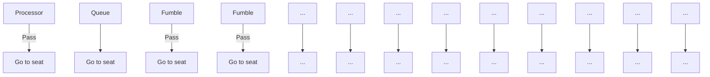
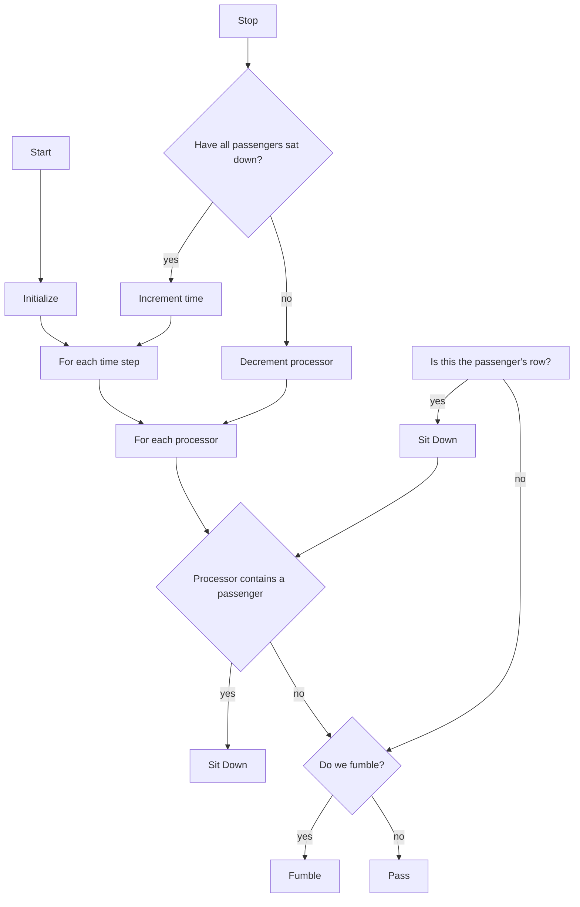
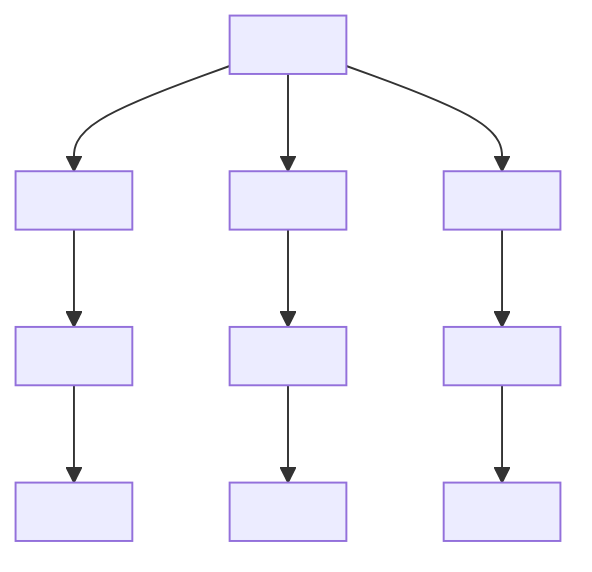
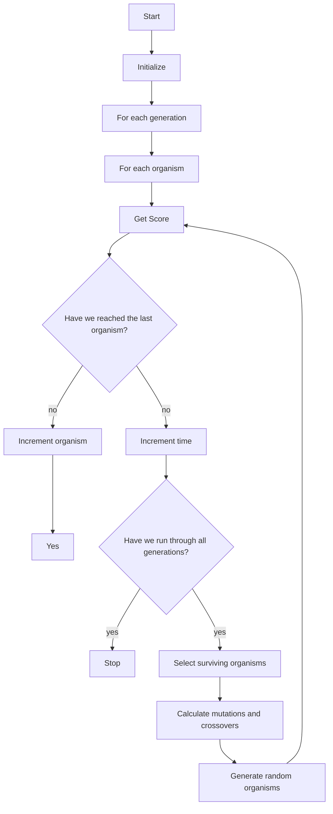
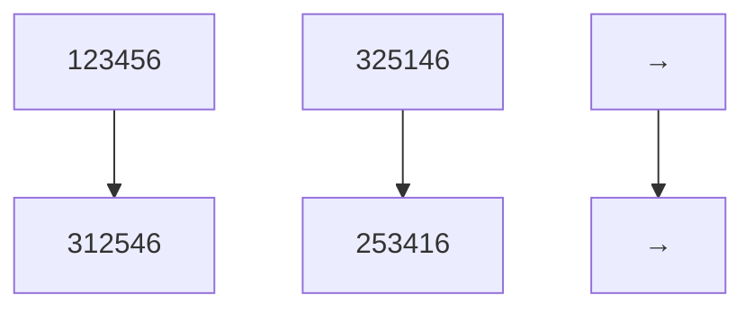

# In the Zone: Novel Approaches to Airplane Boarding

Team 2056

February 12, 2007

## Abstract

Despite the increased pressure on airlines to increase productivity in recent times, a largely overlooked inefficiency in air travel is the boarding and unloading process. The typical airline uses a zone system, where passengers board the plane from back to front in several groups. The efficiency of the zone system has come into question with the introduction of the open-seating policy of Southwest Airlines. Despite conventional wisdom, Southwest is able to turnaround planes at an uncanny rate with their innovative methods. Hence, the optimality of the entire boarding process has come into question.

We propose a stochastic agent-based simulation of the boarding process in order to explore the effectiveness of novel boarding techniques. Our model organizes the aircraft into discrete units called ‘processors.’ Each processor corresponds to a physical row of the aircraft. Passengers enter the plane and are moved through the aircraft based on the functionality of these processors. During each cycle of our simulation each row (pro cessor) can execute a single operation. Operations accomplish functions such as moving passengers to the next row, stowing luggage or seating passengers. The processor model tells us, from an initial ordering of passengers in a queue, how long the plane will take to board, and produces a grid detailing the chronology of passenger seating.

We extend our processor model with a genetic algorithm, which we use to search the space of possible passenger configurations for innovative and effective patterns. This algorithm employs the biological techniques of mutation and crossover to seek out locally optimal solutions to the passenger boarding problem. We create a variant of this algorithm which is designed to optimize a priori boarding patterns.

We also integrate a Markov chain model of passenger preference with our processor model. We use this preference model to produce a simulation of Southwest-style boarding, where seats are not assigned but are chosen by individuals based on environmental constraints (such as seat availability).

We validated our model using tests for rigor in both robustness and sen sitivity. We find that in robustness test cases that our model makes pre dictions that correlate well with empirical evidence.

We simulate many different a priori configurations, such as back to front, window to aisle and alternate half-rows. When normalized to a random boarding sequence, we found that window to aisle, the best performing pattern, improved efficiency by 36% on average. Even more surprising, the most common technique, zone boarding, performed even worse than random. We compare these techniques to novel boarding sequences developed using our genetic algorithm.

Based on the output of our genetic algorithm, we recommend a hybrid boarding process; a combination of window to aisle and alternate halfrows. This technique is a three-zone process, like window to aisle, but it allows family units to board first, simultaneously with window seat passengers.

## Contents

## 1 Introduction 5

1.1 Restatement of the Problem . . . . . 5  
1.2 Survey of Previous Research . . . . . 6

1.2.1 Discrete Random Process . . . . 6

1.2.2 Other Simulation Studies . . . . . . 7

## 2 Model Overview 7

## 3 Details of the Model 9

3.1 Basic Model . . . . . . 9  
3.2 Extended Model . . . . . 13

3.2.1 Seat assignment . . . . . 13  
3.2.2 Seat collisions . . . . . . . 14  
3.2.3 Baggage . . . . .  
3.2.4 Queue size . . . . . . . 16  
3.2.5 Planes with multiple aisles . . . . . . . . . . . 17  
3.2.6 Deplaning . . . . . . . 18

3.3 Boarding time optimization using a genetic algorithm 19

3.3.1 Mutation and Crossover . . . . 20  
3.3.2 Population seeding . . . . . 23

3.4 The Southwest Model: integrating passenger preference to our processor-based model . 23

3.4.1 Model Overview . . . . . . . . . . . . . 23  
3.4.2 Assumptions made in Section . . . . . . . . . 26

## 4 Boarding Patterns 27

4.1 Random Boarding Process . . . 27  
4.2 Window to Aisle Boarding Process . . . 28  
4.3 Alternating Half-Rows Boarding Process . . . . . . . 29  
4.4 Zone Boarding Process . . . . 29  
4.5 Reverse Pyramid Process . . . . . 31

## 5 Results 31

5.1 Window to Aisle . . 32  
5.2 Alternate Half-Rows . . 32  
5.3 Back to Front . . . . . 33  
5.4 Reverse Pyramid . . . . . 34  
5.5 Southwest Passenger Preference . . . . . 34

5.6 Genetic Algorithm Applied to a Random Seating Arrangement . . . 36  
5.7 Seeded Genetic Algorithm . . . . . .  
5.8 Deplaning . . . . .  
5.9 Sensitivity and Robustness Testing . . . . . . . . . . 38

5.9.1 Baggage . . . . 38  
5.9.2 Seat collisions . . . . . 39  
5.9.3 Queuing . . . . . . . . . . . . . 39

## 6 Discussion and Conclusions 39

6.1 Executive Summary . . . . . . 39

6.1.1 Boarding Sequences and Results . . . . . . . . 40  
6.1.2 Further Optimization . . . . . 41  
6.1.3 Organizational Change Management and Customer Relationship Management 42

6.2 Strengths and Weaknesses . . . . 42  
6.3 Future Work . . . . . 43

## 7 Appendices 45

7.1 Appendix A: Past Work . . . . 45  
7.2 Appendix B: Preliminary Model . . . . . . . 47  
7.3 Appendix C: Definitions and Computations . . . . . 48

## 1 Introduction

Flight technology has come a long way since the glider flown by Orville and Wilbur during the autumn of 1903. Unlike aircraft sophistication however, passenger boarding techniques have seen little evolution – much to the dismay of frequent fliers who have to wade through the narrow aisles of airplanes and wait for granny to stow away gifts for each of her 20 grandchildren. As the title of a New York Times article emphatically suggests, ’Loading an Airliner is Rocket Science.’ Boarding time not only determines airplane productivity but also impacts customer satisfaction. Prolonged boarding markedly reduces passengers’ perception of quality and considerably increases total airplane turnaround time. The latter is particularly critical over short flights where a few additional minutes spent boarding can throw off the day’s schedule. This paper simulates different patterns of boarding sequences to determine the optimal method of plane boarding.

## 1.1 Restatement of the Problem

The truth about the airline industry is that passengers have places to be and people to see; airlines have planes to fly and dollars to dry. In a utopia founded on world peace, sated bellies and zero boarding or deplaning times, it is difficult to imagine passengers and airlines having anything to whine about. But utopian dreams are but fantasies. Unfortunately, passengers and airlines have to contend with the frustration of waiting when boarding and deplaning. Both passengers and airlines thus have vested interests in the development of boarding and deplaning patterns that minimize waiting times. This is particularly true for the airlines, where the benefit of short boarding and deplaning times is two-fold – higher airplane productivity and greater customer satisfaction. However, given the constraints that airlines operate under – the structure of planes and the infrastructure of airports – the only mechanisms for minimizing waiting times at the airlines’ disposal are the boarding and deplaning sequences.

When passengers board a plane, congestion builds in aisles as passengers stumble through the aisles or attempt to stow their luggage in the overhead compartments. Congestion also results due to seat collisions where passengers have to leave their seats to make way for passengers assigned seats closer to the windows. Ultimately, congestion disrupts the smooth flow of passengers to their seats and prolongs boarding.

Successful boarding sequences not only minimize congestion but also allow passengers access to different parts of the plane in parallel, so that many passengers can stow their luggage and find their seats at the same time. In addition, these sequences must also be sufficiently robust to accommodate stochastic variability in boarding. While it is not difficult to develop solutions that specify the boarding and deplaning sequence of each passenger, such solutions are difficult to implement. Appropriate treatment of the problem calls for careful and balanced analyses that weigh the practicality of implementation, performance and variability.

## 1.2 Survey of Previous Research

## 1.2.1 Discrete Random Process

In an article by Bachmat et al., the group proposed a discrete boarding process in which passengers are assigned seats before boarding. The input to the process is an index for the position of each passenger in the queue and a seat assignment for each passenger. Additionally, the researchers defined the aisle space that each passenger occupies, the time it takes to clear the aisle once the designated row is reached, and the distance between consecutive rows. The former two parameters were sampled from distributions defined by the researchers.

The model considers the travel path of each passenger. The passenger moves as far down the aisle as they can until they reach an obstacle, which is either the back of a queue or a person who is preparing to sit in their row. Passengers who arrive at their row clear the aisle after a delay time. The passengers behind them continue on their journey down the aisle once this delay time is over. An important component of this process is that passengers may have to wait for other passengers to stow away luggage before being free to progress to their own seats. It follows that passengers can block other passengers, thus resulting in the formation of a queue.

The researchers define an ordering relation between passengers. Each passenger can then be assigned a pointer which points to the last passenger that blocked their path. By following the trail of passengers, the longest chain in the ordering ending at any particular passenger can be identified. This identifies the number of rounds that is needed for the simulation.

## 1.2.2 Other Simulation Studies

In ’A simulation study of Passenger Boarding Times in Airplanes,’ H. Van Landeghem argues emphatically the two-fold benefits of minimizing total boarding times. Prolonged boarding not only degrades customers’ perception of quality but also determines total airplane turnaround time and therefore airline efficiency. In his paper, Landeghem defines total boarding time as the interval between the point the first passenger enters the plane to the point the last passenger is seated in his/her assigned seat. To determine the ideal boarding procedure, Landeghem simulates different patterns of boarding sequences in Arena. His simulations are based on an airplane with 132 seats divided into 23 rows with Row 1 and 23 having 3 seats and the others having 6. Through the simulations, the first objective is to reduce total boarding time. The second objective is to augment the quality perception of the passengers by evaluating the average and maximum individual boarding times as seen by the passengers. For a further discussion of this model, please see Appendix A.

## 2 Model Overview

Research into airplane boarding has taken several approaches. Analytic approaches to the problem are extremely rare, due to its intrinsically high parallelism and significant stochastic variability. Most approaches are simulative in nature. Simulation allows for the complexity of the problem to be distributed, and hence presents a simpler formulation. We here present a simulative model which can be considered a stochastic agent-based approach.

Our preliminary model (this model is contained in Appendix B) treats the plane as a line, with destinations (seats) at regular distances along the line. Each passenger is modeled as an agent, and moves along the line until reaching his seat. Each agent has a speed, and is constrained by the slowest person in front of him. This simplest model is merely a prototype, and is not used to derive experimental results.

Our basic model takes into account the topology of the airplane. Each row of the plane is broken into a discrete unit. We call these units ‘processors’ since they determine the rate that an individual moves through the system. Each processor has a queue, a list of people waiting to be processed by it (and hence moved to the next node of the system). Each agent has a particular destination processor, the row where his seat is assigned.

The extended model adds additional parameters into the simulation. For the first time, there is a one-to-one mapping of passengers to seats. This layer accounts for passengers bringing baggage onto the plane. We call a scenario where a passenger is waiting on another passenger to stow his baggage a baggage collision. We also model seat collisions. A seat collision occurs when a passenger is sitting between another passenger and his seat (e.g., the passenger with an assigned window seat must move around a passenger who is sitting next to the aisle).

Our next model attempts to optimize boarding time based on the order that passengers enter the plane. This is implemented using a genetic algorithm over the search space of all possible orderings. Crossovers and mutations occur, with the restriction that each alteration of seat ordering must preserve the property that every seat is represented.

Our final model is a Markov chain used to model passenger preferences in an open seating environment. This model simulates a boarding process such as is used by Southwest Airlines.

We combine our models holistically, and each model interacts beneficially with the other models described. The extended model is combined with the genetic model and the passenger preference model to analyze certain test scenarios. All of our results have the extended model at their heart. This allows us to compare results over different test cases, and generate a macroscopic view of the airplane boarding problem.

flowchart

Figure 1: Basic processor based model

## 3 Details of the Model

We will begin with a description of the model, beginning with the basic algorithm and then continuing with its extensions.

## 3.1 Basic Model

The basic model is the foundation of our experimental results. We model the topology of the plane using a compartmental model. We divide the plane into compartments called ‘processors.’ Each processor is physically analogous to the space of one row in the plane. By using differing layouts of processors, we can model a variety of plane topologies.

In the basic model, each passenger is randomly assigned to a seat on the plane. These seats are not necessarily unique: they are uniformly drawn from all seats on the plane. Every seat is represented as a coordinate pair (c,r), where r is a row of the plane and c is a specific seat number. In most modern aircraft, the seat number is given a letter name (e.g., ‘A’ is usually the leftmost window seat and ‘C’ the aisle seat). However, for simplicity we retain the use of numerical coordinates.

Instead of each passenger being assigned a rate of movement through the plane, in this model, the passengers move based on the function of the processors. The processors are in series, with each processor having the next processor as one output (see figure 1). Since movement is performed by processors pushing passengers from one row to the next, each passenger stores only his destination. When a passenger reaches a certain processor, he waits in a queue to be processed. The queue is first in, first out, so that individual waiting time can be minimized. (Furthermore, this is congruent with the obvious physical constraint that people cannot move around each other while in the aisle.) The initial state of the plane is that all passengers are queued at the first processor.

During each iteration of the simulation, each processor is able to perform one computation. This computation looks at the destination of the passenger. The function performed can be any of the following:

• Pass. The normal behavior for the processor in cases where the passenger’s destination is further along the plane is to allow the passenger to pass. When the passenger passes, he moves from the current processor to the end of the queue of the next processor.  
• Fumble. With a certain small probability, the processor will do nothing this cycle. This is the chance that a bag will get caught in the aisle, that a passenger trips, or that some other time-wasting random event occurs. (Note that a fumble is not equivalent to time spent stowing baggage or rearranging passengers. Our basic model only accounts for random timewasting events.)  
• Sit Down. If this row contains the assigned seat for the passenger currently in the processor, the passenger leaves the aisle

and is seated.

• Idle. If there is no passenger in the processor (and the queue is empty) the processor will do nothing.

The processors run sequentially in order from back to front. (If the processors ran from front to back, during one time cycle, a passenger could be processed in the first processor, move to the second, be processed there, and continue in a similar manner the entire distance to his seat.) They continue to run until every passenger has found his seat.

The implementation of our algorithm can be seen in figure 2.

## Assumptions made in Section 3.1

• The initial configuration of the system is that all passengers are queued at the first row. In actuality, the situation is slightly different. All passengers are initially queued at the ticket counter, where their boarding passes are scanned and they walk a short distance to the plane. Hence, a more realistic alternative to our process is a poisson arrival process from the ticket counter to the queue for the first row. However, we feel that this additional process is unnecessary. It is not needed because of the high speed at which the tickets are taken. This process closely approximates the speed of normal walking. Hence, the passengers will reach the queue at a much higher rate than they are moved forward through the plane. Hence, the queue at processor 1 will form instantly, at the point that the first passengers walk into the plane.

• There is no idle time between the first passenger entering queue 1 and the last. This assumption is also involved in our decision to queue all passengers at the first processor. In some cases, the airline could wait until there is no queue left before inviting additional passengers to board. For example, if calling passengers by zone, the airline could wait until all passengers in one zone are seated before the next zone is invited onto the aircraft. However, this is never to the airline’s advantage. We assume that the airline desires maximum efficiency, and hence ensures that there is no dead-time between passengers.

flowchart

Figure 2: Basic processor model flowchart

• Special needs and business class passengers have already boarded. We assume that the boarding of special needs and business class passengers is not subject to time and order optimization. Rather, airlines have an obligation to these customers for early boarding. We start our simulation clock after these special classes of passenger have already boarded. We deal only with the bulk passenger class.  
• Every passenger functions individually. We expect that efficiency will be improved when passengers travel in groups since they are self organizing (they do not collide with each other).

## 3.2 Extended Model

Each of the following subsections detail the modeling of an extension to the basic model. The final form of our processor-based model (and, hence, the origin of our results) combines the techniques of all of these extensions (i.e., we are creating a holistic model, not modeling these features separately).

## 3.2.1 Seat assignment

The initial model assigned seats randomly and without uniqueness. In the final model, this has been remedied so that there is a oneto-one correspondence between passengers and seats. The seat assignment can be chosen in many ways. As discussed later in the paper, we investigated random, genetically evolved, back-to-front and reverse pyramid loading schemes, among others.

## Assumptions made in Section 3.2.1

• The plane is fully booked, and every seat is occupied. This assumption allows us to optimize over the worst-case scenario. Since airlines attempt to maximize profits, they attempt to fully book as many flights as possible. Hence, most flights will be fully or nearly fully booked. Likewise, an airline, when scheduling, will schedule assuming the flight is fully booked (or else risk delays). Hence, it is most important to understand the fully booked scenario.

<table><tr><td>Arriving Passenger</td><td>Seated Passengers</td><td>Time cost</td></tr><tr><td>Middle</td><td>Aisle</td><td>9</td></tr><tr><td>Middle</td><td>Aisle and Window</td><td>9</td></tr><tr><td>Window</td><td>Aisle</td><td>9</td></tr><tr><td>Window</td><td>Middle</td><td>9</td></tr><tr><td>Window</td><td>Middle and Aisle</td><td>13</td></tr></table>

Figure 3: Table of seat collision values, in normalized processor time $\frac { t _ { r e a r r a n g e } } { t _ { p a s s } }$ trearrange tpass All other combinations of arriving passenger and seated passengers result in no time penalty.

## 3.2.2 Seat collisions

A common occurrence when loading a plane is the need for a passenger to cross a seated passenger to reach his seat. For example, the passenger assigned to the window seat 22A could be forced to move across the passenger sitting in the middle seat 22B in order to reach his seat. We call this situation a seat collision. In order to account for seat collisions, we implemented a new processor function:

• Rearrange. This cycle is spent waiting for the aisle to clear after the seat collision. This operation reduces the seat collision counter by one.

Seat collisions have a certain time penalty (which is stored as the seat collision counter) associated with them. This penalty is dependent on what type of collision occurs. The possible collisions for a standard 6-wide airplane can be seen in figure 3.

When a seat collision is detected, the processor for that row spends a number of cycles equal to the time cost sorting out the collision. During that time, no other passengers may enter the processor (though they can enter the processor queue).

The values for the seat collision time costs were determined by physical experimentation involving multiple trials over a simulated plane row.

## Assumptions in section 3.2.2

• All seat collisions of a given type have the same time cost. Though we could expect some variation in collision time (due to variation in passenger age or size), we expect the variation to be small, except for an insignificant number of outlier cases.

## 3.2.3 Baggage

A major factor in airplane boarding times involves passengers stowing their luggage. For a given plane, the number of overhead bins is limited, and as they become increasingly full, the time it takes to stow a bag increases. Hence, we developed a statistical model of baggage handling. Baggage handling is performed by the processor at a given row using the following command:

• Stow. This cycle is spent by a passenger storing his bag in the overhead bin. The baggage handling counter is decreased by 1.

Baggage handling times are stored in the baggage handling counter. To determine baggage handling times, we use a Weibull distribution because of its added flexibility in shape and scale over other distributions. The density function of our distribution is given by,

$$
f (x, \kappa , \lambda) = \frac {\kappa}{\lambda} \left(\frac {x}{\lambda}\right) ^ {\kappa - 1} e ^ {- \left(\frac {x}{\lambda}\right) ^ {\kappa}}
$$

where λ is a scaling parameter, κ is a shape parameter, and x is the number of people who have entered the plane from the boarding line (figure 4).

Integrating over the number of people who have entered, we obtain the following cumulative distribution function,

$$
\begin{array}{l} F (x, \kappa , \lambda) = \int_ {0} ^ {x} \frac {\kappa}{\lambda} \left(\frac {y}{\lambda}\right) ^ {\kappa - 1} e ^ {- \left(\frac {y}{\lambda}\right) ^ {\kappa}} d y \\ = 1 - e ^ {- \left(\frac {x}{\lambda}\right) ^ {\kappa}} \\ \end{array}
$$

We use this cumulative distribution function as a measure of the additional time it takes to load baggage as the plane fills up. The expression for the waiting time of passenger x is given by,

$$
\lceil c * F (x, \kappa , \lambda) + N \rceil
$$

where c is a measure of the additional time we would expect someone to take to store baggage when the plane is full, N is a gaussian noise parameter which accounts for the non-uniformity of the boarding process and de is the ceiling function.

line chart

| Passenger | Time taken to stow baggage |
| --------- | -------------------------- |
| 0         | 0                          |
| 20        | 0                          |
| 40        | 0                          |
| 60        | 0.5                        |
| 80        | 1.5                        |
| 100       | 3.0                        |
| 120       | 4.5                        |
| 140       | 5.5                        |
| 160       | 5.8                        |
| 180       | 6.0                        |

Figure 4: Cumulative distribution function of a Weibull distribution

We observe that the distribution had a sigmoidal shape, consistent with our baggage loading process. When there are few people in the plane, the time required to load baggage is relatively small since there are a lot of empty spots in the baggage bins. As the number of people increases, this time increases slowly when there is still a lot of space and then rapidly as people start having to rearrange compartments to fit their luggage. As the plane reaches full capacity, the difference in time required to find space for baggage becomes minimal as most baggage bins have relatively little space left.

We note that the hazard rate (or failure rate) of this distribution can be given for the following expression,

$$
h (x, \kappa , \lambda) = \left(\frac {\kappa}{\lambda}\right) \left(\frac {x}{\lambda}\right) ^ {(\kappa - 1)}
$$

For $\kappa > 1$ we see that the failure rate is increasing, thus indicating that the frequency with which people can not find space for luggage is increasing.

## 3.2.4 Queue size

The initial model assumed that each processor could have an infinitely sized queue. This makes sense for the initial processor, as its queue consists of the passengers lined up along the loading ramp. However, for processors inside the aircraft, we must consider that the processor queue actually takes up physical space. Hence, we cap all processor queues but the first at a length of 2. We used a cap of 2 as it corresponded well with physical reality when considering the ratio of aisle length to passenger size.

flowchart

Figure 5: Model of a plane with two aisles

## 3.2.5 Planes with multiple aisles

We modeled multi-aisle planes as processor sets with multiple pipelines. Using this technique, planes of arbitrary sizes, topologies and entrance points can be modeled. We describe here the technique for the modeling of a double-aisled plane, such as the Boeing 777.

As in the single-aisle model, all passengers are initially queued at a single processor (see figure 5). For the double-aisled plane, this processor represents the junction point at the entry of the plane. No passengers are assigned seats at this row. From the first processor, when a passenger is passed, he may move to either of two different processors. Each of these two processors begins a serial chain of processors akin to a single-aisled plane. Each passenger chooses an aisle based on his seat assignment. As in real aircraft, certain rows of the plane are widened so that a passenger can move from one aisle to the other.

It is important to note that some passengers (for example those sitting in the middle of a row) may have seats equidistant to two aisles. These passengers take the first available aisle. They are also able to switch aisles at the predefined junction points.

This procedure can be generalized to four-aisle aircraft as well, such as the forthcoming Airbus A380. In this model, not all aisles connect. For example, a passenger cannot move across from an upstairs aisle to a downstairs one. We can also simulate a plane with the gate in the middle, or with two gates, or more by changing the configuration of processors. Thus, our procedure can be used to simulate any plane.

## Assumptions in section 3.2.5

• All passengers choose the correct barrel. This also occurs on real aircraft. Usually a steward is positioned at the junction point (i.e., the first processor) to direct traffic. To make this choice even easier, an airline could have color-coded boarding passes, with each color corresponding to a different barrel.  
• Limited forms of barrel-switching occur. We assume that only passengers with middle-seat assignments switch barrels. Though it is possible that other passengers could switch barrels in reality (for example, walking through a less congested section on the opposite side of the plane), we do not expect that this sort of behavior commonly occurs.

## 3.2.6 Deplaning

Once passengers are on the aircraft, there usually comes a point when they must disembark. Our processor based model is capable of handling deplaning. During the deplaning scenario, the processors are reversed: they push passengers from the back of the plane towards the front. Time spent retrieving baggage follows an opposite distribution as the base model; the first passengers must spend more time retrieving their baggage than later passengers. Furthermore, there are no seat collisions; everybody clears out of the plane in order. The destination of all passengers during deplaning is the front of the plane.

## Assumptions in Section 3.2.6

• Deplaning is an uncoordinated process. Though the method of deplaning that we describe is not the fastest possible deplaning process (the best is most likely some variant of aisle to window), we believe that other deplaning methods will greatly decrease customer satisfaction. For example, an aisle to window deplaning process would cause window seat passengers near the front of the plane to have to wait for virtually the entire plane to disembark. This is sure to cause discontentment. Another reason that coordinated deplaning is unlikely is that it is impossible to control the movement of the passengers. In the boarding process, passengers can be organized by color, zone or some other method. In deplaning, no such control exists.

## 3.3 Boarding time optimization using a genetic algorithm

Our previous model is a simulation of an aircraft. Its input is a list of passengers in some order. The passengers run through the simulation, and the model outputs the total time it takes for every passenger to reach his seat. Because it is a randomized model, each experiment involves multiple runs through the simulation. The model returns a final score which is the average time across all the runs.

We used our model to find the average time taken by many boarding techniques, including back to front and window to aisle. However, testing these known passenger configurations does not, in itself, result in an ordering which achieves maximally efficient boarding. To identify the best way to order passengers, we must search the entire space of possible orderings.

The set of all possible orderings is vast, and hence it is impossible to test all possible configurations. Hence, we need a heuristic algorithm that will explore the parts of the space that interest us the most. This algorithm, upon convergence, will give us an optimum, which, while unlikely to be a global optimum, will be a strong local optimum.

To perform this search, we implemented a genetic algorithm, a type of search algorithm that derives the principles of its functioning from evolutionary biology. A genetic algorithm begins with a set of ‘organisms.’ An organism is one possible point in search space. In our case, an organism is one possible arrangement of passengers in line while waiting to board the plane. The algorithm begins with a set of organisms called the population. Each organism in the population is run through our processor model, and, based on the time it takes for all passengers to be seated, given a score (also called a fitness score).

Once every organism has a score, some of the organisms are selected to survive, while others die. Organisms with the highest score (i.e., are most fit) have the highest survival probability. Organisms that survive are kept in the population, and the others are deleted. The population is replenished by the addition of new organisms. New organisms are either offspring of two surviving organisms from the previous round or randomly generated. The algorithm runs for a set number of generations, at which point it returns the best organism remaining in the pool. Our genetic algorithm is diagrammed in figure 6.

The core of a genetic algorithm is the evolution of the population over time. Over a significant number of generations (for our model, around 60), the algorithm converges. The convergence is a local maximum; the point of convergence is dependent on the initial random population of individuals. The point of convergence is reached using the properties of mutation and crossover.

## 3.3.1 Mutation and Crossover

In a genetic algorithm, mutation is the process by which an organism changes from one generation to the next. A crossover is the genetic offspring of two individual organisms. We account for both types of evolution in our model.

We first must consider what the genome or ‘DNA’ of our organisms looks like. An organism is a listing of passengers and seats in order (see figure 7).

Mutations are relatively simple. During a mutation, a random, sequential section of the DNA is chosen and moved to a different location. A mutation of the above DNA could look like figure 8

flowchart

Figure 6: Genetic algorithm flowchart

<table><tr><td>Passenger</td><td>1</td><td>2</td><td>3</td><td>4</td><td>5</td></tr><tr><td>Seat number</td><td>22A</td><td>23C</td><td>7A</td><td>30F</td><td>2B</td></tr></table>

Figure 7: Sample genetic code

<table><tr><td>Passenger</td><td>1</td><td>2</td><td>3</td><td>4</td><td>5</td></tr><tr><td>Seat number</td><td>7A</td><td>30F</td><td>22A</td><td>23C</td><td>2B</td></tr></table>

Figure 8: Mutated genetic code

Crossovers are more complicated. A special property of our solution space is the one-to-one correspondence between passengers and seats. This means that the order of seat numbers in the DNA can be switched, but the seat numbers must stay the same. In normal DNA, a sequential piece of one organism’s DNA is exchanged with the corresponding sequence of the other organism. Due to the oneto-one correspondence property of our data, we cannot use this type of crossover: if the 2 sequences chosen did not have the same set of seats, our offspring would not have a valid genetic code.

Hence, we formulated a new form of crossover which preserves the elements of a DNA code, but changes its order. This crossover is illustrated in figure 9. The crossover algorithm first chooses a sequence of seats from the genome of the first organism. It then identifies the indices of these seats in the second organism. The genomes of the two organisms are rearranged such that the ordering of the selected seats is switched between the two organisms, while all other seat assignments remain the same. In the example in the figure, the seat sequence (3..4) is selected as the crossover. The indices of (3..4) are 3 and 4 in the first organism and 1 and 5 in the second. After the crossover, the indices of (3..4) are 1 and 5 in the first organism and 3 and 4 in the second. The order of all the other seats remains the same, but their indices are shifted due to the change in location of 3 and 4.

flowchart

Figure 9: An example crossover

## 3.3.2 Population seeding

The genetic algorithm was run in two configurations. In the first, the initial population of organisms was randomly determined. In the second, the initial population was seeded. Seeding refers to the practice of adding non-random organisms to the initial population. In our seeded algorithm, we added two examples of each of the tested types of boarding configuration (e.g., window to aisle and back to front). Seeding helps the algorithm approach the global maximum, as our beginning population contains individuals that have high fitness.

## 3.4 The Southwest Model: integrating passenger preference to our processor-based model

## 3.4.1 Model Overview

The Non-System System pioneered by Southwest Airlines appears less like a well-engineered boarding sequence and more like a philosophy of life that harks back to Thoreau standing on the banks of Walden, urging us to ’Simplify, simplify.’ In the Southwest system, passengers board in the order that they arrive with no assigned seats. To quantify the efficiency of the approach, simulation techniques must extend beyond the modeling of boarding patterns to encompass the modeling of passenger preferences under environmental constraints.

In developing simulation techniques that model the impact of preferences on total boarding time and on passenger seating chronology, understanding passenger preference for different rows and seats is crucial. In our model, seat preferences are encapsulated in matrix

$$
\mathbf {B} = \left[ \begin{array}{l l l l} b _ {1} & b _ {2} & \ldots & b _ {6} \end{array} \right]
$$

which resembles the spatial arrangement of seats in each row. For example, elements $b _ { 1 }$ and $b _ { 6 }$ represent the relative preferences for window seats while elements $b _ { 2 }$ and $b _ { 5 }$ represent the relative preferences for middle seats.

The passenger’s desire to sit at a given row, to move forward or to move backward is encapsulated in a transition matrix,

$$
\mathbf {P} = \left[ \begin{array}{c c c c} a _ {1, 1} & a _ {1, 2} & \ldots & a _ {1, 6} \\ a _ {2, 1} & a _ {2, 2} & \ldots & a _ {2, 6} \\ \vdots & \vdots & \ddots & \vdots \\ a _ {3 0, 1} & a _ {3 0, 2} & \ldots & a _ {3 0, 6} \end{array} \right]
$$

where matrix P satisfies

$$
0 \leq \mathbf {P} _ {i, j} \leq 1, \quad 1 \leq i, j \leq N,
$$

$$
\sum_ {j = 1} ^ {N} \mathbf {P} _ {i, j} = 1, \quad 1 \leq i \leq N.
$$

Element $a _ { i , i }$ represents the passenger’s desire to sit at Row i. Element $a _ { i , i + 1 }$ represents the passenger’s desire to move forward to Row i + 1. Element $a _ { i , i - 1 }$ represents the passenger’s desire to move back to Row i − 1. It is important to note that desires are preferences not probabilities. This means that although a passenger may have the preference to move back a row, he cannot.

Since P is an irreducible, aperiodic transition matrix, a stationary distribution exists. (For definitions of reducibility and periodicity, as well as for the calculation of the stationary distribution, refer to Appendix C). This distribution represents the probability that a passenger will end up at a particular row given his preferences. By applying Markov chain techniques, we can determine the stationary

distribution, ¯π.

$$
\lim _ {n \to \infty} \mathbf {P} ^ {n} = \left[ \begin{array}{l} \bar {\pi} \\ \bar {\pi} \\ \vdots \\ \bar {\pi} \end{array} \right]
$$

The model incorporates each passenger’s decision-making process given his preferences, his location within the plane, and other environmental constraints. In deciding whether to move forward or to sit at the current row, each passenger first considers his location. If he is at the end of the plane, then the passenger has no option but to sit at the last row. In addition, the passenger also has to consider the number of people and available seats in front of him. If the number of available seats exceeds the number of people in front, then the passenger has the option to move forward to the next row. If not, he has to sit at the current row. Only the people and available seats in front of the passenger are relevant because the passenger cannot move backwards. This is reasonable since the passenger would face great difficulty if he sought to move against human traffic as the plane is boarding.

We have already discussed how row preferences are translated into a passenger’s preference to be in a particular row. Therefore, it is also necessary to explain the process and conditions under which these preferences are adjusted:

• As the passenger moves forward he is forced to consider a fewer number of rows (since he cannot move back).  
• As the plane fills up, certain rows no longer have available seats for the passenger to consider.

In both these cases, the preferences are redistributed so that the relative preferences between all available rows remain the same. Similarly, when seats in a particular row are occupied, the passenger’s preference for taking a particular seat within that row is readjusted so that the relative preference for available seats remain the same and the sum of seat preferences across the row is one. Therefore, the preferences for each standing individual are recomputed each time a passenger finds a seat.

When a passenger gets to a row, his decision of whether to sit is governed by a random process that favors the row according to the relative preference that passenger has for that particular row. For example, if the passenger is at Row 21, his decision to sit at Row 21 is dependent on a random process that takes into account the probability that the passenger will end up in Row 21 given his row preferences. After a passenger decides to sit at a given row, if the row contains more than one available seat, his choice of where to sit is governed by a random process that favors each seat according to the passenger’s relative preference.

From a macro perspective, each passenger makes the decision of where to sit autonomously. This decision is driven however, by certain preferences and their corresponding probabilities that lend order to the sitting sequence in the plane. Each cycle, the model recomputes the preferences that each passenger has for a particular row and a particular seat.

## 3.4.2 Assumptions made in Section

• The movement of passengers along the aisle of the plane is unidirectional. Considering the difficulty of moving against the flow of passengers as the plane is boarding, it is reasonable to expect that passengers will only move forward or sit at the row they are at. Additionally, passengers are aware of the number of people and available seats in front of them. They will not move forward unless the number of available seats exceeds the number of people in front of them. While it is unlikely that every passenger on a plane has visibility over the number of people and available seats in front of them, it is not uncharacteristic of a passenger to sit at the row he is at if he thinks, looking down the plane, that the number of passengers exceeds (or is just equal to) the number of available seats.

• All passengers share a common propensity to sit at any given row or to move forward along the aisle. Because passengers prefer seats closer to the front of the aircraft, the desire to sit at any given row is greater than the desire to move forward. With a matrix representing the inclination that a passenger sits at a given row or chooses to move forward for each of the 30 rows, a stationary distribution can be constructed. This distribution represents the probability that a passenger sits at a particular row based on his seat preferences.

• All passengers share a common preference for seats, favoring window over aisle and aisle over the middle. Given that most of us have had our fair share of being stuck between the talker and the leaner, having a wall or empty space on one side does not seem terribly unappealing. The window is most preferable because it offers a view and the benefit of resting your head.

• The decision to sit in a particular row is independent of the decision to sit at a particular seat in that row. Such an assumption is reasonable. In most cases, passengers first decide on their row preference and on getting to that row then decide which seat they prefer.

• When a row of seats is filled, the probability that a passenger sits in that particular row becomes zero. The probability previously attributed to that row is then redistributed proportionally among the unfilled rows according to the preference probability already attributed to them. This process ensures that the relative preferences of the unfilled rows remain the same.

## 4 Boarding Patterns

Although our algorithm may be used to model planes of any size, we study a standard 180 person plane to provide a more comprehensive review of boarding patterns. The plane is designed with 30 rows and 6 seats in every row.

## 4.1 Random Boarding Process

This boarding process is used as a baseline for comparison to other models. The process involves the random assignment of seats to passengers in the boarding queue followed by the boarding time simulation.

heatmap

| Row | 0 | 1 | 2 | 3 | 4 | 5 | 6 |
|---|---|---|---|---|---|---|---|
| 0 | 20 | 180 | 160 | 140 | 120 | 100 | 80 |
| 5 | 20 | 180 | 160 | 140 | 120 | 100 | 80 |
| 10 | 20 | 180 | 160 | 140 | 120 | 100 | 80 |
| 15 | 20 | 180 | 160 | 140 | 120 | 100 | 80 |
| 20 | 20 | 180 | 160 | 140 | 120 | 100 | 80 |
| 25 | 20 | 180 | 160 | 140 | 120 | 100 | 80 |
| 30 | 20 | 180 | 160 | 140 | 120 | 100 | 80 |

Figure 10: A random seat arrangement

Figure 10 demonstrates this boarding pattern. The figure is divided into a thirty by six grid, where the rows represent the aisle number of the plane and the columns represent the seat designation from A through F. The aisle of the plane is between the third and fourth columns (seats C and D) of the grid. Black tiles represent the earliest passengers to enter the plane and the white tiles represent the later passengers. The darkness of each tile decreases with increasing passenger numbers in the boarding queue.

## 4.2 Window to Aisle Boarding Process

The window to aisle boarding process involves filling up all the window seats, followed by the middle seats, and then the aisle seats (figure 11). This ’Outside in’ method eliminates all seat collisions from the boarding process by requiring that every window seat (column A and F) passenger board before any middle seat (column B and E) passenger and every middle seat passenger board before any aisle seat (column C and D) passenger. The sequence of window seat passengers is random. Likewise, the order of passengers with middle and aisle seats are each independently random. Thus, this boarding pattern still demonstrates significant baggage collisions from passengers interfering with each others passage to their seat row.

heatmap

| Row | 0    | 1    | 2    | 3    | 4    | 5    | 6    |
|-----|------|------|------|------|------|------|------|
| 0   | 20   | 20   | 20   | 20   | 20   | 20   | 20   |
| 5   | 20   | 20   | 20   | 20   | 20   | 20   | 20   |
| 10  | 20   | 20   | 20   | 20   | 20   | 20   | 20   |
| 15  | 20   | 20   | 20   | 20   | 20   | 20   | 20   |
| 20  | 20   | 20   | 20   | 20   | 20   | 20   | 20   |
| 25  | 20   | 20   | 20   | 20   | 20   | 20   | 20   |
| 30  | 20   | 20   | 20   | 20   | 20   | 20   | 20   |

Figure 11: Window to aisle arrangement

## 4.3 Alternating Half-Rows Boarding Process

In this boarding pattern, the plane is split into two halves along the aisle and one half is filled before the other half starts boarding. Each half is filled by loading every third row starting from the back row. Once we reach the front, the process is repeated from the second to last row followed by the third to last row (figure 12). The rows are filled in a random order, thus indicating that there may be significant seat collisions. Each row must be filled before the next row can start loading. Once passengers in one half of the plane have all boarded, the second half begins boarding with the same process.

## 4.4 Zone Boarding Process

In this boarding pattern, the plane is split into contiguous and evenly divided zones based on row number. The passengers in each zone are then randomly assigned to a seat in each zone. The zone furthest back in the plane boards first, followed by the next furthest, and so on till we reach the front of the plane (figure 13). Passengers in a particular zone must board the plane before passengers in the next zone can begin boarding.

heatmap

| Row | 0    | 1    | 2    | 3    | 4    | 5    | 6    |
|-----|------|------|------|------|------|------|------|
| 0   | 20   | 20   | 20   | 20   | 20   | 20   | 20   |
| 5   | 20   | 20   | 20   | 20   | 20   | 20   | 20   |
| 10  | 20   | 20   | 20   | 20   | 20   | 20   | 20   |
| 15  | 20   | 20   | 20   | 20   | 20   | 20   | 20   |
| 20  | 20   | 20   | 20   | 20   | 20   | 20   | 20   |
| 25  | 20   | 20   | 20   | 20   | 20   | 20   | 20   |
| 30  | 20   | 20   | 20   | 20   | 20   | 20   | 20   |

Figure 12: Alternate Half-rows arrangement

heatmap

| Row | 0    | 1    | 2    | 3    | 4    | 5    | 6    |
|-----|------|------|------|------|------|------|------|
| 0   | 100  | 100  | 100  | 100  | 100  | 100  | 100  |
| 5   | 100  | 100  | 100  | 100  | 100  | 100  | 100  |
| 10  | 100  | 100  | 100  | 100  | 100  | 100  | 100  |
| 15  | 100  | 100  | 100  | 100  | 100  | 100  | 100  |
| 20  | 100  | 100  | 100  | 100  | 100  | 100  | 100  |
| 25  | 100  | 100  | 100  | 100  | 100  | 100  | 100  |
| 30  | 100  | 100  | 100  | 100  | 100  | 100  | 180  |

Figure 13: Zone seating arrangement

heatmap

| Row | 0    | 1    | 2    | 3    | 4    | 5    | 6    |
|-----|------|------|------|------|------|------|------|
| 0   | 180  | 160  | 140  | 120  | 100  | 80   | 60   |
| 5   | 180  | 160  | 140  | 120  | 100  | 80   | 60   |
| 10  | 180  | 160  | 140  | 120  | 100  | 80   | 60   |
| 15  | 180  | 160  | 140  | 120  | 100  | 80   | 60   |
| 20  | 180  | 160  | 140  | 120  | 100  | 80   | 60   |
| 25  | 180  | 160  | 140  | 120  | 100  | 80   | 60   |
| 30  | 180  | 160  | 140  | 120  | 100  | 80   | 60   |

Figure 14: Reverse Pyramid arrangement

## 4.5 Reverse Pyramid Process

The reverse pyramid boarding pattern involves filling rows from back to front in an alternating fashion. Thus, the seats in the back row are filled first, followed by the seats in then front row, the seats in the second to last row, and so on till we reach the middle rows of the plane (figure 14). The seats in each row are assigned randomly and the passengers of a row must board before the passengers in the next row being loaded are allowed to board.

## 5 Results

The efficiency of each seating pattern was evaluated by consideration of the average waiting time over 1050 trial runs of the simulation. This average was computed by considering the average of 30 runs of each simulation with 35 trials per simulation. Each simulation run used a randomly generated seating arrangement within the constraints of the pattern. The waiting times were then normalized to the average waiting time of a randomly generated seating arrangement for easier comparison. The normalization value was derived from analysis of 50 different random patterns.

<table><tr><td>Algorithm</td><td>Time Taken</td></tr><tr><td>Random</td><td>1</td></tr><tr><td>Window to Aisle</td><td>0.64</td></tr><tr><td>Alternate Half-Rows</td><td>0.73</td></tr><tr><td>Back to Front</td><td>1.10</td></tr><tr><td>Reverse Pyramid</td><td>1.71</td></tr><tr><td>Southwest Model</td><td>1.09</td></tr><tr><td>Genetic Algorithm</td><td>0.81</td></tr><tr><td>Seeded Genetic Algorithm</td><td>0.67</td></tr><tr><td>Deplaning</td><td>0.48</td></tr></table>

Figure 15: Relative time taken, normalized to random, for tested boarding/deplaning systems.

## 5.1 Window to Aisle

It was found that the window to aisle seating arrangement was the most efficient boarding process with a waiting time that was on average 36% better than a random boarding process (normalized results can be seen in figure 15). The efficiency of this process is intuitive as it eliminates the delays due to seat collisions by loading passengers on the window seats first, followed by the middle seats, and finally the aisle seats. However, we note that the column arrangement of passengers is a randomized process and may result in baggage collisions from passenger interactions in the aisle.

## 5.2 Alternate Half-Rows

Loading passengers in alternating rows one half of the plane at a time was found to be the next most efficient boarding pattern. The simulation predicted a 27% decrease in boarding time for this arrangement compared to a random boarding process. The efficiency of this pattern may be attributed to the minimization of spatial overlap between alternating groups of 3 passengers. Though each half-row was not organized from window to aisle, the number of collisions between passengers of different half-rows is minimized. This is true because any collision of passengers within a half-row is not large enough (in a spatial sense) to extend to the half-row following it. For example, if the half-row 30A-C boards the plane followed by 27A-C, even if the row 30 passengers enter in the order aisle, middle, window, the collision will be resolved far before any other passengers attempt to move to the back several rows of the plane.

However, this localized congestion also explains why alternate halfrows is slower than window to aisle. When the half-row closest to the front of the plane is boarding, there is the potential that, like in the example above, a significant amount of collision time will occur. This will hold up passengers attempting to walk to the back of the plane to their seats. It is possible that the amount of time wasted in this scenario is overstated from real life, as three passengers walking to a half-row may self organize, and prevent collisions.

## 5.3 Back to Front

The most common boarding technique in modern aircraft was found to perform surprisingly poorly. The 5-zone back to front order resulted in a 10% greater boarding time than random. As discussed in the Experimental section, our model originally allowed queues for a given row to be arbitrarily long. It is interesting to note that in this instance, back to front performed significantly better than random, and almost as well as window to aisle. This suggests that the reason for back to front’s poor loading times is due to local congestion. In the case that queues can be any length, many passengers can be waiting for a single row (processor) while the row (processor) behind them is clear. This allows the passengers in the back to queue while taking up no space, so that the middle passengers can still reach their seats. This is not realistic, as passengers waiting in line take up space. Hence, we changed our final parameters so that a maximum of two passengers can wait in any queue. This caused the local congestion caused by the back to front method to spread to the rest of the plane, and resulted in extremely poor performance.

heatmap

| Row | 0    | 1    | 2    | 3    | 4    | 5    | 6    |
|-----|------|------|------|------|------|------|------|
| 0   | 100  | 100  | 100  | 100  | 100  | 100  | 100  |
| 5   | 100  | 100  | 100  | 100  | 100  | 100  | 100  |
| 10  | 100  | 100  | 100  | 100  | 100  | 100  | 100  |
| 15  | 100  | 100  | 100  | 100  | 100  | 100  | 100  |
| 20  | 100  | 100  | 100  | 100  | 100  | 100  | 100  |
| 25  | 100  | 100  | 100  | 100  | 100  | 100  | 100  |
| 30  | 100  | 100  | 100  | 100  | 100  | 100  | 180  |

Figure 16: Southwest passenger preference simulation

## 5.4 Reverse Pyramid

The least effective configuration we tested was the reverse pyramid. Compared to a random boarding process, the reverse pyramid took 70% more time to complete boarding. This result is not surprising, for the reverse pyramid presents collisions of the same sort as alternate half-rows. However, while the collisions in the half-row system are of only 3 passengers, and there are a total of 6 of them, the reverse pyramid generates 15 such collisions, each of which involves 6 people. This results in subpar performance.

## 5.5 Southwest Passenger Preference

The simulation for our Southwest Airlines passenger preference model indicates a 9% decrease in efficiency of the boarding process when compared to a random process. This result is not surprising since passengers share a preference for seats closest to the exit, which may increase queuing early in the plane and may result in increased collisions. Additionally, most passengers prefer aisle seats over middle seats, which increases seat collisions, subsequently increasing board-

heatmap

| Row | 0    | 1    | 2    | 3    | 4    | 5    | 6    |
|-----|------|------|------|------|------|------|------|
| 0   | 180  | 160  | 140  | 120  | 100  | 80   | 60   |
| 5   | 160  | 140  | 120  | 100  | 80   | 60   | 40   |
| 10  | 140  | 120  | 100  | 80   | 60   | 40   | 20   |
| 15  | 120  | 100  | 80   | 60   | 40   | 20   | 0    |
| 20  | 100  | 80   | 60   | 40   | 20   | 0    | -20  |
| 25  | 80   | 60   | 40   | 20   | 0    | -20  | -40  |
| 30  | 60   | 40   | 20   | 0    | -20  | -40  | -60  |

Figure 17: Genetic algorithm applied to a random seating arrangement

ing times.

Figure 16 provides a visual display of seating arrangements using this model. There are obvious darker regions in the window seats (outside columns) and the aisle seats (middle columns), thus indicating that the earliest passengers chose to sit in those seats. Furthermore, we see that the rows at the back of the plane (first few rows in the figure) are significantly lighter than the rows at the front of the plane (bottom rows in the figure), which demonstrates a preference for passengers to sit in the front. One of the reasons for this phenomenon is that, as passengers are waiting for the opportunity to move forward, they have multiple chances to decide to sit in the current row. This improves boarding time, as passenger preference relieves congestion. We find that this pattern of boarding based on passenger preference does not perform as well as the window to aisle and the alternating row patterns of boarding.

<table><tr><td>Seat Designation</td><td>Description</td><td>Column Total</td></tr><tr><td>A</td><td>Window</td><td>2170</td></tr><tr><td>B</td><td>Middle</td><td>2433</td></tr><tr><td>C</td><td>Aisle</td><td>3091</td></tr><tr><td>D</td><td>Aisle</td><td>2990</td></tr><tr><td>E</td><td>Middle</td><td>3305</td></tr><tr><td>F</td><td>Window</td><td>2301</td></tr></table>

Figure 18: Table of the summation of passenger indices in each column of the plane grid for a genetic arrangement, where 1 represents the first passenger to enter and 180 represents the last.

## 5.6 Genetic Algorithm Applied to a Random Seating Arrangement

A steady state solution was reached for the genetic algorithm optimization, which was most likely a local minima for waiting times. We display one such result, however the simulation was run multiple times and the results displayed similar properties. The genetic algorithm optimization of a random seating arrangement showed a 19% increase in efficiency compared to the random seating arrangement. Figure 17 displays one optimized seating system using the genetic algorithm simulation.

We observe distinct blocks of black in the window columns, indicating that passengers at the front of the boarding queue should be seated at the windows. These blocks demonstrate that the optimization technique has produced a level of order greater than that observed for a completely random process. Moreover, the pattern shows that on average the shade of black gets lighter from window to aisle, which is consistent with the extra efficiency of our window to aisle boarding pattern. This pattern that arises from the genetic algorithm optimization can be observed by ranking the color gradient from darkest to lightest and adding the scores for each column. The tiles are ranked from 1 to 180 for each seat, where 1 is the darkest tile and represents the first passenger to board the plane (Figure 18). These values indicate that the earliest passengers tend to sit at the window and later passengers tend to sit in the aisle; a pattern that optimizes the boarding process by minimizing the level of seat collisions.

We may also observe that the lightest bands are generally closer to the front, possibly indicating that the waiting times are minimized when the passengers at the beginning of the boarding queue move towards the back of the plane. This pattern of arrangement may serve to minimize waiting time by dampening baggage collisions and inhibiting the buildup of queues at the front of the plane.

## 5.7 Seeded Genetic Algorithm

The application of the genetic algorithm to a mixed gene pool demonstrated a 33% increase in efficiency compared to a random seating arrangement. This is in between the efficiencies of the window to aisle and alternating half-row boarding patterns. We notice window seats fill up first, followed by the middle seats, and then the aisle seats. However, on one side of the grid, there are distinct alternating bands every third row. The algorithm shows a distinct window to aisle and alternating half-row hybrid boarding process (Figure 19), demonstrating that this hybrid forms a strong local optimum. We observe that the minimum obtained by this hybrid is quasistable. We do not notice any influence from the reverse pyramid or back to front boarding patterns on this seating arrangement, thus indicating that these populations were not as ’fit’ as the former two and were eliminated from the gene pool.

This pattern of boarding is particularly interesting because it allows for the consideration of small families who would like to board the plane together (alternating rows) along with individual passengers. The simulation confirms that a local minimum can be achieved if there are small groups or families in the boarding queue.

## 5.8 Deplaning

We observe that the deplaning process takes approximately 48% of the time to board an airplane using a random arrangement of passengers. This process is 25% faster than the window to aisle boarding process, which is the fastest observed boarding process. Thus, we note that deplaning is significantly less useful to optimize due to its small waiting times.

heatmap

| Row | 0    | 1    | 2    | 3    | 4    | 5    | 6    |
|-----|------|------|------|------|------|------|------|
| 0   | 20   | 20   | 20   | 20   | 20   | 20   | 20   |
| 1   | 20   | 20   | 20   | 20   | 20   | 20   | 20   |
| 2   | 20   | 20   | 20   | 20   | 20   | 20   | 20   |
| 3   | 20   | 20   | 20   | 20   | 20   | 20   | 20   |
| 4   | 20   | 20   | 20   | 20   | 20   | 20   | 20   |
| 5   | 20   | 20   | 20   | 20   | 20   | 20   | 20   |
| 6   | 20   | 20   | 20   | 20   | 20   | 20   | 20   |

Figure 19: Seeded genetic algorithm

## 5.9 Sensitivity and Robustness Testing

The robustness of our model is a measure of how it performs in extreme cases. A robust model is one that does not break down in such cases. The sensitivity of our model is a measure of the effect of small parameter changes. A good model should show small changes in response to small parameter changes.

Our model is well behaved; that is, it does not exhibit chaotic behavior. Small changes in our parameters demonstrate small changes in our results, demonstrating good sensitivity.

The following parameters were tested for robustness.

## 5.9.1 Baggage

To test the robustness of this parameter we eliminated the delay that arises from processing baggage. This eliminates a key factor responsible for aisle collisions. Therefore, we would expect that in this case the window to aisle seating arrangement would benefit more in terms of waiting time than would then alternate half-rows seating arrangement. We observe a 26% increase in efficiency for the window to aisle arrangement and a 16% increase in efficiency in the alternating half-row arrangement, which is consistent with our prediction. We also expect a significant improvement in the reverse pyramid and back to front boarding patterns sine aisle collisions at the front of the plane or each block will be reduced.

## 5.9.2 Seat collisions

To test the robustness of our seat collisions parameter, we eliminated the time delays due to seat collisions. We would expect that in this case the random seating arrangement would perform just as well as the window to aisle seating arrangement since the primary contribution to delay time will be aisle collisions. Our simulation performs as expected, demonstrating a 2.3% difference in waiting times between random seating arrangements and window to aisle arrangements under these conditions.

## 5.9.3 Queuing

The robustness of the queuing parameter was tested by allowing the formation of an infinitely sized queue for each processor. Under such conditions, we would expect the elimination of local congestion and would expect significant increases in efficiency for the zone boarding procedure. With infinite queues, our model suggests that in this case the zone boarding process is more efficient than a random process with a 25% improvement in waiting time relative to the random process. Moreover, we see that this is much more efficient than the 10% decrease in efficiency for the zone boarding process under our normal model parameters. These results are consistent with our prediction.

## 6 Discussion and Conclusions

## 6.1 Executive Summary

The primary focus of the team was developing more efficient boarding sequences that consider practicality of implementation, aircraft turnaround time, customer waiting time and resilience to stochastic variability. These sequences promise a two-fold benefit to airlines – enhanced aircraft productivity and greater customer satisfaction. Successful implementation will therefore offer airlines not only the opportunity to improve service quality but more importantly, the opportunity to generate greater revenue by operating a tighter flight schedule. The impact of new boarding sequences is dependent as much on robust optimization techniques as it is on successful implementation processes. Thus, in this executive summary, the team will not only focus on better operational practices and their results but also on crucial concepts in organizational change management and customer relationship management. The former is intended to address airline employees, to train them so that they can execute new sequences effectively. The latter is intended to address airline customers, to communicate the rationale behind changes in operational practices and to highlight customer benefits.

## 6.1.1 Boarding Sequences and Results

To identify better boarding techniques, the team employed a simulative model based on a stochastic agent-based approach. Different boarding sequences with embedded stochastic variability, including aisle and row congestion, were simulated and their results recorded.

The window to aisle technique involves boarding passengers assigned window seats followed by passengers assigned middle seats and finally by passengers assigned aisle seats. Through simulation, the team found that this sequence was the most efficient configuration with a waiting time that was on average 36% shorter than a random boarding process. The efficiency of the window to aisle boarding sequence is achieved through the elimination of seat collisions. However, aisle congestion remains significant due to the random sequencing of passengers within the same boarding group. This in turn contributes to substantial delays due to the stowing of luggage.

The alternate half-row sequence involves splitting the seats into two halves along the aisle and boarding one half at a time. Each half is filled by boarding every third row starting from the back row to the front of the aircraft. The process is then repeated for the second to last row and the third to last row until the entire half is filled. The other half of the plane is then boarded using the same procedure. Through simulation, the team found that this sequence was the next most efficient configuration with a waiting time that was on average 27% shorter than a random process. The efficiency of the alternate half-row boarding sequence is achieved through the minimization of aisle congestion. Unlike the window to aisle boarding sequence, the alternate half-row configuration did not eliminate seat collisions because the sequence of passengers within each half-row is random.

While it is possible to eliminate seat collisions and minimize aisle congestion by specifying the sequence of each passenger in the boarding queue, such boarding sequences will not be practical to implement. They require all passengers to arrive at the gate punctually. In addition, they require gate agents organize all passengers into a specific boarding order.

In general, the simulations found that seat collisions were had less impact on prolonging boarding time towards the end of boarding because the time taken to stow luggage had increased markedly as available storage space decreased. This highlights a shift in the bottleneck from seat collisions to the stowing of luggage.

## 6.1.2 Further Optimization

The use of simulation techniques to quantify the efficiency of different boarding sequences called for the application of search algorithms to achieve further optimization. Using these algorithms, the team was able to identify quasistable sequences, representing local optimal solutions that minimize boarding time. In addition to alternate half-row and window to aisle, the hybrid between both these boarding sequences was also found to be a local optimal solution. The hybrid had a waiting time that was approximately 32% shorter than a random process; this result was between that of the parent sequences.

The team recommends a hybrid sequence because it offers the versatility of both group and individual boarding. With this solution, the first boarding call is for families and window passengers. As families board in groups of three (or more), they will often take an entire half-row. Families, due to their cooperative nature, will self organize, minimizing collisions. The team expects a hybrid sequence to be more efficient in practice because seat collisions will actually be markedly lower than the number predicted by simulation. Under this sequence, each half-row will comprise a family unit whose members are less likely to demand their assigned seat.

## 6.1.3 Organizational Change Management and Customer Relationship Management

To enhance the success rate of new boarding sequences, the team realizes the importance of implementing measures that facilitate transition to the new boarding framework. These measures can be separated into two categories: Organizational Change Management and Customer Relationship Management. The former which addresses airline employees entails the implementation of new tools - such as color-coded boarding passes and seats - as well as training programs that enhance employees’ understanding of new boarding sequences - the benefits as well as the processes of seating individuals and families differently. In terms of customer relationship management, airlines need to communicate the benefits of new boarding sequences to customers. Only through effective communication can airlines expect to improve customer receptivity to the proposed changes.

## 6.2 Strengths and Weaknesses

## Strengths

• Processor-based model has few input parameters, leading to good robustness and sensitivity.  
• Genetic Algorithm explores and optimizes known configurations.  
• Variety of boarding patterns explored, including planned layouts, genetic optimization and passenger preference  
• Accounts for all major factors involved in plane boarding.  
• Simulates both boarding and deplaning processes.  
• Uses a variety of modeling techniques in an integrated, holistic model.

## Weaknesses

• Parameters have to be derived from physical occurrences.  
• Genetic algorithm has high computational requirements, and cannot identify global optimum.  
• Does not account for non-uniform preferences among passengers.

## 6.3 Future Work

• Identify which rows bottlenecks occur at for any given time point.  
• Investigate efficient deplaning algorithms.  
• Better quantify passenger seating preferences.

## References

[1] Bachmat, E., Berend, D., Sapir, L., Skiena, S., and Stolyarov, N. Analysis of Airplane Boarding Times. Preprint.  
[2] Bachmat, E., Berend, D., Sapir, L., Skiena, S., and Stolyarov, N. Analysis of airplane boarding via space-time geometry and random matrix theory. J Phys A: Math & General. Volume 39, Issue 29, pp. L453 - L459. 2006.  
[3] Disney, R. and Kiessler, P. Traffic Processes in Queueing Networks: A Markov Renewal Approach. John Hopkins University Press. 1987.  
[4] Finney, P. Loading an Airliner is Rocket Science. New York Times. November 14th, 2006.  
[5] Lawler, G. Introduction to Stochastic Processes, second edition. Chapman and Hall. 2006.  
[6] Van dan Briel, M., Villalobos, J, and Hogg, G. The Aircraft Boarding Problem. Proc. of 12th Industrial Eng. Res. Conf. IERC, article number 2153. 2003.  
[7] Van Landeghem, H. A Simulation study of Passenger Boarding Times in Airplanes. Scientific Literature Digital Library. 2002.

## 7 Appendices

## 7.1 Appendix A: Past Work

Further Discussion of Simulation Studies

This Appendix continues the description of the paper ’A simulation study of Passenger Boarding Times in Airplanes’ by H. Van Landeghem

The Boarding Process Due to the narrow aisles, disruption in the smooth flow of passengers causes passengers to queue, resulting in row congestion. The model includes causes of row congestions.

Passenger storing of carry-on luggage in the overhead compartment. As plane occupancy increases, the time passengers take to find a suitable location for luggage increases. Ultimately, passengers will have to move to other rows to find suitable storage space. This situation is exacerbated by passengers with multiple pieces of luggage. In the model, 60%, 30% and 10% of the passengers are randomly assigned 1, 2 and 3 pieces of luggage respectively.

Seated passenger blocking a free seat in the same row. This passenger has to leave the row and make way for the other passenger to take the inner seat, prolonging the time taken for a passenger to be seated.

Passenger taking a wrong seat. This passenger will be bumped when the right passenger arrives. If the mistaken passenger has to take a seat towards the front of the plane, he/she will have to wait for the aisle to clear.

Call-Off Systems To influence the boarding sequence of passengers, airlines use a call-off system. The model that Landeghem uses is based on sequence control at the gate entrance where gate agents inform the passengers allowed to board via the Public Address System. The different Classes of boarding sequences are:

Random: All passengers are called together. By Block: A block is a number of contiguous full rows. By Half Block: Same mechanism as ‘By Block’ but a half block spans only the port (seats DEF) or starboard (seats ABC) side of a row. By Row: A full row of 6 seats. By Half Row: Same mechanism as ‘By Row’ but a half-row contains either seats ABC or DEF. By Letter: All seats with the same label A to F. By Seat: Each passenger is called individually by row and seat number.

Simulation Results 5 replications were performed for each of the 47 sequences.

For Total Boarding Time, the best result of 10.4 minutes is reached by the Class ’By Seat’ for the sequence with descending rows then by descending letters (23A, 22A, ... 1A / 23B, 22B, ... 1B / 23C, 22C, ... 1C / ... / 22F, 21F, ... 1F). An almost equally good result of 10.6 minutes is reached by the Class ‘By Seat’ for the sequence with descending row order and outside-in seat order (23A, 23F, 22A, 22F, ... 1A, 1F / 23B, 23E, 22B, 22E, ... 1B, 1E / ... / 23C, 23D, 22C, 22D, ... 1C, 1D). The best method outside the ’By Seat’ Class is the ’By half-row’ Class for the sequence which alternates between half rows 2 rows apart (23, 20, 17, ... 2, 22, 19, 16, ... 1, 21, 18, 15, ... 3 for seats ABC then repeat row sequence for seats DEF). Interestingly, the random method performs better than most other Classes. Only 9 out of the 46 sequences do better than random. The conclusion is that in taking a structured approach to boarding, boarding times may increase. The variance of Total Boarding Time within a sequence is rather limited which according to Landeghem, reinforces the conclusions.

## 7.2 Appendix B: Preliminary Model

The preliminary model is a simple simulation involving a minimal level of detail. The plane is represented as a space $P = [ 1 , r ] \subseteq \Re$ , where r is the number of rows in the plane. At each integer distance along the plane (e.g., at points 1, 2, 3) are seats.

The plane’s passengers are each simulated as an agent. An agent is an autonomous unit in a simulation. An agent contains its own properties, and, based on them, interacts with the simulation environment. In this stage of the model, the agents are extremely simple. Each agent has a velocity v, the rate at which he moves through the plane. He also has a location, d, his destination row.

During each step of the simulation, each agent moves towards his assigned row in the plane. When a distance of length 1 is free at the front of the plane, the next agent in line enters the plane. The order of agents in line is random. The rate at which an agent moves is limited to the rate of the slowest agent in front of him. That is,

$$
v _ {a c t u a l} (a _ {i}) = \min v (a _ {k}), k \in P, d _ {k} > d _ {i}
$$

When an agent reaches his row, we remove him from the line.

The preliminary model is extremely simple, and has limited practical use. The importance of this model is its framework; the limit case of our next model resembles this model. While creating the basic model, the preliminary model was used as a reference. The results of the preliminary model represent a physical situation with no baggage, where each seat is directly attached to the aisle. The model essentially simulates the amount of time it takes for all passengers to walk from the front of the plane to their seats. It provides an excellent baseline check, for any additional parameters we add to the model will result in the boarding process taking a longer period of time.

## 7.3 Appendix C: Definitions and Computations

## Reducibility

Two states i and $j$ of a Markov Chain communicate with each other $( i  j )$ if there exist m, $n \geq 0$ such that $p _ { m } ( i , j ) > 0$ and $p _ { n } ( j , i ) > 0$ . Two states communicate if and only if each state has a positive probability of eventually being reached by a chain starting in the other state. is an equivalence relation on the state space, $\mathrm { i . e . , }$ it is: reflexive, $i  i ;$ symmetric, $i  j$ implies $j  i ;$ and transitive, $i  j$ and $j  k$ imply $i  k$ . This equivalence relation partitions the state space into disjoint sets called communication classes. If there is only one communication class, i.e. if for all $i , j$ there exists $n = n ( i , j )$ with $p _ { n } ( i , j ) > 0$ then the chain is irreducible.

## Periodicity

Let P be the matrix for an irreducible Markov chain. The period of a state $i , d = d ( i )$ , is defined to be the greatest common divisor of

$$
J _ {i} := \{n \geq 0: p _ {n} (i, i) > 0 \}
$$

In other words, let d be the greatest common divisor of the elements of J. Then $J \subset \{ 0 , d , 2 d , . . . \}$ . Moreover, it can be shown that J must contain all but a finite number of the elements of $\{ 0 , d , 2 d , \ldots \}$ , i.e., there is some M such that $m d \in J$ for all $m > M$ . Hence $J _ { i }$ contains md for all m greater than some $M = M _ { i }$ . If $j$ is another state and $m _ { \colon }$ n are such that $p _ { m } ( i , j ) > 0 , p _ { n } ( j , i ) > 0$ , then $m + n =$ kd for some integer k. Also, if $l \in J _ { j }$ , then

$$
p _ {m + n + l} (i, i) \geq p _ {m} (i, j) p _ {l} (j, j) p _ {n} (j, i) > 0,
$$

and so d divides l. Therefore, if d divides every element of $J _ { i }$ then it divides every element of $J _ { j }$ . All states thus have the same period if P is irreducible. An irreducible matrix P is aperiodic if $d = 1$ .

## Irreducible, aperiodic chains

If P is irreducible and aperiodic, then there exists an $M > 0$ such that for all $n \geq M , \mathbf { P } ^ { n }$ has all entries strictly positive. Since P is irreducible there exists some $m ( i , j )$ such that $p _ { m ( i , j ) } ( i , j ) > 0$ .

Moreover, since P is aperiodic, there exists some $M ( i )$ such that for all $n \geq M ( i ) , p _ { n } ( i , i ) > 0$ . Hence for all $n \geq M ( i )$ ,

$$
p _ {n + m (i, j)} (i, j) \geq p _ {n} (i, i) p _ {m (i, j)} (i, j) > 0.
$$

Let M be the maximum value of $M ( i ) + m ( i , j )$ over all pairs $( i , j )$ . Then $p _ { n } ( i , j ) > 0$ for all $n \geq M$ and all $i , j$ .

## Perron-Frobenius Theorem

If P is a stochastic matrix such that all the entries are strictly positive, then the Perron-Frobenius Theorem implies that: 1 is a simple eigenvalue for P; the left eigenvector of 1 can be chosen to have all positive entries (and hence can be made into a probability vector by normalizing so that the sum of the vector elements is 1); and all the other eigenvalues have absolute value strictly less than 1. Therefore, there exists a unique invariant probability vector ¯π satisfying

$$
\bar {\pi} \mathbf {P} = \bar {\pi}.
$$

If $\bar { \phi }$ is any initial probability vector,

$$
\lim _ {n \to \infty} \bar {\phi} \mathbf {P} ^ {n} = \bar {\pi}.
$$

Moreover, $\pi ( i ) > 0$ for each i.

## Calculation of Stationary Distribution

For an irreducible, aperiodic Markov Chain represented by transition matrix P, diagonalize P so that

$$
\mathbf {P} = \mathbf {Q D Q} ^ {- 1}
$$

where the columns of Q are right eigenvectors of P, the rows of $\mathbf { Q } ^ { - 1 }$ are left eigenvectors of P and D is a diagonal matrix whose diagonal entries are the eigenvalues corresponding to the eigenvectors of P. By the Perron-Frobenius Theorem, 1 is a simple eigenvalue for P and all the other eigenvalues have absolute value strictly less than 1. D therefore can be written as:

$$
\mathbf {D} = \left[ \begin{array}{l l l l} 1 & 0 & \ldots & 0 \\ 0 & & & \\ \vdots & & \mathbf {M} & \\ 0 & & & \end{array} \right]
$$

where ${ { \bf { M } } ^ { n } } \to 0$ as $n \to \infty$ .

$$
\lim _ {n \to \infty} \mathbf {P} ^ {n} = \lim _ {n \to \infty} \mathbf {Q D} ^ {n} \mathbf {Q} ^ {- 1} = \mathbf {Q} \left[ \begin{array}{c c c c} 1 & 0 & \ldots & 0 \\ 0 & & & \\ \vdots & & \mathbf {0} & \\ 0 & & & \end{array} \right] \mathbf {Q} ^ {- 1} = \left[ \begin{array}{c} \bar {\pi} \\ \bar {\pi} \\ \vdots \\ \bar {\pi} \end{array} \right]
$$

where ¯π is the stationary distribution.