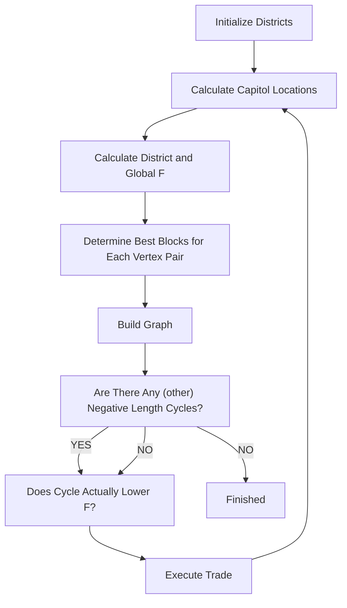
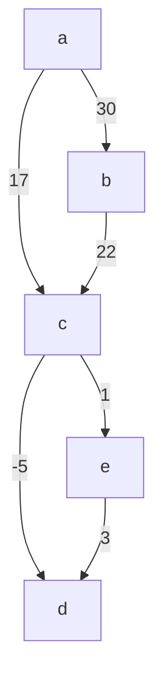

# When Topologists Are Politicians ...

February 12, 2007

## 1 Introduction

... the dimension of New York’s $1 3 ^ { t h }$ congressional district might not even be an integer. The act of districting–dividing a state into the appropriate number of congressional districts–is usually handled by a political and partisan body, in particular the state legislature and governor. Unsurprisingly, partisans will district in a way that they think will maximize the number of representatives that their particular party will send to Congress. This process called Gerrymandering, named after the Elbridge Gerry, governor of Massachusetts in 1812, who famously approved a congressional district that resembled a salamander.

Because of the sensitivity of congressional districting to personal bias, such a relatively simple issue has become exceedingly complex over the years. Gerry’s salamander of 1812 could not even hold a candle to such well-known districts of today such as Louisiana’s ”the ’Z’ with drips,” or Pennsylva nia’s ”supine seahorse” and ”upside-down Chinese dragon” districts. Such awkward and complex districts can often lose sight of the primary goal of the House of Representatives as outlined in the US Constitution: to provide regional representation to the people. As such, we have sought out to determine a ”fair” and ”simple” system of congressional districting which seeks to maximize accessibility of all people to regional representation, while pro viding a partitioning of states into congressional districts which is insensitive to partisan motives.

To accomplish this goal of fair districting, we define an objective function F that when minimized gives what we define to be the best districting (partition of state into districts). As an application, we apply this method to district the state of New York and Ohio. We defend our method of districting, so as to try to convince voters and politicians that this is a fair way of handling the problem of congressional districting.

## 2 Definitions

For the purposes of our paper, we define the following notions:

Block: A unit of area which corresponds to a fixed number of people. Since population densities vary, block sizes vary, though by choosing a small enough population size for each block, the overall size of the block can be bounded. A block is marked in the plane by a pair of (x, y) coordinates

District: A collection of a fixed number of blocks (thus having a constant population).

Capitol: A point within each district corresponding to the center of the district, i.e. the average of the coordinates of each block in the district. Since each block has unit population, the capitol is an approximation of the center of the population.

## “Fairly Simple”

Our notion of Fairness:

In the 1993 Supreme Court case Shaw v. Reno, court opinion mentioned that acceptable ways of districting a state include, but are not limited to ”compactness, contiguity, [and] respect for political subdivisions or communities defined by actual shared interests2”. Here, by compactness, the Justices are not alluding to a property that is invariant under continuous transformations, but rather a vague notion that congressional districts should be more like squares or circles than ”spitting amoebas” (read: Maryland’s Third District). In order to capture these 3 qualities that an acceptable congressional district should have, we first define the following measures of ”compactness” and ”respect for actual shared interests.”

Compactness: Suppose we have a given a district D containing n blocks ,zi, with capitol c. We can define compactness as the variance of the spatial distribution of the population:

$$
C = \sum_ {i = 1} ^ {n} \| z _ {i} - c \| ^ {2}
$$

When C is small, we conclude that our district’s constituents live within a relatively small area.

Shared Interests (S): Citizens want their personal interests to be acknowledged. For example, suppose a large group of citizens in a single area are all interested secondary education. This is a shared interest. We can quantify this interest in education by putting all people’s interest in education on a scale from 1 to 10, with 1 being ”knowledge is the devil” and 10 being ”i would rather learn about the set of isomorphism classes of two-dimensional compact nonsingular toric varieties than have a meaningful relationship with that attractive girl next door”. Then, if most people in D have an interest rating of about an 8, we can say the people of D are fairly uniform with respect to education. Thus, in election campaigns, education will be a high priority for such a district, and therefore will get the attention its denizens desire.

To be precise, we assign a vector to each block, giving one component to each interest, and attempt to minimize the sum of the variances of the components over the district. That is, given vectors $v _ { i }$ associated with blocks $z _ { i }$ and mean interest vector $\textstyle \mu = { \frac { 1 } { n } } \sum _ { i = 1 } ^ { n } v _ { i }$ Pni=1 vi, the shared interest is equal to:

$$
S = \sum_ {i = 1} ^ {n} \left\| v _ {i} - \mu \right\| ^ {2}
$$

## A Note on Shared Interest

Though race, gender, age and religion are important issues for many, many legal ambiguities exist in the use of such measures. Because the advantage is yet unproven of either grouping together or dispersing such groups amongst congressional districts, we have chosen to not use any of these data in our calculation of shared interest. As well, though measuring political affiliation is an entirely legal and often implemented districting tool, we have chosen to remain nonpartisan to avoid inadvertantly favoring one party over another. It should be noted, however, that our model is well-equipped to handle such data.

## 3 Specific Formulation of Problem

With the above measures of compactness and shared interest, we can now measure the fairness of a partition of a state into congressional districts. We suppose we have some partition $P = \{ D _ { 1 } , . . . D _ { k } \}$ of blocks into congressional districts, such that each district is contiguous and has the same number of blocks. We define $f \left( { D _ { i } } \right) = w _ { 1 } C _ { i } + w _ { 2 } S _ { i }$ where the $w _ { n }$ are some positive weights which are constant for all districts. Globally, we define $\begin{array} { r } { F \left( P \right) = \sum _ { i } ^ { k } f \left( D _ { j } \right) } \end{array}$ . Since the number of blocks is finite, and $F \left( P \right)$ i s a positive function, a global minimum exists.

Our goal, then, is to find the partition P ∗ such that $F \left( P * \right)$ is the global minimum.

## 4 Assumptions

We make the following assumptions:

• We are given accurate data regarding a state’s populational and geographical layout, and other relavant factors  
• The amount of population that one of our blocks represents is small enough to ensure that districts have negligably different populations  
• The initial assignment of blocks to districts is random enough to assure that the set of districts to which our algorithm converges is near to the set corresponding to the global minimum

## 5 Background & Goals

The pursuit of ”fair” districting models has had nearly as long and rich of a history as the pursuit of unfair models. Computers have proven to be an invaluable tool in this process. Since they allow for districting to be performed without ever requiring a person to look at a map, in theory potential conflicts of interest can be avoided. Unfortunately, few politicians would be willing to let their careers rest on a list of coordinates spit out on a computer screen, and thus nonpartisan partitioning techniques may forever remain in the ”theory” and not in the ”practice” of political science.

In 1963, James Weaver and Sidney Hess set the standard for computerized nonpartisan districting. Using integer programming methods, a set of capitols (called $\mathrm { { } ^ { 5 9 } L D s { } ^ { 7 } }$ in their paper) were matched with blocks (”EDs”) in such a way as to minimize moment of inertia; i.e. ”C” in our case. Repeatedly, the LDs were relocated to the appropriate centers of mass and then the EDs were redistributed to each LD until the moment of inertia hit a local minimum. By repeating frequently with a large number of initial conditions, they hoped to approximate the global minimum for moment of inertia, and thus derive the most compact districting of a region. Though precise, integer programming algorithms on large sets of data is extremely time-consuming even for the fastest computers (so we can only imagine how it ran on a fast computer in 1963). Though Weaver and Hess’s methods found applicability at the county and small state level at best, their landmark work paved the way for the development of a variety of approaches to state districting techniques.

As history has taught us to do, we sought out to create a model which expanded on the fundamentals and set the following goals:

• Find the ideal partition P ∗, i.e. the one which minimizes F globally  
• Method should be versatile: able to find the ideal partition for a wide variety of shared interest functions S  
• Method should be scalable: able to handle large quantities of data quickly

## 6 Friendly Trader Method

Suppose our blocks are arranged into n districts. By our method, district z attempts to give away blocks which are most beneficial to them (i.e. reduce f (z) the most). However, as traders, our districts are ”friendly.” That is, they will only conduct trades, giving away and receiving such blocks if overall the districts are better off (i.e. reduces F ). These districts are so friendly, in fact, that they will execute trades which raise f(z) so long as F decreases. Since the composition of our districts changes after each trade, capitols must be recalculated at each step. The problem of finding a minimum then reduces to finding and executing all trades which reduce F until no more exist.

flowchart

Figure 1: Flow chart describing the decision-making process in the Friendly Trader Algorithm

Once a set of blocks are determined, initial districts are assigned, and trades are then executed to completion.

## How are blocks determined?

Demographic data is obtained from the US Census Bureau’s 2000 Census. For the state of New York, data is partitioned into roughly 5,000 tracts, each with a specific population and coordinates in latitude and longitude. For each minor civil division, we assigned one block per 250 people, rounding population to the nearest 250. We evenly spread these blocks within their MCD. Thus, each block has the same population, and population density

corresponds to block density.

## How are districts initialized?

We try to come up with a first approximation to a partition with low $F$ . First, we arbitrarily chose a set of 29 blocks to be our initial district capitols. Each capitol’s position is assumed to be the center of population and its interests the mean interests of the district. One by one, capitols pick districts that ”fit well” with the capitols location and interests. The process is like a professional sports draft, where teams take turns picking players that suit their particular team well. After all the blocks have been assigned to capitols, trading of blocks between districts can begin.

## How do we maximize compactness?

Suppose we have two districts $D _ { 1 }$ and $D _ { 2 }$ and a block $b _ { k } \in D _ { 1 }$ . By moving $b _ { k }$ from $D _ { 1 }$ to $D _ { 2 }$ we form districts $D _ { 1 } ^ { \prime }$ and $D _ { 2 } ^ { \prime }$ . Let us define

$$
\Delta F (D _ {1}, D _ {2}, b _ {k}) = f (D _ {1} ^ {\prime}, D _ {2} ^ {\prime}) - f (D _ {1}, D _ {2}).
$$

Now, in order to determine which trades to make, we first find a block $b { * _ { 1 2 } }$ in $D _ { 1 }$ such that $\Delta F ( D _ { 1 } , D _ { 2 } , b * _ { 1 2 } ) \le \Delta F ( D _ { 1 } , D _ { 2 } , b _ { k } )$ for all blocks $b _ { k }$ in $D _ { 1 }$ . Let us call $b { * } _ { 1 2 }$ the ”best block” from $D _ { 1 }$ to $D _ { 2 }$ . The best block need not be unique, as its name might suggest, but this is not relevant for our purposes.

Now we can define a fully connected directed graph G with the vertices of G corresponding to the districts $D _ { j }$ and the edge $v _ { i }  v _ { j }$ having length $\Delta F ( D _ { i } , D _ { j } , b * _ { i j } ) , b * _ { i j }$ being the best block from $D _ { i }$ to $D _ { j }$ . To find $F$ reducing trades, we search for cycles of negative length in this graph $G .$ . (The length of cycle is defined to be the sum of the lengths of the edges composing the cycle, counting multiplicity if an edge appears more than once.) If a cycle has negative length, then this cycle corresponds to a group of trades of blocks between districts that is likely to reduce $F .$ . In particular, if for example $v _ { 1 }  v _ { 2 }  v _ { 3 }  v _ { 1 }$ is a cycle of negative length in $G ,$ then sending b∗ , b∗ , b∗ from $D _ { 1 }$ to $D _ { 2 } , D _ { 2 }$ to $D _ { 3 }$ and $D _ { 3 }$ to $D _ { 1 }$ , respectively, should decrease $F$ . Hence, the problem of finding good trades of blocks between districts reduces to finding cycles of negative length the digraph.

flowchart

Figure 2: The path from a to b passing through the negative cycle $^ { \mathrm { c , d , e } }$ can be made arbitrarily short since the cycle has negative length

The problem of finding negative cycles in the digraph reduces to the simpler problem of finding the shortest length path between any two vertices. To see this, consider Figure 2. The shortest path from a to b must contain a negative cycle if one exists on the graph, since one can loop around the cycle any number of times to make the path length arbitrarily short. The Bellman-Ford-Moore algorithm exploits this property by modifying a standard shortest-path algorithm to find this cycle. It should be noted that this algorithm will only find the first negative cycle encountered in a path from vertex a, and thus gives no choice of cycle. Once a trade is found, it is completed, and capitols are recalculated. With such a method we are careful to avoid any trade which after recalculation of capitols actually increases F . Since we are only making trades which strictly reduce F , when F can no longer decrease through trading, we have achieved a local minimum.

## 7 Results

We implemented a computer program that simulates the algorithm described above (attached in an appendix). We picked up blocks of size 250 people, and ran it until no further trades can be performed. We thus obtained a local minimum. However, we noticed that no matter what the starting configuration was, we always ended up with the same shape for the districts, making us believe that the data set is big and diverse enough to always converge to a unique global minimum.

Below are the results of our districting simulations. Four maps correspond to New York, and three maps correspond to Ohio. These first two maps constitute our official apportionment of New York. Due to the City’s large population, a second map was needed to focus in on its congressional districts.

This map and the one below it–the close up of New York City–show our most basic apportionment of New York. It was calculated only to make the regions most compact. (w2 = 0).

This second map of New York also used compactness as a guide, but the objective function F was weighted toward preserving population density.

The next 3 maps are of Ohio. We decided to test our algorithm on a state different in nature from New York so that we could check that our method was in fact applicable in wide ranges of circumstances. In the first map, Ohio is partitioned using only compactness as a guide, just as in the first map of New York. Likewise, the second map of Ohio is just like the second map of New York in that both use the same function F to deduce the best partition.

text_image

15
16 17 19 20
14 18 21 22
23
24 25 26 27 28
29

Figure 3: Map of congressional districts of the State of New York based solely on compactness

text_image

1
2
3
4
5
6
7
8
9
10
11
12
13
1

Figure 4: Close up of Figure 3 on New York City

text_image

15
21
20
17
19
16
18
22
23
24
26
29
25
27
28

Figure 5: Map of congressional districts of the State of New York based both on compactness and population density

text_image

1
2
3
4
5
6
7
8
9
10
11
12
13
1

Figure 6: Close up of Figure 5 on New York City

text_image

1
2
3
4
5
6
7
8
9
10
11
12
13
14
15
16
17
18

Figure 7: Districting of Ohio, solely based on compactness

To obtain Figure 10, our procedure was modified to attempt to not split up counties between more than one congressional district. Counties are not divided between congressional districts in the state of Ohio. We thus added an a term in $f ( x )$ which takes into account county sepration. This idea can easily be extended to natural boundaries like rivers and highways.

## 8 Analysis of Results

Our results are primarily visual and not numerical. As we identify, one weakness of our method is the lack of quantifiable data for comparison. True, our final value for F is one means for comparison, but since F is itself a variable function, normalizing it for use from one application to another is far from trivial. In addition, the remarkable reproducibility of our results given a wide variety of initial conditions almost entirely eliminated the need for separate numerical data.

text_image

1
2
3
4
5
6
7
8
9
10
11
12
13
14
15
16
17
18

Figure 8: Districting of Ohio, using both compactness and population density

In Figures 3, 4 and 7, one can see the boundaries of each district clearly demarcated. After the sorting of blocks, we connected a line surrounding all boundary blocks in a district and softened the line to make it smooth. As compared to the current congressional districts it is immediately clear that our algorithm is a vast improvement in simplicity, corresponding to a reduction in C by a factor of 7 for Ohio and by a factor of about 22 for New York (10042200 vs. 73042325 and 13345270 vs. 268847395). Since our model evaluates districting through distance in this case, it promotes star-shaped districts (in which the capital is connected to every point in the district by a straight line) rather than fully concave districts, improving accessibility and reducing complexity of the districts. In this instance, our model handled the problem of districting the states wonderfully, achieving a very simple, reasonable result. However, our interest-weighted models were the cases in which our model really shined.

Since we chose not to gauge common interest by potentially controversial factors such as race or age, we decided to choose the tamest quantity possible: population density at each block (nobody will ever be calling us biased!) We felt that this quantity would be useful to group districts by, since urban issues tend to differ from rural issues, and thus both city slickers and farmers alike could obtain representation for their greivances.

text_image

Map of Illinois with numbered regions and a diagonal line, likely indicating a county or administrative structure.

Figure 9: Districting of Ohio, attempts to preserve county lines

In some ways, our model already favored uniform population density across districts. Since blocks in urban areas are more densely packed, they naturally migrate to the same district. Our adjustment then merely increased the population density component, producing a noticeable change in the districting of Ohio, which tightened districts around the major cities of Columbus in the center, Cincinnati in the Southwest, and Cleveland in the Northwest, as well as a tightening of the districts around the densely populated Bronx and Queens in New York City (Figures 6 and 9). These solutions were yet again improvements in compactness and uniformity of population density compared to current congressional districting (quite unsurprisingly), but also demonstrated the existence of a range of reasonable solutions which satisfy our goals of compactness, simplicity, and fairness.

In some states (Ohio being one), congressional districts are designed with preserving county lines in mind. Since many states have independent county governments (including New York and Ohio), we ran an alternative solution set for Ohio in which we tried to preserve county lines. Our mean interest vector µ assigned a direction for each county tabulating the number of blocks in each. We then were able to similarly weight our solution with the goal of preserving county lines. Figure 10 shows the great success of this solution. In most districts, boundaries coincide almost perfectly with county lines. The advantage of the county-based districting solution is clear: since citizens pay taxes to and receive services from county governments, allowing counties to have exclusive congressional representation allows for the easier handling of issues on the local level. Surprisingly, such lines can be taken into consideration with little consequence on compactness or simplicity. However, since some states have no county government, this delineation is of small consequence.

Since different states and people have different needs, we sidestep the choice of a specific solution and claim that all are valid.

## 9 Why Our Model is Fair

It is clear that the aforementioned model produces simpler congressional districts, but the question of fairness is much more difficult. To give an example of this challenge, we consider the Fourteenth Amendment of the US Constitution which clearly states that all races, genders are strictly equal under the law. However, the Voting Rights Act of 1965 states that the gov ernment will assist in facilitating the voting of minority areas. Thus, even the government itself has trouble deciding whether ”fair” involves helping the often disadvantaged to realize their own rights or involves giving every person exactly the same treatment. We argue that our model is fair because it remains passive and uninvolved. It only takes a set of directives (i.e. the function F ) and produces a solution which divides the region into relatively uniform districts with respect to F . If nonpartisan goals are desired, such as uniform population density or compactness, a nonpartisan solution arises. However, any component of data can be (and likely has been) misused. For example, African Americans tend to be affiliated with the Democratic Party, while those in rural areas tend to be Republican. Thus, race and population density can be delicately used to achieve partisan aims.

Our model is fair because it assigns no judgment to any of these considerations. Rather, it is designed to improve the citizen’s accessibility to attentive and diligent representation in order to maximize every individual’s rights and powers.

## 10 Strengths and Weaknesses of Model

Our model effectively achieved all of the goals we set initially. It was fast and could handle large quantities of data, but also had the flexibility we desired. Though we did not test all possibilities, we showed that our model optimizes state districts for any of a number of variables. If we had chosen to input income, poverty, crime or education data into our interest function, we could have produced high-quality results with virtually no added difficulty. As well, our method was robust. Moreover, we were able to divide areas into fairly simple, contiguous, and uniform regions, as defined by our own standards and many others, particularly those of voters, who want accessible, attentive, and nonbiased representation. Our model also consistently led us to useful minima, whether data was inputted at random or with some sort of organization.

The primary weakness of our model was the absence of good nicknames for our districts - somehow districts such as ”egg” and ”sort of diamondshaped thing” didn’t raise any eyebrows. However, we chose to blame this error on our own dull imaginations rather than on our model. In all seriousness, the chief caveat to any user of our model should be to remember that this is a model. Though we achieved solid equilibria, our model in no way guarantees that it will ever find a global solution. To see this, consider a rectangle with different sides, and assume we have 10 points at each of its vertices. Moreover, let initially the districts be the long sides. It is easy to check that no trade will occur, and thus this configuration is a local, but not a global minimum.

The other primary weakness of our model is our lack of metrics for comparison. Though compactness and shared interest levels are appropriate measures for comparison of two models within a state, we lack invariant metrics for assessing the quality of one districting versus another. Finally, as a more minor weakness, our model does discretize continuous data and makes numerous approximations; this weakness is expected in any model, and ours handles such approximations quite well.

## 11 Food for Thought

Given the proper data, our model can do much more than merely political districting. At heart, it simply attempts to group regions into smaller parts, unified by whatever characteristics desired. For example, if a governing body wanted to determine where to build police stations or hospitals, he or she could input weighted crime, health, poverty and/or age statistics into the model. The model could then quickly and effectively partition a state or township into small regions, united by not only spatial relations but also by needs and desires. Thus, our model could help politicians and authorities most effectively deploy public resources and services. Ironically, our nonpartisan partitioning method could be a politician’s best friend. Not only that, but by inputting political affiliation data, politicians could identify partisan strongholds in order to most effectively plan campaigns. Though excruciatingly simple, our partitioning technique exceeded even our own expectations in its versatility and dynamic.

## 12 Conclusion

In this paper we have set forth an algorithm to determine congressional disctricts, given data on location, population, and any other factors desired. The algorithm is intended to be fair, or nonpartisan: it is in stark contrast to the political process of gerrymandering. Characteristics that we consider to be fundamental in the division of a state into congressional districts include contiguousness, compactness, and sometimes the possibility of shared interests or concerns among a districts citizens.

We have assumed that a state could be divided into blocks of small constant population, and then interpreted the problem of congressional district apportionment as the distribution of these blocks to the districts in such a way that each district contained a fixed nubmer of blocks (and therefore all districts have the same population). Furthermore, we defined an objective function F that measures the quality of a given distribution of blocks into districts. With such an F , finding good partitions of a state into districts is equivalent to finding distributions of blocks into districts corresponding to low values of F . Our goal, therefore, with the above interpretation of the districting problem, was to find the partion of a state into congressional districts that minimized F . This is a useful formulation of the problem because, if all agree to use this method beforehand, the existence of a global minimum of F (our problem is finite) gaurantees that if this minimum is found, there can (should) be no partisan squablling as to the legitimacy of the solution obtained.

Admittedly, our algorithm for districting a state is only gauranteed to find local minima of F . However, simulations done with random initial starting values seem to converge to the same final apportionment, suggesting that the local minima that our algorithm finds are close to the global minimum. Additionally, while we have implemented certain particulars to quantify shared interests of citizens in a district, our procedure for determining congressional districts is flexible; a simple change in the particulars and it can partition blocks into districts under other criteria.

## 13 References

1. Weaver, James B. and Hess, Sidney W., ”A Procedure for Nonpartisan Districting: Development of Computer Techniques,” Yale Law Journal 73 (1963):288-308. 2. ”Shaw v. Reno,” US Supreme Court (1993).