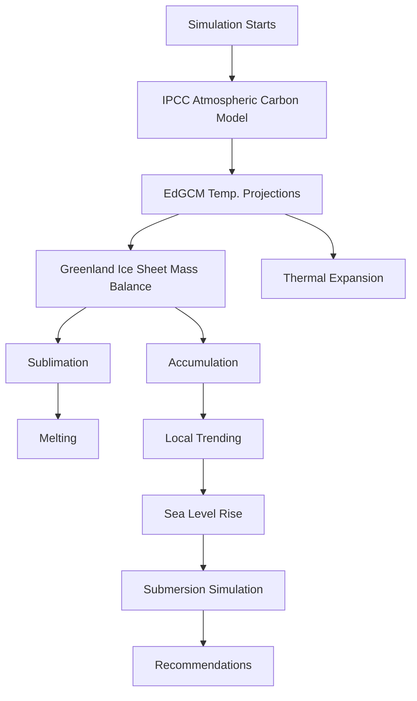

## Table of Contents

Table of Contents....1

Defining the problem....5

II. Methods....6

Mathematically Modeling Sea Level Rise....6

Temperature Data....7

The Ice Sheet 8

Mass Balance – Accumulation 9

Mass Balance - Ablation....10

Mass Balance and Sea Level Rise....13

Thermal Expansion....13

Localization....14

III. Results....17

Output Sea Level Rise Data....17

Submersion Simulation Results....19

IV. Discussion and Conclusion....23

V. Recommendations....26

References....28

Appendix A Sea Level Rise Simulation Script....29

Appendix B Topological Raster Matrix Creation Script....33

Appendix C Submersion Simulation Script....35

Appendix D Florida Cities Data Initialization....37

## I. Introduction

Strong evidence of a global warming trend exists, and powerful models have been created to estimate future climate. Temperatures have increased by about 0.5°C over the last 15 years, and global temperature is at its highest level in the past millennium. Although the warming trend is quite evident, the consequences of such wide scale climate change are still poorly understood. One of the most-feared consequences of global warming is sea level rise, and for good reason. TOPEX/Poseidon satellite altimeter indicates that sea levels rose 3.2 ± 0.2 mm annually during 1993-1998. Indeed, Titus et al estimate that a 1 meter rise in sea levels could cause \$270-475 billion in damages in the United States alone.

A number of complex factors underlie sea level rise. Thermal expansion of water due to temperature changes has long been implicated as the major component of sea level rise; however, recent studies have shown that thermal expansion alone cannot account for a majority of the observed increases. Mass balance of large ice sheets, in particular the Greenland Ice Sheet, is now believed to play a major role in sea level. The mass balance is controlled by two major processes, accumulation (influx of ice to the sheet) and ablation (loss of ice from the sheet). Accumulation is primarily the result of snowfall; ablation is a result of sublimation and melting.

Contrary to popular belief, however, floating ice does not play a significant role in sea level rise. By Archimedes' Principle, the volume increase $\Delta V$ of a body of water with density $\rho_{ocean}$ due to melting of floating ice of weight $W$ (assumed to be freshwater, with liquid density $\rho_{water}$ ) is given by

$$
\Delta V = W \left(\frac {1}{\rho_ {\text { water }}} - \frac {1}{\rho_ {\text { ocean }}}\right) \tag {1}
$$

The density of seawater is approximately $1024.8 \, kg/m^{3}$ ; the mass of the Arctic sea ice is approximately $2 \times 10^{13} \, kg$ . Thus, the volume change if all of the Arctic sea ice melted is given by:

$$
\Delta V = 2 \times 1 0 ^ {1 3} k g \left(\frac {1}{1 0 0 0 ^ {k g / m ^ {3}}} - \frac {1}{1 0 2 4 . 8 ^ {k g / m ^ {3}}}\right) = 4. 8 4 \times 1 0 ^ {8} m ^ {3} \tag {2}
$$

Approximating that 360 Gt of water causes a rise of 1 mm in sea level,

$$
4. 8 4 \times 1 0 ^ {8} m ^ {3} \cdot \frac {1 0 0 0 k g}{m ^ {3}} \cdot \frac {1 G t}{9 . 0 7 2 \times 1 0 ^ {1 1} k g} \cdot \frac {1 m m}{3 6 0 G t} = 0. 0 0 1 5 m m \tag {3}
$$

This small change in sea level is inconsequential for our model, since the accuracy is well below one thousandth of a millimeter.

We also neglect the contribution of Antarctic Ice Sheet because its overall effect on sea level rise is minimal and difficult to quantify. Between 1978 to 1987, satellite-borne microwave radiometer data indicated that Arctic ice decreased by 3.5%, while Antarctic ice showed no statistically significant changes. Cavalieri et al projected minimal melting in the Antarctic over the next 50 years. For this reason, only the Greenland Ice Sheet is considered in the model.

Several models already exist for mass balance and for thermal expansion. However, these models are very complex with respect to many variables, and often disagree with each other (see for example and). We wish to develop a model based on simple physical processes, as solely a function of temperature and time. In this way the analysis of the effects of the warming is simplified, and the dependence of sea level rise on temperature becomes evident. Furthermore, we develop a model that can be extended to several different temperature forcings, allowing us to compare firsthand the effect of carbon emissions on sea level rise.

## Model Overview

A deeper understanding of ice sheet melting would provide valuable insight into sea level rise. By creating a framework that incorporates the contributions of ice sheet melting and thermal expansion, we can estimate global mean sea level over a 50-year time period. The model achieves several important objectives :

1) Accurately fits past sea level rise data  
2) Provide enough generality to predict sea level rise over a 50-year span  
3) Compute sea level increases for Florida as a function of solely global temperature and time

Ultimately, the model predicts consequences to human populations. In particular, we analyze the impact of sea level rise on the state of Florida, which many consider particularly vulnerable due to its generally low elevation and proximity to the Atlantic Ocean. From this analysis, we assess possible strategies to minimize damage as a result of sea level rise due to global warming.

## Assumptions

In order to streamline our model we have made several key assumptions.

1) The sea level rise is primarily due to two factors, the balance of accumulation/ablation of the Greenland Ice Sheet and the thermal expansion of the ocean. This ignores the contribution of processes such as calving and direct human intervention, which are difficult to model accurately and have minimal effect on sea level rise.

2) The air is the only heat source for melting the ice. Greenland's land is permafrost, and because of large amounts of ice on its surface it is assumed at a relatively constant temperature. This allows us to use convection as a mode of heat transfer.

3) The temperature within the ice changes linearly at the steady-state. This assumption allows us to solve the heat equation for Neumann conditions. By subtracting the steady-state term from the heat equation, we can solve for the homogeneous boundary conditions.  
4) Sublimation and melting processes do not interfere with each other. This assumption drastically simplifies the computation needed for the model since sublimation and melting can be considered separately. Additionally, the assumption is very reasonable. Sublimation primarily occurs at below freezing temperatures, a condition during which melting does not normally occur. Thus, the two processes are temporally isolated as in our model.  
5) The surface of the ice sheet is homogeneous with regards to temperature, pressure, and chemical composition. This assumption is necessary because high-resolution spatial temperature data for Greenland cannot be obtained in our framework. Additionally, we lack the computational resources and time to simulate such a variation, which would require the use of finite element methods and mesh generation for a complex topology.

## Defining the problem

Let M denote the mass balance of the Greenland Ice Sheet. Given a temperature forcing function, we must quantitatively estimate the sea level increases SLR that occur as a result. These increases are a sum of M and thermal expansion TE effects, corrected for local trends. Further, we must quantitatively and qualitatively the long-term (50 years) effect on Florida’s major cities and metropolitan areas from global warming, as a result of high SLR. This analysis can be used to make recommendations as to how to best prepare for and reduce SLR effects.

## II. Methods

## Mathematically Modeling Sea Level Rise

Sea level rise results mostly from mass balance of the Greenland Ice Sheet and thermal expansion due to warming. In order to model sea level increases, a mass balance model and thermal expansion model are used, as well as other post-computation effects. The logic of the simulation process is detailed in Figure 1.


<details>
<summary>flowchart</summary>


</details>

Figure 1: Simulation flow diagram

## Temperature Data

Temperature data is the sole forcing in our model and thus shall be considered carefully. Because we needed to model several different scenarios, our temperature data must include several scenarios that are very controlled and only differ in one variable. Further, the temperature data must be of very good quality and provide the correct temporal resolution for our simulation. For these reasons, we decided to use a Global Climate Model (GCM) to create our own temperature data, using input forcings that we could easily control. Because of limited computational power and time restrictions, we chose the EdGCM. EdGCM is a fast model for educational purposes. The program is based on the NASA GISS model for climate change. The program fit all of our needs; in particular, the rapid simulation (about 10 hours for a 50 year climate simulation) allowed us to analyze several different temperature scenarios.

The temperature scenarios we analyzed incorporate the three estimates of carbon emissions resulting from the IPCC Third Assessment Report (TAR) – the low, high, and medium projections in the IS92 series. The IS92e (high), IS92a (intermediate), and the IS92c (low) scenarios were all closely approximated using the tools in EdGCM. These approximated carbon forcings are shown in graphical form in Figure 2. All other forcings were kept at default according to the NASA GISS model. Three time series for global surface air temperature were obtained in this fashion.

  
Figure 2: Carbon Dioxide Forcings for the EdGCM Models

One downside to the EdGCM is that it can only output global temperature changes. Regional temperature changes are calculated, but are difficult to access and have low spatial accuracy. However, according to Chylek et al, the relationship between Greenland temperatures and global temperatures is well-approximated by

$$
\Delta T _ {\text { Greenland }} = 2. 2 \times \Delta T _ {\text { global }} \tag {4}
$$

This result is shown by Chylek et al for regions unaffected by the NAO and is predicted by climate model outputs.

## The Ice Sheet

The ice sheet is modeled as a simplified rectangular box. Each point on the upper surface of the ice sheet is assumed at constant temperature, $T_{a}$ . This is because our climate model does not have accurate spatial resolution for areas in Greenland, so the small temperature differences are ignored. The lower surface, the permafrost layer, has constant temperature $T_{l}$ . A depiction of the ice sheet model is shown in Figure 3.


<details>
<summary>text_image</summary>

Tₐ
T₁
</details>

Figure 3: A profile view of the ice sheet model

To compute heat flux and thus melting and sublimation through the ice sheet, we model it as an infinite number of differential volumes, shown in Figure 4.


<details>
<summary>text_image</summary>

h
←L→
D
=
h
←L→
dD
</details>

Figure 4: Differential volumes of the ice sheet

Initially, the height h is calculated using data provided by Williams et al.

$$
h = \frac {V o l _ {i c e}}{S u r f a c e _ {i c e}} = \frac {2 . 6 \times 1 0 ^ {6} k m ^ {3}}{1 . 7 3 6 \times 1 0 ^ {6} k m ^ {2}} = 1 4 9 8 k m
$$

The primary mode of sea level rise in our model is through mass balance. Mass balance is calculated by subtracting the amount of ablation by the amount of accumulation.

Accumulation, the addition of ice to the ice sheet, is primarily in the form of snowfall. Ablation is primarily the result of two processes, sublimation and melting.

## Mass Balance – Accumulation

First we model accumulation. Huybrechts et al showed that the temperature of Greenland is not high enough to melt significant amounts of snow. Furthermore, Knight showed empirically that rate of accumulation is well-approximated by a linear relationship with time, and that accumulation over Greenland continental ice is 0.30 m/year. Thus, the accumulation rate is 0.025 m/month. In terms of mass balance,

$$
M _ {a c} = 0. 0 2 5 L D \tag {5}
$$

where the product LD is the surface area of the ice sheet.

## Mass Balance - Ablation

We then model the two parts of ablation, sublimation and melting.

Sublimation rate (mass flux) is given by:

$$
S _ {0} = e _ {s a t} (T) \left(\frac {M _ {w}}{2 \pi R T}\right) ^ {1 / 2} \tag {6}
$$

where $M_w$ is the molecular weight of water. This expression can be derived from the ideal gas law and the Maxwell-Boltzmann distribution. Substituting Buck's expression for $e_{sat}$ , we obtain:

$$
S _ {0} = 6. 1 1 2 1 \cdot e ^ {\left(\frac {(1 8 . 6 7 8 - T / 2 3 4 . 5) T}{2 5 7 . 1 4 + T}\right)} \left(\frac {M _ {w}}{2 \pi R (T + 2 7 3 . 1 5)}\right) ^ {\frac {1}{2}} \tag {7}
$$

Buck's equation is applicable over a large range of temperatures and pressures, including the environment of Greenland. The approximation fails at extreme temperatures and pressures but is computationally simple (relatively). To convert mass flux into rate of thickness change of the ice, we divide the mass flux expression by the density of ice. Thus we can express rate of height change as follows:

$$
S _ {h} = \frac {6 . 1 1 2 1 \cdot d}{\rho_ {\text { ice }}} \cdot e ^ {\left(\frac {(1 8 . 6 7 8 - T / 2 3 4 . 5) T}{2 5 7 . 1 4 + T}\right)} \left(\frac {M _ {w}}{2 \pi R (T + 2 7 3 . 1 5)}\right) ^ {\frac {1}{2}} \tag {8}
$$

where d is the deposition factor, given by $d = (1-\text{deposition rate}) = 0.01$ . This term is needed because sublimation and deposition are in constant equilibrium. With the sublimation rate expression, it is now trivial to find the thickness of the ice sheet after one timestep of the computational model. Indeed, the new thickness due to ablation via sublimation is given by:

$$
S (t) = h - S _ {h} \cdot t \tag {9}
$$

where h is the current thickness of the ice sheet and t is the elapsed time after one timestep. Substituting for $S_{h}$ with the expression we derived and substituting for the known value of the molecular weight of water yields

$$
S (t) = h - \frac {6 . 1 1 2 1 \times 1 0 ^ {- 2} t}{\rho_ {i c e}} \cdot e ^ {\left(\frac {(1 8 . 6 7 8 - T / 2 3 4 . 5) T}{2 5 7 . 1 4 + T}\right)} \left(\frac {0 . 0 0 0 3 4 4 8}{(T + 2 7 3 . 1 5)}\right) ^ {\frac {1}{2}} \tag {10}
$$

This equation governs the sublimation of the ice.

To model melting, the second component of ablation, we apply the heat equation. The heat equation governs the relationship

$$
U _ {t} (x, t) = k U _ {x x} (x, t) \tag {11}
$$

where k=0.0104 is the thermal diffusivity of the ice. In order to solve the heat equation for the Neumann conditions, we assume a steady-state $U_{s}$ with the same boundary conditions as U and that is independent of time. The residual temperature V has homogeneous boundary conditions and initial conditions found by $U-U_{s}$ . Thus we can rewrite the heat equation as:

$$
U (x, t) = V (x, t) + U _ {s} (x, t) \tag {12}
$$

The steady-state solution of the heat equation is given by:

$$
U _ {s} = T _ {l} + \frac {T _ {a} - T _ {l}}{S (t)} x \tag {13}
$$

subject to the constraints $0 < x < S(t)$ and $0 < t < 1$ month. The following equations follow directly from the heat equation as well:

$$
V _ {t} (x, t) = k V _ {x x} (x, t) + f, \text { where } f \text { is   a   forcing   term. } \tag {14}
$$

$V(0,t)=V(S(t),t)=0$ (necessary conditions for the homogeneous boundary equations)

Since no external heat source is present and temperature distribution only depends on heat convection, we take the forcing term f=0. To calculate change in mass balance on a monthly basis, we solve analytically using separation of variables:

$$
V (x, t) = \frac {a _ {0}}{2} + \sum_ {n = 1} ^ {\infty} a _ {n} e ^ {- n ^ {2} \pi^ {2} t / s ^ {2}} \cos \left(\frac {n \pi x}{s}\right) \tag {15}
$$

where

$$
a _ {0} = \frac {2}{s} \int_ {0} ^ {s} \left(T _ {l} + \frac {T _ {a} - T _ {l}}{s} x\right) d x = 2 T _ {l} + T _ {a} - T _ {l} = T _ {l} + T _ {a} \tag {16}
$$

and

$$
a _ {n} = \frac {2}{s} \int_ {0} ^ {s} \left(T _ {l} + \frac {T _ {a} - T _ {l}}{s} x\right) \cos \left(\frac {n \pi x}{s}\right) d x \tag {17}
$$

$$
= \left(\frac {s}{n \pi}\right) ^ {2} (\cos (n \pi) - 1) = \left(\frac {s}{n \pi}\right) ^ {2} ((- 1) ^ {n} - 1)
$$

Therefore,

$$
V (x, t) = \frac {T _ {l} + T _ {a}}{2} + \sum_ {n = 1} ^ {\infty} \frac {2 \left(T _ {a} - T _ {c}\right)}{(n \pi) ^ {2}} \left((- 1) ^ {n} - 1\right) e ^ {- n ^ {2} \pi^ {2} t / s ^ {2}} \cos \left(\frac {n \pi x}{s}\right). \tag {18}
$$

Having found $V(x, t)$ and $U_{s}(x, t)$ , we obtain an expression for $U(x, t)$ :

$$
U (x, t) = V (x, t) + U _ {s} (x, t) \tag {19}
$$

Since U is an increasing function of x, and for x > k, $U(x, t) > 0$ for fixed t, the ice will melt for k < x < h. Thus, we seek the solution to $U(k, t) = 0$ for k to determine ablation. Computationally, we solve this expression using the first 100 terms of the Fourier series expansion and the MATLAB function fzero. The solution of this equation for k is the primary computational step for the MATLAB simulation (see Appendix A). The new value of k is used to renew h as the new thickness of the ice sheet, and a consequent time step can begin calculation.

With these two components we can now finalize an expression for ablation and apply it to a computational model. The sum of the infinitesimal changes in ice sheet thickness for each differential volume gives the total change in thickness. To find these changes, we first note that

$$
\text { Mass   Balance   Loss   Due   to   Sublimation } = (h - S) L D \tag {20}
$$

$$
\text { Mass   Balance   Loss   Due   to   Melting } = (S - k) ^ {*} L D \tag {21}
$$

where the product LD is the surface area of the ice sheet. Note that in these equations, the “mass balance” refers to net volume change. Thus, ablation is given by

$$
M _ {a b} = (h - S) L D + (S - k) L D = (h - k) L D \tag {22}
$$

## Mass Balance and Sea Level Rise

Combining accumulation and ablation into an expression for mass balance, we have

$$
M = M _ {a c} - M _ {a b} = 0. 0 2 5 L D - (h - k) L D \tag {23}
$$

Relating this to sea level rise, we use the approximation 360 Gt water = 1mm sea level rise. Thus,

$$
S L R _ {m b} = M \cdot \rho_ {i c e} \cdot \frac {1 m m}{3 6 0 G t} \tag {24}
$$

which quantifies the sea level rise due to mass balance.

## Thermal Expansion

A second mode of sea level rise is also considered: thermal expansion due to warming. According to various literature, thermal expansion of the oceans due to increase in global temperature will contribute a significant portion of the rise in future sea level, at least as much as melting of polar ice for the current century, . Therefore, we incorporated this component into our model for further accuracy and a more comprehensive understanding.

Thermal expansion operates depending on various factors. Temperature plays the primary role, but the diffusion of radiated heat, mixing of the ocean, and various other complexities concerning ocean dynamics must be accounted for a fully accurate description of the phenomenon. These factors are often quite difficult to understand with a high degree of certainty. The model used here adapts the model of Wigley et al. Based on standard greenhouse-gas emission projections and a simple upwelling-diffusion model, the dependency of the model can be narrowed to a single variable, temperature, using an empirical estimation:

$$
\Delta z = 6. 8 9 \Delta T k ^ {0. 2 2 1} \tag {25}
$$

where $\Delta z$ is the change in sea level due to thermal expansion given in centimeters, $\Delta T$ is the change in global temperature, and k is the diffusivity.

The reader is encouraged to consult for further investigation of the upwelling-diffusion model.

## Localization

A final correction must be added to the simulation. Although the literature in general cites an increase in the mean sea level for the past century and indicates that melting of polar ice and other various effects associated with global warming will force the trend, the effect varies regionally rather significantly. The local factors often cited include land subsidence, compaction, and delayed response to the warming, to name a few. Fully understanding the influences of these factors on sea level increase is often a daunting task. We thus assume that previous patterns of local sea level variation will continue to influence, yielding the relationship

$$
\operatorname{local} (t) = \text { normalized } (t) + \text { trend } (t - 2 0 0 8),
$$

where $local(t)$ is the expected sea level rise at year t given in centimeters, $normalized(t)$ is the estimate of expected rise in global sea level change relative to the historical rate, at year t, and trend is the current rate of sea level change at the locale of interest. The normalization prevents from double counting the contribution from global warming.

In our model, the rates of sea level change are averaged over data given for Florida in to give the trend. This is reasonable because the differences between the rates in Florida are fairly small. The normalized(t) at each year is obtained by:

$$
\mathrm{global} (t) - \mathrm{historicalrate} (t - 2 0 0 8),
$$

where $global(t)$ is the expected sea level rise at year t from our model and historical rate is chosen uniformly over the range taken from.

For a detailed description of the model, the reader may consult.

## Simulating Costs of Sea Level Rise to Florida

Rising sea levels could submerge coastal areas of Florida that are near current sea level. To model the submersion of regions of Florida due to sea level rise, a raster matrix of elevation values for various latitude and longitude was created. The matrix was created on MATLAB using 30-arc-second global elevation data (GTOPO30), created in 1996. The 30-arc-second resolution corresponds to about 1 km; however, in order to yield a more practical matrix, the resolution was lowered to 1 minute of arc (approximately 2 km). The vertical resolution of the GTOPO30 data is much greater than 1 meter and thus accurate models could not easily be produced. In order to more accurately model the low coastal regions, the matrix generation code identified potential sensitive areas and submitted these locations to the National Elevation Dataset (NED) for refinement. NED is updated bimonthly, but its large size and download restrictions restrict its use to only these sensitive areas. The vertical resolution of NED is very high, depending on the region surveyed. Although Florida NED data has a mean error of ±4.3 ft, areas of low

elevation have especially high resolution. These adjustments finalized the elevation data raster matrix for use in the sea level increase simulation.

The effect of this sea level rise on human populations was measured by incorporating city geospatial coordinates and population into the simulation. Geospatial coordinates were obtained from the GEOnames Query Database maintained by the National Geospatial Intelligence Agency. Population data was obtained from the US Census Bureau 2000 Datasets. All major metropolitan areas and several large cities were analyzed, encompassing both interior (e.g., Gainesville) and coastal (e.g., Miami). The population of the metropolitan areas was equally split into the principle cities in order to streamline the simulation (see Appendix D).

The sea level rise calculated from our model was used as input for the submersion simulation. The simulation script subtracts the sea level increase from the existing elevation data. Pixels with elevations below sea level are checked to determine whether they are connected (directly or indirectly through other submerged areas) to the Atlantic Ocean or the Gulf of Mexico. This way, interior areas not connected to the oceans are not identified as submerged regions. If rising sea level submerges pixels that form part of a city or metropolitan area, the population is considered to be “displaced.” A key limitation of the model is that the population is considered to be concentrated in the principal cities of the metropolitan areas, so a highly accurate population count cannot be assessed. This simplification of the model allows the quick display of which cities are threatened by rising sea levels without the complexity of a continuous population distribution. Additionally, high-resolution population distribution data is difficult to find and thus cannot be easily utilized.

The model was checked for realism at several different scenarios of sea level rise. First, the extreme case of 0 meter sea level rise was examined. In this case, no cities should be submerged and no population or land area should be affected. These expectations are confirmed in Figure 5. The case of 10 meter sea level rise was also analyzed. This is slightly higher than the sea level increase estimate if all of the Greenland Ice Sheet

melted (approximately 7 meters). Many cities should be submerged, especially in the low elevation regions in southern Florida. This is confirmed by the output, shown in Figure 5. Finally, 100 meter sea level rise was analyzed to check robustness of the simulation. Most of Florida should be submerged, since it is a relatively low elevation state. This is also confirmed by Figure 5; note the mountainous regions of North Florida that are still above water.

  
Figure 5: Graphical effects of 0, 10, and 100 meter sea level rise.

## III. Results

## Output Sea Level Rise Data

The program was run with MATLAB script massbalance\_sim2.m, for the IS92e (high), IS92a (intermediate), and IS92c (low) carbon emissions models. Complete code is given in Appendix A.

The program produced a smooth trend in sea level increase for each of the three forcings, shown in Figure 6.


<details>
<summary>line chart</summary>

| Time (Years) | IS92e (High) | IS92a (Med) | IS92c (Low) |
| ------------ | ------------ | ----------- | ----------- |
| 0            | 3.0          | 3.0         | 2.0         |
| 5            | 11.0         | 7.0         | 6.0         |
| 10           | 14.0         | 10.0        | 8.0         |
| 15           | 17.0         | 15.0        | 12.0        |
| 20           | 20.0         | 18.0        | 15.0        |
| 25           | 23.0         | 21.0        | 18.0        |
| 30           | 26.0         | 24.0        | 21.0        |
| 35           | 29.0         | 27.0        | 24.0        |
| 40           | 32.0         | 30.0        | 27.0        |
| 45           | 35.0         | 33.0        | 30.0        |
| 50           | 38.0         | 36.0        | 32.0        |
</details>

Figure 6: Sea level rise as a function of time for the three temperature models

Note that the higher temperature corresponds with higher sea level rise, as we expect it to. The data at the end of 10-year intervals was recorded and tabulated in Table 1. Units of sea level rise are in centimeters.

<table><tr><td></td><td>10 years</td><td>20 years</td><td>30 years</td><td>40 years</td><td>50 years</td></tr><tr><td>IS92e (High)</td><td>12.67</td><td>23.26</td><td>31.93</td><td>41.68</td><td>46.92</td></tr><tr><td>IS92a (Med)</td><td>11.14</td><td>18.79</td><td>25.08</td><td>30.44</td><td>36.61</td></tr><tr><td>IS92c (Low)</td><td>9.16</td><td>16.26</td><td>21.66</td><td>29.32</td><td>32.08</td></tr></table>

Table 1: Sea Level Rise (cm) per Decade for each Temperature Model

The sea level output data was then used to calculate submersion consequences. These data were fed as input to the submersion simulation, detailed in the following section.

## Submersion Simulation Results

Submersion information was calculated for each of the three temperature models during every decade. Output consisted of the submerged land area and displaced population statistics.

For the IS92e (high) scenario, sea level increases resulted in the following simulated geographic consequences (shown every decade for 5 decades):


<details>
<summary>heatmap</summary>

| Latitude | Longitude | Value |
| -------- | --------- | ----- |
| 100      | 100       | 1     |
| 100      | 200       | 1     |
| 100      | 300       | 1     |
| 100      | 400       | 1     |
| 100      | 500       | 1     |
| 100      | 600       | 1     |
| 100      | 700       | 1     |
| 200      | 100       | 1     |
| 200      | 200       | 1     |
| 200      | 300       | 1     |
| 200      | 400       | 1     |
| 200      | 500       | 1     |
| 200      | 600       | 1     |
| 200      | 700       | 1     |
| 300      | 100       | 1     |
| 300      | 200       | 1     |
| 300      | 300       | 1     |
| 300      | 400       | 1     |
| 300      | 500       | 1     |
| 300      | 600       | 1     |
| 300      | 700       | 1     |
| 400      | 100       | 1     |
| 400      | 200       | 1     |
| 400      | 300       | 1     |
| 400      | 400       | 1     |
| 400      | 500       | 1     |
| 400      | 600       | 1     |
| 400      | 700       | 1     |
</details>


<details>
<summary>heatmap</summary>

| Latitude | Longitude | Value |
| -------- | --------- | ----- |
| 100      | 100       | Low   |
| 100      | 200       | Medium|
| 100      | 300       | High  |
| 100      | 400       | Low   |
| 100      | 500       | Medium|
| 100      | 600       | High  |
| 100      | 700       | Low   |
| 200      | 100       | Low   |
| 200      | 200       | Medium|
| 200      | 300       | High  |
| 200      | 400       | Low   |
| 200      | 500       | Medium|
| 200      | 600       | High  |
| 200      | 700       | Low   |
| 300      | 100       | Low   |
| 300      | 200       | Medium|
| 300      | 300       | High  |
| 300      | 400       | Low   |
| 300      | 500       | Medium|
| 300      | 600       | High  |
| 300      | 700       | Low   |
| 400      | 100       | Low   |
| 400      | 200       | Medium|
| 400      | 300       | High  |
| 400      | 400       | Low   |
| 400      | 500       | Medium|
| 400      | 600       | High  |
| 400      | 700       | Low   |
</details>


<details>
<summary>heatmap</summary>

| Latitude | Longitude | Value |
| -------- | --------- | ----- |
| 100      | 100       | Low   |
| 100      | 200       | Medium|
| 100      | 300       | High  |
| 100      | 400       | Low   |
| 100      | 500       | Medium|
| 100      | 600       | High  |
| 100      | 700       | Low   |
| 200      | 100       | Low   |
| 200      | 200       | Medium|
| 200      | 300       | High  |
| 200      | 400       | Low   |
| 200      | 500       | Medium|
| 200      | 600       | High  |
| 200      | 700       | Low   |
| 300      | 100       | Low   |
| 300      | 200       | Medium|
| 300      | 300       | High  |
| 300      | 400       | Low   |
| 300      | 500       | Medium|
| 300      | 600       | High  |
| 300      | 700       | Low   |
| 400      | 100       | Low   |
| 400      | 200       | Medium|
| 400      | 300       | High  |
| 400      | 400       | Low   |
| 400      | 500       | Medium|
| 400      | 600       | High  |
| 400      | 700       | Low   |
</details>


<details>
<summary>heatmap</summary>

| Latitude | Longitude | Value |
| -------- | --------- | ----- |
| 100      | 100       | Low   |
| 100      | 200       | Medium|
| 100      | 300       | High  |
| 100      | 400       | Medium|
| 100      | 500       | Low   |
| 100      | 600       | Medium|
| 100      | 700       | High  |
| 200      | 100       | Low   |
| 200      | 200       | Medium|
| 200      | 300       | High  |
| 200      | 400       | Medium|
| 200      | 500       | Low   |
| 200      | 600       | Medium|
| 200      | 700       | High  |
| 300      | 100       | Low   |
| 300      | 200       | Medium|
| 300      | 300       | High  |
| 300      | 400       | Medium|
| 300      | 500       | Low   |
| 300      | 600       | Medium|
| 300      | 700       | High  |
| 400      | 100       | Low   |
| 400      | 200       | Medium|
| 400      | 300       | High  |
| 400      | 400       | Medium|
| 400      | 500       | Low   |
| 400      | 600       | Medium|
| 400      | 700       | High  |
</details>


<details>
<summary>heatmap</summary>

| Latitude | Longitude | Value |
| -------- | --------- | ----- |
| 100      | 100       | Low   |
| 100      | 200       | Medium|
| 100      | 300       | High  |
| 100      | 400       | Low   |
| 100      | 500       | Medium|
| 100      | 600       | High  |
| 100      | 700       | Low   |
| 200      | 100       | Low   |
| 200      | 200       | Medium|
| 200      | 300       | High  |
| 200      | 400       | Low   |
| 200      | 500       | Medium|
| 200      | 600       | High  |
| 200      | 700       | Low   |
| 300      | 100       | Low   |
| 300      | 200       | Medium|
| 300      | 300       | High  |
| 300      | 400       | Low   |
| 300      | 500       | Medium|
| 300      | 600       | High  |
| 300      | 700       | Low   |
| 400      | 100       | Low   |
| 400      | 200       | Medium|
| 400      | 300       | High  |
| 400      | 400       | Low   |
| 400      | 500       | Medium|
| 400      | 600       | High  |
| 400      | 700       | Low   |
</details>

Figure 7: Submersion simulation for IS92e

Although not much has appeared to have happened, minor topological changes can clearly be seen at the southern tip of Florida and parts of Louisiana during the 50 year span. Additionally, the MATLAB program quantified the following effects:

<table><tr><td></td><td>Effects</td></tr><tr><td>10 years</td><td>0.00e+00 people displaced</td></tr><tr><td></td><td>6.52e+03 sq km land submerged</td></tr><tr><td>20 years</td><td>Key Largo, FL is submerged: 11886 people have been displaced</td></tr><tr><td></td><td>7.45e+03 sq km land submerged</td></tr><tr><td>30 years</td><td>Miami Beach, FL is submerged: 87925 people have been displacedKey Largo, FL is submerged: 11886 people have been displaced</td></tr><tr><td></td><td>9.98e+04 people displaced9.18e+03 sq km land submerged</td></tr><tr><td>40 years</td><td>Miami Beach, FL is submerged: 87925 people have been displacedKey Largo, FL is submerged: 11886 people have been displaced</td></tr><tr><td></td><td>9.98e+04 people displaced9.74e+03 sq km submerged</td></tr><tr><td>50 years</td><td>Merritt Island, FL is submerged: 36090 people have been displacedMiami Beach, FL is submerged: 87925 people have been displacedKey Largo, FL is submerged: 11886 people have been displaced</td></tr><tr><td></td><td>1.35e+05 people displaced9.97e+03 sq km submerged</td></tr></table>

Table 2: Quantitative Effects for IS92E

For the IS92a (intermediate) scenario, sea level increases resulted in the following simulated geographic consequences (shown every decade for 5 decades):


<details>
<summary>heatmap</summary>

| Latitude | Longitude | Value |
| -------- | --------- | ----- |
| 100      | 100       | High  |
| 100      | 200       | Medium|
| 100      | 300       | Low   |
| 100      | 400       | Medium|
| 200      | 100       | High  |
| 200      | 200       | Medium|
| 200      | 300       | Low   |
| 200      | 400       | Medium|
| 300      | 100       | High  |
| 300      | 200       | Medium|
| 300      | 300       | Low   |
| 300      | 400       | Medium|
| 400      | 100       | High  |
| 400      | 200       | Medium|
| 400      | 300       | Low   |
| 400      | 400       | Medium|
| 500      | 100       | High  |
| 500      | 200       | Medium|
| 500      | 300       | Low   |
| 500      | 400       | Medium|
| 600      | 100       | High  |
| 600      | 200       | Medium|
| 600      | 300       | Low   |
| 600      | 400       | Medium|
| 700      | 100       | High  |
| 700      | 200       | Medium|
| 700      | 300       | Low   |
| 700      | 400       | Medium|
</details>


<details>
<summary>heatmap</summary>

| Latitude | Longitude | Value |
| -------- | --------- | ----- |
| 100      | 100       | Low   |
| 100      | 200       | Medium|
| 100      | 300       | High  |
| 100      | 400       | Medium|
| 100      | 500       | Low   |
| 100      | 600       | Medium|
| 100      | 700       | High  |
| 200      | 100       | Low   |
| 200      | 200       | Medium|
| 200      | 300       | High  |
| 200      | 400       | Medium|
| 200      | 500       | Low   |
| 200      | 600       | Medium|
| 200      | 700       | High  |
| 300      | 100       | Low   |
| 300      | 200       | Medium|
| 300      | 300       | High  |
| 300      | 400       | Medium|
| 300      | 500       | Low   |
| 300      | 600       | Medium|
| 300      | 700       | High  |
| 400      | 100       | Low   |
| 400      | 200       | Medium|
| 400      | 300       | High  |
| 400      | 400       | Medium|
| 400      | 500       | Low   |
| 400      | 600       | Medium|
| 400      | 700       | High  |
</details>


<details>
<summary>heatmap</summary>

| Latitude | Longitude | Value |
| -------- | --------- | ----- |
| 100      | 100       | High  |
| 100      | 200       | Medium|
| 100      | 300       | Low   |
| 100      | 400       | Medium|
| 200      | 100       | High  |
| 200      | 200       | Medium|
| 200      | 300       | Low   |
| 200      | 400       | Medium|
| 300      | 100       | High  |
| 300      | 200       | Medium|
| 300      | 300       | Low   |
| 300      | 400       | Medium|
| 400      | 100       | High  |
| 400      | 200       | Medium|
| 400      | 300       | Low   |
| 400      | 400       | Medium|
</details>


<details>
<summary>heatmap</summary>

| Latitude | Longitude | Value |
| -------- | --------- | ----- |
| 100      | 100       | Low   |
| 100      | 200       | Medium|
| 100      | 300       | High  |
| 100      | 400       | Medium|
| 100      | 500       | Low   |
| 100      | 600       | Medium|
| 100      | 700       | High  |
| 200      | 100       | Low   |
| 200      | 200       | Medium|
| 200      | 300       | High  |
| 200      | 400       | Medium|
| 200      | 500       | Low   |
| 200      | 600       | Medium|
| 200      | 700       | High  |
| 300      | 100       | Low   |
| 300      | 200       | Medium|
| 300      | 300       | High  |
| 300      | 400       | Medium|
| 300      | 500       | Low   |
| 300      | 600       | Medium|
| 300      | 700       | High  |
| 400      | 100       | Low   |
| 400      | 200       | Medium|
| 400      | 300       | High  |
| 400      | 400       | Medium|
| 400      | 500       | Low   |
| 400      | 600       | Medium|
| 400      | 700       | High  |
</details>


<details>
<summary>heatmap</summary>

| Latitude | Longitude | Value |
| -------- | --------- | ----- |
| 100      | 100       | Low   |
| 100      | 200       | Medium|
| 100      | 300       | High  |
| 100      | 400       | Low   |
| 200      | 100       | Low   |
| 200      | 200       | Medium|
| 200      | 300       | High  |
| 200      | 400       | Low   |
| 300      | 100       | Low   |
| 300      | 200       | Medium|
| 300      | 300       | High  |
| 300      | 400       | Low   |
| 400      | 100       | Low   |
| 400      | 200       | Medium|
| 400      | 300       | High  |
| 400      | 400       | Low   |
| 500      | 100       | Low   |
| 500      | 200       | Medium|
| 500      | 300       | High  |
| 500      | 400       | Low   |
| 600      | 100       | Low   |
| 600      | 200       | Medium|
| 600      | 300       | High  |
| 600      | 400       | Low   |
| 700      | 100       | Low   |
| 700      | 200       | Medium|
| 700      | 300       | High  |
| 700      | 400       | Low   |
</details>

Figure 8: Submersion simulation for IS92a

The overall qualitative damages are comparable to those for IS92e. MATLAB returned the following damages:

<table><tr><td></td><td>Effects</td></tr><tr><td>10 years</td><td>0.00e+00 people displaced</td></tr><tr><td></td><td>6.43e+03 sq km land submerged</td></tr><tr><td>20 years</td><td>0.00e+00 people displaced</td></tr><tr><td></td><td>6.94e+03 sq km sq km land submerged</td></tr><tr><td>30 years</td><td>Key Largo, FL is submerged: 11886 people have been displaced</td></tr><tr><td></td><td>1.18e+04 people displaced7.71e+03 sq km land submerged</td></tr><tr><td>40 years</td><td>Miami Beach, FL is submerged: 87925 people have been displacedKey Largo, FL is submerged: 11886 people have been displaced</td></tr><tr><td></td><td>9.98e+04 people displaced8.96e+03 sq km submerged</td></tr><tr><td>50 years</td><td>Miami Beach, FL is submerged: 87925 people have been displacedKey Largo, FL is submerged: 11886 people have been displaced</td></tr><tr><td></td><td>9.98e+04 people displaced9.46e+03 sq km submerged</td></tr></table>

Table 3: Quantitative Effects for IS92A

The key differences for the IS92A data compared to the IS92E data are that

1) Key Largo is submerged 10 years later  
2) Miami Beach is submerged 20 years later  
3) Merritt Island is not submerged after 50 years

Finally, for the IS92c (low) scenario, sea level increases resulted in the following simulated geographic consequences (shown every decade for 5 decades):


<details>
<summary>heatmap</summary>

| Latitude | Longitude | Value |
| -------- | --------- | ----- |
| 100      | 100       | Low   |
| 100      | 200       | Medium|
| 100      | 300       | High  |
| 100      | 400       | Low   |
| 200      | 100       | Low   |
| 200      | 200       | Medium|
| 200      | 300       | High  |
| 200      | 400       | Low   |
| 300      | 100       | Low   |
| 300      | 200       | Medium|
| 300      | 300       | High  |
| 300      | 400       | Low   |
| 400      | 100       | Low   |
| 400      | 200       | Medium|
| 400      | 300       | High  |
| 400      | 400       | Low   |
| 500      | 100       | Low   |
| 500      | 200       | Medium|
| 500      | 300       | High  |
| 500      | 400       | Low   |
| 600      | 100       | Low   |
| 600      | 200       | Medium|
| 600      | 300       | High  |
| 600      | 400       | Low   |
| 700      | 100       | Low   |
| 700      | 200       | Medium|
| 700      | 300       | High  |
| 700      | 400       | Low   |
</details>


<details>
<summary>heatmap</summary>

| Latitude | Longitude | Value |
| -------- | --------- | ----- |
| 100      | 100       | 3     |
| 100      | 200       | 5     |
| 100      | 300       | 8     |
| 100      | 400       | 10    |
| 200      | 100       | 3     |
| 200      | 200       | 5     |
| 200      | 300       | 8     |
| 200      | 400       | 10    |
| 300      | 100       | 3     |
| 300      | 200       | 5     |
| 300      | 300       | 8     |
| 300      | 400       | 10    |
| 400      | 100       | 3     |
| 400      | 200       | 5     |
| 400      | 300       | 8     |
| 400      | 400       | 10    |
| 500      | 100       | 3     |
| 500      | 200       | 5     |
| 500      | 300       | 8     |
| 500      | 400       | 10    |
| 600      | 100       | 3     |
| 600      | 200       | 5     |
| 600      | 300       | 8     |
| 600      | 400       | 10    |
| 700      | 100       | 3     |
| 700      | 200       | 5     |
| 700      | 300       | 8     |
| 700      | 400       | 10    |
</details>


<details>
<summary>heatmap</summary>

| Latitude | Longitude | Value |
| -------- | --------- | ----- |
| 100      | 100       | Low   |
| 100      | 200       | Medium|
| 100      | 300       | High  |
| 100      | 400       | Low   |
| 100      | 500       | Medium|
| 100      | 600       | High  |
| 100      | 700       | Low   |
| 200      | 100       | Low   |
| 200      | 200       | Medium|
| 200      | 300       | High  |
| 200      | 400       | Low   |
| 200      | 500       | Medium|
| 200      | 600       | High  |
| 200      | 700       | Low   |
| 300      | 100       | Low   |
| 300      | 200       | Medium|
| 300      | 300       | High  |
| 300      | 400       | Low   |
| 300      | 500       | Medium|
| 300      | 600       | High  |
| 300      | 700       | Low   |
| 400      | 100       | Low   |
| 400      | 200       | Medium|
| 400      | 300       | High  |
| 400      | 400       | Low   |
| 400      | 500       | Medium|
| 400      | 600       | High  |
| 400      | 700       | Low   |
</details>


<details>
<summary>heatmap</summary>

| Latitude | Longitude | Value |
| -------- | --------- | ----- |
| 100      | 100       | Low   |
| 100      | 200       | Medium|
| 100      | 300       | High  |
| 100      | 400       | Medium|
| 200      | 100       | Low   |
| 200      | 200       | Medium|
| 200      | 300       | High  |
| 200      | 400       | Medium|
| 300      | 100       | Low   |
| 300      | 200       | Medium|
| 300      | 300       | High  |
| 300      | 400       | Medium|
| 400      | 100       | Low   |
| 400      | 200       | Medium|
| 400      | 300       | High  |
| 400      | 400       | Medium|
| 500      | 100       | Low   |
| 500      | 200       | Medium|
| 500      | 300       | High  |
| 500      | 400       | Medium|
| 600      | 100       | Low   |
| 600      | 200       | Medium|
| 600      | 300       | High  |
| 600      | 400       | Medium|
| 700      | 100       | Low   |
| 700      | 200       | Medium|
| 700      | 300       | High  |
| 700      | 400       | Medium|
</details>


<details>
<summary>heatmap</summary>

| Latitude | Longitude | Value |
| -------- | --------- | ----- |
| 100      | 100       | High  |
| 100      | 200       | Medium|
| 100      | 300       | Low   |
| 100      | 400       | Medium|
| 100      | 500       | High  |
| 100      | 600       | Medium|
| 100      | 700       | Low   |
| 200      | 100       | High  |
| 200      | 200       | Medium|
| 200      | 300       | Low   |
| 200      | 400       | Medium|
| 200      | 500       | High  |
| 200      | 600       | Medium|
| 200      | 700       | Low   |
| 300      | 100       | High  |
| 300      | 200       | Medium|
| 300      | 300       | Low   |
| 300      | 400       | Medium|
| 300      | 500       | High  |
| 300      | 600       | Medium|
| 300      | 700       | Low   |
| 400      | 100       | High  |
| 400      | 200       | Medium|
| 400      | 300       | Low   |
| 400      | 400       | Medium|
| 400      | 500       | High  |
| 400      | 600       | Medium|
| 400      | 700       | Low   |
</details>

Figure 9: Submersion simulation for IS92c

The overall qualitative damages are comparable to those for IS92e and IS92a. MATLAB returned the following damages:

<table><tr><td></td><td>Effects</td></tr><tr><td>10 years</td><td>0.00e+00 people displaced</td></tr><tr><td></td><td>6.15e+03 sq km land submerged</td></tr><tr><td>20 years</td><td>0.00e+00 people displaced</td></tr><tr><td></td><td>6.79e+03 sq km land submerged</td></tr><tr><td>30 years</td><td>0.00e+00 people displaced</td></tr><tr><td></td><td>7.12e+03 sq km land submerged</td></tr><tr><td>40 years</td><td>Miami Beach, FL is submerged: 87925 people have been displacedKey Largo, FL is submerged: 11886 people have been displaced</td></tr><tr><td></td><td>9.98e+04 people displaced7.96e+03 sq km submerged</td></tr><tr><td>50 years</td><td>Miami Beach, FL is submerged: 87925 people have been displacedKey Largo, FL is submerged: 11886 people have been displaced</td></tr><tr><td></td><td>9.98e+04 people displaced9.19e+03 sq km submerged</td></tr></table>

Table 4: Quantitative Effects for IS92A

The key differences for the IS92C data compared to the IS92A and IS92E data is that no metropolitan areas are submerged after 30 years. However, note that in both the IS92A and IS92C scenarios, Miami Beach and Key Largo are submerged after 40 years.

## IV. Discussion and Conclusion

The estimated sea level rise (shown in Figure 6) for the three emissions scenarios seems very reasonable. The 50-year projection is in general agreement with models proposed by the IPCC, NRC, and EPA (less than 10 cm different from all of them). Additionally, the somewhat-periodic, somewhat-linear trend is similar to past data of mean sea level rise collected in various locations. Thus, the projections made by our model are feasible.

The high emission scenario results in about 40\~50cm rise in sea level by 2058, with results from the intermediate scenario 6\~10cm below that and the low emission scenario trailing intermediate by 5\~8cm. The model thus works as we expected for a wide range of input data; higher temperatures should lead to increased sea level rise.

Overall, the damage due to sea level change seemed unremarkable. Even in our “worst case scenario,” in 50 years only approximately 200,000 people are displaced, and 10,000 square kilometers are submerged – mostly from the South Florida metropolitan area and other coastal regions. The effects could barely be visualized on the submersion simulation.

However, these projections are only the beginning of what could be a long-term trend. As shown by the control results, a sea level increase of 10 meters would be devastating. Further, not all possible damages could be assessed in our simulation. For example, sea level increases have been directly implicated in shoreline retreat, erosion, and saltwater intrusion, which were not quantified in our model. Economic damages also could not be directly assessed. Global warming presents a very complex economics problem. Bulkheads, levees, seawalls, and other manmade structures are often utilized to counteract the effect of rising sea levels, and their economic impacts are outside the scope of the model. High-resolution economic data is also required, to determine the value of the threatened land.

Our model has several key limitations. The core assumption of the model is the simplification of physical features and dynamics in Greenland. The model assumes an environment where thickness, temperature, and other physical properties of interest are averaged out and evenly distributed. And then the “sublimate, melt and snow” dynamics are simulated on a monthly time step is employed. Such assumptions are obviously far too simplistic to fully capture the ongoing dynamics in the ice sheets. But without the tremendous data and computing power required to perform a full-scale 3-D grid-based simulation using energy-mass balance models, such as in , an alternative had to be pursued.

With regards to more minor details of the model, the assumed properties regarding the thermal expansion, localization, and accumulation also take an averaging approach towards evaluating the geological trends. As mentioned in previous sections, understanding, let alone simulating, these phenomena and methods with a high degree of accuracy is difficult due to their innate complexities. An empirical estimate is often made in literatures, such as one we adapted from , and thus we occasionally adopt simplified models. However, because of these empirical approaches, our model may not hold over extremely long periods of time, where models for accumulation, thermal expansion, and localization might break down.

A discussion of the emission scenarios, the heart of the input data, is also relevant. The data is a subset of simulation result using IS92 emission scenarios on EdGCM model, the core of which is the GISS-II GCM (Global Climate Model) developed by NASA. The assumptions of the EdGCM model are fairly minimal for computing on a desktop, and the projected temperature time series associated with each scenario – high, medium, and low – were consistent with typical carbon projections. Although the IS92 emissions scenarios are very rigorous, they are the main weakness of the model. Because all of the other parameters are dependent on the temperature model, our results are particularly sensitive to factors that directly affect the EdGCM output. This situation is complicated further by the fact that an explicit-form solution cannot be obtained with our mathematical foundation. The variable we solve for is inside the Fourier series term and requires sophisticated numerical computations to approximate; thus, we cannot directly assess the dependence of sea level rise on temperature.

Despite these deficiencies, our model is an extremely powerful tool for climate modeling. The relative simplicity, while it can be viewed as a weakness, is actually a key strength of the model. The model boasts rapid run-time in comparison with its more sophisticated peers due to the simplifications of variables. Furthermore, the model is basically a function of time and temperature only. The fundamentals of our model imply that all of the sea level increases are due to temperature change; this relationship is obscured in other models involving a large amount of independent variables. But even with less

complexity, the model is comprehensive and accurate enough to produce quality results and provide accurate predictions. Indeed, as we have shown, the predictions of our model closely parallel past data. Additionally, the associated visualization tool allows for easy recognition of the sea level rise effects in Florida.

## V. Recommendations

In the short term, preventative action could spare many of the submersion model's predictions from becoming a reality. Key Largo and Miami Beach in particular were identified as particularly vulnerable. These regions act as a buffer zone, preventing salinization of interior land and freshwater. If these regions flood, seawater intrusion may occur, resulting in widespread ecological, agricultural, and ultimately economical damage.

One possible action is to build sand walls around the South Beach shoreline. In order to provide a basic cost-benefit analysis, we plan to construct a 0.5 m sand structure (estimated by our model to provide at least 50 years of safety) protecting the shoreline of Miami Beach (about 5 km). A standard with of such a structure is 20m. Assuming that we obtain all of the sand from 0\~1 mile offshore, then the cost is given by

$$
\frac {4}{y d ^ {3}} \cdot \frac {5 0 0 0 m \cdot 2 0 m \cdot 1 y d ^ {2}}{(0 . 9 1 1 4 m) ^ {2}} \cdot \frac {0 . 5 m}{1 y d / 0 . 9 1 1 4 m} = 2 6 4, 1 8 2
$$

according to projections from Titus et al. Clearly, the financial damage from coastal flooding in the absence of the coastal protection will far outweigh the cost of constructing the necessary coastal protection facilities (dunes/seawalls). Using the same reasoning, protective structures must be constructed around Key Largo.

If greenhouse gas emissions continue to increase dramatically, construction of the sand wall will be impractical. A long term solution, reducing carbon emissions globally, is required to ultimately protect low-elevation coastal regions. As our model shows, decreased carbon emissions result in significant slowing of sea level rise, even on a 50-year timescale. In the long run, carbon emissions must be reduced in order to prevent disasters associated with sea level rise.

## References

## Appendix A Sea Level Rise Simulation Script

% mathematical model simulation  
```matlab
%constants
greenland_init_temp = -12.2; %deg C, climate-charts.com for Danmarkshavn h = 1498; % initial average height of the ice sheet, m
Tl = -30; % temperature of the bottom of the ice sheet
p_ice = 920; %kg/m^3
month2sec = 2592000; %seconds in a month
accu_rate = 0.025; %accumulation rate, m/month
flomin = 0.21; %minimum historical rate of SLR in Florida
flomax = 0.24; %maximum historical rate of SLR in Florida
floavg = 0.22; %average historical rate of SLR in Florida
```  
%import data from files

%temperature models from EdGCM  
```matlab
TMhigh = importdata('HighTemp.txt'); TMhigh = TMhigh.data; TMhigh = TMhigh(:, 2);
TMmed = importdata('MedTemp.txt'); TMmed = TMmed.data; TMmed = TMmed(:, 2);
TMlow = importdata('LowTemp.txt'); TMlow = TMlow(:, 2);
```

TMhigh = 2.2\*(TMhigh-min(TMhigh))+greenland\_init\_temp;
TMmed = 2.2\*(TMmed-min(TMmed))+greenland\_init\_temp;
TMlow = 2.2\*(TMlow-min(TMlow))+greenland\_init\_temp;  
```matlab
%sinusoidal 'monthly' temp
TMHmonth = [];
for yearavg = TMhigh'
    seasonmat = 1:12;
    monthtemps = -15.*cos(pi.*seasonmat./6)+yearavg;
    TMHmonth = [TMHmonth monthtemps];
end
```

TMMmonth = [];
for yearavg = TMmed'
    seasonmat = 1:12;
    monthtemps = -15.\*cos(pi.\*seasonmat./6)+yearavg;
    TMMmonth = [TMMmonth monthtemps];
end  
```matlab
TMLmonth = [];
for yearavg = TMlow'
    seasonmat = 1:12;
    monthtemps = -15.*cos(pi.*seasonmat./6)+yearavg;
    TMLmonth = [TMLmonth monthtemps];
end
```

```matlab
h1 = h;
timecourseH = h1;
ycount = 0; %keeps track of years
ann_tempchg = 0; %annual global temperature change
mcount = 0; %keeping track of how many month passes

SLR1 = 0; %net sea level rise
SLRtot1 = zeros(51,1);
for Ta = TMHmonth

    mcount = mcount+1;
    if mcount == 1
    ann_tempchg = ann_tempchg - Ta; %record the temperature of the first month
    inih = h1; %record the height of the first month
    end
    S = h1-(6.112e-2/p_ice)*month2sec*exp((18.678-Ta/234.5)*Ta/(257.14+Ta))* (0.0003448/(Ta+273.15))^ (0.5); % height after sublimation
    %S =
    %h1-(0.01/p_ice)*month2sec*exp(0.55-5724/(Ta+273.15)+3.53*log(Ta)-0.00728*Ta)*(0.0003448/(Ta+273.15))^ (0.5); %
height after sublimation
    x_val = fzero(@(Chi)U(Tl,Ta,month2sec,S,Chi), S/2);
    if x_val > S
    x_val = S;
    end
    if x_val < 0
    error('X is less than 0');
    end
    timecourseH = [timecourseH x_val];
    h1 = x_val + accu_rate;
    if mcount == 13
    ann_tempchg = ann_tempchg + Ta; %temp change recording
    mcount = 0;
    SLR1 = SLR1 + (6.89*ann_tempchg); %thermal expansion effect in centimeters
    ycount = ycount + 1;
    SLR1 = SLR1 + (inih-h1)*700/h; %melting effect in centimeters
    SLRtot1(ycount,1) = SLR1-(unifrnd(flomin,flomax)*(ycount))+(floavg*ycount); %record the rise(local)
    ann_tempchg = 0;
    end
```

end

```matlab
h2 = h;
timecourseM = h2;
ycount = 0; %keeps track of years
ann_tempchg = 0; %annual global temperature change
mcount = 0; %keeping track of how many month passes

SLR2 = 0; %net sea level rise
SLRtot2 = zeros(51,1);
Scourse = [];
```

```matlab
for Ta = TMMmonth
    mcount = mcount + 1;
    if mcount == 1
    ann_tempchg = ann_tempchg - Ta; %record the temperature of the first month
    inih = h2; %record the height of the first month
    end
    S = h2 - (6.112e-2/p_ice) *month2sec * exp((18.678-Ta/234.5) *Ta/(257.14+Ta)) * (0.0003448/(Ta+273.15))^(0.5); % height after sublimation
    %S =
    %h1 - (0.01/p_ice) *month2sec * exp(0.55 - 5724 / (Ta + 273.15) + 3.53 * log(Ta) - 0.00728 * Ta) * (0.0003448 / (Ta+273.15))^(0.5); % height after sublimation
    x_val = fzero(@(Chi)U(Tl, Ta, month2sec, S, Chi), S/2);
    if x_val > S
    x_val = S;
    end
    if x_val < 0
    error('X is less than 0');
    end
    timecourseM = [timecourseM x_val];
    h2 = x_val + accu_rate;
    if mcount == 13
    ann_tempchg = ann_tempchg + Ta; %temp change recording
    mcount = 0;
    SLR2 = SLR2 + (6.89 * ann_tempchg); %thermal expansion effect in centimeters
    ycount = ycount + 1;
    SLR2 = SLR2 + (inih - h2) * 700 / h; %melting effect in centimeters
    SLRtot2(ycount, 1) = SLR2 - (unifrnd(flomin, flomax) * (ycount)) + (floavg * ycount); %record the rise(local); %record the rise
    ann_tempchg = 0;
    end
end
```

```matlab
h3 = h;
timecourseL = h3;
ycount = 0; %keeps track of years
ann_tempchg = 0; %annual global temperature change
mcount = 0; %keeping track of how many month passes
```

```matlab
SLR3 = 0; %net sea level rise
SLRtot3 = zeros(51,1);
Scourse = [];
```

```matlab
for Ta = TMLmonth
    mcount = mcount + 1;
    if mcount == 1
    ann_tempchg = ann_tempchg - Ta; %record the temperature of the first month
    inih = h3; %record the height of the first month
    end
    S = h3 - (6.112e-2/p_ice) *month2sec *exp((18.678-Ta/234.5) *Ta/(257.14+Ta)) * (0.0003448/(Ta+273.15))^(0.5); % height after sublimation
    %S =
```

```matlab
%h1-(0.01/p_ice)*month2sec*exp(0.55-5724/(Ta+273.15)+3.53*log(Ta)-0.00728*Ta)*(0.0003448/(Ta+273.15))^ (0.5); % height after sublimation
x_val = fzero(@(Chi)U(Tl,Ta,month2sec,S,Chi), S/2);
if x_val > S
    x_val = S;
end
if x_val < 0
    error('X is less than 0');
end
timecourseL = [timecourseL x_val];
h3 = x_val + accu_rate;
if mcount == 13
    ann_tempchg = ann_tempchg + Ta; %temp change recording
    mcount = 0;
    SLR3 = SLR3 + (6.89*ann_tempchg); %thermal expansion effect in centimeters
    ycount = ycount + 1;
    SLR3 = SLR3 + (ini h-h3)*700/h; %melting effect in centimeters
    SLRtot3(ycount,1) = SLR3-(unifrnd(flomin,flomax)*(ycount))+(floavg*ycount); %record the rise(local); %record the rise
    ann_tempchg = 0;
end
end
```

```matlab
function out = U(Tl, Ta, t, S, x)
%heat equation
n = 1:100;
Us = Tl + 1e-2 * (Ta - Tl) * x / S;
V = (Tl + Ta) / 2 + sum(2 .* (Ta - Tl) .* ((-1) .^n - 1) .* exp(-n. ^2 .* pi^2 .* t. / S. ^2) .* cos(n .* pi .* x. / S) / (n .* pi) .^2);
out = Us + V;
```

Appendix B Topological Raster Matrix Creation Script  
```matlab
% Create elevation data from GTOPO30 data
[datagrid refvec] = gtopo30('W100N40', 2, [24 31], [-90 -78]); %gather topological data for 1' resolution
datagrid(isnan(datagrid)) = -100;
datagridt = flipud(datagrid);
image(datagridt);

% % Create an indexing matrix to quickly determine latitude and longitude for
% % lat = 31:(-1/60):24;
% % lon = -90:(1/60):-78;
% % latrow = 0;
% % for latind = 1:length(lat)-1
% %    for lonind = 1:length(lon)-1
% %    latlonmat(latind, lonind).coord = [lat(latind) lon(lonind)];
% %    end
% % end

% I = find(datagridt == 1); %find all places where resolution needs cleaning
%
% fprintf('Number of coordinates that need further resolution:
%0.0f\n', length(I));
%
% % 3 text files needed to load data into NED latlon_to_elevation translator
% % (http://www.latlontoelevation.com/dem_consume.aspx)
% % NED provides higher vertical resolution for more sensitive regions
% for txtind = 1:3
%    if length(I) > 2300
%    Imat(txtind).index = I(1:2300);
%    I = I(2301:end);
%    else
%    Imat(txtind).index = I;
%    end
%    fid = fopen(['finedata' num2str(txtind) '.txt'], 'a');
%    fprintf(fid, 'ID\tDD_LAT\tDD_LONG\n');
%    n = -1;
%    for LLind = Imat(txtind).index'
%    n = n+1;
%    LLcoord = latlonmat(LLind).coord;
%    LLlat = LLcoord(1); LLlon = LLcoord(2);
%    fprintf(fid, '%0.0f\t%f\t%f\n', n, LLlat, LLlon);
%    end
%    fclose(fid);
% end
```

```matlab
% map - header manually removed
% fid = fopen('outdata1.txt', 'r');
% C = textscan(fid, '%n%n%n%n*[^\n]');
% eledata(1).out = C{4};
% fclose(fid);
%
% fid = fopen('outdata2.txt', 'r');
% C = textscan(fid, '%n%n%n%n*[^\n]');
% eledata(2).out = C{4};
% fclose(fid);
%
% fid = fopen('outdata3.txt', 'r');
% C = textscan(fid, '%n%n%n%n*[^\n]');
% eledata(3).out = C{4};
% fclose(fid);

for reinsert = 1:3
    datagridt(Imat(reinsert).index) = eledata(reinsert).out;
end

datagridt(isnan(datagrid)) = -50; %rescale the ocean color to a large negative value
image(datagridt)
```

Appendix C Submersion Simulation Script  
```matlab
clear; load hiresworkspace
oceandepth = -50;

ocean = find(datagridt == -100); land = find(datagridt ~= -100);
datagridt(ocean) = oceandepth;

SLR = 5; %meters risen above sea level

datagrid2 = datagridt - SLR;
datagrid2(ocean) = oceandepth;

unsubland = find(datagrid2<=0 & datagrid2 ~= oceandepth)'; %land that is under sea level but not yet submerged

subland = unsubland;
while ~isempty(subland)
    subland = [];
    for landpt = unsubland
    [X Y] = ind2sub(size(datagrid2), landpt);
    nindX = [X-1 X+1]; nindY = [Y-1 Y+1]; %create a matrix of neighboring indices to check if there is neighboring ocea
    if X-1 < 1
    nindX = [1 X+1];
    end
    if X+1 > size(datagrid2, 1)
    nindX = [X-1 X];
    end
    if Y-1 < 1
    nindY = [1 Y+1];
    end
    if Y+1 > size(datagrid2, 2)
    nindY = [Y-1 Y];
    end

    if find(datagrid2(nindX, nindY) == oceandepth) %if a neighbor is part of the ocean
    datagrid2(X, Y) = oceandepth;
    subland = [subland landpt];
    end
    end
    unsubland = setdiff(unsubland, subland);
end

imagesc(datagrid2);

citydata;
lats = 31:(-1/60):(24+1/61);
lons = -90:(1/60):(-78-1/61);

bodycount = 0;
for cityind = 1:length(city)
```

```matlab
citycoords = city(cityind).coords;
[junk, MindexLat] = min(abs(citycoords(1)-lats));
[junk, MindexLon] = min(abs(citycoords(2)-lons));
if datagrid2(MindexLat, MindexLon) == oceandepth
    fprintf('%s, FL is submerged: %0.0f people have been displaced\n', city(cityind).name, city(cityind).pop);
    bodycount = bodycount + city(cityind).pop;
    %datagrid2(MindexLat, MindexLon) = 1000;
end

imagesc(datagrid2);

fprintf('Total number of residents displaced from metropolitan areas: %0.0f\n', bodycount);
```

Appendix D Florida Cities Data Initialization  
```matlab
city(1).name = 'Pensacola'; city(1).coords = [30.43 -87.2]; city(1).pop = 437125; %metro area
city(2).name = 'Panama City'; city(2).coords = [30.17 -85.66];
city(2).pop = 163505; %metro area
city(3).name = 'Tallahassee'; city(3).coords = [30.45 -84.27];
city(3).pop = 336501; %metro area
city(4).name = 'Gainesville'; city(4).coords = [29.67 -82.34];
city(4).pop = 243985; %metro area
city(5).name = 'Ocala'; city(5).coords = [29.19 -82.13]; city(5).pop = 316183; %metro area
city(6).name = 'Jacksonville'; city(6).coords = [30.32 -81.66];
city(6).pop = 1348381; %metro area
city(7).name = 'St Augustine'; city(7).coords = [29.89 -81.31];
city(7).pop = 1277997; %metra area
city(8).name = 'Daytona Beach'; city(8).coords = [29.21 -81.04];
city(8).pop = 496575; %metro area
city(9).name = 'Orlando'; city(9).coords = [28.53 -81.38]; city(9).pop = 2633282; %metro area (Orlando-Kissimee)
city(10).name = 'Merritt Island'; city(10).coords = [28.36 -80.68];
city(10).pop = 36090;
city(11).name = 'Lakeland'; city(11).coords = [28.04 -81.96];
city(11).pop = 89108;
city(12).name = 'Melbourne'; city(12).coords = [28.12 -80.63];
city(12).pop = 534359; %metro area
city(13).name = 'Tampa'; city(13).coords = [27.97 -82.46]; city(13).pop = 2.7e6/2; %three-city metro area (Tampa-StPetersburg-Clearwater)
city(14).name = 'St Petersburg'; city(14).coords = [27.78 -82.67];
city(14).pop = 2.7e6/2; %three-city metro area (Tampa-StPetersburg-Clearwater)
city(15).name = 'Sarasota'; city(15).coords = [27.33 -82.54];
city(15).pop = 52715;
city(16).name = 'Ft Pierce'; city(16).coords = [27.44 -80.34];
city(16).pop = 37516;
city(17).name = 'Port Charlotte'; city(17).coords = [26.99 -82.106];
city(17).pop = 46541;
city(18).name = 'W Palm Beach'; city(18).coords = [26.71 -80.06];
city(18).pop = 5463857/3; %three-city metro area (South Florida)
city(19).name = 'Naples'; city(19).coords = [26.15 -81.80]; city(19).pop = 314649; %metro area
city(20).name = 'Ft Lauderdale'; city(20).coords = [26.14 -80.14];
city(20).pop = 5463857/3; %three-city metro area (South Florida)
city(21).name = 'Miami'; city(21).coords = [25.79 -80.22]; city(21).pop = 5463857/3; %three-city metro area (South Florida)
city(22).name = 'Miami Beach'; city(22).coords = [25.81 -80.13];
city(22).pop = 87925;
city(23).name = 'Key Largo'; city(23).coords = [25.11 -80.43];
city(23).pop = 11886;
city(24).name = 'Ft Myers'; city(24).coords = [26.63 -81.86];
city(24).pop = 544758; %metro area
```