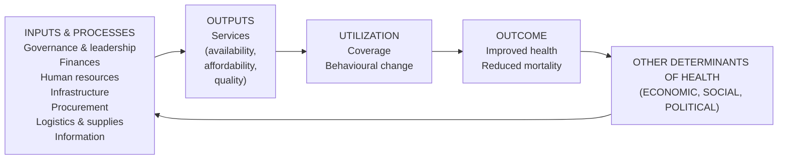
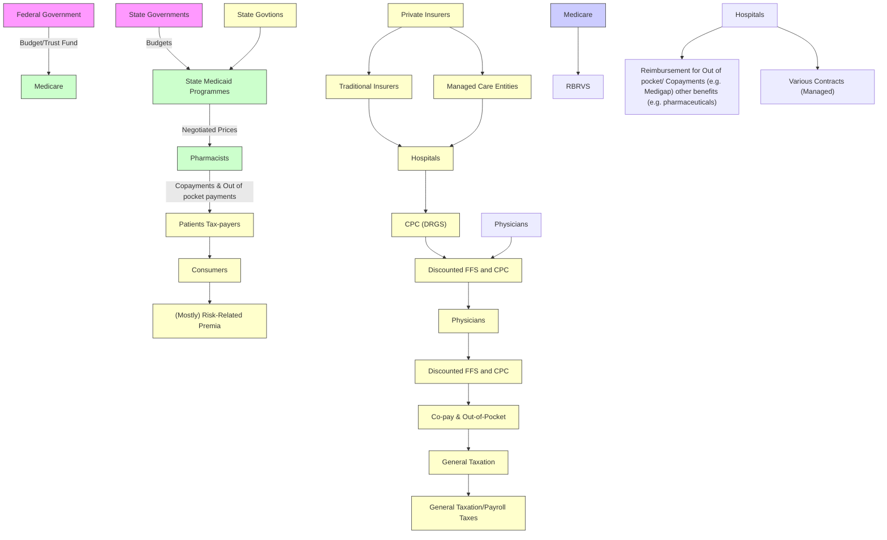
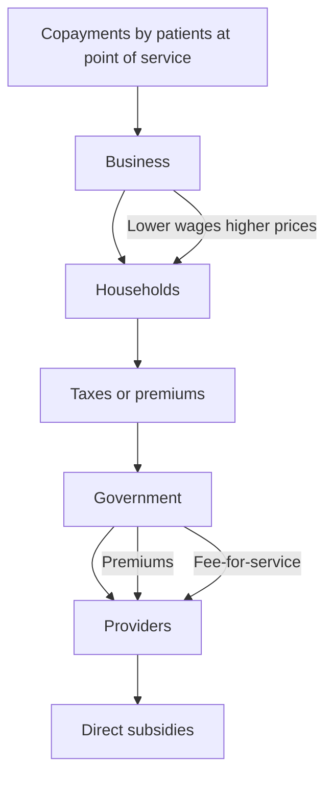

## The M ost Expensivexpensive is not the Best

T h is pa pe r co n cern s th e pe rforma n ce of h ea lth ca re syste ms of a l l th e co u ntries . M otivated by eva l uati n g cu rrent syste ms accu rate ly we a n alyze th e existi n g eva l uatio n meth od s . T he n we fi n d th at most of th ese meth od s ma i n ly focus o n th e o utco mes a n d th at th e i r metrics often ig n o re th e ch a racte rs i n sid e th e h ea lthca re syste ms .

Based o n th e d iscu ssio n to th e existi n g meth od s we d evise two meth od s wh ich a re th e i mp roved WHO ’s meth od a n d th e co mp re h en sive eva l uatio n meth od .

I mp roved WHO ’s meth od ma kes u se of th e sa me metrics of WHO wh ich a re a lso d etermi n ed by th e o utco mes of th e h ea lth ca re syste m . O u r i mp rove me nt is u si n g g rey co mp re h en sive eva l uatio n a n d th e p ri nci p le of mi n i mu m loss of i nfo rmatio n to co mb i n e th e metrics rath e r th an a si mp le l i n ea rizatio n way.

I n o u r co mp re h en sive eva l u atio n meth od we red efi n e 5 n ew metrics wh ich co n cern both o utco mes a n d ch a racte rs of th e h ea lthca re syste m itse lf i n cl u d i n g th e effect of th e g ove rn ment th e basic situ ation of a co u ntry a n d so o n . T he n we u se th e eq ua l i nte rval meth od to g et th e fi n a l sco re C o mpa red with othe r meth od s we fi n d th is o n e rea l ly d oes a better jo b i n d i pa rtite d egree a n d se n sitivity

Afte r co mpa ri n g with othe r 4 co u ntries wh ich ca n rep rese nt th e fo ur ma i n mod es of h ea lthca re syste ms i n th e wo rld we ma ke a co n cl u sion th at th e most i mpo rta nt reaso n why th e h ig h est cost ca n’t ma ke Ame rica th e best is th e u nfai rn ess i n th e h ealth ca re syste m .

Afte rwa rd we u se th e n e ura l n etwo rk a lg orith m to p red ict wh at wi l l h a ppe n to th e US if so me va l u es of th e metrics h ave a ch a ng e We co n cl u de th at th e US ca n g et th e g reatest be nefit after i mp rovi n g th e fa i rness of its h ea lth ca re syste m .

We fi n a l ly co n side r a po l icy ch a ng e—med ica l i n su ran ce vo u che r—as a meth od to i n crease th e i n su ran ce cove rag e a n d red u ce th e u nfai rn ess .

## ContentContent

1 Introd uctionIntrod uction  
2 Backgrou nd  
3 Abou t He althca reHe althca re Syste ms 3

3 1 Framewo rk 3  
3 2 Four Representative Healthcare Systems in the World 3

4 EstimationEstimation Method of WHO 4

4 1 Conceptual Framework 4  
4 2 Measuring Goal Atta inment 5  
4 . 3 Make Comparison between Exist ing and Potential Systems 6  
4 .4 A Partial Analysis

5 Improve dImprove d WHO’ s Method 8

5 . 1 Methodolo gy 8  
5 2 How to Deter mine the Weights 9  
5 3 A Partial Discuss io n 1 0

6 Compre he nsiveCompre he nsive EvaluationEvaluation Method 1 1

6 1 Metrics to Evaluate the Overall Effectivene ss 1 1  
6 2 Choose the Index 1 2  
6 3 The Model to Deal with the Index and Data 1 4

6 3 1 Cho o se the Op eration Mo del 1 4  
6 3 2 The E ual Interval Method 1 4

6 4 A Partial Discuss io n 1 5

7 Compa ris ons betwe e nbetwe e n MethodsMethods 1 6

7 . 1 Dipartite Degree Ana lysis 1 6

7 1 1 Monte-Ca rlo Simu lation 1 7  
7 1 2 Have a Test 1 8  
7 1 3 Analys is o f Re sults 1 9

7 2 S ensitivity Analysis 1 9

7 2 1 About the Values o f the Metric s 1 9  
7.2. 2 About the Weights . 1 9  
7 2 3 Analys is to the US 2 1

8 Compa ris ons betwe e nbetwe e n Some Countrie sCountrie s 23

8 1 Horizo ntal Com arison 23  
8 2 Vertical Com arison 26

9 AnalysisAnalysis of Ame rica nAme rica n He althca re Syste m Base d on the Ne ural Networks 28

9 1 Healthcare S stem of the US 2 8  
9 2 Ex lo re the Model to Te st the Chan es 3 0  
9 3 The Desi n of the BP Network 3 1  
9 4 Trainin and Te st of the BP Network 3 1  
9 5 A lication of the BP Network 3 2

1 0 Advice to the He althca reHe althca re Syste m of the US 3 3

1 1 Furthe rFurthe r Discus s ionDiscus s ion 3 5

Refe re ncesRefe re nces 3 6

## 1 Introductionntroduction

H ealth ca re syste ms ha ve bee n a major concern of poli cy ma kers for ma ny yea rs Ma ny co untri es have rece ntl y i ntrod uced refo rms i n the hea lth sector wi th the expli ci t a i m of i mprovi ng performa nce [C o l in D 200 1 Math ers C 2000] The re exi sts a n exte nsi ve li te rature o n hea lth secto r refo rm a nd rece nt d ebates have e merged on how best to measure performa nce so that the i mpact of reforms ca n be assessed [ Go ldste in H 1 996] Measure me nt of pe rforma nce req ui res a n expli ci t fra mework d efi ni ng the goa ls of a hea lth ca re syste m a nd a sui ta ble method to ma ke a compelle nt evalua ti on

S o o u r g o a l i s p retty c l e a r:

D evi se some metri cs whi ch ca n be used to evalua te the effective ness of a country’ s hea lthca re syste m  
Based on the exi sti ng evalua ti on method d evi se a method to evalua te the hea lt hca re syste m effecti ve l y.  
Ma ke compa ri sons betwee n seve ra l re prese ntative countri es  
Restructure the hea lthca re syste m of the US a nd bui ld pred i ctive mod els to test the cha ng es .

Our a p p roach i s :

Analyze the factors whi ch ca n affect the performa nce of a healthca re syste m .  
S ea rch the i nfo rmati o n a bo ut the exi sti ng eva lua ti o n method s o n i nte rnet a nd fi nd the sho rtco m i ngs of the m  
D eve lo p a co m p re he nsi ve eva lua ti o n method whi ch o nly asks exi sti ng d ata or the d ata i s easy to measure a nd collect  
Collect expe ri me nta l d ata that ca n be used i n our method .  
Co m pa re curre nt d iffe re nt method s a nd d ete rm i ne what cha racte rs they have .  
Ma ke a se nsi ti vi ty a na lysi s of va ri ati o ns of o ur mod e ls  
Ma ke compa ri sons a mong the healthca re syste ms of several re p rese ntati ve co untri es  
Restructure the hea lthca re syste m of the US a nd bui ld a mod el based on the ne ura l netwo rks to test the cha ng es  
Ma ke furthe r d iscussi o ns based o n o ur wo rks

## 2 B ackground ackground

The re i s co nsi d e ra b le d e ma nd fo r hea lth syste m metri cs fro m co untri es i nte rnati o na l o rg a ni za ti o ns d o no rs a nd g lo ba l hea lt h pa rtne rs hi ps to g ui d e resource a llocati on e nha nce accounta b i li ty a nd moni tor prog ress The goa l of the hea lth syste m metri cs i s to meet the need s of a ll use rs wi th the sa me a pproach

The hea lth ca re syste m metri cs work i nclud es (a) a clea r measure me nt strategy i nclud i ng d ata co llecti o n synthesi s of d ata fro m d iffe re nt so urces a nd esti mati o n (b) a pa rsi mo ni o us set of co re i nd i cato rs that reso nate wi th the ta rg et a ud i e nces (c) i nteg rati o n of mo ni to ri ng of hea lt h syste ms a nd the i r pe rfo rma nce i nto hea lt h i nfo rmati o n syste ms a nd so o n . Whi le b ui ld i ng upo n exi sti ng d ata co llecti o n a nd re po rti ng mecha ni sms i s a co re p ri nci p le the re a re major ga ps i n hea lth syste m metri cs that need to be add ressed i n a syste mati c way The e mphasi s should be on the a b i li ty to d etect cha nge a nd to show p rog ress i n hea lth syste m stre ngthe ni ng Both leve l a nd d istri b uti o n of i np uts a nd o utp uts sho uld be ad d ressed .

B ui ld i ng upo n a WHO/Wo rld B a nk meeti ng he ld i n 2004 a nd exi sti ng health syste m fra meworks several health syste m compone nts have bee n i de ntifi ed as re leva nt fo r hea lt h syste m metri cs , i nclud i ng fi na nci ng , huma n reso urces i nfo rmati o n g ove rna nce a nd po li cy se rvi ce d e li ve ry (i nfrastructu re procure me nt log i sti cs a nd supply a nd q ua li ty) a nd cove rage of se rvi ces .

Accord i ng to WHO ’s esti mati on method we ca n use i t as a g ui d eli ne to ma ke a compa ri son betwee n countri es a nd i t also ca n g ive some advi ce on the d iffe re nt co untry’ s hea lth ca re syste m B ut the re ’re a lso so me flaws a nd contrad i cti ons exi sti ng e g The we i g hts placed on each d i me nsi on we re somewhat a rb i tra ry N owad ays more a nd more schola rs have broug ht up the i r i deas whi ch a re aga i nst the WHO ’ s method a nd at the sa me ti me they b ui ld up the i r own metri cs a nd esti mati o n method

I n the pa pe r e nti tled “ Eva luati ng Hea lth-ca re Syste m ” the a utho r A M Best a nalyzes the whole syste m i n a vi ew of economi cs a nd the d ivi d es the whole eva lua ti ng p rocess i nto six pa rts . He thi nks that most d ata we re not ava i la ble for most countri es ; the WHO re port ma kes heavy reli a nce on extra polati o n So the pa pe r uses a more si mple way to eva lua te the metri cs : tra nslate a ll the thi ngs i nto mo ney. M aybe i t ca n ma ke the p rocess si m p le b ut we thi nk i t i s too ro ug h fo r peo p le to acce pt.

I n a nothe r pa pe r na med “Compa rative effi ci e ncy of nati ona l hea lth syste ms : cross nati o na l eco no metri c a na lysi s ” wri tte n by D avi d B Eva ns i t shows that esti mated effi ci e ncy va ri ed fro m nea rl y full y effi ci e nt to nea rly full y i neffi ci e nt Co untri es wi th a hi sto ry of ci vi l co nfli ct o r hi g h p reva le nce of H IV a nd AID S were less effi ci e nt Pe rforma nce i ncreased wi th hea lth expe nd i tu re pe r ca p i ta thro ug h esti mati o n of the re lati o n betwee n leve ls of po p ulati o n hea lt h a nd the i np uts used to p rod uce hea lt h. And i t g ot a co nclusi o n that i ncreasi ng the reso urces fo r hea lt h syste ms i s cri ti ca l to i m p rovi ng hea lt h i n poo r co untri es , b ut i m po rta nt g a i ns ca n be mad e i n most co untri es by usi ng exi sti ng reso urces mo re effi ci e ntly

And i n othe r releva nt pa pe r the ba la nce betwee n si mple ness a nd effi ci e ncy i s a lso not mad e so well They ofte n have the proble ms of ha rd d ata collecti on bad practi ca l effect a nd so on

In our pa pe r our ta rget i s to ma ke some i mprove me nt to the esti mati on method to ma ke the method easie r to co llect the d ata a nd mo re effecti ve

## 3 About Healthcare Healthcare  Systems Systems

## 3 1 Framework

B asic hea lth syste m mo ni to ri ng focuses o n the i np uts p rocesses a nd outp uts of the hea lth ca re syste m These i np uts a nd p rocesses i nclud e huma n reso urces fi na nces gove rna nce a nd lead e rshi p i nfo rmati o n i nfrastructure p rocure me nt log i sti cs a nd sup p li es whi ch i nflue nce the o utp uts : se rvi ce d e li ve ry i nclud i ng ava i la b i li ty a nd q ua li ty of se rvi ces These o utp uts affect the uti li zati o n of the se rvi ces by those who need i t (cove rag e ) whi ch if the i nte rve nti o ns a re effecti ve sho uld lead to i m p rove me nts i n hea lth o utco mes

flowchart

F ig u re 1 T h e F ramework F ramework  of the Hea lthcare Hea lthcare  Syste m[ Syste m[  G l ion .2006]

I n most co untri es of the wo rld the hea lthca re syste m runs i n the sa me way as shown i n F ig u re 1

## 3 .2 F ou r Re prese ntative Re prese ntative  Hea lthcare   Systems   in the World

The hea lt h ca re syste m ， as a n i m po rta nt pa rt of the socia l securi ty syste m i s esse nti a l to p ro mote the sta b i li zati o n of soci ety as we ll as reflecti ng the justi ce of the curre nt syste m s ． D ue to the d i ffe re nt hi sto ri es cult ures a nd status of huma n fi g hts p rotecti o n the hea lt h ca re syste m i s specifica lly d iffe re nt i n d iffe re nt co untri es

I n the wo rld , the re ’ re fo ur re p rese ntati ve hea lt hca re syste ms exi sti ng .

N ati o na l hea lt hca re i nsura nce . The ma i n co untri es usi ng thi s syste m a re U K E aste rn E urope Sovi et Russi a a nd so on Its cha racte r i s the governme nt domi na nts healthca re for free consumma te med i cal treatme nt a nd a full cove rag e . B ut i t d oesn’ t a hi g h effi ci e ncy ma ke use of the ma rket a nd i t ma kes a heavy b urthe n to the gove rnme nt  
Co m me rci a l hea lthca re i nsura nce . The US i s the ma i n co untry usi ng thi s syste m I t ma kes the ma rket as the g ui d e li ne of the hea lthca re syste m . It ma kes a hi g h cost a nd result i n letti ng a la rg e num be r of people fai l to pay the money.  
Socia l hea lthca re i nsura nce . It has a fo rce fa i rness socia li ty a nd unce rta i nt y as i n J a pa n Ge rma n a nd Ca nad a . Its cha racte r i s havi ng a hi g h cost to run i t a nd i t ca n ’t ma ke a g ood hea lt hca re i n ti me  
S avi ngs hea lt hca re i nsura nce . S i ng a po re i s the re p rese ntati ve co untry. Its ma i n d isadva ntag e i s havi ng a low se rvi ce effi ci e ncy, cost ra p i d ly ra i se , a nd i t ca n ’ t ma ke a full cove rag e .

## 4 E stimationstimation Method of WHO

I n WHO ’s method i t ma i nly focuses o n the o utco mes of the hea lthca re syste m i n d iffe re nt co untri es to ma ke the eva lua ti o n . As a result we ca n see most metri cs of the WHO a re also based on the outcomes

## 4 1 Conceptualonceptual FrameworkFramework

The WHO fra mework for health ca re syste m performa nce assessme nt i de ntifi es three ma i n g oa ls o n whi ch hea lt h ca re syste ms sho uld be eva lua ted :

## Hea lth

The d efi ni ng goa l fo r the hea lth ca re syste m i s to i m p rove the hea lth of the po p ulati o n Hea lth i nclud es both p re mature mo rta li ty a nd no n-fa ta l hea lt h outcomes In WHO ’s fra mework i t i s concerned both wi th the average level of po p ulati o n hea lt h a nd wi th the d istri b uti o n of hea lt h wi thi n the po p ulati o n

na me l y hea lt h i neq ua li ti es .

## Respo nsi ve ness

The seco nd ma i n g oa l i s to e nha nce the respo nsi ve ness of the hea lt h syste m to the leg i ti mate expectati o ns of the po p ulati o n fo r the no n- hea l t h i m p rovi ng d i me nsi o ns of the i r i nte racti o n wi th the hea lt h syste m Responsive ness expressl y exclud es the expectati ons of the publi c for the hea lt h i m p rovi ng d i me nsi o ns of the i r i nte racti o n as thi s i s full y reflected i n the fi rst g oa l of po p ulati o n hea lt h

Responsive ness has seve n key sub-compone nts : respect for pe rsons a nd cli e nt o ri e ntati o n. Respect fo r pe rso ns ca ptures aspects of the i nte racti o n of i nd i vi d ua ls wi th the hea lt h syste m that ofte n have a n i m po rta nt ethi ca l d i me nsi on a nd i s comp ri sed of:

a ) Re s p e ct fo r the d ig n i ty of the p e rs o n . [ Lis bon . 1 995 ] .  
b) Respect fo r the a uto no m y of the i nd i vi d ua l to ma ke cho i ces a bo ut hi s/he r own hea lt h . [ Brock D . 1 993]  
c) Res pect fo r co nfi d e nti a l i ty. [ Rylance Rylance G 1 999 Beaucha mp Beaucha mp T 1 989] .

The seco nd sub-co m po ne nt cli e nt o ri e ntati o n i nclud es the majo r co m o ne nts of co nsume r sati sfacti o n that a re not a functi o n of hea lt h i mprovement :

d ) P ro m pt atte nti o n to hea lt h need s  
e) Basic a me ni ti es such as clea n wa i ti ng rooms or ad eq uate beds a nd food i n hosp i ta ls a re aspects of ca re that a re ofte n hi g hl y va lued by the po p ulati o n [ Be rnha rt Be rnha rt  MH 1 999]  
f) Access to socia l sup po rt netwo rks fo r i nd i vi d ua ls rece i vi ng ca re . [ Gils on L 1994]  
g ) C ho i ce of i nsti tuti o n a nd i nd i vi d ua l p rovi d i ng ca re .

As wi th hea lth society i s conce rned not only wi th the ave rag e leve l of respo nsi ve ness b ut a lso wi th i neq ua li ti es i n i ts d istri b uti o n Thi s mea ns that WHO i s i m p li ci tly i nte rested i n d iffe re nces re lated to socia l eco no m i c d e mog ra phi c a nd othe r factors

## Fa i rness of fi na nci a l co ntri b uti o n

The thi rd ma i n g oa l of hea lt h syste ms i s fa i rness i n fi na nci ng a nd fi na nci a l ri sk p rotecti o n fo r ho use ho ld s [Murra CJL 2000] To be fa i r fi na nci ng of the hea lth syste m sho uld ad d ress two key cha lle ng es F i rst ho use ho ld s sho uld not beco me i m pove ri shed o r pay a catastro p hi c sha re of the i r pe rma ne nt no nsubsi ste nce i ncome to obta i n hea lth ca re Second oor house ho lds should pay i n a bso lute te rms less towa rd s the hea lth syste m tha n ri ch ho use ho ld s Eve ry ho use ho ld sho uld pay a fa i r sha re towa rd s the costs of the hea lth syste m .

WHO i s o nly co nce rned wi th the d istri b uti o n of the fi na nci ng mecha ni sm across ho use ho ld s The ave rag e leve l of fi na nci ng i s not a n i ntri nsi c goa l fo r the hea lth syste m ; rathe r WHO co nsi d e rs i t o ne of the key po li cy cho i ces fo r society The leve l of reso urces i nvested i n the hea lth ca re syste m i s the va ri a ble aga i nst whi ch goa l atta i nme nt i s compa red i n ord e r to measure

performa nce .

## 4.2 Meas u ringMeas u ring G oa l Atta in me nttta in me nt

In ord e r to assess ove ra ll effective ness a nd ma ke the compa ri son the method was to co m b i ne the i nd i vi d ua l atta i nme nts o n a ll fi ve goa ls of the hea lth syste m i nto a si ng le num be r whi ch we ca ll the co m posi te i nd ex. The composi te i nd ex i s a we i g hted average of the five compone nt goals specified a bove F i rst co untr y atta i nme nt o n a ll fi ve i nd i cato rs (i e hea lt h hea lt h i neq ua li ty respo nsi ve ness- le ve l respo nsi ve ness -d i stri b uti o n a nd fa i rfi na nci ng ) we re resca led restri cti ng the m to the [0 1 ] i nte rva l The n the followi ng we i g hts we re used to construct the ove ra ll composi te measure :

$\alpha _ { \mathrm { _ 1 } } = 2 5 \%$ fo r he a lt h ( D A LE ) , $\alpha _ { 2 } = 2 5 \%$ fo r he a lt h i ne q ua l i ty, $\alpha _ { _ 3 } = 1 2 . 5 \%$ fo r

the leve l of respo nsi ve ness , $\alpha _ { 4 } = 1 2 . 5 \%$ fo r the d istri b uti o n of respo nsi ve ness ,

a nd $\alpha _ { 5 } = 2 5 \%$ fo r fa i rness i n fi na nci ng . These we i g hts a re based o n a survey ca rri ed o ut by WH O to e l i ci t stated p refe re nces of i nd i vi d ua ls i n the i r re lati ve va lua ti o ns of the g oa ls of the hea lt h syste m .

WHO ad o pted the si m p lest fo rm of a co m posi te measure of goa l atta i nme nt based on the followi ng add i tive mod el :

$$
\begin{array}{l} \text { Composite } = \alpha_ {1} \text { Health } + \alpha_ {2} \text { HealthInequality } + \alpha_ {3} \text { Responsiveness } \\ + \alpha_ {4} \text {   ResponsivenessInequality   } + \alpha_ {5} \text {   FairnessofFinancialContribution   } \\ \end{array}
$$

Whe re the sum of the a lp has i s set eq ua l to o ne .

## 4.3 M ake Com parisonom parison betwee n Existing and P ote ntial Systems

I n thi s WHO ’s method , i t chooses the M urra y a nd F re nk ’ s way to ma ke compa ri sons betwee n exi sti ng a nd pote nti a l syste ms .

To i llustra te the co nce pt i n F ig u re 2 the goa l of the hea lth syste m i s measured o n the ve rti ca l axi s (whi ch i s la be led hea lt h) whi le the i np uts to p rod uci ng the goa l a re o n the ho ri zo nta l axi s The up pe r li ne re p rese nts the fro nti e r o r the maxi m um possib le leve l of the goa l (hea lth) that co uld be obta i ned for a g ive n leve l of i np uts

line chart

| Inputs to overall goal | Overall goal attainment (a) | Overall goal attainment (b) | Overall goal attainment (c) |
| ---------------------- | --------------------------- | --------------------------- | --------------------------- |
| 2                      | 15                          | -                           | -                           |
| 4                      | 30                          | -                           | 75                          |
| 6                      | -                           | 35                          | -                           |
| 8                      | -                           | -                           | -                           |

F ig u re 2 Hea lth Syste m Pe rforma nce Pe rforma nce (Ove ra ll (Ove ra ll Effi cie n cy) Effi cie n cy) [ Dav id B Ev ans 2000]

On a fa rm for exa mple output would be ze ro i n the a bse nce of i nputs b ut i n the hea lt h secto r hea lt h leve ls wo uld not be ze ro (i e the e nti re populati on would not be d ead ) i n the a bse nce of hea lth expe nd i tu res a nd a functi o ni ng hea lt h syste m . The lowe r “fro nti e r ” i n F ig u re 2 i s d efi ned as the hea lth leve l that wo uld occur i n the a bse nce of the syste m . Assume that a country i s o bse rved to have achi eved ( ) uni ts of hea lth M urra y a nd F re nk d efi ned syste m performa nce as $b / ( b + c )$ Thi s i nd i cates what the syste m achi eves compa red to i ts pote nti a l The cha lle nge for hea lth sector reform i s to fi nd a way of measuri ng health syste m performa nce i n a syste mati c way to a llow co m pa ri so n across co untri es a nd wi thi n co untri es ove r ti me . That i s the p urpose of thi s method

## 4 4 A Partia lPartia l Ana lys isAna lys is

I n the WHO ’ s methods we ca n see that i t a lways focus on the outcomes of the hea lthca re syste m wi tho ut measure so a s to i g no ri ng a ny cha racte rs of syste m i tse lf. The n i t rea lly has so me stre ngt h i n eva lua ti o n b ut a lso b ri ng a lot of suspects .

## StrengthsStrengths

The metri cs whi ch the WHO ma kes to evalua te the healthca re syste m a i m to measure the g oa l atta i nme nt of the co untri es I t rea lly ca n reflect the si tuati o n of o ne ’s hea lt hca re syste m i n a way And i t co nta i ns most of the outcomes whi ch a hea lthca re syste m should prod uce Besid es i t a lso ca n g ive some advi ce of whi ch aspect one country should to stre ngthe n to i mprove its hea lthca re syste m

## Weakne sse seakne sse s

1 . The we i g hts p laced o n each d i me nsi o n we re so mewhat a rb i tra ry.  
2 . The a p p roach a lso heavi l y pe na li zed co untri es wi th e p id e m i c d isease unre lated to a hea lth ca re syste m .  
3 . Thi s a p p roach d id not loo k at how hea lth syste m we re o rg a ni zed a nd managed .  
4 The WHO 2000 ra nki ngs do not look at access uti li zati o n q ua li ty costeffecti ve ness o r most othe r d i me nsi o ns of hea lth syste ms .  
5 . The measure of hea lt h i neq ua li ti es d oes not reflect co nce rns a bo ut eq ui ty.  
6 . Im po rta nt method o log i ca l li m i tati o ns a nd co ntrove rsi es a re not acknowledged .  
7 . The m ulti co m po ne n t i nd i ces a re p ro b le mati c co nce ptua l l y a nd method o log i ca ll y; they a re not usefu l to g ui d e po li cy, i n pa rt beca use of the opaci ty of the i r compone nt measures .  
8 . P ri ma ry hea lt h ca re i s d ecla red a fa i lure wi tho ut exa m i ni ng ad eq uate evi d e nce , a p pa re ntly based o n the a utho rs ’ id eo log i ca l posi tio n.  
9 . These method olog i ca l i ssues a re not only matte rs of techni ca l a nd sci e ntifi c co nce rn b ut a re p rofo und ly po li ti ca l a nd li ke ly to have majo r socia l conseq ue nces .  
1 0 . The a p p roach ca n not d isti ng ui s h a ll the co untri es o bvi o usly.

## 5 I mproved mproved WHO ’ s Method

I n the WHO ’ s method s the we i g hts used i n the co nstructi o n of the co m posi te i nd ex have bee n used co nsi ste nt ly, wi tho ut co nsi d e ri ng unce rta i nt y i n the va lua ti o ns of the d iffe re nt co m po ne nts . So i t i s so mewhat a rb i tra ry.

I n thi s secti o n, we use g rey co m p re he nsi ve eva lua ti o n to i m p rove the WHO ’s method to make the evalua ti on more beli evable

## 5 . 1 M et h o d o lo g y

S uppose $c _ { i k } ( i = 1 , 2 , \cdots , n ; k = 1 , 2 , \cdots , m )$ i s the raw d ata of the m etri c $k$ i n the country . So the matrix of the raw d ata ca n be d escri bed as ( )     $i \ : .$ $C = \left( c _ { i k } \right) _ { \scriptscriptstyle \pi }$ whi ch i s  We sup pose i s t h e b e s t va l u e i n m e t ri c , s o\* $\boldsymbol { c } _ { \boldsymbol { k } } ^ { * }$ $k$ $\boldsymbol { C } ^ { * } = ( \boldsymbol { c } _ { k } ^ { * } ) = ( \boldsymbol { c } _ { 1 } ^ { * } , \boldsymbol { c } _ { 2 } ^ { * } , \cdots , \boldsymbol { c } _ { m } ^ { * } )$ i s the b e st s i tuati o n i n th i s s ste m    1 2 ( ) ( , , , )     

Ma ki ng $C ^ { \dagger } = ( c _ { 1 } ^ { \ast } , c _ { 2 } ^ { \ast } , \cdots , c _ { m } ^ { \ast } ) \qquad \mathsf { a s } \qquad \mathsf { a } \qquad \mathsf { r e f e r e n c e } \qquad \mathsf { d a t a } \qquad \mathsf { l i s t } ,$

$C _ { i k } = ( c _ { i 1 } , c _ { i 2 } , \cdots , c _ { i m } ) ( i = 1 , 2 , \cdots , n )$ 1 2 a s a co m pa rati ve li st, we ca n use the functi o n( , , , )( 1 , 2, , )              be low to g et the re lati o n coeffi cie nt betwee n $C _ { i k \sf a n d } C ^ { \sf * }$ :

$$
\xi_ {i} (k) = \frac {\underset {i} {\min} \left| c _ {k} ^ {*} - c _ {i k} \right| + \rho \underset {i} {\max} \left| c _ {k} ^ {*} - c _ {i k} \right|}{\left| c _ {k} ^ {*} - c _ {i k} \right| + \rho \underset {i} {\max} \left| c _ {k} ^ {*} - c _ {i k} \right|}
$$

Whe re $\rho$ i s a d i ffe re nti ate co effi ci e nt , $\rho \in \left( 0 , 1 \right) ,$ ge nerall y , we ca n ma ke $\rho = 0 . 5$

So usi ng we ca n g et the eva lua ti o n( )( 1, 2, , ; 1, 2, , )          $\xi _ { { \scriptscriptstyle i } } ( { \boldsymbol { k } } ) ( { \boldsymbol { i } } { = } 1 , 2 , { \cdots } , { \pi } , { \boldsymbol { k } } { = } 1 , 2 , { \cdots } , m )$ matri x $\ b { \mathscr { E } } = ( \ b { \xi } _ { i } ( \ b { k } ) ) _ { n \times m }$

S uppose $\boldsymbol { W } = \left( \boldsymbol { w } _ { 1 } , \boldsymbol { w } _ { 2 } , \cdots \boldsymbol { w } _ { m } \right)$ i s a we i g ht d istri b uti o n m atri x of m etri cs . Where $\mathscr { w } _ { k } ( k = 1 , 2 , \cdots , m )$ i s the we i g ht of the metri c $\ k _ { \cdot } \mathsf { A n d } \sum \varkappa _ { k } = 1$

B ased o n the d iscussi o n a bove we ca n g et the g rey co m p re he nsi ve evalua ti on model

$$
R = W \bullet E ^ {T} = (r _ {1}, r _ {2}, \dots r _ {n})
$$

Where $r _ { i } = \sum _ { k = 1 } ^ { m } w _ { k } \xi _ { i } ( k )$ i s the re lati ng d eg ree a nd $E ^ { T }$ i s the tra nspose of $E$

As shown i n the mod e l $R { = } (  { r _ { 1 } } ,  { r _ { 2 } } , \cdots ,  { r _ { n } } )$ i s the fi na l sco re of co untri es ’ hea lt hca re syste m The la rg e r the re lati ng d eg ree  i s the bette r the country’ s hea lthca re syste m i s . Acco rd i ng to thi s p ri nci p le we ca n g et the o rd e r of a ll the co untri es ’ hea lthca re syste m

## 5.2 How to Determ ine the We ig hts

I n the d iscussi o n a bove we ca n see that the we i g ht vecto r i s und ete rmi ned I n our op i ni on we wa nt to d ete rmi ne i n a way whi ch i s more c re d i b ly .

We ca n d ete rmi ne the we i g hts accord i ng to the pri nci ple of the mi ni mum loss [ Wang Xuebiao Xuebiao  2000 ] . B eca use o ur metri cs (1 )      $u _ { , } ( 1 \leq j \leq m )$ provi d e the eva lua ti ng i nfo rmati o n fro m d iffe re nt aspects if we co m b i ne a ll the metri cs i n a li nea ri zati o n wa thi s wi ll loss a lot of eva lua ti ng i nfo rmati o n acco rd i ng to e ntro py theo ry i n i nfo rmati cs I n o ur o p i ni o n we ho pe to d ete rm i ne the we i g hts wi tho ut losi ng so m uch i nfo rmati o n fro m the i nsi d e of the d ata We sho uld rese rve the i nfo rmati o n i n a maxi m um way just li ke a na lyzi ng the bases i n the m ulti va ri ate stati sti ca l a na lysi s So we choose the most classi ca l method to ca lculate va ri a nce whi ch ca n re p rese nt i nfo rmati o n the la rg e r the va ri a nce i s the mo re the i nfo rmati o n i s

Accord i ng to d iscussi on a bove we ca n see that the fi na l score $d { \boldsymbol { = } } { \boldsymbol { \mu } } ^ { \prime } { \boldsymbol { u } }$ the n we should choose the best we i g ht to ma ke the va ri a nce of $d$ reach the maxi m um .

$$
D (d) = w ^ {T} D (u) w
$$

Where $D ( d )$ i s the va ri a nce matri x of $d$ . Whe n $\varkappa ^ { \zeta } w = 1$ , $D ( d )$ reach the maxi mum

S u p p o s e ( , ) ( ) ( 1 )      $\varphi ( w , \lambda ) = w ^ { \prime } D ( u ) w - \lambda ( w ^ { \prime } w - 1 )$

$\Biggl \{ \frac { \partial \varphi } { \partial w } = 2 D ( u ) w - 2 \lambda w = 0$ 2 ( ) 2 0     The n $\left\lfloor { \frac { \partial \varphi } { \partial \lambda } } = w ^ { \mathcal { T } } w - 1 = 0 \right.$

S o lve the fu nc ti o n a b ove , we ca n g et 1    $\left\{ \begin{array} { l l } { D ( u ) w = \lambda w } \\ { w ^ { \prime } w = 1 } \end{array} \right.$

So i s the e ige nva lue of $\boldsymbol { { D } } ( u )$ a nd i s i ts e ig e nvecto r. Whe n $\varkappa ^ { \zeta } w { = } 1$ to make $D ( d ) = \boldsymbol { w ^ { \prime } } D ( u ) \boldsymbol { w } = \lambda \boldsymbol { w ^ { \prime } } \boldsymbol { w } = \lambda$ to reach the maxi mum we should make the $\lambda$ as the max eigenva lue of $D ( u )$ the n $w$ i s the eigenvecto r of max e ig e nva lue of ( ) $\boldsymbol { { D } } ( u )$

I n the rea l ca lculati o n , $D ( u )$ i s unrea li zed , so we ca n use the va ri a nce matri x of the s a m p le of to re p re s e nt i t. ( ) ( )      1 2 ( , , , )       $\hat { D ( \boldsymbol { u } ) } = \hat { ( \sigma _ { \it / j } ) }$ $( c _ { 1 j } , c _ { 2 j } , \cdots , c _ { n j } ) _ { 0 \uparrow } \ u _ { j }$

$$
\hat {\sigma} _ {l j} = \frac {1}{n} \sum_ {k = 1} ^ {n} (x _ {k l} - \overline {{x _ {l}}}) (x _ {k j} - \overline {{x _ {j}}})
$$

$\overline { { x _ { j } } } = \frac { 1 } { n } \sum _ { i = 1 } ^ { n } x _ { k j } ( 1 \leq / { , } \ j \leq p )$ 1 l Where

^ The vari ance matrix $\hat { D ( \boldsymbol { u } ) }$ i s a non negative symmetry real matrix so all the e ig e nva lue a re rea l num be r . F ro m the cha racte r of Rayle i g h ’s e ntro py , we ca n g et

$$
\lambda_ {0} = \max _ {w \neq 0} \frac {w ^ {T} D (d) w}{w ^ {T} w} = \max _ {| | w | | = 1} \frac {w ^ {T} D (d) w}{w ^ {T} w}
$$

^ Where $\lambda _ { 0 }$ i s the maxi m um e ig e nva lue $\mathsf { o f } ^ { D ( \boldsymbol { u } ) }$ , a nd the e ig e nvecto r of i s we i g hts vecto r whi ch we p ursue fo r. ( ) $D ( u )$

## 5 3 A Partia lPartia l Discuss ionDiscuss ion

The i m p roved WHO ’ s method d o not cha ng e the vi ew whi ch focus o n the o utco mes of the hea lt hca re syste m . I ts i m p rove me nt i s ma ki ng the eva lua ti o n more beli evable

We ca n ’ t ma ke a d ecisi o n that thi s ki nd of method s i s a bad wa y i t ma kes its own se nse that i t rea lly ca n reflect the goa l whi ch the hea lthca re syste ms reach b ut i t ca n’ t reflect the i nsi d e Fo r exa m p le a co untr y whi ch has a e pid e mi c ofte n get a low score i n WHO ’ s eva lua ti on method but maybe thi s i s not the p ro b le m of the hea lthca re syste m .

S o a new method whi ch reflects the i nsi d e i s need ed to be b ro ug ht up .

## 6 Comprehensive omprehensive  Evalu ation Evalu ation  Method

I n thi s secti o n we b ri ng up a new method to eva lua te the hea lthca re syste ms whi ch has bee n me nti oned i n a n a rti cle [D in g C hu n 2005]C hu n 2005] And thi s method conce rn s both the outcomes a nd cha racte rs of syste ms the mselves I t rea lly ma kes se nse beca use i t i s not fa i r if o nly usi ng o utco mes metri cs Thi s d oesn ’t mea n that the WHO ’s method i s un useful WHO ’ s method ca n measure the oa l atta i nme nt a nd thi s method ca n measure ove ra ll effecti ve ness

## 6 . 1 Metrics to Eva luateva luate the Overa llOvera ll Effective nessEffective ness

To ma ke a n overall compa ri son betwee n countri es ’ health ca re syste ms more i mpe rsona ll y fa i rly a nd q ua nti tati vel y metri cs must be mad e well As to the goa ls of the hea lth ca re syste m the World Ba nk has mad e a specific d efi ni ti o n

I mprove the hea lth of the populati on promote the ge ne ra l wea l

Fa i rness a nd hea lth ca re cove rag e .  
Ma ke good use of reso urce to g et a sati sfi ed eco no m i c effi ci e ncy.  
Stre ngt h the cli ni c be nefi ts  
Ra ise the q ua li ty of the hea lt h ca re a nd the sati sfacti o n of the custo me rs .  
I nsure the fi na nce co uld be pe rsi ste nt

Acco rd i ng to thi s d efi ni ti o n , we ca n ma ke fi ve metri cs fo r the ove ra ll hea lt h ca re syste m .

Effi ci e ncy Thi s mea ns the p roporti on betwee n i np uts a nd outcomes cost a nd i nco mes . And i t a lso ca n be d i vi d ed i nto techni ca l effi ci e ncy, eco no m i c effi ci e ncy a nd a llocati ve effi ci e ncy. B ut i n thi s p ro b le m , we d o n ’t ca re a bo ut the a p po rti o n p ro b le m , so we choose the techni ca l effi ci e ncy.  
Fa i rness . It co nta i ns the fa i rness both i n the med i ca l treatme nt a nd ra i si ng money.  
Respo nsi ve ness . The no n- hea l t h i m p rovi ng d i me nsi o ns of the i nte racti o ns of the po p ulace wi th the hea lt h syste m a nd reflects respect of pe rso ns a nd cli e nt o ri e ntati o n i n the d e li ve ry of hea lt h se rvi ces a mo ng othe r facto rs  
The effect of the g ove rnme nt . Ind ub i ta b l y , the g ove rnme nt p lays a n i m po rta nt ro le i n the hea lt h ca re syste m .  
The basic si tuati o n of a co untry Thi s mea ns a co m posi te i nd ex of the lots of secto rs whi ch i nclud e eco no my ed ucati o n sci e ntifi c resea rch populati on a nd so on

## 6 2 Choose the Index

Effi ci e ncy i nd ex

1 The a nti ci pated life-spa n flexi b i li ty Thi s mea ns a p ro po rti o n betwee n i ncreasi ng rate of the hea lt h ca re a nd the exte nd i ng rate of the a nti ci pated life-spa n i n a ti me seg me nt.  
2 . The mo rta li ty flexi b i li ty. The p ro po rti o n betwee n the d ecreasi ng mo rta li ty of the chi ld re n und e r 5 yea rs o ld a nd the i ncreasi ng cost of the hea lt h ca re .

 Fa i rness i nd ex

1 The fa i rness i n p rovi d i ng med i ca l treatme nt

( 1 ) The coverage of the health ca re .

The num be r of d octo rs pe r tho usa nd peo p le . Thi s reflects the ma npower resource coverage of the health care servi ce  
The numbe r of si ckbed pe r thousa nd people Thi s reflects coverage the coverage of the med i cal establi shment  
The proba b i li ty to get the necessa ry med i ci ne The proporti on of the peo p le who ca n g et the basic med i ci ne reflect the p ro ba b i li ty for a resi d e nt to g et the med i ci ne  
The p ro ba b i li ty to sha re hea lth ca re esta b li shme nt Thi s reflects the sati sfacti o n of the basic li vi ng co nd i ti o n

C hi ld b i rth wi th a d octo r Thi s reflects the leve l of a co untr y ’s hea lth ca re to wo me n a nd i nfa nts

(2 ) The fa i rness i n sati sfyi ng the hea lt h ca re req ui re me nt .

Thi s i s ma i nly reflected by the cove rag e of the hea lt h i nsura nce .

(3 ) The fa i rness i n ra i si ng mo ney fo r hea lt h ca re

Responsive me nt i nd ex

1 . F i na nce p ressure

( 1 ) The sup po rti ng p ro po rti o n. Thi s mea ns the p ro po rti o n betwee n the peop le who ’re of the ri g ht ag e to work a nd the othe rs .  
(2 ) The i ncreasi ng rate of peo p le who ’ re ove r 65 yea rs o ld . The la rg e r the rate i s the heavi e r the economi c b urd e n wi ll be .  
(3 ) The cha ng i ng ra ng e of the p roporti on of the hea lth ca re cost i n G D P . A steady p ro po rti o n mea ns a good hea lth ca re refo rm .

2 . Techni ca l effi ci e ncy.

I n thi s aspect we ca n choose the ave rag e ti me i n hosp i ta l as a cri te ri a to measure i t

Governme nt i ndex.

1 The respo nsi b i li ty a nd co ntri b uti o n to the ove ra ll hea lt h ca re syste m . We ca n use the p roporti on of gove rnme nt i n the ove ra ll hea lth ca re cost  
2 . The respo nsi b i li ty to hea lth ca re ed ucati o n.  
3 . The effect of the g ove rnme nt i n the aspect of med i ca l tra i ni ng , med i ci ne a nd sci e ntifi c resea rch  
4 . The acti o n of the gove rnme nt i n i m p rovi ng the ci rcumsta nce .

The basic si tuati o n i nd ex

1 E co no m i c si tuati o n.

( 1 ) The ave rag e G D P . Thi s reflects the eco no m i c si ze a nd the i nco me l eve l .  
(2 ) The une mp lo yme nt d eg ree Thi s ofte n reflects the p roporti on of losi ng hea lt h i nsura nce .

2 the social d evelopme nt

( 1 ) Gi ni Coeffi ci e nt. We choose thi s i nd ex to reflect a co untr y’ s i nco me a nd fo rtu ne d istri b uti o n the la rg e r the coeffi cie nt i s ; the less ave rag e the socia l fo rtu ne i s Thi s ca n a lso affect the d iffe re nce of the a nti ci pated life-spa n  
(2 ) U rba ni zati o n. We ca n use the p ro ba b i li ty of the po p ulati o n i n the ci ty to re p rese nt i t.

Ge ne ra ll y spea ki ng the resi d e nt i n the ci ty ca n g et bette r se rvi ce that i n the co untry.

3 The a nti ci pated life-spa n. Thi s i nd ex reflects the co m posi te result of a co untry’ s hea lth ca re syste m ’ s d eve lo p me nt.  
4 P ubli c hea lth ca re

I n thi s i nd ex we use the cove rag e of safe d ri nk wate r a s the most i m po rta nt o ne .

5 Ed ucati on

Net e nro lme nt rate of the m i d d le schoo l i s the o ne whi ch we use to re p rese nt the ed ucati on leve l

## 6 S ci e ntifi c resea rch

The num be r of pate nt thi s ma i nly reflects the i nnova ti o n a b i li ty of a co untry.

## 7 C i rcumsta nce

( 1 ) The a i r po lluti o n. Ave rag e C O2 e m i ssio n i s a g ood cho i ce .

(2 ) The wate r po lluti o n The o rg a ni c wate r co nta m i nati o n e m i ssio n i s also the one we choose .

## 8 life style a nd be havi o r

The p ro po rti o n of the smo ke rs i n the po p ulati o n. The hi g he r the p ro po rti o n i s , the wo rse the co untr y’ s hea lt h co nd i ti o n i s .

## 6 .3 The Mode l to Deal with the Index and Data

## 6.3 .1 Choose the Operat ion Model

Afte r e nsuri ng the fi ve metri cs to eva lua te the ove ra ll effecti ve ness a nd i ts sub-metri cs we choose the method of eq ua l i nte rva l whi ch i s a lso used i n H D I by U N to ma ke the compa ri son betwee n countri es . On one si de we use the method of eq ua l i nte rva l to comb i ne a ll the i nd exes on the othe r si de we should solve the p rob le m of how to d ete rmi ne the we i g hts .

## 6.3 .2 The Equal IntervalInterval Method

## The Operatin gOperatin g ProcessProcess

 D ivi d e a ll the sub-i nd exes i nto posi tive i nd exes a nd negative i nd exes  
U se d iffe re nt a lgo ri thms to ma ke the sta nd a rd i zati o n to the two ki nd s of i nd exes .  
Accord i ng to the sub-i nd exes we ca n get the five ma i n i nd exes ’ composi te value  
Ca lculate the fi na l sco re of d iffe re nt co untri es based o n the fi ve metri cs va lue .

## The C lass ificationC lass ification of the In dexesIn dexes

## C lassifi cati o n

Posi ti ve i nd ex: the hi g he r the va lue i s , the bette r the hea lt h ca re syste m wi ll be , for exa mple the coverage of safe d ri nk water.

N eg ati ve i nd ex: the hi g he r the va lue i s the wo rse the hea lth ca re syste m wi ll be . For exa mple the proporti on of the smoke r.

## Sta nd a rd i zati on

The i nd exes have d iffe re nt uni ts so we sho uld ma ke sta nd a rd i zati o n befo re ca lculati ng the fi na l sco re Afte r the classifi cati o n we ca n d ea l wi th the two ki nd s of i nd exes d iffe re ntly.

P i t i i d $\mathrm { F } _ { _ { i / j } } = [ ( R _ { _ { i / j } } - R _ { _ { i / \mathrm { m i n } } } ) / ( R _ { _ { i / \mathrm { m a x } } } - R _ { _ { i \mathrm { m i n } } } ) ] \times 1 0 0 $

N egative i ndex: $\mathrm { F } _ { _ { i / j } } = [ ( R _ { _ { i / \mathrm { m a x } } } - R _ { _ { i / j } } ) / ( R _ { _ { i \mathrm { m a x } } } - R _ { _ { i \mathrm { m i n } } } ) ] \times 1 0 0 $

Whe re i s o ne of the fi ve metri cs i s the sub-i nd ex of the metri c i s the o ne of the co untri es

min i s the m i ni m um va lue of the sub-i nd ex of the metri c i n the $R _ { i / \operatorname* { m i n } }$ stati sti ca l d ata .

max i s the m axi m u m va l ue of the s u b - i nd ex of the m etri c i n the $R _ { i / \operatorname* { m a x } }$ stati sti ca l d ata .

i s the va l ue of the s u b - i nd ex of the m etri c afte r S ta nd a rd i zati o n .F $\mathrm { F } _ { i \mathit { l } \mathit { j } }$

## Determi neetermi ne the We ightsWe ights

We ca n get the value of every metri c usi ng the functi on below

$$
F _ {i j} = \left[ \sum_ {i = 1} ^ {n} \left(F _ {i l j}\right) ^ {\alpha} / n \right] ^ {1 / a}
$$

Whe re n i s the num be r of sub-i nd ex i n the metri c .

i s a we i g ht of the metri c

## Get the F i na l Score of the Eva luated Co untryCo untry

Based on the d iscussi on a bove we ca n get the functi on below

$$
S = \left\{\left[ \sum_ {i = 1} ^ {k} \left(F _ {i j}\right) ^ {\alpha} \right] / K \right\} ^ {1 / \alpha}
$$

Whe re k i s the num be r of metri cs i n thi s p ro b le m $k = 5$ .

## 6 .4 A Partia l Discuss ion

I n thi s secti o n we b ri ng up a co m p re he nsi ve eva lua ti o n method . All the metri cs a nd i nd exes a re g ive n based on the goa ls of the hea lthca re syste m a nd cha racte rs of i tse lf Thi s method co nce rns both o utco mes a nd i nsi d e of the hea lt hca re syste m .

U si ng thi s method we ca n g et a co m posi te sco re of a ll the co untri es . Thoug h compa ri ng wi th these metri cs we ca n also g ive some advi ce to the d i ffe re nt co u ntri e s e a s i ly.

## 7 Comparisons omparisons between between Methods Methods

Before the compari son each component measure was rescaled on a 0 to 1 00 sca le : fo r hea lt hy life expecta ncy, $H = [ ( H e a l t h - 2 0 ) / ( 8 0 - 2 0 ) ] \times 1 0 0$ , fo r hea lt h i neq ua l i t y $H I = ( 1 - H e a l t h I n e q u a l i t y ) { \times } 1 0 0$ fo r respo nsi ve ness leve l ,    Re / 1 0 1 00 , fo r respo nsi ve ness i neq ua li t y,

$$
R I = (1 - \text { ResponsivenessInequality }) \times 1 0 0, \quad \text { for } \quad \text { fairness } \quad \text { in } \quad \text { financing },
$$

  1 00 . The ove ra ll co m posi te was , the refo re , a num be r o n the i nte rva l 0 to 1 00 , wi th 1 00 be i ng the hi g hest possib le leve l of atta i nme nt

## 7 . 1 D i pa rt ite i pa rt ite De g re e An a lys is An a lys is

As we know a good metri c should do well i n the d ipa rti te d eg ree so the eva lua ti o n sho uld B ut the ${ \sf W H O ^ { \prime } s }$ method ca n reach a good d ipa rti te d eg ree i n the respo nsi ve ness d istri b uti o n a s shown i n Tab le 1 To eva lua te the d ipa rti te d eg ree we a lso d esig n a n i nd ex to d escri be i t

$$
D D = \sqrt {n _ {1} ^ {2} + n _ {2} ^ {2} + \cdots + n _ {i} ^ {2}}
$$

Where $n _ { i }$ i s the num be r of co untri es whi ch ca n ’t be d isti ng ui s h ed i n the tea m . The sma lle r i s the bette r the d ipa rti te d eg ree i s . Whe n $D D = 0$ a ll the o bjects ca n be d isti ng ui s hed o bvi o usl y.

For exa mple suppose two methods both ma ke eva lua ti on to 8 countri es a nd g i ve the o rd e r a s fo llowi ng .

A : 1 2 3-6 7 8 ; (3-6 mea ns that these 4 co untri es ca n ’t be d isti ng ui s hed . )

B : 1 2 3-4 5-6 7 8

We ca n see $\scriptstyle D D _ { 4 } = { \sqrt { \left( 6 - 3 + 1 \right) ^ { 2 } } } = 4$

$$
D D _ {B} = \sqrt {(4 - 3 + 1) ^ {2} + (6 - 5 + 1) ^ {2}} = 2 \sqrt {2}
$$

$\mathit { D D } _ { \mathit { A } } > \mathit { D D } _ { \mathit { B } }$ , So B method has a bette r d ipa rti te d eg ree tha n A .

Tab le 1 List of Co untries Wh ich can’t be Distin u is hed i n WHO ’s M ethod

<table><tr><td>The countries which can’t be distinguished by responsiveness distribution in WHO’s method.</td><td>The WHO’s method gives the 36 countries the same order in the metric of responsiveness distribution.</td></tr><tr><td>Argentina, Australia, Austria, Bahamas, Bahrain, Belgium, Barbados, Brunei Darussalam, Canada, Denmark, Finland, France, Germany, Greece, Iceland, Ireland, Israel, Italy, Japan, Kuwait, Luxembourg, Malta, Monaco, Mauritius, Netherlands, New Zealand, Norway, Qatar, Saint Kitts and Nevis, San Marino, Singapore, Spain, Sweden, Switzerland, United Kingdom, United States of America,</td><td>The same order:3-38</td></tr></table>

## 7 1 1 Monte-Carlo Simulation

To test the d ipa rti te d eg ree of every method we use the M onte-Ca rlo si mulati on to ma ke a sma ll cha ng e to eve ry d iffe re nt metri cs . B eca use the value of the metri cs we get must conta i n some error. The process ca n be d escri bed as below

F i rstly, we use the B eta d istri b uti o n to d ete rm i ne the cha ng es of eve ry metri cs Beca use Whi le the beta d istri b uti o n i s restri cted to the i nte rva l [0 1 ] a li nea r functi on of a beta-d i stri b uted ra nd om va ri a b le ca n be used to sca le the sa mpli ng i nte rva l a ppropri ately

Beta d istri buti on ca n be d escri bed as below:

国防科技大学-郝红星 孙博 良 曾 向荣

$$
f (x) = \left\{ \begin{array}{l l} \frac {\Gamma (\alpha + \beta)}{\Gamma (\alpha) \Gamma (\beta)} x ^ {\alpha - 1} (1 - x) ^ {\beta - 1} & 0 <   x <   1 \\ 0 & \text { others } \end{array} \right. (\alpha > 0, \beta > 0)
$$

Whe re  d istri b uti o n i s :

$$
f (x) = \left\{ \begin{array}{l l} \frac {1}{q ^ {p} \Gamma (p)} x ^ {p - 1} e ^ {- x / q} & x > 0 \\ 0 & \text { others } \end{array} \right. (p > 0, q > 0)
$$

$$
E (x) = \frac {\alpha}{\alpha + \beta}
$$

And the a nti ci pati o n of the B eta d istri b uti o n i s

S uppose $x _ { i j } ( 1 \leq i \leq 1 9 1 , 1 \leq j \leq 1 0 )$ i s the m etri c $j _ { \mathfrak { i } \mathfrak { n } }$ co unt r y $i ,$ s o $x _ { i j }$ has a d istri b uti o n $( x _ { i j } - 1 ) + 2 B e t a ( 2 , 2 ) _ { \mathsf { i n } } \ [ x _ { i j } - 1 , x _ { i j } + 1 ]$ , a nd i ts a nti c i p a ti o n i s :

$$
E \left[ \left(x _ {i j} - 1\right) + 2 B e t a (2, 2) \right] = x - 1 + 2 E [ B e t a (2, 2) ] = x _ {i j}
$$

We use Mo nte-Ca rlo si m ulati o n to create 1 000 num be rs ra nd o m l y whi ch a re a ll i n the i nte rva l $[ x _ { i j } - 1 , x _ { i j } + 1 ]$ . We ca n only p ick the numbe rs betwee n 1 0 a nd 90 pe rce nts the n ca lculate the co nfi d e nce i nte rva l (95% )fo r the rest num be rs whi ch i s the i nte rva l of $x _ { _ { j j } }$

## 7.1 .2 Have a Test

We ca n choose the WHO ’ s metri cs Respo nsi ve ness leve l as a n exa m p le And the US wi th RL=8 1 i s the co untr y whi ch we choose to test. The RL of the US has a d istri b uti o n $_ { 0 } \mathsf { f } ^ { 8 0 + 2 B e t a ( 2 , 2 ) }$ , as shown i n Ta b le 2 .

Tab le2 Res po ns ive nessRes po ns ive ness Le ve l of the US

<table><tr><td>Metric</td><td>Median</td><td>Mean</td><td>Confidence Interval (95%)</td></tr><tr><td>Responsiveness level</td><td>81,0264</td><td>81.0241</td><td>[80.2109,81.7845]</td></tr></table>

U si ng the sa me method we ca n ma ke a si mulati on to othe r metri cs Afte r that we ca n et these i nte rva ls to ma ke a n o rd e r of a ll the co untri es at last d ipa rti te d eg ree could be ca lculated out

We ca n see the d iffe re nt d ipa rti te d eg rees i n Tab le 3

Tab le 3 Differe nt Di partite Degrees i n Differe nt M ethods

<table><tr><td>WHO&#x27;s method</td><td>Health level</td><td>Health distribution</td><td>Responsiveness level</td><td>Responsiveness distribution</td><td>Fairness in financial contribution</td></tr><tr><td>dipartite degree (DD)</td><td>0</td><td>15.0665</td><td>38.3406</td><td>19.5192</td><td>0</td></tr><tr><td>Improved WHO&#x27;s Method</td><td>Health level</td><td>Health distribution</td><td>Responsiveness level</td><td>Responsiveness distribution</td><td>Fairness in financial contribution</td></tr><tr><td>dipartite degree (DD)</td><td>0</td><td>9.4868</td><td>12.4097</td><td>10.6771</td><td>0</td></tr><tr><td>Comprehensive evaluation method</td><td>Efficiency</td><td>Fairness</td><td>Responsiveness</td><td>The effect of the government</td><td>The basic situation of a country</td></tr><tr><td>dipartite degree (DD)</td><td>3.6056</td><td>2.8284</td><td>2.8284</td><td>3.4641</td><td>2.8284</td></tr></table>

## 7 . 1 .3 AnalysisAnalysis o f Re sultsRe sults

F rom the table above we can see that after our i mprovement the d ipa rti te d eg ree has bee n i mproved obvi ously. For exa mple , d ipa rti te d eg ree of respo nsi ve ness has g rown a lot. As to co m p re he nsi ve eva lua ti o n method the d ipa rti te d eg ree i n eve ry metri c a re a ll so g ood that o nly 4-5 co unt ri es ca b be d isti ng ui s hed . Above a ll , the co m p re he nsi ve eva lua ti o ns d o the best i n d ipa rti te d eg ree of the three methods .

## 7 . 2 S e n s it iv ity e n s it iv ity A n a lys is n a lys is

## 7 2 1 About the Value s of the Metrics

I n thi s pa rt we cha ng e the va lues of the metri cs a nd kee p the we i g ht to how ca n thi s cha ng e to affect the eva lua ti o n result . The n we ca n g et the most i m po rta nt metri c whi ch ca n affect the fi na l sco re acute l y . Acco rd i ng to thi s we ca n g ive the sui ta ble advi ce to the hea lthca re syste m .

S uppose a nd $G _ { \rho _ { \sf \sf { a n d } } } \mathrm { ~ \ } G _ { q }$ a re the fi na l sco re of the co untr y a nd co unt ry $p$ res ective l i s the va lue of metri c i n co untr y C ha ng e i t     $G _ { p } > G _ { q } \mathrm { ~ . ~ } U _ { q r }$ $q$ to ma ke $G _ { p } = G _ { q }$ the n we ca n g et the ma rg i na l va lu e $U _ { q r } ^ { B }$ usi ng the functi o n below.

$$
U _ {q r} ^ {B} = U _ {q r} + \frac {G _ {p} - G _ {q}}{w _ {r}}
$$

We ca n ma ke the se nsi ti vi ty a na lysi s to the va lues of the metri cs fo llowi ng the process below.

$\begin{array} { r l } { | \boldsymbol { \mathsf { f } } } & { { } \boldsymbol { U } _ { q r } ^ { B } } \end{array}$ UBr i s o utsi d e of the a llowa b le i nte rva l , whate ve r i t cha ng es , i t wo n ’t cha ng e the o rd e r of the two co untry. The n  i s a va lue i nse nsi ti ve metri c.

Whe n i s close to $U _ { q r \mathrm { i s c l o s e t 0 } } U _ { q r } ^ { B }$ cha ng i ng the va lue wi ll cha ng e the o rd e r of the two co untry. The n i s a va lue se nsi ti ve metri c.

## 7.2 .2 About the WeightsWeights

I n thi s pa rt we cha ng e the we i g hts a nd kee p the va lues of the metri cs to how ca n thi s cha ng e to affect the eva lua ti o n result The n we ca n g et the most i m po rta nt we i g ht whi ch ca n affect the fi na l sco re acute l y .

As we know $\sum _ { j = 1 } ^ { m } w _ { j } = 1 \quad ( j = 1 , 2 , \cdots , m ) , w _ { j } \geq 0$

Whe n a we i g ht cha ng es i t m ust affect the va lue of othe rs . To ma ke a si m p le a na lysi s whe n a we i g ht cha ng es o nly o ne a nothe r cha ng es at the sa me ti me a nd othe rs kee p fixed .

S up pose the we i g hts ’ va lue befo re they cha ng e a re $\overline { { \boldsymbol { w } _ { j } } } , \overline { { \boldsymbol { U } _ { i j } } } , \overline { { \boldsymbol { G } _ { j } } }$ afte r cha ng i ng those a re $w _ { j } , U _ { i j } , G _ { j }$

S uppose the cha ng i ng we i g hts a re a nd $s$ .

$\mathsf { S o } , \varkappa _ { r } + \varkappa _ { s } = \overline { { \varkappa _ { r } } } + \overline { { \varkappa _ { s } } }$

Obvi o usly, the cha ng i ng i nte rva l of $\boldsymbol { w } _ { r }$ a nd $\mu _ { s } \mathbf { _ { \vec { i } \lessgtr } } \ [ 0 , \overline { { \mu _ { r } } } + \overline { { \mu _ { s } } } ]$ . Whe n they cha ng e maybe the re ’ s a si tuati o n that the fi na l sco re of a co untr y wi ll be eq ua l to the othe r. Sup pose the two co untri es a re $p$ a nd $q$ . Then we ca n get the ma rg i na l we i g ht.

$$
w _ {r} ^ {B} = \frac {\overline {{G _ {p}}} - \overline {{G _ {q}}}}{(\overline {{U _ {p r}}} - \overline {{U _ {q r}}}) - (\overline {{U _ {p s}}} - \overline {{U _ {q s}}})}
$$

$$
w _ {s} ^ {\beta} = \left(\overline {{w _ {r}}} + \overline {{w _ {s}}}\right) - w _ {r} ^ {\beta}
$$

Whe n the two countri es have a sa me score we ca n get $\boldsymbol { w } _ { r }$ a nd $\boldsymbol { \mu } _ { s }$

$$
w _ {r} = \overline {{w _ {r}}} - w _ {r} ^ {\beta}, w _ {s} = \overline {{w _ {s}}} - w _ {s} ^ {\beta}
$$

We ca n ma ke the se nsi ti vi ty a na lysi s to the we i g hts fo llowi ng the p rocess below.

B eca use the cha ng i ng i nte rva l of a nd $\mu _ { s }  { _ { \mathsf { i s } } } \ [ 0 , \overline { { \mu _ { r } } } + \overline { { \mu _ { s } } } ]$ , i f a n d $\boldsymbol { \mu } _ { \boldsymbol { s } }$ i s o utsi d e the i nte rva l i t mea ns the cha ng e betwee n wo n ’ t affect the fi na l o rd e r of the two co untri es The metri cs of a nd a re i nse nsi ti ve

If not i t mea ns that thi s cha ng e may affect the fi na l o rd e r of the two co untri es .

( 1 ) I f $\mu _ { r } > \bar { \mu } _ { r }$ whe n the we i g ht of metri c i s b ig g e r tha n $\boldsymbol { w } _ { r }$ the fi na l of the two co untri es wi ll be cha ng ed the n  i s a we i g ht i nse nsi ti ve metri c to the co untr y whi ch has a low o rd e r  
(2 ) I f $\mu _ { r } < \bar { \mu } _ { r }$ whe n the we i g ht of metri c i s sma lle r tha n $\boldsymbol { w } _ { r }$ the fi na l of the two co untri es wi ll be cha ng ed too the n i s a we i g ht i nse nsi ti ve metri c to the co untry whi ch has a low o rd e r

## 7.2 .3 Analysisnalysis to the US

H e re , we just use the US a s a n exa m p le to ma ke the se nsi ti vi ty a na lysi s .

F i rstly, we ma ke the se nsi ti vi ty a na lysi s to the va lues of the Metri cs usi ng i mproved WHO ’ s method a nd compre he nsi ve eva lua ti on method .

Tab le 4 Th e Se n sitiv ity An alys is abo ut the Val u e of M etrics to the US

<table><tr><td></td><td colspan="6">Improved WHO's method</td></tr><tr><td>metrics</td><td>Health level</td><td>Health distribution</td><td>Responsiveness level</td><td>Responsiven-ess distribution</td><td>Fairness in financial contribution</td><td>Overall health attainment</td></tr><tr><td>Germany</td><td>85.4</td><td>88.4</td><td>80.7</td><td>90.5</td><td>91.2</td><td>86.507</td></tr><tr><td>United States of America</td><td>84.9</td><td>87.2</td><td>83.5</td><td>90.7</td><td>86.3</td><td>86.478</td></tr><tr><td>Iceland</td><td>85.6</td><td>87.9</td><td>79.2</td><td>90.3</td><td>87.6</td><td>86.384</td></tr><tr><td>The upper limit of  $U_{qr}^{B}$ </td><td>84.5</td><td>86.8</td><td>82.9</td><td>90.1</td><td>85.9</td><td></td></tr><tr><td>The lower limit of  $U_{qr}^{B}$ </td><td>85.0</td><td>87.3</td><td>83.7</td><td>90.9</td><td>86.4</td><td></td></tr><tr><td></td><td colspan="6">Comprehensive evaluation method</td></tr><tr><td>metrics</td><td>Efficiency</td><td>Fairness</td><td>Responsiveness</td><td>The effect of the government</td><td>The basic situation of a country</td><td>Final score</td></tr><tr><td>Australia</td><td>42.423</td><td>81.453</td><td>57.456</td><td>53.092</td><td>79.544</td><td>62.7936</td></tr><tr><td>United States of America</td><td>42.553</td><td>80.862</td><td>60.351</td><td>49.361</td><td>78.394</td><td>62.3042</td></tr><tr><td>Germany</td><td>41.342</td><td>79.432</td><td>58.534</td><td>54.545</td><td>76.342</td><td>62.039</td></tr><tr><td>The upper limit of  $U_{qr}^{B}$ </td><td>41.227</td><td>79.536</td><td>59.025</td><td>48.035</td><td>77.068</td><td></td></tr><tr><td>The lower limit of  $U_{qr}^{B}$ </td><td>45</td><td>83.309</td><td>62.798</td><td>51.808</td><td>80.841</td><td></td></tr></table>

## Date source : OEC D He alth Data 2005

F rom the ta ble a bove we ca n fi nd that Hea lth level a nd d istri buti on Fa i rness i n fi na nci a l co ntri b uti o n have a hi g h se nsi ti vi ty i n the i m p roved ${ \sf W H O ^ { \prime } s }$ method a nd the cha ng i ng i nte rva l i s sma ll Thi s i s beca use they three have a hi g h wei g ht. Some more every values often have a bigger space to go down that ’s the reason why the US get a score closed to the Ge rma n As to comp re he nsi ve eva lua ti on method the cha ng i ng i nte rva l of a ll the metri cs a re the sa me a nd i t has a li ttle space to go down. Above a ll the compre he nsi ve eva lua ti o n method has bette r be havi o r i n se nsi ti vi ty to the va lues of the metri cs

The n we go o n to ma ke the se nsi ti vi ty a na lysi s to the we i g hts .

Tab le 5 Th e Se n sitiv ity Se n sitiv ity An a lys is An a lys is abo ut the We ights We ights to the US

<table><tr><td></td><td colspan="5">Improved WHO's method</td></tr><tr><td>Weight</td><td> $w_1$  and  $w_2$ </td><td> $w_2$  and  $w_3$ </td><td> $w_3$  and  $w_4$ </td><td> $w_4$  and  $w_5$ </td><td> $w_5$  and  $w_1$ </td></tr><tr><td> $\overline{w_r}$ </td><td>0.23</td><td>0.24</td><td>0.15</td><td>0.16</td><td>0.22</td></tr><tr><td> $w_r$ </td><td>0.27</td><td>0.23</td><td>0.16</td><td>0.14</td><td>0.24</td></tr><tr><td> $\overline{w_s}$ </td><td>0.24</td><td>0.15</td><td>0.16</td><td>0.22</td><td>0.23</td></tr><tr><td> $w_s$ </td><td>0.20</td><td>0.16</td><td>0.15</td><td>0.24</td><td>0.21</td></tr><tr><td>Which is more sensitive</td><td> $w_1$ </td><td> $w_3$ </td><td> $w_3$ </td><td> $w_5$ </td><td> $w_5$ </td></tr><tr><td></td><td colspan="5">Comprehensive evaluation method</td></tr><tr><td>Weight</td><td> $w_1$  and  $w_2$ </td><td> $w_2$  and  $w_3$ </td><td> $w_3$  and  $w_4$ </td><td> $w_4$  and  $w_5$ </td><td> $w_5$  and  $w_1$ </td></tr><tr><td> $\overline{w_r}$ </td><td>0.2</td><td>0.2</td><td>0.2</td><td>0.2</td><td>0.2</td></tr><tr><td> $w_r$ </td><td>0.05</td><td>0.34</td><td>0.27</td><td>0.01</td><td>-0.18</td></tr><tr><td> $\overline{w_s}$ </td><td>0.2</td><td>0.2</td><td>0.2</td><td>0.2</td><td>0.2</td></tr><tr><td> $w_s$ </td><td>0.35</td><td>0.06</td><td>0.13</td><td>0.39</td><td>0.58</td></tr><tr><td></td><td> $w_2$ </td><td> $w_2$ </td><td> $w_3$ </td><td> $w_5$ </td><td></td></tr></table>

Date source : OEC D He alth Data 2005

F rom the ta ble a bove we ca n see that i n the healthca re syste m of the US h ea lth leve l respo nsi ve ness leve l fa i rness i n fi na nci a l co ntri b uti o n have a hi g he r se nsi ti vi ty usi ng i m p roved WHO ’s method And i n co m p re he nsi ve eva lua ti o n method fa i rness respo nsi ve ness a nd the basic si tuati o n of a country have a hi g he r se nsi ti vi ty Above a ll we ca n see that fa i rness has a hi g he r se nsi ti vi ty i n both of the method s So fa i rness i s the most i m po rta nt proble m i n the hea lthca re syste m of the US

## 8 Comparisons Comparisons  between between  Some Countries Countries

## 8 1 Horizonta lHorizonta l Com parisonCom parison

I n thi s secti on we choose Germa n U K S i nga pore a nd Ind i a to compa re wi th t he US . D uri ng the five countri es Ge rma n U K S i nga pore a nd the US a re the re p rese ntati ve co untri es of fo ur hea lt hca re syste m i n the wo rld Ind i a ’s hea lthca re syste m i s wo rse tha n the US o bvi o usly. As fo llowi ng we use the i mproved WHO ’s method and comprehensi ve evalua ti on method to make the compa ri son

F i rstly we ca lculate the va lue of a ll the metri cs i n Tab le 6 .

Tab le 6 T h e Va l ues of Differe nt Metrics i n Th ree M ethods

<table><tr><td></td><td colspan="6">Improved WHO&#x27;s method</td></tr><tr><td>Metrics</td><td>Health level</td><td>Health distribution</td><td>Responsiveness level</td><td>Responsiveness distribution</td><td>Fairness in financial contribution</td><td>Overall health attainment</td></tr><tr><td>United States of America</td><td>84.1</td><td>85.2</td><td>81.5</td><td>90.3</td><td>84.3</td><td>90.8</td></tr><tr><td>Germany</td><td>86.4</td><td>88.4</td><td>80.7</td><td>90.5</td><td>97.2</td><td>91.8</td></tr><tr><td>India</td><td>60.8</td><td>61.5</td><td>60.3</td><td>67.3</td><td>89.1</td><td>70.4</td></tr><tr><td>Singapore</td><td>76.5</td><td>84.3</td><td>79.4</td><td>90.2</td><td>78.8</td><td>89.7</td></tr><tr><td>United Kingdom</td><td>87.0</td><td>91.3</td><td>78.2</td><td>90.2</td><td>86.5</td><td>92.6</td></tr><tr><td></td><td colspan="6">Comprehensive evaluation method</td></tr><tr><td>Metrics</td><td>Efficiency</td><td>Fairness</td><td>Responsiveness</td><td>The effect of the government</td><td>The basic situation of a country</td><td>Final score</td></tr><tr><td>United States of America</td><td>42.553</td><td>80.862</td><td>60.351</td><td>49.361</td><td>78.394</td><td>63.438</td></tr><tr><td>Germany</td><td>56.482</td><td>91.429</td><td>68.846</td><td>57.341</td><td>80.471</td><td>71.639</td></tr><tr><td>India</td><td>36.762</td><td>87.864</td><td>43.274</td><td>44.633</td><td>63.531</td><td>50.335</td></tr><tr><td>Singapore</td><td>33.472</td><td>85.328</td><td>66.316</td><td>26.975</td><td>83.412</td><td>66.742</td></tr><tr><td>United Kingdom</td><td>30.225</td><td>86.439</td><td>70.326</td><td>66.853</td><td>78.345</td><td>70.563</td></tr></table>

Date source :source : OEC D He alth Data 2005

I n the F ig u re 3 a nd F ig u re 4 we ca n a lso g et a n i ntui ti o ni sti c vi ew.

bar chart

| Metrics | United States of America | Germany | India | Singapore | United Kingdom |
| :--- | :--- | :--- | :--- | :--- | :--- |
| Health level | 85 | 86 | 60 | 76 | 86 |
| Health distribution | 85 | 87 | 60 | 82 | 93 |
| Responsiveness level | 84 | 84 | 60 | 78 | 76 |
| Responsiveness metrics | 90 | 90 | 65 | 90 | 90 |
| distribution | 85 | 90 | 90 | 90 | 90 |
| Fairness in financial contribution | 85 | 95 | 90 | 78 | 86 |
| Overall health attainment | 85 | 90 | 65 | 84 | 86 |
The chart displays a single column for all bars. The x-axis labels are 'Health level', 'Distribution', 'Responsiveness level', 'Responsiveness metrics', 'Fairness in financial contribution', and 'Overall health attainment'.

F ig u re 3 C o mpariso no mpariso n i n WHO’s M ethod

I n these fi ve metri cs whi ch o nly focus o n the o utco mes we ma i nly a na lyze the hea lth leve l hea lth d istri b uti o n The two method s both have the metri c of fa i rness so we wi ll ta lk a bo ut i t late r F i rst of a ll i n hea lt h leve l U K i s the best US i n the m i d d le Ind i a i s the wo rst a nd thi s i s d ete rm i ned by ma ny aspects of the country e g economi c d evelopme nt a nd med i cal treatme nt As to hea lt h d istri b uti o n we ca n see that i t i s ro o rti o na l to the hea lt h leve l It ’s o bvi o us that no good hea lt h leve l let a lo ne d istri b uti o n

bar chart

| metrics | United States of America | Germany | India | Singapore | United Kingdom |
|---|---|---|---|---|---|
| Efficiency index | 45 | 58 | 39 | 34 | 32 |
| Fairness index | 83 | 94 | 91 | 87 | 89 |
| Responsiveness index | 62 | 71 | 45 | 68 | 73 |
| Government index | 50 | 59 | 46 | 28 | 69 |
| The basic situation index. | 80 | 83 | 67 | 85 | 81 |
| Final score | 66 | 74 | 59 | 63 | 68 |

F ig u re 4 Co mpariso n s i n the Co mp re he n s ive Ev aluation M ethod

F rom the F ig u re 4 above we can see that German has a best Effi ci ency the n US U K i s the worst That’ s because the Germa n adopt the Social hea lt hca re i nsura nce whi ch has a uni te syste m classifi cati o n ad m i ni strati o n a nd e ncourag e competi ti on. I t has a lot of adva ntag e i n the rea l . I n Ge rma n leg a l hea lthca re syste m a nd p ri vate hea lthca re syste m wo rk tog ethe r to ma ke a co m p le me nt to each othe r S ee n fro m the i nsi d e run ni ng of leg a l hea lthca re syste m a nd private hea lthca re syste m thi s ca n avoi d the monopoli zati o n a nd the competi ti on whi ch e ncourag e ra i si ng the effective ness a nd p romote the se rvi ce q ua li ty ca n ma ke a good result to the society I n the US the co m me rci a l i nsura nce d o m i na nt a nd i t rea lly has a bette r effecti ve ness und e r the wo rki ng of the ma rket. B ut the re ’re sti ll 1 6 % po p ulati o n not havi ng the i nsura nce As to Ind i a people ca n e njoy the free med i ca l treatme nt i n publi c hosp i ta l b ut the i nsti tuti o n i s so bad that the re ’ re lots of pati e nts wa i ti ng fo r the med i cal ca re so that the effective ness i s very low

As to the seco nd i nd ex Ge rma n d o the best i n the fa i rness thi s i s beca use socia l i nsura nce syste m has the cha racte r of fa i rness At the sa me ti me the US d o the wo rst i n the fa i rness Ame ri ca n hea lthca re syste m i s run ni ng by the ma rket wi th the sa me to the co m me rci a l syste m a nd the most se ri ous i s ra p i d ly ra i si ng cost On o ne si de the US has the best med i ca l techni q ue a nd treatme nt o n the othe r si de the re ’ s a lot of pati e nt wi tho ut e no ug h mo ney so bad fa i rness i s the result . B esid es tho ug h Ind i a has low sco re i n the Hea lth b ut i t ca n g et a hi g h sco re i n the fa i rness thi s i s beca use the hea lt hca re i n Ind i a i s full cove rag e .

Afte r that, the US a lso d oesn’ t d o we ll i n respo nsi ve ness , a hi g h hea lthca re cost ma ke i t

The cost i s hi g he r i n the US wi th the co m me nsu rate wo rkload  
H osp i ta li zati o n expe nse i s hi g he r tha n othe r co untri es .  
The expe nsi ve techni q ue i s ad o pted tha n the othe r co untri es .

At last the effect of the g ove rnme nt i s b ro ug ht up we fi nd that S i ng a po re g et a low sco re i n thi s i nd ex thi s i s beca use the i nsura nce syste m i n S i nga pore i s nati ona l provi d e nt fund sche mes . And the gove rnme nt ma kes no co ntri b uti o n to thi s aspect.

B ased o n the d iscussi o n we ma ke a co nclusi o n that the hea lthca re syste ms of the U K a nd Germa n a re bette r tha n the US a nd the othe r two a re a l i ttle wo rse

## 8 2 Vertical Com parisonCom parison

To ma ke a ve rti ca l co m pa ri so n betwee n co untri es we ca n g et the d ata i n Tab le 7 after calculati o n

Tab le 7 Th e chan ges of the fi nal score i n two method

<table><tr><td></td><td colspan="5">Improved WHO's method</td></tr><tr><td></td><td>1997</td><td>1999</td><td>2000</td><td>2001</td><td>2003</td></tr><tr><td>United States of America</td><td>90.8</td><td>90.3</td><td>90.5</td><td>90.5</td><td>90.1</td></tr><tr><td>Germany</td><td>91.8</td><td>91.4</td><td>92.0</td><td>92.3</td><td>92.1</td></tr><tr><td>India</td><td>70.4</td><td>68.2</td><td>70.4</td><td>70.4</td><td>71.7</td></tr><tr><td>Singapore</td><td>89.7</td><td>89.4</td><td>89.9</td><td>90.5</td><td>90.4</td></tr><tr><td>United Kingdom</td><td>92.6</td><td>92.3</td><td>93.6</td><td>93.5</td><td>93.6</td></tr><tr><td></td><td colspan="5">Comprehensive evaluation method</td></tr><tr><td></td><td>1997</td><td>1998</td><td>2000</td><td>2001</td><td>2002</td></tr><tr><td>United States of America</td><td>63.438</td><td>65.357</td><td>67.538</td><td>67.457</td><td>68.356</td></tr><tr><td>Germany</td><td>71.639</td><td>71.342</td><td>72.575</td><td>72.581</td><td>72.746</td></tr><tr><td>India</td><td>50.335</td><td>50.432</td><td>52.643</td><td>53.270</td><td>53.735</td></tr><tr><td>Singapore</td><td>66.742</td><td>66.864</td><td>68.756</td><td>68.436</td><td>68.873</td></tr><tr><td>United Kingdom</td><td>70.563</td><td>70.885</td><td>71.768</td><td>71.530</td><td>72.063</td></tr></table>

I n F ig u re 5 a nd F ig u re 6 , we ca n g et a n i ntui ti o ni sti c vi ew. .  

line chart

| Year | United States of America | Germany | India | Singapore | United Kingdom |
| ---- | ------------------------ | ------- | ----- | --------- | -------------- |
| 1997 | 92.0                     | 91.0    | 70.5  | 91.5      | 93.0           |
| 1999 | 91.5                     | 90.5    | 68.5  | 91.0      | 92.5           |
| 2000 | 92.5                     | 92.0    | 70.5  | 91.5      | 94.0           |
| 2001 | 92.0                     | 91.5    | 70.5  | 91.0      | 94.0           |
| 2003 | 92.5                     | 92.0    | 72.0  | 91.5      | 94.0           |

F ig u re 5 T h e Ch a ng es Ch a ng es of the F in a l Sco re i n I mp roved I mp roved WHO ’ s M ethod

line chart

| Year | United States of America | Germany | India | Singapore | United Kingdom |
|---|---|---|---|---|---|
| 1997 | 63.8 | 71.8 | 50.5 | 67.0 | 70.8 |
| 1998 | 65.6 | 71.4 | 50.5 | 67.2 | 71.0 |
| 2000 | 67.8 | 72.8 | 53.0 | 69.2 | 71.8 |
| 2001 | 67.8 | 72.8 | 53.5 | 68.8 | 71.4 |
| 2002 | 68.6 | 73.0 | 54.0 | 69.2 | 72.0 |

F ig u re 6 Th e Ch ang esCh ang es of the F in al Sco re i n Co mp re he n s iveCo mp re he n s ive Ev aluationEv aluation M ethod

F rom the fi g ure a bove we ca n fi nd that the overall healthca re syste m level of a ll the co untri es i s a lways ri si ng up beca use of the refo rms .

B esid es we a lso a na lyze the i nvestme nt of the co untri es .

line chart

| Year | Australia | Canada | France | Germany | Italy | Japan | Korea | U.K. | U.S. |
|------|-----------|--------|--------|---------|-------|-------|-------|------|------|
| 1980 | 7.5       | 7.5    | 7.5    | 6.0     | 7.5   | 7.0   | 4.5   | 6.0  | 9.0  |
| 1985 | 8.0       | 8.5    | 8.5    | 9.0     | 8.0   | 7.5   | 4.5   | 6.5  | 10.0 |
| 1990 | 8.5       | 9.0    | 9.0    | 10.0    | 8.5   | 7.0   | 4.5   | 7.0  | 12.0 |
| 1995 | 9.0       | 9.5    | 9.5    | 11.0    | 8.0   | 7.5   | 4.5   | 7.5  | 13.5 |
| 1996 | 9.5       | 9.5    | 10.0   | 11.0    | 7.5   | 7.5   | 4.5   | 7.5  | 14.0 |
| 1997 | 9.5       | 9.5    | 10.0   | 11.0    | 7.5   | 7.5   | 4.5   | 7.5  | 14.0 |
| 1998 | 9.5       | 9.5    | 10.0   | 11.0    | 7.5   | 7.5   | 4.5   | 7.5  | 14.0 |
| 1999 | 9.5       | 9.5    | 10.0   | 11.0    | 7.5   | 7.5   | 4.5   | 7.5  | 13.5 |
| 2000 | 9.5       | 9.5    | 10.0   | 11.0    | 7.5   | 7.5   | 4.5   | 7.5  | 13.5 |
| 2001 | 9.5       | 9.5    | 10.0   | 11.0    | 7.5   | 7.5   | 4.5   | 7.5  | 13.5 |
| 2002 | 9.5       | 9.5    | 10.0   | 11.0    | 7.5   | 7.5   | 4.5   | 7.5  | 14.0 |
| 2003 | 9.5       | 9.5    | 10.0   | 11.0    | 7.5   | 7.5   | 4.5   | 7.5  | 14.5 |
| 2004 | 9.5       | 9.5    | 10.0   | 11.0    | 7.5   | 7.5   | 4.5   | 7.5  | 15.0 |
The chart includes a legend for each country and the corresponding data series in the table.

F ig u re 7 Th e Proportio nProportio n of Hea lthcareHea lthcare Cost i n G DP of Diffe re ntDiffe re nt Co untriesCo untries

## D ata source ： O ECD He alth D ata 2005

F rom the fi g ure shown a bove we ca n see that the proporti on of hea lt hca re cost i n G D P has rose i n d iffe re nt d eg ree D uri ng the co untri es the US i s the la rg est whi ch reaches 1 5 ％ i n 2003 the n the Ge rma n whi ch reaches 1 1 . 1 ％ i n 2003 . F ra nce Austra li a a nd Ca nad a a re i n a mi d d le level Korea a nd U K i s a li ttle lowe r

## 9 A nalysis nalysis of Ame rican Ame rican Healthcare Healthcare System B ased on the Neural Networks

## 9 1 HealthcareHealthcare System of the US

The hea lthca re syste m of the US d eve lops a school of its own d uri ng a ll the co untri es i n OE C D I t ma kes full use of ma rket both i n hea lt hca re i nsura nce a nd med i cal servi ce We ca n see the ma i n cha racters of Ameri ca n hea lt hca re syste m i n F ig u re 8 . As s hown i n the fi g ure the p ri nci pa l pa rt to fi na nci ng i s the hosp i ta li zati o n i nsura nce whi ch i s run ni ng by the co m pa ni es N owad ays the proble m i n the healthca re syste m of the US i s more a nd more obvi ous .

flowchart

Source: Financing Health Care, Volume Il, Hoffmeyer et al., 1994

F ig u re 8 T h e HealthcareHealthcare Syste m of the US [Jame s Ro bertsonRo bertson 2003]

Tho ug h the hea lthca re syste m i s run ni ng by the ma rket the gove rnme nt of the US a lso d id two hospi ta li zati on i nsura nce s whi ch a re Med i ca id a nd Med i ca re to li g hte n the p ressures of fa i rness B ut the effect i s not so sati sfi ed unfa i rness i s sti ll the most se ri o us p ro b le m i n the hea lthca re syste m of the US

The o utco mes of the hea lt hca re syste m a re hi g h cost, hi g h techni q ue a nd hi g h q ua li ty. Thoug h the med i ca l techni q ue of the US i s more d eveloped tha n the othe r co untri es cost i s m uch hi g he r too . The hea lthca re syste m a lso d oesn ’t ma ke a full cove rag e und e r such a la rg e cost. F i g ure i s just a lash to the Ameri ca n healthca re syste m

text_image

HOW EXPENSIVE
DOES IT SOUND?
Anes.

F ig u re 9 PerspectivesPerspectives o n U S Health careealth care Syste m ( www ms nbc ms n com )

## 9 .2 ExploreExplore the Mode l to Test the ChangesChanges

The cost of the hea lthca re syste m of the US i s the hi g hest i n the wo rld b ut the Ame ri ca ns a re not sati sfi ed . Acco rd i ng to the se nsi ti vi ty a na lysi s a bove , we thi nk the fa i lure i n fi na nci a l co ntri b uti o n i s the ma i n reaso n S o we wi ll d iscuss the Ame ri ca n hea lt hca re syste m wi th i t i n the fo llowi ng text.

As shown i n F ig u re 8 the healthca re syste m of the US i s a complex syste m . The exi sti ng mod e l ca n’ t be d escri bed accurate l y . Wi th these i ssues , nerval networks may be a good choi ce

B P netwo rk i s a feedfo rwa rd netwo rk co nsi sted of the no n- li nea r ne rve ce ll whi ch ma kes e rro r B ack-p ro pag ati o n a lg o ri thm a s i ts lea rni ng a lg o ri thm . I t recog ni zes the e rro r i n the o utco mes a s the m i sta kes i n the jo i ni ng we i g ht the n p ut the e rro r back to the i np ut laye rs to g et the new jo i ni ng we i g ht afte r adjustme nt, at last o utp ut the sati sfi ed o utco mes und e r adjusti ng the jo i ni ng we i g hts ad a pti ve ly Thi s netwo rk has a good a b i li ty of d ea li ng wi th i nfo rmati o n i n a lot of aspect just a s classifi cati o n recog ni ti o n a nd a na lysi s a nd i t has a good cha racte r of robustness . B P network i s composed of i nput laye r output layer a nd some hi d d e n laye rs The network shown i n the F ig u re 1 0 i s a B P netwo rk wi th a si ng le hi d d e n laye r.

flowchart

Input layer  
Hidden Output layer layer  
F ig u re 1 0 T h e St r uct u re St r uct u re  of t he N e rv a l N etwor ks N etwor ks

## 9 3 The Des ig n of the BP Network

B eca use of the d iffi culty of the d ata co llecti o n we just choose sati sfacti o n a nd seve n i nd exes a s the i np uts of the B P netwo rk whi ch a re hea lth expe nd i tu re per ca pi ta the numbe r of doctors pe r thousa nd people the num be r of si ckbed pe r tho usa nd peo p le the a nti ci pated life-spa n i nfa nt mortali ty the proporti on of the hea lth ca re cost i n GD P the cove rage of the hea lth ca re So the netwo rk sho uld have 7 ne rve ce lls i n i np ut laye r a nd 1 5 （ 2\*7+ 1 ） ne rve ce lls i n mi d d le laye r We choose the sati sfacti on to be the ta rg et of the netwo rk the re ’s just o ne ne rve ce ll i n the o utp ut laye r. Acco rd i ng the p ri nci p les to d esig n the B P netwo rk the passi ng functi o n as the m i d d le layer i s si g moid functi on We ca n use the followi ng cod e to create a B P network i n MATLAB

$$
\text {   Threshold   } = [ 6 1; 6 1; 6 1; 6 1; 6 1; 6 1; 6 1 ];
$$

$$
\text { Net } = \text { newff } (\text { threshold }, [ 1 5, 1 ], \{\text { tansig }, \text { logsig } \}, \text { traingdx });
$$

Whe re Thres ho ld ma kes the i nte rva l of the i np ut vecto rs a nd the tra i ni ng functi o n i s ‘tra i ng dx ’ i ts lea rni ng speed i s d ete rm i ned ad a pti ve ly.

## 9 .4 Tra in ing and Test of the BP Network

we just choose sati sfacti o n(as shown i n F ig u re 1 1 )a nd seve n i nd exes as the i np uts of the B P netwo rk whi ch a re hea lt h expe nd i tu re pe r ca p i ta the number of doctors per thousa nd people the numbe r of si ckbed pe r thousa nd peo p le the a nti ci pated life-spa n i nfa nt mo rta li ty the p ro po rti o n of the hea lt h ca re cost i n GD P the coverage of the healthca re i nsura nce （ source : OE C D H ealth Data 2005 ）

line chart

Rating of Health Care System in America, 1998-2002
| Year | Rating (%) |
|---|---|
| 1998 | 15 |
| 1999 | 20 |
| 2000 | 23 |
| 2001 | 21 |
| 2002 | 24 |

F ig u re 1 1 T h e Ch ang esCh ang es of Satisfactionatisfaction to HealthcareHealthcare Syste m i n Ame ricaAme rica Source :Source : Em ployee Be nefitBe nefit Researc h Institute a nd Mathew Gree nwa rdGree nwa rd & Assoc iates. Inc . 1 998 - 2 003 Hea lth Conf ide nce  Survey.

The netwo rk sho uld be tra i ned . The tra i ni ng pa ra mete rs a re shown i n the Tab le 8 make others as default value .

Tab le 8 Th e Trai ni n gTrai ni n g ParametersParameters

<table><tr><td>The number of training</td><td>The target of training</td></tr><tr><td>1000</td><td>0.01</td></tr></table>

The cod e of the tra i ni ng i s :

net.trainParam.epochs=1000:

net.trainParam.goal=0.001;

net=train(net,P,1 ;

whe re P i s the i np ut vecto r: $P { = } ( p _ { i j } ) _ { 5 { \times } 7 } , \ p _ { i j }$ i s the va lue of the i nd ex $j _ { \mathfrak { i } \mathfrak { n } }$ the yea r T i s the ta rg et vector i s the sati sfa cti o n i n the ye a r  ${ \mathit { T } } \phantom { { ^ { - } } } = { t _ { i } } , \ { t _ { i } }$ $i _ { \mathsf { y e a r } }$

Afte r tra i ni ng we sho uld use the d ata of the 7 i nd exes i n 2003 to have a test to g et o utp ut of the B P netwo rk.

The n we ca n g et the a nti ci pated sati sfacti o n a nd rea l sati sfacti o n afte r co m pa ri ng wi th the a nti ci pated e rro r of the netwo rk

Tab le 9 T h e Antici pated Error

<table><tr><td>Real satisfaction</td><td>Anticipated satisfaction</td><td>Anticipated error</td></tr><tr><td>0.28</td><td>0.2837</td><td>0.0037</td></tr></table>

F rom the ta ble a bove we ca n see that the a nti ci pated error i s small so the result i s be li eva b le

## 9 5 ApplicationApplication of the BP NetworkNetwork

To check up the effect to the sati sfacti on whe n a n i nd ex cha nge we ma ke one of the m ri se by 20% a nd the othe rs kee p unc ha nged . Afte r that we ca n g et the sati sfacti o n of eve ry yea r as shown i n F ig u re 1 2 . F ig u re 1 2 .

line chart

| Year | original | the proportion of the health care cost in GDP | the number of sickbed per thousand people | the coverage of the healthcare insurance | the number of doctors per thousand people | the anticipated life-span | infant mortality | Health expenditure per capita |
|------|----------|-----------------------------------------------|---------------------------------------------|-------------------------------------------|-------------------------------------------|--------------------------|-----------------|-------------------------------|
| 1998 | 15%      | 16%                                           | 17%                                         | 20%                                       | 16%                                       | 15%                      | 16%             | 15%                           |
| 1999 | 20%      | 20%                                           | 25%                                         | 25%                                       | 22%                                       | 21%                      | 23%             | 20%                           |
| 2000 | 23%      | 24%                                           | 26%                                         | 32%                                       | 26%                                       | 23%                      | 26%             | 23%                           |
| 2001 | 24%      | 24%                                           | 29%                                         | 34%                                       | 27%                                       | 25%                      | 25%             | 21%                           |
| 2002 | 24%      | 27%                                           | 30%                                         | 37%                                       | 29%                                       | 25%                      | 26%             | 24%                           |

F ig u re 1 2 T h e Sat i sfa ct io n  C u rve afte r Adj u st me nt

As shown i n the fi g ure a bove the sati sfacti o n has a ri si ng tre nd whe n a n i nd ex ri ses up And the cove rage of the hea lthca re i nsura nce i mproves the result i n a la rgest d eg ree So i ncreasi ng the coverage of the healthca re i nsura nce i s a good way to i mprove the performa nce of Ameri ca n healthca re syste m .

## 1 0 Advice to the HealthcareHealthcare System of the US

Accord i ng to the a na lysi s a bove the most i mporta nt proble m i n the hea lthca re syste m of the US i s the cove rag e of the hea lthca re i nsura nce . The d i rect reaso n of most of the p ro b le ms i n the Ame ri ca n hea lthca re syste m i s the poo r cove rag e of the hea lt hca re i nsura nce . Tho ug h the g ove rnme nt has esta b li shed two i nsura nce to he lp the o ld s a nd the chi ld re n a lot of peo p le sti l fa i l to b uy such expe nsi ve i nsura nce . U ni ve rsa l hea lthca re cove rag e wi ll not o nly d o good to fa i rness i n hea lthca re b ut a lso e nco urag e the i nsura nce i nsti tuti o n ma ki ng bette r se rvi ce . B ased o n thi s we b ri ng up a p la n of “med i ca l i nsura nce vo uc he r ” to ma ke the US reach the leve l of uni ve rsa l hea lthca re coverage ra pi d ly. The pla n ca n be d escri bed as below.

We sug g est the g ove rnme nt sho uld run so me i nsura nce i nsti tuti o n i tse lf at the sa me ti me e nco urag e the co m me rci a l hea lthca re i nsura nce i nsti tuti o n d eve lo p i ng . Afte r that the gove rnme nt p ut o ut the sa me “ med i ca l i nsura nce vouc he r ” to resi d e nts Resid e nts ca n choose a hea lthca re i nsura nce i nsti tuti o n to pa rti ci pate i n if the q ua lifi cati o n i s sati sfi ed As to the fund of med i ca l i nsura nce vo uc he r we thi nk reve n ue may be a good way. B esid es we suggest that i mpose a tax to the smoke r a nd d ri nke r that’ s beca use some resea rch i nd i cates that these a re bad fo r hea lth a nd i t wo uld ri se up the cost of the hea lthca re If med i ca l i nsura nce vouc he r i s acce pted eve ry one should a nswe r fo r hi s be havi o r a nd not agg ravate the we i g ht of the society.

The d iffe re nce betwee n the i nsura nce i te m ma i nly exi sts i n the se rvi ce a nd the cost The gove rnme nt should provi d e the basic med i ca l ca re I n a nother word the gove rnme nt should provi d e the lowest se rvi ce The comme rci a l i nsura nce should have more se rvi ce a nd bette r cond i ti on so the cost ca n be a li ttle hi g he r Of co urse if a resi d e nt pa rti ci pate i n a co m me rci a l i nsura nce he sho uld pay a li ttle mo re besid e the med i ca l i nsura nce vo uc he r thi s i s the ri g ht of the resi d e nts Whe n the uni ve rsa l hea lt hca re cove rag e comes true people only pay a sma ll pa rt to get the hea lthca re As the d iscussi o n a bove we sho uld e nco urag e the i nsti tuti o n exp lo ri ng mo re style to pay the b i ll to ma ke the refo rm easie r to run .

The p la n of “med i ca l i nsura nce vo uc he r ” b ri ng up a chea p way to the unive rsal healthca re coverage whi ch solve the proble m of i nverse choi ce . Besid es there ’ re some adva ntages as below.

The p la n d esig ns the co m peti ti o n re lati o nshi p betwee n i nsura nce i nsti tuti o ns Thi s wo uld ma ke the i nsti tuti o n to d o the i r best to red uce the cost a nd i m p rove the q ua li ty of the hea lt hca re . F i na lly thi s wo uld i m p rove the effecti ve ness of the hea lthca re syste m .

The co m peti ti o n re lati o nshi p exi sts i n the socia l i nsura nce a nd co m me rci a l i nsura nce Thi s would do good to each othe r I n some country the socia l i nsura nce d o m i na nts so that i t ma ke two p ro b le ms o ne i s the req ui re me nt ca n ’t be sati sfi ed the othe r i s low effecti ve ness If the re ’ s no co m peti ti o n the req ui re me nt ofte n ca n ’t be ca red i n ti me so the level of the med i ca l servi ce ca n ’t be i mproved ra pi d ly Besid es socia l i nsura nce as a lowest o ne i t ca n not o nly ma ke the co m me rci a l i nsura nce i nsti tuti o ns to i m p rove the mse l ves b ut a lso ma ke a n adjustme nt i n a nati o na l vi ew

Collect the med i ca l i nsura nce vouc he r by taxes thi s a lso ca n solve th e p ro b le m of fa i rness . The fa i rness asks the hea lthca re syste m not to provi d e the med i ca l ca re by i ncome but req ui re me nt The tax syste m has a ta rget of rea llocat i ng the i ncomes a nd i t a lso ca n be used to solve the p ro b le m of fa i rness .  
Thi s p la n p rotect the choosi ng ri g ht of resi d e nts . And i t i s the base to rea li ze the unive rsa l hea lthca re cove rag e . I n thi s p la n we comb i ne the competi ti on a nd huma n ri g hts i t ma kes a ba la nce betwee n the two i mporta nt p rob le ms .

## 1 1 FurtherFurther DiscussionDiscussion

I n sectio nsectio n 9 we bri ng a model based on the nerval network to evalua te the effecti ve ness of the Ame ri ca n hea lthca re syste m Thi s i s beca use i n thi s mod e l we thi nk the re ’ re a lot of co m p lex re lati o ns i nsi d e the s ste m whi ch a re ha rd to d escri be B ut if we si m p ly structure of the syste m as shown i n F ig u re 1 3 whi ch o nly i nclud e ho use ho ld s gove rnme nt b usi ness a nd p rovi d e rs the syste m wi ll be si m p le e no ug h to d ea l wi th i t und e r the g ame th eo ry Afte r that the re lati o nshi p a mo ng the m wi ll clea r. And i t wi ll m uch easie r fo r us to g i ve advi ce to i mprove i t.

flowchart

F ig u re 1 3 T h e Si mp l ified Healthcare Syste m of the US

## ReferencesReferences

Beaucha mp T Childress J 3rd edition Oxford: Oxford Univers ity Press 1 9 8 9 .  
Bernhart MH, Wiadnyana IGP , Wihardjo J, Pohan I. Social Science and Medic ine 1 999 4 8 (8) :9 8 9- 996  
Brock D. Life and Death: Philosop h ica l Essays in Bio med ical Ethics. Cambr idge Univers ity Press 1 993  
Cbrist ia n Methodolo gy June 1 9 2007  
Celia Alme ida Paula Bravema n Marthe R Gold Celia L Szwarcwa ld Jose Mendes Ribeiro Americo Miglio nico John S Millar Silvia Porto Nilson do Rosario Costa Vincente Ortun Rubio Malco lm Segall Barbara Starfie ld Claudia Travessos Alic ia Uga Joaquim Valente Francisco Viacava. concerns and recommendations on policy consequences of the World Health Lancet 200 1 ; 3 57 : 1 692–97  
Christopher J L Murray Joshua A Salomon & Colin Mathers . Bu llet in o f the World Hea lth Organizatio n 2000 7 8 (8)  
Colin D Mathers Ritu Sadana Joshua A Salomon Christopher JL Murray Alan D Lopez . . Lancet 200 1 ; 3 5 7 : 1 6 8 5–9 1  
Darby C , Valentine N , Murray CJL . Geneva World Health Organiza tion 2000 (GPE Discuss ion Paper No . 23 ).  
David B Evans Ajay Tandon Christop her JL Murray Jeremy A Lauer . Efficiency of National Health Systems in Producting Health :An Analysis of 191 GPE Discuss ion Pa er Series : No 29 EIP/G PE/EQC World Health Organiza tion  
Ding Chun, Comparison between four representative healthcare systems in the world. World economy papers 2005  
Ding Chun. The Current Situations, Problems and Reforms of the American' s HealthSchool of Economics ， Fudan Univemity， Shanghai 2004 3 3 ， China  
Emma nuela Gakidou Christopher JL Murray Julio Frenk GPE Discuss ion Paper Series : No 20  
Evans D Tandon A Murray CJL Lauer J health systems in producing health: an analysis of 191 countries. Geneva, World Health Organiza tion 2000 (GPE Discuss ion Paper No .29).  
Gakidou EE Murray CJL Frenk J.  
Bullet in of the World Health Organiza tion 2000 7 8( 1 ) : 42-54  
Gerard Anderson and Peter S otir Hussey, . Health Affairs; Vol.20 :NO . 3  
Gilson L Alilio M & Heg genhougen K ( 1 994) health care services: An evaluation undertaken in the Morogoro region of Social Science and Medic ine Vo l 3 9 No 6 pp 767-7 80  
Glion .    Report of a Technical Meeting 2 8 -29 S eptember 2006  
Goldste in H Spiege lhalter DJ Journal of the Roya l Statist ica l Society S eries A 1 996 ;5 9(3 ) : 3 8 5 - 443 .  
Guo Yong- song . ． Medica l School of Zhe jia ng University Hangzho u 3 1 005 8 - China  
James Robertson Ashiey McDougall Paul Duckeet Manjeet Comparisons. A compendium of published information on healthcare systems, the provision of healthcare and health achievement in 10 countries.  
Lisbon Decla ration of Lisbon 1 9 8 1 and 1 995  
L i X ingming Wu Guowei . The world economy and politics forum 2007 Vol 3  
Lopez AD Salomon J Ahmad O Murray CJL Geneva World Health Organiza tion 2000 (GPE Discuss ion Paper No . 9) .  
Mathers C Sadana R Salomon J Murray CJL Lopez AD Geneva World Health Organiza tion 2000 (GPE Discuss ion Paper No . 1 6).  
Members of School of Economics and Management Tsinghua Univers ity care system reform and the development of sanitation service. A report to human development forum 2006 .  
Members of the Univers ity of Maine System The Bureau of Labor Education Univers ity of Maine Orono Maine Summer 200 1  
Murray C JL, Frenk J . 2000 7 8 (6) (in press)  
Murray CJL Frenk J Tandon A Lauer J Geneva World Health Organiza tion 2000 (GPE Discuss ion Paper No 2 8 ) .  
Murray CJL, Knaul F, Musgrove P, Xu K, Kawabata K. Geneva World Health Organiza tion 2000 (GPE Discuss ion Paper No . 24).  
N ata sha P alme r . evidence and lessons for low-income and middle-income countries  
OECD Health Data 2005  
OECD The Reform of Health Care System United States of America  
OECD Health Systems facts and Trends 1 960— 1 99 1 . United States ofAmerica.  
Philip Musgrove Andrew Creese Alex Preker Christ ian Baeza Anders Anell and Thomso n Prent ic e . Printed in France  
Poullier JP Hernández P Geneva World Health Organiza tion 2000 (GPE Discuss ion Paper No . 27).  
Raisa Deber PhD. Lomgwoods Review Vol 2 NO 1 2004  
Rylance G ( 1 9 9 9) BMJ Vo l. 3 1 8 . P 3 0 1 .  
Sadana R Mathers C Lopez A Murray CJL Geneva World Health Organiza tion 2000 (GPE Discuss ion Paper No . 1 5).  
Shao Zhuyan. The application of Gray comprehensive Evaluation in medical care Journal ofjining med ical colle ge V0 1 27 No 4 Dec ， 2004  
Tandon A Murray CJL Lauer J Evans D. Geneva World Health Organiza tion 2000 (GPE Disc uss ion Paper No . 3 0) .  
Ten statist ica l highlights in globa l public health. World Health Statist ics.  
Valentine N , de S ilva A, Murray CJL. Geneva World Health Organiza tion 2000 (GPE Discuss ion Paper No. 22).  
Wang Xuebiao Gong Zhaoren Zheng Xiaowei. . Theory and practice of system engineer ing. 2000( 1 0)  
Wu Yuhua. Reform Measures of M edical Health Care and Its Success in the United The Chinese Health S ervice Management-2002 1 8 (7)  
Xu K Murray CJL Lydon P O rtiz de Iturbide J Geneva World Health Organiza tion 2000 (GPE Disc uss ion Paper No . 2 6) .  
Yin Aitian , Li Shuguang , Zhang Xingxu. .Research Center for Health Management and Policy Study Shandong Univers ity Jinan 2500 1 2 China  
Zhang Kan， Mu Ji- feng， Feng Zong-xia n.Xian Jiao Univers ity， Management School ， Shanxi Xian7 1 0049 ， China