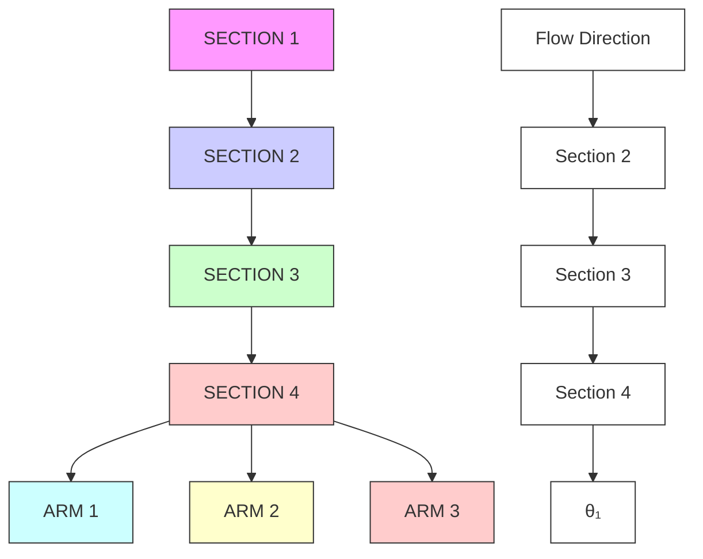
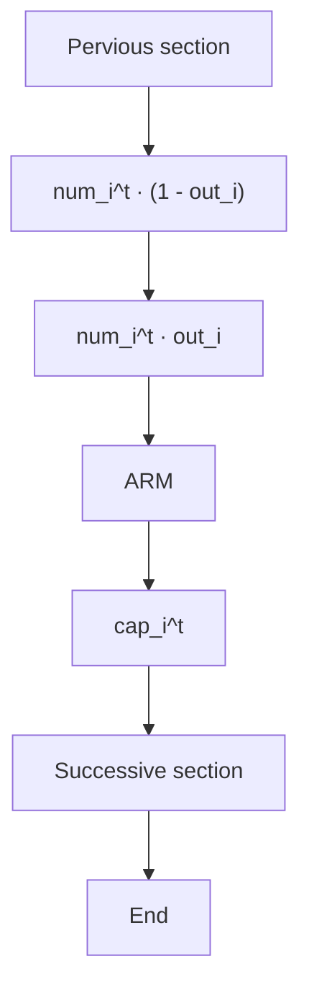
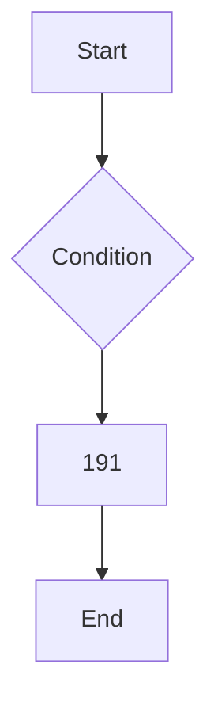
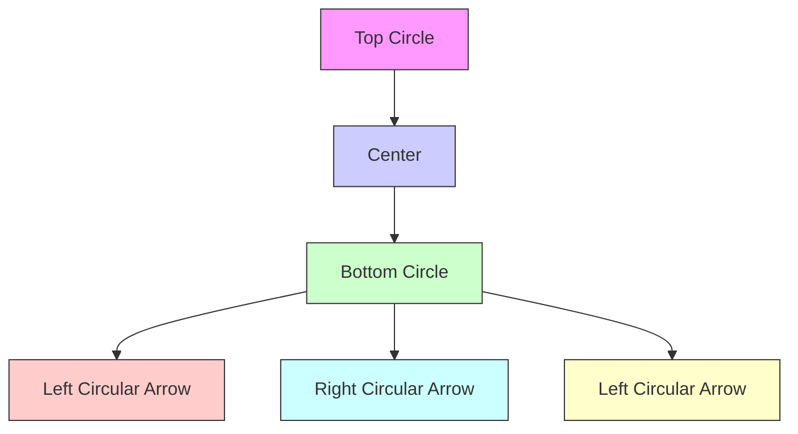

## Team Control Number

For office use only

T1

T2

T3

T4

## 4339

Problem Chosen

A

For office use only

F1

F2

F3

F4

## 2009 Mathematical Contest in Modeling (MCM) Summary Sheet

(Attach a copy of this page to each copy of your solution paper.)

## Three steps to make the traffic circle go round

Among all the solutions to maneuver vehicles at intersections is the traffic circle, designed by French architect as early as 1877. Nowadays, with the growing number of population, reconfigurations of traffic control devices at traffic circles are in urgent need. Despite the physica reconstruction, we are modeling to best control the traffic by add-ons: signal lights, stop/yield signs and orientation signs – a special sign designed in this article.

First of all, we create two models - a macroscopic and a microscopic - to simulate transportations at traffic circles, assuming the information of add-ons are given. The former models the problem as Markov chain and solves in some other way, and the latter simulates the traffic by individual vehicles – a “cellular-automata like” model.

Secondly, we introduce the multi-objective function to evaluate the control. Saturated capacity, average delay, equity degree, accident rate and device cost are taken into account as five aspects, and combined into a cost with US dollar / hour as its unit.

Thirdly, we analyze the optimization problem of how to best choose the add-ons. Three steps are used to make the traffic circle go round:

1) basic devices like lights and signs are optimally placed;  
2) orientation signs to lead vehicles into proper lanes are optimally set up;  
3) endow with self-adaptivity to allow the traffic auto-adjust according to different traffic demands

Throughout this article the 6-arm-3-lane Sheriffhall Roundabout in Scotland has been examined. Detailed suggestion on the traffic control in this circle has been given. Lights are assigned with a 68-second period, and a sample orientation sign is given as the figure to the right.


Some smaller and larger dummy circles have been tested to verify the strength and sensitivity. Emergency cases have also been appended to judge the flexibility.

# Three Steps to Make the Traffic Circle Go Round

Team #4339

February 10th, 2009

## Contents

Introduction 2

Assumption 2

Terminology & Basic Analysis 3

Terminology 3

A Glance at Sheriffhall Roundabout 3

Simulation Model 5

Model I - The Macroscopic Simulation 5

Model II – The Microscopic Simulation 7

Comparison of Two Simulation Models and Sensitivity Analysis 8

The Multi-Objective Function 1 0

Basic Standards 1 0

How are the Objectives Affected \_ 10

The Combined Objective: The Money We Lost \_ 11

Application: Evaluate Typical Arrangements \_ 12

Optimization Model 1 4

The All-Purpose Solution \_ 14

Step 1 – Basic Device Placement & Timestamp Chosen \_ 14

Step 2 – Orientation Sign Placement \_ 16

Step 3 – Time Variance & Self Adaptivity \_ 18

Verification of Optimization Model \_ 18

The Circle is In Work 18

Accuracy 19

Sensitivity 19

Emergency Case 20

The Technical Summary 2 1

Conclusion 2 2

Reference \_ 23

## Introduction

Traffic control assures the safety and efficiency of transportation. It has been proved that the traffic circle is a decent solution to the traffic flow passing a node – either a busy conflux or a small scale crisscross. Should a traffic circle be accompanied with appropriate assistant devices, the whole control system would possibly perform better.

To derive traffic factors from data, we develop two different models to simulate the flow. The macro-model uses a Markov process to move vehicles between junctions, while the micro-model concentrates on the behavior of each vehicle with a modified cellular automata algorithm. The outcomes of these two approaches show great consistency when applied to a real scenario in Scotland.

At the same time, we must visualize the abstract definition of a “good” method. The annoyance from delay, the threat from accident and other aspects concerned serve as various objectives of the total effectiveness and make a thorough criterion complicated. Finally we choose five main objectives and combine them with an overall measure called the combined expense.

In our pursuit of optimization, genetic algorithm is employed to generate the final control method. Not only has it solved the problem on determining the green light period, the orientation signs are also employed to direct the vehicles in order to save time. Moreover, the complexity of the problem itself brings indefinite results. We also consider the ability to treat with unexpected affairs like accidents or car breakdowns, which offer insight observations on the quality of the result.

We eventually come up with a concise technical summary explaining how our model works and giving the answers under typical conditions.

## Assumption

 The geometric design of the traffic circle cannot be changed.  
 The traffic circle is a standard one (at grade) with all lanes on the ground, that is, no grade separation structure.  
 The incoming vehicle flow in a period we study (e.g. 24 hours) is known.  
 People drive on the left (since the example analyzed later is from the UK)  
 Since we are considering the traffic flow, the pedestrians are ignored. In fact, the model can be easily modified to take this factor into account.  
 Motorcycles move freely even in a traffic jam and are not taken into consideration.

# Terminology & Basic Analysis

## Terminology

When we explain the definition of basic terms below, the relative discusses are presented at the same time, if necessary:

 Junction: the intersection where vehicles flow in and out of the traffic circle.  
 Lane: part of the road for the movement of a single line of vehicles.  
The number of lanes directly affects the flux through a traffic circle by limiting the entrance and leave of vehicles. However, since both the conventional design and real-time photos suggest that vehicles are most likely to exit a traffic circle easily, our model neglects the restriction on outward flow.  
 $\mathrm { l } _ { 0 } \colon$ the number of lanes of the traffic circle  
 Section: part of the traffic circle between two adjacent arms.  
 Yield/Stop sign: a yield sign asks drivers to slow down and give the right of way to vehicles in the different direction. A stop sign asks drivers to come to a full stop before merging into the flow.  
 Orientation sign: signals indicating the lane for vehicles to take according to their destination.  
 Traffic light: a signaling device using different colors of light to indicate the moment to stop or move.  
It is claimed that a traffic light with direction arrows performs much better [1], so we are inclined to use such kind of traffic light in our model.  
Moreover, the function of traffic lights remains a controversial issue. Comparing with yield /stop signs, traffic lights slow down the vehicle movement. At the same time, however, even at a remote motorway traffic circle with few pedestrians, a malfunction of traffic light wil probably lead to an accident [2]. The use of traffic light will be discussed in details later.  
 Cycle period: the time in which a traffic light experiences exact stages of all 3 colors.  
An optimal cycle period is critical whenever traffic lights are employed. The method we use is called Webster Equation [3]. The value we use in our model is calculated as 68 seconds.  
 Green light period: the time that a traffic light keeps green in one cycle.  
 Timestamps: A sequence of characters denoting the start/end time of red/green lights.

## A Glance at Sheriffhall Roundabout

We here take an early look at the Sheriffhall Roundabout, the traffic circle to which our model is applied later. This traffic circle is relatively big in size among ones with sufficient data.


<details>
<summary>text_image</summary>

1
2
3
4
5
6
</details>

Figure 1: The Sheriffhall Roundabout

One characteristic of this traffic circle is that the arms of southwest(6)-northeast(3) direction have larger amount of flow than that of others. The arms of north(2) and south(5) direction have two lanes, while the other four arms and the circle have three lanes. The traffic circle is modeled as a ring with an inner radius of 38.79m and an outer radius of 50.43m.

The discussion in following sections will use the origin-destination flow (Table 1) given by Xiaoguang Yang, et al [4]. Since the current traffic demand is far from saturate (discussed later), we will experiment on different scales of this inflow matrix, like its multiple of 1.2,1.4,1.6 and 1.8.

<table><tr><td>From\To</td><td>1</td><td>2</td><td>3</td><td>4</td><td>5</td><td>6</td></tr><tr><td>1</td><td>-</td><td>0</td><td>0</td><td>188</td><td>77</td><td>67</td></tr><tr><td>2</td><td>0</td><td>-</td><td>8</td><td>37</td><td>41</td><td>95</td></tr><tr><td>3</td><td>2</td><td>0</td><td>-</td><td>119</td><td>79</td><td>1007</td></tr><tr><td>4</td><td>338</td><td>129</td><td>63</td><td>-</td><td>0</td><td>208</td></tr><tr><td>5</td><td>116</td><td>124</td><td>142</td><td>0</td><td>-</td><td>16</td></tr><tr><td>6</td><td>90</td><td>172</td><td>988</td><td>236</td><td>10</td><td>-</td></tr></table>

Table 1: Origin-destination flows (vehicles/hour)

## Simulation Model

The simulation model is the first step in controlling the traffic circle. Here we provide two different approaches. The macroscopic simulation takes vehicles as a whole, and is nonrandom. On the contrary, the microscopic simulation traces each individual vehicle, and includes randomness.

## Model I - The Macroscopic Simulation

To find the best way to control the traffic circle, we must acquire some information about it. Usually, we do not know how each vehicle behaves, especially, through which way it enters the circle and which way it leaves. Under the circumstances that we only know the number of vehicle come in and out of the circle through each arm, we adopt the macroscopic simulation.

For the simplicity of statement, we first combine the lanes in the sections and arms together, and regard them as one-lane roads. We then further explain how the multi lane simulation works.

## Assumptions

 Vehicles in the same section of the circle are located uniformly in the section.  
 The arrival rate at each arm is constant in the time period we simulate.  
 For simplicity of statement, we consider an ideal round traffic circle (Figure 2).

The macroscopic simulation itself does not depend on the shape of the circle.


<details>
<summary>flowchart</summary>


</details>

Figure 2: Sample traffic circle

## Sections and arms

We divide the whole traffic area into sections and take vehicles in the same section as a whole. Label the sections and the arms as the figure above shows. Sections are attached with the following quantities:

 Number of vehicles contained in one section at a specific time: numt The upper label stands for time.  
 Number of vehicles waiting to enter through one arm at a specific time: armit  
 The max number of vehicles possible to enter the traffic section through one arm per unit time: capit

## A Markov Process

The traffic state at time t + 1 depends only on the traffic state at time t, so that the traffic is a Markov process. To describe traffic state of the whole system, only quantities numt and arm are needed. Our task to realize the simulation is to determine numit+1 and armit+1 , for $\mathrm { i } = 1 , 2 , \ldots , \mathrm { n } .$ .

Our initial idea is to adopt the classical Markov method. In principle we can calculate the transition probability matrix under the assumption listed above. A final steady distribution can be achieved through the normal Markov method.

The method does not work in our problem. This can be seen by estimating the dimension of the transition probability matrix. For a traffic circle with four arms/sections and each of them at most holds ten vehicles. The number of traffic states in it is $1 0 ^ { 8 }$ .

For this fact, we use the expectation n um t and a rm t instead of the distribution to denote a state.

## The Simulation Process


<details>
<summary>flowchart</summary>


</details>

Figure 3: Flows at a junction

 $\overline { { \mathrm { n u m } _ { \mathrm { i } } ^ { \mathrm { t } } } } \times \mathrm { o u t } _ { \mathrm { i } } ^ { \mathrm { t } }$ vehicles is running out of the circle from section i.

The ratio outit will drop when n um it approaches its capacity.

 To deal with the junction

There are two streams n um t ∙ (1 − outi ) and capt trying to flow into the successive section. If traffic light is installed, depending on the current time t, only one of them will be allowed. If stop/yield sign is used (at the arm side for example), then only a small fraction of capit can flow in. This fraction is denoted by the disobey rate $\alpha _ { \mathrm { { s t o p } } }$ or $\alpha _ { \mathrm { y i e l d } }$ .

 An inflow of $\mathrm { i n } _ { \mathrm { i } }$ newly-arrived vehicles runs into arm i.

## Multi lane traffic circle

Considering the separation of section into lanes, the simulation is expected to be more accurate. We assume that vehicles do not change lanes within arms and sections, which means they can only change lanes at junctions. This is reasonable because a large number of lane transfers happen at junctions.

In order to treat lanes differently, we need to know what proportion of vehicles that passes through each lane. This indicates the relative popularity of lanes. At each junction, the outflow for a given lane will be distributed into successive lanes according to their popularity.


<details>
<summary>natural_image</summary>

Diagram showing a circular structure transforming into a symmetrical geometric pattern (no text or symbols)
</details>

Figure 4: a two-lane circle has been divided into lanes.  
Each arc in the right figure denotes a single lane.

## Model II – The Microscopic Simulation

Partially inspired by the Sequential Cellular Automata, we adopt a microscopic model. In this model the traffic circle is divided into $\mathrm { l } _ { 0 }$ lanes. Vehicles can stay at real argument in polar coordinates but with discrete radius values. We model the behavior of each individual vehicle, with the help of some general principles:

 Traffic coming in

As described in Table 1, the number of vehicles per hour is given in a matrix $\left( \mathsf { a } _ { \mathrm { i , j } } \right) _ { \mathrm { n } \times \mathrm { n } }$ . We use a Poisson distribution with mean value of $\frac { \mathrm { a _ { i , j } } } { \mathrm { T } }$ to describe the incoming vehicles from arm i to arm j.

 Lane choosing and changing

For a specific vehicle from arm i to arm j, the driver has his ideal lane to be in. The hidden principle is [5]: the more sections the vehicle is to pass before its exit, the inner lane the driver wish to take, both in the arm and the circle. In our simulation, we adopt this rule. We will discuss more about it in the Optimization Model.

 Vehicle speed

We define maximum velocity $\mathtt { V } _ { \mathrm { m a x } }$ and maximum acceleration $\mathtt { a } _ { \mathrm { m a x } }$ for vehicles, and record the velocity individually. The principles for an vehicle to accelerate or decelerate are:

 When a vehicle faces a red light or other vehicles, its speed decreases to zero.  
 When a vehicle changes lanes, it decelerates.  
 Otherwise, it will attempt to accelerate.

 The function of a yield sign.

When a vehicle faces a yield sign, it checks whether it is empty enough for it to enter the junction. If not, it will wait till it is empty enough, but with a disobey rate $\alpha _ { y i e l d }$ - ignore the sign and try to scramble. This reaction affects the accident rate.

 The function of a stop sign.

When a vehicle faces a stop sign, it should stops instantaneously. As a next step, it deals with similar procedure as a yield sign. The only difference is that it will accelerate from a zero speed. The disobey rate is $\alpha _ { s t o p }$

 The effect of traffic lights – just like normal.

After we have made all the things clear, we only need to discreet the time and follow the rules presented above for every individual vehicle after it comes to the circle. We can simulate the whole process. We can easily calculate the average passing time for one vehicle, and the accident rate (by the total number of touches of vehicles). A vivid view of simulation result is presented below:


<details>
<summary>radar chart</summary>

| Category | Value |
| --- | --- |
| Category 1 | 791 |
| Category 2 | 791 |
| Category 3 | 791 |
| Category 4 | 791 |
| Category 5 | 791 |
| Category 6 | 791 |
| Category 7 | 791 |
| Category 8 | 791 |
| Category 9 | 791 |
| Category 10 | 791 |
| Category 11 | 791 |
| Category 12 | 791 |
| Category 13 | 791 |
| Category 14 | 791 |
| Category 15 | 791 |
| Category 16 | 791 |
| Category 17 | 791 |
| Category 18 | 791 |
| Category 19 | 791 |
| Category 20 | 791 |
| Category 21 | 791 |
| Category 22 | 791 |
| Category 23 | 791 |
| Category 24 | 791 |
| Category 25 | 791 |
| Category 26 | 791 |
| Category 27 | 791 |
| Category 28 | 791 |
| Category 29 | 791 |
| Category 30 | 791 |
| Category 31 | 791 |
| Category 32 | 791 |
| Category 33 | 791 |
| Category 34 | 791 |
| Category 35 | 791 |
| Category 36 | 791 |
| Category 37 | 791 |
| Category 38 | 791 |
| Category 39 | 791 |
| Category 40 | 791 |
| Category 41 | 791 |
| Category 42 | 791 |
| Category 43 | 791 |
| Category 44 | 791 |
| Category 45 | 791 |
| Category 46 | 791 |
| Category 47 | 791 |
| Category 48 | 791 |
| Category 49 | 791 |
| Category 50 | 791 |
| Category 51 | 791 |
| Category 52 | 791 |
| Category 53 | 791 |
| Category 54 | 791 |
| Category 55 | 791 |
| Category 56 | 791 |
| Category 57 | 791 |
| Category 58 | 791 |
| Category 59 | 791 |
| Category 60 | 791 |
| Category 61 | 791 |
| Category 62 | 791 |
| Category 63 | 791 |
| Category 64 | 791 |
| Category 65 | 791 |
| Category 66 | 791 |
| Category 67 | 791 |
| Category 68 | 791 |
| Category 69 | 791 |
| Category 70 | 791 |
| Category 71 | 791 |
| Category 72 | 791 |
| Category 73 | 791 |
| Category 74 | 791 |
| Category 75 | 791 |
| Category 76 | 791 |
| Category 77 | 791 |
| Category 78 | 791 |
| Category 79 | 791 |
| Category 80 | 791 |
| Category 81 | 791 |
| Category 82 | 791 |
| Category 83 | 791 |
| Category 84 | 791 |
| Category 85 | 791 |
| Category 86 | 791 |
| Category 87 | 791 |
| Category 88 | 791 |
| Category 89 | 791 |
| Category 90 | 791 |
| Category 91 | 791 |
| Category 92 | 791 |
| Category 93 | 791 |
| Category 94 | 791 |
| Category 95 | 791 |
| Category 96 | 791 |
| Category 97 | 791 |
| Category 98 | 791 |
| Category 99 | 791 |
| Category A | - |
| Category B | - |
| Category C | - |
| Category D | - |
| Category E | - |
| Category F | - |
| Category G | - |
| Category H | - |
| Category I | - |
| Category J | - |
| Category K | - |
| Category L | - |
| Category M | - |
| Category N | - |
| Category O | - |
| Category P | - |
| Category Q | - |
| Category R | - |
| Category S | - |
| Category T | - |
| Category U | - |
| Category V | - |
| Category W | - |
| Category X | - |
| Category Y | - |
| Category Z | - |
| Category A (Group) | - |
| Category B (Group) | - |
</details>

Figure 5: The vehicles around the traffic circle

## Comparison of Two Simulation Models and Sensitivity Analysis

## Results

We use the two different models to simulate a real traffic circle: The Sheriffhall Roundabout in Scotland. We used a given traffic light configuration in [4]. For simplicity, we only take into consideration the average time needed for a vehicle to pass the traffic circle. This value for model I and II are 42.73s and 41.64s respectively. The two results are close enough and it is reliable to believe that the actual passing time is around 42 seconds.

## Sensitivity

We analyze the sensitivity by running the program with modified parameters. Some of the major variable parameters are listed in the following table. We study the sensitivity.

<table><tr><td>Parameter</td><td>variation</td><td>model I</td><td>model II</td></tr><tr><td rowspan="2"> $v_{max}$ </td><td>+10%</td><td>-2.6%</td><td>-8.5%</td></tr><tr><td>-10%</td><td>10.5%</td><td>11.1%</td></tr><tr><td rowspan="2"> $l_0$ </td><td>+1</td><td>-19.6%</td><td>-16.4</td></tr><tr><td>-1</td><td>121%</td><td>65.2%</td></tr><tr><td rowspan="2"> $r_{out}$ </td><td>+10%</td><td>-7.3%</td><td>-3.9%</td></tr><tr><td>-10%</td><td>1.1%</td><td>3.3%</td></tr><tr><td rowspan="2">Traffic flow</td><td>+10%</td><td>10.6%</td><td>7.0%</td></tr><tr><td>-10%</td><td>-3.0%</td><td>-6.7%</td></tr></table>

Table 2: Sensitivity test of Simulation Model

The two models give similar sensitivity results. Note that the average passing time is very sensitive to the parameters except $\mathrm { l } _ { 0 } .$ . It is reasonable since the number of traffic lanes in the circle affects the passing time significantly.

Model II is a random simulation, which enables us to calculate the deviation. However, the standard deviation of passing time is no larger than 3% in this case.

## Complexity

Both the time complexities of the algorithm of the two models is proportional to maximum number of vehicles that can be hold in the circle and the time needed to make the system work periodically – number of iteration. It is shown that the number of iterations is smaller than 1,000 by practice. Thus the complexity is about 1000 times a linear function of the size of the circle. This is short enough.

Model I is a little simpler than model II, since we do not need to trace each individual. Reversely, Model II needs more a priori information than Model I. As the two models are consistent and give similar results. We adopt model II for further study.

# The Multi-Objective Function

It is complicated to evaluate a traffic control method. We here list possible metrics and try to conclude a synthetic objective function with a unified measure.

## Basic Standards

We want to include both subjective evaluations (such as the feelings of drivers) and objective measures (such as the expense on devices). Also, the standards here should be calculated from the viable data. Based on the reasons above, we choose 5 evaluation standards below:

 Saturated flow capacity

When traffic flow becomes tremendous, vehicles will accumulate on arms as time goes by. The threshold flux to avoid such an accumulation is called the saturated flow capacity under a certain control method.

 Average delay

A vehicle may suffer various kinds of delay in congestion, acceleration and more. The difference between the average time during which a vehicle passes the traffic circle and it passes a void one is called the average delay.

 Equity degree

A multi-arm traffic circle may distribute the incoming flow inequably, which annoys drivers more frequently. The relative derivation of average delay is called the equity degree.

 Accident expectation

Too much emphasize on speed may mean potential risk of accident. The consideration of this threat calls for the description of accident per hour, which is named the accident expectation.

 Device cost

The total expense on the traffic signs and lights is called the device cost.

Any standard above may serve as an independent objective to maximize/minimize. Still, we aim at combining them with a synthesized function. Before that we first look into the factors that affect them.

## How are the Objectives Affected

Generally speaking, the objectives all come from the simulation process above implicitly. However, it is still necessary to point out some relationships.

## Saturated Flow Capacity

This objective is really complicated. Besides the geometric design, any little modification of the control system will change the amount. We below estimate the change because of signal types.

A yield sign is likely to work more effectively since it seldom causes unnecessary stops on vehicles. A stop sign, however, at least add the acceleration/deceleration delay to every vehicle rushing inside. The efficiency of a traffic light, however, is highly related to its green light period. Dull traffic lights sometimes block vehicles from entering a void circle, while the self-adaptive ones may work according to the road condition.

In fact, a traffic circle with yield signs at all junctions bears the heaviest traffic in the simulations

above, and traffic lights are left with great potential to improve in optimization.

## Average Delay

First, the average delay is controlled by the incoming flux. The delay time will increase rapidly when traffic start to congest. The signal arrangement also contributes here.

In our model, the delay time of a vehicle is calculated only when it successfully exit s the traffic circle. When this delay time is considered in the overall objective, there should be penalties on congestion rate, which is calculated from the current flow and saturated flow capacity.

## Equity Degree

Equity degree is directly calculated from the delay time distribution. The factor listed above will also affect it. Note that not only the flow distribution but the total flux contributes to the equity degree, since high flux may lead to unexpected distribution failures.

## Accident Expectation

Accident expectation is calculated with local accident rate (unit: accident/vehicle). Besides the disobey rate discussed in the previous section, we also assume that each kind of signal reduces the accident by its respective percentage. (These fractions are merged from [1][6][7]) The flux data and signal numbers are once again taken into consideration.

## Device Cost

This expense is the simplest objective which relies only on the number of each kind of signal.

## The Combined Objective: The Money We Lost

Now we come to a combined objective. Government usually mentions expense and economic loss in their report, and our model try to make a further integration measured with US dollar. The final result is called the combined expense (CE), which we attempt to minimize.

We begin our approach from objectives most related to money. The prices of traffic contro devices are easy to be accessed on the Internet [8][9]. Along the expense of maintenance and operation, the average cost per hour for each kind of device is calculated. Since traffic lights consume much electricity, we ignore the money spent on other types of devices. A traffic light is expected to spend \$0.23/hour according to the viable data [10][11].

Accident expense losses are often reported in news. We take the average data from an annual report of local traffic office as the average loss per accident [12]:

$$
A c c i d e n t L o s s = 6 3 0 \times F l u x
$$

The average delay time must be accompanied with a value of delay to get involved. From the data of US Department of Transportation and fuel price [13], about \$1.2 is lost on a delay of one hour (per vehicle):

$$
\text { Delay   Expense } = 1. 2 \times \text { Flux } \times \text { Average   Delay   Time }
$$

The saturate capacity shows the endurance of the control design as well as its ability to face sudden challenges. The unused part of this capacity assures for any extra incoming, whose value is

estimated as following:

$C a p a c i t y ~ B o n u s = 5 9 _ { 0 } \times \ S 1 . 2 \times \left( S a t u r a t e ~ C a p a c i t y ~ - F l u x \right) \times A v e r a g e ~ D e l a y ~ T i m e ,$

in which 5% is the possibility of an unexpected vehicle coming.

Equity degree (ED) is a tricky component in the determination. Current traffic systems often fail to consider this factor. The most annoying situation is to keep two “main arms” open to traffic by sacrificing all other arms, whose equity degree is estimated to be the function of the number of arms ??:

$$
R e f e r e n c e E q u i t y D e g r e e (R E D) = \sqrt {\frac {n (n - 2)}{2 (n - 1)}}
$$

The equity degree will be normalized by this reference and appear in a penalty on delay expense:

$$
C o r r e c t e d D e l a y E x p e n s e = D e l a y E x p e n s e \times \left(1 + \frac {E D}{R E D}\right)
$$

The combined index is then calculated out:

$$
C E = \text { Corrected   Delay   Expense } - \text { Capacity   Bonus } + \text { Accident   Loss } + \text { Device   Cost },
$$

which serve as the final objective function we use in the following optimization.

## Application: Evaluate Typical Arrangements

We take a glance at three general control method – pure traffic light, stop sign only or yield sign only.


<details>
<summary>radar chart</summary>

| Metric             | Traffic Light | Stop Sign | Yield Sign |
| ------------------ | ------------- | --------- | ---------- |
| Saturate Flow Capacity | 0.9           | 1.0       | 1.0        |
| Avg. Delay         | 0.4           | 0.8       | 0.9        |
| Equity Degree      | 0.3           | 0.7       | 0.8        |
| Accident Expectation | 0.8           | 0.3       | 0.2        |
| Device Cost        | 0.2           | 0.6       | 0.7        |
</details>

Figure 6: A view on 5 objectives of 3 general control methods

The 5 objectives are first normalized (converting values into the interval between 0 and 1 from worst to best). A superficial look at this radar chart raises doubt on the expensive traffic lights. However, traffic lights act superiorly in controlling the accident, while the other two signs may be hazardous in accelerating the flow. The convoluted fact is clear when we compare their CE values:

<table><tr><td>Control Method</td><td>The Combine Expense (US$/hour)</td></tr><tr><td>Traffic light</td><td>66.76</td></tr><tr><td>Stop sign</td><td>103.29</td></tr><tr><td>Yield sign</td><td>116.61</td></tr></table>

Table 3: Combined Expense for 3 typical control methods

The results above suggest that traffic lights are worthwhile when encountered with heavy traffic. The optimization, however, needs more insight observations in the following part.

## Optimization Model

In the previous sections we have demonstrated two distinct methods to predict the transportation behavior in traffic circles. Now we are looking for techniques that will help maneuver vehicles through the traffic, exerting the best this traffic circle can do.

## The All-Purpose Solution

The multi-objective function of our problem has been clearly defined in last section, and all relative factors are converted to a single measure (in US dollar). The remaining difficulty is in how to find an optimal or quasi-optimal solution.

For the reason that the objective function is calculated through our Simulation Model, its analytical form becomes difficult to obtain. Under such situation quasi-optimal solution is welcome and approximation algorithms turn into candidates.

In this problem a normal approximation algorithm may fall into local maxima. However, some high-level technique can be used like Simulated Annealing, or what we have used – Generic Algorithm. Specifically, the traffic controls in different junctions are used as genes. The configuration of a traffic circle is a vector of genes, containing all the devices used in different junctions. In details:

<table><tr><td>Process</td><td>Explain</td></tr><tr><td>Breeding</td><td>Combine the traffic control methods of two different configurations.</td></tr><tr><td>Mutation</td><td>Randomly mutate the traffic control in a single junction.</td></tr><tr><td>Evolution</td><td>Locally adjust the traffic controls in all junctions, and seek for better solution.</td></tr></table>

Table 4: The explanation of Generic Algorithm used for optimization

In this article we are mainly dealing with three kinds of traffic control devices: 1) traffic lights, 2) yield/stop signs and 3) orientation signs – a special traffic signal designed ourselves. We name the first two basic devices.

## Step 1 – Basic Device Placement & Timestamp Chosen

A traffic junction can be placed with any one of the following five devices: 1) Traffic Light, 2) Yield Sign in the circle, 3) Yield Sign at the entrance, 4) Stop Sign in the circle, and 5) Stop Sign at the entrance. Besides, the timestamps of red/green lights for traffic lights are also changeable.

## Sheriffhall Roundabout

Considering all potential variables above, we run our program against the Sheriffhall Roundabout. Again, we use the origin-destination flow data in Table 1. We assume this flow matrix is fixed in a one-hour period. The solution of our program shows that traffic lights should be used prior to stop/yield signs, in respect that the accident rate will increase dramatically in this busy circle.


<details>
<summary>stacked bar chart</summary>

| Arm | G   | R   |
| --- | --- | --- |
| 1   | 0   | 14  |
| 2   | 7   | 14  |
| 3   | 38  | 18  |
| 4   | 3   | 19  |
| 5   | 3   | 13  |
| 6   | 38  | 14  |
</details>

Figure 7: The traffic light timestamps in 6 junctions (light green / and scarlet) Period = 68s (calculated in assumption), Original flow info is used.

In Figure 7, green lights represent the permission of vehicles from the incoming road, and red lights indicate the in-circle pass. The optimal configuration creates a long period of red light for all junctions, and allows the digestion of vehicles quickly in this interval. This configuration accelerates the flows, but has a lower saturated flow capacity.

<table><tr><td>Objective</td><td>Value</td></tr><tr><td>Saturated Flow Capacity</td><td>6904 vehicles / hour</td></tr><tr><td>Average Delay</td><td>42.763 seconds / vehicle · hour = 62.04$ / hour</td></tr><tr><td>Equity Degree</td><td>0.3187</td></tr><tr><td>Accident Expectation</td><td>4.63$ / hour</td></tr><tr><td>Device Cost</td><td>1.38$ / hour</td></tr><tr><td>Combined expense</td><td>78.98$ / hour</td></tr></table>


<details>
<summary>flowchart</summary>


</details>

Table 5: The multi-objectives of the optimal configuration of Sheriffhall, Original flow

Sheriffhall Roundabout with 1.8 × original inflow

When the incoming flow density increases by 0.8 times, the optimal configuration shows significant difference:


<details>
<summary>stacked bar chart</summary>

| Arm | G   | R   |
| --- | --- | --- |
| 1   | 0   | 12  |
| 2   | 10  | 18  |
| 3   | 49  | 15  |
| 4   | 38  | 57  |
| 5   | 41  | 52  |
| 6   | 10  | 45  |
</details>

Figure 8: The traffic light timestamps in 6 junctions (light green / and scarlet) Period = 68s (calculated in assumption), Original flow × 1.8 is used.

In Figure 8, the green-light periods for all junctions are shortened in order to let the circle digest greater number of incoming vehicles. One may find an interesting fact that there no longer exists a long period with all junctions in red light. As an alternative, there exists a free pass between Junction 3 and Junction 6 (shadowed stripe). This greatly enlarges the saturated flow capacity, but reduces the pass speed – high in average delay (see Table 6).

To point out why one needs to look at the origin-destination flow Table 1, in which the flow between Junction 3 and 6 constitutes a significant portion of all the inflows. The white stripe in Figure 8 actually gives a good opportunity and let vehicles travel between them.

<table><tr><td>Objective</td><td>Value</td></tr><tr><td>Saturated Flow Capacity</td><td>8354 vehicles / hour</td></tr><tr><td>Average Delay</td><td>81.278 seconds / vehicle · hour = 117.91$ / hour</td></tr><tr><td>Equity Degree</td><td>0.3042</td></tr><tr><td>Accident Expectation</td><td>5.41$ / hour</td></tr><tr><td>Device Cost</td><td>1.38$ / hour</td></tr></table>


<details>
<summary>flowchart</summary>


</details>

Combined Table 6: The multi-objectives of the optimal configuration of Sheriffhall, ??????. ????\$ / ???????? Original flow × 1.8

## Step 2 – Orientation Sign Placement

Normally, the number of lanes inside a traffic circle and the number of junctions does not equal. In some country, a hidden rule [5] is: the vehicle nearer to its exit should stay left (Remark: we are driving on the left!) Now we are going to refine this rule.

There are n arms in total. Suppose a vehicle is at Junction $\mathfrak { a } ( 1 \le \mathfrak { a } \le \mathfrak { n } )$ , and its destination is $\mathsf { b } ( 1 \leq \mathsf { b } < n )$ junctions next to it. We manage two variables $\mathrm { l o w e r _ { a } ^ { b } }$ and $\mathrm { { \ u p p e r _ { a } ^ { b } } }$ so that such a vehicle is suggested stay in the range of lowe $\mathbf { \Sigma } _ { \mathrm { { a } } } ^ { \mathrm { { b } } } \leq \mathbf { x } \leq \mathbf { u } { \mathrm { p p e r } } _ { \mathrm { { a } } } ^ { \mathrm { { b } } }$ . Our aim is to assign vehicles averagely into lanes, so that the traffic jam can be reduced to some extent. In order to optimize these intervals [lowerab , upperab ], we do the Generic Algorithm again.


<details>
<summary>line chart</summary>

| The multiple of the original inflow | Without Orientation Sign | With Orientation Sign |
| ----------------------------------- | ------------------------ | --------------------- |
| 1.0                                 | 43                       | 43                    |
| 1.2                                 | 48                       | 48                    |
| 1.4                                 | 52                       | 50                    |
| 1.6                                 | 62                       | 59                    |
| 1.8                                 | 82                       | 71                    |
</details>

Figure 9: The magic effect of Orientation Sign

Figure 9 demonstrates the effect of Orientation Sign in reducing the average delay by different amount of inflow. As the number of incoming vehicles increase, the positive effect of our orientation sign becomes distinct. From the point of view of Saturated Flow Capacity, the configuration without Orientation Sign is 8354 (Table 6), and this number has increased to 8812 with the help of this newly-introduced sign. In short, the very last potential capacity has been extracted in our model.


<details>
<summary>text_image</summary>

LANE 1
</details>


<details>
<summary>text_image</summary>

LANE 2
</details>


<details>
<summary>text_image</summary>

LANE 3
</details>

Figure 10: The orientation sign to hang over the junction entrance (At junction 3, with 1.8 × original inflow)

## Step 3 – Time Variance & Self Adaptivity

Apparently, the origin-destination flows vary from morning to evening. The easiest way to handle this is to run our previous step with different traffic demand information for different time-period. Actually, we can go further on this, and make the traffic control self-adaptive if traffic lights are in use.

Given the traffic light timestamps calculated in Step 1, and assume in a following hour the traffic demand has changed to some new value. We may select the original configuration as our seed, and carry on the Generic Algorithm and gain a similar but better solution. As an example:

  
Figure 11: The Self Adaptivity as the inflow drops from 1.8 to 1.4 × original inflow in an hour

One may find that the timestamps change a little and hence will not significantly affect the vehicles already in circle. As the night falls, traffic demands become considerably small. Now the traffic lights are suggested to be replaced by Yield/Stop Signs. This cannot happen in the usual way. However, a special status of traffic light can be switched on – flashing yellow.

Flashing yellow is used as an international light signal [14] that has the same effect as Yield Sign – to remind the drivers be careful. It can be used when the traffic is not too busy and greatly reduces the average delay.

## Verification of Optimization Model

The Circle is In Work


<details>
<summary>text_image</summary>

752
769
</details>

Figure 12: 39 seconds later, most of the vehicles waiting at Junction 6 moves in

Figure 12 shows that when the inflow is 1.8 times as high as given in Table 1, the traffic circle is

still in work.

## Accuracy

As a follow-up study to verify the Optimization Model, we need to test on different traffic circles. For the reason of lack of precious data (most of them are in charge), we created our dummy traffic circles. A large traffic circle with 12 arms and 6 lanes are tested, and the result shows our model can treat with large data in time.

An interesting thing is that when we are testing on a dummy suburban circle with 4 arms with relatively lower traffic demand: 1) the mixture of stop signs and traffic lights are encountered; 2) the in circle signs are encountered. In this example the origin-destination flow between Junction 1 to Junction 3 is remarkably greater than all other pairwise flows.

Two of the quasi-optimal solutions are:


<details>
<summary>flowchart</summary>

```mermaid
graph TD
    subgraph Left_Circuit
  A["Entrance"] --> B["Exit"]
  B --> C["Entrance"]
  C --> D["Exit"]
  D --> E["Entrance"]
  E --> F["Exit"]
  F --> G["Entrance"]
  G --> H["Exit"]
  H --> I["Entrance"]
  I --> J["Exit"]
  J --> K["Entrance"]
  K --> L["Exit"]
  L --> M["Entrance"]
  M --> N["Exit"]
  N --> O["Entrance"]
  O --> P["Exit"]
  P --> Q["Entrance"]
  Q --> R["Exit"]
  R --> S["Entrance"]
  S --> T["Exit"]
  T --> U["Entrance"]
  U --> V["Exit"]
  V --> W["Entrance"]
  W --> X["Exit"]
  X --> Y["Entrance"]
  Y --> Z["Exit"]
  Z --> AA["Entrance"]
  AA --> AB["Exit"]
  AB --> AC["Entrance"]
  AC --> AD["Exit"]
  AD --> AE["Entrance"]
  AE --> AF["Exit"]
  AF --> AG["Entrance"]
  AG --> AH["Exit"]
  AH --> AI["Entrance"]
  AI --> AJ["Exit"]
  AJ --> AK["Entrance"]
  AK --> AL["Exit"]
  AL --> AM["Entrance"]
  AM --> AN["Exit"]
  AN --> AO["Entrance"]
  AO --> AP["Exit"]
  AP --> AQ["Entrance"]
  AQ --> AR["Exit"]
  AR --> AS["Entrance"]
  AS --> AT["Exit"]
  AT --> AU["Entrance"]
  AU --> AV["Exit"]
  AV --> AW["Entrance"]
  AW --> AX["Exit"]
  AX --> AY["Entrance"]
  AY --> AZ["Exit"]
```
</details>

Figure 13: Two intuitive configurations generated by our model.

The left one has two in-circle stop signs and guarantees the left-right fast pass; The right one has a mixture of traffic lights and stop signs.

## Sensitivity

The sensitivity of our model is tested in such way that the model has been run 50 times and the standard deviation of average delay is calculated as an example:

<table><tr><td>The multiple of income flow</td><td>Average Delay</td><td>Standard Deviation</td></tr><tr><td>1.0 times</td><td>42.76 seconds / vehicle · hour</td><td>0.95 seconds / vehicle · hour</td></tr><tr><td>1.2 times</td><td>47.22 seconds / vehicle · hour</td><td>1.56seconds / vehicle · hour</td></tr><tr><td>1.4 times</td><td>51.99 seconds / vehicle · hour</td><td>2.54 seconds / vehicle · hour</td></tr><tr><td>1.6 times</td><td>61.54 seconds / vehicle · hour</td><td>3.81 seconds / vehicle · hour</td></tr><tr><td>1.8 times</td><td>81.28 seconds / vehicle · hour</td><td>8.30 seconds / vehicle · hour</td></tr></table>

Table 7: The sensitivity test of Optimization Model

## Emergency Case

Our model can simulate the emergency case. As in Figure 14, one of the cars breaks down and has blocked the whole lane. However, the configuration stands its test and the traffic circle is still in work. However, the average delay time has increased by 10 seconds.

The Self-Adaptivity of our model makes us able to adjust the light timestamps and reduce the traffic jam in emergency case. However, because of the limited time we cannot represent our adaptivity here.

```mermaid
graph TD
  A["Start"] --> B{Circular Node}
  B --> C["Node 1"]
  B --> D["Node 2"]
  B --> E["Node 3"]
  B --> F["Node 4"]
  B --> G["Node 5"]
  B --> H["Node 6"]
  B --> I["Node 7"]
  B --> J["Node 8"]
  B --> K["Node 9"]
  B --> L["Node 10"]
  B --> M["Node 11"]
  B --> N["Node 12"]
  B --> O["Node 13"]
  B --> P["Node 14"]
  B --> Q["Node 15"]
  B --> R["Node 16"]
  B --> S["Node 17"]
  B --> T["Node 18"]
  B --> U["Node 19"]
  B --> V["Node 20"]
  B --> W["Node 21"]
  B --> X["Node 22"]
  B --> Y["Node 23"]
  B --> Z["Node 24"]
  B --> AA["Node 25"]
  B --> AB["Node 26"]
  B --> AC["Node 27"]
  B --> AD["Node 28"]
  B --> AE["Node 29"]
  B --> AF["Node 30"]
  B --> AG["Node 31"]
  B --> AH["Node 32"]
  B --> AI["Node 33"]
  B --> AJ["Node 34"]
  B --> AK["Node 35"]
  B --> AL["Node 36"]
  B --> AM["Node 37"]
  B --> AN["Node 38"]
  B --> AO["Node 39"]
  B --> AP["Node 40"]
  B --> AQ["Node 41"]
  B --> AR["Node 42"]
  B --> AS["Node 43"]
  B --> AT["Node 44"]
  B --> AU["Node 45"]
  B --> AV["Node 46"]
  B --> AW["Node 47"]
  B --> AX["Node 48"]
  B --> AY["Node 49"]
  B --> AZ["Node 50"]
```


<details>
<summary>flowchart</summary>


</details>

Figure 14: The broken-down of some vehicle slows down the traffic, but the circle is still in

## The Technical Summary

We present an arrangement of traffic control devices for a composite of the specific traffic circle information and the respective flow. Before applying this method, we remove the artificial patterns and construct a map in a simplified version with the key factors like:

 The geometry design, including arms and junctions around the circle  
 The number of lanes in any road

The detailed information of the traffic flow is welcome. Basically we need the following:

 The incoming & outward flow of each arm, or  
 The origin-destination information between any two arms, if possible.

Using the data above, we start to construct an optimal choice. We offer two different simulation methods to choose from. The macro one deals with insufficient data, while the micro one leads to a more accurate view, providing enough information. A combined objective function visualizes our goal. The typical results are discussed below.

When applied to the simplest circumstance with few vehicles passing a traffic circle, yield signs are always welcomed to eliminate unnecessary wait caused by stop signs and red lights, as expected.

When faced by a metropolitan traffic circle with many arms and lanes filled with heavy traffic, our model suggests that traffic lights control the system both safely and effectively. The green light period is determined by the traffic flow distribution. Usually the traffic lights will be adjusted so that vehicles from the most crowded arms encounter green light consecutively when driving around the circle.

Another noteworthy thing is the imbalance phenomena that are likely to occur in suburban areas. The traffic flows on arms of two vertical directions show great difference. Our model advises that a stop sign should stand at the junction of one low-stream arm with traffic lights at the others. The forcible stop of the incoming flow avoids congestion inside the circle, especially when the traffic circle is relatively small.

If the traffic flow notably changes with time, traffic lights are again recommended with their self-adaptive ability. The parameters of traffic lights do not show significant dependence on the flow variation. The lights may also activate their special status to deal with a flux drop at night.

For any condition, whether specified above or not, our model points out the potential on an interpolation of orientation signs. This special measure amazingly reduces the delay time when the traffic shows evidence of congestion.

Overall, our model will be useful for determining a decent solution, which is expected to be significantly more comprehensive regardless of the traffic circle condition.

## Conclusion

To estimate the overall performance of a traffic circle with a specific vehicle flow, we developed two simulation models. The first model uses a Markov process to overlook the whole flow. Contrarily, the second model transfers its attention to the individual behavior of each vehicle.

Five objectives are chosen to evaluate the control method. They are finally converted to the combined expense. This standard is applied to a real-life stage with typical traffic control device setups.

The combination of the former two parts gives the optimization model. This model solves our problem with traffic devices selection and provides ways to determine the green light period when traffic lights are used. In addition, the orientation signs are introduced as a thoroughly new measure to bring efficiency. The flexibility of these solutions is proved when confronted with accidents.

## Reference

[1] Markus Hubacher, Roland Allenbach. Safety-related aspects of traffic lights. bfu-Report 48, 2002  
[2] Businesses want Sheriffhall flyover. Edinburgh Evening News. Feb 9th, 2009.  
<http://edinburghnews.scotsman.com/edinburgh/Businesses-want-Sheriffhall--flyover.4225078.j p>  
[3] N.J. Garber and L.A. Hoel. Traffic and Highway Engineering, 3rd. edition, Brooks/Cole, Pacific Grove, CA, 2002.  
[4] Mike Maher. The Optimization of Signal Settings on a Signalized Roundabout Using the Cross-entropy Method. Computer-Aided Civil and Infrastructure Engineering. 23 (2008) 76–85.  
[5] How to Correctly Use a Traffic Circle. Feb 9th, 2009.  
< http://www.bbc.co.uk/dna/h2g2/A199451>  
[6] London Road Safety Unit. Do traffic signals at roundabouts save lives? Transport for London Street Management. April 2005.  
[7] Kay Fitzpatrick. Accident Mitigation Guide for Congested Rural Two-lane Highways. National Research Council (U.S.). Transportation Research Board. 2000.  
[8] Feb 9th, 2009.< http://trafficlightwizard.com/ >  
[9] Feb 9th, 2009.<http://www.tuffrhino.com/Yield\_Sign\_p/sts-r1-2.htm>  
[10] Feb 9th, 2009.  
<http://www.kaifeng.gov.cn/html/4028817b1d926237011d9332cfe300bb/3214.html>  
[11] Feb 9th, 2009.  
< http://www.shjubao.cn/epublish/gb/paper148/20010815/class014800004/hwz462812.htm>  
[12] Feb 9th, 2009.  
< www.hzpolice.gov.cn/tabid/67/InfoID/9343/Default.aspx>  
[13] Status of the Nation's Highways, Bridges, and Transit: 2004 Conditions and Performance. Feb 9th, 2009.  
< http://www.fhwa.dot.gov/policy/2004cpr/chap14.htm>  
[14] Unusual uses of traffic lights. Feb 9th, 2009.  
< http://en.wikipedia.org/wiki/Unusual\_uses\_of\_traffic\_lights>