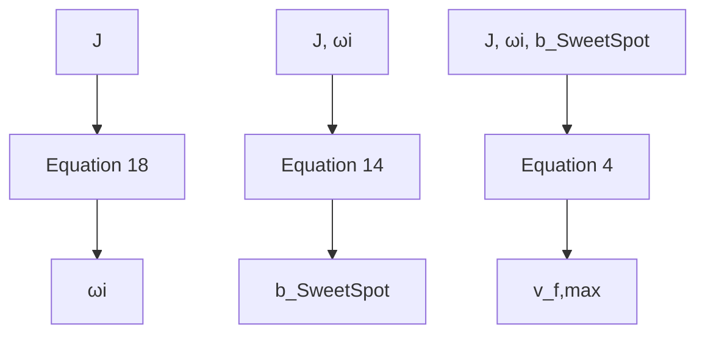
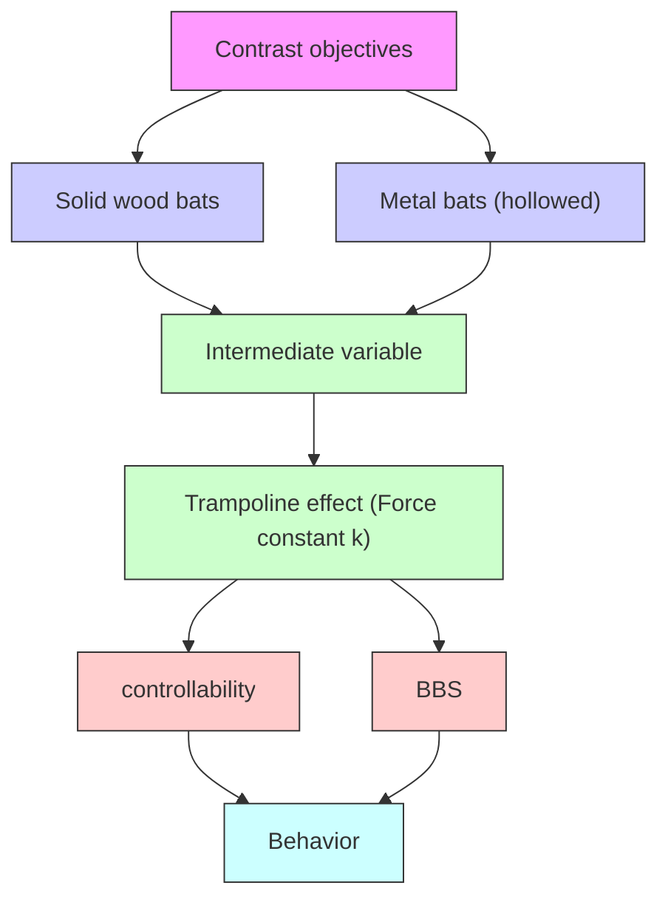
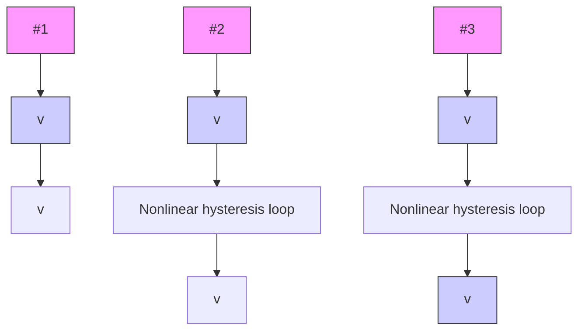

## Summary

Aim to determine the location of “sweet spot” and the different “sweet spot” effects of the uncorked, corked and metal bats, we employ methods in dynamics to build models and generate data of batted ball speed by simulation, which exactly match the actual data obtained from experiments.

Based on classical mechanics, we firstly develop a model to describe the collision between ball and bat, from which we obtain the distribution of batted-ball speed (BBS) as the function of the impact location. Then we successfully deduce the location of “sweet spot”, where the BBS reaches the maximum. With all possible case studies, we conclude that “sweet spot” is about 140mm from the end.

Considering the more complex structure of the corked bat, we augment our basic model by building double-spring model and adopting three empirical formulas. Then we are able to adopt the foregoing analytical method to examine the trampoline effect. We carefully analyze the “sweet spot” effect corresponding to the geometrical parameters of “corked hole” and make simulations. The results are illustrated in mesh figures and demonstrate that “sweet spot” effect of the corked bat significantly depends on the density of stuffing materials-“corking” with rubber enhances the “sweet spot” effect while with cork is the opposite.

Based on our models, we design a special metal bat exhibiting faster BBS and similar controllability compared with ordinary wood bats. From the special case, we reach a general conclusion that metal bats tends to outperform wood bats through technical parameters optimization.

What’s more, on the basis of our models, we provide technique tips and formulas for the corked or metal bat design, which will significantly enhance the “sweet spot” effect or make it easier to control. In conclusion, our model successfully achieves our goals that building a useful model both for illumination and application.

## Contents

1 Introduction. 2  
2 Assumption. . 3  
3 Symbols .. 3  
4 Details of the Model. 4

4.1Model Overview... 4  
4.2 Fundamental Model

4.2.1 Velocity for the Departing Ball 6  
4.2.2 Find the Location of “Sweet Spot”

4.3 Advanced Model 9

4.3.1 Overview of Corking . 9  
4.3.2 Double-Spring Model 9  
4.3.3 Determining Equivalent BBCOR by DS Model . 10  
4.3.4 Evaluating the “Sweet Spot” Effect . 11

5 Simulation and Analysis. 16

5.1 Basic Data Used in Simulation. . 16  
5.2 Solution to Problem I. . 17

5.2.1 Simulation 17  
5.2.2 Where is the “Sweet Spot”? . .. 20

5.3 Solution to Problem II . . 20

5.3.1 BBS Formula Simulation. . 20  
5.3.2 “Sweet Spot” Effects of Corking ... . 27

5.3 Solution to Problem III. .. 30

5.3.1 An Illustration of a Typical Metal Bat . 30  
5.3.2 Predicting Behavior of Metal and Wood Bats . . 31  
5.3.3 Reason for MLB’s Prohibition of Metal Bats . . 34

6 Technique Tips for Bat Design. 34

6.1 Optimum Mass for Better “Sweet Spot” Effect . 34  
6.2 Designing a Special Aluminum Bat . 35

7 Discussion and Conclusion 38

7.1 Model Validation.. .. 38  
7.2 Bending Vibration . . 39  
7.3 Problems Review. 42  
7.4 Strengths . 42  
7.5 Weaknesses.. . 43

8 Reference. 43

Appendix I. 45

Appendix II. 48

Appendix III 50

## An Identification of “Sweet Spot”

## 1 Introduction

The baseball game not only gains great popularity among young people, but also exerts a certain fascination on physicists. Adair, Brody, Cross, Nathan and Russell all published a number of notable papers addressing both experimental and theoretical issues involved in the ball-bat collision. Their methods range from classical mechanics model to Finite Element simulation. The “sweet spot”, the corked bat, trampoline effect, vibration and metal bats all have been studied to different extent with different approaches. However, the researchers’ work focus on explaining the physical phenomena occurring before, during and after ball-bat collision. Therefore, their research results may not be appropriate to solve the proposed problems. We need to develop a model, neglecting the transient process of collision, possess concise and clear physical meaning. What’s more, the model should be problem-oriented.

The three proposed problems are:

Problem I: Explain why the “sweet spot” is not at the end of the bat.  
Problem II: Confirm the fact that “corking” enhances the “sweet spot” effect and explain why MLB prohibits “corking”.  
Problem III: Predict different behavior for wood and metal bats and explain why MLB prohibits metal bats.

The bat-ball collision is complicated by the nonlinear compress behavior of the ball and the vibration behavior of the bat. With the help of the current literatures, we first expect to reasonably neglect the influences of the some factors for simplicity and build a classical mechanical model to find the location of “sweet spot” at which the maximum power is transferred to the ball in collision. We want to obtain the “sweet spot” location by solving the dynamic equation, while some more specific problems and case has to be examined. All parameters in the expression have clear physical meanings and could be easily measured. What’s more, we even expect that the expression only includes basic arithmetic operations in order to guide the exercise of baseball sport.

As for corked bats and metal bats, their differences in structure and material may result in better and worse performance compared with ordinary wood bats. So we plan to augment the basic model is to deeply examine the physical meanings of parameters and to modify these parameters in order to fully describe the corked bats and metal bats. On the basis of our model’s results, we provide the explanation for the MLB’s banning of corked bats and metal bats.

## 2 Assumption

1. No consideration for the failure of the bat. Our model is developed under the precondition that both the uncorked and corked bat are working well.  
2. The loss of energy caused by bending vibration is neglected (except for Bending Vibration Part).  
3. The uncorked bat is uniform in density and is symmetric to the parallel axis.  
4. The stuffing object of the corked bat has the same perpendicular axis as the corked bat.

## 3 Symbols

<table><tr><td>COR</td><td>The coefficient of restitution</td></tr><tr><td>BBCOR</td><td>The coefficient of restitution of bat-ball</td></tr><tr><td>CM</td><td>The center of mass</td></tr><tr><td>MOI</td><td>The moment of inertia with respects to CM</td></tr><tr><td>BBS,  $v_f$ </td><td>The batted ball speed</td></tr><tr><td> $J,J_{CM}$ </td><td>MOI</td></tr><tr><td> $e^*$ </td><td>The equivalent BBCOR</td></tr><tr><td> $b_{sweet\ spot}$ </td><td>The location of “sweet spot”</td></tr><tr><td> $V_i,\omega_i$ </td><td>The swinging speed and angular speed</td></tr><tr><td> $z_{cm},a$ </td><td>The location of CM from the knob</td></tr></table>

## 4 Details of the Model

## 4.1Model Overview

To find out the “sweet spot”, we propose a classical mechanics model without consideration for bending vibration. We derive the expression of batted-ball speed ( ) as the function of 1)impact location, 2)ball mass, 3)ball initial speed, 4) the moment of inertia of bat, 5)the swinging bat speed and 6) the coefficient of restitution(COR). We choose a standard wood bat and employ analytical method to obtain the “sweet spot” location, in which initial speed of ball and swinging bat speed vary over meaningful and practical ranges. The “sweet spot” lies at a point about 15cm away from the end of bat.

Then we build a double-spring (DS) model to modify BBCOR by elaborating the collision on corked bat. We combined the two models to calculate the considering the effects of corking on three parameters. We prove that a typical cork “corking” will weaken the “sweet spot” effect, whereas a typical rubber “corking” will enhance the “sweet spot” effect.

To predict and compare the different behavior of wood and metal bats, we first design a special aluminum bat with the same mass, outline shape, mass center and moment of inertia as that of the standard wood bat; We demonstrate that the special metal bats will have faster and same controllability. Based on the special case, we reach a general conclusion that metal bats tend to have faster and same controllability by optimizing technical parameters. At last, we list some possible negative effects posed by metal bats and explain MLB’s prohibitions of metal bats.

## 4.2 Fundamental Model


<details>
<summary>text_image</summary>

x
φ
v_f sinφ
v_f cosφ
θ
v_i sinφ
v_i
v_i cosφ
+
b
Mass Center
L
a
</details>

Figure 1. Illustration of theoretical derivation

Based on the Momentum Theorem, we obtain

$$
I = M \left(V _ {f} - V _ {i}\right) + m \left(v _ {f} \cos \phi - v _ {i} \cos \theta\right) \tag {1}
$$

In which

is a linear impulse in ???? direction which the batter communicates to the ball-bat system during the period of contact, $k g \cdot m / s ;$ ;

is the mass of the bat, $k g \mathrm { ; }$ ;

$V _ { f }$ is the velocity of the mass center of the bat at contact after collision (positive or negative), $m / s ;$

$V _ { i }$ is the velocity of the mass center of the bat at contact before collision (positive or negative), $m / s ;$ ;

is the mass of the ball, ;

$v _ { f }$ is the velocity of the mass center of the ball at contact after collision (positive or negative), $m / s ;$

$v _ { i }$ is the velocity of the mass center of the ball at contact before collision (positive or negative), $m / s ;$ .

$\phi , \theta$ are the angles of the directions of the ball as illustrated in Figure 1.

Based on the Angular Momentum Theorem, we obtain

$$
L = m b \left(v _ {f} \cos \phi - v _ {i} \cos \theta\right) + J \left(\omega_ {f} - \omega_ {i}\right) \tag {2}
$$

In which

???? is a angular impulse about the direction of $\omega$ which the batter communicates to the ball-bat system during the period of contact, ;

???? is the distance from the hit spot to the center of mass of the bat, ;

is the moment of inertia of the bat about the center of the mass, $k g \cdot m ^ { 2 }$ ;

$\omega _ { f }$ is the angular velocity of the bat at contract after collision with respect to a vertical axis of rotation passing through its mass center, ???? ????/????;

$\omega _ { i }$ is the angular velocity of the bat at contract before collision with respect to a vertical axis of rotation passing through its mass center, $r a d / s .$ .

By definition of the coefficient of restitution, we obtain

$$
e \left[ \left(V _ {i} + \omega_ {i} b\right) - v _ {i} \cos \theta \right] = v _ {f} \cos \phi - \left(V _ {f} + \omega_ {f} b\right) \tag {3}
$$

In which ???? is the coefficient of restitution with respects to ball and bat (BBCOR, in this model only dependent on materials).

These three equations are sufficient for the determination of the three primed unknowns. In particular, we find the ???? component of the velocity for the departing ball

$$
v _ {f} \cos \phi = \frac {(1 + e) (V _ {i} + \omega_ {i} b) + v _ {i} \cos \theta \left(\frac {m}{M} + \frac {m b ^ {2}}{J} - e\right) + \frac {I}{M} + \frac {b L}{J}}{1 + \frac {m}{M} + \frac {m b ^ {2}}{J}} \tag {4}
$$

## 4.2.1 Velocity for the Departing Ball

## Case I: eliminating the impulse

With a hard ball (high ) the duration of contact is short and the impulse and is therefore small. When the collision has been initiated there is little more for the batter to do [P. Kirkpatrick 1963]. This is also supported by Howard Brody‘s experiment in which he observed the vibrations of a hand-held baseball bat [1989]. According to Howard Brody’s experiment [1989], the hand-held bat behaves as it were a free body, in other words, the impulse and ???? are nearly 0, which is correct in both hardball and softball (more details in Appendix II).

## Case II: eliminating the linear velocity $\omega _ { i } b$

When the collision takes place near the mass center of the bat, as it very frequently does, all terms containing ???? may be deleted [P. Kirkpatrick 1963].

Therefore, in many cases, it is quite reasonable to regard the impulse , ???? and $\omega _ { i } b$ as zero. As simplified by these approximations, Eq. 4 can be reduced to

$$
v _ {f} = \frac {(1 + e) (V _ {i} + \omega_ {i} b) + v _ {i} \cos \theta \left(\frac {m}{M} + \frac {m b ^ {2}}{J} - e\right)}{\left(1 + \frac {m}{M} + \frac {m b ^ {2}}{J}\right) \cos \phi} \tag {5}
$$

In order to make the expression simple and easy to understand, we import new symbols:

recoil factor $r = m / M + m b ^ { 2 } / J$ (6)

collision efficiency $q = ( e - r ) / ( 1 + r )$ (7)

pitch speed (positive) $v _ { b a l l } = - v _ { i }$

bat speed (positive) $v _ { b a t } = V _ { i } + \omega _ { i } b$

batted ball speed $B B S = v _ { f }$ ???????????? = ????

the Eq.5 becomes the following two expressions, both of which will be in later analysis.

$$
v _ {f} = \frac {(1 + e) (V _ {i} + \omega_ {i} b) + v _ {i} \cos \theta (r - e)}{(1 + r) \cos \phi} \tag {8}
$$

$$
B B S = \frac {q v _ {\text {ball}} \cos \theta + (1 + q) v _ {\text {bat}}}{\cos \phi} \tag {9}
$$

## 4.2.2 Find the Location of “Sweet Spot”

For the reason that the directions of velocity of ball merely affect the “sweet spot”, we only look for the expression for the location of “Sweet spot” in one simple situation in which $\theta = 0 , \phi = 0$ . If $\theta \neq 0 o r \phi \neq 0$ , the expression for “Sweet spot” location can be deduced in the same way and the result has no significant difference.

Substituting $m / M + m b ^ { 2 } / M$ for ???? in Eq. 8 gives

$$
v _ {f} = \frac {(1 + e) (V _ {i} + \omega_ {i} b) + v _ {i} \left(\frac {m}{M} + \frac {m b ^ {2}}{J} - e\right)}{1 + \frac {m}{M} + \frac {m b ^ {2}}{J}} \tag {10}
$$

Note that when $\omega _ { i } = 0$ ( the bat has no initial rotational energy), this expression is reduced to

$$
v _ {f} = \frac {(1 + e) V _ {i} + v _ {i} \left(\frac {m}{M} + \frac {m b ^ {2}}{J} - e\right)}{1 + \frac {m}{M} + \frac {m b ^ {2}}{J}} \tag {11}
$$

And it is clear that in this case $\mathbf { v _ { f } }$ will have a maximum at $\mathbf { b } = 0$ , which indicates that the “sweet spot” is at the center of mass (CM) when the bat is stationary before the collision.

To obtain the value of ???? at which $v _ { f }$ can reach the maximum in the general case (the bat is not initial stationary), we differentiated the expression of $v _ { f }$ with respect to $b ,$ set the result be zero and get

$$
\omega_ {i} b ^ {2} - 2 (v _ {i} - V _ {i}) b - \frac {\omega_ {i} (M + m) J}{m M} = 0. \tag {12}
$$

This equation can be solved for ????:

$$
b = \frac {v _ {i} - V _ {i}}{\omega_ {i}} \pm \sqrt {\left(\frac {v _ {i} - V _ {i}}{\omega_ {i}}\right) ^ {2} + \frac {J (m + M)}{m M}}. \tag {13}
$$

The “+” sign will be used here because the value of $\frac { v _ { i } - V _ { i } } { \omega _ { i } }$ is negative, and ???????? thus we get

$$
b = \frac {v _ {i} - V _ {i}}{\omega_ {i}} + \sqrt {\left(\frac {v _ {i} - V _ {i}}{\omega_ {i}}\right) ^ {2} + \frac {J (m + M)}{m M}}. \tag {14}
$$

It is clearly shown in this expression that this point is not the COP location, since the value of is dependent upon the ball and bat velocity and the properties of the bat. Particularly, the values of and can be obtained experimentally and $v _ { i }$ as well as $V _ { i } , \omega _ { i }$ are determined respectively by the pitcher throwing the ball and the hitter swinging the bat.

If ???? ( + ) $\textstyle \left[ { \frac { J ( m + M ) } { m M } } \right] / \left( { \frac { v _ { i } - V _ { i } } { \omega _ { i } } } \right) ^ { 2 }$ � / �????????−???????? �2 is less than one, then the square root can be expanded and the result is

$$
b \cong \frac {(z + 1) \omega_ {i} k ^ {2}}{2 (V _ {i} - v _ {i})} \tag {15}
$$

Where $z = M / m , \ k = \sqrt { J / M } .$

## 4.3 Advanced Model

## 4.3.1 Overview of Corking

A corked bat is one which has been hollowed a cylinder on the middle of its tip. The size of the drilling hole can be 1 inch in diameter, and 6 to 10 inch deep; the removed part can be replaced with cork, rubber or Styrofoam; a cap is lastly plugged [Nathan 2003]. Since only the “one piece of solid wood bat” is permitted in the MLB [official rules], ordinary wood corked bat is considered in the following parts.

With corked structure, not only is the bat lighter, but the center of mass, or balance point, of the bat moves closer to hands. In technical physics language, the moment of inertia (MOI) of the bat about the CM is reduced which leads to easy-control. What’s more, since the thickness of bat’s shell decreases after corking, the bat’s shell may be compressed during the collision with the ball and springs back, much like a trampoline, resulting in much less loss of energy than would be the case if the ball hit a completely rigid surface. In other words, the equivalent BBCOR (in model above) has decreased.

Summarily, the physics of corked bat and ball collision can be fully identified by the parameters of model above, however, in contrast with the original bat (uncorked), the corked bat exhibits different values of specific parameters, including $M O I , M _ { b a l l }$ , . By examining both the characteristics of the structure of corked bat and the new physical meanings of key parameters in the first model, we augment our first model on the basis of getting the equivalent BBCOR (relating to structure of corked bat) and varying values of parameters.

## 4.3.2 Double-Spring Model

During the collision between hollowed bat and ball, the “spring” on the bat is exited (the shell of bat is compressed) so that the trampoline effect could be observed in mini-scale. Because of the hoop structure, a radial standing wave and the mentioned bending wave add to a resultant vibration.


<details>
<summary>line chart</summary>

| Mode        | Frequency |
|-------------|---------|
| Hoop Mode 1 | 1428 Hz |
| Hope Mode 2 | 1887 Hz |
| Hoop Mode 3 | 2520 Hz |
</details>

Figure 2 Longitudinal sections and cross sections for Hoop Modes of standard bat [Russell, 2004] To both investigate the radial vibration and avoid developing a novel vibration model, we consider a most common elastic element in Physics, the springs, and use an uncorked bat with a spring attached to simulate the corked bat. What is worth mention is that the model incorporates the effects of elastic collision and energy loss completely in equivalent BBCOR; however, the advanced double spring model illuminates what new physical parameters make up equivalent BBCOR: they are ???? , ???? , ???? , ???? . $k _ { b a l l } , k _ { b a t } , e _ { b a l l } , e _ { b a t }$

Figure 2 shows the scheme for model when colliding. Where

$k _ { b a l l }$ is the stiffness of the ball

$k _ { b a t }$ is the stiffness of the bat

$e _ { b a l l }$ is the coefficient of restitution (COR) of the object with ball’s material bouncing off a stationary completely elastic object (only dependent on material)

$e _ { b a t }$ is COR of the object with bat’s material bouncing off a stationary completely elastic object (only dependent on material)


<details>
<summary>text_image</summary>

k ball
e ball
ball
k bat
e bat
Corked bat
</details>

Figure 3. scheme for double spring model

## 4.3.3 Determining Equivalent BBCOR by DS Model

In a reference frame where center of mass of the system $( C M _ { B S B }$ , consisted of ball, spring and bat) remains at rest, the collision can be divided into the following four procedures:

i) The ball and bat (with spring respectively) approach each other;  
ii) The two springs contact and compress until the velocity (in $C M _ { B S B }$

reference frame) of bat and ball turn to be zero;

iii) The ball and bat are accelerated by the springs respectively. In procedure ii and iii, the loss of energy happens through the effect between bat (ball) and spring.  
iv) The two springs is no longer at contact, and the ball and bat separate each other.

By definition of the coefficient of restitution (the ratio of the differences in velocities before and after the collision) and the physical meaning in energy form, we obtain the equivalent BBCOR (with trampoline effect and material effect inside) in a reference of home frame

$$
e ^ {*} = \frac {v _ {f} - V _ {f}}{v _ {i} - V _ {i}} = \sqrt {\frac {E _ {f}}{E _ {i}}}. \tag {16}
$$

Considering the conservation of momentum and the process of collision, the equivalent BBCOR in Fundamental Model is as following

$$
e ^ {* 2} = \frac {k _ {b a t}}{k _ {b a l l} + k _ {b a t}} e _ {b a l l} ^ {2} + \frac {k _ {b a l l}}{k _ {b a l l} + k _ {b a t}} e _ {b a t} ^ {2}, \tag {17}
$$

where

the fraction of energy restored in ball and bat (kinetic energy) after collision;

$$
e ^ {* 2}
$$

$$
\frac {k _ {b a t}}{k _ {b a l l} + k _ {b a t}} \quad \text {   the   fraction   of   initial   energy   stored   in   ball;   }
$$

$$
e _ {b a l l} ^ {2} \quad \text {   the   fraction   of   stored   energy   returned   to   kinetic   energy   of   ball;   }
$$

$$
\frac {k _ {b a l l}}{k _ {b a l l} + k _ {b a t}} \quad \text {   the   fraction   of   initial   energy   stored   in   bat;   }
$$

$$
e _ {b a t} ^ {2} \quad \text {   the   fraction   of   stored   energy   returned   to   kinetic   energy   of   bat.   }
$$

( Notes: Mathematical deduction see Appendix I )

## 4.3.4 Evaluating the “Sweet Spot” Effect

## Parameters of bat analysis

## Parameter affecting BBS

 Angular and linear velocity $\omega _ { i } , V _ { i }$  
According to Eq.4, when $\omega _ { i } , V _ { i }$ increase, ???????????? will increase. Considering the limit of athletes’ biological energy , $\omega _ { i }$ is affected by ???? and $V _ { i }$ by .  
 Recoil factor

According to Eq.4, the increment of ???? leads to higher BBS.

 Moment of inertia and mass ????,

According to Eq. 4, when ????, increase, ???? will decrease which results in higher BBS. However, the increase of ????, will respectively leads to the decrease of $\omega _ { i }$ and $V _ { i } .$ , which will make BBS decrease.

 Location of “Sweet Spot” ????

According to Eq. 4, we can obtain the location of “Sweet $\mathrm { S p o t } ^ { \cdots } b _ { s e e t \ s p o t }$ , and using $b _ { s w e e t \ s p o t }$ to calculate the maximum of BBS.

 Equivalent BBCOR $e ^ { * }$

According to Eq. 4, the increment of $e ^ { * }$ will leads to higher BBS. Since $e _ { b a t }$ and $e _ { b a l l }$ are determined by materials, $e ^ { * }$ will be only determined by $k _ { b a l l } / k _ { b a t }$ .

For clarity, we list the above analysis results in Tab le 1.  
Table 1 The interrelationship between parameters and effects on BBS

<table><tr><td>EFFECTS</td><td> $\omega_i$ </td><td> $V_i$ </td><td>r</td><td> $e^*$ </td><td>BBS</td></tr><tr><td> $\omega_i \uparrow$ </td><td></td><td></td><td></td><td></td><td>😊</td></tr><tr><td> $V_i \uparrow$ </td><td></td><td></td><td></td><td></td><td>😊</td></tr><tr><td>r ↑</td><td></td><td></td><td></td><td></td><td>😢</td></tr><tr><td>J ↑</td><td>↓</td><td></td><td>↓</td><td></td><td>💡 + 😊 = ?</td></tr><tr><td>M ↑</td><td></td><td>↓</td><td>↓</td><td></td><td>💡 + 😊 = ?</td></tr><tr><td> $\frac{k_{ball}}{k_{bat}} \uparrow$ </td><td></td><td></td><td></td><td>↑</td><td>💡</td></tr></table>

The independent parameters of corked bat only includes $M , J , e _ { b a l l } , e _ { b a t } , k _ { b a l l }$ , $k _ { b a t }$ , all of which are easily obtained:

, ???? can be easily measured with basic experimental instruments;

$e _ { b a l l } , e _ { b a t }$ can be obtained in the tool book, like Mechanical Design Handbook.

$k _ { b a l l } , k _ { b a t }$ can be directly obtained through stiffness measure experiment, instead of other complex models.

## Parameters affecting Easy Control

The lighter weight (smaller ) and smaller swing weight (small ) also lead to better bat control[Nathan, 2004], which has a beneficial effect for a contact-type hitter, who is just trying to meet the ball squarely rather than get the highest batted ball speed. The batter can accelerate the bat to high speed more quickly with a corked bat, allowing the batter to react to the pitch more quickly, wait longer before committing on the swing, and more easily change in mid-swing.

##  Parameters Estimation

##  Swinging Angular Speed Estimated by ????

As showed above, the angular velocity $\omega _ { i }$ and moment of inertia have coupling effects on BBS. In order to determine the effect of $\boldsymbol { J } ^ { \prime } \mathbf { s }$ increment on BBS, we need an empirical equation illustrating the relationship between $\omega _ { i }$ and ????. We adopt the formula in Daniel A. Russell’s paper [Russell, 2007]. Based on the analysis of the bat swing speed data from the Crisco-Greenwald field study and data fitting done by Alan Nathan, the empirical estimation is

$$
\omega_ {i} = 4 5. 3 \left(\frac {J _ {\text {knob}}}{1 6 0 0 0}\right) ^ {- 0. 3 0 7 6 9} \tag {18}
$$

If we know the location of center of mass, we can use the parallel axis theorem to calculate $I _ { k n o b }$ and the conversion is roughly ${ \cal I } _ { k n o b } = J + M a ^ { 2 }$ with units of $o z \cdot i n ^ { 2 }$ .

##  Swinging Speed Estimation by

Like the interrelationship between $\omega _ { i }$ and J, $V _ { i }$ and M have the same relationship and coupling effects on . So an empirical equation of $V _ { i }$ and M is wanted. We adopt the model of A.Terry Bahill and Miguel Morna Freitas [1995]. Based on the data for Leah, a member of the University of Arimona, NCAA National Champion softball team, Bahill and Freitas use fitting method to examine the relationship between the mass(M with unit of oz) and swinging velocity of bat $( V _ { i }$ with unit of mph), getting the following formula

$$
(M + 7 0. 4) (V _ {i} + 5. 4) = 6 0 3 2. \tag {19}
$$


<details>
<summary>line chart</summary>

| Bat Weight (oz) | Ideal Bat Weight (mph) | Batted-Ball Speed (mph) |
| --------------- | ---------------------- | ------------------------ |
| 0               | 80                     | 0                        |
| 10              | ~70                    | ~60                      |
| 20              | ~85                    | ~65                      |
| 30              | ~88                    | ~55                      |
| 40              | ~87                    | ~45                      |
| 50              | ~85                    | ~40                      |
</details>

Figure 4 The Data used for Fitting Formula, cited from Bahill and Freitas’s paper

##  Stiffness of Hoop Spring Estimation through thickness ( )

The observed fundamental hoop vibration mode, which accounts for the majority of vibrant energy and is responsible for trampoline effect, has a frequency of about 1 kHz. It means that when the ball leaves the bat, taking place about 1ms after the ball touches the bat [Brody, 1985], the fundamental hoop vibration mode has not been set up. In other words, at the moment that ball exit, it has not “seen” either the knob or tip of the bat. This fact indicates us that we can view the bat as a hoop spring.

The hoop stress constant $k _ { b a t }$ can be identified by an empirical relationship

$$
k _ {b a t} \propto \left(\frac {t}{R}\right) ^ {3}, (2 0)
$$

Where

is the thickness of the shell, ;

is the radius of the bat cross section, .

## Methods for Evaluating “Sweet Spot” Effects

## Overview of corking effects

## I) Effects on parameters by corking

 Since the hallowed wood bat was filled by cork/rubber which has a smaller/larger density, the bat has smaller/larger and ???? (in comparison with the uncorked), which leads to smaller/larger (recoil factor) and higher/lower $V _ { i }$ and $\omega _ { i }$ .

 Since the shell has been thin, the trampoline effect of the bat will be more evident than the uncorked. Enlarging the trampoline effect will significantly increase BBS.

## II) Evaluating “Sweet Spot” Effects

##  Maximum of BBS

Since the BBS is the function of location of hitting point, which gets the maximum in “Sweet Spot” point, we calculate the maximum BBS to estimate the “Sweet Spot” Effect of corked bats. For the reason that there are both positive and negative effects on the maximum BBS after corking, quantitative method is needed.

##  Easy Control

Since both and decrease, we make sure that the corked bat is better to control.

##  Methods for quantitative evaluation


<details>
<summary>text_image</summary>

h
d
M, J₀
Mass Center
L
</details>

Figure 5. A typical example of corked bat

## i) Neglect the significance of trampoline effect

Through rough estimation, the effect of hoop mode of the corked wood bat could be neglected (See details of deduction in Appendix II.). This estimation was also proved by the work of Alan M. Nathan [2003], who gives the quantitative results through experiments. He pointed out that there is nearly no trampoline effect from the hollowed-out wood bat or the cork filler, for the reason that “it requires much greater force to compress such a bat than it does to compress an aluminum bat”.

## ii) Calculating the MOI and mass of corked bat $( J _ { c o r k e d } , M _ { c o r k e d } )$

Based on the definition of moment of inertia and parallel axis theorem, we obtain the MOI of the corked bat as following

$$
J _ {c o r k e d} = J ^ {*} + \left[ M + \frac {\pi}{4} (\rho - \rho_ {0}) d ^ {2} h \right] \left(x _ {C M} - \frac {L}{2}\right) ^ {2}, \tag {21}
$$

where

$$
J ^ {*} = J _ {0} + \frac {\pi}{4 8} (\rho - \rho_ {0}) d ^ {2} h \left(\frac {3 d ^ {2}}{4} + h ^ {2}\right) + \frac {\pi}{4} (\rho - \rho_ {0}) d ^ {2} h \left(L - a - \frac {h}{2}\right) ^ {2},
$$

$$
x _ {C M} = \frac {M (L - a) + \frac {\pi}{8} (\rho - \rho_ {0}) d ^ {2} h ^ {2}}{M + \frac {\pi}{4} (\rho - \rho_ {0}) d ^ {2} h},
$$

$J _ { 0 } = M O I$ ℎ ???? ???????? ℎ???? ???? ???? .

And the mass of corked bat is

$$
M _ {c o r k e d} = \frac {\pi}{4} \rho_ {0} D ^ {2} L + \frac {\pi}{4} (\rho - \rho_ {0}) d ^ {2} h. \tag {22}
$$

iii) Measure the structure of corked bat and obtain the values of $D , L , d , h$ .

Set $\rho _ { 0 } =$ the density of wood,

???? = the density of stuffed material (cork or rubber)

and calculate the $M _ { u n c o r k e d } \ , L _ { u n c o r k e d } \ , M _ { c o r k e d } , L _ { c o r k e d } .$

Based on Eq. 4 and Eq. 14, we obtain the maximum BBS of the corked and uncorked bat, and therefore determine whether “corking” a bat enhances the “sweet spot” effect. (Calculation details in Simulation and Results)

## 5 Simulation and Analysis

## 5.1 Basic Data Used in Simulation

The uncorked wood bat is the one used by Cross in his extensive set of measurements, which is a 33 in/31 oz Louisville Slugger Model R161 [Cross 1998]. The detail data is shown in Table 2.

Table 2 Data used for simulation

<table><tr><td>Property</td><td>Description</td><td>Value</td></tr><tr><td>L</td><td>The length of the bat</td><td>0.84m</td></tr><tr><td>M</td><td>The mass of the bat</td><td>0.885kg</td></tr><tr><td>Jcm</td><td>The MOI of the bat</td><td>0.045kg·m2</td></tr><tr><td>a</td><td>The distance of center of mass to from handle</td><td>0.564m</td></tr><tr><td>m</td><td>The mass of the ball</td><td>0.145kg</td></tr><tr><td>average of Vi</td><td>The average of Vi measured in a contest</td><td>24m/s</td></tr><tr><td>average of ωi</td><td>The average of ωi measured in a contest</td><td>51rad/s</td></tr><tr><td>average of vi</td><td>The average of vi measured in a contest</td><td>40m/s</td></tr></table>

## 5.2 Solution to Problem I

## 5.2.1 Simulation

As we have shown that the “sweet spot” location is determined by several parameters. The values of , and J are the constant properties of the baseball and the bat, while the value of $v _ { i } , \ V _ { i }$ and $\omega$ are determined by the pitcher and the batter. In other words, the $v _ { i } , \ V _ { i }$ and ???? value will vary over a certain range, which will influence the “sweet spot” location. The properties of the bat we use to simulate are listed in Table 2. Herein, we do a series of calculation based on the variation of $v _ { i } , \ V _ { i }$ and ???? to investigate the value of ????.

##  The effect of ball speed $v _ { i }$

We analyze the effect of ball speed $v _ { i }$ on the “sweet spot” location $b _ { s w e e t \ s p o t }$ in Figure 6 by assigning $v _ { i }$ a series of values (31m/s \~ 50m/s) and calculating $b _ { s w e e t \ s p o t }$ . We vary $v _ { i }$ from 31m/s to 50m/s for practical concern. The calculation shows that the value of $b _ { s w e e t \ s p o t }$ is lowered by increasing the ball speed $v _ { i }$ . However, the “sweet spot” location still has a distance of about 0.15m from the tip.


<details>
<summary>line chart</summary>

| Ball speed v_i (m/s) | Distance From Mass Center b (m) |
| --------------------- | ------------------------------- |
| 30                    | 0.16                            |
| 45                    | 0.12                            |
| 50                    | 0.10                            |
</details>

Figure 6. The plot of the “sweet spot” location $b _ { s w e e t \ s p o t }$ as the ball speed $v _ { i }$ ranges from31m/s to 50 m/s. The impact occurs on the standard wood bat, which has a CM speed of 54 mph and a rotational

speed about the CM of 51 $\mathrm { { s } ^ { - 1 } }$ .

##  The effect of swinging speed $V _ { i }$

We analyze the effect of ball speed $v _ { i }$ on the “sweet spot” location $b _ { s w e e t \ s p o t }$ in Figure 7 by assigning $V _ { i }$ a series of values (19m/s \~29m/s) and calculating $b _ { s w e e t \ s p o t }$ . Considering the practical situation, we vary $v _ { i }$ from 19m/s to 29m/s. The calculation shows that the value of $b _ { s w e e t \ s p o t }$ is lowered by increasing the swing speed $V _ { i }$ and the effect is smaller than that of the ball speed. In the same manner, the “sweet spot” location still has a distance of about 0.15m from the tip.


<details>
<summary>line chart</summary>

| Swinging Speed Vi (m/s) | Distance From Mass Center b (m) |
| ----------------------- | ------------------------------- |
| 18                      | 0.27                            |
| 20                      | 0.14                            |
| 22                      | 0.13                            |
| 24                      | 0.12                            |
| 26                      | 0.11                            |
| 28                      | 0.10                            |
| 30                      | 0.09                            |
</details>

Figure 7. The plot of the “sweet spot” location $b _ { s w e e t \ s p o t }$ as the swinging speed $V _ { i }$ ranges from 19m/s to 29 m/s. The impact occurs on the standard wood bat, which has a CM speed of 54 mph and a rotational speed about the CM of 51 s-1 .

## The effect of bat rotational speed ????

We analyze the effect of ball speed ???? on the “sweet spot” location $b _ { s w e e t \ s p o t }$ in Figure 8 by assigning ???? a series of values (43 $s ^ { - 1 } \sim 6 1 s ^ { - 1 } )$ ) and calculating $b _ { s w e e t \ s p o t }$ . Considering the practical situation, we vary ????from 43 $s ^ { - 1 }$ to $6 1 s ^ { - 1 }$ . The calculation shows that the value of $b _ { s w e e t }$ ???????????????? is raised by increasing the swing speed $\omega .$ . similarly, the “sweet spot” location still has a distance of about 0.15m from the tip.


<details>
<summary>line chart</summary>

| Swinging Angular Velocity ω (s⁻¹) | Distance From Mass Center b (m) |
| ---------------------------------- | ------------------------------ |
| 40                                 | 0.11                           |
| 50                                 | 0.13                           |
| 60                                 | 0.16                           |
</details>

Figure 8. The plot of the “sweet spot” as swinging angular velocity ???? ranges from 43 $s ^ { - 1 }$ to $6 1 s ^ { - 1 }$ m/s. The impact occurs on the standard wood bat, which has a CM speed of 54 mph and a rotational speed about the CM of 51 s-1 . $5 1 ~ \mathrm { { s } ^ { - 1 } }$

## the effect of impact location on the value ${ \pmb v } _ { f } ( B { \pmb B } { \pmb S } )$

Figure 6, Figure 7 and Figure 8 clearly illustrate that the optimum impact location is still far away from the tip of the bat, although the value of $b _ { s w e e t \ s p o t }$ (the “sweet spot”) will vary with the value of $v _ { i } , \ V _ { i }$ and ????. As the expression of $v _ { f }$ suggests, the impact location will influence the value of $v _ { f }$ . It is tempting to know how big the influence will be, for example, what is the exit velocity of the ball if the collision takes place at other locations other than We analyze the effect of impact location on ???? ???????? ???????? $v _ { f }$ , and put results in Figure 9 by varying the impact location from 0.1m (from the knob) to 0.885m (the tip of the bat). The calculation shows that the value of $v _ { f }$ assumes a parabola-like curve and attains the maximum at the “sweet spot” rather than the tip. This fact provides the direct evidence that the “sweet spot” is not at the tip of the bat.


<details>
<summary>line chart</summary>

| distance from knob (m) | v_f(BBS) (m/s) |
| ---------------------- | -------------- |
| 0.1                    | -10            |
| 0.2                    | 0              |
| 0.3                    | 10             |
| 0.4                    | 20             |
| 0.5                    | 30             |
| 0.6                    | 40             |
| 0.7                    | 45             |
| 0.8                    | 40             |
| 0.9                    | 35             |
</details>

Figure 9. The plot of $v _ { f } ( B B S )$ as a function of impact location for an impact of a 40m/s ball on the standard wood bat, which has a CM speed of 54 mph and a rotational speed about the CM of $5 1 ~ \mathrm { s } ^ { - 1 }$ .

## 5.2.2 Where is the “Sweet Spot”?

The simulation we perform demonstrates that the “sweet spot” is about 15 cm away from the end of the bat when parameters $v _ { i } , \ V _ { i }$ and ???? varies over the practical and meaningful ranges. So, we draw a conclusion from the above analysis that:

The “sweet spot” is not at the end of bat.

## 5.3 Solution to Problem II

## 5.3.1 BBS Formula Simulation

##  The Effects of Ratio of Stiffness $( k _ { b a l l } / k _ { b a t } )$ on Maximum BBS

Based on Table 1, we know that the increase of $k _ { b a l l } / k _ { b a t }$ leads to bigger equivalent BBCOR and therefore leads to higher maximum BBS. In order to make quantitative analysis, at first, we determine the quantitative relationship between $k _ { b a l l } / k _ { b a t }$ and equivalent BBCOR based on the Eq.17, as shown in Figure 10. Secondly, we deduced the relationship between $k _ { b a l l } / k _ { b a t }$ and maximum BBS using Eq.4, which is illustrated in Figure 11.

From semi-log figure of $\frac { k _ { b a l l } } { k _ { b a t } } \sim v _ { f , m a x }$ ???????? ???????? \~????????, (Figure 11), we can clearly figure out that ???????? the increase of maximum BBS becomes quite slow, when $k _ { b a l l } / k _ { b a t }$ is bigger than 1. It illuminates that we should make the $k _ { b a l l } / k _ { b a t }$ smaller than one if we expect more significant trampoline effect which enhances the BBS.


<details>
<summary>line chart</summary>

| k_ball/k_bat | The Equivalent BBCOR e* (e_ball=0.6) | The Equivalent BBCOR e* (e_ball=0.5) | The Equivalent BBCOR e* (e_ball=0.4) |
| ------------ | ------------------------------------ | ------------------------------------ | ------------------------------------ |
| 0.01         | 0.60                                 | 0.51                                 | 0.41                                 |
| 0.1          | 0.63                                 | 0.55                                 | 0.45                                 |
| 1            | 0.75                                 | 0.68                                 | 0.55                                 |
| 10           | 0.95                                 | 0.92                                 | 0.85                                 |
| 100          | 0.99                                 | 0.98                                 | 0.97                                 |
</details>

Figure 10 The equivalent BBCOR is a function of ration of stiffness with $e _ { b a t } = 1$ .


<details>
<summary>line chart</summary>

| k_ball/k_bat | Maximum Batted Ball Speed v_f,max (e_ball=0.6) | Maximum Batted Ball Speed v_f,max (e_ball=0.4) | Maximum Batted Ball Speed v_f,max (e_ball=0.5) |
| ------------ | ----------------------------------------------- | ----------------------------------------------- | ----------------------------------------------- |
| 0.01         | 47.0                                            | 44.5                                            | 42.0                                            |
| 0.1          | 50.0                                            | 48.0                                            | 45.0                                            |
| 1.0          | 65.0                                            | 63.0                                            | 60.0                                            |
| 10.0         | 75.0                                            | 74.0                                            | 73.0                                            |
| 100.0        | 76.0                                            | 75.5                                            | 75.0                                            |
</details>

Figure 11 The maximum $B B S \ ( v _ { f , m a x } )$ is a function of equivalent BBCOR which is defined by $k _ { b a l l } / k _ { b a t }$ . The bat is corked with $e _ { b a t } = 0 . 9 8$ , whose CM speed is 24m/s and angular speed is 51rad/s.

##  The Effect of Moment of Inertia ( ) on Maximum BBS

From the Table 1, we may be depressed by the fact that merely qualitative analysis based on the equation of is unable to conclude whether the effect of MOI’s increase on is positive or negative. Here, we import the data to do the precise quantitative analysis, and then determine the specific relationship between them.

The procedure to simulate is shown as following possible field of variation) leads to higher maximum BBS, which is quite useful in comparing the “Sweet Spot” effect of the corked and uncorked bat and designing better corked bat.


<details>
<summary>flowchart</summary>


</details>

From Figure 14, we are able to easily make sure that the increase of (limited in


<details>
<summary>line chart</summary>

| Moment of Inertia of Bat: J (kg·m²) | Swinging Angular Velocityω₁ (rand/s) |
| ----------------------------------- | ------------------------------------ |
| 0.036                               | 37.65                                |
| 0.038                               | 37.60                                |
| 0.040                               | 37.55                                |
| 0.042                               | 37.50                                |
| 0.044                               | 37.45                                |
| 0.046                               | 37.40                                |
| 0.048                               | 37.35                                |
| 0.050                               | 37.30                                |
| 0.052                               | 37.25                                |
| 0.054                               | 37.20                                |
</details>

Figure 12 The relationship between???? and ???? is illuminated by an empirical equation.


<details>
<summary>line chart</summary>

| Moment of Interia of Bat: J (kg· m²) | Location of Sweet Spot b_sweet spot (m) |
| ------------------------------------ | ---------------------------------------- |
| 0.036                                | 0.08                                     |
| 0.038                                | 0.09                                     |
| 0.04                                 | 0.10                                     |
| 0.042                                | 0.11                                     |
| 0.044                                | 0.12                                     |
| 0.046                                | 0.13                                     |
| 0.048                                | 0.14                                     |
| 0.05                                 | 0.15                                     |
| 0.052                                | 0.16                                     |
| 0.054                                | 0.17                                     |
| 0.054                                | 0.18                                     |
| 0.054                                | 0.19                                     |
| 0.054                                | 0.20                                     |
| 0.054                                | 0.21                                     |
| 0.054                                | 0.22                                     |
| 0.054                                | 0.23                                     |
| 0.054                                | 0.24                                     |
| 0.054                                | 0.25                                     |
</details>

Figure 13 The Location of “sweet spot” is determined by moment of inertia, with $V _ { i } = 2 4 m / s$ , $v _ { i } = - 4 0 m / s , \ M = 0 . 8 8 5 k g \ /$ .


<details>
<summary>line chart</summary>

| Moment of Interia of Bat: J (kg· m²) | Maximum Batted Ball Speed v_f,max m/s |
| ----------------------------------- | ------------------------------------- |
| 0.036                               | 48.0                                  |
| 0.038                               | 48.2                                  |
| 0.04                                | 48.4                                  |
| 0.042                               | 48.6                                  |
| 0.044                               | 48.8                                  |
| 0.046                               | 49.0                                  |
| 0.048                               | 49.2                                  |
| 0.05                                | 49.4                                  |
| 0.052                               | 49.6                                  |
| 0.054                               | 49.8                                  |
</details>

Figure 14. The figure i llustrating the relationship between MOI and Maximum BBS based on the $\begin{array} { r } { \mathrm { d a t a } \frac { k _ { b a l l } } { k _ { b a t } } = 0 . 1 } \end{array}$ a???????? ???????? ????

## The Effect of Mass ( ) on Maximum BBS

Similar to the effect of MOI, the effect of Mass on BBS cannot be determined only by qualitative analysis. We make the quantitative analysis in the same procedure as MOI, only replacing $\omega _ { i }$ with $V _ { i \cdot }$ , and ???? with .

From Figure 17, we easily obtain the similar result that the increase of (limited in possible field of variation) leads to higher maximum BBS. What’s more, Figure 17 also tells us that the increase speed of maximum BBS is getting slow with the increase of mass.

Especially, we draw the swinging bat speed $V _ { i }$ and maximum BBS $v _ { i }$ with respect to mass in the same figure, as Figure 18 shows. Comparing with Figure 4 which is drawn with experimental data [Bahill and Freitas, 1995], our data obtained from calculation of our model exactly match that experimental data, which proves the correctness of our model.


<details>
<summary>line chart</summary>

| Mass of Corked Bat: M (kg) | Swinging Bat Speed: V₁ (m/s) |
| -------------------------- | ---------------------------- |
| 0.0                        | 34.5                         |
| 0.2                        | 33.0                         |
| 0.4                        | 31.5                         |
| 0.6                        | 30.0                         |
| 0.8                        | 28.5                         |
| 1.0                        | 27.0                         |
| 1.1                        | 22.5                         |
</details>

Figure 15 . The plot of swinging bat speed $V _ { i }$ as the function of the corked bat mass .


<details>
<summary>line chart</summary>

| Mass of Corked Bat: M (kg) | Location of SweetSpot: b_SweetSpot |
| -------------------------- | ----------------------------------- |
| 0.0                        | 0.275                               |
| 0.2                        | 0.185                               |
| 0.4                        | 0.155                               |
| 0.6                        | 0.145                               |
| 0.8                        | 0.14                                |
| 1.0                        | 0.138                               |
| 1.2                        | 0.137                               |
| 1.4                        | 0.137                               |
</details>

Figure 16. The plot of “sweet spot” location $b _ { s w e e t \ s p o t }$ as the function of the corked bat mass .


<details>
<summary>line chart</summary>

| Mass of Corked Bat: M (kg) | Maximum BBS: Vf,max m/s |
| -------------------------- | ------------------------ |
| 0.0                        | 5.0                      |
| 0.2                        | 30.0                     |
| 0.4                        | 45.0                     |
| 0.6                        | 49.0                     |
| 0.8                        | 51.0                     |
| 1.0                        | 51.5                     |
| 1.2                        | 51.5                     |
| 1.4                        | 51.5                     |
</details>

Figure 17. The maximum ???????????? $v _ { f , m a x }$ as the function of the corked bat mass .


<details>
<summary>line chart</summary>

| Mass of Corked Bat: M (kg) | Batted-Ball Speed: v_f (m/s) | Swinging Bat Speed: V_i (m/s) |
| -------------------------- | ---------------------------- | ----------------------------- |
| 0.0                        | 5.0                          | 34.0                          |
| 0.2                        | 30.0                         | 32.0                          |
| 0.4                        | 45.0                         | 29.0                          |
| 0.6                        | 48.0                         | 26.0                          |
| 0.8                        | 50.0                         | 24.0                          |
| 1.0                        | 51.0                         | 23.0                          |
| 1.2                        | 51.0                         | 22.5                          |
| 1.4                        | 51.0                         | 22.0                          |
</details>

Figure 18 The plot of batted-ball speed $v _ { f }$ and swinging bat speed $V _ { i }$ as the function of the corked bat mass . This figure derived from the calculation of our model exactly matches the actual data obtained by experiments.

## 5.3.2 “Sweet Spot” Effects of Corking

## Simulating details

The corked bat can be fully described with the shape of a hallowed cylinder (“Corked Hole”, mathematical described with , ℎ) and the density of the stuffed materials (cork or rubber in this problem). Based on Eq.19 and Eq.18, we are able to calculate the mass and moment of inertia of a specific corked bat, and then obtain the values of maximum BBS which is the key indicator to evaluate “Sweet Spot” effect.

In Figure 19, we set the density of stuffed material $\rho _ { c o r k } = 4 5 0 k g / m ^ { 3 }$ to evaluation the “Sweet $\mathrm { { \cal S p o t } } ^ { \prime \prime }$ effect of different corked bats with the different “Corked Holes”, whose depth and diameter is in the actually possible field of variation $( h \in [ 0 , \ 0 . 2 ] m , \ d \in [ 0 , 0 . 0 5 ] m )$ [Russel, 2004].

In Figure 21, the density of stuffed material $\rho _ { r u b b e r } \ = 1 1 0 0 k g / m ^ { 3 }$ to evaluation the “Sweet Spot” effect of different corked bats with the same variation of and .


<details>
<summary>3d surface plot with color-coded depth and hole radius axes</summary>

| Depth of Corked Hole: h (m) | Radius of Corked Hole: d/2 (m) | Maximum BBS: v_f,max (m/s) |
| --------------------------- | ------------------------------- | -------------------------- |
| 0                           | 0                               | 48.74                      |
| 0.15                        | 0                               | 48.65                      |
| 0.15                        | 0.015                           | 48.6                       |
| 0.15                        | 0.025                           | 48.55                      |
</details>

Figure 19 Figure in a wireframe mesh style. Based on the structure of the corked bat: depth and radius of corked hole, the density of stuffing cork $\rho _ { c o r k } = 4 5 0 k g / m ^ { 3 }$ , we determined the ????, , and then obtain maximum BBS. Notes: $v _ { i } = - 4 0 m / s , L = 8 4 0 m m , a = 5 6 4 m m , m = 0 . 1 4 5 k g$ .


<details>
<summary>line chart</summary>

| Depth of Corked Hole: h (m) | Radius of Corked Hole: d/2 (m) |
| ---------------------------- | ------------------------------- |
| 0.04                         | 0.017                           |
| 0.08                         | 0.018                           |
| 0.12                         | 0.019                           |
| 0.16                         | 0.0195                          |
| 0.20                         | 0.02                            |
</details>

Figure 20 Same Figure in contour style.


<details>
<summary>heatmap</summary>

| Radius of Corked Hole: d/2 (m) | Maximum BBS: v_f,max m/s | Depth of Corked Hole: h (m) | Maximum BBS of the Uncorked Bat |
| ------------------------------ | ------------------------ | ---------------------------- | -------------------------------- |
| 0.005                          | 48.75                    | 0                            | 48.74                            |
| 0.01                           | 48.8                     | 0                            | 48.74                            |
| 0.015                          | 48.85                    | 0                            | 48.74                            |
| 0.02                           | 48.9                     | 0                            | 48.74                            |
| 0                              | 49.1                     | 0                            | 48.74                            |
</details>

Figure 21 Based on the structure of the corked bat: depth and radius of corked hole, the density of stuffing rubber $\rho _ { r u b b e r } \ = 1 1 0 0 k g / m ^ { 3 }$ , we determined the ????, , and then obtain maximum BBS. Notes: $v _ { i } = - 4 0 m / s , L = 8 4 0 m m , a = 5 6 4 m m , m = 0 . 1 4 5 k g$ .


<details>
<summary>line chart</summary>

| Depth of Corked Hole: h (m) | Radius of Corked Hole: d/2 (m) |
| ---------------------------- | ------------------------------- |
| 0.01                         | 0.018                           |
| 0.03                         | 0.0185                          |
| 0.06                         | 0.019                           |
| 0.10                         | 0.017                           |
| 0.15                         | 0.016                           |
| 0.18                         | 0.015                           |
| 0.20                         | 0.014                           |
</details>

Figure 22 Figure in contour style

## Results

## I. Whether corking enhances “Sweet Spot” effect?

## The corked bat with cork stuffed $( \pmb { \rho } _ { c o r k } < \pmb { \rho } _ { a s h } )$

I n Figure 19 or Figure 20, considering all possible values of and $h ,$ the maximum $B B S \ ( v _ { f , m a x } )$ of the corked bat with cork stuffed reaches the maximum at the point of $d = 0 , h = 0$ . In other words, the maximum BBS of all possible corked bat with cork stuffed is lower than that of the uncorked. However, since both and decrease, the corked bat is better to control than before.

Therefore, if “Sweet Spot” effect only concerns the maximum BBS (i.e. maximum power transferred to the ball), we can evidently conclude that “corking” a bat with cork stuffed cuts down the “Sweet Spot” effect, no matter what shape of “Corked Hole” is adopted.

## The corked bat with rubber stuffed $( \rho _ { r u b b e r } > \rho _ { a s h } )$

In Figure 21 or Figure 22, considering all possible values of and , the maximum BBS $\left( v _ { f , m a x } \right)$ of the corked bat with rubber stuffed reaches the minimum at the point of $d = 0 , h = 0$ . In other words, the maximum BBS of all possible corked bat with rubber stuffed is higher than that of the uncorked. However, since both and increase, the corked bat becomes more difficult to

control than before.

Therefore, if “Sweet Spot” effect only concerns the maximum BBS (i.e. maximum power transferred to the ball), we can evidently conclude that “corking” a bat with rubber stuffed enhances the “Sweet Spot” effect, no matter what shape of “Corked Hole” is adopted.

## II. Why MLB prohibits “corking”

As discussed above, we know that corking the bat with high density material stuffed will significantly enhances the “Sweet Spot” effect which will lead to higher batted ball speed. However, corking the bat with low density material stuffed will leads to better control which may satisfy some part of athletes, like contact-type hitters.

If the Major League Baseball (MLB) does not prohibit “corking”, the athletes can always improve their scores by using higher quality “corking” materials and more sophisticated design of corked bat. If so, the contest is not only the contest on athletes’ baseball skills, but also on the quality of bat, in other words, the technology and money, which will definitely leads to inequality. Aimed to protect the principle of sport-equality, the MLB has to list “corking” technology into taboo.

## 5.3 Solution to Problem III

Metal bat (usually aluminum bat) has received great popularity for its wider range of “sweet spot”, more power, better feel, and higher performance than the wood one (usually ash bat). What factors contribute to metal bat’s better performance? Why MLB prohibits the metal (aluminum) bat? Herein, we will answer those questions based on conclusions drawn from our previous models.

## 5.3.1 An Illustration of a Typical Metal Bat

Figure 23 is an illustration of a typical metal bat. Generally speaking, the outer shape of a metal bat and a wood bat is much alike. However, a large amount of metal will be hollowed out to ensure it has an appropriate mass. The shell of bat is about 0.24cm in thickness, about 1/7 of that of a corked wood bat [Nathan, 2004]. It must be mentioned that the shell structure leads to trampoline effect which enhance the performance of metal bats.


<details>
<summary>text_image</summary>

Technical diagram of a mechanical component with numbered parts and cross-sectional view
</details>

Figure 23. Illustration of a typical metal bat; metal bats are often designed to have special cavity to enhance its performance.[Nguyen, 2004]

## 5.3.2 Predicting Behavior of Metal and Wood Bats

## Review of established models

We have developed two models to investigate how structural properties $( J _ { c m }$ , $M , \ z _ { c m }$ , coarking) influence the performance of a bat. We picture a logic relationship corresponding to our foregoing models in Figure 24 to facilitate the prediction. In this figure, controllability and ???????????? are introduced to describe the behavior of a bat. Figure 24. clearly shows that both metal and wood bats can be characterized by parameters $J _ { c m } , \ M , z _ { c m }$ and outer shape, which affects the bats’ controllability and ????????????. Apart from that, metal bats generally have trampoline effect which increases BBS as proved in our DS model. To predict and compare the behavior the two kinds of bats, we first start with a special case.


<details>
<summary>flowchart</summary>


</details>

Figure 24. Illustration of useful conclusions drawn from foregoing models. Both metal and wood bats can be characterized by parameters $J _ { c m } \ , M \ , \ z _ { c m }$ and outer shape, which affects the bats’ controllability and ; Metal bats have trampoline effect which increases .

##  A special case: the same $J _ { c m }$ , ????, ${ \pmb z } _ { c m }$ , and outer shape

## Can such a special metal bat exist?

Before the comparison and prediction, one may cast doubt on the existence of such a special metal bat meeting satisfying these conditions. We do some calculation and obtain such a special metal design parameters and graph as listed below.

Table 3. The design parameters of the special aluminum bat. The solid wood bat is the one used by Cross in his measurements. It is a 33 in/31 oz Louisville Slugger Model R161 [Cross, 1998]; and the relevant properties are also listed

<table><tr><td></td><td>Solid Wood Bat</td><td>Aluminum Bat</td><td>same or not</td></tr><tr><td>M</td><td>0.885kg</td><td>0.885 kg</td><td>yes</td></tr><tr><td> $z_{CM}$ </td><td>0.564m</td><td>0.564m</td><td>yes</td></tr><tr><td>L</td><td>0.840m</td><td>0.840m</td><td>yes</td></tr><tr><td> $J_{CM}$ </td><td>0.045kg ·  $m^{2}$ </td><td>0.045kg ·  $m^{2}$ </td><td>yes</td></tr><tr><td>density</td><td>670kg/ $m^{3}$ </td><td>2700kg/ $m^{3}$ </td><td>no</td></tr><tr><td>Outline Shape</td><td colspan="2">Totally same</td><td>yes</td></tr><tr><td>Trampoline Effect</td><td>No</td><td>Yes</td><td>yes</td></tr></table>

The technique to construct a required bat is stated in the part of technical tips in the paper.


<details>
<summary>text_image</summary>

A-A
Ø57
230
840
605,7
R30,31
Ø21,5
Ø25
447,82
Ø37,98
288,7
Ø57
</details>

Figure 25. Illustration of the special metal bat design.

## Prediction and Comparison of behavior for wood and metal bats

As Figure 24 demonstrates, such a special metal bat will have the same controllability as the wood bat concerned. However, this special metal bat will have a faster ???????????? due to the contribution of trampoline effect. In a word, our model could predict that a metal bat will outperform the wood bat with the same $J _ { c m }$ , , $z _ { c m }$ , ???????????? and outer shape.

A quantitative analysis on the trampoline effect can be got on Appendix II of this paper. We can see that ???????????? could experience a gap from 45m/s to about 75m/s theoretically.

##  General cases

From the special case, we can conclude that in common situation, metal bats will possess both better BBS and controllability. The reason is that a better metal bat can be manufactured through the following steps on the basis of the special bat design:

1) Reduce $J _ { c m }$ and by remove a certain amount of metal, thus increase the controllability.  
2) Streamline the inner cavity to enhance the strength of the bat.

After the two steps, the newly-made bat still has strong trampoline effect while its controllability is raised.

## An experimental example

We present another experimental example, in Table 4, which verifies our argument that the aluminum bat exhibit both faster BBS and better controllability.

Table 4. Contrast of wood and metal bats including Crisco-Greenwald’s Cage Study[Greenwald, 2001; Crisco,2002] experiment result and model calculation result.

<table><tr><td>Bat</td><td>Length (in)</td><td>Weight (oz)</td><td> $z_{cm}$ (in)</td><td> $J_{cm}$ (oz-in $^2$ )</td><td>Swing Speed (mph)</td><td>BBS (mph)</td></tr><tr><td>Woodbat</td><td>34</td><td>30.9</td><td>23</td><td>11516</td><td>67.9</td><td>98.6</td></tr><tr><td>Metal bat</td><td>33</td><td>29.2</td><td>20.7</td><td>9282</td><td>70.9</td><td>106.5</td></tr></table>

## 5.3.3 Reason for MLB’s Prohibition of Metal Bats

Our above analysis points out metal bats generally have faster ???????????? and better controllability than wood bats do. This is also supported by Crisco and Greenwald Batting Cage Study[Greenwald, 2001; Crisco,2002], which shows that an average batted ball speed for wood bats is around 98.6-mph, while the average batted balls speed for metal bats lies between 100.3 mph and 106.5-mph. The faster travelling ball poses two negative effects on the athletes.

The faster the ball travels, the less time athletes, such as the pitcher, have to react, thus resulting in injuries more easily. It is generally believed that the pitcher’s reactionary time drops from 0.4s to 0.3s when the ball is hit by a metal bat [Russell, 2008].  
The faster the ball travels, the more severe injuries it tends to cause.

Apart from safety concern, we derive from our model that

the advent of the metal bat will weaken the fairness of the game;

powerful bats make athletes dependent upon the tool, not the game itself.

From the above analysis, we conclude the reason that MLB should prohibit metal bats is for concerns of safety and the nature of sport.

## 6 Technique Tips for Bat Design

One of the important implementation of our model is to instruct the design of a perfect bat.

## 6.1 Optimum Mass for Better “Sweet Spot” Effect

In order to simplify the process of estimation, we firstly simplify the Eq.4. When the collision takes place near to the mass center of the bat, as it very frequently does, all terms containing b may be deleted [P. Kirkpatrick 1963]. Therefore, $r = m / M$ and Eq.4 becomes

$$
v _ {f} = \frac {(1 + e) (V _ {i} + \omega_ {i} b) + | v _ {i} | c o s \theta (r - e)}{(1 + r) c o s \phi}. \tag {23}
$$

It shows that the velocity of the batted ball speed (BBS) $v _ { f }$ is dependent upon the ratio of / or ????. According to the equation, the value of $v _ { f }$ will be raised if we merely lower the value of and keep all the other parameters unchanged. However, as is often the case, the swing speed $V _ { i }$ will be decreased when the mass of the bat becomes larger, which in turn leads to the decrease of $v _ { f }$ . One can anticipate that there exists an optimum bat mass on the assumption that the best bat requires that least energy input to impart a given velocity to the ball. We estimate the best mass of bat on the assumption that “that bat is best which requires the least energy input to impart a given velocity to the ball [P. Kirkpatrick 1963]”. Rearrangement of Eq.4 gives

$$
V _ {f} = \frac {(1 + r) v _ {f} \cos \phi + (e - r) v \cos \theta}{1 + e}. \tag {24}
$$

The kinetic energy of the bat (neglecting $\omega _ { i } )$ is

$$
W = \frac {1}{2} M V _ {f} ^ {2} = \frac {M}{2} \left[ \frac {(1 + r) v _ {f} \cos \phi + (e - r) v \cos \theta}{1 + e} \right] ^ {2} \tag {25}
$$

By differentiating the expression of ???? and setting it to zero, we obtain the minimum of when

$$
r = \frac {v _ {f} \cos \phi + e v \cos \theta}{v _ {f} \cos \phi - v \cos \theta} \cong \frac {v _ {f} + e v}{v _ {f} - v} \tag {26}
$$

If the $v _ { f } = - v _ { i }$ , then

$$
r = \frac {1 - e}{2}. \tag {27}
$$

For example, when $e ^ { * } = 0 . 5$ , then $r = 0 . 2 5 , \ M = 4 m$ .

## 6.2 Designing a Special Aluminum Bat

This part primarily serves as the guidance for the case study in Problem III.

The solid wood bat we choose is the one used by Cross in his extensive set of measurements. It is a 33 in/31 oz Louisville Slugger Model R161 [Cross, 1998]; and the relevant properties are listed in Tab le 5. The parameters of special aluminum bat we design are also listed in Table 5.

Table 5. A Comparison between Solid Wood Bat & Aluminum Bat (customized)

<table><tr><td></td><td>Solid Wood Bat</td><td>Aluminum Bat</td><td>same or not</td></tr><tr><td>M</td><td>0.885kg</td><td>0.885 kg</td><td>yes</td></tr><tr><td> $z_{CM}$ </td><td>0.564m</td><td>0.564m</td><td>yes</td></tr><tr><td>L</td><td>0.840m</td><td>0.840m</td><td>yes</td></tr><tr><td> $J_{CM}$ </td><td>0.045kg ·  $m^{2}$ </td><td>0.045kg ·  $m^{2}$ </td><td>yes</td></tr><tr><td>density</td><td>670kg/ $m^{3}$ </td><td>2700kg/ $m^{3}$ </td><td>no</td></tr><tr><td>Outline Shape</td><td colspan="2">Totally same</td><td>yes</td></tr><tr><td>Trampoline Effect</td><td>No</td><td>Yes</td><td>yes</td></tr></table>

To customize such a bat, we need to reconfigure the mass distribution transversely. One of the possibilities is shown in Figure 26.


<details>
<summary>text_image</summary>

A-A
A'
m(z)
z
</details>

Figure 26. Cross section of typical inner cavity style of aluminum bat and its estimated according mass distribution function.

According to Table 5 and Figure 26, we derive three constrain equations and assume that the bat is a spinning body.

The mass of the wood bat and the customized bat are equal gives

$$
M ^ {w} = \int_ {0} ^ {L} d m (z), \tag {28}
$$

where $M ^ { w }$ is the mass of the wood bat, ????????;

$m ( z )$ is the mass distribution function of the customized bat;

is the length of the wood bat, .

The mass center of the wood bat and the customized bat are the same gives

$$
z _ {c m} ^ {w} = \frac {\int_ {0} ^ {L} z \cdot d m (z)}{M ^ {w}}, \tag {29}
$$

where $z _ { c m } ^ { w }$ is the mass center of the wood bat, ${ } _ { , k g }$ .

The moment of inertia of the wood bat and the customized bat with respect to

the mass center are the same gives

$$
J _ {c m} ^ {w} = \int_ {0} ^ {L} (z - z _ {c m}) ^ {2} \cdot d m (z), \tag {30}
$$

where $J _ { c m } ^ { w }$ is the moment of inertia of the wood with respect to the mass center, $k g \cdot m ^ { 2 }$ .

Any mass distribution function $m ( z )$ satisfying the above three equations can be used to customize an aluminum bat.

In fact, there exists an infinite number of $m ( z )$ functions, yet many of them are complicated or technical impractical. To facilitate the control test and analysis, we adopt a simple and special $m ( z )$ as demonstrated by Figure 27.

Derivation of special case


<details>
<summary>text_image</summary>

Original Mass M_b
Removed Mass M_a
Axis of z_cm
</details>

Figure 27. Cross section of this special and simple case of aluminum bat (geometrical parameters unknown); Shadowed part and white part are distinguished to help the according theoretical derivation of mass distribution m(z) and the inner shape of bat.

We let $M _ { a }$ be the mass of the removed part, and $M _ { b }$ be the mass of the rest part. Because the outline shape of two bats are same, which means the two bats have the same volume if stuff the removed part $M _ { a }$ back, we have

$$
\frac {M _ {a} + M _ {b}}{M ^ {w}} = \frac {\rho_ {A l}}{\rho_ {w o o d}}, \tag {31}
$$

where

$M ^ { w }$ is the mass of the wood bat,????????;

$\rho _ { A l }$ is the density of aluminum, $k g / m ^ { 3 }$ ;

$\rho _ { w o o d }$ is the density of wood, $k g / m ^ { 3 }$ .

For the same reason, the mass center equation and the moment of inertia equation1 , we also have

$$
M _ {a} \cdot z _ {c m, a} + M _ {b} \cdot z _ {c m, b} = (M _ {a} + M _ {b}) z _ {c m} ^ {w} \tag {32}
$$

$$
\frac {J _ {c m} ^ {a} + J _ {c m} ^ {b}}{J _ {c m} ^ {w}} = \frac {\rho_ {A l}}{\rho_ {w o o d}} \tag {33}
$$

Using the three constrain equations, we can get the mechanics parameters of the removed part.

$$
M _ {b} = M ^ {w} \& E q. (3 1) \quad \Rightarrow \quad M _ {b} = \left(\frac {\rho_ {A l}}{\rho_ {w o o d}} - 1\right) M ^ {w} \tag {34}
$$

$$
z _ {c m, a} = z _ {c m} ^ {w} \& E q. (3 2) \quad \Rightarrow \quad z _ {c m, b} = z _ {c m} ^ {w} \tag {35}
$$

$$
J _ {c m} ^ {b} = J _ {c m} ^ {w} \& E q. (3 3) \quad \Rightarrow \quad J _ {c m} ^ {b} = \left(\frac {\rho_ {A l}}{\rho_ {w o o d}} - 1\right) J _ {c m} ^ {w} \tag {36}
$$

Through calculation we obtain a diagram of the demo bat in Figure 25.

## 7 Discussion and Conclusion

We develop two models to elaborate the ball-bat collision. It has been shown that the models’ simulation well match the empirical data and well explain some phenomena. It seems that some physical issues including the vibration of the bat and the nonlinear compress behavior of ball have been neglected in our paper. However it’s not that case. We will validate our concise model in the following part.

## 7.1 Model Validation

Literature review indicates that some researchers have developed more complicated models (see Figure 28) to show the dynamic features and vibrant features. With advanced models, such phenomena as bending vibration, hoop vibration, and so on. As listed four models in Figure 28, the latter two, #3 and #4 do no good to answer the proposed problems. The energy stored in the wave on the bat after the collision is a part of consuming energy considered in modification of parameter, , in the first two models.

Such a technique is quite useful in practice, because we can do experiment to determine .


<details>
<summary>flowchart</summary>


</details>

Figure 28. The evolution of collision models

## 7.2 Bending Vibration

In the fundamental model, we treat the bat as a rigid body and neglect the potential vibration excited by the collision. Actually, during and after collision, the baseball bat might exhibit several flexural bending modes of vibration, and the energy stored in the vibration movement is dependent on impact location. It is possible that at the “sweet spot” obtained in the fundamental modal will shift if intensive vibration consuming a large amount of energy is excited. Therefore it is worthwhile to enhance the fundamental model by taking into account the influence of the potential vibration on the performance of the bat.


<details>
<summary>line chart</summary>

| Mode          | Frequency |
| ------------- | --------- |
| Bending Mode 1 | 120 Hz    |
| Bending Mode 2 | 489 Hz    |
| Bending Mode 3 | 984 Hz    |
| Bending Mode 4 | 1527 Hz   |
</details>

Figure 29. Illustration of bending vibration of the bat in different modes or frequencies [Russell,2000]

It is natural that the existence of the bending vibration will give rise to the change of $v _ { f }$ , which is determined by the properties of the bat and the baseball and the characteristics of the collision. According to the research work of Alan M. Nathan [2000], the expression of $v _ { f }$ can be modified by replacing ???? with $e _ { e f f }$ , as stated below:

$$
v _ {f} = \left[ \frac {e _ {e f f} - r}{1 + r} \right] v _ {b a l l} + \left[ \frac {e _ {e f f} + 1}{1 + r} \right] v _ {b a t}. (3 7)
$$

In this equation, $e _ { e f f }$ is an effective coefficient of restitution for the collision of the ball with a flexible bat, contains all the dynamical information about the collision and has the desired properties that it reduces to ???? in the limit that vibration are neglected[Alan M. Nathan 2000]. It has been shown that $e _ { e f f }$ depends strongly on the impact location yet weakly on the impact speed in Nathan’s [2000] work.

Nathan investigated the baseball-bat collision from the perspective of vibration, two important results in his work are cited below:

the vibration energy fraction as a function of impact location


<details>
<summary>line chart</summary>

| Distance From Knob (cm) | % Vibration Energy |
| ----------------------- | ------------------ |
| 40                      | 24                 |
| 45                      | 27                 |
| 50                      | 25                 |
| 55                      | 23                 |
| 60                      | 20                 |
| 65                      | 11                 |
| 70                      | 6                  |
| 75                      | 4                  |
| 80                      | 30                 |
</details>

Figure 30. The distribution of vibration energy for an impact of a 90-mph ball on the standard wood bat, which has a CM speed of 54 mph and a rotational speed about the CM of 51 $\mathrm { s } ^ { - 1 }$ .

the value of $e _ { e f f }$ as a function of impact location


<details>
<summary>line chart</summary>

| Distance From Knob (cm) | e_eff |
| ----------------------- | ----- |
| 38                      | 0.20  |
| 40                      | 0.16  |
| 45                      | 0.16  |
| 50                      | 0.18  |
| 55                      | 0.24  |
| 60                      | 0.30  |
| 65                      | 0.38  |
| 70                      | 0.50  |
| 75                      | 0.49  |
| 80                      | 0.24  |
| 82                      | 0.22  |
</details>

Figure 31. The plot of $\mathbf { e _ { \mathrm { e f f } } }$ for an impact of a 90-mph ball on the standard wood bat, which has a CM

speed of 54 mph and a rotational speed about the CM of 51 $\mathrm { { s } ^ { - 1 } }$ .

From the two figures, we can draw a conclusion that in the region 68-74 ???????? the vibration energy is small and $e _ { e f f }$ is relatively large. This conclusion also enhances the reasonability of the fundamental model that does not consider the possible bending vibration effect, since the vibration energy is about 5% of the total energy when collision occur at the “sweet spot”. It is quite clear that the “sweet spot” is not on the bat end.

## 7.3 Problems Review

The three proposed problems have been well answered in our model simulation and results part.

Where is the “sweet spot”?

We find out that the “sweet spot” is located at a point about 15 cm from the end of the tip, which supports the empirical finding.

How about the “corking” effects?

We find out that the “corking” effect mainly depends on the shape hollowed cylinder and the filing material density. Corking rubber (density larger than ash) enhances the “sweet spot” effect, while corking cork (density smaller than ash) weakens the “sweet spot” effect. For the same corking material, the enhancing/weakening effect is dependent upon the shape of the hollowed cylinder. This model explains the penalty MLB gave to some players using specially-corked bat.

How about metal bats?

We find out that a well-designed metal bat will possesses good qualities of faster ???????????? and better controllability than that of the wood one (usually ash bat). Our analysis exhibits the reason that MLB prohibits metal bats.

## 7.4 Strengths

Our concise model is in good agreement with the experiment data. That’s to say our model is practical to some extent, especially the model possess clear mode.

We have well analyzed the performance of a bat, and controllability along with “sweet spot” effect is separately analyzed. Thus the analysis of the calculation results will be closer to the actuality.

Our model has been developed to show the interrelationship of geometrical attributes, mechanical attributes and the performance. This can help the design of bat, and simultaneously, we have a in-depth understanding on the ball-bat interaction.

## 7.5 Weaknesses

We haven’t elaborately modeled the transverse wave and hoop vibration; the error introduced is about 5% (see details in the foregoing bending mode part).  
We have used three empirical formulas and each has its own limitation and error.

## 8 Reference

Brody H., The “sweet spot” of a baseball bat, Am. J. Phys. 54, 640–643 (1986)

Brody H., Models of baseball bats, Am. J. Phys. 58, 756–7589(1990)

Bahill T., Freitas M.M., Two Methods for Recommending Bat Weights, Annals of Biomedical Engineering, 23(4), 436-444 (1995)

Cross R., The “sweet spot” of a baseball bat, Am. J. Phys. 66, 772–779(1998)

Crisco J.J., Batting performance of wood and metal baseball bats, Med. Sci. Sports Exerc., 34(10), 1675-1684 (2002)

Greenwald R.M, Differences in Batted Ball Speed with Wood and Aluminum Baseball Bats: A Batting Cage Study," J. Appl. Biomech., 17, 241-252 (2001).

Kilpatrick P., Batting the ball, Am. J. Phys. 31, 606–613 (1963)

Nathan A. M., dynamics of the baseball-bat collision, Am. J. Phys.68, 980-990 (2000)

Nathan A. M., Some Remarks on Corked Bats, Dec. 1, 2004 http:// www.npl.illinois.edu/\~a-nathan/pob/corked-bat-remarks.doc

Russell D. A., Hoop frequency as a predictor of performance for softball bats, Engineering of Sport , Vol. 2, pp. 641-647 (International Sports Engineering Association, 2004).

Russell D. A., Should metal baseball bats be banned because they are inherently Dangerous? (Apr. 9, 2008) http://paws.kettering.edu/\~drussell/bats-new/ban-safety.html

Nguygen T.V., reinforced-layer metal composite bat, patent number US6808464

B1, patent date Oct.26, 2004

The Baseball-Bat Collision Lecture 7

http://www.slideworld.com/slideshows.aspx/The-Baseball-Bat-Collision-Lecture-7-ppt-2153198

The Baseball-Bat Collision Lecture,8,

http://www.docstoc.com/docs/622036/The-Baseball-Bat-Collision-II-Lecture-8

The Baseball-Bat Collision Lecture 9

http://www.docstoc.com/docs/5690996/The-Baseball-Bat-Collision-III-Lecture-9

Official rules of MLB,

http://mlb.mlb.com/mlb/official\_info/official\_rules/batter\_6.jsp

## Appendix I

## Mathematical Process for deducing equivalent BBCOR

In a reference frame where center of mass of the system $( C M _ { B S B }$ , consisted of ball, spring and bat) remains at rest, we define new symbols

$$
v _ {i} ^ {c} = v _ {i} - v _ {c} v _ {f} ^ {c} = v _ {f} - v _ {c}
$$

$$
V _ {i} ^ {c} = V _ {i} - v _ {c} V _ {f} ^ {c} = V _ {f} - v _ {c}
$$

in which the speed of the center of mass of the system

$$
v _ {c} = \frac {m v _ {i} + M V _ {i}}{m + M}.
$$

The collision in $C M _ { B S B }$ reference frame can be divided into the following four procedures:

v) The ball and bat (with spring respectively) approach each other;  
vi) The two springs contact and compress until the velocity (in $C M _ { B S B }$ reference frame) of bat and ball turn to be zero;  
vii) The ball and bat are accelerated by the springs respectively. In procedure ii and iii, the loss of energy happens through the effect between bat (ball) and spring.  
viii) The two springs is no longer at contact, and the ball and bat separate each other.

By definition of the coefficient of restitution (the ratio of the differences in velocities before and after the collision), we obtain the equivalent BBCOR (with trampoline effect and material effect inside) in a reference of home frame

$$
e ^ {*} = \frac {v _ {f} - V _ {f}}{v _ {i} - V _ {i}}
$$

Considering the conservation of momentum, we obtain

$$
m v _ {i} ^ {c} + M V _ {i} ^ {c} = m v _ {f} ^ {c} + M V _ {f} ^ {c} = 0 \Rightarrow V _ {f} ^ {c} = - \frac {m}{M} v _ {f} ^ {c}, V _ {i} ^ {c} = - \frac {m}{M} v _ {i} ^ {c}.
$$

Then the equivalent BBCOR becomes

$$
e ^ {*} = \frac {v _ {f} - V _ {f}}{v _ {i} - V _ {i}} = \frac {v _ {f} ^ {c} - V _ {f} ^ {c}}{v _ {i} ^ {c} - V _ {i} ^ {c}} = \frac {v _ {f} ^ {c} + \frac {m}{M} v _ {f} ^ {c}}{v _ {i} ^ {c} + \frac {m}{M} v _ {i} ^ {c}} = \frac {v _ {f} ^ {c}}{v _ {i} ^ {c}}.
$$

We may also understand the physical meaning of BBCOR in the way of energy

as following:

$$
\because E _ {i} = \frac {1}{2} m (v _ {i} ^ {c}) ^ {2} + \frac {1}{2} M (V _ {i} ^ {c}) ^ {2} = \frac {1}{2} m (v _ {i} ^ {c}) ^ {2} (1 + \frac {m}{M})
$$

$$
E _ {f} = \frac {1}{2} m \big (v _ {f} ^ {c} \big) ^ {2} + \frac {1}{2} M \big (V _ {f} ^ {c} \big) ^ {2} = \frac {1}{2} m \big (v _ {f} ^ {c} \big) ^ {2} (1 + \frac {m}{M})
$$

∗2 $\begin{array} { r } { e ^ { * 2 } = \frac { E _ { f } } { E _ { i } } } \end{array}$ means that the $B B C O R ^ { 2 }$ is the fraction of energy restored in system after collision.

The total energy in the BSB system at contact before collision is $E _ { i }$ . If no loss of energy happens when the kinetic energy transfers to the spring, the total energy fully converts to the potential energy in spring at the end of procedure ii.

Since the total momentum remains zero all times, the point where two springs contact remains at rest in BSB reference frame.

Therefore, if no loss of energy happens,

$$
\left\{ \begin{array}{l} k _ {b a l l} \Delta x _ {b a l l} = k _ {b a t} \Delta x _ {b a t} \\ \Delta x _ {b a l l} + \Delta x _ {b a t} = \Delta x \end{array} \right. \Rightarrow \left\{ \begin{array}{l} \Delta x _ {b a l l} = \frac {k _ {b a t}}{k _ {b a l l} + k _ {b a t}} \Delta x \\ \Delta x _ {b a t} = \frac {k _ {b a l l}}{k _ {b a l l} + k _ {b a t}} \Delta x \end{array} \right.
$$

the energy stored in the spring attached on ball is

$$
E _ {i} ^ {b a l l} = \frac {1}{2} k _ {b a l l} \Delta x _ {b a l l} ^ {2} = \frac {1}{2} k _ {b a t} \Delta x _ {b a l l} ^ {2} \left(\frac {k _ {b a l l} k _ {b a t}}{(k _ {b a l l} + k _ {b a t}) ^ {2}}\right)
$$

$$
E _ {i} ^ {b a t} = \frac {1}{2} k _ {b a t} \Delta x _ {b a t} ^ {2} = \frac {1}{2} k _ {b a l l} \Delta x _ {b a t} ^ {2} \left(\frac {k _ {b a l l} k _ {b a t}}{(k _ {b a l l} + k _ {b a t}) ^ {2}}\right)
$$

Considering conservation of total energy $E _ { b a l l } + E _ { b a t } = E$ and the physical meaning of BBCOR in energy perspective $e ^ { 2 } = E _ { f } / E$ , we obtain

$$
E _ {f} ^ {b a l l} = E _ {i} ^ {b a l l} e _ {b a l l} ^ {2} = \frac {k _ {b a t}}{k _ {b a l l} + k _ {b a t}} e _ {b a l l} ^ {2} E
$$

$$
E _ {f} ^ {b a t} = E _ {i} ^ {b a t} e _ {b a t} ^ {2} = \frac {k _ {b a l l}}{k _ {b a l l} + k _ {b a t}} e _ {b a t} ^ {2} E
$$

Therefore, in the collision of ball and corked bat, the different part of Eq. 16 is as following

$$
e ^ {* 2} = \frac {E _ {f}}{E _ {i}} = \frac {E _ {f} ^ {b a l l} + E _ {f} ^ {b a t}}{E _ {i}} = \frac {k _ {b a t}}{k _ {b a l l} + k _ {b a t}} e _ {b a l l} ^ {2} + \frac {k _ {b a l l}}{k _ {b a l l} + k _ {b a t}} e _ {b a t} ^ {2}.
$$

where

$$
e ^ {* 2}
$$

the fraction of energy restored in ball and bat (kinetic energy) after collision;

$$
\frac {k _ {b a t}}{k _ {b a l l} + k _ {b a t}}
$$

the fraction of initial energy stored in ball;

$$
e _ {b a l l} ^ {2}
$$

the fraction of stored energy returned to kinetic energy of ball;

$$
\frac {k _ {b a l l}}{k _ {b a l l} + k _ {b a t}}
$$

the fraction of initial energy stored in bat;

$$
e _ {b a t} ^ {2}
$$

the fraction of stored energy returned to kinetic energy of bat.

## Appendix II

## The Stiffness of the Corked Bat’s Shell

Trampoline effect can be observed in the hollowed bat [Russell, 2004]. We have augmented our model from fundamental model to DS model, by which we know how the relative stiffness between ball and bat $" k _ { b a l l } / k _ { b a t } "$ " influences the values of ???????????? and $v _ { f }$ . However, going a further step, we will discuss, to what extent does hollowing affects $" k _ { b a l l } / k _ { b a t }$ ", and then ℎ???? ???? ???? ???????? $e ^ { * }$ , as well as the “sweet spot” effect.

## Hoop Spring

The observed fundamental hoop vibration mode, which accounts for the majority of vibrant energy and is responsible for trampoline effect, has a frequency of about 1 kHz. It means that when the ball leaves the bat, taking place about 1 ms after the ball touches the bat [H. Brody, 1985], the fundamental hoop vibration mode has not been set up. In other words, at the moment that ball exit, it has not “seen” either the knob or tip of the bat. This fact indicates us that we can view the bat as a hoop spring.

The hoop stress constant $k _ { b a t }$ can be identified by an empirical relationship

$$
k _ {b a t} \propto \left(\frac {t}{R}\right) ^ {3},
$$

Where

is the thickness of the shell;

is the radius of the bat cross section;

Calculation of an Instance

A typical wood bat has a cross section diameter of 2.3 in, and the removed cylinder has a diameter of 1 in; accordingly, the maximum and minimum $k _ { b a t }$ proportion can be estimated by:

$$
{\frac {k ^ {m a x}}{k ^ {m i n}}} = \left({\frac {t _ {m a x}}{t _ {m i n}}}\right) ^ {3} = \left({\frac {2 . 3}{1 . 3}}\right) ^ {3} \approx 5. 5
$$

$$
\frac {k _ {o r i g i n} ^ {W}}{k _ {c o a r k e d} ^ {W}} = \left(\frac {t _ {o r i g i n} ^ {W}}{t _ {c o a r k e d} ^ {W}}\right) ^ {3} = \left(\frac {2 . 3}{1 . 3}\right) ^ {3} \approx 5. 5
$$

A typical aluminum bat can be extremely hollowed; practically, the rest hoop thickness of aluminum bat can be 1/7 of that of the wood one [Nathan, 2004]; accordingly, the maximum and minimum $k _ { h o o p }$ proportion can be estimated by:

$$
{\frac {k ^ {m a x}}{k ^ {m i n}}} = \left({\frac {t _ {m a x}}{t _ {m a x}}}\right) ^ {3} = \left({\frac {2 . 3}{1 . 3}} \times 7\right) ^ {3} \approx 1 8 8 6. 5
$$

$$
\frac {k _ {o r i g i n} ^ {M}}{k _ {h o l l o w e d} ^ {M}} = \left(\frac {t _ {o r i g i n} ^ {M}}{t _ {h o l l o w e d} ^ {M}}\right) ^ {3} = \left(\frac {2 . 3}{1 . 3} \times 7\right) ^ {3} \approx 1 8 8 6. 5
$$


<details>
<summary>line chart</summary>

| k_ball/k_bat | Maximum Batted Ball Speed v_f,max (e_ball=0.6) | Maximum Batted Ball Speed v_f,max (e_ball=0.4) | Maximum Batted Ball Speed v_f,max (e_ball=0.5) |
| ------------ | ----------------------------------------------- | ----------------------------------------------- | ----------------------------------------------- |
| 0.01         | 47.0                                            | 44.5                                            | 42.0                                            |
| 0.1          | 50.0                                            | 47.0                                            | 45.0                                            |
| 1.0          | 65.0                                            | 63.0                                            | 61.0                                            |
| 10.0         | 75.0                                            | 74.5                                            | 74.0                                            |
| 100.0        | 76.0                                            | 75.5                                            | 75.0                                            |
</details>

Based on the figure above, we can figure out that the trampoline effect of thin metal shell bat is quite significant while wood corked bat not.

## Appendix III

Codes for MATLAB  
```matlab
%*****
% codes for drawing mesh and contour figures
%*****
[h,R]=meshgrid(0:0.0005:0.2);
R = R/10;
%*****
d=R*2; L=.84; a=.564; M=.885; rho1=450;rho2=1100;
%*****
J1=0.045+pi/48.*(rho1-670).*(d.^2.*h).*(.75*d.^2+h.^2)+pi/4.*(rho1-670).*d.^2.*h.*(L-a-h/2).^2+(M+pi/4.*(rho1-670).*d.^2.*h).*(M.*(L-a)+pi/8.*(rho1-670).*d.^2.*h.^2)/(M+pi/4.*(rho1-670).*d.^2.*h)-L+a).^2;J2=0.045+pi/48.*(rho2-670).*(d.^2.*h).*(.75*d.^2+h.^2)+pi/4.*(rho2-670).*d.^2.*h.*(L-a-h/2).^2+(M+pi/4.*(rho2-670).*d.^2.*h).*(M.*(L-a)+pi/8.*(rho2-670).*d.^2.*h.^2)/(M+pi/4.*(rho2-670).*d.^2.*h)-L+a).^2;
%*****
%J5=-1/12*(3*670^2*h.^2*3.14^2.*R.^6+10*h.^4*670^2*3.14^2.*R.^4-12*h.^3*0.274*670^2*3.14^2.*R.^4-3*R.^4*0.885*670.*h.*3.14-13*h.^3*0.885*670*3.14.*R.^2+24*0.274*0.885*h.^2*670*3.14.*R.^2-12*R.^2*0.045*670.*h.*3.14-12*0.274^2*0.885*670*h.*3.14.*R.^2+12*0.045*0.885)./( -0.885+670*h.*3.14.*R.^2 );
M1 = 0.885+(rho1 - 670)* 3.14* h.* R.^2;
M2 = 0.885+(rho2 - 670)* 3.14* h.* R.^2;
vi1=(6032./(M1./0.02835+70.4)-5.4).*0.447;
vi2=(6032./(M2./0.02835+70.4)-5.4).*0.447;
JJ1=(J1+0.885*0.564).*54674.7;
JJ2=(J1+0.885*0.564).*54674.7;
w1=45.3.*(JJ1/16000).^ -0.30769;
w2=45.3.*(JJ2/16000).^ -0.30769;
b1=-(vi1+40)./w1+(( (vi1+40)./w1).^2+J1.*(0.145*M1)./(0.145.*M1)).^0.5;
b2=-(vi2+40)./w2+(( (vi2+40)./w2).^2+J2.*(0.145*M2)./(0.145.*M2)).^0.5;
vmax1=((1+0.564).*(vi1+w1.*b1)-40.*(0.145/M1+0.145.*b1.^2./J1-0.564) ./(1+0.145/M1+0.145.*b1.^2./J1);
vmax2=((1+0.564).*(vi2+w2.*b2)-40.*(0.145/M2+0.145.*b2.^2./J2-0.564) ./(1+0.145/M2+0.145.*b2.^2./J2);
% drawing 1
figure(1);
meshc(h,R,vmaxl);
```

```matlab
figure(2);
%ma=max(max(vmax1));
%mi=min(min(vmax1));
C1=contour(h,R,vmax1,10);
clabel(C1);
% drawing 2
figure(3);
meshc(h,R,vmax2);
figure(4);
%ma=max(max(vmax2));
%mi=min(min(vmax2));
C2=contour(h,R,vmax2,10);
clabel(C2);
```