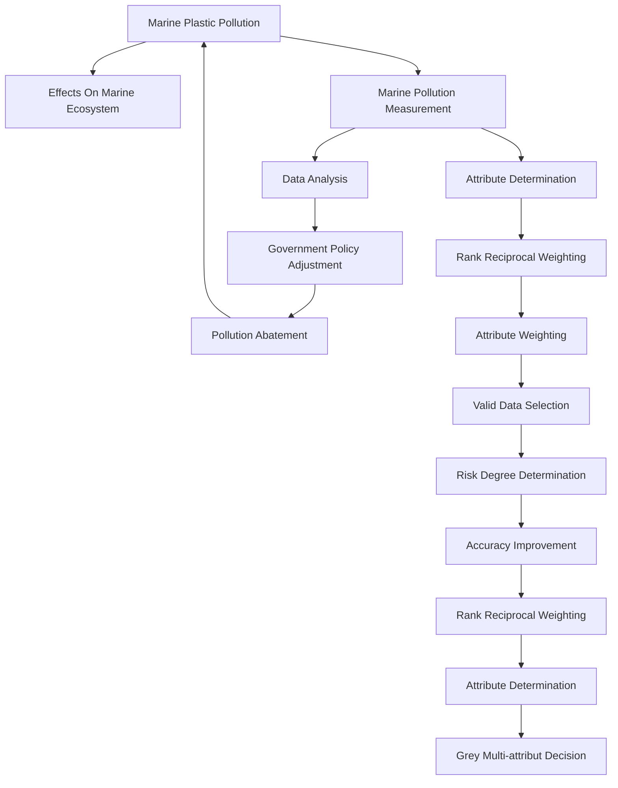

## Team Control Number

For office use only

T1 \_\_\_\_

T2 \_\_\_\_

T3 \_\_\_\_

T4 \_\_\_\_

## 6947

Problem Chosen

C

For office use only

F1 \_\_\_\_

F2

F3

F4

## Summary

After mathematically analyzing and modeling the ocean problem, we would like to present our conclusions and recommendations in order to determine the government policies and practices that should be implemented to ameliorate negative effects of marine debris.

We analyzed large mount of data and determined the severity and global impact of floating plastic. Our model uses the Multi-attribute Decision theory to select the valid data to improve the accuracy of the outcomes.

We made a deeper study on the risk degree of different types of floating plastic. This would provide valuable and economic insight into the pollution abatement. By knowing the most threatening plastic to the marine ecosystem, we provided practical suggestions in three levels for the government policy maker.

The model achieves several important objectives:

- The analysis of the marine debris problem: Floating plastic poses great danger on marine ecosystem and the damage is mainly caused by marine organism's ingestion.  
- The risk degree of different types of plastic: among all kinds of floating plastic, the risk degrees of fragments and thin plastic are the largest and second largest respectively. In other words, fragments and thin plastic films are the most harmful two types of plastic  
- An effective and economic ways to abate the marine pollution: according to the different risk degree of different types of plastic, policies should be specific designed. Strict policies should apply to the more harmful plastic.

Our model meets our expectations, and is easily modified to support different marine areas. We believe that our model can be used in further research and our recommendations will contribute a lot to the marine protection.

# A new method for pollution abatement: different solutions to different types

## Introduction

The wastes dumped into the ocean by human beings are accumulating in high densities over a large area due to the ocean current. The Great Pacific Ocean Garbage Patch is just one of five that may be caught in giant gyres scattered around the world's oceans (Hoshaw, 2009). The accumulation of the wastes, most are plastic, is now recognized as a serious problem in marine ecosystem (Tanimura, 2007). Although the plastic pollution is quite evident and many researchers have estimated the amount of different types of floating marine debris, there are few studies on the risk degree of different types of plastic to the marine creatures.

To accomplish this goal, we model and analysis the risk degree caused by different types of plastic to the marine organism. As an application, we apply this model to the government legislation. The determination of the risk degree of all the types of plastic can help the policy maker formulate the favorable regulations, policies and laws according to the risk degree of the different materials. In this way, the marine environmental protection policies will be more proper, effective and it will cut down the unnecessary expense.

## Analysis about ocean debris problem

Plastic is extensively used in various industries for its lightweight, strong, durable and cheap advantages (Laist, 1987). And the study of Unnithan(1998) showed that the recovery of plastic often does not provide readily realizable profits, or options for reuse. So more and more abandoned plastic enter to the nature every year and cause serious pollution. Since the ocean is downhill and downstream from virtually everywhere humans live, and about half of the world's human population lives within 50 miles of the ocean, lightweight plastic trash, lacking significant recovery infrastructure, blows and runs off into the sea (Moore, 2008). This have caused seriously marine pollution and posed a danger on marine ecosystem.

Marine debris poses a danger to marine organisms through ingestion and entanglement (Moore 2001). Between these two ways, ingestion should be attached greater important to because the ingestion of small size plastic fractions affects large number and diversity of species when compared to the entanglement. (Monica F, 2009) Spear et al. (1995) provided solid evidence for a negative relationship between number of plastic particles ingested and physical condition in seabirds from the tropical Pacific.

Moreover, Mato et al. (2001) found that plastic resin pellets contain toxic chemicals such as PCBs and nonylphenol. They suggested that plastic resin pellets could be an exposure route for toxic chemicals, potentially affecting marine organisms.

From the published data on the abundance of floating plastic in the North Pacific Ocean (ReiYamashita 2006) we know that the abundance of floating plastic is increasing enormously every few years.

line chart

| Year | Abundance (pieces/km²) |
| :--- | :--- |
| 1975 | 132 |
| 1988 | 12800 |
| 1999 | 74700 |
| 2001 | 174000 |

Figure1 Abundance of floating plastics in the North Pacific Ocean during 1975-2001

## Terminology and Conventions

This section defines the basic terms used in this paper.

- Risk degree of a type of plastic refers to its damage possibility to the marine organism. That is to say, the larger a kind of plastic's risk degree is, the more likely it is ingested by marine organism and cause damage to the creature.  
- The abundance of a type of plastic refers to the number of plastic debris per square kilometer.  
- The size of a piece of plastic refers to the minimum mesh size the plastic piece can go though. Here we use the mesh size as the size of a piece because the actual size of the debris can not be measured accurately.  
- The attribute is used to measure the achieving degree of an object. In this paper, the object is the risk degree of the plastic. The two attributes are abundance and size of the plastic.  
- The weight of an attribute is the relative importance of the attribute. The larger the weight is, the more decisive it is for the object.

Table 1 Variables and definitions

<table><tr><td>Variable</td><td>definition</td><td>Variable</td><td>definition</td></tr><tr><td> $w_i$ </td><td>The weight of attribute  $i$ </td><td>A</td><td>Total-abundance attribute</td></tr><tr><td>B</td><td>Mesh-size attribute(mm)</td><td> $r_{ij}$ </td><td>Effect measurement</td></tr><tr><td> $s_{ij}$ </td><td>The performance of alternative  $j$  determined by attribute  $i$ </td><td> $u_i^{\max}$ </td><td>Upper limit of effect measurement</td></tr><tr><td> $u_i^{\min}$ </td><td>Lower limit of effect measurement</td><td>D</td><td>Decision matrix</td></tr><tr><td> $x(k)$ </td><td>Raw data of alternative  $k$ </td><td> $r(k)$ </td><td>Regularization data of alternative  $k$ </td></tr></table>

## Assumptions

We make the following assumptions in this paper:

- Moore’s data in 1999 is accurate and random enough to be a representative sample of the North Pacific Central Gyre.  
- Marine debris poses danger to marine organisms only through ingestion. This ignores the danger brought by entanglement because the ingestion of small size plastic fractions affect large number and diversity of species when compared to the entanglement (Monica F, 2009).  
- The danger to marine organism is only determined by the amount of pieces it ingests. The more pieces of plastic it ingest, the greater it will harm the plastic eater. The assumption is necessary because the other data, like poison chemical content of the plastic, cannot be obtained in our work.  
- The amount of plastic the creatures ingest is only determined by two factors: the size of the plastic and the abundance of the plastic. This ignores the other factors may contribute to fish digestion such as color and shape, which are difficult to model accurately and have little effect on fish ingestion.  
- The eating habits of different marine organism are same. In other words, all the marine creatures food selection are the same and their ingestion are random.

## Modeling

The logic of the simulation process is detailed in Figure 2.

flowchart

Figure2 simulation of the pollution abatement process

## Attribute weighting

To determine the risk degree of different types of plastic, both the abundance attribute and size attribute should be taken into consideration. But the effect degree of the two attributes, the abundance and the size of the plastic, is not known. So we use the Rank Reciprocal Weighting theory to set the weight of these two attributes.

In Rank Reciprocal Weighting method, the denominator of a weight is the sum of all the attribute rank reciprocals. The numerator of a weight is its attribute rank reciprocal. The smaller an attribute rank is, the more importance the attribute is, the larger its rank reciprocal is and the larger its weight is. The weights $w_{i}$ of the factor i are

given by $w_{i} = \frac{1 / i}{\sum_{i=1}^{n} 1 / i}$ , where $n$ is the number of the attributes.

It is common sense that the abundance of the plastic is the main attribute that effect the marine organism, so the weight of abundance attribute is $w_{1}$ and the weight of size attribute is $w_{2}$ . According to the formula above, we have:

$$
w _ {1} = \frac {1 / 1}{1 / 1 + 1 / 2} = 2 / 3 w _ {2} = \frac {1 / 2}{1 / 1 + 1 / 2} = 1 / 3
$$

## Valid data selection

Then we will calculate the risk degree of both the abundance attribute and the size attribute to the marine ecosystem according to the raw data obtained by Moore in 1999(Moore. 2001). The data we need are as follows:

Table2  
Abundance (pieces $km^{2}$ ) of plastic pieces and tar found in the North Pacific gyre

<table><tr><td>Mesh-size(mm)</td><td>Total-abundance</td></tr><tr><td>&gt;4.706</td><td>24764</td></tr><tr><td>4.759--2.800</td><td>19696</td></tr><tr><td>2.799--1.000</td><td>114288</td></tr><tr><td>0.999--0.710</td><td>85903</td></tr><tr><td>0.709--0.500</td><td>57928</td></tr><tr><td>0.499--0.355</td><td>31692</td></tr><tr><td>Total</td><td>334270</td></tr></table>

Each group data can be regarded as an alternative, and though the Grey System Theory we can get the valid data.

Table3 Effect measurement decision matrix

<table><tr><td colspan="2">Alternative</td><td>1</td><td>2</td><td>3</td><td>4</td><td>5</td><td>6</td></tr><tr><td>factor A</td><td>Total_abundance</td><td>24764</td><td>19696</td><td>114288</td><td>85903</td><td>57928</td><td>31692</td></tr><tr><td>factor B</td><td>Mesh-size(mm)</td><td>4.706</td><td>2.800</td><td>1.000</td><td>0.710</td><td>0.500</td><td>0.355</td></tr></table>

When the size of the plastic is fixed, the larger the abundance of a type of plastic is, the more likely it is ingested. That is to say, the more the abundance of the plastic is, the larger the risk degree is. So we use the upper limit effect measurement, which is applicable when the effect measure is expected to be large. Let the maximum of all alternative outcomes $u_{i}^{max}$ be the corresponding element in the standard row:

$u_{i}^{\max}=\max_{j}s_{ij}$ . The upper effect measurement associated with i and j respectively

is defined as $r_{ij} = \frac{s_{ij}}{u_i^{\max}}, i = A, B; j = 1, 2, 3, 4, 5, 6$ .

Similarly, when the abundance of the plastic is fixed, the smaller the size of a type of plastic is, the more likely it is ingested. So we use the lower limit effect measurement, which is applicable when the effect measure is expected to be small. Let the minimum of all alternative outcomes $u_{i}^{min}$ be the corresponding element in the standard row:

$u_{i}^{\min} = \min_{j} s_{ij}$ . The upper effect measurement associated with i and j respectively

is defined as $r_{ij} = \frac{u_i^{\min}}{s_{ij}}, i = A, B; j = 1, 2, 3, 4, 5, 6$ .

Decision matrix is the matrix that uses to make a decision. Multi-attribute decision matrix is assembled by effect measurement $r_{ij}$ . A decision matrix D with n attributes and m alternatives are as follows:

$$
D = \left[ \begin{array}{c c c c} r _ {1 1} & r _ {1 2} & \dots & r _ {1 m} \\ r _ {2 1} & r _ {2 2} & \dots & r _ {2 m} \\ \vdots & \vdots & & \vdots \\ r _ {n 1} & r _ {n 2} & \dots & r _ {n m} \end{array} \right]
$$

Substituted $r_{ij}$ into decision matrix D, we have:

$$
D = \left[ \begin{array}{c c c c c c} r _ {A 1} & r _ {A 2} & r _ {A 3} & r _ {A 4} & r _ {A 5} & r _ {A 6} \\ r _ {B 1} & r _ {B 2} & r _ {B 3} & r _ {B 4} & r _ {B 5} & r _ {B 6} \end{array} \right] = \left[ \begin{array}{c c c c c c} 0. 2 1 7 & 0. 1 7 2 & 1. 0 0 0 & 0. 7 5 2 & 0. 5 0 7 & 0. 2 7 7 \\ 0. 0 7 5 & 0. 1 2 7 & 0. 3 5 5 & 0. 5 0 0 & 0. 7 1 0 & 1. 0 0 0 \end{array} \right]
$$

We have already figure out the weight of the abundance attribute and size attribute are 2/3 and 1/3 respectively. According to the Grey Multi-attribute Decision we have:

$$
\left[ \begin{array}{l l} 2 / 3 & 1 / 3 \end{array} \right] \left[ \begin{array}{l l l l l l} 0. 2 1 7 & 0. 1 7 2 & 1. 0 0 0 & 0. 7 5 2 & 0. 5 0 7 & 0. 2 7 7 \\ 0. 0 7 5 & 0. 1 2 7 & 0. 3 5 5 & 0. 5 0 0 & 0. 7 1 0 & 1. 0 0 0 \end{array} \right] = \left[ \begin{array}{l l l} 0. 1 7 0 & \text {Alternative} & 1 \\ 0. 1 5 7 & \text {Alternative} & 2 \\ 0. 7 8 5 & \text {Alternative} & 3 \\ 0. 6 6 8 & \text {Alternative} & 4 \\ 0. 5 7 5 & \text {Alternative} & 5 \\ 0. 5 1 8 & \text {Alternative} & 6 \end{array} \right]
$$

The contribution of alternative 1 and alternative 2 to the outcome is litter, so these two alternatives are not valid alternatives and should be rejected. Then we will analysis the risk degree of different types of plastic respectively according to the other four alternatives.

## Risk degree determination

Let $x(k), k = 3,4,5,6$ be the number of alternative $k$ and regulate these 4

alternatives according to the formulation: $r(k) = \frac{x(k)}{\sum_{k=3}^{6}x(k) / 4}$ . Then we have:

$$
\left[ \begin{array}{c c c c} 0. 3 0 9 & 0. 2 6 3 & 0. 2 2 5 & 0. 2 0 3 \end{array} \right]
$$

By the research of Moore in 1999, we have data as follows:

Table4  
Abundance by type and size of plastic pieces and tar in North Pacific gyre

<table><tr><td>alternative\plastic</td><td>Fragments</td><td>Styrofoam pieces</td><td>pellets</td><td>Polypropylene /monofilament</td><td>Thin plastic films</td><td>Miscellaneous</td></tr><tr><td>Alternative 3</td><td>61187</td><td>1593</td><td>12</td><td>9969</td><td>40622</td><td>905</td></tr><tr><td>Alternative 4</td><td>55780</td><td>591</td><td>0</td><td>2933</td><td>26273</td><td>326</td></tr><tr><td>Alternative 5</td><td>45196</td><td>576</td><td>12</td><td>1460</td><td>10572</td><td>121</td></tr><tr><td>Alternative 6</td><td>26888</td><td>338</td><td>0</td><td>845</td><td>3222</td><td>398</td></tr></table>

Regulate the data in table 4 follow the formulate above and we have:

Table5 Regulation data of table 4

<table><tr><td>alternative\plastic</td><td>Fragments</td><td>Styrofoam pieces</td><td>pellets</td><td>Polypropylene /monofilament</td><td>Thin plastic films</td><td>Miscellaneous</td></tr><tr><td>Alternative 3</td><td>0.5354</td><td>0.0139</td><td>0.0001</td><td>0.0872</td><td>0.3554</td><td>0.0079</td></tr><tr><td>Alternative 4</td><td>0.6493</td><td>0.0069</td><td>0.0000</td><td>0.0341</td><td>0.3058</td><td>0.0038</td></tr><tr><td>Alternative 5</td><td>0.7802</td><td>0.0050</td><td>0.0002</td><td>0.0252</td><td>0.1825</td><td>0.0021</td></tr><tr><td>Alternative 6</td><td>0.8484</td><td>0.0107</td><td>0.0000</td><td>0.0267</td><td>0.1017</td><td>0.0126</td></tr></table>

Then the risk degrees of different types of plastic are as follows:

$$
\left[ \begin{array}{l l l l} 0. 3 0 9 & 0. 2 6 3 & 0. 2 2 5 & 0. 2 0 3 \end{array} \right] \left[ \begin{array}{l l l l l l} 0. 5 3 5 4 & 0. 0 1 3 9 & 0. 0 0 0 1 & 0. 0 8 7 2 & 0. 3 5 5 4 & 0. 0 0 7 9 \\ 0. 6 4 9 3 & 0. 0 0 6 9 & 0. 0 0 0 0 & 0. 0 3 4 1 & 0. 3 0 5 8 & 0. 0 0 3 8 \\ 0. 7 8 0 2 & 0. 0 0 5 0 & 0. 0 0 0 2 & 0. 0 2 5 2 & 0. 1 8 2 5 & 0. 0 0 2 1 \\ 0. 8 4 8 4 & 0. 0 1 0 7 & 0. 0 0 0 0 & 0. 0 2 6 7 & 0. 1 0 1 7 & 0. 0 1 2 6 \end{array} \right] = \left[ \begin{array}{l} \text {   } \\ \text {   } \\ \text {   } \\ \text {   } \\ \text {   } \\ \text {   } \\ \text {   } \\ \text {   } \\ \text {   } \\ \text {   } \\ \text {   } \\ \text {   } \\ \text {   } \\ \text {   } \\ \text {   } \\ \text {   } \\ \text {   } \\ \text {    } \\ \text {   } \\ \text {   } \\ \text {   } \\ \text {   } \\ \text {   } \\ \text {   } \\ \text {   } \\ \text {   } \\ \text {   } \\ \text {   } \\ \text {   } \\ \text {   } \\ \text {   } \\ \text {   } \\ \text {   } \\ \text {   } \\ \end{array} \right]
$$

According to the outcomes, the fragments and thin plastic films are the most harmful two types of plastic. 93.6% of the damager is caused by these two types of plastic and risk degrees of others are very small in comparison to them.

bar chart

| Category | Risk degree |
|---|---|
| Fragments | 0.684 |
| Styrofoam pieces | 0.0105 |
| Pellets | 0.0001 |
| Polypropylene /monofilament | 0.047 |
| Thin plastic films | 0.252 |
| Miscellaneous | 0.0065 |

Figure3 Risk degrees of different types of plastic

## Strength of model

Our model meets all of our original expectations with the use of the Rank Reciprocal Weighting theory and Grey Multi-attribute Decision method. We have determined the risk degree of different types of plastic. By knowing the risk degree of all kinds of plastic in ocean, the policy maker can formulate specific, effective and economic policies and regulations.

The model provides a framework for marine plastic pollution monitoring which can be applied to various periods and various sea areas. Extend this model to other sea areas, different policies can be made depending on the pollution in different areas to protect the ocean more effective and to the point.

Finally, a great strength of our model lies in the accuracy selection of the valid data. After calculation, analysis and selection, we substitute the valid data into the model to get a more accuracy outcome. Besides, our data show that the plastic we choose were 0.355-2.799mm in size. This size of particle could be ingested by most marine organism (Bourne and Imber, 1982; Azzarello and Van Vleet,1987; Moore et al.,2001). So the accuracy of our data selection can be confirmed.

## Weakness of model

In fact, some other factors may contribute to the risk degree are not taken into consideration, such as the poison and the figure of the plastic. This may lead to a deviation of our model.

In reality, the habits of different marine organism are different. But this behavior is not reflected in our model. While we believe that all the behavior of the marine creatures are the same and their ingestions are random.

Our model aims to find out the risk degrees of different types of plastic. While we can not use this model measuring the overall marine pollution level.

## Discussion

According to our model, the fragments and thin plastic films are the most harmful two types of plastic. The fragments danger makes up 68.4% of total danger that caused by floating plastic, the thin plastic film make up 25.2%. And the risk degrees of others are very small in comparison to them. So we divided the floating plastic into 3 grades by the risk degree: fragments belong to “the high risk plastic” (HRP), thin plastic films belong to “the middle risk plastic” (MRP), Styrofoam pieces, pellets and Polypropylene/monofilament belong to “the low risk standard plastic” (LRP)

Allow for the notable different among these three standards, we suggest policy maker make different policies to different plastic in order to abate the marine pollution more effective and more economic.

The methods to grade the plastic compound products are as follow:

## Condition 1 If the product is only made up of HRP and MRP

Let the proportion and risk degree of HRP be p and $\omega_{1}$ respectively. Let the proportion and risk degree of MRP be q and $\omega_{2}$ respectively. If $p/q > \omega_{2}/\omega_{1}$ , the product should be named as HRP. Otherwise, it should be named as MRP.

## Condition 2 If the product contains LRP

Because the risk degree of LRP is very low, the product should be named as LPR only when the proportion of LRP is higher than 90%. Otherwise, the product should be named follow the Condition1. The specific solutions to the three standards are as follow:

Table 6 The specific solutions to the three standards

<table><tr><td>Policy Solution</td><td>The policy for HRP</td><td>The policy for MRP</td><td>The policy for LRP</td></tr><tr><td>grades of tax rates</td><td>highest</td><td>high</td><td>low</td></tr><tr><td>Rate of reuse</td><td>&gt;=85%</td><td>&gt;=75%</td><td>&gt;=60%</td></tr><tr><td>penalty for littering plastic</td><td>Fines up to $50000 per day</td><td>Fines up to $40000 per day</td><td>Fines up to $30000 per day</td></tr><tr><td>research funding</td><td>Highest</td><td>high</td><td>low</td></tr></table>

Note: The penalty for littering plastic is decided referring to the environment law on of United States.

In comparing plastics with other discarded materials such as lignocellulosic paper, plastics are chemically resistant, are particularly persistent in the environment (Andrady A. L.2003). The cost of removing the existing floating plastic is prohibiting. To prevent the accumulation of the plastic debris in North Pacific Ocean, the most effective way is cut down the source of the waste.

## Recommendations

Due to the extensively use of plastic in industries, just forbid the production of the plastic to abate the pollution is unrealistic. To improve the marine environment, we recommend:

- Reduce the production of plastic products which will decompose into fragments or thin plastic films, such as hard plastic and plastic bags, as far as the basic demand of people can be met.  
- Modify the design of products or package to reduce the use of plastic.  
- Make plastic more durable so that it will be reused to reduce the total demand for plastic.  
● Make policy that banning all the promotion for plastic products.  
- Substitute away the toxic constituents in plastic products.  
- Moderately increase the tax for purchasing plastic products.

- For the area that is seriously polluted, clean up the debris with an efficient and economic method. For example, work in night to reduce the damage to the local ecosystem because the plankton abundance during the day is higher than that at night.  
- In future research on marine plastic pollution, much more importance should be attached to the abundance of fragments and thin plastic films. The changes of them should be monitored and used to adjust their standards. And the policies can be adjusted according to the risk standards.  
- Increase the funding on research of plastic degrade.  
- Improve the reuse of the plastic products.  
- Establish a comprehensive and accuracy marine pollution database for further study.

## Reference

Andrady, A. L., 2003. In Plastics and the environment (ed. Andrady A. L.). West Sussex, England: John Wiley and Sons.  
Azzarello, M.Y., Van Vleet, E.S., 1987. Marine birds and plastic pellets. Marine Ecology Progress Series 37 (2–3), 295–303.  
Bourne, W.R.P., Imber, M.J., 1982. Plastic pellets collected by a prion on Gough Island, Central South Atlantic Ocean. Marine Pollution Bulletin 13 (1), 20–21.  
Costa M.F., 2009. On the importance of size of plastic fragments and pellets on the strandline: a snapshot of a Brazilian beach. Environ Monit Assess. doi:10.1007/s10661-009-1113-4.  
Hoshaw L., 2009. Afloat in the Ocean, Expanding Islands of Trash. Retrieved February 21, 2010, from: http://www.nytimes.com/2009/11/10/science/10patch.html?em  
Laist, D.W., 1987. Overview of the biological effects of lost and discarded plastic debris in the marine environment. Marine Pollution Bulletin 18, 319–326.  
Mato, Y., Isobe, T., Takada, H., Kanehiro, H., Ohtake, C., Kaminuma, T., 2001. Plastic resin pellets as a transport medium for toxic chemicals in the marine environment. Environmental Science and Technology 35, 318–324.  
Moore, C.J., Moore, S.L., Leecaster, M.K., Weisberg, S.B., 2001. A comparison of plastic and plankton in the North Pacific central gyre. Marine Pollution Bulletin 42 (12), 1297–1300.  
Moore, C. J., 2008. Synthetic polymers in the marine environment: A rapidly increasing, long-term threat. Environmental Research 108, 131–139  
Spear, L.B., Ainley, D.G., Ribic, C.A., 1995. Incidence of plastic in seabirds from the Tropical Pacific, 1984–91: relation with distribution of species, sex, age, season, year and body weight. Marine Environmental Research 40, 123–146.  
Tanimura A., Yamashita R., 2007. Floating plastic in the Kuroshio Current area, western North Pacific Ocean. Baseline / Marine Pollution Bulletin 54,464–488  
Unnithan, S., 1998. Through thick, not thin, say ragpickers. Indian Express 23 November.