# Tracking Serial Criminals with a Road Metric

Control #7273

February 22, 2010

## Abstract

In this paper, we present a computerized model to predict future crime locations and probable residences for a serial criminal based on the locations and times of a sequence of past crimes. We first create a “road metric” in order to measure distances by automobile travel time. In order to predict future crime locations, we apply the nonparametric statistical technique of kernel density estimation with our road metric, which allows us to estimate a time dependent probability distribution function. In order to predict the residences of serial criminals, we use a refinement of a model developed by Rossmo, again adapting it to the road metric. This method develops a probability distribution for where a criminal might live by balancing the convenience of previous attack locations with the observation that greater distances from home afford more opportunities for crime and a lesser chance of being caught. We apply our model to several high profile serial murder cases, namely the case of Peter Sutcliffe, the “Yorkshire Ripper” and that of Wayne Williams, the “Atlanta Child Murderer.” In both cases, our model was successful in predicting the region of the criminal, and might prove useful in a criminal investigation.

## Contents

1 Introduction 3  
1.1 Outline of Our Approach . . . 3  
1.2 Assumptions 3

2 Mapping Crime and the Road Metric 4

2.1 Road Metric . . 4

3 Estimating and Extrapolating a Probability Density Function 5

3.1 Kernel Density Estimation . . . 5

3.2 Extrapolating Future Probability Density Functions . . . . . 6

4 Best Fit Circle and Rossmo’s Model 7

4.1 Centrography . . 7

4.2 Best Fit Circle 7

4.2.1 A First Attempt . . . . 7

4.2.2 A More Refined Best Fit Circle . . . . 8

4.3 Application to Rossmo’s Model . . . 8

5 Case Studies 10

5.1 Yorkshire Ripper . . . . 10

5.1.1 Map and Metric 10

5.1.2 Probability Density Estimate . . . . 11

5.1.3 Rossmo’s Model 11

5.1.4 Assessment of Results . . 11

5.2 Atlanta Child Murders . . 13

5.2.1 Metric and Map . . 13

5.2.2 Probability Density Estimate . . . . 13

5.2.3 Application to Rossmo’s Method . . . 13

5.2.4 Assessment of Results . . . . 14

6 Improving the Model 16

6.1 Expanding the Road Metric . . 16

6.2 Profiling Potential Victims . . 16

6.3 Improving Computational Efficiency . . 17

6.4 Testing to Choose Optimal Parameters . . . . 17

7 Conclusion 17

8 Executive Summary 17

References 1 9

## 1 Introduction

In this paper we present a computerized model for studying serial crime patterns. Our model takes highway systems into account as a significant determiner of how criminals behave. Specifically, we created a road metric to give a measure of the time it takes for a driver to travel between two points on a map. We incorporate this road metric into several different models to give an estimate of where future crimes may occur and where the perpetrator may live. Our models give law enforcement agencies an estimate as to where they could patrol with the highest likelihood of apprehending the criminal, as well as where they should conduct their investigation into the residence of the criminal.

## 1.1 Outline of Our Approach

The beginning of our paper will be devoted to presenting the theoretical framework and an outline of our computer implementation. The later sections of our paper will be devoted to applying our model to famous notable criminal cases and assessing the accuracy of the model. For each criminal investigation we will do roughly the following:

• Develop the “road metric” to measure distances based on how long it takes to drive between them. This metric will be based primarily on the local highway system.  
• Estimate and extrapolate probability density functions for where criminals are likely to commit future crimes.  
• Estimate offender’s residence using a best fit circle under the road metric and by applying a modification of current models.

## 1.2 Assumptions

Due to the huge variation in criminal activity, as well as the highly unusually and unpredictable psychological pathologies that high profile serial killers often have, using a relatively simple computer model to predict serial crime in general faces several hurdles. Below are the assumptions we take about the crimes that our model is applied to:

• Crimes are committed by individuals. We assume the series of crimes has been attribute with a high degree of certainty to a single individual. We did not design our model to analyze organized crime, gang, or mob activity.  
• Criminals travel mostly by automobile. Our model makes significant use of analyzing highway patterns to judge distances based on how long it takes to travel them by automobile.

• Crimes are committed near to at where they are discovered by police In terms of murder cases, this means that body dump sites are murder sites. This is not an unreasonable assumption, as disorganized serial killers often leave their victims near the murder site [9]. Note that in serial crimes such as serial rape, burglary, or arson, there is no distinction between the site of the crime and the site found by police.

• Crimes are occurring within a small region, i.e. roughly within a city or county. This eliminates the case that crimes are occurring across multiples states or countries. In those cases, our model should be applied to each cluster of crimes.

## 2 Mapping Crime and the Road Metric

We used the mathematical software Sage to create a map of the area surrounding serial criminal incidents. The main features we included in the maps are the major highways, as well as the locations of criminal activities. We treat the highway system as a graph, considering each highway entrance and exit as a vertex in the graph, and each road section in between a pair of entrances and exits as an edge of the graph. Each edge is given a weight corresponding to to the Euclidean length between its corresponding vertices.

## 2.1 Road Metric

For each map M, we computed a road metric d : $M \times M \to \mathbb { R } ^ { + }$ . The road metric measures distances within a region based on the approximate total travel time by car. The metric makes the assumption that drivers will usually take the shortest path between two points, utilizing highways as much as possible instead of traveling entirely via side-streets. The metric makes the assumptions that

• Time spent on side streets is proportional to the Manhattan metric since side streets are often organized into a grid shape,  
• Time spent on the freeway is proportional to the Euclidean distance.

Given points a and b on the map, we compute the road metric as follows:

1. For each vertex v in our highway system (which correspond to entrances or exits on the freeway), we compute the Manhattan distances $M ( \mathbf { v } , \mathbf { a } )$ and $M ( \mathbf { v } , \mathbf { b } )$ .  
2. For each pair of vertices $\mathbf { v } _ { 1 } , \mathbf { v } _ { 2 } .$ we apply Dijkstra’s algorithm to find the shortest path (taking into consideration the lengths of the edge segments) on the graph of our highway system from $\mathbf { v } _ { 1 }$ to $\mathbf { v } _ { 2 }$ . We call this distance $E ( \mathbf { v } _ { 1 } , \mathbf { v } _ { 2 } )$ .

3. Then our road metric is defined as

$$
d (\mathbf {a}, \mathbf {b}) = \min \left\{\min _ {\mathbf {v} _ {1}, \mathbf {v} _ {2}} \{M (\mathbf {a}, \mathbf {v} _ {1}) + E (\mathbf {v} _ {1}, \mathbf {v} _ {2}) + M (\mathbf {v} _ {2}, \mathbf {b}) \}, M (\mathbf {a}, \mathbf {b}) \right\},
$$

or in other words, the minimum of the fastest way to take the highway, and taking a route which avoids the highway.

In terms of actually computing the road metric, we divided the maps into m × n grids and computed and then stored the distance from each grid space to each other grid space.

## 3 Estimating and Extrapolating a Probability Density Function

## 3.1 Kernel Density Estimation

Given the locations and positions of criminal incident, we created a first estimate for the probability density distribution for future crimes as follows. In the case of a Euclidean distances, given a set of sample points $\{ \mathbf { x } _ { 1 } , \ldots , \mathbf { x } _ { n } \}$ generated by a random variable, one often estimates the probability density function as

$$
\phi (\mathbf {x}) = \frac {1}{N} \sum_ {i = 1} ^ {N} K _ {A} (\mathbf {x} - \mathbf {x} _ {i})
$$

where

$$
K _ {A} (\mathbf {x} - \mathbf {x} _ {i}) = \frac {1}{2 \pi | A | ^ {1 / 2}} e ^ {- ((\mathbf {x} - \mathbf {x} _ {i}) ^ {t} A ^ {- 1} (\mathbf {x} - \mathbf {x} _ {i}))}
$$

where A is a covariance matrix, which amounts to adding small normal distributions around each point to generate an estimated probability density function [7], [10],[2]. We observe that since covariance matrices are positive definite, the quadratic form xtAx induces a norm on $\mathbb { R } ^ { n }$ defined by

$$
\| \mathbf {x} \| = \sqrt {\mathbf {x} ^ {t} A \mathbf {x}},
$$

which in turn induces a metric. This naturally presents an application of our road metric by replacing the Gaussian function K (shown above) with the modified Gaussian function, G, defined by

$$
G (\mathbf {x}, \mathbf {x} _ {i}, t) = \frac {1}{M _ {i} (t)} \mathrm{Exp} \left(- \frac {d (\mathbf {x} , \mathbf {x} _ {i}) ^ {2}}{(h (t - t _ {i})) ^ {2}}\right),
$$

where d is the road metric defined above, and h is essentially an indirect control the covariance of this kernel and $M _ { i }$ is the normalizing constant defined by

$$
M _ {i} (t) = \int \mathrm{Exp} \left(- \frac {d (\mathbf {x} , \mathbf {x} _ {i}) ^ {2}}{(h (t - t _ {i})) ^ {2}}\right) d \mathbf {x}.
$$

We treat h as a function of time since it is reasonable to assume that more recent crimes are more useful in predicting future crimes than earlier crimes and hence it is reasonable to let the modified Gaussian functions “diffuse” over time by letting h be an increasing function. We empirically determined that setting $h ( t ) = 2 . 5 \arctan ( 2 t + . 2 )$ , where t is measured in weeks, was a good fit. Our estimate for the probability density function thus becomes

$$
\phi (\mathbf {x}, t) = \frac {1}{N} \sum_ {i = 1} ^ {N} G (\mathbf {x}, \mathbf {x} _ {i}, t). \tag {1}
$$

In terms of actually computing $\phi ( \mathbf { x } , t )$ , as we did with the road metric, we computing $\phi$ for each grid space in our partitioned $m \times n$ grid using the precomputed values of our road metric.

## 3.2 Extrapolating Future Probability Density Functions

Our above discussion gives a reasonable idea of where crimes have been committed, but it is not necessarily reasonable to expect that a criminal will distribute his or her crimes based on a single probability distribution function for all time. Therefore we decided to perform a weighted least squares approximation based on trends in the probability distribution functions discussed above. The idea is to make a linear approximation to the probability density functions and predict a future probability density function outside of our data set. Our method is as follows. Suppose $\mathbf { x } _ { 1 } , \ldots , \mathbf { x } _ { n }$ represent the location of crimes which occurred respectively at $t _ { 1 } < t _ { 2 } < \cdots < t _ { n } .$ , and that we want a probability density function at some time $t ^ { * } > t _ { n }$ .

• In our equation for $\phi ( \mathbf { x } , t )$ (Equation 1), we sum over only the crimes which have occurred before time t.  
• So that our linear approximation is not biased by the initial spikes from the kernels functions resulting from individual murders initially being point masses, we wish to let our density functions “diffuse” as much as possible. Using the probability density estimation in Equation 1, we compute the probability density functions

$$
\phi (\mathbf {x}, t _ {2} - \epsilon), \phi (\mathbf {x}, t _ {3} - \epsilon), \ldots , \phi (\mathbf {x}, t _ {n} - \epsilon)
$$

for some small  as well as

$$
\phi (\mathbf {x}, t _ {M})
$$

for some $t _ { M }$ between $t _ { n }$ and $t ^ { * }$ .

• We now do a weighted least squares approximation to estimate $\phi ( \mathbf { x } , t ^ { * } )$ . To do this, we consider $\phi ( \mathbf { x } , t )$ pointwise over our $m \times n$ map grid and perform a weighted least squares. We modify the well known normal equations for a standard least squares problem $X ^ { t } X \hat { \boldsymbol { \beta } } = X ^ { t } y$ as described in [1] to get the modified normal equations

$$
X ^ {t} W X \hat {\beta} = X ^ {t} W y
$$

where W is a weight matrix. We chose to weight the the probability density functions $\phi ( \mathbf { x } , t _ { n } )$ linearly in time (so that later crimes are weighted much more than earlier crimes).

## 4 Best Fit Circle and Rossmo’s Model

## 4.1 Centrography

One common method for estimating the residence of a serial criminal is to treat the location of each crime as a point mass and find the centroid of the point masses by means of a spacial average. According to [9], centrography is one of the most common search methods for criminal investigations and has been used to examine serial rape cases in San Diego, as well as the case of the Yorkshire Ripper. According to [4], there is a significant amount of evidence showing that serial rapists often live close to the centroid of their offense locations.

## 4.2 Best Fit Circle

A reasonable extension of the idea of using a centroid to estimate the location of a criminals residence is to attempt to fit a circle to the location of criminal activities. This is based on the assumption that criminals will typically try to avoid committing crimes very near to where they live, but at the same time will expend roughly the same amount of effort in each of their crimes. Since we would expect the energy put into a crime by a criminal would be comparable to the total amount of time they spend traveling, we thought to apply the road metric we discussed earlier.

## 4.2.1 A First Attempt

The most naive thing we could do is fit a circle to the data by minimizing the square of the distance from our crime locations to a circle, i.e. minimize

$$
\sum_ {i} (d (C _ {r} (\mathbf {x}), \mathbf {y})) ^ {2} = \sum_ {i} | d (\mathbf {x}, \mathbf {y}) - r | ^ {2},
$$

where the sum is taken over all of crime locations xi. Unfortunately this method is very unstable. Consider the example in Figure 1 of the best fit circle for three points. Moving the middle point slightly produces a tremendous change in the best fit circle’s radius and center.

text_image

Diagram showing a circle transforming into a curved line with cross marks, likely illustrating a transformation or mapping process.

Figure 1: The unstable behavior of a naive best fit circle.

## 4.2.2 A More Refined Best Fit Circle

A better generalization would be to notice that in Euclidean coordinates, given a set of points $\mathbf { x } _ { 1 } , \ldots . . . \mathbf { x } _ { n }$ , then the point x such that

$$
\sum_ {i = 1} ^ {n} \left\| \mathbf {x} - \mathbf {x} _ {n} \right\| ^ {2}
$$

is minimized is the centroid of the region.

This provides a natural generalization to the road metric which is perhaps a better extension of the often used method of centrography. Namely, we define the center of our best fit circle to be the point x such that

$$
\sum_ {i = 1} ^ {n} (d (\mathbf {x}, \mathbf {x} _ {i})) ^ {2}
$$

is minimized. We will define the radius, r, to be the average distance from x to the crime locations, namely

$$
r = \frac {1}{n} \sum_ {i = 1} ^ {n} (d (\mathbf {x}, \mathbf {x} _ {i})).
$$

In Figure 2, we show an example of a circle in the road metric induced by a highway system. The particular highway system is from the Sutcliffe murder case which is discussed in further detail later in the paper.

## 4.3 Application to Rossmo’s Model

In [9], Rossmo presents the model for estimating the the residence of a criminal based on the location of their offenses. The model makes use of the idea of a buffer zone. The buffer zone is an area surrounding a criminals residence in which a criminal avoids committing crimes. The idea behind the buffer zone is that criminals will attempt to balance the energy they need to expend in order to go long distances away from their residence to commit crimes, and the increased risk of committing crimes near to where they live. There is a significant amount of research supporting Rossmo’s model, as well as the idea of a buffer zone, both in terms of criminal patterns as well as animal hunting patterns [5],[8].

natural_image

Abstract geometric line drawing with black dots and connecting lines on a pixelated background (no text or symbols)

Figure 2: A circle in the road metric induced by the graph for the Manchester Leeds area of England. The highway system graph is black and the circle is grey.

Rossmo’s model is based on subdividing a map of the general location of the crimes into a grid and then computing the estimated probability of a perpetrator residing in a particular grid space as

$$
p _ {j k} = K \sum_ {i = 1} ^ {N} \left(\frac {\phi}{\| \mathbf {x} _ {j k} - \mathbf {x} _ {i} \| ^ {f}} + \frac {(1 - \phi) B ^ {g - f}}{(2 B - \| \mathbf {x} _ {j k} - \mathbf {x} _ {i} \|) ^ {g}}\right)
$$

where

$$
\phi = \left\{ \begin{array}{l l} 1 & \text { if } \| \mathbf {x} _ {j k} - \mathbf {x} _ {i} \| <   B \\ 0 & \text { if } \| \mathbf {x} _ {j k} - \mathbf {x} _ {i} \| \geq B, \end{array} \right.
$$

and $f , g$ are constants, B is the radius of the buffer zone, and $K$ is some constant used to normalize the entire probability distribution. Empirically, Rossmo found that for criminal cases the optimal values for $f$ and $g$ were $f = g = 1 . 2$ In our model we adapted the formulation of Rossmo’s model to use the road metric. Thus the formulation of Rossmo’s model that we used in our simulations becomes

$$
p _ {j k} = K \sum_ {i = 1} ^ {N} \left(\frac {\phi}{| d (\mathbf {x} _ {j k} , \mathbf {x} _ {i}) | ^ {1 . 2}} + \frac {(1 - \phi)}{| 2 B - d (\mathbf {x} _ {j k} , \mathbf {x} _ {i}) | ^ {1 . 2}}\right).
$$

In order to estimate the radius of the buffer zone, we used our best fit circle in order to approximate the radius of a best fit circle under our metric, and then used half of this distance as the estimated radius of the buffer zone.

## 5 Case Studies

In this section we apply the models discussed earlier to two notable cases, namely the Yorkshire Ripper (Peter Sutcliffe) and the Atlanta Child Murderer (Wayne Williams).

## 5.1 Yorkshire Ripper

The Yorkshire Ripper murders were a series of murders which occurred between 1975 and 1981 in which 13 women were murdered and 7 attacked in the Manchester and Leeds area of England. Most of the women killed were prostitutes. Peter Sutcliffe was convicted of the murders and attacks. According to [3], the bodies did not appear to have been moved after the murders. We treated attacks and murders identically in our analysis.

## 5.1.1 Map and Metric

Using a map of the Manchester and Leeds area, we represented the highways as a graph, making sure to concentrate the exits and entrances (the nodes of the graph) around population centers. Figure 3 shows a color plot of the distance under the road metric from what was later determined to be Sutcliffe’s residence.

heatmap

| X  | Y  |
|----|----|
| 1  | 1  |
| 2  | 2  |
| 3  | 3  |
| 4  | 4  |
| 5  | 5  |
| 6  | 6  |
| 7  | 7  |
| 8  | 8  |
| 9  | 9  |
| 10 | 10 |

Figure 3: This shows the distance from Sutcliffe’s house under the road metric with an overlay of our graph representation of the nearby highway system. Sutcliffe’s house is at the house symbol. Red corresponds to a very short distance and dark blue corresponds to a long distance.

## 5.1.2 Probability Density Estimate

There were a total of 20 criminal incidents committed by Sutcliffe. We ran our density distribution model on the first 19 cases in order to predict the location of the 20th. We used the locations of the first 19 attacks and the time of the 20th in order to predict the location of the 20th. If one were to use our model in real life, the time of the next crime would not actually be known, but this is not of great importance since our choice of the variance function in our kernel causes the model to stabilize very quickly. The results are shown in Figure 4.

heatmap

| X  | Y  | Value |
|----|----|-------|
| 1  | 1  | 0.5   |
| 2  | 2  | 0.6   |
| 3  | 3  | 0.7   |
| 4  | 4  | 0.8   |
| 5  | 5  | 0.9   |
| 6  | 6  | 1.0   |
| 7  | 7  | 0.95  |
| 8  | 8  | 0.9   |
| 9  | 9  | 0.85  |
| 10 | 10 | 0.8   |

Figure 4: This shows the estimated probability distribution for the 20th attack knowing the first 19. The dots represent the attacks and the ‘x’ denotes the actual location of the 20th attack. Red indicates the highest probability and purple the lowest.

## 5.1.3 Rossmo’s Model

As discussed earlier, Rossmo’s model is designed to predict the location of the offender’s residence. We modified Rossmo’s model to make use of our road metric. As was discussed earlier, we first computed a best fit circle for the crimes using a generalized centroid, which is shown in Figure 5. We then used half of this value in the equation for Rossmo’s model to estimate the location of the residence of the murderer. A colorized plot is shown in Figure 6 and a plot of the estimated function as a surface is shown in Figure 7.

## 5.1.4 Assessment of Results

Our kernel method produced a strong hotspot around where the 20th murder actually took place. From our extrapolated probability distribution, the 20th attack was 8.58 times more likely to occur in the cell containing the actual murder site than it was to occur in an average square. More importantly, the result of our model would direct law enforcement officers to begin their search in precisely the square where the murder occurred.

```mermaid
graph TD
  A["Red Dot"] --> B["Black Square"]
  B --> C["Gray Circle"]
  C --> D["Gray Circle"]
  D --> E["Gray Circle"]
  E --> F["Gray Circle"]
  F --> G["Gray Circle"]
  G --> H["Gray Circle"]
  H --> I["Gray Circle"]
  I --> J["Gray Circle"]
  J --> K["Gray Circle"]
  K --> L["Gray Circle"]
  L --> M["Gray Circle"]
  M --> N["Gray Circle"]
  N --> O["Gray Circle"]
  O --> P["Gray Circle"]
  P --> Q["Gray Circle"]
  Q --> R["Gray Circle"]
  R --> S["Gray Circle"]
  S --> T["Gray Circle"]
  T --> U["Gray Circle"]
  U --> V["Gray Circle"]
  V --> W["Gray Circle"]
  W --> X["Gray Circle"]
  X --> Y["Gray Circle"]
  Y --> Z["Gray Circle"]
```

flowchart

Figure 5: The best fit circle of the attack locations under the road metric. The circle is shown in black, the graph is shown in grey, and the kill locations are shown in red.  

heatmap

| X  | Y  | Value |
|----|----|-------|
| 1  | 0  | 0     |
| 2  | 0  | 0     |
| 3  | 0  | 0     |
| 4  | 0  | 0     |
| 5  | 0  | 0     |
| 6  | 0  | 0     |
| 7  | 0  | 0     |
| 8  | 0  | 0     |
| 9  | 0  | 0     |
| 10 | 0  | 0     |
| 11 | 0  | 0     |
| 12 | 0  | 0     |
| 13 | 0  | 0     |
| 14 | 0  | 0     |
| 15 | 0  | 0     |
| 16 | 0  | 0     |
| 17 | 0  | 0     |
| 18 | 0  | 0     |
| 19 | 0  | 0     |
| 20 | 0  | 0     |
| 21 | 0  | 0     |
| 22 | 0  | 0     |
| 23 | 0  | 0     |
| 24 | 0  | 0     |
| 25 | 0  | 0     |
| 26 | 0  | 0     |
| 27 | 0  | 0     |
| 28 | 0  | 0     |
| 29 | 0  | 0     |
| 30 | 0  | 0     |
| 31 | 0  | 0     |
| 32 | 0  | 0     |
| 33 | 0  | 0     |
| 34 | 0  | 0     |
| 35 | 0  | 0     |
| 36 | 0  | 0     |
| 37 | 0  | 0     |
| 38 | 0  | 0     |
| 39 | 0  | 0     |
| 40 | 0  | 0     |
| 41 | -1 | -1    |
| 42 | -1 | -1    |
| 43 | -1 | -1    |
| 44 | -1 | -1    |
| 45 | -1 | -1    |
| 46 | -1 | -1    |
| 47 | -1 | -1    |
| 48 | -1 | -1    |
| 49 | -1 | -1    |
| 50 | -1 | -1    |
| 51 | -1 | -1    |
| 52 | -1 | -1    |
| 53 | -1 | -1    |
| 54 | -1 | -1    |
| 55 | -1 | -1    |
| 56 | -1 | -1    |
| 57 | -1 | -1    |
| 58 | -1 | -1    |
| 59 | -1 | -1    |
| 60 | -1 | -1    |
| 61 | -1 | -1    |
| 62 | -1 | -1    |
| 63 | -1 | -1    |
| 64 | -1 | -1    |
| 65 | -1 | -1    |
| 66 | -1 | -1    |
| 67 | -1 | -1    |
| 68 | -1 | -1    |
| 69 | -1 | -1    |
| 70 | -1 | -1    |
| 71 | -1 | -1    |
| 72 | -1 | -1    |
| 73 | -1 | -1    |
| 74 | -1 | -1    |
| 75 | -1 | -1    |
| 76 | -1 | -1    |
| 77 | -1 | -1    |
| 78 | -1 | -1    |
| 79 | -1 | -1    |
| 80 | -1 | -1    |
| 81 | -2   | -2    |
| 82 | -2   | -2    |
| 83 | -2   | -2    |
| 84 | -2   | -2    |
| 85 | -2   | -2    |
| 86 | -2   | -2    |
| 87 | -2   | -2    |
| 88 | -2   | -2    |
| 89 | -2   | -2    |
| 90 | -2   | -2    |
| 91 | -2   | -2    |
| 92 | -2   | -2    |
| 93 | -2   | -2    |
| 94 | -2   | -2    |
| 95 | -2   | -2    |
| 96 | -2   | -2    |
| 97 | -2   | -2    |
| 98 | -2   | -2    |
| 99 | -2   | -2    |
| Note: The actual values in the CSV data are not provided in the code. The code does not output any data points from the image. The actual values are generated using the formula `np.exp(-x)`.

Figure 6: The probability density estimated by Rossmo’s model for the perpetrator’s residence. Red indicates the highest probability. The actual location of Sutcliffe’s house is shown with the house symbol.

Although Rossmo’s model did not generate a hotspot directly on Sutcliffe’s residence, it still provided a good starting point for a police investigation. Sutcliffe’s house was on a second or third priority band and would be located reasonably quickly in a search effort.

natural_image

3D rendered blue surface within a wireframe cube, no text or symbols visible

Figure 7: Rossmo’s probability estimate as a surface.

## 5.2 Atlanta Child Murders

The Atlanta child murders refers to the murders of 29 boys and men between 1979 and 1981. Only 22 of these murders were conclusively linked to Wayne Williams, so we will use only these data points in our models. There is evidence that the bodies were found not far from where they were murdered [6]. Williams was tried and convicted of two of the murders in 1982.

## 5.2.1 Metric and Map

We used a map in [6] of the highway system surrounding the murder locations. As described earlier in the paper, we implement this as a graph and compute the road metric for this case. The distance from Williams’ house is shown in Figure 8.

## 5.2.2 Probability Density Estimate

We ran our model using the kernel probability function on 21 of the data points in order to predict the location of the 22nd murder. The results are shown in figure 9.

## 5.2.3 Application to Rossmo’s Method

Following the description of our model above, we first computed the best fit circle for the kills in the Atlanta data set. This is shown in Figure 10.

natural_image

Abstract pixelated heatmap with black nodes and connecting lines, no text or symbols present

Figure 8: The distance from Wayne Williams’ residence under the road metric.  

heatmap

| X | Y | Value |
| --- | --- | --- |
| 1 | 0 | 0 |
| 2 | 0 | 0 |
| 3 | 0 | 0 |
| 4 | 0 | 0 |
| 5 | 0 | 0 |
| 6 | 0 | 0 |
| 7 | 0 | 0 |
| 8 | 0 | 0 |
| 9 | 0 | 0 |
| 10 | 0 | 0 |
| 11 | 0 | 0 |
| 12 | 0 | 0 |
| 13 | 0 | 0 |
| 14 | 0 | 0 |
| 15 | 0 | 0 |
| 16 | 0 | 0 |
| 17 | 0 | 0 |
| 18 | 0 | 0 |
| 19 | 0 | 0 |
| 20 | 0 | 0 |
| 21 | 0 | 0 |
| 22 | 0 | 0 |
| 23 | 0 | 0 |
| 24 | 0 | 0 |
| 25 | 0 | 0 |
| 26 | 0 | 0 |
| 27 | 0 | 0 |
| 28 | 0 | 0 |
| 29 | 0 | 0 |
| 30 | 0 | 0 |
| 31 | 0 | 0 |
| 32 | 0 | 0 |
| 33 | 0 | 0 |
| 34 | 0 | 0 |
| 35 | 0 | 0 |
| 36 | 0 | 0 |
| 37 | 0 | 0 |
| 38 | 0 | 0 |
| 39 | 0 | 0 |
| 40 | 0 | 0 |
| 41 | 0.5 | - |
| 42 | - | - |
| ... | - | - |
| ... | ... | ... |
| ... | ... | ... |
| ... | ... | ... |
| ... | ... | ... |
| ... | ... | ... |
| ... | ... | ... |
| ... | ... | ... |
| ... | ... | ... |
| ... | ... | ... |
| ... | ... | ... |
| ... | ... | ... |
| ... | ... | ... |
| ... | ... | ... |

Figure 9: This shows our computed probability distribution for the 22nd attack knowing the first 21. The actual location of the 22nd attack is shown as an ‘x’.

We then applied a modification of Rossmo’s method to estimate a probability distribution of where the criminal lives. A colorized illustration of the results are shown in Figure 11 and a representation of the results as a surface is shown in Figure 12.

## 5.2.4 Assessment of Results

Our application of the kernel method for this case was not as successful as it was for the Sutcliffe case. It happened that the 22nd murder was in an unexpected position relative to the prior kills. The model was still able to predict a very nontrivial probability for the 22nd murder being in this region, and the hotspot it generated is reasonably near this section. Surprisingly, the hotspot happens to be centered over Williams’ residence.

natural_image

Abstract geometric diagram with black squares, gray circles, and red dots connected by lines (no text or symbols)

Figure 10: The best fit circle for the Atlanta child murders data.  

natural_image

Pixelated heatmap image with a central house icon and scattered black dots, no text or symbols present

Figure 11: A colorized representation of the prediction made by Rossmo’s model for the location of the criminal’s residence with the locations of the crimes overlaid. Wayne Williams’ residence is represented by the house symbol.

Rossmo’s model was also able to create a hotspot very near the murderer’s residence. Given the result of the model as guidance, law-enforcement could very easily locate Williams.

natural_image

3D surface plot inside a wireframe cube, showing terrain features without any text or labels

Figure 12: Rossmo’s probability estimate as a surface.

## 6 Improving the Model

## 6.1 Expanding the Road Metric

One of the most novel aspects of our approach was the design of the road metric to accurately estimate the cost of travel to a criminal. We can improve this estimate by taking into account other geographical features on a map, such as lakes, rivers or terrains of varying elevation. The presence of irregularly-shaped bodies of water can potentially have a significant impact on the results of our computations.

## 6.2 Profiling Potential Victims

As we observed in the case of the Atlanta Child Murderer, the kernel method was unable to predict a relatively unexpected kill site (in terms of pure geography). We may be able to improve our model by skewing our probability distribution toward areas with high concentrations of potential victims. For instance, Peter Sutcliffe generally targeted prostitutes, so our model would benefit from increasing the probability of a region being a potential kill site if it has a high level of prostitution.

## 6.3 Improving Computational Efficiency

Our algorithm saves time by overlaying a grid on the map of the region and saving the distance between every pair of cells. As each distance computation requires an application of Dijkstra’s algorithm, the determination of all of these distances is quite slow. With a more efficient algorithm (or implementation that is faster than what Sage has available) for measuring distances in the road metric, we can make our grids finer and improve the precision of our model.

## 6.4 Testing to Choose Optimal Parameters

Since we had a limited amount of time to perform computationally hard tests, our empirically-determined choice for the variance function h in the kernel method may be far from optimal. Our model could improve substantially if we make a different choice for h. Further, the values for f and g that we used in Rossmo’s model were determined to be optimal for the Manhattan metric; there may be better choices for these parameters depending on the road metric in use.

## 7 Conclusion

The problem of tracking a serial criminal given a limited amount of data has proven to be very nontrivial. The significant difference between our approaches highlights the creativity needed to tackle this problem. Both of our methods proved to be accurate means of locating the hotspots they were designed to find. The kernel method was particularly viable in the Sutcliffe case, most likely due to the tendency of attacks to cluster. However, it became less accurate as attacks spread out more uniformly. Rossmo’s method had strong predictive power in both of our test cases. It consistently gave hotspots that would allow lawenforcement to easily locate the criminal. Synthesizing our models by informing police of all the hotspots we locate is an effective way of balancing accuracy with the size of search regions.

## 8 Executive Summary

In our paper we present a computerized model for predicting future crimes and estimating the location of a criminal based on the location and times of past crimes. The model is based on geographic profiling and makes heavy use of the local highway systems near to the crimes. For our model to be useful, it must be applied to cases where the location of crimes has been determined. For instance, the predictive power of our model is greatly reduced if body dump sites are used instead of kill sites. Secondly, our model is most useful if applied to relatively small areas, such as over the area of a county or city. Our model greatly factors local highway systems into consideration, and thus should be applied primarily to cases where the perpetrator is suspected of using an automobile for transportation.

Our model makes two predictions. Firstly it gives an estimate of where future crimes will occur. The estimate is based on where past crimes have occurred, putting the most weight on the most recent ones, and also taking into account the local highway system. It does not give an accurate estimate for the absolute probability that an offender will be within a particular region, but instead provides the locations of hotspots where law enforcement should begin its investigation. By following the paths of constant and slowly changing color, the officers can logically search progressively larger areas around these hotspots to gradually increase the scope of their investigation.

Secondly, our model makes an estimate based on Rossmo’s model. This approach balances two factors affecting the distance a criminal travels to commit a crime. The first factor reflects the effort expended by a criminal in traveling farther away from their residence, whereas the second reflects the risk involved in committing crimes near where a criminal lives. As with the previous component of the model, this method provides hotspots at which law enforcement should begin its investigation, and sequentially larger regions for it to expand its investigation.

Empirical tests of our model on high profile criminal cases has shown that both of these methods give useful starting points for investigation. We recommend that your officers apply our techniques to complement the other methods at their disposal.

## References

[1] Anthony Atkinson, Marco Riani, Robust Diagnostic Regression Analysis, Springer Press, 2000.  
[2] Adrian W. Bowman, Adelchi Azzalini. Applied Smoothing Techniques for Data Analysis, Clarendon Press, 1997.  
[3] Lawrence Byford. The Yorkshire Ripper Case: Review of the Police Investigation of the Case. Presented to the Secretary of State for the Home Department. December 1981.  
[4] David Canter, Laura Hammond, “Prioritizing Burglars: Comparing the Effectiveness of Geographical Profiling Methods”. Police Practice and Research, Vol. 8, No. 4, September 2007, pp. 371-384.  
[5] Steven C. Le Comber, Barry Nicholls, D. Kim Rossmo, Paul A. Racey. “Geographic profiling and animal foraging.” Journal of Theoretical Biology 279 (2009) 111-118.  
[6] Chet Dettlinger. The List. Philmay Enterprises, 1983.  
[7] David Hand, Heikki Mannila, Padhraic Smyth, Principles of Data Mining, MIT Press, 2001.  
[8] Martin, Rossmo, Hammerschlag. “Hunting patterns and geographic profiling of white shark predation.” Journal of Zoology v20 (2006) 233-240.  
[9] Darcy Kim Rossmo, Geographic Profiling: Target Patterns of Serial Murderers. Doctoral Dissertation, Simon Fraser University, 1995.  
[10] Xibin Zhang, Maxwell L. King, Rob J. Hyndman, Bandwidth Selection for Multivariate Kernel Density Estimation Using MCMC. Monash University, Clayton, Victory. 2004. http://editorialexpress.com/cgi-bin/conference/download.cgi? db\_name=ESAM04&paper\_id=120. Accessed 2/20/2010.