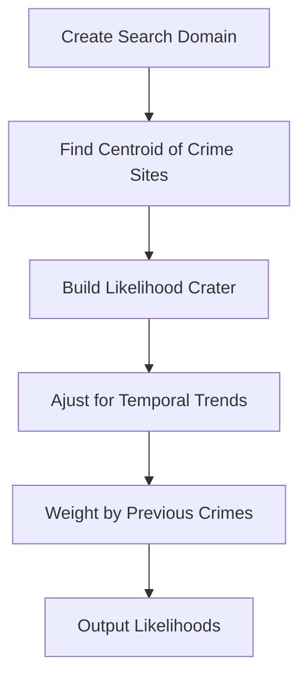
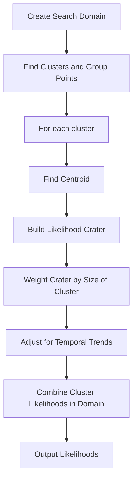

## 2010 Mathematical Contest in Modeling (MCM) Summary Sheet

(Attach a copy of this page to each copy of your solution paper.)

Type a summary of your results on this page. Do not include the name of your school, advisor, or team members on this page.

## Centroids, Clusters and Crime: Anchoring the Geographic Profiles of Serial Criminals

Crime prediction is an old human tradition. The technology employed has changed drastically over the last fifty years with the advent of the computer, yet the techniques employed are the same as ever. The task of predicting future crime locations is still fundamentally about discovering and exploiting patterns and is therefore a mathematical task. A particularly challenging problem in this field is modeling the behavior of serial killers, as most (violent) repeat offenders choose victims who are complete strangers to them. Since finding correlations between the victims of a serial criminal is algorithmically difficult, we predict where a criminal will strike next, instead of whom. This practice of predicting a criminal’s spatial patterns is called Geographic Profiling.

Geographic profiling research has clearly shown that, for most violent serial criminals, there is a significant and strong correlation between the distance between crime sites and the distance to the criminal’s home or residence; roughly, serial criminals tend to commit crimes in a distinct radial band around a central point. Subsequent researchers, however, have extended the idea of ‘home’ to include areas of significance to the criminal’s activities: for example, a serial killer may strike around his workplace, or only in the part of town where prostitutes abound. These centers of activity, termed “anchor points” provide a strong pattern within serial criminal behavior with which we can build a predictive algorithm.

We build our models off the assumptions that the entire domain of analysis is a potential crime spot, movement of the criminal is uninhibited, and area in question is large enough to contain all possible strike points. With these three assumptions we are able to consider our domain a metric space on which our predictive algorithms can create spatial likelihoods. Additionally, we assume that the offender in question is a “violent” serial criminal, as research suggests serial burglars and arsonists are less likely to obey the aforementioned spatial patterns. From this, we may assume the existence of one or more anchor points, which will provide the basis for our model.

There are substantial differences, however, in the criminal’s expected behavior depending on whether he has one anchor point, or several. We treat the single anchor point case first, taking only the spatial coordinates of the criminal’s last strikes and the sequence of the crimes as inputs. Estimate the single anchor point to be the centroid of the previous crimes, we generate a “likelihood crater”: a !-distribution whose parameters are fit to the preexisting data, including time trends. Height of this crater then corresponds to the likelihood of a future crime at that location. Next, we consider the multiple anchor point case: using a cluster finding and sorting method, we identify groupings in the data and then build likelihood craters around the centroids of each. Individual clusters are then given weight according to recency and number of points. Finally, we test each algorithm on the criminal’s past offences (using the first N to predict crime N+1) and determine which of the two techniques performs better. From these tests we also develop a standard metric for measuring our level of confidence in the output.

There is a notable dearth of public domain data giving both locations and sequencing data for the crimes of violent serial killers, so we extract seven datasets (for three offenders) from published research. We use four in developing our model and examining its response to changes in sequence, geographic concentration, and total number of points. The location of the last crime is removed from the input, and then compared to the models’ predictions. To evaluate, we assume the police want ideally to distribute their resources so that one will be on scene when the next crime is committed and compute an “effectiveness multiplier,” which describes how much more usefully police resources would be distributed under our model versus a random guess.

Then, we evaluate our models by running blind on the remaining datasets. The results show a clear superiority to the multiple anchor points method, and qualitatively support or model, but we would require more data to claim success with statistical significance. Overall, the model will be most successful in predicting longer crime sprees with clearly clustered data. We also demonstrate clear failure if criminal suddenly changes behavior, and also note that the model’s output must be partnered with the knowledge and experience of a veteran cop. Finally, we note that by construction, our algorithm will tend to predict the criminal’s anchor points more accurately than it predicts his next strike point. Our recommendation is that police consider using the anchor point prediction as their primary investigative tool.

# CENTROIDS, CLUSTERS AND CRIME: ANCHORING THE GEOGRAPHIC PROFILES OF SERIAL CRIMINALS

Team # 7507

February 22, 2010

## Table of Contents

1 Introduction 3  
2 Background 4  
3 Assumptions 6

3.1 Domain is Approximately Urban . 6  
3.2 Violent Serial Crimes by a Single Offender 8  
3.3 Spatial Focus 9

4 Developing a Serial Crime Test Set 9

4.1 The Scarcity of Source Data 9  
4.2 An Alternative: Pixel Point Analysis . 11

5 Metrics of Success: The Psychic and the Hairfinder 11

5.1 The Effectiveness Multiplier 12  
5.2 Robustness of the Metric 14

6 Two Schemes for Spatial Prediction 15  
7 Single Anchor Point: Centroid Method 1 5

7.1 Algorithm . . 16  
7.2 Results and Analysis 19  
7.3 Extensions . . 21

8 Multiple Anchor Points: Cluster Method 24

8.1 Algorithm . . 24  
8.2 Results and Analysis 28  
8.3 Possible Extensions of the Cluster Model 34

9 The Final Predictor: Combining the Schemes 34

9.1 Results and Analysis . 36  
9.2 Possible Extensions to the General Model . . 38

10 Conclusion 40

11 Executive Summary 42

References 44

## 1 Introduction

Crime analysis and prediction is an old human practice. Rachel Boba, in her chapter on the ‘History of Crime Analysis’ describes the Rancher in the old American West who “noticed that he was losing one or two head of cattle from his grazing land every week.” Our Rancher begins to notice that these cattle go missing only at night and from a certain field. His detective-like observations and intuition may have led him to respond in a way fitting for the lone rancher: watch at night with a gun or move the herd altogether.[1] Although primitive compared to our popular notions of crime analysis (ala television shows like 24 and Numb3rs), the techniques of the Rancher from the American West are the same as those employed today. Current criminology theory posits that criminals behave in patterns that are deeply tied to environment, social surroundings, and personal history. The goal of any crime analysis and prediction, whether by the FBI of the present or the Rancher of the past, is fundamentally one of discovering and exploiting patterns and is therefore an explicitly mathematical task.

The task of predicting a serial criminal’s next crime location is consequentially a problem of finding and using patterns from that criminal’s crime history. There is an established literature on geographic patterns in serial crime sequences that has shown a strong patterning of serial crimes around an “anchor point” - locations of daily familiarity for individual serial criminals. We build two prediction schemes based on this underlying theory of anchor points in order to predict future crime geography . Both schemes are given an ordered sequence of past crime locations and then produce a surface of likelihood values and a robust metric. The surface produced is equivalent to a geographic profile of potential crime locations. The schemes differ in their underlying assumption of the number of anchor points.

The first scheme finds a single anchor point using a center of mass method and uses it to predict likely future crime locations. The second scheme assumes two to four anchor points and uses a cluster finding algorithm to sort and group points. These clusters are used to predic likely future crime locations. Both schemes use a statistical technique we call cratering to predict future crime locations. The comparison and eventual choice/rejection of a scheme will use an algorithm based on our effectiveness multiplier.

The strength of our model is its close connection to the research that surrounds seria crimes. We will see that for the several sample serial crime sequences, our final prediction algorithm provides a result that is honest about when it preforms well and honest when the underlying data does not fit the pattern at the heart of our model. Our end goal is not to beat the intuitive cop, but we believe that this algorithm detects and utilizes underlying serial crime patterns in a way that can drastically reduce the resources needed to help curb the devastating effects of a serial criminal.

## 2 Background

When Peter Sutcliffe was arrested in Sheffield, England, on suspicion of being the man behind the so-called “Yorkshire Ripper killings,” the nature of quantitative criminology changed forever. The arrest (and subsequent conviction) of Sutcliffe marked a personal victory for Stuart Kind, the forensic biologist whose ground-breaking application of mathematical principles had successfully predicted that the Yorkshire Ripper lived between the towns of Shettley and Bingley. More importantly, however, this success in early 1981 marked the beginning of three decades of research developing increasingly-powerful methods of analyzing criminal patterns with mathematics.[4]

Kind certainly was not the first to put mathematics in the hands of police officers; indeed the use of statistical techniques to improve a law enforcement agency’s understanding of criminal patterns has existed since at least 1847, when the Metropolitan Police of London began tracking yearly aggregate levels of various crimes.[1] These techniques have gradually grown in sophistication to the present day, and now, information-intensive models can be constructed using heat map techniques to identify the hot spots for a specific type of crime, or to derive correlations between the rate of criminal activity and the various attributes of a location (such as lighting, urbanization, etc.)[1] Although, by 1980, such techniques in forecasting trends in general categories of crime, committed by many, unconnected individuals were familiar to crime analysts, Kind’s approach took the practice of mixing computations and crime-prevention into a new realm by applying algorithmic analysis to the criminal acts of a single, serial offender.[15]

Since Kind’s groundbreaking calculation, the practice of “geographically profiling” the crimes of a single criminal has produced a substantial body of research, principally focused upon techniques for locating the criminal’s “anchor points”– locations (such as a home, workplace, or a relative’s house) at which he spends substantial amounts of time and to which he returns regularly between crimes. This is can be a difficult proposition, as narrowing the focus to one individual offender reduces the number of available data points substantially. In general, therefore, these techniques exploit experimentally validated correlations between bases of apprehended serial criminals and the areas where they committed their crimes.

Canter and Larkin (1993), for example, proposed that a serial criminal’s home (or other anchor point) tends to be contained within a circle constructed such that its diameter is the line segment between the two crime locations with the greatest distance between them. Further studies have shown that this is indeed true in the vast majority of cases, particularly for violent serial criminals like rapists and murderers. [8] Observations like these can be used to create algorithms which prioritize the areas needing to be searched in order to find the criminal’s home or base; Canter et. al. (2000) find that (for the specific case of serial murders), these techniques on average reduce the area to be searched by nearly a factor of 10.[2]

By contrast, the practice of forecasting where a criminal will strike next has not been explored deeply in quantitative criminology literature[15]. Indeed, predicting where, say, a serial rapist will strike next may require (in addition to an uncomfortable level of clinical detachment from the past victims), a far more complex set of inputs, as it is far less clear what information might inform the criminals decision about where to strike.

Naively, one might be tempted to simply generate a heat map of rape incidents in the rapists region of activity, and predict that the next strike will occur where the most rapes have occurred before. Clearly, however, this approach essentially discards all previous information about the modus operandi of the criminal in question, whose individual pattern of strikes may differ substantially from the aggregate behavior of previous rapists. Paulsen and Robinson (2009) also observe that for many departments there are substantial practical, ethical, and legal issues involved in collecting the data for a detailed mapping of criminal tendencies, with the result that only 16% of local police departments in the United States employ a computerized mapping technique.

A more sophisticated technique could map a wide variety of variables from lighting levels or proximity to bars, and seek to correlate the rapists previous strikes to whichever variables appear most significant. But this too has its drawbacks, for in this low-statistics environment, it is not at all clear that a sufficiently strong correlation could be found.

Furthermore, this method only exacerbates the practical problems of data collection, po tentially requiring police officers to trawl the streets with clipboards subjectively evaluating dozens of criteria at each city block. While a computer model might indeed produce valuable output once this encyclopedic compendium of data was compiled, we suspect in many cases that a highly trained officer who is familiar with the ins and outs of his city could likely intuit a similar result at a reduced cost. Rossmo (1987), for example, describes the case of one Richard Ramirez, who raped or killed 33 individuals in the mid-eighties and “seemed to target single-story houses painted in light, pastel colors.” Naturally, all but the most egregiously detailed mapping schemes would fail to identify this pattern computationally, whereas an alert policeman might well notice it instantly.

Our treatment of the problem will therefore employ an approach more akin to the anchor point finding algorithms described above. By examining experimentally confirmed trends in the relationships between crime locations (and between crime locations and estimated anchor points), we generate likelihood surfaces which effectively act as a prioritization scheme for regions which should be monitored or patrolled more aggressively in hopes of intercepting the next crime.

## 3 Assumptions

As with any numerical model, we will make use of a number of simplifying assumptions in order to make it mathematically tractable. In general, however, we find that these assumptions are not only computationally necessary, but also justified by empirical research or by the practical considerations of implementing this model as a law enforcement tool. Generally speaking, these assumptions can be summarized in two groups:

## 3.1 Domain is Approximately Urban

Here, we are not literally requiring that the criminal in question operates in lower Manhattan. We use the word “urban” because there are certain properties of a highly urbanized area which substantially simplify our modeling treatment: namely, that the entire domain is a potential crime spot, that the movement of the criminal is completely uninhibited, and that the area in question is large enough to contain all possible strike points. It is important to note, however, that even for serial crime committed in suburbs, villages, or spread between towns, the urbanization condition holds on the subset of the map in which crimes are regularly committed. To see this, consider the three urbanization conditions separately:

## 3.1.1 Entire Domain is a Potential Crime Spot

Put more technically, we assume the potential targets of the criminal are dense within the domain of interest; that is, that any neighborhood selected within the map will contain a possible crime location. Naturally, a continuous version of this condition would not actually be satisfied by any physical city, but when we discretized our model, taking the minimum area of interest to be about the size of a city block, then (particularly for violent crimes, where the targets are any human being), it is hardly unreasonable that each block contains a potential target. Indeed, an equivalent assumption is present in nearly all the existing geographic profiling techniques.[2][15]

It is obvious that every domain will violate these conditions to some extent: All but the most inventive serial killers, for example, will not commit a crime in the middle of a lake, or in the uninhabited farmland between small towns. Nevertheless, this observation simply requires that the output of the model be interpreted intelligently. In other words, while we assume for simplicity that the entire map is a potential target, police officers interpreting the results can easily ignore any predictions we make which fall into an obvious “dead zone.”

## 3.1.2 Criminal’s Movement is Uninhibited

This assumption is required for us to compute distances using a simple $L ^ { 2 }$ norm. As we shall discuss, many of our predictions are based upon observations about how far a criminal tends to travel to commit a crime. Since these observations are meant to reflect the actual experiences of the killer, one might imagine that if the “as the crow flies” distance between, say, the criminal’s home and place of attack were appreciably different from the “real-world” distance along roads and highways, the latter would be a more reasonable measure. Finding this data, however, quickly becomes quite difficult as the scope of the crimes scales up (even in the age of GoogleMaps), and so we invoke the so called “Manhattan assumption”: that there are enough streets and sidewalks, laid out in a sufficiently grid-like pattern, that the criminals movements around the map following real-world movement routes is the same as “straight line” movement in a space discretized into areas of city blocks.[15]

Moreover, there is some evidence to suggest that considering real-world travel times is not beneficial. Kent et. al. (2006) demonstrated that, across several types of serial crime, the use of real-world distance instead of Euclidean or “Manhattan” distance, actually performs more poorly in predicting criminal anchor points, and that the Euclidean and Manhattan distances are essentially interchangeable. Although our model is concerned with predicting the next crime site rather than the anchor points, the methods employed have the same theoretical basis, and thus, based on this evidence, we can safely take the $L ^ { 2 }$ norm of points when generating data about distances.

## 3.1.3 Domain Contains All Possible Strike Points

This condition, perhaps the most trivial of the three, simply says that the two conditions above hold on a sufficiently large area that they will still hold wherever the criminal may strike next. Put another way, if out model ever predicts that the next strike will be outside the initially considered area, we will expand our total examined area until this is not so, implicitly assuming that the targets continue to be dense and movement is still uninhibited.

To ensure this, we simply look to make sure that our likelihood surfaces decay sufficiently at the boundary of the region being mapped, expanding the region if this is not so.

Taken together, these three conditions describe the region of interest as a metric space in which

1. The subset of potential targets is dense,  
2. The metric is the $L ^ { 2 }$ norm, and

3. The space is “complete” in the rough sense that sequences of crimes do not lead to predictions of crimes which lie outside the metric space.

## 3.2 Violent Serial Crimes by a Single Offender

Naturally, in addition to making assumptions about the map space in which the criminal moves, we must make assumptions about the criminal himself in order to attempt to anticipate his behavior. To do so, we focus the scope to violent crimes, develop a definition for “serial,” and assume all crimes were committed by the same offender.

## 3.2.1 Focus on Violent Crimes

Empirical research has consistently shown that geographic profiling is most successful for murders and rapes, with the average anchor point prediction algorithm being 30% less effective for criminals who are serial burglars or arsonists.[15][2] It is easy to imagine reasons why this might be the case: an arsonist who sets fire to churches, for example, violates the “denseness” assumption described above, as does a burglar who targets electronics stores. While a “generic” residential burglar would still satisfy this assumption, the very fact that his behavior is “generic” suggests simple heat-mapping of burglary might be more apt.

Those employing our model may of course use it to predict the strike points of nonviolent offenders, but should only do so when a qualitative reason exists to suspect the criminal will behave like a serial killer or rapist.

## 3.2.2 Serial Crimes

Quite simply, we assume we are predicting only the behavior of serial offenders. Contemporary literature most commonly defines a serial killing as the murder of “three or more people over a period of 30 or more days, with a significant cooling-off period between the murders.”[6] We will define “serial violent crime” equivalently, as three or more assaults, rapes, and/or murders over 30 or more days, with a cooling off period that is on the order of one ore more days. In this way, we exclude the murder or assault of multiple people in one mass “event” (like a school shooting or a suicide bombing) from which there is no particular reason to project future crimes.

This also means that, whenever inputting data points in our model, two or more events whose spatial-temporal separation is far smaller the average for the data set with high statistical significance $( p > 0 . 0 1 )$ , should be coded as one single event.[15]

## 3.2.3 Single Offender

Finally, we must assume that there is only one actor involved in the killings. There is some leeway, of course, in the interpretation of the word “actor”; some sources consider two or more individuals acting with collective intent to be a single “actor” for the purposes of geographic profiling.[15]. For the purposes of our model, if multiple individuals committing the crimes are truly acting with the same shared mindset, we should be able to project their next strike with the same level of confidence. What is more important to note is that the model treats all input data points as crimes which were definitively committed by the same person. Consequently, it is inadvisable to include a crime which “might have been the work of the serial criminal” solely for the purposes of improving statistics.

## 3.3 Spatial Focus

While some research in the temporal patterns of serial criminals exists, research seems that the best predictor of future geographic crime location is past geographic data. Temporal data is problematic for use in our model for several key reasons.

1. While research has found cyclical patterns within the time between crimes, these patterns don’t correlate directly to predicting the next geographic location. What is useful is general trends in spacial movement over an ordering of the locations. We will utilize this in our model by ignoring the specific time data that is present in crime sets, using this information only to develop an ordering within the crime sequence itself.

2. For the most violent of serial crimes (murder, rape/murder), time data can be incredibly inaccurate. While it is generally good enough to establish an ordering in the time se quence, the dates and times of murders are usually discerned from the remnants of body dumps. While rape cases generally have clear time stamps, we use only an ordering of the data to stay inclusive over the set of violent crimes which we want our model to address.

## 4 Developing a Serial Crime Test Set

## 4.1 The Scarcity of Source Data

Finding representative and accurate data is a unique challenge within the development process of any algorithm. Testing our models accuracy in predicting actual crimes is is an obvious best practice before proposing a method to an agency that plans to utilize these techniques in real life serial cases.

## 4.1.1 Existing Crime Sets

The most prominent researchers within the field have built large databases of serial crimes to use in their own evaluations (Rossmos FBI and SFU databases[15], LeBeaus San Diego Rape Case data-set[9], or Canter’s Baltimore crime set[2]). Each of these databases was developed with specific methods of integrity and specific source locations. For example, Rossmo develops a data set of serial murderers using an FBI source (created using newspaper and media information). Rossmo then combs this data for cases where a set of criterion is used to elimi nate weakly justified and inapplicable data.[13]. Other databases are generated using the crime reports of local police forces.[9]

The difficulty in our own search is that the databases found in our literature review are all private and proprietary. Additionally, the resources that used police department data were working directly with departments to gain access to this information. This meant practically that no established data source was directly available for our algorithmic analysis. Here we are faced with two options: simulate serial criminal data or find an indirect way of using the private data.

## 4.1.2 The Problem with Simulation

Simulation (by computer, not employed serial criminal) might seem like an initially attractive solution to the low level of data available. However, a brief examination of the types of simulated data one might produce provides motivation to use another source of data.

1. The easiest simulation of crime data would be a random crime site generation within a given space. This would be unhelpful in general however because the basic assumption underlying our approach is that serial crimes are strongly connected to spatial patterns. A randomly generated crime set violates this basic assumption and seems to contradict the large amount of research in environmental patterns in crime.  
2. The next intuitive approach might be to generate the crime sequence using an underlying distribution supported by research. For example, one might generate a series of crimes using a journey to crime model or some periodic model. Many of these such models could be found in the criminal psychology research. The problem with this approach is subtle. While certainly having a model of how criminals choose crime sites is both intelligent and inherently necessary in the problem of spatial prediction, the predictive

algorithm will also be based on this model. this means that both the predictive algorithm and the generated criminal data will be created from the same model and will therefore give a false confidence in the chosen algorithm. Actual criminal data must be used if there is to be any confidence in the underlying assumptions made when creating a model.

## 4.2 An Alternative: Pixel Point Analysis

With these limitations in mind, we decided that the best approach to developing a set of crime series sequences in the absence of an actual explicit data set would be to “mine” the data types that are available. The clearest spacial (and sometimes temporal) occurrence of serial crime data is represented as scatter plots in Journey-to-Crime research (see Figure 1). While this data is not numerically explicit, it is the closest we found to direct data. The two sources of the crime sequences are found in a Ph.D. thesis by Rossmo[13] and a spatial analysis of journeyto-crime patterns in serial rape cases by LeBeau[9]. To translate this pictorial representation of a crime sequence, pixel point analysis was used to scale the raster coordinate to a meter coordinate. Although there is a small error in this scaling due to pixel representation, the error is smaller than the discretization that we use in our own models. This process was applied to seven different criminals’ crime data. Four of these are serial killer sequences and three are serial rape sequences. The serial rape sequences have an explicit ordering while the serial murder sequences are unordered.

We note several strengths of this approach to further justify our choice of pixel data over simulation. First and most importantly, this data is already combed for inconsistency by the researchers and fits both our definitions of serial crime and the basic assumptions. The considerations and rules in data mining are complex and numerous. Using data that has already been deemed appropriate for serial crime analysis by leaders in the field is clearly superior to trying to mine or simulate data ourselves. Additionally, the data presented in the papers has been chosen to represent the range of possible patterns and scales within serial crimes. This means that our algorithm is being tested over a semi-representative set of data. We also incorporate two types of violent serial crime to add robustness in our testing.

## 5 Metrics of Success: The Psychic and the Hairfinder

In a 1998 presentation to a conference of the Naval Criminal Investigative Service, Rossmo recalled the investigation of the disappearance of a little girl named Mindy Tran. Tran’s ap parent abduction attracted a substantial amount of media attention and prompted a both a selfdescribed psychic woman and a man claiming to be a “hairfinder” to volunteer their services

text_image

RAPES AND BURGLARIES
OF SERIAL OFFENDER B

★14

★10

★13 ★4

△ ★5

★6

★9

★16

◇12

◇3

◇15

◇5

★ Rape
◇ Burglary
▲ Residence

0 .5 1K m

scatter plot

| x location (50m increments) | y location (50m increments) |
| --------------------------- | -------------------------- |
| 190                         | 300                        |
| 200                         | 305                        |
| 220                         | 275                        |
| 230                         | 260                        |
| 240                         | 240                        |
| 250                         | 255                        |
| 260                         | 245                        |
| 270                         | 230                        |
| 280                         | 225                        |
| 290                         | 210                        |
| 300                         | 195                        |
| 310                         | 190                        |
| 320                         | 185                        |
| 330                         | 180                        |
| 340                         | 175                        |
| 350                         | 170                        |
| 360                         | 165                        |
| 370                         | 160                        |
| 380                         | 155                        |
| 390                         | 150                        |
| 400                         | 145                        |

Figure 1: Comparison of crime sequence for violent offender in LeBeau[9] and scatter plot of same data found through pixel analysis.

to the local police

As Rossmo describes a hairfinder, “You have a little plastic film canister and you take the hair of the person you’re looking for and you put it in that plastic film canister, you attach that to a stick, and it takes you to the person you’re looking for.” [14] Nevertheless, when the police sent the two out together (to “get rid of two nuts at once”), the psychic identified a park to search, and the hairfinder wandered his way over to the body. In Rossmo’s words, “Those people could put [crime profilers] out of business” if their models are not better than random chance.[14] We take this advice to heart, and insist that for a model to be successful, it must outperform a random predictive algorithm or else it does more harm than good. In other words, we must beat the psychic and the hairfinder.

## 5.1 The Effectiveness Multiplier

To quantify this condition (that we outperform a randomly-guessing team of pseudoscience practitioners), we must define what it means to “outperform.” We suggest the following intuitive definition: suppose a police department has a finite number of “resource” (cops, detectives, community watch groups, etc) with which to attempt to intercept the criminal’s next strike. In response to the output of any model they find trustworthy, they should distribute their resources such that the number of resources at any point is proportional to the supposed likelihood of the criminal attempt to strike at that point. We say that one model outperforms another if it recommends allocating more resources to the point where the next crime was actually

## committed.

A logical next step is to ask how much a model outperforms another, which can simply be done by taking the ratio of the amount of resources allocated at the crime point under the first model to the amount allocated under the second. When this ratio is greater than 1, the first metric outperforms the second, and vice-versa. Assuming that the police force is twice as effective at a location when they have twice the resources allocated, we can think of this ratio as an effectiveness multiplier, representing how many times more prepared to stop the criminal the police will be under the first model compared to the second. In this paper, effectiveness ratios will be denoted by the symbol κ:

$$
\kappa \equiv \frac {\text { resource   allocation   at   crime   point,   model } 1}{\text { resource   allocation   at   crime   point,   model } 2}
$$

Observe that if we normalize the integral of each likelihood plot to the total number of resources available to the department in question, the equation above is simply a ratio of the percentage of department resources allocated to the point, and since the total resources available are the same under both models, we can evaluate κ simply as

$$
\kappa = \frac {Z _ {1} (C r i m e P o i n t)}{Z _ {2} (C r i m e P o i n t)}
$$

where $Z _ { n }$ is the likelihood function of model n and CrimeP oint is the location of the actual next crime. We note that though this information is obviously not available in most cases, we use our metric by truncating a data sequence and using that set to predict the truncated crime.

Finally, note that since a randomly guessing algorithm, like an unconvincing psychic, will have no reason to privilege any one point over another, averaging over a large number of attempts to predict a crime location, their resource allocation appears the same as a model which produces a perfectly flat likelihood plot. This allows us to compare our model to a random guess by computing a “standard effectiveness multiplier,” in which model 2 is assumed to be a uniform, flat distribution

$$
\kappa_ {s} = \frac {Z _ {1} (C r i m e P o i n t)}{Z _ {f l a t} (C r i m e P o i n t)}
$$

This standard effectiveness multiplier $\kappa _ { s }$ is the metric we will use to assess how well our model performs. A value of exactly 1 indicated it is no better (on average) than a random guess, and a fractional value would indicate we are actively misleading the police. The upper bound of this number is simply the magnitude of the maximum potential striking area considered by the model, which is achieved only if the model predicts the next crime point exactly and assigns it 100% likelihood 1.

## 5.2 Robustness of the Metric

Primarily, we use this metric to compare the effectiveness of different models when looking at the same data set. In such a case, the metric is perfectly robust and needs no qualification. However, we will also want to compare the success of a single algorithm across multiple datasets, which introduces a slight problem. Clearly, the distribution of a fixed resources under a flat likelihood plot depends on the area to be covered (i.e, if there are 100 cops to be deployed over 10 city blocks, each receives 10 cops, but over 100 blocks each receives only 1). Our algorithm, however, is not area dependent, and consequently, one can make $\kappa _ { s }$ arbitrarily large by simply including more and more pointless area well outside the killer’s active region.

It is therefore only legitimate to compare $\kappa _ { s }$ values between two data sets between which the ratio of the killer’s active region to the total area considered stays constant. Necessarily, the size of the killer’s active region cannot be precisely known; however, we will employ a standard technique to make this condition approximately true, based on one used by Canter et. al. (2000) to assess algorithms which predict anchor points. From the findings of Canter and Larkin (1993) and Paulsen (2005), we know that experimentally speaking that in more than 90% of cases, all future crimes committed by an offender will fall within a square whose side length is the maximum distance between previous crime points and whose center is the centroid of the data.[3][11] For each of our test data-sets, we construct such a square and them multiply each side length by 3, creating an overall search area which can very nearly be said to be 9 times larger than the criminal’s active area. Since this ratio is now (nearly) constant between the data sets, this will allow us to compare effectiveness multipliers between different data-sets as well.

It is important to note that, since we have only three complete data sets on which to test our model, our results are not generalizable to predict success or failure when applied to any other serial crime cases, and we will not be able say with statistical significance whether or not we outperform a random guess. Instead, because the data-sets we do use were at least selected to be as representative as possible of a typical violent serial crime, we will simply make some qualitative assessments of success.

Notwithstanding our limited access to data, any police department with access to a sufficiently large number of sample serial crime cases (research suggests approximately $n > 5 0 ) [ 2 ]$ could easily employ the methods outlined above to test our algorithm, with the average effectiveness multiplier serving as a representation of our model’s utility in a general case of serial crime.

## 6 Two Schemes for Spatial Prediction

As discussed in the Background, the problem of predicting next crime location is not well documented. The most common approach to analyzing a criminal crime sequence is to predict a home location. The research literature on journey-to-crime research for violent serial crimes strongly suggests that serial crime is patterned around a criminals home, workplace, or other place of daily activity[15, 8, 4, 6, 17]. This has lead researchers to spend most of their resources developing and evaluating methods of finding this crime center point. The centroid is then investigated as an anchor point in the criminal’s daily activity. For the majority of research, this anchor point is the serial criminal’s home. This method has been tested on large sets of data and was found to reduce the necessary search area by a factor of ten.

Our schemes will use the strength of an anchor point finding algorithm to predict likely locations of future crimes. The motivation is straightforward: if we know the location of an anchor point and the pattern of crime location from this anchor point, we can generate an area of future likely hood by projecting from the anchor point back to the crime points. It seems that this conceptualization of patterning is more accurate than a direct forecasting scheme tha ignores anchor point behavior.

We develop two schemes with the base assumption of the existence of anchor point pat terning. The first scheme assumes only a single anchor point. The second scheme assumes multiple anchor points. These related schemes can then be used in combination to provide an analysis of likely future crime locations.

## 7 Single Anchor Point: Centroid Method

Figure 2 is the algorithm used to predict likely crime locations using a single anchor point. Because of the use of centroid to calculate the single anchor, we call this the centroid method (although centroids will be used in both methods). Description of the algorithm and discussion of its results are presented. The green blocks in the diagram represent extensions of the model which will be discussed.

flowchart

Figure 2: Algorithm Flow Chart for Centroid Method

## 7.1 Algorithm

## 7.1.1 Create Search Domain

Bluntly put, we carefully construct the smallest square which will contain every previous crime, then wildly scale up each dimension by a factor of 3. This ensures that all of our fundamental assumptions about the underlying domain are satisfied, and the consistent scale factor of 3 allows us to compare the algorithm between data sets with different degrees of geographical separation (recall Section 3 for justification).

## 7.1.2 Find Centroid of Crime Sites

The anchor point of the crime sequence is determined by finding the “center of mass” of the crime points. Each point is given a common weight making the computation an average of n crime coordinates $( x _ { i } , y _ { i } )$ . The coordinate of the centroid is, simply,

$$
(\tilde {x}, \tilde {y}) = \left(\frac {\sum x _ {i}}{n}, \frac {\sum y _ {i}}{n}\right)
$$

While we choose to use the centroid to model the anchor point, this is not the only approach taken in the literature. Specifically, Rossmo first introduced the idea of placing distributions (Gaussian or negative exponential) over each crime site. The sum of these produce a surface of likely home sites (CGT Method)[15]. This method is more effective for determining likely anchor point locations because it assigns values of ‘likelihood’ over the entire search, as opposed to the centroid method which gives one anchor point location. Since we use the centroid only as a step to predicting crime locations (and not as a method for searching anchor points) the singular output of the centroid approach makes more sense to use in our algorithm.

## 7.1.3 Building a Likelihood Crater

With the estimate of an anchor point location, we now predict future crime locations using the “journey-to-crime” model within serial killer psychology. Again, this says that the serial criminal’s spatial pattern of crime around an anchor point, in general, does not change. For example, if a serial rapist commits his crimes 120 meters away from his home, on average, we can predict that he will likely strike again within this distance from his home[17]. A rough and first pass prediction discussed in Paulsen’s 2005 conference proceedings might be to draw a large shape (circle, square, polygon, etc) around this anchor point based on the largest distance from a crime point to the anchor point. This prediction method was shown to be incredibly ineffective against the largest circle guess described in the background[11].

We instead use a more effective cratering technique first described in a home find algorithm by Rossmo. To do this, the two dimensional crime points $x _ { i }$ are mapped to their radius from the anchor point $a _ { i }$ i.e. $f : x _ { i } \to r _ { i }$ where $f ( x _ { i } ) = \| x _ { i } - a _ { i } \| _ { 2 }$ (a shifted modulus). The set $r _ { i }$ is then used to generate a crater around the anchor point.

There are two dominating theories for the pattern serial crimes follow around an ancho point. The first says that there should be a buffer zone around the anchor point. A serial criminal, according to this theory, will commit crimes in an annulus centered at the anchor point[8]. This theory alone is often modeled using the positive portion of a Gaussian curve with parameters mean and variance of $\{ r _ { i } \}$ . The other theory says that crimes follow a decaying exponential pattern from the attractor point. Both theories have been substantiated by analysis on journey to crime research. Yet we seek a distribution that would model either theory, depending on the patterns displayed in the crime sequence. For this we turn to the flexibility of the Γ-distribution.

Hogg et. al. note that the probability density function (pdf) for the Γ-distribution is a good model “for many nonnegative random variables of the continuous type” due to the two flexible parameters[5]. The Γ-distribution provides a compelling shape for our model: it offers a “shifted-Gaussian” like behavior when points lie further away and a curve similar to a negative exponential when the parameters are small. Figure 3 displays two plots demonstrating the flexibility of the shape of the Γ-distribution.

line chart

| r    | pdf  |
| ---- | ---- |
| 0.0  | 2.0  |
| 0.5  | 1.0  |
| 1.0  | 0.5  |
| 1.5  | 0.25 |
| 2.0  | 0.1  |

(a) k = 1, θ = .5

line chart

| r   | pdf     |
| --- | ------- |
| 0   | 0.0000  |
| 10  | 0.0050  |
| 20  | 0.0150  |
| 30  | 0.0210  |
| 40  | 0.0180  |
| 50  | 0.0120  |
| 60  | 0.0080  |
| 70  | 0.0050  |
| 80  | 0.0030  |
| 90  | 0.0020  |
| 100 | 0.0010  |

(b) $k = 4 , \theta = 1 0$  
Figure 3: Example Γ probability density functions

Let us define the random variable X to be the radius between crime point and anchor point, r. As stated in above, $X \sim \Gamma ( k , \theta )$ . For purposes of computing the estimators, we assume independence of X . The two parameters of the Γ-distribution, k and θ, are determined using the gamfit function in MatLab(2009). This routine uses the maximum likelihood estimators (MLE) of the Γ-distribution to estimate the parameters. The MLE is found by first noting that independence gives us our likelihood function for a set of $\textit { N } \{ x _ { n } \}$

$$
L (k, \theta) = f (x; k, \theta) = \prod_ {i = 1} ^ {N} f (x _ {i}; k, \theta) = \prod_ {i = 1} ^ {N} x ^ {k - 1} \frac {\exp (- x / \theta)}{\Gamma (k) \theta^ {k}}
$$

Taking the logarithm of this gives us the log-likelihood function

$$
\ell (k, \theta) = (k - 1) \sum_ {i = 1} ^ {N} \ln (x _ {i}) - \sum_ {i = 1} ^ {N} x _ {i} / \theta - N k \ln (\theta) - N \ln \Gamma (k)
$$

To find the MLE for $\theta , \ell ( k , \theta )$ is maximized with respect to θ and r:

$$
\hat {\theta} = \frac {1}{k N} \sum_ {i = 1} ^ {N} x _ {i} = \frac {\overline {{x}}}{k}
$$

There is no closed form solution for ${ \hat { r } } ,$ and gamfit numerically solves for this MLE. One could also use a Newton method to do this as described by Minka[10].

We use these parameters to fit the Γ-distribution to our set of $r _ { i }$ and then build the crater of likely crime locations using this distribution. This is accomplished by computing r (the distance from the point to the anchor point) at every point in the search region and evaluating Γ function pdf with fitted parameters at these values. We then normalize such that the sum of our likelihood surface is exactly 1.

Applying this method to the set of crime locations of Peter Sutcliffe, the heat map shown in Figure 4.

heatmap

| x | y | z | Home |
| --- | --- | --- | --- |
| 200 | 200 | 1.5e-4 |  |
| 300 | 350 | 3.5e-4 |  |
| 350 | 370 | 4.5e-4 |  |
| 360 | 380 | 5.5e-4 |  |
| 370 | 390 | 4.5e-4 |  |
| 380 | 380 | 3.5e-4 |  |
| 390 | 370 | 2.5e-4 |  |
| 400 | 360 | 1.5e-4 |  |
| 410 | 350 | 1.5e-4 |  |
| 420 | 340 | 1.5e-4 |  |
| 430 | 330 | 1.5e-4 |  |
| 440 | 320 | 1.5e-4 |  |
| 450 | 310 | 1.5e-4 |  |
| 460 | 300 | 1.5e-4 |  |
| 470 | 290 | 1.5e-4 |  |
| 480 | 280 | 1.5e-4 |  |
| 490 | 270 | 1.5e-4 |  |
| 500 | 260 | 1.5e-4 |  |
| 510 | 250 | 1.5e-4 |  |
| 520 | 240 | 1.5e-4 |  |
| 530 | 230 | 1.5e-4 |  |
| 540 | 220 | 1.5e-4 |  |
| 550 | 210 | 1.5e-4 |  |
| 560 | 200 | 1.5e-4 |  |
| 570 | 190 | 1.5e-4 |  |
| 580 | 180 | 1.5e-4 |  |
| 590 | 170 | 1.5e-4 |  |
| 600 | 160 | 1.5e-4 |  |
| 610 | 150 | 1.5e-4 |  |
| 620 | 140 | 1.5e-4 |  |
| 630 | 130 | 1.5e-4 |  |
| 640 | 120 | 1.5e-4 |  |
| 650 | 110 | 1.5e-4 |  |
| 660 | 100 | 1.5e-4 |  |
| 670 | 90 | 1.5e-4 |  |
| 680 | 80 | 1.5e-4 |  |
| 690 | 70 | 1.5e-4 |  |
| 700 | 60 | 1.5e-4 |  |

Figure 4: Heat Map showing cratering technique applied to the crime sequence of Peter Sutcliffe

## 7.1.4 Adjust for Temporal Trends

We would also like our prediction to account for any radial trend in time (the criminal becoming more bold and committing a crime closer or further away from home). Some research has suggested that an outward or inward trend in $r _ { i }$ may suggest that the next crime will follow this trend[8]. To accomplish this, we let $\tilde { X } = X + \overline { { \bigtriangleup r } }$ where $\triangle r = r _ { n } - r _ { n - 1 }$ . We note that this new random variable, $\tilde { X }$ , gives our intended temporal adjustment in expected value:

$$
E [ \tilde {X} ] = E [ X + \overline {{\triangle r}} ] = E [ X ] + \overline {{\triangle r}}
$$

## 7.2 Results and Analysis

To evaluate this first method, we feed it data from three serial rape sprees. Since the mechanisms of the model were developed before these data-sets were collected and debugging was done with different data-sets entirely, we can consider this a blind test.

In each test case, we remove the data point representing the chronologically last crime, and produce a likelihood surface $Z ( x , y )$ . As outlined above, we then identify the actual location of the final crime and compute the standard effectiveness multiplier $\kappa _ { s }$ for each case.

Our first test data-set, coded as “Offender $\mathbf { C } _ { } ^ { \prime \prime }$ is a comparative success for the model (Fig ure 5). With $k _ { s } = 1 2 . 1 9$ , it is a full order of magnitude better to distribute police resources using this model instead of distributing uniformly (although it should be remembered that the absolute size of this number is somewhat more arbitrary for our data than it would be if the maximum search area had been defined intuitively by a cop familiar with the region).

Qualitatively, one can see the reason for the high $\kappa _ { s } \mathrm { : }$ the next crime does indeed on the surface of our ”crater,” and falls satisfyingly near the isoline of maximum height. Nevertheless, there are some 120 grid square rated greater or equal in likelihood, meaning some $0 . 3 ~ k m ^ { 2 }$ of area are being patrolled with the same intensity for no reason. This amount of area is small in an absolute sense, but is large given that the vast majority of the crimes in this case were committed within an area of 1 square kilometer

scatter plot

| x location (50m increments) | y location (50m increments) | Crime Type |
| --- | --- | --- |
| 30 | 50 | Crimes |
| 32 | 48 | Crimes |
| 34 | 46 | Crimes |
| 36 | 44 | Crimes |
| 38 | 42 | Crimes |
| 40 | 40 | Crimes |
| 42 | 38 | Crimes |
| 44 | 36 | Crimes |
| 46 | 34 | Crimes |
| 48 | 32 | Crimes |
| 50 | 30 | Crimes |
| 52 | 28 | Crimes |
| 54 | 26 | Crimes |
| 56 | 24 | Crimes |
| 58 | 22 | Crimes |
| 60 | 20 | Crimes |
| 62 | 18 | Crimes |
| 64 | 16 | Crimes |
| 66 | 14 | Crimes |
| 68 | 12 | Crimes |
| 70 | 10 | Crimes |
| 72 | 8 | Crimes |
| 74 | 6 | Crimes |
| 76 | 4 | Crimes |
| 78 | 2 | Crimes |
| 80 | 0 | Crimes |
| 30 | 48 | Next Crime |
| 32 | 46 | Next Crime |
| 34 | 44 | Next Crime |
| 36 | 42 | Next Crime |
| 38 | 40 | Next Crime |
| 40 | 38 | Next Crime |
| 42 | 36 | Next Crime |
| 44 | 34 | Next Crime |
| 46 | 32 | Next Crime |
| 48 | 30 | Next Crime |
| 50 | 28 | Next Crime |
| 52 | 26 | Next Crime |
| 54 | 24 | Next Crime |
| 56 | 22 | Next Crime |
| 58 | 20 | Next Crime |
| 60 | 18 | Next Crime |
| 62 | 16 | Next Crime |
| 64 | 14 | Next Crime |
| 66 | 12 | Next Crime |
| 68 | 10 | Next Crime |
| 70 | 8 | Next Crime |
| 72 | 6 | Next Crime |
| 74 | 4 | Next Crime |
| 76 | 2 | Next Crime |
| 78 | 0 | Next Crime |
| 30 | 50 | Offender C Centroid (effectiveness ratio: 12.1934) |
| 32 | 48 | Offender C Centroid (effectiveness ratio: 12.1934) |
| 34 | 46 | Offender C Centroid (effectiveness ratio: 12.1934) |
| 36 | 44 | Offender C Centroid (effectiveness ratio: 12.1934) |
| 38 | 42 | Offender C Centroid (effectiveness ratio: 12.1934) |
| 40 | 40 | Offender C Centroid (effectiveness ratio: 12.1934) |
| 42 | 38 | Offender C Centroid (effectiveness ratio: 12.1934) |
| 44 | 36 | Offender C Centroid (effectiveness ratio: 12.1934) |
| 46 | 34 | Offender C Centroid (effectiveness ratio: 12.1934) |
| 48 | 32 | Offender C Centroid (effectiveness ratio: 12.1934) |
| 50 | 30 | Offender C Centroid (effectiveness ratio: 12.1934) |
| 52 | 28 | Offender C Centroid (effectiveness ratio: 12.1934) |
| 54 | 26 | Offender C Centroid (effectiveness ratio: 12.1934) |
| 56 | 24 | Offender C Centroid (effectiveness ratio: 12.1934) |
| 58 | 22 | Offender C Centroid (effectiveness ratio: 12.1934) |
| 60 | 20 | Offender C Centroid (effectiveness ratio: 12.1934) |
| 62 | 18 | Offender C Centroid (effectiveness ratio: 12.1934) |
| 64 | 16 | Offender C Centroid (effectiveness ratio: 12.1934) |
| 66 | 14 | Offender C Centroid (effectiveness ratio: 12.1934) |
| 68 | 12 | Offender C Centroid (effectiveness ratio: 12.1934) |

(a) Heat Map of Offender C Predictions, Centroid Model  

3d surface chart

| x location (50m increments) | y location (50m increments) | Offender C Centroid, effectiveness ratio |
| --------------------------- | --------------------------- | --------------------------------------- |
| 0                           | 0                           | 1.8                                     |
| 20                          | 0                           | 1.6                                     |
| 40                          | 0                           | 1.4                                     |
| 60                          | 0                           | 1.2                                     |
| 80                          | 0                           | 1.0                                     |
| 60                          | 20                          | 0.8                                     |
| 40                          | 40                          | 0.6                                     |
| 20                          | 60                          | 0.4                                     |
| 0                           | 80                          | 0.2                                     |
| 20                          | 60                          | 0.4                                     |
| 40                          | 40                          | 0.6                                     |
| 60                          | 20                          | 0.8                                     |
| 80                          | 0                           | 1.0                                     |

(b) Surface Plot of Offender C Predictions, Centroid Model  
Figure 5: Offender C, Centroid Model Output (a), (b)

With $\bar { \delta r } = - 0 . 2 7 6 .$ , the temporal corrections in this distribution are negligible; our pro jection is simply a radially symmetric fit to the geographic dispersion of previous crimes. The surface plot also shows the steepness of the ”inside” of the crater, as the geographic distribution apparently suggests a small but sharply defined buffer zone around the centroid (with all the crimes contained within two square kilometers, any buffer zone would have to be small).

Our second test data-set, coded “Offender B,” (see Figure 6) is similarly successful, with $k _ { s } = 1 2 . 1 5$ . Here, the fit parameters of the Γ estimate the existence of a substantially larger buffer zone than for Offender C, but the substantial dispersion of the points along the horizontal axis results in a larger outer radius, so that a similar portion of the high-likelihood grid points appear “ wasted,” particularly in the upper right section of the crater. Here too, temporal connections are negligible with $\bar { \delta r } = - 0 . 0 0 7 6$ .

Just as our naive desire to extrapolate from two data points begins to insist our model must be robust, we apply our model to Offender A and find a clear example of how it can fail. In this case, the last crime (see Figure 7) is one of two substantial outliers, and in fact, with a standard effectiveness multiplier of $k _ { s } = 0 . 3 8$ , our model is nearly three times less helpful than the average random guess in selecting a distribution of resources and manpower. Note, however, that the vast majority of previous crimes are still well-described by the model, so the assumption of an anchor point somewhere within the crater region does not appear to have been a poor one. It is simply the case, as it will often be in real life, that some scheme, whim, or outside influence caused the criminal to deviate sharply from his previous pattern in this case.

As remarked in the development of our metric, testing the model on these three data points alone is hardly sufficient to draw any broad conclusions about the utility of our model in a general setting. Still, since these three data sets were selected arbitrarily from published literature from within samples considered to be highly representative of typical serial killings, it is at least reassuring that our model is somewhat successful in two of three cases, and it is hard to imagine any model being highly successful in the third case.

## 7.3 Extensions

Several of the test cases considered above stray from the idealized, radially symmetric distribution which centroid model assumes. In particular, the data from offender B has considerably more variation along the horizontal axis than the vertical, and informally, it appears an elongated ellipsoid might be a better fit than a perfect circle. Alternatively, one might imagine that points on the right and left of the circle should have higher likelihood scores than the ones in the top and bottom, as though some of the volume under the crater surface had ”gravitated” towards the regions more dense with points. Indeed, there is some empirical evidence to suggest that many serial crime patterns display such angular asymmetries.[13]

The first idea could be accomplished by constructing a special, two dimensional distribution function which would fit the points elliptically, or the construction of the function in a space where the geometry was non-Euclidean and determined by the presence of past-crime data points. To simulate the second, a convolution with a kernel built around the nearness to the centroid as seen by each of the crime-points could potentially be used, or an actual ”gravitylike” simulation could be performed via the transport equation, with previous crime points as attractors.

heatmap

| x location (50m increments) | y location (50m increments) | Density (x 10⁻⁶) |
| -------------------------- | -------------------------- | ---------------- |
| 200                        | 300                        | ~3.5             |
| 250                        | 250                        | ~2.5             |
| 300                        | 200                        | ~1.5             |
| 350                        | 250                        | ~1.0             |
| 400                        | 300                        | ~0.5             |

(a) Heat Map of Offender B Predictions, Centroid Model  

3d surface chart

| x location (50m increments) | y location (50m increments) | Offender B Centroid, effectiveness ratio |
| -------------------------- | --------------------------- | -------------------------------------- |
| 0                          | 0                           | 12.159                                 |

(b) Surface Plot of Offender C Predictions, Centroid Model  
Figure 6: Offender B, Centroid Model Output (a), (b)

A cursory investigation of all of these methods during the development of our model showed some potential successes, but all would have to contain additional parameters. Without access to a large data-set, however, from which to empirically determine the best values of these parameters, any extension of the centroid model to include such algorithms would be at best an arbitrary guess. Since one of the central premises of our model is that it assumes only behavioral and psychological trends which are robustly supported by broad studies of serial crime, it does not seem appropriate to include such additional modifications in our single-anchor point model.

heatmap

Offender A Centroid, effectiveness ratio: 0.38532
| x | y (location (50m increments)) | Count (x 10^-5) |
|---|---|---|
| 160 | 155 | 16 |
| 170 | 175 | 14 |
| 180 | 185 | 16 |
| 190 | 190 | 15 |
| 200 | 180 | 14 |
| 100 | 135 | 12 |
| 150 | 105 | 16 |
The image contains only a grid layout with no axes or data points visible. The color scale is also provided for the right-side legend (red = high value, blue = low value).

(a) Heat Map of Offender A Predictions, Centroid Model  

3d surface chart

| x location (50m increments) | y location (50m increments) | Offender A Centroid, effectiveness ratio |
| --------------------------- | --------------------------- | -------------------------------------- |
| 0                           | 0                           | 0.38532                                |

(b) Surface Plot of Offender A Predictions, Centroid Model  
Figure 7: Offender A, Centroid Model Output (a), (b)

## 8 Multiple Anchor Points: Cluster Method

A different way to account for the angular asymmetries like the ones in the Offender B data-set, however, would be to simply assume that no angular symmetry should be expected because there is not simply one anchor point around which crimes are arrayed. Our second method explicitly assumes that instead, there are at least two anchor points in the distribution of crimes (for example, a home and a workplace), and treats each anchor point as the centroid of its own local cluster of crimes. Like the single-anchor point extensions described above, this method will require an additional input parameter: the number of clusters to be created. However, we show that this parameter can be derived for each data set from only the locations of the previous crimes, removing the need to set parameters arbitrarily.

## 8.1 Algorithm

The basis of this algorithm is a hierarchical clustering scheme [7]. Once clusters are found the previously described algorithm for centroids is used at each computed cluster centroid. A sketch of the algorithm can be seen in Figure 8. The algorithm starts with the same data as the Centroid method but begins computations with a cluster determination scheme.

## 8.1.1 Finding Clusters in Crime Sequences

The first objective of this algorithm is to determine the number of clusters and group points into various clusters. This is accomplished through the use of hierarchical clustering and comparison of Silhouettes for various cluster counts.

The first step towards this goal is to cluster the data such that there are a total of 2-4 clusters. We forced a minimum of 2 clusters because the single cluster case is identical to the earlier centroid method. A maximum of 4 clusters was chosen based on our assumption that each of these clusters represents crimes around an anchor point. Subdividing into too many clusters would be akin to saying a serial criminal has six or seven significant points of daily activity. While this may be the case, anchor-point theory would suggest a number of four or fewer. The clustering algorithm is accomplished in a 3 step process.

In general the first step to clustering is to compute the distances between all points on a selected metric [7]. In this case the euclidian distance, henceforth designated $d ( x , y )$ , is used since the only measure we care about is physical distance between points. Once all of these distances have been computed the data is organized into a hierarchical cluster tree, the tree can be represented by what is known as a dendrogram [7]. The dendrogram for Offender B is seen in Figure 9.

flowchart

Figure 8: Algorithm Flow Chart for Cluster Method

This cluster tree, of $N$ data points $P _ { i } , i = 1 , . . . , N$ , is built up by first assuming that each data point is its own cluster. Clusters are then merged based on which 2 are the closest in some defined metric $d _ { c } .$ . Formally if we have clusters $1 , . . . , n$ denoted as $C _ { i } , i = 1 , . . . , n$ we choose to merge the two clusters i and $j , i < j$ into cluster i and delete cluster $j$ where $i , j$ minimizes $d _ { c } ( C _ { i } , C _ { j } )$ .

This process is repeated until all of the points have been merged into the number of desired clusters, to create a dendrogram the number of desired clusters is set to one. In this case we used as our metric the distance between the centroids of any two clusters. These cluster merges are plotted as the horizontal lines in the dendrogram, and their height is based on the distance between merged clusters at the time of merging.

The above algorithm requires a fixed number of clusters, however we have no a priori knowledge of the number of actual clusters. Because of this we needed a way to determine the optimal number of clusters. To accomplish this we use the notion of Silhouettes [16]. The silhouette at at point is denoted as $s ( P _ { i } )$ and is computed for all data points.

We denote $a ( P _ { i } )$ as the average distance from $P _ { i }$ to all other points in its cluster and $b ( P _ { i } , k )$

dendrogram

| Data Point | Grid Distance |
| ---------- | ------------- |
| 1          | 0             |
| 2          | 0             |
| 3          | 0             |
| 4          | 0             |
| 5          | 0             |
| 6          | 0             |
| 7          | 0             |
| 8          | 0             |
| 9          | 0             |
| 10         | 1             |
| 11         | 0             |
| 12         | 2             |
| 13         | 0             |
| 14         | 2             |
| 15         | 2             |
| 16         | 2             |
| 17         | 2             |
| 18         | 2             |
| 19         | 2             |
| 20         | 2             |
| 21         | 2             |
| 22         | 2             |
| 23         | 2             |
| 24         | 2             |
| 25         | 2             |
| 26         | 2             |
| 27         | 2             |
| 28         | 2             |
| 29         | 2             |
| 30         | 2             |
| 31         | 2             |
| 32         | 2             |
| 33         | 2             |
| 34         | 2             |
| 35         | 2             |
| 36         | 2             |
| 37         | 2             |
| 38         | 2             |
| 39         | 2             |
| 40         | 2             |
| Note: The actual grid distance values are not provided in the code. I have used placeholders (0,1,2,3) to represent the actual values. |                |

Figure 9: Dendrogram for Offender B

as the average distance from $P _ { i }$ to points in cluster $C _ { k }$ where $P _ { i } \notin C _ { k }$ . Now we can define $( i = 1 , . . . , N )$

$$
s (P _ {i}) = \frac {\left(\min _ {k \mid P _ {i} \notin C _ {k}} (b (P _ {i} , k)) - a (P _ {i})\right)}{\max \left(a (P _ {i}) , \min _ {k \mid P _ {i} \notin C _ {k}} (b (P _ {i} , k))\right)} \tag {1}
$$

Inspection of (1) shows that s can take values in [ 1, 1]. Where the value of 1 is only taken if a cluster is a single point and the value 1 can only be taken in cases where multiple points at the same location belong to different clusters. The closer $s ( P _ { i } )$ is to 1 the better $P _ { i }$ fits into its current cluster and the closer to $s ( P _ { i } )$ is to -1 the worse it fits within its current cluster.

Now to optimize the number of clusters we compute the clustering such that there are 2, 3 and 4 clusters. Then in each case we compute the average Silhouette value across every point that is not the only point in a cluster. The Silhouette values at these single point clusters are ignored because otherwise clusters of 1 influence the average in an undesirable way. We then seek to maximize the average Silhouette value across the number of clusters. A sample plot of average Silhouette value versus number of clusters is seen in Figure 10

In this case we select 4 as the desired number of clusters. The cluster groupings computed by the algorithm are shown in Figure 11. We note that because the average Silhouette plot has a tendency to increase with number of clusters we cap the possible number of clusters at 4. It is important to note however that the algorithm does not always pick 4 clusters, for example the clustering of Offender C’s crimes is optimized by having 2 clusters.

line chart

| Number of clusters | Average Silhouette Value |
| ------------------ | ------------------------- |
| 2                  | 0.52                      |
| 3                  | 0.51                      |
| 4                  | 0.71                      |

Figure 10: Offender B average Silhouette Values Vs Number of Clusters

scatter plot

| Cluster | X location (100m Increments) | Y location (100m Increments) |
| ------- | ---------------------------- | ---------------------------- |
| Yellow  | 105                          | 190                          |
| Yellow  | 112                          | 158                          |
| Yellow  | 114                          | 159                          |
| Cyan    | 127                          | 146                          |
| Cyan    | 130                          | 138                          |
| Cyan    | 135                          | 118                          |
| Cyan    | 137                          | 113                          |
| Cyan    | 140                          | 134                          |
| Cyan    | 142                          | 130                          |
| Blue    | 168                          | 128                          |
| Blue    | 170                          | 122                          |
| Blue    | 170                          | 105                          |
| Dark Red| 200                          | 120                          |
| Dark Red| 205                          | 138                          |
| Dark Red| 208                          | 134                          |

Figure 11: Offender B Crime Points Sorted into Four Clusters

We now have a method that not only clusters the data, but also determines based on our metric of distance, what an optimal clustering is. Now we can take the output from this algorithm and progress to developing our likelihood surface.

## 8.1.2 Cluster Loop Algorithm

From this point forward our clustering algorithm draws heavily from our centroid algorithm with a few small changes. The first thing we do is compute the likelihood surface for the centroid of each cluster, in the case where a cluster contains more than two points we simply use our centroid algorithm to develop this likelihood surface. If a cluster contains a single point we treat it differently, we do not assume that this cluster represents an anchor point.

Instead we treat this point as an outlier. However, based on the idea that this point exists for some reason we do want to add some likelihood to the area. Towards this end we use a gaussian centered at that point as our likelihood surface. The mean of this gaussian is determined by the expected value of the gamma function placed over every anchor point of a cluster that has more than 1 point.

## 8.1.3 Combining Cluster Predictions: Temporal and Size Weighting

Using the separate likelihood surfaces computed for each cluster we can create our final surface through a linear combination of the individual surfaces. The surfaces returned by the centroid function are normalized, so there is some equivilance between them.

We now compute weights for each likelihood surface. There are two major components of our weights, one is simply number of points in that weights cluster over total number of points. This weights the more common crime locations. The next component of the weighting is the average temporal index of the events in a given cluster over the final point index. This weights more recent clusters and is not influenced directly by the number of points in a cluster.

Once all of the likelihood surfaces are weighted they are summed together and the result is again normalized to have sum 1. This weighted sum is the final output of our algorithm and is equivalent in type to the output of our centroid algorithm.

## 8.2 Results and Analysis

The three test data-sets conveniently display the cluster method’s superior adaptability. In the case of Offender C (see Figure 12) for example, the highly localized nature of the data points means there is very little difference between the centroid method and and the cluster method results (and indeed, as the data becomes increasingly centralized, one would hope the two results would converge). Indeed, the only difference is that the cluster method, insisting on at least two separate clusters, identifies the point directly below the centroid as a cluster of one (an outlier), and therefore excludes it from the computation of the larger cluster’s centroid (a slight Gaussian contribution from this point’s “own” cluster can be seen in the surface plot). This has the effect of slightly reducing the variance and therefore narrowing the fit function; consequently, the standard effectiveness multiplier rises slightly to 15.82.

Testing with Offender B (see Figure 13), by contrast, shows the cluster method operating at the other edge of its range, as the silhouette optimization routine decides this data is best represented by four distinct clusters with four separate anchor points. After unblinding the details of this case, we discover that the researcher documenting the case also found it notable for the fact that the offender seemed to choose his targets alternately between three city blocks, then briefly expanded his range geographically to an additional neighborhood further away before returning to offend again in one of his earlier active areas. The researcher hypothesizes this may have been a tactic to avoid known locations of parole officers, as the offender was a parolee during the majority of his crimes;[9] whatever the reason, it is a success (if a statistically insignificant one) for our model that we discerned this pattern from the geographic dispersion alone. This data-set also provides a good example of a case where multiple anchor point analysis seems valid even though most do not represent homes or workplaces: the model is simply responding to the statistical evidence that criminal seems most comfortable committing crimes in one of 4 distinct locations.

On first glance, however, it might appear that the centroid method still outperforms the cluster algorithm for this data-set; after all, the actual crime point no longer appears in the band of maximum likelihood. This is true and intentional, as the model chooses to weight the largest cluster most strongly and the “freshest” cluster behind it. Nevertheless, while not accurately predicting that the offender would choose to return to one of his earliest activity zones, it still outperforms the centroid method with a $\kappa _ { s }$ value of 22.95. This is because the craters generated by the cluster method are sharper and taller for this data set, so there are fewer resources “wasted” at high-likelihood areas where no crime is committed. We argue that this is the correct weighting, a model which makes a bolder, narrower prediction which is still successful is more valuable than one which covers the right point by simply splashing guesses across a large swath of area.

Unsurprisingly, the cluster model fares no better than the centroid method when confronted with Offender A (see Figure 14). Indeed, since the outlier points are excluded from the centroid calculation for the larger cluster, the model bets even more aggressively on this macro-cluster, and with a resulting measurement of $\kappa _ { s } ~ = ~ 0 . 0 0 1$ , we can see that following this procedure would virtually eliminate the ability of the police to anticipate the next crime.

On the whole, these low-statistics tests are consistent with (while still not predictive of) our earlier belief that the cluster model is more concerned with avoiding waste: it makes more precise guesses in the hopes of wasting few resources on average, but runs the risk of being dramatically wrong from time to time. This can also be seen from the comparatively smaller size of the buffer zones within craters, and the tendency for the maximum point on the like lihood surface plot to be higher when using the cluster method. This tendency of the cluster method to gamble more aggressively has paid off in the three datasets we examine (one might call it “cluster luck”), but our complete model will need a way to balance this boldness when a more conservative approach is warranted.

scatter plot

| x location (50m increments) | y location (50m increments) | Category |
| --- | --- | --- |
| 30 | 45 | Crimes |
| 32 | 47 | Next Crime |
| 33 | 46 | Crimes |
| 34 | 48 | Crimes |
| 35 | 49 | Crimes |
| 36 | 47 | Crimes |
| 37 | 46 | Crimes |
| 38 | 48 | Crimes |
| 39 | 49 | Crimes |
| 40 | 47 | Crimes |
| 41 | 46 | Crimes |
| 42 | 48 | Crimes |
| 43 | 49 | Crimes |
| 44 | 47 | Crimes |
| 45 | 46 | Crimes |
| 46 | 48 | Crimes |
| 47 | 49 | Crimes |
| 48 | 47 | Crimes |
| 49 | 46 | Crimes |
| 50 | 48 | Crimes |
| 51 | 49 | Crimes |
| 52 | 47 | Crimes |
| 53 | 46 | Crimes |
| 54 | 48 | Crimes |
| 55 | 49 | Crimes |
| 56 | 47 | Crimes |
| 57 | 46 | Crimes |
| 58 | 48 | Crimes |
| 59 | 49 | Crimes |
| 60 | 47 | Crimes |
| 61 | 46 | Crimes |
| 62 | 48 | Crimes |
| 63 | 49 | Crimes |
| 64 | 47 | Crimes |
| 65 | 46 | Crimes |
| 66 | 48 | Crimes |
| 67 | 49 | Crimes |
| 68 | 47 | Crimes |
| 69 | 46 | Crimes |
| 70 | 48 | Crimes |
| 71 | 49 | Crimes |
| 72 | 47 | Crimes |
| 73 | 46 | Crimes |
| 74 | 48 | Crimes |
| 75 | 49 | Crimes |
| 76 | 47 | Crimes |
| 77 | 46 | Crimes |
| 78 | 48 | Crimes |
| 79 | 49 | Crimes |
| 80 | 47 | Crimes |

(a) Heat Map of Offender C Predictions, Cluster Model  

3d surface plot

| x location (50m increments) | y location (50m increments) | Value (x 10⁻³) |
| -------------------------- | -------------------------- | -------------- |
| 0                          | 0                          | 0.0            |
| 10                         | 0                          | 0.5            |
| 20                         | 0                          | 1.0            |
| 30                         | 0                          | 1.5            |
| 40                         | 0                          | 2.0            |
| 50                         | 0                          | 2.5            |
| 60                         | 0                          | 2.0            |
| 70                         | 0                          | 1.5            |
| 80                         | 0                          | 1.0            |

(b) Surface Plot of Offender S Predictions, Centroid Model  
Figure 12: Offender C, Cluster Model Output (a), (b)

heatmap

| x location (50m increments) | y location (50m increments) | Category     | Effectiveness Ratio (x 10⁻⁴) |
| -------------------------- | -------------------------- | ------------ | ---------------------------- |
| ~200                       | ~300                       | Crimes       | ~1.8                         |
| ~250                       | ~250                       | Next Crime   | ~1.6                         |
| ~300                       | ~200                       | Crimes       | ~1.4                         |
| ~350                       | ~250                       | Next Crime   | ~1.2                         |
| ~400                       | ~250                       | Crimes       | ~1.0                         |
| ~450                       | ~250                       | Next Crime   | ~0.8                         |
| ~500                       | ~250                       | Crimes       | ~0.6                         |
| ~550                       | ~250                       | Next Crime   | ~0.4                         |
| ~600                       | ~250                       | Crimes       | ~0.2                         |

(a) Heat Map of Offender B Predictions, Cluster Model  

3d heatmap chart

| x location (50m increments) | y location (50m increments) | x value (x 10⁻⁴) | y value (x 10⁻⁴) |
| -------------------------- | --------------------------- | ----------------- | ----------------- |
| 0                          | 0                           | 0                 | 0                 |
| 100                        | 0                           | 1                 | 0                 |
| 200                        | 0                           | 2                 | 0                 |
| 300                        | 0                           | 3                 | 0                 |
| 400                        | 0                           | 4                 | 0                 |
| 500                        | 0                           | 5                 | 0                 |

(b) Surface Plot of Offender B Predictions, Centroid Model  
Figure 13: Offender B, Cluster Model Output (a), (b)

scatter plot

| x location (50m increments) | y location (50m increments) | Type       |
| -------------------------- | -------------------------- | ---------- |
| 150                        | 100                        | Crimes     |
| 160                        | 160                        | Crimes     |
| 170                        | 170                        | Crimes     |
| 180                        | 180                        | Crimes     |
| 190                        | 190                        | Crimes     |
| 200                        | 185                        | Crimes     |
| 100                        | 135                        | Next Crime |

(a) Heat Map of Offender A Predictions, Cluster Model  

3d surface chart

| x location (50m increments) | y location (50m increments) | Offender A Cluster, effectiveness ratio |
| -------------------------- | --------------------------- | -------------------------------------- |
| 0                          | 0                           | 0.0010593                              |
| 300                        | 300                         | 0.0010593                              |
| 350                        | 350                         | 0.0010593                              |

(b) Surface Plot of Offender B Predictions, Centroid Model  
Figure 14: Offender A, Cluster Model Output (a), (b)

## 8.3 Possible Extensions of the Cluster Model

One potential extension which could have been made to the cluster algorithm would be to allow it to consider a higher maximum number of clusters. We find that the common trend in geographic profiling research is that most serial crime data-sets do not suggest more than three or four anchor points[15] but this is not strongly validated by empirical studies. It seems intuitively clear that, since most violent serial crime sprees contain between 5 and 25 offenses,[2] it is unlikely that increasing the cluster size appreciably would be reasonable. On the other hand, if one were confronted with an unusually long crime spree (say, 40 events or more) or if one wanted to apply this to residential crime sprees (which are generally longer[12]), it might well be prudent to allow 5 or more clusters. The ideal maximum number in such cases would have to be determined by testing across sample data, or through an intelligent human guess.

Another natural way to extend the cluster model would be to allow it to create only one anchor point if there was insufficiently strong evidence that something deserved to be treated as a separate cluster. However, there are mathematical problems which arise in attempting to implement this; for one thing, the silhouette of a point is only defined if there is more than one cluster under consideration, so there is no simply way to evaluate via silhouettes whether the single-cluster case is superior to the others. Similarly, one could reject this method and simply use a single cluster if the average silhouette value dropped below some threshold; as always, however, we can only select this threshold arbitrarily since we do not have sufficient data to experimentally estimate a reasonable value. As we shall see, however, there is a different method which can be used to combine these two schemes.

## 9 The Final Predictor: Combining the Schemes

Given that our two methods each show some ability to identify geographic trends in seria criminals, we develop a method to decide if, in a give situation, one method is more appropriate then the other. On the way to this decision we also present criteria for whether or not our methods have any predictive value at all.

The first step towards making a decision is to run the algorithm many times on truncated data and compute effectiveness values at each step. This is accomplished by truncating the availible data and testing both algorithms against the actual next crime. Starting with N crimes we seek to determine which method, if either, should be used to predict the $N + 1$ crime. Based on our assumption that you are not trying to predict with less than 4 crimes we must enforce $N \geq 5$ . Now for $M = 4 , . . . , N - 1$ use the first M crimes to predict the $M + 1$ crime and then based on the actual location of the $M + 1$ crime determine the effectiveness multiplier. Denote these effectiveness multipliers $\kappa _ { M } ^ { m , c }$ , where $\kappa _ { M } ^ { m }$ indicates the multiplier for the cluster method and $\kappa _ { M } ^ { c }$ the centroid method. Also denote $\overline { { \kappa _ { M } ^ { m , c } } }$ $\kappa _ { 4 } ^ { m , c } , . . . , \kappa _ { M } ^ { m , c }$ see $\overline { { \kappa _ { M } ^ { c } } }$ and $\overline { { { \kappa _ { M } ^ { m } } } }$ for Offender C. In Figure 16 we see $\kappa _ { M } ^ { m }$ and $\kappa _ { M } ^ { c }$ for Offender C.

line chart

| Crime to be predicted | Cluster | Centroid |
| --------------------- | ------- | -------- |
| 5                     | 7.6     | 11.5     |
| 6                     | 4.4     | 7.5      |
| 7                     | 3.3     | 7.9      |
| 8                     | 2.4     | 6.1      |
| 9                     | 6.3     | 5.3      |
| 10                    | 5.5     | 5.2      |
| 11                    | 5.1     | 5.5      |
| 12                    | 5.5     | 5.7      |
| 13                    | 5.2     | 5.5      |
| 14                    | 6.0     | 5.8      |
| 15                    | 6.8     | 5.8      |
| 16                    | 6.6     | 6.0      |

Figure 15: Running Mean of Effectiveness Multiplier

line chart

| Crime to be predicted | Cluster | Centroid |
| --------------------- | ------- | -------- |
| 5                     | 7.5     | 11.5     |
| 6                     | 1.0     | 3.5      |
| 7                     | 0.8     | 8.5      |
| 8                     | 0.0     | 0.5      |
| 9                     | 22.0    | 1.5      |
| 10                    | 1.5     | 4.5      |
| 11                    | 2.5     | 7.5      |
| 12                    | 8.0     | 7.0      |
| 13                    | 3.0     | 4.0      |
| 14                    | 12.5    | 8.5      |
| 15                    | 14.5    | 5.5      |
| 16                    | 5.0     | 9.0      |

Figure 16: Effectiveness Multiplier vs. Crime Predicted

We now determine if either of our methods recognizes a geographic trend. To do this, denote $a _ { c }$ as the number of $\kappa _ { M } ^ { c }$ that are less than 1 and similarly denote $a _ { m }$ as the number of $\kappa _ { M } ^ { m }$ that are less than 1. If $\begin{array} { r } { a _ { c } > \frac { N - 4 } { 2 } } \end{array}$ we state the our centroid method is invalid, and similarly if $\begin{array} { r } { a _ { m } > \frac { N - 4 } { 2 } } \end{array}$ we state the our cluster method is invalid. We place our break point at half of the effectiveness multipliers being less that 1 because that means that over 50% of time we do not increase effectiveness, thus we note that our algorithm is not detecting geographic trends in the data.

If only one of the methods is determined to be valid we choose to use that one. If neither is valid we simply state that no geographic trends have been found in the data and our algorithm should not be heavily relied upon in relation to other methods which may be available.

If both methods are determined to be valid we simply look at $\overline { { \kappa _ { N - 1 } ^ { c } } }$ and $\overline { { \kappa _ { N - 1 } ^ { m } } } , \mathrm { i f } \overline { { \kappa _ { N - 1 } ^ { c } } } >$ $\overline { { { \kappa _ { N - 1 } ^ { m } } } }$ then we pick the centroid method, otherwise we pick the cluster method. In Figure 15 we note that the cluster method would be picked.

## 9.1 Results and Analysis

Using the aforementioned decision algorithm, our combined method would choose to use the clustering algorithm for all three cases (the end results then being those given in the cluster section above). In fact, one would have to have a a highly cohesive single cluster of data with no outliers in order for the Centroid method to ever prevail, and this is as it should be, for even when there appears to be only one true anchor point, cluster is capable of rejecting up to 3 statistical outliers before computing the centroid, which should in general improve the fits and consequently improve the results.

Our combined model contains one other piece of information: the average effectiveness multiplier $\overline { { \kappa _ { s } } } = \overline { { \kappa _ { N - 1 } ^ { m , c } } }$ , which we are now treating as a rough confidence estimate for the model when applied to a given data set. While the interpretation is not perfect, this value essentially tells us how well the algorithm would have fared against this criminal in the past, and assumes this value will also represent its effectiveness in the immediate future. The flatness in the tai of of the $\overline { { \kappa _ { s } } }$ plot for Offender C (Figure 15), while insufficient to justify this metric, is at least consistent with the assumptions. We can also test this mean against the actual values computed above:

<table><tr><td>Offender</td><td> $\overline{\kappa_s}$ </td><td> $\kappa_s$ </td></tr><tr><td>C</td><td>6.65</td><td>15.82</td></tr><tr><td>B</td><td>8.473</td><td>22.95</td></tr><tr><td>A</td><td>12.25</td><td>0.001</td></tr></table>

As one would suspect for the mean over a small number of points, it is not a perfect estimator of the next value. Our now-familiar nemesis, Offender A, completely deceives the model once again, because it predicts his movements extremely well up until his very last crime. It does seem, though, that if one allows for occasional outliers, this mean effectiveness multiplier provides a ballpark estimate of our confidence in the model. Note that in the two more wellbehaved cases, the model with the higher projected effectiveness $\overline { { \kappa _ { s } } }$ is in fact the more effective model in reality. Moreover, by simply properties of averages, it should be true that to within the level of uncertainty created by the number of points in the data-set, when one compares size of $\overline { { \kappa _ { s } } }$ for the same model on two different data sets, the one with the larger $\overline { { \kappa _ { s } } }$ will on average be the more trustworthy.

## 9.1.1 The Psychic, the Hairfinder, and the Intuitive Cop

Although the size of our datasets will not allow us to demonstrate anything conclusively, the model we develop is a strong candidate to beat the psychic and the hairfinder (random chance), for several reasons.

The predictions are based on the assumption of trends in serial crime behavior which have been tested on large sets of real-world data. [12] [2] [8]  
Similar mathematical techniques are used in the anchor-point estimation schemes currently being employed and researched, which also consistently outperform random guesses when tested across data samples  
The model was successful in the two of the three datasets on which it was tested, and these datasets were selected from preexisting research as representative samples of serial crime data  
Several crimes in each dataset can be predicted well, including the case where our model fails to predict the final, outlier crime point– i.e., in a dataset of 16 crimes, we are also often able to predict the 15 crime using the preceding 14, the 14th using the preceding 13, etc., all with more success than a random guess.

This evidence suggests, without proving, that on average, our model will be better than blind chance. We do not, however, make the claim that we will do better than a police department assigning resources based off no model at all. In the absence of mathematical guidance, a policeman in such a department would have rely on his own knowledge of his patrol area, his sense of patterning in the offender’s crimes, and any “ gut feelings” he developed about the offender’s psychology, based on his previous experience in law enforcement. This “Intuitive Cop” has considerably more information at his disposal than our model, as he knows, for example, that a killer targeting prostitutes is more likely to strike in the red-light district of his city. Additionally, research suggests that with a little informal training, any layperson can perform nearly as well as anchor point prediction algorithms when guessing a criminal’s home location.[18] 2. As a result, one might well expect the intuitive cop to outperform the model overall, as he can apparently approximate many of its mathematical strengths through intelligent estimation and also brings a breadth of knowledge to bear about the physical characteristics of the underlying map.

## 9.2 Possible Extensions to the General Model

## 9.2.1 Partnership With the Intuitive Cop

The best possible extension of this model, therefore, is simply to ensure that its output results are always interpreted by the intuitive cop himself (or indeed, by the intuitive police force as a whole). In this way, obvious “dead zones” in the underlying map (such as lakes, military bases, or uninhabited farmland) can be immediately rejected as priority areas without significantly decreasing the odds of preventing the next crime. This immediately increases the effectiveness multiplier for the combined process. Similarly, the intuitive cop might be called upon to manually set (or at least experiment with) some of the parameters we assign based purely off of geography. It may be clear to a human, for example, that the killer in question has three anchor points, as he is committing crimes in each of three different rural towns. If these towns are quite close, however, our model could be deceived into believing that there are fewer than 3 clusters on the map.

Just as it should be for statisticians, historians, and tabloid journalists everywhere, the general mantra for a police department hoping to employ computational geographic profiling should be “more data is better.” We have repeatedly made a point of saying that our model cannot be considered robust until it has been tested on a large dataset, but it is similarly true that any additional data input in the form of human intuition and interpolation will tend to improve results. The best extension of this algorithm is simply to ensure it does not overrule the pre-existing predictions and theories of local law enforcement, but rather simply augments them.

## 9.2.2 Crime Prediction Versus Anchor Point Prediction

Finally, as all our discussions to this point have presupposed that predicting a criminal’s next strike point is the right thing to do, it is important to observe that in many ways, this may not always be the case. On the contrary, having examined in detail the scope of literature on quantitative criminology, we find at least three reasons to believe it is often a better practice to attempt to predict the location of his anchor points instead.

1. Uncertainty in the estimate will tend to be smaller for an anchor point predictor. This is easy to see from the inner workings of our algorithm. Each method postulates the existence of an anchor point at the centroid of a local cluster (or the entire dataset), and then predicts future crimes based on geographic trends about that anchor. As a result, all the uncertainty in the anchor point prediction will contribute also to error in the crime point prediction, and on average, the total uncertainty will be their quadrature sum, which is necessarily greater than or equal to the uncertainty in the anchor location itself.  
2. Anchor point prediction schemes are much more widely researched and documented. Criminologists like Rossmo, Canter, and many others have studied a broad family of anchor point predictors and tested them against large sets real-world data from serial criminals. This allows them to optimize over a wide variety of parameters such as distance functions, decay weightings, temporal weightings, etc. While our model attempts to compensate by minimizing the number of such parameters that need to be set and choosing the others based on the data being examined, the fact remains that its methods simply have not been validated to the same level of confidence  
3. Real-world considerations often make an anchor point search more practical. The sim ple truth is that, equipped with a prediction of likely crime points, the best a police force can hope to do is increase patrol levels and other resources in the likely areas, and wait to see if the criminal strikes again. On the other hand, when given a predicted region for the criminal’s anchor point, they can take a more active approach by searching the area in question for suspicious behavior, eyewitness data, and additional evidence. Recall that at least one of the anchor points is almost certainly the suspect’s home (one study found this to be true 83% of the time[15]); and consequently, pursuing this anchor point can give the police a sense of the perpatrator’s home region, provides potential neighbors who can be interviewed, and could even lead to the capture of the criminal in his own home.

We do not completely eschew the utility of crime-point prediction: it has the obvious benefit of potentially saving a life or preventing a rape. Depending on circumstances, it could also be of use in predicting the body location of a missing person presumed to have been taken by a serial criminal, or even in determining whether a new crime was committed by the same individual as those in a previous dataset. Once again, we appeal to the expertise of the intuitive cop: when resources permit or circumstances demand, predicting a future crime point may be a good idea, but our model itself makes no claims as to whether this is a good idea in any given case.

## 10 Conclusion

Taking only the most basic and well-supported trends in the psychological and geographical patterns of violent serial criminals, one finds that a basic estimate of a criminal’s next strike point can be obtained from only the spatial-temporal coordinates of previous offenses. The twin assumptions that a serial criminal has an “anchor point” (like a house), and to avoid detection, he may tend to avoid committing crimes in his own backyard, have been used for years in quantitative techniques to estimate a criminal’s home or other anchor point. We instead begin with this likely anchor point location. Then, we use it to predict potential next-strike points by presuming the distribution of crimes around the anchor will be described by a Γ function of the radial distance from the anchor. The use of a Γ allows us to fit the mean and variance to the distribution to the points already on the grid. In this way, we create a buffer zone only when the existing data suggest one, and with a size also defined by existing data.

There is, however, nothing fundamental, about the single anchor point assumption, and some research suggests it is not uncommon to find more than one. We therefore also consider a model which begins by searching for evidence of multiple anchor points. This model uses cluster theory techniques to detect groups of points which have more in common with each other than with the larger group. Then, we assume an additional anchor point at the center of each cluster, and model each cluster with another gamma distribution. Weighting the clusters relative to each other allows us to prioritize larger clusters or ones the criminal has visited more recently.

Lacking any readily available, public-domain datasets, we extract data from past research projects and test these two models on the cases of three serial rapists. We define a parameter $\kappa _ { s } ,$ which essentially represents how much better a police department would do in attempting to stop the next crime if they distributed their energy and resources according to our model rather than randomly. We find evidence that our models are substantially better than simple guessing, but it is not statistically significant for the amount of data available to us.

Finally, we propose a method for treating a general serial crime data set, by testing both models abilities to predict known points, and deciding which is most likely to succeed in future predictions. This also allows us to calculate a new value, $\overline { { \kappa _ { s } } } ,$ , which roughly represents ou confidence in the model. A higher $\overline { { \kappa _ { s } } }$ value indicates a higher degree of confidence in future predictions, although we demonstrate a real-world dataset where the presence of an outlier contradicts our confidence level.

On the whole, we believe we can produce a model which can beat a ”psychic and a hair finder”– i.e., which can outperform random guesses and uniform distributions of resources. We cannot, however, reasonably expect to beat an ”intuitive cop”; a human with a strong familiarity of actual map underlying our abstract data points will always have access to information we do not. Indeed, to be most effective, our model should be combined with this kind of human intelligence.

Finally, it is important to note that there while predicting the next crime point is an interest ing mathematical problem and would be an excellent tool in theory, there may be many cases where it is not the ideal approach in practice. When it is, we provide a potentially powerful tool that can be used should to predict future crime locations.

## 11 Executive Summary

## Overview: Strengths and Weaknesses of the Model

This paper presents a model of where a violent serial criminal will strike next, based upon the locations and times of his previous crimes. Our algorithm creates a color-coded map of the area surrounding the criminal’s previous strikes, with the color at each point indicating the likelihood of a strike there. The model has several key strengths:

The model contains no arbitrary parameters. In other words, most aspects of the model are determined simply by trends which researchers have observed in many serial criminals across many many datasets.  
The model can estimate the level of confidence in its predictions. Before making a prediction, our model first checks how well it would have predicted the criminals previous crimes, in order to provide an estimate of how well it can predict his future crimes.  
The model understands that police have limited resources. In particular, the confi dence number described above becomes large if we are making good predictions, but will shrink again if our predicted areas is so large as to become unhelpful.

At the same time, it must be observed that our model contains some fundamental limitations:

The model is only clearly applicable to violent serial criminals. We only claim appli cability in the case of serial killers and rapists, as our research shows serial burglars and arsonists are more unpredictable and influenced by non-geographic factors.  
The model cannot predict when a criminal will strike. While we do consider the order of previous crimes in our model in order to predict locations, we do not predict a strike time.  
The model cannot make use of underlying map data. To maintain generality, we do not make any assumptions about the underlying physical geography. A human being must interpret the output (for example, choosing to ignore a prediction in the middle of a lake).  
The model has not been validated on a large set of empirical data. The fact is, sizable sets of data on serial criminals are not widely available. Any police department using this model should test it on a large number of previous cases first, as described in our paper.

In addition, the standard warnings that would apply to any geographic profiling scheme apply: The output should not be treated as a single prediction, but rather as a tool to help prioritize areas of focus. It is designed to do well on average, but may fail in outlier cases. And to implement it reliably, it must be paired with a human assessment. Please note also that models for predicting the offenders “home base” are much more well-researched, and in general will be more accurate than any algorithm claiming to predict the next strike point. A police department should choose which model type to use on a case-by-case basis.

## Internal Workings of the Model

## Inputs

Our model requires the coordinate locations of a serial criminal’s previous offenses, as well as the order in which these crimes were committed.

## Assumpitons

1. The Criminal will tend to strike at locations around one or more “anchor points.” (often, the criminal’s house).  
2. Around this anchor point, there may be a “buffer zone” within which he will not strike.  
3. If the criminal has multiple anchor points, the regions around those from which he has struck most often or most recently are more likely.

## Method

The algorithm implements two different models, and then decides which is better.

In the first method, we assume the criminal has a single anchor point, and build likelihood regions around the anchor point based on the distribution of his past crimes.  
In the second, we assume multiple anchor points, calculate the best number of ancho points to use, and determine likelihood around each point individually. Then area around each is weighted by the criminal’s apparent preferences, if any.

Finally, the algorithm tests both models to see how well they would have predicted the previous crimes, and uses the model with the better track record.

## Summary and Recommendations

While our model needs more real-world testing, its strong theoretical basis, self-evaluation scheme and awareness of practical considerations make it a good option for a police department looking to forecast a criminal’s next strike. Combining its results with the intuition of a human being will maximize its utility.

## References

[1] R. Boba. Crime analysis and crime mapping. Sage, 2005.  
[2] D. Canter, T. Coffey, M. Huntley, and C. Missen. Predicting serial killers’ home base using a decision support system. Journal of Quantitative Criminology, 16(4):457–478, 2000.  
[3] D. Canter and P. Larkin. The environmental range of serial rapists. Journal of Environ mental Psychology, 13:63–63, 1993.  
[4] G.M. Godwin and F. Rosen. Tracker: hunting down serial killers. Running Press, 2005.  
[5] R.V. Hogg, A.T. Craig, and J. McKean. Introduction to mathematical statistics. 1978.  
[6] R.M. Holmes. Contemporary perspectives on serial murder. Sage Pubns, 1998.  
[7] AK Jain, MN Murty, and PJ Flynn. Data clustering: a review. ACM computing surveys (CSUR), 31(3):264–323, 1999.  
[8] R.N. Kocsis and H.J. Irwin. Analysis of Spatial Patterns in Serial Rape, Arson, and Burglary: The Utility of the Circle Theory of Environmental Range for Psychological Profiling, An. Psychiatry Psychol. & L., 4:195, 1997.  
[9] J.L. LeBeau. Four case studies illustrating the spatial-temporal analysis of serial rapists. Police Stud.: Int’l Rev. Police Dev., 15:124, 1992.  
[10] T.P. Minka. Estimating a Gamma distribution. 2002.  
[11] Derek J. Paulsen. Predicting next event locations in a time sequence using advanced spatial prediction methods. In 1005 UK Crime Mapping Conference, 2005.  
[12] D.J. Paulsen and M.B. Robinson. Crime mapping and spatial aspects of crime. Prentice Hall.  
[13] D.K. Rossmo. Geographic profiling: Target patterns of serial murderers. PhD thesis, Simon Fraser University, 1995.  
[14] D.K. Rossmo. NCIS Conference. 1998.  
[15] D.K. Rossmo. Geographic profiling. CRC, 1999.  
[16] P.J. Rousseeuw. Silhouettes: A graphical aid to the interpretation and validation of cluster analysis. Journal of computational and applied mathematics, 20(1):53–65, 1987.  
[17] B. Snook, R.M. Cullen, A. Mokros, and S. Harbort. Serial murderers spatial decisions: Factors that influence crime location choice. Journal of Investigative Psychology and Offender Profiling, 2(3), 2005.  
[18] B. Snook, P.J. Taylor, and C. Bennell. Geographic profiling: The fast, frugal, and accurate way. Applied Cognitive Psychology, 18(1):105–121, 2004.