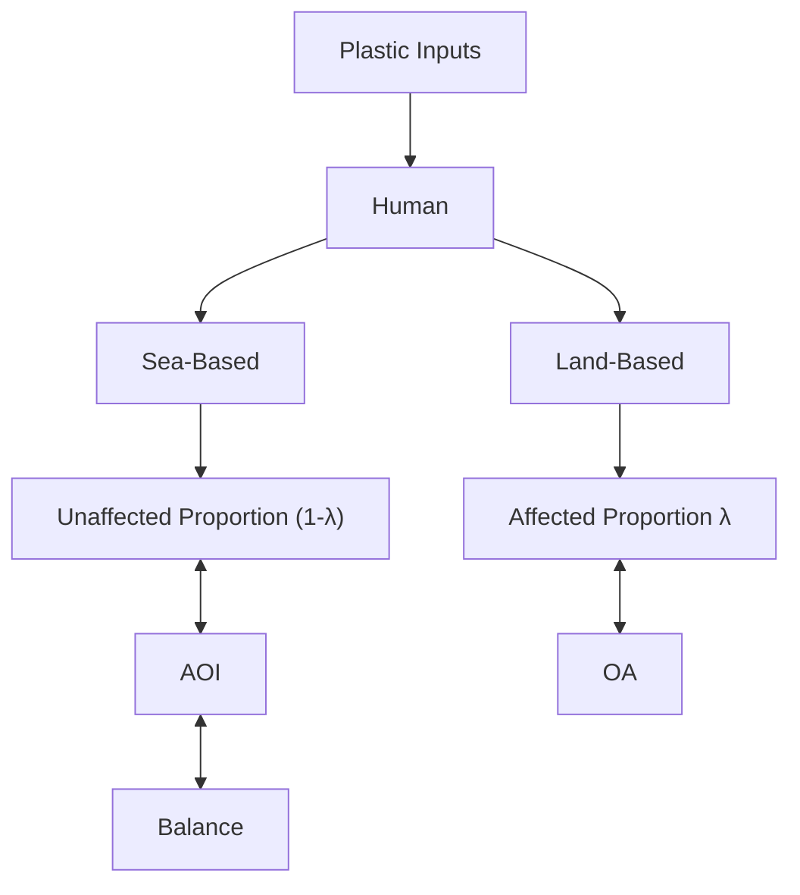

# Size-Classified Plastic Concentration in the Ocean

## Problem and Introduction

Ocean (the Pacific Ocean, in particular) debris has proved to be new to the scientific community. Yet, it is quite similar to common marine litter problems in that it is an environmental, economic and health problem (UNEP, 2009). Moreover, ocean debris often causes dangers to marine organisms ranging from sea birds to sea mammals and filter eaters through ingestion and entanglement (Day, 1980) and thus breaks the balance of ocean ecosystem.

Previous studies have addressed the impacts of debris on birds, fish and filter-feeding organisms. However, few studies have recognized that while affecting the ocean ecosystem, ocean debris itself is also changing dynamically in the sense of mass concentration due to both human inputs and nature forces (mainly, physical abrasion and chemical photolysis).

Furthermore, although many studies have acknowledged the fact that marine organisms usually fail to distinguish between debris and their food (C. J. Moore, 2001), no studies have specifically considered the effects of different sizes of debris on different marine organism. The fact that marine organisms eat various sizes of food makes it important to classify the sizes of debris because marine organisms’ abilities to distinguish between debris and food depend on the size of the debris.

Therefore, this model studies the dynamic and classified system of ocean plastics to better understand how exactly human behaviors over time affect ocean ecosystem.

For the purpose of this model, ocean debris is simply referred as “Plastic” since plastics are the major components of debris (UNEP, 2009). Also, this model uses the North Pacific Central Gyre area as a sample for further discussion.

## Classified Plastic Concentration Model

## Plastic Input

Ocean plastics are mainly results of human behaviors (UNEP 2009). There are two categories often used to classify sources of ocean plastics depending on their origins: land-based sources (LB) and sea-based sources (SB). Land-based sources primarily compose of consumer and industry plastic products wastes/dumps which are carried through the inland water system to the ocean.

Also, the types of plastic also vary over different sources. Based on the Leontief model, the sourcecoefficient matrix for this model is as the followings:

<table><tr><td rowspan="2">Sources</td><td colspan="5">Plastic Wastes Inputs</td></tr><tr><td>Type1</td><td>Type2</td><td>Type3</td><td>...</td><td>TypeN</td></tr><tr><td>C</td><td> $a_{11}$ </td><td> $a_{12}$ </td><td> $a_{13}$ </td><td>...</td><td> $a_{1n}$ </td></tr><tr><td>I</td><td> $a_{21}$ </td><td> $a_{22}$ </td><td> $a_{23}$ </td><td>...</td><td> $a_{2n}$ </td></tr><tr><td>S</td><td> $a_{31}$ </td><td> $a_{32}$ </td><td> $a_{33}$ </td><td>...</td><td> $a_{3n}$ </td></tr><tr><td>F</td><td> $a_{41}$ </td><td> $a_{42}$ </td><td> $a_{43}$ </td><td>...</td><td> $a_{4n}$ </td></tr></table>

Table 1. Source-coefficient matrix. C: plastic source from consumers; I: plastic source from industries; S: plastic source from shipping; F: plastic source from fishing.

Then, the following linear model is made on the mass of land-based plastic wastes at time t: $\mathrm { P _ { L B t } { = } } \mathrm { a _ { 1 } { + } } \mathrm { a _ { 2 } } \mathrm { P _ { c t } { + } } \mathrm { a _ { 3 } } \mathrm { P _ { i t } { + } } \mathrm { \neq } \mathrm { \neq } \mathrm { a _ { 1 } } \ \mathrm { . ~ . . ~ } \left( 1 \right)$ , where, for a given time t, $\mathrm { P _ { L B t } }$ stands for the mass of land-based plastic wastes; $\mathrm { \Delta P _ { c t } }$ and $\mathrm { P _ { i t } }$ stand for the mass of consumer plastic products and industry plastic products respectively; ${ \bf q } _ { 1 }$ is the intercept and ${ \bf { 0 } } _ { 2 } , \ { \bf { 0 } } _ { 3 }$ the coefficients; $\mu _ { 1 }$ is an error item that represents the total influence of all other related factors.

Shipping and fishing are the major sea-based sources of plastic wastes. Based on this, the sea-based plastic wastes model is expressed as: $\mathrm { P _ { S B t } { = } \{ } _ { 1 } { + } \{  _ { 2 } \mathrm { P _ { s t } { + } \{ } _ { 3 } \mathrm { P _ { f t } { + } }  $ $\mu _ { 2 } \ldots ( 2 )$ , where, similar to the land-based plastic wastes model, $\mathrm { P _ { S B t } }$ stands for the mass of sea-based plastic wastes; $\mathrm { \Delta P _ { c t } }$ and $\mathrm { P _ { i t } }$ stand for the mass of plastic products consumed by shipping and fishing respectively; $\beta _ { 1 }$ is the intercept and β2, $\beta _ { 3 }$ the coefficients; $\mu _ { 2 }$ is the same as $\mu _ { 1 }$ .

Next, this model names the ocean area to study as the Area of Interest (AOI). The inputs of plastic wastes could simply be the combination of land-based and seabased sources. However, the problem of ocean plastics involves another issue related with ocean geography (ocean current, in particular) that causes dispersion and deposition of plastics. Here is our approach to this problem.

Any ocean area rather than our interested area AOI is defined as “Outside Area $\mathrm { ( O A ) } ^ { \mathrm { , } \mathrm { , } }$ . Due to the effect of ocean current, there must be already-existed debris exchange (both in and out) between AOI and OA. For the purpose of our model, however, this model assumes that such exchange is balanced. In another words, the input from OA to AOI and the output from AOI to OA are the same in total mass.

Also, regarding the dispersion and deposition of plastics happened when land-based and sea-based sources input to AOI, this model incorporates a new factor λ and name it “Ocean Geography Factor $( \mathrm { O G F } ) ^ { , }$ . λ represents the affected accumulative proportional mass of plastics wastes sources that is not transported into AOI due to various ocean geographical factors including ocean currents, tidal cycles, regional-scale topography, including sea-bed topography and wind (UNEP 2009).

Therefore, this model only considers the effect of fresh land-based plus sea-based sources of plastics wastes as inputs to our AOI. See Figure 1 below.

flowchart

Figure 1. Plastic inputs.

The plastic input model is then, I= $\mathrm { P _ { L B t } } \left( 1 - \lambda _ { 1 } \right) +$ $\mathrm { P } _ { \mathrm { S B t } } \left( 1 { - } \lambda _ { 2 } \right) \ldots ( 3 )$ , where I means inputs of ocean plastic debris to AOI; $\mathrm { P _ { L B t } }$ stands for the mass of land-based plastic wastes; $\mathrm { P _ { S B t } }$ stands for the mass of sea-based plastic wastes; $1 { - } \lambda _ { 1 }$ stands for the proportion of $\mathrm { P _ { L B t } }$ unaffected by ocean geography, and $1 \small { - } \lambda _ { 2 }$ the proportion of $\mathrm { P } _ { \mathrm { S B } 1 }$ t unaffected by ocean geography.

## Individual Plastic Object

The physical abrasion and chemical photolysis of plastic objects are important factors in the discussion of the concentration of plastic in the ocean. The transformation of an individual plastic object in the ocean is discussed in this part.

Assume the size of an arbitrary plastic object in the ocean at time t is $\mathbf { S ( t ) } .$ , whose initial size at time t=0 is $\mathrm { { S } _ { 0 } . }$ The size of the object decreases by a proportion $\mathbf { r } _ { 1 }$ of its initial size because of the physical abrasion and a proportion $\mathbf { r } _ { 2 }$ because of the chemical photolysis per unit time (say 1 year).

According the assumptions stated above, the following relation can be made: $\frac { d S ( t ) } { d t } = - S ( t ) \cdot ( r _ { 1 } + r _ { 2 } ) \cdot \cdot \cdot$ (4). With the initial condition: $\mathbf { S } ( 0 ) = \mathbf { S } _ { 0 }$ . Equation (4) is solved to get the expression:

$$
S (t) = S _ {0} e ^ {- \left(r _ {1} + r _ {2}\right) t} \dots (5).
$$

To interpret the chemical decay rate $\mathbf { r } _ { 2 } ,$ the physical abrasion rate $\mathbf { r } _ { 1 }$ is set to 0. Equation (5), then, becomes: $S ( t ) = S _ { 0 } e ^ { - r _ { 2 } t }$ . Calculate the half life of the plastic object studied by taking $\begin{array} { r } { \mathbf { S } ( \mathrm { t } ) = { 1 } / _ { 2 } { \mathbf { S } } _ { 0 } , \mathrm { t = t } _ { 1 / 2 } , } \end{array}$ then $\mathbf { t } _ { 1 / 2 }$ is expressed as $t _ { 1 / 2 } = \frac { \ln { 2 } } { r _ { 2 } }$ This happens to be the expression for the half time of photolysis and $\mathbf { r } _ { 2 }$ happens to be in the place of the rate constant $\mathrm { K } _ { \mathrm { p } }$ of photolysis reactions. Therefore, $\mathbf { r } _ { 2 }$ can be interpreted as the reaction rate of photolysis on plastics. On the other hand, there is no direct relationship between $\mathbf { r } _ { 1 }$ and a physical quantity.

## The Classification of the Sizes of Plastic Objects

One of the main purposes of studying the concentration of plastic objects in the ocean is to estimate their influence to marine organisms. Therefore, the sizes of the plastic objects are of essential interest. The objects have the most significant influence to a particular kind of animal when their sizes are in the range of that kind of animal’s food size.

The sizes of plastic objects are divided into four ranges or categories as listed below:

<table><tr><td>Level 1</td><td> $n^{3}s - n^{4}s$ </td><td>bottles, bags, fishing nets, etc.</td></tr><tr><td>Level 2</td><td> $n^{2}s - n^{3}s$ </td><td>cigarette filters, fragments, etc.</td></tr><tr><td>Level 3</td><td>ns -  $n^{2}s$ </td><td>visible dust</td></tr><tr><td>Level 4</td><td>s – ns</td><td>polymer molecules</td></tr></table>

Table 2. Category of the Sizes of Plastics.

Because the decay of the objects is exponential according to Equation (5), the ranges are made exponentially equivalent. In Table 1, s is the smallest size of a particle that can be called plastic; n is a common constant factor. The magnitudes of s and n are to be determined later.

With the categorization of plastic objects in Table 1, the time for an object to decay from the maximum of level i to the maximum of level i+1 and the time for an object to decay from the minimum of level i to the minimum of level i+1 would be the same. This implies that, if at time $\mathbf { t } _ { 0 }$ there are x particles in Level i, there is a time m after which all the x particles are in level i+1.The time interval m is calculated by Equation (6):

$$
\begin{array}{l} n s = n ^ {2} s \cdot e ^ {- (r _ {1} + r _ {2}) m} \dots (6), \text {   which   gives:   } m = \frac {\ln n}{r _ {1} + r _ {2}} \dots \\ (7). \end{array}
$$

Assume the size (and thus the mass and concentration) of a given amount of plastic objects decays to lower size levels at a constant rate. Then, for any infinitesimal time interval dt, the amount of particles transfer from Level i to Level i+1 can be expressed as: $- \frac { C _ { i } } { m } d t$ , where $\mathrm { C _ { i } }$ is the concentration (mass/ area) of all objects in size Level i.

## Derivation of the Concentration vs. Time Relation

Four differential equations are derived for the concentration of objects in the four size levels as follows:

$$
\frac {d C _ {1}}{d t} = I _ {1} - \frac {C _ {1}}{m} - (r _ {1} + r _ {2}) \cdot C _ {1}, C _ {1} (0) = C _ {1 0} \dots (8);
$$

$$
\frac {d C _ {2}}{d t} = I _ {2} + \frac {C _ {1}}{m} - \frac {C _ {2}}{m} - \left(r _ {1} + r _ {2}\right) \cdot C _ {2}, C _ {2} (0) = C _ {2 0} \dots (9);
$$

$$
\frac {d C _ {3}}{d t} = I _ {3} + \frac {C _ {2}}{m} + r _ {1} \cdot \left(C _ {1} + C _ {2}\right) - \frac {C _ {3}}{m} - r _ {2} \cdot C _ {3}, C _ {3} (0) = C _ {3 0} \dots (1 0);
$$

$$
\frac {d C _ {4}}{d t} = \frac {C _ {3}}{m} + r _ {2} (C _ {1} + C _ {2} + C _ {3}) - \frac {C _ {4}}{m ^ {\prime}}, C _ {4} (0) = C _ {4 0} \dots (1 1).
$$

In Equations (8), (9), (10) and (11), $\mathrm { C _ { i } }$ represents the mass concentration of plastic objects of size level i in the Area of Interest (AOI). $\mathrm { C _ { i } ( 0 ) }$ gives the initial conditions of the differential equations. $\mathbf { r } _ { 1 }$ and $\mathbf { r } _ { 2 }$ are the decay rates of the objects and m is the time for all objects in one size level to decay to the lower size level. I is a new variable that represents the concentration of the plastic input into the area of interest by means of human activities. The expressions for I have been derived in the plastic inputs part above.

The physical meaning of Equation (8) is: The rate of change of the Level 1 concentration is the sum of the rate of input, the rate of decaying to Level 2 and the rate of loss by physical and chemical reactions. To be more clear, the assumption is made so that the main part of an initial object will decay to objects of the next level, the particle loss by physical reaction will contribute to the increase of the mass concentration of level 3 and the particle loss by the chemical reaction will contribute to the increase of the mass concentration of level 4.

Similarly, the rate of change of the Level 2 concentration is the sum of rate of input, the rate of reception from Level 1, the rate of decay to Level 3 and the rate of physical and chemical particle loss.

The rate of change of the concentration of Level 3 is the sum of the rate of input, the rate of reception from Level 2, the rate of contribution from the physics abrasion of Level 1 and 2, the rate of decay to Level 4 and the rate of chemical lost. In this level, the physical abrasion may or may not function in the decay of objects. For the simplicity of the equation, the decay time from Level 3 to Level 4 is approximated to still be m.

The rate of change of the Level 4 concentration is the sum of the rate of reception from Level 3, the rate of contribution from the chemical loss of Level 1, 2 and 3 and the rate of decay to non-polymer or harmless molecules. Here, another coefficient $\mathbf { m } ^ { \prime }$ is involved to represent the average time for a particle of size in Level 4 to decay to non-polymer or harmless molecules. Also, assume there are no incoming particles at the molecule size level directly from human activities.

Equation (8), (9), (10), (11) gives the equation

$$
\frac {d C _ {1}}{d t} + \frac {d C _ {2}}{d t} + \frac {d C _ {3}}{d t} + \frac {d C _ {4}}{d t} = I _ {1} + I _ {2} + I _ {3} - \frac {C _ {4}}{m ^ {\prime}} \quad \dots \tag {12}
$$

Regarding the four size levels as a system, the rate of change of the whole system concentration is just the rate of total input minus the rate the plastic polymer decay to harmless particles.

## Mass Concentration as a Function of Time

The solutions for Equation (8), (9), (10) and (11) are listed below in order. They are expressions of the mass concentration of objects of certain size levels in the area of interest as a function of time.

$$
C _ {1} = I _ {1} t + C _ {1 0} \cdot e ^ {\left[ - \frac {1}{m} - (r _ {1} + r _ {2}) \right] t} \dots (1 3);
$$

$$
C _ {2} = \left(I _ {2} + \frac {C _ {1}}{m}\right) t + C _ {2 0} \cdot e ^ {\left[ - \frac {1}{m} - \left(r _ {1} + r _ {2}\right) \right] t} \dots (1 4);
$$

$$
C _ {3} = \left[ I _ {3} + \frac {C _ {2}}{m} + r _ {1} (C _ {1} + C _ {2}) \right] t + C _ {3 0} \cdot e ^ {\left(- \frac {1}{m} - r _ {2}\right) t} \dots (1 5);
$$

$$
C _ {4} = \left[ \frac {C _ {3}}{m} + r _ {2} (C _ {1} + C _ {2} + C _ {3}) \right] t + C _ {4 0} \cdot e ^ {\left(- \frac {1}{m ^ {\prime}}\right) t} \dots (1 6).
$$

In the expressions, the only variable is time t. However, the constants $\mathrm { I } _ { 1 } ,$ I2, I3, m, $\mathbf { m } ^ { \prime } .$ , $\mathbf { r } _ { 1 } ,$ r2 depend on the environmental and industrial situation and make the equations flexible enough to deal with particular situations on a case by case basis.

Each of the four expressions is a combination of a linearly increasing term and an exponentially decay part.

The behavior of the concentrations along time will depend on which of the two terms overweigh the other. Roughly speaking, the larger the plastic input I is, the more weighed the first term; the larger the decay rates $\mathbf { r } _ { 1 }$ and $\mathbf { r } _ { 2 }$ (which result in a larger 1/m), the more weighed the second term. In a relatively short term fashion, the behavior will be linear increase dominated, exponential decay dominated or a combination of both. This behavior will be of important interest for the prediction of the situation of the ecosystem. In a long term fashion, the concentrations will show a linearly increasing pattern whatever constants are chosen, which limits the model’s abilities to describe the long term run of the system of interest. This limitation will be discussed in the “Limitation” section.

## Discussion and Results

## Ranges and Initial Values of Variables

## Size Levels of Plastic Object

The sizes of plastic objects are classified for studying their influence for certain groups of organisms. Therefore, the numerical ranges four size levels, i.e., constant n and s, are determined by the diet of organisms feeding on marine sources.

Filter feeders feed on planktons, the length range of which is $2 ^ { \ast } 1 0 ^ { - 7 } \mathrm { n }$ to $1 ^ { * } 1 0 ^ { - 3 } \mathrm { m }$ . Assign to this level the size range $5 ^ { * } 1 0 ^ { - 6 } \mathrm { m } { - } 5 ^ { * } 1 0 ^ { - 4 } \mathrm { m }$ , which represents the size of majority planktons. Thus gives $\mathrm { n s } { = } 5 { ^ { * } } 1 0 ^ { - 6 } \mathrm { m }$ and $\mathrm { n } ^ { 2 } \mathrm { s } { = } 5 ^ { \ast } \mathrm { 1 0 } ^ { - }$ $^ 4 \mathrm { m } .$ . The food of small birds and fishes fits in the next level of $\mathrm { n } ^ { 2 } \mathrm { s } { \cdot } \mathrm { n } ^ { 3 } \mathrm { s }$ or $5 ^ { * } 1 0 ^ { - 4 } \mathrm { m } { - } 5 ^ { * } 1 0 ^ { - 2 } \mathrm { m }$ (5cm). The food of large marine mammals, large birds and fishes fits in Level 1, which is $5 ^ { * } 1 0 ^ { - 2 } \mathrm { m } { - } 5 \mathrm { m }$ . Level 4 $( 5 ^ { * } 1 0 ^ { - 8 } \mathrm { m } { - } 5 ^ { * } 1 0 ^ { - 6 } \mathrm { m } )$ is considered the size molecules and small polymers. This size level is hardly related to the size of food of any marine organisms of interest. Because plastic in Level 4 has no particular influence to any organisms and its concentration in the marine system is very low (e.g. $\frac { 1 0 k g P l a s t i c s } { 1 0 0 0 k g m ^ { - 3 } \bullet 1 k m ^ { 3 } w a t e r } \approx \frac { 1 } { 1 0 ^ { 1 1 } } ) .$ , its poisoning effect is ignored in this model.

<table><tr><td>Level</td><td>Diameter Range</td><td>Corresponding Feeder</td></tr><tr><td>1 big</td><td> $5 \times 10^{-2} - 5$ </td><td>large mammal &amp; bird</td></tr><tr><td>2 middle</td><td> $5 \times 10^{-4} - 5 \times 10^{-2}$ </td><td>small bird, fish, turtle</td></tr><tr><td>3 small</td><td> $5 \times 10^{-6} - 5 \times 10^{-4}$ </td><td>filter feeder</td></tr><tr><td>4 tiny</td><td> $5 \times 10^{-8} - 5 \times 10^{-6}$ </td><td>N/A</td></tr></table>

Table 3. Size Level in Length (m).

<table><tr><td>Level</td><td>Volume Range</td><td>Corresponding Feeder</td></tr><tr><td>1</td><td> $1.25 \times 10^{-4} - 1.25 \times 10^{2}$ </td><td>large mammal &amp; bird</td></tr><tr><td>2</td><td> $1.25 \times 10^{-10} - 1.25 \times 10^{-4}$ </td><td>small bird, fish, turtle</td></tr><tr><td>3</td><td> $1.25 \times 10^{-16} - 1.25 \times 10^{-10}$ </td><td>filter feeder</td></tr><tr><td>4</td><td> $1.25 \times 10^{-22} - 1.25 \times 10^{-16}$ </td><td>N/A</td></tr></table>

Table 4. Size Level in Volume $\overline { { ( \mathbf { m } ^ { 3 } ) } }$ .  
Thus constant $\mathrm { n } { = } 1 0 ^ { 6 } , \mathrm { s } { = } 1 . 2 5 { ^ { * } } 1 0 ^ { - 2 2 } \mathrm { m } ^ { 3 }$ .

## The Initial Mass Concentration of Plastics

According to Moore, C.J. et al, 2001, the mass concentration of plastic $4 . 8 { ^ \ast } 1 0 ^ { - 3 } \mathrm { m } { - } 3 . 5 { ^ \ast } 1 0 ^ { - 4 } \mathrm { m }$ in North Pacific Central Gyre is $5 . 1 \mathrm { k g } / \mathrm { k m } ^ { 2 } .$ . The size range is roughly half of that of size Level 2 in our model. Assume, then, $\mathrm { \bf C } _ { 2 0 } { = } 1 0 \mathrm { k g / k m } ^ { 2 }$ . To study and compare the concentration of objects in all four size levels, assume also that $\mathbf { C } _ { 1 0 } { = } \mathbf { C } _ { 2 0 } { = } \mathbf { C } _ { 3 0 } { = } \mathbf { C } _ { 4 0 } { = } 1 0 \mathbf { k g / k m ^ { 2 } }$ . Because the main focus is the change of the concentration instead of the original content, the values of $\mathrm { C } _ { 1 0 } , \mathrm { C } _ { 2 0 } , \mathrm { C } _ { 3 0 } .$ , and $\mathrm { C } _ { 4 0 }$ are not going to be varied in later discussion.

## The Physical Abrasion and Photolysis Rate

Studies have shown that complete decay of plastic in the ocean varies from 10-20 years to 450 years.

<table><tr><td>Material</td><td>Degradation Rate (year)</td></tr><tr><td>plastic bag</td><td>10-20</td></tr><tr><td>commercial netting</td><td>30-40</td></tr><tr><td>foamed plastic buoy</td><td>80</td></tr><tr><td>plastic beverage bottle</td><td>450</td></tr></table>

Table 5. Degradation rates of different plastic products in the marine environment.

Because most plastics are non-biodegradable, this model assumes the entire disappearance of plastic is due to photolysis process. Take 100 years as a standard, then the average life time $\tau \mathrm { ~  ~ { ~ \mathrm { ~ i ~ s ~ } ~ } ~ } 1 0 0 \mathrm { ~  ~ { ~ \mathrm { ~ y ~ r ~ s ~ } } ~ }$ . … (17). By $t _ { \frac { 1 } { 2 } } = \tau \bullet \ln 2 = 6 9 . 3 y r s \ \cdots \ ( 1 7 )$ $t _ { \frac { 1 } { 2 } } = { \frac { \ln 2 } { r _ { 2 } } } \cdot \cdot$ (18), get ${ \mathrm { r } } _ { 2 } { = } 1 \%$ . Then let time interval of decay between two size levels $\mathrm { m } { = } 1 0 0 \ \mathrm { y r s }$ . This estimation is justified because an object would decay $\tan { \frac { 1 } { 1 0 ^ { 6 } } }$ of its original size, which is viewed as disappearance in this case. Assume $\mathbf { r } _ { 1 } { = } \mathbf { r } _ { 2 }$ (justified in “The Effect of Photolysis Rate” section), then, ${ \Gamma _ { 2 } } \mathrm { { = } } 6 . 9 \%$ . A rough range of decay rate is $1 \% \leq \mathbf { r } _ { 1 } { = } \mathbf { r } _ { 2 } \leq$ $6 . 9 \%$ .

## The Effect of Input on Plastic Concentration

Plastic input into the ocean can come in different size levels. With respect to the influence of the input on the concentration of plastic, two topics are explored. The first topic is the relationship between the absolute rate of input and the plastic concentration; the second topic is the influence of the distribution of the input over sizes on the concentration. Make the following assumptions: $\mathrm { C _ { 1 0 } { = } C _ { 2 0 } { = } C _ { 3 0 } { = } C _ { 4 0 } { = } 1 0 \mathrm { k g / k m ^ { 2 } , \ r _ { 1 } { = } r _ { 2 } { = } 5 ^ { \circ } / y \mathrm { r } } }$ (within in the range of 1%-6.9%). Then, the time interval of decay between two size levels is $m = \frac { \ln { 1 0 ^ { 6 } } } { r _ { 1 } + r _ { 2 } } = 1 3 8 y r s$ .

## Effect of the Absolute Input Rate

During a 100-year period, assume plastic input only comes in size Level 1 (input consist of different sizes will be discussed later), $\mathrm { I } _ { 2 } { = } \mathrm { I } _ { 3 } { = } 0$ . Then, the concentration trend of plastics of the $1 ^ { \mathrm { s t } } , 2 ^ { \mathrm { n d } }$ , and $3 ^ { \mathrm { r d } }$ levels with different input rates are compared in the curves $\mathrm { C } _ { 1 } \left( \mathrm { t } \right) , \mathrm { C } _ { 2 } \left( \mathrm { t } \right)$ , and ${ \mathrm { C } } _ { 3 } \left( \mathrm { t } \right)$ .

line chart

| time (yr) | I₁ = 1kg/km² • yr | I₂ = 0.1kg/km² • yr | I₃ = 0.001kg/km² • yr |
| --------- | ------------------ | --------------------- | ------------------------ |
| 0         | 10                 | 10                    | 10                       |
| 20        | ~18                | ~3                    | ~1                       |
| 40        | ~20                | ~4                    | ~0.5                     |
| 60        | ~20                | ~5                    | ~0.2                     |
| 80        | ~20                | ~6                    | ~0.1                     |
| 100       | ~20                | ~7                    | ~0.05                    |

Figure 2. Predicted concentration change of Level 1 plastic under various Size 1 input $( \mathrm { I } _ { 1 } { = } 1 , \quad 0 . 1$ , $0 . 0 0 1 \mathrm { k g / k m } ^ { 2 } \mathrm { y r } )$ .

line chart

| time (yr) | I₁ = 1kg/km² • yr | I₂ = 0.1kg/km² • yr | I₃ = 0.001kg/km² • yr |
| --------- | ----------------- | ------------------- | ---------------------- |
| 0         | 10                | 10                  | 10                     |
| 20        | ~4                | ~2                  | ~1                     |
| 40        | ~15               | ~1                  | ~0.5                   |
| 60        | ~20               | ~2                  | ~1                     |
| 80        | ~20               | ~3                  | ~2                     |
| 100       | ~20               | ~4                  | ~3                     |

Figure 3. Predicted concentration change of Level 2 plastic under various Size 1 input (I1=1, 0.1, $0 . 0 0 1 \mathrm { k g / k m } ^ { 2 } \mathrm { y r } )$ .  

line chart

| time (yr) | I₁ = 1kg/km²·yr | I₂ = 0.1kg/km²·yr | I₃ = 0.001kg/km²·yr |
| --------- | --------------- | ----------------- | ------------------- |
| 0         | 10              | 10                | 10                  |
| 20        | ~15             | ~8                | ~5                  |
| 40        | ~20             | ~10               | ~2                  |
| 60        | ~25             | ~15               | ~1                  |
| 80        | ~30             | ~20               | ~0.5                |
| 100       | ~35             | ~25               | ~0.5                |

Figure 4. Predicted concentration change of Level 3 plastic under various Size 1 input (I1=1, 0.1, $0 . 0 0 1 \mathrm { k g / k m } ^ { 2 } \mathrm { y r } )$ .

When the input is small enough (0.001), the concentration curves of all the three levels show a pattern of exponential decay, this kind of pattern is ideal when the high value of concentration is undesirable. A maximum input can be obtained, then, which keeps the concentration decaying during a long enough time. On the other hand, when the input is extremely big (1), the concentration experience a very short decay time, if it decays at all, and then increase with a high speed. This is extremely undesirable. With an input rate (0.1) between them, the concentration value will not flow up significantly in the time interval of interest. It is important to note that long term increase of concentration may or may not follow a short term of decrease.

Compare among the behavior of $\mathrm { C } _ { 1 } , \mathrm { C } _ { 2 }$ and $\mathrm { C } _ { 3 }$ with the same input rate, $\mathrm { C } _ { 3 }$ always flows up most rapidly. This indicates that the organisms whose food is in Level 3 will probably be the most vulnerable.

In conclusion, the input amount exerts a determining effect on plastic concentration of all sizes. Only input under certain amount will lead to continuous decrease of plastic concentration.

## Effect of the Distribution of Input

Pre-dump physical treatment of plastic, $\mathrm { e . g . }$ , grinding can result in different plastic input component. Let $\mathrm { D } _ { 1 } , \mathrm { D } _ { 2 } , \mathrm { D } _ { 3 }$ denote three distributions of plastic input: totally size Level 1 (no physical treatment), totally size Level 2 (grind plastic to size Level 2), and equally mixture of size Level 1 & 2 (grind half plastic input) respectively. The yield of Level 3 plastic waste is physically uncontrollable, so is not discussed here.

The effect of the three distribution of input is displayed on Figure 5, 6 and 7.

line chart

| time (yr) | D1 Input of Size Level 1 plastic | D2 Input of Size Level 2 plastic | D3 Input of equally mixed Size Level 1 & 2 plastic |
| --------- | -------------------------------- | ------------------------------- | -------------------------------------------------- |
| 0         | 10.0                             | 10.0                            | 10.0                                               |
| 20        | 3.0                              | 2.0                             | 2.5                                                |
| 40        | 4.0                              | 0.5                             | 3.0                                                |
| 60        | 6.0                              | 0.2                             | 3.5                                                |
| 80        | 8.0                              | 0.1                             | 4.0                                                |
| 100       | 10.0                             | 0.0                             | 5.0                                                |

Figure 5. Predicted concentration change of Level 1 plastic under different distribution of input $( \mathrm { D } _ { 1 } , \mathrm { D } _ { 2 } , \mathrm { D } _ { 3 } )$ .

line chart

| time (yr) | D1 Input of Size Level 1 plastic | D2 Input of Size Level 2 plastic | D3 Input of equally mixed Size Level 1 & 2 |
| --------- | -------------------------------- | -------------------------------- | ---------------------------------------- |
| 0         | 10.0                             | 10.0                             | 10.0                                     |
| 20        | 3.5                              | 3.0                              | 2.5                                      |
| 40        | 5.0                              | 4.5                              | 4.0                                      |
| 60        | 7.0                              | 6.5                              | 6.0                                      |
| 80        | 9.0                              | 8.5                              | 8.0                                      |
| 100       | 10.0                             | 9.5                              | 9.0                                      |

Figure 6. Predicted concentration change of Level 2 plastic under different distribution of input $( \mathrm { D } _ { 1 } , \mathrm { D } _ { 2 } , \mathrm { D } _ { 3 } )$ .  

line chart

| time (yr) | D₁ Input of Size Level 1 plastic | D₂ Input of Size Level 2 plastic | D₃ Input of equally mixed Size Level 1 & 2 plastic |
| --------- | --------------------------------- | --------------------------------- | -------------------------------------------------- |
| 0         | 10                                | 10                                | 10                                                 |
| 20        | 8                                 | 8                                 | 8                                                  |
| 40        | 15                                | 15                                | 15                                                 |
| 60        | 30                                | 30                                | 30                                                 |
| 80        | 50                                | 50                                | 50                                                 |
| 100       | 95                                | 75                                | 75                                                 |

Figure 7. Predicted concentration change of Level 3 plastic under different distribution of input $( \mathrm { D } _ { 1 } , \mathrm { D } _ { 2 } , \mathrm { D } _ { 3 } )$ .  

line chart

| time (yr) | D₁ Input of Size Level 1 plastic | D₂ Input of Size Level 2 plastic | D₃ Input of equally mixed Size Level 1 & 2 plastic |
| --------- | --------------------------------- | --------------------------------- | -------------------------------------------------- |
| 0         | 30                                | 30                                | 30                                                 |
| 20        | 15                                | 15                                | 15                                                 |
| 40        | 25                                | 25                                | 25                                                 |
| 60        | 45                                | 40                                | 40                                                 |
| 80        | 75                                | 60                                | 60                                                 |
| 100       | 110                               | 90                                | 90                                                 |

Figure 8. Predicted change of the total plastic concentration under different distribution of input $( \mathrm { D } _ { 1 } , \mathrm { D } _ { 2 } ,$ D3).

The plastic concentration of different size is affected by size distribution of input. For size Level 1 & 3 plastic, treated input $( \mathbf { D } _ { 2 } )$ leads to least concentration increasing. However for Size Level 2 plastic, untreated input $( \mathbf { D } _ { 1 } )$ leads to least concentration increasing. The total plastic concentration also favors input of size Level 2 (treated input) only. However, for the sake of the total plastic concentration to be minimized, $\mathbf { D } _ { 2 }$ is not the optimized point. The optimized input solution should be one with most input in size Level 2 and a little in size Level 1.

## The Effect of Photolysis Rate $\mathbf { r } _ { 2 }$ on Plastic Concentration

## Factors Affect Photolysis Rate $\underline { { \boldsymbol { \Gamma } } } _ { 2 }$

Plastic polymers that are vastly used in daily life and industry are mostly non-biodegradable. After been disposed into the marine system, plastics are mainly subject to physical abrasion and photolysis process whose rates are $\mathbf { r } _ { 1 }$ and $\mathbf { r } _ { 2 }$ respectively. Physical abrasion result from friction and impassive abrasion. Impassive abrasion is non-predictable and can be ignored if plastics are carried by current in open sea. Both fluvial friction abrasion and photolysis rate are very small. Therefore we suppose physical abrasion rate is constant and same as photolysis rate. Photolysis rate is determined by the equation $\frac { - d [ P ] } { d t } = k _ { p } [ P ] = \phi _ { r } I _ { a } \ldots$ (19) where [P] is plastic concentration, $\mathrm { K } _ { \mathrm { p } }$ is photolysis rate constant, $\mathrm { i } . \mathrm { e } . , \mathrm { r } _ { 2 } ,$ $\Phi _ { \mathrm { r } }$ is the quantum yield for reaction $\mathrm { { I } _ { a } }$ is the sunlight absorption rate.

Quantum yield $\Phi _ { \mathrm { r } }$ is the number of molecules transformed by absorbing light divided by total number of molecules that absorb light. This parameter is dependent on the chemical property of polymer thus varies by plastic type.

Sunlight absorption rate Ia is calculated by

$\boldsymbol { I } _ { a } = \boldsymbol { \Sigma } \boldsymbol { \varepsilon } _ { w } \boldsymbol { L } _ { w }$ …(20) where $\varepsilon _ { \mathrm { w } }$ is the molar extinction coefficient of the plastic at wavelength w and is determined by plastic type, $\mathrm { L } _ { \mathrm { w } }$ is determined by dayaverage sunlight intensity and calculated for solar radiation from 280-800nm at various latitude. The lower sunlight intensity of area of interest ${ \mathrm { i s } } ,$ the slower the decay rate of plastic, the bigger size of remaining plastic.

## Comparative Effect of $\underline { { \mathbf { r } } } _ { 2 }$ and I on Plastic Concentration

The effect on plastic concentrations of input I and photolysis rate $\mathbf { r } _ { 2 }$ have been discussed in previous sections separately. In this section, their influences are compared to determine which one is overarching.

According to estimation, the average photolysis rate should be 1%/yr-6.9%/yr. However, $\mathbf { r } _ { 2 }$ not only depends on uncontrollable factor such as sunlight intensity, but also controllable factor such as plastic type. Some plastic product can decay completely within 20 years while others take up to 450 years. Thus decay rate can be more flexible than input amount and distribution. Assume the physical abrasion rate is held constant at 5%/yr. Take 0.1kg/km2yr as the central point and choose the range of input concentration to be $0 . 0 8 \mathrm { k g / k m } ^ { 2 } \mathrm { y r } .$ 0.12kg/km2yr. Taking technology advancement and temporal decrease in concentration at 20-25 years (Figure 2), 30 years since now would be a reasonable time point to compare impact of photolysis rate and input and a photolysis rate $\mathbf { r } _ { 2 }$ up to 15%/yr. can be assumed. Suppose all input are of Size Level 1 plastic only $( \mathrm { I } _ { 1 } )$ . At $3 0 ^ { \mathrm { t h } }$ year time point, concentrations of plastics of various photolysis (1%-15%) rate under a range input can be predicted by plotting $\mathbf { C } _ { 1 } ( \mathrm { I } _ { 1 } , \mathrm { r } _ { 2 } ) , \mathbf { C } _ { 2 } ( \mathrm { I } _ { 1 } , \mathrm { r } _ { 2 } )$ , and ${ \bf C } _ { 3 } \left( { \mathrm { I } _ { 1 } , \mathrm { r } _ { 2 } } \right)$ .

3d surface plot

| C1 vs. l1 r2 | Level 1 Concentration (kg/km^2) | C1 Concentration (% of total yield) | Input (kg/km^2·yr) |
| ------------ | ------------------------------- | ---------------------------------- | ------------------ |
| 0.08         | 2.5                             | 0.00                               | 0.08               |
| 0.09         | 3.0                             | 0.05                               | 0.09               |
| 0.10         | 3.5                             | 0.10                               | 0.10               |
| 0.11         | 4.0                             | 0.12                               | 0.12               |
| 0.12         | 4.5                             | 0.15                               | 0.12               |

Figure 9. Predicted concentration change of Level 1 plastic with photolysis rate of 1%/yr-15%/yr under input 0.08kg/km2yr-0.12kg/km2yr.

3d surface plot

| Composed Obese Ratio (1/4 - 1.5% of input) | Level 2 Concentration (kg/km²) |
| ------------------------------------------ | ------------------------------ |
| 0.00                                       | 0.5                            |
| 0.08                                       | 1.0                            |
| 0.10                                       | 1.5                            |
| 0.12                                       | 2.0                            |

Figure 10. Predicted concentration change of Level 2 plastic with photolysis rate of 1%/yr-15%/yr under input 0.08kg/km2yr-0.12kg/km2yr.  

3d surface plot

| Level 3 Concentration (kg/km²) | L1 Input Density (l1) | L1 Output Density (l1) |
| ------------------------------ | --------------------- | ---------------------- |
| 5                              | 0.08                  | 0.09                   |
| 10                             | 0.09                  | 0.10                   |
| 15                             | 0.10                  | 0.11                   |
| 20                             | 0.11                  | 0.12                   |

Figure 11. Predicted concentration change of Level 3 plastic with photolysis rate of 1%/yr-15%/yr under input $0 . 0 8 \mathrm { k g / k m ^ { 2 } y r  – 0 . 1 2 k g / k m ^ { 2 } y r }$

Of all size level plastics, the influence on plastic concentration by photolysis rate decrease exponentially as photolysis rate increases while that of input undergoes a steady linear increase as input increases.

Compared among Figure 9, 10, and 11, the photolysis rate has a relative large influence on concentration of Size Level 2 plastics than on Size Level

1 & 3 plastics. In other words, $\frac { \partial C _ { 2 } } { \partial r _ { 2 } } > \frac { \partial C _ { 3 } } { \partial r _ { 2 } } > \frac { \partial C _ { 1 } } { \partial r _ { 2 } }$ ∂C3 ∂r2 ∂r2

(21). The change in the influence of $\mathbf { r } _ { 2 }$ decreases as $\mathbf { r } _ { 2 }$ gets bigger, which is $\frac { \partial C _ { i } } { \partial r _ { 2 } } ( a ) > \frac { \partial C _ { i } } { \partial r _ { 2 } } ( b )$ … (22) when a<b. ∂r2 ∂r2

For all three levels, there is one or several equilibrium points which gives $\frac { \partial C _ { i } } { \partial r _ { 2 } } = \frac { \partial C i } { \partial I _ { 1 } } \ldots ( 2 3 )$ . These points are ∂r2

important in policy determinations. Specifically, within the range of approximately $1 \% / \mathrm { y r } { - } 7 \% / \mathrm { y r }$ , concentration of Size Level 2 plastic decrease dramatically as photolysis rate increases while decrease slightly as input decreases.

## Limitations

The major limitation of this model is its inability to describe the long term behavior of the system. Take

$C _ { 1 } = I _ { 1 } t + C _ { 1 0 } \cdot e ^ { \textstyle \left[ - \frac { 1 } { m } - ( r _ { 1 } + r _ { 2 } ) \right] t }$ as an example.

As t increases, the term $\mathrm { I _ { 1 } t }$ will keep on increasing linearly independent of the rate of decay and other terms. This makes the problem of pollutions seems to be unsolvable in a long term run. A restrictive term is needed to limit the increase the term I1t and other input terms. For example, manipulate $\mathrm { I _ { 1 } t }$ to $\begin{array} { r } { \mathrm { I } _ { 1 } \mathrm { f \ ( t ) } . } \end{array}$ , in which f (t)’s slope decreases as t increases. However, the long term behavior is relatively not interesting in this problem because all the situations, like the production of plastic, the recycle technology or even the marine environment, will be quite different after a relatively long time. The model still works fairly well in a short time, say 30-50 years, with the reasonable choices of coefficients.

There are a series of other limitations. First, the physical abrasion rate of plastic objects is not modeled satisfactorily due to a lack of relevant information. Second, the sizes of plastic objects are classified so that the exponential range of each level is the same. That is, the maximum of each level is a certain multiple of the minimum of that level. The size levels cannot match perfectly with the food levels of marine animals. However, the distinctions are not significant. Third, the toxicity of plastic molecules in sea water is ignored in the model because there mass concentration is very small. It is possible that the toxicity may have unknown influence to marine organisms in spite of its low concentration.

The model can be improved by: (i) study the behavior of the system at infinities; (ii) dig more into the mechanism of the physical and chemical reactions of plastic; (iii) explore a more reasonable way to classify the sizes of plastic objects; (iv) explore the toxicity of plastic molecules and the release of such toxicity.

## Implications and Advices

Referring to Table 3, for the purpose of further discussion, this model defines the marine organisms corresponding to plastic object size level 1 as “O1”. Similarly, the marine organisms related with size level 2, 3 and 4 are referred as O2, O3 and O4.

## Geographical Influence

From the results of sunlight intensity and decay rate study, sunlight intensity and decay rate have positive relationship. More specifically, at places with lower sunlight intensities, the quantity of large plastic objects (C1) is likely to be more than the smaller ones $( \mathbf { C } _ { 2 } , \mathbf { C } _ { 3 }$ and C4), vice versa because the decay rate is slower.

Although sunlight intensity is determined by many geographical factors such as rainfall and latitude, it is useful to discuss the effects of one factor and hold all others constant. In this model, latitude is chosen based on the fact that sunlight intensity is higher in low latitude areas and lower in high latitude areas given all other variables constant.

Therefore, the implication here is that in high latitude areas there are mainly large size plastic objects because of a lower decay rate.

As a result, organisms O1 will be largely impacted. The advice is to set up effective ocean cleaning plans especially in high latitude areas.

## Plastic Inputs

Inputs and Concentration (General)

Based on Figure 2, 3, and 4, it is verified that any increase in the plastic inputs would cause increase of mass concentration in all size levels of plastic objects in the ocean, or in another words, the relationship between plastic inputs and mass concentration is always positive. Thus, in general, no increase of either land-based or seabased plastic sources is recommended.

Because the plastic inputs affect the ocean plastics in all levels in all times, it is advisable for governments to use regulations or plastic waste tax tools for both land-based and sea-based sources.

## Indicator

The results also show that the mass concentration of Level 3is a good indicator of the classified plastic system in the ocean because holding the inputs constant, the mass concentration of Level 3 is the most responsive to change.

Monitoring the mass concentration of Level 3 thus provides good indicates the balance of the whole ecosystem because the loss of vulnerable O3 easily breaks the system.

##

Another important implication from the results is that once inputs reduced, the mass concentration of plastic objects decreases in short-term but has the potential to rise again in long-term (refer to Figure 2, 3, and 4).

Therefore, it is vital for governments to undertake monitoring plans constantly and continuously in order to understand the real situation. Simply speaking, do not get “happy” too early by the “illusion”.

## Input Control

This model could be used to find the maximum of plastic inputs for a certain purpose of protecting any group of organisms once data are given.

With a limit on inputs, it is easy for governments to use the already established plastic inputs parts to control the 4 main sources, consumer (land-based), industry (land-based), shipping (sea-based) and fishing (sea-based).

## Plastic Wastes Pre-Dump Treatment

According to the results of this model, the best treatment types $( \mathrm { D } _ { 1 } , \mathrm { D } _ { 2 }$ and $\mathbf { D } _ { 3 } )$ for minimizing the mass concentration of plastic objects at each size level is as the following:

<table><tr><td>Level 1</td><td>Total-Treatment ( $D_2$ )</td></tr><tr><td>Level 2</td><td>No-Treatment ( $D_1$ )</td></tr><tr><td>Level 3</td><td>Total-Treatment ( $D_2$ )</td></tr><tr><td>Total</td><td>Total-Treatment ( $D_2$ )</td></tr></table>

Table 6. Pre-dump Treatment and Concentration

This table implies 3 things: (i) for the purpose of protecting both organism O1 and O3, total-treatment before plastic waste dump is the best choice; (ii) for the purpose of protecting organisms O2 no-treatment of plastic wastes input would be a better choice, which is counter-intuitive; (iii) for the purpose of protecting the ocean ecosystem as a whole, the preferable plan is to give more than 50% of the plastic wastes total-treatment.

The suggestion for government based on this implication is that controlling the plastic wastes pre-dump treatment is efficient for different ocean organism protection purposes. If, with no specific target organism group to protect, it is suggested for governments to carry out mandatory order on the plastic wastes pre-dump treatment to protect the ocean ecosystem as a whole.

## Photolysis vs. Input

This model shows that for level 2 (30-year time period), the influence of photolysis overwhelms the influence of input. Thus, it implies that for the purpose of protecting organisms O2, it is better to focus on how to increase the effect of photo rate of plastics.

At the same time, the approach to protecting organisms O1 and O3 depends on the current level of plastic quality (we define plastics with higher qualities have higher photolysis rate). If the average quality is high enough so that the influence of photolysis is rather little compared to the influence of inputs, then it is better to focus on how to limit inputs and vice versa.

Thus, this implication proposes to the government that when the average quality of plastic is low, encouraging easily-degradable materials for plastic products is more effective than restricting plastic wastes inputs; and when average quality of plastic is high, it is better to focus on restricting plastic wastes inputs.

## References:

A Comparison of Plastic and Plankton in the North Pacific Central Gyre. Marine Pollution Bulletin. 42 (2001): 464-488. The Interdisciplinary Contest in Modeling. Lawrence University., Appleton, Seeley G. Mudd Library. 21 Feb. 2010.

<http://www.comap.com/undergraduate/contests /mcm/contests/2010/problems/ICM\_2010.pdf>  
Azzarello, Marie Y. and Edward S. Van Vleet. “Marine Birds and Plastic Pollution.” Marine Ecology. 37 (1987): 295-303.  
Cadée, Gerhard C. “Seabirds and floating plastic debris.” Marine Pollution Bulletin. 44 (2002): 1294-1295. Science Direct. Lawrence University., Appleton, Seeley G. Mudd Library. 21 Feb. 2010. <http://www.sciencedirect.com/science?\_ b=ArticleURL&\_pvudi=B6V6N-45X2MG4- J&\_rdoc=11&\_alid=1214142569&\_user=9000194& \_fmt=high&\_orig=search&view=c&\_ct=1677&\_sort =r&\_acct=C000050381&\_version=1&\_urlVersion=0 &\_userid=9000194&md5=eba56d418830debdcb5da 6c5c711a487>.  
Day, R. H. The Occurrence and Characteristics of Plastic Pollution in Alaska’s Marine Birds. M.S. Thesis, University of Alaska. Fairbanks, AK, 111pp. 1980.  
Macalady, Donald, ed. Perspectives in Environmental Chemistry. New York Oxford: Oxford University Press, 1998.  
O'Hara et al., A Citizen Guide to Plastics in the Ocean: More Than A Litter Problem. Washtington, D.C.: Centre for Environmental Education, 1988.  
“Plankton Definitions.” Soil & Water Conservation Society of Metro Halifax. 21 Feb. 2010. <http://www.chebucto.ns.ca/ccn/info/Science/SWCS plankton.html>.  
US Congress, Office of Technology Assessment, Wastes in Marine Environments. OTAO-334 Washington, DC: U.S. Government Printing Office, April 1987.  
United Nations Environment Programme, Regional Seas Programme. “Guidelines on the Use of Market-based Instruments to Address the Problem of Marine Litter.” 2009.  
United Nations Environment Programme, Regional Seas Programme. “Marin Litter: A Global Challenge.” April 2009.