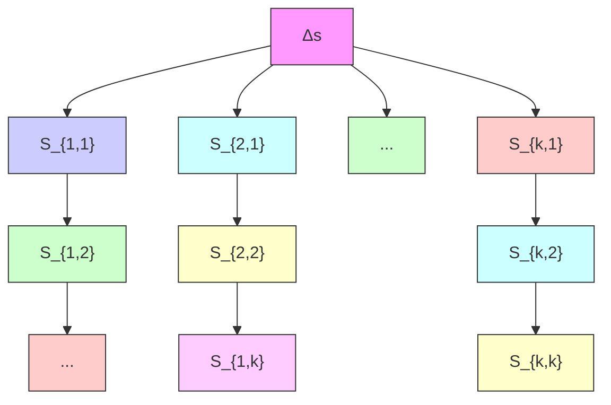

## Summary

We develop geographical profiling methods that determine the probable location of a serial criminal’s next crime based on the spatiotemporal data of their previous crimes. We assume that the spatial behavior of a serial criminal is non-random.

We consider standard deviation, centralization, and probability distance methods for prioritizing a given search area. We also develop analogous methods which weight the spatial data of recent crimes more heavily. We then develop ways of aggregating results from multiple methods.

The performance of a geographical profiling method is based on its effectiveness in narrowing down a particular search area into regions likely to contain the next crime location. The accuracy of a method for a particular serial criminal is based on the past performance of the method on the spatiotemporal data of that criminal.

All of our methods produce a prioritized search area in which the next crime occurs in approximately the top 10% of the search area, a significant improvement over a uniform random distribution. However, the differences in performance among the different methods developed were statistically insignificant. We also found the accuracy of our methods varied depending on the serial criminal under investigation.

## Executive Summary

We have developed models to be used in an open investigation of a serial criminal. In this summary we describe how our models can best be employed to help identify probable next target locations of the serial criminal.

Our models use the locations and times of previous crimes committed by a serial criminal in order to predict the likely next target location. This prediction prioritizes the search area so that law enforcement resources can be focused on the most probable next target regions. Our models prioritize the search areas in different fashions:

• Centralization models: These models are based on the assumption that a serial criminal’s activity is centered around a point.  
• Probability distance models: In these models, the closer a location is to previous crimes, the higher the probability the serial criminal will strike there next.  
• Time-based models: In these models, a location’s proximity to recent crimes is weighted more heavily than its proximity to crimes in the distant past.  
• Aggregate models: These models combine the above models.

There are multiple factors to consider when deciding if a particular model is applicable to a serial criminal investigation:

• Evidence of serial nature: Our models assume that all of the observed crimes were committed by one criminal. If there is a strong reason to doubt this assumption, such as the presence of a copy-cat criminal, then our models are not applicable.  
• Accuracy score: Our models provide a statistic that estimates their accuracy as applied to the serial criminal under investigation. If our models would not have performed well in predicting the locations of this serial criminal’s past crimes, there is no reason to believe that our models would accurately predict the location of the criminal’s next crime.

• Available resources: Our models prioritize the search area such that the next crime location is on average in the top 10% of the prioritized search area. This search area can still be prohibitively large to cover with the resources available to the investigation. If this search area is still too large to cover, then our models are still applicable but may not yield optimal results.

If it is determined that our models are applicable to a serial criminal investigation, then there are multiple limitations of our models which need to be taken into consideration:

• Our models do not take into account relevant geographical information: For example, if you know the serial criminal is targeting banks, our models do not take this into account. In this example, a list of bank locations can be cross-referenced against the prioritized search area given by our models to determine the banks that are likely to be targeted next.  
• Our models do not take into account relevant information about the criminal: The average distance that a serial criminal travels to commit a crime depends on the type of crime and characteristics of the criminal, including gender, race, and age. Our models assume no information of this type is known about the criminal.  
• Our computer models may not outperform geographical profiling techniques employed by a human: Research has suggested that complex computer geographical profiling methods are no more accurate than an investigator with minimal training in geographical profiling techniques.

Overall, we recommend that our geographical profiling models not be used as the only tool used in a serial criminal investigation. Instead, our models should complement traditional investigative techniques. It is our hope that our models can further aid law enforcement agencies in their pursuit of serial criminals.

# Predicting a Serial Criminal’s Next Crime Location Using Geographical Profiling

Control Group 7947

February 22, 2010

## Abstract

Geographical profiling techniques can be useful to law enforcement agencies who are investigating a serial criminal. We develop such methods that determine the probable location of a serial criminal’s next crime based on the spatiotemporal data of their previous crimes. We consider standard deviation, centralization, and probability distance methods for prioritizing a given search area, and also develop analogous methods which weight the spatial data of recent crimes more heavily. We then develop ways of aggregating results from multiple methods. The performance of a geographical profiling method is based on its effectiveness in narrowing down a particular search area into regions likely to contain the next crime location. All of our methods produce a prioritized search area in which the next crime occurs in approximately the top 10% of the search area, a significant improvement over a uniform random distribution. However, the differences in performance among the different methods developed were statistically insignificant. We also found the accuracy of our methods varied depending on the serial criminal under investigation.

## Contents

1 Introduction 3  
2 Problem Background 3

2.1 Terminology . . . . . 3  
2.2 Survey of Current Literature . . . 4  
2.3 Collection of Data . . . . 5

3 Constructing a Model 7

3.1 Assumptions . . . 7  
3.2 Model Descriptions . . . . 7  
3.3 Model Performance Metric . . . . 8  
3.4 Model Accuracy for a Particular Criminal . . . . 9  
3.5 Search Area Determination . . . 10

4 Individual Models 10

4.1 Spatial Models . . . 10  
4.2 Spatiotemporal Models . . . . 13  
4.3 Individual Model Results . . . 15

5 Aggregation Models 16

5.1 Aggregation Model Results . . . 19  
6 Peter Sutcliffe: A Case Study 20  
7 Conclusions 20  
8 Future Work 22

## 1 Introduction

Serial criminals present a unique challenge to law enforcement agencies. In a typical crime, investigators are able to draw a connection between the criminal and the victim. This information often provides enough clues to form the basis of a criminal investigation. In the case of serial criminals, however, there is usually no such relationship between the criminal and the victim [1, 2]. This lack of information about the serial criminal forces law enforcement agencies to consider a larger possible target area for the next crime, which hinders the investigation.

In order to better utilize limited law enforcement resources in a serial criminal investigation, geographical profiling can be used to determine likely next crime locations. Geographical profiling is “. . . a procedure that examines the spatial behavior of offenders with regard to the locations of their crime scenes and the spatial relationships between those scenes” [3]. By using geographical profiling, investigators are able to take advantage of the spatial patterns of a serial criminal to focus their attention on certain geographically important regions.

In this paper we examine different geographical profiling methodologies and compare their ability to predict the location of a serial criminal’s next crime. In Section 2, we provide the terminology and background information that will be utilized in the rest of the paper. In Section 3, we describe the features that are common to all geographical profiling methods developed and our metrics for determining the performance and accuracy of a particular method. Section 4 develops geographical profiling methods and reports on their performance, and Section 5 considers combinations of these methods. In Section 6, we apply our best geographical profiling methods to the serial murders committed by Peter Sutcliffe. Section 7 summarizes our main conclusions, while Section 8 discusses possible avenues for future work.

## 2 Problem Background

## 2.1 Terminology

• Serial Criminal: A serial criminal is a habitual offender who commits three or more related crimes over a span of time [1, 4]. We consider all forms of serial criminals together, such as murderers, rapists, arsonists, and burglars.

• Spatiotemporal Data: The locations and corresponding times of crimes committed by a serial criminal.  
• Spatial Behavior: The spatial behavior of a serial criminal describes how the serial criminal chooses crime locations [5, 6]. We model the spatial behavior of a criminal based on the spatiotemporal data of their previous crimes.  
• Geographical Profiling Method: A geographical profiling method is a particular methodology for modeling the spatial behavior of a serial criminal. We consider spatial methods that only consider the spatial data of previous crimes, spatiotemporal methods that also take into account the times of previous crimes, and aggregate methods that combine two or more geographical profiling methods.  
• Prioritized Search Area: The area to search prioritized by the probability of the next crime given by a specific model. This area is important in determining how to allocate law enforcement resources.

## 2.2 Survey of Current Literature

There is an ongoing debate as to the effectiveness of different geographical profiling methodologies. Rossmo uses spatial data to determine the residence of a criminal based on assumptions about spatial behavior, such as the tendency to commit crimes close, but not too close, to home [7]. As Rossmo’s paper lacks a detailed description of his algorithm, and relies on empirically determined constants, it is difficult to reproduce his geographical profiling methodology accurately [8, 7, 3]. Van der Kemp and van Koppen survey and criticize theories of spatial behavior, including theories of crime location proximity to the criminal’s residence and shortcomings of current geographical profiling methods [9]. Beauregard et al. and Snook et al. also examine the spatial behavior or serial criminals [10, 5]. Brown et al. take into account spatiotemporal data as well as additional features of the crime locations, such as proximity to highways, to predict crime locations [11, 2]. Recent work by O’Leary provides a mathematical foundation for geographical profiling [12].

We note that most of the work in the field of geographical profiling focuses on identifying the residence of a serial criminal. This allows law enforcement agencies to cross-reference the addresses of potential suspects to the predicted residency of the criminal in order to narrow their search. In contrast, this paper focuses on identifying probable next crime locations in a series of linked crimes. Being able to forecast crime locations would assist law enforcement agencies in ways predicting the residency of the criminal does not. For example, law enforcement agencies would be able to increase patrols along probable crime locations, or alert high-risk neighborhoods to the existence of the serial criminal. Since serial criminals often center their crime locations around their residence [10], these two problems are related, and thus we are able to adapt methods of identifying the residence to the problem of identifying next crime locations.

## 2.3 Collection of Data

In order to determine the accuracy of proposed geographical profiling models, we needed to see how the models performed against actual spatiotemporal serial crime data. Unfortunately, there is no large collection of serial crime data to compare our models to, or a standard collection of serial crime data that is used across all geographical profiling research. A survey of spatial profiling research shows that the data sets used are varied, which leads to different quantitative conclusions about the spatial behavior of serial criminals; see [9, 8, 10, 5] for contrasting conclusions based on different data sets. For example, the circle center method described in Section 4.1 was found to have different levels of accuracy for serial crime data sets from different countries [4]. Ideally, we would be able to test our geographical profiling models against serial crime data that spanned multiple locations, crime types, and periods of time, but such a data set does not exist.

In most studies we considered, a sample of serial crime data was either obtained from a government agency or compiled from newspaper and police reports. Unfortunately, due to the constrained time frame of our study, we were unable to obtain data from police departments and government agencies. However, we were able to compile a data set consisting of the crimes of nine serial criminals, totaling 124 crimes. For the more notorious criminals in this data set including the Beltway Snipers, Peter Sutcliffe, and Dale Hausner we were able to collect data directly from police reports and news articles. We collected data for the remaining crimes from SpotCrime.com, an online crime information source, and verified the data via the referenced police reports and news articles [13]. A listing of the crimes in our data set can be found in Table 1.

<table><tr><td>Description</td><td>Number of Crimes</td><td>Accuracy of Temporal Exponential Decay Model</td></tr><tr><td>Murders committed by Peter Sutcliffe in West Yorkshire, England</td><td>12</td><td>0.048</td></tr><tr><td>Beltway sniper attacks committed by John Allen Muhammad and Lee Boyd Malvo in the Washington, DC area</td><td>14</td><td>0.065</td></tr><tr><td>Murders, arsons, and other crimes committed by serial criminal Dale Hausner in Phoenix, AZ</td><td>40</td><td>0.098</td></tr><tr><td>Sexual assaults committed by a serial rapist in Columbus, OH</td><td>7</td><td>0.517</td></tr><tr><td>Serial robberies at TCF Banks in Franklin Park, IL area</td><td>12</td><td>0.180</td></tr><tr><td>Serial robberies committed in Denver, CO</td><td>6</td><td>0.103</td></tr><tr><td>Serial bank robberies committed by “The Withdrawal Bandit” in Boca Raton, FL</td><td>12</td><td>0.119</td></tr><tr><td>Serial robberies committed in Columbus, OH</td><td>7</td><td>0.020</td></tr><tr><td>Serial robberies and home invasions committed in Santa Monica, CA</td><td>14</td><td>0.174</td></tr></table>

Table 1: Description of data sets with accuracy score for temporal exponential decay model.

## 3 Constructing a Model

## 3.1 Assumptions

• Spatiotemporal data is accurate: A common modeling assumption.  
• Crimes were committed by one serial criminal: Our models are working on the assumption that all the crimes in a data set were committed by the same criminal, and thus the crime locations can be explained by a particular spatial behavior.  
• Serial criminals do not act randomly: We assume the truth of rational crime theory, the notion that “. . . there is an underlying reason why criminals choose to commit crimes at a particular time in a particular location” [2]. Rational crime theory is a necessary condition for productive geographical profiling, since if serial criminals are acting randomly, then the best model of their spatial behavior would be random as well.

## 3.2 Model Descriptions

Let $x _ { 1 } , \ldots , x _ { n } \in A \subset \mathbb { R } ^ { 2 }$ denote crime scene locations of a serial criminal, where A is a given search area encompassing the crime locations. Let $t _ { 1 } , \ldots , t _ { n } \in \mathbb { R }$ with $0 = t _ { 1 } < . . . < t _ { n }$ denote the corresponding times of the crimes, where $( x _ { i } , t _ { i } )$ is the spatiotemporal data of the $i ^ { \mathrm { t h } }$ crime. Given a location $y \in A$ , we define a probability function P such that $P ( y )$ is the probability that the next crime will happen at that location.

We discretize A into sectors $S _ { i , j }$ in the order to simplify our calculations; see Figure 1 for a description of the discretization process. We assume that if $y \in S _ { i , j }$ , then $P ( y ) = P ( S _ { i , j } )$ , the probability that the next crime location is in the sector. This is a reasonable assumption for small sector sizes relative to the total search area. Thus, the goal of a geographical profiling method is to determine $P ( S _ { i , j } )$ for all sectors.

For our models, let d be a given distance metric. This distance metric can be determined using a variety of methods, including standard Euclidean distances, Manhattan distances, or travel-time distances that take into account the road map data of the area. We arbitrarily choose to use Euclidean distances since we found no evidence that serial criminals evaluate distance using a certain metric, but our models do not make any assumptions about the nature of the distance function.

flowchart

Figure 1: The discretization of a square search area into sectors. In this figure k is equal to the side length of the search area divided by $\Delta s$ .

## 3.3 Model Performance Metric

There exist two commonly used metrics for the evaluation of the performance of a geographical profiling method. The first measure is the error distance, which is the Euclidean distance between the most likely exact location of the next crime and the actual next crime location [8]. The second measure represents how much of the prioritized search area would need to be searched in order to find the next crime location [12, 7].

Our model evaluation metric should reflect how useful these models would be to a law enforcement agency tracking a serial criminal. The most likely exact location of the next crime is not very valuable to law enforcement agencies, since often they are concerned with finding an area to search and not a particular point [12, 14, 7].

Thus, we consider the following metric that represents how much of the prioritized search area would need to be searched in order to find the next crime location, which we call the hit score. Given a geographical profiling method with associated probability function P and a known next crime location $x _ { n + 1 }$ , we wish to determine the hit score H.

Let S denote the set of all sectors. Let $L \ni x _ { n + 1 }$ denote the sector containing the next crime location. Then

$$
B = \{S _ {i, j} \in S: P (S _ {i, j}) > P (L) \}
$$

is the set of all sectors that have a higher predicted probability than the sector containing the next crime. Thus, we have

$$
H = \frac {| B |}{| S |}
$$

which is the fraction of the search area that would need to be searched in prioritized order before finding the next crime location. Note that a lower value for the hit score is preferable.

## 3.4 Model Accuracy for a Particular Criminal

Given an active serial criminal, we wish to determine the accuracy to which the criminal’s spatial behavior is determined by a model. This is important information for law enforcement agencies basing investigative decisions on a geographical profiling method, since they want to know the extent to which they can trust a model as it is applied to a particular criminal.

We calculate model accuracy for a given serial criminal in the following way. Given a geographical profiling method with associated probability function $P ,$ we wish to determine the accuracy score of the method, denoted Z.

Let $H _ { k }$ denote the hit score that considers $x _ { 1 } , \ldots , x _ { k - 1 }$ as the currently known crime locations, and treats $x _ { k }$ as the next crime location. Then,

$$
Z = \frac {1}{n - 3} \sum_ {k = 4} ^ {n} H _ {k}
$$

is the mean of the hit scores determined by sequentially adding each crime location, starting with the fourth, to the set of currently known crimes. We start with the fourth crime because criminal behavior is not generally considered serial until the criminal has committed at least three crimes [1]. Note that a lower value for the accuracy score represents a more accurate model.

## 3.5 Search Area Determination

Our notions of performance and accuracy depend heavily on the size of the search area. The hit score can be made arbitrarily small by increasing the size of the search area. This is because additional locations on the periphery of the search area are unlikely to be the next crime location, but these additional locations are included in the total search area.

Surprisingly, literature that uses the hit score performance metric does not explicitly address how the search area is to be determined given previous crime locations. We take the search area to be a square centered at the mean location of the previous crimes, with side length equal to double the maximum pairwise distance between previous crimes. In an ongoing serial criminal investigation the search area could be provided by law enforcement, but for our purposes the above search area balances the size of the search area based on previous crime distances.

## 4 Individual Models

## 4.1 Spatial Models

In this section we consider geographical profiling methods that only take into account the spatial data of serial crimes.

We consider the following spatial models for the calculation of $P ( S _ { i , j } )$ :

• Random Method: The random method assigns each $P ( S _ { i , j } )$ a random value uniformly. Theoretically, we expect the hit score of the random method to be 0.5 [14]. We include the random method as a basis for comparison of other geographical profiling methods.  
• Standard Deviation Methods: Since standard deviation methods give no information about the distribution of probabilities inside the standard deviation areas, we cannot meaningfully compare them to other methods. Regardless, we include standard deviation methods in this paper because they are the most basic geographical profiling methods. These methods provide a rudimentary way by which the potential search area can be narrowed. We consider the following standard deviation methods:

– Standard Deviation Rectangles: These are rectangular areas defined by the points

$$
\overline {{{x}}} + (- c \sigma_ {l o n}, - c \sigma_ {l a t})
$$

$$
\overline {{x}} + (- c \sigma_ {l o n}, c \sigma_ {l a t})
$$

$$
\overline {{x}} + (c \sigma_ {l o n}, c \sigma_ {l a t})
$$

$$
\overline {{x}} + (c \sigma_ {l o n}, - c \sigma_ {l a t})
$$

where x is the centroid of the crime locations, and $\sigma _ { l o n }$ and $\sigma _ { l a t }$ are the standard deviations of the longitudes and latitudes of the crime locations [15].

– Standard Deviation Ellipses: These are elliptical areas, oriented along the trend line of the data in the least-squares sense. A standard deviation ellipse is an ellipse with its center at the centroid of the crime locations, rotated clockwise by an angle $\theta ,$ and with axis lengths given by $2 c \sigma _ { l o n }$ and $2 c \sigma _ { l a t } ,$ where $\theta , \sigma _ { l o n } .$ and $\sigma _ { l a t }$ are calculated as in [16].

In both of the above methods, c is a constant that determines the range of the area. Common values are $c = 1$ for the $6 8 ^ { \mathrm { t h } }$ percentile area and $c = 2$ for the $9 5 ^ { \mathrm { t h } }$ percentile area. See Figure $7$ for an illustration of these percentile areas.

• Centralization Methods: Centralization methods determine a central focal point for the spatial pattern of the serial criminal. In these models, the probability of the next crime decreases the further the location is from the focal point. Thus, in all these methods, given a central focal point $C \in A$ , we have

$$
P (S _ {i, j}) = \frac {1}{d (S _ {i , j} , C)}
$$

We consider the following ways of determining the central focal point:

– Centroid: The central focal point is the mean of the locations of the crimes, given by

$$
C = \frac {1}{n} \sum_ {i = 1} ^ {n} x _ {i}
$$

– Harmonic Mean: The central focal point is the harmonic mean of the locations of the crimes, given by

$$
C = \frac {n}{\sum_ {i = 1} ^ {n} \frac {1}{x _ {i}}}
$$

Circle Center: The central focal point is the mean location of the two crime locations farthest away from each other. This is determined as follows. Let $x _ { i } , x _ { j }$ be such that $d ( x _ { i } , x _ { j } )$ is maximal. Then we have $C = \frac { x _ { i } + x _ { j } } { 2 }$

– Median: The central focal point is defined as the point that is the median of the of the longitudes and the median of the latitudes of the crime locations. Compared to the other centralization methods, the median is less sensitive to distant crime locations, which the criminal might have chosen for no particular spatial reason [9].

• Probability Distance Method: The probability distance method takes into account a location’s distance from each particular previous crime location. In this model, a probable next crime location would be relatively close to multiple previous crimes. Thus, we have

$$
P (S _ {i, j}) = \sum_ {k = 1} ^ {n} f (d (S _ {i, j}, x _ {k}))
$$

where f is a distance decay function defined in one of the following ways:

– Linear Distance Decay: The probability of the next crime location decreases linearly away from a particular previous crime location, given by $f ( d ) = \alpha - \beta d .$ , where $\alpha , \beta$ are decay constants.  
– Exponential Distance Decay: The probability of the next crime location decreases exponentially away from a particular previous crime location, given by $f ( d ) = e ^ { - \gamma d }$ , where $\gamma$ is a decay constant.

For an illustrative example of the difference between centralization methods and the probability distance method see Figure 2.

heatmap

| x    | y    | Next Crime Probability |
| ---- | ---- | ---------------------- |
| -2.0 | 2.0  | low                    |
| -1.5 | 1.5  | medium                 |
| -1.0 | 1.0  | high                   |
| -0.5 | 0.5  | medium                 |
| 0.0  | 0.0  | high                   |
| 0.5  | -0.5 | medium                 |
| 1.0  | -1.0 | low                    |
| 1.5  | -1.5 | medium                 |
| 2.0  | -2.0 | low                    |

(a) Centroid centralization method on the unit circle

heatmap

| x    | y    | Next Crime Probability |
| ---- | ---- | ---------------------- |
| -2.0 | 2.0  | low                    |
| -1.5 | 1.5  | medium                 |
| -1.0 | 1.0  | high                   |
| -0.5 | 0.5  | medium                 |
| 0.0  | 0.0  | low                    |
| 0.5  | -0.5 | medium                 |
| 1.0  | -1.0 | high                   |
| 1.5  | -1.5 | medium                 |
| 2.0  | -2.0 | low                    |

(b) Exponential decay method on the unit circle  
Figure 2: Comparison of prioritized search areas of a hypothetical criminal committing crimes along the unit circle given by a centralization method and a decay method.

## 4.2 Spatiotemporal Models

In this section we consider geographical profiling methods that take into account both the spatial and temporal data of serial crimes. The additional use of temporal data is motivated by the idea that recent crime locations are more relevant to the spatial behavior of a serial criminal than older crime locations. For example, if the serial criminal is traveling while committing crimes, then old crime location information quickly becomes outdated. For an example of this, see Figure 3.

Not all of the spatial models in Section 4.1 have extensions that incorporate temporal data. For example, the circle center centralization method has no spatiotemporal analog, since the longest pairwise distance is unaffected by temporal data.

To incorporate the temporal components of the crime data, we calculate a temporal weighting factor for each crime,

$$
w _ {i} = \frac {t _ {i} - t _ {1}}{t _ {n}} + k
$$

where $w _ { i }$ denotes the temporal weight of the $i ^ { \mathrm { t h } }$ crime. The offset k is included so that the first crime will not be given a weight of 0. We chose $k = 0 . 1$ so that the last crime is weighted approximately ten times more heavily than the first crime. Let W denote the sum of the temporal weights.

heatmap

| x    | y    | Next Crime Probability |
| ---- | ---- | ---------------------- |
| 0    | 0    | high                   |
| 10   | 0    | high                   |
| 0    | -5   | low                    |
| 10   | -5   | low                    |

(a) Exponential Decay

heatmap

| X Range | Y Range | Next Crime Probability |
|---------|---------|------------------------|
| 0–1     | -5–0    | low                    |
| 0–1     | 0       | medium                 |
| 0–1     | 5       | high                   |
| 1–5     | -5–0    | low                    |
| 1–5     | 0       | medium                 |
| 1–5     | 5       | high                   |
| 5–10    | -5–0    | low                    |
| 5–10    | 0       | medium                 |
| 5–10    | 5       | high                   |
| 10–10   | -5–0    | low                    |
| 10–10   | 0       | medium                 |
| 10–10   | 5       | high                   |

(b) Temporal Exponential Decay  
Figure 3: Prioritized search area for a hypothetical serial criminal travelling east over time, as given by the exponential decay and temporal exponential decay models.

We modify the following spatial models to consider the temporal weighting factors:

## • Centralization Methods:

Temporal Centroid: The mean of the locations of the crimes, weighted by time, given by

$$
C = \frac {1}{W} \sum_ {i = 1} ^ {n} x _ {i} w _ {i}
$$

– Temporal Harmonic Mean: The harmonic mean of the locations of the crimes, weighted by time, given by

$$
C = \frac {W}{\sum_ {i = 1} ^ {n} \frac {w _ {i}}{x _ {i}}}
$$

• Temporal Probability Distance Methods: The linear distance decay and exponential distance decay methods incorporate the temporal weight data by using the following modified probability function:

$$
P (S _ {i, j}) = \sum_ {k = 1} ^ {n} w _ {k} f (d (S _ {i, j}, x _ {k}))
$$

bar chart

| Category | Hit Score |
| :--- | :--- |
| Uniform Random | 0.49 |
| Centroid | 0.10 |
| Temporal Centroid | 0.10 |
| Harmonic | 0.10 |
| Temporal Harmonic | 0.10 |
| Circle Center | 0.11 |
| Median | 0.12 |
| Exponential | 0.09 |
| Decay Temporal | 0.09 |
| Exponential | 0.09 |
| Decay Linear | 0.12 |
| Decay Temporal | 0.12 |
| Linear Decay | 0.11 |

Figure 4: Comparison of the relative performance of each of our models on all of our data sets.

## 4.3 Individual Model Results

To investigate the effectiveness of each of the aforementioned models, we calculated the mean hit score across all of our data sets. After three crimes have been observed we apply our model and record the hit score for the next crime. This process is repeated for all subsequent crimes in the series.

The value of the constants in the linear and exponential decay models do not effect the hit score. This is because the hit score is not affected by the magnitude of the probability of the sector but by the relative probability to the rest of the search area. Consequently for an individual model the values of the constants have no effect.

First we investigate the overall performance of each of the models. This can be found in Table 2 and in Figure 4. All of our models significantly outperform the random model, but each of the individual models is not statistically superior to any other.

Next we investigate the performance of our models based upon the number of crimes observed as seen in Figure 5. No patterns emerge that would indicate that the performance of the model improves having observed more crimes. The data sets considered do not have sufficient data to rule out such a correlation, particularly with the longer streaks as there are only a few data points.

line chart

| Number of crimes observed | Hit score |
| -------------------------- | --------- |
| 3                          | 0.10      |
| 4                          | 0.07      |
| 5                          | 0.13      |
| 6                          | 0.08      |
| 7                          | 0.06      |
| 8                          | 0.15      |
| 9                          | 0.02      |
| 10                         | 0.21      |
| 11                         | 0.09      |
| 12                         | 0.18      |
| 13                         | 0.14      |

Figure 5: Hit score by number of crimes observed using a exponential decay model and 50% confidence intervals.

## 5 Aggregation Models

In this section we consider ways of combining predictions from multiple geographical profiling methods into one model. The motivation behind these aggregate approaches is that each of the individual models described in Sections 4.1 and 4.2 have strengths and weaknesses, but by aggregating several models we hope enhance the strengths and reduce the weaknesses.

This issue of aggregation of models relates to the classic problem of aggregating expert predictions. Consequently, there exist several different techniques for aggregating these models. These techniques can be categorized as either axiomatic or Bayesian. Clemen and Winkler reported no significant difference in the performance of more complex Bayesian models with more simple axiomatic approaches [17], and as such we have chosen to focus on the more elementary axiomatic approaches.

<table><tr><td>Model</td><td>Hit Score</td><td>95% Confidence</td></tr><tr><td>Random</td><td>0.500</td><td>0.001</td></tr><tr><td>Centroid Centralization</td><td>0.104</td><td>0.031</td></tr><tr><td>Temporal Centroid Centralization</td><td>0.106</td><td>0.031</td></tr><tr><td>Harmonic Mean Centralization</td><td>0.105</td><td>0.031</td></tr><tr><td>Temporal Harmonic Mean Centralization</td><td>0.106</td><td>0.031</td></tr><tr><td>Circle Center Centralization</td><td>0.116</td><td>0.029</td></tr><tr><td>Median Centralization</td><td>0.123</td><td>0.042</td></tr><tr><td>Exponential Decay</td><td>0.094</td><td>0.030</td></tr><tr><td>Temporal Exponential Decay</td><td>0.092</td><td>0.029</td></tr><tr><td>Linear Decay</td><td>0.125</td><td>0.043</td></tr><tr><td>Temporal Linear Decay</td><td>0.123</td><td>0.043</td></tr></table>

Table 2: Models with associated hit scores and 95% confidence intervals.

Axiomatic Approaches: Given n models that we wish to aggregate, let $P _ { k } ( S _ { i , j } )$ denote the probability that a particular sector contains the next crime as predicted by the $k ^ { \mathrm { t h } }$ model. Let $W _ { k }$ denote the aggregation weight of the $k ^ { \mathrm { t h } }$ model, given such that all $W _ { k }$ ’s sum to one.

• Linear Opinion Pool: This model is a linear combination of two or more probability distribution functions produced by individual models.

$$
P (S _ {i, j}) = \sum_ {k = 1} ^ {n} W _ {k} P _ {k} (S _ {i, j})
$$

Examples of this model and the effect of different weights can be found in Figure 6.

• Logarithmic Opinion Pool: This model is a weighted product of two or more probability distribution functions.

$$
P (S _ {i, j}) = \prod_ {k = 1} ^ {n} P _ {k} (S _ {i, j}) ^ {W _ {k}}
$$

heatmap

| Latitude | Longitude | NexC Crime Probability |
| -------- | --------- | ---------------------- |
| 39.5     | -78.0     | low                    |
| 39.0     | -77.5     | medium                 |
| 38.5     | -77.0     | high                   |
| 38.0     | -76.5     | medium                 |
| 37.5     | -76.0     | low                    |

(a) Exponential decay weight 0.00, Circle center weight 1.00

heatmap

| Latitude | Longitude | Next Crime Probability |
| -------- | --------- | ---------------------- |
| 39.5     | -78.0     | low                    |
| 39.0     | -77.5     | high                   |
| 38.5     | -77.0     | medium                 |
| 38.0     | -76.5     | low                    |
| 37.5     | -76.0     | low                    |

(b) Exponential decay weight 0.25, Circle center weight 0.75

heatmap

| X Range     | Y Range     | Next Crime Probability |
|-------------|-------------|------------------------|
| -78.0 to -76.0 | 37.5 to 39.5 | Low                    |
| -77.5 to -76.0 | 38.0 to 39.0 | High                   |
| -77.0 to -76.0 | 38.5 to 39.5 | Medium                 |
| -76.5 to -76.0 | 39.0 to 39.5 | Low                    |

(c) Exponential decay weight 0.50, Circle center weight 0.50

heatmap

| X Range     | Y Range | Next Crime Probability |
|-------------|---------|------------------------|
| -78.0 to -77.5 | 37.5–39.5 | Low                    |
| -77.5 to -77.0 | 38.0–39.0 | Medium                 |
| -77.0 to -76.5 | 38.5–39.5 | High                   |
| -76.5 to -76.0 | 39.0–39.5 | Very High              |

(d) Exponential decay weight 0.75, Circle center weight 0.25

heatmap

| X Range     | Y Range     | Next Crime Probability |
|-------------|-------------|------------------------|
| -78.0 to -76.0 | 37.5 to 39.5 | Low                    |
| -77.5 to -76.0 | 38.0 to 39.0 | Medium                 |
| -77.0 to -76.0 | 38.5 to 39.5 | High                   |

(e) Exponential decay weight 1.00, Circle center weight 0.00  
Figure 6: Prioritized search areas resulting from using different weights in the aggregation model of a circle center and exponential decay for the Beltway Sniper.

In the exponential decay and the linear decay spatial models described in Section 4.1, we noted the value of the constants chosen for the model has no impact on the hit score metric. In an aggregate model this is not the case, as the relative magnitude of probability is important when added or multiplied by another model.

To set these parameters we used the mean pairwise distance. We define the mean pairwise distance to be the mean distance between any two crimes

$$
\overline {{\delta}} = \frac {2}{n (n - 1)} \sum_ {1 \leq i <   j \leq n} d (x _ {i}, x _ {j})
$$

In the case of the linear decay model, α was chosen to be 1 and $\beta$ was chosen such that α − βδ = 0. In the case of the exponential decay, we set γ = q 2 , $\alpha - \beta { \overline { { \delta } } } = 0$ $\begin{array} { r } { \gamma = \sqrt { \frac { 2 } { \bar { \delta } } } } \end{array}$ which gives a mean distance to crime of $\frac { \overline { { \delta } } } { 2 }$ . We believed these values would provide a reasonable magnitude of probability when compared with other models.

## 5.1 Aggregation Model Results

To investigate the benefits of aggregation models, we used $\mathrm { ~ a ~ } 2 ^ { k }$ factorial experimental design [18]. For each of our models described in Section 4, we investigated two possible scenarios: the model was included in the aggregate and weighted equally with the others, and the model was not included. We then computed the mean hit score for the resultant aggregate model for all possible models on all of our data sets.

While a further optimization process could be conducted in which more weights or different decay constants were investigated, this process allowed us to see the effect of different models on the aggregate as well as see which individual models produce a strong aggregate model.

Through this process we found the strongest combination of individual models used the temporal exponential decay and the circle center centralization each equally weighted. The mean hit score for the linear opinion pool was $0 . 0 8 1 \pm 0 . 0 2 7$ with a 95% confidence interval. The logarithmic opinion pool did not perform any better than any individual model. Neither model is statistically better than any of our other models.

## 6 Peter Sutcliffe: A Case Study

Peter Sutcliffe was a serial murderer who targeted women in England during the late 1970’s [19]. A map of his murders can be found in Figure 8(a). We have applied the models we have developed to predict where the next murder in the series would be if Sutcliffe had not been arrested and imprisoned.

scatterplot

| x       | y     |
| ------- | ----- |
| -2.2    | 53.4  |
| -1.8    | 53.7  |
| -1.6    | 53.8  |
| -1.4    | 53.9  |

scatterplot

| x       | y     |
| ------- | ----- |
| -2.2    | 53.4  |
| -1.8    | 53.8  |
| -1.6    | 53.8  |
| -1.4    | 53.8  |
| -1.8    | 53.6  |
| -1.6    | 53.6  |
| -1.8    | 53.6  |
| -2.0    | 53.6  |
| -2.2    | 53.4  |

Figure 7: Standard deviation rectangles and ellipses for the murders committed by Peter Sutcliffe.

A common but na¨ıve method of identifying an area of high probability of serial crime generates a rectangle or ellipse in which a standard deviation of previous crimes have taken place. These rudimentary models can bee seen in Figure 7.

In Section 4.3, we found the individual model with the lowest mean hit score across our data set was the temporal exponential decay model. See Figure 8 for an application of this model to the data for murders committed by Peter Sutcliffe. The known crimes had a hit score of 10.6% using this model, so we use this percentage to find a prioritized search area where we can be reasonably confident Sutcliffe would attack next. Of the 27818 km2, we can then isolate 2941 km2 in which to concentrate the search effort.

## 7 Conclusions

• Every geographical profiling method outperformed the random method: On our data set, every geographical profiling method provided a significant improvement in hit score over the random method.  
• All non-random geographical profiling methods considered exhibited roughly the same performance: Differences in the hit

text_image

Coine
Nelson
Boulsworth Hill
Burnley
Pedden Bridge
Todmerden
Bacup
Littleborough Blackstone Edge
Rochdale
Heywood
M62
AS27(M)
Oldham
Manchester
Dikinfield Stalybridge
Hyde Stockport
Kingsop
Huddersfield
Eland M62
Halifax
Sowerby Bridge
Bingley
Shipley
Ford
Pudsey
M1
Leeds
M521
M52
M1
Batley
Liversedge Dewsbury Mirfield
Ossetti
Wakefield Norma
Barnsley
AB28
AB29
AB28
AB28
AB28
AB28
AB28
AB28
AB28
AB28
AB28
AB28
AB28
AB28
AB28
AB28
AB28
AB28
AB28
AB28
AB28
AB28
AB28
AB28
AB28
AB28
AB28
AB200 Tele Atlas
Map data © 2010 Tele Atlas

(a) Locations of Peter Sutcliffe murders. Map generated via Google Static Maps API [20].

heatmap

| X Range | Y Range | Next Crime Probability |
| --- | --- | --- |
| -2.6 to -2.4 | 53.0 to 54.2 | Low |
| -2.6 to -2.4 | 53.4 to 53.6 | Low |
| -2.0 to -1.8 | 53.6 to 53.8 | Medium |
| -1.8 to -1.6 | 53.8 to 54.0 | High |
| -1.6 to -1.4 | 53.8 to 54.0 | Medium |
| -1.8 to -1.6 | 53.6 to 53.8 | Low |
| -2.0 to -1.8 | 53.4 to 53.6 | Low |
| -2.2 to -1.8 | 53.2 to 53.4 | Low |
| -1.8 to -1.6 | 53.0 to 53.2 | Low |
| -1.6 to -1.4 | 53.0 to 53.2 | Low |
| -1.8 to -1.6 | 53.0 to 53.2 | Low |
| -2.0 to -1.8 | 53.0 to 53.2 | Low |
| -2.2 to -1.8 | 53.0 to 53.2 | Low |
| -2.4 to -1.8 | 53.0 to 53.2 | Low |
| -2.6 to -1.8 | 53.0 to 53.2 | Low |
| -2.8 to -1.8 | 53.0 to 53.2 | Low |
| -3.0 to -1.8 | 53.0 to 53.2 | Low |
| -3.2 to -1.8 | 53.0 to 53.2 | Low |
| -3.4 to -1.8 | 53.0 to 53.2 | Low |
| -3.6 to -1.8 | 53.0 to 53.2 | Low |
| -3.8 to -1.8 | 53.0 to 53.2 | Low |
| -4.0 to -1.8 | 53.0 to 53.2 | Low |
| -4.2 to -1.8 | 53.0 to 53.2 | Low |
| -4.4 to -1.8 | 53.0 to 53.2 | Low |
| -4.6 to -1.8 | 53.0 to 53.2 | Low |
| -4.8 to -1.8 | 53.0 to 53.2 | Low |
| -5.0 to -1.8 | 53.0 to 53.2 | Low |
| -5.2 to -1.8 | 53.0 to 53.2 | Low |
| -5.4 to -1.8 | 53.0 to 53.2 | Low |
| -5.6 to -1.8 | 53.0 to 53.2 | Low |
| -5.8 to -1.8 | 53.0 to 53.2 | Low |
| -6.0 to -1.8 | 53.0 to 53.2 | Low |
| -6.2 to -1.8 | 53.0 to 53.2 | Low |
| -6.4 to -1.8 | 53.0 to 53.2 | Low |
| -6.6 to -1.8 | 53.0 to 53.2 | Low |
| -6.8 to -1.8 | 53.0 to 53.2 | Low |
| -7.0 to -1.8 | 53.0 to 53.2 | Low |
| -7.2 to -1.8 | 53.0 to 53.2 | Low |
| -7.4 to -1.8 | 53.0 to 53.2 | Low |
| -7.6 to -1.8 | 53.0 to 53.2 | Low |
| -7.8 to -1.8 | 53.0 to 53.2 | Low |
| -8.0 to -1.8 | 53.0 to 53.2 | Low |
| -8.2 to -1.8 | 53.0 to 53.2 | Low |
| -8.4 to -1.8 | 53.0 to 53.2 | Low |
| -8.6 to -1.8 | 53.0 to 53.2 | Low |
| -8.8 to -1.8 | 53.0 to 53.2 | Low |
| -9.0 to -1.8 | 53.0 to 53.2 | Low |
| -9.2 to -1.8 | 53.0 to 53.2 | Low |
| -9.4 to -1.8 | 53.0 to 53.2 | Low |
| -9.6 to -1.8 | 53.0 to 53.2 | Low |
| -9.8 to -1.8 | 53.0 to 53.2 | Low |
| -10.0 to -1.8 | 53.0 to 53.2 | Low |
| -10.2 to -1.8 | 53.0 to 53.2 | Low |
| -10.4 to -1.8 | 53.0 to 53.2 | Low |
| -10.6 to -1.8 | 53.0 to 53.2 | Low |
| -10.8 to -1.8 | 53.0 to 53.2 | Low |
| -11.0 to -1.8 | 53.0 to 53.2 | Low |
| -11.2 to -1.8 | 53.0 to 53.2 | Low |
| -11.4 to -1.8 | 53.0 to 53.2 | Low |
| -11.6 to -1.8 | 53.0 to 53.2 | Low |
| -11.8 to -1.8 | 53.0 to 53.2 | Low |
| -12.0 to -1.8 | 53.0 to 53.2 | Low |
| -12.2 to -1 | ~54 | High |
| ~-1 | ~44 | High |
| ~-0 | ~4 | High |
| ~+1 | ~-4 | High |
| ~+0 | ~-4 | High |
| ~-1 | ~-4 | High |
| ~+0 | ~-4 | High |
| ~+1 | ~-4 | High |
| ~+0 | ~-4 | High |
| ~-1 | ~-4 | High |
| ~+0 | ~-4 | High |
| ~+1 | ~-4 | High |
| ~+0 | ~-4 | High |
| ~-1 | ~-4 | H |
| ~+0 | ~-4 | H |
| ~+1 | ~-4 | H |
| ~+0 | ~-4 | H |
| ~-1 | ~-4 | H |
| ~+0 | ~-4 | H |
| ~+1 | ~-4 | H |
| ~+0 | ~-4 | H |
| ~-1 | ~-4 | H |
| ~+0 | ~-4 | H |
| ~+1 | ~-4 | H |

(b) Temporal exponential decay model applied to Peter Sutcliffe murders.  
Figure 8: Comparison of the prioritized search area produced by the temporal exponential decay model to the map of the geographical area of murders committed by Peter Sutcliffe. This prioritized search area suggests that the Bradford area is at the highest risk of attack.

score for different spatial, spatiotemporal, and aggregation methods were statistically insignificant, indicating that all the geographical pro filing methods have the same level of performance. This is a similar conclusion reached by Snook et al., who show that complex geographical profiling methods are no more accurate than simple geographical profiling methods [4].

• Particular geographical profiling methods are not applicable to all serial criminals: We can see in Table 1 that the accuracy of our best individual geographical profiling method varied largely depending on the particular serial criminal being studied. For example, our best individual method, the temporal exponential decay method, is an accurate predictor of the D.C. sniper attacks (with an accuracy of 0.056), but is grossly inaccurate when applied to the serial rapist in Columbus, OH (with an accuracy of 0.533, which is worse than the random method).

## 8 Future Work

• Standardization of data set: It is currently difficult to compare geographical profiling method performance to previous research because each study uses a different set of serial crime data to determine performance results. An effort to compile a large, comprehensive list of serial crime data to which all methods would be compared would greatly help the development of geographical profiling techniques.  
• Use of other relevant geographical information: In this paper we only consider the spatiotemporal relationships between crimes. Work by O’Leary and Brown et al. develop the notion of a feature space that groups crime locations by their relevant geographical features, such as population density or proximity to a major highway [12, 11]. The probability that a future crime happens at a particular location is then determined by the proximity of the location to previous crimes in the feature space. Having more information about what connects crime locations could potentially improve our geographical profiling methods.  
• Use of relevant information about the criminal: Research suggests that characteristics of the criminal, such as gender, race, and age,

play a role in determining their probable spatial behavior [9, 5, 10]. By taking these factors into account, we may be able to improve the accuracy of our models for a specific criminal.

• Evaluation of cost to law enforcement: Law enforcement agen cies typically purchase computer-generated geographical profiling in formation [4, 7]. Research by Snook et al. suggests that a person with minimal training in geographical profiling techniques can determine the probable residence of a serial criminal with just as much accuracy as a complex computer-generated geographical profiling method [8]. Further research should be done to determine if the cost of proprietary geographical profiling software is worth the quality of the information provided to law enforcement agencies.

## References

[1] Ronald M. Holmes and Stephen T. Holmes. Serial Murder. SAGE Publications, Thousand Oaks, California, 1998.  
[2] Donald Brown and Justin Stile. Geographic profiling with event prediction. Systems, Man and Cybernetics, 2003. IEEE International Conference on, 4:3712–3719, 2003.  
[3] Scotia J. Hicks and Bruce D. Sales. Criminal Profiling: Developing an Effective Science and Practice. American Psychological Association, Washington, DC, 2006.  
[4] Brent Snook, Michele Zito, Craig Bennell, and Paul J. Taylor. On the complexity and accuracy of geographic profiling strategies. Journal of Quantitative Criminology, 21(1):1–26, 2005.  
[5] Brent Snook, Richard M. Cullen, Andreas Mokros, and Stephan Harbort. Serial murderers’ spatial descisions: Factors that influence crime location choice. Journal of Investigative Psychology and Offender Profiling, 2(3):147–164, 2005.  
[6] D. Kim Rossmo. Place, space, and police investigations: Hunting serial violent criminals. In Crime and Place: Crime Prevention Studies. Willow Tree Press, NY, 1995.  
[7] D. Kim Rossmo. Geographic profiling: Target patterns of serial murderers. Unpublished doctoral dissertation, 1995.  
[8] Brent Snook, Paul J. Taylor, and Craig Bennell. Shortcuts to geographic profilling success: A reply to Rossmo (2005). Applied Cognitive Psychology, 19(5):655–661, 2005.  
[9] Jasper J. van der Kemp and Peter J. van Koppen. Fine-Tuning Geographical Profiling, chapter 17. Criminal Profiling. Humana Press, 2007.  
[10] Eric Beauregard, Jean Proulx, and D. Kim Rossmo. Spatial patterns of sex offenders: Theoretical, empirical, and practical issues. Aggression and Violent Behavior, 10(5):579–603, 2005.  
[11] Donald Brown and Hua Liu. Spatial-temporal event prediction: A new model. Systems, Man, and Cybernetics, 1998. IEEE International Conference on, 3:2933–2937, 1998.  
[12] Mike O’Leary. The mathematics of geographic profiling. Journal of Investigative Psychology and Offender Profiling, 6(3):253–265, 2009.  
[13] Spotcrime.com. http://www.spotcrime.com. Accessed on February 19, 2010.  
[14] D. Kim Rossmo. Geographic heuristics or shortcuts to failure?: Response to Snook et al. Applied Cognitive Psychology, 19(5):651–654, 2005.  
[15] Steven Gottlieb, Sheldon Arenberg, and Raj Singh. Crime Analysis: From First Report to Final Arrest. Alpha, 1994.  
[16] Joshua Kent and Michael Leitner. Efficacy of standard deviational ellipses in the application of criminal geographic profiling. 4(3):147– 165, 2007.  
[17] Robert T. Clemen and Robert L. Winkler. Aggregating probability distributions. In Advances in Decision Analysis. Cambridge University Press, Cambridge, UK, 2007.  
[18] Averill M. Law. Simulation Modeling and Analysis. McGraw-Hill, 3rd edition, 2000.  
[19] Nicole Ward Jouve. ’The Streetcleaner’ The Yorkshire Ripper Case on Trial. Marion Boyars Publishers, London, 1986.  
[20] Google Static Maps API. http://code.google.com/apis/maps/ documentation/staticmaps/. Accessed on February 22, 2010.