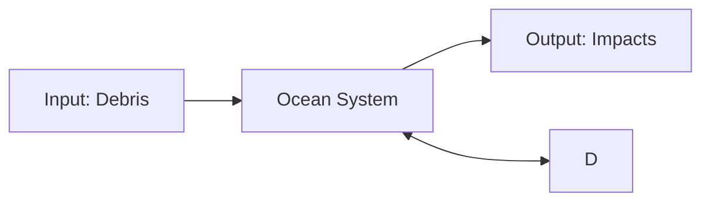
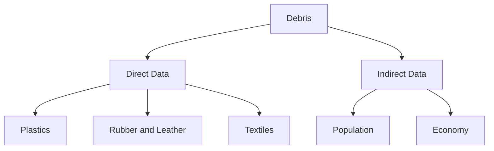
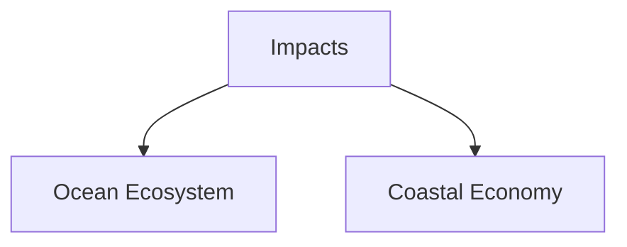
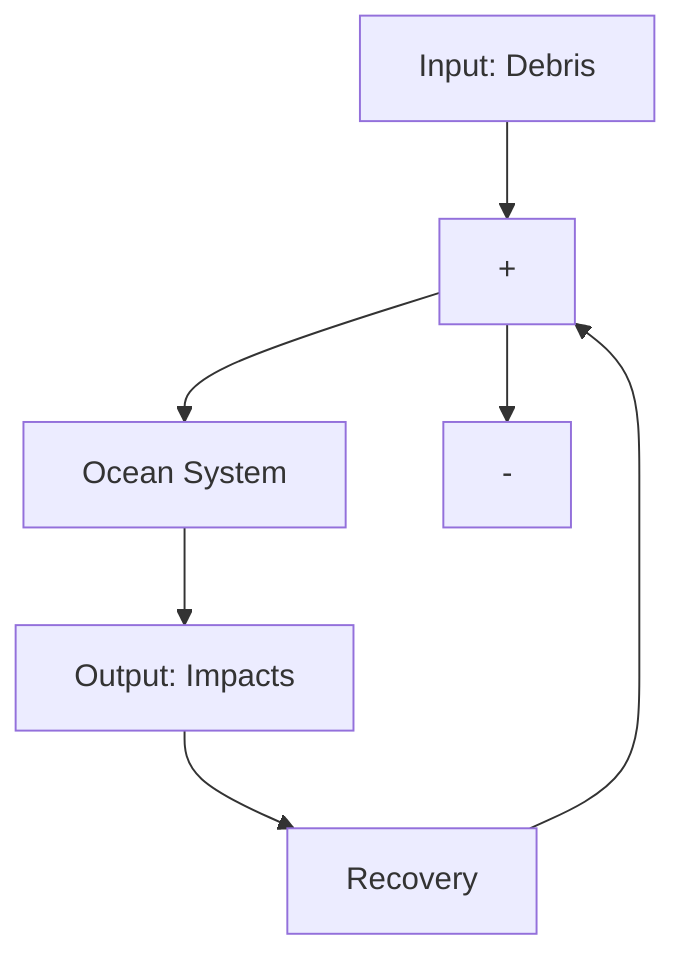

## Summary

To study the marine debris problem, we abstract the ocean system as a simplified input-output system. The input of the ocean system is debris, and the output is impacts.

The Hawaiian monk seal is taken as an example to study the potential impacts of the marine debris on the ocean ecosystem. Along with the increase of derelict fishing gear and other marine debris, the annul number of Hawaiian monk seal entanglements has an increasing trend with fluctuation. This increasing trend is divided into certain growth trend and smooth random change trend. Grey model GM (1, 1) and time series analysis method are used to predict the certain growth trend and the smooth random change trend respectively. Then combine the two trends to generate the predictive value. Based on error analysis, the predictive data is highly similar with actual data during the period 1985-1999. This paper comes to some conclusions: the number of entangled Hawaiian monk seal will increase in short-term; in terms of long period, the Hawaiian monk seal will probably vanish in the near future, the food chain will be destroyed, which may leads to ecosystem disorder.

To investigate the annul situation of ocean system, we establish an ocean system evaluation model. Quantitative debris and impacts data of the ocean system are obtained based on analytical hierarchy process (AHP). This paper puts forward an evaluation vector, which consists of the two components-Debris and Impacts, to evaluate the situation of ocean system. A comparison function is constructed to compare the situation of ocean system during different period on the basis of evaluation vector. The results indicate that the amount of debris increases and the situation of ocean system get worse along with the time passing. Contrast between the predictive impacts and the actual impacts indicate that recycling action will improve the situation and bring the positive effect.

A feedback system is provided and a feedback variable-Recovery is brought into the system. Analyzing the system, we conclude that decreasing the amount Debris or increasing the amount of Recovery contribute to improve the situation.

In the last, we submit a research report to the expedition leader summarizing our findings, proposals for solutions and needed policies.

Key words: Hawaiian monk seal; Grey Model GM (1, 1); Time Series Analysis; Ocean System Evaluation Model; Analytical Hierarchy Process

## Quantitative Marine Debris Impacts and Evaluation of Ocean System

## 1. Introduction

Two of the key characteristics that make plastics so useful--their light weight and durability--also make inappropriately handled waste plastics a significant environmental threat. Plastics are readily transported long distances from source areas and accumulate mainly in the oceans, where they have a variety of significant environment and economic impacts [1]. The United Nations Joint Group of Experts on the Scientific Aspects of Marine Pollution (GESAMP) estimated that land-based sources are responsible for up to 80% of marine debris and the remainder was due to sea-based activities [2]. Masahisa et al [3] used numerical simulation methods to research the movement and accumulation of floating marine debris drifting throughout the Pacific Ocean; they found that a large amount of marine debris is concentrated in specific regions that located far from the sources of much marine debris. The specific region is often referred to as The Great Pacific Ocean Garbage Patch (GPOGP) in the media.

In our paper, the main questions that we investigate are:

What are the potential short- and long-term impacts of the marine debris on the ocean ecosystem?  
What are the sources of marine debris? What is current situation of the ocean? If the situation is poor, how to improve it?

## 2. Description and Analysis

We put forward a method to study the marine debris problem which exists in the Ocean System. To simplify the problem, we first abstract the Ocean System as a simplified input-output system (Fig.1).

flowchart

Movement and Accumulation  
Fig.1 input-output ocean system

Viewed in isolation, a good Ocean System should make little negative impacts to the marine ecosystem. When linked to input, a good Ocean System is the one with less marine debris. In order to reduce the negative impacts, solutions should include reducing the input.

## 2.1 Debris Sources

A review of the available data on debris found worldwide indicates that the dominant types and sources of debris come from what we consume (including food wrappers, cigarettes), what we use in transporting ourselves by sea, and what we harvest from the sea (fish gear). Marine debris researchers traditionally classify debris sources into two categories: land- or sea-based, depending on where the debris enters the water [4]. In our paper, to completely research the debris sources and easily calculate, the debris is divided into two aspects:

Direct Data: direct data contain all the land- or sea-based marine debris, which mainly contains plastics, rubber and leather, textiles and so on.  
Indirect Data: along with population increasing and economic development, more debris is manufactured, discarded, and finally go into the ocean, so the population and economy have been considered as indirect data.

## 2.2 Impacts

Marine debris is a global issue, affecting all the major bodies of water on the planet—above and below the water’s surface. This debris can negatively impact wildlife, habitats, and the economy of coastal communities [4].

Since the marine debris concentrate in the ocean, its main impacts are ocean ecosystem and coastal economy. In following section, we will model and focus on researching its impacts on the ocean ecosystem and coastal economy.

## 3. Model for Impacts on Ocean Ecosystem

One of the most notable types of impacts on ocean ecosystem from marine debris is wildlife entanglement. Numerous marine animals become entangled in marine debris each year [5]. In this paper, we take the entangled Hawaiian monk seal as example to study the impacts on ecosystem.

The annual number of Hawaiian monk seal entanglements comes from NOAA [6], as show in Fig.2.

From Fig.2, a sequence about the entanglements number of the 15 years (1985-1999) can be generated, and it is not difficult to find there is a growing trend with fluctuation.

$$
\begin{array}{l} X _ {0} = X _ {0} (1), X _ {0} (2), \dots , X _ {0} (1 5) \\ = 2, 4, 1 2, 1 5, 1 2, 4, 7, 1 4, 7, 6, 1 1, 2 2, 1 6, 1 8, 2 5 \\ \end{array}
$$

We divide sequence $X _ { \mathrm { ~ 0 ~ } }$ into sequence $Y _ { _ 0 }$ and sequence $Z _ { 0 } , Y _ { 0 }$ reflects the certain growth trend of $X _ { \mathrm { ~ 0 ~ } }$ , and $Z _ { \phantom { } _ { 0 } }$ reflects the smooth random change trend of $X _ { \mathrm { ~ 0 ~ } }$ .

bar chart

Number of Entanglements
| Year | Number of Entanglements |
| :--- | :--- |
| 1985 | 2 |
| 1986 | 4 |
| 1987 | 12 |
| 1988 | 15 |
| 1989 | 12 |
| 1990 | 4 |
| 1991 | 7 |
| 1992 | 14 |
| 1993 | 7 |
| 1994 | 6 |
| 1995 | 11 |
| 1996 | 22 |
| 1997 | 16 |
| 1998 | 18 |
| 1999 | 25 |

Fig.2 Number of Hawaiian Monk Seal Entanglements Observed

## 3.1 GM (1, 1) Model Predicts Certain Growth Trend of Sequence $X _ { \mathrm { ~ 0 ~ } }$

GM (1, 1) is the most commonly used Grey Model, particularly suitable for small samples, which is a single variable first-order Grey Model. The modeling procedure is summarized as follows:

Given the original data sequence $\begin{array} { r l } { X _ { \mathrm { ~ \scriptsize ~ 0 ~ } } = } & { { } X _ { \mathrm { ~ \scriptsize ~ 0 ~ } } ( 1 ) , X _ { \mathrm { ~ \scriptsize ~ 0 ~ } } ( 2 ) , \cdots , X _ { \mathrm { ~ \scriptsize ~ 0 ~ } } ( 1 5 ) } \end{array}$ , where $\boldsymbol { X } _ { \mathrm { ~ } _ { 0 } } ( i )$ corresponds to the time i .

A new sequence $\begin{array} { r l } { X _ { _ { 1 } } = } & { { } X _ { _ { 1 } } ( 1 ) , X _ { _ { 1 } } ( 2 ) , \cdots , X _ { _ { 1 } } 1 5 ) } \end{array}$ is generated,

where $X _ { _ 1 } ( k ) = \sum _ { m = 1 } ^ { k } X _ { _ 0 } ( m ) , k = _ { 1 , 2 } , \cdots , 1 5$ .

 From X we can form the first-order differential equatio n 1d X a X u . From $\frac { d X _ { \scriptscriptstyle 1 } } { d t } + { \vphantom | } { a } X _ { \scriptscriptstyle 1 } = u$ a $\left[ \begin{array} { l } { \boldsymbol { a } } \\ { \left[ \boldsymbol { a } \right] ^ { - } } \end{array} \right] = \left( \boldsymbol { B } ^ { T } \boldsymbol { B } \right) ^ { - 1 } \boldsymbol { B } ^ { T } \boldsymbol { y } _ { N }$ which it is possible to obtain a and u with , where

$$
B = \left[ \begin{array}{c c} - \frac {1}{2} (X _ {1} (2) + X _ {1} (1)) & 1 \\ \vdots & \vdots \\ - \frac {1}{2} (X _ {1} (1 5) + X _ {1} (1 4)) & 1 \end{array} \right] \text { and } y _ {N} = X _ {0} (2), X _ {0} (3), \dots , X _ {0} (1 5) ^ {T}.
$$

The predictive function is $X _ { \scriptscriptstyle 1 } ( k ) = \left( X _ { \scriptscriptstyle 0 } ( 1 ) - { \frac { u } { a } } \right) e ^ { - a ( k ^ { - } 1 ) } + { \frac { u } { a } } $ +=

With the help of MATLAB, we get $a = - 0 . 0 9 2 3 5 2 , u = 5 . 6 4 5 1 4 0$ . Therefore, we obtain the certain growth trend sequence $Y _ { 0 }$ (Show in Fig.3).

It is easy to calculate the value of certain growth trend in the 15 years (1985-1999).

$$
\begin{array}{l} Y _ {0} = Y _ {0} (1), Y _ {0} (2), \dots , Y _ {0} (1 5) \\ = 2, 6, 7, 7, 8, 9, 1 0, 1 1, 1 2, 1 3, 1 4, 1 5, 1 7, 1 8, 2 0 \\ \end{array}
$$

Therefore, the value of certain growth trend in the next 15 years (2000-2014) can be predicted:

$$
\begin{array}{l} Y _ {0} ^ {\prime} = Y _ {0} (1 6), Y _ {0} (1 7), \dots , Y _ {0} (3 0) \\ = 2 2, 2 4, 2 7, 2 9, 3 2, 3 5, 3 9, 4 2, 4 7, 5 1, 5 6, 6 1, 6 7, 7 4, 8 1 \\ \end{array}
$$

bar-line hybrid chart

| Year | Actual Data | Grey Predictive Data |
| --- | --- | --- |
| 1985 | 2 | 4 |
| 1986 | 4 | 5 |
| 1987 | 12 | 6 |
| 1988 | 15 | 7 |
| 1989 | 12 | 8 |
| 1990 | 4 | 9 |
| 1991 | 7 | 10 |
| 1992 | 14 | 11 |
| 1993 | 7 | 12 |
| 1994 | 6 | 13 |
| 1995 | 11 | 14 |
| 1996 | 22 | 15 |
| 1997 | 16 | 16 |
| 1998 | 18 | 17 |
| 1999 | 25 | 18 |
| 2000 | - | 20 |
| 2001 | - | 22 |
| 2002 | - | 24 |
| 2003 | - | 26 |
| 2004 | - | 28 |
| 2005 | - | 30 |
| 2006 | - | 32 |
| 2007 | - | 34 |
| 2008 | - | 36 |
| 2009 | - | 38 |
| 2010 | - | 40 |
| 2011 | - | 42 |
| 2012 | - | 44 |
| 2013 | - | 46 |
| 2014 | - | 48 |
| 2015 | - | 50 |
| 2016 | - | 52 |
| 2017 | - | 54 |
| 2018 | - | 56 |
| 2019 | - | 58 |
| 2020 | - | 60 |
| 2021 | - | 62 |
| 2022 | - | 64 |
| 2023 | - | 66 |
| 2024 | - | 68 |
| 2025 | - | 70 |
| 2026 | - | 72 |
| 2027 | - | 74 |
| 2028 | - | 76 |
| 2029 | - | 78 |
| 2030 | - | 80 |
| 2031 | - | 82 |
| 2032 | - | 84 |
| 2033 | - | 86 |
| 2034 | - | 88 |
| 2035 | - | 90 |
| 2036 | - | - |
| 2037 | - | - |
| 2038 | - | - |
| 2039 | - | - |
| 2040 | - | - |
| 2041 | - | - |
| 2042 | - | - |
| 2043 | - | - |
| 2044 | - | - |
| 2045 | - | - |
| 2046 | - | - |
| 2047 | - | - |
| 2048 | - | - |
| 2049 | - | - |
| 2050 | - | - |
| 2051 | - | - |
| 2052 | - | - |
| 2053 | - | - |
| 2054 | - | - |
| 2055 | - | - |
| 2056 | - | - |
| 2057 | - | - |
| 2058 | - | - |
| 2059 | - | - |
| 2060 | - | - |
| 2061 | - | - |
| 2062 | - | - |
| 2063 | - | - |
| 2064 | - | - |
| 2065 | - | - |
| 2066 | - | - |
| 2067 | - | - |
| 2068 | - | - |
| 2069 | - | - |
| 2070 | - | - |
| 2071 | - | - |
| 2072 | - | - |
| 2073 | - | - |
| 2074 | - | - |
| 2075 | - | - |
| 2076 | - | - |
| 2077 | - | - |
| 2078 | - | - |
| 2079 | - | - |
| 2080 | - | - |
| 2081 | - | - |
| 2082 | - | - |
| 2083 | - | - |
| 2084 | - | - |
| 2085 | - | - |
| 2086 | - | - |
| 2087 | - | - |
| 2088 | - | - |
| 2089 | - | - |
| 2090 | - | - |

Fig.3 Original and Grey Predictive Data

line chart

| Year | Value |
| ---- | ----- |
| 85   | 0     |
| 86   | -2    |
| 87   | 5     |
| 88   | 8     |
| 89   | 4     |
| 90   | 0     |
| 91   | 0     |
| 92   | 6     |
| 93   | -3    |
| 94   | -5    |
| 95   | -2    |
| 96   | 7     |
| 97   | -1    |
| 98   | -2    |

Fig.4 Smooth Random Change Trend

## 3.2 Time Series Analysis Predicts Smooth Random Change Trend of $X _ { \mathrm { ~ 0 ~ } }$

Eliminating the influence of certain growth trend $Y _ { _ 0 }$ from the original sequence $X _ { \mathrm { ~ 0 ~ } }$ , we can obtain smooth random change trend $Z _ { _ { 0 } }$ of the former 15 years.

$$
Z _ {0} = Z _ {0} (1), \dots , Z _ {0} (1 5) = X _ {0} (1), \dots , X _ {0} (1 5) - Y _ {0} (1), \dots , Y _ {0} (1 5).
$$

Figure 4 shows smooth random change trend of sequence $Z _ { \phantom { } _ { 0 } }$ , using the Time Series Analysis ARMA model to predict smooth random change trend of the later 15 years.

Taking the sequence $Z _ { \phantom { } _ { 0 } }$ as the sample, we can obtain sample autocorrelation function and partial correlation function, show in Fig.5.

Figure 5 shows Autocorrelation coefficient denoted by $\hat { \rho } _ { _ k }$ is tailing and Partial Correlation coefficient $\varphi _ { _ { k k } }$ is censored. Using censored property, we know the parameter $p ^ { \mathbf { \alpha } } = 2$ . Hence we can choose AR (2) model. With the help of EViews, we can get the predictive value of smooth random change trend $Z _ { _ { 0 } }$ , its change trend shows in Fig.6.

bar chart

| Category | Autocorrelation | Partial Correlation |
| -------- | --------------- | ------------------- |
| 1        | 0.8             | 0.6                 |
| 2        | 0.7             | 0.5                 |
| 3        | 0.9             | 0.7                 |
| 4        | 0.6             | 0.4                 |
| 5        | 0.7             | 0.5                 |
| 6        | 0.8             | 0.6                 |
| 7        | 0.5             | 0.3                 |
| 8        | 0.6             | 0.4                 |
| 9        | 0.7             | 0.5                 |
| 10       | 0.8             | 0.6                 |
| 11       | 0.9             | 0.7                 |
| 12       | 0.7             | 0.5                 |
| 13       | 0.6             | 0.4                 |
| 14       | 0.5             | 0.3                 |
| 15       | 0.4             | 0.2                 |
| 16       | 0.3             | 0.1                 |
| 17       | 0.2             | 0.0                 |
| 18       | 0.1             | -0.1                |
| 19       | 0.0             | -0.2                |
| 20       | -0.1            | -0.3                |
| 21       | -0.2            | -0.4                |
| 22       | -0.3            | -0.5                |
| 23       | -0.4            | -0.6                |
| 24       | -0.5            | -0.7                |
| 25       | -0.6            | -0.8                |
| 26       | -0.7            | -0.9                |
| 27       | -0.8            | -1.0                |
| 28       | -0.9            | -1.1                |
| 29       | -1.0            | -1.2                |
| 30       | -1.1            | -1.3                |
| 31       | -1.2            | -1.4                |
| 32       | -1.3            | -1.5                |
| 33       | -1.4            | -1.6                |
| 34       | -1.5            | -1.7                |
| 35       | -1.6            | -1.8                |
| 36       | -1.7            | -1.9                |
| 37       | -1.8            | -2.0                |
| 38       | -1.9            | -2.1                |
| 39       | -2.0            | -2.2                |
| 40       | -2.1            | -2.3                |
| 41       | -2.2            | -2.4                |
| 42       | -2.3            | -2.5                |
| 43       | -2.4            | -2.6                |
| 44       | -2.5            | -2.7                |
| 45       | -2.6            | -2.8                |
| 46       | -2.7            | -2.9                |
| 47       | -2.8            | -3.0                |
| 48       | -2.9            | -3.1                |
| 49       | -3.0            | -3.2                |
| 50       | -3.1            | -3.3                |
| 51       | -3.2            | -3.4                |
| 52       | -3.3            | -3.5                |
| 53       | -3.4            | -3.6                |
| 54       | -3.5            | -3.7                |
| 55       | -3.6            | -3.8                |
| 56       | -3.7            | -3.9                |
| 57       | -3.8            | -4.0                |
| 58       | -3.9            | -4.1                |
| 59       | -4.0            | -4.2                |
| 60       | -4.1            | -4.3                |
| 61       | -4.2            | -4.4                |
| 62       | -4.3            | -4.5                |
| 63       | -4.4            | -4.6                |
| 64       | -4.5            | -4.7                |
| 65       | -4.6            | -4.8                |
| 66       | -4.7            | -4.9                |
| 67       | -4.8            | -5.0                |
| 68       | -4.9            | -5.1                |
| 69       | -5.0            | -5.2                |
| 70       | -5.1            | -5.3                |
| 71       | -5.2            | -5.4                |
| 72       | -5.3            | -5.5                |
| 73       | -5.4            | -5.6                |
| 74       | -5.5            | -5.7                |
| 75       | -5.6            | -5.8                |
| 76       | -5.7            | -5.9                |
| 77       | -5.8            | -6.0                |
| 78       | -5.9            | -6.1                |
| 79       | -6.0            | -6.2                |
| 80       | -6.1            | -6.3                |
| 81       | -6.2            | -6.4                |
| 82       | -6.3            | -6.5                |
| 83       | -6.4            | -6.6                |
| 84       | -6.5            | -6.7                |
| 85       | -6.6            | -6.8                |
| 86       | -6.7            | -6.9                |
| 87       | -6.8            | -7.0                |
| 88       | -6.9            | -7.1                |
| 89       | -7.0            | -7.2                |
| 90       | -7.1            | -7.3                |
| 91       | -7.2            | -7.4                |
| 92       | -7.3            | -7.5                |
| 93       | -7.4            | -7.6                |
| 94       | -7.5            | -7.7                |
| 95       | -7.6            | -7.8                |
| 96       | -7.7            | -7.9                |
| 97       | -7.8            | -8.0                |
| 98       | -7.9            | -8.1                |
| 99       | -8.0            | -8.2                |
| Note: The actual values for Autocorrelation and Partial Correlation are not provided in the code snippet.

Fig.5 Autocorrelation and Partial Correlation

line chart

| Year | Actual Data | Predictive Data |
| --- | --- | --- |
| 1985 | 0 | - |
| 1986 | -2 | - |
| 1987 | 5 | - |
| 1988 | 7.5 | - |
| 1989 | 4 | - |
| 1990 | 0 | 0 |
| 1991 | -3 | -3 |
| 1992 | -2 | -2 |
| 1993 | -5 | -2 |
| 1994 | -2 | -2 |
| 1995 | 7 | 5 |
| 1996 | -1 | -2 |
| 1997 | -2 | -2 |
| 1998 | -3 | -2 |
| 1999 | -2 | -2 |
| 2000 | -2 | 3 |
| 2001 | -2 | 2 |
| 2002 | -2 | -2 |
| 2003 | -2 | -3 |
| 2004 | -2 | -2 |
| 2005 | -2 | 2 |
| 2006 | -2 | -3 |
| 2007 | -2 | -3 |
| 2008 | -2 | -2 |
| 2009 | -2 | 2 |
| 2010 | -2 | 1 |
| 2011 | -2 | -2 |
| 2012 | -2 | -2 |
| 2013 | -2 | 1 |
| 2014 | -2 | 2 |
| 2015 | -2 | 2 |
| 2016 | -2 | 2 |
| 2017 | -2 | 2 |
| 2018 | -2 | 2 |
| 2019 | -2 | 2 |
| 2020 | -2 | 2 |
| 2021 | -2 | 2 |
| 2022 | -2 | 2 |
| 2023 | -2 | 2 |
| 2024 | -2 | 2 |
| 2025 | -2 | 2 |
| 2026 | -2 | 2 |
| 2027 | -2 | 2 |
| 2028 | -2 | 2 |
| 2029 | -2 | 2 |
| 2030 | -2 | 2 |
| 2031 | -2 | 2 |
| 2032 | -2 | 2 |
| 2033 | -2 | 2 |
| 2034 | -2 | 2 |
| 2035 | -2 | 2 |
| 2036 | -2 | 2 |
| 2037 | -2 | 2 |
| 2038 | -2 | 2 |
| 2039 | -2 | 2 |
| 2040 | -2 | 2 |
| 2041 | -2 | 2 |
| 2042 | -2 | 2 |
| 2043 | -2 | 2 |
| 2044 | -2 | 2 |
| 2045 | -2 | 2 |
| 2046 | -2 | 2 |
| 2047 | -2 | 2 |
| 2048 | -2 | 2 |
| 2049 | -2 | 2 |
| 2050 | -2 | 2 |
| 2051 | -2 | 2 |
| 2052 | -2 | 2 |
| 2053 | -2 | 2 |
| 2054 | -2 | 2 |
| 2055 | -2 | 2 |
| 2056 | -2 | 2 |
| 2057 | -2 | 2 |
| 2058 | -2 | 2 |
| 2059 | -2 | 2 |
| 2060 | -2 | 2 |
| 2061 | -2 | 2 |
| 2062 | -2 | 2 |
| 2063 | -2 | 2 |
| 2064 | -2 | 2 |
| 2065 | -2 | 2 |
| 2066 | -2 | 2 |
| 2067 | -2 | 2 |
| 2068 | -2 | 2 |
| 2069 | -2 | 2 |
| 2070 | -2 | 2 |
| 2071 | -2 | 2 |
| 2072 | -2 | 2 |
| 2073 | -2 | 2 |
| 2074 | -2 | 2 |
| 2075 | -2 | 2 |
| 2076 | - nan |  |
|  | nan |  |
|  | nan |  |
|  | nan |  |
|  | nan |  |
|  | nan |  |
|  | nan |  |
|  | nan |  |
|  | nan |  |
|  | nan |  |
|  | nan |  |
|  | nan |  |
|  | nan |  |

Fig.6 Smooth Random Change Trend

Finally, combining the predictive value of certain growth trend $Y _ { 0 }$ and the predictive value of smooth random change trend $Z _ { \phantom { } _ { 0 } }$ , we can obtain the predictive value of sequence $X _ { \mathrm { ~ 0 ~ } }$ . The predictive value of sequence $X _ { \mathrm { ~ 0 ~ } }$ in the later 15years is:

$$
\begin{array}{l} X _ {0} ^ {\prime} = X _ {0} (1 6), X _ {0} (1 7), \dots , X _ {0} (3 0) \\ = 2 6, 2 6, 2 5, 2 6, 3 4, 3 8, 3 9, 3 9, 4 6, 5 4, 5 7, 5 9, 6 6, 7 6, 8 3 \\ \end{array}
$$

## 3.3 Result Analysis

We validate our model by examining historical entanglements number between 1985 and 1999. Result of the comparison between the actual and predictive data, in the former 15 years, is shown in Fig.7, the change trends of the two data are similar. The correlation coefficient between the actual and predictive data comes up to 0.9767.

## Error Analysis-obvious deviation since 2000

However, there is an obvious deviation between the actual and predictive data since 2000. This difference can be explained by Fig.8, since 1999 year the amount of recovered derelict fishing gear begins to increase. Correspondingly, the number of entanglements will decrease. Yet our prediction is mainly based on the former years when there are not large scale recovery program.

line chart

| Year | Actual Data | Predictive Data |
|------|-------------|-----------------|
| 1985 | 2           | -               |
| 1986 | 4           | -               |
| 1987 | 12          | -               |
| 1988 | 15          | -               |
| 1989 | 13          | -               |
| 1990 | 4           | -               |
| 1991 | 7           | -               |
| 1992 | 6           | 14              |
| 1993 | 5           | 6               |
| 1994 | 6           | 8               |
| 1995 | 22          | 12              |
| 1996 | 17          | 16              |
| 1997 | 16          | 18              |
| 1998 | 25          | 22              |
| 1999 | 5           | 25              |
| 2000 | 8           | 26              |
| 2001 | 10          | 25              |
| 2002 | 16          | 26              |
| 2003 | 15          | 34              |
| 2004 | 8           | 38              |
| 2005 | 6           | 40              |
| 2006 | 5           | 45              |
| 2007 | 4           | 50              |
| 2008 | -           | 55              |
| 2009 | -           | 60              |
| 2010 | -           | 65              |
| 2011 | -           | 70              |
| 2012 | -           | 75              |
| 2013 | -           | 80              |
| 2014 | -           | 85              |

Fig.7 Comparative Result Diagram

bar chart

Recovered Derelict Fishing Gear in the Hawaii Islands from 1996 to 2004 - (kg)
| Year | Recovered Derelict Fishing Gear (kg) |
| :--- | :--- |
| 96/97 | 8000 |
| 98 | 11000 |
| 99 | 29000 |
| 00 | 25000 |
| 01 | 56000 |
| 02 | 103000 |
| 03 | 128000 |
| 04 | 127000 |

Fig.8 Amount of Recovered Fishing Gear

## 3.4 Analysis of the Impacts on the Ocean Ecosystem

In short-term, more and more monk seals will be entangled along with the time passing, according to the predictive data. Hawaiian monk seals are one of the most endangered mammals in the world, the population of Hawaiian monk seals is in decline. In 2008, it is estimated that only 1200 individuals remain. Combining with our predictive data, it is not hard to predict that the Hawaiian monk seal will vanish in the near future if we do not take some measures to prevent it.

In the long-term, the extinction of Hawaiian monk seal is not just a single event. Since the Hawaiian monk seal is a member of the food chain, its extinction will cause serious influence to other species of the food chain. Moreover, as a significant segment of ocean ecosystem, the destruction of the food chain probably leads to the ecosystem disorder. What we must be reminded is the Hawaiian monk seal is not the only specie that is impacted by marine debris, many other marine creatures such as reef, whales and seabirds are all impacted by the marine debris. Therefore, if considered more species, the negative impacts of marine debris on ocean ecosystem would be huge.

## 4. Ocean System Evaluation Model

## 4.1 Analytical Hierarchy Process

Divide Layers. We divide the Debris and Impacts into several layers as Fig.9-10 show.

flowchart

Fig.9 Debris

flowchart

Fig.10 Impacts

## Determine Weights

We specify the calculation of Debris; impacts can be calculated in the same way. Understanding the impacts of different types of marine debris is important. Not all types of debris are equally harmful and not all organisms or regions are equally vulnerable. After comparing the effect of two criteria in the same layer to the higher layer, we can construct the conjugated-comparative matrix with Saaty’s Rule. For example, $a _ { \scriptscriptstyle 1 3 }$ indicates the difference of the effect on direct data between plastics and textiles. Let M be the conjugated-comparative matrix of Debris:

$$
M _ {1} = \left[ \begin{array}{c c c} 1 & 1 / 3 & 1 / 2 \\ 3 & 1 & 3 \\ 1 / 2 & 1 / 3 & 1 \end{array} \right]
$$

After calculating the matrix using the summation method, we obtain the weight vectors:

$$
\omega_ {1} = (0. 5 3 9, 0. 1 6 4, 0. 2 9 7)
$$

So we can obtain the formula:

$$
D i r e c t \quad D a t a = 0. 5 3 9 \times P D + 0. 1 6 4 \times R L D + 0. 2 9 7 \times T D \tag {1}
$$

Where, our symbols are defined in Table1.

Table1. Symbols definitions

<table><tr><td>Abbreviations</td><td>Meaning</td><td>Abbreviations</td><td>Meaning</td></tr><tr><td>DD</td><td>Direct Data</td><td>RLD</td><td>Rubber and Leather Data</td></tr><tr><td>ID</td><td>Indirect Data</td><td>TD</td><td>Textiles Data</td></tr><tr><td>PD</td><td>Plastics Data</td><td>GPOGP</td><td>Great Pacific Ocean Garbage Patch</td></tr><tr><td>POD</td><td>Population Data</td><td>OEI</td><td>Ocean Ecosystem Impacts</td></tr><tr><td>ED</td><td>Economy Data</td><td>CEI</td><td>Coastal Economy Impacts</td></tr></table>

## Formulas

Using a similar method, we arrive at equations as follows:

$$
D e b r i s = 0. 8 \times D D + 0. 2 \times I D \tag {2}
$$

$$
\text { Indirect } \quad D a t a = 0. 5 ^ {\times} P D + ^ {\times} 0. 5 ^ {\times} E D \tag {3}
$$

$$
\text { Impacts } = 0. 5 \times O E I + 0. 5 \times C E I \tag {4}
$$

## Data Disposal

For the sake of consistency, we need to process the original data, which we denote as $V _ { o r }$ . Finding the maximum and minimum values in the whole table, denoted by $V _ { \mathrm { m a x } }$ V m ax and $V _ { \mathrm { ~ m i n } }$ . The adjusted value is

$$
V _ {a d} = \frac {V _ {o r} - V _ {\min}}{V _ {\max} - V _ {\min}} \tag {5}
$$

## 4.2 Evaluation Vector and Comparison Function

A good Ocean System should have little negative impacts on ocean ecosystem and coastal economy. So Impacts can be used to evaluate the situation of Ocean System. Debris is also an important factor that affects the situation of Ocean System. Since the two metrics may not have the same magnitude, it is not appropriate to add or multiply them.

Hence, we form an evaluation vector (EV) consisting of the two metrics:

$$
E V = (D e b r i s, I m p a c t s) \tag {6}
$$

This is our final composite measure to evaluate the situation of Ocean System. When both components of the vector are lower, the system is better.

Let $E V _ { i }$ be the evaluation vector of Ocean System in the year i : $\begin{array} { r l } { E V _ { _ i } = } & { { } D _ { _ i } , I _ { _ i } } \end{array}$ , where $D _ { \scriptscriptstyle i }$ is Debris and $I _ { \mathbf { \Phi } _ { i } }$ is Impacts.

In order to evaluate the situation of annul Ocean System and compare the Ocean System of each year, we construct the comparison function as follow:

$$
f \left(E V _ {i}\right) = D _ {i} ^ {2} + I _ {i} ^ {2} \tag {7}
$$

As $D _ { \ i }$ and $I _ { \mathbf { \Phi } _ { i } }$ are two components of the evaluation vector, ${ D _ { i } } ^ { 2 } + { I _ { i } } ^ { 2 }$ means the square of the vector length. The lower value of $f \left( E V _ { i } \right)$ is, the system is better.

## 4.3 Result

## Data Collection

We obtain the discarded debris data of the USA from Statistics Abstract of the United States, so $D _ { \scriptscriptstyle i }$ can be determined. Impacts data we use is the number of entanglements of Hawaiian monk seal. It contains the actual number of entanglements and the predictive number of entanglements.

Through the following steps we can obtain the evaluation vector (EV) and the comparison function $f \left( E V _ { i } \right)$ :

All data should be disposed with formula (5);  
Calculating $D _ { \ i }$ and $I _ { \mathbf { \Phi } _ { i } }$ according to formula (1), (2),(3) and (4);  
Evaluation vector $E V _ { i }$ can be obtained with formula (6).  
Calculating $f ( E V _ { i } )$ with the comparison function (7).

The results show in Fig.11-13.

line chart

| Year | Actual Impacts | Predictive Impacts | Discarded Debris |
|------|----------------|--------------------|------------------|
| 1990 | 0.0            | 0.0                | 0.0              |
| 1991 | 0.1            | 0.1                | 0.1              |
| 1992 | 0.3            | 0.3                | 0.2              |
| 1993 | 0.1            | 0.1                | 0.2              |
| 1994 | 0.1            | 0.2                | 0.3              |
| 1995 | 0.2            | 0.3                | 0.3              |
| 1996 | 0.5            | 0.5                | 0.5              |
| 1997 | 0.4            | 0.4                | 0.6              |
| 1998 | 0.4            | 0.4                | 0.6              |
| 1999 | 0.6            | 0.5                | 0.5              |
| 2000 | 0.1            | 0.6                | 0.6              |
| 2001 | 0.2            | 0.6                | 0.7              |
| 2002 | 0.3            | 0.6                | 0.7              |
| 2003 | 0.4            | 0.7                | 0.8              |
| 2004 | 0.3            | 0.8                | 0.9              |
| 2005 | 0.2            | 1.0                | 1.0              |
| 2006 | 0.1            | 1.1                | 1.1              |
| 2007 | 0.1            | 1.1                | 1.1              |

Fig.11 Result of $E V _ { i }$  

stacked bar chart

| Year | Square of Predictive Impacts | Square of Discarded Debrid |
| --- | --- | --- |
| 1997 | 0.2 | 0.3 |
| 1998 | 0.2 | 0.4 |
| 1999 | 0.2 | 0.5 |
| 2000 | 0.3 | 0.4 |
| 2001 | 0.5 | 0.5 |
| 2002 | 0.5 | 0.6 |
| 2003 | 0.5 | 0.7 |
| 2004 | 0.5 | 0.8 |
| 2005 | 0.8 | 0.9 |
| 2006 | 1.1 | 1.1 |
| 2007 | 1.1 | 1.3 |

Fig.12 Result of $f ( E V _ { i } )$ Based on Predictive Data

stacked bar chart

| Year | Square of Actual Impacts | Square of Discarded Debris |
|---|---|---|
| 1997 | 0.2 | 0.0 |
| 1998 | 0.0 | 0.5 |
| 1999 | 0.2 | 0.6 |
| 2000 | 0.4 | 0.5 |
| 2001 | 0.0 | 0.5 |
| 2002 | 0.0 | 0.6 |
| 2003 | 0.0 | 0.7 |
| 2004 | 0.2 | 0.8 |
| 2005 | 0.2 | 0.9 |
| 2006 | 0.0 | 0.8 |
| 2007 | 0.0 | 1.0 |

Fig.13 Result of $f \left( E V _ { i } \right)$ Based on Actual Data

From the above Fig.11-13, we can conclude some important points as follows:

The amount of discarded debris increases year by year, the predictive impacts are also increasing, the trend of actual impacts increases before 1999 year and decreases after 2000 year.  
The increasing trend of $f \left( E V _ { i } \right)$ is obvious based on the predictive data, there is

also an increasing trend based on the actual data, but not obvious.

The value of $f \left( E V _ { i } \right)$ is becoming larger and larger, which means the situation of Ocean System is becoming worse and worse.

## 4.4 Result analysis

The above conclusions indicate the Ocean System is becoming worse and worse. Since the Ocean System is evaluated by two metrics: Debris and Impacts, to improve the situation of Ocean System, we need to take the two metrics into consideration.

From Fig.13, we find the increasing Debris will lead to the worse situation of Ocean System, as a result, to improve the Ocean System, decreasing the amount of Debris is essential.

Analyzing Fig.12 and Fig.13, we find that the situation of actual Ocean System is better than the predictive one since 2000 year; the reason is the same with that we have already analyzed in section 3.3: Derelict fishing gear recovery program has been carried out in Hawaii.

## 4.5 Feedback Ocean System

According to the above analysis, we conclude the ways to improve the situation of Ocean System, i.e., decreasing the amount of Debris and carrying out artificial recovery program.

For further study, we regard the Ocean System as a Feedback System, showed in Fig.14. As long as decreasing the amount Debris or increasing the Recovery, the Ocean system will improve.

flowchart

Fig.14 Ocean as a Feedback System

## Strength and Weakness

Combination of grey model GM (1, 1) and time series analysis method contribute to generate a good prediction.  
The AHP method is a good combination of qualitative and quantitative analysis, and it gives the weights conveniently. But it possesses certain subjectivity.  
Evaluation vector and comparison function is convenient to get quantitative evaluation of the situation of the Ocean System.

## 5. A Research Report to Our Expedition Leader

## 5.1 Our Finding

## Impacts on Ocean Ecosystem

In order to study the impacts of marine debris on ocean ecosystem, we model and analyze the change in the number of entangled Hawaiian monk seal. The results indicate, in short-term, the amount of Hawaiian monk seal will have a rapid decline in the next decades if there are no artificial protection program to be carried out. In long-term, the decline of Hawaiian monk seal will affect the food chain of the ecosystem, finally may lead to ecosystem disorder.

## Change in Ocean System in Recent Years

We build an Ocean System Evaluation Model to analyze the change in Ocean System. The result we find is the Ocean System is becoming worse and worse, but through decreasing the amount of Debris or increasing Recovery, we would see the light and have confidence to rescue the Ocean System.

## 5.2 Proposals for Solutions

The feasible solutions to improve the Ocean System should focus on two aspects: decreasing the amount of Debris and increasing Recovery according to our finding. Some suggestive solutions are:

Clean-up the coastal debris;  
Reducing the generation and amount of debris that enter the stream/river;  
Recycling the debris from the ocean;

## 5.3 Government Policies and Practices

Solutions we provide in section5.2 are feasible but not binding. In order to thoroughly solve the marine debris problem, Government has many works to do:

Establish incentives for people and fishing vessel that recycle the marine debris,  
Educating or funding industries to set up recovery system of solid waste;  
When necessary, legislating to ensure the relative policies implement successfully;

## Reference

[1] Peter G. R, Charles J. Moore, Jan A. van Franceker & Coleen L. Moloney (2009).  
[2] Sheavly S.B (2005). Sixth Meeting of the UN Open-ended Informal Consultative Processes on Oceans & the Law of the Sea. Marine debris – an overview of a critical issue for our oceans. June 6-10.  
http://www.un.org/Depts/los/consultative\_process/consultative\_process.htm  
[3] Masahisa Kubota, Katsumi Takayama, Daisuke Namimoto (2005). Pleading for the use of biodegradable polymers in favor of marine environments and to avoid an asbestos-like problem. Appl Microbiol Biotechnol 67: 469-476.  
[4] Sheavly S. B, Register K. M (2007). Marine Debris & Plastics: Environmental Concerns, Sources, Impacts and Solutions. J Polym Environ 15: 301-305.  
[5] NOAA, Marine Debris, http://marinedebris.noaa.gov/info/impacts.html  
[6] NOAA, National Marine Fisheries Service (2007). Recovery Plan for the Hawaiian Monk Seal.  
http://www.fpir.noaa.gov/Library/PRD/Hawaiian%20monk%20seal/SHI%20MS%20 Recovery%20Plan%20FINAL%20August%202007%20pdf.pdf