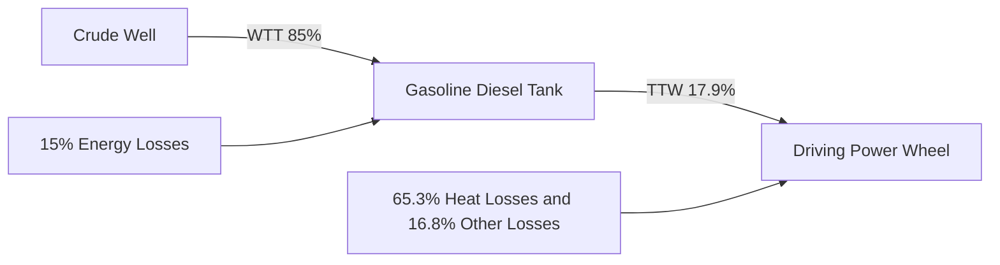
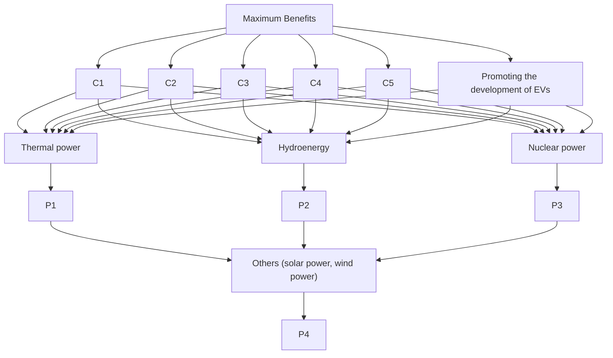

## Contents

## 1. Introduction......2

1.1 The Development of EVs....2  
1.2 Tasks and Approaches 2

## 2. Basic Assumptions ...... 3

## 3. The Economic Comparison Model......3

3.1 The Life Cycle Cost Model(LCC Model) 3

3.1.1 The Preparation Work for Model.... 3  
3.1.2 Establishing the LCC Model 4

3.2 Data Collection....5  
3.3 Results of the Calculation ...... 6  
3.4 Sensitivity Analysis....6

## 4. The Environmental Impact Model....7

4.1 The Primary Pollution: Air Pollution....7

4.1.1 Modeling the Emission Dispersion 7  
4.1.1.1 The Gaussian Plume Model 7  
4.1.1.2 Simulation of Gaussian Plume Model 8  
4.1.1.3 Results and Discussions of the Simulation 9

4.1.2 Evaluations of Our Model.... 10

4.1.2.1 Strengths.... 10  
4.1.2.2 Weakness 10

4.1.3 The Statistical Prediction of the Amount of Emissions ..... 10  
4.1.4 Conclusion.... 10

4.2 Hidden Pollution.... 12

4.2.1 Noise Pollution....12  
4.2.2 Used Batteries Pollution 12

## 5. The health impact of EVs 12

## 6. Prediction of the Future Development of EVs.... 12

6.1 External-influence Model and Internal-influence Model.... 14  
6.2 Establishing Norton Model for EVs and CVs 14  
6.3 Results and Conclusion.... 15  
6.4 Evaluations of Our Model.... 15

6.4.1 Strengths 15  
6.4.2 Weakness 15

## 7. Analysis of Key Factors ...... 15

## 8. Analysis of the Energy Consumption 16

8.1 The Comparison of the Energy Efficiency 16  
8.2 Estimate of Saved Fossil Fuels 17

## 9. Determining the Weight of Different Electricity Generation...... 18

## 10. References ......20

## I. Introduction

Due to the concerns over urban environment, high oil costs and the improvements of battery technology, the electric vehicle (EV), which uses electric motors for propulsion, has been propelled to the forefront in recent years. Unlike the vehicle propelled by internal combustion engines (ICEs), the EVs are with the advantage of zero tailpipe emissions and an essentially silent, energy efficient motor. If batteries and cars can be perfectly combined, the EVs will lead a green revolution in realm of vehicle transportation. In order to analyse electric vehicles' environmentally and economically sound, the following background is worth mentioning.

## 1.1 The Development of EVs

Electric vehicles first came into existence in the mid-19th century, when electricity was supposed to the preferred methods for motor vehicle propulsion. Due to low energy density of batteries, it was discontinued. As the new generation of ICEs emerged, it rapidly became the dominant propulsion method for motor vehicles but electric power has remained commonplace in other vehicle types, such as trains and smaller vehicles of all types. [Wikipedia Foundation,2011]

In the early 1970s, some countries, compelled by the energy crisis, started the rekindling of interests in EVs. [C.C.Chan,2002] The improvements in battery technology over the past two decades have made it possible to design and manufacture electric vehicles with better performance. Though the number of electric vehicles on the roads is currently in the thousands, that number will soon change. Spurred by the breakthroughs in battery and automotive technology, many vehicle manufacturers have indicated their intention to begin mass producing electric vehicles with Lithium-ion batteries within the next five years. [Thomas A et al.,2009]

## 1.2 Tasks and Approaches

The above work has focused on the history and development of EVs. It seems that EVs could be the urban commuters' panacea were it not for its high purchase price [Karina Funk et al., 1999]. However, the electricity used for EVs is produced by burning fossil fuels in power plants. That brings people to an important question: Is EVs widespread use feasible and practical?

So our goal is pretty clear:

- Model the environmental, economic, and health impacts of the widespread use of EVs  
- Detail the key factors that governments and vehicle manufacturers should consider when determining if and how to support the development and use of EVs  
- Estimate the amount of oil (fossil fuels) the world would save by widely using electric vehicles.  
- Provide a model of the amount and type of electricity generation that would be needed to support the recommendations regarding the amount and type of electric vehicle use that will produce the largest number of benefits.

Our approach mainly contributes on the following aspects:

- In order to deeply analyze economic outlook of EVs, the life cycle cost model (LCC Model) is come up with to compare the market prospect and economic benefits of EVs and t conventional vehicle.  
- We focus on studying air pollution caused by EVs and CVs. Our purpose is to study the emissions from the space perspective. Gaussian Plume Model is applied here to simulate and predict the emission dispersion.  
- Establish Norton model for EVs and CVs to make a prediction about the future development of EVs  
- Do discussion based on our work such as analysis on the key factors influencing the development of EVs, health impact.  
- Use our models to calculate the amount of saved crude and the amount of extra coal and electricity.  
- Applying AHP model to determining the weight of different types of electricity generation.

## II. Basic Assumptions

- The related parameters of the EVs and conventional vehicles can reflect their features in the near future.  
- There will be no new type of vehicles, which has an impact on the development of the conventional vehicles, appearing in the market.  
- The EVs discussed in the paper refer to pure electric vehicles. We do not consider the hybrid EVs and hydrogen fuel cell vehicles.  
- The assumptions of Norton model and the Gaussian Plume Model will be mentioned during the process of modeling.  
● The data we used is accurate and reliable.

## III. The Economic Comparison Model

## 3.1 The Life Cycle Cost Model (LCC Model)

Although the EV is not yet a completely mature technology, the great focus and interest on it still arises from a combination of concerns for urban air quality and high dependence on foreign supplies of oil. In the meantime, the advances in the EV battery and motor technology also have contributed the increasing interest.

## 3.1.1 Preparation Work for Model

The EVs can simply divide into pure electric vehicle (PEV), hybrid electric vehicle (HEV) and Fuel cell vehicles (FCV). In the elements, PEV is the technique base of EVs and can be applied to the future field of vehicle transportation. Thus, we take PEV as an example and recommend the life cycle cost model (LCC Model) to compare the market prospect and economic benefits of EVs and t conventional vehicle.

Life-cycle cost is known as a pivotal criterion in a comparative evaluation of EVs and conventional vehicle[M. DeLuchi et al., 2009]. From the standpoint of consumers, the life cycle cost include the following 3 aspects: acquisition costs ( $C_{pi}$ ), maintenance costs ( $C_{mi}$ ), reclamation income ( $R_{i}$ ). Due to the worsening environmental pollution, we also take the cost of dealing with environmental matters $(C_{ei})$ into account. The life cycle cost is the sum total of $C_{pi}$ , $C_{mi}$ , $R_{i}$ and $C_{ei}$ , where i=1 represents the LCC of traditional automobile, i=2 stands for the LCC of EVs.

## 3.1.2 Establishing the LCC Model

## • Acquisition Costs

In this section, the cost of purchase is composed of the expenses of purchase and the related poundage. So acquisition cost can be expressed as following:

$$
C _ {p i} = p _ {v i} + h _ {i} \tag {1}
$$

Where, $p_{vi}$ is the expense of purchase, $h_{i}$ represents the related poundage, such as tax, license fee.

## - Maintenance Costs

The vehicle is known as a kind of durable goods and its cost of maintenance occupies 50% even more in the Life Cycle Cost Model. Conventional vehicles' maintenance cost depends on the expenditure of repairing and vehicles refueling. We suppose the cost of repairing and refueling are $m_{1}$ and $o_{1}$ , then we obtain:

$$
C _ {m 1} = m _ {1} + o _ {1} \tag {2}
$$

Where, $o_1 = L_1 \times k_1 \times p_g$ , $L_1$ is total kilometers, $k_1$ means fuel consumption per 100 km, $p_g$ represents fuel cost per liter (\$/L).

As for EVs, electric charge replaces the role of fuel. Since the maintenance of the battery account for a large part of Maintenance costs, we consider the battery maintenance costs as an independent factor b, the total sum of maintenance costs can be described as below:

$$
C _ {m 2} = m _ {2} + o _ {2} + b \tag {3}
$$

Where, $m_{2}$ is components maintenance costs of EVs and has the same method of calculation as $m_{1}$ . $o_{2}$ means the battery charging fees and can be denote as

$$
o _ {2} = L _ {2} \times p _ {e} \times k _ {2} / \eta \tag {4}
$$

Where, $L_{2}$ is total kilometers, $p_{e}$ means the cost of electricity per $kw \cdot h$ , $k_{2}$ is electricity consumption per 100 km, $\eta$ is charging efficiency.

The performance of battery will be poorer with time going by. As a result, the corresponding maintenance costs will increase. In order to describe the above process, we define $l_{b}$ denoting the total mileage of EVs during the life cycle of a battery. Suppose the purchase price of battery as $p_{b}$ . c is the charge for trouble when changing battery. Then the battery maintenance costs can be calculated as

$$
b = \frac {L _ {2}}{l _ {b}} (p _ {b} + c) \tag {5}
$$

## ● Reclamation Income

Reclamation income consists of the money raised by selling assets and the subsidy policy for the reject and renovation of the old and used cars, something like the government-sponsored scrappage projects. Different types of cars have different reclamation income which can be found on the internet. We consume the reclamation income of EVs and conventional vehicles to be $R_{1}$ and $R_{2}$ .

## - Environmental Costs

Conventional vehicles release at the place where they are operated, the emissions of hydrocarbons (HC) and nitrogen oxides $(\mathrm{NO}_{\mathrm{x}})$ exceed 2000 tons per day. These pollutants react in the presence of sunshine to form ozone concentrations that are roughly three times larger than the federal health standard.[South Coast Air Quality Management District,1989]Therefore, to timely collect environmental taxation is imperative.

Now there is no standard way to calculate environmental costs. Like some Europe nation collecting environmental pollution tax, we use the same method to obtain the environmental costs. Thus, suppose $r_{1}$ is the taxation of fuel per liter. Then Environmental costs of conventional vehicles can be denoted as:

$$
C _ {e 1} = r _ {1} \times L _ {1} \times k _ {1} \tag {6}
$$

While EVs have reduced tailpipe carbon emissions, the energy they consume is produced by means that have environmental impacts. In addition, the manufacturing and depletion processing of batteries also have an impact to environment which also. The government needs comprehensive effort to curb the pollution which may cause a large amount of fiscal charges.

As for EVs, government should collecting environmental pollution tax for the battery recycle. The tax cost is stated as following:

$$
C _ {e 2} = r _ {2} \times \frac {L _ {2}}{l _ {b}} \tag {7}
$$

Where $r_{2}$ is the taxation of battery pack. According to discussion above, we obtain the full life cycle cost:

$$
L C C _ {i} = C _ {p i} + C _ {m i} - R _ {i} + C _ {e i} \tag {8}
$$

## 3.2 Data Collection

After accessing relevant information, we take the RAV4 EV and RAV4 manufactured by Toyota as an example to compare the LCC of EVs and conventional vehicles. As we know the RAV4 EV is an all-electric version of the popular RAV4 [Wikipedia Foundation,2011]. The relevant parameters are listed in Table 1.

<table><tr><td>Relevant Parameters</td><td>RAV 4EV</td><td>RAV4</td></tr><tr><td>Purchase Expense  $p_{vi}$  ($)</td><td>60673</td><td>30336</td></tr><tr><td>Related Poundage  $h_i$  ($)</td><td>6067</td><td>3033</td></tr><tr><td>Electricity Consumption per 100 km  $k_2$ (kw.h)</td><td>20</td><td>0</td></tr><tr><td>Oil Consumption per 100 km  $k_1$  (L)</td><td>0</td><td>8.5</td></tr><tr><td>Total Mileage of vehicle (km)</td><td>500000</td><td>500000</td></tr><tr><td>Maintenance Costs per year ($)</td><td>455</td><td>1516</td></tr><tr><td>Price of Battery  $p_b$  ($)</td><td>3033</td><td>0</td></tr><tr><td>Total Mileage of battery (km)</td><td>40000</td><td>0</td></tr></table>

Table 1. The relevant parameters of RAV4 EV and RAV. (Data come from the reference [Yang Feng et al.,2009])

As is revealed in the table, the related poundage is calculated by no more than 10% of the expenses of purchase. According to the of a latest believable reference, the expected life cycle of RAV4 EV and RAV4 is 10 years and the total mileage is set as 500000 km. As electric vehicles don't have clutch, gearbox and the other mechanical transmission equipment, maintenance costs of EVs is 70% less than Conventional vehicles. And the publicly recognized value of the battery charging efficiency is 85%. Users can obtain \$3033 as reclamation income. Then due to the imperfect running of the current policy, users don’t need to undertake environmental costs. Thus, we don’t take environmental costs into calculation.

## 3.3 Results of the Calculation

So after many times calculation under the conditions discussed above, we obtain statistic results as follow:

<table><tr><td></td><td> $p_{vi}$ </td><td> $h_i$ </td><td> $C_{pi}$ </td><td>m</td><td>o</td><td>b</td><td> $C_{mi}$ </td><td>R</td><td>LCC</td></tr><tr><td>RAV4 EV</td><td>60673</td><td>6067</td><td>66740</td><td>455</td><td>8922</td><td>37920</td><td>51393</td><td>3033</td><td>115100</td></tr><tr><td>RAV4</td><td>30336</td><td>3033</td><td>33370</td><td>1516</td><td>422224</td><td>0</td><td>57393</td><td>3033</td><td>87728</td></tr></table>

Table 2. The calculated results of relevant parameters and LCC(\$)  
It can be seen from the statistics that the LCC of EVs is higher than the conventional vehicles while the cost on energy consumption is only 21.3% of conventional vehicles. And its failure rate as well as maintenance costs are lower than conventional vehicles. In the condition of reasonable acquisition cost and acceptable price of battery packs, the economic advantage of EVs is obvious.

## 3.4 Sensitivity Analysis

Then, in order to identify the most sensitive factor of impacting market prospect and economic benefits, we do sensitivity analysis about the above data. When the parameters are changed within 5%, we observe how much LCC change. The purpose is to analyze the sensitivity of $C_{pi}$ , $C_{mi}$ , $R_{i}$ and $C_{ei}$ .  
Before calculation, we choose the oil and electricity price, battery packs price, acquisition cost, mileage as the related parameters, because they may change over time and then produce a great fluctuation in price. We change the parameters within 5%, and then obtain the changing rate of LCC.

<table><tr><td></td><td>Acquisition cost</td><td>Oil/Electricity Price</td><td>Battery PacksPrice</td><td>Mileage</td></tr><tr><td>RAV4 EV</td><td>2.89%</td><td>0.38%</td><td>1.64%</td><td>-1.56%</td></tr><tr><td>RAV4</td><td>1.90%</td><td>2.40%</td><td>-</td><td>-</td></tr></table>

Table 3. The Sensitivity Analysis between relevant parameters and LCC

As can be revealed in Table 3, the order of parameters sensitivity is proved to be: acquisition cost > battery packs price > mileage > electricity price. As for CVs, the results indicate as following: the oil price > acquisition cost.

Based on the discussion above, the LCC of the CVs is less sensitive to the acquisition cost, as compared with the LCC of EVs. The LCC of CVs is more sensitive to oil and electricity price than the LCC of EVs. We can see that the LCC can, to some extent, be influenced by the price of battery packs and mileage. However, come to analyses from the long-term eyes, it is the inexorable trend to cut down the acquisition cost of EVs as well as the battery packs price. While with the large-scale exploitation of oil and mine, oil price will reveal a trend of increasing. According to the sensitivity analysis, the LCC of the conventional vehicles will increase gradually with the increasing of oil price. We can draw a conclusion that EVs has a lot of scope for improvement, which means that EVs are

more economical in the future.

The economic impact of EVs is obvious. First of all, the development of EVs can lower the cost of maintenance and with some technical improvements, the acquisition cost will also be much lower, which make more people afford a car. Besides, the large scale use of EVs also will create lots of new jobs and promote the development of economy.

## IV. The Environmental Impact Model

There are two major types of pollution caused by vehicles. One is the primary pollution. The biggest part of primary pollution is the air pollution which is also the center of this section. And the other is the hidden pollution. It also plays a significant role in the impact on the environment.

We have already known the conventional vehicle is a tremendous threat to the environment. But after the comparison of electric vehicles (EVs) and conventional vehicles (CVs) presented by following sections, we can find out the environmental impact of large scale use of electric vehicles.

## 4.1 The primary pollution: Air pollution

Electric cars produce no pollution at the tailpipe which will contribute to cleaner air in cities, but their use increases demand for electricity generation. The amount of carbon dioxide emitted depends on the emission intensity of the power source used to charge the vehicle, the efficiency of the said vehicle and the energy wasted in the charging process [Wikipedia Foundation,2011] And meantime the power station will discharge extra emissions. So in fact EVs is not a vehicle with no emissions.

The pollutants produced by conventional vehicles mainly account for nitrites of oxygen, vehicle-born monoxide, hydrocarbon and carbon dioxide pollution. To simplify, environmental impact is considered by examining air pollution (AP) and greenhouse gas (GHG). [Mikhail Granovskii et al., 2006] The main gases in GHG emissions are $CO_{2}$ and $CH_{4}$ while the AP emissions include CO, $SO_{x}$ , NO and HC.

In order to better study the air pollution caused by EVs and CVs, we focus on the emissions dispersion and the amount of emissions.

## 4.1.1 Modeling the Emission Dispersion

## 4.1.1.1 The Gaussian Plume Model

Our purpose is to study the emissions from the space perspective. As the most classic model for emission dispersion, Gaussian Plume Model is applied here to simulate and predict the emission dispersion.

Before we establish the Gaussian Plume Model, we need to come up with these following assumptions.

● The electric vehicle is regarded as a still point source at ground-level.  
- The direction of wind is parallel to X axis. So the pollutants are continuously discharged to one certain direction.  
● The speed of wind is uniform and invariable.  
- The mass of emissions is always conserved in the dispersion process.

- The concentration of the pollution source is normally distributed in the y and z dimensions  
- The ground can’t absorb pollutants.

text_image

the direction of wind
polluted area
Point Source
z
x
y

Figure 1. The coordinate plot of the point source and its polluted area  
According to the assumptions, the source of emissions can be regarded as a point source. To start with, we use Cartesian Coordinate System to analyze the point source. For the point source on the ground, the Gaussian dispersion formula is shown as Eq.9.

$$
C (x, y, z) = \frac {q}{\pi u \sigma_ {y} \sigma_ {z}} e ^ {- 0. 5 (\frac {y ^ {2}}{\sigma_ {y} ^ {2}} + \frac {z ^ {2}}{\sigma_ {x} ^ {2}})} \tag {9}
$$

Where, $C(x,y,z)$ stands for the concentration of the emission (in micrograms per cubic meter) at any point in the polluted area. q is denoted as the quantity or mass of the emission (in grams) per unit of time (seconds) and u is the wind speed (in meters per second). $\sigma_{y}$ and $\sigma_{x}$ stand for the standard deviations of a statistically normal plume in the y and z dimensions, respectively.

According to the assumptions, we can obtain

$$
q = \int_ {- \infty} ^ {+ \infty} \int_ {- \infty} ^ {+ \infty} u C d y d z \tag {10}
$$

After putting specific number into all the coefficients, we can get the concentration of the emission at the stable state. Using this model, we can also figure out how far the pollutants may affect.

## 4.1.1.2 Simulation of Gaussian Plume Model

Now we use Matlab to simulate the emission dispersion of conventional vehicles. Let $\sigma_y$ be 1.5, $\sigma_x$ be 1.5 and $u$ be 2. According to relevant reference, we obtain Table 4.

<table><tr><td>Type of vehicle</td><td>CVs (gasoline)</td><td>EVs (thermal power)</td><td>EVs (Natural gas )</td></tr><tr><td>Mass of vehicle</td><td>1000 Kg</td><td>1200 Kg</td><td>1200 Kg</td></tr><tr><td>HC</td><td>0.018</td><td>0.0008</td><td>0.0022</td></tr><tr><td>CO</td><td>0.91</td><td>0.0091</td><td>0.0182</td></tr><tr><td>NO2</td><td>0.0771</td><td>0.2948</td><td>0.1814</td></tr><tr><td>CO2</td><td>83</td><td>91</td><td>41</td></tr><tr><td>SOx</td><td>0.0045-0.4356</td><td>0.1814-0.7711</td><td>0.0003</td></tr></table>

Table 4. the comparison of emissions from different types of vehicles (kg/per car) (Source: The Electric Vehicle Technical Report from General Motors)

As mentioned above, the electric vehicle is a vehicle with no emissions. But the emissions shown in Table 4 are produced by the power stations which provide extra electricity for the electric vehicles. Here we just regard the emissions produced by power stations as the direct emissions produced by EVs (But EV itself is a no-emission vehicle).

EV (thermal power) means the electricity of electric vehicles are supplied by thermal power and EV (Natural gas) means the electricity of electric vehicles are supplied by natural gas.

We can see from Table 4, we divide all the emissions into two types: air pollution (AP) and greenhouse gas (GHG). So we calculate the amount of AP and GHG as well as normalize the AP value and GHG value of all types of vehicles. The normalized weighting coefficients of CVs, EVs (thermal power) and EVs(Natural gas) are 6.11, 3.86 and 1 respectively. The weighting coefficients are used to determine the amount of AP (the number of circles) in the simulation. And now we start the simulation of emission dispersion.

## 4.1.1.3 Results and Discussions of the Simulation

scatterplot

| x    | y    | z    |
|------|------|------|
| -2.0 | 0.0  | 0.0  |
| -1.5 | 0.5  | 0.5  |
| -1.0 | 1.0  | 1.0  |
| -0.5 | 1.5  | 1.5  |
| 0.0  | 2.0  | 2.0  |
| 0.5  | 1.5  | 1.5  |
| 1.0  | 1.0  | 1.0  |
| 1.5  | 0.5  | 0.5  |
| 2.0  | 0.0  | 0.0  |
| 2.5  | -0.5 | -0.5 |
The data points are randomly distributed across the X, Y, and Z axes. There is no label for the data series.

Figure 2. AP dispersion of CVs (gasoline)

Figure 2 shows that the emissions of CVs spread farthest and affect the largest area in all types of vehicles in the comparison. And its total amount of AP (represented by the number of circles) is also the maximum value. Of all the compared vehicles, CVs is the culprit that should be blamed for worsening air quality.

scatterplot

| x | y | z |
| --- | --- | --- |
| -1.8 | 0.9 | 0.7 |
| -1.6 | 0.8 | 0.6 |
| -1.4 | 0.7 | 0.5 |
| -1.2 | 0.6 | 0.4 |
| -1.0 | 0.5 | 0.3 |
| -0.8 | 0.4 | 0.2 |
| -0.6 | 0.3 | 0.1 |
| -0.4 | 0.2 | 0.0 |
| -0.2 | 0.1 | -0.1 |
| 0.0 | 0.0 | -0.2 |
| 0.2 | -0.1 | -0.3 |
| 0.4 | -0.2 | -0.4 |
| 0.6 | -0.3 | -0.5 |
| 0.8 | -0.4 | -0.6 |
| 1.0 | -0.5 | -0.7 |
| 1.2 | -0.6 | -0.8 |
| 1.4 | -0.7 | -0.9 |
| 1.6 | -0.8 | -1.0 |
| 1.8 | -0.9 | -1.1 |
| 2.0 | -1.0 | -1.2 |
| 2.2 | -1.1 | -1.3 |
| 2.4 | -1.2 | -1.4 |
| 2.6 | -1.3 | -1.5 |
| 2.8 | -1.4 | -1.6 |
| 3.0 | -1.5 | -1.7 |
| 3.2 | -1.6 | -1.8 |
| 3.4 | -1.7 | -1.9 |
| 3.6 | -1.8 | -2.0 |
| 3.8 | -1.9 | -2.1 |
| 4.0 | -2.0 | -2.2 |
| 4.2 | -2.1 | -2.3 |
| 4.4 | -2.2 | -2.4 |
| 4.6 | -2.3 | -2.5 |
| 4.8 | -2.4 | -2.6 |
| 5.0 | -2.5 | -2.7 |
| 5.2 | -2.6 | -2.8 |
| 5.4 | -2.7 | -2.9 |
| 5.6 | -2.8 | -3.0 |
| 5.8 | -2.9 | -3.1 |
| 6.0 | -3.0 | -3.2 |
| 6.2 | -3.1 | -3.3 |
| 6.4 | -3.2 | -3.4 |
| 6.6 | -3.3 | -3.5 |
| 6.8 | -3.4 | -3.6 |
| 7.0 | -3.5 | -3.7 |
| 7.2 | -3.6 | -3.8 |
| 7.4 | -3.7 | -3.9 |
| 7.6 | -3.8 | -4.0 |
| 7.8 | -3.9 | -4.1 |
| 8.0 | -4.0 | -4.2 |
| 8.2 | -4.1 | -4.3 |
| 8.4 | -4.2 | -4.4 |
| 8.6 | -4.3 | -4.5 |
| 8.8 | -4.4 | -4.6 |
| 9.0 | -4.5 | -4.7 |
| 9.2 | -4.6 | -4.8 |
| 9.4 | -4.7 | -4.9 |
| 9.6 | -4.8 | -5.0 |
| 9.8 | -4.9 | -5.1 |
| 10.0 | -5.0 | -5.2 |
| 10.2 | -5.1 | -5.3 |
| 10.4 | -5.2 | -5.4 |
| 10.6 | -5.3 | -5.5 |
| 10.8 | -5.4 | -5.6 |
| 11.0 | -5.5 | -5.7 |
| 11.2 | -5.6 | -5.8 |
| 11.4 | -5.7 | -5.9 |
| 11.6 | -5.8 | -6.0 |
| 11.8 | -5.9 | -6.1 |
| 12.0 | -6.0 | -6.2 |
| 12.2 | -6.1 | -6.3 |
| 12.4 | -6.2 | -6.4 |
| 12.6 | -6.3 | -6.5 |
| 12.8 | -6.4 | -6.6 |
| 13.0 | -6.5 | -6.7 |
| 13.2 | -6.6 | -6.8 |
| 13.4 | -6.7 | -6.9 |
| 13.6 | -6.8 | -7.0 |
| 13.8 | -6.9 | -7.1 |
| 14.0 | -7.0 | -7.2 |
| 14.2 | -7.1 | -7.3 |
| 14.4 | -7.2 | -7.4 |
| 14.6 | -7.3 | -7.5 |
| 14.8 | -7.4 | -7.6 |
| 15.0 | -7.5 | -7.7 |
| 15.2 | -7.6 | -7.8 |
| 15.4 | -7.7 | -7.9 |
| 15.6 | -7.8 | -8.0 |
| 15.8 | -7.9 | -8.1 |
| 16.0 | -8.0 | -8.2 |
| 16.2 | -8.1 | -8.3 |
| 16.4 | -8.2 | -8.4 |
| 16.6 | -8.3 | -8.5 |
| 16.8 | -8.4 | -8.6 |
| 17.0 | -8.5 | -8.7 |
| 17.2 | -8.6 | -8.8 |
| 17.4 | -8.7 | -8.9 |
| 17.6 | -8.8 | -9.0 |
| 17.8 | -8.9 | -9.1 |
| 18.0 | -9.0 | -9.2 |
| 18.2 | -9.1 | -9.3 |
| 18.4 | -9.2 | -9.4 |
| 18.6 | -9.3 | -9.5 |
| 18.8 | -9.4 | -9.6 |
| 19.0 | -9.5 | -9.7 |

Figure 3. AP dispersion of EVs (thermal power)

Figure 3 shows that the emissions of EVs (thermal power) rank the second in the affected area and the amount of AP. So if EVs are powered by a thermal power station, the pollution to the environment is still big but not bigger than CVs(gasoline).

scatterplot

| x | y | z |
| --- | --- | --- |
| -0.5 | 0.2 | 0.1 |
| -0.4 | 0.3 | 0.2 |
| -0.3 | 0.4 | 0.3 |
| -0.2 | 0.5 | 0.4 |
| -0.1 | 0.6 | 0.5 |
| 0.0 | 0.7 | 0.6 |
| 0.1 | 0.8 | 0.7 |
| 0.2 | 0.9 | 0.8 |
| 0.3 | 1.0 | 0.9 |
| 0.4 | 1.1 | 1.0 |
| 0.5 | 1.2 | 1.1 |
| 0.6 | 1.3 | 1.2 |
| 0.7 | 1.4 | 1.3 |
| 0.8 | 1.5 | 1.4 |
| 0.9 | 1.6 | 1.5 |
| 1.0 | 1.7 | 1.6 |
| 1.1 | 1.8 | 1.7 |
| 1.2 | 1.9 | 1.8 |
| 1.3 | 2.0 | 1.9 |
| 1.4 | 2.1 | 2.0 |
| 1.5 | 2.2 | 2.1 |
| 1.6 | 2.3 | 2.2 |
| 1.7 | 2.4 | 2.3 |
| 1.8 | 2.5 | 2.4 |
| -0.5 | -0.2 | -0.1 |
| -0.4 | -0.3 | -0.2 |
| -0.3 | -0.4 | -0.3 |
| -0.2 | -0.5 | -0.4 |
| -0.1 | -0.6 | -0.5 |
| 0.0 | -0.7 | -0.6 |
| 0.1 | -0.8 | -0.7 |
| 0.2 | -0.9 | -0.8 |
| 0.3 | -1.0 | -0.9 |
| 0.4 | -1.1 | -1.0 |
| 0.5 | -1.2 | -1.1 |
| -0.5 | -0.2 | -0.1 |
| -0.4 | -0.3 | -0.2 |
| -0.3 | -0.4 | -0.3 |
| -0.2 | -0.5 | -0.4 |
| -0.1 | -0.6 | -0.5 |
| 0.0 | -0.7 | -0.6 |
| -0.5 | -0.8 | -0.7 |
| -0.4 | -0.9 | -0.8 |
| -0.3 | -1.0 | -0.9 |
| -0.2 | -1.1 | -1.0 |
| -0.1 | -1.2 | -1.1 |
| +0.5 | -1.3 | -1.2 |
| +0.6 | -1.4 | -1.3 |
| +0.7 | -1.5 | -1.4 |
| +0.8 | -1.6 | -1.5 |
| +0.9 | -1.7 | -1.6 |
| +1.0 | -1.8 | -1.7 |
| +1.5 | -2.5 | -2.5 |
| +2 | -2 | -2 |
| +2 | + | + |
| +2 | + | + |
| +2 | + | + |
| +2 | + | + |
| +2 | + | + |
| +2 | + | + |
| +2 | + | + |
| +2 | + | + |
| +2 | + | + |
| +2 | + | + |

Figure 4. AP dispersion of EVs (natural gas)  
Figure 4 shows that EVs(natural gas) is the greenest vehicles in the compared types. From this point, if the electricity is generated by a clean and efficient energy such as solar energy and wind energy, the EVs will be much more environmentally friendly.  
Besides, we can also use the same method to analyze the dispersion of GHG. Because the dispersion is similar, we will not go to details.

## 4.1.2 Evaluation of the model

## 4.1.2.1 Strengths

\- Gaussian plume model can precisely describe the dispersion of emissions. It builds up an equation to calculate the concentration of every point in the polluted area.

\- Gaussian plume has a strong flexibility. It can be applied to all kinds of gases and point sources.

## 4.1.2.2 Weaknesses

\- Gaussian plume model considers the dispersion of emissions too ideally and it can’t consider the influence of other factors.

\- Gaussian plume model can only be used to describe the point source. If we consider a moving vehicle, the model has to be improved.

## 4.1.3 The Statistical Prediction of the Amount of Emissions

According to relevant references, we get the emission data as shown in Table 5.

<table><tr><td>Type of vehicle</td><td>CVs</td><td>EVs</td></tr><tr><td>Air pollution(AP) emissions</td><td>20.64</td><td>5.023</td></tr><tr><td>Greenhouse gas(GHG) emissions</td><td>320</td><td>130</td></tr></table>

Table 5. the average emissions of CVs and EVs (g/per km, per car) Source: The Electric Vehicle Technical Report from General Motors)

We establish three scenarios (Table 6) in order to analyze the impact of large scale use of EVs on the amount of emissions.

<table><tr><td></td><td>Proportion of CVs</td><td>Proportion of EVs</td></tr><tr><td>Scenario 1</td><td>80%</td><td>20%</td></tr><tr><td>Scenario 2</td><td>50%</td><td>50%</td></tr><tr><td>Scenario 3</td><td>20%</td><td>80%</td></tr></table>

Table 6. Three scenarios of different proportion of CVs and EVs

Eq.11 and Eq.12 are established here to calculate the total amount of air pollution emissions $S_{AP}(i)$ and Greenhouse gas emissions $S_{GHG}(i)$ .

$$
S _ {A P} (i) = C V _ {A P} \times p _ {i} n + E V _ {A P} \times q _ {i} n \tag {11}
$$

$$
S _ {G H G} (i) = C V _ {G H G} \times p _ {i} n + E V _ {G H G} \times q _ {i} n \tag {12}
$$

Where, $CV_{AP}$ and $CV_{GHG}$ are AP emissions of a CV and GHG emissions of a CV respectively. Similarly, $EV_{AP}$ and $EV_{GHG}$ are AP emissions of a EV and GHG emissions of a EV respectively. $p_{i}$ is the proportion of CVs in scenario i while $q_{i}$ is the proportion of EVs in scenario i. n stands for the number of vehicles in the world.

<table><tr><td>Year</td><td>2004</td><td>2005</td><td>2006</td><td>2007</td><td>2008</td><td>2009</td></tr><tr><td>the amount of vehicles</td><td>851</td><td>896</td><td>943</td><td>993</td><td>1047</td><td>1100</td></tr></table>

Table 7. The total number of vehicles in the world (million)  
Source: U.S Census Bureau

According to Table 7, we roughly estimate the number of vehicles around the world is 1.15 billion. Using Eq.11 and Eq.12 we can calculate the amount of AP emissions and GHG emissions in all the scenarios (Figure 5. and Figure 6.)

bar chart

| Year | Scenario 1 | Scenario 2 | Scenario 3 |
| :--- | :--- | :--- | :--- |
| 2004 | 1.7E+10 | 1.3E+10 | 9E+09 |
| 2005 | 1.75E+10 | 1.35E+10 | 9.5E+09 |
| 2006 | 1.8E+10 | 1.4E+10 | 9.5E+09 |
| 2007 | 1.9E+10 | 1.45E+10 | 1.0E+10 |
| 2008 | 2.0E+10 | 1.5E+10 | 1.05E+10 |
| 2009 | 2.1E+10 | 1.6E+10 | 1.1E+10 |
| 2010 | 2.2E+10 | 1.65E+10 | 1.15E+10 |

Figure 5. The amount of AP emissions in three scenarios

bar chart

| Year | Scenario 1 | Scenario 2 | Scenario 3 |
|---|---|---|---|
| 2004 | 2.6E+11 | 2.1E+11 | 1.7E+11 |
| 2005 | 2.8E+11 | 2.3E+11 | 1.8E+11 |
| 2006 | 2.9E+11 | 2.4E+11 | 1.8E+11 |
| 2007 | 3.0E+11 | 2.5E+11 | 1.9E+11 |
| 2008 | 3.2E+11 | 2.6E+11 | 2.0E+11 |
| 2009 | 3.3E+11 | 2.7E+11 | 2.1E+11 |
| 2010 | 3.4E+11 | 2.8E+11 | 2.2E+11 |

Figure 6. The amount of GHG emissions in three scenarios

The statistical prediction describes the amount of AP and GHG emissions when electric vehicles are used in a small scale and a large scale.

## 4.1.4 Conclusion

Generally speaking, large scale use of EVs can greatly improve the environment especially the air quality.

To be specific, large scale use of EVs can improve the air quality near the road and narrow down the polluted area. And the spread of the emissions will be slowed down as well. The amount of emissions will also significantly go down, which may control the air pollution.

## 4.2 Hidden Pollution

## 4.2.1 Noise Pollution

The noise pollution caused by the conventional vehicles may be ridiculous to some people. But if you live by the main road, you will know it suffers a lot.

We find out some data about the comparison of noise pollution caused by CVs and EVs. (Table 8)

<table><tr><td rowspan="2">Noise</td><td rowspan="2">Speed</td><td colspan="2">CVs</td><td colspan="2">EVs</td></tr><tr><td>Inside</td><td>Outside</td><td>Inside</td><td>Outside</td></tr><tr><td rowspan="2">Uniform Velocity</td><td>35 km/h</td><td>73</td><td>67</td><td>67</td><td>66</td></tr><tr><td>50 km/h</td><td>70</td><td>69</td><td>70</td><td>66</td></tr><tr><td rowspan="2">Acceleration</td><td>35 km/h</td><td>81</td><td>75</td><td>72</td><td>66</td></tr><tr><td>50 km/h</td><td>76</td><td>72</td><td>71</td><td>66</td></tr></table>

Table 8. The noise of CVs and EVs in different speed and state (dB)

From Table 8, we can large scale use of EVs is an efficient way to reduce noise. So if the EVs had been used widely, it would improve the living conditions near the road. People who live near road may have a sweet sleep.

## 4.2.2 Used Batteries Pollution

The widespread use of batteries has already created many environmental concerns, such as toxic metal pollution which is the most serious problem. If the large scale use of EVs becomes reality, the used batteries pollution will be much more serious than nowadays.

There exist so many toxic metals in the battery such as mercury, cadmium, manganese, nickel and lead. Take mercury as an example. Mercury is the main cause of Japanese Minamata disease. If mercury is ingested by mistake, it may trigger unimaginable consequence.

## V. The Health Impact of EVs

On one hand, the environmental impact is closely related to the health impact. For example, the air pollution of CVs will greatly affect people's respiratory health. So large scale use of EVs can help to control air pollution, which is good news for us humans. But the battery pollution may contaminate the food and water people eat, poisoning some people. On the other hand, the Harmonic from charging station may do harm to humans' heart and brain.

## VI. Prediction of the Future Development of EVs

Having analyzed the environmental, economic and health impact of widespread use of EVs, we find out that EVs have the potential to take place of CVs. The technical difficulties are basically solved nowadays. With some technical improvements and the government's Omni-directional support, EVs can become the main current vehicles. So generally speaking, we are optimistic about the future of EVs. Based on this point of view, we use a diffusion theory model of substitution (Norton Model) to simulate the process of substitution. Through Norton Model, we can see how the number of EVs changes.

The purpose of this section is to demonstrate the feasibility of EVs and predict the future development of EVs.

## 6.1 External-influence Model and Internal-influence Model

Before establishing the Norton Model, we introduce the External-influence Model and Internal-influence Model. The external-influence model is made up with an ordinary differential equation (Eq.13) and used to describe the diffusion of technical innovation in the potential market.

$$
n (t) = \frac {d N (t)}{d t} = p [ M - N (t) ] \tag {13}
$$

Where, $N(t)$ is the accumulated number of people who have used the innovation by time $t$ . $M$ is the upper limit of the number of potential users. $p$ is the innovation coefficient. $n(t)$ is the number of people who use the innovation at time $t$ , namely the probability of using the innovation at time $t$ . From Eq.13, we can know the plot of $N(t)$ is an exponential function. The model attributes the innovation diffusion to the people who haven't used the innovation. So this is why the model is called external-influence model.

Similarly, the internal-influence model is also described by an ordinary differential equation (Eq.14). It is also used to simulate the diffusion of technical innovation.

$$
n (t) = \frac {d N (t)}{d t} = \frac {q}{M} N (t) [ M - N (t) ] \tag {14}
$$

The meaning of $N(t)$ , M and $n(t)$ are the same as the external-influence model. q is the imitation coefficient. The internal-influence model assumes the diffusion speed is in proportion to the number of innovation users and the number of non-users. That means the innovation diffusion is only driven by the number of innovation users. The plot of $N(t)$ is a logistic curve.

Both External-influence model and Internal-influence model can't describe the innovation diffusion well. So we need to combine two models to one in order to precisely simulate the innovation diffusion.

$$
n (t) = \frac {d N (t)}{d t} = p [ M - N (t) ] + \frac {q}{M} N (t) [ M - N (t) ] \tag {15}
$$

Where, the meaning of $N(t)$ , $M$ , $n(t)$ , $q$ and $p$ are the same as the models mentioned above. $p[M - N(t)]$ represents the external influence while $\frac{q}{M} N(t)[M - N(t)]$ stands for the internal influence.

We solve the ordinary differential equation and obtain

$$
N (t) = M \frac {1 - e ^ {- (p + q) t}}{1 + \frac {q}{p} e ^ {- (p + q) t}} \tag {16}
$$

Where, $m > 0$ , $0 < q < 1$ , $0 < p < 1$ . The inflection point of $N(t)$ is

$\left(\frac{1}{p + q} In\left(\frac{q}{p}\right), \frac{m(p + q)^2}{4q}\right)$ and the curve is symmetrical about the inflection point.

According to the researches of Bass, Lawrence and Sultan, q is usually larger than 10p. So the internal influence is the determining factor.

## 6.2 Establishing Norton Model for EVs and CVs

Both External-influence model and Internal-influence model study the diffusion of one innovation. In order to simulate the substitution of EVs and CVs, a diffusion model based on External-influence model and Internal-influence model can be established here.

Eq.16 can be simplified as

$$
N (t) = M f (t) \tag {17}
$$

$f(t)$ is a probability of using the innovation.

$$
f (t) = \frac {1 - e ^ {- (p + q) t}}{1 + \frac {q}{p} e ^ {- (p + q) t}} \tag {18}
$$

We come up with the following assumption to establish the Norton model and apply to simulate the substitution process.

- The EV drivers will not use CVs again.  
- The average purchase rate for EVs is approximately invariable.  
- EVs can not only take place of CVs, but it also may attract new users.

The diffusion equation of CVs :

$$
N _ {1} (t) = M _ {1} f _ {1} (t) \left[ 1 - f _ {2} (t - \tau_ {2}) \right] \tag {19}
$$

The diffusion equation of EVs :

$$
N _ {2} (t) = f _ {2} \left(t - \tau_ {2}\right) \left[ M _ {2} - M _ {1} f _ {1} (t) \right] \tag {20}
$$

Where, $t > \tau_{2}$ , the meaning of $N_{i}(t)$ , $f_{i}(t)$ and $M_{i}$ are the same as the models mentioned above. $\tau_{2}$ is the time when EVs enter the market. When i = 1, it stands for CVs. When i = 2, it stands for EVs. Coefficients q and p are usually estimated by the previous data.

Norton model can simulate the variation trend and the number of EVs and CVs. To some extent, it can predict the future development of EVs especially in the amount of EVs.

## 6.3 Results and Conclusion

We take the private cars in China as an example. Assume EVs come to the market completely in 2015. We find the number of private cars in China from 1985 to 2008 and then calculate the coefficients q and p through MatLab (curve fitting tool). We get the result as shown in Figure 7.

line chart

| Year | CVs     | EVs     |
|------|---------|---------|
| 1980 | 0       | 0       |
| 1990 | 0       | 0       |
| 2000 | 0       | 0       |
| 2010 | 5000    | 0       |
| 2020 | 9000    | 0       |
| 2030 | 10000   | 1000    |
| 2040 | 7000    | 6000    |
| 2050 | 1000    | 19000   |

Figure 7. The number of EVs and CVs (prediction)

From Figure 7, we can see the number of CVs reach the maximum in 2028, and then goes down gradually. As for EVs, the number will not increase quickly after the launch. But After 2030, its increase becomes more and more obvious. The growth peak will arise in 2042 and eventually the number of EVs will gradually reach the market capacity.

We think our prediction is basically reasonable. One of the most important reasons that EVs can finally take place of CVs is that our petroleum resource will run out in nearly 2060 or even sooner.

## 6.4 Evaluations of Our Model

## 6.4.1 Strengths

- Norton model's strength is its enormous edibility. For instance, not only it can be applied to EVs, but it can also be used to simulate the other technical substitutions.  
- Norton model can precisely simulate the number of EVs and CVs at all time.  
- Both internal and external market information is considered in Norton Model. So the model can thoroughly analyze the change of EVs and CVs.

## 6.4.2 Weaknesses

- Some special data can't be found, and it makes that we have to do some proper assumption before the solution of our models. A more abundant data resource can guarantee a better result in our models.  
- The algorithm used to estimate the coefficients may not be that precise. Because the innovation coefficient and imitation coefficient may be different when the technology of EVs is improved. So here if we use GA(Genetic Algorithm) to estimate the coefficients, it may improve the accuracy of our model. But the mode of growth will not be changed.

## VII. Analysis of the Key Factors

## For government

\- According to our model of the environmental impact, we find out the proportion of different kinds of power stations is one of the key factor influencing the development of EVs. If a country's thermal power stations take up a large proportion in all the power stations, EVs will also pollute the environment a lot, which makes EVs lose competitiveness. So government should use more clean and renewable energy to generate electricity and decrease the number of thermal power stations.

\- In our analysis on the economic impact, the EV allowance provided by government is also a key factor. The more allowance government provides, the sooner the large scale use of EVs will be.

\- In the light of our economic impact analysis, government can impose environment pollution tax and encourage people to use EVs.

● Government should build more EV charging stations in order to make charging convenient.

\- In the health impact analysis, we can know EVs are good for humans' health. Government should enhance the propaganda about the benefits of EVs.

## For vehicle manufacturers

\- In the economic impact, the cost of an EV is the most important factor because the price directly determines whether people will buy an EV. So vehicle manufacturers should improve the EV technology and lower the cost of an EV.

\- Another key factor is the performance of EVs. The performance of EVs is not as good as CVs, which will prevent a number of people purchase EVs. So vehicle manufacturers should increase R&D investment to improve the performance of EVs.

\- Vehicle manufacturers should enhance the propaganda about the health, economic and environmental benefits of EVs.

## VIII. Analysis of Energy Consumption

## 8.1 The Comparison of the Energy Efficiency

After looking up related references, we find out the energy conversion efficiency from crude to driving power of CVs as shown in Figure 8.

flowchart

Figure 8. The energy conversion efficiency of CVs

And the energy conversion efficiency of EVs is also shown in Figure 9.

flowchart

Figure 9. The energy conversion efficiency of EVs

Using Figure 8 and Figure 9, we figure out the energy conversion efficiency WTW(well to wheel) of CV is 15.2%. And WTW of EV is 28.1%. The result also proves that EVs is more efficient in energy using than CVs.

## 8.2 Estimate of Saved Fossil Fuels

In order to Estimate of saved fossil fuels by widely using EVs, we establish Eq.21 to calculate the crude a CV consumes in one year.

$$
S _ {c r u d e} = \frac {c}{r} \tag {21}
$$

Where, r is the ratio of fuel oil to the crude and c (kg) is the average amount of fuel oil a CV consumes in one year.

According to relevant data from China National Petroleum, 1 ton crude can be refined to 0.25 ton gasoline and 0.45 ton diesel (international average). And each CV consumes 1.5 ton fuel oil per year. As a result, we can get r=0.7 and c=1500kg. As mentioned in the previous section, the total number of automobiles is nearly 1.15 billion.

Assume EVs take up 70% in all the vehicles nowadays. The saved crude is nearly 2.46 billion ton. If EVs take up 80% and 90% in all the vehicles nowadays, the saved crude is up to 2.82 billion ton and 3.18 billion ton respectively.

Although the crude is saved by widely using EVs, the electricity will be consumed more. We focus on the amount of used coal in generating electricity for EVs. So Eq.2 is established to calculate the electricity a EV consume in one year

$$
E _ {\text { extra }} = \frac {c e}{a} \tag {22}
$$

Where, c (kg) is the average amount of fuel oil a CV consumes in one year and $a(\text{kg})$ is the hundred kilometer oil consumption. $e(kw \cdot h)$ stands for the hundred kilometer electricity consumption.

According to relevant references, we get a=8, c=1500 and e=20. So $E_{extra}$ is 3750. If EVs take up 70%, 80% and 90% in all the vehicles nowadays, the amount of electricity consumed by EVs is up to 3018.7 billion $kw\cdot h$ , 3450 billion $kw\cdot h$ , 3881.2 billion $kw\cdot h$ respectively. We get 0.3kg coal can generate one kilowatt-hour electricity. So according to the proportion of the thermal power stations, the amount of coal that is used to generate electricity for EVs is 905.61kg, 1035kg and 1164.3kg.

The estimate results mentioned above is based on the number of vehicles now. We just substitute a certain proportion of the CVs into EVs and calculate how much fossil fuel we can save and how much extra electricity and coal we may consume.

If we use the result of the Norton model (mentioned in previous section), we can estimate when the EVs will be large scale used and how much fossil fuel we will save at that time. According to our calculation, EVs will take up 80% in all the vehicles in 2045. The number of EVs will reach 1.95 billion and the number of CVs will reach 0.49 billion. So the amount of fossil fuel we will save in 2045 is 4.18 billion ton.

# IX.Determining the Weight of Different Electricity Generation

In order to determine the proportion of different types of electricity generation and maximum the environmental, social, commercial and individual benefits, we apply AHP(Analytic Hierarchy Process)[Thomas L.,1980] model to determining the best proportion of electricity generation.

The hierarchy diagram of the electricity generation is shown in Figure 10.

flowchart

Figure 10. The hierarchy diagram  
The AHP model divides the problem into three aspects: goal, criteria and alternatives. Here, our goal is to achieve maximum environmental, social and commercial benefits. The cost, efficiency, pollution, safety and development of EVs are our choosing criteria. All the four types of power are our alternatives.

Our aim is to determine the weights for thermal power, hydroenergy, nuclear power and others (solar power, wind power).

<table><tr><td>O-C</td><td> $C_1$ </td><td> $C_2$ </td><td> $C_3$ </td><td> $C_4$ </td><td> $C_5$ </td></tr><tr><td> $C_1$ </td><td>1.00</td><td>3.00</td><td>3.00</td><td>5.00</td><td>2.00</td></tr><tr><td> $C_2$ </td><td>0.33</td><td>1.00</td><td>2.00</td><td>4.00</td><td>1.00</td></tr><tr><td> $C_3$ </td><td>0.33</td><td>0.50</td><td>1.00</td><td>3.00</td><td>1.00</td></tr><tr><td> $C_4$ </td><td>0.20</td><td>0.25</td><td>0.33</td><td>1.00</td><td>0.33</td></tr><tr><td> $C_5$ </td><td>0.50</td><td>1.00</td><td>1.00</td><td>3.00</td><td>1.00</td></tr></table>

Table 9. The O-C judging matrix

Based on the analysis of each criterion and types of electricity generation, we develop judging matrixes (Table 9) to analyze the weight of each criterion. Take the O-C matrix as an example. The element $C_{12}$ represents the importance of $C_{1}$ to $C_{1}$ . We obtain the maximum eigenvalue of the O-C matrix.

$$
\lambda_ {\max} = 5. 1 0 2.
$$

The weight vector is

$$
w _ {1} = (0. 7 9 7 5, 0. 3 9 4 1, 0. 2 7 8 7, 0. 1 1 3 0, 0. 3 4 3 9) ^ {T} \tag {23}
$$

We make the and get

$$
C I = \frac {\lambda_ {\max} - n}{n - 1} = 0. 0 3 \quad C R = \frac {0 . 0 3}{1 . 1 2} = 0. 0 2 <   0. 1 \tag {24}
$$

So the O-C matrix passes the consistency test.

Using the same method, we can develop the other judging matrixes $C_{1}-P$ , $C_{2}-P$ , $C_{3}-P$ , $C_{4}-P$ and $C_{5}-P$ . All $\lambda_{maxj}$ and $CI_{j}$ of the other judging matrixes are shown in Table 10.

<table><tr><td>Criteria</td><td> $C_1$ </td><td> $C_2$ </td><td> $C_3$ </td><td> $C_4$ </td><td> $C_5$ </td></tr><tr><td>Alternatives</td><td> $b_1$ </td><td> $b_2$ </td><td> $b_3$ </td><td> $b_4$ </td><td> $b_5$ </td></tr><tr><td> $P_1$ </td><td>0.9084</td><td>0.3261</td><td>0.1255</td><td>0.3865</td><td>0.1971</td></tr><tr><td> $P_2$ </td><td>0.3483</td><td>0.3999</td><td>0.6578</td><td>0.6396</td><td>0.4278</td></tr><tr><td> $P_3$ </td><td>0.1971</td><td>0.8427</td><td>0.3446</td><td>0.1801</td><td>0.6782</td></tr><tr><td> $P_4$ </td><td>0.1212</td><td>0.1535</td><td>0.6578</td><td>0.6396</td><td>0.5641</td></tr><tr><td> $λ_{maxj}$ </td><td>4.0357</td><td>4.0205</td><td>4.0019</td><td>4.0529</td><td>4.1659</td></tr><tr><td> $CI_j$ </td><td>0.0119</td><td>0.0068</td><td>0.0006</td><td>0.0176</td><td>0.0553</td></tr><tr><td> $CR_j$ </td><td>0.0132</td><td>0.0076</td><td>0.0007</td><td>0.0196</td><td>0.0614</td></tr></table>

Table 10. $\lambda_{max j}$ and $CI_{j}$ of the other judging matrixes

We can see from Table 10 that all the judging matrixes have passed the consistency test. And the random consistency ratio of all the judging matrixes is shown in Eq.25

$$
C R = \frac {\sum_ {i} ^ {5} a _ {j} C I _ {j}}{\sum_ {i} ^ {5} a _ {j} R I _ {j}} = 0. 0 1 9 2 \tag {25}
$$

So we get the weight vector we need as shown in Eq.26.

$$
w _ {2} = (0. 3 0 4 4, 0. 2 5 5 3, 0. 2 5 5 5, 0. 1 8 4 8) \tag {26}
$$

The weight vector $w_{2}$ is the proportion of different types of electricity generation. Thermal power takes up 0.3044, Hydroenergy takes up 0.2553, nuclear power takes up 0.2555 and others (solar power, wind power) takes up 0.1848. If the electricity generation is distributed by the weight vector w, not only can it greatly support the development of EVs, but it also gets the largest environmental, commercial and social benefits.

According to the section above, we have known the electricity all the EVs (if EVs take up 80% in all the vehicles) need is 3450 billion $kw \cdot h$ in one year. So the amount of electricity needed to support EVs is 1050.18 billion $kw \cdot h$ by thermal power, 880.785 billion $kw \cdot h$ by hydroenergy, 881.475 billion $kw \cdot h$ by nuclear power and 637.56 billion $kw \cdot h$ by others.(See Figure 11)

pie chart

| Category | Percentage (%) |
| :--- | :--- |
| thermal power | 30 |
| hydroenergy | 26 |
| nuclear power | 26 |
| others (solar power, wind power) | 18 |

Figure 11. The proportion of different types of electric generation

## References

Camilla Kazimi, 1997. Evaluating the Environmental Impact of Alternative-Fuel Vehicles. Journal of Environmental Economics and Management. p:163-185.  
C. C. Chan, 2002. The State of the Art of Electric and Hybrid Vehicles. Proceedings of the IEEE, Vol. 90, No. 2, February 2002  
Karina Funk, Ari Rabl, 1999. Electric versus conventional vehicles: social costs and benefits in France. Transportation Research Part D 4 (1999): 397-411  
M. DeLuchi, Q. Wang and D. Sperling, 1989. Electric vehicles: performance, life cycle costs, emissions and recharging requirements, Transport. Res., 23A (3) (1989) p:255-278.  
Mikhail Granovskii, Ibrahim Dincer, Marc A. Rosen, 2006. Economic aspects of greenhouse gas emissions reduction by utilisation of wind and solar energies to produce electricity and hydrogen. 2006 IEEE EIC Climate Change Conference (CCC 2006), vol.1.  
Ren Yulong, Li Haifeng, Sun Rui, Guan Ling, 2009. Analysis on Model of Life Cycle Cost of Electric Vehicle Based on Consumer Perspective. Technology Economics, Vol28:NO.11  
Saaty, Thomas L., 1980. The analytic hierarchy process: Planning, priority setting, resource allocation. McGraw-Hill International Book Co.  
South Coast Air Quality Management District, Air Quality Management Plan: South Coast Air Basin, Mar. 1989.  
Thomas A. Becker, Ikhlaq Sidhu, Burghardt Tenderich, 2009. Electric Vehicles in the United States, A New Model with Forecasts to 2030. Center for Entrepreneurship & Technology, 2009.1.v.2.0 .P 1-2  
Wang Wen, YuLei, Pei Wen, YangFang, 2008. Review of Emission Dispersion Models Based on Gaussian Line2 Source Model. School of Traffic and Transportation, Beijing Jiaotong University  
Wikimedia Foundation,2011. Electric vehicle. Accessed Feb.12 2011, form http://en.wikipedia.org/wiki/Electric\_vehicles#cite\_note-RSC-1.  
Wikimedia Foundation,2011. Toyota RAV4 EV. Accessed Feb.12 2011 form http://en.wikipedia.org/wiki/Toyota\_RAV4\_EV  
Yang Feng, Fu Jun, 2009. Analysis and Comparison of the Economical Efficiency of Pure Electric Vehicles. Journal of Wuhan University Of Technology (Information & Management Engineering). 2009, 31(2) p:7-10  
Yang Jinghui, Wu Chun you, 2005. The application for a diffusion theory of adoption and substitution for successive generations with Norton model--Taking the modes of connecting with internet in China for example. Studies in Science of Science 2005, 23(5). p 682-687