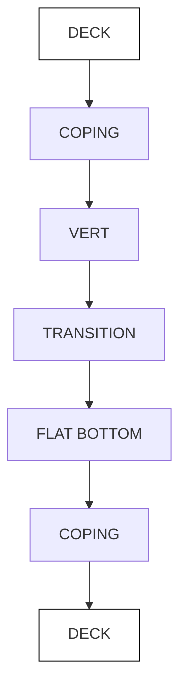

# Designing the Optimal Snowboard Half-Pipe

Mathematical Contest in Modeling

Group # 11199

2/14/2011

## I. Introduction

## I.1 Introduction to Problem

Since its introduction in the Winter Olympic Games in 1998, the popularity of half-pipe snowboarding competitions has surged. i At the Turin 2006 Olympic Winter Games, snowboarding competitions posted the second-highest average viewer hours per day of competition (Figure 1). It is widely believed that, when released, the comparable statistics for the Vancouver 2010 Olympic Winter Games will show even greater proportional viewership of snowboarding events. The objective of competitive half-pipe snowboarding is to perform well-executed, unique routines comprised of challenging aerial acrobatic manoeuvres that are executed as high in the air as possible.ii Similar to figure skating, half-pipe snowboard competitions are adjudicated events, whereby a panel of judges assign each competitor’s performance a subjective score. Recent studies of elite half-pipe snowboarding competitions have confirmed that total air-time (TAT) and average degree of rotation (ADR) are the key performance variables that best correlate with an athlete’s subjectively judged score.iii For this reason, there is broad interest in designing snowboard courses that optimize one or both of these key performance variables. This paper seeks to design such courses, using both heuristic and mathematical arguments, which are supported by simulations.

stacked bar chart

| Category | Average prime time viewer hours | Average non-prime time viewer hours |
|---|---|---|
| Birlshun | 2,000,000 | 45,000,000 |
| Bobaleigh | 16,000,000 | 12,000,000 |
| Skelemn | 9,000,000 | 18,000,000 |
| Curling | 7,000,000 | 28,000,000 |
| Ice Hockey | 13,000,000 | 42,000,000 |
| Lope | 7,000,000 | 18,000,000 |
| Figure Skating | 78,000,000 | 75,000,000 |
| Short Track | 23,000,000 | 18,000,000 |
| Speed Scating | 12,000,000 | 38,000,000 |
| Alpine Skiing | 23,000,000 | 35,000,000 |
| Cross Country Skiing | 6,000,000 | 52,000,000 |
| Freestyle Skiing | 21,000,000 | 28,000,000 |
| Nordic Complex | 25,000,000 | 65,000,000 |
| Slk Jumping | 13,000,000 | 25,000,000 |
| Snowboard | 52,000,000 | 48,000,000 |

Figure 1: Average Viewer Hours per Day of Competition, Turin 2006 Olympic Winter Gamesiv

## I.2 Current Half-Pipe Engineering & Dimensions

To understand half-pipe engineering dimensions, one must first familiarize themselves with the components of a half-pipe (Figure 2). The “deck” can only be used for very few tricks that are less concerned with air time or rotation (and thus produce paltry scores). Its main purpose is for the safety of the riders. Thus, altering the shape of the deck is less relevant for the objective of this paper, and we will incorporate the average dimensions of existing half-pipe decks in our structure.

flowchart

Figure 2: Components of a Half-Pipe (Not to Scale)v

Currently, no governing body of major half-pipe snowboard competitions, including the International Olympic Committee (Olympics) and ESPN (Winter X Games), have established strict requirements for the dimensions of half-pipe courses. In fact, in each of the last four Olympics that snowboarding competitions have been a part of, the half-pipe courses have had uniquely different dimensions (Figure 3).

<table><tr><td colspan="2">Olympic Event</td><td colspan="4">Approximate Course Specifications</td></tr><tr><td>Year</td><td>Host City</td><td>Length (m)</td><td>Average Gradient (°)</td><td>Width (m)</td><td>Inner Wall Height (m)</td></tr><tr><td>1998</td><td>Nagano</td><td>120</td><td>18.0</td><td>15.0</td><td>3.5</td></tr><tr><td>2002</td><td>Salt Lake</td><td>160</td><td>n/a</td><td>16.5</td><td>4.5</td></tr><tr><td>2006</td><td>Torino</td><td>145</td><td>16.5</td><td>n/a</td><td>5.7</td></tr><tr><td>2010</td><td>Vancouver</td><td>160</td><td>18.0</td><td>18.0</td><td>6.0</td></tr></table>

Figure 3: Half-Pipe Dimensions for 1998, 2002, 2006, and 2010 Winter Olympic Gamesvi,vii,viii,ix

However, as observed in Figure 3, a general trend has been an increase in the overall “wall” height (as measured from “floor” to “coping”). The most popular courses recently are 22 foot-tall ‘super pipes’, which are shaped using specialized snow-carving machines (Figure 4). The world’s largest supplier of such machines, in conjunction with the International Ski Federation, has published a document outlining recommended course dimensions, according to the desired wall height (Figure 5).

text_image

Quarter Pipe Extension
New 22 Foot Monster
18 Foot Monster
Base
18 Ft.
22 Ft.

Figure 4: ‘Super Pipe’ Snow-Carving Machinex

<table><tr><td>DESCRIPTION</td><td>RECOMMENDED (18 FT PIPE)</td><td>RECOMMENDED (22 FT PIPE)</td></tr><tr><td>1 Length of half-pipe</td><td>100 - 150 m</td><td>120 - 165 m</td></tr><tr><td>2 Slope angle</td><td>16° - 17°</td><td>17.5° - 18.5°</td></tr><tr><td>3 Width (crown to crown)</td><td>17.5 - 18 m</td><td>19.5 m</td></tr><tr><td>4 Width of decks</td><td>6 - 7.5 m</td><td>6 - 7.5 m</td></tr><tr><td>5 Height (floor to crown)</td><td>18 ft (5.4 m)</td><td>22 ft (6.5 m)</td></tr><tr><td>6 Height of vertical</td><td>0.2 m</td><td>0.2 m</td></tr><tr><td>7 Drop-in ramp length</td><td>15 m</td><td>15 m</td></tr><tr><td>8 Drop-in ramp width</td><td>10 m</td><td>10 m</td></tr><tr><td>9 Drop-in ramp height</td><td>at least 5.5 m</td><td>at least 5.5 m</td></tr><tr><td>10 Distance from ramp to pipe</td><td>at least 9 m</td><td>at least 9 m</td></tr></table>

Figure 5: Recommended Half-Pipe Dimensions, Zaugg AG & International Ski Federationxi

## II. Maximizing Vertical Air – Design and Implementation of Models

It is clear from the above Figure 5 that the problem at hand is an interesting one, as there are many variables about the course design that can be altered. Moreover, simplifying assumptions including: no friction, no downward sloping angle of the course (i.e. flat), and those listed below, yield results that are dramatically different than those when these simplifying assumptions are removed. The assumptions/constraints that we hold constant for all discussed course designs in this paper include:

1. Symmetry: To be a ‘fair’ course, the half-pipe cross-section must be symmetric to accommodate both right- and left-footed snowboarders. This also allows boarders to perform multiple jumps on either side of the course, which enhances the overall audience entertainment factor.

2. Rigid & Inelastic Body: The snowboarder mounted on her snowboard is assumed to be a rigid and inelastic body. As such, “Amonton’s Second Law” tells us that the force of friction is independent of the surface area of contact between the snowboard and snow, as well as that of the athlete and air. Thus, a “corrugated” surface that incorporates small groves parallel to the direction of the course’s slope would produce the same work done by friction as a “smooth” surface. Moreover, this suggests that work done by friction is independent of the shape of the snowboard/athlete.

3. Point Mass: In addition to the above assumption, the snowboarder and her board are assumed to be a single point-mass that moves along the surface of the half-pipe. This is a reasonable assumption, since it only eliminates the consideration of rotational energy from the model.

4. Friction Model: The “Coulomb model” is used to describe the frictional force that acts on the snowboarder throughout the course. In such a model, the frictional force is proportional to the normal force.

5. Continuity: The curve that describes the surface of the course’s cross-section must be smooth or piecewise continuous. If the curve was allowed to have discontinuities, such as a ‘hole’ or an ‘instantaneously vertical wall of snow’, then the snowboarder (assumed to be a point mass), would either ‘fall into the hole’ or ‘slam into a wall of snow.’

6. Course Slope: As “vertical air” is defined as the component of height achieved relative to the copings that is perpendicular to the length of the course (which is sloped), we are only concerned with designing the shape of the cross-section of the half-pipe. Theoretically, if the course was infinitely steep (i.e. vertical), then total air time would be large, since there would be a horizontal component of air achieved (the snowboarder would essentially be in free-fall for a vertical course). However, this horizontal component of air is not our variable of interest. The only relevant model is the total air achieved if the snowboarder oscillated in a flat (0° incline) cross-section of the half-pipe.

7. Cross-Section Shape: The curvature of the surface of the course’s cross-section must point towards the “inside” of the half-pipe. That is to say, the curve must be concave. In addition, the ends of the curve (i.e. “copings”) must be approximately vertical so that the snowboarder is launched into the air at an angle as close to perpendicular as possible. Since elite snowboarders perform a technique known as “pumping” whereby they push off with their legs at the copings, it is best for the angle of the curve at the copings to be slightly less than 90° to the horizontal.xii

## II.1 Frictionless Models

## Vertical Air Model 1.1  No Friction (No Fixed Height and/or No Fixed Width)

The simplest model is one in which there is no friction acting on the snowboarder. Under such a model, by the law of conservation of energy, none of the potential energy from starting at the top of the hill is lost to work done by friction. Thus, as the rider progresses down the hill, all of the initial potential energy is converted into kinetic energy. It is easiest to consider the cross-section of a course, and momentarily ignore the downward slope of the course. In such a model, we view the snowboarder as oscillating from one side of the half-pipe to the other. Since there is no friction, this system experiences no dampening and thus achieves the same vertical air with each oscillation. If we were to assume that this course was shaped as a half-circle, then this model is equivalent to imagining the snowboarder as being a mass on the end of a pendulum, whose length is equal to the radius of the half-circle (i.e. the course height).

If we align the copings of the course as having a “reference height of 0,” then there is zero potential energy when starting the course from one of the copings. As such, since no work is lost to friction, and the course must be symmetric, any kinetic energy achieved when leaving the coping opposite the ‘starting point’ coping must be a result of kinetic energy when initially entering the course. Thus, if we assume the positioning of any curve at a reference height of 0, as well as a fixed initial kinetic energy, the vertical air achieved will be independent of the curve of the cross-section.

## Vertical Air Model 1.2  No Friction (Fixed Height & Fixed Width)

Now we assume the same model as above, but add the caveat that the course must be of fixed height (݄) and width (2݈). Since the course must be symmetric, we can therefore think of this as the need to pick a curve that passes through points ܣ, ܤ, and ܥ. Three possible profiles for such a half-pipe are outlined in Figure 6. For the bottommost candidate profile, one must imagine adding an infinitesimally small quarter of a circle in each corner, thus allowing the vertical speed to be transformed into horizontal speed. This profile would be dangerous for athletes, as they would experience unmanageable G-forces at the corners; however it would allow the athlete to pick up a great deal of speed very quickly. The topmost path consists of two straight line segments connecting the required points, and therefore has the shortest arc length of the plotted candidates.

text_image

A
x
y
h
B
l
C

Figure 6: Three Sample Candidate Profiles for Half-Pipe with Fixed Height and Widthxiii

We know from Model 1.1 that the curve chosen does not alter the amount of vertical air that can be achieved. However, from a spectator’s perspective, watching a slow-moving snowboarder would not be entertaining. The question then becomes, can we find the shape of the curve that permits the athlete to travel through all three points in the least amount of time? This famous problem is known as the “brachistochrone,” which ultimately launched a field of mathematics known as calculus of variations. Due to the symmetry assumption, this is the same problem as solving for the first half of the curve. Without loss of generality, we set fixed points $A = P _ { 0 } ( 0 , 0 )$ and $B = P _ { 1 } ( l , h )$ in the Euclidean plane (with the convention that downward moves in the ݕ-axis are positive). The kinetic energy of the sliding body of mass ݉ at each instant must equal the potential energy lost from the initial height (by law of conservation of total energy). In order words, $E _ { K } ( P _ { n } ) = ( 1 / 2 ) m v ^ { 2 } = m g y$ , where ݃ is the acceleration due to gravity. We therefore see that $v = { \sqrt { 2 g y } }$ . From multivariate calculus we also know that the arc length of the curve; $y = y ( x ) , x _ { 0 } \leq x \leq x _ { T }$ is:

$$
a r c l e n g t h = \int_ {x _ {0}} ^ {x _ {T}} d s = \int_ {x _ {0}} ^ {x _ {T}} \sqrt {1 + [ y ^ {'} ] ^ {2}} d x
$$

Thus in our problem, the total time, ܶ, needed to move from $A = P _ { 0 } ( 0 , 0 )$ to position $B = P _ { 1 } ( l , h )$ is:

$$
T = \int {\frac {d i s t a n c e t r a v e l l e d}{s p e e d}} = \int {\frac {d s}{v}} = \int_ {0} ^ {l} {\frac {\sqrt {1 + [ y ^ {\prime} ] ^ {2}}}{\sqrt {2 g y}}} d x
$$

Our objective is to find the curve $y = y ( x )$ that minimizes ܶ. Using the Euler-Lagrange equation we have:

$$
c _ {2} = c _ {1} \sqrt {2 g} = \left(\frac {\sqrt {1 + [ y ^ {\prime} ] ^ {2}}}{\sqrt {y}}\right) - \left((y ^ {\prime}) \frac {\partial}{\partial y ^ {\prime}} \left(\frac {\sqrt {1 + [ y ^ {\prime} ] ^ {2}}}{\sqrt {y}}\right)\right) = \left(\frac {\sqrt {1 + [ y ^ {\prime} ] ^ {2}}}{\sqrt {y}}\right) - \left(\frac {[ y ^ {\prime} ] ^ {2}}{\sqrt {y} \sqrt {1 + [ y ^ {\prime} ] ^ {2}}}\right)
$$

where $c _ { 1 }$ and $c _ { 2 }$ are constants. Multiplying both sides by factor $\sqrt { y } \sqrt { 1 + [ y ^ { \prime } ] ^ { 2 } }$ and then squaring yields: $y ( 1 + [ y ^ { \prime } ] ^ { 2 } ) = ( 1 / c _ { 2 } ) ^ { 2 } = \gamma .$ . Solving for $y ^ { \prime }$ , we get: $y ^ { \prime } = d y / d x = \sqrt { ( \gamma - y ) / y }$ . Now we change variables such that: $\sqrt { y / ( \gamma - y ) } = \tan \left( \varphi \right)$ . Isolating for ݕ, we get: $y = \gamma \mathrm { s i n } ^ { 2 } ( \varphi )$ . Use chain rule as follows:

$$
\frac {d \varphi}{d x} = \frac {d \varphi}{d y} \cdot \frac {d y}{d x} = \frac {1}{2 \gamma (\sin (\varphi)) (\cos (\varphi))} \cdot \frac {1}{(\tan (\varphi))} = \frac {1}{2 \gamma (\sin^ {2} (\varphi))}
$$

We re-write the above as: $d x = 2 \gamma ( \sin ^ { 2 } ( \varphi ) ) d \varphi$ , indicating a relationship between two infinitesimal values ݀ݔ and ݀߮. Integrate both sides to get:

$$
x = \int d x = 2 \gamma \int \frac {1 - \cos (2 \varphi)}{2} d \varphi = 2 \gamma \left(\frac {\varphi}{2} - \frac {\sin (2 \varphi)}{4}\right) + c _ {3} \quad (c _ {3}: c o n s t a n t)
$$

By having chosen point $A = P _ { 0 } ( 0 , 0 )$ as the initial point of the trajectory, we can fix $c _ { 3 } . \mathrm { A t } P _ { 0 } ( 0 , 0 )$ , we have: $y = 0 = \gamma s i n ^ { 2 } ( \varphi )$ , and thus $\varphi = k \pi , \ k = 0 , \pm 1 , \pm 2 , . .$ Plugging in $\varphi = 0$ into the above equation for ݔ $\begin{array} { r } { x = 0 = 2 \gamma \left( \frac { 0 } { 2 } - \frac { \sin ( 2 \cdot 0 ) } { 4 } \right) + c _ { 3 } = c _ { 3 } } \end{array}$ b . Thus $c _ { 3 } = 0$ . After introducing another change of variables where: $\gamma / 2 = r$ and $2 \varphi = \theta$ , we get the parametric equations:

$$
\left\{ \begin{array}{l} x = r (\theta - \sin \theta) \\ y = r (\theta - \cos \theta) \end{array} \right.
$$

This is the parameterized set of equations describing a shape known as a “cycloid,” which can be thought of as the curve traced by a red dot on a ball of radius ݎ as it rolls along the ݔ-axis (Figure 7). Thus, assuming no friction and a fixed height and width, the ideal half-pipe – from an entertainment perspective in which we minimize the time of oscillations from coping to coping – is a cycloid.

natural_image

Pure geometric diagram with circles and connecting lines, no text or symbols present

Figure 7: Construction of a Cycloidxiv

## II.2 Models with Friction

Prior to introducing our models that include the work done by friction, we must introduce some notation and simple balance equations.

Assume the snowboarder of mass ݉ travels along the half-pipe's cross section given by an arbitrary curve, ${ \vec { r } } ( s )$ , parameterized by the arc length, ݏ. Establish the co-ordinate system in the Euclidean plane, where ݔ is positive in the right direction and $y$ is positive in the downward direction. At any point on the curve, define the tangential unit vector, the normal unit vector, and curvature using the familiar formulas:

$$
T a n g e n t v e c t o r = \vec {T} (s) = \frac {\vec {r} ^ {\prime} (s)}{| \vec {r} ^ {\prime} (s) |}; N o r m a l v e c t o r = \vec {n} (s) = \frac {\vec {T} ^ {\prime} (s)}{| \vec {T} ^ {\prime} (s) |}; C u r v a t u r e = \mathcal {K} (s) = | \vec {T} ^ {\prime} (s) |
$$

We use the following free-body diagram to illustrate the three forces acting on the snowboarder at any particular point on the curve (Figure 8).

text_image

Frictional Force
Ff
Normal Force
FN
m
θ
v
x+
y+
mgsin(θ) = Fgy
Gravitational Force
Fg = mg
mgcos(θ) = Fgx
θ

Figure 8: Free-Body Diagram of Snowboarder at a Particular Angle, ߠ, Relative to the Horizontal Axis

Basic physics laws tell us that the net force in the direction $\vec { n }$ equals the centripetal force, $m a _ { c } = m \mathcal { K } v ^ { 2 }$ , where $a _ { c }$ is the centripetal acceleration, ݒ is the speed of the snowboarder and ࣥ is the curvature of the surface. Since the normal force, $N ,$ acts in the centripetal direction, while the a component of gravitational force, ݉݃sinሺߠሻ, acts against the centripetal direction, we have: $[ N - m g \mathrm { s i n } ( \theta ) ] = m \mathcal { K } v ^ { 2 } .$ Since the frictional force is proportional to the normal force by a (constant) coefficient of friction, $\mu ,$ we have:

$$
F (s) = \mu N (s) = \mu [ m g \sin (\theta (s)) + m \mathcal {K} (s) v ^ {2} (s) ]
$$

We also know that by law of conservation of energy, the total initial energy of the snowboarder equals the total mechanical (kinetic plus potential) energy at some later point plus the total work done by friction up until that point. Let $E _ { K } ( s ) = ( 1 / 2 ) m v ^ { 2 } ( s )$ , and $E _ { P } ( s ) = m g r _ { y } ( s )$ be functions with respect to arc length, $s ,$ representing kinetic and potential energy, respectively. Then we represent the law of conservation of energy mathematically by:

$$
\{T E (0) = E _ {K} (0) + E _ {P} (0) \} = \left\{T E (s) = E _ {K} (s) + E _ {P} (s) + \int_ {0} ^ {s} F (u) d u \right\}
$$

where the last term represents the total heat energy, or energy lost to friction along the curve from 0 to ݏ. Without loss of generality, we can orient the curve in a manner such that we set the initial potential energy to be zero $( E _ { P } ( 0 ) = 0 )$ . Further, we assume an initial speed of ݒሺ0ሻ. Using this and re-arranging the above equation, we get:

$$
E _ {K} (s) = E _ {P} (0) + (0) + E _ {P} (s) - \int_ {0} ^ {s} F (u) d u
$$

$$
E _ {K} (s) = \frac {1}{2} m v ^ {2} (0) + m g r _ {y} (s) - \mu \int_ {0} ^ {s} [ m g \sin (\theta (u)) + m \mathcal {K} (u) v ^ {2} (u) ] d u
$$

$$
E _ {K} (s) = \frac {1}{2} m v ^ {2} (0) + m g r _ {y} (s) - m g \mu \int_ {0} ^ {s} \sin (\theta (u)) d u - 2 \mu \int_ {0} ^ {s} \mathcal {K} (u) E _ {K} (u) d u
$$

where $r _ { y } ( s )$ is the ݕ-component net distance traveled (in the downward direction) of the parametric curve. Note that the sin $\left[ \theta ( u ) \right]$ ݀ݑ term in the first integral represents the infinitesimal distance travelled in the horizontal direction, which we can re-write as $d r _ { x } ( u )$ . Thus, the equation becomes:

$$
E _ {K} (s) = \frac {1}{2} m v ^ {2} (0) + m g r _ {y} (s) - m g \mu \int_ {0} ^ {s} r _ {x} (u) d (u) - 2 \mu \int_ {0} ^ {s} \mathcal {K} (u) E _ {K} (u) d u
$$

The value of interest is the kinetic energy at the end of the curve of arc length ݏ, ܧ௄ሺݏ்ை்஺௅ሻ, where ݏ்ை்஺௅ $E _ { K } ( s _ { T O T A L } )$ $s _ { T O T A L }$ is the total arc length of the entire cross-section from one coping to the other. Since the course is symmetric, at the “exit” coping we know that $r _ { y } ( s _ { T O T A L } ) = 0$ since we set the reference height of $r _ { y } ( s = 0 ) = 0$ . Thus, the above formula simplifies to:

$$
E _ {K} (s _ {T O T A L}) = \frac {1}{2} m v ^ {2} (0) - m g \mu w - 2 \mu \int_ {0} ^ {s _ {T O T A L}} \mathcal {K} (u) E _ {K} (u) d u
$$

Where ݓ is the width of the half pipe measured from one coping to the other.

Recall that, $E _ { K } ( s _ { T O T A L } ) = ( 1 / 2 ) m v ^ { 2 } ( s _ { T O T A L } )$ , thus each of the terms in the above equation can be divided by $( 1 / 2 ) m$ to yield the an equation for the square of the velocity with which the athlete exits the half-pipe, $\psi ( s ) { : = } v ^ { 2 } ( s )$ , as:

$$
\psi (s _ {T O T A L}) = \psi (0) - 2 g \mu w - 2 \mu \int_ {0} ^ {s _ {T O T A L}} \mathcal {K} (u) \psi (u) d u \quad (*)
$$

This clearly shows that the exiting velocity is independent of mass. Throughout the models that soon follow, we therefore assume the (arbitrary) single unit mass, such that we can interchange the kinetic energy at the exit coping with the square of the exiting velocity (keeping in mind that they must be interchanged by a scaling factor of 2 to account for the fact that $E _ { K } ( s ) \cdot 2 = ( m = 1 ) \cdot \psi ( s )$ .

We now comment $_ \mathrm { o n , }$ and explain why there are two terms involved for the work done by friction (the two terms involving the integral). The first term, ݉݃ ݓߤ , represents the total horizontal component of friction resulting from the normal force when travelling along a path with constant slope (i.e. zero curvature). The second term involving $2 \mathcal { K } ( u ) E _ { K } ( u )$ ݀ݑ represents the additional friction resulting from the component of the normal force that produces centripetal acceleration. To illustrate, consider a half-pipe that is a simple horizontal straight line connecting both copings. In this case, the first term would make sense since we would lose energy to friction equal to $2 g \mu$ across the entire line of length ݓ. Further, since a line has zero curvature, $\mathcal { K } ( u ) = 0 , \ \forall \ 0 \leq u \leq s _ { T O T A L }$ , thus the second integral is zero. Therefore, our total work lost to friction is $2 g \mu w$ , as is intuitively required.

It is difficult to solve ሺכሻ analytically, however we can make the following observations:

1. A smaller coefficient of friction, ߤ, would mean that less work is lost to friction and thus $\psi ( s _ { T O T A L } )$ (and therefore vertical air) will be larger.

2. A smaller total cross-section width from coping to coping, ݓ, results in less work lost to friction by the term $2 g \mu w$ , and thus greater $\psi ( s _ { T O T A L } )$ (and therefore vertical air). Having said that, one must also consider the second term involving work lost to friction. Since the integral term: $\begin{array} { r } { \int _ { 0 } ^ { s _ { T O T A L } } \mathcal { K } ( u ) \psi ( u ) d u } \end{array}$ cannot answer the question of what the asymptotic properties of this term behave like. Since the snowboarder must enter and exit the course cross-section at copings that are nearly perpendicular to the horizon (by assumption $7 ) .$ , there must be some curvature in the half pipe to allow her to change vertical momentum into horizontal momentum, and back into vertical momentum in the opposite direction. However, for infinitely small curves, the curvature, $\mathcal { K } ( u )$ becomes infinitely large. Thus, if the half-pipe were designed as a straight horizontal line with infinitely small curves at the end, we know that the total arc length, $s _ { T O T A L }$ is reduced (thus serving to reduce $\begin{array} { r } { 2 \mu \int _ { 0 } ^ { s _ { T O T A L } } \mathcal K ( u ) \psi ( u ) d u ) } \end{array}$ ,( $\mathcal { K } ( u )$ $\begin{array} { r } { 2 \mu \int _ { 0 } ^ { s _ { T O T A L } } \mathcal K ( u ) \psi ( u ) d u ) } \end{array}$ ׬ ࣥሺݑሻ ௦೅ೀ೅ಲಽ ߰ሺݑሻ݀ݑ(. Thus, it is clearly difficult to understand how these confounding factors interact in this term using either intuition, or mathematics. For this reason, the following models – designed to incorporate friction – use modeling and simulation to discover which curves produce the optimal overall “exit” velocity, $v ( s _ { T O T A L } )$ .

There are few curves in the Euclidean plane that: (i) satisfy all of our seven stated assumptions and constraints, and (ii) can be parameterized by arc length. The following three curves were of interest in our modeling: semicircles, cycloids, and “flat ovals” (horizontal lines with quarter circles attached at either end).

## Vertical Air Model 2.1  Semicircle (Friction Included)

One obvious sample curve to model is the semicircle, due to the simplicity of its parametric form. For such a shape, we defined the equation of the curve as: $\vec { r } ( \phi ) = [ r - r \cos ( \phi ) , r \sin ( \phi ) ] , \phi \in [ 0 , \pi ]$ , where ݎ is the radius of the semi-circle and $\phi$ is the angle transversed from the reference point. We now re-parameterize $\phi$ with respect to arc length, ݏ, using the well-known relationship: $s = r \phi$ . Since the semicircle has symmetric properties and a constant curvature, the expressions needed to describe equation ሺכሻ are simple:

$$
r _ {x} (s) = r \left(1 - \cos \left(\frac {s}{r}\right)\right); \quad r _ {y} (s) = r \sin \left(\frac {s}{r}\right); \quad \mathcal {K} (s) = \left(\frac {1}{r}\right); \quad s _ {T O T A L} = \pi r; \quad w = 2 r
$$

It is interesting to note that the entire model of the circle can be determined uniquely by the its radius, ݎ.

## Vertical Air Model 2.2  Cycloid (Friction Included)

Another interesting curve to model is the cycloid, for reasons discussed in Model 1.2. Since it is the solution to both the brachistochrone and tautochrone problems under a frictionless assumption, it may hold special properties even when friction is non-zero. The standard parameterization of a cycloid is given by the following: $\vec { r } ( t ) = [ r ( t - \sin ( \phi ) ) , r ( 1 - \cos ( \phi ) ) ]$ , $\phi \in [ 0 , 2 \pi ]$ . It is important to note that the curvature of a cycloid is infinite at $\phi = 0 , 2 \pi _ { \cdot }$ , thus in our model, we slightly truncated the parameterized curve to approximate the parametric equation over the interval $\phi \in ( 0 , 2 \pi )$ , the effect of which is slightly less-thanvertical angles at the copings. With some basic algebraic manipulation, we can derive the following functions parameterized by arc length, ݏ:

$$
r _ {x} (s) = s ^ {2} \left(\frac {1 2 r - s}{2 4 r}\right); \quad r _ {y} (s) = \left(s - \frac {s ^ {2}}{8 r}\right); \quad \mathcal {K} (s) = \frac {1}{\sqrt {8 r s - s ^ {2}}}; \quad s _ {T O T A L} = 8 r; \quad w = 2 \pi r
$$

Like the semicircle, the cycloid is also uniquely determined by the choice of the radius, radius, ݎ.

## Vertical Air Model 2.3  "Flat Oval" (Friction Included)

The third curve considered is a modification of the semicircle, whereby a horizontal line is used to connect two small quarter circles at either end in a manner such that the function is piecewise continuous (Figure 9). Although this shape lacks elegant properties, it allows us to investigate a much broader class of potential curves if we fix a cross-section width. This shape, unlike the others is not uniquely determined by one variable, but rather two variables (the radius of the quarter circle sections and the length of the horizontal line connecting them).

text_image

W
r b

Figure 9: Illustrative “Flat Oval” Shape

The functions $r _ { x } ( s )$ and $\mathcal { K } ( u ) d u$ needed for equation ሺכሻ are merely piecewise functions that are similar to those of the semi-circle (Model 2.1). Note that $\mathcal { K } ( u ) d u = 0$ for all values of $0 \leq u \leq s _ { T O T A L }$ such that the end-point given by ݑ runs along horizontal base, since a line has zero curvature. The arc length and horizontal distance are given by: $s _ { T O T A L } = b + \pi r$ , and $w = b + 2 r .$ , respectively, where ݎ is the radius of the two quarter circles, and $b \geq 0$ is the length of the connecting line.

## II.3 Results & Comparison of Models Including Friction (Models 2.1 – 2.3)

The above models are very flexible, thus allowing us to test the relationships of many variables. First, we fix the total width of the course from coping to coping for each of the models to be the same. To model a realistic course, we fix a course width, $w = 1 8 . 0 m ,$ since this was the width of the most recent Vancouver 2010 Olympic half-pipe course. Once the width is fixed, we can plot the speed as a function of the arc length travelled for these three different non-zero friction models. We also look at two versions of Model 2.3; one with a length of the line, $b = 1 5$ and another with $b = 5$ . Empirical studies have shown that the coefficient of friction acting on a snowboarder from the snow and the air, $\mu ,$ ranges between 0.01 and 0.15, with an average of $0 . 0 5 . ^ { \mathrm { x v } }$ Thus, for these simulations, we assume a coefficient of friction, $\mu = 0 . 0 5$ as well as an (arbitrary) initial “entry speed” into the half-pipe of $v ( 0 ) = 2 0 m / s$ . The plots of speed as a function of arc length travelled for these four sample curves are then given by Figure 10.

Figure 10: Speed vs. Arc Length Travelled on Four Sample Curves (Fixed Width & “Entry Speed”) We can summarize the variables of interest that are plotted above by the following chart, which outlines the final speed upon exiting the other side of the half-pipe as well as the total arc length travelled (Figure 11).

<table><tr><td>Model</td><td>Curve Shape</td><td>Exit Speed (m/s)</td><td>Arc Length (m)</td></tr><tr><td>2.1</td><td>Circle</td><td>15.7</td><td>28.3</td></tr><tr><td>2.2</td><td>Cycloid</td><td>14.0</td><td>22.9</td></tr><tr><td>2.3</td><td>Flat Oval ( $b = 15$ )</td><td>16.5</td><td>19.7</td></tr><tr><td>2.3</td><td>Short Oval ( $b = 5$ )</td><td>16.0</td><td>25.4</td></tr></table>

Figure 11: Resultant Sample Curve Statistics for Four Sample Curves (Fixed Width & “Entry Speed”)

From the above results, it seems that Models 2.1 and 2.3 (the “circular family of curves”) demonstrate the property that shorter arc lengths are associated with higher exit speeds. To test this hypothesis, we run the simulation again, however this time we fix the total arc length, $s _ { T O T A L } = 2 8 . 2 7 4 m$ , which is the arc length associated with a semi-circle of radius 18.0 m. Now we repeat the plots as above with these new constraints (Figure 12).

  
Figure 12: Speed vs. Arc Length Travelled on Four Sample Curves (Fixed Arc Length & “Entry Speed”)

We can find the final speed upon exiting the other side of the half-pipe from our model, as well as the width from coping to coping resulting from fixing the total arc length (Figure 13).

<table><tr><td>Model</td><td>Curve Shape</td><td>Exit Speed (m/s)</td><td>Course Width (m)</td></tr><tr><td>2.1</td><td>Circle</td><td>15.7</td><td>18.00</td></tr><tr><td>2.2</td><td>Cycloid</td><td>12.6</td><td>22.21</td></tr><tr><td>2.3</td><td>Flat Oval ( $b = 15$ )</td><td>16.1</td><td>23.45</td></tr><tr><td>2.3</td><td>Short Oval ( $b = 5$ )</td><td>15.8</td><td>19.82</td></tr></table>

Figure 13: Resultant Sample Curve Statistics for Four Sample Curves (Fixed Arc Length & “Entry Speed”)

We notice from these results that the exit speeds still seem to differ among the “circular family of curves.” Now, we can analyze how the four different sample curves, generated by our three non-zero friction models, behave as the total width of the curve varies (Figure 14).

line chart

| Width of curve | Kinetic energy at exit (Red) | Kinetic energy at exit (Black) | Kinetic energy at exit (Blue) | Kinetic energy at exit (Green) |
| -------------- | ---------------------------- | ------------------------------ | ----------------------------- | ------------------------------ |
| 15             | 110                          | 128                            | 130                           | 135                            |
| 16             | 108                          | 127                            | 129                           | 134                            |
| 17             | 106                          | 126                            | 128                           | 133                            |
| 18             | 104                          | 125                            | 127                           | 132                            |
| 19             | 102                          | 124                            | 126                           | 131                            |
| 20             | 100                          | 123                            | 125                           | 130                            |

Figure 14: Speed vs. Width of 200 Sample Curves (Fixed “Entry Speed”)

In the above plot, green dots represent long “flat oval” curves $( b = 1 5 )$ , blue dots represent short “flat oval” curves $( b = 5 )$ , black dots represent semicircle curves, dots represent cycloid curves. We see that the optimal cross-section shape of the four sample curves is the “long flat oval.” We can make the following observations from these above results:

1. The black dots for the semi-circle curve (Model 2.1) can be thought of the limiting case of the “flat oval” (Model 2.3) in the limit as $b  0 .$ . One conclusion then is that that assuming a fixed curve width, Model 2.3 outperforms Model 2.1 for all values of $b > 0$ (as the semi-circle curve represents the lower bound of exit speed for the flat oval when $b = 0 )$ .  
2. Further, we notice that the cycloid (Model 2.2) is clearly less efficient at reducing the amount of energy lost to friction relative to the other sample curves. The most likely reason for this is the fact that the curvature of the cycloid approaches infinity as the snowboarder approaches either coping, as discussed for Model 2.2. For reasons explained later under “Considerations & Limitations of Models,” extremely high curvature is unpractical for the snowboarder, and thus the cycloid is henceforth discarded from our list of candidates for the “best” curve to maximize vertical air.  
3. It is also important to note that in running these simulations, we assumed the snowboarder progresses along the curve at a step size of 0.01 m. We see clearly that there is some error due to the disretization of these continuous curves, since the above dots – representing different observations for a fixed width – ‘bump around’ a curve of best fit. This error however is minimal, and the results were similar when an even smaller step size was used. For this reason, we feel confident about drawing conclusions about the plotted realizations in Figure 14.

To explore whether ovals with a larger horizontal base component (length ܾ) are always better than those with smaller base components, we can fix the width of the half pipe at $w = 1 8 . 0$ ݉ and simulate the kinetic energy achieved upon exiting the course at the exit coping for varying values of $b$ (as a percentage of total width, ݓ ) ( Figure 15).

scatterplot

| Base (as a % of width) | Kinetic energy at exit |
| ---------------------- | ---------------------- |
| 0.2                    | 126                    |
| 0.3                    | 128                    |
| 0.4                    | 130                    |
| 0.5                    | 132                    |
| 0.6                    | 134                    |
| 0.7                    | 136                    |
| 0.8                    | 136                    |

Figure 15: Kinetic Energy upon Exiting Cross-Section of Long Oval Shape (Model 2.3) ${ \mathrm { v s . ~ } } ( b / w )$

It is clear from the above graph that the longer the length of the connecting horizontal line, $b ,$ (and consequently the larger the curvature at the end quarter circles), for a fixed total width, $w ,$ the more efficient the curve is at reducing work lost to friction. If we re-plot the data with respect to total arc length, $s _ { T O T A L }$ , we get the following Figure 16:

line chart

| Arc length of curve | Kinetic energy at exit |
| ------------------- | ---------------------- |
| 20                  | 136                    |
| 21                  | 134                    |
| 22                  | 132                    |
| 23                  | 130                    |
| 24                  | 128                    |
| 25                  | 126                    |
| 26                  | 124                    |

Figure 16: Kinetic Energy upon Exiting Course Cross-Section of Long Oval Shape (Model 2.3) vs. ݏ்ை்஺௅

Thus, we are finally ready to draw some conclusions about the asymptotic properties of the term: $\begin{array} { r } { 2 \mu \int _ { 0 } ^ { s _ { T O T A L } } \mathcal { K } ( u ) \psi ( u ) d u } \end{array}$ 2ߤ ׬ ࣥሺݑሻ ௦೅ೀ೅ಲಽ଴ ߰ሺݑሻ݀ݑ ) as well as the relative roles that curvature, ࣥሺݑሻ, and total arc length, ݏ்ை்஺௅ play $\mathcal { K } ( u )$ in determining how large the term is) in the equation:

$$
\psi (s _ {T O T A L}) = \psi (0) - 2 g \mu w - 2 \mu \int_ {0} ^ {s _ {T O T A L}} \mathcal {K} (u) \psi (u) d u \quad (*)
$$

By setting the width of the half pipe to be the same for all curves, we see from the last simulation that it is more desirable to have very high curvature over a very short portion of the curve, rather than low curvature spread out over longer portions of the curve. In other words, our goal for designing the optimal half-pipe for maximal vertical air should to design a course with small portions of the curve with high curvature and larger portions with zero curvature. Essentially, the “best” curve would therefore be a straight line from coping to coping with infinitesimal quarter circles at either end.

## II.4 Considerations & Limitations of Models Including Friction (Models 2.1 – 2.3)

## Air Resistance

Air resistance, or “drag” through a fluid, is a very complex quantity that depends on numerous variables, including but not limited to: density, temperature, speed, shape of the snowboarder, and the air’s viscosity. Most models for drag are extremely complex and unreliable. However, there are two simplified models of air resistance. The “quadratic model” assumes drag force is proportional to the speed squared, and is reserved for objects moving at very high speeds through the fluid. The “linear” or “Stokes’ model” is more appropriate for slower objects and assumes drag is proportional to speed. Our model of frictional force already contains a quadratic term with respect to the speed, since we embed the coefficient of friction related to air in our assumed $\mu = 0 . 0 5$ . Thus our model of such air resistance is reasonable if using the quadratic model. The following graph shows what the effects on the exiting kinetic energy are by simply increasing the coefficient of friction, assuming a constant width of $w = 1 8 . 0 m$ for all four sample curves previously considered (Figure 17).

line chart

| Coefficient of friction | Kinetic energy at exit (Red) | Kinetic energy at exit (Black) | Kinetic energy at exit (Blue) | Kinetic energy at exit (Green) |
| ----------------------- | ---------------------------- | ------------------------------ | ----------------------------- | ------------------------------ |
| 0.05                    | 100                          | 125                            | 130                           | 140                            |
| 0.10                    | 40                           | 80                             | 90                            | 110                            |
| 0.15                    | 0                            | 40                             | 60                            | 80                             |
| 0.20                    | 0                            | 0                              | 20                            | 40                             |

Figure 17: Kinetic Energy upon Exiting Course Cross-Section of all Four Sample Curves vs. ߤ ) Fixed ݓ(

As throughout the prior sections in the report, the green line is for the long “flat oval” (ܾ ൌ 15), the blue line is for the short “flat oval” $( b = 5 )$ , the black line is for the semi-circle, and the red line is for the cycloid. As desired, the above graph shows that the “optimal” half-pipe shape for maximizing vertical air does not change as the coefficient of friction changes. Clearly, the closer the curve is to a horizontal line with infinitesimal quarter circles at the end, the better the vertical air one will achieve, regardless of the coefficient of friction.

Our model could be extended even further to include a drag term corresponding to a linear and a quadratic form of drag (and not proportional to surface friction as assumed in our model). However, without careful experimentation and measurements, and a detailed understanding of fluid mechanics, it is impossible to say whether a linear, quadratic or even a more complex model is needed.

In summary, although air resistance is not modeled ‘perfectly’ in this report, our approximation by assuming it is proportional to the friction force is a reasonable one for this ‘broad-scale’ study.

## Less Conventional Friction Models

Our model assumes that friction between the snowboard and the snow follows the Coulomb model. Many reference resources measure the quality of snowboards by their coefficient of friction, which helps support our belief that this is an appropriate model of friction. New materials or snowboard designs could conceivably follow non-linear friction models. Our model can easily be adapted to different friction models, by collecting data on the frictional force as a function of the speed of the snowboard.

## Movement down the Slope

Our simplified model does not account for the snowboarder travelling down a sloped hill (i.e. we focus on the cross-section of the curve, as if assuming a 0° slope). However, such a simplification does not result in a loss of generality. Let us assume a third dimension, z, perpendicular to x and y with the convention that z is positive in the direction towards the bottom of the hill (along the given slope). If the speed of the snowboarder in the direction of z is small relative to their speed in the x-y plane, then the frictional force in that direction will in turn be a small percentage of the total friction. While the snowboarder would also lose work due to friction as she moves down the hill in the z direction, she also continues to exhaust more and more potential energy with each jump. If she uses the same amount of potential energy resulting from movement in the z-direction, then we can approximately assume that this entire additional component of potential energy is converted into work. Thus, our model becomes a reasonable approximation for any slope of the hill.

## Imperfect Surfaces

The trajectory of the snowboarder in our model is perfectly smooth. However, real-life half pipes will be subjected to wearing out, scratches, and other imperfections. The Coulomb model of friction is still very accurate, if the imperfections are much smaller than the area of the contact surface (i.e. bottom of the snowboard). Extensions to the model where the coefficient of friction is allowed to vary stochastically could be an interesting area of further research, to simulate random imperfections.

## Angle of Cross-Section "Vertical" < 90°

The standard angle of the “vertical” on half pipes is 83° to allow for a technique known as “pumping” by the snowboarder.xvi The actual launch angle of the snowboarder in our model is much closer to $9 0 ^ { \circ }$ to maximize to ensure that 100% of total air achieved is in the vertical direction (thus maximizing vertical air). However, snowboards are flexible, and the movement of snowboarders upon exiting the half-pipe at the coping is imperfect. Thus, small deviations from the optimal $9 0 ^ { \circ }$ launch angle should be accounted for to accommodate “pumping” in the model. If the actual launch angle is off the desired $9 0 ^ { \circ }$ mark by ߶, then the new maximum vertical air (height) is given by the following:

$$
\max (\text {vertical air}; 9 0 ^ {\circ} \text {launch angle}) := d = \frac {v ^ {2}}{2 g}
$$

$$
\max (v e r t i c a l a i r; 9 0 ^ {\circ} \pm \phi l a u n c h a n g l e) := d _ {a d j} = \frac {(1 - \cos (\phi)) ^ {2} v ^ {2}}{2 g}
$$

Even for deviations of up to: $\phi = 2 0 ^ { \circ }$ , the difference in these maximum vertical heights achieved is less than 0.3%. Therefore, this limitation of our model turns out to be negligible.

## III. Maximizing Rotation (Twist) – Design and Implementation of Models

According to the principle of conservation of angular momentum, “when the net external torque acting on a system is zero, the total angular momentum of the system is constant (conserved).”xvii Since the snowboarder cannot spin her body by either internal or external forces once she is in the air, she must already have an initial angular momentum prior to exiting the course at the coping. That is to say, any rotation in the air is entirely determined by the rotation initiated by the athlete while still in contact with the surface of the halfpipe.

For now, we also assume that the shape of the half-pipe is static and there are no “man-made” external forces (for example, from moving parts) acting to rotate the athlete while in contact with the surface. Thus all angular momentum must be entirely produced by the athlete herself, suggesting that total rotation (or “twist”) depends on her overall skill-level.

For simplicity and generality, assume that all athletes have the same skill-level and ability to maximize rotation. Then clearly, the only other factor determining the degree of total rotation is the amount of time over which the snowboarder can remain airborne. Intuitively, the longer the snowboarder can stay in the air, the more she will rotate overall since angular velocity is maintained throughout the entire jump. We can therefore model the total number of rotations an athlete can perform per jump by: $R = T / t$ , where ܶ represents the total amount of time the snowboarder can remain airborne, and ݐ represents the amount of time needed to complete one rotation. Thus, since we are assuming each athlete can maximize rotation such that ݐ is constant, in order to maximize ܴ, we must maximize ܶ.

Naturally, the slope of the hill would help to produce additional total air time since ܶ would contain both lengthwise and vertical air-time components. Thus, the “best” course would have a $9 0 ^ { \circ }$ incline (i.e. vertical) since the athlete could rotate in free-fall for the entirety of the course length. However, this is unrealistic, and thus we clarify the objective at hand as follows: assuming a given course slope, how can one maximize the rotation resulting only from vertical air (i.e. assuming a flat cross-section of the course)?

## Rotational Model 1  (No Pumping)

If we assume that athletes do not “pump” (and thus horizontal air time is zero), then by ignoring air-time related to the course's slope, the remaining air-time is entirely due to vertical air. For simplicity, assume that air resistance is negligible. The equation for the amount of vertical displacement, $\begin{array} { r } { d _ { v e r t } = \dot { d } - d _ { 0 } , } \end{array}$ , at any point in time of the jump, ݐ, must be given by equation: $d _ { v e r t } = v _ { 0 } t - ( 1 / 2 ) g t ^ { 2 }$ , where $v _ { 0 }$ is the initial speed of the snowboarder when she leaves the half-pipe and ݃ is the acceleration due to gravity. Since ݃ is known, and we take $v _ { 0 }$ as fixed, the total vertical air is entirely a deterministic function of time in the air.

Since we are assuming no friction, by law of conservation of energy, the velocity of the snowboarder upon reentering (or 'falling back into') the half-pipe should be equal in magnitude and opposite in direction to the speed when exiting the half-pipe. Thus $v _ { T } = - v _ { 0 }$ and the equation for acceleration becomes:

$$
- g = \frac {v _ {T} - (v _ {0})}{T} = \frac {(- v _ {0}) - (v _ {0})}{T} = \frac {- 2 v _ {0}}{T}
$$

Thus, we get that $T = 2 v _ { 0 } / g$ . Given this, we can update our equation for the number of total rotations an athlete can perform in one jump to get:

$$
R = \frac {T}{t} = \frac {2 v _ {0}}{g t}
$$

Thus, we see that the total number of rotations that the athlete can perform in the air is entirely a function of the speed at which the individual exits the half-pipe at the coping, $v _ { 0 } .$ , and ݐ. Essentially then, the objective of maximizing rotations due merely to vertical air (and lengthwise air resulting from the slope of the hill) is logically equivalent to maximizing the total vertical air, which was addressed earlier.

## Rotational Model 2  (Pumping)

In reality, snowboarders use a technique known as “pumping” to push off at the copings, which ultimately provides greater rotation. This technique also provides the athlete with a horizontal component of speed, thus moving her towards the center of the half-pipe in mid-air. As such, the athlete's trajectory now creates a projectile motion that is no longer strictly vertical (as was the case in Rotational Model 1). Since the shape of the half-pipe is curved, this means that the athlete will land farther into the course's “transition” section rather than back on the “vertical.” In such a case, it is no surprise that total air time is increased since the athlete now has 'farther to fall' until she regains contact with the snow surface. With increased total air time, ܶ, we know that by our equation: $R = T / t$ , the total number of rotations (twists) one can perform must also increase (since ݐ is fixed).

Indeed, in practice this technique does allow snowboarders to perform larger rotations (more challenging aerial acrobatics), thus resulting in a higher score. If we compare landings of the final jump for two top performing snowboarders in the most recent Vancouver 2010 Winter Olympic Games, we see empirically that this theoretical posit is in fact true (Figure 18).

<table><tr><td>Athlete Name</td><td>Iouri Podladtchikov</td><td>Shaun White</td></tr><tr><td>Picture of Landing “Touch-Down” Region of Final Jump</td><td></td><td></td></tr><tr><td>Country of Representation</td><td>Switzerland</td><td>U.S.A.</td></tr><tr><td>Trick Performed</td><td>“Rodeo Flip 540°” (a backward-flipping front-side spin performed with a 540° rotation)</td><td>“Double McTwist 1260°” (a forward-flipping backside spin with a mute grab that performed with a 1260° rotation)</td></tr><tr><td>Overall Score</td><td>42.4 / 50.0</td><td>48.4 / 50.0</td></tr><tr><td>Overall Final Olympic Standings</td><td>Fourth</td><td>First (Gold Medalist)</td></tr></table>

Figure 18: Illustrative Empirical Evidence that Landing Further Inside Half-Pipe Allows for more Rotation (and thus a Higher Score/Performance Ranking), Vancouver 2010 Winter Olympic Games

It is therefore clear that in order to design a course that maximizes the amount of rotation (or twist) that an athlete can perform, one must design a very “deep” course with inner walls that are rather steep. In other words, the walls (“vertical” component) of such a course must be very high. Building a course in this way allows for maximal total air-time, and thus maximal rotation. However, we note here that there are obviously limitations (many of which are mentioned in the analysis of maximal vertical air models) with how high the course is and how steep the walls are. These limitations include: the snowboard’s inability to flex around a nearly instantaneous change from momentum in the horizontal to the vertical direction, the riders inability to withstand the resulting g-forces, and the reduction in exiting velocity (and thus total air time and total rotation) resulting from greater overall friction when the walls are very high.

## IV. Conclusion

Immediately evident is the inherent trade-off of designing an ultimate course that maximizes both (i) vertical air, and (ii) total rotation (or twist). The prior requires a course with minimal height and width so as to reduce total energy lost to friction. The latter requires a course with significant height and width to achieve additional total air time via pumping. It is no wonder then that, the likely answer to the question: “What half-pipe shape would maximize performance, including vertical air and twist?” is: “It depends on what performance variable you place more emphasis on.” As such, this suggests that there is no ‘perfect’ course design, and thus a course’s shape allows for a level of uniqueness by placing greater emphasis on different performance variables. Ultimately, new course shapes allow for riders to attempt new daring moves, thus adding excitement to the sport for both the rider and the observer.

## References

Amateur Athletic Foundation of Los Angeles. "The Fire Within: Salt Lake 2002 Olympic Winter Games." 2004.

Cypress Mountain. 2010 Olympic Venue Stats and Info Sheet. 2011. <http://cypressmountain.com/system/files/2010%20Venue%20Stats%20Information.pdf>.

Half-pipe. wikipedia. 13 2 2011 <http://en.wikipedia.org/wiki/Half-pipe>.

Harding, J.W., J.W. Small and D.A. James. Feature Extraction of Performance Variables in Elite Half-Pipe Snowboarding Using Body Mounted Inertial Sensors. Ed. Dan V.Nicolau, et al. 6799 vols. SPIE, 2007.

International Olympic Committee. "Final Report: XX Olympic Winter Games." 2007.

—. Olympic Programme Commission Report, 119th IOC Session. 2007.

MacCluer, Charles R. Calculus of Variations Mechanics, Control, and Other Applications. Pearson Education, Inc, 2005.

PBL Enterprises. Zaugg AG Eggwil. 12 2 2011 <http://www.zauggamerica.com/resort/pipegroomers/pipemonster/stats.shtml>.

—. Zaugg AG Eggwil. 12 2 2011 <http://www.zauggamerica.com/resort/pipegroomers/pipemonster/stats.shtml>.

Rousseau, C. and Y. Saint-Aubin. "Calculus of Variations with Applications." Mathematics and Technology. Springer Science+Business Media, 2008. 4.

The Organizing Committee for the XVIII Olympic Winter Games. "The XVIII Olympic Winter Games Official Report II." 1999.

Yen, Christopher. Snowboard Acceleration. 10 4 2003. The University of Northern Carolina at Chapel Hill. 13 2 2011 <http://www.unc.edu/\~cyen/WebSiteAcceleration.html>.

Young, Hugh D. and Roger A. Freedman. Sears and Zemansky’s university physics: with modern physics. Pearson Education, Inc., 2004.

## End Notes

i (International Olympic Committee 94)  
i (Harding, Small and James 1)  
iii Libd. Page 1  
v (International Olympic Committee 127)  
v (Half‐pipe)  
vi (The Organizing Committee for the XVIII Olympic Winter Games 176)  
vii (Amateur Athletic Foundation of Los Angeles 101)  
viii (International Olympic Committee 200)  
ix (Cypress Mountain 2)  
x (PBL Enterprises)  
xi libd  
xii libd  
xiii (Rousseau and Saint‐Aubin, Calculus of Variations with Applications 4)  
xiv Libd. Page 13  
xv (Yen)  
xvi (PBL Enterprises)  
xvii (Young and Freedman 382‐383)