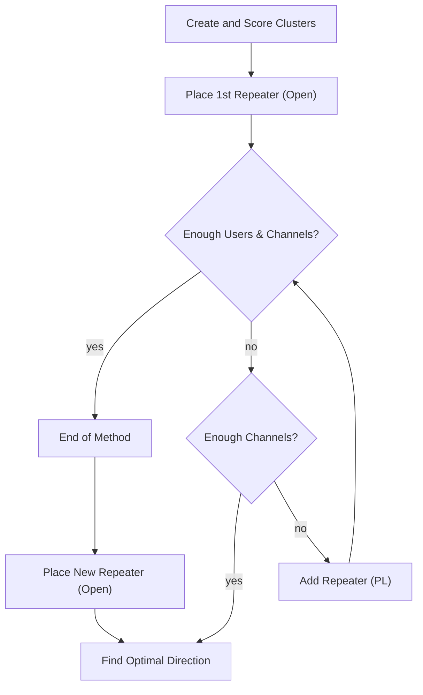
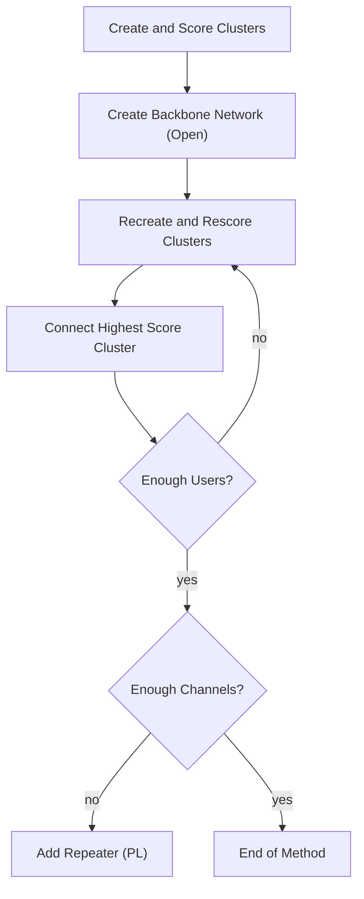
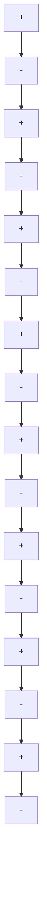
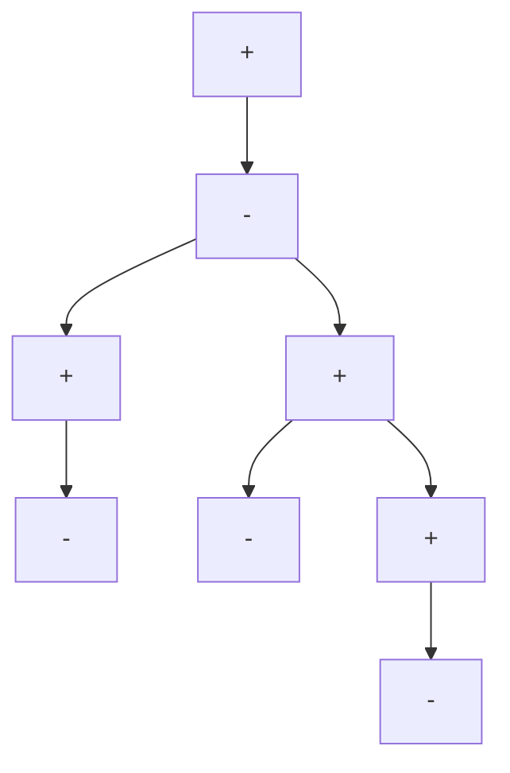
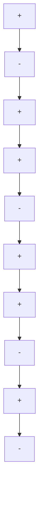
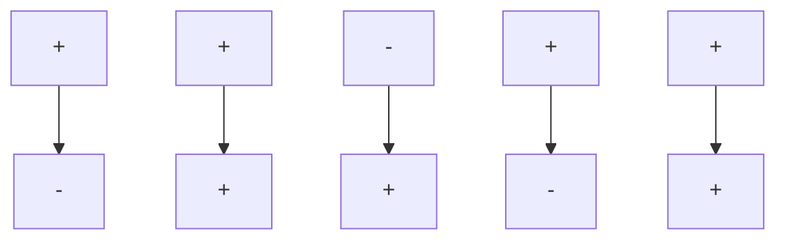

## Abstract

We propose and evaluate two models to determine the minimum number of very high frequency (VHF) repeaters necessary to accomodate a given geographic distrubiton of users. By utilizing cluster analysis, each model uniquely designs a network of open and “continuous tone-coded squelch system” (CTCSS) repeaters to simultaneously accomodate the desired user load. In addition, the models are mindful of connectivity issues and seek to establish the best connectivity for the set of users. Through the comparison of these two models, we seek to establish the minimum number of repeaters required.

In the “Bender” Snaking Model, a network is established by creating a “snake” or chain of open repeaters across the area. The model determines the most effective placement for each open repeater and is mindful to maintain channel availability cy placing CTCSS repeaters when necessary.

In the Branching Model, a backbone network is established between the two most populous areas and branch networks are subsequentially added to existing network. After the branched network has been completed, CTCSS lines are placed to both mitigate channel saturation and establish dedicated long-distance lines. This model seeks to create the best connectivity for the users in the area with the minimum number of repeaters used.

We test our models on two likely area distrubitions: a city/suburban-like user distribution and a rural-like user distribution. We compare the results and propose the minimum number of repeaters necessary for each scenario. By comparing the two models, we are able to decide if the number is realistic and what the benefits of a different network design may correlate to for the users.

Finally, we stress-test our models with 10,000 users in the same area and discuss the defects of line-of-sight propagation caused by mountains in the area.

# Optimizing VHF Repeater Coordination Using Cluster Analysis

MCM Competition Problem B

Control Number: 11759

## Contents

1 Problem Restatement 4

2 Assumptions and Justifications 4

3 Available Technology 5

3.1 Repeaters 5

3.2 Continuous Tone-Coded Squelch System 6

4 The “Bender” Snake Model 6

4.1 Description 7

4.2 Mathematical Interpretation 7

5 The Branching Model 11

5.1 Description 11

5.2 Mathematical Intepretation 12

6 Model Comparison Summary 14

7 Case Studies 15

7.1 City Distribution 15  
7.2 Rural Distrubition 19

8 10,000 Simultaneous Users 22  
9 Mountainous Terrain 23  
10 Sensitivity to Parameters 24  
11 Strengths & Weaknesses 25  
12 Conclusion 26  
13 Appendix A: Full-Page Plots 29  
14 Appendix B: Source Code 36

## 1 Problem Restatement

Without the aid of repeaters, VHF radio would only permit low-power users to communicate when direct line-of-sight could be established between the transmitter and receiver. Repeaters alleviate this restriction by amplifying and rebroadcasting these signals in order to make them available to a larger geographical area. By accounting for mutual repeater interference due to geographical proximity and utilizing a “continuous tone-coded squelch system” (CTCSS) or “private line” (PL), we seek to find the minimal number of repeaters required to support 1,000 simultaneous users. The users inhabit a 40 mile radius flat circular area and are permitted to broadcast between 145-148 MHz. The repeaters transmit frequency is 600 kHz above or below the received frequency and 54 different CTCSS tones are available. We then examine how our model adapts to accommodate 10,000 users and consider the potential defects of line-of-sight propagation in the presence of mountainous areas.

## 2 Assumptions and Justifications

• Geometry is Euclidean. Since the area is given to be flat, we assume that Euclidean geometry may be used.  
• The system is closed. We assume that all signals originate from within our system. We also assume that there will be no outside interference in the system.  
• Antennas are isotropic. Because the effective transmission area of each user and each antenna is relatively small compared to the whole area, we assume that antennas operate isotropically. This is a fundamental assumption made in modern network design [4].  
• Each user is a “low-power” user. Typical VHF radio transmitters are effective across small towns without repeater support [8]. Since the area being considered is over 5000 square miles, the area of a small town is negligible and we can assume that users will not be able to communicate with one another without repeater support, i.e. each user is a low-power user.  
• Each user “plays nice.” In order to avoid users purposefully or accidentally drowning out the signals of others, we require that all users have the same equipment, e.g. all users broadcast at the same intensity and all users have the same range limitations. As a result, the requirements to connect a single user will be static. Specifically, each users will have to be within some fixed maximum distance from a repeater to connect to the network.  
• There are more than 1,000 (or 10,000) potential users. It would be unrealistic for any company or group of individuals to place an appreciable number of repeaters in

order to accommodate one individual. We assume that the number of potential users in the area exceeds the number that must be simultaneously accomodated.

• The geographic distribution of users is known. The geographical distribution of users must be a known constraint before repeater requirements can be determined. The demand for network connectivity will not exist unless there is a preexisting community present.

• Users and repeaters are distinct entities. In reality, most VHF radio repeaters are maintained by individual users or a localized group of users. These repeaters are openly available and are typically not used as mobile stations [9]. Thus we assume that users are not broadcasting from repeaters and that they may be treated as two distinct entities.

• VHF signals are not affected by physical entities in the area. The physical presence of users and antennas will not interfere with the propagation of waves in the VHF spectrum. However, land features such as mountains will affect propagation [11].

## 3 Available Technology

The problem statement makes two different pieces of technology available: repeaters and continuous tone-coded squelch systems. We will now outline these technologies.

## 3.1 Repeaters

Repeaters are stationary devices that pick up weak signals (i.e. signals from users), amplify them, and retransmit them on a different frequency. This allows users to circumvent the lineof-sight limitation of VHF and broadcast their signal greater distances. To avoid inteference with the incoming (weak) signal, the repeater rebroadcasts the new (strong) signal 600 kHz above or below the received signal. To avoid repeaters interfering with one another the Metropolitan Coordination Association states that repeaters must be at least 10 miles apart [1]. Overlapping repeater “zones” will allow signals to pass from one repeater to another, allowing signals to travel significant distances.

Note that the range of a repeater is directly correlated to its height. The line-of-sight calculation to determine the effectve distance is given by disance in miles $= \sqrt { 1 . 5 A _ { f } }$ , where $A _ { f }$ is the height of the antenna in feet [11].

## 3.2 Continuous Tone-Coded Squelch System

Continuous Tone-Coded Squelch Systems (CTCSS), often called Private Lines (PL), further mitigates interference by associating a subaudible tone with signals being received/transmitted by the repeater. In order to communicate through a private line repeater, users must also broadcast this tone. This allows users in a densely populated area to communicate on the same channel with minimal interference. Private line repeaters are not necessarily closed [2] as these CTCSS tones are often published. Since it is our intention to increase the number of available channels, CTCSS tones will be common knowledge to all users.

## 4 The “Bender” Snake Model

The “Bender1” Snake Model seeks to maximize the number of connected users by efficiently creating a snake-like chain of open repeaters across the area.

Figure 1 describes this model without reclustering.  


<details>
<summary>flowchart</summary>


</details>

Figure 1: Flow Chart for “Bender” Snake Model

## 4.1 Description

Using k-means clustering[10], we establish clusters of users to deterrmine the optimal initial open repeater placement. Optimal placement is determined by the greatest number of users we can cover when placing a single open repeater. This may also be referred to as “scoring” a cluster where a higher score correlates to coverage for more users. A second open repeater is optimally placed along the perimeter of the newly established network area. This process is repeated iteravely by placing a new open repeater along the permitter of the most recently established open repeater. The placement of the second open repeater is always in the direction of a cluster point, i.e. other high density locations. This ensures that a network is established between the most users using the least number of repeaters. The model is mindful of ensuring that enough channels are available to users by placing CTCSS repeaters accordingly.

By design, network growth tends toward establishing connectivity near and between cluster points. As more users around each cluster are accomodated, the score associated with their respective cluster should reflect that change. To account for this, cluster scores may be reevaluated to encourage intelligent networking in the model. This is known as reclustering.

## 4.2 Mathematical Interpretation

The model is designed to be highly versatile and supports a number of different parameters that may be changed based on a given situation. They are:

<table><tr><td>Parameter</td><td>Description</td></tr><tr><td>n</td><td>Number of users within 40 miles</td></tr><tr><td>k</td><td>Number of k-means cluster points</td></tr><tr><td>ds</td><td>Maximum distance for user-to-repeater communication</td></tr><tr><td>hr</td><td>Height of repeater towers</td></tr><tr><td>dh</td><td>Repeater output distance</td></tr><tr><td>Δf</td><td>Frequency separation / channel width</td></tr></table>

Before we begin, we must define a few additional terms. Let $N _ { c }$ be the number of people with network connectivity (i.e. within range of an open repeater) and let $N _ { f }$ be the number of people with access to an available frequency range. Let O denote the number of available channels. Initially, we will have ${ N _ { c } } = 0 , { N _ { f } } = 0$ and $O = 0$ .

So let n be the number of users within the 40 mile radius. For user i with $1 \leq i \leq n$ , let $( x _ { i } , y _ { i } )$ denote the user’s location in Cartesian coordinates. We arrange these coordinates into an $n \times 2$ matrix M where

$$
M _ {j, 1} = x _ {j} \mathrm{and} M _ {j, 2} = y _ {j} \mathrm{forallintegers} j \in [ 1, n ].
$$

For each user, determine the number of users within the seperation distance $d _ { s }$ . Recall that we are using Euclidean geometry, so when considering the jth user if

$$
d _ {s} \geq \sqrt {(M _ {j , 1} - M _ {k , 1}) ^ {2} - (M _ {j , 2} - M _ {k , 2}) ^ {2}}
$$

then the kth user is within range of the jth user. We denote the user with the greatest number of additional users in range as the pth user.

We place an open repeater at the location of the pth user and set $R _ { 1 } = ( M _ { p , 1 } , M _ { p , 2 } )$ . The allowable frequency range is 3 MHz so there will be $3 / \Delta f$ channels available. The action of placing the first repeater makes this many channels available. Now $O = 3 / \Delta f$ .

Let $N _ { 1 }$ be the number of people who are within range of our first repeater. We must update our $N _ { c }$ and $N _ { f }$ values accordingly. Thus

$$
N _ {c} = N _ {1} \text { and } N _ {f} = \min (N _ {c}, O)
$$

Now we calculate the metric by which this model determines Private Line (CTCSS) repeater placement. Let

$$
D = \max (N _ {c} - O, 0)
$$

be the deficit of available channels (i.e. the number of users who do not have access to a repeater channel). We update our matrix M by removing the users who are within range of the repeater. Now M is a $( n - N _ { c } ) \times 2$ matrix. From here, if $D > 0$ we add CTCSS repeaters to mitigate this deficit and if $D = 0$ , we continue to place open repeaters and expand the network.

If $D > 0$ , we will add a Private (CTCSS) Line. We calculate the optimal angle to place the CTCSS line a distance of $d _ { p }$ from our first repeater. We then determine the location to place the CTCSS repeater.

The explicit CTCSS algorithm is given below.

Data: Previously placed open repeater location, $R _ { i - 1 }$

Result: The optimal location to place a new CTCSS Line $R _ { i } = ( x _ { i } , y _ { i } )$

Let $P$ be a partition of [0, 360] (in our case studies $| P | = 3 6 0 )$ ;

for $\theta \in P$ do

$$
R _ {\theta} = (x _ {\theta}, y _ {\theta}) = R _ {i - 1} + \left(d _ {p} \cos (\theta), d _ {p} \sin (\theta)\right);
$$

for $j \in [ 1 , n - N _ { c } ]$ do

Let $\underline { { \boldsymbol { x } _ { j } } } = M _ { j , 1 }$ and $y _ { j } = M _ { j , 2 } ;$

if $\sqrt { ( x _ { \theta } - x _ { j } ) _ { . } ^ { 2 } + ( y _ { \theta } - y _ { j } ) _ { } ^ { 2 } } \leq d _ { s }$ then $\dot { u _ { \theta } } = u _ { \theta } \dot { + } 1 ;$ ;

end

end

end

Let $\theta _ { c }$ be the θ for which $u _ { \theta }$ is maximum. Then $R _ { i } = R _ { i - 1 } + \smash { \big ( } d _ { p } \cos ( \theta _ { c } ) , d _ { p } \sin ( \theta _ { c } ) \{ $ is the optimal location for the new repeater.

## Algorithm 1: Finding CTCSS Repeater Location

The addition of a CTCSS line corresponds to an additional $3 / \Delta f$ channels. Therefore our new value for O is $O = O ^ { \prime } + 3 / \Delta f$ where $O ^ { \prime }$ is the previous value of O. Now we recalculate $N _ { c } , \ N _ { f }$ , and our deficit D using our updated matrix M (which does not include points already covered by repeaters).

If $D = 0$ then all users who desire access have access. To increase the number of supported users, we will add an open repeater to expand our network. We use “k-means” cluster analysis to determine the most densly populated areas. After the cluster points are determined, we collect their locations and let $\{ c _ { 1 } , . . . , c _ { k } \}$ be that collection of coordinates. The model snakes around the map by adding repeaters to include more users in the network.

The explicit open repeater placement algorithm is given below.

Data: Previously placed open repeater location, $R _ { i - 1 }$

Result: The optimal location to place a new open repeater $R _ { i } = ( x _ { i } , y _ { i } )$

for $t \in [ 0 , k ]$ do

Let $\bar { { \boldsymbol { \theta } } } _ { t }$ be the angle from the current repeater $R _ { i - 1 }$ to $c _ { t } ;$

$$
R _ {t} = \left(x _ {t}, y _ {t}\right) = R _ {i - 1} + \left(d _ {h} \cos \left(\theta_ {t}\right), d _ {h} \sin \left(\theta_ {t}\right)\right);
$$

for $j \in [ 0 , n - N _ { c } ]$ do

Let $\bar { x } _ { j } = M _ { j , 1 }$ and $y _ { j } = M _ { j , 2 } ;$

if $\sqrt { ( x _ { t } - x _ { j } ) _ { . } ^ { 2 } + ( y _ { t } - y _ { j } ) ^ { 2 } } \leq d _ { s }$ then ${ \dot { u } } _ { t } = u _ { t } + 1 ;$

end

end

end

Let $t _ { c }$ be the $t$ for which $u _ { t }$ is maximum. Then $R _ { i } = R _ { i - 1 } + ( d _ { h } \cos ( \theta _ { t _ { c } } ) , d _ { h } \sin ( \theta _ { t _ { c } } ) )$ is the optimal location for the new repeater.

## Algorithm 2: Finding Open Repeater Location

The action of adding an open line did not add any new channels. We have, however, added new users to the network and must recalculate $N _ { c } , N _ { f }$ , and our deficit D using our updated matrix M (which does not include points already covered by repeaters). If $D > 0$ , then we apply Algorithm 1 again and if $D = 0$ , we apply Algorithm 2.

We repeat this process until $N _ { f } \ge 1 0 0 0$ . This would mean that there are at least 1,000 simultaneously supported users on our network.

## 5 The Branching Model

The aptly named Branching Model creates a backbone network of open repeaters that supports a number of branch connections. All open repeater branches are designed along the shortest distance possible. This model provides us with a point of comparison for the first model.

Figure 2 describes the creation of the backbone and branches.  


<details>
<summary>flowchart</summary>


</details>

Figure 2: Flow Chart for Branching Model

## 5.1 Description

Akin to the first model, the Branching Method uses k-means cluster analysis and scoring to determine the optimal placement of repeaters. The difference, however, is the process in which this model creates the network. The model creates a backbone network of open repeaters between the two highest scoring clusters. After the backbone has been established, the model reclusters and rescores the remaining users and creates a branch of open repeaters between the existing network and the highest scoring cluster. This ensures that the fewest repeaters are used in branching out the network to high density locations. After the entire network has been established, the model places CTCSS repeaters to ensure channel availability is not a concern in user-dense locations so that all users may be supported simultaneously.

This model requires reclustering after every iteration.

## 5.2 Mathematical Intepretation

The Branching Model supports even more customization than the first model. The parameters relevant to this model are listed below.

<table><tr><td>Parameter</td><td>Description</td></tr><tr><td>n</td><td>Number of users within 40 miles</td></tr><tr><td>k</td><td>Number of k-means cluster points</td></tr><tr><td>ds</td><td>Maximum distance for user-to-repeater communication</td></tr><tr><td>hr</td><td>Height of repeater towers</td></tr><tr><td>dh</td><td>Repeater output distance</td></tr><tr><td>Δf</td><td>Frequency separation/ channel width</td></tr><tr><td>ln</td><td>Number of Long Distance Lines</td></tr><tr><td>lc</td><td>Number of Locations in Long Distance Connections</td></tr></table>

We will review a few definitions for consistency. Let $N _ { c }$ be the number of people with network connectivity (i.e. within range of a repeater) and $N _ { f }$ be the number of people with access to an available frequency range. The number of channels available will be denoted again by O. Initially, ${ N _ { c } } = 0 , { N _ { f } } = 0$ and $O = 0$ .

Let n be the number of users within a 40 mile radius. With k-means clustering, we identify and score clusters of users.. Letting $\{ c _ { 1 } , . . . , c _ { k } \}$ be the locations of the k cluster points, the model creates a backbone of repeaters between the two highest scoring cluster locations.

For each cluster point $c _ { i } ,$ we calculate how many users are within $d _ { s }$ of $c _ { i } ,$ i.e. how many users will benefit from the placement of a repeater there. We set $R _ { 1 } = c _ { i }$ for whichever i has the most people within range. Now calculate $N _ { c }$ as before. The algorithm continues until the desired number of users have been added (in our case this is 1000 users). This only means that users are within range of a repeater. This does not ensure that all users have available channels. This will be resolved after the branched network has been established.

The explicit open repeater branching algorithm is given below.

Data: First open repeater location, $R _ { 1 } = ( x , y )$

Result: The locations of the repeaters

for $i \in [ 1 , k ]$ do

Let $( x _ { i } , y _ { i } ) = c _ { i } ;$

$$
\phi (i) = \sqrt {(x - x _ {i}) ^ {2} + (y - y _ {i}) ^ {2}};
$$

end

Then $T = ( x _ { i } , y _ { i } )$ st $\phi ( i ) = \mathrm { m a x } ( \phi ( [ 1 , k ] ) )$ ;

θ = angle between $R _ { 1 } , T ;$

s = distance between $R _ { 1 } , T ;$

Set $j = 2 ;$

while $s > d _ { h }$ do

$$
R _ {j} = R _ {j - 1} + \left(d _ {h} \cos (\theta), d _ {h} \sin (\theta)\right);
$$

Recalculate $s ;$

$$
j = j + 1;
$$

end

while $N _ { c } < 1 0 0 0$ do

Rerun “k-means” cluster analysis to obtain new $\{ c _ { 1 } , . . . , c _ { k } \}$ ;

$T = c _ { i }$ st $c _ { i }$ has the most users in range;

Choose i st $R _ { i }$ is the existing repeater closest to $T ;$

Let s be the distance between $R _ { T }$ and $T ;$

Let θ be the distance between $R _ { T }$ and $T ;$

while $s > d _ { h }$ do

$$
R _ {j} = R _ {j - 1} + (d _ {h} \cos (\theta), d _ {h} \sin (\theta));
$$

Recalculate $s ;$

$$
j = j + 1;
$$

end

end

## Algorithm 3: Branching Method Open Repeater Placement

With the open network established, we must resolve the issue of channel availability. This is easily accomplished by placement of CTCSS repeaters in high user density areas. In our opinion, the method in which this model establishes long-distance CTCSS lines is outstanding. By specifying a different value for $l _ { n } ,$ one can change the number of CTCSS lines connecting the most highly populated areas. While this potentially increases the number of repeaters, it offers greater connectivity between regions. This is accomplished by first running k-means cluster analysis on the user data and choosing the $l _ { c }$ clusters with the most users in range. Starting from the cluster with the most users, we create a chain of repeaters with a particular CTCSS channel, a distance of $d _ { h }$ apart, until the next closest repeater is in range (similar to the second half of Algorithm 3). This creates a long distance connection on a specific CTCSS channel. This allows long distance users to communicate with more densely populated areas (e.g. rural or sub-urban users communicating with an urban user) without wasting an open frequency in the dense location.

Once the specified number of long distance connections have been made, any deficits in channel demand are mitigated by placing local CTCSS repeaters in highly populated areas (again by k-means clustering).

## Model Comparison Summary

The fundamental similarities and differences between the models are:

## Similarities

• k-means clustering is prevalant in both models. Both models make use of kmeans cluster analysis to identify large groups of users. By ranking these clusters in terms of potential connected users, both models attempt to provide the most efficient connectivity scheme possible.  
• Variable-strength repeaters may be employed in both models. By accounting for variable broadcasting strength, isolated users may be accomodated without fear of channel interference or an inordinate use of additional repeaters in both models.  
• The change of frequency from a repeater (±600 kHz) is resolved last in both models. After the repeaters are configured, the “up” and “down” repeater broadcast assignments may be made in both models to fit the specific configuration of the network.

## Differences

• The models generate the network differently. The “Bender” Snake Model places open repeaters along a continuous trajectory as determined by cluster points. In contrast, The Branching Model creates a single backbone and allows for growth in any direction toward a cluster point.  
• Reclustering is required for the Branching Model. In order for branching to occur, the optimum target location must be determined after every iteration. The other model may utilize reclustering but does not require it.  
• The method in which private lines are introduced differs between the models. The “Bender” Snake Model places private line repeaters as is necessary whereas the Branching Model places private line repeaters after the entire network has been established.

## 7 Case Studies

We developed two population distributions to test our models on. The two cases are: a citylike user distribution and a rural distribution with small towns of users. When we discuss “parity,” we refer to the ±600 kHz difference in the recieving and broadcast frequencies of the repeaters. The graphs that show these assignments represent each open line repeater as a node, each labeled with “+” or “-” accordingly. We assign parity to each repeater such that no one repeater is connected to the rest of the network solely through another repeater with identical parity. This prevents a signal being either stepped up or stepped down repeatedly such that it eventually falls outside the available frequency range and cannot be recieved.

The parameters for these case studies were set to values we deemed reasonable based on our research from our referenced sources.

## 7.1 City Distribution

This distribution represents a city (located at the center of the area) with surrounding suburbs/neighborhoods.


<details>
<summary>3d surface plot chart</summary>

| Miles | Value |
|-------|-------|
| 0     | Peak  |
</details>

Figure 3: Surface Plot of Users

## Snaking Model

<table><tr><td>Parameter</td><td>Description</td></tr><tr><td>n = 1400</td><td>The number of users within 40mi</td></tr><tr><td>k = 5</td><td>Number of k-means cluster points</td></tr><tr><td>ds= 10mi</td><td>Maximum distance for user to repeater communication</td></tr><tr><td>hr= 150ft</td><td>Height of repeater towers to be placed</td></tr><tr><td>dh= 15mi</td><td>Repeater output distance2)</td></tr><tr><td>Δf = .025</td><td>Frequency seperation</td></tr><tr><td>ln= 3</td><td>Number of Long Distance Lines</td></tr><tr><td>lc= 5</td><td>Number of Locations in Long Distance Connections</td></tr></table>

The model places the first open repeater slightly north of the city to cover most of the users located there. This creates a large channel deficit and the model places two CTCSS repeaters on this iteration to compensate. Next, a repeater is placed to the northwest and the simulation proceeds to spiral counterclockwise around the city, placing CTCSS repeaters as necessary. The model also places two CTCSS repeaters on the fourth iteration. There are 9 open line repeaters and 8 CTCSS repeaters for a total of 17 repeaters.


<details>
<summary>scatter plot</summary>

| Type             | Miles |
| ---------------- | ----- |
| Open Repeater    | -15   |
| Open Repeater    | 15    |
| Open Repeater    | 20    |
| Open Repeater    | 10    |
| Open Repeater    | -10   |
| Open Repeater    | -5    |
| Open Repeater    | 5     |
| Open Repeater    | 15    |
| Open Repeater    | 25    |
| Open Repeater    | 30    |
| Open Repeater    | 20    |
| Open Repeater    | 10    |
| Open Repeater    | -5    |
| Open Repeater    | 0     |
| Open Repeater    | -10   |
| Open Repeater    | -15   |
| Open Repeater    | -20   |
| Open Repeater    | -25   |
| Open Repeater    | -30   |
| Open Repeater    | -35   |
| Open Repeater    | -40   |
| CTCSS Repeater  | -15   |
| CTCSS Repeater  | -10   |
| CTCSS Repeater  | -5    |
| CTCSS Repeater  | 0     |
| CTCSS Repeater  | 5     |
| CTCSS Repeater  | 10    |
| CTCSS Repeater  | 15    |
| CTCSS Repeater  | 20    |
| CTCSS Repeater  | 25    |
| CTCSS Repeater  | 30    |
| CTCSS Repeater  | 35    |
| CTCSS Repeater  | 40    |
| Cluster Pt       | -20   |
| Cluster Pt       | -10   |
| Cluster Pt       | 0     |
| Cluster Pt       | 5     |
| Cluster Pt       | 10    |
| Cluster Pt       | 15    |
| Cluster Pt       | 20    |
| Cluster Pt       | 25    |
| Cluster Pt       | 30    |
| Cluster Pt       | 35    |
| Cluster Pt       | 40    |
</details>

Figure 4: Repeater Placement (Snaking Model)

The model creates a closed loop of 9 open line repeaters. Since this number is odd, the parity does not work bi-directionally around the loop. There will be some signal leakage when the two step-up repeaters communicate directly but the signal will travel in the opposite direction around the entire network and be recieved.


<details>
<summary>flowchart</summary>


</details>

Figure 5: Repeater Parity (Snaking Model)

Branching Model The model places the first open repeater in the city and creates three main branches to cover the surrounding suburbia. This web structure is highlighed with the black lines. The branching structure of open line repeaters is designed to efficiently cover the surface area rather than simply rushing from one population center to the next linearly. This structure is created first, and CTCSS lines are placed afterwords.


<details>
<summary>scatter plot</summary>

| Point Type       | X Miles | Y Miles |
| ---------------- | ------- | ------- |
| Potential User   | -10     | 18      |
| Open Repeater    | 5       | 20      |
| Open Repeater    | 15      | -20     |
| Open Repeater    | -5      | -10     |
| Open Repeater    | 0       | 0       |
| Open Repeater    | 10      | -15     |
| Open Repeater    | -10     | 12      |
| Open Repeater    | 5       | 25      |
| Open Repeater    | 15      | -25     |
| Open Repeater    | -5      | 10      |
| Open Repeater    | 0       | 0       |
| Open Repeater    | 5       | -5      |
| Open Repeater    | 10      | -10     |
| Open Repeater    | -5      | -20     |
| Open Repeater    | 0       | -25     |
| Open Repeater    | 5       | -30     |
| Open Repeater    | 10      | -35     |
| Open Repeater    | -10     | -40     |
| CTCSS Repeater   | -10     | 25      |
| CTCSS Repeater   | -5      | 15      |
| CTCSS Repeater   | 0       | 0       |
| CTCSS Repeater   | 5       | -5      |
| CTCSS Repeater   | 10      | -10     |
| CTCSS Repeater   | 15      | -20     |
| CTCSS Repeater   | 20      | -25     |
| CTCSS Repeater   | 25      | -30     |
| CTCSS Repeater   | 30      | -35     |
| CTCSS Repeater   | 35      | -40     |
</details>

Figure 6: Repeater Placement (Branching Model)

The process of CTCSS repeater placement is designed to create higher connectivity than the Snaking model. In the Snaking model, CTCSS repeaters are used to provide more channels locally, but when the network is loaded to capacity not all users will be able to talk longdistance. In the Branching model, we assign one squelch tone as long distance, here denoted by 1 (blue circles). Each of these points has 3 CTCSS repeaters, denoted as types 1,2 and 3. Tones 4-8 provide local lines in a manner similar to Snaking. This model creates 8 open repeaters and 17 CTCSS repeaters for a total of 26. This number is substantually higher than the “minimum number” of 17 that the Snaking model produced. These extra lines are necessitated by the long distance backbone. The aim of this model is to provide both the best connectivity with the fewest number of repeaters.


<details>
<summary>scatter plot</summary>

| Point | Miles | Type             |
|-------|-------|------------------|
| 1     | 18    | CTCSS Repeater   |
| 3     | 4     | Potential User   |
| 4     | -4    | Potential User   |
| 5     | 6     | Potential User   |
| 6     | 8     | Potential User   |
| 7     | -12   | CTCSS Repeater   |
| 8     | 2     | CTCSS Repeater   |
| 9     | 6     | CTCSS Repeater   |
| 10    | -8    | CTCSS Repeater   |
</details>

Figure 7: CTCSS Line Placement (Branching Model)

The parity assignment is quite simple here.


<details>
<summary>flowchart</summary>


</details>

Figure 8: Repeater Parity (Branching Model)

## 7.2 Rural Distrubition

This distribution represents a rural area with eight small towns of concentrated population with approximately 100 people spread randomly throughout the area. The total user population is 1400. We attempt to provide connectivity to 1000 people using both the Snaking and Branching models.


<details>
<summary>3d line chart</summary>

| Miles | Value |
|-------|-------|
| 0     | 120   |
| -10   | 110   |
| -20   | 60    |
| -30   | 40    |
| -40   | 20    |
| -50   | 10    |
| -60   | 5     |
| -70   | 10    |
| -80   | 20    |
| -90   | 30    |
| -100  | 40    |
| -110  | 50    |
| -120  | 60    |
| -130  | 70    |
| -140  | 80    |
| -150  | 90    |
| -160  | 100   |
| -170  | 110   |
| -180  | 120   |
| -190  | 110   |
| -200  | 100   |
| -210  | 90    |
| -220  | 80    |
| -230  | 70    |
| -240  | 60    |
| -250  | 50    |
| -260  | 40    |
| -270  | 30    |
| -280  | 20    |
| -290  | 10    |
| -300  | 5     |
| -310  | 10    |
| -320  | 20    |
| -330  | 30    |
| -340  | 40    |
| -350  | 50    |
| -360  | 60    |
| -370  | 70    |
| -380  | 80    |
| -390  | 90    |
| -400  | 100   |
| -410  | 110   |
| -420  | 120   |
| -430  | 110   |
| -440  | 100   |
| -450  | 90    |
| -460  | 80    |
| -470  | 70    |
| -480  | 60    |
| -490  | 50    |
| -500  | 40    |
| -510  | 30    |
| -520  | 20    |
| -530  | 10    |
| -540  | 5     |
| -550  | 10    |
| -560  | 20    |
| -570  | 30    |
| -580  | 40    |
| -590  | 50    |
| -600  | 60    |
| -610  | 70    |
| -620  | 80    |
| -630  | 90    |
| -640  | 100   |
| -650  | 110   |
| -660  | 120   |
| -670  | 110   |
| -680  | 100   |
| -690  | 90    |
| -700  | 80    |
| -710  | 70    |
| -720  | 60    |
| -730  | 50    |
| -740  | 40    |
| -750  | 30    |
| -760  | 20    |
| -770  | 10    |
| -780  | 5     |
| -790  | 15    |
| -800  | 25    |
| -810  | 35    |
| -820  | 45    |
| -830  | 55    |
| -840  | 65    |
| -850  | 75    |
| -860  | 85    |
| -870  | 95    |
| -880  | 105   |
| -890  | 115   |
| -900  | 125   |
| -910  | 115   |
| -920  | 105   |
| -930  | 95    |
| -940  | 85    |
| -950  | 75    |
| -960  | 65    |
| -970  | 55    |
| -980  | 45    |
| -990  | 35    |
| -1000 | 25    |
</details>

Figure 9: Surface Plot of Users

Snaking Model The model starts near the northwestern-most town. We note that it places the open-line repeater so that it covers all of the targeted town but approximately half of the population in the second town. This coverage is optimal, however a connectivity deficit is created since more than 120 people lie within range and channel availability becomes an issue. The model then places a CTCSS repeater near the open repeater to provide more channels locally. This is not sufficient to cover the deficit, so the model places an additional CTCSS repeater on the same spot, this one with a different squelch tone. This resolves the deficit so it resumes placing open-line repeaters. The next placement is essentially due south of the previous, as it gravitates towards the two southern clusters that represent the two towns in the area. The placement of this new repeater does not create a channel deficit so there is no need for another CTCSS repeater. The model proceeds south again on the next iteration, then snakes around towards the southeastern town, and finally turns north, placing CTCSS repeaters as needed along the way. The open line repeater near the middle is placed last. Note that the 6th iteration (the southeastern most group) also places two CTCSS repeaters on the same spot for a total of 8 CTCSS repeaters and 10 open repeaters. The model uses 18 total repeaters to create a network that accomodates 1080 users.


<details>
<summary>scatter plot</summary>

| Type             | Miles | Notes                     |
| ---------------- | ----- | ------------------------- |
| Potential User   | -20   | Open Repeater             |
| Open Repeater    | -15   | Open Repeater             |
| Open Repeater    | -10   | Open Repeater             |
| Open Repeater    | -5    | Open Repeater             |
| Open Repeater    | 0     | Open Repeater             |
| Open Repeater    | 5     | Open Repeater             |
| Open Repeater    | 10    | Open Repeater             |
| Open Repeater    | 15    | Open Repeater             |
| Open Repeater    | 20    | Open Repeater             |
| Open Repeater    | 25    | Open Repeater             |
| Open Repeater    | 30    | Open Repeater             |
| Open Repeater    | 35    | Open Repeater             |
| Open Repeater    | 40    | Open Repeater             |
| CTCSS Repeater   | -20   | Open Repeater             |
| CTCSS Repeater   | -15   | Open Repeater             |
| CTCSS Repeater   | -10   | Open Repeater             |
| CTCSS Repeater   | -5    | Open Repeater             |
| CTCSS Repeater   | 0     | Open Repeater             |
| CTCSS Repeater   | 5     | Open Repeater             |
| CTCSS Repeater   | 10    | Open Repeater             |
| CTCSS Repeater   | 15    | Open Repeater             |
| CTCSS Repeater   | 20    | Open Repeater             |
| CTCSS Repeater   | 25    | Open Repeater             |
| CTCSS Repeater   | 30    | Open Repeater             |
| CTCSS Repeater   | 35    | Open Repeater             |
| CTCSS Repeater   | 40    | Open Repeater             |
| Cluster Pt       | -20   | Cluster Pt                |
| Cluster Pt       | -15   | Cluster Pt                |
| Cluster Pt       | -10   | Cluster Pt                |
| Cluster Pt       | -5    | Cluster Pt                |
| Cluster Pt       | 0     | Cluster Pt                |
| Cluster Pt       | 5     | Cluster Pt                |
| Cluster Pt       | 10    | Cluster Pt                |
| Cluster Pt       | 15    | Cluster Pt                |
| Cluster Pt       | 20    | Cluster Pt                |
| Cluster Pt       | 25    | Cluster Pt                |
| Cluster Pt       | 30    | Cluster Pt                |
| Cluster Pt       | 35    | Cluster Pt                |
| Cluster Pt       | 40    | Cluster Pt                |
</details>

Figure 10: Repeater Placement (Snaking Model)

Repeater parity is assigned after the simulation is complete. This is generally a simple process for the Snaking model. However, note the southeastern node group where there are two step up repeaters connected. While this will result in some signal leakage outside of the available spectrum, the path that involves the step down node allows these two step up nodes to communicate without signal loss.


<details>
<summary>flowchart</summary>


</details>

Figure 11: Repeater Parity (Snaking Model)

Branching Method The branching structure is highlighted with the black lines. The four-long node line that connects the two biggest towns is the main spine, and all other node structures branch off of this. The branching structure of open line repeaters is designed to efficiently cover the surface area rather than simply rushing from one population center to the next linearly. This structure is created first, and CTCSS lines are placed afterwords.


<details>
<summary>scatter plot with trajectory lines</summary>

| Point Type       | X (Miles) | Y (Miles) |
| ---------------- | --------- | --------- |
| Open Repeater    | -5        | 35        |
| Open Repeater    | 0         | 18        |
| Open Repeater    | 5         | 4         |
| Open Repeater    | 10        | -15       |
| Open Repeater    | 15        | -25       |
| Open Repeater    | 20        | -18       |
| Open Repeater    | 25        | -28       |
| Open Repeater    | 30        | -30       |
| Open Repeater    | 35        | -32       |
| Open Repeater    | 40        | -35       |
| Open Repeater    | 45        | -38       |
| Open Repeater    | 50        | -40       |
| Open Repeater    | 55        | -38       |
| Open Repeater    | 60        | -35       |
| Open Repeater    | 65        | -32       |
| Open Repeater    | 70        | -28       |
| Open Repeater    | 75        | -25       |
| Open Repeater    | 80        | -22       |
| Open Repeater    | 85        | -18       |
| Open Repeater    | 90        | -15       |
| Open Repeater    | 95        | -12       |
| Open Repeater    | 100       | -8        |
| Open Repeater    | 105       | -5        |
| Open Repeater    | 110       | -2        |
| Open Repeater    | 115       | 2         |
| Open Repeater    | 120       | 5         |
| Open Repeater    | 125       | 8         |
| Open Repeater    | 130       | 12        |
| Open Repeater    | 135       | 15        |
| Open Repeater    | 140       | 18        |
| Open Repeater    | 145       | 22        |
| Open Repeater    | 150       | 25        |
| Open Repeater    | 155       | 28        |
| Open Repeater    | 160       | 32        |
| Open Repeater    | 165       | 35        |
| Open Repeater    | 170       | 38        |
| Open Repeater    | 175       | 40        |
| Open Repeater    | 180       | 38        |
| Open Repeater    | 185       | 35        |
| Open Repeater    | 190       | 32        |
| Open Repeater    | 195       | 28        |
| Open Repeater    | 200       | 25        |
| Open Repeater    | 205       | 22        |
| Open Repeater    | 210       | 18        |
| Open Repeater    | 215       | 15        |
| Open Repeater    | 220       | 12        |
| Open Repeater    | 225       | 8         |
| Open Repeater    | 230       | 5         |
| Open Repeater    | 235       | 2         |
| Open Repeater    | 240       | -2        |
| Open Repeater    | 245       | -5        |
| Open Repeater    | 250       | -8        |
| Open Repeater    | 255       | -12       |
| Open Repeater    | 260       | -15       |
| Open Repeater    | 265       | -18       |
| Open Repeater    | 270       | -20       |
| Open Repeater    | 275       | -22       |
| Open Repeater    | 280       | -25       |
| Open Repeater    | 285       | -28       |
| Open Repeater    | 290       | -30       |
| Open Repeater    | 295       | -32       |
| Open Repeater    | 300       | -35       |
| Open Repeater    | 305       | -38       |
| Open Repeater    | 310       | -40       |
| CTCSS Repeater   | -30       | 16        |
| CTCSS Repeater   | -25       | 14        |
| CTCSS Repeater   | -20       | 12        |
| CTCSS Repeater   | -15       | 8         |
| CTCSS Repeater   | -10       | -2        |
| CTCSS Repeater   | -5        | -6        |
| CTCSS Repeater   | 0         | -10       |
| CTCSS Repeater   | 5         | -14       |
| CTCSS Repeater   | 10        | -18       |
| CTCSS Repeater   | 15        | -22       |
| CTCSS Repeater   | 20        | -26       |
| CTCSS Repeater   | 25        | -30       |
| CTCSS Repeater   | 30        | -34       |
| CTCSS Repeater   | 35        | -38       |
| CTCSS Repeater   | 40        | -42       |
| CTCSS Repeater   | 45        | -46       |
| CTCSS Repeater   | 50        | -50       |
| CTCSS Repeater   | 55        | -54       |
| CTCSS Repeater   | 60        | -58       |
| CTCSS Repeater   | 65        | -62       |
| CTCSS Repeater   | 70        | -66       |
| CTCSS Repeater   | 75        | -70       |
| CTCSS Repeater   | 80        | -74       |
| CTCSS Repeater   | 85        | -78       |
| CTCSS Repeater   | 90        | -82       |
| CTCSS Repeater   | 95        | -86       |
| CTCSS Repeater   | 100       | -90       |
| CTCSS Repeater   | 105       | -94       |
| CTCSS Repeater   | 110       | -98       |
| CTCSS Repeater   | 115       | -102      |
| CTCSS Repeater   | 120       | -106      |
| CTCSS Repeater   | 125       | -110      |
| CTCSS Repeater   | 130       | -114      |
| CTCSS Repeater   | 135       | -118      |
| CTCSS Repeater   | 140       | -122      |
| CTCSS Repeater   | 145       | -126      |
| CTCSS Repeater   | 150       | -130      |
| CTCSS Repeater   | 155       | -134      |
| CTCSS Repeater   | 160       | -138      |
| CTCSS Repeater   | 165       | -142      |
| CTCSS Repeater   | 170       | -146      |
| CTCSS Repeater   | 175       | -150      |
| CTCSS Repeater   | 180       | -154      |
| CTCSS Repeater   | 185       | -158      |
| CTCSS Repeater   | 190       | -162      |
| CTCSS Repeater   | 195       | -166      |
| CTCSS Repeater   | 200       | -170      |
| CTCSS Repeater   | 205       | -174      |
| CTCSS Repeater   | 210       | -178      |
| CTCSS Repeater   | 215       | -182      |
| CTCSS Repeater   | 220       | -186      |
| CTCSS Repeater   | 225       | -190      |
| CTCSS Repeater   | 230       | -194      |
| CTCSS Repeater   | 235       | -198      |
| CTCSS Repeater   | 240       | -202      |
| CTCSS Repeater   | 245       | -206      |
| CTCSS Repeater   | 250       | -210      |
| CTCSS Repeater   | 255       | -214      |
| CTCSS Repeater   | 260       | -218      |
| CTCSS Repeater   | 265       | -222      |
| CTCSS Repeater   | 270       | -226      |
| CTCSS Repeater   | 275       | -230      |
| CTCSS Repeater   | 280       | -234      |
| CTCSS Repeater   | 285       | -238      |
| CTCSS Repeater   | 290       | -242      |
| CTCSS Repeater   | 295       | -246      |
| CTCSS Repeater   | 300       | -250      |
| CTCSS Repeater   | 305       | -254      |
| CTCSS Repeater   | 310       | -258      |
| CTCSS Repeater   | 315       | -262      |
| CTCSS Repeater   | 320       | -266      |
| CTCSS Repeater   | 325       | -270      |
| CTCSS Repeater   | 330       | -274      |
| CTCSS Repeater   | 335       | -278      |
| CTCSS Repeater   | 340       | -282      |
| CTCSS Repeater   | 345       | -286      |
| CTCSS Repeater   | 350       | -290      |
| CTCSS Repeater   | 355       | -294      |
| CTCSS Repeater   | 360       | -298      |
| CTCSS Repeater   | 365       | -302      |
| CTCSS Repeater   | 370       | -306      |
| CTCSS Repeater   | 375       | -310      |
| CTCSS Repeater   | 380       | -314      |
| CTCSS Repeater   | 385       | -318      |
| CTCSS Repeater   | 390       | -322      |
| CTCSS Repeater   | 395       | -326      |
| CTCSS Repeater   | 400       | -330      |
</details>

Figure 12: Repeater Placement (Branching Model)

  
Figure 13: CTCSS Line Placement (Branching Model)

The process of CTCSS repeater placement is designed to create higher connectivity than the Snaking model. In the Snaking model, CTCSS repeaters are used to provide more channels locally, but when the network is loaded to capacity not all users will be able to talk longdistance. In the Branching model, we assign one squelch tone as long distance, here denoted by 1 (blue circles). Each of these points has 3 CTCSS repeaters, one each of types: 1, 2 and 3. Tones 4-8 provide local lines in a manner similar to the Snaking method. This model creates 8 open repeaters and 17 CTCSS repeaters for a total of 25. This number is substantually higher than the “minimum number” of 18 that the Snaking model produces. These extra lines are necessitated by the building of the long distance backbone. The aim of this model is to provide better connectivity, and not provide an absolute minimum repeater number.


<details>
<summary>flowchart</summary>


</details>

Figure 14: Repeater Parity (Branching Model)

Parity assignment for this model is fairly trivial.

## 8 10,000 Simultaneous Users

Our model is highly adaptable to varying situations and stresses. As such, when considering repeater placement for a network capable of simulateously supporting 10,000 users, we simply run our models against a data set with a little over 10,000 users (we use 12,000). Our models work exactly as before when trying to support 1,000 users. An important point to note however, is that the frequency seperation must be lowered to accomodate more users. We choose the frequency separation to be 10 kHz for 10,000 users (whereas before we chose 25 kHz for 1,000 users).

The minimum number of repeaters necessary to simulateously support 10,000 users is 19 open repeaters and 33 CTCSS repeaters all running on a different CTCSS tone for a total of 42 repeaters. We conclude that even with 10,000 users, an efficient network can be established within the constaints of the problem.


<details>
<summary>scatter plot</summary>

| Point Type | X (Miles) | Y (Miles) |
|------------|-----------|-----------|
| Red Circle | -20       | 30        |
| Red Circle | -15       | 25        |
| Red Circle | -10       | 15        |
| Red Circle | -5        | 5         |
| Red Circle | 0         | -5        |
| Red Circle | 5         | -10       |
| Red Circle | 10        | -15       |
| Red Circle | 15        | -20       |
| Red Circle | 20        | -25       |
| Red Circle | 25        | -30       |
| Red Circle | 30        | -35       |
| Green Circle | -20      | 20        |
| Green Circle | -15      | 15        |
| Green Circle | -10      | 10        |
| Green Circle | -5        | 5         |
| Green Circle | 0         | 0         |
| Green Circle | 5         | -5        |
| Green Circle | 10        | -10       |
| Green Circle | 15        | -15       |
| Green Circle | 20        | -20       |
| Green Circle | 25        | -25       |
| Green Circle | 30        | -30       |
| Black Triangle | -25      | 25        |
| Black Triangle | -20      | 20        |
| Black Triangle | -15      | 15        |
| Black Triangle | -10      | 10        |
| Black Triangle | -5       | 5         |
| Black Triangle | 0         | 0         |
| Black Triangle | 5         | -5        |
| Black Triangle | 10        | -10       |
| Black Triangle | 15        | -15       |
| Black Triangle | 20        | -20       |
| Black Triangle | 25        | -25       |
| Black Triangle | 30        | -30       |
| Black Triangle | 35        | -35       |
| Black Triangle | 40        | -40       |
| Black Triangle | 45        | -45       |
| Black Triangle | 50        | -50       |
| Black Triangle | 55        | -55       |
| Black Triangle | 60        | -60       |
| Black Triangle | 65        | -65       |
| Black Triangle | 70        | -70       |
| Black Triangle | 75        | -75       |
| Black Triangle | 80        | -80       |
| Black Triangle | 85        | -85       |
| Black Triangle | 90        | -90       |
| Black Triangle | 95        | -95       |
| Black Triangle | 100       | -100      |
| Black Triangle | 105       | -105      |
| Black Triangle | 110       | -110      |
| Black Triangle | 115       | -115      |
| Black Triangle | 120       | -120      |
| Black Triangle | 125       | -125      |
| Black Triangle | 130       | -130      |
| Black Triangle | 135       | -135      |
| Black Triangle | 140       | -140      |
| Black Triangle | 145       | -145      |
| Black Triangle | 150       | -150      |
| Black Triangle | 155       | -155      |
| Black Triangle | 160       | -160      |
| Black Triangle | 165       | -165      |
| Black Triangle | 170       | -170      |
| Black Triangle | 175       | -175      |
| Black Triangle | 180       | -180      |
| Black Triangle | 185       | -185      |
| Black Triangle | 190       | -190      |
| Black Triangle | 195       | -195      |
| Black Triangle | 200       | -200      |
| Black Triangle | 205       | -205      |
| Black Triangle | 210       | -210      |
| Black Triangle | 215       | -215      |
| Black Triangle | 220       | -220      |
| Black Triangle | 225       | -225      |
| Black Triangle | 230       | -230      |
| Black Triangle | 235       | -235      |
| Black Triangle | 240       | -240      |
| Black Triangle | 245       | -245      |
| Black Triangle | 250       | -250      |
| Black Triangle | 255       | -255      |
| Black Triangle | 260       | -260      |
| Black Triangle | 265       | -265      |
| Black Triangle | 270       | -270      |
| Black Triangle | 275       | -275      |
| Black Triangle | 280       | -280      |
| Black Triangle | 285       | -285      |
| Black Triangle | 290       | -290      |
| Black Triangle | 295       | -295      |
| Black Triangle | 300       | -300      |
| Black Triangle | 305       | -305      |
| Black Triangle | 310       | -310      |
| Black Triangle | 315       | -315      |
| Black Triangle | 320       | -320      |
| Black Triangle | 325       | -325      |
| Black Triangle | 330       | -330      |
| Black Triangle | 335       | -335      |
| Black Triangle | 340       | -340      |
| Black Triangle | 345       | -345      |
| Black Triangle | 350       | -350      |
| Black Triangle | 355       | -355      |
| Black Triangle | 360       | -360      |
| Black Triangle | 365       | -365      |
| Black Triangle | 370       | -370      |
| Black Triangle | 375       | -375      |
| Black Triangle | 380       | -380      |
| Black Triangle | 385       | -385      |
| Black Triangle | 390       | -390      |
| Black Triangle | 395       | -395      |
| Black Triangle | 400       | -400      |
The chart displays the spatial distribution of a single user's position within a circle, with each circle representing a location and its position relative to the x-axis. The y-axis represents the position relative to the x-axis. There is no label for the data series.
</details>

Figure 15: Results for 10,000 Simultaneous Users

## 9 Mountainous Terrain

While VHF radio signals are blocked by large land structures, the line-of-sight propagation method also permits an increased effective range when the height of the antenna is increased. As a result, the mountains could be used to our advantage by placing repeaters on top of them rather than around them. This is not a completely trivial fix, however, as the new effective distance is proportional to the square root of the antenna’s height. This would provide diminishing returns.

In the case where there is one large topographical peak (i.e. one large mountain peak), the obvious solution is to place one strong repeater on the mountain peak to provide the most coverage. However, now consider the case where this mountain does not have one discernable, well-defined peak and the area containing these peaks is relatively large and wide-spread (i.e. a mountain range). These numerous peaks may block the signal from a single repeater on the mountain and may not be accessible from all surrounding areas. The strength of the signal may vary with the angle due to an uneven distribution of peaks and valleys in the mountain range. In this situation, we would use a multiple-repeater network configured around the base and valleys that naturally occur in the mountain range. This would circumvent the mountain range and allow for connectivity. However, this also eliminates the line-of-sight advantage that the mountain could provide. There would most likely be ways to leverage the height advantage the mountains provide on a case-by-case basis.

## 10 Sensitivity to Parameters

Number of Cluster Points Since our model so heavily relies upon k-means cluster analysis, it is natural to wonder how the number of cluster points affects model performance. By running our model with variable inital cluster points $( k = 5 , 1 0 , 2 0 )$ we are able to gauge whether this has a significant impact on performance. We chose to use the rural population distrubition since it provided a more interesting analysis.


<details>
<summary>scatter plot</summary>

| x | y | Type |
| --- | --- | --- |
| -25 | 15 | Green |
| -20 | 5 | Red |
| -15 | -10 | Green |
| -10 | -15 | Red |
| -5 | -20 | Green |
| 0 | -25 | Red |
| 5 | -30 | Green |
| 10 | -35 | Red |
| 15 | -40 | Green |
| 20 | -35 | Red |
| 25 | -30 | Green |
| 30 | -25 | Red |
| 35 | -20 | Green |
| 40 | -15 | Red |
| 45 | -10 | Green |
| 50 | -5 | Red |
| 55 | 0 | Green |
| 60 | 5 | Red |
| 65 | 10 | Green |
| 70 | 15 | Red |
| 75 | 20 | Green |
| 80 | 25 | Red |
| 85 | 30 | Green |
| 90 | 35 | Red |
| 95 | 40 | Green |
| 100 | 45 | Red |
| 105 | 50 | Green |
| 110 | 55 | Red |
| 115 | 60 | Green |
| 120 | 65 | Red |
| 125 | 70 | Green |
| 130 | 75 | Red |
| 135 | 80 | Green |
| 140 | 85 | Red |
| 145 | 90 | Green |
| 150 | 95 | Red |
| 155 | 100 | Green |
| 160 | 105 | Red |
| 165 | 110 | Green |
| 170 | 115 | Red |
| 175 | 120 | Green |
| 180 | 125 | Red |
| 185 | 130 | Green |
| 190 | 135 | Red |
| 195 | 140 | Green |
| 200 | 145 | Red |
| 205 | 150 | Green |
| 210 | 155 | Red |
| 215 | 160 | Green |
| 220 | 165 | Red |
| 225 | 170 | Green |
| 230 | 175 | Red |
| 235 | 180 | Green |
| 240 | 185 | Red |
| 245 | 190 | Green |
| 250 | 195 | Red |
| 255 | 200 | Green |
| 260 | 205 | Red |
| 265 | 210 | Green |
| 270 | 215 | Red |
| 275 | 220 | Green |
| 280 | 225 | Red |
| 285 | 230 | Green |
| 290 | 235 | Red |
| 295 | 240 | Green |
| 300 | 245 | Red |
| 305 | 250 | Green |
| -30 | -10 | Black |
| -25 | -15 | Black |
| -20 | -20 | Black |
| -15 | -25 | Black |
| -10 | -30 | Black |
| -5 | -35 | Black |
| 0 | -40 | Black |
| -10% | -35% | Black |
| -20% | -30% | Black |
| -30% | -25% | Black |
| -40% | -20% | Black |
| -35% | -15% | Black |
| -30% | -10% | Black |
| -25% | -5% | Black |
| -20% | \ | Black |
| -15% | \ | Black |
| -10% | \ | Black |
| -5% | \ | Black |
</details>

(a) $k = 1 0$


<details>
<summary>scatter plot</summary>

| x    | y    |
| ---- | ---- |
| -25  | 18   |
| -15  | 5    |
| -5   | -10  |
| 5    | -20  |
| 15   | 20   |
| 25   | -10  |
| 35   | -30  |
| -30  | -20  |
| -10  | -15  |
| 0    | -25  |
| 10   | -15  |
| 20   | -5   |
| 30   | 5    |
| -20  | 30   |
| -10  | 30   |
| 0    | 30   |
| 10   | 30   |
| 20   | 30   |
| 30   | 30   |
| -35  | -35  |
| -25  | -35  |
| -15  | -35  |
| -5   | -35  |
| 5    | -35  |
| 15   | -35  |
| 25   | -35  |
| 35   | -35  |
| -40  | -40  |
| -30  | -40  |
| -20  | -40  |
| -10  | -40  |
| 0    | -40  |
| 10   | -40  |
| 20   | -40  |
| 30   | -40  |
| -45  | -45  |
| -35  | -45  |
| -25  | -45  |
| -15  | -45  |
| -5   | -45  |
| 5    | -45  |
| 15   | -45  |
| 25   | -45  |
| 35   | -45  |
| -50  | -50  |
| -40  | -50  |
| -30  | -50  |
| -20  | -50  |
| -10  | -50  |
| 0    | -50  |
| 10   | -50  |
| 20   | -50  |
| 30   | -50  |
| -60  | -60  |
| -50  | -60  |
| -40  | -60  |
| -30  | -60  |
| -20  | -60  |
| -10  | -60  |
| 0    | -60  |
| 10   | -60  |
| 20   | -60  |
| 30   | -60  |
| -70  | -70  |
| -60  | -70  |
| -50  | -70  |
| -40  | -70  |
| -30  | -70  |
| -20  | -70  |
| -10  | -70  |
| 0    | -70  |
| 10   | -70  |
| 20   | -70  |
| 30   | -70  |
| -80  | -80  |
| -70  | -80  |
| -60  | -80  |
| -50  | -80  |
| -40  | -80  |
| -30  | -80  |
| -20  | -80  |
| -10  | -80  |
| 0    | -80  |
| 10   | -80  |
| 20   | -80  |
| 30   | -80  |
| -90  | -90  |
| -80  | -90  |
| -70  | -90  |
| -60  | -90  |
| -50  | -90  |
| -40  | -90  |
| -30  | -90  |
| -20  | -90  |
| -10  | -90  |
| 0    | -90  |
| 10   | -90  |
| 20   | -90  |
| 30   | -90  |
| -85  | -100 |
| -75  | -100 |
| -65  | -100 |
| -55  | -100 |
| -45  | -100 |
| -35  | -100 |
| -25  | -100 |
| -15  | -100 |
| -5   | -100 |
| 5    | -100 |
| 15   | -100 |
| 25   | -100 |
| 35   | -100 |
| -95  | -110 |
| -85  | -110 |
| -75  | -110 |
| -65  | -110 |
| -55  | -110 |
| -45  | -110 |
| -35  | -110 |
| -25  | -110 |
| -15  | -110 |
| -5   | -110 |
| \      | +1    |

The data is grouped into five quadrants based on the x and y axes, which are used to define the plot. The x-axis is labeled 'Miles', and the y-axis is labeled 'Miles'. The labels are 'Bender' and 'Snaking Method Repeater Placement' (k=2k). The ellipses represent ellipses of the ellipses.
</details>

(b) k = 20  
Figure 16: “Bender” Snaking Model Cluster Point Sensitivity Rural Case

When $k = 5 \mathrm { o r } k = 1 0$ , the model determines that nine open line repeaters and eight CTCSS lines are necessary. When $k = 2 0$ , the model requires eight open lines and eight CTCSS lines be available. We conclude that our model does not seem to be very sensitive to changes in the number of initial cluster points.

Seperation Distance When determining optimal placement for repeaters, our model places each repeater a distance of $d _ { h }$ apart so that repeater connectivity and communication is guaranteed. The value we use for $d _ { h }$ will have a large influence on the performance of the model. In our case studies, we set $d _ { h } = 1 5$ . This is the distance that a 150 ft repeater would be able to transmit its signal. For $d _ { h } = 1 0$ and $d _ { h } = 2 0$ , the height of the necessary repeater is 66 ft. 8 in. and 266 ft. 8 in. respectively.

<table><tr><td> $d_h$ </td><td>Tower Height (ft)</td><td>Open</td></tr><tr><td>10</td><td>66&#x27;</td><td>10</td></tr><tr><td>15</td><td>150&#x27;</td><td>8</td></tr><tr><td>20</td><td>266&#x27;</td><td>7</td></tr></table>

Clearly, tower height (and hence seperation distance) has a significant impact on model performance. However, while increasing the tower height does decrease the minimum number of repeaters necessary, it will increase the cost of each repeater. This is a choice the user will have to make.


<details>
<summary>scatter plot</summary>

| x  | y  |
|----|----|
| -25 | 18 |
| -15 | 10 |
| -10 | 5  |
| -5  | 0  |
| 0   | -5 |
| 5   | -10|
| 10  | -15|
| 15  | -20|
| 20  | -25|
| 25  | -30|
| 30  | -35|
| 35  | -40|
| 40  | -45|
</details>

(a) $d = 1 0$


<details>
<summary>scatter plot</summary>

| Point ID | X (Miles) | Y (Miles) |
| -------- | --------- | --------- |
| 1        | -25       | 20        |
| 2        | -20       | 15        |
| 3        | -15       | 10        |
| 4        | -10       | 5         |
| 5        | -5        | 0         |
| 6        | 0         | -5        |
| 7        | 5         | -10       |
| 8        | 10        | -15       |
| 9        | 15        | -20       |
| 10       | 20        | -25       |
| 11       | 25        | -30       |
| 12       | 30        | -35       |
| 13       | 35        | -40       |
| 14       | 40        | -45       |
| 15       | 45        | -50       |
| 16       | 50        | -55       |
| 17       | 55        | -60       |
| 18       | 60        | -65       |
| 19       | 65        | -70       |
| 20       | 70        | -75       |
| 21       | 75        | -80       |
| 22       | 80        | -85       |
| 23       | 85        | -90       |
| 24       | 90        | -95       |
| 25       | 95        | -100      |
| 26       | 100       | -105      |
| 27       | 105       | -110      |
| 28       | 110       | -115      |
| 29       | 115       | -120      |
| 30       | 120       | -125      |
| 31       | 125       | -130      |
| 32       | 130       | -135      |
| 33       | 135       | -140      |
| 34       | 140       | -145      |
| 35       | 145       | -150      |
| 36       | 150       | -155      |
| 37       | 155       | -160      |
| 38       | 160       | -165      |
| 39       | 165       | -170      |
| 40       | 170       | -175      |
| 41       | 175       | -180      |
| 42       | 180       | -185      |
| 43       | 185       | -190      |
| 44       | 190       | -195      |
| 45       | 195       | -200      |
| 46       | 200       | -205      |
| 47       | 205       | -210      |
| 48       | 210       | -215      |
| 49       | 215       | -220      |
| 50       | 220       | -225      |
| 51       | 225       | -230      |
| 52       | 230       | -235      |
| 53       | 235       | -240      |
| 54       | 240       | -245      |
| 55       | 245       | -250      |
| 56       | 250       | -255      |
| 57       | 255       | -260      |
| 58       | 260       | -265      |
| 59       | 265       | -270      |
| 60       | 270       | -275      |
| 61       | 275       | -280      |
| 62       | 280       | -285      |
| 63       | 285       | -290      |
| 64       | 290       | -295      |
| 65       | 295       | -300      |
| 66       | 300       | -305      |
| 67       | 305       | -310      |
| 68       | 310       | -315      |
| 69       | 315       | -320      |
| 70       | 320       | -325      |
| 71       | 325       | -330      |
| 72       | 330       | -335      |
| 73       | 335       | -340      |
| 74       | 340       | -345      |
| 75       | 345       | -350      |
| 76       | 350       | -355      |
| 77       | 355       | -360      |
| 78       | 360       | -365      |
| 79       | 365       | -370      |
| 80       | 370       | -375      |
| 81       | 375       | -380      |
| 82       | 380       | -385      |
| 83       | 385       | -390      |
| 84       | 390       | -395      |
| 85       | 395       | -400      |
| 86       | 400       | -405      |
| 87       | 405       | -410      |
| 88       | 410       | -415      |
| 89       | 415       | -420      |
| 90       | 420       | -425      |
| 91       | 425       | -430      |
| 92       | 430       | -435      |
| 93       | 435       | -440      |
| 94       | 440       | -445      |
| 95       | 445       | -450      |
| 96       | 450       | -455      |
| 97       | 455       | -460      |
| 98       | 460       | -465      |
| 99       | 465       | -470      |
| Note: The actual values for 'Miles' are not provided in the code. The code does not provide a way to extract the values from the plot. The labels for the plots are 'Branching Method Repeater Placement (d=2o)' and 'Values' are not explicitly provided in the code.
</details>

(b) d = 20  
Figure 17: Branching Model Seperation Distance Sensitivity Rural Case

Initial Number of People Our algorithms run until the desired number of people are connected to the network and there are enough channels available to those people. Changing the starting population of users drastically impacts model performance. This is not surprising as a higher population would allow our model to capture the desired number of people faster.

<table><tr><td> $d_h$ </td><td>Open</td><td>CTCSS</td></tr><tr><td>1400</td><td>10</td><td>8</td></tr><tr><td>3000</td><td>3</td><td>8</td></tr><tr><td>10000</td><td>1</td><td>8</td></tr></table>

Therefore, the higher the initial number of potential users, the fewer repeaters are necessary to sustain 1000 simulateous users.

## 11 Strengths & Weaknesses

## Strengths

• Versatility of the models. Both models are highly versatile and can account for many changing parameters. We were very impressed that our model accomodates 10,000 users under the established requirements.

• Smart clustering. The fact that reclustering can be implemented (or is required) in the models creates a smarter algorithm that targets the highest priority targets at that moment. This allows for the “best” decision possible to be made at any given iteration.  
• Efficient use of CTCSS Lines. Both models, even with 10,000 users, do not exhaust the use of private lines. These unused lines could accomodate more traffic if it were desired.

## Weaknesses

• Large reliance on k-cluster analysis. Other clustering methods exist and our choice to exclusively use k-clustering limits our model. Running the models with different clustering methods would have been more illuminating to see if there were more efficient ways to network and support the users.  
• No use of Quality Threshold. Quality Threshold (QT) is a clustering method for which a distance treshhold, not the number of clusters, is set. Implenenting this method of clustering could have improved efficiency.  
• Difficulty with populations close to target. We found that if only 1000 users were present, the algorithm would circle around itself trying to hunt down the last remaining user. We supplanted this concern with the assumption that there were more users than we desired to connect. We felt this was a realistic liberty to take as the problem did not state that there were precisely 1000 potential users in the area.

## 12 Conclusion

The absolute fewest number of repeaters required to support 1,000 users is 17. This number was created by the “Bender” Snaking Model with the city distribution of users. We felt this number was reasonable for the given area and user population. The Branching Model yielded a network of 26 repeaters but established connectivty for a significantly larger area.

When considering the rural distribution, the “Bender” Snaking Model reported 18 necessary repeaters while the Branching Model reported 25. The difference in required repeaters (7) was consistent with the difference in repeaters for the city distribution (9).

By comparing the two models, we were able to make a few fundamental conclusions:

• Better connectivity requires more repeaters. We can’t argue with the minimum number of repreaters reported by our model but we did note that better connectivity (which potentially correlates into better service) for the users required more repeaters. This seems true to life as a more robust networks of any kind can support a greater load.

• 54 CTCSS lines are not necessary. We never exhausted our pool of CTCSS lines. Even with the 10,000 user load, 12 CTCSS tones were still available to use.  
• CTCSS lines have multiple applications. While CTCSS lines are primarily used to reduce interference problems in densely populated areas, they also may be used to establish dedicated long-distance communication lines.

## References

[1] Metropolitan Coordination Association, Inc. Coordination Guidelines, February 2011. http://www.metrocor.net/coordination guidelines.htm.  
[2] Metropolitan Coordination Association, Inc. CTCSS (PL) Tones Frequencies, February 2011. http://www.metrocor.net/ctcss.htm.  
[3] Institute for Telecommunication Sciences. High Frequency Propegation Models, February 2011. http://elbert.its.bldrdoc.gov/hf.html.  
[4] Adrian W. Graham, Nicholas C. Kirkman, and Peter M. Paul. Mobile Radio Network Design in the VHF and UHF Bands. John Wily & Sons, Ltd, West Sussex, England, 2007.  
[5] Leif J. Harcke, Kenneth S. Dueker, and David B. Leeson. Frequency Coordination in the Amateur Radio Emergency Service. ECJ, 1(1):31–36, 2004.  
[6] Barry LcLarnon. Vhf/Uhf/Microwave Radio Propagation: A Primer for Digital Experimenters. A workship given at the 1997 TAPR/ARRL Digital Communications Conference, February 2011. http://www.tapr.org/ve3jf.dcc97.html.  
[7] The American Radio Relay League. Band Plan, February 2011. http://www.arrl.org/band-plan-1#2m.  
[8] Wikipedia. 2-Meter Band, February 2011. http://en.wikipedia.org/wiki/2-meter band.  
[9] Wikipedia. Amateur Radio Repeater, February 2011. http://en.wikipedia.org/wiki/Amateur radio repeater.  
[10] Wikipedia. k-means Clustering, February 2011. http://en.wikipedia.org/wiki/K-means clustering.  
[11] Wikipedia. Very High Frequency, February 2011. http://en.wikipedia.org/wiki/Very high frequency.

## 13 Appendix A: Full-Page Plots


<details>
<summary>scatter plot</summary>

| Type | Miles | Miles |
| --- | --- | --- |
| Potential User | 10 | 25 |
| Open Repeater | -15 | 17 |
| CTCSS Repeater | -5 | 10 |
| Cluster Pt | -20 | 5 |
| Cluster Pt | 5 | 25 |
| Cluster Pt | 15 | 23 |
| Cluster Pt | 20 | 8 |
| Cluster Pt | 25 | -5 |
| Cluster Pt | 20 | -15 |
| Cluster Pt | 15 | -2 |
| Cluster Pt | 10 | -10 |
| Cluster Pt | 5 | -15 |
| Cluster Pt | 0 | -25 |
| Cluster Pt | -5 | -20 |
| Cluster Pt | -10 | -15 |
| Cluster Pt | -15 | -10 |
| Cluster Pt | -20 | -5 |
| Cluster Pt | -25 | 0 |
| Cluster Pt | -30 | 5 |
| Cluster Pt | -35 | 10 |
| Cluster Pt | -40 | 15 |
| Cluster Pt | -45 | 20 |
| Cluster Pt | -50 | 25 |
| Cluster Pt | -55 | 30 |
| Cluster Pt | -60 | 35 |
| Cluster Pt | -65 | 40 |
| Cluster Pt | -70 | 35 |
| Cluster Pt | -75 | 30 |
| Cluster Pt | -80 | 25 |
| Cluster Pt | -85 | 20 |
| Cluster Pt | -90 | 15 |
| Cluster Pt | -95 | 10 |
| Cluster Pt | -100 | 5 |
| Cluster Pt | -105 | 0 |
| Cluster Pt | -110 | -5 |
| Cluster Pt | -115 | -10 |
| Cluster Pt | -120 | -15 |
| Cluster Pt | -125 | -20 |
| Cluster Pt | -130 | -25 |
| Cluster Pt | -135 | -30 |
| Cluster Pt | -140 | -35 |
| Cluster Pt | -145 | -40 |
| Cluster Pt | -150 | -35 |
| Cluster Pt | -155 | -30 |
| Cluster Pt | -160 | -25 |
| Cluster Pt | -165 | -20 |
| Cluster Pt | -170 | -15 |
| Cluster Pt | -175 | -10 |
| Cluster Pt | -180 | -5 |
| Cluster Pt | -185 | 0 |
| Cluster Pt | -190 | 5 |
| Cluster Pt | -195 | 10 |
| Cluster Pt | -200 | 15 |
| Cluster Pt | -205 | 20 |
| Cluster Pt | -210 | 25 |
| Cluster Pt | -215 | 30 |
| Cluster Pt | -220 | 35 |
| Cluster Pt | -225 | 40 |
| Cluster Pt | -230 | 35 |
| Cluster Pt | -235 | 30 |
| Cluster Pt | -240 | 25 |
| Cluster Pt | -245 | 20 |
| Cluster Pt | -250 | 15 |
| Cluster Pt | -255 | 10 |
| Cluster Pt | -260 | 5 |
| Cluster Pt | -265 | 0 |
| Cluster Pt | -270 | -5 |
| Cluster Pt | -275 | -10 |
| Cluster Pt | -280 | -15 |
| Cluster Pt | -285 | -20 |
| Cluster Pt | -290 | -25 |
| Cluster Pt | -295 | -30 |
| Cluster Pt | -300 | -35 |
| Cluster Pt | -305 | -40 |
| Cluster Pt | -310 | -35 |
| Cluster Pt | -315 | -30 |
| Cluster Pt | -320 | -25 |
| Cluster Pt | -325 | -20 |
| Cluster Pt | -330 | -15 |
| Cluster Pt | -335 | -10 |
| Cluster Pt | -340 | -5 |
| Cluster Pt | -345 | 0 |
| Cluster Pt | -350 | 5 |
| Cluster Pt | -355 | 10 |
| Cluster Pt | -360 | 15 |
| Cluster Pt | -365 | 20 |
| Cluster Pt | -370 | 25 |
| Cluster Pt | -375 | 30 |
| Cluster Pt | -380 | 35 |
| Cluster Pt | -385 | 40 |
| Cluster Pt | -390 | 35 |
| Cluster Pt | -395 | 30 |
| Cluster Pt | -400 | 25 |
| Cluster Pt | -405 | 20 |
| Cluster Pt | -410 | 15 |
| Cluster Pt | -415 | 10 |
| Cluster Pt | -420 | 5 |
| Cluster Pt | -425 | 0 |
| Cluster Pt | -430 | -5 |
| Cluster Pt | -435 | -10 |
| Cluster Pt | -440 | -15 |
| Cluster Pt | -445 | -20 |
| Cluster Pt | -450 | -25 |
| Cluster Pt | -455 | -30 |
| Cluster Pt | -460 | -35 |
| Cluster Pt | -465 | -40 |
| Cluster Pt | -470 | -35 |
| Cluster Pt | -475 | -30 |
| Cluster Pt | -480 | -25 |
| Cluster Pt | -485 | -20 |
| Cluster Pt | -490 | -15 |
| Cluster Pt | -495 | -10 |
| Cluster Pt | -500 | -5 |
| Cluster Pt | -505 | 0 |
| Cluster Pt | -510 | 5 |
| Cluster Pt | -515 | 10 |
| Cluster Pt | -520 | 15 |
| Cluster Pt | -525 | 20 |
| Cluster Pt | -530 | 25 |
| Cluster Pt | -535 | 30 |
| Cluster Pt | -540 | 35 |
| Cluster Pt | -545 | 40 |
| Cluster Pt | -550 | 35 |
| Cluster Pt | -555 | 30 |
| Cluster Pt | -560 | 25 |
| Cluster Pt | -565 | 20 |
| Cluster Pt | -570 | 15 |
| Cluster Pt | -575 | 10 |
| Cluster Pt | -580 | 5 |
| Cluster Pt | -585 | 0 |
| Cluster Pt | -590 | -5 |
| Cluster Pt | -595 | -10 |
| Cluster Pt | -600 | -15 |
| Cluster Pt | -605 | -20 |
| Cluster Pt | -610 | -25 |
| Cluster Pt | -615 | -30 |
| Cluster Pt | -620 | -35 |
| Cluster Pt | -625 | -40 |
</details>

Figure 18: Repeater Placement (Snaking Model)


<details>
<summary>scatter plot</summary>

| Point Type       | X Miles | Y Miles |
| ---------------- | ------- | ------- |
| Potential User   | -10     | 18      |
| Open Repeater    | -10     | 12      |
| Open Repeater    | 0       | 0       |
| Open Repeater    | 0       | -22     |
| Open Repeater    | 15      | -22     |
| Open Repeater    | 18      | 18      |
| Open Repeater    | 5       | 6       |
| Open Repeater    | 10      | 0       |
| Open Repeater    | 5       | -10     |
| Open Repeater    | -5      | -12     |
| Open Repeater    | -10     | -10     |
| Open Repeater    | -15     | -22     |
| Open Repeater    | -10     | 23      |
| CTCSS Repeater   | -5      | 14      |
| CTCSS Repeater   | 5       | 6       |
| CTCSS Repeater   | 10      | -10     |
| CTCSS Repeater   | 15      | -22     |
| CTCSS Repeater   | 18      | -22     |
</details>

Figure 19: Repeater Placement (Branching Model)

Branching Method CTCSS Repeater Subaudible Channel Arrangment  


<details>
<summary>scatterplot</summary>

| Point | Type             | X Miles | Y Miles |
|-------|------------------|---------|---------|
| 1     | Potential User   | -8      | 14      |
| 2     | Potential User   | -3      | 2       |
| 3     | Potential User   | 1       | 1       |
| 4     | Potential User   | -4      | -1      |
| 5     | Potential User   | 6       | 6       |
| 6     | Potential User   | 7       | -8      |
| 7     | CTCSS Repeater   | -12     | 24      |
| 8     | Potential User   | 3       | 1       |
| 9     | Potential User   | 9       | -10     |
| 10    | Potential User   | 18      | -22     |
</details>

Figure 20: CTCSS Line Placement (Branching Model)


<details>
<summary>scatter plot</summary>

| Type | X Miles | Y Miles |
| --- | --- | --- |
| Potential User | -18 | 10 |
| Open Repeater | -15 | -5 |
| CTCSS Repeater | -20 | 12 |
| Cluster Pt | -25 | 22 |
| Cluster Pt | -5 | 7 |
| Cluster Pt | 5 | 6 |
| Cluster Pt | 10 | -8 |
| Cluster Pt | 18 | -22 |
| Cluster Pt | 22 | -35 |
| Cluster Pt | 25 | -38 |
| Cluster Pt | 28 | -39 |
| Cluster Pt | 30 | -37 |
| Cluster Pt | 35 | -34 |
| Cluster Pt | 38 | -31 |
| Cluster Pt | 40 | -28 |
| Cluster Pt | 42 | -24 |
| Cluster Pt | 45 | -19 |
| Cluster Pt | 48 | -14 |
| Cluster Pt | 50 | -8 |
| Cluster Pt | 52 | -4 |
| Cluster Pt | 55 | 0 |
| Cluster Pt | 58 | 4 |
| Cluster Pt | 60 | 8 |
| Cluster Pt | 62 | 12 |
| Cluster Pt | 65 | 16 |
| Cluster Pt | 68 | 20 |
| Cluster Pt | 70 | 24 |
| Cluster Pt | 72 | 28 |
| Cluster Pt | 75 | 32 |
| Cluster Pt | 78 | 36 |
| Cluster Pt | 80 | 40 |
| Cluster Pt | 82 | 44 |
| Cluster Pt | 85 | 48 |
| Cluster Pt | 88 | 52 |
| Cluster Pt | 90 | 56 |
| Cluster Pt | 92 | 60 |
| Cluster Pt | 95 | 64 |
| Cluster Pt | 98 | 68 |
| Cluster Pt | 100 | 72 |
| Cluster Pt | 102 | 76 |
| Cluster Pt | 105 | 80 |
| Cluster Pt | 108 | 84 |
| Cluster Pt | 110 | 88 |
| Cluster Pt | 112 | 92 |
| Cluster Pt | 115 | 96 |
| Cluster Pt | 118 | 100 |
| Cluster Pt | 120 | 104 |
| Cluster Pt | 122 | 108 |
| Cluster Pt | 125 | 112 |
| Cluster Pt | 128 | 116 |
| Cluster Pt | 130 | 120 |
| Cluster Pt | 132 | 124 |
| Cluster Pt | 135 | 128 |
| Cluster Pt | 138 | 132 |
| Cluster Pt | 140 | 136 |
| Cluster Pt | 142 | 140 |
| Cluster Pt | 145 | 144 |
| Cluster Pt | 148 | 148 |
| Cluster Pt | 150 | 152 |
| Cluster Pt | 152 | 156 |
| Cluster Pt | 155 | 160 |
| Cluster Pt | 158 | 164 |
| Cluster Pt | 160 | 168 |
| Cluster Pt | 162 | 172 |
| Cluster Pt | 165 | 176 |
| Cluster Pt | 168 | 180 |
| Cluster Pt | 170 | 184 |
| Cluster Pt | 172 | 188 |
| Cluster Pt | 175 | 192 |
| Cluster Pt | 178 | 196 |
| Cluster Pt | 180 | 200 |
| Cluster Pt | 182 | 204 |
| Cluster Pt | 185 | 208 |
| Cluster Pt | 188 | 212 |
| Cluster Pt | 190 | 216 |
| Cluster Pt | 192 | 220 |
| Cluster Pt | 195 | 224 |
| Cluster Pt | 198 | 228 |
| Cluster Pt | 200 | 232 |
| Cluster Pt | 202 | 236 |
| Cluster Pt | 205 | 240 |
| Cluster Pt | 208 | 244 |
| Cluster Pt | 210 | 248 |
| Cluster Pt | 212 | 252 |
| Cluster Pt | 215 | 256 |
| Cluster Pt | 218 | 260 |
| Cluster Pt | 220 | 264 |
| Cluster Pt | 222 | 268 |
| Cluster Pt | 225 | 272 |
| Cluster Pt | 228 | 276 |
| Cluster Pt | 230 | 280 |
| Cluster Pt | 232 | 284 |
| Cluster Pt | 235 | 288 |
| Cluster Pt | 238 | 292 |
| Cluster Pt | 240 | 296 |
| Cluster Pt | 242 | 300 |
| Cluster Pt | 245 | 304 |
| Cluster Pt | 248 | 308 |
| Cluster Pt | 250 | 312 |
| Cluster Pt | 252 | 316 |
| Cluster Pt | 255 | 320 |
| Cluster Pt | 258 | 324 |
| Cluster Pt | 260 | 328 |
| Cluster Pt | 262 | 332 |
| Cluster Pt | 265 | 336 |
| Cluster Pt | 268 | 340 |
| Cluster Pt | 270 | 344 |
| Cluster Pt | 272 | 348 |
| Cluster Pt | 275 | 352 |
| Cluster Pt | 278 | 356 |
| Cluster Pt | 280 | 360 |
| Cluster Pt | 282 | 364 |
| Cluster Pt | 285 | 368 |
| Cluster Pt | 288 | 372 |
| Cluster Pt | 290 | 376 |
| Cluster Pt | 292 | 380 |
| Cluster Pt | 295 | 384 |
| Cluster Pt | 298 | 388 |
| Cluster Pt | 300 | 392 |
| Cluster Pt | 302 | 396 |
| Cluster Pt | 305 | 400 |
</details>

Figure 21: Repeater Placement (Snaking Model)


<details>
<summary>scatter plot</summary>

| Type | Points | Miles |
| --- | --- | --- |
| Potential User | 1 | -2 |
| Open Repeater | 1 | -3 |
| Open Repeater | 2 | -4 |
| Open Repeater | 3 | -5 |
| Open Repeater | 4 | -6 |
| Open Repeater | 5 | -7 |
| Open Repeater | 6 | -8 |
| Open Repeater | 7 | -9 |
| Open Repeater | 8 | -10 |
| Open Repeater | 9 | -11 |
| Open Repeater | 10 | -12 |
| Open Repeater | 11 | -13 |
| Open Repeater | 12 | -14 |
| Open Repeater | 13 | -15 |
| Open Repeater | 14 | -16 |
| Open Repeater | 15 | -17 |
| Open Repeater | 16 | -18 |
| Open Repeater | 17 | -19 |
| Open Repeater | 18 | -20 |
| Open Repeater | 19 | -21 |
| Open Repeater | 20 | -22 |
| Open Repeater | 21 | -23 |
| Open Repeater | 22 | -24 |
| Open Repeater | 23 | -25 |
| Open Repeater | 24 | -26 |
| Open Repeater | 25 | -27 |
| Open Repeater | 26 | -28 |
| Open Repeater | 27 | -29 |
| Open Repeater | 28 | -30 |
| Open Repeater | 29 | -31 |
| Open Repeater | 30 | -32 |
| Open Repeater | 31 | -33 |
| Open Repeater | 32 | -34 |
| Open Repeater | 33 | -35 |
| Open Repeater | 34 | -36 |
| Open Repeater | 35 | -37 |
| Open Repeater | 36 | -38 |
| Open Repeater | 37 | -39 |
| Open Repeater | 38 | -40 |
| CTCSS Repeater | 1 | 15 |
| CTCSS Repeater | 2 | 16 |
| CTCSS Repeater | 3 | 17 |
| CTCSS Repeater | 4 | 18 |
| CTCSS Repeater | 5 | 19 |
| CTCSS Repeater | 6 | 20 |
| CTCSS Repeater | 7 | 21 |
| CTCSS Repeater | 8 | 22 |
| CTCSS Repeater | 9 | 23 |
| CTCSS Repeater | 10 | 24 |
| CTCSS Repeater | 11 | 25 |
| CTCSS Repeater | 12 | 26 |
| CTCSS Repeater | 13 | 27 |
| CTCSS Repeater | 14 | 28 |
| CTCSS Repeater | 15 | 29 |
| CTCSS Repeater | 16 | 30 |
| CTCSS Repeater | 17 | 31 |
| CTCSS Repeater | 18 | 32 |
| CTCSS Repeater | 19 | 33 |
| CTCSS Repeater | 20 | 34 |
| CTCSS Repeater | 21 | 35 |
| CTCSS Repeater | 22 | 36 |
| CTCSS Repeater | 23 | 37 |
| CTCSS Repeater | 24 | 38 |
| CTCSS Repeater | 25 | 39 |
| CTCSS Repeater | 26 | 40 |
| CTCSS Repeater | 27 | -30 |
| CTCSS Repeater | 28 | -31 |
| CTCSS Repeater | 29 | -32 |
| CTCSS Repeater | 30 | -33 |
| CTCSS Repeater | 31 | -34 |
| CTCSS Repeater | 32 | -35 |
| CTCSS Repeater | 33 | -36 |
| CTCSS Repeater | 34 | -37 |
| CTCSS Repeater | 35 | -38 |
| CTCSS Repeater | 36 | -39 |
| CTCSS Repeater | 37 | -40 |
| CTCSS Repeater | 38 | -41 |
| CTCSS Repeater | 39 | -42 |
| CTCSS Repeater | 40 | -43 |
| Potential User | 1 | -10 |
| Open Repeater | 1 | -15 |
| CTCSS Repeater | 1 | -5 |
| Potential User | 2 | -5 |
| Open Repeater | 2 | -5 |
| CTCSS Repeater | 2 | -5 |
| Potential User | 3 | -5 |
| Open Repeater | 3 | -5 |
| CTCSS Repeater | 3 | -5 |
| Potential User | 4 | -5 |
| Open Repeater | 4 | -5 |
| CTCSS Repeater | 4 | -5 |
| Potential User | 5 | -5 |
| Open Repeater | 5 | -5 |
| CTCSS Repeater | 5 | -5 |
| Potential User | 6 | -5 |
| Open Repeater | 6 | -5 |
| CTCSS Repeater | 6 | -5 |
| Potential User | 7 | -5 |
| Open Repeater | 7 | -5 |
| CTCSS Repeater | 7 | -5 |
| Potential User | 8 | -5 |
| Open Repeater | 8 | -5 |
| CTCSS Repeater | 8 | -5 |
| Potential User | 9 | -5 |
| Open Repeater | 9 | -5 |
| CTCSS Repeater | 9 | -5 |
| Potential User | 10 | -5 |
| Open Repeater | 10 | -5 |
| CTCSS Repeater | 10 | -5 |
| Potential User | 11 | -5 |
| Open Repeater | 11 | -5 |
| CTCSS Repeater | 11 | -5 |
| Potential User | 12 | -5 |
| Open Repeater | 12 | -5 |
| CTCSS Repeater | 12 | -5 |
| Potential User | 13 | -5 |
| Open Repeater | 13 | -5 |
| CTCSS Repeater | 13 | -5 |
| Potential User | 14 | -5 |
| Open Repeater | 14 | -5 |
| CTCSS Repeater | 14 | -5 |
| Potential User | 15 | -5 |
| Open Repeater | 15 | -5 |
| CTCSS Repeater | 15 | -5 |
| Potential User | 16 | -5 |
| Open Repeater | 16 | -5 |
| CTCSS Repeater | 16 | -5 |
| Potential User | 17 | -5 |
| Open Repeater | 17 | -5 |
| CTCSS Repeater | 17 | -5 |
| Potential User | 18 | -5 |
| Open Repeater | 18 | -5 |
| CTCSS Repeater | 18 | -5 |
| Potential User | 19 | -5 |
| Open Repeater | 19 | -5 |
| CTCSS Repeater | 19 | -5 |
| Potential User | 20 | -5 |
| Open Repeater | 20 | -5 |
| CTCSS Repeater | 20 | -5 |
| Potential User | 21 | -5 |
| Open Repeater | 21 | -5 |
| CTCSS Repeater | 21 | -5 |
</details>

Figure 22: Repeater Placement (Branching Model)


<details>
<summary>scatter plot</summary>

| Point | Type | X (Miles) | Y (Miles) |
| --- | --- | --- | --- |
| 1 | Open Repeater | -20 | 15 |
| 2 | Open Repeater | 0 | 35 |
| 3 | Open Repeater | 18 | -25 |
| 4 | Open Repeater | 15 | -30 |
| 5 | Open Repeater | 5 | 5 |
| 6 | Open Repeater | -25 | 17 |
| 7 | Open Repeater | -20 | 17 |
| 8 | Open Repeater | 15 | -28 |
| 9 | Open Repeater | -5 | 7 |
| 10 | Open Repeater | 5 | 4 |
| 11 | Open Repeater | 10 | -15 |
| 12 | Open Repeater | -5 | -15 |
| 13 | Open Repeater | -5 | -15 |
| 14 | Open Repeater | 5 | -15 |
| 15 | Open Repeater | -5 | -15 |
| 16 | Open Repeater | -5 | -15 |
| 17 | Open Repeater | -5 | -15 |
| 18 | Open Repeater | -5 | -15 |
| 19 | Open Repeater | -5 | -15 |
| 20 | Open Repeater | -5 | -15 |
| 21 | Open Repeater | -5 | -15 |
| 22 | Open Repeater | -5 | -15 |
| 23 | Open Repeater | -5 | -15 |
| 24 | Open Repeater | -5 | -15 |
| 25 | Open Repeater | -5 | -15 |
| 26 | Open Repeater | -5 | -15 |
| 27 | Open Repeater | -5 | -15 |
| 28 | Open Repeater | -5 | -15 |
| 29 | Open Repeater | -5 | -15 |
| 30 | Open Repeater | -5 | -15 |
| 31 | Open Repeater | -5 | -15 |
| 32 | Open Repeater | -5 | -15 |
| 33 | Open Repeater | -5 | -15 |
| 34 | Open Repeater | -5 | -15 |
| 35 | Open Repeater | -5 | -15 |
| 36 | Open Repeater | -5 | -15 |
| 37 | Open Repeater | -5 | -15 |
| 38 | Open Repeater | -5 | -15 |
| 39 | Open Repeater | -5 | -15 |
| 40 | Open Repeater | -5 | -15 |
| 41 | Open Repeater | -5 | -15 |
| 42 | Open Repeater | -5 | -15 |
| 43 | Open Repeater | -5 | -15 |
| 44 | Open Repeater | -5 | -15 |
| 45 | Open Repeater | -5 | -15 |
| 46 | Open Repeater | -5 | -15 |
| 47 | Open Repeater | -5 | -15 |
| 48 | Open Repeater | -5 | -15 |
| 49 | Open Repeater | -5 | -15 |
| 50 | Open Repeater | -5 | -15 |
| 51 | Open Repeater | -5 | -15 |
| 52 | Open Repeater | -5 | -15 |
| 53 | Open Repeater | -5 | -15 |
| 54 | Open Repeater | -5 | -15 |
| 55 | Open Repeater | -5 | -15 |
| 56 | Open Repeater | -5 | -15 |
| 57 | Open Repeater | -5 | -15 |
| 58 | Open Repeater | -5 | -15 |
| 59 | Open Repeater | -5 | -15 |
| 60 | Open Repeater | -5 | -15 |
| 61 | Open Repeater | -5 | -15 |
| 62 | Open Repeater | -5 | -15 |
| 63 | Open Repeater | -5 | -15 |
| 64 | Open Repeater | -5 | -15 |
| 65 | Open Repeater | -5 | -15 |
| 66 | Open Repeater | -5 | -15 |
| 67 | Open Repeater | -5 | -15 |
| 68 | Open Repeater | -5 | -15 |
| 69 | Open Repeater | -5 | -15 |
| 70 | Open Repeater | -5 | -15 |
| 71 | Open Repeater | -5 | -15 |
| 72 | Open Repeater | -5 | -15 |
| 73 | Open Repeater | -5 | -15 |
| 74 | Open Repeater | -5 | -15 |
| 75 | Open Repeater | -5 | -15 |
| 76 | Open Repeater | -5 | -15 |
| 77 | Open Repeater | -5 | -15 |
| 78 | Open Repeater | -5 | -15 |
| 79 | Open Repeater | -5 | -15 |
| 80 | Open Repeater | -5 | -15 |
| 81 | Open Repeater | -5 | -15 |
| 82 | Open Repeater | -5 | -15 |
| 83 | Open Repeater | -5 | -15 |
| 84 | Open Repeater | -5 | -15 |
| 85 | Open Repeater | -5 | -15 |
| 86 | Open Repeater | -5 | -15 |
| 87 | Open Repeater | -5 | -15 |
| 88 | Open Repeater | -5 | -15 |
| 89 | Open Repeater | -5 | -15 |
| 90 | Open Repeater | -5 | -15 |
| 91 | Open Repeater | -5 | -15 |
| 92 | Open Repeater | -5 | -15 |
| 93 | Open Repeater | -5 | -15 |
| 94 | Open Repeater | -5 | -15 |
| 95 | Open Repeater | -5 | -15 |
| 96 | Open Repeater | -5 | -15 |
| 97 | Open Repeater | -5 | -15 |
| 98 | Open Repeater | -5 | -15 |
| 99 | Open Repeater | -5 | -15 |
</details>

Figure 23: CTCSS Line Placement (Branching Model)


<details>
<summary>scatter plot</summary>

| Point Type | X (Miles) | Y (Miles) |
|------------|-----------|-----------|
| Red Circle | -15.2     | 32.1      |
| Green Circle | -18.7     | 18.9      |
| Black Triangle | -22.1    | 21.3      |
| Red Circle | -6.3      | 6.2       |
| Green Circle | -4.8      | 5.9       |
| Black Triangle | -8.5     | 6.8       |
| Red Circle | 10.2      | 16.4      |
| Green Circle | 12.7      | 15.8      |
| Black Triangle | 25.6     | 18.2      |
| Red Circle | 18.9      | 4.1       |
| Green Circle | 16.3      | -12.7     |
| Black Triangle | 27.3     | -8.9      |
| Red Circle | -12.4     | -22.5     |
| Green Circle | -14.6     | -24.8     |
| Black Triangle | -20.3     | -23.1     |
| Red Circle | -24.7     | -10.9     |
| Green Circle | -19.8     | -8.3      |
| Black Triangle | -26.5     | -4.7      |
| Red Circle | 27.8      | -7.2      |
| Green Circle | 23.4      | -5.6      |
| Black Triangle | 26.9     | -6.4      |
| Red Circle | 14.1      | -13.5     |
| Green Circle | 12.9      | -14.7     |
| Black Triangle | 24.2     | -10.3     |
| Red Circle | 17.6      | -18.4     |
| Green Circle | 15.9      | -19.6     |
| Black Triangle | 23.7     | -7.8      |
| Red Circle | 19.3      | -16.9     |
| Green Circle | 17.8      | -17.5     |
| Black Triangle | 22.5     | -15.2     |
| Red Circle | 20.4      | -14.8     |
| Green Circle | 18.7      | -16.3     |
| Black Triangle | 21.9     | -13.9     |
| Red Circle | 28.6      | -8.5      |
| Green Circle | 26.3      | -9.7      |
| Black Triangle | 27.4     | -6.9      |
| Red Circle | 25.9      | -17.1     |
| Green Circle | 24.6      | -18.3     |
| Black Triangle | 26.7     | -7.5      |
| Red Circle | 23.8      | -16.7     |
| Green Circle | 22.4      | -17.9     |
| Black Triangle | 25.3     | -14.5     |
| Red Circle | 24.0      | -15.9     |
| Green Circle | 23.0      | -16.7     |
| Black Triangle | 24.8     | -13.3     |
| Red Circle | 23.5      | -14.6     |
| Green Circle | 22.9      | -15.8     |
| Black Triangle | 25.0     | -10.8     |
| Red Circle | 24.3      | -15.4     |
| Green Circle | 23.6      | -16.6     |
| Black Triangle | 25.7     | -7.9      |
| Red Circle | 23.9      | -14.9     |
| Green Circle | 23.0      | -15.7     |
| Black Triangle | 24.7     | -10.5     |
| Red Circle | 23.6      | -14.8     |
| Green Circle | 22.8      | -15.9     |
| Black Triangle | 24.5     | -7.3      |
| Red Circle | 23.4      | -14.7     |
| Green Circle | 22.7      | -15.9     |
| Black Triangle | 24.9     | -6.7      |
| Red Circle | 23.3      | -13.6     |
| Green Circle | 22.5      | -14.8     |
| Black Triangle | 24.6     | -7.6      |
| Red Circle | 23.2      | -13.8     |
| Green Circle | 22.4      | -14.9     |
| Black Triangle | 24.8     | -6.5      |
| Red Circle | 23.0      | -13.4     |
| Green Circle | 21.8      | -14.6     |
| Black Triangle | 24.7     | -7.0      |
| Red Circle | 23.8      | -13.5     |
| Green Circle | 22.9      | -14.7     |
| Black Triangle | 24.4     | -6.8      |
| Red Circle | 23.6      | -13.3     |
| Green Circle | 22.7      | -14.5     |
| Black Triangle | 24.3     | -6.9      |
| Red Circle | 23.4      | -13.0     |
| Green Circle | 22.6      | -14.3     |
| Black Triangle | 24.5     | -6.6      |
| Red Circle | 23.7      | -13.6     |
| Green Circle | 22.8      | -14.8     |
| Black Triangle | 24.9     | -6.7      |
| Red Circle | 23.9      | -13.7     |
| Green Circle | 22.8      | -14.9     |
| Black Triangle | 24.6     | -6.8      |
| Red Circle | 23.8      | -13.8     |
| Green Circle | 22.9      | -14.9     |
| Black Triangle | 24.7     | -6.9      |
| Red Circle | 23.7      | -13.9     |
| Green Circle | 22.8      | -14.7     |
| Black Triangle | 24.8     | -6.7      |
| Red Circle | 23.6      | -13.6     |
| Green Circle | 22.7      | -14 .8     |
| Black Triangle | 24 .6     | -6 .9      |
| Red Circle | 23 .5      | -13 .7     |
| Green Circle | 22 .4      | -14 .9     |
| Black Triangle | 24 .3     | -6 .8      |
| Red Circle | 23 .4      | -13 .5     |
| Green Circle | 22 .3      | -14 .7     |
| Black Triangle | 24 .0     | -6 .7      |
| Red Circle | 23 .0      | -13 .3     |
| Green Circle | 22 .0      | -14 .5     |
| Black Triangle | 23 .9     | -6 .6      |
| Red Circle | 23 .8      | -13 .0     |
| Green Circle | 22 .8      | -14 .3     |
| Black Triangle | 24 .7     | -6 .5      |
| Red Circle | 23 .6      | -13 .7     |
| Green Circle | 22 .5      | -14 .9     |
| Black Triangle | 24 .5     | -6 .5      |
| Red Circle | 23 .5      | -13 .5     |
| Green Circle | 22 .5      | -14 .7     |
| Black Triangle | 24 .4     | -6 .4      |
| Red Circle | 23 .4      | -13 .3     |
| Green Circle | 22 .4      | -14 .5     |
| Black Triangle | 24 .3     | -6 .3      |
| Red Circle | 23 .3      | -13 .0     |
| Green Circle | 22 .0    | -6   /
</details>

Figure 24: Results for 10,000 Simultaneous Users

## 14 Appendix B: Source Code

“Bender” Snaking Model:  
```matlab
load 'C:\Users\****\Desktop\MCM 2011\townsdata3.txt';
sepdist = 10; %seperation distance
plsepdist =1; %Private line seperation distance
xcor = townsdata3(:,2);
ycor = townsdata3(:,3);
totalnum = zeros(2000,2);
connected = 0;
n=zeros(2000,5);
inrange = zeros(360);
ply = zeros(360,1);
plx = zeros(360,1);
ind = 0;
openchannels=0;
Δf = .025;
cover = 0;
it = 1;
plit =0;
rep=zeros(50,2);
population = length(xcor);
iteration=0;
concat=horzcat(xcor,ycor);
notcovered=zeros(population,2);
numclus=10;
[clusid,clusters]=kmeans(concat,numclus);
clusscr=zeros(numclus);

for i = 1:population
    for n = 1:numclus
    if clusid(i) == n
    clusscr(n) = clusscr(n) + 1;
    end
    end
end

%Plot Users and clusters
plot(concat(:,1),concat(:,2),'.','MarkerSize',1);
hold on
plot(clusters(:,1),clusters(:,2),'kx',...
    'MarkerSize',20,'LineWidth',2);
hold on
plot(clusters(:,1),clusters(:,2),'ko',...
    'MarkerSize',20,'LineWidth',2);
hold off
```

```matlab
%Find initial repeater location
for i=1:5,
    for j=1:population,
    n(i,j)=sqrt(((clusters(i,1)-xcor(j))^2)+((clusters(i,2)-ycor(j))^2));
    if n(i,j)≤sepdist
    totalnum(i,1)=totalnum(i,1)+1;
    end
    end
end

[C,I]=max(totalnum);
index=I(1);
rep(1,1)=clusters(index,1);
rep(1,2)=clusters(index,1);
openchannels =3/Δf;

for i=1:population,
    if sqrt(((rep(1,1)-xcor(i))^2)+((rep(1,2)-ycor(i))^2))>sepdist
    ind = ind +1;
    notcovered(ind,1)=xcor(i);
    notcovered(ind,2)=ycor(i);

end

end

cover = totalnum(index,1);
population = population-cover;
connected = min(totalnum(index,1),openchannels);
deficit = max(totalnum(index,1) - connected,0);

disp('the first repeater will be placed at'),disp('x=',disp(rep(1,1)),disp('y=',disp(rep(1,2),spd(ppd(ppd(ppd(ppd(ppd(ppd(ppd(ppd(ppd(ppd(ppd(ppd(ppd(ppd(ppd(ppd(ppd(ppd(ppd(ppd(ppd(ppd(ppd(ppd(ppd(ppd(ppd(ppd(ppd(ppd(ppd(ppd(ppd(ppd(ppd(ppd(ppd(ppd(ppd(ppd(ppd(ppd(ppd(ppd(ppd(ppd(ppd(ppd(ppd(ppd(pplx(theta)))^2+(ply(lx(theta)))^2+ (ply(lx(theta)))^2+ (ply(lx(theta)))^2+ (ply(lx(theta)))^2+ (ply(lx(theta)))^2+ (ply(lx(theta)))^2+ (ply(lx(theta)))^2+ (ply(lx(theta)))^2+ (ply(lx(theta)))^2+ (ply(lx(theta)))^2+ (ply(lx(theta)))^2+ (ply(lx(theta)))^2+ (pplx(theta)))^2+ (pplx(theta)))^2+ (pplx(theta)))^2+ (pplx(theta)))^2+ (pplx(theta)))^2+ (pplx(theta)))^2+ (pplx(theta)))^2+ (pplx(theta)))^2+ (pplx(theta)))^2+ (pplx(theta)))^2+ (pplx(theta)))^2+ (ppln(xtheta)))^2+ (ppln(xtheta)))^2+ (ppln(xtheta)))^2+ (ppln(xtheta)))^2+ (ppln(xtheta)))^2+ (ppln(xtheta)))^2+ (ppln(xtheta)))^2+ (ppln(xtheta)))^2+ (ppln(xtheta)))^2+ (ppln(xtheta)))^2+ (ppln(xθ))))^2+ (ppln(xθ))))^2+ (ppln(xθ))))^2+ (ppln(xθ))))^2+ (ppln(xθ))))^2+ (ppln(xθ))))^2+ (ppln(xθ))))^2+ (ppln(xθ))))^2+ (ppln(xθ))))^2+ (ppln(xθ))))^2+ (ppln(xθ))
```

```matlab
if dist(i,1)≤sepdist
    inrange(theta) = inrange(theta) +1;
end
end
end
end
[C,I] = max(inrange);
angle = I(1);
reppl(plit,1)= rep(it,1)+plsepdist*cos((3.14159*angle)/180);
reppl(plit,2)= rep(it,2)+plsepdist*sin((3.14159*angle)/180);
added=0;

openchannels = openchannels +(3/Δf);

%%REMOVE ENTRIES WHICH HAVE BEEN USED
ind=0;
for i=1:population,
    if sqrt(((rep(it,1)-notcovered(i,2*iteration-1))^2)+((rep(it,2)-notcovered(i,2*iteration-1));
    ind = ind +1;
    notcovered(ind,2*iteration+1)=notcovered(i,2*iteration-1);
    notcovered(ind,2*iteration+2)=notcovered(i,2*iteration);
    else
    added=added+1;
end

end

cover = cover + added;
population = population - added;
connected = min(cover,openchannels);
deficit = max(cover - connected,0);

disp('the PL repeater will be placed at'),disp('x=',disp(reppl(plit,1)),disp(2))
disp('added'),disp(added);
disp('cover'),disp(cover);
disp('people connected:'),disp(connected);
disp('deficit'),disp(deficit);
disp('open channels'),disp(openchannels);
disp('population'),disp(population);
end

if deficit==0
    it = it+1;
    inrange=zeros(5);
    onrange = zeros(5);
    d = zeros(5);
    for clusterno=1:5,

d(clusterno)=sqrt((rep(it-1,1)-clusters(clusterno,1))^2+(rep(it-1,2)-clusterno)
    if ((rep(it-1,1)≥clusters(clusterno,1))&&(rep(it-1,2)≤clusters(clusterno,2))
    ang(clusterno)=acos((clusters(clusterno,1)-rep(it-1,1))/d(clusterno))
    elseif ((rep(it-1,1)>clusters(clusterno,1))&&(rep(it-1,2)≥clusters(clusterno,2))
    ang(clusterno)=2*pi-acos((clusters(clusterno,1)-rep(it-1,1))/d(clusterno)
    elseif ((rep(it-1,1)≤clusters(clusterno,1))&&(rep(it-1,2)≥clusters(clusterno,2))
```

%% %{

%%

```matlab
ang(clusterno)=2*pi-acos((clusters(clusterno,1)-rep(it-1,1))/d(clusterno);
else
    ang(clusterno)=acos((clusters(clusterno,1)-rep(1,1))/d(clusterno));
end

if ((rep(it-1,1)≥clusters(clusterno,1))&&(rep(it-1,2)≤clusters(clusterno,2))
    ang(clusterno)=pi-asin((clusters(clusterno,2)-rep(it-1,2))/d(clusterno);
elseif ((rep(it-1,1)≥clusters(clusterno,1))&&(rep(it-1,2)≥clusters(clusterno,
    ang(clusterno)=pi+asin((rep(it-1,2)-clusters(clusterno,2))/d(clusterno);
elseif ((rep(it-1,1)≤clusters(clusterno,1))&&(rep(it-1,2)≥clusters(clusterno,
    ang(clusterno)=2*pi-asin((rep(it-1,2)-clusters(clusterno,2))/d(clusterno);
else
    ang(clusterno)=asin((clusters(clusterno,2)-rep(it-1,2))/d(clusterno))
end

%}

x(clusterno)=rep(it-1,1)+sepdist*1.5*cos(ang(clusterno));
y(clusterno)=rep(it-1,2)+sepdist*1.5*sin(ang(clusterno));
if ((x(clusterno)≥-40) && (x(clusterno)≤40)&&(y(clusterno)≥-40)&&(y(clusterno)
    for i=1:population,
    if sqrt((x(clusterno)-notcovered(i,2*iteration-1))^2+(y(clusterno)
    inrange(clusterno) = inrange(clusterno) +1;
    end
    end
    for i=1:population,
    if sqrt((clusters(clusterno,1)-notcovered(i,2*iteration-1))^2+
    onrange(clusterno) = onrange(clusterno) +1;
    end
    end
    else
    inrange(clusterno)=-100;
    end

end

[C,I] = max(inrange);

angleid = I(1);
rep(it,1)=rep(it-1,1)+sepdist*1.5*cos(ang(angleid));
rep(it,2)=rep(it-1,2)+sepdist*1.5*sin(ang(angleid));

if ((rep(it,1)≥-40)&&(rep(it,1)≤40)&&(rep(it,2)≥-40)&&(rep(it,2)≤40))
    ind=0;
    added=0;
    for i=1:population,
    if sqrt(((rep(it,1)-notcovered(i,2*iteration-1))^2)+((rep(it,2)-notcovered(i,2*iteration+1)=notcovered(i,2*iteration-1);
    notcovered(ind,2*iteration+2)=notcovered(i,2*iteration);
```

```matlab
else
    added=added+1;
end
end
else
    theid=1;

while ((rep(it,1)<-40)||(rep(it,1)>40)||(rep(it,2)<-40)||(rep(it,2)>40))
    rep(it,1)=rep(it-1,1)+sepdist*1.5*cos(ang(theid));
    rep(it,2)=rep(it-1,2)+sepdist*1.5*sin(ang(theid));
    theid =theid +1;
end

ind=0;
added=0;
for i=1:population,
    if sqrt(((rep(it,1)-notcovered(i,2*iteration-1))^2)+((rep(it,2)-notcovered(i,2*iteration-1)=notcovered(i,2*iteration-1);
    notcovered(ind,2*iteration+1)=notcovered(i,2*iteration-1);
    notcovered(ind,2*iteration+2)=notcovered(i,2*iteration);
    else
    added=added+1;
end
end

cover = cover + added;
population = population - added;
connected = min(cover,openchannels);
deficit = max(cover - connected,0);

disp('the open repeater will be placed at'),disp('x=',disp(rep(it,1)),disp('y',disp('added'),disp(added);
disp('cover'),disp(cover);
disp('open channels'),disp(openchannels);
disp('people connected:',disp(connected);
disp('deficit'),disp(deficit);
disp('population'),disp(population);

end

end

disp('number of open repeaters'),disp(it);
disp('number of PL repeaters'),disp(plit);

xplot=zeros(it,1);
yplot=zeros(it,1);
for i=1:it
    xplot(i,1)=rep(i,1);
    yplot(i,1)=rep(i,2);
end

xplotpl=zeros(plit,1);
yplotpl=zeros(plit,1);
for i=1:plit
```

```prolog
xplotpl(i,1)=reppl(i,1);
yplotpl(i,1)=reppl(i,2);
end

%}

plot(xcor,ycor,'s','MarkerSize',4,'MarkerEdgeColor',[1 1 1]);
xlabel('Miles');
ylabel('Miles');
title('Snaking Method Repeater Placement');
hold on

plot(xplot,yplot,'o','MarkerFaceColor','r','MarkerEdgeColor','r','MarkerSize',10,'LineWidth',11,'LineWidth',12,'LineWidth',13,'LineWidth',14,'LineWidth',15,'LineWidth',16,'LineWidth',17,'LineWidth',18,'LineWidth',19,'LineWidth',20,'LineWidth',21,'LineWidth',22,'LineWidth',23,'LineWidth',24,'LineWidth',25,'LineWidth',26,'LineWidth',27,'LineWidth',28,'LineWidth',29,'LineWidth',30,'LineWidth',31,'LineWidth',32,'LineWidth',33,'LineWidth',34,'LineWidth',35,'LineWidth',36,'LineWidth',37,'LineWidth',38,'LineWidth',39,'LineWidth',40,'LineWidth',41,'LineWidth',42,'LineWidth',43,'LineWidth',44,'LineWidth',45,'LineWidth',46,'LineWidth',47,'LineWidth',48,'LineWidth',49,'LineWidth',50,'LineWidth',51,'LineWidth',52,'LineWidth',53,'LineWidth',54,'LineWidth',55,'LineWidth',56,'LineWidth',57,'LineWidth',58,'LineWidth',59,'LineWidth',60,'LineWidth',61,'LineWidth',62,'LineWidth',63,'LineWidth',64,'LineWidth',65,'LineWidth',66,'LineWidth',67,'LineWidth',68,'LineWidth',69,'LineWidth',70,'LineWidth',71,'LineWidth',72,'LineWidth',73,'LineWidth',74,'LineWidth',75,'LineWidth',76,'LineWidth',77,'LineWidth',78,'LineWidth',79,'LineWidth',80,'LineWidth',81,'LineWidth',82,'LineWidth',83,'LineWidth',84,'LineWidth',85,'LineWidth',86,'LineWidth',87,'LineWidth',88,'LineWidth',89,'LineWidth',90,'LineWidth',91,'LineWidth',92,'LineWidth',93,'LineWidth',94,'LineWidth',95,'LineWidth',96,'LineWidth',97,'LineWidth',98,'LineWidth',99,'LineWidth',100,'LineWidth').
```

319 hold off

Branching Model:  
```matlab
load 'C:\Users\****\Desktop\MCM 2011\newtestdata2.txt';
newx = newtestdata2(:,2); %x cor of data
newy = newtestdata2(:,3); %y cor of data
notcovered = horzcat(newx,newy);
surfsens=2;    %distance from point to include in surfscr
sepdist = 10;    %separation distance of repeaters
scr=zeros(length(newx),1); %how many points are within surfsens
rep=zeros(40,2);    %repeater locations
numclus=5;    %number of clusters
clusscr=zeros(numclus,3); %how many points are within sepdist of cluster point
iteration=0;
clf;
numuncov=length(newx);
it=0;
connected = 0;
newrepang = 0;
numlongdist=10;
actlongdist=5;
plsepdist=15;
numberoflongdistancelines=3;
Δf=.025;
perline=3/Δf;
openchannels=perline;

for i=1:length(newx),
    for j=1:length(newx)
    if sqrt((newx(i)-newx(j))^2+(newy(i)-newy(j))^2)≤surfsens
    scr(i)=scr(i)+1;
    end
    end
end

concat = horzcat(newx,newy,scr); %% (xcor,ycor,zcor)
[¬,clusters]=kmeans(concat,numclus);

disp('initial uncovered'),disp(numuncov);

%{
%Plot Users and clusters
plot(concat(:,1),concat(:,2),'.');
hold on
plot(clusters(:,1),clusters(:,2),'kx',...
    'MarkerSize',20,'LineWidth',2);
hold on
plot(clusters(:,1),clusters(:,2),'ko',...
    'MarkerSize',20,'LineWidth',2);
```

```matlab
%Set first repeater locations
for i=1:numclus,
    reptemp(i,1)=clusters(i,1);
    reptemp(i,2)=clusters(i,2);
end

%Calculate score of each cluster and order by score
for i=1:numclus,
    for j=1:length(newx),
    if sqrt((reptemp(i,1)-newx(j))^2+(reptemp(i,2)-newy(j))^2)≤sepdist
    classcr(i,1)=reptemp(i,1);
    classcr(i,2)=reptemp(i,2);
    classcr(i,3)=classcr(i,3)+1;
    end
    end
end

srtclus = sortrows(clusscr,-3); %sorted clusters

%Set first repeater locations
rep(1,1)=srtclus(1,1);
rep(1,2)=srtclus(1,2);

added=0;
i=0;

%Calculate added and remove covered entries
for j=1:numuncov,
    if sqrt((rep(1,1)-notcovered(j,1))^2+(rep(1,2)-notcovered(j,2))^2)≤sepdist
    added=added+1;
    else
    i=i+1;
    notcovered(i,3)=notcovered(j,1);
    notcovered(i,4)=notcovered(j,2);
    end
end

recoverage(1)=added;
numuncov=numuncov-added;
connected = connected+added;

targetloc(1)=srtclus(2,1);
targetloc(2)=srtclus(2,2);

newrepdist = sqrt((rep(1,1)-targetloc(1))^2+(rep(1,2)-targetloc(2))^2); %Distan
if ((rep(1,1)≥targetloc(1)) && (rep(1,2)≤targetloc(2)))
    newrepang= acos((targetloc(1)-rep(1,1))/newrepdist);
```

```matlab
c
    if ((rep(1,1)≥targetloc(1))&&(rep(1,2)≥targetloc(2)))
    newrepang=2*pi-acos((targetloc(1)-rep(1,1))/newrepdist);
    if ((rep(1,1)≤targetloc(1))&&(rep(1,2)≥targetloc(2)))
    newrepang=2*pi-acos((targetloc(1)-rep(1,1))/newrepdist);
    newrepang=acos((targetloc(1)-rep(1,1))/newrepdist);

    no=1;

    ration=0;
    tplaced=1;

    d repeater to make connection
    le connected<1000,

    iteration=iteration+1;
    while newrepdist>sepdist,
    it=it+1;
    repno = repno+1;
    rep(repno,1)=rep(lastplaced,1)+sepdist*cos(newrepang);
    rep(repno,2)=rep(lastplaced,2)+sepdist*sin(newrepang);
    lastplaced=repno; %set the last placed to the current repeater
    newrepdist=sqrt((targetloc(1)-rep(repno,1))^2+(targetloc(2)-rep(repno,2))^2);

    %Count covered and remove from dataset
    added=0;
    i=0;
    for j=1:numuncov,
    if sqrt((rep(repno,1)-notcovered(j,2*it+1))^2+(rep(repno,2)-notcovered(j,2*it+1)+notcovered(j,2*it+3)=notcovered(j,2*it+1));
    added=added+1;
    else
    i=i+1;
    notcovered(i,2*it+3)=notcovered(j,2*it+1);
    notcovered(i,2*it+4)=notcovered(j,2*it+2);
    end
    end

    coveragestat=0;
    for j=1:length(newx),
    if sqrt((rep(repno,1)-newx(j))^2+(rep(repno,2)-newy(j))^2)≤sepdist
    coveragestat=coveragestat+1;
    end
    end
    repcoverage(repno)=coveragestat;
    numuncov=numuncov-added;
    connected = connected + added;
    disp('added'),disp(added);
    disp('adding another');
    end
    disp('iteration'),disp(iteration);
```

```matlab
%New targetloc
concat = zeros(numuncov,2);
for i=1:numuncov;
    concat(i,1) = notcovered(i,2*it+3);
    concat(i,2) = notcovered(i,2*it+4);
end

[clusid,clusters]=kmeans(concat,numclus);

clusscr=zeros(numclus,3);

%Set temp repeater locations
for i=1:numclus,
    reptemp(i,1)=clusters(i,1);
    reptemp(i,2)=clusters(i,2);
end

%Calculate score of each cluster and order by score
for i=1:numclus,
    clusscr(i,1)=reptemp(i,1);
    clusscr(i,2)=reptemp(i,2);
    for j=1:numuncov,
    if sqrt((reptemp(i,1)-concat(j,1))^2+(reptemp(i,2)-concat(j,2))^2)≤sepdist
    clusscr(i,3)=clusscr(i,3)+1;
    end
    end
end

srtclus = sortrows(clusscr,-3); %sorted clusters

%Set new target location
targetloc(1)=srtclus(1,1);
targetloc(2)=srtclus(1,2);
repdist=zeros(repno,1);
for i=1:repno,
    repdist(i,1)=sqrt((targetloc(1)-rep(i,1))^2+(targetloc(2)-rep(i,2))^2);
end

[C,I]=min(repdist);
lastplaced=I(1);
newrepdist = sqrt((rep(lastplaced,1)-targetloc(1))^2+(rep(lastplaced,2)-targetloc(2))^2);

if ((rep(lastplaced,1)≥targetloc(1))&&(rep(lastplaced,2)≤targetloc(2)))
    newrepang= acos((targetloc(1)-rep(lastplaced,1))/newrepdist);
elseif ((rep(lastplaced,1)≥targetloc(1))&&(rep(lastplaced,2)≥targetloc(2)))
    newrepang=2*pi-acos((targetloc(1)-rep(lastplaced,1))/newrepdist);
elseif ((rep(lastplaced,1)≤targetloc(1))&&(rep(lastplaced,2)≥targetloc(2)))
    newrepang=2*pi-acos((targetloc(1)-rep(lastplaced,1))/newrepdist);
else
    newrepang=acos((targetloc(1)-rep(lastplaced,1))/newrepdist);
end
```

```matlab
disp('connected'), disp(x connected);
end

disp('number uncovered'), disp(numuncov);

%%Plot Data
xplot=zeros(repno,1);
yplot=zeros(repno,1);
for i=1:repno,
    xplot(i)=rep(i,1);
    yplot(i)=rep(i,2);
end

%%

concat = zeros(length(newx),2);
for i=1:length(newx);
    concat(i,1) = newx(i);
    concat(i,2) = newy(i);
end

concat=horzcat(newx,newy);
[clusid,clusters]=kmeans(concat,numlongdist);

cluslongscr=zeros(numclus,2);

for i=1:length(clusters),
    for j=1:length(newx)
    if sqrt((clusters(i,1)-newx(j))^2+(clusters(i,2)-newy(j))^2)≤sepdist;
    cluslongscr(i,1)=i;
    cluslongscr(i,2)=cluslongscr(i,2)+1;
    end
    end
end

cluslongsrt=sortrows(cluslongscr,-2);
plplots=zeros(actlongdist,2);

for i=1:actlongdist,
    plplots(i,1)=clusters(cluslongsrt(i),1);
    plplots(i,2)=clusters(cluslongsrt(i),2);
end

plrep=zeros(100,2);

longdistmat=zeros(actlongdist,2);
currentlong=1;
plrep(1,1)=plplots(1,1);
plrep(1,2)=plplots(1,2);
```

```matlab
plrep(1,3)=1;
for j=1:actlongdist,
    longdistmat(j,1)=j;
    longdistmat(j,2)=sqrt((plrep(1,1)-plplots(j,1))^2+(plrep(1,2)-plplots(j,2))^2);
end

ldsort=sortrows(longdistmat,2);
tar(1,1)=plplots(ldsort(2,1),1);
tar(1,2)=plplots(ldsort(2,1),2);
prevtarget=ldsort(2,1);
d2tar=longdistmat(ldsort(2,1),2);

if ((plrep(1,1)≥tar(1,1))&&(plrep(1,2)≤tar(1,2)))
    angletotarget=acos((tar(1,1)-plrep(1,1))/d2tar);
elseif ((plrep(1,1)≥tar(1,1))&&(plrep(1,2)≥tar(1,2)))
    angletotarget=2*pi-acos((tar(1,1)-plrep(1,1))/d2tar);
elseif ((plrep(1,1)≤tar(1,1))&&(plrep(1,2)≥tar(1,2)))
    angletotarget=2*pi-acos((tar(1,1)-plrep(1,1))/d2tar);
else
    angletotarget=acos((tar(1,1)-plrep(1,1))/d2tar);
end

while d2tar>plsepdist,
    currentlong=currentlong+1;
    plrep(currentlong,1)=plrep(currentlong-1,1)+plsepdist*cos(angletotarget);
    plrep(currentlong,2)=plrep(currentlong-1,2)+plsepdist*sin(angletotarget);
    plrep(currentlong,3)=1;
    d2tar=sqrt((plrep(currentlong,1)-tar(1,1))^2+(plrep(currentlong,2)-tar(1,2))^2);
end

for i=1:actlongdist,
    newzones(i,1)=plplots(i,1);
    newzones(i,2)=plplots(i,2);
end

newzones(prevtarget,:)=[];
newzones(1,:)=[];

counter=1;
while counter<actlongdist-1;
    counter=counter+1;
    longdistmat=zeros(actlongdist-counter,2);
    for i=1:actlongdist-counter,
    longdistmat(i,1)=i;
    longdistmat(i,2)=sqrt((plrep(currentlong,1)-newzones(i,1))^2+(plrep(currentlong,2)-
    end
    ldsort=sortrows(longdistmat,2);
    prevtarget=ldsort(1,1);
    tar(1,1)=newzones(prevtarget,1);
    tar(1,2)=newzones(prevtarget,2);
```

```matlab
d2tar=longdistmat(prevtarget,2);

if ((plrep(currentlong,1)≥tar(1,1)) && (plrep(currentlong,2)≤tar(1,2)))
    angletotarget= acos((tar(1,1)-plrep(currentlong,1))/d2tar);
elseif ((plrep(currentlong,1)≥tar(1,1)) && (plrep(currentlong,2)≥tar(1,2)))
    angletotarget=2*pi-acos((tar(1,1)-plrep(currentlong,1))/d2tar);
elseif ((plrep(currentlong,1)≤tar(1,1)) && (plrep(currentlong,2)≥tar(1,2)))
    angletotarget=2*pi-acos((tar(1,1)-plrep(currentlong,1))/d2tar);
else
    angletotarget=acos((tar(1,1)-plrep(currentlong,1))/d2tar);
end

while d2tar>plsepdist,
    currentlong=currentlong+1;
    plrep(currentlong,1)=plrep(currentlong-1,1)+plsepdist*cos(angletotarget);
    plrep(currentlong,2)=plrep(currentlong-1,2)+plsepdist*sin(angletotarget);
    plrep(currentlong,3)=1;
    d2tar=sqrt((plrep(currentlong,1)-tar(1,1))^2+(plrep(currentlong,2)-tar(1,2))^2);
end

newzones(prevtarget,:)=[];

end

noplrep=currentlong;
openchannels=openchannels+numberoflongdistancelines*perline;
deficit=max(xconnected-openchannels,0);

indexnum=0;
indexnum2=0;
channelnumber=numberoflongdistancelines;
plcolor(1:currentlong,1)=51;
plcolor(1:currentlong,2)=51;
plcolor(1:currentlong,3)=255;
pluncovered=horzcat(newx,newy);
numuncovered=length(newx);
while deficit>0
    channelnumber=channelnumber+1;
    currentlong=currentlong+1;
    indexnum=indexnum+1;
    if indexnum==actlongdist
    indexnum=1;
    concat = zeros(numuncovered,2);
    for i=1:numuncovered;
    concat(i,1) = pluncovered(i,1);
    concat(i,2) = pluncovered(i,2);
    end

[clusid,clusters]=kmeans(pluncovered,numlongdist);
```

```matlab
cluslongscr=zeros(numlongdist,2);

for i=1:length(clusters),
    for j=1:length(pluncovered)
    if sqrt((clusters(i,1)-pluncovered(j,1))^2+(clusters(i,2)-pluncovered(j,2)
    cluslongscr(i,1)=i;
    cluslongscr(i,2)=cluslongscr(i,2)+1;
    end
    end
end

cluslongsrt=sortrows(cluslongscr,-2);
plplots=zeros(actlongdist,2);

for i=1:actlongdist,
    plplots(i,1)=clusters(cluslongsrt(i),1);
    plplots(i,2)=clusters(cluslongsrt(i),2);
end
end
plrep(currentlong,1)=plplots(indexnum,1);
plrep(currentlong,2)=plplots(indexnum,2);
plrep(currentlong,3)=channelnumber;
index1=1;
for i=1:numuncovered,
    if sqrt((plrep(currentlong,1)-pluncovered(i))^2+(plrep(currentlong,2)-pluncovered(i))
    pluncovered(index1,1)=pluncovered(i,1);
    pluncovered(index1,2)=pluncovered(i,2);
    index1=index1+1;
    else
    numuncovered=numuncovered-1;
end
end
plcolor(currentlong,1)=255-indexnum2*20;
plcolor(currentlong,2)=40+indexnum2*20;
plcolor(currentlong,3)=0;
noplrep=noplrep+1;
openchannels=openchannels+perline;
deficit=max(connected-openchannels,0);
indexnum2=indexnum2+1;
end

plrepplot=zeros(currentlong,2);
for i=1:currentlong,
    plrepplot(i,1)=plrep(i,1);
    plrepplot(i,2)=plrep(i,2);
end

%}
%
plot(newx,newy,'s','MarkerSize',2,'MarkerEdgeColor',[1 1 1]);

hold on
xlabel('Miles');
```

```matlab
ylabel('Miles');
title('Random User Data');
hold on

plot(xplot,yplot,'.', 'MarkerFaceColor', 'none', 'MarkerEdgeColor', [1 0 0], 'MarkerSize', 20, 'L hold on
%}

%{
plot(plplots(:,1),plplots(:,2),'o','MarkerFaceColor','g','MarkerEdgeColor',g,'MarkerSize', %}

for i=1:noplrep,
    plot(plrepplot(i,1),plrepplot(i,2),'.','MarkerFaceColor','g','MarkerEdgeColor','g','Ma hold on
end

for i=1:repno,
    h=rep(i,1); k=rep(i,2); r=10; N=256;
    t=(0:N)*2*pi/N;
    plot(r*cos(t)+h,r*sin(t)+k,'Color','r','LineStyle',--');
    hold on
end

for i=1:repno,
    h=rep(i,1); k=rep(i,2); r=10; N=256;
    t=(0:N)*2*pi/N;
    plot(r*cos(t)+h,r*sin(t)+k,'Color',[43/255 129/255 86/255],'LineStyle',':');
    hold on
end
%}
%{
for i=1:noplrep,
    h=plrep(i,1); k=plrep(i,2); r=15; N=256;
    t=(0:N)*2*pi/N;
    plot(r*cos(t)+h,r*sin(t)+k,'Color',[plcolor(i,1)/255 plcolor(i,2)/255 plcolor(i,3)/255 hold on
end

for i=1:currentlong,
    if i==7,
    text(plrep(i,1)-2,plrep(i,2),num2str(plrep(i,3)));
    elseif i==8,
    text(plrep(i,1)+.5,plrep(i,2),num2str(plrep(i,3)));
    elseif i==12,
    else
    text(plrep(i,1)+.5,plrep(i,2),num2str(plrep(i,3)));
```

```matlab
end
end
%}

%{
h=plot(clusters(:,1),clusters(:,2),'v',...
'MarkerSize',10,'LineWidth',2,'MarkerEdgeColor','k');
axis([-40 40 -40 40]);
set(h, 'Color', [.8 .8 .8]);
get(h);
%}

axis([-40 40 -40 40]);
axis('square')
hold off
disp('number of repeaters'),disp(repno);

disp('number of PL repeaters'),disp(noplrep);
disp('number of channels'),disp(openchannels);
```