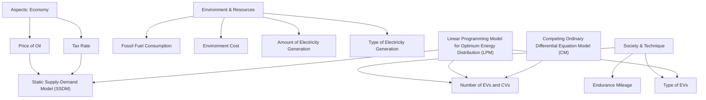
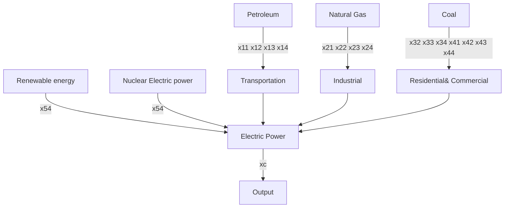

## Summary

Because of serious global pollution problems and energy shortages, the study of the environmental and economic effects of developing electric vehicles has become increasingly important. In this paper, we focus on and provide comprehensive solutions to the following issues:

− How does tax rate influence the numbers of Conventional Vehicles (CV) and Electric Vehicles (EV)?  
What impacts will the replacement of CVs by EVs on oil stock?  
What is the upper-limit proportion of EVs under the condition of the present power generation ability?

A Static Supply-Demand Model is set up to answer these questions. According to the influence of tax rate on supply-demand relationship, we analyze the change in the demand of CVs over tax rate. Then, we estimate how long the oil will be consumed up by PHEVs using the supply-price relationship. Finally, we provide an estimation of the upper-limit proportion of EVs under the condition of the present power generation ability.

What is the relationship between the change in the numbers of CVs and EVs?  
How do factors such as government control, corporation decision influence the change in the numbers of CVs and EVs?

We successfully develop a Competing Ordinary Differential Equation Model to solve these problems. We first build up the equations using linear approximation, and then we fit the real data using least-squares principle and get an ordinary differential equation. With the help of the previous Static Supply-Demand Model, we discuss the real meanings of the fitted variables and the interaction between CVs and EVs.

How does the development of EVs influence the environment?  
Whether the development of EVs can save fossil fuels?  
O Whether different types of EVs have the same benefits to environment, energy, or society?

To answer these questions, we build up a linear programming model and set minimum environmental cost as the destination. We find the impact of popularizing EVs on the environment. We also demonstrate the advantages and disadvantages of three types of EVs. In the end, we give recommendations for the government on its role to support and guide the development of EVs.

# An Analysis of the Future Development of

## Electric Vehicles

## Introduction:

Our models and key factors are shown as follows:


<details>
<summary>flowchart</summary>


</details>

Fig. 1

In accessing the impacts brought from a new commodity, it often involves many connected or unconnected aspects. Electric vehicles (EVs) are considered to be one of the most promising means to alleviate current shortage and unbalance distribution in power demand. However, on the other hand, the widespread use of EVs is constrained or promoted by the economical, social and technical factors. In our model, we analyzed these factors in a system dependently, we also made a comprehensive evaluation of their influence on EVs.

To consider the economical factors, we set up a Static Supply-Demand Model (SSDM) in which relations between oil supply, mileage demand and oil price are introduced. A balance point is calculated in this model and tax rate is regarded as an adjustment factor to it. In the PHEVs-dominant market, a new predicted oil-exhausting year is given due to the decreasing consumption of oil. More information of the consumption by resources types and purpose is offered in LPM. Further, we also give a simple static estimate for the up-bound of the percentage of PHEVs. A more comprehensive dynamic estimate of it is followed in CM.

Thinking over the social and technical factors, a Competing Ordinary Differential Equation Model (CM) is set up. Different types of EVs (BEVs/HEVs/PHEVs) result into different coefficients in ODEs. According to the variations of coefficients, we get different dynamic amount-trend of EVs and CVs. The environmental impaction of different types of EVs is introduced in LPM by different constrains.

With regard to the factors of environment and resources, we set up a Linear Programming Model (LPM) for Optimum Energy Distribution. The optimum energy flows of different type resources are given with Energy Flow by Source and Sector Diagram. The result is also affected by the type of EVs according to different combined energy efficient.

## Static Supply-Demand Model

Notations

<table><tr><td>S</td><td>:Daily oil supply amount in Thousand Barrels per day(TB)</td></tr><tr><td>D</td><td>:Yearly vehicle travel demand in Billion Km(BK)</td></tr><tr><td>P</td><td>:Oil price in Dollars per Barrel ($/bbI)</td></tr><tr><td> $S_{max}$ </td><td>:Maximum daily oil supply amount</td></tr><tr><td> $D_{min}$ </td><td>:Minimum yearly vehicle travel demand</td></tr><tr><td> $S_{min}$ </td><td>:Daily oil supply amount except for transportation</td></tr><tr><td>C</td><td>:Oil consumption per 100 kilometers in Liter/Hundred Kilometers(L/HK)</td></tr><tr><td> $μ_1$ </td><td>:Proportion of oil consumption for transportation</td></tr><tr><td> $μ_2$ </td><td>:Efficiency of converting petroleum to gasoline</td></tr><tr><td>V</td><td>:Volume of one barrel of oil in liter (L)</td></tr><tr><td>R</td><td>:Tax rate</td></tr></table>

## Assumptions

1． In a buyer’s market (i.e. in such a market, supply is greater than demand), the relationship between market price and consumption reflects the relationship between price and demand.  
2． In a seller’s market (i.e. in such a market, demand is greater than supply), the relationship between market price and consumption reflects the relationship between price and production.  
3． Supply-demand relationship is the main factor in determining price, without regard to other factors such as political or economic state.  
4． The consumption amount of oil will not have direct influence over power generation amount or electricity price.  
5． The relationships above are independent of time, that is, they will not change over time.

## The Foundation of Model

$$
\frac {d S}{\mathrm{d} P} = k _ {1} \left(1 - \frac {S}{S _ {\max}}\right)
$$

$$
\frac {d D}{\mathrm{d} P} = k _ {2} \left(1 - \frac {D}{D _ {\min}}\right)
$$

$$
D = k _ {3} (S - S _ {\min})
$$

Where $k _ { 1 } , k _ { 2 }$ are undetermined coefficients. They demonstrate the relationship between S,D and P.  k3 21 V  $k _ { 3 } = { } ^ { \mu _ { 1 } \mu _ { 2 } \vee } { } _ { C }$ stands for the travel distance provided by the energy in one barrel of oil. $S _ { \mathrm { \scriptsize { m i n } } } { = } \mathrm { S } _ { t o t a l } ( 1 { - } \mu _ { 1 } )$ .

The solutions of the differential equation are:

$$
S = S _ {\max} - C 1 e ^ {- k _ {1} P / S _ {\max}}
$$

$$
D = D _ {\max} - C 2 e ^ {- k _ {2} P / D _ {\max}}
$$

$$
D = k _ {3} (S - S _ {\min})
$$

## The Solution of the Model

## 1. The determination of variables

Conventional oil-fuel car: C =10(L/HK)

Hybrid electric car: C =5(L/HK), 159L =V , 20% = , 72%=

In conclusion, for conventional oil-fuel cars, $k _ { 3 } = 0 . 0 4 5 8 ( \mathrm { B K } / \mathrm { T B } )$ , while for hybrid electric cars, $k _ { 3 } = 0 . 0 9 1 6 ( \mathrm { B K } / \mathrm { T B } )$ .

$$
S _ {\text { total }} = 8 4 0 0 0 (\mathrm{TB}) (\text { Data   in } 2 0 0 9), S _ {\min} = 2 3 5 2 0 (\mathrm{TB}).
$$

## 2. The fitting of equation

When looking at the trend of oil price and oil consumption, we can find that between 1980 and 1994, the oil price went up as production declined, while between 1999 and 2006, the oil price increased as production went up. Therefore, we can take the market as buyer’s market between 1980 and 1994, as seller’s market between 1999 and 2006, and as supply-demand balance market between 1995 and 1998. We use data [Scott M. Festin 1996] between 1980 and 1994 to fit demand-price equation, and use data between 1999 and 2006 to fit supply-price equation. The results are as following:

$$
S _ {\max} = 9 0 3 0 0 (\mathrm{TB}) \quad D _ {\min} = 6 3 6. 2 7 (\mathrm{BK}) \quad k _ {1} = 2 3 3 9
$$

$$
k _ {2} = 1 3. 2 3 \quad \mathrm{C} 1 = 2 0 8 5 9 \quad \mathrm{C} 2 = - 3 9 8 8
$$

## 3. The equilibrium points

Returning the values of the variables back to the equations, we can find the equilibrium points of completely employing conventional oil-fuel car or completely employing hybrid electric car:

<table><tr><td>Type of Vehicle</td><td>P($/bbI)</td><td>S(TB)</td><td>D(BK)</td></tr><tr><td>PHEV(Plug-in Hybrid Electric Vehicle)</td><td>17.33</td><td>76983.19</td><td>3417.51</td></tr><tr><td>CV(Conventional Vehicle)</td><td>55.27</td><td>85315.55</td><td>1899.53</td></tr></table>

Tbl. 1

According the data of 2006, our result of CV’s equilibrium point is closed to the realistic value. So this model is reliable basing on above analysis.


<details>
<summary>3d surface plot with color gradient</summary>

| Point | S (x 10^4) | P (x 10^4) | D (x 10^4) |
|-------|------------|------------|------------|
| 1     | ~6         | ~8         | ~1000      |
| 2     | ~7         | ~9         | ~1200      |
| 3     | ~100       | ~120       | ~1800      |
</details>

Fig. 2

Line 1 and line 2 stand for the relationship between oil price and demand from consumer’s perspective. Line 3 stands for the relationship between oil price and supply amount from supplier’s perspective. Their intersections are equilibrium points. The point denoted by a circle is the equilibrium point of PHEV. The point denoted by a block is the equilibrium point of CV. We can see that if CVs were totally replaced by PHEVs, both the price and demand of oil would decline, while the travel distance would extend under equilibrium.

## 4. PHEV and Tax

## 1) The PHEVs' impaction on the oil tax

A main reason that the government levies high tax on oil is to keep the supply and demand of oil in balance. If we used the PHEVs to replace most of the CVs, the pressure on oil demand would be remarkably relieved. Suppose that the tax rate on oil (R) is in proportion to the oil price (P). By collecting correlating data,We obtain:

$$
R _ {H E V} = \mathrm{P} _ {H E V} \times \frac {R}{P} = 1 3. 2 7
$$

$$
R _ {C V} = \mathrm{P} _ {\mathrm{CV}} \times \frac {R}{P} = 4 2. 3 8
$$

$$
\text{The tax rate ratio:} \alpha = \frac {R _ {\mathrm{HEV}} \times S _ {\mathrm{HEV}}}{R _ {\mathrm{CV}} \times S _ {\mathrm{CV}}} \times 100 \% = 28.25 \%
$$

The calculations above are based on the static supply-demand model, so we did not take into account the impact of tax rate on S-P curve, or the change of D-P curve over time. The result shows that after the employment of PHEVs, under the dual effects of the declination of oil consumption and oil tax rate, the total amount of tax on oil will decrease notably.

## 2)The oil tax’s impaction on the PHEVs

In the oil market, the variation of oil tax rate will result in change of the S-P relation. One part of the increasing tax is included in the increasing price of oil, the other part is balanced with the decreasing profits. We define the $P _ { \mathrm { r i s e } }$ as the percentage of increasing oil price. The sensitivity analysis of $\Delta D _ { \mathrm { { c v } } } \%$ is followed.

<table><tr><td> $P_{rise}$ </td><td>22%</td><td>16%</td><td>12%</td><td>8%</td></tr><tr><td> $\Delta D_{cv}\%$ </td><td>-14%</td><td>-12%</td><td>-8.5%</td><td>-5.3%</td></tr></table>

Tbl. 2

To balance the demand of travel miles, the decreasing $D _ { \mathrm { c v } }$ will lead to the rising demand of PHEVs. As a result, enhancing the oil tax rate will promote the widespread use of PHEVs.

## 5. Impact on oil stock

In the above, we only considered the impact of supply-demand relationship on price. From the results we have obtained, we know that using PHEVs fails to remarkably decrease the consumption of oil (76983.19 VS 85315.55), but we can also see that after using PHEVs, the same amount of oil consumption could meet larger demand. Therefore, in order to balance the oil consumption, we define the consuming efficiency of oil as the travel distance demand satisfied when consuming one unit of oil:

$$
\mu = D / (3 6 5 \times S) \quad \begin{array}{l} \mu_ {H E V} = D _ {S E V} / (3 5 6 \times S _ {H E V}) = 1. 2 5 \times 1 0 ^ {- 4} \\ \mu_ {C V} = D _ {C V} / (3 5 6 \times S _ {C V}) = 6. 2 6 \times 1 0 ^ {- 5} \end{array}
$$

From data we know: $S _ { r e s e r v e } = 1 , 1 4 3 . 3 5 5 \times 1 0 ^ { 6 } \mathrm { T B } ( 2 0 0 7 )$

$$
\text { More   travel   distance   it   can   still   supply: } \quad \begin{array}{l} D _ {S E V} (t o t a l) = S _ {r e s e r v e} \times \mu_ {H E V} = 1. 4 2 \times 1 0 ^ {5} \\ D _ {C V} (t o t a l) = S _ {r e s e r v e} \times \mu_ {C V} = 7. 1 6 \times 1 0 ^ {4} \end{array}
$$


<details>
<summary>line chart</summary>

| year | Accumulative D from 1980 |
| ---- | ------------------------ |
| 1980 | 0                        |
| 1990 | ~50000                   |
| 2000 | ~100000                  |
| 2010 | ~150000                  |
| 2020 | ~200000                  |
| 2030 | ~250000                  |
| 2040 | ~350000                  |
| 2050 | ~450000                  |
| 2060 | ~550000                  |
| 2070 | ~650000                  |
</details>

Fig. 3

From the figure above we can see that according to the present trend of demand, completely using CVs will consume up present oil stock in 2020, while completely using CVs will consume up present oil stock in 2029.

## 6. Computation of Electricity Margin

Reasonably, the increasing widespread use of electricity vehicles will lead to the rising of electricity consumption. However, the realistic amount of EVs has a up bound due to the limitation of total electricity installed capacity.

We define as the rate of electricity generation (i.e., the ratio of total electricity production to total installed capacity times working hours):

$$
\alpha = \frac {\text { total   electricity   production }}{\sum_ {i} \text { working   hours } _ {i} \times \text { installed   capacity } _ {i}}, \quad i \text { denotes   the   type   of   electricity   generation }
$$

We made the assumption that the power plants except for thermal ones work under full load, which means they work 24 hours per day (hpd). The -year curve is the upper one in Fig. 4 when there is no additional production of thermal electricity, the middle one when therma power plants work 16 hpd, the lower one when thermal power plants work 20 hpd. Fig. 4 shows the rise of electricity demand.


<details>
<summary>line chart</summary>

| year | no additional thermal electricity | 20hpd full load | 16hpd full load |
| ---- | ---------------------------------- | --------------- | --------------- |
| 1980 | 0.79                               | 0.68            | 0.55            |
| 1981 | 0.78                               | 0.66            | 0.53            |
| 1982 | 0.79                               | 0.64            | 0.51            |
| 1983 | 0.79                               | 0.65            | 0.52            |
| 1984 | 0.78                               | 0.65            | 0.53            |
| 1985 | 0.77                               | 0.64            | 0.52            |
| 1986 | 0.76                               | 0.64            | 0.51            |
| 1987 | 0.76                               | 0.65            | 0.52            |
| 1988 | 0.77                               | 0.68            | 0.54            |
| 1989 | 0.81                               | 0.72            | 0.58            |
| 1990 | 0.82                               | 0.73            | 0.58            |
| 1991 | 0.82                               | 0.73            | 0.58            |
| 1992 | 0.82                               | 0.73            | 0.58            |
| 1993 | 0.83                               | 0.74            | 0.59            |
| 1994 | 0.84                               | 0.75            | 0.60            |
| 1995 | 0.85                               | 0.77            | 0.62            |
| 1996 | 0.86                               | 0.78            | 0.63            |
| 1997 | 0.87                               | 0.79            | 0.64            |
| 1998 | 0.87                               | 0.82            | 0.66            |
| 1999 | 0.88                               | 0.83            | 0.66            |
| 2000 | 0.88                               | 0.82            | 0.66            |
| 2001 | 0.87                               | 0.77            | 0.62            |
| 2002 | 0.88                               | 0.75            | 0.60            |
| 2003 | 0.87                               | 0.72            | 0.57            |
| 2004 | 0.88                               | 0.73            | 0.58            |
| 2005 | 0.88                               | 0.73            | 0.58            |
| 2006 | 0.88                               | 0.73            | 0.58            |
</details>

Fig. 4

To access the capacity of producing additional electricity, we define as the electricity margin: $\lambda = 1 - \alpha$

<table><tr><td>Thermal electricity</td><td>No additional</td><td>16phd full load</td><td>20phd full load</td></tr><tr><td>average λ from 2002 to 2006</td><td>12%</td><td>28%</td><td>42%</td></tr></table>

Tbl. 3


<details>
<summary>line chart</summary>

| Time of Day (End of Hour) | Total Demand | Commercial | Residential | Industrial | Agricultural and Other |
| ------------------------- | ------------ | ---------- | ----------- | ---------- | ---------------------- |
| 1                         | 28,000       | 7,000      | 7,000       | 7,000      | 6,000                  |
| 2                         | 25,000       | 7,000      | 6,000       | 6,000      | 5,000                  |
| 3                         | 24,000       | 7,000      | 5,000       | 6,000      | 4,000                  |
| 4                         | 24,000       | 7,000      | 4,000       | 6,000      | 3,000                  |
| 5                         | 25,000       | 7,500      | 5,000       | 6,500      | 3,500                  |
| 6                         | 27,000       | 8,000      | 6,000       | 7,000      | 4,000                  |
| 7                         | 32,000       | 12,000     | 8,000       | 7,500      | 4,500                  |
| 8                         | 38,000       | 15,000     | 10,000      | 8,000      | 5,000                  |
| 9                         | 42,000       | 18,000     | 12,000      | 8,500      | 5,500                  |
| 10                        | 44,000       | 20,000     | 14,000      | 9,000      | 6,000                  |
| 11                        | 46,000       | 21,500     | 15,500      | 9,500      | 6,500                  |
| 12                        | 47,500       | 22,500     | 16,500      | 10,500     | 7,500                  |
| 13                        | 48,500       | 23,500     | 17,500      | 11,500     | 8,500                  |
| 14                        | 49,500       | 23,500     | 18,500      | 12,500     | 9,500                  |
| 15                        | 49,555       | 23,555     | 19,555      | 13,555     | 11,555                 |
| 16                        | 49,555       | 23,555     | 21,555      | 14,555     | 13,555                 |
| 17                        | 49,555       | 23,555     | 23,555      | 15,555     | 14,555                 |
| 18                        | 49,555       | 23,555     | 24,555      | 16,555     | 16,555                 |
| 19                        | 49,5           | 23,        | 24          | 17         | 17                     |
| 20                        | 48            | 22         | 23          | 17         | 17                     |
| 21                        | 46            | 21         | 22          | 17         | 17                     |
| 22                        | 44            | 2         | 21          | 17         | 17                     |
| 23                        | 42            | 1.5        | 2           | 17         | 17                     |
| 24                        | 34            | 1          | 1           | 17         | 17                     |
</details>

Fig. 5  
Source: Lawrence Berkeley National Laboratory  
http://www.mpoweruk.com/electricity\_demand.htm

Fig. 5 is the electricity daily demand:(1)As to the BEVs, their endurance mileage is relatively small so that a part of their charging would be in on-peak hours(daytime, especially at noon). The electricity margin of BEVs is small because the electricity generation in on-peak hours is nearly under full load. We set it to be the  under 16 phd; (2)As to the PHEVs, because of their longer endurance mileage, most of their charging world be in off-peak hours when the utilization of electricity is much lower than it in on-peak hours. In this sense, their electricity margin is larger. We set it to be the  under 20 phd. These two margins will be used in LPM

Without additional thermal electricity generation, we calculated the ratio of PHEVs to total vehicles and the ratio of CVs to total vehicles at the Critical point (upper bound) of electricity margin. The result is 38.5% and 61.5% respectively. The coefficient $k _ { 3 }$ is 0.0634 accordingly.

<table><tr><td>Type of Vehicle</td><td>P($/bbI)</td><td>S(TB)</td><td>D(BK)</td></tr><tr><td>38.5%PHEV and 61.5%CV</td><td>36</td><td>82000</td><td>2520</td></tr></table>

Tbl. 4

The result shows that present thermal power generation amount will limit the number of electric cars. If we want to further popularize electric cars, we need to generate more electricity, which will lead to more new energy demand or more pollution. To comprehensively access the impact of using more fossil fuels to generate electricity on environment, we need analyze how to choose and arrange the types of power generation so that the pollution will be the least. We will give an analysis in LPM. As shown above, here we give a static upper bound of the PHEVs’ percentage. To have a dynamic result of the amount of CVs and different type EVs, we set up following Competition Model.

# Competing Ordinary Differential Equation Model

Notations

<table><tr><td> $x_{1}$ </td><td>: The total number of electric cars</td></tr><tr><td> $x_{2}$ </td><td>: The total number of all kinds of cars (conventional cars)</td></tr><tr><td> $a_{i}$ </td><td>:The influential parameter</td></tr><tr><td> $b_{i}$ </td><td>: The influential parameter</td></tr><tr><td>W</td><td>:Covering rate of infrastructure</td></tr><tr><td>S</td><td>:Endurance mileage</td></tr><tr><td> $E_{max}$ </td><td>:Maximum power generation ability</td></tr></table>

## Basic Assumptions

1. Electric cars mainly refer to hybrid electric cars.  
2. $a _ { 1 } , ~ a _ { 2 } , ~ b _ { 1 } , ~ b _ { 2 }$ are constants, because they are determined by the specifications of the cars themselves instead of exterior factors.  
3. $a _ { 0 } , \ b _ { 0 }$ will change according to exterior factors.

## The Foundation of Ordinary Differential Equation Model

We build the model below to analyze the relationship of quantity change between conventional and electric cars. The model is based on a two-element ordinary differential equation:

$$
\left\{ \begin{array}{l} \frac {d x _ {1}}{d t} = a _ {0} + a _ {1} x _ {1} + a _ {2} x _ {2} \\ \frac {d x _ {2}}{d t} = b _ {0} + b _ {1} x _ {1} + b _ {2} x _ {2} \end{array} \right.
$$

where $\frac { d x _ { 1 } } { d t }$ is the change rate of the total of electric cars ,1x $x _ { 1 } , \ \frac { d x _ { 2 } } { d t }$ dx2 is the change rate of the total of conventional cars $x _ { 2 }$ . Because we do not know the exact relations

between $\frac { d x _ { 1 } } { d t } , \ x _ { 1 }$ and $x _ { 2 }$ , here we follow the engineers’ advice: Using linear relation where you don’t know the exact relation.

In this equation group, the meanings of unknown parameters $a _ { 2 } , a _ { 1 } , a _ { 0 } , b _ { 2 } , b _ { 1 }$ , $b _ { 0 }$ are :

<table><tr><td> $a_{2}$ </td><td>Correlated coefficient of change rate of the total number of electric cars, which is determined by factors such as competition between two types of cars, etc.</td></tr><tr><td> $a_{1}$ </td><td>Coefficient of change rate of the total number of electric cars, which is determined by factors such as the saturation of electric car market, etc.</td></tr><tr><td> $a_0$ </td><td>Change rate of the total number of electric cars, which is determined by other factors such as the fluctuation of electricity price, etc.</td></tr><tr><td> $b_2$ </td><td>Coefficient of change rate of the total number of conventional cars, which is determined by factors such as the saturation of conventional car market, etc.</td></tr><tr><td> $b_1$ </td><td>Correlated coefficient of change rate of the total number of conventional cars, which is determined by factors such as competition between two types of cars, the impact of the popularization of electric cars on conventional cars, etc.</td></tr><tr><td> $b_0$ </td><td>Change rate of the total number of conventional cars, which is determined by other factors such as the fluctuation of fuel price, etc.</td></tr></table>

Tbl. 5

The steady solution of the ODE above is:

$$
\left\{ \begin{array}{l} x _ {1 \infty} = \frac {a _ {2} b _ {0} - a _ {0} b _ {2}}{a _ {1} b _ {2} - a _ {2} b _ {1}} \\ x _ {2 \infty} = \frac {a _ {0} b _ {1} - a _ {1} b _ {0}}{a _ {1} b _ {2} - a _ {2} b _ {1}} \end{array} \right.
$$

## The Solution of the Previous Model

According to the data in Appendix\_2,and from the theory of ordinary differential equation, we can deduce the solutions of the equations have the forms below:

$$
\left\{ \begin{array}{l} x _ {1} = m _ {0} + m _ {1} \cdot L ^ {t} \\ x _ {2} = n _ {0} + n _ {1} \cdot L ^ {t} \end{array} \right.
$$

By using least squares fitting, we obtain

$$
\left\{ \begin{array}{l} x _ {1} = 1. 2 7 2 \times 1 0 ^ {6} - 1. 6 7 3 \times 1 0 ^ {6} \cdot 0. 8 2 9 4 ^ {t} \\ x _ {2} = 2. 5 9 2 \times 1 0 ^ {8} - 3. 9 2 1 \times 1 0 ^ {7} \cdot 0. 8 2 9 4 ^ {t} \end{array} \right.
$$

$\mathrm { T h u s } , a _ { 0 } = 1 . 9 1 0 \times 1 0 ^ { 7 } , a _ { 1 } = 1 . 7 4 1 , a _ { 2 } = - 0 . 0 8 2 2 ,$

$$
b _ {0} = 1. 1 0 3 \times 1 0 ^ {9}, b _ {1} = 1. 3 4 7 \times 1 0 ^ {2}, b _ {2} = - 4. 9 1 5.
$$

## Validation of $\underline { { a _ { l } } } , \underline { { b _ { l } } } , \underline { { a _ { 2 } } } , \underline { { b _ { 2 } } }$

$a _ { \scriptscriptstyle 1 } > 0 , b _ { \scriptscriptstyle 1 } > 0$ shows that the use of electric cars will promote the use of both conventional cars and electric cars. According to the static supply-demand balance model, the use of electric cars can lower the oil price, which leads to the decline of the using cost of both electric cars and conventional cars. The decline of fuel fee further motivates the demand in the car market.

$a _ { 2 } > 0 , b _ { 2 } > 0$ demonstrates that the use of conventional oil-fuel cars will restrict the demand in the car market. The reason is also based on the static supply-demand balance model: the use of conventional oil-fuel cars will raise the oil price, which is negative for the demand.

We can draw a figure to show the result:


<details>
<summary>line chart</summary>

| Year | Number of Ordinary Cars (x10^8) |
| ---- | ------------------------------- |
| 1999 | 2.2                             |
| 2000 | 2.25                            |
| 2001 | 2.3                             |
| 2002 | 2.35                            |
| 2003 | 2.37                            |
| 2004 | 2.4                             |
| 2005 | 2.45                            |
| 2006 | 2.5                             |
| 2007 | 2.55                            |
| 2008 | 2.57                            |
| 2009 | 2.45                            |
| 2019 | 2.6                             |
</details>

Fig. 6  


<details>
<summary>line chart</summary>

| Year | Estimated Number of Electric Cars | Estimated Number of Ordinary Cars | Real Data of Electric Cars | Real Data of Ordinary Cars |
|------|------------------------------------|------------------------------------|----------------------------|----------------------------|
| 1999 | 0                                  | 2.2                                | 0                          | 2.2                        |
| 2000 | 0                                  | 2.3                                | 0                          | 2.3                        |
| 2001 | 0                                  | 2.4                                | 0                          | 2.4                        |
| 2002 | 0                                  | 2.5                                | 0                          | 2.5                        |
| 2003 | 0                                  | 2.5                                | 0                          | 2.5                        |
| 2004 | 0                                  | 2.5                                | 0                          | 2.5                        |
| 2005 | 0                                  | 2.5                                | 0                          | 2.5                        |
| 2006 | 0                                  | 2.5                                | 0                          | 2.5                        |
| 2007 | 0                                  | 2.5                                | 0                          | 2.5                        |
| 2008 | 0                                  | 2.5                                | 0                          | 2.5                        |
| 2009 | 0                                  | 2.5                                | 0                          | 2.5                        |
| 2010 | 0                                  | 2.5                                | 0                          | 2.5                        |
| 2011 | 0                                  | 2.5                                | 0                          | 2.5                        |
| 2012 | 0                                  | 2.5                                | 0                          | 2.5                        |
| 2013 | 0                                  | 2.5                                | 0                          | 2.5                        |
| 2014 | 0                                  | 2.5                                | 0                          | 2.5                        |
| 2015 | 0                                  | 2.5                                | 0                          | 2.5                        |
| 2016 | 0                                  | 2.5                                | 0                          | 2.5                        |
| 2017 | 0                                  | 2.5                                | 0                          | 2.5                        |
| 2018 | 0                                  | 2.5                                | 0                          | 2.5                        |
| 2019 | 0                                  | 2.5                                | 0                          | 2.5                        |
</details>

Fig. 7

The first figure gives a proof of the soundness of the model and the fitting variables. The second figure shows that the amount of conventional cars and electric cars will increase to a fixed value, not infinity. This is in accord with the fact.

## Discussions about Parameters $\underline { { \pmb { a } } } _ { 0 } \underline { { \pmb { b } } } _ { \pmb { \theta } }$

$a _ { 0 }$ and $b _ { 0 }$ are constants which are criteria for the competitive ability of cars determined by factors such as technology level, infrastructures, and policies, etc. Because technologies and infrastructures of conventional cars have been determined firmly, $b _ { 0 }$ will not change a lot.

As for $a _ { 0 }$ , we can suppose it has the form as below:

$$
a _ {0} = k \mathrm{WSE} _ {\max}
$$

Where is an undetermined coefficient. is named as the covering rate of thek W infrastructures of electric cars $( 0 \leq W \leq 1 )$ . is the endurance mileage, which is determinedS by battery and charging technology. $E _ { \mathrm { m a x } }$ is the maximum power generation ability. It will exert restriction or motivation on electric cars.

## Sensitivity analysis of a0 on electric cars :


<details>
<summary>line chart</summary>

| t   | a₀'=a₀     | a₀'=1.1*a₀ | a₀'=1.2*a₀ | a₀'=1.3*a₀ | a₀'=1.4*a₀ | a₀'=1.5*a₀ |
| --- | ---------- | ---------- | ---------- | ---------- | ---------- | ---------- |
| 0   | 0          | 0          | 0          | 0          | 0          | 0          |
| 10  | ~1.2e7     | ~0.8e7     | ~0.9e7     | ~1.2e7     | ~1.6e7     | ~2.0e7     |
| 20  | ~1.2e7     | ~0.8e7     | ~0.9e7     | ~1.2e7     | ~1.6e7     | ~2.0e7     |
| 30  | ~1.2e7     | ~0.8e7     | ~0.9e7     | ~1.2e7     | ~1.6e7     | ~2.0e7     |
| 40  | ~1.2e7     | ~0.8e7     | ~0.9e7     | ~1.2e7     | ~1.6e7     | ~2.0e7     |
| 50  | ~1.2e7     | ~0.8e7     | ~0.9e7     | ~1.2e7     | ~1.6e7     | ~2.0e7     |
| 60  | ~1.2e7     | ~0.8e7     | ~0.9e7     | ~1.2e7     | ~1.6e7     | ~2.0e7     |
| 70  | ~1.2e7     | ~0.8e7     | ~0.9e7     | ~1.2e7     | ~1.6e7     | ~2.0e7     |
| 80  | ~1.2e7     | ~0.8e7     | ~0.9e7     | ~1.2e7     | ~1.6e7     | ~2.0e7     |
| 90  | ~1.2e7     | ~0.8e7     | ~0.9e7     | ~1.2e7     | ~1.6e7     | ~2.0e7     |
| 100 | ~1.2e7     | ~0.8e7     | ~0.9e7     | ~1.2e7     | ~1.6e7     | ~2.0e7     |
</details>

Fig. 8

As shown in $\mathrm { f i g u r e ^ { * } } _ { ; }$ , larger $a _ { 0 }$ represents more competitiveness of EVs or more coverage of infrastructures, that is to say, $a _ { 0 }$ includes the information about EVs’ type. Competitiveness of EVs mainly includes the technique and the pollution. The more friendliness to environment, the more support from government will be given, so $a _ { 0 }$ will be larger. To access the environment impact of different type EVs, a model to optimize energy distribution is followed.

## Linear Programming Model for Optimum Energy Distribution

Notations

<table><tr><td> $x_{ij}$ </td><td>: Energy transferred from Supply Source i to Demand Sector j</td></tr><tr><td> $x_c$ </td><td>: Energy transferred from Electric Power sector to Transportation sector after the popularization of electric cars</td></tr><tr><td> $B_j$ </td><td>: Energy Demand Sector j</td></tr><tr><td> $A_i$ </td><td>: Energy Supply Sources i</td></tr><tr><td> $P_{ij}$ </td><td>:Environmental cost (pollution produced) when converting energy from Supply Source i to Demand Sector j</td></tr><tr><td> $\eta_1$ </td><td>: Efficiency of converting heat to electricity</td></tr><tr><td> $\eta_2$ </td><td>: Energy efficiency of electric cars compared to traditional cars, i.e., the ratio of energy consumed by traditional cars to electric cars under the same</td></tr><tr><td> $\eta$ </td><td>: Combined energy efficiency of electric cars, which is  $\eta_1 \cdot \eta_2$ </td></tr><tr><td> $O_{100}$ </td><td>: Fuel consumption per 100 kilometers of traditional cars</td></tr><tr><td>E</td><td>: Energy produced by electric cars under the consumption of one unit of oil</td></tr><tr><td> $E_{100}$ </td><td>: Electricity consumption per 100 kilometers of traditional cars</td></tr><tr><td> $P_{ALL}$ </td><td>: Environmental cost of the total amount of pollution caused by energy consumption</td></tr></table>

## Assumptions

1. We only model under ideal situation, that is, the whole energy system is working under the condition which meets the optimal solution of linear programming.  
2. The environmental cost can fully reflect the pollution caused by using different types of energy.  
3. Most EVs are HEVs (Hybrid Electric Vehicles), but there are also BEVs (Battery Electric Vehicles) and PHEVs (Plug-in Electric Vehicles).

## The Foundation of A Linear Programming Model for Optimum Energy Distribution


<details>
<summary>flowchart</summary>


</details>

Fig. 9

The distribution of the energy network is shown as in Fig. 9.Considering that the demands must still be satisfied after the redistribution of energy flow, we can have the following constraints:

$$
\begin{array}{l} S. t. \quad x _ {1 1} + x _ {2 1} + x _ {4 1} + \eta_ {1} \cdot \eta_ {2} \cdot x _ {c} = B _ {1} \\ x _ {1 2} + x _ {2 2} + x _ {3 2} + x _ {4 2} = B _ {2} \\ x _ {1 3} + x _ {2 3} + x _ {3 3} + x _ {4 3} = B _ {3} \\ x _ {1 4} + x _ {2 4} + x _ {4 4} + x _ {5 4} - x _ {c} = B _ {4} \\ x _ {i j} \geq 0 \\ \end{array}
$$

where $\eta _ { 1 }$ is efficiency of converting heat to electricity. Based on data from

[http://en.wikipedia.org/wiki/Cogeneration], $\eta _ { 1 }$ is

$$
\begin{array}{l} \eta_ {1} = \left\{ \begin{array}{l l} 0. 3 & \text {when} \quad \text {energy} \quad \text {is} \quad \text {generated} \quad \text {by} \quad \text {Electricity - only} \quad \text {plants} \\ 0. 8 & \text {when} \quad \text {energy} \quad \text {is} \quad \text {generated} \quad \text {by} \quad \text {combined - heat - and - power(CHP)} \quad \text {plants} \end{array} \right. \\ \eta_ {2} = \frac {O _ {1 0 0} \cdot E}{E _ {1 0 0}}, \text {it stands for energy efficiency of electric cars compared to traditional cars.} \end{array}
$$

To obtain the combined efficiency, let   , $\eta = \eta _ { 1 } \cdot \eta _ { 2 }$

The environmental cost of the total amount of pollution caused by energy consumption is

$$
P _ {A L L} = \sum_ {i = 1} ^ {5} \sum_ {j = 1} ^ {4} x _ {i j} \cdot P _ {i j}
$$

As our goal is to minimize the environmental cost $P _ { A L L }$ , we propose the following LP formulation for the single destination problem.

$$
\min \sum_ {i = 1} ^ {5} \sum_ {j = 1} ^ {4} x _ {i j} \cdot P _ {i j}
$$

$$
S. t. \quad x _ {1 1} + x _ {2 1} + x _ {4 1} + \eta_ {1} \cdot \eta_ {2} \cdot x _ {c} = B _ {1}
$$

$$
x _ {1 2} + x _ {2 2} + x _ {3 2} + x _ {4 2} = B _ {2}
$$

$$
x _ {1 3} + x _ {2 3} + x _ {3 3} + x _ {4 3} = B _ {3}
$$

$$
x _ {1 4} + x _ {2 4} + x _ {4 4} + x _ {5 4} - x _ {c} = B _ {4}
$$

$$
x _ {i j} \geq 0
$$

## The Solution of The Linear Programming Model for Optimum Energy Distribution

## 1. The Solution of the Basic Model

In economy, Environmental Cost is commonly used as a criterion to measure the extent of pollution. According to [Shuying Ding 2006] and taking reality into account, we list different conditions in the table below:

<table><tr><td>No.</td><td>Constraint</td><td>Mathematical Expression</td><td>Explanation</td></tr><tr><td>1</td><td>Constraint on the total amount of energy of Renewable Energy</td><td> $\sum_{j=1}^{4} x_{4j} \leq 7.7$ </td><td>Existing installed capacity of solar, wind and water power determines the maximum amount of energy supplied byRenewable Energy.</td></tr><tr><td>2</td><td>Constraint on the total amount of energy of Nuclear Electric Power</td><td> $x_{54} \leq 8.3$ </td><td>Existing installed capacity of nuclear power determines the maximum amount of energy supplied by nuclear power.</td></tr><tr><td>3</td><td>Constraint on the total amount of energy of Natural Gas</td><td> $\sum_{j=1}^{4}x_{2j} \leq 23.4$ </td><td>Existing natural gas drilling amount determines the maximum amount of natural gas supply.</td></tr><tr><td>4</td><td>Constraint on the total amount of energy of Petroleum</td><td> $\sum_{j=1}^{4}x_{1j} \leq 38$ </td><td>Obtained from the infinite value of the fitted S-P curve in the supply-demand model.</td></tr><tr><td>5</td><td>Constraint on  $x_c$  (energy transferred from Electric Power sector to Transportation sector after the popularization of electric cars)</td><td> $x_c \leq 10$ </td><td>Estimated from the energy transferred from transportation to electric power.</td></tr><tr><td>6</td><td>Constraint on  $x_{11}$  (energy transferred from Petroleum source to Transportation sector)</td><td> $x_{11} < 12.708$ </td><td>Based on Assumption 3; and suppose that half of the energy consumed by HEVs are provided by gasoline.</td></tr><tr><td>7</td><td>Constraint on  $x_{11}$  (energy transferred from Coal source to Electric Power sector)</td><td> $x_{34} > 15.65$ </td><td>Calculated by real power generation efficiency and installed capacity of coal.</td></tr><tr><td>8</td><td>Constraint on  $x_{11}$  (energy transferred from Renewable Energy source to Electric Power sector)</td><td> $x_{44} \leq 7$ </td><td>Calculated by real power generation efficiency and installed capacity of Renewable Energy.</td></tr></table>

Tbl. 6

Adding these constraints to previous model, we get the following figure:


<details>
<summary>bar chart</summary>

| Different Kinds of Supply Sources | Original Condition | No Restriction | Restriction No.3+No.4 | Restriction No.3+No.4(loosed by 2 times) | Restriction No.3+No.4+No.5 | Restriction No.1~No.10 |
|---|---|---|---|---|---|---|
| Petroleum | 35 | 0 | 0 | 0 | 0 | 0 |
| Natural Gas | 23 | 0 | 78 | 63 | 23 | 23 |
| Coal | 19 | 0 | 0 | 0 | 0 | 0 |
| Renewable Energy | 7 | 95 | 7 | 15 | 7 | 7 |
| Nuclear Electric Power | 8 | 0 | 8 | 16 | 8 | 8 |
</details>

Fig. 10

We can see, if there were no constraints, the optimal distribution of energy would be to use Renewable Energy as supply source completely, and the second best choice would be Nuclear Electric Power. Under real conditions, it is impossible to completely use Renewable Energy and Nuclear Electric Power as energy supply sources. Considering constraints No.3 and No. 4 (listed in Tbl. 6), we can find that the result of the LP formation shows it is more reasonable to use Natural Gas.

However, because of limited usable quantity, it is still impossible to use Natural Gas as first-choice energy supply source. Thus, we have to add constraint No.5 to improve our model. Considering other concrete factors, such as the structure of energy industry, the upper limit of energy, etc., we finally propose the linear programming model with constraints No.1-No.10.

Based on the discussions and analysis above, we can ensure the order of priority of energy supply sources as below: Renewable Energy>Nuclear Electric Power>Natural Gas>Petroleum>Coal, which accords with the data of the environmental cost $P _ { i j }$ .

Now we show the total amount of environmental cost of energy consumption $P _ { A L L }$ under six different combinations of constraints (listed in the legend of the figure above) in a new figure:


<details>
<summary>line chart</summary>

| Different Kinds of Restrictions | P_ALL |
| --- | --- |
| No Restriction | 3 |
| Restriction No.3+Restriction No.3+No.4(loosed by 2 times) | 17 |
| Restriction No.3+No.4+No.5 | 14 |
| Restriction No.1-No.10 | 57 |
</details>

Fig. 11

We can roughly observe that the looser the constraints, the lower the environmental cost $P _ { A L L }$ , correspondingly the better the environment.

## 2. Sensitivity Analysis for Ordinary Condition

Subsequently, by using the ultimate model with constraints No.1-No.8 and changing the value of  , we create the figure below to demonstrate energy distribution and energy transferred from Electric Power sector to Transportation sector after the popularization of electric cars( $X _ { c } ~ ,$ ).


<details>
<summary>bar chart</summary>

| Different Kinds of Supply Sources and ... | Energy (Quadillion Btu) |
|---|---|
| Petroleum | 38 |
| Natural Gas | 23.5 |
| Coal | 33 |
| Renewable Energy | 7.8 |
| Nuclear Electric Power | 8.2 |
| Energy Transmission(Xc) | 10 |
</details>

Fig. 12

From the figure above we can find a Critical Point: $\eta = 0 . 8 5$ . That is, when $\eta < 0 . 8 5$ , the demand of coal is a constant, and $X _ { c }$ keeps being zero. But when $\eta > 0 . 8 5$ , the demand of coal begins to decrease, while $X _ { c }$ becomes a non-zero constant and starts to decrease after  is larger than 1.4.

Now we show the environmental cost $P _ { A L L }$ under different  values in a curve:


<details>
<summary>line chart</summary>

| η   | P_ALL |
| --- | ----- |
| 0.5 | 58.0  |
| 0.75| 58.0  |
| 1.0 | 57.0  |
| 1.25| 56.0  |
| 1.5 | 53.0  |
| 2.0 | 51.0  |
| 3.0 | 49.0  |
| 4.0 | 48.0  |
</details>

Fig. 13

We can see that $\eta = 0 . 8 5$ is still a Critical Point. Besides, it is easy to find that when $\eta > 0 . 8 5$ , the environmental cost $P _ { A L L }$ is decreasing, which means the environment is improving. However, we can also notice that $\left| \frac { d P _ { A L L } } { d \eta } \right|$ dPALL is going down, which shows the effect of improving environment by lifting  is declining.

## 3. Sensitivity Analysis for BEV, HEV, and PHEV

The electric vehicles in the market can be categorized into three major types: BEV, HEV, and PHEV. Because their power generation mechanisms are different, the optimal environmental costs of them are different under same energy condition. Besides, the proportion of fossil fuels they consume will be different. Thus, based on previous results of linear programming and new constraints derived from the characteristics of different cars, we can give a new solution of the problem. Consider the conditions when the electric vehicles in the market are all BEVs, HEVs or PHEVs separately, and list the constraints under each condition as following:

<table><tr><td>Type</td><td>Constraint</td><td>Explanation</td></tr><tr><td rowspan="2">BEV</td><td> $x_{11} \geq 0$ </td><td>The source of energy for transportation will not be restricted by oil now.</td></tr><tr><td> $x_c \leq 15$ </td><td>Calculated from electricity margin.</td></tr><tr><td rowspan="2">PHEV</td><td> $x_{11} \geq \frac{1}{2} \times 25.416$ </td><td>Suppose more than half of the amount of energy for transportation is provide by oil.</td></tr><tr><td> $x_c \leq 28$ </td><td>Calculated from electricity margin.</td></tr><tr><td rowspan="2">HEV</td><td> $x_{11} \geq 10$ </td><td>Converted and estimated from the fuel consumption of 100 kilometers of Toyota Prius and conventional cars.</td></tr><tr><td> $x_c = 0$ </td><td>HEVs cannot get power from electricity grid directly.</td></tr></table>

Tbl.7

Solving the three linear programming problems above, we can first get a curve which shows the change of the total environmental cost over the combined energy efficiency of electric cars $\eta$ :


<details>
<summary>line chart</summary>

| η | Original Pollution | BEV's Pollution | PHEV's Pollution | HEV's Pollution |
| --- | --- | --- | --- | --- |
| 0 | 53.5 | 54.5 | 57.5 | 46.0 |
| 1 | 53.5 | 52.0 | 56.0 | 46.0 |
| 2 | 53.5 | 49.0 | 51.0 | 46.0 |
| 3 | 53.5 | 36.0 | 49.0 | 46.0 |
| 4 | 53.5 | 35.0 | 48.0 | 46.0 |
| 8 | 53.5 | 33.0 | 47.0 | 46.0 |
</details>

Fig. 14

By analyzing this figure we can find:

BEV is always better than PHEV in the respect of environment protection.  
When the value of  is small, the environmental cost of HEV is lower than that of BEV or PHEV. But as  increases, HEV is growing worse than BEV or PHEV.  
" To make BEV and PHEV perform better in environment protection,  must be higher than its value at critical point, while HEV always perform better than current environment situation.

Then, we illustrate the energy distribution of the three EV types in separate pie charts when $\eta = 3$ (it means the EV technologies have developed fully):


<details>
<summary>pie chart</summary>

| Category | Value (%) |
|---|---|
| Dark Blue | 59 |
| Red | 13 |
| Light Green | 25 |
| Light Blue | 3 |
</details>

BEV


<details>
<summary>pie chart</summary>

| Category | Percentage (%) |
| :--- | :--- |
| < 1% | 14 |
| 16% | 27 |
| 43% | 43 |
</details>

PHEV


<details>
<summary>pie chart</summary>

| Category | Percentage (%) |
| :--- | :--- |
| < 1 | 15 |
| 15 | 45 |
| 29 | 29 |
| 10 | 10 |
</details>

HEV


<details>
<summary>text_image</summary>

Petroleum
Natural Gas
Coal
Renewable Energy
Nuclear Electric Power
</details>

Fig. 15

From the figures above we can obviously observe that the type of electric vehicles has a great impact on the distribution of electricity.

## 4. Model validation

From above analysis, when the  is small, we should popularize HEV to minimize the environmental cost. When  is large enough so that the environment cost of PHEV and BEV is lower than the one of HEV, we should popularize them.

Before Toyota Prius released PHEV in 2007, the HEV dominated the EVs’ market, which is in accord with situation of small . After its release, we can observe a decline of sales of HEV from the reference’s data. This validates the crossover point of P- curve in figure \* between HEV and PHEV/BEV.

## Conclusion

## Strengths

Our models are simple but comprehensive, covering five aspects;  
Our models have strong robustness due to their independence with types of EV;  
Our models validate and complement each other;  
Each model is aimed at a special perspective and offers practical recommendations.

## Weakness

Much of the coefficients in our models are simplified or estimated in statistic;  
Some solution plays a guiding role but is not practical or realizable in real world.

## Recommendation

## For the Governments

1) Governments should increase the oil tax rate to limit the demand of CVs and popularize EVs due to the analysis in SSDM;  
2) More electricity production and installed capacity is needed to promote the widespread use of EVs, the additional amount is determined by the EV type;  
3) More charging infrastructures are necessary;  
4) Based on the linear programming model considering $x _ { c }$ (energy transferred from Electric Power sector to Transportation sector), the order of priority of five energy supply sources is: Renewable Energy>Nuclear Electric Power>Natural Gas>Petroleum>Coal

Therefore, the government should first take into consideration the development of supply sources such as Renewable Energy or Nuclear Electric Power so that they could help electric cars produce benefits to environment. As for the benefits of developing different types of energy, we can refer to Fig. 10 and Fig. 11.

5) Strategies for developing which type of the electric cars: If our technology developing ability is powerful enough, i.e.,  is high enough, we should develop BEV in priority to gain the most benefits to environment. If our technology developing ability is limited, we should develop HEV in priority, whose benefits to environment have nothing to do with  .  
6) Can we save fossil fuels by widely using electric vehicles? According to the results we have obtained, under the premise that $\eta > 0 . 8 5$ , coals can be saved. Because under the optimal condition, the demands of petroleum and natural gas will exceed their supply amount. Unfortunately, under no conditions could petroleum or natural gas be saved.

## For the vehicle manufacturers

1) Manufactures should increase the endurance mileage by improve the technique of battery, so that more EVs don’t need charge in on-peak hours.  
2) In the sensitivity analysis section in LPM, we find a critical point $\eta = 0 . 8 5$ , and through analysis we know that only when $\eta > 0 . 8 5$ electric cars can demonstrate their energy economic advantage. So the value of  should be as large as possible.

$$
\eta = \eta_ {1} \cdot \eta_ {2} = \left\{ \begin{array}{l l} 0. 3 \cdot \frac {O _ {1 0 0} \cdot E}{E _ {1 0 0}} & \text { when } \quad \text { energy } \quad \text { is } \quad \text { generated } \quad \text { by } \quad \text { Electricity   -   only } \quad \text { plants } \\ 0. 8 \cdot \frac {O _ {1 0 0} \cdot E}{E _ {1 0 0}} & \text { when } \quad \text { energy } \quad \text { is } \quad \text { generated } \quad \text { by } \quad \text { combined   -   heat   -   and   -   power   (CHP) } \quad \text { plants } \end{array} \right.
$$

It is impractical to increase the fuel consumption of traditional cars in order to protect environment. So what we can really do are:

Minimizing $E _ { 1 0 0 }$ , that is, minimizing the energy consumption of electric cars by technical innovations.  
 Use combined-heat-and-power (CHP) plants to generate power as much as possible.

## References

[1] Frank R. Giordano, Maurice D. Weir, William P. Fox. (2005) A First Course in Mathematical Modeling, 3rd edition.  
[2] David Tilman. (1994) ‘Competition and Biodiversity in Spatially Structured Habits’, Ecology, 75(1), 1994, pp. 2-16  
[3] Sanjaka G. Wirasingha, Nigel Schofield and Ali Emadi. (2008) ‘Feasibility analysis of converting a Chicago Transit Authority (CTA) transit bus to a plug-in hybrid electric vehicle’, IEEE Vehicle Power and Propulsion Conference (VPPC), September 3-5, 2008, Harbin, China  
[4] Shuying Ding. (2006) ‘Calculations on the Cost of Electricity Generation’, Master’s Thesis in Zhejiang University, Hangzhou, China.  
[5] Mark M. Meerschaert. (2008) Mathematical Modeling, 3rd edition.  
[6] U.S. Hybrid-Electric Vehicle Sales, 1999-2010.  
http://www.afdc.energy.gov/afdc/data/.  
[7] U.S. Energy Information Administration. (August 2010) Annual Energy Review 2009  
[8] Scott M. Festin. SUMMARY OF NATIONAL AND REGIONAL TRAVEL RENDS: 1970-1995, Office of Highway Information Management

## Appendix\_1

From International Energy Annual 2006’s data of oil and SUMMARY OF NATIONAL AND

REGIONAL TRAVEL TRENDS:1970-1995,

<table><tr><td>Year</td><td>1980</td><td>1981</td><td>1982</td><td>1983</td><td>1984</td><td>1985</td><td>1986</td><td>1987</td><td>1988</td><td>1989</td></tr><tr><td>S</td><td>63114</td><td>60944</td><td>59543</td><td>58778</td><td>59815</td><td>60085</td><td>61809</td><td>63095</td><td>64965</td><td>66078</td></tr><tr><td>P</td><td>30.75</td><td>38.85</td><td>35.54</td><td>31.40</td><td>28.80</td><td>27.49</td><td>24.93</td><td>16.45</td><td>15.45</td><td>16.04</td></tr><tr><td>D</td><td>2459</td><td>2532</td><td>2568</td><td>2661</td><td>2770</td><td>2856</td><td>2954</td><td>3093</td><td>3262</td><td>3375</td></tr><tr><td>Year</td><td>1990</td><td>1991</td><td>1992</td><td>1993</td><td>1994</td><td>1995</td><td>1996</td><td>1997</td><td>1998</td><td>1999</td></tr><tr><td>S</td><td>66689</td><td>67296</td><td>67490</td><td>67610</td><td>68930</td><td>70133</td><td>71671</td><td>73427</td><td>74053</td><td>75727</td></tr><tr><td>P</td><td>20.51</td><td>22.30</td><td>16.10</td><td>16.80</td><td>12.93</td><td>16.56</td><td>17.48</td><td>23.02</td><td>14.33</td><td>10.16</td></tr><tr><td>D</td><td>3452</td><td>3497</td><td>3618</td><td>3698</td><td>3800</td><td>3869</td><td></td><td></td><td></td><td></td></tr><tr><td>Year</td><td>2000</td><td>2001</td><td>2002</td><td>2003</td><td>2004</td><td>2005</td><td>2006</td><td></td><td></td><td></td></tr><tr><td>S</td><td>76712</td><td>77444</td><td>78089</td><td>79660</td><td>82408</td><td>84005</td><td>84979</td><td></td><td></td><td></td></tr><tr><td>P</td><td>25.29</td><td>24.49</td><td>17.04</td><td>30.30</td><td>30.11</td><td>37.56</td><td>55.85</td><td></td><td></td><td></td></tr></table>

## Appendix\_2

According to data obtained from U.S. Federal Highway Administration, we make a list:

<table><tr><td>Year</td><td>1999</td><td>2000</td><td>2001</td><td>2002</td><td>2003</td><td>2004</td><td>2005</td><td>2006</td><td>2007</td><td>2008</td><td>2009</td></tr><tr><td>Number of Electric Cars ( $\times 10^{6}$ )</td><td>0</td><td>0.009</td><td>0.030</td><td>0.065</td><td>0.113</td><td>0.197</td><td>0.407</td><td>0.660</td><td>1.012</td><td>1.324</td><td>1.615</td></tr><tr><td>Number of Conventional Cars ( $\times 10^{8}$ )</td><td>2.205</td><td>2.258</td><td>2.353</td><td>2.346</td><td>2.368</td><td>2.430</td><td>2.474</td><td>2.508</td><td>2.544</td><td>2.559</td><td>2.460</td></tr></table>

Tbl. 6

## Code

```javascript
f=[2*P1;1.5*P1;1.5*P1;P1;2*P2;1.5*P2;1.5*P2;P2;1.5*P3;1.5*P3;P3;2*P4;1.5*P4;1.5*P4;P4;P5;0.25*P4];
```

```javascript
neta=8;
ii=15;
```

```txt
Aeq=[1 0 0 0 1 0 0 0 0 0 0 1 0 0 0 0 1*neta;
0 1 0 0 0 1 0 0 1 0 0 0 1 0 0 0 0;
0 0 1 0 0 0 1 0 0 1 0 0 0 1 0 0 0;
0 0 0 1 0 0 0 1 0 0 0 0 0 1 1 -1;];
```

```matlab
% A=[0 0 0 0 0 0 0 0 0 0 1 1 1 1 0 0;
% 0 0 0 0 0 0 0 0 0 0 0 0 0 0 1 0];
```

```txt
A=[0 0 0 0 0 0 0 0 0 0 0 1 1 1 1 0 0; %ÔÛÉúÄÜÔ´Ô¼Êø<7.7
0 0 0 0 0 0 0 0 0 0 0 0 0 0 0 0 1 0; %°ËÄÜÔ¼Êø<8.3
0 0 0 0 1 1 1 1 0 0 0 0 0 0 0 0 0; %ÎìÈ»ÆøÔ¼Êø<23.4
-1 0 0 0 0 0 0 0 0 0 0 0 0 0 0 0 0 0; %x11Ô¼Êø>25.416/2
0 0 0 0 0 0 0 0 0 0 0 0 0 0 0 0 1; %xcÔ¼Êø<10
1 1 1 1 0 0 0 0 0 0 0 0 0 0 0 0; %Ê⁻ÓÍÔ¼Êø<38
0 0 0 0 0 0 0 0 -1 0 0 0 0 0; %ð·¢μçÔ¼Êø>15.65
0 0 0 0 0 0 0 0 0 0 0 0 1 0; %ÔÛÉúÄÜÔ´·¢μçÔ¼Êø<7
%B=[7.7;8.3]
```

```javascript
B=[7.7;8.3;23.4;-25.416/2;28;38;-15.65;7];
```

```matlab
Beq=[27;18.8;10.6;38.3];
lb=zeros(17,1)
[x,fval_netaa,exitflag,output,lamda]=linprog(f,A,B,Aeq,Beq,lb);
X1=x(1)+x(2)+x(3)+x(4);
X2=x(5)+x(6)+x(7)+x(8);
X3=x(9)+x(10)+x(11);
```

```matlab
X4=x(12)+x(13)+x(14)+x(15);
X5=x(16);
Xc=x(17);

XXALL_neta=[x(1),x(2),x(3),x(4),x(5),x(6),x(7),x(8),x(9),x(10),x(11),x(12),x(13),x(14),x(15),x(16),x(17)];
XALL_neta=[X1,X2,X3,X4,X5,Xc];
```

```c
XXALL_type2_neta_con(:,ii)=XXALL_neta;
XALL_type2_neta_con(:,ii)=XALL_neta;
fval_type2_neta_con(ii)=fval_netaa;
bar(XALL_neta)
```