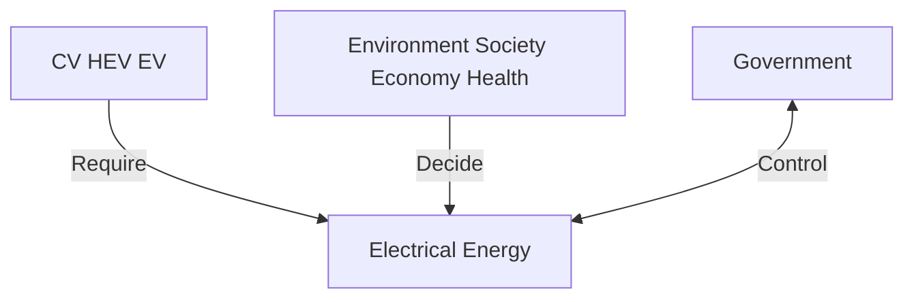

## CONTENTS

1. Introduction......1  
2. Assumptions....2  
3. A Brief View of CV, EV and HEV ....2  
4. Simulation of Quantities of CV, EV and HEV....3

4.1 Increase of Number of Total Vehicles ....3  
4.2 Growth of Quantities of CV, EV and HEV ....5

5. Energy Demand and Supply from/for EV and HEV 7

5.1 Electricity Demand from EV/HEV 8  
5.2 Off-Peak Charging Supply for EV and HEV 8  
5.3 Extra Energy Supply for EV/HEV and Its Optimization ....10

6. Environmental, Economic, Social and Health Impacts of EV/HEV 14

6.1 EV/HEV Consumes Less Fossil Fuels 14  
6.2 Driving EV and HEV Costs Less....18  
6.3 New Vehicle Industry Provides More Job Opportunities....19  
6.4 Invest in New Vehicle Industry is Rewarding....21  
6.5 EV/HEV Reduce Pollutions and Do Good for Health 23

7. Conclusion ......24  
8. References......26

## 1. Introduction

Today we have 800 million vehicles in the world with roughly 70 million new ones built each year. By current vehicle growth rate, we will end up with 3 billion cars on the planet by 2035. $^{1}$ The majority of vehicles on the road in 2010 are conventional vehicles (CV) based on ICEs. [1] Considering the average amount of petroleum each vehicle takes annually, it will need several times the volume of oil reserves currently known in Saudi Arabia just to fuel them $^{2}$ . How would we be able to power such huge number of vehicles? How to deal with the staggering emission from them? The gloomy answers to these questions compel us to strive for sustainable road transportation. It seems that electric vehicle (EV) could address this issue positively. $^{[2]}$ For detailed analysis, we classify vehicle into three kinds: conventional vehicle (CV), electric vehicle (EV) and hybrid-electric vehicle (HEV). [8]

In this paper, we will model the environmental, economical, social and health impacts of EV/HEV within the next 50 years and in three typical areas—China, USA and France. The formation of our paper is shown in Figure 1.

flowchart

Figure 1. Formation of our paper

First of all, we will simulate the quantity of CV, EV and HEV in France, USA and China. Logistic model is introduced and historic data of vehicle quantities is collected to fit the coefficients of logistic model. At the same time, the role of government will take place to control and optimize the quantities of CV, EV and HEV, in order to achieve lower fossil fuel consumption.

Next, we will respond to the demand for electrical energy from EV/HEV in these countries. Supply plans of amount and type of electricity generation will be designed by model that involves the following concerns. (1) During this process, the supply plan will be in conformity with domestic energy allowance. (2) Government should also take steps to reduce the reliance of electricity generation upon fossil fuels. (3) It is also desirable to strive for the lowest costs of the energy supply plan as much as possible.

Finally, we model the environmental, social, economic, and health impacts of the widespread use of EV/HEV. Environmental impact is mainly considered as the consumption of fossil fuels. Social impact is viewed from the savings of driving EV/HEV for individuals. Economic impact involves new job opportunities from EV/HEV and power industry. Health impact will be measured by the nitrogen generation. We compare all these figures under two different scenarios. One scenario is where quantities of CV, EV and HEV accord with our simulation. The other one is where all EVs/HEVs are replaced by CV. In other words, we will compare all these impacts between “mixed-vehicle world” and “pure-CV world”. Thus the impacts of EV/HEV will be clearly revealed.

## 2. Assumptions

1. We will select one vehicle mode to represent CV, EV and HEV each.  
2. We assume there is no difference in performance of each vehicle type.  
3. We select France, USA, and China to represent European countries, American countries and Asian countries.  
4. We assume performance of CV, EV and HEV will not change in the future.  
5. Based on common sense, we assume each vehicle travels 10,000 km every year.  
6 We will not specify different types of power plants and assume that each plant will generate 10,000,000kwh annually on average.  
7. We do not consider the dissipation during energy conversion.

## 3. A Brief View of CV, EV and HEV

Currently there are three types of vehicles. Conventional vehicle is driven by internal combustion engine. The majority of vehicles on the road in 2010 are conventional vehicles based on ICEs. Electric vehicles (EVs) are propelled by an electric motor (or motors) powered by rechargeable battery packs.[3] EV is also born with hybrid-electric vehicle (HEV) that could switch between electric-only mode and oil-only mode. [9] The advantages of electric power are apparent, as it could avoid tailpipe emission, enhance energy efficiency at low speed and utilize off-peak electricity; the disadvantages are equally obvious, considering a certain amount of electricity is ultimately generated by fossil fuels with pollutions released, the current battery capacity could not support high sustaining speed driving, and battery pollution is still a threat to our environment.

In the following chapters, a lot of discussions, analyses and computation would require data related to features of CV, EV and HEV. As different vehicle modes have different characteristics, we would select typical modes to represent different types in vehicle family, as shown in Table 1.

Table 1. Features of CV, EV and HEV

<table><tr><td></td><td>Typical Mode</td><td>Features</td></tr><tr><td>CV</td><td>2010 Focus 1.4 Duratec</td><td>Price: from £39,995 $^{3}$ Produce 155gCO2/km $^{4}$ </td></tr><tr><td>EV</td><td>Tesla Roadster</td><td>Price: $108,000Travel up to 220 miles without a recharge $^{5}$ Consume 450kJ/km $^{6}$ </td></tr><tr><td>HEV</td><td>Chevrolet Volt</td><td>Price: $41000 $^{7}$ Consumes 770kj/km in electric-only modeProduces 108gCO2/km in oil-only modeRun 50km without recharging and 420km without refueling</td></tr></table>

## 4. Simulation of Quantities of CV, EV and HEV

## 4.1 Increase of Number of Total Vehicles

The number of vehicles has increased more in the past decade than in the previous one century, and such trend will continue in the future. Although the alarm of fossil fuels has been around for years, the need for transportation is still expanding vehicle ownership, whether such need is met by driving CV, EV or HEV. Therefore, total vehicle quantity should be simulated first.

There are two major factors that influence the number of vehicles. The first one is population. Countries with larger population are more likely to have more vehicles, as the need for transportation is basically same for each common person. The second one is the geographic condition such as area of this region. Typically, larger area and good road condition are indicative of higher road capacity, and thus higher allowance for vehicles. If we put these two factors together, we are considering the density of population. In this sense, the growth of vehicle is comparable to the growth of biota with limited (sometimes fluctuated) natural resources where logistic mode is widely used to predict the growth of population. Thus, we seek similar approach to simulate the growth of vehicles with logistic mode as shown below.

$$
\left\{ \begin{array}{l} \frac {d x}{d t} = r \cdot x \cdot \left(1 - \frac {x}{M}\right) \\ x (0) = x _ {0} \end{array} \right. \tag {1}
$$

According to (1), we can deduct the expression for the total vehicle number in the t year:

$$
x (t) = \frac {M}{1 + (\frac {M}{x _ {0}} - 1) \cdot e ^ {- r t}} \tag {2}
$$

Where $x(t)$ is the total vehicle number in t year, r is intrinsic growth rate of vehicle number, M is the ceiling of vehicle number and $x_{0}$ is the vehicle number in 2010.

We adopt historic data and obtain the values of coefficients by fitting. As we will simulate situation in France, USA and China, we collect their quantities of total vehicles and list them in Table 2.

Table 2. Quantities of total vehicle in France, USA and China from 2005 to 2010

<table><tr><td>Vehicle Quantity\Year</td><td>2005</td><td>2006</td><td>2007</td><td>2008</td><td>2009</td><td>2010</td></tr><tr><td> $France(10^7)$ </td><td>3</td><td>3.17</td><td>3.34</td><td>3.51</td><td>3.68</td><td>3.8</td></tr><tr><td> $USA(10^8)$ </td><td>2.4</td><td>2.5</td><td>2.9</td><td>3.0</td><td>3.1</td><td>3.2</td></tr><tr><td> $China(10^8)$ </td><td>1</td><td>1.11</td><td>1.24</td><td>1.37</td><td>1.52</td><td>1.68</td></tr></table>

The result of fitting is shown in Table 3.

Tabel 3. Values of coefficients in logistic mode acquired by fitting

<table><tr><td></td><td>France</td><td>USA</td><td>China</td></tr><tr><td> $x_m$ </td><td>60,000,000</td><td>600,000,000</td><td>1,400,000,000</td></tr><tr><td>r</td><td>0.115</td><td>0.115</td><td>0.115</td></tr></table>

Given the values of coefficients, our model could simulate the growth of quantities of vehicles. The result is shown in Figure 2, 3 and 4.

line chart

| Years | Number of Vehicles in France (x 10^7) |
| ----- | ------------------------------------- |
| 2005  | 3.0                                   |
| 2010  | 3.8                                   |
| 2020  | 5.0                                   |
| 2030  | 5.8                                   |
| 2040  | 5.9                                   |
| 2050  | 6.0                                   |
| 2055  | 6.0                                   |

Figure 2

line chart

| Years | Number of Vehicles in USA (x 10^8) |
| ----- | ---------------------------------- |
| 2005  | 2.5                                |
| 2010  | 3.3                                |
| 2020  | 4.8                                |
| 2030  | 5.5                                |
| 2040  | 5.8                                |
| 2050  | 5.9                                |
| 2055  | 6.0                                |

Figure 3

line chart

| Years | Number of Vehicles in China |
| ----- | --------------------------- |
| 2005  | 10000000                    |
| 2010  | 15000000                    |
| 2015  | 25000000                    |
| 2020  | 40000000                    |
| 2025  | 60000000                    |
| 2030  | 80000000                    |
| 2035  | 100000000                   |
| 2040  | 115000000                   |
| 2045  | 125000000                   |
| 2050  | 132500000                   |
| 2055  | 137500000                   |

Figure 4  
Figure 2 shows the increase of vehicles in France, USA and China. In France, the number will keep rising and become stable after 2030. The ultimate number is 60,000,000. In USA, the quantity of total vehicles increase steadily from 2010 to 2030, and remain almost unchanged after 2030. The ultimate number of vehicles will be about 600,000,000. In China, the number of vehicles will increase rapidly from 2015, and such rapid growth period will not end until 2050. The ultimate number will be about 1,400,000,000.

## 4.2 Growth of Quantities of CV, EV and HEV

Once the total number of vehicle each year in the future is known, we are going to simulate the quantities of CV, EV and HEV. There are many factors that would influence the distribution. EV and HEV have strong potentials to reduce the reliance upon fossil fuels, as electricity could come from other sources other than thermal power. When fossil fuels run out, we could power EV one way or another. HEV is an eclectic solution that could be a good choice at this moment. Therefore, EA and HEV (especially EA) should gradually take the place of CV. It is ideal that all vehicles will be converted to EA when fossil fuels run out. But exactly when will that time come? No one can answer. There are many different opinions and calculations and none really agree on the exact timing. Many different factors need to be considered including how much of each deposit is left in the Earth, how fast we are using each fossil fuel at the moment, and how this is likely to change in the future. If we start switching to alternative fuel sources that are renewable rather than non-renewable, the reserves that we have will obvious last longer. [4] Therefore, it is impossible to predict the fossil fuel reserve in 50 years. It is also impossible to determine the limit that fossil fuel poses upon vehicle oil consumption.

What we know for sure is that oil reserve will be running very low in 2055 according to current consumption and reserve. So we deem that government should reduce the oil consumption of vehicles by $90\%$ of current consumption within 50 years. By achieving such goal, the reliance upon oil will be reduced and the impact of sudden drain of oil will be cushioned. Oil is consumed by CV and HEV during its oil-only mode that on average takes up 8/9 of this total travel distance $^{8}$ . We estimate the ratio of light vehicle to heavy one to be 3. As EVs are of smaller power, shorter range and HEV could provide bigger drive and longer range, EV would serve as light vehicle and HEV another. We speculate the ratio of EV to HEV in 2060 would also be 3. Thus we come up with the following equations.

$$
\left\{ \begin{array}{l} z _ {H E V} (t) \cdot \frac {8}{9} + z _ {C V} (t) = \left[ z _ {H E V} (2 0 1 0) \cdot \frac {8}{9} + z _ {C V} (2 0 1 0) \right] \cdot \eta (t) \\ z _ {E V} (t) / z _ {H E V} (t) = R (t) \\ z _ {C V} (t) + z _ {E V} (t) + z _ {H E V} (t) = x (t) \end{array} \right. \tag {3}
$$

Where $z_{CV}(t)$ is the number of CV in t year, $z_{EV}(t)$ is the number of EV in t year, $z_{HEV}(t)$ is the number of HEV in t year, $x(t)$ is the total number of vehicles in the t year, $R(t)$ is the ratio of EV to HEV, R(2055) is 3, $\eta(t)$ is coefficient that controls the reliance upon oil in t year and $\eta(2055)$ is 10%.

In Europe, EVs have been projected to reach 500 thousand by the year 1999. In Japan, the government's plan calls for 200 thousand EVs by the year 2000. Here in the US, air pollution regulations could translate into a production requirement of around 300--400 thousand EVs per year [5] Thus, we estimate the current EV/HEV number to be $5\%$ of the total vehicle number in each country.

Government will also play a role in controlling the distribution of CV, EV and HEV to strive for largest number of benefits to the environment, society, business, and individuals. Thus we have our optimization model (4) and (5).

$$
\max \sum E (R, \eta) + S (R, \eta) + B (R, \eta) + I (R, \eta) \tag {4}
$$

$$
s. t. \left\{ \begin{array}{l} E (R, \eta) \leq O \\ S (R, \eta) \geq H \\ B (R, \eta) \geq C \\ I (R, \eta) \geq \Delta P \end{array} \right. \tag {5}
$$

Where E is the environmental factor, S is the social factor, B is the business factor, I is the individual factor, O is the ceiling of the environmental factor, H is the lower limit of the social factor, C is the lower limit of the business factor, $\Delta P$ is the lower limit of the individuals factor.

Thus we could simulate quantities of CV, EV and HEV in France, USA and China.

The result is shown in Figure 5, 6 and 7.

line chart

| Years | HEV       | EV        |
|-------|-----------|-----------|
| 2005  | 2.5e7     | 0.3e7     |
| 2010  | 2.3e7     | 1.0e7     |
| 2015  | 2.1e7     | 1.8e7     |
| 2020  | 1.9e7     | 2.5e7     |
| 2025  | 1.7e7     | 3.0e7     |
| 2030  | 1.5e7     | 3.3e7     |
| 2035  | 1.3e7     | 3.5e7     |
| 2040  | 1.1e7     | 3.6e7     |
| 2045  | 1.0e7     | 3.7e7     |
| 2050  | 0.9e7     | 3.8e7     |
| 2055  | 0.8e7     | 4.0e7     |

Figure 5.  
Number of CV, EV and HEV in France

line chart

| Years | EV       | CV       | HEV      |
|-------|----------|----------|----------|
| 2005  | 0        | 2.0e+08  | 0        |
| 2010  | 1.0e+08  | 1.9e+08  | 0.2e+08  |
| 2015  | 2.0e+08  | 1.8e+08  | 0.3e+08  |
| 2020  | 3.0e+08  | 1.7e+08  | 0.4e+08  |
| 2025  | 3.5e+08  | 1.6e+08  | 0.5e+08  |
| 2030  | 3.7e+08  | 1.5e+08  | 0.6e+08  |
| 2035  | 3.8e+08  | 1.4e+08  | 0.7e+08  |
| 2040  | 3.9e+08  | 1.3e+08  | 0.8e+08  |
| 2045  | 4.0e+08  | 1.2e+08  | 0.9e+08  |
| 2050  | 4.1e+08  | 1.1e+08  | 1.0e+08  |
| 2055  | 4.2e+08  | 1.0e+08  | 1.1e+08  |

Figure 6.  
Number of CV, EV and HEV in USA

line chart

| Years | EV       | HEV      |
|-------|----------|----------|
| 2005  | 0.1e8    | 0.1e8    |
| 2010  | 0.5e8    | 0.3e8    |
| 2015  | 1.0e8    | 0.6e8    |
| 2020  | 2.0e8    | 1.0e8    |
| 2025  | 4.0e8    | 1.5e8    |
| 2030  | 6.0e8    | 1.8e8    |
| 2035  | 7.5e8    | 2.0e8    |
| 2040  | 8.5e8    | 2.2e8    |
| 2045  | 9.0e8    | 2.5e8    |
| 2050  | 9.5e8    | 2.8e8    |
| 2055  | 10.0e8   | 3.0e8    |

Figure 7  
Number of CV, EV and HEV in China

The R(t) is decreasing in all three Figures, indicating the decline of oil consumption. $R(t)$

is rising, so EV will dominate the vehicle world in the future.

Figure 5 pictures the trend of vehicle quantities in France. As we can see, EV will rise rapidly during the first 15 years from $0.4 \times 10^{7}$ to $4 \times 10^{7}$ . It is due to less geographic limitation on traffic. CV would decrease from $2.5 \times 10^{7}$ to $0.54 \times 10^{7}$ . Thus the reduction of CV is effective.

Figure 6 depicts the trend of vehicle quantities in USA. The situation is similar to that of France. CV will decrease from $1.9 \times 10^{8}$ to $0.65 \times 10^{8}$ ; EV will increase from $0.25 \times 10^{8}$ to $4 \times 10^{8}$ ; HEV will increase from $0.25 \times 10^{8}$ to $1.4 \times 10^{8}$ .

Figure 7 shows the trends of vehicle quantities in China. The increase of EV/HEV is even more obvious than that of France and USA, from $0.11 \times 10^{8} / 0.11 \times 10^{8}$ to $9.1 \times 10^{8} / 3.03 \times 10^{8}$ . This indicates a huge EV/HEV market in China and a huge demand for electricity power. The control of CV quantity is not as effective as it seems in France and USA. It will rise from $0.9 \times 10^{8}$ to $2.3 \times 10^{8}$ and drop to $1.6 \times 10^{8}$ . The peak time appears in 2035. It is because the quantity of total vehicle will enter a rapid increase period at that time and increase of EV/HEV is not able to follow that trend. Although the total quantity of CV will ultimately increase, the proportion of CV in the entire vehicle will drop significantly, from $90\%$ to $10\%$ .

## 5. Energy Demand and Supply from/for EV and HEV

The surge of EV/HEV quantities in France, USA and China will definitely create huge demand for electricity, and supply plan is also needed. In this chapter, we will model the energy demand first. Then we will model the amount and type of electricity generation that would be needed to support the EV/HEV development under our plan. This model will provide us solutions to meet energy demand of huge quantity of EV and HEV in the future. Model will be established to consider environmental, social and economic effects.

## 5.1 Electricity Demand from EV/HEV

The demand for electricity can be modeled easily by (6).

$$
A (t) = \sum_ {i} C _ {i} \cdot Z _ {i} (t) \tag {6}
$$

Where $A(t)$ is the electricity demanded in t year, $C_{i}$ is the average electricity

consumption per vehicle, $z_{i}(t)$ is the number of i vehicle in the t year.

From Table 1 we know EV will consume 450kJ/km and HEV will take up 770kJ/km in electric mode. Also we have assumed each vehicle will travel 10,000km, and 1/8 of the distance traveled by HEV will be under electric-only mode. Thus we can figure out electricity demand from EV/HEV in France, USA and China.

## 5.2 Off-Peak Charging Supply for EV and HEV

Two typical electricity demand curves are shown in Figure 8. Peak period and off-peak period are colored differently. As we can see, a conspicuous rise and fall in electricity demand usually happens during a 24 hours electricity usage circle. The reason is quite simple, human activity in daytime is much more than that in the nighttime, creating a peak period in daytime and an off-peak period in nighttime. The fluctuations in power demand have always been an adverse factor for electricity generation. The generators have to run at full power in order to meet peak power demand. Yet when demand drops significantly, however, the power of generators cannot simply follow down. Otherwise it will damage the gird system.[8] Thus electricity supply could only drop lightly during off-peak. Hence significant energy would be generated for no use, and the flow back of such energy is also undesirable for grid system. Such situation is very common in urban areas.

line chart

| Time       | Electric Demand in MW |
| ---------- | --------------------- |
| Off Peak   | 6:00 AM               |
| 10:00 AM   | 10:00 AM              |
| 2:00 PM    | 2:00 PM               |
| 6:00 PM    | 6:00 PM               |
| 10:00 PM   | 10:00 PM              |

line chart

| TIME OF DAY (24-HOUR CLOCK) | Projected | Actual |
| --------------------------- | --------- | ------ |
| 03:00                       | 12600     | 12600  |
| 06:00                       | 10800     | 10800  |
| 9:00                        | 13500     | 13500  |
| 12:00                       | 14400     | 14400  |
| 15:00                       | 13500     | 13500  |
| 18:00                       | 14400     | 14400  |
| 21:00                       | 15300     | 15300  |

Figure 8. Electricity Supply in 24-hour-circle

The conventional method to deal with “extra electricity” is to store it by pulling up water or something else during off-peak period. In peak period, the lifted water could be used to generate electricity to meet soared energy demand. This process inevitably involves energy dissipation. Now we propose to directly use “extra electricity” to charge EV and HEV. In the left figure above, there are 66 blocks that shows the overall electricity generation, and there are 18 blocks in the “extra energy” areas during off-peak period. Thus, we estimate 27.3% of total electricity could be used for charging EV and HEV. If off-peak charging still cannot suffice the energy need from EV and HEV, other solution is needed. Now the effect of off-peak charging on general energy supply could be described in (7).

$$
\left\{ \begin{array}{l} C (t) = A (t) - O (t) \\ O (t) = 27.3 \% \cdot G (t) \end{array} \right. \tag{7}
$$

Where $C(t)$ is the electricity needed in t year to power EV and HEV by extra power stations, A(t) is defined in (6), $O(t)$ is the quantity of extra electrical energy at off-peak times which can be used to charge EV/HEV in t year, G(t) is the overall electricity generation in each country.

The overall electricity generation data in 2005 is listed in Table 4.

Table 4. Annual Electricity Generation in France, USA and China

<table><tr><td></td><td>France</td><td>USA</td><td>China</td></tr><tr><td>Electricity Generation( $10^{14}$ kJ) $^{9}$ </td><td>19.46</td><td>142.24</td><td>131.42</td></tr></table>

C(t) is shown in Figure 9, 10 and 11.  

line chart

| Year | Electricity to be generated by power stations in France(kJ) |
| ---- | -------------------------------------------------------- |
| 2005 | 0.3e14                                                   |
| 2010 | 0.8e14                                                   |
| 2015 | 1.2e14                                                   |
| 2020 | 1.5e14                                                   |
| 2025 | 1.7e14                                                   |
| 2030 | 1.9e14                                                   |
| 2035 | 2.1e14                                                   |
| 2040 | 2.3e14                                                   |
| 2045 | 2.5e14                                                   |
| 2050 | 2.6e14                                                   |
| 2055 | 2.7e14                                                   |

Figure 9

line chart

| Year | Electricity to be generated by power stations in USA(kJ) |
| ---- | -------------------------------------------------------- |
| 2005 | 0.3 x 10^15                                            |
| 2010 | 0.7 x 10^15                                            |
| 2015 | 1.1 x 10^15                                            |
| 2020 | 1.5 x 10^15                                            |
| 2025 | 1.8 x 10^15                                            |
| 2030 | 2.0 x 10^15                                            |
| 2035 | 2.2 x 10^15                                            |
| 2040 | 2.4 x 10^15                                            |
| 2045 | 2.5 x 10^15                                            |
| 2050 | 2.6 x 10^15                                            |
| 2055 | 2.8 x 10^15                                            |

Figure 10

line chart

| Year | Electricity to be generated by power stations in China (kJ) |
| ---- | -------------------------------------------------------- |
| 2005 | -0.5 x 10^14                                            |
| 2010 | 0.0 x 10^14                                            |
| 2015 | 0.5 x 10^14                                            |
| 2020 | 1.5 x 10^14                                            |
| 2025 | 2.5 x 10^14                                            |
| 2030 | 3.5 x 10^14                                            |
| 2035 | 4.5 x 10^14                                            |
| 2040 | 5.0 x 10^14                                            |
| 2045 | 5.5 x 10^14                                            |
| 2050 | 6.0 x 10^14                                            |
| 2055 | 6.5 x 10^14                                            |

Figure 11

Electricity needed to be generated in France

Electricity needed to be generated in USA

Electricity needed to be generated in China

The electricity needed to be generated for EV/HEV in 2005 is shown in Table 5

Table 5. Electricity needed to be generated for EV/HEV

<table><tr><td></td><td>France</td><td>USA</td><td>China</td></tr><tr><td>Electricity Vacancy to power current EV and HEV( $10^{14}$ kJ)</td><td>0.314</td><td>2.641</td><td>-2.45</td></tr></table>

In France and USA, we still need extra electricity to power existing EV and HEV. Yet in China (2005), the negative figure indicates that the off-peak charging should completely suffice the entire need for existing EV and HEV due to the smaller quantity of EV. Thus, off-peak charging is desirable to be promoted around the world, especially in countries like China, where current electricity generation could support entire EV/HEV and no other measures are required to meet the energy demand.

Off-peak charging is also feasible and practical. EV and HEV can be simply left charging in nighttime while its owner goes to sleep, as long as he/she works and rests according to normal schedule. Government could also provide incentives to encourage off-peak charging. For example, the favored electricity price could be the most effective act to attract people charge their EVs or HEVs at night.

With energy consumption per EV and HEV known, we could know how many EVs and HEVs can be powered merely by off-peak charging. The result is shown in Table 6.

Table 6. Number of EV/HEV supported by off-peak charging

<table><tr><td></td><td>France</td><td>USA</td><td>China</td></tr><tr><td>Number of EV fed by off-peak charging</td><td>2,342,000</td><td>17,259,000</td><td>15,940,000</td></tr><tr><td>Number of HEV fed by off-peak charging</td><td>18,736,000</td><td>138,072,000</td><td>127,520,000</td></tr></table>

## 5.3 Extra Energy Supply for EV/HEV and Its Optimization

Off-peak charging will never suffice the electricity demand from EV/HEV in France and USA. And in China, it could only maintain the entire EV/HEV till 2012. After that off-peak charging will not be enough. Thus, we have to plan to extra energy supply for EV/HEV.

The extra electricity vacancy could come from thermal power, hydroelectricity, nuclear energy, wind power or solar energy. Each type of generation has its particular traits, say its cost, price, potential capacity and limitation. As for government, it is desirable to manage new power industry to achieve maximum environmental, economic, and social benefits. Thus, not only should we provide more electricity, we should also optimize the energy plan among several options. We will discuss demand and limitation of new power energy first, and then strive for optimization of mix plan.

First and foremost, new electricity generation should meet the electricity demand from EV and HEV. Second, each power option has its limit. For example, solar energy is limited by the energy the earth receives from the sun, which is abundant in desert; hydroelectricity is limited by water resources and geographic shape of landscape; wind power is also distributed without balance; nuclear power requires high level of technology and finance.

Further more, an urgent task for government is to reduce the proportion of thermal power in the effort to rely less on fossil fuels. For example, in USA, the current proportion of thermal power is 67% $^{10}$ . We recommend government should reduce such figure to 10%. 10% is by no means an unrealistic goal, as France has achieved within 40 years.

In addition, we recommend government to trade off between these energy options by achieving minimum electricity cost, as economic and financial factors are always the prioritized concerns of government and society.

With these three major concerns, we will model the energy plan in (8) and (9)

$$
\min \sum_ {i} p _ {i} (t) \cdot x _ {i} (t) \tag {8}
$$

$$
s. t. \left\{ \begin{array}{l} \sum_ {i} x _ {i} (t) \geq C (t) \\ x _ {i} (t) \leq k _ {i} (t) \\ x _ {1} (t) \leq 10 \% \cdot \sum_ {i} x _ {i} (t) \end{array} \right. \tag{9}
$$

Where $p_{i}(t)$ is the cost of per joule of i electrical energy in the t year, $x_{i}(t)$ is the generation of i type of electricity in the t year, $x_{1}(t)$ is the thermal power generation in the t year, $k_{i}(t)$ is the limit of i type of electricity generation in the t year, $C(t)$ has been defined in (7).

We collect the prices of various kinds of electricity in France, USA and China, as well as limitations of different types of electricity generation. The data is shown in Table 7.

Table 7. Values of coefficients in (8) and (9)

<table><tr><td></td><td> $p_{1}(t)$ Thermal</td><td> $p_{2}(t)$ Hydro</td><td> $p_{3}(t)$ Nuclear</td><td> $p_{4}(t)$ Wind</td><td> $p_{5}(t)$ Solar</td><td> $k_{1}(t)$ Thermal</td><td> $k_{2}(t)$ Hydro</td><td> $k_{3}(t)$ Nuclear</td><td> $k_{4}(t)$ Wind</td><td> $k_{5}(t)$ Solar</td></tr><tr><td>France</td><td>3 c/kwh</td><td>6 c/kwh</td><td>4 c/kwh</td><td>8 c/kwh</td><td>5 c/kwh</td><td>4× $10^{9}$ kwh</td><td>0.8× $10^{9}$ kwh</td><td>70× $10^{9}$ kwh</td><td>1.8× $10^{9}$ kwh</td><td>1.8× $10^{9}$ kwh</td></tr><tr><td>USA</td><td>2 c/kwh</td><td>5 c/kwh</td><td>3 c/kwh</td><td>5 c/kwh</td><td>4 c/kwh</td><td>1.2× $10^{11}$ kwh</td><td>0.9× $10^{11}$ kwh</td><td>6× $10^{11}$ kwh</td><td>0.9× $10^{11}$ kwh</td><td>3× $10^{11}$ kwh</td></tr><tr><td>China</td><td>0.18RMB/kwh</td><td>0.1RMB/kwh</td><td>0.2RMB/kwh</td><td>0.5RMB/kwh</td><td>0.3RMB/kwh</td><td>1.8× $10^{11}$ kwh</td><td>11× $10^{11}$ kwh</td><td>5× $10^{11}$ kwh</td><td>3× $10^{11}$ kwh</td><td>4× $10^{11}$ kwh</td></tr></table>

Given the values of coefficients in this model, the result can be figured out and is shown in Figure 12. This is our electricity supply plan for France, USA and China.

line chart

| Year | Total (kJ) | Nuclear energy (kJ) | Thermal power (kJ) |
|------|------------|---------------------|--------------------|
| 2005 | ~0.3       | ~0.2                | ~0.0               |
| 2010 | ~0.8       | ~0.3                | ~0.0               |
| 2015 | ~1.2       | ~0.4                | ~0.0               |
| 2020 | ~1.5       | ~0.6                | ~0.0               |
| 2025 | ~1.7       | ~0.8                | ~0.0               |
| 2030 | ~1.9       | ~1.0                | ~0.0               |
| 2035 | ~2.1       | ~1.2                | ~0.0               |
| 2040 | ~2.3       | ~1.5                | ~0.0               |
| 2045 | ~2.5       | ~1.8                | ~0.0               |
| 2050 | ~2.7       | ~2.1                | ~0.0               |
| 2055 | ~2.8       | ~2.5                | ~0.0               |

line chart

| Year | Total (x 10^15 kJ) | Nuclear energy (x 10^15 kJ) | Solar energy (x 10^15 kJ) |
|------|---------------------|----------------------------|---------------------------|
| 2005 | ~0.1                | ~0.05                      | ~0.02                     |
| 2010 | ~0.3                | ~0.1                       | ~0.05                     |
| 2015 | ~0.6                | ~0.15                      | ~0.08                     |
| 2020 | ~0.9                | ~0.2                       | ~0.1                      |
| 2025 | ~1.2                | ~0.25                      | ~0.15                     |
| 2030 | ~1.5                | ~0.3                       | ~0.2                      |
| 2035 | ~1.8                | ~0.35                      | ~0.25                     |
| 2040 | ~2.1                | ~0.4                       | ~0.3                      |
| 2045 | ~2.4                | ~0.45                      | ~0.35                     |
| 2050 | ~2.6                | ~0.5                       | ~0.4                      |
| 2055 | ~2.8                | ~0.6                       | ~0.45                     |

line chart

| Year | Total (kJ) | Hydroelectricity (kJ) | Nuclear energy (kJ) | Solar energy (kJ) |
|------|------------|------------------------|---------------------|-------------------|
| 2005 | ~0         | ~0                     | ~0                  | ~0                |
| 2010 | ~0.5       | ~0.1                   | ~0.1                | ~0.05             |
| 2015 | ~1.5       | ~0.2                   | ~0.2                | ~0.1              |
| 2020 | ~2.5       | ~0.3                   | ~0.3                | ~0.15             |
| 2025 | ~3.5       | ~0.4                   | ~0.4                | ~0.2              |
| 2030 | ~4.5       | ~0.5                   | ~0.5                | ~0.25             |
| 2035 | ~5.0       | ~0.6                   | ~0.6                | ~0.3              |
| 2040 | ~5.5       | ~0.7                   | ~0.7                | ~0.35             |
| 2045 | ~6.0       | ~0.8                   | ~0.8                | ~0.4              |
| 2050 | ~6.2       | ~0.9                   | ~0.9                | ~0.45             |
| 2055 | ~6.3       | ~1.0                   | ~1.0                | ~0.5              |

Figure 12. Amount and type of electricity generation to meet energy demand from EV/HEV in France, USA and China

The left figure shows power supply in France. We can notice significant increase of nuclear energy. This is because the mature nuclear technology in France has greatly lowered the price of nuclear electricity. Thermal power, although increases slightly, will have decreasing proportion in overall electricity generation. Hydroelectricity, solar and wind energy hardly increase at all, since they are scarce in France. That's why nuclear power will remain dominant in France.

The middle figure shows the power supply in USA. The electricity prices are similar among different types. Thus natural limitation will mainly determine the distribution among different types of energy generation. As the capacity of nuclear power is big, nuclear power will start from a small proportion in 2005 and end up with the highest in 2055. Solar energy, wind energy and hydroelectricity are all abundant in USA, so the distribution of these three energies is relatively even.

Thermal power will be controlled under 10% of total electricity generation.

The right figure shows the power supply in China. As hydroelectricity is relatively cheap and abundant in China, it will ultimately become the most popular energy generation type. Thermal power is also cheap. However, government is going control its weight under $10\%$ of total electricity generation to fulfill its environmental responsibility. That's why thermal power will rise in the first 30 years and then stop at a certain percentage of total power. Nuclear power is slightly more expensive than thermal power, but due to the fact that it will not be stifled, it will become the second largest energy in China. Though solar and wind energy also abound in China compared with France, their higher price determine their low proportion.

Then we need to take one step further to find out how many more power plants will be constructed to provide power exclusively for EV and HEV. As the generated output varies greatly among different types of power plants, and even among the same type of power plant with different scales of construction, there is no easy way to calculate how many power plants of each type are needed. Thus, we will not specify different types of power plants and assume that each plant will generate 10,000,000kwh annually on average. The number of power stations can be calculated in (10).

$$
n _ {1} (t) = \frac {C (t)}{E _ {0}} \tag {10}
$$

Where $C(t)$ has been defined in (7), $E_{0}$ is the generated output per general power station and $n_{1}(t)$ is the number of power stations needed to exist in each year.

Since five years could be a normal circle to build a typical power station, we will show how many new power plants will be established within a 5 years circle in France, USA and China. The result is shown in Figure 13.

bar chart

| Year | New powerplants established in each 5 years in France |
| ---- | --------------------------------------------------- |
| 2005 | 72                                                  |
| 2010 | 114                                                 |
| 2015 | 103                                                 |
| 2020 | 85                                                  |
| 2025 | 67                                                  |
| 2030 | 54                                                  |
| 2035 | 46                                                  |
| 2040 | 42                                                  |
| 2045 | 40                                                  |
| 2050 | 40                                                  |
| 2055 | 41                                                  |

bar chart

| Year | New powerplants established in each 5 years in USA |
| ---- | ----------------------------------------------- |
| 2005 | 300                                             |
| 2010 | 560                                             |
| 2015 | 550                                             |
| 2020 | 480                                             |
| 2025 | 380                                             |
| 2030 | 300                                             |
| 2035 | 240                                             |
| 2040 | 200                                             |
| 2045 | 180                                             |
| 2050 | 175                                             |
| 2055 | 175                                             |

bar chart

| Year | New powerplants established in each 5 years in China |
|---|---|
| 2005 | 75 |
| 2010 | 240 |
| 2015 | 500 |
| 2020 | 800 |
| 2025 | 1060 |
| 2030 | 1200 |
| 2035 | 1160 |
| 2040 | 990 |
| 2045 | 790 |
| 2050 | 640 |
| 2055 | 545 |

Figure 13. New power stations needed to be constructed in a five-year circle in France, USA and China

In France and USA, more power stations are need in short term than that in long term. In China, thanks to the off-peak charging and low vehicles ownership, no power stations are need before 2010, then it will increase from zero to 1200 per year within 20 years. The small need for construction in short term is beneficial for a developing country. Thus government will be allowed with more time to prepare for the financing.

## 6. Environmental, Economic, Social and Health Impacts of EV/HEV

## 6.1 EV/HEV Consumes Less Fossil Fuels

The discussion in previous chapter reveals the potential reliance upon fossil fuels of EV and HEV. In this chapter, we will model the impact of EV and HEV on total fossil fuel consumption. This will help us better evaluate whether EV and HEV would consume less fossil fuels. Such evaluation is of vital importance because it is widely questioned that EV and HEV might burn more fossil fuels. Since burning fossil fuels, whether oil or gas, to generate electricity will definitely release CO2, we will measure reliance upon fossil fuels by measuring CO2 emissions. In order to do this, we introduce CO2 intensity. CO2 intensity is the average amount of CO2 emitted per unit of electrical energy generated by all of the power production processes in a mix weighted.[6] Thus the emissions from EVs depend on their own energy consumption and on the CO2 intensity of the power generation mix from which the EV's energy was obtained. The CO2 intensity varies considerably depending on the composition of the power generation mix. For instance, in countries like China where thermal power provides more than $75\%$ of general electricity, EVs charging from the electric grid will be responsible for significantly more emissions than in a country like France that derives less than $10\%$ of its power from fossil fuels [7]. The situation is similar in electric-only mode of HEV. For CV, its emission can be tested directly from the tailpipe. Thus we calculate the CO2 emission in (11)

$$
\left\{ \begin{array}{l} S (t) = S _ {C V} (t) + S _ {E V} (t) + S _ {H E V} (t) \\ S _ {C V} (t) = L _ {1} \cdot v _ {1} \cdot z _ {1} \\ S _ {E V} (t) = L _ {2} \cdot v _ {2} \cdot z _ {2} \\ S _ {H E V} (t) = L _ {3} \cdot v _ {3} \cdot z _ {3} \\ v _ {2} = I _ {2} \cdot E _ {2} \\ v _ {3} = \frac {a \cdot v _ {3} ^ {\prime} + b \cdot I _ {3} \cdot E _ {3}}{a + b} \end{array} \right. \tag {11}
$$

Where $S(t)$ is the carbon dioxide emissions in the t year, $L_{i}(\mathrm{km})$ is the distance traveled by i type of vehicle in t year, $v_{i}(\mathrm{gCO2/Km})$ is the emissions of carbon dioxide per kilometer by i vehicle, $z_{i}$ is the number of i vehicle, I is CO2 intensity, E (kJ/km) indicates energy in terms of joule required to propel vehicle for unit distance, a and b represents the oil-only mode and electric-only proportion of HEV respectively. From previous chapters we know $v_{1}$ is 155gCO2/km, $E_{2}$ is 450kJ/km $^{11}$ , $v_{3}^{\prime}$ is—108gCO2/km, $E_{3}$ —770kJ/km, a is 50km and b is 420km.

$I_{i}$ , the CO2 intensity, varies among countries. It depends on how much electricity is generated from fossil fuel combustion, as well as how much CO2 is emitted while burning fossil fuel in order to generate unit electricity. We collect information of France, USA and China as list them in Table 8.

Table 8. Information related with CO2 intensity

<table><tr><td></td><td>France</td><td>USA</td><td>China</td></tr><tr><td>Proportion of electricity generated by fossil fuel</td><td>10%</td><td>67%</td><td>75%</td></tr><tr><td>How much CO2 is emitted to make 1jk by burning fossil fuels (gCO2/kj)?</td><td>0.0833</td><td>0.0833</td><td>0.0833</td></tr><tr><td>CO2 intensity(gCO2/kj)</td><td>0.00833</td><td>0.055811</td><td>0.062475</td></tr></table>

Then we can figure out how much CO2 EV and HEV will release by running one kilometer. We list such figure in Table 9. In this table, we will also show the gCO2/km of CV to compare their fossil fuel consumption.

Table 9. CO2 consumption of CV, EV and HEV in France, USA and China

<table><tr><td></td><td>France</td><td>USA</td><td>China</td></tr><tr><td>CV(gCO2/km)</td><td>155</td><td>155</td><td>155</td></tr><tr><td>EV(gCO2/km)</td><td>3.75</td><td>25.125</td><td>28.125</td></tr><tr><td>HEV(gCO2/km)</td><td>138.116</td><td>140.49</td><td>140.825</td></tr></table>

This figure finally reveals the widely asked question that whether EV will save fossil fuel. And the answer is yes! In France, as its thermal power only takes up 10% of its general electricity generation, its electricity contributes far less CO2 emissions and fossil fuels consumption. Thus driving EV in France merely generates 3.75gCO2 per km compared to 155gCO2 of CV. Even in USA and China, where a major part of electricity is made from fossil fuels, and where electricity contain more fossil fuel energy, driving EV could also achieve 25.125gCO2/km and 28.125gCO2/km respectively, contributing a great save on fossil fuels. This might be the result of high energy conversion efficiency of electric motor. Thus, we believe EV would help saving fossil fuel around the world. As for HEV, the gCO2/km figure is only lightly lower than that of CV. This is resulted from the low ratio of electric-only distance to oil-only distance which is merely 1:8. However, electric-only mode is mainly used in starting and low speed, when the use of combustion engine only achieves a very low efficiency. Moreover, with the development of technology, the battery will be endowed with stronger capacity which will lift the electric-only distance. Hence in the future the HEV will also become a conscientious fossil fuel saver.

Then we are anxious to know the fossil fuel consumption when EV and HEV are gradually replacing CV. We run the model in matlab and show the result in Figure 14, 15 and 16.

line chart

| Year | Carbon Dioxide Emission in France(t) |
| ---- | ------------------------------------- |
| 2005 | 3.8e+07                               |
| 2010 | 3.7e+07                               |
| 2015 | 3.6e+07                               |
| 2020 | 3.4e+07                               |
| 2025 | 3.2e+07                               |
| 2030 | 3.0e+07                               |
| 2035 | 2.8e+07                               |
| 2040 | 2.6e+07                               |
| 2045 | 2.4e+07                               |
| 2050 | 2.2e+07                               |
| 2055 | 1.7e+07                               |

Figure 14. CO2 emission in France

line chart

| Year | Carbon Dioxide Emission in USA(t) |
| ---- | --------------------------------- |
| 2005 | 3.0e8                             |
| 2010 | 3.05e8                            |
| 2015 | 3.05e8                            |
| 2020 | 3.0e8                             |
| 2025 | 2.9e8                             |
| 2030 | 2.7e8                             |
| 2035 | 2.5e8                             |
| 2040 | 2.3e8                             |
| 2045 | 2.1e8                             |
| 2050 | 1.9e8                             |
| 2055 | 1.7e8                             |

Figure 15. CO2 emission in USA

line chart

| Year | Carbon Dioxide Emission in China(t) |
| ---- | ----------------------------------- |
| 2005 | 1.3e8                               |
| 2010 | 1.9e8                               |
| 2015 | 2.5e8                               |
| 2020 | 3.1e8                               |
| 2025 | 3.6e8                               |
| 2030 | 4.0e8                               |
| 2035 | 4.2e8                               |
| 2040 | 4.4e8                               |
| 2045 | 4.3e8                               |
| 2050 | 4.1e8                               |
| 2055 | 3.8e8                               |

Figure 16. CO2 emission in China

As we can see, the carbon emission cause by vehicles in France is initially about 1/3 of USA and 1/10 of China. Its CO2 containment in electricity is also lower than USA and China. With the decline in the number of CV and rise in the number of EV and HEV, the carbon emission will go down from the very beginning, indicating the decline in the consumption of fossil fuels. So introduction of EV/HEV is very successful in saving fossil fuels. In USA, the number of CV will also decline; the number EV and HEV will rise. Yet its CO2 containment in electricity is 6.7 times of France. Consequently, the CO2 emission will rise slightly in the next five years, and then the emission will head down. In China, the CO2 containment in electricity is even higher. The number of CV will increase till 2035 and then go down. The number of EV and HEV will also increase. Therefore, the carbon emission will increase till 2040 and then drop. It is likely that the increase of CV before 2035 and high CO2 containment in electricity result in the increase of carbon emission before 2040. After 2040, the carbon emission begins to fall rapidly while the number of EV and HEV is still increasing. Therefore, we conclude that the massive use of EV and HEV will reduce the reliance upon fossil fuels effectively. And it is worthy in environmental concerns to promote EV and HEV.

Then we will examine how much oil will be saved. Given the total number of vehicles each year from 2005 to 2055 in France, USA and China, we could calculate the consumption of oil if all of the vehicles are CV. This will simulate the scenario that EV/HEV doesn't contribute to consumption of fossil fuels at all. Given the number of CV, EV and HEV from 2005 to 2055 in these three countries, we can calculate the consumption of oil under the situation where EV/HEV is replacing CV according to our estimation. By comparing oil consumption with and without EV/HEV, we could see if and how much EV/HEV will save oil. Following such analysis, we have the following model.

$$
Q (t) = C _ {c v} \cdot \sum_ {i} z _ {i} (t) - \sum_ {i} C _ {i} \cdot z _ {i} (t) \tag {12}
$$

Where $Q(t)$ is the quantity of oil one specific country can save by widely using electrical vehicles, $C_{i}$ is the average consumption of oil per i vehicle in the t year, $z_{i}(t)$ is the quantity of i vehicle in the t year.

The result is shown in Figure 17.  

line chart

| Year | Consumption of Oil in France (L) |
| ---- | -------------------------------- |
| 2005 | 2.2 x 10¹⁰                      |
| 2010 | 2.4 x 10¹⁰                      |
| 2015 | 2.6 x 10¹⁰                      |
| 2020 | 3.0 x 10¹⁰                      |
| 2025 | 3.5 x 10¹⁰                      |
| 2030 | 4.0 x 10¹⁰                      |
| 2035 | 4.3 x 10¹⁰                      |
| 2040 | 4.5 x 10¹⁰                      |
| 2045 | 4.7 x 10¹⁰                      |
| 2050 | 4.8 x 10¹⁰                      |
| 2055 | 4.9 x 10¹⁰                      |

line chart

| Year | Consumption of Oil if all of vehicles are CV (x 10^11 L) | Consumption of Oil with EV/HEV introduced (x 10^11 L) |
|------|----------------------------------------------------------|--------------------------------------------------------|
| 2005 | 2.0                                                      | 1.7                                                    |
| 2010 | 2.8                                                      | 1.9                                                    |
| 2015 | 3.5                                                      | 2.0                                                    |
| 2020 | 4.0                                                      | 2.1                                                    |
| 2025 | 4.3                                                      | 2.15                                                   |
| 2030 | 4.5                                                      | 2.18                                                   |
| 2035 | 4.6                                                      | 2.19                                                   |
| 2040 | 4.7                                                      | 2.19                                                   |
| 2045 | 4.75                                                     | 2.18                                                   |
| 2050 | 4.8                                                      | 2.17                                                   |
| 2055 | 4.8                                                      | 2.16                                                   |

line chart

| Year | Consumption of oil if all of vehicles are CV (x 10^11 L) | Consumption of oil with EV/HEV introduced (x 10^11 L) |
|------|----------------------------------------------------------|--------------------------------------------------------|
| 2005 | ~0.8                                                     | ~0.6                                                   |
| 2010 | ~1.5                                                     | ~1.0                                                   |
| 2015 | ~2.5                                                     | ~1.5                                                   |
| 2020 | ~4.0                                                     | ~2.0                                                   |
| 2025 | ~6.0                                                     | ~2.5                                                   |
| 2030 | ~7.5                                                     | ~3.0                                                   |
| 2035 | ~9.0                                                     | ~3.5                                                   |
| 2040 | ~10.0                                                    | ~4.0                                                   |
| 2045 | ~10.5                                                    | ~4.5                                                   |
| 2050 | ~10.8                                                    | ~4.8                                                   |
| 2055 | ~11.0                                                    | ~4.9                                                   |

Figure 17. Oil saved by EV/HEV in France, USA and China

According to the $Q(t)$ of the China, USA, and France, we can calculate the quantity of oil the world can save by widely using electrical vehicles based on bound weight coefficients.

$$
\operatorname{Total} (t) = r _ {1} \cdot Q _ {\text {China}} + r _ {2} \cdot Q _ {\text {USA}} + r _ {3} \cdot Q _ {\text {Frac}} \tag {13}
$$

Where $r_{i}$ is the weight coefficient of each country, $Q_{i}(t)$ is the quantity of oil each country can save, $Total(t)$ is the quantity of oil the world can save by widely using electrical vehicles.

<table><tr><td> $r_1$ </td><td> $r_2$ </td><td> $r_3$ </td></tr><tr><td>2.6462</td><td>2.4333</td><td>12.1333</td></tr></table>

Then we figure out the total oil saved in the world, as is shown in Figure 18

line chart

| Year | Consumption of oil if all of vehicles are CV (x 10^12 L) | Consumption of oil with EV/HEV introduced (x 10^12 L) |
|------|----------------------------------------------------------|--------------------------------------------------------|
| 2005 | 1.0                                                      | 0.9                                                    |
| 2010 | 1.5                                                      | 1.1                                                    |
| 2015 | 2.0                                                      | 1.3                                                    |
| 2020 | 2.5                                                      | 1.5                                                    |
| 2025 | 3.0                                                      | 1.7                                                    |
| 2030 | 3.5                                                      | 1.8                                                    |
| 2035 | 4.0                                                      | 1.9                                                    |
| 2040 | 4.3                                                      | 2.0                                                    |
| 2045 | 4.5                                                      | 2.0                                                    |
| 2050 | 4.6                                                      | 2.0                                                    |
| 2055 | 4.7                                                      | 2.0                                                    |

Figure 18. Oil saved in the world

As we can see, if all EV/HEV are replaced by CV, the oil consumption will skyrocket. It means that introduction of EV/HEV will save a significant amount of oil. The oil saved just in 2055 will be 2.5 billion L.

## 6.2 Driving EV and HEV Costs Less

EVs and HEVs will save fossil fuels, which is desirable in the eyes of environmentalist. However, to be environmentally friendly cannot always guarantee public popularity. Its promotion among societies and governments depends upon the economic and social benefits. In this and following two chapters, we are going to examine the feasibility to promote EV hand HEV among common families and governments, with economic and social incentives, not by regulations.

One huge benefit of electric vehicles is their low fuel costs as compared to gasoline vehicles. Let's work out the driving cost of CV, EV and HEV and compare them together. The average consumption of oil by CV worldwide is 8L/100Km. The average electricity consumption of EV and HEV is 20Kwh/100Km. The current oil price in France, USA and China is 1.38€/L, 58.17\$/barrel and 7RMB/L. The current electricity price in France, USA and China is 0.12€/kwh, 6\$/kwh and 56RMB/100kwh. As vehicle will run 10,000Km on average in each year worldwide.

Further more, because there are no moving parts in an electric motor (as opposed to many in an internal combustion engine), there are many fewer things that can go wrong with an electric car, which means they'll probably save considerable money on maintenance costs as well. Electric vehicles have roughly 90% fewer parts than gasoline-powered vehicles. On RepairTrust.com, the maintenance costs for a typical car is \$272.03 per 30,000 miles. $^{12}$ That is \$56.6 a year on average. A rough estimate is that number of parts in vehicle is in linear correlation with maintenance fee. So driving EV will save another \$51 a year.

Now we can figure out the driving cost of EV, HEV and CV, as shown in Table 10. Note that 1/9 of the distance of HEV will be covered under electric-only mode.

Table 10. Cost and Saving of driving CV, EV and HEV

<table><tr><td></td><td>France</td><td>USA</td><td>China</td></tr><tr><td>Cost of driving CV(also driving HEV on oil-mode)($/100Km)</td><td>14.9</td><td>6.3</td><td>8.61</td></tr><tr><td>Cost of driving EV(also driving HEV on electric-mode)($/100Km)</td><td>3.25</td><td>1.2</td><td>1.72</td></tr><tr><td>Cost saved in one year by driving with electricity per vehicle($)</td><td>1165</td><td>510</td><td>689</td></tr></table>

## 6.3 New Vehicle Industry Provides More Job Opportunities

Automobile-related business will provide considerable jobs for the society. The potential new business may consist of the jobs in electrical power station, electrical charging station, and automobile manufacture industry. Therefore, we establish the following formula to predict the total quantity of jobs related with automobile.

$$
H (t) = h _ {1} \cdot n _ {1} (t) + h _ {2} \cdot n _ {2} (t) + \sum_ {i} g _ {i} \cdot z _ {i} (t) \tag {14}
$$

Where $h_{1}$ is the average quantity of jobs provided by per electrical power station, $n_{1}$ is the quantity of electrical power station in the t year, $h_{2}$ is the average quantity of jobs provided by per electrical charging station, $n_{2}$ is the quantity of electrical charging station in the t year, $g_{i}$ is the average quantity of jobs provided by per i vehicle, $z_{i}$ is the quantity of i vehicle in the t year, $H(t)$ is the total quantity of jobs.

The number of power stations— $N_{1}(t)$ —has been calculated in the chapter 5.3 “Extra Energy Supply for EV/HEV and Its Optimization”. The number of charging station is limited by their task to supply electricity and provide services. Then we can use the following formula to calculate the quantity of charging stations.

$$
n _ {2} (t) = \frac {z _ {H E V} (t) \cdot \frac {1}{9} + z _ {E V} (t)}{n _ {0}} \tag {15}
$$

Where $n_0$ is the average quantity of vehicles that one electrical charging station can support for and $n_2(t)$ is the number of charging stations in t year.

We collect the values of coefficients in this model (some of them are estimated because they are not available on internet) and show them in Table 11.

Table 11. Coefficients

<table><tr><td></td><td> $h_1$ </td><td> $h_2$ </td><td> $g_1$ </td><td> $E_0$ </td><td> $n_0$ </td></tr><tr><td>China</td><td>400</td><td>5</td><td>1/20</td><td> $10^7$ </td><td> $10^5$ </td></tr><tr><td>USA</td><td>200</td><td>5</td><td>1/20</td><td> $10^7$ </td><td> $10^5$ </td></tr><tr><td>France</td><td>400</td><td>5</td><td>1/20</td><td> $10^7$ </td><td> $10^5$ </td></tr></table>

Now we can figure out the newly created jobs by EV and HEV industry in France, USA and France in each year. They are shown in Figure 19.

line chart

| Year | The total quantity of jobs in USA |
| ---- | -------------------------------- |
| 2005 | 1.4 × 10⁷                       |
| 2010 | 2.0 × 10⁷                       |
| 2015 | 2.6 × 10⁷                       |
| 2020 | 3.2 × 10⁷                       |
| 2025 | 3.6 × 10⁷                       |
| 2030 | 3.9 × 10⁷                       |
| 2035 | 4.1 × 10⁷                       |
| 2040 | 4.3 × 10⁷                       |
| 2045 | 4.4 × 10⁷                       |
| 2050 | 4.5 × 10⁷                       |
| 2055 | 4.6 × 10⁷                       |

line chart

| Year | The total quantity of jobs in China (x 10^7) |
| ---- | ------------------------------------------ |
| 2005 | 0.5                                        |
| 2010 | 1.5                                        |
| 2015 | 3.0                                        |
| 2020 | 4.5                                        |
| 2025 | 6.0                                        |
| 2030 | 8.0                                        |
| 2035 | 10.0                                       |
| 2040 | 11.5                                       |
| 2045 | 12.5                                       |
| 2050 | 13.5                                       |
| 2055 | 14.0                                       |

line chart

| Year | The total quantity of jobs in France (x 10^6) |
| ---- | --------------------------------------------- |
| 2005 | 1.8                                           |
| 2010 | 2.8                                           |
| 2015 | 3.6                                           |
| 2020 | 4.2                                           |
| 2025 | 4.7                                           |
| 2030 | 5.0                                           |
| 2035 | 5.3                                           |
| 2040 | 5.5                                           |
| 2045 | 5.7                                           |
| 2050 | 5.9                                           |
| 2055 | 6.0                                           |

Figure 19. New job positions provided by new industries in France, USA and China.

More jobs mean less unemployed people and enhance in family income. It could even affect social stability. That's why it is a major concern of politicians and economists. In all three countries, the number of jobs that new energy industry would hold in 2060 would account approximately for $10\%$ of their current population. Nevertheless, power stations are expensive to build. So later we will take the effect of new jobs into consideration and see whether the investment in massive construction of power plants is economically worthy.

## 6.4 Invest in New Vehicle Industry is Rewarding

Currently big vehicle manufactures are increasing their investment in EV cars. For example, Japanese automaker Nissan plans to invest 642 million into expanding its plant in Sunderland, UK to produce the upcoming LEAF electric sedan as well as lithium-ion batteries for vehicles from Nissan and alliance partner Renault. Ford Motor said its European division will invest 2.3 billion in the development of green car technology, grouped under the company's Econetic brand, over the next five years. $^{13}$ This reflects the promising future of EV technology. For government that also seeks good-looking economic performance, EV industry will be rewarding other than environmentally beneficial.

The previous chapters have shown the economic rewards from EV industry—more jobs and less driving cost for individuals. Now we would consider the input into EV industry. That is to say, what we pay to get the rewards.

First of all, when off-peak charging will not suffice the rising number of EV and HEV, new power plants will be established. Second, when EV and HEV prevail in street, facilities like charging station will become a public welfare, just like street phone booth (Although we pay for the phone call, the phone booth is constructed by government). Thus government should also pay for the construction fee for charging stations. Third, as an environmental friendly industry, EV and HEV deserve financial subsidies from government especially in the early stage of its development when costs are relatively high. We consider these three aspects as government responsibilities.

Therefore, we establish government investment model shown as follows:

$$
c a p (t) = p _ {1} \cdot n _ {1} (t) + p _ {2} \cdot n _ {2} (t) + \sum_ {i} s _ {i} \cdot z _ {i} (t) \tag {16}
$$

Where $p_{1}$ is the average cost of per electrical power station, $n_{1}$ is the quantity of electrical power station in the t year, $p_{2}$ is the average cost of per electrical charging station, $n_{2}$ is the quantity of electrical charging station in the t year, $s_{i}$ is the subsidies provided for per i vehicle, $z_{i}$ is the quantity of i vehicle in the t year, $cap(t)$ is the subsidies provided by the government in the t year.

We obtain the data needed in this model and list them in Table 12.

Table 12. Data needed for (16)

<table><tr><td></td><td>Cost per power station</td><td>Cost of charging station</td><td>Subsidy on each EV/HEV</td><td>Salary per year</td></tr><tr><td>France</td><td> $0.167 \times 10^{8}$ €</td><td> $1.67 \times 10^{5}$ €</td><td>€9000</td><td>€2,4770</td></tr><tr><td>USA</td><td> $1.5 \times 10^{8}$  $</td><td> $10 \times 10^{5}$  $</td><td>$10000</td><td>$37,610</td></tr><tr><td>China</td><td> $10 \times 10^{8}$ RMB</td><td> $10 \times 10^{6}$ RMB</td><td>80000 RMB</td><td>$1100</td></tr></table>

The result of government investment in each year is shown in Figure 20.

line chart

| Year | Input in France(EUR) |
| ---- | --------------------- |
| 2005 | 12.0                  |
| 2010 | 10.5                  |
| 2015 | 9.0                   |
| 2020 | 7.0                   |
| 2025 | 5.0                   |
| 2030 | 4.0                   |
| 2035 | 3.5                   |
| 2040 | 3.0                   |
| 2045 | 2.8                   |
| 2050 | 2.7                   |
| 2055 | 2.6                   |

line chart

| Year | Input in USA(Dollars) x 10^11 |
| ---- | ----------------------------- |
| 2005 | 1.9                           |
| 2010 | 1.95                          |
| 2015 | 1.7                           |
| 2020 | 1.4                           |
| 2025 | 1.0                           |
| 2030 | 0.7                           |
| 2035 | 0.5                           |
| 2040 | 0.4                           |
| 2045 | 0.3                           |
| 2050 | 0.3                           |
| 2055 | 0.3                           |

line chart

| Year | Input in China(RMB) x 10^12 |
| ---- | -------------------------- |
| 2005 | 0.1                        |
| 2010 | 0.8                        |
| 2015 | 1.8                        |
| 2020 | 2.6                        |
| 2025 | 3.2                        |
| 2030 | 3.4                        |
| 2035 | 3.1                        |
| 2040 | 2.5                        |
| 2045 | 1.8                        |
| 2050 | 1.2                        |
| 2055 | 0.8                        |

Figure 20. Investment for EV/HEV in France, USA and China

With the investment known, we will compare it with the outcome. That is, the benefits of more jobs and lower driving cost. As the investment has been measured in terms of money, we would also measure such benefits in the same way. The economic benefits of EV/HEV consist of two major aspects. The first one is extra job opportunities created by more power stations and charging stations. We will measure this effect by calculating the total salary provided by these jobs. The second one is savings of each EV or HEV that has been discussed in chapter 7.1 “Driving EV and HEV Costs Less”. We know driving electrically will annually save 1156, 510 and 689 dollars in France, USA and China respectively. We have also predicted the number of EV and HEV in these countries. Thus the totally saving from driving EV/HEV could be figured out.

$$
O u t p u t (t) = w \cdot H (t) + \sum_ {i} \Delta p _ {i} \cdot z _ {i} (t) \tag {17}
$$

Where $R(t)$ is the input-output ratio, w is the average wage per job, $\Delta p_{i}$ is the saving of driving per vehicle, $cap(t)$ is the subsidies provided by the government in the t year, $H(t)$ is the total quantity of jobs.

The average salary in France, USA and China is €2,4770, \$37,610 and \$1100. Then the outcome is shown in Figure 21.

line chart

| Year | Output in USA(Dollars) |
| ---- | ---------------------- |
| 2005 | 0.5 × 10¹²            |
| 2010 | ~0.8 × 10¹²           |
| 2015 | ~1.1 × 10¹²           |
| 2020 | ~1.3 × 10¹²           |
| 2025 | ~1.45 × 10¹²          |
| 2030 | ~1.6 × 10¹²           |
| 2035 | ~1.7 × 10¹²           |
| 2040 | ~1.75 × 10¹²          |
| 2045 | ~1.8 × 10¹²           |
| 2050 | ~1.85 × 10¹²          |
| 2055 | ~1.9 × 10¹²           |

line chart

| Year | Output in France (EUR) |
| ---- | ---------------------- |
| 2005 | 4.0                    |
| 2010 | 6.0                    |
| 2015 | 8.0                    |
| 2020 | 10.0                   |
| 2025 | 11.5                   |
| 2030 | 12.5                   |
| 2035 | 13.5                   |
| 2040 | 14.0                   |
| 2045 | 14.5                   |
| 2050 | 15.0                   |
| 2055 | 16.0                   |

line chart

| Year | Output in China(RMB) |
| ---- | -------------------- |
| 2005 | 0                    |
| 2010 | ~0.3                 |
| 2015 | ~0.7                 |
| 2020 | ~1.2                 |
| 2025 | ~1.8                 |
| 2030 | ~2.5                 |
| 2035 | ~3.2                 |
| 2040 | ~3.8                 |
| 2045 | ~4.3                 |
| 2050 | ~4.8                 |
| 2055 | ~5.5                 |

Figure 21. Monetary output of new industries in France, USA and China

If we compare Figure 21 and Figure 20, we could be find out the output exceeds the input greatly. Thus, it is rewarding to invest in industries related to EV/HEV.

## 6.5 EV/HEV Reduce Pollutions and Do Good for Health

Driving a car (CV) is the most air polluting act an average citizen commits. $^{14}$ The exhaust from CV will poison the air we breath, help spread disease from airborne pathogens and particles. The CO2 emission will also change interactions between the atmosphere and sun, weather effects, effects on plants and oceans. Here we only consider the short term effects of introducing EV and HEV. We select several indicators of human health. Then simulate how they will change with EV and without EV. By comparison the effect of EV could be revealed.

Nitrogen is a major component of exhaust and known to cause several health effects: $^{15}$

● Reactions with hemoglobin in blood, causing the oxygen carrying capacity of the blood to decrease (nitrite)  
● Decreased functioning of the thyroid gland (nitrate)  
● Vitamin A shortages (nitrate)  
● Fashioning of nitro amines, which are known as one of the most common causes of cancer (nitrates and nitrites)

Nitrogen is created during combustion. In CV the combustion engine will create nitrogen by burning oil. In thermal power plant, nitrogen will also be created by burning oil. As there is a fixed ratio of CO2 and nitrogen in oil combustion, we could estimate nitrogen the emission of nitrogen easily. The ratio of nitrogen to CO2 generated in oil combustion is 0.685. $^{16}$ Thus, the nitrogen generation is shown in Figure 22.

line chart

| Year | Nitric Dioxide Emission in France(t) (x 10^8) |
| ---- | --------------------------------------------- |
| 2005 | 3.3                                           |
| 2010 | 3.25                                          |
| 2015 | 3.15                                          |
| 2020 | 3.0                                           |
| 2025 | 2.8                                           |
| 2030 | 2.6                                           |
| 2035 | 2.4                                           |
| 2040 | 2.2                                           |
| 2045 | 2.0                                           |
| 2050 | 1.8                                           |
| 2055 | 1.4                                           |

line chart

| Year | Nitric Dioxide Emission in USA(t) |
| ---- | --------------------------------- |
| 2005 | 2.6e7                             |
| 2010 | 2.6e7                             |
| 2015 | 2.6e7                             |
| 2020 | 2.5e7                             |
| 2025 | 2.4e7                             |
| 2030 | 2.3e7                             |
| 2035 | 2.1e7                             |
| 2040 | 1.9e7                             |
| 2045 | 1.7e7                             |
| 2050 | 1.5e7                             |
| 2055 | 1.4e7                             |

line chart

| Year | Nitric Dioxide Emission in China(t) |
| ---- | ----------------------------------- |
| 2005 | 1.0e+07                             |
| 2010 | 1.6e+07                             |
| 2015 | 2.2e+07                             |
| 2020 | 2.8e+07                             |
| 2025 | 3.2e+07                             |
| 2030 | 3.5e+07                             |
| 2035 | 3.7e+07                             |
| 2040 | 3.8e+07                             |
| 2045 | 3.7e+07                             |
| 2050 | 3.5e+07                             |
| 2055 | 3.3e+07                             |

Figure 22. Nitrogen Generation in France, USA and China

## 7. Conclusion

The effects of EV/HEV could be clearly revealed by comparing environmental, social, economic and health impacts between two scenarios. One scenario is where quantities of CV, EV and HEV accord with our simulation. The other one is where all EV/HEV will be replaced by CV. In order to help decision for the whole world, we synthesize the figure in France, USA and China. Results are shown in Figure 23, 24, 25, 26.

line chart

| Year | Carbon Dioxide Emission if all of vehicles are CV (x 10^8) | Carbon Dioxide Emission with EV/HEV introduced (x 10^8) |
|------|---------------------------------------------------------------|----------------------------------------------------------|
| 2005 | 1.8                                                           | 1.6                                                      |
| 2010 | 2.8                                                           | 1.7                                                      |
| 2015 | 3.8                                                           | 1.8                                                      |
| 2020 | 4.8                                                           | 1.9                                                      |
| 2025 | 5.8                                                           | 2.0                                                      |
| 2030 | 6.8                                                           | 2.1                                                      |
| 2035 | 7.8                                                           | 2.1                                                      |
| 2040 | 8.2                                                           | 2.0                                                      |
| 2045 | 8.6                                                           | 1.9                                                      |
| 2050 | 8.8                                                           | 1.8                                                      |
| 2055 | 9.0                                                           | 1.7                                                      |

Figure 23 World's CO2 emission

line chart

| Year | Number of jobs with EV/HEV introduced | Number of jobs if all of vehicles are CV |
|------|----------------------------------------|------------------------------------------|
| 2005 | 0.6 × 10⁸                             | 0.5 × 10⁸                               |
| 2010 | 1.2 × 10⁸                             | 0.8 × 10⁸                               |
| 2015 | 1.8 × 10⁸                             | 1.1 × 10⁸                               |
| 2020 | 2.4 × 10⁸                             | 1.4 × 10⁸                               |
| 2025 | 3.0 × 10⁸                             | 1.7 × 10⁸                               |
| 2030 | 3.6 × 10⁸                             | 2.0 × 10⁸                               |
| 2035 | 4.2 × 10⁸                             | 2.3 × 10⁸                               |
| 2040 | 4.8 × 10⁸                             | 2.5 × 10⁸                               |
| 2045 | 5.2 × 10⁸                             | 2.7 × 10⁸                               |
| 2050 | 5.4 × 10⁸                             | 2.8 × 10⁸                               |
| 2055 | 5.5 × 10⁸                             | 2.9 × 10⁸                               |

Figure 24 World's new job positions

line chart

| Year | Output with EV/HEV introduced (x 10^12) | Output if all of vehicles are CV (x 10^12) |
|------|----------------------------------------|---------------------------------------------|
| 2005 | 2.0                                    | 1.5                                         |
| 2010 | 3.5                                    | 2.0                                         |
| 2015 | 4.8                                    | 2.5                                         |
| 2020 | 6.0                                    | 3.0                                         |
| 2025 | 7.0                                    | 3.3                                         |
| 2030 | 7.8                                    | 3.5                                         |
| 2035 | 8.5                                    | 3.6                                         |
| 2040 | 8.8                                    | 3.6                                         |
| 2045 | 9.0                                    | 3.6                                         |
| 2050 | 9.2                                    | 3.6                                         |
| 2055 | 9.4                                    | 3.6                                         |

Figure 25 World's monetary reward

line chart

| Year | Nitric Dioxide Emission if all of vehicles are CV | Nitric Dioxide Emission with EV/HEV introduced |
|------|--------------------------------------------------|-----------------------------------------------|
| 2005 | 1.5e8                                            | 1.3e8                                         |
| 2010 | 2.5e8                                            | 1.4e8                                         |
| 2015 | 3.5e8                                            | 1.5e8                                         |
| 2020 | 4.5e8                                            | 1.6e8                                         |
| 2025 | 5.5e8                                            | 1.7e8                                         |
| 2030 | 6.5e8                                            | 1.8e8                                         |
| 2035 | 7.0e8                                            | 1.8e8                                         |
| 2040 | 7.5e8                                            | 1.7e8                                         |
| 2045 | 7.7e8                                            | 1.6e8                                         |
| 2050 | 7.8e8                                            | 1.5e8                                         |
| 2055 | 7.9e8                                            | 1.4e8                                         |

Figure 26 World's nitrogen production

As we can see from Figure 23, the world with EV/HEV will have less carbon emissions than CV, thus consume less fossil fuel consumption. EV/HEV will also help create more jobs and greater fortune than CV will. In addition, air pollutions will be greatly lowed.

“How environmentally and economically sound are electric vehicles?” The answer is very. The indirect consumption of fossil fuels by an EV (or HEV in electric-only mode) is 2.42% of CV in China, 16.2% of CV in USA and 18.1% of that in China. The widespread use of EV/HEV in France and USA will cause immediate drop of fossil fuels consumption. In China, such consumption drop will happen after 2040. Consequently, a significant among of fossil fuels will be saved. What’s more, driving EV/HEV cost little as compared to driving CV in all countries. And there is no big different of driving performance and price between CV and EV. This will attract individuals and facilitate its promotion among public. The market promotion on big scale would be promising.

The widespread use of EV/HEV would also be attractive for government. New power industry and EV manufactures would be needed, which would provide more job positions. Our model shows the monetary reward will greatly exceed the investment. In addition, we also model the impact of EV/HEV on air pollutions. Model shows encouraging results in reduction of nitrogen generation that pose a threat to human health. Therefore, if we put together the economic profits in the new industry, the government's responsibility to conserve fossil fuel energy and protect human health, we think government will strongly support the widespread use of EV/HEV.

## 8. References

[1] T.J. Wallington, E.W. Kaiser and J.T. Farrell, Automotive fuels and internal combustion engines: a chemical perspective, Chem Soc Rev 35 (2005), pp. 335–347.  
[2] Electric Vehicle charge forward by C.C Chan and Y.S. Wong  
[3] http://www.fueleconomy.gov/feg/evtech.shtml  
[4] http://www.carboncounted.co.uk/when-will-fossil-fuels-run-out.html  
[5] Proc. Int. Conf. Urban Electric Vehicle, Stockholm, Sweden, May 1992, OECD, IEA, Paris, France.  
[6] Reed T. Doucette $\uparrow$ , Malcolm D. McCulloch Modeling the prospects of plug-in hybrid electric vehicles to reduce CO2 emissions  
[7] Carfolio. 2010 Ford focus specifications; 2010. <www.carfolio.com> [accessed August 2010]  
[8] Universal Charging Station and Method for Charging Electrical Vehicle Batteries By Bradley J.Hesse.Syacuse; Philip J.Gentile, East Syracuse, both of N.Y  
[9] Hybrid Electric Vehicle by Alex J. Severinsky, 10904 Pebble Run, Silver Spring, Md.20902