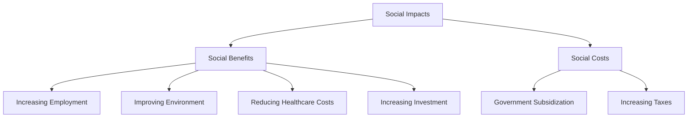
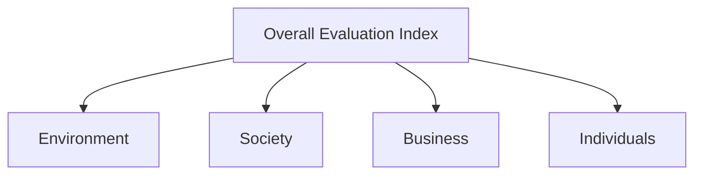

## What will Electric Vehicle Bring to the World?

## 1 Introduction

To define the environmental and economical characteristics of electric vehicles and to judge the feasibility and practicability of electric vehicles’ widespread use, we plan to accomplish goals as follows:

(1) To analyze the environmental and economical impact of the widespread use of electric vehicles, so do the influence on health and social aspects.  
(2) To ascertain some key factors that should be considered when determining whether and how to support the promotion.  
(3) To project the consumption of fossil fuels the world would save by this promotion.  
(4) To optimize the energy grid suiting the wide use of electric vehicles, so that the environment, society, business and individuals will get the largest number of benefits.

The approaches we use to realize such goals are:

(1) We use Bass Model based on the Art Colony Optimization algorithm for prediction of sales of electric vehicles. We also predict the import of crude oil in USA. Then we make a contrast between one conventional vehicle and one electric vehicle in terms of pollutant emissions. We improve BP Artificial Neutral Network Model by combining with Grey Model and use it to predict world’s tota vehicles annually in the next decade and calculate the reduction of emission. With those projections we analyze the related effects.

(2) Based on the predicted vehicles number, we respectively calculate the oil consumptions base on two supposes: All vehicles are CVs; There are vehicles of CVs and EVs. To be more general, we convert the consumptions to barrels oil equivalent.

(3) To optimize the current energy structure, meaning to obtain a better benefit by changing the ratio of clean sources in electricity generation, we establish a Multi-goal Programming Model. By using Analytic Hierarchy Process we simplify the model to a Mono-goal Programming Model and solve it.

## 2 Solutions

In contrast to internal-combustion-engine-based Conventional Vehicle (CV), electric-engine-based Electric Vehicle (EV) offers a more-efficiency and less-pollutant transportation method. Here are some contrasts with three types of EVs.

Table.1 Contrasts among Three Types of $\mathbf { E V s } ^ { [ 1 ] }$

<table><tr><td>Type</td><td>Description</td></tr><tr><td>Hybrid electric vehicles (HEV)</td><td>HEV combines both an internal combustion engine with an electric engine, with electrical energy stored in batteries. HEV is more fuel efficient than regular CV as it takes advantage of the complementary power generating characteristics of the two technologies.</td></tr><tr><td>Plug-in hybrid electric vehicles (PHEV)</td><td>PHEV is similar to HEV that it combines the use of combustion and electric motors. However PHEV is capable of being recharged by plugging in to the electricity grid. The batteries in a PHEV are typically larger than those in a HEV leading to a greater all-electric range that is sufficient for average metropolitan use.</td></tr><tr><td>Battery Electric vehicles (BEV)</td><td>BEV is fully electric. Power is only by electricity stored in batteries. BEV faces similar limitations as HEV and PHEV due to the need for batteries while BEV’s battery shortcomings are highlighted as there is no ICE to boost range and acceleration.</td></tr></table>

In the coming parts, we model impacts of widespread use of EVs in environmental and economica aspects, with environmental influence also affects people’s health. All of those impacts play a role in social progress.

## 2.1 Impacts of Widespread use of EVs

Usually when considering whether to promote a new production into a widespread use, we should focus on its impacts on economical, environmental, social and health aspects. Only by estimate the benefits from the new production can we clearly understand the changes it will bring. So we analyze those impacts respectively in the four aspects. However, we find that health is related to environment, and together with economical influence they affect the society.

## 2.1.1 Economical Impacts

In order to investigate the market adoption on wide use of EV, we conduct a prediction about the sales of EV. The Bass Diffusion Model is right a model which well suits this situation. This model has been widely influential in marketing and management science.[2]

The Bass model is based on the following differential equation:[3]

$$
\frac {d N _ {t}}{d t} = \left(p + \frac {q}{m} N _ {t}\right) \left(m - N _ {t}\right) \alpha_ {t}; \quad N _ {0} = 0
$$

While considering the discrete condition, the equation should be revised as:

$$
N _ {t} = N _ {t - 1} + p (m - N _ {t - 1}) + \frac {q}{m} N _ {t - 1} (m - N _ {t - 1})
$$

$N _ { t }$ is the number of sold production in the $t ^ { t h }$ period. The following three parameters appeared in the equation above are introduced to make prediction, which respectively mean:

m: market potential, also the total latent demand.

p: the coefficient of innovation, meaning a probability that those who has not purchase the new production but going to use it by influence of mass media or other external factors.

q: the coefficient of imitation, meaning a probability that those who has not purchase the new production but going to use it by influence of other users.

To estimate the parameters, we assume that those parameters are time invariant. We have several conventional method such as Ordinary Least Squares Method(OLS), Nonlinear Least Squares Method(NLS), Maximum Likelihood Estimation Method(MLE) and so on. But there are some restrictions, like the high dependence on enough data. So we introduce Ant Colony Optimization (ACO).

Ant Colony Optimization is an artificial intelligence optimization. How it works determines that this algorithm has less dependence on data. Although there are no abundent data, to estimate the parameters using ACO is still able to obtain satisfactorily results.

We simplify the estimation to an optimization problem:[4]

Model: $N _ { t } { = } F [ C , t ]$ , where C is the set of undetermined parameters. $C { = } \{ m , p , q \}$ .

Here is a data set $D { = } \{ ( N _ { l } , t _ { l } ) \mid l { = } I , 2 { , } { \ldots } , T \}$ . There should be a set $N _ { l } { = } F \{ C , t _ { l } \}$ . Actually based on the given data, we can only get a set $N _ { l } { } ^ { \prime } { = } F \{ C , t _ { l } \}$ . So the problem is how to obtain a best estimation of the parameters to reach a minimum error:

$$
C ^ {*} = \arg \min \{\Sigma (| N _ {l} - N _ {l} ^ {\prime} |) \}.
$$

Step1. Initialization. According to the range of parameters, initialize randomly A ants and the maximum iteration times K. As to each ant, make a set $C _ { a }$ and initial position $( N _ { O } , t _ { O } , d i r )$ . So $N _ { 0 } { = } F [ C _ { a } , t _ { 0 } ] . ~ d i r { = } I$ means moving forward while $d i r { = } 0$ means moving backward.

Step2. A new cycle of ant Colony movement. To each ant, it obeys the corresponding curve $N { = } F [ C _ { a } , t ]$ and move one step to direction dir. Then calcuate the distance d between the current position and the nearest given datum. After that, it should determine the step length and the pheromone density to release, and release pheromone in the path. With Newton Gradient Descent $M e t h o d ^ { [ 5 ] }$ , we adjust $C _ { a }$ to $C _ { a }$ according to distance d.

Step3. Pheromone Evaporation. We use the conventional evaporation strategy to evaporate the global pheromone.

Step4. Go to Step2 until K times movements finish.

Step5. Obtain the final result by calculate the average of all the ants’ parameters:

$$
C ^ {*} = \frac {C _ {1} + C _ {2} + \cdots + C _ {A}}{A}
$$

According to the data in Figure.1, we use MATLAB to conduct the algorithm and obtain the estimations of the parameters as:

$$
p = 0. 0 1 5 2, q = 0. 1 9 3 7.
$$

line chart

| Year | Value (×10⁴) |
|---|---|
| 2000 | 3.0 |
| 2001 | 5.0 |
| 2002 | 7.5 |
| 2003 | 11.0 |
| 2004 | 19.5 |
| 2005 | 35.0 |
| 2006 | 44.5 |

Figure.1 Global EV Numbers[6]

We forecast the global Electric Vehicle Sales to the year 2020 as shown in Figure.2.

line chart

| Year | Value (×10⁵) |
|---|---|
| 2010 | 0 |
| 2011 | 500 |
| 2012 | 1500 |
| 2013 | 4000 |
| 2014 | 30000 |
| 2015 | 45000 |
| 2016 | 80000 |
| 2017 | 125000 |
| 2018 | 165000 |
| 2019 | 215000 |
| 2020 | 240000 |

Figure.2 Predicted Global EV Sales

Further, we change the parameters p and q about ±5% to test the sensitivity fo this model and get an error range as fine ‘I’ shaped strings in Figure.2 shown. From figure we believe the errors are acceptable that this model is steady.

So we can see that, until 2020, EVs are still popular worldwidely, meaning promoting EV is quite feasible and economical. Making accumulation to the base number, we predict the global number of EVs as following figure shows.

bar chart

| Year | Value (million) |
| :--- | :--- |
| 2011 | 20 |
| 2012 | 30 |
| 2013 | 45 |
| 2014 | 65 |
| 2015 | 110 |
| 2016 | 205 |
| 2017 | 330 |
| 2018 | 500 |
| 2019 | 705 |
| 2020 | 950 |

Figure.3 Predicted Global Number of EVs

Based on the increasing demand of EV, other macroeconomical aspects are influenced. Due to the widely used EV, the numbers of CV are decreasing. As a result, the fuel burned by CVs is declining, which means USA are less depending on crude oil production and import. Here is statistical USA oil production and import published by Energy Information Agency shown in Table.2.

Table.2 Production and Import of Oil in USA (Unit: Thousand Barrels Daily)[7]

<table><tr><td>Year</td><td>1999</td><td>2000</td><td>2001</td><td>2002</td><td>2003</td><td>2004</td><td>2005</td><td>2006</td><td>2007</td><td>2008</td><td>2009</td></tr><tr><td>Production</td><td>7731</td><td>7733</td><td>7669</td><td>7626</td><td>7400</td><td>7228</td><td>6895</td><td>6841</td><td>6847</td><td>6734</td><td>7196</td></tr><tr><td>Import</td><td>10550</td><td>11092</td><td>11618</td><td>11357</td><td>12254</td><td>12898</td><td>13525</td><td>13612</td><td>13632</td><td>12872</td><td>11444</td></tr></table>

Taking the wider use of EV into consideration, we make a projection by Regression Prediction about oil imports from 2010 to 2020 in USA shown in Figure.4.

line chart

| Year | Daily Production (×10⁶) |
| ---- | ------------------------ |
| 2010 | 11.3                     |
| 2012 | 9.2                      |
| 2014 | 9.8                      |
| 2016 | 9.0                      |
| 2018 | 8.2                      |
| 2020 | 7.5                      |

Figure.4 Predicted Oils Import in USA

Also the price of crude oil will appearently cut off. Since the storage of crude oil has been shortening, the price has been rapidly rising up. Widely use of EV will save global oil as said above. As a result, also projected and reported in Annual Energy Outlook 2009 published by EIA, ratio of crude oil price to natural gas price follows the trend shown in Figure.5. That is, the price should be decreasing in the near future under the circumstance that EVs are promoted to widely use.

line chart

| Year | Value |
| ---- | ----- |
| 1990 | 13.5  |
| 1991 | 8.0   |
| 1992 | 7.5   |
| 1993 | 8.5   |
| 1994 | 7.0   |
| 1995 | 8.0   |
| 1996 | 7.5   |
| 1997 | 8.5   |
| 1998 | 7.0   |
| 1999 | 6.5   |
| 2000 | 7.0   |
| 2001 | 6.5   |
| 2002 | 7.5   |
| 2003 | 6.0   |
| 2004 | 7.0   |
| 2005 | 6.5   |
| 2006 | 7.5   |
| 2007 | 10.5  |
| 2008 | 9.5   |
| 2009 | 11.0  |
| 2010 | 12.5  |
| 2011 | 14.0  |
| 2012 | 15.5  |
| 2013 | 16.0  |
| 2014 | 16.5  |
| 2015 | 16.0  |
| 2016 | 15.5  |
| 2017 | 16.5  |
| 2018 | 16.0  |
| 2019 | 15.5  |
| 2020 | 16.5  |
| 2021 | 16.0  |
| 2022 | 15.5  |
| 2023 | 15.0  |
| 2024 | 14.5  |
| 2025 | 14.0  |
| 2026 | 14.5  |
| 2027 | 14.0  |
| 2028 | 14.5  |
| 2029 | 14.0  |
| 2030 | 14.5  |

Figure.5 Ratio of Crude Oil Price to Natural Gas Price[8]

Furthermore, the new technique will surely promote other economical and social effects. Due to the widely use of this new production, a new industry which manufacture and maintain the batteries will rise. As a result, new jobs are created, which may increase employment of new industries and cu down employment of some other industries like gas station. What’s more, progressing the new techniques will be a new hot research field and will be invested by many enterprices. All of these attached impacts will be discussed in the next section.

## 2.1.2 Environmental Impacts

To significantly reduce the greenhouse gas emission is mainly by reducing the transportation emissions since the transportation uses about 30% of USA's energy while emits 20% of the greenhouse gas.[9] Electric vehicles may control the air pollution, so we analyze the impact of electric vehicles on the pollutants. Obviously EVs emit no gas while $\mathrm { C V s }$ emit hydrocarbons $( C _ { x } H _ { y } )$ , nitrogen oxides (NOx), carbon oxides (COx) and other pollutants when gasoline is burning.[10] $( N O _ { x } ) ,$ $( C O _ { x } )$ From the collected data, we get the emissions of one CV as shown in Table.3.

Table.3 Emissions of One CV(Unit: g/km) [1]

<table><tr><td> $NO_x$ </td><td> $CO_2e$ </td><td>CO</td><td> $PM_{10}$ </td></tr><tr><td>0.581</td><td>181.000</td><td>4.400</td><td>0.083</td></tr></table>

We also get the efficiency of electricity of One EV from the same source[1], being $O . 2 k W \cdot h / k m$ . We obtain data of emissions to generate per kilowatt hour’s electricity in a typical coal-combustion heat-engine plant.

$\operatorname { T a b l e . 4 } \operatorname { E m i s s i o n s \ o f \ a \ T y p i c a l \ P l a n t } \left( \operatorname { U n i t : } g / k W \ \cdot h \right) ^ { [ 1 1 ] }$

<table><tr><td> $NO_x$ </td><td> $CO_2e$ </td><td>CO</td><td> $PM_{10}$ </td></tr><tr><td>1.257</td><td>1085.000</td><td>0.047</td><td>0.310</td></tr></table>

If we maintain the USA’s energy grid in 2009, the electricity will be generated from 5 sources as follows.

$\mathbf { T a b l e . 5 ~ E m i s s i o n s ~ o f ~ a ~ T y p i c a l ~ P l a n t } \ ( \mathbf { U n i t : ~ \% } ) ^ { [ 1 2 ] }$

<table><tr><td>Coal</td><td>Natural Gas</td><td>Petroleum</td><td>Renewable Energy</td><td>Nuclear Electric Power</td></tr><tr><td>48</td><td>18</td><td>1</td><td>11</td><td>22</td></tr></table>

And we also find that gas power plant produces 50% of $C O _ { 2 } ^ { , } { \mathrm { s } }$ magnitude, 40% of $C O ^ { \circ } { \mathrm { s } }$ magnitude and 15% of $N O _ { x } { ' } \mathrm { s }$ magnitude compared with thermal power plant[13][14]. Electricity generated by petroleum is so little that we can ignore it. Renewable energy and nuclear electric power hardly emit air pollutant. Under this circumstance, we figure out the indirect emissions of EVs as shown in Table.6.

Table.6 Indirect Emissions of One EV (Unit: g/km)

<table><tr><td> $NO_x$ </td><td> $CO_2e$ </td><td>CO</td><td> $PM_{10}$ </td></tr><tr><td>0.362</td><td>142.702</td><td>0.014</td><td>0.030</td></tr></table>

Obviously, EV is more environmentally friendly than CV since the four emissions from one EV are less than from one CV.

In order to estimate overall pollutions, we must figure out global total vehicles. We are going to use Grey $M o d e l ^ { [ 1 5 ] }$ , $G M ( l , l )$ to be most widely known, for prediction the emissions. We mark $E ( i )$ as the total number of worldwide vehicles in year i, as Figure.6 shows:

bar chart

| Year | Value (million) |
|---|---|
| 1970 | 435 |
| 1971 | 455 |
| 1972 | 475 |
| 1973 | 505 |
| 1974 | 525 |
| 1975 | 535 |
| 1976 | 555 |
| 1977 | 575 |
| 1978 | 600 |
| 1979 | 615 |
| 1980 | 630 |
| 1981 | 635 |
| 1982 | 645 |
| 1983 | 660 |
| 1984 | 665 |
| 1985 | 690 |
| 1986 | 705 |
| 1987 | 720 |
| 1988 | 740 |
| 1989 | 755 |
| 1990 | 765 |
| 1991 | 755 |
| 1992 | 770 |
| 1993 | 785 |
| 1994 | 800 |
| 1995 | 805 |
| 1996 | 825 |
| 1997 | 835 |
| 1998 | 850 |
| 1999 | 870 |
| 2000 | 885 |
| 2001 | 920 |
| 2002 | 925 |
| 2003 | 930 |
| 2004 | 950 |
| 2005 | 965 |
| 2006 | 980 |
| 2007 | 995 |
| 2008 | 1000 |

Figure.6 the Value of  E i  [16]

We mark $E _ { 0 }$ as a sequence $E ( i )$ ,

$$
E _ {0} = \left(E (1), E (2), \dots , E (n)\right).
$$

And $E _ { I }$ is the first-order accumulation of $E _ { 0 }$ , and so

$$
E _ {1} = \left(E _ {1} (1), E _ {1} (2), \dots , E _ {1} (n)\right).
$$

In the equation above, we define $E _ { 1 } \big ( k \big ) = \sum _ { i = 1 } ^ { k } E _ { 0 } \big ( i \big )$ , $k = 1 , 2 , \cdots , n$ .

We mark Z as a sequence

$$
Z = (z (2), z (3), \dots , z (n)), \text {   where   } z (k) = \frac {1}{2} (E _ {1} (k) + E _ {1} (k - 1)).
$$

Then we denote $Y = { \left[ \begin{array} { l } { E ( 2 ) } \\ { E ( 3 ) } \\ { \vdots } \\ { E ( n ) } \end{array} \right] } , B = { \left[ \begin{array} { l l } { - z ( 2 ) } & { 1 } \\ { - z ( 3 ) } & { 1 } \\ { \vdots } & { \vdots } \\ { - z ( n ) } & { 1 } \end{array} \right] } .$

After doing so, we can find that the Least Square Estimate (LSE) of parameters in equation

$E { \big ( } k { \big ) } + a z { \big ( } k { \big ) } = b$ from  GM 1,1 obeying the following equation:

$$
\hat {a} = [ a, b ] ^ {T} = (B ^ {T} B) ^ {- 1} B ^ {T} Y.
$$

Thus, we can get:

$$
E _ {1} (\hat {k} + 1) = \left(T (1) - \frac {b}{a}\right) e ^ {- a k} + \frac {b}{a}, k = 1, 2, \dots n
$$

We can obtain the fitting discrete value for prediction is

$\hat { E } ( k ) = \hat { E _ { 1 } } ( k ) - \hat { E _ { 1 } } ( k - 1 ) , \mathrm { a n d } \ r e s i d u a l \ m e a n \ e r r o r = \frac { 1 } { n } \sum _ { i = 1 } ^ { n } \Bigl ( \hat { E } ( i ) - E ( i ) \Bigr ) .$ 1in 

We are now able to fit the prediction curves for each kind of emissions.

Before we do these predictions, let’s first consider the advantages and disadvantages about the GM. GM can be based on a small-size set of data, and it also succeeds in the convenience with less consideration of the data’s distribution. However, it is valid only when predicting the data obeying the exponential growth distribution. What’s worse, some data may be invalid in some random predictions, leading to the results not optimal.

Under this circumstance, we combine the Grey Model to Back Propagation Artificial Neural Network Model(BP-ANN). BP-ANN has the ability to approximate arbitrary functions, but may impact the generalization due to excessive approximation. While GM fails to approximate complex nonlinear functions, but can better predict the changing trends. Secondly, BP-ANN needs abundant hidden nodes to be well trained, which also enlarge the number of parameters and the sample data. While GM only needs a little sample data. As a whole, combining GM and BP-ANN may make

prediction more accurate.

From the previous analysis, we take advantage of GM and BP-ANN to establish a forecasting model. In details, we select the Accumulated Generating Operation (AGO) and Inverse Accumulated Generating Operation(IAGO) from GM, and use BP-ANN to solve out the parameters and make the final prediction.

According to data from Figure.6, with our improved GM-BPANN model we make a projection of global numbers of highway vehicles. The result is shown in Figure.7. We define that large scale use means the occupation reaches upper 80%. And up to 2020, the ratio of EVs to total vehicles is 81.9%, so in 2020 EVs will have been in large scale use.

bar chart

| Year | Global Vehicle number (million) | Global EV Number (million) |
| :--- | :--- | :--- |
| 2011 | 1028 | 20 |
| 2012 | 1049 | 30 |
| 2013 | 1062 | 45 |
| 2014 | 1083 | 70 |
| 2015 | 1098 | 120 |
| 2016 | 1113 | 200 |
| 2017 | 1125 | 325 |
| 2018 | 1138 | 505 |
| 2019 | 1155 | 708 |
| 2020 | 1156 | 948 |

Figure.7 Projection of Global Vehicle Number against Global EV Number

We make a contrast of emission of $C O _ { 2 } e$ in the future decade between two assumed scenarios that CVs are large-scale-used and EVs are large-scale-used (Figure.8).

bar chart

| Year | CV large-scale-used | EV large-scale-used |
| ---- | ------------------- | ------------------- |
| 2011 | 4.5                 | 3.0                 |
| 2012 | 4.6                 | 3.2                 |
| 2013 | 5.0                 | 3.5                 |
| 2014 | 5.5                 | 3.7                 |
| 2015 | 6.0                 | 3.9                 |
| 2016 | 6.5                 | 4.0                 |
| 2017 | 7.0                 | 4.2                 |
| 2018 | 7.5                 | 4.3                 |
| 2019 | 7.3                 | 4.4                 |
| 2020 | 7.8                 | 4.5                 |

Figure.8 Prediction of $C O _ { 2 } e$ Emission in the Next Decade (Unit: Million Tons)

And we estimate that by large scale use of EV, reduction of emitted $C O _ { 2 }$ by transportation will be 3.704 billion tons in the next decade. With the same method, we also figure out the reductions of $N O _ { 2 } ,$ , CO and $P M _ { I O } .$ The results are 406.56 million tons, 1.194 billion tons and 67.8 million tons respectively. To explain the reductions of emissions well, we introduce shadow price. Take $C O _ { 2 }$ as an example, the shadow price is $\$ 39.97/40\mathrm { n } ^ { [ 1 7 ] }$ , so in the following decade, \$37 billion is saved worldwide.

As a conclusion, to generate electricity to support EVs seems to increase the emissions from power plant. However, from the analysis we see the air pollution will still be cut down significantly by large-scale use of EVs. Furthermore, this reduction is still limited. It is worth using non-polluting sources to generate electricity to drive EVs. So we optimize the energy grid in the Section 2.3.

## 2.1.3 Health Impacts Resulted from Environmental Changes

Health impacts are mainly related to environmental quality. It s reported that air pollution aggravates respiratory and cardiovascular diseases and leads to premature mortality. Most recent studies have identified fine particles as a prime culprit. In addition there may be significant direct health impacts of SO2.[18] ${ \mathrm { S O } } _ { 2 } .$

Health care cost also can be reduced by decline the emissions of pollutants. Report below (Table.7) shows the different impacts of the health impact of EV deployment when vehicles are charged using non-polluting sources of electricity[9]. Changing energy grid, which is resulted from the large scale use of EVs, benefits the health costs.

Table.7 Savings of Healthcare Costs by Different Energy $\mathbf { G r i d } ^ { [ 9 ] }$

<table><tr><td></td><td>Pollutant</td><td>Value</td></tr><tr><td rowspan="5">Current Grid Generation Mix</td><td>Particulate Matter</td><td>$29496</td></tr><tr><td>Nitrous Oxide</td><td>$25298</td></tr><tr><td>Sulfur Dioxide</td><td>-$71025</td></tr><tr><td>Volatile Organic Compounds</td><td>$27468</td></tr><tr><td>Total</td><td>$11237</td></tr><tr><td rowspan="5">Non-Carbon Power Generation</td><td>Particulate Matter</td><td>$92440</td></tr><tr><td>Nitrous Oxide</td><td>$37680</td></tr><tr><td>Sulfur Dioxide</td><td>$51607</td></tr><tr><td>Volatile Organic Compounds</td><td>$27538</td></tr><tr><td>Total</td><td>$209265</td></tr></table>

## 2.1.4 Social Effects

The social effects mainly include two aspects: social benefits and social costs. Throughout analyzing above, EVs have a lot of environmental advantages and economic benefits. What’s more, the improved environment also does good to the residents’ health. Of course rapidly developing EV industry and some attachment industries promote the employment significantly. And EV have the general equilibrium effects of changed tax revenues, which is particularly important in countries with high fuel taxes. All of these are social benefits of promoting EVs. However, this promotion need paid social costs. For example, manufacturing and maintaining EVs cost more than to CVs. Another, government need to do some public subsidies to help the EV industries. What’s more, EVs need extra infrastructure investments such as charging stations and new power plants to provide rapid charging. Figure.9 will clearly exhibit those relationships:

flowchart

Figure.9 Relationship around Social impacts

Now we evaluate EVs’ social effects. We obtain Table.8 from online data that social effects are converted to prices. This is a cost-benefit estimation model with multiple inputs and multiple outputs where social benefits are outputs while social costs are inputs. We use Data Envelopment Analysis (DEA) to evaluate the comparative validity.[19]

Table.8 Costs and Benefits of Electric Vehicles[20]

<table><tr><td>Benefit per 10 million</td><td>EV</td><td>Cost per 10 million</td><td>EV</td></tr><tr><td>Increasing Employment</td><td>$351861/year</td><td>Increasing Investment</td><td>$855/year</td></tr><tr><td>Improving Environment</td><td>$277848/year</td><td>Government Subsidization</td><td>$3460/year</td></tr><tr><td>Reducing Healthcare Costs</td><td>$6360000/year</td><td>Increasing Taxes</td><td>$6410/year</td></tr></table>

DEA is mainly based on mathematical programming, evaluating the comparative validity of Decision Making Units (DMU) from the perspective of inputs and outputs. DMU terms are shown in Table.9.

Table.9 DMU Terms

<table><tr><td>DMU Terms</td><td>Projects</td><td>Quantity</td></tr><tr><td rowspan="3">Inputs</td><td>Increasing Investment</td><td rowspan="3">3</td></tr><tr><td>Government Subsidization</td></tr><tr><td>Increasing Taxes</td></tr><tr><td rowspan="3">Outputs</td><td>Increasing Employment</td><td rowspan="3">3</td></tr><tr><td>Improving Environment</td></tr><tr><td>Reducing Healthcare Costs</td></tr></table>

Comparative validity means by some inputs to DMU, what the level will reach on scales and techniques and what are the outputs.

The $\mathbf { C } ^ { 2 } \mathbf { R }$ model for $D M U j _ { o }$ is:

min

$$
\left\{ \begin{array}{l} \sum_ {j = 1} ^ {n} \lambda_ {j} X _ {j} + s ^ {-} = \theta X _ {j 0} \\ \sum_ {j = 1} ^ {n} \lambda_ {j} Y _ {j} - s ^ {+} = Y _ {j 0} \quad j = 1, 2, \dots , n \\ \lambda_ {j} \geq 0, s ^ {-} \geq 0, s ^ {+} \geq 0 \end{array} \right.
$$

In this model:

means relative efficiency ranging from 0 to 1.

$j$ means number of DMUs.

$X _ { j }$ means the vector of indexes of inputs of $j ^ { \mathrm { t h } }$ DMU.

$Y _ { j }$ means the vector of indexes of outputs of $j ^ { \mathrm { t h } } D M U .$ .

$X _ { j 0 }$ means the vector of indexes of inputs of $j _ { O } ^ { \mathrm { \scriptsize ~ t h } } D M U .$

$Y _ { j 0 }$ means the vector of indexes of outputs of $j _ { O } ^ { \mathrm { ~ t h ~ } } D M U$ .

$\lambda _ { j }$ is the decision variable. S— and $S ^ { + }$ are assistance variables.

Now there are three inputs (investment increase, government’s subsidization and taxes increase) and three outputs (employment increase, environment improving, healthcare cost reduction). We use LINGO software to solve the model and figure out the comparative validity of promoting EVs is 1 while that of promoting CVs is 0.7. As a whole, though the widespread use of electric vehicles could lead to some social cost, however, in the long term, this promotion will have significant social benefits. Conclusively, positive social effects will be introduced by widespread use of EVs.

## 2.1.5 Battery

Improved as environment is by EVs, the cost is high however, especially for PHEV and BEV, since they use Li-ion batteries. There are also some factors should be considered about battery.

## Charging

One way to cut down the cost of EVs is to plug the EV into the electricity grid. Many corporations begin to research how to charge the batteries while cars are parked in garages. At the same time batteries are storing the electricity power from the grid. However, to do extra charging too often will shorten the life period of battery sharply. Nowadays charging stations rise around, bringing benefit that these infrastructures support the EV industries and also shortcomings that battery’s life is in danger. Further, the intermittent power source such as wind and solar is quite hot-discussed. Due to their intermittence, how to store their power attracts researchers. We suppose to plug the second-hand batteries to the grid as the power reservoir and off-peak charging can also make battery able to store energy.

##  Recycling

Batteries with little economical value after a period of using will be removed by some automobile services. Usually the batteries are quite heavy, making it a problem to dispose them. Actually recycling Li-ion battery is not for Li, but Cu, Al, Ni, and Co. The cost to recycle is extremely high.

Along with the development of technology, Li-ion battery may not be the main source of EV. For example, $S \mathrm { i } \mathrm { - } \mathrm { O } _ { 2 }$ battery is a better choice because Si and $\mathrm { O } _ { 2 }$ is abundant from the environment and even when the battery is scrapped, there will be no pollution or dangerous substance. So developing new battery technique is a way to future.

## 2.1.6 Human Issues

By efforts from government and manufacturers, EV can be more easy to use. Most EVs can only travel about 100-200 miles before recharging, while gasoline vehicle can go over 300 miles before refueling. However, the capacity of battery will improve with the development of EV techniques. Thus, EV can be used for long-range transportation, not just in the situation of short range.

## 2.1.7 Key Factors

When considering how to promote EVs, some key factors must be considered by manufacturers and governments.

To detail the key factors that governments and vehicle manufacturers should consider when determining if and how to support the development and use of electric vehicles, we conduct Sensitivity Analysis to the $C ^ { 2 } R$ model in the previous subsection. So we can get the ranges of each input and output if we want to make the whole model be steady. Result is shown in Table.10.

Table.10 Results of Sensitivity Analysis

<table><tr><td>Benefit</td><td>Per 10 Million</td><td>Cost</td><td>Per 10 Million</td></tr><tr><td>Employment Increase</td><td>Min:0 Max:100000</td><td>Investment Increase</td><td>Min:0 Max:224.56</td></tr><tr><td>Environment Improve</td><td>Min:0 Max:1367.23</td><td>Government Subsidization</td><td>Min:0 Max:67.23</td></tr><tr><td>Healthcare cost Reduction</td><td>Min:0 Max:2308.56</td><td>Taxes Increase</td><td>Min:0 Max:132.61</td></tr></table>

Among the three factors of social benefits, environment improve has the least range. That means, the comparative validity is most sensitive to environment improve. As a result, if we want to maintain the efficiency of investment on EV, the environmental improve must be highlighted considered. As to vehicle manufacturer, they must try best to develop cleaning techniques to reduce the pollution from batteries producing. They also need considering to reduce the indirect pollution from EVs. As to governments, they should promote the improving of power plants’ energy grid to reduce pollution when generate electricity for batteries.

Among those three factors, investment increase has the largest range. That means, governments and enterprises can expand their investing on related infrastructures to ensure the convenience of EVs’ use.

Among factors of social costs, government subsidization has the least range. That means, the comparative validity is most sensitive to government subsidization. Governments should properly subsidize the EV industries. In terms of taxes government should also be careful.

Conclusively, environment, investment and subsidization are the most vital considerations to promote EVs to widespread use.

## 2.2 Reduction of Fossil Fuels Using

Petroleum, natural gas and coal are all fossil fuels. Thus savings of one of those three substances means savings of fossil fuels. To calculate the reduction of oil using, we analyze its consumptions of CVs and EVs respectively. We make a contrast between the following two scenarios: All vehicles are CVs; There are vehicles of CVs and EVs as Figure.7 shown.

For the former assumption, we investigate the consumption of CV.

Table.11 Consumption of CV (Unit: $I O ^ { I I } J$ per vehicle)[21]

<table><tr><td>Year</td><td>1991</td><td>1992</td><td>1993</td><td>1994</td><td>1995</td><td>1996</td><td>1997</td><td>1998</td><td>1999</td></tr><tr><td>Consumption</td><td>1.2491</td><td>1.25127</td><td>1.2492</td><td>1.2561</td><td>1.2502</td><td>1.2516</td><td>1.2585</td><td>1.2656</td><td>1.267</td></tr><tr><td>Year</td><td>2000</td><td>2001</td><td>2002</td><td>2003</td><td>2004</td><td>2005</td><td>2006</td><td>2007</td><td>2008</td></tr><tr><td>Consumption</td><td>1.2666</td><td>1.2081</td><td>1.2354</td><td>1.2352</td><td>1.2449</td><td>1.2464</td><td>1.2486</td><td>1.2458</td><td>1.2371</td></tr></table>

We find the data are steady. Considering that oil consumption would not change much in the next 10 years, we use the average number of Table.11 as CV’s consumption. According to $2 0 0 9 ^ { \cdot }$ s energy grid[22], 97% energy consumption of transportation is from fossil fuel, while the overall fuel efficiency of CV is 14%. To be more general, we convert the energy consumption to barrel oil equivalent[23], by $\textit { l b a r r e l } = 6 . I I 7 \times I O ^ { 9 } \ : J .$ . With the global number of vehicles, we figure out the barrel oil consumption.

Table.12 Scenario One’s Consumption (Unit: billion barrels)

<table><tr><td>Year</td><td>2011</td><td>2012</td><td>2013</td><td>2014</td><td>2015</td><td>2016</td><td>2017</td><td>2018</td><td>2019</td><td>2020</td></tr><tr><td>Consumption</td><td>35.986</td><td>36.549</td><td>37.182</td><td>37.977</td><td>38.460</td><td>38.938</td><td>39.420</td><td>39.948</td><td>40.476</td><td>40.410</td></tr></table>

For the latter assumption, we figure out the CVs’ numbers of each year and each year’s consumption of CVs with the same method. Then we investigate EVs’ mileages traveled yearly [21].

Table.13 CV’s Mileage (Unit: km)

<table><tr><td>Year</td><td>1991</td><td>1992</td><td>1993</td><td>1994</td><td>1995</td><td>1996</td><td>1997</td><td>1998</td><td>1999</td></tr><tr><td>Mileage</td><td>18534.3</td><td>18951.0</td><td>18997.0</td><td>19111.5</td><td>19300.0</td><td>19338.6</td><td>19795.1</td><td>19964.0</td><td>19972.5</td></tr><tr><td>Year</td><td>2000</td><td>2001</td><td>2002</td><td>2003</td><td>2004</td><td>2005</td><td>2006</td><td>2007</td><td>2008</td></tr><tr><td>Mileage</td><td>19911.6</td><td>19438.0</td><td>19963.3</td><td>20053.9</td><td>20062.2</td><td>19897.4</td><td>19819.6</td><td>19688.4</td><td>19236.5</td></tr></table>

According to the electricity consumption of each vehicle $O . 2 k W \cdot h / k m ^ { [ 1 ] }$ , and from 2009’s energy $\mathrm { g r i d } ^ { [ 2 2 ] }$ , 67% energy consumption of transportation is from fossil fuel, while the overall fuel efficiency of EV is 28%, we figure out the barrel oil consumption of EVs. Finally we get the consumptions of this scenario.

Table.14 Scenario Two’s Consumption (Unit: billion barrels)

<table><tr><td>Year</td><td>2011</td><td>2012</td><td>2013</td><td>2014</td><td>2015</td><td>2016</td><td>2017</td><td>2018</td><td>2019</td><td>2020</td></tr><tr><td>Consumption</td><td>35.288</td><td>35.688</td><td>35.888</td><td>35.807</td><td>34.660</td><td>32.296</td><td>28.456</td><td>23.180</td><td>16.692</td><td>8.606</td></tr></table>

From Table.12 and Table.14, we estimate the total savings of oils of each year in the next decade shown in Table.15.

Table.15 Oils Savings Estimated (Unit: billion barrels)

<table><tr><td>Year</td><td>2011</td><td>2012</td><td>2013</td><td>2014</td><td>2015</td><td>2016</td><td>2017</td><td>2018</td><td>2019</td><td>2020</td></tr><tr><td>Saving</td><td>0.698</td><td>0.861</td><td>1.293</td><td>2.170</td><td>3.801</td><td>6.642</td><td>10.964</td><td>16.768</td><td>23.783</td><td>31.803</td></tr></table>

The trend of savings is shown in Figure.10. Comparing with EIA data[7], with widespread use of EVs, in the year 2011 world savings of oils will be 1.1% of total. And in the year 2020 the saving ratio could be 49% if the annual consumption of oil maintains the 2009’s level. So the model we established suits the actual scenario.

bar chart

(billion barrels)
| Year | Production (billion barrels) |
| :--- | :--- |
| 2011 | 0.7 |
| 2012 | 0.8 |
| 2013 | 1.3 |
| 2014 | 2.2 |
| 2015 | 3.9 |
| 2016 | 6.7 |
| 2017 | 11.1 |
| 2018 | 16.9 |
| 2019 | 23.9 |
| 2020 | 31.9 |

Figure.10 Oils Savings in the Next Decade

## 2.3 Optimization of Energy Grid

To take EVs’ impacts on environment, society, business and individuals, we establish a multi-goal programming model to analyze the amount and type of electricity generation.

Firstly, we adopt Analytic Hierarchy Process (AHP) to estimate the impact levels on environment, society, business and individuals. Thus we empower the four aspects and define an overall evaluation index as the objective function to conduct optimization.

flowchart

Figure.11 AHP Structure

We make pairwise comparisons of environment, society, business and individuals and get the comparison matrix[24]:

$$
A = \left[ \begin{array}{c c c c} 1 & 5 & 7 & 9 \\ \frac {1}{5} & 1 & 6 & 5 \\ \frac {1}{7} & \frac {1}{6} & 1 & 2 \\ \frac {1}{9} & \frac {1}{5} & \frac {1}{2} & 1 \end{array} \right]
$$

We figure out the maximum eigenvalues and the corresponding eigenvectors and the normalized data are:

$$
\lambda_ {\max} = 4. 2 6 5 6, \quad v ^ {\max} = (0. 5 0 4 8, 0. 2 6 3 5, 0. 1 2 4 5, 0. 1 0 7 1)
$$

Make a consistency test:

$$
C I = \frac {4 . 2 6 5 6 - 4}{3} = 0. 0 8 8 5 3 3, \quad R I = 0. 9 6, \quad C R = \frac {C I}{R I} = 0. 0 9 2 2 <   0. 1
$$

Thus matrix A passes the consistency test, meaning that this multi-goal programming model can be simplified to a mono-goal programming model.

According to Table.8, we convert the impacts on environment, society, business and individuals to prices denoted as $\xi _ { 1 } , \xi _ { 2 } , \xi _ { 3 }$ and $\xi _ { 4 }$ . We also denote $P _ { s u m t }$ as the total electricity generated by electricity grid for EVs in year t. And mark ${ \bf a } _ { 1 } , { \bf a } _ { 2 } , { \bf a } _ { 3 }$ and ${ \tt d } _ { 4 }$ to represent the ratio of electricity generated respectively by thermal power plant, hydropower plant, nuclear power plant and wind power plant in the year t. Also we suppose $R ( t )$ is the overall benefits to the environment, society, business and individuals in the year t.

Thus，the first-order objective function is:

$$
\max \quad R (t) = \left(0. 5 0 4 8 \xi_ {1} \alpha_ {1} + 0. 2 6 3 5 \xi_ {2} \alpha_ {2} + 0. 1 2 4 5 \xi_ {3} \alpha_ {3} + 0. 1 0 7 1 \xi_ {4} \alpha_ {4}\right) P _ {\text { sumt }}
$$

The second-order objective function is: (aiming at the least energy conception of thermal power unit)

$$
\min \quad U (t) = \alpha_ {1} P _ {\text { sumt }}
$$

Constraints are as follows: (Suppose there are abundant sources for thermal power plant and nuclear power plant):

 To thermal power plant:

$$
\sum_ {i = 1} ^ {n} \sum_ {j = 1} ^ {n _ {1}} (b _ {i, t} P _ {i, t}) \geq \lambda P _ {\max, t} ^ {D} \geq \alpha_ {1} P _ {s u m t}
$$

$P _ { \operatorname* { m a x } , \imath } ^ { D }$ the maximum load demand. $b _ { i , t }$ is a coefficient meaning the avail of thermal power unit remained in the year t. $P _ { i , t }$ means the installed capacity of thermal power unit in the year t.

To hydropower plant:

$$
Q _ {i t} ^ {\mathrm{min}} \leq \alpha_ {2} P _ {s u m t} \leq Q _ {i t} ^ {\mathrm{max}}
$$

In this equation: $Q _ { i t } ^ { \mathrm { m i n } }$ is the minimum water supply to hydropower plant at its location in the year t. $Q _ { i t } ^ { \operatorname* { m a x } }$ is the maximum water supply to hydropower plant at its location in the year t.

$$
\int_ {0} ^ {T} w _ {j t} d t - W _ {j T} = 0
$$

In this equation: $w _ { j t }$ is the water consumption rate at a certain interval in the year t. $W _ { j T }$ is the total water supply from the year t to T.

/ To nuclear power plant:

$$
\sum_ {i = 1} ^ {n} \sum_ {j = 1} ^ {n _ {1}} (c _ {i, t} K _ {i, t}) \geq \mu K _ {\max, t} ^ {D} \geq \alpha_ {3} P _ {s u m t}
$$

$K _ { \mathrm { m a x } , t } ^ { D }$ the maximum load demand. $c _ { i , t }$ is a coefficient meaning the avail of nuclear power unit remained in the year t. $K _ { i , t }$ means the installed capacity of nuclear power unit in the year t.

• To wind power plant:

$$
F _ {i t} ^ {\mathrm{min}} \leq \alpha_ {4} P _ {s u m t} \leq F _ {i t} ^ {\mathrm{max}}
$$

In this equation: $F _ { i t } ^ { \mathrm { m i n } }$ is the minimum wind supply to wind power plant at its location in the year t. $F _ { i t } ^ { \mathrm { m a x } }$

Balance between electricity supply and demand:

$$
P _ {s u m t} = n _ {1} C _ {b e v} + n _ {2} C _ {p h e v}
$$

In this equation: $n _ { 1 }$ is total number of BEVs. $C _ { b e \nu }$ is electricity consumption per BEV. $n _ { 2 }$ is total number of PHEVs. $C _ { p h e \nu }$ is electricity consumption per PHEV.

Then we can solve this model by following steps:

Step1. Initialize t=1.

Step2. According to optimization criterion, we optimize the first-order objective function by decision variable $[ \mathbf { a } _ { 1 } , \mathbf { a } _ { 2 } , \mathbf { a } _ { 3 } , \mathbf { a } _ { 4 } ] ^ { \mathrm { T } }$ . If the optimal solutions do not exist, feasible solutions are acceptable. Otherwise we obtain the optimal solutions.

Step3. Observe the solutions from Step2. If $[ \mathbf { a } _ { 1 } , \mathbf { a } _ { 2 } , \mathbf { a } _ { 3 } , \mathbf { a } _ { 4 } ] ^ { \mathrm { T } }$ are unique, go to Step5. Otherwise go to Step4.

Step4. According to optimization criterion, we optimize the second-order objective function by decision variable ${ \bf { \alpha } } _ { \bf { { \alpha } } } { \bf { { \alpha } } } _ { \bf { { \alpha } } }$ . If the optimal solutions do not exist, feasible solutions are acceptable. Otherwise we obtain the optimal solutions.

Step5. t=t+1. Go to Step2 to calculate the amount of each type of electricity generation in the next year.

Take the conditions of USA as an example. We collect data[25] from EIA’s website about USA, and figure out the amount and type of electricity generation in 2020 in Figure.12.

pie chart

| Source | Value (Billion kWh) | Percentage (%) |
| :--- | :--- | :--- |
| Thermal Power | 2331.6 | 66 |
| Nuclear Power | 1770.2 | 24 |
| Hydropower | 652.8 | 7 |
| Wind Power | 221.1 | 3 |

Figure.11 Amount and Type of Electricity Generation in 2020 in USA

And in the next decade, the amounts and types of electricity generation every year are in Figure.12.

line chart

| Year | Thermal Power | Nuclear Power | Hydropower | Wind Power |
|------|---------------|---------------|----------|----------|
| 2011 | 2250          | 800           | 250      | 100      |
| 2012 | 2275          | 1200          | 300      | 100      |
| 2013 | 2300          | 1450          | 350      | 100      |
| 2014 | 2325          | 1575          | 400      | 100      |
| 2015 | 2350          | 1625          | 450      | 100      |
| 2016 | 2375          | 1675          | 500      | 100      |
| 2017 | 2400          | 1725          | 550      | 100      |
| 2018 | 2425          | 1775          | 600      | 100      |
| 2019 | 2450          | 1825          | 650      | 150      |
| 2020 | 2475          | 1875          | 700      | 250      |

Figure.12 Amount and Type of Electricity Generation in the Next Decade in USA

## 3. Assessments of Models

## 3.1 Bass Diffusion Model

When estimate the feasibility to introduce EVs, one of factors we consider is the market adoption. We establish Bass Diffusion Model to predict the sales of EVs in the next decade. We use ACO to calculate the parameters instead of conventional methods. By ACO, the shortcoming of the basic Bass Model, high dependence on data, is overcome. By sensitivity analysis, the model has an acceptable sensitivity level.

## 3.2 Improved BP Artificial Neutral Network

We combine BP Artificial Neutral Network with GM. BP-ANN has the ability to approximate arbitrary functions, but may impact the generalization due to excessive approximation. While GM fails to approximate complex nonlinear functions, but can better predict the changing trends. Also, BP-ANN needs abundant hidden nodes to be well trained, which also enlarge the number of parameters and the sample data. While GM only needs a little sample data. Our improved model takes the advantages from the two models and can make prediction more accurate.

## 3.3 Data Envelopment Analysis

We use DEA to make assessment on EV’s social effects. It identifies the efficient and inefficient units in a sample of decision making units and provides targets for inefficient ones. The problem of sorting the frontier resident units to accomplish some goal is very important especially when a large number of units are deemed efficient.

## 3.4 Multi-Goal Programming Model

We establish a multi-goal programming model to optimize the electricity generation structure. We use AHP to convert the multi-goal programming model to mono-goal programming model. This makes the model solvable. However, we simplify the constraints deeply. This may result in some errors.

## 4. Conclusions and Suggestions

## 4.1 Conclusions

By large scale use of EVs, aspects about economy, environment, health and society will be affected. The impacts are mainly positive. In details, this promotion improves the environment by reducing emissions of air pollutants, so that people’s health levels up. Wide use of EVs will also have economical benefits since its marketing has bright prospects with fat profits. It will also bring increases to a series of industries’ development. By analyzing these, we are sure that widespread use of EVs can be and should be promoted.

From the calculation in Section 2.2, the introduction of EVs significantly reduces the energy consumption. Also, this introduction also leads to a progress of current structure energy grid to achieve a maximum benefit.

Government and manufacturers should take care of investing and subsidizing the EV industries to ensure the healthy development of industries related to EVs. Among all of the impacts, environment factor may be the core consideration of them.

## 4.2 Suggestions

• Researchers and manufacturers

According to our analyzing, the costs (mainly consisting of batteries costs), infrastructures and mileage of EV will have backward effects on the promotion of EV. Due to the developing techniques, the sales cost and mileage of EV will be improved and meet the market demands without any doubts. Thus, removal of supply constraints and improving battery charging and recycling should be the main technique considerations by researchers and manufacturers.

 Governments

To make this introduction more meaningful and efficient, reduce the indirect pollution from EV is the key point. Furthermore, governments should play a right role in the revolution process, avoiding improper subsidization and tax. Meanwhile, governments should take advantage of the uprising industry to improve the employment by increase jobs available in charging stations and battery services, for example.

##  Cooperation

Though use of EV can sharply cut down the emissions of air pollutants, a social cooperation should be established, including governments, researchers, manufacturers and other related people, to create a platform to improve the techniques of EV. The final aim is surely to supply a maximum protection to environment and make people live better.

## 5. References

[1] Economic Viability of Electric Vehicles, Department of Environment, Climate Change and Water NSW (DECCW) by AECOM Australia Pty Ltd, Sep.4, 2009.  
[2] http://en.wikipedia.org/wiki/Bass\_diffusion\_model  
[3] Abbas A.Kurawarwala, Hirofumi Matsuo. Forecasting and inventory management of short life-cycle products. 1994  
[4] http://en.wikipedia.org/wiki/Ant\_colony\_optimization  
[5]http://www.ce.berkeley.edu/\~bayen/ce191www/lecturenotes/lecture10v01\_descent2.pdf  
[6] Haitao Fu. Implementations of electric vehicle system based on solar energy in Singapore: Assessment of lithium ion batteries for automobiles. Electrical and Electronic Engineering, Nanyang Technological University. 2008.  
[7]http://www.bp.com/liveassets/bp\_internet/globalbp/globalbp\_uk\_english/reports\_and\_publication s/statistical\_energy\_review\_2008/STAGING/local\_assets/2010\_downloads/statistical\_review\_of\_wo rld\_energy\_full\_report\_2010.pdf  
[8] Annual Energy Outlook 2009 with projections to 2030. Energy Information Administration, Office of Integrated Analysis and Forecasting, U.S. Department of Energy. March 2009.  
[9] Thomas A.Becker, Ikhlaq Sidhu, Burghardt Tenderich. Electric Vehicle in the United States: A new Model with Forecasts to 2030. Center for Entrepreneurship & Technology(CET) , University of California, Berkeley.  
[10] Andrew Ford. The impacts of large scale use of electric vehicles in southern California. Energy and Buildings. 22 (1995) 207-218.  
[11] Li Zhigang, Feng Shuzhe. Investigation on charges calculation for disposing waste gas from coal-fired heat-engine plant. Energy Environmental Protection. Vol.18, No.3. Jun.2004.  
[12] http://www.eia.doe.gov/aer/pecss\_diagram.html  
[13] http://www.cceec.com.cn/html/Gas/LPG/News/2010/1116/15006.html  
[14] http://www.world-nuclear.org/education/ehs.html  
[15] Xiao Xinping, Deng Julong , A New Modified GM (1,1) Model: Grey Optimization Model,Journal of Systems Engineering and Electronics, 2001 12(2)  
[16] http://cta.ornl.gov/data/tedb29/Edition19\_chapter03.pdf  
[17] Eric Harkness. $\mathrm { C O } _ { 2 }$ shadow prices in the U.S. electric utility industry: Calculating the costs of reducing $\mathrm { C O } _ { 2 }$ emissions. University of Tennessee.  
[18] Karina Funk, Ari Rabl. Electric versus conventional vehicles: social costs and benefits in France. Transportation Research. Part D 4 (1999) 397-411.  
[19] T. Sowlati. Information systems project prioritization using data envelopment analysis. Mathematical and computer modeling. 41(2005) 1279-1298.  
[20] Fredrik Carlsson, Olof Johansson-Stenman. Costs and Benefits of Electric Vehicles. Journal of Transport Economics and Policy. Vol.37, Part.1, Jan,2003,1-28.  
[21] http://cta.ornl.gov/data/chapter3.shtml  
[22] http://www.eia.doe.gov/aer/pecss\_diagram.html  
[23] http://en.wikipedia.org/wiki/Barrel\_of\_oil\_equivalent  
[24] Kamal M.Al-Subhi Al-Harbi. Application of the AHP in projection management. International Journal of Project Management. 19 (2001) 19-27.  
[25] http://www.eia.doe.gov/cneaf/electricity/epa/epa\_sum.html