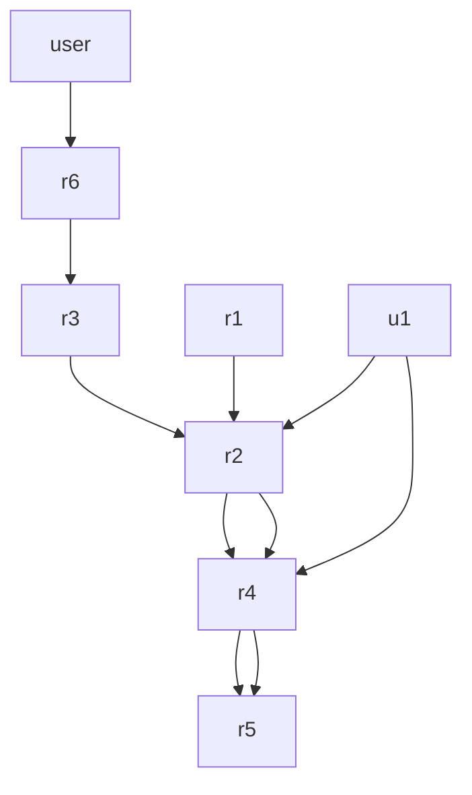

## Team Control Number

For office use only

T4

## 9440

Problem Chosen

B

For office use only

F1

F2

F3

F4

## 2011 Mathematical Contest in Modeling (MCM) Summary Sheet

(Attach a copy of this page to each copy of your solution paper.)

Type a summary of your results on this page. Do not include the name of your school, advisor, or team members on this page.

## KEY PARAMETERS

N-Number of users

R-Communication range of a repeater

r-Communication range of

C-Capacity of a repeater

## KEY CONCEPT

Relay Networks

Two-Tiered Model

Covering Problem

Voronoi Diagram

## KEY TECHNIQUES

Iterative Refinement

Extremal Optimization

Ploting Voronoi Diagram

Determining Circumcircle

Minimum Spanning Tree

natural_image

Circular diagram with interconnected polygonal shapes and blue dots, no text or symbols present

Voronoi

Diagram

Beats

Cellular

Network

natural_image

Geometric pattern of red hexagons arranged in a circle with blue outline (no text or symbols)

## 104 Repeaters from out algorithm

## 108 Repeaters from the naïve solution

# Least Number of Repeaters Covering a Circular Area: Iterative Extremal Optimization Based on Voronoi Diagram

## Abstract

In this paper, we propose a two-tiered network model, where lower-power users can communicate with one another through repeaters, which amplify weak signals and retransmit them. A repeater is of limited capacity and may interfere with a nearby repeater if their transmitter frequencies are close and they share the same private line tone. Our objective is to place the least number of repeaters that can satisfy the users communication requirement: the weak requirement is that every user must be covered by at least one repeater while the strong requirement is that every user can communicate with another user in any position of the considered area. Motivated by the structure of cellular networks, we give a naïve solution where the number of repeaters and their positions can be obtained analytically. In a circular area with radius 40 miles, 12 repeaters are enough to accommodate 1000 simultaneous users. We further propose an iterative refinement algorithm consisting of three fundamental modules: to draw the Voronoi diagram, to determine the circumscribed circles of Voronoi areas and move the repeaters to the centers of these circumscribed circles, and to escape the local optimum by using the idea of extremal optimization. The proposed algorithm outperforms the naïve solution. For the case of 1000 users, it obtains a solution with 11 repeaters, which can be proved to be the real optimum. For the case of 10000 users, it obtains a solution with 104 repeaters, better than the naïve solution with 108 repeaters. We further discuss how to assign frequencies and private line tones based on maximum and minimum spanning tree technique, the effects of simultaneous users need to be accommodated, the fluctuation of user density in reality, how the landscape can affect the design of repeaters’ locations, and the strengths and weaknesses of the model and algorithms.

## 1 Introduction

The design of amplify-and-forward relay networks has attracted increasing attention recently [1-3]. The relay networks are very helpful for long-distance communication since the relay nodes can amplify the weak signals and forward them to other relay nodes or send them directly to the destinations. Through several relay nodes, low-power users can communicate with one another in situation where direct user-to-user communication would not be possible. The relay networks have already found wide applications in cooperative communication [4]. For example, in amateur radio activities hams can communicate with distant hams through one or more relay nodes (also called radio repeaters) [5], and in wireless sensor networks relay nodes are used to help information dissemination between distant sensors [6].

In many amplify-and-forward cooperative communication networks, the nodes are homogeneous, namely a node can simultaneously play the roles as source node, sink node and relay node. A typical example is the mobile communication, where a cell phone can also be an amplify-and-forward relay node [4]. In another scenario, the relay nodes usually do not initiate communications but only help communications between other nodes. For example, in amateur radio activities, radio repeaters can be considered as relay nodes, and hams usually carry their own radios (transceivers). Repeaters can pick up weak signals from radios, amplify and retransmit them. Different from the homogeneous scenario, the functionalities of repeaters and radios are different, and the specifications of repeaters and radios are also different. For example, in Utah, the power of a radio is usually a few watts, while most repeaters are of power no less than a hundred watts.

Pan et al. [7] proposed a two-tiered relay network model, where the base stations are considered as low power users and some inter-application nodes are playing the role of relay nodes. However, they did not address the issue of covering users by relay nodes. Gupta and Younis considered the fault-tolerant [8] and traffic load balance [9] problems in a two-tiered relay network model, yet they did not address the placement problem of relay nodes. Tang et al. [10] proposed two algorithms for the relay nodes placement problem, aiming at placing the fewest number of relay nodes in the considered area such that each user can communicate with at least one relay node and the network of relay nodes is connected.

The above-mentioned works are different from ours because in a more general scenario that includes the amateur radio communication, the capacity of a repeater and the interference among nearby repeaters should be taken into account. In this paper, we propose a more general two-tiered network model, where each repeater can simultaneously manage at most C users and two nearby repeaters will interfere with each other if their transmitter frequencies are close and they share the same private line tone. Our objective is to place the least number of repeaters that can satisfy the users’ communication requirement. We respectively consider two different requirements: the weak requirement is that every user must be covered by at least one repeater and the strong requirement is that every user can communicate with another user in any position of the considered area. Our analysis indicates that the former requirement is equivalent to a circle covering problem while the solution on the latter requirement is based on the answer to the former requirement.

The geometric covering problem is known to be NP hard [11], and the algorithm is usually very time-consuming even for a small number of circles. For example, Nurmela and Ostergard [12] proposed a simulated annealing algorithm to obtain near-optimal solutions for the unit square covering problem with up to 30 equal circles. Their result are known to be one of the most accurate results yet the algorithm has to run more than 2 weeks to obtain the solution for 27 circles. In contrast, considering the limited capacity of a repeater, when the number of users being accommodated increases, we have to place remarkably more repeaters than being considered in the previous works.

Motivated by the structure of cellular networks (i.e., networks with beehive-like structure), we give a naïve solution where the number of repeaters as well as their positions can be obtained analytically. In numerical simulation, this naïve solution performs unexpectedly well. In a circular area with radius 40 miles, 12 repeaters are enough to accommodate 1000 simultaneous users and for 10000 users, 108 repeaters are sufficient. In comparison, in the former case, 11 repeaters are the optimum and in the later case. We further propose an iterative refinement algorithm consisting of three fundamental modules: to draw the Voronoi diagram [13], to determine the circumscribed circles [14] of Voronoi areas and move the repeaters to the centers of these circumscribed circles, and to escape the local optimum by using the idea of extremal optimization [15,16]. This method outperforms the naïve solution. For the case of 1000 users, it obtains a solution with 11 repeaters, which can be proved to be the real optimum. For the case of 10000 users, it obtains a solution with 104 repeaters, better than the naïve solution.

Taking into account the capacity limitation and interferences, we proposed a more general model than most of previous models. Two methods are designed to place the repeaters in a typical area. They both perform very well. This work provides a general model and a novel algorithm to an extensively studied problem: how to place relay nodes in a cooperative communication system. This work can find applications in not only the amateur radio activities, but also the design of sensor wireless networks and mobile wireless networks.

This paper is organized as follows. In Section 2, we clarify the considered problem, and in Section 3, we descript the proposed two-tiered amplify-and-forward network model, as well as the definitions of solution and strong solution. Section 4 presents the calculation of the communication range of repeaters and users, the capacity of a repeater. In this section, we apply the continuous approximation and show how to map this problem to a “circles covering circle” problem. The naïve solution is also given in Section 4. We present the algorithms respectively to determine the requirement number of repeaters as well as their positions and to assign frequencies and private line tones to repeaters in Section 5. In Section 6, we give the solutions obtained by our algorithm, compare them with the naïve solution, and prove that the solution for the small population case is the optimal one. In Section 7, we discuss the effects of simultaneous users need to be accommodated, the fluctuation of user density in reality, and how the landscape can affect the design of repeaters’ locations, and finally, in Section 8, we summarize the paper and discuss the strengths and weaknesses of the model and algorithms.

Parameters, mathematical symbols and assumptions appear everywhere in this paper. Therefore, for convenience, in Appendix A, we list all the parameters, in Appendix B, we list the mathematical symbols, and in Appendix C, we summarize the important assumptions made in this paper.

## 2 Problem Description

Given a circular flat area of radius  (this circular area is denoted by  ), we are asked to determine the least number of radio repeaters necessary to accommodate a given number of users N. A repeater is a combination of a radio receiver and a radio transmitter that picks up weak signals, amplify them, and retransmit them on a different frequency. In this problem, the three most fundamental parameters characterizing a repeater are the receiver frequency $f _ { r } ,$ the transmitter frequency $f _ { t }$ and the private line (PL) tone $n _ { \mathrm { P L } }$ . A repeater responds only to signals on its receiver frequency and containing the same PL tone. If so, the signals will be amplified and transmitted on the repeater’s transmitter frequency and the PL tone will not be changed. In this problem, both $f _ { r } ,$ and $f _ { t }$ belong to the range [145MHz, 148MHz], $| f _ { r } - f _ { t } | { = } 0 . 6 \mathrm { M H z }$ , and there are in total $N _ { \mathrm { P L } } { = } 5 4$ different PL tones available.

For example, a repeater located in Mong Kok, Hong Kong has the receiver frequency 145.025MHz, the transmitter frequency 145.625MHz, and the PL tone 110.9Hz. That is to say, only the signals on 145.025MHz and with PL tone 110.9Hz can be amplified by this repeater, and after amplification, the signals will be transmitted with frequency 145.625MHz and PL tone 110.9Hz.

Notice that, two repeaters will interfere with each other if they satisfy all the following three conditions: (i) they carry exactly the same PL tone; (ii) their distance is smaller than the twofold of the communication radius R of the repeater (for simplicity, we assume every repeater has the same communication radius $R )$ ; (iii) the difference between their transmitter frequencies is smaller than a threshold $f _ { c } .$ It is necessary to guarantee that no interference will happen between any pair of repeaters.

Each user can directly contact other nearby users and reach distant users through one or several repeaters. The maximal communication distance from a user to a repeater, r, is supposed to be identical for every user, which is remarkably smaller than the communication radius of a repeater $( \mathrm { i } . \mathrm { e } . , \ r { < } R )$ . Every user should be covered by at least one repeater, namely at least one repeater locates inside the circle with radius r and centered at the user’s location. Under a stronger requirement, each user is able to send information to users at any positions in the considered area through one or several repeaters.

Since the communication ranges, R and r, are finite, and the capacity of a repeater, C, is very limited (i.e., a repeater can manage at most C different users simultaneously), usually a number of repeaters are required to accommodate users in a given area. The primary problem is to determine the minimum number of repeaters that can satisfy the communication requirement of a given number of users. Of course, a complete solution should also contain the positions, receiver and transmitter frequencies, as well as the PL tones of repeaters. The effects of the number of users and the landscape are emphasized in this problem. More detailed description of the meanings and effects of the parameters, and the in-depth analysis on the problem constrains are presented in the following sections.

## 3 Model

To present the system, we use a two-tiered directed network $D ( V _ { u } , \ V _ { r } , \ E _ { u r } , \ E _ { r r } )$ , where $V _ { \scriptscriptstyle u } = \{ u _ { \scriptscriptstyle 1 } , u _ { \scriptscriptstyle 2 } , . . . , u _ { \scriptscriptstyle N } \}$ and $V _ { r } = \{ r _ { 1 } , r _ { 2 } , . . . , r _ { M } \}$ denote the sets of users and repeaters, and $E _ { u r }$ and $E _ { r r }$ are the sets of directed links from users to repeaters and between repeaters. Each user $u _ { i }$ is identified by her/his location $( x ( u _ { i } ) , y ( u _ { i } ) )$ in a 2-dimensional plane, and each repeater $r _ { j }$ is identified by its location, receiver frequency, transmitter frequency and PL tone as $( x ( r _ { i } ) , y ( r _ { i } ) , f _ { r } ( r _ { i } ) , f _ { t } ( r _ { i } ) , n _ { \mathrm { { P L } } } ( r _ { i } ) )$ . As mentioned above, the frequencies of an arbitrary repeater $r _ { j }$ should obey the constrains $f _ { r } ( r _ { j } ) , f _ { t } ( r _ { j } ) \in [ 1 4 5 \mathrm { M H z } , 1 4 8 \mathrm { M H z } ]$ and $\left| f _ { r } ( r _ { j } ) - f _ { t } ( r _ { j } ) \right| = 0 . 6 \mathrm { M H z }$ . Since the considered area is a circular area of radius $\Phi$ , the location for arbitrary user or repeater should satisfy the inequality

$$
x ^ {2} + y ^ {2} \leq \Phi^ {2} \tag {1}
$$

where $\Phi = 4 0$ is given a priori. A directed link from $u _ { i }$ to $r _ { j }$ exists (i.e., $( u _ { i } , r _ { j } ) \in E _ { u r } )$ if the distance between $u _ { i }$ and $r _ { j }$ is no more than a user’s communication range r. A directed link from $r _ { j }$ to $r _ { k }$ exists (i.e., $( r _ { j } , r _ { k } ) \in E _ { r r } )$ if the distance between $r _ { j }$ and $r _ { k }$ is no more than a repeater’s communication range $R ,$ the transmitter frequency of $r _ { j }$ equals the receiver frequency of $r _ { k }$ (i.e., $f _ { t } ( r _ { i } ) = f _ { r } ( r _ { k } ) )$ and they share the same PL tone (i.e., $n _ { \mathrm { { P L } } } ( r _ { i } ) = n _ { \mathrm { { P L } } } ( r _ { k } ) ) ,$ . Clearly, the sets of directed links are determined when the information about users and repeaters is known.

A network D is called a solution (in section 4, we will discuss a more practical definition of solution that does not depend on a specific distribution of users’ locations) if the following three conditions $( \Omega _ { 1 } , \Omega _ { 2 } , \Omega _ { 3 } )$ are all satisfied.

$\Omega _ { 1 }$ -Capacity constrain. For simplicity, we assume users are uniformly distributed in the considered area   and each of them prefers to communicate with the nearest repeater. Each repeater can manage at most C users at the same time (the capacities of different repeaters are supposed to be the same, and the estimation of C will be given in the next section). For a repeater $r _ { j } ,$ there exists a connected area $S _ { V } ( r _ { j } )$ inside  such that for every point inside this area, $r _ { j }$ is the nearest repeater and for every point outside this area, $r _ { j }$ is definitely not the nearest repeater. This area is called the Voronoi area [13] of $r _ { j } .$ For every repeater, the number of users inside its Voronoi area must be no more than its capacity C.

$\Omega _ { 2 }$ -Interference avoidance. If two repeaters share the same PL tone and are with distance less than 2R, the difference between their transmitter frequencies must be no less than a given threshold $f _ { c } .$ . In the spectrum 145-148MHz, the standard threshold is $f _ { c } { = } 0 . 6 \mathbf { M } \mathrm { H z }$ .

$\Omega _ { 3 }$ -Connectivity. Every user is covered by at least one repeater. That is to say, $\forall u _ { i } , \exists r _ { j }$ , such that $( u _ { i } , r _ { j } ) \in E _ { u r }$ .

flowchart

Figure 1. An illustration about the reachable repeaters of $u _ { I }$ . The circle centered at $u _ { I }$ is the communication of $u _ { I }$ with radius r.

Our goal is to find out the solution with the minimum number of repeaters $M .$ In a solution, although every user is covered by at least one repeater, her/his signals may not reach the desired position in  since the coverage of a repeater is also limited and the solution does not guarantee the existence of a multi-hop path through several repeaters to reach the desired position. Ignoring the small area that can be directly reached by a user without the help of any repeater, the reachable area of a user $u _ { i } ,$ denoted by $S _ { r } ( u _ { i } )$ , is defined as the area in  that can be covered by at least one reachable repeater of $u _ { i }$ (each repeater covers a circle with radius $R )$ . The set of reachable repeaters for $u _ { i } ,$ denoted by $R _ { r } ( u _ { i } )$ , consists of two parts: One is the repeaters that can be directly reached by $u _ { i } \left( \mathrm { i . e . } \right.$ ., the repeaters located within the circle with radius r and centered at $u _ { i } )$ and another is the repeaters that can be further reached through directed paths consisted of directed links in $E _ { r r }$ and started from the directly reachable repeaters. Figure 1 illustrates a simple example where $r _ { 2 }$ can be directly reached by $u _ { I } ,$ and $r _ { 4 }$ and $r _ { 5 }$ can be further reached starting from $r _ { 2 } .$ . Two nearby repeaters, like $r _ { 2 }$ and $r _ { 3 } ,$ may not have a link in between since they may not match with each other in frequency or PL tone. The reachable repeaters of $u _ { I }$ are $r _ { 2 } , r _ { 4 }$ and $r _ { 5 } ,$ and thus the reachable area of $u _ { I }$ is the union of the coverage areas of $r _ { 2 } , r _ { 4 }$ and $r _ { 5 } .$ . The following condition must be satisfied to guarantee every user can in principle reach any position of the considered area through multi-hop repeaters.

$\Omega _ { 4 }$ -Global Reachability. The reachable area of every user is equal to the considered area $\Gamma$ .

A network D is called a strong solution if the following three conditions $( \Omega _ { 1 } , \Omega _ { 2 } , \Omega _ { 4 } )$ are all satisfied. Under these definitions, two propositions obviously hold, that is

Proposition 1: A strong solution is a solution.

Proposition 2: When $R \geq 2 \Phi$ , any solution is a strong solution.

To find a strong solution is much more difficult than to find a solution, and these two tasks are equivalent to each other only if $R \geq 2 \Phi$ . We will respectively study the cases of $R \geq 2 \Phi$ and $R < 2 \Phi$ , emphasizing on the strong solutions.

## 4 Analysis

In this section, we will give some elementary analysis about the model. Firstly, in subsection 4.1 and 4.2, we will calculate the communication ranges for repeaters and users, as well as the repeater’s capacity according to the Shannon’s theory. Taking into consideration of the mobility of users, in subsection 4.3, we will show that the continuous approximation of the distribution of users’ locations is necessary to address the problem. In subsection 4.4, we will present a naïve solution where repeaters are arranged in a cellular network (i.e., a beehive-like structure). In spite of the simplicity, the naïve solution performs unexpectedly well, which will play a role of benchmark solution in evaluating the algorithmic output.

## 4.1 Communication Radius

We apply a simple model to determine the effective radiated distance (i.e., communication range) of repeaters and users. According to the problem description, we assume that this circular area is a place where wireless signals can fade freely. That is to say, there are not any other sorts of interference such as fogs, rivers, hills, buildings, activities of sun and so forth. Therefore the fading of signals under such situation is only due to the distance across which the signal is transmitted.

Let $P _ { r , o u t }$ be the power of the signal transmitted by a repeater. Since the signal can fade freely, its average power  P within one unit area at a distance  d from the repeater is

$$
P = \frac {P _ {r , o u t}}{4 \pi d ^ {2}} \tag {2}
$$

According to the antenna theory [17], the effective receiving area of an antenna is $\lambda ^ { 2 } / 4 \pi$ , where is the wave length of the signal. So the receiving power of the signal is

$$
P ^ {\prime} = \frac {P _ {r , o u t}}{4 \pi d ^ {2}} \bullet \frac {\lambda^ {2}}{4 \pi} \tag {3}
$$

Substituting with $c / f$ , where c is the velocity of light and f is the frequency of the signal, one obtains

$$
P ^ {\prime} = P _ {r, o u t} \left(\frac {c}{4 \pi d f}\right) ^ {2} \tag {4}
$$

In terms of the communication theory (Shannon’s thoery), the loss $L _ { s }$ is

$$
L _ {s} = 1 0 \lg (\frac {P _ {r , o u t}}{P ^ {\prime}}) = 9 2. 4 + 2 0 \lg d + 2 0 \lg f \tag {5}
$$

where $L _ { s }$ is measured by dB, d is measured by km, f is in GHz. The actual power of received signal $P _ { r , i n }$ is

$$
P _ {r, i n} = P _ {r, o u t} + \left(G _ {o u t} + G _ {i n}\right) - \left(L _ {f, o u t} + L _ {f, i n}\right) - \left(L _ {b, o u t} + L _ {b, i n}\right) - L _ {s} \tag {6}
$$

From one repeater (transmitter) to another repeater (receiver), the equations hold as $L _ { \it f , o u t } = L _ { \it f , i n }$ (the loss of feed system), $L _ { b , o u t } = L _ { b , i n }$ (other loss of the system), $G _ { o u t } = G _ { i n }$ (the gain of antenna). Normally, $L _ { \boldsymbol { f } , o u t } = L _ { \boldsymbol { f } , i n } = 2 d B$ , $L _ { b , o u t } = L _ { b , i n } = 1 d B$ , $G _ { o u t } = G _ { i n } = 3 9 d B$ . For this problem, the frequency of signals is about 0.1465GHz (i.e., the middle point of the available spectrum 145MHz\~148MHz), and thus

$$
d = 1 0 ^ {\frac {1 0 \lg \frac {P _ {r , o u t}}{P _ {r , i n}} - 3 7 . 2 3 2 8}{2 0}} \tag {7}
$$

Table 1: Effective radiated powers of repeaters in Utah (http://www.ussc.com/\~uvhfs/rptr.html)

<table><tr><td>Call No.</td><td>ERP</td><td>Call No.</td><td>ERP</td><td>Call No.</td><td>ERP</td><td>Call No.</td><td>ERP</td><td>Call No.</td><td>ERP</td></tr><tr><td>K7UCS</td><td>120 W</td><td>WA7UAH</td><td>30 W</td><td>KD7NX</td><td>58 W</td><td>K7JL</td><td>100 W</td><td>K7JL</td><td>500 W</td></tr><tr><td>KF6RAL</td><td>100 W</td><td>KD7HUS</td><td>25 W</td><td>K7JH</td><td>100 W</td><td>K7MLA</td><td>100 W</td><td>K7SDC</td><td>100 W</td></tr><tr><td>W7IHC</td><td>100 W</td><td>WV7H</td><td>40 W</td><td>K7QEQ</td><td>100 W</td><td>W7WAC</td><td>50 W</td><td>K7MLA</td><td>100 W</td></tr><tr><td>AA7JR</td><td>100 W</td><td>N7BSA</td><td>80 W</td><td>W7SP</td><td>100 W</td><td>N7KM</td><td>40 W</td><td>N7NKK</td><td>50 W</td></tr><tr><td>NZ6Z</td><td>100 W</td><td>W7BAR</td><td>100 W</td><td>WV7H</td><td>100 W</td><td>W7EO</td><td>40 W</td><td>K7MLA</td><td>100 W</td></tr><tr><td>KE7FO</td><td>20 W</td><td>K7HEN</td><td>100 W</td><td>AE7TA</td><td>120 W</td><td>KC7SNN</td><td>100 W</td><td>K7JL</td><td>100 W</td></tr><tr><td>KR7D</td><td>100 W</td><td>W7DRC</td><td>48 W</td><td>N6EZO</td><td>100 W</td><td>K7OGM</td><td>100 W</td><td>AC7O</td><td>10 W</td></tr><tr><td>K7JL</td><td>50 W</td><td>K7SDC</td><td>100 W</td><td>W7SU</td><td>100 W</td><td>K7MLA</td><td>75 W</td><td>N7ZOI</td><td>100 W</td></tr><tr><td>N7WFM</td><td>100 W</td><td>W7SP</td><td>100 W</td><td>NR7K</td><td>100 W</td><td>K7DAV</td><td>50 W</td><td>W7EO</td><td>100 W</td></tr><tr><td>WB7REL</td><td>160 W</td><td>WA7MXZ</td><td>100 W</td><td>N7PCE</td><td>100 W</td><td>W7BAR</td><td>183 W</td><td>AB7TS</td><td>100 W</td></tr><tr><td>K7SDC</td><td>100 W</td><td>W7JVN</td><td>100 W</td><td>K7JL</td><td>100 W</td><td>K7SDC</td><td>100 W</td><td>KJ7VO</td><td>100 W</td></tr><tr><td>WA7KMF</td><td>100 W</td><td>W7DRC</td><td>60 W</td><td>KD7YE</td><td>97 W</td><td>N7DZP</td><td>40 W</td><td>WA7YZR</td><td>100 W</td></tr><tr><td>N7BYU</td><td>100 W</td><td>W7DHH</td><td>100 W</td><td>W7NRC</td><td>100 W</td><td>KB7ZCL</td><td>200 W</td><td>K7HEN</td><td>100 W</td></tr><tr><td>K7ACA</td><td>100 W</td><td>N7JSQ</td><td>100 W</td><td>KD0J</td><td>100 W</td><td>K7CEM</td><td>40 W</td><td>N7PQD</td><td>147 W</td></tr><tr><td>W7EO</td><td>160 W</td><td>KD0J</td><td>100 W</td><td>K7QEQ</td><td>100 W</td><td>K7SDC</td><td>100 W</td><td>N7WPF</td><td>125 W</td></tr><tr><td>KA7LEG</td><td>200 W</td><td>KA7STK</td><td>25 W</td><td>W7SU</td><td>100 W</td><td>WX7Y</td><td>100 W</td><td>AC7O</td><td>200 W</td></tr><tr><td>AC7O</td><td>100 W</td><td>W7NRC</td><td>100 W</td><td>NR7K</td><td>20 W</td><td>K7SDC</td><td>60 W</td><td>K7SG</td><td>25 W</td></tr><tr><td>WB7TSQ</td><td>100 W</td><td>AC7O</td><td>100 W</td><td>N7TOP</td><td>175 W</td><td>N7GGN</td><td>20 W</td><td>K7UCS</td><td>120 W</td></tr><tr><td>W7DES</td><td>25 W</td><td>WB7CBS</td><td>100 W</td><td>W7BYU</td><td>50 W</td><td>W7BAR</td><td>100 W</td><td>W7CWK</td><td>100 W</td></tr><tr><td>W7EO</td><td>100 W</td><td>K7UCS</td><td>120 W</td><td>WA7GIE</td><td>100 W</td><td>KB7WQD</td><td>48 W</td><td>WB7TSQ</td><td>100 W</td></tr><tr><td>K7SDC</td><td>100 W</td><td>KK7EX</td><td>50 W</td><td>WI7M</td><td>67 W</td><td>WA7GIE</td><td>100 W</td><td>WA7GIE</td><td>100 W</td></tr><tr><td>KK7DO</td><td>800 W</td><td>NR7K</td><td>100 W</td><td>WR7AAA</td><td>100 W</td><td>AG7BL</td><td>100 W</td><td>W7NRC</td><td>100 W</td></tr></table>

In the light of the statistics about the 2-meter repeaters in Utah, USA (see Table 1), the effective radiated power of most of the repeaters is $P _ { r , o u t } = 1 0 0 W$ , and normally a repeater can receive the signal with power no less than $1 \mu W$ (i.e., $P _ { r , i n } \ge 1 \mu W )$ . According to Eq. (7), the communication radius of a repeater is $R = 8 5 . 4 5$ miles (the original result is measured by kilometers, and we have already changed it to miles). Analogously, the average working power for a user (according to several wireless devices) is $P _ { u , o u t } = 3 . 2 W$ and $P _ { u , i n } \ge 1 \mu W$ , resulting in the user’s communication radius $r = 1 5 . 2 8$ miles. Although our calculation indicates that $R \geq 2 \Phi$ and the global reachability $( \Omega _ { 4 } )$ is equivalent to the connectivity $( \Omega _ { 3 } )$ , we will discuss in this paper the more complicated case when $R < 2 \Phi$ .

## 4.2 Repeater’s Capacity

In this subsection, we will calculate the maximal number of users that can be simultaneously accommodated in a repeater, namely the capacity C.

Ignoring the background noise and the interference, namely we assume that signals from one repeater will not affect others. Considering the transmitter frequency in a repeater is an exact value rather than in a broad band, we come up with a method to calculate the capacity through the gain. A mainstream method to estimate the capacity of information over a noisy channel is the famous Shannon theory, as:

$$
\varphi = B \log_ {2} (1 + S N R) \tag {8}
$$

where $\varphi$ is the information bit rate, measured by watt (dB), SNR is the signal-to-noise ratio, which is dimensionless, and B is the total bandwidth, measured by Hz.

Inspired by Shannon Theory, Gilhousen et al. [18] put forward a method to estimate the capacity of a cellular CDMA System. Of greater importance for reliable system operation is the bit energy-to-noise density ratio, whose numerator is obtained by dividing the desired signal power by the information bit rate $\varphi$ , and dividing the noise by the total bandwidth W, which results in the equation

$$
\frac {E _ {b}}{N _ {0}} = \frac {P _ {u r} / \varphi}{(C - 1) P _ {u r} / B} = \frac {B / P _ {u r}}{C - 1} \tag {9}
$$

where $P _ { u r }$ is the power of signal come from a single user and received by a repeater, measured by bps; C is the maximum number of users that can be simultaneously managed by a repeater, $E _ { b } / N _ { 0 }$ level is assumed which ensures operation at the level of bit error performance required for digital voice transmission, which is always set ranging from 5 to 30 dB. $E _ { b } / N _ { 0 }$ is a standard for digital voice transmission, and can take different values according to different circumstances.

Different from the CDMA System, the transmitter frequency in a repeater is an exact value rather than in a broad band. We prefer to take the following equation

$$
\frac {E _ {b}}{N _ {0}} = \frac {G _ {\text { out }}}{V (C - 1) \left(1 + I _ {\text { other }} / I _ {\text { self }}\right)} \tag {10}
$$

where G is the gain of antenna, V is the gain of voice, $I _ { o t h e r }$ is the interference come from other repeaters, and $I _ { s e l f }$ is the interference of itself.

In the situation that a repeater can accommodate C users simultaneously, SNR can be regarded as the ratio of the effective information in the total received signal, say

$$
S N R = \frac {P _ {u r}}{(C - 1) P _ {u r}} = \frac {1}{C - 1} \tag {11}
$$

Normally, $G _ { o u t } = 3 9 d B = 7 9 6 6 . 4 0 W$ and $V = 0 . 4 d B = 1 . 0 7 W$ (in the calculation, the unit must be watt). We ignore the interference come from other repeaters, namely $I _ { o t h e r } / I _ { s e l f } = 0$ . Setting ${ { E } _ { b } } / { N _ { 0 } } = 1 8 d B = 6 3 . 0 1 W$ (the bit energy-to-noise density ratio is always ranging from 5 to 30dB, and for transceiver we set it as the middle point 18dB), we can get the capacity of a single repeater through:

$$
C = 1 + \frac {G _ {\text { out }}}{V (1 + I _ {\text { other }} / I _ {\text { self }}) E _ {b} / N _ {0}} \approx 1 1 9 \tag {12}
$$

## 4.3 Continuous Approximation

Taking into account the mobility of users, the repeaters have to cover all the considered area  . Given distributed users $V _ { u } ,$ a solution $D ( V _ { u } , V _ { r } )$ may be not a solution for another distribution of users. That is to say, the network $D ( V _ { u } ^ { ' } , V _ { r } )$ may not be a solution although the user locations of both $V _ { u }$ and $V _ { u } ^ { ' }$ are sampled from an identical uniform distribution. Therefore, a practical solution should not depend on a specific distribution.

To make it possible, we use a continuous approximation instead of the uniform distribution of users. Under this approximation, the number of users is considered as a real variable (do not be surprised if we talk about 94.40 users) and the N users are distributed completely uniformly in the considered area. At any point inside the considered area, the user density, denoted by $\rho$ , is a constant as

$$
\rho = \frac {N}{\pi \Phi^ {2}} \tag {13}
$$

where $\pi \Phi ^ { 2 }$ is the area of  . Except the irrelevant constrain $\Omega _ { 2 }$ , the other three constrains are changed correspondingly as

$\Omega _ { 1 } ^ { * } { \bf - C a p a c i t y }$ constrain. For every repeater $r _ { j } ,$ , if the area of its Voronoi area is $S _ { V } ( r _ { j } )$ , it must satisfy the inequality

$$
\rho S _ {V} (r _ {j}) \leq C \tag {14}
$$

$\boldsymbol { \Omega } _ { 3 } ^ { * }$ -Connectivity. Every point in the considered area is covered by at least one repeater.

$\Omega _ { 4 } ^ { * }$ -Global Reachability. The reachable area of every point (considering that at every point, there can be user) is equal to the considered area $\Gamma .$

Hereinafter, the terms solution and strong solution are all corresponding to the continuous case. Although we assume the users are uniformly distributed, in the real discrete case, the distribution can never be as uniform as the continuous case. The effects of fluctuation in the real distribution of users’ locations (where the number of users is always an integer) will be discussed in the Section 7.

As mentioned in Proposition 1 and 2, if we only consider the solution or in the case with $R \geq 2 \Phi$ , under continuous approximation, our problem is equivalent to the “circles covering circle” problem if we can easily make sure any two repeaters will not interfere with each other. In a word, we should determine the least number of circles with radius $r '$ to cover a circle with radius  . Notice that, $r '$ may be smaller than r due to the capacity limitation.

In the frequency range $[ 1 4 5 \mathrm { M H z } ,$ 148MHz] with $f _ { c } { = } 0 . 6 \mathbf { M H z } ,$ in a PL tone, if $R \geq 2 \Phi$ (when $R \geq \Phi$ , any pair of repeaters in the considered area may interfere with each other), there are at most six different repeaters without interference, whose transmitter frequencies are 145.0MHz, 145.6MHz, $1 4 6 . 2 \mathrm { M H z } ,$ ${ 1 4 6 . 8 } \mathrm { M H z } ,$ 147.4MHz and 148.0MHz. However, according to the pigeonhole principle, there must be a pair of repeaters with inverse frequency pair as $f _ { I ^ { - } } f _ { 2 }$ and $f _ { 2 } { \cdot } f _ { I }$ (Here, a repeater represented by $f _ { I } { - } f _ { 2 }$ has a receiver frequency $f _ { I }$ and a transmitter frequency f2). It is very possible that the former repeater amplifies signals and sends to the latter repeater, and the latter repeater amplifies the received signals and sends back to the former repeater, again the former repeater will amplify the signals and send to the latter repeater, and so on. To avoid such a problem, we consider a set of non-interacting repeaters in a PL tone. Obviously, the maximum number of such a group of repeaters is five. An example set is 145.6-145.0, 146.3-145.7, 147.0-146.4, 147.7-147.1 and 147.4-148.0. Therefore, we can conclude that when $R \geq \Phi$ , with the help of $N _ { \mathrm { P L } } = 5 4$ different PL tones, the maximum number of repeaters without any interference is $5 4 \times 6 = 3 2 4$ , and the maximum number of repeaters without any interactions is $5 4 \times 5 = 2 7 0$ . Therefore, if the required number of small circles is no more than 324, we do not need to consider the interference avoidance constrain but just set these repeaters to make sure they do not interfere with each other, while if the required number is no more than 270, we can make sure there will not be any needless interactions between repeaters. Of course, if we consider the strong solution with $R < 2 \Phi$ , the situation is much more complicated, and interactions between repeaters are generally necessary.

According to the connectivity constrain, in any solution, the number of repeaters M should satisfy the inequality

$$
M \geq \frac {\pi \Phi^ {2}}{\pi r ^ {2}} = \frac {\Phi^ {2}}{r ^ {2}} = \frac {4 0 ^ {2}}{1 5 . 2 8 ^ {2}} = 6. 8 5 \tag {15}
$$

Since M is an integer, we have $M \geq 7$ . According to the capacity constrain, in any solution, the number of repeaters M should satisfy the inequality

$$
M \geq \frac {N}{C} = \frac {N}{1 1 8} \tag {16}
$$

In this problem, for $N { = } 1 0 0 0$ , the lower boundary of M is $9 ( \mathrm { i . e . , } M \geq 9 )$ , while for $N { = } 1 0 0 0 0 .$ , it is 85 (i.e., $M \ge 8 5$ ).

## 4.4 Naïve Solution

Cellular networks are widely used in placing the relay nodes, especially in the design of the locations of base stations in mobile wireless networks. In this paper, as a naïve solution, we directly apply the cellular network structure to cover the considered area. Table 2 illustrates some small-size cellular networks, each of them can be considered as the Voronoi diagram [13] where the center of each regular hexagon lays a repeater. Clearly, the number of regular hexagons is equal to the number of repeaters M.

We firstly consider an inverse problem, that is, given a number of equal regular hexagons (we assume the edge length is a unit), to determine the largest circle that can be fully covered by these regular hexagons (these hexagons must be arranged in a beehive-like pattern). Table 2 gives the results up to 13 regular hexagons, which are calculated by hand.

Table 2: The cellular networks that can cover the largest circle. The third column lists the radiuses of the corresponding circles. Given the number of cells M, sometimes, the cellular networks are not unique, and then we only draw one of them as a representative.

<table><tr><td>The number of cells, M</td><td>The schematic diagram</td><td>The radius of the largest circle can be covered</td></tr><tr><td>1</td><td></td><td> $\frac{\sqrt{3}}{2}$ </td></tr><tr><td>2</td><td></td><td> $\frac{\sqrt{3}}{2}$ </td></tr><tr><td>3</td><td></td><td>1</td></tr><tr><td>4</td><td></td><td> $\frac{\sqrt{7}}{2}$ </td></tr><tr><td>5</td><td></td><td> $\frac{7}{5}$ </td></tr></table>

<table><tr><td>6</td><td></td><td></td><td></td><td> $\sqrt{3}$ </td></tr><tr><td>7</td><td></td><td></td><td></td><td>2</td></tr><tr><td>8</td><td colspan="3"></td><td>2</td></tr><tr><td>9</td><td colspan="3"></td><td>2</td></tr><tr><td>10</td><td colspan="3"></td><td> $\frac{\sqrt{19}}{2}$ </td></tr><tr><td>11</td><td colspan="3"></td><td> $\frac{\sqrt{19}}{2}$ </td></tr><tr><td>12</td><td colspan="3"></td><td> $\sqrt{7}$ </td></tr><tr><td>13</td><td colspan="3"></td><td> $\sqrt{7}$ </td></tr></table>

Here we show how to directly obtain the solution or the strong solution with $R \geq 2 \Phi$ for the case N=1000 by using Table 2. In this case, the user density is $\rho = \frac { N } { \pi \Phi ^ { 2 } } \approx 0 . 1 9 8 9$ . The 2 maximal area of the Voronoi area of any repeater in a cellular network is equal to the area of the regular hexagon (in the edge of the considered area, a repeater’s Voronoi area may be smaller than the area of the regular hexagon). The edge length of the regular hexagon $r _ { h }$ should not exceed the communication range r to make sure each point is covered by at least one repeater. In addition, according to the capacity limitation, the edge length $r _ { h }$ should satisfy the inequality

$$
\frac {3 \sqrt {3}}{2} r _ {h} ^ {2} \rho = C \tag {17}
$$

These two conditions determine the possibly longest edge length, and of course, to cover as large circle as possible, we always use the longest $r _ { h } .$ In this case, r=15.28 miles, and according to Eq. (17), $r _ { h }$ should be no longer than 15.18 miles. Therefore, the edge length of the regular hexagon is $r _ { h } { = } 1 5 . 1 8 \mathrm { m i l e s }$ . The circle to be covered is of radius   40 miles. Since $\frac { \sqrt { 1 9 } } { 2 } < \frac { \Phi } { r _ { h } } < \sqrt { 7 }$ , according to Table 2, 12 repeaters are sufficient to cover the considered area under the constrains of capacity and connectivity, yet 11 repeaters are not possible using the cellular network structure. This solution is shown in Figure 2, and the coordinates of repeaters are presented in Table 3. Notice that, here we only consider the solution or the strong solution with $R \geq 2 \Phi$ , the frequencies and PL tones of repeaters are easily to be arranged. As an example, we use three PL tones to make sure there is no interaction or interference.

scatterplot

| x    | y    |
| ---- | ---- |
| -40  | 15   |
| -30  | 25   |
| -20  | 30   |
| -10  | 35   |
| 0    | 40   |
| 10   | 35   |
| 20   | 30   |
| 30   | 25   |
| 40   | 20   |
| 50   | 15   |
| 60   | 10   |
| 70   | 5    |
| 80   | 0    |
| 90   | -5   |
| 100  | -10  |
| 110  | -15  |
| 120  | -20  |
| 130  | -25  |
| 140  | -30  |
| 150  | -35  |
| 160  | -40  |
| 170  | -45  |
| 180  | -50  |
| 190  | -45  |
| 200  | -40  |
| 210  | -35  |
| 220  | -30  |
| 230  | -25  |
| 240  | -20  |
| 250  | -15  |
| 260  | -10  |
| 270  | -5   |
| 280  | 0    |
| 290  | 5    |
| 300  | 10   |
| 310  | 15   |
| 320  | 20   |
| 330  | 25   |
| 340  | 30   |
| 350  | 35   |
| 360  | 40   |
| 370  | 45   |
| 380  | 50   |
| 390  | 45   |
| 400  | 40   |
| 410  | 35   |
| 420  | 30   |
| 430  | 25   |
| 440  | 20   |
| 450  | 15   |
| 460  | 10   |
| 470  | 5    |
| 480  | 0    |
| 490  | -5   |
| 500  | -10  |
| -40  | -15   |
| -30  | -25   |
| -20  | -35   |
| -10  | -45   |
| 0    | -55   |
| 10   | -45   |
| 20   | -35   |
| 30   | -25   |
| 40   | -15   |
| 50   | -5   |
| -40  | -10   |
| -30  | -20   |
| -20  | -30   |
| -10  | -40   |
| -11.5| -45   |
| -12.5| -5    |
| -13.5| -4.5 |
| -14.5| -3.5 |
| -15.5| -2.5 |
| -16.5| -1.5 |
| -17.5| -5   |
| -18.5| -1.5 |
| -19.5| -2.5 |
| -20.5| -3.5 |
| -21.5| -4.5 |
| -22.5| -5.5 |
| -23.5| -6    |
| -24.5| -7    |
| -25.5| -8    |
| -26.5| -9    |
| -27.5| -10   |
| -28.5| -11.5|
| -29.5| -13.5|
| -30.5| -15.5|
| -31.5| -17.5|
| -32.5| -19.5|
| -33.5| -21.5|
| -34.5| -23.5|
| -35.5| -25.5|
| -36.5| -27.5|
| -37.5| -29.5|
| -38.5| -31.5|
| -39.5| -33.5|
| -40.5| -35.5|
| -41.5| -37.5|
| -42.5| -39.5|
| -43.5| -41.5|
| -44.5| -43.5|
| -45.5| -45.5|
| -46.5| -47.5|
| -47.5| -49.5|
| -48.5| -51.5|
| -49.5| -49.5|
| -50.5| -47.5|

Figure 2: The solution consisted of 12 repeaters arranged in a cellular network. The blue circle denotes the considered area with radius 40miles, the read regular hexagons represent the cellular network, and the blue points in the centers of the regular hexagons denote the positions of repeaters.

As shown above, the basic procedure to get the naïve solution contains two steps: (i) find the longest $r _ { h } , ( \mathrm { i i } )$ search the best solution according to Table 2. However, the calculation of the radius of the largest coverable circle is not an easy problem (at least not easy by hand) for many regular hexagons. We only get the analytical results for two particular cases up to 121 circles, where the covered circle’s center is either at the center of the central hexagon or at the intersection of the three more central hexagons.

Table 3: The coordinates, frequencies and PL tones of the solution shown in Fig. 2.

<table><tr><td>Repeater No.</td><td>x-Coordinate</td><td>y-Coordinate</td><td>Receiver Frequency</td><td>Transmitter Frequency</td><td>PL Tone</td></tr><tr><td>1</td><td>-15.1800</td><td>0.0000</td><td>145.6</td><td>145.0</td><td>1</td></tr><tr><td>2</td><td>7.5900</td><td>13.1463</td><td>146.3</td><td>145.7</td><td>1</td></tr><tr><td>3</td><td>7.5900</td><td>-13.1463</td><td>147.0</td><td>146.4</td><td>1</td></tr><tr><td>4</td><td>-15.1800</td><td>26.2925</td><td>147.7</td><td>147.1</td><td>1</td></tr><tr><td>5</td><td>-37.9500</td><td>-12.6411</td><td>147.4</td><td>148.0</td><td>1</td></tr><tr><td>6</td><td>-37.9500</td><td>12.6411</td><td>145.6</td><td>145.0</td><td>2</td></tr><tr><td>7</td><td>-15.1800</td><td>-26.2925</td><td>146.3</td><td>145.7</td><td>2</td></tr><tr><td>8</td><td>7.5900</td><td>39.2733</td><td>147.0</td><td>146.4</td><td>2</td></tr><tr><td>9</td><td>7.5900</td><td>-39.2733</td><td>147.7</td><td>147.1</td><td>2</td></tr><tr><td>10</td><td>30.3600</td><td>0.0000</td><td>147.4</td><td>148.0</td><td>2</td></tr><tr><td>11</td><td>30.3600</td><td>26.0436</td><td>145.0</td><td>145.6</td><td>3</td></tr><tr><td>12</td><td>30.3600</td><td>-26.0436</td><td>147.4</td><td>148.0</td><td>3</td></tr></table>

Table 4: Analytical results for two particular cases. In the left side the largest covered circle is centered at the center of the central hexagon, while in the right side the largest covered circle is centered at the intersection of the three more central hexagons.

<table><tr><td colspan="2">Center of a circle</td><td colspan="2">Intersection of three circle</td></tr><tr><td>The number of cells, M</td><td>The radius of the largest coverable circle</td><td>The number of cells, M</td><td>The radius of the largest coverable circle</td></tr><tr><td>1</td><td> $\frac{\sqrt{3}}{2}$ </td><td>3</td><td>1</td></tr><tr><td>7</td><td>2</td><td>6</td><td> $\sqrt{3}$ </td></tr><tr><td>13</td><td> $\frac{3\sqrt{3}}{2}$ </td><td>12</td><td> $\sqrt{7}$ </td></tr><tr><td>19</td><td> $\sqrt{13}$ </td><td>18</td><td>3</td></tr><tr><td>31</td><td> $\frac{5\sqrt{3}}{2}$ </td><td>27</td><td>4</td></tr><tr><td>37</td><td>5</td><td>36</td><td> $\sqrt{21}$ </td></tr><tr><td>55</td><td> $\frac{7\sqrt{3}}{2}$ </td><td>48</td><td> $\sqrt{31}$ </td></tr><tr><td>61</td><td> $\sqrt{43}$ </td><td>60</td><td>6</td></tr><tr><td>85</td><td>9√3/2</td><td>75</td><td>7</td></tr><tr><td>91</td><td>8</td><td>90</td><td>√57</td></tr><tr><td>121</td><td>√91</td><td>108</td><td>9</td></tr></table>

In the case N=10000, $\rho = \frac { N } { \pi \Phi ^ { 2 } } \approx 1 . 9 8 9$ , according to the capacity constrain Eq. (17), we 2 have $r _ { h } = 4 . 8 0$ miles. Since $8 < \frac { \Phi } { r _ { h } } < 9$ , according to Table 4, 108 repeaters are sufficient to cover the considered area under the constrains of capacity and connectivity. Since the number of repeaters is smaller than 324, it is easy to arrange them when considering only a solution or a strong solution with $R \geq 2 \Phi$ . Figure 3 shows this solution, and the table containing all the coordinates is ignored.

natural_image

Geometric pattern of red hexagons enclosed by a blue circle, no text or symbols present

Figure 3: The solution consisted of 108 repeaters arranged in a cellular network. The blue circle denotes the considered area with radius 40miles, the red regular hexagons represent the cellular network. The repeaters are also lay in the centers of the regular hexagons (not shown).

## 5 Algorithm

This section will present two algorithms. The main algorithm tries to solve the circles covering circle problem with the least number of circles, and the secondary algorithm assigns each repeater the receiver frequency, the transmitter frequency and the PL tone.

scatterplot

| Label | X     | Y     |
|---|---|---|
| R1  | -10.5 | 1.0 |
| R2  | -10.0 | 5.0 |
| R3  | -9.5  | -25.0 |
| R4  | 20.0  | -5.0 |
| R5  | -30.0 | 13.0 |
| R6  | -1.0  | 1.0 |
| R7  | -28.0 | -18.0 |
| R8  | -22.0 | 20.0 |
| R9  | 7.0   | -10.0 |
| R10 | 6.0   | -25.0 |
| R11 | 18.0  | 20.0 |
| R12 | 9.0   | -5.0 |
| R13 | -20.0 | 3.0 |
| R14 | 1.0   | -20.0 |
| R15 | 33.0  | 19.0 |
| R16 | 13.0  | 3.0 |
| R17 | -27.0 | -26.0 |
| R18 | -7.0  | -33.0 |
| R19 | 28.0  | 28.0 |
| R20 | -12.0 | 26.0 |
| R21 | 12.0  | -34.0 |
| R22 | 24.0  | -25.0 |
| R23 | 31.0  | 5.0 |
| R24 | 21.0  | -11.0 |
| R25 | 29.0  | 13.0 |
| R26 | 19.0  | 5.0 |
| R27 | -25.0 | -3.0 |
| R28 | 31.0  | 23.0 |
| R29 | -9.0  | -21.0 |
| R30 | 19.0  | -8.0 |

Figure 4: Illustration of an initial configuration with 30 repeaters. The coordinates of each repeater are generated randomly inside the considered area.

radar chart

| Label | X | Y |
|---|---|---|
| R1 | -10 | 5 |
| R2 | -10 | 5 |
| R3 | -8 | -25 |
| R4 | 20 | -10 |
| R5 | -30 | 13 |
| R6 | 0 | 5 |
| R7 | -28 | -18 |
| R8 | -22 | 20 |
| R9 | 8 | -10 |
| R10 | 8 | -25 |
| R11 | 22 | 20 |
| R12 | 10 | -10 |
| R13 | -18 | 5 |
| R14 | 5 | -20 |
| R15 | 30 | 20 |
| R16 | 15 | 5 |
| R17 | -28 | -25 |
| R18 | -8 | -30 |
| R19 | 28 | 25 |
| R20 | -12 | 25 |
| R21 | 12 | -35 |
| R22 | 20 | -25 |
| R23 | 30 | 5 |
| R24 | 20 | -10 |
| R25 | 30 | 13 |
| R26 | 18 | 5 |
| R27 | -25 | -5 |
| R28 | 30 | 25 |
| R29 | -8 | -20 |

Figure 5: The resulted Voronoi diagram corresponding to the configuration shown in Fig. 4.

Before running the algorithm, we first determine the lower boundary of M according to Eqs. (15) and (16). The boundary is denoted by $M _ { 0 } .$ The procedure of the algorithm is as follows.

(1) Randomly place $M _ { O }$ repeaters in the considered area (See Fig. 4).  
(2) Divide the area into different parts in terms of Voronoi diagram, that is to say, determine the Voronoi area of each repeater. The algorithm can be found in Ref. [13], and one can see Fig. 5 for the resulted Voronoi diagram of the above configuration. Notice that, for some repeaters close to the edge of the considered area, their Voronoi areas may contain a part of the edge of the considered area.  
(3) Determine the circumscribed circle of each Voronoi area (i.e., a circle which can cover the area and meanwhile has the minimal radius). A standard algorithm can be found in Ref. [14], an advanced method can be found in Ref. [19]. We apply the standard method. The corresponding result after Fig. 5 is shown in Fig. 6.

radar chart

| Label | X | Y |
|---|---|---|
| R1 | -5 | 5 |
| R2 | -10 | 5 |
| R3 | -10 | -25 |
| R4 | 20 | 5 |
| R5 | -30 | 10 |
| R6 | -5 | 5 |
| R7 | -25 | -15 |
| R8 | -25 | 20 |
| R9 | 10 | -10 |
| R10 | 10 | -25 |
| R11 | 25 | 20 |
| R12 | 10 | -10 |
| R13 | -15 | 5 |
| R14 | 5 | -15 |
| R15 | 30 | 20 |
| R16 | 15 | 5 |
| R17 | -20 | -30 |
| R18 | -5 | -30 |
| R19 | 25 | 25 |
| R20 | -10 | 25 |
| R21 | 25 | -30 |
| R22 | 20 | -25 |
| R23 | 30 | 5 |
| R24 | 20 | -15 |
| R25 | 30 | 20 |
| R26 | 15 | 5 |
| R27 | -20 | -10 |
| R28 | 30 | 25 |
| R29 | -10 | -20 |
| R30 | 20 | -10 |
The chart displays a circular grid with red dashed lines connecting points of interest. The x-axis and y-axis are unlabeled but represent spatial coordinates in a two-dimensional space. There is no legend or additional data series present. The labels 'R' appear to denote specific positions within the circle.

Figure 6: The circumscribed circles of the Voronoi areas, corresponding to the ones shown in Fig. 5. The circumscribed circles are colored in green while the Voronoi areas are colored in red. Notice that, for the some repeaters close to the edge of the considered area, their Voronoi areas may contain a part of the edge of the considered area.

(4) Calculate the coordinates of the center of each circumscribed circle.  
(5) Calculate the distance from each repeater’s current location to the centers of the corresponding circumscribed circle. Sum up all the distances and compare the sum to a threshold $\xi$ . If the sum is less than $\xi$ , the current set of repeaters’ locations is considered to be converged. If it is converged, ${ \bf g 0 }$ to step (6), otherwise, move each repeater to the center of the corresponding circumscribed circle (see figure 7) and go

back to step (2).

(6) Calculate the number of users in each Voronoi region and see if the number is less than the repeater’s capacity, and the radius of the circumscribed circle should be less than the communication radius of users. If so, stop the algorithm and output the current solution. Otherwise, go to step (7)  
(7) With the current number of repeaters, if the number of extremal optimization operations is less than a threshold $T _ { c } ,$ pick up the repeater with the smallest Voronoi area, move it to a random position in the considered area and go back to step (2) and count an extremal optimization operation. Otherwise, add one more repeater, randomized the positions of all repeaters, and go back to step (2).

  
Figure 7: The black asterisks stand for the locations of repeaters, the red ones represent the centers of the circumscribed circles, and the black arrows show the directions towards which the repeaters will move. This illustration corresponds to the result shown in Fig. 6.

Here, the Voronoi area can be considered as the contribution of the corresponding repeater, and thus a repeater with smaller Voronoi area is less effective. The so-called extremal optimization is a method to escape the local optimum by every time change the individual with the least fitness. This idea originally comes from the Bak-Sneppen model [20] that describes the punctuated equilibrium in evolution caused by the annihilation of the least fit species. In the simulation, we set $\xi = 0 . 0 1$ and $T _ { c } = 1 0 0$ .

Next we present the secondary algorithm, whose task is to assign each repeater a receiving frequency, a transmitting frequency and a PL tone. This algorithm will not change the locations of the repeaters obtained from the first algorithm, and will not add new repeaters. That is to say, this algorithm tries to maximize the reachable area of users just by rearranging the frequencies and PL tones of repeaters. The procedure of the algorithm is presented as follows.

radar chart

| Label | X | Y |
|---|---|---|
| Rp7 | -5 | 38 |
| Rp4 | 12 | 30 |
| Rp3 | 25 | 25 |
| Rp16 | 30 | 8 |
| Rp8 | 28 | -5 |
| Rp6 | 28 | -15 |
| Rp20 | 8 | 10 |
| Rp14 | 9 | -2 |
| Rp13 | -3 | 18 |
| Rp13 | -3 | 18 |
| Rp11 | -25 | 20 |
| Rp21 | -15 | 25 |
| Rp9 | -10 | 5 |
| Rp10 | -28 | 5 |
| Rp12 | -28 | -10 |
| Rp15 | -10 | -5 |
| Rp18 | 0 | -20 |
| Rp17 | 0 | -35 |
| Rp5 | -15 | -30 |
| Rp19 | -20 | -20 |
| Rp17 | 0 | -35 |
| Rp12 | -28 | -10 |
| Rp17 | 0 | -35 |
| Rp13 | -5 | 18 |
| Rp20 | 8 | 10 |
| Rp4 | 12 | 30 |
| Rp6 | 28 | -15 |
| Rp8 | 30 | -5 |
| Rp16 | 30 | 8 |
| Rp7 | -5 | 38 |
| Rp9 | -10 | 5 |
| Rp14 | 9 | -2 |
| Rp22 | -15 | 25 |
| Rp5 | -10 | -30 |
| Rp17 | 0 | -35 |
| Rp12 | -28 | -10 |
| Rp19 | -20 | -20 |
| Rp17 | 0 | -35 |
| Rp13 | -5 | 18 |
| Rp22 | -15 | 25 |
| Rp4 | 12 | 30 |
| Rp6 | 28 | -15 |
| Rp8 | 30 | -5 |
| Rp9 | -10 | 5 |

Figure 8: The red asterisks represent the repeaters while a green line connecting two repeaters if they have the chance to transmit signals (i.e., within a distance R).

radar chart

| Label | Value |
|---|---|
| Rp1 | 38 |
| Rp20 | 36 |
| Rp13 | 34 |
| Rp8 | 25 |
| Rp10 | 22 |
| Rp7 | -10 |
| Rp16 | 18 |
| Rp12 | 34 |
| Rp17 | -12 |
| Rp1 | 15 |
| Rp18 | -10 |
| Rp19 | -28 |
| Rp14 | -38 |
| Rp21 | -12 |
| Rp4 | -10 |
| Rp5 | 9 |
| Rp6 | -20 |
| Rp15 | -28 |
| Rp11 | -25 |
| Rp16 | 15 |
| Rp13 | 34 |
| Rp10 | 22 |
| Rp17 | 15 |
| Rp16 | 18 |
| Rp18 | -10 |
| Rp14 | -38 |
| Rp21 | -12 |
| Rp4 | -10 |
| Rp5 | -10 |
| Rp6 | -20 |
| Rp7 | -10 |
| Rp15 | -28 |
| Rp14 | -38 |
| Rp16 | -20 |
| Rp17 | -12 |
| Rp21 | -38 |
| Rp5 | -10 |
| Rp6 | -20 |
| Rp7 | -10 |
| Rp8 | 25 |
| Rp9 | 38 |
| Rp10 | 22 |
| Rp11 | 25 |
| Rp12 | 34 |
| Rp13 | 36 |
| Rp14 | -38 |
| Rp16 | 15 |
| Rp17 | 15 |
| Rp18 | 15 |
| Rp21 | -38 |
| Rp4 | -20 |
| Rp5 | -10 |
| Rp6 | -20 |
| Rp7 | -10 |
| Rp8 | 25 |
| Rp9 | -38 |
| Rp10 | 25 |
| Rp11 | -28 |
| Rp12 | 34 |
| Rp13 | 36 |
| Rp14 | -38 |
| Rp16 | 15 |
| Rp17 | 15 |
| Rp18 | 15 |
| Rp21 | -38 |
| Rp4 | -20 |
| Rp5 | -10 |
| Rp6 | -20 |
| Rp7 | -10 |
| Rp8 & Rp9 = 34 (multiple points) | 34 (multiple points) |

(a)A maximum spanning tree

radar chart

| Label | Value |
|---|---|
| Rp1 | 35 |
| Rp2 | 38 |
| Rp3 | 25 |
| Rp4 | -15 |
| Rp5 | 10 |
| Rp6 | -25 |
| Rp7 | 30 |
| Rp8 | 25 |
| Rp9 | 15 |
| Rp10 | 20 |
| Rp11 | -25 |
| Rp12 | 35 |
| Rp13 | 38 |
| Rp14 | -40 |
| Rp15 | -30 |
| Rp16 | 10 |
| Rp17 | -10 |
| Rp18 | 15 |
| Rp19 | -20 |
| Rp20 | 38 |
| Rp21 | -20 |
| Rp22 | -10 |

(b) A minimum spanning tree  
Figure 9: Illustration of the maximum spanning tree (a) and the minimum spanning tree (b) of G The red lines are the edges in the spanning trees and green lines are the other edges in the graph $G$ .

(1) Construct a graph G to represent the relation that two repeaters have the ability to transmit signal to each other. That is to say, if the distance between two repeaters is less than R, we add one edge between them (see Fig. 8)  
(2) Find the minimum spanning tree T or the maximum spanning tree $T ^ { \prime }$ of G . From

the illustration shown in Fig. 9, one can see that edges in the minimum spanning tree will not intersect. If we build the signal transmission paths along the minimum spanning tree, the signals received by repeaters are fewer than the case of maximum spanning tree. However, since the distance between two adjacent repeaters along the tree is the shortest, the received signals will be much stronger than other type of assignment. So the assignment based on the minimum spanning tree is suitable for communication in local area. In contrast, most edges in maximum spanning tree intersect with each other, the number of signals in many areas is very large and signals can cover larger areas. However, this increases the possibility of frequency interference. For different purposes, one can choose different spanning tree to continue our algorithm.

(3) Remove edges from the spanning tree. For any node i whose degree k is larger than 3, we delete k-2 edges. Then the node i will be divided apart from k-2 connected components. Let the size of component j be $S C _ { j }$ , then the method of removing edges can be presented as follows: find k-2 edges to remove in order to minimize $\sum _ { a , b } \mathinner { | { S C _ { a } - S C _ { b } } | }$ .

The results can be found in Fig. 10.

(4) After the step 3, we can obtain several distinct signal routes that do not connect. Assign a different PL tone to each distinct route. Then for the repeaters in each different route, assign its transmitting frequency and receiving frequency. Make sure the transmitting frequency of a repeater is the receiving frequency of the repeater’s neighbors in the same signal route.

radar chart

| Point | X | Y |
|---|---|---|
| Rp1 | -5 | 38 |
| Rp2 | 10 | 35 |
| Rp3 | -25 | 25 |
| Rp4 | -15 | -5 |
| Rp5 | -25 | 10 |
| Rp6 | -5 | -20 |
| Rp7 | 25 | 25 |
| Rp8 | 25 | 25 |
| Rp9 | 25 | 25 |
| Rp10 | -10 | 20 |
| Rp11 | 25 | -25 |
| Rp12 | 35 | 35 |
| Rp13 | 10 | 35 |
| Rp14 | -10 | -40 |
| Rp15 | 15 | -25 |
| Rp16 | 15 | 20 |
| Rp17 | -15 | 10 |
| Rp18 | 15 | 20 |
| Rp19 | -20 | -25 |
| Rp20 | -10 | 38 |
| Rp21 | -30 | -10 |

(a)Signal routes in maximum spanning tree

radar chart

| Label | Value |
|---|---|
| Rp13 | 35 |
| Rp14 | -35 |
| Rp15 | -30 |
| Rp16 | 10 |
| Rp17 | 10 |
| Rp18 | 15 |
| Rp19 | -25 |
| Rp20 | 35 |
| Rp21 | -15 |
| Rp22 | -10 |
| Rp23 | -10 |
| Rp24 | -10 |
| Rp25 | -10 |
| Rp26 | -10 |
| Rp27 | -10 |
| Rp28 | -10 |
| Rp29 | -10 |
| Rp30 | 25 |
| Rp31 | 25 |
| Rp32 | 25 |
| Rp33 | 25 |
| Rp34 | 25 |
| Rp35 | 25 |
| Rp36 | 25 |
| Rp37 | 25 |
| Rp38 | 25 |
| Rp39 | 25 |
| Rp40 | 25 |
| Rp41 | 25 |
| Rp42 | 25 |
| Rp43 | 25 |
| Rp44 | 25 |
| Rp45 | 25 |
| Rp46 | 25 |
| Rp47 | 25 |
| Rp48 | 25 |
| Rp49 | 25 |
| Rp50 | 25 |
| Rp51 | 25 |
| Rp52 | 25 |
| Rp53 | 25 |
| Rp54 | 25 |
| Rp55 | 25 |
| Rp56 | 25 |
| Rp57 | 25 |
| Rp58 | 25 |
| Rp59 | 25 |
| Rp60 | 25 |
| Rp61 | 25 |
| Rp62 | 25 |
| Rp63 | 25 |
| Rp64 | 25 |
| Rp65 | 25 |
| Rp66 | 25 |
| Rp67 | 25 |
| Rp68 | 25 |
| Rp69 | 25 |
| Rp70 | 25 |
| Rp71 | 25 |
| Rp72 | 25 |
| Rp73 | 25 |
| Rp74 | 25 |
| Rp75 | 25 |
| Rp76 | 25 |
| Rp77 | 25 |
| Rp78 | 25 |
| Rp79 | 25 |
| Rp80 | 25 |
| Rp81 | 25 |
| Rp82 | 25 |
| Rp83 | 25 |
| Rp84 | 25 |
| Rp85 | 25 |
| Rp86 | 25 |
| Rp87 | 25 |
| Rp88 | 25 |
| Rp89 | 25 |
| Rp90 | 25 |
| Rp91 | 25 |
| Rp92 | 25 |
| Rp93 | 25 |
| Rp94 | 25 |
| Rp95 | 25 |
| Rp96 | 25 |
| Rp97 | 25 |
| Rp98 | 25 |
| Rp99 | 25 |
| Rp100 | 25 |
| Rp101 | 25 |
| Rp102 | 25 |
| Rp103 | 25 |
| Rp104 | 25 |
| Rp105 | 25 |
| Rp106 | 25 |
| Rp107 | 25 |
| Rp108 | 25 |
| Rp109 | 25 |
| Rp110 | 25 |
| Rp111 | -30 |
| Rp112 | -30 |
| Rp113 | -30 |
| Rp114 | -30 |
| Rp115 | -30 |
| Rp116 | -30 |
| Rp117 | -30 |
| Rp118 | -30 |
| Rp119 | -30 |
| Rp120 | -30 |
| Rp121 | -30 |
| Rp122 | -30 |
| Rp123 | -30 |
| Rp124 | -30 |
| Rp125 | -30 |
| Rp126 | -30 |
| Rp127 | -30 |
| Rp128 | -30 |
| Rp129 | -30 |
| Rp130 | -30 |
| Rp131 | -30 |
| Rp132 | -30 |
| Rp133 | -30 |
| Rp134 | -30 |
| Rp135 | -30 |
| Rp136 | -30 |
| Rp137 | -30 |
| Rp138 | -30 |
| Rp139 | -30 |
| Rp140 | -30 |
| Rp141 | -30 |
| Rp142 | -30 |
| Rp143 | -30 |
| Rp144 | -30 |
| Rp145 | -30 |
| Rp146 | -30 |
| Rp147 | -30 |
| Rp148 | -30 |
| Rp149 | -30 |
| Rp150 | -30 |
| Rp151 | -30 |
| Rp152 | -30 |
| Rp153 | -30 |
| Rp154 | -30 |
| Rp155 | -30 |
| Rp156 | -30 |
| Rp157 | -30 |
| Rp158 | -30 |
| Rp159 | -30 |
| Rp160 | -30 |
| Rp161 | -30 |
| Rp162 | -30 |
| Rp163 | -30 |
| Rp164 | -30 |
| Rp165 | -30 |
| Rp166 | -30 |
| Rp167 | -30 |
| Rp168 | -30 |
| Rp169 | -30 |
| Rp170 | -30 |
| Rp171 | -30 |
| Rp172 | -30 |
| Rp173 | -30 |
| Rp174 | -30 |
| Rp175 | -30 |
| Rp176 | -30 |
| Rp177 | -30 |
| Rp178 | -30 |
| Rp179 | -30 |
| Rp180 | -30 |
| Rp181 | -30 |
| Rp182 | -30 |
| Rp183 | -30 |
| Rp184 | -30 |
| Rp185 | -30 |
| Rp186 | -30 |
| Rp187 | -30 |
| Rp188 | -30 |
| Rp189 | -30 |
| Rp190 | -30 |
| Rp191 | -30 |
| Rp192 | -30 |
| Rp193 | -30 |
| Rp194 | -30 |
| Rp195 | -30 |
| Rp196 | -30 |
| Rp197 | -30 |
| Rp198 | -30 |
| Rp199 | -30 |
|Rp'p'p'p'p'p'p'p'p'p'p'p'p'p'p'p'p'p'p'p'p'p'p'p'p'p'p'p'p'p'p'p'p'p'p'p'p'p'p'p'p'p'p'p'p'p'p'p'p'p'p' p'p'p'p'p'p'p'p'p'p'p'p'p'p'p'p'p'p'p'p'p'p'p'p'p'p'p'p'p'p'p'p'p'p'p'p'p'p'p'p'p'p'p'p'p'p'p'p'p'p'q'
P<fcel>-<nl>

(b) Signal routes in minimum spanning tree  
Figure 10: The resulted routes after the removal of edges, corresponding to the spanning tree in Fig 9. The red dashed lines represent the removed edges, while the blue solid lines are the reserved ones. The repeaters on the same blue line share the same tone.

## 6 Simulation Results

In this section, we present the strong solutions obtained by the proposed algorithm. The analysis in subsection 4.1 indicates that R is larger than the diameter of the considered area, and thus a solution is also a strong solution. In subsection 6.1 and 6.2, we will show the algorithmic results for N=1000 and N=10000, with R=85.45miles. The number if required repeaters are 11 and 104 respectively, better than the ones obtained by the naïve solution, 12 and 108. In subsection 6.1, we will prove that 11 is the optimal solution. Notice that, the calculation made in subsection 4.1 is based on an ideal circumstance, while the fog or rain can largely affect the transmitting of signal and reduce the effective communication range of a repeater. Therefore, in subsection 6.3 and 6.4, we will discuss the cases with shorter R. Since the communication range R will be affected by the weather, when discussing the interference, we should consider the case with large R to avoid possible interference in good weather while when discussing the global reachability, we should consider short R to make sure any point-to-point communication is possible even under bad weather. Therefore, as in the ideal case the communication range is larger than the diameter ( 2 ) of the considered area (when $R \geq \Phi$ , any two repeaters may interfere with each other) we always guarantee that the transmitter frequency difference between any two repeaters sharing the same PL tone is no less than 0.6MHz. In subsections 6.3 and 6.4, we assume that R=40miles.

## 6.1 N=1000, R=85.45

Figure 11 reports a solution with 11 repeaters obtained by our algorithm. The maximal Voronoi area is 560.56, the user density is 0.1989, and thus the largest capacity demand is 112, smaller than the repeater’s capacity C=119. The advantage of this result compared with the naïve solution is twofold: (i) the number of required repeaters is smaller; (ii) the sizes of Voronoi areas of repeaters are more homogeneous. Detailed information of the repeaters is presented in Table 5.

scatterplot

| x    | y    | Type       |
| ---- | ---- | ---------- |
| -25  | 25   | Red Circle |
| -15  | 30   | Blue Circle|
| -10  | 20   | Red Circle |
| -5   | 15   | Blue Circle|
| 0    | 10   | Red Circle |
| 5    | 5    | Blue Circle|
| 10   | 0    | Red Circle |
| 15   | -5   | Blue Circle|
| 20   | -10  | Red Circle |
| 25   | -15  | Blue Circle|
| 30   | -20  | Red Circle |
| 35   | -25  | Blue Circle|
| 40   | -30  | Red Circle |
| 45   | -35  | Blue Circle|
| 50   | -40  | Red Circle |
| 55   | -35  | Blue Circle|
| 60   | -30  | Red Circle |
| 65   | -25  | Blue Circle|
| 70   | -20  | Red Circle |
| 75   | -15  | Blue Circle|
| 80   | -10  | Red Circle |
| 85   | -5   | Blue Circle|
| 90   | 0    | Red Circle |
| 95   | 5    | Blue Circle|
| 100  | 10   | Red Circle |
| 105  | 15   | Blue Circle|
| 110  | 20   | Red Circle |
| 115  | 25   | Blue Circle|
| 120  | 30   | Red Circle |
| 125  | 35   | Blue Circle|
| 130  | 40   | Red Circle |
| 135  | 35   | Blue Circle|
| 140  | 30   | Red Circle |
| 145  | 25   | Blue Circle|
| 150  | 20   | Red Circle |
| 155  | 15   | Blue Circle|
| 160  | 10   | Red Circle |
| 165  | 5    | Blue Circle|
| 170  | 0    | Red Circle |
| 175  | -5   | Blue Circle|
| 180  | -10  | Red Circle |
| 185  | -15  | Blue Circle|
| 190  | -20  | Red Circle |
| 195  | -25  | Blue Circle|
| 200  | -30  | Red Circle |
| 205  | -35  | Blue Circle|
| 210  | -40  | Red Circle |
| 215  | -35  | Blue Circle|
| 220  | -30  | Red Circle |
| 225  | -25  | Blue Circle|
| 230  | -20  | Red Circle |
| 235  | -15  | Blue Circle|
| 240  | -10  | Red Circle |
| 245  | -5   | Blue Circle|
| 250  | 0    | Red Circle |
| 255  | 5    | Blue Circle|
| 260  | 10   | Red Circle |
| 265  | 15   | Blue Circle|
| 270  | 20   | Red Circle |
| 275  | 25   | Blue Circle|
| 280  | 30   | Red Circle |
| 285  | 35   | Blue Circle|
| 290  | 40   | Red Circle |
| 295  | 35   | Blue Circle|
| 300  | 30   | Red Circle |
| 305  | 25   | Blue Circle|
| 310  | 20   | Red Circle |
| 315  | 15   | Blue Circle|
| 320  | 10   | Red Circle |
| 325  | -5   | Blue Circle|
| 330  | -10  | Red Circle |
| 335  | -15  | Blue Circle|
| 340  | -20  | Red Circle |
| 345  | -25  | Blue Circle|
| 350  | -30  | Red Circle |
| 355  | -35  | Blue Circle|
| 360  | -40  | Red Circle |
| -30  | -20  | Blue Circle|
| -20<fcel>-10<fcel> Red Circle |
| -10<fcel>-5   | Blue Circle|
| -5   | -10<fcel> Red Circle |
| -10<fcel>-15<fcel> Blue Circle|
| -15<fcel>-20<fcel> Red Circle |
| -20<fcel>-25<fcel> Blue Circle|
| -25<fcel>-30<fcel> Red Circle |
| -30<fcel>-35<fcel> Blue Circle|
| -35<fcel>-40<fcel> Red Circle |
| -40   | -35  | Blue Circle|
| -45   | -30  | Red Circle |
| -50   | -25  | Blue Circle|
| -55   | -20  | Red Circle |
| -60   | -15  | Blue Circle|
| -65   | -10  | Red Circle |
| -70   | -5   | Blue Circle|
| -75   | -10  | Red Circle |
| -80   | -15  | Blue Circle|
| -85   | -20  | Red Circle |
| -90   | -25  | Blue Circle|
| -95   | -30  | Red Circle |
| -100                  | -35  | Blue Circle|
| -105                  | -40  | Red Circle |
| -110                  | -35  | Blue Circle|
| -115                  | -30  | Red Circle |
| -120                  | -25  | Blue Circle|
| -125                  | -20  | Red Circle |
| -130                  | -15  | Blue Circle|
| -135                  | -10  | Red Circle |
| -140                  | -5   | Blue Circle|
| -145                  | -10  | Red Circle |
| -150                  | -15  | Blue Circle|
| -155                  | -20  | Red Circle |
| -160                  | -25  | Blue Circle|
| -165                  | -30  | Red Circle |
| -170                  | -35  | Blue Circle|
| -175                  | -40  | Red Circle |
| -180                  | -35  | Blue Circle|
| -185                  | -30  | Red Circle |
| -190                  | -25  | Blue Circle|
| -195                  | -20  | Red Circle |
| -200                  | -15  | Blue Circle|
| -205                  | -10  | Red Circle |
| -210                  | -5   | Blue Circle|
| -215                  | -10  | Red Circle |
| -220                  | -15  | Blue Circle|
| -225                  | -20  | Red Circle |
| -230                  | -25  | Blue Circle|
| -235                  | -30  | Red Circle |
| -240                  | -35  | Blue Circle|
| -245                  | -40  | Red Circle |
| -250                  | -35  | Blue Circle|
| -255                  | -30  | Red Circle |
| -260                  | -25  | Blue Circle|
| -265                  | -20  | Red Circle |
| -270                  | -15  | Blue Circle|
| -275                  | -10  | Red Circle |
| -280                  | -5   | Blue Circle|
| -285                  | -10  | Red Circle |
| -290                  | -15  | Blue Circle|
| -295                  | -20  | Red Circle |
| -300                  | -25  | Blue Circle|
| -305                  | -30  | Red Circle |
| -310                  | -35  | Blue Circle|
| -315                  | -40  | Red Circle |
| -320                  | -35  | Blue Circle|
| -325                  | -30  | Red Circle |
| -330                  | -25  | Blue Circle|
| -335                  | -20  | Red Circle |
| -340                  | -15<fcel> Blue Circle|
| -345                  | -10<fcel> Red Circle |
| -350                  | -5   | Blue Circle|
| -355                  | =    | Red Circle |
| -360                  | =    | Blue Circle|
| -365                  | =    | Red Circle |
| -370                  | =    | Blue Circle|
| -375                  | =    | Red Circle |
| -380                  | =    | Blue Circle|
| -385                  | =    | Red Circle |
| -390                  | =    | Blue Circle|
| -395                  | =    | Red Circle |
| -400                  | =    | Blue Circle|
| -405                  | =    | Red Circle |
| -410                  | =    | Blue Circle|
| -415                  | =    | Red Circle |
| -420                  | =    | Blue Circle|
| -425                  | =    | Red Circle |
| -430                  | =    | Blue Circle|
| -435                  | =    | Red Circle |
| -440                  | =    | Blue Circle|
| -445                  | =    | Red Circle |
| -450                  | =    | Blue Circle|
| -455                  | =    | Red Circle |
| -460                  | =    | Blue Circle|
| -465                  | =    | Red Circle |
| -470                  | =    | Blue Circle|
| -475                  | =    | Red Circle |
| -480                  | =    | Blue Circle|
| -485                  | =    | Red Circle |
| -490                  | =    | Blue Circle|
| -495                  | =    | Red Circle |
| -500                  | =    | Blue Circle|
| ... (multiple) (approximate values)<lcel><lcel><lcel><lcel><lcel><lcel><lcel><nl>

Figure 11: The solution consisted of 11 repeaters obtained by our algorithm. The blue circle denotes the considered area with radius 40miles, the red small circles represent the ability of receiving signals from users, and the blue points in the centers of the small red circles denote the positions of repeaters.

Table 5: The coordinates, frequencies and PL tones of the solution shown in Fig. 11.

<table><tr><td>Repeater No.</td><td>x-Coordinate</td><td>y-Coordinate</td><td>Receiver Frequency</td><td>Transmitter Frequency</td><td>PL Tone</td></tr><tr><td>1</td><td>-38.3765</td><td>0.0000</td><td>145.6</td><td>145.0</td><td>1</td></tr><tr><td>2</td><td>-24.3880</td><td>-23.0549</td><td>146.3</td><td>145.7</td><td>1</td></tr><tr><td>3</td><td>-24.3880</td><td>23.0549</td><td>147.0</td><td>146.4</td><td>1</td></tr><tr><td>4</td><td>-12.4503</td><td>0.0000</td><td>147.7</td><td>147.1</td><td>1</td></tr><tr><td>5</td><td>-3.6744</td><td>-27.7292</td><td>147.4</td><td>148.0</td><td>1</td></tr><tr><td>6</td><td>-3.9222</td><td>27.5753</td><td>145.6</td><td>145.0</td><td>2</td></tr><tr><td>7</td><td>4.6059</td><td>0.0000</td><td>146.3</td><td>145.7</td><td>2</td></tr><tr><td>8</td><td>14.5012</td><td>26.5499</td><td>147.0</td><td>146.4</td><td>2</td></tr><tr><td>9</td><td>15.0139</td><td>-26.5499</td><td>147.7</td><td>147.1</td><td>2</td></tr><tr><td>10</td><td>29.2673</td><td>-11.0660</td><td>147.4</td><td>148.0</td><td>2</td></tr><tr><td>11</td><td>29.2673</td><td>11.0660</td><td>145.0</td><td>145.6</td><td>3</td></tr></table>

We next prove that the solution shown in Table 5 with 11 repeaters is the optimal solution, namely 10 repeaters with radius no more than 15.28miles cannot cover a circle with radius 40miles.

Lemma 1 [21]: Let r(n) be the maximum radius of a circular disc that can be covered by n closed unit circles, then $r ( n ) { = } 1 { + } 2 \mathrm { c o s } ( 2 \pi / ( n { - } 1 ) )$ for n=8, n=9, and n=10.

Proposition 3: To cover a circular area with radius 40, the least number of circles with radius 15.28 is 11.

Proof. Table 5 has already shown a possible solution, and thus we only need to prove that to cover with 10 circles is not possible. According to Lemma 1, $r ( 1 0 ) { = } 1 { + } 2 \mathrm { c o s } ( 2 / 9 \pi ) { = } 2 . 5 3 2$ , which is smaller than the ratio 40/15.28=2.618, and thus the coverage with 10 circles is not possible.

## 6.2 N=10000, R=85.45

Figure 12 reports a solution with 104 repeaters obtained by our algorithm, with the detailed information of repeaters shown in Table 6. 21 PL tones are used to guarantee that every pair of repeaters will not interact each other.

radar chart

| Angle | Radius |
|-------|--------|
| 0°    | 35     |
| 30°   | 35     |
| 60°   | 35     |
| 90°   | 35     |
| 120°  | 35     |
| 150°  | 35     |
| 180°  | 35     |
| 210°  | 35     |
| 240°  | 35     |
| 270°  | 35     |
| 300°  | 35     |
| 330°  | 35     |
| 360°  | 35     |
| 390°  | 35     |
| 420°  | 35     |
| 450°  | 35     |
| 480°  | 35     |
| 510°  | 35     |
| 540°  | 35     |
| 570°  | 35     |
| 600°  | 35     |
| 630°  | 35     |
| 660°  | 35     |
| 690°  | 35     |
| 720°  | 35     |
| 750°  | 35     |
| 780°  | 35     |
| 810°  | 35     |
| 840°  | 35     |
| 870°  | 35     |
| 900°  | 35     |
| 930°  | 35     |
| 960°  | 35     |
| 990°  | 35     |
| -1    | -10    |
| -4    | -10    |
| -7.5% | -10    |
| -11.25% | -10   |
| -14.125% | -10   |
| -17.0625% | -10   |
| -20.03125% | -10   |
| -23.01   | -10    |
| -26.087   | -10    |
| -29.16325% | -10   |
| -32.24   | -10    |
| -35.216   | -10    |
| -38.2925% | -10   |
| -41.37    | -10    |
| -44.444   | -10    |
| -47.52    | -10    |
| -50.596   | -10    |
| -53.672   | -10    |
| -56.746   | -10    |
| -59.82    | -10    |
| -62.9     | -10    |
| -65.964   | -10    |
| -68.94    | -10    |
| -71.916   | -10    |
| -74.99   | -10    |
| -77.964   | -10    |
| -80.94    | -10    |
| -83.916   | -10    |
| -86.99   | -10    |
| -89.964   | -10    |
| -92.94    | -10    |
| -95.916   | -10    |
| -98.99   | -10    |
| -101.964  | -10    |
| -104.94   | -10    |
| -107.916  | -10    |
| -110.99   | -10    |
| -113.964  | -10    |
| -116.94   | -10    |
| -119.916  | -10    |
| -122.99   | -10    |
| -125.964  | -10    |
| -128.94   | -10    |
| -131.916  | -10    |
| -134.99   | -10    |
| -137.974  | -10    |
| -140.95   | -10    |
| -143.924  | -10    |
| -146.9      | -10    |
| -149.878   | -10    |
| -152.854  | -10    |
| -155.83   | -10    |
| -158.8      | -10    |
| -161.778   | -10    |
| -164.754  | -10    |
| -167.73   | -10    |
| -170.7      | -10    |
| -173.678   | -10    |
| -176.654  | -10    |
| -179.63   | -10    |
| -182.6      | -10    |
| -185.578   | -10    |
| -188.554  | -10    |
| -191.53   | -10    |
| -194.5      | -10    |
| -197.478   | -10    |
| -200.454  | -10    |
| -203.43   | -10    |
| -206.4      | -10    |
| -209.378   | -10    |
| -212.354  | -10    |
| -215.33   | -10    |
| -218.3      | -10    |
| -221.278   | -10    |
| -224.254  | -10    |
| -227.23   | -10    |
| -230.2      | -10    |
| -233.178   | -10    |
| -236.154  | -10    |
| -239.13   | -10    |
| -242.1      | -10    |
| -245.078   | -10    |
| -248.054  | -10    |
| -251.03   | -10    |
| -254.0      | -10    |
| -257.978   | -10    |
| -260.964  | -10    |
| -263.94   | -10    |
| -266.916   | -10    |
| -269.892  | -10    |
| -272.878  | -10    |
| -275.854  | -10    |
| -278.83   | -10    |
| -281.8      | -10    |
| -284.778   | -10    |
| -287.754  | -10    |
| -290.73   | -10    |
| -293.7      | -10    |
| -296.678   | -10    |
| -299.654  | -10    |
| +                           | +      |

Figure 12: The solution consisted of 104 repeaters obtained by our algorithm. The blue circle denotes the considered area with radius 40miles, the red areas are the corresponding Voronoi areas and the blue points denote the positions of repeaters.

Table 6: The coordinates, frequencies and PL tones of the solution shown in Fig. 12.

<table><tr><td>Repeater No.</td><td>x-Coordinate</td><td>y-Coordinate</td><td>Receiver Frequency</td><td>Transmitter Frequency</td><td>PL Tone</td></tr><tr><td>1</td><td>-21.4846</td><td>10.7841</td><td>145.6</td><td>145.0</td><td>1</td></tr><tr><td>2</td><td>20.0881</td><td>9.8614</td><td>146.3</td><td>145.7</td><td>1</td></tr><tr><td>3</td><td>-24.3006</td><td>-16.2601</td><td>147.0</td><td>146.4</td><td>1</td></tr><tr><td>4</td><td>13.8192</td><td>-27.0256</td><td>147.7</td><td>147.1</td><td>1</td></tr><tr><td>5</td><td>-38.7037</td><td>-1.9022</td><td>147.4</td><td>148.0</td><td>1</td></tr><tr><td>6</td><td>1.0018</td><td>12.7802</td><td>145.6</td><td>145.0</td><td>2</td></tr><tr><td>7</td><td>-13.2011</td><td>13.9291</td><td>146.3</td><td>145.7</td><td>2</td></tr><tr><td>8</td><td>26.0811</td><td>8.6698</td><td>147.0</td><td>146.4</td><td>2</td></tr><tr><td>9</td><td>26.8280</td><td>-5.1802</td><td>147.7</td><td>147.1</td><td>2</td></tr><tr><td>10</td><td>-18.9492</td><td>-33.9863</td><td>147.4</td><td>148.0</td><td>2</td></tr><tr><td>11</td><td>-19.2527</td><td>17.5280</td><td>145.6</td><td>145.0</td><td>3</td></tr><tr><td>12</td><td>-36.7795</td><td>-10.8329</td><td>146.3</td><td>145.7</td><td>3</td></tr><tr><td>13</td><td>27.8500</td><td>-10.6307</td><td>147.0</td><td>146.4</td><td>3</td></tr><tr><td>14</td><td>19.6493</td><td>24.5973</td><td>147.7</td><td>147.1</td><td>3</td></tr><tr><td>15</td><td>-6.8453</td><td>-37.6773</td><td>147.4</td><td>148.0</td><td>3</td></tr><tr><td>16</td><td>-12.0455</td><td>-33.8082</td><td>145.6</td><td>145.0</td><td>4</td></tr><tr><td>17</td><td>18.2067</td><td>-4.1299</td><td>146.3</td><td>145.7</td><td>4</td></tr><tr><td>18</td><td>-31.0283</td><td>22.1830</td><td>147.0</td><td>146.4</td><td>4</td></tr><tr><td>19</td><td>14.0491</td><td>22.4823</td><td>147.7</td><td>147.1</td><td>4</td></tr><tr><td>20</td><td>-25.2712</td><td>28.5517</td><td>147.4</td><td>148.0</td><td>4</td></tr><tr><td>21</td><td>6.0148</td><td>9.6461</td><td>145.6</td><td>145.0</td><td>5</td></tr><tr><td>22</td><td>-5.2833</td><td>-22.9543</td><td>146.3</td><td>145.7</td><td>5</td></tr><tr><td>23</td><td>-24.2711</td><td>4.0665</td><td>147.0</td><td>146.4</td><td>5</td></tr><tr><td>24</td><td>-7.2155</td><td>-29.6266</td><td>147.7</td><td>147.1</td><td>5</td></tr><tr><td>25</td><td>23.5724</td><td>-18.8907</td><td>147.4</td><td>148.0</td><td>5</td></tr><tr><td>26</td><td>0.7092</td><td>-8.6258</td><td>145.6</td><td>145.0</td><td>6</td></tr><tr><td>27</td><td>-22.0810</td><td>22.4277</td><td>146.3</td><td>145.7</td><td>6</td></tr><tr><td>28</td><td>-4.6952</td><td>-3.5107</td><td>147.0</td><td>146.4</td><td>6</td></tr><tr><td>29</td><td>-28.4376</td><td>-23.5828</td><td>147.7</td><td>147.1</td><td>6</td></tr><tr><td>30</td><td>15.0935</td><td>36.0433</td><td>147.4</td><td>148.0</td><td>6</td></tr><tr><td>31</td><td>-10.0930</td><td>1.3872</td><td>145.6</td><td>145.0</td><td>7</td></tr><tr><td>32</td><td>8.9930</td><td>-33.6010</td><td>146.3</td><td>145.7</td><td>7</td></tr><tr><td>33</td><td>-10.8101</td><td>34.2136</td><td>147.0</td><td>146.4</td><td>7</td></tr><tr><td>34</td><td>-16.5338</td><td>28.0647</td><td>147.7</td><td>147.1</td><td>7</td></tr><tr><td>35</td><td>2.7253</td><td>-1.7304</td><td>147.4</td><td>148.0</td><td>7</td></tr><tr><td>36</td><td>-28.9439</td><td>-10.5425</td><td>145.6</td><td>145.0</td><td>8</td></tr><tr><td>37</td><td>28.9259</td><td>13.9310</td><td>146.3</td><td>145.7</td><td>8</td></tr><tr><td>38</td><td>17.4628</td><td>-20.3533</td><td>147.0</td><td>146.4</td><td>8</td></tr><tr><td>39</td><td>-18.4778</td><td>34.4848</td><td>147.7</td><td>147.1</td><td>8</td></tr><tr><td>40</td><td>-15.3172</td><td>-13.9991</td><td>147.4</td><td>148.0</td><td>8</td></tr><tr><td>41</td><td>-13.8680</td><td>-4.9981</td><td>145.6</td><td>145.0</td><td>9</td></tr><tr><td>42</td><td>-7.1204</td><td>9.4823</td><td>146.3</td><td>145.7</td><td>9</td></tr><tr><td>43</td><td>35.9930</td><td>-5.8130</td><td>147.0</td><td>146.4</td><td>9</td></tr><tr><td>44</td><td>-12.9073</td><td>-22.4915</td><td>147.7</td><td>147.1</td><td>9</td></tr><tr><td>45</td><td>6.5647</td><td>36.2554</td><td>147.4</td><td>148.0</td><td>9</td></tr><tr><td>46</td><td>23.7103</td><td>31.8433</td><td>145.6</td><td>145.0</td><td>10</td></tr><tr><td>47</td><td>-12.7061</td><td>22.2901</td><td>146.3</td><td>145.7</td><td>10</td></tr><tr><td>48</td><td>3.9099</td><td>-13.5329</td><td>147.0</td><td>146.4</td><td>10</td></tr><tr><td>49</td><td>-20.2166</td><td>-9.6509</td><td>147.7</td><td>147.1</td><td>10</td></tr><tr><td>50</td><td>-19.1212</td><td>-0.5781</td><td>147.4</td><td>148.0</td><td>10</td></tr><tr><td>51</td><td>1.7840</td><td>-38.9554</td><td>145.6</td><td>145.0</td><td>11</td></tr><tr><td>52</td><td>6.1130</td><td>-27.4748</td><td>146.3</td><td>145.7</td><td>11</td></tr><tr><td>53</td><td>13.3601</td><td>15.2740</td><td>147.0</td><td>146.4</td><td>11</td></tr><tr><td>54</td><td>-15.5091</td><td>-26.6073</td><td>147.7</td><td>147.1</td><td>11</td></tr><tr><td>55</td><td>35.3109</td><td>-13.2947</td><td>147.4</td><td>148.0</td><td>11</td></tr><tr><td>56</td><td>-25.5448</td><td>-4.7593</td><td>145.6</td><td>145.0</td><td>12</td></tr><tr><td>57</td><td>30.9858</td><td>19.5100</td><td>146.3</td><td>145.7</td><td>12</td></tr><tr><td>58</td><td>8.6603</td><td>-20.2950</td><td>147.0</td><td>146.4</td><td>12</td></tr><tr><td>59</td><td>-15.3072</td><td>6.1877</td><td>147.7</td><td>147.1</td><td>12</td></tr><tr><td>60</td><td>-8.2420</td><td>26.4597</td><td>147.4</td><td>148.0</td><td>12</td></tr><tr><td>61</td><td>-1.3574</td><td>21.7607</td><td>145.6</td><td>145.0</td><td>13</td></tr><tr><td>62</td><td>-19.9827</td><td>-20.4432</td><td>146.3</td><td>145.7</td><td>13</td></tr><tr><td>63</td><td>-30.1025</td><td>8.9472</td><td>147.0</td><td>146.4</td><td>13</td></tr><tr><td>64</td><td>5.9444</td><td>17.4680</td><td>147.7</td><td>147.1</td><td>13</td></tr><tr><td>65</td><td>-0.5221</td><td>29.9967</td><td>147.4</td><td>148.0</td><td>13</td></tr><tr><td>66</td><td>0.6271</td><td>-29.8848</td><td>145.6</td><td>145.0</td><td>14</td></tr><tr><td>67</td><td>-3.6197</td><td>-13.9964</td><td>146.3</td><td>145.7</td><td>14</td></tr><tr><td>68</td><td>5.9811</td><td>23.8501</td><td>147.0</td><td>146.4</td><td>14</td></tr><tr><td>69</td><td>-32.7771</td><td>-17.8837</td><td>147.7</td><td>147.1</td><td>14</td></tr><tr><td>70</td><td>9.2566</td><td>-6.0159</td><td>147.4</td><td>148.0</td><td>14</td></tr><tr><td>71</td><td>20.3993</td><td>-11.3469</td><td>145.6</td><td>145.0</td><td>15</td></tr><tr><td>72</td><td>28.6670</td><td>-25.6027</td><td>146.3</td><td>145.7</td><td>15</td></tr><tr><td>73</td><td>38.1683</td><td>1.7115</td><td>147.0</td><td>146.4</td><td>15</td></tr><tr><td>74</td><td>-36.8485</td><td>6.2865</td><td>147.7</td><td>147.1</td><td>15</td></tr><tr><td>75</td><td>12.1489</td><td>-10.6071</td><td>147.4</td><td>148.0</td><td>15</td></tr><tr><td>76</td><td>-36.2190</td><td>14.8745</td><td>145.6</td><td>145.0</td><td>16</td></tr><tr><td>77</td><td>15.3432</td><td>29.9396</td><td>146.3</td><td>145.7</td><td>16</td></tr><tr><td>78</td><td>37.3272</td><td>13.5208</td><td>147.0</td><td>146.4</td><td>16</td></tr><tr><td>79</td><td>12.7538</td><td>1.2800</td><td>147.7</td><td>147.1</td><td>16</td></tr><tr><td>80</td><td>-8.7399</td><td>-8.9681</td><td>147.4</td><td>148.0</td><td>16</td></tr><tr><td>81</td><td>-23.6555</td><td>-27.8664</td><td>145.6</td><td>145.0</td><td>17</td></tr><tr><td>82</td><td>22.1340</td><td>-28.0080</td><td>146.3</td><td>145.7</td><td>17</td></tr><tr><td>83</td><td>30.7725</td><td>-18.5245</td><td>147.0</td><td>146.4</td><td>17</td></tr><tr><td>84</td><td>-9.5450</td><td>-17.3707</td><td>147.7</td><td>147.1</td><td>17</td></tr><tr><td>85</td><td>13.0948</td><td>-15.5244</td><td>147.4</td><td>148.0</td><td>17</td></tr><tr><td>86</td><td>34.6099</td><td>6.7702</td><td>145.6</td><td>145.0</td><td>18</td></tr><tr><td>87</td><td>18.0988</td><td>-32.7824</td><td>146.3</td><td>145.7</td><td>18</td></tr><tr><td>88</td><td>13.6878</td><td>7.6081</td><td>147.0</td><td>146.4</td><td>18</td></tr><tr><td>89</td><td>5.6810</td><td>2.5887</td><td>147.7</td><td>147.1</td><td>18</td></tr><tr><td>90</td><td>-31.1704</td><td>0.1887</td><td>147.4</td><td>148.0</td><td>18</td></tr><tr><td>91</td><td>10.9276</td><td>-37.9560</td><td>145.6</td><td>145.0</td><td>19</td></tr><tr><td>92</td><td>21.3901</td><td>2.2075</td><td>146.3</td><td>145.7</td><td>19</td></tr><tr><td>93</td><td>-0.1086</td><td>-34.3627</td><td>147.0</td><td>146.4</td><td>19</td></tr><tr><td>94</td><td>7.9409</td><td>29.8451</td><td>147.7</td><td>147.1</td><td>19</td></tr><tr><td>95</td><td>0.6967</td><td>-21.3952</td><td>147.4</td><td>148.0</td><td>19</td></tr><tr><td>96</td><td>-27.7998</td><td>16.0646</td><td>145.6</td><td>145.0</td><td>20</td></tr><tr><td>97</td><td>-1.9265</td><td>4.5995</td><td>146.3</td><td>145.7</td><td>20</td></tr><tr><td>98</td><td>-5.8836</td><td>17.3017</td><td>147.0</td><td>146.4</td><td>20</td></tr><tr><td>99</td><td>21.6476</td><td>17.3278</td><td>147.7</td><td>147.1</td><td>20</td></tr><tr><td>100</td><td>29.7908</td><td>0.7205</td><td>147.4</td><td>148.0</td><td>20</td></tr><tr><td>101</td><td>-6.6019</td><td>34.9874</td><td>145.6</td><td>145.0</td><td>21</td></tr><tr><td>102</td><td>26.8732</td><td>24.1059</td><td>146.3</td><td>145.7</td><td>21</td></tr><tr><td>103</td><td>-0.9480</td><td>37.5368</td><td>147.0</td><td>146.4</td><td>21</td></tr><tr><td>104</td><td>-34.8281</td><td>-5.6874</td><td>147.7</td><td>147.1</td><td>21</td></tr></table>

## 6.3 N=1000, R=40

As mentioned in Section 5, we will not add more repeaters to make sure every user can communicate with other users at any positions in the considered area. Instead, our secondary algorithm tries to maximize the reachable areas of users. Therefore, the repeaters’ locations of the solutions in subsections 6.3 and 6.4 are the same to those in subsections 6.1 and 6.2. However, the frequencies and PL tones are different.

Table 7: The coordinates, frequencies and PL tones of the solution shown in Fig. 11.

<table><tr><td>Repeater No.</td><td>x-Coordinate</td><td>y-Coordinate</td><td>Receiver Frequency</td><td>Transmitter Frequency</td><td>PL Tone</td></tr><tr><td>1</td><td>-38.3765</td><td>0.0000</td><td>145.0</td><td>145.6</td><td>1</td></tr><tr><td>2</td><td>-24.3880</td><td>-23.0549</td><td>145.0</td><td>145.6</td><td>2</td></tr><tr><td>3</td><td>-24.3880</td><td>23.0549</td><td>145.0</td><td>145.6</td><td>3</td></tr><tr><td>4</td><td>-12.4503</td><td>0.0000</td><td>145.6</td><td>146.2</td><td>1</td></tr><tr><td>5</td><td>-3.6744</td><td>-27.7292</td><td>145.6</td><td>146.2</td><td>2</td></tr><tr><td>6</td><td>-3.9222</td><td>27.5753</td><td>145.6</td><td>146.2</td><td>3</td></tr><tr><td>7</td><td>4.6059</td><td>0.0000</td><td>146.2</td><td>146.8</td><td>1</td></tr><tr><td>8</td><td>14.5012</td><td>26.5499</td><td>146.2</td><td>146.8</td><td>3</td></tr><tr><td>9</td><td>15.0139</td><td>-26.5499</td><td>146.2</td><td>146.8</td><td>2</td></tr><tr><td>10</td><td>29.2673</td><td>-11.0660</td><td>146.8</td><td>147.4</td><td>2</td></tr><tr><td>11</td><td>29.2673</td><td>11.0660</td><td>146.8</td><td>147.4</td><td>3</td></tr></table>

Table 7 presents the result for N=1000. To test the effectiveness of the secondary algorithm, we randomly pick up 100000 ordered pairs of points (u,v) inside the considered area to see in how many pairs, u can send to v signals. The answer is 90708, namely given a user, the probability that the system can satisfy this user’s requirement to communicate with a random user is about 90.71%.

## 6.4 N=10000, R=40

Table 8 reports the result for N=10000. Similar to the solution in subsection 6.4, this solution could not guarantee that a user can communicate with other users in any positions in the considered area. However, it seems that when the required number of repeaters increases, the reachable area of a user increases. For example, in this case, for the solution shown in Table 8, the corresponding probability is 97.12%。

Table 8: The coordinates, frequencies and PL tones of the solution shown in Fig. 12.

<table><tr><td>Repeater No.</td><td>x-Coordinate</td><td>y-Coordinate</td><td>Receiver Frequency</td><td>Transmitter Frequency</td><td>PL Tone</td></tr><tr><td>1</td><td>-21.4846</td><td>10.7841</td><td>145.0</td><td>145.6</td><td>1</td></tr><tr><td>2</td><td>20.0881</td><td>9.8614</td><td>145.6</td><td>146.2</td><td>2</td></tr><tr><td>3</td><td>-24.3006</td><td>-16.2601</td><td>145.6</td><td>146.2</td><td>3</td></tr><tr><td>4</td><td>13.8192</td><td>-27.0256</td><td>145.0</td><td>145.6</td><td>4</td></tr><tr><td>5</td><td>-38.7037</td><td>-1.9022</td><td>145.0</td><td>145.6</td><td>5</td></tr><tr><td>6</td><td>1.0018</td><td>12.7802</td><td>145.6</td><td>146.2</td><td>6</td></tr><tr><td>7</td><td>-13.2011</td><td>13.9291</td><td>145.0</td><td>145.6</td><td>7</td></tr><tr><td>8</td><td>26.0811</td><td>8.6698</td><td>146.2</td><td>146.8</td><td>2</td></tr><tr><td>9</td><td>26.8280</td><td>-5.1802</td><td>145.6</td><td>146.2</td><td>8</td></tr><tr><td>10</td><td>-18.9492</td><td>-33.9863</td><td>145.0</td><td>145.6</td><td>9</td></tr><tr><td>11</td><td>-19.2527</td><td>17.5280</td><td>145.6</td><td>146.2</td><td>1</td></tr><tr><td>12</td><td>-36.7795</td><td>-10.8329</td><td>146.2</td><td>146.8</td><td>5</td></tr><tr><td>13</td><td>27.8500</td><td>-10.6307</td><td>145.0</td><td>145.6</td><td>8</td></tr><tr><td>14</td><td>19.6493</td><td>24.5973</td><td>146.2</td><td>146.8</td><td>10</td></tr><tr><td>15</td><td>-6.8453</td><td>-37.6773</td><td>146.2</td><td>146.8</td><td>9</td></tr><tr><td>16</td><td>-12.0455</td><td>-33.8082</td><td>145.6</td><td>146.2</td><td>9</td></tr><tr><td>17</td><td>18.2067</td><td>-4.1299</td><td>145.6</td><td>146.2</td><td>11</td></tr><tr><td>18</td><td>-31.0283</td><td>22.1830</td><td>145.0</td><td>145.6</td><td>12</td></tr><tr><td>19</td><td>14.0491</td><td>22.4823</td><td>145.0</td><td>145.6</td><td>13</td></tr><tr><td>20</td><td>-25.2712</td><td>28.5517</td><td>146.8</td><td>147.4</td><td>1</td></tr><tr><td>21</td><td>6.0148</td><td>9.6461</td><td>146.2</td><td>146.8</td><td>6</td></tr><tr><td>22</td><td>-5.2833</td><td>-22.9543</td><td>145.6</td><td>146.2</td><td>14</td></tr><tr><td>23</td><td>-24.2711</td><td>4.0665</td><td>146.2</td><td>146.8</td><td>15</td></tr><tr><td>24</td><td>-7.2155</td><td>-29.6266</td><td>146.2</td><td>146.8</td><td>14</td></tr><tr><td>25</td><td>23.5724</td><td>-18.8907</td><td>145.6</td><td>146.2</td><td>16</td></tr><tr><td>26</td><td>0.7092</td><td>-8.6258</td><td>145.6</td><td>146.2</td><td>17</td></tr><tr><td>27</td><td>-22.0810</td><td>22.4277</td><td>146.2</td><td>146.8</td><td>1</td></tr><tr><td>28</td><td>-4.6952</td><td>-3.5107</td><td>146.2</td><td>146.8</td><td>18</td></tr><tr><td>29</td><td>-28.4376</td><td>-23.5828</td><td>145.6</td><td>146.2</td><td>19</td></tr><tr><td>30</td><td>15.0935</td><td>36.0433</td><td>145.0</td><td>145.6</td><td>10</td></tr><tr><td>31</td><td>-10.0930</td><td>1.3872</td><td>145.6</td><td>146.2</td><td>18</td></tr><tr><td>32</td><td>8.9930</td><td>-33.6010</td><td>145.6</td><td>146.2</td><td>20</td></tr><tr><td>33</td><td>-10.8101</td><td>34.2136</td><td>145.6</td><td>146.2</td><td>21</td></tr><tr><td>34</td><td>-16.5338</td><td>28.0647</td><td>146.2</td><td>146.8</td><td>22</td></tr><tr><td>35</td><td>2.7253</td><td>-1.7304</td><td>146.2</td><td>146.8</td><td>17</td></tr><tr><td>36</td><td>-28.9439</td><td>-10.5425</td><td>146.2</td><td>146.8</td><td>3</td></tr><tr><td>37</td><td>28.9259</td><td>13.9310</td><td>146.8</td><td>147.4</td><td>2</td></tr><tr><td>38</td><td>17.4628</td><td>-20.3533</td><td>145.0</td><td>145.6</td><td>16</td></tr><tr><td>39</td><td>-18.4778</td><td>34.4848</td><td>145.0</td><td>145.6</td><td>21</td></tr><tr><td>40</td><td>-15.3172</td><td>-13.9991</td><td>146.2</td><td>146.8</td><td>24</td></tr><tr><td>41</td><td>-13.8680</td><td>-4.9981</td><td>145.6</td><td>146.2</td><td>22</td></tr><tr><td>42</td><td>-7.1204</td><td>9.4823</td><td>145.6</td><td>146.2</td><td>7</td></tr><tr><td>43</td><td>35.9930</td><td>-5.8130</td><td>145.0</td><td>145.6</td><td>1</td></tr><tr><td>44</td><td>-12.9073</td><td>-22.4915</td><td>145.6</td><td>146.2</td><td>25</td></tr><tr><td>45</td><td>6.5647</td><td>36.2554</td><td>145.0</td><td>145.6</td><td>26</td></tr><tr><td>46</td><td>23.7103</td><td>31.8433</td><td>146.8</td><td>147.4</td><td>10</td></tr><tr><td>47</td><td>-12.7061</td><td>22.2901</td><td>145.6</td><td>146.2</td><td>22</td></tr><tr><td>48</td><td>3.9099</td><td>-13.5329</td><td>145.0</td><td>145.6</td><td>17</td></tr><tr><td>49</td><td>-20.2166</td><td>-9.6509</td><td>145.6</td><td>146.2</td><td>24</td></tr><tr><td>50</td><td>-19.1212</td><td>-0.5781</td><td>145.0</td><td>145.6</td><td>22</td></tr><tr><td>51</td><td>1.7840</td><td>-38.9554</td><td>145.0</td><td>145.6</td><td>27</td></tr><tr><td>52</td><td>6.1130</td><td>-27.4748</td><td>145.0</td><td>145.6</td><td>20</td></tr><tr><td>53</td><td>13.3601</td><td>15.2740</td><td>145.6</td><td>146.2</td><td>13</td></tr><tr><td>54</td><td>-15.5091</td><td>-26.6073</td><td>145.0</td><td>145.6</td><td>25</td></tr><tr><td>55</td><td>35.3109</td><td>-13.2947</td><td>145.6</td><td>146.2</td><td>1</td></tr><tr><td>56</td><td>-25.5448</td><td>-4.7593</td><td>145.0</td><td>145.6</td><td>24</td></tr><tr><td>57</td><td>30.9858</td><td>19.5100</td><td>145.0</td><td>145.6</td><td>28</td></tr><tr><td>58</td><td>8.6603</td><td>-20.2950</td><td>145.0</td><td>145.6</td><td>29</td></tr><tr><td>59</td><td>-15.3072</td><td>6.1877</td><td>145.0</td><td>145.6</td><td>18</td></tr><tr><td>60</td><td>-8.2420</td><td>26.4597</td><td>145.0</td><td>145.6</td><td>22</td></tr><tr><td>61</td><td>-1.3574</td><td>21.7607</td><td>145.6</td><td>146.2</td><td>30</td></tr><tr><td>62</td><td>-19.9827</td><td>-20.4432</td><td>145.0</td><td>145.6</td><td>3</td></tr><tr><td>63</td><td>-30.1025</td><td>8.9472</td><td>145.6</td><td>146.2</td><td>15</td></tr><tr><td>64</td><td>5.9444</td><td>17.4680</td><td>145.0</td><td>145.6</td><td>6</td></tr><tr><td>65</td><td>-0.5221</td><td>29.9967</td><td>145.0</td><td>145.6</td><td>31</td></tr><tr><td>66</td><td>0.6271</td><td>-29.8848</td><td>146.2</td><td>146.8</td><td>27</td></tr><tr><td>67</td><td>-3.6197</td><td>-13.9964</td><td>145.0</td><td>145.6</td><td>5</td></tr><tr><td>68</td><td>5.9811</td><td>23.8501</td><td>146.2</td><td>146.8</td><td>26</td></tr><tr><td>69</td><td>-32.7771</td><td>-17.8837</td><td>145.0</td><td>145.6</td><td>19</td></tr><tr><td>70</td><td>9.2566</td><td>-6.0159</td><td>146.8</td><td>147.4</td><td>29</td></tr><tr><td>71</td><td>20.3993</td><td>-11.3469</td><td>146.2</td><td>146.8</td><td>11</td></tr><tr><td>72</td><td>28.6670</td><td>-25.6027</td><td>146.8</td><td>147.4</td><td>4</td></tr><tr><td>73</td><td>38.1683</td><td>1.7115</td><td>145.0</td><td>145.6</td><td>32</td></tr><tr><td>74</td><td>-36.8485</td><td>6.2865</td><td>145.0</td><td>145.6</td><td>15</td></tr><tr><td>75</td><td>12.1489</td><td>-10.6071</td><td>146.2</td><td>146.8</td><td>29</td></tr><tr><td>76</td><td>-36.2190</td><td>14.8745</td><td>146.2</td><td>146.8</td><td>12</td></tr><tr><td>77</td><td>15.3432</td><td>29.9396</td><td>145.6</td><td>146.2</td><td>10</td></tr><tr><td>78</td><td>37.3272</td><td>13.5208</td><td>145.6</td><td>146.2</td><td>32</td></tr><tr><td>79</td><td>12.7538</td><td>1.2800</td><td>145.6</td><td>146.2</td><td>10</td></tr><tr><td>80</td><td>-8.7399</td><td>-8.9681</td><td>146.2</td><td>146.8</td><td>23</td></tr><tr><td>81</td><td>-23.6555</td><td>-27.8664</td><td>146.2</td><td>146.8</td><td>19</td></tr><tr><td>82</td><td>22.1340</td><td>-28.0080</td><td>146.2</td><td>146.8</td><td>4</td></tr><tr><td>83</td><td>30.7725</td><td>-18.5245</td><td>146.2</td><td>146.8</td><td>16</td></tr><tr><td>84</td><td>-9.5450</td><td>-17.3707</td><td>146.2</td><td>146.8</td><td>25</td></tr><tr><td>85</td><td>13.0948</td><td>-15.5244</td><td>145.6</td><td>146.2</td><td>29</td></tr><tr><td>86</td><td>34.6099</td><td>6.7702</td><td>145.6</td><td>146.2</td><td>32</td></tr><tr><td>87</td><td>18.0988</td><td>-32.7824</td><td>145.6</td><td>146.2</td><td>4</td></tr><tr><td>88</td><td>13.6878</td><td>7.6081</td><td>145.0</td><td>145.6</td><td>2</td></tr><tr><td>89</td><td>5.6810</td><td>2.5887</td><td>145.0</td><td>145.6</td><td>14</td></tr><tr><td>90</td><td>-31.1704</td><td>0.1887</td><td>145.6</td><td>146.2</td><td>10</td></tr><tr><td>91</td><td>10.9276</td><td>-37.9560</td><td>146.2</td><td>146.8</td><td>20</td></tr><tr><td>92</td><td>21.3901</td><td>2.2075</td><td>145.0</td><td>145.6</td><td>11</td></tr><tr><td>93</td><td>-0.1086</td><td>-34.3627</td><td>145.6</td><td>146.2</td><td>27</td></tr><tr><td>94</td><td>7.9409</td><td>29.8451</td><td>145.6</td><td>146.2</td><td>26</td></tr><tr><td>95</td><td>0.6967</td><td>-21.3952</td><td>145.0</td><td>145.6</td><td>14</td></tr><tr><td>96</td><td>-27.7998</td><td>16.0646</td><td>145.6</td><td>146.2</td><td>12</td></tr><tr><td>97</td><td>-1.9265</td><td>4.5995</td><td>146.2</td><td>146.8</td><td>7</td></tr><tr><td>98</td><td>-5.8836</td><td>17.3017</td><td>145.0</td><td>145.6</td><td>30</td></tr><tr><td>99</td><td>21.6476</td><td>17.3278</td><td>145.0</td><td>145.6</td><td>14</td></tr><tr><td>100</td><td>29.7908</td><td>0.7205</td><td>146.2</td><td>146.8</td><td>8</td></tr><tr><td>101</td><td>-6.6019</td><td>34.9874</td><td>146.2</td><td>146.8</td><td>21</td></tr><tr><td>102</td><td>26.8732</td><td>24.1059</td><td>145.6</td><td>146.2</td><td>28</td></tr><tr><td>103</td><td>-0.9480</td><td>37.5368</td><td>145.6</td><td>146.2</td><td>31</td></tr><tr><td>104</td><td>-34.8281</td><td>-5.6874</td><td>145.6</td><td>146.2</td><td>5</td></tr></table>

## 7 Sensitivity Analysis

In subsection 7.1, we will investigate the sensitive of the algorithmic output versus the change of model parameters. In subsection 7.2, we will analysis the error caused by the continuous approximation of user density. In subsection 7.3, we will discuss the possible defects in line-of-sight propagation caused by mountainous areas, as well as some promising ways in solving the repeater placement problem in such circumstance.

## 7.1 Sensitivity of Parameters

Most parameters hereinbefore are regarded as constants. However, parameters can be regulated in a certain range, which may have a huge impact on the algorithmic results. Here we discuss to what extent the results depend on the parameters.

line chart

| the number of users | Proposed Algorithm | Naive Solution 1 | Naive Solution 2 |
| ------------------- | ------------------ | ---------------- | ---------------- |
| 0                   | 10                 | 10               | 10               |
| 1000                | 10                 | 10               | 10               |
| 2000                | 20                 | 25               | 30               |
| 3000                | 30                 | 35               | 40               |
| 4000                | 40                 | 45               | 55               |
| 5000                | 50                 | 60               | 65               |
| 6000                | 60                 | 75               | 85               |
| 8000                | 80                 | 90               | 95               |
| 10000               | 105                | 108              | 120              |

Figure 13: The Comparison between the least numbers of required repeaters obtained by the proposed algorithm and the Naïve solution. The largest coverable circle in naïve solution 1 is centered at the center of the central hexagon, while the largest coverable circle in naïve solution 2 is centered at the intersection of the three more central hexagons.

Figure 13 shows the least number of repeaters versus the number of users. The number of users varies from 100 to 10000. It is clear that the proposed algorithm is better than the Naïve solution. Notice that there is a transition point at about N=1000, which approximately satisfies the equation

$$
\frac {N}{\pi \Phi^ {2}} = \frac {C}{\pi r ^ {2}} \tag {18}
$$

Before this transition point, the number of repeaters mainly depends on the communication range r, while after this transition point, capacity becomes the bottleneck determining the least number of require repeaters. Actually, given the considered area, the least number of repeaters keeps as a constant before the transition point. Since the capacity limitation will play the major role when many users are presented, it is not a surprise that the growing tendency of the number of repeaters is linear versus the number of users.

Figure 14 reports the relation between the least number of required repeaters and the user’s communication range r. The curves have been normalized through dividing by their respective largest value. In the case $N { = } 1 0 0 0 0$ , the number of repeaters never changes with r, again indicating that the capacity limitation determines the result, while when N=1000, the number of repeaters decreases with the increase of user’s communication range.

line chart

| r   | N=1000 | N=10000 |
| --- | ------ | ------- |
| 12  | 1.0    | 1.0     |
| 13  | 0.84   | 1.0     |
| 14  | 0.73   | 1.0     |
| 15  | 0.63   | 1.0     |
| 16  | 0.58   | 1.0     |
| 17  | 0.58   | 1.0     |
| 18  | 0.53   | 1.0     |
| 19  | 0.53   | 1.0     |

Figure 14: The Comparison between the least numbers of required repeaters obtained by the proposed algorithm and the Naïve solution. The red and black points correspond to the case of N=10000 and N=1000, respectively. Two curves have been normalized.

## 7.2 User Density Fluctuation

In the analysis of our model, the user density is a constant in the considered area, behaving like a real variable. However, in reality, the number of users can only be an integer. If we consider the discrete case where users are distributed uniformly, then in a Voronoi area $S _ { \nu }$ centered by a repeater. Each user belongs to this area with the probability $S _ { \nu } / \pi \Phi ^ { 2 }$ , and thus the number of users in this area, X, obeys a Bernoulli distribution

$$
P (X) = \binom {N} {X} \left(\frac {S _ {v}}{\pi \Phi^ {2}}\right) ^ {X} \left(1 - \frac {S _ {v}}{\pi \Phi^ {2}}\right) ^ {N - X} \tag {19}
$$

whose mathematical expectation and standard deviation are

$$
E (X) = N S _ {v} / \pi \Phi^ {2} = \rho S _ {v} \tag {20}
$$

and

$$
\sigma (X) = \sqrt {\frac {N S _ {v}}{\pi \Phi^ {2}} \left(1 - \frac {S _ {v}}{\pi \Phi^ {2}}\right)} = \sqrt {\rho S _ {v}} \sqrt {1 - \frac {S _ {v}}{\pi \Phi^ {2}}} \tag {21}
$$

When the total number of users N is small, the capacity is not a big problem, and when N is big (corresponding to high user density), the area $S _ { \nu }$ should be small due to the capacity limitation.

Therefore, the standard deviation is about the square root of the expected number of users in the Voronoi area. Of course, we are interested in the case when the number of users in $S _ { \nu }$ is approaching to the capacity limitation. For example, in this problem, $C { = } 1 1 9$ , and thus the standard deviation is about 11. If we would like to set up a tolerance for two times of the standard deviation, the tolerant capacity $C '$ should satisfy the approximate equation

$$
C ^ {\prime} + 2 \sqrt {C ^ {\prime}} = C \tag {22}
$$

leading to an answer $C { \ ' } { = } 9 9$ . The qualitative relation is trivial, namely higher tolerance leads to lower capacity and generally corresponds to more repeaters.

## 7.3 Effects of Landscape: Discussing the Mountainous Areas

Completely flat area is just a kind of ideal assumption, but the complex landscape is common which should be taken into consideration. Actually, there might be defects in line-of-sight propagation caused by mountainous areas. Here we analyze the impact of landscape on signal transmission, and based on the analysis, we put forward a proposal on how to arrange the position and tone of repeaters.

Because the VHF radio spectrum involves line-of-sight transmission and reception, the mountain will obstruct the signal’s diffusion along the straight line. On the other hand, it makes a contribution to avoiding the interference between the two repeaters, even if they are geographically nearby and use close transmitter frequencies. The available spectrum is in the range from 145 to 148MHz and the wavelength is about 2 meters, so the signal wave have a strong ability to bypass the a dwarf, small or single mountain according to diffraction properties of wave. In a word, the situation that the area is full of rolling mountains is the point we should focus on.

natural_image

Aerial view of a mountainous region with red arrows pointing to specific points of interest, no visible text or symbols.

Figure 15: An illustration about how a signal can be transmitted from a hollow area to a distant place with the help of a hierarchically organized relay network.

The proposal put forward here is based on hierarchical organization. We divide all the repeaters into two levels. The repeaters of the first (lower) level, are always located at hollows to make sure all the users can be covered by at least one repeater. The repeaters of the second (higher) level are always located at the top of maintain, who play a central role in the information transmission. The higher altitude the repeater locates at, the wider its communication range is. Comparatively, the signal from hollow is difficult to be received by repeaters. According to the connectivity constrain $\Omega _ { 3 }$ , we must design a suitable arrangement of repeaters covering all the users, so we first put some repeaters in the hollow, and erect them highly enough to make sure the signal they received can be transmitted to a second-lever repeater. The second-level repeaters are always put on the top of maintains to expand the range of radiation, who can communicate with other second-level repeaters. Through such a hierarchically organized relay network, a signal can be transmitted from a hollow area to a distant place, just like what is shown in Fig. 15.

The mountains narrow the range of radiation, so we must use more repeaters in mountainous area than flat area and this make arrangement of PL tones difficult. Considering the mountain between first-level repeaters can avoid the interference, they can share the same tone and the same transmitter frequency. If a first-level repeater can be covered by two second-level repeaters, it chooses the nearest repeater to send signals. So that a second-level repeater may receive signals from several first-level repeaters simultaneously, and the signals transmitted to several first-level repeaters can pass through a second-level repeater. We set all the first-level repeaters covered by one second-level repeater share the same transmitter frequency, and share the PL same tone with the second-level repeater. In this way, we reduce the number of PL tones. We only need to distribute PL tones to secondary repeaters using the same way in the flat area. Then we set the receiver frequency of a first-level repeater being equal to the transmitter frequency of the corresponding second-level repeater, and set the transmitter frequency of a first-level repeater being equal to the receiver frequency of the corresponding second-level repeater.

## 8 Conclusion and Discussion

In this paper, we propose a two-tiered network model, where lower-power users can communicate with one another through repeaters. The capacity limitation and interference have been taken into consideration in our model. Motivated by the structure of cellular networks, we give a naïve solution where the number of repeaters and their positions can be obtained analytically. We further propose an iterative extremal optimization algorithm based on the Voronoi diagram. The proposed algorithm outperforms the naïve solution. For the case of 1000 users, it obtains a solution with 11 repeaters, which has been proved to be the real optimum. For the case of 10000 users, it obtains a solution with 104 repeaters, better than the naïve solution with 108 repeaters. Moreover, we proposed an algorithm based on maximum and minimum spanning tree to assign frequencies and private line tones. This algorithm does not introduce any new repeaters yet can largely broaden the reachable areas of users. For example, in the case of 10000 users, given a user, the probability this user can successfully send signal to a random position in the considered area is about 97.12%.

Compared with the related model for sensor wireless networks and mobile communication networks, our model is more general. The proposed algorithm is very effective and efficient: it runs much faster than the simulated annealing approach [12] and is of higher ability to escape the local optimum than another iterative refinement algorithm [22]. Concepts and methods from disparate scientific domains are well integrated in this algorithm, such as the extremal optimization from statistical physics community, the Voronoi diagram from geographic information science, and iterative refinement framework from computer science. Another advantage of the algorithm is that it can be widely applied since it does not require any specific geographical features of the considered area, while many efficient circle-covering algorithms only work well for squares.

There are also two considerable weaknesses in this work. Firstly, we have not developed an effective algorithm to satisfy the constrain of global reachability without adding too many repeaters. Secondly, our model is largely simplified, which have not taken into account the heterogeneity of users and repeaters, or the wave reflection and refraction by atmosphere.

## Appendix A Table of Parameters

For convenience, here we list parameters used in this paper. The detailed definitions can be found in the main content. The values of the parameters, expect for those free parameters, are also presented in this Table. Some values are given in the contest problem itself or directly obtained from literatures, while others are calculated according to our model. Details can be found in the main content.

Table 9: Parameters appeared in this paper.

<table><tr><td>Parameter</td><td>Brief Description</td><td>Value/Range</td></tr><tr><td> $\Phi$ </td><td>Radius of the considered circular area</td><td>40 miles</td></tr><tr><td>N</td><td>Number of users need to be accommodated</td><td>Tunable parameter. Two cases, N=1000 and N=10000, are emphasized in this paper</td></tr><tr><td> $f_r$ </td><td>Receiver frequency of a repeater</td><td>∈[145MHz,148MHz]</td></tr><tr><td> $f_t$ </td><td>Transmitter frequency of a repeater</td><td>∈[145MHz,148MHz]</td></tr><tr><td> $n_{\text{PL}}$ </td><td>Specific PL tone of a repeater</td><td>∈{1,2,...,54}</td></tr><tr><td> $N_{\text{PL}}$ </td><td>Total number of available PL tones</td><td>54</td></tr><tr><td>R</td><td>Communication radius of a repeater</td><td>85.45 miles</td></tr><tr><td> $f_c$ </td><td>Threshold of the frequency difference, below which interference may happen</td><td>0.6MHz</td></tr><tr><td>r</td><td>Maximal distance for a user to send signals to a repeater</td><td>15.28 miles</td></tr><tr><td>C</td><td>Capacity of a repeater</td><td>119 users</td></tr><tr><td> $C'$ </td><td>Tolerant capacity of a repeater</td><td>99 users</td></tr><tr><td> $L_{f,out}$ </td><td>Loss of feed system for transmitter</td><td>2dB</td></tr><tr><td> $L_{f,in}$ </td><td>Loss of feed system for receiver</td><td>2dB</td></tr><tr><td> $L_{b,out}$ </td><td>Other loss of the transmitter</td><td>1dB</td></tr><tr><td> $L_{b,in}$ </td><td>Other loss of the receiver</td><td>1dB</td></tr><tr><td> $G_{out}$ </td><td>Antenna gain of the transmitter</td><td>39dB</td></tr><tr><td> $G_{in}$ </td><td>Antenna gain of the receiver</td><td>39dB</td></tr><tr><td> $P_{r,out}$ </td><td>Effective radiated power of a repeater</td><td>100W</td></tr><tr><td> $P_{r,in}$ </td><td>Actual power of received signal for a repeater</td><td>≥1μW</td></tr><tr><td> $P_{u,out}$ </td><td>Effective radiated power of a user</td><td>3.2W</td></tr><tr><td> $P_{u,in}$ </td><td>Actual power of received signal for a user</td><td> $\geq 1\mu W$ </td></tr><tr><td> $E_b/N_0$ </td><td>Bit energy-to-noise density ratio</td><td>18dB for transceiver, and always in the range 5-30dB</td></tr><tr><td>V</td><td>Voice gain</td><td>0.4dB</td></tr><tr><td> $\varphi$ </td><td>The information bit rate</td><td>bps</td></tr><tr><td> $\xi$ </td><td>Threshold to judge whether the iterative refinement is converged</td><td>0.01miles</td></tr><tr><td> $T_c$ </td><td>Threshold to judge whether we should stop the extremal optimization operation</td><td>100</td></tr></table>

## Appendix B Table of Symbols

For convenience, here we list mathematical used in this paper. The detailed definitions can be found in the main content.

Table 10: Mathematical symbols appeared in this paper.

<table><tr><td>Symbol</td><td>Description</td></tr><tr><td> $\Gamma$ </td><td>The circular area described in the problem</td></tr><tr><td> $D$ </td><td>A two-tiered directed network</td></tr><tr><td> $I_{other}$ </td><td>Interference from other repeaters</td></tr><tr><td> $I_{self}$ </td><td>Interference from itself</td></tr><tr><td> $V_u$ </td><td>The set of users</td></tr><tr><td> $V_u'$ </td><td>The set of users</td></tr><tr><td> $V_r$ </td><td>The set of repeaters</td></tr><tr><td>SNR</td><td>Signal-to-noise ratio</td></tr><tr><td> $E_{ur}$ </td><td>The set of directed links from users to repeaters</td></tr><tr><td> $E_{rr}$ </td><td>The set of directed links from repeaters to repeaters</td></tr><tr><td> $u_i$ </td><td>A user</td></tr><tr><td> $r_i$ </td><td>A repeater</td></tr><tr><td> $S_V(r_j)$ </td><td>The Voronoi area of a repeater  $r_j$ </td></tr><tr><td> $S_r(u_i)$ </td><td>The reachable area of a user  $u_i$ </td></tr><tr><td> $R_r(u_i)$ </td><td>The reachable repeaters of a user  $u_i$ </td></tr><tr><td> $\rho$ </td><td>Density of users</td></tr><tr><td>M</td><td>Number of repeaters</td></tr><tr><td>B</td><td>Bandwidth</td></tr><tr><td> $P_{ur}$ </td><td>Power of signal from a user to a repeater</td></tr><tr><td>T</td><td>The minimal spanning tree</td></tr><tr><td>T'</td><td>The maximum spanning tree</td></tr></table>

## Appendix C Summary of Assumptions

For convenience, here we summary all the important assumptions made for our model. Notice that, these assumptions also appeared in the model description of the main content.

[A1]. Users are uniformly distributed in the considered area, and in a more strong assumption, we consider the number of users as a real variable and the user density in the considered area is a constant.  
[A2]. Users prefer to communicate with the nearest repeaters.  
[A3]. Considering two repeaters sharing the same PL tone and the difference between their transmitter frequencies is less than a threshold $f _ { c } { = } 0 . 6 \mathbf { M H z }$ . If the distance between them is less than 2R, they will interfere with each other.  
[A4]. The considered circular area is a place where wireless signals can fade freely, which means there are not any other sorts of interference such as fogs, rivers, hills, buildings, activities of sun and so forth, so the fading of signals under such situation is only due to the distance across.  
[A5]. There is no background noise in this system.  
[A6]. Repeaters don’t have noisy impact on others.  
[A7]. Functionalities and specifications of users’ radios are the same (i.e., homogeneous users’ radios). Functionalities and specifications of radio repeaters are the same (i.e., homogeneous repeaters).

## References

[1] K. T. Phan et al., Power Allocation in Wireless Multi-User Relay Networks, IEEE Trans. Wireless Commun. 8 (2009) 2535.  
[2] W. Shi, S. Roy, Achieving Full Diversity by Selection in Arbitrary Multi-hop Amplify-and-Forward Relay Networks, GLOBECOM 2009, IEEE Press.  
[3] T. C.-K. Liu et al., Adaptive Power Allocation for Bidirectional Amplify-and-Forward Multiple-Relay Multiple-User Networks, GLOBECOM 2010, IEEE Press.  
[4] A. Nosratinia, T. E. Hunter, A. Hedayat, Cooperative Communication in Wireless Networks, IEEE Commun. Magazine 3 (2004) 74.  
[5] http://en.wikipedia.org/wiki/Amateur\_radio  
[6] I. F. Akyildiz, W. Su, Y. Sankarasubramaniam, E. Cayirci, Wireless sensor networks: a survey, Comput. Netw. J. 38 (2002) 393.  
[7] J. Pan, Y. T. Hou, L. Cai, Y. Shi, S. X. Shen, Topology control for wireless sensor networks,

MOBICOM 2003, ACM Press.

[8] G. Gupta, M. Younis, Fault-tolerant clustering of wireless sensor networks, WCNC 2003, IEEE Press.  
[9] G. Gupta, M. Younis, Load-balanced clustering of wireless sensor networks, WCNC 2003, IEEE Press.  
[10] J. Tang, B. Hao, A. Sen, Relay node placement in large scale wireless sensor networks, Comput. Commun. 29 (2006) 490.  
[11] R. J. Fowler, M. S. Paterson, S. L. Tanimoto, Optimal packing and covering in the plane are NP-complete, Information Processing Letter 12 (1981) 133.  
[12] K. J. Nurmela, P. R. J. Ostergard, Covering a square with up to 30 Equal Circles, Research Report HUT-TCS-A62, Laboratory for Theoretical Computer Science, Helsinky University of Technology, 2000.  
[13] F. Aurenhammer, Voronoi Diagrams - A Survey of a Fundamental Geometric Data Structure, ACM Computing Surveys 23 (1991) 345.  
[14] http://en.wikipedia.org/wiki/Circumcircle  
[15] S. Boettcher, A. G. Percus, Optimization with Extremal Dynamics, Phys. Rev. Lett. 86 (2001) 5211.  
[16] T. Zhou, W.-J. Bai, L.-J. Cheng, B.-H. Wang, Continuous extremal optimization for Lennard-Jones Clusters, Phys. Rev. E 72 (2005) 016702.  
[17] C. A. Balanis, Antenna Theory: Analysis and Design $( 3 ^ { \mathrm { r d } }$ Edition), John Wiley &. Sons, 2005.  
[18] K. S. Gilhousen et al., On the Capacity of a Cellular CDMA System, IEEE Trans. Vehicular Technology 40 (1991) 303.  
[19] N. Megiddo, Linear-time algorithms for linear programming in $\boldsymbol { \mathrm { R } } ^ { 3 }$ and related problems, SIAM J. Comput. 12 (1983) 759.  
[20] P. Bak, K. Sneppen, Punctuated equilibrium and criticality in a simple model of evolution, Phys. Rev. Lett. 71 (1993) 4083.  
[21] G. F. Toth, Thinnest Covering of a Circle by Eight, Nine, or Ten Congruent Circles, Combinatorial &. Computational Geometry 52 (2005) 361.  
[22] G. K. Das, S. Das, S. C. Nandy, B. P. Sinha, Efficient algorithm for placing a given number of base stations to cover a convex region, J. Parallel &. Distributed Comput. 66 (2006) 1353.