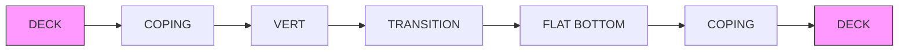
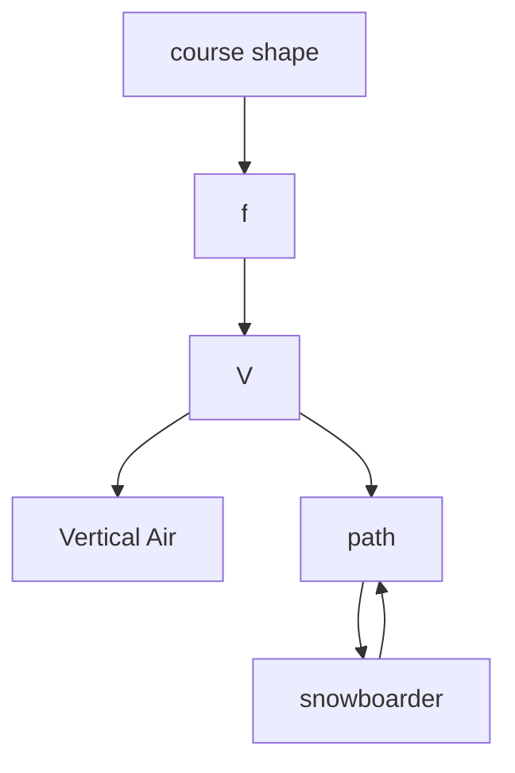

## A half-blood half-pipe, a perfect performance

## Summary

Our basic model can be divided into two parts. The first part is to find a half-pipe shape which can maximize “Vertical $\mathsf { A i r ^ { \prime \prime } j }$ ; in the second part, we adapt the shape to maximize the possible total angle of rotation. In the extended model, we analyze the snowboarder’s subjective influence on “Vertical $\mathsf { A i r } ^ { \prime \prime }$ and the total degree of rotation. Finally, we discuss the feasibility and the trade-off of building a practical course.

The major assumption is that the resistance includes the friction of snow and air drag. The former is proportional to the normal force and the latter is proportional to the square of velocity. Plus, the snowboarder is perpendicular to the tangential surface of the course at his locus during his movement on the half-pipe. The variables of our model include: coordinate variables x, y, z, normal force N, resistance ${ \sf f } ,$ snowboarder’s mass m, mechanical energy lost due to friction of the snow and air drag $\mathsf { E } _ { \mathsf { l o s t } }$ , vertical air $\mathsf { H } _ { \mathsf { f } } ,$ and the initial angular momentum of the fly L .

In the first part of our basic model, we obtain a differential equation of $\mathsf { E } _ { \mathsf { l o s t } }$ based on force analysis and Energy Conservation. Then we derive the representation of $\mathsf { E } _ { \mathsf { l o s t } }$ by solving the equation, which is a functional. Thus we calculate the representation of “Vertical $\mathsf { A i r } ^ { \prime \prime }$ by analyzing the projectile motion. In the second part of the basic model, we derive the representation of the initial angular momentum before the fly, and discuss the factors influencing it. In our extended model, we calculate the “Vertical $\mathsf { A i r } ^ { \prime \prime }$ when taking the snowboarder’s subjective influence into account.

We use numerical method to solve the model and compare analytical results with reality and validate our method to be correct and robust. We analyzed the effects of factors such as width, height and gradient angle of half-pipe on “vertical $\mathsf { A i r } ^ { \prime \prime }$ by controlling other factors, and found that wider, steeper course with proper depth and the best path chosen by a skilled snowboarder are preferred to obtain locally larger “vertical air”. Using Gene Algorithm, we globally optimized the course shape to provide largest “vertical air” and total degree of rotation. There is a trade-off between maximum “vertical $\mathsf { a i r } ^ { \prime \prime }$ and maximum rotation. Implementing a hybrid scoring system as the objective function, we optimize the course shape to a “half-blood” shape that would provide the eclectically best snowboard performance. Furthermore, we take practical problems into consideration and provide answers to more questions such as what roles the flat bottom and “vert” play in reality.

We finely model the entire complicated proceeding and give numerical solution of optimal course, and establish an objective evaluating function to analyze local and global optical course. Diverse subjective influence of snowboarders is also considered. Yet, the model hasn't provided analytic solution of optimal course.

## Background

A half-pipe is the venue in which gravity extreme sports such as snowboarding, skateboarding are hold [1]. It usually consists of two concave ramps (including a transition and a vert), topped by copings and decks, facing each other across a transition as shown in Figure 1 [1]. The sport half-pipe snowboarding has been a part of the Winter Olympic competition program since the 2002 Winter Olympic Games held in Nagano, Japan [2]. In the Olympic half-pipe, the riders give two runs, which is a combination of tricks including Straight airs, Grabs, Spins, Flips and Inverted Rotations, etc.

No explicit analysis of the ‘best’ shape of a half-pipe is found. However, it is usually accepted that the half-pipe is 100 to 150 meters long, 17 to 19.5 meters wide and has a height of 5.4 to 6.5 meters (from floor to crown). The slope angle is 16 to 18.5 degrees [3] .In addition, the Federation Internationale de Ski (FIS) recommended that the Width(W), Height(H), Transition(T) and the Bottom Flat(B) could be 15m, 3.5m, 5m, 5m, respectively (as Shown in Figure 2[4]).

Half-pipe snowboarding is currently judged in competition using subjective measures. Still, there is strong community perception that air-time and degree of rotation play a major role in half-pipe competition success [5][6]. Moreover, researches such as Jason William Harding, Colin Gordon Mackintosh, David Thomas Martin1, Allan Geoffrey Hahn5 and Daniel Arthur James [1][7] have attempted to invite objective analysis into the scoring system. According to them, the air time and the total degree of rotation are the two most critical evaluating criterions.

flowchart

Figure 1 half-pipe  

text_image

O F
T B T
V'
H
W

Figure 2

## Terminology & Definition

A cycle: the start of “a cycle” is the moment when the snowboarder reaches the edge of the half-pipe after a fly, and the end of “a cycle” is the next start

Fly: the part of the movement when the snowboarder is airborne

Flying distance (Sf): the displacement along z direction during the fly

Flying time (t ): the duration of the fly

Cycle distance (Sc): the displacement along z direction during a cycle

## Assumptions

a. The cross-section of the half-pipe have to be a curve which is convex to the downwards (U shape), and the curve should be second-order derivable at every point except for the endpoints.  
b. The snowboarder keeps a crouching position during the whole course of his performance on the half-pipe, and he stands up to gain speed right at the edge of the half-pipe before the fly.  
c. Neglect the rotational kinetic energy of the snowboarder before considering the twist performance of him.  
d. The friction of the snow is proportional to the normal force of the snow exerted on the snowboarder while has nothing to do with velocity (that is, the angle between the direction of the snowboard and that of snowboarder’s velocity is constant.), and the coefficient is α. Air drag is proportional to the square of the velocity, and the coefficient is β.  
e. The snowboarder’s body is perpendicular to the tangential surface of the half-pipe at the locus of the snowboarder during his movement on the half-pipe.  
f. When considering the half-pipe shape in the model, neglect its mechanical feasibility for the snow and the snowboard. (We will discuss it in the section concerning ‘practical’ course instead)  
g. The force exerted on board can be considered as acting on the center of the board.  
h. We neglect the influence of natural factors such as uneven sunshine (which may result from an East or West orientation) , altitude, etc.

## Parameters

<table><tr><td>Parameter</td><td></td><td>Parameter</td><td></td></tr><tr><td>x, y, z</td><td>Coordinate variables</td><td>s</td><td>The length of the path</td></tr><tr><td> $\dot{x}, \dot{y}, \dot{z}$ </td><td>The velocities in the direction of x, y, z respectively</td><td> $E_0$ </td><td>The initial mechanical energy at the beginning of a cycle</td></tr><tr><td>y', y''</td><td> $\frac{\partial y}{\partial x}$ ,  $\frac{\partial^2 y}{\partial x^2}$ </td><td> $E_{leave}$ </td><td>the kinetic energy right before the fly</td></tr><tr><td>z'N</td><td> $\frac{\partial z}{\partial x}$ Normal force of the snow exerted on the snowboarder</td><td> $E_{reach}$  $W_{human}$ </td><td>the kinetic energy at the end of the flyWork done by the snowboarder at the edge of half-pipe when he stands up</td></tr><tr><td>f</td><td>The friction of the snow + air drag</td><td> $W_G$ </td><td>the decrease of the gravitational potential during the fly</td></tr><tr><td>m</td><td>The mass of the snowboarder</td><td>α</td><td>The friction coefficient between the snow and snowboard</td></tr><tr><td>θ</td><td>The angle between z axis and the horizontal plane</td><td>β</td><td>Drag coefficient of air</td></tr><tr><td>Δh</td><td>The rise of the mass point of the snowboarder when he stands up from a crouching position.</td><td>ρ</td><td>Radius of curvature at a certain point of the cross-section of the half-pipe</td></tr><tr><td> $E_{\text{lost}}$ </td><td>The mechanical energy lost due to friction of the snow and air drag</td><td> $x_t, y_t, z_t,$  $y_t', z_t', \dot{y}_t,$  $\dot{z}_t, y_t''$ </td><td>x, y, z, y', z',  $\dot{y}$ ,  $\dot{z}$ , y'' right before the fly</td></tr><tr><td> $H_f$ </td><td>Vertical air</td><td></td><td></td></tr></table>

3d surface plot with color gradient

| x    | y      | z      |
| ---- | ------ | ------ |
| -10  | 0.0    | 0.0    |
| -20  | -1.0   | -1.0   |
| -30  | -2.0   | -2.0   |
| -40  | -3.0   | -3.0   |
| -50  | -4.0   | -4.0   |
| -60  | -5.0   | -5.0   |
| -70  | -4.5   | -4.5   |
| -80  | -3.5   | -3.5   |
| -90  | -2.5   | -2.5   |
| -100 | -1.5   | -1.5   |
| -110 | -0.5   | -0.5   |
| -120 | 0.0    | 0.0    |
| -130 | 0.5    | 0.5    |
| -140 | 1.0    | 1.0    |
| -150 | 1.5    | 1.5    |
| -160 | 2.0    | 2.0    |
| -170 | 2.5    | 2.5    |
| -180 | 3.0    | 3.0    |
| -190 | 3.5    | 3.5    |
| -200 | 4.0    | 4.0    |
| -210 | 4.5    | 4.5    |
| -220 | 5.0    | 5.0    |
| -230 | 5.5    | 5.5    |
| -240 | 6.0    | 6.0    |
| -250 | 6.5    | 6.5    |
| -260 | 7.0    | 7.0    |
| -270 | 7.5    | 7.5    |
| -280 | 8.0    | 8.0    |
| -290 | 8.5    | 8.5    |
| -300 | 9.0    | 9.0    |
| -310 | 9.5    | 9.5    |
| -320 | 10.0   | 10.0   |
| -330 | 10.5   | 10.5   |
| -340 | 11.0   | 11.0   |
| -350 | 11.5   | 11.5   |
| -360 | 12.0   | 12.0   |
| -370 | 12.5   | 12.5   |
| -380 | 13.0   | 13.0   |
| -390 | 13.5   | 13.5   |
| -400 | 14.0   | 14.0   |
| -410 | 14.5   | 14.5   |
| -420 | 15.0   | 15.0   |
| -430 | 15.5   | 15.5   |
| -440 | 16.0   | 16.0   |
| -450 | 16.5   | 16.5   |
| -460 | 17.0   | 17.0   |
| -470 | 17.5   | 17.5   |
| -480 | 18.0   | 18.0   |
| -490 | 18.5   | 18.5   |
| -500 | 19.0   | 19.0   |
| -510 | 19.5   | 19.5   |
| -520 | 20.0   | 20.0   |
| -530 | 20.5   | 20.5   |
| -540 | 21.0   | 21.0   |
| -550 | 21.5   | 21.5   |
| -560 | 22.0   | 22.0   |
| -570 | 22.5   | 22.5   |
| -580 | 23.0   | 23.0   |
| -590 | 23.5   | 23.5   |
| -600 | 24.0   | 24.0   |
| -610 | 24.5   | 24.5   |
| -620 | 25.0   | 25.0   |
| -630 | 25.5   | 25.5   |
| -640 | 26.0   | 26.0   |
| -650 | 26.5   | 26.5   |
| -660 | 27.0   | 27.0   |
| -670 | 27.5   | 27.5   |
| -680 | 28.0   | 28.0   |
| -690 | 28.5   | 28.5   |
| -700 | 29.0   | 29.0   |
| -710 | 29.5   | 29.5   |
| -720 | 30.0   | 30.0   |
| -730 | 30.5   | 30.5   |
| -740 | 31.0   | 31.0   |
| -750 | 31.5   | 31.5   |
| -760 | 32.0   | 32.0   |
| -770 | 32.5   | 32.5   |
| -780 | 33.0   | 33.0   |
| -790 | 33.5   | 33.5   |
| -800 | 34.0   | 34.0   |
| -810 | 34.5   | 34.5   |
| -820 | 35.0   | 35.0   |
| -830 | 35.5   | 35.5   |
| -840 | 36.0   | 36.0   |
| -850 | 36.5   | 36.5   |
| -860 | 37.0   | 37.0   |
| -870 | 37.5   | 37.5   |
| -880 | 38.0   | 38.0   |
| -890 | 38.5   | 38.5   |
| -900 | 39.0   | 39.0   |
| -910 | 39.5   | 39.5   |
| -920 | 40.0   | 40.0   |
| -930 | 40.5   | 40.5   |
| -940 | 41.0   | 41.0   |
| -950 | 41.5   | 41.5   |
| -960 | 42.0   | 42.0   |
| -970 | 42.5   | 42.5   |
| -980 | 43.0   | 43.0   |
| -990 | 43.5   | 43.5   |
| -100+| +∞     | +∞     |

The data is a heatmap of the function y = x^(-z) for each of the x and y values in the heatmap.

Figure 3 the build of Cartesian coordinate

Figure 3 shows the definition of the coordinate variables x, y, z. Among the coordinate variables, x is the free variable, while y and z are functions of x depending of the shape of the half-pipe and path of the snowboarder, which can also be represented as $\forall ( \mathsf { x } )$ and $\sf { z } ( x )$ . The relationship between y and x depends on the shape of the half-pipe, while the relationship between z and x depends on the path chosen by the snowboarder.

## Basic Model

## Model overview

Figure 4 shows a simplified outline of our basic model  

flowchart

Figure 4

Figure 5 is the yield of our study in the following part of this artical. Here, we use it to help give an overview of our model.  

3d surface plot

| x    | y    |
| ---- | ---- |
| -10  | 0    |
| -20  | -1   |
| -30  | -2   |
| -40  | -3   |
| -50  | -4   |
| -60  | -3   |
| -70  | -2   |
| -80  | -1   |
| -90  | 0    |
| -100 | 1    |
| -110 | 2    |
| -120 | 3    |
| -130 | 4    |
| -140 | 5    |
| -150 | 4    |
| -160 | 3    |
| -170 | 2    |
| -180 | 1    |
| -190 | 0    |
| -200 | -1   |
| -210 | -2   |
| -220 | -3   |
| -230 | -4   |
| -240 | -3   |
| -250 | -2   |
| -260 | -1   |
| -270 | 0    |
| -280 | 1    |
| -290 | 2    |
| -300 | 3    |
| -310 | 4    |
| -320 | 5    |
| -330 | 4    |
| -340 | 3    |
| -350 | 2    |
| -360 | 1    |
| -370 | 0    |
| -380 | -1   |
| -390 | -2   |
| -400 | -3   |
| -410 | -4   |
| -420 | -3   |
| -430 | -2   |
| -440 | -1   |
| -450 | 0    |
| -460 | 1    |
| -470 | 2    |
| -480 | 3    |
| -490 | 4    |
| -500 | 5    |
| -510 | 4    |
| -520 | 3    |
| -530 | 2    |
| -540 | 1    |
| -550 | 0    |
| -560 | -1   |
| -570 | -2   |
| -580 | -3   |
| -590 | -4   |
| -600 | -3   |
| -610 | -2   |
| -620 | -1   |
| -630 | 0    |
| -640 | 1    |
| -650 | 2    |
| -660 | 3    |
| -670 | 4    |
| -680 | 5    |
| -690 | 4    |
| -700 | 3    |
| -710 | 2    |
| -720 | 1    |
| -730 | 0    |
| -740 | -1   |
| -750 | -2   |
| -760 | -3   |
| -770 | -4   |
| -780 | -3   |
| -790 | -2   |
| -800 | -1   |
| -810 | 0    |
| -820 | 1    |
| -830 | 2    |
| -840 | 3    |
| -850 | 4    |
| -860 | 5    |
| -870 | 4    |
| -880 | 3    |
| -890 | 2    |
| -900 | 1    |
| -910 | 0    |
| -920 | -1   |
| -930 | -2   |
| -940 | -3   |
| -950 | -4   |
| -960 | -3   |
| -970 | -2   |
| -980 | -1   |
| -990 | 0    |
| 0    | 1    |
| 1    | 2    |
| 2    | 3    |
| 3    | 4    |
| 4    | 5    |
| 5    | 4    |
| 6    | 3    |
| 7    | 2    |
| 8    | 1    |
| 9    | 0    |
| 10   | -1   |
| 11   | -2   |
| 12   | -3   |
| 13   | -4   |
| 14   | -3   |
| 15   | -2   |
| 16   | -1   |
| 17   | 0    |
| 18   | 1    |
| 19   | 2    |
| 20   | 3    |
| 21   | 4    |
| 22   | 5    |
| 23   | 4    |
| 24   | 3    |
| 25   | 2    |
| 26   | 1    |
| 27   | 0    |
| 28   | -1   |
| 29   | -2   |
| 30   | -3   |
| 31   | -4   |
| 32   | -3   |
| 33   | -2   |
| 34   | -1   |
| 35   | 0    |
| 36   | 1    |
| 37   | 2    |
| 38   | 3    |
| 39   | 4    |
| 40   | 5    |
| 41   | 4    |
| 42   | 3    |
| 43   | 2    |
| 44   | 1    |
| 45   | 0    |
| 46   | -1   |
| 47   | -2   |
| 48   | -3   |
| 49   | -4   |
| 50   | -3   |
| 51   | -2   |
| 52   | -1   |
| 53   | 0    |
| 54   | 1    |
| 55   | 2    |
| 56   | 3    |
| 57   | 4    |
| 58   | 5    |
| 59   | 4    |
| 60   | 3    |
| 61   | 2    |
| 62   | 1    |
| 63   | 0    |
| 64   | -1   |
| 65   | -2   |
| 66   | -3   |
| 67   | -4   |
| 68   | -3   |
| 69   | -2   |
| 70   | -1   |
| 71   | 0    |
| 72   | 1    |
| 73   | 2    |
| 74   | 3    |
| 75   | 4    |
| 76   | 5    |
| 77   | 4    |
| 78   | 3    |
| 79   | 2    |
| 80   | 1    |
| 81   | 0    |
| 82   | -1   |
| 83   | -2   |
| 84   | -3   |
| 85   | -4   |
| 86   | -3   |
| 87   | -2   |
| 88   | -1   |
| 89   | 0    |
| 90   | 1    |
| 91   | 2    |
| 92   | 3    |
| 93   | 4    |
| 94   | 5    |
| 95   | 4    |
| 96   | 3    |
| 97   | 2    |
| 98   | 1    |
| 99   | 0    |
| +1     | +1.

Figure 5. the path of snowboarder on the course (red) and in the air (blue: without air drag, green: with air drag), which is an entire $\mathrm { } ^ { \prime \prime } \mathsf { c y c l e } ^ { \prime \prime } .$ .

“A cycle” can be devided into two parts. The first part is the movement on the half-pipe, and the second part is the airbourn performance. In the first part, since our concern is the final velocity, focusing on the convertion and conservation is the most efficient way. Hence the lost of mechanical energy $\mathsf { E } _ { \mathrm { l o s t } }$ is the key of our study in this part. Due to the fact that $\mathsf { E } _ { \mathrm { l o s t } }$ is caused by the resistance of snow and air, we can derive an equation about $\mathsf { E } _ { \mathrm { l o s t } }$ with the help of integration after we derive the representation of resistance f by force analyzing. Then we transform the equation into a differential equation and solve it, which yield the representation of $\mathsf { E } _ { \mathsf { l o s t } } .$ . Since the shape of the half-pipe and the path chosen by the snowboarder need to be determined, the represetation of $\mathsf { E } _ { \mathrm { l o s t } }$ is a functional. Another thing that cannot be neglected is the contribution of the snowboarder to the increase of mechanical energy at the end of the first part. This part of work is done by streching his body (standing up) and doing work against the pseudo force petrifugal force.

As to the second part, to derive the “vertical air”, the Second Newton Law is applied. If we neglect the air drag during the fly (actually the numerical method in later part of this artical proves that the air drag during the fly is neglegibal), we can calculate “vertical air”, the duration of the fly, flying distance, gravitational potential decrease, etc. Since we don’t know whether air drag is neglegibal before we compare the results of the calculation considering and neglecting the air drag, we also have to make a calculation taking the air drag into account.

Next, the airbourn rotation of the snowboarder is discussed. Since the shape of half-pipe directaly influnces the initial angular momentum of the snowboarder, and the angular momentum is the only thing that cannot be changed during the flight (the snowboarder can do work by changing his posture to increase the mechanical energy), the relationship between the half-pipe shape and the initial angular momentum is the key of our discussion here. After deriving the representation of the initial angular momentum, we can find the optimal shape of the half-pipe.

## The Model

## A. Vertical air

Step 1. Force analysis (figure 6)  

text_image

Scientific diagram illustrating velocity and gravitational force components in 3D space with coordinate axes and a corresponding vector graph.

Figure 6 Force Analysis

There are three kinds of force acted on the snowboarder, which are gravity mg, normal force N and resistance f. Resistance includes air drag and the friction between the snow and snowboard. N balances with the gravity’s and the pseudo force centrifugal force’s projection in the normal direction of the half-pipe surface at this point. And f causes the loss of mechanical energy.

Among the forces, resistance can be represented as:

$$
\begin{array}{l} f = \alpha N + \beta (\dot {x} ^ {2} + \dot {y} ^ {2} + \dot {z} ^ {2}) \\ = \alpha N + \beta (1 + y ^ {\prime 2} + z ^ {\prime 2}) \dot {x} ^ {2} \tag {1} \\ \end{array}
$$

Next consider the expression of normal force. Only the part of centripetal acceleration which parallels the direction of N needs to be considered when we calculate the Normal force. Thus we get the expression eq.2.

$$
\begin{array}{l} \rho = \frac {(1 + y ^ {' 2}) ^ {\frac {3}{2}}}{y ^ {\prime \prime}} \\ \mathrm{N} = \frac {\dot {\mathrm{x}} ^ {2} + \dot {\mathrm{y}} ^ {2}}{\rho} \mathrm{m} + \frac {\mathrm{mgcos} \theta}{\sqrt {1 + \mathrm{y} ^ {\prime 2}}} \\ = \left(\mathrm{y} ^ {\prime \prime} \dot {\mathrm{x}} ^ {2} + \mathrm{g} \cos \theta\right) \frac {\mathrm{m}}{\sqrt {1 + \mathrm{y} ^ {\prime 2}}} \tag {2} \\ \end{array}
$$

Path length unit can be represented as:

$$
\mathrm{ds} = \sqrt {1 + \mathrm{y} ^ {\prime 2} + \mathrm{z} ^ {\prime 2}} \mathrm{dx} \tag {3}
$$

Step 2. According to the Energy Conservation Principle, we have equation 4.

$$
\frac {1}{2} \mathrm{m} \left(1 + \mathrm{y} ^ {\prime 2} + \mathrm{z} ^ {\prime 2}\right) \dot {\mathrm{x}} ^ {2} = \mathrm{E} _ {0} - \mathrm{E} _ {\text {lost}} - \mathrm{mg} (\mathrm{y} \cos \theta - \mathrm{z} \sin \theta) \tag {4}
$$

Then we have

$$
\dot {\mathrm{x}} ^ {2} = \frac {2}{\mathrm{m} \left(1 + \mathrm{y} ^ {\prime 2} + \mathrm{z} ^ {\prime 2}\right)} \left[ \mathrm{E} _ {0} - \mathrm{E} _ {\text {lost}} - \mathrm{mg} (\mathrm{y} \cos \theta - \mathrm{z} \sin \theta) \right] \tag {5}
$$

Step 3. Now we can calculate the expression of $\mathsf { E } _ { \mathsf { l o s t } } .$

$$
\begin{array}{l} \mathrm{E} _ {\text {lost}} (\mathrm{x}) = \int_ {- \mathrm{x} _ {0}} ^ {\mathrm{x}} \mathrm{f} \cdot \mathrm{ds} \\ = \int_ {- x _ {0}} ^ {x} [ \alpha N \sqrt {1 + y ^ {\prime 2} + z ^ {\prime 2}} + \beta (1 + y ^ {\prime 2} + z ^ {\prime 2}) ^ {\frac {3}{2}} \cdot \dot {t} ^ {2} ] d \tau \\ = \int_ {- x _ {0}} ^ {x} \left\{\alpha \frac {\mathrm{my} ^ {\prime \prime}}{\sqrt {\left(1 + y ^ {\prime 2}\right) \left(1 + y ^ {\prime 2} + z ^ {\prime 2}\right)}} + \beta\right) \frac {2}{m} \left[ E _ {0} - E _ {\text {lost}} (\tau) - m g (y \cos \theta - z \sin \theta) \right] + \\ \alpha m g \cos \theta 1 + y ^ {\prime} 2 + z ^ {\prime} 2 1 + y ^ {\prime} 2 \} d \tau \\ \end{array}
$$

The expression of $\mathsf { E } _ { \mathrm { l o s t } }$ in equation 6 is an integral with variable upper limit. And $\tau ,$ representing the x coordinate, is the integral variable.

Differentiating both sides of equation 6, and solving the out-coming linear ordinary differential equation of the first order, we have

$$
\mathrm{E} _ {\text {lost}} = \mathrm{e} ^ {\int_ {- x _ {0}} ^ {x} a _ {(\tau)} \mathrm{d} \tau} * \int_ {- x _ {0}} ^ {x} b _ {(\xi)} \cdot \mathrm{e} ^ {\int_ {- x _ {0}} ^ {x} - a _ {(\tau)} \mathrm{d} \tau} \mathrm{d} \xi \tag {7}
$$

In which

$$
a _ {(x)} = - \left(2 \alpha \frac {y ^ {\prime \prime}}{\sqrt {\left(1 + y ^ {\prime 2}\right) \left(1 + y ^ {\prime 2} + z ^ {\prime 2}\right)}} + \frac {2 \beta}{m}\right) \tag {8}
$$

$$
b _ {(x)} = \left(2 \alpha \frac {y ^ {\prime \prime}}{\sqrt {(1 + y ^ {\prime 2}) (1 + y ^ {\prime 2} + z ^ {\prime 2})}} + \frac {2 \beta}{m}\right) [ E _ {0} - m g (y \cos \theta - z \sin \theta) ] +
$$

$$
\alpha \mathrm{mg} \cos \theta \frac {\sqrt {1 + y ^ {\prime 2} + z ^ {\prime 2}}}{\sqrt {1 + y ^ {\prime 2}}} \tag {9}
$$

The smaller $\mathsf { E } _ { \mathrm { l o s t } } ,$ the better. So we need to find the extreme of $\mathsf { E } _ { \mathsf { l o s t } }$ and its condition. However, since the relationship between y and x as well as that between z and x are unknown and need to be determined, the representation of $\mathsf { E } _ { \mathsf { l o s t } }$ is a functional. To find the optimal shape of the half-pipe, we need to find the functional extreme, but the calculation is too complicated, so we choose numerical method to solve the problem.

## Step 4. The calculation of ${ \mathsf { W } } _ { { \mathsf { h u m a n } } }$

When the snowboarder stands up, he does work overcoming the centrifugal force. At high speed, the centrifugal force is huge, so $\mathsf { W } _ { \mathsf { h u m a n } }$ is considerable and cannot be neglected. The work done by the snowboarder is

$$
W _ {\mathrm{human}} = \frac {\dot {y _ {\mathrm{t}}} ^ {2}}{\rho} \mathbf {m} \cdot \Delta \mathbf {h}
$$

$$
= \frac {y _ {t} ^ {\prime 2} y _ {t} ^ {\prime \prime}}{\left(1 + y _ {t} ^ {\prime 2}\right) ^ {\frac {3}{2}}} \mathrm{m} \cdot \Delta \mathrm{h} \tag {10}
$$

## Step 5. The calculation of “vertical $\mathsf { a i r } ^ { \prime \prime }$

At the edge of the half-pipe before the fly, x is 0.

From the Energy Conservation Principle, we have

$$
\frac {1}{2} \mathrm{m} \left(\dot {\mathrm{y}} _ {\mathrm{t}} ^ {2} + \dot {\mathrm{z}} _ {\mathrm{t}} ^ {2}\right) = \mathrm{E} _ {0} - \mathrm{E} _ {\text {lost}} \left(\mathrm{x} _ {\mathrm{t}}\right) + \mathrm{mg} \cdot \mathrm{z} _ {\mathrm{t}} \sin \theta + \frac {\mathrm{y} _ {\mathrm{t}} ^ {\prime 2} \mathrm{y} _ {\mathrm{t}} ^ {\prime \prime}}{\left(1 + \mathrm{y} _ {\mathrm{t}} ^ {\prime 2}\right) ^ {\frac {3}{2}}} \mathrm{m} \cdot \Delta \mathrm{h} \tag {11}
$$

Since y t  = y t ′ ⇒ z = $\begin{array} { r } { \frac { \dot { \mathrm { y _ { t } } } } { \dot { \mathrm { z _ { t } } } } = \frac { \mathrm { y _ { t } } ^ { \prime } } { \mathrm { z _ { t } } ^ { \prime } } \Rightarrow \dot { \mathrm { z _ { t } } } = \frac { \mathrm { z _ { t } } ^ { \prime } } { \mathrm { y _ { t } } ^ { \prime } } \dot { \mathrm { y _ { t } } } } \end{array}$

$$
\dot {y _ {\mathrm{t}}} ^ {2} = \frac {2}{\mathrm{m} \left[ 1 + \left(\frac {z _ {\mathrm{t}} {} ^ {\prime}}{y _ {\mathrm{t}} {} ^ {\prime}}\right) ^ {2} \right]} \left(E _ {0} - E _ {\text {lost}} \left(x _ {\mathrm{t}}\right) + \mathrm{mg} \cdot z _ {\mathrm{t}} \sin \theta + \frac {y _ {\mathrm{t}} {} ^ {\prime 2} y _ {\mathrm{t}} {} ^ {\prime \prime}}{\left(1 + y _ {\mathrm{t}} {} ^ {\prime 2}\right) ^ {\frac {3}{2}}} \mathrm{m} \cdot \Delta h\right) \tag {12}
$$

## a. If we neglect the air drag during the fly

Figure 7 clearly shows that the "vertical air" can be represented as:

$$
\mathrm{H} _ {\mathrm{f}} = \frac {1}{\cos \theta} \frac {\dot {y} _ {\mathrm{t}} ^ {2}}{2 \mathrm{g} \cos \theta} = \frac {\mathrm{E} _ {0} - \mathrm{E} _ {\text {lost}} \left(\mathrm{x} _ {\mathrm{t}}\right) + \mathrm{mg} \cdot \mathrm{z} _ {\mathrm{t}} \sin \theta + \frac {\mathrm{y} _ {\mathrm{t}} ^ {\prime 2} \mathrm{y} _ {\mathrm{t}} ^ {\prime \prime}}{\left(1 + \mathrm{y} _ {\mathrm{t}} ^ {\prime 2}\right) ^ {\frac {3}{2}}} \mathrm{m} \cdot \Delta \mathrm{h}}{\mathrm{mg} \cdot \cos^ {2} \theta \left[ 1 + \left(\frac {\mathrm{z} _ {\mathrm{t}} ^ {\prime}}{\mathrm{y} _ {\mathrm{t}} ^ {\prime}}\right) ^ {2} \right]} \tag {13}
$$

text_image

y
V_y
Air drag
mg
θ
H
V_z
z
θ

Figure 7 the path and force analysis of the fly

b. If we take the air drag during the fly into account

$$
f = \beta (\dot {y} ^ {2} + \dot {z} ^ {2})
$$

According to the Second Newton Law:

$$
\ddot {y} = - \left[ g \cos \theta + \frac {\beta}{m} \left(\dot {y} ^ {2} + \dot {z} ^ {2}\right) \frac {\frac {\dot {y}}{\dot {z}}}{\sqrt {1 + \left(\frac {\dot {y}}{\dot {z}}\right) ^ {2}}} \right] = - g \cos \theta - \frac {\beta}{m} \dot {y} ^ {2}
$$

Let ${ \dot { \mathbf { y } } } = \mathbf { v } .$

Since

$$
\frac {\mathrm{dv}}{\mathrm{dt}} = \frac {\mathrm{dv}}{\mathrm{dy}} \cdot \frac {\mathrm{dy}}{\mathrm{dt}} = \frac {\mathrm{vdv}}{\mathrm{dy}}
$$

then

$$
{\frac {\mathrm{v} \mathrm{d} \mathrm{v}}{\mathrm{dy}}} = - \mathrm{g} \cos \theta - {\frac {\beta}{\mathrm{m}}} \mathrm{v} ^ {2}
$$

Separating the variables yields

$$
\mathrm{dy} = - \frac {\mathrm{vdv}}{\mathrm{g} \cos \theta + \frac {\beta}{\mathrm{m}} \mathrm{v} ^ {2}}
$$

So

$$
\int_ {0} ^ {\mathrm{H} _ {\mathrm{f}}} \mathrm{dy} = - \int_ {\dot {\mathrm{y}} _ {\mathrm{t}}} ^ {0} \frac {\mathrm{vdv}}{\mathrm{g} \cos \theta + \frac {\beta}{\mathrm{m}} \mathrm{v} ^ {2}}
$$

Thus

$$
\mathrm {H_ {f}} = \frac {\mathrm{m}}{2 \beta} \ln (1 + \frac {\beta \dot {y _ {t}} ^ {2}}{\mathrm{mg} \cos \theta})
$$

Step 6. Flying distance and energy relationship

In order to compare the initial kinetic energy of adjacent two cycles, we have to calculate the decrease of the gravitational potential at the beginning and end of the fly.

The duration of the fly can be represented as:

$$
t = \frac {2 \dot {y} _ {t}}{g \cos \theta} \tag {14}
$$

Flying distance is

$$
S _ {\mathrm{f}} = \dot {z} _ {\mathrm{t}} t + \frac {1}{2} g \sin \theta \cdot t ^ {2} \tag {15}
$$

The decrease of gravitational potential:

$$
W _ {\mathrm{G}} = \mathrm{mgS} _ {\mathrm{f}} \sin \theta \tag {16}
$$

Finally, we find it necessary to give an equation to describe the energy conversion and conservation relationship at the beginning and the end of “a cycle”, due to the fact that energy is the key of our analysis. (equation 17)

$$
\mathrm{E} _ {0} = \mathrm{E} _ {\text {lost}} + \mathrm{mg} \cdot \mathrm{z} _ {\mathrm{t}} \sin \theta + \mathrm{W} _ {\mathrm{G}} + \mathrm{W} _ {\text {human}} + \mathrm{E} _ {\text {reach}} \tag {17}
$$

Hence, from equation 17, we can get the representation of Ereach:

$$
\mathrm{E} _ {\text {reach}} = \mathrm{E} _ {0} - \mathrm{E} _ {\text {lost}} - \mathrm{mg} \cdot \mathrm{z} _ {\mathrm{t}} \sin \theta - W _ {\mathrm{G}} - W _ {\text {human}} \tag {18}
$$

## B. Rotation

“Vertical air” is not the only judging criteria of a snowboarder’s performance. The total degree of rotation and the level of difficulty are also essential. Hence, it is necessary to discuss the half-pipe shape’s influence on rotation.

## Step 1. Analyzing the Problem

As soon as the snowboarder flies into the air, if we neglect the air drag, his angular momentum cannot be changed, so his rotation only depends on the snowboarder himself. By changing his own posture, the snowboarder can do twist, flip or whatever he wants. Thus, since we are discussing the influence of the shape of the half-pipe, we only need to consider the initial angular momentum of the fly. To maximize the twist, we have to maximize the initial angular momentum.

The angular momentum can be disintegrated into three directions----x, y, and z. Let’s represent them with $L _ { \mathsf { X } 0 } , \mathsf { L } _ { \mathsf { Y } 0 } ,$ , and $\mathsf { L } _ { \mathsf { Z } 0 } .$ . The shape of the half-pipe can only affect $\mathsf { L } _ { \mathsf { Z } 0 } ,$ while $\mathsf { L } _ { \mathsf { X } 0 }$ and $\mathsf { L } _ { \mathsf { y 0 } }$ are determined by the snowboarder, with the help of the friction of the snow.

text_image

Lz0
w
Mass point of the
snowboarder
N
f2
mg
f1
y
x
z

Figure 8

(f1 is the friction of the snow and f2 is the air drag)

Therefore, we need to focus on $\mathsf { L } _ { \mathsf { Z } 0 } .$ . The force analysis is in figure 8. Since the angle between N and snowboarder has to be small or the snowboarder will lose balance, the torque of N is comparatively small. So N plays a negligible role in increasing the snowboarder’s $\mathsf { L } _ { \mathsf { Z } 0 }$ . What’s more, the gravity is exerted on the mass point and the exerting point of f2 can be regarded as near the mass point, so the gravity and f2 are of little help to increase $\mathsf { L } _ { \mathsf { Z } 0 }$ . Plus, f1 can only make $\mathsf { L } _ { \mathsf { Z } 0 }$ smaller. Therefore, $\mathsf { L } _ { \mathsf { Z } 0 }$ is the final angular momentum of the snowboarder’s performance on the half-pipe, which has a close relationship with the shape of the half-pipe, to be more specific, the curvature.

From the definition of angular momentum, we have

$$
\mathrm{L} _ {\mathrm{z} 0} = \frac {1}{3} l ^ {2} \omega_ {0} \mathrm{m} \tag {19}
$$

(We regard the snowboarder as a stick. $\omega _ { 0 }$ is the angular velocity right before the fly; $\rho _ { 0 }$ is the radius of curvature of the cross-section of the half-pipe at the edge and the part of the curve that close to the edge; m is the mass of the snowboarder; l is represented in figure 8)

Plus

$$
\omega_ {0} = \frac {\sqrt {\dot {x _ {t}} ^ {2} + \dot {y _ {t}} ^ {2}}}{\rho_ {0}} \tag {20}
$$

Combining equation 19 and 20 yields

$$
\mathrm{L} _ {\mathrm{z} 0} = \frac {1}{3} \frac {\sqrt {\dot {\mathrm{x}} _ {\mathrm{t}} ^ {2} + \dot {\mathrm{y}} _ {\mathrm{t}} ^ {2}}}{\rho_ {0}} l ^ {2} \mathrm{m} \tag {21}
$$

From equation 21, we can see that the snowboarder should stretch his body as much as possible to increase l (which has nothing to do with the shape of the half-pipe for sure). And to maximize $\mathsf { L } _ { \mathsf { Z } 0 . }$ , $\rho _ { 0 }$ should be as small as possible and $\dot { \mathrm { X _ { t } } } ^ { 2 } + \dot { \mathrm { y _ { t } } } ^ { 2 }$ should be as large as possible. Here we still use numerical method to find the optimal

half-pipe shape.

Step 2. Given the initial angular momentum, list and explain some possible tricks (1). Twist of beginners’ level

text_image

y
axis of rotation
x
z
C w

Figure 9

The angular momentum is along x and y direction. This kind of twist is beginner’s level and doesn’t have much to do with the shape of the half-pipe. Instead, it depends on the snowboarder’s movement right before the fly. So we just skip it here, and discuss it in our extended model.

(2). Flip and double cork

text_image

y
z
Lz
x
axis of rotation

Figure 10

$\mathsf { L } _ { \mathsf { Z } 0 }$ alone makes this kind of rotation possible.

(3). Flip->high level twist->flip

text_image

Lz
Lx
y
z
x
axis 1
axis 2

Flip 1

text_image

Lz
Lx
axis 1
z
x
axis 2
Twist
Lz
Lx
axis 1
axis 2
y
z
x
Flip 2

Figure 11

$\mathsf { L } _ { \mathsf { X } }$ is exerted by the friction of the snow, which depends on the snowboarder’s action right before the fly. In this case we can see that the direction of angular momentum of a twist can also be along z direction.

## Numerical Computation

Before numerical computation to $\mathsf { o b t a i n E } _ { \mathrm { l o s t } }$ , the loss of Energy during sliding, and the production of “Vertical $\mathsf { A i r ^ { \prime \prime } } ,$ we have to determine the values of some parameters, such as the friction coefficient between the snow and snowboard (α), the drag coefficient of air (β), the mass of the snowboarder (m), and the initial mechanical energy at the beginning of a cycle (E0).

According to H.Yan, P.Liu, and F.Guo[8], the coefficient of kinetic friction between snow and snowboard is generally about 0.03 to 0.2. In addition, J.Chen, R.Li and Z.Guan [9] discovered the friction coefficient to be 0.0312. Thus, we generally assume α to be 0.03 in our discussion about shape of half-pipe.

As N.Yan stated in reference [10], the air drag coefficient is about 0.15.

Since the mass of Shaun White, one of the most outstanding snowboarders in the world, is 63kg, we assume that the mass of a snowboarder is typically 60kg.

Moreover, according to reference [11], the drop-in ramp height should be at least 5.5m and distance from ramp to pipe should be at least 9m. Since the slope angle is about $1 8 ^ { \circ }$ , the potential energy of gravity is: mg ∙ $( 5 . 5 + 9 \cdot \cos 1 8 ^ { \circ } ) \approx 8 2 6 7 $ J.

As α may not exceed 0.2 (in which case $\mathsf { E } _ { 0 }$ would be 6613 J), we conservatively assume the initial mechanical energy at the beginning of a cycle $\left( \mathsf { E } _ { 0 } \right)$ to be 7000 J.

To sum up, we assume that : $\alpha \approx 0 . 0 3 , \beta \approx 0 . 1 5 , \mathrm { m } \approx 6 0 \mathrm { k g , E _ { 0 } \approx 7 0 0 0 } \mathrm { J } .$ .

Besides, we need to define $\forall ( \mathsf { x } )$ and $\sf { z } ( \sf { x } )$ , the shape of ramp cross-section and the path snowboard chooses respectively. As we assumed before, y(x) is a convex $\mathsf { C } ^ { 2 }$ curve, which is symmetric in reality. There is a horizontal flat line (‘Flat’) connecting two parts of the ramp and each part consists of a smooth transition part and possibly vertical part of (‘Vert’).

line chart

| Shape of ramp surface | width |
| --------------------- | ----- |
| flat                  | 0     |
| width                 | 1     |

Figure 12

The path player choose can be represented by $v = 2 ( x )$ . As figure below shows, in a simply condition with constant friction, the energy loss will be minimized if z is proportion to $\tau ( \mathbf { x } )$ , the length of the projection curvature of the three dimensional curve $\overrightarrow { p ( x ) } = ( x , y ( x ) , z ( x ) )$ )to X-Y plane. Thus, we define the coordinate along z axis as ${ \bf z } = { \bf z } { \big ( } \tau ( { \bf x } ) { \big ) } \approx { \bf k } \tau ( { \bf x } )$ . Practically, we control $\sf { z } ( x )$ using the location of the point right before the fly.

line chart and 2d surface plot combined

| x    | z=z(τ(x)) |
| ---- | --------- |
| 0    | 0         |
| 6    | -10       |
| 8    | -35       |

Figure 13

Given certain relationship between $\forall ( \mathsf { x } )$ and x and between $\sf { z } ( x )$ and $\mathsf { \pmb { X } } ,$ we used numerical calculus to solve the differential equation (6):

$$
\begin{array}{l} \mathrm{E} _ {\text {lost}} (\mathrm{x}) = \int_ {- \mathrm{x} _ {0}} ^ {\mathrm{x}} \left\{\left(\alpha \frac {\mathrm{my} ^ {\prime \prime}}{\sqrt {\left(1 + \mathrm{y} ^ {\prime 2}\right) \left(1 + \mathrm{y} ^ {\prime 2} + \mathrm{z} ^ {\prime 2}\right)}} + \beta\right) \frac {2}{\mathrm{m}} \left[ \mathrm{E} _ {0} - \mathrm{E} _ {\text {lost}} (\tau) - \mathrm{mg} (\mathrm{y} \cos \theta - \right. \right. \\ \left. \mathrm{z} \sin \theta \right] + \alpha \mathrm{mg} \cos \theta 1 + \mathrm{y} ^ {\prime} 2 + \mathrm{z} ^ {\prime} 2 1 + \mathrm{y} ^ {\prime} 2 \} \mathrm{d} \tau \\ \end{array}
$$

(6)

Then we calculate the resulting “vertical $\mathsf { a i r } ^ { \prime \prime }$ use both analytical equations and numerical simulation. We solved the problem of “Projectile” and got analytical results. Since we can obtain “vertical air”, duration of Fly and Flying distance more easily by numerical simulation, we also use numerical simulation for later analysis. Figure 14 shows the output figure of numerical simulation which represents the path of the snowboarder on the ramp and in the air.

3d surface plot

| x    | y    | z    |
| ---- | ---- | ---- |
| -20  | 0    | 0    |
| -10  | 2    | 2    |
| 0    | 8    | 8    |
| 5    | 2    | 2    |
| 10   | 0    | 0    |

Figure 14 output figure of numerical simulation of entire $\mathbf { \chi } ^ { \prime \prime } \mathbf { c } \mathbf { \ y } \mathbf { c } | \mathbf { e } ^ { \prime \prime }$ in snowboarding  
To validate our results, we compared analytical results and numerical results:

We assume: width=15m, flat=5m, depth=3.5m, $z _ { \mathrm { t } } = 1 0 \mathsf { m }$ , $\theta { = } 1 8 ^ { \circ }$ , $z _ { \mathrm { t } } = 1 0 \mathsf { m }$ . Transition part is standard elliptic, $\scriptstyle \mathbf { g } = 9 . 8 \mathsf { m } / \mathsf { s } ^ { 2 } .$ , m=60kg, $\beta = 0 . 1 5 \mathrm { k g / m }$ , according to reference[4][8][9][10][11].

<table><tr><td>Condition</td><td>Method</td><td>Vy</td><td>Vertical Air</td><td>Fly Distance</td><td>Duration of Fly</td></tr><tr><td rowspan="3">Without friction</td><td>Analytical</td><td>11.2316m/s</td><td>7.1156m</td><td>25.5115</td><td>2.4101</td></tr><tr><td>Numerical</td><td>11.2316m/s</td><td>7.1216m</td><td>25.5121</td><td>2.4102</td></tr><tr><td>Error Ratio</td><td>0%</td><td>0.084%</td><td>0.002%</td><td>0.004%</td></tr><tr><td rowspan="3">With friction</td><td>Analytical</td><td>11.2316m/s</td><td>6.9979m</td><td>--</td><td>--</td></tr><tr><td>Numerical</td><td>11.2316m/s</td><td>7.0037m</td><td>24.5173</td><td>2.3836</td></tr><tr><td>Error Ratio</td><td>0%</td><td>0.083%</td><td>--</td><td>--</td></tr></table>

## Validity

Using recommended width, height, flat length and gradient angle, with other parameters fitting the reality in Snowboard half-pipe game, the resulting maximum Vertical Air is about 7 meters. This result matches the Shaun White’s best performance of and is consistent with the common “Vertical $\mathsf { A i r } ^ { \prime \prime }$ (12 feet\~20 feet for men and 6 feet\~15 feet for women) in Snowboard half-pipe games.

## Sensitivity

As to the sensitivity, we modified parameters by ±10%, and the result supporting that the numerical simulation is robust.

<table><tr><td></td><td>+10%</td><td>Vertical Air Change Percentage</td><td>-10%</td><td>Vertical Air Change Percentage</td></tr><tr><td>W(Width)~15m</td><td>16.5m</td><td>5.53%</td><td>13.5m</td><td>-6.13%</td></tr><tr><td>H(Depth)~3.5m</td><td>3.85m</td><td>2.50%</td><td>3.15m</td><td>-2.57%</td></tr><tr><td>B(Flat)~5m</td><td>5.50m</td><td>0.86%</td><td>4.50m</td><td>-0.87%</td></tr><tr><td>Zt(Fly Point)~10m</td><td>11m</td><td>8.18%</td><td>9m</td><td>-8.08%</td></tr></table>

## Extended Model

In the basic model above, we generally neglect the influence of the snowboarder on the flying path, but rather pay most attention to the objective factors. Nevertheless, snowboarder in itself is the key role in this sport, and their diverse performances owe much to the variations among different snowboarders. In this extended model, we take the impact of the snowboarder into account.

## 1 The direction of velocity

A snowboarder is different from an rigid body in that he can turn, decelerate etc where a small ball or a stick can’t. The direction of a snowboard could be different from that of the snowboarder’s velocity, although this is often not welcomed, since it would slow down the snowboarder. This means, however, that a skilled snowboarder may move in a direction partly determined by himself. This is why we discussed how to choose the ‘best path’ in a given course.

Especially, consider the point right before a fly. From the discussion above, we learnt that the larger ${ \sf z } _ { \mathrm { t } }$ is, the longer flying distance is. As a result, the cycle distance would be longer, which ultimately results in fewer cycles. However, since a snowboarder must perform 5 to 8 acrobatic tricks in the Winter Olympic Games, fewer cycles are not allowed. Hence, a snowboarder should avoid flying too far. At the same time, however, a larger ${ \sf z } _ { \mathrm { t } }$ means greater $\forall \mathrm { t } ^ { \prime } ,$ which, contrarily, is favorable for a higher ‘vertical air’. In that case, a skilled snowboarder may choose to reduce his $\dot { \bf z } _ { \mathrm { t } }$ right before the fly.

To sum up, a skilled snowboarder would choose a path with reasonable ${ \sf z } _ { \mathrm { t } }$ and reduce his $\dot { \bf Z } _ { \mathrm { t } }$ right before the fly while maintaining his $\dot { \mathsf { y _ { t } } }$ or convert the part of kinetic energy in the velocity along z direction into that in y direction.

Here is a detailed analysis about the fly while taking the snowboarder’s influence on $\dot { \bf Z } _ { \mathrm { t } }$ into account.

## a. Maintaining $\dot { \mathbf { y _ { t } } }$

Vertical air maintains the same:

$$
\mathrm{H} _ {\mathrm{f}} = \frac {1}{\cos \theta} \frac {\dot {y _ {\mathrm{t}}} ^ {2}}{2 \mathrm{g} \cos \theta} = \frac {\mathrm{E} _ {0} - \mathrm{E} _ {\text {lost}} \left(\mathrm{x} _ {\mathrm{t}}\right) + \mathrm{mg} \cdot \mathrm{z} _ {\mathrm{t}} \sin \theta + \frac {\mathrm{y} _ {\mathrm{t}} ^ {\prime 2} \mathrm{y} _ {\mathrm{t}} ^ {\prime \prime}}{\left(1 + \mathrm{y} _ {\mathrm{t}} ^ {\prime 2}\right) ^ {\frac {3}{2}}} \mathrm{m} \cdot \Delta \mathrm{h}}{\mathrm{mg} \cdot \cos^ {2} \theta \left[ 1 + \left(\frac {\mathrm{z} _ {\mathrm{t}} ^ {\prime}}{\mathrm{y} _ {\mathrm{t}}}\right) ^ {2} \right]} \tag {22}
$$

Flying distance:

$$
S _ {\mathrm{f}} = \frac {1}{2} \mathrm{g} \sin \theta \cdot \left(\frac {2 \dot {y} _ {\mathrm{t}}}{\mathrm{g} \cos \theta}\right) ^ {2} \tag {23}
$$

## b. Convert the part of kinetic energy in the velocity along z direction into that in y direction.

$$
\dot {y} _ {t} ^ {2} = \frac {2}{m} \left[ E _ {0} - E _ {\text {lost}} \left(x _ {t}\right) + m g \cdot z _ {t} \sin \theta + \frac {y _ {t} ^ {\prime 2} y _ {t} ^ {\prime \prime}}{\left(1 + y _ {t} ^ {\prime 2}\right) ^ {\frac {3}{2}}} m \cdot \Delta h \right] \tag {24}
$$

Vertical air:

$$
\mathrm{H} _ {\mathrm{f}} = \frac {1}{\cos \theta} \frac {\dot {\mathrm{y}} _ {\mathrm{t}} ^ {2}}{2 \mathrm{g} \cos \theta} = \frac {\mathrm{E} _ {0} - \mathrm{E} _ {\text {lost}} \left(\mathrm{x} _ {\mathrm{t}}\right) + \mathrm{mg} \cdot \mathrm{z} _ {\mathrm{t}} \sin \theta + \frac {\mathrm{y} _ {\mathrm{t}} ^ {\prime 2} \mathrm{y} _ {\mathrm{t}} ^ {\prime \prime}}{\left(1 + \mathrm{y} _ {\mathrm{t}} ^ {\prime 2}\right) ^ {\frac {3}{2}}} \mathrm{m} \cdot \Delta \mathrm{h}}{\mathrm{mg} \cdot \cos^ {2} \theta} \tag {25}
$$

Flying distance:

$$
S _ {\mathrm{f}} = \frac {1}{2} \mathrm{g} \sin \theta \cdot \left(\frac {2 \dot {\mathrm{y}} _ {\mathrm{t}}}{\mathrm{g} \cos \theta}\right) ^ {2} \tag {26}
$$

## 2 Total degree of rotation ??

The snowboarder’s action has a large influence on the total degree of rotation in two ways. First, before starting a fly with acrobatic trick, the snowboarder can make some preparation for the trick. He can create angular momentum along x and y direction by twisting to the direction that he intends to rotate during the fly and acquiring angular momentum along x and y direction with the help of the friction of the snow. Second, during the ${ \mathsf { f l y } } ,$ despite the fact that the angular of momentum cannot be changed, the snowboarder can change his angular velocity by altering his moment of inertia. For instance, he can hold his arms tight from a stretching posture to increase his angular velocity (because of the decrease of moment of inertia), and in turn increase the total degree of rotation (Figure 15). In this process, the mechanical energy is also increased since the snowboarder has done work against the pseudo

force petrifugal force.

text_image

Diagram illustrating a mechanical or electrical concept with labeled components and directional arrows, including a symbol indicating 'w' (weight) and rotation.

Figure 15

## 3 the landing point

In the basic model, we assumed that a snowboarder enter into the half-pipe right at the coping after a fly. Nevertheless, this is often not the case. Usually, a skilled snowboarder would prefer to land on the transition part rather than land at the coping mainly in the consideration of safety and easiness, flying time, and friction.

Firstly, landing on the transition part is much safer and easier than doing so at coping. The latter requires much more precision in landing, or the snowboarder may land on the deck, which leads to an undesirable crash.

A longer flying time can also resulted from landing on the transition, which is favorable since longer flying time means better trick.

Furthermore, as flying in the air avoid the friction from snow, replacing part of movement on the half-pipe with an airborne one can help lessen the decrease of skiing speed.

In a word, landing on the transition part instead of at coping would sometimes be a more advisable choice for a snowboarder.

To sum up, the schema can be represented as the following ‘map’:

flowchart

Figure 16 complete schema of model

## Solutions to the problems

## Question1:

Determine the shape of a snowboard course (currently known as a “halfpipe”) to maximize the production of “vertical air” by a skilled snowboarder.

“Vertical air” is the maximum vertical distance above the edge of the half-pipe.

## Answer 1:

We have used numerical method to test how “Vertical air” is affected by other factors: width of the ramp, the gradient angle of the pipe, the path the snowboarder chooses, etc. Optimizing all factors, we got shape of the cross-section of ramp, which maximize the production of “Vertical Air”.

3d surface plot

| x    | y    | z     |
| ---- | ---- | ----- |
| -20  | 0    | 0     |
| -40  | 0    | 0     |
| -60  | 0    | 0     |
| -80  | 0    | 0     |
| -10  | 0    | 0     |
| -12  | 0    | 0     |
| -14  | 0    | 0     |
| -16  | 0    | 0     |
| -18  | 0    | 0     |
| -20  | 0    | 0     |
| -20  | -5   | 5     |
| -18  | -5   | 5     |
| -16  | -5   | 5     |
| -14  | -5   | 5     |
| -12  | -5   | 5     |
| -10  | -5   | 5     |
| -8   | -5   | 5     |
| -6   | -5   | 5     |
| -4   | -5   | 5     |
| -2   | -5   | 5     |
| 0    | -5   | 5     |
| 2    | -5   | 5     |
| 4    | -5   | 5     |
| 6    | -5   | 5     |
| 8    | -5   | 5     |
| 10   | -5   | 5     |
| 12   | -5   | 5     |
| 14   | -5   | 5     |
| 16   | -5   | 5     |
| 18   | -5   | 5     |
| 20   | -5   | 5     |
| -20  | -10  | 10    |
| -18  | -10  | 10    |
| -16  | -10  | 10    |
| -14  | -10  | 10    |
| -12  | -10  | 10    |
| -10  | -10  | 10    |
| -8   | -10  | 10    |
| -6   | -10  | 10    |
| -4   | -10  | 10    |
| -2   | -10  | 10    |
| 0    | -10  | 10    |
| 2    | -10  | 10    |
| 4    | -10  | 10    |
| 6    | -10  | 10    |
| 8    | -10  | 10    |
| 10   | -10  | 10    |
| -20  | -20  | 20    |
| -18  | -20  | 20    |
| -16  | -20  | 20    |
| -14  | -20  | 20    |
| -12  | -20  | 20    |
| -10  | -20  | 20    |
| -8   | -20  | 20    |
| -6   | -20  | 20    |
| -4   | -20  | 20    |
| -2   | -20  | 20    |
| 0    | -20  | 20    |
| 2    | -20  | 20    |
| 4    | -20  | 20    |
| 6    | -20  | 20    |
| 8    | -20  | 20    |
| 10   | -20  | 20    |
| -20  | -30  | 30    |
| -18  | -30  | 30    |
| -16  | -30  | 30    |
| -14  | -30  | 30    |
| -12  | -30  | 30    |
| -10  | -30  | 30    |
| -8   | -30  | 30    |
| -6   | -30  | 30    |
| -4   | -30  | 30    |
| -2   | -30  | 30    |
| 0    | -30  | 30    |
| 2    | -30  | 30    |
| 4    | -30  | 30    |
| 6    | -30  | 30    |
| 8    | -30  | 30    |
| 10   | -30  | 30    |
| -20  | -40  | nan    |
| -18  | -40  | nan    |
| -16  | -40  | nan    |
| -14  | -40  | nan    |
| -12  | -40  | nan    |
| -10  | -40  | nan    |
| -8   | -40  | nan    |
| -6   | -40  | nan    |
| -4   | -40  | nan    |
| -2   | -40  | nan    |
| 0    | -40  | nan    |
| 2    | -40  | nan    |
| 4    | -40  | nan    |
| 6    | -40  | nan    |
| 8    | -40  | nan    |
| 10   | -40  | nan    |
| +2   | +4   | nan    |
| +4   | +4   | nan    |
| +6   | +4   | nan    |
| +8   | +4   | nan    |
| +10   | +4   | nan    |
| +12   | +4   | nan    |
| +14   | +4   | nan    |
| +16   | +4   | nan    |
| +18   | +4   | nan    |
| +20   | +4   | nan    |
+7   +8 +9 +1      (with label "x" on the plot)  
+7 +8 +9 +9 +9 +9 +9 +9 +9 +9 +9 +9 +9 +9 +9 +9 +9 +9 +9 +9 +9 +9 +9 +9 +9 +9 +9 +9 +9 +9 +9 +9 +9 +9 +9 +9 +9 +9 +9 +9 +9 +9 +9 +9 +9 +9 +9 +9 +9 +9 +9 +9 +8
+7,8,8,8,8,8,8,8,8,8,8,8,8,8,8,8,8,8,8,8,8,8,8,8,8,8,8,8,8,8,8,8,8,8,8,8,8,8,8,8,8,8,8,8,8,8,8,8,8,8,8,67
+7,8,8,8,8,8,8,8,8,8,8,8,8,8,8,8,8,8,8,8,8,8,8,8,8,8,8,8,8,8,8,8,67
+7,67,67,67,67,67,67,67,67,67,67,67,67,67,67,67,67,67,67,67,67
+7,67,67,67,67,67,67,67,67,67,67,67,67,67,67,67
+7,67,67,67,67,67,67,67,67,67,67,67
+7,67,67,67,67,67,67,67
+7,67,67,67,67,
+7.67.67.67.67.67.67.67.67.67.67.67.67.67.67.67.67.67.67.67.67.67.67.67.67.67.67.67.67.67.67.6<nl>

Figure 17

## Analysis 1:

The goal of this question is to optimize the shape of the course which provides maximum vertical distance above the edge of the half-pipe during the fly. Mathematically, we define following objective function:

$$
\max \text { VerticalAir } (x, y (x), z (x)) \quad s. t. y = y (x), z = z (x)
$$

The function is determined by the following parameters: W(width), H(depth), B(length of flat bottom), zt (fly point) and transition shape.

There are several factors affecting the shape of course and path. Among them we firstly consider and optimize following dominant variables.

## Variables determine y(x)

W: The width of the ramp which is the distance between the edges of two sides.

H: the height/depth of the ramp, the perpendicular distance between coping edge and flat bottom.

B: the length of the flat platform at the middle of the ramp.

Transition Shape: the y-x relationship, indicating the shape of transition part connecting ‘Vert’ and flat bottom.

## Variables determine z(x)

$\mathrm { Z _ { t } } \mathrm { : }$ z value right before the fly, z coordinate along z-axis, which determine sliding path the snowboarder choose.

$$
Z _ {t} \text {   will   determine   the   } z = z (\tau (x)) \sim k \tau (x)
$$

We assumed the default value of these variables as the table shows and analyze the

effect of each variable respectively while maintaining other variables.

<table><tr><td>W(width)</td><td>15m</td><td>H(height)</td><td>3.5m</td></tr><tr><td>B(length of flat bottom)</td><td>5m</td><td>θ (gradient angle of the venue, the angle between z axis and ground)</td><td>18°</td></tr><tr><td>zt(location oftart point of Fly)</td><td>10m</td><td>Transition Shape</td><td>Standard ellipse</td></tr></table>

## W(width)

line chart

| width | VA_f |
| ----- | ---- |
| 10    | 5.2  |
| 11    | 5.6  |
| 12    | 5.9  |
| 13    | 6.2  |
| 14    | 6.5  |
| 15    | 6.7  |
| 16    | 6.9  |
| 17    | 7.1  |
| 18    | 7.3  |
| 19    | 7.5  |
| 20    | 7.7  |
| 21    | 7.9  |
| 22    | 8.0  |
| 23    | 8.1  |
| 24    | 8.2  |
| 25    | 8.4  |

line chart

| width | Eleave |
| ----- | ------ |
| 10    | 7500   |
| 11    | 7450   |
| 12    | 7400   |
| 13    | 7350   |
| 14    | 7300   |
| 15    | 7250   |
| 16    | 7200   |
| 17    | 7150   |
| 18    | 7100   |
| 19    | 7050   |
| 20    | 7000   |
| 21    | 6950   |
| 22    | 6900   |
| 23    | 6850   |
| 24    | 6800   |
| 25    | 6750   |

Figure 18

By simulating with numerical method with W (width of ramp) varying from 10 to 25, we can find the wider the ramp is, the faster the snowboarder can speed up before the fly and, consequently, the larger “Vertical $\mathsf { A i r } ^ { \prime \prime }$ is.

## H(height)

line chart

| height | VerticalAir |
| ------ | ---------- |
| 2      | 6.0        |
| 4      | 7.0        |
| 6      | 7.8        |
| 8      | 8.5        |
| 10     | 8.9        |
| 12     | 9.1        |
| 14     | 9.2        |
| 16     | 9.3        |
| 18     | 9.3        |
| 20     | 9.2        |

line chart

| height | Velocity_y |
| ------ | ---------- |
| 2      | 10.5       |
| 4      | 11.4       |
| 6      | 12.1       |
| 8      | 12.6       |
| 10     | 12.9       |
| 12     | 13.0       |
| 14     | 13.1       |
| 16     | 13.1       |
| 18     | 13.1       |
| 20     | 13.1       |

Figure 19 relationship between “vertical air” vs. height (left) and velocity along y axis vs. height(right)

From numerical computation, within about 15 meter (possibly the same value of the width), higher ramp can results in higher velocity and larger “Vertical $\mathsf { A i r } ^ { \prime \prime } .$ . But when the ramp is higher than 15 meter, the velocity and the “Vertical $\mathsf { A i r } ^ { \prime \prime }$ will decrease with height. Commonly, the height of ramp is around 3 meter to 6 meter, so we can accept that it is advisable to build a high ramp in this range.

## B(length of flat bottom)

line chart

| flat | VA_f |
| ---- | ---- |
| 0    | 6.05 |
| 1    | 6.15 |
| 2    | 6.30 |
| 3    | 6.45 |
| 4    | 6.55 |
| 5    | 6.65 |
| 6    | 6.78 |

line chart

| flat | Eleave |
| ---- | ------- |
| 0    | 7400    |
| 1    | 7360    |
| 2    | 7320    |
| 3    | 7280    |
| 4    | 7250    |
| 5    | 7220    |
| 6    | 7190    |

Figure 20

With other parameters fixed to default values, the effects of flat is complex. Longer flat provides larger “Vertical $\mathsf { A i r } ^ { \prime \prime } .$ . But the decreasing $E _ { l e a v e }$ value means the potential maximum “Vertical $\mathsf { A i r } ^ { \prime \prime }$ is decreased, the “Vertical $\mathsf { A i r } ^ { \prime \prime }$ is affected by the direction the player flies to.

## ?? ???????????????? ?????????? ???? ?????? ??????????

It is obvious that the steeper the venue is, the faster players can slide. Thus they will overcome gravity for longer time and “fly” higher.

line chart

| theta | VA₁ |
| ----- | --- |
| 0     | 4.8 |
| 5     | 5.2 |
| 10    | 5.6 |
| 15    | 6.0 |
| 20    | 6.5 |
| 25    | 7.0 |
| 30    | 7.6 |
| 35    | 8.2 |
| 40    | 9.0 |
| 45    | 11.8 |

line chart

| theta | Eleave |
| ----- | ------ |
| 0     | 5500   |
| 45    | 9750   |

Figure 21

## $\scriptstyle { z _ { t } }$ (???????????????? ???????????? ?????????? ???? ??????)

What path the snowboarder takes, which is defined by $Z _ { \mathrm { t } }$ in model, plays significant part for “Vertical $\mathsf { A i r } ^ { \prime \prime } .$ As previous work \*14+ suggests, steeper path provides the player higher speed, larger chance to fly farther down the pipe, but fewer tricks in a run. Shallower path means cutting straight across and straight up the wall, but provides less momentum and lower speed.

line chart

| zlength | VA   |
| ------- | ---- |
| 0       | 9.5  |
| 1       | 9.7  |
| 2       | 9.8  |
| 3       | 9.7  |
| 4       | 9.6  |
| 5       | 9.3  |
| 6       | 8.9  |
| 7       | 8.4  |
| 8       | 7.9  |
| 9       | 7.4  |
| 10      | 6.8  |
| 11      | 6.2  |
| 12      | 5.7  |
| 13      | 5.2  |
| 14      | 4.7  |
| 15      | 4.3  |

line chart

| zlength | Eleave |
| ------- | ------ |
| 0       | 5300   |
| 1       | 5450   |
| 2       | 5600   |
| 3       | 5750   |
| 4       | 5900   |
| 5       | 6050   |
| 6       | 6200   |
| 7       | 6350   |
| 8       | 6500   |
| 9       | 6650   |
| 10      | 6800   |
| 11      | 6950   |
| 12      | 7100   |
| 13      | 7250   |
| 14      | 7400   |
| 15      | 7550   |

Figure 22 relationship between “vertical air” v.s. Zt(left) and between $E _ { l e a v e }$ v.s. Zt (right)

Our simulation coincide with this study and shows players’ skills (choose best path) can help them to optmize “Vertical $\mathsf { A i r } ^ { \prime \prime }$ .

The larger ${ \sf z } _ { \mathrm { t } }$ is, the steeper the path is and more momentum before the fly. But if the path is too steep (zt>5 meter) the player will fly more down the pipe instead of higher above the pipe. Shallower path $( \mathsf { z } _ { \mathrm { t } }$ is smaller than 5 meter) could provide larger “Vertical Air”.

## Global Optimal

We enumerate width from 13m to 18m, height from 2 to 6, flat length from 4 to $6 ,$ Zt from 0 to 15 and ?? from $1 5 ^ { \circ }$ to 20°. Use the kinetic energy before the fly $( E _ { l e a v e } )$ and “Vertical $\mathsf { A i r } ^ { \prime \prime }$ as criteria:

Best parameters for “Vertical $\mathsf { A i r } ^ { \prime \prime }$ defined in the Basic Model, when the snowboarder does not change his velocity direction right before the fly.

$$
W i d t h = 1 8 m, H e i g h t = 3 m, F l a t = 4 m, Z _ {t} = 6 m, \theta = 2 0 ^ {\circ}
$$

Also, the optimum shape of the course using Gene Algorithm is:

## Transition Shape

Among these factors, the shape of transition plays a significant role since the curve directly determines the energy loss caused by friction along the path. We follow the following procedures, including random Generation of convex curves, controlling Splines $( 3 ^ { r d } )$ and Gene Algorithm, to find the optimal transition shape.

## Define "Controling Points" of the curves

•satisfying the requests for transition part  
•connecting coping edge of ramp and flat bottom smoothly

## Generate sampling points convex curves

•The curve is convex to the downwards and second-order differentiable  
•Use B-Spline, two-point method and three-point method  
•Become the 1st generation in Gene Algorithm

## Define "Gene"

•the position of controling points

## Define Fitness-Function

•the "Vertical $\mathsf { A i r } ^ { \mathsf { \Pi } ^ { \mathsf { \Pi } } }$ determined by the shape defined by the controling point and the default parameters

## Gene-Algorithm

•recursivly process  
•roulette wheel selection  
•uniform cross-over  
•random mutation but maintaining convex  
•optimize the Fitness of "Gene"

## Optimize curve

•The optimal curve survives from Gene Algorithm

Here we use a random method to generate convex samplings, which smoothly connect two fixed points (the coping edge and bottom edge). We generate the sample points forming convex curve using following method:

$$
\text { given: } \mathrm{h} = 0. 0 1, \mathrm{W} = \frac {\text { width   -   flat }}{2}, \mathrm{H} = \text { Height },
$$

$$
\mathrm{x(n)=nh,n=1...N,N=\frac{W}{h} +1}
$$

????????: to generate sampling points of Convex curve as transition part

$$
\mathrm{y} = \mathrm{y} (\mathrm{x}) \rightarrow \left(\mathrm{x} (\mathrm{n}), \mathrm{y} (\mathrm{n})\right)
$$

$$
\mathrm{s.t.} \mathrm{y(n)} > y (\mathrm{n-1}), \mathrm{y(1)} = 0, \mathrm{y(N)} = \mathrm{H}
$$

????????????: we define $\mathrm { k ( i ) } = \mathrm { y ( i } + 1 ) - \mathrm { y ( i ) } , 1 < i < N , s o k ( \mathrm { i } ) > k \mathrm { ( i } - 1 \mathrm { ) } > 0$

$$
\sum_ {i = 2} ^ {N - 1} k (i) h = y (N) = H \rightarrow \sum_ {i = 2} ^ {N - 1} k (i) = \frac {H}{h}
$$

We generate random numbers and use the summation of previous i numbers as k(i). After normalized by , we can acquire k(i). Finally, the locations of sampling points ${ \frac { \mathrm { H } } { \mathrm { h } } } ,$ are determined after all their tangent values have determined, and therefore the sampling points of a random convex curve $( \mathsf { x } ( \mathrm { i } ) , \mathsf { y } ( \mathrm { i } ) )$ is acquired.

The result of Gene Algorithm leads to the best curve, which provide maximum “Vertical $\mathsf { A i r } ^ { \prime \prime }$

line chart

| x    | y (Blue) | y (Red) |
| ---- | -------- | ------- |
| -10  | 0.0      | 0.0     |
| -5   | -3.5     | -3.5    |
| 0    | 0.0      | 0.0     |
| 5    | -3.5     | -3.5    |
| 10   | 0.0      | 0.0     |

line chart

| x    | y      |
| ---- | ------ |
| 0    | 0.095  |
| 10   | 0.065  |
| 20   | 0.005  |
| 30   | 0.001  |
| 40   | 0.001  |
| 50   | 0.001  |
| 60   | 0.001  |
| 70   | 0.001  |
| 80   | 0.001  |
| 90   | 0.001  |
| 100  | 0.001  |

(a)

line chart

| x    | Red Line | Blue Line | Green Line |
| ---- | -------- | --------- | ---------- |
| -10  | 0.0      | 0.0       | 0.0        |
| -5   | -2.5     | -2.8      | -2.7       |
| 0    | -3.5     | -3.5      | -3.5       |
| 5    | -2.5     | -2.8      | -2.7       |
| 10   | 0.0      | 0.0       | 0.0        |

bar chart

| X-Axis | Y-Axis Value |
|---|---|
| 0 | 0.020 |
| 1 | 0.022 |
| 2 | 0.021 |
| 3 | 0.023 |
| 4 | 0.020 |
| 5 | 0.021 |
| 6 | 0.020 |
| 7 | 0.021 |
| 8 | 0.020 |
| 9 | 0.021 |
| 10 | 0.020 |
| 11 | 0.021 |
| 12 | 0.020 |
| 13 | 0.021 |
| 14 | 0.020 |
| 15 | 0.021 |
| 16 | 0.020 |
| 17 | 0.021 |
| 18 | 0.020 |
| 19 | 0.021 |
| 20 | 0.020 |
| 21 | 0.021 |
| 22 | 0.020 |
| 23 | 0.021 |
| 24 | 0.020 |
| 25 | 0.021 |
| 26 | 0.020 |
| 27 | 0.021 |
| 28 | 0.020 |
| 29 | 0.021 |
| 30 | 0.020 |
| 31 | 0.021 |
| 32 | 0.020 |
| 33 | 0.021 |
| 34 | 0.020 |
| 35 | 0.021 |
| 36 | 0.020 |
| 37 | 0.021 |
| 38 | 0.020 |
| 39 | 0.021 |
| 40 | 0.020 |
| 41 | 0.021 |
| 42 | 0.020 |
| 43 | 0.021 |
| 44 | 0.020 |
| 45 | 0.021 |
| 46 | 0.020 |
| 47 | 0.021 |
| 48 | 0.020 |
| 49 | 0.021 |
| 50 | 0.020 |
| 51 | 0.021 |
| 52 | 0.020 |
| 53 | 0.021 |
| 54 | 0.020 |
| 55 | 0.021 |
| 56 | 0.020 |
| 57 | 0.021 |
| 58 | 0.020 |
| 59 | 0.021 |
| 60 | 0.020 |
| 61 | 0.021 |
| 62 | 0.020 |
| 63 | 0.021 |
| 64 | 0.020 |
| 65 | 0.021 |
| 66 | 0.020 |
| 67 | 0.021 |
| 68 | 0.020 |
| 69 | 0.021 |
| 70 | 0.020 |
| 71 | 0.021 |
| 72 | 0.020 |
| 73 | 0.021 |
| 74 | 0.020 |
| 75 | 0.021 |
| 76 | 0.020 |
| 77 | 0.021 |
| 78 | 0.020 |
| 79 | 0.021 |
| 80 | 0.020 |
| 81 | 0.021 |
| 82 | 0.020 |
| 83 | 0.021 |
| 84 | 0.020 |
| 85 | 0.021 |
| 86 | 0.020 |
| 87 | 0.021 |
| 88 | 0.020 |
| 89 | 0.021 |
| 90 | 0.020 |
| 91 | 0.021 |
| 92 | 0.020 |
| 93 | 0.021 |
| 94 | 0.020 |
| 95 | 0.021 |
| 96 | 0.020 |
| 97 | 0.021 |
| 98 | 0.020 |
| 99 | 0.021 |
| (Note: The y-values are estimated based on the provided code) and not explicitly labeled in the image.) The data is generated using a random distribution with a mean of zero and a standard deviation of ±1%. The actual values may vary due to the use of random number generation or sampling data.

(b)

line chart

| x    | y     |
| ---- | ----- |
| -7   | -2.5  |
| -6   | -2.8  |
| -5   | -3.0  |
| -4   | -3.1  |
| -3   | -3.1  |
| -2   | -3.1  |
| -1   | -3.1  |
| 0    | -3.1  |
| 1    | -3.1  |
| 2    | -3.1  |
| 3    | -3.1  |
| 4    | -3.1  |
| 5    | -2.8  |
| 6    | -2.5  |
| 7    | -2.0  |

(c)

scatterplot

| x    | y    |
| ---- | ---- |
| -7.5 | -1.8 |
| -7.0 | -2.0 |
| -6.5 | -2.5 |
| -6.0 | -2.8 |
| -5.5 | -3.0 |
| -5.0 | -3.2 |
| -4.5 | -3.3 |
| -4.0 | -3.4 |
| -3.5 | -3.5 |
| -3.0 | -3.6 |
| -2.5 | -3.7 |
| -2.0 | -3.8 |
| -1.5 | -3.9 |
| -1.0 | -4.0 |
| -0.5 | -4.1 |
| 0.0  | -4.2 |
| 0.5  | -4.3 |
| 1.0  | -4.4 |
| 1.5  | -4.5 |
| 2.0  | -4.6 |
| 2.5  | -4.7 |
| 3.0  | -4.8 |
| 3.5  | -4.9 |
| 4.0  | -5.0 |
| 4.5  | -5.1 |
| 5.0  | -5.2 |
| 5.5  | -5.3 |
| 6.0  | -5.4 |
| 6.5  | -5.5 |
| 7.0  | -5.6 |
| 7.5  | -5.7 |
| 8.0  | -5.8 |
| 8.5  | -5.9 |
| 9.0  | -6.0 |
| 9.5  | -6.1 |
| 10.0 | -6.2 |
| 10.5 | -6.3 |
| 11.0 | -6.4 |
| 11.5 | -6.5 |
| 12.0 | -6.6 |
| 12.5 | -6.7 |
| 13.0 | -6.8 |
| 13.5 | -6.9 |
| 14.0 | -7.0 |
| 14.5 | -7.1 |
| 15.0 | -7.2 |
| 15.5 | -7.3 |
| 16.0 | -7.4 |
| 16.5 | -7.5 |
| 17.0 | -7.6 |
| 17.5 | -7.7 |
| 18.0 | -7.8 |
| 18.5 | -7.9 |
| 19.0 | -8.0 |
| 19.5 | -8.1 |
| 20.0 | -8.2 |
| 20.5 | -8.3 |
| 21.0 | -8.4 |
| 21.5 | -8.5 |
| 22.0 | -8.6 |
| 22.5 | -8.7 |
| 23.0 | -8.8 |
| 23.5 | -8.9 |
| 24.0 | -9.0 |
| 24.5 | -9.1 |
| 25.0 | -9.2 |
| 25.5 | -9.3 |
| 26.0 | -9.4 |
| 26.5 | -9.5 |
| 27.0 | -9.6 |
| 27.5 | -9.7 |
| 28.0 | -9.8 |
| 28.5 | -9.9 |
| 29.0 | -10.0|
| 29.5 | -10.1|
| 30.0 | -10.2|
| 30.5 | -10.3|
| 31.0 | -10.4|
| 31.5 | -10.5|
| 32.0 | -10.6|
| 32.5 | -10.7|
| 33.0 | -10.8|
| 33.5 | -10.9|
| 34.0 | -11.0|
| 34.5 | -11.1|
| 35.0 | -11.2|
| 35.5 | -11.3|
| 36.0 | -11.4|
| 36.5 | -11.5|
| 37.0 | -11.6|
| 37.5 | -11.7|
| 38.0 | -11.8|
| 38.5 | -11.9|
| 39.0 | -12.0|
| 39.5 | -12.1|
| 40.0 | -12.2|
| 40.5 | -12.3|
| 41.0 | -12.4|
| 41.5 | -12.5|
| 42.0 | -12.6|
| 42.5 | -12.7|
| 43.0 | -12.8|
| 43.5 | -12.9|
| 44.0 | -13.0|
| 44.5 | -13.1|
| 45.0 | -13.2|
| 45.5 | -13.3|
| 46.0 | -13.4|
| 46.5 | -13.5|
| 47.0 | -13.6|
| 47.5 | -13.7|
| 48.0 | -13.8|
| 48.5 | -13.9|
| 49.0 | -14.0|
| 49.5 | -14.1|
| 50.0 | -14.2|
| 50.5 | -14.3|
| 51.0 | -14.4|
| 51.5 | -14.5|
| 52.0 | -14.6|
| 52.5 | -14.7|
| 53.0 | -14.8|
| 53.5 | -14.9|
| 54.0 | -15.0|
| 54.5 | -15.1|
| 55.0 | -15.2|
| 55.5 | -15.3|
| 56.0 | -15.4|
| 56.5 | -15.5|
| 57.0 | -15.6|
| 57.5 | -15.7|
| 58.0 | -15.8|
| 58.5 | -15.9|
| 59.0 | -16.0|
| 59.5 | -16.1|
| 60.0 | -16.2|
| 60.5 | -16.3|
| 61.0 | -16.4|
| 61.5 | -16.5|
| 62.0 | -16.6|
| 62.5 | -16.7|
| 63.0 | -16.8|
| 63.5 | -16.9|
| 64.0 | -17.0|
| 64.5 | -17.1|
| 65.0 | -17.2|
| 65.5 | -17.3|
| 66.0 | -17.4|
| 66.5 | -17.5|
| 67.0 | -17.6|
| 67.5 | -17.7|
| 68.0 | -17.8|
| 68.5 | -17.9|
| 69.0 | -18.0|
| 69.5 | -18.1|
| 70.0 | -18.2|
| 70.5 | -18.3|
| 71.0 | -18.4|
| 71.5 | -18.5|
| 72.0 | -18.6|
| 72.5 | -18.7|
| 73.0 | -18.8|
| 73.5 | -18.9|
| 74.0 | -19.0|
| 74 .s
    (with + and minus signs) are not explicitly labeled in the code; the diagram shows a circle with a dashed line connecting the points on the axes, but the labels are not explicitly provided in the code.

(d)  
Figure 23 Result of optimizing transition shape using Gene Algorithm

(a) initial “generation” of curves(blue) in Gene Algorithm and their fitness values  
(b) finishing “generation” of curves (blue) and their fitness values  
(c) the shape of the optimized shape of course  
(d) fitting the resulting curve with $2 ^ { \mathsf { n d } }$ order curve, which ends up into an ellipse

We fit the optimistic curve as second order differentiable curves and it ends up into an ellipse and adding a ‘Vert’ about half meter long. This result matches the previous work claiming the transition should be an ellipse [4].

## Global Optimum

To compute the global optimal shape of course, we just set width, height of the ramp and gradient angle to 15m, 3.5m and 18°respectively (recommended value by FIS) and use Gene Algorithm to optimize the entire curve.

3d surface plot

| x    | y    | z    |
| ---- | ---- | ---- |
| -20  | 0    | -5   |
| -40  | 0    | -5   |
| -60  | 0    | -5   |
| -80  | 0    | -5   |
| -10  | 0    | -5   |
| -5   | 5    | 0    |
| 0    | 10   | 0    |
| 5    | 5    | 0    |
| 10   | 0    | 0    |

(a)  

line chart

| x    | y     |
| ---- | ----- |
| -8   | 0.0   |
| -6   | -1.5  |
| -4   | -2.5  |
| -2   | -3.5  |
| 0    | -3.5  |
| 2    | -2.5  |
| 4    | -1.5  |
| 6    | -0.5  |
| 8    | 0.0   |

(b)

line chart

| x    | y (blue) | y (red) |
| ---- | -------- | ------- |
| -7   | 0        | -1      |
| -6   | 1        | -2      |
| -5   | 1.5      | -3      |
| -4   | 1.8      | -3.5    |
| -3   | 1.9      | -3.8    |
| -2   | 1.95     | -3.9    |
| -1   | 1.98     | -3.95   |
| 0    | 1.99     | -4      |
| 1    | 1.98     | -4      |
| 2    | 1.95     | -4      |
| 3    | 1.9      | -4      |
| 4    | 1.8      | -4      |
| 5    | 1.5      | -4      |
| 6    | 1.       | -4      |
| 7    | 0        | -4      |

(c)  
Figure 24 global optimized result of the shape of course for largest “vertical air”

(a) Course of half-pipe and path of snowboarder  
(b) The shape of course cross-section  
(c) Fitting the optimal curve with an ellipse

This optimized shape provides largest “Vertical Air”, and it is also close to an ellipse.

## Conclusion 1:

Wider and higher ramp, larger gradient angle, g, chosen by skilled snowboarder all contribute to “Vertical Air”.

While the width and height of the course is fixed, the shape of the course is close to an ellipse.

Sometimes, a short ‘Vert’ and ‘Flat’ is also preferred.

## Question2:

Tailor the shape to optimize other possible requirements, such as maximum twist in the air.

## Answer2:

We have tailored the shape of the course and optimize degree of rotation which correlates to following requirements respectively.

1) Optimize total duration of fly  
2) Optimize initial angular momentum along z-direction  
3) Optimize total degree of rotation

1) Optimize total duration of fly

<table><tr><td colspan="4">Default Values</td></tr><tr><td>W(width)</td><td>15m</td><td>H(height)</td><td>3.5m</td></tr><tr><td>B(length of flat bottom)</td><td>5m</td><td>θ (gradient angle of the venue, the angle between z axis and ground)</td><td>18°</td></tr><tr><td>zt(location oftart point of Fly)</td><td>10m</td><td>Transition Shape</td><td>Standard ellipse</td></tr></table>

Using the parameters as above table shows, we got following results concerning the factors to duration of fly, which are also known as “air time”.

line chart

| width | FlyTime/s |
| ----- | --------- |
| 12    | 2.74      |
| 14    | 2.77      |
| 16    | 2.80      |
| 18    | 2.83      |
| 20    | 2.86      |
| 22    | 2.88      |
| 24    | 2.90      |
| 26    | 2.91      |

(a)

line chart

| flat | FlyTime/s |
| ---- | --------- |
| 0    | 2.75      |
| 1    | 2.76      |
| 2    | 2.77      |
| 3    | 2.78      |
| 4    | 2.79      |
| 5    | 2.80      |
| 6    | 2.81      |

(b)

line chart

| zlength | FlyTime/s |
| ------- | --------- |
| 0       | 2.80      |
| 1       | 2.84      |
| 2       | 2.88      |
| 3       | 2.90      |
| 4       | 2.91      |
| 5       | 2.91      |
| 6       | 2.90      |
| 7       | 2.88      |
| 8       | 2.85      |
| 9       | 2.82      |
| 10      | 2.79      |
| 11      | 2.75      |
| 12      | 2.71      |
| 13      | 2.66      |
| 14      | 2.62      |
| 15      | 2.57      |

(c)

line chart

| height | FlyTime/s |
| ------ | --------- |
| 2      | 2.72      |
| 2.5    | 2.75      |
| 3      | 2.78      |
| 3.5    | 2.80      |
| 4      | 2.82      |
| 4.5    | 2.84      |
| 5      | 2.85      |
| 5.5    | 2.86      |
| 6      | 2.87      |

(d)

line chart

| theta | FlyTime/s |
| ----- | --------- |
| 0     | 2.3       |
| 5     | 2.4       |
| 10    | 2.5       |
| 15    | 2.7       |
| 20    | 2.9       |
| 25    | 3.1       |
| 30    | 3.3       |
| 35    | 3.6       |
| 40    | 3.9       |
| 45    | 4.2       |

(e)  
Figure 25 Effects on “air time” by width(a), flat length(b), $Z _ { t }$ points before ${ \mathsf { f l } } \gamma ( { \mathsf { c } } )$ , height(d) and gradient angle ?? (e)

Simulation results show that the duration of fly (tf) is almost positive linear to ramp width, ramp height and the flat length. Duration of fly reaches locally optimum when ${ \sf z } _ { \mathrm { t } }$ is around 6 meter, indicating that snowboarders’ choice for path can help them to fly for a longer time. Moreover, the larger the gradient angle ?? is, the longer the fly lasts.

## Conclusion for (1):

Here we enumerate width from 13 to 18, height from 2 to $6 ,$ flat length from 4 to $6 , \ : z _ { \mathrm { t } }$ from 0 to 15 and ?? from $1 5 ^ { \circ }$ to ${ 2 0 ^ { \circ } }$ to optimize the fly time and obtain the optimal shape of course:

$$
\text { Width } = 1 8 \mathrm{m}, \text { Height } = 5 \mathrm{m}, \text { Flat } = 6 \mathrm{m}, z _ {\mathrm{t}} = 4 \mathrm{m}, \theta = 2 0 ^ {\circ} t _ {\mathrm{f}} = 2. 7 4 9 \mathrm{s}
$$

## 2) Optimize initial angular momentum along z-axis

As we have computed before,

$$
\mathrm {L_ {z0}} = \frac {\sqrt {{\dot {x _ {t}}} ^ {2} + {\dot {y _ {t}}} ^ {2}}}{3 \rho_ {0}} l ^ {2} \mathrm{m}
$$

Thus, the transition shape is dominant so we use Gene Algorithm to maximize the production of angular momentum:

## Conclusion for (2):

We use the parameter recommended by FIS, which also match the optima parameters from our previous analysis of velocity before fly

<table><tr><td>W(width)</td><td>18m</td><td>H(height)</td><td>3.5m</td></tr><tr><td>B(length of flat bottom)</td><td>5m</td><td>θ (gradient angle of the venue, the angle between z axis and ground)</td><td>18°</td></tr><tr><td>zt(location oftart point of Fly)</td><td>10m</td><td>Transition Shape</td><td>To Be Optimized</td></tr></table>

Using Gene Algorithm, we obtain the optimal shape as follows:

line chart

| x   | y     |
| --- | ----- |
| -8  | 0.000 |
| -6  | -1.50 |
| -4  | -2.50 |
| -2  | -3.00 |
| 0   | -3.50 |
| 2   | -3.00 |
| 4   | -2.50 |
| 6   | -1.50 |
| 8   | 0.000 |

line chart

| x    | y (Red Line) | y (Blue Line) |
| ---- | ------------ | ------------- |
| -8   | 0            | 0             |
| -6   | -1           | 2             |
| -4   | -2           | 2.5           |
| -2   | -3           | 2.5           |
| 0    | -3.5         | 2             |
| 2    | -3.5         | 1             |
| 4    | -3.5         | 0             |

Figure 26 The optimized shape of ramp cross-section for angular momentum (left) and fitting the shape with $2 ^ { \mathsf { n d } }$ order curve (right)

After fitting with second order curve, we found it is also closed to ellipse. And this curve is tailored from the other optimal curve for “Vertical $\mathsf { A i r } ^ { \prime \prime }$ in question 1. The “Vert” and “Flat” is much shorter. This result makes sense since “Vert” and a long “Flat” will result in large (actually infinite) radius of curvature.

## 3) Optimize total degree of rotation

Plus, the total degree of rotation also is affect by duration of fly.

$$
\Theta = \omega t _ {f} \mathrm{and} \omega \propto L _ {0}
$$

So, we use Gene Algorithm to optimize the shape of the course with recommended width (15m) and height (3.5m) of ramp, in order to obtain largest production of initial angular momentum and duration of fly.

## Conclusion for 3):

The resulting optimum of Gene Algorithm is shown below.

line chart

| x    | y     |
| ---- | ----- |
| -8   | 0.0   |
| -6   | -1.0  |
| -4   | -2.0  |
| -2   | -3.0  |
| 0    | -3.5  |
| 2    | -2.0  |
| 4    | -1.0  |
| 6    | 0.0   |
| 8    | 1.0   |

3d surface plot

| x    | y    | z    |
| ---- | ---- | ---- |
| -20  | 0    | 0    |
| -40  | 0    | 0    |
| -60  | 0    | 0    |
| -80  | 0    | 0    |
| -100 | 0    | 0    |
| -120 | 0    | 0    |
| -140 | 0    | 0    |
| -160 | 0    | 0    |
| -180 | 0    | 0    |
| -200 | 0    | 0    |
| -220 | 0    | 0    |
| -240 | 0    | 0    |
| -260 | 0    | 0    |
| -280 | 0    | 0    |
| -300 | 0    | 0    |
| -320 | 0    | 0    |
| -340 | 0    | 0    |
| -360 | 0    | 0    |
| -380 | 0    | 0    |
| -400 | 0    | 0    |
| -420 | 0    | 0    |
| -440 | 0    | 0    |
| -460 | 0    | 0    |
| -480 | 0    | 0    |
| -500 | 0    | 0    |
| -520 | 0    | 0    |
| -540 | 0    | 0    |
| -560 | 0    | 0    |
| -580 | 0    | 0    |
| -600 | 0    | 0    |
| -620 | 0    | 0    |
| -640 | 0    | 0    |
| -660 | 0    | 0    |
| -680 | 0    | 0    |
| -700 | 0    | 0    |
| -720 | 0    | 0    |
| -740 | 0    | 0    |
| -760 | 0    | 0    |
| -780 | 0    | 0    |
| -800 | 0    | 0    |
| -820 | 0    | 0    |
| -840 | 0    | 0    |
| -860 | 0    | 0    |
| -880 | 0    | 0    |
| -900 | 0    | 0    |
| -920 | 0    | 0    |
| -940 | 0    | 0    |
| -960 | 0    | 0    |
| -980 | 0    | 0    |
| -1000| 1.5   | 1.5   |
| -1125| 3.5   | 3.5   |
| -1251| 5.5   | 5.5   |
| -1375| 7.5   | 7.5   |
| -1511| 9.5   | 9.5   |
| -1645| 11.5 | 11.5 |
| -1779| 13.5 | 13.5 |
| -1913| 15.5 | 15.5 |
| -2147| 17.5 | 17.5 |
| -2381| 19.5 | 19.5 |
| -2615| 21.5 | 21.5 |
| -2849| 23.5 | 23.5 |
| -3183| 25.5 | 25.5 |
| -3417| 27.5 | 27.5 |
| -3651| 29.5 | 29.5 |
| -3885| 31.5 | 31.5 |
| -4129| 33.5 | 33.5 |
| -4364| 35.5 | 35.5 |
| -4609| 37.5 | 37.5 |
| -4854| 39.5 | 39.5 |
| -5199| 41.5 | 41.5 |
| -5444| 43.5 | 43.5 |
| -5789| 45.5 | 45.5 |
| -6134| 47.5 | 47.5 |
| -6489| 49.5 | 49.5 |
| -6844| 51.5 | 51.5 |
| -7209| 53.5 | 53.5 |
| -7574| 55.5 | 55.5 |
| -7949| 57.5 | 57.5 |
| -8324| 59.5 | 59.5 |
| -8699| 61.5 | 61.5 |
| -9164| 63.5 | 63.5 |
| -9539| 65.5 | 65.5 |
| -9914| 67.5 | 67.5 |
| -11224|-2     |      |

Figure 27 The optimized shape of ramp cross-section for total degree of rotation (left) and the course of optimal pipe and the path of snowboarder (right)

This curve can also be fitted with second order curve, which is an ellipse as well.

line chart

| x    | y (Red Line) | y (Blue Line) |
| ---- | ------------ | ------------- |
| -7   | 0            | 0             |
| -6   | -1           | 1             |
| -5   | -2           | 1.5           |
| -4   | -3           | 2             |
| -3   | -3.5         | 2.2           |
| -2   | -3.8         | 2.3           |
| -1   | -3.9         | 2.2           |
| 0    | -4           | 2             |
| 1    | -3.8         | 1.5           |
| 2    | -3.5         | 1             |
| 3    | -3           | 0             |
| 4    | -2           | -1            |
| 5    | -1           | -2            |
| 6    | 0            | -3            |
| 7    | 0            | -4            |

Figure 28 fitting the result with $2 ^ { \mathsf { n d } }$ order curve

## Tailor the course

We have also modified the objective function and implemented Gene Algorithm for the tradeoff between “Vertical $\mathsf { A i r } ^ { \prime \prime }$ and Total Degree of Rotation. As the perception model[9] and automated scoring system[10], developed by Harding JW, etc, has shown, the overall performance of half-pipe snowboard can be treated as a complex combination of “Vertical $\mathsf { A i r ^ { \prime \prime } }$ , Average Air Time(AAT) and Average Degree of Rotation (ADR). They also put forward an equation to predict score of snowboarder automatically.

$$
\text {   Predicted   Score   } = 1 1. 4 2 4 \mathrm{AAT} + 0. 0 1 3 \mathrm{ADR} - 2. 2 2 3
$$

This function is justified empirically and also makes good sense. (As we have derived before, air time (flying time) is almost proportion to the square root of “Vertical $\mathsf { A i r } ^ { \prime \prime }$ in the motion of Projectile, so they can be regarded as a single criterion) We set objective function in Gene Algorithm to become the “Predicted ${ \mathsf { S c o r e } } ^ { \prime \prime }$ . In this way, we are able to find the optimal shape of course, as shown below. It enjoys the characteristics of previous optimized shapes based on different objective functions, which may provide the eclectically best snowboard performance to certain extent.

Fitting with $2 ^ { \mathsf { n d } }$ order curves, we found this curve is perfectly fitting by two ellipse which fit optimal curves for “vertical air” and total degree of rotation respectively. Judging by the formula of predicted score, this course could get more than 46, supporting the validity of this combined criterion.

3d surface plot

| x    | y    |
| ---- | ---- |
| -10  | 0    |
| -20  | 0    |
| -30  | 0    |
| -40  | 0    |
| -50  | 0    |
| -60  | 0    |
| -70  | 0    |
| -80  | 0    |
| -90  | 0    |
| -100 | 0    |
| -110 | 0    |
| -120 | 0    |
| -130 | 0    |
| -140 | 0    |
| -150 | 0    |
| -160 | 0    |
| -170 | 0    |
| -180 | 0    |
| -190 | 0    |
| -200 | 0    |
| -210 | 0    |
| -220 | 0    |
| -230 | 0    |
| -240 | 0    |
| -250 | 0    |
| -260 | 0    |
| -270 | 0    |
| -280 | 0    |
| -290 | 0    |
| -300 | 0    |
| -310 | 0    |
| -320 | 0    |
| -330 | 0    |
| -340 | 0    |
| -350 | 0    |
| -360 | 0    |
| -370 | 0    |
| -380 | 0    |
| -390 | 0    |
| -400 | 0    |
| -410 | 0    |
| -420 | 0    |
| -430 | 0    |
| -440 | 0    |
| -450 | 0    |
| -460 | 0    |
| -470 | 0    |
| -480 | 0    |
| -490 | 0    |
| -500 | 0    |
| -510 | 0    |
| -520 | 0    |
| -530 | 0    |
| -540 | 0    |
| -550 | 0    |
| -560 | 0    |
| -570 | 0    |
| -580 | 0    |
| -590 | 0    |
| -600 | 0    |
| -610 | 0    |
| -620 | 0    |
| -630 | 0    |
| -640 | 0    |
| -650 | 0    |
| -660 | 0    |
| -670 | 0    |
| -680 | 0    |
| -690 | 0    |
| -700 | 0    |
| -710 | 0    |
| -720 | 0    |
| -730 | 0    |
| -740 | 0    |
| -750 | 0    |
| -760 | 0    |
| -770 | 0    |
| -780 | 0    |
| -790 | 0    |
| -800 | 0    |
| -810 | 0    |
| -820 | 0    |
| -830 | 0    |
| -840 | 0    |
| -850 | 0    |
| -860 | 0    |
| -870 | 0    |
| -880 | 0    |
| -890 | 0    |
| -900 | 0    |
| -910 | 0    |
| -920 | 0    |
| -930 | 0    |
| -940 | 0    |
| -950 | 0    |
| -960 | 0    |
| -970 | 0    |
| -980 | 0    |
| -990 | 0    |
| -100 | 8.5   |

(a)

line chart

| x    | y     |
| ---- | ----- |
| -8   | 0.000 |
| -6   | -1.50 |
| -4   | -2.75 |
| -2   | -3.50 |
| 0    | -3.50 |
| 2    | -3.50 |
| 4    | -2.75 |
| 6    | -1.50 |
| 8    | 0.000 |

(b)

line chart

| x    | Vertical Air | Total Degree | Hybrid Scoring | Fit 1 | Fit 2 |
| ---- | ------------ | ------------ | -------------- | ----- | ----- |
| -8   | -1.0         | 0.0          | -1.0           | -1.0  | 0.0   |
| -6   | -2.0         | 1.5          | -2.0           | -2.0  | 1.5   |
| -4   | -3.0         | 2.0          | -3.0           | -3.0  | 2.0   |
| -2   | -3.5         | 2.0          | -3.5           | -3.5  | 2.0   |
| 0    | -3.5         | 1.5          | -3.5           | -3.5  | 1.5   |
| 2    | -3.0         | 1.0          | -3.0           | -3.0  | 1.0   |
| 4    | -2.0         | 0.0          | -2.0           | -2.0  | 0.0   |
| 6    | -1.0         | -1.0         | -1.0           | -1.0  | -1.0  |

(c)  
Figure 29 global eclectically optimal results

(a) Course and path  
(b) the optimal shape of the course, judging by eclectic scoring  
(c) Fitting the resulting optimum with $2 ^ { \mathsf { n d } }$ order curves.

## Question3:

What tradeoffs may be required to develop a “practical” course?

## Answer 3:

## a. Radius of Curvature

The radius of curvature of the half-pipe cross-section cannot be too small, or the snow may fall off[12]. And due to the fact that the snowboard is more than one meter long, it is obvious that a too small radius of curvature is dangerous and infeasible.

## b. Flat bottom

Since the 1980s, half-pipes have had extended flat ground (the flat bottom) added between the quarter-pipes; the original-style half-pipes have become deprecated. The flat ground gives the athlete time to regain balance after landing and more time to prepare for the next trick.[1]

Moreover, according to our numerical computation, when a half-pipe has wider flat bottom, $\mathsf { E } _ { \mathsf { r e a c h } }$ and $\mathsf { E } _ { \mathsf { l e a v e } }$ decreases, whereas the duration of fly, $\dot { \mathsf { y _ { t } } }$ and vertical air increases. The change in number of cycles is negligible.

## c. $\tt E _ { r e a c h }$

E represents the final kinetic energy of a cycle, as well as the $\mathsf { E } _ { 0 }$ of the next cycle. Considering that the snowboarder experiences more than one cycle, it is not wise to chase a higher jump at the cost of less $\mathsf { E } _ { \mathsf { r e a c h } }$ .

According to our numerical computation, the wider the course is, the larger the vertical air is. However, wider course leads to lower final kinetic energy $( \mathsf { E } _ { \mathsf { r e a c h } } )$ , which is unwelcomed. It is similar with the height of the half-pipe: as long as height is less than width, higher course results in larger vertical air while less $\mathsf { E } _ { \mathsf { r e a c h } } .$ . And flat is also has the same effect here (as shown in Figure 30).

Therefore, the half-pipe should not be too wide, too high or too flat.

line chart

| width | Ereach     |
|-------|------------|
| 13    | 139000     |
| 14    | 137500     |
| 15    | 136500     |
| 16    | 135000     |
| 17    | 133500     |
| 18    | 132500     |

line chart

| width | VerticalAir |
| ----- | ----------- |
| 13    | 9.0         |
| 14    | 9.2         |
| 15    | 9.35        |
| 16    | 9.5         |
| 17    | 9.6         |
| 18    | 9.7         |

line chart

| height | Ereach     |
| ------ | ---------- |
| 1      | 1.44e+04   |
| 2      | 1.42e+04   |
| 3      | 1.40e+04   |
| 4      | 1.38e+04   |
| 5      | 1.36e+04   |
| 6      | 1.34e+04   |

line chart

| height | VerticalAir |
| ------ | ----------- |
| 1      | 8.4         |
| 2      | 8.8         |
| 3      | 9.2         |
| 4      | 9.5         |
| 5      | 9.7         |
| 6      | 9.9         |

line chart

| flat | Ereach     |
| ---- | ---------- |
| 0    | 14000      |
| 1    | 13950      |
| 2    | 13850      |
| 3    | 13750      |
| 4    | 13700      |
| 5    | 13650      |
| 6    | 13550      |

line chart

| flat | VerticalAir |
| ---- | ----------- |
| 0    | 9.0         |
| 1    | 9.08        |
| 2    | 9.15        |
| 3    | 9.22        |
| 4    | 9.28        |
| 5    | 9.35        |
| 6    | 9.41        |

Figure 30

## d. number of cycles

In the Winter Olympic Games, a snowboarder must perform 5 to 8 acrobatic tricks in a run. Thus, a snowboarder should complete 5 to 8 cycles in the half-pipe’s 110m extent.

From the numerical computation above, it can be learnt that both vertical air and $\mathsf { E } _ { \mathsf { r e a c h } }$ would become larger if ?? (the angle between z axis and the horizontal plane) increases. Nonetheless, since ${ \mathsf S } _ { \mathsf { f } }$ (the displacement along z direction during the fly) increases as $\theta$ increases, a snowboarder would find it difficult to perform enough acrobatic tricks on a very steep half-pipe.

Hence, ?? should not be too large.

## Strength and Weakness

√ The model describes the entire proceeding of movement in a detailed manner, which pertains to intricate correlation between many physical quantities and is well-organized.

 Precise numerical computation.  
 The results generated by numerical computation and the empirical data are in agreement, lending support to the model and the corresponding computer codes.  
 The model takes the subjective influence of snowboarders into account and notes the difference among them.  
 We established an objective evaluating function to compare different shapes of courses.  
✓ We analyzed local optimal course (in order to learn the individual impact of the parameters) as well as global optimal course (so as to shed light on the design of a half-pipe), and obtained numerical solution of them.

 The model does not provide analytic solution of optimal course.  
 The model does not take the detailed mechanical characteristics and the on-snow performance of snowboards into account.

## Reference

[1] en.wikipedia.org/wiki/Half-pipe  
[2] Jason William Harding, Colin Gordon Mackintosh, David Thomas Martin, Allan Geoffrey Hahn and Daniel Arthur James. Automated scoring for elite half-pipe snowboard competition: important sporting development or techno distraction?  
Sports Technol. 2008, 1, No. 6, 277–290  
[3] www.ehow.com/way\_5150384\_olympic-half-pipe-snowboarding-rules.html  
[4] FIS SNOWBOARD JUDGES MANUAL 2003/2004  
[5] Harding JW, Toohey K, Martin DT, Mackintosh C, Lindh AM, James DA. Automated Inertial Feedback For Half-pipe Snowboard Competition And The Community Perception. The Impact of Technology on Sport Fuss F.K., Subic A., Ujihashi S. Taylor & Francis London 2008; 20:845-850  
[6] Harding JW, Toohey K, Martin DT, Hahn AG, James DA. Technology and Half-Pipe Snowboard Competition-Insight From Elite-Level Judges. The Engineering of Sport 7 Estivalet, M., Brisson, P.Springer-Verlag France 2008;2:467-476.  
[7] Performance Assessment innovations for Elite Snowboarding  
[8] 闫红光,刘平,郭峰 影响U型场地单板雪上技巧出槽速度因素分析 Journal ofShenyang Sport University Vol.28 No.3 Jun. 2009  
[9] 陈兢,李润,关佐恒 跳台滑雪运动雪板与雪面间摩擦系数研究 ChinaWinterSports No.04 1992.  
[10] 闫乃鹏 影响高山滑雪运动员滑行阻力的主要因素 China Winter SportsNo．5 0ct．2006  
[11] FIS SNOWBOARD RESORT INFORMATION SHEET Snowboard World Cup  
[12] wenku.baidu.com/view/e78ef328647d27284b735100.html