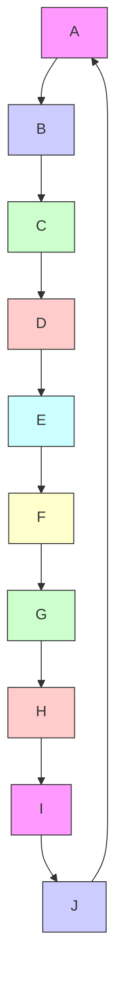

## Team Control Number

For office use only

T1

T2

T3

T4

## 12218

Problem Chosen

C

For office use only

F1

F2

F3

F4

## 2012 Mathematical Contest in Modeling (MCM) Summary Sheet

Type a summary of your results on this page. Do not include the name of your school, advisor, or team members on this page.

## Social Network Analysis in Crime Busting

Social network analysis (SNA) has been winning more and more attention in the last twenty years. The method provides an insight into various networks. In this paper, we use SNA and related techniques to analyze crime data and try to get potential criminal gang.

After first investigating the hidden features of a conspiratorial group, we consider one’s closeness to the criminal gang as the main reason in deciding whether a staff member should be regarded as a conspirator. The introduction of cooperation distance metric (CD-metric) combined with the analysis on cooperation factor makes up our model’s major base. Within these definitions, potential conspirators can be worked out by choosing those on the top of the ascending CD-metric list. Highest values of CD-metric can be recognized as being the farthest away from the conspiracy, in other words, they are the most innocent ones. A 12 members’ criminal group is dug out.

Before identifying the leading criminals, it is essential for us to quantify the ability of people’s leadership. Centrality analysis suggests a good way in determining the focal point(s) in a network. We make some amendments of the centrality measures so that it can be applied to a directed graph. What’s more, we combine centrality measures(degree, closeness and betweenness) and figure out the fusion values. We can form a ranking list of people’s ability of leadership then. The leaders in the criminal group are sure to come to surface after comparing with the priority list derived before.

In the refinement of the network model, we appeal to the theories of semantic network analysis and text analysis. On the purpose of making a deeper exploration of identifying the intrinsic character of one topic, we reapply the centrality analysis to data computing right after the construction of a semantic web. Based on text analysis approach, we build up a vector space model and compare the final outputs with ones obtained above, the results are robust.

This model’s application in other areas such as the biomedical domain has been discussed at the end of this paper, excellent performance happens when accessed to enough amounts of data. With a well-organized structure and a wide range of application, this methodology is sure to have a bright future.

Keywords: Social Network Analysis, Centrality Measures, Semantic Web, Text Analysis

## Contents

## 1 Introduction 2

## 2 Investigation Scenario Based on Crime Data Mining Model 2

2.1 General Assumptions . . . . 2  
2.2 Definitions . 3  
2.3 Explanation of the Model . . . 3  
2.4 Tests and Verifications . . 4

## 3 Analysis on the Current Case 6

3.1 Priority Lists of Potential Conspirators . . . 6  
3.2 Performance with More Accurate Information . . . . . 7

## 4 Searching for Leaders 7

4.1 Centrality Analysis . . . 8  
4.2 Interpretation of Results . . 10

## 5 Model Optimizing 11

5.1 Semantic Network Analysis 11

5.1.1 Construction of Semantic Network . . . . . . 12  
5.1.2 Topic Selection . . . . 12

5.2 Text Analysis . . 13

5.2.1 Vector Space Model . . 13  
5.2.4 Corroboration of Model Reasonableness . . . 14

## 6 Applications 15

## 7 Conclusion 15

## 1 Introduction

A crime is consist of a wide range of activities ranging from traffic violations to organized fraud in financial field. The major challenge lying ahead of all the authorities is how to accurately and efficiently analyze tremendous amount of the crime data [1].

With great advance in the information technology, the financial crime happens more often than ever. Due to a German report published not long before, the identified fraud cases related to card payments have risen 345% just from 2007 to 2009 [2]. A common analytical approach to this issue during recent years is called “Social Network Analysis”(SNA), which can be viewed as an innovation on mathematical perspective combined with sociology and criminology. This method can expose the hidden structural patterns in criminal networks [3], which can be offered to the anti-crime departments in directing them to necessary surveillance or interrogation scenarios, after several steps of data processing.

According to Mena’s book, SNA is a data mining technique that reveals the structure and content of a body of information by representing it as a set of interconnected, linked objects or entities [4].

To further present the application of the SNA approach, we arrange paper as followed:

i. In section 2, we propose a way to construct a model in identifying potential conspirators with the help from SNA in the first place;  
ii. In section 3, verified by the results of in small network, our model is applied to a bigger one and we rank all the people according to their possibility of being involved in the conspiracy;  
iii. In section 4, based on the centrality analysis theory, we explore a way in determining all the criminal leaders;  
iv. In section 5, after referring to the powerful techniques–semantic network analysis and text analysis, we make some amendments of our model by considering the content and context of the message traffic;  
v. At last, we discuss the model’s further developments when provided with enormous amount of data and talk about the future application such as in the biomedical area.

## 2 Investigation Scenario Based on Crime Data Mining Model

## 2.1 General Assumptions

• There is only one criminal gang in the given network;  
• Messages can not be classified emotionally from appearance;  
• Occurrences of messages are irrelevant to time;  
• Effects form data errors are negligible.

## 2.2 Definitions

Before proceeding to the real problem, we first make some definitions:

The multi-graph G = (V, E) is assumed to be a social network, where V denotes the set of nodes and E denotes the set of edges. A person in the network can be denoted by a node in the graph while edges stand for messages with certain topics passing through different persons. Thus we can separate these persons into several cliques, judging from the topics of communication.

Let G0 = (V 0, E0) be a supergraph corresponding to multi-graph G, where V 0 is the set of supernodes and E0 is the set of superedges [5]. Each supernode P 0 represents topic i with associated people in multi-graph G and there exists a superedge when supernodes connected by it possess common nodes. The weight of one superedge is the number of the common nodes.


<details>
<summary>flowchart</summary>


</details>

Figure 1: Multi-graph


<details>
<summary>text_image</summary>

P'₁
P'₅ P'₂
P'₄ P'₃
</details>

Figure 2: Supergraph

Figure 1 and 2 presented above display the transition from multi-graph to the corresponding supergraph. Nodes in the multi-graph can be recognized as persons and supernodes in the supergraph can be recognized as topics involved with relevant people.

So the crime busting in a criminal network can be translated into: “Provided with a multi-graph $G = ( V , E )$ and a query list $Q = \{ q _ { 1 } , q _ { 2 } , q _ { 3 } , . . . , q _ { i } \}$ , we aim to find out all the possible subsets of nodes associated with ones in Q and form a list ordered by the measurements of association.”

## 2.3 Explanation of the Model

The researched crime network is connected by messages delivery, through information transmitting, the whole conspiratorial network can function efficiently. An common staff member may have no idea in knowing whom the people really are, when having a conversation with them whereas the intrinsic character of topic can determine whether a person is involved in the conspiracy or not.

A piece of message is consist of countless information in many aspects. It is impossible and unnecessary to deal with them all at the same time, let alone composing these messages to a conclusion. In this case, we only focus our attention on three main aspects: Topics, Direction and People to whom they talked. However, the biggest challenge that we have confronted with is how to combine these three kinds of information appropriately.

We proposed a structure of network here in which the nodes denote topics of messages and edges denote people involved in them. Regarding the definition listed above, these characters are all possessed by the supergraph. In the general view, when a person switch his or her attention from one topic to another, we can regard it as person “flows” among related topics, therefore the whole network become alive.

Before the further exploration of this method, we should first analyze the “similarity” among collected topics. We use “Cooperation Factor $\left( \mathrm { C F } \right) ^ { \prime \prime } \left[ 5 \right]$ to study the latent interrelationships.

Definition 2.3.1 (Cooperation Factor) In the supergraph $G ^ { \prime } = ( V ^ { \prime } , E ^ { \prime } )$ , the Cooperation Factor between two supernodes $P _ { i } ^ { \prime }$ and $P _ { j } ^ { \prime }$ is:

$$
C F (S ^ {\prime}, V _ {i} ^ {\prime}, V _ {j} ^ {\prime}) = \frac {2 \times N _ {c} (P _ {i} ^ {\prime} , P _ {j} ^ {\prime})}{N _ {t} (P _ {i} ^ {\prime} , P _ {j} ^ {\prime})}, C F \in [ 0, 1 ]; \tag {1}
$$

Where: $N _ { c }$ denotes the number of common nodes between $P _ { i } ^ { \prime }$ and $P _ { j } ^ { \prime } ; N _ { t }$ denotes the number of total nodes contained in the $P _ { i } ^ { \prime }$ and $P _ { j } ^ { \prime }$ .

It is obvious that not all conspirators can contact directly but they must be very close for safety concern. To utilize this collective feature, it is essential to define a Cooperation Distance (CD) [5]:

Definition 2.3.2 (Cooperation Distance Metric) In the supergraph $G ^ { \prime } =$ $( V ^ { \prime } , E ^ { \prime } )$ with a list of i person denoted by a query $Q = \{ q _ { 1 } , q _ { 2 } , q _ { 3 } , . . . , q _ { i } \}$ . Let $v ^ { * }$ be a particular node in the multi-graph $G ,$ and $V$ be the set $o f$ nodes in the multi-graph G. Then, the Cooperation Distance of $v ^ { * }$ is then defined as:

$$
C D (S ^ {\prime}, v ^ {*}, V) = \frac {\sum_ {i = 1} ^ {| Q |} S h o r t e s t P a t h (S ^ {\prime} , v ^ {*} , q _ {i})}{| Q |}; \tag {2}
$$

Where: the Shortest $P a t h ( S ^ { \prime } , v ^ { * } , q _ { i } )$ is $\boldsymbol { \theta }$ when both $q _ { i }$ and $v ^ { * }$ belong to a same supernode, otherwise is the value derived from shortest path algorithm of $v ^ { * }$ and $q _ { i }$ with the weight of edges measured by CF.

The value of CF evaluates the level of correlation between two different topics, then $1 - C F$ indicates the level of uncorrelation in the opposite. We pick out the assumed conspiratorial topics and compare other unidentified topics with it by accordingly assign different weights. Hence, we can apply the shortest path algorithm to this theory and figure out the corresponding CDs of each unidentified staff member.

Those people with lowest values can be considered as having the most intimated communication with the criminal gang, which means they are more likely to be the real members in a criminal gang.

## 2.4 Tests and Verifications

After computing all the data we can obtain from the EZ (an investigation scenario provided by supervisor) case, concerning the points stated above, we can make a list of the CDs’ value in the ascending order, which indicates the possibility of a person being a conspirators in the opposite.

<table><tr><td>Name</td><td>CD metric</td><td>Rank</td></tr><tr><td>Dave</td><td>0.0000</td><td>1</td></tr><tr><td>George</td><td>0.0000</td><td>1</td></tr><tr><td>Ellen</td><td>0.0000</td><td>1</td></tr><tr><td>Carol</td><td>0.3333</td><td>4</td></tr><tr><td>Fred</td><td>0.3333</td><td>4</td></tr><tr><td>Harry</td><td>0.3333</td><td>4</td></tr><tr><td>Bob</td><td>0.7143</td><td>6</td></tr><tr><td>Inez</td><td>0.7143</td><td>6</td></tr><tr><td>Anne</td><td>1.0476</td><td>9</td></tr><tr><td>Jaye</td><td>1.4286</td><td>10</td></tr></table>

Table 1: Priority List for EZ Case

The top three in the list are the staff members with the highest possibilities of being involved in the conspiracy derived from our analysis, where there are already two are sure to be guilty. Moreover, Anne along with Jaye are both identified to be the “farthest away” from the conspiracy. But it is sad to find that Carol may still be misjudged as a conspirator and we may probably leave Bob behind as well.


<details>
<summary>line chart</summary>

| Rank | CD Metric |
|---|---|
| 1 | 0 |
| 2 | 0 |
| 3 | 0 |
| 4 | 0.35 |
| 5 | 0.35 |
| 6 | 0.35 |
| 7 | 0.7 |
| 8 | 0.7 |
| 9 | 1.05 |
| 10 | 1.45 |
Jayé (top right) |
Anne (right), Bob (left), Inez (left), Carol (left), Fred (left), Ellen (left). The dashed line at CD Metric = 0.5 serves as a reference threshold.
</details>

Figure 3: Discriminating Line for EZ Case

In order to determine a discriminating line in separating innocents from conspirators, we calculate the difference among pairs of neighbors in the list and pick out the biggest one through comparison. The hugest gap measured by curvature between two staff members can be deemed as a boundary that distinguishes two groups–the innocent one and the conspiratorial one for the conspiratorial messages is sure to be restricted in a small group.

Although there still exists several demerits considering the results, the excellent structure of the investigation scenario encourages us to apply this method to a larger criminal network with much more data.

## 3 Analysis on the Current Case

For now, the new network has 83 people involved, 400 collected messages, over 21,000 words of messages traffic, 15 topics, 7 known conspirators, and 8 known non-conspirators. There are also several members with same names in investigation which we just differentiate them by the denoted numbers. Based on the SNA method we proposed before, we calculate each staff member’s CD metric and arrange them in an ascending order list. Considering the list size, we only list the top 40 to perform the results of our analysis.

## 3.1 Priority Lists of Potential Conspirators

We first work out the CF values of each adjacent vertices in order to quantify the level of correlations among edges. Because there are three topics considered to be involved in the conspiracy, we make a combination of these three initial values into ones by setting equal weights and make an addition. Therefore CD metrics can be determined by making the use of shortest path algorithm and priority list may come to surface then.

The output of our analysis on the 3 topics which deemed to be conspiratorial and 7 known conspirators are listed below:

<table><tr><td>Name</td><td>CD metric</td><td>Name</td><td>CD metric</td></tr><tr><td>Elsie</td><td>0.0000</td><td>Paige</td><td>0.2859</td></tr><tr><td>Jean</td><td>0.0000</td><td>Neal</td><td>0.2859</td></tr><tr><td>Alex</td><td>0.0000</td><td>Priscilla</td><td>0.2859</td></tr><tr><td>Elsie</td><td>0.0000</td><td>Kristina</td><td>0.3641</td></tr><tr><td>Paul</td><td>0.0000</td><td>Sherri</td><td>0.3641</td></tr><tr><td>Harvey</td><td>0.0000</td><td>Franklin</td><td>0.3641</td></tr><tr><td>Ulf</td><td>0.0000</td><td>Marcia</td><td>0.3641</td></tr><tr><td>Cha</td><td>0.0000</td><td>Jerome</td><td>0.4224</td></tr><tr><td>Sheng</td><td>0.0000</td><td>Louis</td><td>0.4224</td></tr><tr><td>Darol</td><td>0.0000</td><td>Beth</td><td>0.4420</td></tr><tr><td>Yao</td><td>0.0000</td><td>Douglas</td><td>0.4420</td></tr><tr><td>Stephanie</td><td>0.2265</td><td>Crystal</td><td>0.4480</td></tr><tr><td>Kim</td><td>0.2265</td><td>Claire</td><td>0.4480</td></tr><tr><td>Beth</td><td>0.2265</td><td>Jerome</td><td>0.4480</td></tr><tr><td>Seeni</td><td>0.2265</td><td>Darlene</td><td>0.4480</td></tr><tr><td>Dolores</td><td>0.2340</td><td>Patricia</td><td>0.4525</td></tr><tr><td>Marion</td><td>0.2340</td><td>Jia</td><td>0.4525</td></tr><tr><td>Dwight</td><td>0.2340</td><td>Neal</td><td>0.4584</td></tr><tr><td>William</td><td>0.2340</td><td>Melia</td><td>0.4584</td></tr><tr><td>Lars</td><td>0.2340</td><td>Francis</td><td>0.4605</td></tr></table>

Table 2: Partial Priority List for Requirement 1

We note that the 11 persons on the top have the same values of CD metric, on the other hand, indicates that they can be regarded as having the same possibilities of being a conspirator. The 7 known conspirators being involved in suspected group also demonstrates the reasonableness of our method.

Furthermore, we plot the discrimination line in the same way we displayed in the small network by comparing the separation among adjacent persons in the priority list. Thus, the possible conspirators are: Elsie, Jean, Alex, Elsie,


<details>
<summary>line chart</summary>

| Rank | CD-Metric |
| ---- | --------- |
| 1    | 0.0       |
| 2    | 0.0       |
| 3    | 0.0       |
| 4    | 0.0       |
| 5    | 0.0       |
| 6    | 0.0       |
| 7    | 0.0       |
| 8    | 0.0       |
| 9    | 0.0       |
| 10   | 0.0       |
| 11   | 0.23      |
| 12   | 0.23      |
| 13   | 0.23      |
| 14   | 0.23      |
| 15   | 0.23      |
| 16   | 0.23      |
| 17   | 0.23      |
| 18   | 0.23      |
| 19   | 0.23      |
| 20   | 0.29      |
| 21   | 0.29      |
| 22   | 0.36      |
| 23   | 0.36      |
| 24   | 0.36      |
| 25   | 0.42      |
| 26   | 0.42      |
| 27   | 0.44      |
| 28   | 0.44      |
| 29   | 0.45      |
| 30   | 0.45      |
| 31   | 0.45      |
| 32   | 0.45      |
| 33   | 0.45      |
| 34   | 0.45      |
| 35   | 0.45      |
| 36   | 0.45      |
| 37   | 0.45      |
| 38   | 0.45      |
| 39   | 0.45      |
| 40   | 0.45      |
</details>

Figure 4: Discriminating Line for Requirement 1

Paul, Harvey, Ulf, Cha, Sheng, Darol and Yao.

## 3.2 Performance with More Accurate Information

The promising results obtained above motivate us to test our model’s performance with more accurate information in the same network. When Chris was identified to be a conspirator and Topic 1 was regarded as being associated with conspiracy, we revaluate the level of correlations among total 15 topics. After setting different similarities’ weights to particular edges accordingly, we recompute these data and work out with a amended list and discriminating line. The results are displayed in Table 3 and Figure 5.

## 4 Searching for Leaders

It’s hard to uncover all the leaders in a well-organized crime networks due to its high complexity. But we can build a calibration system based on a theory called Centrality Analysis [6,7] to identify some suspects who are more likely to be the chief ones.

<table><tr><td>Name</td><td>CD metric</td><td>Name</td><td>CD metric</td></tr><tr><td>Chris</td><td>0.0000</td><td>Beth</td><td>0.2877</td></tr><tr><td>Elsie</td><td>0.0000</td><td>Paige</td><td>0.3362</td></tr><tr><td>Jean</td><td>0.0000</td><td>Neal</td><td>0.3362</td></tr><tr><td>Alex</td><td>0.0000</td><td>Priscilla</td><td>0.3362</td></tr><tr><td>Elsie</td><td>0.0000</td><td>Crystal</td><td>0.3511</td></tr><tr><td>Paul</td><td>0.0000</td><td>Lois</td><td>0.3511</td></tr><tr><td>Harvey</td><td>0.0000</td><td>Ellin</td><td>0.3511</td></tr><tr><td>Ulf</td><td>0.0000</td><td>Han</td><td>0.3511</td></tr><tr><td>Cha</td><td>0.0000</td><td>Kristina</td><td>0.3525</td></tr><tr><td>Sheng</td><td>0.0000</td><td>Sherri</td><td>0.3525</td></tr><tr><td>Darol</td><td>0.0000</td><td>Franklin</td><td>0.3525</td></tr><tr><td>Yao</td><td>0.0000</td><td>Marcia</td><td>0.3525</td></tr><tr><td>Dolores</td><td>0.2869</td><td>Gretchen</td><td>0.3525</td></tr><tr><td>Marion</td><td>0.2869</td><td>Douglas</td><td>0.3525</td></tr><tr><td>Dwight</td><td>0.2869</td><td>Claire</td><td>0.4294</td></tr><tr><td>William</td><td>0.2869</td><td>Jerome</td><td>0.4294</td></tr><tr><td>Lars</td><td>0.2869</td><td>Louis</td><td>0.4294</td></tr><tr><td>Seeni</td><td>0.2869</td><td>Darlene</td><td>0.4294</td></tr><tr><td>Stephanie</td><td>0.2877</td><td>Jerome</td><td>0.4299</td></tr><tr><td>Kim</td><td>0.2877</td><td>Beth</td><td>0.4549</td></tr></table>

Table 3: Partial Priority List for Requirement 2


<details>
<summary>line chart</summary>

| Rank | CD-Metric |
| ---- | --------- |
| 1    | 0.0       |
| 2    | 0.0       |
| 3    | 0.0       |
| 4    | 0.0       |
| 5    | 0.0       |
| 6    | 0.0       |
| 7    | 0.0       |
| 8    | 0.0       |
| 9    | 0.0       |
| 10   | 0.0       |
| 11   | 0.0       |
| 12   | 0.29      |
| 13   | 0.29      |
| 14   | 0.29      |
| 15   | 0.29      |
| 16   | 0.29      |
| 17   | 0.29      |
| 18   | 0.29      |
| 19   | 0.29      |
| 20   | 0.29      |
| 21   | 0.34      |
| 22   | 0.34      |
| 23   | 0.35      |
| 24   | 0.35      |
| 25   | 0.35      |
| 26   | 0.35      |
| 27   | 0.35      |
| 28   | 0.35      |
| 29   | 0.35      |
| 30   | 0.35      |
| 31   | 0.35      |
| 32   | 0.35      |
| 33   | 0.35      |
| 34   | 0.35      |
| 35   | 0.43      |
| 36   | 0.43      |
| 37   | 0.43      |
| 38   | 0.43      |
| 39   | 0.43      |
| 40   | 0.46      |
</details>

Figure 5: Discriminating Line for Requirement 2

## 4.1 Centrality Analysis

There are three measures of centrality that have been widely used in social network analysis:

Betweenness Betweenness of one node is the number of geodesics (shortest

paths between any other two nodes in the network) passing through it:

$$
C _ {B} (i) = \frac {g _ {j k} (i)}{g _ {j k}} \tag {3}
$$

Where: $g _ { j k }$ represents the number of shortest paths between any two nodes and $g _ { j k } ( i )$ represents the number of shortest paths running through node i;

Closeness Closeness is the sum of geodesics between the particular node and every other node in the network:

$$
C _ {C} (i) = \left[ \sum_ {j} ^ {N} d (i, j) \right] ^ {- 1} \tag {4}
$$

Where: $d ( i , j )$ denotes the binary shortest distance between any two nodes in the network;

Degree The original concept [6] of one node’s degree is its number of links as:

$$
k _ {i} = C _ {D} ^ {X} (i) = \sum_ {j} ^ {N} x _ {i j} \tag {5}
$$

Where: i denotes the focal node, j denotes other nodes in the network; N is the node’s number and $x _ { i j } = \{ 0 , 1 \}$ are the entries in the adjacency matrix.

However, some pioneers proposed a method which considering the weights of each edge in a weighted network [8–10] by introducing a new measure called strength:

$$
s _ {i} = C _ {D} ^ {W} (i) = \sum_ {j} ^ {N} w _ {i j} \tag {6}
$$

Where: i denotes the focal node, j denotes other nodes in the network; N is the node’s number and $w _ { i j }$ are the entries in the adjacency matrix whose value is positive when i is connected to j (so that it can reflect the weight), otherwise is 0.

Now we utilize a method to combine both degree and strength with the introduction of a turning parameter α [11]:

$$
C _ {D} ^ {W \alpha} (i) = k _ {i} \times (\frac {s _ {i}}{k _ {i}}) ^ {\alpha} = k _ {i} ^ {(1 - \alpha)} \times s _ {i} ^ {\alpha} \tag {7}
$$

Where: α is a positive value which can be set according to different request. When the parameter is between 0 and 1, then it would be favorable to obtain a high value, otherwise a low value would be preferable. In our crime network analysis, we choose 0.5 to accomplish our goal.

The leadership of one individual conspirator can be “revealed” by one measure or the combination of two or three, whereas some extremely special cases such as gatekeepers and receptionists are still of high possibility [12]. According to the present research, this method can work out some results with fairly good accuracy and is easily to spread out [13].

## 4.2 Interpretation of Results

It is obvious to see that we can form different lists according to different measures, whereas we can hardly to tell which one is more important in deciding one’s leadership.

<table><tr><td>Name</td><td>Degree</td><td>Closeness</td><td>Betweenness</td></tr><tr><td>Chris</td><td>7.905</td><td>0.010</td><td>0.034</td></tr><tr><td>Kristina</td><td>8.743</td><td>0.011</td><td>0.045</td></tr><tr><td>Paige</td><td>14.477</td><td>0.013</td><td>0.063</td></tr><tr><td>Sherri</td><td>13.013</td><td>0.012</td><td>0.088</td></tr><tr><td>Gretchen</td><td>8.599</td><td>0.014</td><td>0.064</td></tr><tr><td>Karen</td><td>6.433</td><td>0.013</td><td>0.047</td></tr><tr><td>Patrick</td><td>7.497</td><td>0.012</td><td>0.042</td></tr><tr><td>Elsie</td><td>11.959</td><td>0.012</td><td>0.100</td></tr><tr><td>Hazel</td><td>9.000</td><td>0.011</td><td>0.064</td></tr><tr><td>Malcolm</td><td>6.559</td><td>0.011</td><td>0.052</td></tr><tr><td>Dolores</td><td>8.396</td><td>0.012</td><td>0.091</td></tr><tr><td>Francis</td><td>7.737</td><td>0.011</td><td>0.079</td></tr><tr><td>Sandy</td><td>8.927</td><td>0.012</td><td>0.058</td></tr><tr><td>Marion</td><td>7.254</td><td>0.013</td><td>0.086</td></tr><tr><td>Beth</td><td>8.546</td><td>0.012</td><td>0.044</td></tr><tr><td>Julia</td><td>12.956</td><td>0.013</td><td>0.100</td></tr><tr><td>Jerome</td><td>4.469</td><td>0.009</td><td>0.042</td></tr><tr><td>Neal</td><td>10.915</td><td>0.014</td><td>0.061</td></tr><tr><td>Jean</td><td>11.336</td><td>0.012</td><td>0.074</td></tr><tr><td>Kristine</td><td>8.975</td><td>0.012</td><td>0.085</td></tr></table>

Table 4: Partial Outputs of Centrality Analysis

Although these three measure possess excellent in measuring one’s ability in leadership, some demerits still exist:

(i) Degree does not consider the overall structure of the network and will inevitably lead to some misjudgments [14, 15];  
(ii) The major challenge standing ahead of closeness is lack of capability to deal with the disconnected components in networks [11];  
(iii) Betweenness may function improperly when faced with some particular cases such as a node has none shortest path running through it.

With so many unpredictable situations to concern, we simply place an equal weight to all of them and get a fusion value as result. We choose 40 staff members who possess the highest fusion value from our analysis, results are in Table 5. They are deem to be ones who can have the most important impact on the whole network, in other words, leaders in the company. Comparing it with the priority list we work out, we can infer that Alex is a leader in the criminal gang.

<table><tr><td>Name</td><td>Fusion Value</td><td>Rank</td><td>Name</td><td>Fusion Value</td><td>Rank</td></tr><tr><td>Franklin</td><td>0.0763</td><td>1</td><td>Yao</td><td>0.3494</td><td>21</td></tr><tr><td>Julia</td><td>0.0803</td><td>2</td><td>Eric</td><td>0.3574</td><td>22</td></tr><tr><td>Alex</td><td>0.0884</td><td>3</td><td>Crystal</td><td>0.3695</td><td>23</td></tr><tr><td>Gretchen</td><td>0.0884</td><td>4</td><td>Wayne</td><td>0.3735</td><td>24</td></tr><tr><td>Darlene</td><td>0.0964</td><td>5</td><td>Francis</td><td>0.3775</td><td>25</td></tr><tr><td>Jerome</td><td>0.1406</td><td>6</td><td>Stephanie</td><td>0.3855</td><td>26</td></tr><tr><td>Elsie</td><td>0.1566</td><td>7</td><td>Hazel</td><td>0.3896</td><td>27</td></tr><tr><td>Paige</td><td>0.1606</td><td>8</td><td>Karen</td><td>0.3936</td><td>28</td></tr><tr><td>Sherri</td><td>0.1647</td><td>9</td><td>Christina</td><td>0.4016</td><td>29</td></tr><tr><td>Gretchen</td><td>0.1928</td><td>10</td><td>Beth</td><td>0.4096</td><td>30</td></tr><tr><td>Kristine</td><td>0.1968</td><td>11</td><td>Lois</td><td>0.4257</td><td>31</td></tr><tr><td>Neal</td><td>0.2008</td><td>12</td><td>William</td><td>0.4257</td><td>32</td></tr><tr><td>Dolores</td><td>0.2088</td><td>13</td><td>Beth</td><td>0.4297</td><td>33</td></tr><tr><td>Jean</td><td>0.2088</td><td>14</td><td>Kristina</td><td>0.4337</td><td>34</td></tr><tr><td>Marion</td><td>0.2570</td><td>15</td><td>Louis</td><td>0.4337</td><td>35</td></tr><tr><td>Donald</td><td>0.2610</td><td>16</td><td>Dwight</td><td>0.4498</td><td>36</td></tr><tr><td>Paul</td><td>0.2610</td><td>17</td><td>Harvey</td><td>0.4578</td><td>37</td></tr><tr><td>Patricia</td><td>0.2610</td><td>18</td><td>Elsie</td><td>0.4699</td><td>38</td></tr><tr><td>Neal</td><td>0.3173</td><td>19</td><td>Patrick</td><td>0.4779</td><td>39</td></tr><tr><td>Sandy</td><td>0.3414</td><td>20</td><td>Malcolm</td><td>0.4940</td><td>40</td></tr></table>

Table 5: Partial Leadership List on Fusion Values

## 5 Model Optimizing

To make our model function better, we need to take a look back on the weight placed on each topics. In the previous work, we simply give the significant topics an equal random initial value while others were determined by calculation based on the quantified correlations among them. However, this process of quantification can not provide a satisfied result precisely. To cross this barrier, we switch our attention to more powerful techniques–Semantic Network Analysis (SemNa) and Text Analysis.

## 5.1 Semantic Network Analysis

A semantic network is a network which represents semantic relations between concepts in patterns of interconnected nodes and arcs. It is often used as a form of knowledge representation [16]. With the fast improvements of the SNA approach, the application of this method has been extent to the Web [17], encouraging us to apply it to the semantic network. In our current case, we need to analyze the “crime ontology” as carefully as possible, where a multi-graph can be constructed according to the theory of semantic network [18]. Here we build a model based on the Semantic Network Analysis as the application of SNA approach and centrality analysis we raised up before.

## 5.1.1 Construction of Semantic Network

In a semantic multi-graph, all nodes can be classified into two categories: concepts and property. As they literally mean, one concept can be expressed by using several properties, whereas different collections of properties can express different concepts. One property can be used to describe a wide range of concepts while some of these concepts are specifical to this property. These relations among concepts and property can be used to construct a semantic network, which can be realized by the artificial intelligence system. Rules are displayed below [18]:


<details>
<summary>flowchart</summary>

```mermaid
graph LR
  A["Sub-concept"] --> B["Concept"]
  C["Sub-concept"] --> B
  D["..."] --> B
  B --> E["Major Concept"]
  B --> F["Major Concept"]
  B --> G["......"]
  B --> H["Property"]
  I["Sub-property"] --> E
  J["Sub-property"] --> E
  K["..."] --> E
    style B stroke:#000,stroke-width:2px
    linkStyle 0,1,2,3,4,5,6,7,8,9 stroke:#000,stroke-width:2px
    linkStyle 10,11,12,13,14,15 stroke:#000,stroke-width:2px
    linkStyle 16 stroke:#000,stroke-width:2px
    linkStyle 17 stroke:#000,stroke-width:2px
    linkStyle 18 stroke:#000,stroke-width:2px
    linkStyle 19 stroke:#000,stroke-width:2px
    linkStyle 20 stroke:#000,stroke-width:2px
    linkStyle 21 stroke:#000,stroke-width:2px
    linkStyle 22 stroke:#000,stroke-width:2px
    linkStyle 23 stroke:#000,stroke-width:2px
    linkStyle 24 stroke:#000,stroke-width:2px
    linkStyle 25 stroke:#000,stroke-width:2px
    linkStyle 26 stroke:#000,stroke-width:2px
    linkStyle 27 stroke:#000,stroke-width:2px
    linkStyle 28 stroke:#000,stroke-width:2px
    linkStyle 29 stroke:#000,stroke-width:2px
    linkStyle 30 stroke:#000,stroke-width:2px
    linkStyle 31 stroke:#000,stroke-width:2px
    linkStyle 32 stroke:#000,stroke-width:2px
    linkStyle 33 stroke:#000,stroke-width:2px
    linkStyle 34 stroke:#000,stroke-width:2px
    linkStyle 35 stroke:#000,stroke-width:2px
    linkStyle 36 stroke:#000,stroke-width:2px
    linkStyle 37 stroke:#000,stroke-width:2px
    linkStyle 38 stroke:#000,stroke-width:2px
    linkStyle 39 stroke:#000,stroke-width:2px
    linkStyle 40 stroke:#000,stroke-width:2px
    linkStyle 41 stroke:#000,stroke-width:2px
    linkStyle 42 stroke:#000,stroke-width:2px
    linkStyle 43 stroke:#000,stroke-width:2px
    linkStyle 44 stroke:#000,stroke-width:2px
    linkStyle 45 stroke:#000,stroke-width:2px
    linkStyle 46 stroke:#000,stroke-width:2px
    linkStyle 47 stroke:#000,stroke-width:2px
    linkStyle 48 stroke:#000,stroke-width:2px
    linkStyle 49 stroke:#000,stroke-width:2px
    linkStyle 50 stroke:#000,stroke-width:2px
```
</details>

Figure 6: Relations among Nodes

The relations exhibited above can be concluded as:

• There exists a directed edge from $C _ { 1 }$ to $C _ { 2 }$ , if concept $C _ { 1 }$ is a sub-concept of $C _ { 2 } ;$ ;  
• There exists a directed edge from $P _ { 1 }$ to $P _ { 2 } .$ , if property $P _ { 1 }$ is a sub-property of $P _ { 2 }$ ;  
• A directed edge should be added from each major concept node to the property node;  
• Directed edges should be added from the property node to all range concept nodes.

## 5.1.2 Topic Selection

In our crime busting scenario, we can regard the concepts and properties defined before as topics and keywords separately. We assess the importance of one topic in a criminal network by working out its centrality measures such as degree, closeness and betweenness. One with higher value of the combination of these three is supposed to be more crucial in a conspiracy. Thus, we can place the weights for each topic according to its conspiratorial level based on the content and context of messages’ transferring.

After revaluating the topics’ weights, we can reprocess the data to obtain a better result that can be closer to the truth. The partial results with top 40 derived from semantic web have been exhibited in Table 6.

<table><tr><td>Name</td><td>CD Metric</td><td>Name</td><td>CD Metric</td></tr><tr><td>Chris</td><td>0.0000</td><td>Lars</td><td>0.7437</td></tr><tr><td>Elsie</td><td>0.0000</td><td>Seeni</td><td>0.7437</td></tr><tr><td>Jean</td><td>0.0000</td><td>Paige</td><td>0.7445</td></tr><tr><td>Alex</td><td>0.0000</td><td>Neal</td><td>0.7445</td></tr><tr><td>Elsie</td><td>0.0000</td><td>Priscilla</td><td>0.7445</td></tr><tr><td>Paul</td><td>0.0000</td><td>Stephanie</td><td>0.7485</td></tr><tr><td>Harvey</td><td>0.0000</td><td>Kim</td><td>0.7485</td></tr><tr><td>Ulf</td><td>0.0000</td><td>Beth</td><td>0.7485</td></tr><tr><td>Cha</td><td>0.0000</td><td>Sherri</td><td>0.9474</td></tr><tr><td>Sheng</td><td>0.0000</td><td>Jerome</td><td>0.9474</td></tr><tr><td>Darol</td><td>0.0000</td><td>Louis</td><td>0.9474</td></tr><tr><td>Yao</td><td>0.0000</td><td>Neal</td><td>0.9506</td></tr><tr><td>Crystal</td><td>0.7423</td><td>Jerome</td><td>0.9506</td></tr><tr><td>Lois</td><td>0.7423</td><td>Douglas</td><td>0.9506</td></tr><tr><td>Ellin</td><td>0.7423</td><td>Melia</td><td>0.9506</td></tr><tr><td>Han</td><td>0.7423</td><td>Kristine</td><td>0.9597</td></tr><tr><td>Dolores</td><td>0.7437</td><td>Shelley</td><td>0.9597</td></tr><tr><td>Marion</td><td>0.7437</td><td>Donald</td><td>0.9597</td></tr><tr><td>Dwight</td><td>0.7437</td><td>Carina</td><td>0.9597</td></tr><tr><td>William</td><td>0.7437</td><td>Patrick</td><td>0.9770</td></tr></table>

Table 6: Partial Outputs from Semantic Web

## 5.2 Text Analysis

A large text databases potentially contain a great deal of knowledge, for text itself is a complex collection comprised of enormous amount of information [19]. However, it cannot be analyzed by applying common data mining methods. In order to extract valuable information from the messages, we construct a vector space model to estimate the importance of various topics.

## 5.2.1 Vector Space Model

Before making a careful analysis on the importance of topics, we should first build a bridge connecting words and topics’ similarity. Therefore we introduce a measure called “Feature Item $\mathrm { W e i g h t } ^ { \mathrm { \tiny { v } } }$ to quantify the impact of keywords on a particular topic [20].

Definition 5.2.2 (Feature Item Weight) Feature item weight $w _ { i k }$ indicates the importance of feature item $T _ { k }$ to the text $D _ { i }$ :

$$
w _ {i k} = \frac {t f _ {i k} \times \log_ {2} (N / d f _ {k})}{\sqrt {\sum_ {T _ {k} \in D _ {i}} \left[ t f _ {i k} \times \log_ {2} (N / d f _ {k}) \right] ^ {2}}} \tag {8}
$$

Where: $t f _ { i k }$ is the time of the feature item’s $( T _ { k } )$ appearance in text $D _ { i }$ while $d f _ { k }$ is the number of text including feature item $T _ { k }$ . feature item’s $( T _ { k } )$ ability of differentiating the different kinds of text is weaker when the value of $d f _ { k }$ is higher; N denotes the total number of text, $i d f _ { k } = l o g _ { 2 } ( N / d f _ { k } )$ is the frequency of reverse text in which higher value indicate a stronger ability in differentiating the different kinds of text.

Definition 5.2.3 (Text’s Similarity) Text’s similarity can be measured by the cosine of included angle formed by the corresponding vectors $\displaystyle { \it { \Omega } } ^ { \mathrm { { ( 2 1 ) } } . }$

$$
\operatorname{Sim} \left(d _ {i}, d _ {j}\right) = \frac {\sum_ {k = 1} ^ {n} w _ {i j} \times w _ {j k}}{\sqrt {\left(\sum_ {k = 1} ^ {n} w _ {i k} ^ {2}\right) \left(\sum_ {k = 1} ^ {n} w _ {j k} ^ {2}\right)}} \tag {9}
$$

Where: $d _ { i } = ( w _ { i 1 } , w _ { i 2 } , w _ { i 3 } , \dots , w _ { i n } )$ is a vector representing text $D _ { i }$ in this vector space, and $w _ { i k }$ is the feature item weight.

## 5.2.4 Corroboration of Model Reasonableness

The value of the Sim can be used in weights’ determination through a more accurate way. When reapply the method to the big network in current case, we obtain a priority list resembled to the former one in Table 3, where the member of the criminal gang are still the same while some slight modification of the CD metrics of the innocent ones. Nevertheless, we are still quite confident in a better performance of this model when accessed to a richer database. It is

<table><tr><td>Name</td><td>CD Metric</td><td>Name</td><td>CD Metric</td></tr><tr><td>Chris</td><td>0.0000</td><td>Dolores</td><td>0.9271</td></tr><tr><td>Elsie</td><td>0.0000</td><td>Marion</td><td>0.9271</td></tr><tr><td>Jean</td><td>0.0000</td><td>Beth</td><td>0.9271</td></tr><tr><td>Alex</td><td>0.0000</td><td>Julia</td><td>0.9271</td></tr><tr><td>Elsie</td><td>0.0000</td><td>Jerome</td><td>0.9271</td></tr><tr><td>Paul</td><td>0.0000</td><td>Neal</td><td>0.9271</td></tr><tr><td>Harvey</td><td>0.0000</td><td>Franklin</td><td>0.9271</td></tr><tr><td>Ulf</td><td>0.0000</td><td>Claire</td><td>0.9271</td></tr><tr><td>Cha</td><td>0.0000</td><td>Marcia</td><td>0.9271</td></tr><tr><td>Sheng</td><td>0.0000</td><td>Dwight</td><td>0.9271</td></tr><tr><td>Darol</td><td>0.0000</td><td>Stephanie</td><td>0.9271</td></tr><tr><td>Yao</td><td>0.0000</td><td>Gretchen</td><td>0.9271</td></tr><tr><td>Crystal</td><td>0.9174</td><td>Kim</td><td>0.9271</td></tr><tr><td>Lois</td><td>0.9174</td><td>Jerome</td><td>0.9271</td></tr><tr><td>Ellin</td><td>0.9174</td><td>Shelley</td><td>0.9271</td></tr><tr><td>Han</td><td>0.9174</td><td>Priscilla</td><td>0.9271</td></tr><tr><td>Kristina</td><td>0.9271</td><td>Beth</td><td>0.9271</td></tr><tr><td>Paige</td><td>0.9271</td><td>Douglas</td><td>0.9271</td></tr><tr><td>Sherri</td><td>0.9271</td><td>Patricia</td><td>0.9271</td></tr><tr><td>Patrick</td><td>0.9271</td><td>Louis</td><td>0.9271</td></tr></table>

Table 7: Partial Outputs of Vector Space Model

amazing that the members in criminal group are unchanged, where reversely corroborate the reasonableness of the network model.

## 6 Applications

Our method in analyzing the network with a complex database is comprised of social network analysis, centrality analysis, semantic network analysis and text analysis. Each of them can easily be extent to different areas with the same intrinsic mechanism as we utilized, and some present researches even explain the reasons why these methods could possess a wide range of application with social concerns [22].

For now, text mining has become a prevalent automated method in exploiting the tremendous amount of knowledge in the biomedical literature such as the most common ones: rule-based or knowledgebased approaches, and statistical or machine-learning-based approaches [23]. The former one mainly focus on analyzing the structure of messages with sorts of knowledge while the latter one stresses on classifying full sentences. Several real performances of the semantic web application have already been surveyed in various biomedical area with knowledge integration and exploration [24].

With the useful information extracted from the messages transferred in the crowds, we can appeal to the semantic network analysis and text analysis for a deeper insight. The theory of social network analysis provides a solid base to construct a semantic web in which content and context of one piece of message are under much more concern. Within a social group, the difference between each individual lies in the social experience and their relation with others, and these difference would eventually lead to a division of the social work, bringing various networks into function. Centrality can provide a good measurement of the structural importance of one node in the whole network [25]. This method of importance quantification can help us with search for the focal point(s). Therefore, we can be directed to a efficient analyze by combining these methodology into one as a whole. A massive amount of data can enrich our sample collection and a good artificial intelligence system can enhance our semantic network analysis’s ability in information categorizing which strengthen the reasonableness of the whole model.

## 7 Conclusion

It’s not an easy task to formulate a well-organized crime busting scenario. In order to accomplish our goal, we first discussed about the features one criminal gang could have. Based on the principle of secretness in a conspiracy, we defined a cooperation distance (CD metric) to decide whether a person should be regarded as being involved in the conspiracy for we thought one’s closeness with the criminal group is a fairly conclusive argument.

Centrality measures provided a good way for us in detecting the leaders in the criminal network. Some modifications were proposed by us in order to apply the theory in a directed graph. Through comparison with the given information, it was delightful for us to find that the true mangers possess high grades in the list of leadership measurement.

In the model’s refinement work, we appealed to the techniques of semantic network analysis and text analysis. Visualization may be the most fundamental difference between the traditional analysis and the network research in nowadays study. After making a development of the Social Network Analysis, we successfully constructed a semantic web of topics and keywords connected by linguistic association. Although objectiveness of this analytical method is fascinating, the unpredictable abilities of data processing for different artificial intelligence system is a major barrier impeding the development of the semantic network analysis. We hope this situation can get a better changed with corresponding remediation.

A non-prominent output later obtained from the addition of text analysis is believed to result from being in lack of enough message simples. But the final results was almost in acceptance because of the high resemblance to former ones. According to the statistical principles, we are expected to have a better consequence with more accuracy. The promising results persuade us to put more faith in a good application of this model before long.

## References

[1] H. Chen, W. Chung, J.J. Xu, G. Wang, Y. Qin, and M. Chau. Crime data mining: a general framework and some examples. Computer, 37(4):50–56, 2004.  
[2] B. Wiesbaden. Polizeiliche kriminalstatistik. Bundesrepublik Deutschland. Berichtsjahr, 2007.  
[3] M.K. Sparrow. The application of network analysis to criminal intelligence: An assessment of the prospects. Social networks, 13(3):251–274, 1991.  
[4] J. Mena. Investigative data mining for security and criminal detection. Butterworth-Heinemann, 2003.  
[5] A.M. Fard and M. Ester. Collaborative mining in multiple social networks data for criminal group discovery. In Computational Science and Engineering, 2009. CSE’09. International Conference on, volume 4, pages 582–587. IEEE, 2009.  
[6] L.C. Freeman. Centrality in social networks conceptual clarification. Social networks, 1(3):215–239, 1979.  
[7] J. Xu and H. Chen. Criminal network analysis and visualization. Communications of the ACM, 48(6):100–107, 2005.  
[8] A. Barrat, M. Barthelemy, R. Pastor-Satorras, and A. Vespignani. The architecture of complex weighted networks. Proceedings of the National Academy of Sciences of the United States of America, 101(11):3747, 2004.  
[9] M.E.J. Newman. Analysis of weighted networks. Physical Review E, 70(5):056131, 2004.  
[10] T. Opsahl, V. Colizza, P. Panzarasa, and J.J. Ramasco. Prominence and control: The weighted rich-club effect. Physical review letters, 101(16):168702, 2008.  
[11] T. Opsahl, F. Agneessens, and J. Skvoretz. Node centrality in weighted networks: Generalizing degree and shortest paths. Social Networks, 32(3):245–251, 2010.  
[12] W.E. Baker and R.R. Faulkner. The social organization of conspiracy: Illegal networks in the heavy electrical equipment industry. American Sociological Review, pages 837–860, 1993.  
[13] V.E. Krebs. Mapping networks of terrorist cells. Connections, 24(3):43–52, 2002.  
[14] D.J. Brass. Being in the right place: A structural analysis of individual influence in an organization. Administrative Science Quarterly, pages 518– 539, 1984.  
[15] S.P. Borgatti. Centrality and network flow. Social Networks, 27(1):55–71, 2005.  
[16] J.F. Sowa. Semantic networks. Encyclopedia of Cognitive Science, 1992.  
[17] J.M. Kleinberg. Authoritative sources in a hyperlinked environment. Journal of the ACM (JACM), 46(5):604–632, 1999.  
[18] B. Hoser, A. Hotho, R. J¨aschke, C. Schmitz, and G. Stumme. Semantic network analysis of ontologies. The Semantic Web: Research and Applications, pages 514–529, 2006.  
[19] T. Nasukawa and T. Nagano. Text analysis and knowledge mining system. IBM Systems Journal, 40(4):967–984, 2001.  
[20] Qi Shiwei. Web text mining and its application in correlation analysis between events (in chinese). Master’s thesis, National University of Defense Technology, 2008.  
[21] Shi Zhiwei, Liu Tao, and Wu Gongyi. An effective and efficient algorithm for text categorization (in chinese). Computer Engineering and Applications, 41(29):180–183, 2005.  
[22] A. Sih, S.F. Hanser, and K.A. McHugh. Social network theory: new insights and issues for behavioral ecologists. Behavioral Ecology and Sociobiology, 63(7):975–988, 2009.  
[23] K.B. Cohen and L. Hunter. Getting started in text mining. PLoS computational biology, 4(1):e20, 2008.  
[24] H. Chen, L. Ding, Z. Wu, T. Yu, L. Dhanapalan, and J.Y. Chen. Semantic web for integrated network analysis in biomedicine. Briefings in bioinformatics, 10(2):177–192, 2009.  
[25] K. Chan and J. Liebowitz. The synergy of social network analysis and knowledge mapping: a case study. International journal of management and decision making, 7(1):19–35, 2006.