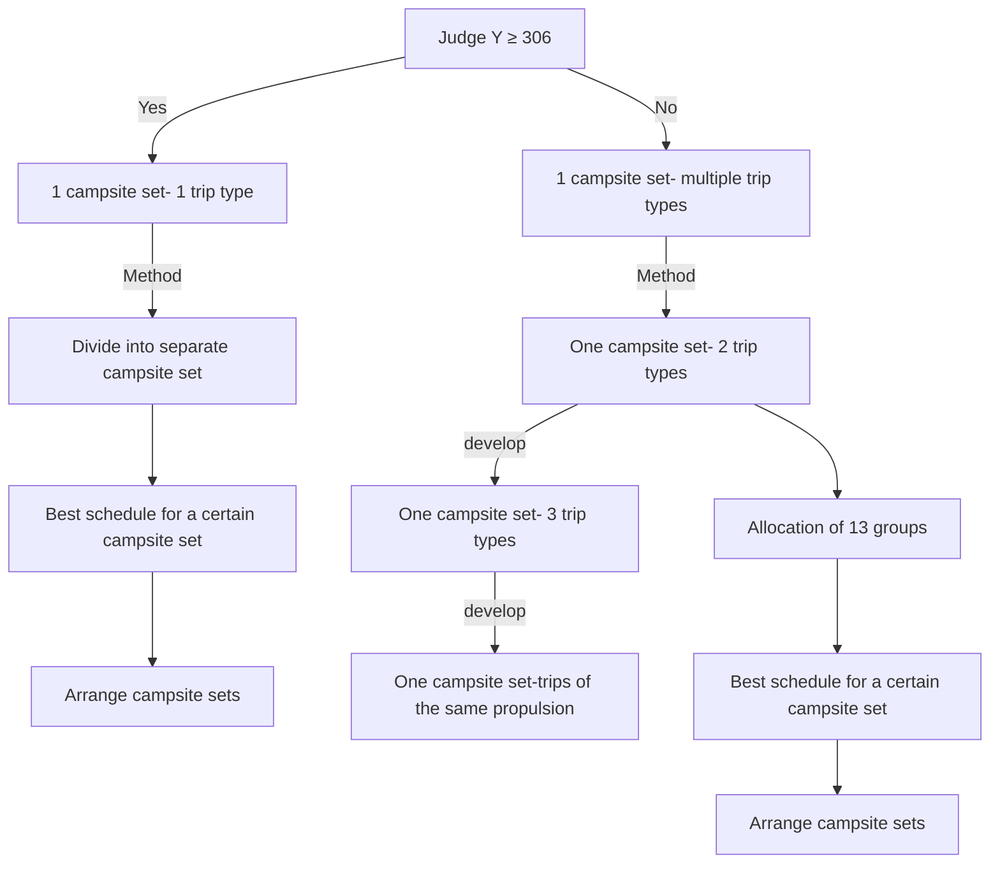
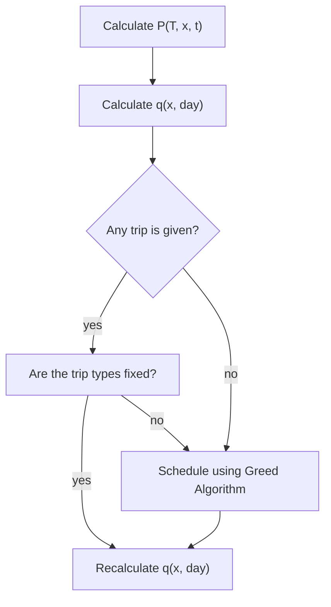

## Best schedule to utilize the Big Long River

## 1 Introduction

People enjoy going to the Big Long River for its scenic views and exciting white water rapids, and the only way to achieve this should be to take a river trip that requires several days of camping, since the river is inaccessible to hikers. So far the rise in popularity of river rafting has made it imminent for the park managers to look for a better way to utilize the river in terms of its traveling value. In other words, there is a need for an optimal schedule to use all the campsites on the river. However, this is not an easy question when taking in account of tourists’ requirements for a wilderness experience. Specifically, a basic rule for the arrangement of the river trips should be that no two sets of campers could occupy the same campsite at the same time in order to guarantee tourists minimal contact with other groups of tourists.

As given in the problem set, X river trips are currently available each year during a six month period (the rest of the year it is too cold) on the Big Long River. All river trips start at First Launch and exit at Final Exit, 225 miles downstream. There are Y campsites on the river, distributed approximately uniformly throughout the river corridor. The trips differ in mainly two aspects. The first is the ship propulsion, with either oar-powered rubber rafts (average 4 mph) or motorized boats (average 8 mph). The second is the trip duration, ranging from 6 days to 18 days. What we are supposed to accomplish are to develop the best schedule and to determine the carrying capacity of the river.

We have examined many policies for different river trips (including Grand Canyon in Arizona, the U.S., Wolf River in Winconsin, the U.S., and Missinaibi river in Canada) and concluded that river agency typically sets the schedule with given trip dates and types for prospect tourists to choose from, while the specific route of a given trip is up to the tourists in order to provide them with flexibility and freedom. (Note that only the campsites where the ship stops matters in the problem, and we will use the word route to denote the campsites throughout the paper.) Also tourists usually take sleep at the campsites and go on along the river in the day, so they only travel in the downstream direction and spend only one night at a certain campsite.

We regard the carrying capacity of the river as the maximum total number of trips available each year, hence turning the task of the river managers into looking for the best schedule itself. Given the actual practice mentioned in the previous paragraph, we want to develop mainly three types of schedules, in terms of the flexibility of the trips. In the part 1, we will design a schedule with fixed trip dates and types and also routes. In the part 2, we design a schedule with fixed trip dates and types but unrestrained routes. In the part 3, we design a schedule with fixed trip dates but unrestrained types and routes. As one can imagine, the maximum number of trips should decline in the order of three schedules because of less control on travelers trips, and the final choice of the three schedules should be up to the managers, with consideration of commercial and management issues.

## 2 Definitions

(1) “optimal”: it means to best utilize all the campsites and maximize the total number of trips in a six months period.  
(2) “route”: it means the campsites at which tourists choose to stop in a given trip.  
(3) “orbit”: it means a specific campsite set that allows some certain trip types to travel in.  
(4) For better description we assign a natural number to every campsite in the downstream direction, from 0 to Y+1.  
(5) For better description we assign a natural number to every trip type, from 1 to 26, as shown in the following chart.

<table><tr><td></td><td>6</td><td>7</td><td>8</td><td>9</td><td>10</td><td>11</td><td>12</td><td>13</td><td>14</td><td>15</td><td>16</td><td>17</td><td>18</td></tr><tr><td>Oar-powered</td><td>1</td><td>3</td><td>5</td><td>7</td><td>9</td><td>11</td><td>13</td><td>15</td><td>17</td><td>19</td><td>21</td><td>23</td><td>25</td></tr><tr><td>Motorized</td><td>2</td><td>4</td><td>6</td><td>8</td><td>10</td><td>12</td><td>14</td><td>16</td><td>18</td><td>20</td><td>22</td><td>24</td><td>26</td></tr></table>

## Chart1 The numbered list of trip types

(6) We use $A _ { i }$ to denote the average time tourists travel per day for a certain trip type i.  
(7) We use $n _ { i }$ to denote the number of campsites in every orbit corresponding to trip type i.  
(8) We use $m _ { i }$ to denote the number of trips in a six months period for a certain trip type i.

## 3 Specific formulation of problem

We denote the river and the campsites along it using a straight segment with Y uniformly distributed points in it. Time is measured in day units. The total time period is 180 days (six months). Passengers choose to stay at a different point every day downstream the segment. Here our paper will focus on three sub questions.

In part 1, passengers have to travel along the rigid route set by river agency, so the problem should be to come up with the schedule to arrange for the maximum number of trips without occurrence of two different trips occupying the same campsite on the same day.

In part 2, passengers have the freedom to choose which campsites to stop at, therefore the mathematical description of their actions inevitably involve randomness and probability, and we actually use a probability model. The next campsite passengers choose at a current given campsite is subject to a certain distribution, and we describe events of two trips occupying the same campsite by probability. Note in probability model it is no longer appropriate to say that two tri ps do not meet at a campsite with certainty; instead, we regard events as impossible if their probabilities are below an adequately small number. Then we try to find the optimal schedule.

In part 3, passengers have the freedom to choose both the type and route of the trip; therefore a probability model is also necessary. We continue to adopt the probability description as in part 2 and then try to find the optimal schedule.

## 4 Assumptions

We make following assumptions:

①Passengers may not travel back to previous campsite, namely they can only go in downstream direction.  
②Passengers can only stay at a certain campsite for one day.  
③Time is measured in day units and the time traveling from one campsite to another should always be less than 24 hours (one day) since passengers need to settle at a campsite every night.  
④Passengers typically spend half of a day on the river everyday and according to reference we arbitrarily set the time passengers can travel on the river is 8 hours per day.  
⑤In part 2 and part 3, we need to assign the route of a given trip with a probability distribution, and we assume it is classical probability, which means all possible routes for a certain trip share the same probability.

In fact, this assumption is reasonable not only because the classical probability can be accepted in reality, but also that it is convenient to replace with other given distributions and the model still works in the same way. In terms of simplification, however, we only use the classical probability in part 2 and part 3 to demonstrate our model.

⑥As we need to define the happening of the event of two trips occupying the same campsite in part 2 and part 3, we choose the standard widely used in Probability and Statistics that a small probability event can be considered as not happening in the stochastic sense. Specifically, we choose the small probability to be below 0.05, 0.025.  
⑦As Y is given in the problem, our schedule need to be feasible for different values of Y. In terms of simplicity, we let Y=150 when precise calculation is needed to further illustrate the model. (According to the reference, we choose the number of campsites in Grand Canyon in Arizona, namely 150, for the approximate value of Y, since the length of the Grand Canyon River is also 225 miles which is compatible with the Big Long River in the problem.)

5 Part 1 Best schedule of trips with fixed dates, types and also routes.

## 5.1 Method

## 5.1.1 Motivation and justification

Although most river agencies do not use fixed trip routes to passengers in order to provide with more flexibility, there is still necessity to first discuss the schedule if trip dates, types and routes are all fixed by river agency, since less flexibility for passengers allow more possible space to arrange trips. Therefore we expect this kind of schedule to achieve the highest number of river trips.

The special assumptions for this part are rather self-explanatory. Passengers need to obey the trip dates, types and routes prescribed by the river agency.

## 5.1.2 Key ideas

To best utilize the campsites on the river, it is obvious that we should minimize the total number of days of all campsites when no ship occupying them. In other word, we are to use the trips to occupy as many campsites as possible as long as no two trips occupy the same campsite at the same day. We divide the schedule problem into three subparts. First (see 5.2.1) we assign a specific set of campsites to every type of trips and no two different campsite sets intersect, then we only need to find the best schedule of every type of trip within corresponding campsite set. Second (see 5.2.2) we discuss the situation where Y is relatively small, and we continue the idea by assigning a specific campsite set to every group of trip types. The schedules for the situations where one group contains two and three trip types are given respectively. Third (see 5.2.3) we further develop the idea to only divide into two campsite sets for the case when Y is very small. Finally we finish the discussion of best schedule for different values of Y and come up with an exact schedule when Y=150 in 5.2.2.

flowchart

Chart2 brief description of the model

Note for brief description of the model, we will denote every specific campsite set with the word “orbit” throughout the paper.

## 5.2 Development of the model

To begin with, we find out the number of trip types available.

As for every trip type i, we calculate the average time needed for driving the ship per day and denote it with $A _ { i } .$ . According to assumption $4 . \textcircled{4}$ (Passengers drive the ship at most 8 hours a day), the trip type is possible iff $A _ { i } \leq 8$ . Therefore trip type 1 (oar-powered, 6 days) and trip type 3 (oar-powered, 7 days) are crossed out. But here we allow the trip type 3 in the schedule to maximize the total number of trips,

since $\begin{array} { r } { A _ { 3 } = \frac { 2 2 5 } { 4 * 7 } = 8 . 0 3 } \end{array}$ is really close to 8.

Consequently there are altogether 25 trip types available.

## 5.2.1 Every campsite set for every single trip type

We will discuss the situation where Y is big enough here.

(ⅰ)Dividing into separate campsite sets

We now have 25 trip types and we assign them with campsite sets using a rather simple way. Put the campsites whose remainders divided by 25 are the same into one campsite set and sequentially assign the 25 campsite sets to 25 trip types.

Therefore every campsite set contains $\frac { Y } { 2 5 }$ campsites.

As we can see from the chart below, the distance between two adjacent campsites in

a specific orbit is less than the length of what we call an interval $\begin{array} { r } { = ( \frac { 2 5 } { Y } * 2 2 5 ) \mathsf { m i l e s } . } \end{array}$

(ⅱ)Best schedule for a certain campsite set

There are altogether 25 orbits and we are going to demonstrate the schedule of orbit for trip type 3 only, since the schedules of other orbits are rather similar with the entirely identical designing idea.

Now that for trip type 3, we first calculate the maximum number of intervals (denoted by Q) that the trip can cover in a day. Passengers can row the boat at most 8 hours per day and trip type 3 travels at the velocity of 4 mph, so trip type 3 travels

$$
8 * 4 = 3 2 \text {   miles   per   day.   Therefore   } Q = [ \frac {3 2 * Y}{2 5 * 2 2 5} ].
$$

Now consider the best schedule. To best utilize all campsites means to minimize the number of total days of empty campsites. We call the very first trip that ever comes into the river “leader”, and apparently the campsites are by no means occupied if they cannot be reached by the “leader” traveling in the fastest way possible. We call these campsites “forgone loss” for the time being. Therefore if we come up with a schedule that occupied every campsite every day except these “forgone loss”, then it must be the best schedule. As for minimizing the number of “forgone loss”, the “leader” should travel Q every day from the beginning until it cannot. For every day we let Q trips come into the river to occupy all of the campsites in front of the leader’s campsite and they just copy the leader’s route and get to Final Exit the same day with “leader”. For only several days the arrangement forms a cycle and the schedule just continues to copy the cycle.

$$
S t a r t \rightarrow Q \rightarrow 2 Q \rightarrow \dots \rightarrow z _ {Q} Q \rightarrow z _ {Q} Q + (Q - 1) \rightarrow z _ {Q} Q + 2 (Q - 1) \rightarrow \dots
$$

$$
\rightarrow z _ {Q} Q + z _ {Q - 1} (Q - 1) \rightarrow \dots \rightarrow \sum_ {i = 2} ^ {Q} z _ {i} i + 1 \rightarrow \sum_ {i = 2} ^ {Q} z _ {i} i + 2 \rightarrow \dots \rightarrow \sum_ {i = 1} ^ {Q} z _ {i} i \rightarrow e n d
$$

where

$$
\sum_ {i = 1} ^ {Q} z _ {i} i = n _ {i}
$$

$$
\sum_ {i = 1} ^ {Q} z _ {i} = d u r a t i o n - 1
$$

$$
\sum_ {i = j} ^ {Q} z _ {i} i + j + \left(d u r a t i o n - 2 - \sum_ {i = j} ^ {Q} z _ {i}\right) > \sum_ {i = 1} ^ {j - 1} z _ {i} i \quad j = 2, 3, \dots , Q
$$

In case of being confused by our awkward description, see the following illustration of the schedule where Y=425 as an example.

<table><tr><td>Day</td><td colspan="13">1 2 3 4 5 6 7 8 9 10 11 12 13 ····</td></tr><tr><td rowspan="3">1</td><td colspan="12">Start → 3 → 6 → 9 → 12 → 15 → 16 → End</td><td>↑</td></tr><tr><td colspan="12">Start → 2 → 5 → 8 → 11 → 14 → 15 → End</td><td></td></tr><tr><td colspan="12">Start → 1 → 4 → 7 → 10 → 13 → 14 → End</td><td></td></tr><tr><td rowspan="3">2</td><td colspan="12">Start → 3 → 6 → 9 → 12 → 13 → 16 → End</td><td></td></tr><tr><td colspan="12">Start → 2 → 5 → 8 → 11 → 12 → 15 → End</td><td></td></tr><tr><td colspan="12">Start → 1 → 4 → 7 → 10 → 11 → 14 → End</td><td>6 Days</td></tr><tr><td rowspan="3">3</td><td colspan="12">Start → 3 → 6 → 9 → 10 → 13 → 16 → End</td><td></td></tr><tr><td colspan="12">Start → 2 → 5 → 8 → 9 → 12 → 15 → End</td><td></td></tr><tr><td colspan="12">Start → 1 → 4 → 7 → 8 → 11 → 14 → End</td><td></td></tr><tr><td rowspan="3">4</td><td colspan="12">Start → 3 → 6 → 7 → 10 → 13 → 16 → End</td><td></td></tr><tr><td colspan="12">Start → 2 → 5 → 6 → 9 → 12 → 15 → End</td><td>16 Trips</td></tr><tr><td colspan="12">Start → 1 → 4 → 5 → 8 → 11 → 14 → End</td><td></td></tr><tr><td rowspan="3">5</td><td colspan="12">Start → 3 → 4 → 7 → 10 → 13 → 16 → End</td><td></td></tr><tr><td colspan="12">Start → 2 → 3 → 6 → 9 → 12 → 15 → End</td><td></td></tr><tr><td colspan="12">Start → 1 → 2 → 5 → 8 → 11 → 14 → End</td><td></td></tr><tr><td>6</td><td colspan="12">Start → 1 → 4 → 7 → 10 → 13 → 16 → End</td><td>↓</td></tr><tr><td rowspan="3">7</td><td colspan="12">Start → 3 → 6 → 9 → 12 → 15 → 16 → End</td><td></td></tr><tr><td colspan="12">Start → 2 → 5 → 8 → 11 → 14 → 15 → End</td><td></td></tr><tr><td colspan="12">Start → 1 → 4 → 7 → 10 → 13 → 14 → End</td><td></td></tr><tr><td>⋮</td><td colspan="12">⋮</td><td>⋮</td></tr></table>

## Chart3 Schedule where Y=425

(ⅲ)Arrangement of separate campsite sets if the proportions of all trip types are given

As shown above in chart3, the number of “forgone loss” can be ignored compared with the total number of days available of all campsites, namely $[ 8 0 * \mathrm { Y }$ . In other word, the schedule enables the trips to occupy nearly all campsites for all days in a six months period, and obviously it can be regarded as the best s chedule. Furthermore, if we ignore the “forgone $\mathsf { I o s } \mathsf { s } ^ { \prime \prime }$ and the total number of a specific trip $\iota _ { i } = [ \frac { 1 8 0 * n _ { i } } { \mathop { d u r a t i o n } { } ~ o f ~ t y p e ~ i } ]$ $n _ { i } { \mathsf { C a n } }$ by $m _ { i } .$ .

We can now design a schedule with given proportions of all trip types. This is because:

Given proportions of all trip types→the ratio of the total number of any two trip types $\vdots { \frac { m _ { i } } { m _ { j } } }$ ?? →the ratio of the campsites $\frac { n _ { i } } { n _ { j } }$

→combine with $\begin{array} { r } { \sum _ { i } n _ { i } = Y \to n _ { i } } \end{array}$

(Note this makes sense because the river agency is supposed to provide with a variety of trip types and the flexibility to control the proportions of all trip types is even more meaningful, since the river agency can refer to historical data and design a schedule with proportions of all trip types compatible with previous demands of tourists.)

Therefore we only need to design a schedule to allocate all Y campsites to $n _ { i }$ orbits respectively.

Apparently an orbit in which the trip type can travel between any two adjacent campsites in a day can accommodates with a schedule similar to (ⅱ). Here the “leader” still travels in the fastest way every day and other trips follow the “leader” occupy all campsites in front of the leader’s campsite, and this schedule makes nearly all campsites occupied every day throughout the six months period.

Now we only need an allocation satisfying that for every orbit the trip type can travel between any two adjacent campsites in a day. Note for a subset of orbit, if the trip can already travel between any two adjacent campsites in ${ \mathrm { i t } } ,$ then the trip must be able to travel between any two adjacent campsites in the whole orbit. Call this subset a “skeleton orbit” and we only need to find the allocation of skeleton orbits now.

Consider the trip types in the order from the maximum $A _ { i } \mathrm { t o }$ the minimum?? . Asmin $A _ { i } = A _ { 3 }$ , we consider trip type 3 first. Apparently the following six campsites constitute the skeleton orbit of trip type 3, as shown in the chart:

text_image

Start 1 26 51 ... 25([Y/25]-1)+1 25[Y/25]+1 Y End

## Chart4 Skeleton orbit of trip type3

Since ${ \bf \nabla } \cdot { \cal A } _ { i } \geq { \cal A } _ { 3 }$ , for any trip type i, it can also travel the distance of two adjacent campsites in the skeleton orbit of type 3 in a day, so seven campsites $\begin{array} { r } { ( \mathrm { k } , \frac { ( Y + 1 ) } { 7 } + } \end{array}$ $\begin{array} { r } { k , \frac { 2 ( Y + 1 ) } { 7 } + k , \frac { 3 ( Y + 1 ) } { 7 } + k , \frac { 4 ( Y + 1 ) } { 7 } + k , \frac { 5 ( Y + 1 ) } { 7 } + k , \frac { 6 ( Y + 1 ) } { 7 } + k , \mathrm { k = 1 } , 2 , \dots 2 \mathrm { ~ } ) } \end{array}$ constitute the skeleton orbit of type i, as shown in chart:

text_image

Start 1 [Y+1/7] [Y+1/7] + 1 [2(Y+1)/7] [2(Y+1)/7] + 1 [3(Y+1)/7] [3(Y+1)/7] + 1 [4(Y+1)/7] [4(Y+1)/7] + 1 [5(Y+1)/7] [5(Y+1)/7] + 1 [6(Y+1)/7] [6(Y+1)/7] + 1 End

## Chart5 skeleton orbit of typei

As long as $n _ { i } \geq 7$ holds for all I, other $( n _ { i } - 7 )$ )campsites can be chosen casually and finally we have the allocation needed.

The schedule here need a basic condition that $\Upsilon \geq 7 + \cdots + 1 8 + 6 + 7 + \cdots + 1 8 =$ 306.

## 5.2.2 Every campsite set for every multiple trip types

WhenY < 306, the above schedule becomes invalid. We now consider the allocation where one orbit is for multiple trip types. For simplicity we consider the case where any one orbit contains trip types of the same ship propulsion.

For instance, consider the allocation of 13 orbits for 13 groups of trip types as below (the numbers denote the duration of the trip type):

Oar-powered ships(7,8),(9,10),(11,12),(13,14),(15,16),(17,18)

Motorized ships(6),(7,8),(9,10),(11,12),(13,14),(15,16),(17,18)

We only demonstrate the schedule for the group (7,8) of oar-powered ships, since the schedule for other groups are similar.

The schedule is shown below in the same way as in 5.2.1:

<table><tr><td>Day</td><td>0</td><td>1</td><td>2</td><td>3</td><td>4</td><td>5</td><td>6</td><td>7</td><td>8</td><td>9</td><td>10</td><td>11</td><td>12</td><td>13</td><td>14</td><td>15</td><td>···</td></tr><tr><td></td><td colspan="17">Start → 3 → 6 → 9 → 12 → 15 → 16 → End</td></tr><tr><td rowspan="3">1</td><td colspan="15">Start → 2 → 5 → 8 → 11 → 14 → 15 → End</td><td rowspan="3" colspan="2">↑</td></tr><tr><td colspan="15">Start → 1 → 4 → 7 → 10 → 13 → 14 → 16 → End</td></tr><tr><td colspan="15">Start → 3 → 6 → 9 → 12 → 13 → 15 → End</td></tr><tr><td rowspan="3">2</td><td colspan="15">Start → 2 → 5 → 8 → 11 → 12 → 14 → End</td><td rowspan="5" colspan="2">6 Days</td></tr><tr><td colspan="15">Start → 1 → 4 → 7 → 10 → 11 → 13 → 16 → End</td></tr><tr><td colspan="15">Start → 3 → 6 → 9 → 10 → 12 → 15 → End</td></tr><tr><td rowspan="3">3</td><td colspan="15">Start → 2 → 5 → 8 → 9 → 11 → 14 → End</td></tr><tr><td colspan="15">Start → 1 → 4 → 7 → 8 → 10 → 13 → 16 → End</td></tr><tr><td colspan="15">Start → 3 → 6 → 7 → 9 → 12 → 15 → End</td><td rowspan="6" colspan="2">15 Trips</td></tr><tr><td rowspan="3">4</td><td colspan="15">Start → 2 → 5 → 6 → 8 → 11 → 14 → End</td></tr><tr><td colspan="15">Start → 1 → 4 → 5 → 7 → 10 → 13 → 16 → End</td></tr><tr><td colspan="15">Start → 3 → 4 → 6 → 9 → 12 → 15 → End</td></tr><tr><td rowspan="2">5</td><td colspan="15">Start → 2 → 3 → 5 → 8 → 11 → 14 → End</td></tr><tr><td colspan="15">Start → 1 → 2 → 4 → 7 → 10 → 13 → 16 → End</td></tr><tr><td>6</td><td colspan="15">Start → 1 → 3 → 6 → 9 → 12 → 15 → 16 → End</td><td rowspan="6" colspan="2">↓</td></tr><tr><td rowspan="3">7</td><td colspan="15">Start → 2 → 5 → 8 → 11 → 14 → 15 → End</td></tr><tr><td colspan="15">Start → 1 → 4 → 7 → 10 → 13 → 14 → 16 → End</td></tr><tr><td colspan="15">Start → 3 → 6 → 9 → 12 → 13 → 15 → End</td></tr><tr><td rowspan="2">8</td><td colspan="15">Start → 2 → 5 → 8 → 11 → 12 → 14 → End</td></tr><tr><td colspan="15">Start → 1 → 4 → 7 → 10 → 11 → 13 → 16 → End</td></tr><tr><td>···</td><td colspan="15">···</td><td colspan="2">···</td></tr></table>

## Chart6 schedule when the campsite set is for 2 trip types

As one can see, the ratio of the two trip types can also be any number differing from 2 shown in the above example. To achieve this we only need to replace the (7,7,8) in $\frac { 2 } { 1 }$ $^ { ( 7 , 7 , 8 ) }$ the above schedule with other combination of the two trip types. Therefore similar to 5.2.1, we are able to design the schedule for given proportions of all trip types by designing the schedule for corresponding ratio of every two trip types of the same group.

As mentioned in assumption $4 \textcircled{7}$ , we calculate for the exact schedule when $\mathtt { Y } = 1 5 0$ in order to illustrate the model. For simplicity we let different trip types distribute uniformly.

Similar with 5.2.1, in order to make sure every trip can achieve its duration, we need $\Upsilon \geq 5 + 2 ( 7 + 9 + 1 1 + 1 3 + 1 5 + 1 7 ) = 1 4 9 . \ A s \ \Upsilon = 1 5 0 ,$ , a certain trip can cover at most 2 intervals each day, and for most time, a certain trip can only cover 1 interval. Therefore, similar with 5.2.1, we can find out that only 2 days form a cycle. We only present two days’ schedule, and the following days’ schedule can copy the cycle.

<table><tr><td>date</td><td>Trip types</td><td>Trip routes</td></tr><tr><td rowspan="13">1</td><td>O-7</td><td>21, 42, 63, 84, 105, 126</td></tr><tr><td>O-9</td><td>2, 20, 41, 62, 83, 104, 108, 125</td></tr><tr><td>O-11</td><td>6, 19, 28, 40, 61, 66, 82, 103, 112, 124</td></tr><tr><td>O-13</td><td>4, 18, 39, 47, 59, 71, 81, 102, 107, 123, 130, 144</td></tr><tr><td>O-15</td><td>1, 9, 17, 25, 38, 44, 58, 65, 70, 80, 91, 101, 111, 122</td></tr><tr><td>O-17</td><td>16, 23, 37, 49, 57, 72, 79, 87, 93, 100, 109, 113, 121, 128, 135, 142</td></tr><tr><td>M-6</td><td>30, 60, 90, 120, 134</td></tr><tr><td>M-7</td><td>15, 36, 56, 78, 99, 119</td></tr><tr><td>M-9</td><td>14, 22, 35, 55, 69, 77, 98, 118</td></tr><tr><td>M-11</td><td>13, 34, 43, 54, 64, 68, 76, 97, 106, 117</td></tr><tr><td>M-13</td><td>7, 12, 33, 45, 53, 67, 75, 96, 110, 116, 129, 133</td></tr><tr><td>M-15</td><td>3, 8, 11, 24, 32, 46, 52, 74, 85, 89, 95, 115, 127, 132</td></tr><tr><td>M-17</td><td>5, 10, 26, 27, 29, 31, 48, 50, 51, 73, 86, 88, 92, 94, 114, 131</td></tr><tr><td rowspan="13">2</td><td>O-8</td><td>21, 42, 63, 84, 105, 126, 147</td></tr><tr><td>O-10</td><td>2, 20, 41, 62, 83, 104, 108, 125, 146</td></tr><tr><td>O-12</td><td>6, 19, 28, 40, 61, 66, 82, 103, 112, 124, 145</td></tr><tr><td>O-14</td><td>4, 18, 39, 47, 59, 71, 81, 102, 107, 123, 130, 144, 149</td></tr><tr><td>O-16</td><td>1, 9, 17, 25, 38, 44, 58, 65, 70, 80, 91, 101, 111, 122, 143</td></tr><tr><td>O-18</td><td>16, 23, 37, 49, 57, 72, 79, 87, 93, 100, 109, 113, 121, 128, 135, 142, 148</td></tr><tr><td>M-6</td><td>30, 60, 90, 120, 134</td></tr><tr><td>M-8</td><td>15, 36, 56, 78, 99, 119, 141</td></tr><tr><td>M-10</td><td>14, 22, 35, 55, 69, 77, 98, 118, 140</td></tr><tr><td>M-12</td><td>13, 34, 43, 54, 64, 68, 76, 97, 106, 117, 139</td></tr><tr><td>M-14</td><td>7, 12, 33, 45, 53, 67, 75, 96, 110, 116, 129, 133, 138</td></tr><tr><td>M-16</td><td>3, 8, 11, 24, 32, 46, 52, 74, 85, 89, 95, 115, 127, 132, 137</td></tr><tr><td>M-18</td><td>5, 10, 26, 27, 29, 31, 48, 50, 51, 73, 86, 88, 92, 94, 114, 131, 136</td></tr></table>

Chart7 The first two days’ schedule

In the chart above, in the sign ${ } ^ { \prime \prime } | \mathrm { j } { - } \mathsf { k } ^ { \prime \prime } ,$ I stands for the number of the certain trip type, and j stands for the propulsion which O for oar-powered and M for motorized, and k stands for the duration. For example, “3 M-6s” stands for 3 6-night trips of motorized boat.

The carrying capacity of the river based on the schedule above $\begin{array} { r } { \mathsf { i s } \frac { 2 6 \times 1 8 0 } { 2 } = 2 3 4 0 . } \end{array}$

## 5.2.3 One campsite set for all trip types

When Y continues to decline, it is easy to further develop the idea in 5.2.1.and 5.2.2 for new best schedule. Here we only describe the outline.

First we design a schedule of orbit containing three trip types. For instance, consider the orbit of the group below:

Oar-powered ships: (7,8,9)

The corresponding schedule:

<table><tr><td>Day</td><td>0</td><td>1</td><td>2</td><td>3</td><td>4</td><td>5</td><td>6</td><td>7</td><td>8</td><td>9</td><td>10</td><td>11</td><td>12</td><td>13</td><td>14</td><td>15</td><td>16</td><td>17</td><td>18</td><td>···</td></tr><tr><td></td><td colspan="20">Start → 3 → 6 → 9 → 12 → 15 → 16 → End</td></tr><tr><td rowspan="3">1</td><td colspan="19">Start → 2 → 5 → 8 → 11 → 14 → 15 → End</td><td rowspan="5">↑</td></tr><tr><td colspan="19">Start → 1 → 4 → 7 → 10 → 13 → 14 → 16 → End</td></tr><tr><td colspan="19">Start → 3 → 6 → 9 → 12 → 13 → 15 → 16 → End</td></tr><tr><td rowspan="3">2</td><td colspan="19">Start → 2 → 5 → 8 → 11 → 12 → 14 → 15 → End</td></tr><tr><td colspan="19">Start → 1 → 4 → 7 → 10 → 11 → 13 → 14 → 16 → End</td></tr><tr><td colspan="19">Start → 3 → 6 → 9 → 10 → 12 → 13 → 15 → End</td><td rowspan="5">8 Days</td></tr><tr><td rowspan="3">3</td><td colspan="19">Start → 2 → 5 → 8 → 9 → 11 → 12 → 14 → End</td></tr><tr><td colspan="19">Start → 1 → 4 → 7 → 8 → 10 → 11 → 13 → 16 → End</td></tr><tr><td colspan="19">Start → 3 → 6 → 7 → 9 → 10 → 12 → 15 → End</td></tr><tr><td rowspan="3">4</td><td colspan="19">Start → 2 → 5 → 6 → 8 → 9 → 11 → 14 → End</td></tr><tr><td colspan="19">Start → 1 → 4 → 5 → 7 → 8 → 10 → 13 → 16 → End</td><td rowspan="7">18 Trips</td></tr><tr><td colspan="19">Start → 3 → 4 → 6 → 7 → 9 → 12 → 15 → End</td></tr><tr><td rowspan="2">5</td><td colspan="19">Start → 2 → 3 → 5 → 6 → 8 → 11 → 14 → End</td></tr><tr><td colspan="19">Start → 1 → 2 → 4 → 5 → 7 → 10 → 13 → 16 → End</td></tr><tr><td rowspan="2">6</td><td colspan="19">Start → 1 → 3 → 4 → 6 → 9 → 12 → 15 → End</td></tr><tr><td colspan="19">Start → 2 → 3 → 5 → 8 → 11 → 14 → End</td></tr><tr><td>7</td><td colspan="19">Start → 1 → 2 → 4 → 7 → 10 → 13 → 16 → End</td></tr><tr><td>8</td><td colspan="19">Start → 1 → 3 → 6 → 9 → 12 → 15 → 16 → End</td><td rowspan="6">↓</td></tr><tr><td rowspan="3">9</td><td colspan="19">Start → 2 → 5 → 8 → 11 → 14 → 15 → End</td></tr><tr><td colspan="19">Start → 1 → 4 → 7 → 10 → 13 → 14 → 16 → End</td></tr><tr><td colspan="17">Start → 3 → 6 → 9 → 12 → 13 → 15 → 16 → End</td><td></td><td></td></tr><tr><td rowspan="2">10</td><td colspan="17">Start → 2 → 5 → 8 → 11 → 12 → 14 → 15 → End</td><td></td><td></td></tr><tr><td colspan="17">Start → 1 → 4 → 7 → 10 → 11 → 13 → 14 → 16 → End</td><td></td><td></td></tr><tr><td>···</td><td colspan="17">···</td><td>···</td><td></td><td></td></tr></table>

## Chart8 Schedule for the campsite sets for 3 trip types

Then it is similar for schedule of orbit containing m trip types:

Oar-powered ships: (n, n+1, n+2, … n+m)

Finally it goes to schedule of orbit containing all trip types of the same propulsion. In that case there are only two orbits which contain all trip types of oar-powered and motorized respectively.

Note the final schedule can already deal with situation where Y is very small, and we finish the discussion here because we regard situations where Y continues to decrease as of little practical value. (IfY < 18, then passengers of an 18-day trip cannot even spend every day at a different campsite.)

6 Part 2 Best schedule of trips with fixed dates and types, but

unrestrained routes.

## 6.1 Method

## 6.1.1 Motivation and justification

In part 2, we consider trips with fixed dates and types but unrestrained routes to better describe the actual behavior of tourists. In fact, this is the most close-to-reality situation as reference shows that river agency does not fix the route for tourists to provide with more flexibility. So it is natural to come up with a stochastic model.

Special assumptions for this part:

Here we use classical probability to describe the behavior of tourists ’ choice of thei own route, which means all possible routes for a given trip type shares the same probability. Also as mentioned in assumption $4 \textcircled{6}$ , we regard an event with probability 0.05 as not happening to determine whether two trips occupying the same campsite at the same day.

We will use the following symbols and definitions in the description of the model: day is the date of the whole schedule. The original value is 0.

f(T,x,t) is the total number of all possible routes from the First Launch to campsite x for trip type T at day t after its launch into the river.

p(T,x,t) is the probability of the event that trip type T occupying campsite x at day t after its launch into the river.

We will also use the famous Inclusion-exclusion principle in Statistics:

$$
\begin{array}{l} \mathbb {P} \left(\bigcup_ {\mathrm{i} = 1} ^ {\mathrm{n}} \mathrm{A} _ {\mathrm{i}}\right) = \sum_ {\mathrm{i} = 1} ^ {\mathrm{n}} \mathbb {P} (\mathrm{A} _ {\mathrm{i}}) - \sum_ {\mathrm{i}, \mathrm{j}: \mathrm{i} <   \mathrm{j}} \mathbb {P} \left(\mathrm{A} _ {\mathrm{i}} \cap \mathrm{A} _ {\mathrm{j}}\right) + \sum_ {\mathrm{i}, \mathrm{j}, \mathrm{k}: \mathrm{i} <   \mathrm{j} <   \mathrm{k}} \mathbb {P} \left(\mathrm{A} _ {\mathrm{i}} \cap \mathrm{A} _ {\mathrm{j}} \cap \mathrm{A} _ {\mathrm{k}}\right) - \dots \\ + (- 1) ^ {n - 1} \mathbb {P} \left(\bigcup_ {i = 1} ^ {n} A _ {i}\right) \\ \end{array}
$$

Trip(n) is an auxiliary function, where n is the number of the trip added into the schedule, T is the type of the current trip, Day is the date when the trip first launches into the river.

q(x,day) is the probability of the event that there exist at least two trips occupying campsite x at the date day.

## 6.1.2 Key ideas

The central idea of this model is the Greedy Algorithm. We add the trips one by one and every trip added is the best choice considering the current circumstances.

Specifically the construction of the model can be developed into three s ubparts. First, we calculate the probability of a given trip occupying a given campsite at a given day after its launch into the river, using the recursive algorithm. Second, we use the Jordan Formula to calculate the probability of two given trips occupying a given campsite at a given day, and then use the minimax principle as the stopping rule for the Greedy algorithm to find the optimal schedule. Third, we consider the optimal schedule for the situation where there are already X trips set in the schedule.

flowchart

Chart9 Brief description of the mode

## 6.2 Development of the model

To start with, we find out the number of trip types available.

Similar to the calculation in 5.2, but here we consider that the time passengers can travel every day must be rigorously less than 8 hours, therefore trip type 1 (oar-powered, 6 days) and trip type 3 (oar-powered, 7 days) are crossed out. Consequently there are altogether 24 trip types available. When we speak of 26 types below, just think two of them are not exist.

## 6.2.1 Calculation of p(T,x,t)

First we calculate $\mathsf { f } ( \mathsf { T } , \mathsf { x } , \mathsf { t } )$ for all values of ${ \sf T } , { \sf x } ,$ t. This is easily done with computer using the following recursive formula:

$$
f (T, x, 1) = 1 \quad 1 \leq T \leq 2 6, 1 \leq x \leq N
$$

$$
f (T, x, t) = \sum_ {\text { All   available   } y} f (T, y, t - 1) \quad 1 \leq T \leq 2 6, 1 \leq x \leq Y, 1 <   t \leq \text { duration }
$$

where N is the largest number of campsite sets that the trip T could pass through in one day, and available y means the campsite set, before x, from which the trip T could reach x in one day.

Then we have the following probability formula to calculate p(T,x,t) for all values of T, $\mathsf { \pmb { X } } ,$ t:

$$
\mathrm{P} (\mathrm{T}, \mathrm{x}, \mathrm{t}) = \frac {\mathrm{f(T,x,t)} \times \mathrm{f(T,Y+1-x,duration)}}{\mathrm{f(T,Y+1,duration)}}
$$

## 6.2.2 Best schedule using Greedy algorithm

When day=1, choose any one trip type as the first trip comes into the river. With the aid of function Trip(n) and Jordan Formula, we can easily calculate q(x,day), where the campsite x ranges from 1 to Y, and the date day ranges from 1 to 18, with all trips already launched into the river are given. Note a trip can last for at most 18 days, so it only exerts an influence on the probabilities in these 18 consecutive days, namely the ${ 1 8 ^ { * } \mathsf { Y } }$ values of all q(x,day). Then according to the minimax principle, we find the minimum value among 26 trip types if added of their maximum of q(x,day) among ${ 1 8 ^ { * } \mathsf { Y } }$ values. According to Greedy algorithm, put the trip type that reaches this minimax value as the trip added. The stopping rule of this process is when the minimax value is larger than 0.05, which means that the event of two trips occupying the same campsite can no longer be seen as small probability event. Then let day=2 and replicate the above process. Until finally day=180 and we get the whole schedule.

As mentioned in assumption $4 \textcircled{7}$ , we calculate for the exact schedule when Y=150 in order to illustrate the model. The whole schedule is shown as the following chart:

<table><tr><td>Sun.</td><td>Mon.</td><td>Tues.</td><td>Wed.</td><td>Thur.</td><td>Fri.</td><td>Sat.</td></tr><tr><td></td><td></td><td></td><td></td><td>Mar. 13 M-6s8 M-7s1 M-81 M-16</td><td>21 O-81 M-18</td><td>31 O-81 O-121 M-18</td></tr><tr><td>41 O-114 M-6s1 M-71 M-18</td><td>51 O-112 M-6s1 M-71 M-141 M-18</td><td>61 O-101 O-152 M-18s</td><td>72 M-6s1 M-91 M-161 M-18</td><td>81 O-151 M-72 M-18s</td><td>91 O-161 M-92 M-18s</td><td>101 O-161 M-92 M-18s</td></tr><tr><td>113 M-18s</td><td>121 O-181 M-101 M-18</td><td>131 M-141 M-171 M-18</td><td>142 O-17s1 M-18</td><td>151 M-92 M-18s</td><td>161 O-151 O-161 M-18</td><td>172 O-18s1 M-18</td></tr><tr><td>182 O-18s1 M-18</td><td>191 M-72 M-18s</td><td>203 O-18s1 M-14</td><td>211 O-181 M-18</td><td>222 O-18s1 M-18</td><td>231 O-142 M-18s</td><td>241 O-18</td></tr><tr><td>25</td><td>264 O-18s</td><td>273 O-18s</td><td>282 O-18s</td><td>292 O-18s</td><td>301 O-111 O-18</td><td>311 O-162 O-17s1 O-18</td></tr><tr><td>Apr. 12 O-17s1 O-18</td><td>21 M-7</td><td>31 O-162 O-17s1 O-181 M-8</td><td>41 O-171 O-18</td><td>54 O-18s</td><td>62 O-18s</td><td>72 O-17s1 O-18</td></tr><tr><td>83 O-18s</td><td>91 O-18</td><td>103 O-18s</td><td>111 O-173 O-18s</td><td>121 M-18</td><td>131 O-171 M-7</td><td>143 O-18s</td></tr><tr><td>151 O-18</td><td>161 O-173 O-18s</td><td>171 O-162 O-18s</td><td>18</td><td>191 O-181 M-6</td><td>201 O-91 O-171 O-18</td><td>214 O-18s</td></tr><tr><td>223 O-18s</td><td>231 O-18</td><td>243 O-18s1 M-7</td><td>251 O-11</td><td>261 O-163 O-17s</td><td>271 O-161 O-171 M-10</td><td>282 O-18s</td></tr><tr><td>292 O-18s</td><td>302 O-17s1 O-18</td><td>May. 14 O-18s</td><td>21 M-18</td><td>33 O-18s1 M-7s</td><td>41 O-161 O-171 O-181 M-18</td><td>5</td></tr><tr><td>6</td><td>71 O-181 M-6</td><td>81 O-172 O-18s1 M-7</td><td>91 O-162 O-17s1 O-18</td><td>101 O-181 M-18</td><td>113 O-18s</td><td>121 O-17</td></tr><tr><td>131 O-10</td><td>142 O-16s2 O-17s</td><td>151 O-151 O-161 O-171 O-18</td><td>161 O-18</td><td>172 O-18s1 M-6</td><td>181 O-173 O-18s</td><td>193 O-18s</td></tr><tr><td>201 O-18</td><td>213 O-18s1 M-6</td><td>221 O-111 M-18</td><td>231 O-161 O-172 O-18s</td><td>243 O-18s</td><td>251 O-181 M-18</td><td>264 O-18s</td></tr><tr><td>271 O-18</td><td>282 O-17s1 O-18</td><td>291 O-17</td><td>301 O-171 O-181 M-10</td><td>311 O-171 O-18</td><td>June. 12 O-17s2 O-18s</td><td>21 O-161 O-18</td></tr><tr><td>33 O-18s</td><td>43 O-18s</td><td>51 O-151 M-18</td><td>61 O-172 O-18s</td><td>71 O-18</td><td>81 O-181 M-6</td><td>92 O-17s1 O-181 M-7</td></tr><tr><td>102 O-17s2 O-18s</td><td>111 O-181 M-18</td><td>123 O-18s</td><td>131 O-161 M-6</td><td>141 O-17</td><td>151 O-172 O-18s</td><td>161 O-181 M-61 M-7</td></tr><tr><td>174 O-18s</td><td>182 O-18s1 M-61 M-18</td><td>191 O-15</td><td>201 O-11</td><td>214 O-18s</td><td>223 O-18s1 M-9</td><td>232 O-18s</td></tr><tr><td>241 O-171 M-8</td><td>252 O-18s</td><td>261 O-103 O-18s</td><td>27</td><td>281 O-173 O-18s</td><td>292 O-18s1 M-71 M-81 M-18</td><td>301 O-181 M-18</td></tr><tr><td>July. 11 O-11</td><td>21 O-151 O-161 O-171 O-18</td><td>33 O-18s1 M-11</td><td>41 M-6</td><td>51 O-163 O-17s</td><td>61 O-161 O-171 M-7</td><td>72 O-18s</td></tr><tr><td>82 O-18s</td><td>92 O-17s1 O-18</td><td>104 O-18s</td><td>111 M-18</td><td>123 O-18s1 M-6</td><td>131 O-161 O-171 O-181 M-18</td><td>14</td></tr><tr><td rowspan="4">15</td><td>16</td><td>17</td><td>18</td><td>19</td><td>20</td><td>21</td></tr><tr><td>1 O-18</td><td>1 O-17</td><td>1 O-16</td><td>1 O-18</td><td>3 O-18s</td><td>1 O-17</td></tr><tr><td>1 M-6</td><td>2 O-18s</td><td>2 O-17s</td><td>1 M-18</td><td></td><td></td></tr><tr><td></td><td>1 M-7</td><td>1 O-18</td><td></td><td></td><td></td></tr><tr><td>22</td><td>23</td><td>24</td><td>25</td><td>26</td><td>27</td><td>28</td></tr><tr><td rowspan="4">1 O-10</td><td>2 O-16s</td><td>1 O-15</td><td>1 O-18</td><td>2 O-18s</td><td>1 O-17</td><td>3 O-18s</td></tr><tr><td>2 O-17s</td><td>1 O-16</td><td></td><td>1 M-6</td><td>3 O-18s</td><td></td></tr><tr><td></td><td>1 O-17</td><td></td><td></td><td></td><td></td></tr><tr><td></td><td>1 O-18</td><td></td><td></td><td></td><td></td></tr><tr><td>29</td><td>30</td><td>31</td><td>Aug. 1</td><td>2</td><td>3</td><td>4</td></tr><tr><td rowspan="3">1 O-18</td><td>3 O-18s</td><td>1 O-11</td><td>1 O-16</td><td>3 O-18s</td><td>1 O-18</td><td>4 O-18s</td></tr><tr><td>1 M-6</td><td>1 M-18</td><td>1 O-17</td><td></td><td>1 M-18</td><td></td></tr><tr><td></td><td></td><td>2 O-18s</td><td></td><td></td><td></td></tr><tr><td>5</td><td>6</td><td>7</td><td>8</td><td>9</td><td>10</td><td>11</td></tr><tr><td rowspan="3">1 O-18</td><td>2 O-17s</td><td>1 O-17</td><td>1 O-17</td><td>1 O-17</td><td>2 O-17s</td><td>1 O-16</td></tr><tr><td>1 O-18</td><td></td><td>1 O-18</td><td>1 O-18</td><td>2 O-18s</td><td>1 O-18</td></tr><tr><td></td><td></td><td>1 M-10</td><td></td><td></td><td></td></tr><tr><td>12</td><td>13</td><td>14</td><td>15</td><td>16</td><td>17</td><td>18</td></tr><tr><td rowspan="3">3 O-18s</td><td>3 O-18s</td><td>1 O-15</td><td>1 O-17</td><td>1 O-18</td><td>1 O-18</td><td>2 O-17s</td></tr><tr><td></td><td>1 M-18</td><td>2 O-18s</td><td></td><td>1 M-6</td><td>1 O-18</td></tr><tr><td></td><td></td><td></td><td></td><td></td><td>1 M-7</td></tr><tr><td>19</td><td>20</td><td>21</td><td>22</td><td>23</td><td>24</td><td>25</td></tr><tr><td>2 O-17s</td><td>1 O-18</td><td>3 O-18s</td><td>1 O-16</td><td>1 O-17</td><td>1 O-17</td><td>1 O-18</td></tr><tr><td rowspan="2">2 O-18s</td><td>1 M-18</td><td></td><td>1 M-6</td><td></td><td>2 O-18s</td><td>1 M-6</td></tr><tr><td></td><td></td><td></td><td></td><td></td><td>1 M-7</td></tr><tr><td>26</td><td>27</td><td>28</td><td>29</td><td>30</td><td>31</td><td></td></tr><tr><td rowspan="3">4 O-18s</td><td>2 O-18s</td><td></td><td></td><td></td><td></td><td></td></tr><tr><td>1 M-6</td><td></td><td></td><td></td><td></td><td></td></tr><tr><td>2 M-18s</td><td></td><td></td><td></td><td></td><td></td></tr></table>

Chart10 whole schedule for part2 with Y=150

## 6.2.3 Application to situation where X trips are given

(ⅰ) X trips are given with fixed dates, types and unrestrained routes

This is equivalent to a situation where the first X trips are already chosen in the process described in 6.2.2, so we only need to continue the Greedy algorithm to form a final schedule on the basis of these X given trips.

(ⅱ) X trips are given with fixed dates, types and routes

This is similar to (ⅰ) except for one thing. The probability of the event that there exist two trips occupying the same campsite at the same day equals the probability of the event that there exist one trip occupying this campsite at this day, if the other trip is within those X trips and the campsite as well as the date are within its route. This value is still obtained using Jordan Formula. The rest of the process is identical to (ⅱ).

7 Part 3 Best schedule of trips with fixed dates, but unrestrained types

## and routes.

## 7.1 Method

## 7.1.1 Motivation and justification

In part 3, our solution gives tourists the freedom to choose trip types, and we still consider that the routes of trips are unrestrained. This solution simulates the actual situations that the river agency provides several available trips and the tourists could choose one of them, and also, like in Part 2, the river agency does not fix the route for tourists.

Special assumptions for this part:

Just as the assumptions in Part 2, we use classical probability to describe the behavior of tourists’ choice of their route, all possible routes sharing the same probability. And as assumption $4 \textcircled{6}$ , we consider an event with probability 0.05 as not happening.

In addition, in this part, we also assume that all available trips provided to tourists share the same probability, which means that in our solution tourist will choose one of the available trips randomly.

## 7.1.2 Key ideas

In this solution, we add trips one by one and the trip added is randomly selected from all possible trips for the current condition. The only difference between the solution in this part and in Part 2 is that we randomly choose a trip to add it into the schedule instead of the trip which could optimize the schedule.

## 7.2 Development of the model

To start with, we find out the number of trip types available.

Similar to the calculation in 5.2, but here we consider that the time passengers can travel every day must be rigorously less than 8 hours, therefore trip type 1 (oar-powered, 6 days) and trip type 3 (oar-powered, 7 days) are crossed out. Consequently there are altogether 24 trip types available. When we speak of 26 types below, just think two of them are not exist.

The program flow of this solution is stated below:

STEP 1: Day=1, and Day records the day in which the next trip will be added.

STEP 2: Find out all the available trips for the current situation. And the method to determine whether a trip could be added is mentioned in Part 2, which means that a trip could be added if and only if the probability, after the trip is added, of two trips occupying a certain campsite in a certain day is less than 0.05.

STEP 3: Randomly select one trip from all the available trips and add it into the schedule.

STEP 4: Repeat STEP 2 and 3 until no trips could be added. And then Day=Day+1.

STEP 5: Repeat STEP 4 until Day>180.

The following is the data of 8 schedules we get using this program.

<table><tr><td>Run times</td><td>1</td><td>2</td><td>3</td><td>4</td><td>5</td><td>6</td><td>7</td><td>8</td></tr><tr><td>Carrying capacity</td><td>482</td><td>486</td><td>493</td><td>493</td><td>476</td><td>474</td><td>485</td><td>475</td></tr></table>

Chart11 carrying capacity of the river

<table><tr><td colspan="2">Trip type i</td><td>The number of trip type i</td><td>The percentage of trip type i</td></tr><tr><td rowspan="12">Oar-powered</td><td>5</td><td>3</td><td>0.08%</td></tr><tr><td>7</td><td>8</td><td>0.21%</td></tr><tr><td>9</td><td>36</td><td>0.93%</td></tr><tr><td>11</td><td>40</td><td>1.04%</td></tr><tr><td>13</td><td>34</td><td>0.88%</td></tr><tr><td>15</td><td>23</td><td>0.60%</td></tr><tr><td>17</td><td>38</td><td>0.98%</td></tr><tr><td>19</td><td>83</td><td>2.15%</td></tr><tr><td>21</td><td>221</td><td>5.72%</td></tr><tr><td>23</td><td>553</td><td>14.31%</td></tr><tr><td>25</td><td>1577</td><td>40.81%</td></tr><tr><td>Total</td><td>2616</td><td>67.7%</td></tr><tr><td rowspan="14">Motorized</td><td>2</td><td>56</td><td>1.45%</td></tr><tr><td>4</td><td>62</td><td>1.60%</td></tr><tr><td>6</td><td>56</td><td>1.45%</td></tr><tr><td>8</td><td>42</td><td>1.09%</td></tr><tr><td>10</td><td>28</td><td>0.72%</td></tr><tr><td>12</td><td>17</td><td>0.44%</td></tr><tr><td>14</td><td>21</td><td>0.54%</td></tr><tr><td>16</td><td>18</td><td>0.47%</td></tr><tr><td>18</td><td>19</td><td>0.49%</td></tr><tr><td>20</td><td>25</td><td>0.65%</td></tr><tr><td>22</td><td>74</td><td>1.92%</td></tr><tr><td>24</td><td>207</td><td>5.36%</td></tr><tr><td>26</td><td>623</td><td>16.12%</td></tr><tr><td>Total</td><td>1248</td><td>32.3%</td></tr><tr><td colspan="2">Total</td><td>3864</td><td></td></tr></table>

## Chart12 number of varying trip types

Comparing with the results of Part 2, the total numbers of trips in each schedule are almost the same. This is because the differences caused by adding different trips are very small.

Moreover, this solution could also apply to the situation where X trips are given and the method is nearly the same with which we discuss in 6.2.3.

## 8 Testing of the model----Sensitivity analysis

We use the sensitivity analysis to defend our model. The sensitivity of a model is a measure of how sensitive the result changes at small changes of parameters. A good model is corresponding to low sensitiveness.

Considering the parameters used in our solutions, here we provide following

discussion.

## 8.1 Stability with varying trip types chosen in 6

In 6.2.2, we consider that choosing any one trip type as the first trip coming into the river will not significantly change the result. Here we will give the sensitivity analysis to defend this consideration. We set all the 24 trip types respectively as the first trip and obtain the numbers of trips in each schedule, as is shown in the chart.

<table><tr><td>The first trip type</td><td>Carrying capacity</td><td>The first trip type</td><td>Carrying capacity</td><td>The first trip type</td><td>Carrying capacity</td></tr><tr><td>2</td><td>490</td><td>11</td><td>473</td><td>19</td><td>481</td></tr><tr><td>4</td><td>479</td><td>12</td><td>483</td><td>20</td><td>487</td></tr><tr><td>5</td><td>486</td><td>13</td><td>496</td><td>21</td><td>488</td></tr><tr><td>6</td><td>486</td><td>14</td><td>493</td><td>22</td><td>500</td></tr><tr><td>7</td><td>486</td><td>15</td><td>476</td><td>23</td><td>486</td></tr><tr><td>8</td><td>490</td><td>16</td><td>478</td><td>24</td><td>482</td></tr><tr><td>9</td><td>490</td><td>17</td><td>489</td><td>25</td><td>479</td></tr><tr><td>10</td><td>486</td><td>18</td><td>485</td><td>26</td><td>488</td></tr></table>

Chart13 carrying capacities due to varying first trip type

From the data, we could conclude that different first trips could only cause slight differences in the results. So we could randomly select the first trip to get the schedule.

## 8.2 The sensitivity analysis of the assumption 4④

In assumption $4 \textcircled{4}$ , we assume that passengers could spend no more than 8 hours per day on the river. However, different durations per day could change the results of our solutions. The following is the results of Part 2, setting type 22 trip as the first trip and using 7, 7.5, 8, 8.5, 9 hours as the largest time spent on the river every day. And it can be seen from the data that the results only change slightly, which could be served to low sensitiveness.

<table><tr><td>Trip hour per day</td><td>7</td><td>7.5</td><td>8</td><td>8.5</td><td>9</td></tr><tr><td>Carrying capacity</td><td>454</td><td>484</td><td>560</td><td>483</td><td>488</td></tr></table>

Chart14 carrying capacities of varying trip hour per day

## 8.3 The sensitivity analysis of the assumption $4 \textcircled{6}$

In Part 2 and 3 we set 0.05 as the small probability of events that can be considered as not happening. And the following table includes the results setting type 22 trip as the first trip and using 0.01, 0.025, 0.05 as this small probability. And we could conclude that, the different setting of this parameter could cause the differences that should not be ignored.

<table><tr><td>Small probability</td><td>0.01</td><td>0.025</td><td>0.05</td></tr><tr><td>Carrying capacity</td><td>215</td><td>376</td><td>500</td></tr></table>

Chart15 carrying capacities of varying small probability

## 9 Evaluation of the model

## 9.1 Strengths and weaknesses

## 9.1.1 Strengths

Our models have following advantages:

In Part 1:

①We could utilize the campsite sets to a great extent, because all the campsite sets are used almost in every day in the 6 months.  
②The method limiting the orbits and distributing the campsite sets for each type of trip could reduce the problem’s complexity effectively.  
③The model could provide solutions for different value of Y.  
④The model allows different rate distribution among all kinds of trip types, which is more close to reality.

In Part 2:

①Using classical probability, to describe the behavior of tourists’ choice of their own route, could accurately compute the probability that trips occupy the same campsite at the same day.  
②As mentioned in 6.2.3, the model could apply to the situations where X trips are given, with fixed routes or not.  
③The model allows the tourists to choose the campsite sets where they prefer to stay, which is more close to the fact.

In Part 3:

①In this solution, tourists could select the trip type from several available type the river agency provides, which makes this solution more realistic than Part 1 and 2.

## 9.1.2 Weakness

Our models have following disadvantages:

①In Part 1, the model is not realistic, because it fails to provide different types of trips and alternative routes to be chosen by tourists.  
②In Part 2, the classical probability may be not enough accurate to describe the behavior of tourists’ choice of their own route, which could cause the errors in the results.  
③In Part 3, all available trips provided to tourists may not share the same probability, which could also results in the unreality.  
④In the results of Part 2 and 3, the differences among the trip numbers of different types are significant, which is not close to the reality.

## 9.2 Further discussion

①Although the solutions in Part 1, to some extent, are not realistic, the method limiting the orbits and distributing the campsite sets for each type of trip is valuable and could be adjusted to be used in practical applications.  
②Using the model in Part 2, the government could do some practical research and questionnaire surveys in order to find the more accurate probability, describing the behavior of tourists’ choice of their own route, than the classical probability.  
③In Part 3, we assume that all available trips provided to tourists share the same probability, which may be not realistic. However, the government and the river

agency could also do some relevant research to find out which types of trips the tourists more likely to prefer, and use the results in the model in Part 3.

## 10 Conclusions

We mainly divide the problem into three parts and come up with three different schedules in terms of the flexibility of the trips, and it is up to managers to choose from them for further considerations such as commercial and management issues.

In part 1, we find the schedule of trips with fixed dates, types (propulsion and duration) and routes (which campsites the trip stops at), and to achieve this we use a rather novel method. The key idea is to divide campsites into different “orbits” that only allows some certain trip types to travel in, therefore the problem turns into several separate small problem to allocate fewer trip types, and the discussion of orbits allowing one, two, three trip types lead to general result which can deal with any value of Y. Particularly, we let Y=150, a rather realistic number of campsites, to demonstrate a concrete schedule and the carrying capacity of the river is 2340 trips. In part 2, we find the schedule of trips with fixed dates, types but unrestrained routes. To better describe the behavior of tourists, we need to use a stochastic model. We assume a classical probability model and also use the upper limit value of small probability to define an event as not happening. Then we use Greedy algorithm to choose the trips added and recursive algorithm together with Jordan Formula to calculate the probability of two trips simultaneously occupying the same campsites. The carrying capacity of the river by this method is 500 trips. This method can easily find the optimal schedule with X given trips, no matter these X trips are with fixed routes or not.

In part 3, we find the optimal schedule of trips with fixed dates and unres trained types and routes. This is based on the probability model developed in part 2 and we assign the choice of trip types of the tourists with a uniform distribution to describe their freedom to choose and obtain the results similar to part 2. The carryi ng capacity of the river by this method is 493 trips. Also this method can easily find the optimal schedule with X given trips, no matter these X trips are with fixed routes or not.

## 11 References

【1】http://zhidao.baidu.com/question/213576448.html  
【2】http://www.missinaibi.com/upper\_missinaibi\_river.html  
【3】http://www.missinaibi.com/upper\_missinaibi\_river.html  
【4】http://canyonx.com/day\_on\_the\_river.php

## 12 Letter to the river managers

To managers of the Big Long River,

Given the rise in popularity of river trips on the Big Long River, there is an urge to come up with a schedule to best utilize the campsites on the river. However, there is also a requirement to provide the tourists with wilderness experiences and therefore no two trips can occupy the same campsite at the same time. Given the above considerations, we want to find the optimal schedule of trips of varying duration and propulsion to use the campsites as many as possible and hence finding the carrying capacity of the river, which means the maximum number of trips in a six months period and is therefore equal to the number of trips in the optimal schedule. Also we need to find the maximum number of trips added with X given trips, and equivalently the optimal schedule with X given trips. We have undertaken an extensive examination of the problem and here are our key findings, hope they are beneficial to your management of the river.

We mainly design three schedules for three different situations in terms of the flexibility of the trip.

The first schedule is of trips with fixed dates, types (propulsion and duration), and routes (which campsites the tourists choose to stop at), and we develop a rather novel method here. The key idea is to divide the campsites into separate “which” are for some certain trip types to travel in, and we only need to find the optimal schedule for every orbit with fewer trip types. This reduces the problem to be simple and solvable. To better demonstrate our model, we let Y=150 (which is an appropriate number for Big Long River based on reference) and obtain an exact schedule and the carrying capacity of the river in this method is 2340 trips. Note this provides with a rather large number of total trips but it provides with little flexibility to tourists. The advantages of this model are that it provides with a simple but almost optimal schedule and that it is able to control the proportions of the number of all trip types, which makes sense to you for easier management of the river trips.

The second schedule is of trips with fixed dates, types but unrestrained routes. To better describe the behavior of tourists, we choose to use a stochastic model. We assume a classical probability model and also use the upper limit value of small probability to define an event as not happening Then we use Greedy algorithm to choose the trips added and recursive algorithm together with Jordan Formula to calculate the probability of two trips simultaneously occupying the same campsites. The carrying capacity of the river by this method is 500 trips. The advantages of this model are that it best describes the actual behaviors of tourist s in terms of trip flexibility and that the classical probability assumption can be easily replaced with other given distributio ns that better describe the tourists’ behaviors, also it can easily find the optimal schedule with X given trips, no matter these X trips are with fixed routes or not.

The third schedule is of trips with fixed dates and unrestrained types and routes. This is based on the probability model developed in the second schedule and we assign the choice of trip types of the tourists with a uniform distribution to describe their freedom to choose and obtain the results similar to the process in the second schedule. The carrying capacity of the river by this method is 493 trips. The advantages of this model are that it well describes the actual behavior of tourists in terms of the trip flexibility and that it can ea sily find t he optimal schedule with X given trips and also the stability of it proves rewarding through our test of sensibility.

Above are the descriptions of our three kinds of schedules. The important characteristics of them are explained and we think it can be up to you to decide which schedule to choose in considerations of commercial and management issues. Hope our solutions can reach your expectations.