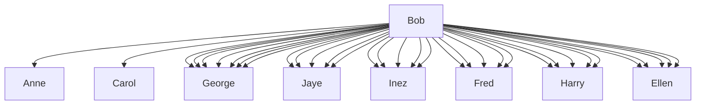

## Team Control Number

For office use only

T1 \_\_\_\_

T2 \_\_\_\_

T3 \_\_\_\_

T4 \_\_\_\_

## 13215

Problem Chosen

C

For office use only

F1

F2

F3

F4

## 2012 Mathematical Contest in Modeling (MCM) Summary Sheet

(Attach a copy of this page to each copy of your solution paper.)

Type a summary of your results on this page. Do not include the name of your school, advisor, or team members on this page.

# Message Network Modeling for Crime Busting

## Abstract

A particularly popular and challenging problem in crime analysis is to identify the conspirators through analysis of message networks. In this paper, using the data of message traffic, we model to prioritize the likelihood of one's being conspirator, and nominate the probable conspiracy leaders.

We note a fact that any conspirator has at least one message communication with other conspirators, and assume that sending or receiving a message has the same effect, and then develop Model 1, 2 and 3 to make a priority list respectively and Model 4 to nominate the conspiracy leader.

In Model 1, we take the amount of one's suspicious messages and one's all messages with known conspirators into account, and define a simple composite index to measure the likelihood of one's being conspirator.

Then, considering probability relevance of all nodes, we develop Model 2 based on Law of Total Probability. In this model, probability of one's being conspirator is the weight sum of probabilities of others directly linking to it. And we develop Algorithm 1 to calculate probabilities of all the network nodes as direct calculation is infeasible.

Besides, in order to better quantify one's relationship to the known conspirators, we develop Model 3, which brings in the concept “shortest path” of graph theory to create an indicator evaluating the likelihood of one's being conspirator which can be calculated through Algorithm 2.

As a result, we compare three priority lists and conclude that the overall rankings are similar but quite changes appear in some nodes. Additionally, when altering the given information, we find that the priority list just changes slightly except for a few nodes, so that we validate the models' stability.

Afterwards, by using Freeman's centrality method, we develop Model 4 to nominate three most probable leaders: Paul, Elsie, Dolores (senior manager).

What's more, we make some remarks about the models and discuss what could be done to enhance them in the future work. In addition, we further explain Investigation EZ through text and semantic network analysis, so to illustrate the models' capacity of applying to more complicated cases. Finally, we briefly state the application of our models in other disciplines.

## Introduction

ICM is investigating a conspiracy whose members all work for the same noted company which majors in developing and marketing computer software for banks and credit card companies. Conspirators commit crimes by embezzling funds from the company and using internet fraud to steal funds from credit cards. It is a kind of commercial fraud. Fraud is a human endeavor, involving deception, purposeful intent, intensity of desire, risk of apprehension, violation of trust, rationalization, etc. Psychological factors influence the behaviors of fraud perpetrators (Sridhar Ramamoorti, 2008).

ICM provides us the following information that they have mastered

\- All 83 office workers' names;

\- 15 short descriptions of the topics (Topic 7, 11, and 13 have been deemed to be suspicious);

\- 400 links of the nodes that transmit messages and the topic code numbers;

\- 7 known conspirators: Jean, Alex, Elsie, Paul, Ulf, Yao, and Harvey;

\- 8 known non-conspirators: Darlene, Tran, Jia, Ellin, Gard, Chris, Paige and Este;

\- Jerome, Delores, and Gretchen are the senior managers of the company.

For crime busting, we develop models to

\- Identify all conspirators as accurately as possible, make a priority list that shows the likelihood of one's being conspirator, so that erroneous judgments or miss-judgments won't happen easily;

\- Nominate the conspiracy leader.

## Declaration of the given data

\- “Topics.xls” contains only 15 topics, but “topic 18” appears in line 215 of “Messages.xls”. To fix this error, we decide to neglect this invalid data and delete it.

\- In page 5, line 2 of “2012\_ICM\_Problem.pdf”, it says that “Elsie” is one of the known conspirators. However we find two “Elsie” with node number “7” and “37”. Throughout some basic statistics about the message traffic containing suspicious topics, it appears that “7 Elsie” is more likely to be a known conspirator rather than “37 Elsie”. Therefore, we assume that “Elsie” in “2012\_ICM\_Problem.pdf” indicates “Elsie” with node number 7 in “names.xls”.

\- As the problem paper point out, “Delores” is a senior manager. But “Delores” can’t be found in “names.xls” while “Dolores” is found. So we consider it as misspelling and replace “Delores” with “Dolores”.

\- “Gretchen” is also one of the senior managers. But two “Gretchen” are found in “names.xls” with different node number “4” and “32”. In consideration of this redundancy, we determine to pick out node 32 for “Gretchen” indicated in the problem paper artificially. In addition, our basic statistics also shows that “32 Gretchen” has more message exchanges than “4 Gretchen”, which may imply that “32 Gretchen” is more probably the senior manager than “4 Gretchen” due to managers often contact others more than ordinary office workers.

# Problem analysis and assumption

Commercial fraud is committed by those intelligent people who are confident with their professional skills. Meanwhile, this kind of crime couldn't involve only one person, but always need cooperation of a whole group. Thus, communication with other conspirators would be inevitable. However, they obviously know that they are linked together and if one person discloses their secrets, none of them can get off. So they are conscious when they communicate with their colleagues who aren't their companions, especially when they talk about sensitive issues. And the higher intellectual level of perpetrators with rich society experience, the more conscious they are (Zhigang Lin,2010). And ICM can figure out suspicious topic which stands a good chance of being related to the conspiracy by some content analysis method. On the one hand, although Conspirators would try to avoid involving suspicious topics in their messages, they have to convey this kind of information sometimes due to the business or other reason. On the other hand, trust and close relationship play an important role in a conspiracy group, so normal messages exchanges can also reflect the conspiracy relationship.

Based on psychology analysis above, we can state that all conspirators have at least one message communication with other conspirators, whether suspicious or unsuspicious message.

In addition, we make the assumption that sending and receiving messages have same effect when we evaluate the likelihood of one's being conspirator;

## Models

## Model 1

## Establishment of model

According to the analysis of the problem, the likelihood of one's being conspirator is related to various factors, such as what topics are contained in the worker messages, how many messages and suspicious messages are the worker related with, who did the worker contact with, etc. To evaluate the likelihood of one's being conspirators, we use the following equation which combines two quantity indexes:

$$
p _ {i} = \frac {1}{2} \left(\frac {n _ {1 i}}{\max _ {i} \left\{n _ {1 i} \right\}} + \frac {n _ {2 i}}{\max _ {i} \left\{n _ {2 i} \right\}}\right), i = 0, 1, 2, \dots , 8 2 \tag {1}
$$

Where $n_{1i}$ is the suspicious message number that office worker i sent or received and $n_{2i}$ is message number that office worker i sent to or received by known conspirators.

In order to get each value of $n_{1i}$ and $n_{2i}$ , we make data statistics and draw Figure 1:


<details>
<summary>bar chart</summary>

| x  | suspicious messages | messages with known conspirators |
|----|---------------------|----------------------------------|
| 0  | 3                   | 2                                |
| 2  | 4                   | 2                                |
| 4  | 5                   | 2                                |
| 6  | 3                   | 1                                |
| 8  | 10                  | 7                                |
| 10 | 6                   | 2                                |
| 12 | 2                   | 2                                |
| 14 | 5                   | 2                                |
| 16 | 5                   | 1                                |
| 18 | 5                   | 6                                |
| 20 | 3                   | 4                                |
| 22 | 16                  | 11                               |
| 24 | 1                   | 1                                |
| 26 | 1                   | 1                                |
| 28 | 4                   | 2                                |
| 30 | 3                   | 2                                |
| 32 | 3                   | 2                                |
| 34 | 4                   | 2                                |
| 36 | 3                   | 2                                |
| 38 | 3                   | 1                                |
| 40 | 3                   | 1                                |
| 42 | 7                   | 6                                |
| 44 | 2                   | 2                                |
| 46 | 4                   | 2                                |
| 48 | 5                   | 5                                |
| 50 | 3                   | 5                                |
| 52 | 1                   | 1                                |
| 54 | 10                  | 8                                |
| 56 | 1                   | 1                                |
| 58 | 1                   | 1                                |
| 60 | 1                   | 1                                |
| 62 | 1                   | 1                                |
| 64 | 2                   | 1                                |
| 66 | 1                   | 1                                |
| 68 | 16                  | 9                                |
| 70 | 1                   | 1                                |
| 72 | 1                   | 1                                |
| 74 | 1                   | 1                                |
| 76 | 1                   | 1                                |
| 78 | 1                   | 1                                |
| 80 | 5                   | 4                                |
| 82 | -                   | -                                |
</details>

Figure. 1

## Result and analysis

Figure 1 shows all the values of $n_{1i}$ and $n_{2i}$ . Using equation (1) we have put forward, we can easily calculate all the values of $p_i$ and make a priority list as Table 1 (note that $p_i$ is not a probability but a metric to evaluate the likelihood, though it value is between 0 and 1)

Table 1

<table><tr><td>No</td><td>node</td><td>p</td><td>No</td><td>node</td><td>p</td><td>No</td><td>node</td><td>p</td><td>No</td><td>node</td><td>p</td></tr><tr><td>1</td><td>21</td><td>1</td><td>21</td><td>30</td><td>0.1534</td><td>43</td><td>1</td><td>0.0909</td><td>57</td><td>72</td><td>0.0313</td></tr><tr><td>2</td><td>67</td><td>0.9091</td><td>21</td><td>33</td><td>0.1534</td><td>44</td><td>60</td><td>0.0767</td><td>57</td><td>75</td><td>0.0313</td></tr><tr><td>3</td><td>54</td><td>0.6761</td><td>21</td><td>35</td><td>0.1534</td><td>44</td><td>69</td><td>0.0767</td><td>57</td><td>78</td><td>0.0313</td></tr><tr><td>4</td><td>7</td><td>0.6307</td><td>21</td><td>44</td><td>0.1534</td><td>44</td><td>82</td><td>0.0767</td><td>57</td><td>79</td><td>0.0313</td></tr><tr><td>5</td><td>43</td><td>0.4915</td><td>21</td><td>46</td><td>0.1534</td><td>47</td><td>5</td><td>0.0625</td><td>68</td><td>26</td><td>0</td></tr><tr><td>6</td><td>18</td><td>0.429</td><td>27</td><td>6</td><td>0.1392</td><td>47</td><td>8</td><td>0.0625</td><td>68</td><td>52</td><td>0</td></tr><tr><td>7</td><td>49</td><td>0.3835</td><td>27</td><td>19</td><td>0.1392</td><td>47</td><td>9</td><td>0.0625</td><td>68</td><td>53</td><td>0</td></tr><tr><td>8</td><td>81</td><td>0.3381</td><td>27</td><td>37</td><td>0.1392</td><td>47</td><td>11</td><td>0.0625</td><td>68</td><td>55</td><td>0</td></tr><tr><td>9</td><td>48</td><td>0.321</td><td>27</td><td>38</td><td>0.1392</td><td>47</td><td>40</td><td>0.0625</td><td>68</td><td>58</td><td>0</td></tr><tr><td>10</td><td>3</td><td>0.2784</td><td>27</td><td>41</td><td>0.1392</td><td>47</td><td>42</td><td>0.0625</td><td>68</td><td>59</td><td>0</td></tr><tr><td>10</td><td>10</td><td>0.2784</td><td>27</td><td>50</td><td>0.1392</td><td>47</td><td>80</td><td>0.0625</td><td>68</td><td>61</td><td>0</td></tr><tr><td>12</td><td>20</td><td>0.2756</td><td>33</td><td>0</td><td>0.1364</td><td>54</td><td>25</td><td>0.0455</td><td>68</td><td>62</td><td>0</td></tr><tr><td>13</td><td>2</td><td>0.2159</td><td>34</td><td>15</td><td>0.125</td><td>54</td><td>66</td><td>0.0455</td><td>68</td><td>63</td><td>0</td></tr><tr><td>13</td><td>34</td><td>0.2159</td><td>34</td><td>22</td><td>0.125</td><td>54</td><td>73</td><td>0.0455</td><td>68</td><td>64</td><td>0</td></tr><tr><td>15</td><td>16</td><td>0.2017</td><td>36</td><td>14</td><td>0.1222</td><td>57</td><td>12</td><td>0.0313</td><td>68</td><td>68</td><td>0</td></tr><tr><td>15</td><td>17</td><td>0.2017</td><td>36</td><td>45</td><td>0.1222</td><td>57</td><td>23</td><td>0.0313</td><td>68</td><td>70</td><td>0</td></tr><tr><td>17</td><td>28</td><td>0.1705</td><td>38</td><td>31</td><td>0.108</td><td>57</td><td>24</td><td>0.0313</td><td>68</td><td>71</td><td>0</td></tr><tr><td>17</td><td>47</td><td>0.1705</td><td>38</td><td>36</td><td>0.108</td><td>57</td><td>39</td><td>0.0313</td><td>68</td><td>74</td><td>0</td></tr><tr><td>19</td><td>4</td><td>0.1563</td><td>38</td><td>65</td><td>0.108</td><td>57</td><td>51</td><td>0.0313</td><td>68</td><td>76</td><td>0</td></tr><tr><td>19</td><td>13</td><td>0.1563</td><td>41</td><td>29</td><td>0.0938</td><td>57</td><td>56</td><td>0.0313</td><td>68</td><td>77</td><td>0</td></tr><tr><td>21</td><td>27</td><td>0.1534</td><td>41</td><td>32</td><td>0.0938</td><td>57</td><td>57</td><td>0.0313</td><td></td><td></td><td></td></tr></table>

As shown in Table 1, all the known conspirators (heavy tape and red mark) are ranked in the very front of the list, which indicates the model is effective to some extent that it can recognize some workers who is most likely to be conspirators. However, some non-conspirators (green mark and Italic type) are also up at the front, like node 48 and node 2, which shows that the model has a certain limitation and some wrong recognition.

## Model 2

In order to establish an improved model, we make one more assumptions

Except for the known conspirators and non-conspirators, one's probability of being conspirator is relate to those who have direct message contact with him/her. And the probability is both affected by the probability of his/her linking persons and the topic nature of the linking messages.

## Introduction of Law of Total Probability

In probability theory, the law of total probability or the formula of total probability is a fundamental regulation relating marginal probabilities. It can be described as follows:

if $\{B_{n}:n=1,2,3,\ldots\}$ is a finite or countably infinite partition of a sample space and each event $B_{n}$ in it is measurable, then for any event A of the same probability space:

$$
\mathrm{P} (A) = \sum_ {n} \mathrm{P} (A \mid B _ {n}) \mathrm{P} (B _ {n}) \tag {2}
$$

## Establishment of model

According to the material we get hold of, since Topic 7, 11, and 13 have been deemed to be suspicious, we name S={7,11,13} the suspicious topic set and U={1,2,3,4,5,6,8,9,10,12,14,15} the unsuspicious topic set. In addition, we categorize all 83 office workers into three groups: conspirators, non-conspirators and unknown ones. $p_a$ , $p_b$ and $P_j (j = 0,1,\dots,83, \text{except } 15 \text{ known persons})$ indicate the probability of three kind of office workers commit crime. We have $p_a = 1$ , $p_b = 0$ and $P_j$ equaled different unknown numbers which between 0 and 1. The greater probability the unknown one is conspirator, the greater $P_j$ is. A person is much more suspicious if he/she sends or receives suspicious messages more frequently. We can use $w_{ji}$ to represent the suspicious extent and it can be calculated by the following equations:

$$
w _ {j i} = n _ {a} \times a + n _ {b} \times b, i = 1, 2, \dots \tag {3}
$$

Where $n_{a}(n_{b})$ is the number of suspicious(unsuspicious) messages a unknown one sends or receives, a is the weight of elements in the set of S, and b is the weight of elements in the set of U.

Next, we will explain how “probability” works out in the messages network with Figure 2.


<details>
<summary>flowchart</summary>

```mermaid
graph TD
  Pj["P_j"] -->|w_{j1}| Pj1["p_{j1}"]
  Pj -->|w_{j2}| Pj2["p_{j2}"]
  Pj -->|w_{j3}| Pj3["p_{j3}"]
  Pj -->|w_{j4}| Pj4["p_{j4}"]
  Pj -->|w_{ji}| Pji["p_{ji}"]
    Pji -.-> Pj
```
</details>

Figure. 2

We consider that the whole network can be separating into a lot of small network like above. Bringing Law of Total Probability in our model, we treat the center node (not including nodes in known conspirators or non-conspirators group) as A in description of Law of Total Probability, and other nodes directly connected to it as $B_{n}(n=1,2,3,\ldots)$ . So probability of center node is $P_{j}=\mathrm{P}(A)$ , probabilities of other

connecting nodes are $p_{ji} = \mathrm{P}(B_i)$ , and $\mathrm{P}(A \mid B_n) = \frac{w_{ji}}{\sum_{i} w_{ji}}$ .

Based on illustrations we present, we calculate P in the following way:

$$
P _ {j} = \sum_ {i} \left(p _ {j i} \times \frac {w _ {j i}}{\sum_ {i} w _ {j i}}\right) = \frac {\sum_ {i} p _ {j i} \times w _ {j i}}{\sum_ {i} w _ {j i}} \tag {4}
$$

However, all the probabilities of nodes in the unknown group are uncertain. So it is impossible to use the equation above to calculate all the probabilities directly. As a solution, we develop the following algorithm.

## Algorithm 1

All 400 links can constitute a complex relative network, and each office worker can form a simply network centered on himself/herself. Considering the structure of network, we imitated the neural network algorithm but use iterative method to complete the whole relative network:

Step 1: Set iteration times as T, and initialize $P_{j}^{(0)} = 0 (j = 1, 2, \ldots, 68)$ , t = 1;

Step 2: Refreshing the network $P_{j}$

Loop j from 1 to 68, then utilize equation (4) to calculate each $P_{j}^{(t)}$ ;

Step 3: Calculate the quadratic sum of probability errors between last time and present time;

$$
e (t) = \sum_ {j = 1} ^ {6 8} [ P _ {j} ^ {(t)} - P _ {j} ^ {(t - 1)} ] ^ {2} \tag {5}
$$

Step 4: Let $t = t + 1$ , if t > T, program ends up, else returns to Step 2.

With t increasing, $e(t)$ shows a downward trend. When the value of $e(t)$ tends to become stable, or less equals than a small constant, we can consider all the present $P_{j}^{(t)}$ satisfy equation (4) and be the probabilities of being conspirators.

In the end, we can sort $P_{j}$ form large to small and make a list that shows the likelihood of one's being conspirator, meanwhile, divide the list into two parts based on a critical value $p_{d}$ which set in advance.

Computing process can be shown in Figure 3, where every circle represents an office worker and the grey level of the circle stands for his/her probability in every iteration. In the end of T times iterations, the grey level of every circle basically no longer changed.


<details>
<summary>flowchart</summary>

```mermaid
graph TD
    subgraph t = 0
  A["7 conspirators"] --> B["68 unidentified peoples"]
  C["8 non-conspirators"] --> D["68 unidentified peoples"]
  E["7 conspirators"] --> F["68 non-conspirators"]
  G["8 non-conspirators"] --> H["68 non-conspirators"]
    end
    
    subgraph t = 1
  I["7 conspirators"] --> J["68 unidentified peoples"]
  K["8 non-conspirators"] --> L["68 non-conspirators"]
  M["7 conspirators"] --> N["68 non-conspirators"]
  O["8 non-conspirators"] --> P["68 non-conspirators"]
    end
    
    subgraph t = 2
  Q["7 conspirators"] --> R["68 unidentified peoples"]
  S["8 non-conspirators"] --> T["68 non-conspirators"]
  U["7 conspirators"] --> V["68 non-conspirators"]
  W["8 non-conspirators"] --> X["68 non-conspirators"]
    end
```
</details>

Figure. 3

## Result and analysis

According to the given data in “Messages.xls”, “Names.xls” and Topics.xls, we can make a priority list that shows the likelihood of one’s being conspirator based on Model 2.

We set

a = 0.9, which is the weight of elements in the set of S;

b = 0.1, which is the weight of elements in the set of U;

T = 20, which is the iteration times;

$p_{d}=0.5$ , which is the critical value separating the conspirator group and non-conspirator group.

After the iterative computation, $e(t)$ tends to be 0 as Figure 4 shows


<details>
<summary>line chart</summary>

| iteration times | e(t) |
| --------------- | ---- |
| 1               | 4.0  |
| 2               | 1.2  |
| 3               | 0.4  |
| 4               | 0.2  |
| 5               | 0.1  |
| 6               | 0.05 |
| 7               | 0.02 |
| 8               | 0.01 |
| 9               | 0.01 |
| 10              | 0.01 |
| 11              | 0.01 |
| 12              | 0.01 |
| 13              | 0.01 |
| 14              | 0.01 |
| 15              | 0.01 |
| 16              | 0.01 |
| 17              | 0.01 |
| 18              | 0.01 |
| 19              | 0.01 |
| 20              | 0.01 |
</details>


<details>
<summary>line chart</summary>

| iteration times | e(t)   |
| --------------- | ------ |
| 10              | 0.011  |
| 11              | 0.007  |
| 12              | 0.0045 |
| 13              | 0.003  |
| 14              | 0.002  |
| 15              | 0.0015 |
| 16              | 0.001  |
| 17              | 0.0008 |
| 18              | 0.0006 |
| 19              | 0.0005 |
| 20              | 0.0004 |
</details>

Figure. 4

As shown in Figure 4, after 20 times' iteration, $e(t)$ is less than 0.001. So we can consider $P_{j}(j = 1,2,\dots,68)$ , which represents probability of being conspirator of person in the unknown group, is so stable that all $P_{j}$ can perfectly satisfy the equation $P_{j} = \frac{\sum p_{i} \times w_{i}}{\sum w_{i}}$ which is presented in model 1. Size $P_{j}(j = 1,2,\dots,68)$ down, we get the priority list as Table 2 shows

Table 2

<table><tr><td>No</td><td>Node</td><td>Pro</td><td>No</td><td>Node</td><td>Pro</td><td>No</td><td>Node</td><td>Pro</td><td>No</td><td>Node</td><td>Pro</td></tr><tr><td>1</td><td>7</td><td>1</td><td>22</td><td>1</td><td>0.6248</td><td>43</td><td>22</td><td>0.5022</td><td>64</td><td>55</td><td>0.2658</td></tr><tr><td>1</td><td>18</td><td>1</td><td>23</td><td>31</td><td>0.6172</td><td>44</td><td>5</td><td>0.4969</td><td>65</td><td>82</td><td>0.254</td></tr><tr><td>1</td><td>21</td><td>1</td><td>24</td><td>14</td><td>0.6083</td><td>45</td><td>8</td><td>0.4906</td><td>66</td><td>52</td><td>0.2209</td></tr><tr><td>1</td><td>43</td><td>1</td><td>25</td><td>27</td><td>0.584</td><td>46</td><td>24</td><td>0.49</td><td>67</td><td>56</td><td>0.201</td></tr><tr><td>1</td><td>49</td><td>1</td><td>26</td><td>6</td><td>0.5809</td><td>47</td><td>26</td><td>0.4792</td><td>67</td><td>57</td><td>0.201</td></tr><tr><td>1</td><td>54</td><td>1</td><td>27</td><td>42</td><td>0.5798</td><td>48</td><td>72</td><td>0.476</td><td>69</td><td>63</td><td>0.1989</td></tr><tr><td>1</td><td>67</td><td>1</td><td>28</td><td>11</td><td>0.5765</td><td>49</td><td>20</td><td>0.4741</td><td>70</td><td>79</td><td>0.1978</td></tr><tr><td>1</td><td>73</td><td>1</td><td>29</td><td>46</td><td>0.5762</td><td>50</td><td>4</td><td>0.4591</td><td>71</td><td>77</td><td>0.1907</td></tr><tr><td>9</td><td>81</td><td>0.9773</td><td>30</td><td>69</td><td>0.5736</td><td>51</td><td>40</td><td>0.4407</td><td>72</td><td>23</td><td>0.1891</td></tr><tr><td>10</td><td>60</td><td>0.9367</td><td>31</td><td>45</td><td>0.5728</td><td>52</td><td>32</td><td>0.4192</td><td>73</td><td>80</td><td>0.1608</td></tr><tr><td>11</td><td>59</td><td>0.9366</td><td>32</td><td>16</td><td>0.5728</td><td>52</td><td>58</td><td>0.4192</td><td>74</td><td>76</td><td>0.1001</td></tr><tr><td>12</td><td>33</td><td>0.8078</td><td>33</td><td>28</td><td>0.5632</td><td>54</td><td>53</td><td>0.3987</td><td>75</td><td>75</td><td>0.01</td></tr><tr><td>13</td><td>30</td><td>0.7769</td><td>34</td><td>41</td><td>0.5626</td><td>55</td><td>62</td><td>0.3977</td><td>76</td><td>0</td><td>0</td></tr><tr><td>14</td><td>36</td><td>0.7561</td><td>35</td><td>13</td><td>0.5444</td><td>56</td><td>66</td><td>0.3964</td><td>76</td><td>2</td><td>0</td></tr><tr><td>15</td><td>37</td><td>0.6846</td><td>36</td><td>44</td><td>0.5412</td><td>57</td><td>61</td><td>0.3963</td><td>76</td><td>48</td><td>0</td></tr><tr><td>16</td><td>50</td><td>0.6683</td><td>37</td><td>39</td><td>0.539</td><td>58</td><td>35</td><td>0.3915</td><td>76</td><td>64</td><td>0</td></tr><tr><td>17</td><td>38</td><td>0.6591</td><td>38</td><td>47</td><td>0.5386</td><td>59</td><td>3</td><td>0.3672</td><td>76</td><td>65</td><td>0</td></tr><tr><td>18</td><td>10</td><td>0.6344</td><td>39</td><td>34</td><td>0.5366</td><td>60</td><td>29</td><td>0.3543</td><td>76</td><td>68</td><td>0</td></tr><tr><td>19</td><td>51</td><td>0.6344</td><td>40</td><td>15</td><td>0.5364</td><td>61</td><td>19</td><td>0.3313</td><td>76</td><td>74</td><td>0</td></tr><tr><td>20</td><td>9</td><td>0.6288</td><td>41</td><td>25</td><td>0.5327</td><td>62</td><td>71</td><td>0.2883</td><td>76</td><td>78</td><td>0</td></tr><tr><td>21</td><td>17</td><td>0.6254</td><td>42</td><td>12</td><td>0.5065</td><td>63</td><td>70</td><td>0.2766</td><td></td><td></td><td></td></tr></table>

As for discriminate line, we previously have $p_{d}=0.5$ , we can distinguish that the 43 previous workers in the list is categorized as conspirators while the others are non-conspirators.

## Model 3

## Introduction of graph theory

In mathematics and computer science, graph theory is the study of graphs, mathematical structures used to model pairwise relations between objects from a certain collection. A “graph” in this context is a collection of “vertices” or “nodes” and a collection of edges that connect pairs of vertices. The “shortest path” represents a path between two vertices (or nodes) in a graph such that the sum of the weights of its constituent edges is minimized. And Dijkstra's algorithm, is a graph search algorithm that solves the single-source shortest path problem for a graph with nonnegative edge path costs, producing a shortest path tree.

## Establishment and Algorithm of the model

We develop a model based on graph theory which is good at dealing with network problem. As far as the second figure ICM shows us in the problem paper, we use a graph $G = \{V(G), E(G)\}$ to visualize the message traffic. A set of vertices $V(G)$ represents office workers, and a set of edges $E(G)$ represents messages. A set of known conspirators is named $V_{0}(G)$ while a set of known non-conspirators is named $V_{n}(G)$ .

A member communicates with another through several paths in the conspirators' message network. However, in order to reduce the intercepted risk in the process of information transfer, they usually choose the shortest one. So the shortest path is much more important than the longer one in the assessment of the suspicion. Of course, suspicious messages are more important than the unsuspicious one as well. So the probability of one's being conspirator depends on the type and quantity of his message traffic, as well as the shortest distance between him and known conspirator group. It means the shortest distance between this vertex $v_i$ and any element of $V_0(G)$ in the network. We use $d(v_i, V_0(G))$ to represent it, and its value is the quantity of the edges.

$$
d (v _ {i}, V _ {0} (G)) = \min _ {k} \{d (v _ {i}, v _ {k}), v _ {k} \in V _ {0} (G) \tag {6}
$$

In conclusion, a suspicious index named Score is used to decide whether a member is worth to be suspicious. For each vertex, in $V_{0}(G)$ , $Score_{i}=10$ , while in $V_{N}(G)$ , $Score_{i}=0$ . And the other vertices can be computed by

$$
\text { Score } _ {i} = \sum_ {j} \frac {w _ {j}}{d (v _ {i} , V _ {0} (G))} \tag {7}
$$

Where $w_{j}$ represents the weight of edge $e_{i}$ , which is linked with the vertex $v_{i}$ directly; the summation symbol is for all the edges linked directly with the vertex $v_{i}$ . The larger $Score_{i}$ is, the more suspicious the office worker i is.

The calculating process of $Score_{i}$ can be described as Figure 5.

```mermaid
graph TD
  A["Black Circle"] --> B["White Circle"]
  B --> C["White Circle"]
  C --> D["White Circle"]
  D --> E["White Circle"]
  E --> F["White Circle"]
  F --> G["White Circle"]
  G --> H["White Circle"]
  H --> I["White Circle"]
  I --> J["White Circle"]
  J --> K["White Circle"]
  K --> L["White Circle"]
  L --> M["White Circle"]
  M --> N["White Circle"]
  N --> O["White Circle"]
  O --> P["White Circle"]
  P --> Q["White Circle"]
  Q --> R["White Circle"]
  R --> S["White Circle"]
  S --> T["White Circle"]
  T --> U["White Circle"]
  U --> V["White Circle"]
  V --> W["White Circle"]
  W --> X["White Circle"]
  X --> Y["White Circle"]
  Y --> Z["White Circle"]
  Z --> A
    style A fill:#000,stroke:#000,color:#fff
    style B fill:#000,stroke:#000,color:#fff
    style C fill:#000,stroke:#000,color:#fff
    style D fill:#000,stroke:#000,color:#fff
    style E fill:#000,stroke:#000,color:#fff
    style F fill:#000,stroke:#000,color:#fff
    style G fill:#000,stroke:#000,color:#fff
    style H fill:#000,stroke:#000,color:#fff
    style I fill:#000,stroke:#000,color:#fff
    style J fill:#000,stroke:#000,color:#fff
    style K fill:#000,stroke:#000,color:#fff
    style L fill:#000,stroke:#000,color:#fff
    style M fill:#000,stroke:#000,color:#fff
    style N fill:#000,stroke:#000,color:#fff
    style O fill:#000,stroke:#000,color:#fff
    style P fill:#000,stroke:#000,color:#fff
    style Q fill:#000,stroke:#000,color:#fff
    style R fill:#000,stroke:#000,color:#fff
    style S fill:#000,stroke:#000,color:#fff
    style T fill:#000,stroke:#000,color:#fff
    style U fill:#000,stroke:#000,color:#fff
    style V fill:#000,stroke:#000,color:#fff
    style W fill:#000,stroke:#000,color:#fff
    style X fill:#000,stroke:#000,color:#fff
    style Y fill:#000,stroke:#000,color:#fff
    style Z fill:#000,stroke:#000,color:#fff
```


<details>
<summary>flowchart</summary>


</details>

  
The vertex to be calculated.  
Distance = 2

  
The known suspicious vertex  
$Score = (w_{1} + w_{2} + w_{3} + w_{4} + w_{5}) / 2$

  
Other vertices  
Figure 5

## Algorithm 2

Step 1: Create the set of known conspirators $V_{0}(G)$ and the set of non-conspirators $V_{n}(G)$ ;  
Step 2: Compute the shortest distance from all the vertices to the $V_{0}(G)$ ;

Based on message network, create an adjacency matrix with the connected value equaled to 1 and the unconnected value equaled to 0. Initialize $d(v_{k}, V_{0}(G)) = 0$ in the set of $V_{0}(G)$ , and $d(v_{k}, V_{0}(G)) = +\infty$ in $V_{n}(G)$ ,

1) Start the vertices of $V_{0}(G)$ , then search for any other vertex in matrix which connected with it directly and consist of a new set $V_{1}(G)$ at the same time, have its value equal to 1,  
2) Continue to search down. But if one vertex has been visited, its value will not be assigned again. The loop will not stop until all the vertices are accessed;

Step 3: Visit all the edges, assign a value to their weights $w_{j}$ , and according to the equation(6) to calculate $d(v_{i}, V_{0}(G))$ . And let its two vertices cumulative

$$
\frac {w _ {j}}{d (v _ {i} , V _ {0} (G))};
$$

  
Figure 6  
d is the distance where searching the vertices. A known conspirator is represented by a black round  
Step 4: As for the vertices in $V_{0}(G)$ , Score is assigned to 10.0; for the vertices in $V_{n}(G)$ , Score is assigned to 0.0; for the other vertices, Score can also be calculated.

## Result and analysis

In the model, we set

$$
w _ {j} = \left\{ \begin{array}{l l} 1. 0 & \text { if   the   jthedg   is   a   suspicious   message } \\ 0. 1 & \text { if   the   jthedg   is   a   unsuspicious   message } \end{array} \right.
$$

It means the effect of 10 unsuspicious messages is equal to 1 suspicious message in the suspicious evaluation.  
Based on the Algorithm 2, compute each $Score_{i}$ , size $Score_{i}(i=1,2,3,\cdots,83)$ down, and list them on table 3:  
Table 3

<table><tr><td>No</td><td>node</td><td>Score</td><td>No</td><td>node</td><td>Score</td><td>No</td><td>node</td><td>Score</td><td>No</td><td>node</td><td>Score</td></tr><tr><td>1</td><td>7</td><td>10.000</td><td>22</td><td>44</td><td>3.700</td><td>42</td><td>40</td><td>1.600</td><td>63</td><td>71</td><td>0.200</td></tr><tr><td>1</td><td>18</td><td>10.000</td><td>22</td><td>50</td><td>3.800</td><td>44</td><td>1</td><td>1.500</td><td>65</td><td>62</td><td>0.133</td></tr><tr><td>1</td><td>21</td><td>10.000</td><td>24</td><td>30</td><td>3.300</td><td>44</td><td>5</td><td>1.500</td><td>65</td><td>70</td><td>0.133</td></tr><tr><td>1</td><td>43</td><td>10.000</td><td>24</td><td>31</td><td>3.300</td><td>44</td><td>69</td><td>1.500</td><td>67</td><td>55</td><td>0.100</td></tr><tr><td>1</td><td>49</td><td>10.000</td><td>26</td><td>35</td><td>3.100</td><td>47</td><td>9</td><td>1.400</td><td>67</td><td>73</td><td>0.100</td></tr><tr><td>1</td><td>54</td><td>10.000</td><td>27</td><td>4</td><td>3.050</td><td>47</td><td>42</td><td>1.400</td><td>67</td><td>76</td><td>0.100</td></tr><tr><td>1</td><td>67</td><td>10.000</td><td>28</td><td>27</td><td>3.000</td><td>49</td><td>12</td><td>1.200</td><td>70</td><td>52</td><td>0.075</td></tr><tr><td>8</td><td>3</td><td>8.200</td><td>29</td><td>15</td><td>2.900</td><td>49</td><td>60</td><td>1.200</td><td>71</td><td>53</td><td>0.067</td></tr><tr><td>9</td><td>10</td><td>7.100</td><td>30</td><td>13</td><td>2.850</td><td>51</td><td>80</td><td>1.100</td><td>72</td><td>59</td><td>0.050</td></tr><tr><td>10</td><td>17</td><td>6.500</td><td>30</td><td>32</td><td>2.850</td><td>52</td><td>25</td><td>1.000</td><td>72</td><td>63</td><td>0.050</td></tr><tr><td>11</td><td>34</td><td>6.000</td><td>32</td><td>36</td><td>2.800</td><td>53</td><td>39</td><td>0.850</td><td>74</td><td>58</td><td>0.033</td></tr><tr><td>12</td><td>16</td><td>5.500</td><td>33</td><td>46</td><td>2.700</td><td>54</td><td>23</td><td>0.750</td><td>75</td><td>61</td><td>0.025</td></tr><tr><td>13</td><td>81</td><td>5.100</td><td>34</td><td>22</td><td>2.650</td><td>55</td><td>26</td><td>0.700</td><td>76</td><td>0</td><td>0.000</td></tr><tr><td>14</td><td>47</td><td>4.900</td><td>35</td><td>14</td><td>2.300</td><td>56</td><td>79</td><td>0.550</td><td>76</td><td>2</td><td>0.000</td></tr><tr><td>15</td><td>28</td><td>4.600</td><td>36</td><td>33</td><td>2.200</td><td>57</td><td>51</td><td>0.500</td><td>76</td><td>48</td><td>0.000</td></tr><tr><td>16</td><td>19</td><td>4.200</td><td>36</td><td>45</td><td>2.200</td><td>58</td><td>72</td><td>0.400</td><td>76</td><td>64</td><td>0.000</td></tr><tr><td>16</td><td>20</td><td>4.200</td><td>38</td><td>29</td><td>2.000</td><td>59</td><td>66</td><td>0.300</td><td>76</td><td>65</td><td>0.000</td></tr><tr><td>16</td><td>37</td><td>4.200</td><td>39</td><td>82</td><td>1.800</td><td>59</td><td>75</td><td>0.300</td><td>76</td><td>68</td><td>0.000</td></tr><tr><td>19</td><td>6</td><td>4.000</td><td>40</td><td>8</td><td>1.750</td><td>61</td><td>56</td><td>0.275</td><td>76</td><td>74</td><td>0.000</td></tr><tr><td>19</td><td>38</td><td>4.000</td><td>41</td><td>24</td><td>1.650</td><td>62</td><td>77</td><td>0.250</td><td>76</td><td>78</td><td>0.000</td></tr><tr><td>19</td><td>41</td><td>4.000</td><td>42</td><td>11</td><td>1.600</td><td>63</td><td>57</td><td>0.200</td><td></td><td></td><td></td></tr></table>

Furthermore, we set critical value as Score = 2. It is equivalent to contact with the known conspirator group by 2 messages. It is reasonable to consider an office worker is a conspirator. Draw a line on table, which show that the large probability of being conspirator comes before the number of critical value. Through analyzing, we conclude that the 38 previous workers in the list are categorized as conspirators while the others are non-conspirators.

## Results comparison of Model 1, 2 and 3

Putting three lists we get respectively in three models together, we can draw Figure 7 to compare the consistency of all three model results.


<details>
<summary>line chart</summary>

| node | Model 1 | Model 2 | Model 3 |
| ---- | ------- | ------- | ------- |
| 0    | 32      | 32      | 32      |
| 2    | 7       | 16      | 7       |
| 4    | 16      | 16      | 16      |
| 6    | 1       | 1       | 1       |
| 8    | 4       | 4       | 4       |
| 10   | 16      | 16      | 16      |
| 12   | 32      | 32      | 32      |
| 14   | 16      | 16      | 16      |
| 16   | 32      | 32      | 32      |
| 18   | 1       | 1       | 1       |
| 20   | 4       | 4       | 4       |
| 22   | 1       | 1       | 1       |
| 24   | 32      | 32      | 32      |
| 26   | 16      | 16      | 16      |
| 28   | 32      | 32      | 32      |
| 30   | 1       | 1       | 1       |
| 32   | 4       | 4       | 4       |
| 34   | 16      | 16      | 16      |
| 36   | 32      | 32      | 32      |
| 38   | 16      | 16      | 16      |
| 40   | 32      | 32      | 32      |
| 42   | 1       | 1       | 1       |
| 44   | 4       | 4       | 4       |
| 46   | 16      | 16      | 16      |
| 48   | 32      | 32      | 32      |
| 50   | 1       | 1       | 1       |
| 52   | 4       | 4       | 4       |
| 54   | 16      | 16      | 16      |
| 56   | 32      | 32      | 32      |
| 58   | 16      | 16      | 16      |
| 60   | 32      | 32      | 32      |
| 62   | 16      | 16      | 16      |
| 64   | 32      | 32      | 32      |
| 66   | 1       | 1       | 1       |
| 68   | 4       | 4       | 4       |
| 70   | 16      | 16      | 16      |
| 72   | 32      | 32      | 32      |
| 74   | 1       | 1       | 1       |
| 76   | 4       | 4       | 4       |
| 78   | 16      | 16      | 16      |
| 80   | 32      | 32      | 32      |
| 82   | 1       | 1       | 1       |
</details>

Figure. 7

Note that we use logarithmic scale for the vertical axis as rank changes are much more important in high-ranking part than low-ranking part.

And from Figure 7 we can intuitively see certain changes in some particular nodes are apparent but the whole ranking distributions of three models in all 83 nodes are similar.

## Model 4

## Relevant work

Centrality is a common Social network analysis which can be used to solve criminal network models (Peng Chen, 2011). Linton C. Freeman put forward a set of calculation method to find out the importance of any member in network (Freeman 1979). He explained some terms such as point centrality

Point degree of Point centrality: In a social network, if a conspirator has direct contact with other conspirators, this conspirator is in the central part of the network and has much more control power. Thus the importance of a point could be weighed by the number of points linked to it.

$$
C _ {D} (n _ {i}) = d (n _ {i}) \tag {8}
$$

Where $d(n_{i})$ is the number of points that member $n_{i}$ has contact with. The higher the point centrality degree, the more likely the conspirators is a leader.

Betweenness of Point centrality: A point that falls on the shortest communication paths between other points exhibits a potential for control of their communication. It is this potential for control that defines the centrality of these points.

$$
C _ {B} \left(n _ {i}\right) = \sum_ {j <   k} g _ {j k} \left(n _ {i}\right) / g _ {j k} \tag {9}
$$

Where $g_{jk}$ is the number of the shortest paths linking arbitrary conspirator $n_j$ and arbitrary $n_k$ , but not including $n_i$ . $g_{jk}(n_i)$ is the number of paths linking $n_j$ and $n_k$ that contain $n_i$

Closeness of Point centrality: Concerning with either independence or efficiency during the delivering of messages, closeness of point centrality is necessarily to be measured since it grows as points are far apart.

$$
C _ {C} \left(n _ {i}\right) = \frac {1}{\sum_ {j = 1} ^ {g} d \left(n _ {i} , n _ {j}\right)} \tag {10}
$$

Where $d(n_{i}, n_{j})$ is the shortest distances between conspirator $n_{i}$ and $n_{i}$ . $C_{C}(n_{i})$ is an inverse of sum of the shortest distance from one conspirator to others. The larger its value is, the closer the relationship he/she have with others.

## Establishment of model

In order to comprehensively evaluate the probability of one conspirator's being leader, we define an aggregative index number $C$

$$
C = \beta_ {1} C _ {D} ^ {*} + \beta_ {2} C _ {B} ^ {*} + \beta_ {3} C _ {C} ^ {*} \tag {11}
$$

Where $\beta_{1},\beta_{2}$ and $\beta_{3}$ represent weight coefficient of point degree, betweenness and closeness respectively. $C_{D}^{*},C_{B}^{*}$ and $C_{C}^{*}$ are normalization of $C_{D},C_{B}$ and $C_{C}$ .

In addition, we define another aggregative index reflecting the network's structure called network density, to assess the average of shortest distances of any two conspirators. The larger the value of the index is, the safer but less efficient the organization is. It can be calculated by:

$$
\rho = \frac {\sum_ {i , j \in G , i \neq j} d _ {i j}}{\frac {1}{2} N (N - 1)} \tag {12}
$$

## Result and analysis

Start a new social network of 43 conspirators located in model 2. Then we have $\rho = 2.1971$ after computing, which means that a conspirator can transmit information to another conspirator through only 2.1971 messages in average. That's to say, the structure are too close to ensure safety. If a conspirator were caught, the others would be found out in no time, which make the conspiracy at great risk. However, conspiracy has great operation efficiency. The result shows that a commercial fraud often need close cooperation.

Compute $C_{D}, C_{B}$ and $C_{C}$ , respectively. Then set $w_{1} = w_{2} = w_{3} = 1/3$ , compute

$C$ , then we have Table 4.

Table 4

<table><tr><td>rank</td><td>1</td><td>2</td><td>3</td><td>4</td><td>5</td><td>6</td><td>7</td><td>8</td><td>9</td><td>10</td></tr><tr><td> $C_D$ </td><td>Paul</td><td>Elsie</td><td>Alex</td><td>Yao</td><td>Neal</td><td>Julia</td><td>Jerome</td><td>Stephanie</td><td>Dolores</td><td>Beth</td></tr><tr><td> $C_B$ </td><td>Elsie</td><td>Paul</td><td>Ulf</td><td>Jean</td><td>Dolores</td><td>William</td><td>Yao</td><td>Neal</td><td>Alex</td><td>Lars</td></tr><tr><td> $C_C$ </td><td>Paul</td><td>Elsie</td><td>Jean</td><td>Neal</td><td>Beth</td><td>Dolores</td><td>Alex</td><td>Kristina</td><td>Jerome</td><td>William</td></tr><tr><td>C</td><td>Paul</td><td>Elsie</td><td>Dolores</td><td>Jean</td><td>Neal</td><td>Alex</td><td>Ulf</td><td>Yao</td><td>Jerome</td><td>Beth</td></tr></table>

Table 4 shows us Paul, Elsie and Dolores are three most probable conspiracy leaders. Since Delores is one of the senior managers in the company, it may be an important intelligence.


<details>
<summary>bar chart</summary>

| rank of probability of being a conspirator | point degree of Point centrality |
| ------------------------------------------ | ---------------------------------- |
| 0                                          | 15                                 |
| 1                                          | 10                                 |
| 2                                          | 13                                 |
| 3                                          | 17                                 |
| 4                                          | 10                                 |
| 5                                          | 14                                 |
| 6                                          | 10                                 |
| 7                                          | 10                                 |
| 8                                          | 10                                 |
| 9                                          | 10                                 |
| 10                                         | 10                                 |
| 11                                         | 10                                 |
| 12                                         | 10                                 |
| 13                                         | 10                                 |
| 14                                         | 10                                 |
| 15                                         | 10                                 |
| 16                                         | 10                                 |
| 17                                         | 10                                 |
| 18                                         | 10                                 |
| 19                                         | 10                                 |
| 20                                         | 10                                 |
| 21                                         | 10                                 |
| 22                                         | 10                                 |
| 23                                         | 10                                 |
| 24                                         | 10                                 |
| 25                                         | 10                                 |
| 26                                         | 10                                 |
| 27                                         | 10                                 |
| 28                                         | 10                                 |
| 29                                         | 10                                 |
| 30                                         | 10                                 |
| 31                                         | 10                                 |
| 32                                         | 10                                 |
| 33                                         | 10                                 |
| 34                                         | 10                                 |
| 35                                         | 10                                 |
| 36                                         | 10                                 |
| 37                                         | 10                                 |
| 38                                         | 10                                 |
| 39                                         | 10                                 |
| 40                                         | 10                                 |
| 41                                         | 10                                 |
| 42                                         | 10                                 |
| 43                                         | 10                                 |
| 44                                         | 10                                 |
| 45                                         | 10                                 |
| 46                                         | 10                                 |
| 47                                         | 10                                 |
| 48                                         | 10                                 |
| 49                                         | 10                                 |
| 50                                         | 10                                 |
</details>


<details>
<summary>bar chart</summary>

| rank of probability of being a conspirator | Betweenness of Point centrality |
| ------------------------------------------ | -------------------------------- |
| 0                                          | 0.2                              |
| 1                                          | 0.1                              |
| 2                                          | 0.09                             |
| 3                                          | 0.05                             |
| 4                                          | 0.17                             |
| 5                                          | 0.03                             |
| 6                                          | 0.11                             |
| 7                                          | 0.06                             |
| 8                                          | 0.05                             |
| 9                                          | 0.04                             |
| 10                                         | 0.05                             |
| 11                                         | 0.03                             |
| 12                                         | 0.04                             |
| 13                                         | 0.05                             |
| 14                                         | 0.06                             |
| 15                                         | 0.07                             |
| 16                                         | 0.09                             |
| 17                                         | 0.08                             |
| 18                                         | 0.06                             |
| 19                                         | 0.05                             |
| 20                                         | 0.04                             |
| 21                                         | 0.03                             |
| 22                                         | 0.02                             |
| 23                                         | 0.01                             |
| 24                                         | 0.01                             |
| 25                                         | 0.01                             |
| 26                                         | 0.01                             |
| 27                                         | 0.01                             |
| 28                                         | 0.01                             |
| 29                                         | 0.01                             |
| 30                                         | 0.01                             |
| 31                                         | 0.01                             |
| 32                                         | 0.01                             |
| 33                                         | 0.01                             |
| 34                                         | 0.01                             |
| 35                                         | 0.01                             |
| 36                                         | 0.01                             |
| 37                                         | 0.01                             |
| 38                                         | 0.02                             |
| 39                                         | 0.03                             |
| 40                                         | 0.01                             |
</details>


<details>
<summary>bar chart</summary>

| rank of probability of being a conspirator | Closeness of Point centrality |
| ------------------------------------------ | ----------------------------- |
| 0                                          | 0.013                         |
| 1                                          | 0.013                         |
| 2                                          | 0.013                         |
| 3                                          | 0.013                         |
| 4                                          | 0.013                         |
| 5                                          | 0.012                         |
| 6                                          | 0.012                         |
| 7                                          | 0.011                         |
| 8                                          | 0.011                         |
| 9                                          | 0.010                         |
| 10                                         | 0.009                         |
| 11                                         | 0.008                         |
| 12                                         | 0.007                         |
| 13                                         | 0.006                         |
| 14                                         | 0.007                         |
| 15                                         | 0.008                         |
| 16                                         | 0.009                         |
| 17                                         | 0.010                         |
| 18                                         | 0.011                         |
| 19                                         | 0.012                         |
| 20                                         | 0.013                         |
| 21                                         | 0.012                         |
| 22                                         | 0.013                         |
| 23                                         | 0.012                         |
| 24                                         | 0.013                         |
| 25                                         | 0.012                         |
| 26                                         | 0.011                         |
| 27                                         | 0.012                         |
| 28                                         | 0.011                         |
| 29                                         | 0.012                         |
| 30                                         | 0.011                         |
| 31                                         | 0.012                         |
| 32                                         | 0.011                         |
| 33                                         | 0.012                         |
| 34                                         | 0.011                         |
| 35                                         | 0.012                         |
| 36                                         | 0.011                         |
| 37                                         | 0.012                         |
| 38                                         | 0.011                         |
| 39                                         | 0.012                         |
| 40                                         | 0.011                         |
| 41                                         | 0.012                         |
| 42                                         | 0.011                         |
| 43                                         | 0.012                         |
| 44                                         | 0.011                         |
| 45                                         | 0.012                         |
| 46                                         | 0.011                         |
| 47                                         | 0.012                         |
| 48                                         | 0.011                         |
| 49                                         | 0.012                         |
| 50                                         | 0.011                         |
</details>


<details>
<summary>bar chart</summary>

| rank of probability of being a conspirator | aggregative index number |
| ------------------------------------------ | ------------------------- |
| 0                                          | 1.0                       |
| 1                                          | 0.9                       |
| 2                                          | 0.8                       |
| 3                                          | 0.7                       |
| 4                                          | 0.6                       |
| 5                                          | 0.5                       |
| 6                                          | 0.6                       |
| 7                                          | 0.5                       |
| 8                                          | 0.4                       |
| 9                                          | 0.3                       |
| 10                                         | 0.2                       |
| 11                                         | 0.1                       |
| 12                                         | 0.2                       |
| 13                                         | 0.3                       |
| 14                                         | 0.4                       |
| 15                                         | 0.5                       |
| 16                                         | 0.6                       |
| 17                                         | 0.7                       |
| 18                                         | 0.8                       |
| 19                                         | 0.9                       |
| 20                                         | 1.0                       |
| 21                                         | 0.9                       |
| 22                                         | 0.8                       |
| 23                                         | 0.7                       |
| 24                                         | 0.6                       |
| 25                                         | 0.5                       |
| 26                                         | 0.4                       |
| 27                                         | 0.3                       |
| 28                                         | 0.2                       |
| 29                                         | 0.1                       |
| 30                                         | 0.2                       |
| 31                                         | 0.3                       |
| 32                                         | 0.4                       |
| 33                                         | 0.5                       |
| 34                                         | 0.6                       |
| 35                                         | 0.7                       |
| 36                                         | 0.8                       |
| 37                                         | 0.9                       |
| 38                                         | 1.0                       |
| 39                                         | 0.9                       |
| 40                                         | 0.8                       |
| 41                                         | 0.7                       |
| 42                                         | 0.6                       |
| 43                                         | 0.5                       |
| 44                                         | 0.4                       |
| 45                                         | 0.3                       |
| 46                                         | 0.2                       |
| 47                                         | 0.1                       |
| 48                                         | 0.2                       |
| 49                                         | 0.3                       |
| 50                                         | 0.4                       |
</details>

Figure. 8

In Figure 8, the sequence number in horizontal axis indicates the rank of probability of being a conspirator, and the smaller the number is, the greater probability of being a conspirator. We consider these three index have remarkable correction after we compute their Pearson correlation coefficient:

$$
r \left(C _ {D}, C _ {B}\right) = 0. 6 0 0, r \left(C _ {D}, C _ {C}\right) = 0. 8 6 1 a n d r \left(C _ {B}, C _ {C}\right) = 0. 4 9 8,
$$

which all pass significant test at 0.1% level. Moreover, betweenness of Point centrality varies in each conspirator is more significant than point degree of point centrality while closeness of point centrality is the least important one.

## Validation

- Based on the statement in the Introduction part, we can suppose that every worker in conspiracy group must have message contact with other conspirator more or less. So that a message network made up by all the conspirators should be a “connected graph”, which is a term in graph theory means there is a path from any point to any other point in the graph. That is to say, every conspirator has at least one message exchange with another conspirator, or no single conspirator who has no message exchange will exist. Take the “connected graph” method above as a validation method for Model 2 and 3. After the computation, we find that both Model 2 and Model 3 satisfy the “connected graph” condition.  
- Both in Model 2 & 3, we have some model parameters that we set manually. In order to validate the model stability when these parameters change to a small extent, we vary the value of these parameters, run the model program again, and see how much the result changes. In turns out that the most workers' rank in the priority list remain invariant or change a little, which illustrate that our models are capable to

tolerate certain changes in model parameters and our manually given value of these parameter are relatively reasonable.

## Impact of information changes

Information collected by investigation organizations is not always precise and sometimes during the process of investigation, new information would add in and old information would be revised. Thus a robust model is which, when input data is modified or some intrinsic parameters are changed a little, its results should not change a lot.

In this case, we assume the next situation: new information comes to light that Topic 1 is also connected to the conspiracy and that Chris is one of the conspirators. Using Model 2 with some corresponding modification as an example, we will see how would the priority lists we got before changed (using Model 3 is similar).

New priority list generated by Model 2:  
Table 5

<table><tr><td>No</td><td>node</td><td>pro</td><td>No</td><td>node</td><td>pro</td><td>No</td><td>node</td><td>pro</td><td>No</td><td>node</td><td>pro</td></tr><tr><td>1</td><td> $\uparrow 0$ </td><td>1</td><td>22</td><td>27</td><td>0.6177</td><td>43</td><td>22</td><td>0.508</td><td>64</td><td> $\downarrow 61$ </td><td>0.2804</td></tr><tr><td>1</td><td>7</td><td>1</td><td>23</td><td>17</td><td>0.6176</td><td>44</td><td>8</td><td>0.5027</td><td>65</td><td>63</td><td>0.2553</td></tr><tr><td>1</td><td>18</td><td>1</td><td>24</td><td>9</td><td>0.6132</td><td>45</td><td>26</td><td>0.4984</td><td>66</td><td>71</td><td>0.2345</td></tr><tr><td>1</td><td>21</td><td>1</td><td>25</td><td>31</td><td>0.6046</td><td>46</td><td> $\downarrow 44$ </td><td>0.4968</td><td>67</td><td>70</td><td>0.2257</td></tr><tr><td>1</td><td>43</td><td>1</td><td>26</td><td>1</td><td>0.599</td><td>47</td><td> $\downarrow 12$ </td><td>0.4927</td><td>68</td><td>56</td><td>0.2225</td></tr><tr><td>1</td><td>49</td><td>1</td><td>27</td><td> $\uparrow 28$ </td><td>0.5882</td><td>48</td><td>5</td><td>0.4887</td><td>69</td><td>57</td><td>0.2225</td></tr><tr><td>1</td><td>54</td><td>1</td><td>28</td><td>6</td><td>0.58</td><td>49</td><td>4</td><td>0.4747</td><td>70</td><td>79</td><td>0.2031</td></tr><tr><td>1</td><td>67</td><td>1</td><td>29</td><td> $\downarrow 14$ </td><td>0.5795</td><td>50</td><td> $\uparrow 55$ </td><td>0.4704</td><td>71</td><td>77</td><td>0.1906</td></tr><tr><td>1</td><td>73</td><td>1</td><td>30</td><td> $\downarrow 50$ </td><td>0.5777</td><td>51</td><td>72</td><td>0.4633</td><td>72</td><td>23</td><td>0.1655</td></tr><tr><td>10</td><td>81</td><td>0.9774</td><td>31</td><td> $\uparrow 20$ </td><td>0.5752</td><td>52</td><td>32</td><td>0.4492</td><td>73</td><td>80</td><td>0.164</td></tr><tr><td>11</td><td>60</td><td>0.9404</td><td>32</td><td>16</td><td>0.5721</td><td>52</td><td>58</td><td>0.4492</td><td>74</td><td> $\downarrow 66$ </td><td>0.106</td></tr><tr><td>12</td><td>59</td><td>0.9403</td><td>33</td><td>46</td><td>0.5705</td><td>54</td><td> $\downarrow 13$ </td><td>0.4478</td><td>75</td><td>76</td><td>0.1</td></tr><tr><td>13</td><td>33</td><td>0.8004</td><td>34</td><td> $\uparrow 25$ </td><td>0.5575</td><td>55</td><td>53</td><td>0.4188</td><td>76</td><td>75</td><td>0.01</td></tr><tr><td>14</td><td>30</td><td>0.7766</td><td>35</td><td>41</td><td>0.5499</td><td>56</td><td>3</td><td>0.404</td><td>77</td><td>2</td><td>0</td></tr><tr><td>15</td><td>36</td><td>0.7497</td><td>36</td><td>34</td><td>0.5428</td><td>57</td><td>35</td><td>0.3925</td><td>77</td><td>48</td><td>0</td></tr><tr><td>16</td><td> $\uparrow 69$ </td><td>0.7486</td><td>37</td><td> $\downarrow 11$ </td><td>0.5421</td><td>58</td><td> $\uparrow 82$ </td><td>0.3667</td><td>77</td><td>64</td><td>0</td></tr><tr><td>17</td><td> $\uparrow 45$ </td><td>0.7002</td><td>38</td><td>15</td><td>0.5349</td><td>59</td><td>29</td><td>0.3602</td><td>77</td><td>65</td><td>0</td></tr><tr><td>18</td><td>37</td><td>0.6573</td><td>39</td><td>39</td><td>0.531</td><td>60</td><td> $\downarrow 24$ </td><td>0.3597</td><td>77</td><td>68</td><td>0</td></tr><tr><td>19</td><td>38</td><td>0.656</td><td>40</td><td>47</td><td>0.5296</td><td>61</td><td>19</td><td>0.3312</td><td>77</td><td>74</td><td>0</td></tr><tr><td>20</td><td>10</td><td>0.6364</td><td>41</td><td> $\downarrow 42$ </td><td>0.5238</td><td>62</td><td>52</td><td>0.2955</td><td>77</td><td>78</td><td>0</td></tr><tr><td>20</td><td>51</td><td>0.6364</td><td>42</td><td> $\uparrow 40$ </td><td>0.5145</td><td>63</td><td> $\downarrow 62$ </td><td>0.2837</td><td></td><td></td><td></td></tr></table>

Comparing to the list we got before, there are totally 20 office workers whose change of ranking exceeds more than 5 positions, which is shown with arrow symbols in the list above. And we consider our Model 2 is stable throughout the comparison.

## Strengths and weaknesses

In this paper, we develop three models (Model 1, 2 & 3) to make a priority list which shows the likelihood of one's being conspirator, and one model (Model 4) to nominate the conspiracy leader.

- Metric equation given in Model 1 is so concise and clear that it gives us the basic ideas and strategy to weigh the likelihood of one's being conspirator and its method and result are worth being referenced. But as it's far too simple to include more factors, we develop two more complex models to solve this problem at its basis.  
- Model 2, which is based on probability theory, regards the whole nodes network linking through various kinds of messages as a “probability network”. It skillfully links every node together using the Law of Total Probability, which makes every office worker’s probability of being a conspirator related to each other by message type and number.  
- Model 3, which is based on graph theory, take the “distance” between an unknown office worker and a known conspirator into account starting from the structure of the network graph. The “distance” we define well indicates the closeness of relationship with known conspirators. The shorter the “distance”, the more likely the unknown one is a conspirator.  
- Model 4 determines one's possibility of being the conspiracy leader from the prospective of centrality, which conforms to the characteristic of leaders in real criminal organization.

In order to enhance our model and increase the accuracy of our model results, some shortcoming and additional aspects about our models need to be pointed out so that further improvement and refinement can be made:

\- Some model parameters such as weight coefficients and discriminate line in our models are mostly determined manually, which could cause uncertainty of our model solutions and the priority will change to some extent if different constant is set. Although we have varied the value of these constants and validate the models' stability, we still can't explain why the way we set these values can guarantee the accordance of our model results to the reality. Improvement methods are that we figure out a most suitable value for these model parameters by more means such as comparison with other model's result, more actual cases, etc.

\- In all of our models, we consider that sending and receiving a message have the same effect for our analysis, which means the network graph is deem to be a undirected graph. But in fact, this assumption may have certain irrationality in some cases. So a certain modifications about the issue can be made to improve our models through further analysis in our future work.

\- When analyzing messages exchanges in our models, we actually only focus on the 15 topics of the messages into account. More precisely, only two kinds of topics, suspicious and unsuspicious, are we taking into account while modeling. And it is better if we have more detailed classification about the topics. Moreover, if we can get the specific content of these messages, we can collect more information by identify if anyone is involved in the message content so that we can enhance our models.

## Further discussion

## Text and semantic network analysis

Text analysis

Text analysis is the analysis of text taking advantage of algorithmic techniques and usually be divided into three kinds according to algorithmic–exploratory spectrum: Concording, Content analysis, Statistical analysis.

## Semantic network analysis

Semantic network analysis is both a research method and a theoretical framework, which focuses on the structure of a system based on shared meaning as well as cognitive processes. It requires a content analysis of textual data to determine the most frequently used symbols previously.

Apply Text and Semantic network analysis to crime case, here's some procedure we should taken:

## (1) Keywords mining

We use some mathematical methods or computer technique to achieve keywords mining in the text database, like Frequency Statistics, Association Rule Analysis and Data Mining. The processing flow is as follows:

Step 1: Mining the high-frequency keywords

We perform the frequency Statistics of keywords in the message or text and consider the high frequency keywords as High-frequency Keywords. Take supervisor's simply case as an example, the frequency of “budget” is 7/28, “late” is 6/28 and “stress is 5/28.

Step 2: Identify Suspicious Keywords preliminarily

Study the implementation of the conspiracy. Indentify its content or topics. Finish the classification of the High-frequency keywords and find out Suspicious Keywords.

However, it is defective to consider a message with only one Suspicious Keywords as a Suspicious Message, because some Suspicious Keywords may usually exit in the normal business, such as “budget” in the cases of economic crime.

Step 3: Mining the new Suspicious Keywords:

We can use Association Rule Analysis to mining the new Suspicious Keywords using the known Suspicious Keywords. If some word combinations' support and confidence are bigger than the minimum support and minimum confidence we give and they contain a known Suspicious Keywords, we can successfully to mining out the new Suspicious Keywords.

## (2) The classification of topics:

The keywords and their combinations can determine a topic. Besides, the suspicious messages depend on the classification of topics. It is more reliable to consider a message containing two or more Suspicious Keywords as a Suspicious Message. Thus, some non-conspirators can avoid falsely being accused. In the current case, a non-conspirator Paige sent 4 suspicious messages. It shows that there are some defects in the topic classification of the messages.

On the other hand, criminal activities sometimes may be found and suspected. In the communication messages, someone who questions them is likely to be a non-conspirator. For example in the case of Investigation EZ, Anne questioned Bob's tardiness, Harry questioned George's stress and Harry question the status of budget. In fact, they are all non-conspirators.

## (3) Categorize social group

Look out names occurring on the message whose owners don't contact directly. However these people have some relationship with both contacts. We can analyze emotional relationship from semantic and other aspects from similarity of characters in life as well work, then make sure their closeness so that we can categorize social

group.

As for the case, we semantic analyze social relationship, and indicate

Table 6

<table><tr><td>content</td><td>Close relationship</td><td>Distant relationship</td></tr><tr><td>Quarrel for Bob’ tardiness</td><td></td><td>Anne、Bob</td></tr><tr><td>Operation and interactive argue</td><td>Bob、Dave、George</td><td></td></tr><tr><td>Similar character of stress and tired</td><td>Inez、George</td><td></td></tr><tr><td>Misunderstanding and suspicion</td><td></td><td>Harry、George</td></tr><tr><td>Cooperation and trust</td><td>Anne、Carol</td><td></td></tr></table>


<details>
<summary>flowchart</summary>


</details>

Figure. 9 The expanded relationship network

In the Figure 9, red rounds represent known conspirators and someone with the Suspicious Message communication; blue rounds represent the known non-conspirators; red solid lines represent suspicious messages; dotted lines with different colors represent different close relationship; crosses represent distant relationship.

As the Figure 9 shows, the expanded relationship network can be well explained by the actual case result.

Based on step-by-step procedure we introduce above, a program could be written to analyze message traffic and the main idea of each traffic could be figured out. Semantic and text analysis can help us with large data sets easily. Thus, even several million messages need to be analyzed, we also can take advantage of these two techniques and make categorization for message traffic.

## Model application in other disciplines

In this paper, the models we establish for this specific crime case are actually not restricted to solve this kind of problem. A lot of knowledge and techniques we use in these models, such as probability theory, iterative algorithm, graph theory and so on, are widely applied in many different disciplines and domains. And the models we build are also particular suitable for analyze network database of many types to identify and prioritize some nodes with some specific characteristic.

For example, identification of infected or diseased cells in cell network is one of the hot topics in biological terms. The probability of one cell's being infected is much like the probability of one office worker's being conspirator in our Model 2. That is to say, whether a cell's being infected or not is connected to the situation of those cells directly around it. Through modern medical imaging technology and other medical laboratory technologies, we can get the similar data as that we got in this crime case, such as how many and where are the cells infected already. Thus we can apply our model to calculate the infected probability of other cells of unknown state by modify some model setting.

In all, concept like “node” we use in our models can be materialized to lots of specific entities in reality, and then our models can be properly altered, improved and adopted to solve a lot of practical problem but not just in criminology and biology.

## Reference

Sridhar Ramamoorti. 2008. The Psychology and Sociology of Fraud: Integrating the Behavioral Sciences Component Into Fraud and Forensic Accounting Curricula. Issues in Accounting Education (November): pp. 521–533

Zhigang Lin. 2010. psychology analysis of corruption and bribery crime. Huaihaiwenhui(Chinese Journal)(03)

Zwillinger, D, Kokoska, S. 2000. CRC Standard Probability and Statistics Tables and Formulae, CRC Press

Shuhe Wang. 1990.Graph theory and algorithm.Hefei,China:Press of University of Science and Technology of China

Peng Chen, Hongyong Yuan. 2011. Social network analysis of crime organization structures. J Tsinghua Univ (Sci & Tech) 51(8):1097-1101

Freeman L C. 1979. Centrality in social networks: Conceptual clarification. Social Networks(1):215-239

Method in text-analysis: An introduction.
http://www.cch.kcl.ac.uk/legacy/teaching/av1000/textanalysis/method.html

Marya L.Doerfel.1999.A Semantic Network Analysis of the International Communication Association.Human Communication Research(June)

Chang' an Yuan.2009.Data Mining Theory and Application of SPSS Clemetine.Publishing House of Electronics Industry