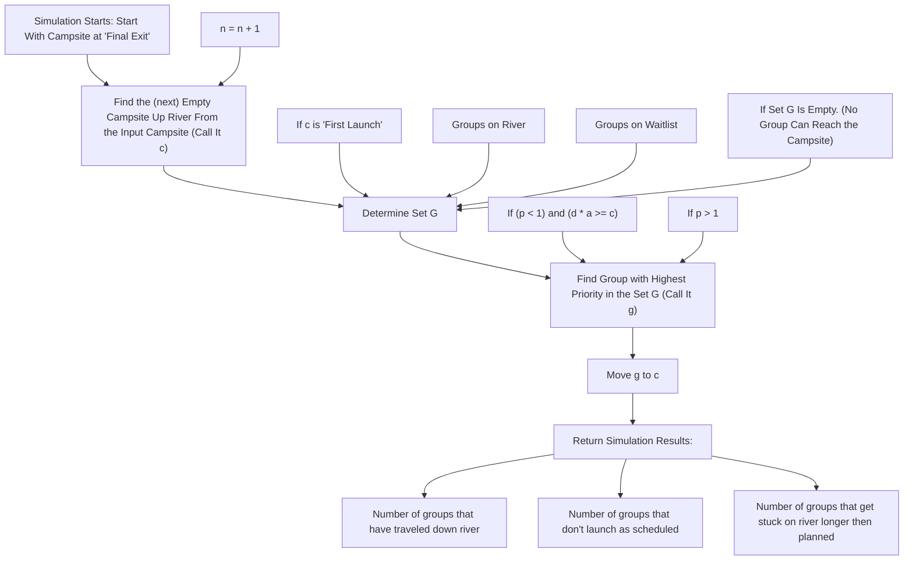

# Computing Along the Big Long River

Control #13955

February 13th, 2012

## Abstract

In this paper, we develop a model to address the question of how to best schedule trips down the Big Long River. The goal is to optimally plan boat trips of varying duration and propulsion such that the number of trips possible over the six month season is maximized. We begin by modeling the process by which groups travel from campsite to campsite. Given the constraints outlined above, as well as a limited amount of campsites, our algorithm outputs the optimal daily schedule for each group on the river. By studying our algorithm’s long term behavior, we can compute a maximum number of trips, which we define as the river’s “carrying capacity.” We apply our algorithm to a case study of the Grand Canyon, which has many attributes in common with the Big Long River. Finally, we examine carrying capacity’s sensitivity to changes in the distribution of propulsion, trip duration, and the number of campsites on the river’s corridor.

## Contents

## 1 Introduction 3

1.1 Defining the Problem . . . .  
1.2 Model Overview . . . . 3  
1.3 Constraints . .  
1.4 Assumptions . . .  
1.5 Variables . . . 5

## 2 Methods 6

2.1 The Furthest Empty Campsite. . . . 6  
2.2 Priority . . . . 7  
2.3 Priorities & Other Considerations. . . . 8

## 3 Scheduling Simulation 10

## 4 Case Study 12

4.1 The Grand Canyon . . . . .12  
4.2 Sensitivity Analysis of Carrying Capacity With Respect to R and D . . . . .  
4.3 Sensitivity Analysis of Carrying Capacity With Respect to R and Y . . . .

## 5 Discussion & Conclusion 15

## 6 Limitations and Error Analysis 16

6.1 Carrying Capacity Overestimation . . . . . . 16  
6.2 Environmental Concerns . 16  
6.3 Neglect of River Speed . . . . 16

## 7 References 17

## List of Figures

Figure 2.1 Example – applying priority & the scheduling algorithm . . . . .  
Figure 2.2 Example – applying priority & the scheduling algorithm . . . .  
Figure 2.3 Example – applying priority & the scheduling algorithm . . . . . 8  
Figure 2.4 Visual depiction of scheduling algorithm . . . . 9  
Figure 3.1 Hypothetical simulation . . . . .  
Figure 3.2 Hypothetical simulation results (from Figure 3.1) . . . . . 1  
Figure 3.3 Hypothetical simulation results (From Figure 3.1) . . . . .  
Figure 4.1 Grand Canyon case study results from simulation. . . .  
Figure 4.2 Ratio R to number of campsites Y . . . 13  
Figure 4.3 Contour representation of Figure 4.2 . . . . . . . 14  
Figure 4.4 Ratio R to variation of trip days D . . . 15

## 1 Introduction

Scheduling trips is an important task for the tourism industry, but the matter of scheduling is also one of the more challenging problems to tackle. Airline companies juggle countless planes, destinations, passengers and times of day to try to best optimize their costs as well as how many people they are able to transport. Computer systems manage limited resources, multiple jobs, ‘due dates’ and prioritization of jobs in order to function as a powerful and useful tool. Similar to these examples, river managers have to be able to schedule river trips based on some of these same constraints while striving to maximize the number of trips possible over a given time period.

The contents of this paper address the Big Long River, and our devised method of addressing the issue of scheduling an optimal amount of trips per season. At 225 miles in length from First Launch to Final Exit, passengers take oar-powered rubber rafts and motorized boats downstream. Trips last between 6 and 18 nights, with tourists spending nights at campsites along the river corridor. To ensure that campers enjoy a wilderness experience, it is desired that at most one group occupy any given campsite each night. This constraint limits the number of possible trips during the park’s six month season.

After the analysis of our model, we compare our results to rivers that have similar attributes to that of the Big Long River, allowing us to verify that the approach does in fact yield desirable results. In addition to this report we have attached a memo for the managers of the river. In the memo we address the topics in which they were seeking advice, which consists of ways in which to develop the best schedule for the river, and ways to determine the carrying capacity of the river.

Models focused on producing solutions to scheduling problems are quite complex. They must be customized to address a vast number of variables in order to produce results subject to many constraints. We have developed a model which speaks specifically to the constraints outlined thus far and introduce what we believe to be reasonable assumptions in order to address the specific problem at hand. With that said, our model is easily adaptable to find optimal trip schedules for rivers of varying length, numbers of campsites, trip durations, and boat propulsions.

## 1.1 Defining the Problem

● How should trips of varying length and propulsion be scheduled to maximize the number trips possible over a six month season?  
● How many new groups can start a river trip on any given day?  
What is the carrying capacity of the river?

○ We define carrying capacity as the maximum number of groups which can be sent down the river during its six month season.

## 1.2 Model Overview

We have designed a model which:

• Can be applied to real-world rivers with similar attributes (i.e. the Grand Canyon).  
• Is flexible enough to simulate a wide range of feasible inputs.

Simulates river trip scheduling as a function of some distribution of trip lengths (either 6, 12, or 18 days), a varying distribution of propulsion, and a varying number of campsites.

Ultimately, the model predicts the number of successful trips in a six month time frame. As a result of finding this number, we also answer questions about the carrying capacity of the river, advantageous distributions of propulsion and trip lengths, how many groups can start a river trip each day, and how to schedule trips in such a way that these results are possible.

## 1.3 Constraints

The problem specifies the following constraints:

• Trips begin at First Launch and end at Final Exit – exactly 225 miles downstream.  
• There are only two types of boats: oar-powered rubber rafts and motorized boats.  
Oar-powered rubber rafts travel 4 mph on average.  
Motorized boats travel 8 mph on average.  
Group trips will range from 6 to 18 nights.  
• Trips are only scheduled during a six month period of the year.  
• Campsites are distributed uniformly throughout the river corridor.  
• No two sets of campers can occupy the same site at the same time.

## 1.4 Assumptions

• We have the ability to determine the proportion of oar-powered river rafts to motorized boats that go onto the river each day.  
Moving a high volume of groups down the river in a satisfactory time becomes an issue if too many oar-powered boats are launched with short trip lengths.  
• The duration of trips is constrained to the following values: 12 or 18 days for groups travelling by oar-powered river rafts, and 6 or 12 days for those travelling by motorized boat.  
This is a simplification which allows our model to produce more meaningful results while preserving the ability to compare the effect of varying inputs.

There can only be one group per campsite per night.  
Our algorithm only considers campsites which are empty as open campsites that groups can move to, which is consistent with the desires of the river manager.  
• Each day, groups may only move downstream or remain in their current campsite -- they may not move back up stream.

This allows us to restrict the flow of groups on the river to a single direction which greatly simplifies the ways in which we can move groups from campsite to campsite.

• Groups heading downstream can only travel the river between 8am and 6pm.

This amounts to a maximum of 9 hours of travel per day (one hour is subtracted for breaks/lunch/etc.). This implies that oar-powered river raft groups can travel at most 36 miles per day, and motorized boats can travel at most 72 miles per day. This allows us to determine the set of groups that can reasonably reach a given campsite.

• Groups will never travel further than the amount of miles that they can feasibly travel in a single day.

As the previous assumption states, this is 36 miles per day for oar-powered river rafts and 72 miles per day for motorized boats in our model.

Variables which could influence maximum daily travel distance, such as weather and river conditions, are ignored.

There is no way of accurately including this in the model with the amount of given information about the Big Long River.

Campsites are distributed uniformly so that the distance between campsites is 225/? (the length of the river divided by the number of camp sites between the start and end of the river).

This assumption allows us to easily represent the river as an array of campsites that are equally spaced out in our computer simulation.

• A group must reach the end of the river on the final day of its trip:

o A group will not leave the river early even if they are able to.  
o A group will not have a finish date that is past their desired trip length.

This is an assumption that was made to best fit what we believed was an important standard for the river manager and the quality of the trips that they will be scheduling.

## 1.5 Variables

? = group	number	?  
• ?!		= total	trip	length	for	group	?,	measured	in	nights where $6 \leq t \leq 1 8$  
$d _ { i }$ = number	of	nights	group	? has	spent	on	the	river  
• ?		= number	of	campsites	on	the	river  
• $c _ { Y }$ = location	of	campsite	? in	miles	downstream $0 < c _ { Y } < 2 2 5$  
• $c _ { 0 } = \mathtt { a }$ campsite	representing	First	Launch (used	to	construct	a waitlist	of	groups)  
$c _ { f i n a l } = \mathsf { a }$ campsite	representing	Final	Exit	(which	is	always	‘open’)  
• $l _ { i }$ = location	of	group	?'s	current	campsite	in	miles	down	the	river,	where $0 < l < 2 2 5$  
• $a _ { i } { \mathrm { ~ } } = \mathsf { a v e r a g e }$ distance	that	group	? should	move	each	day	to	be	on	schedule $( a _ { i } = 2 2 5 / t _ { i } )$  
$m _ { i }$ = maximum	distance	that	group ? can	travel	in	a	single	day  
● $P _ { i } = \mathrm { p r i o r i t y }$ of	group	? (where $P _ { i } = ( d _ { i } / t _ { i } ) / ( l _ { i } / 2 2 5 ) > 0 )$

This is a measure of how far ahead or behind schedule a group is. We will define priority ? as follows:

○ $P _ { i } > 1$ implies that group $g _ { i }$ is behind schedule  
○ $P _ { i } < 1$ implies that group $g _ { i }$ is ahead of schedule  
$\circ \quad P _ { i } = 1$ implies that group $g _ { i }$ is precisely on schedule

$G _ { c } = { \sf s e t }$ of	groups	that	can	reach	campsite	c  
● $\mathrm { R } =$ the ratio of oar powered river rafts to motorized boats launched each day  
● X	=	the	current	number	of	trips	down	Big	Long	River	each	year

● M	=	peak carrying capacity of the river (maximum number of groups which can be sent down the river during its six month season)  
● D = distribution of trip durations of groups on the river

## 2 Methods

Below is a description of the scheduling algorithm and, ultimately, our model which we have found to be representative of accurate results based on the various inputs and assumptions specified above. We begin by defining the following terms and phrases in an effort to add clarity to how certain variables are handled in our simulation, as well as to shed light on some of the details of the implementation of our model:

## Open Campsite:

A campsite is considered to be an open campsite if there is no group currently occupying that space. This is equivalent to saying that for a given campsite $c _ { n }$ there exists no other group $g _ { i }$ such that $g _ { i }$ is assigned to $c _ { n }$ .

## Moving to an open campsite:

For a group $g _ { i }$ and	a	campsite $c _ { n } ,$ moving to an open campsite is equivalent to assigning $g _ { i }$ to a new campsite, $c _ { m }$ . Since a group is only able to move downstream, or remain at their current campsite, if $g _ { i }$ was previously occupying $c _ { n }$ , then $g _ { i }$ can only be moved to a $c _ { m }$ where $m \geq n$ .

## Waitlist:

The waitlist for a given day is composed of the groups which are not yet on the river, but will start their trip on day where their ranking on the waitlist and their ability to reach a campsite, ?, includes them in the set $G _ { c }$ , and is deemed ‘the highest priority’ (Note: priority is a significant element of our model. This will be explained in further detail a little later). Waitlisted groups are initialized with a current campsite value of $c _ { 0 }$ (the $\mathtt { z e r o } ^ { \mathrm { t h } }$ campsite), and are assumed to have priority $P = 1$ until they	are	moved	from	the	waitlist onto	the	river.

## Off the River:

Our algorithm considers the first space off of the river to be the ‘final campsite’, $c _ { f i n a l } .$ . For our model, we consider $c _ { f i n a l }$ to always be an open campsite, so that an infinite number of $g _ { i }$ can be assigned to $c _ { f i n a l }$ . This is consistent with the understanding that any number of groups can move off of the river in a single day, and allows us to handle such an event in our simulation.

## 2.1 The Furthest Empty Campsite

Our scheduling algorithm utilizes an array as a data structure to represent the river, where each element of the array consists of a campsite. The algorithm begins each day by finding the open campsite that is furthest down the river, call that campsite ?, then generates a set $G _ { c }$ , which consists of all groups $g _ { i }$ which could potentially reach campsite ?. Thus,

$$
G _ {c} = \{g _ {i} \mid g _ {1}, g _ {2}, \dots , g _ {n}: w h e r e m _ {i} + l _ {i} \geq c \}
$$

A couple of points about $G _ { c }$ remain to be made:

(1) The requirement of $m _ { i } + l _ { i } \ge c$ specifies that group $g _ { i }$ must be located at $l _ { c }$ and that must be within at least $m _ { i }$ miles of campsite c.  
(2) $G _ { c }$ can consist of groups that are both on the river and on the waitlist.  
(3) If $G _ { c } = \varnothing$ , then we move to the next furthest empty campsite (Note: the next furthest empty campsite that we look for is located up stream, closer to the start of the river – the algorithm always runs from the end of the river, up towards the start of the river).  
(4) If $G _ { c } \neq \varnothing$ , then the algorithm will attempt to move the group with the highest priority to campsite ?. (For more instruction on this, see section 2.2: Priority).

The scheduling algorithm continues in this fashion until the furthest empty campsite is the $\boldsymbol { z } \mathrm { e r o } ^ { \mathrm { t h } }$ campsite, $c _ { 0 }$ . At this point, every group that was able to move on the river that day has been moved to a campsite, and we start the algorithm again from the beginning to simulate the next day.

## 2.2 Priority

As noted in the last section, once the set ? has been formed for a specific ?, our algorithm must decide which $g \epsilon G$ to move to ?. For this reason, we have developed the notion of priority for a group. Then we essentially look at the priority of each ???,	take	the $g _ { i }$ with	the	highest	priority,	and attempt	to	move	that	group	into	?.

Some examples of situations that arise, and how the notion of priority is used to resolve them, are outlined in Figures 2.1 & 2.2.

<table><tr><td>Campsite #:</td><td>1</td><td>2</td><td>3</td><td>4</td><td>5</td><td>6</td></tr><tr><td>Group Assigned:</td><td>Group A $P_A = 1.1$ </td><td>Group B $P_A = 1.5$ (moves to campsite 6)</td><td>Group C $P_C = .8$ </td><td>Open</td><td>Open</td><td>Furthest Open Campsite</td></tr></table>

Downstream→

Figure 2.1: By running the scheduling algorithm we have found that furthest open campsite is campsite 6. The algorithm has found that Groups A, B and C can feasibly reach campsite 6. The priority of each group is calculated, and Group B has the highest priority; thus, we move Group B to campsite 6.

<table><tr><td>Campsite #:</td><td>1</td><td>2</td><td>3</td><td>4</td><td>5</td><td>6</td></tr><tr><td>Group Assigned:</td><td>Group A $P_A = 1.1$ (moves to campsite 5)</td><td>Open</td><td>Group C $P_C = .8$ </td><td>Open</td><td>Furthest Open Campsite</td><td>Group B</td></tr></table>

Downstream→

Figure 2.2: As the scheduling algorithm progresses past campsite 6, we find that the next furthest open campsite is campsite 5. The algorithm has calculated that Groups A and C can feasibly reach campsite 5. Since $P _ { A } { > } P _ { C } { _ { 1 } }$ , group A is moved to campsite 5.

## 2.3 Priorities & Other Considerations

By knowing the group priority, our algorithm will always try to move the group that is the most behind schedule. This is to ensure that each group is camping on the river for a number of days equal to its predetermined trip length. However, in some instances it may not be ideal to move the $g _ { i } \in G$ which has the highest priority to the campsite ? which is the furthest empty campsite. Such is the case if $g _ { i }$ $\in G$ is the element with the highest priority, yet it is still ahead of schedule $( P _ { i } < 1 )$ .

To address the various caveats of handling group priorities in our scheduling algorithm, we provide the following rules:

(2) If $g _ { i }$ is ahead of schedule, i.e. $P _ { i } < 1$ , then compute the following: $d _ { i } * a _ { i }$ . If the result is greater	than	or	equal	to	the	location	of	campsite ? (in	miles), then move $g _ { i }$ to $c _ { \mathrm { { s } } }$ This amounts to only moving $g _ { i }$ in such a way that it is no longer ahead of schedule.  
(3) Regardless of $P _ { i } ,$ if the chosen $c = c _ { f i n a l }$ , then it will not move $g _ { i } \to c$ unless $t _ { i } = d _ { i }$ . This ensures that trips will not end before their designated end date.

(1) If $g _ { i }$ is behind schedule, i.e. $P _ { i } > 1$ , then move $g _ { i }$ to ?.

<table><tr><td>Campsite #:</td><td>170</td><td>171</td><td>...</td><td>223</td><td>224</td><td>Off the River</td></tr><tr><td>Group Assigned:</td><td>Group D: $P_D = 1.1$  $t_D = 12$  $d_D = 11$ (doesn&#x27;t move off the river)</td><td>Open</td><td>Open</td><td>Open</td><td>Open</td><td>Furthest Open Campsite</td></tr></table>

Downstream→

Figure 2.3: The furthest open campsite is the campsite that is off of the river. The algorithm finds that Group ? could move there, but since Group ? has $t _ { D } > d _ { D }$ , group ? remains on the river.

## Scheduling Algorithm

## Legend

n - number of days that the simulation has run  
a - average distance that group g should travel per day  
d - current day of group g  
p - priority of group g  
c - the next furthest empty campsite from end of river  
G  the set of all groups able to reach campsite c

flowchart

Figure 2.4: Visual depiction of scheduling algorithm.

## 3 Scheduling Simulation

We will now use our model to briefly demonstrate how it could be used to schedule river trips. In the following example, we assume there are 50 campsites along the 225 mile river, and introduce 4 groups to the river each day. We project the trip schedules of four specific groups, which we introduce to the river on day 25. We choose a midseason date to demonstrate our models stability over time:

$g _ { 1 }$ : Motorized boat, $t _ { 1 } = 6$

$g _ { 2 } { \mathrm { : } }$ : Oar-powered river raft, $t _ { 2 } = 1 8$

$g _ { 3 } { \mathrm { : } }$ Motorized boat, $t _ { 3 } = 1 2$

$g _ { 4 } \colon$ Oar-powered river raft, $t _ { 4 } = 1 2$

<table><tr><td colspan="10">Campsite numbers and priority values for each group</td></tr><tr><td rowspan="20">Number of nights spent on river</td><td></td><td> $g_1$ </td><td> $P_1$ </td><td> $g_2$ </td><td> $P_2$ </td><td> $g_3$ </td><td> $P_3$ </td><td> $g_4$ </td><td> $P_4$ </td></tr><tr><td>1</td><td>5</td><td>1.43</td><td>2</td><td>1.32</td><td>3</td><td>1.28</td><td>1</td><td>3.85</td></tr><tr><td>2</td><td>20</td><td>0.71</td><td>6</td><td>0.87</td><td>19</td><td>0.4</td><td>8</td><td>0.96</td></tr><tr><td>3</td><td>20</td><td>1.07</td><td>6</td><td>1.32</td><td>19</td><td>0.61</td><td>8</td><td>1.44</td></tr><tr><td>4</td><td>36</td><td>0.79</td><td>13</td><td>0.81</td><td>19</td><td>0.81</td><td>15</td><td>1.02</td></tr><tr><td>5</td><td>36</td><td>0.99</td><td>13</td><td>1.01</td><td>19</td><td>1.01</td><td>15</td><td>1.28</td></tr><tr><td>6</td><td>49</td><td>0.87</td><td>13</td><td>1.21</td><td>35</td><td>0.66</td><td>23</td><td>1</td></tr><tr><td>7</td><td>OFF</td><td>1</td><td>13</td><td>1.42</td><td>35</td><td>0.77</td><td>25</td><td>1.08</td></tr><tr><td>8</td><td></td><td></td><td>13</td><td>1.66</td><td>35</td><td>0.88</td><td>32</td><td>0.96</td></tr><tr><td>9</td><td></td><td></td><td>15</td><td>1.58</td><td>35</td><td>0.99</td><td>32</td><td>1.08</td></tr><tr><td>11</td><td></td><td></td><td>23</td><td>1.14</td><td>35</td><td>1.1</td><td>39</td><td>0.99</td></tr><tr><td>12</td><td></td><td></td><td>30</td><td>0.96</td><td>49</td><td>0.86</td><td>39</td><td>1.08</td></tr><tr><td>13</td><td></td><td></td><td>30</td><td>1.05</td><td>49</td><td>0.94</td><td>46</td><td>1</td></tr><tr><td>14</td><td></td><td></td><td>30</td><td>1.14</td><td>OFF</td><td>1</td><td>OFF</td><td>1</td></tr><tr><td>15</td><td></td><td></td><td>36</td><td>1.02</td><td></td><td></td><td></td><td></td></tr><tr><td>16</td><td></td><td></td><td>36</td><td>1.1</td><td></td><td></td><td></td><td></td></tr><tr><td>17</td><td></td><td></td><td>44</td><td>0.96</td><td></td><td></td><td></td><td></td></tr><tr><td>18</td><td></td><td></td><td>44</td><td>1.02</td><td></td><td></td><td></td><td></td></tr><tr><td>19</td><td></td><td></td><td>44</td><td>1.01</td><td></td><td></td><td></td><td></td></tr><tr><td>20</td><td></td><td></td><td>OFF</td><td>1</td><td></td><td></td><td></td><td></td></tr></table>

Figure 3.1: Shows each group’s campsite number and priority value for each night spent on the river. I.e. the column labeled $g _ { i }$ gives campsite numbers for each of the nights of $g _ { i } \mathrm { ^ { \prime } s t r i p }$ .

We find that each $g _ { i }$ is off the river after spending exactly $t _ { i }$ nights camping, and that $P _ { i } \to 1$ as $d _ { i } \to t _ { i }$ . These findings are consistent with the intention of our method as outlined in section 2: Methods. We see in this simulation that our algorithm produces desirable results. Figures 3.1 and 3.2, display our results graphically.

Group	loca4ons	(Figure	3.1)  

line chart

| Night | Group 1 | Group 2 | Group 3 | Group 4 |
|-------|---------|---------|---------|---------|
| 0     | 0       | 0       | 0       | 0       |
| 1     | 5       | 2       | 3       | 1       |
| 2     | 20      | 6       | 20      | 8       |
| 3     | 20      | 6       | 20      | 8       |
| 4     | 36      | 13      | 20      | 15      |
| 5     | 36      | 13      | 20      | 15      |
| 6     | 50      | 13      | 35      | 24      |
| 7     | 50      | 13      | 35      | 25      |
| 8     | 50      | 13      | 35      | 32      |
| 9     | 50      | 15      | 35      | 32      |
| 10    | 50      | 20      | 35      | 39      |
| 11    | 50      | 30      | 50      | 40      |
| 12    | 50      | 30      | 50      | 47      |
| 13    | 50      | 30      | 50      | 50      |
| 14    | 50      | 36      | 50      | 50      |
| 15    | 50      | 36      | 50      | 50      |
| 16    | 50      | 44      | 50      | 50      |
| 17    | 50      | 44      | 50      | 50      |
| 18    | 50      | 44      | 50      | 50      |
| 19    | 50      | 50      | 50      | 50      |

Figure 3.2: Movement of groups down the river based on Figure 3.1. Groups reach the end of the river on different nights due to varying trip duration parameters.

line chart

| Night | P1   | P2   | P3   | P4   |
|-------|------|------|------|------|
| 0     | 1.0  | 1.0  | 1.0  | 1.0  |
| 1     | 1.5  | 1.4  | 1.3  | 4.0  |
| 2     | 0.8  | 0.9  | 0.4  | 1.0  |
| 3     | 1.1  | 1.3  | 0.6  | 1.5  |
| 4     | 0.9  | 0.8  | 0.7  | 1.0  |
| 5     | 1.0  | 1.0  | 0.9  | 1.3  |
| 6     | 0.9  | 1.2  | 0.7  | 1.0  |
| 7     | 1.0  | 1.4  | 0.8  | 1.1  |
| 8     | 1.0  | 1.7  | 0.9  | 1.0  |
| 9     | 1.0  | 1.6  | 1.0  | 1.1  |
| 10    | 1.0  | 1.2  | 1.0  | 1.0  |
| 11    | 1.0  | 1.0  | 0.9  | 1.0  |
| 12    | 1.0  | 1.1  | 0.9  | 1.0  |
| 13    | 1.0  | 1.2  | 0.9  | 1.0  |
| 14    | 1.0  | 1.0  | 0.9  | 1.0  |
| 15    | 1.0  | 1.1  | 0.9  | 1.0  |
| 16    | 1.0  | 1.0  | 0.9  | 1.0  |
| 17    | 1.0  | 1.0  | 0.9  | 1.0  |
| 18    | 1.0  | 1.0  | 0.9  | 1.0  |
| 19    | 1.0  | 1.0  | 0.9  | 1.0  |

Figure 3.3: Priority values of groups over the course of each trip. Values converge to $P = 1$ due to the algorithm’s attempt to keep groups on schedule.

## 4 Case Study

## 4.1 The Grand Canyon

The Grand Canyon is an ideal case study for our model. It shares many characteristics with the Big Long River. The Canyon’s primary river rafting stretch is 226 miles, has 235 campsites and is open approximately six months out of the year. It allows tourists to travel by motorized boat, or oar powered river raft for a maximum of 12 or 18 days respectively [3].

Using the parameters of the Grand Canyon, we tested our model by running a number of simulations. We altered the number of groups we were placing on the water each day, attempting to find a maximum “carrying capacity” for the river. We define “carrying capacity” as the maximum number of possible trips down the Canyon’s river over a six month season. This is subject to the constraint that each trip must end according to a group’s trip duration.

During its summer season, the Grand Canyon typically places six new groups on the water each day [3], so we use this value for our first simulation. In each of the follow simulations we used an equal distribution of motorized boats to oar powered river rafts, along with an equal distribution of trip lengths.

Our model predicts the number of groups that make it off the end of the river (completed trips), how many of those trips arrive past their desired end date (late trips), and the number of groups which did not make it off the waitlist (total left on waitlist). These values change as we vary the number of new groups placed on the water each day (groups/day).

<table><tr><td>Simulation #</td><td>Groups/day</td><td>Completed trips.</td><td>Late Trips</td><td>Total left on waitlist</td></tr><tr><td>1</td><td>6</td><td>996</td><td>0</td><td>0</td></tr><tr><td>2</td><td>8</td><td>1328</td><td>0</td><td>0</td></tr><tr><td>3</td><td>10</td><td>1660</td><td>0</td><td>0</td></tr><tr><td>4</td><td>12</td><td>1992</td><td>0</td><td>0</td></tr><tr><td>5</td><td>14</td><td>2324</td><td>0</td><td>0</td></tr><tr><td>6</td><td>16</td><td>2656</td><td>0</td><td>0</td></tr><tr><td>7</td><td>17</td><td>2834</td><td>0</td><td>0</td></tr><tr><td>8</td><td>18</td><td>2988</td><td>0</td><td>0</td></tr><tr><td>9</td><td>19</td><td>3154</td><td>5</td><td>0</td></tr><tr><td>10</td><td>20</td><td>3248</td><td>10</td><td>43</td></tr><tr><td>11</td><td>21</td><td>3306</td><td>14</td><td>109</td></tr></table>

Figure 4.1: We predict that a maximum of 18 groups can be sent down the river each day. Over the course of the six month season, this amounts to nearly 3000 trips.

We conclude that the maximum carrying capacity of the Grand Canyon is around 3000, and is achieved by sending 18 new groups down the river each day. Increasing groups/day above 18 is likely to cause late trips and long waitlists.

Notice that some groups are still on the river when our simulation ends. In simulation # 1, we send a total of 1080 groups down that river (6 groups/day×180 days), but only 996 groups make it off. This is simply because groups which began towards the end of the six month period have not reached the end of their trip, so the groups are still on the river. These groups have negligible impact on our simulation and they are essentially ignored.

## 4.2 Sensitivity Analysis of Carrying Capacity With Respect to R and Y

Based on the similarities, we can assume that the managers of the Big Long River are faced with a similar task as the managers of the Grand Canyon. Therefore, by finding an optimal solution for the Grand Canyon, as we did in Section 4.1, it is possible that we have also found an optimal solution for the Big Long River. However, this optimal solution is based on two key assumptions: that each day we are putting approximately the same number of oar powered river rafts and motorized boats on the river, and that the river has about one campsite per mile. We made these assumptions because they were true for the Grand Canyon, but it is unknown to us whether or not they will be true for the Big Long River.

To deal with these unknowns, we create the following table, Figure 4.2. The values in Figure 4.2 were generated by fixing Y (the number of campsites on the river), and R (the ratio of oar powered river rafts to motorized boats launched each day), and then increasing the number of people added to the river each day in our computerized algorithm until the river reaches its peak carrying capacity, which is found the same way as in the Grand Canyon case study.

<table><tr><td rowspan="2" colspan="2"></td><td colspan="5">Number of campsites on river, Y</td></tr><tr><td>100.00</td><td>150.00</td><td>200.00</td><td>250.00</td><td>300.00</td></tr><tr><td rowspan="5">Ratio, R (oar : motor)</td><td>1:4</td><td>1360.00</td><td>1688.00</td><td>2362.00</td><td>3036.00</td><td>3724.00</td></tr><tr><td>1:2</td><td>1181.00</td><td>1676.00</td><td>2514.00</td><td>3178.00</td><td>3854.00</td></tr><tr><td>1:1</td><td>1169.00</td><td>1837.00</td><td>2505.00</td><td>3173.00</td><td>3984.00</td></tr><tr><td>2:1</td><td>1157.00</td><td>1658.00</td><td>2320.00</td><td>2988.00</td><td>3604.00</td></tr><tr><td>4:1</td><td>990.00</td><td>1652.00</td><td>2308.00</td><td>2803.00</td><td>3402.00</td></tr></table>

Figure 4.2: Peak carrying capacity with respect to the number of campsites on the river and the ratio of oar powered river rafts to motorized boats launched each day.

Since the peak carrying capacities in Figure 4.2 depend on two variables, we can visualize these values as being data points in a 3-dimensional space. Consequently, we can find a best-fit surface that passes through, or nearly through, this set of data points. This best fit surface will allow us to estimate values of M, the peak carrying capacity of the river, for data points that are not represented in Figure 4.2. Essentially, it will give us M as a function of Y and R, and will show how sensitive the values of M are to changes in Y and/or R. Figure 4.3 is a contour diagram of this surface.

area chart

| Ratio (oar powered rafts: motorized boats) | 1500 | 2000 | 2500 | 3000 | 3500 |
| ------------------------------------------ | ---- | ---- | ---- | ---- | ---- |
| 1:4                                        | 130  | 170  | 210  | 245  | 285  |
| 1:2                                        | 140  | 165  | 205  | 240  | 280  |
| 1:1                                        | 125  | 160  | 200  | 235  | 275  |
| 2:1                                        | 135  | 175  | 215  | 250  | 290  |
| 4:1                                        | 140  | 170  | 210  | 260  | 300  |

Figure 4.3: Contour diagram of the best fit surface for data points in Figure 4.2, where contour lines represent peak carrying capacity of the river (M). Notice that the surface has a ridge running along the vertical line R=1:1.

Figure 4.3 is useful for visualizing how the river’s carrying capacity changes depending on the two variables Y and R. The ridge along the vertical line R=1:1 predicts that for any given value of Y between 100 and 300, the river will have an optimal value of M when R=1:1.

Unfortunately, the formula for this best fit surface is rather complex, and it doesn’t do an accurate job of extrapolating beyond the set of data in Figure 4.2, so it is not a particularly useful tool for predicting values of the river’s peak carrying capacity. As an alternative, if one wishes to predict specific values of the river’s peak carrying capacity, the best method we have found is to use our scheduling algorithm, which is more accurate than the best fit surface presented above and easier to plug in values to.

## 4.3 Sensitivity Analysis of Carrying Capacity With Respect to R and D

At this point, we have treated M as a function of R and Y, but it is still unknown to us how M is affected by the mix of trip durations of groups on the river (D). For example, if we only scheduled trips of 6 or 12 days, how would this affect M? The river managers want to know what mix of trips of varying duration and propulsion will utilize the campsites in the best way possible. We can use our scheduling algorithm to attempt to answer this question. We fix the number of campsites on the river at 200, and record what the peak carrying capacity of the river is for given values of R and D. The results of this simulation are displayed in Figure 4.4.

<table><tr><td rowspan="2" colspan="2"></td><td colspan="4">Distribution of trip lengths, D</td></tr><tr><td>12</td><td>12-18</td><td>6-12</td><td>6-18</td></tr><tr><td rowspan="5">Ratio (oar : motor)</td><td>1:4</td><td>2004</td><td>1998</td><td>2541</td><td>2362</td></tr><tr><td>1:2</td><td>2171</td><td>1992</td><td>2535</td><td>2514</td></tr><tr><td>1:1</td><td>2171</td><td>1986</td><td>2362</td><td>2505</td></tr><tr><td>2:1</td><td>1837</td><td>2147</td><td>2847</td><td>2320</td></tr><tr><td>4:1</td><td>2505</td><td>2141</td><td>2851</td><td>2308</td></tr></table>

Figure 4.4: Peak carrying capacity of river, M, with respect to D and R.

Figure 4.4 is intended to address the question of what mix of trip durations and propulsions will yield a maximum carrying capacity for the river. The Big Long River managers could look to this table to see approximately what value of M their current values of D and R will give, and also be able to see how they could change their current values to increase the Big Long River’s peak carrying capacity.

## For example:

• If the river managers are currently scheduling trips such that D ≈ 6 – 18, there value of M can be increased either by increasing R to be closer to 1:1 or by decreasing D to be closer to 6-12.  
• If the river managers currently have a D ≈ 12-18 then they should decrease their D to be closer to 6-12.  
• If the river managers currently have a D ≈ 6 – 12 then then can achieve a greater value of M by increasing R to be closer to 4:1.

## 5 Conclusion

The river managers have asked how many more trips can be added to the Big Long River’s season. Without knowing the specifics of how the river is currently being managed, we cannot give an exact answer. However, by applying our model to a study of the Grand Canyon, we found results which could be extrapolated to the context of the Big Long River. Specifically, we can say that the Big Long River could add approximately 3000-X groups to the rafting season, where X is the current number of trips, and 3000 is the carrying capacity of the Grand Canyon predicted by our scheduling algorithm. Additionally, we’ve modeled how certain variables are related to each other. Namely, the relationship between M, D, R and Y. River managers could refer to Figures 4.2 - 4.4 to see how they could update their current values of D, R, and Y to achieve a greater carrying capacity for the Big Long River.

We’ve also addressed the issue of scheduling campsite placement for groups moving down the Big Long River through an algorithm which uses priority values to move groups downstream in an orderly manner. Both our algorithm and its results should prove useful to the river managers as they look to allow more trips this season.

## 6 Limitations and Error Analysis

## 6.1 Carrying Capacity Overestimation

Our model has several limitations. It assumes that the capacity of the river is constrained only by number of campsites, trip durations, and transportation methods. We maximize the river’s carrying capacity, even if this means that nearly every campsite is occupied each night. This may not be ideal, potentially leading to congestion or environmental degradation of the river. Because of this, our model may overestimate the maximum number of trips possible over long periods of time.

## 6.2 Environmental Concerns

Our case study of the Grand Canyon is evidence that our model omits variables. We are confident that the Grand Canyon could provide enough campsites for 3000 trips over a six month period, as predicted by our algorithm. However, since the actual figure is around 1000 trips [3], the error is likely due to factors outside of campsite capacity, perhaps environmental concerns. If river managers determined that 3000 trips per season would cause environmental harm to the Canyon, they would scale back. This does not indicate a flaw in our modeling, but simply a limitation. Our results represent a maximum number of trips, based on available campsites, and should be considered along with other factors.

## 6.3 Neglect of River Speed

Another variable our model ignores is the speed of the river. River velocities increase with the depth and slope of the river channel, making our assumption of constant maximum daily travel distance impossible[6]. When a river experiences “high flow,” river speeds can double, and entire campsites can end up under water[2]. Again, the results of our model don’t reflect these issues.

## 7 References

[1] "Fitting a Surface to Scattered X-Y-Z Data Points." University of Colorado at Boulder. Web. 12 Feb. 2012. <http://amath.colorado.edu/computing/Mathematica/Fit/>.  
[2] "High Flow River Permit Information." Grand Canyon National Park. Web. 12 Feb. 2012. <http://www.nps.gov/grca/naturescience/high\_flow2008-permit.htm>.  
[3] Jalbert, Linda, Lenore Grover-Bullington, and Lori Crystal. Colorado River Management Plan. Publication. 2006. Web. 11 Feb. 2012. <http://www.nps.gov/grca/parkmgmt/upload/CRMPIF\_s.pdf>.  
[4] National Park Service. Grand Canyon National Park. 2011 Campsite List. Web. 11 Feb. 2012. <http://www.nps.gov/grca/parkmgmt/upload/2011CampsiteList.pdf>.  
[5] National Park Service. Grand Canyon River Office. Grand Canyon River Statistics Calendar Year 2010. By Steve Sullivan. 27 May 2011. Web. 11 Feb. 2012. <http://www.nps.gov/grca/planyourvisit/upload/Calendar\_Year\_2010\_River\_Statistics.pdf>.  
[6] "River." Wikipedia. Web. 13 Feb. 2012. <http://en.wikipedia.org/wiki/River>.

To the river managers of the Big Long River,

In response to your questions regarding trip scheduling and river capacity, I am writing to inform you of our findings.

Our primary accomplishment is the development of a scheduling algorithm. If implemented at Big Long River, it could advise park rangers on how to optimally schedule trips of varying length and propulsion. The optimal schedule will maximize the number of trips possible over the six month season.

Our algorithm is flexible, taking a variety of different inputs. These include the number and availability of campsites, and parameters associated with each tour group. Given the necessary inputs, we can output a daily schedule. In essence, it does this using the state of the river from the previous day. Schedules consist of campsite assignments for each group on the river, as well those waiting to begin their trip. Given knowledge of future waitlists, our algorithm can output schedules months in advance, allowing management to schedule the precise campsite location of any group on any future date.

Sparing you the mathematical details, allow me to simply say that our algorithm uses a priority system. It prioritizes groups who are behind schedule by allowing them to move to further campsites, and holds back groups who are ahead of schedule. In this way it ensures that all trips will be completed in precisely the length of time the passenger had planned for.

But scheduling is only part of what our algorithm can do. It can also compute a maximum number of possible trips over the six month season. We call this the “carrying capacity” of the river. If we find we are below our carrying capacity, our algorithm can tell us how many more groups we could be adding to the water each day. Conversely, if we are experiencing river congestion, we can determine how many fewer groups we should be adding each day to get things running smoothly again.

An interesting finding of our algorithm was how the ratio of motorized boats to oar powered river rafts will affect the number of trips we can send downstream. When dealing with an even distribution of trip durations (from 6 to 18 days), we recommend a 1:1 ratio to maximize the river’s carrying capacity. If this distribution is skewed towards shorter trip durations then our model predicts that increasing towards a 4:1 ratio will cause the carrying capacity to increase. If the distribution is skewed the opposite way, towards longer trip durations, then the carrying capacity of the river will always be less than in the previous two cases, so this is not recommended.

Our algorithm has been thoroughly tested and we believe it is a powerful tool for determining your river’s carrying capacity, optimizing daily schedules, and ensuring that people will be able to complete their trip as planned while enjoying a true wilderness experience. J

Yours Truly,

Control #13955