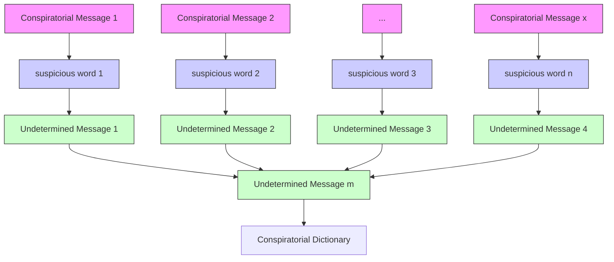

For office use only

T1

T2

T3

T4

## 14531

Problem Chosen

C

For office use only

F1

F2

F3

F4

## 2012 Mathematical Contest in Modeling (MCM) Summary Sheet

(Attach a copy of this page to each copy of your solution paper.)

Type a summary of your results on this page. Do not include the name of your school, advisor, or team members on this page.

# Finding Conspirators in the Network: Machine Learning with Resource-allocation Dynamics

## KEY CONCEPT

Machine learning

Logistic regression

Semantic diffusion

Bipartite graph

Resource-allocation dynamics

Kendall’s tau coefficient

## KEY TECHNIQUES

Gradient descent

Revised Leader Rank

Bipartite graph transmission

Problem Clarification: A conspiracy network is embedded into a network of employees of a company, with its every edge representing a message sent from one node to the other and categorized by topics. Given a few known criminals, non-criminals and suspicious topics, we are fundamentally asked to estimate the probability of criminals involvement for the not identified individuals , and to clarify the leader of conspirators. Besides, relevant discussions are suggested.

Assumptions：(i) Two classes, conspirators and non-conspirators, are linearly separable in the space spanned by local features of a node, which is necessary to machine learning.(ii) A conspirator is reluctant to mention topics related to crime when talking with an outsider.(iii) Conspirators tend not to talk about irrelevant topics frequently with each other. (iv) The leader of conspiracy tries to minimize risk by restricting direct contacts. (v) A non-conspirator has no idea of who are conspirators, thus treating conspirator and non-conspirators equally.

Model Design and Justification：The probability of conspiracy for an unidentified node is modeled as a sigmoid function in terms of a linear combination of the node’s features (logistic regression), whereas features are formulated from local topological measures and the node’s semantic messaging patterns. Parameters of this mode are trained by using a subset of identified conspirators and non-conspirators. The performance of the model is enhanced by discovering potential relationship of similarities among topics via topic-word bipartite dynamics. Resource-allocation dynamics are performed to identify the leader of the conspirators, which win theoretical evidence in criminal network research.

Results and Sensitivity Analysis：(i)The accuracy of the machine learning scheme is measured by its performance on leave-one-out cross validation. Basic solution gets 73% prediction accuracy and semantic enhanced solution win 87% correct rate. (ii)The insensitivity of priority conspirator list is manifested by analyzing Kendall’s tau. This argument is 0.86 illustrates high stability of the mode performance.(iii)The leader we predicted tends to be and the top three in priority list are and (known conspirators excluded).

## Strengths and Weaknesses Discussion：

The combination of both the topology properties and semantic affinity among individuals leads to a good performance. The time complexity is linear in the whole process in mining of semantic potential information, which is suitable with large amounts of data.

However, when facing with large amounts of data, our model prefer obtaining assistance from semantic network analysis to form the expert dictionary. Such features might also meaningless when change a new network background.

## Contents

## 1 Introduction 2

## 2 A Machine Learning Solution to Criminal Priority . . . . 4

2.1 Feature formulation 4  
2.2 Methods . 6

2.2.1 Logistic regression . . . 7  
2.2.2 Gradient descent . . . . 7  
2.2.3 Leave-one-out cross validation . . . . 8  
2.2.4 Selecting regularization parameter . . . . 8

2.3 Results . . 8  
2.4 Semantic model enhancement 10

## 3 Identifying the leader of the conspiracy . . . 12

3.1 LeaderRank 13  
3.2 Suspicious topic sub-network extraction . 13  
3.3 Edge reverse . 13  
3.4 Results . 14  
3.5 Empirical support . . 14  
3.6 Discussion 15

## 4 Evaluating the Model . . . . 15

4.1 Sensitivity analysis 15

4.1.1 Priority list . . . . . 15  
4.1.2 Probability inflation . . . 16

## 5 Discussion and Conclusion 18

5.1 Summary 18  
5.2 Further discussion . . 18

## 1 Introduction

As illustrated in Figure 1, criminals and conspirators tend to form organizational patterns, interconnected with each other for collaboration, while still maintaining social ties with the outside, thus providing a natural context for description and analysis with networks [Baker & Faulkner, 1993].

network graph

| Node | Color | Edge Connections |
| --- | --- | --- |
| 1 | Red | 100 |
| 2 | Blue | 80 |
| 3 | Yellow | 60 |
| 4 | Light Blue | 70 |
| 5 | Red | 90 |
| 6 | Blue | 50 |
| 7 | Yellow | 40 |
| 8 | Light Blue | 30 |
| 9 | Red | 60 |
| 10 | Blue | 20 |
| 11 | Yellow | 10 |
| 12 | Light Blue | 25 |
| 13 | Red | 70 |
| 14 | Blue | 35 |
| 15 | Yellow | 25 |
| 16 | Light Blue | 45 |
| 17 | Red | 55 |
| 18 | Blue | 30 |
| 19 | Yellow | 20 |
| 20 | Light Blue | 15 |
| 21 | Red | 40 |
| 22 | Blue | 15 |
| 23 | Yellow | 10 |
| 24 | Light Blue | 20 |
| 25 | Red | 65 |
| 26 | Blue | 25 |
| 27 | Yellow | 15 |
| 28 | Light Blue | 35 |
| 29 | Red | 45 |
| 30 | Blue | 30 |
| 31 | Yellow | 20 |
| 32 | Light Blue | 25 |
| 33 | Red | 35 |
| 34 | Blue | 25 |
| 35 | Yellow | 15 |
| 36 | Light Blue | 10 |
| 37 | Red | 20 |
| 38 | Blue | 10 |
| 39 | Yellow | 5 |
| 40 | Light Blue | 15 |
| 41 | Red | 25 |
| 42 | Blue | 10 |
| 43 | Yellow | 5 |
| 44 | Light Blue | 5 |
| 45 | Red | 15 |
| 46 | Blue | 5 |
| 47 | Yellow | 10 |
| 48 | Light Blue | 10 |
| 49 | Red | 10 |
| 50 | Blue | 5 |
| 51 | Yellow | 5 |
| 52 | Light Blue | 5 |
| 53 | Red | 5 |
| 54 | Blue | 5 |
| 55 | Yellow | 5 |
| 56 | Light Blue | 5 |
| 57 | Red | 10 |
| 58 | Blue | 5 |
| 59 | Yellow | 5 |
| 60 | Light Blue | 10 |
| 61 | Red | 10 |
| 62 | Blue | 10 |
| 63 | Yellow | 5 |
| 64 | Light Blue | 5 |
| 65 | Red | 10 |
| 66 | Blue | 5 |
| 67 | Yellow | 5 |
| 68 | Light Blue | 5 |
| 69 | Red | 10 |
| 70 | Blue | 5 |
| 71 | Yellow | 5 |
| 72 | Light Blue | 5 |
| 73 | Red | 10 |
| 74 | Blue | 5 |
| 75 | Yellow | 5 |
| 76 | Light Blue | 5 |
| 77 | Red | 10 |
| 78 | Blue | 5 |
| 79 | Yellow | 5 |
| 80 | Light Blue | 5 |
| 81 | Red | 10 |
| 82 | Blue | 5 |
| 83 | Yellow | 5 |
| 84 | Light Blue | 5 |
| 85 | Red | 10 |
| 86 | Blue | 5 |
| 87 | Yellow | 5 |
| 88 | Light Blue | 5 |
| 89 | Red | 10 |
| 90 | Blue | 5 |
| 91 | Yellow | 5 |
| 92 | Light Blue | 5 |
| 93 | Red | 10 |
| 94 | Blue | 5 |
| 95 | Yellow | 5 |
| 96 | Light Blue | 5 |
| 97 | Red | 10 |
| 98 | Blue | 5 |
| 99 | Yellow | 5 |

Figure 1: The 83-employee network(red nodes are known conspirators and the blue ones are known non-conpirators)

Criminal networks can be captured from various information, resulting in different types of networks, where each node represents a person, and an edge is present when two nodes collaborate in the same task, share the same family name etc., or, as in this case, exchange messages [Krebs, 2002].

As nodes in this graph can be a mixture of both criminals and non-criminals, it is desirable to determine all the suspicious criminals from topological properties of the network and other prior knowledge, which includes known criminals, known non-criminals and other information related to their interactions. Moreover, it is usually of further interest that a priority list with descending criming likelihood is obtained and the primary leader of the organization is identified, which effectively facilitates law-enforcement by focusing our attention on the most suspicious and the most essential.

Despite the discrepancy with network types, several general methods have been proposed by researchers.

Most notably, many authors have adopted centrality measures of the graph for analyzing the characteristics of criminals. It has been found that criminals with high betweenness centrality are usually brokers, while those with high degree centrality enjoy better profit by taking higher risk [Krebs, 2002]. And Morselli et al. proposed that leaders of a criminal organization tend to balance profit and risk by making a careful trade-off between degree centrality and betweenness centrality [Morselli, 2010].

However, centrality approaches, which utilize local properties, tend to overlook the complex topology with the whole networks. Therefore, social network analysis (SNA) methods including subgroup detection and block-modeling have been introduced, which try to discover the hidden topological patterns by partitioning the big network into small closely connected cliques [Xu, 2005]. Despite the light they shed upon the internal structures of criminal networks, these methods still suffer from intimidating complexity with large databases [Wheat, 2007].

In this paper, we carefully combine the local-feature-based methods with ap proaches related to global topology of conspiracy networks. We propose a machine learning scheme to leverage local features, so as to estimate each node’s likelihood of conspiracy involvement. And dynamics-based methods, which are less computationally expensive than most of other topology-based approaches, are adopted to help find out the leader of conspirators and to discover semantic connections between topics.

We start with the formulation of useful local features of a node in the network, which then lead to the machine learning scheme. By feeding a subset of known conspirators and non-conspirators as training samples into the learning algorithm, the classification hypothesis is formed. We then use it to estimate the probability of being a conspirator for every unidentified individual in the network.

As highly suspicious topics are essential to the performance of machine learning, we then try to discover similarities between topics, by performing simple sourceallocation dynamics on the bipartite semantic network made up of topics and sen sitive words. Those findings expanded our knowledge on suspicious topics, thus enhancing the accuracy of our machine learning model.

Motivated by the goal of finding criminal leaders, we applied a dynamics-based ranking algorithms on a subgraph extracted from the network. Our findings are in agreement with empirical knowledge on the centrality balance of criminal leaders.

Finally, sensitivity analysis is performed to test the robustness of our approach, followed by further discussions.

## 2 A Machine Learning Solution to Criminal Priority

Machine learning is carefully selected by us to play the key role in the entire the strategy mainly for consideration on its capability of adaptiveness and reorganization, which simulate human beings on actions of study to obtain fresh knowledge. Such character is quite important since now we encounter a problem which is usually done by people through just the same method: deduction, reasoning and reorganization our structure of knowledge to get over it. Especially met with such deduction task based on hundreds of thousands of data or big amount of information, people are helpless and their ability so terribly limited that we have to turn to machines.

In this section, we will describe the whole construction process of our machine learning framework in detail including feature formulation, core learning methods and experimental results. Through statistical analysis on the results, we propose our enhancement based on semantic diffusion.

We commence with several necessary assumptions:

• We assume that all the data and information about the EZ case network and 83-node network are relatively stable in a long period, rather than from coincident observation, to guarantee the representability of the results from the aspect of data origin.

• Based on necessary observation on the network, which will be exhaustively described in main body, we put forward our assumption that the contents of the communication among conspirators tends to be relevant about suspicious topics or some formal issues, rather than gossip.

• We assume that both networks in EZ case and in more complicated case obey the same information transmission rule that ensure the analogy about some core mechanism could stand.

## 2.1 Feature formulation

## • Centrality

We exploit three types of centrality including degree, betweenness and closeness centrality to determine the center of the suspicious network from different aspects:

I Degree centrality [Freeman, 1979] indicates activeness of a member, i.e. the member who tends to have more links to its surroundings. As explained in [Xu & Chen, 2003], degree centrality is not quite reliable to indicate the team leader in a criminal network. For a graph $G ( V , E )$ , the normalized degree centrality of node i is as follows:

$$
C _ {D} (i) = \frac {\sum_ {j = 1} ^ {| V |} \nu (i , j)}{| V | - 1}, i \neq j \tag {1}
$$

Where ν is a binary indicator showing whether exists a link between two nodes. Considering the graph is directed in our case, we separately calculate the in-degree and out-degree of every node.

I Betweenness centrality [Freeman, 1979] describes how much a node tends to be on the shortest path of other nodes. A node with large betweenness centrality does not necessarily induce its large degree, but illustrates its role of “gatekeeper”, who is more possibly to be a intermediary when any other two members transmit information between themselves. The normalized betweenness centrality is defined as:

$$
C _ {B} (i) = \frac {\sum_ {j = 1} ^ {| V |} \sum_ {k <   j} ^ {| V |} \omega_ {j , k} (i)}{| V | - 1}, k \neq i \tag {2}
$$

where $\omega _ { j , k } ( i )$ indicates whether the shortest path between node j and node k passes through node i.

I Closeness centrality [Sabidussi, 1966] is usually utilized to measure how far away one node is from the others. Closeness of a node is defined as the inverse of the sum of its distances to all other nodes and can be treat as a measure of efficiency when spreading information from itself to all other nodes sequentially. It indicates how easily an individual connects with other members. The normalized closeness centrality is defined as:

$$
C _ {c} (i) = \frac {\sum_ {j = 1} ^ {| V |} \rho (i , j) - C _ {c} m i n}{C _ {c} m a x - C _ {c} m i n}, i \neq j \tag {3}
$$

where $\rho ( i , j )$ is the length of the shortest path connecting nodes i and j. $C _ { c } m i n$ and $C _ { c } m a x$ are the minimum and maximum lengths of the shortest paths respectively.

## • Number of known neighboring conspirators

We consider the number of known neighboring conspirators of a node as a significant feature. The interaction among known conspirators in message network suggests a much stronger connectivity than the one among the known non-conspirators. This phenomenon reasonably reveal that a conspirator is more likely to communicate with his or her accomplice rather than a outlier and, on the contrary, non-conspirators lack such consciousness. As shown in Figure 2, we calculate the possession rate of its confederacy among all its neighbors, which illustrates his or her compactness with known accomplices: the value is 1 if it connects with all the known conspirators and 0 means no conspirators is adjacent to it. The known suspicious clique obviously represents a compacter connectivity. Therefore, the more known conspirators being a node’s neighbors, the more possibly the node itself is a accomplice.

radar chart

| Name    | Known conspirators | Known non-conspirators |
|---------|--------------------|------------------------|
| Gard    |                    | 0.25                   |
| Derlene |                    | 0.25                   |
| Tran    |                    | 0.25                   |
| Han     |                    | 0.75                   |
| Darlene |                    | 0.75                   |
| Elin    |                    | 0.75                   |
| Yale    | 0.75               |                      |
| Alex    | 0.75               |                      |
| Paul    | 0.75               |                      |
| Jean    | 0.75               |                      |
| Paige   | 0.75               |                      |
| Estle   | 0.75               |                      |
| Chris   | 0.75               |                      |
| Yuf     | 0.75               |                      |
| Este    | 0.75               |                      |

Figure 2: Possession rate of neighboring accomplices distribution

• Number of current non-suspicious messages from the known conspirators

Table 2.1 is the topics mentioned between known conspirators.1 It is obvious that a known conspirator rarely talks about irrelevant topics, i.e. topics irrelevant to their conspiracy, with his or her accomplices even though some unknown topics appear among them, which accounts for a very small proportion. If the information received from a known conspirator is most irrelevant, the receiver is much probably to be an outlier. So it is quite reasonable to take such argument as a feature.

## 2.2 Methods

We use the L-2 regularized logistic regression to model the probability of a node being involved in the conspiracy, and the parameters of the model are obtained by solving an optimization problem related to training set by gradient ascent algorithm.

<table><tr><td></td><td>Jean</td><td>Alex</td><td>Elsie</td><td>Poul</td><td>Ulf</td><td>Yao</td><td>Harvey</td></tr><tr><td>Jean</td><td></td><td> $11^{\star}$ </td><td></td><td></td><td>8</td><td></td><td>14</td></tr><tr><td>Alex</td><td></td><td></td><td>1</td><td> $13^{\star}$ </td><td> $11^{\star}$ </td><td> $3,7^{\star}$ </td><td></td></tr><tr><td>Elsie</td><td></td><td> $11^{\star}$ </td><td></td><td></td><td> $13^{\star}$ </td><td></td><td></td></tr><tr><td>Poul</td><td> $11^{\star}$ </td><td></td><td> $7^{\star}$ </td><td></td><td> $7^{\star}$ </td><td></td><td>4</td></tr><tr><td>Ulf</td><td></td><td> $7^{\star}, 11^{\star}, 13^{\star}$ </td><td></td><td></td><td></td><td> $13^{\star}$ </td><td></td></tr><tr><td>Yao</td><td> $13^{\star}$ </td><td> $7^{\star}, 11^{\star}, 13^{\star}$ </td><td> $7^{\star},9$ </td><td></td><td> $13^{\star}$ </td><td></td><td> $2,7^{\star}$ </td></tr><tr><td>Harvey</td><td></td><td></td><td></td><td></td><td></td><td> $13^{\star}$ </td><td></td></tr></table>

Table 1: Topics among known conspirators ( known conspiratorial topics are those with star and highlighted in blue)

## 2.2.1 Logistic regression

We consider a training set of size m: $\{ ( x ^ { ( 1 ) } , y ^ { ( 1 ) } ) , ( x ^ { ( 2 ) } , y ^ { ( 2 ) } ) , \cdot \cdot \cdot , ( x ^ { ( m ) } , y ^ { ( m ) } ) \}$ , where $\boldsymbol { x } ^ { ( i ) }$ is an n-dimensional feature vector, and $\boldsymbol y ^ { ( i ) }$ indicates the classification of the agent, i.e. $y ^ { ( i ) } = 1$ for conspirators and $\boldsymbol y ^ { ( i ) } = 0$ for non-conspirators. All the nodes in the training set are drawn from the 15 known conspirators and nonconspirators.

As a descendant of generalized linear model for Bernoulli distribution, logistic regression tries to estimate the probability of being a conspirators as

$$
P (y = 1 | x; \theta) = h _ {\theta} (x) = \frac {1}{1 + e ^ {- \theta^ {T} x}}, \tag {4}
$$

where $\theta \in \mathbb { R } ^ { n }$ is the parameter vector.

Then, under the framework of generalized linear model, the maximum a posteriori (MAP) estimate of the parameter θ is given by

$$
\min _ {\theta} J (\theta), \tag {5}
$$

where the cost function is given by

$$
J (\theta) = \frac {1}{m} \sum_ {i = 1} ^ {m} [ - y ^ {(i)} \log (h _ {\theta} (x) ^ {(i)}) - (1 - y ^ {(i)}) \log (1 - h _ {\theta} (x ^ {(i)})) ] + \frac {\lambda}{2 m} \sum_ {j = 1} ^ {n} \theta_ {j} ^ {2}, \tag {6}
$$

with λ being the regularization parameter.

## 2.2.2 Gradient descent

The cost function $J ( \theta )$ is minimized by using the algorithm of gradient descent, which always drives θ down the locally steepest slope, in hope to reach the global minimum of the cost function.

At every iteration before convergence, new $\theta$ is replaced by the old $\theta$ as

$$
\theta := \theta - \alpha \nabla_ {\theta} J (\theta), \tag {7}
$$

where $\alpha$ is a small positive constant.

## 2.2.3 Leave-one-out cross validation

As we are only informed of the correct classification of 15 nodes, at a given round, we only use 14 of them as the training set, while leaving one out for cross validation (C-V). At every round, the next correctly classified node is left out and the others serve as the training set, then the trained hypothesis is tested on the left-out node. In this way, by averaging 15 rounds without overlapping, the error for both the training set and the cross validation set can be evaluated.

Supposing, for example, in the j-th round, sample $( x ^ { ( j ) } , y ^ { ( j ) } )$ is left out, and the training set is given by

$$
S _ {j} = \{(x ^ {(l)}, y ^ {(l)}) | l = 1, 2, \dots , j - 1, j + 1, \dots , 1 5 \}. \tag {8}
$$

Using this training set, parameter vector $\theta ^ { ( j ) }$ is obtained, and the corresponding hypothesis is tested on both $S _ { j }$ and the left-out $( x ^ { ( j ) } , y ^ { ( j ) } )$ , arriving at this round’s training error $\varepsilon _ { S _ { j } }$ and C-V error $\varepsilon _ { j }$ respectively.

Hence, by averaging them over $j ,$ the training error is given by

$$
\varepsilon_ {S} = \frac {1}{1 5} \sum_ {j = 1} ^ {1 5} \varepsilon_ {S _ {j}}, \tag {9}
$$

and the cross validation error is given by

$$
\varepsilon = \frac {1}{1 5} \sum_ {j = 1} ^ {1 5} \varepsilon_ {j}. \tag {10}
$$

## 2.2.4 Selecting regularization parameter

The regularization parameter $\lambda \ ( \lambda > \ 0 )$ is selected optimally as to minimize the cross validation error, i.e.

$$
\lambda = \underset {\lambda > 0} {\arg \min} \varepsilon . \tag {11}
$$

## 2.3 Results

By training the logistic regression with our leave-one-out cross validation strategy, λ is optimally set to 1.9 and the overall C-V error $\varepsilon = 0 . 2 7$ (training error $\varepsilon _ { S } = 0 )$ . Then, while fixing the chosen λ, the hypothesis is finally retrained on the maximum training set, making full use of every known conspirators and non-conspirators.

The trained hypothesis gives us the estimated probability for node i being a conspirator, resulting in a priority list of suspicious individuals, ranked in descent order of criminal likelihood. The top 10 suspicious are shown in Table 2, where managers are marked by a star (⋆).

<table><tr><td>Name</td><td>Dolores ★</td><td>Crystal</td><td>Jerome ★</td><td>Sherri</td><td>Neal</td></tr><tr><td>Node No.</td><td>10</td><td>20</td><td>34</td><td>3</td><td>17</td></tr><tr><td>Probability of conspiracy</td><td>0.555</td><td>0.508</td><td>0.388</td><td>0.316</td><td>0.299</td></tr><tr><td>Name</td><td>Christina</td><td>Jerome</td><td>William</td><td>Dwight</td><td>Beth</td></tr><tr><td>Node No.</td><td>47</td><td>16</td><td>50</td><td>28</td><td>38</td></tr><tr><td>Probability of conspiracy</td><td>0.267</td><td>0.252</td><td>0.245</td><td>0.242</td><td>0.233</td></tr></table>

Table 2: Top 10 in the priority list (known conspirators excluded)

Figure 3 illustrates the probability of criminal involvement estimated by $h _ { \theta } ( x )$ versus the corresponding rank in the priority list, where three managers (Jerome, Dolores and Gretchen)2 are marked by circles.

Dolores (manager) is indeed the person deserving highest suspicion, and Jerome (manager) is also likely to be involved in conspiracy.

line chart

| Rank in the priority list | Probability of being criminal |
| -------------------------- | ----------------------------- |
| 1                          | 1.0                           |
| 5                          | 0.9                           |
| 10                         | 0.5                           |
| 15                         | 0.3                           |
| 20                         | 0.2                           |
| 25                         | 0.2                           |
| 30                         | 0.2                           |
| 35                         | 0.18                          |
| 40                         | 0.15                          |
| 45                         | 0.12                          |
| 50                         | 0.1                           |
| 55                         | 0.08                          |
| 60                         | 0.07                          |
| 65                         | 0.06                          |
| 70                         | 0.05                          |
| 75                         | 0.04                          |
| 80                         | 0.03                          |

Figure 3: Probability of conspiracy versus the corresponding rank in priority list

## 2.4 Semantic model enhancement

When talking about enhancement of the accuracy, we should reduce the difference the performance with those who could deal with it more flexibly and exactly: human being. A very important way we humans solve cases is analysis the communication contents including messages and records. However, just as aforementioned, our ability so quite limited when handling huge amount of information that we have to utilize machine to help us. Therefore, semantical information is more important for humans rather than extremely complicated topology structure. For example,through analysis into the information in message traffic, we could discover several interesting and helpful phenomena.

As is in EZ case, Some similar text information in the dialog motivate us to discover that Inez represents some attributes that are quite similar to George, who is definitely a conspirator. For instance, the word “tired” when describing Inez and the word “stressed” when describing George. Similar case can be also found in the 83-people network case such as the word “Spanish” from known conspiratorial topic 7 is highly suspectable and appear in other unknown topis (e.g.topic 2 and 12) repeatedly. The contents about “computer security” which is treated as part of the key in the whole conspiracy also keep active in many other unknown topics like 5 and 15. Above relativity in information may easily cause humans’ vigilance. Hence it is natural to train a computer to find a method that could measure similarities among topics and reveal some potential information.

flowchart

Figure 4: Framework of topic semantic diffusion

Lexical ambiguity broadly exists among words and they always contain different meanings depending on particular scenarios. Therefore, it is not wise to abandon human intelligence and only depend on particular algorithms to crack a criminal case during the detection period. Detectors’ reasoning plays a indispensable role through out the entire process. Therefore, we draw the problem of topic semantic diffusion into a topic similarity measurement task based on expert dictionary. As seen in Figure 4, a conspiratorial dictionary is firstly constructed from the conspir atorial messages about known suspicious topics. Resource allocation mechanism on bipartite network outperforms in extracting the hidden information of networks [Zhou, 2007], which is exploited by us to unfold the similarity among different top ics after a bipartite network is constructed (see Figure 4) between the conspiratorial dictionary and all the information in message traffic.

The bipartite network is modeled by $G = ( D , T , E )$ . E is an edge set, indicating the relationship between key word set $D$ of expert dictionary and topic set $T$ , where $D = d _ { 1 } , d _ { 2 } . . . d _ { n }$ and $T = t _ { 1 } , t _ { 2 } . . . t _ { m }$ . Then, we arrange all the topics with 0 resource except each known conspiratorial topic with one unit of resource and commence with the first allocation from set $T$ to set D:

$$
f (t _ {l}) = \sum_ {i = 1} ^ {n} \frac {a _ {i l} f (d _ {i})}{D (d _ {i})}. \tag {12}
$$

Equation 12 expresses the calculation of the resource held by $t ( l )$ after the first step $: f ( t _ { l } ) . D ( d _ { i } )$ indicates the degree of the node $d _ { i }$ and $a _ { i l }$ is definrd as follows:

$$
a _ {i l} = \left\{ \begin{array}{l l} 1, & d _ {i} t _ {l} \in E \\ 0, & o t h e r w i s e. \end{array} \right. \tag {13}
$$

Intuitive explanation of step 1 is to arrange the resource averagely by degree of $t _ { i }$ from $T$ to $D$ if $t _ { i }$ owns resource. The second step is to reflect the resource flow back to $T$ from D obeying the same rule. So the resource finally locates on ti satisfies :

$$
f ^ {\prime} (t _ {i}) = \sum_ {l = 1} ^ {m} \frac {a _ {i l} f (d _ {l})}{D (d _ {l})} = \sum_ {l = 1} ^ {m} \frac {a _ {i l}}{D (d _ {l})} \sum_ {j = 1} ^ {n} \frac {a _ {j i} f (t _ {j})}{D (t _ {j})}. \tag {14}
$$

After this two-fold method, the amount of resource held by every element in $T$ could be seen as a score of similarity. The rank of all topics according to such score represents the degree of their similarity to the information from dictionary,i.e. the higher this score is, the topic is more likely to be a newly found conspiratorial topic.

Since we set $D = \{ ^ { \prime } s p a n i s h ^ { \prime } , ^ { \prime } s y s t e m ^ { \prime } , ^ { \prime } n e t w o r k ^ { \prime } , ^ { \prime } c o m p u t e r ^ { \prime } , ^ { \prime } m e e t i n g ^ { \prime } \}$ as the conspiratorial dictionary, table 2.4 illustrates the final result of all the 15 topics in 83-people network case. The known suspicious topic numbers 7,11,13, which is our fundamental basis for further development, are naturally to be top three and topic 5 is also very suspicious than other unknown topics. 2,12,15 are among the group with the second highest possibility in unknowns and the left ones tends to be irrelevant topics to the conspiracy.

We then append topic 4 into the set of known conspiratorial topic set and train the model again, the overall C-V error decrease from former 0.27 to current value of 0.13. As the confidence degree of topic 2,12,15 is low as shown in table 2.4, there is not obvious influence on the detection correctness. The limited resource and the impressive performance here indicate that if we absorb enough key words into conspiratorial dictionary and more topics with abundant contents, such method is much likely to perform better. However, when dealing with huge amounts of information, it will become a problem to get valuable words into dictionary as human wisdom become helpless.

<table><tr><td>Rank</td><td>Topic Number</td><td>Similarity to known suspicious topics</td></tr><tr><td>1</td><td>11*</td><td>0.750</td></tr><tr><td>2</td><td>7*</td><td>0.667</td></tr><tr><td>3</td><td>13*</td><td>0.667</td></tr><tr><td>4</td><td>5</td><td>0.417</td></tr><tr><td>5</td><td>2</td><td>0.167</td></tr><tr><td>6</td><td>12</td><td>0.167</td></tr><tr><td>7</td><td>15</td><td>0.167</td></tr><tr><td>8</td><td>1,3,4,6,8,9,10,14</td><td>0</td></tr></table>

Table 3: Rank of all topics based on similarity to known suspicious topics.(known conspiratorial topics are those with star and highlighted in blue)

On the other hand, if we utilize the speaker instead of the key words to construct a bipartite graph with the topics, we will also get similarity among topics based on speaker who transmit them. However, the determination of the relation ship between different results under these two standards, even more standards, is definitely beyond this paper.

After comprehending the actual meaning of the topics, we find the rank result is quite reasonable and valuable. Meanwhile, it is not only its reliable result impresses us a lot, but also its high efficiency and low complexity of implementation will give it another good performance in huge amounts of data, for this method is only of linear time complexity O(n).

## 3 Identifying the leader of the conspiracy

Our machine learning scheme tries to estimate the likelihood of a node committing conspiracy, however, the likelihood does not proportionally indicate the leadership inside the network, for the identification of leaders is further complicat ed by its topology.

Thus we adopt LeaderRank, a node ranking algorithm closely related to network topology, to find the leader of the criminal group. Meanwhile, a subgraph connected by known suspicious topics is extracted from the network, in order to decouple the structure with company employees. Besides, because of its robustness against random noise, LeaderRank is also appropriate for addressing criminal network problems, which usually suffer from incompleteness and incorrectness.

## 3.1 LeaderRank

LeaderRank algorithm is a state-of-art achievement on node ranking, which is more tolerant of noisy data and robust against manipulations than more traditional algorithms including HITS and PageRank [L¨u et al., 2011]. This method is mathematically equivalent to random walk mechanism on the directed network with adaptive probability, leading to a parameter-free algorithm readily applicable to any type of graph. A ground node, who connects with every node through newly added bidirectional links, is arranged into the topology in order to make the entire network a strongly connected one and hence the random walk will definitely converge into a homeostasis process.

For a graph $G = ( V , E )$ , every node in the graph obtains 1 unit of resource except the ground node. After the commence of voting process, node i at step t will get an adaptive voting score $\nu ( t )$ according to the voting from its neighbors:

$$
\nu_ {i} (t + 1) = \sum_ {j = 1} ^ {| V | + 1} \frac {\mu_ {i j}}{D _ {o u t} (j)} \nu_ {i} (t) \tag {15}
$$

Where $\mu _ { i j }$ is a binary indicator with value 1 if node i points to $j$ and 0 otherwise. $D _ { o u t } ( j )$ denotes the out-degree of node j. The fraction of above two arguments could be considered as the probability that a random walker at i goes to j in the next step. Finally, the leadership score of node i is proved to be $\nu _ { i } ( T _ { c } ) + \nu _ { g n } ( T _ { c } ) / | V |$ , where $\nu _ { g n } ( T _ { c } )$ is the score of the ground node at steady state.

## 3.2 Suspicious topic sub-network extraction

As the criminal network in embedded in a network of company employees, we extract the sub-network $G _ { T _ { S } }$ connected by suspicious topics only, so as to minimize the coupling of the company’s hierarchical structure to the conspiracy relations.

Supposing $T _ { i j }$ denotes the set of topics mentioned by messages from node i to node $j$ , and $T _ { S }$ denotes the set of known suspicious topics $( T _ { S } = \{ 7 , 1 1 , 1 3 \} )$ ). Then $G _ { T _ { S } }$ is the maximum subgraph of the original graph G, whereas

$$
T _ {i j} \subseteq T _ {S}, \text { for   all } (i, j) \subseteq E _ {T _ {S}} \tag {16}
$$

## 3.3 Edge reverse

Because the original LeaderRank deals with finding leaders in Internet social networks (SNS), where the direction of an edge has a dissimilar meaning from our case, i.e. if A points to (follows) B in twitter, then B is considered to be a leader of A. However, in our communication network, an edge pointing from A to B suggests A has sent B a message. Therefore, if assuming that a leader in a criminal network tends to be the sender of a message rather than receiver by issuing commands, then each edge in $G _ { T _ { S } }$ has to be reversed to be compatible with LeaderRank’s original design. The reversed sub-network induced by suspicious topics is denoted by $G _ { T _ { S } } ^ { \prime }$ .

## 3.4 Results

By running LeaderRank on $G _ { T _ { S } } ^ { \prime }$ , a ranking score is assigned to every node in this subgraph, which generates a list of possible leaders ranked in descent order, as shown in Table 4.

Yao (node number 67) is ranked as the chief leader of the conspiracy organization.

<table><tr><td>Name</td><td>LeaderRank score</td></tr><tr><td>Yao</td><td>2.67</td></tr><tr><td>Alex</td><td>2.21</td></tr><tr><td>Paul</td><td>1.92</td></tr><tr><td>Elsie</td><td>1.62</td></tr></table>

Table 4: Partial results of LeaderRank on $G _ { T _ { S } } ^ { \prime }$

## 3.5 Empirical support

Empirical analysis of criminal networks has found that a leader of a criminal organization tends to carefully balancing his or her degree centrality and betweenness centrality. It has been proposed that the leader usually maintains a high betweenness centrality but a relatively low degree centrality, for enhancing efficiency and meanwhile ensuring safety [Morselli, 2010].

scatterplot

| Betweenness centrality | Degree centrality | Category              |
| ---------------------- | ----------------- | --------------------- |
| 0.005                  | 8.0               | High conspiracy prob. |
| 0.012                  | 9.0               | Known conspirators     |
| 0.013                  | 11.0              | High conspiracy prob. |
| 0.014                  | 11.0              | High conspiracy prob. |
| 0.016                  | 10.0              | Known conspirators     |
| 0.017                  | 15.0              | High conspiracy prob. |
| 0.025                  | 17.0              | High conspiracy prob. |
| 0.028                  | 18.0              | Known conspirators     |
| 0.030                  | 14.0              | High conspiracy prob. |
| 0.037                  | 12.0              | Yao (inferred leader)|
| 0.039                  | 18.0              | Known conspirators     |
| 0.043                  | 16.0              | Known conspirators     |
| 0.048                  | 19.0              | High conspiracy prob. |
| 0.049                  | 20.0              | High conspiracy prob. |

Figure 5: The joint distribution of betweenness centrality and degree centrality

And our inference that Yao is the leader is thus empirically supported. Figure 5 illustrates the joint distribution of betweenness centrality $C _ { B }$ and degree centrality $\left( D _ { i n } + D _ { o u t } \right)$ for 7 known conspirators and 10 nodes with high conspiracy likelihood, where two dashed lines mark average values of the displayed nodes. Yao’s high betweenness centrality with relatively low degree centrality accord with the identity of a leader.

## 3.6 Discussion

The leader of the criminal network is identified by performing LeaderRank on the extracted, edge-reversed, suspicious-topic-connected subgraph. And our findings are strengthened by empirical research results.

LeaderRank, as an algorithm that ranks nodes by performing source reallo cation dynamics on the network, is generally more computationally inexpensive compared to traditional methods like block-modeling. Our scheme accommodates large databases with higher efficiency.

## 4 Evaluating the Model

## 4.1 Sensitivity analysis

Considering the usual incompleteness, imprecision and even inconsistency with criminal social networks [Xu, 2005], the method for inferring criminality or conspiracy should be robust enough to cope with minor alternations of the network. Otherwise, small flaws or incompleteness of the network would possibly lead to mistaken accusations or connivance of criminals. Therefore, a sensitivity analysis is performed for our approach.

Requirement 2 provides an appropriate scenario for such a test: while other conditions remain unchanged, new information indicates that Topic 1 is also connected to criminal activity, and Chris, who was considered innocent before, has now proved guilty.

## 4.1.1 Priority list

By applying our methods to these altered conditions, we find out that among the top-10 of the previous priority list (7 known conspirator excluded), 7 of them are still top-10 holders of the current list, while the remaining three find their new places at 12th, 14th and 16th respectively, as illustrated in Table 5.

A more sophisticated measurement of the sensitivity of priority list is Kendall’s tau coefficient $\tau \ [ \mathrm { S e n }$ , 1968]. Given two priority lists $\{ p _ { k } \} = \{ p _ { 1 } , p _ { 2 } , \cdot \cdot \cdot , p _ { n } \}$ and $\{ q _ { k } \} = \{ q _ { 1 } , q _ { 2 } , \cdot \cdot \cdot , q _ { n } \}$ (for example, $p _ { 2 } = 5$ means node 2 is ranked 5th $\mathrm { b y } \ \{ p _ { k } \}$ list), then $( i , j ) , i \neq j$ is said to be a concordant pair if their rankings agree in two lists, i.e. $p _ { i } > p _ { j } , q _ { i } > q _ { j } { \mathrm { ~ o r ~ } } p _ { i } < p _ { j } , q _ { i } < q _ { j } ; ( i , j )$ is said to be a discordant pair if their rankings disagree in two lists.

<table><tr><td>Name</td><td>Dolores</td><td>Crystal</td><td>Jerome</td><td>Sherri</td><td>Neal</td></tr><tr><td>Rank (previous)</td><td>1</td><td>2</td><td>3</td><td>4</td><td>5</td></tr><tr><td>Prob. of conspiracy (previous)</td><td>0.555</td><td>0.508</td><td>0.388</td><td>0.316</td><td>0.299</td></tr><tr><td>Rank (new)</td><td>2</td><td>1</td><td>6</td><td>9</td><td>3</td></tr><tr><td>Prob. of conspiracy (new)</td><td>0.621</td><td>0.629</td><td>0.405</td><td>0.393</td><td>0.504</td></tr><tr><td>Name</td><td>Christina</td><td>Jerome</td><td>William</td><td>Dwight</td><td>Beth</td></tr><tr><td>Rank (previous)</td><td>6</td><td>7</td><td>8</td><td>9</td><td>10</td></tr><tr><td>Prob. of conspiracy (previous)</td><td>0.555</td><td>0.508</td><td>0.388</td><td>0.316</td><td>0.299</td></tr><tr><td>Rank (new)</td><td>14</td><td>5</td><td>4</td><td>12</td><td>16</td></tr><tr><td>Prob. of conspiracy (new)</td><td>0.335</td><td>0.407</td><td>0.409</td><td>0.352</td><td>0.334</td></tr></table>

Table 5: Change with top 10 in the priority list (known conspirators excluded)

Then Kendall’s tau is defined as

$$
\tau = \frac {(\text { number   of   concordant   pairs }) - (\text { number   of   discordant   pairs })}{\frac {1}{2} n (n - 1)}. \tag {17}
$$

τ lies in the range of [−1, 1], whereas 1 for perfect ranking agreement, −1 for utter disagreement.

The Kendall’s tau between two priority lists obtained in Requirement 1 and Requirement 2 is $\tau = 0 . 8 6$ , justifying the robustness of the machine learning approach.

If we assume those known conspirators and non-conspirators are independently wrongly classified with certain probability, then the expected value of τ between our computed priority list and the real priority list would vary with that probability. Figure 6 depicts the expected Kendall’s tau versus the misclassification probability of conspirator set and non-conspiracy set separately.

As can be seen from Figure 6, even if the misclassification error occurs with probability as big as 0.5, the Kendall’s tau does not drop below 0.80, substantially proving the inherent stability of our methods.

## 4.1.2 Probability inflation

Figure 7 illustrates the change with estimated conspiracy probability due to modified conditions in Requirement 2, with the previous value as x-axis, and the new as y-axis. Generally, most nodes exhibit a small “inflation” in criminal probability, as indicated by the distribution of dots skewed from the diagonal line. The augmented probability is compatible with the new information that expands both the set of suspicious topics and known conspirators.

line chart

| Probability of wrong classification | Conspirators | Non-conspirators |
| ------------------------------------ | ------------ | ---------------- |
| 0.0                                  | 1.0000       | 1.0000           |
| 0.1                                  | 0.9125       | 0.9450           |
| 0.15                                 | 0.8975       | 0.9400           |
| 0.2                                  | 0.8875       | 0.8650           |
| 0.3                                  | 0.8675       | 0.8500           |
| 0.4                                  | 0.8450       | 0.8450           |
| 0.5                                  | 0.8125       | 0.8400           |

Figure 6: The expected Kendall’s tau declines as misclassification probability increases

scatterplot

| Category              | Probability of being a conspirator (Requirement 1) | Probability of being a conspirator (Requirement 2) |
| --------------------- | -------------------------------------------------- | -------------------------------------------------- |
| Training set          | 0.05                                               | 0.05                                               |
| Unknown nodes         | 0.08                                               | 0.10                                               |
| Chris                 | 0.10                                               | 0.53                                               |
| Gretchen (manager)    | 0.18                                               | 0.40                                               |
| Jerome (manager)      | 0.38                                               | 0.40                                               |
| Dolores (manager)     | 0.55                                               | 0.62                                               |

Figure 7: Criminal probabilities before and after the change of conditions

The analysis suggests that our machine learning method is insensitive to minor alternations with known conditions, while still able to produce new, reasonable results implied by newly introduced information.

## 5 Discussion and Conclusion

## 5.1 Summary

We draw the problem of predicting conspiracy in a company on a multi-feature machine learning problem. 5 features are selected for their representation of centrality in topology, conspiratorial level of connectivity and communication contents. Experimental results hits about 73% correct prediction rate in the basis model.

Then, we offer an algorithm, which refers to resource allocation mechanism in bipartite graph, to reveal potential similarity among topics and discover new conspiratorial topics to feedback in the optimized learning process. Obvious en hancement lead us to some deeper discursion about background of large data and extended standards for measuring similarity among topics.

In the following section, Revised LeaderRank scheme is proposed in searching for the leader, required by DA. We additionally validate our result from aspects on the topology property of a criminal leader.

Finally, the high value of Kendall’s tau illustrates the nonsensitive property of the model. The weakness of our model is mainly about features. Different networks may not share the same features. Thereby the features of particular network may become meaningless when type of network changes. Furthermore, large amounts of information might seriously limit the capability of the resource allocation strategy because the construction of bipartite graph itself becomes a problem when facing with too much noise information.

## 5.2 Further discussion

When taking about the good portability of a model on different models, we could focus on two aspects: the similarity of two networks and difference. Some common pattern appeared in different kinds of networks,including biological network, are the small-world property, power-law degree distributions, network transitivity and community structure [Girvan, 2001]. Either topology or transmission properties shared by different networks could help to build a model with good portability.

However, on the other hand, the fundamental difference in mechanism of information transmission decides the distinguishing models: people find out clues through evidence or relative materials to break down the invisibility of a criminal network based on reasoning and deduction. Even though share some similar properties, individuals in other networks like some biological networks communicate with each other under some relatively fixed principles or unchangeable pattern for division of work. The co-occurrence-based approaches always fail to characterize biological interactions [Chen & Sharp, 2004], where particular dynamics function of analytical model might perform better like utilizing revised infectious disease model to predict disfunction or diseased biological components.

## References

[Baker & Faulkner, 1993] Baker, W. E. & Faulkner, R. R. (1993). The Social Organization of Conspiracy: Illegal Networks in the Heavy Electrical Equipment Industry.  
[Chen & Sharp, 2004] Chen, H. & Sharp, B. M. (2004). Content-rich biological network constructed by mining PubMed abstracts.. BMC bioinformatics 5, 147.  
[Freeman, 1979] Freeman, L. (1979). Centrality in social networks conceptual clarification. Social networks.  
[Girvan, 2001] Girvan, M. (2001). Community structure in social and biological networks. PNAS.  
[Krebs, 2002] Krebs, V. E. (2002). Mapping Networks of Terrorist Cells. 24(3), 43–52.  
[L¨u et al., 2011] L¨u, L., Zhang, Y.-C., Yeung, C. H., & Zhou, T. (2011). Leaders in social networks, the Delicious case.. PloS one 6(6), e21202.  
[Morselli, 2010] Morselli, C. (2010). Assessing Vulnerable and Strategic Positions in a Criminal Network. Journal of Contemporary Criminal Justice 26(4), 382– 392.  
[Sabidussi, 1966] Sabidussi, G. (1966). The centrality index of a graph. Psychome trika.  
[Sen, 1968] Sen, K. P. (1968). Estimates of the regression coefficient based on Kendall’s tau. Journal of the American Statistical Association.  
[Wheat, 2007] Wheat, C. (2007). Algorithmic Complexity and Structural Models of Social Networks. Management , 1–38.  
[Xu, 2005] Xu, J. (2005). Criminal network analysis and visualization. Communi cations of the ACM 48(6).  
[Xu & Chen, 2003] Xu, J. & Chen, H. (2003). Untangling Criminal Networks : A Case Study. World Trade , 232–248.  
[Zhou, 2007] Zhou, T. (2007). Bipartite network projection and personal recommendation. Physical Review E 76(4), 1–7.