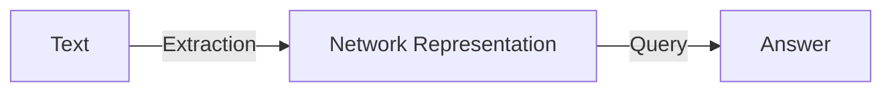
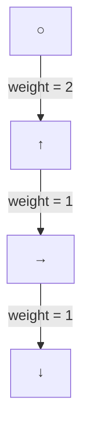
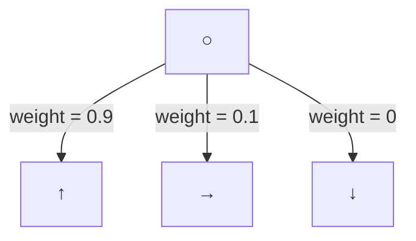
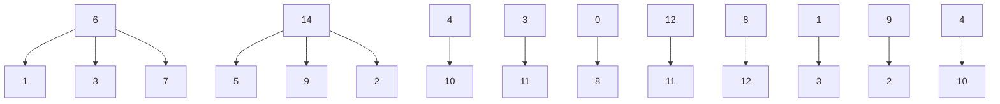

Team Control Number

For office use only

T1

T2

T3

T4

## 15356

Problem Chosen

For office use only

F1

F2

F3

F4

c

## iRank Model: A New Approach To Criminal Network Detection Summary

How to detect all the members and the leader of a conspiracy to commit a criminal act has long been the major concern of the Intergalactic Crime Modelers (ICM). The previous method is far from efficient for the current fund fraud conspiracy which involved over 21,000 words of message traffic. Here we will develop a more reliable network analysis model for large volumes of crime conspiracies data and other kinds of network data.

With the assumption of neglecting the time effect of the communication and assigning specific weightings to conspiratorial and irrelevant messages respectively, we develop an iRank rating model to unearth the hidden structure of the criminal network in the current fund fraud conspiracy. It is a modified version of PageRank algorithm which considers both the conspiratorial communication records and the communication density in conspirators network to determine the ranking of conspirators. Also inspired by Social Network Analysis clustering, the model contains a closeness factor to separate the conspirators and non-conspirators and the factor can help us detect the leader of the conspirators. The model outputs the suspicion level of each suspect quantitatively as a priority list.

To further improve the models, we take other elements like time series and contents of the messages into consideration. In the advanced criminal network detection model, we can detect the initiator of all the conspiratorial topics thus to lock the major suspect and avoid suing some innocent people who unconsciously spread conspiratorial in the network. Moreover, we will demonstrate how semantic network analysis and text analysis can improve the accuracy of the judgments by detecting some well-hidden conspirators like Inez and Bob in the first example.

In the final step, we validate the results by setting a critical value to the iRank value through conspirator group size estimation and visualization. Furthermore we will analyze the strengths and weaknesses of the models comparing with PageRank algorithm and Social Network Analysis. In addition, we discuss how the model can be extended to other social network applications like biological systems

## Introduction

Detecting criminal network within large amount of data is a well-studied problem in the real world. It is especially important to develop techniques for uncovering conspiracy networks involving white-collar crimes. In most of the cases, such well-organized criminal activities will follow some patterns. Thus we can uncover the structures of this kind of criminal network and nominate the leader of the group by studying reliable data with sophisticated techniques. It would save a lot of endeavors and time for the ICM to conduct their investigation and arrest work in the future.

In the given ICM case, it is known that some conspirators are taking place to embezzle funds from the company and use internet fraud to steal funds from credit cards of people who do business with the company. Here, our goal is to separate the non-conspirators from the ones who are most likely to be conspirators. We will consider:

the development of criteria and methods to detect the criminal network and the leader of the group  
the application of semantic network analysis and text analysis to improve the method  
further recommendations and other applications of the model

## Dataset Observations and Basic Statistical Analysis

To better understand different communication behaviors of conspirators and non-conspirators and to elaborate our assumptions, we conduct a statistical analysis for the given data. In task 1, given that Jean, Alex, Elsie, Paul, Ulf, Yao, and Harvey are conspirators while Darlene, Tran, Jia, Ellin, Gard, Chris, Paige, and Este are innocent, we reach some useful findings for model building. There are two “Elsie’s” in the company, No.7 and No.37. As the No.7 obviously has more connections with the other known conspirators, we lock No.7 as the conspirator.

bar chart

| Category | conspirator | non-conspirator |
| :--- | :--- | :--- |
| TOTEL | 100 | 60 |
| OUT | 50 | 30 |
| IN | 60 | 40 |

Figure 1: Comparison of number of topics conversed by conspirators or non-conspirators

In Figure 1, from the total number of conversations (left bar), we can see that conspirators are significantly more active than non-conspirators. They tend to communicate more often with other people. The information exchanges among known conspirators groups are also significantly more frequent than that among known non-conspirators.

Carefully examining into the patterns of information exchanges and social connections in the network, we can see that only 24% messages carry conspiratorial information, which seems not systematically significant given that 20% of all the topics are conspiratorial. Therefore, two patterns can be inferred from the statistical results:

Although conspirators are generally more active than the known innocent people, they exchange irrelevant information with each other. Conspiratorial messages only take a small portion in their message traffic.  
Since the existing 7 conspirators have already involved in spreading about 40% of the total conspiratorial messages, it is very likely that the total number of conspirators is less than 20.

bar chart

|        | conspirator | non-conspirator |
| ------ | ----------- | --------------- |
| OUT    | 100         | 20              |
| IN     | 90          | 40              |

Figure 2: Messages with conspiratorial topics conveyed by conspiracies and non-conspiracies

Another pattern we can derive from the original dataset is the correlation between the involvement of conspiratorial activities and the identity of the worker. We observe a few non-conspirators who have involved in talks with conspiratorial topics. Nevertheless, most of the non-conspirators only receive those messages and seldom give responses to them. Thus, the initiators of such a conversation should have more suspicion. Therefore, we can assume that the motivation of participating in conspiratorial topics is one of the most important indicators of a given worker’s identity.

Symbols and Definitions

<table><tr><td>Symbol</td><td>Definition</td><td>Formula</td></tr><tr><td>G</td><td>Society network graph</td><td></td></tr><tr><td>N</td><td>A set of labeled nodes</td><td></td></tr><tr><td> $n_c$ </td><td>Nodes represent the conspirators</td><td></td></tr><tr><td> $n_u$ </td><td>Nodes represent the unknown</td><td></td></tr><tr><td> $n_n$ </td><td>Nodes represent the non-conspirators</td><td></td></tr><tr><td> $l_{ij}$ </td><td>The message sent from node i to node j</td><td></td></tr><tr><td>L</td><td>A set of labeled links</td><td></td></tr><tr><td> $L_c$ </td><td>Links contain conspiratorial messages</td><td></td></tr><tr><td> $L_n$ </td><td>Links contain irrelevant messages</td><td></td></tr><tr><td>D</td><td>Degrees of each node</td><td> $D(n) = \text{Number of links connected to node n}$ </td></tr><tr><td>O</td><td>Out-degree</td><td> $O(n)= \text{Out-degree of node n}$ </td></tr><tr><td>I</td><td>In-degree</td><td> $I(n) = \text{In-degree of node n}$ </td></tr><tr><td>CL</td><td>Centrality of each node</td><td> $CL(n) = \text{Centrality of node n}$ </td></tr><tr><td>IR</td><td>iRank model value</td><td> $IR(n) = \text{Ranking weight of node n}$ </td></tr><tr><td>α</td><td>The link weight between two given nodes</td><td> $\alpha_{ij} = \text{Link weight between the ith and jth node}$ </td></tr><tr><td>f</td><td>The heuristic function</td><td> $f(l) = \text{Heuristic function of link l}$ </td></tr><tr><td> $ms_n$ </td><td>Number of messages the node n sends  $n_c$  to and receives from  $n_c$ </td><td></td></tr><tr><td> $mr_n$ </td><td>Number of messages the node n receives from  $n_c$ </td><td></td></tr><tr><td> $ts_n$ </td><td>Number of times the node n sends  $l_c$ </td><td></td></tr><tr><td> $tr_n$ </td><td>Number of times the node n receives  $l_c$ </td><td></td></tr><tr><td>w</td><td>Adjusting factor used to standardize the units into a same scale</td><td></td></tr><tr><td>hs</td><td>Harmonic series of the number of times that node n sends a conspiratorial message to a known conspirator</td><td></td></tr><tr><td>hr</td><td>Harmonic series of the number of times that node n receives a suspicious message from a known conspirator</td><td></td></tr><tr><td>d</td><td>Heuristic function of closeness</td><td> $d(n)= \text{Heuristic function of closeness from node n to } n_c \text{ and } n_n$ </td></tr></table>

## Assumptions

The criminal network problems can be really complicated if we take every effect into consideration. In Task 1 and Task 2, we simplify the model by assuming that:

Only the7th, the 11st and the 13rd topics are related to conspiracy in Task 1, and in Task 2 the 1st topic is added to the topics related to conspiracy;  
All the messages are exchanged in a very short period, thus the impact of time can be neglected;  
The contents of the messages can be temporarily ignored, thus all the conspiratorial topics are equally weighted.  
A message that involves k (k>1) topics is equivalent to k messages that each involves 1 corresponding topic. This is valid because we ignore the time effect of communication, and focus on the amount of information exchanged only.

Meanwhile, according to the basic statistical results of the dataset, we can have the following assumptions.

Non-conspirators do not know about who are conspirators.  
Non-conspirators seldom talk about conspiratorial topics with conspirators.  
Conspirators do talk conspiratorial topics with non-conspirators.  
The identity of an unknown node is determined by its neighboring nodes and the links incident with it.

## Task 1

## The Mathematical Model — iRank Model

The aim of the task is to obtain a priority list according to the likelihood of being part of the conspiracy and to determine whether any of the senior managers are involved. In this task we develop an iRank Model which is a combination of PageRank Algorithm and SNA technique. We apply this modified model in this problem as the original PageRank Algorithm cannot deal with links with different weights and the SNA technique does not take the identities of the nodes into consideration(Xu and Chen 2005).

For the likelihood of being a conspirator, intuitively a person’s suspicious level relates to the percentage of conspirators he contacts and the percentage of suspicious messages he involves in. Furthermore, a person seems even more suspicious when he sends a suspicious message to a known conspirator, or receives a suspicious message from a known conspirator. Therefore we can consider a function that ranks each suspect by the factors mentioned above as our selection criteria to find out possible conspirators.

In addition, in a normal social group the social activities should be evenly emerged along with the organizational structure to a certain extent. We believe the conspirator group as a sub-group in this company would cause abnormal social activity patterns reflected on their behaviors of communication. Specifically, based on Small World Theory(Natarajan 2006) which raised the relationship closeness of any two people among a social group, we pay attention to patterns of all $n _ { u }$ connect to the conspirator group as well as the non-conspirator group. By our model, the abnormal distribution of social activities within the company caused by conspirator group can be tracked and related useful information, which helps us to distinguish people’s identities, can also be derived from it.

To determine the conspiracy leaders, we will iteratively review how a person makes influence on the conspirator groups, or the degree of centrality we defined as follow, to find out a person’s impact among known conspirators.

The iRank Model includes two steps: initialization and iteration.

## Step 1: Initialization

The initialization offers a initial suspicious level to all nodes with unknown identity $\mathrm { n } _ { \mathrm { u } } .$ Consider the iRank value IR(n) as the suspicious level of node n. Intuitively we have:

IR(n) = Suspicion raised by the frequency of contacting $n _ { c }$

+Suspicion raised by the frequency of exchanging $l _ { c }$  
+ Suspicion raised by the communication distance to $n _ { c }$ (1.1)

Let $m s _ { n } , ~ m r _ { n }$ denote the number of messages the n-th node sends to and receives from $n _ { c } ,$ respectively, and let $t s _ { n } , \ t r _ { n }$ denote the number of times the n-th node sends and receives $l _ { c } ,$ respectively. Also let $\mathrm { C _ { n } }$ be the centrality of node n and $\mathrm { C L } ( \mathrm { n _ { c } } ) , \mathrm { C L } ( \mathrm { n _ { n } } )$ denote the closeness from node n to $\mathrm { n _ { c } }$ and $\mathrm { n } _ { \mathrm { n } }$ .

Assume each part in (1.1) plays an equal importance in detecting conspiracy. Let $w _ { m s } , \ w _ { m r } , \ w _ { t s }$ , and $w _ { t r }$ denote the adjusting factor used to standardize the units into a same scale so that each part is assigned a same weight in IR(n). Therefore we can set up the following iRank function to assign an initial weight to each node.

$$
\begin{array}{l} I R (n) \\ = \left\{ \begin{array}{c} 0, n \text {is not a conspirator} \\ 1, n \text {is a conspirator} \\ \frac {\max \left(\frac {m s _ {n}}{O (n)} \times w _ {m s} , h s (n)\right) + \max \left(\frac {m r _ {n}}{I (n)} \times w _ {m r} , h r (n)\right) + \frac {t s _ {n}}{O (n)} \times w _ {t s} + \frac {t r _ {n}}{I (n)} \times w _ {t r} + d (n)}{5} \end{array} \right., \text {otherwise} \end{array}
$$

where $h s ( n ) , h r ( n )$ are the harmonic series of the number of times that node n sends a suspicious message to a known conspirator, or receives a suspicious message from a known conspirator, and

$$
d (n) = C _ {n} \times \frac {C L n _ {c}}{C L n _ {n}}
$$

$$
\mathrm{where} C (n _ {i}) = \left[ \sum_ {j = 1} ^ {g} d i s t (n _ {i}, n _ {j}) \right] ^ {- 1}
$$

is a heuristic function of closeness from node n to nc and $\mathrm { n } _ { \mathrm { n } } .$ Statistical analysis shows that the strong positive correlation of closeness to conspirator group and the closeness to non-conspirator group, expect that a few nodes demonstrating significantly more closeness towards conspirator group against non-conspirator group as following graph shows.

scatterplot

| Degree of cSW | Degree of iSW |
| ------------- | ------------- |
| 0.1           | 0.05          |
| 0.2           | 0.1           |
| 0.3           | 0.15          |
| 0.4           | 0.2           |
| 0.5           | 0.25          |
| 0.6           | 0.3           |
| 0.7           | 0.35          |
| 0.8           | 0.4           |
| 0.9           | 0.45          |
| 1.0           | 0.5           |
| 1.1           | 0.55          |
| 1.2           | 0.6           |
| 1.3           | 0.65          |
| 1.4           | 0.7           |
| 1.5           | 0.75          |
| 1.6           | 0.8           |
| 1.7           | 0.85          |
| 1.8           | 0.9           |
| 1.9           | 0.95          |
| 2.0           | 1.0           |

Figure 3 Abnormal nodes observed by correlation of closeness to conspirator group and non-conspirator group

## Step 2: Iteration

After obtaining the initial value, we can iteratively adjust the ranking weight of each node to get a more precise iRank value because for a node n its suspicious level $I R ( n )$ changes as the iRank values of its neighboring nodes have changed. Consider a rating system that contacting with a more suspicious node will results in a higher $I R ( n )$ , we can set up the following rating function:

$$
I R (n) = \left\{ \begin{array}{c} 0, n i s n o t a c o n s p i r a t o r \\ 1, n i s a c o n s p i r a t o r \\ \sum_ {x \in a d j (n)} I R (x) \times \alpha_ {n - x} + \sum_ {n \in a d j (x)} I R (x) \times \alpha_ {x - n}, o t h e r w i s e \end{array} \right.
$$

where adj(n) denotes a node that receives a message from the n-th node, and $\alpha _ { i - j }$ denotes the weight of the message from i-th node to j-th node that satisfies $\begin{array} { r } { \sum _ { i \in a d j ( j ) } \alpha _ { i - j } = 1 } \end{array}$ .

By Markov property, for every $n \in N , I R ( n )$ will eventually reach the limit after a large number of iterations, and the final $I R ( n )$ will be a credible estimate of the suspicious level of the node.

## Estimation of Parameters

By analyzing the sample data, we have the following statistical results:

<table><tr><td colspan="8">Task 1 Statistics</td></tr><tr><td>Sender</td><td>Topic</td><td>Receiver</td><td>Count</td><td>Sender</td><td>Topic</td><td>Receiver</td><td>Count</td></tr><tr><td> $n_c$ </td><td>--</td><td> $n_c$ </td><td>26</td><td> $n_c$ </td><td> $l_c$ </td><td>--</td><td>31</td></tr><tr><td> $n_c$ </td><td>--</td><td> $n_n$ </td><td>6</td><td> $n_n$ </td><td> $l_c$ </td><td>--</td><td>3</td></tr><tr><td> $n_n$ </td><td>--</td><td> $n_c$ </td><td>5</td><td>--</td><td> $l_c$ </td><td> $n_c$ </td><td>28</td></tr><tr><td> $n_n$ </td><td>--</td><td> $n_n$ </td><td>10</td><td>--</td><td> $l_c$ </td><td> $n_n$ </td><td>7</td></tr></table>

Table 1: The statistics of suspicious action counts in Task 1

Assume that the sample distribution is coherent with the total distribution, based on the observation on the sample data, we can find out

$$
\left\{ \begin{array}{l l} w _ {m s} = 1. 2 \\ w _ {m r} = 1. 2 \\ w _ {t s} = 1. 1 \\ w _ {t r} = 1. 2 5 \end{array} \right.
$$

As the messages including suspicious topics are more useful for our detection of conspirators than irrelevant messages, we can define

$$
\alpha_ {n - x} = \frac {1}{0 (\mathrm{n}) + \mathrm{ms} _ {\mathrm{n}}} + \frac {\mathrm{I} _ {\mathrm{n-x}}}{0 (\mathrm{n}) + \mathrm{ms} _ {\mathrm{n}}}
$$

where $\operatorname { I } _ { \mathrm { n - x } }$ is the indicator function of whether the message from node n to node x contains suspicious topic, that is

$$
I _ {n - x} = \left\{ \begin{array}{l l} 1, & \text {the message is suspicious} \\ 0, & \text {the message is not suspicious} \end{array} \right..
$$

## Output and Evaluation

<table><tr><td>Node #</td><td>81</td><td>51</td><td>16</td><td>33</td><td>57</td><td>60</td><td>28</td><td>79</td><td>10</td></tr><tr><td>iR</td><td>0.8571</td><td>0.6244</td><td>0.6142</td><td>0.5765</td><td>0.5667</td><td>0.551</td><td>0.5377</td><td>0.5141</td><td>0.4790</td></tr></table>

Table 2: Significant suspects ranked by IR in Task 1

bar chart

| Index | Value |
|-------|-------|
| 1     | 0.5   |
| 2     | 0.6   |
| 3     | 0.7   |
| 4     | 0.8   |
| 5     | 0.9   |
| 6     | 1.0   |
| 7     | 1.1   |
| 8     | 1.2   |
| 9     | 1.3   |
| 10    | 1.4   |
| 11    | 1.5   |
| 12    | 1.6   |
| 13    | 1.7   |
| 14    | 1.8   |
| 15    | 1.9   |
| 16    | 2.0   |
| 17    | 2.1   |
| 18    | 2.2   |
| 19    | 2.3   |
| 20    | 2.4   |
| 21    | 2.5   |
| 22    | 2.6   |
| 23    | 2.7   |
| 24    | 2.8   |
| 25    | 2.9   |
| 26    | 3.0   |
| 27    | 3.1   |
| 28    | 3.2   |
| 29    | 3.3   |
| 30    | 3.4   |
| 31    | 3.5   |
| 32    | 3.6   |
| 33    | 3.7   |
| 34    | 3.8   |
| 35    | 3.9   |
| 36    | 4.0   |
| 37    | 4.1   |
| 38    | 4.2   |
| 39    | 4.3   |
| 40    | 4.4   |
| 41    | 4.5   |
| 42    | 4.6   |
| 43    | 4.7   |
| 44    | 4.8   |
| 45    | 4.9   |
| 46    | 5.0   |
| 47    | 5.1   |
| 48    | 5.2   |
| 49    | 5.3   |
| 50    | 5.4   |
| 51    | 5.5   |
| 52    | 5.6   |
| 53    | 5.7   |
| 54    | 5.8   |
| 55    | 5.9   |
| 56    | 6.0   |
| 57    | 6.1   |
| 58    | 6.2   |
| 59    | 6.3   |
| 60    | 6.4   |
| 61    | 6.5   |
| 62    | 6.6   |
| 63    | 6.7   |
| 64    | 6.8   |
| 65    | 6.9   |
| 66    | 7.0   |
| 67    | 7.1   |
| 68    | 7.2   |
| 69    | 7.3   |
| 70    | 7.4   |
| 71    | 7.5   |
| 72    | 7.6   |
| 73    | 7.7   |
| 74    | 7.8   |
| 75    | 7.9   |
| 76    | 8.0   |
| 77    | 8.1   |
| 78    | 8.2   |
| 79    | 8.3   |
| 80    | 8.4   |
| 81    | 8.5   |
| 82    | 8.6   |
| 83    | 8.7   |
| 84    | 8.8   |
| 85    | 8.9   |
| 86    | 9.0   |
| 87    | 9.1   |
| 88    | 9.2   |
| 89    | 9.3   |
| 90    | 9.4   |
| 91    | 9.5   |
| 92    | 9.6   |
| 93    | 9.7   |
| 94    | 9.8   |
| 95    | 9.9   |
| 96    | 10.0  |
| 97    |        |
| 98    |        |
| 99    |        |
| ... (repeated) for all bars in the chart; 'Repeated' is repeated at the end of the row.

Figure 4: Suspicious level shown by IR

To distinguish leaders from the conspirator group we found by our iRank model, we further develope the analytical model to demonstrate the leadership within the group. Firstly, we make following assumptions about the behavior of the leader in a group:

The leader usually acts as an intermediate node to connect different functional sub-groups  
The leader prefers to communicate with heads in different functional sub-groups rather than common members.  
Sub-group heads, as an intermediate node among the leader and the other members, can access all of their group members.

From the above assumptions, the following facts can be inferred:

Normally, the leader can achieve one of the highest neighborhood connectivity among all members, since the leader can connect to all members through those sub-group heads.  
The leader may not have the smallest average shortest path length since the number of members in different sub-groups may differ greatly.

scatterplot

| AverageShortestPathLength | NeighborhoodConnectivity |
| --- | --- |
| 0.0 | 2.0 |
| 0.0 | 3.0 |
| 0.0 | 7.0 |
| 1.0 | 3.0 |
| 2.5 | 11.0 |
| 2.5 | 12.0 |
| 2.5 | 13.0 |
| 2.5 | 14.0 |
| 2.5 | 15.0 |
| 2.5 | 16.0 |
| 2.5 | 17.0 |
| 2.5 | 18.0 |
| 2.5 | 19.0 |
| 2.5 | 20.0 |
| 2.5 | 21.0 |
| 3.0 | 8.0 |
| 3.0 | 9.0 |
| 3.0 | 10.0 |
| 3.0 | 11.0 |
| 3.0 | 12.0 |
| 3.0 | 13.0 |
| 3.0 | 14.0 |
| 3.0 | 15.0 |
| 3.0 | 16.0 |
| 3.0 | 17.0 |
| 3.0 | 18.0 |
| 3.0 | 19.0 |
| 3.0 | 20.0 |
| 3.5 | 6.0 |
| 3.5 | 7.0 |
| 3.5 | 8.0 |
| 3.5 | 9.0 |
| 3.5 | 10.0 |
| 3.5 | 11.0 |
| 3.5 | 12.0 |
| 3.5 | 13.0 |
| 3.5 | 14.0 |
| 3.5 | 15.0 |
| 3.5 | 16.0 |
| 3.5 | 17.0 |
| 3.5 | 18.0 |
| 3.5 | 19.0 |
| 3.5 | 20.0 |
| 4.0 | 4.0 |
| 4.5 | 3.0 |
| 4.5 | 4.0 |
| 4.5 | 5.0 |
| 4.5 | 6.0 |
| 4.5 | 7.0 |
| 4.5 | 8.0 |
| 4.5 | 9.0 |
| 4.5 | 10.0 |
| 4.5 | 11.0 |
| 4.5 | 12.0 |
| 4.5 | 13.0 |
| 4.5 | 14.0 |
| 4.5 | 15.0 |
| 4.5 | 16.0 |
| 4.5 | 17.0 |
| 4.5 | 18.0 |
| 4.5 | 19.0 |
| 4.5 | 20.0 |
| 5.0 | 3.0 |
| 5.0 | 4.0 |
| 5.0 | 5.0 |
| 5.0 | 6.0 |
| 5.0 | 7.0 |
| 5.0 | 8.0 |
| 5.0 | 9.0 |
| 5.0 | 10.0 |
| 5.0 | 11.0 |
| 5.0 | 12.0 |
| 5.0 | 13.0 |
| 5.0 | 14.0 |
| 5.0 | 15.0 |
| 5.0 | 16.0 |
| 5.0 | 17.0 |
| 5.0 | 18.0 |
| 5.0 | 19.0 |
| 5.0 | 20.0 |
| 5.5 | 3.0 |
| 5.5 | 4.0 |
| 5.5 | 5.0 |
| 5.5 | 6.0 |
| 5.5 | 7.0 |
| 5.5 | 8.0 |
| 5.5 | 9.0 |
| 5.5 | 10.0 |
| 5.5 | 11.0 |
| 5.5 | 12.0 |
| 5.5 | 13.0 |
| 5.5 | 14.0 |
| 5.5 | 15.0 |
| 5.5 | 16.0 |
| 5.5 | 17.0 |
| 5.5 | 18.0 |
| 5.5 | 19.0 |
| 5.5 | 20.0 |
| 6.0 | - |
| - | - |
| - | - |
| - | - |
| - | - |
| - | - |
| - | - |
| - | - |
| - | - |
| - | - |
| - | - |
| - | - |
| - | - |
| - | - |
| - | - |
| - | + |
| - | + |
| - | + |
| - | + |
| - | + |
| - | + |
| - | + |
| - | + |
| - | + |
| - | + |
| - | + |
| - | + |
| - | + |
| - | + |
| - | + |

Figure 5: the correlation between neighborhood connectivity and average shortest path length

Obviously, from the chart we infer that those two nodes showing abnormal patterns are very likely the leaders of the whole group. There are No.16 Jerome and No.10 Dolores.

## Task2

## Adjusting to the iRank Model

We can apply the same model illustrated in Task 1, but we should calculate the new parameters according to the new condition added.

<table><tr><td colspan="8">Task 2 Statistics</td></tr><tr><td>Sender</td><td>Topic</td><td>Receiver</td><td>Count</td><td>Sender</td><td>Topic</td><td>Receiver</td><td>Count</td></tr><tr><td> $n_c$ </td><td>--</td><td> $n_c$ </td><td>29</td><td> $n_c$ </td><td> $l_c$ </td><td>--</td><td>38</td></tr><tr><td> $n_c$ </td><td>--</td><td> $n_n$ </td><td>9</td><td> $n_n$ </td><td> $l_c$ </td><td>--</td><td>5</td></tr><tr><td> $n_n$ </td><td>--</td><td> $n_c$ </td><td>6</td><td>--</td><td> $l_c$ </td><td> $n_c$ </td><td>33</td></tr><tr><td> $n_n$ </td><td>--</td><td> $n_n$ </td><td>3</td><td>--</td><td> $l_c$ </td><td> $n_n$ </td><td>9</td></tr></table>

Table 3: The statistics of suspicious action counts in Task 1

From the sample statistics we can find

$$
\left\{ \begin{array}{l l} w _ {m s} = 1. 3 \\ w _ {m r} = 1. 2 \\ w _ {t s} = 1. 1 3 \\ w _ {t r} = 1. 2 7 \end{array} \right.
$$

## Output

By iterating the iRank function 1000 times, we obtain the following results.

<table><tr><td>Node #</td><td>iR</td></tr><tr><td>16</td><td>0.94099</td></tr><tr><td>81</td><td>0.86962</td></tr><tr><td>51</td><td>0.63188</td></tr><tr><td>56</td><td>0.60522</td></tr><tr><td>33</td><td>0.58404</td></tr><tr><td>57</td><td>0.57165</td></tr><tr><td>60</td><td>0.55354</td></tr><tr><td>28</td><td>0.54328</td></tr><tr><td>10</td><td>0.52434</td></tr><tr><td>79</td><td>0.51788</td></tr><tr><td>69</td><td>0.48713</td></tr><tr><td>13</td><td>0.45334</td></tr><tr><td>17</td><td>0.45170</td></tr><tr><td>20</td><td>0.45149</td></tr><tr><td>22</td><td>0.44896</td></tr><tr><td>3</td><td>0.42529</td></tr><tr><td>15</td><td>0.41772</td></tr></table>

Table 4: The significant suspects ranked by iR in Task 2

network graph

| Node | Value |
|---|---|
| 11 | 66 |
| 72 | 72 |
| 70 | 70 |
| 28 | 28 |
| 17 | 17 |
| 68 | 68 |
| 67 | 67 |
| 30 | 30 |
| 48 | 48 |
| 24 | 24 |
| 80 | 80 |
| 48 | 48 |
| 79 | 79 |
| 76 | 76 |
| 20 | 20 |
| 75 | 75 |
| 14 | 14 |
| 40 | 40 |
| 74 | 74 |
| 73 | 73 |
| 23 | 23 |
| 31 | 31 |
| 64 | 64 |
| 3 | 3 |
| 51 | 51 |
| 49 | 49 |
| 71 | 71 |
| 50 | 50 |
| 38 | 38 |
| 29 | 29 |
| 60 | 60 |
| 0 | 0 |
| 81 | 81 |
| 82 | 82 |
| 27 | 27 |
| 12 | 12 |
| 63 | 63 |
| 58 | 58 |
| 16 | 16 |
| 36 | 36 |
| 37 | 37 |
| 52 | 52 |
| 2 | 2 |
| 55 | 55 |
| 13 | 13 |
| 34 | 34 |
| 25 | 25 |
| 4 | 4 |
| 32 | 32 |
| 7 | 7 |
| 19 | 19 |
| 42 | 42 |
| 26 | 26 |
| 5 | 5 |
| 18 | 18 |
| 22 | 22 |
| 43 | 43 |
| 78 | 78 |
| 6 | 6 |
| 21 | 21 |
| 9 | 9 |
| 45 | 45 |
| The image contains a diagram of interconnected nodes connected by lines, likely representing a network or graph structure. There are no labels or axes but rather a hierarchical or hierarchical structure.

Figure 6: Visualization of the Criminal Network Based on Task 2 Results

## Evaluation and Discussion

## Strength

The iRank model perfectly distinguishes every different node and ranks the suspicion level of all nodes quantitatively because IR(n) considers both the suspicious communication made by node n and the communication density of node n in a social network. For example, in the data set both Node 16 and Node 34 are called Jerome, but the model indicates that Node 16 is the senior manager and further shows that Node 16 is involved in the conspiracy.  
The iRank model generates an appropriate initial value for each node using all the information known from the data set, which is better than the original Page Rank algorithm that generates the initial value randomly(Graham and Tsiatas 2010).  
The iRank model keeps track of the information flow by following the numerical node weightings and link weightings, which is not considered in general Social Network Analysis clustering(Coffman, Greenblatt et al. 2004).

The iRank model is highly efficient in time complexity and space complexity because it can dynamically adjust the ranking of each node by iteration without performing high dimensional matrix operations by iterations.

## Weakness

The data structure of communication ignores the timing and the sequence of messages, causing the information loss at the beginning stage. Our iRank model purely regards that, all conversations within the social group are organized as a static directed path of which a node denotes a group member and an edge denotes a message. Obviously, the information of timing and message sequence is fairly helpful in busting up crime syndicates, e.g. it is believed that one initiating a message carrying suspicious topics is more conspiratorial than one replying it.  
Another major weakness of iRank model is that, our model is not able to indicate a critical value of conspirators and non-conspirators before reviewing the result of the priority list. Actually, to decide whether a person is a conspirator or not appropriately, we have to go over the data of results in detail and set the critical value manually based on our assumptions.

## Task 3

## Improvements on the Criminal Detection Model

In the above mathematical model, we assume every irrelevant topic is equally important, and we may ignore some underlying correlations between any two topics. Next we will improve our model using semantic network analysis and text analysis.

## Semantic Network Analysis and Text Analysis

Semantic Network Analysis is a technique in which the content of a message is extracted from text and represented as a network of semantic relations between actors and issues, which can be queried to look for specific patterns and answer various research questions.”(Morselli 2010) In our crime busting model, we can apply this technique to help us extract critical words or messages from the heavy message traffic.

As the original messages are not given, here we will just demonstrate our method following the process below. Meanwhile, we will show in detail how this improvement to the criminal network detection model can help lock Inez and Bob in the first example.

flowchart

Figure 7: Semantic Network Analysis Work Flow

In the first step, we will extract some conspiratorial or informative messages out from the message traffic.

: According to some basic criminal psychology knowledge, we can assume that conspirators are usually under more pressures. We can ask the model to extract any phrases or words that can reveal the abnormal emotions of certain people. For example, in the first case, Inez mentioned two times that she was “tired” or “exhausted”, while Jaye did not have “much going on”. Harry also detected that George was stressed.

Secondly, we should also extract messages in other language or which have some ambiguous statements. It is likely that those are used as codes within the conspirators.  
Contents or conversations which show high exclusiveness should be pay attention to, including the invitings to some private talks or meetings.  
Some messages which contain strong feelings should be extracted ant analyzed.  
Also, if the conversation or message has mentioned other people, we will extract the names and the related activities or descriptive words.

## The Mathematical Model

The model applied is similar to the iRank model in Task 1, but link weight of link l $\propto _ { \mathrm { l } }$ is determined by a text analysis function f(m) instead of a constant that is related to topic involved only.

The text analysis function f(m) is judged by comparing the similarity with the message sent by nc or ni. Inspired by the principal of supervised learning(Wiil, Memon et al. 2010), we can set the initial link weight of lc sent or received by nc to 1, and set the initial link weight of li sent or received by $\mathrm { n } _ { \mathrm { n } } \mathrm { i } s \cdot 1$ . In this way f(m) is a value from continuous interval [-1,1], and a larger f(m) value implies a greater likelihood of being a suspicious message.

Hence we can rewrite the model in the iterative step as:

$$
\mathrm{PR(n)} = \left\{ \begin{array}{c} 0, \text {n is not aconspirator} \\ 1, \text {n is a conspirator} \\ \frac {\sum_ {l _ {n x} \in L} P R (x) \times \alpha_ {n x} + \sum_ {l _ {x n} \in L} P R (x) \times \alpha_ {x n}}{2}, \text {otherwise} \end{array} \right.
$$

where:

$$
\left\{ \begin{array}{l} \alpha_ {n x} = \max (\frac {\mathrm{f(m)}}{\sum_ {\mathrm{l} _ {\mathrm{nx}} \in \mathrm{L}} \mathrm{f(l)}}, 0) \\ \sum_ {\mathrm{l} _ {\mathrm{nx}} \in \mathrm{L}} \alpha_ {n x} = 1 \end{array} \right.
$$

## Evaluation and Discussion

We believe the semantic network analysis and the text analysis can efficiently enhance our model by assigning an appropriate weight for each message according to its own message content rather than assigning a same weight on messages of different importance. For one hand, as a more irrelevant message owns a smaller weight and a more suspicious message owns a greater weight, the interactions of suspicious message flow will be clearer. On the other hand, an effective text analysis take the correlation among messages into account, which can provide more accurate link weights and help us find out the underlying relationship among the communication network so that we can get a more credible result.

The influence of a suspicious link on the corresponding node is strengthened in the improved model, which can be shown in the following simple numeric example. In the picture below we can see that in previous model the significant message only contributes 0.5 to IR(n), equal to the contribution of irrelevant messages, whereas in the improved model the significant message contributes 0.9 to IR(n) under same circumstance.

flowchart

$$
\propto_ {\mathrm{lc}} = \frac {2}{2 + 1 + 1} = 0. 5
$$

flowchart

$$
\alpha_ {1 c} = \frac {0 . 9}{0 . 9 + 0 . 1 + 0} = 0. 9
$$

Figure 8: The suspicious link contributes more on IR(n) in the improved model

The correlation between messages can be found via semantic network analysis and text analysis. For example, in the topic description given, we can find that the suspicious topic 7 involves Spanish words as codes, and we may further induce that the Spanish words in topic 2 and topic 12 can also be suspicious. Also in topic 4, 5, and 6 we can see some negative feelings like anxiety and complaints, which might infer that the sender is suffering from guilty conscience.

## Task 4

## Recommendations and Future Development

The IR model performs well in separating the non-conspirators and the conspirators as well as detecting the leader in the criminal network. However, our models can be further improved by considering the following:

Build a thorough network with more messages in the traffic with more links between any two nodes. It will increase the accuracy of the results of the model by considering more explicit interactions between the nodes.  
Introduce time series into the model. A clear timeline may help us detect the initiators of certain highly conspiratorial topics. It will also show the pattern changes in the network before and after a conspiracy occurred.  
Apply text analysis to deal with large volumes of data. Text analysis can help us in detecting conspiratorial messages or some abnormal expressions efficiently when the dataset is large.  
Introduce the semantic network analysis. With accumulation of database, we can uncover some usual tactics in high‐tech conspiracy crimes. For example, some sudden changes in attitudes and conversational styles between two workers may indicate a conspiracy. Also, the increasing frequency of some anxious or stressed words may suggest a conspiratorial event is taking place in the company.

## Other Applications

Besides the study of criminal network detection, we can use this model to deal with various network problems by adjusting the weighting parameters or adding new constraint equations. Here is an example about how this model can be implemented to find infected or diseased cell in biological network.

The probability of getting infected is inversely proportional to the distance between one infected cell and other healthy cells(Chen, Ding et al. 2009), so the weight of being infected between two cells ${ \mathfrak { X } } _ { \mathrm { i } }$ can be seen as 1/distance.  
Given some known infected cells, we can assume the infection ability of different cells have some different probabilities IR(n).

flowchart

Figure 7: The Model of the Infection Cells Detection

## References

Chen, H., L. Ding, et al. (2009). "Semantic web for integrated network analysis in biomedicine." Briefings in Bioinformatics 10(2): 177-192.  
Coffman, T., S. Greenblatt, et al. (2004). "Graph-based technologies for intelligence analysis." Communications of the ACM 47(3): 45.  
Graham, F. and A. Tsiatas (2010). Finding and Visualizing Graph Clusters Using PageRank Optimization  
Algorithms and Models for the Web-Graph. R. Kumar and D. Sivakumar, Springer Berlin / Heidelberg. 6516: 86-97.  
Morselli, C. (2010). "Assessing Vulnerable and Strategic Positions in a Criminal Network." Journal of Contemporary Criminal Justice 26(4): 382-392.  
Natarajan, M. (2006). "Understanding the Structure of a Large Heroin Distribution Network: A Quantitative Analysis of Qualitative Data." Journal of Quantitative Criminology 22(2): 171-192.  
Wiil, U. K., N. Memon, et al. (2010). "Detecting New Trends in Terrorist Networks." 435-440.  
Xu, J. and H. Chen (2005). "Criminal network analysis and visualization." Communications of the ACM 48(6): 100-107.