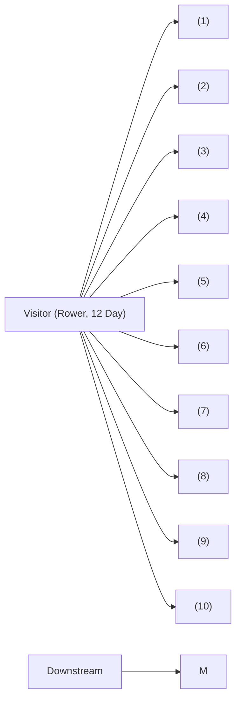
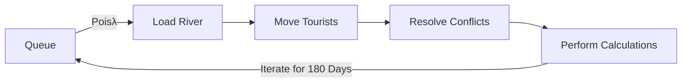
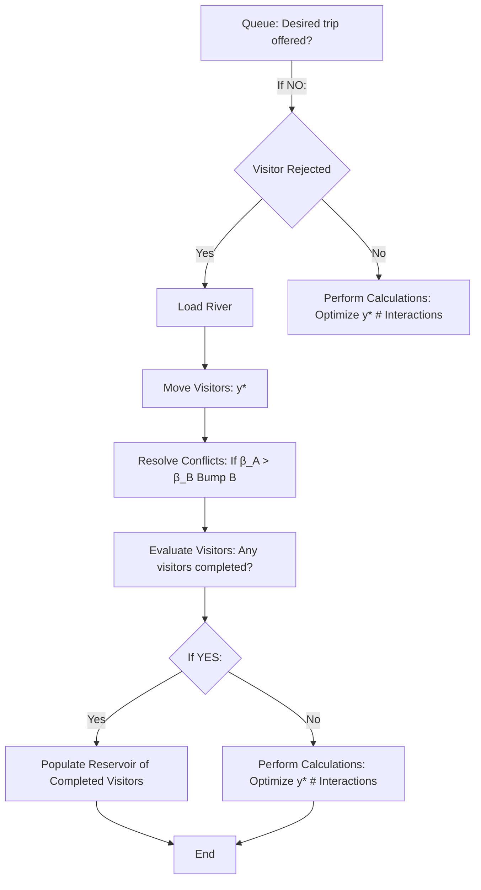
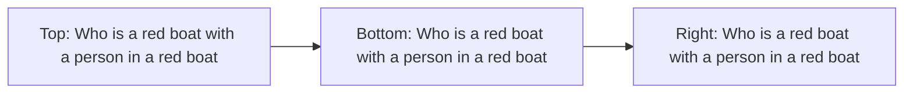

# C.A.R.S.: Cellular Automaton Rafting Simulation Subtitle

Control #15878

13 February 2012

## Abstract

The Big Long River management company offers white water rafting tours along its 225 mile long river with Y uniformly distributed camp sites. We were tasked to optimize the rafting schedule for this company and to formulate a method for determining the river’s carrying capacity. We represent the river as a one-dimensional array populated by objects representing rafting parties of various trip length and propulsion methods. Thus the model we propose can be treated as a cellular automaton-like structure provided there exists rules that govern how each cell behaves for each iteration. Rules for assigning raft destinations are iterated daily, allowing our model to dynamically respond to operating conditions such as new rafting trips, inclement weather, and load-dependent degradation of camp sites, while simultaneously maintaining critical levels of a variety of visitor satisfaction criteria. Using this dynamic model, camp site conflicts were eliminated, the carrying capacity of the river was determined to be 1102 visitors per season, with more than 99% of visitors completing trips on-time and rejecting less than 2% of trips.

## Contents

1 Introduction 3  
2 Plan of Attack 3  
3 Our Assumptions 4  
4 Important Definitions 5

4.1 Visitor Satisfaction . . . 5  
4.2 Carrying Capacity . . . . 6

5 Defining a Good Model 6

6 Scheduling: Static vs Dynamic Approaches 7

6.1 The Static Strategy . . . . 7  
6.2 The Dynamic Strategy . . . . 7

7 The Model: A Cellular Automaton-like Strategy 9

7.1 The Visitor Object . . . . . 10  
7.2 Governing Rules for the Model . . . . . 10  
7.3 An Ideal Implementation of the Model . . . . . . 11  
7.4 Control Implementations . . . 12

8 Clarifying the Metrics 12

9 Results 14

9.1 Number of Interactions . . . . 15  
9.2 Number of Visitor Rejections . . . . 16  
9.3 Off-Schedule Completions . . . . . 17  
9.4 Carrying Capacity . . . . . . 17

10 Further Investigations 19

10.1 Environmental Degradation . . . . 19  
10.2 Mitigating Storms . . . . . . . 20

11 Conclusion 20

12 Memo to Rafting Management 22

## 1 Introduction

White water rafting has become one of the fasting growing outdoor leisure activities in the United States1, with participation in rafting activities increasing 151% from 1987 levels.2 Multi-day trips of different length, with opportunities for both rafting and traditional camping, have captured the interest of a public seeking a wilderness experience. As a result, park managers have sought to discover methods to accommodate more boating trips in a rafting season without loss of visitor satisfaction.

Previous models have emphasized social norm theory as an analytic tool for understanding the enjoyability of a camping/rafting trip.3 Stankey argued that the enjoyment of a wilderness experience is inversely related to the number of interactions that occur with members of other parties during the trip, thus setting a social carrying capacity to the system.4 Combining this Wilderness Simulation Model with trip logs, several researchers have constructed programs to generate optimal seasonal rafting schedules for various river systems.5

However, in order to reduce interactions between campers, a number of these models have generated seasonal schedules with trips of only one or two durations offered at any given time. These models often fail to take into account customer demand, and reduce the number of options in trip varieties to be offered to campers. To compensate, some rafting companies have set up multiple trips over different rivers; however, this is clearly not practical for all rafting companies, and only partially mitigates the problem. Thus, we aim to develop a dynamic model to provide customers with a high quality rafting/camping trip of desired length.

## 2 Plan of Attack

We will develop our model based on The Big Long River, a 225 mile long white water river system with Y camp sites distributed evenly along its banks. Rafting trips on this river are characterized by both their duration (ranging from 6 - 18 days) and by the raft type used (oar-propelled or motor). Our goal is to propose a method to allow as many visitors to raft through the river during the six month rafting season while maintaining an enjoyable experience for the visitors. We also wish to be able to provide a variety of different trip options to the customers. The breadth of these requirements demands that we break down each component of the problem and analyze it separately; we will thus seek to restate the problem mathematically and clarify our goals. We will proceed by:

• Stating Assumptions. By stating our assumptions, we will narrow the focus of our approach towards the problem and provide some insight into the nature of the white water river rafting system.  
• Defining Evaluation Criteria. To make clear what the aims of our model should be, we must state what factors are involved in determining the success of the model.  
• Describing a Good Model. A powerful model should be practical in terms of ease of application and ability to cope with extreme circumstances. By highlighting the characteristics of a good model, we will be able to direct our efforts in the correct direction.

Once we have stated all of our goals, assumptions, and criteria, we will delve into our strategy to model the white water rafting system. We will:

• Present Our Model. We develop and test a dynamic model to simulate the river as a one dimensional cellular automaton-like structure with cells representing camp sites. Each cell will be occupied by visitors with unique properties.

• Develop Several Implementations. We will construct and compare several rules to govern loading visitors and movement of visitors along our cellular automatonlike structure.  
• Evaluate the Model. We will postulate and test the behavior of our model under various limiting circumstances. We will then evaluate the strengths and weaknesses of our model and our model’s applicability to different situations.

## 3 Our Assumptions

To fully understand the whitewater river rafting system and to develop a model to simulate this system, we must first make some assumptions. Since these assumptions will be essential in assisting us to construct our system, we will seek to formulate assumptions that are logical and reasonable.

• There are fixed ranges for both the duration of time visitors spend rafting as well as for the velocity of the rafts. We have estimated these ranges based on literature information such as the average velocity of white water rapids and sample rafting itineraries.6 7 These values are listed in the table below.

<table><tr><td></td><td>Oar-Propelled Raft</td><td>Motor Raft</td></tr><tr><td>Minimum Velocity</td><td>3 mph</td><td>3 mph</td></tr><tr><td>Maximum Velocity</td><td>5 mph</td><td>10 mph</td></tr><tr><td>Duration of Rafting</td><td>4 - 8 hours</td><td>4 - 8 hours</td></tr></table>

Table 1: Constant values used in our model based on industry standards.

• While rafting, visitors do not dramatically change their velocity over the course of the day. We assume that visitors will not extensively dawdle or backtrack along the river. A large majority of camp sites send experienced tour guides out with visitors to ensure that the boat keeps moving at the necessary speed. As a result, motion of visitors along the river is a state function - it only depends the initial and final positions of the visitors along the river.  
• Camp sites are equivalent and uniformly distributed alongside the river. Thus, to evaluate the distance between camp sites, we simply need to consider the length of the river (225 miles) divided by Y , the number of camp sites.  
• Camp sites are located a significant distance away from the river bank. Due to safety, construction, and privacy issues, it is very unlikely that the sites are built immediately on the banks of the river.  
• Visitors will travel and explore within a small distance of the camp site once off the raft. While hiking is a very common outdoor leisure activity, part of the constraints of the Big Long River is that the river is inaccessible to hikers. For this reason, we assume that no visitor will travel significantly far from the camp site - a reasonable assumption, if we consider that a large portion of campers 8 seek rest and relaxation.  
• The camp sites are properly maintained on a routine basis by the river management. We assume that at all of the camp sites will remain functionally operative throughout the season. We also assume that the river management will frequently service camp sites to clean garbage and to ensure availability of and access to clean water and bathroom facilities.  
• The mean number of visitors that are loaded onto the river on any day remains constant. Most rafting companies offer a set number of trips on a daily basis, and thus this assumption is in accordance with standard industry practices.

• Visitors will schedule their rafting trips at least 24 hours in advance of their desired launch date. Given industry standards, this assumption is reasonable, as most white water rafting companies require advanced booking of trips.

Our assumptions allow us to simplify the complexities of real life white water rafting systems, as well as provide us with a better understanding of our problem. We will frequently reference these assumptions to help us develop our dynamic model.

## 4 Important Definitions

To evaluate our model, it will be necessary for us to define some of the primary criteria of our model:

1. Visitor Satisfaction - How do visitors perceive their wilderness experience?  
2. Carrying Capacity - How many visitors can participate in white water rafting/camping in a rafting season compared to the absolute capacity of the river system?

While these criteria, particularly visitor satisfaction, are somewhat subjective, we will seek to use both the literature as well as assumptions derived from common sense to justify our definitions.

## 4.1 Visitor Satisfaction

A significant portion of research on leisure activities in camping and rafting systems has revolved around the role of social norms. Based on these studies, we propose the criterion of visitor satisfaction, and break this criterion down into several components:

• Visitor satisfaction is inversely correlated to the number of interactions a visitor has with other groups of people.9

For many, wilderness excursions are meant to be privately shared and enjoyed; it is no surprise that the literature on public perception towards camping trips frequently revolves around overcrowding. Since visitors in our model will either spend their time rafting or camping, there are three modes of interaction4 that we will consider:

– Raft to Raft Interactions, which occur when one raft passes another on the river  
– Raft to Camp Interactions, which occur when one raft passes a group at a camp site  
– Camp to Camp Interactions, which occur when individuals walking around their camp sites encounter one another

• Visitor satisfaction decreases if a trip is completed off-schedule.

The amount that visitors pay for a trip is generally proportion to the duration of the trip; thus, if a trip is completed early, then the visitors may feel cheated out of their money. On the flip side, most of the visitors only have a limited amount of leisure time, and if a trip is completed late, the visitors may be irate due to lost time.

• Visitor satisfaction decreases if visitors are unable to participate in desired trips.

Visitors all have different personal schedules and commitments, and may desire a rafting trip that is uniquely customized to their needs. Thus, general satisfaction with a white water rafting company may decrease if the company is unable to accommodate customer demands.

Having broken down visitor satisfaction into these various components, we will seek to maintain satisfaction at a high level throughout the development and testing of our model. As these evaluation criteria for visitor satisfaction have been developed in the literature, our model can now be compared to established standards for white water rafting and camping.

## 4.2 Carrying Capacity

We first consider the concept of absolute capacity, or the maximum number of visitors that can be accommodated in our white water river system. It is apparent that in our rafting system, the absolute capacity is:

$$
6 (\text { months / season }) \times 3 0 (\text { days / month }) \times Y = 1 8 0 Y (\text { visitor   groups   per   season })
$$

However, we must be cautious with interpreting absolute capacity - to state that a white water system can allow 180Y visitor groups to be accommodated per season is akin to stating that the number of people that can fit in a house is equal to the number of people that can be squashed into every inch of the house.

We thus define a criteria that could be used to better model white water river rafting systems:

• The carrying capacity of a model is the number of visitors that a model allows to participate in rafting/camping activities in any particular season while maintaining high standards of visitor satisfaction.

## 5 Defining a Good Model

Having developed a better understanding of the problem in terms of assumptions and criteria, we seek to describe the characteristics of a good model. These qualities will guide us towards constructing our model.

• The model should maximize the carrying efficiency of the white water river rafting system while maintaining high levels of customer satisfaction. While the model’s goal is to allow greater numbers of visitor groups to participate in white water rafting than current industrial models allow, a good model will also minimize visitor interactions and off-schedule trip completions.  
• The model should satisfy customer demands in terms of offered trips. A good model can allow customers to participate in trips suited to their personal needs and interests. The model should seek to minimize the number of individuals whose trip demands cannot be satisfied.  
• The model should perform effectively under a wide range of variable operating conditions. The model should provide satisfactory results for a range of values of Y and the number of people who are loaded into the river each day. The model should also present a contingency plan for conditions that impede the flow of visitors down the river, such as weather.  
• The model must be easy to implement. A good model should be easy to operate, provide interpretable results, and can be utilized on a day-to-day basis in real-life situations.

## 6 Scheduling: Static vs Dynamic Approaches

We have up until now not considered the concept of “scheduling” visitors to the white water river park. Our goal of getting visitors through the river breaks down into providing each visitor group an itinerary of what camp site the group must reach by the end of each day. There are some key concerns that must be addressed in scheduling:

• To ensure that every group is assigned a camp site for every day of their trip  
• To reduce conflicts - that is, to ensure that no two groups are assigned to the same camp site on any given day  
• To effectively load new visitor onto the river  
• To ensure that visitors complete their trip on schedule

To proceed, we must evaluate two different strategies to schedule visitors to camp sites - the static approach and the dynamic approach.

## 6.1 The Static Strategy

Static approaches are the most widespread of scheduling strategies, and are extensively used by white water rafting companies across the nation. In the static approach, the rafting company selects a small number of trips to offer to the public. These trips are selected and constructed such that conflicts in camp site scheduling can never occur. Furthermore, unless extenuating circumstances like storms occur, visitors will always complete their journey exactly on time. Visitors can pay to participate in one of these specific trips. Trips are seasonally offered and rotated on a regular basis. While static models prevent the concern for conflicts in scheduling, they present several shortcomings for white water rafting systems.

• Static approaches fail to take into account customer demand. To prevent conflicts in scheduling, the static approach necessarily reduces the number of trips offered. By rotating trips seasonally, the static approach also reduces the amount of time that any one trip is offered. One can thus imagine a white water river rafting company losing customers due to lack of flexibility in trips offered.  
• Static approaches reduce the number of visitors who can participate in rafting activities during the rafting season. Since the success of the static approach is built on preventing scheduling conflicts, a necessarily smaller number of visitors are allowed to take rafting trips at any time. While the static strategy provides optimal scheduling for any one type of rafting trip, it can only present optimal scheduling for multiple trips if fewer people participate in those trips.

## 6.2 The Dynamic Strategy

Unlike the static system, the dynamic system emphasizes maximizing the number of trip options offered to visitors. Such a system allows visitors to entirely customize their trip to suit their needs. The dynamic system requires a more complex conflict resolution strategy than the static approach, but ensures that customers can select any trip they desire at any point in the rafting system. The dynamic approach works in the following manner:

1. As per our assumption, the river management will always know the desired trips of visitors the day before the visitors are to be loaded.  
2. On the first day of the trip, the visitor is assigned his/her first destination camp site. This assignment is based on the current occupancy of the camp sites on the river, as well as the desired duration of the trip and the raft type.  
3. During this first day, the rafting company receives information for all of the rafters to be launched the next day.  
4. At the end of the first day, the visitor is given his second destination camp site. This assignment is made in the same manner as the first, except that the model will also consider the other rafters who are to be loaded on to the river the next day.

## 5. Every day, the visitor receives the next destination site until the journey is completed.

The dynamic method thus necessarily maximizes the number of trip options that visitors are given for any river system. The dynamic approach recalculates the route of each visitor at the end of each day to keep the visitor moving towards the anticipated complete date of the trip, but also considers how occupied the camp sites along the river are. The dynamic model does have some potential weakness, however, which we will consider here:

• The possibilities of conflict and of off-schedule arrivals is not necessarily zero in the dynamic model. However, with careful scheduling, the chance of either of these issues are occurring can be made negligible.  
• The dynamic model may seem unsavory to river managers as it seemingly operates one day at a time. In an abstract sense, this is true; the dynamic model thus requires that the camp management has some way of remaining in contact with visitors throughout their trip. In a real-world scenario, however, rafting companies will be able to plan far in advance of one day. There are two immediate consequences to this assumption:

– With enough advanced planning, a dynamic model can provide itineraries for visitors that are just as “set-in-stone” as those generated by static models.  
Dynamic models can allow river managers and rafting companies to predict whether a visitor’s desired trip plan can be accommodated given the current river occupancy. If a visitor’s trip results in scheduling conflicts, the rafting company can inform the visitor to reschedule at a different time. Though these “rejections” are generally undesirable, the predictive ability of the model allows it to function effectively in the real world.

Given the robust ability of the dynamic model, we propose a dynamic system for scheduling visitors down Big Long River. Our strategy will seek to eliminate chances of conflict and minimize off schedule arrivals and visitor rejections.

<table><tr><td></td><td>Static Model</td><td>Dynamic Model</td></tr><tr><td>Types of Trips Offered</td><td>Few Options</td><td>Maximum Options</td></tr><tr><td>Frequency of Offered Trips</td><td>Low, Trips are Seasonal</td><td>High, Trips are Offered Seasonwide</td></tr><tr><td>Maximum Possible Visitors</td><td>Fixed, Low</td><td>High</td></tr><tr><td>Chance of Conflict</td><td>Zero</td><td>Very Low with Careful Scheduling</td></tr><tr><td>Chance of Early or Late Completions</td><td>Zero</td><td>Low with Careful Scheduling</td></tr></table>

Table 2: A comparison of static and dynamic strategies of scheduling visitors to raft down the river. While the static model offers a more predictable output, with guarantees for no delays or mistimed trip completions, it also sacrifices a great deal of flexibility in terms of trips offered to visitors. The dynamic model offers flexibility as well as potential for more visitors participating in rafting/camping, though care and attention must be given to careful scheduling.

## 7 The Model: A Cellular Automaton-like Strategy

We here describe our dynamic model of white water river rafting scheduling over the course of a rafting season. We proceed by constructing a cellular automaton-like structure to represent the river, and define the movement rules for objects contained within the cells of the automaton. The definition of a cellular automaton has many variants, though it is generally accepted to be a grid of cells that can take on discrete values, or states. These cells evolve over discrete time steps based on specific rules, and can be iterated for infinitely many desired time steps.10

Our model possesses certain similarities to a one-dimensional cellular automaton, as well as some different characteristics that make it uniquely suited to our problem:

• We describe the river as a one-dimensional array containing Y cells. Each cell represents a camp site, and can be in one of two states - occupied by one and only one visitor or unoccupied by a visitor. The cells will be numbered from 1 to Y , with larger numbers representing a camp site that is geographically more downstream along the river.  
• We will define a visitor object that can occupy cells in the river array. Visitors will be characterized by unique identifiers which we will develop in detail.  
• There are a discrete number of visitor objects that can be constructed.  
• Every iteration will be considered one day in real time.  
• From day to day, we will apply a series of rules designed to move each visitor object in the river array to an unoccupied space in the array that is downstream from the visitor’s current position.  
• Every day, new visitors will also be added to the array based on the governing rules of the automaton-like structure.  
• To account for the discrete nature of the array, continuous distances are expressed as a function of the number of camp sites Y .

flowchart

Figure 1: A visual demonstration of the one-dimensional cellular automaton-like structure representing the river. Each cell represents a camp site, and is either occupied with a visitor or empty. Visitors are shown with two of the several defining characteristics. Note: The data shown in this picture was arbitrarily selected and not related to any output generated by our model.

The cellular automaton-like model is highly flexible in its ability to test a variety of conditions. Since the model is defined by a series of governing rules, we can swap out different sets of rules to produce different implementations of our model. These various implementations will give us a sense of how to most ideally model the white water river rafting system. Having considered the general characteristics of the model in terms of cellular automaton terminology, we will now define the variables associated with the visitor object. We will then formulate the general rules to govern visitor movement from iteration to iteration, as well as consider specific implementations of the rules. We will finally define metrics to evaluate our results.

## 7.1 The Visitor Object

The visitor object is a central aspect of our model, as the movement rules from iteration to iteration of our one-dimensional automaton-like river will be determined by the unique characteristics of each object. We must thus state all of the relevant variables of the visitor object.

• The type of raft to be used - oar-powered or motor. The raft type determines the minimum and maximum distance that a visitor can move in any given day.  
• The anticipated trip length, $D _ { a }$ . The anticipated trip length sets the initial move conditions of the visitor and is used to determine whether the visitor is on schedule upon finishing the trip.  
• The current position of the visitor, $y ,$ where $1 < y \le Y ,$ , and distance that the visitor will be moved in the next iteration, $y * , \ y *$ is recalculated at the start of every iteration.  
• The number of days traveled, $D _ { i } .$ , and the number of days left to complete the trip, $D _ { r } .$ In the instance that $D _ { r }$ is 0 but $y < Y$ (which occurs when the raft is late), $D _ { r }$ is reset to $^ { 1 ; }$ however, $D _ { i }$ keeps track of this change and reports that the raft was late.  
• The bump coefficient, $\beta .$ In the instance of conflicts, $\beta$ is used to determine which visitor is placed in the desired camp site and which visitor is placed in a different site. $\beta$ depends on how far the visitor must travel to reach the end of the river as well as the number of days left in the trip.

$$
\text {   Bump   Coefficient.   } \beta = \frac {Y - y}{D _ {r}}
$$

$\beta$ is thus of equivalent form to the ideal number of camp sites that a visitor should travel in a day. However, $\beta$ is continuous, while ideal travel distance is rounded up to produce a discrete value.

• The bump direction. Bump direction can either represent the upstream direction or the downstream direction, and plays a role in resolving conflicts. The value of bump direction is set based on the specific rules governing the model.

## 7.2 Governing Rules for the Model

We here consider the general outline of rules for scheduling of visitors in our cellular automaton-like model. This will serve as a template for generation of implementations of the model. Due to the highly flexible nature of the model, variants on rules can be quickly substituted to produce other implementations, which we will also test. In general, in any given iteration of the model, the following procedures are followed:

1. Queueing and Loading: The visitors to be loaded on to the river are defined (based on raft type and $D _ { a } )$ and input into the model. To generate sample data for our model, we used a Poisson distribution with mean λ. Different values of λ were tested, with λ ranging from 1 to 15.  
2. Moving: For each visitor, $y *$ is calculated based on the move rules of the implementation. If this distance is between the moving constraints of the visitor (as defined in Table 1), the visitor is moved ${ \mathrm { y } } ^ { * }$ camp sites downstream in the river array. Otherwise, the visitor is moved according to the absolute minimum or absolute maximum moving distance, based on the specific scenario.  
3. Resolving Conflicts: For all cells with more than two visitors, the bump rules of the implementation are used to resolve conflicts. These rules are implemented until no conflicts remain.  
4. Perform Calculations: The desired metrics are calculated. If any visitors have $y > Y$ , they are dequeued from the model.

flowchart

Figure 2: A schematic for the generalized rules governing our cellular automaton-like river model. Note that both the Moving and Resolving Conflicts steps can be quickly replaced with variants to test desired conditions.

## 7.3 An Ideal Implementation of the Model

Having considered the generalized rules for the model, we develop a specific implementation of the model. This implementation utilizes an ideal bumping procedure to ensure that scheduling conflicts are minimized. To fully describe this implementation, we define the move rules and the bump rules for the implementation:

• Move: At the beginning of every turn, ${ \mathrm { y } } ^ { * }$ is calculated for each visitor with the formula $y * = ( Y - y ) / D$ r This ideal moving distance is then used to move each visitor down the river. We stress that in this implementation, $y ^ { * }$ is calculated every iteration - that is, movement is self-correcting.  
• Bump: In case of scheduling conflict, the visitor with the highest $\beta$ remains at the originally assigned camp site. All other visitors search for the nearest unoccupied camp site within their movement range in their bump direction. If such a camp site does not exist, then the visitor searches for the nearest unoccupied camp site within their movement range opposite the bump direction.

– If such a camp site does not exist, then the visitor is removed from the model and a note is made of this error. In our real world predictive model, where visitor data is known well in advance of the visitor launch date, this action corresponds to the river management informing a customer that his desired trip is not available.

• Bump Direction: When each visitor is loaded into the model, the visitor is assigned a random bump direction. After this initialization, the bump direction is reversed every time the visitor is bumped. This reduces the likelihood that a visitor is bumped twice in the same direction, thus assisting in keeping the visitor on schedule.

flowchart

Figure 3: A schematic for a specific implementation of our automaton-like model. In this particular implementation, $y *$ is the ideal moving distance of each visitor. Though the chart points out that it is possible that any given implementation does not offer all of the trips, in our data testing we allowed visitors to select any trip.

## 7.4 Control Implementations

To be able to assess the capacity of our ideal implementation of our model, we must have some standards of comparison. We thus generate variants of our ideal implementation to serve as control implementations. These variants will constructed to highlight the unique characteristics that make our ideal implementation optimal. We will consider two major experiments:

1. We determine the role of both recalculating y∗ every turn and the use of an ideal bump procedure on our model. Our ideal implementation recalculates y∗ from iteration to iteration so as to be a self-correcting approach; we will thus create a variant implementation where y∗ is only calculated upon loading the visitor into the river. We will also create an implementation that does not bump visitors in case of scheduling conflict.  
2. We will consider how the initialization of bump direction as well as the reversing of bump direction following a bump affect our model. In our ideal implementation, bump direction is initially set randomly; bump direction is then reversed every time a visitor is bumped. We will thus test variants in which the initial bump direction is always the same, as well variants in which bump direction is not reversed following a bump. This experiment will allow us to consider the self-correcting nature of our ideal bump rule.

We summarize all of the implementations to be tested in the table below.

<table><tr><td>Implementation</td><td>y* recalculated?</td><td>Initial Bump Direction</td><td>Unidirectional Bumping?</td></tr><tr><td>A (Ideal)</td><td>Yes</td><td>Random</td><td>No</td></tr><tr><td>B (Exp. 1 Control)</td><td>No</td><td>Random</td><td>No</td></tr><tr><td>C (Exp. 1 Control)</td><td>Yes</td><td>N/A</td><td>N/A</td></tr><tr><td>D (Exp. 1 Control)</td><td>No</td><td>N/A</td><td>N/A</td></tr><tr><td>E (Exp. 2 Control)</td><td>Yes</td><td>Downstream</td><td>Yes</td></tr><tr><td>F (Exp. 2 Control)</td><td>Yes</td><td>Upstream</td><td>Yes</td></tr><tr><td>G (Exp. 2 Control)</td><td>Yes</td><td>Random</td><td>Yes</td></tr></table>

Table 3: The ideal implementation as well as several control implementations. Since our model allows for a great variety of rules to define movement, each unique aspect of our ideal implementation can be compared to a control implementation.

## 8 Clarifying the Metrics

Having developed our dynamic cellular automaton-like model for white water river rafting systems, it is appropriate that we redefine our criteria in terms of our model. We will here seek to construct metrics that can be used to evaluate the results of our model. Our metrics should serve as a tool in allowing us to compare the various implementations of our automaton model; they will also allow us to evaluate our results based on industry standards.

1. Raft-to-Raft Interactions. According to our assumptions, when on the river, visitors do not dramatically change velocity while travelling down the river. As a result, motion down the river is a state function, and only depends on initial and final conditions. In our model, where camp sites were represented by cells in an array, we need only consider which camp sites two visitors start and end at to determine whether an interaction has occurred.

Figure 4: Our assumption that visitors maintain a constant velocity throughout the day allows us to treat movement as a state function. Thus, we need only consider which camps visitors start the day and end the day at to determine whether interactions have occurred.  

flowchart

Definition. Let us consider the set of visitors V that are in the river grid. For some v , $v _ { 2 } \in V ,$ a raft-to-raft interaction occurs between $v _ { 1 }$ and $\mathrm { \Delta ~ } v _ { 2 } \mathrm { \Delta ~ } i f$ and only v1 begins the day at a camp upstream from v2 and ends the day at a camp downstream from v2.

2. Off Schedule Completions. Off schedule completions can be broken down into both early and late completions, both of which are weighted equally when considering off-schedule completions.

Definition. Let us consider the set of visitors $V _ { f }$ who have completed their trips successfully. The number of early completions for the river system is equal to the number of $v \in V _ { f }$ such that $v _ { a } > v _ { i }$ . The number of late completions for the river system is equal to the number of v ∈ V such that $v _ { a } < v _ { i }$ . The number of off schedule completions is equal to the sum of early and late completions.

3. System Rejections. In some rare cases, our dynamic model was unable to resolve a scheduling conflict, and thus removed the visitor with the lower β from the system. In a static case, an analogy would be turning away visitors whose demands were not accommodated. Our ideal implementation of the model should seek to minimize system rejections to make the model more powerful.

Definition. Let us consider the set R of visitors who have been rejected from the model owing to unresolved scheduling conflicts (both prior to and after loading). The number of rejections for system is equal to |R|.

4. Carrying Capacity. The carrying capacity of a model or implementation of a model is, as per our previous discussion, the maximum number of visitors that can be accommodated in a white water rafting system per season while maintaining high standards of visitor satisfaction. We now present a more developed definition of carrying capacity in terms of the other metrics used to evaluate the model.

Definition. Let us consider a model or implementation of a model M. The carrying capacity of M is the maximum number of visitors that the model allows to complete a trip in one rafting reason over all values of Y and λ such that three standards are met: 1) System rejections are fewer than 10% of the visitors that travel down the river throughout the season, 2) The number of visitors who complete the trip off schedule is less than 10% of the total visitors for the season, and 3) There are fewer than 10 boat-to-boat interactions per person per day.

5. Camp-to-Camp Interactions. Our assumptions stated that visitors will only move within a short distance of their camp site. Given that our visitors will have spent a significant period of time rafting, it is unlikely that they will follow up this rafting with extensive hiking; furthermore, for reasonable values of Y , the probability of two visitors from even adjacent camp sites interacting is very low. As a result, we state that the number of camp-to-camp interactions in our model is zero.

6. Raft-to-Camp Interactions. As per our assumptions, camp sites are located at a distance from the river shore. As a result, we state that the number of raft-to-camp interactions in our model is zero.

## 9 Results

<table><tr><td>Implementation</td><td>No. of Visitors</td><td>% Rejections</td><td>% Off Schedule</td><td>% Early</td><td>% Late</td></tr><tr><td>A (Ideal)</td><td>756</td><td>3.8</td><td>2.1</td><td>0.4</td><td>1.7</td></tr><tr><td>B (Constant y*)</td><td>753</td><td>5.5</td><td>42.3</td><td>30.3</td><td>12</td></tr><tr><td>C (No Bump Rule)</td><td>182</td><td>75.5</td><td>0</td><td>0</td><td>0</td></tr><tr><td>D (Constant y*, No Bump Rule)</td><td>190</td><td>74.6</td><td>27.5</td><td>27.5</td><td>0</td></tr></table>

Table 4: Results of our first experiment, in which two variations were considered: 1) y∗ is not recalculated at the start of every iteration and 2) the bump rule is removed. We tested these implementations with $Y = 1 0 0$ and $\lambda = 5$ .

<table><tr><td>Implementation</td><td>No. of Visitors</td><td>% Rejections</td><td>Interactions per Visitor</td><td>% Off Schedule</td></tr><tr><td>A (Ideal)</td><td>754</td><td>4.86</td><td>7.10</td><td>2.2</td></tr><tr><td>E (Unidirectional Downstream Bumping)</td><td>719</td><td>8.73</td><td>7.34</td><td>2.2</td></tr><tr><td>F (Unidirectional Upstream Bumping)</td><td>516</td><td>35.0</td><td>4.79</td><td>1.44</td></tr><tr><td>G (Unidirectional Random Bump)</td><td>190</td><td>74.6</td><td>27.5</td><td>27.5</td></tr></table>

Table 5: Results of our second experiment, in which we investigated unidirectional bumping. We tested these implementations with $Y = 1 0 0$ and $\lambda = 5$ .

We present here the comparison of our ideal implementation (with idealized movement and bump rules) against control implementations designed to highlight the key components our the ideal implementation. From examining the results in Tables 4 and 5, we note the following:

• Implementations with bumping rules increase the maximum number of visitors that completed trips during the season by nearly 400% over implementations without bumping rules. However, as seen in implementation B, without recalculating y∗ at the start of each iteration of the model, the number of visitors that finish off-schedule also increases.  
• The implementations that lack bumping move the visitors down the river in a manner analogous to that of a static model. In these implementations, each visitor has an ideal camp site that they travel to everyday regardless of other parameters. Therefore, everyone arrives on time, but the number rejected visitors is very high.  
• Recalculating y∗ has very little impact on the total number of visitors but nearly eliminates the number of visitors who arrive off schedule.  
• Bumping in only one direction lowers the number of visitors who complete trips. This can be explained from the fact that when bumping in only one direction, there are less ways to resolve conflicts at camp sites and therefore less visitors can be on the river at any one time.  
• While bumping in only one direction has the potential to reduce average boat interactions compared to bidirectional bumping implementations, unidirectional bumping implementations also reject a greater percentage of visitors.

• Bidirectional bumping rules increase the number of ways to resolve conflicts at camp sites. As a result, such implementations allow more visitors to complete trips during the season, and reject fewer visitors.  
• While bidirectional bumping may increase the percentage of visitors who complete their trip off schedule, this increase is offset by a significant diminishing of the number of rejected visitors.

These experiments have allowed us to demonstrate that Implementation A is in fact the ideal implementation of our model. Implementation A performs optimally from both a customer satisfaction and a business point of view. Not only is the number of visitors who participate in rafting throughout the season maximized, but the number of visitors whose desired trips are not accommodated is minimized. We will now test Implementation A over a wide variety of Y values and λ to determine how successful our model is at scheduling white water river rafting systems.

## 9.1 Number of Interactions

In order to ensure high standards of customer satisfaction, we want to ensure that the number of boat-to-boat interactions per visitor is lower than the standard industry value. According to literature, customer satisfaction decreases if visitors experience more than 10 interactions per day. For Implementation A of our model, however, the total number of interactions per visitor over the course of the season is less than 10 interactions. Furthermore, values of boat-to-boat interactions are generally constant across variable values of λ and Y , showing the powerful nature of our model in maintaining high customer satisfaction standards. This observation also implies that carrying capacity of the model is not impacted significantly by boat-to-boat interactions.

  
Figure 5: Surface and contour plot for average number of boat interactions per person with respect to λ and Y .

## 9.2 Number of Visitor Rejections

As one of the key aspects of our model is that it accommodates for the demands of the customer, we sought to minimize the number of rejected visitors from our model. Through visual inspection of the surface, it is clear that the value for % rejections drops off rapidly as a function of Y and is largely independent of λ at large values of Y . Thus, at large values of Y , Implementation A of our model is able to greatly maximize the number of visitors accommodated into the white water river rafting system.

3d surface plot and line chart

| Y | Lambda | % Rejected |
| --- | --- | --- |
| 2 | 2 | 0 |
| 4 | 4 | 0 |
| 6 | 6 | 0 |
| 8 | 8 | 0 |
| 10 | 10 | 0 |
| 12 | 12 | 0 |
| 14 | 14 | 0 |
| 16 | 16 | 0 |
| 18 | 18 | 0 |
| 20 | 20 | 0 |
| 22 | 22 | 0 |
| 24 | 24 | 0 |
| 26 | 26 | 0 |
| 28 | 28 | 0 |
| 30 | 30 | 0 |
| 32 | 32 | 0 |
| 34 | 34 | 0 |
| 36 | 36 | 0 |
| 38 | 38 | 0 |
| 40 | 40 | 0 |
| 42 | 42 | 0 |
| 44 | 44 | 0 |
| 46 | 46 | 0 |
| 48 | 48 | 0 |
| 50 | 50 | 0 |
| 52 | 52 | 0 |
| 54 | 54 | 0 |
| 56 | 56 | 0 |
| 58 | 58 | 0 |
| 60 | 60 | 0 |
| 62 | 62 | 0 |
| 64 | 64 | 0 |
| 66 | 66 | 0 |
| 68 | 68 | 0 |
| 70 | 70 | 0 |
| 72 | 72 | 0 |
| 74 | 74 | 0 |
| 76 | 76 | 0 |
| 78 | 78 | 0 |
| 80 | 80 | 0 |
| 82 | 82 | 0 |
| 84 | 84 | 0 |
| 86 | 86 | 0 |
| 88 | 88 | 0 |
| 90 | 90 | 0 |
| ... | ... | ... |
| ... | ... | ... |
| ... | ... | ... |
| ... | ... | ... |
| ... | ... | ... |
| ... | ... | ... |
| ... | ... | ... |
| ... | ... | ... |
| ... | ... | ... |
| ... | ... | ... |
| ... | ... | ... |
| ... | ... | ... |

Figure 6: Surface and contour plot for the percentage of visitors who are rejected over the course of the season with respect to λ and Y .

## 9.3 Off-Schedule Completions

  
Figure 7: Surface and contour plot for the percentage of visitors who complete their trip early or late with respect to λ and Y .

We here consider the number of visitors who completed their trip off schedule. We note that when visitors in our implementation of our model are off schedule, they are often off schedule by only one day. By examining the surface, we see that the percentage of off schedule visitors drops off rapidly as Y increases and becomes independent of λ at large values of Y . This observation is similar to the change in the percent of visitor rejections with respect to λ and Y . Furthermore, we note that the % of off schedule visitors approaches zero with increasing Y , implying that it is possible with enough camp sites to effectively eliminate the chance that a visitor will arrive early or late.

## 9.4 Carrying Capacity

Based on the data from our various tests of Implementation A of our model, we can now consider a carrying capacity for our model.

Our definition of carrying capacity was based on determining the maximum number of visitors who could complete trips in a rafting season based on certain constraints of visitor satisfaction. Having analyzed the data, we can see that the carrying capacity for

  
Figure 8: Surface and contour plot for the number of visitors who are able to complete trips in our white water river rafting system over a rafting season of six months.

Implementation A of our model is 1102 visitors per season. This carrying capacity occurs when the system has 180 camp sites and is loading an average of 15 visitors a day into the model. At this carrying capacity, we note that:

• The percentage of visitors who are rejected by the model is 1.79%. Thus, our model accounts for the trip desires of 98.21% of visitors.  
• The percentage of visitors who complete their trip off schedule is 0.67%. Thus, our model completes 99.33% of visitors trips perfectly on schedule.  
• The average number of interactions per person per season is 10.35. We note again that this value is significantly lower than the established standard for white water river rafting systems.

However, we make the observation that the carrying capacity of our model occurs when the river system has 180 camp sites, which from an economic standpoint may be very costly to maintain. We note that a more economic decision would be to sacrifice some of the carrying capacity and reduce the number of camp sites along the river. For example, at $Y = 1 0 0 \ \mathbf { a n d } \ \lambda = 1 5 .$ , the capacity is 1025 visitor groups per season, which is remarkably high and more cost efficient than the actual carrying capacity.

## 10 Further Investigations

Based on the data collected so far, it is clear that Implementation A of our dynamic model performs excellently in idealized conditions; however, the real world performance of implementation A should also be analyzed. This can be accomplished by breaking some of the assumptions used in making the model and seeing if the model can perform adequately and if not, what this means and how poor performance in the real world can be rectified.

## 10.1 Environmental Degradation

In our model, we assumed that camp sites would remain functional throughout the season. However, this is not realistic. Currently research has shown that frequency of use of camp sites is a major factor in soil quality and vegetation at the camp site. After a certain point of degradation, camp sites can even become unusable.

We can thus model a more realistic system based on the literature for the river system by defining the number of operational camp sites on any given day in the river system as:

$$
[ Y - \alpha \log (\lambda) ]
$$

Based on this formula, we present environmental degradation data from our model:

<table><tr><td>Number of Visitors</td><td colspan="4"> $\lambda$ </td></tr><tr><td> $\alpha = 0$ </td><td>769</td><td>910</td><td>973</td><td>1071</td></tr><tr><td>10</td><td>755</td><td>880</td><td>900</td><td>830</td></tr><tr><td>20</td><td>680</td><td>751</td><td>570</td><td>525</td></tr><tr><td>30</td><td>556</td><td>497</td><td>323</td><td>298</td></tr></table>

<table><tr><td>% Off Schedule</td><td colspan="4"> $\lambda$ </td></tr><tr><td> $\alpha = 0$ </td><td>1.8</td><td>2.3</td><td>3.5</td><td>4.0</td></tr><tr><td>10</td><td>3.7</td><td>6.1</td><td>8.0</td><td>10</td></tr><tr><td>20</td><td>9.1</td><td>10</td><td>24</td><td>18</td></tr><tr><td>30</td><td>12</td><td>28</td><td>33</td><td>54</td></tr></table>

<table><tr><td>% Rejected Visitors</td><td colspan="4"> $\lambda$ </td></tr><tr><td> $\alpha = 0$ </td><td>0.5</td><td>0.7</td><td>1.9</td><td>2.9</td></tr><tr><td>10</td><td>2.6</td><td>3.5</td><td>15.3</td><td>23.6</td></tr><tr><td>20</td><td>9.9</td><td>19.2</td><td>45.7</td><td>49.6</td></tr><tr><td>30</td><td>28.3</td><td>47.7</td><td>71.0</td><td>75.1</td></tr></table>

Table 6: We consider the possibility that environmental degradation could cause camp sites to become unusable. Here, we present data for our environmental degradation model, where Y = 110 camp sites.

From these tables it is clear that very high values of α greatly effect the performance of Implementation A. When α is equal to zero, the number of camp sites remains unchanged; for larger values of α the number of available camp sites greatly decreases. Furthermore, the % rejected and % off-schedule visitors are greatly perturbed by increasing α. It can be concluded that for locations that are prone to factors that can render camp sites unusable should expect to have higher % rejected visitors and % off-schedule visitors for a lower number of visitors total for any given Y . The effects of high alpha can be mediated in two ways:

1. The rafting service can build more camp sites to mask the effect of α.  
2. The rafting company can take measures to protect the environmental integrity and maintenance of the camp sites.

## 10.2 Mitigating Storms

In addition to the assumption that camp sites do not degrade or get damaged over time, our initial implementation was not designed explicitly to handle events that interrupt the normal flow of visitors down the river. However, in the real world, happenings such as storms can interrupt this flow and any good model must be able to account for these events. Therefore, we added a rule to implementation A that is called whenever flow down the river is prevented. This rule prevents movement and the loading of new visitors for N number of days. For each day that this rule is active, each visitor has their $D _ { i }$ incremented, effectively putting them behind schedule to reflect the fact that they were unable to move to the next camp site that day. This rule allows for the simulation of any event that occurs at a fixed probability and lasts for a random number of days distributed according to a Poisson distribution of given $\mu ,$ where $\mu$ is the average length of the event. For testing purposes, we treated this random event as a storm with a fixed chance of occurring in any given trial and an average length of 1 day. For 4 values of λ, 4 different probabilities of a storm occurring were tested at $Y = 1 1 0$ .

Based on the results of these additional calculations, we noted that for low values of the % chance of storm the model performed very well. The effect upon the number of visitors total is minimal. Furthermore, for values of %chance of storm 5%, the % of off schedule visitors is only marginally above the 10% cut-off for customer satisfaction. This is acceptable as visitors would likely understand that the weather is beyond the control of the rafting company.

## 11 Conclusion

Using our dynamic model, we have demonstrated that it is possible to maintain high carrying capacities on the Big Long River while continuing to offer a wide range of trip options and maximizing customer satisfaction. Furthermore, using this dynamic model, conflicts for camp sites can be eliminated ensuring that each rafting group has its own camp site.

In order to evaluate the model’s performance we defined a number of customer satisfaction metrics such as the percentage of visitors unable to book, the percentage of visitors that do not finish the trip on schedule and the average number of boat to boat interaction over the entire season.

After analyzing the values of these metrics at varying values of lambda and Y we discovered that the only metric that limits the carrying capacity of the river is the percent of visitors that are unable to book. When $Y _ { \mathrm { ~ \scriptsize ~ i ~ } } 1 1 0 ,$ all the metrics indicate that customer satisfaction is sufficiently high regardless of the value for lambda

The carrying capacity of the river was defined to be the maximum number of visitors that could be served during a season. The carrying capacity was equal to 1102.8 and occurred at $Y = 1 8 0$ and $\lambda = 1 5$ . Furthermore, the practical carrying capacity, the point where the ratio between the number of people and camp sites was minimized was found to be when there were 1074 visitors, $Y = 1 1 0$ and $\lambda = 1 5$ .

In order to test the applicability of implementation to real life scenarios, real life phenomena such as storms and environmental degradation of camp sites were added. In these circumstances, the implementation performed well and offered insight into better ways that rafting companies could design their systems to better handle adverse events. Furthermore, since our implementation was defined in terms of generic variables representing the properties of the river, this implementation can be applied to any rafting system that can be modelled as a one-dimensional array.

## 12 Memo to Rafting Management

As the number of people participating in white water river rafting increases every year, it has become necessary to develop a powerful method of scheduling multi-day rafting trips. Current industrial models provide river managers with a fixed number and type of trips to offer throughout the rafting season. However, while ensuring perfect scheduling, these static models fail to account for customer demands and may cause rafting companies to lose customers. We instead propose a highly powerful dynamic scheduling model that is built around maximizing the number of trip options provided to customers.

In this dynamic model, visitors are allowed to choose a trip that is customized to suit their specific needs. The rafting agency can then input the customer data into our model, which will consider the visitor’s movement down the river on a day-to-day basis. In each iteration of the model, the visitor is moved to a camp site based on their trip characteristics and the current camp site occupancy. If the model encounters a conflict in scheduling, it will calculate the best method to reassign one of the visitors. In the rare instance that a visitor cannot be reassigned to some camp site, the model returns an error to the rafting management. Since the rafting agency can input data into our model far before the launch date of the visitor, the agency can predict ahead of time whether a visitor’s desired trip can be accommodated based on the current camp site occupancy.

To test our model, we generated random visitors with different trip requests. We varied the number of camp sites along the river as well as the number of visitors added daily to the model. The maximum number of visitors for a six-month rafting season that can be accommodated by our model is 1102, and occurs when 180 camp sites are present and 15 visitors are loaded per day on average. At this maximum capacity, roughly 98% of customers are provided their desired trips, and 99.33% of the visitors complete their trip on time. Similar capacities can be obtained for a more practical number of camp sites as well. Our model also maintained high levels of customer satisfaction by minimizing visitor interactions on the river to a level far lower than the current industrial standard. We also noted the efficacy of our model under circumstances that prevented the flow of visitors down the river, such as storms. Finally, in line with current interests in terms of wildlife ecology, we developed a method to account for environmental degradation and implemented it into our model.

Our novel dynamic model allows for highly robust scheduling of white water rafting trips. We note that in our simulations, we tested the model over a single, 225 mile long river. In reality, rafting companies often schedule over several, much longer rivers. Thus, when applied to real life situations, our model could accommodate thousands of visitors per rafting season while providing maximum flexibility in choice to visitors.

## Notes

1English, Donald B.K. ”Economic Impacts of Guided Whitewater Rafting: A Study of Five Rivers.” Water Resources Bulletin. 32.6 (1996): 1328. Print.  
2English, Donald B.K. et. al. ”Regional Demands and Supply Projections for Outdoor Recreation.” Print.  
3Whittaker, Doug et. al. ”Types of Norms for Recreation Impacts: Extending the Social Norms Concept.” Journal of Leisure Research. 20.4 (1988): 261-273. Print.  
4”The Wilderness Simulation Model.” International Journal of Wilderness. 9.2 (2003): 9 - 13. Print.  
5”The Wilderness Use Simulation Model Applied to the Colorado River Boating in Grand Canyon National Park, USA.” Environmental Management. 10.3 367-374. Print.  
6”RIVER SAFETY.” Texas River Guide. Texas Parks and Wildlife, n.d. Web. ¡http://www.tpwd.state.tx.us/landwater/water/habitats/rivers/safety.phtml¿.  
7”Sample Itinerary.” . Wilderness Awareness Rafting, n.d. Web. 13 Feb 2012. ¡http://www.inaraft.com/pdf/itinerary/itin-ark river 5-day.pdf¿.  
8Haas, Glenn E. RECREATION AND PARKS:. The Pennsylvania State University, 1997. Print.  
9Vaske, Jerry J. et. al. ”Backcountry Encounter Norms: Theory, Method, and Empirical Evidence.” Journal of Lesiure. 18.3 (1986): 137-153. Print.  
10”Cellular Automaton – from Wolfram MathWorld.” Wolfram MathWorld: The Web’s Most Extensive Mathematics Resource. Web. 13 Feb. 2012.