# Extended Criminal Network Analysis Model Allows Conspirators Nowhere to Hide

## Abstract

High-tech conspiracy crimes arouse increasing attention of people in recent years. A particular challenging problem in conspiracy crime investigation is modeling to identify the conspirators in a group people.

For the first requirement, based on graph theory, focusing on the problem from node-level and link-level, extending criminal network analysis model is established by us to prioritize persons in a network. The EZ case is applied to verify the our model. Computational result shows that Dave, George, Carol, Harry and Inez are identified as conspirators, which is consistent to the analysis of supervisor. The misjudgment rate of our model is 20%, and it is pretty stable. In the 83 workers, 23 persons including 7 known conspirators are discriminated as conspirators and Elsie is identified as leader or the criminal gang. Considering the position of Gretchen into the model only has slight influence to the result. Comparison between Fisher linear discrimination and our model is presented and the result shows the superiority of our model in several aspects.

For the second requirement, when topic 1 are considered as suspicious question and Chris converts to be conspirator, recalculation of the model indicates that 28 conspirators are identified as conspirators, 21.7% more than the original network.

For the third requirement, text analysis is employed to enhance our model. We divide suspicious information into four aspects indicating the meaning about crime. After changing the suspicious weight of topics, the model is computed again. The result shows that the number of conspirators rises to 28, 21.7% more than the former result while the leader of the criminal gang is still Elsie. The result also indicates that the likelihood of every person improves average 20%.

Furthermore, in-depth analysis is performed. The result shows link among conspirators is quite closely; Conspirators communicate with each other directly without passing through intermediate nodes. A primary conspirator will conduct many activities related to the conspiracy inevitably.

Finally, the strengths and weakness of the model are discussed, and the future work is pointed out.

## 1 Introduction

1.1 Problem Background  
1.2 Our Work..

## 2 General Assumptions .

## 3 Notations and Symbol Description .. 2

3.1 Notations. 2  
3.2 Symbol Description . 3

## 4 Expanding Criminal Network Analysis Model.. 2

4.1 Analysis of Question 3  
4.2 Establishment of ECNAM.. ′  
4.3 Solution. 9  
4.4 Fisher Discrimination and ECNAM. 10

## 5 New Clues Discovered .12

## 6 Refined by Semantic Network Analysis .... 12

6.1 Introduction of Semantic and Text Analyses... 13  
6.2 Application of Text Analysis in ECNAM . 13  
6.3 Comparison and Analysis.. 14

## 7 Simulation and Analysis. .15

7.1 Depth analysis: characteristics of conspirators‘ activities.. 15  
7.2 Simulation: The promotion of the model. 19

## 8 Strengths and Weaknesses .. .20

8.1 Strengths:. 20  
8.2 Weaknesses: 20  
8.3 Future work: . 20

## 9 References.. .20

## 1 Introduction

In recent years, with the means of crime becoming increasingly high-tech, cracking a criminal case becomes more complicated and difficult. A particularly challenging problem in high-tech crime is strategizing to identify members of a gang of high-tech crime as accurate as possible. However, no matter how skillful the criminal means is, there are always ways to find clues and solve crimes. One of the most effective ways to identify the members of a conspiracy is through analysis of large database such as message traffic—the theme of this paper.

In this problem, there are 82 workers in a company. It is known that 7 persons of them are conspirators and 8 of them are non-conspirators. We are also informed the topics and the nature of these topics. The objective of us is modeling to identify people in the office complex who are the most likely conspirators and the leader of them based on the message traffic. This problem encompasses the following two questions:

Given a group of people and relevant information, identify the conspirators.  
Given a criminal gang and message traffic, figure out the leader.

## 1.1 Problem Background

This problem could be regarded as a criminal network problem. A criminal network is primarily a social network in which person connects by relationships such as kindred, friendship and so on. Most of the efforts solving criminal network have been directed at analyzing the structural properties of criminal network by social network analysis (SNA) as done in [1] and [2]. Traditional approaches to criminal analysis put emphasis on nodes while U.K. Wiil et. al. in [3] posits an model to analyze the importance of links, which represents the security and efficiency of communication.

Although it is promising, restricted by the imperfectness of itself, criminal analysis faces some challenges as follows:

It does not take into account the significance and specific meaning of the message. How about the message represents different meaning?  
The direction of message transmission is also ignored. All criminal gangs have their own hierarchies. Isn‘t it should be differentiated between varying message?  
All the people in the network are conspirators, how to analyze the network that some individuals in it are non-conspirators?

Hence, the criminal network remains to be completed to be more powerful.

## 1.2 Our Work

Noticing that there are some problems in the attached data, we deal with them as the follows way:

 The name ‗Delores‘ is mistaken for ‗Dolores‘ in the name list. For the sake of consistency, Dolores and Delores represent the same person.

 There five groups of people with the same name in the message traffic and Elsie is one of them. Since Elsie is a known conspirator, we make a decision that Elsie whose number is 7 is a conspirator and the other remains to be seen.

 There is a strange message that node 3 talked to himself in the message traffic. We think that this record should be deleted.

Our primary goal is to identify all the conspirators from the 83 workers, prioritize the suspects and figure out the leader of this criminal gang. As for this requirement, two models are established to meet it. On the one hand, adapting criminal analysis, we will give a priority list and determine the conspirators with an index; on the other hand, Fisher Discrimination is employed to compartmentalize into two groups – suspects and innocence, and then, the priority list is obtained according to the value of discriminant function. A secondary goal is to take into different actual conditions and analyze the influence of these modifications via new results. The last goal is to discover the impact of semantic network analysis and text analysis to our model. We will argue that this work is really helpful to our model.

This paper is organized as follows. First, combining with information in node-level and link-level, we present the Expanding Criminal Analysis model to prioritize the all the workers, point out the leader and identify all the conspirators. Next, the parameters of model are modified and semantic network analysis are added into the model to fulfill requirement two and three. Then, we compare our model with a model based on Fisher discrimination. Finally, we will promote our model to solve a similar problem in other field.

## 2 General Assumptions

All the messages and the topics represent their thoughts, ignoring that someone lies during the eavesdropping..  
The likelihood of people who talks about suspicious topics will increase.  
The likelihood of people who communicates with known conspirators will increase.  
The known conspirators occupy important position in the group so that we can take them as the criteria.

## 3 Notations and Symbol Description

## 3.1 Notations

To describe this problem clearly and explicitly, several terminologies [5] in graph theory and some notations defined in this paper are perform as follows:

Degree: The number of other points to which a given point is adjacent. It is the index of its potential communication activity.

Betweenness: The number of the shortest-path which passes through a given point in a network. It denotes the extent to which a particular node lies between other nodes in a network.

Closeness: the sum of the length of shortest-paths between a given point and all the other points in a network. It indicates how easily an individual connects to other members.

Centrality: a vector is made up of Degree, Betweenness and Closeness. It represents the significance of a specific point in a network.

Criminal Information Content (CIC): the weighted sum of all edges connected to a given point. It indicates the amount of criminal information of a member.

## 3.2 Symbol Description

<table><tr><td>Symbol</td><td>Description</td></tr><tr><td> $v$ </td><td>Denotes the number of node</td></tr><tr><td> $d_{d}(v)$ </td><td>Denotes the degree of node  $v$  in the network</td></tr><tr><td> $d_{b}(v)$ </td><td>Denotes the betweenness of node  $v$  in the network</td></tr><tr><td> $d_{c}(v)$ </td><td>Denotes the closeness of node  $v$  in the network</td></tr><tr><td> $d_{s}(v)$ </td><td>Denotes the Centrality of node  $v$  in the network</td></tr><tr><td> $W(v)$ </td><td>Denotes the suspect information of node  $v$  carried</td></tr><tr><td> $S(v)$ </td><td>Denotes the final score of node  $v$ </td></tr><tr><td> $R$ </td><td>Denotes the misjudgment rate of the invest case</td></tr></table>

Table 1: Symbol description

## 4 Expanding Criminal Network Analysis Model

Our main goal here is to build a model to complete the first task—prioritize the 83 office workers in the same company by likelihood of being part of the conspiracy. In this section, drawing lessons from previous research results, we will analyze this question at first. Next, combining node and link information of a network, expanding criminal network analysis model (ECNAM) is established based on SNA. Then, we will determine the parameters one by one and work out the solution of this question. At last, comparison of results between our model and Fisher Discrimination is presented to demonstrate the superiority of our model.

## 4.1 Analysis of Question

In this question, we are required to prioritize the rest 68 workers and determine the leader. According to the information we have known, this question can be boiled down to an extending criminal network problem. To solve it, we can define indices to assess the probability of an unknown worker to be identified as a conspirator and prioritize remaining workers by the probability.

The indices can be determined from two angles: network and practical viewpoint. Firstly, since this problem can be extracted as a social network problem, from the graph theory perspective, we can consider several indices mentioned in [5]: degree, betweenness and closeness. In this view, more attention is paid to the function of nodes in a network, thus, we call it node – level. There is a lot of model concerned about node-level, so we can adapt these models to describe this part of our model.

flowchart

Figure 1: An overview of the network, red nodes are known conspirators, red edges represent suspicious message traffic

Secondly, in the view of practical question, it is not difficult to realize that the probability of an unknown worker to be identified as a conspirator can be determined by his topics, conversationalist, and the conversation‘s direction. For the edge of a network denotes the information flow in the network between varying nodes. Brief comparison reveals that the type of topic can be represented by the weight of the edge; the conversationalist can be regarded as node to which a given node points; the conversation‘s direction can be looked as the direction of an edge. Hence, analyzing from this view can be called as link-level. Because no paper we found studies the similar problem, we have to define metrics and solve it by ourselves.

From the two aspects—node-level and link-level, this question can be considered comprehensively. Finally, the model can be built according to the proper combination of the two aspects.

## 4.2 Establishment of ECNAM

From the previous analysis, there are two parts in our model. To describe the problem more clearly and conveniently, the establishment of our model will be divided into node-level and link-level, which will be explained in detailed in what follows.

## 4.2.1 Node-level

## Extending of limitation

Centrality is often used to indicate the importance of a node within a network. In brief, the bigger centrality of a node, the more significant the node is. In a criminal network, the leader can be determined directly by centrality. In this paper, centrality also denotes the importance of a worker, big centrality represents high position. But what we have to explain is that this ―position‖ does not stand for the position in the criminal gang.

A criminal network is constructed with nodes, links and groups. There exist many researches directed to criminal networks. Most of them focus on the detection and description of node level and group level, while some other put emphasis on the importance of link. However, all of them do not fit for this question for the reasons as follows.

All the people in the network have been identified as criminals. However, the network is a mixture of suspects, innocence and unidentified persons in this issue.  
The information transmitted between them is undirected while it has direction in this question.  
The links in the network of those papers represent the same meaning while the edges in our network have different implications such as suspicious topics and normal topics.  
The importance of a node in those networks only depends on centrality, whereas the node‘s importance in our network not only impacted by its own position, but also by the characteristics of links connects to it.

Although none of these studies fit this problem completely, the solution of this question can refer to these researches. To deal with these differences, our model extends the model of criminal network analysis in following key ways:

All the workers in the network can be looked as suspicious conspirators. Only difference between them is the probability of suspicious conspirator. For identified suspects, the probability is 1; for innocence, the probability is 0; for the undetermined workers, the probability is between 0 and 1, which remains to make certain. The suspects and innocence can be looked as special suspicious conspirators as straight line can be looked as special curve.  
We can ignore the direction of communication in this condition. In this network communication between them means that there is relation between them. Moreover, the flow of information is bidirectional, no matter initiator of the conversation.

According to these modifications, the social network analysis model based on SNA can be used to describe the relationship of nodes in this specific network. However, the node-level does not involve all the information of this network, so the centrality of this model is different to the original ―centrality‖.

## The Computation of Centrality

Three measures of centrality are commonly used in network analysis: degree, closeness and betweenness. All of these were defined in model from Freeman [1979].

Degree measures how active a particular node is. It is defined as the number of direct links a node v has. A high degree of a worker has means that this worker communicates frequently with other workers in the office. We therefore use this measure to represent a worker‘s activeness. The measure can be written:

$$
d _ {d} (v) = \sum_ {i = 1} ^ {n} a (i, v) \quad i \neq v
$$

Where $d _ { d } ( \nu )$ is the degree of a network; $a ( i , \nu )$ is a binary variables, when there is link between node i and node $\nu , a ( i , \nu ) = 1$ , otherwise, $a ( i , \nu ) = 0 . n$ is the number of nodes

in the network.

Considering that the size of the network might change, to compare the centrality of different graph, normalized measure can be derived:

$$
d _ {d} (v) = \frac {\sum_ {i = 1} ^ {n} a (i , v)}{n - 1} \quad i \neq v \tag {4-1}
$$

Betweenness measures the extent to which a given node lies between other nodes in a network. The betweenness of a node v equals the number of the shortest-paths between two nodes passing through it. A worker with higher betweenness means that more information flows through him. Thus betweenness can be used to represent the importance of a worker in information transmitting in a network. Considering again the change of network‘s size, we can obtain that:

$$
d _ {b} (v) = \frac {\sum_ {i = 1} ^ {n} \sum_ {j = 1} ^ {n} g _ {i j} (v)}{(n - 1) ^ {2}} \tag {4-2}
$$

Where $d _ { b }$ is the betweenness of node $\nu ; ~ g _ { i j } ( \nu )$ is a binary variable, denotes whether the shortest path of node  i and j passes through node v; n is the number of nodes in a network.

Closeness measures the sum of the length of shortest paths between a particular node v and all the other nodes in a network. It represents the tightness of the net around the nodes. A higher closeness of nodes means that faster speed of information transfer. After normalization, the measure can be expressed as:

$$
d _ {c} (v) = \frac {\sum_ {i = 1} ^ {n} l (i , v)}{(n - 1) ^ {2}} \quad i \neq v \tag {4-3}
$$

Where l i v( , ) denotes the length of shortest-path between node i and nodev . n is the number of the nodes in the network.

Centrality consists of Degree, Betweenness and Closeness. There are various definitions of centrality, but all centralities are similar. Combining with equation (4-1) (4-2) and (4-3) here we choose one common definition of them:

$$
d _ {s} (v) = \frac {d _ {d} (v) + d _ {b} (v)}{d _ {c} (v)} \tag {4-4}
$$

## 4.2.2 Link-level

In a network, nodes link with each other by the edge between them. Each edge represents one kind of relation between two nodes. For example, in a criminal network, the edges represent information flow among them. Actually, the information with different kinds of topics has different safe class; the direction of information flows might influence the importance of members in the network. However, traditional criminal network analysis does not consider these ―differences‖ of edges. Although some researches also attach importance to a criminal network in link-level, they did not take into account all information in detail.

## Metric choosing

In this paper, to indentify all the conspirators from workers, in addition to consider the importance of a person in node-level, we also define an index in link-level which concerns about the information transferred by every person. Our goal is to find out the conspirators and leader of them, so the information our model concerns is the suspicious information. Here, we use CIC to measure the amount of suspicious information a person involves. According to the information we have known, we can conclude that CIC can be determined by following metrics:

Topic. There are 15 topics in total. Some of them are suspicious while the others are innocent. Those who talk about suspicious are suggested to be conspirators.  
Conversation object. All conspirators must connect with each other closely, therefore, if one has been identified as a criminal, the person he communication with would have probability to be a conspirator.  
Direction. This metric is used to describe whether a person is active or passive in a conversation. Consider these two workers, one talks suspicious topics with others actively while the other communicates the same topics with others, it is not difficult to realize that the former have greater suspicion to be regarded as a conspirator. Hence this factor impacts the judge of a worker‘s identity.

## Computation of CIC

The object of CIC is edge, which represents one communication. For one directed edge, the CIC can be defined as:

$$
W _ {1} = w _ {t} f (v) + w _ {c} g (v) + w _ {d} h (v) \tag {4-5}
$$

## Where

$W _ { 1 }$ is the value of CIC.  
$w _ { t } , w _ { c } , w _ { d }$ denotes the weight of topic, conversationalist and direction.  
f v( ) is a binary variable, if the topic is a suspicious topic, f v( ) 1 ,otherwise the value is 0.  
If the edge is a out-degree of the point, the h v( ) 1 because it represent that the person talk this topic with others actively, otherwise the value is 0.5. It means that the person is passive in this conversation, though the person is passive, he have been involved in this conversation and touched this information.  
g v( ) is a ternary value, if the conversation object is an identified conspirators, the value is 1 for talking with a conspirator will improve the probability of being identified as a criminal; if the object is a unknown person, the value is 0.5 for the possibility exist but not sure; if the object is a non-conspirator, the value is 0 for talking with a identified non-conspirator is safe.

If a person have talked with other several times, the degree of the node representing him is bigger than 1. Derived from equation (4-5), we can write that the total CIC of this person is:

$$
W (v) = \sum_ {i = 1} ^ {n} \left[ w _ {t} f _ {i} (v) + w _ {c} g _ {i} (v) + w _ {d} h _ {i} (v) \right] \tag {4-6}
$$

## Determination Metrics’ Weight

Having defined the metrics, following work will introduce how to determine the weight of these three metrics. Analytical Hierarchy Process (AHP), first proposed by American researcher T.L.Saaty, is a proper way to find the weights for different metrics.

Firstly, we must determine comparison matrix. There are three metrics in this matrix. The suspicious topic is the key factor during investigation. A person might have big suspicion if he talks with criminals. The direction of communication is also related to the identification of conspirator, however it is quiet slight. Hence the scores of each metric is:

$$
C _ {t o p i c} = 6; \quad C _ {c o m m u n} = 3; \quad C _ {d i r} = 1
$$

Then, the comparison matrix can be derived:

$$
A = \left[ \begin{array}{c c c} 1 & 2 & 6 \\ 1 / 2 & 1 & 3 \\ 1 / 6 & 1 / 3 & 1 \end{array} \right] \tag {4-7}
$$

According to the matrix (4-7) and equation $A w = \lambda w$ , we can figure out that the weight vector $w = [ 0 . 6 , 0 . 3 , 0 . 1 ]$ .

Finally, in consistency check, the consistency index CI  0 ，which means that consistency rate CR always equal to 0. The weight determined by AHP is very reasonable.

## 4.2.3 The Expression of ECNAM

After finishing the definition and computation of Centrality and CIC, the final model can be presented.

The final score of discrimination is determined by centrality and CIC. Centrality represents the importance and activity. The value of it can stand for the ability to transfer information. Bigger centrality represents greater ability to transfer information in a network. CIC represent the amount criminal information a person carries.

These two properties decide the result of discrimination commonly. Thus, we define the product of Centrality and CIC as the score of discrimination. Combining equation (4-4) and (4-6), the final model ECNAM can be derived:

$$
\left\{ \begin{array}{l} d _ {s} (v) = \frac {d _ {d} (v) + d _ {b} (v)}{d _ {c} (v)} \\ W (v) = \sum_ {i = 1} ^ {n} \left[ w _ {t} f _ {i} (v) + w _ {c} g _ {i} (v) + w _ {d} h _ {i} (v) \right] \\ S (v) = d _ {s} (v) \bullet W (v) \end{array} \right.
$$

To make the result more clear, we translate the final score into value from 0 to 100 by equation $S _ { f i n a l } = 1 0 0 { \times } S / S _ { \mathrm { m a x } }$ .

Where $S _ { \mathrm { m a x } }$ is the biggest score of the result.

To discriminate non-conspirators and criminals, we define the point where slope changes maximum as the cut-off point.

According to the model presented above, all workers can be divided into following four types:

Both centrality and CIC are little. This kind of person is unsociable and has little criminal information, so this type of people cannot be conspirators.  
Centrality is little while CIC is big. This kind of people has low position and communicates with others rarely. As the assumption we have made, conspirator is relatively active. Hence, they cannot be regarded as conspirator.  
Centrality is big while CIC is little. This kind of people is important and has high position in a network. They are active at social gatherings. However they do not talk about suspicious topic. So they cannot be identified as conspirators.  
Both Centrality and CIC are big. These people carry plentiful criminal information and communication with others about suspicious topics. These people must be conspirators needed to identify.

## 4.3 Solution

## 4.3.1 Verification of ECNAM

At first, the simple example EZ case is used to test our model. Now following information have been informed:

 There are 5 topics among ten people and topic 3 is suspicious topic;  
Dave and George are known conspirators while Anne and Jaye are innocent.

Quantifying the information in the network and programming with Matlab software, we can get the result shown in Figure 2.

line chart

| Rank | Likelihood(%) |
| ---- | ------------- |
| 1    | 100           |
| 2    | 83            |
| 3    | 38            |
| 4    | 17            |
| 5    | 9             |
| 6    | 9             |
| 7    | 8             |
| 8    | 7             |
| 9    | 7             |
| 10   | 4             |

Figure 2: likelihood rank of the example

From the result shown in the figure above, several conclusions can be made:

The top five persons are Dave, George, Ellen, Harry and Inez. Compared to the actual result that the conspirators are Dave, George, Ellen, Inez and Bob. Just one person is misjudged. The error rate is 80%.

Given that the supervisor did not identify Bob and she also misjudged Harry, our result is consistent to the expert‘s result.  
The leader of this gang is Dave, who is an identified person. Thus, the result is quiet reasonable.

## 4.3.2 Result of Requirement 1

In this requirement, it is known that 7 persons including Jean, Alex, Elsie, Paul, Ulf, Yao, and Harvey are conspirators. 8 persons are not conspirators. The three known suspicious topics are 7, 11 and 13. Using these information and programming with Matlab software, we can get the result as shown in Figure 3. The blue points represent the scores of every person. The names marked by red color are indentified conspirators.

line chart

| Rank | Likelihood(%) |
| ---- | ------------- |
| 0    | 100           |
| 5    | 90            |
| 10   | 60            |
| 15   | 50            |
| 20   | 40            |
| 25   | 30            |
| 30   | 20            |
| 35   | 15            |
| 40   | 10            |
| 45   | 5             |
| 50   | 2             |
| 55   | 1             |
| 60   | 0.5           |
| 65   | 0.2           |
| 70   | 0.1           |
| 75   | 0.05          |
| 80   | 0.02          |
| 85   | 0.01          |

Figure 3(a): Original result

scatterplot

| Name | X | Y |
|---|---|---|
| Elsie | 0 | 100 |
| Alex | 5 | 90 |
| Yao | 6 | 73 |
| Paul | 8 | 66 |
| Jean | 12 | 54 |
| Delores | 18 | 49 |
| Ulf | 24 | 29 |
| Harvey | 28 | 22 |
| (Note: The chart plots 'Y' in the top-left corner as 'Paul' is not explicitly labeled on the plot, but it's mentioned in the title and axis labels for the bottom-right corner.)

Figure 3(b): Gretchen is a conspirator

From Figure 3(a), we can conclude:

 Elsie gets the highest score, so the leader of this criminal gang is Elsie.  
Five of the seven conspirators rank in top ten. It means that the identified conspirators often get high score in our model. That is to say, our model is quite accurate.  
There are 23 conspirators in the company.  
The accuracy is around 80% according to the data we get.

If Gretchen is the manager of the company, observing the result can find out that his order is 18. He suspicion is pretty high. Thus we determine that he is an identified conspirator. Then computing the program again, we can figure out the result as shown in Figure 3(b). Comparing these two figures, we can conclude that:

This information impacts the result slightly.

## 4.4 Fisher Discrimination and ECNAM

This problem also can be solved by Fisher's linear discriminant proposed firstly by

British statistician and geneticist R.A.Fisher. Fisher's linear discriminant are methods used in statistics, pattern recognition and machine learning to find a linear combination of features which characterizes or separates two or more classes of objects or events. The resulting combination may be used as a linear classifier or, more commonly, for dimensionality reduction before later classification.

Referring to [6], the model based on Fisher discriminant can be written as follows:

$$
\begin{array}{l} J _ {F} (w) = \frac {w ^ {T} S _ {b} w}{w ^ {T} S _ {w} w} \\ \left\{ \begin{array}{l} \mathbf {w} ^ {*} = S _ {w} ^ {- 1} \left(\mathbf {m} _ {1} - \mathbf {m} _ {2}\right) \\ \mathbf {S} _ {b} = \left(\mathbf {m} _ {1} - \mathbf {m} _ {2}\right) \left(\mathbf {m} _ {1} - \mathbf {m} _ {2}\right) ^ {T} \\ \mathbf {S} _ {w} = \sum_ {i = 1, 2} \sum_ {\mathbf {x} \in \chi_ {i}} (\mathbf {x} - \mathbf {m} _ {i}) (\mathbf {x} - \mathbf {m} _ {i}) ^ {T} \end{array} \right. \\ \end{array}
$$

Where $m _ { i }$ represents the vector of sample mean; $S _ { \nu }$ is the dispersion matrix within class; $S _ { b }$ denotes the dispersion matrix between class; $J _ { \scriptscriptstyle F }$ is criterion function; \*w is projecting direction.

Comparison between Fisher Discriminant and ECNAM

We chose three indices: Degree of a vertex, topic, and conversation object.

The conspirators identified by Fisher Discriminant are:

Table 2: The result of Fisher Discriminant

<table><tr><td>Number</td><td>7</td><td>10</td><td>13</td><td>16</td><td>17</td><td>18</td><td>20</td></tr><tr><td>Name</td><td>Elsie</td><td>Dolores</td><td>Marion</td><td>Jerome</td><td>Neal</td><td>Jean</td><td>Crystal</td></tr><tr><td>Number</td><td>21</td><td>37</td><td>43</td><td>47</td><td>49</td><td>54</td><td>67</td></tr><tr><td>Name</td><td>Alex</td><td>Elsie</td><td>Paul</td><td>Christina</td><td>Harvey</td><td>Ulf</td><td>Yao</td></tr></table>

The conspirators identified by ECNAM are:

Table 3: The result of ECNAM

<table><tr><td>Order</td><td>1</td><td>2</td><td>3</td><td>4</td><td>5</td><td>6</td><td>7</td></tr><tr><td>Number</td><td>8</td><td>22</td><td>4</td><td>68</td><td>45</td><td>44</td><td>20</td></tr><tr><td>Name</td><td>Elsie</td><td>Alex</td><td>Sherri</td><td>Yao</td><td>Patricia</td><td>Paul</td><td>Kristine</td></tr><tr><td>Order</td><td>8</td><td>9</td><td>10</td><td>11</td><td>12</td><td>13</td><td>14</td></tr><tr><td>Number</td><td>3</td><td>33</td><td>19</td><td>9</td><td>25</td><td>23</td><td>49</td></tr><tr><td>Name</td><td>Paige</td><td>Gretchen</td><td>Jean</td><td>Hazel</td><td>Franklin</td><td>Eric</td><td>Darlene</td></tr></table>

From the two table above, we can conclude that：

The results of them are quite different. Only 5 persons are the same and the 5 person are the known conspirators.  
The Fisher discriminant only can discriminate the conspirators but cannot prioritize them.

Fisher discriminant only use the statistics information of a network, while our model have used the statistics information and the properties of network, so the result is relatively accurate.  
Fisher discriminant cannot differentiate a network that has small sample, for example, we failed to use Fisher discriminant to identify the EZ case.

## 5 New Clues Discovered

With the progress of the case, how would the priority list change if new clues will come to light? When we substitute the parameters in our basic model, the answer becomes clear.

In this scenario, the result is shown as figure 4 and table 4：(In order to see the changes clearly, original likelihood rank is also listed)

scatterplot

| Rank | Likelihood(%) | Name |
| --- | --- | --- |
| 1 | 100 | Elsie |
| 2 | 90 | Alex |
| 3 | 75 | Yao |
| 4 | 65 | Paul |
| 5 | 60 | Jean |
| 6 | 55 | Yao |
| 7 | 50 | Paul |
| 8 | 45 | Yale |
| 9 | 40 | Yale |
| 10 | 35 | Yale |
| 11 | 30 | Yale |
| 12 | 25 | Yale |
| 13 | 20 | Yale |
| 14 | 15 | Yale |
| 15 | 10 | Yale |
| 16 | 5 | Yale |
| 17 | 0 | Yale |
| 18 | 0 | Yale |
| 19 | 0 | Yale |
| 20 | 0 | Yale |
| 21 | 0 | Yale |
| 22 | 0 | Yale |
| 23 | 0 | Yale |
| 24 | 0 | Yale |
| 25 | 0 | Yale |
| 26 | 0 | Yale |
| 27 | 0 | Yale |
| 28 | 0 | Yale |
| 29 | 0 | Yale |
| 30 | 0 | Yale |
| 31 | 0 | Yale |
| 32 | 0 | Yale |
| 33 | 0 | Yale |
| 34 | 0 | Yale |
| 35 | 0 | Yale |
| 36 | 0 | Yale |
| 37 | 0 | Yale |
| 38 | 0 | Yale |
| 39 | 0 | Yale |
| 40 | 0 | Yale |
| 41 | 0 | Yale |
| 42 | 0 | Yale |
| 43 | 0 | Yale |
| 44 | 0 | Yale |
| 45 | 0 | Yale |
| 46 | 0 | Yale |
| 47 | 0 | Yale |
| 48 | 0 | Yale |
| 49 | 0 | Yale |
| 50 | 0 | Yale |
| 51 | 0 | Yale |
| 52 | 0 | Yale |
| 53 | 0 | Yale |
| 54 | 0 | Yale |
| 55 | 0 | Yale |
| 56 | 0 | Yale |
| 57 | 0 | Yale |
| 58 | 0 | Yale |
| 59 | 0 | Yale |
| 60 | 0 | Yale |
| 61 | 0 | Yale |
| 62 | 0 | Yale |
| 63 | 0 | Yale |
| 64 | 0 | Yale |
| 65 | 0 | Yale |
| 66 | 0 | Yale |
| 67 | 0 | Yale |
| 68 | 0 | Yale |
| 69 | 0 | Yale |
| 70 | 0 | Yale |
| 71 | 0 | Yale |
| 72 | 0 | Yale |
| 73 | 0 | Yale |
| 74 | 0 | Yale |
| 75 | 0 | Yale |
| 76 | 0 | Yale |
| 77 | 0 | Yale |
| 78 | 0 | Yale |
| 79 | 0 | Yale |
| 80 | 0 | Yale |
| 81 | 0 | Yale |
| 82 | 0 | Yale |
| 83 | 0 | Yale |
| 84 | 0 | Yale |
| 85 | 0 | Yale |
| 86 | 0 | Yale |
| 87 | 0 | Yale |
| 88 | 0 | Yale |
| 89 | 0 | Yale |
| 90 | 0 | Yale |
| 91 | 0 | Yale |
| 92 | 0 | Yale |
| 93 | 0 | Yale |
| 94 | 0 | Yale |
| 95 | 0 | Yale |
| 96 | 0 | Yale |
| 97 | 0 | Yale |
| 98 | 0 | Yale |
| 99 | 0 | Yale |

Figure 4: The result of new clues

Table 4: the top 8 identified conspirators of the two scenarios

<table><tr><td>Rank</td><td>1</td><td>2</td><td>3</td><td>4</td><td>5</td><td>6</td><td>7</td><td>8</td></tr><tr><td>New</td><td>Sherri</td><td>Gretchen</td><td>Patricia</td><td>Julia</td><td>Kristine</td><td>Darlene</td><td>Franklin</td><td>-</td></tr><tr><td>Original</td><td>Sherri</td><td>Patricia</td><td>Kristine</td><td>Gretchen</td><td>Hazel</td><td>Franklin</td><td>Eric</td><td>Darlene</td></tr></table>

The second row represents the result under the new scenario while the third row shows the result of the original result

Basic conclusion based on the solution above:

After applying the new discovery in the model, the number of conspirators reduces to 28 while the original number is 23. Here are some reasons to explain this result. Since Chris becomes a conspirator, the likelihood of people who communicate with him will increase. According to the assumption, the likelihood will also increase if people talk about suspect topics.  
Most of the inferred suspects are the same while their ranks are different more or less.

## 6 Refined by Semantic Network Analysis

In the previous model which is established to distinguish conspirators from non-conspirators, topics are absolutely divided into two aspects: conspiratorial and not conspiratorial. Since it ignores the potential linkages between topics, our model can be enhanced by using a powerful technique of Semantic and Text analyses.

## 6.1 Introduction of Semantic and Text Analyses

In the everyday life, people can‘t avoid communicating with the outside world. What they inadvertently say may be exposed to the idea of mind. Semantic Network Analysis and Text Analysis is just the method to obtain and understand text information. Thus, potential linkages between the topics will be found.

For our crime busting scenario, the linkage only has an effect on the edge weight in the message traffic. As can be seen from the equation (4-6) that what really matters is the value of $c _ { 1 }$ while the other two values of each edge are constant. According to the literature, Text Analysis refers to the text representation of features selected. Those feature words extracted from the text are quantified to represent information, which provides an effective method to filter unwanted information and classify the topics.

Based on the above analysis, if feature words are extracted from the topic, topics can be divided into different parts and the potential linkage will be found. Thus, the accurate value of $c _ { 1 }$ is the key factors resulting in a better model

## 6.2 Application of Text Analysis in ECNAM

Since the original message can‘t be obtained, the only way to determine the edge value is dividing the given topics into more detailed parts by using Text Analysis. The most important part is how to choose the feature words. According to the simple introduction to the conspirators, four indexes are promoted as follows: whether or not to talk about the economic situation, safety measures, known conspirators and talking in Spanish as a kind of code words. Four variables are promoted to represent the value of those aspects, namely, $i _ { 1 } , i _ { 2 } , i _ { 3 } , i _ { 4 }$ . The values of the four variables are 0 or 1.

Based on the consideration of the four factors, we get the objective formula to calculate the weight of each edge:

$$
c _ {1} = k _ {1} i _ {1} + k _ {2} i _ {2} + k _ {3} i _ {3} \tag {4-8}
$$

Where

$k _ { 1 } , k _ { 2 } , k _ { 3 } , k _ { 4 }$ are the Preference coefficients: donates how evaluator lay emphasis on each of the factors taken into consideration. And $k _ { 1 } , k _ { 2 } , k _ { 3 } , k _ { 4 }$ are subjected to the constrain:

$$
k _ {1} + k _ {2} + k _ {3} + k _ {4} = 1
$$

To simplify our model, we attach the same importance of the four factors. So,

$$
k _ {1} = k _ {2} = k _ {3} = k _ {4} = 0. 2 5
$$

From equation (4-8), the weights of those 15 topics are as follows:

Table 5: the weight of those 15 topics

<table><tr><td>Topic number</td><td>1</td><td>2</td><td>3</td><td>4</td><td>5</td><td>6</td><td>7</td><td>8</td></tr><tr><td>Weight</td><td>0.25</td><td>0.25</td><td>0</td><td>0.25</td><td>0.5</td><td>0.25</td><td>0.75</td><td>0</td></tr><tr><td>Topic number</td><td>9</td><td>10</td><td>11</td><td>12</td><td>13</td><td>14</td><td>15</td><td></td></tr><tr><td>Weight</td><td>0.25</td><td>0</td><td>0.75</td><td>0.25</td><td>1.0</td><td>0.25</td><td>0.5</td><td></td></tr></table>

From table 5，we can conclude that:

Based on the weight of each topic, all the 15 topics can be divided into 5 groups. topic 3, topic8 and topic10 are in the same group which has nothing to do with crime; topic1, topic2, topic4, topic6, topic9, topic12 and topic14 are in the same group whose weight is 0.25; topic5 and topic15 are in the same group and topic7 and topic11 are in the same group which shows some clues about crime while topic 13 shows direct connect with crime.  
The weights of topic7, topic11 and topic13 indicate that these topics have closely relationships with crime which matches the known conditions.  
− The values of three topics including topic3, topic8 and topic10 remains 0,which is the same with the previous value while most of the rest have changed because of the discover of potential linkages between topics.

Now table 4 can be applied in ECNAM taking place of 0.9 and 0.1.

## 6.3 Comparison and Analysis

We substitute the parameters in our model with all the above calculated values, getting solutions shown in Figure 5 and Table 5.

scatter plot

| Name   | Rank | Likelihood(%) |
|--------|------|---------------|
| Elsie  | 0    | 100           |
| Alex   | 0    | 90            |
| Yao    | 0    | 70            |
| Paul   | 0    | 65            |
| Jean   | 0    | 55            |
| Jlf    | 0    | 30            |
| Harvey | 0    | 10            |

scatter plot

| Author   | Rank | Likelihood(%) |
| -------- | ---- | ------------- |
| Else     | 0    | 100           |
| Alex     | 10   | 80            |
| Paol     | 20   | 65            |
| Yao      | 30   | 55            |
| Jlf      | 40   | 30            |
| Harvey   | 50   | 10            |

Figure 5: the result of using and not using Text Analysis

In order to see the effect of using Text Analysis, the name of the top eight conspirators and their scores are listed as table 6 shows: ( The rows with the name New represents the result of using Text Analysis while the rest two rows are the result of not using Text Analysis)

Table 6: the result of the two scenarios

<table><tr><td colspan="2">Rank</td><td>1</td><td>2</td><td>3</td><td>4</td><td>5</td><td>6</td><td>7</td><td>8</td></tr><tr><td rowspan="2">New</td><td>Name</td><td>Sherri</td><td>Franklin</td><td>Gretchen</td><td>Patricia</td><td>Kristine</td><td>Julia</td><td>Jerome</td><td>Hazel</td></tr><tr><td>Score</td><td>97.70%</td><td>90.29%</td><td>89.62%</td><td>78.94%</td><td>71.98%</td><td>66.24%</td><td>60.91%</td><td>60.15%</td></tr><tr><td rowspan="2">Old</td><td>Name</td><td>Sherri</td><td>Patricia</td><td>Kristine</td><td>Gretchen</td><td>Hazel</td><td>Franklin</td><td>Eric</td><td>Julia</td></tr><tr><td>Score</td><td>73.18%</td><td>70.88%</td><td>64.93%</td><td>59.56%</td><td>53.53%</td><td>52.93%</td><td>52.04%</td><td>48.44%</td></tr></table>

Based on figure 4 and table 5, we can conclude that:

According to the assumption, for those whose likelihood is higher than 50% will be convicted as criminals. Thus, there are 18 conspirators in total including the known conspirators. On the contrast, there are conspirators is 16 conspirators when we don‘t use Text Analysis. The weight of topic can explain the increasing number of conspirators well;  
The top eight conspirators between the two different scenarios are almost unanimously while the likelihood of the former is much higher than the later which will be more determined to convince the conspirators.

Both the two methods have the same misjudgment rate. They all mistake Paige for conspirator and mistake Ulf and Harvey for non-conspirators. Thus, the misjudgment rate is 20% which will help the judge make the right choices.

## 7 Simulation and Analysis

## 7.1 Depth analysis: characteristics of conspirators’ activities

In depth analysis, the main content is to analyze the characteristics of conspirators‘ activities. And based on this result of analysis, investigators can carry out targeted supervise, execute specific investigation, and projecting investigation of identical and background information of conspirators.

The conspirators‘ network, on which we focus in analysis, is constituted only by the 28 conspirators we identified before and the message traffic between them.

## 7.1.1 Basic properties of conspirators’ network

First, we will analyze the properties of conspirators.

We inspect four properties of the network. Degree represents how many other conspirators a conspirator communicates with. Closeness depicts if conspirators directly talk to others, displayed with their degree.. The lower closeness is, the more directly talk is. Betweenness reflects the importance of a conspirator in a message traffic line, with a x-axis of degree too. The last property is shortest path distribution.

  
Figure 6: result of basic information of each node

Basic Conclusion based on figure 6 :

All nodes‘ degree are higher than 5, which explains that communications between conspirators is frequently. It can be surmised that conspirators often talk with others, maybe about conspiracy.  
With the growth of neighbors, closeness of conspirators also increase distantly. It shows that in some extent, the network is hierarchy, which contains a potential leader.  
The Betweenness of nodes varies when conspirators have different count of neighbors. A somewhat complexity exists in message traffic of the network.  
Shortest path in network have a length of 1 or 2. It manifests a clear fact that the communications in the network are efficient. Conspirators do not need many Intermediate nodes to transfer messages.

The analysis shows that the message traffic between conspirators is a closely linked network. It proves that they talk much with others, which meets a basic feature of conspiracy activities.

## 7.1.2 Leader detection of conspirators’ network

Find out the leader of conspirators‘ network, and then certain the hierarchy of the network, in another word, how conspirators communicate with others to discuss the conspiracy, and how the conspiracy commands are transferred and executed.

To determine the leader, we consider the position of each conspirator in the network. We take into account three indexes to describe conspirators: degree, betweenness, and closeness of nodes that represents conspirators in network.

We figure the leader measured score with sum of three indexes above.

$$
\text { Lead\_detect\_score } = \text { Ddegree } + \text { Betweenness } + \text { Closeness }
$$

flowchart

Network diagram showing connections between human names and individuals, with Sherri as the central hub connecting multiple individuals.

Figure 7: conspirator networks: the higher score of node is, the bigger node size is, and the redder node color is.

Table 7: indexes and leader detect score of top 5 conspirators

<table><tr><td>Index</td><td>Name</td><td>Degree</td><td>Betweenness</td><td>Closeness</td><td>Leader Detect Score</td></tr><tr><td>3</td><td>Sherri</td><td>0.7407</td><td>0.1824</td><td>0.1015</td><td>1.0247</td></tr><tr><td>7</td><td>Elsie</td><td>0.7037</td><td>0.2209</td><td>0.0988</td><td>1.0233</td></tr><tr><td>67</td><td>Yao</td><td>0.7037</td><td>0.1029</td><td>0.1097</td><td>0.9163</td></tr><tr><td>21</td><td>Alex</td><td>0.6667</td><td>0.0947</td><td>0.1097</td><td>0.8711</td></tr><tr><td>32</td><td>Gretchen</td><td>0.5556</td><td>0.1578</td><td>0.1015</td><td>0.8148</td></tr></table>

From figure 7 and table 7, we can conclude that:

 Sherri has the most possibility of becoming the leader of the network.  
Elsie‘s score is quiet close to Sherri. They may cooperate in plan of crime.  
 Degree is key index, which contributes over half score in final result.  
Gretchen is a senior manager in the company, who ranks fifth in leader detection. He is worth of paying special attention during investigation.

## 7.1.3 Analysis of three suspicious topic

We discuss the affect of three suspicious topics to depict characteristics of conspirators‘ net work in another respect. Indexes involved are active index, nodes related index, and average score of nodes index.

Active index measures the number of message traffic in specific topic. The more a topic is talked about, the more message of it is, and higher active index is. Nodes related index is the number of person involved in the topic. Average score of nodes index is the average of conspirator likelihood score of people involved in the topic.

natural_image

Three abstract network diagrams with red nodes and connecting lines, no text or symbols present

Figure 8: the visualized node layout of topic 7, 11, 13

Table 8: indexes of topic 7, 11, 13

<table><tr><td>Topic Index</td><td>Topic 7</td><td>Topic 11</td><td>Topic 13</td></tr><tr><td>Active Index</td><td>40</td><td>35</td><td>29</td></tr><tr><td>Nodes Related Index</td><td>40</td><td>44</td><td>35</td></tr><tr><td>Average Score Index</td><td>32.78</td><td>30.50</td><td>36.60</td></tr></table>

bar chart

| Category | Active Index | Nodes Related Index | Average Score Index |
|---|---|---|---|
| Topic 7 | /通用格式 | /通用格式 | /通用格式 |
| Topic 11 | /通用格式 | /通用格式 | /通用格式 |
| Topic 13 | /通用格式 | /通用格式 | /通用格式 |

Figure 9: indexes of topic 7, 11, 13

## Conclusion:

Topic 7 has an active index of 40, which is the highest. It might be a topic discussing a specific plan in conspiracy.  
Nodes related index of Topic 11 is higher significantly, in which there are more members involved. It is a general discussion.  
People talking about topic 13 have more conspiracy possibility, which the third index describes.

## 7.1.4 Top Conspirators Analysis

Now, we investigate five people who have the highest conspiracy possibility as a sample to grasp characteristics of conspirators in the network. The indexes defined above, which are degree, betweenness, and closeness are considered to evaluate their significance in this network.

```mermaid
graph TD
  A["Sherri"] --> B["Patricia"]
  A --> C["Stephanie"]
  A --> D["Alex"]
  A --> E["Kristine"]
  A --> F["Christina"]
  A --> G["Elsie"]
  A --> H["Yao"]
  A --> I["Darlene"]
  A --> J["Ulf"]
  A --> K["Harvey"]
  A --> L["Priscilla"]
  A --> M["Seeni"]
  A --> N["Shelley"]
  A --> O["Chris"]
  A --> P["Jean"]
  A --> Q["Paige"]
  A --> R["Louis"]
  A --> S["Dwight"]
  A --> T["Dolores"]
  A --> U["Jia"]
  A --> V["Patrick"]
  A --> W["Lars"]
  A --> X["Sandy"]
  A --> Y["Francis"]
  A --> Z["Hazel"]
  A --> AA["Gretchen"]
  A --> AB["Karren"]
  A --> AC["Este"]
  A --> AD["Donald"]
  A --> AE["Neil"]
  A --> AF["Rein"]
  A --> AG["William"]
  A --> AH["Carina"]
  A --> AI["Kim"]
  A --> AJ["Christina"]
  A --> AK["Louis"]
  A --> AL["Ulf"]
  A --> AM["Darlene"]
```

flowchart

Figure 10: top five conspirator nodes with their neighbors, nodes size and color reflect final score

Table 9: indexes and score of top five conspirator nodes

<table><tr><td>Index</td><td>Name</td><td>Data</td><td>Degree</td><td>Betweenness</td><td>Closeness</td><td>Score</td></tr><tr><td>7</td><td>Elsie</td><td>7.8</td><td>0.24</td><td>0.10</td><td>0.04</td><td>100.00</td></tr><tr><td>21</td><td>Alex</td><td>8.6</td><td>0.24</td><td>0.04</td><td>0.04</td><td>90.08</td></tr><tr><td>3</td><td>Sherri</td><td>4.2</td><td>0.26</td><td>0.18</td><td>0.04</td><td>73.18</td></tr><tr><td>67</td><td>Yao</td><td>9.0</td><td>0.18</td><td>0.05</td><td>0.04</td><td>72.73</td></tr><tr><td>44</td><td>Patricia</td><td>7.5</td><td>0.21</td><td>0.04</td><td>0.04</td><td>70.88</td></tr></table>

## Condition:

A person who has high values of data and degree will be considered conspirator first.  
The deeper a person involved in suspicious topic and suspicious person, the higher score is.  
 The increasing of communication capacity in network lifts final score.

## 7.1.5 Final Conclusion

Nodes in the conspirators‘ network are linked closely. They communicate directly without intermediate nodes. Although the total network has some feature of hierarchy. Issues of conspiracy are still being discussed. There is not a main conspiracy topic. To participate in the conspiracy, a person will conduct many activities related to the conspiracy inevitably.

## 7.2 Simulation: The promotion of the model

In process of model building, we have used many network techniques to empower our model. And in network analysis, indexes about nodes and edges are often used. For a specific network, there are always related information about nodes and edges in network. We both use the common and feature of network to build our model, with the goal that making the estimating result more accurate.

Degree, betweenness and closeness are common properties of nodes in a network. They describe basic characteristics of nodes, which also reflect the features of interactions made by nodes on other nodes of the network.

In this problem of crime busting, we take some particular conditions that have strongly correlations with conspiracy communication network, for example, suspicious topic and persons, into account, which improve accuracy of model too.

So, based on these conclusion, we state a general approach, by which can identify, prioritize, and categorize similar nodes in a network as follows:

First, perform statistics of various network properties of nodes on the network analyzed to estimate general characteristics of that network.  
Then, according to features of specified network, transform them into indexes about nodes and edges just like what we do in our model.  
Finally, combine both of them together into a weighted average. And that is a score mesures nodes with the given standard. With this score of result, identify, prioritize, and categorize similar nodes in network.

## 8 Strengths and Weaknesses

## 8.1 Strengths:

Comprehensive: we take both the message and node position into consideration for identifying, prioritizing and categorizing. So, the solution of our model pursues high credibility, while reducing the misjudgment rate.  
Reasonable: the result of our model match perfectly with the experience, which proves the  
rationality and correctness of our model  
Extendable: the result of simulation shows that our model can be applied to other field, not just crime busting.  
Flexible: We can‘t judge a person to be conspiratorial or innocent only based on the message traffic. Since everything may be an accident, our model has its false positive rate which allows the unexpected things to happen.

## 8.2 Weaknesses:

We don‘t take the Criminal Psychology into consideration while the simple example shows that some people may lie during the taping.  
Since there is no clear criteria for the classification, those conspirators who are slightly behind may be changed while the conspirators ranking in the front remain unchanged.

## 8.3 Future work:

We will apply semantic network analysis to discovery the potential linkage between the messages and scientifically classify them into different groups. Our model will be enhanced to a large extent.  
Find reasonable criteria for the classification to distinguish the conspirators from the innocent.

## 9 References

[1] Krebs, V.E. （2001）. Mapping networks of terrorist cells. Connections, 24(3), 43-52.  
[2] McAndrew, D. (1999). The structural analysis of criminal networks, in The social psychology of crime: Groups, teams, and networks, offender profiling series, iii, D.Canter & L.Alison (eds.). Aldershot: Dartmouth.  
[3] U.K. Wiil, J.Gniadek, N.Memon. (2010). Measuring Link Importance in Terrorist Networks. 2010 International Conference on Advances in Social Networks Analysis and Mining. 225-232.  
[4] Jennifer J.XU and Hsinchun Chen.(2005). CrimeNet Explorer: A Framework for CriminalNetwork Knowledge Discovery. ACM Transactions on Information Systems, 23(2), 201–226.  
[5] Freeman, L.C. (1979). Centrality in social networks: Conceptual clarification. Social Networks, 1, 215-240.  
[6] Mika, S.Ratsch, G.Weston, J.Scholkopf, B.Mullers, K.R.. (1999). Fisher Discriminant Analysis With Kernels. Neural Networks for Signal Processing IX,Proceedings of the 1999 IEEE Signal Processing Society Workshop, 41-48.