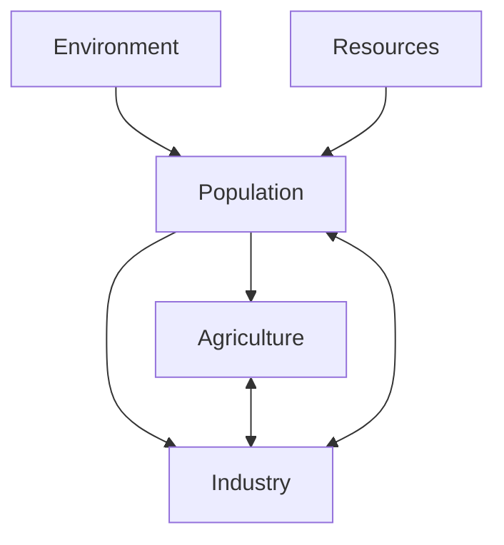
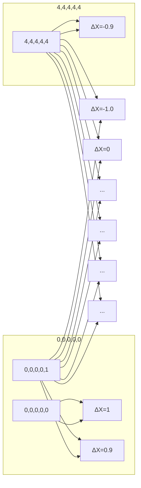
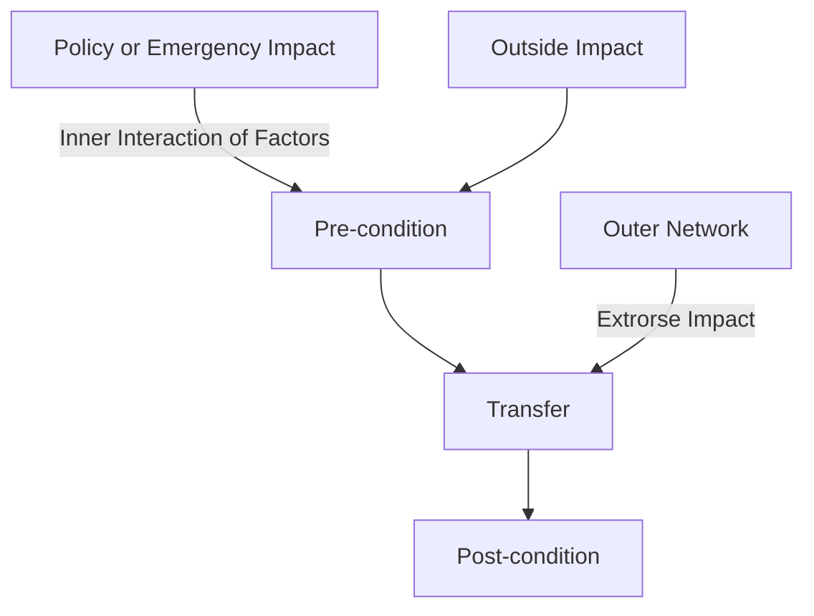

For office use only

T1

T2

T3

T4

## 18492

Problem Chosen

C

For office use only

F1

F2

F3

F4

# Two-tier Communication Network Model of Global Health

# Summary

Modeling and predicting the Earth's health condition is an intricate problem, which should embrace the complexity of Earth's interrelated systems, and take into the consideration of global impacts on local conditions and vice versa. With the assumption that the population and human civilization act as the dominating driver of environment degradation, we build a novel people-oriented two-tier communication network model (TCNM) to consider the environment degradation. •

Firstly, we define the elements of the global network. The nodes are the abstraction of geographic division, whose area share analogous trait regardless of the nuance of traits within the area. Besides, the links are the geographic adjacent relation between two nodes. Here we introduce the concepts of signal channels and signals derived from communications network to represent the links and impacts transmitted between nodes respectively, so as to make it possible to consider all the impacts as a whole in the network.

Secondly, we study the node tier of TCNM. Several driving factors that could result in environment degradation are identified inspired by Forrester's World Model, and also quantified so as to enable further analysis. Then we use Bayesian Belief Network to study the impact generated by the interaction of these factors with respect to the inherent trait of nodal area. Also, a novel analogy with nodal character and communication protocol is introduced to study how nodes' condition evolves. The impacts imposed on the nodes are compared to the protocol events in communications field, while the impact exported by the node is compared to protocol actions executed when status transferring, which simplify the study of node state evolution when every iteration occurs. Moreover, we develop a nodal health measurement, which measures the local health of the network. The measurement standard takes into account three environmental factors that can quantify the health condition and then weights them using an analytical hierarchy process (AHP) approach. The nodal tipping point is also mentioned and quantified, which is 0.301 for our model.

Thirdly, the global tier of TCNM is studied. We distinguish the influence of a node’s inactive/active state on the signal transmission. Besides, the diffusion of atmosphere pollution and population movement over the network are studied and modeled respectively. This process is critical because it makes it possible for us to study the globa impact on local conditions and vice versa. The global health measurement is studied with lattice network structure. We use the percolation ratio of the active nodes as the global health measurement. By using network theory, we come up with a global tipping point, that is, when percolation ratio of active nodes is under 0.682, then the tipping point has been reached.

Finally, we discuss the requirements of necessary data in order to validate or apply our model to practical use. We also study the methodology of parameter estimating. Furthermore, to better explain our model, we also discuss in detail how certain kinds of policies impact the model in a general scenario and vice versa. Sensitivity is also discussed in this section. Moreover, the critical nodes and edges are studied using network structure.

In the end, we conclude the strengths and weakness of TCNM. The model is quite robust because of the network structure of our model and would probably work well with enough necessary data, according to the intrinsic trait of machine learning approach. However, the correctness of our model remains to be verified lacking of necessary data. Also, the introduction of AHP approach brings in some subjective factors of our model.

## Contents

## 1. Introduction 2

1.1 Background.. 2  
1.2 Our Work . 2

## 2. Assumption .... 3

## 3. Two-tier Communication Network Model. 3

## 3.1 Node.. 5

3.1.1 Node definition .. 5  
3.1.2 Driving factors of environment degradation. 5  
3.1.3 Node characterizing with communication protocol . 6  
3.1.4 A Revised Bayesian Belief Network study of factors.................  
3.1.5 Nodal Health Measurement . 9

## 3.2 Link. ................ . 10

## 3.3 Topology. ... Y . 10

3.3.1 Influence of active/inactive node condition ............... 11  
3.3.2 Migration Model. ............................................  
3.3.3 Air Pollution Dispersion Model................................................... 12  
3.3.4 Policy and emergency impact ................................................. . 12  
3.3.5 Node status evolve in every iteration ......................... 12

## 3.4 Global Health Measurement ........ Y 13

## 4. Discussion and Simulation Run ........................................... . 14

4.1 Dataset Requirements and Collect Suggestion ..... . 14  
4.2 Parameters Estimate........ ................ 15  
4.3 Impact of policy and decision support ...... 15  
4.4 Sensitivity and Uncertainty Analysis 17  
4.5 Critical nodes and links . 17

## 5. Conclusion.. .. 18

5.1 Strength.. . 19  
5.2 Weakness . . 19

## Reference.. .. 20

## 1. Introduction

## 1.1 Background

Human beings are blamed for global environment degradation. Many biological forecasting now depends on projecting recent trends into the future assuming various environmental pressures, or on using species distribution models to predict how climatic changes may alter presently observed geographic ranges (Anthony D. B., et, al., 2012).

Study have shown that threshold effect can cause 'Critical Transitions' (Scheffer, M.et al., 2009) and thusly lead to state shifts, which lead to inevitable biotic great change. Some measurements have been addressed to anticipate a planetary state shift, including quantified land use. An estimate of 0.68 was use for the year 1700. However, researchers still are not clear about how much land would have to be directly transformed before a state shift was imminent (Anthony D. B., et, al., 2012). An empirical landscape-scale studies shows that the critical threshold may be between 50 and 90% (Jackson, S. T., et, al., 2009).

However, few models are able to take into consideration complex global factors or determine the long-range impacts of potential polices. To build better predictive models, firstly the modeler must embrace the complexity of Earth's interrelated systems and study the mutual effect of global and local systems. Secondly the factors that put press on the environment must be identified (Anthony D. B., et, al., 2012).

In this problem, as members of International Coalition of Modelers, we are required to build a people oriented dynamic global network model of some aspect of Earth's health by identifying network nodes and appropriately connecting them to track relationship and attribute effects. We are also expected to run the model to see how it predicts future Earth health and discuss the factors produced by the model, the state change or tipping point prediction. Also, the model is expected to help decision makers about how their potential policies influence the long-range global Earth health. The network structure, say, critical nodes or relationships should be examined at the same time.

However, the model is hard to be verified, lacking of real-world dataset. Two important reasons are proposed. Firstly, although the Earth has suffered "Big Five" extinctions (Barnosky, A. D.et al., 2011) before, the datasets at that time are hard to obtain, and the environment indexes are difficult to measure the Earth health today. Besides, the antediluvian Earth environment evolves without human beings and civilization, which act as the key cataclysm of today's environment degradation. Secondly, although many kinds of data our model uses can be obtained somehow, some necessary data remains absent without the support of authority or decision makers. We will discuss the data requirements later. Thus, good creative ideas and theories are very important for our model in this case. Moreover, a more clear and intuitive running process should be given compared to data-based model.

## 1.2 Our Work

The development of our model was inspired by two ideas, which respectively contributes to the two tiers, with respect to both the complexity of the dynamic global network and simplification of the modeling process.

Firstly, we define the node based on geographic division; whose intrinsic trait and its impact on the interaction of driving factors are studied using Bayesian Belief Network. The states of Bayesian Belief Network (inner nodes) represent the driving factors of ecological degradation. We defined five driving factors with their dependency derived from famous models of world dynamic. Moreover, we elaborate the environment dimension as the local health measurement for the node. Here we use an analytic hierarchy process (AHP) to weight the various aspect of environment, such as species diversity index, etc. Since each aspect of the environment factor has its own threshold, the measurement thusly also has a general threshold. By using a Bayesian Belief Network model to reveal the impact of the area’s intrinsic trait on the interaction of factors, we could train the Bayesian Belief Networking to get the probability distribution the change of factors. Besides, considering the policy effect or emergency events which can be represented by numerical change of factors' quantized indexes, we are able to study the long-range impact of potential policies or emergencies.  
Secondly, we formulate our global model by appealing to communication network models. The links between nodes (geographical adjacent relations) are treated as signal channels that can transmit signals

(population movement or diffusion of atmospheric pollution) and the signals can only be transmitted by signal channels. For each time of iteration, the signals received are regarded as protocol data unit (PDU), the potential policies and emergencies are viewed as service primitives, and the internal impact generated by factors' interaction acts just as the timer in the communication protocol. All of the three impacts (PDU, service primitives and timer) are protocol events which will cause protocol state change and carry out some protocol action in a communication model, which means giving out signals in this case. The health measurements of the global model are studied using network properties. We study the average shortest path of the global network and the giant component to measure the global Earth health and tipping point.

We also discuss in detail how our model work and the likely result of our model. Besides, how our model helps decision making and the critical nodes and relationship are also involved in this paper. In the last part of the paper, we discuss the advantages and disadvantage of our model and give some potential future work.

## 2. Assumption

Once a critical transition occurs, it is impossible for the system to return to its previous state. Critical transition means that once it occurs, there will be a reduction in biodiversity and severe impacts on much of what we depend on to sustain our quality of life. Such state change is extremely hard and even unable to go back to previous condition (Robert S., 2012). Here we assume that the critical transition is irreversible to simplify the model. 0

The population act as the dominate driver of all the factors. Of all the factors that impose impact on the environment, the human beings and the highly advanced civilization are the key driver and cataclysm of the environment degradation. It has been long studied that the global environment degradation has been accelerated heavily since the industrial evolution. The population factor has been the fundamental driving force for agriculture, industry, pollution, and impacts environment either directly or indirectly through the factors just mentioned.

The intrinsic trait of an area remains constant in a long period of time. The intrinsic trait of an area is some inherent properties of the certain area, including landform and monsoon, etc. The intrinsic trait is opposite concept of the drivers (or factors) which impact the Earth health. We assume that the intrinsic trait remains constant in that not only can we simplify the model but also help study the mutual effect of local conditions and global system. For example, we can apply Gaussian diffusion model (Donna B. S. et, al., 1999) to our global pollution diffusion analysis if the wind speed remain homogenous and stable in the entire space.

With a certain temporal and spatial resolution constraint, the health condition and impact are discrete. In a global network model, the node health condition could evolve because of its inner interaction of driving factors or outer impacts, and sometimes potential policy and emergency. In this paper, we assume that the health condition and impact are discrete. That is, the node has a pre-condition before inner or outer impact takes effect and a post-condition after it. For every iteration with a certain temporal and spatial resolution, the impacts it received in the last iteration actually take effect, and the node export impact to other nodes through the network while receiving impact from other nodes, then the node come to a post-condition. The outer impact received in this iteration, and the inner impacts generated by driving factors are stored until next iteration. This assumption will be explained as a communication network model later in 3.3.5. However, it must be aware that if the temporal and spatial resolution is extremely small, the health condition and impact are nearly continuous.

## 3. Two-tier Communication Network Model

## Model Overview and Concepts Definition

We formulate the global network into a two-tier communication network model (TCNM). The important elements and concepts are defined as following:

text_image

PACIFIC
OCEAN

Figure 3-1 Node definition in state level

Factor: Inspired by Forrester’s World Model (Donella M., et, al., 2004), we define the factors that drive the environmental evolution (or degradation) and thusly determine the Earth Health measurement in five dimensions, which are: population, environment, resource, industry and agriculture, in which the population acts as the key pressure of environment evolution. x  
Health Measurement: We use a joint health measurement using the environment factors to measure earth health, including species diversity index, air pollution index and landform change rate. We use an analytic hierarchy process (AHP) approach to determine the importance of each factor, which will be discussed in detail later.  
Node: The nodes of the HCNM are generally based on physical geographic division, where the area represented by one node share analogous trait and the trait is assumed to be the same regardless of the nuance within the area. However, the resolution of a node can be modified according to the decision maker's jurisdiction level, such as county, state (as shown in Fig. 3-1) and nation, etc. The node has two states, which are active and inactive. The distinction between the two states is that the inactive nodes are those which the health measurement under the tipping point (threshold) and cannot be transferred to active again. People cannot live in inactive nodes, while those nodes are still able to release pollution to other nodes. This will be discussed later.  
Signal: The signals are the impacts that a node imposes on another node. The two types of the signal are diffusion of atmospheric pollution and population movement. The signals can only be transmitted in signal channels.  
Link: The links between the nodes are defined as signal channels, that is, the signals (the air pollution and population movement) can be transmitted from one node to another through signal channels. The signal channels represent physical adjacency relations between two nodes (the links in Fig. 3-1).

The advantage of using communication network models is that the different kinds of propagation flow are represented by similar entities (signal), and are conducted by the same link (signal channel) in the same network. All the impacts from outer or inner generators are regarded as communicational protocol event and will cause protocol state change and carry out protocol actions, which simply the dynamic global model and enable us to integrate multiple interactions within the same network to generate a more intuitionistic working process of the model.

Our model is also two-tiered. That is, while the global network defined as a communication network, the nodes of the global network are intrinsic Bayesian Belief Network within itself. This makes it possible to delve deeper into the interactions of different factors within the node and to quantify the outside (global) and policy impact on the node.

In this section, we define the nodes and then discuss the node-tier of the TCNM in detail, including the quantization of driving factors of the environment evolution or degradation, the node character analysis using communication protocol and the advantage of this analogy, the revised Bayesian Belief Network model which reveals how factors interact with each other, and the measurement of node level Earth health, etc.

## 3.1 Node

## 3.1.1 Node definition

Node: An abstraction of geographic division on Earth, whose area share analogous trait, and whose trait is assumed to be the same regardless of the nuance within the area.

Although we define the nodes regardless of whether the node represents ocean or land, there're two important issues that is worth mention. On the one hand, our model is people-oriented, and since people live on land, the human civilization will directly impose direct impact on land and offshore areas, and affect the ocean indirectly. On the other hand, the trait of lands and oceans are different, which make it difficult to measure the nodes’ health condition using a general quantized measurement. However, all these issues have been taken into consideration in the nodal health condition.

The resolution of a node can be modified according to the decision maker's jurisdiction level, such as county, state and nation, etc. The nodes have two distinct states, which are active and inactive, which will be explained in 3.1.5.

## 3.1.2 Driving factors of environment degradation

The node status is influenced by the interaction of five factors inspired by Forrester’s World Model (Natali H., et, al., 2006) shown in Fig. 3.1.2-1, which are environment, resources, population, industry, and agriculture. The arrows reflect the mutual interaction of those factors. The environmental factors are selected as the measurement of node’s health, which will be discussed in the next section. We use these five factors to represent the node’s condition.

flowchart

Figure 3.1.2-1 Forrester’s World Model

## Environment

To identify the index of environment, we consider the following metrics:

Species Diversity: Species diversity studies the abundance of each species. The areas with high species diversity are generally healthier than others. We uses Simpson's Diversity Index (SDI) to measure the species diversity (Simpson E. H., 1949), it can be defined as:

$$
\mathrm{SDI} = 1 - \frac {1}{N (N - 1)} \sum_ {i} \left(N _ {i} (N _ {i} - 1)\right) \tag {1}
$$

Where SDI is Simpson’s diversity index (Simpson, 1949). $N _ { i }$ is the number of species $\mathrm { i } ;$ N is the number of all species.

Air Quality: Air Quality Index (AQI) is used to indicate the extent of air pollution. The United States Environmental Protection Agency (EPA) has developed an index which they use to report daily air quality. The AQI is divided into six stages indicating increasing levels of health concern. An AQI value over 300 represents hazardous air quality whereas a value below 50 means good. An AQI value of 100 generally corresponds to the mark for the pollution.

Table 3.1.2-1 Air Quality Index stages (EPA, 2012)

<table><tr><td>Air Quality Index (AQI)</td><td>Levels of Health Concern</td><td>Colors</td></tr><tr><td>0~50</td><td>Good</td><td>Green</td></tr><tr><td>51~100</td><td>Moderate</td><td>Yellow</td></tr><tr><td>101~150</td><td>Unhealthy for Sensitive Group</td><td>Orange</td></tr><tr><td>151~200</td><td>Unhealthy</td><td>Red</td></tr><tr><td>201~300</td><td>Very Unhealthy</td><td>Purple</td></tr><tr><td>301~500</td><td>Hazardous</td><td>Maroon</td></tr></table>

The AQI is based on the five pollutants regulated by the Clean Air Act: ground-level ozone, particulate matter, carbon monoxide, sulfur dioxide, and nitrogen dioxide. To integrate all the pollutants’ impacts, AQI is represented by this formula:

$$
I _ {i} = \frac {C - C _ {l o w}}{C _ {h i g h} - C _ {l o w}} \left(I _ {h i g h} - I _ {l o w}\right) + I _ {l o w} \tag {2}
$$

Where $I _ { i }$ is the AQI of pollutant i, C is the pollutant concentration, $\mathcal { C } _ { l o w }$ is the concentration breakpoint that is lower than $\mathrm { C } , C _ { h i g h }$ represents the concentration breakpoint that higher than $\mathrm { C } , I _ { l o w }$ is the index breakpoint corresponding to $C _ { l o w } ; I I _ { h i g h }$ represents the index breakpoint corresponding to $C _ { h i g h }$ .

If multiple pollutants are measured at the same time, then the max AQI of pollutant is the area’s AQI value (David M., 2009).

$$
\mathrm{AQI} = \operatorname{Max} \left\{I _ {i} \right\}, i \in [ 1, 5 ] \tag {3}
$$

Landform Change Ratio (LCR): LCR can be directly calculated by using the area of landform changed to divide the total area. LCR is useful because it studies the proportion of the land used by humankind (e.g. urban area, farmland). 6

Resources: Our model chooses the sum value of four kinds of resources to quantify the resources. The four resources are land, forest, coal, and oil. We assume that the amount of a kind of resource before industrial evolution as the upper bound of the resource, so that we could index the amount of resources by ratio. The data of different resources should be normalized to its canonical form before summing process.

Agriculture: We appeal to Agricultural Production Indices (API) to study agriculture factor. API is based on the sum of price-weighted quantities of different agricultural commodities produced after deductions of quantities used as seed and feed weighted in a similar manner, which is introduced by the Food and Agriculture Organization of the United Nations (1995).

Industry: The industrial factor is quantized by Industrial Production Index (IPI), which is an economic indicator published by the Federal Reserve Board of the United States that measures the real production output of manufacturing, mining, and utilities.

Population: the population in a certain area, which will be quantized later.

## 3.1.3 Node characterizing with communication protocol

The nodes of the TCNM can be characterized using communication protocol because of their intrinsic similarity. Before further relationships are discussed between nodes of TCNM and communication protocol, some communication protocol element must be explained to better understand the advantage of this analogy. The communication protocol have several elements, including service primitive, protocol data unit, protocol variables, protocol status, protocol action, protocol event, etc.(Stefan B., 2000).

Service primitive: the user of a communication gets services using service primitive, while the protocols receive instruction through service primitive.

Protocol data unit (PDU): the PDU act as the basic unit as peer entities transfer messages, which define the content and form of messages. The PDU are generally known as signals.  
Protocol variables: the variables that a protocol uses.  
Protocol status: the status when the protocol entity protocol is waiting for input events.  
Protocol action: protocol action is the action a protocol entity performs when protocol status transfers from the former to latter.  
Protocol event: protocol event is the trigger of protocol status transfer, including PDU from peer protocol entities, service primitive from protocol users, and inner timer signals.

Protocol status transfers to another status when some certain protocol event occurs, during which the protocol wil perform some actions. Relatively speaking, the former status is the latter's pre-condition, while the latter is the former's post-condition. The protocol transformations are represented by protocol status machine.

Now we can discuss how TCNM nodes can be characterized using communication protocol and the advantage of this analogy. As stated in 3.1, we have defined five driving factors of environment, which will change over time. These driving factors are similar to protocol variables in a communication model, because the node conditions of TCNM are quantified by these driving factors. Besides, the node condition's counterparts in the communication model are protocol statuses.

We have known that the TCNM node conditions change over time, either because of the mutual interaction of driving factors or result from outside impact on the node, or because of some emergencies or policies. One complex consideration of our modeling is how to combine all these impacts from three sources to predict the future condition of the node. By compare the outside impact to PDU, the emergencies and policies to service primitive, and the impact form inner node to inner timer of the protocol(although the third analogy is not very appropriate, the impact from inner node and timer share a key character in common, which is that they are both call up by the node/entity itself), we are able to treat all the impacts as protocol events of a communication model and integrate these impacts from three different sources to study the evolvement of node condition. Thusly, all the impacts can be simply represented and quantized by the numerical changes of driving factors of the nodes.

Another important abstraction we benefit from communication protocol model is the introduction of pre and post conditions. We have known that the node condition changes temporally, but since the nodes are in a global TCNM network, the impact that the node imposes on other nodes will eventually affect itself sooner or later, slighter or heavier, which makes it difficult to study the node condition evolution over time. By intruding pre and post conditions, we can assume that all the impacts from three generators (node itself, outside and emergency) will not take effect immediately, but will be stored to next iteration. In this situation the node is in a condition (precondition) with some pending impacts. These impacts will work in next iteration, when this happens, the node condition changes and exports impacts towards other nodes, and transferred to next status (post-condition). This abstraction and division enables us to discuss the node condition evolution when each time of iteration occurs, which will be discussed in detail in section 3.3.5.

## 3.1.4 A Revised Bayesian Belief Network study of factors

In order to learn from the historical data about how mutual interaction of factors is guided by the potential impact of the local area’s intrinsic trait (landform, monsoon), and thusly influence the environment evolution of the area, we introduce a machine learning based approach using Bayesian Belief Network. As an extended version of Markov Chain, the Bayesian Belief Network can use a probabilistic transition based directed acyclic graph (DAG) to represent the complex interaction of factors. However, the size of the network is limited. In our model, the number of Bayesian Belief Network nodes is small so that we could use Bayesian Belief Network to train and predict the local area condition. In order to simulate the real-world problem and prevent our model from overfitting, we revise the original Bayesian Belief Network superseding the general DAG by a directed bipartite graph. Thusly the outcome of the model fulfills our demand better.

## Discretization of status

The original intention of using Bayesian Belief Network is to reveal the impact of interactions of status. In order to use the nodes of Bayesian Belief Network to represent the status, we must discretize the driving factors that constitute the status.

We initially normalize all the factors and then discretize each factor to five grades with respect to the limit of status numbers and the accuracy of results. As pre-defined in session 3.1, the environmental, resource, industrial, agricultural factors already have clear upper bounds, which make it possible to normalization. Here, as for population factor, considering the study of Department of Economic and Social Affairs of United Nations about world population prospects (Anthony D. B., et, al., 2012), we use the three times of current population as the upper bound of population factor. The population factor will stay at the upper bound if the population exceeds it. We use $V _ { n }$ to represent the population of the current area.

The detailed quantitated factor’s normalization metrics are shown in table 3.1.4-1.

Table 3.1.4-1 Quantitated factor’s discretization metrics

<table><tr><td>Factor</td><td>Environment</td><td>Resources</td><td>Population</td><td>Industry</td><td>Agriculture</td></tr><tr><td>Max Value</td><td>1.0</td><td>4.0</td><td> $V_n$ *3.0</td><td>100.0</td><td>100.0</td></tr><tr><td>Level Gap</td><td>0.2</td><td>0.8</td><td> $V_n$ *0.6</td><td>20.0</td><td>20.0</td></tr></table>

## Construction of Bayesian Belief Network model

Now that we have discretized all the factors of the nodes’ conditions, we can build the key element of the Bayesian Belief Network, say, status and connection, and thusly explain the input and output of the model.

We use a directed bipartite graph to supersede the DAG in the original Bayesian Belief Network model. The Fig. 3.1.4-1, whose X set’s status are represented by a five-dimension vector of discretized factors (for example, if the current five factors are respective 0.5, 1.5, 45.0, 30.0, then the status is represented as $\vec { V } = \overrightarrow { \left( 2 , 1 , 1 , 2 , 1 \right) }$ in the network), and whose Y set is made up by the changes (contiguous value) of respective factors of the status after every iteration, could illustrate our bipartite Bayesian Belief Network model. From this definition the size Y set seems to be very large, but actually the output of the network is a continuous probabilistic distribution of Y set, so the size of Y size will not influence the efficiency of Bayesian Belief Network. Another crucial definition is the connection in the Bayesian Belief Network. Since the purpose of the Bayesian Belief Network is to get the probability of the connections of status, the connection in our bipartite Bayesian Belief Network is the one-way transfer from X set to Y set, which is also a DAG that fits the Bayesian Belief Network nature. Be aware that the in Y set could be change of either factor dimension.

flowchart

Figure 3.1.4-1 a simple bipartite Bayesian Belief Network model

Considering the independent changes of either dimension (factors) of the status will impose a cascading impact on the model, including status transfer and actions carried out, we expect to reveal the probability distribution of changes of status’ factors respectively in a certain status. Note that the “status” mentioned here is a status vector consists of all the factors that are closely related to the targeted factor that we want to study. Hence, our expect outcome of the Bayesian Belief Network model could be represented by following set:

$$
\{P (\Delta X | \text { Pre } - \text { Condition } _ {x}) | X \in S \} \tag {4}
$$

Where S is the set of five factors, represents the targeted factor we want to study, − ?? represents the status vector consists of all the factors that are closely related to X. This set consists of the distribution of the change of five factors respectively. When running the model, the five dimension of the status (factors) will be affected according to this distribution.

## Training of Bayesian Belief Network model

Training the Bayesian Belief Network consists of two parts, which are structure training and parameter training.

For the structure of Bayesian Belief Network, the foremost issue arises from determining the factors that have mutual interactions. The result of the model is not in proportion with the number of connections between factors, which means that lesser and more appropriate connections will be more accurate and robust. In this paper, we still appeal to Forrester’s Global Model theory (Natali H., et, al., 2006) and only keep the direct connection between the factors shown in Fig. 3.1.2-1. The latent connection and impact will be involved in the Bayesian Belief Network through machine learning approach. Training of parameters of the network will be discussed later in parameter estimation section 4.2.

## 3.1.5 Nodal Health Measurement

In this section we discuss the nodal health measurement (????) that could be used to quantify the status of the node of the HCNM. We assume that the health of an area is determined by the environmental factors mentioned in 3.1.4, including nodal species diversity, air quality and landform change. So the node’s health (????) can be defined as following:

$$
N H = \omega_ {s} \cdot N S D I + \omega_ {a} \cdot N A Q I + \omega_ {l} \cdot N C L R \tag {5}
$$

Where????, $\omega _ { a } .$ , ???? denotes the weight of species diversity, air quality, landform change respectively, and ????????, ????????, ???????? denotes the normalized value of ??????, (500 − ??????), (1 − ??????) in order.

## Weights estimate using analytical hierarchy process

Having defined the elements, we are going to decide the weights of three factors. Analytical Hierarchy Process (AHP) is a proper way to find the weights.

Firstly, we need to construct a pairwise comparison matrix to present the relative importance of these three elements. As studied by Anthony D. B., et, al. (2012), worldwide shifts in species ranges, phenology and abundances are concordant with ongoing climate change and habitat transformation. So we judge species diversity is the main environmental factor with highest weight. What’s more, air quality also has a big influence on environment. And landform change ratio is also related to the environment, but slightly indifferent. So the pairwise comparison matrix can be defined as following:

$$
A = \left(a _ {i j}\right) _ {n \cdot n} \tag {6}
$$

Where $a _ { i j }$ is the relative importance of element i and element j.

The pairwise comparison matrix is expressed as following:

$$
A = \left[ \begin{array}{c c c} 1 & 5 / _ {3} & 5 / _ {2} \\ 5 / _ {3} & 1 & 3 / _ {2} \\ 2 / _ {5} & 2 / _ {3} & 1 \end{array} \right] \tag {7}
$$

Our next step is to get the largest eigenvalue and the largest eigenvector, the results are λ = 3 and = ,0.5 0.3 0.2- where denotes the largest eigenvalue, and is the normalized value of the largest eigenvector according to the matrix A and A = .

Then, we check the consistency of the pairwise comparison matrix by using consistency ratio ( ) (Saaty T L. 1980). If the is below 0.1, the degree of inconsistency in this matrix can be accepted. The CR of A equals to 0, which indicates the matrix A is acceptable. The equation to calculate the CR is as following:

$$
\mathrm{CI} = \frac {\lambda - n}{n - 1} \tag {8}
$$

$$
\mathrm{CR} = \frac {C I}{R I} \tag {9}
$$

Where n is rank of A, CI is the index of consistency, RI denotes index of random consistency. Thus, we can conclude that the parameters of NH are: $\omega _ { s } = 0 . 5 , \omega _ { a } = 0 . 3 , \omega _ { l } = 0 . 2 .$ .

## Nodal tipping point/threshold

Here we discuss the tipping point of nodal environment health with respect to the tipping point of the three factors of the environment health respectively.

The major biotic changes were the extinction of at least 75% of Earth’s species (Anthony D. B., et, al., 2012). Thus, the threshold of species diversity is 0.25. An empirical landscape-scale studies shows that the critical threshold of landform change may lie between 50 and 90% (Jackson, S. T., et, al., 2009), here we use an estimated value 0.68 as the threshold of LCR. Besides, 300 is an empirical value of the AQI’s tipping point. When any of the three thresholds have been reached, the nodal health is considered in danger, in which case should the model warn the decision makers.

A general nodal threshold (???? ) is set to a value, which could be computed as the weighted average value of all three thresholds, which is $( N H _ { t } ) = 0 . 5 \times 0 . 2 5 + 0 . 3 \times ( 1 - 0 . 6 8 ) + 0 . 2 \times ( 1 _ { \cdot } - 0 . 6 ) = 0 . 3 0 1$ . When ???? is under 0.301, then the local node’s threshold has been reached. 0

Once the nodal health reaches it threshold, the node transfers form active condition to inactive condition, which is irreversible. Population will be reallocated to adjacent nodes and the inactive nodes can only transfer air pollution, which will be discussed later. ′

## 3.2 Link

The links of the global network represent the geographical adjacency of the nodes. In our two-tier communication network model, the signal channels are a good analogy of edges. The signal channels are defined as following:

Signal channel: the channel which enables signal pass through (B Sklar, 1988).

In a global network, one node can impose various kinds of impact on another node, which make it difficult to define the meaning of the link. In our model, we assume that the impact can be either diffusion of atmosphere pollution or population movement. It will be easy to construct two separate networks to represent the two kinds of impact as links respectively, which make it easy to explain and construct. However, this coarse isolation could make it difficult or even impossible to consider all the impacts and factors as a whole to study their interactions. Thus, we come up with a mechanism to combine the various outside impacts on the node by using the signal channels to represent the links.

Hence, the signals are pre-defined in session 3.1.3 as protocol data unit (PDU). There're two types of signals, which are diffusion of atmosphere pollution and population movement. The signal channels lay between two nodes if the two nodes are of adjacency relation. We will use this abstraction and analogy to explain the impacts from nodes to nodes, the critical nodes and relationships and the global health measurement later.

## 3.3 Topology

After the node and link definition, in this section we are going to discuss about the network topology, that is, how signals pass through the signal channel and thusly enable air pollution and population movement spread over the global network. Firstly we are going to study how the active or inactive condition of the node affects the signal transformation. Secondly the diffusion of atmosphere pollution and population movement is discussed in detail and policy and emergency are also mentioned. Finally we're going to use a communication protocol analogy to study during each time of iteration, how the impacts from all three sources (inner interaction of factors, outside impacts received and policy or emergency impacts) work together to transfer the node from pre-condition to postcondition, and how impacts will be exported to other nodes by the node itself.

## 3.3.1 Influence of active/inactive node condition

We have talked about the threshold or tipping point in section 3.1.5, that once the threshold has been reached, there will be a reduction in biodiversity and severe impacts on much of what we depend on to sustain our quality of life. We have also quantized the threshold. The distinction between the active and inactive condition is thusly defined. The nodes are initially all active. The inactive nodes are those which the health measurement exceeds the tipping point (threshold) and cannot be transferred to active again. People cannot live in inactive nodes, while those nodes are still able to release pollution to other nodes.

## Population Reallocation

When a threshold has been reached, the area presented by the node is no longer livable. Hence, the first and foremost influence of change from active to inactive condition is population reallocation. We assume that the people will move to adjacent active nodes according to their health condition. The population reallocated to an adjacency active node n' are represented as following:

$$
\Delta V _ {n n ^ {\prime}} = \frac {N H _ {n ^ {\prime}}}{\sum N H} \cdot V _ {n} \tag {10}
$$

Where $V _ { n }$ means the population of node n before it goes inactive, ∑ ???? means the sum of all the adjacent active nodes' health value defined in 3.1.5, $N H _ { n ^ { \prime } }$ represents the health value of adjacent active node n', and thusly $\Delta V _ { n n ^ { \prime } }$ is the population reallocated to n'. An extreme case is that all the adjacent nodes have been inactive. If that happens, the population cannot escape from the current node. Sadly, that part of population will be excluded from our model.

## Signal Transfer

Another impact of inactive state is on signal transfer. The atmosphere pollution and population can transfer through an active node, as we have known before. However, an inactive node can only transfer atmosphere pollution. Besides, population cannot move into it.

## 3.3.2 Migration Model

The aim of this model is to study how people move to adjacent area and thusly moves across the network. Like mentioned in 3.3.3, we assume that people movement, which is regarded as a kind of signal, can only move to the adjacent area through signal channel if people feel that area is addicted to them. So we develop a Migration model based on the I. S. Lowry regression model (Lowery, 1996). The original attraction for migration in Lowry’s model is job opportunity. However, the nodal health is better than job opportunity to represent the attraction to people. To calculate the extent of immigration between the two adjacent areas, we select the nodal health discussed before, including environmental factors of species diversity, air quality, landform change ratio and the population to measure it. The expression is as following:

$$
M _ {i j} = K \left(\frac {N H _ {i}}{N H _ {j}} \cdot \frac {V _ {i} V _ {j}}{D _ {i j}}\right) \tag {11}
$$

Where $M _ { i j }$ is the population move from area j to area i; $N H _ { i }$ and $N H _ { j }$ are the nodal health condition of the two areas respectively; $V _ { i }$ and $V _ { j }$ are the population of the two areas; $D _ { i j }$ is the distance between the two areas.

The formula above studies the migration between two nodes. During a single iteration, the population would migrate through the network. Thus after the iteration, the final population of the node i $V _ { i }$ could be defined as following:

$$
V _ {i} = V _ {i ^ {\prime}} + \sum_ {j \in S} M _ {i j} - \sum_ {j \in S} M _ {j i} \tag {12}
$$

Where $V _ { i ^ { \prime } }$ means the original population of node I before iteration, S denotes the set of all the adjacent nodes of node i, $M _ { i j }$ is the population moves in from node j to node I, and $M _ { i j }$ represents the population moves out from node I to node j.

## 3.3.3 Air Pollution Dispersion Model

We based our air pollution dispersion model on the steady-state Gaussian plume equation (Donna D., 1999) to analysis the diffusion of atmosphere pollution over network. To avoid over-fitting, our model use the air quality of node’s central zone to present the area’s air quality. The transmission of different air pollutants can be calculated individually, because the spread of these air pollutants are not related to others. However, we can describe the different air pollutants in the same model, in that the transmission pattern of air pollutants are similar. We assume that the air pollution signal can only transfer through the signal channel, which means if the areas are nonadjacent, one can’t affect another directly. The pollutants’ concentration of a certain node caused by the single transmission process can be expressed by Gaussian plume equation as following:

$$
C (x, y, z) = \frac {Q}{2 \pi \mu \sigma_ {y} \sigma_ {z}} e ^ {- \frac {1}{2} \left(\frac {y ^ {2}}{\sigma_ {y} {} ^ {2}} + \frac {z ^ {2}}{\sigma_ {z} {} ^ {2}}\right)} \tag {13}
$$

Where $\mathbb { C } ( x , y , z )$ denotes the pollutants’ concentration of a certain node, which could be either pollution source node or adjacent receiver node; ?? denotes the source concentration of air pollutants; ?? is distance between the center of source and receiver (Remember, the receiver could be the source itself) in the downwind direction, the ?? is distance in crosswind direction and the ?? is the vertical distance; μ denotes mean wind speed at release height; $\sigma _ { y } , \sigma _ { z }$ are standard deviation of lateral and vertical concentration distribution (m). The parameters such as $\mu , \sigma _ { y } , \sigma _ { z }$ can be measured. The method will be discussed in the other part.

Hence, we can get a series of the pollutants’ concentration of a certain node, as treating the node as either its neighbor node’s receivers or source of the pollutants respectively. All the computed value of pollutants’ concentration of a certain node is added up together in an iteration to obtain the final concentration, which can be expressed as following:

$$
T C _ {k} = \sum_ {i \in S} C _ {i k} \tag {14}
$$

Where $T C _ { k }$ is the final concentration of a node with respect to both the impact form the node’s adjacent area and itself, ?? represents a set of nodes including the current node’s neighbors and itself, $C _ { i k }$ is the concentration of the node respectively computed by treating the node as either source or receivers of pollutants.

## 3.3.4 Policy and emergency impact

The policy and emergency are viewed equally in the model, because they both can be explained by the change of value of driving factors. About this issue, we will discuss later in the model running section.

## 3.3.5 Node status evolve in every iteration

We have discussed impacts from all three sources in the model, including inner interactions of several factors, outside signals, and emergency or policy. These impacts can be represented by protocol events, which are originally defined as service primitive form users, PDU form peer protocol entities and inner time. In a general communication protocol model, the node status evolution process could be regarded as discrete, which means when the protocol is at a certain status, an event occurs so that the protocol transfer to next status, and during the transfer process, the protocol entity carry out some event. Similarly, in TCNM, the note status evolves as shown in Fig. 3.3.5-1 during each time of iteration.

flowchart

Figure 3.3.5-1 Node status transfer

The similarity and mapping from TCNM and communication protocol have been discussed in 3.1.3. The impacts from all three sources are eventually reflected in the change of five factors of the status. Since we have trained the Bayesian Belief Network and get the distribution of the change of status’ five dimensions (five factors), we could compute the evolution of the node status. For each time of iteration, the node in its pre-condition status performs the impacts which are received in the last iteration, export new impact to outer network and then come to the postcondition. In the transfer process, the node will receive outside impact, policy and emergency impact, and inner interaction of factors, however, these factors will not take effect immediately. Actually, the pending impacts will perform effect in the next generation as just described. 6

## 3.4 Global Health Measurement

We have come up with a nodal health measurement (????) in section 3.1.5, which is used to measure the health condition of the local nodes, and determine the tipping point of local area. In this section, a novel global health measurement (????) is raised to measure the global health with lattice network structure. Moreover, the global tipping point is estimated using properties of the network structure. Before further extend our approach, some SNA concepts and properties must be explained.

Average degree: the average value of the all node's degree.  
Giant component: a giant component is a connected component of a given random graph that contains a constant fraction of the entire graph's vertices.  
Network Resilience: the ability of the network to provide and maintain an acceptable level of service in the face of various faults and challenges to normal operation.  
Site percolation: Fill in each site with probability of p, which also means each site is removed with probability of (1-p) (A. Rosowsky, 1999) as illustrated in Fig. 3.4-1.

natural_image

Grid pattern with alternating black and white squares (no text or symbols)

Figure 3.4-1 A square lattice in 2-dimensions

There's also a critical theory about network resilience in a lattice network, as the p of site percolation reach a threshold Pc, a giant component suddenly appears. Edge removal is the opposite process – at some point the p drops below Pc and the network becomes disconnected (A. Rosowsky, 1999). Rosowsky have learned that the threshold of square, triangular, honeycomb and kagome are 0.5928716, 0.5, 0.765069, and 0.6546537. We use an average value of 0.628 as the threshold of a general lattice network, which also indicates that once 37.2 percent of all the nodes have been removed, the lattice network becomes disconnected.

Our TCNM is nearly a 2-dimension lattice network. This is because all the nodes initially share bond with its adjacent nodes and the bond number is within a little range around an average value. As more and more nodes become inactive, the number of remaining active nodes decreases. When the ratio of active nodes of all the nodes comes lower than 0.628, the size of giant component suddenly collapse. In reality, this mean the remaining active nodes are becoming isolated islands in the network, which reflect the tipping point of Earth Health. Thus, the global health measurement ???? in a certain time can be represented as following, where $N _ { a }$ means the number of active nodes and $N _ { i }$ means inactive nodes.

$$
G H = \frac {N _ {a}}{N _ {a} + N _ {i}} \tag {15}
$$

Where ???? is 1 if all the nodes are active and the tipping point (threshold) is 0.628.

## 4. Discussion and Simulation Run

In this section we are going to discuss some issues of our model, since TCNM has been developed and well explained in section 3. Although our model cannot actually be verified lacking of necessary data, the data requirements and collect suggestions are extended in detail in section 4.1. The methodology of estimate parameters of the model is discussed in section 4.2, including parameters of Bayesian Belief Network, air pollution and immigration. The impacts of policy and emergency are studies in section 4.3 and how the model can help decision making is also mentioned. In section 4.4 we talk about the sensitivity and robustness of the model. Finally in section 4.5, we evaluate how critical the nodes and links are by network structure analysis.

## 4.1 Dataset Requirements and Collect Suggestion

As a model considering many complex factors, our TCNM model need large amount of historical data to support it. Only with enough suitable data, can the output of our model meet the expectation. Considering the availability and cost of collecting data, we try to apply public data to most of our quantized indexes, which makes it possible to collect available and reliable data for prediction. However, although most of the historical data can be obtained someway, there is still part of necessary data that cannot be obtained without authority or decision makers’ support. Table 4.1-1 lists all the needed historical data and their possible source.

Table 4.1-1 needed historical data and their possible source

<table><tr><td>Data Requirement</td><td>Possible Source</td></tr><tr><td>Air Quality Index</td><td>U.S. Environmental Protection AgencyWeb Database</td></tr><tr><td>Species Diversity Index</td><td>Require Decision makers’ Support</td></tr><tr><td>Landform Change Rate</td><td>Require Decision makers’ Support</td></tr><tr><td>Resources</td><td>Including land, forest, coal, and oil.US Census Bureau.Web Database</td></tr><tr><td>Industrial Production Index</td><td>Federal Reserve Board.Web Database</td></tr><tr><td>Agricultural Production Indices</td><td>Food and Agriculture Organization of the United Nations.Web Database</td></tr></table>

According to the table, most of data can be obtained from the public database online, expect species diversity and the landform change ratio, which makes our model of wider application.

## 4.2 Parameters Estimate

Had we collected enough historical data, we could run our model to estimate parameter that determine from the dataset.

## Parameter of Bayesian Belief Network

Training for parameters of the Bayesian Belief Network is similar to normal parameter training in machine learning area. We use the pre-defined factors, namely, the historical data as the input, and train the model using gradient descent (S.Russell, et, al., 1995) to get the outcome of the model, that is the distribution of the change of status’ five dimensions (five factors). This could be used to represent the inner impact, which is compared to the inner timer in the communication protocol.

## Parameter of Air Pollution

We based our air pollution dispersion model on the steady-state Gaussian plume equation to analyze the diffusion of atmosphere pollution. As a classical point source emission model, the Gaussian’s equation has been widely used, such as Industrial Source Complex (ISC3) Dispersion Models (Donna B. S. et, al., 1999) used by U.S. Environmental Protection Agency. Our model can estimate the parameters by using the parameter estimate approach in ISC3 model.

## Parameter of immigration

For the parameter of immigration, we use the classic Laurie regression model. The model is based on the theory of gravity. It assumes that a gravitation parameter K is a constant rate in a certain condition just like the gravitational constant. Therefore, if we have enough data related to immigration, K can be directly calculated.

## 4.3 Impact of policy and decision support

Our model is expected to put forward some useful suggestions about the decision maker’s potential local policies. In this section, we will use three scenarios to explain how the TCNM model supports decision-making. Without enough necessary data to estimate parameters, the scenarios and outputs are expected data based on the general empirical situation, with respect to World2 model (Donella M., 2004), not for specific area or decision maker. Nevertheless, the outcome of our model would be more accurate with more training data, which is the intrinsic trait of the machine learning approach.

Consider a developing area located in the plain district, whose is adjacent to three areas of similar geographic, developmental and climate trait. The area has typical geographical and climate characteristics, which can be expressed and quantified in our model. Fig. 4.3-1 illustrate the quantitative indexes of the area, which indicates a beautiful area with enough resources and proper population and the agriculture development is slightly higher than the industry. XX

bar chart

| Category | Value |
|---|---|
| Environment | 0.9 |
| Resources | 0.9 |
| Population | 0.35 |
| Industry | 0.15 |
| Argiculture | 0.25 |

Figure 4.3-1 a typical developing area’s quantitative indicators

In order to show the changes of factors in a figure, the five factors have been normalized (see section 3.1.2). Also, Needless to say, in order to compare nodal health condition with tipping point, we estimate general tipping point of the node using AHP approach (see section 3.1.5), which is 0.301 and can be used to judge whether a node have reached its tipping point or not. In reality, whether to warn the decision makers not only hinge on the general tipping point, but on the tipping point of each environmental factor respectively.

## Situation 1

In situation 1, decision makers give the highest priority to the development of the industry and ignore the protection of the environment. The policies of the decision maker are considered as the external policy factors in out model. If the decision makers adopt these policies, the expected results are shown in Fig. 4.3-2.

line chart

| Years | Environment | Resources | Population | Industry | Agriculture |
|-------|-------------|-----------|------------|----------|-------------|
| 0     | 0.85        | 0.85      | 0.30       | 0.10     | 0.20        |
| 20    | 0.80        | 0.80      | 0.28       | 0.12     | 0.22        |
| 40    | 0.70        | 0.75      | 0.35       | 0.18     | 0.25        |
| 60    | 0.55        | 0.65      | 0.45       | 0.25     | 0.28        |
| 80    | 0.15        | 0.45      | 0.55       | 0.35     | 0.30        |
| 100   | 0.45        | 0.25      | 0.50       | 0.28     | 0.32        |

Figure 4.3-2 the expected output in situation 1

As the figure illustrated, the development of the area is really fast in the first 50 years, but the index of resource and environment decrease rapidly at the same time. Even worse, the index of resources and environment are close to their tipping points in yr. 80, and the population, industry and agriculture reached their bottleneck due to the shortage of resource and the bad environment. In the last twenty years, the resource consumption obviously becomes slow and the environment begins to get better somehow due to purification ability of the environment itself. However the development of industry and agriculture begin to stagnant or even retrogress.

If the decision makers choose policies as we mentioned above, the index of environment will surely under the tipping point. Then our model is expected to warn them by pointing out that the policies may cause serious environmental pollution and may even lead to local state shift. As a result, the local ecological environment system will crash.

## Situation 2

In situation 2, decision maker apply a compromise strategy, which slows down the development of the area, but still does not pay enough attention to avoid environment pollution and control resource consumption. In this case, the expected output of our model is shown in Fig. 4.3-3.

line chart

| Year     | Environment | Resources | Population | Industry | Argiculture |
| -------- | ----------- | --------- | ---------- | -------- | ----------- |
| 0 years  | 0.85        | 0.85      | 0.30       | 0.10     | 0.20        |
| 20 years | 0.83        | 0.82      | 0.29       | 0.11     | 0.22        |
| 40 years | 0.78        | 0.76      | 0.35       | 0.15     | 0.24        |
| 60 years | 0.72        | 0.70      | 0.42       | 0.18     | 0.28        |
| 80 years | 0.65        | 0.62      | 0.50       | 0.25     | 0.30        |
| 100 years| 0.58        | 0.50      | 0.55       | 0.42     | 0.25        |

Figure 4.3-3 the expected output in situation 2

Although the index of environment does not below the general nodal tipping point yet, we can also observe that environment and resources are suffering from a remarkable decline, which suggests that the health condition of this are will eventually under tipping point in the long run. For this kind of policies, we will also send warning to decision makers.

## Situation 3

In this scenario, we consider a positive policy. Decisions makers understand that coarse policies would impose negative impacts on the environment, so that they decide to choose sustainable policies, including protecting the environment and limit the resource consumption. By doing this, the expected output of our model is shown in Fig. 4.3-4.

line chart

| Year | Environment | Resources | Population | Industry | Argiculture |
|------|-------------|-----------|------------|----------|-------------|
| 0    | 0.85        | 0.85      | 0.30       | 0.10     | 0.20        |
| 20   | 0.82        | 0.82      | 0.28       | 0.12     | 0.22        |
| 40   | 0.70        | 0.70      | 0.35       | 0.15     | 0.25        |
| 60   | 0.82        | 0.72      | 0.42       | 0.16     | 0.28        |
| 80   | 0.75        | 0.70      | 0.50       | 0.22     | 0.30        |
| 100  | 0.73        | 0.65      | 0.55       | 0.28     | 0.32        |

Figure 4.3-4 the expected output in situation 3

As illustrated, the policies not only make it possible for the population and development of agricultural and industries increase in a considerate rate, but also control the pollution and resource consumption. Although the development of area is not as fast as in the first situation, the speed will not dramatically slow down. Compared other situations, we can conclude the sustainable development will be better than situation 1 and 2 in the next 100 years.

## 4.4 Sensitivity and Uncertainty Analysis

When applying the model to the real world, it is very difficult to guarantee the data that are completely “clean”, which means correct and complete. Except for the personal error arises when quantifying the real-world situation according to some artificial standard, how to deal with some controversial region adjacency and some depopulated zone may lead to unexpected result. Fortunately, the sensitivity of TCNM model is very robust. TCNM not only considers the graph structure based on area adjacent, but also analysis node’s inherent feature and potential factors of evolution using machine learning. The result is likely to take into consideration the region's long-term stability of the geographical and climate factors. So changing or missing a few connections would not have big influence on TCNM model.

Our model also considers some uncertain factors, such as the influence of the different policy, or other unexpected events. We have not included natural disasters, which seldom occur in our model, because prediction of natural disasters accurately is still a big challenge to human and thusly another complex problem. But some special natural disasters (such as Japan's frequent earthquake) are considered as indispensable factors in dynamic ecological system. In the future we may find a better method, and then we will take these factors into our model.

## 4.5 Critical nodes and links

One of the powerful elements of using network modeling is the ability to analyze the network structure, just as we have done in 3.4 to determine the global health measurement. In this sector, we are going to analyze the critical nodes and links of the TCNM network. Again, we first talk about some important concepts of network science.

Degree Centrality: the number of links incident upon a node (i.e., the number of ties that a node has) (Freeman et, al., 1979). The degree centrality is not very useful in our model, because the TCNM is nearly a lattice network, whose nodes’ degree lies in a small range. Moreover, the degree centrality represents little meaning in reality which makes it useless to be involved to measure the critical nodes.  
Betweenness Centrality: a measure of a node's centrality in a network equal to the number of shortest paths from all vertices to all others that pass through that node (Freeman et, al., 1979). The node with high

betweenness centrality does not have to be those with high degrees. However, those nodes are critical because the pollution and people are more likely to pass through it to influence the other part of the network. At the same time, these nodes thusly receive more impact from other nodes and are more likely to be affected. The betweenness centrality of node is defined as following:

$$
C _ {B} (i) = \sum_ {s \neq i \neq t} \frac {\sigma_ {s t} (i)}{\sigma_ {s t}} \tag {16}
$$

Where $\sigma _ { s t }$ is the total number of shortest paths from node to node and $\sigma _ { s t } ( v )$ is the number of those paths that pass through node .

Closeness Centrality: the natural distance metric between all pairs of nodes, defined by the length of their shortest paths (Sabidussi, G., 1966). The closeness centrality of a node determines how easy the impacts exported by the node can spread all over the network, say, atmosphere pollution, etc. The closeness centrality of node is defined as following:

$$
C _ {c} (i) = \frac {\sum_ {j = 1} ^ {| V |} \rho (i , j) - C _ {c} m i n}{C _ {c} \max - C _ {c} m i n}, i \neq j \tag {17}
$$

Where $\rho ( i , j )$ is the length of the shortest path connecting nodes and . $C _ { c }$ and $C _ { c }$ ???? are the minimum and maximum lengths of the shortest paths respectively.

Edge Betweenness: the number of shortest paths between pairs of nodes that run along it (Girvan M. et, al., 2002). The edges that connect communities in the network have high edge betweenness. In TCNM network, edges with high edge betweenness are the critical channels for the diffusion of atmosphere pollution and population movement.

After the definition and explanation of some important concepts, we are now able to study how to measure critical nodes and links. The closeness centrality shows how fast the impacts generated by the node can spread over the network, while the betweenness centrality reflect how easy the node be affected by other nodes. We assume that the two considerations are equally important, so the how critical the node is can be defined as:

$$
I _ {c} (i) = \frac {C _ {B} (i) + C _ {c} (i)}{2} \tag {18}
$$

Where $I _ { c } ( i )$ represents the importance of node $i , \mathcal { C } _ { B } ( \bar { i } )$ means betweenness centrality and $C _ { c } ( i )$ means closeness centrality.

The importance of the link can be easily represented by edge betweenness $E _ { B } ( j )$ :

$$
E _ {B} (j) = \sum_ {s \neq t} \frac {\sigma_ {s t} (j)}{\sigma_ {s t}} \tag {19}
$$

Where $\sigma _ { s t }$ is the total number of shortest paths from node to node and $\sigma _ { s t } ( v )$ is the number of those paths that pass through link .

By computing $I _ { c } ( i )$ of all the nodes and $E _ { B } ( j )$ of all the links, we are able to rank the importance of all the nodes and links and decide which are critical. In addition, since our model is two-tiered, the critical node of our inner network (five factors with respect to Forrester’s World Model) is also worth mention. The population is the critical factor of the inner network.

## 5. Conclusion

Predicting the Earth's health condition is an intricate problem which should embrace the complexity of Earth's interrelated systems and the global impact on local conditions and vice versa. In our two-tiered communication network model, we firstly identify several driving factors of environment condition inspired by Forrester's World Model, and study the impact generated by interaction of these factors through machine-learning approach. The nodes and edges are originally derived from geographic division which can be modified according to the resolution. A novel analogy between nodal character and communication protocol is introduced to give a better abstraction of the nodal health condition transfer. As for Earth's health condition, we develop the measurements in two levels since our model is generally two-tiered. The local health is measured by the joint index of environment factors, while the global health is creatively introduced by the properties of lattice network resilience. The tipping point of the health condition is also discussed.

Then we discuss the topology of our global network. We talked about the impact on the signal transmission of node's active or inactive status. Besides, the diffusion of atmosphere pollution and population movement over the network are studied and modeled respectively.

Finally, we discuss and simulation run sector, we discuss the requirement of necessary data in order to validate or run the model in reality. Furthermore, the methodology of parameter estimate is studied. We also explained how policy impact the model and vice versa. Sensitivity is also discussed in this section. Moreover, the critical nodes and edges are researched using network structure.

## 5.1 Strength

C We use a two-tier communication network model to study and predict the Earth's health condition. The Bayesian Belief Network enable us to introduce the latent intrinsic trait of the area represented by the node, and study the interaction of driving factors of environment degradation through machine learning approach. By representing outside impacts as signals, we are able to consider all the impacts in a network as a whole.  
Also, we could reduce the complexity of taking into consideration all the impacts all three sources by compare the nodal health condition to communication protocol, in that the impacts are treated as protoco event and nodal health condition evolution can be discretized by pre and post conditions. This abstraction and discretization enables us to study nodal health condition in each time of iteration separately. We appeal to network structure to study the global health measurement and critical nodes or links, which is an efficient way to use the properties of network to study real-world problems.

## 5.2 Weakness

Our model is sound, creative and exciting; however, we do not have the necessary data to verify our model although we have discussed the data requirement. Hence, the correctness of our model remains to be verified. Besides, we use the resource amount of an area before industrial evolution as the upper bound of the quantized resource value, which is not a very accurate measurement.  
Since the measurement of critical nodes and links are numeric values, we can only get a rank list of critical nodes and links respectively without a clear criterion whether a node or link is critical or not. Also, in order to obtain a joint nodal health measurement considering different importance of three environmental factors, we use analytical hierarchy process, which introduces subjective impacts into the model.

## Reference

[1] A.Rosowsky, An analytical method to compute an approximate value of the site percolation threshold, The European Physical Journal B, PP. 77-86 EDP Sciences, Springer-Verlag, 1999.  
[2] Anthony D. Barnosky, et, al. "Approaching a state shift in Earth's biosphere,".Nature,486 (7401): 52DOI: 10.1038/nature11018, 2012  
[3] B Sklar., Digital Communications: Fundamentals and Applications.Prentice-Hall.1988  
[4] Barnosky, A. D.et al. Has the Earth’s sixth mass extinction already arrived Nature 471,51–57,2011  
[5] David Mintz Technical Assistance Document for the Reporting of Daily Air Quality – the Air Quality Index (AQI). North Carolina: US EPA Office of Air Quality Planning and Standards. EPA-454/B-09-001.2009,Web.  
[6] Donella Meadows, Jorgen Randers, and Dennis Meadows. Limits to Growth: The 30-year update, 2004.  
[7] Donna B. S. et, al. USER’S GUIDE FOR THE INDUSTRIAL SOURCE COMPLEX (ISC3) DISPERSION MODELS FOR USE IN THE MULTIMEDIA, MULTIPATHWAY AND MULTIRECEPTOR RISK SSESSMENT (3MRA) FOR HWIR99,1999  
[8] Freeman, Linton. "A set of measures of centrality based on betweenness". Sociometry 40: 35–41. 1977.  
[9] Girvan M. and Newman M. E. J., Community structure in social and biological network, Proc. Natl. Acad. Sci, 7821–7826. 2002.  
[10] Jackson, S. T., Betancourt, J. L., Booth, R. K. & Gray, S. T. Ecology and the ratchet of events: climate variability, niche dimensions, and species distributions. Proc. Natl Acad. Sci. USA106,19685–19692.2009.  
[11] Lowry, I. S. Migration and Metropolitan Growth: Two Analytical Model, San Francisco: Chandler Publishing. 1966.  
[12] Natali Hritonenko, Yuri Yatsenko, Mathematical Modeling in Economics, Ecology, and the Environment, pp. 152-155. 2006.  
[13] Robert S. B., University of California-Berkeley "Evidence of impending tipping point for Earth." ScienceDaily Web. 22 Oct.2012.  
\*14+ Saaty T L. The analytic Hierarchy Process. McGraw-Hill Company, 1980  
[15] Sabidussi, G. The centrality index of a graph. Psychome-trika. 1966.  
[16] Scheffer, M.et al. Early-warning signals for critical transitions.Nature 461,53–59, 2009  
[17] Simpson, E. H. Measurement of diversity. Nature, 163, 688. 1949.  
[18] Stefan B., Objected-oriented network protocols, Addison-Wesley, ISBN-13 9780201177893,2000  
[19] US EPA., Air Quality Index (AQI) - A Guide to Air Quality and Your Health". US.EPA. 9 December 2011.