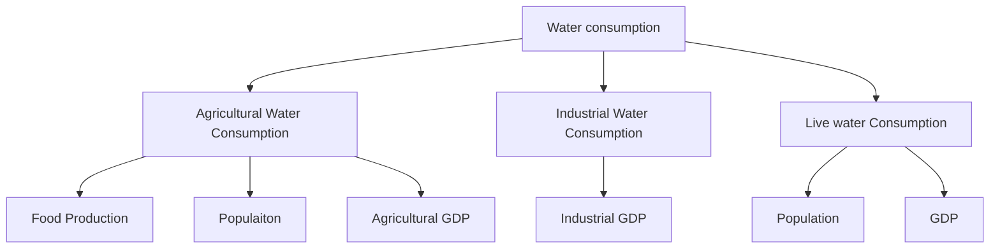
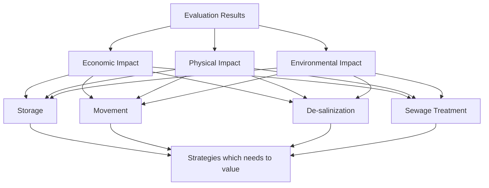

Team Number

For office use only

T1

T2

T3

T4

## 21185

Problem Chosen

B

For office use only

F1

F2

F3

F4

## 2013 Mathematical Contest in Modeling (MCM) Summary Sheet

## Summary

There are mainly three water problems in China: too little water in northern and northwestern part; too much floods in southern part; and too dirty water produced by industry and agricultural pollutants. Y

In order to address problems above and provide a thirteen-year water strategy (2013-2025) for the leadership of China, we conclude five sub-problems and its solution in our paper: 1)Prediction of the supply and demand of water in a period of thirteen years based on historical data;2) Model building of national water storage and movement strategy to solve China’s uneven distribution of water in time and space; 3)Model designing of regional water de-salinization strategy to increase the total amount of available water;4)Model building of water conservation strategy, including regional water pollution treatment and national water-saving; 5)Long run cost-benefit analysis of four water strategies above and the discussion of the optimal combination of water strategies.

In first model, we choose the most appropriate Fitting Function. Using Grey Predicted Model, we can get the correlation degree between water consumption and population, industrial GDP and agriculture output. Then we successfully finger out the water demand in 2025 is 6770 hundred million m^3 by using GM prediction. In our second model, we use CV (coefficient of Variation) and water supply pressure ?? as the decision-making index and work out a water storage project list by using Goal Programming. Based on cost and benefits analysis, we build Minimum Spanning Tree to work out the optimal water transfer plan. That is, we should transfer water from Yangtze watershed to Yellow watershed and Hai watershed. Besides, we devise a local water transfer strategy. In the third model, we build a set of parameters to describe the degree of water purification demand of each city and successfully get the water de-salinization plant building scheme. In the fifth model, we do long run cost-benefit analysis of four water strategies above. We first analyze weights of economic, physical, environmental implications by using AHP (analytic hierarchy process). Then we use Neural Network Algorithm to classify the quality of each strategy and finally get a reasonable strategy evaluation model.

In the whole modeling process, we give full consideration to validity, feasibility and cost-efficiency of our model.

## Five Models for China's Water Scarcitys

## Contents

1 Introduction.  
2 Nomenclatures .. 2  
3 Model one: Water demand and supply Forecast (2013-2025).

3.1 Introduction . 3  
3.2 Assumptions 3  
3.3 Function Fit Model . 3

3.3.1Analysis of China’s water use ..  
3.3.2Model Testing.. .6  
3.3.3Prediction Results and Conclusion ................. .6

3.4 Grey Forecasting Model .

3.4.1Reasons for Improvement .........................  
3.4.2Correlation Degree Analysis ............................. 8  
3.4.3Thirteen-year water forecast based on Verhulst Model. —  
3.4.4Model Solution................................................. ..10  
3.4.5Model Testing.......................................... ..10

4 Model Two: Water Storage and Movement . 12

4.1 Terminology........................................ .12  
4.2 Water Storage Model: Time Balancing Strategy of Water Resources ..........

4.2.1Introduction ..... ........... .13  
4.2.2Analysis.. ..13  
4.2.3Model Solution..... ..14  
4.2.4Conclusion ...... ...16

4.3 Water Transfer Model: Spatial Balancing of Water Resources Strategy ..........16

4.3.1Introduction ..... ..16  
4.3.2Backgrounds and Water Movement Principles .17  
4.3.3Model Analysis ...18  
4.3.4Objective Function of water transfer strategy. .21  
4.3.5Model Testing.. ..21  
4.3.6National water transfer strategy . .21  
4.3.7Conclusion ... .22

5 Model Three: Water De-salinization Strategy. .23

5.1 Introduction . .23  
5.2 Terminology... .23  
5.3 Assumptions .23  
5.4 Model Building.. .24  
5.5 Model Solving .. .24  
5.6 Analysis and Conclusion .25

## 6 Model Four: Water Conservation Strategy ... .25

6.1 Introduction . .25  
6.2 Water Pollution Control Model . .25  
6.2.1 Introduction ..... ..25  
6.2.2 Assumptions ...... ..25  
6.2.3 Terminology .26  
6.2.5 Model solution: ... .27  
6.2.6 Model analysis: . ..28  
6.3 Water-saving Model.. .29  
6.3.1 ?? The water consumption per unit GDP .......... .29  
6.3.2 Analysis and Conclusion...................................... ..30

## 7 Model Five: Impacts Evaluation Model........................ .31

7.1 Introduction ..... ..................................... .31  
7.2 The Comparison of η (the actual benefit of a project). .31  
7.3 Evaluation of Economic, Physical, and Environmental impacts using AHP ...31  
7.4 Neural Network Evaluation Algorithm .33  
7.4.1 Analysis. .33  
7.4.2 Conclusion .. ..34

## 8 Strengths and Weaknesses.. .35

8.1 Strengths . .35  
8.2 Weaknesses. .35

## 9 Position paper for the Governmental leadership of China ... .36

10 References .. .36

11 Appendix and Supporting Datas .. .37

## 1 Introduction

Water, the magic encounter between one hydrogen and two oxygen atoms, is vital for all kinds of life forms in the earth. The human body, myriad ecological systems and the big biosphere of our entire planet, all of these can’t live without the beautiful gift from our Almighty God. However, in many parts of the world nowadays, we human are facing severe water problems.

Take China for example. With more than 20 percent of world’s population but less than 7 percent of its freshwater, China is continuously facing issues associated with water. There are mainly three problems in China: too little water in northern and northwestern part of country; too much floods in southern part; and too dirty water produced by industry and agricultural pollutants. Furthermore, being a developing country, China has the responsibility to deal both the soaring water demand caused by booming economy and the increasing need to improve water consumption efficiency.

In order to address problems above and provide a thirteen-year water strategy (2013-2025) for the leadership of China, we conclude five sub-problems to tackle in our paper.

Prediction of the supply and demand of water in a period of thirteen years (2013-2025) based on historical data ^  
Model building of national water storage and movement strategy to solve China’s uneven distribution of water in time and space  
Model designing of regional water de-salinization strategy to increase the total amount of available water  
Model building of water conservation strategy, including regional water pollution treatment and national water-saving  
 Long run cost-benefit analysis of four water strategies above and the discussion of the optimal combination of water strategies

In the whole modeling process, we give full consideration to validity, feasibility and cost-efficiency of our model.

2 Nomenclatures

<table><tr><td>D</td><td>The fresh water demand of a region</td></tr><tr><td>S</td><td>The fresh water supply of a region</td></tr><tr><td>W</td><td>The total amount of water resources of a region</td></tr><tr><td> $D_{nation}$ </td><td>The fresh water demand of whole nation</td></tr><tr><td> $W_{nation}$ </td><td>The fresh water demand of whole nation</td></tr><tr><td>U</td><td>The groundwater resources of a region</td></tr><tr><td>O</td><td>The surface water resources of a region</td></tr><tr><td>N</td><td>The population size of a region</td></tr><tr><td>GDP</td><td>Gross Domestic Products</td></tr><tr><td>g</td><td>Real GDP per capita</td></tr><tr><td>α</td><td>The water supply pressure of a region</td></tr><tr><td> $α_0$ </td><td>The national average water supply pressure</td></tr><tr><td>β</td><td>The water consumption per unit GDP</td></tr><tr><td>C</td><td>The capacity of a reservoir</td></tr><tr><td>E</td><td>The average construction costs of a reservoir</td></tr><tr><td>η</td><td>The actual benefit of a project</td></tr><tr><td> $ΔO$ </td><td>The range of water resource in a certain period of time</td></tr><tr><td> $P_i$ </td><td>The number of a certain province in model two</td></tr><tr><td> $Δw_i$ </td><td>The amount of water a region can’t provide by itself</td></tr><tr><td> $b_i$ </td><td>The watershed attribute of the number i province</td></tr><tr><td> $e_i$ </td><td>The terrace attribute of the number i province</td></tr><tr><td>(x,y)</td><td>The geographical coordinates of a region’s capital city</td></tr><tr><td> $d_{ij}$ </td><td>The distance between region i and j</td></tr><tr><td>r</td><td>The Earth Radius</td></tr><tr><td>ω</td><td>The edge weights of national water transferring network</td></tr><tr><td> $D_0$ </td><td>The estimated water consumption in 2013</td></tr><tr><td>θ</td><td>The growth rate of water consumption</td></tr><tr><td>p</td><td>The desalinization cost of tons of seawater</td></tr><tr><td> $p_0$ </td><td>The desalinization cost of tons of seawater in 2013</td></tr><tr><td> $t_{opt}$ </td><td>The optimal time to build water purification plant</td></tr><tr><td>σ</td><td>The measurement of the seawater’s desalination cost</td></tr><tr><td> $γ_k$ </td><td>Demand for water-pollution control degree of number k watershed</td></tr><tr><td> $α_k$ </td><td>The water supply pressure of a watershed</td></tr><tr><td>I</td><td>The highest level of water quality</td></tr><tr><td>II</td><td>The middle level of water quality</td></tr><tr><td>III</td><td>The lowest level of water quality</td></tr><tr><td> $ρ_k$ </td><td>The ratio between the sum of I , II and III water of resources to the total water resources</td></tr><tr><td> $μ_{k,j}$ </td><td>Demand for Water-pollution Control Degree of the number j city in number k watershed</td></tr><tr><td> $W_{kj}$ </td><td>Water Resources of the number k city in number j watershed</td></tr><tr><td> $C_{kj}$ </td><td>The total COD in the city’s water of the number k city in number j watershed</td></tr><tr><td>COD</td><td>The chemical oxygen demand</td></tr><tr><td> $cod_{kj}$ </td><td>The emission of COD per year of the number k city in number j watershed</td></tr><tr><td>B</td><td>The water consumption of a unit GDP</td></tr></table>

# 3 Model one: Water demand and supply Forecast • (2013-2025)

## 3.1 Introduction

In order to devise an effective water strategy, we firstly need to predict the total amount of water demanded and that should be supplied in 2013-2025. The water demand and supply forecast is the preparation work for models aiming to increase water resource. That is to say, our water storage and movement, water purification, conservation strategy are all based on the forecast of water.

## 3.2 Assumptions

Assume that China's population and other policies don’t have sharp change in the 2013-2025  
Assume that China maintains a steady economic growth from 2013 to 2025  
Assume that the world’s climate don’t have dramatic changes from 2013 to 2025

## 3.3 Function Fit Model

To do water forecast, we apply Function Fit Model. First, we collect ten-year water resources data (2000-2010) from China Statistical Yearbook, including total water use, Industrial water consumption, Agricultural water consumption and Live water consumption. Considering the relationship between time and China’s total water use per year, we then build a Function Fit Model. Namely, we get the most approximate year-water-use function by minimizing the residual sum of squares. Then, putting the time value into the estimated function, we can predict the water demand and supply in next thirteen years.

## 3.3.1 Analysis of China’s water use

Based on data we have got, we can draw a 1997-2010 China’s water use table as shown below:

<table><tr><td>Water consumption</td><td>1997</td><td>1998</td><td>1999</td><td>2000</td><td>2001</td><td>2002</td><td>2003</td></tr><tr><td>100million  $m^3$ </td><td>5566</td><td>5435</td><td>5590.88</td><td>5497.59</td><td>5567.43</td><td>5497.28</td><td>5320.4</td></tr><tr><td>Water consumption</td><td>2004</td><td>2005</td><td>2006</td><td>2007</td><td>2008</td><td>2009</td><td>2010</td></tr><tr><td>100million  $m^3$ </td><td>5547.8</td><td>5632.98</td><td>5794.969</td><td>5818.67</td><td>5909.95</td><td>5965.1545</td><td>6021.99</td></tr></table>

Then, we can get a water consumption trends figure as shown below:


<details>
<summary>line chart</summary>

Demand for water resources changes with time curve in China
| year | Water consumption/Million m³ |
| :--- | :--- |
| 1996 | 5570 |
| 1998 | 5430 |
| 1999 | 5580 |
| 2000 | 5500 |
| 2001 | 5560 |
| 2002 | 5500 |
| 2003 | 5320 |
| 2004 | 5550 |
| 2005 | 5630 |
| 2006 | 5790 |
| 2007 | 5810 |
| 2008 | 5910 |
| 2010 | 6020 |
</details>

From the figure above, we can see that the average water consumption per year from 1997 to 2004 fluctuates up and down around an intermediate value of 5500. And the deviation value of 2003, which fell sharply to 532 billion cubic meters, probably results from the drought happened in 2003 spring. After 2004, national water consumption per year rise steadily.

Using the Fit Function Model to fit the data, we firstly can get the Linear and Nonlinear Fit Function as shown below:


<details>
<summary>line chart</summary>

| Year | water_consumption |
| ---- | ----------------- |
| 1997 | 5570              |
| 1998 | 5430              |
| 1999 | 5590              |
| 2000 | 5500              |
| 2001 | 5570              |
| 2002 | 5500              |
| 2003 | 5350              |
| 2004 | 5550              |
| 2005 | 5630              |
| 2006 | 5800              |
| 2007 | 5820              |
| 2008 | 5910              |
| 2009 | 5970              |
| 2010 | 6020              |
</details>


<details>
<summary>line chart</summary>

| Year | water_consumption vs. year | quadratic fitting | power fitting |
|------|-----------------------------|--------------------|---------------|
| 1998 | 5570                        | 5550               | 5400          |
| 2000 | 5590                        | 5530               | 5500          |
| 2002 | 5570                        | 5540               | 5600          |
| 2004 | 5560                        | 5580               | 5700          |
| 2006 | 5800                        | 5700               | 5780          |
| 2008 | 5910                        | 5880               | 5850          |
| 2010 | 6020                        | 6100               | 5930          |
</details>

From the two linear and non-linear figures above, we conclude the Linear and Nonlinear Fit Function don’t achieve the ideal imitative effect. Thus, aiming to exclude the climate change factor which restricts water use, in the fitting process we abandon data with sharp fluctuations during 1997-2000, and finally find the real demand of China's water resources.


<details>
<summary>line chart</summary>

| Year | total_water_consumption vs. year | linear fitting | power fitting | total_water_consumption vs. year (smooth) | shape-preserving fitting |
|------|-----------------------------------|----------------|---------------|------------------------------------------|---------------------------|
| 2000 | 5400                              | 5400           | 5400          | 5400                                     | 5400                      |
| 2001 | 5580                              | 5520           | 5480          | 5520                                     | 5520                      |
| 2002 | 5500                              | 5550           | 5520          | 5500                                     | 5500                      |
| 2003 | 5350                              | 5600           | 5580          | 5480                                     | 5520                      |
| 2004 | 5550                              | 5680           | 5620          | 5580                                     | 5620                      |
| 2005 | 5620                              | 5720           | 5680          | 5620                                     | 5720                      |
| 2006 | 5780                              | 5780           | 5720          | 5780                                     | 5780                      |
| 2007 | 5820                              | 5820           | 5780          | 5820                                     | 5820                      |
| 2008 | 5920                              | 5920           | 5880          | 5920                                     | 5920                      |
| 2009 | 5980                              | 5980           | 5940          | 5980                                     | 5980                      |
| 2010 | 6020                              | 6020           | 6020          | 6020                                     | 6020                      |
</details>

The figure above shows results of three fitting methods: linear fitting, interpolant and power function fitting, and the table below shows the fitting degree of those three kinds of fitting methods.

<table><tr><td></td><td>Linear fitting</td><td>Power fitting</td><td>Interpolant fitting</td></tr><tr><td>Function</td><td>y=59.35*x-113300</td><td>y=1.248e-066x^21.1</td><td>-</td></tr><tr><td>SSE</td><td>1.119e+005</td><td>1.086e+005</td><td>0</td></tr><tr><td>R-square</td><td>0.7759</td><td>0.7826</td><td>1</td></tr><tr><td>Adjusted R-square</td><td>0.751</td><td>0.7283</td><td>-</td></tr><tr><td>RMSE</td><td>111.5</td><td>116.5</td><td>-</td></tr></table>

We can draw the conclusion that the first two fitting results are very close to each other.

## 3.3.2 Model Testing

Now, we need to test whether this Function Fitting Model is right. We find the data from “China's sustainable development of water resources in the Strategic Studies”. The data shows that the predicted water use in 2013 is 7000-8000 one hundred million cubic meters. Then we use our own model to predict the water use in 2013. Comparing these two kinds of data, we find our water use prediction is in great consistency with the data we have find in the report. That is to say, Our model is efficient to predict the probable water use in the future.

## 3.3.3 Prediction Results and Conclusion

Using the Function Fitting Model, we successfully predict the water demand in 2025. The results show in the table below:

<table><tr><td>Year</td><td>Linear fitting</td><td>Power fitting</td><td>Interpolant fitting</td></tr><tr><td>2013</td><td>6166.41</td><td>6187.05</td><td>6201.94</td></tr><tr><td>2014</td><td>6225.76</td><td>6252.21</td><td>6264.81</td></tr><tr><td>2015</td><td>6285.12</td><td>6318.03</td><td>6329.02</td></tr><tr><td>2016</td><td>6344.47</td><td>6384.5</td><td>6394.48</td></tr><tr><td>2017</td><td>6403.82</td><td>6451.64</td><td>6461.13</td></tr><tr><td>2018</td><td>6463.18</td><td>6519.45</td><td>6528.89</td></tr><tr><td>2019</td><td>6522.53</td><td>6587.95</td><td>6597.69</td></tr><tr><td>2020</td><td>6581.89</td><td>6657.12</td><td>6667.46</td></tr><tr><td>2021</td><td>6641.24</td><td>6726.99</td><td>6738.13</td></tr><tr><td>2022</td><td>6700.59</td><td>6797.56</td><td>6809.61</td></tr><tr><td>2023</td><td>6759.95</td><td>6868.83</td><td>6881.85</td></tr><tr><td>2024</td><td>6819.3</td><td>6940.81</td><td>6954.77</td></tr><tr><td>2025</td><td>6878.65</td><td>7013.51</td><td>7028.3</td></tr></table>

However, the confidence of the results obtained by the Function Fitting Model is not very high. We believe the reason lies in the fact that we only use data from 2000 to 2010. And it is difficult to do a thirteen-year prediction by using ten-year data. Because of China’s current rapid economic development, the growth of population and the speed of economic development is changeable. So we must take changes in social indicators into account to better predict water consumption.

## 3.4 Grey Forecasting Model

## 3.4.1 Reasons for Improvement

The result we get from Function Fit Model is not very ideal, and we believe the key reason lies in the lack of data. In other words, we only get the data from 1997 to 2010. So the fourteen-year data is too less to forecast the thirteen-year trends of future and the exact results is based on the fact tha we have get the data of past forty or fifty years. In view of current situation, we devise a Grey Forecasting Model to get data with higher reliability, thus successfully overcoming the weakness of Function Fit Model.

The advantage of using Grey Forecasting Model is that we can get more reliable results with lacking accessible data, which perfectly fitted with our current situation. The total amount of water use is consists of agricultural, industrial, live water consumption, and these values are respectively relevant to agricultural GDP, industrial GDP and population, whose data of recent decades can be easily found in China Statistical Yearbook. Thus, if we quantify the interdependence coefficients between each consumption and respective production and the coefficients between production and its influencing factors, we can accurately predict the demand of water based on agricultural GDP, industrial GDP and population data of past decades we have got.


<details>
<summary>flowchart</summary>


</details>

## 3.4.2 Correlation Degree Analysis

## Calculation of Correlation Coefficient

First, select a reference sequence as shown below:

$$
x _ {0} = \{x _ {0} (\mathrm{k}) | \mathrm{k} = 1, 2, \dots \mathrm{n} \} = (x _ {0} (1), x _ {0} (2) \dots , x _ {0} (n))
$$

And the other group of sequence is,

$$
x _ {i} = \{x _ {i} (\mathrm{k}) | \mathrm{k} = 1, 2, \dots \mathrm{n} \} = (x _ {i} (1), x _ {i} (2) \dots , x _ {i} (n)), \mathrm{i} = 1 \dots . \mathrm{m}
$$

Then the correlation degree of $\mathbf { X _ { i } }$ to ${ \bf { X } } _ { 0 }$ is,

$$
r _ {i} = \frac {1}{n} \sum_ {k = 1} ^ {n} \xi_ {i} (k)
$$

in which,

$$
\xi_ {i} (k) = \frac {\underset {s} {\overset {m i n} {s}} \underset {t} {\overset {m i n} {t}} | x _ {0} (t) - x _ {s} (t) | + \rho \underset {s} {\overset {m a x} {s}} \underset {t} {\overset {m a x} {t}} | x _ {0} (t) - x _ {s} (t) |}{| x _ {0} (t) - x _ {s} (t) | + \rho \underset {s} {\overset {m a x} {s}} \underset {t} {\overset {m a x} {t}} | x _ {0} (t) - x _ {s} (t) |}
$$

Thus, we use ${ \bf { r } } _ { \mathrm { { i } } }$ to describe the correlation degree between $\mathbf { X } _ { \mathrm { f } } { \mathrm { a n d } } \mathbf { X } _ { \mathrm { 0 } } ,$ namely to describe the influence on $\mathbf { X } _ { 0 }$ caused by the change of $\mathbf { X _ { i } }$ .

## Water Use and agricultural, industrial and live water consumption

Water consumption is equal to the total amount of agricultural, industrial and live water consumption, but the influence contributed by each type of consumption to total amount is unequal. We define water use change in 10 years as sequence $\mathbf { X } _ { 0 }$ while respectively defining agricultural , industrial and live water consumption as sequence $\mathbf { \Phi } _ { \mathbf { X } _ { 1 } , \mathbf { \Phi } } \mathbf { \tilde { { x } } } _ { 2 } \mathbf { \mathcal { S } } ^ { * } \mathbf { \Phi } _ { \mathbf { X } _ { 3 } }$ . Then, we begin our calculation by using MATLAB.

The figure below shows the relationship between water use and agricultural, industrial and live water consumption.


<details>
<summary>line chart</summary>

Water resources demand changes curve in China
| year | Consumption/Million m³ |
|---|---|
| 1996 | 5570 |
| 1998 | 5430 |
| 1999 | 5590 |
| 2000 | 5500 |
| 2001 | 5570 |
| 2002 | 5500 |
| 2003 | 5320 |
| 2004 | 5560 |
| 2005 | 5640 |
| 2006 | 5790 |
| 2007 | 5810 |
| 2008 | 5910 |
| 2009 | 5970 |
| 2010 | 6020 |
</details>


<details>
<summary>line chart</summary>

| year | Consumption/Million m³ |
| ---- | ---------------------- |
| 1996 | 3920                   |
| 1998 | 3770                   |
| 2000 | 3870                   |
| 2002 | 3740                   |
| 2004 | 3590                   |
| 2006 | 3670                   |
| 2008 | 3650                   |
| 2010 | 3720                   |
</details>


<details>
<summary>line chart</summary>

| year | Consumption/Million m³ |
| ---- | ---------------------- |
| 1996 | 1120                   |
| 1998 | 1130                   |
| 2000 | 1140                   |
| 2002 | 1145                   |
| 2004 | 1250                   |
| 2006 | 1350                   |
| 2008 | 1400                   |
| 2010 | 1450                   |
</details>


<details>
<summary>line chart</summary>

| year | Consumption/Million m³ |
| ---- | ---------------------- |
| 1996 | 520                    |
| 1998 | 550                    |
| 2000 | 570                    |
| 2002 | 620                    |
| 2004 | 650                    |
| 2006 | 690                    |
| 2008 | 730                    |
| 2010 | 760                    |
</details>

Putting water consumption x0, agricultural water consumption x1, industrial water consumptionx2, and live water consumption x3 into MATLAB, we can get results of correlation degree analysis.


<details>
<summary>line chart</summary>

| Year | WaterForLive/hundred million m³ | population/million | WaterForAgriculture/hundred million m³ | Food production/million tons |
|---|---|---|---|---|
| 1996 | 530 | 1.25 | 3900 | 48000 |
| 1998 | 550 | 1.30 | 3750 | 49000 |
| 2000 | 570 | 1.35 | 3800 | 46000 |
| 2002 | 600 | 1.40 | 3700 | 45000 |
| 2004 | 630 | 1.45 | 3600 | 47000 |
| 2006 | 660 | 1.50 | 3700 | 48000 |
| 2008 | 680 | 1.55 | 3650 | 49000 |
| 2010 | 700 | 1.60 | 3700 | 50000 |
</details>

<table><tr><td colspan="4">Water Consumption Correlation Analysis</td></tr><tr><td>Factors</td><td>Associate degree(1)</td><td>Sub-factors</td><td>Associate degree(2)</td></tr><tr><td rowspan="3">Agriculture water consumption</td><td rowspan="3">0.9998</td><td>Food production</td><td>0.9388</td></tr><tr><td>Population</td><td>0.9090</td></tr><tr><td>Agriculture GDP</td><td>0.6799</td></tr><tr><td>Industrial water consumption</td><td>0.9997</td><td>Industrial GDP</td><td>0.7053</td></tr><tr><td rowspan="2">Live water consumption</td><td rowspan="2">0.3746</td><td>Population</td><td>0.9022</td></tr><tr><td>GDP</td><td>0.7081</td></tr></table>

## 3.4.3 Thirteen-year water forecast based on Verhulst Model

In grey forecasting, we try to find and grasp the law of development of the fund data and at last make a scientific quantitative prediction for the future condition of the system by raw data processing and grey model building. Currently, the gray forecasting model GM (1,1) is the main application of grey forecasting, but GM (1,1) model is applicable to sequences with strong exponentially, and can only describe the monotonous process of change. The amount of water is a dynamic time-varying system with some random volatility, and therefore it is more suitable for us to use Verhulst model for non-monotonic swing development sequence.

## 3.4.4 Model Solution

We define ${ \ X } ^ { ( 0 ) }$ as the original data sequence of the total water consumption in year 1997-2010:

$$
\mathrm{X} ^ {(0)} = \{\mathrm{X} _ {1} ^ {(0)}, \mathrm{X} _ {2} ^ {(0)}, \mathrm{X} _ {3} ^ {(0)} \dots \mathrm{X} _ {\mathrm{n}} ^ {(0)} \}
$$

Then we can get the whitened equation of Verhulst model,

$$
\frac {\mathrm{d} X ^ {(1)}}{\mathrm{dt}} + a X ^ {(1)} = b
$$

in which the X(1) is the accumulated generating operation sequence of ${ \mathrm { ~ \bf ~ \chi ~ } } ^ { ( 0 ) }$

After that, we use the least square methods (LSM) to get the parameter a and b as:

$$
\widehat {\alpha} = (a, b) ^ {T} = (B ^ {T} B) ^ {- 1} B ^ {T} Y
$$

in which,

$$
\mathrm{B} = \left[ \begin{array}{c c} - \mathbf {z} _ {2} ^ {(1)} & 1 \\ - \mathbf {z} _ {3} ^ {(1)} & 1 \\ \vdots & \vdots \\ - \mathbf {z} _ {\mathrm{n}} ^ {(1)} & 1 \end{array} \right] \qquad \mathrm{Y} = \left[ \begin{array}{c c} \mathrm{X} _ {2} ^ {(0)} & \\ \mathrm{X} _ {3} ^ {(0)} & \\ \vdots & \\ \mathrm{X} _ {\mathrm{n}} ^ {(0)} & \end{array} \right]
$$

$$
\mathrm{z} _ {\mathrm{k}} ^ {(1)} = 0. 5 (\mathrm{X} _ {\mathrm{k}} ^ {(1)} + \mathrm{X} _ {\mathrm{k-1}} ^ {(1)}),
$$

The respective time response sequence of Verhulst model is:

$$
\hat {\chi} _ {k + 1} ^ {(1)} = \left(X ^ {(0)} (1) - \frac {b}{a}\right) e ^ {- a k} + \frac {b}{a} \qquad k = 1, 2, 3 \dots , n - 1
$$

And we can get the reduced $\hat { \mathsf X } ^ { ( 0 ) }$ by repeated decreasing:

$$
\mathrm{X} _ {\mathrm{k+1}} ^ {(0)} = \mathrm{X} _ {\mathrm{k+1}} ^ {(1)} - \mathrm{X} _ {\mathrm{k}} ^ {(1)}
$$

## 3.4.5 Model Testing

We test our model by residual analysis. Define gray forecast sequence as,

$$
\widehat {X} ^ {(0)} = (\widehat {X} _ {1} ^ {(0)}, \widehat {X} _ {2} ^ {(0)}, \dots , \widehat {X} _ {n} ^ {(0)})
$$

and residual sequence as

$$
\varepsilon^ {(0)} = (X _ {1} ^ {(0)} - \widehat {X} _ {1} ^ {(0)}, X _ {2} ^ {(0)} - \widehat {X} _ {2} ^ {(0)}, \dots , X _ {n} ^ {(0)} - \widehat {X} _ {n} ^ {(0)})
$$

Then, we get relative error sequence:

$$
\Delta = (\left| \frac {\varepsilon_ {1}}{\mathrm{X} _ {1} ^ {(0)}} \right|, \left| \frac {\varepsilon_ {1}}{\mathrm{X} _ {2} ^ {(0)}} \right|, \dots , \left| \frac {\varepsilon_ {1}}{\mathrm{X} _ {\mathrm{n}} ^ {(0)}} \right|)
$$

Finally, we get the Average relative error sequence as shown below:

$$
\bar {\Delta} = \frac {1}{n} \sum_ {k = 1} ^ {n} \Delta_ {k}
$$

## 3.4.6 Results and Conclusions

After model testing, we can use the Grey Prediction Model to give a more accurate prediction of water consumption from 2013-2025. The following figure and table shows the results of prediction.


<details>
<summary>line chart</summary>

| Year | Water consumption |
| ---- | ----------------- |
| 1995 | 5600              |
| 1996 | 5450              |
| 1997 | 5600              |
| 1998 | 5500              |
| 1999 | 5550              |
| 2000 | 5500              |
| 2001 | 5450              |
| 2002 | 5300              |
| 2003 | 5550              |
| 2004 | 5600              |
| 2005 | 5700              |
| 2006 | 5800              |
| 2007 | 5850              |
| 2008 | 5900              |
| 2009 | 5950              |
| 2010 | 6000              |
| 2011 | 6050              |
| 2012 | 6100              |
| 2013 | 6150              |
| 2014 | 6200              |
| 2015 | 6250              |
| 2016 | 6300              |
| 2017 | 6350              |
| 2018 | 6400              |
| 2019 | 6450              |
| 2020 | 6500              |
| 2021 | 6550              |
| 2022 | 6600              |
| 2023 | 6650              |
| 2024 | 6700              |
| 2025 | 6750              |
</details>

Although the actual water consumption dropped drastically in 2003, the GM prediction results is relatively consistent to data in recent years.

Then we analyze the Residual Error, Relative Error, Limit Deviation Value of GM prediction, and the following table shows the results.

<table><tr><td>Year</td><td>Actual water consumption</td><td>Predicted water consumption</td><td>Residual Error</td><td>Relative Error</td><td>Limit Deviation Value</td></tr><tr><td>1997</td><td>5623.0</td><td>5623.0</td><td>0.0</td><td>0.0000</td><td>-</td></tr><tr><td>1998</td><td>5470.0</td><td>5440.6</td><td>29.4</td><td>0.0054</td><td>-0.0363</td></tr><tr><td>1999</td><td>5613.3</td><td>5484.9</td><td>128.5</td><td>0.0229</td><td>0.0176</td></tr><tr><td>2000</td><td>5530.7</td><td>5529.5</td><td>1.3</td><td>0.0002</td><td>-0.0232</td></tr><tr><td>2001</td><td>5567.4</td><td>5574.4</td><td>-7.0</td><td>0.0013</td><td>-0.0015</td></tr><tr><td>2002</td><td>5497.3</td><td>5619.7</td><td>-122.4</td><td>0.0223</td><td>-0.0210</td></tr><tr><td>2003</td><td>5320.4</td><td>5665.4</td><td>-345.0</td><td>0.0648</td><td>-0.0416</td></tr><tr><td>2004</td><td>5547.8</td><td>5711.5</td><td>-163.7</td><td>0.0295</td><td>0.0332</td></tr><tr><td>2005</td><td>5633.0</td><td>5757.9</td><td>-124.9</td><td>0.0222</td><td>0.0071</td></tr><tr><td>2006</td><td>5795.0</td><td>5804.7</td><td>-9.8</td><td>0.0017</td><td>0.0201</td></tr><tr><td>2007</td><td>5818.7</td><td>5851.9</td><td>-33.2</td><td>0.0057</td><td>-0.0040</td></tr><tr><td>2008</td><td>5910.0</td><td>5899.5</td><td>10.5</td><td>0.0018</td><td>0.0074</td></tr><tr><td>2009</td><td>5965.2</td><td>5947.5</td><td>17.7</td><td>0.0030</td><td>0.0012</td></tr><tr><td>2010</td><td>6022.0</td><td>5995.8</td><td>26.2</td><td>0.0043</td><td>0.0014</td></tr></table>

By calculating Residual Error, Relative Error and Limit Deviation Value, we can prove the consistency between GM prediction result and the actual water consumption.

Then, we can predict water consumption of 2013-2025.

<table><tr><td>Year</td><td>2013</td><td>2014</td><td>2015</td><td>2016</td><td>2017</td><td>2018</td><td>2019</td></tr><tr><td>Water Consumption</td><td>6143.9</td><td>6193.2</td><td>6243.5</td><td>6294.3</td><td>6345.5</td><td>6397.1</td><td>6449.1</td></tr><tr><td>Year</td><td>2020</td><td>2021</td><td>2022</td><td>2023</td><td>2024</td><td colspan="2">2025</td></tr><tr><td>Water Consumption</td><td>6501.5</td><td>6554.4</td><td>6607.7</td><td>6661.4</td><td>6715.5</td><td colspan="2">6770.1</td></tr></table>

According to GM prediction, water consumption will reach to 7039(hundred million cubic meters) while the government predict that the water consumption would not exceed 7000(hundred million cubic meter) “State Council, <<The views of the State Council on the implementation of the most stringent water management system>>, 2012)”

Therefore, the GM (1,1) Model is efficient and accurate.

## 4 Model Two: Water Storage and Movement

## 4.1 Terminology

## ?? The total amount of water resources of a region

The total amount of water resources is approximately equal to the surface water plus groundwater (we do not consider repeated measures in statistics). We believe that, in the relatively short term, the changes in the water resources depends only on the impact of climate change over time, namely being in a dynamic equilibrium state. So we assume that in the relatively short period of time, total water resources is fixed, and we select the average amount of water resources of a spell as the representative of the amount of water resources.

$$
\mathrm{W} \approx \mathrm{U} + 0
$$

## ?????? Gross Domestic Product

GDP equals per capita GDP times population size, and the per capita GDP is an efficient measure for economic development in a region. So GDP represents the combined effect of population size and economic development.

$$
\mathrm{GDP} = \mathrm{N} \cdot \mathrm{g}
$$

## ?? The water supply pressure of a region

α is the result of D divided by W. It stands for the ratio between the amount of water a region should supply and the total amount of water resources, so it is an efficient measure of ecological pressure on water resources in order to meet the water consumption demand.

## 4.2 Water Storage Model: Time Balancing Strategy of Water Resources

## 4.2.1 Introduction

The goal of water storage is to solve the problem caused by the unevenly distributed water resources in different seasons and years. Namely, our goal in this part is to devise an efficient, reasonable, cost-efficient Time Balancing Strategy of Water Resources.

China's has been explored hundreds of years to work out efficient water storage projects, such as the Three Gorges Reservoir, the Ming Tombs Reservoir and Qiandao Lake Reservoir. However, due to the incompatible development of China’s economy in recent decades and some unscientific projects planning in the last century, and also the effects of climate change, some areas of China still suffer from sharp water fluctuations, and can’t solve the water shortage problem in the drought period.

## 4.2.2 Analysis

Water storage aims to solve the unevenly distribution of water over time, namely the dramatic water resource change in different seasons and years. Thus, we define the regional variation of the total water resources (W) as the standard measure of the need to build reservoirs, in which W ≈ U + O.

The Groundwater storage involves continuous improvement of the environment, like the increase of vegetation coverage rate, which is difficult to achieve through storage strategy. Besides, the underground water (U) makes up only half of the surface water (O). So in our model, we neglect the amount of underground water. In order to taking out the influence caused by the unevenly distribution of water resource in different regions, here we use the Coefficient of Variation (CV) to measure the degree of change of surface water resources.

$$
\mathrm{CV} = \sigma / \mu
$$

where

σ stands for the standard deviation of total water resource of a region

μ stands for the mean of total water resource of a region

The coefficient of variation (CV) is defined as the ratio of the standard deviation σ to the mean μ.

Based on the particular value of CV in one region, we can reasonably judge whether this region need a water storage project. Then, we go further towards the specific construction of a reservoir. We use E (The average construction costs of a reservoir) and C (The capacity of a reservoir) to do the cost-benefit analysis.

$$
\mathrm{E} = E _ {0} \cdot \omega \cdot \log C
$$

where

$E _ { 0 }$ is the proportionality coefficient

ω stands for the geographical factor’s impact on costs, like topography

log ?? stands for the size effect on the construction cost

$$
C = k \cdot [ \max (0) - \min (0) ] = k \cdot \Delta O
$$

k is the proportionality coefficient. And C must greater than a threshold $C _ { 0 }$ , namely achieve an established scale in order to decide implementing a water storage project.

The actual benefit of a reservoir project η,

$$
\eta = \frac {C}{E} = \frac {C}{E _ {0} \cdot \omega \cdot \log C} = \frac {k}{E _ {0} \cdot \omega} \cdot \frac {\Delta O}{\log k + \log \Delta O}
$$

The equation above implicates that if the project’s costs is fixed, the greater ∆O, the higher actual benefits.

## 4.2.3 Model Solution

Based on China's actual conditions and data sources, we use provinces as the basis for zoning. The following is the water consumption of all provinces in China from 2000-2010. From the data, we can analyze the change of provinces’ surface water over years.

The 2000-2010 line graph of surface water resources in China provinces  


<details>
<summary>line chart</summary>

| 2006 | 2475 |
| --- | --- |
| 2007 | 2475 |
| 2008 | 2675 |
| 2009 | 2475 |
</details>

## Does it need? –determined by CV

Then, we calculate the CV(S) of provinces and divide them into three levels.

<table><tr><td colspan="2">Level 1</td><td colspan="2">Level 2</td><td colspan="2">Level 3</td></tr><tr><td>Tibet</td><td>0.0558087</td><td>Ningxia</td><td>0.206058</td><td>Shanghai</td><td>0.278128</td></tr><tr><td>Xinjiang</td><td>0.1150357</td><td>Inner Mongolia</td><td>0.211229</td><td>Hainan</td><td>0.304979</td></tr><tr><td>Sichuan</td><td>0.1187557</td><td>Hebei</td><td>0.228055</td><td>Shanxi</td><td>0.320728</td></tr><tr><td>Guizhou</td><td>0.1285748</td><td>Hubei</td><td>0.234022</td><td>Jilin</td><td>0.341804</td></tr><tr><td>Yunnan</td><td>0.1610587</td><td>Zhejiang</td><td>0.242901</td><td>Jiangsu</td><td>0.351941</td></tr><tr><td>Qinghai</td><td>0.1727455</td><td>Shanxi</td><td>0.244948</td><td>Henan</td><td>0.414924</td></tr><tr><td>Gansu</td><td>0.1778758</td><td>Beijing</td><td>0.248488</td><td>Shandong</td><td>0.415128</td></tr><tr><td>Hunan</td><td>0.1796035</td><td>Jiangxi</td><td>0.252123</td><td>Liaoning</td><td>0.527334</td></tr><tr><td>Guangxi</td><td>0.1919238</td><td>Anhui</td><td>0.27147</td><td>Tianjin</td><td>0.574195</td></tr><tr><td>Guangdong</td><td>0.1923498</td><td>Fujian</td><td>0.274358</td><td></td><td></td></tr><tr><td>Chongqing</td><td>0.1925482</td><td>Heilongjiang</td><td>0.276789</td><td></td><td></td></tr></table>

From the table above, on the one hand, we can conclude that surface water resource change in the western provinces (Tibet, Xinjiang, Sichuan, Guizhou, Yunnan, Qinghai, Gansu, Guangxi and Chongqing) is less volatile and has the lowest water change level. So in general, we do not consider the construction of water storage projects in these provinces.

On the other hand, the surface water resources of the northern and eastern provinces (Shanghai, Jiangsu, Jilin, Henan, Shandong, Liaoning, Tianjin) is more volatile and has the highest level of water change over years. In order to address these regions' unevenly distribution of water resources, we should consider implementing storage projects in these areas.

## Is it cost-saving?--determined by ??

Taking the sequence of building water storage projects into consideration, it is not sufficient enough to decide whether to build a reservoir by only using CV. In other words, we need consider its economic factors. Thus, we take the region with both greater CV and η into our top priority list of implementing water storage projects.

## Comprehensive Consideration

Considering both demand and economy, we get the following table:

<table><tr><td>Province</td><td>CV</td><td>ΔO</td><td>η ∝ ΔO / log ΔO</td></tr><tr><td>Ningxia</td><td>0.206058</td><td>4.77</td><td>7.030023</td></tr><tr><td>Beijing</td><td>0.248488</td><td>6.743545</td><td>8.13565</td></tr><tr><td>Tianjin</td><td>0.574195</td><td>12.98</td><td>11.6593</td></tr><tr><td>Shanghai</td><td>0.278128</td><td>30.95</td><td>20.76261</td></tr><tr><td>Hebei</td><td>0.228055</td><td>39</td><td>24.51189</td></tr><tr><td>Shanxi</td><td>0.244948</td><td>49.7519</td><td>29.32085</td></tr><tr><td>Inner Mongolia</td><td>0.211229</td><td>172.556</td><td>77.13965</td></tr><tr><td>Shandong</td><td>0.415128</td><td>297.3048</td><td>120.2105</td></tr><tr><td>Shanxi</td><td>0.320728</td><td>324.9316</td><td>129.3625</td></tr><tr><td>Xinjiang</td><td>0.1150357</td><td>337.5545</td><td>133.5082</td></tr><tr><td>Jiangsu</td><td>0.351941</td><td>367.3848</td><td>143.2232</td></tr><tr><td>Jilin</td><td>0.341804</td><td>369.29</td><td>143.8399</td></tr><tr><td>Henan</td><td>0.414924</td><td>413.3637</td><td>157.9936</td></tr><tr><td>Liaoning</td><td>0.527334</td><td>449.24</td><td>169.3661</td></tr><tr><td>Heilongjiang</td><td>0.276789</td><td>503.6865</td><td>186.4014</td></tr><tr><td>Anhui</td><td>0.27147</td><td>624.9</td><td>223.513</td></tr><tr><td>Hubei</td><td>0.234022</td><td>679.33</td><td>239.8696</td></tr><tr><td>Zhejiang</td><td>0.242901</td><td>818.9488</td><td>281.1111</td></tr><tr><td>Fujian</td><td>0.274358</td><td>940.51</td><td>316.3118</td></tr><tr><td>Jiangxi</td><td>0.252123</td><td>1238.69</td><td>400.4866</td></tr></table>

From the table above, we can finally figure out the province in which we need to build a water storage project in order to meet water demand in dry seasons. Henan, Liaoning, Heilongjiang, Anhui, Hubei, Zhejiang, Fujian and Jiangxi, these eight province need to pay special attention to water storage, because the building water storage in these area is both in urgent need and economically efficient.

## 4.2.4 Conclusion

In Time Balancing Strategy of Water Resources, we mainly focus on the uneven deployment of regional water resources in time, especially the surface water resources allocation. And finally figure out eight provinces in which we need to primarily implement water storage project. In our future work, we will consider some other factors. In terms of economy, we will take additive impacts of building a reservoir into consideration, like power generation, fish breeding. On the other hand, we will consider the role a reservoir play in redeploying water in different regions. That is to say, a water storage project has the ability to solving uneven water resource distribution not only in one region but in regions by being an end of inter-regional water transfer.

## 4.3 Water Transfer Model: Spatial Balancing of Water Resources Strategy

## 4.3.1 Introduction

Our goal in Spatial Balancing of Water Resources Strategy is to solve inter-regional unevenly distribution of water resources in space. In other words, no matter what kind of season, wet or dry, if a region suffers from high water supply pressure all the time, we need to consider inter-regional water transfer.

Similarly, China has long history in solving the water movement problem. The Dayu Legend, which happened five thousand years ago, tells us the story of the first water movement project of ancient China. At that time, the water transfer project mainly aimed to solve the flood, but nowadays we build these projects to better meet the needs of human development and ecological conservation. Over the last decade, the Chinese government not only constructed large-scale water transfer project like South-to-North water diversion but also built local water transfer project like Dujiangyan Dam. Some projects are effective, but others remain to improve.

Therefore, in order to efficiently solve spatial problems, we must consider the following sub-problems:

Geography and Topography  
Watershed Delineation  
Cost Accounting

## 4.3.2 Backgrounds and Water Movement Principles

## Backgrounds

In terms of Geography and Topography, distribution of the law of the terrain is low-lying West High East, was three-terrace, from west to east, gradually decline. So we can divide three types of terrace: first terrace (4000m above), second terrace (1000m-2000m) and third terrace (1000m below).

In terms of Watershed Delineation, China has nine watersheds: Songliao, Yellow River, Yangtze River, Hai River, Huai River, Pearl River, Southwest, Southeast and Northwest.

Figure China’s Nine Watersheds  


<details>
<summary>text_image</summary>

Songtiao
Northwest
Yellow
Hua
Yaozizhe
Pead
Southeast
Southwest
</details>

Figure. China’s Three Terrace  


<details>
<summary>text_image</summary>

CHINA
THE SECOND TERRACE
THE FIRST TERRACE
THE THIRD TERRACE
1.200.000
KLETT-PERTIRES
</details>

The provincial administrative division in China gives full consideration to watershed delineation and terrace division, so we give each province a unique watershed attribute and a unique terrace attribute.

## Water Movement Principle

We should follow principles below to work out an efficient water movement strategy.

We use inner-regional water transfer when water resource supply is complementary within a region  
We use inter-regional water transfer when most water resource supply within a region is too big or too small  
We only transfer water from high terrace to low terrace or in the same level of terrace

## 4.3.3 Model Analysis

## The basic ??

Firstly, we choose the province as a basic unit because it’s relationship with Watershed Delineation and statistical convenience, and calculate water supply pressure α of 31 provinces of mainland China.

By calculatingα of each province, we can get the relative value of water supply pressure. In order to determine a reference, we define

$$
\alpha_ {0} = \left. ^ {D _ {n a t i o n}} \right/ W _ {\text {nation}} = 0. 2 7 2 4
$$

as the national average water supply pressure. Then we can calculate the relative water supply pressure using the equation below.

$$
\Delta \alpha = \alpha - \alpha_ {0}
$$

∆α stands for water supply difference between province and national average value.

If ∆α of a region greater than zero, we need to transfer water from other water-rich region to this region and vice versa. We divide ∆α into five sections as shown in the following Figure.

Figure Classification of Water Supply Pressure

<table><tr><td></td><td colspan="2">Tibet</td><td colspan="2">Qinghai</td><td colspan="2">Yunnan</td><td colspan="2">Sichuan</td><td colspan="2">Guizhou</td><td></td></tr><tr><td> $\alpha - \overline{\alpha}$ </td><td colspan="2">-0.26262</td><td colspan="2">-0.21175</td><td colspan="2">-0.17489</td><td colspan="2">-0.15537</td><td colspan="2">-0.14256</td><td></td></tr><tr><td></td><td colspan="2">Hainan</td><td colspan="2">Chongqing</td><td colspan="2">Jiangxi</td><td colspan="2">Guangxi</td><td colspan="2">Fujian</td><td>Hunan</td></tr><tr><td> $\alpha - \overline{\alpha}$ </td><td colspan="2">-0.09926</td><td colspan="2">-0.08725</td><td colspan="2">-0.08081</td><td colspan="2">-0.06456</td><td colspan="2">-0.05981</td><td>-0.04021</td></tr><tr><td></td><td>Shaanxi</td><td colspan="2">Zhejiang</td><td colspan="2">Guangdong</td><td>Hubei</td><td colspan="2">Jilin</td><td colspan="2">Anhui</td><td>Heilongjiang</td></tr><tr><td> $\alpha - \overline{\alpha}$ </td><td>0.00611</td><td colspan="2">0.016966</td><td colspan="2">0.055037</td><td>0.082631</td><td colspan="2">0.090705</td><td colspan="2">0.119923</td><td>0.194439</td></tr><tr><td></td><td colspan="2">Inner Mongolia</td><td colspan="2">Henan</td><td colspan="2">Xinjiang</td><td colspan="2">Liaoning</td><td>Gansu</td><td>Shanxi</td><td>Shandong</td></tr><tr><td> $\alpha - \overline{\alpha}$ </td><td colspan="2">0.245281</td><td colspan="2">0.292516</td><td colspan="2">0.343373</td><td colspan="2">0.384432</td><td>0.40406</td><td>0.435931</td><td>0.563984</td></tr><tr><td></td><td colspan="2">Jiangsu</td><td colspan="2">Hebei</td><td colspan="2">Beijing</td><td colspan="2">Tianjin</td><td colspan="2">Shanghai</td><td>Ningxia</td></tr><tr><td> $\alpha - \overline{\alpha}$ </td><td colspan="2">0.920247</td><td colspan="2">1.096765</td><td colspan="2">1.210411</td><td colspan="2">1.436744</td><td colspan="2">1.790724</td><td>2.53323</td></tr></table>

Figure Colored Graph Based on at r pply pr r α  


<details>
<summary>text_image</summary>

Xingjiang
Inner Mongolia (Nei Mongol)
Ningxia
Shangxi
Shandong
Jiangsu
Shanghai
Zhejiang
Hubei
Anhui
Jiangxi
Fujian
Guangdong
Guangxi
Hainan
Sichuan
Chongqing
Guizhou
Hunan
Jiangxi
Fujian
Jilin
Heilongjiang
Liaoning
Zhenghai
Guangxi
Hainan
</details>

From the figure above, we can conclude the overall water supply pressure trend: the eastern and northern have big pressure while western and southern have small pressure. However, in order to specify the problem, we need a more detailed model.

## Other Parameters and Requirements

## 1) Parameters: Attributes of $P _ { i }$

First we number 31 provinces of mainland china as shown in the following table:

<table><tr><td>i</td><td>1</td><td>2</td><td>3</td><td>4</td><td>5</td><td>6</td><td>7</td><td>8</td></tr><tr><td>Province</td><td>Beijing</td><td>Tianjin</td><td>Hebei</td><td>Shanxi</td><td>Inner Mongolia</td><td>Liaoning</td><td>Jilin</td><td>Heilongjiang</td></tr><tr><td>i</td><td>9</td><td>10</td><td>11</td><td>12</td><td>13</td><td>14</td><td>15</td><td>16</td></tr><tr><td>Province</td><td>Shanghai</td><td>Jiangsu</td><td>Zhejiang</td><td>Anhui</td><td>Fujian</td><td>Jiangxi</td><td>Shandong</td><td>Henan</td></tr><tr><td>i Province</td><td>17 Hubei</td><td>18 Hunan</td><td>19 Guangdong</td><td>20 Guangxi</td><td>21 Hainan</td><td>22 Chongqing</td><td>23 Sichuan</td><td>24 Guizhou</td></tr><tr><td>i Province</td><td>25 Yunnan</td><td>26 Tibet</td><td>27 Shaanxi</td><td>28 Gansu</td><td>29 Qinghai</td><td>30 Ningxia</td><td>31 Xinjiang</td><td></td></tr></table>

Then we define each province $P _ { i }$ has following four attributes,

$$
P _ {i} (\Delta w _ {i}, b _ {i}, e _ {i}, \mathrm{x}, \mathrm{y}) i = 1, 2, 3 \dots 3 1
$$

in which,

$\Delta w _ { i }$ stands for the amount of water a region can’t provide by itself,

$$
\Delta w _ {i} = w _ {i} \cdot (\alpha - \alpha_ {0}) = w _ {i} \cdot \Delta \alpha
$$

$b _ { i }$ is the terrace attribute, which stands for the number i terrace in which the region situated

$$
b _ {i} \in \{1, 2, 3 \}
$$

$e _ { i }$ is the watershed attribute, which stands for the number i watershed in which the region situated

$$
e _ {i} \in \{1, 2 \dots 9 \}
$$

x represents altitude, y represents longitude, we use the coordinates of the capital city in $P _ { i } .$ .

## 2) Water Transferring Distance $( d _ { i j } )$

We define the length of water transferring route from region i to region j as,

$$
d _ {i j} = \mathrm{r} \cdot \arccos [ \cos y _ {i} \cos y _ {j} \cos (x _ {i} - x _ {j}) + \sin y _ {i} \sin y _ {j}
$$

Then we can build a 31 by 31 matrix describing the distance between province i and j,

$$
\mathrm{d} = \left[ \begin{array}{c c c c} 0 & d _ {1, 2} & & d _ {1, 3 1} \\ d _ {2, 1} & \vdots & \ddots & \vdots \\ \vdots & \vdots & & \vdots \\ d _ {3 1, 1} & d _ {3 1, 2} & & 0 \end{array} \right]
$$

in which r stands for earth radius

## 3) Parameters of cost and benefit

$$
\Delta w = \min \{| \Delta w _ {i} |, | \Delta w _ {j} | \}
$$

$$
\mathrm{E} = k _ {0} \cdot e ^ {- b _ {i} b _ {j}} \cdot d _ {i j} \cdot \log \Delta w _ {i j}
$$

$$
\eta_ {i j} = \frac {\Delta w _ {\mathrm{ij}}}{E} = \frac {\min \{| \Delta w _ {i} | , | \Delta w _ {j} | \}}{E}
$$

$$
\eta_ {i j} \propto \frac {\Delta w _ {i j}}{e ^ {- b _ {i} b _ {j}} \cdot d _ {i j} \cdot \log \Delta w _ {i j}}
$$

## 4) Requirements

Then the requirement of water transfer from region i to region is,

We only transfer water from high terrace to low terrace or in the same level of terrace, namely

$$
b _ {i} \leq b _ {j}
$$

We do not consider building water transfer project within a watershed, namely

$$
e _ {i} \neq e _ {j}
$$

## 4.3.4 Objective Function of water transfer strategy

Based on parameters and requirements we have mentioned above, we can get the Objective Function to make our water transfer strategy cost-efficient.

$$
z = \min \{\eta = \frac {\Delta w}{E} = \frac {\min \{| \Delta w _ {i} | , | \Delta w _ {j} | \}}{E} \}
$$

$$
\mathrm{s.t.} \left\{ \begin{array}{c} b _ {i} \leq b _ {j} \\ e _ {i} \neq e _ {j} \\ \Delta w _ {i} <   0 <   \Delta w _ {j} \end{array} \right.
$$

## 4.3.5 Model Testing

## A simple example

We can use Beijing as an example to test our model, and efficiently work out a plan of transferring water from other province to Beijing. Considering all the restrictions, we have

$$
\text {t.} \left\{ \begin{array}{l l} b _ {i} \leq b _ {j} \\ e _ {i} \neq e _ {j} \\ \Delta w _ {i} <   0 <   \Delta w _ {j} \end{array} \right.
$$

$$
\Delta w _ {i} = 2 9. 1 5 5 2 7
$$

Provinces which can provide the water to be transferred include Hunan, Jiangxi, Fujian, Sichuan and Guizhou (eliminate infeasible results like Tibet and Qinghai).

<table><tr><td></td><td>Hunan</td><td>Jiangxi</td><td>Fujian</td><td>Sichuan</td><td>Guizhou</td></tr><tr><td> $d_{i,1}$ </td><td>1341.107</td><td>1248.448</td><td>1558.67</td><td>1520.881</td><td>1734.504</td></tr><tr><td> $b_i$ </td><td>2</td><td>1</td><td>1</td><td>2</td><td>2</td></tr><tr><td> $c_i$ </td><td>2</td><td>2</td><td>2</td><td>2</td><td>2</td></tr><tr><td> $\Delta w$ </td><td>-55.6685</td><td>-90.907</td><td>-53.1004</td><td>-283.435</td><td>-104.649</td></tr><tr><td> $\eta$ (relative value)</td><td>0.10968278</td><td>0.043344793</td><td>0.03471787</td><td>0.096717846</td><td>0.084805997</td></tr></table>

From the table we can see, we can achieve the optimal efficiency by transferring water from Hunan to Beijing.

## 4.3.6 National water transfer strategy

For all the regions in China, we can build a network connecting every region, and attach weights to every edge in this network.

$$
\omega = 1 / \eta
$$

The smaller the $\omega ,$ the greater benefit of the route. Thus, we can work out an effective national water transfer strategy by using minimum spanning tree. The following figure show six optimal water transfer route of China.

Figure. Six Optimal Water Transfer Routes of China  


<details>
<summary>text_image</summary>

Xingjiang
1
2
Inner Mongolia (Nei Mongol)
3
Ningxia
4
Shangxi
5
Shapdong
6
Zhejiang
7
Hubei
8
Jiangxi
9
Guizhou
10
Hunan
11
Guangdong
12
Fujian
13
Shanghai
14
Shaanxi
15
Hebei-Tianjin
16
Liaoning
17
Jilin
18
Chongchun
19
Heilongjiang
20
Sichuan
21
Munhan
22
Guangxi
23
Hainan
</details>

The figure above shows six water routes in China. Line 4 is in perfectly consistency with the Middle Route Scheme of the South-North Water Diversion Project of China. Besides, Line 5 and Line 6 are similar to the West and Eastern Route Scheme of the South-North Water Diversion Project of China. Thus, our model is efficient and cost-efficient.

## 4.3.7 Conclusion

Spatial Balancing of Water Resources Strategy Model solves problem in the decision-making process of cross-watershed water transferring, and put forward a realistic water transfer plan.

Although the plan we discussed above is nationwide, we can also apply the model to smal watershed and local water transfer strategy. That is to say, we simply need to refine the geographic attributes and watershed attributes to solve a more detailed water transfer strategy. So our model is universal and feasible.

In a word, our model is efficient, feasible, cost-efficient and universal.

## 5 Model Three: Water De-salinization Strategy

## 5.1 Introduction

In our Spatial Balancing of Water Resource Model, we successfully figure out six nationwide routes of water transferring.

Now we will narrow down the range to discuss water de-salinization by focusing on one single region. Because we have discovered that, some provinces like Tianjin and Shandong, which are in urgent need of water, are located near the sea. So it is more cost-efficient to solve water scarcity problem by de-salinization rather than water transfer. Furthermore, de-salinization is a way to produce new water.

## 5.2 Terminology

<table><tr><td> $D_0$ </td><td>The estimated water consumption in 2013</td></tr><tr><td> $\Theta$ </td><td>The growth rate of water consumption from 2013 to 2025</td></tr><tr><td>T</td><td>The total number of year from 2012 to 2025 which equals to 12</td></tr><tr><td>p</td><td>The desalinization cost of tons of seawater, including power, chemicals and maintenance.</td></tr><tr><td> $p_0$ </td><td>The desalinization cost of tons of seawater in 2013</td></tr><tr><td> $t_{opt}$ </td><td>The optimal time to build water purification plant</td></tr><tr><td> $\sigma$ </td><td>The measurement of the seawater&#x27;s desalination cost</td></tr></table>

## 5.3 Assumptions

Desalination plant is distributed in the coastal cities. And the establishment of desalination model just only for the purposes of a city.  
We forecast the coastal city's water consumption is linear growth  
In the 2013 to 2025 year, due to the high cost of construction and maintenance costs of desalination, we cannot establish many desalination plants in a city. We think that in a coastal city within the 2013-2025 year, construction of two desalination plants is reasonable  
As technology advances, the cost of desalination annually is reduced. We can use p = p0??−σ $\mathsf { p } = \mathsf { p } _ { 0 } e ^ { - \sigma \mathrm { t } }$ as the cost of a ton of seawater’s desalination.  
We assume that we need to build a new desalination plant when the demand for water is bigger than the sum of water supply and another amount of desalination plant’s seawater’s desalination.

## 5.4 Model Building

In 2013, a region builds a new desalination plant, and it needs to build a new desalination plant before 2025. We are now considering how to control the scale of the two desalination plants and when to build another desalination plant.

The 2013 year’s demand of water is predicted as $D _ { 0 }$ , and an annual growth rate of water demands θ is constant. We assume a new desalination plant in the year (2013+t) as follows:


<details>
<summary>line chart</summary>

| Year | Water Consumption (D) |
| :--- | :--- |
| 2013 | D₀ |
| 2016 | D=D₀+0.5θt_opt |
| 2020 | D₀+0.5θ(t_opt+T) |
| 2022 | D₀+0.5θ(t_opt+T) |
| 2024 | D₀+θt |
| 2026 | D₀+θt |
</details>

The first and second plant’s seawater’s desalination each year is

$$
\frac {1}{2} \theta t, \frac {1}{2} \theta T
$$

And the cost of the first and the second desalination plant:

$$
\frac {1}{2} \mathrm{p} _ {0} \theta \mathrm{t}, \frac {1}{2} \mathrm{p} _ {0} \theta \mathrm{Te} ^ {- \sigma \mathrm{t}}
$$

The total cost is

$$
p _ {0} \frac {1}{2} \theta t + \frac {1}{2} p _ {0} \theta T e ^ {- \sigma t} = \frac {1}{2} p _ {0} \theta (t + T e ^ {- \sigma t})
$$

## 5.5 Model Solving

Model solution:

We consider σ = 5 is reasonable,

We use MATLAB to calculate the $t _ { o p t }$ to minimize the total cost:

$$
t _ {o p t} = \frac {\ln (T \sigma)}{\sigma} \approx 5
$$

## 5.6 Analysis and Conclusion

For a coastal city, the minimum total cost is

$$
\mathrm{E} = \frac {p _ {0} \theta [ 1 + \ln (\mathrm{T} \sigma) ]}{2 \sigma}
$$

And its 13 year’s seawater’s desalination amount is

$$
\Delta W = \frac {1}{2} \theta T ^ {2}
$$

Its economic benefits:

$$
\eta = \frac {\Delta W}{E} = \frac {2 T \sigma}{p _ {0} [ 1 + \ln (\mathrm{T} \sigma) ]}
$$

And considering the cost of seawater’s desalination per ton in China is 4 RMB,

$$
\eta = 5. 8 8 9
$$

## 6 Model Four: Water Conservation Strategy

## 6.1 Introduction

Based on the above analysis, China is facing a severe water shortage problem. In addition to storage, water transfer, desalination, we should also consider the conservation. The conservation strategy mainly consists of two parts: water-saving and sewage control. We are going to consider the two scenarios.

## 6.2 Water Pollution Control Model

## 6.2.1 Introduction

In this model, we will grade the water pollution control demand of cities and use the grading system to decide the sequence of water pollution. In model 2, we work out an efficient water transfer plan by classifying nine watersheds in China. Similarly, we will apply this method to explore water pollution control problem.

Firstly we consider the emergency of water-pollution of each watershed, which can be described as Demand for Water-pollution control degree γ. Then we use γ to decide whether the watershed needs pollution control. After, we take one of these watersheds as our Examination Object and analyze the city’s demand for pollution control.

## 6.2.2 Assumptions

Assume that the sewage emissions last year don’t exceed the environmental self-recovery capabilities. In other words, the sewage emission per year has no impact on next year's water quality.  
Assume that a large city (100-300 million) belongs to only one watershed and a watershed can have several large cities.  
Assume that the price of the sewage treatment has no regional differences  
Assume that water treatment costs rise with the increase of COD concentration in water resources

## 6.2.3 Terminology

<table><tr><td> $\gamma_{k}$ </td><td>Demand for water-pollution control degree of number k watershed</td></tr><tr><td> $\alpha_{k}$ </td><td>The water supply pressure of a watershed</td></tr><tr><td>I</td><td>The highest level of water quality</td></tr><tr><td>II</td><td>The middle level of water quality</td></tr><tr><td>III</td><td>The lowest level of water quality</td></tr><tr><td> $\rho_{k}$ </td><td>The ratio between the sum of I , II and III water of resources to the total water resources</td></tr><tr><td> $\mu_{k,j}$ </td><td>Demand for Water-pollution Control Degree of the number j city in number k watershed</td></tr><tr><td> $W_{kj}$ </td><td>Water Resources of the number k city in number j watershed</td></tr><tr><td> $C_{kj}$ </td><td>The total COD in the city’s water of the number k city in number j watershed</td></tr><tr><td>COD</td><td>The chemical oxygen demand</td></tr><tr><td> $cod_{kj}$ </td><td>The emission of COD per year of the number k city in number j watershed</td></tr></table>

## 6.2.4 Model building:

## Demand for Water-pollution Control of different watershed:

We define the watershed’s Demand for Water-pollution Control Degree $\gamma _ { k }$ as

$$
\gamma_ {k} = \alpha_ {k} e ^ {- \rho_ {k}} \quad k = 1, 2, \dots , 9
$$

in which,

$\alpha _ { k }$ is the water pressure of a watershed

$\begin{array} { r } { \rho _ { k } = \frac { w _ { I } + w _ { I I } + w _ { I I I } } { W } } \end{array}$

$e ^ { - \rho _ { k } }$ represents the water-pollution situation of a area. Considering that the control for pollution is more urgent than water pressure, we take exponential index of $e ^ { - \rho _ { k } }$ .

$\gamma _ { k }$ is the critical criteria of water-pollution control considering the both sides of water pressure and pollution situation.

## Water-pollution for cities in a watershed:

The chemical oxygen demand COD is a critical index to test the water-pollution degree of an area.

We take ????,j = ?????? ?? $\begin{array} { r } { \mu _ { k , \mathrm { j } } = \alpha _ { k j } \frac { C _ { k j } } { W _ { k j } } } \end{array}$ ?????? as the emergency for control of the number j city of the number k

watershed, in which the greater $\mu _ { k , \mathrm { j } }$ means the more emergence of control. $C _ { k j }$ means the COD

mount in the $\mathbf { k } , \mathbf { j }$ city’s water:

$$
C _ {k j} = \sum_ {i = 1} ^ {j} \mathrm{cod} _ {k j} e ^ {- (j - i)} \quad \mathrm{j} = 1, 2, \dots , \mathrm{n}
$$

We take the $e ^ { - ( j - k ) }$ as the interference of upstream city i to the downstream city j and n is the number of cities the watershed flowing through.

The total amount of missions of COD of the number k watershed is

$( c o d _ { k 1 } , c o d _ { k 2 } , c o d _ { k 3 } , \cdots , c o d _ { k n } )$ and we think the minimum $\mathrm { o f } \mathrm { t h e }$ emergency degree $\mu _ { k }$ is the best:

$$
\min \{\mu_ {k} = \sum_ {j} \mu_ {k j} = \sum_ {j} ^ {n} \frac {\alpha_ {k j}}{W _ {k j}} \sum_ {i = 1} ^ {j} \mathrm{cod} _ {k j} e ^ {- (j - i)} \}
$$

Now we adjust the emissions of COD to minimize????.

The optimal COD emission change is:

$$
(\Delta c o d _ {k 1}, \Delta c o d _ {k 2}, \Delta c o d _ {k 3}, \dots , \Delta c o d _ {k n}) _ {o p t} = - \nabla \mu_ {k}
$$

The $\nabla \mu _ { k }$ is the minus gradient of

$$
\nabla \mu_ {k} = (\frac {\alpha_ {k 1}}{W _ {k 1}} \sum_ {i = 1} ^ {n} e ^ {- (i - 1)}, \dots , \frac {\alpha_ {k j}}{W _ {k j}} \sum_ {i = j} ^ {n} e ^ {- (i - j)}, \dots , \frac {\alpha_ {k n}}{W _ {k n}})
$$

We consider  ?? $\begin{array} { r l } { \frac { \alpha _ { k j } } { W _ { k j } } } & { { } \sum _ { i = \mathrm { j } } ^ { n } \widetilde { e } ^ { - ( \mathrm { i } - \mathrm { j } ) } } \end{array}$ ?????? as the best decline emissions of COD.

## 6.2.5 Model solution:

## Demand for Water-pollution Control of different watershed:

The following is the datai and the result of the various watershed:

<table><tr><td>Watershed</td><td>Songliao</td><td>Hai</td><td>Huai</td><td>Yangtze</td><td>Yellow</td><td>Southeast</td><td>Pearl</td><td>Southwest</td><td>Northwestern</td></tr><tr><td>k</td><td>1</td><td>2</td><td>3</td><td>4</td><td>5</td><td>6</td><td>7</td><td>8</td><td>9</td></tr><tr><td> $\rho_k$ </td><td>43.1%</td><td>40.6%</td><td>43.5%</td><td>76.8%</td><td>38.6%</td><td>76.9%</td><td>75.1%</td><td>92.6%</td><td>90.3%</td></tr><tr><td> $D_{k}(10^{8}m^{3})$ </td><td>566.04</td><td>399.83</td><td>612.18</td><td>1682.31</td><td>388.61</td><td>319.31</td><td>850.78</td><td>103.30</td><td>103.30</td></tr><tr><td> $W_{k}(10^{8}m^{3})$ </td><td>1372.98</td><td>158.99</td><td>701.83</td><td>10890.79</td><td>473.40</td><td>2314.36</td><td>5251.13</td><td>5640.51</td><td>1457.31</td></tr><tr><td> $α_k$ </td><td>0.412271</td><td>2.514812</td><td>0.872263</td><td>0.154471</td><td>0.820891</td><td>0.137969</td><td>0.162018</td><td>0.018314</td><td>0.070884</td></tr><tr><td> $γ_k$ </td><td>0.267918</td><td>1.675645</td><td>0.564585</td><td>0.071665</td><td>0.558018</td><td>0.063945</td><td>0.076455</td><td>0.007255</td><td>0.028733</td></tr></table>


<details>
<summary>bar chart</summary>

| k:the number of watershed | Demand for water treatment degrees |
| :--- | :--- |
| 1 | 0.27 |
| 2 | 1.68 |
| 3 | 0.57 |
| 4 | 0.07 |
| 5 | 0.56 |
| 6 | 0.06 |
| 7 | 0.08 |
| 8 | 0.01 |
| 9 | 0.03 |
</details>

As we can see from the figure above, the largest demand for water-pollution control is the Hai watershed, Huai watershed and the Yellow watershed comes next and the least is southwest watershed.

## Water-pollution control for cities in a watershed:

We analysis the Hai watershed as its ???? is the greatest. And Datong city, Beijing city and Tianjing city is carefully considered:

<table><tr><td></td><td>Datong</td><td>Beijing</td><td>Tianjin</td></tr><tr><td>Water consumption /108m3</td><td>4.95</td><td>35.1</td><td>22.3</td></tr><tr><td>Water resources /108m3</td><td>8.0312</td><td>34.2</td><td>18.3</td></tr><tr><td> $\frac{\alpha_{kj}}{W_{kj}}\sum_{i=j}^{n}e^{-(i-j)}$ </td><td>0.9265</td><td>1.4038</td><td>1.2186</td></tr></table>

Therefore, the Beijing gets the bigger control priority, lower priority shared by Datong.

## 6.2.6 Model analysis:

## Validity Analysis

We consider the k watershed city’s Demand for Water-pollution Control Degree ????as the k, j city’s Demand for Water-pollution Control Degree’s weight. And $\gamma _ { k } \mu _ { k j }$ can decide the city’s demand in the whole country.

## Feasible analysis

We isolate each year to consider the $C _ { k j }$ . But for a city, its pollution situation should also relate to the last year’s pollution situation:

$$
C _ {k j} (\mathrm{Y}) = \sum_ {i = 1} ^ {j} \operatorname{cod} _ {k j} (Y) e ^ {- (j - i)} + \varphi C _ {k j} (\mathrm{Y} - 1) \quad \mathrm{j} = 1, 2, \dots , \mathrm{n} \quad \varphi \in (0, 1)
$$

in which,

Y stands for year.

$C _ { k j } ( \mathrm { Y } )$ means the Y year’s COD amount in the city’s water, and $\mathrm { c o d } _ { k j } ( y \mathbf { e } )$ means the ye year’s COD emission.

is the previous year COD amount and next year COD amount ratio, which means the environmental self-recovery capabilities. •

## Economic benefits analysis

In fact, investment in various cities of controlling water-pollution is limited by the degree of economic development of the city. And we have to consider the economic benefits.

The consumption of a city’s whole water-pollution control is

$$
E _ {i j} = K _ {0} (e ^ {C _ {k j}} - 1)
$$

in which $K _ { 0 }$ is the coefficient. If $C _ { k j } = \frac { \mathbb { V } } { \mathbb { 0 } , \mathbb { 1 } \mathbb { h } \mathbb { \epsilon } }$ consumption $E _ { i j }$ is 0.

The greater the $C _ { k j }$ , the greater the amount of money spent on pollution control. And the economic benefits:

$$
\eta_ {k j} = \frac {\Delta C _ {k j}}{E _ {k j}}
$$

And the whole watershed’s economic benefits:

$$
\eta_ {k} = \frac {\sum_ {j} ^ {n} \Delta C _ {k j}}{\sum_ {j} ^ {n} E _ {k j}}
$$

## 6.3 Water-saving Model

## 6.3.1 ?? The water consumption per unit GDP

β means the water consumption of a unit GDP. Thus, it shows the water utilization degree of the population and economy. The higher the utilization degree, the smaller water supply required per unit of GDP.

$$
\beta = \frac {D}{N \cdot \mathrm{g}} = \frac {D}{G D P}
$$

In order to determine a reference, we define

$$
\beta_ {0} = \left. ^ {D _ {\mathrm{nation}}} \right/ _ {G D P} = 0. 0 2 5 5
$$

as the national average water consumption of a unit GDP.

## 6.3.2 Analysis and Conclusion

Analyzing the data from the National Statistical Yearbook of China，We divide $\Delta \beta$ into five sections as shown in the following Figure.

Figure. Classification of Water Consumption of a Unit GDP (??)

<table><tr><td></td><td>Beijing</td><td>Tianjin</td><td>Shandong</td><td>Shanghai</td><td>Shanxi</td><td>Zhejiang</td><td>Liaoning</td></tr><tr><td>β</td><td>0.005079</td><td>0.005135</td><td>0.01101</td><td>0.012024</td><td>0.012917</td><td>0.014096</td><td>0.014475</td></tr></table>

<table><tr><td>Shanxi</td><td>Henan</td><td>Hebei</td><td>Guangdong</td><td>Chongqing</td><td>Fujian</td><td>Sichuan</td><td>Jiangsu</td><td>Jilin</td></tr><tr><td>0.0177</td><td>0.0179</td><td>0.018</td><td>0.019118</td><td>0.019299</td><td>0.02431</td><td>0.02453</td><td>0.02465</td><td>0.0248</td></tr></table>

<table><tr><td>Hubei</td><td>Anhui</td><td>Inner Mongolia</td><td>Yunnan</td><td>Hunan</td><td>Guizhou</td><td>Hainan</td></tr><tr><td>0.032379</td><td>0.036172</td><td>0.03621</td><td>0.037898</td><td>0.041205</td><td>0.041823</td><td>0.043392</td></tr></table>

<table><tr><td>Qinghai</td><td>Jiangxi</td><td>Heilongjiang</td><td>Gansu</td><td>Guangxi</td></tr><tr><td>0.046207</td><td>0.04669</td><td>0.047083</td><td>0.056697</td><td>0.063333</td></tr></table>

<table><tr><td>Ningxia</td><td>Tibet</td><td>Xinjiang</td></tr><tr><td>0.10345</td><td>0.113901</td><td>0.176276</td></tr></table>

Comparing the table above with the previous Figure? Classification of Water Supply Pressure ( in Model 2), we are able to draw the conclusion. Water supply pressure of some areas ,such as Beijing、 Tianjin and Shanghai, is relatively high, and at the same time the water utilization degree of these region is also very high, so the need of water-saving is less urgent. But in Ningxia and Gansu, we have much room to improve β ( the water consumption of a unit GDP) so as to relive the water supply pressure.

So, we can justify whether one region needs to pay attention to water-saving strategy according to its β, the water consumption of a unit GDP.

## 7 Model Five: Impacts Evaluation Model

## 7.1 Introduction

In four models above, we have thoroughly analyzed the four water strategies: storage, movement, de-salinization, sewage treatment. To identify the best water strategy, we need a comprehensive analysis.

## 7.2 The Comparison of η (the actual benefit of a project)

Firstly, we compare the actual benefit of four strategies we have devised：

$$
\left\{ \begin{array}{c} \eta = \frac {k}{E _ {0} \cdot \omega} \cdot \frac {\Delta O}{\log k + \log \Delta O} \dots \dotsm o d e l 2. 1 \\ \eta_ {i j} \propto \frac {\Delta w _ {i j}}{e ^ {- b _ {i} b _ {j}} \cdot d _ {i j} \cdot \log \Delta w _ {i j}} \dots \dotsm o d e l 2. 2 \\ \eta = \frac {2 T \sigma}{p _ {0} [ 1 + \ln (\mathrm{T} \sigma) ]} \dots \dotsm o d e l 3 \\ \eta_ {k} = \frac {\sum_ {j} ^ {n} \Delta C _ {k j}}{\sum_ {j} ^ {n} E _ {k j}} \dots \dotsm o d e l 4 \end{array} \right.
$$

According to these function from four models, the benefit analysis of a water strategy takes factors such as topography, watersheds, and engineering scale into account. Then we can determine the specific values of the parameters in these equations using Data Mining.

However, η only relates to the current cost and results. It does not take the future impact into account, such as economic, physical, cultural, and environment implications.

## 7.3 Evaluation of Economic, Physical, and Environmental impacts using AHP

When we identify the best water strategy, we should consider its economic, physical, environmental and other impacts. And the different strategies have different impacts, so we decide carry out the analytic hierarchy method (AHP).

Analytic Hierarchy Process (Analytic Hierarchy Process, AHP) is a simple method of making complex and fuzzy decision, and it is particularly suitable for those which is difficult to do fully quantitative analysis of the problem.

Modeling with AHP，we in general follow four steps:

(i) establish a hierarchical structure model;

(ii) construct all levels and in all judgment matrix;  
(iii) sort Single-level and consistency checking;  
(iv) sort total-levels and consistency checking.


<details>
<summary>flowchart</summary>


</details>

<table><tr><td>Grade</td><td>Relative importance</td></tr><tr><td>1</td><td>Equally Important</td></tr><tr><td>3</td><td>Generally more Important</td></tr><tr><td>5</td><td>Far more Important</td></tr><tr><td>7</td><td>More Important at the second highest degree</td></tr><tr><td>9</td><td>More Important at the highest</td></tr><tr><td>2, 4, 6, 8 represents the importance</td><td>level is in between according to the above</td></tr><tr><td>The reciprocal value(1/2,1/7...)</td><td>express ‘Less important’</td></tr></table>

According to the situation of China, we change the test matrix and get the following results,

<table><tr><td></td><td>Economic impact</td><td>Physical impact</td><td>environmental impact</td></tr><tr><td>Economic impact</td><td>1</td><td>7/5</td><td>7/4</td></tr><tr><td>Physical impact</td><td>5/7</td><td>1</td><td>5/4</td></tr><tr><td>environmental impact</td><td>4/7</td><td>4/5</td><td>1</td></tr></table>

<table><tr><td>Economic impact</td><td>Storage</td><td>Movement</td><td>De-Salinization</td><td>Sewage treatment</td></tr><tr><td>Storage</td><td>1</td><td>5/6</td><td>5/6</td><td>5/3</td></tr><tr><td>Movement</td><td>6/5</td><td>1</td><td>1</td><td>2</td></tr><tr><td>De-Salinization</td><td>6/5</td><td>1</td><td>1</td><td>2</td></tr><tr><td>Sewage treatment</td><td>3/5</td><td>1/2</td><td>1/2</td><td>1</td></tr></table>

<table><tr><td>Environmental impact</td><td>Storage</td><td>Movement</td><td>De-Salinization</td><td>Sewage treatment</td></tr><tr><td>Storage</td><td>1</td><td>6/7</td><td>6/4</td><td>6/9</td></tr><tr><td>Movement</td><td>7/6</td><td>1</td><td>7/4</td><td>7/9</td></tr><tr><td>De-Salinization</td><td>4/6</td><td>4/7</td><td>1</td><td>4/9</td></tr><tr><td>Sewage treatment</td><td>4/9</td><td>9/7</td><td>9/4</td><td>1</td></tr></table>

## Consistency Check of Test Matrix A

n=3, RI=0.508

$$
\mathrm{A} = \left( \begin{array}{c c c} 1 & 7 / 5 & 7 / 4 \\ 5 / 7 & 1 & 5 / 4 \\ 4 / 7 & 4 / 5 & 1 \end{array} \right)
$$

Calculated by MATLAB, $\begin{array} { r } { C R = \frac { C I } { R I } { \stackrel { \displaystyle et { } { ' } } { < } } 0 . 1 } \end{array}$ .So the coherence of the matrix is qualified.

The Consistency Check of Total Sequencing of each level

$$
\mathrm{CR} = \frac {a _ {1} C I _ {1} + a _ {2} C I _ {2} + \cdots + a _ {3} C I _ {3}}{a _ {1} R I _ {1} + a _ {2} R I _ {2} + \cdots + a _ {3} R I _ {3}}
$$

Through calculation by MATLAB, CR<0.1 So the coherence of the matrix is qualified.

However, we can’t simply think that the greater the value of impact t, the better. We need a dedicated parameter to indicate the degree of quality of water strategy.

## 7.4 Neural Network Evaluation Algorithm

## 7.4.1 Analysis

Through continuous research projects that have been implemented, it is able to accurately determine their economic, physical, environmental impacts, and the general degree of quality. Evaluation will be more credibility by establishing relationship between quality and impacts.

So we use a method based on analytical hierarchy process(AHP) for Neural Network Evaluation Algorithm.

We define that one method $m _ { i }$ which contains some attributes:

$$
m _ {i} = (e c _ {i}, p h _ {i}, e n _ {i}, o t h e r s _ {i})
$$

$e c _ { i } \mathrm { : }$ Economic impact

$p h _ { i } \colon$ Physical impact

$e n _ { i } \colon$ Environmental impact

????ℎ?? $\cdot s _ { i } \cdot$ Other impacts which implies the properties considered in the model is scalable

In addition, implemented method has a determined degree of quality:

$$
d e _ {i} = 1, 2, \dots 1 0
$$

According to $d e _ { i } .$ , we can divide $m _ { i }$ into 10 categories.

We should collect the data of impacts and degrees of quality. In the following table, we select only a typical embodiment of each strategy, and assume that the effects of other water strategies to expand the number of neurons.

<table><tr><td></td><td> $ec_i$ </td><td> $ph_i$ </td><td> $en_i$ </td><td> $others_i$ </td><td> $de_i$ </td></tr><tr><td>Three Gorges Reservoir</td><td>6</td><td>7</td><td>5</td><td>8</td><td>4</td></tr><tr><td>The South–North Water Transfer Project</td><td>7</td><td>9</td><td>7</td><td>6</td><td>7</td></tr><tr><td>Tianjin Dagang Desalination Plant</td><td>5</td><td>4</td><td>3</td><td>4</td><td>8</td></tr><tr><td>Taihu Lake Sewage Treatment</td><td>7</td><td>8</td><td>6</td><td>3</td><td>6</td></tr><tr><td>Others</td><td>...</td><td>...</td><td>...</td><td>...</td><td>...</td></tr></table>

(All various numerical range is 1-10)

## 7.4.2 Conclusion

Therefore, to evaluate a water strategy, we should:

 Firstly, build the neural network model;  
 Secondly, draw attributes of the water strategy using AHP;  
 ·Thirdly, input $m _ { i }$ into the neural network model;

$$
m _ {i} = (e c _ {i}, p h _ {i}, e n _ {i}, o t h e r s _ {i})
$$

 ·Fourthly, analyze the output results of the degree of quality from neural network model.

## 8 Strengths and Weaknesses

## 8.1 Strengths

Model 1 is based on quantitative analysis, so our results of prediction progress are objective and efficient.  
In Model 1, we use different methods to solve the prediction problem and the results we get is in perfectly consistency.  
In Model 3, we successfully quantify various indicators and get the expected results by reasonable mathematical derivation.  
In Model 4, we define an effective method to judge the urgency of water pollution control demand of an area. Based on this method, we can solve water pollution problem effectively.  
In Model 5, we use Neural Network Algorithm to train the Judgment Matrix of the Analytic Hierarchy Process , thus we eliminate the influence of subjective factors

## 8.2 Weaknesses

In Model 1, our Function Fitting Model is restricted by limited data.  
In Model 3, we define several restrictions to simplify calculation process, which is go against our goal to access the optimal result.  
In Model 4, we don’t get the exact value of the benefits due to lack of data

# 9 Position paper for the Governmental leadership of China

To whom it may concern,

Green lands, beautiful flowers and crystal mountain streams are common sights in many parts of China. But it is also a fact that China is a country facing severe water problems. To help heal the water, we devise the 2015 water strategy and it may include the following 2 aspects:

## Inter-watersheds:

The water transfer strategy should be from Yangtze Watershed to Yellow Watershed, Huai Watershed and Hai Watershed。

In addition, we should transfer water from the Southwest Watershed to the Northwest Watershed, and from Southeast Watershed to Pearl Watershed.

And according to the different water-pollution situation between different watersheds, water pollution of Huai Watershed, Hai Watershed and Yellow Watershed are most serious. The earlier the problem be solved, the lower the cost.

## Within a watershed,

we should carry out water storage where water resources change sharply.

To heal the water and to better life of people in China, please consider our plan. The future of China lies in your hand. You won’t regret.

Yours sincerely

## 10 References

[1] Gordon F L Florida west coast desalter negotiations-progress report #3 1998(03)  
Scott A S The work exchanger for SWRO energy recovery 1999(04)  
[2] Gordon F L.Developer selected for 25MGD(94625m3/d) Florida west coast seawater desalting plant[J]. The international Desalination &Water Reuse,1999,9(1):11\~16  
[3] WANG Xiaojun; ZHAO Hui; GENG Zhi, Current groundwater exploitation situation and protection countermeasure in China, China Water Resources; 2010 13  
[4] Physical maps of china  
http://www.china-mike.com/china-travel-tips/tourist-maps/china-physical-map/  
[5] LIN Siqing; ZHANG Weirun, Cost of seawater desalination. J MEMBRANE SCIENCE AND TECHNOLOGY, Vol.22 No.4: 1007-8924,200  
[6] Sylvester J;Nitesh V.C, Evolutionary ensemble creation and thinning. NEURAL NETWORKS,2006  
[7]L. Awerbuch, Integration of desalination and power: the challenge in the Middle East. Paper presented at Middle East Energy. Dubai (8–10 October 2001)  
[8]J. Andrianne,Power and desalination integrated systems: today's trends.4th Annual IDS Conference, Haifa, Israel (12–13 December 2001)  
[9]Jacques Andrianne;Félix Alardin, Thermal and membrane processe economics: Optimized selection for seawater desalination. Desalination,Volume 153, Issues 1–3, 10 February 2003, Pages 305–311  
[10] TEAM 2239 of HiMCM, Water,Water Everywhere  
[11] China Statistical Yearbook http://www.stats.gov.cn/tjsj/ndsj/

## 11 Appendix and Supporting Datas

## 11.1Regression analysis

```matlab
clc
clear
x=importdata('97-10data.txt');
total=x(:,8);
live=x(:,11);
arg=x(:,9);
ind=x(:,11);
pop=x(:,15);
argGDP=x(:,16);
food=x(:,14);
indGDP=x(:,17);
popGDP=x(:,19);
argf=[ones(14,1),food,argGDP,pop];
arg_re=regress(arg,argf)
livef=[ones(14,1),pop,popGDP];
```

```matlab
live_re=regress(live, livef)
indf=[ones(14,1), indGDP];
ind_re=regress(ind, indf)
totalf=[ones(14,1), pop, popGDP, argGDP, food, indGDP];
total_re=regress(total, totalf)
```

## 11.2Function fitting

```matlab
clc;clear;
x=importdata('00-10 water supply.txt');
year=x(:,1);
total_water_consumption=x(:,2);
dibiao=x(:,3);
dixia=x(:,4);
renjun=x(:,11);
```

## 11.3GrayModel(1,1)

```matlab
clc
clear
x0=[5623 5470 5613.33 5530.73 5567.43 5497.28 5320.4 5547.8 5632.98 5794.966575
5818.669827 5909.95 5965.151465 6021.994065];
n=length(x0);
lamda=x0(1:n-1)./x0(2:n);
range=minmax(lamda);
x1=cumsum(x0);
for i=2:n
z(i)=0.5*(x1(i)+x1(i-1));
end
B=[-z(2:n)',ones(n-1,1)];
Y=x0(2:n)';
u=B\Y;
x=dsolve('Dx+a*x=b','x(5)=x0');
x=subs(x,'a','b','x0'},{u(1),u(2),x1(7)};
yuce1=subs(x,'t',[0:28]);
digits(6),y=vpa(x) yuce=[x0(1),diff(yuce1)];
xx=1997:2010;
xxx=1997:2025;
plot(xx,x0,'o-',xxx,yuce)
title('GM Predition');
xlabel('Year');
ylabel('Water consumption')
epsilon=x0-yuce(1:14);
delta=abs(epsilon./x0);
```

```javascript
rho=1-(1-0.5*u(1))/(1+0.5*u(1))*lamda;
```

11.4 Association analysis  
```matlab
clear
X=importdata('B_Data.txt');
x1=[X(:,9),X(:,14),X(:,16),X(:,15)];
x2=[X(:,10),X(:,17)];
x3=[X(:,11),X(:,15),X(:,19)];
x4=[X(:,8),X(:,9),X(:,10),X(:,11)];
x=x1';
rou=0.5;
for i=1:4
    x(i,:) = x(i,:)/x(i,1);
end
    plot(X(:,1),x(1,:), 'r-')
    hold on
    plot(X(:,1),x(2,:), 'k-')
data=x;
n=size(data,1);
ck=data(1,:);m1=size(ck,1);
bj=data(2:n,:);m2=size(bj,1);
for i=1:m1
    for j=1:m2
    t(j,:) = bj(j,:)-ck(i,:);
    end
    jc1=min(min(abs(t)));jc2=max(max(abs(t)));
    rho=0.5;
    ksi=(jc1+rho*jc2)/(abs(t)+rho*jc2);
    rt=sum(ksi')/size(ksi,2);
    [q,p]=size(rt);
    o=1:1:p;
    r(i,o)=rt(1,o);
end
r
[rs,rind]=sort(r,'descend')
%water for live changes with population
X=importdata('B_Data.txt');
figure(1)
subplot(3,1,1)
[ax1,h11,h12]=plotyy(X(:,1),X(:,11),X(:,1),X(:,15)*100);
xlabel('Year')
set(h11,'linestyle','-','color','r');
set(h12,'linestyle','--','color','k');
```

legend([h11 h12],'WaterForLive/hundred million m^3','population/million')