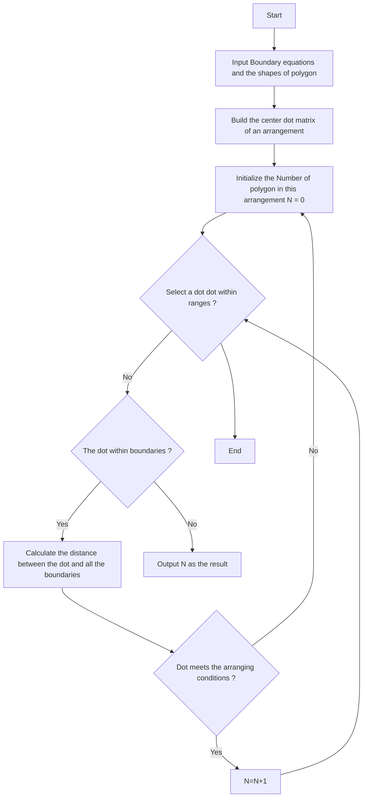

## Team Control Number

For office use only

T1

T2

T3

T4

## 23004

Problem Chosen

A

For office use only

F1

F2

F3

F4

# 2013 Mathematical Contest in Modeling (MCM) Summary Sheet

(Attach a copy of this page to your solution paper.)

Type a summary of your results on this page. Do not include the name of your school, advisor, or team members on this page.

# Summary

Through the analysis of the heat distribution along the edges of pans affected by different pan shapes, the article finds the reason for the overcooking of the product at the edges when using a rectangular pans. Furthermore, according to the requirements given by the problem, the authors propose the optimization model for designing the optimal baking pan.

The paper propose two models and one algorithm. Model one is established to investigate the heat distribution at the edges of pans in different shapes, while model two and the algorithm are used to design the ultimate pan.

Model one describes the heat distribution at the edges of polygons. Based on the equation of heat conduction while taking the convection effects into account, the authors design a model that can describe the thermal conduction inside the pan. Then, given certain Neumann boundary condition, Finite-Element Analysis derives the approximate result of heat distribution, where we can find the phenomena of overcooking at the edges, which matches the practical phenomena described in the problem. Through curve fitting, the authors also find that, for polygons, the standard deviation of temperature of the edges is in inversely proportional to the square of the number of edges.

Model two can be used to find the ultimate solution of baking pan. In the analysis of this model, according to the requirements given by the problem, the author proposed two factors: area utilization rate and the degree of uneven of temperature. Then, the paper analyzed the changing speed of the two factors as the number of edges increases, adding correction factors R and weight p in order to construct proper objective function. After modeling, the authors proposed three evaluation methods of the model in response to the three conditions given by the problem. For the first condition, integer programming is adopted to give the proper arrangement of rectangular pans; for the last two conditions, the authors use a new algorithm to give the proper arrangement of circular and regular polygon pans.

The new algorithm proposed in this paper is a polygon arrangement model based on Center Dot Matrix Statistics, which is used to test the maximum number of a certain kind of polygon or circles that can be put in a certain area. Then, based on this algorithm, the models are tested with several examples, the shapes and numbers of pan for different W/L and p are calculated.

Finally, the sensitivity analysis and model evaluation are performed. During sensitivity analysis, the sudden change phenomenon that emerged when W/L and p change are found. During model evaluation, strengths and weaknesses are analyzed for different models, and suggestion of using rounded corners and normal polygons are proposed for model two.

# The Design of Ultimate Brownie Pan

# Team # 23004

## Abstract

Through the analysis of the heat distribution along the edges of pans affected by different pan shapes, the article finds the reason for the overcooking of the product at the edges when using a rectangular pans. Furthermore, according to the requirements given by the problem, the authors propose the optimization model for designing the optimal baking pan.

The paper propose two models and one algorithm. Model one is established to investigate the heat distribution at the edges of pans in different shapes, while model two and the algorithm are used to design the ultimate pan.

Model one describes the heat distribution at the edges of polygons. Based on the equation of heat conduction while taking the convection effects into account, the authors design a model that can describe the thermal conduction inside the pan. Then, given certain Neumann boundary condition, Finite-Element Analysis derives the approximate result of heat distribution, where we can find the phenomena of overcooking at the edges, which matches the practical phenomena described in the problem. Through curve fitting, the authors also find that, for polygons, the standard deviation of temperature of the edges is in inversely proportional to the square of the number of edges.

Model two can be used to find the ultimate solution of baking pan. In the analysis of this model, according to the requirements given by the problem, the author proposed two factors: area utilization rate and the degree of uneven of temperature. Then, the paper analyzed the changing speed of the two factors as the number of edges increases, adding correction factors R and weight $p$ in order to construct proper objective function. After modeling, the authors proposed three evaluation methods of the model in response to the three conditions given by the problem. For the first condition, integer programming is adopted to give the proper arrangement of rectangular pans; for the last two conditions, the authors use a new algorithm to give the proper arrangement of circular and regular polygon pans.

The new algorithm proposed in this paper is a polygon arrangement model based on Center Dot Matrix Statistics, which is used to test the maximum number of a certain kind of polygon or circles that can be put in a certain area. Then, based on this algorithm, the models are tested with several examples, the shapes and numbers of pan for different W/L and $p$ are calculated.

Finally, the sensitivity analysis and model evaluation are performed. During sensitivity analysis, the sudden change phenomenon that emerged when W/L and $p$ change are found. During model evaluation, strengths and weaknesses are analyzed for different models, and suggestion of using rounded corners and normal polygons are proposed for model two.

Keywords: Heat distribution, Finite-Element Analysis, PDE, 2-D Arrangement

## Introduction

The authors are intended to model the process of oven baking, analyze the distribution of heat along the edges of pans affected by different pan shapes, in order to find the reason for overcooking of food at the corners when using rectangular pans. Afterwards, the authors construct a model that can optimize the ultimate pan shape and arrangement according to the following conditions.

1. Maximize number of pans that can fit in the oven (N).  
2. Maximize even distribution of heat (H) for the pan.  
3. Optimize a combination of conditions (1) and (2) where weights p and (1- p) are assigned to illustrate how the results vary with different values of W/L and p.

In this article, the authors decompose the problem into the following steps when modeling and solving:

1. Construct the uneven degree index of pans of different shapes; (also the analysis result of model one)  
2. Construct the objective function of the combination optimal problem and uniform the optimization direction of different subgoals;  
3. Pick and determine the proper combination of types and numbers of pans;  
4. Construct arrangement model, use the model to arrange the results of step 3, and then find the optimal solution.

## Basic Assumptions

1. The temperature in the oven is constant and forced air convection is adopted.  
2. The pans are made of isotropic material with good thermal conductivity properties.  
3. Basic notations in the article are list as follow.

Table 1 Notation

<table><tr><td>Symbol</td><td>Meaning</td></tr><tr><td>A, S</td><td>Area</td></tr><tr><td>T</td><td>Temperature</td></tr><tr><td>t</td><td>Time</td></tr><tr><td>ρ</td><td>Density</td></tr><tr><td>m</td><td>Edge number of polygon</td></tr><tr><td>x, y, z</td><td>Axis of the rectangular coordinates</td></tr><tr><td>Q</td><td>Heat</td></tr><tr><td>λ</td><td>Coefficient of thermal conductivity</td></tr><tr><td>h</td><td>Coefficient of convection heat transfer</td></tr><tr><td>c</td><td>Specific heat capacity</td></tr><tr><td>L, l</td><td>Length</td></tr><tr><td>W, w</td><td>Width</td></tr><tr><td>N, n</td><td>Number</td></tr><tr><td>q</td><td>Heat flux</td></tr><tr><td>n</td><td>Outward normal vector of a plane</td></tr><tr><td>η</td><td>Utilization rate of Area</td></tr><tr><td>σ</td><td>Standard deviation</td></tr></table>

4. The shape of pan is approximately rectangular box with no lid. The shapes and the basic model are given as follow:

natural_image

Diagram showing a 3D box being processed into a plastic tray, with no text or symbols present.

Fig. 1 Basic Model of Baking Pan

## Model 1: The Distribution of Heat at the Edges of Polygon

According to heat-transfer principles, there are three ways for heat to transfer: heat radiation, heat conductivity and heat convection.

In a baking oven, the hot air flows over the baking material either by natural convection or forced by a fan, the convection heat transfer from the air, the radiation heat transfer from the oven heating surfaces, and the conduction heat transfer across contact area between product and metal surface. [1]

In most heat-controllable ovens, as the temperature inside the oven can be kept constant, the main source of heat that will result in the overcooking of food is the metal pan. So this model mainly focuses on the heat conductivity inside the metal pans.

The basic model of heat flow launched into the metal pan is as follow.

text_image

Heat flow

Fig. 2 Heat Flow of the Pan

As we assume that the pan is isotropic, the heat flux received by different facets of the pan should be the same inside the oven. As a result, the non-uniformity is resulted from the heat convection between the pan and air and the heat transfer inside the metal material. According to the heat-transfe equation (Eq. 1), [2, 3]

$$
\rho c \frac {\partial T}{\partial t} - \lambda \left(\frac {\partial^ {2} T}{\partial x ^ {2}} + \frac {\partial^ {2} T}{\partial y ^ {2}} + \frac {\partial^ {2} T}{\partial z ^ {2}}\right) = Q _ {g}, \tag {Eq.1}
$$

Where T represents temperature, $Q _ { g }$ represents inner heat source, ?? represents density, ?? represents specific heat capacity，?? represents thermal conductivity, when balance is achieved, the temperature stops to change. So

$$
\frac {\partial T}{\partial t} = 0, (t \rightarrow \infty). \tag {Eq.2}
$$

From Eq. 2, we can derive the equation of steady state heat transfer without inner heat source, concerning the coefficient of convection heat transfer, which is the steady state heat transfer equation (Eq. 3) of baking pan.

$$
- \lambda \left(\frac {\partial^ {2} T}{\partial x ^ {2}} + \frac {\partial^ {2} T}{\partial y ^ {2}} + \frac {\partial^ {2} T}{\partial z ^ {2}}\right) = h (T _ {e x t} - T) \tag {Eq.3}
$$

In Eq. 3, the ℎ represents the coefficient of heat convection. The $T _ { e x t }$ represents outer temperature of the air. The boundary condition is Neumann boundary condition, which is used when all facets’ heat flux density of normal vector $q _ { e d g e }$ are known. The ??⃑ represents the outward normal vector of a plane.

$$
q _ {e d g e} = - \lambda \frac {\partial T}{\partial \vec {n}} = q (x, y, z, t) \tag {Eq.4}
$$

Eq. 4 is a third-order partial differential equation (PDE). However, if we assume that only the heat from the bottom of the pan is considered, the distribution of heat on the surface of the pan will be even. Thus, the unevenness of heat distribution is mainly resulted from the heat received by side facets. As a result, the three-dimensional model can be simplified into a two-dimensional model as follow.

$$
\left\{ \begin{array}{c} - \lambda \left(\frac {\partial^ {2} T}{\partial x ^ {2}} + \frac {\partial^ {2} T}{\partial y ^ {2}}\right) = h (T _ {e x t} - T) \\ q _ {e d g e} = - \lambda \frac {\partial T}{\partial \vec {n}} = q _ {0} \end{array} . \right. \tag {Eq.5}
$$

The steady state solution can be calculated using finite element analysis method. Using the PDE Toolbox provided by Matlab, we can get the numerical solution of this model. [4]

Now, the heat distribution on a square pan made of certain kind of experimental material are calculated using the following parameters and boundary condition. These parameters and boundary conditions are regarded as the standard state of tests in this paper.

Table 2 Parameters of Standard State

<table><tr><td>Physical Quantity</td><td>Value</td></tr><tr><td> $\lambda$ </td><td>50 [ W / ( K · m ) ]</td></tr><tr><td> $h$ </td><td>100 [ W / ( K · m2 ) ]</td></tr><tr><td> $T_{ext}$ </td><td>330 [ K ]</td></tr><tr><td> $q_0$ </td><td>1000 [ W / ( s · m ) ]</td></tr></table>

The calculation results are presented as follow.

3d surface plot with color gradient

| X    | Y    | Value |
|------|------|-------|
| -0.5 | 366  | 367   |
| 0    | 378  | 376   |
| 0.5  | 376  | 375   |
| -0.5 | 374  | 374   |
| 0    | 372  | 372   |
| -0.5 | 370  | 370   |
| 0.5  | 368  | 369   |
| -0.5 | 366  | 368   |
| 0    | 366  | 367   |

Fig. 3 3D - Plot of Heat Distribution of Square Baking Pan Model

line chart

| x    | Temperature (K) |
| ---- | --------------- |
| -0.5 | 376.5           |
| 0.0  | 371.5           |
| 0.5  | 376.5           |

Fig. 4 Temperature Curve of the Edge of the Square Pan

We can see that the temperatures at the corners are high while the temperature at the center is the lowest. The change of temperature along the edge is significant. If circular pan is chosen, the heat distribution at the edge will be even, while the temperature at the center is also relatively low.

heatmap

| X Range | Y Range | Color Value |
|---------|---------|-------------|
| -0.8    | 362     | 363         |
| -0.6    | 364     | 364.5       |
| -0.4    | 366     | 365.5       |
| -0.2    | 368     | 367         |
| 0.0     | 370     | 368         |
| 0.2     | 368     | 367         |
| 0.4     | 366     | 366         |
| 0.6     | 364     | 365         |
| 0.8     | 362     | 364         |
| 1.0     | 360     | 363         |

Fig. 5 3D - Plot of Heat Distribution of Circle Baking Pan Model

Then, the area of pan are kept constant, while the number of edges is increased, which will make the pan approach circle in shape. We can see the following pattern of change where we can find that the heat distribution at the edges is approximately parabolic. Also, as the number of edges increases, the heat distribution will tend to be even, the variance of temperature will decrease.

line chart

| X    | Square | Pentagon | Hexagon | Heptagon | Octagon | Decagon | 14-gon | 16-gon |
|------|--------|----------|---------|----------|---------|---------|--------|--------|
| -0.5 | 376.5  | 372.8    | 371.2   | 370.5    | 369.8   | 369.2   | 368.5  | 368.2  |
| 0.0  | 371.8  | 370.2    | 369.5   | 369.0    | 368.5   | 368.0   | 367.5  | 367.2  |
| 0.5  | 376.5  | 372.8    | 371.2   | 370.5    | 369.8   | 369.2   | 368.5  | 368.2  |

Fig. 6 Temperature Curves of Edge of the Different Polygon Pan

Meanwhile, standard deviations as listed below are calculated to represent the uniformity.

We can see that as the number of lateral increases, the trend of overall standard deviation and standard deviations at the edges are of the same direction, which is decreasing. Also, we can see that as the number of edges increases, the overall standard deviation approaches a certain value, while the standard deviation at the edges approached zero. Thus, the shape determines the heat distribution at the edges, and also affects the overall heat distribution. The more edges it has, the more even the heat is distributed.

As a result, we can use the standard deviation of temperature at the edges to denote the overal degree of even distribution of heat.

Table 3 the Deviation of Temperature of Different polygons

<table><tr><td>Number of edges (m)</td><td>Overall standard deviation ( $\sigma_w$ )</td><td>Deviation at the edges ( $\sigma_m^2$ )</td><td>Standard deviation at the edges ( $\sigma_m$ )</td><td>Per-unit value</td></tr><tr><td>4</td><td>4.3236</td><td>2.2918</td><td>1.5139</td><td>1</td></tr><tr><td>5</td><td>3.2438</td><td>0.6959</td><td>0.8342</td><td>0.5510</td></tr><tr><td>6</td><td>2.8923</td><td>0.3416</td><td>0.5845</td><td>0.3861</td></tr><tr><td>7</td><td>2.7342</td><td>0.1716</td><td>0.4142</td><td>0.2736</td></tr><tr><td>8</td><td>2.6159</td><td>0.0961</td><td>0.3100</td><td>0.2048</td></tr><tr><td>10</td><td>2.5089</td><td>0.0535</td><td>0.2313</td><td>0.1528</td></tr><tr><td>14</td><td>2.4155</td><td>0.0090</td><td>0.0949</td><td>0.0627</td></tr><tr><td>16</td><td>2.3754</td><td>0.0057</td><td>0.0755</td><td>0.0499</td></tr><tr><td>∞ (Circle)</td><td>1.0041</td><td>0.0000</td><td>0.0000</td><td>0</td></tr></table>

scatterplot

| 1/m²   | Y     |
| ------ | ------- |
| 0.005  | 0.08    |
| 0.01   | 0.22    |
| 0.015  | 0.31    |
| 0.02   | 0.41    |
| 0.028  | 0.58    |
| 0.04   | 0.83    |
| 0.062  | 1.52    |

Fig. 7 Curve Fitting Result

Using Matlab to do the curve fitting, we can get the approximate relationship between the number of edges and the even distribution degree of heat represented by standard deviation at the edges.

$$
\sigma = \frac {2 3 . 6 0 5}{m ^ {2}} + 0. 0 3 5 \approx \frac {2 3 . 6 0 5}{m ^ {2}} \propto \frac {1}{m ^ {2}}. \tag {Eq.6}
$$

This model properly explains the reason for the problem of uneven heating at the edges of pans. Meanwhile, we can see how the heat distribution changes as the shape of pan changes from polygon to circle.

## Model 2: Baking Pan Optimization Design Model

## Determination of the objective function

We have already known from the problem and the results of model one that the uniformity of heat distribution changes as the shape of pan changes. In order to design and optimize pan shape, we need to consider two factors of pan’s characteristics.

Factor One: The Area Utilization Rate of Rack η

This is defined as follow,

$$
\eta = 1 - \frac {N A}{2 S}. \tag {Eq.7}
$$

In Eq. 7, A is the area of a single pan. N is the total number of all pans. S is the area of a rack. The smaller η is, the higher the utilization rate of area is achieved.

According to the 2-D arrangement principle, only rectangle and hexagon can be used to cover an infinite plane area without overlap and leaving intervals, while other shapes cannot be used to do the job.

natural_image

Abstract geometric pattern composed of six distinct shapes: a 2x2 grid, hexagons, four octagons, and three circles (no text or symbols)

Fig. 8 Several 2-D Arrangement Methods

As a result, the only way to achieve maximum rack area utilization rate is to use pans of rectangle or hexagon shapes. When it comes to finite plain area, because of the constraint of boundary, the arrangement job may become more complex. We will address the problem later in this paper.

Factor Two: the Temperature Discrepancy Rate σ

In model one, we discussed the feasibility of using the standard deviation of temperature at the edges to indicate the degree of even distribution rate.

We define the temperature discrepancy rate as follow:

$$
\sigma = \frac {\sum n _ {i} \sigma_ {i}}{\sigma_ {0} N}, \tag {Eq.8}
$$

Where $\sigma _ { i }$ is the standard deviation of temperature at the edges of pans with shape No. i, $n _ { i }$ is the number of pan with shape No. i. In order to facilitate optimization, we convert the standard deviation to per-unit value, using the largest standard deviation $\sigma _ { 0 }$ (which is the standard deviation for rectangular pan) as the base value. A smaller ?? indicate smaller temperature discrepancy between parts of the pan and more even distribution of heat.

The conclusion of model one tells that the degree of even distribution of heat at the edges of regular polygon is inversely proportional to the square of its number of edges. So the heat distribution of circle is most even while the rectangles’ are the worst.

According to the different demands of user, we use p as the weight of factor one, $( l - p )$ as the weight of factor two. The optimization directions of the two indicators are the same. So the indicator of demand and the optimization direction are as follow:

$$
\min \left[ R \times \eta p + \sigma (1 - p) \right], \tag {Eq.9}
$$

Where R is the correction factor, which is used to correct the changing speeds of the two factors. This factor will help reduce the imbalance during optimization. When the shape changes, R can make the changing speeds of them tend to be the same. The setting of R will be discussed later in the paper.

Then, general constraints are listed as follow,

$$
S. T. \quad \left\{ \begin{array}{c} 2 S - N A \geq 0 \\ \sum n _ {i} = N, n _ {i} \in Z _ {+} \end{array} . \right. \tag {Eq.10}
$$

Now, we will do the optimization according to the following three kind of requirements of users. (3 condition)

1. Maximize number of pans that can fit in the oven (N).  
2. Maximize even distribution of heat (H) for the pan.  
3. Optimize a combination of conditions (1) and (2) where weights p and $( l - p )$ are assigned to illustrate how the results vary with different values of W/L and $p .$ .

Condition 1: To Achieve Maximum Number of Pans. $( p { = } I )$

$$
\min \eta = \min \left(1 - \frac {N A}{S}\right) \Rightarrow \max N. \tag {Eq.11}
$$

In order to achieve maximum number of pans, close packed structure must be used. Meanwhile, because of the constraint of the shape of rack, only rectangular pans can leave the least space at the edges of rack. So the number of pans will be: ([x] represents the largest integer which is less than x)

$$
N _ {m a x} = 2 \left[ \frac {S}{A} \right]. \tag {Eq.12}
$$

Now, we need to model the close package of rectangles to get the final arranging pattern.

text_image

A width to length ratio: L/w
L
W S
l
w A

Fig. 9 Geometric Sketch

Geometric constraints (the width and length ration W/L is not constant):

$$
S. T. \quad \left\{ \begin{array}{c} A = w l, S = W L, \\ \frac {N _ {m a x}}{2} \geq n _ {w} n _ {l}, \\ 1 \leq n _ {w} \leq \left[ \frac {W}{w} \right], 1 \leq n _ {l} \leq \left[ \frac {L}{l} \right]. \end{array} \right. \tag {Eq.13}
$$

This model may not be able to give a clos package. So, we will firstly make the pans closely attached to the certain three edges, and then splice the left space into $( N _ { m a x } - n _ { w } n _ { l } )$ rectangles with different areas.

<table><tr><td>A</td><td>A</td><td>A</td><td>A</td><td>A</td><td>A</td><td>A</td><td>A</td></tr><tr><td>A</td><td>A</td><td>A</td><td>A</td><td>A</td><td>A</td><td>A</td><td>A</td></tr><tr><td>A</td><td>A</td><td>A</td><td>A</td><td>A</td><td>A</td><td>A</td><td>A</td></tr><tr><td>A</td><td>A</td><td>A</td><td>A</td><td>A</td><td>A</td><td>A</td><td>A</td></tr></table>

Fig. 10 An Arrangement of Rectangles

We can see from the above result that only if the area of rack S is the integral multiple of area of a single pan A, it is possible to achieve close package with rectangles, which means that any other condition will not achieve close package.

Condition 2: The Most Even Distribution of Heat. $( p { = } O )$

$$
\min \sigma = \min \frac {\sum n _ {i} \sigma_ {i}}{\sigma_ {0} N}. \tag {Eq.14}
$$

It requires that the heat distribution should be as even as possible while ignoring the utilization rate. So we will totally use circular pans. That is:

$$
N \leq N _ {m a x} = 2 \left[ \frac {S}{A} \right]. \tag {Eq.15}
$$

The number of pans will be less than the maximum possible number. Now we need to establish a model for arranging circles to get the final arranging pattern. There are two possible patterns:

natural_image

Grid of identical black circles with dots at intersections (no text or symbols)

Fig. 11 Pattern 1 of Circle Arrangement

natural_image

Grid of 16 identical black circles arranged in 4 rows and 5 columns (no text or symbols)

Fig. 12 Pattern 2 of Circle Arrangement

The distance between the centers of basic units for close package is equal to the diameter of circle. The basic units of the dot matrix of centers are triangles and squares respectively. So optimization should be done for each pattern. Considering that the arrangement of circles is like the arrangement of regular polygons, we propose an algorithm based on center matrix statics, which will be illustrated later in this paper.

Condition 3: $\scriptstyle 0 < p < I$

$$
\min \left[ R \times \eta p + \sigma (1 - p) \right]. \tag {Eq.16}
$$

For some users, both the even distribution of heat, which will reduce the possible overcooking at edges, and the high utilization rate of pan area are supposed to achieve, or that a slight overcooking cake is desired for better taste. So we wish that weight p and $( l - p )$ will be used to reflect the users specific requirement.

The first step is to determine the correction factor R to correct the objective function. In model one, we have analyzed how ?? changes with the shape of pans. Then, we need to do further analysis on the rules that the unused area changes as the shape of pans changes.

In order to reduce the unused area at the rack, we need to arrange the pans as closely as possible. Now, the arrangement of different kinds of polygons are listed as follow.

## 1. Rectangle

Unused space only appears at the edges.

## 2. Regular octagon

There will be two kinds of unused space: at the edges and the holes in-between.

## 3. Regular hexagon

Unused space only appears at the edges.

text_image

Grid pattern with 10 black dots arranged in 4x4 cells, resembling a 3x3 or 2x3 matrix.

natural_image

Geometric pattern of interlocking octagons with dots at center (no text or symbols)

natural_image

Hexagonal grid pattern with scattered dots (no text or symbols)

Fig. 13 Different Arrangements

## 4. Regular m-gon (m>=12)

The shape will be like circle. In an attempt to reduce cost, we will use circles instead of such polygons.

natural_image

Simple hand-drawn octagon outline with no text or symbols

Fig. 14 Regular Dodecagon and Circle

## 5. Other polygons

It will be impossible to achieve overlap of edges because the inner angles are not 60 or 90 degree. There will be much more unused space, so such arrangements will not be considered.

natural_image

Pure geometric pattern of interconnected hexagons without any text, numbers, or symbols

Fig. 15 the Arrangement of Heptagon, etc.

Now we only need to analyze the arrangement of rectangles (including squares), regular hexagons, regular octagons and circles.

For any regular polygon with an edge number of $4 l \left( l > I \right)$ , when we arrange them as the edges overlap with adjacent polygons, the area they encompass will be regular polygon with an edge number of 4(l-1), the relationship between area and number of edges is:

$$
S _ {l} = A \left(\frac {\cot \frac {\pi}{4 l}}{l} - 1\right). \tag {Eq.17}
$$

The changing speed of the value of this function will be approximately the same with the changing speed of $\sigma$ in the above conditions (rectangles, regular hexagons, regular octagons and circles), but with opposite direction. So the correction factor will have a constant value, which means:

$$
R = \text { const. } \tag {Eq.18}
$$

Finally, when $\partial { < } p { < } I ,$ , the arrangement model will be further divided into the following conditions to facilitate further discussion, that is, rectangle, regular hexagon, regular octagon, circle and the combination of them.

Now, we use the following model:

$$
\min \left[ R \times \eta p + \sigma (1 - p) \right]. \tag {Eq.19}
$$

$$
S. T. \quad \left\{ \begin{array}{c} 2 S - N A \geq 0 \\ n _ {4} + n _ {6} + n _ {8} + n _ {\infty} = N, n _ {i} \in Z _ {+}. \\ \sigma_ {i} \in \{\sigma_ {4}, \sigma_ {6}, \sigma_ {8}, \sigma_ {\infty} \} \end{array} \right. \tag {Eq.20}
$$

The solution of the model will be a vector n, where all the terms are integer. Considering the constraints of the actual area of two racks and the maximum number of pans, we only allow the combination of a maximum number of two shapes of pans appears simultaneously on a rack. Then we will use the algorithm illustrated as follow to calculate the arrangement and compare the result of objective function, and then find the optimal solution.

## Algorithm: Regular Polygon Arrangement Based on Center Matrix Statics

natural_image

Geometric pattern of black dots arranged in a grid within a larger hexagonal grid, with no text or symbols present.

Fig. 16 Edges and Center Matrix of Octagon

Every kind of polygon has several unique close package arranging patterns. As a result, we can draw the matrix of centers on graph paper. Make the axis overlap with edges of polygons as much as possible. Thus, we only need to determine whether the polygon with a certain center can be put inside the rectangle or the boundaries. Take rectangle rack boundaries as the example.

For any point that lays inside the rectangle, it must comply the following conditions:

1. The least distance between this point and the edges of the rectangle must not be less than the radius of its inscribed circle;  
2. For hexagon, the least distance between this point and the edges of the rectangle must not be less than the radius of its circumcircle;

For regular hexagon, because of that the distance between dots along x axis and along y axis are different, we need to rotate the rack 90 degree when one analysis is finished and do the analysis again, and then pick the optimal arrangement.

natural_image

Hexagonal grid pattern with black dots and dotted lines, no text or symbols present

Fig. 17 Special Condition of Hexagon

The flow chart of Algorithm is listed as follow. In tests with actual examples, we will use the method described above to give the optimal pan design when different p and W/L are given.

flowchart

Fig. 18 Algorithm Flowchart for 2-D Arrangement Based on Center Dot Matrix

## Model test

We picked Countertop Oven with Convection and Rotisserie (31100) with two $9 ^ { \circ } \mathbf { x } 1 3 ^ { \circ }$ racks (The pictures are picked from http://www.hamiltonbeach.com/products/toaster-ovens-countertop oven-with-convection-and-rotisserie-3110).

  
Fig. 19 Testing Oven and Baking Pan

We suppose that the oven is used to bake many brownie cakes with area of 30 $\mathrm { c m } ^ { 2 } .$ . The environment inside the oven and of the pan is standard. We pick the correction factor R as 1, and then the objective function will be:

$$
m i n [ \eta p + \sigma (1 - p) ]
$$

$$
= \min \Big [ p \left(1 - \frac {N A}{2 S}\right) + (1 - p) \frac {\sum n _ {i} \sigma_ {i}}{\sigma_ {0} N} \Big ]. \tag {Eq.21}
$$

$$
S. T. \quad \left\{ \begin{array}{c} 2 S - N A \geq 0 \\ n _ {4} + n _ {6} + n _ {8} + n _ {\infty} = N, n _ {i} \in Z _ {+}. \\ \sigma_ {i} \in \{\sigma_ {4}, \sigma_ {6}, \sigma_ {8}, \sigma_ {\infty} \} \end{array} \right. \tag {Eq.22}
$$

Arranging patterns are as follow:

Table 4 All the Arrangements for Optimization (1)

<table><tr><td>Shape</td><td>Arranging pattern 1</td><td>Arranging pattern 2</td></tr><tr><td rowspan="2">Rectangle</td><td></td><td></td></tr><tr><td>See Condition 1</td><td>Square</td></tr><tr><td>Regular hexagon</td><td></td><td></td></tr><tr><td>Regular octagon</td><td></td><td></td></tr></table>

Table 5 All the Arrangements for Optimization (2)

<table><tr><td>Shape</td><td>Arranging pattern 1</td><td>Arranging pattern 2</td></tr><tr><td>Circle</td><td></td><td></td></tr></table>

Basic parameters:

$$
S = 9 ^ {\prime \prime} \times 1 3 ^ {\prime \prime} = 2 2. 8 6 c m \times 3 3. 0 2 c m = 7 5 4. 8 3 7 2 c m ^ {2}, \tag {Eq.23}
$$

$$
A = 3 0 c m ^ {2}, \tag {Eq.24}
$$

$$
N \leq N _ {m a x} = 2 \left[ \frac {S}{A} \right] = 5 0. \tag {Eq.25}
$$

Test 1: $p = 0 . 5 , W / L = 9 / 1 3 = 0 . 6 9 2 3 .$ .

(For polygon, m is the number of edges, a is the length of edges.)

$$
N = 4 0, m = 6, a = 3. 3 9 8 1 c m. \tag {Eq.26}
$$

natural_image

Abstract pattern of interlocking hexagons in grayscale (no text or symbols)

Fig. 20 Best Arrangement for Test One

Then, find the minimum value of the objective function, which is:

$$
f (p = 0. 5) _ {m i n} = 0. 5 \left(1 - \frac {4 0 \times 3 0}{2 \times 7 5 4 . 8 3 7 2}\right) + 0. 5 \times 0. 3 8 6 1 = 0. 2 9 5 6. \tag {Eq.27}
$$

Test 2: $p = 0 . 2 5 , W / L = 9 / 1 3 = 0 . 6 9 2 3 .$

(For polygon, m is the number of edges, a is the length of edges.)

$$
N = 3 0, m = 8, a = 2. 4 9 2 6 c m. \tag {Eq.28}
$$

natural_image

Grid of twelve identical octagons arranged in 3 rows and 5 columns on a black background (no text or symbols)

Fig. 21 Best Arrangement for Test Two

Then, find the minimum value of the objective function, which is:

$$
f (p = 0. 2 5) _ {m i n} = 0. 2 5 \left(1 - \frac {3 0 \times 3 0}{2 \times 7 5 4 . 8 3 7 2}\right) + 0. 7 5 \times 0. 2 0 4 8 = 0. 2 5 4 6. \tag {Eq.29}
$$

Test 3: $\begin{array} { r } { p = 0 . 5 , W / L = 0 . 6 8 3 3 . } \end{array}$

With slightly changes in W/L, the optimal arrangement changes. (For polygon, m is the number of edges, a is the length of edges.)

$$
N = 4 0, m = 8, a = 2. 4 9 2 6 c m. \tag {Eq.30}
$$

natural_image

Grid of 16 identical octagons on black background, no text or symbols present

Fig. 22 Best Arrangement for Test Three

Then, find the minimum value of the objective function, which is:

$$
f (p = 0. 5) _ {\text {min}} = 0. 5 \left(1 - \frac {4 0 \times 3 0}{2 \times 7 5 4 . 8 3 7 2}\right) + 0. 5 \times 0. 2 0 4 8 = 0. 2 0 5 0. \tag {Eq.31}
$$

From the above three cases, we can find that when W/L is kept constant, the weight p will cause changes in the optimal solution and arrangement. When p is kept constant and W/L changes, the optimal solution and the arrangement will also change greatly.

## Sensitivity analysis

The optimization model proposed by the paper is integer programming, which means that as parameters p and W/L change, the optimal solution will be discrete. Such characteristic makes the kind of pans finite, which will reduce producing cost and make large volume production possible. Meanwhile, because of the consideration of the weight p, which denotes the demand of users, we can design many kind of pans which will fulfill their requirements.

However, because of this characteristic, the optimal solution will change suddenly as some parameters change (such as W/L). For example, when p = 0.5, W/L change from 9/13 to 0.683, only a slight change of 0.01 will cause the optimal solution and arrangement to change suddenly. So when designing the W/L of pan, we must try to pick more values at the boundary point, or avoid using the boundary point, to avoid wrong optimization.

## Strengths and Weaknesses

## Model 1

## Strengths

This model starts from heat transfer theory, considers the constant temperature working state of baking ovens, proposes proper assumptions and establishes heat transfer equation for pans based on heat transfer which considers convection. Through simplification and solving, we get the steady-state solution and find the reason for overcooking at the corners and how it changes. Because we took both heat conductivity and convection, it will makes our solution more compelling.

## Weakness

Before solving the model, we simplified the three-dimensional model to a two-dimensiona model. So the result will be not exactly the same as the real heat distribution

## Model 2

## Strengths

As we built this model, we correct two parameters of the objective function, which make the changing speeds approximately the same to facilitate weighting optimization.

In addition, when solving the model, we propose an algorithm based on Center Matrix Statistics to solve 2-D polygon arrangement problem.

## Weakness

This model neglects some polygons with odd lateral number, such as regular pentagon， regular heptagon and so on. Meanwhile, we consider polygons with too many edges (m>10) approximately as circle, which will confine our results in finite kinds of arrangement patterns.

## Improvement

Firstly, all the pan shapes designed in the paper are of sharp corners. If rounded corners are used, the heat distribution will be more even.

flowchart

3d surface plot

| X    | Y    | Value |
|------|------|-------|
| -1   | 366  | 368   |
| -0.5 | 370  | 370   |
| 0    | 372  | 372   |
| 0.5  | 374  | 374   |
| 1    | 376  | 376   |

3d surface plot

| X     | Y     | Height |
|-------|-------|--------|
| -1    | 366   | 367    |
| -0.5  | 370   | 369    |
| 0     | 372   | 370    |
| 0.5   | 374   | 371    |

Fig. 23 Changes on Round Corners

Secondly, all the pan shapes designed in the paper are of either rectangles or regular shapes. I normal polygon are used, the heat distribution would be more even.

## Advertising Sheet

The authors provided advertising sheets attached at the end of the article. The Brownie Cake photo on the Sheet is picked from http://e.weibo.com/2278459747/app\_4048278376. We promise not let the photo for commercial uses.

See advertising Sheets on Next Two Pages.

## Acknowledgment

The authors thank Hamilton Beach Company, the author Cakedear for permission to use data and photos of Ovens, Pans and Brownie cakes from their website.

## References

[1] Melike Sakin, Figen Kaymak-Ertekin, Coskan Ilicali1, Convection and radiation combined surface heat transfer coefficient in baking ovens, Journal of Food Engineering, Volume 94, Issues 3–4, October 2009, Pages 344–349.  
[2] Frank Kreith, Raj M. Manglik, Mark S. Bohn, Principles of Heat Transfer, SI ed., Cengage Learning, 2010.  
[3] Donald Pitts, Leighton Sissom, Schaum’s Outline of Theory and Problems of Heat Transfer, Second Edition, McGraw-Hill, 2002.  
[4] Zhu Qiumin, Chen Xiaoping, Application of PDE Toolbox and Least Square Method in Heat Conduction of Metal, Process Automation Instrumentation, Volume 32, No.6, June 2011, Pages 26-31.

# The Ultimate Brownie Pan

That will reduce overcooking at the edges and fit your demand in a maximum extent

natural_image

Family enjoying a birthday with cake and fruit toppings, no visible text or symbols

## How it works

Our research on the optimization of heat distribution of baking pan has greatly progressed. We have already known the reasons and rules of heat distribution of the baking pan. We develop a model to design different kinds of pans to meet your requirements, both for home users and food processing factory.

This brochure will guide you to know and choose your own Pans!

## Different Shapes, Different Tastes!

## More little Pans

Crisp tastes in cake corners, require higher baking skills.

## Easy Baking

For beginner, Easier in controlling temperature, soft tastes.

## Design for U

Combining both factors, and generating your own baking

## Why?

natural_image

Abstract flame-like graphic with red-orange gradient, no text or symbols present

The figure above shows the temperature distribution of a rectangular pan. We can see that it’s much hotter in 4 corners than other places.

Thus when using traditional Rectangular baking pan, your Brownie cakes would be overcooked at 4 corners.

The temperature distribution is more even in circle pan as the figure below.

natural_image

Illustration of a glowing red-orange sphere above white flowers against a teal background (no text or symbols)

# Pick From Four Choices or Customize Your Own

natural_image

3D rendering of a rectangular tray with multiple compartments filled with plastic slats (no text or symbols)

Do you enjoy baking your own Brownie Cakes at home?

Are you tired of baking corner-overcooked cakes?

## Rectangular Size with more pans

This kind of pan is based on rectangular shapes. It will bring you more Crisp Tastes in the corner of cakes. With more little pans, you can bake more cakes at once. In other words, this kind of pan will Save Your Money, or reducing carbon emissions in production. It’s more suitable for food processing factory.

natural_image

3D rendering of a hexagonal grid pattern inside a rectangular tray (no text or symbols)

## Regular Hexagon Pans

The cake baked in this pan is crisper but softer. And it’s easier to handle. With a smaller amount of pans，it is more suitable for Home Users. We can customize the sizes for your own oven.

## Regular Octagon Pans

This kind of pan is more exquisite for those people who Enjoy Cooking. It will bake lovely cakes. If you have children in your home, we suggest you1 prefer this kind. With better shapes of cakes, Stronger Appetite will stimulate!

## Circle Pans for Beginner

If you are a beginner in baking or cooking, circ Pans are strongly recommended for you. Taste of cakes in this kind of pan will be soft and loos

## Customize Your Own

If you have other requirements, you are welcomed to contact us. We will do our best to meet your demand and satisfaction.

natural_image

3D rendering of a hexagonal grid structure inside a transparent tray (no text or symbols)

natural_image

3D rendering of a rectangular tray with uniform metallic cylindrical indentations (no text or symbols)

