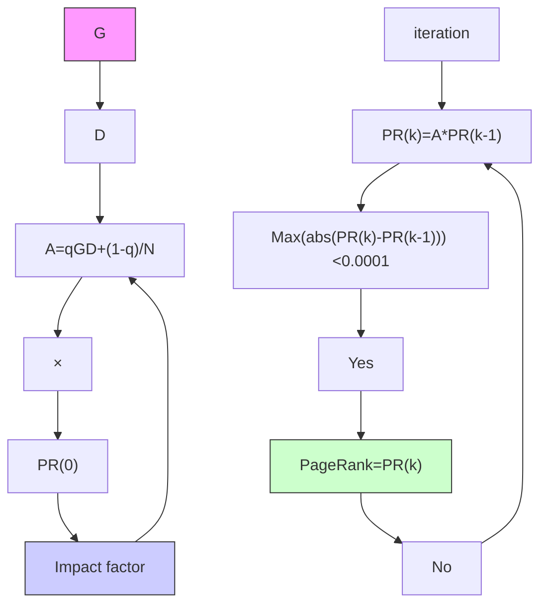
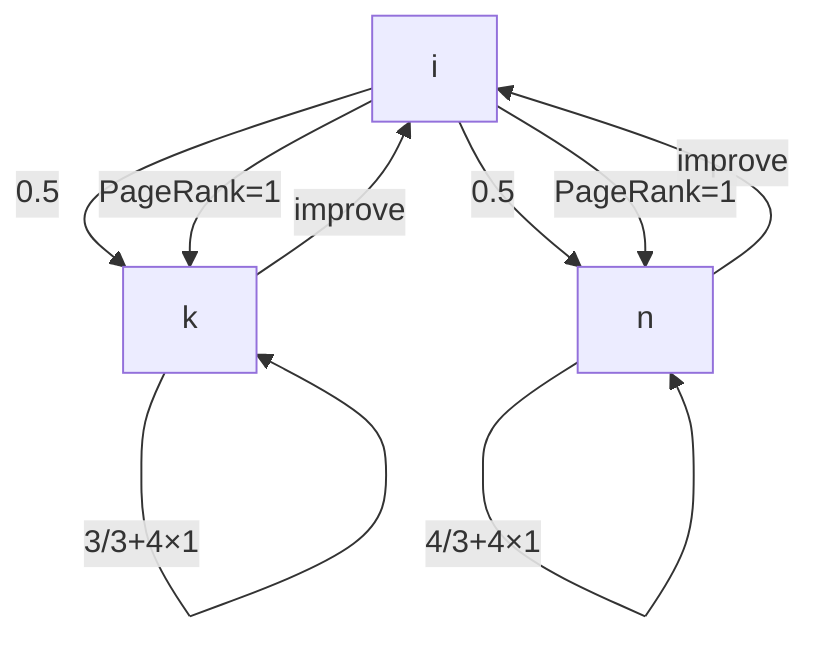

<table><tr><td>For office use only</td><td>Team Control Number25318</td><td>For office use only</td></tr><tr><td>T1</td><td></td><td>F1</td></tr><tr><td>T2</td><td></td><td>F2</td></tr><tr><td>T3</td><td>Problem Chosen</td><td>F3</td></tr><tr><td>T4</td><td>C</td><td>F4</td></tr></table>

# 2014

# Mathematical Contest in Modeling (MCM/ICM) Summary Sheet

## Who are the 20%?

The famous ‘80-20’ rule states that the 80% influence is caused by the 20% for many events. This principle also applies to the network science: only few nodes have a significant influence and impact to the whole network. In our paper, A Relation Distance Model and an Authority-Popularity Evaluation Model are employed to measure of the 20% and analysis of its influence.

For requirement 1 & 2, we construct the undirected co-author network based on the 511 order relationship matrix. A Relation Distance Model is proposed on the basis of SNA technique. It combines three centrality indexes as a measure vector to calculate the ‘distance’ with the most influential node. Another measure (Eigenvector centrality) which takes both degree and the influence of co-authors into consideration outputs a new rank. Validation of the model is discussed by comparing the two ranking of the top 15 authors in Erdos1 network, we find ALON, NOGA M. is the most influential person in the Erdos1 network. The degree distribution of the Erdos1 network is proved to approximately be power-law distribution, which indicates it is a scale-free network.

For requirement 3, an Authority-Popularity Evaluation Model is established to analyze the depth and the width of the influence of nodes. An Authority Index is calculated by our Modified PageRank Algorithm (including two steps: initialization and iteration) to measure the depth of impact. A Popularity Index is defined as citation per year to reflect the width of influence. A set of 24 papers citation directed network with weight added to nodes is constructed to implement the algorithm. The final ranking of the papers is obtained by combining Authority-Popularity Indexes. For requirement 4, a set of 15 actors’ co-star bidirectional network with co-star movie as links is constructed. The iteration process is refined as the weight added to links instead of nodes.

For requirement 5, we discuss two characteristics of scale-free network: Growth and Preferential attachment. The philosophy of dynamics of scale-free network is revealed as the 'Matthew effect'. The prior method to boost influence is proposed: finding the shortest links to the most influential author. Cooperating with the 80% (more approachable relatively) with low closeness centrality step by step and finally co-author with the key figure in the field.

A sensitivity analysis is conducted to study the robustness of our algorithm to Damp Coefficient and the result shows a good stability. Strength and weakness of our models is also discussed.

## Who are the 20% ?

## 1. Introduction

In this paper, we will introduce two proper methods to analyze influence and impact in research networks and other areas of society.

The Relation Distance Model is proposed based on SNA technique. It is a combination of three centrality indexes. Another measure (Eigenvector centrality) which takes both degree and the influence of co-authors into consideration outputs a new rank. Validation of the model is discussed by comparing the two ranking of the top 15 authors in Erdos1 network.

The Authority-Popularity Evaluation Model is established in section 5 to analyze the depth and the width of the influence of important nodes. The Authority Index reflects the depth of impact and the Popularity Index reflects the width of influence. A set of 24 papers citation network with weight is constructed to implement the algorithm and the results are discussed. In order to analyze a costar network for Requirement 4 , a refinement to the model based on Modified PageRank Algorithm is proposed in subsection 5.3.

The philosophy of the scale-free network is revealed and the shortcut to boost influence based on our model is proposed in section 6.

## 2. Basic Assumptions

In this section, we discuss several assumptions we have made and rationale for making these assumptions.

Assumption 1. We assume that the strength of co-authorship between two arbitrary Erdos1 authors is the same.

We believe that the accurate strength level of co-authorship between two arbitrary Erdos1 authors is hard to be measured by some criterion. For the sake of simplification, in our case, if two authors co-author a paper , then the coauthorship index is ’1’, if not , it is ’0’.

Assumption 2. We assume that the significance of a research paper is determined by both its citations and publishing date , also, the influence of the journal should be considered.

We believe that the more often a paper is cited or the earlier a paper is published, the more influential it is. And also, a high influential journal contributes more to the influence of a paper.

Assumption 3. We assume that the quality of a movie is determined by its IMDb rating[1] . The popularity of a movie star is measured by the number of Google search results.

## 3. Definitions

Definitions of symbols employed in this paper are listed in Table 1.

Table 1: Symbol table.

<table><tr><td>Variable</td><td>Description</td></tr><tr><td colspan="2">Relation Distance Model</td></tr><tr><td> $x$ </td><td>The index of member nodes</td></tr><tr><td> $a_{ix}$ </td><td>Relation strength</td></tr><tr><td> $d_{ix}$ </td><td>Relation distance</td></tr><tr><td> $C_d(x)$ </td><td>The degree centrality of node  $x$ </td></tr><tr><td> $C_b(x)$ </td><td>The betweenness centrality of node $x$ </td></tr><tr><td> $C_c(x)$ </td><td>The closeness centrality of node  $x$ </td></tr><tr><td> $g_{ij}(x)$ </td><td>The shortest path between two other nodes  $i$  and  $j$ passes through the node $x$ </td></tr><tr><td> $l_{ix}$ </td><td>The length of the shortest path connecting node  $i$  and  $x$ </td></tr><tr><td> $n$ </td><td>The total number of nodes in a network</td></tr><tr><td> $\overrightarrow{A_x}$ </td><td>The vector contains the three centrality measures</td></tr><tr><td> $\overrightarrow{A^C}$ </td><td>The ideal vector of the node which has the most significant influence within the network</td></tr><tr><td> $D_C(x)$ </td><td>The Euclid distance defined to measure the influence and impact of node  $x$ </td></tr><tr><td colspan="2">Eigenvector centrality</td></tr><tr><td> $E_x$ </td><td>The eigenvector centrality value of node  $x$ </td></tr><tr><td> $B = (b_{ij})$ </td><td>Adjacent matrix of a network</td></tr><tr><td> $c$ </td><td>Proportional constant</td></tr><tr><td colspan="2">Revised PageRank Algorithm</td></tr><tr><td> $PR_x(0)$ </td><td>Initial PageRank value of node  $x$ </td></tr><tr><td> $s$ </td><td>Scale constant for the Revised Algorithm</td></tr><tr><td> $G_{ij}$ </td><td>The relationship matrix</td></tr><tr><td> $D$ </td><td>The coefficient matrix</td></tr></table>

## 4. Models for Requirement 1 and 2

## 4.1 Data Preprocessing

Before presenting our models, we would like to address the preprocessing work we have done to the data.

Step 1. We extract the 511 Erdos1 authors from over 18,000 lines of raw data in Erdos1 file , which is a easy task by eliminating names without a date followed by in Microsoft Excel 2010.

Step 2. In order to obtain the relationship among the 511 Erdos1, we leave out the Erdos2 from the list of co-authors of the 511 Erdos1 by using library function ’countif()’ in Microsoft Excel 2010.

Step 3. We construct a 511 order co-authorship matrix by executing a program in MATLAB@2012b. For the sake of description, we give each Erdos1 author an ID number by the rule:

’1’ stands for ABBOTT, HARVEY LESLIE  
’2’ stands for ACZEL, JANOS D.  
  
’511’ stands for ZIV, ABRAHAM

## 4.2 Relation Distance Model based on SNA

## 4.2.1 Overview

In order to build the Erdos1 network and analyze its properties, the social network analysis (SNA) technique is employed. Social Network Analysis refers to methods used to analyze social networks structures made up of individuals called ’nodes’, which are tied (connected) by one or more specific types of interdependency. In our case, the Erdos1 authors are viewed as nodes and coauthorship (obtained from subsection 4.1) as links among them.

network graph

| Name | Value |
|---|---|
| SPENCER VOEL HAROLD | 261 |
| ALON NOGA M | 401 |
| TUZA ZSOLT | 249 |
| BOLLOBAS BELA | 58 |
| GRAHAM RONALD LEWIS | 165 |
| SOS VERA TURAN | 438 |
| HARARY FRANK* | 187 |
| LO VASE LASZLO | 287 |
| LO VASE LASCLO | 139 |
| GVARFAS ANDRAS | 326 |
| GVARFAS ANDRAS | 180 |
| GVARFAS ANDRAS | 258 |
| GVARFAS ANDRAS | 177 |
| GVARFAS ANDRAS | 421 |
| HOJNAI ANDRAS | 140 |
| HOJNAI ANDRAS | 399 |
| HOJNAI ANDRAS | 139 |
| HOJNAI ANDRAS | 287 |
| HOJNAI ANDRAS | 385 |
| HOJNAI ANDRAS | 405 |
| HOJNAI ANDRAS | 461 |
| HOJNAI ANDRAS | 385 |
| HOJNAI ANDRAS | 461 |
| HOJNAI ANDRAS | 21 |
| HOJNAI ANDRAS | 389 |
| HOJNAI ANDRAS | 462 |
| HOJNAI ANDRAS | 504 |
| HOJNAI ANDRAS | 370 |
| HOJNAI ANDRAS | 308 |
| HOJNAI ANDRAS | 307 |
| HOJNAI ANDRAS | 69 |
| HOJNAI ANDRAS | 476 |
| HOJNAI ANDRAS | 504 |
| HOJNAI ANDRAS | 385 |
| HOJNAI ANDRAS | 461 |
| HOJNAI ANDRAS | 385 |
| HOJNAI ANDRAS | 461 |
| HOJNAI ANDRAS | 21 |
| HOJNAI ANDRAS | 385 |
| HOJNAI ANDRAS | 461 |
| HOJNAI ANDRAS | 385 |
| HOJNAI ANDRAS | 461 |
| HOJNAI ANDRAS | 21 |
| HOJNAI ANDRAS | 385 |
| HOJNAI ANDRAS | 461 |
| HARARY FRANK* | 187 |
| GRAHAM RONALD LEWIS | 165 |
| GRAHAM RONALD LEWIS | 290 |
| GRAHAM RONALD LEWIS | 378 |
| GRAHAM RONALD LEWIS | 449 |
| GRAHAM RONALD LEWIS | 479 |
| GRAHAM RONALD LEWIS | 58 |
| GRAHAM RONALD LEWIS | 10 |
| GRAHAM RONALD LEWIS | 310 |
| GRAHAM RONALD LEWIS | 440 |
| GRAHAM RONALD LEWIS | 479 |
| GRAHAM RONALD LEWIS | 58 |
| GRAHAM RONALD LEWIS | 100 |
| GRAHAM RONALD LEWIS | 165 |
| GRAHAM RONALD LEWIS | 290 |
| GRAHAM RONALD LEWIS | 440 |
| GRAHAM RONALD LEWIS | 580 |
| GRAHAM RONALD LEWIS | 1000 |
| GRAHAM RONALD LEWIS | 1650 |
| GRAHAM RONALD LEWIS | 2900 |
| GRAHAM RONALD LEWIS | 4400 |
| GRAHAM RONALD LEWIS | 5800 |
| GRAHAM RONALD LEWIS | 10000 |
The chart displays a network diagram with nodes representing individual names and connecting lines indicating relationships or connections between them.

Figure 1: The co-author network of the Erdos1. For the sake of observability, we choose the top 50 Erdos1 authors in the priority list in subsection 4.2.2.

## 4.2.2 Methodology

In the following, we will finish the steps to build up and validate the model.

Step 1. Calculate the centrality measure vector $\xrightarrow { }$ of the nodes in the network.

According to Freeman’s research[1979], there are three popular centrality measures- degree centrality $C _ { d } ( x )$ , betweenness centrality $C _ { b } ( x )$ and closeness centrality $C _ { c } ( x )$ . What’s more, they can be used to identify ’masters’ who have significant influence or impact in a network. These values are defined as below:

Degree centrality is defined as:

$$
C _ {d} (x) = \sum_ {i = 1} ^ {n} a _ {i x}
$$

where n is the total number of nodes in a network, and $a _ { i x }$ is a variable indicating the weighted number of co-authorship between nodes x and i. According to Assumption 1, in our Erdos1 network, $a _ { i x } = 1 o r 0$ , for all i.

Betweenness centrality is defined as:

$$
C _ {b} (x) = \sum_ {x} ^ {n} \sum_ {j} ^ {n} g _ {i j} (x)
$$

where $g _ { i j } ( x )$ indicates whether the shortest path between two other nodes i and j passes through the node x.

Closeness centrality is defined as:

$$
C _ {c} (x) = \sum_ {i = 1} ^ {n} l _ {i x}
$$

where $l _ { i x }$ is the length of the shortest path connecting nodes i and x. The shortest paths are calculated based on the Floyd algorithm.

The centralities above describe different characters of nodes in a network.

• Degree centrality shows the number of nodes’ connections, which also reflects connectivity of nodes in a network. Nodes with high connectivity can be viewed as more influential.  
• Betweenness centrality shows the number of the shortest paths that passing by certain node. It also reveals the dependency of a node from other nodes. Obviously, if a node is dependent by other nodes quite much, the node must be very important for the whole network, That is, large betweenness centrality value of a node is equivalent to its high importance in the network.  
• Closeness centrality actually measures how far away one node is from other nodes. Apparently that small closeness value of a node reflects its high importance.

According to the above, we define a vector which contains the three measures as the form below:

$$
\overrightarrow {A _ {x}} = (\frac {C _ {d} (x)}{m a x C _ {d} (x)}, \frac {C _ {b} (x)}{m a x C _ {b} (x)}, \frac {C _ {c} (x)}{m a x C _ {c} (x)})
$$

$\xrightarrow { }$ is called ’measure vector’. It can also be represented in another from below:

$$
\overrightarrow {A _ {x}} = (A _ {x 1}, A _ {x 2}, A _ {x 3})
$$

where $A _ { x i } \ ( \mathrm { i } \mathrm { = } 1 , 2 , 3 )$ stands for element i in the vector $\xrightarrow { }$ . The three elements are all divided by their maximum values to be normalized, separately. According to the definition of three centralities , it is obvious that $A _ { x }$ will get its optimal value when degree $\left( { { A _ { x 1 } } } \right)$ and betweenness $\left( { { A _ { x 2 } } } \right)$ get to their largest value 1 and closeness $\left( { { A _ { x 3 } } } \right)$ gets to its smallest value 0.

Therefore, the ideal model of an author who has the most significant influence within the network will have his/her own measure vector $\stackrel {  } { A _ { x } }$ as (1, 1, 0). The ideal vector will be defined as AC: $\overrightarrow { A ^ { C } }$

$$
\overrightarrow {A ^ {C}} = (A _ {1} ^ {C}, A _ {2} ^ {C}, A _ {3} ^ {C}) = (1, 1, 0)
$$

Step 2. Calculate the ’distance’ among the member nodes.

The measure vector $\overrightarrow { A _ { x } }$ can be used to calculate the ’distance’ among the member nodes. We define the Euclid distance of $\overrightarrow { A _ { x } }$ from the node x to the ideal vector $\overrightarrow { A ^ { \ C } }$ as $D _ { C } ( x )$ . Based on the idea of ranking method from TOPSIS algorithm [ S. Mahmoodzadeh 2007 ], we call the ’distance’ as Influence and Impact Distance, which is defined as below:

$$
D _ {C} (x) = \sqrt {(A _ {x 1} - A _ {1} ^ {C}) ^ {2} + (A _ {x 2} - A _ {2} ^ {C}) ^ {2} + (A _ {x 3} - A _ {3} ^ {C}) ^ {2}}
$$

Step 3. Generate the influence priority list.

This distance is the key to determine who in the Erdos1 network has significant influence within the network. A further distance apparently indicates a lower possibility of being an author who has significant influence. The Erdos1 authors will be arranged into an Influence and Impact priority list. The order of the list is arranged according to the value of $D _ { C } ( \bar { x } )$ . Node with smaller $D _ { C } ( x )$ value will rank higher in the priority list since $D _ { C } ( x )$ is the distance from the node to an ideal ’most significant’ node.

## 4.2.3 Results and Analysis

The three-dimensional graph is shown in Figure 2 , in which 511 points stand for 511 Erdos1 authors’ measure vectors correspondingly .

The top 15 authors of the Influence and Impact priority list are shown below in Table 2. For the sake of observability, we choose the top 50 Erdos1 authors in the impact priority list to draw the network in UCINET, as is shown in Figure 1.

We can see from Table 2 that HARARY, FRANK\* has the most significant influence within the co-author network. When it comes to a specific university, department, or a journal, the relationship matrix data should be collected for the network. The centrality index can be calculated and a ranking can be obtained from our model. Weight of nodes or links may be added if necessary, and we will discuss these network in section 5.

scatterplot

| Normalization Betweenness Centrality | Normalization Degree Centrality |
| ------------------------------------- | -------------------------------- |
| 0.8                                   | 0.094                            |
| 0.6                                   | 0.096                            |
| 0.4                                   | 0.098                            |
| 0.2                                   | 0.100                            |
| 0.0                                   | 0.102                            |

Figure 2: Measure vectors of 511 Erdos1 authors, the big red point(1,1,0) stands for the ideal vector of the most crucial one.

Table 2: Top 15 most influential authors within the Erdos1 network.

<table><tr><td>Ranking</td><td> $D_C(x)$ </td><td>ID</td><td>Name of authors</td></tr><tr><td>1</td><td>0.1798</td><td>187</td><td>HARARY, FRANK*</td></tr><tr><td>2</td><td>0.2927</td><td>438</td><td>SOS,VERA TURAN</td></tr><tr><td>3</td><td>0.2962</td><td>10</td><td>ALON,NOGA M.</td></tr><tr><td>4</td><td>0.3400</td><td>165</td><td>GRAHAM,RONALD LEWIS</td></tr><tr><td>5</td><td>0.3557</td><td>148</td><td>FUREDI,ZOLTAN</td></tr><tr><td>6</td><td>0.3587</td><td>44</td><td>BOLLOBAS,BELA</td></tr><tr><td>7</td><td>0.4793</td><td>479</td><td>TUZA,ZSOLT</td></tr><tr><td>8</td><td>0.5022</td><td>355</td><td>POMERANCE,CARL BERNARD</td></tr><tr><td>9</td><td>0.5259</td><td>449</td><td>STRAUS,ERNST GABOR*</td></tr><tr><td>10</td><td>0.5394</td><td>341</td><td>PACH,JANOS</td></tr><tr><td>11</td><td>0.5778</td><td>180</td><td>HAJNAL,ANDRAS</td></tr><tr><td>12</td><td>0.6531</td><td>378</td><td>RODL,VOJTECH</td></tr><tr><td>13</td><td>0.6998</td><td>440</td><td>SPENCER,JOEL HAROLD</td></tr><tr><td>14</td><td>0.7440</td><td>249</td><td>KLEITMAN,DANIEL J.</td></tr><tr><td>15</td><td>0.7653</td><td>399</td><td>SARKOZY,ANDRAS</td></tr></table>

## Eigenvector centrality

For the second question in Requirement 2 ,now we consider who has published important works or connects important researchers within Erdos1.

The importance of a node is both determined by the number of its neighbor nodes (its degree) and the importance of its neighbor nodes.In graph theory and network analysis, centrality of a vertex measures its relative importance within a graph[4].

The definition of eigenvector centrality is :

$$
E _ {i} = c \sum_ {j = 1} ^ {n} b _ {i j} E _ {j}
$$

where c is the proportional constant, $B ~ = ~ ( b _ { i j } )$ is the adjacent matrix of the network.

Calculate the 511 nodes’ eigenvector centrality value in UCINET , we get the top 15 nodes as is shown below in Table 3.

Table 3: Top 15 connecting important researchers within Erdos1.

<table><tr><td>Ranking</td><td>E value</td><td>ID</td><td>Name of authors</td></tr><tr><td>1</td><td>0.26</td><td>10</td><td>ALON, NOGA M.</td></tr><tr><td>2</td><td>0.234</td><td>378</td><td>RODL, VOJTECH</td></tr><tr><td>3</td><td>0.209</td><td>44</td><td>BOLLOBAS, BELA</td></tr><tr><td>4</td><td>0.204</td><td>165</td><td>GRAHAM,RONALD LEWIS</td></tr><tr><td>5</td><td>0.201</td><td>148</td><td>FUREDI,ZOLTAN</td></tr><tr><td>6</td><td>0.187</td><td>479</td><td>TUZA,ZSOLT</td></tr><tr><td>7</td><td>0.179</td><td>440</td><td>SPENCER, JOEL HAROLD</td></tr><tr><td>8</td><td>0.176</td><td>177</td><td>GYARFAS, ANDRAS</td></tr><tr><td>9</td><td>0.173</td><td>462</td><td>SZEMEREDI, ENDRE</td></tr><tr><td>10</td><td>0.161</td><td>128</td><td>FAUDREE, RALPH JASPER, JR.</td></tr><tr><td>11</td><td>0.158</td><td>287</td><td>LOVASZ, LASZLO</td></tr><tr><td>12</td><td>0.151</td><td>78</td><td>CHUNG,FAN RONG KING(GRAHAM)</td></tr><tr><td>13</td><td>0.151</td><td>341</td><td>PACH, JANOS</td></tr><tr><td>14</td><td>0.146</td><td>261</td><td>KOSTOCHKA, ALEXANDR V.</td></tr><tr><td>15</td><td>0.146</td><td>326</td><td>NESETRIL, JAROSLAV</td></tr></table>

We can see from Table 3 that ALON, NOGA M. is the person who connects more important researchers within Erdos1 than others .

## 4.3 Validation of the Model

Comparing the two kinds of ranking methods, the majority of the authors in the first table are also in the second table. However, some ’specific’ authors in the first table cannot find their name in the second top list. Why? Next, we will focus our discussion on the problem by the case of HARARY, FRANK\*.

The degree of HARARY, FRANK\* is the maximum 44, which means he coauthored with 44 other Erdos1 authors. When we study the relatively most influential authors in the network, we discover that only 30 authors are the ’master’ within the network. That is to say, most of the co-authors of HARARY, FRANK\* are not high influential authors. So, when we consider both degree and the influence of his/her co-authors, authors whose degree ranks high may not be the ’master’ within the network. So, the weakness of the Relation Distance Model is being susceptible to large degree value.

## 4.4 Properties of the Erdos1 network

In subsection 4.2, we have got each node’s degree centrality. So, the degree distribution of the network can be obtained. Now, we focus our discussion on the degree distribution of the Erdos1 network. According to an algorithm combined maximum-likelihood fitting methods with goodness-of-fit tests proposed by Clauset [2007] , we discover that the distribution of degree centrality k in the Erdos1 network is approximate a power-law distribution, the power-law exponent is estimated as 1.6.

$$
P (K > k) \sim k ^ {- 1. 6}
$$

The degree distribution of the Erdos1 network and the approximative powerlaw distribution is shown below in Figure 3.

line chart

| degree(k) | The degree distribution of the Erdos1 network | The approximative power-law distribution |
| --------- | --------------------------------------------- | ----------------------------------------- |
| 0         | 0.165                                         | 0.165                                     |
| 5         | 0.075                                         | 0.075                                     |
| 10        | 0.025                                         | 0.025                                     |
| 15        | 0.015                                         | 0.015                                     |
| 20        | 0.005                                         | 0.005                                     |
| 25        | 0.01                                          | 0.01                                      |
| 30        | 0.005                                         | 0.005                                     |
| 35        | 0.002                                         | 0.002                                     |
| 40        | 0.001                                         | 0.001                                     |
| 45        | 0.001                                         | 0.001                                     |
| 50        | 0.001                                         | 0.001                                     |
| 55        | 0.001                                         | 0.001                                     |
| 60        | 0.001                                         | 0.001                                     |

Figure 3: The degree distribution of the Erdos1 network and the approximative power-law distribution.

According to the idea of Barabsi [1999], we consider the Erdos1 co-authoring network as a scale-free network. In the scale-free network, most nodes have small degree value , only very few nodes have large degree value, the degree distribution of the scale-free network appears to be approximately power-law distribution.

Some other properties are shown below:

• Overall graph clustering coefficient of the network is 0.343  
• Average distance (among reachable pairs) of the network is 3.825

## 5. Authority-Popularity Evaluation Model

## 5.1 The Citation Network for Requirement 3

In Requirement 3,we construct a directed network connection graph with weight. The 16 foundational papers listed in the attached list (NetSciFoundation.pdf ) and 8 additional paper we discover are considered as the nodes in the Citation network, and the citation relationship as the links. The Citation network is shown as Figure 4. The additional papers we discover are listed as below:

No.17: Newman, M. E. J., Strogatz, S. H., and Watts, D. J. Random graphs with arbitrary degree distributions and their applications, Phys. Rev. E 64, 026118 ,2001.

No.18: Bollob’as, B., Random Graphs, Academic Press, New York, 2nd ed.,2001.

No.19: Holland, P. W. and S. Leinhardt . An exponential family of probability distributions for directed graphs. Journal of the American Statistical Association 76, 33-65 ,1981.

No.20: Snijders, T. A. B. Markov chain Monte Carlo estimation of exponential random graph models. Journal of Social Structure 3(2), 2002.

No.21: Watts, D. J., Small Worlds , Princeton University Press, Princeton ,1999.

No.22: M.Barthlmy, The architecture of complex weighted networks, Proceedings of the National Academy of Sciences, 2004.

No.23: Luis A Nunes Amaral, Antonio Scala, Marc Barthlmy, H Eugene Stanley. Classes of small-world networks, Proceedings of the National Academy of Sciences,2000.

No.24: M. Barthlmy, Small-world networks: Evidence for a crossover picture Physical Review Letters, 1999.

• Explanation 1: Let paper A is cited by paper B, then the direction of the link between them is from B to A (for the implementing of PageRank Algorithm).

network graph

| Node | Value |
|---|---|
| 0.322 | 1 |
| 1 | 16 |
| 2 | 17 |
| 3 | 3 |
| 4 | 5 |
| 5 | 5 |
| 6 | 6 |
| 7 | 7 |
| 8 | 8 |
| 9 | 9 |
| 10 | 10 |
| 11 | 11 |
| 12 | 12 |
| 13 | 13 |
| 14 | 14 |
| 15 | 15 |
| 16 | 16 |
| 17 | 17 |
| 18 | 18 |
| 19 | 19 |
| 20 | 20 |
| 21 | 21 |
| 22 | 22 |
| 23 | 23 |
| 24 | 24 |
| 25 | 25 |
| 26 | 26 |
| 27 | 27 |
| 28 | 28 |
| 29 | 29 |
| 30 | 30 |
| 31 | 31 |
| 32 | 32 |
| 33 | 33 |
| 34 | 34 |
| 35 | 35 |
| 36 | 36 |
| 37 | 37 |
| 38 | 38 |
| 39 | 39 |
| 40.664 | 40.664 |
| 41.664 | 40.664 |
| 42.664 | 40.664 |
| 43.664 | 40.664 |
| 44.664 | 40.664 |
| 45.664 | 40.664 |
| 46.664 | 40.664 |
| 47.664 | 40.664 |
| 48.664 | 40.664 |
| 49.664 | 40.664 |
| 50.664 | 40.664 |
| 51.664 | 40.664 |
| 52.664 | 40.664 |
| 53.664 | 40.664 |
| 54.664 | 40.664 |
| 55.664 | 40.664 |
| 56.664 | 40.664 |
| 57.664 | 40.664 |
| 58.664 | 40.664 |
| 59.664 | 40.664 |
| 60.664 | 40.664 |
| 61.664 | 40.664 |
| 62.664 | 40.664 |
| 63.664 | 40.664 |
| 64.664 | 40.664 |
| 65.664 | 40.664 |
| 66.664 | 40.664 |
| 67.664 | 40.664 |
| 68.664 | 40.664 |
| 69.664 | 40.664 |
| 70.664 | 40.664 |
| 71.664 | 40.664 |
| 72.664 | 40.664 |
| 73.664 | 40.664 |
| 74.664 | 40.664 |
| 75.664 | 40.664 |
| 76.664 | 40.664 |
| 77.664 | 40.664 |
| 78.664 | 40.664 |
| 79.664 | 40.664 |
| 80.664 | 40.664 |
| 81.664 | 40.664 |
| 82.664 | 40.664 |
| 83.664 | 40.664 |
| 84.664 | 40.664 |
| 85.664 | 40.664 |
| 86.664 | 40.664 |
| 87.664 | 40.664 |
| 88.664 | 40.664 |
| 89.664 | 40.664 |
| 90.664 | 40.664 |
| 91.664 | 40.664 |
| 92.664 | 40.664 |
| 93.664 | 40.664 |
| 94.664 | 40.664 |
| 95.664 | 40.664 |
| 96.664 | 40.664 |
| 97.664 | 40.664 |
| 98.664 | 40.664 |
| 99.    | -   |

Figure 4: The directed citation network with weight added to nodes.

• Explanation 2: According to Assumption 2, we define the weight of a node as the impact factor of the journal [7] in which the paper published.  
• Explanation 3: For the sake of description, we give each paper an ID. ’1’ for the first paper in NetSciFoundation.pdf, ’2’ for the second ,’17’ for the first paper in the additional list, etc.

## 5.2 Authority-Popularity Evaluation Model based on the revised PageRank Algorithm

The aim of Requirement 3 is to determine the relative influence of the papers. In this task, we develop an Authority-Popularity Evaluation Model which is a combination of the revised PageRank Algorithm and Normalized Influence Factor. In our model, the PageRank value and the Influence Factor reflects the depth and the width of the impact, respectively.

## The Modified PageRank Algorithm

The basic idea of the PageRank Algorithm is that the importance of a node is determined by the quantities and the quality of other nodes pointing to it. The original PageRank Algorithm is effective for common directed network in analyzing the importance and impact of the nodes within the network. But when it comes to Dangling node (node whose out-degree is 0), the Random surfing will fail as it will be ’trapped’ in the Dangling node forever. We discover that there is 3 Dangling nodes the Citation Network in subsection 5.2, so a Modified PageRank Algorithm is proposed to measure the authority of papers in the network. The Modified PageRank Algorithm includes two steps: Initialization and Iteration.

## Step 1: Initialization

An initial PageRank value (PR value) $P R _ { x } ( 0 ) , x = 1 , 2 , . . . , n$ is given to all nodes in the network, satisfied with

$$
\sum_ {x = 1} ^ {n} P R _ {x} (0) = 1
$$

In our citation network, the initial PR value of each paper is defined as the normalized impact factor of the journal in which the paper is published. The absolute impact factors value (collected from the web [6] ) with ID of each paper are listed in Table 4. For instance, the weight of paper No.4 ’Emergence of scaling in random networks’ published in Science is equal to the Impact Factor of Science 31.027.

Table 4: ID of papers and their Weight

<table><tr><td>No.1</td><td>No.2</td><td>No.3</td><td>No.4</td><td>No.5</td><td>No.6</td><td>No.7</td><td>No.8</td></tr><tr><td>0.322</td><td>44.982</td><td>0.539</td><td>31.027</td><td>0.424</td><td>3.381</td><td>4.375</td><td>38.597</td></tr><tr><td>No.9</td><td>No.10</td><td>No.11</td><td>No.12</td><td>No.13</td><td>No.14</td><td>No.15</td><td>No.16</td></tr><tr><td>2.313</td><td>9.737</td><td>5.952</td><td>3.542</td><td>31.027</td><td>38.597</td><td>5.019</td><td>3.381</td></tr><tr><td>No.17</td><td>No.18</td><td>No.19</td><td>No.20</td><td>No.21</td><td>No.22</td><td>No.23</td><td>No.24</td></tr><tr><td>2.313</td><td>39.265</td><td>1.834</td><td>2.542</td><td>40.664</td><td>9.737</td><td>9.737</td><td>7.943</td></tr></table>

A 24 order relationship matrix G is constructed by the rule if paper $j$ is cited by paper $i , G _ { i j } = 1$ . Otherwise , $G _ { i j } = 0$ . Another matrix is coefficient matrix D, which is also a 24 order matrix.

$$
D = \left( \begin{array}{c c c c c} 1 & & & & \\ & 1 & & & \\ & & \dots & & \\ & & & 1 & \\ & & & & 1 \end{array} \right) \left( \begin{array}{c c c c c} \frac {1}{\sum (1)} & & & & \\ & \frac {1}{\sum (2)} & & & \\ & & \dots & & \\ & & & \frac {1}{\sum (2 3)} & \\ & & & & \frac {1}{\sum (2 4)} \end{array} \right)
$$

where $\Sigma ( i ) = \sum _ { j = 1 } ^ { 2 4 } G _ { j i }$ j=1

## Step 2: Iteration

After k times iteration, we get the the PageRank value:

flowchart

Figure 5: The flow chart of iteration process

$$
P R _ {i} (k) = q \sum_ {j} \frac {P R _ {j} (k)}{L (j)} + \frac {1 - q}{n} \quad i = 1, 2, \dots , n
$$

where j represent all nodes that point to node i. q is a constant, defaulted to be 0.85. We implement the iteration based on the equation above until the change of PageRank is small enough in one step. We set this threshold as 0.0001. We execute a program for this process in MATLAB@2012b and get the stable PageRank value ${ \bar { P } } R ( k )$ as is shown in Table 5.

Table 5: The rank of papers by the stable PageRank value.

<table><tr><td>Ranking</td><td> $PR_i(k)$ </td><td>ID</td><td>Ranking</td><td> $PR_i(k)$ </td><td>ID</td></tr><tr><td>1</td><td>0.01575</td><td>No.18</td><td>13</td><td>0.00094</td><td>No.19</td></tr><tr><td>2</td><td>0.01217</td><td>No.14</td><td>14</td><td>0.00060</td><td>No.11</td></tr><tr><td>3</td><td>0.00937</td><td>No.4</td><td>15</td><td>0.00060</td><td>No.23</td></tr><tr><td>4</td><td>0.00784</td><td>No.2</td><td>16</td><td>0.00051</td><td>No.24</td></tr><tr><td>5</td><td>0.00493</td><td>No.1</td><td>17</td><td>0.00051</td><td>No.20</td></tr><tr><td>6</td><td>0.00278</td><td>No.17</td><td>18</td><td>0.00051</td><td>No.13</td></tr><tr><td>7</td><td>0.00183</td><td>No.21</td><td>19</td><td>0.00047</td><td>No.22</td></tr><tr><td>8</td><td>0.00150</td><td>No.3</td><td>20</td><td>0.00047</td><td>No.16</td></tr><tr><td>9</td><td>0.00142</td><td>No.10</td><td>21</td><td>0.00047</td><td>No.15</td></tr><tr><td>10</td><td>0.00142</td><td>No.9</td><td>22</td><td>0.00047</td><td>No.12</td></tr><tr><td>11</td><td>0.00142</td><td>No.8</td><td>23</td><td>0.00047</td><td>No.7</td></tr><tr><td>12</td><td>0.00111</td><td>No.6</td><td>24</td><td>0.00047</td><td>No.5</td></tr></table>

The result shows that the No.18 paper: Random Graphs, wrote by Bollobs, has the highest PageRank. So it is the most authoritative paper among 24 papers. Authority reflects the depth of influence. To find the most influential paper we have to get the width of the influence: popularity. We consider to use cited quantities to inflect the popularity in the citation network. Since the cited quantities related to the years that paper were published, so we set cited quantities per year as the parameter, which is shown in Table 6 .

To judge which is the most influential paper, we draw a picture of 24 nodes (as is shown in Figure 6). For the sake of observability, we set $l o g _ { 1 0 } ( 1 0 ^ { 6 } * P R _ { i } ( k ) )$

Table 6: Cited quantities per year of each paper.

<table><tr><td>ID</td><td>cited quantities/year</td><td>ID</td><td>cited quantities/year</td></tr><tr><td>No.14</td><td>1355.5</td><td>No.8</td><td>89</td></tr><tr><td>No.4</td><td>1256.2</td><td>No.1</td><td>82.4</td></tr><tr><td>No.2</td><td>1104.2</td><td>No.3</td><td>72.4</td></tr><tr><td>No.11</td><td>965.1</td><td>No.13</td><td>69.6</td></tr><tr><td>No.18</td><td>458.2</td><td>No.6</td><td>54.5</td></tr><tr><td>No.21</td><td>281.8</td><td>No.20</td><td>34.6</td></tr><tr><td>No.10</td><td>211.4</td><td>No.16</td><td>27.7</td></tr><tr><td>No.17</td><td>178.2</td><td>No.24</td><td>19.5</td></tr><tr><td>No.23</td><td>170.6</td><td>No.19</td><td>16.9</td></tr><tr><td>No.22</td><td>142.3</td><td>No.15</td><td>11.0</td></tr><tr><td>No.9</td><td>117.2</td><td>No.7</td><td>0.5</td></tr><tr><td>No.12</td><td>97.1</td><td>No.5</td><td>3.125</td></tr></table>

as ordinate and $l o g _ { 1 0 } ( 1 0 $ ∗ citedquantitiesperyear) as abscissa.

scatter plot

| cited quantities/year | PageRank |
| --------------------- | -------- |
| 0.5                   | 2.6      |
| 1.0                   | 2.6      |
| 1.5                   | 2.6      |
| 2.0                   | 2.6      |
| 2.5                   | 2.6      |
| 3.0                   | 3.0      |
| 3.5                   | 3.2      |
| 4.0                   | 3.4      |
| 4.5                   | 3.6      |
| 4.0                   | 4.0      |
| 3.5                   | 4.2      |
| 3.0                   | 4.0      |
| 2.5                   | 4.0      |
| 2.0                   | 4.0      |
| 1.5                   | 4.0      |
| 1.0                   | 4.0      |
| 0.5                   | 4.2      |
| 0.5                   | 4.4      |
| 1.0                   | 4.4      |
| 1.5                   | 4.4      |
| 2.0                   | 4.4      |
| 2.5                   | 4.4      |
| 3.0                   | 4.4      |
| 3.5                   | 4.4      |
| 4.0                   | 4.4      |
| 4.5                   | 4.4      |

Figure 6: Authority-Popularity Diagram for the citation network

In our Authority-Popularity Evaluation Model, we divided Figure 6 into four regions: (1) high authority, more popular; (2) high authority, less popular; (3) low authority, more popular and (4) low authority, less popular. It is clear that the node on the upper right corner is the most influential paper as it is both the most authoritative and the most popular one. The most influential paper within the Citation Network in subsection 5.1 is No.14: Collective dynamics of ‘small-world’ networks, wrote by Watts, D. and Strogatz, S.

## 5.3 The Co-star Network for Requirement 4

Similar to Erdos number in mathematics, a Bacon number[7] in the film industry is popular in the late 1990’s. The ’Game of Kevin Bacon’ measures the shortest path to connect an arbitrary actor/actress with Bacon. Inspired by the game, we collect a set of 15 famous Hollywood movie stars as nodes and the co-star movies as links to construct a co-star network(as is shown in Figure 7). This is also a directed network connection graph with weight, but the difference is that the weight value is added to the link instead of the node.

• Explanation 1: Let A is the leading actor who is supported by actor B in a movie, then the direction of the link between them is from B to A.  
• Explanation 2: According to Assumption 3, we define the weight of the link between two stars as the IMDb rating[1] of the movie they co-starred.

network graph

| Name | Score |
|---|---|
| Matt Damon | 7.0 |
| Morgan Freeman | 8.7 |
| Joseph Gordon-Levitt | 7.0 |
| George Clooney | 8.3 |
| Brad Pitt | 7.0 |
| Tom Hanks | 8.2 |
| Anne Hathaway | 7.8 |
| Sandra Bullock | 6.0 |
| Angelina Jolie | 6.4 |
| Leonardo DiCaprio | 8.0 |
| Tobey Maguire | 7.3 |
| Nicole Kidman | 5.9 |
| Nicolas Cage | 5.3 |
| Tom Cruise | 7.3 |
| Kirsten Dunst | 7.6 |

Figure 7: The directed citation network with weight added to links.

Since the weight value is added to the link instead of node in co-star network, the PageRank algorithm here has to be improved. By the origin PageRank algorithm, the PageRank value of node i will be distributed to nodes which are pointed to from i evenly in every step of the iteration. In our improved PageRank algorithm, how much PageRank value that node i distribute to nodes that i point to is determined by the weight (IMDb rating[1] of the movie) of the link. The weight is proportional to PageRank value that is distributed. This is reasonable because excellent movie can make movie stars more influential. For example, the weight of the link(i to k) is 3, the weight of the link(i to n) is 4. So the PageRank value that i distribute to k is $\textstyle { \frac { 3 } { 3 + 4 } } \times 1$ and the PageRank that i distribute to n is ${ \frac { 4 } { 3 { + } 4 } } \times 1 .$ , as is shown in Figure 8.

flowchart

Figure 8: The diagram for modified algorithm.

So iteration for this algorithm is different. The relationship matrix $G$ in iteration for the citation network should be revised to $G ^ { \prime }$ in the co-star network. We set column $j$ of G as $G _ { j } , G _ { j } ^ { \prime }$ is defined similarly. It is clearly that if $G _ { i j } \neq 0 ,$ , then $G _ { i j } ^ { \prime }$ represents a movie. The elements in $G _ { j } ^ { \prime }$ should be proportional to IMDb rating of the movie in $G _ { j } ^ { \prime }$ . For example, We assumed that the movie $G _ { 2 j } \mathrm { ' s }$ IMDb rating is $3 , G _ { 4 j } ^ { \prime } \mathrm { } ^ { \prime } \mathrm { \bf s }$ IMDb rating is 4. And

$$
G _ {j} = [ 0 1 0 1 0 ] ^ {T}
$$

So we get

$$
G _ {2 j} ^ {\prime} = \frac {3}{3 + 4} (1 + 1) = \frac {6}{7} G _ {4 j} ^ {\prime} = \frac {4}{3 + 4} (1 + 1) = \frac {8}{7}
$$

$$
G _ {j} ^ {\prime} = [ 0 \frac {6}{7} 0 \frac {8}{7} 0 ] ^ {T}
$$

Other steps are same as in subsection 5.2. We also implement the improved PageRank algorithm in MATLAB@2012b and result is as below in Table 7.

As is in subsection 5.2, we draw a picture for 15 nodes in the co-star network. In Figure 9 , we set $l o g _ { 1 0 } ( t h e$ number $o f$ Google search results) as abscissa and the stable PageRank value as ordinate. It is clear that Angelina Jolie is the most influential movie star in this network.

## 5.4 Sensitivity Analysis

To analysis the robustness of our model, we perform a sensitivity analysis on our approach.In the PageRank algorithm, there is an equation:

Table 7: PR value and number of Google search results for each star.

<table><tr><td>Name</td><td>PR value</td><td>Google search results(million)</td></tr><tr><td>Angelina Jolie</td><td>0.140634</td><td>242</td></tr><tr><td>Tom Cruise</td><td>0.117486</td><td>238</td></tr><tr><td>Brad Pitt</td><td>0.096786</td><td>198</td></tr><tr><td>Morgan Freeman</td><td>0.091811</td><td>60.6</td></tr><tr><td>Matt Damon</td><td>0.087352</td><td>85.1</td></tr><tr><td>Tom Hanks</td><td>0.075816</td><td>122</td></tr><tr><td>Nicole Kidman</td><td>0.073816</td><td>86.5</td></tr><tr><td>Leonardo DiCaprio</td><td>0.070141</td><td>149</td></tr><tr><td>George Clooney</td><td>0.062742</td><td>58.1</td></tr><tr><td>Nicolas Cage</td><td>0.044374</td><td>34.8</td></tr><tr><td>Sandra Bullock</td><td>0.044015</td><td>49.5</td></tr><tr><td>Joseph Gordon-Levitt</td><td>0.032107</td><td>19.7</td></tr><tr><td>Anne Hathaway</td><td>0.032107</td><td>85.5</td></tr><tr><td>Kirsten Dunst</td><td>0.016211</td><td>15.9</td></tr><tr><td>Tobey Maguire</td><td>0.014601</td><td>7.44</td></tr></table>

scatterplot

| Results of Google Search | PageRank |
| ------------------------ | -------- |
| 10^6                     | 0.03     |
| 10^7                     | 0.08     |
| 10^8                     | 0.09     |
| 10^8                     | 0.14     |

Figure 9: Authority-Popularity Diagram for the co-star network

$$
P R _ {i} (k) = q \sum_ {j} \frac {P R _ {j} (k)}{L (j)} + \frac {1 - q}{n} \quad i = 1, 2, \dots , n
$$

where q is a constant, generally be called Damp Coefficient. The meaning of $q$ is: There is a Possibility, which equal to (1-q), that all of the nodes in the network have the same PageRank value $: 1 / N _ { ☉ }$ . If coefficient $q$ is not used, the ’strong’ nodes will be so strong that other nodes are hard to ’survive’. For the co-star network, this is also make sense. The PageRank value of a movie star reflects the authority, it can also be seen as the possibility that a movie wants him to star. But there are always some movies do not need the most famous actor, the movie stars all have the opportunity to be the starring. This situation is reflected by coefficient $q .$ So value of $q$ can influence the PageRank of the network. $q$ is defaulted be 0.85, we set the PageRank for $q = 0 . 8 5$ as standard. With $q$ changes, we get the corresponding PageRank and analyze the similarity between this PageRank and the standard. The results were shown in Figure 10.

line chart

| Damp Coefficient: q | Similarity |
| ------------------- | ---------- |
| 0.3                 | 0.4        |
| 0.4                 | 0.6        |
| 0.5                 | 0.73       |
| 0.55                | 0.8        |
| 0.6                 | 0.73       |
| 0.65                | 0.8        |
| 0.7                 | 0.87       |
| 0.75                | 0.87       |
| 0.8                 | 1.0        |
| 0.85                | 1.0        |
| 0.9                 | 0.87       |
| 0.95                | 0.73       |
| 1.0                 | 0.73       |

Figure 10: Sensitivity to Damp Coefficient $q$

The results show that in a certain range, the PageRank change slowly with the change of $q .$ So we can see that our model has high stability.

## 5.5 Strengths and Weaknesses

## Strengths

Comprehensiveness: From the perspective of both depth and width, we determine the importance based on a variety of indexes.  
• Adaptability and Practicability: The model we build has good portability, it is suitable for most network analysis.  
• Simplicity and Accuracy: The programs of the model are easy to understand, and the calculations are precise.  
• Flexibility: No matter whether the weight is added to the nodes or links, and whether there are dangling nodes in the network, the model is able to tackle it.

## Weaknesses

• Data Limitations: The model is applicable to large volumes of data network. Unfortunately, if the data of a network is limited, the error is large.

## 6. The philosophy of the scale-free network

Barabsi and Albert [1999] pointed out that ER random graph and WS small world model neglect two important characteristics of actual network.

• Growth: The scale of actual network is growing. For instance, a large number of papers will be published every month. However, in ER random graph and WS small world model, the number of nodes in the network is fixed.  
• Preferential attachment: New nodes tend to connect with those nodes with high connectivity. This phenomenon is also known as ’Rich get richer’ or ’Matthew effect’. We can note that new papers tend to cite those important and influential papers which have been widely quoted. And also, actors always try their best to cooperate with those movie stars.

The dynamics in the scale-free network is the philosophy behind the famous Pareto principle[9] (also known as the 80-20 rule), which states that, for many events, roughly 80% of the effects come from 20% of the causes.

## Shortcut to boost influence

As is proposed above, new nodes tend to connect with important nodes in the network. However, in the real world, the ’important nodes’ are hard to be approached by the ordinary one. For instance, for an ordinary network researcher, it is hard to believe he can have the chance to co-author with a leading figure in the field of network research as the important ones also tend to cooperate with other influential people. So, how can we boost our influence as quickly as possible? The solution we propose by our model is shown as below:

• Determine the ’20%’ in the network according to our Relation Distance Model or Authority-Popularity Evaluation Model  
• Calculate the closeness centrality of the ’80%’ to ’20%’  
• Cooperating with the 80% (more approachable relatively) with low closeness centrality step by step and finally co-author with the key figure in the field

flowchart

Figure 11: The shortcut to boost influence

## References

[1] http://www.imdb.com/  
[2] Freeman, L. C. (1979). Centrality in social networks: Conceptual clarification. Social Networks, 1(3), 215239.  
[3] S. Mahmoodzadeh, J. Shahrabi, M. Pariazar, and M. S. Zaeri, Project Selection by Using Fuzzy AHP and TOPSIS Technique, World Academy of Science, Engineering and Technology 30 2007, 333-338.  
[4] http://en.wikipedia.org/wiki/Centrality  
[5] Aaron Clauset, Cosma Rohilla Shalizi and M. E. J. Newman,Power-Law Distributions in Empirical Data,2007,arXiv: 0706.1062v1.  
[6] Barabsi, A-L, and Albert, R. Emergence of scaling in random networks. Science, 286:509-512, 1999.  
[7] http://www.impactfactorsearch.com  
[8] http://www.cs.virginia.edu/oracle/  
[9] http://en.wikipedia.org/wiki/Pareto\_principle