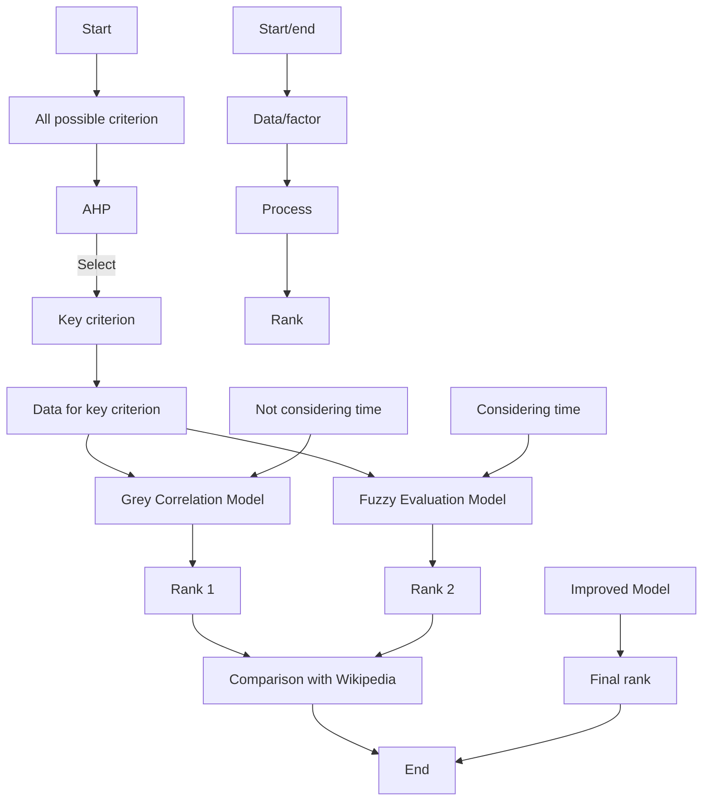
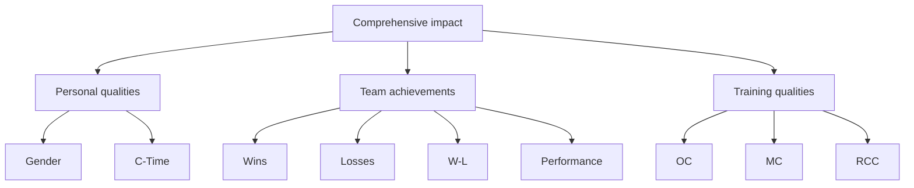

<table><tr><td>For office use only</td><td>Team Control Number</td><td>For office use only</td></tr><tr><td>T1</td><td>26160</td><td>F1</td></tr><tr><td>T2</td><td></td><td>F2</td></tr><tr><td>T3</td><td>Problem Chosen</td><td>F3</td></tr><tr><td>T4</td><td>B</td><td>F4</td></tr></table>

##

##

## Summary

Aimed to look for the “best all time college coach” for the previous century, we employ methods in grey and fuzzy fields to build an evaluation model and give out coach ranks in various sports fields by massive calculating. Meanwhile, effects of gender and time criterion on evaluation are also considered.

In order to simplify our model, we firstly adopt AHP to filter factors and determine seven most influential criterion, including coaching time, gender, etc. With the weight of each criteria worked out, the abstract problem is transferred to a mathematic one.

Based on AHP Model, two advanced models are proposed to rank college coaches.

Grey Correlation Model considers the relevance among evaluation criterion and evaluates all coaches by calculating correlation degree with respect to reference data series. Fuzzy Comprehensive Model integrates empirical formulas and membership function to get the membership matrix, through which we can figure out scores of each coach. Comparing two results with current ranks, we find that grey model has slight advantages over fuzzy model.

Considering time line horizon’s impact on evaluating results, we augment our model by revising the weights and re-rank, based on membership function. According to the comparison between former rank and the one considering time line horizon, we conclude that it has fewer effects on the top 10 college coaches while has more effects on those ranked behind. The final rank table is as follows:

<table><tr><td>Rank</td><td>Basketball</td><td>Field hockey</td><td>Football</td></tr><tr><td>1</td><td>Harry Statham</td><td>Jan Hutchinson</td><td>Joe Paterno</td></tr><tr><td>2</td><td>Danny Miles</td><td>Jan Trapp</td><td>Bobby Bowden</td></tr><tr><td>3</td><td>Herb Magee</td><td>Nancy Stevens</td><td>Bear Bryant</td></tr><tr><td>4</td><td>Mike Krzyzewski</td><td>Sharon Pfluger</td><td>Lou Holtz</td></tr><tr><td>5</td><td>Bob Knight</td><td>Pat Rudy</td><td>Pop Warner</td></tr></table>

Our paper considers multiple factors, employs several models and does plenty of calculations, which makes the ranks more reliable and brings the evaluation model broader applicability. In conclusion, our model successfully achieves our goals that selecting the best college coaches in various sports.

Keywords: AHP Grey Correlation Model Fuzzy Comprehensive Model final rank

## Contents

1 Introduction...  
2 Assumption .....  
3 Symbols Definition ........  
4 Model Overview ....  
5 AHP Model..

5.1 Establish a Hierarchical Model.  
5.2 Structure Comparison Matrix

5.2.1 Weights of Evaluation Criterion  
5.2.2 Select Evaluation Criterion .... .8  
5.3 Explanations about the Seven Criterion. 8

6 Advanced Model..

6.1 Overview of Evaluation Methods . 9  
6.2 Grey Correlation Model. .10

6.2.1 Data Processing. .10  
6.2.2 Grey Correlation Evaluation Model. 11  
6.2.3 Results of Grey Correlation Model. .12

6.3 Fuzzy Comprehensive Evaluation Model. 15

6.3.1 Introduction of Fuzzy Comprehensive Algorithm . .15  
6.3.2 Concrete Calculation. .17

6.4 Results Review.... ..21

7 Is Time Line Horizon Influential?. 22  
8 Sensitivity Analysis... .24

8.1 Sensitivity of Grey Correlation Method .24  
8.2 Sensitivity of Fuzzy Comprehensive Method. .25

9 Discussion and Conclusion ... .26

9.1 Solutions to All Problems . ..26  
9.2 Honor Roll . ..27  
9.3 Strengths and Weaknesses ..28  
9.4 Conclusion ... ..28

A Letter to Sports Illustrated ........ 2

Reference ....... .30

Appendix...... .31

## 1 Introduction

The quality of coaches is becoming critical to raise the level of scientific training of competitive sports. A fair and convincing method to evaluate college coaches is demanded. Plenty of researches are made and a number of notable papers are addressed to get a reasonable evaluation method.

MacLean and Chelladurai (1995) proposed a framework for performance evaluation of college coaches. Performance of coaches should be evaluated from two respects, the process of work behavior and the results of work behavior. It is unfair and not convincing to evaluate college coaches only by the result of work behavior. They believe factors of process of work behavior consist of straightforward task behavior, indirect task behavior, daily management behavior and public relations behavior. These factors mainly depend on college coaches’ ability to raise the level of sports teams. George B.Cunningham and Marlene A.Dixion (2003) considered that good results coming from the joint efforts of athletes, coaches and sports teams. Both results and process of sports team should be considered. Based on the consideration, they proposed evaluation theory in multidimensional performance.

Despite the evaluation method of college coaches has been studied to different extent with different approaches, the researchers’ work usually focus on special sport. Meanwhile, their evaluation don’t consider the effect of time. Therefore, their research may not appropriate to solve the proposed problems. We need to develop a model to look for the “best all time college coach”. What’s more, the model should be problem-oriented.

The three proposed problems are:

Develop a model to look for the best all time college coach for the previous century.  
Analyze whether it make a difference with time line horizon or not.  
Present top 5 college coaches in each of 3 different sports.

Meanwhile, the problems request that model should take gender into consideration and have a broader applicability in all possible sports.

A reasonable evaluation method should consider many necessary factors. To classify factors appropriately, we apply Analytic Hierarchy Process (AHP) to the problem. Then, we get the weight of several main factors. To evaluate college coaches scientifically, we propose two models based on Grey Correlation Algorithm and Fuzzy Comprehensive Evaluation Algorithm. Then we make a comparison between results of two models. Furthermore, we optimize our model by considering the effect of time line horizon. At last, a non-technical explanation letter for sports fans is written to the Sports Illustrated magazine.

## 2 Assumption

1. Assume that personal quality, training quality and team achievements can perfectly reflect college coaches’ comprehensive impact.  
2. Assume that coaching time and gender can perfectly represent college coaches personal quality. Organizational capability, management capability and race command capability can perfectly represent college coaches’ training quality. Wins, losses, win-loss percentage and performance in league matches can perfectly represent college coaches’ team achievements.  
3. Assume that continuous wins and the difference of competitors’ strength have few effects on rank.  
4. The data we used and reference ranks are believable.

3 Symbols Definition

<table><tr><td>Symbol</td><td>Explanation</td></tr><tr><td>A</td><td>The sequence of college coach</td></tr><tr><td>B</td><td>Second level criterion</td></tr><tr><td>C</td><td>Third level criterion</td></tr><tr><td>Z</td><td>Total score</td></tr><tr><td>R</td><td>Correlation degree</td></tr><tr><td>D</td><td>Membership degree</td></tr><tr><td>T</td><td>Start coaching time</td></tr></table>

## 4 Model Overview

The process of developing models is shown in Figure 1.  

flowchart

Figure 1. Flow diagram of solution

To determine the best all time college coach (past or present) from among either male or female coaches in some sports, we have to know what criterion should be used to evaluate college coaches. As is shown in the problem, we search the predecessors' research and find that many of them are qualitative analysis. What’s more, according to some research there exist more than 54 of the evaluation criterion, such as the coach working age, the professional ethics, the ability to communicate with players, management ability statistics and so on. Some evaluation criterion are meaningful, but some of them are of little impact. We must find some methods to process the data in order to distill the crucial criterion.

How we could select the most important ones from 54 initial criterion and process scientifically to make them more useful in evaluating quality is a key problem. However, how to accomplish this goal? The Main Components Analysis method and Analytic Hierarchy Process will be helpful for us to devise our first model.

Combining the key evaluation criterion with the real data from internet, we select coaches in different sports as model evaluation objects and evaluate them with two different algorithms respectively, that is Grey Correlation Algorithm and Fuzzy Evaluation Algorithm. Grey Correlation Model considers the relevance among evaluation criterion and grades all coaches by calculating correlation degree to reference data. Fuzzy Comprehensive Model integrates empirical formulas and membership function to get the membership matrix, through which we can figure out scores of each coach. Furthermore, we compare the two algorithm and corresponding results and transplant the model to other sports field for evaluating.

We choose college filed hockey, basketball, football sport coaches as examples, and get the rank of the coaches respectively.

## 5 AHP Model

## 5.1 Establish a Hierarchical Model

MacLean and Chelladurai (1995) thought that evaluation criterion of college coaches should include the process of work behavior and the results of work behavior. Patricia (2005) proposed that different principles should be considered to establish a kind of fair and convincing criterion to evaluate college coaches. With the help of the current literatures, we develop AHP model considering three main factors, these are coaches’ personal quality, training quality and team achievements.

## Personal quality

Coaches’ personal quality consist of coaching time and gender [Yuanming Li, 2009]. College coaches consist of both male and female, we should consider both of them. Coaching time could reflect coaches’ time consumption on their jobs.

Coaching time

Gender

## Training quality

Yu Zhang (2010) proposed the components of training quality in his paper.

He thought that training quality should consist of organizational capability, management capability and race command capability. Training quality represent a significant component of the evaluation criterion.

Organizational capability  
Management capability  
Race command capability

## Team achievements

Team achievements are the results of coaches’ works, they are obvious to reflect coaches’ capability. Meanwhile, people pay more attention to team achievements compared with other factors. However, fair and convincing evaluation criterion should be considered general factors rather than only results.

Wins  
Losses  
Win-loss percentage  
Performance in league matches

Through above analysis of three main factors, which affect evaluation significantly, hierarchy figure is shown in Figure 2.

flowchart

Figure 2. Hierarchy figure  
In Figure 2, C-Time represents Coaching Time. W-L represents Win-Loss Percentage, OC represent Organization Capability, MC represent Management capability, RCC represent Race Command Capability.

## 5.2 Structure Comparison Matrix

## 5.2.1 Weights of Evaluation Criterion

Starting from the second criteria of the above hierarchy figure, we structure comparison matrix by Comparison Method of 1-9. Then, we get the weights of personal quality, training quality and team achievements as is shown in Table 1.

Table 1. Pairwise comparison matrix of hierarchyⅠ-Ⅱ

<table><tr><td>Comprehensive impact</td><td>Personal quality</td><td>Training quality</td><td>Team achievements</td><td>Weight</td></tr><tr><td>Personal quality</td><td>1</td><td>3</td><td>1/5</td><td>0.2496</td></tr><tr><td>Training quality</td><td>1/3</td><td>1</td><td>1/8</td><td>0.1565</td></tr><tr><td>Team achievements</td><td>5</td><td>8</td><td>1</td><td>0.5938</td></tr></table>

Through calculating the weights of three factors in hierarchyⅡ, we get the maximum eigenvalue is $\lambda { = } 3 . 0 0 4 4$ ，consistency ratio is 0.0043.

Table 2. Pairwise comparison matrix of hierarchyⅡ-Ⅲ

<table><tr><td>Personal quality</td><td>Coaching time</td><td>Gender</td><td>Weight</td></tr><tr><td>Coaching time</td><td>1</td><td>2</td><td>0.5498</td></tr><tr><td>Gender</td><td>1/2</td><td>1</td><td>0.4502</td></tr></table>

Through calculating the weights of two factors of personal quality in hierarchy Ⅲ , we get the maximum eigenvalue is $\lambda { = } 2 . 0 0 0 0$ ，consistency ratio is 0.2496.

Table 3. Pairwise comparison matrix of hierarchyⅡ-Ⅲ

<table><tr><td>Training quality</td><td>Organizational capability</td><td>Management capability</td><td>Race command capability</td><td>Weight</td></tr><tr><td>Organizational capability</td><td>1</td><td>2</td><td>1/5</td><td>0.2473</td></tr><tr><td>Management capability</td><td>1/2</td><td>1</td><td>1/6</td><td>0.2024</td></tr><tr><td>Race command capability</td><td>5</td><td>6</td><td>1</td><td>0.5503</td></tr></table>

Through calculating the weight of two factors of training quality in hierarchy Ⅲ , we get the maximum eigenvalue is $\lambda { = } 3 . 0 0 0 0$ ，consistency ratio is 0.0001.

Table 4. Pairwise comparison matrix of hierarchyⅡ-Ⅲ

<table><tr><td>Team achievements</td><td>Wins</td><td>Losses</td><td>Win-loss percentage</td><td>Performance in league matches</td><td>Weight</td></tr><tr><td> $C_6$ </td><td>1</td><td>5</td><td>1/3</td><td>4</td><td>0.2853</td></tr><tr><td>Losses</td><td>1/5</td><td>1</td><td>1/8</td><td>1/3</td><td>0.1160</td></tr><tr><td>Win-loss percentage</td><td>3</td><td>8</td><td>1</td><td>5</td><td>0.4256</td></tr><tr><td>Performance in league matches</td><td>1/4</td><td>3</td><td>1/5</td><td>1</td><td>0.1731</td></tr></table>

Through calculating the weights of two factors of team achievements in hierarchy Ⅲ , we get the maximum eigenvalue is $\lambda { = } 4 . 0 1 0 0$ ，consistency ratio is 0.0037.

From above tables, we know that all Consistency Test is right. Combination Weight Vector of criterion with respect to evaluation method of college coaches is shown in Table 5. They can used to evaluate college coaches.

Table 5. Criterion’s weights to overall objects

<table><tr><td>Criterion</td><td>Weight</td></tr><tr><td>Coaching time</td><td>0.1373</td></tr><tr><td>Gender</td><td>0.1124</td></tr><tr><td>Organizational capability</td><td>0.0387</td></tr><tr><td>Management capability</td><td>0.0317</td></tr><tr><td>Race command capability</td><td>0.0861</td></tr><tr><td>Wins</td><td>0.1694</td></tr><tr><td>Losses</td><td>0.0689</td></tr><tr><td>Win-loss percentage</td><td>0.2528</td></tr><tr><td>Performance in league matches</td><td>0.1028</td></tr></table>

## 5.2.2 Select Evaluation Criterion

According to importance of every criteria shown in Table 5, we choose several main criterion and decide the final evaluation method. Despite organizational capability and management capability have close relationship with evaluation method in theory. However, from above tables we can find their weights are light. Meanwhile, we lack of quantitative data of them. Therefore, we don’t consider them. The final seven criterion are shown in Table 6.

Table 6. Final seven criterion to evaluate college coaches

<table><tr><td>Criterion</td><td>Symbol</td><td>Weight</td></tr><tr><td>Coaching time</td><td> $C_1$ </td><td>★★★☆☆</td></tr><tr><td>Gender</td><td> $C_2$ </td><td>★★☆☆☆</td></tr><tr><td>Race command capability</td><td> $C_3$ </td><td>★★☆☆☆</td></tr><tr><td>Wins</td><td> $C_4$ </td><td>★★★☆☆</td></tr><tr><td>Losses</td><td> $C_5$ </td><td>★☆☆☆☆</td></tr><tr><td>Win-loss percentage</td><td> $C_6$ </td><td>★★★★★</td></tr><tr><td>Performance in league matches</td><td> $C_7$ </td><td>★★☆☆☆</td></tr></table>

## 5.3 Explanations about the Seven Criterion

In the seven criterion we got, only Losses is the negative criterion, others are positive.

## Data of performance in league matches

Different sports are different in rules and league schedule. Therefore, different sports have different measuring values with respect to the performance in league matches. Based on data, we evaluate performance in league matches of basketball by number of NCAA final four appearances, evaluate performance in league matches of football by the times ranked into top 4, evaluate performance in league matches of college filed hockey by the times ranked into top 4.

## Data of gender

Considering the disadvantage of female, we define value of male as 1, while female as 3. There are three reasonable explanation:

Female have physiological disadvantages in sports.  
Once female are banned to participate sports for a long time. This tradition lasted a long time. Therefore, the tradition may have effects on female now.  
Male have better force and velocity on sports, so they can draw more attention compared with female. What’s more, the quantity of male athletes is well larger than female, male athlete prefer male coaches.

## 6 Advanced Model

## 6.1 Overview of Evaluation Methods

Through AHP algorithm, we get the weights of final seven criterion to evaluate college coaches. To establish a fair and convincing evaluation method and rank the college coaches for the previous century, we proposed Grey Correlation Model and Fuzzy Comprehensive Evaluation Model.

## Grey Correlation Model

Criterion selected by AHP have inner links with each other. And Grey Correlation Model could take the links into consideration and solve the problem of comprehensive evaluation. First normalize the real data of every coach. Then determine the reference data, which is to be regarded as ideal standard. Find the relationship between every evaluated object and reference data series and finally build the comprehensive evaluation model. From this model, we calculate all coaches’ scores and rank them. Top 5 coaches in basketball, field hockey and football are represented as:

<table><tr><td>Rank</td><td>Basketball</td><td>Field hockey</td><td>Football</td></tr><tr><td>1</td><td>Harry Statham</td><td>Jan Hutchinson</td><td>Joe Paterno</td></tr><tr><td>2</td><td>Danny Miles</td><td>Jan Trapp</td><td>Bobby Bowden</td></tr><tr><td>3</td><td>Herb Magee</td><td>Nancy Stevens</td><td>Bear Bryant</td></tr><tr><td>4</td><td>Mike Krzyzewski</td><td>Sharon Pfluger</td><td>Lou Holtz</td></tr><tr><td>5</td><td>Bob Knight</td><td>Pat Rudy</td><td>Pop Warner</td></tr></table>

## Fuzzy Comprehensive Evaluation Model

There we use multi-level fuzzy comprehensive evaluation model to rank the coaches. Normally, the first step is formulating evaluation criterion. Then determine the evaluation objects and the comment set. Next confirm the membership function and membership degree, through which we get formula of fuzzy evaluation matrix. According to evaluation matrix and weights determined by AHP method, we give a comprehensive evaluation of coaches.

From this model, we calculate all coaches’ scores and rank them. Top 5 coaches in basketball, field hockey and football are represented as:

<table><tr><td>Rank</td><td>Basketball</td><td>Field hockey</td><td>Football</td></tr><tr><td>1</td><td>Harry Statham</td><td>Jan Hutchinson</td><td>Bobby Bowden</td></tr><tr><td>2</td><td>Herb Magee</td><td>Jan Trapp</td><td>Joe Paterno</td></tr><tr><td>3</td><td>Danny Miles</td><td>Nancy Stevens</td><td>Bear Bryant</td></tr><tr><td>4</td><td>Adolph Rupp</td><td>Pat Rudy</td><td>Tom Osborne</td></tr><tr><td>5</td><td>Mike Krzyzewski</td><td>Beth Anders</td><td>Pop Warner</td></tr></table>

## 6.2 Grey Correlation Model

## 6.2.1 Data Processing

Based on the current evaluation criterion, we collect related data of college coaches. Assume that data sequence of n coaches form the following matrix (Equation 6.1). To simplify calculation, we note original data as $A _ { i } "$ , the data after dimensionless process is noted as $A _ { i }$ .

$$
\left(A _ {1} ^ {\prime}, A _ {2} ^ {\prime}, \dots , A _ {n} ^ {\prime}\right) = \left[ \begin{array}{c c c c} a _ {1} ^ {\prime} (1) & a _ {2} ^ {\prime} (1) & \dots & a _ {n} ^ {\prime} (1) \\ a _ {1} ^ {\prime} (2) & a _ {2} ^ {\prime} (2) & \dots & a _ {n} ^ {\prime} (2) \\ \vdots & \vdots & & \vdots \\ a _ {1} ^ {\prime} (m) & a _ {2} ^ {\prime} (m) & \dots & a _ {n} ^ {\prime} (m) \end{array} \right] \tag {6.1}
$$

$$
A _ {i} ^ {\prime} = \left(a _ {i} ^ {\prime} (1), a _ {i} ^ {\prime} (2), \dots , a _ {i} ^ {\prime} (m)\right) ^ {\mathrm{T}}, i = 1, 2, \dots , n
$$

In which, m presents the number of metrics, herein, $m { = } 7$ . Based on evaluation and rank of college coaches provided by Wikipedia and other websites, considering several quality of college coaches generally, we choose about 100 coaches of three sports (basketball, football and college filed hockey) as evaluated objects.

Then, taking basketball for example, we analyze and dimensionless process data.

We choose 46 college coaches whose achievements are comparatively prominent. Process theirs’ data and rank them. Here we just present top 10 of them, who are Harry Statham, Mike Krzyzewski, etc. [http://www.sports-reference.com/cbb/coaches/] The data are represented respectively as $A _ { 1 } ^ { \prime } , ~ A _ { 2 } ^ { \prime } , ~ \dots , ~ A _ { 1 0 } ^ { \prime }$ .

$$
(A _ {1} ^ {\prime}, A _ {2} ^ {\prime}, \dots , A _ {n} ^ {\prime}) = \left[ \begin{array}{c c c c c c c} 4 7 & 1 & 3 9 & 1 0 7 9 & 4 4 4 & 0. 7 0 8 & 1 3 \\ 4 2 & 1 & 3 2 & 1 0 0 0 & 4 0 9 & 0. 7 1 0 & 1 0 \\ 4 5 & 1 & 2 6 & 9 7 6 & 3 9 1 & 0. 7 1 4 & 1 1 \\ 3 9 & 1 & 2 9 & 9 7 5 & 3 0 2 & 0. 7 6 4 & 1 1 \\ 3 8 & 1 & 3 0 & 9 4 2 & 3 1 4 & 0. 7 5 0 & 4 \\ 4 2 & 1 & 2 8 & 8 9 9 & 3 7 4 & 0. 7 0 6 & 5 \\ 3 6 & 1 & 2 7 & 8 7 9 & 2 5 4 & 0. 7 7 6 & 1 1 \\ 4 0 & 1 & 2 3 & 8 7 7 & 3 8 2 & 0. 6 9 7 & 4 \\ 4 1 & 1 & 2 0 & 8 7 6 & 1 9 0 & 0. 8 2 2 & 6 \end{array} \right]
$$

Because dimensions of every criteria are different, we normalize every criteria, transfer the absolute value to relative value. For positive (negative) criterion, we normalize data with different algorithms.

Positive criterion:

$$
A _ {i} (j) = \left[ \left(A _ {i} ^ {\prime} (j) - A _ {i} ^ {\prime} (j) _ {\min}\right) / \left(A _ {i} ^ {\prime} (j) _ {\max} - A _ {i} ^ {\prime} (j) _ {\min}\right) \right] \times 100 \%
$$

Negative criterion:

$$
A _ {i} (j) = \left[ \left(A ^ {\prime} (j) _ {\max} - A _ {i} ^ {\prime} (j)\right) / \left(A _ {i} ^ {\prime} (j) _ {\max} - A _ {i} ^ {\prime} (j) _ {\min}\right) \right] \times 100 \%
$$

In which, i represents the sequence of countries, j represents the sequence of metrics; $A _ { i } ^ { \prime } ( j ) _ { \mathrm { m i n } }$ represents maximum value of the jth metrics, $A _ { i } ( j )$ represents normalized value of the jth metrics of the ith coach. Then, we get the normalized value of every criterion of 10 basketball coaches.

Table 7. Standardization of basketball college coaches

<table><tr><td>Coach</td><td>CT</td><td>Gender</td><td>RCC</td><td>Wins</td><td>Losses</td><td>W/L%</td><td>FF</td></tr><tr><td>Harry Statham</td><td>0.963</td><td>0.000</td><td>1.000</td><td>1.000</td><td>1.000</td><td>0.619</td><td>1.000</td></tr><tr><td>Danny Miles</td><td>0.778</td><td>0.000</td><td>0.816</td><td>0.912</td><td>0.876</td><td>0.625</td><td>0.769</td></tr><tr><td>Herb Magee</td><td>0.889</td><td>0.000</td><td>0.658</td><td>0.884</td><td>0.812</td><td>0.639</td><td>0.846</td></tr><tr><td>Mike Krzyzewski</td><td>0.667</td><td>0.000</td><td>0.737</td><td>0.883</td><td>0.496</td><td>0.806</td><td>0.846</td></tr><tr><td>Jim Boeheim</td><td>0.630</td><td>0.000</td><td>0.763</td><td>0.845</td><td>0.539</td><td>0.759</td><td>0.308</td></tr><tr><td>Bob Knight</td><td>0.778</td><td>0.000</td><td>0.711</td><td>0.795</td><td>0.752</td><td>0.612</td><td>0.385</td></tr><tr><td>Dean Smith</td><td>0.556</td><td>0.000</td><td>0.684</td><td>0.772</td><td>0.326</td><td>0.846</td><td>0.846</td></tr><tr><td>Jim Calhoun</td><td>0.704</td><td>0.000</td><td>0.579</td><td>0.770</td><td>0.780</td><td>0.582</td><td>0.308</td></tr><tr><td>Adolph Rupp</td><td>0.741</td><td>0.000</td><td>0.500</td><td>0.769</td><td>0.099</td><td>1.000</td><td>0.462</td></tr><tr><td>Eddie Sutton</td><td>0.593</td><td>0.000</td><td>0.658</td><td>0.688</td><td>0.592</td><td>0.625</td><td>0.231</td></tr></table>

In the table:  
CT--Coaching time  
RCC--Race command capability  
FF—number of NCAA final four appearance

Similarly, we can get the normalized value of every criterion of 10 football coaches and college filed hockey coaches.

## 6.2.2 Grey Correlation Evaluation Model

Because of the relationship between every criterion and total evaluation is sophisticated and interacting, we develop Grey Correlation Evaluation Model to analyze and evaluate general capability of college coaches. Grey Correlation Evaluation Method is branch of Grey Theory, the method are usually used to evaluate interacting factors.

We use the Grey Correlation Analysis to evaluate college coaches, the steps are shown as following:

STEP 1 Note reference data series as ideal comparison criteria. In generally, reference data series consist of the optimal value of every metrics, we can also choose other reference data by different evaluation destination. The relationship is shown in following equation:

$$
A _ {0} = (a _ {0} (1), a _ {0} (2), \dots , a _ {0} (m))
$$

In which, we choose every optimal value as reference data series, that is $A _ { 0 } = ( 1 , 1 , \cdots , 1 )$ .

STEP 2 Calculate the absolute difference between comparison series and reference data series of every evaluated objects. That is $\Delta _ { i } ( j ) = \left| a _ { i } ( j ) - a _ { 0 } ( j ) \right|$ . In which, i represents the sequence of college coaches, $i = 1 , 2 , \cdots , n ; j$ represents the sequence of evaluation criterion, $j = 1 , 2 , \cdots , m ; \ a _ { 0 } ( j )$ represents the reference data of the jth evaluation criterion.

STEP 3 determine the value of $p$ and $q .$

$$
p = \min _ {1 \leq i \leq n} \min _ {1 \leq j \leq m} \left\{\Delta_ {i} (j) \right\}
$$

$$
q = \max _ {1 \leq i \leq n} \max _ {1 \leq j \leq m} \left\{\Delta_ {i} (j) \right\}
$$

STEP 4 According to Equation 6.2. , We can calculate correlation coefficient with respect to every comparison series and reference data series.

$$
y _ {i} (j) = \frac {(p + q \beta)}{(\Delta_ {i} (j) + q \beta)} \quad j = 1, 2, \dots m \tag {6.2}
$$

In which, resolution ratio $\beta \in ( 0 , 1 )$ , the difference of correlation coefficient increase with $\beta$ decreasing. Herein, we choose $\beta = 0 . 5$ .

STEP 5 To find the relationship between every evaluated object and reference data series, we calculate the average value of correlation coefficient of every evaluation criterion and reference data series. We define it as Correlation. As is shown in follows.

$$
r _ {j} = \frac {1}{n} \sum_ {i = 1} ^ {n} y _ {i} (j)
$$

STEP 6 Calculate the weight of every evaluation criterion. That is:

$$
r _ {j} ^ {\prime} = \frac {r _ {j}}{r _ {1} + r _ {2} + \cdots + r _ {m}} \quad j = 1, 2, \dots , m
$$

STEP 7 Construct general evaluation model

$$
Z _ {i} = r _ {1} ^ {\prime} a _ {i} (1) + r _ {2} ^ {\prime} a _ {i} (2) + \dots + r _ {m} ^ {\prime} a _ {i} (m) \quad i = 1, 2, \dots , n
$$

## 6.2.3 Results of Grey Correlation Model

Based on above steps, we can get results by MATLAB programming. The evaluation results of basketball, football and college filed hockey coaches can be easily gotten by computer simulation. The results are shown in Table 8.

Table 8. Scores of top 15 basketball coaches (Grey Correlation Model)

<table><tr><td>Rank</td><td>Coach</td><td>Last School</td><td>Scores</td></tr><tr><td>1</td><td>Harry Statham</td><td>McKendree</td><td>0.834</td></tr><tr><td>2</td><td>Danny Miles</td><td>Oregon Institute of Technology</td><td>0.718</td></tr><tr><td>3</td><td>Herb Magee†</td><td>Philadelphia College</td><td>0.710</td></tr><tr><td>4</td><td>Mike Krzyzewski</td><td>Duke</td><td>0.662</td></tr><tr><td>5</td><td>Bob Knight</td><td>Texas Tech</td><td>0.613</td></tr><tr><td>6</td><td>Dean Smith</td><td>North Carolina</td><td>0.599</td></tr><tr><td>7</td><td>Jim Boeheim</td><td>Syracuse</td><td>0.585</td></tr><tr><td>8</td><td>Jim Calhoun</td><td>Connecticut</td><td>0.570</td></tr><tr><td>9</td><td>Adolph Rupp</td><td>Kentucky</td><td>0.540</td></tr><tr><td>10</td><td>Lou Henson</td><td>Illinois</td><td>0.519</td></tr><tr><td>11</td><td>Eddie Sutton</td><td>San Francisco</td><td>0.517</td></tr><tr><td>12</td><td>Lute Olson</td><td>Arizona</td><td>0.507</td></tr><tr><td>13</td><td>Lefty Driesell</td><td>Georgia State</td><td>0.474</td></tr><tr><td>14</td><td>Ray Meyer</td><td>DePaul</td><td>0.468</td></tr><tr><td>15</td><td>Hank Iba</td><td>Oklahoma State</td><td>0.462</td></tr></table>

To show scores of top 15 basketball coaches intuitively, we draw Figure 3. as follows by the data from Table 8. According to the figure, we find that the top five basketball college coaches all time are Harry Statham, Danny Miles, Herb Magee†, Mike Krzyzewski, Bob Knight.

Scores of top 15 basketball coaches  

bar chart

| Name | Scores |
|---|---|
| Harry Statham | 0.87 |
| Danny Miles | 0.75 |
| Herb Magee† | 0.74 |
| Mike Krzyzewski | 0.70 |
| Jim Boeheim | 0.62 |
| Bob Knight | 0.65 |
| Dean Smith | 0.63 |
| Jim Calhoun | 0.61 |
| Adolph Rupp | 0.58 |
| Eddie Sutton | 0.54 |
| Lefty Driesell | 0.50 |
| Lute Olson | 0.53 |
| Lou Henson | 0.54 |
| Jerry Tarkanian | 0.45 |
| E.A. Diddle | 0.44 |

Figure 3. Scores of top 15 basketball coaches

Similarly, by analysis data of the quality of field hockey coaches,[ http://en.wikipedia.org/wiki/List\_of\_college\_field\_hockey\_coaches\_with\_2 50\_wins] We can get score of top 5 field hockey coaches in Grey Correlation Method, which is shown in Table 9.

Table 9. Scores of top 5 field hockey coaches

<table><tr><td>Coach</td><td>Jan Hutchinson</td><td>Jan Trapp</td><td>Nancy Stevens</td><td>Sharon Pfluger</td><td>Pat Rudy</td></tr><tr><td>Scores</td><td>0.847</td><td>0.735</td><td>0.694</td><td>0.674</td><td>0.663</td></tr><tr><td>Rank</td><td>1</td><td>2</td><td>3</td><td>4</td><td>5</td></tr></table>

To show scores of top 5 field hockey coaches intuitively, we draw Figure 4. as follows by the data from Table 9. According to the figure, we find that the top five field hockey college coaches all time are Jan Hutchinson, Jan Trapp, Nancy Stevens, Sharon Pfluger, Pat Rudy.

Scores of top 15 field hockey coaches  

bar chart

| Name | Scores |
|---|---|
| Jan Hutchinson | 0.885 |
| Jan Trapp | 0.765 |
| Nancy Stevens | 0.725 |
| Sharon Pfluger | 0.710 |
| Pat Rudy | 0.695 |
| Karen Shelton | 0.685 |
| Beth Anders | 0.675 |
| Bertie Landes | 0.670 |
| Sharon Taylor | 0.645 |
| Yvonne Kauffman | 0.615 |
| Missy Meharg | 0.595 |
| Dawn Chamberlin | 0.585 |
| Enza Steele | 0.580 |
| Charlene Morett | 0.565 |
| Sally Scatton | 0.505 |

Figure 4. Scores of top 15 field hockey coaches

Similarly, by analysis data of the quality of football coaches, [http://en.wikipedia.org/wiki/List\_of\_college\_football\_coaches\_with\_200\_wins]We can get scores of top 5 football college coaches in the same method, which is shown in Table 10.

Table 10. Scores of top 5 football coaches

<table><tr><td>Coach</td><td>Joe Paterno</td><td>Bobby Bowden</td><td>Bear Bryant</td><td>Lou Holtz</td><td>Pop Warner</td></tr><tr><td>Scores</td><td>0.834</td><td>0.737</td><td>0.647</td><td>0.525</td><td>0.513</td></tr><tr><td>Rank</td><td>1</td><td>2</td><td>3</td><td>4</td><td>5</td></tr></table>

To show scores of top 5 football coaches intuitively, we draw Figure 5. as follows by the data from Table 10. According to the figure, we find that the top five football college coaches all time are Joe Paterno, Bobby Bowden, Bear Bryant, Lou Holtz, Pop Warner.

Scores of top 15 football coaches  

bar chart

| Name | Scores |
| :--- | :--- |
| Joe Paterno | 0.875 |
| Bobby Bowden | 0.775 |
| Bear Bryant | 0.685 |
| Lou Holtz | 0.555 |
| Pop Warner | 0.545 |
| Tom Osborne | 0.535 |
| Mack Brown | 0.525 |
| Hayden Fry | 0.515 |
| LaVell Edwards | 0.495 |
| Howard Jones | 0.465 |
| Frank Beamer | 0.460 |
| Dana Bible | 0.445 |
| Steve Spurrier | 0.440 |
| Bo Schembechler | 0.435 |
| John Vaught | 0.425 |

Figure 5. Scores of top 15 football coaches

## 6.3 Fuzzy Comprehensive Evaluation Model

Giving a rank of things according to their nature is common sense. However, in many cases, the nature of the comparison has no distinct boundary and it is often difficult to compare and sort. As our problem showing, we need to give them a evaluation and rank according to the coaches’ accomplishment and ability. But the comprehensive ranking needs to consider personal quality, training quality and team achievements of the coaches, each side is contains a lot of integrated criterion, so direct ranking is difficult. Herein, we use multi-level fuzzy comprehensive evaluation algorithm to evaluate the college coaches of some sports.

## 6.3.1 Introduction of Fuzzy Comprehensive Algorithm

In this part, we will show the basic steps of multi-level fuzzy comprehensive evaluation model.

## 1. Giving the set of evaluation objects

According to the problem，we select the top 10 coaches of some field as the evaluation objects $X \{ A _ { 1 } , ~ A _ { 2 } , ^ { . . . } , A _ { n } \} , 0 \leq n \leq 1 0$

## 2. Determining factor set (also called criteria set)

In many evaluation factors, in most cases, we define $U = \{ u _ { 1 } , u _ { 2 } , \cdots , u _ { i } \}$ . What’s more, according to the certain attributes, we divide it into some subset B, $U _ { i } = \{ { u _ { 1 } } ^ { i } , { u _ { 2 } } ^ { i } , { \cdot \cdot \cdot , u _ { i } } ^ { i } \} , i = 1 , 2 , { \cdot \cdot \cdot B }$ . Here, B is second criterion.

Meet the conditions:

$\sum _ { i _ { \overline { { B } } } 1 } ^ { B } n _ { i } = n$ . All subsets should be included in total set.  
$\bigcup _ { i = 1 } U _ { i } = U$ . A subset set should be included in total set.  
$U _ { i } { \bigcap { } } U _ { j } = \phi , i \neq j$ .No association between subsets.

## 3. Determining the comment set

The comment set is crucial to evaluate the coaches. In this problem, we define the comment set as follows:

<table><tr><td>Level</td><td>★★★★★</td><td>★★★★</td><td>★★★</td><td>★★</td><td>★</td></tr><tr><td>Score</td><td>5</td><td>4</td><td>3</td><td>2</td><td>1</td></tr></table>

## 4. Membership functions

For certain properties of object A, there exists differences. We can use a real number which from 0 to 1 in close interval to represent the difference. Particularly, 0 indicates the evaluation properties of an object is minimum, that is to say, the properties of an object don’t exist. 1 represents the highest level of evaluation properties of certain object.

Define the difference of object A as membership, represented as: $u ( A )$ , $0 \leq u ( A ) \leq 1$ .

Furthermore, since the membership is based on the different properties of different objects (as A) obtained, so the study of object properties can determine relative membership function and membership.

Through processing the data, we select top 10 college coaches in a sports field, we can get the relationship between membership and membership function. Then we get the membership. Usually, we integrate empirical formulas and membership functions to figure out the membership.

$$
D = \left( \begin{array}{c c c c} d _ {1 1} & d _ {1 2} & \dots & d _ {1 j} \\ d _ {2 1} & d _ {2 2} & \dots & d _ {2 j} \\ \vdots & \vdots & & \vdots \\ d _ {i 1} & d _ {i 2} & \dots & d _ {i j} \end{array} \right)
$$

In which:

j: the level of evaluation

i: the number of evaluation criterion

## 5. Getting weights according to AHP

By the basic model studying, we determine the weight vector of this model.

$B = ( b _ { 1 } , b _ { 2 } , b _ { 3 } )$ B is the weight of personal quality, training quality and team achievements.

$B _ { 1 } = ( b _ { 1 1 } , b _ { 1 2 } ) , B _ { 2 } = b _ { 2 1 } , B _ { 3 } = ( b _ { 3 1 } , b _ { 3 2 } , b _ { 3 3 } , b _ { 3 4 } ) , B _ { i } ( i = 1 , 2 , 3 )$ is defined as the weights of second criterion.

Table 11. Weight vector of this model

<table><tr><td rowspan="2">First level criterion</td><td rowspan="2">The weight ( $B_i$ )</td><td rowspan="2">Second level criterion</td><td rowspan="2">The weight ( $B_{ij}$ )</td><td colspan="2">★ ★ ★ ★ ★ ★</td><td colspan="2">★ ★ ★ ★ ★</td></tr><tr><td colspan="2">★ ★ ★ ★ ★ ★</td><td colspan="2">★ ★ ★ ★ ★</td></tr><tr><td rowspan="2">Personal quality</td><td rowspan="2">0.2496</td><td>Coaching time</td><td>0.5498</td><td> $d_{11}$ </td><td> $d_{12}$ </td><td> $d_{13}$ </td><td> $d_{13}$ </td></tr><tr><td>Gender</td><td>0.4502</td><td> $d_{21}$ </td><td> $d_{22}$ </td><td> $d_{23}$ </td><td> $d_{24}$ </td></tr><tr><td>Training quality</td><td>0.1565</td><td>Race command capability</td><td>0.5503</td><td> $d_{31}$ </td><td> $d_{32}$ </td><td> $d_{33}$ </td><td> $d_{34}$ </td></tr><tr><td rowspan="4">Team achievements</td><td rowspan="4">0.5938</td><td>Win</td><td>0.2853</td><td> $d_{41}$ </td><td> $d_{42}$ </td><td> $d_{43}$ </td><td> $d_{44}$ </td></tr><tr><td>Losses</td><td>0.1160</td><td> $d_{51}$ </td><td> $d_{52}$ </td><td> $d_{53}$ </td><td> $d_{54}$ </td></tr><tr><td>Win-loss percentage</td><td>0.4256</td><td> $d_{61}$ </td><td> $d_{62}$ </td><td> $d_{63}$ </td><td> $d_{64}$ </td></tr><tr><td>Performance in league matches</td><td>0.1731</td><td> $d_{71}$ </td><td> $d_{72}$ </td><td> $d_{73}$ </td><td> $d_{74}$ </td></tr></table>

The training quality include three aspects. However, organizational capability and management capability have little effects. So we ignore them and adjust the proportion when we calculate the concrete rank.

$d _ { i j }$ is defined as concrete calculations of different college coaches in different sports field.

## 6. Comprehensive evaluate coach performance

$$
\begin{array}{l} D = B O R = (b _ {1}, b _ {2}, b _ {3}) O \left( \begin{array}{c} B _ {1} O R _ {1} \\ B _ {2} O R _ {2} \\ B _ {3} O R _ {3} \end{array} \right) = (b _ {1}, b _ {2}, b _ {3}) O \left( \begin{array}{c c c c c} d _ {1 1} & d _ {1 2} & d _ {1 3} & d _ {1 4} & d _ {1 5} \\ d _ {2 1} & d _ {2 2} & d _ {2 3} & d _ {2 4} & d _ {2 5} \\ d _ {3 1} & d _ {3 2} & d _ {3 3} & d _ {3 4} & d _ {3 5} \end{array} \right) \\ = (d _ {1}, d _ {2}, d _ {3}, d _ {4}, d _ {5}) \\ \end{array}
$$

O represents $M ( \bullet , \otimes ) ~ , ~ \bullet$ is defined as $a \bullet b = a \times b = a b$ ,  is defined as $a \otimes b = ( a + b ) \wedge 1$ . The final score is calculated as follows:

$$
Z = B \bullet D ^ {T}
$$

## 6.3.2 Concrete Calculation

Based on above steps, we calculate membership functions of every quality of every coach. In our model, the membership function is liner function. Then, we get membership by corresponding membership function. Herein, we choose top 15 of college coaches, which are shown as follows:

Table 12. Scores of top 15 basketball coaches’ quality

<table><tr><td>Coach</td><td>CT</td><td>Gender</td><td>RCC</td><td>Wins</td><td>Lose</td><td>W-L%</td><td>FF</td></tr><tr><td>Harry Statham</td><td>5</td><td>2</td><td>5</td><td>5</td><td>5</td><td>3</td><td>5</td></tr><tr><td>Herb Magee</td><td>5</td><td>2</td><td>4</td><td>5</td><td>5</td><td>3</td><td>4</td></tr><tr><td>Danny Miles</td><td>4</td><td>2</td><td>5</td><td>5</td><td>5</td><td>3</td><td>4</td></tr><tr><td>Adolph Rupp</td><td>4</td><td>2</td><td>3</td><td>4</td><td>5</td><td>5</td><td>3</td></tr><tr><td>Mike Krzyzewski</td><td>3</td><td>2</td><td>4</td><td>5</td><td>3</td><td>4</td><td>4</td></tr><tr><td>Dean Smith</td><td>3</td><td>2</td><td>4</td><td>4</td><td>4</td><td>4</td><td>4</td></tr><tr><td>Bob Knight</td><td>4</td><td>2</td><td>4</td><td>4</td><td>4</td><td>3</td><td>3</td></tr><tr><td>Jim Boeheim</td><td>3</td><td>2</td><td>4</td><td>4</td><td>3</td><td>4</td><td>2</td></tr><tr><td>Jerry Tarkanian</td><td>2</td><td>2</td><td>3</td><td>3</td><td>5</td><td>5</td><td>2</td></tr><tr><td>Roy Williams</td><td>1</td><td>2</td><td>3</td><td>2</td><td>5</td><td>5</td><td>3</td></tr><tr><td>Jim Calhoun</td><td>4</td><td>2</td><td>3</td><td>4</td><td>4</td><td>2</td><td>2</td></tr><tr><td>Lute Olson</td><td>2</td><td>2</td><td>4</td><td>3</td><td>4</td><td>3</td><td>3</td></tr><tr><td>Eddie Sutton</td><td>3</td><td>2</td><td>4</td><td>3</td><td>3</td><td>3</td><td>2</td></tr><tr><td>Phog Allen</td><td>5</td><td>2</td><td>1</td><td>2</td><td>4</td><td>3</td><td>2</td></tr><tr><td>Rick Pitino</td><td>1</td><td>2</td><td>3</td><td>2</td><td>4</td><td>4</td><td>3</td></tr><tr><td>E.A. Diddle</td><td>4</td><td>2</td><td>1</td><td>3</td><td>3</td><td>3</td><td>1</td></tr><tr><td>Lefty Driesell</td><td>4</td><td>2</td><td>2</td><td>3</td><td>5</td><td>2</td><td>1</td></tr><tr><td>Lou Henson</td><td>4</td><td>2</td><td>3</td><td>3</td><td>5</td><td>1</td><td>2</td></tr><tr><td>Ray Meyer</td><td>4</td><td>2</td><td>2</td><td>2</td><td>4</td><td>2</td><td>2</td></tr><tr><td>Denny Crum</td><td>2</td><td>2</td><td>3</td><td>2</td><td>3</td><td>2</td><td>3</td></tr></table>

In the table:  
RCC-- Race command capability  
CT—coaching time  
FF—number of NCAA final four appearance

The scores of top 15 basketball college coaches are shown in Figure 6. From the figure we can find the top 5 basketball college coaches are Harry Statham, Herb Magee, Danny Miles , Adolph Rupp, Mike Krzyzewski.

Scores of top 15 field hockey coaches  

bar chart

| Name | Scores |
|---|---|
| Jan Hutchinson | 4.5 |
| Jan Trapp | 4.2 |
| Nancy Stevens | 4.0 |
| Pat Rudy | 3.9 |
| Beth Anders | 3.8 |
| Karen Shelton | 3.6 |
| Sharon Pfluger | 3.5 |
| Bertie Landes | 3.1 |
| Enza Steele | 3.0 |
| Charlene Morett | 2.8 |
| Missy Meharg | 2.7 |
| Dawn Chamberlin | 2.6 |
| Sally Scatton | 2.4 |
| Brenda Meese | 2.2 |
| Sally Starr | 2.1 |

Figure 6. Scores of top 15 basketball coaches

Through normalizing the data, we get Fuzzy Decision Matrix. Finally, we get final grades and ranks by fuzzy calculation of Fuzzy Decision Matrix (R) and Weight Matrix (B), which is shown in Table 13.

Table 13. Scores and rank of top 15 basketball coaches (Fuzzy Comprehensive Evaluation Model)

<table><tr><td>Ranking</td><td>Coach</td><td>Last School</td><td>Score</td></tr><tr><td>1</td><td>Harry Statham</td><td>McKendree</td><td>4.1557</td></tr><tr><td>2</td><td>Herb Magee</td><td>Philadelphia College</td><td>3.9668</td></tr><tr><td>3</td><td>Danny Miles</td><td>OTT</td><td>3.9156</td></tr><tr><td>4</td><td>Adolph Rupp</td><td>Kentucky</td><td>3.9068</td></tr><tr><td>5</td><td>Mike Krzyzewski</td><td>Duke</td><td>3.8072</td></tr><tr><td>6</td><td>Dean Smith</td><td>North Carolina</td><td>3.6367</td></tr><tr><td>7</td><td>Bob Knight</td><td>Texas Tech</td><td>3.4184</td></tr><tr><td>8</td><td>Jim Boeheim</td><td>Syracuse</td><td>3.3622</td></tr><tr><td>9</td><td>Jerry Tarkanian</td><td>Fresno State</td><td>3.2900</td></tr><tr><td>10</td><td>Roy Williams</td><td>North Carolina</td><td>3.0161</td></tr><tr><td>11</td><td>Jim Calhoun</td><td>Connecticut</td><td>2.9767</td></tr><tr><td>12</td><td>Lute Olson</td><td>Arizona</td><td>2.9044</td></tr><tr><td>13</td><td>Eddie Sutton</td><td>San Francisco</td><td>2.8700</td></tr><tr><td>14</td><td>Phog Allen</td><td>Central Missouri</td><td>2.7158</td></tr><tr><td>15</td><td>Rick Pitino</td><td>Louisville</td><td>2.6944</td></tr></table>

Similarly, by analysis of data we get from Wikipedia, [http://en.wikipedia.org/wiki/List\_of\_college\_field\_hockey\_coaches\_with\_250\_wins] We get the scores and rank of top 15 field hockey college coaches by Fuzzy Comprehensive Algorithm. Top 5 of them are listed in Table 14.

Table 14. Scores and rank of top 5 field hockey college coaches

<table><tr><td>Coach</td><td>Jan Hutchinson</td><td>Jan Trapp</td><td>Nancy Stevens</td><td>Pat Rudy</td><td>Beth Anders</td></tr><tr><td>Scores</td><td>4.22</td><td>3.91</td><td>3.75</td><td>3.71</td><td>3.60</td></tr><tr><td>Rank</td><td>1</td><td>2</td><td>3</td><td>4</td><td>5</td></tr></table>

To show the top 5 field hockey college coaches Intuitively, we draw Figure 7. as follows. From the figure we know that top 5 field hockey coaches are Jan Hutchinson, Jan Trapp, Nancy Stevens, Pat Rudy, Beth Anders. By searching the internet for their information, it is found that the number of honor is large enough to support every one them rank into top 5.

Scores of top 15 football coaches  

bar chart

| Name | Scores |
|---|---|
| Bobby Bowden | 5000 |
| Joe Paterno | 4900 |
| Bear Bryant | 4800 |
| Tom Osborne | 4000 |
| Pop Warner | 3600 |
| Bo Schembechler | 3500 |
| LaVell Edwards | 3200 |
| Woody Hayes | 3200 |
| Mack Brown | 3100 |
| Lou Holtz | 3000 |
| Amos Alonzo Stagg | 3000 |
| Steve Spurrier | 2900 |
| Frank Beamer | 2700 |
| Hayden Fry | 2600 |
| Don Nehlen | 2500 |

Figure 7. Scores of top 15 field hockey college coaches

Similarly, by analysis of data we get from Wikipedia, [http://en.wikipedia.org/wiki/List\_of\_college\_football\_coaches\_with\_200\_wins] We get the scores and rank of top 15 football college coaches by Fuzzy Comprehensive Algorithm. Top 5 of them are listed in Table 15.

Table 15. Scores and rank of top 5 football college coaches

<table><tr><td>Coach</td><td>Bobby Bowden</td><td>Joe Paterno</td><td>Bear Bryant</td><td>Tom Osborne</td><td>Pop Warner</td></tr><tr><td>Scores</td><td>4.805</td><td>4.715</td><td>4.579</td><td>3.779</td><td>3.407</td></tr><tr><td>Rank</td><td>1</td><td>2</td><td>3</td><td>4</td><td>5</td></tr></table>

To show the top 5 football college coaches Intuitively, we draw Figure 8. as follows. From the figure we know that top 5 football coaches are Bobby Bowden, Joe Paterno, Bear Bryant, Tom Osborne, Pop Warner.

Scores of top 15 football coaches  

bar chart

| Name | Score |
|---|---|
| Bobby Bowden | 5000 |
| Joe Paterno | 4900 |
| Bear Bryant | 4800 |
| Tom Osborne | 4000 |
| Pop Warner | 3600 |
| Bo Schembechler | 3550 |
| LaVell Edwards | 3200 |
| Woody Hayes | 3150 |
| Mack Brown | 3050 |
| Lou Holtz | 3000 |
| Amos Alonzo Stagg | 2950 |
| Steve Spurrier | 2700 |
| Frank Beamer | 2550 |
| Hayden Fry | 2500 |
| Don Nehlen | 1950 |

Figure 8. Scores of top 15 football college coaches

## 6.4 Results Review

We develop the basic model by using AHP algorithm and get the weights of seven main evaluation criterion. Then, we develop two evaluation models to evaluate college coaches of basketball, field hockey and football. Final ranks of three sports are listed respectively. Herein, we discuss the difference of two evaluation models and analyze some reasons. Grey Correlation rank, Fuzzy Comprehensive rank and Current rank are listed in Table 15.

Table 15. Ranks comparison

<table><tr><td>Coaches</td><td>Grey Correlation Rank</td><td>Fuzzy Comprehensive Rank</td><td>Current Rank</td></tr><tr><td>Harry Statham</td><td>1</td><td>1</td><td>1</td></tr><tr><td>Danny Miles</td><td>2</td><td>3</td><td>2</td></tr><tr><td>Herb Magee</td><td>3</td><td>2</td><td>3</td></tr><tr><td>Mike Krzyzewski</td><td>4</td><td>5</td><td>4</td></tr><tr><td>Jim Boeheim</td><td>7</td><td>8</td><td>5</td></tr><tr><td>Bob Knight</td><td>5</td><td>7</td><td>6</td></tr><tr><td>Dean Smith</td><td>6</td><td>6</td><td>7</td></tr><tr><td>Jim Calhoun</td><td>8</td><td>11</td><td>8</td></tr><tr><td>Adolph Rupp</td><td>9</td><td>4</td><td>9</td></tr><tr><td>Eddie Sutton</td><td>11</td><td>13</td><td>10</td></tr></table>

From above rank table, we can find that two evaluation models’ ranks reach great agreement with that of Wikipedia. However, there is little difference between two evaluation models. To show the difference apparently, we draw the figure of three ranks, which is shown in Figure 9.

line chart

| Basketball Coaches | Fuzzy Rank | Grey Rank | Current Rank |
| ------------------ | ---------- | --------- | ------------ |
| Harry Statham      | 1          | 1         | 1            |
| Danny Miles        | 3          | 2         | 2            |
| Herb Magee†        | 2          | 3         | 3            |
| Mike Krzyzewski   | 5          | 4         | 4            |
| Jim Boeheim       | 8          | 7         | 5            |
| Bob Knight        | 7          | 5         | 6            |
| Dean Smith        | 6          | 6         | 7            |
| Jim Calhoun       | 11         | 8         | 8            |
| Adolph Rupp        | 4          | 9         | 9            |
| Eddie Sutton       | 13         | 11        | 10           |

Figure 9. Two models’ rank comparison

Through compared with current rank, it’s apparent that Grey Correlation rank is better than that of Fuzzy Comprehensive. We analyze reasons for difference as follows:

Fuzzy Comprehensive Algorithm considers inner link of college coaches’ all quality, while the Fuzzy Comprehensive Algorithm doesn’t.

There exists difference in data processing.

Our evaluation ranks are different with that some sports website given. Different websites use different evaluation criterion to evaluate college coaches. For example, criterion in some evaluation systems include the number of consecutive wins, but we didn’t take it into consideration. Therefore, it’s obvious that ranks are different. Concrete analysis and optimal ranks will be discussed in Conclusion part.

## 7 Is Time Line Horizon Influential?

In the past 100 years, people’s evaluation to coaches may change. One reason is that different society and live environment has different effects on coaches. Meanwhile, evaluation criterion would change with time changing. These reasons all affect fairness of college coaches’ ranks.

By considering time changing, we discuss whether time line horizon has effects on coaches’ ranks or not. Physical environment, spiritual environment and recognition of coaches would change with time changing. Based on considering physical and spiritual environment, we provide new college coaches’ ranks.

Through comparing coaches’ scores with their start teaching time, we observe whether their changing trends are in agreement.

In AHP model, we ignored approximate 7% weight. In this model, we will assign weight again by considering time changing. We note time as one of the evaluation criterion and assign 7% weight to it. Membership function is used to get normalized membership of time with respect to different coaches. That is :

$$
Z _ {2} = \frac {T - 1 9 0 0}{1 0 0}
$$

In which, T represents the start teaching time of coach. $Z _ { 2 }$ represents time score after normalized.

On the basis of Grey Correlation Algorithm, we calculate scores again and the weight are $\rho _ { 1 } { = } 0 . 9 3$ and ${ \rho _ { 2 } } \mathrm { { = } } 0 . 0 7$ . The normalized scores is:

$$
\mathrm{Z} = \rho_ {1} \times \mathrm{Z} _ {1} + \rho_ {2} \times \mathrm{Z} _ {2}
$$

In which, $\rho _ { 1 }$ represents weight of score calculated by Grey Correlation Model. $\rho _ { 2 }$ represents weight of time criteria. $Z _ { 1 }$ represents the score calculated by Grey Correlation Model. Z represents final total score.

Comparing normalized scores with former scores, the difference between ranks considering coaching start time or not is shown in Figure 9.

bar chart

| Rank that considering coaching start time | Difference with previous rank |
| ------------------------------------------ | ----------------------------- |
| 9                                          | -2                            |
| 11                                         | 2                             |
| 15                                         | -3                            |
| 16                                         | -4                            |
| 18                                         | 3                             |
| 20                                         | -2                            |
| 21                                         | -2                            |
| 22                                         | 1                             |
| 23                                         | 7                             |
| 24                                         | -1                            |
| 25                                         | -2                            |
| 26                                         | -3                            |
| 27                                         | -1                            |
| 28                                         | 2                             |
| 29                                         | 5                             |
| 30                                         | -2                            |
| 31                                         | -2                            |
| 32                                         | 1                             |
| 33                                         | -1                            |
| 34                                         | -2                            |
| 35                                         | -3                            |
| 36                                         | 6                             |
| 38                                         | -1                            |
| 39                                         | -1                            |
| 40                                         | 5                             |

Figure 10. Comparison between ranks considering coaching start time or not of basketball

In Figure 10. the horizontal coordinate represents rank that has not considered coaching start time. The vertical coordinate represents difference with previous rank. From the difference value between ranks considering coaching start time or not, we can easily find that time has effects on college coaches’ ranks. What’s more, time criteria has more effects on coaches whose rank is behind, while it has fewer effects on coaches whose rank is front.

To examine above conclusion, we use football coaches’ data to verify the results, which are shown in Figure 11. It’s obvious that former conclusion is right.

bar chart

| Rank that considering coaching start time | Difference with previous rank |
| ------------------------------------------ | ----------------------------- |
| 0                                          | -3                            |
| 5                                          | -1                            |
| 6                                          | -1                            |
| 7                                          | -1                            |
| 8                                          | 2                             |
| 9                                          | -1                            |
| 10                                         | -2                            |
| 11                                         | -3                            |
| 12                                         | -5                            |
| 13                                         | -5                            |
| 14                                         | 5                             |
| 15                                         | 1                             |
| 16                                         | 5                             |
| 17                                         | -3                            |
| 18                                         | -2                            |
| 19                                         | -3                            |
| 20                                         | -3                            |
| 21                                         | 5                             |
| 22                                         | -2                            |
| 23                                         | -3                            |
| 24                                         | 2                             |
| 25                                         | -2                            |
| 26                                         | -4                            |
| 27                                         | -3                            |
| 28                                         | 1                             |
| 29                                         | -3                            |
| 30                                         | 1                             |
| 31                                         | 1                             |
| 32                                         | 15                            |
| 33                                         | -1                            |
| 34                                         | -2                            |
| 35                                         | -3                            |
| 36                                         | 3                             |
| 37                                         | -2                            |
| 38                                         | 1                             |
| 39                                         | 4                             |

Figure 11. Comparison between ranks considering coaching start time or not of football

In conclusion, time criteria has more effects on coaches whose rank is behind, while it has fewer effects on coaches whose rank is front.

## 8 Sensitivity Analysis

## 8.1 Sensitivity of Grey Correlation Method

According to Equation 6.2, resolution ratio $\beta$ is the key parameter to correlation coefficient, which is tightly related to correlation. If $\beta$ is too small, the difference of correlation coefficient will be too large, which results in failing to give out the correlation of every evaluation criterion and reference data series correctly. On the contrary, if $\beta$ is too large, the difference of correlation coefficient is too small, leading to the absolute difference having a little impact on evaluation results. Therefore the value of $\boldsymbol { \beta }$ is crucial to final evaluation results.

In the process of calculating, value of $\beta$ is uniformly 0.5. In order to analyze its sensitivity, take basketball coaches for example. For resolution ratio $\beta$ in[0 , 1] , we calculate the effect of resolution ratio on evaluating by assigning step length as 0.2. After being processed by computer, ranks of top 10 coaches are shown in Figure 12. In the figure, the horizontal coordinate represents the top 10 coaches, who are represented by A, B, … , J, the vertical coordinate $Z _ { i }$ represents correlation of every coach with standard data, $\beta$ （beta）represents resolution ratio, beta represents ranks of top 10 coaches.

line chart

| Coaches | beta=0.1(ABC DGF HEIJ) | beta=0.3(ABC DGF HEIJ) | beta=0.5(ABC DFG EHIJ) | beta=0.7(ABC DFG EHIJ) | beta=0.9(ABC DFG EHIJ) |
| ------- | ---------------------- | ---------------------- | ---------------------- | ---------------------- | ---------------------- |
| A       | 0.850                  | 0.845                  | 0.840                  | 0.835                  | 0.830                  |
| B       | 0.730                  | 0.725                  | 0.720                  | 0.715                  | 0.710                  |
| C       | 0.725                  | 0.720                  | 0.715                  | 0.710                  | 0.705                  |
| D       | 0.670                  | 0.665                  | 0.660                  | 0.655                  | 0.650                  |
| F       | 0.610                  | 0.605                  | 0.610                  | 0.605                  | 0.600                  |
| G       | 0.630                  | 0.625                  | 0.620                  | 0.615                  | 0.610                  |
| E       | 0.590                  | 0.585                  | 0.590                  | 0.585                  | 0.580                  |
| H       | 0.600                  | 0.595                  | 0.590                  | 0.585                  | 0.580                  |
| I       | 0.545                  | 0.540                  | 0.545                  | 0.540                  | 0.535                  |
| J       | 0.530                  | 0.525                  | 0.530                  | 0.525                  | 0.520                  |

Figure 12. The effect of resolution ratio on evaluating results

From the results of above figure, it is obviously to find that evaluation results are divided into two parts, because of changes of resolution ratio. The erratic stage as $\beta \leq 0 . 3$ and the stable stage as $\beta > 0 . 3$ .

1. When $\beta \leq 0 . 3$ , result of correlation change greatly and the rank is erratic. If assign resolution ratio small value, stable control capability is weak. Therefore, we couldn’t use   in this range.  
2. When $\beta > 0 . 3$ , result of correlation change weakly. We find that when $\beta \ge 0 . 5$ , the change of resolution ratio has no effects on ranks, all of the ranks are consistent. Therefore, in our paper, it’s reasonable to assign $\beta { = } 0 . 5$ . meanwhile, the result is stable.

## 8.2 Sensitivity of Fuzzy Comprehensive Method

The sensitivity analysis is crucial to stability and rank of the reliability evaluation model. Herein, we analyze the sensitivity of evaluation criterion weights. Briefly , to show it’s sensitivity，we change the minimum and maximum weight ratio to get the different score of different coach.

We choose basketball coaches’ data as an example.

First, we adjust the maximum weight of the evaluation make it increase 0.02, get the score of the coaches.

Then, we adjust the maximum weight of the evaluation make it decrease 0.02, get the score of the coaches.

The results are showing in Figure 13.

The scores in different weight  

bar chart

| Name | Maximum weight increased 0.02 | Maximum weight decreased 0.02 | initial score |
| :--- | :--- | :--- | :--- |
| Harry Statham | 4.13 | 4.18 | 4.17 |
| Herb Magee† | 4.05 | 4.09 | 4.08 |
| Danny Miles | 3.91 | 3.95 | 3.94 |
| Adolph Rupp | 3.94 | 3.91 | 3.93 |
| Mike Krzyzewski | 3.88 | 3.88 | 3.87 |
| Dean Smith | 3.69 | 3.70 | 3.69 |
| Bob Knight | 3.45 | 3.48 | 3.47 |
| Jim Boeheim | 3.40 | 3.40 | 3.40 |
| Jerry Tarkanian | 3.35 | 3.31 | 3.32 |
| Roy Williams | 3.10 | 3.07 | 3.08 |

Figure 13. The score in different weight

Perhaps this approach is not scientific, but it is capable to show us a better strength of this kind of model sensitivity. From the figure we see that the weight change will have an impact on score, but the impact is limited and the ranking changes little. Therefore, we conclude that the model is of high stability.

# 9 Discussion and Conclusion

## 9.1 Solutions to All Problems

The three proposed problems have been well answered in our models.

## Develop a model to look for the best college coach for the previous century.

To answer this problem, AHP is employed to filter seven main criterion, gender and winning courts included, and to get their weights respectively. Then both Grey Relational Model and Fuzzy Comprehensive Evaluation Model are built, each of which is to rank those coaches. The former is about the relevance among the evaluation criterion to get the correlation, while the latter integrates empirical formula and membership functions to figure out the corresponding membership and then to give the evaluation matrix. Furthermore, we compare the results with current ranks and find that grey model has slight advantage over fuzzy model. That is to say that Grey Relational Model is more optimal

## Analyze whether it make a difference with time line horizon or not.

We adjust the model obtained earlier and get the conclusion that: time line horizon has more effects on coaches whose rank is behind, while it has fewer effects on coaches who rank top.

## − Present top 5 college coaches in each of 3 different sports.

Using the model we obtain, we rank the coaches in the basketball. As the evaluation criterion we chose are comprehensive and the coaches who were engaged in different sport fields have the same quality, we apply the above method to rank other coaches in different sports flied. Such as: field hockey and football. Besides, considering time line horizon, we provide the final general ranks, which are shown as follows:

<table><tr><td>Rank</td><td>Basketball</td><td>Field hockey</td><td>Football</td></tr><tr><td>1</td><td>Harry Statham</td><td>Jan Hutchinson</td><td>Joe Paterno</td></tr><tr><td>2</td><td>Danny Miles</td><td>Jan Trapp</td><td>Bobby Bowden</td></tr><tr><td>3</td><td>Herb Magee</td><td>Nancy Stevens</td><td>Bear Bryant</td></tr><tr><td>4</td><td>Mike Krzyzewski</td><td>Sharon Pfluger</td><td>Lou Holtz</td></tr><tr><td>5</td><td>Bob Knight</td><td>Pat Rudy</td><td>Pop Warner</td></tr></table>

## 9.2 Honor Roll

natural_image

Silhouette of a basketball player dribbling with an orange ball (no text or symbols)

## Honor Roll

After building mathematical models and analysing the results, we find the top 5 basketball college coaches which are shown as follows:

<table><tr><td>Rank</td><td>Coach</td><td>Teams</td></tr><tr><td>1</td><td>Harry Statham</td><td>McKendree (1967–present)</td></tr><tr><td>2</td><td>Danny Miles</td><td>Oregon Tech (1971–present)</td></tr><tr><td>3</td><td>Herb Magee</td><td>Philadelphia (1967–present)</td></tr><tr><td>4</td><td>Mike Krzyzewski</td><td>Army (1975–1980), Duke (1980–present)</td></tr><tr><td>5</td><td>Bob Knight</td><td>Indiana(1971–2000), Texas Tech (2001–2008)</td></tr></table>

natural_image

Illustration of a person in athletic attire playing football (no text or symbols)

Top 5 football college coaches are shown in the following:

<table><tr><td>Rank</td><td>Coach</td><td>Teams</td></tr><tr><td>1</td><td>Joe Paterno</td><td>Nittany Lions(1966-2011)</td></tr><tr><td>2</td><td>Bobby Bowden</td><td>West Virginia (1970–1975), Florida State (1976–2009)</td></tr><tr><td>3</td><td>Bear Bryant</td><td>Texas A&amp;M (1954–1957), Alabama (1958–1982)</td></tr><tr><td>4</td><td>Lou Holtz</td><td>Notre Dame (1986–1996), South Carolina (1999–2004)</td></tr><tr><td>5</td><td>Pop Warner</td><td>Temple Owls (1933–1938), Stanford Indians (1924–1932)</td></tr></table>

Top 5 college filed hockey college coaches are shown:

<table><tr><td>Rank</td><td>Coach</td><td>Teams</td></tr><tr><td>1</td><td>Jan Hutchinson</td><td>Bloomsburg 1978-2009</td></tr><tr><td>2</td><td>Jan Trapp</td><td>Messiah 1973-2011</td></tr><tr><td>3</td><td>Nancy Stevens</td><td>Northwestern 1981-1989, Connecticut 1990-present</td></tr><tr><td>4</td><td>Sharon Pfluger</td><td>Kean 1983, Montclair St. 1984, TCNJ 1985-present</td></tr><tr><td>5</td><td>Pat Rudy</td><td>SUNY Cortland 1981-95, Lock Haven 1996-present</td></tr></table>

natural_image

Illustration of a hockey player in green uniform holding a hockey stick and ball (no text or symbols)

## 9.3 Strengths and Weaknesses

## Strengths

Grey Correlation Algorithm and Fuzzy Comprehensive Algorithm are both adopted to evaluate college coaches. Through comparing the ranks, we find that Grey Correlation Algorithm is better. The result is convincing.  
Through AHP algorithm, we select seven main evaluation criterion. What’s more, we improve our model by considering gender and time line horizon. Thus, our evaluation method is exhaustive.  
Through plenty of figures and tables, it’s intuitively shown that our ranks are in good agreement with that of Wikipedia. That’s to say our model is practical to some extent  
Our data comes from the official website such as National Collegiate Athletic Association (NCAA), it’s believable.

## Weaknesses

In the wins criteria, we only considered the number of wins and neglected the Simple Rating System (SRS) and Strength of Schedule (SOS). It may lead to little difference with other evaluation method.  
We didn’t find much data of female college coaches. So the analysis of gender criteria is not exhaustive.  
We only considered objective data, but didn’t consider coaches’ subjective factors such as moral, spirit and so on.

## 9.4 Conclusion

By developing three models, we get an objective rank of college basketball, field hockey and football coaches. Firstly, AHP Model is used to determine seven evaluation criterion. Herein, we consider the effects of gender criteria, which make our evaluation method widespread. Then, we develop Grey Correlation Model and Fuzzy Comprehensive Model to rank college coaches. By comparing with practical rank given by sports fans, we find the above two model both reach well agreement with practical rank. What’s more, we find that the rank calculated by Grey Correlation Algorithm is better than that of Fuzzy Comprehensive Algorithm.

Then, we analyze the effects of time criteria on evaluation model. We conclude that time line horizon has more effects on coaches whose rank is behind, while it has fewer effects on coaches whose rank is front. The result is in great agreement with practice. Finally, we provide rank of top 5 college coaches on basketball, field hockey and football sports.

Despite our evaluation model include eight criterion, the modeling domain presented by this problem is vast, and there is a large amount of room for improvement. We believe that the work we have presented here is a significant and successful attempt at solving this problem.

# A Letter to

February 10, 2014

Dear editor，

We all know that sports illustrated is one of the most popular sporting magazine in the world. Hearing that you are looking for the “best all time college coach” male or female for the previous century, it’s our pleasure to make some attempt to do it. Different from previous methods of practical survey, we adopt some mathematical method to build an evaluation system. Based on coaches data available, we give out the ranks of college coaches in three sports, basketball, field hockey and football for recent 100 years.

It is thought that an excellent coach must do well in three aspects, that is, personal quality, training quality and team achievements. After filtering from lots of factors, there are 7 key criterion finally determined to be the evaluating standards, which are coaching time, gender，command capability，number of wins， number of losses，win-loss percentage and performance in league matches.

When it comes to evaluating process, we have tried two approaches. For the first model, grey model for short, optimal value for every criteria is firstly determined, and we grade these coaches by calculating the approaching degree to the optimal value. For the second model, called fuzzy model, we grade them by considering that different criterion show different importance to final evaluation. Through the analysis of results derived from two models, it is found that the first one is more objective. Therefore, the ranking from grey model is as follows.

<table><tr><td>Rank</td><td>Basketball</td><td>Field hockey</td><td>Football</td></tr><tr><td>1</td><td>Harry Statham</td><td>Jan Hutchinson</td><td>Joe Paterno</td></tr><tr><td>2</td><td>Danny Miles</td><td>Jan Trapp</td><td>Bobby Bowden</td></tr><tr><td>3</td><td>Herb Magee</td><td>Nancy Stevens</td><td>Bear Bryant</td></tr><tr><td>4</td><td>Mike Krzyzewski</td><td>Sharon Pfluger</td><td>Lou Holtz</td></tr><tr><td>5</td><td>Bob Knight</td><td>Pat Rudy</td><td>Pop Warner</td></tr></table>

With the development of society, the environment which coaches live would change. To analyze whether time has effects on evaluation results or not, we promote above models by considering time criteria. We find that time has fewer effects on the ranking front college coaches.

Finally, we think that best all time college coach should not be one but ones. Since every evaluation method has both advantages and disadvantages. There is only little difference between top 5 college coaches’ scores in every sports field, it is distinguishing in mathematics, but it’s not important for evaluating comprehensive quality of top 5 college coaches. They all have own unique quality, so they are all best. They all have great influence on respective field.

Sincerely yours, Team 26160

## Reference

[1] Yangping Zhang, Feng Zhai. "Study of a system that evaluates the comprehensive capacities of excellent college track and field coaches." Journal of Physical Education 16.11 (2009): 77-80.  
[2] Grisaffe, Christie, Lindsey C. Blom, and Kevin L. Burke. "The effects of head and assistant coaches' uses of humor on collegiate soccer players' evaluation of their coaches." Journal of Sport Behavior 26.2 (2003): 103-108.  
[3] Radicchi, Filippo. "Who is the best player ever? A complex network analysis of the history of professional tennis." PloS one 6.2 (2011): e17249.  
[4] Knoppers, Annelies, et al. "Opportunity and work behavior in college coaching." Journal of Sport & Social Issues 15.1 (1991): 1-20.  
[5] Knoppers, Annelies, et al. "Gender ratio and social interaction among college coaches." Sociology of Sport Journal 10.3 (1993): 256-269.  
[6] Pastore, Donna L., Bernie Goldfine, and H. Riemer. "NCAA college coaches and athletic administrative support." Journal of Sport Management 10.4 (1996): 373-387.  
[7] Caccese, Thomas M., and Cathleen K. Mayerberg. "Gender differences in perceived burnout of college coaches." Journal of Sport Psychology (1984).  
[8] Saaty, Thomas L. What is the analytic hierarchy process?. Springer Berlin Heidelberg, 1988.  
[9] Saaty, Thomas L. "How to make a decision: the analytic hierarchy process." European journal of operational research 48.1 (1990): 9-26.  
[10]Tao, Yang, and Yang Xinmiao. "Fuzzy comprehensive evaluation, fuzzy clustering analysis and its application for urban traffic environment quality evaluation." Transportation Research Part D: Transport and Environment 3.1 (1998): 51-57.  
[11]Shiyun, Liu Luxiang Song Qixin Wang. "A PRELIMINARY STUDY ON MULTIFACTORIAL EVALUTION OF NEW CROP VARIETIES WITH THE APPLICATION OF THE GREY SYSTEM THEORY [J]." Scientia Agricultura Sinica 3 (1989): 003.  
[12]http://www.sports-reference.com/cbb/coaches/  
[13]http://en.wikipedia.org/wiki/List\_of\_college\_men's\_basketball\_coaches\_with\_60 0\_wins  
[14]http://en.wikipedia.org/wiki/List\_of\_college\_football\_coaches\_with\_200\_wins  
[15]http://en.wikipedia.org/wiki/List\_of\_college\_field\_hockey\_coaches\_with\_250\_w ins  
[16]http://www.secsportsfan.com/best-all-time-ncaa-college-football-coach.html  
[17]http://www.amstat.org/sections/SIS/Sports%20Data%20Resources/  
[18]http://www.basketball-reference.com/coaches/

## Appendix

1. Original data of college basketball coaches

<table><tr><td>Coach</td><td>Last School</td><td>C-t</td><td>Gen.</td><td>RCC</td><td>Wins</td><td>Loss</td><td>W-L</td><td>FF</td></tr><tr><td>Harry Statham</td><td>McKendree</td><td>47</td><td>1</td><td>39</td><td>1076</td><td>444</td><td>0.708</td><td>13</td></tr><tr><td>Danny Miles</td><td>O I T</td><td>42</td><td>1</td><td>32</td><td>1000</td><td>409</td><td>0.71</td><td>10</td></tr><tr><td>Herb Magee†</td><td>Philadelphia College</td><td>45</td><td>1</td><td>26</td><td>976</td><td>391</td><td>0.714</td><td>11</td></tr><tr><td>Mike Krzyzewski</td><td>Duke</td><td>39</td><td>1</td><td>29</td><td>975</td><td>302</td><td>0.764</td><td>11</td></tr><tr><td>Jim Boeheim</td><td>Syracuse</td><td>38</td><td>1</td><td>30</td><td>942</td><td>314</td><td>0.75</td><td>4</td></tr><tr><td>Bob Knight</td><td>Texas Tech</td><td>42</td><td>1</td><td>28</td><td>899</td><td>374</td><td>0.706</td><td>5</td></tr><tr><td>Dean Smith</td><td>North Carolina</td><td>36</td><td>1</td><td>27</td><td>879</td><td>254</td><td>0.776</td><td>11</td></tr><tr><td>Jim Calhoun</td><td>Connecticut</td><td>40</td><td>1</td><td>23</td><td>877</td><td>382</td><td>0.697</td><td>4</td></tr><tr><td>Adolph Rupp</td><td>Kentucky</td><td>41</td><td>1</td><td>20</td><td>876</td><td>190</td><td>0.822</td><td>6</td></tr><tr><td>Eddie Sutton</td><td>San Francisco</td><td>37</td><td>1</td><td>26</td><td>806</td><td>329</td><td>0.71</td><td>3</td></tr><tr><td>Lefty Driesell</td><td>Georgia State</td><td>41</td><td>1</td><td>13</td><td>786</td><td>394</td><td>0.666</td><td>0</td></tr><tr><td>Lute Olson</td><td>Arizona</td><td>34</td><td>1</td><td>28</td><td>776</td><td>285</td><td>0.731</td><td>5</td></tr><tr><td>Lou Henson</td><td>Illinois</td><td>41</td><td>1</td><td>19</td><td>775</td><td>420</td><td>0.649</td><td>2</td></tr><tr><td>Jerry Tarkanian</td><td>Fresno State</td><td>30</td><td>1</td><td>18</td><td>761</td><td>202</td><td>0.79</td><td>4</td></tr><tr><td>E.A. Diddle</td><td>Western Kentucky</td><td>42</td><td>1</td><td>3</td><td>759</td><td>302</td><td>0.715</td><td>0</td></tr><tr><td>Hank Iba</td><td>Oklahoma State</td><td>40</td><td>1</td><td>8</td><td>752</td><td>333</td><td>0.693</td><td>4</td></tr><tr><td>Ray Meyer</td><td>DePaul</td><td>42</td><td>1</td><td>13</td><td>724</td><td>354</td><td>0.672</td><td>2</td></tr><tr><td>Don Haskins</td><td>Texas-El Paso</td><td>38</td><td>1</td><td>14</td><td>719</td><td>353</td><td>0.671</td><td>1</td></tr><tr><td>Phog Allen</td><td>Central Missouri</td><td>48</td><td>1</td><td>4</td><td>719</td><td>259</td><td>0.735</td><td>3</td></tr><tr><td>Roy Williams</td><td>North Carolina</td><td>26</td><td>1</td><td>23</td><td>715</td><td>187</td><td>0.793</td><td>7</td></tr><tr><td>Rick Pitino</td><td>Louisville</td><td>28</td><td>1</td><td>18</td><td>681</td><td>239</td><td>0.74</td><td>7</td></tr><tr><td>Denny Crum</td><td>Louisville</td><td>30</td><td>1</td><td>23</td><td>675</td><td>295</td><td>0.696</td><td>6</td></tr><tr><td>Ralph Miller</td><td>Oregon State</td><td>38</td><td>1</td><td>10</td><td>674</td><td>370</td><td>0.646</td><td>0</td></tr><tr><td>Mike Montgomery</td><td>California</td><td>32</td><td>1</td><td>16</td><td>670</td><td>312</td><td>0.682</td><td>1</td></tr><tr><td>Gary Williams</td><td>Maryland</td><td>33</td><td>1</td><td>17</td><td>668</td><td>380</td><td>0.637</td><td>2</td></tr><tr><td>Bob Huggins</td><td>West Virginia</td><td>29</td><td>1</td><td>20</td><td>665</td><td>270</td><td>0.711</td><td>2</td></tr><tr><td>John Wooden</td><td>UCLA</td><td>29</td><td>1</td><td>16</td><td>664</td><td>162</td><td>0.804</td><td>12</td></tr><tr><td>Cliff Ellis</td><td>Coastal Carolina</td><td>36</td><td>1</td><td>8</td><td>662</td><td>423</td><td>0.61</td><td>0</td></tr><tr><td>Hugh Durham</td><td>Jacksonville</td><td>37</td><td>1</td><td>8</td><td>634</td><td>430</td><td>0.596</td><td>2</td></tr><tr><td>Norm Stewart</td><td>Missouri</td><td>32</td><td>1</td><td>16</td><td>634</td><td>333</td><td>0.656</td><td>0</td></tr><tr><td>Billy Tubbs</td><td>Texas Christian</td><td>29</td><td>1</td><td>12</td><td>609</td><td>317</td><td>0.658</td><td>1</td></tr><tr><td>Slats Gill</td><td>Oregon State</td><td>36</td><td>1</td><td>6</td><td>599</td><td>393</td><td>0.604</td><td>2</td></tr><tr><td>Tom Davis</td><td>Drake</td><td>32</td><td>1</td><td>11</td><td>597</td><td>356</td><td>0.626</td><td>0</td></tr><tr><td>Stew Morrill</td><td>Utah State</td><td>28</td><td>1</td><td>9</td><td>597</td><td>276</td><td>0.684</td><td>0</td></tr><tr><td>John Thompson</td><td>Georgetown</td><td>27</td><td>1</td><td>20</td><td>596</td><td>239</td><td>0.714</td><td>3</td></tr><tr><td>Thomas Penders</td><td>Houston</td><td>33</td><td>1</td><td>11</td><td>594</td><td>420</td><td>0.586</td><td>0</td></tr><tr><td>Guy Lewis</td><td>Houston</td><td>30</td><td>1</td><td>14</td><td>592</td><td>279</td><td>0.68</td><td>5</td></tr><tr><td>Coach</td><td>Last School</td><td>C-t</td><td>Gen.</td><td>Rcc</td><td>Wins</td><td>Loss</td><td>W-L</td><td>FF</td></tr><tr><td>Bobby Cremins</td><td>College of Charleston</td><td>31</td><td>1</td><td>11</td><td>586</td><td>379</td><td>0.607</td><td>1</td></tr><tr><td>John Calipari</td><td>Kentucky</td><td>22</td><td>1</td><td>14</td><td>585</td><td>171</td><td>0.774</td><td>4</td></tr><tr><td>Rick Barnes</td><td>Texas</td><td>27</td><td>1</td><td>20</td><td>578</td><td>293</td><td>0.664</td><td>1</td></tr><tr><td>Tony Hinkle</td><td>Butler</td><td>41</td><td>1</td><td>1</td><td>558</td><td>394</td><td>0.586</td><td>0</td></tr><tr><td>Norm Sloan</td><td>North Carolina State</td><td>33</td><td>1</td><td>6</td><td>558</td><td>359</td><td>0.609</td><td>1</td></tr><tr><td>Gene Keady</td><td>Purdue</td><td>27</td><td>1</td><td>18</td><td>550</td><td>289</td><td>0.656</td><td>0</td></tr><tr><td>Frank McGuire</td><td>South Carolina</td><td>30</td><td>1</td><td>8</td><td>549</td><td>236</td><td>0.699</td><td>2</td></tr><tr><td>Bill Self</td><td>Kansas</td><td>21</td><td>1</td><td>15</td><td>524</td><td>169</td><td>0.756</td><td>2</td></tr><tr><td>Teresa Lawrence</td><td>Tennessee State</td><td>28</td><td>3</td><td>14</td><td>212</td><td>189</td><td>0.523</td><td>1</td></tr></table>

## 2. Original data of college field hockey coaches

<table><tr><td>Coach</td><td>Teams</td><td>C-t</td><td>Wins</td><td>Losses</td><td>W-L%</td><td>Ties</td></tr><tr><td>Hutchinson</td><td>Bloomsburg 1978-2009</td><td>32</td><td>591</td><td>75</td><td>0.876</td><td>20</td></tr><tr><td>Beth Anders</td><td>Old Dominion 2004-present</td><td>29</td><td>561</td><td>136</td><td>0.802</td><td>7</td></tr><tr><td>Nancy Stevens</td><td>Connecticut 1990-present</td><td>33</td><td>554</td><td>171</td><td>0.756</td><td>24</td></tr><tr><td>Karen Shelton</td><td>North Carolina 1981-present</td><td>31</td><td>550</td><td>140</td><td>0.793</td><td>9</td></tr><tr><td>Jan Trapp</td><td>Messiah 1973-2011</td><td>38</td><td>536</td><td>179</td><td>0.74</td><td>28</td></tr><tr><td>Pat Rudy</td><td>Lock Haven 1996-present</td><td>34</td><td>532</td><td>178</td><td>0.742</td><td>21</td></tr><tr><td>Sharon Pfluger</td><td>TCNJ 1985-present</td><td>29</td><td>498</td><td>94</td><td>0.836</td><td>9</td></tr><tr><td>Enza Steele</td><td>Lynchburg, 1979-present</td><td>33</td><td>495</td><td>195</td><td>0.714</td><td>11</td></tr><tr><td>Missy Meharg</td><td>Maryland 1988-present</td><td>24</td><td>450</td><td>112</td><td>0.796</td><td>9</td></tr><tr><td>Charlene</td><td>Penn State 1987-present</td><td>28</td><td>445</td><td>174</td><td>0.713</td><td>17</td></tr><tr><td>Bertie Landes</td><td>Shippensburg 1999-present</td><td>32</td><td>418</td><td>119</td><td>0.77</td><td>17</td></tr><tr><td>Chamberlin</td><td>Salisbury 1987-present</td><td>25</td><td>405</td><td>99</td><td>0.799</td><td>8</td></tr><tr><td>Sally Starr</td><td>Boston U. 1981-present</td><td>33</td><td>401</td><td>259</td><td>0.604</td><td>21</td></tr><tr><td>Brenda Meese</td><td>Wooster 2009-present</td><td>31</td><td>393</td><td>217</td><td>0.642</td><td>10</td></tr><tr><td>Sally Scatton</td><td>William Smith 1988-present</td><td>24</td><td>390</td><td>121</td><td>0.762</td><td>3</td></tr><tr><td>Murtagh</td><td>Bentley 1988-present</td><td>26</td><td>364</td><td>205</td><td>0.637</td><td>13</td></tr><tr><td>Kauffman</td><td>Elizabethtown 1967-83</td><td>33</td><td>346</td><td>175</td><td>0.654</td><td>36</td></tr><tr><td>Betty Wesner</td><td>Kutztown 1980-present</td><td>32</td><td>344</td><td>257</td><td>0.571</td><td>15</td></tr><tr><td>Sharon Taylor</td><td>Lock Haven 1973-1995</td><td>28</td><td>340</td><td>121</td><td>0.721</td><td>35</td></tr><tr><td>Sandy Miller</td><td>E Stroudsburg 1984-present</td><td>28</td><td>338</td><td>236</td><td>0.587</td><td>11</td></tr><tr><td>Amy Watson</td><td>Keene St. 1994-present</td><td>22</td><td>319</td><td>154</td><td>0.672</td><td>11</td></tr><tr><td>Jennifer</td><td>Wake Forest 1992-present</td><td>23</td><td>319</td><td>170</td><td>0.651</td><td>6</td></tr><tr><td>Beth Bozman</td><td>Duke 2003-2010</td><td>23</td><td>318</td><td>133</td><td>0.702</td><td>6</td></tr><tr><td>Kathleen</td><td>Syracuse 1978-2006</td><td>29</td><td>316</td><td>214</td><td>0.594</td><td>14</td></tr><tr><td>Ann Petracco</td><td>FDU-Florham 2003-2009</td><td>33</td><td>311</td><td>306</td><td>0.504</td><td>40</td></tr><tr><td>Madison</td><td>Virginia 2006-present</td><td>23</td><td>312</td><td>197</td><td>0.612</td><td>6</td></tr><tr><td>Carol Miller</td><td>Lebanon Valley 2011-present</td><td>27</td><td>309</td><td>216</td><td>0.584</td><td>27</td></tr><tr><td>Hallenbeck</td><td>Skidmore 2001-present</td><td>22</td><td>254</td><td>132</td><td>0.657</td><td>2</td></tr><tr><td>Hawthorne</td><td>W &amp; Mary 1987-present</td><td>29</td><td>306</td><td>251</td><td>0.549</td><td>6</td></tr><tr><td>Dana Hall</td><td>Washington 1990-2010</td><td>23</td><td>298</td><td>138</td><td>0.682</td><td>4</td></tr><tr><td>Ann Gold</td><td>Lafayette 1982-2006</td><td>25</td><td>294</td><td>186</td><td>0.607</td><td>23</td></tr><tr><td>Anna Meyer</td><td>Hartwick 1988-present</td><td>24</td><td>290</td><td>184</td><td>0.611</td><td>3</td></tr><tr><td>Wilkinson</td><td>Ohio St. 1996-present</td><td>25</td><td>288</td><td>215</td><td>0.571</td><td>9</td></tr><tr><td>Fitzpatrick</td><td>Ball State 1980-2000</td><td>21</td><td>285</td><td>130</td><td>0.682</td><td>11</td></tr><tr><td>Linda Wage</td><td>Clark (MA) 1985-present</td><td>27</td><td>283</td><td>207</td><td>0.574</td><td>24</td></tr><tr><td>Kostrinsky</td><td>Ithaca 1969-1995</td><td>27</td><td>282</td><td>135</td><td>0.668</td><td>21</td></tr><tr><td>Ridinger</td><td>Missouri State 1975-1990</td><td>18</td><td>281</td><td>101</td><td>0.722</td><td>24</td></tr><tr><td>Pam Hixon</td><td>Massachusetts 1996</td><td>17</td><td>272</td><td>76</td><td>0.768</td><td>18</td></tr><tr><td>DeLorenzo</td><td>Middlebury 2001-present</td><td>20</td><td>271</td><td>109</td><td>0.712</td><td>2</td></tr><tr><td>Linda Arena</td><td>Wittenberg 1982-1996, 1998</td><td>23</td><td>262</td><td>133</td><td>0.65</td><td>34</td></tr></table>

## 3. Original data of college football coaches

<table><tr><td>Coach</td><td>Last School</td><td>C-t</td><td>R-c-c</td><td>Wins</td><td>Losses</td><td>W-L%</td><td>Per.</td></tr><tr><td>Joe Paterno</td><td>Penn State</td><td>46</td><td>37</td><td>409</td><td>136</td><td>0.749</td><td>0.662</td></tr><tr><td>Bobby Bowden</td><td>Florida State</td><td>40</td><td>33</td><td>357</td><td>124</td><td>0.74</td><td>0.682</td></tr><tr><td>Bear Bryant</td><td>Alabama</td><td>38</td><td>29</td><td>323</td><td>85</td><td>0.78</td><td>0.552</td></tr><tr><td>Pop Warner</td><td>Temple</td><td>42</td><td>4</td><td>311</td><td>103</td><td>0.733</td><td>0.375</td></tr><tr><td>Amos Alonzo</td><td>Chicago</td><td>42</td><td>0</td><td>275</td><td>121</td><td>0.681</td><td>0</td></tr><tr><td>LaVell Edwards</td><td>Brigham Young</td><td>29</td><td>22</td><td>257</td><td>101</td><td>0.716</td><td>0.341</td></tr><tr><td>Tom Osborne</td><td>Nebraska</td><td>25</td><td>25</td><td>255</td><td>49</td><td>0.836</td><td>0.48</td></tr><tr><td>Lou Holtz</td><td>South Carolina</td><td>33</td><td>22</td><td>249</td><td>132</td><td>0.651</td><td>0.591</td></tr><tr><td>Mack Brown</td><td>Texas</td><td>29</td><td>21</td><td>238</td><td>117</td><td>0.67</td><td>0.619</td></tr><tr><td>Bo Schembechler</td><td>Michigan</td><td>27</td><td>17</td><td>234</td><td>65</td><td>0.775</td><td>0.294</td></tr><tr><td>Hayden Fry</td><td>Iowa</td><td>37</td><td>17</td><td>230</td><td>180</td><td>0.56</td><td>0.441</td></tr><tr><td>Frank Beamer</td><td>Virginia Tech</td><td>27</td><td>21</td><td>224</td><td>109</td><td>0.672</td><td>0.429</td></tr><tr><td>Steve Spurrier</td><td>South Carolina</td><td>24</td><td>19</td><td>219</td><td>79</td><td>0.733</td><td>0.474</td></tr><tr><td>Woody Hayes</td><td>Ohio State</td><td>28</td><td>11</td><td>205</td><td>61</td><td>0.761</td><td>0.455</td></tr><tr><td>Don Nehlen</td><td>West Virginia</td><td>30</td><td>13</td><td>202</td><td>128</td><td>0.609</td><td>0.308</td></tr><tr><td>Vince Dooley</td><td>Georgia</td><td>25</td><td>20</td><td>201</td><td>77</td><td>0.715</td><td>0.45</td></tr><tr><td>Dan McGugin</td><td>Vanderbilt</td><td>30</td><td>0</td><td>197</td><td>55</td><td>0.762</td><td>0</td></tr><tr><td>John Cooper</td><td>Ohio State</td><td>24</td><td>14</td><td>192</td><td>84</td><td>0.691</td><td>0.357</td></tr><tr><td>Dana Bible</td><td>Texas</td><td>31</td><td>4</td><td>190</td><td>69</td><td>0.715</td><td>0.875</td></tr><tr><td>John Vaught</td><td>Mississippi</td><td>25</td><td>18</td><td>190</td><td>61</td><td>0.745</td><td>0.556</td></tr><tr><td>George Welsh</td><td>Virginia</td><td>28</td><td>15</td><td>189</td><td>132</td><td>0.588</td><td>0.333</td></tr><tr><td>Howard Jones</td><td>S,California</td><td>28</td><td>5</td><td>188</td><td>63</td><td>0.732</td><td>1</td></tr><tr><td>Jess Neely</td><td>Rice</td><td>36</td><td>7</td><td>187</td><td>159</td><td>0.539</td><td>0.571</td></tr><tr><td>Johnny Majors</td><td>Tennessee</td><td>29</td><td>16</td><td>185</td><td>137</td><td>0.572</td><td>0.563</td></tr><tr><td>Darrell Royal</td><td>Texas</td><td>23</td><td>16</td><td>184</td><td>60</td><td>0.749</td><td>0.531</td></tr><tr><td>Dick Tomey</td><td>San Jose State</td><td>29</td><td>8</td><td>183</td><td>145</td><td>0.557</td><td>0.625</td></tr><tr><td>Jerry Claiborne</td><td>Kentucky</td><td>28</td><td>11</td><td>179</td><td>122</td><td>0.592</td><td>0.273</td></tr><tr><td>Jackie Sherrill</td><td>Mississippi State</td><td>26</td><td>14</td><td>179</td><td>121</td><td>0.595</td><td>0.571</td></tr><tr><td>Bill Snyder</td><td>Kansas State</td><td>22</td><td>15</td><td>178</td><td>90</td><td>0.664</td><td>0.467</td></tr><tr><td>Frank Kush</td><td>Arizona State</td><td>22</td><td>7</td><td>176</td><td>54</td><td>0.764</td><td>0.857</td></tr><tr><td>Ralph Jordan</td><td>Auburn</td><td>25</td><td>12</td><td>175</td><td>83</td><td>0.674</td><td>0.417</td></tr><tr><td>Don James</td><td>Washington</td><td>22</td><td>15</td><td>175</td><td>79</td><td>0.687</td><td>0.667</td></tr><tr><td>Gary Pinkel</td><td>Missouri</td><td>23</td><td>9</td><td>175</td><td>100</td><td>0.635</td><td>0.556</td></tr><tr><td>Bob Neyland</td><td>Tennessee</td><td>21</td><td>7</td><td>173</td><td>31</td><td>0.829</td><td>0.286</td></tr><tr><td>Dan Devine</td><td>Notre Dame</td><td>22</td><td>10</td><td>172</td><td>57</td><td>0.742</td><td>0.7</td></tr><tr><td>George Woodruff</td><td>Georgia</td><td>17</td><td>0</td><td>172</td><td>41</td><td>0.803</td><td>0</td></tr><tr><td>Wallace Wade</td><td>Duke</td><td>24</td><td>5</td><td>171</td><td>49</td><td>0.765</td><td>0.5</td></tr><tr><td>Nick Saban</td><td>Alabama</td><td>18</td><td>14</td><td>170</td><td>57</td><td>0.748</td><td>0.571</td></tr><tr><td>Fisher DeBerry</td><td>Air Force</td><td>23</td><td>12</td><td>169</td><td>109</td><td>0.608</td><td>0.5</td></tr><tr><td>Jim Sweeney</td><td>Fresno State</td><td>27</td><td>7</td><td>169</td><td>134</td><td>0.557</td><td>0.714</td></tr><tr><td>Ken Hatfield</td><td>Rice</td><td>27</td><td>10</td><td>168</td><td>140</td><td>0.545</td><td>0.4</td></tr><tr><td>Bill Mallory</td><td>Indiana</td><td>27</td><td>10</td><td>167</td><td>130</td><td>0.561</td><td>0.4</td></tr><tr><td>Red Blaik</td><td>Army</td><td>25</td><td>0</td><td>166</td><td>48</td><td>0.759</td><td>0</td></tr><tr><td>Bobby Dodd</td><td>Georgia Tech</td><td>22</td><td>13</td><td>165</td><td>64</td><td>0.713</td><td>0.692</td></tr></table>

4. Scores and ranks for basketball coaches of two models

<table><tr><td>C Rank</td><td>Coach</td><td>Last School</td><td>Grey Scores</td><td>Grey Rank</td><td>Fuzzy Scores</td><td>Fuzzy Rank</td></tr><tr><td>1</td><td>Harry Statham</td><td>McKendree</td><td>0.834</td><td>1</td><td>4.1557</td><td>1</td></tr><tr><td>2</td><td>Danny Miles</td><td>OIT</td><td>0.718</td><td>2</td><td>3.9156</td><td>3</td></tr><tr><td>3</td><td>Herb Magee†</td><td>Philadelphia College</td><td>0.710</td><td>3</td><td>3.9668</td><td>2</td></tr><tr><td>4</td><td>Mike Krzyzewski</td><td>Duke</td><td>0.662</td><td>4</td><td>3.8072</td><td>5</td></tr><tr><td>5</td><td>Jim Boeheim</td><td>Syracuse</td><td>0.585</td><td>7</td><td>3.3622</td><td>8</td></tr><tr><td>6</td><td>Bob Knight</td><td>Texas Tech</td><td>0.613</td><td>5</td><td>3.4184</td><td>7</td></tr><tr><td>7</td><td>Dean Smith</td><td>North Carolina</td><td>0.599</td><td>6</td><td>3.6367</td><td>6</td></tr><tr><td>8</td><td>Jim Calhoun</td><td>Connecticut</td><td>0.570</td><td>8</td><td>2.9767</td><td>11</td></tr><tr><td>9</td><td>Adolph Rupp</td><td>Kentucky</td><td>0.540</td><td>9</td><td>3.9068</td><td>4</td></tr><tr><td>10</td><td>Eddie Sutton</td><td>San Francisco</td><td>0.517</td><td>11</td><td>2.87</td><td>13</td></tr><tr><td>11</td><td>Lefty Driesell</td><td>Georgia State</td><td>0.474</td><td>13</td><td>2.6173</td><td>17</td></tr><tr><td>12</td><td>Lute Olson</td><td>Arizona</td><td>0.507</td><td>12</td><td>2.9044</td><td>12</td></tr><tr><td>13</td><td>Lou Henson</td><td>Illinois</td><td>0.519</td><td>10</td><td>2.5534</td><td>18</td></tr><tr><td>14</td><td>Jerry Tarkanian</td><td>Fresno State</td><td>0.429</td><td>21</td><td>3.29</td><td>9</td></tr><tr><td>15</td><td>E.A. Diddle</td><td>Western Kentucky</td><td>0.417</td><td>24</td><td>2.6462</td><td>16</td></tr><tr><td>16</td><td>Hank Iba</td><td>Oklahoma State</td><td>0.462</td><td>15</td><td>2.2568</td><td>21</td></tr><tr><td>17</td><td>Ray Meyer</td><td>DePaul</td><td>0.468</td><td>14</td><td>2.4118</td><td>19</td></tr><tr><td>18</td><td>Phog Allen</td><td>Central Missouri</td><td>0.457</td><td>16</td><td>2.7158</td><td>14</td></tr><tr><td>19</td><td>Don Haskins</td><td>Texas-El Paso</td><td>0.444</td><td>19</td><td>2.1717</td><td>22</td></tr><tr><td>20</td><td>Roy Williams</td><td>North Carolina</td><td>0.437</td><td>20</td><td>3.0161</td><td>10</td></tr></table>

5. Scores and ranks for football coaches of two models

<table><tr><td>C Rank</td><td>Coach</td><td>Last School</td><td>Grey Scores</td><td>Grey Rank</td><td>Fuzzy Scores</td><td>Fuzzy Rank</td></tr><tr><td>1</td><td>Joe Paterno</td><td>Penn State</td><td>0.834</td><td>1</td><td>4.715</td><td>2</td></tr><tr><td>2</td><td>Bobby Bowden</td><td>Florida State</td><td>0.737</td><td>2</td><td>4.805</td><td>1</td></tr><tr><td>3</td><td>Bear Bryant</td><td>Alabama</td><td>0.647</td><td>3</td><td>4.579</td><td>3</td></tr><tr><td>4</td><td>Pop Warner</td><td>Temple</td><td>0.513</td><td>5</td><td>3.407</td><td>5</td></tr><tr><td>5</td><td>Amos Alonzo Stagg</td><td>Chicago</td><td>0.397</td><td>13</td><td>2.725</td><td>11</td></tr><tr><td>6</td><td>LaVell Edwards</td><td>Brigham Young</td><td>0.468</td><td>9</td><td>2.987</td><td>7</td></tr><tr><td>7</td><td>Tom Osborne</td><td>Nebraska</td><td>0.498</td><td>6</td><td>3.779</td><td>4</td></tr><tr><td>8</td><td>Lou Holtz</td><td>South Carolina</td><td>0.525</td><td>4</td><td>2.795</td><td>10</td></tr><tr><td>9</td><td>Mack Brown</td><td>Texas</td><td>0.492</td><td>7</td><td>2.839</td><td>9</td></tr><tr><td>10</td><td>Bo Schembechler</td><td>Michigan</td><td>0.410</td><td>12</td><td>3.358</td><td>6</td></tr><tr><td>11</td><td>Hayden Fry</td><td>Iowa</td><td>0.487</td><td>8</td><td>2.309</td><td>14</td></tr><tr><td>12</td><td>Frank Beamer</td><td>Virginia Tech</td><td>0.431</td><td>10</td><td>2.352</td><td>13</td></tr><tr><td>13</td><td>Steve Spurrier</td><td>South Carolina</td><td>0.415</td><td>11</td><td>2.480</td><td>12</td></tr><tr><td>14</td><td>Woody Hayes</td><td>Ohio State</td><td>0.388</td><td>14</td><td>2.964</td><td>8</td></tr><tr><td>15</td><td>Don Nehlen</td><td>West Virginia</td><td>0.361</td><td>15</td><td>1.755</td><td>15</td></tr></table>

6. Scores and ranks for field hockey coaches of two models

<table><tr><td>C Rank</td><td>Coach</td><td>Grey Scores</td><td>Grey Rank</td><td>Fuzzy Scores</td><td>Fuzzy Rank</td></tr><tr><td>1</td><td>Jan Hutchinson</td><td>0.847</td><td>1</td><td>4.222</td><td>1</td></tr><tr><td>2</td><td>Beth Anders</td><td>0.638</td><td>7</td><td>3.605</td><td>5</td></tr><tr><td>3</td><td>Nancy Stevens</td><td>0.694</td><td>3</td><td>3.754</td><td>3</td></tr><tr><td>4</td><td>Karen Shelton</td><td>0.652</td><td>6</td><td>3.384</td><td>6</td></tr><tr><td>5</td><td>Jan Trapp</td><td>0.735</td><td>2</td><td>3.918</td><td>2</td></tr><tr><td>6</td><td>Pat Rudy</td><td>0.663</td><td>5</td><td>3.715</td><td>4</td></tr><tr><td>7</td><td>Sharon Pfluger</td><td>0.674</td><td>4</td><td>3.281</td><td>7</td></tr><tr><td>8</td><td>Enza Steele</td><td>0.553</td><td>11</td><td>2.797</td><td>9</td></tr><tr><td>9</td><td>Missy Meharg</td><td>0.560</td><td>9</td><td>2.527</td><td>11</td></tr><tr><td>10</td><td>Charlene Morett</td><td>0.527</td><td>12</td><td>2.552</td><td>10</td></tr><tr><td>11</td><td>Bertie Landes</td><td>0.637</td><td>8</td><td>2.900</td><td>8</td></tr><tr><td>12</td><td>Dawn Chamberlin</td><td>0.555</td><td>10</td><td>2.406</td><td>12</td></tr><tr><td>13</td><td>Sally Starr</td><td>0.426</td><td>14</td><td>1.865</td><td>15</td></tr><tr><td>14</td><td>Brenda Meese</td><td>0.412</td><td>15</td><td>2.004</td><td>14</td></tr><tr><td>15</td><td>Sally Scatton</td><td>0.472</td><td>13</td><td>2.200</td><td>13</td></tr></table>