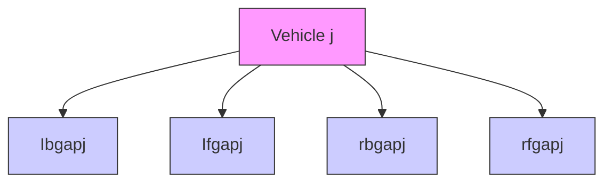
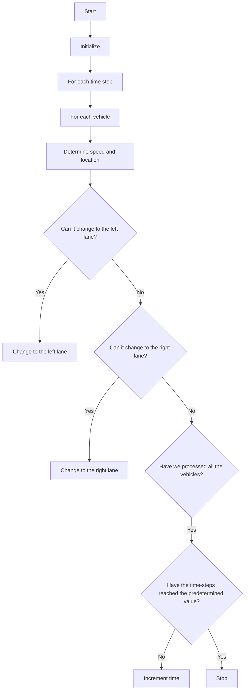

For office use only

T1

T2

T3

T4

Team Control Number

## 26333

Problem Chosen

A

For office use only

F1

F2

F3

F4

## 2014 Mathematical Contest in Modeling (MCM) Summary Sheet

(Attach a copy of this page to each copy of your solution paper.)

## Abstract

Our goal is a model that can evaluate the performance of the keep-right-exceptto-pass rule and other alternatives by simulating the traffic flow on the freeway. We construct models to analyze five influencing factors. Then we integrate multiple criteria to judge the performance of nine rules using a fuzzy synthetic evaluation(FSE).

Our basic lane-changing model focuses on the behavior of a specific vehicle on the freeway. We carefully examine the vehicle ˛a´rs lane-changing behavior, an essential component of overtaking.

We extend our model with a cellular-automaton-based approach. We assume that the drivers will change the lane with a probability if the trigger and safety conditions are satisfied. Using periodic boundary conditions, we seek to simulate a section of a long freeway, which is hardly influenced by real boundary conditions. In addition, we can accurately control the occupancy of the freeway. We can simulate the traffic flow under several conditions by varying the number of lanes, maximum speed limit, minimum speed limit and signaling behavior.

Four other basic rules such as free-overtaking rule are examined by revising the laws governing the cells in the cellular automaton. Then we design five improved rules based on the basic rules attempting to obtain an optimal rule.

We choose flow rate, average speed as traffic flow criteria, sharp braking frequency as a safety criterion and satisfaction and standard deviation of speed as experience criteria. Then we use a fuzzy synthetic evaluation technique to integrate these criteria to determine the performance of each rule. We find that in a light traffic case, a partial-assigned-lane-and-keep-right rule performs the best while in a heavy traffic situation, a different-speed-limit-on-each-lane rule is preferred.

We change the probability of lane-changing to adjust our model to a country like Great Britain. Moreover, we change that parameter to simulate a freeway fully controlled by an intelligent system and observe small deviations.

Additionally, we refine our extended model considering the ramps. We adopt open boundary conditions and assume that the vehicles flowing in are Poissondistributed. Finally, we change parameters to analyze freeways with ramps under different conditions.

# Keep Right to Keep “Right”

Team #26333

February 10, 2014

## Abstract

Our goal is a model that can evaluate the performance of the keep-rightexcept-to-pass rule and other alternatives by simulating the traffic flow on the freeway. We construct models to analyze five influencing factors. Then we integrate multiple criteria to judge the performance of nine rules using a fuzzy synthetic evaluation(FSE).

Our basic lane-changing model focuses on the behavior of a specific vehicle on the freeway. We carefully examine the vehicles lane-changing behavior, an essential component of overtaking.

We extend our model with a cellular-automaton-based approach. We assume that the drivers will change the lane with a probability if the trigger and safety conditions are satisfied. Using periodic boundary conditions, we seek to simulate a section of a long freeway, which is hardly influenced by real boundary conditions. In addition, we can accurately control the occupancy of the freeway. We can simulate the traffic flow under several conditions by varying the number of lanes, maximum speed limit, minimum speed limit and signaling behavior.

Four other basic rules such as free-overtaking rule are examined by revising the laws governing the cells in the cellular automaton. Then we design five improved rules based on the basic rules attempting to obtain an optimal rule.

We choose flow rate, average speed as traffic flow criteria, sharp braking frequency as a safety criterion and satisfaction and standard deviation of speed as experience criteria. Then we use a fuzzy synthetic evaluation technique to integrate these criteria to determine the performance of each rule. We find that in a light traffic case, a partial-assigned-lane-and-keepright rule performs the best while in a heavy traffic situation, a differentspeed-limit-on-each-lane rule is preferred.

We change the probability of lane-changing to adjust our model to a country like Great Britain. Moreover, we change that parameter to simulate a freeway fully controlled by an intelligent system and observe small deviations.

Additionally, we refine our extended model considering the ramps. We adopt open boundary conditions and assume that the vehicles flowing in are Poisson-distributed. Finally, we change parameters to analyze freeways with ramps under different conditions.

## Contents

## 1 Introduction . . 5

1.1 Restatement of the Problem 5  
1.2 Literature Review 6

## 2 Assumptions and Justifications . . . 6

## 3 Notations . . 7

## 4 Model Overview

## 5 The Keep-Right-Except-To-Pass Model . . . 9

5.1 The Basic Lane-changing Model . . 9  
5.2 The Extended “Ring Road” Model 12  
5.3 The Refined Model with Ramps . . 19

## 6 Results: Influencing Factors . . . 21

6.1 Variables and Criteria . . 21  
6.2 Number of Lanes 23  
6.3 Maximum Speed Limit . . 28  
6.4 Minimum speed limit . . . . 31  
6.5 Signal Before Shifting . . . . 33  
6.6 Conclusions . . 34

## 7 Results: the Optimal Rule . . . 35

7.1 Basic Rules of Overtaking . . . 35  
7.2 Criteria and Single Criterion Analysis for Basic Rules . . . . . 35  
7.3 Fuzzy Synthetic Evaluation for Basic Rules . . . 38  
7.4 Improved Rules of Overtaking 41  
7.5 Fuzzy Synthetic Evaluation for All Rules 41  
7.6 Conclusions 41

## 8 Sensitivity Analysis . . 42

8.1 Percentages of Vehicles . . . . 42  
8.2 Probability of Randomization . 43  
8.3 Probability of Willing to Change Lane . . 44

## 9 Further Discussions . . . 45

9.1 Modifications for Countries Where Driving on the Left Is the Norm 45  
9.2 Modifications for An Intelligent System . . . . 46  
9.3 Additional Research on the Refined Model with Ramps . . . . 49

## 10 Strengths and Weaknesses 52

10.1 Strengths . . 52  
10.2 Weaknesses 52

## 1 Introduction

A freeway is a highway designed for high-speed vehicles. It provides an unhindered flow of traffic with no traffic lights or intersections.[1] Typically, a freeway has several advantages over common roads, such as the high speed and the high traffic volume. The Keep-Right-Except-To-Pass rule, also known as “Slower Traffic Keep Right”, is often employed in right-hand traffic in order to raise the quality of traffic flow, especially the quality of traffic flow on freeways.[2] The effectiveness of the rule will not only increase utilization of freeways but also enhance driver satisfaction. Thus, it will be exhilarating if we can design another rule that can outperform the current rule. In this paper, we simulate different rules of overtaking and compare them so as to decide the optimal rule.

## 1.1 Restatement of the Problem

We are required to build a mathematical model to analyze the performance of the keep-right-except-to-pass rule the other alternatives. We decompose the problem into two sub-problems:

• Build a model that can simulate the overtaking process.  
• Propose a mathematical criterion to determine the performance of a specific rule.

In the first step, we seek to build a model with the inputs of speed limits and other factors. Most importantly, the model should reflect the mechanism of the given rule. Then we can change the inputs to do several simulations. Also, we can change the mechanism to apply alternative rules to our model. Finally, we can obtain the outputs of our model.

In the second step, we seek to use the outputs of our model to propose a mathematical criterion to evaluate different rules. We will consider the trade-off between traffic flow, safety and other factors. We will design other rules and determine which rule is the best.

Then we attempt to adjust our model and apply it to countries like Great Britain. We also consider the influence of intelligent system.

## 1.2 Literature Review

A model for the simulation of freeway traffic is inevitable to the study of the performance of the rule. German physicists Nagel and Schreckenberg built a theoretical model for the simulation of freeway traffic, which is a simple cellular automaton model for road traffic flow known as “N-S model”.[3] They defined a one-dimensional lane with two kinds of boundary conditions-open or periodic boundary conditions: In their model, each site may either be occupied by one vehicle or it may be empty. Each vehicle has an integer velocity with values between zero and $v _ { m a x } .$ . During each time step, four sub-steps are performed: acceleration, slowing down, randomization and car motion.

After the single-lane model was established, several scientists were devoted to building a multi-lane model. The main difficulty was to set up the rules for shifting to the neighboring lane. Rickert et al. introduced a two-lane model with two parallel lanes in their article.[4] Several conditions have to be fulfilled before the vehicle changing to other lanes: (1) another vehicle is in the way (2) other lanes are better and (3) collision will not happen. They also simulated the model using a cellular automaton, and the results were quite reasonable.

As a matter of fact, a multi-lane model does not have to be symmetric. Difference may include different speed limits on each lane, different kinds of cars, etc. In 1997, Chowdhury et al. first simulated the model with different kinds of vehicles. [5] In their model, different maximum possible speeds are introduced to different kinds of vehicles. The result shows that even if the portion of “slow cars” is relatively low, “fast cars” can only move in a low speed.

Further studies are carried out based on the comparison between model and reality. Knospe, Santen suggested that the influence of “slow cars” might have been over-estimated.[6] They recommended to consider the impact of expectancy in the model.

## 2 Assumptions and Justifications

To simplify the problem, we make the following basic assumptions, each of which is properly justified.

• No pedestrian can affect the vehicles on freeways. Usually, pedestrians have no access to freeways, let alone going across the freeways.  
• We ignore the force of crosswind to a vehicle when it is changing lanes.This impact is negligible compared with that of the head wind.

• Drivers cannot drive on the emergency lane. Typically, the emergency lane is not for use of flowing traffic. [7]  
• In our model, we only consider the freeway as completely flat, with no curve or slopes. This assumption greatly simplify our model and allow us to focus on the nature of overtaking.  
• We assume that all drivers act based on the same set of rules. We classify drivers as aggressive and non-aggressive and both groups follow the relevant rules.

## 3 Notations

All the variables and constants used in this paper are listed in Table 1 and Table 2.

Table 1 Symbol Table–Constants

<table><tr><td>Symbol</td><td>Definition</td><td>Units</td></tr><tr><td colspan="3">Constants</td></tr><tr><td> $\lambda$ </td><td>Expectancy of poisson-distribution</td><td>unitless</td></tr><tr><td> $p_{slow}$ </td><td>Possibility that a vehicle slows down randomly</td><td>unitless</td></tr><tr><td> $p_{left}$ </td><td>Possibility that a vehicle shift to the left lane when possible</td><td>unitless</td></tr><tr><td> $p_{right}$ </td><td>Possibility that a vehicle shift to the right lane when possible</td><td>unitless</td></tr><tr><td> $p_{exit}$ </td><td>Possibility that a vehicle need to move off through the exit ramp</td><td>unitless</td></tr></table>

Table 2 Symbol Table–Variables

<table><tr><td>Symbol</td><td>Definition</td><td>Units</td></tr><tr><td colspan="3">Variables</td></tr><tr><td> $v_s$ </td><td>Speed of  $vehicle_s$ </td><td>cell/time-step</td></tr><tr><td> $v_{expect}$ </td><td>Expected speed of  $vehicle_s$ </td><td>cell/time-step</td></tr><tr><td> $v_{lf}$ </td><td>Speed of the vehicle on the left lane ahead</td><td>cell/time-step</td></tr><tr><td> $v_{lb}$ </td><td>Speed of the vehicle on the left lane behind</td><td>cell/time-step</td></tr><tr><td> $v_{rf}$ </td><td>Speed of the vehicle on the right lane ahead</td><td>cell/time-step</td></tr><tr><td> $v_{rb}$ </td><td>Speed of the vehicle on the right lane behind</td><td>cell/time-step</td></tr><tr><td>t</td><td>Time</td><td>time-step</td></tr><tr><td> $D_{l,f,gap}$ </td><td>Left front gap</td><td>cell</td></tr><tr><td> $D_{l,b,gap}$ </td><td>Left back gap</td><td>cell</td></tr><tr><td> $D_{r,f,gap}$ </td><td>Right front gap</td><td>cell</td></tr><tr><td> $D_{r,b,gap}$ </td><td>Right back gap</td><td>cell</td></tr><tr><td> $vehicle_i_j$ </td><td>The  $j_{th}$  vehicle on the  $i_{th}$  lane</td><td>unitless</td></tr><tr><td> $v_j^i(t)$ </td><td>Speed of  $vehicle_i_j$  at  $t_{th}$  time-step</td><td>cell/time-step</td></tr><tr><td> $v_{j,expect}^i$ </td><td>Expected speed of  $vehicle_i_j$ </td><td>cell/time-step</td></tr><tr><td> $gap_i_j(t)$ </td><td>Front gap of  $vehicle_i_j$  at  $t_{th}$  time-step</td><td>cell</td></tr><tr><td> $x_j^i(t)$ </td><td>Location of  $vehicle_i_j$  at  $t_{th}$  time-step</td><td>cell</td></tr><tr><td> $lfgap_i_j$ </td><td>Left front gap of  $vehicle_i_j$ </td><td>cell</td></tr><tr><td> $lbgap_i_j$ </td><td>Left back gap of  $vehicle_i_j$ </td><td>cell</td></tr><tr><td> $rfgap_i_j$ </td><td>Right front gap of  $vehicle_i_j$ </td><td>cell</td></tr><tr><td> $rbgap_i_j$ </td><td>Right back gap of  $vehicle_i_j$ </td><td>cell</td></tr><tr><td> $lbv_i_j$ </td><td>Speed of the vehicle behind  $vehicle_i_j$  on the left lane</td><td>cell/time-step</td></tr><tr><td> $rbv_i_j$ </td><td>Speed of the vehicle behind  $vehicle_i_j$  on the right lane</td><td>cell/time-step</td></tr><tr><td> $\overline{v}(t)$ </td><td>Average speed at  $t_{th}$  time-step</td><td>cell/time-step</td></tr><tr><td>N</td><td>The number of vehicles passing a certain point on the highway</td><td>unitless</td></tr><tr><td>N(t)</td><td>The number of vehicles on the highway at  $t_{th}$  time-step</td><td>unitless</td></tr><tr><td>Nj(t)</td><td>The number of vehicles on the  $j_{th}$  lane at  $t_{th}$  time-step</td><td>unitless</td></tr><tr><td> $N_{shift}(t)$ </td><td>The number of vehicles changing lanes at  $t_{th}$  time-step</td><td>unitless</td></tr><tr><td> $t_{expect}$ </td><td>Expected time</td><td>time-step</td></tr><tr><td> $t_{actual}$ </td><td>Actual time</td><td>time-step</td></tr><tr><td> $a_{ij}$ </td><td>Value of the  $j_{th}$  criterion of the  $ith$  rule</td><td>uncertain</td></tr><tr><td> $u_j^0$ </td><td>Value of the  $j_{th}$  criterion of the ideal scheme</td><td>uncertain</td></tr><tr><td> $r_{ij}$ </td><td>Relative deviation of the  $j_{th}$  criterion of the  $i_{th}$  rule</td><td>unitless</td></tr><tr><td> $v_j$ </td><td>coefficient of variation of the  $j_{th}$  criterion</td><td>unitless</td></tr><tr><td> $w_j$ </td><td>Weight of the  $j_{th}$  criterion</td><td>unitless</td></tr><tr><td> $F_i$ </td><td>Relative deviation of the  $i_{th}$  rule</td><td>unitless</td></tr></table>

## 4 Model Overview

Most research for traffic flow can be classified as microscopic and macroscopic. As macroscopic methods are difficult to apply to our problem, we approach the problem with microscopic techniques. Our study into the keep-right-except-topass rule takes several approaches.

Our basic model allows us to have a close look at the lane-changing behavior. We focus on the incentive of changing lane and the conditions for a successful lane changing. We treat the changing-to-the-left-lane behavior and changing-tothe-right-lane behavior differently. This model gives us some intuition about the rule and serves as a stepping stone to our later study.

The extended model views the problem from a wider perspective. We consider a section of freeway and divide it into lattices. Then we run a cellular automaton to simulate the behavior of vehicles. The essence of the model is the laws governing the cells. We derive the laws according to the analysis of our basic model. Moreover, using periodic boundary conditions, we treat the freeway as a “ring road” so as to accurately control the density. Thus, we call it a “Ring Road” model.

Our refined model attempts to tackle a more realistic while more challenging problem. We add an entrance ramp and an exit ramp to our cellular automaton. The laws for the entering and exiting vehicles are also added. We use a Poisson distribution to simulate vehicles moving in from the start point.

We use the extended “Ring Road” model as a standard model to analyze the problem and all results have this model at their cores.

## 5 The Keep-Right-Except-To-Pass Model

We will start with the idea of the basic model. Then we present the cellular automaton and explain the algorithm. Finally, we introduce our additional work in the refined model.

## 5.1 The Basic Lane-changing Model

The basic model is a microscopic approach. A typical overtaking behavior consists of five actions: signal for three seconds, change lane, accelerate, signal back and change back to the former lane. Among these actions, lane-changing is the most crucial part. An analysis of lane-changing behavior might shed light on the nature of the quality of traffic flow.

## 5.1.1 Changing to the Left Lane

When making the decision of whether to overtake, the driver will first decide whether to change to the left lane. There are two main considerations [8] :

• A reason or a trigger consideration  
• A safety consideration

The former means that the vehicle ahead moves slowly enough, which will trigger the driver to overtake it. The latter indicates that he will take safety into account. In other words, if there is a high-speed vehicle driving on the left lane, he will choose to stay on the current lane to avoid collision. Based on these considerations, we can introduce some mathematical intuition into the problem. Figure 1 illustrates the situation that the red car tends to change to the left lane.

text_image

Dl,b,gap
Vlb
Dl,f,gap
VIf
Vs
Vs
gap

Figure 1 Change-to-the-left-lane

Based on the trigger consideration, the speed of the cars satisfies

$$
v _ {e x p e c t} > v _ {s}
$$

In terms of safety, the left back gap should satisfy

$$
D _ {l, b, g a p} > (v _ {l b} - v _ {s}) t
$$

Additionally, the red car attempts to accelerate. It is unreasonable if it changes to the passing lane while slowing down. This happens if there is a vehicle ahead. Therefore, the left front gap should satisfy

$$
D _ {l, f, g a p} > (v _ {s} - v _ {l f}) t
$$

The mathematical expressions above give the basic conditions of a change-tothe-left-lane behavior.

## 5.1.2 Changing Back to the Right Lane

After accelerating and passing the slow vehicle ahead, the driver tends to change back to the former lane due to the keep-right-except-to-pass rule. However, this lane-changing behavior will be subject to the following constraints:

• There is no incentive to pass the car in the current passing lane. If so, and if it is a multi-lane freeway, the driver would prefer to continue to overtake the car ahead and change to the left passing lane rather than change back to the former lane.  
• It is safe to change back. This condition means that the driver should pass the slow car and ensure that he will not collide with the slow car when changing back.  
• After changing back to the former lane, the driver can maintain his relatively high speed. Otherwise, he will intend to pass more than one car in an overtaking process.

The first constraint can be treated as the changing-to-the-left-lane situation as mentioned above and the other conditions can be stated as the following mathematical expressions.

Due to the safety consideration, the right back gap should yield

$$
D _ {r, b, g a p} > (v _ {r b} - v _ {s}) t
$$

Due to the intention to pass more cars, the right front gap should yield

$$
D _ {r, b, g a p} > (v _ {s} - v _ {r f}) t
$$

Figure 2 illustrates this change-back-to-the-right-lane situation.

text_image

V_{rbs}
V_{rf}
Dr,b,gap
Dr,f,gap
V_{expect}

Figure 2 Change-back-to-the-right-lane

## 5.2 The Extended “Ring Road” Model

In order to understand how the rule works in a traffic flow, we have to analyze the behavior of vehicles in a relatively long way, which will be more like a freeway. One intuition for modeling the problem is to think of it as a stochastic process. Therefore, we use a cellular automaton to simulate the behavior of vehicles on a freeway.

A cellular automaton is a discrete model that describes the time development of a system. It is referred to as a discrete model because it treats time as a discrete variable. The model requires an initial configuration and a set of fixed laws that determine how the system develops. At every time-step, the cellular automaton will advance incrementally and all the laws will be implemented.

## 5.2.1 Assumptions of the Model

The following general assumptions are made based on common sense and we use them throughout our model.

• Drivers obey the rules with a probability. It is obvious in real life that a driver might not want to change lane even if all the conditions are satisfied. We assume that a driver change to the left lane and the right lane with the probability $p _ { l e f t }$ and $p _ { r i g h t }$ respectively when possible.  
• All drivers tend to drive as fast as possible while keeping a safe following distance. Nearly every driver wants to drive faster on the freeway as

long as there is enough time for him to react if the vehicle ahead decelerates. Also, the maximum speed is limited by the vehicle type and the speed limit of freeway.

Drivers are “myopic”, which means that they can only see one vehicle in front of him, one vehicle behind him and several vehicles on the neighboring lanes. A driver can see the vehicle in front of him by eyes and see the vehicle behind him with the help of rearview mirrors. Moreover, he can turn his head to left and right to see the car on the neighboring lanes. He might see cars, say, on the left lane of the left lane, but he will not take this information into account when deciding whether to change lanes. Thus, we simply suppose that the drivers cannot see these vehicles and other vehicles much further.

• Drivers make decisions only according to his own interest. Because drivers are “myopic”, they cannot know the conditions of the whole freeway. Consequently, they make greedy decisions in order to pass the freeway in a shorter time.

Additionally, in order to implement cellular automaton on our problem, we propose the following assumptions:

• We assume that lane-changing does not cost additional time. Obviously, vehicles change lanes while moving. Although the travelling distance of lane-changing seems longer compared with just moving in one lane, the drivers tend to accelerate to change lanes. Thus, we simply suppose that the lane-changing costs the same amount of time as moving in one lane. This assumption helps a lot to build a cellular automaton.  
• Each cell represents a 4m\*6m area. The road’s length is 2000 cells. A lane’s width is 1 cell. We divide a multilane freeway into equally partitioned lanes. We choose a length of 12km to simulate because of the tradeoff between time complexity and the completeness of the model.Also, each array of cells represents a lane.  
• Every time-step represents 1 second. Such an assumption is made by nearly all cellular automaton techniques.  
• We run 20000 time-step and analyze the last 1000 steps. This ensures us to obtain steady-state conditions.  
• While all vehicles have a trend to reach the maximum speed, every single vehicle randomly slows down with probability p. This randomization is a characteristic of traffic flow.

• Acceleration is done steadily while any kind of deceleration can be done in one time-step. Steady acceleration is an energy-saving behavior and drivers will decelerate to avoid possible collisions.

## 5.2.2 Characteristics of Vehicles

We classify the vehicles into three groups:

• Cars: Cars are those small vehicles, which usually can have high speeds.  
• Buses: Buses are large vehicles used for carrying people, and their speeds can be relatively high.  
• Trucks: Trucks are large vehicles used for moving heavy articles, and they can only have lower speeds.

Then we define the characteristics of the three types of vehicles:

• Occupancy: Each car occupies one cell. Since a typical car’s length is 3.6m-4.6m. The car cannot fully occupy a cell. We place the car in the middle of the cell and treat the space in front of and behind the car as safe distance. Accordingly, each bus and each truck occupies two cells with safe distance preserved.  
• Maximum speed: At each time-step, cars cannot move more than 6 cells, which means that its maximum speed is 129.6km/h. Similarly, buses cannot move more than 5 cells per time step, since they are large so that they cannot move at a higher speed. Lastly, trucks carry heavy goods so they have the lowest maximum speed. We suppose it is 3 cells per time-step, which equals 64.8km/h. The maximum speed here is based on the vehicles themselves. If they exceed the speed limit, vehicles can drive no more than the limit. In China, the maximum speed limit of freeway is 120km/h and the lowest speed limit of that is 60km/h. The role of speed limit is examined by comparing situations under different limits.  
• Percentage: We assume that cars account for 60% of the traffic flow, buses account for 30% and trucks account for 10%. This assumption are based on the data collected by [9]

The characteristics are listed in Table 3.

Table 3 Characteristics of Vehicles

<table><tr><td>Type</td><td>Occupancy</td><td>Maximum speed</td><td>percentage</td></tr><tr><td>Car</td><td>1 cell</td><td>6 cells/sec</td><td>60%</td></tr><tr><td>Bus</td><td>2 cells</td><td>5 cells/sec</td><td>30%</td></tr><tr><td>Truck</td><td>2 cells</td><td>3 cells/sec</td><td>10%</td></tr></table>

## 5.2.3 Laws Governing the Cellular Automaton

Our cellular automaton is implemented by an algorithm, the essence of the algorithm is the set of laws sequentially implemented in every time-step. In this subsection, we will introduce the laws. These laws are based on the previous analysis and are expressed from a computational perspective.

## Step 1: moving

These laws are set based on the assumptions of the model and the characteristics of the vehicles. We denote the $j _ { t h }$ vehicle on lane i by vehicleij.

## (a) Determine the speed

Our three laws below was implemented sequentially, so we use $( t + { \textstyle \frac { 1 } { 3 } } ) , ( t + { \textstyle \frac { 2 } { 3 } } )$ to denote the intermediate state.

i. Acceleration

flowchart

Figure 3 Clarification of some denotes

All drivers tend to drive as fast as possible:

$$
\text {   If   } v _ {j} ^ {i} (t) <   v _ {j, e x p e c t} ^ {i}, \quad \text {   then   } v _ {j} ^ {i} (t + \frac {1}{3}) = v _ {j} ^ {i} (t) + 1
$$

Where $v _ { j } ^ { i } ( t )$ is the speed of vehicleij at time $t , v _ { j , e x p e c t } ^ { i }$ means the expected speed of vehicleij.

ii. Randomization

Every vehicle randomly slows down by 1 with probability $p _ { s l o w } .$ . Mathematically,

$$
v _ {j} ^ {i} (t + \frac {2}{3}) = v _ {j} ^ {i} (t + \frac {1}{3}) - 1
$$

iii. Deceleration(because of other vehicles)

To maintain a safe following distance and to avoid collision, a cell cannot be occupied by more than one vehicle at the same time-step.

$$
\text {   If   } v _ {j} ^ {i} (t + \frac {2}{3}) > g a p _ {j} ^ {i} (t), \quad \text {   then   } v _ {j} ^ {i} (t + 1) = g a p _ {j} ^ {i} (t)
$$

Where $g a p _ { j } ^ { i } ( t )$ is the gap between vehicleij and the vehicle ahead.

(b) Determine the location

We derive the locations based on the speeds above:

$$
x _ {j} ^ {i} (t + 1) = x _ {j} ^ {i} (t) + v _ {j} ^ {i} (t + 1)
$$

$$
g a p _ {j} ^ {i} = x _ {j} ^ {i + 1} - x _ {j} ^ {i} - 1
$$

Where $x _ { j } ^ { i }$ is the location of vehicleij.

## Step 2: lane-changing

These rules are set based on

(a) Changing to the left lane

i. Based on trigger criterion, the driver tends to change to the left if the vehicle ahead moves so slow that he fails to reach his expected speed.

$$
g a p _ {j} ^ {i} (t) <   v _ {j, e x p e c t} ^ {i}
$$

ii. Then, take acceleration criterion into account, we have

$$
g a p _ {j} ^ {i} (t) <   l f g a p _ {j} ^ {i}
$$

Where lf gapij is the left front gap of vehicleij.

flowchart

Figure 4 Flow chart of cellular automaton

iii. Lastly, consider the factor of safety, we have

$$
l b g a p _ {j} ^ {i} > l b v _ {j} ^ {i}
$$

Where lbgapi is the left back gap of vehiclei , lbvi is the speed of the vehicle behind on the left lane.

(b) Changing to the right lane

i. To check the rules in 2.1 above, if any one of the rules are not satisfied, the driver cannot change to the left lane.

ii. To consider safety, we have

$$
r f g a p _ {j} ^ {i} > v _ {j} ^ {i}
$$

Where rf gapij is the right front gap of vehicleij.

iii. To consider another safety criterion, we have

$$
r b g a p _ {j} ^ {i} > r b v _ {j} ^ {i}
$$

Where rbgapij is the right back gap of vehicleij, rbvij is the speed of the vehicle behind on the right lane.

The algorithm is diagrammed in Figure 4.

## 5.2.4 Modeling Using Periodic Boundary Conditions

To run a cellular automaton, we need to specify the boundary conditions and the initial condition. Boundary conditions determine the way vehicles move into our system and the way they move out of our system. Likewise, an initial condition determines the distribution of vehicles in our system and the speeds of them.

Inspired by Nagel and Schreckenberg’s work [3], we tackle the problem with periodic boundary conditions. Periodic boundary conditions assume that the vehicles moving out of the freeway will immediately appear at the front of the system, so the total number of vehicles is a constant during the dynamics. Thus, we can accurately define a constant system density and study the performance of the rule with varying density. Moreover, periodic boundary conditions turn our road into a closed system, so it is similar to the case that all vehicles are moving on a circle. We, in turn, name our extended model as a “Ring Road” model.

Although there is no such short ring road in reality, this model still holds true because we can imagine that a freeway is made up of several equally partitioned sections and the vehicles on all the sections are identical. Obviously, this situation satisfies periodic boundary conditions. This is how periodic boundary conditions relate theory with reality.

## 5.3 The Refined Model with Ramps

Even though the “Ring Road” model is good enough to solve the problem, it fails to consider the effect of ramps. Consequently, we refine our model by adding entrance and exit ramps and applying open boundary conditions.

## 5.3.1 Adding Entrance and Exit Ramps

Vehicles may also use an entrance ramp to enter the freeway. The entrance ramp s give them a chance to accelerate to the expected speed. However, most ramps are too short to allow them to speed up to, say, 100km/h. As a result, the vehicles on the right-most lane might slow down to yield to the incoming vehicles or incoming vehicles might hard to enter the freeway. Both cases might have deleterious effects on the quality of traffic flow. Likewise, vehicles have to decelerate in order to enter an exit ramp, and similar problem will occur.

Figure 5 demonstrates a real freeway section containing ramps. We can see that an exit ramp was followed by an entrance ramp. We add the ramps based on this fact.

The laws mentioned in the previous section are still valid, and the only difference is how the incoming vehicles enter the freeway. We add some additional laws to instruct the behavior of incoming vehicles. To introduce the concept of ramps in our cellular automaton, we add the following assumptions.

natural_image

Aerial view of a complex highway interchange surrounded by agricultural fields and greenhouses (no visible text or signage)

Figure 5 A real freeway section containing ramps

## 5.3.2 Additional Assumptions in the Refined Model

• The exit ramp: We assume that the overlap between the freeway and the exit ramp ranges from the $8 5 0 _ { t h }$ cell to the $9 0 0 _ { t h }$ cell, which is 300m.  
• The entrance ramp: We assume that the overlap between the freeway and the entrance ramp ranges from the $1 1 0 0 _ { t h }$ cell to the $1 5 0 0 _ { t h }$ cell, which is 300m.

## 5.3.3 Additional Laws

• Off-ramp law: If the vehicle wants to go off the free way(how to determine this will be discussed later), it is not allowed to change to left lane after it reaches the $7 0 0 _ { t h }$ cell. At the same time, it will slow down to 3cell/s. If the vehicle is on the right-most lane between the $8 5 0 _ { t h }$ cell and the $9 0 0 _ { t h }$ cell, we assume that it can move into the ramp at the next time step if it wants to. Since in reality exit ramps usually contain two lanes and the ratio of vehicles exit at one ramp is low, this assumption is reasonable. If it misses the exit, it will not be governed by this additional law anymore.

• On-ramp law: For a vehicle on the entrance lamp, if the laws of changing to the left lane are satisfied, it can go into the freeway during the next timestep. Otherwise, it will continue to move forward.

## 5.3.4 Modeling Using Open Boundary Conditions

After we introduce ramps into our model, it is no longer reasonable to consider it as a closed system. Thus, we must use open boundary conditions to determine how the vehicles flow in. Considering that the amount of traffic is stochastic and the input of the system is discrete, a generally used approach is to model the input of vehicles as a Poisson process. Consequently, we assume that the number of vehicles flowing in from the starting point in any interval of length t is Poisson-distributed with mean λt.

While moving into the system, vehicles tend to move off through the exit ramp with a probability $p _ { e x i t }$ . And the vehicles flowing in from the entrance ramp in any interval of length t is 0-1-distributed with mean λt. In other words, we try to let the number of vehicles from the entrance ramp equal the number of vehicles from the exit ramp. However, as discussed above, some vehicles may fail to exit the freeway and some others may fail to enter the freeway. We view both of them as bad characteristics of the traffic flow. We analyze these characteristics and we will discuss them in the next section.

## 6 Results: Influencing Factors

In this section, we first give a definition of light and heavy traffic. Then we explicitly define four factors and change one factor each time in order to analyze how this factor influence the performance of the Keep-Right-Except-To-Pass Rule.

We run several simulations with cellular automaton and find that the traffic flow can be classified into two groups. The time space diagram (Figure 8) demonstrates these two kinds of traffic flow. The diagram shows the trace of every vehicle in the simulation. A gentle trace indicates a low speed. Conversely, a steep trace indicates a high speed.

line chart

| time-step | location |
| --------- | -------- |
| 0         | 0        |
| 100       | 200      |
| 200       | 400      |
| 300       | 600      |
| 400       | 800      |
| 500       | 1000     |
| 600       | 1200     |
| 700       | 1400     |
| 800       | 1600     |
| 900       | 1800     |
| 1000      | 2000     |

(a) Time space diagram(occupancy=0.1)

line chart

| time-step | location |
| --------- | -------- |
| 0         | 0        |
| 100       | 200      |
| 200       | 400      |
| 300       | 600      |
| 400       | 800      |
| 500       | 1000     |
| 600       | 1200     |
| 700       | 1400     |
| 800       | 1600     |
| 900       | 1800     |
| 1000      | 2000     |

(b) Time space diagram(occupancy=0.4)  
Figure 6

• From the left diagram, we can clearly see that the vehicles with a high speed can continue with the high speed which indicates that it is not constrained by slower vehicles. This is a situation of light traffic.  
• From the right diagram, we can see that no vehicle can reach a high speed, which indicates that there is a congestion. This is a situation of heavy traffic.

## 6.1 Variables and Criteria

We choose number of lanes, the maximum speed limit, the minimum speed limit and signaling behavior as our variables. To judge the effectiveness of the rule, we propose the following criteria:

• Flow rate: flow rate is the number of vehicles passing a point on a highway per unit time.[10]

$$
f l o w r a t e = \frac {N}{T}
$$

where N stands for the number of vehicles passing a point on the highway in the time of T.

• Average speed: the average speed of all vehicles passing a point on a highway or a lane over some specified time period.

$$
\text { average   speed } \bar {v} (t) = \frac {1}{N (t)} \sum_ {j = 1} ^ {3} \sum_ {i = 1} ^ {N _ {j} (t)} v _ {j} ^ {i} (t)
$$

where $N ( t )$ stands for the number of vehicles on the freeway, and $N _ { j } ( t )$ stands for the number of vehicles on $j _ { t h }$ lane.

• Lane utilization ratio: lane utilization ratio is defined as the ratio between the number of vehicles on the lane to the total number of vehicle on the freeway.

$$
l a n e u t i l i z a t i o n r a t i o _ {i} = \frac {N _ {j} (t)}{N (t)}
$$

• Sharp braking frequency: we do not consider the occurrence of accidents in our simulation, since we view accidents as abnormal events and it is difficult to consider abnormal events in microscopic models. Instead, we use sharp braking frequency as an indicator of unsafety. Sharp braking frequency occurs when a vehicle’s speed decreases by more than 2 cell/timestep. If this happens in our simulation, we assume that it is more likely to cause an accident in reality.

• Shift ratio: the number of shifts per unit time.

$$
s h i f t r a t i o = \frac {N _ {s h i f t} (t)}{N (t)}
$$

where $N _ { s h i f t } ( t )$ stands for the number of vehicles changing lanes at $t _ { t h }$ time step.

• Satisfaction: if a vehicle fails to reach its maximum speed, the driver’s satisfaction will decrease. We define the expected time $t _ { e x p e c t }$ as the time it takes to drive with the maximum speed through a given distance. We define the actual time $t _ { a c t u a l }$ as the time it actually takes to drive through the same distance. Then we derive the criteria by dividing expected time by actual time. The value of satisfaction ranges from 0 to 1.

$$
s a t i s f a c t i o n = \frac {t _ {e x p e c t}}{t _ {a c t u a l}}
$$

• Standard deviation of speed: people might feel uncomfortable if the vehicle continues to accelerate and decelerate. We use standard deviation of speed to measure this kind of discomfort.

$$
\text { Std.   deviation   of   speed } = \frac {1}{N (t)} \sum_ {j = 1} ^ {3} \sum_ {i = 1} ^ {N _ {j} (t)} \sqrt {\sum_ {t = 1} ^ {T} [ v _ {j} ^ {i} (t) - \bar {v} (t) ] ^ {2}}
$$

## 6.2 Number of Lanes

## 6.2.1 Flow Rate

From the flow rate and occupancy figure, we can obtain an optimal occupancy. In a low occupancy situation, the number of cars are too low. Although they are more likely to reach their maximum speeds, the road resources are not fully utilized, so the total flow rate is low. In a high occupancy situation, the number of cars are too high, and it might cause a traffic congestion. We expect an optimal occupancy and view it as a watershed of light traffic and heavy traffic.

line chart

| occupancy | 3 lanes | 4 lanes |
| --------- | ------- | ------- |
| 0.1       | 1.0     | 1.3     |
| 0.2       | 1.45    | 2.0     |
| 0.3       | 1.5     | 1.95    |
| 0.4       | 1.25    | 1.75    |
| 0.5       | 1.1     | 1.45    |
| 0.6       | 0.95    | 1.2     |

Figure 7 Total flow rate under the condition of different occupancies (3 & 4 lanes)

From Figure 7, we can see that the optimal occupancy for a 3-lane freeway and a 4-lane freeway is between 0.2 and 0.3. Thus, in our following analysis, we choose an occupancy of 0.1 to represent a light traffic condition and an occupancy of 0.4 to represent a heavy traffic condition.

line chart

| occupancy | 1st lane | 2nd lane | 3rd lane |
| --------- | -------- | -------- | -------- |
| 0.1       | 0.15     | 0.37     | 0.45     |
| 0.2       | 0.45     | 0.49     | 0.50     |
| 0.3       | 0.49     | 0.50     | 0.50     |
| 0.4       | 0.43     | 0.45     | 0.38     |
| 0.5       | 0.41     | 0.40     | 0.31     |
| 0.6       | 0.36     | 0.36     | 0.22     |

(a) Flow rate of each lane (3 lanes)

line chart

| occupancy | 1st lane | 2nd lane | 3rd lane | 4th lane |
| --------- | -------- | -------- | -------- | -------- |
| 0.1       | 0.07     | 0.27     | 0.46     | 0.49     |
| 0.2       | 0.45     | 0.55     | 0.53     | 0.48     |
| 0.3       | 0.50     | 0.51     | 0.51     | 0.45     |
| 0.4       | 0.49     | 0.45     | 0.45     | 0.36     |
| 0.5       | 0.40     | 0.41     | 0.37     | 0.27     |
| 0.6       | 0.37     | 0.37     | 0.32     | 0.18     |

(b) Flow rate of each lane (4 lanes)  
Figure 8

We also calculate the flow rate of each lane and sequence them from left to right. From the figures, we conclude that the optimal occupancy of rightmost lane is lower than that of leftmost lane. This tendency holds true for both 3-lane and 4-lane freeways. However, it’s not a significant difference.

## 6.2.2 Average Speed

line chart

| occupancy | 3 lanes | 4 lanes |
| --------- | ------- | ------- |
| 0.1       | 4.6     | 4.5     |
| 0.2       | 3.4     | 3.5     |
| 0.3       | 2.3     | 2.3     |
| 0.4       | 1.5     | 1.5     |
| 0.5       | 1.0     | 1.0     |
| 0.6       | 0.7     | 0.7     |

Figure 9 Average speed under the condition of different occupancies (3 & 4 lanes)

As occupancy increases, the average speed tends to decrease due to congestion. This common sense can be justified from the speed-occupancy Figure 9. Surprisingly, the curves for 3-lane and 4-lane coincide! This result indicates that different lane numbers may hardly change the performance of the rule under the condition of the same occupancy.

line chart

| occupancy | 1st lane | 2nd lane | 3rd lane |
| --------- | -------- | -------- | -------- |
| 0.1       | 5.4      | 5.1      | 4.0      |
| 0.2       | 4.2      | 3.5      | 2.7      |
| 0.3       | 3.1      | 2.4      | 1.7      |
| 0.4       | 2.2      | 1.7      | 1.0      |
| 0.5       | 1.7      | 1.2      | 0.6      |
| 0.6       | 1.3      | 0.9      | 0.4      |

(a) Average speed of each lane (3 lanes)

line chart

| occupancy | 1st lane | 2nd lane | 3rd lane | 4th lane |
| --------- | -------- | -------- | -------- | -------- |
| 0.1       | 5.5      | 5.4      | 5.0      | 3.7      |
| 0.2       | 5.0      | 4.5      | 3.5      | 2.5      |
| 0.3       | 3.5      | 3.0      | 2.2      | 1.5      |
| 0.4       | 2.5      | 2.2      | 1.8      | 1.0      |
| 0.5       | 2.0      | 1.8      | 1.5      | 0.7      |
| 0.6       | 1.5      | 1.3      | 1.0      | 0.5      |

(b) Average speed of each lane (4 lanes)  
Figure 10

From the average speed of each lane, we can conclude that the leftmost lane has the highest speed and the rightmost lane has the lowest speed. This is because the rule requires drivers to overtake from the left.

## 6.2.3 Lane Utilization Ratio

line chart

| occupancy | 1st lane | 2nd lane | 3rd lane |
| --------- | -------- | -------- | -------- |
| 0.1       | 0.13     | 0.33     | 0.54     |
| 0.2       | 0.24     | 0.33     | 0.43     |
| 0.3       | 0.24     | 0.32     | 0.43     |
| 0.4       | 0.24     | 0.31     | 0.45     |
| 0.5       | 0.23     | 0.31     | 0.46     |
| 0.6       | 0.23     | 0.31     | 0.47     |

(a) Lane utilization ratio of each lane (3 lanes)

line chart

| occupancy | 1st lane | 2nd lane | 3rd lane |
| --------- | -------- | -------- | -------- |
| 0.1       | 0.05     | 0.18     | 0.32     |
| 0.2       | 0.15     | 0.21     | 0.28     |
| 0.3       | 0.15     | 0.21     | 0.27     |
| 0.4       | 0.15     | 0.20     | 0.26     |
| 0.5       | 0.15     | 0.19     | 0.26     |
| 0.6       | 0.15     | 0.18     | 0.26     |

(b) Lane utilization ratio of each lane (4 lanes)  
Figure 11

From the Figure 11, we can know that the lane utilization ratio of the leftmost lane increases as occupancy increases. It is reasonable because when occupancy increases, more vehicles use the leftmost lane to overtake. In contrast, in the light traffic situation, the lane utilization ratio of the rightmost lane decreases as occupancy increases. It is because more vehicles try to change to the middle lane to move faster. The increase tendency in the heavy traffic condition indicates the difficulty of overtaking.

## 6.2.4 Sharp Braking Frequency

line chart

| occupancy | 3 lanes | 4 lanes |
| --------- | ------- | ------- |
| 0.1       | 0.04    | 0.05    |
| 0.2       | 0.085   | 0.082   |
| 0.3       | 0.095   | 0.093   |
| 0.4       | 0.085   | 0.082   |
| 0.5       | 0.07    | 0.067   |
| 0.6       | 0.055   | 0.052   |

Figure 12 Sharp braking frequency under the condition of different occupancies (3 & 4 lanes)

There also exists a peak value in the sharp braking frequency curve. In the case of light traffic, the average speed is high. Therefore, as occupancy increases, sharp braking situation increases. In the case of heavy traffic, the average speed is low, so the frequency decreases correspondingly.

## 6.2.5 Shift Ratio

line chart

| occupancy | 3 lanes | 4 lanes |
| --------- | ------- | ------- |
| 0.1       | 0.1     | 0.075   |
| 0.2       | 0.043   | 0.043   |
| 0.3       | 0.041   | 0.044   |
| 0.4       | 0.04    | 0.043   |
| 0.5       | 0.037   | 0.04    |
| 0.6       | 0.034   | 0.037   |

Figure 13 Shift ratio under the condition of different occupancies (3 & 4 lanes)

In the low occupancy case, the ratio is high, probably because of the low car number. In the high occupancy case, the ratio approximately keeps unchanged.

## 6.2.6 Satisfaction

line chart

| occupancy | 3 lanes | 4 lanes |
| --------- | ------- | ------- |
| 0.1       | 0.85    | 0.82    |
| 0.2       | 0.63    | 0.65    |
| 0.3       | 0.43    | 0.44    |
| 0.4       | 0.29    | 0.29    |
| 0.5       | 0.20    | 0.21    |
| 0.6       | 0.15    | 0.15    |

Figure 14 Satisfaction under the condition of different occupancies (3 & 4 lanes)

As the occupancy increases, it takes longer for drivers to pass a certain distance, so their satisfaction decreases. Again, the curves coincide, which means there is little difference between 3-lane and 4-lane freeway in terms of satisfaction under the condition of the same occupancy.

## 6.2.7 Standard Deviation of Speed

line chart

| occupancy | 3 lanes | 4 lanes |
| --------- | ------- | ------- |
| 0.1       | 1.15    | 1.25    |
| 0.2       | 1.55    | 1.58    |
| 0.3       | 1.58    | 1.55    |
| 0.4       | 1.35    | 1.38    |
| 0.5       | 1.10    | 1.12    |
| 0.6       | 0.90    | 0.90    |

Figure 15 Std. deviation of speed.png under the condition of different occupancies (3 & 4 lanes)

The shapes of the curves are similar to the speed curves and they are irrelevant to the lane number.

## 6.3 Maximum Speed Limit

We study the case in which the maximum speed limit of 4 cell/s (86.4km/h) and 5 cell $/ \mathrm { s } \left( 1 0 8 \mathrm { k m / h } \right)$ and a case with no maximum speed limit.

## 6.3.1 Flow Rate and Average Speed

bar chart

| Category | light traffic | heavy traffic |
| :--- | :--- | :--- |
| no limit | 0.964 | 1.254 |
| max limit=5 | 0.891 | 1.322 |
| max limit=4 | 0.761 | 1.234 |

(a) Flow rate in light & heavy traffic (different maximum limit)

bar chart

| Category | light traffic | heavy traffic |
| :--- | :--- | :--- |
| no limit | 4.552 | 1.496 |
| max limit=5 | 4.139 | 1.504 |
| max limit=4 | 3.483 | 1.495 |

(b) Average speed in light & heavy traffic (different maximum limit)  
Figure 16

Vehicles can move in a high speed in a light traffic case, so the maximum speed limit must have a significant influence on the flow rate and speed. In a heavy traffic case, however, vehicles averagely maintain a low speed, and few of them can reach the maximum speed limit, so it can hardly influence the average speed. However, a maximum speed limit can avoid sharp changes of following distance, which is beneficial to the whole traffic flow. Therefore, a proper speed limit might result in a higher flow rate. We can clearly see that the results meet our expectations from the Figure 16.

## 6.3.2 Sharp Braking Frequency and Shift Ratio

bar chart

| Category | light traffic | heavy traffic |
| :--- | :--- | :--- |
| no limit | 0.041 | 0.085 |
| max limit=5 | 0.033 | 0.083 |
| max limit=4 | 0.017 | 0.079 |

(a) Sharp braking frequency in light & heavy traffic (different maximum limit)

bar chart

| Category | light traffic | heavy traffic |
| :--- | :--- | :--- |
| no limit | 0.099 | 0.039 |
| max limit=5 | 0.071 | 0.039 |
| max limit=4 | 0.645 | 0.037 |

(b) Shift ratio in light & heavy traffic (different maximum limit)  
Figure 17  
Figure 17 demonstrate that the maximum speed limit can effectively reduce the sharp braking frequency and shift ratio in a light traffic case, which is beneficial to safety. Nevertheless, it has little impact in a heavy traffic case.

## 6.3.3 Lane Utilization Ratio

bar chart

| Category       | 1st lane | 2nd lane | 3rd lane |
| -------------- | -------- | -------- | -------- |
| no limit       | 0.137    | 0.334    | 0.529    |
| max limit=5    | 0.093    | 0.325    | 0.582    |
| max limit=4    | 0.068    | 0.331    | 0.601    |

(a) Lane utilization ratio in light traffic (different maximum limit)

bar chart

| Category | 1st lane | 2nd lane | 3rd lane |
| :--- | :--- | :--- | :--- |
| no limit | 0.242 | 0.312 | 0.446 |
| max limit=5 | 0.241 | 0.312 | 0.447 |
| max limit=4 | 0.240 | 0.312 | 0.448 |

(b) Lane utilization ratio in heavy traffic (different maximum limit)  
Figure 18

From Figure 18, we can conclude that the utilization ratio of the leftmost lane in a light traffic case decreases under a more strict speed limit because the limit reduces driver’s willingness to overtake.

## 6.4 Minimum speed limit

We study the influence of minimum speed limit by presenting two cases: a case with a minimum speed limit of 3 cell/s (64.8 km/h). By minimum speed limit we mean that vehicles will not exceed the limit due to randomization. However, they can decelerate due to safety consideration.

## 6.4.1 Flow Rate and Average Speed

bar chart

| Category | light traffic | heavy traffic |
| :--- | :--- | :--- |
| no limit | 0.964 | 1.254 |
| min limit=3 | 0.945 | 1.822 |

bar chart

| Category | light traffic | heavy traffic |
| :--- | :--- | :--- |
| no limit | 4.552 | 1.496 |
| min limit=3 | 4.306 | 2.135 |

(a) Flow rate in light & heavy traffic (different (b) Average speed in light & heavy traffic (difminimum limit) ferent minimum limit)  
Figure 19

Opposite from the maximum speed limit case, the minimum speed limit plays an important role in a heavy traffic case and it is of little importance in a light traffic case. We can clearly conclude that from Figure 19

## 6.4.2 Sharp Braking Frequency and Shift Ratio

bar chart

| Category | light traffic | heavy traffic |
| :--- | :--- | :--- |
| no limit | 0.041 | 0.085 |
| min limit=3 | 0.060 | 0.054 |

(a) Sharp braking frequency in light & heavy traffic (different minimum limit)

bar chart

| Category | light traffic | heavy traffic |
| :--- | :--- | :--- |
| no limit | 0.099 | 0.039 |
| min limit=3 | 0.060 | 0 |

(b) Shift ratio in light & heavy traffic (different minimum limit)  
Figure 20

In the light traffic case, vehicles cannot slow down in advance due to the speed limit, which in turn increase the sharp braking frequency. In the heavy traffic case, the frequency decreases. The reason might lies in the low shift ratio and the fluent traffic flow. The condition for lane changing is difficult to satisfy. Figure 20 illustrates this conclusion.

## 6.4.3 Lane Utilization Ratio

bar chart

| Category | 1st lane | 2nd lane | 3rd lane |
| :--- | :--- | :--- | :--- |
| no limit | 0.137 | 0.334 | 0.529 |
| min limit=3 | 0.139 | 0.342 | 0.519 |

(a) Lane utilization ratio in light traffic (different minimum limit)

bar chart

| Category | 1st lane | 2nd lane | 3rd lane |
| :--- | :--- | :--- | :--- |
| no limit | 0.242 | 0.312 | 0.446 |
| min limit=3 | 0.291 | 0.309 | 0.400 |

(b) Lane utilization ratio in heavy traffic (different minimum limit)  
Figure 21

In the light traffic case, the ratio is of little influence. In the heavy traffic case, the ratio tends to evenly distribute between the three lanes due to the difficulty to change lane. The results are shown in Figure 21.

## 6.5 Signal Before Shifting

In real life, it is a rule to signal before changing lane. We try to add this factor into our model. We assume that a driver must signal first if the lane-changing conditions are satisfied. Then the related vehicle might decelerate to give way to the driver. Then the driver can change the lane in the next time step. We compare the cases with and without this signal mechanism.

## 6.5.1 Flow Rate and Average Speed

bar chart

| Category | light traffic | heavy traffic |
| :--- | :--- | :--- |
| no signal | 0.964 | 1.254 |
| signal before shifting | 0.849 | 1.058 |

(a) Flow rate in light & heavy traffic (with or without signaling)

bar chart

| Category | light traffic | heavy traffic |
| :--- | :--- | :--- |
| no signal | 4.552 | 1.496 |
| signal before shifting | 3.946 | 1.265 |

(b) Average speed in light & heavy traffic (with or without signaling)  
Figure 22

When signaling is considered, acceleration will be constrained, which will reduce the flow rate and the speed of the traffic flow. Figure 22 illustrates this change.

## 6.5.2 Sharp Braking Frequency and Shift Ratio

bar chart

| Category | light traffic | heavy traffic |
| :--- | :--- | :--- |
| no signal | 0.041 | 0.085 |
| signal before shifting | 0.074 | 0.088 |

(a) Sharp braking frequency in light & heavy traffic (with or without signaling)

bar chart

| Category | light traffic | heavy traffic |
| :--- | :--- | :--- |
| no signal | 0.099 | 0.039 |
| signal before shifting | 0.109 | 0.059 |

(b) Shift ratio in light & heavy traffic (with or without signaling)  
Figure 23

Because vehicles’ giving-way behavior, the shift ratio increases and vehicles have to respond to the signal behavior, which will increase sharp braking frequency and shift ratio. Figure 23 demonstrates this statement.

## 6.6 Conclusions

Based on the results, we can conclude that:

• The number of lanes is not an influential factor under any circumstances.  
• The maximum speed limit plays a significant role in light traffic while it is of no importance in heavy traffic.  
• The minimum speed limit plays a significant role in heavy traffic while it is of no importance in light traffic.  
• Signaling behavior reduce flow rate and average while enhancing safety.

## 7 Results: the Optimal Rule

We examine five basic rules and design four improved rules. In order to determine the performance of the rules, we implement a fuzzy synthetic evaluation to consider all the criteria.

## 7.1 Basic Rules of Overtaking

We take a three-lane freeway as an example to state the rules, similar rules for other kind of freeway can be easily derived from these rules. Apart from the keep-right-except-to-pass rule, another four basic rules are presented as follows:

• The free-overtaking rule: Drivers can overtake or change lane as they wish. In other words, there is no rule for overtaking.  
• The no-overtaking rule: It restricts the vehicles in their own lane. The vehicles randomly move into the freeway and once they are moving on the freeway, they must stick to their current lane. This rule can be implemented by replacing the dashed lines separating lanes with full lines. This lane marking bans drivers from changing lanes.  
• The different-speed-limit-on-each-lane rule:the maximum speed limit on the rightmost lane is the lowest. The maximum speed limit on the leftmost lane is the highest. The maximum speed limit on the middle lane is in the middle. This rule can be implemented by hanging corresponding speed limit sign over each lane, which will indicate the drivers to control their speeds.  
• The complete-assigned-lane rule: Cars are assigned to the leftmost lane. Buses are assigned to the middle lane. Trucks are assigned to the rightmost lane. No vehicles can change lanes after it moves into the freeway. This rule can be implemented by hanging the corresponding guide sign over each lane.

## 7.2 Criteria and Single Criterion Analysis for Basic Rules

We adopt flow rate and average speed as criteria for the quality of traffic flow and we use sharp braking frequency as a criterion for safety. Moreover, we use satisfaction and standard deviation of speed as criteria for people’s experience of the trip. We analyze the five basic rules with every single criterion to see their performance in both light and heavy traffic.

## 7.2.1 Traffic Flow Criteria: Flow Rate and Speed

bar chart

| Category | light traffic | heavy traffic |
| :--- | :--- | :--- |
| keep right except to pass | 0.95 | 1.25 |
| free overtaking | 0.93 | 1.31 |
| no overtaking | 0.64 | 1.25 |
| different speed limit on each lane | 0.85 | 1.54 |
| complete assigned lane | 0.93 | 0.81 |

bar chart

| Category | light traffic | heavy traffic |
| -------- | ------------- | ------------- |
| keep right except to pass | 4.5 | 1.5 |
| free overtaking | 4.2 | 1.5 |
| no overtaking | 2.8 | 1.4 |
| different speed limit on each lane | 4.1 | 1.8 |
| complete assigned lane | 4.2 | 1.0 |

(a) Flow rate in light & heavy traffic (different rules)  
(b) Average speed in light & heavy traffic (different rules)  
Figure 24

We can see that the speed is coherent with the flow rate. In the light traffic case, the no-overtaking rule performs the worst because the road resources cannot be fully used. There is no significant difference between other rules.

In the heavy traffic case, the complete-assigned-lane rule behaves the worst. In the simulation, the leftmost lane, which is assigned to cars, suffers bad congestion while the other two lanes are relatively available. The different-speed-limiton-each-lane rule performs the best. The rule bans large vehicles from entering the passing lanes as well as prevents a large number of cars from entering the rightmost lane.

## 7.2.2 Safety Criterion: Sharp Braking Frequency

bar chart

| Category | light traffic | heavy traffic |
| :--- | :--- | :--- |
| keep right except to pass | 0.041 | 0.085 |
| free overtaking | 0.077 | 0.090 |
| no overtaking | 0.092 | 0.082 |
| different speed limit on each lane | 0.063 | 0.036 |
| complete assigned lane | 0.034 | 0.045 |

Figure 25 Sharp braking frequency in light & heavy traffic (different rules)

Higher sharp braking frequency indicates a higher risk of accidents in reality. The results are presented in Figure 25.

In the light traffic case, the no-overtaking rule performs the worst because vehicles of high speeds can only press the brake instead of changing lane if they encounters slow vehicles ahead. The well-performed rules are the keep-rightexcept-to-pass rule and the complete-assigned-lane rule. The latter bans overtaking too, but the speed is relatively even, so the sharp braking situation seldom occurs.

In the heavy traffic case, the free-overtaking rule performs the worst. The differentspeed-limit-on-each-lane rule performs the best because the rule can reasonably allocate the vehicles to three lanes by speed. Thus, the traffic can flow fluently.

## 7.2.3 Experience Criterion: Satisfaction and Standard Deviation of Speed

bar chart

| Category | light traffic | heavy traffic |
|---|---|---|
| keep right except to pass | 0.84 | 0.29 |
| free overtaking | 0.78 | 0.29 |
| no overtaking | 0.53 | 0.28 |
| different speed limit on each lane | 0.77 | 0.35 |
| complete assigned lane | 0.81 | 0.22 |

(a) Satisfaction & heavy traffic (different rules)  

bar chart

| Category | light traffic (std. deviation of speed) | heavy traffic (std. deviation of speed) |
| :--- | :--- | :--- |
| keep right except to pass | 1.15 | 1.34 |
| free overtaking | 1.36 | 1.35 |
| no overtaking | 1.42 | 1.43 |
| different speed limit on each lane | 0.81 | 1.45 |
| complete assigned lane | 1.48 | 1.06 |

(b) Std. deviation of speed in light & heavy traffic (different rules)  
Figure 26  
Figure 26(a) describes satisfaction and it is coherent with the speed Figure 24(a). This coherence indicates that people feel more satisfied with higher speed.  
Figure 26(b) compares the standard deviation of different rules. In the light traffic, different-speed-limit-on-each-lane performs the best. Other rules’ performance are almost the same. In the heavy traffic, the complete-assigned-lane rule obtains the minimum value, but this is because of low speed. In this case, the criterion cannot accurately indicate people’s experience.

## 7.3 Fuzzy Synthetic Evaluation for Basic Rules

The main challenge of the judging process is that we can obtain different results using different criteria. If we want to obtain a unique answer, we have to combine criteria to get a new, unique criterion. The relative importance of the criteria is hard to determine. Since we have no other information, we implement a fuzzy synthetic evaluation (FSE).[11] FSE is a multiple-criteria-decision-making method. It can determine the weights of each criterion based on the data only. One way to determine the weights is the coefficient of variation method. If criterion can differentiate the rules evaluated, the method will assign a large weight to the criterion. We use this technique to analyze the performance of each rule.

In the following subsections, we use the light traffic as a case to introduce the

process of FSE. The case of heavy traffic can be processed in a similar way.

## 7.3.1 Identify Alternatives and Attributes

In our problem, the alternatives are the five basic rules and the attributes are the five criteria. The values of each attributes of each alternative are listed as follows:

Table 4 Criteria of Basic Rules in Light Traffic

<table><tr><td></td><td>flow rate</td><td>average speed</td><td>sharp breaking frequency</td><td>satisfaction</td><td>std. deviation of speed</td></tr><tr><td>keep-right-except-to-pass</td><td>0.964</td><td>4.552</td><td>0.041</td><td>0.841</td><td>1.152</td></tr><tr><td>free-overtaking</td><td>0.928</td><td>4.201</td><td>0.077</td><td>0.785</td><td>1.357</td></tr><tr><td>no-overtaking</td><td>0.631</td><td>2.800</td><td>0.091</td><td>0.531</td><td>1.415</td></tr><tr><td>different-speed-limit-on-each-lane</td><td>0.845</td><td>4.129</td><td>0.063</td><td>0.777</td><td>0.813</td></tr><tr><td>complete-assigned-lane</td><td>0.932</td><td>4.256</td><td>0.033</td><td>0.808</td><td>1.481</td></tr></table>

Then we derive the ideal alternative from Table ??.

$$
u = (u _ {1} ^ {0}, u _ {2} ^ {0}, u _ {3} ^ {0}, u _ {4} ^ {0}, u _ {5} ^ {0}) = (0. 9 6 4, 4. 5 5 2, 0. 0 3 3, 0. 8 4 1, 0. 8 1 3)
$$

## 7.3.2 Determine Fuzzy Evaluation Matrix

The membership function is defined as

$$
r _ {i j} = \frac {\left| a _ {i j} - u _ {i} ^ {0} \right|}{\max \left\{a _ {i j} \right\} - \min \left\{a _ {i j} \right\}}
$$

Then we have the fuzzy evaluation matrix

$$
\mathbf {R} = \left[ \begin{array}{l l l l l} 0. 0 0 0 & 0. 0 0 0 & 0. 1 2 7 & 0. 0 0 0 & 0. 5 0 8 \\ 0. 1 0 8 & 0. 2 0 1 & 0. 7 5 0 & 0. 1 8 0 & 0. 8 1 4 \\ 1. 0 0 0 & 1. 0 0 0 & 1. 0 0 0 & 1. 0 0 0 & 0. 9 0 1 \\ 0. 3 5 7 & 0. 2 4 2 & 0. 5 0 4 & 0. 2 0 5 & 0. 0 0 0 \\ 0. 0 9 6 & 0. 1 6 9 & 0. 0 0 0 & 0. 1 0 4 & 1. 0 0 0 \end{array} \right]
$$

Using coefficient of variation method, we define $v _ { j }$ and $w _ { j }$ as:

$$
v _ {j} = \frac {s _ {j}}{\overline {{x}} _ {j}}, \qquad w _ {j} = \frac {v _ {j}}{\sum_ {i = j} ^ {5} v _ {j}}
$$

Then we calculate the weighted vector

$$
w = (0. 2 4 3, 0. 2 2 6, 0. 1 6 4, 0. 2 5 1, 0. 1 1 7)
$$

## 7.3.3 Aggregate using a fuzzy operator

Then we use a fuzzy operator to aggregate and obtain the relative deviation.

$$
F _ {i} = \sum_ {j = 1} ^ {5} w _ {j} r _ {i j}
$$

The relative deviation measures the distance between a specific alternative to the ideal alternative. The lower the value is, the better the alternative is.

## 7.3.4 The Results

The relative deviation in both cases are listed below

Table 5 Relative deviations of different rules in light traffic

<table><tr><td></td><td>keep-right-except-to-pass</td><td>free-overtaking</td><td>no-overtaking</td><td>different-speed-limit-on-each-lane</td><td>complete-assigned-lane</td></tr><tr><td> $F_i$ </td><td>0.080</td><td>0.335</td><td>0.998</td><td>0.275</td><td>0.205</td></tr></table>

Table 6 Relative deviations of different rules in heavy traffic

<table><tr><td></td><td>keep-right-except-to-pass</td><td>free-overtaking</td><td>no-overtaking</td><td>different-speed-limit-on-each-lane</td><td>complete-assigned-lane</td></tr><tr><td> $F_i$ </td><td>0.564</td><td>0.570</td><td>0.627</td><td>0.156</td><td>0.669</td></tr></table>

In the light traffic case, the keep-right-except-to-pass rule has an absolute advantage over other rules while in the heavy traffic case, the different-speed-limit-oneach-lane rule is the best.

## 7.4 Improved Rules of Overtaking

Based on the basic rules, we propose four improved rules by modifying or combining the five basic rules. When creating the rules, we consider not only the implementation of the rules but the overall quality of traffic flow, safety and experience as well.

• The partial-assigned-lane rule: cars are assigned to the middle lane and the leftmost lane with the permission to change between these two lanes. Buses and trucks are assigned to the rightmost lane and they are banned from changing lanes. This rule can be implemented by hanging the corresponding guide sign over each lane. We present this rule because cars account for 60% of the total vehicles and they have relatively high speed.

• The truck-on-rightmost-lane-only rule: It requires trucks to stick to the rightmost lane while cars and buses can change between the three lanes. This rule can be implemented by hanging the corresponding guide sign over each lane. We present this rule because trucks have the lowest speed and they may constrain the speed of others if they appear on the passing lane.

• The minimum-speed-on-leftmost-lane rule: It sets a special minimum speed for the leftmost lane. This rule can be implemented by hanging the special speed limit sign over each lane. We hope it will help increase the efficiency of the leftmost passing lane.

• The partial-assigned-lane-and-keep-right rule: We combine the partialassigned-lane rule and the keep-right-except-to-pass rule to make this rule. In other words, vehicles are assigned by the partial-assigned-lane rule and cars overtakes by the keep-right-except-to-pass rule. We hope this rule can have the merits of previous two rules.

## 7.5 Fuzzy Synthetic Evaluation for All Rules

To test the performance of the improved rules, we apply a fuzzy synthetic evaluation to all rules.

## 7.6 Conclusions

We can make two conclusions from the results:

Table 7 Relative deviations of different rules in light & heavy traffic

<table><tr><td></td><td>light traffic</td><td>heavy traffic</td><td>overall</td></tr><tr><td>keep-right-except-to-pass</td><td>0.141</td><td>0.519</td><td>0.269</td></tr><tr><td>free-overtaking</td><td>0.367</td><td>0.518</td><td>0.418</td></tr><tr><td>no-overtaking</td><td>0.991</td><td>0.576</td><td>0.851</td></tr><tr><td>different-speed-limit-on-each-lane</td><td>0.326</td><td>0.116</td><td>0.255</td></tr><tr><td>complete-assigned-lane</td><td>0.255</td><td>0.708</td><td>0.408</td></tr><tr><td>partial-assigned-lane</td><td>0.055</td><td>0.563</td><td>0.227</td></tr><tr><td>trucks-on-rightmost-lane-only</td><td>0.170</td><td>0.527</td><td>0.291</td></tr><tr><td>minimum-speed-on-leftmost-lane</td><td>0.233</td><td>0.320</td><td>0.262</td></tr><tr><td>partial-assigned-lane-and-keep-right</td><td>0.000</td><td>0.562</td><td>0.190</td></tr></table>

• The partial-assigned-lane-and-keep-right rule is the best in a light traffic situation.  
• The different-speed-limit-on-each-lane rule is the best in a heavy traffic situation.

Based on the conclusions, we suggest that the different-speed-limit-on-each-lane rule should be used during the rush hour while the partial-assigned-lane-andkeep-right rule should be used at other times.

## 8 Sensitivity Analysis

Some inputs of our model may be hard to obtain or there might be some uncertainty in our inputs. Both these kinds of deviation might influence the result of our model. To test the robustness of our model, we implement a sensitivity analysis. We test our model in both light traffic and heavy traffic case. The analysis proves that our model does not demonstrate a chaotic behavior, showing a good sensitivity.

## 8.1 Percentages of Vehicles

We obtain this data from a freeway company.[9] Although the data are accurately collected, the percentages of vehicles may vary on different freeways. Therefore, we change the percentage of large vehicles(40%) by up to 15% to obtain the changes in our criteria.(Table 8 and Table 9) We observe a 16.61% increase in sharp braking frequency in the light traffic case. The other criteria changes little.

In the heavy traffic case, all criteria changes little. This indicates that our model can be used on freeways with varying percentages of vehicles.

Table 8 Sensitivity analysis—percentages of vehicles(light traffic)

<table><tr><td></td><td>flow rate</td><td>average speed</td><td>sharp breaking frequency</td><td>satisfaction</td><td>std. deviation of speed</td></tr><tr><td>-15%</td><td>0.0%</td><td>-5.9%</td><td>16.6%</td><td>-3.5%</td><td>6.4%</td></tr><tr><td>-10%</td><td>0.8%</td><td>-0.4%</td><td>6.3%</td><td>-0.6%</td><td>1.0%</td></tr><tr><td>-5%</td><td>-2.6%</td><td>-2.8%</td><td>13.8%</td><td>-2.5%</td><td>6.6%</td></tr><tr><td>0%</td><td>0.0%</td><td>0.0%</td><td>0.0%</td><td>0.0%</td><td>0.0%</td></tr><tr><td>5%</td><td>-1.2%</td><td>0.6%</td><td>0.6%</td><td>-0.1%</td><td>1.0%</td></tr><tr><td>10%</td><td>-3.8%</td><td>-2.3%</td><td>0.2%</td><td>-0.1%</td><td>-1.7%</td></tr><tr><td>15%</td><td>-3.7%</td><td>0.3%</td><td>-5.5%</td><td>0.9%</td><td>-3.4%</td></tr></table>

Table 9 Sensitivity analysis—percentages of vehicles(heavy traffic)

<table><tr><td></td><td>flow rate</td><td>average speed</td><td>sharp breaking frequency</td><td>satisfaction</td><td>std. deviation of speed</td></tr><tr><td>-15%</td><td>0.1%</td><td>-6.2%</td><td>-2.5%</td><td>-6.3%</td><td>-3.4%</td></tr><tr><td>-10%</td><td>-1.3%</td><td>-4.4%</td><td>-3.2%</td><td>-5.0%</td><td>-0.8%</td></tr><tr><td>-5%</td><td>4.8%</td><td>-0.8%</td><td>-1.3%</td><td>-1.5%</td><td>0.4%</td></tr><tr><td>0%</td><td>0.0%</td><td>0.0%</td><td>0.0%</td><td>0.0%</td><td>0.0%</td></tr><tr><td>5%</td><td>7.0%</td><td>2.6%</td><td>-0.4%</td><td>2.0%</td><td>2.1%</td></tr><tr><td>10%</td><td>6.1%</td><td>3.6%</td><td>0.1%</td><td>4.6%</td><td>1.4%</td></tr><tr><td>15%</td><td>6.9%</td><td>4.4%</td><td>0.3%</td><td>5.8%</td><td>2.5%</td></tr></table>

## 8.2 Probability of Randomization

The probability of randomization $p _ { s l o w }$ describes the random deceleration behavior of drivers. Obviously, this parameter is difficult to obtain and it may change severely under different circumstances. In our approach, we assume it to be 0.2 since very few data on this matter are available. We change it by up to 15% and the sharp braking frequency shows a 15.75% deviation, which is acceptable.(Table 10 and Table 11)

Table 10 Sensitivity analysis—probability of randomization(light traffic)

<table><tr><td></td><td>flow rate</td><td>average speed</td><td>sharp breaking frequency</td><td>satisfaction</td><td>std. deviation of speed</td></tr><tr><td>-15%</td><td>3.4%</td><td>0.2%</td><td>-1.4%</td><td>0.4%</td><td>0.3%</td></tr><tr><td>-10%</td><td>0.3%</td><td>0.6%</td><td>0.4%</td><td>0.0%</td><td>1.4%</td></tr><tr><td>-5%</td><td>1.6%</td><td>-1.8%</td><td>2.9%</td><td>-0.7%</td><td>1.8%</td></tr><tr><td>0%</td><td>0.0%</td><td>0.0%</td><td>0.0%</td><td>0.0%</td><td>0.0%</td></tr><tr><td>5%</td><td>4.7%</td><td>2.3%</td><td>-4.7%</td><td>0.9%</td><td>-1.4%</td></tr><tr><td>10%</td><td>0.8%</td><td>-2.0%</td><td>3.2%</td><td>-0.8%</td><td>0.0%</td></tr><tr><td>15%</td><td>-4.6%</td><td>-4.9%</td><td>15.7%</td><td>-3.3%</td><td>6.5%</td></tr></table>

Table 11 Sensitivity analysis—probability of randomization(heavy traffic)

<table><tr><td></td><td>flow rate</td><td>average speed</td><td>sharp breaking frequency</td><td>satisfaction</td><td>std. deviation of speed</td></tr><tr><td>-15%</td><td>7.3%</td><td>6.0%</td><td>3.6%</td><td>5.4%</td><td>0.4%</td></tr><tr><td>-10%</td><td>4.7%</td><td>3.1%</td><td>0.9%</td><td>3.0%</td><td>2.8%</td></tr><tr><td>-5%</td><td>3.6%</td><td>1.0%</td><td>-0.4%</td><td>1.2%</td><td>0.7%</td></tr><tr><td>0%</td><td>0.0%</td><td>0.0%</td><td>0.0%</td><td>0.0%</td><td>0.0%</td></tr><tr><td>5%</td><td>-4.4%</td><td>-1.1%</td><td>-3.4%</td><td>-2.1%</td><td>2.4%</td></tr><tr><td>10%</td><td>-3.0%</td><td>-2.8%</td><td>-3.1%</td><td>-3.6%</td><td>0.9%</td></tr><tr><td>15%</td><td>-1.6%</td><td>-4.1%</td><td>-4.7%</td><td>-4.4%</td><td>0.8%</td></tr></table>

## 8.3 Probability of Willing to Change Lane

We consider the case that a driver might choose not to change lane even if all the other conditions are satisfied. Obviously, the data are hard to get and it may suffer from a severe change during a short period of time. We assume probability of willing to change to the left lane and right lane are 0.5 and 0.7 respectively in our model. Therefore, we change the probabilities by up to 15% proportionally. The maximum deviation is 7.05%, which indicates a good robustness.

Table 12 Sensitivity analysis—probability of willing to change lane(light traffic)

<table><tr><td></td><td>flow rate</td><td>average speed</td><td>sharp breaking frequency</td><td>satisfaction</td><td>std. deviation of speed</td></tr><tr><td>-15%</td><td>1.9%</td><td>-0.4%</td><td>4.5%</td><td>-0.8%</td><td>2.4%</td></tr><tr><td>-10%</td><td>-3.9%</td><td>-1.5%</td><td>6.7%</td><td>-1.5%</td><td>4.5%</td></tr><tr><td>-5%</td><td>0.4%</td><td>-1.6%</td><td>4.1%</td><td>-0.7%</td><td>1.1%</td></tr><tr><td>0%</td><td>0.0%</td><td>0.0%</td><td>0.0%</td><td>0.0%</td><td>0.0%</td></tr><tr><td>5%</td><td>1.9%</td><td>0.5%</td><td>0.0%</td><td>0.1%</td><td>0.0%</td></tr><tr><td>10%</td><td>-7.1%</td><td>-4.7%</td><td>6.6%</td><td>-3.2%</td><td>5.5%</td></tr><tr><td>15%</td><td>-2.7%</td><td>-2.4%</td><td>4.2%</td><td>-1.1%</td><td>1.7%</td></tr></table>

Table 13 Sensitivity analysis—probability of willing to change lane(heavy traffic)

<table><tr><td></td><td>flow rate</td><td>average speed</td><td>sharp breaking frequency</td><td>satisfaction</td><td>std. deviation of speed</td></tr><tr><td>-15%</td><td>1.8%</td><td>0.7%</td><td>0.0%</td><td>-0.4%</td><td>1.4%</td></tr><tr><td>-10%</td><td>3.5%</td><td>0.5%</td><td>-0.9%</td><td>0.1%</td><td>1.1%</td></tr><tr><td>-5%</td><td>2.6%</td><td>-0.2%</td><td>-1.4%</td><td>-1.1%</td><td>1.9%</td></tr><tr><td>0%</td><td>0.0%</td><td>0.0%</td><td>0.0%</td><td>0.0%</td><td>0.0%</td></tr><tr><td>5%</td><td>3.8%</td><td>0.8%</td><td>-1.6%</td><td>-0.1%</td><td>2.2%</td></tr><tr><td>10%</td><td>3.9%</td><td>0.6%</td><td>-1.0%</td><td>-0.5%</td><td>1.8%</td></tr><tr><td>15%</td><td>-2.2%</td><td>-0.5%</td><td>-2.2%</td><td>-0.3%</td><td>1.1%</td></tr></table>

## 9 Further Discussions

## 9.1 Modifications for Countries Where Driving on the Left Is the Norm

Imagine there is a mirror standing in the middle of a two-way freeway in a country where driving on the right is the norm. What’s happening in the mirror is similar to a freeway in a country where driving on the left is the norm. The “passing lane” is on the right. The drivers are sitting in the right side of their cars. The cars obeys the keep-left-except-to-pass rule. All the roads, vehicles and rules look like that in a country where driving on the left is the rule.

However, there is one difference which is human beings. A left-handed person is always a left handed person, but in the “mirror world”, he becomes a righthanded person and vice versa. This thought inspires us that we can modify our model to reflect this difference instead of simply changing the orientation. We assume in our model that the probability of willing to change to the left lane and right lane are 0.5 and 0.7 and this tendency do not change under any circumstances. Therefore, in a country like Great Britain, drivers still maintain this tendency, which means drivers have a higher tendency to move to the right lane – the passing lane. This is exactly the same as the case that we swap the two probabilities in our original model.

Based on the discussions above, we modify our model and run a simulation.(tableand table. ) We observe a maximum change of 4.6% in our criteria. From this analysis, we can safely conclude that

• Simply changing the orientation is reasonable if the willingness of changing to the left lane equals the willingness of changing to the right lane.  
• Even if the two values are different, the deviations are small enough to ignore.

## 9.2 Modifications for An Intelligent System

An intelligent system can fully control all the vehicles and let them strictly obey the rule, The keep-right-except-to-pass rule states that the vehicles must drive in the rightmost lane unless they are passing another vehicle, which means the vehicles MUST change to the right lane if the conditions are satisfied. In other words, the probability of willing to change to the right lane equals to 1. Based on this characteristic, we propose two intelligent systems:

• The semi-intelligent system: this system forces vehicles to change to the right lane if the conditions are satisfied, while whether to change to the left lane relies upon human judgment.  
• The complete intelligent system: this system not only forces vehicles to change to the right lane if the conditions are satisfied, but also forces vehicles to change to the left lane if the corresponding conditions are satisfied.

We run the simulation to examine the performance of the intelligent systems.

## 9.2.1 Flow Rate and Average Speed

bar chart

| Category | light traffic | heavy traffic |
| :--- | :--- | :--- |
| human judgement | 0.964 | 1.254 |
| semi-intelligent system | 0.953 | 1.385 |
| complete intelligent system | 1.005 | 1.292 |

(a) Flow rate in light & heavy traffic (with or without intelligent system)

bar chart

| Category | light traffic | heavy traffic |
| :--- | :--- | :--- |
| human judgement | 4.552 | 1.496 |
| semi-intelligent system | 4.508 | 1.499 |
| complete intelligent system | 4.676 | 1.533 |

Figure 27

In the light traffic case, the flow rate of complete intelligent system increases slightly, while that of semi-intelligent system decreases slightly compared with the situation without intelligent system. The little impact is due to rich passing lane resources. In the heavy traffic case, the flow rates of intelligent systems increase. This is because forcing vehicles to move back to the rightmost lane release more passing lane resources. This is consistent with the speed figure.(Figure 27)

## 9.2.2 Sharp Braking Frequency and Shift Ratio

In the light traffic case, the shift ratio and sharp braking frequency change slightly. In the heavy traffic case, the shift ratio increases significantly as expected. The intelligent system will certainly increase shift ratio. (Figure 28)

bar chart

| Category | light traffic | heavy traffic |
| :--- | :--- | :--- |
| human judgement | 0.041 | 0.085 |
| semi-intelligent system | 0.042 | 0.082 |
| complete intelligent system | 0.034 | 0.083 |

bar chart

| Category | light traffic | heavy traffic |
| :--- | :--- | :--- |
| human judgement | 0.099 | 0.039 |
| semi-intelligent system | 0.090 | 0.044 |
| complete intelligent system | 0.104 | 0.061 |

(a) Sharp braking frequency in light & heavy traffic (with or without intelligent system)  
(b) Shift ratio in light & heavy traffic (with or without intelligent system)  
Figure 28

In the light traffic case, the sharp braking frequency decreases greatly if a complete intelligent system is implemented. It is because if a driver is about to be constrained by the vehicle ahead, he can change to the left lane in time to avoid a sharp braking.

## 9.2.3 Lane Utilization Ratio

bar chart

| Category | 1st lane | 2nd lane | 3rd lane |
| :--- | :--- | :--- | :--- |
| human judgement | 0.137 | 0.334 | 0.529 |
| semi-intelligent system | 0.124 | 0.331 | 0.545 |
| complete intelligent system | 0.162 | 0.336 | 0.502 |

bar chart

| Category | 1st lane | 2nd lane | 3rd lane |
| :--- | :--- | :--- | :--- |
| human judgement | 0.242 | 0.312 | 0.446 |
| semi-intelligent system | 0.224 | 0.305 | 0.470 |
| complete intelligent system | 0.258 | 0.317 | 0.425 |

(a) Lane utilization ratio of each lane in light traffic (with or without intelligent system)  
(b) Lane utilization ratio of each lane in heavy traffic (with or without intelligent system)  
Figure 29

For a semi-intelligent system, the vehicles tend to move to the left lane. For a complete intelligent system, the vehicles tend to move to the right lane. Both the light traffic case and the heavy traffic case have this tendency. The overall changes are relatively small.

## 9.3 Additional Research on the Refined Model with Ramps

In section 5.3, we present a refined model taking ramps into account. Due to open boundary conditions, we use λ to control the occupancy, which determines whether the traffic is heavy or light. Then we vary the value of $p _ { e x i t }$ to study the model. In the simulation, we have some interesting findings.

## 9.3.1 Flow Rate

bar chart

| p_exit | light traffic | heavy traffic |
| :--- | :--- | :--- |
| 0.05 | 0.544 | 1.533 |
| 0.2 | 0.495 | 1.702 |
| 0.5 | 0.502 | 1.676 |

Figure 30 Flow rate in light & heavy traffic (different $p _ { e x i t } )$

The probability to exit from ramp $p _ { e x i t }$ has little, if any, impact on flow rate, partly because we equate the numbers of vehicles entering from the on-ramp with the numbers of vehicles exiting through the off-ramp.

## 9.3.2 Average Speed

bar chart

| p_exit | light traffic | heavy traffic |
| :--- | :--- | :--- |
| 0.05 | 3.976 | 3.253 |
| 0.2 | 3.961 | 2.896 |
| 0.5 | 3.957 | 1.298 |

Figure 31 Average speed in light & heavy traffic (different $p _ { e x i t } )$

In the previous analysis, the average speed is always consistent with flow rate. Adding ramps, however, breaks this consistency, especially in the heavy traffic case. As $p _ { e x i t }$ increases, a large number of vehicles need to exit through the offramp. They will decelerate in advance, which causes low average speed.

## 9.3.3 Lane Utilization Ratio

bar chart

| p_exit | 1st lane | 2nd lane | 3rd lane |
| ------ | -------- | -------- | -------- |
| 0.05   | 0.068    | 0.296    | 0.635    |
| 0.2    | 0.06     | 0.289    | 0.651    |
| 0.5    | 0.05     | 0.280    | 0.670    |

(a) Lane utilization ratio of each lane in light (b) Lane utilization ratio of each lane in heavy traffic (different $p _ { e x i t } )$ traffic (different $p _ { e x i t } )$

bar chart

| p_exit | 1st lane | 2nd lane | 3rd lane |
| :--- | :--- | :--- | :--- |
| 0.05 | 0.273 | 0.335 | 0.392 |
| 0.2 | 0.286 | 0.328 | 0.386 |
| 0.5 | 0.241 | 0.312 | 0.448 |

Figure 32

In the heavy traffic case, $p _ { e x i t }$ will increase the utilization ratio of the rightmost lane. This reasonable because a large number of vehicles tend to use the rightmost lane to move into the off-ramp.

## 9.3.4 Failure Ratio

A significant difference in our refined model is that some vehicles might fail to move to the exit of the freeway, a common situation in the real world. The failure ratio is defined as the ratio of the number of the vehicles failing to exit to the total number of vehicles. We seek to investigate how failure rate changes with varying pexit.

bar chart

| P_exit | light traffic | heavy traffic |
| :--- | :--- | :--- |
| 0.05 | 0.030 | 0.650 |
| 0.2 | 0.034 | 0.588 |
| 0.5 | 0.030 | 0.364 |

Figure 33 Failure ratio in light & heavy traffic (different $p _ { e x i t } )$

Figure 33 demonstrate that in the case of light traffic, $p _ { e x i t }$ is an irrelevant factor. The vehicles can move to the rightmost lane with ease. $p _ { e x i t }$ plays an important role in the heavy traffic case. When $p _ { e x i t }$ remains low, the average speed is relatively high, which makes moving to the rightmost lane extremely difficult. When $p _ { e x i t }$ becomes high, the average speed slows down. Vehicles have more time to move to the rightmost lane, which in turn reduces the failure ratio.

## 10 Strengths and Weaknesses

## 10.1 Strengths

• Our models are fairly robust to the changes in parameters based on sensitivity analysis. It means a slight change in parameters will not cause a significant change in the result.  
• Different types of vehicles are taken into consideration, and the mixing ratio is based on actual data. We consider the length of vehicles and different maximum speeds which makes the model closer to reality.  
• We come up with various criteria to compare different situations. Hence an overall comparison can be made based on these criteria.  
• Our models are capable of simulating the situation in real life. The results also agree with common sense and life experience.  
• A refined model is established to consider the role of ramps, which is a bright spot of our model.

## 10.2 Weaknesses

• Factors of human judgments may be over-simplified. In order to consider that a driver may randomly decelerate and not choose to overtake when possible, we simply defined a possibility respectively. Actual situation may be more complicated.  
• Some of the parameters are based on semi-educated guess because few data are available. However, based on our sensitivity analysis, they will not make a great difference if slightly changed.  
• We did not consider the prediction of each driver. In our model, drivers change their speed only based on the information of the previous time step. But in fact, they can make a prediction and choose their speed in a more complicated way.

## References

[1] Wikipedia. Controlled-access highway. https://en.wikipedia.org/ wiki/Controlled\_access\_highway

[2] Wikipedia. Passing lane. https://en.wikipedia.org/wiki/ Passing\_lane  
[3] Nagel, K., & Schreckenberg, M. (1992). A cellular automaton model for freeway traffic. Journal de Physique I, 2(12), 2221-2229.  
[4] Rickert, M., Nagel, K., Schreckenberg, M., & Latour, A. (1996). Two lane traffic simulations using cellular automata. Physica A: Statistical Mechanics and its Applications, 231(4), 534-550.  
[5] Chowdhury, D., Wolf, D. E., & Schreckenberg, M. (1997). Particle hopping models for two-lane traffic with two kinds of vehicles: Effects of lanechanging rules. Physica A: Statistical Mechanics and its Applications, 235(3), 417-439.  
[6] Knospe, W., Santen, L., Schadschneider, A., & Schreckenberg, M. (1999). Disorder effects in cellular automata for two-lane traffic. Physica A: Statistical Mechanics and its Applications, 265(3), 614-633.  
[7] Wikipedia. Shoulder (road). http://en.wikipedia.org/wiki/ Shoulder\_%28road%29  
[8] Chowdhury, D., Wolf, D. E., & Schreckenberg, M. (1997). Particle hopping models for two-lane traffic with two kinds of vehicles: Effects of lanechanging rules. Physica A: Statistical Mechanics and its Applications, 235 417- 439.  
[9] Anhui Expressway Company Limited Network. (2013). Traffic flow on Tianchang section of the national road 205. http://www. anhui-expressway.net/enterprise/quarterselect1.aspx? Year=2013&RoadID=205%u56fd%u9053%u5929%u957f%u6bb5  
[10] Roess, R. P., Prassas, E. S, & Mcshane, W. R. (2004). Traffic Engineering Third Edition. New Jersey: Pearson Education, Inc.  
[11] Sadiq, R., Husain, T., Veitch, B., & Bose, N. (2004). Risk-based decision– making for drilling waste discharges using a fuzzy synthetic evaluation technique. Ocean Engineering, 31 31(16), 1929-1953.