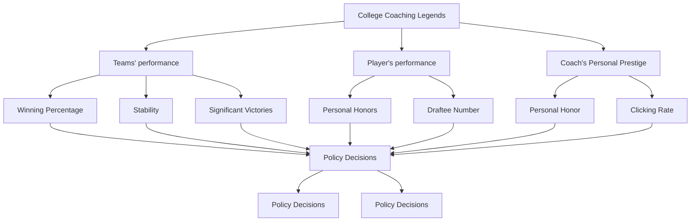

For office use only

T1

T2

T3

T4

Team Control

Number

26911

Problem Chosen

B

For office use only

F1

F2

F3

F4

## Who is the Centennial Best Coach?

In this paper, we present a three-stage comprehensive evaluation model. Firstly, in the light of the common sense and logical analysis, we deduce a detailed Assessment Metrics set (Winning Percentage, Stability, Championship Number, Personal Awards, Clicking Rate, Players’ Honors, Draftees by the professional league) and convert some abstract concepts to quantized and concrete values by utilizing unique methods including Google Trends to aid in our analysis. Then to simplify the following work, we filter the coach candidates according to the shared characteristics of excellent coaches and modify the index value with various methods. What’s more, as to the timeline deviation, two modification models are proposed for our google trends statistics, a linear-fitting model and a weighted-sum model included.

Secondly, a model combining Analytical Hierarchy Process (AHP) and a novel method called Max Entropy Model (Maxent) based on Grey Relation Analysis (GRA)is applied in order to calculate both the subjective and objective weights. In our model, AHP diminishes the possible deviation of subjective weights, and Maxent based on GRA renders an insight into the intrinsic statistics and objective weights concerned are in turn provided.

In the final stage, we combine both weights mentioned above together to obtain the final comprehensive weights and in turn render the final ranking. According to relevant documents, our ranking results are fairly credible.

Besides, we apply sensitive analysis to our model and test our model in women’s volleyball. The outcome of the model proves the robustness and universality in our model.

## Key words:

Timeline deviation compensation AHP Maxent GRA

## 1 Introduction

When we are sitting on bleachers, cheering for a college football bowl game held in an immense college stadium, the hero behind the scenes should always be kept in our heart-the coach. Different coaches display their unique skills in training and communicating with their players, and, in the meantime, accomplish different achievements in their career.

Different people hold distinct standards for the best coach all time. Much too subjective factors are involved in the personal evaluation of the ’best’. In this paper, however, we focus on figuring out a more objective and convincing approach to evaluating the best coach ever in the past century (1900-Now) .Considering the fact that a large proportion of this problem depends on the subjective factors, we build the following model in order that some implicit information lurking in the problem can also be utilized to make the approach more robust and convincing:

Step 1:According to the characteristics of the sports, we set the fundamental assessment metrics in this problem and browse the Internet to obtain the relevant statistics.  
Step 2:Apply an improved Analytical Hierarchy Process (Synthesis Hierarchy Process) to this problem and calculate the subjective weights in the evaluation problem.  
• Step 3:Combine Grey Relational Analysis (GRA) Model and Max Entropy Model (MaXent) in Information Theory to provide a detailed insight into the objective weights.  
Step 4: Render the comprehensive assessment value of each candidates in this problem according to the subjective& objective weights and the relevant statistics in this problem and provide the best college coach all time in turn.

## 2 Background

American competitive sports are categorized to Professional Sports and Amateur Sports. The former is in the charge of each professional clubs while the latter is mainly under the management of American Olympic Committee (AOC). American Olympic Committee divides its members into four groups which are respectively marked by ABCD. The group marked by B consists of the National Collegiate Athletic Association (NCAA) which is directly responsible for all kinds of intercollegiate games. Owing to the great enthusiasm of the college for the sports and the large scale of the athletic teams in each school, the NCAA is thus a considerably enormous organization which is then subdivided into three divisions and dozens of leagues, where football, basketball, baseball, volleyball and some track and field games are held annually.[1]

The different location in the divisions is a direct indicator of the level of this college’s athletic teams. Not only does the division I school pour more investment to the sports teams but they are also capable of recruiting more potential players and more excellent coaches in the meantime.

Hence, an assumption can be made about this problem that the division one school in NCAA has greater strength in the athletic games and symbolizes the highest level among the American colleges.[2]

## 3 Model Assumptions and Definitions

## 3.1 Model Assumptions

Top five coaches must be in the top divisions of NCAA (Division I for Baseball and Basketball, Division I-A for Football).  
The searched frequency of a coach on Google is in direct proportion to the prestige of him (her).  
The searched frequency is a nonlinear function of the current time and the coach’s retiring time.  
• The number of websites returned by the Google search engine concerning an award name for the coach is in direct ratio with the importance of it.  
All the football championships of the same sport used in our model have the identical significance.  
All the awards received by the players in one sport all used in our model to estimate a coachs ability of cultivating players can be seemed equally.  
• The number of websites returned by the Google search engine concerning an award name for the coach is in direct ratio with the importance of it.

## 3.2 Parameter Definitions

m: Number of the evaluation index;

n: Number of the evaluation object;

$y_{i}(k)$ : the $k^{th}$ index value of evaluation object i; $x_{i}(k)$ : the normalized $k^{th}$ index value of evaluation object i; $x_{0}(k)$ : the ideal sequence in Grey Relation Analysis $\Delta_{i}(k)$ : Absolute difference $\gamma(x_{i}(k), x_{0}(k))$ : grey relation coefficient $q_{i}(k)$ : grey relation depth coefficient $w_{j}$ : the weight of the $j^{th}$ index in the second model(GRA&Maxent) $v_{j}$ : the weight of the $j^{th}$ index in the first model(AHP) $z_{j}$ : the comprehensive weight of the $j^{th}$ index $R_{i}$ : the $i^{th}$ coach's renewed ranking after the weight is altered $Q_{i}$ : the $i^{th}$ coach's ranking before the weight is altered.
EI: absolute entropy increment
SI: relative entropy increment

## 4 Assessment Metrics

To provide a detailed evaluation mechanism for the best college coach in a certain sports, we first divide the influencing factor to three main parts, the performance of the teams, the capacity of cultivating & recruiting the players and the personal prestige of the coach. The three leading factors are then subdivided into some more detailed indexes.

## 4.1 Teams’ Performance

Undoubtedly, the prior factor in determining the overall level of a coach is the professional level of him (her). The most direct indicator of the level is the professional performance of the team.

## 4.1.1 Winning percentage in his (her) career

The most explicit indicator of the strength of a team is the statistical records in various competitive games, which in the meantime, can largely reflect the professional level of this coach. As is widely known, NCAA divides its members into different divisions and leagues.[2] These diverse divisions and leagues also indicate teams’ diverse levels and strengths in competitive sports. Hence, the division and the league the college is in should not be taken for granted in this issue. Thus, different weights must be applied to the statistics in the preprocessing of the winning percentage according to the Division the team is in. We browse on the Internet for the top winning percentage records holders.[3][4][5][6][7]

## 4.1.2 Stability of the team’s performance

The stability of the performance should also be a main concern of us when analyzing the performance of the team. If a coach cannot keep the good performance of the team, but usually leads to great ups and downs of a team, then he (she) cannot be recognized as the ’best’ as well.[7]

## 4.1.3 Number of victories in significant games

Because of the special game system of NCAA, different games have diverse importance. Thus, considerations should be taken into about the difference be tween the weight of the games.

## 4.2 Player’s performance

Great coaches should also have great insight when recruiting the candidates of the team members, since the main role of the coach is selecting the seed players for the team and motivating the players.

## 4.2.1 Professional honors of the players

On the one hand, in competitive sports, some personal honor is also awarded to the talented and eye-catching players in the game.[8][9][10][11][12]

On the other hand, another indispensable element in assessing a coach’s leading ability is number of the players drafted by the professional athletic league in US.[13][14][15]

## 4.2.2 Academic Progress Rate(APR)

Despite the great emphasis on the sports teams, the majority of the colleges are still aimed at improving the overall academic performance of the students,especially for those Division I schools. Thus, Academic Progress Rate(APR) is recently in troduced by NCAA to evaluate the overall level of the player’s academic per-

formances, which in turn aids in the assessment of the player’s comprehensive qualities.[16]

## 4.3 Personal Prestige

We believe that it suffices to say that a superior college coach possesses good prestige. Nonetheless, there is no denying that great difficulty exists in the quantization of the ’prestige’ since it is a relatively abstract concept. In the following model, we figure out approaches to converting the abstract intangible concepts to some concrete number indexes.

## 4.3.1 Awards Received

The personal honors awarded to the coaches symbolize recognition from the professional committee, the media and the public. Organizations and media also award coach of the year to the eye-catching coach that year. But considerations should be taken about the diversity of the award’s weight.[17][18][19][20][21][22][23][24][25] [26][27][28][29][30]

## 4.3.2 Searched times (By Google Trends engine)

## Google Trends engine

cite31 is a public web facility of Google Inc., based on Google search, that shows how often a particular search-term is entered relative to the total search-volume across various regions of the world, and in various languages.[wiki] If a coach is searched more frequently, then assumption can be made that he is a ’popular’ and good coach in time. Utilizing Google Trends engine to obtain the relevant number of searched times.

## 4.4 Others Metrics

Apart from the metrics mentioned above, some seemingly insignificant factors might also contribute to the evaluation of the coach.

Scandal involved  
Outstanding historical contribution

Money manipulating rights  
Salary

However, these factors are too abstract to be quantized, which means that they can hardly be utilized in our model.

## 5 Models

## 5.1 Preliminary Filtering of the Candidates Coach:

Due to the great amount of the existent data, simplification is required to make it executable. We first find out the coaches working for the Division I teams (Division I-A for college football) who ranks the top 20 in winning percentage and have a minimum training age of 10 years.

## 5.1.1 Pre-Standards for filtering

When we are assessing the best college coach of the century, huge amount of database statistics hinders the manual selection of the outstanding ones. Thus, firstly, the shared good characteristics of the excellent coaches are the filter standard to provide easier and simpler method of later data processing.

Considering the special arrangement of NCAA’s games and the common standard in evaluating an athletic coach, winning percentage and division location of the team are the two pre-standards in filtering. The assumption stipulated here puts that the top 5 coaches must have a winning percentage record among the top 20 and work for the top-division teams in his (her) career.

## 5.1.2 Examination of the potential scandals

In both the competitive sports and the personal private life of the coaches, scandals are occasionally revealed about the coach which can soon ruin the status of the him (her) completely. Thus, an extra examination should not be taken for granted about the morality of the coach. After the examination, none of the candidates are found to involve in scandals.

## 5.2 Data Preprocessing

## 5.2.1 Preprocessing of Index Values

The Championship of a Coach When calculating the championships of a team, one important thing should be noted that the data collected in this problem is all in the division I, which means that the basis of our analysis is set in the top level division. Despite the slight difference in various championship games’ importance degree, it can still be assumed that these games have the identical significance in this problem . For instance, in college football, there exist six bowl games championships, namely, the Rose Bowl, the Orange Bowl, the Sugar Bowl, the Cotton Bowl, the Chick-fil-A Peach Bowl and the Fiesta Bowl.

The Personal Honor of a Player When collecting the personal awards data of a player, we firstly browse all kinds of awards for the players and search the database for the coach when the honor was awarded. In the realistic analysis of the data collected here, there is a considerably wide range of player awards annually and a long list of players in the meantime. Due to the tediousness of the information and the relatively slighter weight in this index, assumption can be made that all the awards can be seemed equally to simplify the problem. The absolute statistical number of awards can therefore symbolize the honor of a player.

The Number of Draftees into Later Professional League The number of draftees into later professional league symbolizes a coach’s ability to foster a potential player and supply seed players to the higher level of professional career. Be cause of the lack of the available information about all players drafted to coach and the infeasibility of data processing, we simplify the problem by only taking the first overall draft picks into consideration. The information about the first overall draft picks, can add to the personal honor of a player and symbolize the overall draft pick data to some extent.

The Personal Honor of a Coach When counting the honors and awards of the 20 candidate coaches. However, different honors usually have diverse significance. Compared with the analyzing method in players’ awards, the coach’s honor has direct relationship with the overall level of a coach. Thus, the significance of the individual awards is calculated according to the number of websites returned by Google Search.

After the number of websites returned is obtained, a normalized method is calculated to derive the relative weights of each award. Define the number of websites as ,,then the weights of the awards are calculated by the following expression.Then, the weighted sum method is applied to the awards number and the relative index value of the coach is in turn obtained.

## 5.2.2 Modification of the Timeline

Modification of Google Trends Data An inevitably tough problem is bound to happen when we are ranking the top college coach over the past century in terms of coach’s personal prestige, that is, the deviation brought about by the timeline. On the one hand, with time elapsing, the once prominent coach stands a good chance to fade the public. On the other hand, the popularity of the Internet also experiences great ups during the recent decades along the positive direction of the timeline. Both of the two factors mentioned above undermine the prestige of the early coach. To revise the model, we put forward two possible amending and compensating methods. Undoubtedly, the deviation resulting from the timeline cannot be completely removed. However, the credibility and objectiveness are sure to be improved.

## Timeline-Modification Method based on Weighted Relative Searching Popularity (WRSP)

Generally speaking , the attention on the coaches vary in different times due to some unique historic background, namely, war, financial recession or some significant revolution in this sport. Thus, if we only analyze the absolute attention degree of a college coach, deviation will happen.

According to the analysis mentioned above, assumption can be made about this problem that the most outstanding coach in each era has approximately close public influence. Hence, the WRSP based modification method is rectified in the following two aspects:

Figure out ratio of the popularity index (relative searched times)the most popular coach in each era and the most popular one in recent decades.  
Refresh and rectify the statistics by multiplying the searched times in early era and the ratio.

## Timeline-Modification Method based on Compensational in Two Variables.

Not only does Google Trends provide the relative popularity index of the key words in the individual search boxes, it also sketches the relative search record curve from 1994-2014. Search record curve reflects people’s attention on the searched coach and the trends of the popularity of the coach to some extent.The decade in this period can reflect the prestige of the coaches to some extent. Further analyzing leads to a classification of clicking rates trends into 4 categories.

A slowly declining trend.  
A stable trend  
A declining trend following a climb.  
Very low clicking rates.

Some assumptions are made about the most outstanding coaches through the analysis of the curve:

1. For a coach before the Internet era, the clicking rates should be declining slowly because of the fewer opportunities for them to be known. For instance, for Knute Rockne, a college football coach,coaching from 1918-1930, the curve is shown in the following figure.

line chart

| Year | Value |
| ---- | ----- |
| 2005 | G     |
| 2006 | F     |
| 2007 | E     |
| 2008 | D     |
| 2009 | C     |
| 2010 | B     |
| 2011 | A     |

Figure 1: Google Trends Trend Sketch of Knute Rockne(1918-30)

2. Those who haven’t access to Internet until retiring’s clicking rates should remain stable, since that when a well-known coach retires, the social influence will witness an apparent declination. However, during the period between 2004- 2014, a considerable number of people still have knowledge of the coach, thus the clicking rate will not change a lot. A peak might exist in this kind of trend especially in his or her retiring time.For example,Mike Krzyzewski,a college basketball coach who retired in 2010,has the following trend sketch.

line chart

| Year | Value |
| ---- | ----- |
| 2005 | N     |
| 2005 | M     |
| 2007 | L     |
| 2009 | K     |
| 2011 | H     |
| 2011 | G     |
| 2011 | F     |
| 2012 | E     |
| 2013 | B     |
| 2013 | A     |

Figure 2: Google Trends Trend Sketch of Mike Krzyzewski(1976-2010)

3. For those who are still coaching till now, the trend will exhibit a regular ups and downs and in the long time span between 2004-2014, conspicuous declining or inclining trend won’t happen.

Our initial intent if to compensate the deviation derived from the difference of the time and attempts are made to find a linear or nonlinear fitting function. However ,because of the limited data, we didn’t obtain an ideal outcome. We eventually decide to take it as an examinational standard for a ’best coach’, with relatively small weight in the evaluation system.

Modification of Coach Awards Data From the awards data analysis,there is an apparent fact that almost all awards do not start from the same year.For a college sports coach, if he was in the time when few coach honors are awarded to the talented, then if we continue with our former analytical index calculation, bias and injustice will bring about considerable deviation to our model index analysis. In order to attenuate the influence of the timeline on the prestige of the coach, a modification approach is applied to the problem here.

In different time, the awards set for the coaches, the number of the games and the recognition of the coach vary. Thus, when we are assessing the best coach, it is necessary to provide some compensation for the deviation due to the difference of time.

1. Modify the deviation of awards’ number Because the time awards are set is different from each other, thus the probability for the coach to win the award varies in the meantime. To compensate for the deviation, we set the ratio between the coach’s award number and the total number of awards when the coach was still coaching.  
2. Modify the deviation of champion number Due to the different number of games held in different time, the absolute number cannot symbolize the competence of the team accurately. Thus a comparative value is defined as the ratio between the champion number of the coach and the total champion number.  
3. Modify the deviation of clicking rates. Because the internet does not appear until the recent decades, the recognition of the coaches by the public varies. In order to compensate for this deviation, an index is set as the multiplication of the clicking rate and the retiring year of a coach.

## 5.3 Subjective Weights Analysis: Analytical Hierarchy Process (AHP)

Analytical Hierarchy Process (AHP) is a policy decision method which quantizes the subjective factors.[31] It aims at judging the importance degree between the two indexes and therefore simplifying a complex problem by decomposing the problem to several hierarchies and factors. Then, by examining the consistency of the pairwise matrix, we can minimize the evaluation deviation deriving from the subjective factors and thus render a more reasonable and convincing evaluation scheme systematically.[32]

In this problem, in light of the relevant index analysis mentioned above, the following Index Hierarchy Relationship Figure is displayed in Figure As is vividly shown in Figure 2, AHP provides a systematic assessment of the problem and renders a detailed analysis of the weights for each index.

flowchart

Figure 3: The Hierarchy of the Evaluation System in AHP

## 5.4 Objective Weights Analysis: Combined Method of Grey Relation Analysis based on Grey Relation Depth Coefficient and Max Entropy Model(Maxent)

After the subjective weight analysis based on Analytical Hierarchy Process(AHP), Grey Relation Analysis (GRA)[33]and Max Entropy Model(MaxEnt)[34] are then applied to the evaluation problem for the analysis of objective weight so as to fully exploit the hidden information. In the mathematical evaluation model, the observation sequence is set as the behavior sequence and a new concept defined as the grey relation depth coefficient (GRDC) is put to improve the model. The Max Entropy model is naturally built based on the GRDC to derive the objective weight in view of MaxEnt Configuration Model(MCM). This combined

application of three models better broadens the horizon for the comprehensive evaluation and provides an exhaustive relational degree between the evaluation objects and the evaluation indexes.

Grey relational Analysis (GRA) is a multi-factor analytical method. It describes the relationship between the factors in line of the gray relation degree. It utilizes the degree of similarity between the geometrical shapes to judge the extent to which the sequences are related. The closer the curve is, the closer the relationship is too, and vice versa. Ideal sequence provided, which means a good standard is set for the evaluation model , we can thus assess a policy decision’s merits by measuring the similarity of the sequence of the policy decision and that of the given ideal one.

Max Entropy Model(Maxent) The principle was first expounded by E.T. Jaynes in two papers in 1957 where he emphasized a natural correspondence between statistical mechanics and information theory. In information theory, information entropy signifies the amount of the information, which inspires a new approach in maximize the usage of the information in statistical analysis. In actual, we always wish that we can retain the information itself and its uncertainty. Based on Maxent, speculations can be made about the possible distributional model and lurking information can be fully exploited.

In our model, we combine the two model mentioned above- GRA and Maxent to fully exploit the existent information in our statistics.

$$
Y = \left( \begin{array}{c c c c} y _ {1} (1) & y _ {2} (1) & \dots & y _ {n} (1) \\ y _ {1} (2) & y _ {2} (2) & \dots & y _ {n} (2) \\ \vdots & \vdots & \ddots & \vdots \\ y _ {1} (m) & y _ {2} (m) & \dots & y _ {n} (m) \end{array} \right) \tag {1}
$$

Because of the difference between the property and the dimension, a standardizing process is needed to standardize the evaluation matrix. In actual problems, properties can be categorized into three groups:

which is further described by the following expressions:

$$
x _ {i} (k) = \frac {y _ {i} (k) - \min _ {i} y _ {i} (k)}{\max _ {i} y _ {i} (k) - \min _ {i} y _ {i} (k)} \tag {2}
$$

we can then derive the standardized evaluation matrix as

$$
X = \left( \begin{array}{c c c c} x _ {1} (1) & x _ {2} (1) & \dots & x _ {n} (1) \\ x _ {1} (2) & x _ {2} (2) & \dots & x _ {n} (2) \\ \vdots & \vdots & \ddots & \vdots \\ x _ {1} (m) & x _ {2} (m) & \dots & x _ {n} (m) \end{array} \right) \tag {3}
$$

Now the preparing work has been finished and a standardized suitable for later data processing has been obtained. $\mathrm { N e x t , w e }$ calculate the Grey Relation Coefficient(GRC) concerning this problem. We reset $X _ { i } = x _ { i } ( k ) | k = 1 , 2 , . . . , m ( 1 , 2 , . . . , n )$ as the new system behavior sequence and $X _ { 0 } = ( x _ { 0 } ( 1 ) , x _ { 0 } ( 2 ) , . . . x _ { 0 } ( m ) )$ as the ideal sequence, than we have the following expression to define the grey relation coefficient between $X _ { i }$ and $X _ { i }$ as:

$$
\gamma (X _ {i} (k), X _ {0} (k)) = \frac {\Delta_ {\min} + \rho \Delta_ {\max}}{\Delta_ {i} (k) + \rho \Delta_ {\max}} \tag {4}
$$

where

$$
\Delta_ {\min} = \min \left| x _ {i} (k) - x _ {0} (k) \right| \tag {5}
$$

$$
\Delta_ {i} (k) = \left| x _ {i} (k) - x _ {0} (k) \right|. \tag {6}
$$

$$
\Delta_ {\max} = \max | x _ {i} (k) - x _ {0} (k) |, \tag {7}
$$

After we have obtained the Grey Relation Coefficients, the degree of relationship between the indexes can be quantized. However,in order to construct the indexweight model, further data processing is required to quantize the inner-relation between the sequence elements. Another concept is then put forward to reflect the relative importance of the indexes in the evaluation sequences.

$$
q _ {i} (k) = \frac {\gamma (X _ {i} (k) , X _ {0} (k))}{\sum_ {i = 1} ^ {n} \gamma (X _ {i} (k) , X _ {0} (k))} \tag {8}
$$

$$
D (k) = \frac {1}{n} \sum_ {i = 1} ^ {n} (q _ {i} (k) - \frac {1}{n}) ^ {2} \tag {9}
$$

where $q _ { i } ( k )$ is the Gray Relation Depth Coefficients(GRDC).

In line of the former analysis, the range of a certain index’s weight can be determined by the Grey Relation Depth Coefficient, thus, the weight’s range can be expressed as below.

$$
w _ {k} \in [ \min (q _ {i} (k)), \max (q _ {i} (k)) ], \tag {10}
$$

$$
i = 1, 2, \dots , n,
$$

$$
k = 1, 2, \dots , m.
$$

The range of the variance of the weight should also be taken into consideration and its range is also directly related to the GRDC.

$$
\frac {1}{m} \sum_ {k = 1} ^ {m} (w _ {k} - \frac {1}{m}) ^ {2} \subset (\min (D (k)), \max (D (k))) \tag {11}
$$

$$
k = 1, 2, \dots , m
$$

Combining the analysis mentioned above, a Max Entropy Model of the index’s weight can be constructed as follows. It is equivalent to an Optimal Programming Problem(OOP) and it can be proved that this programming problem has an optimal solution.

$$
\max \quad F = - \sum_ {k = 1} ^ {m} w _ {k} \ln w _ {k} \tag {LP}
$$

$$
\text { s.t. } \quad \sum_ {k = 1} ^ {m} w _ {k} = 1, \tag {12}
$$

$$
w _ {k} \subset (0, 1),
$$

$$
w _ {k} \in [ \min (q _ {i} (k)), \max (q _ {i} (k)) ],
$$

$$
\frac {1}{m} \sum_ {k = 1} ^ {m} (w _ {k} - \frac {1}{m}) ^ {2} \subset (\min (D (k)), \max (D (k)))
$$

## 6 Results

From the information mentioned above, by following the steps of the model, we can finally figure out both the AHP weight and the Maxent&GRC Weight. The value of the weight’s elements are sequentially Winning Percentage,Variance,Team championship,Player Award,Player draftees to professional league,Personal Honor,Clicking Rate on Google

According to the expression:

$$
z _ {j} = \frac {w _ {j} v _ {j}}{\sum_ {j} w _ {j} v _ {j}} \tag {13}
$$

We can derive the value of the comprehensive weight z.

The three weights of the three sports and the top coaches according to our evaluation system are listed in the following tables respectively.

<table><tr><td>Ranking</td><td>Football</td><td>Basketball</td><td>Baseball</td></tr><tr><td>1</td><td>Tom Osborne</td><td>John Wooden</td><td>Cliff Gustafson</td></tr><tr><td>2</td><td>Knute Rockne</td><td>Roy Williams</td><td>Bobby Winkles</td></tr><tr><td>3</td><td>Fielding Yost</td><td>Adolph Rupp</td><td>John Barry</td></tr><tr><td>4</td><td>Frank Leahy</td><td>Mike Krzyzewski</td><td>William Spaulding</td></tr><tr><td>5</td><td>Bear Bryant</td><td>Clair Bee</td><td>Bibb Falk</td></tr></table>

Table 1: Top 5 College Coaches

<table><tr><td>Parameter</td><td>Weight</td></tr><tr><td>AHP Weight</td><td>(0.28,0.11,0.25,0.08,0.03,0.20,0.07)</td></tr><tr><td>Maxent &amp;GRC Weight</td><td>(0.14,0.10,0.25,0.29,0,0.08,0.14)</td></tr><tr><td>Comprehensive Weight</td><td>(0.25,0.07,0.38,0.14,0,0.10,0.05)</td></tr></table>

Table 2: Weights of the Evaluation System in Football

<table><tr><td>Parameter</td><td>Weight</td></tr><tr><td>AHP Weight</td><td>(0.28,0.11,0.25,0.08,0.03,0.20,0.07)</td></tr><tr><td>Maxent &amp;GRC Weight</td><td>(0.14,0.13,0.10,0.15,0,0.30,0.19)</td></tr><tr><td>Comprehensive Weight</td><td>(0.24,0.09,0.16,0.08,0,0.36,0.08)</td></tr></table>

Table 3: Weights of the Evaluation System in Basketball

<table><tr><td>Parameter</td><td>Weight</td></tr><tr><td>AHP Weight</td><td>(0.28,0.11,0.25,0.08,0.03,0.20,0.07)</td></tr><tr><td>Maxent &amp;GRC Weight</td><td>(0.18,0.25,0.19,0.16,0.10,0,0.11)</td></tr><tr><td>Comprehensive Weight</td><td>(0.35,0.19,0.32,0.09,0.02,0,0.05)</td></tr></table>

Table 4: Weights of the Evaluation System in Baseball

## 7 Model Testing

The change of the results arising from the slight variation of the model weights is applied to aid in the analysis of sensitivity.

## 7.1 Sensitivity Analysis

## 7.1.1 Sensitivity Analysis of Grey Relation Analysis based on Max Entropy Model

According to the change of the rankings, the concept of Entropy Increase(EI) is introduced to the evaluation system.

The entropy increase is defined as the relative average increment in the ranking after the weights are slightly altered.

$$
E I = \frac {1}{2 0} \sum_ {i = 1} ^ {2 0} (R _ {i} - Q _ {i}).
$$

where $R _ { i }$ denotes the $n ^ { \mathrm { t h } }$ coach’s renewed ranking after the weight is altered, while $Q _ { i }$ denotes the ranking before the alternation.

Take the baseball for example, when the weight of the variance is increased by 20%, the EI will be 0.2. Hence,the Sensitivity Index(SI) of this model will be

$$
S I = (0.2 \div 20)\% = 0.01\% \tag{14}
$$

The Sensitivity Index shown above means that when the weight of variance is increased by 1%,the EI will in turn increase by 0.01%. Thus, conclusions an be made that the sensitivity of Grey Relation Analysis based on Max Entropy Model and the slight variation of the model’s weight has minor effects on the outcomes of our model.

## 7.1.2 Sensitivity Analysis of Analytical Hierarchy Process

In the same context as the last section, we recalculate the sensitivity index of the Analytical Hierarchy Process model, which leads to the result:

$$
S I = (0.1 \div 20) \% = 0.005 \% \tag{15}
$$

Similarly,we can conclude that the variation of parameters in the weight has minor influence on the results and our model is very robust.

## 7.2 Universality Testing

We apply our model to the college volleyball coaches and render the following rankings.

<table><tr><td>Ranking</td><td>Coach</td><td>College &amp; Tenure</td></tr><tr><td>1</td><td>Russ Rose</td><td>Penn St. 1979-11</td></tr><tr><td>2</td><td>Don Shaw</td><td>Stanford 1984-99</td></tr><tr><td>3</td><td>John Dunning</td><td>Pacific 1985-00,Stanford 2001-11</td></tr><tr><td>4</td><td>Mick Haley</td><td>Texas 1980-96,Southern California 2001-11</td></tr><tr><td>5</td><td>Dave Shoji</td><td>Hawaii 1975-11</td></tr></table>

Table 5:Top 5 Women's Volleyball College Coaches

## 8 Strengths and Weaknesses

## Strengths

• We apply an improved novel concept Grey Relation Depth Coefficient (GRD-C) into the Grey Relation Analysis and combine the subjective and objec tive weights together to render a more convincing and efficient evaluation model.  
Multiple Internet tools are utilized to convert the abstract and unquantizable index to numerical values.i.e.the master use of Google Trends and Google Search Database.  
The two models are proved to be robust to variation of index values and the comprehensive evaluation results are proved to be consistent with the reality according to the existent documents.

## Weaknesses

In the competition involving multiple teams, winning percentage does not make sense in assessing the team’s performance.Extra adjustments of processing data will be required under that circumstances.  
When calculating the comprehensive weight, we suppose that Maxent and AHP have same importance to simplify problem.However,things might be much more complicated in reality.  
Model’s outcome greatly depends on given statistics.Thus,the outcome might not be robust if lots of information is lost.

## References

[1] http://en.wikipedia.org/wiki/National\_Collegiate\_ Athletic\_Association.  
[2] http://baike.baidu.com/view/68509.htm.  
[3] http://baike.baidu.com/link?url=pciZbXKhxFyFNtvdnrFMtYoYhwCFwvvErTV  
[4] http://fs.ncaa.org/Docs/stats/football\_records/DI/ 2010/Coaching.pdf.

[5] http://fs.ncaa.org/Docs/stats/basketball\_records/DI/ 2010/Coaching.pdf.  
[6] http://fs.ncaa.org/Docs/stats/baseball\_records/DI/ 2010/Coaching.pdf?.  
[7] http://web1.ncaa.org/stats/StatsSrv/careersearch.  
[8] http://en.wikipedia.org/w/index.php?search=john+woody+ award+&button=&title=Special%3ASearch.  
[9] http://en.wikipedia.org/wiki/Naismith\_College\_Player\_ of\_the\_Year.  
[10] http://en.wikipedia.org/wiki/Oscar\_Robertson\_Trophy.  
[11] http://en.wikipedia.org/wiki/Naismith\_College\_Player\_ of\_the\_Year.  
[12] http://en.wikipedia.org/wiki/NABC\_Player\_of\_the\_Year.  
[13] http://en.wikipedia.org/wiki/NBA\_draft\_first\_pick.  
[14] http://en.wikipedia.org/wiki/List\_of\_first\_overall\_ NFL\_draft\_picks.  
[15] http://en.wikipedia.org/wiki/List\_of\_first\_overall\_ MLB\_draft\_picks.  
[16] http://en.wikipedia.org/wiki/Academic\_Progress\_Rate.  
[17] http://en.wikipedia.org/wiki/Atlantic\_Coast\_ Conference\_Men%27s\_Basketball\_Coach\_of\_the\_Year.  
[18] http://en.wikipedia.org/wiki/Big\_12\_Conference\_Men% 27s\_Basketball\_Coach\_of\_the\_Yearhttp://en.wikipedia. org/wiki/Colonial\_Athletic\_Association\_Men%27s\_ Basketball\_Coach\_of\_the\_Year.  
[19] http://en.wikipedia.org/wiki/Associated\_Press\_College\_ Basketball\_Coach\_of\_the\_Year.  
[20] http://en.wikipedia.org/wiki/Clair\_Bee\_Coach\_of\_the\_ Year\_Award.  
[21] http://en.wikipedia.org/wiki/Henry\_Iba\_Award.  
[22] http://en.wikipedia.org/wiki/NABC\_Coach\_of\_the\_Year.

[23] http://en.wikipedia.org/wiki/Naismith\_College\_Coach\_ of\_the\_Year.  
[24] http://en.wikipedia.org/wiki/UPI\_College\_Basketball Coach\_of\_the\_Year.  
[25] http://en.wikipedia.org/wiki/Associated\_Press\_College\_ Football\_Coach\_of\_the\_Year\_Award.  
[26] http://en.wikipedia.org/wiki/Paul\_%22Bear%22\_Bryant\_ Award.  
[27] http://en.wikipedia.org/wiki/AFCA\_Coach\_of\_the\_Year.  
[28] http://en.wikipedia.org/wiki/Eddie\_robinson\_coach\_of\_ the\_year.  
[29] http://en.wikipedia.org/wiki/Baseball\_awards.  
[30] http://en.wikipedia.org/wiki/National\_Collegiate\_ Baseball\_Writers\_Association.  
[31] Mikko Kurttila, Mauno Pesonen, Jyrki Kangas, and Miika Kajanus. Utilizing the analytic hierarchy process (ahp) in swot analysisła hybrid method and its application to a forest-certification case. Forest Policy and Economics, 1(1):41–52, 2000.  
[32] Mikko Kurttila, Mauno Pesonen, Jyrki Kangas, and Miika Kajanus. Utiliz ing the analytic hierarchy process (ahp) in swot analysisła hybrid method and its application to a forest-certification case. Forest Policy and Economics, 1(1):41–52, 2000.  
[33] TC Chang and SJ Lin. Grey relation analysis of carbon dioxide emissions from industrial production and energy uses in taiwan. Journal of Environmental Management, 56(4):247–257, 1999.  
[34] R Konig, Renato Renner, and Christian Schaffner. The operational meaning of min-and max-entropy. Information Theory, IEEE Transactions on, 55(9):4337–4347, 2009.

## Magazine Article

In your opinion, who is the best college coach over the past century? Who can be seen as a legend? Just as there are a thousand Hamlets in a thousand people's eyes, I bet your answers are varied. In this article we will provide our best college coach name list with a mathematical model.

With always-high winning percentage in their career, splendid ability of cultivating players, and incomparable personal prestige, they are legends in the history of sports. According to our assessment system, the centennial top 5 best football college coaches are Tom Osborne, Knute Rockne, Fielding Yost, Frank Leahy and Bear Bryant sequentially. The top 5 basketball college coaches are John Wooden, Roy Williams, Adolph Rupp, Mike Krzyzewski, Clair Bee. And the top 5 baseball college coaches are Cliff Gustafson, Bobby Winkles, John Barry, William Spaulding, Bibb Falk.

As can be seen from our description above, we judge a coach’s comprehensive level mainly according to the team’s performance, personal prestige and the player’s performance.

This might trigger a really interesting question for many sport fans: What’s the difference between the public poll and our mathematical model? As a matter of fact, different aspects of emphasis lie in the problem. With the help of our model, we minimize the uncertainty and deviation arising from the subjective factors. Briefly speaking, on one hand, individuals hold different weights for the same index. On the other hand, however, our dear readers should be reminded of the fact that the ones that we are selecting today is ‘best college coach all time’, but not ‘best college coach this time’, since we are more inclined to know more about the contemporary coaches and take those forgotten but still prominent coaches for granted.

In our model, three steps are followed to lead to the final results.

Firstly, determine the evaluation index and the relevant statistical records. For example, when we are assessing the performance of the team, we are prone to evaluating based on personal preference. Nonetheless, in our model, the winning percentage, the stability of the winning percentage and the number of championships are the main concern of us. What’s more, some subjective factors are also included in our evaluation system. For instance, when we are talking about the personal prestige of the coach, we base our index value on the number of personal awards and the relevant popularity. Google trends is utilized to render a comparative popularity index among the coaches. However, considering the fact that the older coach tends to be more difficult to be known by the public, we will compensate the statistics with professional approaches.

Secondly, our weights tend to be more scientific with our application of the mathematical method. As is known to us, when there are a large amount of indexes for evaluation, humans tend to render a less accurate judge. Thus, our method focuses on categorizing the indexes with similar attributes and therefore forms a hierarchy structure to make it more convincing. What’s more, apart from the subjective factors, some lurking information in the data itself can also compensate the model and in turn make the model more robust. The objective weights derived here, combined with the subjective weights, forms the final comprehensive weights.

Finally, combining index values and weights, it is easier to calculate the comprehensive index value of each candidate.

Our model is exactly described as above. Hope you enjoy reading it!