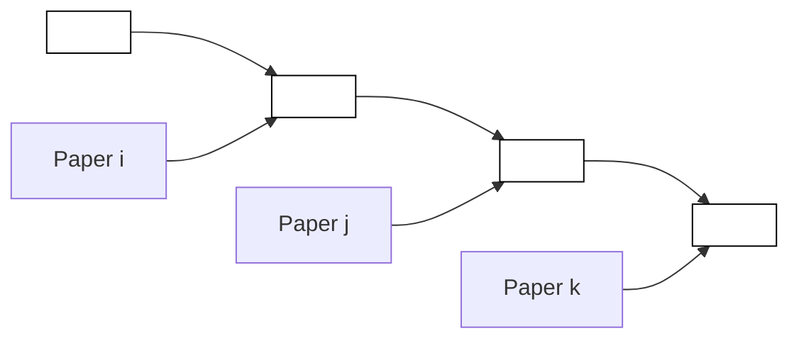
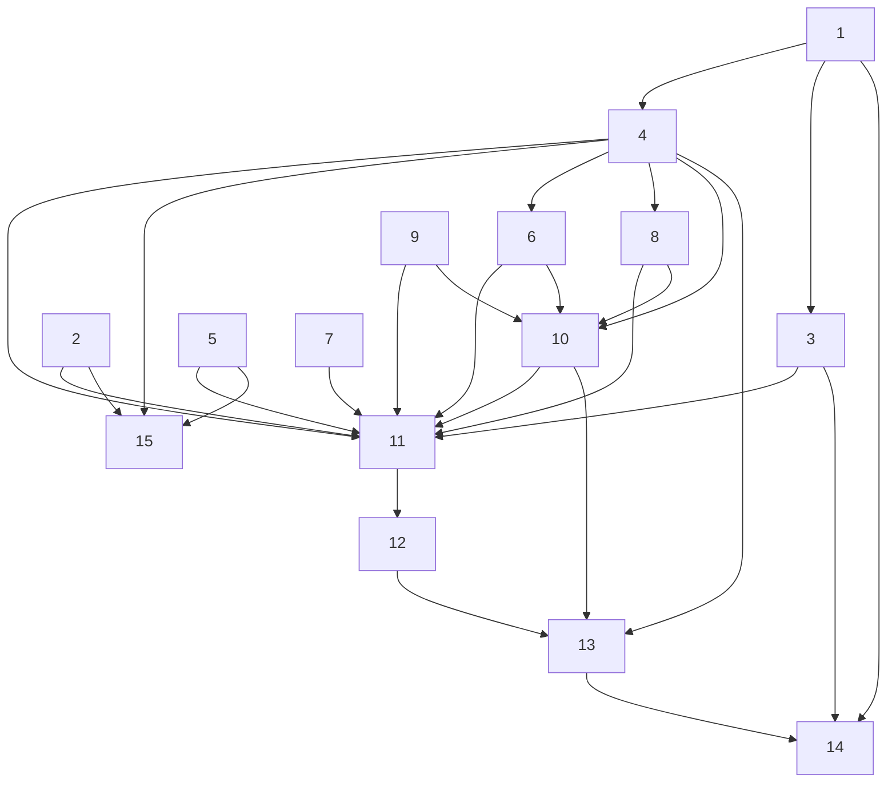
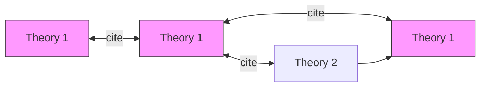

Team Control Number

For office use only

T1

T2

T3

T4

## 27688

Problem Chosen

C

For office use only

F1

F2

F3

F4

## 2014 Mathematical Contest in Modeling (MCM/ICM) Summary Sheet

## The research of influence based on the characteristic of a network

To find the influential nodes in the network, the key is the definition of “influential” and how to measure the influence. In this paper, we use two kinds of metrics to measure the influence of coauthor network and citation network. In coauthor network, both the Authority and Importance of the researchers are proposed to measure the influential of researcher. And the second one in citation network take the citation times, publication time and the position in the network into account.

For the evaluation of coauthor, we first construct a coauthor network with 511 vertices and 18000 edges and it is an undirected graph. Next, we use software UCInet to analyze the degree centrality, eigenvector centrality, closeness centrality and betweenness centrality of the network. Since there is no evident transfer relationship in the coauthor network, we using Authority and Importance to measure the influence of a research. In detail, the Authority is correlated with the coauthoring times with Paul Erdös and the Importance is measured by eigenvector centrality. Finally, we rank the researchers whose authority is larger than 2 according to their importance. And the top 5 most influential researchers are: RODL, VOJTECH; LOVASZ, LASZLO; GRAHAM, RONALD LEWIS; PACH, JANOS; BOLLOBAS, BELA. Finally, we search for some data through websites and verify these people are really influential.

For the evaluation of papers, we first compare the difference between the citation network and coauthor network. According to the characteristic of Directed Acyclic Graph(DAG), we define a contribution coefficient and self-contribution coefficient by making an analogy with the energy transfer in the food chain. Considering the less-effectiveness of PageRank Algorithm and Hits Algorithm, we design an algorithm, which is effective in solving the DAG problem, to calculate the contribution coefficient. We find 3 most influential papers: Paper 14, Paper 4 and Paper 2 in the NetSciFoundation.pdf.

In the third part, we implement our model to analyze a corporation ownership network. We use the value of the company’s cash, stock, real estate, technical personnel, patent and relationships to define its value. And we use the proportion of stock to measure the control ability of parent company. Applying the model and algorithm of citation network, we find 15 influential companies. Then we find that 9 of them are in the top 20 of authoritative ranking, which verifies the rationality of our result.

Finally, we describe how we can utilize these influential models to do some socialized service, to aid in making decision on company acquisition and to carry out strategic attack.

## 1.Introduction

Nowadays, coauthor network and citation network are built to determine influence of academic research. Paul Erdös, one of the most influential researchers who had over 500 coauthors and published over 1400 technical research papers. There exists a coauthor network among those who had coauthored with Erdös and those who had coauthored with Erdös’s directed coauthors.

In this paper, we first analyze this coauthor network and find some researchers who have significant influence. Then, we analyze the citation network of some set of foundational papers in the emerging field of network science. Furthermore, we determine some measures to find some most influential papers. After that, we use the data of US Corporate Ownership to construct a new network and test the applicability of our model and algorithm. Finally, we describe some applications of using the analysis of different networks.

In section 3, the coauthor network is an undirected graph. We first analyze four kinds of centrality: Degree Centrality, Eigenvector Centrality, Closeness Centrality and Betweenness Centrality. Additional, the Degree distribution and Clustering coefficient are also the important properties of the network. Then, we define Authority and Importance to measure the influence of a researcher. Authority can be measured by the coauthoring times with Erdös. It is clearly that the researcher who coauthors with more people is more important. Since this is not a problem about “information flow”, we only consider the influence of those directed coauthor and neglect the transitivity of influence. That is to say, Importance can be measure by Eigenvector Centrality. Finally, we choose some people with higher authority and rank them according to their Eigenvector Centrality.

In section 4, the citation network is different from the coauthor network. As the citation relation is related to publication time, the citation network is a Directed Acyclic Graph(DAG). Traditionally, we calculate the nodes’ importance of a network by using PageRank Algorithm[17] and HITS Algorithm[18]. However, both of them involve matrix multiplication and repeated iterative process, which is less-effective. Since the network satisfies the property of Directed Acyclic Graph(DAG), we draw on the thought of topological sorting to design a more effective algorithm. In this citation network, there exists transitive relation that does not exist in the coauthor network. We first use software UCInet to calculate the centrality of each paper. And then we take these metrics, publication time and times cited count into account to develop a new model. In this model, we learn from the energy transfers in the food chain and define an initial contribution coefficient to measure its authority. In addition, we define a selfcontribution coefficient to measure the influence from other papers. Finally, we design an algorithm to calculate each paper’s final contribution coefficient to measure the paper’s influence.

In section 5, we use nearly 500 US Media Companies to construct an ownership network. Then we set the initial value of each company according to their case, stock, real estate, technical personnel, patent and relationships. And we set a control coefficient to measure the ownership between two companies. Then we can use the algorithm in citation network to find some

influential companies.

In the fourth part, we utilize these influential models to do some social service, aid in making decision on company acquisition and carry out strategic attack.

In general, the article is written follows:

(1) Build a coauthor network for question 1.  
(2) Build the evaluation index of the most influential coauthor to estimate the influence of coauthors in the coauthor network.  
(3) Build citation network and define the influence criterion of papers to estimate the most influential paper.  
(4) Implement our model to the US Corporate Ownership network to analyze the importance and the value of the company.  
(5) Finally, we discuss about the basic theory, the use and effectiveness of the science of network.

## 2.Assumptions and Justification

(1) We use number 1..16 to represent the paper given in the NetSciFoundation.pdf according to their sequence. It is worth mentioning that the information of paper 7 given in the file seems to be wrong. Hence, we regard it as an isolated vertex in the network.  
(2) The researchers’ authority, it is correlated with the coauthoring times with Paul Erdös. In the coauthor network, we know that all of them have coauthored with Erdös and Erdös is such an excellent mathematician. So it is suitable for us to assume that more times coauthored with Erdös, more authority the researcher is.  
(3) We do not consider the influence of the paper’s content and field because the cited times in different fields have no comparability. In question 3 we know that 16 papers are in the emerging field of network science, so it is reasonable for us to simplify this problem.  
(4) When constructing the citation network, we only take those papers citing more than two papers in 16 given papers and also having been cited by other papers. Absolutely, the citation network is infinite. In this paper, we aim to find influential papers. Hence, we give up those less important papers and restrict the scale of our network.  
(5) We assume that the citation relation is effective. If a paper cited other papers, we consider that the author admitted the positively effect of the cited paper. Since the influence of a paper is related to the citation times, our assumption can improve the validity of the result.  
(6) The data in our paper is effective. Our dataset is searched in Web of Science and Google Scholar, which are equipped with high authority.

## 3.Coauthor Network

## 3.1 Building the model

A coauthor network can be built to help analyze the influence of the researchers whose Erdös Number are 1. Obviously, this is a social network. In the network, each node represents a researcher who has coauthored with Paul Erdös and each link could represent the coauthoring relationship between two researchers. Since the coauthor matrix is symmetrical, we know that there is no different between A coauthors with B and B coauthors with A. Therefore, the coauthor network is an undirected network which has 511 vertices. We use software Gephi to draw the graph and the network diagram is shown in Figure 1.


<details>
<summary>network graph</summary>

| Node ID | Connected To (Red) | Connected To (Black) | Connected To (White) |
| --- | --- | --- | --- |
| 1 | 100 | 8 | 6 |
| 2 | 95 | 7 | 5 |
| 3 | 90 | 6 | 4 |
| 4 | 85 | 5 | 3 |
| 5 | 80 | 4 | 2 |
| 6 | 75 | 3 | 1 |
| 7 | 70 | 2 | 0 |
| 8 | 65 | 1 | 0 |
| 9 | 60 | 0 | 0 |
| 10 | 55 | 0 | 0 |
| 11 | 50 | 0 | 0 |
| 12 | 45 | 0 | 0 |
| 13 | 40 | 0 | 0 |
| 14 | 35 | 0 | 0 |
| 15 | 30 | 0 | 0 |
| 16 | 25 | 0 | 0 |
| 17 | 20 | 0 | 0 |
| 18 | 15 | 0 | 0 |
| 19 | 10 | 0 | 0 |
| 20 | 5 | 0 | 0 |
| 21 | 0 | 0 | 0 |
| 22 | 0 | 0 | 0 |
| 23 | 0 | 0 | 0 |
| 24 | 0 | 0 | 0 |
| 25 | 0 | 0 | 0 |
| 26 | 0 | 0 | 0 |
| 27 | 0 | 0 | 0 |
| 28 | 0 | 0 | 0 |
| 29 | 0 | 0 | 0 |
| 30 | 0 | 0 | 0 |
| 31 | 0 | 0 | 0 |
| 32 | 0 | 0 | 0 |
| 33 | 0 | 0 | 0 |
| 34 | 0 | 0 | 0 |
| 35 | 0 | 0 | 0 |
| 36 | 0 | 0 | 0 |
| 37 | 0 | 0 | 0 |
| 38 | 0 | 0 | 0 |
| 39 | 0 | 0 | 0 |
| 40 | 0 | 0 | 0 |
| 41 | 0 | 0 | 0 |
| 42 | 0 | 0 | 0 |
| 43 | 0 | 0 | 0 |
| 44 | 0 | 0 | 0 |
| 45 | 0 | 0 | 0 |
| 46 | 0 | 0 | 0 |
| 47 | 0 | 0 | 0 |
| 48 | 0 | 0 | 0 |
| 49 | 0 | 0 | 0 |
| 50 | 0 | 0 | 0 |
| ... | ... | ... | ... |
| ... | ... | ... | ... |
| ... | ... | ... | ... |
| ... | ... | ... | ... |
| ... | ... | ... | ... |
| ... | ... | ... | ... |
| ... | ... | ... | ... |
| ... | ... | ... | ... |
| ... | ... | ... | ... |
| ... | ... | ... | ... |
| ... | ... | ... | ... |
| ... | ... | ... | ... |
| ... | ... | ... | ... |
| ... | ... | ... | ... |
| ... | ... | ... | ... |
| ... | ... | ... | ... |
</details>

Figure 1: the co-author network

In this graph, the vertex represents a researcher and the edge represents the coauthoring relation. The size of the vertex represents its coauthoring times with Erdös and the darker the color ${ \mathrm { i } } \mathsf { s } ,$ the more people he coauthored with. There are 511 vertices and 18000 edges.

In this network, there are many basic measures and metrics, such as Degree, Centrality, Clustering coefficient, Density, Betweenness and so on. In this paper, we first choose several important measures for analyzing this network and show them as follows. [1]

Of course, the common property is CENTRALITY. Centrality is a crucial metric to evaluate the influence of a vertex. In the following, we discuss several classic Centralities and analyze their difference.

## − DEGREE CENTRALITY

The degree of a vertex in a graph is the number of edges connected to it. We will denote the degree of vertex i by $d _ { i }$ . And the simplest centrality measure, which is called degree centrality $( C _ { d } ) _ { \cdot }$ , is just the degree of a vertex. That means:

$$
C _ {d} (i) = d _ {i}
$$

In a social network, for instance, it seems reasonable to suppose that individuals who have connections to many others might have more influence, more access to information, or more prestige than those who have fewer connections.

##  EIGENVECTOR CENTRALITY

Sometimes, all neighbors of a vertex are not equivalent. Hence, Bonacich[2] puts forward Eigenvector centrality to cope with this situation. It assigns relative scores to all nodes in the network based on the concept that connections to high-scoring nodes contribute more to the score of the node in question than equal connections to low-scoring nodes.

$$
\lambda d _ {i} = \sum_ {j} r _ {i j} d _ {j}
$$

Where: $r _ { i j }$ represents the elements in the adjacency matrix;

$d _ { i }$ represents the degree centrality of vertex  i

Usually, we choose the eigenvector corresponding to the maximal eigenvalue to be the eihenvector centrality( C )[3].

##  CLOSENESS CENTRALITY

Closeness centrality measures the mean distance from a vertex to other vertices, which can used to analyze the position of a vertex in the network[1].

$$
C _ {c} (i) = \frac {\sum_ {j (\neq i)} D _ {i j}}{n - 1}
$$

Where: $D _ { _ { i j } }$ is the distance between vertex  i and vertex j ;

$C _ { c } ( i )$ is the closeness centrality of vertex  i ;

n is the number of vertices.

## BETWEENNESS CENTRALITY

Betweenness centrality measures the extent to which a vertex lies on paths between other vertices[1]. That is to say, a vertex with a higher betweenness centrality plays a more important role in the connection of the network.

$$
C _ {b} (k) = \sum_ {i} ^ {n} \sum_ {j} ^ {n} [ g _ {i j} (k) / g _ {i j} ]
$$

Where: $g _ { i j } ( k )$ represents the number of shortest path between  i and j through  k ;

$g _ { i j }$ represents the number of shortest path between  i and j

Then, we use the UCINET to calculate some basic metrics and show them in table 1.

Table 1: the basic data of centrality

<table><tr><td>type</td><td>Degree</td><td>Closeness</td><td>Betweenness</td><td>Eigenvector</td></tr><tr><td>Average</td><td>1.292</td><td>2.115</td><td>0.461</td><td>3.055</td></tr><tr><td>Minimum</td><td>0.000</td><td>0.196</td><td>0.000</td><td>0.000</td></tr><tr><td>Maximum</td><td>10.392</td><td>2.201</td><td>7.508</td><td>36.515</td></tr></table>

According to the above table and Figure 1, we can know that about 30 vertices have 3 times more than the average degree. That is to say, these researchers have many coauthors. In addition, since the average value of closeness is close to its maximum, we know that there are few vertices in the center of this network. Last but not least, very few vertices play the role of “bridge” because most people have low betweenness centrality.

## 3.2 Find Significant Researchers

## Definition of significant influence

The key to determine who has significant influence is to define the “significant influence”. Traditionally, there are two kinds of vertex playing significant role in the network.

(1)The vertices connect with many other vertices and easy to connect other vertices.  
(2)The vertices connect with very few vertices but they play the role of “bridge”.

Considering this coauthor network is not an “Information flow” problem, we would not take the vertices’ connectivity into account. There are two kinds of coauthor relationship in the network.


<details>
<summary>text_image</summary>

A
B
C Paper i D
</details>


<details>
<summary>flowchart</summary>


</details>

Figure 2: the co-author relationship of $\mathsf { A } , \mathsf { B } , \mathsf { C } , \mathsf { D }$

When A, B, C and D coauthor with each other in the same time, we know that they may coauthor the same paper. That is to say, without A, B, C or D, the paper could not be finished. Hence, each one of them is influential in this network because without the paper i , they may not have coauthor relation. However, if A coauthors with B, B coauthors with C and C coauthors with D, we can know that the coauthoring papers of AB, BC and CD is not the same. Hence, we cannot make the decision that B has significant influence because without B, C also can coauthor with D. In order to simplify the problem, it is reasonable for us to GIVE UP considering those measures about paths.

In this question, the researchers’ influence depends on their authority and “importance”. If many research coauthor with A, it is reasonable that A is important. Furthermore, if many important researchers coauthor with $\mathsf { A } ,$ A is absolutely more important. Hence, we use normalized eigenvector centrality $( C _ { e } )$ to measure their Importance. As for the researchers’ authority, it is positively correlated with the coauthoring times with Paul Erdös. Hence, we use normalized authority( $C _ { a } )$ to measure their Authority.

$$
C _ {a} (i) = \frac {n _ {E i}}{\sum_ {1} ^ {n} n _ {E i} / n}
$$

Where: $n _ { E i }$ represents the coauthoring times between researcher  i and Paul Erdös.

Of course, it is hard to tell who has more significant influence, the researcher with high authority and low importance or the one with low authority and high importance. Therefore, in this coauthoring network, we first choose some researchers with preferable authority( $C _ { a } \geq 2 ]$ .

These researchers must be regarded as excellent expertise in their filed. And then we rank them according to their importance in this network to find some people who have significant influence.

After filtered by the condition $C _ { a } \geq 2$ , there are 52 researchers left. The table below lists the top 20 researches with highest importance.

Table 2: the top 20 researches with highest importance

<table><tr><td>Name(1-10)</td><td> $C_e$ </td><td> $C_a$ </td><td>Name(11-20)</td><td> $C_e$ </td><td> $C_a$ </td></tr><tr><td>RODL, VOJTECH</td><td>32.10</td><td>3.36</td><td>LOVASZ, LASZLO</td><td>21.75</td><td>2.14</td></tr><tr><td>GRAHAM, RONALD LEWIS</td><td>29.15</td><td>8.56</td><td>PACH, JANOS</td><td>20.71</td><td>6.42</td></tr><tr><td>BOLLOBAS, BELA</td><td>28.71</td><td>5.50</td><td>SIMONOVITS, MIKLOS</td><td>19.67</td><td>6.42</td></tr><tr><td>FUREDI, ZOLTAN</td><td>28.69</td><td>3.06</td><td>LUCZAK, TOMASZ</td><td>18.65</td><td>2.14</td></tr><tr><td>TUZA, ZSOLT</td><td>25.81</td><td>3.36</td><td>SOS, VERA TURAN</td><td>18.38</td><td>10.70</td></tr><tr><td>SPENCER, JOEL HAROLD</td><td>24.61</td><td>7.03</td><td>SCHELP, RICHARD H.</td><td>18.33</td><td>12.84</td></tr><tr><td>GYARFAS, ANDRAS</td><td>24.16</td><td>4.59</td><td>KLEITMAN, DANIEL J.</td><td>16.35</td><td>2.14</td></tr><tr><td>SZEMEREDI, ENDRE</td><td>23.73</td><td>8.87</td><td>HAJNAL, ANDRAS</td><td>15.76</td><td>17.13</td></tr><tr><td>FAUDREE, RALPH JASPER, JR.</td><td>22.25</td><td>15.29</td><td>BURR, STEFAN ANDRUS</td><td>14.95</td><td>8.26</td></tr><tr><td>CHUNG, FAN RONG KING (GRAHAM)</td><td>21.91</td><td>4.28</td><td>SARKOZY, ANDRAS</td><td>11.27</td><td>18.96</td></tr></table>

Now we get 20 researchers with significant influence in this network by the analysis of our model. Finally, we test the result by finding some information of these researchers.

## 3.3 Result analysis

In order to test our model and its result, we find some information of the top five researchers. According to their published papers, their job, their title, their lifestyle and who they frequently staying with, we can analyze their influential in qualitative manner.

RODL, VOJTECH[4]:His significant contributions include his work with Jaroslav Nešetřil on Ramsey theory, his proof of the Erdős-Hanani conjecture on hypergraph packing and his development, together with Nagle, Schacht and Skokan (and independently of Gowers), of the hypergraph regularity lemma. He was awarded the Pólya Prize in 2012.

GRAHAM, RONALD LEWIS[5]:He is a mathematician credited by the American Mathematical Society as being "one of the principal architects of the rapid development worldwide of discrete mathematics in recent years". He is currently the Chief Scientist at the California Institute for Telecommunications and Information Technology. He coauthored almost 30 papers with Erdős and always stayed with him.

BOLLOBAS, BELA[6]:He is a mathematician whose first publication was a joint publication with Erdős on extremal problems in graph theory that was written when he was in high school. He had won the Senior Whitehead Prize in 2007. He is one of the world's leading mathematicians in combinatorics and has a huge published output. Britain is now one of the strongest countries for probabilistic and extremal combinatorics in the world: this is almost entirely due to Bollobás's influence.

FUREDI, ZOLTAN[7]: ZOLTAN is a Hungarian mathematician, working in combinatorics and a corresponding member of the Hungarian Academy of Sciences (2004). He is a research professor of the Rényi Mathematical Institute of the Hungarian Academy of Sciences, and a professor at the

University of Illinois Urbana-Champaign (UIUC).

TUZA, ${ \boldsymbol { z } } { \mathsf { s o u T } } ^ { [ 8 ] }$ : He has more than 250 scientific papers in many areas like graph theory, networks, hypergraph theory and so on. And he had won the First Prize at the International Mathematical Olympiad (Poland, 1972). Then he had won the "Institute Prize" and "Publication Award "- Awards of the Computer and Automation Institute / Research Division, for outstanding research work (received in 1982, and nine times since 1988). He had a permanent position at the Computer and Automation Research Institute of the Hungarian Academy of Sciences.

Overall, the most influential researchers given by our model really make much contribution. Hence, it is evident that our result is reasonable.

## 4.Paper Citation Network

In order to analyze the significance of a research paper, we first construct a citation network.

## 4.1 Construct the Citation Network

There are 16 papers in the given file(NetSciFoundation.pdf). We first find their citation relationship.


<details>
<summary>flowchart</summary>


</details>

Figure 3: the citation relationship among the 16 papers

In this graph[10][11], $\mathsf { g r a p h } ^ { [ 1 0 ] [ 1 1 ] } ,$ a vertex reprsents a paper and the edge poingting from 11 to 1 means paper 11 cited paper1. This graph do not only reflect the citation relation, but also reflect the publication time.

Clearly, this is a Directed Acyclic Graph(DAG). Assuming that paper A cited paper B and paper B cited paper C, we can know that C couldn’t cited A because of the publication time. That is to say, the relationship between any two papers satisfies strict partial order relation.

Then, We find some papers which cited more than two papers among these 16 papers and have been cited many times by means of the Web Of Science[11]and Google Scholar[12]. Then, we construct the network according to their citation relationship.


<details>
<summary>network graph</summary>

| Node | Connected To (Node 1) | Connected To (Node 2) | Connected To (Node 3) | Connected To (Node 4) | Connected To (Node 5) | Connected To (Node 6) | Connected To (Node 7) | Connected To (Node 8) | Connected To (Node 9) | Connected To (Node 10) | Connected To (Node 11) | Connected To (Node 12) | Connected To (Node 13) | Connected To (Node 14) |
| --- | --- | --- | --- | --- | --- | --- | --- | --- | --- | --- | --- | --- | --- | --- |
| 1 | Yes | No | No | No | No | No | No | No | No | No | No | No | No | No |
| 2 | Yes | No | No | No | No | No | No | No | No | No | No | No | No | No |
| 3 | Yes | No | No | No | No | No | No | No | No | No | No | No | No | No |
| 4 | Yes | No | No | Yes | No | No | No | No | No | No | No | No | No | Yes |
| 5 | Yes | No | No | Yes | No | No | No | No | Yes | No | No | No | No | Yes |
| 6 | Yes | No | No | Yes | No | No | No | Yes | Yes | No | No | No | Yes | Yes |
| 7 | Yes | No | No | Yes | No | Yes | No | Yes | Yes | No | Yes | No | Yes | Yes |
| 8 | Yes | Yes | Yes | Yes | Yes | Yes | Yes | Yes | Yes | Yes | Yes | Yes | Yes | Yes |
| 9 | Yes | Yes | Yes | Yes | Yes | Yes | Yes | Yes | Yes | Yes | Yes | Yes | Yes | Yes |
| 10 | Yes | Yes | Yes | Yes | Yes | Yes | Yes | Yes | Yes | Yes | Yes | Yes | Yes | Yes |
| 11 | Yes | Yes | Yes | Yes | Yes | Yes | Yes | Yes | Yes | Yes | Yes | Yes | Yes | Yes |
| 12 | Yes | Yes | Yes | Yes | Yes | Yes | Yes | Yes | Yes | Yes | Yes | Yes | Yes | Yes |
| 13 | Yes | Yes | Yes | Yes | Yes | Yes | Yes | Yes | Yes | Yes | Yes | Yes | Yes | Yes |
| 14 | Yes | Yes | Yes | Yes | Yes | Yes | Yes | Yes | Yes | Yes | Yes | Yes | Yes | Yes |
| 15 | Yes | Yes | Yes | Yes | Yes | Yes | Yes | Yes | Yes | Yes | Yes | Yes | Yes | Yes |
| 16 | Yes | Yes | Yes | Yes | Yes | Yes | Yes | Yes | Yes | Yes | Yes | Yes | Yes | Yes |
| 17 | Yes | Yes | Yes | Yes | Yes | Yes | Yes | Yes | Yes | Yes | Yes | Yes | Yes | Yes |
| 18 | Yes | Yes | Yes | Yes | Yes | Yes | Yes | Yes | Yes | Yes | Yes | Yes | Yes | Yes |
| 19 | Yes | No | No | No | No | No | No | No | No | No | No | No | No | No |
| 20 | No | No | No | No | No | No | No | No | No | No | No | No | No | No |
| 21 | No | No | No | No | No | No | No | No | No | No | No | No | No | No |
| 22 | No | No | No | No | No | No | No | No | No | No | No | No | No | No |
| 23 | No | No | No | No | No | No | No | No | No | No | No | No | No | No |
| 24 | No | No | No | No | No | No | No | No | No | No | No | No | No | No |
</details>

Figure 4: network of the papers’ citation relationship

Similarly, this is a Directed Acyclic Graph (DAG) and the relationship between any two papers satisfies strict partial order relation.

## 4.2 Compare the coauthor and citation network

In the coauthor network, we know that it is a social network and it is an undirected graph. However, the citation is a DAG because the citation relation is related to publication time. As they are both complex network, there are some similar characteristic.

In both network, the centrality can be used to measure the importance of a vertex in the network. If a researcher has more coauthor, he is more important in the coauthor network. In the same way, if a paper has been cited many times, it must be important.

However, there are still many differences between them.

In the citation network, there exists transitive relation while in the coauthor network, there does not exist transitive relation.


<details>
<summary>flowchart</summary>


</details>

  
Figure 5: the citation relationship and the coauthor relationship

If A cited B, B cited C, A also influenced C. But if A coauthored with B, B coauthored with C, A would not influence C. Hence, we cannot only use centrality to measure the influence of a paper. It is clear that a foundational paper in one filed may be more influential than those new papers cited many times. In addition, the publication time of a paper also affects its influence.

As a result, we develop a new model to analyze the citation network.

## 4.3 The most Influential Paper(s)

## 4.3.1 Modeling

Similarly, we should consider what influence our evaluation of papers. In general, the times cited count, indirect citation relation, publication time and publication of a paper are related to its influence. In this part, we do not consider the effect of publication alone. The first reason is that there is no authority measures to evaluate a publication. The second reason is the times cited count also partly consider the publication because the paper published in famous publication has more chance to be cited.

To begin with, we use UCInet to calculate the centrality of 16 papers in this network. The respective sequence of Degree Centrality, Closeness Centrality, Betweenness Centrality and Eigenvector Centrality is shown in Table 3.

Table 3: four kinds of centrality

<table><tr><td>In Degree</td><td>Closeness</td><td>Betweenness</td><td>Eigenvector</td></tr><tr><td>4</td><td>2</td><td>11</td><td>14</td></tr><tr><td>2</td><td>11</td><td>2</td><td>4</td></tr><tr><td>14</td><td>4</td><td>4</td><td>1</td></tr><tr><td>11</td><td>14</td><td>12</td><td>8</td></tr><tr><td>10</td><td>8</td><td>13</td><td>10</td></tr><tr><td>8</td><td>10</td><td>10</td><td>2</td></tr><tr><td>13</td><td>9</td><td>8</td><td>9</td></tr><tr><td>9</td><td>13</td><td>16</td><td>11</td></tr><tr><td>3</td><td>1</td><td>6</td><td>3</td></tr><tr><td>12</td><td>12</td><td>1</td><td>13</td></tr><tr><td>16</td><td>3</td><td>9</td><td>16</td></tr><tr><td>6</td><td>15</td><td>14</td><td>12</td></tr><tr><td>1</td><td>6</td><td>15</td><td>6</td></tr><tr><td>15</td><td>16</td><td>3</td><td>15</td></tr><tr><td>5</td><td>5</td><td>5</td><td>5</td></tr></table>

Obviously, the result that measured by these centralities is inconsistent. As these measures just reflect single measure of this network and do not treat each vertex differently. That is to say, Centrality CANNOT reflect the influence of papers comprehensive because it does NOT take the paper’s authority and the transfer effect into account. Hence, we consider improving these measures and developing a new model.

## Contribution coefficient

We know that the distance between two papers is also important. The shorter the distance is, the more influential between two papers. This is quite similar to the energy transfers in the food chain. In the Food Chain, we know that the energy transfers in one way and it decreases progressively in the transfer process. We apply it to build our model.

First, we define a contribution coefficient ( C ) of each paper. And the initial value of those vertices without in-degree is judged by its times cited count and publication time.

$$
C _ {i} = \frac {N _ {\text { cited }} (i)}{t _ {\text { now }} - t _ {\text { pub }} (i)}
$$

Where: $N _ { _ { c i t e d } } ( i )$ represents the times cited count of Paper  i ;

$t _ { p u b }$ ( )  i represents the publication year of Paper  i and $t _ { _ { n o w } }$ represents 2014 here.

Then, we define a self-contribution coefficient(S). If paper A cited paper B and is cited by C, we know that its influence in the network partly relies itself and partly relies on the reference of B. Hence, the influence of these vertices whose in-degree is not zero can be measures by

$$
C _ {i} ^ {\prime} = C _ {i} + \sum_ {p \in V _ {i n} (i)} \frac {C _ {p} (1 - S)}{d _ {o u t} (i)}, V _ {i n} (i) = \{k \mid \text { there   is   an   edge   point   s   from   k   to   i } \}
$$

Where: ${ d _ { o u t } } ( i )$ is the out-degree of the vertex i .

## Algorithm

Traditionally, we calculate the nodes’ importance of a network by using PageRank Algorithm[17] and HITS Algorithm[18]. However, both of them involve matrix multiplication and repeated iterative process, which is less-effective. Since the network satisfies the property of Directed Acyclic Graph(DAG), we draw on the thought of topological sorting to design a more effective algorithm.

After that, we design an algorithm to solve the model. The description of our algorithms is:

Step 1: Give each vertex an initial contribution coefficient according to the above formula.

Step 2: Start from the vertices whose in-degree are 0 and distribute part of their contribution coefficient equally to other vertices which they link to. Then delete them.

Step 3: Repeat Step 3 until the last vertex is deleted.

Step 4: Sort the vertices order by contribution coefficient.

The pseudo-code and the flowchart of this citation algorithm are shown below.

## Pseudo-Code

## AL-CITATION $( \mathsf { V } , \mathsf { E } , \mathsf { d } )$

1 for each i in V

2 $C _ { i } = N _ { c i t e d } ( i ) / [ t _ { n o w } - t _ { p u b } ( i ) ]$

3 while exist $d _ { i n } ( i ) = 0$ and

$$
d _ {o u t} (i)! = 0
$$

4 for each $E _ { i j } = 1$

5 $C _ { j } = C _ { j } + C _ { i } \bullet ( 1 - S ) / d _ { o u t } ( i )$

6 $d _ { i n } ( j ) = d _ { i n } ( j ) - 1$

7 $C _ { i } = C _ { i } \times S$

delete vertex i

8 Sort( C )

9 Print( C  )


<details>
<summary>flowchart</summary>

```mermaid
graph TD
  A["start"] --> B["C_i=N_cited(i)/[t_now-t_pub(i)"]]
  B --> C{d_in(i)=0 and d_out(i)!=0}
  C -->|Yes| D["Distribute part of C averagely: C_j=C_j+C_i*(1-S)/d_out(i) d_in(j)=d_in(j)-1"]
  D --> E["C_i=C_i*S"]
  E --> F["Delete vertex i"]
  F --> G["sort(C)"]
  G --> H["print(C)"]
  H --> I["End"]
  C --> J["No"]
```
</details>

Figure 6: the flowsheet of the algorithms

Since this network is Directed Acyclic Graph(DAG) and its solution process is a topological sorting process, we can get the result within finite steps. In detail, there are n vertices and e edges in the network, so the algorithm’s time complexity is O(n+e). Namely, our algorithm is efficient and easy to implement.

Finally, we get each vertex’s contribution coefficient and it can measure each vertex’s influence in this network.

## 4.3.2 Solution and Result Analysis

Now, the key problem is the value of self-contribution coefficient(S). Without doubt, we have no way to measure each paper’s self-contribution. Hence, we regard it as 0.75 here and we will discuss the influence of S in the following part.

We calculate the contribution coefficient of 16 given papers and list in table 4.

Table 4: the contribution coefficient of 16 given papers

<table><tr><td>Paper Number(1-8)</td><td>C</td><td>Paper Number(9-16)</td><td>C</td></tr><tr><td>14</td><td>2037</td><td>3</td><td>479</td></tr><tr><td>4</td><td>1347</td><td>1</td><td>426</td></tr><tr><td>2</td><td>1128</td><td>16</td><td>218</td></tr><tr><td>11</td><td>869</td><td>6</td><td>209</td></tr><tr><td>10</td><td>767</td><td>12</td><td>209</td></tr><tr><td>9</td><td>738</td><td>7</td><td>103</td></tr><tr><td>8</td><td>716</td><td>5</td><td>78</td></tr><tr><td>13</td><td>567</td><td>15</td><td>78</td></tr></table>

As a result, these papers are most influential: Number 14, 4, 2. In these papers, Number 14 not only has high initial contribution coefficient, but also lies in the key position of the network. Although Number 4 and 2 do not have high initial contribution coefficient, but they have been cited by some papers with high contribution coefficient. Hence, the result takes both the influence of direct cited and indirect cited into account.

## 4.3.3 Stability Test

In our model, the value of self-contribution coefficient(S) may influence the result. Now, we set the value of S to be 0.5, 0.75, 0.9 and a random value(0-1) to see its influence. Table shows the sequence of most influential paper of different value of S.

Table 5: the value of self-contribution coefficient(s) with different values of S

<table><tr><td>C(S=0.5)</td><td>C(S=0.75)</td><td>C(S=0.9)</td><td>C(S(0.5-0.95))</td><td>PageRank</td></tr><tr><td>14</td><td>14</td><td>14</td><td>14</td><td>14</td></tr><tr><td>4</td><td>4</td><td>4</td><td>2</td><td>1</td></tr><tr><td>9</td><td>2</td><td>2</td><td>4</td><td>4</td></tr><tr><td>2</td><td>11</td><td>11</td><td>11</td><td>2</td></tr><tr><td>1</td><td>10</td><td>10</td><td>10</td><td>8</td></tr><tr><td>11</td><td>9</td><td>8</td><td>9</td><td>10</td></tr><tr><td>3</td><td>8</td><td>9</td><td>8</td><td>11</td></tr></table>

From the table, we know that the sequence of papers’ contribution coefficient is quite stable. When S is give a random value from 0.5 to 0.95 in the algorithm, only 2 and 4 exchange their position in the list. That is to say, our model is reasonable and equipped with high stability.

It is obvious that the result of PageRank is similar to the result calculated by our model. However, as the quantity of papers becomes large, the effectiveness of our algorithm can be highlighted. It is worthwhile for us to design a new algorithm to solve DAG problem.

## 4.4 Evaluate an university, department or journal

The above model considers the influence of single paper. If we want to measure the influence of a specific university, department and journal in network science, there are two simple metrics. One is the number of papers. Another is the sum of all papers’ cited times. However, both metrics are one-sided. A university may publish many papers but the quality of these papers is not good. Similarly, a university that published few papers, which have been cited many times cannot measure the influence of this university.

A preferable evaluation metric is h5-index. If a press’ h5-index is n, it means that this press published n papers, which have been cited n times at least in recent 5 years. For instance, the h5-index of Nature is 349. It means that Nature published 349 papers, which have been cited 349 times at least in recent 5 years. It is evident that h5-index can reflect the papers’ quality and quantity of a university. Hence, this metric is more reasonable. Hence, when evaluating the influence of a group, we use their h5-index to measure the influence.

## 5.US Corporate Ownership network

In this part, we choose the data of US Companies to implement our algorithm and model in the citation network. Firstly, we construct the network according to the corporate ownership. Then we define some new metrics which is similar to those in citation network. Finally, we analyze some influential factors to evaluate the network.

## 5.1 Construct the Ownership Network

The dataset[13] consists of 8343 companies and 6,726 relationships. Since the type of companies may affect their evaluation of influence, we choose about 500 media companies to construct a network to analyze. Each vertex represents a company and an arc pointing from X to Y means company X owns company Y. Since we do not have ownership relationships for all companies, so there will be companies without links.

Obviously, this is a directed graph like citation network. Hence, we use the model and algorithm to identify some prominent firms.

A paper written by Kim Norlen and other three authors[14] mentions two metrics to evaluate the ownership network: company degree (the number of relationships each company has) and component size (number of companies connected together). The result can be easily given by using UCInet to calculate the degree and betweenness. However, these two metrics neglect the value of a company, which is similar to the initial contribution in citation network.

In this network, we can first calculate the initial value(V ) of each company. We know many factors affect the evaluation of a company, such as cash, stock, real estate, technical personnel, patent and relationships.

$$
V = \alpha v _ {c} + \beta v _ {s} + \gamma v _ {r e} + \chi v _ {t p} + \delta v _ {p} + \varepsilon v _ {r}
$$

Where: $\nu _ { c } , \nu _ { s } , \nu _ { r e } , \nu _ { t p } , \nu _ { r e } , \nu _ { p } , \nu _ { r }$ represent the value of case, stock, real estate, technical personnel, patent and relationships.

$$
\alpha , \beta , \gamma , \chi , \delta , \varepsilon \text { represents   weighting   coefficient. }
$$

Then we can use the proportion of stock to measure the control ability of parent company, which is corresponding to the self-contribution coefficient(S).

$$
\overline {{S}} = \frac {v _ {s} (s u b)}{v _ {s} (p a r e n t)}
$$

Where: $\bar { s }$ represents the control coefficient between parent company and its subsidiary;

$\nu _ { s }$ ( ) sub represents the subsidiary’s stock value;

( )v parent represents the parent company’s stock value

After defining the new metrics under the new background of corporate ownership, we can start use the algorithm to get the result. Since there are too many company and the data is not complete, we set the same initial value of companies. Finally, we will change the initial value to analyze its effect of the result.

## 5.2 Result and Analysis

The result is shown in Table 6.

Table 6: result from the algorithm

<table><tr><td>Name</td><td>Score</td><td>Indegree( $d_{in}$ )</td></tr><tr><td>Clear Channel Communications</td><td>3925</td><td>0</td></tr><tr><td>Liberty Group Publishing</td><td>2231.1</td><td>0</td></tr><tr><td>AT&amp;T</td><td>1866.06</td><td>1</td></tr><tr><td>CNHI</td><td>1577.86</td><td>0</td></tr><tr><td>Comcast</td><td>1553.31</td><td>2</td></tr><tr><td>Liberty Media</td><td>1347.1</td><td>2</td></tr><tr><td>Media Central</td><td>1119.87</td><td>0</td></tr><tr><td>Disney</td><td>1116.73</td><td>0</td></tr><tr><td>Gannett</td><td>1059.87</td><td>0</td></tr><tr><td>Lee Enterprises</td><td>970.924</td><td>0</td></tr><tr><td>Bertelsmann</td><td>947.431</td><td>0</td></tr><tr><td>Viacom</td><td>875.479</td><td>2</td></tr><tr><td>Vivendi Universal</td><td>755.789</td><td>0</td></tr><tr><td>Hearst</td><td>690.283</td><td>0</td></tr><tr><td>Cox Enterprises</td><td>623.27</td><td>0</td></tr></table>

In order to test the result, we find the top 20 companies ranked in 2001 from the web[15].

Table 7: the top 20 companies ranked in 2001 from the web

<table><tr><td>Rank</td><td>Company</td><td>Rank</td><td>Company</td></tr><tr><td>1</td><td>Time Warner Inc</td><td>11</td><td>NBC Universal Media</td></tr><tr><td>2</td><td>ViVendi Universal</td><td>12</td><td>Tribune</td></tr><tr><td>3</td><td>The Walt Disney Co</td><td>13</td><td>McGraw Hill</td></tr><tr><td>4</td><td>Viacom Inc</td><td>14</td><td>Cablevision</td></tr><tr><td>5</td><td>Comcast</td><td>15</td><td>Charter</td></tr><tr><td>6</td><td>Sony</td><td>16</td><td>Hearst</td></tr><tr><td>7</td><td>News</td><td>17</td><td>EchoStar</td></tr><tr><td>8</td><td>Cox</td><td>18</td><td>Adelphia</td></tr><tr><td>9</td><td>Clear Channel</td><td>19</td><td>The New York Times</td></tr><tr><td>10</td><td>Gannett</td><td>20</td><td>The Washington Post</td></tr></table>

There are 9 companies list in Table can be found in top 20. That is to say, more than half of 15 companies in our most influential list are admitted by the authority. Hence, our model and algorithm can be implemented in this data set.

Overall, the model of citation network can be used to solve some problem with directed network, especially solve those DAG problems.

## 6.Application of analyzing network

From the analysis above, we can find some influential vertices in the network. Then, we can utilize these influential models to do some socialized service, aid in making decision on company acquisition and carry out strategic attack.

## • Use the relation between SNS user to do some socialized service

Compared with the traditional medium, SNS, represented by facebook and twitter, is the new media which spread information more effectively. Sometimes, we need to spread some information as fast as possible and as wide as possible. For example, we wish to inform more people of a lost boy’s information in a short time. In this case, we can send this information to the most influential people and let them to forward this information.

Some twitter users who have a large number of followers, they have a large degree in the network. So they forward the information can be read by more people. Also, some user with high betweenness may connect several sets of people. So they forward the information can transfer it from one group to another group. Hence, some most influential user in the network will do a huge favor to finding the boy.

##  Aid in decision-making on company acquisition

The purpose of acquiring companies is to expand the scale of the parent company and reduce its competitors. According to the analysis of corporate ownership network, we can find some influential companies. A company can acquire a influential company to promote its influence and its control force in the network.

An important case[16] is that Lenovo purchased IBM’s PC business. Lenovo is a well-known brand of PC while IBM is a large IT company which has many businesses. We know that Lenovo is influential in China corporation network and IBM is also influential in the world corporation network. The decision of purchasing IBM’s PC business promotes Lenovo’s reputation in the world. Although there are many factors affecting the acquisition, there is no doubt that this acquisition caused large influence in the corporation ownership network.

## Carry out strategic attack

According to analyzing the network of enemy’s military units, an army can attack their enemy’s most influential unit first to cause the biggest damage. With the help of network analysis, an army can get large payoff by little attack. It is important for realizing the goal of reducing the scale of war, reducing the time of war and reducing the loss of the war.

In some counter-terrorism operations in the US, there is often a "Decapitation Strike". Since the terrorist leaders have larger authority and importance, removing them can reduce the ability of the whole terroristic network. Not only can they greatly weaken the strength of terrorist, but also deter terrorist, which plays a critical and decisive role in the war on terror.

## 7.Conclusion

##  Coauthor Network:

According to researchers’ coauthor relation, we construct an undirected network. We define two metrics: Importance and Authority and finally find 5 most influential researchers. They are: RODL, VOJTECH; LOVASZ, LASZLO; GRAHAM, RONALD LEWIS; PACH, JANOS;BOLLOBAS, BELA. After finding other information about them, we confirm that they really make much contribution in research.

##  Citation Network:

According to the papers’ citation relation, we construct a directed network. We analyze comprehensively the importance and transitivity influence of papers. Then we define a contribution coefficient to measure the influence of papers. Finally, we get three most influential papers: Collective dynamics of small-world networks, Emergence of scaling in random networks and Statistical mechanics of complex networks.

##  Corporate Ownership Network:

We choose about 500 US Media Companies and construct an ownership network. As both of corporate ownership network and citation network is DAG, we directly use the model to get some influential companies. Then we find some ranking information of these influential companies to verify out result. These influential companies are: Clear Channel Communications, Comcast, Gannett, Hearst, Cox Enterprises, Vivendi Universal, Viacom.

## 8.Further Discussion

We simplify some problems because of the limited time, and in the nest step we plan to so some further work:

C Considering the relationship between the frequency of citation and time of duration, we can divide the time periods into several parts. And then we count the cited times and compare them in different periods. Furthermore, we can do some research in the distribution and trend of the frequency of citation to decrease the influence of citation time while valuing the papers.  
When discussing the importance of a paper, we can also take its author(s) into account. Similarly, when discussing the importance of an author, we can also take his(her) published paper into account.  
In this paper, we only consider the single vertex’s influence. Obviously, we neglect the influence of a group in the network. Hence, we plan to consider the influence of clustering phenomenon.

## 9.Strengths and Weaknesses

## 9.1 Strengths

1. While analyzing the coauthor network, we think that it is unnecessary to use closeness centrality and betweenness centrality because there is no transitivity exsiting in coauthor relation. Hence, we only take the researchers’ authority and importance into account, which simplify the model by analyzing the characteristic of coauthor relation.  
2. We make full use of the properties of citation networks, namely, it is a Directed Acyclic Graph. We draw on the thought of energy transfer in biologic chain to build our algorithm and apply it to the corporate ownership network. When comparing the results we obtained with reality, we find they are quite consistent.  
3. The algorithm that we write by drawing on the thought of topological sorting is equipped with high stability and applicability. In addition, the algorithm time complexity $\mathsf { s } O ( n + e )$ . So it is efficient and easy to realize.

## 9.2 Weaknesses

1. The algorithm we designed is suitable for Directed Acyclic Graph only. So it needs to be modified when we want to apply it to other type of networks.  
2. In terms of the analysis of companies, we only take some kinds of value. However, we do not take other factors into account.

## Reference

[1]Mark Newman. Network An Introduction. Oxford University Press, 25 March 2010  
[2]Centrality Wikipedia http://en.wikipedia.org/wiki/Centrality 11 November 2013  
[3]M. E. J. Newman. The mathematics of networks (PDF). Retrieved 2006-11-09  
[4]Vojtěch Rödl Wikipedia http://en.wikipedia.org/wiki/Vojtěch\_Rödl 18 September 2013  
[5]Ronald Graham Wikipedia http://en.wikipedia.org/wiki/Ronald\_Graham 20 December 2013  
[6]Béla Bollobás Wikipedia http://en.wikipedia.org/wiki/Béla\_Bollobás 3 February 2014  
[7]Zoltán Füredi Wikipedia http://en.wikipedia.org/wiki/Zoltán\_Füredi 29 November 2013  
[8]Curriculum vitae http://www.dcs.vein.hu/tuza/cv\_zt.html#PERSONAL DATA  
[9]Deng Zhonghua. The Comparison Among Social Network, Citation Network and Link Network. Department of Information Management of Nanjing University, Jiangsu, 2008, 27(9): 6-10  
[10]Dang Yaru. Structure Modeling of Citation Network Systems. Xinjiang University, Urumu qi, 1996, (4): 58-61  
[11]Web of science http://apps.webofknowledge.com/WOS\_CitedReferenceSearch\_input.do? product=WOS&SID=4AiB%40kmFpG2PlhgheoL#searchErrorMessage 2014  
[12]Google Scholar http://scholar.google.com/ 2014  
[13]Extraction, Visualization & Analysis of corporate inter-relationships V. Batagelj  
http://vlado.fmf.uni-lj.si/pub/networks/data/econ/Eva/Eva.htm 6. March 2004  
[14]Kim Norlen, Gabriel Lucas, Mike Gebbie, and John Chuang. EVA: Extraction, Visualization and Analysis of the Telecommunications and Media Ownership Network. Proceedings of International Telecommunications Society 14th Biennial Conference, Seoul Korea, August 2002  
[15] 25 largest U.S. media company was announced, resulted in drastic change in ranking, Advertising Department of Central People's Radio http://www.cnr.cn/home/ad/html/sanji/sxkd-y6.html  
[16]Lenovo take over IBM's global PC business and became the world's third-largest PC maker http://www.lenovo.com.cn/about/news/topic4431.shtml 14 December 2004.  
[17] Page L, Brin S, Motwani R, et al. The PageRank citation ranking: bringing order to the web[J]. 1999.  
[18]Kleinberg J M. Authoritative sources in a hyperlinked environment[J]. Journal of the ACM (JAC M), 1999, 46(5): 604-632.