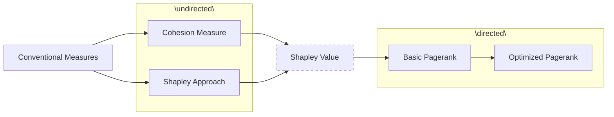
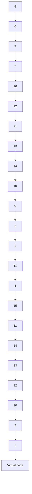

table

| Category | Team | Value |
| :--- | :--- | :--- |
| For office use only | 28199 | 28199 |
| T1 | Problem Chosen | F1 |
| T2 | Problem Chosen | F2 |
| T3 | Problem Chosen | F3 |
| T4 | Problem Chosen | F4 |

## 2014 Mathematical Contest in Modeling (MCM) Summary Sheet

## Problem Clarification

In this paper, we build several networks, study their properties, and build models to measure players’ influence. Off-the-shelf measures like degree are not optimal for influence estimation, because they do not consider all aspects of the network. We seek to define more accurate measures based on previous research for various networks and explore their utility in real life.

## Model Design

Conventional measures such as centrality usually neglect some aspects of networks, for example, the weights of edges. Stephen P. Borgatti (2006) introduces a cohesion measure called KPP-NEG, but the order of nodes is still ignored, which causes inaccuracy.

We combine the Shapley approach with the cohesion measure to obtain the Shapley value of each node, which represents its contribution to the whole network’s cohesion. It involves weight, structure, and order of nodes at the same time, which makes it superior to both conventional measures and KPP-NEG. However, this new approach can’t be applied to directed networks.

Therefore, we use Pagerank algorithm derived from website networks to deal with directed networks like the citation network. But the basic method is not suitable for citation networks due to the differences between websites and papers and the limited network size. So we optimize it by adding a virtual node representing papers outside the network in two steps. The first is to adjust the weight of edges according to references. The second involves Times Cited of the target paper.

flowchart

Figure 1. Model Design Process

## Results

Erdos network is a small-world network according to its path length and clustering coefficient. Meanwhile, its degree distribution shows a feature of free-scale network.

For undirected networks, the Shapley value of Edros Network shows that the most influential co-author is ALON, NOGA M., which is different from that ranked by betweenness. The Shapley value implemented in the movie star network shows that the most influential star is Matt Damon, which is the same as that ranked by betweenness due to the relatively small size of the network.

For directed networks -- the citation network of 16 papers provided, the most influential paper remains the same whether in the extensive network or not, which is No.14. But the ranks of some papers change with different versions of Pagerank method.

Sensitivity analysis suggests that ranks based on Shapley value is sensitive to sample size, while ranks based on Pagerank is not sensitive to damping factor.

# Influence Measures in Networks

## Introduction

## Problem Clarification

The study of complex networks is a young area of scientific research inspired largely by the empirical study of real-world networks such as computer networks and social networks. With the development of society and technology, more and more networks spring up in various aspects of our life. Properties of networks have been widely explored, and models are needed to measure the influence and impact of players in different networks. However, few researches considerate weight, structure and order of notes at the same time, so we seek to define more accurate measures based on previous research for networks with and without directions or weight.

## Model Design

The most typical conventional measurement is centrality, which includes degree, betweenness and closeness. However, both degree and closeness neglect the weight of each connection. In addition, Stephen P. Borgatti (2006) argues that the optimality of betweenness in identifying the node whose removal from the network would most reduce cohesion is not guaranteed under typical definitions of cohesion, and introduces a cohesion measurement called KPP-POS to overcome the defects of conventional approaches, but the order of nodes are ignored which causes inaccuracy.

We combine the Shapley approach and the KPP-POS measurement to obtain the Shapley value of each node as a influence measure, which represents its contribution to the whole network’s cohesion. It considers the weight, the KPP-POS problem and the order of nodes at the same time, which makes it superior to both conventional measures and KPP-POS.

This new approach has many merits, but it can’t be applied to directed networks. Therefore, we use Pagerank algorithm to deal with directed networks such as the citation network. The conventional Pagerank method is applied to website networks, but there are differences between website networks and paper citation networks. For instance, once built, the citation link or network is static while the website links are dynamically adjustable. Besides, the citation data related to papers outside the network is not taken into consideration, which makes the Pagerank value meaningless in small networks. So we optimized this method by adding a virtual node which represents papers outside the network in two steps. The first step is to adjust the weight allocated to the cited paper according to the total number of its references. In the second step, different weight is given to inside papers by the virtual node based on their Times Cited since publication.

## Erdos Network

## Assumptions

Co-author networks are undirected. The relationships between pairs of node are not directed, that is, the two nodes linked by the same line are equal.  
The influence of the number of joint publications and the date of the first cooperation can be neglected. Due to the lack of relative information, numbers of joint publications of different pairs are assumed to be the same. Therefore, our Erdos network model is unweighted, but this assumption is released in our movie-star network model.  
Take no consideration of those with Edros number 2. In order to avoid too much work, authors whose Erdős numbers are greater than 1 are not involved in this network.

## Adjacent Matrix

The adjacent matrix of the co-author network can be figured out with MATLAB, in which $r _ { i j } = 1$ if i can reach j and $r _ { i j } = 0$ otherwise. W represents the adjacent matrix and N is the number of nodes in the network.

$$
W = \left[ \begin{array}{c c c c} r _ {1 1} & r _ {1 2} & \dots & r _ {1 N} \\ r _ {2 1} & r _ {2 2} & \dots & r _ {2 N} \\ \dots & \dots & \dots & \dots \\ r _ {N 1} & r _ {N 2} & \dots & r _ {N N} \end{array} \right] \tag {1}
$$

## Network Visualization

Given the adjacent matrix, we can visualize the network with PAJEK, which is represented in Figure 2. Visualized network can show relations among clusters (global view) and extract nodes that belong to the same clusters (detailed local view). The nodes in the center part of the network are closed to each other while there are 37 isolates at the edge. The graph shows that the node representing ALON, NOGA M. has a degree of 52, which is the highest degree in Erdos network.

network graph

| Node | Value |
|---|---|
| 1 | 237 |
| 2 | 467 |
| 3 | 327 |
| 4 | 404 |
| 5 | 511 |
| 6 | 275 |
| 7 | 396 |
| 8 | 57 |
| 9 | 200 |
| 10 | 117 |
| 11 | 373 |
| 12 | 73 |
| 13 | 137 |
| 14 | 379 |
| 15 | 195 |
| 16 | 468 |
| 17 | 174 |
| 18 | 345 |
| 19 | 441 |
| 20 | 244 |
| 21 | 324 |
| 22 | 149 |
| 23 | 174 |
| 24 | 303 |
| 25 | 255 |
| 26 | 149 |
| 27 | 365 |
| 28 | 482 |
| 29 | 111 |
| 30 | 376 |
| 31 | 489 |
| 32 | 105 |
| 33 | 459 |
| 34 | 100 |
| 35 | 400 |
| 36 | 450 |
| 37 | 463 |
| 38 | 182 |
| 39 | 241 |
| 40 | 482 |
| 41 | 100 |
| 42 | 240 |
| 43 | 199 |
| 44 | 376 |
| 45 | 459 |
| 46 | 105 |
| 47 | 468 |
| 48 | 100 |
| 49 | 463 |
| 50 | 189 |
| 51 | 240 |
| 52 | 450 |
| 53 | 105 |
| 54 | 459 |
| 55 | 100 |
| 56 | 463 |
| 57 | 111 |
| 58 | 489 |
| 59 | 100 |
| 60 | 468 |
| 61 | 105 |
| 62 | 463 |
| 63 | 100 |
| 64 | 463 |
| 65 | 100 |
| 66 | 463 |
| 67 | 100 |
| 68 | 463 |
| 69 | 100 |
| 70 | 463 |
| 71 | 100 |
| 72 | 463 |
| 73 | 100 |
| 74 | 463 |
| 75 | 100 |
| 76 | 463 |
| 77 | 100 |
| 78 | 463 |
| 79 | 100 |
| 80 | 463 |
| 81 | 100 |
| 82 | 463 |
| 83 | 100 |
| 84 | 463 |
| 85 | 100 |
| 86 | 463 |
| 87 | 100 |
| 88 | 463 |
| 89 | 100 |
| 90 | 463 |
| ... (Repeated) (Repeated) — this appears to be a diagram of connections or relationships between nodes. The diagram contains numerous blue circles connected by lines, representing connections or relationships.

Figure 2. Node size corresponds to the degree of each author, a simple measure of influence. Numbers beside the nodes represent the corresponding author.

## Properties of Network

Complex networks include small-world networks and free-scale networks. Small-world networks are between regular networks and random networks. To determine which type Erdos network belongs to, we analyze properties of it with three measures [Albert,R. and Barabasi,A-L.,2002]: degree distribution, average path length and clustering coefficient.

Firstly, degree distribution is the probability distribution of degrees over the whole network. To demonstrate better the feature of the degree distribution of this network, we plot the degree frequencies in Figure 3. A random network with same number of nodes is also analyzed as a comparison.

line chart

| Degree | Erdos Network | Random Network |
| ------ | ------------- | -------------- |
| 0      | 37            | 0              |
| 1      | 84            | 15             |
| 2      | 68            | 40             |
| 3      | 50            | 70             |
| 4      | 35            | 75             |
| 5      | 38            | 76             |
| 6      | 30            | 70             |
| 7      | 20            | 55             |
| 8      | 15            | 48             |
| 9      | 10            | 25             |
| 10     | 8             | 12             |
| 11     | 6             | 8              |
| 12     | 5             | 5              |
| 13     | 4             | 3              |
| 14     | 3             | 2              |
| 15     | 2             | 1              |
| 16     | 1             | 0              |
| 17     | 1             | 0              |
| 18     | 1             | 0              |
| 19     | 1             | 0              |
| 20     | 1             | 0              |
| 21     | 1             | 0              |
| 22     | 1             | 0              |
| 23     | 1             | 0              |
| 24     | 1             | 0              |
| 25     | 1             | 0              |
| 26     | 1             | 0              |
| 27     | 1             | 0              |
| 28     | 1             | 0              |
| 29     | 1             | 0              |
| 30     | 1             | 0              |
| 31     | 1             | 0              |
| 32     | 1             | 0              |
| 33     | 1             | 0              |
| 34     | 1             | 0              |
| 35     | 1             | 0              |
| 36     | 1             | 0              |
| 37     | 1             | 0              |
| 38     | 1             | 0              |
| 39     | 1             | 0              |
| 40     | 1             | 0              |
| 41     | 1             | 0              |
| 42     | 1             | 0              |
| 43     | 1             | 0              |
| 44     | 1             | 0              |
| 45     | 1             | 0              |
| 46     | 1             | 0              |
| 47     | 1             | 0              |
| 48     | 1             | 0              |
| 49     | 1             | 0              |
| 50     | 1             | 0              |
| 51     | 1             | 0              |

Figure 3. Degree Distribution of Erdos Network & Random Network with Same Number of Nodes

As is shown in Figure 3, the random network has a pronounced peak at average degree 6.41, while the degrees of Erdos network follow the power-law distribution, showing a feature of scale-free networks.

Secondly, the average path length of Erdos network is 3.82, which is defined as the average number of steps along the shortest paths for all possible pairs of network nodes, measuring the efficiency of information or mass transport on the network. The result shows that the average path length of Erdos Network is very low.

Thirdly, the Watts-Strogatz clustering coefficient is 0.3428, so the nodes in Erdos network tend to cluster together in a relatively deep extent.

The two preceding measures are calculated as follows (N is the number of nodes, E is the number of edges, an edge $\mathsf { e } _ { \mathrm { i j } }$ connects node $\mathsf { v } _ { \mathrm { i } }$ with node vj):

$$
l _ {G} = \frac {1}{N (N - 1)} \sum_ {i \neq j} r _ {i j} \tag {2}
$$

$$
C C _ {i} = \frac {2 \left| \left\{e _ {j k} : v _ {j} , v _ {k} \in N _ {i} , e _ {j k} \in E \right\} \right|}{k _ {i} (k _ {i} - 1)} \tag {3}
$$

$$
\overline {{C C}} = \frac {1}{N} \sum_ {i = 1} ^ {n} C C _ {i} \tag {4}
$$

In order to describe properties more specifically, we use PAJEK to generate a random network with same number of nodes, which is compared with Erdos network in Table 1. This random network has the same number of nodes and average degree with Erdos network.

Table 1. Empirical results of networks

<table><tr><td> $L_{actual}$ </td><td> $L_{random}$ </td><td> $CC_{actual}$ </td><td> $CC_{random}$ </td></tr><tr><td>3.82</td><td>3.64</td><td>0.3428</td><td>0.0153</td></tr></table>

According to the above data, we can see that Erdos network shows the small-world phenomenon: $L \approx L _ { \mathit { r a n d o m } }$ but $C C > > C C _ { r a n d o m }$ . Therefore, Erdos network is a small-world network.

The properties of Erdos network are summarized in Table 2. In Table 2 the diagonal elements describe the small-world Erdos network and it is significant to note that Erdos network shares some features with text book network prototypes, but also differs from them. Its clustering coefficient is high while average length path is low, so the structure is like a small world network, in which most nodes are not neighbors of one another, but most nodes can be reached from every other by a small number of steps. Therefore, even a change of one shortcut can make a great difference in Erdos network. However, since the degrees distribution follows a power law, it also has the property of free-scale networks that a few nodes have many neighbors and they are followed by nodes with smaller degree, which means that there are a few active co-authors who have cooperated with many other co-authors in this network.

Table 2. Properties of network: diagonal elements characterize small-world network

<table><tr><td>Networks\Properties</td><td>ClusteringCoefficient</td><td>Average PathLength</td><td>DegreeDistribution</td></tr><tr><td>Regular</td><td>High</td><td>High</td><td>Equal and fixedIn/Out degrees toeach node</td></tr><tr><td>Random</td><td>Low</td><td>Low</td><td>Exponential</td></tr><tr><td>Scale Free</td><td>Low</td><td>Variable</td><td>Power-lawdistribution</td></tr></table>

## Influence Measure for undirected network: Shapley value

We calculate each node’s contribution to the cohesion of the whole network through Shapley approach as the measurement of its influence. And the results are compared with betweeness, which is the most commonly used traditional measurement.

## Conventional Approaches

Centrality is traditionally used to measure the impact of players in a network, which has three aspects: degree, closeness, and betweenness [Freeman, 1979]. Degree is defined as the number of edges incident to a node, which is the simplest concept of centrality. Closeness measures a node’s path length to all other nodes. Both of degree and closeness ignore the weight of edges, and can’t be used for

weighted networks. Betweenness centrality is the most commonly used among the three, which quantifies the number of times a node acts as a bridge. However, the optimality of betweenness in identifying the node whose removal from the network would most reduce cohesion is not guaranteed under typical definitions of cohesion. [Stephen P. Borgatti, 2006]

## Shapley Value

Because of the defects of conventional approaches in measuring a node’s contribution to cohesion of the whole network, Stephen P. Borgatti (2006) introduced a measurement of network’s cohesion. We firstly adjust it to make it applicable for both weighted and unweighted network. In addition, we combine it with Shapley approach to obtain the Shapley value of each node.

The measurement of a network’s cohesion is shown as follow:

$$
\mathrm{DF} = 1 - \frac {2 \sum_ {i > j} \frac {1}{d _ {i j}}}{n (n - 1)} \tag {5}
$$

Where ?? denotes the number of nodes in the network, and $d _ { i j }$ represents the distance between node i and j. If there is no link between node i and j, $d _ { i j }$ is infinite. In order to take the weight of edges into consideration, we adjust the measurement by defining $d _ { i j }$ as:

$$
d _ {i j} = \left\{ \begin{array}{l l} 1 + \frac {1}{p _ {i j}}, & \text { i   and   j   are   linked } \\ \infty , & \text { i   and   j   are   not   linked } \end{array} \right. \tag {6}
$$

Where $p _ { i j }$ denotes the weight of the edge between node i and j. Particularly in an unweithed network, $p _ { i j }$ is infinite, which can be shown as:

$$
p _ {i j} = \left\{ \begin{array}{c c} \text { weight   of   edge, } & \text { weithed   network } \\ \infty , & \text { unweithed   network } \end{array} \right. \tag {7}
$$

Stephen P. Borgatti (2006) gets each node’s contribution simply by subtracting DFs of the network with and without the node, which ignores the order of the nodes. This problem can be solved by applying Shapley approach [Shapley, 1953]. Shapley value is typically used in game theory, and has been developed recently into various fields, including influence measurement in networks. The Shapley value can be showed in the following way:

$$
\Omega_ {i} (v) = \frac {1}{N !} \sum_ {O \in \pi_ {N}} (v (P r e ^ {i} (O) \cup i) - v (P r e ^ {i} (O))) \tag {8}
$$

Where ?? is defined as a permutation of players, $v \left( P r e ^ { i } ( \boldsymbol { O } ) \right)$ is the value obtained in permutation ?? by the players preceding player i and $v \left( P r e ^ { i } ( O ) \mathsf { U } i \right)$ is the value obtained in the same permutation when including player i. That is, $\Omega _ { i } ( v )$ gives the average marginal contribution of player i over all permutations.

To avoid too much calculation due to the rapid increase of number of permutations with the number of players, the Shapley value can be approximated by the average contribution nodes to network’s cohesion over k randomly sampled permutations, which can be shown as:

$$
\Omega_ {i} (v) \approx \widehat {\Omega} _ {i} (v) = \frac {1}{k} \sum_ {O \in \pi_ {k}} (v (P r e ^ {i} (O) \cup i) - v (P r e ^ {i} (O))) \tag {9}
$$

It can be easily proved that the sample mean $\widehat { \Omega } _ { i } ( \boldsymbol { v } )$ is an unbiased estimator of the population mean $\Omega _ { i } ( v ) [$ [ Bluhm M, Faia E, Krahnen J P., 2013].

In this case, we combine the adjusted cohesion measurement with the Shapley approach by defining the value used in Shapley equation as the cohesion measurement DF:

$$
v = \mathrm{DF} \tag {10}
$$

As a smaller DF indicates a more cohesive network, it is obvious that a negative Shapley value shows a node’s positive contribution to the cohesion of the whole network. And the smaller a node’s Shapley value is, the more contribution it makes to the network’s cohesion, thus it is more influential in the network.

## Application in Edros Network

We firstly apply this methodology to the Edros Network built above, which is an unweighted network, where , We find the Top 10 influential co-authors, and compare the results with that ranked by betweenness, as is shown in Table 3.

Table 3. Top 10 influential co-authors ranked by Shapley value and Betweenness

<table><tr><td>Rank</td><td>Name(Shapley value)</td><td>Name(Betweenness)</td></tr><tr><td>1</td><td>ALON, NOGA M.(-0.001865084)</td><td>HARARY, FRANK*(9587.729986)</td></tr><tr><td>2</td><td>GYARFAS, ANDRAS(-0.001762582)</td><td>SOS, VERA TURAN(8912.230744)</td></tr><tr><td>3</td><td>SOS, VERA TURAN(-0.001612491)</td><td>RUBEL, LEE ALBERT*(8573.363779)</td></tr><tr><td>4</td><td>KLEITMAN, DANIEL J.(-0.001596847)</td><td>STRAUS, ERNST GABOR*(8300.743649)</td></tr><tr><td>5</td><td>TUZA, ZSOLT(-0.00151064)</td><td>POMERANCE, CARLBERNARD(7434.669391)</td></tr><tr><td>6</td><td>GRAHAM, RONALD LEWIS(-0.001494127)</td><td>FUREDI, ZOLTAN(7410.069488)</td></tr><tr><td>7</td><td>BOLLOBAS, BELA(-0.00149078)</td><td>ALON, NOGA M.(6871.898202)</td></tr><tr><td>8</td><td>HARARY, FRANK*(-0.001472003)</td><td>GRAHAM, RONALD LEWIS(6817.155314)</td></tr><tr><td>9</td><td>FAUDREE, RALPH JASPER,JR.(-0.0013609)</td><td>BOLLOBAS, BELA(6699.546721)</td></tr><tr><td>10</td><td>RODL, VOJTECH(-0.001300204)</td><td>PACH, JANOS(6073.643237)</td></tr></table>

We can see from Table 3 that ALON, NOGA M. makes the most contribution to the Edros Network’s cohesion, while HARARY, FRANK\* bridges the most pairs in the network. Moreover, there are five same co-authors in Top 10 ranked by the two different measurements, who are ALON, NOGA M., SOS, VERA TURAN, GRAHAM, RONALD LEWIS, BOLLOBAS, BELA, and HARARY, FRANK\*. They are supposed to be the most influential co-authors in the network.

## Application in Movie Star Network

To implement our algorithm on a completely different set of network influence data, we dig the cooperative relations between 20 movie stars who have all cooperated with Jude Law. The same method is used to build the movie star network and find the Top 5 influential stars in the network. Note that the movie star network is a weighted network, and the weight of each edge depends on the times the stars have cooperated.

```mermaid
graph TD
  NataliePortman["Natalie Portman"] --> MalfDamoni["Malf Damoni"]
  AnthonyMinghella["Anthony Minghella"] --> MalfDamoni
  TildaSwinton["Tilda Swinton"] --> MalfDamoni
  TomWilkinson["Tom Wilkinson"] --> MalfDamoni
  JohnRibeil["John Ribeil"] --> TomHanks["Tom Hanks"]
  JohnnyDeppi["Johnny Deppi"] --> TomHanks
  MatthewDamoni["Matthew Damoni"] --> AlecBaldwin["Alec Baldwin"]
  JenniferEhlel["Jennifer Ehlel"] --> GwynethPaltrowl["Gwyneth Paltrowl"]
  KateWinslett["Kate Winslett"] --> TomHanks
  MikfDamoni["Mikf Damoni"] --> GwynethPaltrowl
  MikfDamoni --> RobertDowneyJr["Robert Downey Jr"]
  MikfDamoni --> DanielCraig["Daniel Craig"]
  MikfDamoni --> LiamAiken["Liam Aiken"]
  MikfDamoni --> CliveOwen["Clive Owen"]
  MikfDamoni --> KellyReilly["Kelly Reilly"]
  MikfDamoni --> RachelMcadams["Rachel McAdams"]
  MikfDamoni --> EthanHaw["Ethan Haw"]
  MikfDamoni --> TildaSwinton
  MikfDamoni --> TomWilkinson
```

flowchart

Figure 4. the Movie Star Network (The width of the edges reflects the times the two stars have cooperated, and the size of the nodes reflects their degrees)

Table 4. Top 5 influential movie stars ranked by Shapley value and Betweenness

<table><tr><td>Rank</td><td>Name(Shapley)</td><td>Name(Betweenness)</td></tr><tr><td>1</td><td>Matt Damon(-0.045389808)</td><td>Matt Damon(29.1436926)</td></tr><tr><td>2</td><td>Tom Hanks(-0.041607503)</td><td>Tom Hanks(24.3010304)</td></tr><tr><td>3</td><td>Robert Downey Jr.(-0.018930241)</td><td>Robert Downey Jr.(18.4906711)</td></tr><tr><td>4</td><td>Daniel Craig(-0.01560871)</td><td>Daniel Craig(13.6563631)</td></tr><tr><td>5</td><td>Gwyneth Paltrow(-0.014915669)</td><td>Kate Winslet(13.5588972)</td></tr></table>

The Top 5 influential movie stars ranked by Shapley value and betweenness are almost the same, which is due to the relatively small size of the network. The difference in the fifth most influential star indicates that the removal of Gwyneth Paltrow has more impact on the cohesion of the network than that of Kate Winslet, although the latter bridges more pairs in the network.

## Strengths

The Shapley value is superior to degree and closeness centrality in that it can be applied to both unweighted and weighted networks.  
The Shapley value is more appropriate than betweenness in the scenario where

a node has higher betweenness, but the removal of it has less impact on the network’s cohesion.

The Shapley value considers the order when calculate the contribution of each node to the cohesion of the whole network, so the result is more accurate than that of simply subtracting the DFs of the network with and without the node.

## Weaknesses

C The calculation of Shapley value is more complex than that of conventional centrality.  
The Shapley value can’t be applied to directed networks, since the definition of the cohesion measurement DF does not reflect the directions of edges. So another method needs to be introduced to measure the influence of nodes in directed networks.

## Utility

The Shapley value is applicable to most undirected networks.

## Individual level

Improve social influence. Real social network is a typical undirected network, where one can always use the Shapley value to measure others’ impact on the network. And choosing the people with lower Shapley value to make acquaintance with can improve one’s social influence efficiently.  
Make career decisions. As is illustrated above, cooperation networks like Edros Network and Movie Star Network are also undirected networks. Cooperating with colleagues with lower Shapley value may boost your career status rapidly.

## Organizational level

 Choose business collaborator. Business cooperation network is similar to Edros Network and Movie Star Network, so the same strategy can be applied in order to boost influence.

## National level

Improve international relationship. Similarly, countries that want to be more active in international events can choose to establish diplomatic relations with those with lower Shapley value.

## Influence measure for directed network: Optimized Pagerank

The undirected network discussed above will produce a symmetric adjacency matrix. In contrast, directed networks, such as the web page network and the paper citation network, are useful to study relative asymmetries and imbalances in link formation. To analyze the influence ranking within a directed network, we take the paper citation network as an example to study the methodology called Pagerank. And we use the list of all 16 papers provided by the 2014 ICM problem file as our data. In addition, the Pagerank measurement is optimized to apply to the real citation network better according to the total numbers of the references of a certain paper under consideration and the outside papers citing the target paper.

## The basic Pagerank model

Pagerank is an algorithm originally used to measure the value of a website page according to the number and quality of links to it. Because both of the website network and the citation network can be regarded as directed graphs when papers or webs are nodes and reference relationships or web links are arcs, we can conduct Pagerank method to evaluate the contribution of papers. The main idea of this method is that the relative importance of a certain node in a directed network hinges on the importance of nodes attaching outbound links to it. Specifically, in the citation network, the distribution of a target paper depends on the number and influence of papers citing it. So the Pagerank value of a paper can be calculated as the following equation:

$$
\mathrm{PR} (p _ {i}) = d \sum_ {p _ {j} \in \Pi (p _ {i})} \frac {\mathrm{PR} (p _ {i})}{\mathrm{L} (p _ {j})} + \frac {1 - d}{N} \tag {11}
$$

Where $p _ { 1 } , p _ { 2 } , p _ { 3 } , \ldots , p _ { N }$ present the papers in the network as the subscript means their corresponding number based on the initial order, $\mathrm { P R } ( p _ { i } )$ means the Pagerank value of the target paper $p _ { i } \mathrm { ~ , ~ } \Pi ( p _ { i } )$ is the set of papers that have cited $p _ { i } , \mathrm { L } ( p _ { j } )$ is the number of outbound links from $p _ { j }$ , and N is the total number of the papers in the network, which is 16 in this case .

The denominator $\ L ( p _ { j } )$ means that every paper distributes equal link weight to each of its reference in the network. And it’s worth noting that there would always be at least one paper that does not cite other papers in the network, such as the paper first published. So here a damping factor $d ,$ is introduced into the model to deal with the papers with no outbound links by assuming every paper to link out to all other papers in the collection evenly with a probability of $1 - d$ . The empirical value of ?? is 0.85, which means a paper’s Pagerank is 0.85/N even no paper links to it.

## The iterative method

According to the definition equation of Pagerank value, we use MATLAB to operate the algorithm. Again, the adjacency matrix ,??, extracted from the references of each paper with equal link weight is used to describe the relations and links among the total 16 papers, where $r _ { i j } = 1$ means that $p _ { i }$ cites $p _ { j }$ .In matrix form, the Pagerank matrix can be manifested by the following equation.

$$
\mathrm{PR} = d * (W ^ {*}) ^ {\prime} \mathrm{PR} + (1 - d) \left(\frac {E * E ^ {\prime}}{n}\right) \tag {12}
$$

Where $W ^ { * }$ means the modified adjacency matrix after dividing every element by the row sum.

Then we use the iterative method to get the most accurate value results under the assumption that the distribution is evenly divided among all papers at the beginning of the computational process. According to the Pagerank value of every element, we can get the most influential paper with the highest Pagerank value (see results in column 2 of Table 5. ).

## The weakness of the basic model

Since the basic Pagerank method is derived from websites rank, such an algorithm has weakness and cannot be simply applied to the paper influence rank due to the following distinguishes between them.

C Once built, the citation link or network is static while the website links are dynamically adjustable.  
The citations must be unidirectional whereas it is generally seen that two web pages link to each other.  
The noise of the citation network is much less than the website network. In general, every citation linked to a certain paper has relevance with it in a sense, but some page links in the website network contains useless information, such as advertisements, site navigations and friendly links.  
C The lack of enough citations makes the Pagerank value meaningless in a small network.

So it is necessary to improve the basic model in order to satisfy the properties of the citation network.

## The optimized Pagerank model

By taking other papers as a whole into account, we consider that other papers outside the network can also influence the contribution of the target paper. To optimize the Pagerank method, we assume that there is a virtual N+1 node, which presents all of the other papers beyond the 16 papers (see Figure 5). These papers may also cite or be cited by the target paper.

flowchart

Figure 5. Extensive citation network. The size of a node corresponds to the all degree (in and out) of a paper. Arrows mean one paper cites another. Imaginary line separates the initial citation network and the outside virtual node.

After adding the virtual node, we get a new modified adjacency matrix $( N + 1 \times N + 1 )$ of the extensive citation network.

heatmap

|  | r_{(N+1)}1 | r_{(N+1)}2 | ... | r_{(N+1)j} | ... | r_{(N+1)N} | r_{(N+1)} |
| --- | --- | --- | --- | --- | --- | --- | --- |
| r_{11} | r_{12} | ... | r_{1j} | ... | r_{1N} | ... | r_{1(N+1)} |
| r_{21} | r_{22} | ... | r_{2j} | ... | r_{2N} | ... | r_{2(N+1)} |
| ... | ... | ... | ... | ... | ... | ... | ... |
| r_{i1} | r_{i2} | ... | r_{ij} | ... | r_{iN} | ... | r_{i(N+1)} |
| ... | ... | ... | ... | ... | ... | ... | ... |
| r_{N1} | r_{N2} | ... | r_{Nj} | ... | r_{NN} | ... | r_{N(N+1)} |

Where

$$
r _ {i j} = \left\{ \begin{array}{c} 1 / C, \text {when p_{i} cites p_{j} and C is the number of all reference papers of p_{i}} \\ 0, \text {when p_{i} does not cite p_{j}} \end{array} \right.
$$

$$
r _ {i (N + 1)} = 1 - \sum_ {j = 1} ^ {N} r _ {i j}
$$

$$
r _ {(N = 1) j} = 1 / N
$$

$$
r _ {(N + 1) (N + 1)} = 0
$$

As the improved matrix shows, every reference paper in the original network get equal citation link weight from the source paper while the new N+1 node(the other related papers) get the rest of the reference weight. Also, the N+1 node distribute its link weight to N papers evenly. By this way, we consider the whole list of references instead of the limited 16 objects in the network and adjust the weight allocated to the cited paper according to the total number of the references. Similarly, we can use the iterative method to calculate the Pagerank value results (see column 3 of Table X)in the optimized model.

## Involving Times Cited

The model discussed above assumes that the outside papers attach equal weight to the paper in the network as the element of the N+1 row is the same. Furthermore, we think that outside papers endows the inside papers with different weight on the basis of the target paper’s Times Cited since its publication. So the elements of last row are changed into:

$$
r _ {(N + 1) j} = T _ {j} / \sum_ {j = 1} ^ {N} T _ {j} \tag {13}
$$

Where $T _ { j }$ is the Times Cited data of $p _ { j }$ from

After considering the real Times Cited, the third method involves both the papers having outbound links and inbound links to the initial network and can reflex the real integrated impact of the target paper. And the new outcome can be seen in the column 4 of Table 5.

## Results

We can get three groups of results from the basic model, optimized model and further optimized model (involving Times Cited) respectively. In addition, we select the top 5 from 16 papers in accordance with their Pagerank values to compare the effectiveness of these three methods in the Pagerank model. The importance ranking results can be seen in Table 5, where the value under the paper number is its Pagerank value.

Table 5. Pagerank results of three methods in the Pagerank model

<table><tr><td rowspan="3">Rank</td><td rowspan="2">Basic Pagerank Model</td><td colspan="2">Optimized Pagerank Model</td></tr><tr><td>No Times Cited</td><td>With Times Cited</td></tr><tr><td>Paper number</td><td>Paper number</td><td>Paper number</td></tr><tr><td>1</td><td>14(0.7681)</td><td>14(0.3339)</td><td>14(1.0312)</td></tr><tr><td>2</td><td>3(0.3846)</td><td>4(0.295)</td><td>4(0.8562)</td></tr><tr><td>3</td><td>4(0.2309)</td><td>6(0.2871)</td><td>2(0.6146)</td></tr><tr><td>4</td><td>6(0.1515)</td><td>8(0.2842)</td><td>11(0.5071)</td></tr><tr><td>5</td><td>8(0.1104)</td><td>3(0.2806)</td><td>1(0.2618)</td></tr></table>

As shown in table above, the most important paper remains the same under the three methods which is No.14, . It is because No.14 is always contributing most and cited by other important papers more frequently (its Times Cited on is 21688) no matter in the network with limited size or that involving other papers.

Additionally, the papers which rank 2nd to 5th are changed after the model is optimized. Specifically, the ranking of No.4 is elevated from 3rd to 2nd after extending the network to outside papers because No.4 gets larger link weight relatively. Another obvious change is that No.3 is absent from the Top list mainly since its Times Cited (1956) is relatively small. On the contrary, No.2 and No.11 appear on the Top list of optimized Pagerank Model with Times Cited due to their large Times Cited (13250 and 10616 respectively).

According to the results, the optimized Pagerank method is not confined to the target papers and can be better applied to distinguish the most important paper from others by evaluating synthetically the Pagerank values of papers within an extensive network that considers both outbound and inbound links.

## Strengths

High practicability. The Pagerank model is suitable to analyze the importance ranking in the complex network, especially in directed graphs cause it can distinguish outbound links from inbound links.

Optimized model. By involving outside citation links into the initial network, the optimized Pagerank model can break through the size limit of the citation network so as to evaluate the integrated influence of a paper.  
Wide application. The model can be applied universally to the entity importance ranking, such as the key words, scientific institutions and countries, as well as the websites, papers and journals.

## Weaknesses

Data limitations. The effective practice of the Pagerank model needs a large deal of information about the reference relationship or the accuracy of the influence results changes along with the different network size and data abundance.  
Improved application. Using Pagerank to assess papers or institutions is a new field, so it still remains several problems of applications, such as the dynamic noise of the network, and needs further practice to improve the application methods.

## Utility

Our optimized Pagerank model is applicable to many networks especially directed networks.

## Individual level:

Choose the one to follow on social network society. Social relationships on the internet can be considered as a directed network because the links can be one-way. For example, if you follow a friend on twitter while this friend does not follow you in return, then there is a link from you to your friend, but the reversed link does not exist. In order to get as much information as possible in a field in a short time, we can build a network to figure out those who have the highest Pagerank values and those who play the most important roles in this network.

Make academic decisions. With the data of citation relationships among papers written by different thesis advisors, we can figure out the Pagerank value of each thesis advisor. Thesis advisors with higher Pagerank values are likely to have stronger scientific research ability. In a similar way, by studying the papers written by all the teachers and students at the school, we can choose a satisfying school to go to.

## National level:

 Control systemic risk. Interbank borrowing market is a typical directed network which represents the debtor-creditor relationships between different financial institutions. Financial institutions with high Pagerank value are too interconnected to fail because they play important roles in financial contagion and have a great influence on other institutions. According to the Pagerank model, the supervisor is supposed to pay special attention to these financial institutions to control the systemic risk of the whole country.

## Sensitivity analysis

## Shapley value’s sensitivity to parameter

One fatal flaw of the Shapley value is the huge computation. Although the complexity has been mitigated from Equation (8) to (9) by replacing the total number of permutations N! with the sample size of , it still needs a lot of time and memory space to run the program. So we explore the sensitivity of the results to the sample size k by tracing 5 co-authors’ rank under different , as is shown in Figure 6.

line chart

| parameter k | ALON, NOGA M. | SOS, VERA TURAN | TUZA, ZSOLT | GYARFAS, ANDRAS | KLEITMAN, DANIEL J. |
| ----------- | ------------- | --------------- | ----------- | ---------------- | ------------------- |
| 100         | 45            | 30              | 28          | 35               | 12                  |
| 120         | 30            | 20              | 10          | 25               | 10                  |
| 140         | 20            | 25              | 45          | 20               | 2                   |
| 160         | 30            | 20              | 15          | 38               | 15                  |
| 180         | 40            | 15              | 10          | 25               | 10                  |
| 200         | 25            | 10              | 5           | 15               | 5                   |
| 220         | 45            | 65              | 10          | 40               | 10                  |
| 240         | 30            | 25              | 15          | 25               | 15                  |
| 260         | 35            | 20              | 20          | 20               | 20                  |
| 280         | 20            | 15              | 10          | 25               | 15                  |
| 300         | 25            | 15              | 15          | 30               | 20                  |
| 320         | 30            | 10              | 25          | 35               | 25                  |
| 340         | 55            | 15              | 10          | 20               | 10                  |
| 360         | 30            | 10              | 5           | 15               | 5                   |
| 380         | 35            | 15              | 15          | 20               | 15                  |
| 400         | 35            | 60              | 10          | 30               | 20                  |
| 420         | 30            | 15              | 5           | 25               | 15                  |
| 440         | 25            | 10              | 5           | 20               | 10                  |
| 460         | 35            | 20              | 10          | 25               | 15                  |
| 480         | 35            | 25              | 15          | 30               | 20                  |
| 500         | 25            | 15              | 10          | 25               | 15                  |

Figure 6. Sensitivity analysis results of Shapley value to parameter . The 5 different lines present 5 sets of ranks of 5 co-authors.

As is shown above, the co-authors’ ranks differ remarkably under different value of parameter . And ranks tend to be stable with the increase of sample size , which is consistent with the basic principle of statistics. So we suggest selecting  that are large enough to guarantee the accuracy of the results, but not too large to save time and space. In this case, a figure over 400 can provide reasonable accuracy.

## Pagerank value’s sensitivity to parameter

Considering the principle and computational process of Pagerank algorithm, it is easy to find that the results of this methodology may be influenced by the damping factor ?? which is an empirical constant 0.85 in the model above. Since the parameter ?? can change the probability of directing to a random node in the network, we can conduct the sensitivity analysis of Pagerank value rank to parameter ??. Here we use the optimized Pagerank method with Times Cited .By changing the value of ?? from 0.05 to 1 with the interval of 0.05, we observe the corresponding ranks of the original Top 5 papers (in the column 4 of Table 5). The outcome of sensitivity analysis can be seen in Figure 7.

line chart

| Parameter d | No.1 | No.11 | No.2 | No.4 | No.14 |
| ----------- | ---- | ----- | ---- | ---- | ----- |
| 0.05        | 5    | 4     | 3    | 2    | 1     |
| 0.1         | 5    | 4     | 3    | 2    | 1     |
| 0.15        | 5    | 4     | 3    | 2    | 1     |
| 0.2         | 5    | 4     | 3    | 2    | 1     |
| 0.25        | 5    | 4     | 3    | 2    | 1     |
| 0.3         | 5    | 4     | 3    | 2    | 1     |
| 0.35        | 5    | 4     | 3    | 2    | 1     |
| 0.4         | 5    | 4     | 3    | 2    | 1     |
| 0.45        | 5    | 4     | 3    | 2    | 1     |
| 0.5         | 5    | 4     | 3    | 2    | 1     |
| 0.55        | 5    | 4     | 3    | 2    | 1     |
| 0.6         | 5    | 4     | 3    | 2    | 1     |
| 0.65        | 5    | 4     | 3    | 2    | 1     |
| 0.7         | 5    | 4     | 3    | 2    | 1     |
| 0.75        | 5    | 4     | 3    | 2    | 1     |
| 0.8         | 5    | 4     | 3    | 2    | 1     |
| 0.85        | 5    | 4     | 3    | 2    | 1     |
| 0.9         | 5    | 4     | 3    | 2    | 1     |
| 0.95        | 5    | 4     | 3    | 2    | 1     |
| 1           | 5    | 4     | 3    | 2    | 1     |
| No.1        |      |       |      |      |       |
| No.14       |      |       |      |      |       |
| No.4        |      |       |      |      |       |
| No.2        |      |       |      |      |       |
| No.11       |      |       |      |      |       |
| No.1        |      |       |      |      |       |
| No.14       |      |       |      |      |       |
| No.4        |      |       |      |      |       |
| No.2        |      |       |      |      |       |
| No.11       |      |       |      |      |       |
| No.1        |      |       |      |      |       |

Figure 7. Sensitivity analysis results of Pagerank values to parameter??. The 5 different lines present 5 sets of ranks of the 5 certain paper.

Obviously, the results reveal that the rank of each paper is not changing along with the change of parameter ??, which means that the Pagerank method result is not sensitive to ??.Although ?? can change the probability of random links, its action principle is to add a constant weight to every element in the network to avoid the misconvergence of Pagerank value but does not change the original importance of a certain paper and the link weight distribution. As a result, the parameter ?? has nothing to do with the Pagerank value.

## Reference

Albert,R. and Barabasi,A-L.(2002).Statistical machanics of complex networks. ,74:47-97.

Markose, S., Giansante, S., Gatkowski, M. and Shaghaghi, A. R.(2009).Too interconnected to fail: Financial contagion and systemic risk in network model of cds and other credit enhancement obligations of us banks. .

Freeman L C.(1979).Centrality in social networks conceptual clarification[J]. , 1(3): 215-239.

Borgatti, S. (2006).Identifying sets of key players in a network. , 12: 21-34.

Shapley L S.(1952).A value for n-person games[R]. CA.

Bluhm M, Faia E, Krahnen J P. (2013).Endogenous Banks’ Networks, Cascades and Systemic Risk[R]. .

Watts, D. J., & Strogatz, S. H. (1998). Collective dynamics of ‘small-world’networks. , (6684), 440-442.

Borgatti, S. P., Jones, C., & Everett, M. G. (1998). Network measures of social capital. , (2), 27-36.

Newman, M. E. (2001). The structure of scientific collaboration networks. , (2), 404-409.

Friedkin, N. E. (1991). Theoretical foundations for centrality measures. , 1478-1504.

Knoke, D., & Yang, S. (2008).  (Vol. 154). Sage.

Watts, D. J. (1999). . Princeton university press.

Moody, J., & White, D. R. (2003). Structural cohesion and embeddedness: A hierarchical concept of social groups. , 103-127.

Kleinberg, J. M. (2000). Navigation in a small world. , (6798), 845-845.

Everett, M. G., & Borgatti, S. P. (2000). Peripheries of cohesive subsets. , (4), 397-407.

Borgatti, S. P., & Everett, M. G. (2000). Models of core/periphery structures. , (4), 375-395.

Glover, F. (1986). Future paths for integer programming and links to artificial intelligence. , (5), 533-549.

Seidman, S. B. (1983). Network structure and minimum degree. , (3),

269-287.

http://baike.baidu.com/link?url=WckfiBvPGGGMxZd5DISq5UKMIcfibz2Nn-HwEOym

TU0QbYQf2hmZy17u4oa9\_Kz2ZquoU91EHOIjlq6T8DL-va

http://baike.baidu.com/link?url=aOCz9onz7l-zRZrgHOqsCHpjgd\_A2Q\_Wvz55QJ8mX

uT1znQ54NPTdCHFxoIVTAfpFlyk4dv2ryrKI3eSsitu1K

http://en.wikipedia.org/wiki/Complex\_network