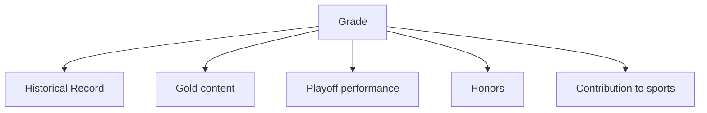
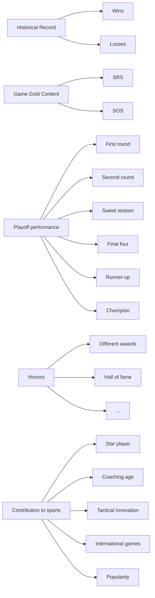
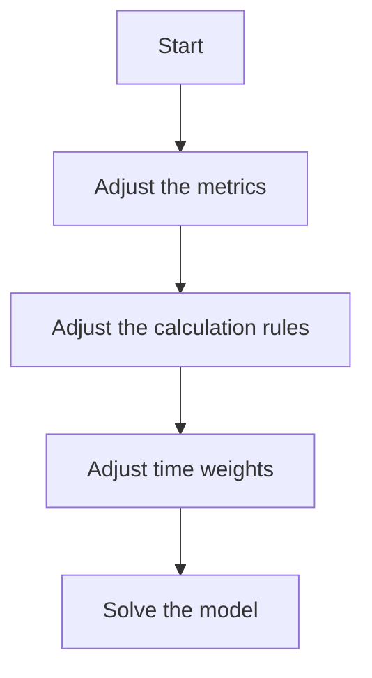
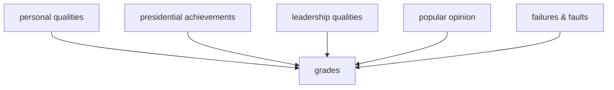

# Evaluation System for College Coaching Legends

## Summary

In order to evaluate the performance of a coach, we describe metrics in five aspects: historical record, game gold content, playoff performance, honors and contribution to the sports. Moreover, each aspect is subdivided into several secondary metrics. Take playoff performance as example, we collect postseason result (Sweet Sixteen, Final Four, etc.) per year from NCAA official website, Wikimedia and so on.

First, Analytic Hierarchy Process (AHP) Model is established to determine the weight of each metric to coaches’ evaluation grade. All metrics are adequately filled into the three-hierarchy structure, and then we obtain the metric weight based on which evaluation grade is calculated. Second, Fuzzy Synthetic Evaluation (FSE) is built to overcome weakness of excess subjective factors in AHP. This model takes data processing by membership function to generate fuzzy matrix. After that, entropy method and linear weighted method are applied to obtain evaluation grade.

To evaluate the accuracy of the two models, hit score is defined. It is supposed to reflect the difference between our results and standard rankings from several authorities such as ESPN and Sporting News. Take NCAA basketball as a case study, AHP receives 78.77 hit score while FSE gets 81.81, which indicates that FSE performs better than AHP. Afterwards, Aggregation Model (AM) can be developed by combining the two models based on hit score. The top 5 college basketball coaches, in turn, are John Wooden, Mike Krzyzewski, Adolph Rupp, Dean Smith and Bob Knight.

Time line horizon does make a difference. According to turning points in NCAA history, we divide the previous century into six periods with different time weights which lead to the change of ranking. We apply our model into college women’s basketball only to find that genders do not matter. Model proves to be efficient in other sports. The ranking of college football is: Bear Bryant, Knute Rockne, Tom Osborne, Joe Paterno , Bobby Bowden, and the top 5 coaches in college hockey are Bob Johnson, Red Berenson, Jack Parker, Jerry York, Ron Mason.

We conduct sensitivity analysis on FSE to find best membership function and calculation rule. Sensitivity analysis on aggregation weight is also performed. It proves AM performs better than single model. As a creative use, top 3 presidents (U.S.) are picked out: Abraham Lincoln, George Washington, Franklin D. Roosevelt.

At last, the strength and weakness of our mode are discussed, non-technica explanation is presented and the future work is pointed as well.

## I. Introduction .. 2

1.1 Problem Background.. 3  
1.2 Previous Research.. 3  
1.3 Our Work.. 3

## II. Symbols, Definitions and Assumptions.....

2.1 Symbols and Definitions.. 4  
2.2 General Assumptions.. 5

## III. Articulate our metrics .......

3.1 Specify evaluation norms . 5  
3.2 Collect data .. 8  
3.3 Preprocess data.. 9

## IV. Two models for coach ranking.......... ... 10

4.1 Model I: Analytic Hierarchy Process (AHP). 10

4.1.1 The three-hierarchy structure .. . 10  
4.1.2 Obtain the index weight . . 10  
4.1.3 Results & analysis 11

4.2 Model II: Fuzzy Synthetic Evaluation (FSE) . 12

4.2.1 Quantify grades in the five aspects. .. 12  
4.2.2 Determine membership functions. . 13  
4.2.3 Determine the weights using entropy method . .. 14  
4.2.4 Results & analysis . . 15

## V. Models Combination ..... .. 15

5.1 Evaluation of individual model.. 15  
5.2 Aggregation Model. 17  
5.3 Results & analysis. 17

## VI. Extend Our Models...... ..... 18

6.1 Genders do not matter .. 18  
6.2 Time factor does make a difference.. . 19

6.2.1 Why time factor matters?. . 19  
6.2.2 How time factor matters?. 19  
6.2.3 What is the variation tendency? . 23

6.3 Model also works in other sports.. 23

## VII. Further discussion .... .. 25

7.1 Sensitive Analysis on FSE 25

7.1.1 Vary Membership function. 25  
7.1.2 Vary calculation rule .. . 27

7.2 Sensitive Analysis on Aggregation weight.. 28  
7.3 Explore: Evaluating Best President. 29

## VIII. Strength and Weakness ......... ... 30

## IX. Non-technical Explanation ......... .. 30

## X. Future work... . 32

## XI. References.... . 32

## I. Introduction

## 1.1 Problem Background

Sports Illustrated is an American sports media franchise owned by media conglomerate Time Warner [1]. This magazine is looking for the “best all time college coach” male or female for the previous century. The best college coach or coaches can be from among either male or female coaches in different fields, such as college hockey or field hockey, football, baseball or softball, basketball, or soccer.

We face mainly four problems:

Articulate our own metrics and build a mathematical model;  
Set up the evaluation system for the performance of the model.  
Discuss how our model can be applied with time factor or across both genders and all possible sports;  
Analyze the influences of the parameters, then discuss whether your model could be applied into wide fields.

## 1.2 Previous Research

Some magazines or websites that focus mainly on college sports have ranked the top college coaches of different sports. For example, rivels.com has made a basketball power rankings [2] which shows the top 25 coaches of college basketball.

Considering the best college coaches is an evaluation problem. There are some models which can solve such problem. One is the Analytic hierarchy process (AHP), which was developed by Thomas L. Saaty [3] in the 1970s. The AHP provides a comprehensive and rational framework for structuring a decision problem, for representing and quantifying its elements, for relating those elements to overall goals, and for evaluating alternative solutions [4]. Another is the Fuzzy Synthetic Evaluation Model. Fuzzy mathematics forms a branch of mathematics related to fuzzy set theory and fuzzy logic [5]. It started in 1965 after the publication of Lotfi Asker Zadeh's seminal work Fuzzy sets [6].

## 1.3 Our Work

In this paper we determine the best college coaches from among either male or female coaches in different sports. In Section 2, we provide the terminology definitions and assumptions that will be utilized in the rest of the paper. In Section 3, we give the definitions of evaluation standard and specific evaluation norms which we used in our models, and show some of the data we have collected. In Section 4, we build two mathematical models to choose the best college coaches, and Section 5 considers combination of the two models mentioned above. In Section 6 we extend our models and take time, genders and types of sports into consideration. Section 7 provides further discuss of our models. In Section 8, we provide an overview of our approach and give a non-technical explanation of our models that sports fans will understand. Section 9 shows some work we can do in the future.

## II. Symbols, Definitions and Assumptions

## 2.1 Symbols and Definitions

Symbols for evaluation norms:

<table><tr><td>Symbol</td><td>Definition</td></tr><tr><td> $a_i$ </td><td>wins for the  $i^{th}$  year</td></tr><tr><td> $b_i$ </td><td>losses for the  $i^{th}$  year</td></tr><tr><td>R</td><td>the average SRS</td></tr><tr><td>0</td><td>the average SOS</td></tr><tr><td> $n_k$ </td><td>the times for each class of playoff</td></tr><tr><td> $k_i$ </td><td>the weight of each award</td></tr><tr><td> $c_i$ </td><td>point for each aspect of contribution</td></tr></table>

Symbols for Analytic Hierarchy Process:

<table><tr><td>Symbol</td><td>Definition</td></tr><tr><td>A</td><td>the judging matrix</td></tr><tr><td> $\lambda_{max}$ </td><td>the greatest eigenvalue of matrix A</td></tr><tr><td>CI</td><td>the indicator of consistency check</td></tr><tr><td>CR</td><td>the consistency ratio</td></tr><tr><td>RI</td><td>the random consistency index</td></tr><tr><td>CW</td><td>the weight vector for criteria level</td></tr><tr><td>AW</td><td>the weight vector for alternatives level</td></tr><tr><td> $Y_1$ </td><td>the evaluation grade for model I</td></tr></table>

Symbols for Fuzzy Synthetic Evaluation:

<table><tr><td>Symbol</td><td>Definition</td></tr><tr><td> $X_i$ </td><td>the grades for each aspect</td></tr><tr><td> $\mu_j(X_{ij})$ </td><td>the membership function</td></tr><tr><td> $X_f$ </td><td>the fuzzy matrix</td></tr><tr><td> $p_{ij}$ </td><td>the characteristic weight</td></tr><tr><td> $e_j$ </td><td>the entropy for the  $j^{th}$  evaluation grade</td></tr><tr><td>EW</td><td>the weight vector in entropy method</td></tr><tr><td> $Y_2$ </td><td>the evaluation grade for model II</td></tr></table>

Symbols for Aggregation Model:

<table><tr><td>Symbol</td><td>Definition</td></tr><tr><td>D</td><td>the average offset distance</td></tr><tr><td> $W_1$ </td><td>the weight for model I</td></tr><tr><td>Y</td><td>the evaluation grade for aggregation model</td></tr></table>

## 2.2 General Assumptions

 The elements that we already have taken into consideration play a vital role in the evaluation.  
The ignored elements of coach do not influence the ranking.  
 The data that we have collected is enough and accurate and the quantification is correct.  
There exists objective and accurate ranking for coaches, and the rankings from selected media could reflect the accurate ranking to some extent.

## III. Articulate our metrics

## 3.1 Specify evaluation norms

As for the evaluation standard for players, there are mainly five aspects [9] that count: strength, speed, skill, defense and attack. Similarly a coach could be evaluated from following five aspects: historical record, game gold content, play-off performance, honors and contribution to the sports. What follows in the chapter will hammer at accounting for the five aspects.

Historical record: The team’s record undoubtedly accounts for the largest proportion in the coach evaluation. According to the mainstream statistic indexes for the team record, wins and losses are most notable. The team’s historical record could directly reflects the coaching ability.

The total wins could be calculated as follows:

$$
a = \sum_ {i} a _ {i} \tag {3.1}
$$

-Where $a _ { i }$ denotes wins for the $i ^ { t h }$ year.

The total loses b could be calculated as follows:

$$
\mathrm{b} = \sum_ {i} b _ {i} \tag {3.2}
$$

-Where $b _ { i }$ denotes losses for the $i ^ { t h }$ year.

 Game gold content: If all wins are produced during the fights with weak teams, apparently the wins could not illustrate the real coaching ability. At the same time, the average point difference also makes a difference. It reflects the coaching style that whether a coach is conservative or radical. To illustrate the upon two points, we choose the following two norms:

 Simple Rating System (SRS) [8]: The simple rating system works by first finding how many points, on average, a team wins/loses by. For each game, the point differential is then weighted based on how much better or worse than average their opponent's point differential is.

Let R denote the total SRS, then it could be calculated as follows:

$$
\mathrm{R} = \frac {\sum_ {i} S R S _ {i}}{t} \tag {3.3}
$$

-Where $S R S _ { i }$ denotes the SRS value for the $i ^ { t h }$ year, t denotes the number of the years.

Strength of Schedule (SOS) [8]: In sports, strength of schedule (SOS) refers to the difficulty or ease of a team's/person's opponent as compared to other teams/persons. This is especially important if teams in a league do not play each other the same number of times.

Let O denote the total SOS, then it could be calculated as follows:

$$
0 = \frac {\sum_ {i} S O S _ {i}}{t} \tag {3.4}
$$

-Where $S O S _ { i }$ denotes the SOS value for the $i ^ { t h }$ year, t denotes the number of the years.

Playoff performance: Generally, during the regular season, teams play more games in their division than outside it, but the league's best teams might not play against each other in the regular season [11]. Therefore, in the postseason any group-winning team is eligible to participate thus making the playoff performance extremely important in the coach evaluating [12]. For college basketball in U.S., the playoff performance could be divided as follows:

 First round: The team is eliminated in the first round.  
 Second round: The team is eliminated in the second round.

 Sweet sixteen: The last sixteen teams remaining in the playoff tournament  
 Final four: The last four teams remaining in the playoff tournament.  
 Runner-up: The team loses in the finals.  
 Champion: The team wins in the finals.

To quantify the aspect, we count the number of times for each class using the symbol $n _ { k }$ . Let a binary variable $m _ { k i }$ denote whether the team get the $k ^ { t h }$ (for first round k = 1, champion k = 7) class in the $i ^ { t h }$ year. Thus $n _ { k }$ could be calculated as follows:

$$
n _ {k} = \sum_ {i} m _ {k i} \tag {3.5}
$$

Honors: There are various awards in this field which make up the honors of the coach, at the same time, the basketball hall of fame and college basketball hall of fame [7] are also honors. To quantify the honor, we count the times of main award such as the Naismith College Coach of the Year, Basketball Times National Coach of the Year [9] and so on. Different awards have different gold content. To determine the weight of each award $( \mathcal { k } _ { i } )$ , we collect its time period, based on which weights are designated. Let denote the total weights of all the awards a coach has got:

$$
\mathcal {H} = \sum_ {i} \mathcal {h} _ {i} \tag {3.6}
$$

Namely reflects the how much honor a coach have ever obtained.

C Contribution to sports: This concept covers a wide range. In order to quantify the contribution, we divide the contribution into five parts:

 Star players: Evaluate the number of the star players the coach have trained.  
 Coaching age: When the coaching career start and how long does it last.  
 Tactical Innovation: Have the coach invented tactical innovation?  
 Performance in international competitions: Have the coach ever fight in the international competitions? Then How many gold or silver medals?  
 Popularity: The number of the results when search its name in Google.

We give $c _ { i }$ points for each aspect above: 0 for mediocre, 1 for good, 2 for excellent. Then add the points up to form the final grade in this aspect (the full mark is 10):

$$
\mathcal {C} = \sum_ {i} c _ {i} \tag {3.7}
$$

A figure is prepared to conclude the evaluation norms above. (See figure)

flowchart

Figure 3.1 First level evaluation norms  

flowchart

Figure 3.2 Second level evaluation norms

## 3.2 Collect data

We use men’s college basketball that will be utilized in the following models discussion as an example, and collect relative data from the Internet. We choose those 70 coaches who were in the list of the National Collegiate Basketball Hall of Fame [7], because those coaches had gained tremendous glory and are more competitive to be chosen as the best coaches. What’s more, we select other 5 college coaches who are not in the Hall of Fame but still made significant contributions.

Searching from the sports-reference.com [8], a website that can provide specific data about coaches, we can find relative data of our specific evaluation norms. Combining those data with the statistics we search from the Wikipedia, we finally conclude the relative statistics of those 75 college coaches and list them in a form. Here we give statistics of 10 coaches as an example.

In the following table, “FR”, “SR”, “SS”, “EE”, “FF”, “RU”, and “CH” refer to “First

Round”, “Second Round”, “Sweet Sixteen”, “Elite Eight”, “Final Four”, “Runner-Up”, and “Campion”, respectively.

<table><tr><td>Name</td><td>from</td><td>to</td><td>year</td><td>win</td><td>lose</td><td>SRS</td><td>SOS</td><td>FR</td><td>SR</td><td>SS</td><td>EE</td><td>FF</td><td>RU</td><td>CH</td></tr><tr><td>Jim</td><td>1905</td><td>1995</td><td>48</td><td>719</td><td>259</td><td>15.81</td><td>7.27</td><td>5</td><td>8</td><td>11</td><td>2</td><td>1</td><td>2</td><td>1</td></tr><tr><td>Boeheim</td><td></td><td></td><td></td><td></td><td></td><td></td><td></td><td></td><td></td><td></td><td></td><td></td><td></td><td></td></tr><tr><td>Jim</td><td>1972</td><td>2001</td><td>40</td><td>877</td><td>382</td><td>12.64</td><td>4.74</td><td>5</td><td>5</td><td>4</td><td>5</td><td>1</td><td>0</td><td>3</td></tr><tr><td>Calhoun</td><td></td><td></td><td></td><td></td><td></td><td></td><td></td><td></td><td></td><td></td><td></td><td></td><td></td><td></td></tr><tr><td>Larry</td><td>1979</td><td>2013</td><td>9</td><td>210</td><td>83</td><td>13.08</td><td>5.95</td><td>0</td><td>3</td><td>1</td><td>0</td><td>1</td><td>1</td><td>1</td></tr><tr><td>Brown</td><td></td><td></td><td></td><td></td><td></td><td></td><td></td><td></td><td></td><td></td><td></td><td></td><td></td><td></td></tr><tr><td>...</td><td></td><td></td><td></td><td></td><td></td><td></td><td></td><td></td><td></td><td></td><td></td><td></td><td></td><td></td></tr><tr><td>Mike</td><td>1975</td><td>2013</td><td>39</td><td>975</td><td>302</td><td>20.16</td><td>8.78</td><td>2</td><td>6</td><td>6</td><td>2</td><td>3</td><td>4</td><td>4</td></tr><tr><td>Krzyzewski</td><td></td><td></td><td></td><td></td><td></td><td></td><td></td><td></td><td></td><td></td><td></td><td></td><td></td><td></td></tr></table>

Table 3.1 the relevant data of the “best college coaches” candidates

We also collect college basketball coaching record about each season of every candidate. Here we take Larry Brown as an example.

<table><tr><td>Season</td><td>win</td><td>lose</td><td>SRS</td><td>SOS</td><td>AP Pre</td><td>AP High</td><td>AP Final</td><td>Result</td></tr><tr><td>1979-80</td><td>22</td><td>10</td><td>15.67</td><td>6.1</td><td>8</td><td>7</td><td>—</td><td>NCAA Runner-up</td></tr><tr><td>1980-81</td><td>20</td><td>7</td><td>14.89</td><td>5.26</td><td>6</td><td>3</td><td>10</td><td>NCAA Second Round</td></tr><tr><td>1983-84</td><td>22</td><td>10</td><td>9.76</td><td>5.86</td><td>17</td><td>17</td><td>—</td><td>NCAA Second Round</td></tr><tr><td>1984-85</td><td>26</td><td>8</td><td>11.84</td><td>6.27</td><td>19</td><td>9</td><td>13</td><td>NCAA Second Round</td></tr><tr><td>1985-86</td><td>35</td><td>4</td><td>23.18</td><td>10.42</td><td>5</td><td>2</td><td>2</td><td>NCAA Final Four</td></tr><tr><td>1986-87</td><td>25</td><td>11</td><td>13.36</td><td>7.73</td><td>8</td><td>6</td><td>20</td><td>NCAA Sweet Sixteen</td></tr><tr><td>1987-88</td><td>27</td><td>11</td><td>15.71</td><td>10.77</td><td>7</td><td>7</td><td></td><td>NCAA Champions</td></tr><tr><td>2012-13</td><td>15</td><td>17</td><td>-0.59</td><td>-1.33</td><td>—</td><td>—</td><td>—</td><td>—</td></tr><tr><td>2013-14</td><td>18</td><td>5</td><td>13.88</td><td>2.45</td><td>—</td><td>—</td><td>—</td><td>—</td></tr></table>

Table 3.2 the college basketball coaching record about each season of Larry Brown

## 3.3 Preprocess data

When we collect data from Internet, we notice that some data is missing due to age. Given the fact, we have to preprocess the data from Internet. As for the data for college basketball, SRS&SOS are sometimes missing. The solution adopt by us is filling the data mainly based on interpolation according to the ranking generated by the other metrics.

## IV. Two models for coach ranking

## 4.1 Model I: Analytic Hierarchy Process (AHP)

When we try to obtain the weight of mainly five aspects as the first class index and the weight of several second class index, subjective judgment is ill-considered. So we choose the Analytic Hierarchy Process [4] (AHP) as the way to conform the weighting coefficient of all the indicators in the evaluation system.

## 4.1.1 The three-hierarchy structure

The three hierarchy structure which contains criteria level and alternatives level is shown in following table.

<table><tr><td>Goal</td><td>Criteria</td><td>Alternatives</td></tr><tr><td rowspan="14">The influence of coach</td><td rowspan="2">Historical Record</td><td>Wins</td></tr><tr><td>Losses</td></tr><tr><td rowspan="2">Game Gold Content</td><td>SRS</td></tr><tr><td>SOS</td></tr><tr><td rowspan="3">Playoff Performance</td><td>First Round</td></tr><tr><td>...</td></tr><tr><td>Champion</td></tr><tr><td rowspan="2">Honors</td><td>Different Awards</td></tr><tr><td>Hall of Fame</td></tr><tr><td rowspan="5">Contribution to sports</td><td>Star Player</td></tr><tr><td>Coaching Age</td></tr><tr><td>Tactical Innovation</td></tr><tr><td>International Games</td></tr><tr><td>Popularity</td></tr></table>

Table 4.1 the three hierarchy structure of our model

## 4.1.2 Obtain the index weight

## Determine the judging matrix

We use the pairwise comparison method and one-nine method to construct judging matrix $\mathsf { A } = ( a _ { i j } )$ .

$$
a _ {i k} * a _ {k j} = a _ {i j} \tag {4.1}
$$

Where $a _ { i j }$ is set according to the one-nine method

Calculate the eigenvalues and eigenvectors

The greatest eigenvalue of matrix A is $\lambda _ { m a x }$ , and the corresponding eigenvector is $\mathbf { u } = ( u _ { 1 , } u _ { 2 , } u _ { 3 , } \dots u _ { n } ) ^ { T }$ . Then we normalize the u by the expression:

$$
x _ {i} = \frac {u _ {i}}{\sum_ {i = 0} ^ {n} u _ {j}} \tag {4.2}
$$

Do the consistency check

The indicator of consistency check formula:

$$
\mathrm{CI} = \frac {\lambda_ {m a x} - n}{n - 1} \tag {4.3}
$$

Where n denotes the exponent number of matrix.

The expression of consistency ratio:

$$
\mathrm{CR} = \frac {C I}{R I} \tag {4.4}
$$

As we have confirmed the weighting coefficient of all the indicators in the evaluation system, now we quantify the importance of coaches.

$C W _ { i }$ denotes the weight of $i ^ { t h }$ criteria level factor, where $A W _ { j }$ is the weight of $j ^ { t h }$ secondary critical level factor, and $F _ { j }$ denotes the $j ^ { t h }$ secondary critical level factor.

The evaluation grade $Y _ { 1 }$ should be:

$$
Y _ {1} = \sum_ {i = 1} ^ {5} C W _ {i} * \sum_ {j = 1} ^ {m i} A W _ {j} * F _ {j} \tag {4.5}
$$

## 4.1.3 Results & analysis

Based on the data we have already collected in section 3.2, we solve the model and obtain the following results:

Judging matrix:

$$
\mathrm{A} = \left[ \begin{array}{c c c c c} 1 & 5 & 5 / 9 & 1 & 1 \\ 1 / 5 & 1 & 1 / 9 & 1 / 5 & 1 / 5 \\ 7 / 5 & 7 & 1 & 7 / 5 & 9 / 5 \\ 1 & 5 & 5 / 7 & 1 & 9 / 5 \\ 1 & 5 & 5 / 7 & 1 / 5 & 1 \end{array} \right]
$$

Weight vector of criteria level:

$$
\mathrm{CW} = \left[ \begin{array}{c c c c c} 0. 1 9 9 6 & 0. 0 3 9 9 & 0. 3 0 9 3 & 0. 2 4 1 9 & 0. 2 0 9 2 \end{array} \right]
$$

For this level, CI=0.301, CR=0.0269 satisfying $\frac { C I } { R I } < 0 . 1$ .

Weight vector of alternatives level:

 Historical Record: $\mathsf { A } W _ { 1 } = [ 1 . 5 \quad - 0 . 5 ]$

 Game Gold Content: ${ \cdot } A W _ { 2 } = [ 0 . 7 5 \quad 0 . 2 5 ]$  
 Playoff Performance: $\mathrm { A } W _ { 3 } = [ 0 . 0 0 7 9 \quad 0 . 0 1 5 7 \quad 0 . 0 3 1 5 \quad 0 . 1 2 6 \quad 0 . 2 5 2$ 0.5039]  
All of these eight vectors satisfy $\frac { C I } { R I } < 0 . 1$ .

Finally, we can obtain the final rankings of the top ten college basketball coaches using AHP models.

<table><tr><td>Rank</td><td>Name</td><td>Grade( $Y_1$ )</td><td>Rank</td><td>Name</td><td>Grade( $Y_1$ )</td></tr><tr><td>1</td><td>Mike Krzyzewski</td><td>0.8426</td><td>6</td><td>Roy Williams</td><td>0.5637</td></tr><tr><td>2</td><td>John Wooden</td><td>0.7334</td><td>7</td><td>Bob Knight</td><td>0.5479</td></tr><tr><td>3</td><td>Adolph Rupp</td><td>0.6048</td><td>8</td><td>Phog Allen</td><td>0.4788</td></tr><tr><td>4</td><td>Jim Boeheim</td><td>0.5985</td><td>9</td><td>Rick Pitino</td><td>0.4683</td></tr><tr><td>5</td><td>Dean Smith</td><td>0.5844</td><td>10</td><td>Lute Olson</td><td>0.4132</td></tr></table>

Table 4.2 the top ten college basketball coaches’ rankings

## Conclusion:

 Analyzing the weight vector of criteria level, we can know that the highest value is the weight of Playoff Performance, so coaches with better game results have more chance in top ranking.  
 SOS plays a less important role than SRS when determining the Game Gold Content, and the weight of the Game Gold Content is the lowest value in criteria value.

## 4.2 Model II: Fuzzy Synthetic Evaluation (FSE)

## 4.2.1 Quantify grades in the five aspects

Fuzzy set theory [6] has been developed and extensively applied since 1965 (Zadeh, 1965). It was designed to supplement the interpretation of linguistic or measured uncertainties for real-world random phenomena.

In section III, we have already articulate our metrics for ranking. Totally, there are five aspects: historical record, game gold content, playoff performance, honors, contribution to sports. Before using the fuzzy set theory, we calculate the grades $\{ X _ { 1 } , X _ { 2 } , X _ { 3 } , X _ { 4 } , X _ { 5 } \}$ in each of the 5 aspect using the collected data.

Calculation rule for historical record:

???? denotes the number of wins, ???? denotes the number of loses, $\lambda _ { w i n }$ denotes the weight for single win, and $\lambda _ { l o s e }$ denotes the weight for single lose.

$$
X _ {1} = \lambda_ {w i n} a - \lambda_ {l o s e} b \tag {4.6}
$$

This formula provides a comprehensive assessment for wins and losses, obviously $\lambda _ { w i n } > \lambda _ { l o s e }$ .

Calculation rule for game gold content:

R denotes the value of SRS, O denotes the value of SOS， $O _ { m a x }$ denotes the maximum value of SOS in the Strength of Schedule system.

$$
X _ {2} = R \left(1 + \frac {O}{O _ {\text {max}}}\right) \tag {4.7}
$$

If a coach has higher SRS, it will have higher grade in this aspect because his team is always far ahead its opponents. At the same time, the higher SOS is, the harder games are. So we let the SOS be an addition to SRS.

Calculation rule for playoff performance:

$n _ { k }$ denotes the number of times for each class of the playoff results.

$$
X _ {3} = \sum_ {k = 1} ^ {7} 2 ^ {k} n _ {k} \tag {4.8}
$$

The number of teams decreases exponentially with power of 2, thus making the weight increase exponentially with power of 2. Sum up the times by designated weight then we could finally draw $X _ { 3 }$ .

Calculation rule for honors:

We have already count up the awards by weight (ℋ) in section III, so the formula:

$$
X _ {4} = \mathcal {H} \tag {4.9}
$$

Calculation rule for contribution to sports:

We have already give a final grade ???? for this aspect in section III, so the formula is:

$$
X _ {5} = \mathcal {C} \tag {4.10}
$$

In conclusion, we form the following quantification rules:

$$
\left\{ \begin{array}{c} X _ {1} = \lambda_ {\text {win}} a - \lambda_ {\text {lose}} \mathcal {B} \\ X _ {2} = R \left(1 + \frac {O}{O _ {\text {max}}}\right) \\ X _ {3} = \sum_ {k = 1} ^ {7} 2 ^ {k} n _ {k} \\ X _ {4} = \mathcal {H} \\ X _ {5} = \mathcal {C} \end{array} \right. \tag {4.11}
$$

## 4.2.2 Determine membership functions

A fuzzy set is defined in terms of a membership function [6] which maps the domain of interest, e.g. concentrations, onto the interval [0, 1]. The shape of the curves shows the membership function for each set. The membership functions represent the degree, or weighting, that the specified value belongs to the set.

Let $X _ { i j }$ denote the $X _ { j }$ value for the $i ^ { t h }$ coach and $X _ { j ( m a x ) }$ denote the maximum $X _ { j }$ value for all the coaches.

Here we use the normalization function as membership function:

$$
\mu_ {j} \left(X _ {i j}\right) = \frac {X _ {i j}}{X _ {j (m a x)}} \tag {4.12}
$$

After calculating $\mu _ { j } \big ( X _ { i j } \big )$ for each of the $X _ { i j }$ , we could concluded the fuzzy matrix $X _ { f }$ (N denotes the total number of the coaches).

$$
\begin{array}{l} \mu_ {1} (X _ {1 1}) \qquad \ldots \qquad \mu_ {1} (X _ {1 5}) \\ X _ {f} = [ \quad \dots \quad \mu_ {j} (X _ {i j}) \quad \dots \quad ] \\ \mu_ {N} (X _ {N 1}) \qquad \ldots \qquad \mu_ {N} (X _ {N 5}) \\ \end{array}
$$

## 4.2.3 Determine the weights using entropy method

The principle of entropy method [13] states that, subject to precisely stated prior data (such as a proposition that expresses testable information), the probability distribution which best represents the current state of knowledge is the one with largest entropy. To use entropy method, there are mainly 5 steps:

Calculate the characteristic weight $p _ { i j } \mathsf { f o r }$ the $i ^ { t h }$ coach’s $j ^ { t h }$ evaluation grade $( X _ { i j } )$ based on the normalized fuzzy matrix $X _ { f }$ :

$$
p _ {i j} = \frac {X _ {f (i , j)}}{\sum_ {i = 1} ^ {N} X _ {f (i , j)}} \tag {4.13}
$$

Calculate the entropy for the $j ^ { t h }$ evaluation grade:

$$
e _ {j} = - \frac {1}{\ln (N)} \sum_ {i = 1} ^ {N} p _ {i j} l n (p _ {i j}) \tag {4.14}
$$

Calculate the diversity factor for the $j ^ { t h }$ evaluation grade:

$$
g _ {j} = 1 - e _ {j} \tag {4.15}
$$

Determine the weight for each evaluation grade:

$$
w _ {j} = \frac {g _ {j}}{\sum_ {j = 1} ^ {5} g _ {j}} \tag {4.16}
$$

Determine the final score for each coach；

$$
Y _ {2} = W * X _ {f} \tag {4.17}
$$

## 4.2.4 Results & analysis

Characteristic weight, entropy, diversity factor and weight are shown as follows:

<table><tr><td> $p_{ij}$ </td><td> $X_1$ </td><td> $X_2$ </td><td> $X_3$ </td><td> $X_3$ </td><td> $X_5$ </td><td> $Y_2$ </td></tr><tr><td>John Wooden</td><td>0.04</td><td>0.06</td><td>0.15</td><td>0.13</td><td>0.08</td><td>0.8708</td></tr><tr><td>Mike Krzy</td><td>0.07</td><td>0.06</td><td>0.10</td><td>0.13</td><td>0.08</td><td>0.8629</td></tr><tr><td>Adolph Rupp</td><td>0.06</td><td>0.06</td><td>0.08</td><td>0.11</td><td>0.02</td><td>0.675</td></tr><tr><td>Dean Smith</td><td>0.06</td><td>0.06</td><td>0.08</td><td>0.04</td><td>0.05</td><td>0.609</td></tr><tr><td>Bob Knight</td><td>0.05</td><td>0.06</td><td>0.06</td><td>0.07</td><td>0.05</td><td>0.6052</td></tr><tr><td>Roy Williams</td><td>0.06</td><td>0.05</td><td>0.06</td><td>0.04</td><td>0.08</td><td>0.5872</td></tr><tr><td>Jim Boeheim</td><td>0.06</td><td>0.03</td><td>0.05</td><td>0.03</td><td>0.01</td><td>0.5864</td></tr><tr><td>Phog Allen</td><td>0.04</td><td>0.04</td><td>0.05</td><td>0.05</td><td>0.05</td><td>0.4874</td></tr><tr><td>Henry Iba</td><td>0.04</td><td>0.04</td><td>0.04</td><td>0.04</td><td>0.02</td><td>0.4664</td></tr><tr><td>Lute Olson</td><td>0.06</td><td>0.04</td><td>0.04</td><td>0.06</td><td>0.07</td><td>0.4538</td></tr><tr><td> $g_j$ </td><td>-0.99</td><td>-1.00</td><td>-1.04</td><td>-0.96</td><td>-0.93</td><td>0.4336</td></tr><tr><td> $w_j$ </td><td>0.18</td><td>0.16</td><td>0.23</td><td>0.20</td><td>0.22</td><td>0.8708</td></tr></table>

Table 4.3 the results for FSE

 The weights for each aspect is near to each other.  
 The playoff performance $\left( { { X } _ { 3 } } \right)$ plays the most important role (with 0.23 weight) in FSE evaluating.  
 The coaches whose playoff performance is better will enjoy priority to some extent. At the same time, the coaches who have amazing game gold content (with only 0.16 weight) might not outstand.

## V. Models Combination

## 5.1 Evaluation of individual model

In order to evaluate the accuracy of our two individual models, average offset distance is defined.

We collect ranking lists of top 10 NCAA basketball coaches from severa authoritative media such as ESPN, Bleacher Report, Yahoo Sports, and Sporting News [15]. Then compare our results to those lists and average offset distance D reflects the difference.

Here we use the first-order Minkowski distance to denote the average offset distance of the top 10.

$$
\mathrm{D} = \frac {1}{1 0 n} \sum_ {i = 1} ^ {n} \sum_ {j = 1} ^ {1 0} | j - r _ {j} | \tag {5.1}
$$

Where n is the number of the top 10 ranking lists, j is the ranking in the $i ^ { t h }$ list, and $r _ { j }$ is the ranking of $j ^ { t h }$ coach in our results. So $\left| j - \mathbf { \nabla } r _ { j } \right|$ denotes the difference between result of media and ours, and D means the average difference. If our results are the same as all media selection results, then D is equal to zero.

$D _ { \alpha }$ is the average offset distance of top 5

$$
D _ {\alpha} = \frac {1}{5 n} \sum_ {i = 1} ^ {n} \sum_ {j = 1} ^ {5} \left| j - r _ {j} \right| \tag {5.2}
$$

$D _ { \beta }$ is the average offset distance of $6 ^ { \mathrm { { t h } } }$ to $1 0 ^ { \mathrm { t h } }$ .

$$
D _ {\beta} = \frac {1}{5 n} \sum_ {i = 1} ^ {n} \sum_ {j = 6} ^ {1 0} | j - r _ {j} | \tag {5.3}
$$

Obviously model with smaller average offset distance should get higher score. So We can define hit score

$$
\mathrm{g} = \frac {9 0 0}{9 + D} (0 <   g <   1 0 0) \tag {5.4}
$$

When $\mathsf { D } = 0 , \mathsf { g } = 1 0 0$ , means if there is no average offset distance, this model can get full marks 100. Here are our results:

<table><tr><td></td><td>AHP</td><td>FSE</td></tr><tr><td> $D_{\alpha}$ </td><td>1.75</td><td>1.15</td></tr><tr><td> $D_{\beta}$ </td><td>3.1</td><td>2.85</td></tr><tr><td>D</td><td>2.425</td><td>2</td></tr><tr><td> $g_{\alpha}$ </td><td>83.72</td><td>88.67</td></tr><tr><td> $g_{\beta}$ </td><td>73.38</td><td>75.94</td></tr><tr><td>g</td><td>78.77</td><td>81.81</td></tr></table>

Table 5.1 the results for evaluation

## Conclusions:

 Vertical comparison: Either AHP or Fuzzy Synthetic Evaluation $D _ { \alpha }$ is obviously smaller than $D _ { \beta }$ . It means that the results are more reasonable in top 5 than in top 10.

 Horizontal comparison: Fuzzy Synthetic Evaluation performs better than AHP in both top 5 and top 10. It proves that Fuzzy Synthetic Evaluation is more accurate than AHP. Because AHP depends on artificial scoring which is too subjective.

## 5.2 Aggregation Model

AHP is a subjective method, it largely depends on artificial scoring; Relatively, Fuzzy Synthetic Evaluation is an objective method, it all depends on the data. To comprehensively consider the effect of subjective and objective factors, we adopt linear weighted method:

$$
\left\{ \begin{array}{l} W _ {1} + W _ {2} = 1 \\ \mathrm{Y} = W _ {1} Y _ {1} + W _ {2} Y _ {2} \end{array} \right. \tag {5.5}
$$

$Y _ { 1 }$ is the evaluation grade of AHP model , $Y _ { 2 }$ is the evaluation grade of Fuzzy Synthetic Evaluation model. All of them range from 0 to 1.

To determine the weight $W _ { 1 }$ and $W _ { 2 }$ , we take D(the average offset distance) into consideration. Since smaller average offset distance means the more accuracy results, we can assign higher weight to the mode with smaller D. Then we get

$$
\left\{ \begin{array}{l} W _ {1} = \frac {D _ {2}}{D _ {1} + D _ {2}} \\ W _ {2} = \frac {D _ {1}}{D _ {1} + D _ {2}} \end{array} \right. \tag {5.6}
$$

In conclusion, our final model can be defined as:

$$
\mathrm{Y} = W _ {1} Y _ {1} + W _ {2} Y _ {2} \tag {5.7}
$$

## 5.3 Results & analysis

<table><tr><td></td><td>AHP</td><td>FSE</td><td>AM</td></tr><tr><td>Rank 1</td><td>Mike Krzyzewski</td><td>John Wooden</td><td>John Wooden</td></tr><tr><td>Rank 2</td><td>John Wooden</td><td>Mike Krzyzewski</td><td>Mike Krzyzewski</td></tr><tr><td>Rank 3</td><td>Adolph Rupp</td><td>Adolph Rupp</td><td>Adolph Rupp</td></tr><tr><td>Rank 4</td><td>Jim Boeheim</td><td>Dean Smith</td><td>Dean Smith</td></tr><tr><td>Rank 5</td><td>Dean Smith</td><td>Bob Knight</td><td>Bob Knight</td></tr><tr><td>Rank 6</td><td>Roy Williams</td><td>Roy Williams</td><td>Jim Boeheim</td></tr><tr><td>Rank 7</td><td>Bob Knight</td><td>Jim Boeheim</td><td>Roy Williams</td></tr><tr><td>Rank 8</td><td>Phog Allen</td><td>Phog Allen</td><td>Phog Allen</td></tr><tr><td>Rank 9</td><td>Rick Pitino</td><td>Rick Pitino</td><td>Rick Pitino</td></tr><tr><td>Rank 10</td><td>Lute Olson</td><td>Henry Iba</td><td>Henry Iba</td></tr><tr><td>Top5 Hit score</td><td>83.72</td><td>88.67</td><td>88.67</td></tr><tr><td>Top10 Hit score</td><td>78.77</td><td>81.81</td><td>82.57</td></tr></table>

Table 5.2 the ranking comparison among the models

## Conclusion:

 All our models perform better in top 5 than in top 10. It proves that the top 5 coaches in college basketball history are less controversial than top 10.  
 The result of AM is very similar to FSE. They have the same hit score 88.67 in top 5; but in top 10, AM have highest hit score 82.57 in these three models. It proves the combination can improve our model.  
 According to our final result, our model’s top 5 coaches in college basketball are John Wooden, Mike Krzyzewski, Adolph Rupp, Dean Smith and Bob Knight.

## VI. Extend Our Models

## 6.1 Genders do not matter

Now we take genders into consideration. We still use basketball as an example, and rank the top ten college women’s basketball coaches [20] for the previous century. Searching from the internet, we collect the relative data about 50 college women’s basketball coaches [18] with 600 and other 5 coaches who have established outstanding traditions, earned many awards and garnered recognition for their colleges. Then we rank them with our models mentioned above.

Coaches’ ranking with the Aggregation Model:

<table><tr><td>Rank</td><td>Name</td><td>Grade</td><td>Rank</td><td>Name</td><td>Grade</td></tr><tr><td>1</td><td>Pat Summitt</td><td>0.8532</td><td>6</td><td>Sylvia Hatchell</td><td>0.5875</td></tr><tr><td>2</td><td>Geno Auriemma</td><td>0.8434</td><td>7</td><td>Jody Conradt</td><td>0.5673</td></tr><tr><td>3</td><td>Tara VanDerveer</td><td>0.7465</td><td>8</td><td>Kay Yow</td><td>0.5486</td></tr><tr><td>4</td><td>Leon Barmore</td><td>0.7236</td><td>9</td><td>Sue Gunter</td><td>0.4783</td></tr><tr><td>5</td><td>C. Vivian Stringer</td><td>0.6074</td><td>10</td><td>Gail Goestenkors</td><td>0.4379</td></tr></table>

Table 6.1 the ranking for coaches of women’s basketball

From the sports.yahoo.com [19], we get a list of the all-time top ten NCAA women’s basketball coaches, and the list is shown in following table.

<table><tr><td>Rank</td><td>Name</td><td>Rank</td><td>Name</td></tr><tr><td>1</td><td>Pat Summitt</td><td>6</td><td>Jody Conradt</td></tr><tr><td>2</td><td>Geno Auriemma</td><td>7</td><td>Kay Yow</td></tr><tr><td>3</td><td>Leon Barmore</td><td>8</td><td>Sylvia Hatchell</td></tr><tr><td>4</td><td>C. Vivian Stringer</td><td>9</td><td>Gail Goestenkors</td></tr><tr><td>5</td><td>Tara VanDerveer</td><td>10</td><td>Sue Gunter</td></tr></table>

Table 6.2 the ranking from Yahoo

Using the average offset distance mentioned in section $5 ;$ we can measure the hit score for our models. All results of our models are in agreement within reasonable error range (hit score = 87.57), so that we can safely address the conclusion that our models can be applied in general across both genders.

## 6.2 Time factor does make a difference

## 6.2.1 Why time factor matters?

National Collegiate Athletic Association Basketball Tournament [14] started at 1939, during the 74 years’ development, while the number of teams participating in the tournament increasing a lot, the competition becomes fiercer. Also in different historical periods, the NCAA Basketball Tournament gained different popularity, and this also influences the quality of the evaluation grades.

To quantify the time factor, we attach weight $w _ { i }$ (1-10) to different time periods mainly based on the turning points that occurred in the period.

The following table shows the critical years in the NCAA history [14]:

<table><tr><td>Year</td><td>Turning points</td><td> $w_i$ </td></tr><tr><td>1913-1939</td><td>There are no national college basketball competition.</td><td>5</td></tr><tr><td>1939-1951</td><td>NCAA Basketball Tournament started, and 8 teams anticipated. There are two college tournament: NIT and NCAA.</td><td>6</td></tr><tr><td>1951-1975</td><td>16 teams anticipated, NIT became second class competition.</td><td>7</td></tr><tr><td>1975-1980</td><td>32 teams anticipated, especially in 1979, Magic Johnson fight with Larry Bird in the finals, achieving 24.1% audience rating, then a golden age came.</td><td>8</td></tr><tr><td>1980-1985</td><td>48 teams anticipated,</td><td>9</td></tr><tr><td>1985-2013</td><td>64 teams anticipated.</td><td>10</td></tr></table>

Table 6.3 the time weights for each time period

## 6.2.2 How time factor matters?

The whole metric system will change after introducing the time weight. What

follows in the chapter will be devoted to explaining the changes in detail.

The evaluation norms will change after introducing the time weight $( w _ { i } )$ .

$$
\left\{ \begin{array}{l} a = \sum_ {i} w _ {i} a _ {i} \\ b = \sum_ {i} w _ {i} b _ {i} \\ R = \frac {\sum_ {i} w _ {i} S R S _ {i}}{t} \\ 0 = \frac {\sum_ {i} w _ {i} S O S _ {i}}{t} \\ n _ {k} = \sum_ {i} w _ {i} m _ {k i} \\ \mathcal {H} = \sum_ {i} k _ {i} \\ \mathcal {C} = \sum_ {i} c _ {i} \end{array} \right. \tag {6.1}
$$

## Where

 a denotes the wins, $a _ { i }$ denotes the wins per year.  
 b denotes the loses, $b _ { i }$ denotes the loses per year.  
 R denotes the average SRS, $S R S _ { i }$ denotes the losses per year.  
 O denotes the average SOS, $S O S _ { i }$ denotes the losses per year, t denotes the number of years.  
 The binary variable $m _ { k i }$ denotes whether the team get the $k ^ { t h }$ class in the $i ^ { t h }$ year. $n _ { k }$ denotes the number of times for each class.  
 $\mathscr { k } _ { i }$ denotes the weight for each award, ℋ denotes the total weights of all the awards a coach has ever got.  
 $c _ { i }$ denotes the points for each aspect, ???? denotes the total points.  
Accordingly, the results for AHP (model I) & FSE (model II) will change.

The following table shows how AHP (model I) will change (The names in bold are the people whose rank has changed):

<table><tr><td>AHP(without  $w_i$ )</td><td>Grades (Top 10)</td><td>AHP(with  $w_i$ )</td><td>Grades (Top 10)</td></tr><tr><td>Mike Krzyzewski</td><td>0.8426</td><td>Mike Krzyzewski</td><td>0.8894</td></tr><tr><td>John Wooden</td><td>0.7334</td><td>John Wooden</td><td>0.7601</td></tr><tr><td>Adolph Rupp</td><td>0.6048</td><td>Jim Boeheim</td><td>0.6465</td></tr><tr><td>Jim Boeheim</td><td>0.5985</td><td>Adolph Rupp</td><td>0.6322</td></tr><tr><td>Dean Smith</td><td>0.5844</td><td>Dean Smith</td><td>0.6251</td></tr><tr><td>Roy Williams</td><td>0.5637</td><td>Roy Williams</td><td>0.6137</td></tr><tr><td>Bob Knight</td><td>0.5479</td><td>Bob Knight</td><td>0.5922</td></tr><tr><td>Phog Allen</td><td>0.4788</td><td>Rick Pitino</td><td>0.5171</td></tr><tr><td>Rick Pitino</td><td>0.4683</td><td>Phog Allen</td><td>0.5062</td></tr><tr><td>Lute Olson</td><td>0.4132</td><td>Lute Olson</td><td>0.4606</td></tr><tr><td>Top10 Hit score</td><td>78.77</td><td>Top10 Hit score</td><td>76.60</td></tr><tr><td>Top5 Hit score</td><td>83.72</td><td>Top5 Hit score</td><td>83.56</td></tr></table>

Table 6.4 what is different in AHP introducing time weight?

## Conclusion:

 In model I (AHP), Top5 hit score changes from 83.72 to 83.56, namely, Top5 hit score nearly remains unchanged.  
 Top10 hit score changes from 78.77 to 76.60, namely, Top10 hit score falls to some extent.

 The changes in rankings occur only locally, not globally.

The following table shows how FSE (model II) will change (The names in bold are the people whose rank has changed):

<table><tr><td>FSE (without  $w_i$ )</td><td>Grades (Top 10)</td><td>FSE (with  $w_i$ )</td><td>Grades (Top 10)</td></tr><tr><td>John Wooden</td><td>0.8708</td><td>Mike Krzyzewski</td><td>0.9337</td></tr><tr><td>Mike Krzyzewski</td><td>0.8629</td><td>John Wooden</td><td>0.7850</td></tr><tr><td>Adolph Rupp</td><td>0.6750</td><td>Roy Williams</td><td>0.6556</td></tr><tr><td>Dean Smith</td><td>0.6090</td><td>Jim Boeheim</td><td>0.6260</td></tr><tr><td>Bob Knight</td><td>0.6052</td><td>Bob Knight</td><td>0.6207</td></tr><tr><td>Roy Williams</td><td>0.5872</td><td>Dean Smith</td><td>0.5984</td></tr><tr><td>Jim Boeheim</td><td>0.5864</td><td>Adolph Rupp</td><td>0.5445</td></tr><tr><td>Phog Allen</td><td>0.4874</td><td>Rick Pitino</td><td>0.5164</td></tr><tr><td>Rick Pitino</td><td>0.4664</td><td>Lute Olson</td><td>0.4603</td></tr><tr><td>Henry Iba</td><td>0.4538</td><td>Tom Izzo</td><td>0.4292</td></tr><tr><td>Top10 Hit score</td><td>81.81</td><td>Top10 Hit score</td><td>75.31</td></tr><tr><td>Top5 Hit score</td><td>88.67</td><td>Top5 Hit score</td><td>84.51</td></tr></table>

Table 6.5 what is different in FSE introducing time weight?

## Conclusion:

 In model II (FSE), Top5 hit score changes from 88.67 to 84.51, namely, Top5 hit score falls to some extent.  
 Top10 hit score changes from 81.81 to 75.31, namely, Top10 hit score falls a lot. The model appears to be more inaccurate.  
 The changes in rankings occur globally. The model appears to be easily influenced by the time weights.  
There is no doubt that the results for Aggregation Model (AM) will also change.

The following table shows how aggregation model (final model) will change (The names in bold are the people whose rank has changed):

<table><tr><td>AM (without  $w_i$ )</td><td>Grades (Top 10)</td><td>AM (with  $w_i$ )</td><td>Grades (Top 10)</td></tr><tr><td>John Wooden</td><td>0.8568</td><td>Mike Krzyzewski</td><td>0.9204</td></tr><tr><td>Mike Krzyzewski</td><td>0.8296</td><td>John Wooden</td><td>0.7775</td></tr><tr><td>Adolph Rupp</td><td>0.6539</td><td>Roy Williams</td><td>0.6430</td></tr><tr><td>Dean Smith</td><td>0.6016</td><td>Jim Boeheim</td><td>0.6322</td></tr><tr><td>Bob Knight</td><td>0.5900</td><td>Bob Knight</td><td>0.6122</td></tr><tr><td>Jim Boeheim</td><td>0.5880</td><td>Dean Smith</td><td>0.6064</td></tr><tr><td>Roy Williams</td><td>0.5802</td><td>Adolph Rupp</td><td>0.5708</td></tr><tr><td>Phog Allen</td><td>0.4848</td><td>Rick Pitino</td><td>0.5166</td></tr><tr><td>Rick Pitino</td><td>0.4669</td><td>Lute Olson</td><td>0.4604</td></tr><tr><td>Henry Iba</td><td>0.4308</td><td>Phog Allen</td><td>0.4354</td></tr><tr><td>Top10 Hit score</td><td>82.57</td><td>Top10 Hit score</td><td>76.6</td></tr><tr><td>Top5 Hit score</td><td>88.67</td><td>Top5 Hit score</td><td>85.47</td></tr></table>

Table 6.6 what is different in AM introducing time weight?

## Conclusion:

 The changes in rankings occur globally. The model appears to be easily influenced by the time weights.  
 The performance for AM appears to be easily influenced by FSE because of the weight distribution for the two models.

Take Bob Knight for example, the following figure shows how evaluation grade changes in the two different situations:

line chart

| year | without temporal weighting factor | with temporal weighting factor |
| ---- | ---------------------------------- | ------------------------------ |
| 1965 | 0.2                                | 0.2                            |
| 1966 | 0.1                                | 0.1                            |
| 1967 | 0.2                                | 0.2                            |
| 1968 | 0.2                                | 0.2                            |
| 1969 | 0.2                                | 0.2                            |
| 1970 | 0.1                                | 0.1                            |
| 1971 | 0.2                                | 0.2                            |
| 1972 | 0.3                                | 0.3                            |
| 1973 | 0.4                                | 0.4                            |
| 1974 | 0.5                                | 0.5                            |
| 1975 | 1.0                                | 1.1                            |
| 1976 | 0.1                                | 0.1                            |
| 1977 | 0.3                                | 0.3                            |
| 1978 | 0.3                                | 0.3                            |
| 1979 | 0.3                                | 0.3                            |
| 1980 | 0.9                                | 1.1                            |
| 1981 | 0.3                                | 0.3                            |
| 1982 | 0.4                                | 0.4                            |
| 1983 | 0.4                                | 0.4                            |
| 1984 | 0.2                                | 0.2                            |
| 1985 | 0.3                                | 0.3                            |
| 1986 | 0.9                                | 1.4                            |
| 1987 | 0.2                                | 0.3                            |
| 1988 | 0.3                                | 0.5                            |
| 1989 | 0.2                                | 0.3                            |
| 1990 | 0.4                                | 0.6                            |
| 1991 | 0.5                                | 0.7                            |
| 1992 | 0.5                                | 0.7                            |
| 1993 | 0.4                                | 0.4                            |
| 1994 | 0.3                                | 0.3                            |
| 1995 | 0.2                                | 0.3                            |
| 1996 | 0.3                                | 0.3                            |
| 1997 | 0.3                                | 0.4                            |
| 1998 | 0.3                                | 0.4                            |
| 1999 | 0.2                                | 0.3                            |
| 2000 | 0.2                                | 0.3                            |

Figure 6.1 every year’s evaluation of Bob Knight

## 6.2.3 What is the variation tendency?

From the results in section 6.2.2, variation tendency could be concluded as follows:

 For coaches in earlier ages, their rankings will fall to some extent.

Take Phog Allen [21]for example, he is known as the "Father of Basketbal Coaching", but most of his games occurred in 1920-1959, which means that NCAA had not started or though started the teams were few. The time weight for his age is relatively low thus making the ranking fall.

 For coaches in recent years, they will enjoy some superiority.

Take Roy Williams [22]and Adolph Rupp [20]for example, the two coaches performance are quiet close to each other, Adolph Rupp was even better in in historical record, but due to the time weight, the historical record for Adolph Rupp does not count that much, and Roy Williams is ahead of him.

Introducing time weights does not necessarily mean higher hit score.

In section V, We have stated that we choose some existed rankings as criterion, but these rankings generally do not take coaching ages into consideration, moreover, some authorities hold the viewpoints that the coaches in early ages are of more authority, leading to the hit score falling.

## 6.3 Model also works in other sports

It obviously could not live up to our expectations if the model could only be used in basketball. This chapter we will explain in detail how our models can be applied in general across all possible sports.

There are mainly 4 steps to apply the model in any sport as you want.

 Step1: Adjust the metrics according to the feature of the sports.

Main differences are in the Playoff Performance, different sports may have different playoff rules, so the metrics in this aspect should be adapted according to the rule. Take football as example:

<table><tr><td>5-aspect norms</td><td>Metrics for basketball</td><td>Metrics for football</td></tr><tr><td rowspan="2">Historical record</td><td>Wins</td><td>Wins</td></tr><tr><td>Losses</td><td>Losses</td></tr><tr><td rowspan="2">Gold content</td><td>SRS</td><td>SRS</td></tr><tr><td>SOS</td><td>SOS</td></tr><tr><td rowspan="7">Playoff Performance</td><td>First round</td><td>Fiesta Bowl</td></tr><tr><td>Second round</td><td>Orange Bowl</td></tr><tr><td>Sweet sixteen</td><td>Sugar Bowl</td></tr><tr><td>Elite eight</td><td>Rose Bowl</td></tr><tr><td>Final four</td><td rowspan="2">National Championship Game</td></tr><tr><td>Runner-up</td></tr><tr><td>Champion</td><td>Non-BSC bowls</td></tr><tr><td>Honors</td><td>Awards</td><td>Awards</td></tr><tr><td rowspan="5">Contribution to sports</td><td>Star players</td><td>Star players</td></tr><tr><td>Coaching ages</td><td>Coaching ages</td></tr><tr><td>Tactical innovation</td><td>Tactical innovation</td></tr><tr><td>International</td><td>International</td></tr><tr><td>Popularity</td><td>Popularity</td></tr></table>

Table 6.7 the metrics for college football

 Step2: Adapt the calculation rules according to the feature of the sports.

For example, the metrics for football in playoff performance have already changed, each class of performance should be assigned another weight according to the gold content of different bowls. At the same time, the awards and their weights under consideration should also be adjusted for the “Honors” aspect.

 Step3: Adjust the time weight according to the history of the sport.

For example, as for football, before 2006, there are no BSC bowls. After 2006, 5 BSC bowls came into being, enjoying extremely high gold content.

 Step4: Solve the Aggregation model again and analyze the results.

The following figure shows the steps of applying the model into all possible sports:

flowchart

Figure 6.2 the flow chart of the four steps

Following the 4 steps presented above, we apply the model in other 2 different sports: football and hockey.

<table><tr><td>Top5 for football</td><td>Grades</td><td>Top5 for hockey</td><td>Grades</td></tr><tr><td>Bear Bryant</td><td>0.8874</td><td>Bob Johnson</td><td>0.8963</td></tr><tr><td>Knute Rockne</td><td>0.8664</td><td>Red Berenson</td><td>0.8732</td></tr><tr><td>Tom Osborne</td><td>0.8538</td><td>Jack Parker</td><td>0.8525</td></tr><tr><td>Joe Paterno</td><td>0.7872</td><td>Jerry York</td><td>0.7756</td></tr><tr><td>Bobby Bowden</td><td>0.7864</td><td>Ron Mason</td><td>0.7632</td></tr></table>

Table 6.8 the rankings for football & hockey

## VII. Further discussion

## 7.1 Sensitivity Analysis on FSE

## 7.1.1 Vary Membership function

In FSE discussed in section 4.2, we choose (4.12) as the membership function. But there are also other available membership functions. The following table shows the membership functions that are taken into consideration in this part.

<table><tr><td>Type</td><td>Membership function</td></tr><tr><td>1</td><td></td></tr><tr><td>2</td><td> $\mu_j(X_{ij}) = (\frac{X_{ij} - X_{j(min)}}{X_{j(max)} - X_{j(min)}})^k$ </td></tr><tr><td>3</td><td> $\mu_j(X_{ij}) = 1 - e^{-k(X_{ij}-X_{j(min)})}$ </td></tr></table>

Table 7.1 membership functions

For type 1, we will analyze how the weight distribution (only for FSE) for different aspects will change while varying k.

bar chart

| evaluation factors | k=1   | k=2   | k=3   | k=4   |
| ------------------ | ----- | ----- | ----- | ----- |
| X1                 | 0.18  | 0.16  | 0.155 | 0.15  |
| X2                 | 0.165 | 0.14  | 0.125 | 0.13  |
| X3                 | 0.23  | 0.26  | 0.27  | 0.265 |
| X4                 | 0.205 | 0.215 | 0.205 | 0.20  |
| X5                 | 0.22  | 0.225 | 0.24  | 0.25  |

Figure 7.1 the weight of each factor for each aspect

## Conclusions:

 Weight distribution is sensitive to the value of k and changes of weight distribution can be seen clearly in Figure 7.1。  
 As the value of k increases, $X _ { 1 }$ and $X _ { 2 }$ tend to be less important but $X _ { 3 }$ and $X _ { 5 }$ tend to be more important.  
 When $1 \leq \mathrm { k } \leq 4 , \ X _ { 3 }$ and $X _ { 5 }$ have the highest weight, $X _ { 1 }$ and $X _ { 2 }$ have the lowest weight.  
For all three types, we will analyze how hit score (only for FSE) will change varying k.

line chart

| the value of k | membership function 1 | membership function 2 | membership function 3 |
| -------------- | --------------------- | --------------------- | --------------------- |
| 1              | 86.7                  | 87.0                  | 86.9                  |
| 2              | 87.8                  | 87.9                  | 86.7                  |
| 3              | 88.0                  | 87.8                  | 86.7                  |
| 4              | 87.8                  | 87.7                  | 86.7                  |
| 5              | 87.7                  | 87.6                  | 86.7                  |
| 6              | 87.5                  | 87.2                  | 86.7                  |
| 7              | 87.2                  | 86.9                  | 86.7                  |
| 8              | 86.9                  | 86.7                  | 86.7                  |
| 9              | 86.8                  | 86.6                  | 86.7                  |

Figure 7.2 sensitivity analysis on k for FSE

## Conclusions:

 Membership function 1 and member function 2 are sensitive to the value of k, while membership function 3 is not sensitive to the value of k.  
 Membership function 1 reaches its maximum value at $\mathsf { k } = 3 ;$ membership function 2 reaches its maximum value at $\mathsf { k } = \mathsf { 2 }$ .  
 Obviously, membership function1 and membership function 2 perform much better than membership function 3. And membership function 3 is not suitable for our model.  
 For best results, membership function1 with $\textsf { k } = 3$ is most appropriate in this model.

## 7.1.2 Vary calculation rule

Here we focus on figuring out how hit score will change to the ratio???????? . $) \frac { \lambda _ { w i n } } { \lambda _ { l o s e } }$

line chart

| The ratio of the weight of win and lose | Hit score |
| --------------------------------------- | --------- |
| 1                                       | 0.8707    |
| 2                                       | 0.8712    |
| 3                                       | 0.8709    |
| 4                                       | 0.8708    |
| 5                                       | 0.8707    |
| 6                                       | 0.8706    |
| 7                                       | 0.8706    |
| 8                                       | 0.8705    |
| 9                                       | 0.8705    |
| 10                                      | 0.8705    |

Figure 7.3 sensitivity analysis to the weight of win and lose

## Conclusions:

 Model performs best when the weight of winning a game is two times as much as losing a game.  
 If we attach the same weight to winning a game and losing a game, the model will have a poor hit score. And if the ratio of the weight of wins and loses is too high, it will also lead to a bad result.

## 7.2 Sensitivity Analysis on Aggregation weight

In this part, we will analyze how hit score (For AM) and rankings will change while varying the weight for AHP ( ).

line chart

| weight of AHP model | John Wooden | Mike Krzyzewski | Adolph Rupp | Dean Smith | Bob Knight | Jim Boeheim |
| ------------------- | ----------- | --------------- | ----------- | ---------- | ---------- | ----------- |
| 0.1                 | 1           | 2               | 3           | 4          | 5          | 6           |
| 0.2                 | 1           | 2               | 3           | 4          | 5          | 6           |
| 0.3                 | 1           | 2               | 3           | 4          | 6          | 5           |
| 0.4                 | 1           | 2               | 3           | 4          | 6          | 5           |
| 0.5                 | 1           | 2               | 3           | 4          | 7          | 5           |
| 0.6                 | 1           | 2               | 3           | 5          | 7          | 5           |
| 0.7                 | 1           | 2               | 3           | 5          | 7          | 5           |
| 0.8                 | 1           | 2               | 3           | 5          | 7          | 5           |
| 0.9                 | 2           | 3               | 4           | 5          | 7          | 6           |

line chart

| the weight of AHP Model | hit score |
| ----------------------- | --------- |
| 0.0                     | 81.8      |
| 0.1                     | 82.5      |
| 0.2                     | 82.5      |
| 0.3                     | 81.0      |
| 0.4                     | 81.0      |
| 0.5                     | 79.6      |
| 0.6                     | 79.2      |
| 0.7                     | 78.2      |
| 0.8                     | 78.2      |
| 0.9                     | 76.8      |
| 1.0                     | 78.8      |

Figure 7.4 && 7.5

## Conclusion:

 As the weight of AHP increases, the rank list will change. The rank of Dean Smith and Bob knight tend to decline and the rank of Jim Boeheim tend to rise.  
 Since AHP is less accurate than FSE, hit score of AM would be optimal when the weight of AHP is small. But when the weight of AHP is zero, hit score doesn’t reach the maximum. The maximum hit score is reached when the weight of AHP is 0.1-0.2.  
 It proves that AM can perform well than either AHP or FSE.

## 7.3 Exploration: Evaluating Best President

Now we use our models to find the top ten presidents of the United States. We choose the 43 men who have been president of USA, and collect relative data from the internet [24] .

A president can be evaluated also from following five aspects: personal qualities, presidential achievements, leadership qualities, failures and faults, and popular opinion:

flowchart

Figure 7.6 5-aspect norm of president of USA

The personal qualities includes imagination, intelligence and being willing to take risks, while the presidential achievements can be valued with ability of domestic accomplishments, executive appointments, foreign policy accomplishments, and ability of compromise. And the leadership qualities can be measured by party leadership ability and relations with congress. We also take popular opinion into consideration, and we gather votes from different polls, such as C-SPAN poll, ABC News poll, Washington College poll, Gallup poll, Rasmussen poll, and 2012 Gallup poll. The ranking of presidents of the United States is shown in following table.

<table><tr><td>Rank</td><td>Name</td><td>Rank</td><td>Name</td></tr><tr><td>1</td><td>Abraham Lincoln</td><td>6</td><td>Harry S. Truman</td></tr><tr><td>2</td><td>George Washington</td><td>7</td><td>Woodrow Wilson</td></tr><tr><td>3</td><td>Franklin D. Roosevelt</td><td>8</td><td>Dwight D. Eisenhower</td></tr><tr><td>4</td><td>Thomas Jefferson</td><td>9</td><td>James K. Polk</td></tr><tr><td>5</td><td>Theodore Roosevelt</td><td>10</td><td>Andrew Jackson</td></tr></table>

Table 7.2 the ranking of presidents of the United States

## VIII. Strength and Weakness

## Strength:

 When we articulate our own metrics for assessment, we try our best to include all the important elements of a coach to make the ranking more accurate. Time factor, gender, category are all discussed in the model.  
 We set up two different models to form an aggregation model. AHP includes more subjective factors while FSE appears to be more objective. The aggregation model is devoted to make clear the tradeoff between the two sides.  
 We states a distinct quantification system which is expected to live up to the common sense.

We evaluate the performance of a coach from 5 specific perspectives.

## Weakness:

We adopt totally eighteen indicators to evaluate a coach, namely not all elements is under consideration.  
Weights are everywhere in the model, but some weight assignments might not be the best scheme.

## IX. Non-technical Explanation

For better or worse, coaches are often the faces of college sports programs. Different from players who stay only for a few years, coaches can exert longer influence in the college games. Here is a list of the top 5 coaches in the college basketball, college football, and college hockey.

<table><tr><td>Rank</td><td>college basketball</td><td>college football</td><td>college hockey</td></tr><tr><td>1</td><td></td><td></td><td></td></tr><tr><td></td><td>John Wooden</td><td>Bear Bryant</td><td>Bob Johnson</td></tr><tr><td>2</td><td></td><td></td><td></td></tr><tr><td></td><td>Mike Krzyzewski</td><td>Knute Rockne</td><td>Red Berenson</td></tr><tr><td>3</td><td></td><td></td><td></td></tr><tr><td></td><td>Adolph Rupp</td><td>Tom Osborne</td><td>Jack Parker</td></tr><tr><td>4</td><td></td><td></td><td></td></tr><tr><td></td><td>Dean Smith</td><td>Joe Paterno</td><td>Jerry York</td></tr><tr><td>5</td><td></td><td></td><td></td></tr><tr><td></td><td>Bob Knight</td><td>Bobby Bowden</td><td>Ron Mason</td></tr></table>

The rankings proved to be a difficult task and job of a college coach is multifaceted. Firstly, we choose some coaches, who are in the list of Hall of Fame, or people who have established outstanding traditions and earned many awards, as our ranking candidates. Then, searching from the internet or other data sources, we try to collect relative data as detailed as possible. After choosing proper data, college coaches’ rankings can be obtained. What’s more, we search the existing rankings from the internet to serve as the evaluation criterion.

During the procedure of choosing data, we evaluate the coaches in our list of candidates from five aspects. As is known to all, the best college coaches tend to have good team’s historical record, such as more wins and high win rate. What’s more, SRS (Simple Rating System) and SOS (Strength of Schedule) can reflect the coaching ability. We also examined each coach’s success in the postseason. Taking basketball as an example, the performance could be valued by counting the number of times for “Champion”, “Runner-up”, “Final Four”, “Sweet Sixteen”, “Second Round”, and “First Round”. In many case, we take into account coaches’ contribution to the sports and honors, such as various awards in their field or putting their name in the “Hall of Fame”.

After collecting and choosing coaches’ detailed data, we define the importance of those aspects which can measure coaches’ ability, and use the results to give each coach a score. The higher the coaches’ scored on the relative aspects, the better their position on the ranking.

We use the data of the best college basketball coach–John Wooden to give some example. In his college basketball coach career, his team had won 826 games, and during his sixteen years NCAA tournament, he won ten championships and twelve straight trips to Final Fours. John Wooden has been recognized tremendous times for his achievements and created longer legacies in the college basketball games. Besides his fantastic and glory record, Wooden was recognized for his impact on college basketball as a member of the founding class of the National Collegiate Basketball Hall of Fame and was named The Sporting News "Greatest Coach of All Time" [23]. With so many honors and awards which can’t be listed in detail there, John gets the highest score when we rank the coaches and is worthy the title of the best college basketball coach.

## X. Future work

 Consider all possible sports coaches together, and make a college coaches rankings, regardless of what kind of sports coaches they are.  
Take other relevant coach information into consideration, because research suggests that characteristics of the coaches, such as the breadth of coaches knowledge, authority, the ability of searching and cultivating talents, and attention to details, play a role in determining the best college coaches.  
Develop a general method to rank everything when there is one way to quantify.

## XI. References

[1] http://en.wikipedia.org/wiki/Sports\_Illustrated  
[2] http://collegebasketball.rivals.com/viewcbse.asp?selposition=9  
[3] Saaty, Thomas L.; Peniwati, Kirti (2008). Group Decision Making: Drawing out and Reconciling Differences. Pittsburgh, Pennsylvania: RWS Publications. ISBN 978-1-888603-08-8.  
[4] http://en.wikipedia.org/wiki/Analytic\_hierarchy\_process  
[5] http://en.wikipedia.org/wiki/Fuzzy\_mathematics  
[6] Zadeh, L. A. (1965) "Fuzzy sets", Information and Control, 8, 338–353  
[7] http://en.wikipedia.org/wiki/National\_Collegiate\_Basketball\_Hall\_of\_Fame  
[8] http://www.sports-reference.com/cbb/coaches/  
[9] http://www.sportingcharts.com/  
[10] http://en.wikipedia.org/wiki/Strength\_of\_schedule  
[11] http://en.wikipedia.org/wiki/Playoffs  
[12] http://en.wikipedia.org/wiki/NCAA\_Men's\_Division\_I\_Basketball\_Championship  
[13] Dahiya S, Singh B, Gaur S, et al. Analysis of groundwater quality using fuzzy synthetic evaluation[J]. Journal of Hazardous Materials, 2007, 147(3): 938-946  
[14]http://en.wikipedia.org/wiki/College\_basketball.  
[15]http://sports.espn.go.com/espn/page2/story?page=list/050304/collegehoopscoac hes  
[16] http://sports.yahoo.com/ncaa/basketball/news?slug=ycn-7791514  
[17]http://www.sportingnews.com/ncaa-basketball/story/2009-07-29/sporting-news-50 -greatest-coaches-all-time  
[18]http://en.wikipedia.org/wiki/List\_of\_college\_women's\_basketball\_coaches\_with\_6 00\_wins  
[19] http://sports.yahoo.com/ncaa/football/news?slug=ac-7168152  
[20] http://en.wikipedia.org/wiki/Adolph\_Rupp  
[21] http://en.wikipedia.org/wiki/Phog\_Allen  
[22] http://en.wikipedia.org/wiki/Roy\_Williams  
[23]http://en.wikipedia.org/wiki/Historical\_rankings\_of\_Presidents\_of\_the\_United\_Sta tes  
[24] "Sporting News honors Wooden". ESPN. Associated Press. 30 July 2009. Retrieved 7 June 2010.