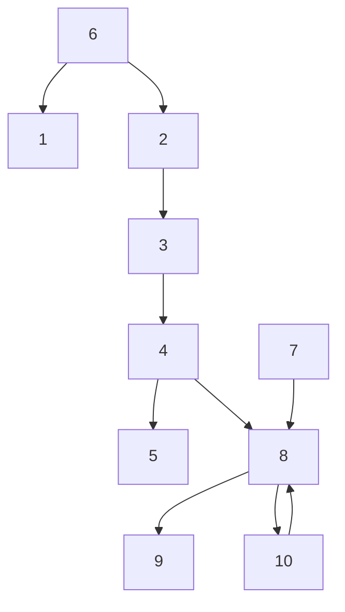
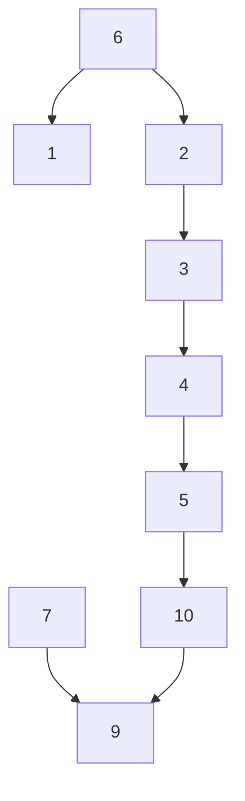
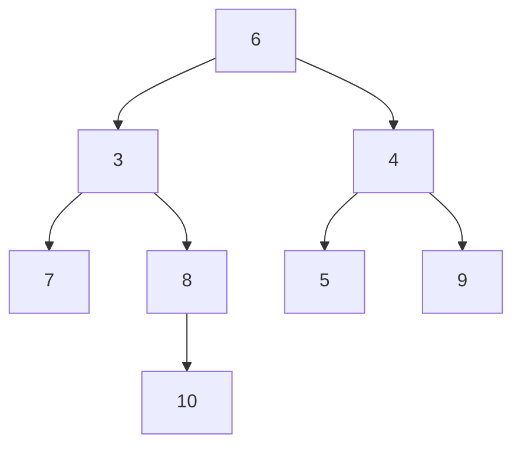
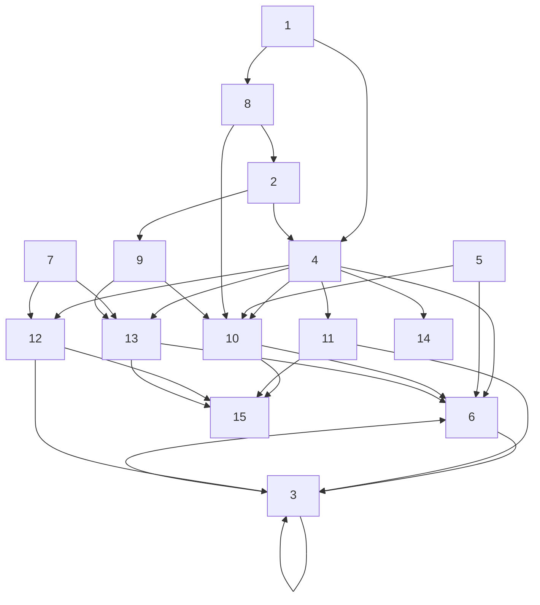
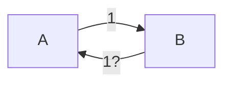

## Team Control Number

For office use only  
T1  
T2  
T3  
T4

## 28747

Problem Chosen

C

For office use only

F1  
F2  
F3  
F4

## 2014 Mathematical Contest in Modeling (MCM) Summary Sheet

## Methods of Measuring Influence Using Network Model

## Summary

In this paper, we build the network model to measure the impact of researchers, papers and so on.

We first use the network model to evaluate the impact of researchers,considering researchers as the nodes, and using sides to describe collaboration among researchers. We then propose the concept of importance degree and influence degree. They are all the properties of nodes. Importance degree depicts a node’s own weight in the network, while influence degree estimates a node’s total influence that mutual impact among nodes is included. Based on the comprehensive consideration of the clustering coefficient and degree, we put forward a new idea to measure a node’s importance degree. Then combining with PageRank algorithm, we can evaluate the influence degree of every node in the network. We can find ALON, NOGA M is the most influential researcher. By analyzing the properties of nodes, we find that for a general researcher, she/he should extend its collaborative network as greatly as possible, especially partner researchers with high importance degree.

Second, imitating previous methodology, we build the model to evaluate the impact of papers. We conclude that factors determining a paper’s influence contain three indexes: the first author’s H-value, the journal’s Impact Factor and cited index which is the concept we define to depict the influence degree of a paper in the aspect of citation. Referring to the previous idea, we construct a new network reflecting citation relationship among papers, then we can obtain the cited index of every paper. After having collected the value of another two indexes, we use AHP to determine the weight of three factors, and finally evaluate the total influence of a paper successfully. We find that the paper Statistical mechanics of complex networks is most influential.

After that we view the other fields instead of the academic area to extend our model. We apply our network model measure Chinese movie stars’ influence. We select a greatly influential movie star to replace the status of Erdös, and construct the cooperating network among movie stars. Having obtained influence degree of stars, the ranking of influence of movie stars maintained a highly consistent with reality. This is proof that our model is feasible. Then we discuss our model’s application for academic, military and SNS fields roughly.

Finally, we make a sensitivity analysis for our model, and discuss the impact of the changing of nodes and the papers’ feedback of citation relationship on the results.

Through previous analysis, we can see that our model can be applied to many files, so it has a relatively high generalization.

## Contents

## 1 Introduction

1.1 Background  
1.2 Our work

## 2 Assumptions . . . 2

## 3 Symbol Description . . . 3

## 4 The influence of researchers . . . 3

4.1 Model one: the measurement of nodes’ importance degree model based on network theory . . . 3

4.1.1 Evaluating the importance of researchers only by Node degree . 4  
4.1.2 Evaluating the importance degree of researchers using clustering coefficient . . 5  
4.1.3 The evaluation model based on the clustering coefficient and degree . . 5

4.2 Model two: the measurement of nodes’ influence degree model based on PageRank algorithm 7

4.2.1 An introduction to PageRank . . . . . 8  
4.2.2 The PageRank evaluation model based on the importance degree. 8

4.3 Result analysis: some interesting data 9

## 5 The influence of papers . . 11

5.1 The citing network of papers . . 11  
5.2 Model three:comprehensive evaluation model based on AHP 12

## 6 Model Extension . . 13

6.1 Applying models to a specific area . . 14  
6.2 Analysis of models expansibility . . . 15

## 7 Error/Sensitivity Analysis . . . . 16

7.1 Sensitivity analysis of the collaborative network . . 16  
7.2 Sensitivity analysis of the citing network . . 17

## 8 Analysis of the Model . . . 18

8.1 Strengths . . 18  
8.2 Weaknesses 18

## 1 Introduction

## 1.1 Background

Do you believe that everyone in the world can establish contact with anyone else by only six persons at most? Even the U.S. President and the boatman of Venice, once finding the right person, they can establish connection. The famous six degrees of separation theory tells us that as long as we find right media, we can build relationship between any two seemingly unrelated entities.

This theory is still applicable in academia. Some researchers can often complete some high-quality papers through cooperation, which is inseparable from the strong relations among them. In this era, interdisciplinary study is very prevalent,so the research capability of researchers and academic standards of the paper are affected by many aspects of intricate academic network. More and more attention has been paid to how to judge the academic level and the quality of papers.

Paul Erdos is a legendary mathematician. In his half-century career in scientific¨ research, he had more than 500 collaborators and published more than 1400 academic papers. There is no doubt that he is one of the most influential founders in the study of interdisciplinary. People can even define a concept called ”collaborative distance”, and use Erdos number to indicate direct and indirect cooperation degree. Erd¨ os 0 represents¨ Erdos himself, Erd ¨ os 1 represents the researchers who had direct cooperation with Erd ¨ os,¨ Erdos 2 represents the researchers who had direct cooperation with Erd¨ os 1, and so on.¨

To study the influence of researchers who had direct cooperation with Erdos(the¨ persons whose Erdos number is one), this passage is inspired by PageRank algorithm¨ used in Google search engine and clustering coefficient which measures the importance degree of each node in the network, and establish network model based on graph theory. We give a methodology to evaluate the influence of researchers and papers, and extend this model to another aspects.

## 1.2 Our work

First, the influence of researchers and the importance of researchers are both a relatively vague concept. In order to get a clear picture of the problem, we think that three factors should be taken into consideration to measure the influence of one researcher:

• The researcher’s extensive degree in the field of cooperation, namely the number of partners.  
• The times of cooperation with other researchers who have strong influence. In this paper, it is the times of cooperation with Erdos.¨

• The academic level of partners who cooperate with the researcher.

The measure of the importance of a research paper should contain the following factors:

• The author’s influence of the research paper’s, we can measure it by H-index.  
• The popularity of the journal which have published this research paper, we can use the journal’s Impact Factor(IF) to express.  
• The number of citation by other researchers.

On the basis of above discussion, to evaluate the influence of researchers and researcher paper, and to promote it to be applied in the actual, we may boil down the tasks to the following four questions :

1. By limiting the size of network and extracting the data, build a co-author network of the 511 researchers from the file Erdos1 and analyze the properties of this network. Develop influence measure(s) to determine the researchers’ influence within the network, and then do evaluation and ranking for them.( Erdos is not there to¨ play these roles.)  
2. Change the object of study and design a model to evaluate the significance of researcher paper. Consider how you would measure the role, influence, or impact of a specific university, department, or a journal in network science? Do ranking for the importance of research paper and compare the difference between these two methodology.  
3. Collect data, and extend previous models and algorithms to other fields in the actual to examine their adaptability .  
4. Discuss the science and utility of the model built before.

## 2 Assumptions

• If a paper was cited more than once in another paper, we regard it as once.  
• The importance degree we measure is for present.  
• The average value of measurement indexes of papers or movie stars can reflect their current impact.  
• The number of cooperation with Erdos can affect a researchers influence degree,¨ but when the number exceed a certain value, the affection would be tend to be a constant.  
• To some degree, the quality of one paper is proportional to the number cited by other papers.

## 3 Symbol Description

In the section, we use some symbols for constructing the model as follows.

<table><tr><td>Symbol</td><td>Description</td></tr><tr><td> $p_i$ </td><td>The researcher is importance degree in the network</td></tr><tr><td> $q_i$ </td><td>The researcher is influence degree in the network</td></tr><tr><td> $H_i$ </td><td>The H-index of paper is author</td></tr><tr><td> $IF_i^i$ </td><td>The Impact Factor of paper is journal</td></tr><tr><td> $E_i$ </td><td>Deviation Degree between the old results and the new ranking results after deleting node i</td></tr></table>

P.s:Other symbols instructions will be given in the text.

## 4 The influence of researchers

Before modeling, to avoid ambiguity, we will define the two confusing concept.

• The importance degree of a node : the node’s influence in the network. It measures a node’s ability to communicate with neighbour nodes and to build the connection among different nodes in the whole network.  
• The influence degree of a node: Due to the connection with other nodes, the node was affected by other nodes and therefore it possesses its own comprehensive strength, namely the influence.

## 4.1 Model one: the measurement of nodes’ importance degree model based on network theory

In order to measure the influence degree of each researcher, according to graph theory, we define the nodes as researchers and the sides as the partnership among researchers . Thus, we establish network model which can reflect the interrelation among the researchers. To facilitate understanding and further analysis, we give the schematic diagram of the network model , shown in Figure 1.

We can see that through small scope of cooperation, researchers promote the connectivity of the whole network, and contribute to the connection among seemingly unrelated fields.


<details>
<summary>flowchart</summary>


</details>

Figure 1: The diagram which describes the relation among 10 researchers


<details>
<summary>flowchart</summary>


</details>

Figure 2: After deleting node 8, the connectivity of the graph has been destroyed.

To evaluate the importance degree of each researcher in the network model, we discuss its measuring method in the following section.

## 4.1.1 Evaluating the importance of researchers only by Node degree

Assume that network $G = ( V ; E )$ is undirected and consists of $| V | = N$ nodes and $| E | = M$ sides. Node degree is the number of sides associated with other nodes, it can expressed as:

$$
k _ {i} = \sum_ {j \in G} \delta_ {i j}
$$

$$
\text { where } \delta_ {i j} = \left\{ \begin{array}{l l} 0, & \text { node   i   and   node   j   are   not   connected } \\ 1, & \text { node   i   and   node   j   are   connected } \end{array} \right. \tag {1}
$$

In Figure 1, node 8 has the most node degree, or $k _ { 8 } = 4$ . If delete it, as shown in Figure 2 , node7,9 and 10 become isolated, the connectivity of the network are badly affected. In contrast, its impact degree decline less if the deleted nodes degree is less. Therefore, the quantity of nodes’ degree represents the importance of researchers.

But, is the nodes which have the same number of degree have the same importance? We analyze it in the following, as is shown in Figure 3 and 4 shown:

In the picture, node 2 and 4 have the same quantities of degree. However, deleting node 2 has no effect on the connectivity of the whole network. After deleting node 4, node 5 is separated , and node 7,8,9,10 lose the connection with node 1,2,3,6. Thus it can be seen that the nodes which have the same number of degree do not always have the same impact degree.

So we can conclude that node degree represents the direct connecting ability with its neighbor node, but it cannot reflect its influence on the connectivity of the whole network. To look for a suitable method to solve this problem, we introduce the concept of clustering coefficient.


<details>
<summary>flowchart</summary>


</details>

Figure 3: The condition of connection after deleting node 2.


<details>
<summary>flowchart</summary>

```mermaid
graph TD
  n6["6"] --> n1["1"]
  n6 --> n2["2"]
  n2 --> n3["3"]
  n3 --> n1
  n7["7"] --> n8["8"]
  n8 --> n9["9"]
  n8 --> n10["10"]
    5 is highlighted in red
```
</details>

Figure 4: The condition of connection after deleting node 4

## 4.1.2 Evaluating the importance degree of researchers using clustering coefficient

Assume the degree of node i is k, then the maximum triangle formed by the k neighbour nodes is $C _ { k } ^ { 2 }$ , hypothesise $e _ { i }$ represents the number of triangle formed by any two neighbor nodes, then clustering coefficient [4]can be defined as:

$$
c _ {i} = \frac {e _ {i}}{C _ {k} ^ {2}} \tag {2}
$$

In graph theory, a clustering coefficient is a measure of the degree to which nodes in a graph tend to cluster together. And in this passage, it describes the cooperation degree between a researcher and his partners.

By analyzing the node 2 and 4 in the Figure 3 and 4, we find because of the node degree of them are both 3, the maximum triangle formed by their neighbour nodes are 3. However, in the actual situation, the triangle number of node 2 is 2 and node 4 is 0, so $c _ { 2 } = { \textstyle { \frac { 2 } { 3 } } } , c _ { 4 } = 0$ . The result indicates that other nodes which have cooperated with node 4 have no connection with each other. Node 4 is crucial in connecting other nodes and is more important than node 2.

However, different from degree index, clustering coefficient can reflect the connectivity of neighbour nodes to some extent, but it cannot show the scale of neighbour nodes. Hence, we should evaluate the importance of nodes by considering node degree and clustering coefficient synthetically.

## 4.1.3 The evaluation model based on the clustering coefficient and degree

First, we consider node degree.

Assume $f _ { i }$ is the sum degree of itself and neighbour nodes for node $i ,$ and it can be expressed as:

$$
f _ {i} = k _ {i} + \sum_ {w \in \Gamma_ {i}} k _ {w} \tag {3}
$$

Where $k _ { w }$ is the degree of node w, $\Gamma _ { i }$ is the collection of node $i \mathbf { \ ' } _ { \mathbf { S } }$ neighbour node. $f _ { i }$ reflects the information between the node’s degree and its neighbour degree.

Then, we consider clustering coefficient.

Assume $g _ { i }$ be :

$$
g _ {i} = \frac {\underset {j = 1} {\max} ^ {N} \left\{\frac {c _ {j}}{f _ {j}} \right\} - \frac {c _ {j}}{f _ {j}}}{\underset {j = 1} {\max} ^ {N} \left\{\frac {c _ {j}}{f _ {j}} \right\} - \underset {j = 1} {\min} ^ {N} \left\{\frac {c _ {j}}{f _ {j}} \right\}} \tag {4}
$$

where $c _ { i }$ is the clustering coefficient of node i. Because clustering coefficient indicate the connection degree among neighbour nodes, but cannot reflect their scale, so ci $\frac { c _ { i } } { f _ { i } }$ can be normalized. Shown as equation (4) [5], $g _ { i }$ also show closeness among neighbour nodes.

Assume $p _ { i }$ is the importance degree of node $i ,$ to evaluate the importance of nodes synthetically, we deal with $f _ { i }$ and $g _ { i }$ by the chemotactic function $\textstyle \left[ 5 \right] u ( x ) = { \frac { x } { \sqrt { \sum x ^ { 2 } } } }$ so we get the importance degree $p _ { i }$ [?]as:

$$
p _ {i} = \frac {f _ {i}}{\sqrt {\sum_ {j = 1} ^ {N} f _ {j} ^ {2}}} + \frac {g _ {i}}{\sqrt {\sum_ {j = 1} ^ {N} g _ {j} ^ {2}}} \tag {5}
$$

On the other hand, consider every researcher has different times of direct cooperation with Erdos, and the times can reflect the importance of researcher to some degree. So¨ to quantify the index, we use a piecewise function to simulate the impact of x direct cooperation with Erdos on the researchers’ importance, it is expressed as:¨

$$
P _ {i} (x) = \left\{ \begin{array}{c} 0. 0 0 2 x ^ {\frac {1 1}{1 0}}, 0 <   x <   6 5 \\ 0. 2, x \geq 6 5 \end{array} \right. \tag {6}
$$

Therefore, the comprehensive importance of every researcher is:

$$
q _ {i} = P _ {i} (x) + p _ {i} \tag {7}
$$

In order to simplify the calculation, we only study the co-author network of the Erdos 1 authors, then we get the ¨ $q _ { i }$ of 511 researchers and list the top ten researchers as shown in Table 1.(Note that this ranking is not the researchers eventually influence ranking, but the importance in the network.)

Table 1: The ranking of researchers’ importance degree $q _ { i }$

<table><tr><td>Rank</td><td>Name</td><td>q</td><td>Cooperation Year</td><td>Times</td></tr><tr><td>1</td><td>ALON, NOGA M.</td><td>0.2070</td><td>1985</td><td>5</td></tr><tr><td>2</td><td>HARARY, FRANK*</td><td>0.1820</td><td>1965</td><td>2</td></tr><tr><td>3</td><td>GRAHAM, RONALD LEWIS</td><td>0.1820</td><td>1972</td><td>28</td></tr><tr><td>4</td><td>RODL, VOJTECH</td><td>0.1795</td><td>1983</td><td>11</td></tr><tr><td>5</td><td>BOLLOBAS, BELA</td><td>0.1795</td><td>1962</td><td>28</td></tr><tr><td>6</td><td>TUZA, ZSOLT</td><td>0.1698</td><td>1989</td><td>11</td></tr><tr><td>7</td><td>FUREDI, ZOLTAN</td><td>0.1698</td><td>1982</td><td>10</td></tr><tr><td>8</td><td>SOS, VERA TURAN</td><td>0.1623</td><td>1966</td><td>35</td></tr><tr><td>9</td><td>SPENCER, JOEL HAROLD</td><td>0.1522</td><td>1971</td><td>23</td></tr><tr><td>10</td><td>PACH, JANOS</td><td>0.1393</td><td>1980</td><td>21</td></tr></table>

By statistics, Erdos had cooperated 1671 times in total with the 511 researchers and¨ the average number of collaborative time is 3. Analyzing the data according to Table 1, we find in most cases that the top ten researchers’ importance are those who cooperated with Erdos frequently and their first cooperation is very early. The reasonable explana-¨ tion for this phenomenon is that their frequent and early cooperation help them develop and grow in the collaborative network , and their importance is irreplaceable. We call this kind of group ”old researcher”.

Compared with them, the researchers whose first cooperation with Erdos is relatively¨ late (”young researcher”) cannot build a mature network relationship. Their importance is low, but it cannot explain why they don’t possess strong scientific researcher influence. For example, if a ”young researcher” can cooperated with a ”old researcher”, she/he may make a breakthrough and improve their influence degree. Therefore, it is not the final index to evaluate the influence. We need to establish a objective model to evaluate the impact in view of the cooperation influence on the researcher.

## 4.2 Model two: the measurement of nodes’ influence degree model based on PageRank algorithm

For the sake of assessing influence of researchers reasonably, to consider researchers’ own importance degree and influence degree determined by their collaborative network, we introduce PageRank algorithm to deal with this problem.

## 4.2.1 An introduction to PageRank

Because of its powerful retrieval function and high quality retrieval serviceGoogle is one of the most popular search engines. Using its PageRank algorithm to calculate the PageRank values of each web page, Google get the rank of the web page by balancing the number of links to the search target and the quality of these links. The higher the value of PageRank is, the higher the rank has[2].

## 4.2.2 The PageRank evaluation model based on the importance degree.

In section 4.1, we’ve got important degree of every researchers, set $a _ { i j }$ is the importance degree of node i to node $j ,$ so we can get the adjacent matrix among nodes in the network, we use A to express:

$$
A = \left[ \begin{array}{c c c c} a _ {1 1} & a _ {1 2} & \dots & a _ {1 n} \\ a _ {2 1} & a _ {2 2} & \dots & a _ {2 n} \\ \vdots & \vdots & \ddots & \vdots \\ a _ {n 1} & a _ {n 2} & \dots & a _ {n n} \end{array} \right] \tag {8}
$$

$$
\text { Where }, a _ {i j} = \left\{ \begin{array}{l} 0, \text { i   and   j   connect } \\ q _ {i}, \text { i   and   j   don't   connect. } (i, j = 0, 1, 2, \dots , 5 1 1) \end{array} \right. \tag {9}
$$

To distribute the researcher’s importance equally to researchers who cooperated she/he , normalize each line of the matrix, set this new matrix be $\bar { A }$ , then transpose A¯ and get the matrix of transition probability W , or:

$$
W = \bar {A} ^ {T} = [ w _ {i j} ] _ {5 1 1 \times 5 1 1} \tag {10}
$$

Assign each researcher a PageRank value $x _ { i }$ it should be determined by his(her) partners’ importance degree $q _ { i }$ . In a other word, one researcher’s influence degree is proportional to her/his partners’ importance.

Set the common proportionality coefficient be $\lambda .$ , we can get the following linear equations:

$$
\sum_ {j = 1} ^ {N} w _ {i j} x _ {j} = \lambda x _ {i}, (x _ {i} = q _ {i}, i = 1, 2, \dots , 5 1 1) \tag {11}
$$

Let $X = ( x _ { 1 } , x _ { 2 } , \ldots , x _ { 5 1 1 } ) ^ { T }$ be column vector formed by the effect from other researchers. Through matrix multiplication, equation (4.2.2) can be expressed as:

$$
W X = \lambda X \tag {12}
$$

Thus we can obtain the maximum positive eigenvalues of the transition probability matrix $\lambda _ { m a x }$ and the corresponding non-negative feature vector $X _ { m a x } = ( x _ { 1 } , x _ { 2 } , \cdot \cdot \cdot , x _ { 5 1 1 } ) ^ { \dot { T } }$ , so we get researchers’ impact $x _ { 1 } , x _ { 2 } , . . . . x _ { n }$ and ultimately influence rankings. We only list top ten researchers, shown in Table 2.

Table 2: The top ten researchers influence degree

<table><tr><td>Rank</td><td>Name</td><td>p</td></tr><tr><td>1</td><td>ALON, NOGA M.</td><td>0.3939</td></tr><tr><td>2</td><td>GRAHAM, RONALD LEWIS</td><td>0.3113</td></tr><tr><td>3</td><td>BOLLOBAS, BELA</td><td>0.3021</td></tr><tr><td>4</td><td>RODL, VOJTECH</td><td>0.2702</td></tr><tr><td>5</td><td>FUREDI, ZOLTAN</td><td>0.2401</td></tr><tr><td>6</td><td>TUZA, ZSOLT</td><td>0.2373</td></tr><tr><td>7</td><td>HARARY, FRANK*</td><td>0.2113</td></tr><tr><td>8</td><td>SOS, VERA TURAN</td><td>0.2068</td></tr><tr><td>9</td><td>SPENCER, JOEL HAROLD</td><td>0.1988</td></tr><tr><td>10</td><td>FAUDREE, RALPH JASPER, JR.</td><td>0.1798</td></tr></table>

## 4.3 Result analysis: some interesting data

We already know, the researchers’ importance index and influence index are two different evaluation criterions of measuring the level of scientific researchers. The former reflects the researcher’s ability to contribute to the connection in the network by contacting other researchers, while the latter shows the researcher is affected by herself/himself and her/his partners and can change these factors into her/his overall influence.

Comparing the rank result of the two methods, we find that the change of over 80% researchers’ ranking is within 75. In view of their difference of emphasis, it is acceptable.

However, analyzing the remaining data, we find some interesting phenomenon,we show it in Table 3

In the above table, we define the area of yellow as stable data, the area of green as positive data and the area of red as negative data.

• Stable data: we analyze the top five influence of researchers and find their ranking is closely to their importance ranking. We conclude the influence degree of the researchers with large importance degree is also great.

Table 3: The schematic diagram of researchers’ indexes

<table><tr><td>Name</td><td>q rank</td><td>p rank</td><td>p-q</td><td>Year</td><td>times</td></tr><tr><td>ALON, NOGA M</td><td>1</td><td>1</td><td>0</td><td>1985</td><td>5</td></tr><tr><td>GRAHAM, RONALD LEWIS</td><td>3</td><td>2</td><td>1</td><td>1972</td><td>28</td></tr><tr><td>BOLLOBAS, BELA</td><td>5</td><td>3</td><td>2</td><td>1962</td><td>18</td></tr><tr><td>RODL, VOJTECH</td><td>4</td><td>4</td><td>0</td><td>1983</td><td>11</td></tr><tr><td>FUREDI, ZOLTAN</td><td>7</td><td>5</td><td>2</td><td>1982</td><td>10</td></tr><tr><td>PYBER, LASZLO</td><td>362</td><td>70</td><td>292</td><td>1988</td><td>3</td></tr><tr><td>TETALI, PRASAD VARA</td><td>359</td><td>80</td><td>279</td><td>1990</td><td>2</td></tr><tr><td>LINIAL, NATHAN</td><td>364</td><td>89</td><td>275</td><td>1987</td><td>2</td></tr><tr><td>FISHBURN, PETER C</td><td>494</td><td>143</td><td>351</td><td>1991</td><td>9</td></tr><tr><td>TENENBAUM, GERALD</td><td>488</td><td>211</td><td>277</td><td>1981</td><td>7</td></tr><tr><td>STEIN, ALAN H</td><td>375</td><td>507</td><td>-132</td><td>1983</td><td>1</td></tr><tr><td>SMITH, PAUL R</td><td>377</td><td>508</td><td>-131</td><td>1990</td><td>1</td></tr><tr><td>MAXSEIN, THOMAS*</td><td>399</td><td>509</td><td>-110</td><td>1990</td><td>1</td></tr><tr><td>ZIV, ABRAHAM</td><td>367</td><td>510</td><td>-143</td><td>1961</td><td>1</td></tr></table>

• Positive data: Some researchers’ influence degree ranking improve by more than 250 than their importance degree ranking, some even improve by 351. Their common feature is their first cooperation with Erdos is late, so their cooperation¨ network cannot develop maturely and their importance degree ranking is low. However, by cooperating frequently with high influence researchers, their influence degree can be promoted. Take FISHBURN, PETER C as an example, not only does she/he cooperated frequently with Erdos, but also cooperate with some re-¨ searchers whose importance degree is high(FUREDI, ZOLTAN,GRAHAM, RON ALD LEWIS and SPENCER, JOEL HAROLD), so his influence degree ranking have greatly improved. We conclude that even with lower importance degree in the network, one can enhance its influence degree by cooperating with highly influential researchers.

• Negative data: We find four researchers’ influence degree drop more than 100. Investigating their data, we get their partners are more than 20, but over half of them don’t belong to Erdos 1. The result shows that the researcher who cooperate¨ less frequently have low influence degree.

So we can draw the conclusion that a researcher can improve their influence by enhancing its own collaborative network, and the importance degree of its partners plays an

important role in enhancing its influence.

## 5 The influence of papers

To evaluate research papers’ influence, we choose 15 research papers in appendix and use the method of the section §4. We establish a model which reflects the interaction among researcher papers.

Undoubtedly, the best way to evaluate the influence degree of a research paper is examining the quality of the content. However, there doesn’t exist a great and direct method for it. Therefore, we need to look for indexes to evaluate indirectly. By analysis, we think the factors that affect the influence degree of research papers is mainly manifested in two aspects.

External influence degree: the citing of a paper is an important index to measure its influence. By analyzing the relation of the mutual citing of these 15 papers, we can build a citing network similar to model one, and use PageRank algorithm to evaluate every paper’s influence degree.

Internal influence degree: It is also affected by its first author’s level of scientific research, namely H index, and the influence of the journal, namely Impact Factor(IF).

So we choose the above three indexes to evaluate papers’ influence degree.

## 5.1 The citing network of papers

First of all, different from network relationship of researchers, one research paper can only cite the paper published before it and there is no relationship of cooperation between them. Nevertheless, once cited, it indicates this research paper gets the affirmation from other researchers. The more the researcher paper is cited, the higher influence of this researcher paper will have. Meanwhile, the quoter can also benefit from it and improve his(her) paper impact. Hence, we can establish feedback relationship like researchers. We establish the network relationship graph among research papers. The nodes represent research papers and the sides represent the feedback relationship among research papers (we assume that the effects of interaction of two papers exist citing relation are equal), shown in the Figure 5.

Using the PageRank algorithm in model two, we can get the influence degree in the network, we call it paper cited index, set it be r, which measures its cited influence.

By collecting data from authoritative website( such as SCI ,Google Scholar), we use the number cited by others as the index to measure the importance degree q of every node.


<details>
<summary>flowchart</summary>


</details>

Figure 5: The citation network among papers

Set the adjacency matrix of the nodes in the network be A:

$$
A = \left[ \begin{array}{c c c c} a _ {1 1} & a _ {1 2} & \dots & a _ {1 n} \\ a _ {2 1} & a _ {2 2} & \dots & a _ {2 n} \\ \vdots & \vdots & \ddots & \vdots \\ a _ {n 1} & a _ {n 2} & \dots & a _ {n n} \end{array} \right] \tag {13}
$$

$$
\text { Thereinto, } a _ {i j} = \left\{ \begin{array}{l} 0, \text { i   and   j   connect } \\ q _ {i}, \text { i   and   j   don't   connect } \end{array} \right. \tag {14}
$$

Normalize A and use equation (11), we can get r of these 15 research papers.

## 5.2 Model three:comprehensive evaluation model based on AHP

r can only reflect the effect from eternal element. To evaluate a research paper overall, we are determined to use AHP and calculate the weight of IF, H index and r.

We think that in the progress of measuring a research paper, the first author shouldn’t be considered too much. Except that, the contribution of internal factor is greater than external factor . So we set the size of relationship of the three factors: $I F > r > H$ .

By this principle, we give Pairwise comparison matrix:

$$
\begin{array}{c c c c} & I F & H & r \\ I F & \left( \begin{array}{c c c} 1 & 4 & 2 \\ \frac {1}{4} & 1 & \frac {1}{4} \\ \frac {1}{2} & 4 & 1 \end{array} \right) \end{array} \tag {15}
$$

We then input the matrix into YAAHP and calculate the weight of each factor: $\alpha _ { I F } =$ 0.5469, $\alpha _ { H } = 0 . 1 0 8 5 , \alpha _ { r } = 0 . 3 4 4 5$ .

The final expression of evaluating one paper’s influence degree is:

$$
T _ {i} = \alpha_ {I F} I F _ {i} + \alpha_ {H} H _ {i} + \alpha_ {r} r _ {i} \tag {16}
$$

In the following ,we test the consistency of the AHP.

1. The consistency index $\begin{array} { r } { C I = \frac { \lambda _ { m a x } - n } { n - 1 } } \end{array}$ should be close to 0;we get $C I = 0 . 0 5 1 6$

2. The consistency ratio $\begin{array} { r } { C R = \frac { C I } { C R } } \end{array}$ should be less than 0.1;We get $C R = 0 . 0 2 $ . Hence, our decision method displays perfectly acceptable consistency and weights are reasonable.

List the top five influence degree, shown in Table 4:

Table 4: The schematic diagram of papers’ indexes

<table><tr><td>rank</td><td>Paper&#x27;s number</td><td>H</td><td>IF</td><td>r</td></tr><tr><td>1</td><td>2</td><td>39</td><td>44.982</td><td>1.4547</td></tr><tr><td>2</td><td>4</td><td>102</td><td>31.853</td><td>1.9397</td></tr><tr><td>3</td><td>13</td><td>39</td><td>32.182</td><td>1.5764</td></tr><tr><td>4</td><td>12</td><td>39</td><td>31.853</td><td>-0.6369</td></tr><tr><td>5</td><td>7</td><td>25</td><td>32.182</td><td>-0.6139</td></tr></table>

In the first three tasks, we have solved the problem of measuring the influence degree of researchers and papers. If we are able to get enough information about research papers and researchers, we can create a research database. If we want to evaluate the research strength of a university or a department in a certain field, we need to look for the researchers and the research papers in recent years of this organization ,then inquire their influence in the database. Finally we can determine the strength of it by choosing a suitable evaluation (such as TOPSIS).

## 6 Model Extension

In model one and model two, using the network model, we quantify the influence of researchers and papers, showing the strong ability of our model to evaluate academic index. As a matter of a fact, our models can be applied in various fields seemingly have nothing to do with science. So in the following section, we will employ our network model to evaluate the influence of Chinese movie stars, and consider its extension widely.

## 6.1 Applying models to a specific area

The cinema of Hong Kong is one of the three major threads in the history of Chinese language cinema, alongside the cinema of China, and the cinema of Taiwan. For decades, Hong Kong was the third largest motion picture industry in the world and the second largest exporter. So it is obvious that the industry of Hong Kong’s cinema plays such a predominate role in China and even the whole world that it has greatly prompted the development of the cinema industry in Taiwan and Chinese mainland. There are some illuminated movie stars from Hong Kong, such as Jackie Chan, Tony leung chiu wai, Andy Lau and so on who also have a great reputation around the world.[6]

For the fact that Tony leung chiu wai has a very magnificent cinema career, including being awarded the Golden Horse best actor nomination more than once, we decide to replace the Erdos in the previous network model with him, and then qualify the range of¨ time and the region, in ordering that we can construct a new network model based on the Model 1 which can be used to assess a movie star’s influence degree.

For the fact that Tony leung chiu wai has a very magnificent cinema career, including being awarded the Golden Horse best actor nomination more than once, we decide to replace the Erdos in the previous network model with him, and then qualify the range of¨ time and the region, in ordering that we can construct a new network model based on the Model 1 which can be used to assess a movie star’s influence degree.

Besides that, we also need an index to assess each actor’s effect on the Chinese mainland’s box-office, and the index can be considered as the importance degree of Model 1 as a balance of a actor’s strength. We normalize the average of the box-office of movies where each actor has participated in recent five years as the number of this box-office’s influence.

Table 5: The indexes of the movie starts

<table><tr><td>rank</td><td>degrees</td><td>Name</td><td>influence degree</td><td>box-office</td></tr><tr><td>1</td><td>11</td><td>Zhou Xun</td><td>0.4213</td><td>0.9128</td></tr><tr><td>2</td><td>9</td><td>Zhao Wei</td><td>0.3612</td><td>0.9578</td></tr><tr><td>3</td><td>11</td><td>Takeshi Kaneshiro</td><td>0.3488</td><td>0.6770</td></tr><tr><td>4</td><td>16</td><td>Andy Lau</td><td>0.3443</td><td>0.6058</td></tr><tr><td>5</td><td>15</td><td>Zhang Ziyi</td><td>0.3122</td><td>0.5697</td></tr><tr><td>6</td><td>11</td><td>Shu Qi</td><td>0.2789</td><td>0.6422</td></tr><tr><td>7</td><td>8</td><td>Jet Li</td><td>0.2633</td><td>0.7619</td></tr><tr><td>8</td><td>9</td><td>Donnie Yen</td><td>0.2315</td><td>0.5731</td></tr><tr><td>9</td><td>8</td><td>Jackie Chan</td><td>0.2183</td><td>0.9323</td></tr><tr><td>10</td><td>8</td><td>Louis Koo</td><td>0.1319</td><td>0.3273</td></tr></table>

Putting the number into the matrix depicting the cooperated relationship between different actors, we can get the numerical data of the 31 actors influence degree using the PageRank algorithm. Ranking the stars by the influence degree, we can get the Top ten shown in the chart:

Analyzing the Table 5, we can find out that the box-office indicating the actors strength has some contribution on the stars influence, but the actors cooperating relationship network also is an unignorable factor. Taking Zhang Ziyi as an example, while she has a inferior box-office than other stars, we just find the corresponding node has a higher degree, that is ,she has many more cooperated stars than others, which results in her higher influence degree. However, the Jackie Chan is an odd case, he mainly participated in the action movies, adding his lack of cooperation with mainland actors, thus his overall influence is not that superior despite of his strong box-office.

What’s more, the current top ten stars on influence almost have a worldwide reputation, such as Jackie Chan, Jet Li, Zhang Ziyi, Zhou Xun and so on. On the other side, some inferior-reputation stars are located in the relatively low position in the influence ranking. In conclusion, using the network model to assess the influence degree of stars is appropriate and practicable.

Finally ,we just use the Tony leung chiu wai as a core to construct the stars’ cooperation network, which is absolutely not practicable for all of Chinese actors in the same way. This is our work’s limitation. However, we can still find out the extensive prospect of our network model.

## 6.2 Analysis of models expansibility

In fact, our network model is valuable in the area that as long as the connection and interaction exist. In the following sections, we discuss the utility of network model into the fields of academic, military and social networks etc. Using model one and model two in one subject, we can evaluate the influence of researchers and papers. Assume the network is big enough to record the vast majority of papers and researchers within one subject in it, and then we can establish a database to evaluate the influence of researchers and papers within the subject. Its significance is self-evident as section 5.2 mentioned before, we can use a network model as a standard to judge the influence of a certain discipline in a scientific research institution for the students who seeking master for further study to provide reliable reference. By adding virtual edge in the network, a researchers influential change can be simulated that he working with different colleagues. Thus it helps young scholars to plan their academic impact as soon as possible. But unfortunately, due to the measurement of research indexes (such as H index, IF etc.) for various disciplines is different. How to create a research database that contains various disciplines requires people to further study.

Assume each node represents a particular city and edge represents the relationship between cities and transportation, considering economic, transportation and other indexes to measure the importance of every city, we can build a network model available to evaluate the influence of the city. For example, when forces attacked a certain area, as a commander, he can use this network model to find the one of the most influential city in a certain area to destroy prior in order to weaken the enemy forces.

In addition, we can generalize the use of this model into social networking sites, such as Twitter and Facebook. Network users could be seen as nodes in the network and the friendship between network users represent the edge in the network. Algorithm of model 1 and model 2 can be used to identify each user’s influence in the social network. We can simulate the useful or junk information transmission in the Internet by mapping the users influence into the probability that one person forward its friends short blogs. Thus, it helps researchers to further study on this aspect.

Thus it can be seen that our network model in the treatment of the relationship and mutual influence of this kind of problem has a wide range of application scope, and generally can give effective solutions. Thus, our model posses science, understanding and utility.

## 7 Error/Sensitivity Analysis

## 7.1 Sensitivity analysis of the collaborative network

In model one, we build the network model describing relative collaboration among researchers. In the network, the importance degree of a node reflects its ability to communicate with others and make different nodes connect with each other. Actually, it is the index to measure whether the researcher’s collaborative network is vast. We then discuss the value on the result of model calculation.

Through the analysis in section 4.1.3, we can get the rank list of all the nodes’ $q$ value. Considering the researcher of ALON, NOGA M with the maximum q value, CONWAY, JOHN HORTON with the middle q value, GUNDERSON, DAVID SHANE with the minimum q value, we delete respectively these nodes which they represent in the network. Then, we use model one and model two to calculate the influence degree of every node in the total network, and get the new rank list of $p .$ .

Set the ranking of node j before deleting node i is $o _ { i j }$ , and the ranking of node j after deleting node i is $m _ { i j }$ . Then we can define the Deviation Degree between the old results and the new ranking results after deleting node i as $E _ { i }$ .

i.e.

$$
E _ {i} = \frac {\sum_ {j} ^ {n} \left| o _ {i j} - m _ {i j} \right|}{n} \tag {17}
$$

The results as shown in Table $6 { : }$

Table 6: Deviation Degree of results

<table><tr><td>Name</td><td>E</td><td>q</td></tr><tr><td>ALON, NOGA M</td><td>41.5730</td><td>0.2070</td></tr><tr><td>CONWAY, JOHN HORTON</td><td>14.8052</td><td>0.0794</td></tr><tr><td>GUNDERSON, DAVID SHANE</td><td>8.0745</td><td>0.0484</td></tr></table>

According to the above data, we can see that for a certain node, the bigger of q value, the stronger of the researcher’s communication with each other, then the more influential contribution of the node to the calculation results in the total networks. That is to say, if we delete the nodes with large values of the importance degree, the influence degree of other nodes in the network may even have colossal changing! In addition, for some nodes with small q values, due to their less contact with other nodes, even though we delete them from the network, it doesn’t have a great influence on the final results.

## 7.2 Sensitivity analysis of the citing network

In the section §5.1, we build the relational network based on the condition of citing among the 15 papers. We analyzed that there exists the feedback in the citing relation among papers, and assumed that the effect of the interaction is equal between two nodes which have citing relation.

It is unquestionable that the feedback of citing is subsistent. Note that assume paper A cites paper B, the influence of paper A would affect paper B obviously, but the impact which B influences on A is not always equal to the effect of A to B. Under the circumstances, we call A as the citing paper, and B as the cited paper. Then we set the impact ratio of B to A and A to B as u. Having assumed the value of u is 1 in the section 5, now we try to change the value and observe the variation of results.


<details>
<summary>flowchart</summary>


</details>

Figure 6: The schematic diagram reflects citation relation of A and B

Similarity, we define E as the index to measure Deviation Degree of the results. But the difference is that we consider the Deviation Degree between the new ranking result and the old one has been calculated in section 5.1.

The following Figure 7 reflects the E along with the changes of the u.


<details>
<summary>line chart</summary>

| u    | E     |
| ---- | ----- |
| 0.1  | 2.5   |
| 0.3  | 2.8   |
| 0.4  | 0.4   |
| 0.5  | 0.1   |
| 0.6  | 2.8   |
| 0.7  | 0.0   |
| 0.8  | 0.1   |
| 0.9  | 0.0   |
</details>

Figure 7: The changing of the Deviation Degree along with u

For a evaluation model, we hope that it can be stable as much as possible, and will not vary greatly because of some small changes in the parameters. Observing this figure, we can find that the calculation results on the whole will produce certain change along with the different values of u. However, when u gets in the interval of [0.7, 1], the variation of the results is relatively small, so it’s appropriate that we put u into this interval.

## 8 Analysis of the Model

## 8.1 Strengths

• In model one, we not only consider the degree of nodes, but also consider the nodes’ clustering coefficient.  
• In model two, we use PageRank algorithm to evaluate the connection among researches, reflecting the mutual influence of nodes in the network.  
• In model three, we successfully quantify various indicators and consider the external factors and internal factors at the same time. So our results are comprehensive and objective.  
• Our models are sensitive and show a great adaptability , and can be applied in various aspects.

## 8.2 Weaknesses

• Because the lack of data, we only choose a small part of papers to analyze.  
• In model three, the weight is calculated by AHP. So our results exist subjectivity.  
• When extending our model, we only choose 32 actors to build the network relationship. The scale is relative small.

## References

[1] Ren Zhuoming;Shao Feng;Liu Jianguo;Guo Qiang;Wang Binghong,Node importance measurement based on the degree and clustering coefficient information,Acta Phys.Sin. Vol.62,No.12(2013)  
[2] Zhao Guo; Song Jiancheng, The mathematical model and its application of Google’s search. Journal of Southwest Universities Nature Science Edition,May 2010  
[3] Shao Jingjing;Feng Bo;Li Bo,PageRank algorithm ranking of the new technology,JOURNAL OF HUAZHONG NORMAL UNIVERSITY(Nat. Sci.),Vol.42 No.4,Dec 2008  
[4] Watts D J, Strogatz S H, Nature 393 440,1998  
[5] Codd E F,Commun. ACM 13 37,1970  
[6] Cinema of Hong Kong http://en.wikipedia.org/wiki/Hong Kong movie scholar.google.com  
[7] web of science http://www.medsci.cn/sci/