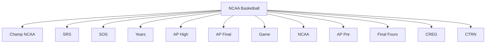
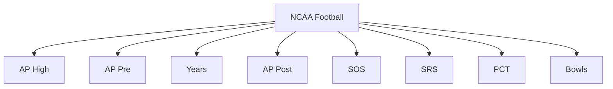
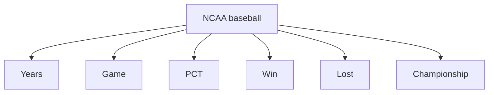
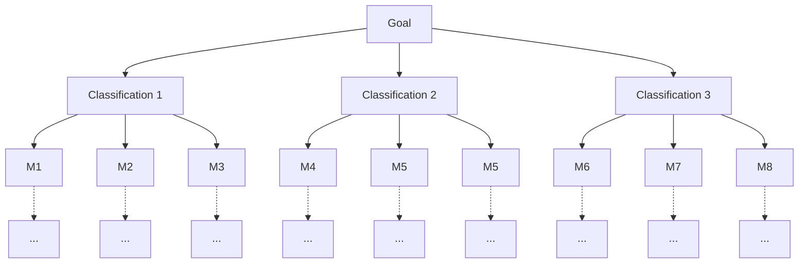
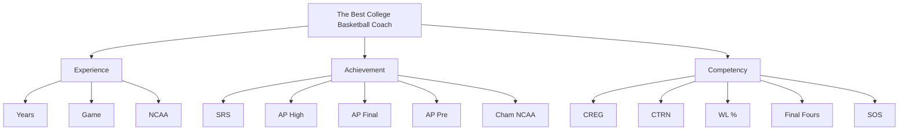
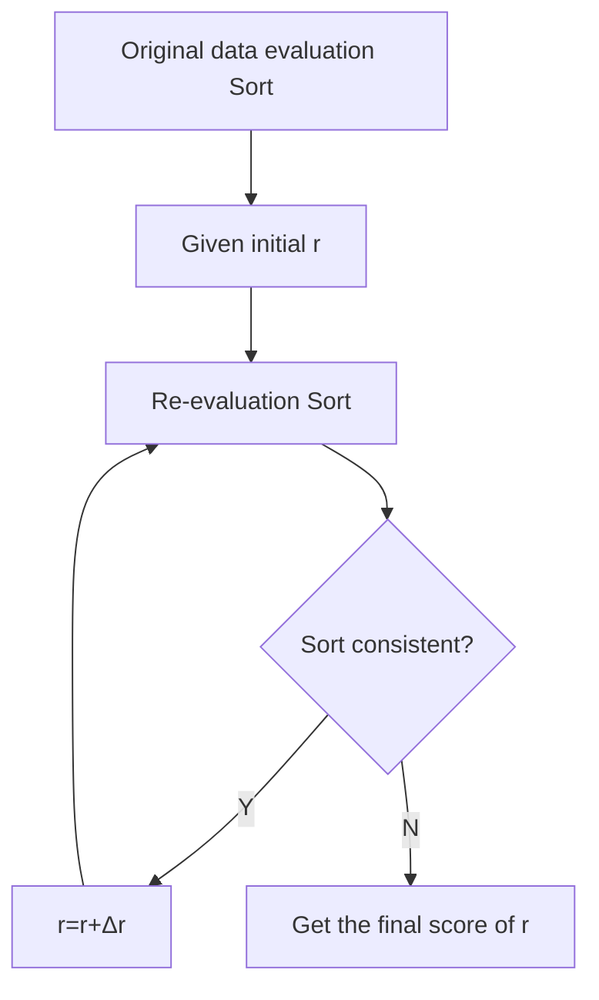

Team Control Number

For office use only

T1

T2

T3

T4

## 28875

Problem Chosen

B

For office use only

F1

F2

F3

F4

# 2014 Mathematical Contest in Modeling (MCM) Summary Sheet

## Summary

Our goal is a model that finding out the “best all time college coach”. This is crucial to the promotion of the college coaching. Evaluation methods must reflect the practical training level and ability scientific, accurate, comprehensive and objectively. In our paper, to guarantee the fair and equitable of the selection results, comprehensively considered coaches coaching skills, experience, team management and his/her team performance and other aspects of teaching. Determine the metrics such as Games, Winning percentage, Championships, etc. for assessment. Then build a fuzzy comprehensive evaluation model based on improved analytic hierarchy process named IAHP-FCE model to find out The Best All Time College Coach for Sports Illustrated.

First of all, we applied the analytic hierarchy process (AHP) and fuzzy comprehensive evaluation method (FCE). Standardized the metrics data we collected by eliminate the effects of dimension. And calculate the relative membership degrees among the metrics. Then according to the fuzzy evaluation matrix constructed by the single metrics relative membership degree, built the modification of judgment matrix in the AHP. Secondly, calculated the weights of each metrics based on the reciprocity of judgment matrix. And carry on the consistency check using the single target linear programming to calculate the consistency index coefficient by Lingo7.0. Thirdly, build a fuzzy comprehensive evaluation model based on Analytic Hierarchy Process named AHP-FCE modelⅠ. Using modelⅠwe can obtain the composite score of each coach. Take NCAA Basketball to test the modelⅠ. Finally, we got the Top 5. Compare with the Authority Top 5 coaches, the accuracy of modelⅠ is 80%.

To achieve our goal, we need get a higher Accuracy, so we decided to improve the model by introduced the Classification thought to decompose the metrics into 2 levels. Based on the modelⅠ and combined the new Classification, we built a simplified calculation and higher accuracy modelⅡ named IAHP-FCE modelⅡ. Then also take NCAA Basketball to rank the Top 5, followed by Mike Krzyzewski、Dean Smith、 John Wooden、Bob Knight and Roy Williams. Contrast with the Authority Ranking, the modelⅡ is correct almost 100%. So modelⅡ got a great improvement.

As to popularize the model to all possible sports, only need input the metrics data and get the weights, then you can rank the coaches across all possible sports. We applied the model in NCAA Football and Baseball, then got the both rank Top 5 coaches, balance the two Authority ranks, we also gets the high accuracy. So the model we improved can apply in general across all possible sports.

For apply the model across both genders, we use the model to calculate the female coach Ranking of NCAA Female Basketball and list their Top 5. Contrast with the official rank, the result is almost perfect. Fully verified the model can apply across both genders.

Ranking the final composite score of males and females coach’s which from the three biggest NCAA League. We ultimately find out The Best All Time College Coach----Pat Summitt, winning eight NCAA national championships, and she is the only coach in NCAA history, and one of three college coaches overall, with at least 1,000 victories.

In order to clearly articulate the difference which time line horizon, we randomly select multiple coaches from different gender and sports fields. Using the modelⅡ to work out the coach’s each year composite score separately. Draw the line chart with their coaching score and coaching years. Then contrast individually between the same fields and different sex, between the different fields and same sex, between the same fields and same sex, finally we got the conclusion that with the rise of the time line horizon, the coaching score always ups and downs within a certain range. In general, their coaching score ups gradually with the growth of his/her coaching years.

What’s more, we tested the model from four aspects, Dimensional consistency test, Model and model results deviation test, assumptions reasonableness test and Sensitivity analysis of the model parameters. Eventually the change threshold average interval of evaluation metrics in sensitivity analysis is 0.0297, less than 10%, all the test results indicate that the model we built is qualified.

In summary, the IAHP-FCE model we improved achieved our goal. That is simplified calculation, accurate results and wide utility. It can be applied in general across both genders and all possible sports. In the long run, this model can be used for solving those practical problems in our daily life, for example the housing choice, the investment risk evaluation and tourism plan, etc.

# Finding Out The Best All Time College Coach

## Abstract

Finding out the “Best All Time College Coach” is crucial to the promotion of the college coaching. We build a fuzzy comprehensive evaluation model based on improved analytic hierarchy process named IAHP-FCE model to find out The Best All Time College Coach for Sports Illustrated.

First of all, we applied the content analysis and bibliometrics method to determine the metrics such as games, winning percentage, championships, etc. for assessment. And standardized the metrics data by eliminate the effects of dimension. Then build a fuzzy comprehensive evaluation model based on analytic hierarchy process named AHP-FCE modelⅠ. Take NCAA Basketball to testing. Finally, we got the Top 5. Compare with the authority Top 5 coaches, the accuracy of modelⅠ is 80%.

For the sake of a less calculation and higher accuracy model, we improved the model by introduced the classification thought to decompose the metrics into 2 levels. Then obtain the IAHP-FCE modelⅡ. Then also take NCAA Basketball to rank the Top 5, Mike Krzyzewski、Dean Smith、John Wooden、Bob Knight and Roy Williams. Contrast with the authority ranking, the accuracy of modelⅡ is 100%. So the modelⅡ gets a higher accuracy. Input the metrics data and get the weights, we obtained each the coaches Top 5 in NCAA Football, Baseball and Woman’s Basketball. Balance the official ranks, the result is almost perfect. Fully verified the model can applied in general across all possible sports and both genders.

Ranking all the coaches composite scores, finally find out The Best All Time College Coach. She is Pat Summitt, winning eight NCAA national championships.

Next, we contrast the line chart individually between the same fields and different sex, between the different fields and same sex, between the same fields and same sex, finally got the conclusion that with the rise of the time line horizon, the coaching scores always ups and downs within a certain range. In general, their coaching score ups gradually with the growth of his/her coaching years.

What’s more, we tested the model from four aspects, eventually the change threshold average interval of evaluation metrics in sensitivity analysis is 0.0297, al the test results indicate that the model we built is qualified.

On the whole, the IAHP-FCE model is simplify calculation, accurate results and wide utility, can be used for housing choice, the investment risk evaluation and tourism plan, etc.

Keywords: The Best College Coach Analytic hierarchy process

Fuzzy comprehensive evaluation method Sensitivity analysis

## Introduction

Sports Illustrated, a magazine for sports enthusiasts, is an American sports media franchise owned by media conglomerate Time Warner. Its self titled magazine has over 3.5 million subscribers and is read by 23 million adults each week, including over 18 million men. [1]And now, Sports Illustrated is looking for the “best all time college coach” male or female for the previous century.

## Restatement of the Problem

The problem needs us to build a mathematical model to finding out the best all time college coach. We need consider the following.

Build a mathematical model to choose the best college coach or coaches (past or present) from among either male or female coaches in such sports as college hockey or field hockey, football, baseball or softball, basketball, or soccer.  
Does it make a difference which time line horizon that you use in your analysis, i.e., does coaching in 1913 differ from coaching in 2013? Clearly articula te your metrics for assessment.  
Discuss how your model can be applied in general across both genders and all possible sports. Present your model’s top 5 coaches in each of 3 different sports.  
In addition, prepare a 1-2 page article for Sports Illustrated that explains your results and includes a non-technical explanation of your mathematical model that sports fans will understand.

## Literature Review

There are many Evaluation methods of Coaching all over the world, which include Peer Review, Questionnaire Survey, Bibliometrics method, Analytic Hierarchy Process and Fuzzy Comprehensive Evaluation Method etc. Each method has a certain scope and limitations. On the evaluation, there is no universal method. In practice, evaluators often choose different methods for different purposes and objects. They can also be applied to the different stages of a comprehensive evaluation. Here makes a brief introduction on the application of the various evaluation methods.

Peer Review: It is a process used for checking the work performed by one's equals (peers) to ensure it meets specific criteria. Peer review is used in working groups for many professional occupations because it is thought that peers can identify each other's errors quickly and easily, speeding up the time tha t it takes for mistakes to be identified and corrected. [2] Peer review has its strengths, Wide range of applications and performance well. [3]But it also has shortcomings，owing to the professional restrictions, different expert evaluate the same person might come to different conclusions, and peer review probably form a network of acquaintances. Peer review may appear Matthew Effect, heavy subjectivity and short of fairness. [4]

Questionnaire Survey: A research instrument consisting of a series of questions and other prompts for the purpose of gathering information from respondents. Although they are often designed for statistical analysis of the responses, this is not always the case. The questionnaire was invented by Sir Francis Galton. [5] Strengths: Save time, money and manpower, easy to quantify、statistics and analysis the survey results, and large-scale surveys. But the Survey design is difficult, the survey results is wide rather than deep, and difficult to guarantee the recoveries of the survey. [6]

Content analysis and Bibliometrics [7]: In intelligence analysis method, content analysis is a qualitative analysis method based on quantitative analysis, and bibliometrics is a famous quantitative analysis method. They have their respective merit or limit. At present, most intelligence studying works only adopt single method. So there are a lot of abut and limits in analysis procedure. In order to conquer those weaknesses, we must combine quantitative analysis method and qualitative analysis method, and apply them in the intelligence studying works to promote the efficiency of intelligence studying works and the reliability and veracity of analysis result. [8]

Because of those methods above all have their respective merit or limits. We searched more information, and finally we got our method.

## Our Approach

We analyzed the problems above and consulted lots of literature, and then come up with the following approaches.

Analytic Hierarchy Process (AHP): AHP [9] is a structured technique for organizing and analyzing complex decisions, based on mathematics and psychology. It was developed by Thomas L. Saaty in the 1970s and has been extensively studied and refined since then It has particular application. In group decision making [10], and is used around the world in a wide variety of decision situations, in fields such as government, business, industry, healthcare, and education. Rather than prescribing a "correct" decision, the AHP helps decision makers find one that best suits their goal and their understanding of the problem. It provides a comprehensive and rational framework for structuring a dec ision problem, for representing and quantifying its elements, for relating those elements to overall goals, and for evaluating alternative solutions. [11]

Fuzzy Comprehensive Evaluation Method (FCE): FCE is a comprehensive evaluation method based on fuzzy mathematics. The comprehensive evaluation method based on the theory of fuzzy mathematics degree of membership of the qualitative evaluation into quantitative evaluation, which uses fuzzy mathematics subject to many factors thing or object to make an overall assessment. It has a clear result, systematic and strong features can solve vague, difficult to quantify the problem, suitable for solving the problem of non-deterministic. [13] The evaluation result is represented by a fuzzy set, closely combined with Qualitative description and Quantitative Analysis. [14]

In this paper, we integrated with the AHP and FCE, obtained the fuzzy comprehensive evaluation model based on analytic hierarchy process (AHP-FCE). Using the AHP-FCE model, we can get the rank of the coaches for several sports.

## General Assumption

We make the following assumptions about the whole process in this paper to obtain a better model result.

## About the Coach

We choose almost 200 coaches from different sports according to him or her career achievement.  
Assuming the coaches which we searched their data all is the leader of their sport, the best college coach produces from here.  
The Best all time coach is come from the three biggest NCAA league of Basketball, Football and baseball.

## About the Data

Assuming the data we searched on the internet all is true and reliable.  
Statistical processing and Data calculation didn’t produce mistake, and the results are trustworthy.

## About the Metrics

Searching a large literature and using a variety of methods, we assuming that the metrics choose for assessment are reasonable and all are very important in the coaching evaluation.  
Assuming the classification of the metrics for Coach Evaluation correspond the assessment principle.  
The metrics of coach we abandon all are no or little effect to the coaches coaching ability.  
Assuming the first level metrics Experience, Achievement and Competency can reflect the Non-quantifiable metrics Coaching skills and abilities of the team management.

## Symbols Definitions

The Variables, Constant, and their Description are shown as below. If you don't know

a variables or something, you can look it up in the table 1.

Table 1 Variables

<table><tr><td>Variables</td><td>Description</td></tr><tr><td>m</td><td>the number of coaches</td></tr><tr><td>n</td><td>the number of evaluation metrics</td></tr><tr><td>w</td><td>weight</td></tr><tr><td>B</td><td>the Judgment Matrix</td></tr><tr><td>s(i)</td><td>the sample standard deviation</td></tr><tr><td>CIC(n)</td><td>Consistency Index Coefficient</td></tr><tr><td>min CIC(n)</td><td>the minimum of consistency Index Coefficient</td></tr><tr><td>z(j)</td><td>the composite score</td></tr></table>

## Key Terms and Terminology

NCAA, The National Collegiate Athletic Association [15] , is a nonprofit association of 1,281 institutions, conferences, organizations, and individuals that organizes the athletic programs of many colleges and universities in the United States and Canada. It is headquartered in Indianapolis, Indiana.  
SRS, Simple Rating System [16], a rating that takes into account average point differential and strength of schedule, the rating is denominated in points above/ below average, where zero is average. Non-Division I games are excluded from the ratings.  
SOS, Strength of Schedule, a rating of strength of schedule the rating is denominated in points above /below average, where zero is average Non-Division I games are excluded from the ratings [17] .  
Judgment Matrix: In the method of AHP, to determine the relative importance of each factor on each level given in these judgments represented numerically [18] , written in matrix form is to determine the matrix.  
The Relative membership degree values are fuzzy evaluation function in the concept: a kind of fuzzy comprehensive evaluation [19] is affected by many factors, things that make a comprehensive evaluation of the very effective multifactor decision-making method, which is characterized by the evaluation results are not absolutely positive or negative , but in a fuzzy set to represent.

## The developing of models

## ModelⅠ The Fuzzy Comprehensive Evaluation Model based on Analytic Hierarchy Process (AHP-FCE model)

Combined with the AHP and FCE, we obtained the Fuzzy comprehensive evaluation model based on analytic hierarchy process (AHP-FCE) [20]. First of all, we collected the data from the internet, and do the Pretreatment. Then we determined the College Coach metrics for assessment. Finally goes the development of the AHP-FCE model.

## Data collection and pretreatment

Data collect method such as face to face, telephone, postal or self completion and so on. But in this problem，those method above is too difficult to carry out. Because of the provides such as Reduced Costs, Fast Delivery, Easily Personalised and Penetrating difficult target groups [21] , we search the internet for the relative data mainly from http://www.sports-reference.com and http://www.ncaa.com. For the pretreatment, because of Sports Illustrated is looking for the “best all time college coach” male or female for the previous century and our problem is to finding out the top 5 coaches. So we set a Standard line, to finding out almost 40 better coaches for each sport, and gather their several metrics value. And then make several Excel tables. Arrange NCAA Basketball, Football and Baseball are shown as follows table 1, table2 and table 3.

## Choose the metrics for assessment

For the purpose of looking for the best college coach, we need determined several metrics [22] for assessment to describe their performance. Research those data we searched on the internet, we can choose the metrics for assessment for all possible sports like NCAA Basketball, Football and Baseball, which are shown as follows table 1, table2 and table 3.

flowchart

Figure 1 The metrics for NCAA Basketball coach.

flowchart

Figure 2 The metrics for NCAA Football coach.  

flowchart

Figure 3 The metrics for NCAA Baseball coach.

## Development of the model

Based on the actual situation of the evaluation system, we established a fuzzy comprehensive evaluation system, from the representation, systematic, fitness point of view. And according to the sample data of each metrics, we built a fuzzy evaluation matrix of the relative membership degree from each evaluation. The ultimate goal of fuzzy comprehensive evaluation is to choose the best coaches relatives though the relative merits of comparison, among m coaches on the field. On the basis of the relative membership degree and scope of this optimization can determine the relative value of each metrics is relative to excellent coaches.

## Standardized the metrics value

Supposing there are n evaluation metrics and m coaches, and the sample set of evaluation metrics is

$$
\left\{x (i, j) \mid i = 1, 2, 3, \dots n, j = 1, 2, 3, \dots m \right\}.
$$

Each metrics $x ( i , j )$ is a non-negative value. For the purpose of determine the individual evaluation metrics of the relative membership degree [25] of fuzzy evaluation matrix, eliminate the effect of each metrics dimension and modeling more versatility, sample data sets $\left\{ x ( i , j ) \right\}$ need to standardize treatment [23] . To maintain each metrics value of change information as much as possible, Standardized the bigger the more superior type metrics formula is

$$
r (i, j) = \frac {x (i , j)}{x _ {\max} (i) + x _ {\min} (i)} \tag {1}
$$

The Smaller the more standardized formula excellent type indicators is

$$
r (i, j) = \frac {x _ {\max} (i) + x _ {\min} (i) - x (i , j)}{x _ {\max} (i) + x _ {\min} (i)} \tag {2}
$$

The more middle the more standardized formula excellent type indicators is

$$
r (i, j) = \left\{ \begin{array}{l} \frac {x (i , j)}{x _ {m i d} (i) + x _ {\min} (i)}, x _ {\min} (i) \leq x (i, j) <   _ {m i d} (i) \\ \frac {x _ {\max} (i) + x _ {m i d} (i) - x (i , j)}{x _ {\max} (i) + x _ {m i d} (i)}, x _ {m i d} (i) \leq x (i, j) <   _ {\max} (i) \end{array} \right. \tag {3}
$$

The formula: $x _ { \mathrm { m i n } } \left( i \right) , x _ { \mathrm { m a x } } \left( i \right)$ and $x _ { m i d } ( i )$ respectively stands for the minimum, maximum and the intermediate optimum values of the i metrics ; $r ( i , j )$ is the normalized value of the evaluation, and also is the relative membership degree from belongs to the optimal value of the j coaches in the i evaluation, and $i = 1 , 2 , 3 , . . . , n , \quad j = 1 , 2 , 3 , . . . , n$ . Those values of $r ( i , j )$ can be composed of a single element evaluation of fuzzy evaluation matrix

$$
R = (r (i, j)) _ {n \times m}.
$$

## Construct the Judgment Matrix

According to the fuzzy evaluation matrix $\boldsymbol { R } = \left( r ( i , j ) \right) _ { n \times m }$ ，Calculate the Judgment Matrix to determine the weight of each metrics. Fuzzy evaluation, in essence, is a preferred process. If the sample series $\left\{ r ( i _ { 1 } , j ) \big | j = 1 , 2 , 3 \cdots m \right\}$ of the evaluation metrics $i _ { 1 }$ has a more big degree of change than the sample series $\left\{ r ( i _ { 2 } , j ) \middle | j = 1 , 2 , 3 \cdots m \right\}$ of the evaluation metrics $i _ { 2 }$ , it means that $i _ { 1 }$ transfer more Comprehensive evaluation information than $i _ { 2 }$ .Therefore we can use the sample

standard deviation $s ( i ) = \sqrt { \frac { \displaystyle \sum _ { j = 1 } ^ { m } ( r ( i , j ) - \overline { { r } } _ { i } ) ^ { 2 } } { m } }$ , of each evaluation metrics to reflects the degree of impact on the comprehensive evaluation. Thus Calculate the Judgment

$\overline { { r } } _ { i } = \frac { \displaystyle \sum _ { j = 1 } ^ { m } r ( i , j ) } { m } , i = 1 , 2 , . . , n ,$ j1 Matrix B, and , stands for the mean of each evaluation sample sequence. According to Formula (4), get the Judgment Matrix which maximum moment is 9.

$$
b _ {i j} = \left\{ \begin{array}{l} s (i) = \frac {s (i) - s (j)}{s _ {\mathrm{ma}} \overline {{{x}}} s _ {\mathrm{min}}} \left(b _ {m} - 1\right) + 1, s (i) \geq s (j) \\ \frac {1}{\frac {s (j) - s (i)}{s _ {\mathrm{ma}} \overline {{{x}}} s _ {\mathrm{min}}} \left(b _ {m} - 1\right) + 1}, s (i) <   s (j) \end{array} \right. \tag {4}
$$

In the formula, $s _ { \operatorname* { m i n } } , s _ { \operatorname* { m a x } }$ stands for the minimum and maximum of $\left\{ s ( i ) | i = 1 , 2 , 3 \cdots n \right\}$ .

$b _ { m } = \operatorname* { m i n } \left\{ i , \operatorname* { i n t } ( \frac { s _ { \operatorname* { m a x } } } { s _ { \operatorname* { m i n } } + 0 . 5 } ) \right\}$ , min and int stands for the min function and the int funcation.

## Calculate the Weight and Consistency Test

In the Judgment Matrix B, the Consistency test, revise and weight $^ { [ 3 1 ] } w _ { i } ( i = 1 , 2 , 3 \cdots n )$ need meeting $w _ { i } > 0 \mathrm { a n d } \sum _ { i = 1 } ^ { n } w _ { i } = 1$ . According to the definition of the Judgment Matrix B, Theoretically that

$$
b _ {i j} = \frac {w _ {i}}{w _ {j}} \quad (i, j = 1, 2, 3 \dots n) \tag {5}
$$

Thus the Judgment Matrix B is

$$
B = \left[ \begin{array}{c c c c} b _ {1 1} = \frac {w _ {1}}{w _ {1}} & b _ {1 2} = \frac {w _ {1}}{w _ {2}} & \dots & b _ {1 n} = \frac {w _ {1}}{w _ {n}} \\ b _ {2 1} = \frac {w _ {2}}{w _ {1}} & b _ {2 2} = \frac {w _ {2}}{w _ {2}} & \dots & b _ {2 n} = \frac {w _ {2}}{w _ {n}} \\ \dots & \dots & b _ {i j} = \frac {w _ {i}}{w _ {j}} & \dots \\ b _ {n 1} = \frac {w _ {n}}{w _ {1}} & b _ {n 2} = \frac {w _ {n}}{w _ {2}} & \dots & b _ {n n} = \frac {w _ {n}}{w _ {n}} = 1 \end{array} \right]
$$

On the basis of its Units, Reciprocal (reciprocity) and the Consistency condition, we can savvy those characteristics of the Judgment Matrix B,

$$
[ 1 ] b _ {i i} = \frac {w _ {i}}{w _ {i}} = 1
$$

$$
[ 2 ] b _ {j i} = \frac {w _ {j}}{w _ {i}} = \frac {1}{b _ {i j}}
$$

$$
[ 3 ] b _ {i j} b _ {j k} = \frac {w _ {i}}{w _ {j}} \times \frac {w _ {j}}{w _ {k}} = \frac {w _ {i}}{w _ {k}} = b _ {i k}
$$

Based on $B = ( b _ { i j } ) _ { n \times n }$ , can calculating the weight of each metrics value, $\left\{ w _ { i } \big | i = 1 , 2 , 3 \cdots n \right\}$ . If Judgment Matrix B fulfils Formula (5), and fully consistent, thus,

$$
\sum_ {i = 1} ^ {n} \sum_ {j = 1} ^ {n} \left| b _ {i j} w _ {j} - w _ {i} \right| = 0 \tag {6}
$$

But because of the actual complexity evaluation system, people diversity awareness and sidedness and instability of subjective, the Judgment Matrix B may not fully consistent those requirement, and it is Objective, can not be completely eliminated in practical application.

Analytic Hierarchy Process requires Judgment Matrix B has satisfactory consistency, so that can adapt to a variety of complex systems. If Judgment Matrix B cannot meet the satisfactory consistency, it need correct. Supposing the corrected judgment matrix of B is $Y = \left\{ y _ { i j } \right\} _ { n \times n }$ , Its weight denoted $\left\{ w _ { i } \big | i = 1 , 2 , 3 \cdots n \right\}$ , then the minimum Y is known as Optimal consistency of judgment matrix.

$$
\min C I C (n) = \frac {\sum_ {i = 1} ^ {n} \sum_ {j = 1} ^ {n} \left| y _ {i j} - b _ {j i} \right|}{n ^ {2}} + \frac {\sum_ {i = 1} ^ {n} \sum_ {j = 1} ^ {n} \left| y _ {i j} w _ {j} - w _ {i} \right|}{n ^ {2}} \tag {7}
$$

Based on above, we established of a single target current planning model. The objective function：

$$
\min C I C (n) = \frac {\sum_ {i = 1} ^ {n} \sum_ {j = 1} ^ {n} \left| y _ {i j} - b _ {j i} \right|}{n ^ {2}} + \frac {\sum_ {i = 1} ^ {n} \sum_ {j = 1} ^ {n} \left| y _ {i j} w _ {j} - w _ {i} \right|}{n ^ {2}}
$$

And it Restrictions:

$$
s. t. \left\{ \begin{array}{l} y _ {i i} = 1, (i = 1, 2, 3 \dots n) \\ y _ {i j} = \frac {1}{y _ {j i}} \in \left[ b _ {i j} - d b _ {i j}, b _ {i j} + d b _ {i j} \right] \quad (i = 1, 2, 3 \dots n, j = i + 1, i + 2, \dots n) \\ w _ {i} > 0 (i = 1, 2, 3 \dots n) \\ \sum_ {i = 1} ^ {n} w _ {i} = 1 \end{array} \right.
$$

In the formula, named CIC(n) as Consistency Index Coefficient, d stands for

Non-negative parameter, and $d \in [ 0 , 0 . 5 ]$ . In General, the smaller  CIC(n) is, then the better degree of consistency. If $C I C \le 0 . 1$ , considering subjective judgment matrix consistency is acceptable. Using Lingo, we can get the minimum value of CIC(n) , Thus obtain the most accurate weight.

## The composite score

Multiply and accumulate each metrics weight $w _ { i }$ and each coach evaluation metrics relative membership degree $r ( i , j )$ , get the Fuzzy Evaluation composite score $z ( j )$ ,

$$
z (j) = \sum_ {i = 1} ^ {n} w _ {i} r (i, j) \quad (j = 1, 2, 3 \dots m) \tag {8}
$$

And $z ( j )$ is the larger, means the better the j coach is. So that we can scientific find out the Best College Coach.

## Testing the model

Owing to we are familiar with basketball, thus we choose the coach from NCAA Basketball to validate the model AHP-FCE. Through the data collection and pretreatment, we get 13 metrics for 39 coaches. In this sample, from metrics 5 to metrics 8 are the smaller the superior type indicators, then according to formula (2) to Calculating the relative value of membership. And others follow formula (1) to Calculating the relative value of membership. Thus the value of $s ( i )$ from metrics 1 to 13 are 0.110、0.099、0.261、0.323、0.269、0.226、0.215、0.186、0.199、0.340、 0.059、0.270、0.330.

## Calculate the weight

According to formula (4) obtain the Judgment Matrix B as follow.

$$
B = \left[ \begin{array}{c c c c c c c c c c c c c} 1. 0 0 0 & 1. 0 9 1 & 0. 4 4 4 & 0. 3 6 1 & 0. 4 3 1 & 0. 5 0 9 & 0. 5 3 3 & 0. 6 1 3 & 0. 5 7 6 & 0. 3 4 4 & 0. 5 7 6 & 0. 4 3 0 & 0. 3 5 6 \\ 0. 9 1 7 & 1. 0 0 0 & 0. 4 2 7 & 0. 3 5 0 & 0. 4 1 5 & 0. 4 8 6 & 0. 5 0 9 & 0. 5 8 0 & 0. 5 4 7 & 0. 3 3 3 & 0. 5 4 7 & 0. 4 1 4 & 0. 3 4 5 \\ 2. 2 5 3 & 2. 3 4 2 & 1. 0 0 0 & 0. 6 6 0 & 0. 9 3 9 & 1. 2 8 9 & 1. 3 7 9 & 1. 6 2 2 & 1. 5 1 6 & 0. 6 0 4 & 0. 3 4 6 & 0. 9 3 3 & 0. 6 4 2 \\ 2. 7 6 8 & 2. 8 5 9 & 1. 5 1 5 & 1. 0 0 0 & 1. 4 5 0 & 1. 8 0 3 & 1. 8 9 3 & \text {2.136}
$$

And using the model AHP-FCE, calculate the weight of Judgment Matrix B above. The initial range of each weight all is [0,1]. Finally based on the related properties of Judgment Matrix, calculate the weight for each metrics shown as table 2.

Table 2 The weight for each metrics

<table><tr><td>Metrics</td><td>1</td><td>2</td><td>3</td><td>4</td><td>5</td><td>6</td><td>7</td></tr><tr><td>Weight</td><td>0.037</td><td>0.035</td><td>0.076</td><td>0.109</td><td>0.085</td><td>0.067</td><td>0.062</td></tr><tr><td>Metrics</td><td>8</td><td>9</td><td>10</td><td>11</td><td>12</td><td>13</td><td></td></tr><tr><td>Weight</td><td>0.053</td><td>0.057</td><td>0.151</td><td>0.071</td><td>0.082</td><td>0.115</td><td></td></tr></table>

## Consistency test

As the model, d stands for Non-negative parameter, and $d \in [ 0 , 0 . 5 ]$ , in this paper named parameter d=0.2. Then using lingo9.0 solve the single objective linear programming model of formula (7) that

$$
\min C I C (n) = 0. 0 3 2 <   0. 1
$$

So it means the Judgment Matrix has a satisfactory consistency.

## The composite score

Combined the weight $w _ { i } ( i = 1 , 2 , 3 \cdots n )$ with relative membership degree s(i) into formula (8), get the coach Fuzzy Evaluation composite score $z ( j )$ .

$$
z (j) = \sum_ {i = 1} ^ {n} w _ {i} r (i, j)
$$

Then using EXCEL to calculate the composite score $z ( j )$ , list AHP-FCE model’s top 5 coaches in NCAA Basketball as table 3.

Table 3 AHP-FCE model’s top 5 coaches in NCAA Basketball

<table><tr><td>Rank</td><td>Coach</td><td>Composite score</td></tr><tr><td>1</td><td>Dean Smith</td><td>0.774</td></tr><tr><td>2</td><td>Mike Krzyzewski</td><td>0.755</td></tr><tr><td>3</td><td>Roy Williams</td><td>0.658</td></tr><tr><td>4</td><td>Rick Pitino</td><td>0.635</td></tr><tr><td>5</td><td>Jim Calhou</td><td>0.613</td></tr></table>

## Testing Conclusion

Checking the AHP-FCE model’s result above with the College basketball's 25 most intriguing coaches [26] and Ranking the Top 25 Coaches in College Basketball Today [27], we can easily find that the number 5 Jim Calhou even not rank in the both Top 25. And someone like John Wooden, won ten NCAA national championships in a 12-year period—seven in a row [28]— an unprecedented feat, Bob Knight, led his teams to three NCAA championships, one National Invitation Tournament (NIT) championship, and 11 Big Ten Conference championships [29], and Don Haskins, won 14 Western Athletic Conference championships and four WAC tournament titles, had fourteen NCAA tournament berths and made seven trips to the NIT [30] , and so on, all not rank in this model’s top 5. So we validate the model result isn’t very accurately. The reason why the AHP-FCE works not very well is list as follow.

In this model, the metrics is too many almost 13 large than the maximum Judgment Matrix moment 9. So we need separate the metrics into 2 or more levels, to analytic hierarchy process more accurate.  
The Judgment Matrix which maximum moment is 9. When the metrics is just large a lot than 9, such as 10, 11, this model will work not very well. So we need improve this model to handle the larger metrics.  
This calculation is too complicated specifically calculate the Judgment Matrix and the weight. We need simplify the calculation.

Because of the shortcomings of model AHP-FCE, we must improve this model into a better one to handle the larger metrics and simplify the calculation. We named it IAHP-FCE Model.

## Improving the model

Based on the AHP-FCE model, we improved this into a better one named IAHP-FCE Model to simplify the calculation and handle the larger metrics. We quote a Classification of Evaluation metrics to separate the metrics into 2 or more levels, obtain the metrics system for assessment.

## Determine the metrics system for assessment

Build any metrics system must follow certain principles, in order to achieve a reasonable, powerful and evidence construction of the metrics system. In this paper, following the following three basic principles: Comprehensive, Representative and Operability. [31]A simple metrics system for assessment is as follow Figure 4.

flowchart

Figure 4 A simple metrics system for assessment.

As shown in Figure 1, the first level is Classifications [24] , the second is metrics and the final is the Goal.

## Determine the weight

According to the metrics system and the AHP-FCE model, we construct the Judgment Matrix, and calculate the weight list as follow table4.

Table 4 The Weight of the two level metrics

<table><tr><td colspan="2">The first level metrics</td><td>Weight</td><td colspan="2">The second level metrics</td><td>weight</td></tr><tr><td rowspan="5">A1</td><td rowspan="5">Classification 1</td><td rowspan="5">W1</td><td>B1</td><td>metric 1</td><td>w1</td></tr><tr><td>B2</td><td>metric 2</td><td>w2</td></tr><tr><td>B3</td><td>metric 3</td><td>w3</td></tr><tr><td></td><td> $\vdots$ </td><td> $\vdots$ </td></tr><tr><td>Bx</td><td>metric x</td><td>wx</td></tr><tr><td rowspan="5">A2</td><td rowspan="5">Classification 2</td><td rowspan="5">W2</td><td>Bx+1</td><td>metric x+1</td><td>wx+1</td></tr><tr><td>Bx+2</td><td>metric x+2</td><td>wx+2</td></tr><tr><td>Bx+3</td><td>metric x+3</td><td>wx+3</td></tr><tr><td></td><td> $\vdots$ </td><td> $\vdots$ </td></tr><tr><td>By</td><td>metric y</td><td>wy</td></tr><tr><td>A2</td><td>Classification 3</td><td>W3</td><td>By+1</td><td>metric y+1</td><td>wy+1</td></tr><tr><td></td><td></td><td></td><td>By+2</td><td>metric y+2</td><td>wy+2</td></tr><tr><td></td><td></td><td></td><td>By+3</td><td>metric y+3</td><td>wy+3</td></tr><tr><td></td><td></td><td></td><td></td><td> $\vdots$ </td><td> $\vdots$ </td></tr><tr><td></td><td></td><td></td><td>Bn</td><td>metric n</td><td>wn</td></tr><tr><td></td><td> $\vdots$ </td><td> $\vdots$ </td><td></td><td> $\vdots$ </td><td> $\vdots$ </td></tr></table>

## The final composite score

Combined with the weight of each metrics and the formula (8), respectively calculate the weight $w _ { i }$ of each second level metrics for corresponding first level classifications. We obtained the coach Fuzzy Evaluation composite score $z _ { i } ( j )$ , and multiply and accumulate $z _ { i } ( j )$ and the weight of each corresponding first level classifications, then got the final Fuzzy Evaluation composite score $z ( j )$ .

$$
Z (j) = \sum_ {i = 1} ^ {x} W _ {1} \times z _ {i} (j) + \sum_ {i = x + 1} ^ {y} W _ {2} \times z _ {i} (j) + \sum_ {i = y + 1} ^ {n} W _ {3} \times z _ {i} (j) + \dots \tag {9}
$$

## Using the IAHP-FCE model

We use the improved model to calculate the IAHP-FCE model’s top 5 coaches in NCAA Basketball，Football and Baseball. Present your model’s top 5 coaches in each of 3 different sports.

## Model’s Top 5 coaches in NCAA Basketball

Based on the Delphi method [16] and mathematical statistic [17] ,we constructed the Basketball college coaches metrics system for assessment as follow figure 5.

flowchart

Figure 5 College coaches metrics system for assessment

As shown in Figure 5, we determined Competency, Achievement and Experience as the first level metrics, and defined Final Fours, CTRN, CREG, SOS, WL％, SRS, AP High, AP Final , AP Pre, Champ NCAA , Game , NCAA and Years [18] as the second level metrics. Therefore clearly articulate our College coaches metrics system for assessment.

We separated the metrics into 2 levels, obtain the metrics system for assessment, there is 3 first levels, the second has 13. For second level under the 3 first levels, we used the fuzzy comprehensive evaluation model for solving the weight of second level. Thought processing the data, we get relevant metrics data for 39 coaches. From metrics 5 to metrics 8 are the smaller the superior type indicators. Then according to formula (2) to Calculating the relative membership degree, others are the bigger the superior type indicators. And others follow formula (1) to Calculating the relative membership degree. Thus the value of s(i) from metrics 1 to 13 are 0.110、0.099、 0.261、0.323、0.269、0.226、0.215、0.186、0.199、0.340、0.059、0.270、0.330.

## For the Classification---- Experience

The Classification Experience, a total of 3 second level, the corresponding value of s(i) are 0.110、0.099、0.261. The relative degree of importance is $b _ { m } = 3$ .

According to formula (4) obtain the Judgment Matrix B as follow.

$$
B _ {1} = \left[ \begin{array}{l l l} 1. 0 0 0 & 1. 1 3 6 & 0. 3 4 9 \\ 0. 8 8 0 & 1. 0 0 0 & 0. 3 3 3 \\ 2. 8 6 4 & 3. 0 0 0 & 1. 0 0 0 \end{array} \right]
$$

And using the model AHP-FCE, calculate the weight of Judgment Matrix B above. The initial range of each weight all is [0,1]. Finally based on the related properties of Judgment Matrix, calculate the weight for each metrics shown as below.

$$
\begin{array}{l} w _ {1} = \frac {1}{3} \left[ \frac {1 . 0 0 0}{1 . 0 0 0 + 0 . 8 8 0 + 2 . 8 6 4} + \frac {1 . 1 3 6}{1 . 1 3 6 + 1 . 0 0 0 + 3 . 0 0 0} + \frac {0 . 3 4 9}{0 . 3 4 9 + 0 . 3 3 3 + 1 . 0 0 0} \right] = 0. 2 1 3 \\ w _ {2} = \frac {1}{3} \left[ \frac {0 . 8 8 0}{1 . 0 0 0 + 0 . 8 8 0 + 2 . 8 6 4} + \frac {1 . 0 0 0}{1 . 1 3 6 + 1 . 0 0 0 + 3 . 0 0 0} + \frac {0 . 3 3 3}{0 . 3 4 9 + 0 . 3 3 3 + 1 . 0 0 0} \right] = 0. 1 9 3 \\ w _ {3} = \frac {1}{3} \left[ \frac {2 . 8 6 4}{1 . 0 0 0 + 0 . 8 8 0 + 2 . 8 6 4} + \frac {3 . 0 0 0}{1 . 1 3 6 + 1 . 0 0 0 + 3 . 0 0 0} + \frac {1 . 0 0 0}{0 . 3 4 9 + 0 . 3 3 3 + 1 . 0 0 0} \right] = 0. 5 9 4 \\ \end{array}
$$

We take the parameter d=0.2, and use lingo9.0 solve the single objective linear programming model of formula (7) and get,

$$
\min C I C (n) = <   0. 1
$$

So it means the Judgment Matrix has a satisfactory consistency. Combined the weight with relative membership degree into formula (8), get the coach Fuzzy Evaluation composite score $z _ { 1 } ( j )$ .

## For the Classification---- Achievement and Competency

Similarly, we calculate them and get

$$
B _ {2} = \left[ \begin{array}{l l l l l} 1. 0 0 0 & 0. 5 9 2 & 0. 6 7 0 & 0. 5 4 3 & 0. 5 0 0 \\ 1. 6 9 0 & 1. 0 0 0 & 1. 1 9 7 & 0. 8 7 0 & 0. 7 6 3 \\ 1. 4 9 3 & 0. 8 3 5 & 1. 0 0 0 & 0. 7 4 2 & 0. 6 6 4 \\ 1. 8 4 2 & 1. 1 5 0 & 1. 3 4 7 & 1. 0 0 0 & 0. 8 6 2 \\ 2. 0 0 0 & 1. 3 1 1 & 1. 5 0 7 & 1. 6 0 0 & 1. 0 0 0 \end{array} \right]
$$

$$
B _ {3} = \left[ \begin{array}{l l l l l} 1. 0 0 0 & 1. 0 0 7 & 0. 7 4 0 & 0. 6 6 6 & 0. 5 0 2 \\ 0. 9 9 3 & 1. 0 0 0 & 0. 7 3 6 & 0. 6 6 3 & 0. 5 1 3 \\ 1. 3 5 2 & 1. 3 5 9 & 1. 0 0 0 & 0. 8 7 0 & 0. 6 0 9 \\ 1. 5 0 2 & 1. 5 0 9 & 1. 1 5 0 & 1. 0 0 0 & 0. 6 7 1 \\ 1. 9 9 3 & 1. 9 5 0 & 1. 6 4 1 & 1. 4 9 1 & 1. 0 0 0 \end{array} \right]
$$

The weight of each level is shown as Table 5.

Table 5 The weight of Classification Achievement and Competency.

<table><tr><td colspan="5">Achievement</td><td colspan="5">Competency</td></tr><tr><td> $w_4$ </td><td> $w_5$ </td><td> $w_6$ </td><td> $w_7$ </td><td> $w_8$ </td><td> $w_9$ </td><td> $w_{10}$ </td><td> $w_{12}$ </td><td> $w_{11}$ </td><td> $w_{13}$ </td></tr><tr><td>0.124</td><td>0.205</td><td>0.176</td><td>0.232</td><td>0.263</td><td>0.146</td><td>0.146</td><td>0.191</td><td>0.215</td><td>0.302</td></tr></table>

We take the parameter d=0.2, and use lingo9.0 solve the single objective linear programming model of formula (7) and get,

$$
\min C I C (n) = 0. 0 1 4 <   0. 1
$$

So it means the Judgment Matrix has a satisfactory consistency. Combined the weight with relative membership degree into formula (8), get the coach Fuzzy Evaluation composite score $z _ { 2 } ( j )$ and $z _ { 3 } ( j )$ . Through access to relevant information, we set the Weights of 3 Classification Experience, Achievement and Competency are 0.35、0.4、0.25. Then got the coach Fuzzy Evaluation composite score

$$
Z (j) = \sum_ {i = 1} ^ {3} W _ {1} \times z _ {i} (j) + \sum_ {i = 4} ^ {8} W _ {2} \times z _ {i} (j) + \sum_ {i = 9} ^ {1 3} W _ {3} \times z _ {i} (j)
$$

Using EXCEL to calculate and obtain the model’s Top 5 coaches as Table 6.

Table 6 Model’s Top 5 coaches in NCAA Basketball

<table><tr><td>Rank</td><td>Coach</td><td>Composite score</td><td>Years</td></tr><tr><td>1</td><td>Mike Krzyzewski</td><td>0.713513</td><td>1976-2014</td></tr><tr><td>2</td><td>Dean Smith</td><td>0.703688</td><td>1962-1997</td></tr><tr><td>3</td><td>John Wooden</td><td>0.686056</td><td>1965-1975</td></tr><tr><td>4</td><td>Bob Knight</td><td>0.669591</td><td>1966-2008</td></tr><tr><td>5</td><td>Roy Williams</td><td>0.655007</td><td>1989-2014</td></tr></table>

Contrast with the result of ModelⅠ and Sports Illustrated, the College basketball's 25 most intriguing coaches, this Rank of IAHP-FCE model is more reliable.

## Popularize the model to all possible sports

Owing to this model just need adjust the number of metrics and calculate their weight, then multiply and accumulate the coach Fuzzy Evaluation composite score $z _ { i } ( j )$ and the weight of each corresponding first level classifications, finally go the composite score of each coach. So that ranking the coach, and finding out the top 5 is easy. Using this model, we can popularize the model to all possible sports. In this paper, popularize this model to the famous NCAA Football and NCAA Baseball.

## Model’s Top 5 coaches in NCAA Football

Solving the IAHP-FCE model above, we separate the metrics into 2 levels, there are 3 first levels, the second level has 13. Thought processing the data, we get relevant metrics data for 76 coaches. From metrics 7 to metrics 9 are the smaller the superior type indicators. Then according to formula (2) to calculate the relative membership degree, others are the bigger the superior type indicators. And others follow formula (1) to calculate the relative membership degree. Thus the value of $s ( i )$ from metrics 1 to 10 are 0.104、0.214、0.110、0.069、0.275、0.284、0.380、0.263、0.305、0.3. The relative degree of importance $b _ { m } = 3$ ,according to formula (4) obtain the Judgment Matrix B as follow.

$$
B _ {1} = \left[ \begin{array}{l l l} 1. 0 0 0 & 0. 5 8 6 & 0. 9 7 0 \\ 1. 7 0 7 & 1. 0 0 0 & 1. 6 7 0 \\ 1. 0 3 6 & 0. 6 0 0 & 1. 0 0 0 \end{array} \right]
$$

$$
B _ {2} = \left[ \begin{array}{l l l} 1. 0 0 0 & 0. 4 3 0 & 0. 4 2 \\ 2. 3 2 5 & 1. 0 0 0 & 0. 9 4 5 \\ 2. 3 8 3 & 1. 0 5 8 & 1. 0 0 0 \end{array} \right]
$$

$$
B _ {3} = \left[ \begin{array}{l l l l} 1. 0 0 0 & 1. 7 2 5 & 1. 4 8 2 & 1. 5 1 4 \\ 0. 5 7 1 & 1. 0 0 0 & 0. 7 8 7 & 0. 8 0 8 \\ 0. 6 7 5 & 1. 2 7 0 & 1. 0 0 0 & 1. 0 3 2 \\ 0. 6 6 1 & 1. 2 3 8 & 0. 9 6 9 & 1. 0 0 0 \end{array} \right]
$$

According the AHP-FCE, we construct the Judgment Matrix. The initial range of each weight all is [0,1]. And based on the related properties of Judgment Matrix, calculate d the weight list as follow table 7.

Table 7 The weight of Experience, Achievement and Competency.

<table><tr><td colspan="3">Experience</td><td colspan="3">Competency</td><td colspan="4">Achievement</td></tr><tr><td> $w_1$ </td><td> $w_2$ </td><td> $w_3$ </td><td> $w_4$ </td><td> $w_5$ </td><td> $w_6$ </td><td> $w_7$ </td><td> $w_8$ </td><td> $w_9$ </td><td> $w_{10}$ </td></tr><tr><td>0.267</td><td>0.458</td><td>0.275</td><td>0.175</td><td>0.403</td><td>0.422</td><td>0.344</td><td>0.189</td><td>0.237</td><td>0.230</td></tr></table>

We take the parameter d=0.2, and use lingo9.0 solve the single objective linear programming model of formula (7), and get

$$
\min C I C (n) = 0. 0 5 1 <   0. 1
$$

So it means the Judgment Matrix has a satisfactory consistency. Combined the weight with relative membership degree into formula (8), get the coach Fuzzy Evaluation composite score $z _ { i } ( j )$ . Through access to relevant information, we set the Weights of 3 Classification Experience, Achievement and Competency are 0.35、0.4、 0.25. Then got the coach Fuzzy Evaluation composite score

$$
Z (j) = \sum_ {i = 1} ^ {3} W _ {1} \times z _ {i} (j) + \sum_ {i = 4} ^ {8} W _ {2} \times z _ {i} (j) + \sum_ {i = 9} ^ {1 3} W _ {3} \times z _ {i} (j)
$$

We used EXCEL to calculate and ranking the model’s Top 5 coaches as Table 8.

Table 8 Model’s Top 5 coaches in NCAA Football

<table><tr><td>Rank</td><td>Coach</td><td>Composite score</td><td>Years</td></tr><tr><td>1</td><td>Joe Paterno</td><td>0.701</td><td>1966-2011</td></tr><tr><td>2</td><td>John Gagliardi</td><td>0.625</td><td>1949-2012</td></tr><tr><td>3</td><td>Bobby Dodd</td><td>0.610</td><td>1945-1966</td></tr><tr><td>4</td><td>Eddie Robinson</td><td>0.608</td><td>1941-1997</td></tr><tr><td>5</td><td>Bear Bryant</td><td>0.608</td><td>1945-1982</td></tr></table>

## Model’s Top 5 coaches in NCAA Baseball

As an example of Male baseball coach, we solve the IAHP-FCE model above. We can only find 3 evaluation metrics, the number is less, so we solve them through modelⅠ. Thought processing the data, we get relevant metrics data for 69 coaches. The 3 metrics are the bigger the superior type indicators. According to formula (1) to calculate the relative membership degree, thus the value of $s ( i )$ are 0.100，0.045 and 0.098. The relative degree of importance $b _ { m } = 2$ , According to formula (4) obtain the Judgment Matrix B

$$
B = \left[ \begin{array}{c c c} 1. 0 0 0 & 2 & 1. 0 3 6 \\ 0. 5 0 0 & 1. 0 0 0 & 0. 5 1 0 \\ 0. 9 6 5 & 1. 9 6 4 & 1. 0 0 0 \end{array} \right]
$$

And using the model AHP-FCE, calculate the weight of Judgment Matrix B above. The initial range of each weight all is [0,1]. Finally based on the related properties of Judgment Matrix, calculate the weight for each metrics shown as follow

$$
w _ {1} = 0. 4 0 5, \quad w _ {2} = 0. 2 0 2, \quad w _ {3} = 0. 3 9 3
$$

We take the parameter d=0.2, and use lingo9.0 solve the single objective linear programming model of formula (7)

$$
\min C I C (n) = 0. 0 2 8 <   0. 1
$$

So it means the Judgment Matrix has a satisfactory consistency. Combined the weight with relative membership degree into formula (8), get the coach Fuzzy Evaluation composite score $z _ { i } ( j )$ .We used EXCEL to calculate and ranking the model’s Top 5 coaches as table 9.

Table 9 Model’s Top 5 coaches in NCAA Baseball

<table><tr><td>Rank</td><td>Coach</td><td>Composite score</td><td>Years</td></tr><tr><td>1</td><td>Gordie Gillespie Augie</td><td>0.748</td><td>1953-2003</td></tr><tr><td>2</td><td>Garrido</td><td>0.661</td><td>1969-2014</td></tr><tr><td>3</td><td>Chuck Hartman</td><td>0.612</td><td>1960-2006</td></tr><tr><td>4</td><td>Gene StephensonBill</td><td>0.592</td><td>1978-2013</td></tr><tr><td>5</td><td>Holowaty</td><td>0.577</td><td>1969-2012</td></tr></table>

Contrast with the result of Model’s Top 5 coaches of 3 College sports which include NCAA Basketball, Football and Baseball with the news report in Sports Illustrated, we can drew a conclusion that this IAHP-FCE model is trustworthy.

## Applied the model across both genders

This model proofed can popularize to all possible sports, and now we applied the model across both genders. Taking into the differences between male and female coaches, we take women's basketball coaches as an example. Because the data of women's basketball coaches is less, we can only find 7 evaluation metrics, so we solve them through modelⅠ. Thought processing the data, we get relevant metrics data for 15 coaches. The 7 metrics are the bigger the superior type indicators. The value of s(i) are 0.066、0.080、0.111、0.299、0.225、0.284、0.047. The relative degree of importance is $b _ { m } = 2$ . According to formula (4) obtain the Judgment Matrix B.

$$
B = \left[ \begin{array}{l l l l l l l} 1. 0 0 0 & 0. 7 8 2 & 0. 5 2 8 & 0. 1 7 8 & 0. 2 4 1 & 1. 6 5 5 & 1. 3 7 8 \\ 1. 2 7 8 & 1. 0 0 0 & 0. 6 1 9 & 0. 1 8 7 & 0. 2 5 8 & 0. 1 9 8 & 0. 3 4 5 \\ 1. 8 9 3 & 1. 6 1 6 & 1. 0 0 0 & 0. 2 1 1 & 0. 3 0 6 & 0. 2 2 6 & 2. 2 7 0 \\ 5. 6 3 2 & 5. 3 5 5 & 4. 7 4 0 & 1. 0 0 0 & 2. 4 6 9 & 1. 2 9 7 & 7. 7 6 7 \\ 1. 1 5 6 & 3. 8 7 8 & 3. 2 6 3 & 0. 4 0 5 & 1. 0 0 0 & 0. 4 6 0 & 4. 5 2 5 \\ 5. 3 2 6 & 5. 0 4 9 & 4. 4 3 4 & 0. 7 7 1 & 2. 1 7 2 & 1. 0 0 0 & 5. 7 1 4 \\ 0. 7 2 6 & 0. 6 0 4 & 0. 4 4 1 & 0. 1 6 7 & 0. 2 2 1 & 0. 1 7 5 & 1.   {0}   {0}   {0}   {0} \end{array} \right]
$$

And using the model AHP-FCE, calculate the weight of Judgment Matrix B above. The initial range of each weight all is [0,1]. Finally based on the related properties of Judgment Matrix, calculate the weight of each metrics as table 10.

Table 10 The weight of each metrics

<table><tr><td> $w_1$ </td><td> $w_2$ </td><td> $w_3$ </td><td> $w_4$ </td><td> $w_5$ </td><td> $w_6$ </td><td> $w_7$ </td></tr><tr><td>0.088</td><td>0.045</td><td>0.073</td><td>0.314</td><td>0.173</td><td>0.268</td><td>0.038</td></tr></table>

We take the parameter d=0.2, and use lingo9.0 solve the single objective linear programming model of formula (7) that

$$
\min C I C (n) = 0. 0 3 6 <   0. 1
$$

So it means the Judgment Matrix has a satisfactory consistency. Combined the weight with relative membership degree into formula (8), get the coach Fuzzy

Evaluation composite score $z _ { i } ( j )$ . We used EXCEL to calculate and ranking the model’s Top 5 coaches as Table 11.

Table 11 Model’s Top 5 Woman coaches in NCAA Women's Basketball

<table><tr><td>Rank</td><td>Coach</td><td>Composite score</td><td>Years</td></tr><tr><td>1</td><td>Pat Summitt</td><td>0.883</td><td>1974-2012</td></tr><tr><td>2</td><td>Tara VanDerveer</td><td>0.573</td><td>1978-1980</td></tr><tr><td>3</td><td>Nancy Fahey</td><td>0.470</td><td>1998-2014</td></tr><tr><td>4</td><td>Amy Ruley</td><td>0.442</td><td>1980-2008</td></tr><tr><td>5</td><td>Jody Conradt</td><td>0.383</td><td>1969-1973</td></tr></table>

Using the model we also can get the NCAA women’s Basketball top 5 woman coaches. Juxtaposed with the reporter on the internet, obtained our result exist difference, but the rate of ranking top 5 is 100%. So we can draw a conclusion that this model also can apply the model across both genders.

## Finding out the Best all time college coach

In NCAA the most famous sports ranking as football, basketball and baseball. We find out these best coaches and make the rank top 5 as table 12.

Table 12 The Top 5 Coaches of College

<table><tr><td>Rank</td><td>Coach</td><td>Composite score</td><td>College Sports</td></tr><tr><td>1</td><td>Pat Summitt</td><td>0.883</td><td>Women&#x27;s Basketball</td></tr><tr><td>2</td><td>Gordie Gillespie</td><td>0.748</td><td>Baseball</td></tr><tr><td>3</td><td>Mike Krzyzewski</td><td>0.713513</td><td>Basketball</td></tr><tr><td>4</td><td>Dean Smith</td><td>0.703688</td><td>Basketball</td></tr><tr><td>5</td><td>Joe Paterno</td><td>0.701</td><td>Football</td></tr></table>

Comparing with their final composite score, finally we obtain our model’s the Best all time college coach. She is Pat Summitt which final composite score high than 0.88. Here goes a brief introduction and figure 6 for our Best all time college coach.

Patricia Sue "Pat" Summitt (born June 14, 1952) is a former women's college basketball head coach. She now serves as the head coach emeritusof the Tennessee Lady Vols basketball team. She holds the most all-time wins for a coach in NCAA basketball history

of either a men's or women's team in any division.

natural_image

Two basketball players celebrating on court, one raising arms with a net sculpture, the other observing (no visible text or symbols)

Figure 6 Pat Summitt

She coached from 1974 to 2012, all with the Lady Vols, winning eight NCAA national championships, second only to the record 10 titles won by UCLA men's coach John Wooden. She is the only coach in NCAA history, and one of three college coaches overall, with at least 1,000 victories.

## The difference as the time line horizon

Considering the relationship between the coach's coaching and time, we randomly selected a few coaches and collected relational data, calculated the Evaluation composite score during the coaching, we used EXCEL to draw a line chart, analyzed the relationship between the time line and coaching.

In this paper we selected the data of male basketball coach Dean Smith's to analysis. According to the result of the model above, we get the weight of each evaluation metric. Then calculate the composite score of Dean Smith each year from 1961 to 1997 shown as table 13.

Table 13 The composite score of Dean Smith each year

<table><tr><td>year</td><td>1961</td><td>1962</td><td>1963</td><td>1964</td><td>1965</td><td>1966</td><td>1967</td><td>1968</td><td>1969</td></tr><tr><td>score</td><td>0.455</td><td>0.440</td><td>0.468</td><td>0.398</td><td>0.480</td><td>0.504</td><td>0.523</td><td>0.536</td><td>0.477</td></tr><tr><td>year</td><td>1970</td><td>1971</td><td>1972</td><td>1973</td><td>1974</td><td>1975</td><td>1976</td><td>1977</td><td>1978</td></tr><tr><td>score</td><td>0.459</td><td>0.545</td><td>0.494</td><td>0.485</td><td>0.466</td><td>0.513</td><td>0.539</td><td>0.511</td><td>0.474</td></tr><tr><td>year</td><td>1979</td><td>1980</td><td>1981</td><td>1982</td><td>1983</td><td>1984</td><td>1985</td><td>1986</td><td>1987</td></tr><tr><td>score</td><td>0.473</td><td>0.501</td><td>0.598</td><td>0.562</td><td>0.601</td><td>0.532</td><td>0.579</td><td>0.611</td><td>0.573</td></tr><tr><td>year</td><td>1988</td><td>1989</td><td>1990</td><td>1991</td><td>1992</td><td>1993</td><td>1994</td><td>1995</td><td>1996</td></tr><tr><td>score</td><td>0.569</td><td>0.510</td><td>0.575</td><td>0.495</td><td>0.596</td><td>0.668</td><td>0.601</td><td>0.404</td><td>0.563</td></tr></table>

The above table shows that in different year the composite score of Dean Smith is different on the whole. In order to show the effects of time on the coaching more intuitionally, we used EXCEL to draw a line chart of Time Line Horizon -Coaching as figure 7.

line chart

| Time line horizon | Coaching |
| ----------------- | -------- |
| 1961              | 0.45     |
| 1962              | 0.43     |
| 1963              | 0.47     |
| 1964              | 0.40     |
| 1965              | 0.48     |
| 1966              | 0.50     |
| 1967              | 0.52     |
| 1968              | 0.54     |
| 1969              | 0.48     |
| 1970              | 0.45     |
| 1971              | 0.55     |
| 1972              | 0.50     |
| 1973              | 0.48     |
| 1974              | 0.47     |
| 1975              | 0.46     |
| 1976              | 0.52     |
| 1977              | 0.54     |
| 1978              | 0.52     |
| 1979              | 0.48     |
| 1980              | 0.47     |
| 1981              | 0.50     |
| 1982              | 0.60     |
| 1983              | 0.56     |
| 1984              | 0.60     |
| 1985              | 0.53     |
| 1986              | 0.58     |
| 1987              | 0.62     |
| 1988              | 0.58     |
| 1989              | 0.57     |
| 1990              | 0.52     |
| 1991              | 0.58     |
| 1992              | 0.50     |
| 1993              | 0.60     |
| 1994              | 0.68     |
| 1995              | 0.62     |
| 1996              | 0.40     |
| 1997              | 0.57     |

Figure 7 The line chart for basketball coach Dean Smith

With years of coaching increasing, Dean Smith coach's coaching is not the same level, but change within a certain range, ups and downs, with uncertainty, but overall, it is a slight upward trend.

## Different gender of the same sports

In order to avoid accident, we randomly select more coaches from different sports, different gender to study. Using the same method, we calculate the composite score of each year, and draw a line chat of Time Line Horizon -Coaching as figure 8.

line chart

| Time line horizon | Coaching |
| ----------------- | -------- |
| 1974              | 0.04     |
| 1976              | 0.04     |
| 1978              | 0.05     |
| 1980              | 0.29     |
| 1982              | 0.10     |
| 1984              | 0.10     |
| 1986              | 0.19     |
| 1988              | 0.49     |
| 1990              | 0.20     |
| 1992              | 0.50     |
| 1994              | 0.26     |
| 1996              | 0.35     |
| 1998              | 0.51     |
| 2000              | 0.36     |
| 2002              | 0.28     |
| 2004              | 0.29     |
| 2006              | 0.24     |
| 2008              | 0.54     |
| 2010              | 0.39     |
| 2012              | 0.39     |
| 2014              | 0.25     |

Figure 8 The line chart for women’s basketball coach Pat Summitt

The figure compares with figure 7, we found the fluctuation range of women's basketball coach coaching changed large, but the overall situation of change is substantially the same. In order to avoid accident, we analyze the relationship time line horizon and coaching between different sports and different gender. The results similar to Figure 7, Figure 8, as to different gender of the same sports, time line horizon makes a difference in coaching.

## Different sports of the same gender

line chart

| Time line horizon | coaching |
| ----------------- | -------- |
| 1966              | 0.42     |
| 1969              | 0.50     |
| 1972              | 0.64     |
| 1975              | 0.54     |
| 1978              | 0.63     |
| 1981              | 0.58     |
| 1984              | 0.72     |
| 1987              | 0.61     |
| 1990              | 0.51     |
| 1993              | 0.67     |
| 1996              | 0.72     |
| 1999              | 0.54     |
| 2002              | 0.37     |
| 2005              | 0.48     |
| 2008              | 0.40     |
| 2011              | 0.53     |

Figure 9 The line chart for football coach Joe Paterno

The figure compares with figure 7, we found the overall situation of change is substantially the same. In order to avoid accident, we analyze the relationship time line horizon and coaching between different sports and same gender. The results similar to Figure 7, Figure 9, as to different sport of the same gender, time line horizon makes a difference in coaching.

## Same sports of the same gender

line chart

| Time line horizon | coaching |
| ----------------- | -------- |
| 1970              | 0.3      |
| 1971              | 0.3      |
| 1972              | 0.3      |
| 1973              | 0.3      |
| 1974              | 0.3      |
| 1975              | 0.3      |
| 1976              | 0.3      |
| 1977              | 0.3      |
| 1978              | 0.3      |
| 1979              | 0.4      |
| 1980              | 0.5      |
| 1981              | 0.6      |
| 1982              | 0.4      |
| 1983              | 0.4      |
| 1984              | 0.5      |
| 1985              | 0.4      |
| 1986              | 0.4      |
| 1987              | 0.4      |
| 1988              | 0.6      |
| 1989              | 0.6      |
| 1990              | 0.6      |
| 1991              | 0.6      |
| 1992              | 0.6      |
| 1993              | 0.6      |
| 1994              | 0.7      |
| 1995              | 0.6      |
| 1996              | 0.6      |
| 1997              | 0.7      |
| 1998              | 0.7      |
| 1999              | 0.7      |
| 2000              | 0.7      |
| 2001              | 0.7      |
| 2002              | 0.5      |
| 2003              | 0.6      |
| 2004              | 0.6      |
| 2005              | 0.6      |
| 2006              | 0.5      |
| 2007              | 0.5      |
| 2008              | 0.4      |
| 2009              | 0.4      |
| 2010              | 0.4      |

Figure 10 The line chart for football coach Bobby Bowden

The figure compares with figure 9, we found the overall situation of change is substantially the same. In order to avoid accident, we analyze the relationship time line horizon and coaching between same sports and same gender. The results similar to Figure 9, Figure 10, as to same sport of the same gender, time line horizon makes a difference in coaching.

## Conclusion

Through analyzing the coach’ career coaching and the time line horizon from different gender of same sports, different sports of same gender, same sports and same gender, we find time line horizon can make a difference in coaching. In different time, coaches’ coaching is different on the whole, but change within a certain range, and from the whole, coaching growth with years increase, it is a slight upward trend. It can be seen, it made a difference which time line horizon that we use in our analysis.

## Modeling test

Finally, we tested the model from dimensional consistency test, model and model solution deviation test, reasonable hypothesis test and sensitivity analysis of the model parameters of these 4 aspects.

## Dimensional consistency test

When we collected data we standardized all of them, so that dimension tends consistency.

## Model and model solution deviation test

Through establishing model Ⅰ and model Ⅱ , we calculated comprehensive evaluation score of each college coaches nearly a century, by comparison, we found “best all time college coach”. By solving the model we got our model’s top 5 coaches in each of 3 different sports. We compared the top five coaches with the relevant Official Website recognized in various fields, comparison table as below table 14.

Table 14 Basketball Coaches

<table><tr><td>Rank</td><td>1</td><td>2</td><td>3</td><td>4</td><td>5</td></tr><tr><td>Solving the model drawn coach list</td><td>Mike Krzyzewski</td><td>Dean Smith</td><td>John Wooden</td><td>Bob Knight</td><td>Roy Williams</td></tr><tr><td>Coaches List published on the website</td><td>John Wooden</td><td>Dean Smith</td><td>Mike Krzyzewski</td><td>Roy Williams</td><td>Bob Knight</td></tr></table>

Above table shows, the result is different to the authority rank of basketball coach. The same rate is up to 100%, thus the model deviation is smaller.

Table 15 Women’s basketball coach

<table><tr><td>Rank</td><td>1</td><td>2</td><td>3</td><td>4</td><td>5</td></tr><tr><td>Solving the model drawn coach list</td><td>PatSummitt</td><td>TaraVanDerveer</td><td>NancyFahey</td><td>AmyRuley</td><td>JodyConradt</td></tr><tr><td>Coaches List published on the website</td><td>PatSummitt</td><td>NancyFahey</td><td>AmyRuley</td><td>TaraVanDerveer</td><td>JodyConradt</td></tr></table>

Above table shows, the result is different to the authority rank of women’s basketball coach. The same rate is up to 100%, thus the model deviation is smaller.

Table 16 Football coaches

<table><tr><td>Rank</td><td>1</td><td>2</td><td>3</td><td>4</td><td>5</td></tr><tr><td>Solving the model drawn coach list</td><td>Joe Paterno</td><td>John Gagliardi</td><td>Bobby Dodd</td><td>Eddie Robinson</td><td>Bear Bryant</td></tr><tr><td>Coaches List published on the website</td><td>John Gagliardi</td><td>Bobby Dodd</td><td>Joe Paterno</td><td>Eddie Robinson</td><td>Bear Bryant</td></tr></table>

Above table shows, the result is different to the authority rank of football coach. The same rate is up to 100%, thus the model deviation is smaller.

Table 17 Baseball coach

<table><tr><td>Rank</td><td>1</td><td>2</td><td>3</td><td>4</td><td>5</td></tr><tr><td>Solving the model drawn coach list</td><td>Gordie Gillespie</td><td>Augie Garrido</td><td>Chuck Hartman</td><td>Gene Stephenson</td><td>Bill Holowaty</td></tr><tr><td>Coaches List published on the website</td><td>Gordie Gillespie</td><td>Raoul “Rod “Dedeaux</td><td>Augie Garrido</td><td>Don schaly</td><td>Slcip Bertman</td></tr></table>

Due to the few of metrics in baseball, the result is different to the authority rank of baseball coach. The same rate is only 40%, thus the model deviation is a litter large.

## Reasonable hypothesis test

According to model and model solution deviation test, we found the overall deviation of the model is relatively small. We conclude the relevant data that we collect are more realistic, reliable, and underlying assumptions of the model is reasonable.

## Sensitivity analysis of the model parameters [32,33,34]

According to model and model solution deviation test, about the comprehensive evaluation metrics of baseball coaches, we found that there is deviation. Therefore, we conducted sensitivity analysis of these evaluation metrics.

We get relevant metrics data for 69 baseball coaches, 3 evaluation metrics, and the weight for each metrics are $w _ { 1 } = 0 . 4 0 5$ ， $w _ { 2 } = 0 . 2 0 2$ ， $w _ { 3 } = 0 . 3 9 3$ , so the evaluation score is

$$
z (j) = \sum_ {i = 1} ^ {n} w _ {i} r (i, j)
$$

As for the 3 evaluation metrics, we consider all evaluation objects increase or decrease as a percentage. Assuming the magnitude of change is r , then the new evaluation

$$
z _ {1} ^ {\prime} (j) = w _ {1} r (i, j) \times (1 + r _ {j}) + w _ {2} r (i, j) + w _ {3} r (i, j)
$$

$$
z _ {2} ^ {\prime} (j) = w _ {1} r (i, j) + w _ {2} r (i, j) \times (1 + r _ {j}) + w _ {3} r (i, j)
$$

$$
z _ {3} ^ {\prime} (j) = w _ {1} r (i, j) + w _ {2} r (i, j) + w _ {3} r (i, j) \times (1 + r _ {j})
$$

After conducting data standardization, the maximum of all metrics is 1. We consider the change of metrics score when we conduct sensitivity analysis, we have two sets of parameter setting method: When data increases we set the initial score of 0.001, 0.001 step also, the final score of 1.00; When data reduce we set the initial score of -0.001, -0.001 step also, the final score of -1.00. Sensitivity analysis process of single metric score shows in figure 11.

flowchart

Figure 11 Sensitivity analysis process flowchart

Using MATLAB, sensitivity analysis results in the table 18.

Table 18 Metrics score sensitivity analysis

<table><tr><td>Metrics variables</td><td>years</td><td>Winning</td><td>Games</td></tr><tr><td>Metrics score change threshold</td><td>[-0.001,0.01]</td><td>[-0.039,0.012]</td><td>[-0.009,0.02]</td></tr><tr><td>Interval Range</td><td>0.009</td><td>0.051</td><td>0.029</td></tr></table>

The table above shows the sensitivity of evaluation Metrics winning is the lowest, the sensitivity of years is the highest. The average interval range is 0.0297 during the three metrics, less than 10%. So we can get the metrics sensitivity of the model i relatively low.

## Conclusion

Through the four aspects of model test above, all the test results indicate that the model we built is qualified.

## The article for Sports Illustrated

## College Coaching Legends

The rapidly changing field of sports，today's winner could be tomorrow's losers , Who could have been The Legendary Swordsman?

Who is The Best All Time College Coach in history? Now, follow me, and I will show you how to “calculate” the best coach！

How do we complete the selection of coaches？

In order to reflect the practical training level and ability scientific, accurate, comprehensive and objectively，and ensure fair and equitable selection results, we make the games played, winning percentage, and number champion ,etc, as a score item. And finally calculate the total score to rank judges. First, excluding the impact of each class of different units, we will have all the data into the same unit.

When the number of score item is less (less than 10), calculate the proportion of the score for each item in the total score, and then the score of each item multiplied by its proportion, final sum, you can get a coach's final score;

When the number of grading project is more (more than 9), We will classify the similar score item as a classification, all score item first divided into several large classifications, calculated the proportion of the score for each item in the several large classifications, and then calculate the proportion of each large classification in the total score, the score of each item multiplied by its proportion, and the sum score acts the large classification score, calculate the proportion of this large classification in the total score, sum, you can get a coach's final score. We will calculate the final score for each coach ranking, so we can select the Top 5 coaches. Upon examination, this method can be widely applied in different genders and all possible sports fields.

Now let's use this mathematical calculation method to rank the coaches of Three American College Students League, the results are as follows.

## Coaches in NCAA Basketball

The First: Mike Krzyzewski

The Second: Dean Smith

Third: John Wooden

Fourth: Bob Knight

Fifth: Roy Williams

## Women Coaches in NCAA female Basketball

The First: Pat Summitt

The Second: Tara VanDerveer

Third: Nancy Fahey

Fourth: Amy Ruley

Fifth: Jody Conradt

## Coaches in football

The First: Joe Paterno

The Second: John Gagliardi

Third: Bobby Dodd

Fourth: Eddie Robinson

Fifth: Bear Bryant

## Coaches in baseball

The First: Gordie Gillespie

The Second: Augie Garrido

Third: Chuck Hartman

Fourth: Gene Stephenson

Fifth: Bill Holowaty

These rankings have your crazy love sports stars? Who is he Best All Time College Coach in the Three Union is it? Mike Krzyzewski？Gordie Gillespie？

Male and female coaches from all areas of the sort carried out，we can get the The Best All Time College Coach. You must not imagine that she is Pat Summitt！Yes， you are not wrong, She is Pat Summitt，a female coach, She beat out many outstanding male coach, Sitting on the throne champion, What a incredible, Yet it is such a legendary female created another basketball legend. Winning 8 NCAA national championships. She is the only coach in NCAA history, and one of three college coaches overall, with at least 1,000 victories. It is a woman does not allow a man!

Also, with this method of calculation, we also analyzed the impact of time line horizon on coaching, we found that coaches are always ups and downs in coaching within a certain range on time line horizon, but with the growth of life coaching, slightly rising trend. Coaches should pay attention! Your coaching ability and time are closely related, Don’t give up because of the failure of several championship dreams, constant dropping wears away a stone was not built in a day, to persevere, continue to accumulate experience, there is always a way out of the day.

We look forward to the birth of the next legendary, and you're the next.

## Evaluations of the Models

To modeling better next time, we discussed the strengths and weakness of each model. Furthermore, we put forward the improvement and determined the further study.

## Strengths

We standardized sample data sets to eliminate the effect of each evaluation metrics dimension. So that modeling is universal.  
We used the AHP method to see investigative object as a system, according to the decomposition, comparative judgment, comprehensive analysis to make decisions, organically combine qualitative methods and quantitative methods to make complex systems break down. So that the influence degree of each metric is quantified, clear and unambiguous.  
Use of literature method and logical analysis method on the evaluation metrics to reference, decomposition, and we determine the evaluation metrics, so the classification is reasonable.  
Model Ⅱ fully consider the situation that evaluation metrics too many to calculate, so we introduce the concept of classification to simplify the calculation process.  
Model is universal, it can be applied in general across both genders and all possible sports.

## Weakness

Thee too many indicators and statistics when we use AHP to solve weights.  
When we do classification for evaluation metrics, we should classify them from coaching skills, experience, experience of the team management and the team performance and other aspects. But because the data is difficult to obtain, and time issues, we lack the data to relevant experience metrics of team management.

## Improvement and Further Study

There is no specific quantitative metric data to relevant experience metrics of team management. Under the condition of sufficient time, we strengthen the collection efforts of data. We quantify the experience of the team management through coaches reputation, etc, to make the model more perfect.

## Popularizing

ModelⅠand model Ⅱcan be applied to housing options, investment risk assessment, tourism and other areas. We can use mathematical models to solve real- life problems.

## Reference

[1] Plunkett, Jack W. (2006). Plunkett's Sports Industry Almanac 2007. Plunkett Research, Ltd. ISBN 1593924151.  
[2] Peer-review：http://searchsoftwarequality.techtarget.com/definition/peer-review.  
[3] Strengths of Peer review: Renyi Liu. Research on University Teachers’ Performance Evaluation in S&T. School of Management, Tianjin University Dissertation. 2007.5.  
[4] Shortcomings of Peer review ： Jin Shu-h, Wang Wei, Shen Yan-guang. Comprehensive evaluation model based on peer review and AHP. Hebei University of Engineering, Handan 056038, hebei, China.  
[5] Questionnaire Survey: http://en.wikipedia.org/wiki/Questionnaire.  
[6] Jianbo Wei. Research on the Construction of Coach’s Quality system. Henan University graduate master's degree thesis.2008.3.  
[7] Fei Lu. Comparative and Synthetic Research on Content Analysis and Bibliometrics. LIBRARY AND INFORMATION SERVICE, 2005, 49(9).  
[8] Pan qin lei . The design of competence evaluation system for the table tennis coach. Wuhan Institute of Physical Education Master Graduation Thesis. 2009.5.  
[9] Jinjun Hou, Yanqing Xiao, Min Tan, Mingke Gao. Mathematical Modeling Methods and application. Southeast University Press .2012.7.  
[10] Saaty, Thomas L.; Peniwati, Kirti (2008). Group Decision Making: Drawing out and Reconciling Differences. Pittsburgh, Pennsylvania: RWS Publications. ISBN 978-1-888603-08-8.  
[11] AHP: http://en.wikipedia.org/wiki/Analytic\_Hierarchy\_Process  
[12] A simple AHP hierarchy: http://en.wikipedia.org/wiki/File:AHPHierarchy3.0.png  
[13] Fuzzy Comprehensive Evaluation Method: http://wiki.mbalib.com/wiki/Fuzzy\_comprehensive\_evaluation\_method  
[14] Liu Tao, et al. Fuzzy Comprehensive Evaluation Model of Teaching Quality Based on AHP. Department of Mathematics and Physics, Yunyang Madical College, Shiyan 442000.  
[15] "NCAA History". NCAA. 2005. http://en.wikipedia.org/wiki/National\_Collegiate\_Athletic\_Association  
[16] SRS: http://www.sports-reference.com/cbb/coaches/bob-knight-1.html  
[17] SOS: http://www.sports-reference.com/cbb/coaches/dean-smith-1.html  
[18] Judgment Matrix： http://baike.baidu.com/link?url=Q9Pe2xqIEkiW0tqbGw\_B6wVrcf0-\_PUWgtujQ zEhqPRxpKrfqAarLSwFRzhduOmpRVK7XPd0yUpD51yknBG5f  
[19] The Relative membership degree values: http://baike.baidu.com/view/3977584.htm  
[20] AHP-FCE: Huo Qi-wei, Jiang Hui-yuan. Research on Passenger Satisfaction Evaluation of High Speed Railway based on AHP-FCE Method, RAILWAY TRANSPORT AND ECONOMY, 2011, 33(4). C812 U293.3  
[21] Tangyong Qiang, Wang Jun. The Study of the Evaluation Index System of Youth Football Coach of Guangdong Province. Guangzhou Physical Education Institute，Guangzhou 510500，China.  
[22] Norman Dalkey, Olaf Helmer (1963) An Experimental Application of the Delphi Method to the use of experts. Management Science, 9(3), Apr 1963, pp 458-467  
[23] Freedman, D.A. (2005) Statistical Models: Theory and Practice, Cambridge University Press. ISBN 978-0-521-67105-7  
[24] College coaches metrics for assessment: http://www.sports-reference.com/cbb/coaches/a-index.html  
[25] http://doc.mbalib.com/view/8acb9f212f587d72274d63f8a9b834a1.html  
[26]http://sports.yahoo.com/news/ncaab--college-basketball-s-25-most-intriguing-coa ches-210811820.html  
[27]http://bleacherreport.com/articles/1732117-ranking-the-top-25-coaches-in-college -basketball-today/page/4  
[28] "John Wooden, former UCLA coach, dies". Associated Press. 5 June 2010. Retrieved 23 November 2010.  
[29] "Bob Knight resigns". Sportsnetwork.com. Retrieved 2010-10-11.  
[30] Official Website of the Naismith Memorial Basketball Hall of Fame - Hall of Famers  
[31]weight:http://zhidao.baidu.com/link?url=TBZBdQ3QzJoWWIiOrXsSs9o1CiGrpO0Y1Vi1ny36-krkferK3Q74NCC5ER1EBFva7MBXc\_qVPlO9HiC-hnwfqa  
[32] Liping Yu, Yuntao Pan, Yishan Wu. Sensitivity Analysis in Science and Technology Evaluation. Institute of Scientific and Technical information of China, Beijing 100038.  
[33]Shenyang Li, Xiaowu Zhang. Dynamic metrics selection method based on sensitivity analysis [J]. Computer simulation. 2005(3):120-123.  
[34] Masuda T. Hierarchical Sensitivity Analysis of Priorities Used in Analytic Hierarchical Process [J].Systems Science. 1990,21(2):415-427.