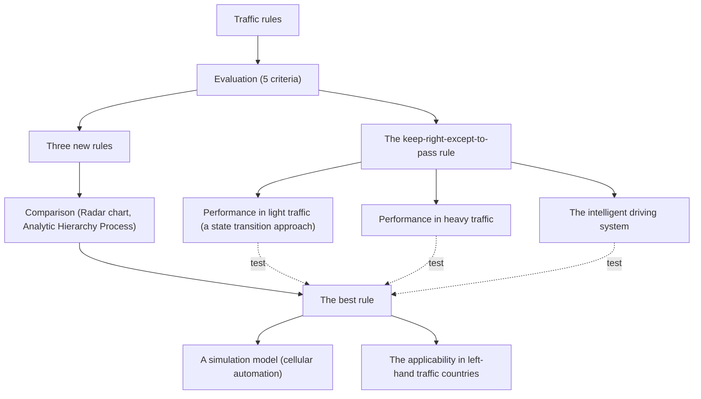
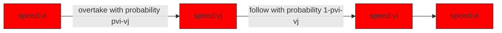

## Team Control Number

For office use only

T1

T2

T3

T4

## 29282

Problem Chosen

A

For office use only

F1

F2

F3

F4

## 2014 Mathematical Contest in Modeling (MCM) Summary Sheet Summary

The keep-right-except-to-pass rule is widely implemented all around the world, but it may not be an optimum one. We define five evaluation criteria to evaluate the performance of a traffic rule, namely, the average traffic speed, traffic flow, danger index, the over-speed-limit effect and the under-speed-limit effect. To analyze the “keep right” rule’s performance theoretically, we apply a state transition approach, which is similar to the Markov model, in light traffic situation. The result shows that all the cars will travel in the right lane at a low speed in the long term. In heavy traffic, we analyze its steady state and discover that cars will break the “keep right” rule because they cannot find a chance to return to the right lane after overtaking. To test the theoretical results, we build a simulation model based on the Cellular Automation (CA) to simulate the traffic system under a given traffic rule. The simulation results are consistent with what we have got through the state transition approach.

In order to seek a better traffic rule, we develop 3 new rules based on the old rule. Then we evaluate their performance together with the old rule respectively using our CA-based simulator. After calculating the values of our evaluation criteria, we employ the Analytic Hierarchy Process (AHP) method to obtain the best solution. We find that the best rule is the one which forbids cars from overtaking to achieve the best safety performance and highest traffic flow.

Finally, we discuss some further topics. The result is that we can apply our best solution to left-hand traffic countries by simply changing the orientation, and that the application of intelligent system will improve the performance of the “keep right” system in light traffic, but deteriorate it in heavy traffic. Results of the sensitivity analysis based on the CA simulator have shown the robustness of our conclusions.

Our suggestion for the public is that everyone should consciously avoid the overtaking behavior to realize a better traffic condition. Further studies should focus on more complex circumstances such as the six-lane freeway. With more precise data available, we can further test and improve our models.

## Contents

1 Introduction 1  
2 General Assumptions · · 2  
3 The Keep-Right-Except-To-Pass Rule · · · 3

3.1 Traffic Rule Evaluation · · 3  
3.2 Performance In Light Traffic · · · · 4

3.2.1 Notations · · 5  
3.2.2 A State Transition Approach · · · 5  
3.2.3 A Numerical Test And Conclusion 7

3.3 Performance In Heavy Traffic · · · · 8

4 A Simulation Model: Cellular Automation 9

4.1 Simulation Assumptions 9  
4.2 Notations · · · 9  
4.3 Algorithm Descriptions · · · · · · · · · 10  
4.4 Calculation And Results · · · 12  
4.5 Small Conclusion · · · 16  
4.6 Sensitivity Analysis · · · · · 17

5 A New Traffic Rule · · · 18

5.1 Descriptions of The New Rules · · · · · 18  
5.2 Simulation Results · · · · 19  
5.3 Comparison · · · · · · · 20  
5.4 Small Conclusion · · · · · · 23

6 Further Topics · · · · · 23

6.1 Applicability In Left-Hand Traffic Countries · · · · 24  
6.2 Intelligent Traffic · · · · · · · 25

6.2.1 Performance Analysis · · · · · · 25  
6.2.2 Simulation And Results · · · 26

7 Strength and Weakness · · · · · · · 27  
8 Conclusion · · 27

References · · · · · · 28

## 1 Introduction

Recent changes in economics and technology have enabled more and more households to own their private cars, but at the same time, have posed more pressure on highway capacity. It is necessary for the government to implement proper traffic rules which can maximize the traffic flow while ensuring safety. The most popular traffic rule for the time being is the keep-right-except-to-pass rule, which states that all drivers should drive in the right-most lane unless they are passing another vehicle, and when overtaking, drivers should move one lane to the left to pass the vehicle ahead and return to the right lane as soon as possible. This rule is widely implemented in most countries in the world, including the U.S and China. In Great Britain and some other countries, this rule is adjusted with a simple change of orientation, and we can call it the keep-left-except-to-pass rule.

However, is the “keep right” rule optimum? Or, is there any alternative traffic rule superior to this one in terms of traffic flow, safety, and other important factors? This is one main issue we want to deal with in this paper. In fact, we can divide the whole problem into four major subproblems:

1. In both light and heavy traffic, what is the performance of the keepright-except-to-pass rule? This requires us to set up several evaluation criteria. Based on the answer to this question, we can decide whether to design a new traffic rule to replace, and in which aspects improvement can be made.

2. Is there a better traffic rule? If yes, why can we say the new rule is better? We must integrate our evaluation criteria into a comprehensive one to decide between rules. This involves the determination of weights and a comparison of the two traffic rules.

3. Does the new rule apply to left-hand traffic countries? Except for a simple change of orientation, we should decide whether some other requirements need to be met.

4. Would there be any change in our analysis results if all the vehicles were under the control of an intelligent system? In fact it is an optimiza tion problem. We can control the behavior of each vehicle in the freeway, like determining whether it should change lanes. In this case, we may achieve the best traffic condition.

For the rest of our paper, we will first set up five criteria to evaluate traffic rules. Then we look into the keep-right-except-to-pass rule. We use a state transition approach to study its performance in light traffic, and the heavy traffic situation is also considered. Next, a simulation model based on the cellular automation is built to verify the results given by the theoretical model. Afterwards, we design three different new rules and evaluate them together with the old rule, where we use the AHP method to get the best solution. Finally, we discuss further topics about the rule under left-hand traffic and the old performance under control of the intelligent driving system. The basic logic framework of our paper is shown in Figure 1.


<details>
<summary>flowchart</summary>


</details>

Figure 1: The logic framework of our paper.

## 2 General Assumptions

• Drivers consciously drive their cars and everything is in normal state. In other words, the drivers are rational and the road condition is good. We do not consider abnormal situations where drivers are drunk or sleepy while driving, or the road is frozen and slippery because of the extreme weather.  
• In our models, we only consider countries where driving automobiles on the right is the norm. Driving on the right is different from driving in the right lane, since drivers can also drive in the left lane on the right in multi-lane traffic. The research object of this paper is the rule which requires drivers to drive in the right lane except to overtake. For completeness, we will consider the rules in countries where driving on the left is the norm in subsection 6.1.  
• For simplicity, we only consider a four-lane freeway(two in each direction), with a center dividing strip between the opposing traffic flows. The freeway has only two lanes for each direction, the right one for driving and the left one for overtaking only(under the keep-right-except-to-pass rule). What’s more, the center dividing strip ensures that there is no interactions between vehicles traveling in opposite directions.  
• There are no stop lights or intersections to interrupt the flow of traffic. Also, there are no other entrances or exits, and no sharp turns. Vehicles come from only one entrance and drive their way through. Because vehicles behave differently in sharp turns, we overlook such area. This simplicity makes little difference to our results.  
• There is only one type of vehicle in the freeway. All vehicles have the same brand, model and size(especially length). In other words, they are homogeneous. For convenience, we call them “cars”.  
• When traveling individually, cars move at a constant speed(free speed). But when encountering another car ahead, cars can change speed instantly. This assumption means that we overlook the accelerating process of

cars. They can change speed with no time. But when traveling individually, they will all move at their own free speed.

• Cars enter the freeway in a Poisson manner. That is to say, when two neighboring cars arrive at the beginning point of our freeway sequently, the time interval is exponentially distributed.

## 3 The Keep-Right-Except-To-Pass Rule

Many methods can be used to describe vehicular traffic flow at low and moderate densities on long, uninterrupted freeways, including queuing theory, Markov chains, cellular automation, traffic flow differential equations and so on. The first two are macroscopic and the last one is microscopic, while cellular automation is often used to do the simulation[2][12].

In this section, our main task is to analyze the performance of the keep-rightexcept-to-pass rule. We first choose five statistics as our evaluation criteria to assess traffic rules. Then we use a state transition approach(similar to the Markov model) to analyze this rule in light traffic. Next, we extend the model to point out some important problems in heavy traffic. Afterwards, we employ the cellular automation method to simulate the behavior of cars in freeway. We calculate the values of our five evaluating criteria and give some interpretations. Finally, we analyze the sensitivity of our simulation model. This section is the basis of the entire paper, our further analysis, comparison and adjustment are to some extent dependent on the methods employed here.

Before start, we shall mention the definition of “light” and “heavy” traffic here. In common sense, when the number of vehicles in the freeway is very huge, we call the situation as “heavy traffic”. But what does “huge” mean? This definition is rather vague and not appropriate for research use. In this paper, we state “light” and “heavy” in this way: if a car which changes lanes to overtake cannot find a place to return to its initial lane within certain time range, the traffic is heavy. Otherwise the traffic is light. In section 3, we will use the variable λ (arrival rate) to illustrate. The closer λ is to 0.5, the heavier the traffic is.

## 3.1 Traffic Rule Evaluation

We must set up several basic criteria to analyze the performance of the keepright-except-to-pass rule. These evaluation criteria include both static ones(such as safety) and comparative static ones(such as performance in extreme conditions). Also, the criteria should be easily calculated from available data. We choose the following five evaluation criteria:

• Traffic flow: The number of cars passing an observing point per unit of time. Here we set its unit as “vehicles per second”.

• Danger index: The average number of lane changes for each car in our assumed freeway. It measures safety. Overtaking is risky because the car behind may crash into the car ahead when changing lanes. The more frequently a car changes lanes, the more likely an accident may take place. In contrast, when a car travels in a fixed lane, it can adjust speed instantly when encountering another car ahead, so it is not possible that an crashing accident took place. For simplicity, we assume that accidents will happen only when the car changes lanes. So we can use the number of lane changes per car as a measure of safety. Its unit is “times per vehicle”.

• Average traffic speed: The average speed of all cars passing an observing point. Its unit is “kilometer per hour”. It measures how fast cars are under a specific traffic rule.

• USL effect: It stands for “Under-posted Speed Limit effect”. Celeris paribus, if the traffic flow in a situation where the speed limit is too low is a, and the traffic flow in a situation where the speed limit is moderate is b, then the USL effect equals the ratio of a to b. It measures the performance of a traffic rule in extreme conditions. If the traffic flow decreases too sharply when speed limit is too low or too high, we do not regard the traffic rule as a good one.

• OSL effect: Accordingly, it stands for “Over-posted Speed Limit effect”. Its definition and function are similar to those of the USL effect.

Then how to evaluate a specific traffic rule? Since the traffic flow and the average traffic speed both measure the efficiency and capacity of freeways, the larger they are, the better the rule performs. For the danger index, we hope it to be as small as possible so as to decrease the probability of an accident. USL and OSL effects measure the rule’s role in extreme conditions. What we want is that the traffic flow of the freeway was still relatively high when the speed limit was too low or too high. So these two effects of a good traffic rule should also be large.

## 3.2 Performance In Light Traffic

In light traffic condition, there are not many cars, so the distance between neigh boring cars is big. Consequently, it is comparatively easy to change lanes, overtake and return without worrying about being collided or finding nowhere to return. In fact, the traffic state at time t can be computed from the traffic state at time 1 through multiple iterations. This is similar to the Markov model, but the difference lies in that the transition probability matrix is not constant. Following this thinking, we use a state transition approach to look for a steady state of traffic flow.

In addition to the general assumptions mentioned above, we consider here the following situation: all the cars enter the system through the right lane. According to speed, they are divided into 3 discrete states: State 1, State 2 and State 3. The speed of a car in State i is different from that in State j if i 6= j. After overtaking the car ahead , the car at a higher speed will return to the right-most lane as soon as possible, and travel at its previous speed $v _ { i } ,$ because the drivers may prefer to different speeds in the freeway. If a car chooses not to overtake, it will change to the same state with the preceding car, avoiding collision. For simplicity, we arbitrarily ignore the accelerating process of overtaking. In other words, the overtaking process is finished immediately.

## 3.2.1 Notations

• $v _ { i } \colon$ The speed of cars in State $i , i = 1 , 2 , 3$ . For $i > j$ , we have $v _ { i } < v _ { j }$ .  
• $v _ { 4 } \colon$ The speed of cars in the left lane. Whatever the car’s free speed is, if it changes lanes to the left, it has to travel at the speed of $v _ { 4 }$ . We assume $v _ { 4 } > m a x ( v _ { 1 } , v _ { 2 } , v _ { 3 } )$ for the convenience of overtaking.  
$\pi _ { k } ^ { ( t ) }$  
• $p _ { i j } \colon$ The probability that a car in State i moves to State j. According to subsection 3.3, $j \geq i$ .

## 3.2.2 A State Transition Approach

According to FRESIM(the freeway model within the CORSIM software), the probability of overtaking when a car catches up with another in the right lane positively correlate with their relative speed. For convenience, let $p _ { 1 }$ represent the overtaking probability of when State 1 meets State 2, that is, $p _ { 1 } = p ( v _ { 1 } - v _ { 2 } )$ , where $p > 0$ is a proportional coefficient. Similarly, $p _ { 2 } = p ( v _ { 1 } - v _ { 3 } ) , p _ { 3 } = p ( v _ { 2 } - v _ { 3 } )$ .

Figure 2 illustrates how an overtaking takes place. The car behind follows a probability distribution to decide whether to follow or overtake. If it choose to follow, its speed must slow down to avoid collision.


<details>
<summary>flowchart</summary>


</details>

Figure 2: The choice between following and overtaking(i¡j).

$\pi _ { 1 } ^ { ( 1 ) } , \pi _ { 2 } ^ { ( 1 ) } , \pi _ { 3 } ^ { ( 1 ) }$ ) Using the Bayes theorem, we can get the probability of Sate 1 maintaining its state:

$$
p _ {1 1} = \frac {\pi_ {2} ^ {(1)}}{\pi_ {2} ^ {(1)} + \pi_ {3} ^ {(1)}} p _ {1} + \frac {\pi_ {3} ^ {(1)}}{\pi_ {2} ^ {(1)} + \pi_ {3} ^ {(1)}} p _ {2}
$$

Similarly, we can get all $p _ { i j }$ . Putting them together, the transition probability matrix is

$$
\boldsymbol {T} ^ {(1)} = \left( \begin{array}{c c c} \frac {\pi_ {2} ^ {(1)}}{\pi_ {2} ^ {(1)} + \pi_ {3} ^ {(1)}} p _ {1} + \frac {\pi_ {3} ^ {(1)}}{\pi_ {2} ^ {(1)} + \pi_ {3} ^ {(1)}} p _ {2} & \frac {\pi_ {2} ^ {(1)}}{\pi_ {2} ^ {(1)} + \pi_ {3} ^ {(1)}} (1 - p _ {1}) & \frac {\pi_ {3} ^ {(1)}}{\pi_ {2} ^ {(1)} + \pi_ {3} ^ {(1)}} (1 - p _ {2}) \\ 0 & p _ {3} & 1 - p _ {3} \\ 0 & 0 & 1 \end{array} \right) \tag {1}
$$

Given the initial proportion vector $\pi ^ { ( 1 ) } = ( \pi _ { 1 } ^ { ( 1 ) } , \pi _ { 2 } ^ { ( 1 ) } , \pi _ { 3 } ^ { ( 1 ) } )$ (1) and the transition probability matrix $\pmb { T } ^ { ( 1 ) }$ , we can infer that if a car catches up with another in the system, the proportion vector will be updated like the following:

$$
\boldsymbol {\pi} ^ {(2)} = (\pi_ {1} ^ {(2)}, \pi_ {2} ^ {(2)}, \pi_ {3} ^ {(2)}) = \boldsymbol {\pi} ^ {(1)} \cdot \boldsymbol {T} ^ {(1)} \tag {2}
$$

Plugging (1) into (2), then extracting the first component of the vector, yields

$$
\pi_ {1} ^ {(2)} = \left[ \frac {\pi_ {2} ^ {(1)}}{\pi_ {2} ^ {(1)} + \pi_ {3} ^ {(1)}} p _ {1} + \frac {\pi_ {3} ^ {(1)}}{\pi_ {2} ^ {(1)} + \pi_ {3} ^ {(1)}} p _ {2} \right] \cdot \pi_ {1} ^ {(1)}
$$

The transition probability matrix will also be updated because the proportion of cars in different states will change after one-time transition. The iteration formula is $\pi ^ { ( n + 1 ) } = \pi ^ { ( n ) } \cdot T ^ { ( n ) }$ . Repeating this process, we get

$$
\pi_ {1} ^ {(n + 1)} = \left[ \frac {\pi_ {2} ^ {(n)}}{\pi_ {2} ^ {(n)} + \pi_ {3} ^ {(n)}} p _ {1} + \frac {\pi_ {3} ^ {(n)}}{\pi_ {2} ^ {(n)} + \pi_ {3} ^ {(n)}} p _ {2} \right] \cdot \pi_ {1} ^ {(n)} \tag {3}
$$

Due to the property of simple average, we have

$$
\frac {\pi_ {2} ^ {(n)}}{\pi_ {2} ^ {(n)} + \pi_ {3} ^ {(n)}} p _ {1} + \frac {\pi_ {3} ^ {(n)}}{\pi_ {2} ^ {(n)} + \pi_ {3} ^ {(n)}} p _ {2} \leq \max (p _ {1}, p _ {2}) <   1 \tag {4}
$$

So, plugging (4) into (3) and iterating for n times, we can get

$$
0 \leq \pi_ {1} ^ {(n + 1)} \leq [ m a x (p _ {1}, p _ {2}) ] ^ {n} \cdot \pi_ {1} ^ {(1)}
$$

Taking the limit, then using the squeeze theorem, yields

$$
\lim _ {n \to \infty} \pi_ {1} ^ {(n + 1)} = 0
$$

That means, after N times of transitions, the proportion of State 1 cars is zero if N approaches to infinity. Thus, $\pi ^ { ( n ) } = ( 0 , \pi _ { 2 } ^ { ( n ) } { \overset { \cdot } { , } } \pi _ { 3 } ^ { ( n ) } )$ , and the transition probability matrix between State 2 and State 3 is

$$
\boldsymbol {T} _ {\mathbf {2 3}} ^ {N} = \left( \begin{array}{c c} p _ {3} & 1 - p _ {3} \\ 0 & 1 \end{array} \right)
$$

$\pmb { T } _ { 2 3 } ^ { N }$ $1 - p _ { 3 }$ , while State 3 can only maintain State 3 itself. Thus State 3 is an absorbing state. In other words, after $N + M$ times of transitions, all cars will be in State 3(the lowest speed) if M approaches to infinity, that is

$$
\lim _ {M, N \to \infty} \pi^ {(N + M)} = (0, 0, 1)
$$

## 3.2.3 A Numerical Test And Conclusion

We use a numerical method to simulate the iterating and matrix updating pro cesses mentioned above, so as to test our model results.

We might as well set p1=0.35, p2=0.45, p3=0.29.From our notations, π(t)k $p _ { 1 } { = } 0 . 3 5 , p _ { 2 } { = } 0 . 4 5 , p _ { 3 } { = } 0 . 2 9$ $\pi _ { k } ^ { ( t ) }$ is the proportion of cars in state k after t times of transitions, and we set their initial $\pi _ { 1 } ^ { ( 1 ) } { = } 0 . 2 , \pi _ { 2 } ^ { ( 1 ) } { = } 0 . 5 , \pi _ { 3 } ^ { ( 1 ) } { = } 0 . 3$ following simulation figure:


<details>
<summary>line chart</summary>

| transition times | state 1: the highest speed | state 2: the normal speed | state 3: the lowest speed |
| ---------------- | -------------------------- | ------------------------- | ------------------------- |
| 1                | 0.2                        | 0.5                       | 0.3                       |
| 2                | 0.08                       | 0.23                      | 0.7                       |
| 3                | 0.04                       | 0.08                      | 0.9                       |
| 4                | 0.02                       | 0.03                      | 0.95                      |
| 5                | 0.01                       | 0.01                      | 0.98                      |
| 6                | 0.0                        | 0.0                       | 0.99                      |
| 7                | 0.0                        | 0.0                       | 0.99                      |
| 8                | 0.0                        | 0.0                       | 0.99                      |
| 9                | 0.0                        | 0.0                       | 0.99                      |
| 10               | 0.0                        | 0.0                       | 0.99                      |
| 11               | 0.0                        | 0.0                       | 0.99                      |
| 12               | 0.0                        | 0.0                       | 0.99                      |
| 13               | 0.0                        | 0.0                       | 0.99                      |
| 14               | 0.0                        | 0.0                       | 0.99                      |
| 15               | 0.0                        | 0.0                       | 0.99                      |
| 16               | 0.0                        | 0.0                       | 0.99                      |
| 17               | 0.0                        | 0.0                       | 0.99                      |
| 18               | 0.0                        | 0.0                       | 0.99                      |
| 19               | 0.0                        | 0.0                       | 0.99                      |
| 20               | 0.0                        | 0.0                       | 1.0                       |
</details>

Figure 3: Proportions of cars in different states after several transitions.

From Figure 3 we can clearly see that the proportion vector equals to (0, 0, 1) after 6 times of transitions. This simulation result is consistent with our model. Later, we will employ a simulation method to test this result again in subsection 3.5.

According to our above analysis, we can confidently conclude that if all the cars in the freeway obey the keep-right-except-to-pass rule, they will all travel in the right lane at a relatively low speed in the long term, while at the same time, the left lane is comparatively empty. So, the traffic flow, one of our evaluation criteria, under the “keep right” rule is small. In order to make better use of our freeways, a more flexible rule is needed which enable drivers to drive in the left lane under certain conditions.

This conclusion only applies to a “light traffic” situation, where cars can overtake and then return to the right lane easily. When the traffic is heavy, all is a different story. Unfortunately, because all cars will travel at the same low speed, traffic in the right lane is doomed to become heavy in the long run. This means that after a certain time point, a car changing lane to the left for overtaking will find nowhere to return! We will look into the “keep right” rule’s performance in heavy traffic in the next subsection.

## 3.3 Performance In Heavy Traffic

The model we have developed in light traffic cannot be applied to the situation where traffic is heavy. Since the car which changes lanes for overtaking can always find opportunities to go back to the right lane in light traffic, a transition probability matrix can be calculated to describe the whole system. However, in heavy traffic, a car overtaking another cannot always find a place to return to the right lane, and therefore has to stay in the left lane for a long enough time. As a result, cars which have a high speed and change lanes for overtaking will “pile $\mathrm { u p } ^ { \mathrm { , } }$ in the left lane. That is to say, in the long run, cars in the right lane are all in State 3, traveling at the speed of $v _ { 3 }$ , while cars in the left lane are all traveling at a higher speed of $v _ { 4 }$ . Consequently, there will be no state transitions in heavy traffic, and we cannot get the transition probability matrix. This is the first reason why the state transition approach cannot be applied to heavy traffic.

Another important factor we should take into consideration is the safe distance. Safe distance is the minimum following distance between two neighboring cars to avoid collision. According to Wikipedia [8] and New York State Department of Motor Vehicles [4], there exists a rule od thumb called “two-second rule” to calculate this safe distance, which states that a driver should ideally stay at least two seconds behind any vehicle that is directly in front of the driver’s vehicle. So if the speed of a car is $v _ { 3 } .$ , then the driver should make sure that the distance between his car and the ahead one is no less than $2 v _ { 3 }$ .

In light traffic, safe distance is ignored because there are few cars in the freeway. The distance between neighboring cars is big. However, in heavy traffic, we should consider the safe distance factor because cars in the right lane travel in a long queue. So it is not appropriate to reuse the analyzing method in light traffic. Figure 4 shows how the heavy traffic system works.

From the analysis above, we can see that there also exists a steady state in heavy traffic situation. In the steady state, cars in the right lane are all at a speed of $v _ { 3 }$ , while cars in the left lane are all at a speed of $v _ { 4 }$ . This violates the “keep right” rule in that the left lane is used for driving. Moreover, there will be no transitions between these two states.

Finally, we can get two conclusions about the “keep right” rule in heavy traffic. First, the rule will be broken even if drivers obey it. Second, the danger index is the lowest when traffic is heavy because there is no overtaking.


<details>
<summary>text_image</summary>

speed:v4
speed:v3
speed:v3
speed:v4
speed:v3
speed:v4
speed:v3
D
safe distance
D
safe distance
D
safe distance
forward direction
</details>

Figure 4: Road condition when traffic is heavy.

## 4 A Simulation Model: Cellular Automation

We model the movement of each car separately and use a discrete time simulation to simulate the driving process. Given a set of traffic rules (for example, the keep right-except-to-pass rule), the simulator can produce a prediction of the movement following the rules.

## 4.1 Simulation Assumptions

• In the simulator, time is discrete. And we set the time step to be one second.  
• At the entrance of the freeway, the time intervals between every two neighboring car conform to the exponential distribution, that is, the arriving cars emerge at the beginning of the right lane in a Poisson manner.  
• The speed of each car is discrete and conforms to uniform distribution, furthermore, the speed is stable during the movement except the decelerating process.  
• We assume that the safe distance for overtaking in proportion to the traffic speed. According to Wikipedia [8] and New York State Department of Motor Vehicles [4], there exists a “two-second rule” to calculate this safe distance, which states that a driver should ideally stay at least two seconds behind any vehicle that is directly in front of the driver’s vehicle.  
• Drivers can judge their speed and the distance of surrounding cars accurately, so they can estimate the safe distance between their cars and other cars.

## 4.2 Notations

• T : The total time in the simulator.

• t: Present time in the simulator.  
• S: The length of the simulated freeway, with the unit of cells.  
• λ: Arrival rate, number of cars arriving per second.  
• L: Length of cell, length of cars.  
• c $e l l s ( i , j )$ : The traffic speed and the value of each cell. i values from 1 to 2, j values from 1 to S.  
• D: Safe distance, the safe distance for overtaking.  
• d: safe-distance coefficient, determine the relation between the traffic speed $c e l l s ( i , j )$ and safe distance D. As we have discussed the safe distance in the assumption, we set d to be 2.  
• $p _ { 1 } \mathrm { { : } }$ : Low-speed overtaking factor, determine the probability of overtaking when two vehicles have slight speed difference. We assume it to be 0.3.  
• $p _ { 2 } \colon$ High-speed overtaking factor, determine the probability of overtaking when two vehicles have large speed difference. We set it to be 0.7.

## 4.3 Algorithm Descriptions

Since we simulate the traffic condition in a freeway, we might as well first describe the freeway and cars in our cellular automation model. First, the freeway is a rectangular grid, with two rows and S columns. We only consider two lanes of the forward direction (see Figure 5). The first row of the grid is the left lane and the second row of the grid is the right lane. Each row has S square cells, the length of each side is L. We assume that L equals to 5 meters.


<details>
<summary>text_image</summary>

S cells (S×L)
arriving cars
entrance
L
cell
...
forward direction
</details>

Figure 5: Description of the simulated freeway.

Second, in the simulation, we use a 2 · S matrix to represent the freeway. Each cell is an element of the matrix and each element has a value $c e l l s ( i , j )$ . The initial value of $c e l l ( i , j )$ is zero, but when there is a car in such a cell, the value of $c e l l s ( i , j )$ changes to a positive integer that represents the speed of the car. The matrix is

$$
\left( \begin{array}{c c c c} c e l l s (1, 1) & c e l l s (1, 2) & \dots & c e l l s (1, S) \\ c e l l s (2, 1) & c e l l s (2, 2) & \dots & c e l l s (2, S) \end{array} \right)
$$

Third, arriving cars emerge in the beginning of the right lane (the entrance of cars). The speed of each arriving car is discrete and conforms to uniform distribution, furthermore, the speed is a multiple of L (length of a cell). For example, the speed can be 15m/s, 20m/s, 25m/s, 30m/s and so on.

Finally, we set the total time in the simulator to be 1000 seconds and the length of simulated freeway to be 1000 cells, that is 5000 meters.

Now we discuss the steps of overtaking. According to the keep-right-except-topass rule, there are two stages of overtaking process, the “Go” process and “Return” process. In the “Go” process, the car behind moves from the right lane to the left lane, pass the car ahead; in the “Return” process, cars return to right lane and finish the whole overtaking process. To express it more clearly, we called the car which is in front of another car “the car ahead”, and the car which is behind another car “the car behind”. We have several steps to describe each of the process.

## The “Go” process

Step 1: For the car in the right lane, judge the value of each cell within safe distance D ahead of the car. If there are cars within the safe distance, go to Step 2;

Step 2: When the speed of the car behind larger than the speed of the car ahead, judge the value of each cell within safe distance ahead and behind in the left lane, as we showed in the Figure 6. So that the driver can make sure it is safe to overtake other cars. If there are positive integers within the safe distance, the car behind decelerates to the same speed as the car ahead, otherwise, the car behind judge the speed difference of them. If the speed difference lower than L m/s, go to Step 3, otherwise, go to the Step 4;

Step 3: the car behind has a possibility of $p _ { 1 }$ to overtake, the car change from the right lane to the left lane;

Step 4: the car behind has a possibility of $p _ { 2 }$ to overtake, the car change from the right lane to the left lane, obviously, $p _ { 2 }$ is larger than $p _ { 1 }$ .

## The “Return” process

Step 1: For a car in the left lane, firstly, it judges the value of each cell within safe distance ahead and behind in the right lane. If there is no car, the car return to right lane, and the “Return” process is finished (see Figure 7), otherwise, go to the Step 2;

Step 2: The car judge the value of each cell within safe distance ahead of the car. If there are cars within the safe distance and have a lower speed, the car behind decelerates to the same speed as the car ahead.

Now we use the flowchart to explain our algorithm more clearly. Figure 8 shows the general process of the simulation. Considering the complexity of the “Go” process of overtaking, we use a sub flowchart to further explain it, as is shown in Figure 9.


<details>
<summary>text_image</summary>

no car
D
no car
D
the car behind
the car ahead
< D
forward direction
</details>

Figure 6: The “Go” process.  


<details>
<summary>text_image</summary>

forward direction
D
no car
D
no car
</details>

Figure 7: The “Return” process.

## 4.4 Calculation And Results

Besides the algorithm descriptions, we want to introduce methods to calculate the five evaluation criteria in the simulation. To calculate the arrival rate, the simulator counts the cars arriving at the entrance. As for danger index, the simulator can count the total times of lane-changing which means cars change from one lane to another. In addition, we set an observation point to calculate the average traffic speed and traffic flow. At the observation point, we count the car passing by and add up their speeds. When the first car comes to the observation point, we start the observation. Then, we divide the number of cars by the observation time and get traffic flow. Similarly, we divide the total speed by the observation time and get average traffic speed.


<details>
<summary>flowchart</summary>

```mermaid
graph TD
  A["Simulation Starts"] --> B["Set the Parameters and coefficients: T=2000, S=1000, p1=0.3, p2=0.7, d=2, t=0"]
  B --> C["Create a 2×S Matrix to simulate the freeway and cars"]
  C --> D["Emergence of arriving cars(Poisson manner)at the entrance cells(2,1)"]
  D --> E{Using loop to detect the positive integer cells(2,i) (i=S, S-1,…,1)}
  E -->|yes| F["Using loop to detect the positive integer cells(1,i) (i=S, S-1,…,1)"]
  E -->|no| G["cells(1,i)=0"]
  G --> H{∑ cells(2,j)=0 ? (j=i+1,…,i+D)}
  H -->|yes| I["Go&quot; process: first stage of overtaking. We use a sub flowchart to explain it"]
  H -->|no| J["cells(1,j)≠0"]
  J --> K["Each car moves forward and passes through V cells"]
  K --> L["Output the results"]
  L --> M["t=t+1"]
  M --> N{t=T}
  N -->|N| O["End"]
  O --> P["Cells(1,i)=cells(1,j) (car decelerates)"]
  P --> Q["End"]
```
</details>

Figure 8: The general process of the simulation.


<details>
<summary>flowchart</summary>

```mermaid
graph TD
  A["&quot;Go&quot; process starts"] --> B{cells(2,i)>cells(2,j) (cells(2,j) is found out in the previous step)}
  B -->|Y| C{Σ cells(1,j)=0 ? (j=i-D,…,i+D)}
  C -->|N| D{cells(2,i)>cells(2,j)+1}
  D -->|Y| E["The car has a possibility of p2 to overtake"]
  D -->|N| F["The car has a possibility of p1 to overtake"]
  E --> G{Overtake?}
  F --> G
  G -->|Y| H["cells(1,i)=cells(2,i), cells(2,i)=0"]
  G -->|N| I["cells(2,i)=cells(2,j) (car decelerates)"]
  H --> J["&quot;Go&quot; process ends"]
  I --> J
  J --> K["No car is in the right lane within safe distance"]
  K --> C
    style A fill:#f9f,stroke:#333
    style J fill:#ccf,stroke:#333
```
</details>

Figure 9: Sub flowchart of the $^ { 6 6 } \mathrm { G o } ^ { \dag }$ process.

${ \mathrm { S o } } ,$ our simulator can calculate the five evaluation criteria as long as the arrival rate is provided. For example, results are listed below in Table 1 when $\lambda = 0 . 2 5 ($ (vehicles per second) or $\lambda = 0 . 4$ (vehicles per second).

Table 1: Simulation results.

<table><tr><td>Arrival rate λ</td><td>0.25</td><td>0.4</td></tr><tr><td>Danger index</td><td>1.2848</td><td>0.8681</td></tr><tr><td>Average traffic speed</td><td>3.3818</td><td>3.3277</td></tr><tr><td>Traffic flow)</td><td>0.8459</td><td>1.2690</td></tr><tr><td>OSL effect</td><td>1.7781</td><td>1.7409</td></tr><tr><td>USL effect</td><td>0.9279</td><td>0.9527</td></tr></table>

To analyze the relation between the five evaluation criteria and arrival rate, we create plots of these criteria separately. Figure 10 to Figure 14 shows results by running simulating program. As we mention before, greater arrival rate indicates a greater volume of traffic, so the pictures can indicate the role of the old rule in different traffic conditions.


<details>
<summary>line chart</summary>

| lambda(vehicles per second) | Danger index(times per vehicle) |
| --------------------------- | -------------------------------- |
| 0.0                         | 1.1                              |
| 0.1                         | 1.4                              |
| 0.2                         | 1.45                             |
| 0.3                         | 1.2                              |
| 0.4                         | 0.9                              |
| 0.5                         | 0.6                              |
</details>

Figure 10: Danger index vs. λ.


<details>
<summary>line chart</summary>

| lambda(vehicles per second) | Average traffic speed(m/s) |
| --------------------------- | -------------------------- |
| 0.0                         | 4.0                        |
| 0.1                         | 3.8                        |
| 0.2                         | 3.5                        |
| 0.3                         | 3.4                        |
| 0.4                         | 3.35                       |
| 0.5                         | 3.3                        |
</details>

Figure 11: Average traffic speed vs. λ.


<details>
<summary>line chart</summary>

| lambda(vehicles per second) | Traffic flow(vehicles per second) |
| ---------------------------- | ---------------------------------- |
| 0.0                          | 0.2                                |
| 0.1                          | 0.4                                |
| 0.2                          | 0.6                                |
| 0.3                          | 0.8                                |
| 0.4                          | 1.0                                |
| 0.5                          | 1.2                                |
| 0.6                          | 1.4                                |
</details>

Figure 12: Traffic flow vs. λ.


<details>
<summary>line chart</summary>

| lambda(vehicles per second) | OSL effect |
| ---------------------------- | ---------- |
| 0.0                          | 0.4        |
| 0.1                          | 0.8        |
| 0.2                          | 1.2        |
| 0.3                          | 1.6        |
| 0.4                          | 2.0        |
| 0.5                          | 2.4        |
| 0.6                          | 2.8        |
</details>

Figure 13: OSL effect vs. λ.


<details>
<summary>scatterplot</summary>

| lambda(vehicles per second) | USL effect |
| --------------------------- | ---------- |
| 0.0                         | 0.2        |
| 0.1                         | 0.4        |
| 0.2                         | 0.6        |
| 0.3                         | 0.8        |
| 0.4                         | 1.0        |
| 0.5                         | 1.2        |
| 0.6                         | 1.4        |
</details>

Figure 14: USL effect vs. λ.

As can be seen in Figure 10, the danger index firstly increases with the increasing of arriving cars. Then the danger index reaches a peak value when $\lambda = 0 . 1 5$ . After the peak value, the danger index drops and the traffic condition appeals to be more safe. Actually, in the real world, drivers are more safe when the traffic is too light or too heavy compared to the normal volume. For one thing, there is no need to overtake when the freeway has few cars; for another, it is difficult to overtake when the traffic is full of cars.

As is shown in Figure 11,one of the criteria to evaluate the traffic condition, average traffic speed, is approximately inverse ratio to the arrival rate. Since greater arrival rate indicates a greater volume of traffic, so the more the car is, the slower the driving is.

Figure 12 shows the relation between the traffic flow and arrival rate. As the arrival rate increases, the traffic flow is increasing, while growth rate is decreasing. Therefore the traffic flow will not increase unboundedly and will surely saturate when the arrival rate is very large. That is the heavy traffic or even the traffic jam in the freeway. Because the safe distance is vague and uncertain in that condition, our picture do not show it.

Figure 13 and Figure 14 show the under- or over-posted speed limits’ effects to the rule. Generally speaking, these two factors will decrease the traffic flow in light traffic, while increase the traffic flow in heavy traffic.

## 4.5 Small Conclusion

We use our simulator to test the models established in section 3. Firstly, as for the light condition, we have mentioned a state transition approach to analyse the problem. Then we draw the conclusion that if all the cars in the freeway obey the keep-right-except-to-pass rule, they will all travel in the right lane at a relatively low speed in the long term, while at the same time, the left lane is comparatively empty. In the simulation, we set the arrival rate λ to be 0.25, and we can clearly see from the Figure 15 that cars in the right lane are much more than cars in the left lane, so the theoretical model is proved.

Secondly, as for the heavy condition, we have concluded that cars in the right lane are all at a same speed while cars in the left lane are all at another speed, moreover, they will be no transitions between these two states. To verify this conclusion, we assume the arrival rate λ to be 0.5, the result is shown in Figure 16. From the picture, we notice that many cars in the left lane have no chance to return to the previous lane, so the “keep right” rule is broken even if drivers obey it.


<details>
<summary>text_image</summary>

forward direction
</details>

Figure 15: A printscreen of simulation in light traffic, green lines represent cars.


<details>
<summary>text_image</summary>

forward direction
</details>

Figure 16: A printscreen of simulation in heavy traffic, green lines represent cars.

## 4.6 Sensitivity Analysis

We set several parameters according to the keep-right-except-to-pass rule, in addition to predict the movement of cars in the simulation. However, we lack the offi cial data of these parameters, therefore, we should carefully examine the simulation model’s sensitivity by changing in our setting. We change parameters respectively and results are shown in following tables. With the changes of the parameters ,our model criteria only have limited changes, therefore, our simulation model is robust under reasonable conditions.

Table 2: Sensitivity analysis of the parameter $p _ { 1 }$ .

<table><tr><td> $p_1$ </td><td>DI</td><td>ATS</td><td>TL</td><td>OSL</td><td>USL</td></tr><tr><td colspan="6"> $p_1 = 0.3 (original value)$ </td></tr><tr><td>0.2</td><td>-5.42%</td><td>-0.68%</td><td>-0.75%</td><td>1.34%</td><td>0.46%</td></tr><tr><td>0.25</td><td>2.99%</td><td>0.60%</td><td>0.78%</td><td>0.12%</td><td>-1.63%</td></tr><tr><td>0.35</td><td>7.56%</td><td>-0.13%</td><td>-0.40%</td><td>-0.72%</td><td>0.66%</td></tr><tr><td>0.4</td><td>2.05%</td><td>0.75%</td><td>1.13%</td><td>-1.06%</td><td>0.30%</td></tr></table>

Table 3: Sensitivity analysis of the parameter $p _ { 2 }$ .

<table><tr><td> $p_{2}$ </td><td>DI</td><td>ATS</td><td>TL</td><td>OSL</td><td>USL</td></tr><tr><td colspan="6"> $p_{2}=0.7 (original value)$ </td></tr><tr><td>0.6</td><td>-17.29%</td><td>-1.65%</td><td>-1.38%</td><td>-2.47%</td><td>0.73%</td></tr><tr><td>0.65</td><td>-9.69%</td><td>-0.92%</td><td>0.68%</td><td>-3.97%</td><td>-1.46%</td></tr><tr><td>0.75</td><td>11.6%</td><td>1.64%</td><td>2.56%</td><td>-1.88%</td><td>-3.87%</td></tr><tr><td>0.8</td><td>20.88%</td><td>2.21%</td><td>4.29%</td><td>-3.13%</td><td>-3.54%</td></tr></table>

Table 4: Sensitivity analysis of the parameter d.

<table><tr><td>d</td><td>DI</td><td>ATS</td><td>TL</td><td>OSL</td><td>USL</td></tr><tr><td colspan="6">d=2(original value)</td></tr><tr><td>1.6</td><td>-17.39%</td><td>-0.25%</td><td>-0.75%</td><td>1.03%</td><td>-0.59%</td></tr><tr><td>1.8</td><td>11.59%</td><td>-0.22%</td><td>1.30%</td><td>-2.43%</td><td>-1.70%</td></tr><tr><td>2.2</td><td>-7.97%</td><td>-0.28%</td><td>1.35%</td><td>-2.96%</td><td>-0.56%</td></tr><tr><td>2.4</td><td>-14.51%</td><td>0.85%</td><td>1.15%</td><td>-2.65%</td><td>-1.28%</td></tr></table>

## 5 A New Traffic Rule

As we learn from the above analysis, if all the cars in the freeway obey the keepright-except-to-pass rule, they will mostly travel in the right lane so that the traffic flow will be small and the freeway will be inefficient. Moreover, when the traffic is heavy, many cars in the left lane have no chance to return to the previous lane, so the “keep right” rule is broken even if drivers obey it. Firstly, we will introduce three new rules to make the freeway more efficient and safe. Secondly, we use the simulator to calculate the five evaluation criteria. Then, we create a Radar chart to compare the evaluation criteria of each rule (including the old rule). Finally, with the help of the AHP method, we find the best rule among the new rules.

## 5.1 Descriptions of The New Rules

## New Rule 1

Cars with different level of speed travel in the different lanes. The car drive in the faster lane can pass another vehicle by move one lane to the slower lane, pass, and return to their former travel lane. We divide the acceptable speed range to several intervals, and cars are required to drive in the lane according to their travel speed. Left lanes have higher speed requirement and right lanes have lower speed requirement. So the left-most lane have the highest speed requirement while the right-most lane have the lowest one. The car in the left lane can pass another vehicle by move one lane to the right, pass, and return to their former travel lane.

For a four-lane freeway (two for each direction), the rule requires cars with higher speed to drive in the left lane and cars with lower speed to drive in the right lane. The car in the left lane with higher speed can overtake another vehicle by occupying the right lane for a while and then return to their former travel lane. For example, when the speed limit is 100km/h, the speed requirement for left lane is 50-100km/h while that for right lane is 0-50km/h. And a faster car in the left lane can overtake another car by occupying the right lane for a while.

## New Rule 2

Cars with different level of speed travel in the different lanes. Overtaking is forbidden in this rule and all cars travel along their own lane. We divide the acceptable speed range to several intervals, and cars are required to drive in the lane according to their travel speed.

As for a a four-lane freeway(two for each direction), the rule requires cars with higher speed to drive in the left lane and cars with lower speed to drive in the right lane. For example, if the speed limit is 100 km/h, the speed requirement for left lane is 50-100 km/h while that for right lane is 0-50 km/h.

## New Rule 3

A rule that allows drivers to drive on all lines and there are no difference between lanes. Cars should travel in their own lane unless they are passing another vehicle, in which case they move one lane to the another, pass, and return to their former travel lane.

## 5.2 Simulation Results

These three new rules we mentioned above seem to be able to increase traffic flow and average traffic speed at first glance. But is any one of them really superior to the the old keep-right-except-to-pass rule? Again, we use the cellular automation model, which is similar to the one we have used in section 4, to simulate the respective traffic condition under each of the three new rules. To avoid unnecessary repetition, we leave out the algorithms here.

Of course, the value of each evaluation criterion is dependent on the value of λ (arrival rate). Since $\lambda = 0$ means light traffic and $\lambda = 0 . 5$ means heavy traffic, we set $\lambda = 0 . 2 5$ to calculate. In this way, we can compare the rules’ performance in moderate traffic. Through running programmes in Matlab, we calculate the five evaluation criteria of each traffic rule. We show the results in Table 5.

Table 5: Evaluation of the new rules.

<table><tr><td></td><td>the old rule</td><td>New Rule 1</td><td>New Rule 2</td><td>New Rule 3</td></tr><tr><td>Traffic Flow</td><td>0.8459</td><td>0.9533</td><td>0.9791</td><td>0.8035</td></tr><tr><td>Danger Index</td><td>1.2848</td><td>0.1661</td><td>0</td><td>0.2773</td></tr><tr><td>Average Traffic Speed</td><td>3.3818</td><td>3.7219</td><td>3.7924</td><td>3.2021</td></tr><tr><td>USL Effect</td><td>0.9279</td><td>0.8160</td><td>0.9156</td><td>0.9611</td></tr><tr><td>OSL Effect</td><td>1.7781</td><td>1.6198</td><td>1.7002</td><td>1.8130</td></tr></table>

As we have pointed out before, for danger index, the smaller it is, the safer and better the traffic rule is. While for other four evaluation criteria, the larger, the better.

Interestingly, we find that the values of traffic flow under each traffic rule is much larger than the arrival rate λ. At first glance, it seems unreasonable because the cars at the observing point all come from the starting point, so the value of traffic flow should be smaller than λ. But after deep thinking, we shall point out that this phenomenon is not strange. Because that the number of cars passing the observing point is counted only after the first car comes, and that it takes some time for the first car to travel from the beginning point to the observing point, our observing time is less than the total time. As a consequence, the value of traffic flow becomes larger than arrival rate. (The denominator of traffic flow is the observing time, while the denominator of arrival rate is the total time)

## 5.3 Comparison

Although we have got the exact values of the five evaluation criteria for each new rule, it is hard to directly compare the rules because a rule may perform well in one aspect while bad in another aspect, and the units of different criteria are also different. Another reason is about the danger index. It negatively relates to the performance of a rule while other criteria show positive relations. In order to effectively compare these new traffic rules and choose the best one, we have to normalize all the criteria, and then convert values to an interval between 0 and 1, from worst to best. We call these normalized criteria as “evaluation indexes” (EI).

The definition of these indexes are as follows. Let $S _ { i j }$ denote the simulation result of the rule $i ( 1 \leq i \leq 4 )$ under evaluation criterion $j ( 1 \leq j \leq 5 )$ . And $E I _ { i j }$ denotes the evaluation index of the rule i under evaluation criterion j. When $j = 1 , 3 , 4 , 5$ , the evaluation indexes are defined as

$$
E I _ {i j} = \frac {(S _ {i j} - m i n _ {1 \leq i \leq 4} S _ {i j})}{m a x _ {1 \leq i \leq 4} S _ {i j} - m i n _ {1 \leq i \leq 4} S _ {i j}}
$$

These indexes are for the traffic flow, the average traffic speed, the USL effect and the OSL effect. For simplicity, we call them TFI, ATSI, USLI, OSLI respectively. For danger index (when j = 2), we call its EI as “safety index” (SI), the larger SI is, the safer the rule is.

$$
S I = E I _ {i 2} = \frac {1}{1 + S _ {i 2}}
$$

For all $1 \leq i \leq 4 , 1 \leq j \leq 5$ , we have $0 \leq E I _ { i j } \leq 1$ .

The values of all evaluation indexes are listed below in Table 6.

We use a radar chart of Figure 17 to display our results.

The traffic rule whose border is the most outside is the best. From this radar chart we can see that New Rule 2 may be the most optimum because it performs the best in three aspects out of five (TFI, SI and ATSI). However, we need more evidence.

To further evaluate the performance of each new traffic rule, we want to integrate the five evaluation indexes into a comprehensive one. We realize that some of the evaluation indexes are somehow more important than others, so the comprehensive index is

Table 6: Values of the five normalized evaluation indexes.

<table><tr><td></td><td>the old rule</td><td>New Rule 1</td><td>New Rule 2</td><td>New Rule 3</td></tr><tr><td>TFI</td><td>0.2415</td><td>0.8531</td><td>1.0000</td><td>0</td></tr><tr><td>SI</td><td>0.4377</td><td>0.8576</td><td>1.0000</td><td>0.7829</td></tr><tr><td>ATSI</td><td>0.3044</td><td>0.8806</td><td>1.0000</td><td>0</td></tr><tr><td>USLI</td><td>0.7712</td><td>0</td><td>0.6864</td><td>1.0000</td></tr><tr><td>OSLI</td><td>0.8194</td><td>0</td><td>0.4161</td><td>1.0000</td></tr></table>


<details>
<summary>radar chart</summary>

|        | The Old Rule | New Rule 1 | New Rule 2 | New Rule 3 |
| ------ | ------------ | ---------- | ---------- | ---------- |
| TFI    | 0.7          | 0.95       | 1.0        | 0.6        |
| SI     | 0.7          | 0.9        | 0.9        | 0.8        |
| ATSI   | 0.6          | 0.8        | 0.9        | 0.5        |
| USLI   | 0.8          | 0.4        | 0.7        | 0.9        |
| OSLI   | 0.8          | 0.3        | 0.6        | 0.9        |
</details>

Figure 17: A view of evaluation indexes for each traffic rule.

$$
E I _ {C} = \sum_ {k = 1} ^ {5} \omega_ {k} \cdot E I _ {k} \tag {5}
$$

where $\omega _ { i }$ is the weight for each single evaluation index.

We use the Analytical Hierarchy Process (AHP) [6] to determine the weights. AHP is a framework for solving multi-criterion decision problems. This method relies on the preference of the decision maker, and the preference, or the extent of importance in our mind can be quantified to evaluate all the alternatives. Saaty’s 1-9 scale for AHP preference [7] is presented in the following table:

According to Table ${ \boldsymbol { \mathsf { 7 } } } ,$ we can easily build a $5 ^ { * } 5$ reciprocal matrix to measure preference, just as follows: (each element $a _ { i j }$ in the matrix means the preference

Table 7: The meaning of Saaty’s scale for $\mathrm { A H P }$ preference.

<table><tr><td>Scale</td><td>Meaning</td></tr><tr><td>1</td><td>Requirements i and j have equal value.</td></tr><tr><td>3</td><td>Requirement i has a slightly higher value than j.</td></tr><tr><td>5</td><td>Requirement i has a strongly higher value than j.</td></tr><tr><td>7</td><td>Requirement i has a very strongly higher value than j.</td></tr><tr><td>9</td><td>Requirement i has an absolutely higher value than j.</td></tr><tr><td>2, 4, 6, 8</td><td>Intermediate scales between two adjacent judgements.</td></tr><tr><td>Reciprocals</td><td>Requirement i has a lower value than j.</td></tr></table>

scale between requirement i and $j ~ )$

$$
\begin{array}{c} T F I \quad S I \quad A T S I \quad U S L I \quad O S L I \\ S I \quad A T S I \quad U S L I \quad O S L I \end{array} \left( \begin{array}{c c c c c} 1 & 1 & 3 & 3 & 4 \\ 1 & 1 & 2 & 3 & 3 \\ 1 / 3 & 1 / 2 & 1 & 2 & 3 \\ 1 / 3 & 1 / 3 & 1 / 2 & 1 & 1 \\ 1 / 4 & 1 / 3 & 1 / 3 & 1 & 1 \end{array} \right)
$$

Since traffic flow index and safety index are the most important for freeways, we give them special preference. After getting the matrix, we should test the consistency of it. The first step is to compute the consistency index. Saaty gave the following formula:

$$
C I = \frac {\max (\lambda) - n}{n - 1}
$$

Where max(λ) is the principal eigenvalue and n is the number of criteria. After calculation, the CI index of our preference matrix is 0.0223.

For the second step, we use the consistency ratio to measure the level of inconsistency. Saaty defined the consistency ratio as $C R = C I / R I$ , where RI is the average value of CI for random matrices and CI is the consistency index. Since $n = 5 , R I = 1 . 1 2$ (we get the value from the table in [1]). The matrix is accept able only when $C R < 0 . 1$ . We test our matrix using the $C R$ method, and get $C R = 0 . 0 1 9 9 < 0 . 1$ , thus our matrix can be accepted.

Now we can input the above reciprocal matrix into Matlab to compute the weights we need. Concrete computing details can be seen in [6]. Table 8 shows the values of $\omega _ { k }$ .

Table 8: Values of weights.

<table><tr><td>Single Evaluation Index</td><td>TFI</td><td>SI</td><td>ATSI</td><td>USLI</td><td>OSLI</td></tr><tr><td>Weight</td><td>0.3502</td><td>0.3001</td><td>0.1723</td><td>0.0944</td><td>0.0830</td></tr></table>

Plugging the weights (Table 8) and the values of evaluation indexes (Table 6) for each traffic rule into Equation (5), we finally got the comprehensive evaluation index. See Table 9.

Table 9: Values of the comprehensive evaluation index.

<table><tr><td>Traffic Rule</td><td>Old Rule</td><td>New Rule 1</td><td>New Rule 2</td><td>New Rule 3</td></tr><tr><td> $EI_C$ </td><td>0.4092</td><td>0.7078</td><td>0.9219</td><td>0.4123</td></tr></table>

## 5.4 Small Conclusion

Comparison results clearly show that the keep-right-except-to-pass rule is absolutely not optimum. All the new rules are better than it on the whole, which means that a new traffic rule should be developed and applied. What’s more, to our surprise, we see that the performance of New Rule 2 is the best. New Rule 2 is superior to other rules not only in 3 of our 5 individual evaluation indexes (larger traffic flow, higher safety index, large average traffic speed), but also in the comprehensive evaluation index.

This result means that the relatively best performance can be achieved if overtaking is prohibited in the freeway. We can see the tradeoff between individual and collective interest here. Drivers who overtake to seek a higher speed indeed realize their individual interest because they may go to work or return home faster. But at the same time, traffic flow, average speed of all vehicles and safety may decrease, many resources are wasted and the collective interest cannot be realized. If we want to maximize the utility of the whole society, like maximize the traffic flow, we must implement a rule prohibiting overtaking, which deteriorates people’s individual interest.

We can also see the tradeoff between five evaluation criteria. A highly efficient traffic rule in normal conditions will not perform well in extreme conditions. New Rule 2 is of this kind. When the speed limit is moderate, traffic under this rule has the biggest flow and average speed, also very safe. But unfortunately, when the speed limit is too low or too high, this rule cannot maintain its good performance. New Rule 3 is also of this kind, but faces the opposite dilemma. For the old keepright-except-to-pass rule, there exists a tradeoff between speed and safety. If a driver chooses to overtake to seek a high speed, he or she must bear the risk of being collided.

In the simulation process of this section, we arbitrarily set the arrival rate as λ = 0.3. So it is necessary to make a sensitivity analysis for this parameter. Excluding extreme conditions like that the traffic is too light or too heavy, we calculate again the values of the five evaluation criteria and indexes of each traffic rule when λ = 0.2, 0.4. Results show that New Rule 2 is still the best traffic rule.

## 6 Further Topics

Our models and simulations above are based on these two assumptions: first, cars travel on the right side; second, the overtaking rule relies upon human judgment. In this section, we will separately discuss them and test whether our methods are applicable to the systems without these assumptions.

In the first part of this section, by comparing the left-hand traffic and the righthand traffic in terms of safety, we apply the best solution given in section 5 to the lefthand traffic by simply changing orientation. Then, we define an intelligent driving system that takes control of the overtaking behavior and evaluate its performance by modeling and simulating the traffic system.

## 6.1 Applicability In Left-Hand Traffic Countries

The analysis above is based on the right-hand traffic(RHT), in which cars should keep to the right side of the road. In this section, we will take the left-hand traffic(LHT) into consideration and try to apply our solution to the LHT countries.

Right-hand and left-hand traffic were thought to be formed due to some historic reasons. For example, keeping right was convenient for American people in the late 18th century to use large freight wagons, and the United States passed its first keep-right law in 1792. (More historic details in [5]) Then what is the difference between RHT and LHT? Researches on this issue have pointed out that the righthand traffic(RHT) and left-hand traffic(LHT) is different in terms of safety. J. J. Leeming found that the collision rate in LHT is lower than that in RHT [3]. Ref [9] [11] [10] suggest that humans are commonly right-eye dominant, which may contribute to the lower collision rate in LHT. Moreover, the right-hand dominant and right-foot dominant also work [5]. For example, when faced with accidents, people will response more quickly in LHT because drivers often control the steering wheels using their right hands. Generally speaking, safety is the only factor that cannot be omitted in our analysis, thus the following discussion will focus on this point.

In RHT, we strongly recommend the New Rule 2, in which overtaking is forbidden. Actually, we can also apply the solution to LHT, as the following Figure 18 shows:


<details>
<summary>text_image</summary>

New Rule 2 in LHT
forward
left right
backward
New Rule 2 in RHT
</details>

Figure 18: RHT and LHT traffic systems.

The traffic system shown on the left is the application of the New Rule 2 in LHT, while the other one is the condition in RHT for comparison. Between every two lanes is a solid line, which will prohibit cars from overtaking. As is shown in the figure above, the model is applicable to the LHT with a simple change of orientation.

In terms of safety, both of the systems shown in the figure above are perfect if evaluated by the safety index we derived in subsection 5.3. By prohibiting the overtaking behavior, the application of the New Rule 2 will significantly improve the safety performance of LHT system in the real world.

## 6.2 Intelligent Traffic

In section 3, we have discussed the circumstance without the IDS, under which the old rule relies upon human judgment for compliance. In this section, we assume that the “Intelligent Driving System” (IDS) would take control of the vehicle transportation in freeways, and that the traffic rule is still the keep-right-except-to-pass one. For clarity, we might as well define the IDS as follows: first, the IDS can get all information about the vehicles in the freeway to decide whether to overtake the car ahead; second, the overtaking under the control of the IDS is absolutely safe.

As we have mentioned before, when there is no IDS, a car will overtake its preceding car with a probability $p ( v _ { i } - v _ { j } )$ in concern with safety. However, a car can always overtake the car ahead under the control of the IDS if condition permits. The IDS will judge whether to overtake the preceding car according to the following judgements:

1. Safe distance. The IDS will decide to overtake the preceding car only if the distance is within a safe range.  
2. Time spent in the left lane. The IDS will prohibit a driver from overtaking when he cannot find an opportunity to return to the right lane in a specific length of time, because traveling in the left lane for too long will break the “keep right” rule.

In the following, our definitions of light traffic and heavy traffic are the same as what we have defined in section 3.

## 6.2.1 Performance Analysis

In light traffic situation, cars at a higher speed will always overtake cars at a lower speed, because we do not have to consider the factor of safety. Therefore, cars will maintain its initial speed at which they enter the system, and the steady state we mentioned in subsection 3.2 that all cars in the right lane travel at the lowest speed will not be reached. So, the average traffic speed under the control of the IDS should be much bigger than that without IDS.

In heavy traffic situation, no cars will overtake the preceding car under the control of the IDS. Because they cannot find an opportunity to return to the right lane, and traveling in the left lane for too long will break the “keep right” rule. Therefore, the steady state of the system is that all the cars travel on the right lane in a low speed, with no cars on the left lane. Compared with the steady state of subsection 3.1 in heavy traffic, we can infer that the average traffic speed under the control of the IDS should be smaller than that without IDS.

## 6.2.2 Simulation And Results

Again, we use the cellular automation model to simulate the traffic condition under the IDS system. Results are shown from Figure 19 to Figure 22. We use the results in a system without the IDS as a comparison.


<details>
<summary>line chart</summary>

| lambda(vehicles per second) | without IDS | with IDS |
| --------------------------- | ----------- | -------- |
| 0.0                         | 0.2         | 0.2      |
| 0.1                         | 0.4         | 0.4      |
| 0.2                         | 0.6         | 0.6      |
| 0.3                         | 0.8         | 0.8      |
| 0.4                         | 1.0         | 1.0      |
| 0.5                         | 1.2         | 1.2      |
| 0.6                         | 1.4         | 1.4      |
</details>

Figure 19: Comparison in traffic flow.


<details>
<summary>line chart</summary>

| lambda(vehicles per second) | without IDS | with IDS |
| --------------------------- | ----------- | -------- |
| 0.0                         | 4.0         | 4.4      |
| 0.1                         | 3.8         | 4.2      |
| 0.2                         | 3.6         | 4.0      |
| 0.3                         | 3.4         | 3.8      |
| 0.4                         | 3.3         | 3.6      |
| 0.5                         | 3.3         | 3.5      |
</details>

Figure 20: Comparison in ATS.


<details>
<summary>line chart</summary>

| lambda(vehicles per second) | without IDS | with IDS |
| --------------------------- | ----------- | -------- |
| 0.1                         | 0.2         | 0.5      |
| 0.2                         | 0.4         | 1.0      |
| 0.3                         | 0.6         | 1.5      |
| 0.4                         | 0.8         | 2.0      |
| 0.5                         | 1.0         | 2.5      |
| 0.6                         | 1.2         | 3.0      |
</details>

Figure 21: Comparison in USL effect.


<details>
<summary>line chart</summary>

| lambda(vehicles per second) | without IDS | with IDS |
| ---------------------------- | ----------- | -------- |
| 0.1                          | 0.4         | 0.4      |
| 0.2                          | 1.0         | 1.0      |
| 0.3                          | 1.6         | 1.6      |
| 0.4                          | 2.2         | 2.2      |
| 0.5                          | 2.8         | 2.8      |
</details>

Figure 22: Comparison in OSL effect.

From the above figures, we can get some conclusions. First, the average traffic speed of the system with IDS is higher than that of the system without IDS, but the gap is narrowing as the arrival rate increases. This is consistent with the result of our analysis above. In other words, as for the average traffic speed, the system with the IDS is much better than that without the IDS in light traffic, but worse in heavy traffic. Second, the system with the IDS has a bigger traffic flow. Third, the performance of the system with the IDS is better than that without the IDS in extreme conditions. Finally, since the overtaking behavior under the control of the IDS is absolutely safe, the system with the IDS is much better in terms of safety.

## 7 Strength and Weakness

## Strength:

Our simulation results are consistent with that from our theoretical models. In other words, we can draw reliable conclusions from our models, and these conclusions can be used to describe the traffic system in freeways to some extent. Moreover, our simulator can be used to test different rules using our evaluation criteria and select the best one. Last but not least, as we have carefully tested the sensitivity and robustness of the simulator, results of our models can be trusted.

## Weakness:

• The definition of danger index is simple. The danger index is calculated by counting total times of lane changing, and do not cover other possible factors, such as the speed difference between neighboring cars.  
• The speed of each arriving car is discrete and has limited number of value, which is unrealistic.  
• As for the simulator, the total simulation time and the observation length of freeway is limited, so it is difficult to evaluate the long-term performance.  
• We only consider the four-lane freeway. Further development is expected under more complex circumstances.

## 8 Conclusion

To discuss the performance of traffic rules, we set up five evaluation criteria including both static and comparative static standards. Then we apply them to the keep-right-except-to-pass rule in four-lane freeways. In light traffic situation, we conclude that if all the cars in the freeway obey the “keep right” rule, they will mostly travel in the right lane at a relatively low speed. Consequently, the traffic flow will be small and the freeway is inefficient. In heavy traffic situation, however, many cars in the left lane have no chance to return to the previous lane, so the “keep right” rule is broken even if drivers obey it. Then, we create a simulation model to test the theoretical models, it turns out that the simulation results verify our former conclusions well

Since the old “keep right” rule is not optimum, we come up with three new rules to compare with it. We use the radar chart and AHP method to evaluate each of them. What we find is that the best traffic rule completely forbids the overtaking behavior. The new rule performs very well in terms of traffic flow, safety and average traffic speed, it also has the highest comprehensive evaluation index.

In further topics, we discuss the applicability of the rule in left-hand traffic countries and draw the conclusion that our model is applicable to these countries just with a simple change of orientation, few other requirements are needed. Finally, when the whole traffic is put under the control of the intelligent driving system, we get the result that for the average traffic speed, the system with the IDS is much better than that without the IDS in light traffic, but worse in heavy traffic.

## References

[1] E. H. Forman. Random indices for Incomplete Pairwise Comparison Matrices. European Journal of Operational Research, 1990,48, pp. 153-155.  
[2] Homer J. Holland. A Stochastic Model for Multilane Traffic Flow. Transportation Science, 1967, 1(3), pp. 184-205.  
[3] J.J.Leeming. Accidental Expert, The Alliance of British Drivers. 2003. http: //www.abd.org.uk/jjleeming.htm  
[4] New York State Department of Motor Vehicles. Driver’s Manual, Chapter 8, Defensive Driving. 2011. http://dmv.ny.gov/dmanual/chapter08-manual.htm.  
[5] “Right- and left-hand traffic”, Wikipedia, 2014. http://en.wikipedia.org/ wiki/Right-\_{}and\_{}left-hand\_{}traffic\#United\_{}States.  
[6] T. L. Saaty. The Analytical Hierarchy Process. McGraw Hill, New York. 1980.  
[7] T. L. Saaty, J. M. Alexander. Thinking With Models: Mathematical Models in the Physical, Biological and Social Sciences. Chapter 8. Pergamon Press, London. 1981.  
[8] “Two-second rule”, Wikipedia, 2014.http://en.wikipedia.org/wiki/ Two-second\_{}rule.  
[9] US National Library of Medicine National Institutes of Health. Eyedness. 1976. http://www.ncbi.nlm.nih.gov/pubmed/970109?dopt=Abstract  
[10] US National Library of Medicine National Institutes of Health. Eye preference within the context of binocular functions. 2005. http://www.ncbi.nlm.nih. gov/pubmed/15838666?dopt=Abstract  
[11] US National Library of Medicine National Institutes of Health. Ocular dominance: some family data. 1997. http://www.ncbi.nlm.nih.gov/pubmed/ 15513049?dopt=Abstract  
[12] Zeyuan Allen Zhu, Tianyi Mao, Yichen Huang. Three Steps to Make the Traffic Circle Go Round. The UMAP Journal, 30.3(2009), pp. 261-279.