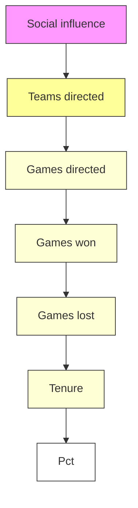
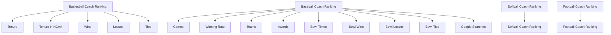

## Team Control Number

For office use only

T1 \_\_\_\_

T2 \_\_\_\_

T3 \_\_\_\_

T4 \_\_\_\_

## 29696

Problem Chosen

B

For office use only

F1 \_\_\_\_

F2 \_\_\_\_

F3

F4

# 2014 Mathematical Contest in Modeling (MCM) Summary Sheet

# College Coaches' Mount Rushmore

## Summary

College coaches' exposure is growing these days, as a result of the increase on attention to college sports. In this paper, we build a mathematical model to rank college coaches among either gender across generations in varied sports.

Firstly, we build a factors pool to collect evaluation factors of all sports. By principle component analysis (PCA), we obtain three components used to evaluate the coach's performance. Then we take American college basketball as an example to build the Coaches Ranking Model (CRM). The first step of CRM is to classify the ranking coaches by Cluster Analysis. Next we compare all coaches with the “idealistic coach” whose factors are the best of factors pool by means of adjusted Cosine Similarity. We hereby obtain the top 5 college basketball coaches in the previous century.

Secondly, we optimize CRM across generations by modified coefficient of coaching difficulty and social influence. The coefficients are calculated by Regression Analysis. Based on the optimized model, we take the impacts of genders into consideration. Modified coefficient in genders is calculated by Analysis of covariance (AVOVA) and Data Whitening. We hereby obtain the optimized CRM.

Thirdly, the optimized model is applied to other sports in the worldwide. As for sports, we figure out an advanced ranking model related to different sports with the update of factors pool. Hence, we obtain the coaches ranking list of football, baseball and softball. As for countries, we obtain a list of top 5 college basketball coaches in China.

Finally, we test the sensitivity and robustness of the coaches ranking model. The test result illustrates the stability and adaptability of the model. Besides, based on the ranking results, we discuss the significance of the relation between ranking state distribution and economy, society, culture development in America. Generally, the prosperity of sports stimulates the development of the region.

Above all, our model is accessible to both genders across generations in varied sports. It can be applied further to other countries and organizations. Therefore, our model has a high degree of adaptability and stability.

Key Words: Adjusted Cosine Similarity, Principle Component Analysis, Data Whitening, Cluster Analysis, CRM

Model Execution Flow

<table><tr><td colspan="3">College Coaches Ranking Model</td></tr><tr><td colspan="3">STEP1: Collect evaluation factors of college coaches</td></tr><tr><td rowspan="2">STEP2:Principle Component Analysis (PCA) of data for basketball coaches</td><td colspan="2">Results and Conclusion</td></tr><tr><td>Classify 12 factors into 3 principle components $Z_1$ : coach-ability, $Z_2$ : coach-influence-school, $Z_3$ :coach-influence-society.</td><td>Principle components ranking by importance $Z_1 > Z_2 > Z_3$ </td></tr><tr><td rowspan="2">STEP3:Cluster analysis of data</td><td colspan="2">Results and Conclusion</td></tr><tr><td colspan="2">Pick out the better groups in 9 for ranking with simplification the latter calculation.</td></tr><tr><td rowspan="2">STEP4:Best coaches ranking by Cosine Similarity</td><td colspan="2">Results and Conclusion</td></tr><tr><td colspan="2">Ranking result:1st:John Wooden 2nd:Geno Auriemma 3rd:Pat Summitt4th:Dean Smith 5th:Mike Krzyzewski</td></tr></table>

Model Optimization

<table><tr><td rowspan="2">STEP1: Find the relation between generations andcoaching difficulty across time line horizons.</td><td>Process and Approach</td><td>Conclusions and Results</td></tr><tr><td>Calculate modification coefficient of time line horizon by linear regression analysis</td><td>1st:John Wooden 2nd:Geno Auriemma 3rd:Pat Summitt 4th:Dean Smith 5th:Mike Krzyzewski</td></tr><tr><td rowspan="2">STEP2: Analysis of variance (ANOVA) of data and discussion of gender differences</td><td>Process and Approach</td><td>Conclusions and Results</td></tr><tr><td>Analyze the significant difference in factors across the gender and modify data by Data Whitening.</td><td>1st:John Wooden 2nd:Geno Auriemma 3rd:Pat Summitt 4th:Dean Smith 5th:Mike Krzyzewski</td></tr></table>

## Model Extension

● Factors pool extension

● Sports extension: baseball, football, softball.

● Countries and organizations extension: China

Further Discussion Upon Model

<table><tr><td>Discussion upon sports impact on economy, culture, social developments.</td></tr></table>

## Looking for the “best all time college coaches”? See here!

Over the previous century, outstanding college coaches have pushed college sports a lot further. Skill improvement, strategies update and tactics developments, such changes contributed by coaches stimulate college sports to sparkle. It’s time to take stock of the coaching landscape in the past 10 decades.

In this article, a ranking system is applied to pick out the “best all time college coaches”. This is not simply a ranking of who are the best coaches in the previous century. It's a scientific ranking of who would be the best to lead a team going forward. Through the system, we find out the top 5 best coaches in basketball, football and baseball as the following figure 1.

bar chart

| Position | Player           | Name             |
| :--- | :---            | :---             |
| Basketball | John wooden     |                   |
| Basketball | Geno Auriemma   |                   |
| Basketball | Pat Summitt    |                   |
| Basketball | Dean Smith      |                   |
| Basketball | Mike Krzyzewski |                   |
| Football | Bear Bryant      |                   |
| Football | Vince Dooley    |                   |
| Football | Joe Paterno     |                   |
| Football | Lou Holtz       |                   |

bar chart

| Player | Count |
| :--- | :--- |
| Don Schaly | 10 |
| Ron Fraser | 8 |
| Ray Tanner | 6 |
| Bill Holowaty | 4 |
| Mike Martin | 3 |

Figure 1

The rankings proved to be a tough job. The best coaches in college should be outstanding in all aspects: recruiting, teaching, tactics design and players motivation.

We are eager to find out the well-rounded coaches, who can wisely handle all. The following in figure 2 evaluation factors are weighed in our system.

flowchart

Figure 2

## So how are these factors weighed in the ranking system?

Firstly, we create an “idealistic coach” whose factors are the best among all ranked coaches in basketball, virtually, of course. Secondly, compare each coach with the “idealistic coach” by means of Cosine Similarity. In addition, we also keep an eye on gender differences and generation gap by means of Data Whitening. And eventually, we promote the basketball system to football and baseball across countries.

## Why is this system accessible?

Genders, generations, countries and sports, such considerations complete the system. In advance, the ranking result makes our system convincing.

## And why is this system reliable?

We tested the system's stability and sensitivity. The results were stable with slight factor fluctuation. Besides, a large amount of data is used to establish and test the system.

Therefore, we have strong confidence to carry out the ranking system.

## What does the ranking result show?

We have to admit that coaching is one of the driving forces in building a national championship team. The job of a coach is multi-faceted and challenging. Coaches picked out in our system are not only excellent among their peers, but leave impression on the career for decades as well. The ranking system is capable of evaluating coaches among organizations across sports.

## Table of Content

Looking for the “best all time college coaches”? See here! ....1

1. Introduction......5  
2. Assumptions......6  
3. Factors Analysis Model Based on Principal Component Analysis....6

3.1. Model overview....6  
3.2. Justification of our approach....7  
3.3. Model formulation......8  
3.4. Result analysis....10

4. Coaches Ranking Model Based on Cosine Similarity.... 11

4.1. Model overview....11  
4.2. Model justification....11  
4.3. Model formulation....12

4.3.1. Vector definition of the “idealistic coach” and ranking....12  
4.3.2. Adjusted Cosine Similarity ...... 13  
4.3.3. Model computing by Euclidean distance-based clustering analysis....14  
4.4. Results analysis....17

5. Model Optimization of Time Line Horizon Based on Regression Analysis......17

5.1. Justification of our generation-based model optimization....17  
5.2. Generation-based model optimization....17

5.2.1. Giant effect....17  
5.2.2. Coaching difficulty optimization....18  
5.2.3. Social influence optimization .... 20

5.3. Generation-based model optimization results....20  
5.4. Generation-based results analysis 21

6. Model Optimization of Gender Based on Data Whitening....22

6.1. Justification of our gender-based model optimization....22  
6.2. Gender-based model optimization....23  
6.3. Gender-based optimization results....25  
6.4. Gender-based results analysis....25

7. Model Extension....26

7.1. Establishment of factors pool 26  
7.2. Sports extension....28  
7.3. Country extension....29  
7.4. Factors extension 29

7.4.1.Salary 29  
7.4.2. Popularity of college 29  
7.4.3. Formal performance of the college team 29

8. Results and results analysis....30

8.1. Results....30  
8.2. What the results illustrate....33

9. Model Stability Analysis....34

9.1. Sensitivity analysis....34  
9.2. Robustness analysis ...... 35  
9.3. Strengths and Weaknesses .... 36

9.3.1. Strengths....36  
9.3.2. Weaknesses....36

10.Conclusions....37

11.Reference 37  
12. Appendix....39

## 1. Introduction

## Restatement of the problem

College Coaching Legends

Sports Illustrated, a magazine for sports enthusiasts, is looking for the “best all time college coach” male or female for the previous century. Build a mathematical model to choose the best college coach or coaches (past or present) from among either male or female coaches in such sports as college hockey or field hockey, football, baseball or softball, basketball, or soccer. Does it make a difference which time line horizon that you use in your analysis, i.e., does coaching in 1913 differ from coaching in 2013? Clearly articulate your metrics for assessment. Discuss how your model can be applied in general across both genders and all possible sports. Present your model’s top 5 coaches in each of 3 different sports.

In addition to the MCM format and requirements, prepare a 1-2 page article for Sports Illustrated that explains your results and includes a non-technical explanation of your mathematical model that sports fans will understand.

## Background

The “Sports Illustrated” is a magazine for sports enthusiasts, as the problem above demonstrates. Therefore, after a brief survey of the formal rankings in this magazine, we sort out the following basic idea related to college sports coaches ranking, combined with data resources and other researches.

The National Collegiate Athletic Association (NCAA) is a nonprofit association of 1,281 institutions, conferences, organizations, and individuals that organizes the athletic programs of many colleges and universities in the United States and Canada. Based on the game statistics from this association and its similar conferences, we found that hockey, football, baseball or softball, basketball, and soccer teams are supposed to attend national conferences or games annually. The performance of a team, which is bond with its head coach, is the core element determining the result in a game, win or loss. Therefore, a coach's quality can be evaluated by the team's performance. In advance, the assessed coach is possible to have coached more than one team. Hence, the overall team-directing experience of a coach is considered, including the number of the games the coach has directed, wins and losses all counted, the winning rate, significant awards the coach has won and the his or her career length. Through this process, the fact of gender, time line horizon and varied sports can make a difference to the ranking result.

In order to solve this problem, we collected a large amount of statistics. Considered the purpose is to build a coach judging model as reasonable as possible and present our model's top 5 coaches in each 3 different sports, we applied all the statistics to test the model and ranking the coaches whose statistics have been pre-processed. Hereby, there is guarantee in accuracy and efficiency for the model.

## 2. Assumptions

Table 1.
General assumption

<table><tr><td>Assumptions</td><td>Justification of assumptions</td></tr><tr><td>The factors used in this model are qualified to represent a comprehensive ability of college sports coaches.</td><td>There are many ways of valuing a coach. For simplifying the mathematical model, we picked some of the quantifiable and non-quantifiable factors. Factors we haven’t picked out can be explained by the factors we used in this model.</td></tr><tr><td>The data used in this paper are real and effective and the coach ability can be well-judged by the data.</td><td>The data source in this paper is authorized statistics website. College coach’s ability can be judged by the data.</td></tr><tr><td>The relation between difficulty coefficient and time ling horizon is positive linear.</td><td>We adjust the difficulty coefficient according to the difficulty caused by different generations. After analysis, we find that the degree of difficulty varies with generation shows an increasing trend.</td></tr><tr><td>The coaching difficulty and social influence are the only factors affected by time line horizon.</td><td>Other factors caused by generation are considered to be explained by the two modification coefficient.</td></tr></table>

## 3. Factors Analysis Model Based on Principal Component Analysis

## 3.1. Model overview

In this topic, we found that there are 12 factors affecting the ability evaluation of coaches after data collecting [1]. In order to simplify the data processing, we used Principal Component Analysis (PCA) to find the core components.

The results provide a three-component factor assemblage. The three components each can represent an inner ability of the coach.

## 3.2. Justification of our approach

PCA, is a statistical procedure concerned with elucidating the covariance structure of a set of variables. In particular it allows us to identify the principal directions in which the data varies.

In this project, firstly, we make a survey on 60 coaches(30 males 30 females), who are from NCCAB (National Committee Association America Basketball). The game of basketball in American college is used as an example. Then we collected the data including tenure, the number of the games has been directed, experiences in NCCA, the number of the games wins and losses all counted respectively, the number of the teams have been directed, the winning rate, the times of final four in NCCA and the times of championships in NCCA, the number of championships in other games such as tournaments and regular seasons, social influence which mainly accounted by the amount of searches on Google and the number of significant awards have been won. In this process, the fact of gender, time line horizon is out of consideration.

Therefore, the factors mentioned above are listed as follows.

1. Tenure: the term during which the coach conducts a team  
2. Games: directed: the number of the games have been directed  
3. Tenure in: NCAA: tenure when the coach attended NCAA  
4. Games won: the number of the games have been won  
5. Games lost: the number of the games have been lost  
6. Teams directed: the number of the teams have been directed  
7. Winning rate: the percentage of the games has been won in all games directed  
8. Final four in NCAA: the number of the times when the coach's team was in final 4 in NCAA  
9. Championship in NCCA: the number of the times when the coach's team won the championship  
10. Championship in other games: the number of the times when the coach's team won the championship in other games  
11. Social influence: the amount of searches on Google  
12. Significant Awards: the number of the significant awards have been won.

The factors are justified because:

- With the development of sports, coaches can be evaluated in increasing factors. But elder coaches are not included in some of the new factors. In order to be fair, we chose factors that are shared by coaches in different generations.  
- There are also many non-quantifiable factors that can reflect the coach's ability. For a more comprehensive measure of evaluating the coaches, we quantify some non-quantifiable factors and take them into consideration. For example, as for the factor of social influence, we use searches on Google to represent it.

\- Other minor factors out of the consideration can be covered by the existing factors, such as the factor of salary. In this way, we avoid the factor repetition and hereby simplify the calculation.

## 3.3. Model formulation

$X_{1} \sim X_{12}$ are used to represent the 12 factors above. Hence, we get an $60 \times 12$ matrix. Considering the large sorts of the factors, we will apply dimension reduction with the PCA process.

Through PCA process, we analyze the standardized factors data and build a correlation matrix. Through the correlation matrix's eigenvalue and eigenvector, we figure out inner relation across several factors in the origin data sample. The factors whose inner relations with each other are strong are classified as a new component, named principle component. $Z_{i}$ ( $i = 1,2,\dots,p$ ) ( $p = 12$ )

$Z_{1}, Z_{2}, ..., Z_{m} \quad (m \leq p)$ are used to represent the inner connection among some of the factors above. It can be demonstrated as the following equation,

$$
\left\{ \begin{array}{c} Z _ {1} = a _ {1 1} X _ {1} + a _ {1 2} X _ {2} + \dots + a _ {1 p} X _ {p} \\ \vdots \qquad \qquad \vdots \qquad \qquad \vdots \\ Z _ {m} = a _ {m 1} X _ {1} + a _ {m 2} X _ {2} + \dots + a _ {m p} X _ {p} \end{array} \right.
$$

where, $a_{i1}^{2} + a_{i2}^{2} + \cdots + a_{ip}^{2} = 1$ $(1 \leq i \leq m)$ and $Z_{1}, Z_{2}, \ldots, Z_{m}$ $(m \leq p)$ is the first, second,...principle component.

In order to eliminate the downturn impact caused by the dimension and the order of magnitude according to the statistics collected. We process the data with the approach of z-score standardization, based on the formula as follows,

$$
X _ {i} ^ {\prime} = \frac {X _ {i} - E _ {i}}{S _ {i}} (1 \leq i \leq p)
$$

where $E_{i}$ is the mean value of the factors of group i,

$S_{i}$ is the variance value of the factors of group i.

Then we can get the standardized data matrix., and we can work on the correlation coefficient through the standardized data. Accordingly, we get the correlation matrix R as follows,

$$
R = \left[ \begin{array}{c c c c} r _ {1 1} & r _ {1 2} & \dots & r _ {1 p} \\ r _ {2 1} & \ddots & & \\ \vdots & & \ddots & \\ r _ {p 1} & & & r _ {p p} \end{array} \right]
$$

where,

$$
r _ {i j} = \frac {\sum_ {k = 1} ^ {n} (x _ {k i} - \overline {{x}} _ {i}) (x _ {k j} - \overline {{x}} _ {j})}{\sqrt {\sum_ {k = 1} ^ {n} (x _ {k i} - \overline {{x}} _ {i}) ^ {2} \sum_ {i = 1} ^ {n} (x _ {k j} - \overline {{x}} _ {j}) ^ {2}}} (i, j = 1, 2, 3 \dots , p)
$$

Each eigenvalue $\lambda_{1},\lambda_{2}\ldots\lambda_{p}(\lambda_{1}\geq\lambda_{2}\ldots\geq\lambda_{p}\geq0)$ , is with an eigenvector $e_{i}(1\leq i\leq p)$ , where $\lambda_{i}$ refers to the eigenvalue while $e_{i}(1\leq i\leq p)$ refers to the eigenvector. Each eigenvalue $\lambda_{i}$ of the correlation matrix and its eigenvector $e_{i}$ is with a possible principle component $Z_{i}$ .

The eigenvalue of the correlation matrix satisfies the equation,

$$
\det (\lambda_ {i} I - R) = 0
$$

where $I$ is an identity matrix.

Then we can get the contribution rate $V_{i}$ of the eigenvalues, based on the formula as follows,

$$
V _ {i} = \frac {\lambda_ {i}}{\sum_ {k = 1} ^ {p} \lambda_ {k}} (i = 1, 2, 3 \dots , p)
$$

In advance, the cumulative contribution rate $V_{m}$ is,

$$
V _ {m} = \frac {\sum_ {i = 1} ^ {i} \lambda_ {i}}{\sum_ {k = 1} ^ {p} \lambda_ {k}} (i = 1, 2, 3 \dots , p)
$$

In general, the variable correspondence to the eigenvalues whose cumulative contribution rate $V_{m}$ is from 95% to 75% is regarded as the first, second,.. principle component respectively. Based on the cumulative contribution rate of correlation matrix's eigenvalue, through SPSS17.0, we get the principle components $Z_{1}$ $Z_{2}$ and $Z_{3}$ . The results is shown in Table 2.

Table 2.  
Result of PCA process

<table><tr><td>Component</td><td>% of Variance</td><td>Cumulative %</td></tr><tr><td>1</td><td>52.395</td><td>52.395</td></tr><tr><td>2</td><td>16.050</td><td>68.445</td></tr><tr><td>3</td><td>8.521</td><td>76.966</td></tr><tr><td>4</td><td>6.323</td><td>83.289</td></tr><tr><td>5</td><td>4.898</td><td>88.187</td></tr><tr><td>6</td><td>4.416</td><td>92.602</td></tr><tr><td>7</td><td>3.788</td><td>96.390</td></tr><tr><td>8</td><td>1.742</td><td>98.132</td></tr><tr><td>9</td><td>1.098</td><td>99.230</td></tr><tr><td>10</td><td>0.474</td><td>99.705</td></tr><tr><td>11</td><td>0.295</td><td>100.000</td></tr><tr><td>12</td><td>0.13</td><td>100.000</td></tr></table>

The Component Matrix of $Z_{1}$ , $Z_{2}$ and $Z_{3}$ is shown as follow.

Table3. Component Matrix

<table><tr><td>Factors</td><td> $Z_1$ </td><td> $Z_2$ </td><td> $Z_3$ </td></tr><tr><td>Tenure</td><td>.928</td><td>.271</td><td>.032</td></tr><tr><td>NCAA Tenure</td><td>.842</td><td>.100</td><td>-.151</td></tr><tr><td>Wins</td><td>.971</td><td>.142</td><td>-.003</td></tr><tr><td>Losses</td><td>.711</td><td>.598</td><td>.055</td></tr><tr><td>Games</td><td>.948</td><td>.276</td><td>.013</td></tr><tr><td>Winning Rate</td><td>.631</td><td>-.324</td><td>-.001</td></tr><tr><td>Teams</td><td>.255</td><td>.716</td><td>-.017</td></tr><tr><td>NCAA Final Fours</td><td>.791</td><td>-.473</td><td>.012</td></tr><tr><td>NCAA Champions</td><td>.574</td><td>-.582</td><td>-.031</td></tr><tr><td>Conference Champion</td><td>.757</td><td>-.271</td><td>.105</td></tr><tr><td>Googles</td><td>.042</td><td>-.037</td><td>.987</td></tr><tr><td>awards</td><td>.613</td><td>-.366</td><td>-.095</td></tr></table>

## 3.4. Result analysis

It is indicated that,

- The first Principal Component $Z_{1}$ is relatively bond with the factors of experiences in career, experiences in NCCA, the number of the games wins and losses, the winning rate, the times of final four in NCCA and the times of championships in NCCA, and the number of significant awards have been won. Consequently, $Z_{1}$ can be described as a coach-ability variable.  
- The second Principal Component $Z_{2}$ is relatively bond with the factors of the number of the teams have been directed, and the times of championships in NCCA. Hence, $Z_{2}$ can be described as a coach-influence-college variable.  
- The third Principal Component $Z_{3}$ is relatively bond with the factors of social influence which mainly accounted by the amount of searches on Google. Therefore, $Z_{3}$ can be described as a coach-influence-society variable.

The degree of influence count down is $Z_{1}, Z_{2}$ and $Z_{3}$ . Based on the analysis of the eigenvalue, the eigenvalue of $Z_{1}$ is the biggest, with $Z_{2}$ and $Z_{3}$ following it. Therefore, we believe that the factors belonged to $Z_{1}$ , which is the “coach-ability” variable contributes most to the “coach evaluation system”. It is shown as follows in

Fig. 1

bar chart

| Principal Component | Influence |
| :--- | :--- |
| Z1 | 52 |
| Z2 | 16 |
| Z3 | 8 |

Fig 1. The Influence of Principal Components

## 4. Coaches Ranking Model Based on Cosine Similarity

## 4.1. Model overview

In this topic, in order to select the best college coach or coaches (past or present) from among either male or female coaches in such sports as college hockey or field hockey, football, baseball or softball, basketball, or soccer, we take the basketball game is used as example. We establish a standard——“idealistic coach”, which is a virtual coach whose factors data are the best of all. Then, based on the idea of vector space mapping, we apply Cosine Similarity and its adjustment to compare all coaches with the “idealistic coach”. Coaches with higher similarity to the “idealistic coach” are expected to take a better seat in the ranking list. When it comes to the computation of the model, we use Euclidean distance-based clustering analysis to process the data. In this way, we obtain the college coaches ranking result in the field of basketball.

## 4.2. Model justification

In this model, Cosine Similarity is used to compare the assessed coach's every factors to the all twelve factors set as the best.

The measure of similarity is to calculate the degree of similarity between individuals. Cosine Similarity is an approach to measure the gap between two identities. Firstly, we map the data of each individual to the vector space. Then we measure the similarity between them by measuring the cosine value of the angle between the two individuals with dot product in vectors space [6]. The more it is close to 1, the more the vector angle is close to 0 degree, which means more similar the two vectors are. The more it is close to 0, the more the vector angle is close to 90 degree, which means less similar the two vectors are.

text_image

The angle between
two vectors is
small, so they are
similar.
10°
B
A
The angle between
two vectors is
large, so they are
not similar.
68°
0
A

Fig 2. Explanation of Cosine Similarity

In this project, we rank all the coaches by calculating the similarity between the vector of each coach and the set vector of the virtual “idealistic coach”. The higher the similarity is, the closer to the top seat in the ranking.

The cosine value between two vectors can be easily obtained through Euclidean dot product equation,

$$
\vec {a} \cdot \vec {b} = | a | \times | b | \cos \theta
$$

where $\cos \theta$ is the similarity between the two vectors.

Then we obtain the formula of individual similarity as,

$$
\cos \theta = \frac {X _ {i} \cdot X _ {s}}{\left| X _ {i} \right| \left| X _ {s} \right|} = \frac {\left(x _ {i 1} , x _ {i 2} \dots x _ {i n}\right) \cdot \left(x _ {s 1} , x _ {s 2} \dots x _ {s n}\right)}{\sqrt {\sum_ {j = 1} ^ {n} \left(x _ {i j}\right) ^ {2}} \times \sqrt {\sum_ {j = 1} ^ {n} \left(x _ {s j}\right) ^ {2}}}
$$

## 4.3. Model formulation

## 4.3.1. Vector definition of the “idealistic coach” and ranking

In this topic, there are 12 factors that make impacts on the ranking of coaches, after data analysis. Accordingly, standardized vector's dimension is eleven.

Considering the large amount of the data, we classified all the coaches firstly. Then we ranked the coaches from the first group, who are the best coaches of all groups. In this case, we used Euclidean distance-based clustering analysis to classification.

We mapped the collected factors of 60 male and female coaches to the vector space. Then we obtained the coach's ability factor vector $V_{i}$ ( $1 \leq i \leq 60$ ). $V_{i}$ is a $1 \times 12$ row vector. And each vector component is the value of the factors.

$$
V _ {i} = (x _ {i 1}, x _ {i 2}, x _ {i 3}, x _ {i 4}, x _ {i 5}, x _ {i 6}, x _ {i 7}, x _ {i 8}, x _ {i 9}, x _ {i 1 0}, x _ {i 1 1}, x _ {i 1 2})
$$

Firstly, we defined a standard vector to combine the factors with cosine similarity so as to ranking the coaches. We defined the vector in reality as a coach whose achievement is beyond all ever, which is the “idealistic coach”. The data of his factors are picked from the highest ones. Table 4.

Table 4.
Data of ‘idealistic coach’

<table><tr><td>T</td><td>NC T</td><td>W</td><td>L</td><td>G</td><td>W R</td><td>T</td><td>NFF</td><td>NCC</td><td>CC</td><td>G</td><td>A</td></tr><tr><td>23.1</td><td>16.3</td><td>1204</td><td>133</td><td>1337</td><td>0.9</td><td>2</td><td>13</td><td>10</td><td>41</td><td>18.1k</td><td>11</td></tr></table>

We\_compared each individual vector of all coaches to the standard vector, and then we calculate the similarity between them by cosine similarity. The bigger the cosine value is, the higher the similarity is, and hereby the better the coach will be. In the ranking list, the coach is closer to the top seat. The example is as follows.

text_image

Vector of Coach A
O
13°
Vector of Best Coach
The angle between Coach B vector and Best vector is larger than A's. So Coach B's ranking is lower than A's ranking
Vector of Coach B
O
35°
Vector of Best Coach

Fig 3. Comparison between coaches and the “idealistic coach”

## 4.3.2. Adjusted Cosine Similarity

Cosine Similarity is sensitive to direction instead of absolute value.[8] Value's differences in each dimension, therefore, are not accessible to measure. Cosine Similarity's insensitivity leads the result to be less accurate. [10] For example, we suppose two of a coach's factors are the highest in all, $x_{1} = (10,5)$ . While the two of another coach's factors are the lowest, $x_{2} = (2,1)$ . It is obvious that there is a gap between the two coaches' ability. But the angle between the two vectors is 0 degree so $\cos \theta$ is 1. It is illustrated in Fig 4.

  
Fig 4. Situation when two vectors overlap

We hereby normalize all of the values to amend the unreasonable results.

The amendment equation is as follows,

$$
x _ {i j} ^ {\prime} = \frac {x _ {i j} - E _ {j}}{X _ {j \max} - X _ {j \min}} (1 \leq i \leq 6 0, 1 \leq j \leq 1 2)
$$

where $x_{ij}$ represents the factor j of the coach i, $x'_{ij}$ is the standardized factor, $X_{j\min}$ represents the minimum of factor j, $X_{j\max}$ represents the maximum of factor j, $E_{j}$ is the mean value of the data sample j.

We apply the adjustment in the example. Then we find that the angle between the vector $x'_{1}=(0.5,0.5)$ and the vector $x'_{2}=(-0.5,-0.5)$ is 180 degree. In this case, the difference between the two coaches' ability is well presented. In fact, the example we used here is a special situation. Generally, the angle ranges from 0 degree to 180 degree and the cosine value ranges from -1 to 1, in which, 1 represents that the ability of the two coaches' are practically same, while -1 represents that the gap between the ability of the two coaches' are biggest.

## 4.3.3. Model computing by Euclidean distance-based clustering analysis

Cluster analysis is mainly used to classify factors or variables. Generally speaking, there are two procedures, data standardization and clustering.

Data standardization: Data standardization is used to normalize the statistics, in case of the statistics' dimension gap and value differences making unreasonable impacts. We suppose that there are $n$ specimens, and each specimen has $m$ factors, then each variable can be expressed as $x_{ij}$ . The mean value is,

$$
\overline {{x}} _ {j} = \frac {1}{n} \sum_ {i = 1} ^ {n} x _ {i j}
$$

The standard deviation is,

$$
s _ {j} = \sqrt {\frac {1}{n - 1} \sum_ {i = 1} ^ {n} \left(x _ {i j} - \overline {{x}} _ {i j}\right) ^ {2}}
$$

Finally, the standardization form is,

$$
x _ {i j} ^ {*} = \frac {x _ {i j} - \overline {{x}} _ {j}}{s _ {j}} \quad (s _ {j} \neq 0)
$$

Clustering: Based on the distance between specimens and sorts, we classify a larger sort of given sorts. At the beginning, each specimen is regarded as a single sort and the distances between sorts are equal. We choose two specimens whose distances are the smallest of all. Next we calculate the distance between the new sort and other sorts. Then we merge the nearest two together. Continue this process until there is only one sort left. During this process, distance refers to the measurement used to estimate close degree among specimens. It is because each specimen and factor can form a matrix in the vector space. We suppose $x_{ij}$ as the factor j, $d_{ij}$ as the distance between specimen i and other specimen. There are several ways of calculating the distance between sorts, such as, single linkage, the longest distance method, group average method, and centroid method. In this problem, we apply single linkage to clustering analysis.

Single linkage can be described as follows.

First of all, we need to know about the distance called Minkowski. The most common method to calculate the distance is Minkowski

$$
d _ {i j} = \left[ \sum_ {k = 1} ^ {p} \left(x _ {i k} - x _ {j k}\right) ^ {q} \right] ^ {1 / q}
$$

When $q = 2$

$d_{ij}$ is called Euclidean distance.

$$
d _ {i j} (2) = \left[ \sum_ {k = 1} ^ {p} \left(x _ {i k} - x _ {j k}\right) ^ {2} \right] ^ {1 / 2}
$$

We suppose $G_{p}$ , $G_{q}$ , $G_{r}$ as three respective sort, then we get the formula as follows,

$$
D _ {k} (p, q) = \min \left\{d _ {j l} \mid j \in G _ {p}, l \in G _ {q} \right\}
$$

Then we merge the sort $G_{p}$ with sort $G_{q}$ as sort $G_{r}$ . So the distance formula is,

$$
D _ {k r} ^ {2} = \min _ {X _ {i} \in G _ {k}, X _ {j} \in G _ {r}} d _ {i j} = \min \left\{\min _ {X _ {i} \in G _ {k}, X _ {j} \in G _ {p}} d _ {i j}, \min _ {X _ {i} \in G _ {k}, X _ {j} \in G _ {q}} d _ {i j} \right\} = \min \left\{D _ {k p}, D _ {k q} \right\}
$$

Fig 5 shows the demonstration of Cluster Analysis.

scatterplot

| Group | X | Y |
| --- | --- | --- |
| Red | 0.05 | 0.92 |
| Red | 0.10 | 0.88 |
| Red | 0.15 | 0.85 |
| Red | 0.20 | 0.83 |
| Red | 0.25 | 0.80 |
| Red | 0.30 | 0.78 |
| Red | 0.35 | 0.75 |
| Red | 0.40 | 0.72 |
| Red | 0.45 | 0.70 |
| Red | 0.50 | 0.68 |
| Red | 0.55 | 0.65 |
| Red | 0.60 | 0.63 |
| Red | 0.65 | 0.60 |
| Red | 0.70 | 0.58 |
| Red | 0.75 | 0.55 |
| Red | 0.80 | 0.53 |
| Red | 0.85 | 0.50 |
| Red | 0.90 | 0.48 |
| Blue | 0.30 | 0.55 |
| Blue | 0.40 | 0.60 |
| Blue | 0.50 | 0.65 |
| Blue | 0.60 | 0.70 |
| Blue | 0.70 | 0.75 |
| Blue | 0.80 | 0.80 |
| Blue | 0.90 | 0.85 |
| Blue | 1.00 | 0.90 |
| Green | 0.15 | 0.45 |
| Green | 0.25 | 0.48 |
| Green | 0.35 | 0.52 |
| Green | 0.45 | 0.55 |
| Green | 0.55 | 0.60 |
| Green | 0.65 | 0.65 |
| Green | 0.75 | 0.70 |
| Green | 0.85 | 0.75 |
| Green | 0.95 | 0.80 |
| Green | 1.05 | 0.85 |
| Green | -1.05 | -1.15 |
| Blue | -1.15 | -1.45 |
| Blue | -2.25 | -1.75 |
| Blue | -3.45 | -2.15 |
| Blue | -4.75 | -2.55 |
| Blue | -6.15 | -3.15 |
| Blue | -7.65 | -3.75 |
| Blue | -9.25 | -4.45 |
| Blue | -11.95 | -5.25 |
| Blue | -14.75 | -6.15 |
| Blue | -18.65 | -7.15 |
| Blue | -23.65 | -8.25 |
| Blue | -29.75 | -9.45 |
| Blue | -36.95 | -11 |
| Blue | -44.95 | -13 |
| Blue | -53.95 | -16 |
| Blue | -63.95 | -19 |
| Blue | -74.95 | -23 |
| Blue | -86.95 | -28 |
| Blue | -99 | -34 |
| Blue | -122 | -42 |
| Blue | -146 | -49 |
| Blue | -171 | -57 |
| Blue | -211 | -72 |
| Blue | -261 | -88 |
| Blue | -322 | -112 |
| Blue | -396 | -142 |
| Blue | -483 | -184 |
| Blue | -612 | -236 |
| Blue | -762 | -316 |
| Blue | -936 | -416 |
| Blue | -1244 | -536 |
| Blue | -1668 | -676 |
| Blue | -2176 | -836 |
| Blue | -2914 | -1116 |
| Blue | -3884 | -1416 |
| Blue | -4976 | -1826 |
| Blue | -6216 | -2326 |
| Blue | -7764 | -3126 |
| Blue | -9436 | -4126 |
| Blue | -12384 | -5226 |
| Blue | -16448 | -6426 |
| Blue | -21448 | -7726 |
| Blue | -28736 | -9126 |
| Blue | -38148 | -11726 |
| Blue | -49876 | -14726 |
| Blue | -62384 | -19726 |
| Blue | -79996 | -26726 |
| Blue | -99996+ | -34 |
| Green | -1.15+ | - |

Fig 5. Demonstration of Cluster Analysis.[21]

Continuing the process, we classify the 60 coaches into nine levels, of which, there are 24 coaches in the first five levels. Finally, we get the results of the clustering analysis is shown in Table 5.

Table 5.
Result of clustering analysis

<table><tr><td>Name</td><td>Cluster</td><td>Name</td><td>Cluster</td><td>Name</td><td>Cluster</td></tr><tr><td>1:John Wooden</td><td>1</td><td>6:John Calipari</td><td>3</td><td>8:Tom Izzo</td><td>4</td></tr><tr><td>2:Dean Smith</td><td>2</td><td>7:Denny Crum</td><td>3</td><td>9:Billy Donovan</td><td>4</td></tr><tr><td>4:Mike Krzyzewski</td><td>2</td><td>12:Bill Self</td><td>3</td><td>19:Jack Gardner</td><td>4</td></tr><tr><td>5:Adolph Rupp</td><td>2</td><td>13:Rick Pitino</td><td>3</td><td>22:Thad Matta</td><td>4</td></tr><tr><td>11:Jim Calhoun</td><td>2</td><td>15:Jerry Tarkanian</td><td>3</td><td>23:Sean Miller</td><td>4</td></tr><tr><td>17:Jim Boeheim</td><td>2</td><td>16:Lute Olson</td><td>3</td><td>25:Jay Wright</td><td>4</td></tr><tr><td>3:Roy Williams</td><td>3</td><td>32:Tara VanDerveer</td><td>3</td><td>27:Anthony Grant</td><td>4</td></tr><tr><td>Name</td><td>Cluster</td><td>Name</td><td>Cluster</td><td>Name</td><td>Cluster</td></tr><tr><td>28:Bo Ryan</td><td>4</td><td>41:Brenda Fres</td><td>4</td><td>50:Sharon Versyp</td><td>4</td></tr><tr><td>29:Jim Valvano</td><td>4</td><td>42:Tina Martin</td><td>4</td><td>51:Pam Borton</td><td>4</td></tr><tr><td>30:Jamie Dixon</td><td>4</td><td>43:Jamelle Renee Elliott</td><td>4</td><td>52:Joanne Boyle</td><td>4</td></tr><tr><td>33:Kimberly Duane Mulkey</td><td>4</td><td>44:Deb Patterson</td><td>4</td><td>53:Nikki Caldwell</td><td>4</td></tr><tr><td>35:JoanneMcCallie</td><td>4</td><td>46:Sue Semrau</td><td>4</td><td>55:Kellie Harper</td><td>4</td></tr><tr><td>36:Sherri Coale</td><td>4</td><td>47:Suzy Merchant</td><td>4</td><td>56:Kim Barnes Arico</td><td>4</td></tr><tr><td>39:Jennifer Rizzotti</td><td>4</td><td>48:MaChelle Joseph</td><td>4</td><td>57:Melissa McFerrin</td><td>4</td></tr></table>

## 4.4. Results analysis

Table 6. Ranking result of cosine similarity model

<table><tr><td>Ranking</td><td>Name.</td><td>Gender</td></tr><tr><td>1</td><td>John Wooden</td><td>M</td></tr><tr><td>2</td><td>Geno Auriemma</td><td>F(M)</td></tr><tr><td>3</td><td>Pat Summitt</td><td>F</td></tr><tr><td>4</td><td>Dean Smith</td><td>M</td></tr><tr><td>5</td><td>Mike Krzyzewski</td><td>M</td></tr><tr><td>6</td><td>Roy Williams</td><td>M</td></tr><tr><td>7</td><td>John Calipari</td><td>M</td></tr><tr><td>8</td><td>Bill Self</td><td>M</td></tr><tr><td>9</td><td>Adolph Rupp</td><td>M</td></tr><tr><td>10</td><td>John Thompson</td><td>M</td></tr></table>

From the results above, we obtain result analysis as follows,

- Analyzing the top few of the factors in the ranking list, we find that each basic factor has played a role in the ranking. Therefore, the pick of these rankings is reasonable.  
- There are differences in some factors across different time line horizon, such as the searches on Google, winning rate, the games won by the coach and so on. Therefore, it should be a modification considering the impact of timeline horizon.  
● There are differences in some factors across both genders.

## 5. Model Optimization of Time Line Horizon Based on Regression Analysis

## 5.1. Justification of our generation-based model optimization

With the gradual development of NCAA, the number of teams attending the NCAA basketball game is changing. Accordingly, the difficulty and pressure the coach faces is changing. Besides, with the development of science and technology, the social influence of basketball is affected by internet transmission. Therefore, model optimization is supposed to consist of the coaching difficulty optimization and the social influence optimization.

## 5.2. Generation-based model optimization

## 5.2.1. Giant effect

When considering the difficulty coefficient brought by time line horizon, we supposed that the difficulty is positively related to time line horizon. So we set the coefficient as a value between 1 and 1.5. However, younger coaches can learn from the elder ones. With such endowed advantage, younger coaches are expected a relatively better performance. Still, we set the difficulty coefficient below 1.5. So we consider it as a minor influence instead of paying too much attention.

## 5.2.2. Coaching difficulty optimization

After analysis, we believe that there is a significant impact on the factor of winning rate caused by different coaching time line horizon. In early times, the teams that participated NCAA games are less, and hereby, they got a greater chance of winning, compared with those today. However, with the progressive development of NCAA games, teams participate in are much more. As a result, the pressure is higher to not only players but also coaches and the opportunity to win is harder to earn.

We carried on the statistics of the active coaches in NCAA from 1942 to 2013. [3]. Here is the approximate linear relationship between the number of active coaches and the time line horizon in Fig 6. based on regression analysis.

scatterplot

| Years   | ActiveCoaches |
| ------- | ------------- |
| 1940.00 | 0.00          |
| 1960.00 | 15.00         |
| 1980.00 | 30.00         |
| 2000.00 | 45.00         |
| 2020.00 | 60.00         |

Fig 6. Approximate linear relationship between the number of active coaches and the time line horizon

Based on the result of regression analysis, we found that the number of active coaches and the time line horizon satisfy the equation,

$$
A (t) = 0. 7 3 4 t - 1 4 2 1. 8
$$

We believe that the difficulty coefficient of a match is directly proportional to the number of active coaches each year. Hence, it can be expressed as follows,

$$
D (t) = k \times A (t)
$$

Based on the formal equations, we get the relation between the difficulty coefficient of a match and time line horizon as follows,

$$
D (t) = \frac {0 . 7 3 4 t - 1 4 2 1 . 8}{k}
$$

where we suppose $k = 1$ , therefore,

$$
D (t) = 0. 7 3 4 t - 1 4 2 1. 8
$$

It is shown in Fig 7.

line chart

| Year | Difficulty |
| ---- | ---------- |
| 1940 | 5          |
| 1950 | 10         |
| 1960 | 17         |
| 1970 | 24         |
| 1980 | 31         |
| 1990 | 39         |
| 2000 | 46         |
| 2010 | 54         |
| 2020 | 61         |

Fig 7. Relation between Coaching difficulty and Generation

Considering the fact that there are coaches whose career life is over a relatively long time period, we looked up the year when the coach started coaching and the year when the coach stopped coaching, instead of measuring the comprehensive difficulty coefficient by a single year. [5]We define $C_i$ ( $1 \leq i \leq 60$ ) as the comprehensive difficulty coefficient in coach $i$ 's whole career life. The formula is as follows,

$$
C _ {i} = \frac {1}{T _ {i} ^ {\text { end }} - T _ {i} ^ {\text { start }}} \int_ {T _ {i} ^ {\text { start }}} ^ {T _ {i} ^ {\text { end }}} D (t) d t \quad (1 \leq i \leq 6 0)
$$

Standardizing $C_{i}$ with Max-min method, we can obtain $C_{si}$

$$
C _ {s i} = \frac {C _ {i} - C _ {\min}}{C _ {\max} - C _ {\min}} (1 \leq i \leq 6 0)
$$

Because of the ‘Effect of Giants’, we let all the $C_{si}$ values of which is above 0.5 be 0.5. Hence, $C'$ is as follows,

$$
C _ {i} ^ {\prime} = \left\{ \begin{array}{l l} 1. 5 & C _ {s i} \geq 0. 5 \\ C + 1 & C _ {s i} <   0. 5 \end{array} \right. (1 \leq i \leq 6 0)
$$

line chart

| C+1 | U    |
|-----|------|
| 1.0 | 1.0  |
| 1.5 | 1.5  |
| 2.0 | 1.5  |

Fig 8. Adjustment of Difficulty Coefficient

## 5.2.3. Social influence optimization

With the popularization of sports events and development of internet technology, the social influence of basketball is rising. Hereby, college coaches' visibility is also rising. It is illustrated by the amount of searches on Google. Therefore, there is a significant impact on the amount of searches results on Google in different time line horizon. A reasonable optimization coefficient is needed to minimize this impact.

It is obvious that coaches in earlier years are less possible to obtain an idealistic search result. So the start coaching year is positively relation to the search results. In order to weaken the positive relation, we let the search results divided by a coefficient which is above 1. That is to say, we add 1 to the standardized result. We hereby get statistics in the section of $[1,2]$ . The formula is as follows,

$$
G = \frac {s - s _ {\mathrm{min}}}{s _ {\mathrm{max}} - s _ {\mathrm{min}}} + 1
$$

Where s is the start coaching year for each coach,

G is the social influence optimization coefficient.

## 5.3. Generation-based model Optimization results

Based on the formal analysis, we multiply the optimization coefficient $C'$ , and divide the amount of searches results on Google by G. Then we continue to model calculate through cosine similarity as illustrated before.

## 5.4. Generation-based results analysis

The final result is in Table 7.

Table 7.  
Final ranking result

<table><tr><td>Ranking</td><td>Name.</td><td>Gender</td></tr><tr><td>1</td><td>John Wooden</td><td>M</td></tr><tr><td>2</td><td>Geno Auriemma</td><td>F(M)</td></tr><tr><td>3</td><td>Pat Summitt</td><td>F</td></tr><tr><td>4</td><td>Dean Smith</td><td>M</td></tr><tr><td>5</td><td>Mike Krzyzewski</td><td>M</td></tr><tr><td>6</td><td>Roy Williams</td><td>M</td></tr><tr><td>7</td><td>John Calipari</td><td>M</td></tr><tr><td>8</td><td>Bill Self</td><td>M</td></tr><tr><td>9</td><td>Adolph Rupp</td><td>M</td></tr><tr><td>10</td><td>Billy Donovan</td><td>M</td></tr></table>

Table 8.  
Comparison of the 2 ranking result

<table><tr><td></td><td>before time optimized</td><td>After time optimized</td></tr><tr><td>Ranking</td><td>Name.</td><td>Gender</td></tr><tr><td>1</td><td>John Wooden</td><td>John Wooden</td></tr><tr><td>2</td><td>Geno Auriemma</td><td>Geno Auriemma</td></tr><tr><td>3</td><td>Pat Summitt</td><td>Pat Summitt</td></tr><tr><td>4</td><td>Dean Smith</td><td>Dean Smith</td></tr><tr><td>5</td><td>Mike Krzyzewski</td><td>Mike Krzyzewski</td></tr><tr><td>6</td><td>Roy Williams</td><td>Roy Williams</td></tr><tr><td>7</td><td>John Calipari</td><td>John Calipari</td></tr><tr><td>8</td><td>Bill Self</td><td>Bill Self</td></tr><tr><td>9</td><td>Adolph Rupp</td><td>Adolph Rupp</td></tr><tr><td>10</td><td>John Thompson</td><td>Billy Donovan</td></tr></table>

Therefore, we analyzed the result as follows,

\- When considering the difficulty coefficient, we put the difficulty of winning with increasing numbers of teams year by year as a core indicator. However, Young coaches can usually learn from the reference according to previous experience. The foundation laid by the old coach cannot be ignored. Therefore, the difficulty coefficient should not be too high. Eventually, we set its maximum as 1.5.

- It is obvious that, after comparison the ranking of before and after the optimization, the overall ranking hasn't changes tremendously. Only those whose tenure has some obvious features are adjusted slimly in the ranking.  
- After comprehensive analysis of the factors data adjusted of the ranked coaches, we can see that the modified ranking result is more reasonable. Therefore, the optimization model is relatively correct.

## 6. Model Optimization of Gender Based on Data Whitening

## 6.1. Justification of our gender-based model optimization

By the optimization model as above, we considered the time line horizon and achieved the modifying of the origin model. Still, the gender difference has a significant impact on the coach ranking result. Therefore, we believe that there is significant difference among some factors, affected by the intense degree and competition pressure in matches across both gender.

In order to figure out which factor will be affected by the factor of gender, we apply analysis of variance (ANOVA) to test whether or not there is a significant difference of factors modified by time line horizon across both genders. Because the gender factor is the single consideration, we apply one way analysis of variance (ANOVA) in this problem.[23]

$x_{i}$ is supposed as one single factor of coaches, and $\overline{x_i}$ is supposed as the mean value of the factor. $N$ refers to the number of the coach kinds, which is 2 considering the gender factor. Therefore,

Factor:

$$
S S A = \sum_ {i} n _ {i} \overline {{y _ {i}}} ^ {2} - N \overline {{y _ {i}}} ^ {2}
$$

Error:

$$
S S E = \sum_ {i} \sum_ {k} y _ {i, k} ^ {2} - \sum_ {i} n _ {i} \overline {{{{y _ {i}}}}} ^ {2}
$$

Mean squares:

$$
M S S A = \frac {S S A}{I - 1}, M S S E = \frac {S S E}{N - I}
$$

F value:

$$
F = \frac {M S S A}{M S S E}
$$

Probability $p = P\left(F_{I - 1,N - I} > c\right)$

In this problem, we use hypothesis tests in the analysis of variance, that is, to propose $H_{0}$ assuming that all the average observed measures are the average observed measures are the same. If the value of the probability $p < \alpha$ , with $\alpha = 0.05$

the selected confidence level, the hypothesis $H_{0}$ should be rejected. Otherwise, the hypothesis cannot be rejected.

We input the two groups of data belong to male and female coaches respectively in SPSS, and the result is illustrated in Table 9.

Table 9.
Result of ANOVA

<table><tr><td>Factors</td><td>NC T</td><td>W</td><td>L</td><td>G</td><td>W R</td><td>T</td><td>NFF</td><td>NCC</td><td>CC</td><td>G</td></tr><tr><td>Sig. (p)</td><td>0.002</td><td>0.381</td><td>0.004</td><td>0.013</td><td>0.006</td><td>0.002</td><td>0.008</td><td>0.301</td><td>0.000</td><td>0.108</td></tr></table>

From the given table, for the factor of Los, $p > \alpha$ , we hereby accept the hypothesis. That is to say, this factor makes less difference across both genders. However, for the factors of, NCAAExp(NCT), Win (W), WinRate,(WR) $p < \alpha$ , so we rejected the hypothesis, which is, the factors mentioned have significant difference across both genders.

Hence,

- The factor of gender makes difference on majority of the factors. A modifying approach is needed.  
- Not all of factors across both genders are affected. Consequently, our purpose of optimizing the model can be completed by modifying the factors influenced.

## 6.2. Gender-based model optimization

In this topic, we apply the approach of Data Whitening $[23]$ to eliminate the impact caused by the gender difference. The factor of games won is used to demonstrate how the approach is applied.

According to the results from ANOVA as above, we know that the factors of games won across both genders are different. The variance of the factors of games won is demonstrated in Table 10.

Table 10.
Var. comparison between genders on ‘win games’

<table><tr><td>Factors</td><td>N</td><td>Std. Deviation</td><td>Variance</td></tr><tr><td>Games Won of male</td><td>30</td><td>333.96398</td><td>111531.941</td></tr><tr><td>Games Won of female</td><td>30</td><td>383.33084</td><td>146942.534</td></tr></table>

bar chart

| Category | Std. Deviation of malecoach Wins | Std. Deviation of femalecoach Wins |
|---|---|---|
| malecoach or femalecoach | 334 | 383 |

Fig 9 Variance Comparison of Wins across gender

Then we use the approach of Data Whitening to make the factor of games won consistent, in order to eliminate the impact of gender difference.

The mean value of the factor of games won by male coaches is supposed as $E_{mw}$ , $(n=30)$

$$
E _ {m w} = \frac {x _ {m w 1} + x _ {m w 2} \dots + x _ {m w n}}{n}
$$

The mean value of the factor of games won by female coaches is supposed as $E_{fw}$ ,

$$
E _ {f w} = \frac {x _ {f w 1} + x _ {f w 2} \ldots + x _ {f w n}}{n}
$$

The variance of the factor of games won by male coaches is supposed as $S_{mw}^{2}$

$$
S _ {m w} ^ {2} = \frac {\sum_ {i = 1} ^ {n} \left(x _ {m w i} - E _ {m w}\right) ^ {2}}{n - 1}
$$

The variance of the factor of games won by female coaches is supposed as $S_{fw}^{2}$

$$
S _ {f w} ^ {2} = \frac {\sum_ {i = 1} ^ {n} \left(x _ {f w i} - E _ {f w}\right) ^ {2}}{n - 1}
$$

Because the variance value of female coaches is higher, we can make the variance value of female and the variance value of male be consistent by data whitening formula. Hence, the optimization formula based on variance is as follows,

$$
x _ {f w i} ^ {\prime} = E _ {f w} + \frac {\left(x _ {f w i} - E _ {f w}\right)}{\sqrt {\frac {S _ {f w} ^ {2}}{S _ {m w} ^ {2}}}}
$$

## 6.3. Gender-based optimization results

The optimized variance result is demonstrated in Table 11.

Table 11.
Var. of ‘win games’ after adjusted

<table><tr><td>Factors</td><td>N</td><td>Std. Deviation</td><td>Variance</td></tr><tr><td>Games Won of male</td><td>30</td><td>333.96398</td><td>111531.941</td></tr><tr><td>Games Won of female</td><td>30</td><td>333.89086</td><td>111483.103</td></tr></table>

bar chart

| Category | Std. Deviation |
|---|---|
| Male coach or Female coach | 334 |
| Female coach or Male coach | 334 |

Fig 10. Modified Variance of Wins

In this way, the influence made by the factor of gender can be eliminated. So other factors affected by the gender can be processed by data whitening in the same way. The result is in appendix.

Then we apply the cosine similarity to the results.

## 6.4. Gender-based results analysis

The ranking list after gender optimization and time line horizon optimization is shown in Table 12.

Table 12.  
Ranking result after gender factor adjusted

<table><tr><td>Ranking</td><td>Name.</td><td>Gender</td></tr><tr><td>1</td><td>John Wooden</td><td>M</td></tr><tr><td>2</td><td>Geno Auriemma</td><td>F (M)</td></tr><tr><td>3</td><td>Pat Summitt</td><td>F</td></tr><tr><td>4</td><td>Dean Smith</td><td>M</td></tr><tr><td>5</td><td>Mike Krzyzewski</td><td>M</td></tr><tr><td>6</td><td>Roy Williams</td><td>M</td></tr><tr><td>7</td><td>Adolph Rupp</td><td>M</td></tr><tr><td>8</td><td>John Calipari</td><td>M</td></tr><tr><td>9</td><td>Tara VanDerveer</td><td>F</td></tr><tr><td>10</td><td>Tom Izzo</td><td>M</td></tr></table>

Based on the results, we have analysis as follows,

- It is obvious that, after comparison the ranking of before and after the optimization, the overall ranking hasn't changed tremendously. Part of the ranking of female coaches declined slightly overall.  
- The influence caused by the gender factor can be eliminated at some point by data whitening.  
- Although the ranking of female coaches declined slightly overall, the ranking of female coaches whose seat is in front of others haven't changed a bit. Therefore, the optimization model is relatively correct.  
- We obtain the final ranking list with the consideration of gender and time line horizon.

## 7. Model Extension

## 7.1. Establishment of factors pool

The mathematical model above has provided a relatively reasonable ranking result. Hence, we can classify sports coaches according to the factors by pushing this model further to other sports. Considering that the factors in each sport can be varied, but the principle and basic model are the same, we hereby establish a factors pool, which includes all the factors across sports when ranking the college coaches. In this way, a coach in some sport can be ranked by the factors belong to the sport. After screening out the factors, we apply the formal mathematical model to ranking the coaches.

The factors pool is demonstrated in Fig 11. The sports of basketball, football and baseball are considered.

flowchart

Fig 11. The demonstration of Factors Pool

Merits of establishing the factors pool:

- The mathematical model can be pushed further to other sports in this way. So the application range of the model is expanded.  
- Referring to one kind of sports, we can pick out the factors belong to the sport in the pool and complete the later ranking process. The operation is simplified.  
- The factors pool is a universal data base including factors of varying sports. Such feature makes the factors pool easy to be up-dated. Other sports factors can be added to the pool at any time. plus, the factors existed in the pool can be refreshed immediately.

## 7.2. Sports extension

From the factors pool, we notice that rankings for coaches across different sports are based on the factors. Therefore, we take the ranking for football as an example to illustrate the ranking model extension.

It is illustrated in the factors pool that there are factors belong to not only basketball but also football, such as the winning rate value, games lost, tenure and so on. There are also factors that belong to football instead of basketball such as games end up with tie, winning rate of bowls and wins, losses, ties in bowls. Likewise, there are factors that belong to basketball instead of football, such as championships in NCAA and tenure in NCAA.

Hence, we use the factors needed and their data to rank the college football coaches. Then the optimized model can be applied to the coaches ranking.

Based on all of above, the ranking result of college football coaches is illustrated in Table 13.

Table 13.
Football Coach Ranking

<table><tr><td>Ranking</td><td>Names</td></tr><tr><td>1</td><td>Bear Bryant</td></tr><tr><td>2</td><td>Vince Dooley</td></tr><tr><td>3</td><td>Joe Paterno</td></tr><tr><td>4</td><td>Lou Holtz</td></tr><tr><td>5</td><td>Darrell Royal</td></tr></table>

Likewise, the ranking result of college softball and baseball coaches is shown in Table 14. and Table 15.

Table 14. Softball Coach Ranking

<table><tr><td>Ranking</td><td>Names</td></tr><tr><td>1</td><td>Sue Enquist</td></tr><tr><td>2</td><td>Sharon Backus</td></tr><tr><td>3</td><td>Patty Gasso</td></tr><tr><td>4</td><td>Sandy Jerstad</td></tr><tr><td>5</td><td>Judi Garman</td></tr></table>

Table 15.
Softball Coach Ranking

<table><tr><td>Ranking</td><td>Names</td></tr><tr><td>1</td><td>Ron Fraser</td></tr><tr><td>2</td><td>Ray Tanner</td></tr><tr><td>3</td><td>Bill Holowaty</td></tr><tr><td>4</td><td>Mike Martin</td></tr><tr><td>5</td><td>Ron Fraser</td></tr></table>

## 7.3. Country extension

It is demonstrated from the ranking across sports that the ranking model is universal. We hereby try to apply the model to other countries. However, there may be some difference referring to some sports in varying countries. So an update and adjustment to the formal factors pool is needed. After that, the optimized mathematical model can be used to rank college coaches in the country across sports. Through our model, we figure out the top five college basketball coaches in China is shown in Table 16.

Table 16.  
Chinese Coach Ranking

<table><tr><td>Ranking</td><td>Names</td></tr><tr><td>1</td><td>Baoqiang Sun</td></tr><tr><td>2</td><td>Changshan Li</td></tr><tr><td>3</td><td>Daohong Chen</td></tr><tr><td>4</td><td>Guangbi Xiao</td></tr><tr><td>5</td><td>Huaiyu Wang</td></tr></table>

## 7.4. Factors extension

## 7.4.1. Salary

A college coach's salary demonstrates his status in his expertise at some point. Salary levels of college sports coaches can therefore explain the coaches' personal abilities from outside. So salary could be a factor when considering the ranking of coaches. Still, salary level of some coach is always determined by the coach's directing performances, which include factors of tenure, wins and losses, winning rate and so on. That is to say, in the formal model, the influence caused by salary can be covered with factors considered.

## 7.4.2. Popularity of college

The popularity of the college the coach is in plays a role in social influence and reflection of audience, with varied degree of social concern. Hence, the investment of the college team and the environment players faced in the middle of a game may be affected. So the team's performance is inevitably affected. As a result, the factors such as wins and losses, winning rate may have a difference. Still, the impact brought by popularity of college is overweighed compared with the 12 prior factors. So we consider it as a minor influence instead of paying too much attention.

## 7.4.3. Formal performance of the college team

Factors used to judge coaches are based on the coaches' teams. In fact, the formal performance of a team takes a critical part in the team's later performance, which, hereby, influences the coach's data. Still, the impact brought by formal performance of the college team is overweighed compared with the 12 prior factors. So we consider it as a minor influence instead of paying too much attention.

## 8. Results and results analysis

## 8.1. Results

Table 17.  
Basketball Coach Ranking

<table><tr><td>Ranking</td><td>Name</td><td>Tenure</td><td>Wins</td><td>Games</td><td>Winning Rate</td></tr><tr><td>1</td><td></td><td>29</td><td>644</td><td>806</td><td>0.8</td></tr><tr><td></td><td>John Wooden</td><td></td><td></td><td></td><td></td></tr><tr><td>2</td><td></td><td>27</td><td>862</td><td>995</td><td>0.866</td></tr><tr><td></td><td>Geno Auriemma</td><td></td><td></td><td></td><td></td></tr><tr><td>3</td><td></td><td>37</td><td>1098</td><td>1306</td><td>0.84</td></tr><tr><td></td><td>Pat Summitt</td><td></td><td></td><td></td><td></td></tr><tr><td>4</td><td></td><td>36</td><td>879</td><td>1133</td><td>0.78</td></tr><tr><td></td><td>Dean Smith</td><td></td><td></td><td></td><td></td></tr></table>

natural_image

Portrait of a man in a dark polo shirt with arms crossed, wearing a blue jersey (no visible text or symbols)

Mike Krzyzewski

5

39

975

1277

0.76

Table 18.  
Football Coach Ranking

<table><tr><td>Ranking</td><td>Name</td><td>Tenure</td><td>Wins</td><td>Games</td><td>Winning Rate</td></tr><tr><td>1</td><td> Bear Bryant</td><td>38</td><td>323</td><td>425</td><td>0.76</td></tr><tr><td>2</td><td> Vince Dooley</td><td>25</td><td>201</td><td>288</td><td>0.697917</td></tr><tr><td>3</td><td> Joe Paterno</td><td>46</td><td>409</td><td>548</td><td>0.74635</td></tr><tr><td>4</td><td></td><td>33</td><td>249</td><td>388</td><td>0.641753</td></tr><tr><td></td><td>Lou Holtz</td><td></td><td></td><td></td><td></td></tr><tr><td>5</td><td></td><td>23</td><td>184</td><td>249</td><td>0.738956</td></tr><tr><td></td><td>Darrell Royal</td><td></td><td></td><td></td><td></td></tr></table>

Table 19.  
Baseball Coach Ranking

<table><tr><td>Ranking</td><td>Name</td><td>Tenure</td><td>Wins</td><td>Games</td><td>Winning Rate</td></tr><tr><td rowspan="2">1</td><td></td><td>40</td><td>1442</td><td>1784</td><td>0.76</td></tr><tr><td>Don Schaly</td><td></td><td></td><td></td><td></td></tr><tr><td rowspan="2">2</td><td></td><td>30</td><td>1271</td><td>1718</td><td>0.70</td></tr><tr><td>Ron Fraser</td><td></td><td></td><td></td><td></td></tr><tr><td>3</td><td></td><td>25</td><td>1133</td><td>1625</td><td>0.75</td></tr><tr><td></td><td>Ray Tanner</td><td></td><td></td><td></td><td></td></tr><tr><td>4</td><td></td><td>45</td><td>1404</td><td>1936</td><td>0.64</td></tr><tr><td></td><td>Bill Holowaty</td><td></td><td></td><td></td><td></td></tr><tr><td>5</td><td></td><td>34</td><td>1771</td><td>2386</td><td>0.74</td></tr><tr><td></td><td>Mike Martin</td><td></td><td></td><td></td><td></td></tr></table>

Images come from Google Image Search

## 8.2. What the results illustrate

We draw a map of the United States based on the performance of the basketball regionally.

natural_image

Illustration of various activities in the United States, including sports, athletics, and horse racing (no text or symbols present)

Fig.12 Map of U.S.A. [22]

Indeed, sports have an influence on every aspects of society and all walks of life.

Sports effect on society: Sports, with their impact and significance, have always been a critical role in society. As for players and coaches, sports bring competition, self-confidence integrity and ambition. As for audience, sports bring the sense of excitement, amusement and challenge. The most of all, however, is the spiritual power they bring us.

Sports effect on economy: The sports industry as a whole brings roughly \$14.3 billion in earnings a year — and that’s not even counting the Niagara of indirect economic activity generated by Super Bowl Sunday (well-known for being the second foodiest day in the country, behind Thanksgiving). The industry also contributes 456,000 jobs with an average salary of \$39,000 per job”, quoted from American website “Find the best”. It is obviously that profits brought by sports are hard to be ignored. The basketball distribution difference hereby leads to a gap among states in American.

Sports effect on culture: Sports players are icons for some people today. Sports are also about pride and integrity. When people share a sports idol, they become a community, and when the number of those people grows, there would be an increase on sense of unity even patriotism. Unity is never a downturn of progress of either economy or others, which is also illustrated in the map above.

## 9. Model Stability Analysis

## 9.1. Sensitivity analysis

In this paper, the basic model is established on the approach of cosine similarity. Then we optimized the model from the aspect of time line horizon and gender. The ranking list before and after the optimization is as follows (basketball as an example). It is illustrated in the result that the relatively better coaches' ranking hasn't changed tremendously. Obviously, the model is stable. The slight adjustment of the parameters change hasn't led to a dramatic change of the result. It is shown in the Table 20.

Table 20.
Ranking list before and after the optimization

<table><tr><td>Ranking before adjustment</td><td>Ranking before adjustment</td></tr><tr><td>John Wooden</td><td>John Wooden</td></tr><tr><td>Geno Auriemma</td><td>Geno Auriemma</td></tr><tr><td>Pat Summitt</td><td>Pat Summitt</td></tr><tr><td>Dean Smith</td><td>Dean Smith</td></tr><tr><td>Mike Krzyzewski</td><td>Mike Krzyzewski</td></tr><tr><td>Roy Williams</td><td>Roy Williams</td></tr><tr><td>Adolph Rupp</td><td>John Calipari</td></tr><tr><td>John Calipari</td><td>Bill Self</td></tr><tr><td>Tara VanDerveer</td><td>Adolph Rupp</td></tr><tr><td>Tom Izzo</td><td>John Thompson</td></tr></table>

## 9.2. Robustness analysis

Robustness testing is a quality assurance methodology focused on testing the robustness of software and mathematical model. Robustness testing has also been used to describe the process of verifying the correctness of the system.

By adding input noise to the first 15 coaches' factors, we obtain the changed data of the first 15 coaches. The data comparison of a coach is shown in Table 21.

Table 21. Data comparison of John Wooden

<table><tr><td>T</td><td>NC T</td><td>W</td><td>L</td><td>G</td><td>W R</td><td>T</td><td>NFF</td><td>NCC</td><td>CC</td><td>G</td><td>A</td></tr><tr><td>29</td><td>16</td><td>759</td><td>162</td><td>921</td><td>0.8241</td><td>2</td><td>12</td><td>10</td><td>16</td><td>5752963</td><td>12</td></tr><tr><td>29</td><td>16</td><td>755</td><td>162</td><td>917</td><td>0.8231</td><td>2</td><td>12</td><td>10</td><td>16</td><td>5743239</td><td>11</td></tr></table>

scatterplot

| 12 Different Factors | Original Data | Data added with noise |
| --------------------- | ------------- | --------------------- |
| 1                     |               | 0.63                  |
| 2                     |               | 0.47                  |
| 3                     |               | 0.44                  |
| 4                     |               | 0.34                  |
| 5                     |               | 0.45                  |
| 6                     |               | 0.73                  |
| 7                     |               | 0.25                  |
| 8                     |               | 0.92                  |
| 9                     |               | 1.00                  |
| 10                    |               | 0.39                  |
| 11                    |               | 0.33                  |
| 12                    | 1.00          | 0.97                  |

Fig. 13 Data Comparison of John Wooden before and after noise input

The new ranking is shown in Table 22.

Table 22. Comparison of adding noise

<table><tr><td>Ranking list after noise input</td><td>Ranking list before noise input</td></tr><tr><td>John Wooden</td><td>John Wooden</td></tr><tr><td>Geno Auriemma</td><td>Geno Auriemma</td></tr><tr><td>Pat Summitt</td><td>Pat Summitt</td></tr><tr><td>Dean Smith</td><td>Dean Smith</td></tr><tr><td>John Calipari</td><td>Mike Krzyzewski</td></tr><tr><td>Rick Pitino</td><td>Roy Williams</td></tr><tr><td>Roy Williams</td><td>John Calipari</td></tr><tr><td>Tom Izzo</td><td>Bill Self</td></tr><tr><td>John Thompson</td><td>Adolph Rupp</td></tr><tr><td>Billy Donovan</td><td>Tom Izzo</td></tr></table>

Analyzing the ranking list of coaches after adding input noise, we find that the ranking of the first 5 coaches hasn't changed. It proves that the robustness of our model is relatively well. The noise influence is little.

## 9.3. Strengths and Weaknesses

## 9.3.1. Strengths

Objectively analyzed, the core strengths of our model are,

- Credibility: Coaches ranking result in this model is convincing compared to college coaches evaluation from famous advisers and media.  
- Accessibility: Our model can be applied to genders, varied time line horizons and different countries.  
- Self-improvement: The approaches of optimization in our model simplify the overall ranking system and push it further to other data sources in different countries among sports.  
- Reliability: Our model is based on a large amount of data. The stability and robustness of our model are guaranteed. The accuracy and sensitivity is also presented in the results analysis section.  
- Adaptability: The basic idea of our model can be applied to other ranking systems due to its scientific approach and easy-handled model.

## 9.3.2. Weaknesses

With merits above, there is still limitation in our model.

- The model can be less flexible when the evaluation factors are narrowed down to one or two. So it can be less reliable when ranking coaches on specific factor.  
- The model can be inaccurate referring to coaches whose ability is less impressing.

## 10. Conclusions

- The approach of cosine similarity is used for optimization in aspects of time line horizon and gender. We obtained a best coaches ranking list in basketball as an example. The best coach of basketball will be John Wooden. The model was then applied to other sports. We ranked the coaches of baseball, softball and football.  
- The factor of time line horizon makes an important impact. So we analyzed the factors contributing to the difficulty gap, which is the number of active coaches in NCAA. We supposed that the difficulty in coaching is positively linear with it. The difficulty in coaching is also positively linear with time line horizon.  
- The factor of gender contributes to the pressure difference across genders. Therefore, there are significant differences in factors between male and female coaches. It is also proven by the analysis of variance. In order to fix the problem, we apply the approach of data whitening to modify the data with a significant difference. After the elimination of the difference, we rank the coaches again.  
- We applied the ranking model further to other sports. To achieve this purpose, we established a factors pool. When considering one specific sport, we picked factors in the factors pool and then applied the same model to rank the coaches.  
- At the end, we changed several parameters and add some input noise. The final result is consistent with the formal one. Therefore, the stability and robustness is considerably well.

## 11. Reference

[1] http://www.usatoday.com/sports/college/salaries/  
[2]2012: NCAA Men's Basketball Tournament Records of Active  
Coacheshttp://www.dbwoerner.com/basketball/coaches/coach112.html  
[3] http://www.masseyratings.com/theory/massey97.pdf  
[4]10 Greatest Coaches in NCAA Basketball History  
http://bleacherreport.com/articles/1341064-10-greatest-coaches-in-ncaa-basketball-history  
[5] Sports-Reference.com - Sports Statistics and History  
http://www.sports-reference.com/  
[6]Cosine similarity - Wikipedia, the free encyclopedia  
http://en.wikipedia.org/wiki/Cosine\_similarity  
[7]Division I (NCAA) - Wikipedia, the free encyclopedia  
http://en.wikipedia.org/wiki/Division\_I\_(NCAA)  
[8] Adjusted Cosine Similarity http://www10.org/cdrom/papers/519/node14.html  
[9] Recommender Systems > PART I: Introduction to basic concepts > 4.3.1 Defaults - Pg. 89e  
http://my.safaribooksonline.com/book/-/9780521493369/2dot2-item-based-nearest-neighbor-recommendation/221\_the\_cosine\_similarity\_meas#X2ludGVybmFsX0J2ZGVwRmxhc2hSZWFkZXI/eG1saWQ9OTc4MDUyMTQ5MzM2OS84OQ  
[10] Xin J. and Bamshad M. School of Computer Science, Telecommunication and Information Systems DePaul University USING SEMANTIC SIMILARITY TO ENHANCE ITEM-BASED COLLABORATIVE FILTERING www.csee.umbc.edu/\~kolari1/Mining/papers/JM03.pdf  
[11] http://www.sports.yahoo.com/news/ncca-college-basketball/  
[12]http://www.articles.sun-sentinel.com/sports/  
[13]http://www.Find the best.com/  
[14]http://www.wiseGEEK.com/how-are-college-football-teams-ranked.htm/  
[15]http://www.economicmodeling.com/sports/  
[16] Matrix-based Methods for College Football Rankings Vladimir Boginski1, Sergiy Butenko and Panos M. Pardalos1 University of Florida, USA Texas A&M University, USA  
[17] College Football Rankings: Do the Computers Know Best? By Joseph Martinich College of Business Administration University of Missouri - St. Louis Final Version: May 7, 2002  
[18] An overview of some methods for ranking sports teams Soren P. Sorensen University of Tennessee Knoxville  
[19] http://college-basketball-coaches.findthebest.com/  
[20]http://bbs.hupu.com/91418.html  
[21]http://www.slate.com/articles/sports/slate\_labs/2013/10/united\_sports\_of\_america\_map\_if\_each\_state\_could\_have\_only\_one\_sport\_what.html  
[22] http://en.wikipedia.org/wiki/Cluster\_analysis  
[23]Dingyu Xue 2009 Solving Applied Mathematical Problems with MATLAB Beijing: Tsinghua

## 12. Appendix

Original Data

<table><tr><td>Name.</td><td>G</td><td>Exp</td><td>NExp</td><td>W</td><td>L</td><td>G</td><td>WR</td><td>T</td></tr><tr><td>John Wooden</td><td>M</td><td>29</td><td>16</td><td>644</td><td>162</td><td>806</td><td>0.8</td><td>2</td></tr><tr><td>Geno Auriemma</td><td>F(M)</td><td>27</td><td>27</td><td>862</td><td>133</td><td>995</td><td>0.866</td><td>1</td></tr><tr><td>Pat Summitt</td><td>F</td><td>37</td><td>31</td><td>1098</td><td>208</td><td>1306</td><td>0.84</td><td>1</td></tr><tr><td>Dean Smith</td><td>M</td><td>36</td><td>27</td><td>879</td><td>254</td><td>1133</td><td>0.78</td><td>1</td></tr><tr><td>Mike Krzyzewski</td><td>M</td><td>39</td><td>29</td><td>975</td><td>302</td><td>1277</td><td>0.76</td><td>2</td></tr><tr><td>Roy Williams</td><td>M</td><td>26</td><td>23</td><td>715</td><td>187</td><td>902</td><td>0.79</td><td>2</td></tr><tr><td>John Calipari</td><td>M</td><td>22</td><td>14</td><td>585</td><td>171</td><td>756</td><td>0.77</td><td>3</td></tr><tr><td>Bill Self</td><td>M</td><td>21</td><td>15</td><td>524</td><td>169</td><td>693</td><td>0.76</td><td>4</td></tr><tr><td>Adolph Rupp</td><td>M</td><td>41</td><td>20</td><td>876</td><td>190</td><td>1066</td><td>0.82</td><td>1</td></tr><tr><td>John Thompson</td><td>M</td><td>27</td><td>20</td><td>596</td><td>239</td><td>835</td><td>0.71</td><td>1</td></tr><tr><td>Billy Donovan</td><td>M</td><td>20</td><td>13</td><td>470</td><td>188</td><td>658</td><td>0.71</td><td>2</td></tr><tr><td>Tom Izzo</td><td>M</td><td>19</td><td>16</td><td>458</td><td>181</td><td>639</td><td>0.72</td><td>1</td></tr><tr><td>Tara VanDerveer</td><td>F</td><td>36</td><td>33</td><td>891</td><td>203</td><td>1094</td><td>0.81</td><td>3</td></tr><tr><td>Denny Crum</td><td>M</td><td>30</td><td>23</td><td>675</td><td>295</td><td>970</td><td>0.7</td><td>1</td></tr><tr><td>Bob Knight</td><td>M</td><td>42</td><td>28</td><td>899</td><td>374</td><td>1273</td><td>0.71</td><td>3</td></tr><tr><td>Rick Pitino</td><td>M</td><td>28</td><td>18</td><td>681</td><td>239</td><td>920</td><td>0.74</td><td>4</td></tr><tr><td>Lon Kruger</td><td>M</td><td>28</td><td>14</td><td>531</td><td>338</td><td>869</td><td>0.611</td><td>5</td></tr><tr><td>Jim Calhoun</td><td>M</td><td>40</td><td>23</td><td>877</td><td>382</td><td>1259</td><td>0.7</td><td>2</td></tr><tr><td>Jerry Tarkanian</td><td>M</td><td>30</td><td>18</td><td>761</td><td>202</td><td>963</td><td>0.79</td><td>3</td></tr><tr><td>Lute Olson</td><td>M</td><td>34</td><td>28</td><td>776</td><td>285</td><td>1061</td><td>0.73</td><td>3</td></tr><tr><td>Jim Boeheim</td><td>M</td><td>38</td><td>30</td><td>942</td><td>314</td><td>1256</td><td>0.75</td><td>1</td></tr><tr><td>Jack Gardner</td><td>M</td><td>28</td><td>8</td><td>486</td><td>235</td><td>721</td><td>0.67</td><td>2</td></tr><tr><td>Kimberly Mulkey</td><td>F</td><td>14</td><td>14</td><td>376</td><td>81</td><td>457</td><td>0.85</td><td>1</td></tr><tr><td>Gene Keady</td><td>M</td><td>27</td><td>18</td><td>550</td><td>289</td><td>839</td><td>0.66</td><td>2</td></tr><tr><td>Thad Matta</td><td>M</td><td>14</td><td>11</td><td>370</td><td>109</td><td>479</td><td>0.77</td><td>3</td></tr><tr><td>Anthony Grant</td><td>M</td><td>8</td><td>3</td><td>171</td><td>90</td><td>261</td><td>0.66</td><td>2</td></tr><tr><td>Hank Iba</td><td>M</td><td>40</td><td>8</td><td>752</td><td>333</td><td>1085</td><td>0.69</td><td>3</td></tr><tr><td>Sean Miller</td><td>M</td><td>10</td><td>6</td><td>237</td><td>91</td><td>328</td><td>0.72</td><td>2</td></tr><tr><td>Mike Montgomery</td><td>M</td><td>32</td><td>16</td><td>670</td><td>312</td><td>982</td><td>0.68</td><td>3</td></tr><tr><td>Jay Wright</td><td>M</td><td>20</td><td>10</td><td>399</td><td>231</td><td>630</td><td>0.63</td><td>2</td></tr><tr><td>Tonya Cardoza</td><td>F</td><td>20</td><td>20</td><td>107</td><td>57</td><td>164</td><td>0.65</td><td>2</td></tr><tr><td>Joanne McCallie</td><td>F</td><td>21</td><td>19</td><td>457</td><td>180</td><td>637</td><td>0.73</td><td>3</td></tr><tr><td>Bo Ryan</td><td>M</td><td>15</td><td>12</td><td>339</td><td>145</td><td>484</td><td>0.7</td><td>2</td></tr><tr><td>Sherri Coale</td><td>F</td><td>17</td><td>14</td><td>381</td><td>179</td><td>560</td><td>0.68</td><td>1</td></tr><tr><td>Eddie Sutton</td><td>M</td><td>37</td><td>26</td><td>806</td><td>329</td><td>1135</td><td>0.71</td><td>5</td></tr><tr><td>Jim Valvano</td><td>M</td><td>18</td><td>9</td><td>337</td><td>200</td><td>537</td><td>0.63</td><td>3</td></tr><tr><td>Jamie Dixon</td><td>M</td><td>11</td><td>9</td><td>281</td><td>90</td><td>371</td><td>0.757</td><td>1</td></tr><tr><td>Muffet McGraw</td><td>F</td><td>31</td><td>23</td><td>714</td><td>258</td><td>972</td><td>0.73</td><td>5</td></tr><tr><td>Lisa Stockton</td><td>F</td><td>26</td><td>20</td><td>464</td><td>221</td><td>685</td><td>0.56</td><td>2</td></tr><tr><td>Brenda Fres</td><td>F</td><td>14</td><td>12</td><td>335</td><td>123</td><td>458</td><td>0.7</td><td>3</td></tr><tr><td>Charlaine Vivian</td><td>F</td><td>43</td><td>32</td><td>901</td><td>332</td><td>1233</td><td>0.73</td><td>3</td></tr><tr><td>Deb Patterson</td><td>F</td><td>17</td><td>17</td><td>339</td><td>207</td><td>546</td><td>0.62</td><td>1</td></tr><tr><td>Tina Martin</td><td>F</td><td>18</td><td>17</td><td>341</td><td>181</td><td>522</td><td>0.65</td><td>2</td></tr><tr><td>June Daugherty</td><td>F</td><td>24</td><td>20</td><td>369</td><td>335</td><td>704</td><td>0.52</td><td>3</td></tr><tr><td>JenniferRizzotti</td><td>F</td><td>14</td><td>8</td><td>276</td><td>146</td><td>422</td><td>0.45</td><td>1</td></tr><tr><td>Suzy Merchant</td><td>F</td><td>18</td><td>17</td><td>341</td><td>172</td><td>513</td><td>0.66</td><td>3</td></tr><tr><td>Lisa Bluder</td><td>F</td><td>29</td><td>19</td><td>617</td><td>297</td><td>914</td><td>0.69</td><td>4</td></tr><tr><td>Sue Semrau</td><td>F</td><td>18</td><td>13</td><td>309</td><td>203</td><td>512</td><td>0.6</td><td>1</td></tr><tr><td>Sharon Versyp</td><td>F</td><td>14</td><td>10</td><td>283</td><td>144</td><td>427</td><td>0.66</td><td>3</td></tr><tr><td>MaChelle Joseph</td><td>F</td><td>11</td><td>7</td><td>204</td><td>126</td><td>330</td><td>0.44</td><td>1</td></tr><tr><td>Nikki Caldwell</td><td>F</td><td>6</td><td>5</td><td>133</td><td>52</td><td>185</td><td>0.72</td><td>2</td></tr><tr><td>Pam Borton</td><td>F</td><td>10</td><td>10</td><td>283</td><td>185</td><td>468</td><td>0.45</td><td>2</td></tr><tr><td>Joanne Boyle</td><td>F</td><td>11</td><td>9</td><td>244</td><td>118</td><td>362</td><td>0.51</td><td>3</td></tr><tr><td>Melissa McFerrin</td><td>F</td><td>6</td><td>1</td><td>155</td><td>147</td><td>302</td><td>0.51</td><td>2</td></tr><tr><td>Connie Yori</td><td>F</td><td>21</td><td>12</td><td>410</td><td>275</td><td>685</td><td>0.47</td><td>4</td></tr><tr><td>Kellie Harper</td><td>F</td><td>10</td><td>10</td><td>171</td><td>135</td><td>306</td><td>0.52</td><td>3</td></tr><tr><td>Beth Couture</td><td>F</td><td>25</td><td>20</td><td>436</td><td>275</td><td>711</td><td>0.44</td><td>4</td></tr><tr><td>Regina Miller</td><td>F</td><td>22</td><td>19</td><td>235</td><td>226</td><td>461</td><td>0.51</td><td>4</td></tr><tr><td>Kim Barnes Arico</td><td>F</td><td>10</td><td>8</td><td>292</td><td>216</td><td>508</td><td>0.42</td><td>2</td></tr><tr><td>Jamelle Elliott</td><td>F</td><td>5</td><td>3</td><td>72</td><td>49</td><td>121</td><td>0.41</td><td>1</td></tr></table>

Modified Data

<table><tr><td>Name.</td><td>G</td><td>Exp</td><td>NExp</td><td>W</td><td>L</td><td>G</td><td>WR</td><td>T</td></tr><tr><td>John Wooden</td><td>M</td><td>29</td><td>16</td><td>755</td><td>162</td><td>917</td><td>0.823337</td><td>2</td></tr><tr><td>Geno Auriemma</td><td>F(M)</td><td>27</td><td>27</td><td>1204</td><td>133</td><td>1337</td><td>0.9005236</td><td>1</td></tr><tr><td>Pat Summitt</td><td>F</td><td>37</td><td>31</td><td>1512</td><td>208</td><td>1720</td><td>0.8790698</td><td>1</td></tr><tr><td>Dean Smith</td><td>M</td><td>36</td><td>27</td><td>1300</td><td>254</td><td>1554</td><td>0.8365508</td><td>1</td></tr><tr><td>Mike Krzyzewski</td><td>M</td><td>39</td><td>29</td><td>1462</td><td>302</td><td>1764</td><td>0.8287982</td><td>2</td></tr><tr><td>Roy Williams</td><td>M</td><td>26</td><td>23</td><td>1072</td><td>187</td><td>1259</td><td>0.8514694</td><td>2</td></tr><tr><td>Adolph Rupp</td><td>M</td><td>41</td><td>20</td><td>897</td><td>190</td><td>1087</td><td>0.825207</td><td>1</td></tr><tr><td>John Calipari</td><td>M</td><td>22</td><td>14</td><td>877</td><td>171</td><td>1048</td><td>0.8368321</td><td>3</td></tr><tr><td>Tara VanDerveer</td><td>F</td><td>36</td><td>33</td><td>1241</td><td>203</td><td>1444</td><td>0.8594183</td><td>3</td></tr><tr><td>Tom Izzo</td><td>M</td><td>19</td><td>16</td><td>687</td><td>181</td><td>868</td><td>0.7914747</td><td>1</td></tr><tr><td>Billy Donovan</td><td>M</td><td>20</td><td>13</td><td>705</td><td>188</td><td>893</td><td>0.7894737</td><td>2</td></tr><tr><td>John Thompson</td><td>M</td><td>27</td><td>20</td><td>894</td><td>239</td><td>1133</td><td>0.7890556</td><td>1</td></tr><tr><td>Bill Self</td><td>M</td><td>21</td><td>15</td><td>786</td><td>169</td><td>955</td><td>0.8230366</td><td>4</td></tr><tr><td>Denny Crum</td><td>M</td><td>30</td><td>23</td><td>1012</td><td>295</td><td>1307</td><td>0.7742923</td><td>1</td></tr><tr><td>Rick Pitino</td><td>M</td><td>28</td><td>18</td><td>1021</td><td>239</td><td>1260</td><td>0.8103175</td><td>4</td></tr><tr><td>Bob Knight</td><td>M</td><td>42</td><td>28</td><td>1348</td><td>374</td><td>1722</td><td>0.7828107</td><td>3</td></tr><tr><td>Jerry Tarkanian</td><td>M</td><td>30</td><td>18</td><td>1141</td><td>202</td><td>1343</td><td>0.8495905</td><td>3</td></tr><tr><td>Jim Calhoun</td><td>M</td><td>40</td><td>23</td><td>1315</td><td>382</td><td>1697</td><td>0.7748969</td><td>2</td></tr><tr><td>Lute Olson</td><td>M</td><td>34</td><td>28</td><td>1164</td><td>285</td><td>1449</td><td>0.8033126</td><td>3</td></tr><tr><td>Jim Boeheim</td><td>M</td><td>38</td><td>30</td><td>1413</td><td>314</td><td>1727</td><td>0.8181818</td><td>1</td></tr><tr><td>Kimberly Duane Mulkey</td><td>F</td><td>14</td><td>14</td><td>569</td><td>81</td><td>650</td><td>0.8753846</td><td>1</td></tr><tr><td>Jack Gardner</td><td>M</td><td>28</td><td>8</td><td>542</td><td>235</td><td>777</td><td>0.6975547</td><td>2</td></tr><tr><td>Thad Matta</td><td>M</td><td>14</td><td>11</td><td>555</td><td>109</td><td>664</td><td>0.8358434</td><td>3</td></tr><tr><td>Gene Keady</td><td>M</td><td>27</td><td>18</td><td>825</td><td>289</td><td>1114</td><td>0.7405745</td><td>2</td></tr><tr><td>Anthony Grant</td><td>M</td><td>8</td><td>3</td><td>256</td><td>90</td><td>346</td><td>0.7398844</td><td>2</td></tr><tr><td>Mike Montgomery</td><td>M</td><td>32</td><td>16</td><td>1005</td><td>312</td><td>1317</td><td>0.7630979</td><td>3</td></tr><tr><td>Sean Miller</td><td>M</td><td>10</td><td>6</td><td>355</td><td>91</td><td>446</td><td>0.7959641</td><td>2</td></tr><tr><td>Tonya Cardoza</td><td>F</td><td>20</td><td>20</td><td>217</td><td>57</td><td>274</td><td>0.7919708</td><td>2</td></tr><tr><td>Jay Wright</td><td>M</td><td>20</td><td>10</td><td>598</td><td>231</td><td>829</td><td>0.721351</td><td>2</td></tr><tr><td>Bo Ryan</td><td>M</td><td>15</td><td>12</td><td>508</td><td>145</td><td>653</td><td>0.7779479</td><td>2</td></tr><tr><td>Joanne P. McCallie</td><td>F</td><td>21</td><td>19</td><td>674</td><td>180</td><td>854</td><td>0.7892272</td><td>3</td></tr><tr><td>Hank Iba</td><td>M</td><td>40</td><td>8</td><td>752</td><td>333</td><td>1085</td><td>0.6930876</td><td>3</td></tr><tr><td>Sherri Coale</td><td>F</td><td>17</td><td>14</td><td>575</td><td>179</td><td>754</td><td>0.7625995</td><td>1</td></tr><tr><td>Eddie Sutton</td><td>M</td><td>37</td><td>26</td><td>1209</td><td>329</td><td>1538</td><td>0.7860858</td><td>5</td></tr><tr><td>Lisa Stockton</td><td>F</td><td>26</td><td>20</td><td>684</td><td>221</td><td>905</td><td>0.7558011</td><td>2</td></tr><tr><td>Jamie Dixon</td><td>M</td><td>11</td><td>9</td><td>421</td><td>90</td><td>511</td><td>0.8238748</td><td>1</td></tr><tr><td>Jennifer Rizzotti</td><td>F</td><td>14</td><td>8</td><td>438</td><td>146</td><td>584</td><td>0.75</td><td>1</td></tr><tr><td>Muffet McGraw</td><td>F</td><td>31</td><td>23</td><td>1010</td><td>258</td><td>1268</td><td>0.79653</td><td>5</td></tr><tr><td>Jim Valvano</td><td>M</td><td>18</td><td>9</td><td>505</td><td>200</td><td>705</td><td>0.7163121</td><td>3</td></tr><tr><td>Brenda Fres</td><td>F</td><td>14</td><td>12</td><td>515</td><td>123</td><td>638</td><td>0.80721</td><td>3</td></tr><tr><td>MaChelle Joseph</td><td>F</td><td>11</td><td>7</td><td>344</td><td>126</td><td>470</td><td>0.7319149</td><td>1</td></tr><tr><td>Charlaine Vivian Stringer</td><td>F</td><td>43</td><td>32</td><td>1254</td><td>332</td><td>1586</td><td>0.7906683</td><td>3</td></tr><tr><td>Tina Martin</td><td>F</td><td>18</td><td>17</td><td>523</td><td>181</td><td>704</td><td>0.7428977</td><td>2</td></tr><tr><td>Deb Patterson</td><td>F</td><td>17</td><td>17</td><td>520</td><td>207</td><td>727</td><td>0.7152682</td><td>1</td></tr><tr><td>Pam Borton</td><td>F</td><td>10</td><td>10</td><td>447</td><td>185</td><td>632</td><td>0.7072785</td><td>2</td></tr><tr><td>Suzy Merchant</td><td>F</td><td>18</td><td>17</td><td>523</td><td>172</td><td>695</td><td>0.752518</td><td>3</td></tr><tr><td>Sharon Versyp</td><td>F</td><td>14</td><td>10</td><td>447</td><td>144</td><td>591</td><td>0.7563452</td><td>3</td></tr><tr><td>Lisa Bluder</td><td>F</td><td>29</td><td>19</td><td>883</td><td>297</td><td>1180</td><td>0.7483051</td><td>4</td></tr><tr><td>Sue Semrau</td><td>F</td><td>18</td><td>13</td><td>481</td><td>203</td><td>684</td><td>0.7032164</td><td>1</td></tr><tr><td>Joanne Boyle</td><td>F</td><td>11</td><td>9</td><td>396</td><td>118</td><td>514</td><td>0.770428</td><td>3</td></tr><tr><td>June Daugherty</td><td>F</td><td>24</td><td>20</td><td>559</td><td>335</td><td>894</td><td>0.6252796</td><td>3</td></tr><tr><td>Kim Barnes Arico</td><td>F</td><td>10</td><td>8</td><td>459</td><td>216</td><td>675</td><td>0.68</td><td>2</td></tr><tr><td>Connie Yori</td><td>F</td><td>21</td><td>12</td><td>613</td><td>275</td><td>888</td><td>0.6903153</td><td>4</td></tr><tr><td>Nikki Caldwell</td><td>F</td><td>6</td><td>5</td><td>251</td><td>52</td><td>303</td><td>0.8283828</td><td>2</td></tr><tr><td>Beth Couture</td><td>F</td><td>25</td><td>20</td><td>647</td><td>275</td><td>922</td><td>0.7017354</td><td>4</td></tr><tr><td>Kellie Harper</td><td>F</td><td>10</td><td>10</td><td>300</td><td>135</td><td>435</td><td>0.6896552</td><td>3</td></tr><tr><td>Lon Kruger</td><td>M</td><td>30</td><td>14</td><td>531</td><td>338</td><td>869</td><td>0.611</td><td>5</td></tr><tr><td>Melissa McFerrin</td><td>F</td><td>6</td><td>1</td><td>279</td><td>147</td><td>426</td><td>0.6549296</td><td>2</td></tr><tr><td>Jamelle Renee</td><td>F</td><td>5</td><td>3</td><td>171</td><td>49</td><td>220</td><td>0.7772727</td><td>1</td></tr><tr><td>Elliott</td><td></td><td></td><td></td><td></td><td></td><td></td><td></td><td></td></tr><tr><td>Regina Miller</td><td>F</td><td>22</td><td>19</td><td>384</td><td>226</td><td>610</td><td>0.6295082</td><td>4</td></tr></table>