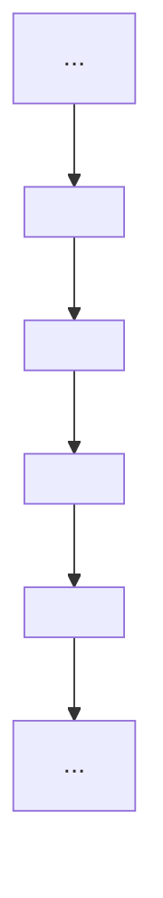

## Team Control Number

For office use only

T1

T2

T3

T4

## 29911

Problem Chosen

A

For office use only

F1

F2

F3

F4

## Summary

The keep-right-except-to-pass (KRETP) rule has been adopted by many countries around the world, but does this rule actually make our transportation system more efficient? This report aims to analyze this rule along with several other traffic regulations.

Using a discrete cellular-automaton (CA) model and a continuum model, we can simulate real-life traffic situation on freeways via the Monte Carlo method and PDE system respectively. Through comparison with other two traffic rules, we obtain the conclusion that the KRETP rule is rather effective.

First we define three parameters---traffic flow, safety index and average energy consumption (AEC) to evaluate the performance of the KRETP rule under various vehicle density. By calculating the optimal maximum velocities during light and heavy traffic, we obtain the influence of under-posted and over-posted speed limits. We also assert that our model can be transferred in "left-most" countries with a simple change of orientation.

Then we introduce two other traffic rules----the "Slow-Cars-To-Right" (SCTR) rule and the "Free Driving & Free Overtaking" (FDFO) rule. By comparing these three rules in terms of our pre-defined parameters, we confirm KRETP rule's superiority and provide strategic advice for future freeway construction.

Next, under the control of an intelligent system, a "median" optimization method is proposed to improve the overall quality of freeway transportation system. According to simulation result, our optimization method does improve the performance in terms of all three parameters.

Finally, we discuss upon several defects of our model that require further research.

Keywords: KRETP Rule, CA Model, Continuum Model, Monte Carlo Method, Traffic Flow, Safety Index, Average Energy Consumption (AEC), Optimization

## The Keep-Right-Except-To-Pass Rule

## Contents

1 Introduction.... .4  
2 Assumptions........  
3 Modeling for Right-Most Rule..

3.1 Discrete Modeling for Right-Most Rule. 5

3.1.1 Model Establishment. ..5  
3.1.2 Parameter Evaluation.. ....10  
3.1.3 Model Solution and Analysis. ...10

3.2 Continuum Modeling for Right-Most Rule. .17

3.2.1 Model Establishment. ..17  
3.2.2 Model Solution and Analysis.. ...18

3.3 Comparison of Discrete Model and Continuum Model. .22  
3.4 Transferability Analysis of Model in "Left-Handed" Countries.....................22

4 Modeling for Alternative Freeway Traffic Rules. ..22

4.1 "Slow-Cars-To-Right" Rule. ...22  
4.2 "Free Driving & Free Overtaking" Rule. ...23  
4.3 Comparison of Different Traffic Rules. ..24

5 Modeling for Intelligent-System Control.. ...26

5.1 "Median" Optimization.. ....26  
5.2 Possible Further Improvements …29

6 Superiority and Weakness..... ..29

6.1 Superiority Analysis.. ...29  
6.2 Weakness Analysis.. ...30  
6.3 Future Research.. ...30

6.3.1 Possible Optimization of Discrete Model. ..30  
6.3.2 Possible Optimization of Continuum Model ..31

7 Conclusion.. .31  
8 References..... ..32  
9 Appendix..... .. 32

## 1 Introduction

Traffic rule plays an essential role in a nation's transportation system. An optimal traffic rule can dramatically enhance the capacity and efficiency of the transportation network, providing common citizens with tremendous convenience. In this report, we will mainly focus on one such rule which requires automobiles to stay in the right lane unless they have to overtake.

America first enacted the "keep-right-except-to-pass" law in New York State in 1804, followed by many other countries in the following decades. [1] Up to now, most countries are "right-handed" countries with very few exceptions such as the UK and Australia. On American multilane freeways, for example, drivers are required to drive in the right-most lane unless they need to overtake, in which case they move one lane to the left and then switch back to the right-most lane.

## See in Figure 1.

Despite the long history of this rule, there has been little scientific inquiry into the effect of this rule. In such circumstances, a systematic analysis of this rule's realistic effect, including the change in traffic flow, safety index and energy consumption.

More specifically, we are expected to examine the following issues in our report:

Analyze the effect of the "keep-right-except-to-pass" rule in various terms under different vehicle densities (light and heavy traffic);  
Calculate the optimized speed to maximize a weighted function of the traffic flow, safety index and average energy consumption.  
Discuss the role of under-posted and over-posted speed limits and the transferability of our model in "left-handed" countries where driving on the left lane is the norm;  
Propose other possible freeway traffics rules and compare them with the "keep-right-except-to-pass" rule;  
Discuss the transferability of our model in "left-handed" countries where driving on the left lane is the norm;  
Design optimization method to enlarge traffic flow when equipped with an intelligent system.


<details>
<summary>text_image</summary>

Left lane
Right lane
</details>

Figure 1. Illustration of "Keep-Right-Except-To-Pass" Rule

## 2 Assumptions

Assuming automobile to move in straight lines;  
 Assuming that jams only occur because of gradual piling of automobiles;  
Without consideration of sudden crashes that will influence the behavior of subsequent vehicles;  
Assuming that the parallel movement of a vehicle into another lane takes no time;  
 Assuming that all the drivers on the freeway are abide by the traffic rules;  
Assuming that the vehicles have the same length and mass;  
Assuming that freeways have no extra entrance or exit.

## 3 Modeling for Right-Most Rule

In order to analyze the effect of the "right-most" rule, first we have to establish a model to simulate the traffic flow on the multilane freeway. Then we add certain driving and lane-changing rules to make sure that in our simulation the automobiles are abide by the "right-most" rule.

## 3.1 Discrete Modeling for Right-Most Rule

Discrete models treat both time and the position of vehicles as discrete quantities and simulate the moving of automobiles step by step. We start out simulation with a single kind of vehicle (single maximum speed) on a double-lane freeway (right lane is slow lane and left lane is fast lane) and then extend to two kinds of vehicles, namely, fast car and slow car (two maximum speeds), which is closer to realistic situation.

## 3.1.1 Model Establishment

## Vehicles of a Single Kind

Among the various discrete models, we adopt the "Particle-Hopping" model, which was initially formulated by Nagel and Schreckenberg (NS) to idealize the movement of vehicles as the discrete "hopping" of particles. Figure 2 is a vivid illustration of our model. We treat the double-lane freeway as a two-column lattice and each vehicle contains exactly one lattice.


<details>
<summary>text_image</summary>

Left lane
Right lane
</details>

Figure 2. Representation of the "Particle-Hopping" Model

We apply the Monte Carlo method to simulate the traffic flow on the double-lane freeway.[2] The quantities involved in the simulation are shown in

Table 1.

<table><tr><td>Notation</td><td>Definition</td></tr><tr><td> $X(k)$ </td><td>The position of car numbered  $k$ </td></tr><tr><td> $V(k)$ </td><td>The velocity of car numbered  $k$ </td></tr><tr><td> $\Delta X_{p}^{f}(k)$ </td><td>The gap in front of car numbered  $k$  in the present lane</td></tr><tr><td> $\Delta X_{p}^{b}(k)$ </td><td>The gap behind car numbered  $k$  in the present lane</td></tr><tr><td> $\Delta X_{o}^{f}(k)$ </td><td>The gap in front of car numbered  $k$  in the other lane</td></tr><tr><td> $\Delta X_{o}^{b}(k)$ </td><td>The gap behind car numbered  $k$  in the other lane</td></tr><tr><td> $V_{max}(k)$ </td><td>The maximum velocity the  $k^{\text{th}}$  car can achieve on the freeway</td></tr><tr><td> $Q$ </td><td>The traffic flow(number of cars passed per lane per unit time)</td></tr><tr><td> $\alpha_{safe}$ </td><td>The safety index</td></tr><tr><td> $L$ </td><td>The length of the lane during simulation*</td></tr><tr><td> $T$ </td><td>The duration of the simulation*</td></tr><tr><td> $P_d$ </td><td>The probability of a car decelerating*</td></tr><tr><td> $P_c$ </td><td>The probability of a car changing lane*</td></tr><tr><td>n</td><td>The density of vehicles *</td></tr><tr><td>N</td><td>The number of car during simulation N = 2nL</td></tr></table>

Table 1. Definition of Notation in "Particle-Hopping" Model (Terms marked with an asterisk (\*) require pre-evaluation before the simulation begins)

Before the simulation begins, we need to evaluate the following five parameters: number of cars ??, the length of lane ??, the duration of the simulation ??, the maximum velocity vehicles can achieve $V _ { m a x } ,$ the probability for a driver to decelerate during each unit time $P _ { d }$ and the probability for a driver to change lane $P _ { c }$ if the current situation qualifies the rule of changing lanes.

After these parameters have been evaluated, we set the position of each car ??(??) randomly in the double-lane freeway with half cars on the left (fast) lane and the other half on the right (slow) lane and the velocity of each car ??(??)randomly between $[ V _ { m a x } / 2 , V _ { m a x } ]$ . We set the entire freeway to be a loophole so that once a car reaches the last lattices it will re-enter the double-lane freeway in the first lattices. Under such conditions, the density of the vehicles remain unchanged throughout the simulation.

After the simulation begins, at each time unit the driver will either remain in the same lane or change lane if situation permits. The rule of acceleration and deceleration is as follows:

$( i ) \ I f \ V ( n ) < V _ { m a x } , t h e n V ( n ) = V ( n ) + 1 ;$

(????) $I f r a n f < p _ { d } , t h e n V ( n ) = V ( n ) - 1 ;$

Table 2. The Rule of Acceleration and Deceleration

where ?????? ?? is a random number between 0 and 1 generated at each time unit.

The permission rule for changing lane is much more complex and comprised of several basic rules. It is derived from Wagner’s according to the statistics gathered from a Germany freeway where "right-most" rule is adopted:[3]

<table><tr><td>Rule safety</td><td>Rule stay except blocked (Rule #0)</td><td>Rule change when possible (Rule #1)</td></tr><tr><td>(i) $\Delta X_{p}^{f}(k)>0$ , enough space in front</td><td>(i) $\Delta X_{p}^{f}(n)<V_{max}+1$ , not enough space in front</td><td>(i) $\Delta X_{o}^{f}(n)>\Delta X_{p}^{f}(n)$ (more space on the other lane) or  $\Delta X_{o}^{f}(n)>V(k)$ (enough space on the other lane)</td></tr><tr><td>(ii) The nearest neighbor site in the other lane is empty.</td><td>(ii) $\Delta X_{o}^{f}(n)>\Delta X_{p}^{f}(n)$ , more space on the other lane</td><td>(ii) ran f &lt; Pc</td></tr><tr><td>(iii) $\Delta X_{o}^{b}(n)>V_{max}$ , enough space to the next car on the other lane</td><td>(iii) ran f &lt; Pc</td><td></td></tr></table>

Table 3. The Basic Rules

<table><tr><td colspan="2">right → left</td><td colspan="2">left → right</td></tr><tr><td>(i)</td><td>Rule safety</td><td>(i)</td><td>Rule safety</td></tr><tr><td>(ii)</td><td>Rule #0</td><td>(ii)</td><td>Rule #1</td></tr></table>

## Table 4. The Rule of Lane Changing corresponding to the “rightmost” rule

Our Monte Carlo simulation has three outputs: traffic flow ?? and safety index $\alpha _ { s a f e }$ and the energy cost E0. For traffic flow ??, we choose a fixed point (in our simulation we choose the end point of the lattices since the freeway is a loop) to count the total number of cars passing that point denoted as $N _ { t o t a l }$ within the duration of the simulation ??, then we use the following equation to calculate ??:

$$
Q = \frac {N _ {t o t a l}}{T}.
$$

As for $\alpha _ { s a f e } ,$ we make the assumption that safety index is proportionate to the reaction time of all the drivers on the freeway throughout the entire simulation. We take the proportionate coefficient to be 1 for convenience:

$$
\alpha_ {s a f e} = \frac {\sum_ {T} \sum_ {1} ^ {N} [ \exp (- \Delta X _ {p} ^ {f} (n) / V (n)) ]}{N \cdot T}.
$$

In Table 5, we present the specific steps of our Monte Carlo simulation:

<table><tr><td rowspan="2">Input</td><td>Length of the lane, L.</td></tr><tr><td>Duration of the simulation T.Vehicle density n.</td></tr><tr><td rowspan="2"></td><td>Deceleration probability  $P_d$ .</td></tr><tr><td>Lane changing probability  $P_c$ .</td></tr><tr><td rowspan="3">Output</td><td>Traffic flow Q.</td></tr><tr><td>Safety index  $\alpha_{safe}$ .</td></tr><tr><td>Energy cost  $E_0$ </td></tr><tr><td>Step 1</td><td>Randomly generate the initial position, speed and max speed of vehicle i X(k), V(k) and  $V_{max}(k)$ .</td></tr><tr><td>Step 2</td><td>Repeat Step 3 ~ 16 T times.</td></tr><tr><td>Step 3</td><td>Repeat Step 4~5 for each vehicle</td></tr><tr><td>Step 4</td><td>Apply the safety rule to vehicle i, skip Step 5 if vehicle i doesn't pass the rule</td></tr><tr><td>Step 5</td><td>Apply either change lane rule #0 or change lane rule #1 to vehicle i based on which lane it is on, its current speed and the current model, then decide whether it should change its lane.</td></tr><tr><td>Step 6</td><td>Update each vehicle to its new lane.</td></tr><tr><td>Step 7</td><td>Repeat Step 8~16 for each vehicle number k.</td></tr><tr><td>Step 8</td><td>Let the expected new speed V'(k) = V(k) + 1</td></tr><tr><td>Step 9</td><td>If  $\Delta X_p^f (k) < V'(k)$ , let V'(k) =  $\Delta X_p^f (k) - 1$ .</td></tr><tr><td>Step 10</td><td>If V'(k) &gt; 0, generate a random number in [0, 1] and check whether it is smaller than  $P_d$ , let V'(k) = V'(k) - 1 if so.</td></tr><tr><td>Step 11</td><td>Let X'(k) = X(k) + V'(k)</td></tr><tr><td>Step 13</td><td> $\alpha_{safe} = \alpha_{safe} + \exp(-\frac{\Delta X_p^{f'}(k)}{V'(k)})$ </td></tr><tr><td>Step 14</td><td>If X'(k) ≥ L, then X'(k)--= L, Q = Q + 1</td></tr><tr><td>Step 15</td><td>If V(k) &lt; V'(k), E0+= V(k) + V'(k)</td></tr><tr><td>Step 16</td><td>Let X(k) = X'(k), V(k) = V'(k)</td></tr><tr><td>Step 17</td><td>E0 =  $\frac{E_0}{Q}$ ,  $\alpha_{safe} = \frac{\alpha_{safe}}{Q}$ , Q =  $\frac{Q}{T}$ </td></tr><tr><td>Step 18</td><td>Output and halt.</td></tr></table>

Table 5. Monte Carlo Procedures

## − Vehicles of Two Kinds (Fast Cars & Slow Cars)

Next, we consider a more complex situation in which cars are classified into fast cars and slow cars with respective maximum speed $V _ { m a x } ^ { f }$ and $V _ { m a x } ^ { s } ,$ , with other conditions and rules unchanged.

Next, we apply a similar Monte Carlo algorithm to simulate the traffic flow with two kinds of vehicles and output corresponding flow ?? and safe index $\alpha _ { m a x } .$

## 3.1.2 Parameter Evaluation

The length of the lattices $L = 2 0 4 8 ;$  
The vehicle density ?? = 0.02, 0.04, 0.06, 0.08, 0.1, 0.13, 0.16, 0.2, 0.25, 0.3;  
The number of the total vehicles $N = 2 n L$ ;  
The duration of the simulation $T = 4 0 9 6 \mathrm { : }$ ;  
The deceleration probability $P _ { d } = 0 . 1 ;$ ;  
The change lane probability $P _ { c } = 0 . 7 ;$  
In the case of vehicles of single kind, set maximum velocity $V _ { m a x } = 5 ;$ .a  
In the case of vehicles of two kinds, set maximum velocity of fast car $V _ { m a x } ^ { f } =$ 5, set maximum velocity for slow car $V _ { m a x } ^ { s } = 3 ;$ ;  
The ratio of fast car to slow car is 4:1, the initial number of vehicle in each lane is 1:1.

## 3.1.3 Model Solution and Analysis

We mainly analyze the influence of the right-most rule on three parameters: Traffic flow ??, safety index $\alpha _ { s a f e }$ and average energy consumption $E _ { 0 }$ . Then we assign a relative weight to each parameter to calculate an optimal velocity during light traffic and heavy traffic. We will only present the simulation result of the two-kind vehicle model.

## Traffic Flow

As we have discussed before, we define the traffic flow ?? as the number of cars passing a fixed point per unit time, or

$$
Q = \frac {N _ {t o t a l}}{T}
$$

In Figure 3, we present the value of traffic flow ?? under different vehicle density ??.


<details>
<summary>line chart</summary>

| Vehicle Density n | Traffic Flow Q |
| ----------------- | -------------- |
| 0.0               | 0.18           |
| 0.05              | 0.32           |
| 0.1               | 0.46           |
| 0.15              | 0.66           |
| 0.2               | 0.89           |
| 0.25              | 1.15           |
| 0.3               | 1.16           |
| 0.4               | 1.00           |
| 0.5               | 0.85           |
| 0.7               | 0.53           |
| 0.9               | 0.19           |
</details>

Figure 3. Relationship of Traffic Flow ?? and Vehicle Density ??

Apparently, the pattern in Figure 3 accords with realistic situation qualitatively. When the vehicle density on a freeway is relatively low, slight increase of vehicle, or in other words, vehicle density will cause traffic flow to rise dramatically because according to our rules vehicles accelerate very easily. In our simulation, the peak value of flow ?? occurs when density is around 0.2. After the climax, the traffic flow will tend to drop as vehicle density continues to rise because more likely car jams will obstruct vehicles from accelerating freely. Finally, when the density approaches 1, in other words, the freeway is almost "full", vehicles could barely move thus the flow approaches 0.

## Safety Index

Notice that the longer reaction time is, the safer the situation will be. Thus according to our definition of the safety index

$$
\alpha_ {s a f e} = \frac {\sum_ {T} \sum_ {1} ^ {N} [ \exp (- \Delta_ {p} ^ {f} X (n) / V (n)) ]}{N \cdot T}
$$

a larger value of $\alpha _ { s a f e }$ indicates a more dangerous situation. We again plot safety index $\alpha _ { s a f e }$ against vehicle density ??. The result is shown in Figure 4.


<details>
<summary>line chart</summary>

Safety Index a_safe against Vehicle Density n
| Vehicle Density n | Safety index a_safe |
| :--- | :--- |
| 0.0 | 0.09 |
| 0.05 | 0.14 |
| 0.1 | 0.19 |
| 0.15 | 0.23 |
| 0.2 | 0.26 |
| 0.25 | 0.28 |
| 0.3 | 0.29 |
| 0.35 | 0.26 |
| 0.4 | 0.21 |
| 0.5 | 0.17 |
| 0.7 | 0.10 |
| 0.9 | 0.04 |
</details>

Figure 4. Relationship of Safety Index $\alpha _ { s a f e }$ and Vehicle Density ?? (lower is safer)

It is easy to understand the pattern in Figure 4. When the vehicle density is relatively small, accidental risk rises as the number of car increases because vehicles are likely to attain high velocities. After the peak value, the risk drops as density rises because though the number of vehicle rises, the average velocity decreases dramatically. Since most vehicles drive much slower, the overal situation becomes actually safer. Finally, when all the vehicles cannot move at al (when $n = 1 ]$ ), the situation is absolutely safe. Notice that the climax vehicle density are nearly the same in traffic flow and safety index because both quantities are closely related to average velocity.

## − Average Energy Consumption

Now we define another important parameter called the average energy consumption denoted $E _ { 0 }$ . We use it to measure the energy consumed during each acceleration. We approximate the quantity as proportionate to change of kinetic energy. For a particular vehicle $n ,$ we denote its velocity at time ?? and $t + 1$ as $V ^ { ( t ) } ( n )$ and $V ^ { ( t + 1 ) } ( n )$ . Furthermore, we make the assumption that each vehicle has unit mass. Now we can derive the formula for $E _ { 0 }$ :

$$
\begin{array}{l} E _ {0} \propto \frac {\sum_ {t = 1} ^ {T} \sum_ {n = 1} ^ {N} \frac {1}{2} m [ (V ^ {(t)} (n)) ^ {2} - (V ^ {(t - 1)} (n)) ^ {2} ]}{Q} \\ \propto \frac {\sum_ {t = 1} ^ {T} \sum_ {n = 1} ^ {N} \frac {1}{2} m [ V ^ {(t)} (n) - V ^ {(t - 1)} (n) ] [ V ^ {(t)} (n) + V ^ {(t - 1)} (n) ]}{Q} \\ \end{array}
$$

$$
\propto \frac {\sum_ {t = 1} ^ {T} \sum_ {n = 1} ^ {N} [ V ^ {(t)} (n) + V ^ {(t - 1)} (n) ]}{Q}
$$

In order for convenience, we evaluate the proportionate coefficient as 1. So that

$$
E _ {0} = \frac {\sum_ {t = 1} ^ {T} \sum_ {n = 1} ^ {N} [ V ^ {(t)} (n) + V ^ {(t - 1)} (n) ]}{Q}
$$

We again plot the average energy consumption against vehicle density in Figure 5.


<details>
<summary>line chart</summary>

Average Energy Consumption E₀ against Vehicle Density n
| Vehicle Density n | Average Energy Consumption E₀ |
| :--- | :--- |
| 0.0 | 210 |
| 0.05 | 260 |
| 0.1 | 340 |
| 0.15 | 490 |
| 0.2 | 610 |
| 0.3 | 760 |
| 0.4 | 850 |
| 0.5 | 890 |
| 0.7 | 880 |
| 0.9 | 940 |
</details>

Figure 5. Relationship of Energy Consumption $E _ { 0 }$ and Vehicle Density ?? (lower is better)

In the first half of the figure, the increase of $E _ { 0 }$ could be explained by the frequent lane changing and acceleration due to a low vehicle density. In the latter half, although vehicles are much less likely to accelerate, notice that traffic flow also falls dramatically, therefore the average energy consumption still increases.

##  Optimal Maximum Velocity Estimation (Weighted)

In this section, we will design a weighted function $\phi$ dependent on the three key variables---traffic flow $Q$ , safety index $\alpha _ { s a f e }$ and average energy consumption $E _ { 0 }$ . Then we will calculate an optimal speed limit to maximize the value of $\phi$ under light traffic and heavy traffic respectively.

We define the weighted function as follows:

$$
\phi (Q, \alpha_ {s a f e}, E _ {0}) = \omega_ {1} \frac {Q}{1 . 2} + \omega_ {2} (1 - \frac {E _ {0}}{8 0 0}) + \omega_ {3} \sqrt [ 3 ]{1 - (\frac {\alpha_ {s a f e}}{0 . 4}) ^ {3}}
$$

$$
s. t. \quad \omega_ {1} + \omega_ {2} + \omega_ {3} = 1
$$

where $\omega _ { 1 } , \omega _ { 2 } , \omega _ { 3 }$ are weight coefficient. We base on the following four rules to design our function:

When $\phi$ reaches its peak value, we define the corresponding $V _ { m a x }$ to be the optimal maximum velocity;  
Since the three variables $Q , \alpha _ { s a f e } , E _ { 0 }$ are independent of each other, $\phi$ should be expressed in the form of simple sums.  
$Q$ and $E _ { 0 }$ should appear in linear forms in $\phi ;$  
The value of $\phi$ should drop sharply when the safety index is rather high Hence $\alpha _ { s a f e }$ should appear in the form of an upward-convex-function in $\phi .$ .

Now under light traffic where $n = 0 . 1$ and heavy traffic where $n = 0 . 2$ respectively we can calculate the corresponding $V _ { o p t i m a l } ^ { l i g h t }$ and $V _ { o p t i m a l } ^ { h e a v y }$ . We plot $\phi$ against different values of $V _ { m a x }$ under the condition $\begin{array} { r } { ( \omega _ { 1 } = 0 . 5 , \omega _ { 2 } = } \end{array}$ $0 . 2 , \omega _ { 3 } = 0 . 3 )$ in Figure 6 and Figure 7.


<details>
<summary>line chart</summary>

| maximum velocity V_max | phi   |
| ---------------------- | ----- |
| 1                      | 0.48  |
| 2                      | 0.56  |
| 3                      | 0.66  |
| 4                      | 0.66  |
| 5                      | 0.70  |
| 6                      | 0.70  |
</details>

Figure 6. Optimal Maximum Velocity (Light Traffic)


<details>
<summary>line chart</summary>

| maximum velocity V_max | phi   |
| ---------------------- | ----- |
| 1                      | 0.53  |
| 2                      | 0.57  |
| 3                      | 0.89  |
| 4                      | 0.86  |
| 5                      | 0.84  |
| 6                      | 0.83  |
</details>

Figure 7. Optimal Maximum Velocity (Heavy Traffic)

Considering the duration of light traffic and heavy traffic in a given time period, we set the ratio 4:1 (light :heavy) to obtain the result for a "mixed- traffic" situation. See in Figure 8.


<details>
<summary>line chart</summary>

| maximum velocity V_max | phi   |
| ---------------------- | ----- |
| 1                      | 0.49  |
| 2                      | 0.56  |
| 3                      | 0.70  |
| 4                      | 0.70  |
| 5                      | 0.72  |
| 6                      | 0.72  |
</details>

Figure 8. Optimal Maximum Velocity (combined)

As shown in Figure 8, the global maximum value of $\phi$ locates at $V _ { m a x } = 5$ , therefore the optimal maximum velocity $V _ { o p t i m a l } = 5 .$ . In other words, when we set the speed limit at 5, we achieve a weighted optimization of traffic flow, safety index and energy consumption.

## Analysis of Under-Posted and Over-Posted Speed Limits

In the section above, we have calculated the optimal maximum velocity $V _ { o p t i m a l } = 5$ . We will discuss the influence of under-posted and over-posted speed limits in light and heavy traffic respectively.

## Light Traffic

If a speed limit is over-posted, say, $V _ { m a x } = 7 _ { \cdot }$ , traffic flow, safety index and average energy consumption all increase. In other words, we sacrifice energy and safety for larger traffic flow.

If a speed limit is under-posted, say, $V _ { m a x } = 3$ , traffic flow, safety index and average energy consumption all decrease. In other words, we sacrifice traffic flow for lower energy consumption and a safer condition.

## Heavy Traffic

If a speed limit is over-posted, say, $V _ { m a x } = 7 _ { . }$ , traffic flow will remain almost the same while energy consumption and safety index will rise. This is highly unwelcome.

If a speed limit is under-posted, say, $V _ { m a x } = 3$ , situation will be similar to that of light traffic. Still, we will be sacrificing traffic flow for lower energy consumption and a safer condition.

## − Visualization

To make our simulation results more intuitive, we use MATLAB to visualize our simulation. In the figures below, each row signifies the distribution of vehicles with black dots representing vehicles occupation and margin representing empty space. Time increases from bottom to top and vehicles move from left to right. We visualize our simulation at low vehicle density $( n = 0 . 0 5 )$ and high density $( n = 0 . 2 )$ respectively in Figure 9 and Figure 10. Subfigure on the left represents the left lane and the subfigure on the right represents the right lane.


<details>
<summary>text_image</summary>

Scanned document page with dense Chinese text, likely a legal or official form, and rows of horizontal lines with annotations.
</details>

Figure 9. Visualization at Low Density


<details>
<summary>natural_image</summary>

Two side-by-side grayscale images showing abstract textured patterns with no visible text or symbols
</details>

Figure 10. Visualization at High Density

## 3.2 Continuum Modeling for Right-Most Rule

Apart from the discrete, microscopic cellular automaton (CA) models we have adopted above, in this section we will establish a continuum, macroscopic model to describe the vehicle flow on the freeway.

## 3.2.1 Model Establishment

Our ultimate goal is to make a continuum model for the traffic flow on a double-lane freeway. We start our work from the single-lane situation. According to [4], we can use partial-derivative equations (PDE) system to describe the traffic flow on a single-lane freeway. There are two variables in the equation system: the average speed of vehicles $\boldsymbol { u } ( \boldsymbol { x } , t )$ and the density of vehicles $\rho ( x , t )$ . The PDE system contains two parts:

Continuity equation:

$$
\frac {\partial u}{\partial t} + \frac {\partial (\rho u)}{\partial x} = 0
$$

Dynamic equation:

$$
\frac {\partial u}{\partial t} + u \frac {\partial u}{\partial x} = \frac {u _ {e} (\rho) - u}{T} + c _ {0} \frac {\partial u}{\partial x}
$$

In the second equation, the right side contains a relaxation term $( u _ { e } ( \rho ) -$ $u ) / T$ , which reflects the process when a driver tries to adjust his velocity to the equilibrium velocity $u _ { e } ( \rho )$ in the time interval ?? and an anticipation term $c _ { 0 } \partial u / \partial x$ , which represents the process when the driver reacts to the traffic condition ahead with the propagation speed of small disturbance $c _ { 0 }$ .

Now we extend that model to accommodate the double-lane situation to accommodate the "keep-right-except-to-pass" rule. We will establish the equations for the two lanes separately. In order to describe lane-changing between the right (driving) lane and the left (overtaking) lane, we will introduce two variables $S _ { j i }$ and $S _ { i j }$ , which represent the lane changing rate. In particular, $S _ { j i }$ denotes the changing rate from lane ?? to lane $j ( i , j \in \{ 1 , 2 \} )$ . The overtaking lane is denoted by Lane 1 and the driving lane is denoted by Lane 2. Thus, the net lane change into lane ?? is $S _ { j i } - S _ { i j }$ .

Hence the continuity equation could be written as:

$$
\frac {\partial \rho_ {i}}{\partial t} + \frac {\partial (\rho_ {i} u _ {i})}{\partial x} = S _ {j i} - S _ {i j}
$$

For the dynamic equation, we introduce two constant parameters $r _ { 1 } , \ r _ { 2 }$ to be the coefficients of $S _ { j i } , \ S _ { i j }$ . The equation should be:

$$
\frac {\partial u _ {i}}{\partial t} + u _ {i} \frac {\partial u _ {i}}{\partial x} = \frac {u _ {e i} (\rho_ {i}) - u _ {i}}{T _ {i}} + c _ {0 i} \frac {\partial u _ {i}}{\partial x} + r _ {1} S _ {i j} - r _ {2} S _ {j i} (i = 1, 2)
$$

According to [5], we assume:

$$
S _ {1 2} = a Q _ {e 1} (\bar {\rho}) \rho_ {1} (1 - \frac {\rho_ {2}}{\rho_ {m}})
$$

$$
S _ {2 1} = a (1 + b (Q _ {e 1} (\bar {\rho}) - Q _ {e 2} (\bar {\rho}))) Q _ {e 2} (\bar {\rho}) \rho_ {2} (1 - \frac {\rho_ {1}}{\rho_ {m}})
$$

where $Q _ { e 1 }$ denotes the equilibrium flow $Q _ { e 1 } = \rho _ { 1 } u _ { e 1 } ( \rho _ { 1 } )$

$\bar { \rho }$ denotes the average density of Lane 1 and Lane 2 $\bar { \rho } = ( \rho _ { 1 } + \rho _ { 2 } ) / 2$

$\rho _ { m }$ denotes the density in a jam

$a , b$ are two constant parameters.

Such assumption is reasonable. Firstly, notice that the expression of $S _ { 1 2 }$ and $S _ { 2 1 }$ is not symmetric because of the asymmetricity of the double-lane freeway. Secondly, if Lane 2 is suffering from a traffic jam, then $\rho _ { 2 } = \rho _ { m } ;$ if there are no vehicles in overtaking lane 1,then $\rho _ { 1 } = 0$ . Under both circumstances, we can derive $S _ { 1 2 } = 0$ , which implies that no car can change into the driving lane when it has a traffic jam or when there are no vehicles on the overtaking lane.

## 3.2.2 Model Solution and Analysis

## Study of Steady State

According to theories of PDE, we can obtain a steady state solution of our model by setting the derivative terms to zero. Then we can derive the following two equations:

$$
Q _ {e 1} (\bar {\rho}) \rho_ {1} (1 - \frac {\rho_ {2}}{\rho_ {m}}) = (1 + b (Q _ {e 1} (\bar {\rho}) - Q _ {e 2} (\bar {\rho}))) Q _ {e 2} (\bar {\rho}) \rho_ {2} (1 - \frac {\rho_ {1}}{\rho_ {m}})
$$

$$
\frac {u _ {e i} (\rho_ {i}) - u _ {i}}{T _ {i}} + c _ {0 i} \frac {\partial u _ {i}}{\partial x} + r _ {1} S _ {i j} - r _ {2} S _ {j i} = 0 (i = 1, 2)
$$

Plugging in $2 \bar { \rho } = \rho _ { 1 } + \rho _ { 2 }$ , we can derive the expression of $u _ { e 1 } ( \rho )$ and $u _ { e 2 } ( \rho )$ from the equations above according to [6]:

$$
u _ {e 1} (\rho) = u _ {f} (1 - \frac {\rho}{\rho_ {m}}) / (1 + E (\frac {\rho}{\rho_ {m}}) ^ {4})
$$

$$
u _ {e 2} (\rho) = \left\{ \begin{array}{l l} u _ {f} (1 - \frac {\rho}{\rho_ {m}}) / (1 + E (\frac {\rho}{\rho_ {m}}) ^ {4}) (\frac {1}{2} + \frac {\rho}{2 \rho_ {c}}) & (\rho <   \rho_ {c}) \\ u _ {f} (1 - \frac {\rho}{\rho_ {m}}) / (1 + E (\frac {\rho}{\rho_ {m}}) ^ {4}) & (\rho \geq \rho_ {c}) \end{array} \right.
$$

where $u _ { f }$ denotes the free flow speed and ?? is a constant parameter.

Using the relationship given above, we can derive the relationship between $u _ { i }$ and ${ \bar { \rho } } .$ Then we use the definition $q _ { i } = \rho _ { i } u _ { i }$ to express the flow on each lane with the average density ${ \bar { \rho } } .$

According to [7], we assign the following values to the parameters:

$$
T _ {1} = T _ {2} = 1 0 s, u _ {f} = 3 0 m / s, a = 0. 0 1, b = 5, c _ {0 1} = c _ {0 2} = 1 0 m / s
$$

$$
\rho_ {m} = 0. 1 4 v e h / m, r _ {1} = 1 5 0 m ^ {2} / s, r _ {2} = 5 0 m ^ {2} / s, \rho_ {c} = 0. 0 5 v e h / m, E = 1 0 0.
$$

Since we have established the traffic flow function of average density on both lane, we can plot the relationship as shown in Figure 11.


<details>
<summary>line chart</summary>

| Average density ρ̄/(veh/m) | Flow (veh/s) - fast lane | Flow (veh/s) - slow lane | Flow (veh/s) - average flow |
| ------------------------- | ------------------------ | ------------------------ | --------------------------- |
| 0.00                      | 0.6                      | 0.3                      | 0.2                         |
| 0.02                      | 0.5                      | 0.4                      | 0.3                         |
| 0.04                      | 0.4                      | 0.3                      | 0.2                         |
| 0.06                      | 0.3                      | 0.2                      | 0.1                         |
| 0.08                      | 0.2                      | 0.1                      | 0.05                        |
| 0.10                      | 0.1                      | 0.05                     | 0.02                        |
| 0.12                      | 0.05                     | 0.02                     | 0.01                        |
| 0.14                      | 0.02                     | 0.01                     | 0.0                         |
</details>

Figure 11. The Relationship of Traffic Flow ?? and Average Density $\bar { \rho }$ In Figure 11, we can discover that all three kinds of flows experience a

similar changing pattern---when the average density is relatively small, traffic flow experiences a monotonic increase as the density gets larger. After reaching its climax, the flow drops gradually to 0 as the density keeps rising. This changing pattern is identical to the results we have obtained in the discrete model. We can also discover that the overtaking (fast) lane reaches its climax sooner than that of the driving (slow) lane. Due to difference of the maximum velocity, the peak value of fast lane's traffic flow is larger than that of the slow lane. In addition, the curves of fast lane and slow lane almost overlap when $\rho > \rho _ { c } = 0 . 0 5$ . The overlapping part of curves actually indicates that the utility rate of both lanes is almost the same when $\rho$ is relatively large.

##  Study of Numerical Simulation

In this section, we mainly study the density function $\rho _ { i } ( x , t ) ( i = 1 , 2 )$ as a solution of the PDE system. In order to simulate the two-lane traffic movement, we assume that $L = 3 2 . 2 k m$ . The following initial variation of the average density $\rho _ { h }$ proposed in [8] can be used on either the fast or the slow lane:

$$
\rho (x, 0) = \rho_ {h} + \Delta \rho_ {h} [ \frac {1}{c o s h ^ {2} (\frac {1 6 0}{L} (x - \frac {5 L}{1 6}))} - \frac {1}{4 c o s h ^ {2} (\frac {4 0}{L} (x - \frac {1 1 L}{3 2}))} ]
$$

Then, our model (the PDE system) can be solved by the numerical scheme given in reference [9]. Here we just provide the figures of the solution under three different conditions. (All of these three figures are dynamic traffic images of an asymmetric double-lane system with curve (a) representing the fast lane and curve (b) representing the slow lane.)

## − At Low Average Density $\overline { { \pmb { \rho } } }$

According to Figure 12, any perturbations on the fast lane or the slow lane will quickly dissipate. Because of the lane-changing tendency, a cluster appeared in the fast lane may cause a small hump in slow lane.

On the opposite side, as shown in Figure 13, a cluster in slow lane may quickly dissipate because people trapped by the cluster in slow (driving) lane may choose the fast (overtaking) lane for passing.


<details>
<summary>line chart</summary>

| t/min | Density (veh/m) |
|-------|-----------------|
| 0     | 0.05            |
| 10    | 0.04            |
| 20    | 0.03            |
| 30    | 0.02            |
| 40    | 0.01            |
| 50    | 0.005           |
| 60    | 0.002           |
| 70    | 0.001           |
| 80    | 0.0005          |
| 90    | 0.0002          |
| 100   | 0.0001          |
</details>


<details>
<summary>3d area chart</summary>

| x/km | t/min | Density (veh/m) |
|------|-------|-----------------|
| 0    | 0     | 0.05            |
| 10   | 20    | 0.06            |
| 20   | 40    | 0.07            |
| 30   | 60    | 0.08            |
| 40   | 80    | 0.09            |
| 50   | 100   | 0.10            |
</details>

Figure 12. Low Density(Jam First Appeared on Fast Lane)


<details>
<summary>3d area chart</summary>

| x/km | t/min | Density/(veh/m) |
|------|-------|-----------------|
| 0    | 0     | 0.05            |
| 10   | 10    | 0.06            |
| 20   | 20    | 0.07            |
| 30   | 30    | 0.08            |
| 40   | 40    | 0.09            |
| 50   | 50    | 0.10            |
| 60   | 60    | 0.11            |
| 70   | 70    | 0.12            |
| 80   | 80    | 0.13            |
| 90   | 90    | 0.14            |
| 100  | 100   | 0.15            |
</details>


<details>
<summary>3d area chart</summary>

| x/km | t/min | Density/(veh/m) |
|------|-------|-----------------|
| 0    | 0     | 0.05            |
| 10   | 20    | 0.04            |
| 20   | 40    | 0.03            |
| 30   | 60    | 0.02            |
| 40   | 80    | 0.01            |
| 50   | 100   | 0.005           |
</details>

Figure 13. Low Density(Jam First Appeared on Slow Lane)

## − At Normal (or Higher) Average Density ??̅

As average density continues to rise, free space for vehicles decreases and it becomes less likely for the double-lane system to maintain stability. Correspondingly, serious traffic jams and “stop-and-go” waves become more probable. See in Figure 14.


<details>
<summary>line chart</summary>

| x/km | t/min | Density (veh/m) |
|------|-------|-----------------|
| 0    | 0     | 0.05            |
| 10   | 20    | 0.06            |
| 20   | 40    | 0.07            |
| 30   | 60    | 0.08            |
| 40   | 80    | 0.09            |
| 50   | 100   | 0.10            |
</details>


<details>
<summary>line chart</summary>

| x/km | Density (veh/m) |
|------|-----------------|
| 0    | 0.05            |
| 10   | 0.06            |
| 20   | 0.07            |
| 30   | 0.08            |
| 40   | 0.09            |
| 50   | 0.10            |
| 60   | 0.09            |
| 70   | 0.08            |
| 80   | 0.07            |
| 90   | 0.06            |
| 100  | 0.05            |
</details>

## Figure 14. Normal or Higher Density

Parameter evaluation of the three figures:

$\mathbf { F i g u r e 1 2 : } \rho _ { 1 } = 0 . 0 4 7 v e h / m , \rho _ { 2 } = 0 . 0 2 1 v e h / m , \rho _ { h } = 0 . 0 6 v e h / m ;$

Figure 13: $\rho _ { 1 } = 0 . 0 4 7 v e h / m , \rho _ { 2 } = 0 . 0 2 1 ~ v e h / m , \rho _ { h } = 0 . 0 6 ~ v e h / m ;$

Figure 14: $\rho _ { 1 } = 0 . 0 5 3 v e h / m , \rho _ { 2 } = 0 . 0 5 3 v e h / m , \rho _ { h } = 0 . 0 6 v e h / m .$

## 3.3 Comparison of Discrete Model and Continuum Model

In the discrete (CA) model, we focus on the relationship between traffic flow and vehicle density and obtain the following fact: when density is relatively small flow rises as density increases; after reaching its peak value, flow then decreases gradually to 0. This coincides with the conclusion derived in the continuum model as shown in Figure 9. More intuitively, the visualization images of both models also convey the same conclusion.

## 3.4 Transferability Analysis of Model in Left-Handed Countries

According to our research, the difference between the left-most and right-most tradition is mainly historical. In addition, our model has no partiality for either left orientation or right orientation. In other words, orientation is symmetric in our model. Therefore our model could be transferred in left-handed countries with a single change of orientation.

## 4 Modeling for Alternative Freeway Traffic Rules

In this section, we will use similar Monte Carlo method to simulate the traffic flow under two alternative traffic rules: "slow-car-to-right" rule and "free driving & free overtaking" rule.

## 4.1 "Slow-Cars-To-Right" Rule

## Model Explanation

In the "slow-cars-to-right" rule, the slow cars are designated the right lane, the fast cars are designated among the left and right lanes and no lane changing is allowed. In other words, this is a model of two disconnected single lanes. We run two simulations. First, test a lane with only fast cars and calculate corresponding $Q ^ { f } , \ \alpha _ { s a f e } ^ { f } , \ E _ { 0 } ^ { f } .$ ; then test a lane with 60% fast cars and calculate corresponding $Q ^ { s } , \ \alpha _ { s a f e } ^ { s } , \ E _ { 0 } ^ { s }$ . The overall fast car percentage is 80% matching previous simulations. The final result is a mixture of previous results with weight (1:1).

$$
Q = 0. 5 \cdot Q ^ {f} + 0. 5 \cdot Q ^ {s}
$$

$$
\alpha_ {s a f e} = 0. 5 \cdot \alpha_ {s a f e} ^ {f} + 0. 5 \cdot \alpha_ {s a f e} ^ {s}
$$

$$
E _ {0} = 0. 5 \cdot E _ {0} ^ {f} + 0. 5 \cdot E _ {0} ^ {s}
$$

Parameter evaluation before the simulation is as follows:

The length of the lattices $L = 2 0 4 8 ;$

The vehicle density $n = 0 . 0 2 , 0 . 0 4 , 0 . 0 6 , 0 . 0 8 , 0 . 1 , 0 . 1 3 , 0 . 1 6 , 0 . 2 , 0 . 2 5 , 0 . 3 ;$

The number of the total vehicles $N = 2 n L ;$

The duration of the simulation $T = 4 0 9 6 ;$ ut

The deceleration probability $P _ { d } = 0 . 1 ;$ ;

The change lane probability $P _ { c } = 0 . 7 ;$ ;

The maximum velocity of fast car $V _ { m a x } ^ { f } = 5$ , maximum velocity for slow car $V _ { m a x } ^ { s } = 3$ .

## Model Solution and Analysis

Using computer simulation, we plot traffic flow ??, safety index $\alpha _ { s a f e }$ and average energy consumption $E _ { 0 }$ respectively against vehicle density ??. The results will be shown in Section 4.3.

## 4.2 "Free Driving & Free Overtaking" Rule

## Model Explanation

Under the "free driving & free overtaking" rule, vehicles are free to drive and overtake with no specific requirement. The two lanes are symmetric and the only limitation is the respective maximum velocity $V _ { m a x } ^ { f }$ and $V _ { m a x } ^ { s }$ for fast vehicles and slow vehicles. Parameters and their evaluation are still the same as in the "slow-cars-to-right" rule.

## Model Solution and Analysis

Again, we consider the influence of this traffic through measuring of the three key factors---traffic flow ?? , safety index $\alpha _ { s a f e }$ and average energy consumption $E _ { 0 }$ . Further comparison of the three traffic rules will be shown in the Section 4.3.

## 4.3 Comparison of Different Traffic Rules

Same as that in the slow-cars-to-right rule, we will mainly focus on the first half of the figures to analyze the difference of the three rules.

## Traffic Flow

We plot traffic flow ?? against vehicle density ?? in Figure 15.


<details>
<summary>line chart</summary>

| Vehicle Density n | free driving&free overtaking | keep-right-except-to-pass | slow-cars-to-right |
| ----------------- | ---------------------------- | ------------------------- | ------------------ |
| 0.02              | 0.18                         | 0.18                      | 0.16               |
| 0.04              | 0.30                         | 0.38                      | 0.32               |
| 0.06              | 0.40                         | 0.52                      | 0.48               |
| 0.08              | 0.50                         | 0.62                      | 0.60               |
| 0.10              | 0.60                         | 0.72                      | 0.78               |
| 0.12              | 0.70                         | 0.82                      | 0.90               |
| 0.14              | 0.80                         | 0.90                      | 1.00               |
| 0.16              | 0.90                         | 0.98                      | 1.12               |
| 0.18              | 1.00                         | 1.08                      | 1.18               |
| 0.20              | 1.10                         | 1.16                      | 1.22               |
| 0.25              | 1.22                         | 1.24                      | 1.22               |
| 0.30              | 1.16                         | 1.16                      | 1.16               |
</details>

Figure 15. Traffic Flow under Different Traffic Rules

As shown in Figure 15, during light-traffic situation, traffic flow under the "keep-right-except-to-pass" rule and "slow-cars-to-right" rule are larger, traffic flow under the "free driving & free overtaking" is the relatively small.

During heavy-traffic situation, flow under three rules tends to be the same, which is easy to understand because the more probable jams make the advantages of the last two traffic rule hard to discern.

## Safety Index

We plot safety index $\alpha _ { s a f e }$ against vehicle density ?? in Figure 16.


<details>
<summary>line chart</summary>

| Vehicle Density n | free driving&free overtaking | keep-to-right-except-to-pass | slow-cars-to-right |
| ----------------- | ---------------------------- | ----------------------------- | ------------------ |
| 0.025             | 0.16                         | 0.09                          | 0.13               |
| 0.05              | 0.25                         | 0.20                          | 0.18               |
| 0.075             | 0.27                         | 0.24                          | 0.21               |
| 0.1               | 0.28                         | 0.28                          | 0.24               |
| 0.125             | 0.29                         | 0.29                          | 0.28               |
| 0.15              | 0.30                         | 0.30                          | 0.29               |
| 0.175             | 0.31                         | 0.31                          | 0.29               |
| 0.2               | 0.31                         | 0.31                          | 0.29               |
| 0.225             | 0.30                         | 0.30                          | 0.28               |
| 0.25              | 0.29                         | 0.29                          | 0.27               |
| 0.275             | 0.28                         | 0.28                          | 0.26               |
| 0.3               | 0.27                         | 0.27                          | 0.25               |
</details>

Figure 16. Safety Index under Different Traffic Rules (lower is safer)

During light-traffic situation, the condition under the "keep-right-except -to-pass" rule and "slow-cars-to-right" rule is much safer than that under the "free driving & free overtaking" rule.

During heavy-traffic situation, same as that of traffic flow, safety index under three traffic rules tend to be the same because vehicle tend to drive at a much lower speed which make the overall condition much safer.

## − Average Energy Consumption

We plot average energy consumption $E _ { 0 }$ against vehicle density ?? in Figure 17.


<details>
<summary>line chart</summary>

| Vehicle Density n | free driving&free overtaking | keep-right-except-to-pass | slow-cars-to-right |
| ----------------- | ---------------------------- | ------------------------- | ------------------ |
| 0.025             | 540                          | 390                       | 600                |
| 0.05              | 900                          | 450                       | 620                |
| 0.075             | 1200                         | 530                       | 620                |
| 0.1               | 1300                         | 950                       | 630                |
| 0.125             | 1320                         | 1150                      | 680                |
| 0.15              | 1330                         | 1280                      | 820                |
| 0.2               | 1380                         | 1380                      | 990                |
| 0.25              | 1450                         | 1520                      | 1240               |
| 0.3               | 1620                         | 1620                      | 1440               |
</details>

Figure 17. Average Energy Consumption under Different Traffic Rules (lower is better)

Since a large portion of energy consumption comes from traffic jams, and unstable lane changing easily result in traffic jams, the "free driving & free overtaking" rule will definitely be more energy-costly. Such trend is manifest during light traffic when acceleration is fairly easy.

During heavy traffic however, lane changing and acceleration become much more difficult, most of the energy consumption is from the accelerations and decelerations in traffic jams, therefore the average energy consumption under three rules tends to be the same.

## Summary & Suggestions

From the figures above, we can discover that "free driving & free overtaking" rule is inferior to the "slow-cars-to-right" rule and "keep-right-except-to-pass" rule. This accords with real life situation because most countries adopt a combinational policy of "slow-cars-to-right" and "keep-right-except-to-pass".

Meanwhile, it is unrealistic to adopt the "slow-cars-to-right" because total forbidding of lane changing and overtaking is unreasonable. Our suggestion is that maintain the policy of "keep-right-except-to-pass" rule and meanwhile construct separate fast and slow lanes for those freeways frequently suffered from car jams and obstructions.

## 5 Modeling for Intelligent-System Control

In this section, we make the general assumption that equipped with an intelligent system. The intelligent system knows about the exact velocity and location of all the vehicles on the freeway and controls them together. We aim to propose a new traffic rule such that the overall traffic flow of the freeway could be even larger.

## 5.1 "Median" Optimization

## Model Explanation

We now introduce a rule called “median” rule. The basic idea is to let vehicles with higher speed stay on the left lane more, while vehicles with lower speed stay on the right lane, reducing the possibility of fast cars following slow cars. The separation point is the median speed, which is known easily by a system that controls all the vehicles. The advantage of median speed is that it is automatically adjusted according to the current average speed, then exactly demand half of the cars go to the left lane and vice versa. Therefore this rule will not let the left lane and right lane become unbalanced both in light and heavy traffic comparing to the usage of a fixed speed cap.

The rule is as stated in Figure 18.  


<details>
<summary>flowchart</summary>

```mermaid
graph TD
  A["Determine the speed of the kth car"] --> B{V(k)=Vmedian?}
  B -->|T| C["Generate a random number in [0, 1"]]
  B -->|F| D{V(k)>Vmedian}
  C --> E["Apply rule: Stay on left lane except blocked, return to left lane if possible."]
  D --> F["Apply rule: Stay on right lane except blocked, return to right lane if possible."]
  E --> G["End"]
  F --> G
  C -->|<0.5| H["Apply rule: Stay on left lane except blocked, return to left lane if possible."]
  D -->|>0.5| I["Apply rule: Stay on right lane except blocked, return to right lane if possible."]
```
</details>

Figure 18. "Median" Illustration

## − Model Solution and Analysis

Under the same maximum velocity, we plot traffic flow, safety index and average energy consumption against different vehicle density. See in Figure 19-21.

Traffic Flow Q against Vehicle Density n  


<details>
<summary>line chart</summary>

| Vehicle Density n | Equipped | Not Equipped |
| ----------------- | -------- | ------------ |
| 0.0               | 0.1      | 0.1          |
| 0.05              | 0.6      | 0.5          |
| 0.1               | 0.7      | 0.7          |
| 0.15              | 0.8      | 0.9          |
| 0.2               | 1.1      | 1.2          |
| 0.25              | 1.2      | 1.2          |
| 0.3               | 1.1      | 1.1          |
</details>

Figure 19. Relationship of Traffic Flow and Vehicle Density

Safety Index $\mathsf { a } _ { \mathrm { s a f e } }$ against Vehicle Density n  


<details>
<summary>line chart</summary>

| Vehicle Density n | Equipped | Not Equipped |
| ----------------- | -------- | ------------ |
| 0.0               | 0.05     | 0.08         |
| 0.05              | 0.10     | 0.15         |
| 0.1               | 0.20     | 0.27         |
| 0.15              | 0.29     | 0.30         |
| 0.2               | 0.30     | 0.31         |
| 0.25              | 0.29     | 0.30         |
| 0.3               | 0.26     | 0.27         |
</details>

Figure 20. Relationship of Safety Index and Vehicle Density (lower is safer)

Average Energy Consumption $\mathbf { E } _ { 0 }$ against Vehicle Density n  


<details>
<summary>line chart</summary>

| Vehicle Density n | Equipped | Not Equipped |
| ----------------- | -------- | ------------ |
| 0.02              | 350      | 400          |
| 0.05              | 400      | 450          |
| 0.08              | 550      | 750          |
| 0.10              | 900      | 1000         |
| 0.13              | 1200     | 1250         |
| 0.15              | 1300     | 1350         |
| 0.20              | 1400     | 1450         |
| 0.25              | 1500     | 1550         |
| 0.30              | 1600     | 1650         |
</details>

Figure 21. Relationship of Average Energy Consumption and Vehicle Density (lower is better)

From the above Figures, we can discover that the "median" optimization does perform better in terms of traffic flow, safety condition and energy consumption, even though such optimization is not very dramatic. This also indicates that the current "keep-right-except-to-pass" rule is already a pretty mature one.

## 5.2 Possible Further Improvements

The “median” rule is only a simple rule, more advantages of the intelligent systems can be utilized. In the discrete (CA) model, a driver can only change his speed according to the distance of cars closely in front or behind because he doesn't know about the location of other cars and intentions of their drivers. Therefore when he is in a car flow without any gaps as shown in Figure 22, the only thing he can do is stop and wait for the front car to move. That's why we only compare his current velocity ?? with $\Delta X _ { p } ^ { f }$ and $\Delta X _ { o } ^ { f }$ .


<details>
<summary>flowchart</summary>


</details>

Figure 22. Illustration of Online Algorithm

But with an intelligent system, it controls all the cars at the same time. Under such circumstances, it can optimize traffic flow by accelerating the three cars together with the same acceleration. This approach is extremely effective in traffic jams.

## 6 Superiority and Weakness

## 6.1 Superiority Analysis

By reasonable discretization and Monte Carlo method, CA model properly simulates normal driving and overtaking on real-life double-lane freeways;  
The solution of the CA model could be presented via various forms and standards, visualization technique makes the result even more intuitive;

Our model has robust flexibility, only minor modification could realize simulation under different traffic rules and parameters;  
By comparing with other traffic rules, we can fully realize the influence of keep-right-except-to-pass rule from various aspects;  
By designing algorithms under an intelligent system, our model has reference value in terms of future freeway construction;  
Our continuum model assigns realistic values to parameters, confirming the results derived from the discrete model from a macroscopic perspective.

## 6.2 Weakness Analysis

Due to the restriction of computer simulation, some of our assumptions are highly ideal, such as the length of vehicles and the value of acceleration.  
The core of our system depends on computer simulation, therefore the calculation of key quantities such as traffic flow and safety index is time-costly.

## 6.3 Future Research

## 6.3.1 Possible Optimization of Discrete Model

If technique permits, we strive to make computer simulation as similar as possible to realistic situations. One possible measures is that we can use 1 minute as the basic time unit and assign realistic values to lattice length (such as 0.5km). Since most vehicles travel at velocity between 60 ????/ℎ and 120 ????/ℎ, within one time unit (1 min), a vehicle is expected to pass 2-4 lattices within one minute.  
For more accurate approximation, vehicle profile should be taken into consideration. For example, limousines, sedans, jeeps are usually small but relatively fast, we can assign them with one-lattice length and larger maximum velocity; trucks, on the other hand, could be assigned with length of multiple lattices and a smaller maximum velocity.  
Finally, we add a more professional factor in the transportation field---stopping sight distance and its limit. The stopping sight distance is used to measure several secure distances in driving. We can assign an integer to the stopping sight distance, denoted as $d _ { 0 }$ . When the front gap is larger than the stopping sight distance $( \Delta X _ { P } ^ { f } > d _ { 0 } )$ , we compare ?? + 1 with

$d _ { 0 }$ instead of with $\Delta X _ { P } ^ { f }$ or $\Delta X _ { o } ^ { f }$ to determine the vehicle's velocity at next time interval. We can further combine weather conditions to evaluate the stopping sight distance. Such model is of great importance in deciding whether to close freeways under severe weather conditions.

## 6.3.2 Possible Optimization of Continuum Model

In many countries around the world, the number of freeways are dramatically increasing. We can continue to develop multi-lane(more than two lanes) models. Speed limits could also be incorporated in the continuum model.  
Construct a systematic theory to analyze the graphic form of $\rho ( x , t )$ and look for accurate analytical expressions.

## 7 Conclusion

We use a discrete model and a continuum model research upon the influence of "Keep-Right-Except-To-Pass" rule on traffic flow, safety index and average energy consumption respectively. Furthermore, to fully determine the pros and cons of the rule, we continue to build models to analyze two alternative traffic rules---the "Slow-Cars-To-Right" rule and the "Free Driving & Free Overtaking" rule. Finally, we propose two possible rules to optimize traffic flow when equipped with an intelligent system. The results of our models are as follows:

## “Keep-Right-Except-to-Pass” Rule

According to our model, traffic flow and safety index first rise to peak value then decrease to zero with increasing vehicle density, while energy flow keeps rising but with a bating speed. Furthermore, under-posted and over-posted speed limits relative to our calculated optimal maximum velocity have different influences during light and heavy traffic. In addition, our model could be transferred in left-handed countries with a single change of orientation.

## Alternative Traffic Rules

The "Keep-Right-Except-To-Pass" rule and the "Slow-Cars-To-Right" rule are superior (to the "Free Driving & Free Overtaking" rule), a combination of these two rules will have strengthening effects especially on heavy-traffic freeways.

## Intelligent System Control

An ideal online algorithm is discussed, and a "median" optimization method is simulated and proves to be beneficial to enlarge traffic flow.

## 8 References

[1] Peilin Li, "Globalization and the 'Left-Most' Policy of Automobiles", Journal of Financial Introduction, Vol.8, 2004.  
[2] Chowdhury, D., Wolf, D. E., & Schreckenberg, M. (1997). Particle hopping models for two-lane traffic with two kinds of vehicles: Effects of lane-changing rules. Physica A: Statistical Mechanics and its Applications, 235 (3), 417-439.  
[3] Giordano, Frank R. A first course in mathematical modeling. Cengage Learning, 2013.  
[4] Haijun Huang · Tieqiao Tang · Ziyou Gao:Continuum modeling for two-lane traffic flow, Acta Mech Sinica (2006) 22: 131–137.  
[5] Tang Chang-Fu, Jiang Rui, Wu Qing-Song:Extended speed gradient model for traffic flow on two-lane freeways. Chinese Physics, 2007/16(06)  
[6] Lee H Y, Lee H W and Kim D 1999 Phys. Rev. E 59 5101  
[7] Nagel K and Schreckenberg M 1992 J. Phys. I 2 2221  
[8] Kerner B S and Konsh ̈auser P 1993 Phys. Rev. E 48 2335  
[9] Fu C J, Wang B H, Yin C Y and Gao K 2006 Acta Phys.Sin. 55 4032

## 9 Appendix

C++ Source Code for Monte Carlo Simulation:

gen.h:

#ifndef \_\_GEN #define \_\_GEN

#include <iostream>

#include <cstdio>

#include <ctime>

#include <cstdlib>

#include <vector>

#include <cassert>

using namespace std; /\*

#define RATIO 0.3

#define L 512

#define VMAX 7

```c
#define VBASE 2
*/
int random(int low, int high){
    return (rand()%high-low+1)+low);
}

void gen(const char *fpath, int L, double den, int Vmax0, int Vmax1, double Pv){
    FILE *fp = fopen(fpath, "w");
    int n=den*L;
    vector<int> a;
    for (int i = 0; i < L && a.size() < n; i++)
    if (R((n-a.size())*1.0/(L-i)) || a.size()+L-i <= n)
    a.push_back(i);
    assert(a.size() == n);
    fprintf(fp, "%d, %d\n", L, n);
    int v;
    for (int i = 0; i < n; i++) {
    v=R(Pv)?Vmax0:Vmax1;
    fprintf(fp, "%d, %d, %d\n", a[i], v, random(v/2, v));
    }
    fclose(fp);
}

#endif // __GEN
```

SaveBMP.h:  
```c
#ifndef __BMP
#define __BMP
FILE *SaveBmp(const char* filename, int height, int width){
    unsigned int w = ((width+7)/8+3)/4*4;
    unsigned int size = w*height+0x3E;
    unsigned short head[]={0x4D42, size&0xffff, size>>16, 0, 0, 0x3E, 0, 0x28,0, width&0xffff, width>>16, height&0xffff, height>>16, 1, 1, 0,0, 0, 0, 0, 0, 0, 0, 0, 0, 0, 0, 0, 0, 0, 0, 0, 0, 0, 0, 0, 0, 0, 0, 0, 0, 0, 0, 0, 0, 0, 0, 0, 0, 0, 16, 1, 1, 1,
    }；
    FILE* fp=fopen(filename, "wb");
    if(!fp)return NULL;
    fwrite(head, 1,sizeof(head), fp);
    return fp;
}
#endif
```

lane.h:  
```c
#ifndef ____LANE
```

```cpp
#define __LANE

#include <iostream>
#include <cstdio>
#include <vector>
#include <cmath>
#include <cassert>
#include <cstdlib>
#include <ctime>
#include <algorithm>
#include <cstring>

#define out(x) cout<<(#x)<<" "<<x<<endl;

using namespace std;

int L, T = 2048, VISUALIZE = 0, TOT = 5;
double Pd = 0.2, Pc = 0.6, Pv = 0.8;
int Voff = 2, RULE = 0, Vmax0 = 4, Vmax1 = 3;
double ECost = 0;
double AlphaSafety=0;

bool R(const double &P){
    return rand()<<RAND_MAX*P;
}

struct car{
    int x, v, vmax;
    car(int x, int v, int vmax):x(x), v(v), vmax(vmax) {}
    car() {}
    bool operator<(const car &rhs) const {
    return x < rhs.x;
    }
};

#define fn(i) ((i)>=n?(i)-n:((i)<0?(i)+n:(i)))
#define fm(i) ((i)>=m?(i)-m:((i)<0?(i)+m:(i)))
#define fL(x) ((x)>=L?(x)-L:((x)<0?(x)+L:(x)))
#define takemin(x, y) x=(x)<(y)?(x):(y)

unsigned char buf[10000];

struct lane{
    vector<car>c;
    int cnt[7];
    int tot() const {
    int tot=0;
    for(int i=0; i<7; i++)
```

```txt
tot+=cnt[i];
return tot;
}
car &operator[](int i){return c[i];}

lane(const char *fpath){
    memset(cnt, 0, sizeof cnt);
    FILE *fp = fopen(fpath, "r");
    int n, t;
    fscanf(fp, "%d, %d, %d ", &L, &n, &t);
    c.resize(n);
    for(int i=0; i<n; i++){
    fscanf(fp, "%d, %d, %d ", &c[i].x, &c[i].vmax, &c[i].v);
    assert(c[i].vmax >= c[i].v);
    cnt[c[i].v]++;
    }
    fclose(fp);
}
lane() {}

bool OK() const {
    for(int i=0; i<c.size(); i++)
    if(c[i].x<0 || c[i].x>=L)return false;
    for(int i=0; i+1<c.size(); i++)
    if(c[i].x >= c[i+1].x)return false;
    if (tot() != c.size()) return false;
    return true;
}
int size() const {
    return c.size();
}
int advance(vector<car> &t){
    int n;
    t.resize(n = c.size());
    if(n==0)return 0;
    for(int i=0; i<c.size(); i++){
    int j=fn(i+1);
    t[i]=c[i];
    if (t[i].v < t[i].vmax) t[i].v++;
    int DXf = fL(c[j].x-c[i].x-1);
    if (t[i].v > DXf) t[i].v = DXf;
    if (t[i].v > 0 && R(Pd)) t[i].v--;
    t[i].x = fL(t[i].x + t[i].v);
    if (t[i].v > c[i].v) ECost += t[i].v+c[i].v;
    }
    if(t[n-1].x<t[0].x){
```

```c
for(int i=1; i<n; i++)
    c[i]=t[i-1];
    c[0]=t[n-1];
    return 1;
} else swap(t, c);
memset(cnt, 0, sizeof cnt);
for(int i=0; i<c.size(); i++)
    cnt[c[i].v]++;
return 0;
}
void print(){
    for(int i=0; i<c.size(); i++)
    printf("%d, %d) ", c[i].x, c[i].v);
    puts("");
}
void pos(FILE *fp){
    int ll = ((L+7)/8+3)/4*4*8;
    unsigned char tmp = 0;
    for(int i=0, j=0; i<ll; i++){
    int b=j<c.size()?(i<c[j].x?1:(i!=c[j++].x)):1;
    tmp = (b<<7)|(tmp>>1);
    if(i&0xff)buf[i>>3]=tmp;
    }
    fwrite(buf, 1, ll/8, fp);
}
#endif
```

CA.cpp:  
```c
#include <string>
#include "lane.h"
#include "gen.h"
#include "SaveBMP.h"
lane l[2];
int cnt[2];
char VPATH[200];
bool rule_s(lane &l0, lane &l1, int i, int j, int DXf)
{
    int m = l1.size();
    if (m==0) return DXf > 1;
    int k = fm(j-1);
    if(DXf > 1 && l1[j].x != l0[i].x && // no parralel car
    fL(l0[i].x - l1[k].x) > min(l1[k].v+1, l1[k].vmax)) // no accident in the other lane
    return 1;
```

```c
return 0;
}
bool rule0(lane &l0, lane &l1, int i, int j, int DXf)
{
    int m = l1.size();
    if (m==0) return DXf < l0[i].vmax;
    if(DXf < l0[i].vmax){ //! Not enough space in this lane
    int k = fm(j-1);
    if(fL(l1[j].x - l0[i].x) > DXf)    //! More space in the other lane
    if (R(Pc)) return 1;
    }
    return 0;
}
bool rule1(lane &l0, lane &l1, int i, int j, int DXf)
{
    if (l1.size() == 0) return R(Pc);
    return R(Pc) && (fL(l1[j].x - l0[i].x) > min(l0[i].v+1, DXf));
    //! Enough or more space in the other lane
}
int median(int *c0, int *c1){
    int cnt[7];
    for(int i=0; i<7; i++)
    cnt[i] = c0[i] + c1[i];
    int tot = 0;
    for(int i=0; i<7; i++)
    tot += cnt[i];
    tot /= 2;
    for(int i=0; tot>0 && i<7; i++){
    tot -= cnt[i];
    if (tot<=0) return i;
    }
    return 6;
}
void chLaneSim(lane &l0, lane &l1, vector<car> &t0, vector<car> &t1, int dir){
    int n=l0.size(), m=l1.size(), j=0;
    t0.clear(); t1.clear();
    bool flag = 1;
    if(!n){
    swap(t0, l0.c);
    return;
    }
    for(int i=0; i<n; i++){
    int DXf = fL(l0[fn(i+1)].x - l0[i].x);
    bool chLane = 1;
```

```txt
for(; flag && j<m && l1[j].x<l0[i].x; j++);
    if (j==m) flag=j=0;
    chLane = chLane && rule_s(l0, l1, i, j, DXf);
    if (RULE == 16) chLane = 0;
    int rule, Vmedian = median(l0.cnt, l1.cnt);
    bool ff = l0[i].v>Vmedian ? 1 : (l0[i].v==Vmedian?R(0.5):0);
    rule = (dir<<1) + ((RULE&32) ? ff : (l0[i].vmax==Vmax0));    //! 0: l->r slow, 1: l->r fast
    rule = (RULE>>rule) & 1;    //! 2: r->l slow, 3: r->l fast
    switch(rule){    //! two_car: 1001=9, sym: 0000, sym_two_lane: 1100=12
    case 0: chLane = chLane && rule0(l0, l1, i, j, DXf); break;
    case 1: chLane = chLane && rule1(l0, l1, i, j, DXf); break;
    default: break;
    }
    if(chLane)t1.push_back(l0[i]);
    else t0.push_back(l0[i]);
    }
}
void sim(lane &l0, lane &l1){
    vector<car> t00, t01, t10, t11;
    chLaneSim(l0, l1, t00, t01, 0);
    chLaneSim(l1, l0, t11, t10, 1);
    vector<car> t0, t1;
    t0.resize(t00.size() + t10.size());
    t1.resize(t01.size() + t11.size());
    merge(t00.begin(), t00.end(), t10.begin(), t10.end(), t0.begin());
    merge(t01.begin(), t01.end(), t11.begin(), t11.end(), t1.begin());
    swap(t0, l0.c);
    swap(t1, l1.c);
    cnt[0] += l0.advance(t0);
    cnt[1] += l1.advance(t1);
}
double func(int dx, int v){
    if(v==0)return 0;
    else return exp(-dx/v);
}
double cal_safety(lane &l){
    double res=0;
    if(l.size()==0)return 0;
    for(int i=0; i+1<l.size(); i++)
    res += func([i+1].x-l[i].x, [i].v);
    res += func([l[0].x-l.c.back().x+L, l.c.back().v);
    return res;
}
```

```txt
void gao()
{
    l[0] = lane("lane0.csv");
    l[1] = lane("lane1.csv");
    FILE *fout0, *fout1;
    if (VISUALIZE){
    fout0 = SaveBmp((string(VPATH) + "0.bmp").c_str(), T, L);
    fout1 = SaveBmp((string(VPATH) + "1.bmp").c_str(), T, L);
    }
    int t;
    if (VISUALIZE) t = 0; else t = T / 5;
    while (t--) sim(l[0], l[1]);
    t = T;
    cnt[0] = cnt[1] = 0; AlphaSafety = 0; ECost = 0;
    while (t--) {
    sim(l[0], l[1]);
    l[0].OK();
    l[1].OK();
    if (VISUALIZE){
    l[0].pos(fout0);
    l[1].pos(fout1);
    }
    AlphaSafety += cal_safety(l[0]) + cal_safety(l[1]);
    }
    AlphaSafety /= l[0].size() + l[1].size();
    AlphaSafety /= T;
    // printf("Q=%.5If AlphaS=%.5lf\n", cnt/2.0/T, AlphaSafety);
    if (VISUALIZE){
    fclose(fout0);
    fclose(fout1);
    }
}
pair<double, double> stat(vector<double> &a){
    assert(a.size() >= 2);
    double mean = 0;
    for(int i = 0; i < a.size(); i++)
    mean += a[i];
    mean /= a.size();
    double s = 0;
    for(int i = 0; i < a.size(); i++)
    s += (a[i] - mean)*(a[i] - mean);
    s /= a.size() - 1;
    s = sqrt(s);
    return make_pair(mean, s);
```

```c
int main()
{
    srand(time(0));
    FILE *fin = fopen("coef.prn", "r");
    FILE *fout = fopen("log.csv", "a");
    if (fin == NULL || fout == NULL) return -1;
    int sum=0;
    double den=0;
    fgets((char *)buf, 10000, fin);
    while(1){
    if(fscanf(fin, "%d %d %lf %lf %lf %lf %lf %d %d %d %s",
    &L, &T, &den, &Pd, &Pc, &Pv, &Vmax0, &Vmax1, &VISUALIZE, &RULE, VPATH)!=11){
    break;
    }
    fprintf(fout, "%d, %d, %lf, %lf, %lf, %lf, %d, %d, %d, ", L, T, den, Pd, Pc, Pv, Vmax0, Vmax1, RULE);
    vector<double> q[2], AlphaS, EC;
    int REP = VISUALIZE?2:20;
    for(int i=0; i<REP; i++){
    gen("lane0.csv", L, den, Vmax0, Vmax1, Pv);
    gen("lane1.csv", L, den, Vmax0, Vmax1, Pv);
    gao();
    q[0].push_back(cnt[0]*1.0/T);
    q[1].push_back(cnt[1]*1.0/T);
    AlphaS.push_back(AlphaSafety);
    ECost /= cnt[0]+cnt[1];
    EC.push_back(ECost);
    printf("%d/%d RULE=%d Den=%.3lf Q0=%.3lf Q1=%.3lf AS=%.3lf EC=%.3lf\n", i+1, REP, RULE, den, q[0].back(), q[1].back(), AlphaS.back(), EC.back());
    }
    pair<double, double> t0 = stat(q[0]), t1 = stat(q[1]), t2 = stat(AlphaS), t3 = stat(EC);
    fprintf(fout, "%.5lf, %.5lf, %.5lf, %.5lf, %.5lf, %.5lf, %.5lf, %.5lf\n", t0.first, t0.second, t1.first, t1.second, t2.first, t2.second, t3.first, t3.second);
    }
    fclose(fout);
    fclose(fin);
}
```