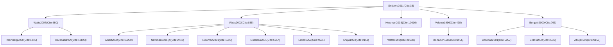

# Who Is the Hidden Champion in a Network?

February 10, 2014

## 1 Summary

Network science is essential in many civil and military applications due to its great help to complex systems with network-based structures. Since the co-author relationship as well as the citation relationship forms a network structure in research areas, network science can be utilized to do some data-mining works in this network, e.g. seeking influential researchers and important research papers.

In this paper, we extract useful data from given large datasets and establish the required coauthor and citation networks. For visual clarity of the network, we propose and implement the stress majorization algorithm based on the minimal-energy principle in physics, which provides a proper 2-D layout for complex networks. Then we develop four different centrality measures based on the perspectives of trivial sum, weighted sum, geographic control and informational control, respectively, for undirected graph and three centrality measures for directed graph, in which both the non-parametric and parametric methodologies are involved. Furthermore, we propose several methods to transform a directed graph into an undirected one. We show that these measures generate consistent results for both the most influential researcher and the most important paper.

Then we extend our model from research areas to other areas of society, and show that our model still yields convincing results for top singers, songwriters and movie stars, even when a bipartite graph is used instead. Moreover, we conclude that a crude criterion for a real problem to be solved by network science in essence is that there is a network structure and something in interest transmitting through the network, with all real experiments conforming to this statement. In addition, it is proved theoretically and verified numerically that our parametric approach guarantees its convergence, hence there are only loose requirements for parameters.

In summary, our model is practical and reliable for handling network-based problems in reality. Nevertheless, there are some existing problems such as computational complexity and lack of automatic adaptation preventing our model from convenient implementation, and certain phenomenon such as information cascade lies beyond the scope of our modelling.

Key Words: network science, co-author, citation, centrality, stress majorization

## Contents

1 Summary . .  
2 Introduction . 3  
3 Task 1: Co-author Network of the Erdos1 Author . 3  
4 Task 2: Centrality . . . . 5

4.1 Degree Centrality 5  
4.2 Eigenvector Centrality 6  
4.3 Closeness Centrality 7  
4.4 Betweenness Centrality . 8  
4.5 Summary of Centrality . 9

5 Task 3: The Citation Network . .

5.1 Undirected Graph Method . 10  
5.2 Directed Graph Method 11  
5.3 Extensions 12

6 Task 4: Applications in Singers and Movie Actors 13

6.1 Basic Model 13  
6.2 Bipartite Graph Model 14  
6.3 Analysis 15

7 Task 5: Heuristics . . . 16

8 Sensitivity Analysis . . 1

8.1 Non-parametric Models 17  
8.2 Parametric Models 18

9 Strengths and Weaknesses 18

9.1 Strengths . . 18  
9.2 Weaknesses 19

10 Conclusion . . 19

References 20

## 2 Introduction

Network science has gained its popularity recently due to the considerable network structures emerging in reality, which can be of great help to data mining, dynamic systems, etc. In academic fields, we can establish the corresponding network structures for both citation and coauthoring relationships, and then the data mining work within these networks is of great interest and significance. Some simple questions are raised: how to measure the influence of a researcher, or how to evaluate the importance of a research paper?

To answer this question, there are network-based evaluation tools that use co-author and citation data to determine the impact factor of researchers, publications and journals, such as Science Citation Index (SCI), H-factor, Impact factor, Eigenfactor, etc. Our goal is to design effective measures to analyze influence in research networks, and then extend it to other areas of society. Specifically, we will do the following things in this paper:

• Establish a co-author network using given data and plot it on a 2-D plane, then propose several measures to determine who is the most influential researcher.  
• Propose models to evaluate the importance of research papers using co-author and citation data.  
• Extend the models to other areas in society or other entities in research areas, then test and analyze its performances.  
• Gain heuristics from this model and discuss how individuals can learn from it in reality.  
• Implement the sensitivity test and analyze its strengths and weaknesses, as well as the potential research directions.

## 3 Task 1: Co-author Network of the Erdos1 Author

First of all, we build the co-author network of the Erdos1 authors from the source provided by the problem. Due to the symmetry of the pairwise co-author relationship, it is natural to utilize graph theory to fully characterize it, where we establish a simple undirected graph and regard researchers as vertices and the co-authoring relationship as edges. For computational simplicity, we use an adjacency matrix $A = ( a _ { i j } ) _ { N \times N }$ to store this relationship, where $N = 5 1 1$ is the number of researchers who have co-authored with Erdos, and the entry ¨ $a _ { i j }$ is an indicator of the relationship:

$$
a _ {i j} = \left\{ \begin{array}{l l} 1 & \text { researcher } i \text { has   co -authored   with   researcher } j \\ 0 & \text { elsewhere } \end{array} \right. \tag {1}
$$

In particular, since this graph is undirected, A is symmetric.

Observing that the dataset is large (with 511 researchers and over 18,000 raw lines), we use programming to accomplish data extraction. Specifically, we just write a simple string matching algorithm by Ruby codes, which exports the corresponding adjacency matrix (excluding Erdos)¨ for further use1. Once we obtain the adjacency matrix A, some of its properties such as transitivity ratio2 are listed as follows.

Table 1: Basic Properties for Co-authoring Relationship

<table><tr><td>Number of vertices</td><td>Number of edges</td><td>Average degree</td><td>Transitivity ratio</td></tr><tr><td>511</td><td>1713</td><td>6.70</td><td>0.2238</td></tr></table>

Since the average degree $6 . 7 0 \ll 5 1 1$ , we observe that this graph is sparse. Moreover, according to the transitivity ratio, this co-authoring relationship is moderately transitive. These results meet our intuition that researchers often co-authored with those who they are familiar with, but there are also some restrictions on pairwise cooperation, e.g. time limitation. To see deeper into this graph, we summarize its degree distribution in Table 2.

Table 2: Degree Distribution

<table><tr><td>Range of degree</td><td>0</td><td>[1,2]</td><td>[3,5]</td><td>[6,10]</td><td>[11,20]</td><td>[21,30]</td><td> $[31,d_{\max}=52]$ </td></tr><tr><td>Number of vertices</td><td>37</td><td>150</td><td>122</td><td>114</td><td>51</td><td>23</td><td>14</td></tr></table>

As is illustrated in the table, majority of vertices have small degrees, while a fraction (16%) of researchers are somewhat well-known who have co-authored with many researchers (more than 10) in this list. This fact could also be illustrated by the network plotted on a 2-D plane, while it is a challenging task owing to the obvious difficulties in designing a proper and visible layout. It is quite complicated to define visible here, but intuitively, it is better to place two linked vertices to be close, and place the distance of those which there is no edge connecting them to be relatively far.

Using the heuristics above, Gansner et al.[1] developed a graph-drawing method called stress majorization. Assume that there exists an optimal distance between each pair (this distance is set according to certain criteria, such as the one discussed above), then we can approach this optimal state by setting the vertices properly. We consider a metric to measure the so-called approaching as follows.

$$
\operatorname{stress} (\boldsymbol {X}) \triangleq \sum_ {i <   j} w _ {i j} \left(\left\| X _ {i} - X _ {j} \right\| - d _ {i j}\right) ^ {2} \tag {2}
$$

where $X _ { i } \in \mathbb { R } ^ { 2 }$ is the 2-D position for vertex $i , d _ { i j } , w _ { i j } ^ { \prime } \mathrm { \bf s }$ are optimal distances and corresponding weights, respectively, and k · k is the Euclidean distance. [1] suggests:

• $d _ { i j }$ is the overall length of the shortest path connecting i and j (is computed using Floyd Shortest-Path Algorithm[2]), with each edge (i, j) assigning a length

$$
l _ {i j} = \# \{k: \text { exactly   one   of } (k, i) \text { and } (k, j) \text { is   an   edge } \} \tag {3}
$$

• $w _ { i j } = d _ { i j } ^ { - 2 }$ is the corresponding weight.

We can imagine that there is a mechanic spring with equilibrium length $d _ { i j }$ and stiffness coefficient $w _ { i j }$ between each pair of vertices, then physical force will drive the system into a state with minimal energy regardless of the initial state. This motivates us to use iterative methods, where each iteration is an optimization step. Consider

$$
F (\boldsymbol {X}, \boldsymbol {Y}) \triangleq \sum_ {i <   j} w _ {i j} d _ {i j} ^ {2} + \operatorname{trace} \left(\boldsymbol {X} ^ {\boldsymbol {T}} \boldsymbol {L} \boldsymbol {X}\right) - 2 \cdot \operatorname{trace} \left(\boldsymbol {X} ^ {\boldsymbol {T}} \boldsymbol {L} ^ {\boldsymbol {Y}} \boldsymbol {Y}\right) \tag {4}
$$

where

$$
L _ {i j} \triangleq \left\{ \begin{array}{l l} - w _ {i j} & i \neq j \\ \sum_ {k \neq i} w _ {i k} & i = j \end{array} , \quad L _ {i j} ^ {\mathbf {Y}} \triangleq \left\{ \begin{array}{l l} 0 & i \neq j, Y _ {i} = Y _ {j} \\ - d _ {i j} w _ {i j} / \| Y _ {i} - Y _ {j} \| & i \neq j, Y _ {i} \neq Y _ {j} \\ - \sum_ {k \neq i} L _ {i k} ^ {\mathbf {Y}} & i = j \end{array} \right. \right. \tag {5}
$$

Then by using Cauchy-Schwarz Inequality we can obtain that $F ( X , Y ) \ge \mathsf { s t r e s s } ( X )$ with equality iff ${ \dot { X } } = { \dot { Y } }$ . In addition, we have

$$
\boldsymbol {L} ^ {\dagger} \boldsymbol {L} ^ {\boldsymbol {Y}} \boldsymbol {Y} = \arg \min _ {\boldsymbol {X}} F (\boldsymbol {X}, \boldsymbol {Y}) \tag {6}
$$

where $L ^ { \dagger }$ is the pseudo-inverse of L. Hence, consider the following algorithm:

• Choose $\pmb { X } ^ { ( 1 ) }$ at random;  
• Do iterations $\pmb { X } ^ { ( k + 1 ) }  \pmb { L } ^ { \dagger } \pmb { L } ^ { \pmb { X } ^ { ( k ) } } \pmb { X } ^ { ( k ) }$ until

$$
\frac {\operatorname{stress} \left(\boldsymbol {X} ^ {(k)}\right) - \operatorname{stress} \left(\boldsymbol {X} ^ {(k + 1)}\right)}{\operatorname{stress} \left(\boldsymbol {X} ^ {(k)}\right)} <   \epsilon (\text { a   predetermined   threshold }) \tag {7}
$$

• Return $X ^ { ( k ) }$ as the final position for vertices.

Then according to (5) and (6), we have

$$
\operatorname{stress} \left(\boldsymbol {X} ^ {(k + 1)}\right) \leq F \left(\boldsymbol {X} ^ {(k + 1)}, \boldsymbol {X} ^ {(k)}\right) \leq F \left(\boldsymbol {X} ^ {(k)}, \boldsymbol {X} ^ {(k)}\right) = \operatorname{stress} \left(\boldsymbol {X} ^ {(k)}\right) \tag {8}
$$

thus the energy is non-increasing during iterations. Furthermore, $X ^ { ( k ) }$ will approach a minimalenergy state with a convergence rate close to unity[3]. Hence, this iterative algorithm guarantees the minimization of (2).

We accomplish this algorithm and run it using Matlabr2011a while setting $\epsilon = 1 0 ^ { - 5 }$ in (7), and the resulting graph layout is shown in Figure 1, where red hollow triangles represent vertices and blue lines represent edges. As is shown in the figure, there are 42 connected components in total, where the largest one consists of 466 vertices. Although still to be improved, it outperforms the random plotting significantly, e.g. the layout for small-degree vertices is quite clear. In addition, we may attribute the unclear large-degree vertices in Figure 1 to the original 2-D plotting problem itself, i.e. it is difficult to draw in essence. For example, it is always hard to draw a complete graph of n vertices clearly in a 2-D plane when n is large. Hence, despite its drawbacks, Figure 1 is a good characterization for co-authoring relationship.

## 4 Task 2: Centrality

Since we have known the structure of the co-author network, we want to develop a variety of measures to capture noteworthy features of the network topology. There are several methods in the field of social science to analyze the influence and impact of vertices in a network[4]. Here we choose four measures which we think are effective to determine which vertices are the most important.

## 4.1 Degree Centrality

Degree centrality is the simplest centrality measure in which the centrality of a vertex is defined to be equal to its degree, i.e., the number of edges connected to it. To some extent, it seems reasonable to think that individuals who have more connections with others would have more impact, higher reputation, or more information sources, for co-authoring a manuscript usually connotes a strong influential connection between researchers. In the co-author network, the number of co-authors that an individual network researcher has connection with gives us a rough measure of whether the researcher is influential. Based on this idea, we calculate the centrality of all vertices and sort them in descending order, where the ”centrality” here is exactly its degree. Here, we count the degree of each vertices and list the top-10 authors in Table 3.

  
Figure 1: The Graph Layout

Table 3: Degree Centrality

<table><tr><td>Rank</td><td>Name</td><td>Centrality</td></tr><tr><td>1</td><td>ALON, NOGA M.</td><td>52</td></tr><tr><td>2</td><td>GRAHAM, RONALD LEWIS</td><td>44</td></tr><tr><td>2</td><td>HARARY, FRANK*</td><td>44</td></tr><tr><td>4</td><td>RODL, VOJTECH</td><td>43</td></tr><tr><td>4</td><td>BOLLOBAS, BELA</td><td>43</td></tr><tr><td>6</td><td>TUZA, ZSOLT</td><td>40</td></tr><tr><td>7</td><td>FUREDI, ZOLTAN</td><td>39</td></tr><tr><td>8</td><td>SOS, VERA TURAN</td><td>38</td></tr><tr><td>9</td><td>SPENCER, JOEL HAROLD</td><td>35</td></tr><tr><td>10</td><td>GYARFAS, ANDRAS</td><td>32</td></tr><tr><td>10</td><td>PACH, JANOS</td><td>32</td></tr></table>

## 4.2 Eigenvector Centrality

Eigenvector centrality, proposed by Bonacich in 1987[4], is a natural extension of the degree centrality. In the previous method, we award one ”centrality point” for each network neighbor a vertex has. But in fact, different neighbors are not equivalent. In many circumstances, an influential researcher can spill over the influence to his co-authors. Based on these ideas, in eigenvector centrality every vertex is given a centrality proportional to the sum of the centralities of its neighbors, i.e.

$$
\boldsymbol {w} _ {n + 1} = C \cdot \boldsymbol {A} \boldsymbol {w} _ {n} \tag {9}
$$

Note that we obtain a sequence $\left\{ w _ { n } \right\}$ from a dynamic perspective, where $\mathbf { \boldsymbol { w } } _ { 0 } \neq 0$ with all components non-negative is chosen at random. According to the essence of the power method[5], under some regularity conditions we have

$$
\lim _ {n \rightarrow + \infty} \boldsymbol {w} _ {n} = \boldsymbol {w} \Leftrightarrow (C = \lambda_ {1} ^ {- 1} \text {   and   } \boldsymbol {w} = \boldsymbol {x} _ {1}) \tag {10}
$$

where $\lambda _ { 1 }$ is the unique principal eigenvalue of $A ,$ and $\scriptstyle { \mathbf { { \vec { x } } } } _ { 1 }$ is the corresponding eigenvector, from which the name ”eigenvector centrali $\mathrm { { t y ^ { \prime \prime } } }$ originates. Here, we omit the simple implementation and list top-10 authors in Table 4.

Table 4: Eigenvector Centrality

<table><tr><td>Rank</td><td>Name</td><td>Centrality</td></tr><tr><td>1</td><td>ALON, NOGA M.</td><td>0.2599</td></tr><tr><td>2</td><td>RODL, VOJTECH</td><td>0.2343</td></tr><tr><td>3</td><td>BOLLOBAS, BELA</td><td>0.2089</td></tr><tr><td>4</td><td>GRAHAM, RONALD LEWIS</td><td>0.2041</td></tr><tr><td>5</td><td>FUREDI, ZOLTAN</td><td>0.2006</td></tr><tr><td>6</td><td>TUZA, ZSOLT</td><td>0.1870</td></tr><tr><td>7</td><td>SPENCER, JOEL HAROLD</td><td>0.1793</td></tr><tr><td>8</td><td>GYARFAS, ANDRAS</td><td>0.1760</td></tr><tr><td>9</td><td>SZEMEREDI, ENDRE</td><td>0.1725</td></tr><tr><td>10</td><td>FAUDREE, RALPH JASPER, JR.</td><td>0.1614</td></tr></table>

## 4.3 Closeness Centrality

Closeness centrality provides a totally different method in which the importance of a vertex is measured by the average distance from itself to other vertices. Based on the theory of the geodesic path, we can calculate the distance between two vertices which is the length of the geodesic path (shortest path). For a vertex $i ,$ the average distance $l _ { i }$ is defined as follows:

$$
l _ {i} = \frac {1}{n} \sum_ {j} d _ {i j} \tag {11}
$$

where $d _ { i j }$ is the length of the shortest path from i to $j ,$ or equivalently, the minimal number of edges along this path, n is the number of vertices.

Intuitively, a small $l _ { i }$ indicates that vertex i is close to others on average and thus has more access to information. Furthermore, it’s easier for ”close” vertices to communicate with each other and convey their opinions, which results in their larger direct influence on others. Unlike our preference for large degree centrality and eigenvector centrality, the mean distance gives lower value for more central node[4]. Hence, we can compute the reciprocal of $l _ { i }$ instead, which is called the closeness centrality:

$$
C _ {i} \triangleq \frac {1}{l _ {i}} \tag {12}
$$

Here, we list the top-10 authors in terms of the closeness centrality.

Table 5: Closeness Centrality

<table><tr><td>Rank</td><td>Name</td><td>Centrality</td></tr><tr><td>1</td><td>ALON, NOGA M.</td><td>0.020192</td></tr><tr><td>2</td><td>GRAHAM, RONALD LEWIS</td><td>0.020189</td></tr><tr><td>3</td><td>BOLLOBAS, BELA</td><td>0.020186</td></tr><tr><td>4</td><td>FUREDI, ZOLTAN</td><td>0.020184</td></tr><tr><td>5</td><td>SOS, VERA TURAN</td><td>0.020173</td></tr><tr><td>6</td><td>TUZA, ZSOLT</td><td>0.020154</td></tr><tr><td>7</td><td>RODL, VOJTECH</td><td>0.020148</td></tr><tr><td>8</td><td>LOVASZ, LASZLO</td><td>0.020147</td></tr><tr><td>9</td><td>STRAUS, ERNST GABOR*</td><td>0.020145</td></tr><tr><td>10</td><td>SPENCER, JOEL HAROLD</td><td>0.020144</td></tr></table>

## 4.4 Betweenness Centrality

A different concept is provided by betweenness centrality, which measures the extent to which a vertex lies on paths between other vertices. Specifically, we first suppose that there is something flowing around the network from one person to another, e.g., information, news and messages pass from one person to another in the social network, where the co-author network is a particular example. Then we make the following assumptions:

• Each pair of connected vertices is selected from the graph equiprobably per unit time, and the selected pair exchanges messages.  
• Messages always take the geodesic path. If there are several shortest paths, one is chosen at random.

In a suitably long time, messages pass down every geodesic path with equal probability. Hence, we can conclude that the number of messages passing through every vertex should be proportional to the number of geodesic paths it lies on. Formally, we express the betweenness centrality $x _ { i }$ of vertex i as

$$
x _ {i} = \sum_ {s, t} \frac {n _ {s , t} ^ {i}}{g _ {s , t}} \tag {13}
$$

where $n _ { s , t } ^ { i }$ is the number of geodesic path from s to t passing i and $g _ { s , t }$ is the total number of geodesic paths from s to $t ,$ and we define $0 / 0 = 0$ .

Nonetheless, due to computational power limitation of our server, we can modify the computational process of calculating betweenness centrality without loss of its attribute [4]. Denote $I _ { s , t } ^ { i }$ as the indicator function of the event that the geodesic path from s to t passes through vertex i, then we redefine the new betweenness centrality $x _ { i }$ as follows:

$$
x _ {i} = \sum_ {s, t} I _ {s, t} ^ {i} \tag {14}
$$

Betweenness centrality conforms to common sense. On one hand, individuals with high betweenness centrality might have more control on messages passing between others and thus could derive more power from their position. On the other hand, if the vertices with high betweenness are removed from the network, plenty of communications would be disrupted between other vertices. A simple example is a unique vertex linking two large groups like a $b r i d g e _ { \ l }$ , while its degree can be small. Although these strong assumptions may not hold in reali-$\mathrm { t y , }$ betweenness centrality still provides a crude measure for the influential vertices in charge of message flow.

We list the top-10 authors in terms of betweenness centrality in Table 6.

Table 6: Betweenness Centrality

<table><tr><td>Rank</td><td>Name</td><td>Centrality</td></tr><tr><td>1</td><td>ALON, NOGA M.</td><td>43603</td></tr><tr><td>2</td><td>GRAHAM, RONALD LEWIS</td><td>40694</td></tr><tr><td>3</td><td>SOS, VERA TURAN</td><td>40269</td></tr><tr><td>4</td><td>BOLLOBAS, BELA</td><td>38808</td></tr><tr><td>5</td><td>FUREDI, ZOLTAN</td><td>38361</td></tr><tr><td>6</td><td>HARARY, FRANK*</td><td>37471</td></tr><tr><td>7</td><td>STRAUS, ERNST GABOR*</td><td>36333</td></tr><tr><td>8</td><td>TUZA, ZSOLT</td><td>33560</td></tr><tr><td>9</td><td>POMERANCE, CARL BERNARD</td><td>30341</td></tr><tr><td>10</td><td>RUBEL, LEE ALBERT*</td><td>28357</td></tr></table>

## 4.5 Summary of Centrality

We summarize some influential researchers in terms of all four measures in Table 7. Since these measures give the same top influential researcher, we are confident that ALON, NOGA M. has the most significant influence within the network.

Table 7: Most Influential Authors

<table><tr><td>Name</td><td>Rank of DC</td><td>Rank of EC</td><td>Rank of CC</td><td>Rank of BC</td></tr><tr><td>ALON, NOGA M.</td><td>1</td><td>1</td><td>1</td><td>1</td></tr><tr><td>GRAHAM, RONALD LEWIS</td><td>2</td><td>4</td><td>2</td><td>2</td></tr><tr><td>BOLLOBAS, BELA</td><td>4</td><td>3</td><td>3</td><td>4</td></tr><tr><td>RODL, VOJTECH</td><td>4</td><td>2</td><td>7</td><td>11</td></tr><tr><td>FUREDI, ZOLTAN</td><td>7</td><td>5</td><td>4</td><td>5</td></tr><tr><td>TUZA, ZSOLT</td><td>6</td><td>6</td><td>6</td><td>8</td></tr><tr><td>SOS, VERA TURAN</td><td>8</td><td>19</td><td>5</td><td>3</td></tr></table>

## 5 Task 3: The Citation Network

The preceding co-author network deals with the evaluation for influential researchers. As for the influence evaluation for research paper, there is another type of measure associated with citation, which is a globally used criterion in academic fields. Motivated by the spirit of network science, we also build a citation network consisting of 16 papers provided by the ICM problem3.

Similar to the previous tasks, we use an adjacency matrix $C = ( c _ { i j } ) _ { M \times M }$ for the network representation, where $M = 1 6$ is the paper number, and

$$
c _ {i j} \triangleq \left\{ \begin{array}{l l} 1 & \text { paper   } j \text {   is   cited   by   paper   } i \\ 0 & \text { elsewhere } \end{array} \right. \tag {15}
$$

Note that the citation relationship is anti-symmetric, then the symmetry property of $C$ no longer holds. In particular, we have $c _ { i j } + c _ { j i } = 1 - \delta _ { i j }$ (Dirac function).

The citation network can be plotted by the biograph toolbox in Matlabr2011a as shown in Figure 2, where we abbreviate each paper into its first author followed by its years of publica-$\mathrm { { t i o n ^ { 4 } } }$ and citation times5 in parentheses. Note that $i  j$ in Figure 2 means $c _ { i j } = 1 _ { \cdot }$ , or equivalently, j is cited by i. Compared with the co-author network plotted in Figure 1, the citation network is also sparse and looks more clear due to its small size.

flowchart

Figure 2: Illustration for the Citation Network

The network in Figure 2 is directed, while we can also establish undirected graphs for analysis, both of which are to be discussed in the following subsections. In addition, since the co-author relationship here is too sparse, we abandon it in this task.

## 5.1 Undirected Graph Method

To form an undirected graph, we need to seek symmetric relationships deriving from the adjacency matrix $C .$ . Note that $\backslash C ^ { T } C$ and $C C ^ { T }$ are both symmetric matrices, we try to interpret their meanings as follows.

• $C ^ { T } C \mathrm { : }$ : since its $( i , j )$ entry $\sum _ { k } c _ { k i } c _ { k j }$ is exactly the number of papers citing i and j altogether in its bibliography, we call it co-bibliography relationship  
• $C C ^ { T } \colon$ : since its $( i , j )$ entry $\sum _ { k } c _ { i k } c _ { j k }$ is exactly the number of papers cited by both i and j, we call it co-citation relationship

Since these relationships are both symmetric, all the centrality measures used in Task 2 can apply here. We list all top-3 results in Table 8 and Table $9 ^ { 6 }$ .

From these tables, we have the following observations. Firstly, compared with the citation order shown in the last column, the co-bibliography method gives closer orders. Secondly, the years of publishing in Table 8 are earlier than those in Table 9 in general. Finally, according to Figure 2, papers in Table 8 tend to be cited by others while those in Table 9 tend to cite others. In fact, all these properties can be explained by the relationships themselves. In co-bibliography relationship, $( \bar { i } , \bar { j } )$ is a high-weight edge when paper $i , j$ are often cited simultaneously by others, while in the co-citation relationship, $( i , j )$ is a high-weight edge when paper $i , j$ cite many identical papers. Hence, papers in Table 8 tend to be cited by others and be published earlier accordingly, and vice versa.

Table 8: Most Influential Papers Using Co-bibliography Relationship

<table><tr><td>Rank</td><td>DC</td><td>EC</td><td>CC</td><td>BC</td><td>Citation</td></tr><tr><td>1</td><td>Barabási1999</td><td>Barabási1999</td><td>Barabási1999</td><td>Barabási1999</td><td>Watts1998</td></tr><tr><td>2</td><td>Watts2002</td><td>Watts1998</td><td>Watts1998</td><td>Watts2002</td><td>Barabási1999</td></tr><tr><td>3</td><td>Watts1998</td><td>Kleinberg2000</td><td>Erdös1959</td><td>Erdös1959</td><td>Albert2002</td></tr></table>

Table 9: Most Influential Papers Using Co-citation Relationship

<table><tr><td>Rank</td><td>DC</td><td>EC</td><td>CC</td><td>BC</td><td>Citation</td></tr><tr><td>1</td><td>Newman2003</td><td>Newman2003</td><td>Newman2003</td><td>Newman2003</td><td>Watts1998</td></tr><tr><td>2</td><td>Albert2002</td><td>Albert2002</td><td>Albert2002</td><td>Albert2002</td><td>Barabási1999</td></tr><tr><td>3</td><td>Newman2001(2)</td><td>Watts2002</td><td>Watts2002</td><td>Newman2001(2)</td><td>Albert2002</td></tr></table>

As for the first observation, we need keep in mind a widely-accepted principle that the cited work is more influential and valuable in general. Hence, the co-bibliography relationship guarantees the connected papers to be cited by others, while papers with co-citation relationship may be new papers to be evaluated. Hence, the co-bibliography method is more reliable, and it fits the order of overall citation times well. In conclusion, the paper Barabasi1999 is the most influential´ one within the list in this undirected graph method.

## 5.2 Directed Graph Method

Now we turn to the original directed graph described in adjacency matrix C. Unlike the interpersonal relation in co-author network, the citation network deals with papers, thus the message transmission model used in closeness centrality and betweenness centrality makes little sense here. However, our expectation that an influential paper is cited many times and by other important papers still conforms to common sense, which results in the validity for degree centrality and eigenvector centrality. Hence, we adopt the following measures:

• Citation: count citation times in Google Scholar as in previous subsection;  
• Degree centrality: count the in-degree for each vertex;  
• Eigenvector centrality: compute the principal eigenvector for $C ^ { T } ;$ ;  
• Modified Katz centrality: to be introduced below.

As is stated before, the eigenvector centrality is designed to characterize the spill-over prop erty for influence through edges, which means being cited by an important paper leads to a growing influence in this citation network. However, the citation has diminishing returns to influences especially for research papers, for the universal over-citation phenomena in academic fields. Hence, still from a dynamic perspective of view, we modify (9) as

$$
w _ {i} ^ {(n + 1)} \propto \left(\sum_ {j} c _ {j i}\right) ^ {- p} \left(\sum_ {j: c _ {j i} = 1} w _ {j} ^ {(n)}\right) \tag {16}
$$

where $\textstyle \sum _ { j } c _ { j i }$ is the cited times for paper j, and parameter $p \in [ 0 , 1 ]$ characterizes the diminishing property. Note that in (16) we set the influence of all new papers, i.e. papers not cited by others, to be zero, which is to be improved. Hence, we add another term to (16):

$$
w _ {i} ^ {(n + 1)} \propto \left(\sum_ {j} c _ {j i}\right) ^ {- p} \left(\sum_ {j: c _ {j i} = 1} w _ {j} ^ {(n)}\right) + b \tag {17}
$$

Hence, the parameter $b \geq 0$ is the default influence of each new paper. It can be easily derived that (17) can be written in matrix form:

$$
\boldsymbol {w} ^ {(n + 1)} = \text { normalize } (\boldsymbol {R} \boldsymbol {w} ^ {(n)} + b \cdot \underline {{\mathbf {1}}}) \tag {18}
$$

for certain deterministic matrix $\scriptstyle { R , }$ where normalization means scaling the maximal component to unit, and 1 is the column vector for all 1’s. Hence, (18) is an iterative method to calculate the steady-state w with ${ \pmb w } ^ { ( 1 ) } = { \bf 0 } ,$ , which is the Katz centrality [4] adding an extra normalization step. Actually, the Page-rank method that Google uses to sort webpages is also an extension of Katz centrality[8]. As for the impact of parameter selection, we refer all interested readers to later section ”Sensitivity Analysis”.

We summarize the top-3 influential papers under these measures in Table 10.

Table 10: Most Influential Papers Using Directed Graph

<table><tr><td>Rank</td><td>DC</td><td>EC</td><td>MKC( $p = 1/2, b = 0.2$ )</td><td>Citation</td></tr><tr><td>1</td><td>Watts1998</td><td>Watts1998</td><td>Watts1998</td><td>Watts1998</td></tr><tr><td>2</td><td>Barabási1999</td><td>Barabási1999</td><td>Barabási1999</td><td>Barabási1999</td></tr><tr><td>3</td><td>Erdös1959, etc.</td><td>Bollobus2001</td><td>Erdös1959</td><td>Albert2002</td></tr></table>

Hence, all results in Table 10 are close to each other, indicating the robustness of direct consideration of the original citation network, and note that Albert2002 which is recommended by overall citation times does not outperform others in our analysis due to its few citations in this small paper list. In conclusion, we recommend Watts1998 to be the most influential paper.

## 5.3 Extensions

So far we have handled the evaluation for influences of researchers and papers, and our framework and the network essence can be extended for judgment of individuals, universities, departments, journals, etc. In the academic field, all these terms are mainly comprised of research papers, thus we can continue to adopt the paper-level network spirit. Specifically, we regard individuals/universities/departments/journals as vertices, and establish a directed citation graph where $i  j$ means paper from vertex j is cited by some papers from vertex i. Note that in this case, weights (e.g. number of citations) can be assigned to edges, and self-loop is permitted here. Furthermore, we can also build the individual-level network, in which some interpersonal relationships (e.g. co-authoring) play the main role. These citation or co-authoring data can be obtained from Google Scholar or university websites.

Once the network is built, we can use the preceding approaches to deal with either directed or undirected graphs, and the role as well as the influence of a certain vertex can be obtained from different measures. For example, for an individual with large betweenness centrality, he plays a significant role in message transmission. Hence, the preceding models can apply to varieties of circumstances, as long as there is a network structure and something in interest transmitting through the network (e.g. influence, information, messages, etc.).

## 6 Task 4: Applications in Singers and Movie Actors

As is described before, the previous models and measures are concerned about groups with the essence of the network, where authors and papers have been tested. In this section, we apply our model to completely different sets, i.e. singers or movie actors, and then evaluate and analyze the performance.

## 6.1 Basic Model

We first apply our models and measures to singers. We collect the information of all pop singers in China who have released new songs from 2011 to 2013, and then establish a simple undirected graph as before. Here we are encountered with the definition for the relationship between singers, where the adjacency matrix will be extremely sparse when only cooperation between singers is counted. To settle this problem, we take songwriters into account and adopt the co-singer relationship analogous to the undirected graph method in Task 3, i.e. we place an edge between singers iff they sing songs written by the same songwriter. As the result, we obtain a graph with 195 vertices and 4929 edges.

We apply the four measures in Task 2 to this dataset, and the top-5 singers are listed in Table 11.

Table 11: Top-5 Singers in 2011-2013 Using Basic Model

<table><tr><td>Rank</td><td>DC</td><td>EC</td><td>CC</td><td>BC</td></tr><tr><td>1</td><td>Bibi Chou</td><td>Eason Chan</td><td>Bibi Chou</td><td>Jane Zhang</td></tr><tr><td>2</td><td>Leung Jasmine</td><td>Bibi Chou</td><td>Leung Jasmine</td><td>Bibi Chou</td></tr><tr><td>3</td><td>Eason Chan</td><td>Leung Jasmine</td><td>Eason Chan</td><td>Leung Jasmine</td></tr><tr><td>4</td><td>Jane Zhang</td><td>Andy Hui</td><td>Jane Zhang</td><td>Eason Chan</td></tr><tr><td>5</td><td>Angela Chang</td><td>A Mei</td><td>Angela Chang</td><td>Angela Chang</td></tr></table>

Note that these measures yield credible results because those ranking in the top-5 in all methods (Eason Chan, BiBi Chou, Leung Jasmine) are actually Chinese super-stars who are extremely popular in recent years.

Analogously, we collect films (excluding cartoon) in mainland China from 2011 to 2013 with more than 2,000 film reviews7, whose main actors (of size 3) are placed in the network, and vertices are connected pairwise indicating their cooperation in a film. Then we obtain a graph with 453 vertices and 743 edges, and top-5 movie actors are listed in Table 12.

The results seem reasonable because Bo Huang, Louis Koo and Aaron Kwok have performed in many influential movies recently and are believed to generate the highest box office revenue among movie stars.

Table 12: Top-5 Movie Actors in 2011-2013 Using Basic Model

<table><tr><td>Rank</td><td>DC</td><td>EC</td><td>CC</td><td>BC</td></tr><tr><td>1</td><td>Bo Huang</td><td>Louis Koo</td><td>Bo Huang</td><td>Bo Huang</td></tr><tr><td>2</td><td>Aaron Kwok</td><td>Bo Huang</td><td>Louis Koo</td><td>Aaron Kwok</td></tr><tr><td>3</td><td>Ye Liu</td><td>Ye Liu</td><td>Aaron Kwok</td><td>Louis Koo</td></tr><tr><td>4</td><td>Louis Koo</td><td>Aaron Kwok</td><td>Nick Cheung</td><td>Ye Liu</td></tr><tr><td>5</td><td>Willian Feng</td><td>Yuanyuan Gao</td><td>Angelababy</td><td>Angelababy</td></tr></table>

## 6.2 Bipartite Graph Model

Recall that the graphs we deal with in the previous subsection are both simple undirected graphs, which are the same as those in Task 1-2. However, a bipartite graph can also be established due to some special structures, i.e. interactions between two different sets. In our example, the bipartite graph can consist of singers and songwriters, or actors and films, while edges represent the trivial song-writing or performing relationships, respectively. We consider singers (together with songwriters) and movie actors (together with films) separately as follows.

When evaluating singers, we pick only 29 songwriters who have more than 20 cooperating singers for computational simplicity, and then apply the algorithms in Task 2 directly to this bipartite graph. The ranking of top singers as well as songwriters are given in Table 13 and 14, respectively.

Table 13: Top-5 Singers in 2011-2013 Using Bipartite Graph Model

<table><tr><td>Rank</td><td>DC</td><td>EC</td><td>CC</td><td>BC</td></tr><tr><td>1</td><td>Jane Zhang</td><td>Eason Chan</td><td>Bibi Chou</td><td>Jane Zhang</td></tr><tr><td>2</td><td>Leung Jasmine</td><td>Leung Jasmine</td><td>Leung Jasmine</td><td>Leung Jasmine</td></tr><tr><td>3</td><td>Eason Chan</td><td>Bibi Chou</td><td>Eason Chan</td><td>Bibi Chou</td></tr><tr><td>4</td><td>Bibi Chou</td><td>Andy Hui</td><td>Jane Zhang</td><td>Eason Chan</td></tr><tr><td>5</td><td>Andy Hui</td><td>A Mei</td><td>Angela Chang</td><td>Angela Chang</td></tr></table>

Table 14: Top-5 Songwriters in 2011-2013 Using Bipartite Graph Model

<table><tr><td>Rank</td><td>DC</td><td>EC</td><td>CC</td><td>BC</td></tr><tr><td>1</td><td>Ruolong Yao</td><td>Ruolong Yao</td><td>Ruolong Yao</td><td>Ruolong Yao</td></tr><tr><td>2</td><td>Albert Leung</td><td>Qian Yao</td><td>Albert Leung</td><td>Albert Leung</td></tr><tr><td>3</td><td>Francis Lee</td><td>Albert Leung</td><td>Francis Lee</td><td>Qian Yao</td></tr><tr><td>4</td><td>Qian Yao</td><td>Francis Lee</td><td>Qian Yao</td><td>Francis Lee</td></tr><tr><td>5</td><td>Vincent Fang</td><td>Vincent Fang</td><td>Vincent Fang</td><td>Vincent Fang</td></tr></table>

Hence, we can draw the observations that ranks for singers is close to those in the basic model, and ranks for songwriters meet people’s intuition and coincide in contents in four different methods. Thus, we find it feasible to use bipartite graph model in such a singer-songwriter network.

As for the results in the actor-film bipartite graph, we refer readers to Table 15 and 16 below8.

Table 15: Top-5 Movie Actors in 2011-2013 Using Bipartite Graph Model

<table><tr><td>Rank</td><td>DC</td><td>EC</td><td>CC</td><td>BC</td></tr><tr><td>1</td><td>Bo Huang</td><td>Louis Koo</td><td>Bo Huang</td><td>Bo Huang</td></tr><tr><td>2</td><td>Louis Koo</td><td>Sean Andy</td><td>Louis Koo</td><td>Aaron Kwok</td></tr><tr><td>3</td><td>Aaron Kwok</td><td>Daniel Wu</td><td>Nick Cheung</td><td>Louis Koo</td></tr><tr><td>4</td><td>Ye Liu</td><td>Bo Huang</td><td>Aaron Kwok</td><td>Ye Liu</td></tr><tr><td>5</td><td>Willian Feng</td><td>Yuanyuan Gao</td><td>Angelababy</td><td>Angelababy</td></tr></table>

Table 16: Top-5 Movie Actors in 2011-2013 Using Bipartite Graph Model

<table><tr><td>Rank</td><td>EC</td><td>CC</td><td>BC</td></tr><tr><td>1</td><td>Overheard 2</td><td>Black &amp; White Episode</td><td>Black &amp; White Episode</td></tr><tr><td>2</td><td>Dont Go Breaking My Heart</td><td>Conspirators</td><td>Conspirators</td></tr><tr><td>3</td><td>The White Storm</td><td>Drug War</td><td>Drug War</td></tr><tr><td>4</td><td>Inferno 3D</td><td>The Pretending Lovers</td><td>Better and better</td></tr><tr><td>5</td><td>All&#x27;s Well, Ends Well</td><td>Lost in Thailand</td><td>Silent Witness</td></tr></table>

The results for movie actors are a little messy, and William Feng, Sean Andy and Yuanyuan Gao are not considered to be that popular. Ranks for movies also look confusing and vary with different measures. Hence we can roughly say that the bipartite graph does not work well when handling movies and movie actors.

## 6.3 Analysis

Before we analyze the performances of these two models, recall our previous unverified statement that our previous models work when there is a network structure and something in interest transmitting through the network. Now we apply this statement to see its consistency with the above results.

In China, singers and songwriters are a lot in common, e.g. singers and songwriters can both become famous with the rising popularity of a song. In addition, one can utilize the reputation of the other to appeal to music fans. Hence, not only is there a network structure, but also the popularity can transmit through the network in the bipartite graph model. As for the basic model, since there are many examples that an ordinary singer become well-known rapidly simply because one of his songs is sang by a famous singer, we also manage to verify the popularity transmission accordingly. These are reasonable explanations for the success when dealing with singers and songwriters.

Nevertheless, movie stars and movies interact differently in China. The plot of the movie rather than the popularity of its movie actors plays a larger role when contemporary Chinese film lovers decide to watch it, while the plot quality has weak connections with movie actors. Hence, although performing in a successful movie will raise popularity, it is difficult for movie actors to transmit his popularity conversely. This is a reasonable explanation for the failure of the bipartite graph model. As for the basic model, the popularity transmission between two actors exists in reality, which is supported by many real cases. Hence, the performance of the basic model is not so bad.

To summarize, although there is a network structure in every model, it is whether there is something in interest transmitting through the network that determines whether the previous model based on network science could apply or not. This is also a useful criterion for the intuitive prediction about whether these models can provide convincing results.

## 7 Task 5: Heuristics

Having set up several different measures to evaluate the impact of vertices in a given network, we now apply our methodologies to help us gain heuristics, e.g. make wise decisions. At the individual level, we wonder how one can boost my mathematical influence as soon as possible. Let’s come back to the co-author network established in Task 1. To be more concise and intuitive, we consider the following scenario: a newcomer can choose only one author to cooperate, what is the optimal option for that new entrant? In network terminology, there is one new-come node which can choose to add an undirected edge to connect with exactly one node in the original network. There are 511 choices, but which one provides the new-come vertex with highest centrality? As for the type of centrality, we have the following observations:

• The degree centrality of newcomer is always 1.  
• The newcomer lies on no geodesic path unless either s or t in (13) is the newcomer itself.

Hence, we only need to focus on eigenvector centrality and closeness centrality. We write another Ruby program to compute them by a six-hour simulation, which is the product of 511 options and 40-second running time for each. The simulation results are summarized in Table 17 and 18.

Table 17: Best Choices to Boost Eigenvector Centrality

<table><tr><td>Rank</td><td>Co-author&#x27;s Name</td><td>Newcomer&#x27;s Centrality</td></tr><tr><td>1</td><td>ALON, NOGA M.</td><td>0.2605</td></tr><tr><td>2</td><td>RODL, VOJTECH</td><td>0.2348</td></tr><tr><td>3</td><td>BOLLOBAS, BELA</td><td>0.2094</td></tr><tr><td>4</td><td>GRAHAM, RONALD LEWIS</td><td>0.2045</td></tr><tr><td>5</td><td>FUREDI, ZOLTAN</td><td>0.2011</td></tr><tr><td>6</td><td>TUZA, ZSOLT</td><td>0.1874</td></tr><tr><td>7</td><td>SPENCER, JOEL HAROLD</td><td>0.1797</td></tr><tr><td>8</td><td>GYARFAS, ANDRAS</td><td>0.1764</td></tr><tr><td>9</td><td>SZEMEREDI, ENDRE</td><td>0.1729</td></tr><tr><td>10</td><td>FAUDREE, RALPH JASPER, JR.</td><td>0.1617</td></tr></table>

We have an interesting observation. In either eigenvector or closeness centrality case, the top-10 choices simulated by our Ruby program is exactly the top-10 researchers in original network with unchanged orders. This phenomenon can be proved theoretically, but we only give the intuitive explanations due to space limitations. The eigenvector centrality for each vertex is determined by that of its neighbors, thus the new-comer should choose the most influential one for it can only have 1 neighbor. The explanation in closeness centrality is analogous upon observing that the newcomer’s shortest path must pass through its unique neighbor.

That is to say, the newcomer should cooperate with the most influential author, i.e., an existing researcher with highest centrality, which conforms to common sense: co-authoring with a more influential one makes himself more influential. Nevertheless, due to some factors such as cut throat competitions, the more influential the author is, the harder he is to co-author with. The neophyte faces a trade-off and must incorporate both benefits and costs, and final results vary from people to people.

Table 18: Best Choices to Boost Closeness Centrality

<table><tr><td>Rank</td><td>Co-author&#x27;s Name</td><td>Newcomer&#x27;s Centrality</td></tr><tr><td>1</td><td>ALON, NOGA M.</td><td>0.020193</td></tr><tr><td>2</td><td>GRAHAM, RONALD LEWIS</td><td>0.020190</td></tr><tr><td>3</td><td>BOLLOBAS, BELA</td><td>0.020187</td></tr><tr><td>4</td><td>FUREDI, ZOLTAN</td><td>0.020186</td></tr><tr><td>5</td><td>SOS, VERA TURAN</td><td>0.020175</td></tr><tr><td>6</td><td>TUZA, ZSOLT</td><td>0.020155</td></tr><tr><td>7</td><td>RODL, VOJTECH</td><td>0.020149</td></tr><tr><td>8</td><td>LOVASZ, LASZLO</td><td>0.020148</td></tr><tr><td>9</td><td>STRAUS, ERNST GABOR*</td><td>0.020146</td></tr><tr><td>10</td><td>SPENCER, JOEL HAROLD</td><td>0.020145</td></tr></table>

We also consider other scenarios, for instance, a newcomer can choose two authors (e.g. the first one may be his former supervisor in his undergraduate school, and the second is a well-known professor to whom he wants to apply for a Ph.D. degree) to cooperate, what is his optimal option now? Although it is estimated to require 4 months for simulation, which is far beyond the time limitation, it is a more realistic modelling with considerable new implications. For example, it is not necessarily optimal for such a newcomer to choose the researcher with highest centrality in terms of closeness or betweenness, for the new vertex has another neighbor and becomes able to connect two separate groups now. In a word, despite the lack of a closedform formula, our model provides individuals with the key heuristics of the essential tradeoff they are faced with; and if all individuals are instructed in this way, then game theory can also be applied here to study individuals’ incentives and best strategies. Hence, both the graduate school decision and thesis advisor selection can be attributed to this general problem.

## 8 Sensitivity Analysis

In this section we implement the sensitivity test for our models. Note that there are both non-parametric (e.g. four measures introduced in Task 2) and parametric (e.g. the modified Katz centrality) models, we treat them differently as follows.

## 8.1 Non-parametric Models

For the sake of simplicity, we restrict our non-parametric models within the four centrality measures, while other models are natural extensions from them. First of all, note that there are two types of sensitivity altogether, both types of which concern about the availability of the model to other similar datasets. Specifically, the first type uses an alternative dataset of another attribute (e.g. in non-academic fields), and we have handled this problem in Task 4 and claim that these models are not sensitive to attribute of data. The second type checks the sensitivity to minor errors using a slightly adjusted dataset, which is to be explored here.

Based on the co-author network in Task 1, we implement random experiments for 10 times, where we add and delete 5 edges simultaneously in the original graph at random in each experiment. We rank the researchers in each resulting graph using all four measures, and list the largest deviation9 of corresponding top-5 researchers compared with Table 3-6 in Table 19.

Table 19: Deviation Times for All Four Measures

<table><tr><td>Largest Deviation</td><td>DC</td><td>EC</td><td>CC</td><td>BC</td></tr><tr><td>0</td><td>4</td><td>8</td><td>7</td><td>3</td></tr><tr><td>1</td><td>3</td><td>1</td><td>3</td><td>5</td></tr><tr><td>2</td><td>3</td><td>1</td><td>0</td><td>2</td></tr></table>

Since the largest deviation is always no more than 2, minor changes in original network only result in minor changes in ranking. Furthermore, since the degrees for top-5 vertices in Table 3 are close to each other, it is reasonable that the degree centrality will deviate. In addition, adding or deleting edges may destruct the original topological structure severely, which results in the changes of geodesic paths accordingly. Hence, the betweenness centrality model is verified to be moderately sensitive, whose extent decreases in closeness centrality due to taking average. Finally, since the set of influential vertices does not change significantly, the eigenvector centrality is not sensitive.

In conclusion, all four measures are not sensitive to minor changes in network, while some of which will have slightly different ranking orders.

## 8.2 Parametric Models

The only parametric model used in this paper is the modified Katz centrality (MKC) model defined in (16)-(18). First of all, based on the recursive formula, it is easy to show that $\{ w _ { n } \}$ is a Cauchy sequence in terms of the $\ell ^ { 1 }$ norm, and all components for each ${ \pmb w } _ { n }$ are non-negative. Hence due to the completeness of $\mathbb { R } ^ { n }$ , the sequence $\{ w _ { n } \}$ converges for sure. Hence, the convergence is not sensitive to parameters $p ,$ b as long as $b > 0$ .

Now we consider the impacts for choosing p, b. As is stated before, large p means it is more important to be cited by influential works (e.g. Bollobas2001, where there is no new paper in its neighborhood) rather than more works (e.g. Watts1998, whose degree is the largest). Hence, a large p and small b means that the citation of a new paper is of little help, where Bollobas2001 is more likely to be more influential, and vice versa. In particular, the MKC method degenerates to the eigenvector centrality method when $p = 0$ .

A numerical experiment is implemented to verify the preceding results. When fixing $b =$ 0.01, then the threshold for $p$ is 0.993, where Bollobas2001 will dominate when $p > 0 . 9 9 3$ and Watts1998 will dominate conversely. Analogously, when $p = 1$ is fixed, then the threshold for b is 0.09, where a smaller b is preferred by Bollobas2001. Hence, the result of this experiment is consistent with our intuition. Hence, we can adjust $p ,$ b accordingly to seek a balance between quality and quantity.

## 9 Strengths and Weaknesses

## 9.1 Strengths

• Simplicity. Our measures are based on easily understood principles and there are simple ways to compute them. In addition, our results are simply scores or ranks.  
• Parameters. Most of our models are non-parametric, and our parametric models guarantee the convergence. Hence, there is no need to worry too much about the parameters.

• Different values and perspectives involved. The definition for ”influential” is subject to different personal values or perspectives. However, we propose several measures based on distinct viewpoints/assumptions, e.g. the spilling-over property for influences, message transmission, the balance between quality and quantity, etc., which can meet users’ different demands.  
• Capability. Our models and measures are capable of solving problems associated with many types of graphs, including a directed or undirected graph with vertices belonging to one attribute, as well as a bipartite graph with vertices belonging to two attributes.  
• Coverage. Our models and measures can cover considerable real problems where there is a network structure and something in interest transmitting through the network.  
• Heuristics. Individuals and groups can gain considerable heuristics from our paper, e.g. when to utilize network science and how to do corresponding cost-benefit analysis.

## 9.2 Weaknesses

• Computational complexity. Although there are well-known algorithms to compute all measures, the computational complexity may be high, e.g. the time-consuming simulation in Task 5.  
• Automatic adaptation. There are several non-parametric measures, which are chosen by users according to their own demands. Furthermore, we can only estimate the impact of parameters roughly. In short, there is no automatic parameter/measure-selection scheme.  
• Inconsistency. The results generated by different measures are subject to the underlying personal values or perspectives, thus they may be inconsistent and there is no criterion for selecting the most appropriate one.  
• Unrealistic assumptions. Some of our measures are based on unrealistic foundations, e.g. eigenvector centrality only considers the giant connected component, the equiprobable property for message transmission usually does not hold in reality, etc., which results in imperfect characterization for the corresponding property.  
• Incomplete assumptions. There are also some other perspectives where we cannot measure the influence, such as reaching a given balance in terms of the degree centrality and the closeness centrality. Moreover, our model cannot resolve the existence of information cascade (go with the flow, i.e. the most influential one is not always the best one) phenomena.

## 10 Conclusion

In this paper, we propose a complete process for handling network-based problems in reality. To start with, we roughly conclude that the condition for a real problem to be solved by network science in essence is that there is a network structure and something in interest transmitting through the network, and our real experiments conform to this statement. Then we can model the reality into directed/undirected graphs with vertices belonging to one/multi attribute(s), while the 2-D plotting of these graphs can be effectively handled by the stress majorization method. To follow next, we can adopt several insensitive non-parametric and parametric methods to evaluate the role, influence or importance for certain vertex from different perspectives.

Our simulation results show that the most influential co-author with Erdos generated by dif-¨ ferent algorithms is consistent, no matter we focus on message transmission or the spilling-over influences. However, the co-bibliography method and directed graph method give different important research papers, which are both supported according to the overall citation times provided by Google Scholar. Furthermore, our models and measures have nice performances when predicting the top singers and movie stars. Hence, this paper provides practical methodologies for handling real network-based problems with moderately robust outputs, although deal them with caution due to its potential drawbacks.

## References

[1] E. R. Gansner, Y. Koren, S. North. Graph drawing by stress majorization. Graph Drawing. Springer Berlin Heidelberg, 2005: 239-250.  
[2] R. W. Floyd. Algorithm 97: shortest path. Communications of the ACM, 1962, 5(6): 345.  
[3] J. D. Leeuw. Convergence of the majorization method for multidimensional scaling. Journal of classification, 1988, 5(2): 163-180.  
[4] M. E. Newman. Networks: an introduction. Oxford University Press, 2009.  
[5] R. Burden, and J. Faires. Numerical analysis. Cengage Learning, 2010.  
[6] R. K. Ahuja, T. L. Magnanti, J. B. Orlin. Network flows: theory, algorithms, and applications. 1993.  
[7] B. Bollobas. ´ Random graphs. Vol. 73. Cambridge university press, 2001.  
[8] L. Page, S. Brin, R. Motwani, et al. The PageRank citation ranking: bringing order to the web. 1999.